# Queue Module

The queue module has a number of classes for making a queue like data structures.

It can be imported using:

```
import queue
```

The modules docstring isn't too detailed and can be seen by using:

```
? queue
```


A list of identifiers can be seen by inputting ```queue.``` followed by a tab ```↹```:

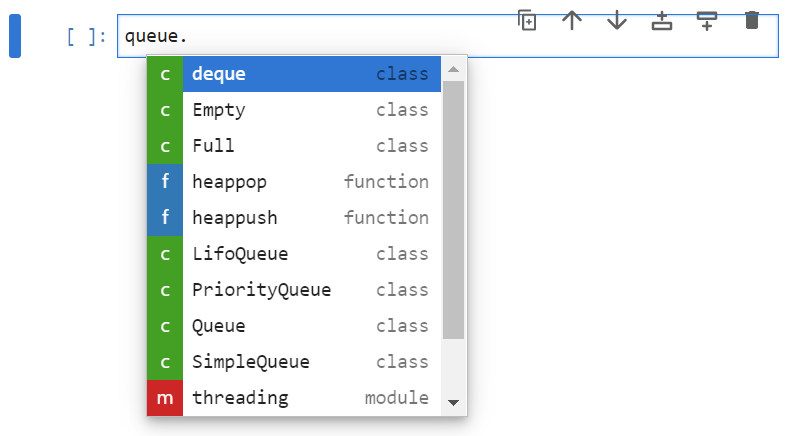

## SimpleQueue Class

As the number of identifiers in the module are quite small, they are normally imported directly. For example the ```SimpleQueue``` class can be imported using:

```
from queue import SimpleQueue
```

Its docstring can be seen by inputting the class name, followed by open parenthesis and pressing shift ```⇧``` and tab ```↹```:


The docstring states that is a simple, unbounded, reentrant first in first out (FIFO) queue and has no input arguments

It can be conceptualised as a queue for a venue:


```
venue_queue = SimpleQueue()
```

A list of identifiers can be viewed by inputting ```venue_queue.``` followed by a tab ```↹```:


Long before the venue is opened the ```venue_queue``` should be empty, this can be checked by using the method empty which returns a boolean value that is ```True``` if the queue is empty:

```
venue_queue.empty()
```

The method ```qsize``` returns the size of the queue and this should be ```0``` when the ```venue_queue``` is empty:

```
venue_queue.qsize()
```

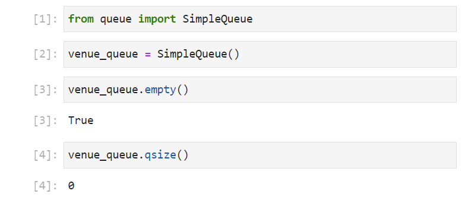

10 minutes before the venue opens, some early birds might arrive and join the queue. Items can be put in the queue using the ```put``` method which takes in an item as a positional input argument:


```"Lucie"``` can be put in the venue queue, followed by ```"Martin"``` and ```"Pavel"```. The queue is now not empty and the queue size is 3:

```
venue_queue.put("Lucie")
venue_queue.put("Martin")
venue_queue.put("Pavel")
venue_queue.empty()
venue_queue.qsize()
```

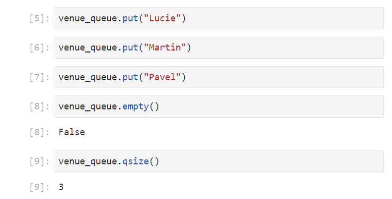

When the venue opens, the venue staff can get the first person standing in the queue using the ```get``` method:


Now that ```"Lucie"``` is in the venue, the queue is still not empty as there are another 2 people waiting in the queue ```"Martin"``` and ```"Pavel"```:

```
venue_queue.get()
venue_queue.empty()
venue_queue.qsize()
```


If in the meantime another two people join the queue, ```"Jess"``` and ```"Sam"```. The queue size will not be empty and will have a size of 4:

```
venue_queue.put("Jess")
venue_queue.put("Sam")
venue_queue.empty()
venue_queue.qsize()
```

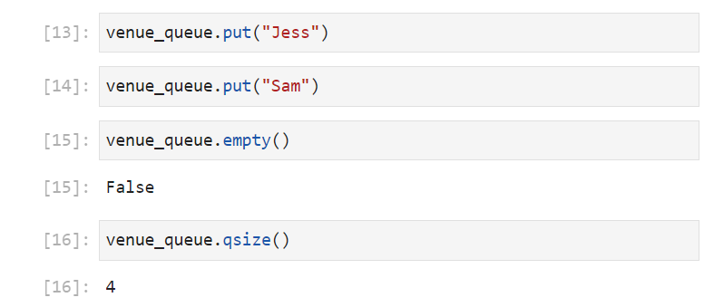

Now that the venue staff are fully prepared they can let everyone in, the queue is now empty with a size of 0:

```
venue_queue.get()
venue_queue.get()
venue_queue.get()
venue_queue.get()
venue_queue.empty()
venue_queue.qsize()
```


If the staff attempt to ```get``` someone else in, while the queue is empty, they end up waiting in an infinite loop:

```
venue_queue.get()
```


And when the venue uses a single thread on a processor for putting people in a line and getting people from the line, the infinite loop holds the venue up and people joining the queue cannot enter the venue, because the venue staff are busy:

```
venue_queue.get()
venue_queue.put("Amy")
```


For this reason there is a ```get_nowait``` method which behaves like ```get``` but return an error message from the error class ```Empty``` if there is no-one in the queue, equivalent of the venues manager shouting at the employee to get back to work when they get stuck in an infinite loop. There is also an equivalent ```put_nowait```:


```
from queue import SimpleQueue
venue_queue = SimpleQueue()
venue_queue.put_nowait("Lucie")
venue_queue.put_nowait("Martin")
venue_queue.put_nowait("Pavel")
venue_queue.get_nowait()
venue_queue.put_nowait("Jess")
venue_queue.put_nowait("Sam")
venue_queue.get_nowait()
venue_queue.get_nowait()
venue_queue.get_nowait()
venue_queue.get_nowait()
venue_queue.get_nowait()
```


## Queue Class

The ```Queue``` class behaves similarly to the ```SimpleQueue``` class. It can be imported using:

```
from queue import Queue
```

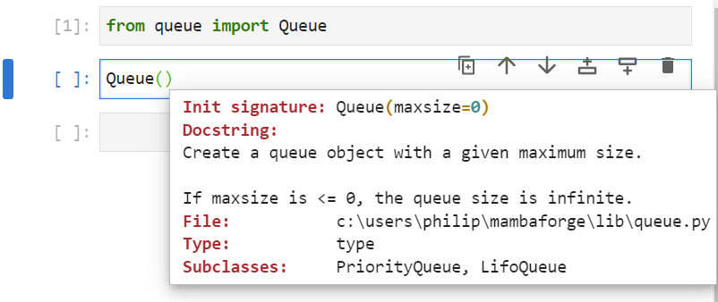

The ```Queue``` class has a single keyword input argument ```maxsize``` which is set to ```0``` by default and therefore behaves like a ```SimpleQueue``` as default. It can be overridden to specify a maximum queue size. For example it can be assigned to ```5```:

```
from queue import Queue
venue_queue = Queue(maxsize=5)
```


Now that ```venue_queue``` is a ```Queue``` instance opposed to a ```SimpleQueue``` instance, more identifiers are available:


The attribute ```queue``` displays what the queue looks like and the attribute  ```maxsize``` displays the maximum size of the queue. 

```
from queue import Queue
venue_queue = Queue(maxsize=5)
venue_queue.queue
venue_queue.maxsize
venue_queue.not_empty
venue_queue.not_full
```

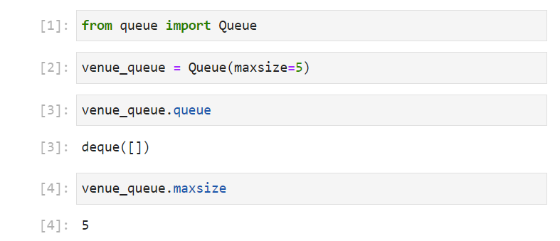

The instances ```all_tasks_done```, ```not_empty```, ```not_full```, ```mutex```, ```unfinished_tasks``` and the methods ```task_done``` and ```join``` are related to threading and won't be covered here.

The ```Queue``` can be used in a similar manner to the ```SimpleQueue``` and objects can be put in the queue using the ```put``` method. It can be visualised using the attribute ```queue``` and the maximum size of the queue can be checked using the attribute ```maxsize```:

```
from queue import Queue
venue_queue = Queue(maxsize=5)
venue_queue.put("Lucie")
venue_queue.put("Martin")
venue_queue.put("Pavel")
venue_queue.put("Jess")
venue_queue.put("Sam")
venue_queue.queue
venue_queue.maxsize
```

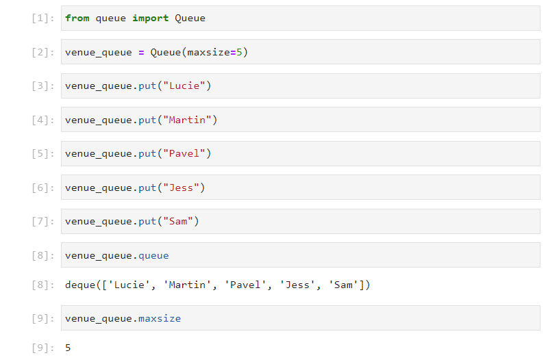

Since, there are five objects in the queue, and the maximum size is 5, the queue is full. This can be checked using:

```
venue_queue.full()
```

If another object is ```put``` in the queue, because the queue is full, they end up waiting outside the queue in an infinite loop:

```
venue_queue.put("Luke")
```


For this reason, there is ```put_nowait``` which bahaves like ```put``` but displays and error message when the queue is full (equivalent of the doorman at a nightclub telling people to go elsewhere if the queue is too long):

```
from queue import Queue
venue_queue = Queue(maxsize=5)
venue_queue.put_nowait("Lucie")
venue_queue.put_nowait("Martin")
venue_queue.put_nowait("Pavel")
venue_queue.put_nowait("Jess")
venue_queue.put_nowait("Sam")
venue_queue.queue
venue_queue.maxsize
venue_queue.put_nowait("Luke")
```

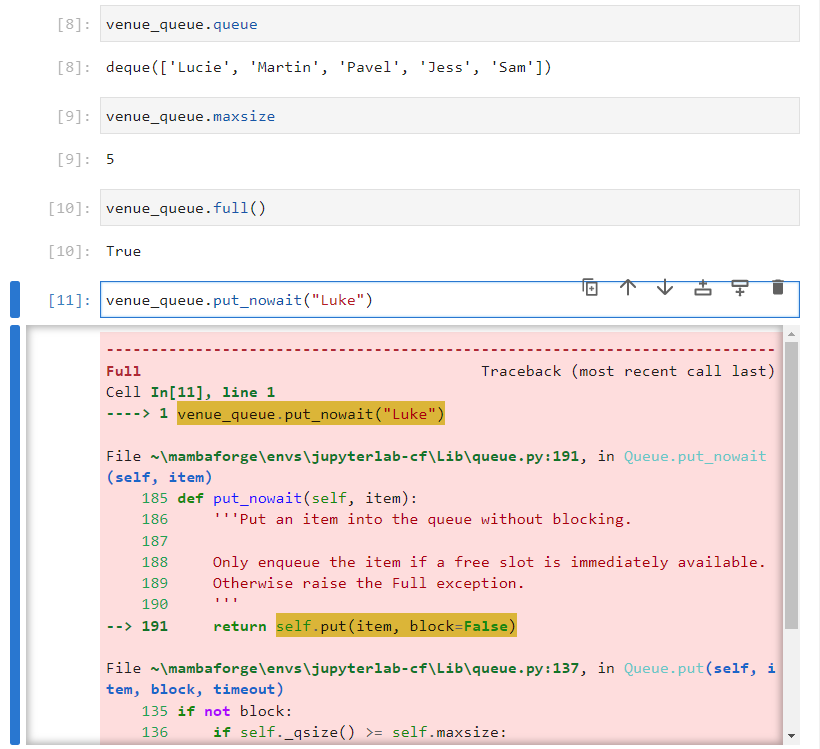

## PriorityQueue Class

A ```PriorityQueue``` is similar to a ```Queue```, except objects are given a priority when placed in the queue. It can be imported using:

```
from queue import PriorityQueue
```

The ```PriorityQueue``` class has a single keyword input argument ```maxsize``` which behaves in the same way as ```Queue```:


The ```venue_queue``` is now a ```PriorityQueue``` instance. The idenfiiers are very simular to the ```Queue``` class:

```
from queue import PriorityQueue
venue_queue = PriorityQueue(maxsize=10)
```

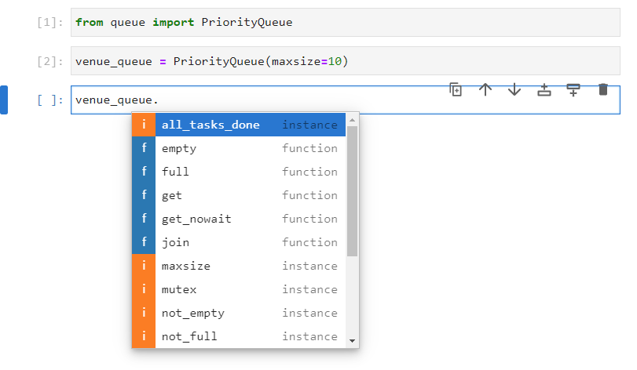

The ```put``` and ```put_nowait``` method normally take an ```item``` as an input argument for ```SimpleQueue``` and ```Queue```. In the case of ```PriorityQueue```, this item is a tuple where the first element is an integer value corresponding priority and the second element is the item:

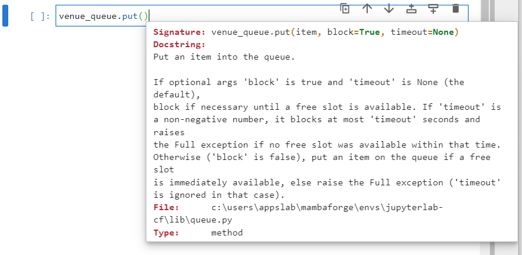

This concept of priority is similar to airlines where passengers who pay the most can get to the front of the queue. The integer value priority can be thought of being inversely proportional to the price the passenger paid and the lower relative priority value a passenger gets, the closer to the front of the queue the passenger is. For example if ```"Lucie"``` bought a budget ticket, she could be issued a priority of ```10```. If  ```"Martin"``` bought an economy ticket, he could be issued a priority of ```5```. If ```"Pavel"``` bought a premium ticket, he could be issued with a priority of ```1```. The airline will ask all of those with a priority value of ```1``` to step forward first, then those with a priority of ```5``` and then those with a priority of ```10```:

```
from queue import PriorityQueue
venue_queue = PriorityQueue(maxsize=10)
venue_queue.put((10, "Lucie"))
venue_queue.put((5, "Martin"))
venue_queue.put((1, "Pavel"))
venue_queue.queue
```

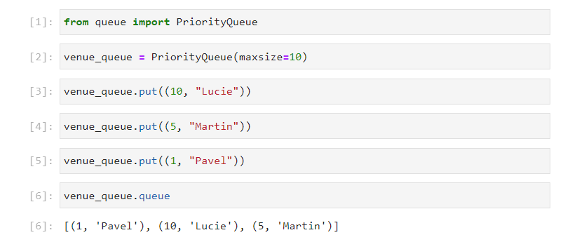

The attribute ```queue``` displays a list of tuples. These have been reordered by the first index but unfortunately not reordered correctly using the order ```1```, ```10```, ```5```. However the ```get``` method will return the item ```(1, "Pavel")```, ```(5, "Martin")``` and then ```(10, "Lucie")``` as expected:

```
venue_queue.queue
venue_queue.get()
venue_queue.queue
venue_queue.get()
venue_queue.queue
venue_queue.get()
```

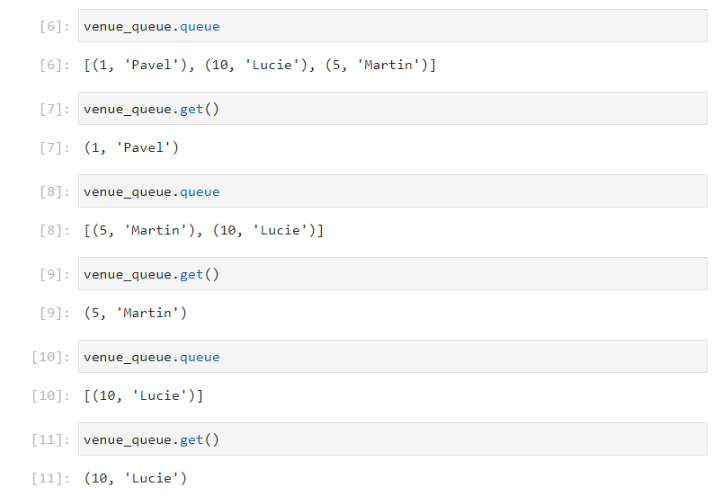

## LifoQueue Class

The Last in first out (Lifo) Queue can conceptuually be imagined as a priority where the last item joining the queue is always given the lowest priority value, so is the first item retrieved. A last in first out queue, is also known in other programming languages as a stack. It can help to conceptualise this stack, as a stack of gymnasts. The first gymnast is at the bottom and supports the second gymnast. The second gymnast supports the third gymnast and the third gymnast supports the fourth gymnast. The first gymnast cannot leave the stack until the fourth gymnast, third gymnast and second gymnast has left as if he leaves the entire stack will collapse.

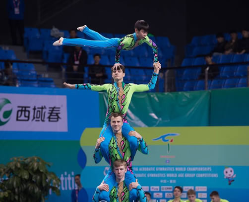

The ```LifoQueue``` can be imported using:

```
from queue import LifoQueue
```

The ```LifoQueue``` class has a single keyword input argument ```maxsize``` which behaves in the same way as ```Queue``` and ```PriorityQueue```:


The gymnast stack can be created using:

```
from queue import LifoQueue
gymnast_stack = LifoQueue(maxsize=4)
```


The identifiers for the ```gymnast_stack``` from the ```LifoQueue``` are very similar to those from ```Queue``` and ```PriorityQueue```:


The first gymnast ```"Tom"``` can form the base of the stack, then ```"Matthew"```, ```"David"``` and ```"Mike"```:

```
from queue import LifoQueue
gymnast_stack = LifoQueue(maxsize=4)
gymnast_stack.put("Tom")
gymnast_stack.put("Matthew")
gymnast_stack.put("David")
gymnast_stack.put("Mike")
gymnast_stack.queue
```


Now to get the gymnasts from the stack, the ```get``` method can be used to retrieve the gymnast at the top of the stack first:

```
gymnast_stack.queue
gymnast_stack.get()
gymnast_stack.get()
gymnast_stack.get()
gymnast_stack.get()
```


Return to:
[Home](../../../)
