# Collections

The collections module contains some additional collections which supplement Pythons inbuilt collections. It can be imported using:

```
import collections
```

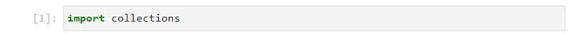

An overview of the module can be viewed by inputting:

```
? collections
```

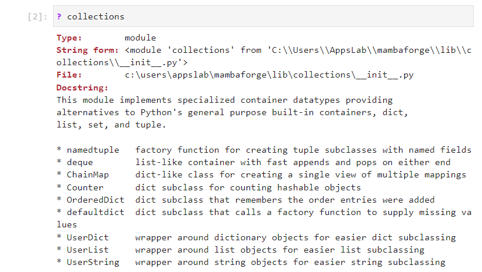

This module implements specialized container datatypes providing
alternatives to Python's general purpose built-in containers, ```dict```,
```list```, ```set```, and ```tuple```.

|identifier|decription|
|---|---|
|namedtuple|factory function for creating tuple subclasses with named fields|
|deque|list-like container with fast appends and pops on either end|
|ChainMap|dict-like class for creating a single view of multiple mappings|
|Counter|dict subclass for counting hashable objects|
|OrderedDict|dict subclass that remembers the order entries were added|
|defaultdict|dict subclass that calls a factory function to supply missing values|
|UserDict|wrapper around dictionary objects for easier dict subclassing|
|UserList|wrapper around list objects for easier list subclassing|
|UserString|wrapper around string objects for easier string subclassing|

Most of the identifiers above are classes and are therefore appropriatedly named using ```PascalCaseCapitalisation```. The  ```deque``` and ```defaultdict``` were originally intended to be incorporated into Pythons ```builtins``` alongside ```dict```,
```list```, ```set```, and ```tuple``` and therefore follow the naming conventions for built in classes i.e. all lower case. The ```namedtuple``` is a factory function used to create a custom subclass that the user names using ```PascalCaseCapitalization```.

## namedtuple

Since there are only a small number of items in the module, each item is normally imported directly opposed to being access from the module:

```
from collections import namedtuple
```

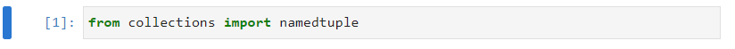

To view the docstring of the ```namedtuple``` factory function input the function name with open parenthesis followed by Shift ```⇧```  + Tab ```↹```:

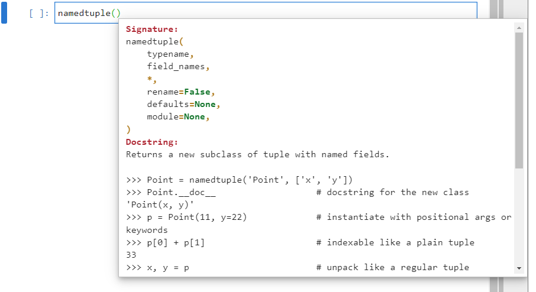

The ```namedtuple``` factory function essentially creates a tuple subclass where each index of the tuple is also associated with a named attribute. The first positional input argument ```TypeName``` is the name of the tuple subclass in the form of a string. Because it is a subclass name ```TypeName``` is typically ```PascalCaseCapitalised```. The assignment operator has to be assigned to a new object that is a class. This tuple subclass name usually matches the string provided in ```TypeName``` however assignment should be made to an object name and not a string. 

The second positional input argument field names is a list of strings and each string will be the name of the field for the named tuple. The strings are usually lower case and without special characters with exception to the underscore, following Pythons rules for variable names. It is possible to also provide one string with commas seperating the field names.

For example a date can be created using:

```
Date = namedtuple("Date", ["day", "month", "year"])
```


When the new subclass ```Date()``` is input followed by Shift ```⇧```  + Tab ```↹```, the docstring of the subclasses ```__init__``` signature shows. The named tuple fields are requested as input arguments:

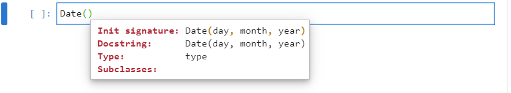

A new instance can be created by providing values to all of these input arguments and assigning it to an object name (usually lower case for an instance). This allows an instance to be created using both UK and US date formats:

```
today = Date(day=22, month=11, year=2022)
today
tomorrow = Date(month=11, day=23, year=2022)
tomorrow
```

Notice that the representation of the named tuple shown in the cell output, makes it clear what field is the day, month and year. This would be unclear if a standard tuple was used and confusion would be brought about if both UK and US date formats were used:


The object name of the instance can be input followed by a dot ```.``` and ```↹``` to view the list of attributes. Each field in the namedtuple displays.

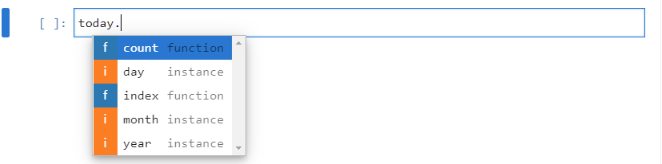

```
today.day
today.month
today.year
```


The methods ```count``` and ```index``` are inherited from the tuple class. All the methods in both the ```tuple``` and ```namedtuple``` reflect that these collections are immutable and therefore return a value and do not mutate the collection. Like in the case of a ```tuple```, ```index``` has an optional argument start which can be used to specify the index where to begin the search from:

```
nov11 = Date(month=11, day=11, year=2022)
nov11.index(11)
nov11.count(11)
nov11.index(11, 1)
```
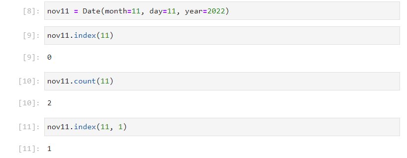

The ```type``` of an instance of the named tuple subclass corresponds to the ```TypeName``` provided in the factory function of ```namedtuple```. This normally matches the name of the class created:

```
Date = namedtuple("Date", ["day", "month", "year"])
today = Date(day=22, month=11, year=2022)
today
type(today)
```

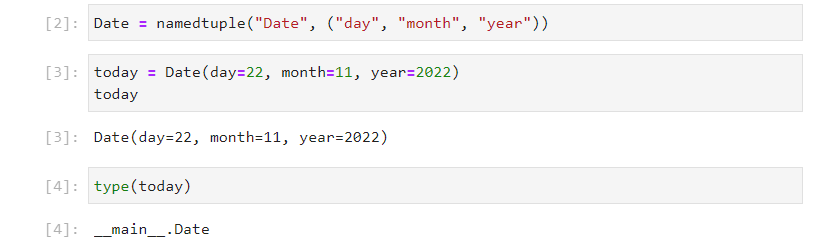

These can differ but it may lead to confusion:

```
Date = namedtuple("Hello", ["day", "month", "year"])
today = Date(day=22, month=11, year=2022)
today
type(today)
```

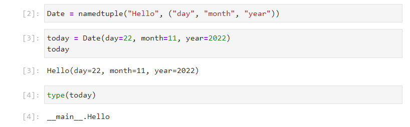

The field names can be supplied as a single string with spaces.

```
Date = namedtuple("Date", "day month year")
```

The ```namedtuple``` factory function will essentially apply the string split method on the supplied string creating a list of field names:

```
"day month year".split()
```

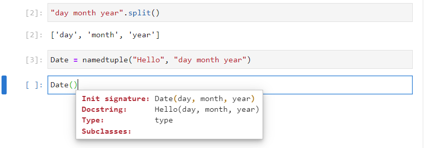

This will also work with a single string with commas and spaces:

```
Date = namedtuple("Date", "day, month, year")
```

Once again itnernally the string split method is automatically applied:

```
"day month year".split(", ")
```

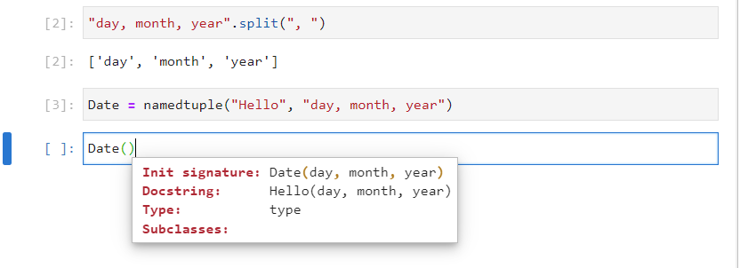

It is possible to instantiate the ```namedtuple``` subclass by providing a dictionary, where each key in the dictionary is the name of an input argument in the dictionary:

```
tomorrow_d = {"day": 22, "month": 11, "year": 2022}
tomorrow = Date(**tomorrow_d)
tomorrow
```

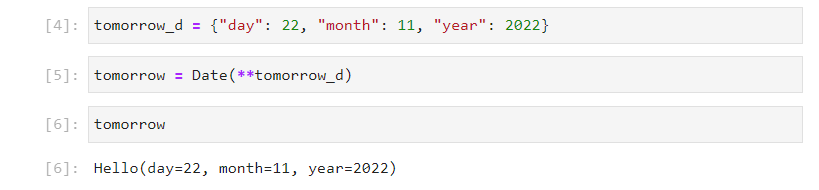

The keyword input argument ```rename``` in the factory function ```namedtuple``` can be assigned to a boolean value. When assigned to ```True```, fields will be renamed if an invalid name is provided. When set to ```False``` an error will inStead be displayed:

```
Date = namedtuple("Date", ("_day", "month", "ye ar"), rename=False)
Date = namedtuple("Date", ("_day", "month", "ye ar"), rename=True)
```

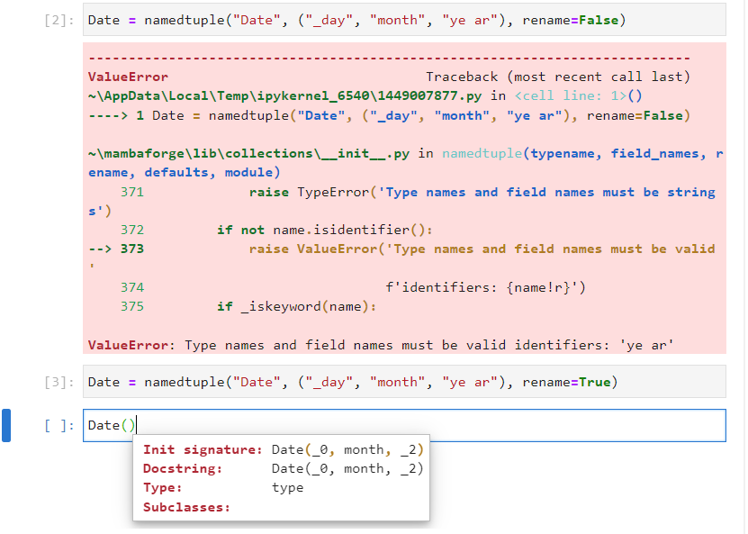

The factory function ```namedtuple``` has a keyword input argument ```defaults``` which can be assigned to a list that has a value for each field name. For example:

```
from collections import namedtuple
Date = namedtuple("Date", ["day", "month", "year"], defaults=[1, 1, 2000])
```

Now when ```Date()``` is input followed by shift ```⇧``` and tab ```↹```, the names of the fields followed by their default values displays:

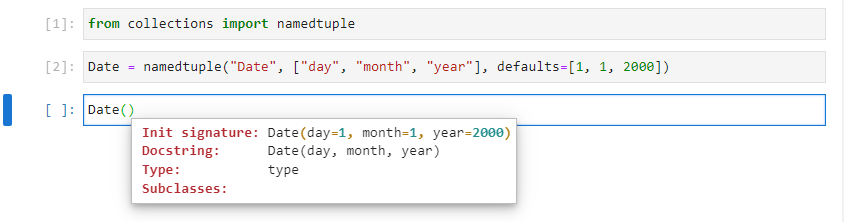

The docstring looks like a class which has keyword input arguments and behaves in a similar manner:

```
Date = Date()
Date = Date(year=2000)
```

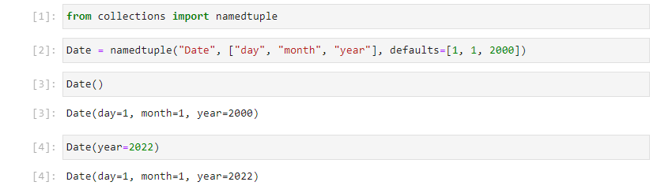

If the directory of an instance is examined, there are a handful of useful internal attributes:

```
from collections import namedtuple
Date = namedtuple("Date", ["day", "month", "year"], defaults=[1, 1, 2000])
today = Date(day=10, month=12, year=2022)
dir(today)
```

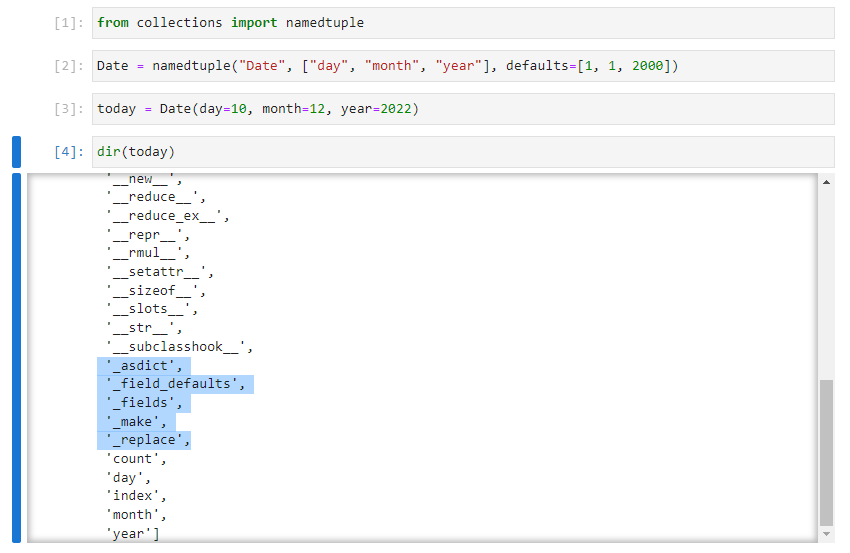

A number of useful internal identifiers display such as the attributes ```_fields```, ```_field_defaults``` and methods ```_asdict```, ```_make``` and ```_replace```. The ```_fields``` attribute returns a tuple of field names. The ```_field_defaults``` returns a dictionary where the keys are the field names and the values are the default values. The ```_asdict``` method returns a dictionary where the keys are the field names and the values are the current values. The method ```_make``` creates a new instance of the ```Date``` class and requires a tuple of input arguments corresponding to the field names. The ```_replace``` method returns a new instance and one or more of the fields can be provided as an input argument assigned to a new value.


```
today._fields
today._field_defaults
today._asdict()
today._make((1, 2, 2023))
today._replace(month=1)
```

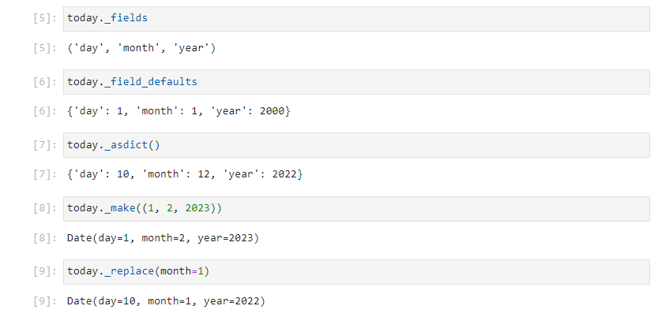

## deque

A list can be conceptualised as a queue and an emphasis is made on the end of the queue. The list methods ```append```, ```extend``` and ```pop``` operate on the last item in the queue. When the list is viewed horizontally. For example:

```
fruits = ["apples", "bananas", "grapes"]
```

These methods all occur on the last item which is to the right hand side:


The doubly ended queue known as a ```deque``` can be imported from the collections module. As an input argument, it takes an iterable which can be for example a list:

```
from collections import deque
```

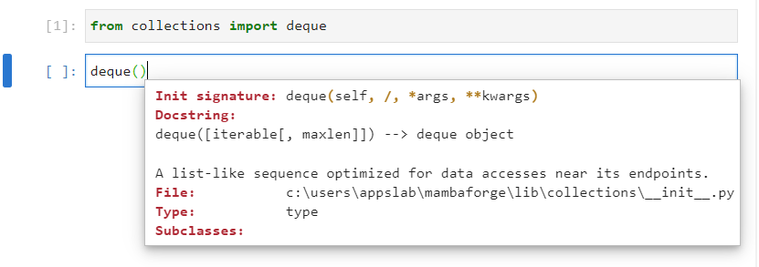

The ```deque``` has additional methods ```appendleft```, ```extendleft``` and ```popleft``` which also allow focus on the first item in a list. Once again when the doubly ended queue is viewed horizontally, these methods occur to the left of the ```deque```:

```
fruits = deque(["apples", "bananas", "grapes"])
```
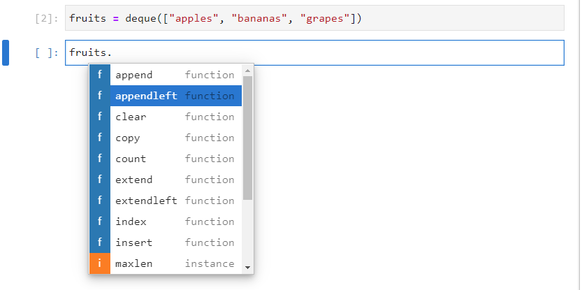

The ```deque``` also has the method ```rotate``` which can be used to rotate the ```deque``` inplace left or right (right by 1 is the default):

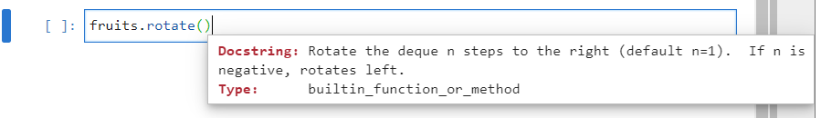

For example using takes the last item ```grapes``` and places it at the fronto of the ```deque```. All other items are shifted one index to the right:

```
fruits = deque(["apples", "bananas", "grapes"])
fruits.rotate()
fruits
```

Usings an input argument of ```2``` will take the last two items ```"apples"``` and ```"bananas"``` and shift them to the font. The other remaining items in this case only ```"grapes"``` is shifted two indexes to the right:. this will restore the original ```deque```:

```
fruits.rotate(2)
fruits
```

Usings an input argument of ```-1``` will take the first item and place it at the back. All other remainin items are shifted by 1 index to the left (or -1 indexes to the left):

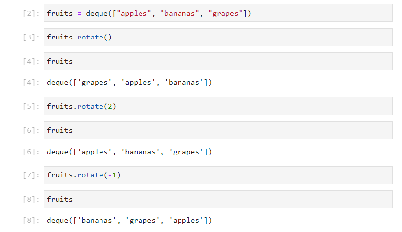

The ```deque``` has an optional input argument ```maxlen``` which can be used to configure the maximum size of the ```deque```. A ```deque``` instance ```fruits``` can be created with 3 values and a ```maxlen=5```:

```
from collections import deque
fruits = deque(["apples", "bananas", "grapes"], maxlen=5)
```

The append method can be used to add two more fruits ```"pears"``` and ```"oranges"``` to the right hand side (end) of the double ended queue:

```
fruits.append("pears")
fruits
fruits.append("oranges")
fruits
```

The length of the ```deque``` is now seen to be 5, the maximum length. If another ```fruit``` is appended to the end (right hand side) such as ```"mangos"```, then the first item in the doubly ended queue (left hand side) which was ```"apples"``` is ejected and ```fruits``` maintains its maximum length:

```
fruits.append("mangos")
fruits
```

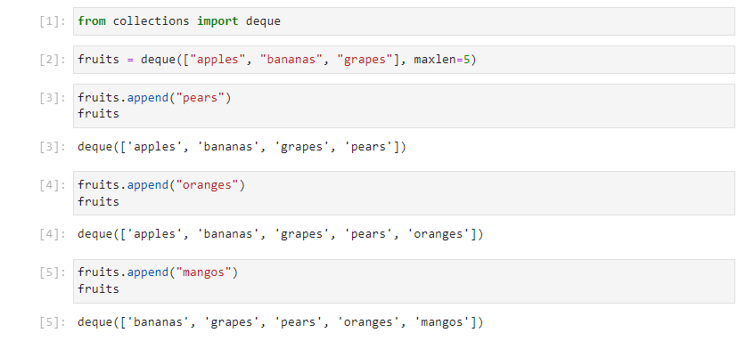

```leftappend``` treats the front of the doubly ended queue as the right hand side and the back of the doubly ended queue as the left hand side. If the queue is at its maximum length and ```leftappend``` is used, the item that was first (to the furthest right) is ejected and ```fruits```  once again maintains its maximum length:

```
from collections import deque
fruits = deque(["apples", "bananas", "grapes"], maxlen=5)
fruits.appendleft("pears")
fruits
fruits.appendleft("oranges")
fruits
fruits.appendleft("mangos")
fruits
```

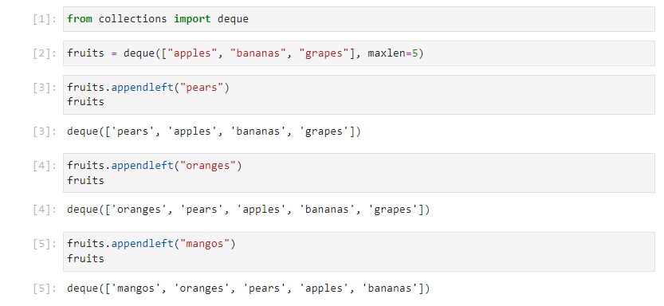

## defaultdict

A traditional Python dictionary:

```
fruits = {"apples": 2, "bananas": 3, "grapes": 4}
```

Raise a ```KeyError``` if a key does not exist:

```
fruits["oranges"]
```

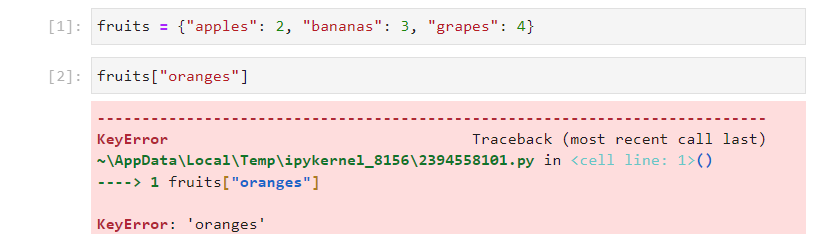

The ```defaultdict``` is very similar to a Python dictionary except creates a key when a key does not exist is attempted to be accessed:

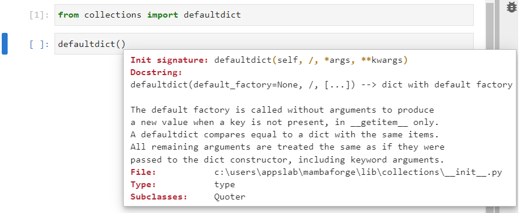

If the dictionary ```setdefault``` method is used before accessing the key:

```
fruits.setdefault("oranges")
fruits.setdefault("apples")
```

because the key ```oranges``` doesn't previously exist, it is assigned to a default value of ```None``` and because ```"apples"``` does previously exist, its default value of ```2``` is shown:

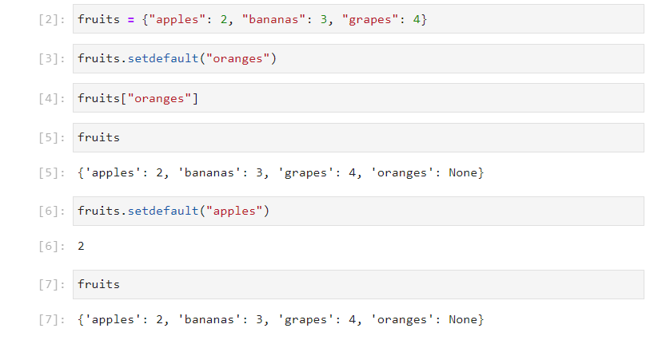

Now the key ```"oranges"``` can be used without an ```KeyError"```:

```
fruits["oranges"]
```

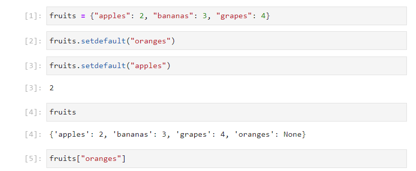

A ```defaultdict``` is essentially a dictionary that is configured to automatically invoke an equivalent ```default_factory``` method which behaves similar to ```set_default``` when a key isn't available before accessing a key. 

Once again it is imported from the collections module:

```
from collections import defaultdict
```

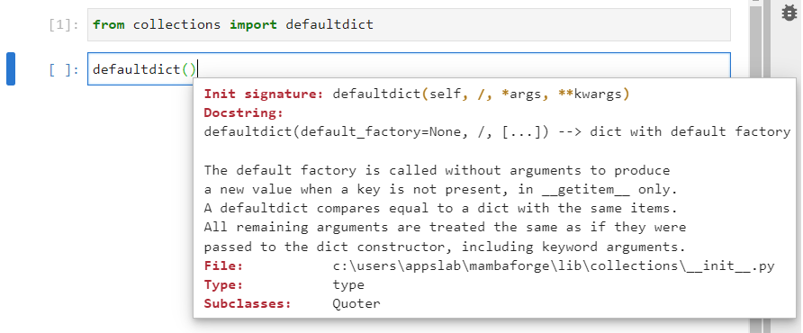

The first input argument is the ```default_factory``` and this has a default value of ```None```. The second keyword input argument is a dictionary of initial values, although can be left blank for an initial empty ```defaultdict```. When ```default_factory``` is set to ```None```, the ```defaultdict``` behaves identically to a standard dictionary and raises a ```keyError``` when an unknown key is attempted to be accessed:

```
fruits = defaultdict(None, {"apples": 2, "bananas": 3, "grapes": 4})
fruits
fruits["apples"]
fruits["oranges"]
```

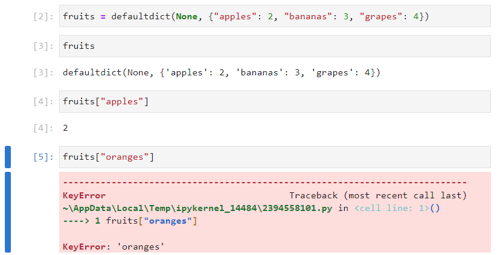

If the ```default_factory``` is set to ```int```, the value is assigned to ```0``` and the ```defaultdict``` behaves in a similar manner to a ```Counter```:

```
fruits = defaultdict(int {"apples": 2, "bananas": 3, "grapes": 4})
fruits
fruits["apples"]
fruits["oranges"]
```

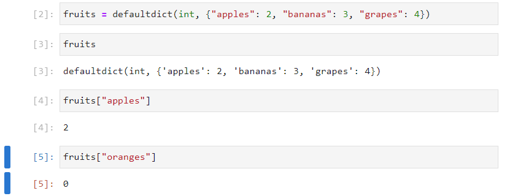

If the ```default_factory``` is set to ```str```, the value is assigned to ```""``` and the ```defaultdict``` gives an empty string:


```
colors = defaultdict(str, {"r": "red", "g": "green", "b": "blue"})
colors
colors["r"]
colors["k"]
```

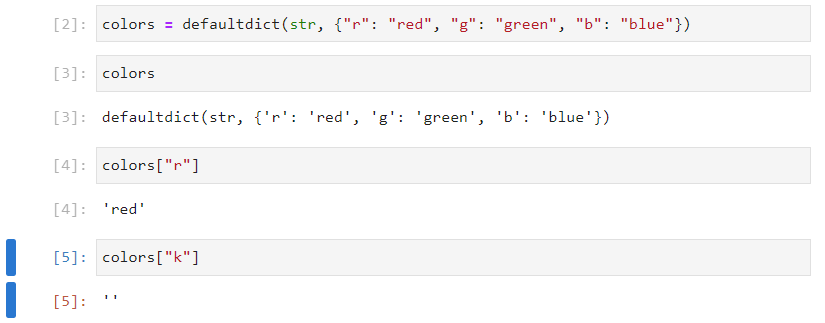

If the ```default_factory``` is set to ```list```, the value is assigned to ```[]``` and the ```defaultdict``` gives an empty list:

```
colors = defaultdict(list, {"r": [1, 0, 0], "g": [0, 1, 0], "b": [0, 0, 1]})
colors
colors["r"]
colors["k"]
```

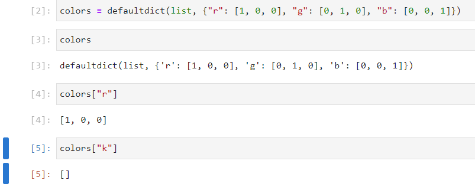

In this case it may be more appropriate for the default value to be ```[0, 0, 0]```. This can be achieved by using a lambda expression:

```
colors = defaultdict(lambda : [0, 0, 0], {"r": [1, 0, 0], "g": [0, 1, 0], "b": [0, 0, 1]})
colors
colors["r"]
colors["k"]
```

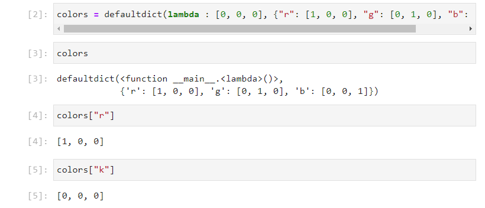

Recall that a lambda expression is a one line command and the ```lambda``` keyword is a synonym for make function. The colon ```:``` is used to split input arguments from the return statement. In this case there are no input arguments and ```[0, 0, 0]``` is always returned.

## Counter

The following list contains strings of colors and some of these colors are duplicated:

```
colors = ["red", "red", "green", "green", "yellow", "yellow", "blue", "red"]
```

It takes a few lines of code to create a dictionary of counts from inbuilt collections.

Typically the list is cast to a set to get unique values:

```
unique_colors = set(colors)
unique_colors
```

Then dictionary comprehension can be used to create a dictionary with keys corresponding to the names of the colors and values corresponding to their count:

```
color_count = {color: colors.count(color) for color in unique_colors}
color_count
```

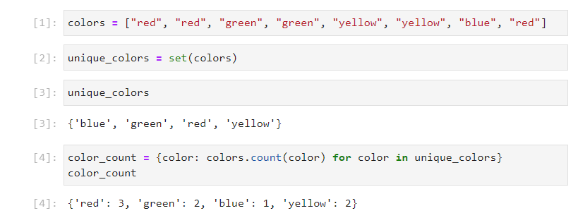

The ```Counter``` is a collection which does this behaviour automatically:

```
from collections import Counter
```

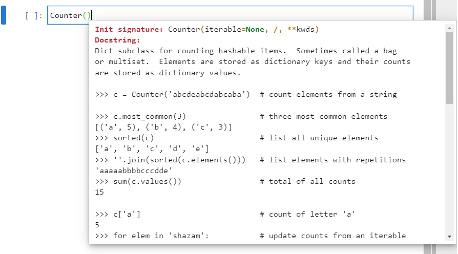

The ```Counter``` takes the list with repeated values and returns a dictionary with keys corresponding to the unique items in the list and values corresponding to their respective count:

```
colors = ["red", "red", "green", "green", "yellow", "yellow", "blue", "red"]
color_count = Counter(colors)
color_count
```

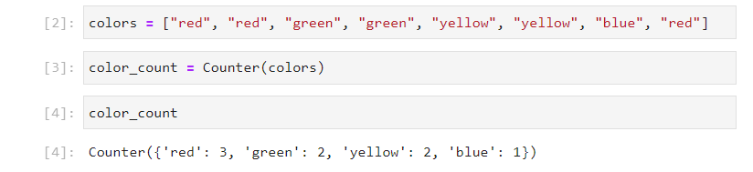

Since the values in a counter instance are always going to be numeric. The numeric in place operators such as ```+=```, ```-=```, ```*=``` can be used with the counter instance to update the value in place. For example:

```
color_count["red"] += 1
color_count
```


Since, the ```Counter``` class is a subclass of the dictionary class. A counter instance can access all the dictionary identifiers. There are some additional methods available:


The method ```most_common``` can be used to access the most common items in the counter instance. It has an optional input argument ```n``` which can be used to optionaly specify how many items to list:

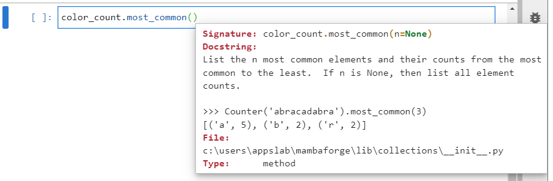

```
color_count.most_common()
```

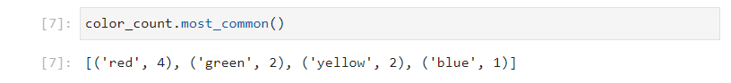

The dictionary method ```update``` has added functionality in the ```Counter``` subclass. It takes in a list of keys in the form of strings and will ```update``` the value of any existing keys in the dictionary by ```+1``` and initialise any new keys to a value of ```1```. The complementary method ```substract``` will instead decrement the value of any existing key by ```-1``` and initialise any new keys to ```-1```:

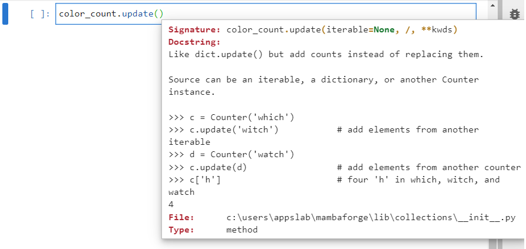

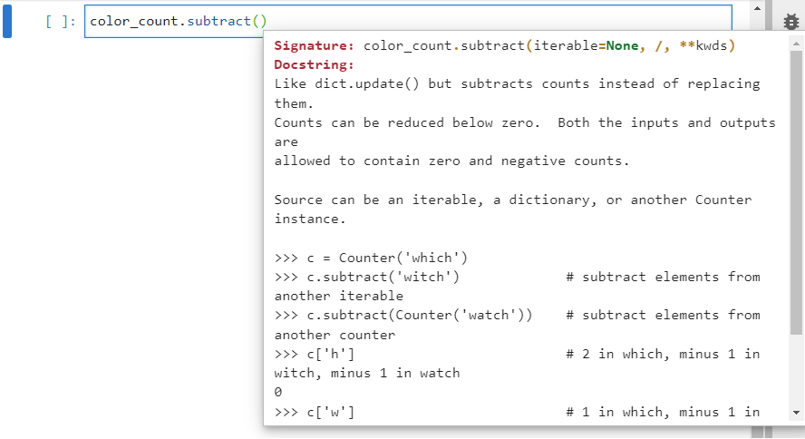

This can be tested with the following lists:

```
color_count
color_count.update(["red", "cyan", "yellow", "magenta"])
color_count
color_count.subtract(["cyan", "black"])
color_count
```

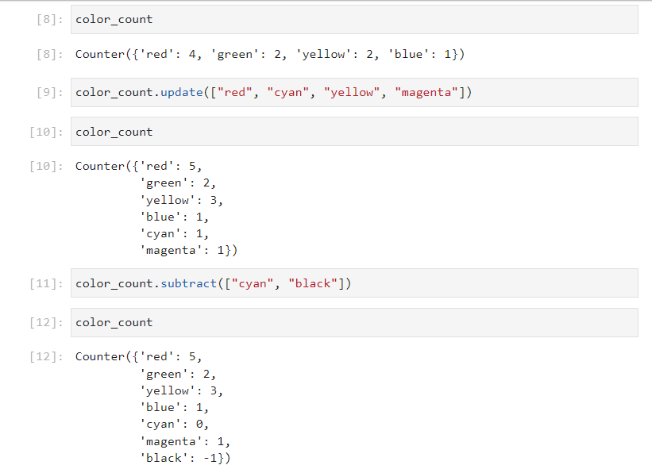

These methods can also be used with dictionaries:

```
color_count
color_count.update({"red": 5, "cyan": 2, "white": 3})
color_count

```

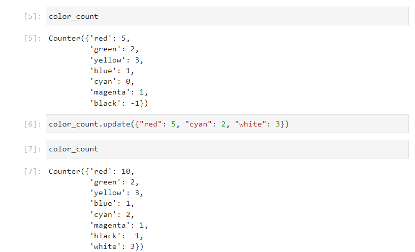

## OrderedDict

An ```OrderedDict``` was a counterpart to a standard dictionary in Python 3.5 or earlier which was unordered. The lack of order had a consequence for example, when it came to looping over a dictionary. 

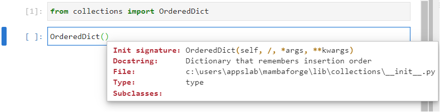

In Python 3.6 and later, the standard dictionary is now ordered and remembers the order that items were inserted:

```
fruits = {"bananas": 3, "apples": 2, "grapes": 4}
fruits

for fruit in fruits:
    print(fruit)
```

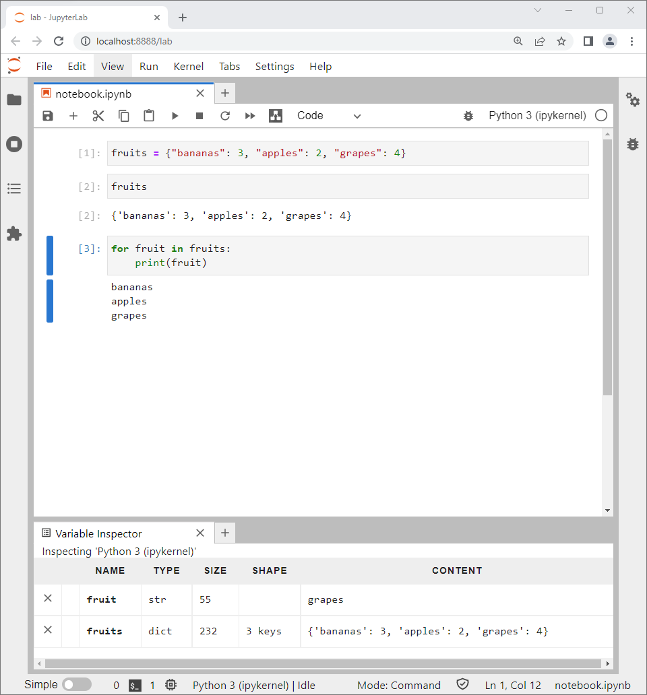

This largely makes the seperate collection ```OrderedDict``` redundant. 

```
from collections import OrderedDict
fruits = OrderedDict({"bananas": 3, "apples": 2, "grapes": 4})
fruits
```

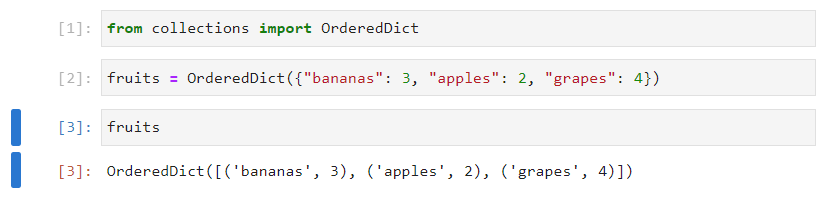

The ```OrderedDict``` does however have one additional method ot found in a regular dictionary. The ```move_to_end``` method:

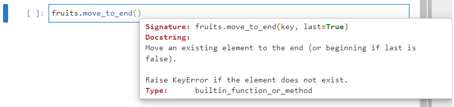

```
fruits.move_to_end("apples")
fruits
```

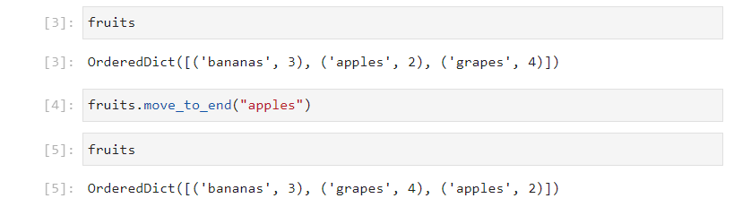

## ChainMap

The ```ChainMap``` class can be used to comibe multiple mappable objects such as dictioanries together:

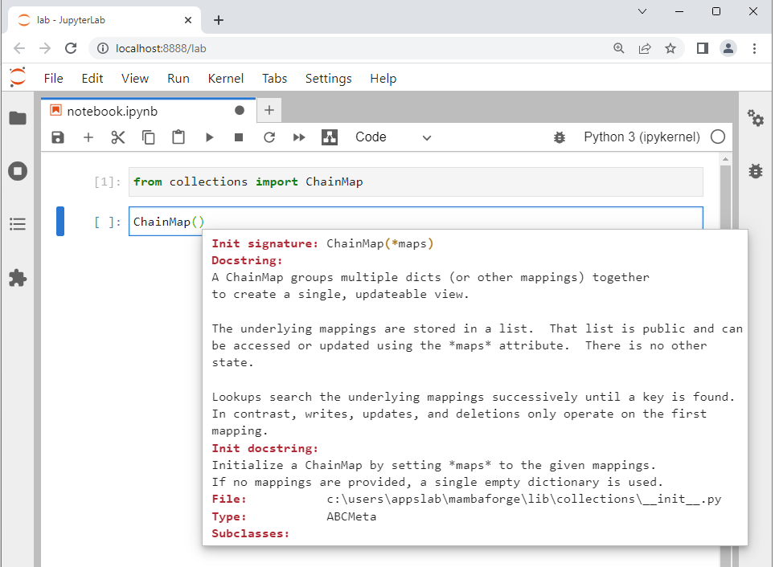

```
colors1 = {"r": "red", "g": "green", "b": "blue"}
colors2 = {"y": "yellow", "c": "cyan", "m": "magenta"}
ChainMap(colors1, colors2)
```

The ```ChainMap``` instance effectively creates a data structure which has extended the dictionary provided in the first input argument by any other dictionaries:

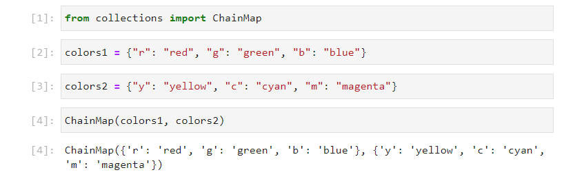

This extended dictionary known as a chainmap instance can be assigned to a variable name and can be interacted with like a standard dictionary:

```
colors = ChainMap(colors1, colors2)


for color in colors:
    print(color)

```    

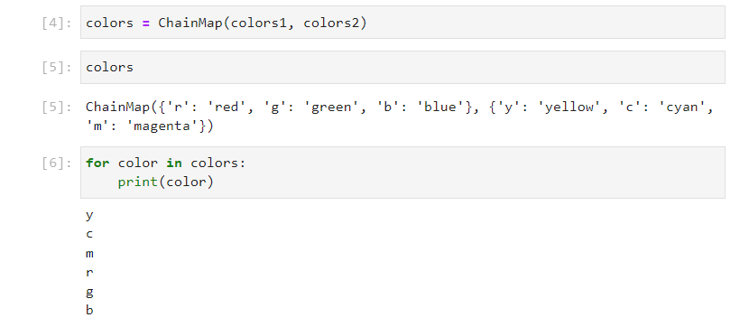

The chainmap object also has all of the dictionary methods:

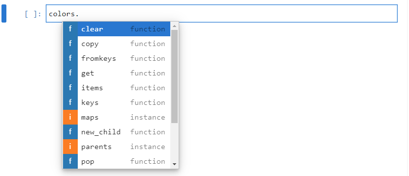

Notice that when these methods are applied, that they update the first dictionary:

```
colors.update({"k": "black"})
colors
```

This update can be seen by looking at the two original dictionaries:

```
colors1
colors2
```

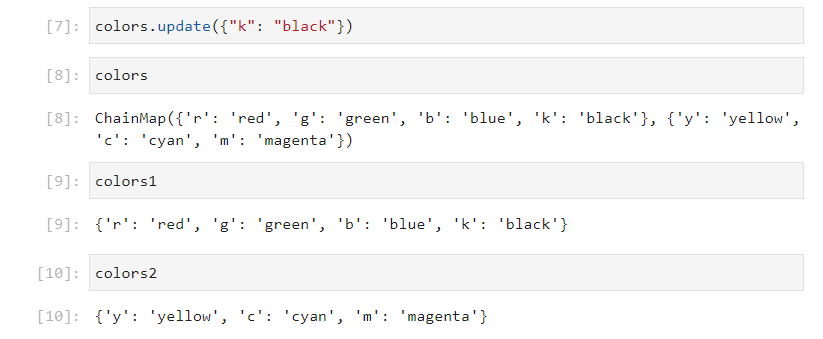

## UserString, UserList, UserDict

The collections ```UserString```, ```UserList``` and ```UserDict``` are essentially identical to the inbuilt collections ```str``` ```list``` and ```dict```. An instance of each of these can be created using the following:

```
from collections import UserString, UserList, UserDict
greeting = UserString("Hello")
fruits = UserList(["apples", "bananas", "grapes"])
colors = UserDict({"r": "red", "g": "green", "b": "blue"})
```

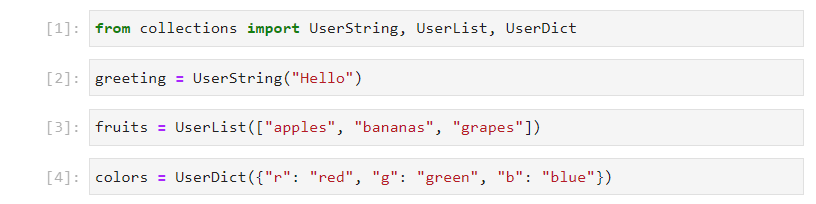

Notice that the instance ```greeting``` esentially has all of the string identifiers:

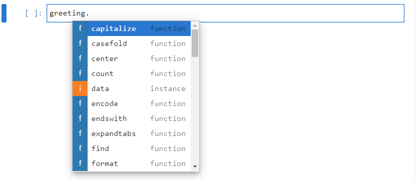

Notice that the instance ```fruits``` esentially has all of the list identifiers:

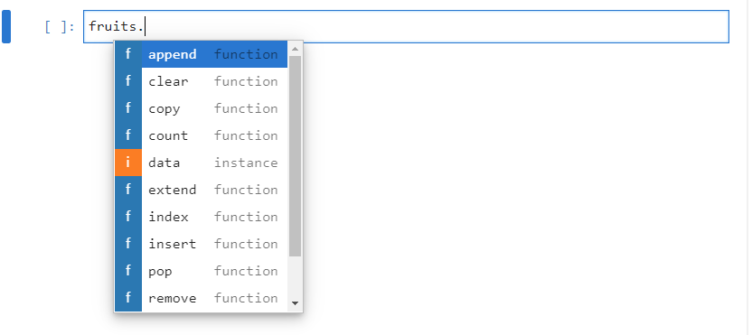

Notice that the instance ```colors``` esentially has all of the dictionary identifiers:

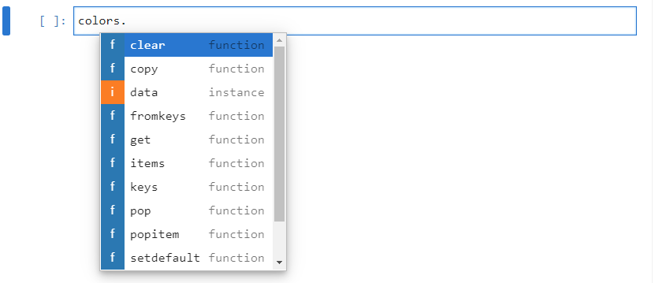

The main purpose of these is for easier subclassing. For example the custom class ```AlwaysUpper``` can be created which uses a modified ```__init__``` datamodel method which creates an upper case string:

```
class AlwaysUpper(UserString):
    def __init__(self, string):
        super().__init__(string.upper())
        
        
```

Recall that the use of ```super()``` can be thought of as creating a temporary instance ```self``` from the parent class ```UserString``` and because the method ```__init__``` is being called from an instance of the parent class, ```self``` is already implied and is not provided as the first input argument for ```__init__```. In this case ```super()``` is an abbreviation for ```super(AlwaysUpper, self)``` and both the input arguments are implied.

An instance can be created:

```
greeting = AlwaysUpper("hello")
```

And will be observed to be upper case:

```
greeting
```

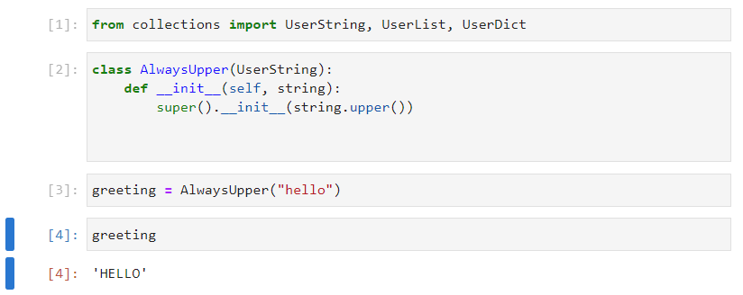

This instance will possess all of the standard string methods inherited from ```UserString```:

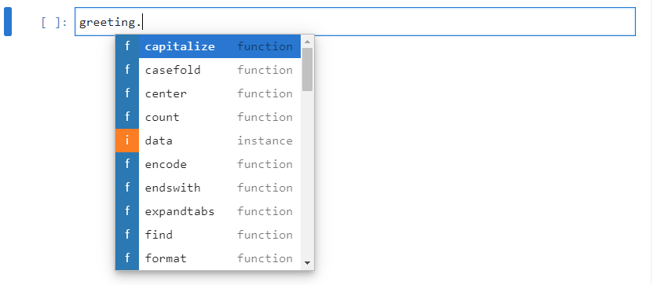

[Home Python Tutorials](https://github.com/PhilipYip1988/python-tutorials/blob/main/readme.md)
