# The Pickle Module

Communication from a serial port essentially involves a digital signal along a read pin that is either low ```0``` or high ```1```. The communication is normally carried out at a specified baud rate (a baud is a bit per second).

The ```pickle``` module is used to serialize a Python object into a byte string, that is a series of zeros and ones. 

It can be imported using:

```
import pickle
```

Its list of identifiers can be seen by inputting ```pickle.``` followed by a tab ```↹```:

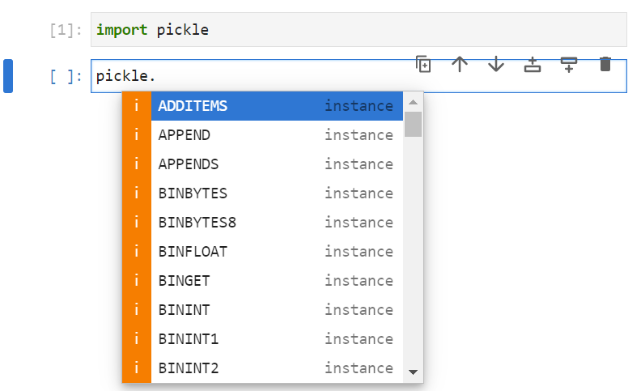

Most of the identifiers are typical instances of pickled empty Python objects. There are four main functions ```pickle.dumps```, ```pickle.dump```, ```pickle.loads``` and ```pickle.load```. The ```s``` suffix is not a plural and stands for bytes string i.e. dump and load to a bytes string respectively. The equivalents without the ```s``` dump and load to a bytes string file:

```
pickle.dumps(1)
```

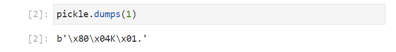

Because it is a ```bytes```, it can be converted to hexadecimal representation using the ```hex``` method:

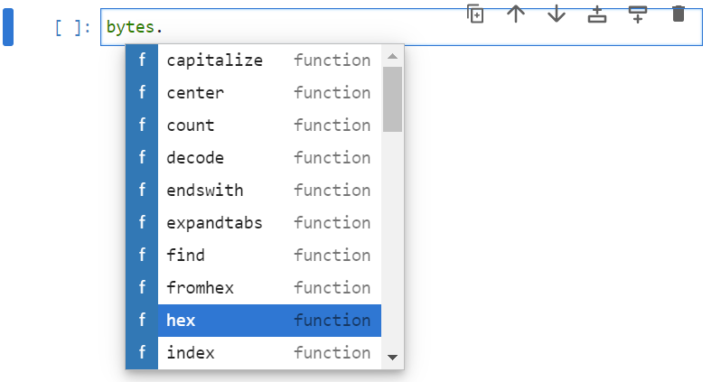

```
pickle.dumps(1).hex()
```

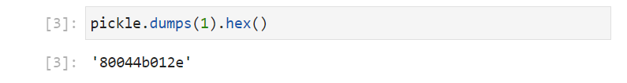

The output below can be split into groups of 2 hexadecimal characters: ```80 04 4b 01 2e```.

The meaning of these hexadecimal values can be found by using the hex function on the constants found in the ```pickle``` module. Recall the convention is to use upper case for constants in Python for example:

```
pickle.PROTO.hex()
pickle.STOP.hex()
```

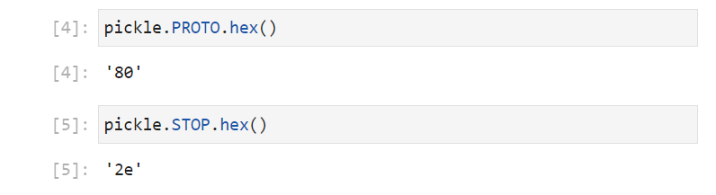

This retrieves the Start OptCode ```80``` and Stop OptCode ```2e``` respectively.

The list of identifiers of the pickle module can be retrieved using the ```dir``` function:

```
dir(pickle)
```

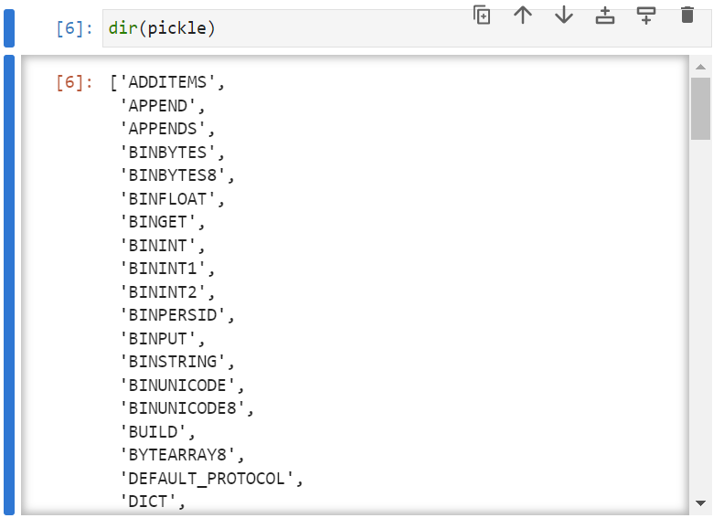

The ```getattr``` class can be used to retrieve the identifier from the module, for example:

```
getattr(pickle, 'PROTO')
```

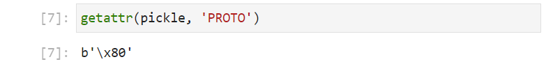

In this example, the constants (upper case) of interest has the datatype of ```bytes```: 

```
type((getattr(pickle, 'PROTO')))
```


A for loop can be used to loop through all the identifiers that are byte objects, that prints out their 2 digit hex values alongside the name of the identifier:

```
pickle_constants = []

for identifier in dir(pickle):
    if type((getattr(pickle, identifier))) == bytes:
        pickle_constants.append(((getattr(pickle, identifier)).hex(), identifier))

pickle_constants
```

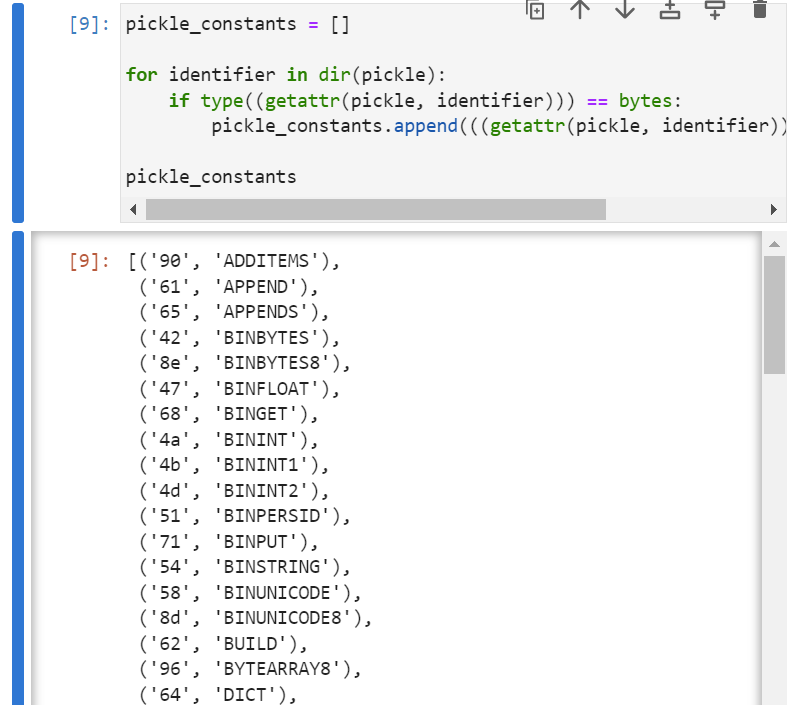

|Hex Value|Pickle OptCode|
|---|---|
|28|pickle.MARK|
|29|pickle.EMPTY_TUPLE|
|2e|pickle.STOP|
|30|pickle.POP|
|31|pickle.POP_MARK|
|32|pickle.DUP|
|42|pickle.BINBYTES|
|43|pickle.SHORT_BINBYTES|
|46|pickle.FLOAT|
|47|pickle.BINFLOAT|
|49|pickle.INT|
|49 30 30 0a|pickle.FALSE|
|49 30 31 0a|pickle.TRUE|
|4a|pickle.BININT|
|4b|pickle.BININT1|
|4c|pickle.LONG|
|4d|pickle.BININT2|
|4e|pickle.NONE|
|50|pickle.PERSID|
|51|pickle.BINPERSID|
|52|pickle.REDUCE|
|53|pickle.STRING|
|54|pickle.BINSTRING|
|55|pickle.SHORT_BINSTRING|
|56|pickle.UNICODE|
|58|pickle.BINUNICODE|
|5d|pickle.EMPTY_LIST|
|61|pickle.APPEND|
|62|pickle.BUILD|
|63|pickle.GLOBAL|
|64|pickle.DICT|
|65|pickle.APPENDS|
|67|pickle.GET|
|68|pickle.BINGET|
|69|pickle.INST|
|6a|pickle.LONG_BINGET|
|6c|pickle.LIST|
|6f|pickle.OBJ|
|70|pickle.PUT|
|71|pickle.BINPUT|
|72|pickle.LONG_BINPUT|
|73|pickle.SETITEM|
|74|pickle.TUPLE|
|75|pickle.SETITEMS|
|7d|pickle.EMPTY_DICT|
|80|pickle.PROTO|
|81|pickle.NEWOBJ|
|82|pickle.EXT1|
|83|pickle.EXT2|
|84|pickle.EXT4|
|85|pickle.TUPLE1|
|86|pickle.TUPLE2|
|87|pickle.TUPLE3|
|88|pickle.NEWTRUE|
|89|pickle.NEWFALSE|
|8a|pickle.LONG1|
|8b|pickle.LONG4|
|8c|pickle.SHORT_BINUNICODE|
|8d|pickle.BINUNICODE8|
|8e|pickle.BINBYTES8|
|8f|pickle.EMPTY_SET|
|90|pickle.ADDITEMS|
|91|pickle.FROZENSET|
|92|pickle.NEWOBJ_EX|
|93|pickle.STACK_GLOBAL|
|94|pickle.MEMOIZE|
|95|pickle.FRAME|
|96|pickle.BYTEARRAY8|
|97|pickle.NEXT_BUFFER|
|98|pickle.READONLY_BUFFER|
​

From the information above ```80 04 4b 01 2e``` means:


|Hex Value|Meaning|
|---|---|
|80|Start OptCode: pickle.PROTO.hex()|
|04|Protocol Version: pickle.DEFAULT_PROTOCOL|
|4b|Type Int Optcode: pickle.BININT1.hex()|
|01|Numeric value: 1|
|2e|Stop OptoCode: pickle.STOP.hex()|

The default protocol version is 4 but it can be changed to the maximum version 5. The maximum protocol version is not used by default as older versions of Python don't support it:

```
pickle.DEFAULT_PROTOCOL
pickle.dumps(1, protocol=pickle.DEFAULT_PROTOCOL)
pickle.HIGHEST_PROTOCOL
pickle.dumps(1, protocol=pickle.HIGHEST_PROTOCOL)
```

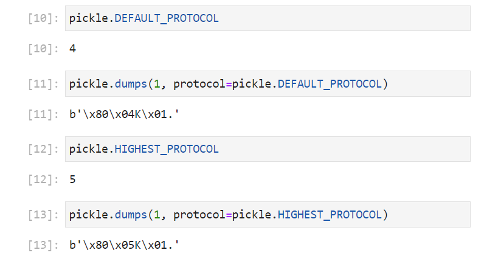

If a boolean value is examined, using the default protocol:

```
pickle.dumps(True).hex()
```

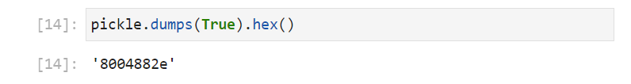

From the table above ```80 04 88 2e``` means:

|Hex Value|Meaning|
|---|---|
|80|Start OptCode: pickle.PROTO.hex()|
|04|Protocol Version: pickle.DEFAULT_PROTOCOL|
|88|Bool True Optcode: pickle.NEWTRUE|
|2e|Stop OptoCode: pickle.STOP.hex()|

If a legacy protocol is instead used:

```
pickle.dumps(True, protocol=1).hex()
```

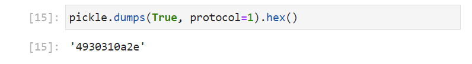

```49 30 31 0a 2e``` means:

|Hex Value|Meaning|
|---|---|
|49 30 31 0a|pickle.TRUE|
|2e|Stop OptoCode: pickle.STOP.hex()|

Since this legacy protocol was the first version, it lacks the Start OptCode and version and uses pickle.TRUE opposed to pickle.NEWTRUE, other datatypes such as a tuple have been revised multiple times and the number at the end refers to the revision:

A string can be examined:

```
pickle.dumps('hello')
pickle.dumps('hello').hex()
b'hello'.hex()
```

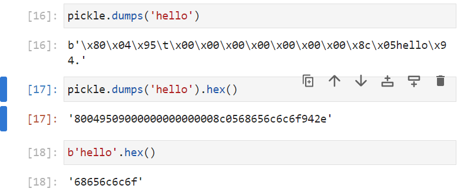

The output below can once again be split into groups of 2 hexadecimal characters ```80 04 95 09 00 00 00 00 00 00 00 8c 05 68 65 6c 6c 6f 94 2e``` which means:

|Hex Value|Meaning|
|---|---|
|80|Start OptCode: pickle.PROTO.hex()|
|04|Protocol Version: pickle.DEFAULT_PROTOCOL|
|95|Frame OptCode: pickle.FRAME.hex()|
|09 00 00 00 00 00 00 00|Frame Size: 8 bytes little endian|
|8c|String OptCode: pickle.SHORT_BINUNICODE.hex()|
|05|Length of String: len('hello')|
|68 65 6c 6c 6f|String: 'hello'|
|94|Memoize OptCode: pickle.MEMOIZE.hex()|
|2e|Stop OptCode: pickle.STOP.hex()|

Note the frame size ```9``` (hexadecimal) which is also ```9``` (decimal) indicates the expected number of bytes after the Frame Size: 80 04 95 09 00 00 00 00 00 00 00 **8c 05 68 65 6c 6c 6f 94 2e**

A more complicated object such as a tuple can be examined:

```
pickle.dumps(('hello', 'world', '!'))
pickle.dumps(('hello', 'world', '!')).hex()
```

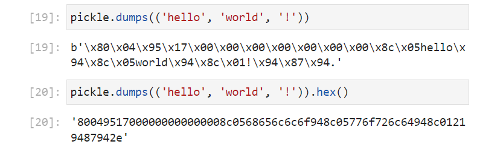

The output can once again be split into groups of 2 hexadecimal characters ```80 04 95 17 00 00 00 00 00 00 00 8c 05 68 65 6c 6c 6f 94 8c 05 77 6f 72 6c 64 94 8c 01 21 94 87 94 2e``` which means:

|Hex Value|Meaning|
|---|---|
|80|Start OptCode: pickle.PROTO.hex()|
|04|Protocol Version: pickle.DEFAULT_PROTOCOL|
|95|Frame OptCode: pickle.FRAME.hex()|
|17 00 00 00 00 00 00 00|Frame Size: 8 bytes little endian|
|8c|String OptCode: pickle.SHORT_BINUNICODE.hex()|
|05|Length of String: len('hello')|
|68 65 6c 6c 6f|String: 'hello'|
|94|Memoize: pickle.MEMOIZE.hex()|
|8c|String OptCode: pickle.SHORT_BINUNICODE.hex()|
|05|Length of String: len('world')|
|77 6f 72 6c 64|String: 'world'|
|94|Memoize Optcode: pickle.MEMOIZE.hex()|
|8c|String OptCode: pickle.SHORT_BINUNICODE.hex()|
|01|Length of String len('!')|
|21|string: '!'|
|94|Memoize Optcode: pickle.MEMOIZE.hex()|
|87|Tuple OptCode: pickle.TUPLE3.hex()|
|94|Memoize: pickle.MEMOIZE.hex()|
|2e|Stop OptCode: pickle.STOP.hex()|

A list can be examined:

```
pickle.dumps(['hello', 'world', '!'])
pickle.dumps(['hello', 'world', '!']).hex()
```

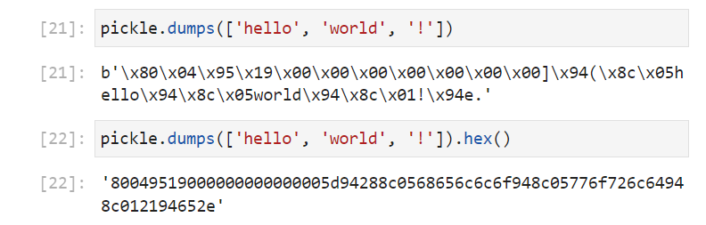

The output below can be split into groups of 2 hexadecimal characters ```80 04 95 19 00 00 00 00 00 00 00 5d 94 28 8c 05 68 65 6c 6c 6f 94 8c 05 77 6f 72 6c 64 94 8c 01 21 94 65 2e``` which means:

|Hex Value|Meaning|
|---|---|
|80|Start OptCode: pickle.PROTO.hex()|
|04|Protocol Version: pickle.DEFAULT_PROTOCOL|
|95|Frame OptCode: pickle.FRAME.hex()|
|19 00 00 00 00 00 00 00|Frame Size: 8 bytes little endian|
|5d|Empty List OptCode: pickle.EMPTY_LIST.hex()|
|94|Memoize OptCode: pickle.MEMOIZE.hex()|
|28|Mark OptCode: pickle.MARK.hex()|
|8c|String OptCode: pickle.SHORT_BINUNICODE.hex()|
|05|Length of String: len('hello')|
|68 65 6c 6c 6f|String: 'hello'|
|94|Memoize OptCode: pickle.MEMOIZE.hex()|
|8c|String OptCode: pickle.SHORT_BINUNICODE.hex()|
|05|Length of String: len('world')|
|77 6f 72 6c 64|String: 'world'|
|94|Memoize OptCode: pickle.MEMOIZE.hex()|
|8c|String OptCode: pickle.SHORT_BINUNICODE.hex()|
|01|Length of String len('!')|
|21|string: '!'|
|94|Memoize OptCode: pickle.MEMOIZE.hex()|
|65|List Append OptCode: pickle.APPENDS.hex()|
|2e|Stop OptCode: pickle.STOP.hex()|

A dictionary can also be examined:

```
pickle.dumps({'r': 'red', 'g': 'green', 'b': 'blue'})
pickle.dumps({'r': 'red', 'g': 'green', 'b': 'blue'}).hex()
```

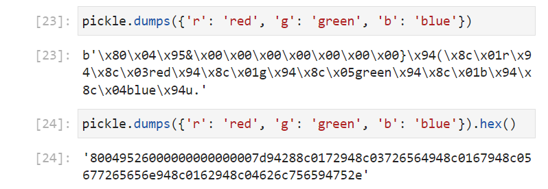

The output below can be split into groups of 2 hexadecimal characters ```80 04 95 26 00 00 00 00 00 00 00 7d 94 28 8c 01 72 94 8c 03 72 65 64 94 8c 01 67 94 8c 05 67 72 65 65 6e 94 8c 01 62 94 8c 04 62 6c 75 65 94 75 2e``` which means:

|Hex Value|Meaning|
|---|---|
|80|Start OptCode: pickle.PROTO.hex()|
|04|Protocol Version: pickle.DEFAULT_PROTOCOL|
|95|Frame OptCode: pickle.FRAME.hex()|
|26 00 00 00 00 00 00 00|Frame Size: 8 bytes little endian|
|7d|Empty Dict OptCode: pickle.EMPTY_DICT|
|94|Memoize OptCode: pickle.MEMOIZE.hex()|
|28|Mark OptCode: pickle.MARK.hex()|
|8c|String OptCode: pickle.SHORT_BINUNICODE.hex()|
|01|Length of String len('r')|
|72|string: 'r'|
|94|Memoize OptCode: pickle.MEMOIZE.hex()|
|8c|String OptCode: pickle.SHORT_BINUNICODE.hex()|
|03|Length of String len('red')|
|72 65 64|string: 'red'|
|94|Memoize OptCode: pickle.MEMOIZE.hex()|
|8c|String OptCode: pickle.SHORT_BINUNICODE.hex()|
|01|Length of String len('g')|
|67|string: 'g'|
|94|Memoize OptCode: pickle.MEMOIZE.hex()|
|8c|String OptCode: pickle.SHORT_BINUNICODE.hex()|
|05|Length of String len('green')|
|67 72 65 65 6e|string: 'green'|
|94|Memoize OptiCode: pickle.MEMOIZE.hex()|
|8c|String OptCode: pickle.SHORT_BINUNICODE.hex()|
|01|Length of String len('b')|
|62|string: 'b'|
|94|Memoize OptCode: pickle.MEMOIZE.hex()|
|8c|String OptCode: pickle.SHORT_BINUNICODE.hex()|
|04|Length of String len('blue')|
|62 6c 75 65|string: 'blue'|
|94|Memoize OptCode: pickle.MEMOIZE.hex()|
|75|Dict SetItem OptCode: pickle.SETITEMS|
|2e|Stop OptCode: pickle.STOP.hex()|

And a floating point number can also be examined:

```
pickle.dumps(0.1)
pickle.dumps(0.1).hex()
```

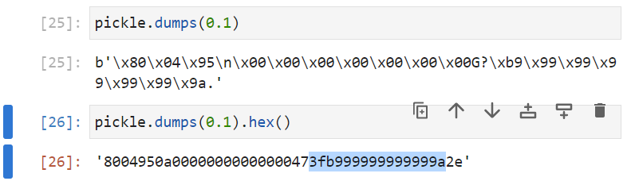

The output below can be split into groups of 2 hexadecimal characters ```80 04 95 0a 00 00 00 00 00 00 00 47 3f b9 99 99 99 99 99 9a 2e``` which means:

|Hex Value|Meaning|
|---|---|
|80|Start OptCode: pickle.PROTO.hex()|
|04|Protocol Version: pickle.DEFAULT_PROTOCOL|
|95|Frame OptCode: pickle.FRAME.hex()|
|0a 00 00 00 00 00 00 00|Frame Size: 8 bytes little endian|
|2e|Stop OptCode: pickle.STOP.hex()|
|47|pickle.BINFLOAT|
|3f b9 99 99 99 99 99 9a|0.1 in 64 Bit IEEE|
|2e|Stop OptCode: pickle.STOP.hex()|

To understand the ```3f b9 99 99 99 99 99 9a``` 64 Bit IEEE float representation, the above needs to be converted into bits. Recall that the hexadecimal values map to:

|Hexadecimal Value|Binary Value|
|---|---|
|0|0000|
|1|0001|
|2|0010|
|3|0011|
|4|0100|
|5|0101|
|6|0110|
|7|0111|
|8|1000|
|9|1001|
|a|1010|
|b|1011|
|c|1100|
|d|1101|
|e|1110|
|f|1111|

So ```3f b9 99 99 99 99 99 9a``` is ```00111111 10111001 10011001 10011001 10011001 10011001 10011001 10011010```. This can be verified using the following:

```
int('0x3fb999999999999a', base=16)
bin(int('0x3fb999999999999a', base=16))
print(f"0b{int('0x3fb999999999999a', base=16):>064b}")
```

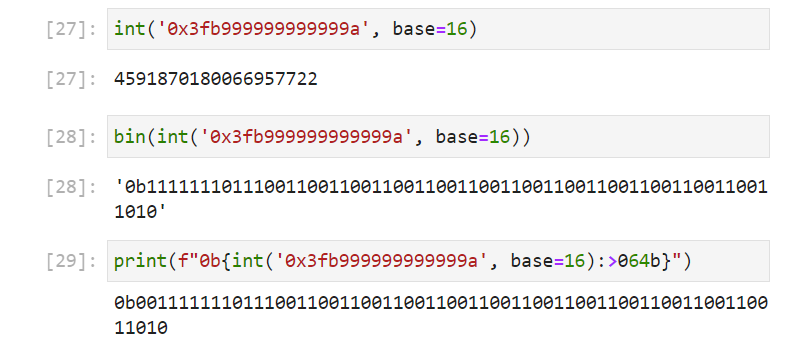

For 64 Bit IEEE float representation, the number is grouped into 1 bit for the sign, 11 bits for the exponent and 52 bits for the fraction:

```0 01111111011 1001100110011001100110011001100110011001100110011010```

The bits can be calculated by examining the number ```0.1``` (decimal). The first bit corresponds to the sign and ```0``` corresponds to a positive number and ```1``` corresponds to a negative number. In this case this is a positive number so the sign is ```0```. 

**0** 01111111011 1001100110011001100110011001100110011001100110011010

The number needs to be converted, essentially into binary scientific notation. This is done by multiplying the number ```0.1``` (decimal) repeatedly by ```2 ```. At each step the the integer component should be evaluated alongside the fractional component. The fractional component is carried over and this procedure is continued in theory until there is no fractional component. In the case of ```0.1```, the integer component is highlighted in bold: 

$$0.1\ast2=\textbf{0}+0.2$$

$$0.2\ast2=\textbf{0}+0.4$$

$$0.4\ast2=\textbf{0}+0.8$$

$$0.8\ast2=\textbf{1}+0.6$$

$$0.6\ast2=\textbf{1}+0.2$$

$$0.2\ast2=\textbf{0}+0.4$$

$$0.4\ast2=\textbf{0}+0.8$$

$$0.8\ast2=\textbf{1}+0.6$$

$$0.6\ast2=\textbf{1}+0.2$$

$$\vdots$$

This gives ```0.001100110011...``` (binary), with the ```...``` representing recursion, recursion is common with a binary number as a binary number only has ```2``` unique characters ```0``` and ```1```.

This number can be adjusted by an exponent, so there is a 1 before the binary point. In this case this gives an exponent of ```-3``` (in decimal) and this needs to be stored as 11 bits in binary. 

The number can be conceptualised as **exponent** ```-3``` (decimal) **fraction** 1.100110011... (binary).

The 11 bit binary number represents the **exponent** value. With 11 bits there are the following combinations:

```
2 ** 11
```

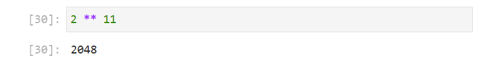

Recall this is zero-order indexed so is ```0``` to ```2048``` exclusive of ```2048```. Approximately half of these are reserved for negative numbers and the other half are reserved for positive numbers:

```
(2 ** 11) // 2
```

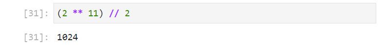

Effectively, this gives the range of ```-1022``` to ```+1023```. Negative numbers cannot be encoded so there is an offset which adjusts the lowest possible exponent ```-1022``` (decimal) to ```0``` (decimal) which is encoded in binary as ```00000000000```. ```-3``` in decimal, therefore becomes ```-3 + 1022``` (decimal) which is ```1019``` (decimal):

```
-3 + 1022
print(f"0b{1019:>011b}")
```

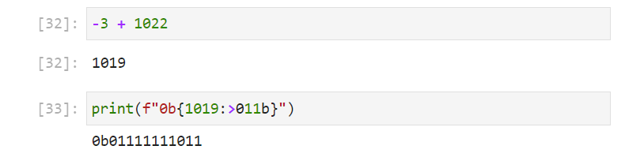

And is encoded as ```01111111011```.

0 **01111111011** 1001100110011001100110011001100110011001100110011010

The 52 bit binary number represents the **fraction**. Recall this is 1.100110011... (binary). The leading 1 and the binary point are constant for all numbers with this notation and are omitted to save memory **1.**100110011... (binary) giving **100110011...** This number recurs and is trucated at the 52nd bit. 

0 01111111011 **1001100110011001100110011001100110011001100110011010**

The number ```0.1``` (decimal) is therefore approximated as the floating point number stored using 64 Bit IEEE:

```0 01111111011 1001100110011001100110011001100110011001100110011010```

When using 64 Bit IEEE float representation recall that a binary number only has ```2``` unique characters ```0``` and ```1``` to store the number and only 52 digits in the fraction, meaning the number is often truncated, leading to recursive rounding errors which were seen when the concept of a ```float``` was first introduced.

The ```pickle.loads``` function can be used to load a Python object from a pickled bytes string. For example:

```
pickled_byte = pickle.dumps(0.1)
pickle.loads(pickled_byte)
```

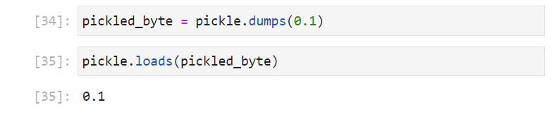

The ```pickle.dump``` function can be used to dump one or multiple pickled objects to a file. Using the same examples as above:

```
with open('newfile.pkl', mode='wb') as file:
    pickle.dump(obj=1, file=file)
    pickle.dump(obj='hello', file=file)
    pickle.dump(obj=('hello', 'world', '!'), file=file)
    pickle.dump(obj=['hello', 'world', '!'], file=file)
    pickle.dump(obj={'r': 'red', 'g': 'green', 'b': 'blue'}, file=file)
    pickle.dump(obj=0.1, file=file)
    
```

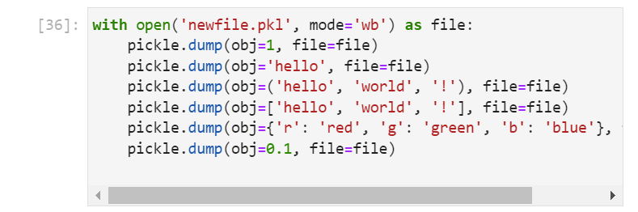

The file output can be viewed in Windows Explorer:


If opened in Notepad++ it will attempt to open it in text mode:

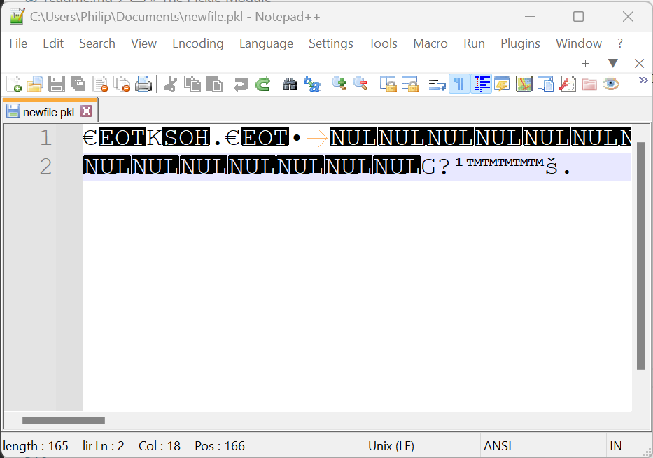

If plugins → converter → ASCII to Hex is selected, the contents of the file can be seen to be similar to what was examined earlier for each object:

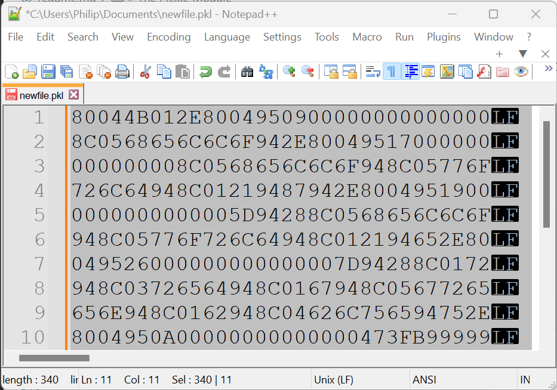

Objects can be loaded from this file within a ```while``` loop:

```
with open('newfile.pkl', mode='rb') as file:
    while True:
        print(pickle.load(file=file))
        
```

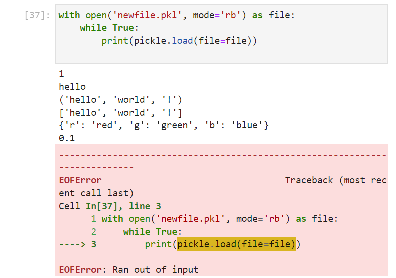

This runs until an End of File Error ```EOFError``` displays. This can be handled using a nested ```try``` and ```except``` code block. The ```except``` code block will be used to ```break``` out of the ```while``` loop:

```
with open('newfile.pkl', mode='rb') as file:
    while True:
        try:
            print(pickle.load(file=file))
        except EOFError:
            break
    
```

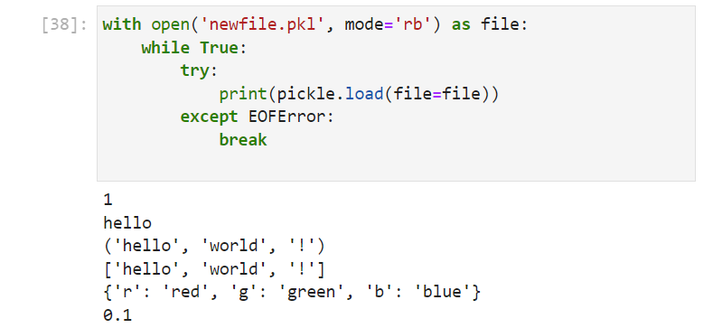

[Home Python Tutorials](https://github.com/PhilipYip1988/python-tutorials/blob/main/readme.md)
