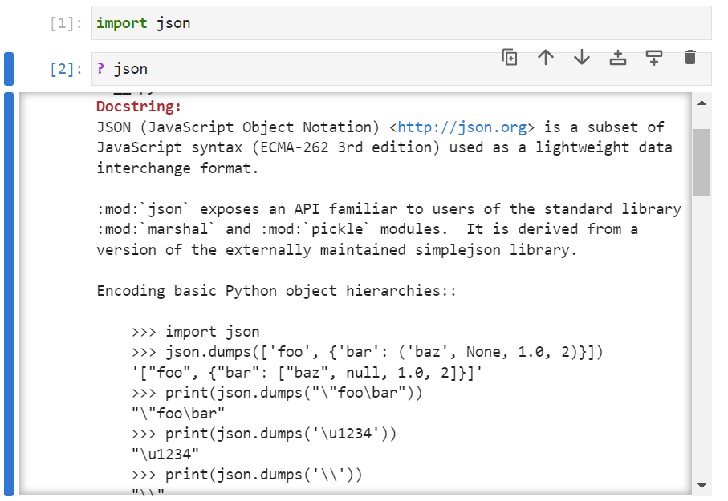

# JavaScript Object Notation (JSON)

Serialized pickled data was previously examined. This data type works with most Python builtin objects however as previously seen, the data in the form of byte strings is not very user readable.

JavaScript Object Notation (JSON) as the name suggests originates from JavaScript but now has become a commonly used standard data stream. It is common to retrieve data from a website stored in JSON format and convert it into equivalent or similar Python data structures. The module can be imported using:

```
import json
```

Its docstring can be viewed using:

```
? json
```




Its identifiers can be viewed by inputting ```json.``` followed by a tab ```↹```:


There are four main functions ```json.dumps```, ```json.dump```, ```json.loads``` and ```json.load```. The ```s``` suffix is not a plural and stands for string i.e. dump and load to a Unicode string respectively. The equivalents without the ```s``` dump and load to a text file.

The Python fundamental data types such as integers, floating point numbers, boolean values and strings all have a JSON counterpart.

The integer is unchanged:

```
json.dumps(1)
```


The floating point number is unchanged:

```
json.dumps(0.1)
```


The boolean value case is changed as JSON uses lower case syntax for boolean values:

```
json.dumps(True)
json.dumps(False)
```


The quotations enclosing a string are changed from single to double quotations as JSON uses double quotations for strings: 

```
json.dumps('hello')
```


Normally in Python a string literal is enclosed in single quotes and a string containing a string literal is enclosed in double quotes. For example:

```
"'hello'"
```


In JSON this is the opposite way around, for example:

```
'"hello"'
```


In Python a tuple can be conceptualised as an immutable archive of records and a list is a mutable active of records. In JSON there is only a list counterpart so both lists and tuples are encoded as lists:

```
json.dumps(('hello', 'world', '!'))
json.dumps(['hello', 'world', '!'])
```


There is no JSON counterpart for a set, attempting to dump a set will give a ```TypeError```:

```
json.dumps({'hello', 'world', '!'})
```


A dictionary can be converted into JSON. Its counterpart is very similar:

```
json.dumps({'r': 'red', 'g': 'green', 'b': 'blue'})
```


Most objects in the JSON format consist of nested collections. For example:

```
json.dumps({'red': [1, 0, 0],
            'green': [0, 1, 0],
            'blue': [0, 0, 1]})
```


When the nesting is more complicated, often the brackets are spaced accordingly:

```
json.dumps({'colors' : {
                          'red': [1, 0, 0],
                          'green': [0, 1, 0],
                          'blue': [0, 0, 1]
                       }
            }
          )
```


The


It can also nest other dictionaries and lists. The JSON object is similar to this structure however slight conversions between a JSON object, and an equivalent Python are required due to the differences in programming language syntax. 


Note not all the nested objects

 Python objects are supported as they do not have a JavaScript equivalent. 


The JSON module essentially carries out all the supported conversions. It can be imported using:

```
import json
```

Some details about the module can be seen by looking at the modules docstring:

```
? json
```