# The Numeric Python Library - numpy

The Numeric Python library - ```numpy``` is the most commonly used third-party Python library. It is fundamental for other popular data science libraries. The Python and Data Analysis Library - ```pandas```, the Matrix Plotting Library - ```matplotlib``` and the Data Visualization Library - ```seaborn``` are based upon ```numpy``` and are known as the ```numpy``` stack.

## Scalability in Python

The following data structures have been explored in inbuilt Python and Python standard modules:

* list - collection of mixed datatypes
* array - 1d uniform data structure
* nested lists

These data structures are collections and their datamodel methods are setup as collections.

The following mathematical concepts have also been explored:

* numeric datamodel methods for int, float and bool classes
* range objects
* math and complex module
* statistics module
* datetime module
* random module

Most of these mathematical concepts have been constrained to a scalar variable (that is a variable with a single element). To scale the operations to multiple dimensions list comprehensions and loops have been used.

## N-Dimensional Array

The numeric Python Library is based upon the n-dimensional array ```ndarray``` data structure. The ```ndarray``` bridges the features mentioned above over multiple dimensions using simple succinct syntax. 

The numpy library is therefore a very large Python library. Despite it being large, previous tutorials have established a vigourous understanding of how each of these features operates over a single dimension using builtin Python or a standard Python module. Once the mechanics of using a ndarray are setup, such as indexing and working across multiple dimensions, this previous knowledge can easily be applied. It becomes a case of using the equivalent function from the numpy library to act on the ndarray(s) or the equivalent ndarray method.

## Importing numpy

The ```numpy``` library is typically imported using a 2 letter abbreviation ```np```. The numpy library includes a large number of functions and it is more convenient to access these using this two letter abbreviation:

```
import numpy as np
```


```numpy``` is a third-party Python library. If it has not been installed, a ```ModuleNotFoundError``` will display.

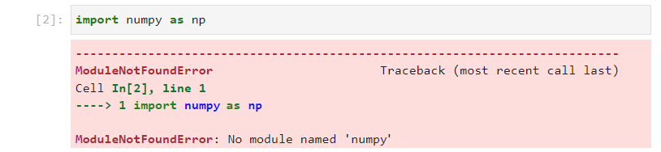

To setup a Python Environment with the Scientific Libraries, it is recommended to use Mambaforge and the ```mamba``` package manager. This is covered in detail in [Mambaforge Installation](https://github.com/PhilipYip1988/python-tutorials/blob/main/readme.md)

Once imported, the module datamodel attributes ```__name__```, ```__version__``` and ```__path__``` can be examined:

```
np.__name__
np.__version__
np.__path__
```

The version should be ```>=``` ```1.24.1```

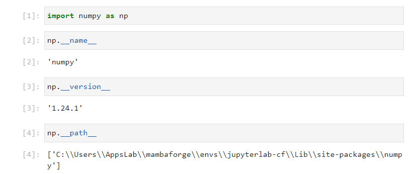

Once imported a large number of identifiers will be listed by inputting ```np.``` followed by a tab ```↹```:

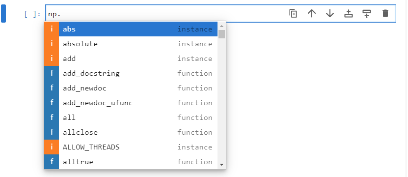

## ndarray Factory Functions

The n-dimensional array ```ndarray``` class is the data structure the ```numpy``` library is based around. The init signature is long and can be output into a cell using:

```
? nd.ndarray
```

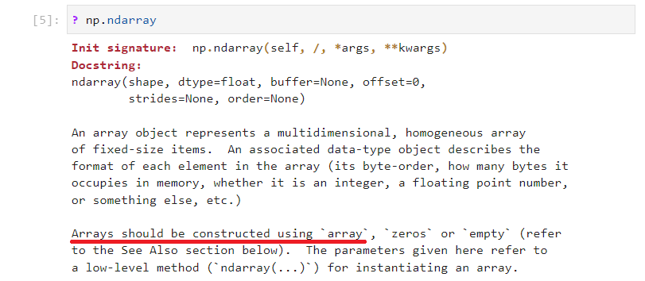

The docstring states: Arrays should be constructed using the ```array``` factory function.

The docstring also gives some import parameters for array creation:

|parameter|description|
|---|---|
|shape|tuple of ints representing the shape of the created array.|
|dtype|data-type, optional object that can be interpreted as a numpy data type.|
|order|{'C', 'F'}, optional Row-major (C-style) or column-major (Fortran-style) order.|

And important attributes of an ```ndarray```:

|attribute|description|
|---|---|
|size|int number of elements in the array|
|ndim|int number of dimensions of the array|
|shape|tuple of ints representing the shape of the array.|
|T|transpose of the array.|
|flat|flattened version of the array as an iterator.|
|real|real part of the array.|
|imag|imaginary part of the array.|
|data|the elements array in memory.|
|itemsize|the memory use of each array element in bytes.|
|nbytes|the total number of bytes required to store the array data, data * itemsize|

The ```array``` factory function is used to create a new ```ndarray``` from an existing object. Its docstring can be viewed as a pop up balloon by inputting ```np.array()``` followed by shift ```⇧``` and tab ```↹```:

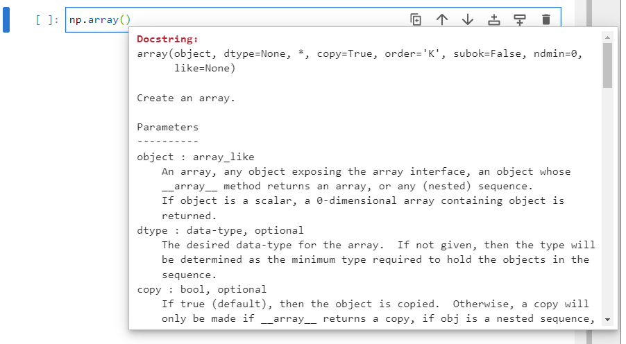

This is once again quite a long docstring so it is worthwhile examining it in a cell output using:

```
? np.array
```

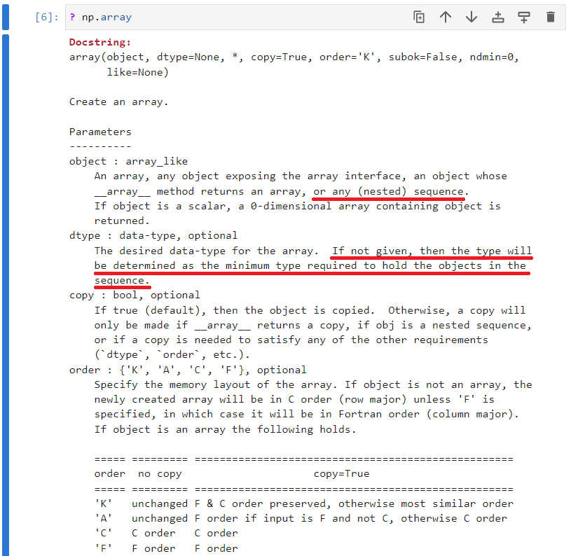

Normally only the ```object``` is supplied to the ```np.array``` factory function. 

|parameter|description|
|---|---|
|object|any (nested) sequence, usually a list.|
|dtype|data-type, optional object that can be interpreted as a numpy data type.|
|copy|if true (default), then the object is copied.|
|ndmin|specifies the minimum number of dimensions that the resulting array should have. Ones will be prepended to the shape to satisfy this requirement|

Sometimes a custom ```dtype``` is supplied but most of the time this is not supplied and the factory automatically determines the best datatype from the input data. 

The ```copy``` bool is normally set to ```True```, this prevents unwanted mutability of the output ```ndarray``` if the supplied ```object``` is mutated. 

The ```ndmin``` can be useful when creating higher dimensional arrays.

The docstring also includes details about other factory functions to create an ```ndarray```:

|factory function|description|
|---|---|
|empty_like|Return an empty array with shape and type of input.|
|ones_like|Return an array of ones with shape and type of input.|
|zeros_like|Return an array of zeros with shape and type of input.|
|full_like|Return a new array with shape of input filled with value.|
|empty| Return a new uninitialized array.|
|ones|Return a new array setting values to one.|
|zeros|Return a new array setting values to zero.|
|full|Return a new array of given shape filled with value.|

A ```ndarray``` can specifically be created from a ```list``` using:

```
list1 = [1, 2, 3, 4]
list1

array1 = np.array(object=list1)
array1
```

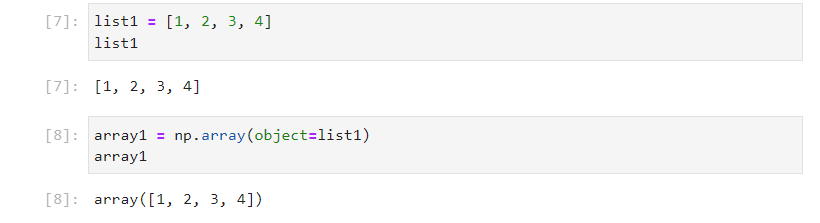

This is normally done directly and using a positional input argument:

```
array1 = np.array([1, 2, 3, 4])
array1
```

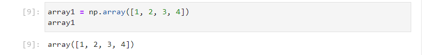

Dimensionality details about this ```ndarray``` can be found using the attributes ```size```, ```ndim``` and ```shape``` respectively:

```
array1.size
array1.ndim
array1.shape
```

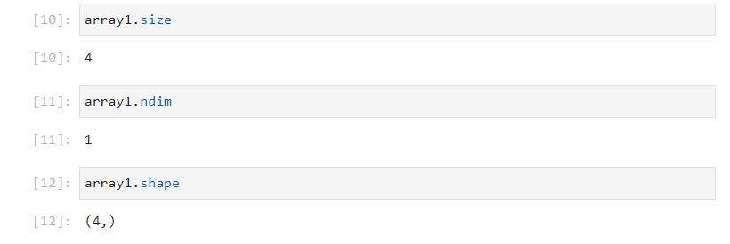

The ```size``` is ```4``` as there are 4 elements in the array. The number of dimensions ```ndim``` is ```1``` and the ```shape``` is a ```tuple``` with value ```(4,)```. 

A 1d array is known as a *vector*. Note the shape tuple states that this *vector* only has ```4``` *columns*. 

Care should be taken regarding the dimensionality in a ```ndarray```. It does not behave like a ```list``` which can be represented as either a row or column for convenience:

```
list1 = [1, 2, 3, 4]
list1

list1 = [1, 
         2, 
         3, 
         4]
list1
```

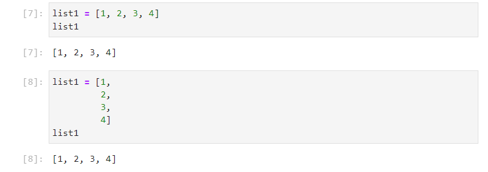

A 1d array or *vector* should be distiguished from a 2d array known as a *2d row vector*, a *2d row vector* by definition has 1 row by multiple columns.

Sometimes it is required to specifically create a *2d row vector* as dimensionality can be important in array operations. This can be done by providing the ```ndmin``` keyword input argument and assigning it to ```2```:

```
arrayr = np.array([1, 2, 3, 4], ndmin=2)
arrayr
arrayr.size
arrayr.ndim
arrayr.shape
```

The ```size``` is still ```4``` as there are 4 elements in the array. The number of dimensions ```ndim``` is now ```2``` and the ```shape``` is a ```tuple``` with value ```(4, 1)```. This shape tuple represents 4 columns and 1 row:


Compare:

```
array1.ndim
array1.shape

array1.ndim
arrayr.shape
```


|ndim|shape|
|---|---|
|1|(4,)|
|2|(1, 4)|

The 1d array or *1d vector* has a single dimension that spans over 4 columns.

The 2d array or *2d row vector*, has 1 row and 4 columns.

|ndim|shape|
|---|---|
|1|(4 columns,)|
|2|(1 row, 4 columns)|

Notice that in the ```shape``` ```tuple``` the new dimension is left appended, this makes sense as the origin of the new dimension is the outer list:

```
column = [1, 2, 3, 4]
row = [column]
row
```

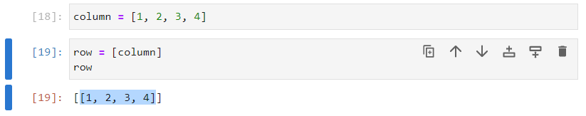

The ```shape``` ```tuple``` can be indexed to retrieve the number of columns for the 1d vector and the 2d row vector and the number of rows for the 2d row vector:

```
array1_cols = array1.shape[0]
array1_cols

arrayr_rows = arrayr.shape[0]
arrayr_rows

arrayr_cols = arrayr.shape[1]
arrayr_cols
```

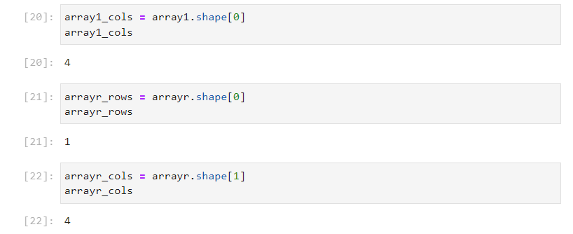

Since the new dimension is left appended, the positive index used in the ```shape``` ```tuple``` to retrieve the column increases as the number of dimensions increases. 

On the other hand, if the negative index is used, i.e. indexing from the right. An index of ```-1``` always corresponds to the columns and ```-2``` always corresponds to the rows:

```
array1_cols = array1.shape[-1]
array1_cols

arrayr_rows = arrayr.shape[-1]
arrayr_rows

arrayr_cols = arrayr.shape[-2]
arrayr_cols
```

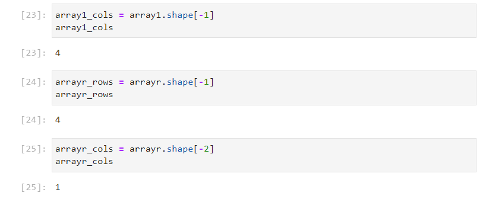

Sometimes it is required to specifically create a *2d column vector* as dimensionality. The easiest way to do this is by creating the equivalent row vector and using the transpose attribute ```T``` to transpose it. Transposing a 2D array switches the row and column indices:

```
arrayc = np.array([1, 2, 3, 4], ndmin=2).T
arrayc
arrayc.size
arrayc.ndim
arrayc.shape
```

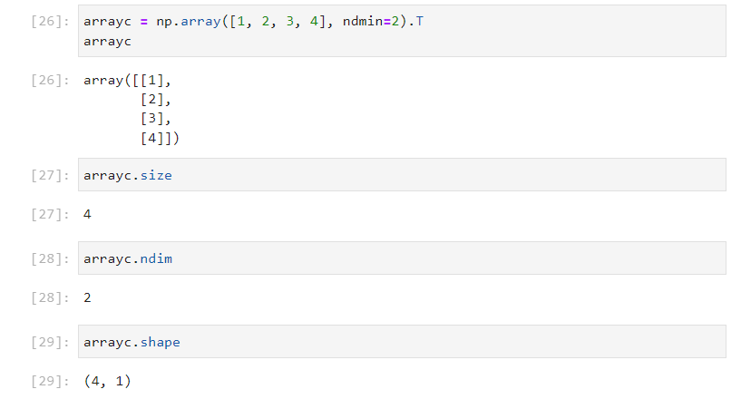

When every value in the input list, is a list of integers, the datatype will automatically be assumed to be an integer:

```
array1 = np.array([1, 2, 3, 4])
array1
array1.dtype
```

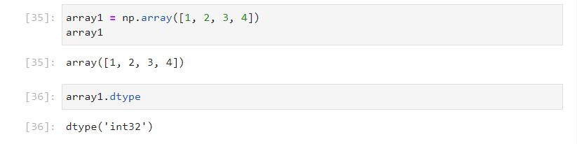

If one of these datatypes is updated to a floating point number, the datatype of the array will be assumed to be floating point:

```
array1 = np.array([1., 2, 3, 4])
array1
array1.dtype
```

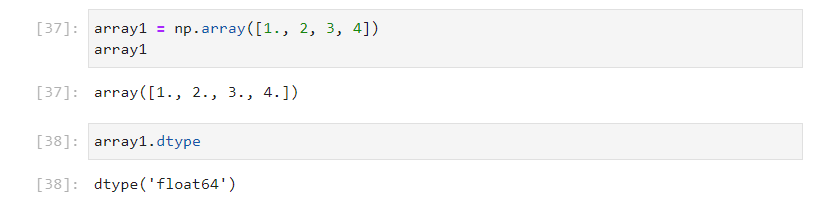

If one of these datatypes is updated to a complex number, the datatype of the array will be assumed to be complex:

```
array1 = np.array([1=2j, 2, 3, 4])
array1
array1.dtype
```

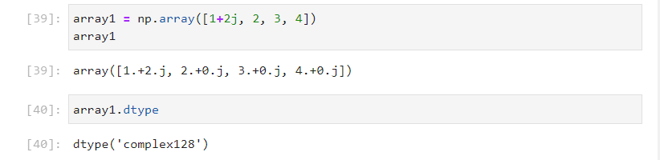

If all of the datatypes are boolean, the datatype of the array will be assumed to be boolean:

```
array1 = np.array([True, False, False, False])
array1
array1.dtype
```

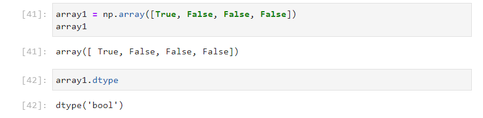

In some cases it is more convenient to specify the datatype using the keyword input argument ```dtype``` and assigning it to ```builtins``` classes ```bool```, ```int```, ```float```, or ```complex```:

```
array1 = np.array([1, 2, 3, 4], dtype=float)
array1
array1.dtype
```

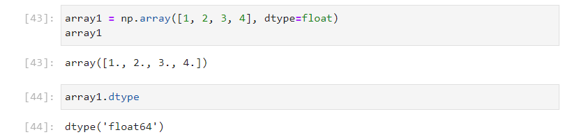

There are also corresponding ```int```, ```float```, or ```complex``` classes available in the ```numpy``` library. The numbers 8, 16, 32, 64, 128 correspond to the number of bytes used to store each individual number in the array, these are typically only used for application with very large arrays to optimise memory management:

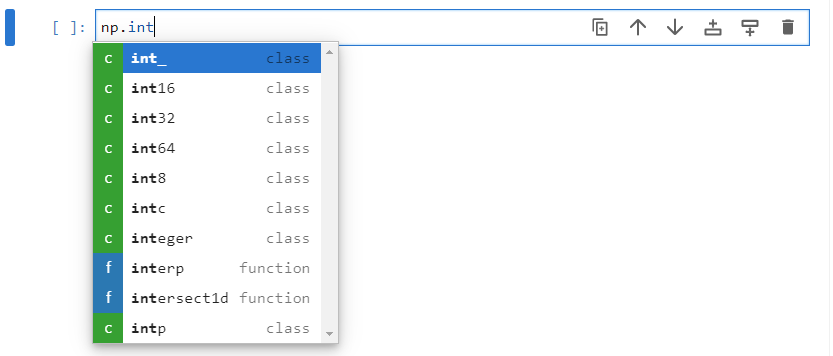

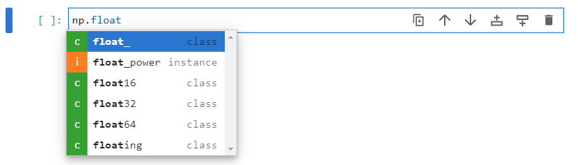

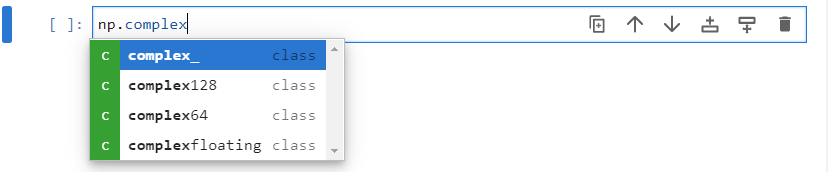

```int_```, ```float_```, or ```complex_``` act as alias for ```int32```, ```float64``` and ```complex128```. These are the defaults used when the ```int```, ```float```, or ```complex``` classes are selected from builtins:

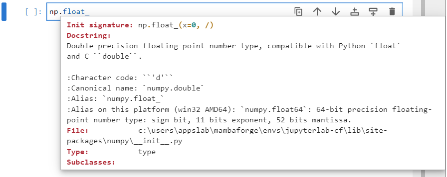

A 2d array is known as a matrix and can be formed when the ```object``` is a list of equally sized lists:

```
matrix1 = np.array([[1, 2, 3],
                    [4, 5, 6]])
matrix1
matrix1.size
matrix1.ndim
matrix1.shape
```

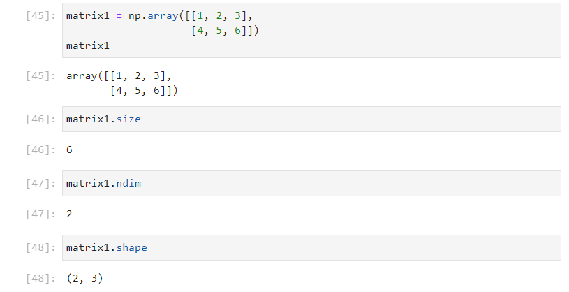

Notice that the ```size``` is ```6```, the number of dimensions ```ndim``` is ```2``` and the ```shape``` ```tuple``` is ```(2, 3)``` i.e. 2 rows by 3 columns as expected.

The other factory functions ```empty_like```, ```ones_like```, ```zeros_like``` and ```fulls_like``` can be used on this matrix:

```
matrix2 = np.empty_like(prototype=matrix1)
matrix2

matrix3 = np.zeros_like(a=matrix1)
matrix3

matrix4 = np.ones_like(a=matrix1)
matrix4

matrix5 = np.full_like(a=matrix1, fill_value=2)
matrix5
```

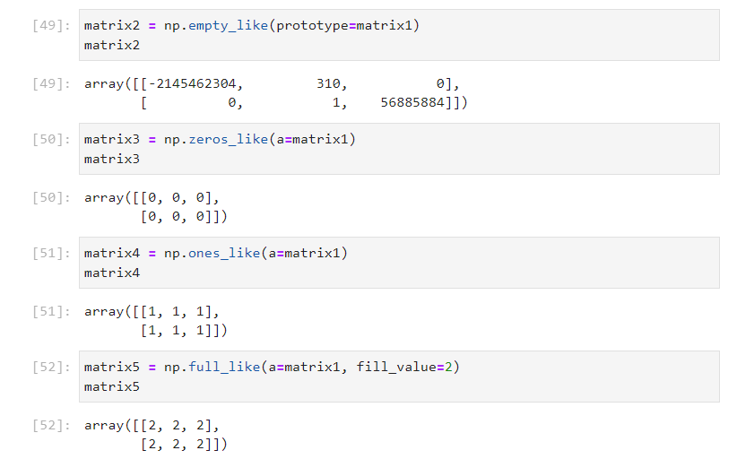

All four of these factory functions have the positional input argument ```a``` which is the original array that the shape is extracted from, ```empty_like``` is inconsistent and calls this positional input argument ```prototype```. The ```empty_like``` factory function retrieves garbage values, it is normally better to use ```zeros_like``` factory function instead. The ```full_like``` factory function requires a ```fill_value``` as a second positional input argument. All four of these factory functions will take the datatype from the original array but have an input argument ```dtype``` which can be overridden to a custom datatype. All four of these factory functions will take the shape from the original array but have an input argument ```shape``` which can be overridden to a custom tuple of integers. This is not commonly done as the related factory functions ```empty```, ```zeros```, ```ones``` and ```full``` are more convenient for this use case. 

```
matrix2 = np.empty(shape=(4, 3))
matrix2

matrix3 = np.zeros(shape=(4, 3))
matrix3

matrix4 = np.ones(shape=(4, 3))
matrix4

matrix5 = np.full(shape=(4, 3), fill_value=4)
matrix5
```

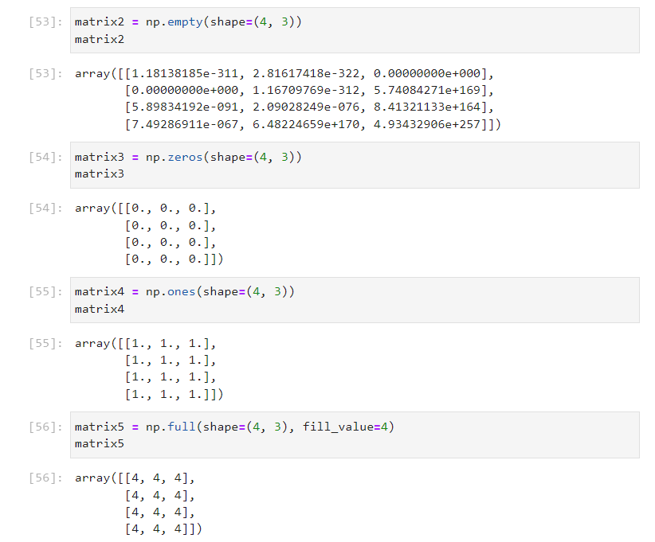

The datatype for ```empty```, ```zero```, ```ones``` is ```float``` by default but can be overridden with the ```dtype``` keyword input argument. The datattype for the ```full``` function is inferred by the ```fill_value``` but can be overridden using the keyword input argument ```dtype```.

It is possible to construct higher dimension arrays, however it becomes difficult to visualise arrays that have a higher dimension than the computer screen. For this reason it is worthwhile conceptualising some physical objects:

|ndim|description|shape|
|---|---|---|
|1|line vector|(c, )|
|2|page consisting of rows of equal length line vectors|(r, c)|
|3|book of equally sized pages|(b, r, c)|
|4|shelf of equally sized books|(s, b, r, c)|
|5|wardrobe of equally sized shelves|(w, s, b, r, c)|
|6|library of equally sized wardrobes|(l, w, s, b, r, c)|
|7|group of equally sized libraries|(g, l, w, s, b, r, c)|

A book can therefore be constructed from a list, of lists, of equally sized lists:

```
book1 = np.array([[[1, 2,], 
                   [3, 4]],
                  
                  [[5, 6], 
                   [7, 8]],
                  
                  [[9, 10], 
                   [11, 12]]])
book1

book1.size
book1.ndim
book1.shape
```

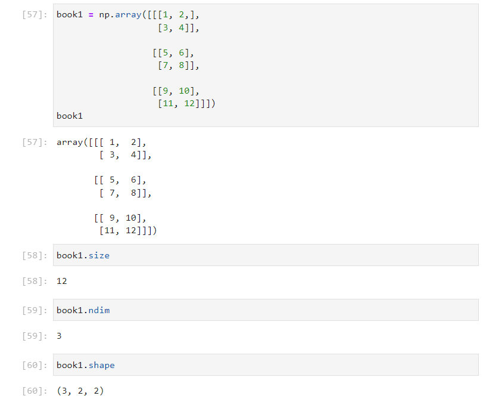

## ravel and reshape

An array has the attributes ```size```, ```ndim``` and ```shape```. The dimensionality of an array can be lost when the ```flat``` attribute is used. The ```flat``` attribute creates an iterator which has no dimensionality:

```
it = book1.flat
it

next(it)
next(it)
next(it)
next(it)
next(it)
list(it)
```


Notice that the array is deconstructed in row order, meaning each consecutive row is essentially concentenated. This can be seen by consuming the iterator by casting it to a ```list```. Then using this ```list``` as the ```object``` with the ```np.array``` factory function:

```
it = book1.flat
it

array1 = np.array(list(it))
array1
```

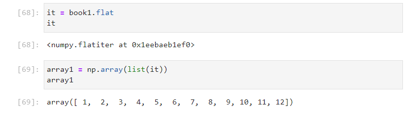

The associated method, ```flatten``` carries out the above in a single step:

```
array1 = np.flatten(book1)
```

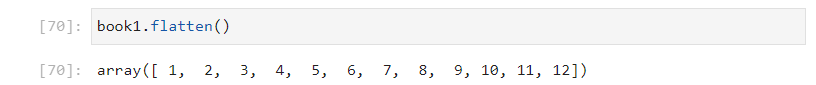

It is also possible to ravel an array, which is the same process as flattening but doesn't involve use of the ```ndarray``` iterator attribute ```flat```. For this there is a ```ravel``` function in the ```numpy``` library alongside a complementary method ```ravel``` which can called from an ```ndarray```. In ```numpy``` most ```numpy``` functions which operate on a ```ndarray``` have a complementary ```ndarray``` method.

```
array1 = book1.ravel()
array1

array1 = np.ravel(book1)
array1
```

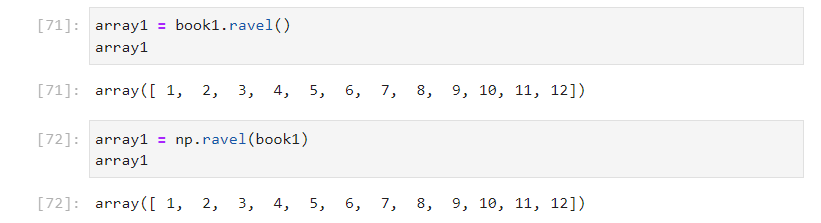

The ```ravel``` function can also be used on other sequences such as a list of lists:

```
booklist1 = [[[1, 2,], 
              [3, 4]],
                  
              [[5, 6], 
               [7, 8]],
                  
              [[9, 10], 
               [11, 12]]]

booklist1

array1 = np.ravel(booklist1)
array1
```

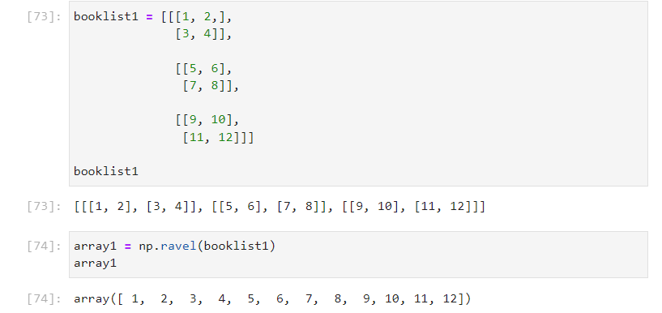

The inbuilt ```list``` class can be used to cast the ravelled ```ndarray``` back to a list. There is also an associated ```ndarray``` method ```tolist```:

```
list(array1)
array1.tolist()
```

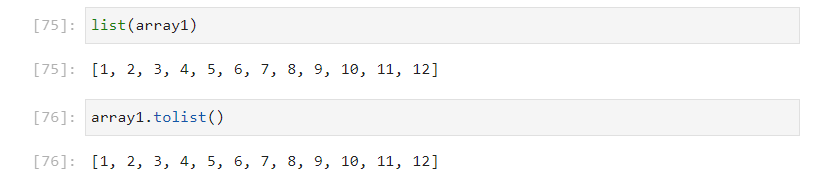

The ```numpy``` function and ```ndarray``` method ```ravel``` have the keyword input argument ```order```. The ```order``` is assigned to a string that is ```'C'``` (default) or ```'F'``` which stand for the C (row-major) and Fortran (column-major) programming languages respectively. **Do not confuse C with column.**

```
booklist1 = [[[1, 2,], 
              [3, 4]],
                  
              [[5, 6], 
               [7, 8]],
                  
              [[9, 10], 
               [11, 12]]]

booklist1

np.ravel(booklist1, order='F')
```

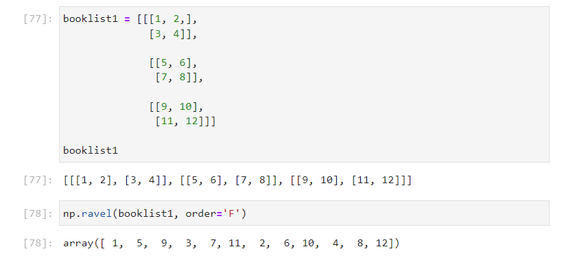

Comparison of the 2 unravelled arrays shows that it is far more logical to use the default ```'C'`` (row-order).

An ```ndarray``` can also be reshaped to new dimensions, providing that the ```size``` of the new dimensions matches the ```size``` of the original dimensions. The original ```ndarray``` is essentially ravelled and each element is then used to populate the new dimensions. Once again there is the ```numpy``` function ```reshape``` and the ```ndarray``` method ```reshape```:

```
matrix1 = np.reshape(a=book1, newshape=(4, 3))
matrix1

matrix1 = book1.reshape((4,3))
matrix1
```

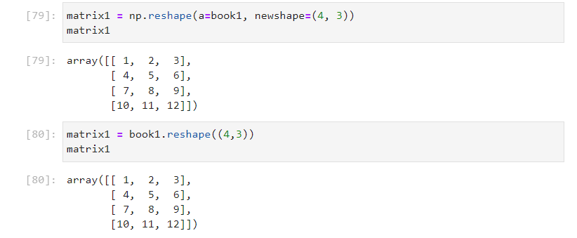

## Indexing and Slicing

The following matrix:

$$ \text{matrixlist1} = \begin{bmatrix} 
                        1 & 2 & 3 \\
                        4 & 5 & 6 \\
                        7 & 8 & 9 \\
                        10 & 11 & 12 \\
                        \end{bmatrix} $$

Can be represented as a list of lists:

```
matrixlist1 = [[1, 2, 3],
               [4, 5, 6],
               [7, 8, 9],
               [10, 11, 12]]
```

And more explicitly as:

```
row0 = [1, 2, 3]
row1 = [4, 5, 6]
row2 = [7, 8, 9]
row3 = [10, 11, 12]

matrixlist1 = [row0,
               row1,
               row2,
               row3]
```

Supposing the following ```2``` is a scalar value of interest:

$$ \text{matrixlist1} = \begin{bmatrix} 
                        1 & \textbf{2} & 3 \\
                        4 & 5 & 6 \\
                        7 & 8 & 9 \\
                        10 & 11 & 12 \\
                        \end{bmatrix} $$


To retrieve this scalar value, ```matrixlist1``` must be indexed, and a square set of brackets is used to select the row, which is ```row0``` at index ```0```:

```
matrixlist1[0]
```

Now that this row is selected, it must also be indexed. A second set of square brackets is used to select the column, which is the column at index ```1```:

```
matrixlist1[0][1]
```

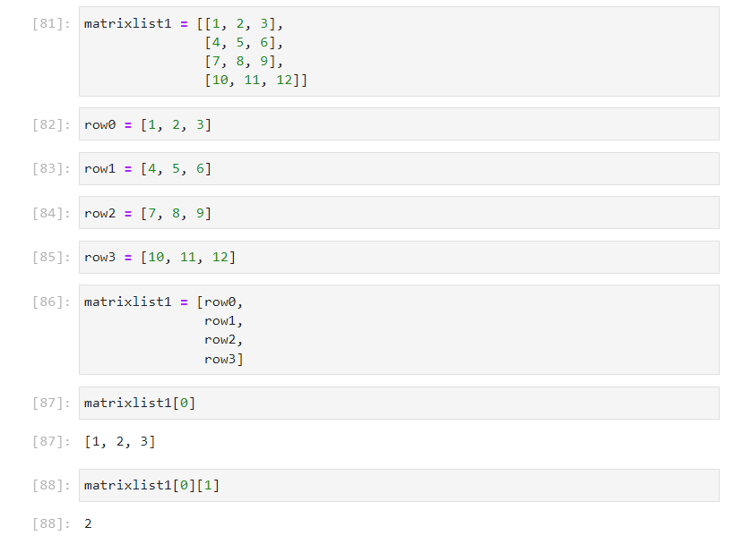

For an equivalent numpy array:

```
matrix1 = np.array([[1, 2, 3],
                    [4, 5, 6],
                    [7, 8, 9],
                    [10, 11, 12]])
```

Indexing can be carried out in a similar manner:

```
matrix1[0][1]
```

However as the ```ndarray``` is setup to be a n dimensional structure, there is simpler syntax, which involves a single set of square brackets and use of a ```,``` as a delimiter. This simpler syntax does not work with a list of lists as the list data structure is not setup to be n dimensional:

```
matrix1[0, 1]
```

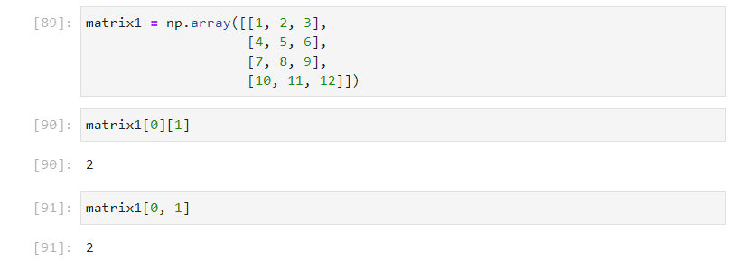

Notice that the form of the square bracket, has a similar form to the ```shape``` ```tuple```. Indexing a scalar value from a higher dimension array follows the same trend as the ```shape``` ```tuple```:

|ndim|description|indexing|
|---|---|---|
|1|line vector|array1d[c, ]|
|2|page consisting of rows of equal length line vectors|array2d[r, c]|
|3|book of equally sized pages|array3d[b, r, c]|
|4|shelf of equally sized books|array4d[s, b, r, c]|
|5|wardrobe of equally sized shelves|array5d[w, s, b, r, c]|
|6|library of equally sized wardrobes|array6d[l, w, s, b, r, c]|
|7|group of equally sized libraries|array7d[g, l, w, s, b, r, c]|

Multiple values can be selected from the array by indexing using a list. This outputs an ```ndarray```:

$$ \text{matrix1} = \begin{bmatrix} 
                    1 & \textbf{2} & 3 \\
                    \textbf{4} & 5 & 6 \\
                    7 & 8 & 9 \\
                    10 & 11 & 12 \\
                    \end{bmatrix} $$

The scalar ```2``` is on row ```0``` and column ```1```.

The scalar ```4``` is on row ```1``` and column ```0```.

```
matrix1[[0, 1], [1, 0]]
```

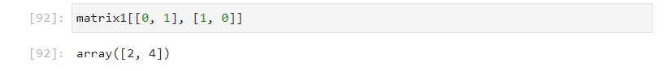

Supposing all of the items are along an axis, for example row 0, all columns:

$$ \text{matrix1} = \begin{bmatrix} 
                    \textbf{1} & \textbf{2} & \textbf{3} \\
                    4 & 5 & 6 \\
                    7 & 8 & 9 \\
                    10 & 11 & 12 \\
                    \end{bmatrix} $$

This can be indexed explicitly using two lists:

```
matrix1[[0, 0, 0], [0, 1, 2]]
```

For short hand, a scalar value can be used the row:

```
matrix1[0, [0, 1, 2]]
```

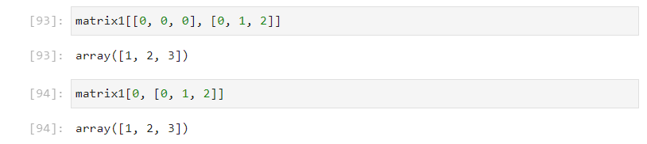

To select all columns slicing can be used. Recall that the ```colon``` is used for slicing. Specifically with the form ```start:stop:step```, the ```start``` ```stop``` and ```step``` values can explictly be specified:

```
matrix1[0, 0:matrix1.shape[1]:1]
```

If they are not, the default values will be taken, that is ```start=0```, ```stop=array.shape[n]``` where ```array``` is the array name and ```n``` is the dimension and ```step=1```:

```
matrix1[0, ::]
```

If the second colon is not specified, it is assumed ```step=1```:

```
matrix1[0, :]
```

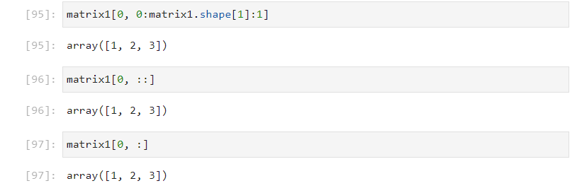

Indexing is also possible using a negative step:

```
matrix1[0, -1:-matrix1.shape[1]-1:-1]
```

Use of a negative step will change the default ```start=-1``` and ```stop=-array.shape[n]-1``` where once again ```array``` is the array name and ```n``` is the dimension and ```step=1```.

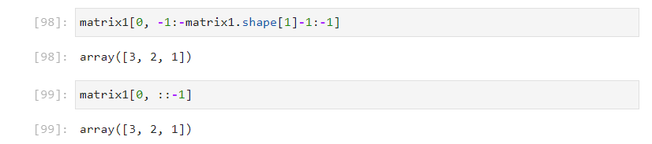

Since it is easier to conceptualise a matrix on a computer screen. Higher order arrays are often constructed using the zeros function and then populated by slicing and assigning the slice to a matrix. For example the following 3darray ```book``` can be created using:

```
book = np.zeros(shape=(3, 4, 3))
book

book.size
book.ndim
book.shape
```


The data for a single page can be constructed as a matrix:

```
page0 = np.array([[1, 2, 3],
                  [4, 5, 6],
                  [7, 8, 9],
                  [10, 11, 12]])
page0

page0.size
page0.ndim
page0.shape
```

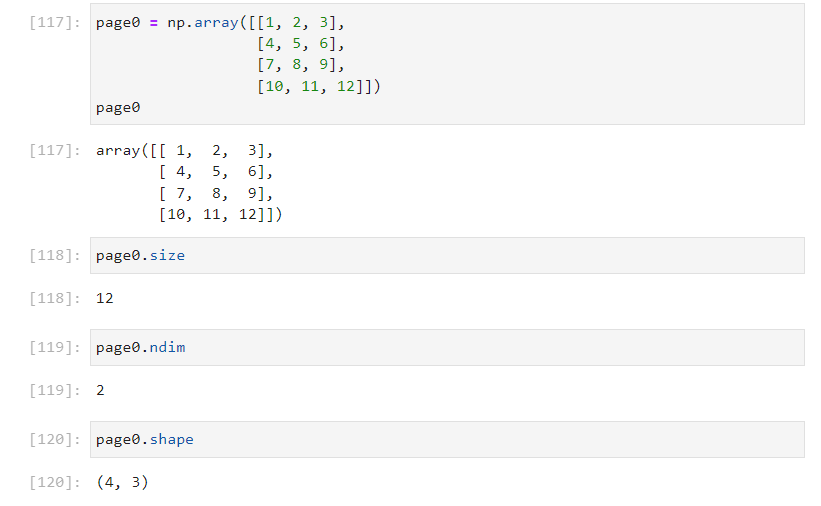

Notice that ```book0.shape[-1]``` and ```page0.shape[-1]``` match meaning the number of columns is the same. Also ```book0.shape[-2]``` and ```page0.shape[-2]``` match meaning the number of rows is the same.

The other two pages can be created using:

```
page1 = np.array([[13, 14, 15],
                  [16, 17, 18],
                  [19, 20, 21],
                  [22, 23, 24]])
page1
page2 = np.array([[25, 26, 27],
                  [28, 29, 30],
                  [31, 32, 33],
                  [34, 35, 36]])
page2
```


Now ```page0``` can be added to ```book``` by slicing the ```book``` and assigning the value to the matrix ```page0```:

```
book[0, :, :] = page0
book
```

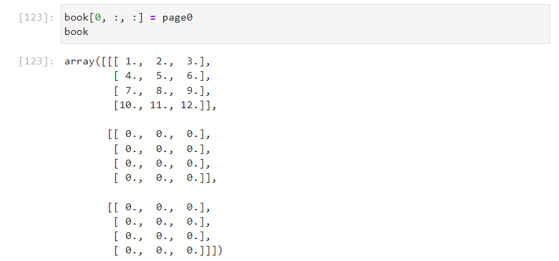

This can be done for the other pages:

```
book[1, :, :] = page1
book[2, :, :] = page2
book
```

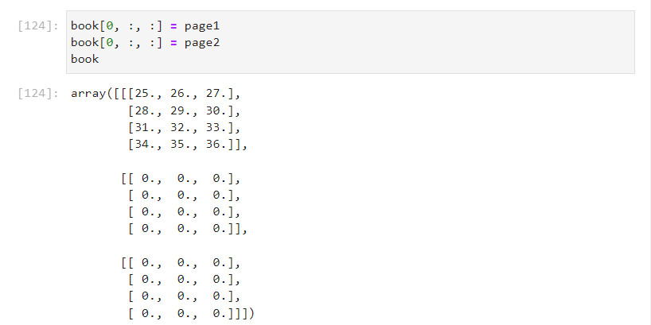

## axis, flip, fliplr, flipud

A matrix can be left right flipped by indexing with rows=```:``` and columns=```::-1```

$$ \text{matrix1} = \begin{bmatrix} 
                    1 & 2 & 3 \\
                    4 & 5 & 6 \\
                    7 & 8 & 9 \\
                    10 & 11 & 12 \\
                    \end{bmatrix} $$

$$ \text{matrix1LR} = \begin{bmatrix} 
                       3 & 2 & 1 \\
                       6 & 5 & 4 \\
                       9 & 8 & 7 \\
                       12 & 11 & 10 \\
                       \end{bmatrix} $$


```
matrix1_lr = matrix1[:, ::-1]
matrix1_lr
```

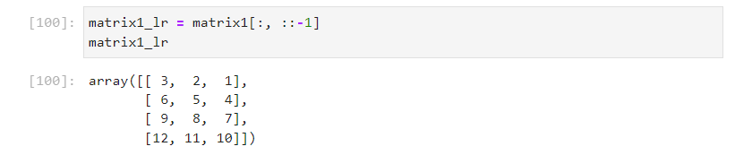

There is an associated ```fliplr``` ```numpy``` function:

```
matrix1_lr = np.fliplr(m=matrix1)
matrix1_lr
```

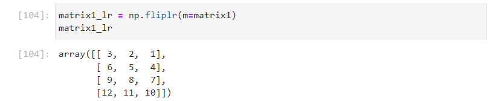

And there is an associated ```flip``` ```numpy``` function. This function has the keyword input argument ```axis``` which is a common parameter for ```numpy``` functions.

When flipping left right using indexing, the following operation ```matrix1[:, ::-1]``` was carried out. All rows were selected and the flipping operation was carried out on the columns, therefore the column axis should be selected. Since a matrix is a 2darray the rows are ```axis=0``` and the columns are ```axis=1```.

```
matrix1_lr = np.flip(m=matrix1, axis=-1)
matrix1_lr
```

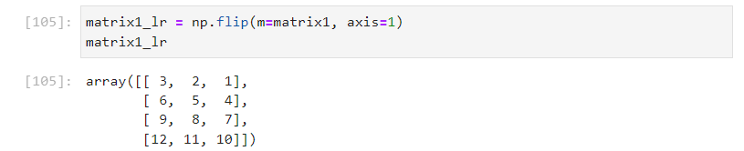

Recall when the number of dimensions in the ```shape``` ```tuple``` were discussed, that the new dimension is left appended. This means the ```axis``` positive value of the columns will increase by 1 for each dimension. On the other hand the negative value will always be ```-1``` and it is therefore recommended to use the negative value for the sake of consistency.

|ndim|description|indexing|
|---|---|---|
|1|line vector|array1d[c, ]|
|2|page consisting of rows of equal length line vectors|array2d[r, c]|
|3|book of equally sized pages|array3d[b, r, c]|
|4|shelf of equally sized books|array4d[s, b, r, c]|
|5|wardrobe of equally sized shelves|array5d[w, s, b, r, c]|
|6|library of equally sized wardrobes|array6d[l, w, s, b, r, c]|
|7|group of equally sized libraries|array7d[g, l, w, s, b, r, c]|

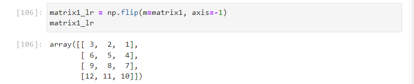

A matrix can be up down flipped by indexing with rows=```::-1``` and columns=```:```. The flipping operation this time is carried out on the ```axis``` of the rows, therefore the ```numpy``` function ```flip``` can be used with ```axis=0``` in the case of a 2d array or more generally ```axis=-2``` for any dimension of array that has rows, to achieve the same operation. There is also the associated ```numpy``` function ```flipud```:
$$ \text{matrix1} = \begin{bmatrix} 
                    1 & 2 & 3 \\
                    4 & 5 & 6 \\
                    7 & 8 & 9 \\
                    10 & 11 & 12 \\
                    \end{bmatrix} $$

$$ \text{matrix1UD} = \begin{bmatrix} 
                    10 & 11 & 12 \\
                    7 & 8 & 9 \\
                    4 & 5 & 6 \\
                    1 & 2 & 3 \\
                    \end{bmatrix} $$

```
matrix1_ud = matrix1[::-1, :]
matrix1_ud

matrix1_ud = np.flipud(m=matrix1)
matrix1_ud

matrix1_ud = np.flip(m=matrix1, axis=-2)
matrix1_ud
```

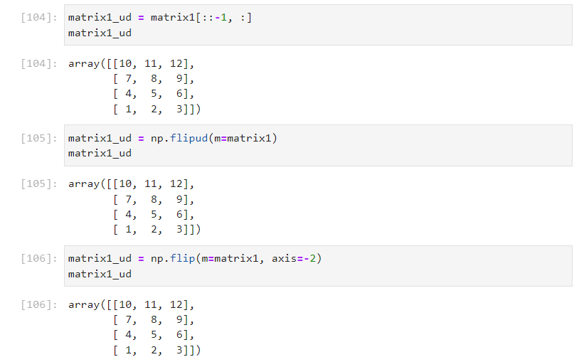

## Transposing

The ```T``` attribute and complementary ```numpy``` function ```transpose``` an be used to transpose an array. 

This is typically used most for 2d arrays for example 2d row vectors can be transposed into 2d column vectors or vice versa: 

$$\text{arrayr}=\left[\begin{matrix}1&2&3&4\end{matrix}\right]$$

$$\text{arrayc}=\left[\begin{matrix}
                     1\\
                     2\\
                     3\\
                     4\\
                     \end{matrix}\right]$$

A row vector can be transposed into a column, which can be transposed back into a row. Transposing the 2d array 2 times, returns the original array:

```
arrayr = np.array([1, 2, 3, 4], ndmin=2)
arrayr

arrayc = arrayr.T
arrayc

arrayr = arrayc.T
arrayr
```

The ```numpy``` function ```transpose``` behaves in a similar manner:

```
arrayc = np.transpose(arrayr)
arrayc
```

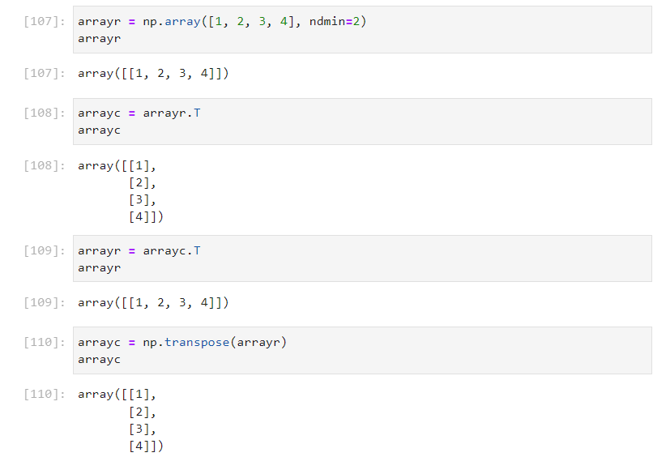

This also works for matrices:

$$ \text{matrix1} = \begin{bmatrix} 
                    1 & 2 & 3 \\
                    4 & 5 & 6 \\
                    7 & 8 & 9 \\
                    10 & 11 & 12 \\
                    \end{bmatrix} $$

$$ \text{matrix1T} = \begin{bmatrix} 
                    1 & 4 & 7 & 9 \\
                    2 & 5 & 8 & 11 \\
                    3 & 6 & 9 & 12\\
                    \end{bmatrix} $$


```
matrix1
matrix1_t = matrix1.T
matrix1_t
```

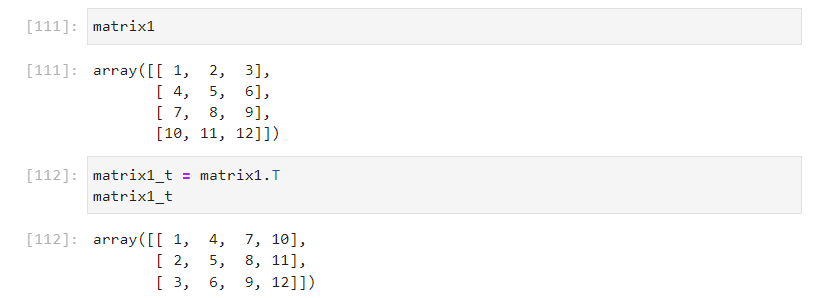

## arange and linspace

A numpy array can be created from a ```range``` object. Recall that the ```range``` object has a ```start```, ```stop``` and   ```step``` value and uses integer based zero-order indexing:

```
array1 = np.array(object=range(0, 10, 1))
array1
array1.ndim
array1.size
array1.dtype
```

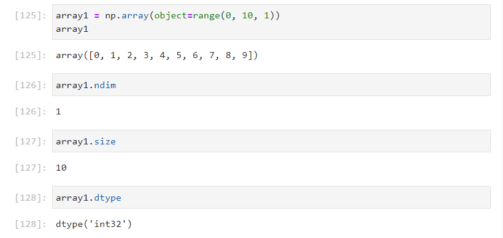

Recall that the ```range``` class can be instantiated with a varying number of positional input arguments:

|n|supplied|default|
|---|---|---|
|3|start, stop, step||
|2|start, stop|step=1|
|1|stop|start=0, step=1|

Zero-order indexing is exclusive of the stop value. To get an array that is inclusive of the stop value ```10```. The following would have to be used:

```
array1 = np.array(object=range(0, 10+1, 1))
array1
array1.ndim
array1.size
array1.dtype
```

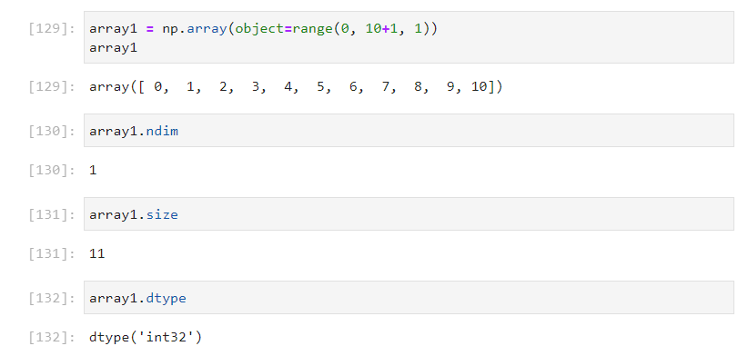

One limitation of the ```range``` class is confined to integers. 


The ```numpy``` library includes the more powerful array range function ```arange```. This function behaves similar to the ```range``` class but can handle additional datatypes. Its docstring can be viewed as a pop up balloon by inputting ```np.arange()``` followed by shift ```⇧``` and tab ```↹```:

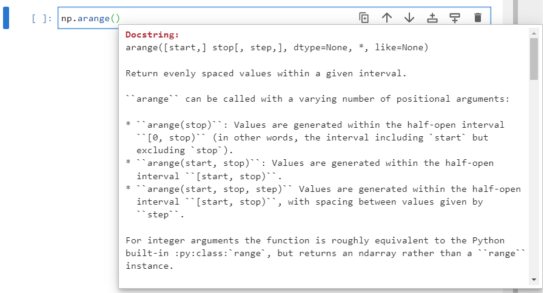

The input arguments are similar to the ```range``` object hwoevder note inclusion of the optional keyword ```dtype```, indicating that this function can handle additional datatypes.The array created from the ```range``` object can be created with the array range function:

```
array1 = np.arange(start=0, stop=10, step=1)
array1
array1.ndim
array1.size
array1.dtype
```


Once again, this uses zero-order indexing and is exclusive of the stop value. To get an array that is inclusive of the stop value ```10```, the following would have to be used:

```
array1 = np.arange(start=0, stop=10+1, step=1)
array1
array1.ndim
array1.size
array1.dtype
```

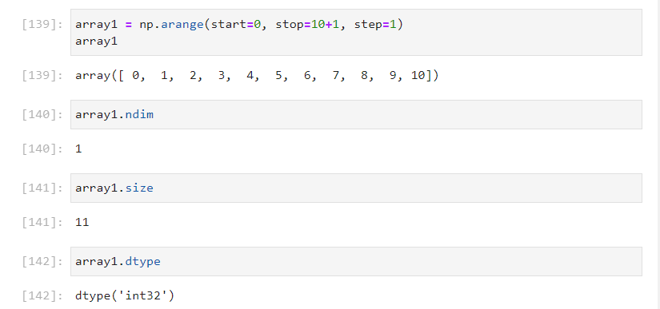

The datatype is inferred by the input arguments. If the input arguments are floating point values, the datatype of the array will be ```float```. For example:

```
array1 = np.arange(start=0.0, stop=10.0+0.1, step=0.1)
array1
array1.ndim
array1.size
array1.dtype
```


The array range function can also be used with ```datetimes``` and ```timedeltas```:

```
import datetime as dt

python3released = dt.datetime(year=2008, month=12, day=3, 
                              hour=12, minute=0, second=0, 
                              microsecond=0, tzinfo=london)
python3released

today = dt.datetime.now()
today

day = dt.timedelta(days=1)
day

python3birthdays = np.arange(start=python3released, stop=today+day, step=day)
python3birthdays
```

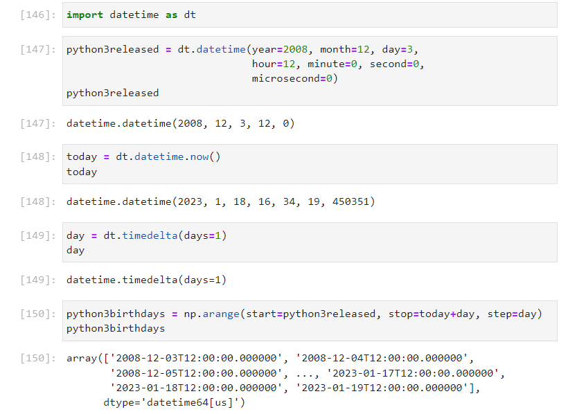

Sadly at this moment, the array range function does not support timezone information, displaying a depreciation warning. This is because Python previously didn't handle timezones very well. Python 3.9 changed the way timezones were implemented using the ```zoneinfo``` standard module and depreciating the crude implementations in the ```datetime``` module. It is possible ```numpy``` will later be updated to use the features of this standard module to support timezone information:


The ```numpy``` library converts instances of the ```datetime``` class to the ```np.datetime64``` class and instances of the ```timedelta``` class to the ```np.timedelta64``` class. The ```numpy``` implementations have higher precisions and can be constructed directly using the ```np.datetime64``` class and ```np.timedelta64``` class respectively: 

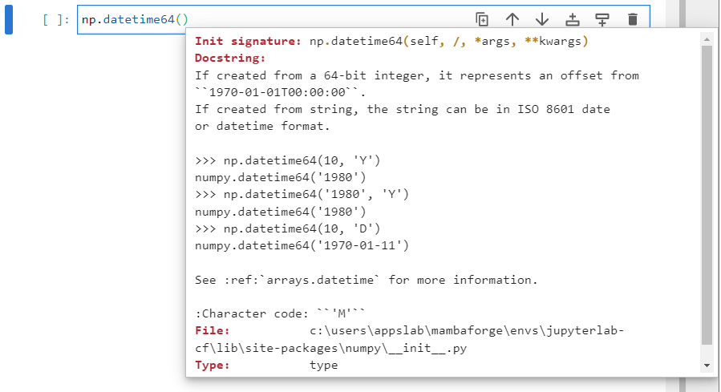

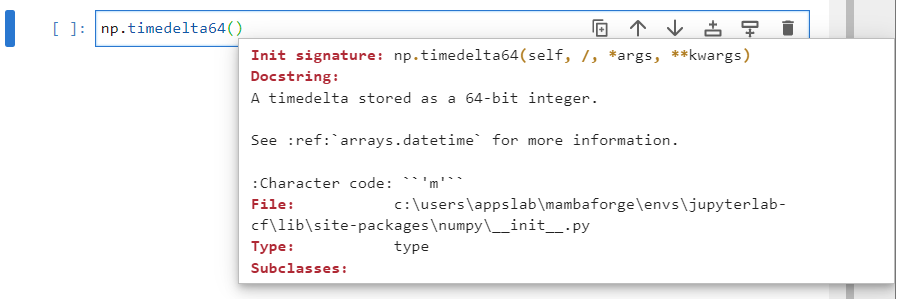

The array range function ```arange``` is complementated by the linearly spaced array function ```linspace```. Its docstring can be viewed as a pop up balloon by inputting ```np.linspace()``` followed by shift ```⇧``` and tab ```↹```:

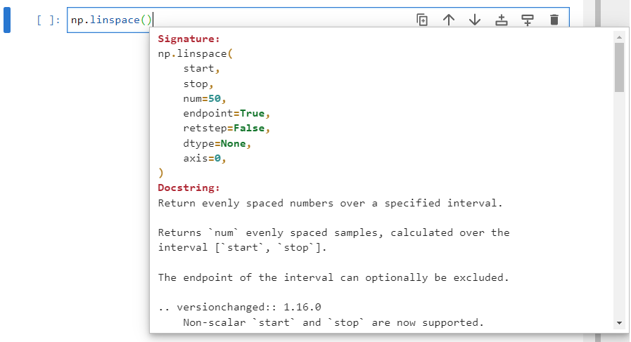

The linearly spaced array function also has a ```start``` and ```stop``` value but is inclusive to both boundaries by default. Instead of a ```step```, it uses ```num``` to specify the number of evenly spaced datapoints:

```
array1 = np.linspace(start=0, stop=10, num=11)
array1

array1.ndim
array1.size
array1.dtype
```

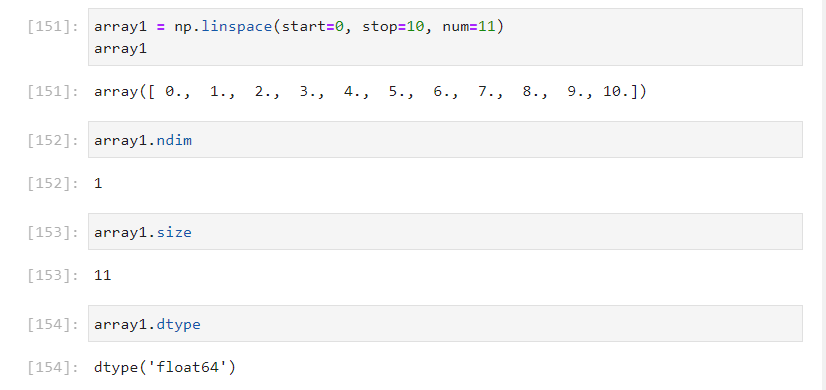

Notice that the datetype is ```float``` by default, as the linear spaced function uses float division to calculate each datapoint. The lineart spaced function has the keyword input argument ```dtype``` which can be used to set a custom datatype such as ```int```.

The functions ```arange``` and ```linspace``` have no shape parameter and will by default create a 1d array:

```
vec = np.arange(start=0, stop=4, step=1)
vec
```

Sometimes it is desired to use these functions to create a row vector or column vector. This can be done by indexing using ```np.newaxis``` to create a new axis alongside ```:``` to indicate all elements. For example in the case of a row vector, all the elements will be in different columns and a new axis will be inserted for the 1 row:

```
rowvec = np.arange(start=0, stop=4, step=1)[np.newaxis, :]
rowvec
```

Likewise in the case of a column vector, a new axis will be inserted for the 1 column and all the elements will be in different rows:

```
colvec = np.arange(start=0, stop=4, step=1)[:, np.newaxis]
colvec
```

Recall it is useful to conceptualise the dimensions from right to left when examining the ```shape``` ```tuple``` or indexing.

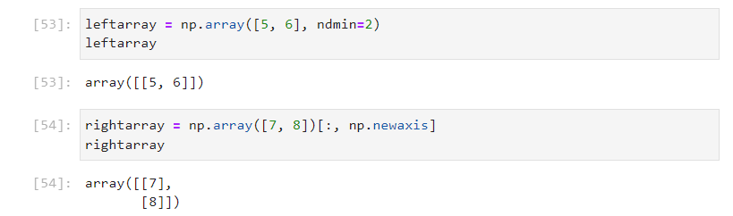

## Data Model Methods

A 2d array or matrix can be quickly generated using the ```arange``` function and ```reshape``` method:

```
matrix1 = np.arange(start=1, stop=17, step=1).reshape((4, 4))
matrix1
```


If the directory function ```dir``` is used on the ndarray:

```
dir(matrix1)
```

A large list of identifiers displays including a larger list of data model identifiers:


The unitary data model methods require only a single instance:

|unitary data model method|use|description|
|---|---|---|
|array.\_\_dir\_\_|dir(array)|list directory for identifiers|
|array.\_\_str\_\_|str(array)|informal representation|
|array.\_\_repr\_\_|repr(array)|formal representation|
|array.\_\_doc\_\_|? array|lookup docstring|
|array.\_\_len\_\_|len(array)|len of array|
|array.\_\_copy\_\_|copy.copy(array)|shallow copy of array|
|array.\_\_deepcopy\_\_|copy.deepcopy(array)|deep copy of array|

The data model method ```__str__``` maps to the builtin string ```str``` class and displays the informal representation, similar to how a matrix is displayed in a word processor:

```
str(matrix1)
```

Use of the ```print``` funtion also prints this informal representation:

```
print(matrix1)
```

The data model method ```__repr__``` maps to the builtin representation ```repr``` function and displays the formal representation which is what is input to instantiate the ndarray:

```
repr(matrix1)
```

This displays in the cell output of Jupyterlab:

```
matrix1
```

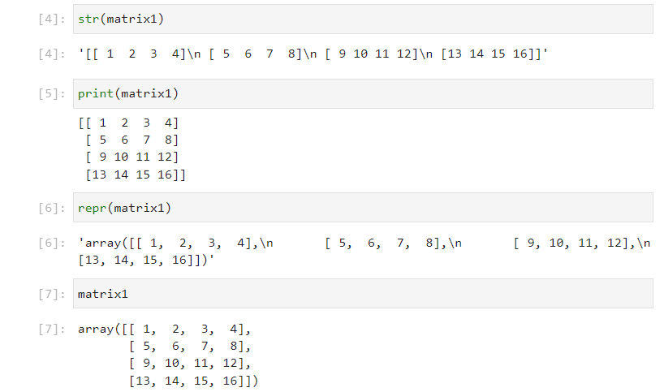

The data model method ```__doc__``` maps to the builtin ```?``` statement and displays the docstring:

```
? matrix1
```

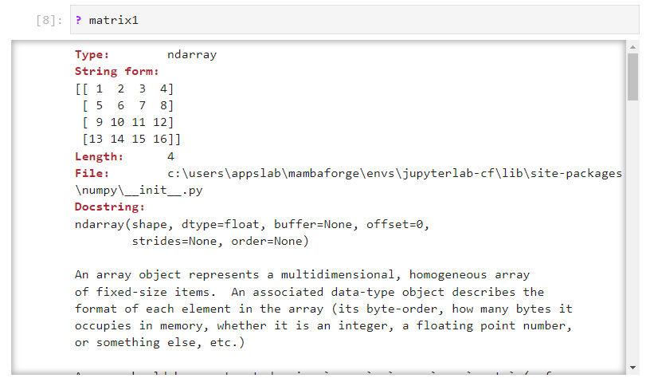

The ```__len__``` data model method maps to the builtin ```len``` function. This treats the array as a list of lists and returns only the length of the outer dimension. It may be mroe appropriate to use the attributes ```size```, ```ndim```, and ```shape```:

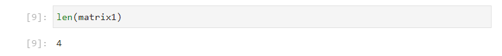

The ndarray is mutable:

```
matrix1
```

If ```matrix1``` is assigned to ```matrix2``` then ```matrix2``` becomes an alias for ```matrix1```:

```
matrix2 = matrix1
```

Mutating ```matrix2```:

```
matrix2[3, 3] = 25
matrix2
```

Mutates, ```matrix1``` as they are the same object:

```
matrix1
```


Returning ```matrix1``` back to the values before:

```
matrix1 = np.arange(start=1, stop=17, step=1).reshape((4, 4))
matrix1
```

The ```copy``` function can be used instead to make a shallow copy:

```
from copy import copy
matrix2 = copy(matrix1)
```

When the copy is mutated:

```
matrix2[3, 3] = 25
matrix2
```

The original remains unchanged:

```
matrix1
```

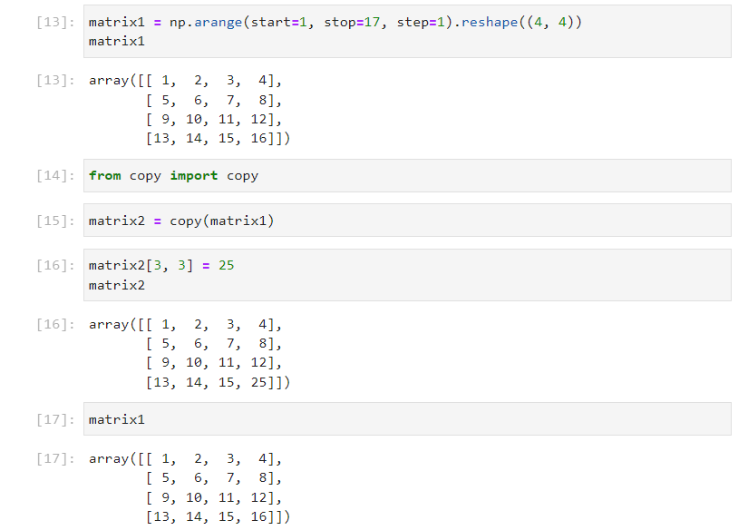

For convenience the ```numpy``` library also has the function ```copy```, and the ```ndarray``` has the associated method ```copy```. Their docstings can be viewed by inputting the function or method name followed by open parenthesis and pressing shift ```⇧``` and tab ```↹```:

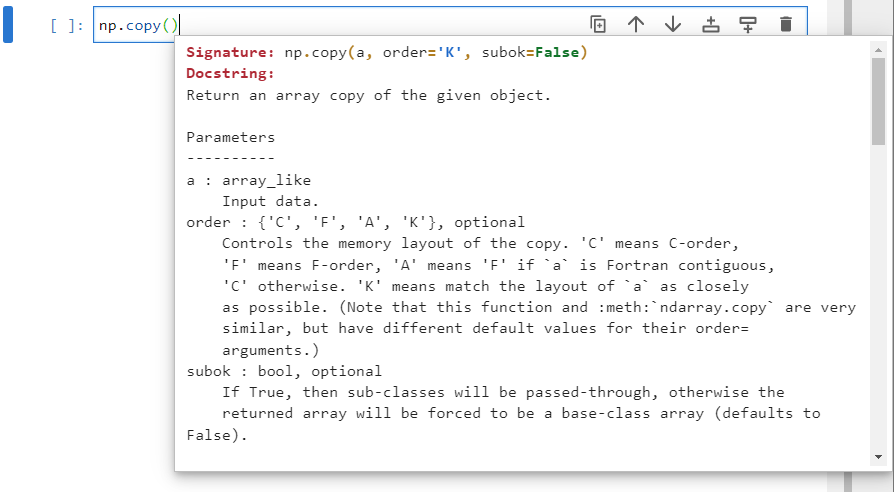

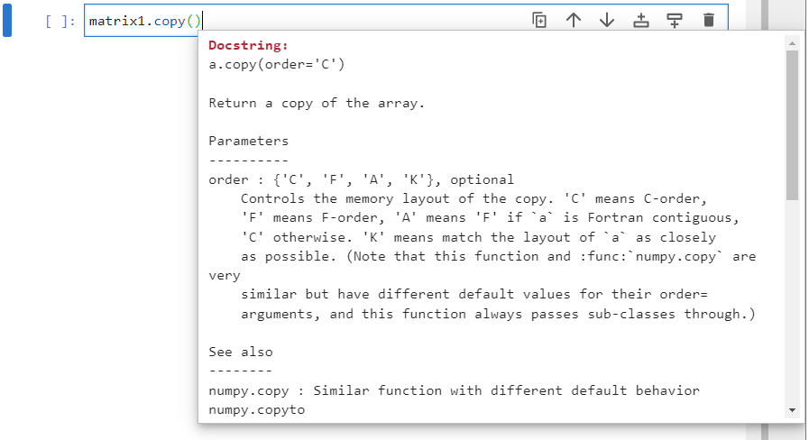

They can be used:

```
matrix3 = np.copy(matrix1)
matrix4 = matrix1.copy()
```

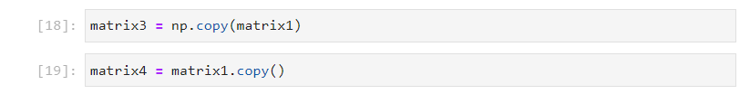

For numeric ndarrays like the above, the shallow copy suffices.

Supposing the following Python ```objects``` are created:

```
list1 = [1, 'hello', 3.14]
dict1 = {'r': 'red', 'g': 'green', 'b': 'blue'}
```

It is however possible to make a ndarray of the datatype ```object```:

```
mixed_array= np.array([list1, dict1, 'world', 2, 6.28], dtype=object)
mixed_array
```

If a copy of this array is made using a shallow copy:

```
mixed_array2 = mixed_array.copy()
```

And one of the mutable Python objects is mutated by indexing into the shallow copy:

```
mixed_array2[0][0] = 4
mixed_array2
```

Notice that:

```
mixed_array
```

And:

```
list1
```

are also mutated.

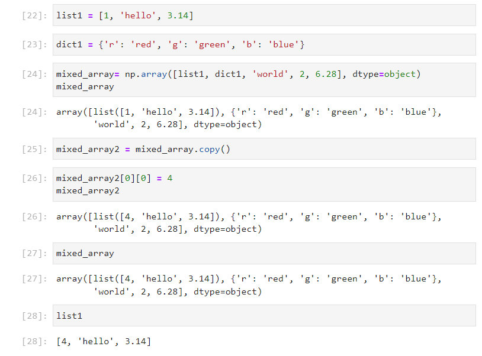

In such a case, it may be preferable to make a deep copy. Returning back to the values before:

```
list1 = [1, 'hello', 3.14]
dict1 = {'r': 'red', 'g': 'green', 'b': 'blue'}
mixed_array= np.array([list1, dict1, 'world', 2, 6.28], dtype=object)
mixed_array
```

If instead a deep copy is made and mutated:

```
from copy import deepcopy
mixed_array2 = deepcopy(mixed_array1)
mixed_array2[0][0] = 4
mixed_array2
```

The original ndarray and Python objects are not mutated:

```
mixed_array
list1
```

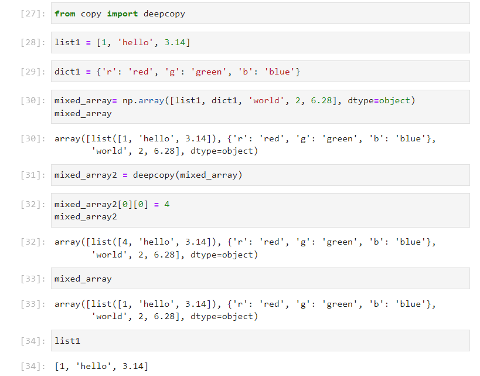

Recall when copy is made a copy of the object references is made. When deepcopy is used a copy of the objects themselves are made.

## Unitary Mathematical Data Model Methods

The unitary (operate on a single array) mathematical data model methods are setup for an array: 

|unitary datamodel method|use|description|
|---|---|---|
|array.\_\_pos\_\_|+array|unitary positive operator|
|array.\_\_neg\_\_|-array|unitary negative operator|
|array.\_\_abs\_\_|abs(array)|absolute values of array|

Supposing the following ndarray is created:

```
matrix1 = np.array([[1, 2, 3, 4],
                    [-5, -6, -7, -8],
                    [9, 10, 11, 12],
                    [-13, -14, -15, -16]])
matrix1
```

Use of the unitary ```+``` operator leaves the array unchanged:

```
matrix2 = +matrix1
matrix2
```

Use of the unitary ```-``` operator reverses the sign of each element, applying negation to each element:

```
matrix3 = -matrix1
matrix3
```

Use of the unitary absolute function ```abs``` strips the sign of each element:

```
matrix4 = abs(matrix1)
matrix4
```

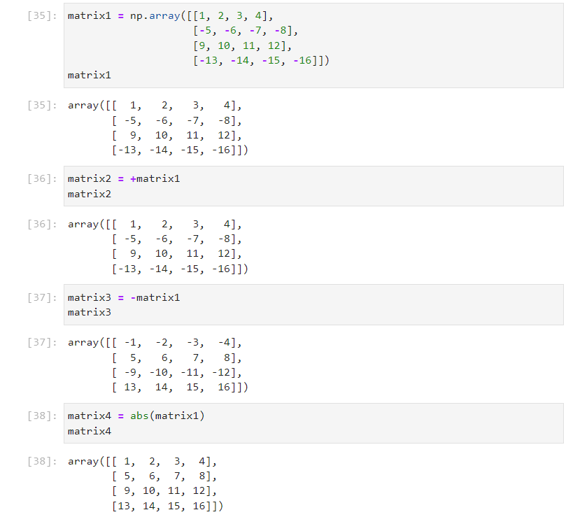

## Binary Mathematical Data Model Methods

The binary (operate on a pair of arrays) mathematical data model methods are setup for an array: 

|binary datamodel method|use|description|
|---|---|---|
|array1.\_\_add\_\_(array2)|array1 + array2|addition operator|
|array1.\_\_radd\_\_(array2)||reverse addition operator|
|array1.\_\_iadd\_\_(array2)|array1 += array2|inplace addition operator|
|array1.\_\_sub\_\_(array2)|array1 - array2|subtraction operator|
|array1.\_\_rsub\_\_(array2)||reverse subtraction operator|
|array1.\_\_isub\_\_(array2)|array1 -= array2|inplace subtraction operator|
|array1.\_\_mul\_\_(array2)|array1 \* array2|multiplication operator|
|array1.\_\_mul\_\_(array2)||reverse multiplication operator|
|array1.\_\_mul\_\_(array2)|array1 \*= array2|inplace multiplication operator|
|array1.\_\_pow\_\_(array2)|array1 \*\* array2|power operator|
|array1.\_\_pow\_\_(array2)||reverse power operator|
|array1.\_\_pow\_\_(array2)|array1 \*\*= array2|inplace power operator|
|array1.\_\_floordiv\_\_(array2)|array1 // array2|integer division operator|
|array1.\_\_rfloordiv\_\_(array2)||reverse integer division operator|
|array1.\_\_ifloordiv\_\_(array2)|array1 //= array2|inplace integer division operator|
|array1.\_\_mod\_\_(array2)|array1 % array2|modulus operator|
|array1.\_\_rmod\_\_(array2)||modulus operator|
|array1.\_\_imod\_\_(array2)|array1 %= array2|modulus operator|
|array1.\_\_truediv\_\_(array2)|array1 / array2|float division operator|
|array1.\_\_rtruediv\_\_(array2)||reverse float division operator|
|array1.\_\_itruediv\_\_(array2)|array1 /= array2|inplace float division operator|
|array1.\_\_and\_\_(array2)|array1 & array2|and operator|
|array1.\_\_rand\_\_(array2)||reverse and operator|
|array1.\_\_iand\_\_(array2)|array1 &= array2|inplace and operator|
|array1.\_\_or\_\_(array2)|array1 \| array2|or operator|
|array1.\_\_ror\_\_(array2)||reverse or operator|
|array1.\_\_ior\_\_(array2)|array1 \|= array2|inplace or operator|
|array1.\_\_xor\_\_(array2)|array1 ^ array2|xor operator|
|array1.\_\_rxor\_\_(array2)||reverse xor operator|
|array1.\_\_ior\_\_(array2)|array1 ^= array2|inplace xor operator|
|array1.\_\_eq\_\_(array2)|array1 == array2|is equal to operator|
|array1.\_\_ne\_\_(array2)|array1 != array2|not equal to operator|
|array1.\_\_lt\_\_(array2)|array1 < array2|less than operator|
|array1.\_\_gt\_\_(array2)|array1 > array2|greater than operator|
|array1.\_\_le\_\_(array2)|array1 <= array2|less than or equal to operator|
|array1.\_\_ge\_\_(array2)|array1 >= array2|greater than or equal to operator|
|array1.\_\_lshift\_\_(array2)|array1 << array2|leftshift operator|
|array1.\_\_rlshift\_\_(array2)||reverse leftshift operator|
|array1.\_\_ilshift\_\_(array2)|array1 <<= array2|inplace leftshift operator|
|array1.\_\_rshift\_\_(array2)|array1 >> array2|rightshift operator|
|array1.\_\_rrshift\_\_(array2)||reverse rightshift operator|
|array1.\_\_irshift\_\_(array2)|array1 >>= array2|inplace rightshift operator|

The instance ```array1``` is referred to as ```self``` in the data model method and the instance ```array2``` is referred to as ```other``` in the data model method. There a large number of binary data model methods however most of these will be familar as they behave the same way as their counterparts in the builtins ```int```, ```float``` and ```bool``` classes.

If ```array1``` is a matrix. An ```array2``` can be added provided the shape of both arrays are the same:

```
matrix1 = np.array([[1, 2, 3, 4],
                    [-5, -6, -7, -8],
                    [9, 10, 11, 12],
                    [-13, -14, -15, -16]])
matrix1

matrix2 = abs(matrix1)
matrix2

matrix3 = matrix1 + matrix2
matrix3
```

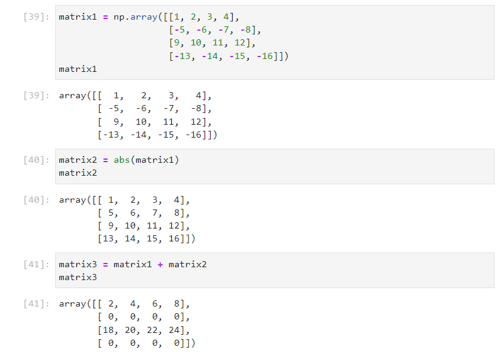

Alternatively scalar expansion of a scalar integer, float or tuple can be used. This expands the scalar across all dimensions of the array:

```
matrix1 = np.array([[1, 2, 3, 4],
                    [-5, -6, -7, -8],
                    [9, 10, 11, 12],
                    [-13, -14, -15, -16]])
matrix1

matrix2 = matrix1 + 4
matrix2
```

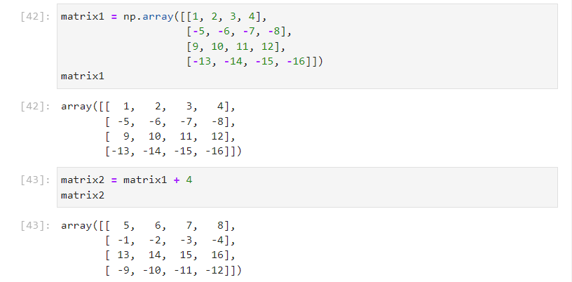

Vector expansion can also be used. However the vector needs to be implictly specified as either a row or a column. 

Vector expansion of a row, expands the row across all other dimensions of the matrix:

```
matrix1 = np.array([[1, 2, 3, 4],
                    [-5, -6, -7, -8],
                    [9, 10, 11, 12],
                    [-13, -14, -15, -16]])
matrix1

row = np.arange(start=0, stop=4, step=1)[np.newaxis, :]
row

matrix2 = matrix1 + row
matrix2
```

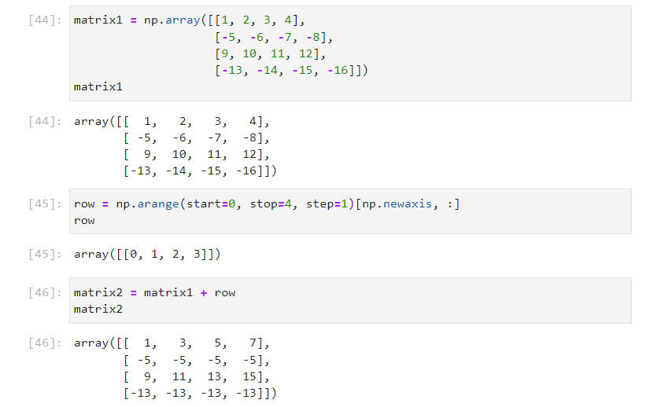

Vector expansion of a column, expands the column across all other dimensions of the matrix:

```
matrix1 = np.array([[1, 2, 3, 4],
                    [-5, -6, -7, -8],
                    [9, 10, 11, 12],
                    [-13, -14, -15, -16]])
matrix1

col = np.arange(start=0, stop=4, step=1)[:, np.newaxis]
col

matrix2 = matrix1 + col
matrix2
```

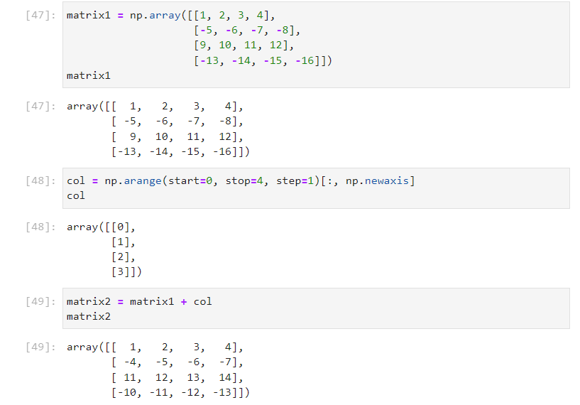

## Array Multiplication

All the operations seen above are carried out element by element. 

For the case of multiplication, it is possible to carry out element by element multiplication or array multiplication which is also known as the dot product.

|datamodel method|use|description|
|---|---|---|
|array1.\_\_matmul\_\_(array2)|array1 @ array2|array multiplication operator|
|array1.\_\_rmatmul\_\_(array2)||array multiplication operator|
|array1.\_\_imatmul\_\_(array2)|array1 @= array2|array multiplication operator|

For matrix multiplication, dimensionality is important and the inner dimensions must match for array multiplication to take place:

$$\left[\begin{matrix}5&6\end{matrix}\right]@\left[\begin{matrix}
                                                   7\\
                                                   8\\
                                                   \end{matrix}\right]=\left[5\ast7+6\ast8\right]=\left[83\right]$$

Notice that the inner dimension of the two arrays surrounding the ```@``` operator match and the return result has a ```shape``` ```tuple```, that is a combination of the original ```shape``` ```tuples``` with the inner dimension stripped:

$$\left(1,\ \textbf{2}\right)@\left(\textbf{2},1\right)=\left(1,1\right)=(1,1)$$

In the above example, the largest dimension of each vector was placed in the inside, around the ```@``` operator resulting in a 2d array with a single scalar element. This is known as the inner dot product of two vectors. In the above example, the leftarray can be conceptualised as the quantity of an item purchased and the rightarray can be conceptualised as the price of each unit item. The array returned is therefore the total price.

In contrast it is possible to place the largest dimension of each vector on the outside. This is known as the outer dot product. and will result in a matrix output.

$$\left[\begin{matrix} 5 \\ 
                       6 \\ 
                       \end{matrix}\right]@ \left[\begin{matrix} 7 & 8 \end{matrix}\right] = \left[\begin{matrix} 5 \ast 7 & 5 \ast8 \\ 
                       6 \ast 7 & 6 \ast8 \\ 
                       \end{matrix}\right] = \left[\begin{matrix} 35 & 40 \\ 
                                                                  42 & 48 \\ 
                                                                  \end{matrix}\right]$$

$$\left(2,\ \textbf{1}\right)@\left(\textbf{1},2\right)=\left(2,2\right)=(2,2)$$

In the above example, the leftarray can be conceptualised as the quantity of an item in a single storage locker and the rightarray can be conceptualised as the number of storage lockers in a room. The array returned is therefore the quantity of each item in each room.

The two arrays can be created:

```
leftarray = np.array([5, 6], ndmin=2)
leftarray

rightarray = np.array([7, 8])[:, np.newaxis]
rightarray
```


The dimensionality can be checked by examining their ```shape``` attribute:

```
leftarray.shape
rightarray.shape
```

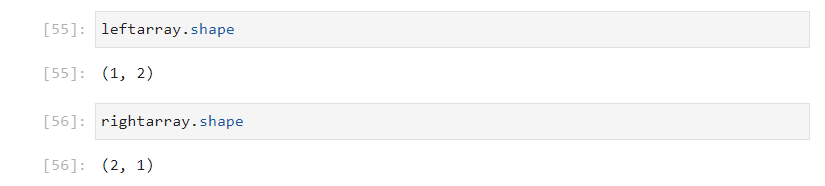

For array multiplication to be valid, the inner dimensions must match:

```
leftarray.shape[-1] == rightarray.shape[0]
```

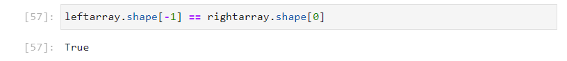

The output array will have the following dimensions:

```
leftarray.shape[-1:] + rightarray.shape[:len(rightarray.shape)-1]
```

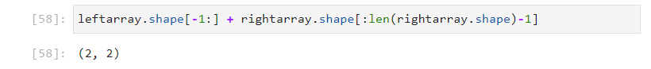

Array multiplication can be carried out using:

```
leftarray @ rightarray
```

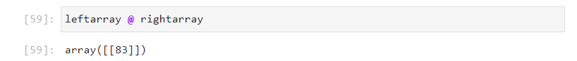

The ```numpy``` library also has the function ```dot``` which carries out the same purpose. Its docstring can be viewed as a pop up balloon by inputting ```np.dot()``` followed by shift ```⇧``` and tab ```↹```:

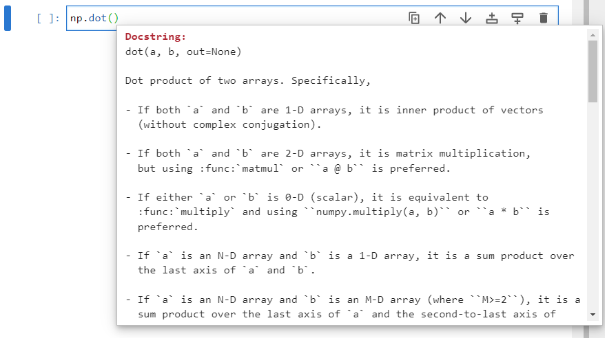

```
np.dot(leftarray, rightarray)
```

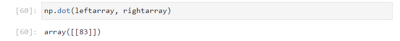

If ```leftarray``` is instead a column vector and the ```rightarray``` is a row vector:

```
leftarray = np.array([5, 6])[:, np.newaxis]
leftarray

rightarray = np.array([7, 8], ndmin=2)
rightarray
```

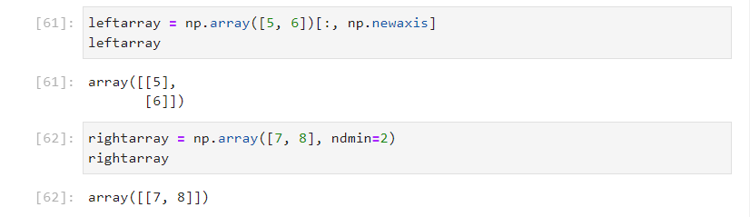

The outer dot product can be calculated using:

```
leftarray @ rightarray
```

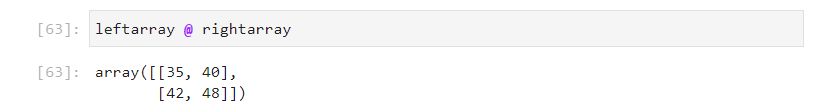

The vectors above were explictly shaped for array multiplication. For convenience there are two additional ```numpy``` functions ```inner``` and ```outer``` which calcualte the inner and outer dot product of two vectors in the form of 1d arrays or lists:

```
leftlist = [5, 6]
rightlist = [7, 8]
np.inner(leftlist, rightlist)
np.outer(leftlist, rightlist)
```

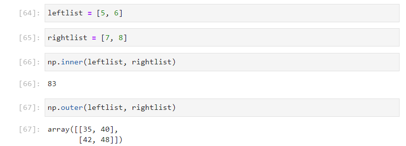

## Square Matrices

Array division is not as straight-forward as array multiplication. Let's look at the example used earlier when the dot product of a row vector and a column vector was calculated:

$$\left[\begin{matrix} 5 & 6 \end{matrix}\right] @ \left[\begin{matrix} 7 \\ 
                                                                        8 \\ 
                                                                        \end{matrix}\right] = \left[ 5 \ast 7 + 6 \ast 8 \right] = \left[ 83 \right]$$

$$\left(1,\ \textbf{2}\right)@\left(\textbf{2},1\right)=\left(1,1\right)=(1,1)$$

Now supposing the values in the column vector are unknowns:

$$\left[\begin{matrix} 5 & 6 \end{matrix}\right] @ \left[\begin{matrix} x \\ 
                                                                        y \\ 
                                                                        \end{matrix}\right] = \left[ 5 \ast x + 6 \ast y \right] = \left[83\right]$$

This gives a single equation, with two unknowns and therefore there is not enough information to calculate these unknowns:

$$5x+6y=83$$

To find a solution for n unknowns, n unique equations are required:

$$5x+6y=83$$

$$3x+3y=42$$

In matrix form this is:

$$\left[\begin{matrix} 5x + 6y \\ 
                       3x + 3y \\
                       \end{matrix}\right] = \left[\begin{matrix} 83 \\
                                                                  42 \\
                                                                  \end{matrix}\right]$$

$$\left[\begin{matrix} 5 & 6 \\ 
                       3 & 3 \\ 
                       \end{matrix}\right] @ \left[\begin{matrix} x \\ 
                                                                  y \\ 
                                                                  \end{matrix}\right] = \left[\begin{matrix} 83 \\
                                                                                                             42 \\
                                                                                                             \end{matrix}\right]$$

Where the known values are:

$$\text{equations}=\left[\begin{matrix} 5 & 6 \\ 
                                        3 & 3 \\ 
                                        \end{matrix}\right]$$

$$\text{results}=\left[\begin{matrix}83 \\ 
                                     42 \\ 
                                     \end{matrix}\right]$$

And the unknown values are:

$$\text{coefficients}=\left[\begin{matrix} x \\ 
                                           y \\ 
                                           \end{matrix}\right]$$

Notice equations is a square matrix. Square matrices are typically constructed from a system of linear equations due to the requirement of n equations for n unknown coefficients. A square matrix typically has a inverse matrix. The inverse matrix for equations is:

$$\text{equationsInv}=\left[\begin{matrix} -1 & 2 \\ 
                                           1 & -1.6667 \\ 
                                           \end{matrix}\right]$$

Array multiplication between a square matrix and its inverse square matrix gives the identity matrix:

$$\left[\begin{matrix} -1 & 2 \\
                       1 & -1.6667 \\ 
                       \end{matrix}\right] @ \left[\begin{matrix} 5 & 6 \\ 
                                                                  3 & 3 \\ 
                                                                  \end{matrix}\right]=\left[\begin{matrix} -1 \ast 5 + 2 \ast 3 & -1 \ast 6 + 2 \ast3 \\ 
                                                                  1 \ast5 - 1.6667 \ast3 &1 \ast 6 - 1.6667 \ast3 \\
                                                                  \end{matrix}\right] = \left[\begin{matrix} 1 & 0 \\
                                                                  0 & 1 \\
                                                                  \end{matrix}\right]$$

And multiplication of an array by the identity matrix leaves it unchanged:

$$\left[\begin{matrix} 1 & 0 \\ 
                       0 & 1 \\ 
                       \end{matrix}\right] @ \left[\begin{matrix} x \\
                                                                  y \\ 
                                                                  \end{matrix}\right] = \left[\begin{matrix} 1 \ast x + 0 \ast y \\
                                                                  0 \ast x + 1 \ast y \\
                                                                  \end{matrix}\right]=\left[\begin{matrix}x \\
                                                                  y \\
                                                                  \end{matrix}\right]$$

This means array multiplication of the inverse equations matrix on both sides gives:

$$\left[\begin{matrix} x \\ 
                       y \\ 
                       \end{matrix}\right] = \left[\begin{matrix} -1 & 2 \\
                                                                  1 & -1.6667 \\ 
                                                                  \end{matrix}\right] @ \left[\begin{matrix} 83 \\
                                                                                                             42 \\
                                                                                                             \end{matrix}\right]$$

Which can be solved:

$$\left[\begin{matrix} -1 & 2 \\
                       1 & -1.6667 \\ 
                       \end{matrix}\right] @ \left[\begin{matrix} 83 \\
                                                                  42 \\ \end{matrix}\right] = \left[\begin{matrix} -1 \ast 83 + 2 \ast42 \\ 
                                                                  1 \ast 83 - 1.6667 \ast 42 \\ 
                                                                  \end{matrix}\right] = \left[\begin{matrix} 1 \\
                                                                                                             13 \\
                                                                                                             \end{matrix}\right]$$

Therefore:

$$\left[\begin{matrix} x \\ 
                       y \\ 
                       \end{matrix}\right] = \left[\begin{matrix} 1 \\ 
                                                                  13 \\ 
                                                                  \end{matrix}\right]$$

The ```equations``` square matrix and ```results``` column vector can be setup using:

```
equations = np.array([[5, 6],
                      [3, 3]])
equations

results = np.array([83, 42])[:, np.newaxis]
results
```

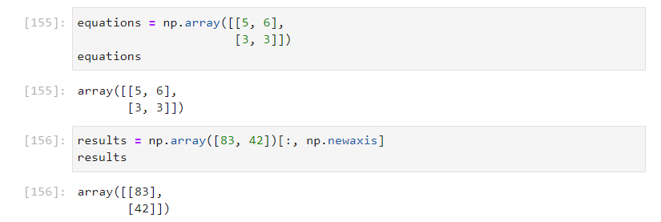


The ```numpy``` library has a linear algebra module, which contains additional linear algebra equations. The ```inv``` function can be used to calculate the inverse matrix:

```
inv_equations = np.linalg.inv(equations)
inv_equations
```

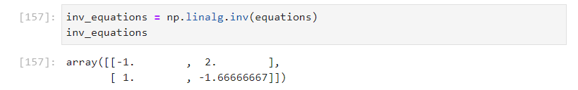

Multiplication of a square matrix by its inverse square matrix gives the identity matrix and is commutative unlike regular array multiplication:

```
inv_equations @ equations
equations @ inv_equations
```

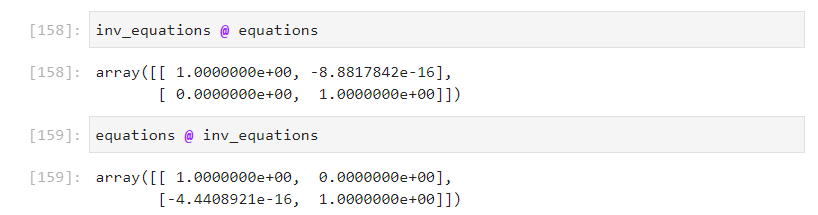

The ```numpy``` library has an ```identity``` function and related ```eye``` function which can be used to generate an identity matrix. The docstrings of these two functions can be seen by inputting in the function followed by open parenthesis followed by shift ```⇧``` and tab ```↹```:

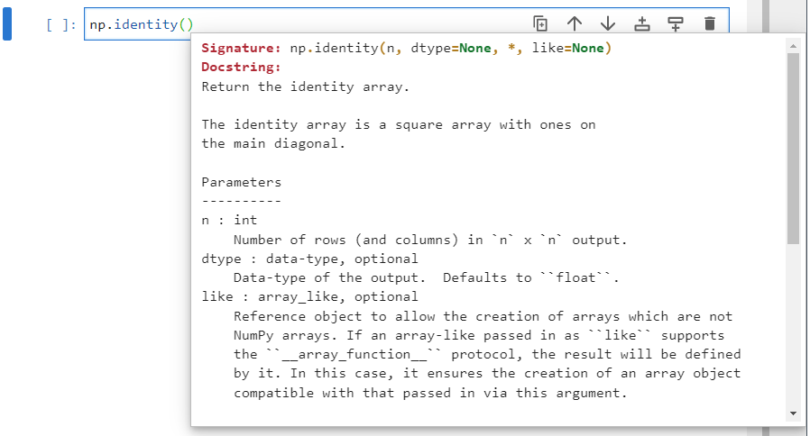

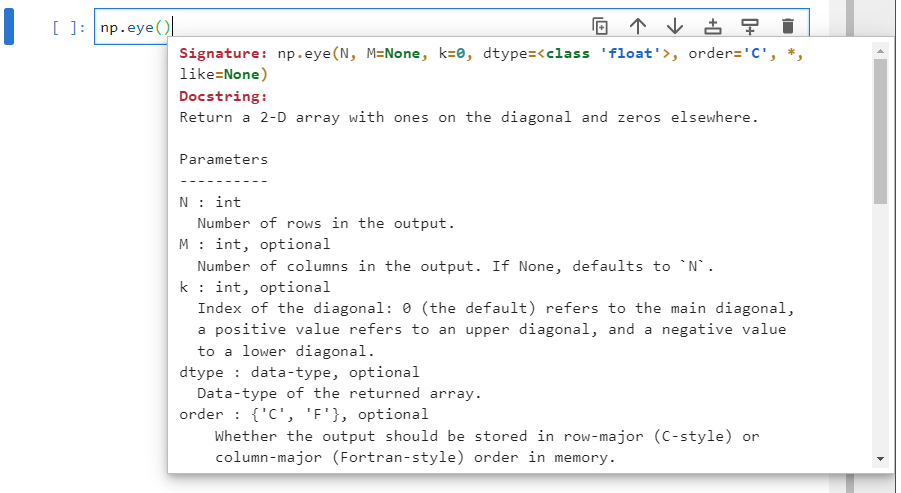

```np.identity``` has only the input argument ```n``` which is the number of rows. The matrix output is always square so the number of columns is equal to the number of rows. This function also has the optional keyword input argument ```dtype``` which can be used to specify the datatype, ```float``` is the default:

```
np.identity(n=2)
```

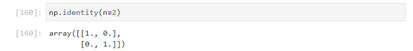

The ```np.eye``` function by default creates a square matrix using the input argument ```N``` which is the number of rows. By default it is square so the number of columns ```M``` is equal to the number of rows ```N```. ```M``` can be specified to get a rectangular matrix. There is also the keyword input argument ```k``` which is the index of the diagonal ```0``` refers to the main diagonal. ```k``` can be set to a positive or negative integer to offset to an upper or lower diagonal respectively. This function also has the optional keyword input argument ```dtype``` which can be used to specify the datatype, ```float``` is the default:

```
np.eye(N=2)
np.eye(N=3, M=3, k=0)
np.eye(N=3, M=3, k=1)
np.eye(N=3, M=3, k=-1)
```

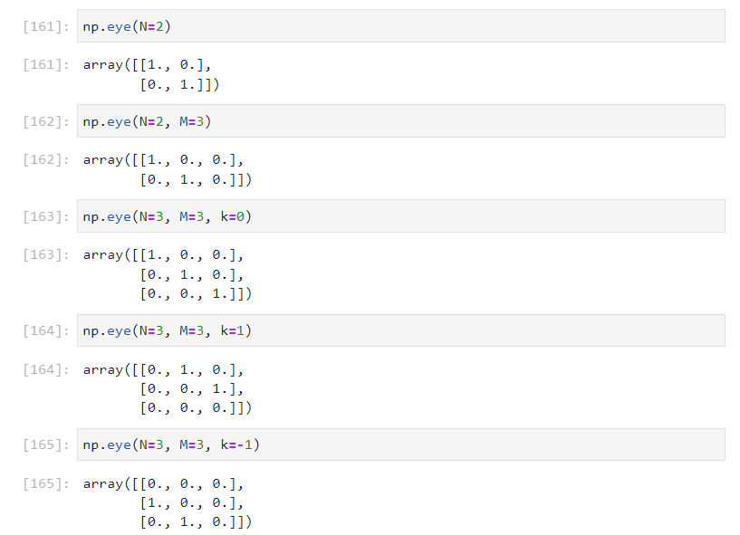

The coefficients can be calculated using:

```
coefficients = inv_equations @ results
coefficients
```

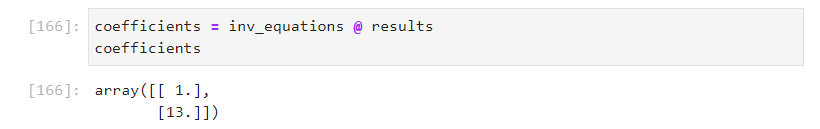

These can also be calculated directly using the ```linalg``` function ```solve```:

```
coefficients = np.linalg.solve(equations, results)
coefficients
```

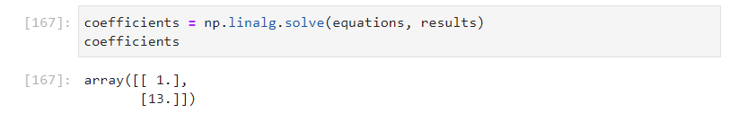

This kind of calculation is carried out when interpolation of an unknown datapoint is carried out by use of its nearest neighbours to construct a linear system of equations.

## Diagonal

The main diagonal starts from the first element in the matrix and has an offset of ```0```:

$$ \text{matrix1} = \begin{bmatrix} 
                    \textbf{1} & 2 & 3 & 4 \\
                    5 & \textbf{6} & 7 & 8 \\
                    9 & 10 & \textbf{11} & 12 \\
                    13 & 14 & 15 & \textbf{16} \\
                    \end{bmatrix} $$

An offset of ```1``` begins the diagonal from the next column, moving towards an upper diagonal:

$$ \text{matrix1} = \begin{bmatrix} 
                    1 & \textbf{2} & 3 & 4 \\
                    5 & 6 & \textbf{7} & 8 \\
                    9 & 10 & 11 & \textbf{12} \\
                    13 & 14 & 15 & 16 \\
                    \end{bmatrix} $$

An offset of ```-1``` begins the diagonal from the previous column, moving towards a lower diagonal:

$$ \text{matrix1} = \begin{bmatrix} 
                    1 & 2 & 3 & 4 \\
                    \textbf{5} & 6 & 7 & 8 \\
                    9 & \textbf{10} & 11 & 12 \\
                    13 & 14 & \textbf{15} & 16 \\
                    \end{bmatrix} $$

The view on the matrix is ```axis1=0``` (the columns) and ```axis2=1``` (the rows) by default. These can be changed but are normally on done so when selecting two axes of interest to form a matrix from a higher dimensional array and then computing the diagonal of this. For example $\text{book1}$ can have the followign pages:

$$ \text{page0} = \begin{bmatrix} 
                    1 & 2 & 3 & 4 \\
                    5 & 6 & 7 & 8 \\
                    9 & 10 & 11 & 12 \\
                    13 & 14 & 15 & 16 \\
                    \end{bmatrix} $$

$$ \text{page1} = \begin{bmatrix} 
                    17 & 18 & 19 & 20 \\
                    21 & 22 & 23 & 24 \\
                    25 & 26 & 27 & 28 \\
                    29 & 30 & 31 & 32 \\
                    \end{bmatrix} $$

$$ \text{page2} = \begin{bmatrix} 
                    33 & 34 & 35 & 36 \\
                    37 & 38 & 39 & 40 \\
                    41 & 42 & 43 & 44 \\
                    45 & 46 & 47 & 48 \\
                    \end{bmatrix} $$

$$ \text{page3} = \begin{bmatrix} 
                    49 & 50 & 51 & 52 \\
                    53 & 54 & 55 & 56 \\
                    57 & 58 & 59 & 60 \\
                    61 & 62 & 63 & 64 \\
                    \end{bmatrix} $$

Recall the shape tuple is ```(4, 4, 4)``` with ```(4 pages, 4rows, 4 columns)```:

If for example, the diagonal between the pages and the columns is of interest then ```axis0=-3``` and ```axis1=-1``` should be selected:

$$ \text{page0} = \begin{bmatrix} 
                    \textbf{1} & 2 & 3 & 4 \\
                    \textbf{5} & 6 & 7 & 8 \\
                    \textbf{9} & 10 & 11 & 12 \\
                    \textbf{13} & 14 & 15 & 16 \\
                    \end{bmatrix} $$

$$ \text{page1} = \begin{bmatrix} 
                    17 & \textbf{18} & 19 & 20 \\
                    21 & \textbf{22} & 23 & 24 \\
                    25 & \textbf{26} & 27 & 28 \\
                    29 & \textbf{30} & 31 & 32 \\
                    \end{bmatrix} $$

$$ \text{page2} = \begin{bmatrix} 
                    33 & 34 & \textbf{35} & 36 \\
                    37 & 38 & \textbf{39} & 40 \\
                    41 & 42 & \textbf{43} & 44 \\
                    45 & 46 & \textbf{47} & 48 \\
                    \end{bmatrix} $$

$$ \text{page3} = \begin{bmatrix} 
                    49 & 50 & 51 & \textbf{52} \\
                    53 & 54 & 55 & \textbf{6} \\
                    57 & 58 & 59 & \textbf{60} \\
                    61 & 62 & 63 & \textbf{64} \\
                    \end{bmatrix} $$

```matrix1``` can be created using the following code:

```
matrix1 = np.arange(start=1, stop=17, step=1).reshape((4, 4))
matrix1
```

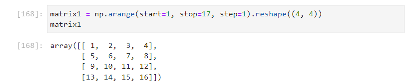

An ndarray has the method ```diagonal``` and there is an associated ```numpy``` function ```diagonal```. The docstring of the function can be viewed by inputting inputting ```np.diagonal()``` followed by shift ```⇧``` and tab ```↹```. The function asks for an array ```a``` which is provided when ```diagonal``` is used as a method from an ```ndarray```. The keyword input arguments ```offset```, ```axis1``` and ```axis2``` are all configured with default values to view the main diagonal of a matrix:

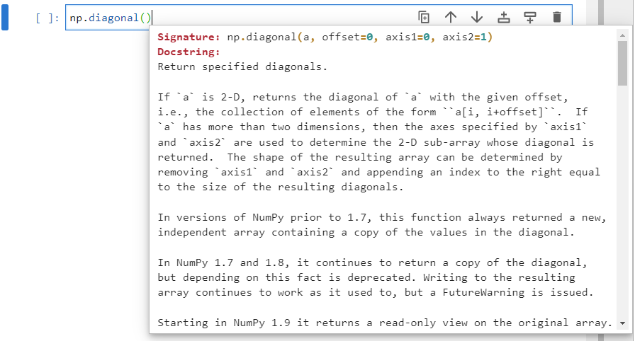

The main diagonal and the offset ```1``` and ```-1``` diagonals can be viewed using:

```
matrix1.diagonal()
np.diagonal(a=matrix1)
matrix1.diagonal(offset=1)
matrix1.diagonal(offset=-1)
```

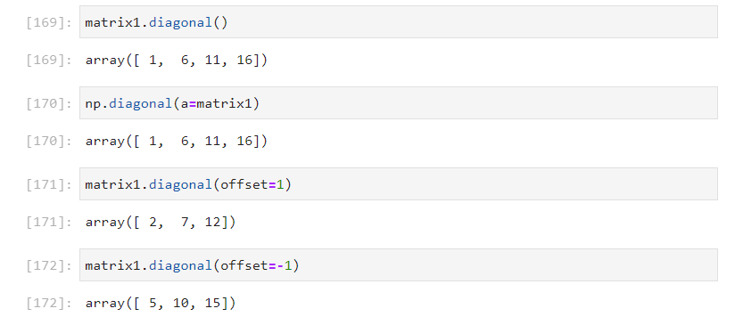

If the anti-diagonal is desired, the matrix can be left right flipped using the ```ndarray``` method ```fliplr``` before using the ```ndarray``` method ```diagonal```.

A 3d array can be created using:

```
book1 = np.arange(start=1, stop=65, step=1).reshape((4, 4, 4))
book1
```

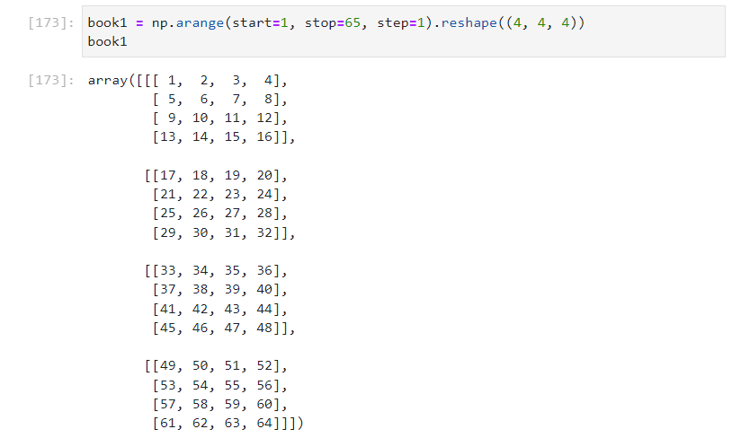

The diagonal between the pages and the columns can be selected using ```axis0=-3``` and ```axis1=-1```:

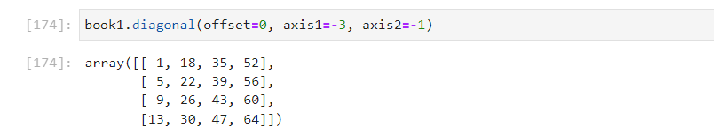

The ```numpy``` function ```fill_diagonal``` can be used to replace the values of the dagonal with a fill value:

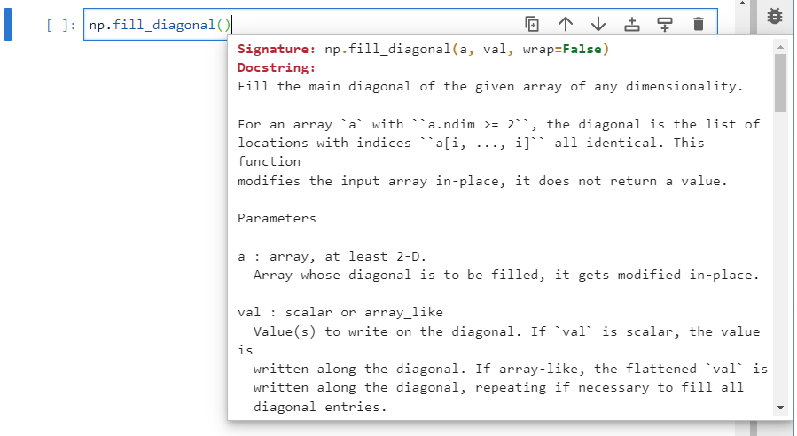

```matrix2``` can be be created using zeros:

```
matrix2 = np.zeros((4, 4))
matrix2
```

Its diagonal can be filled with ```val=1```:

```
np.fill_diagonal(a=matrix2, val=1)
```

Notice that this method has no return value and the changes mutate ```matrix``` in place:

```
matrix2
```

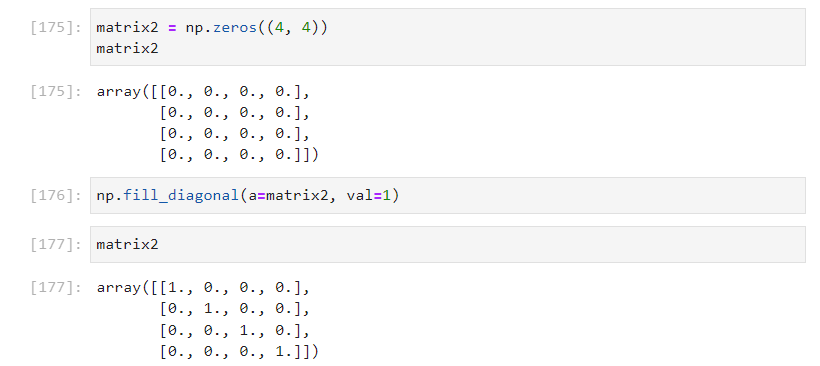

The ```numpy``` function ```diag``` can be used to construct a diagonal array or extract a copy of a diagonal. The docstring of the function can be viewed by inputting inputting ```np.diag()``` followed by shift ```⇧``` and tab ```↹```. It has a keyword input argument ```k``` which is equivalent to ```offset``` seen in the ```numpy``` function ```diagonal```:

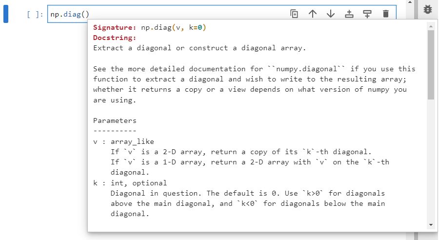

```
np.diag([1, 2, 3, 4])
np.diag([1, 2, 3, 4], k=1)
matrix1
np.diag(matrix1)
```

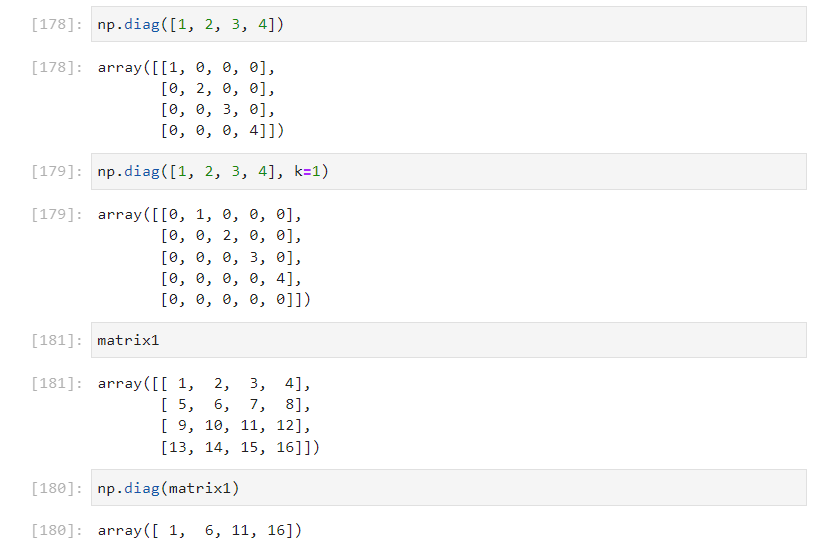

The ```numpy``` fucntion ```diag``` does not extend to higher numbers of dimensions like the ```numpy``` function ```diagonal```.

## Statistics

The ```ndarray``` includes a number of statistical methods and complementary ```numpy``` functions.

The ```ndarray``` method ```max``` and associated ```numpy``` function array max ```amax``` are used to calculate the maximum value of an array, along an axis. The associated ```ndarray``` method ```argmax``` and associated ```numpy``` function argument max ```argmax``` can be used to get the associated index of the maximum value. 

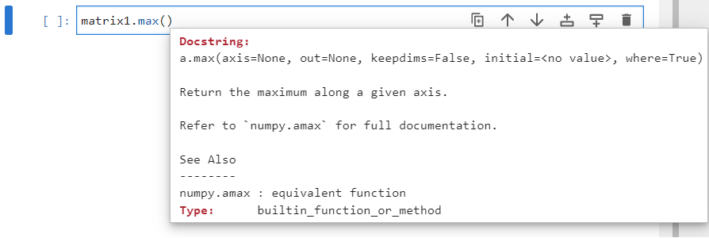

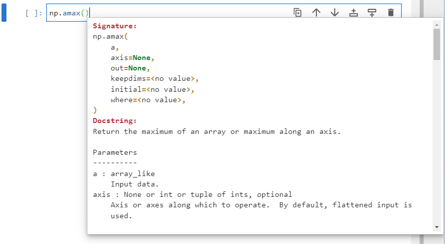

These methods use the input argument ```axis```. The effct of ```axis``` can be seen by examining the following matrix:

$$ \text{matrix1} = \begin{bmatrix} 
                    1 & -2 & 3 & -4 \\
                    -5 & 6 & -7 & 8 \\
                    9 & -10 & 11 & -12 \\
                    \end{bmatrix} $$

The shape tuple is ```(3, 4)``` that is ```(3 rows, 4 columns)``` and recall the columns are at index ```-1``` and the rows are at index ```-2```.

When ```axis=0``` the matrix is flattened, so the maximum value of this flattened array is returned as the scalar ```11``` and the associated index of this value is ```10```:

$$ \text{matrix1axisnone} = \begin{bmatrix} 1 & -2 & 3 & -4 & -5 & 6 & -7 & 8 & 9 & -10 & \textbf{11} & -12 \end{bmatrix} $$

$$ \text{matrix1axisnoneindex} = \begin{bmatrix} 0 & 1 & 2 & 3 & 4 & 5 & 6 & 7 & 8 & 9 & \textbf{10} & 11 \end{bmatrix} $$

When the ```axis=-1```, the method operates along columns. For example examining the four columns in the first row, the maximum value is ```3``` and it has a corresponding index of ```2```: 

$$ \text{matrix1Col} = \begin{bmatrix} 
                     1 & -2 & \textbf{3} & -4 \\
                     x & x & x & x \\
                     y & y & y & y \\
                     \end{bmatrix} $$

$$ \text{matrix1ColIndex} = \begin{bmatrix} 
                            0 & 1 & \textbf{2} & 3 \\
                            x & x & x & x \\
                            y & y & y & y \\
                            \end{bmatrix} $$

The maximum value of each column is found for each row:

$$ \text{matrix1} = \begin{bmatrix} 
                    1 & -2 & \textbf{3} & -4 \\
                    -5 & 6 & -7 & \textbf{8} \\
                    9 & -10 & \textbf{11} & -12 \\
                    \end{bmatrix} $$

$$ \text{matrix1ColIndex} = \begin{bmatrix} 
                            0 & 1 & \textbf{2} & 3 \\
                            0 & 1 & 2 & \textbf{3} \\
                            0 & 1 & \textbf{2} & 3 \\
                            \end{bmatrix} $$

Numpy will return these as flattened arrays:

$$ \text{ColMax} = \begin{bmatrix} 3 & 8 & 11 \end{bmatrix} $$

$$ \text{ColMaxIndex} = \begin{bmatrix} 2 & 3 & 2 \end{bmatrix} $$

However it can be easier to conceptualise these as column vectors:

$$ \text{ColMax} = \begin{bmatrix} 3 \\
                                   8 \\ 
                                   11 \\ 
                                   \end{bmatrix} $$

$$ \text{ColMaxIndex} = \begin{bmatrix} 2 \\ 
                                        3 \\ 
                                        2 \\ 
                                        \end{bmatrix} $$

When the ```axis=-2```, the method operates along rows: 

$$ \text{matrix1} = \begin{bmatrix} 
                    1 & -2 & 3 & -4 \\
                    -5 & \textbf{6} & -7 & \textbf{8} \\
                    \textbf{9} & -10 & \textbf{11} & -12 \\
                    \end{bmatrix} $$

$$ \text{matrix1RowIndex} = \begin{bmatrix} 
                            0 & 0 & 0 & 0 \\
                            1 & \textbf{1} & 1 & \textbf{1} \\
                            \textbf{2} & 2 & \textbf{2} & 2 \\
                            \end{bmatrix} $$

Numpy will return these as flattened arrays. However it can be easier to conceptualise these as row vectors:

$$ \text{RowMax} = \begin{bmatrix} 9 & 6 & 11 & 8 \end{bmatrix} $$

$$ \text{RowMaxIndex} = \begin{bmatrix} 2 & 1 & 2 & 2 \end{bmatrix} $$

The following matrix can be created:

```
matrix1 = np.array([[1, -2, 3, -4],
                    [-5, 6, -7, 8],
                    [9, -10, 11, -12]])
matrix1
```

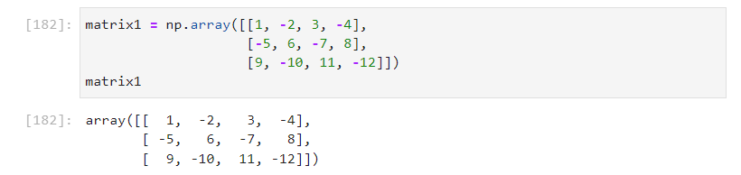

The maximum and maximum index of the value in the flattened array is:

```
matrix1.max(axis=None)
matrix1.argmax(axis=None)
```

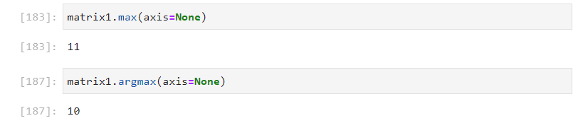

Operating the ```max``` and ```argmax``` along columns (```axis=-1```) gives:

```
matrix1.max(axis=-1)
matrix1.argmax(axis=-1)
```

To keep the dimensions, assign the keyword argument ```keepdims=True```. This will show the output as column vectors:

```
matrix1.max(axis=-1, keepdims=True)
matrix1.argmax(axis=-1, keepdims=True)
```

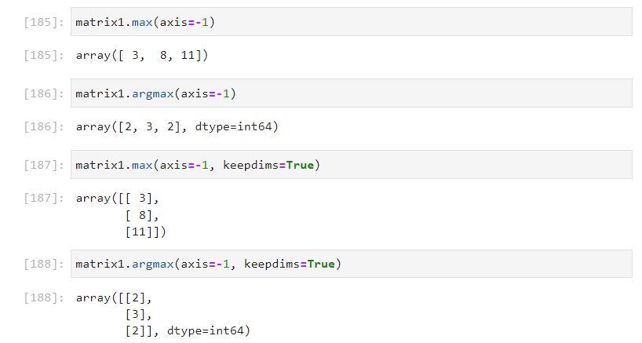

Operating the ```max``` and ```argmax``` along rows (```axis=-2```) gives:

```
matrix1.max(axis=-2, keepdims=True)
matrix1.argmax(axis=-2, keepdims=True)
```

To view these as row vectors:

```
matrix1.max(axis=-1)[:, np.newaxis]
matrix1.argmax(axis=-1)[:, np.newaxis]
```

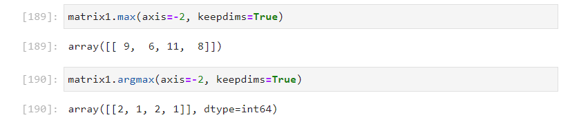

The complementary methods ```min``` and ```argmin``` operate in a similar manner, returning the value and index of the minimum value.

The ndarray statistical methods and their complementary ```numpy``` functions ```sum```, ```prod```, ```mean```, ```var``` and ```std``` all operate using ```axis``` and ```keepdims``` as input arguments nd behave similarly to their equivalents in the statistics module. The ```var``` and ```std``` have a keyword input argument delta degrees of freedom ```ddof``` which has a default value of ```0``` and calculates the population variance or population standard deviation. This can be changed to ```1``` to calculate the sample variance or sample standard deviation. For more details about these calculations, see the [Statistics Module Tutorial](https://github.com/PhilipYip1988/python-tutorials/tree/main/025_statistics#readme):

```
matrix1.sum(axis=-1, keepdims=True)
matrix1.prod(axis=-1, keepdims=True)
matrix1.mean(axis=-1, keepdims=True)
matrix1.var(axis=-1, keepdims=True, ddof=1)
matrix1.std(axis=-1, keepdims=True, ddof=1)
```

There are some additional ```numpy``` functions such as the ```median``` (explored in the statistics module) and ```average```. The ```average``` is essentially a weighted mean. When each datapoint has a weight of ```1``` both are identical:

$$ \text{matrix1} = \begin{bmatrix} 
                    1 & -2 & 3 & -4 \\
                    -5 & 6 & -7 & 8 \\
                    9 & -10 & 11 & -12 \\
                    \end{bmatrix} $$

$$ \text{weights} = \begin{bmatrix} 
                    1 & 1 & 1 & 1 \\
                    1 & 1 & 1 & 1 \\
                    1 & 1 & 1 & 1 \\
                    \end{bmatrix} $$

The average can be calculated, for the first row using:

$$\frac{1\ast1+1\ast-2+1\ast3+1\ast-4}{1+1+1+1}=\frac{-2}{4}=-0.5$$

For non-uniform weights an array of weights with a matching shape has to be provided:

$$ \text{weights} = \begin{bmatrix} 
                    1 & 2 & 3 & 4 \\
                    1 & 2 & 3 & 4 \\
                    1 & 2 & 3 & 4 \\
                    \end{bmatrix} $$

The weighted average can be calculated, for the first row using:

$$\frac{1\ast1+2\ast-2+3\ast3+4\ast-4}{1+2+3+4}=\frac{-10}{10}=-1$$

The median and average (with and without weights) can be calculated using:

```
matrix1
np.median(a=matrix1, axis=-1, keepdims=True)
np.average(a=matrix1, axis=-1, keepdims=True)
weights = np.array([[1, 2, 3, 4],
                    [1, 2, 3, 4],
                    [1, 2, 3, 4]])
np.average(a=matrix1, axis=-1, keepdims=True, weights=weights)
```

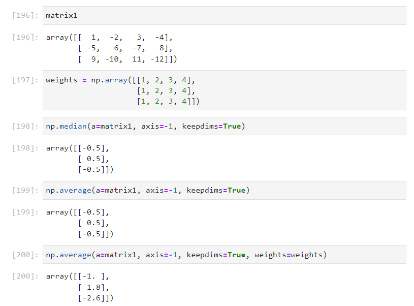

The ndarray methods ```any``` and ```all``` work with an array of boolean values and operate along an ```axis```. The value returned for ```any``` will be ```True``` if any of the elements are ```True```, whereas the value returned for ```all``` will be ```true``` only is all the elements are ```True```:

```
matrix1 = np.array([[True, False, False, False],
                    [True, True, True, True],
                    [False, False, False, False]])
matrix1

matrix1.any(axis=-1, keepdims=True)
matrix1.all(axis=-1, keepdims=True)
```

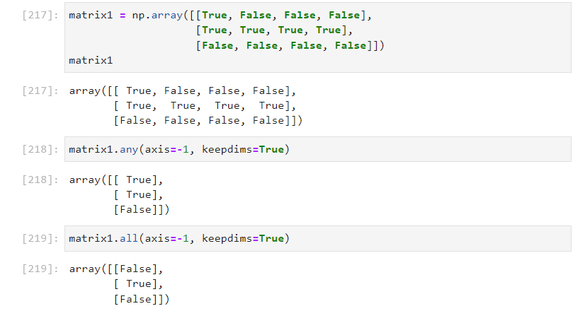

The ndarray methods and associated ```numpy``` functions ```sort``` and ```argsort``` also operate along an ```axis``` however unlike the previous methods where the array was collapsed along the axis selected, the size of the array is maintained:

When the ```sort``` method is used, it occurs in place, mutating the ```ndarray``` inplace, analogous to the list method ```sort```. 
```
matrix1
matrix1.sort(axis=-1)
matrix1
```

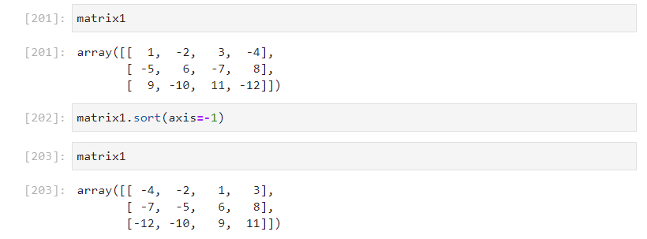

In contrast the ```numpy``` function ```sort``` returns a new ```ndarray```:

```
matrix1 = np.array([[1, -2, 3, -4],
                    [-5, 6, -7, 8],
                    [9, -10, 11, -12]])
matrix1
np.sort(matrix1, axis=-1)
matrix1
```

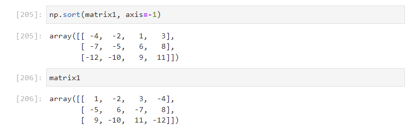

For simplicity, examine only the first row, to sort it, the lowest value at ```-4``` is selected with index ```3```. The next lowest value is ```-2``` at index ```1```. The next lowest value is ```1``` at index ```0``` and the highest value is ```3``` at index ```2```.

$$ \text{matrix1} = \begin{bmatrix} 
                    1 & -2 & 3 & -4 \\
                    -5 & 6 & -7 & 8 \\
                    9 & -10 & 11 & -12 \\
                    \end{bmatrix} $$

The argsort is the reordering of these indexes:

$$ \text{matrix1ColArgSort} = \begin{bmatrix} 
                              3 & 1 & 0 & 2 \\
                              2 & 0 & 1 & 3 \\
                              3 & 1 & 0 & 2 \\
                              \end{bmatrix} $$

These indexes can be used with the ```numpy``` function ```take_along_axis``` to sort the matrix indirectly:

```
matrix1.argsort(axis=-1)
np.take_along_axis(matrix1, matrix1.argsort(axis=-1), axis=-1)
```

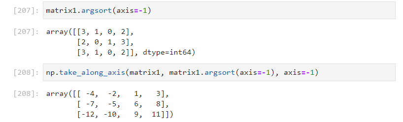

The ndarray array method ```cumsum``` and its corresponding ```numpy``` function also take the keyword input argument ```axis``` and propogate along an axis. The cumulative sum propagated along the columns with ```axis=-1```:

$$ \text{matrix1} = \begin{bmatrix} 
                    1 & -2 & 3 & -4 \\
                    x & x & x & x \\
                    y & y & y & y \\
                    \end{bmatrix} $$

$$ \text{matrix1CumSum} = \begin{bmatrix} 
                          1 & 1 + (-2) & 1 + (-2) + 3 & 1 + (-2) + 3 + (-4) \\
                          x & x & x & x \\
                          y & y & y & y \\
                          \end{bmatrix} $$

$$ \text{matrix1CumSum} = \begin{bmatrix} 
                          1 & -1 & 2 + -2 \\
                          -5 & 1 & -6 & 2 \\
                          9 & -1 & 10 & -2 \\
                          \end{bmatrix} $$

```
matrix1.cumsum(axis=-1)
```

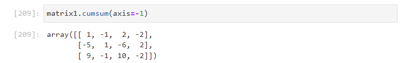

The ndarray array method ```cumprod``` and its corresponding ```numpy``` function (with alias ```np.cumproduct```) also take the keyword input argument ```axis``` and propogate along an axis. The cumulative product propagated along the columns with ```axis=-1```:

$$ \text{matrix1} = \begin{bmatrix} 
                    1 & -2 & 3 & -4 \\
                    x & x & x & x \\
                    y & y & y & y \\
                    \end{bmatrix} $$

$$ \text{matrix1CumProduct} = \begin{bmatrix} 
                              1 & 1 * (-2) & 1 * (-2) * 3 & 1 * (-2) + 3 * (-4) \\
                              x & x & x & x \\
                              y & y & y & y \\
                              \end{bmatrix} $$

$$ \text{matrix1CumProduct} = \begin{bmatrix} 
                               1 & -2 & -6 + 24 \\
                               -5 & -30 & 210 & 1680 \\
                               9 & -90 & -990 & 11880 \\
                               \end{bmatrix} $$

```
matrix1.cumprod(axis=-1)
```

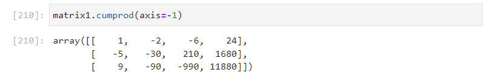

The ```numpy``` function ```diff``` also take the keyword input argument ```axis``` and propogates along an axis. Two values need to be taken to compute a difference so the axis length will be contracted by the set ```n``` parameter:

$$ \text{matrix1} = \begin{bmatrix} 
                    1 & -2 & 3 & -4 \\
                    x & x & x & x \\
                    y & y & y & y \\
                    \end{bmatrix} $$

For ```n=1```:

$$ \text{matrix1Diff1} = \begin{bmatrix} 
                          (-2) - 1 & 3 - (-2) & -4 - 3 \\
                          x & x & x \\
                          y & y & y \\
                          \end{bmatrix} $$

$$ \text{matrix1Diff1} = \begin{bmatrix} 
                          -3 & 5 & -7 \\
                          11 & -13 & 15 \\
                          -19 & 21 & -23 \\
                          \end{bmatrix} $$

For ```n=2```, the difference of the ```n=1``` matrix is computed:

$$ \text{matrix1Diff2} = \begin{bmatrix} 
                          5 - (-3) & -7 - (-5) \\
                          x & x \\
                          y & y \\
                          \end{bmatrix} $$

$$ \text{matrix1Diff2} = \begin{bmatrix} 
                          8 & -12 \\
                          -24 & 28 \\
                          40 & -44 \\
                          \end{bmatrix} $$

```
np.diff(a=matrix1, n=1, axis=-1)
np.diff(np.diff(a=matrix1, n=1, axis=-1))
np.diff(a=matrix1, n=2, axis=-1)
```

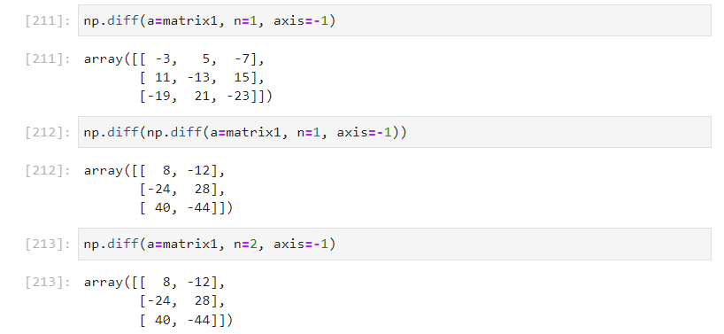

The ```ndarray``` method ```round``` and associated ```numpy``` function array round ```np.around``` (alias ```np.round```) are used to round an array. Its docstring can be viewed as a pop up balloon by inputting ```np.around()``` followed by shift ```⇧``` and tab ```↹```:

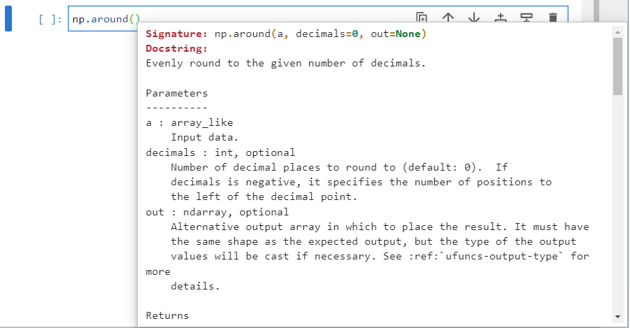

By default ```decimals=0``` so each floating point number is rounded to 0 decimal places:

$$ \text{matrix1} = \begin{bmatrix} 
                    1.12 & -2.12 & 3.12 & -4.12 \\
                    -5.12 & 6.12 & -7.12 & 8.12 \\
                    9.12 & -10.12 & 11.12 & -12.12 \\
                    \end{bmatrix} $$

Notice the inclusion of the decimal point after each number ```.```, indicating that the datatype is still a floating point number:

$$ \text{matrix1Round0} = \begin{bmatrix} 
                          1. & -2. & 3. & -4. \\
                          -5. & 6. & -7. & 8. \\
                          2. & -10. & 11. & -12. \\
                          \end{bmatrix} $$

If ```decimals=1```, each value is instead rounded to 1 decimal place:

$$ \text{matrix1Round0} = \begin{bmatrix} 
                          1.1 & -2.1 & 3.1 & -4.1 \\
                          -5.1 & 6.1 & -7.1 & 8.1 \\
                          9.1 & -10.1 & 11.1 & -12.1 \\
                          \end{bmatrix} $$

```
matrix1 = np.array([[1.12, -2.12, 3.12, -4.12],
                    [-5.12, 6.12, -7.12, 8.12],
                    [9.12, -10.12, 11.12, -12.12]])
matrix1

matrix1.round()
matrix1.round(decimals=1)
```

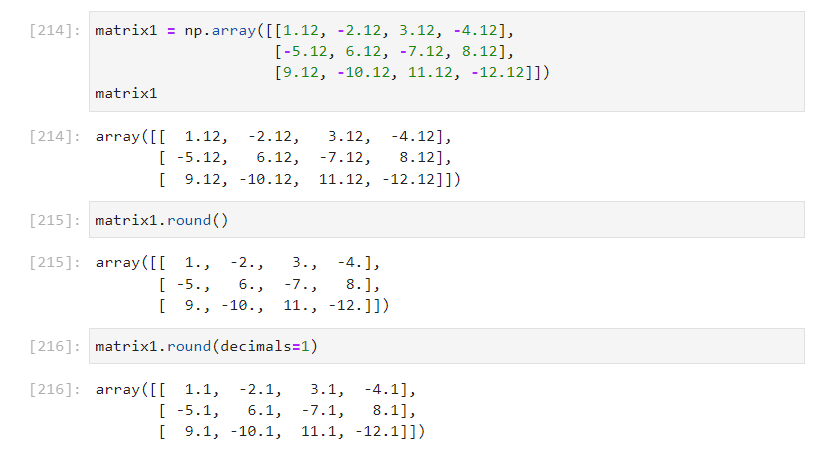

## Mathematics

The NumPy library includes an equivalent of every identifier in the ```math``` module it makes sense to extend its implementation to an array. These are extended to element by element functionality.

Detailed information about all of these are given in [Math and Complex Math Modules](https://github.com/PhilipYip1988/python-tutorials/blob/main/readme.md)

The mathematical constants are the same:

|math module|numpy library|
|---|---|
|math.e|np.e|
|math.pi|np.pi|
|math.tau|np.tau|
|math.inf|np.inf|
|math.nan|np.nan|

These can be made into arrays using the ```np.fill``` or scalar expansion can be used. The ```np.pi``` or ```np.tau``` is commonly used with ```np.linspace``` to create an array of circular angles.

The angle conversion functions can be used to convert arrays of angles:

|math module|numpy library|
|---|---|
|math.degrees()|np.degrees()|

**update here**

```np.degrees```, ```np.radians```

The following functions can be applied to arrays:

```np.isfinite```, ```np.isnan```, ```np.pow```, ```np.sqrt```, ```np.floor```, ```np.ceil```, ```np.floor```, ```np.ceil```, ```np.isclose```, ```np.nextafter```, ```np.fabs```, ```np.fmod```, ```np.remainder```, ```np.modf```, ```np.trunc```, ```np.gcd```, ```np.lcm```, ```np.prod```, ```np.copysign```

The following exponential and logarthmic function can be applied to arrays:

```np.factorial```, ```np.exp```, ```np.log```, ```np.log10```, ```np.log2```, ```np.frexp```, ```np.ldexp```, ```np.expm1```, ```np.log1p```

The functions used for the circle equations:

```np.hypot```, ```np.sin```, ```np.cos```, ```np.tan```, ```np.asin```,```np.acos```, ```np.atan```

The functions used for parabolic equations:

```np.sinh```, ```np.cosh```, ```np.tanh```, ```np.acosh```, ```np.asinh```, ```np.atanh```

The functions for complex numbers:

```np.conjugate```

## Random Module

The numpy library has a ```random``` module which is similar to the Python standard module ```random```. This is covered in [The Random Module](https://github.com/PhilipYip1988/python-tutorials/blob/main/readme.md)

The workflow is similar, for example:

```
import random
random.seed(0)
random.randint(0, 11)
```

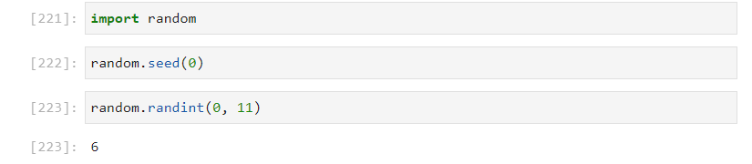

```
import numpy as np
np.random.seed(0)
np.random.randint(low=0, high=11, size=(6, 5))
```

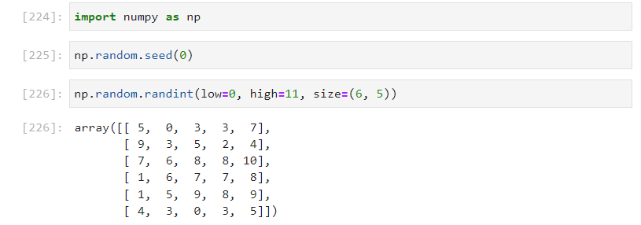

The ```np.random``` version expands distributions to ```ndarray``` opposed to returning a scalar. 


More details are given about these functions in the [Random Module Tutorial](https://github.com/PhilipYip1988/python-tutorials/tree/main/023_random#readme)

### Seed and State

The seed and state functions work almost identically:

|standard random module|numpy random module|
|---|---|
|seed(a=None)|seed(seed=None)|
|getstate()|getstate()|
|setstate(state)|setstate(state)|

### Selections from Sequences

The following functions are configured to work with a sequence such as a list in the standard ```random``` module. In the ```np.random``` module, ```choice``` is configured to work with a size parameter and has a ```replace``` keyword, therefore ```np.random.choice``` can mimic both the standard ```random.choice``` and ```random.choices```. ```np.random.sample``` is an alias of ```random.sample```. ```np.shuffle``` only shuffles along the first axis of a multi-dimensional array.

|standard random module|numpy random module|
|---|---|
|choice(seq)|choice(a, size=None, replace=True, p=None)|
|choices(population, weights=None, *, cum_weights=None, k=1)| |
|sample(x)|sample(x)|
|shuffle(x)|shuffle(x)|

### Distributions

The distributions have slightly different names and different names for equivalent input arguments. The distribution functions in the ```np.random``` module, typically include a ```size``` input argument that can be a ```size``` scalar for a 1darray or a ```shape tuple``` for a multidimensional array. There is normally for convenience some standard versions of statistical functions:

|standard random module|numpy random module|
|---|---|
|randint(a, b)|randint(low, high=None, size=None, dtype=int)|
|getrandbits(k)| |
|randbytes(n)|bytes(length)|
||random(size=None)|
|uniform(a, b)|uniform(low=0.0, high=1.0, size=None)|
|triangular(low=0.0, high=1.0, mode=None)|triangular(left, mode, right, size=None)|
||randn(d0, d1, ..., dn)|
||standard_normal(size=None)|
|gauss(mu=0.0, sigma=1.0)||
|normalvariate(mu=0.0, sigma=1.0)|normal(loc=0.0, scale=1.0, size=None)|
|random.lognormvariate(mu, sigma)|lognormal(mean=0.0, sigma=1.0, size=None)|
||standard_exponential(size=None)|
|expovariate(lambd)|exponential(scale=1.0, size=None)|
||standard_gamma(shape, size=None)|
|gammavariate(alpha, beta)|gamma(shape, scale=1.0, size=None)|
|betavariate(alpha, beta)|beta(a, b, size=None)|
|paretovariate(alpha)|pareto(a, size=None)|
|weibullvariate(alpha, beta)|weibull(a, size=None)|

The ```np.random``` has a handful of additional distributions not available in the ```random``` module. 

## DateTime and TimeDelta

An overview of date and time objects was covered in [The Date and Time Module](https://github.com/PhilipYip1988/python-tutorials/blob/main/readme.md)

The ```numpy``` library has a slightly different implementation of these objects, expanded to ```ndarrays``` and with an optionaly higher precision to the nanosecond.


## Meshgrid

np.meshgrid
