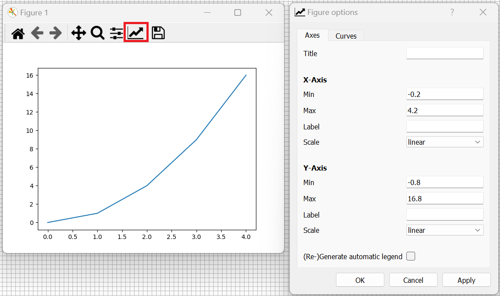

# The Matrix Plotting Library

## Importing the pyplot Module from the Library matplotlib

```matplotlib``` is an abbreviation for the matrix plotting library. For most use cases, the Python Plot module ```pyplot``` is used. The ```pyplot``` module is usually imported from the library ```matplotlib``` using the 3 letter abbreviation ```plt```. This is typically imported subsequent to the Numeric Python library as ```matplotlib``` is part of the ```numpy``` stack and ```ndarrays``` are typically used to store data to plot:

```
import numpy as np
import matplotlib.pyplot as plt
```


## ndarray Recap

The following numpy arrays can be created:

```
x = np.array([0, 1, 2, 3, 4])
y = np.array([0, 1, 4, 9, 16])
```


These can be viewed in the Spyder Variable Explorer:


This array has a single dimension. When viewed in the Variable Explorer it displays as a row. When expanded in the Variable Explorer it displays as a column for convenience:


Most of the plotting functions in ```matplotlib``` that expect data in the form of a 1d array, will also accept a 2d array configured as a column or row respectively.

For the sake of clarity column vectors will be shown:

```
x = np.array([0, 1, 2, 3, 4], ndmin=2).T
y = np.array([0, 1, 4, 9, 16], ndmin=2).T
```


Notice the ```x``` and ```y``` data are the same length, i.e. for every ```x``` value, there is a corresponding ```y``` value:


## Plot Backends

### Magic Commands

JupyterLab uses an Interactive Python (IPython) Console for an interactive notebook and can optionally use an IPython Console for a Python Script. The IPython Console has a number of magic commands which begin with a ```%```. Note magic commands are only available for an IPython Console and are not available for a Python Console.

Details about these can be seen by inputting:

```
%magic
```


This is a long docstring, scrolling down until the ```%matplotlib``` is mentioned:


Gives details about the backends:


### List Backends

For ```matplotlib```, compatible backends can be listed:

```
%matplotlib --list
```


### Inline Backend

The default plot backend is ```inline``` which displays the plot as a static image in the cells output. This can be manually specified using:

```
%matplotlib inline
```


A basic line plot can be created using:

```
plt.plot(x, y)
```


Notice information about the last object is returned in the cell output ```[<matplotlib.lines.Line2D]```. This can be suppressed by use of a semi-colon ```;``` for example:

```
plt.plot(x, y);
```


### qt5 Backend

```qt5``` is a General User Interface (GUI) framework. The plot backend can be changed to ```qt5``` using:

```
%matplotlib qt5
```


A new plot can be created using:

```
plt.plot(x, y)
```


Notice that information about the last object displays in the cell output ```[<matplotlib.lines.Line2D]``` as it was not suppressed using a semi-colon. The plot itself displays in a seperate interactive window. This window has a window title ```Figure 1``` and on windows the three standard minimize, maximize and close buttons. On Linux the windows title bar will match the style of the desktop environment. In GNOME for example, the title bar can be right clicked to reveal these options.


Under the titlebar is a Home, back, forward, pan, zoom, axes options, figure options and save button. The behaviour behind all these buttons under the hood invokes Python code. 

The zoom button can be used to zoom into a region of interest:


The pan tool can be used to reposition the data within the current window size and zoom setting: 


The back and forward button may be used to go back to the previous view or next view:


The home button returns to the default view:


The save button can be used to save an image to .png:


### ipympl Backend

The interactive python matplotlib ```ipympl``` backend is supposed to bridge the two strengths of the other backends; allowing an interactive figure nested in the cell output:

```
%matplotlib ipympl
```


Unfortunately changing to this backend when an Interactive Python Notebook has existing plots that use other backends gives the following warning ```Warning: Cannot change to a different GUI toolkit```. To get around this, the kernel needs to be restarted.


 This plot backend needs to be selected before any plots are created. For this reason the backend is normally changed at the top of the Interactive Python Notebook File after the library imports:

```
import numpy as np
import matplotlib.pyplot as plt

%matplotlib ipympl

x = np.array([0, 1, 2, 3, 4])
y = np.array([0, 1, 4, 9, 16])

plt.plot(x, y);
```


### Inline Backend (Spyder IDE)

The Spyder IDE plots inline by default, the plots are static images and are shown in the plots pane:


### qt5 Backend (Spyder IDE)

To change the backend select Tools → Preferences:


Select the IPython Console left tab and then the Graphics top tab. Change the Backend to Qt5 and select Apply:


Select Consoles → Restart Kernel:


Plotting will now show a plot using the qt5 backend in its own window:


### plt.show

Some other IDEs such as VSCode will create plots but not show them. The ```show``` function from the ```pyplot``` module needs to be called to view the plots:

```
plt.show()
```

## Changing a Plot via GUI

Before looking at any code, it is worthwhile exploring the most common changes in the UI to get a feel for the plot. The following plot will be created using the ```qt5``` backend:

```
import numpy as np
import matplotlib.pyplot as plt

%matplotlib qt5

x = np.array([0, 1, 2, 3, 4])
y = np.array([0, 1, 4, 9, 16])

plt.plot(x, y);
```


### Labels and LaTeX (MathJax)

In Axes there is a Title (```title```), X-Axis Label (```xlabel```) and Y-Axis Label (```ylabel```) which are blank by default. 



These can be changed to ```length $x$ vs area $y$```, ```length $x$ (m)``` and ```area $y$ (m$^{2}$)```. Selecting Apply updates the plot to the following:


Enclosing text in ```$ $``` allows a basic subset of inline LaTeX, powered by MathJax which was previously discussed when markdown syntax was examined.

LaTeX Text (MathJax)

|description|LaTeX|output|
|---|---|---|
|math text|```$x$```|$x$|
|normal text|```$\text{x}$```|$\text{x}$|
|bold text|```$\textbf{x}$```|$\textbf{x}$|
|math text with dot|```$\dot{x}$```|$\dot{x}$|
|math text with double dot|```$\ddot{x}$```|$\ddot{x}$|
|math text with triple dot|```$\dddot{x}$```|$\dddot{x}$|
|math text with bar|```$\bar{x}$```|$\bar{x}$|
|math text with hat|```$\hat{x}$```|$\hat{x}$|
|math text with arrow vector|```$\vec{x}$```|$\vec{x}$|
|math text with tilde|```$\tilde{x}$```|$\tilde{x}$|
|math text with wide tilde|```$\widetilde{xx}$```|$\widetilde{xx}$|
|math text with check|```$\check{x}$```|$\check{x}$|
|math text with acute|```$\acute{x}$```|$\acute{x}$|
|math text with grave|```$\grave{x}$```|$\grave{x}$|
|math text with breve|```$\breve{x}$```|$\breve{x}$|
|subscript|```$x_{2}$```|$x_{2}$|
|superscript|```$x^{3}$```|$x^{3}$|
|subscript and superscript|```$x_{2}^{3}$```|$x_{2}^{3}$|
|square root|```$\sqrt{x}$```|$\sqrt{x}$|
|sin|```$\sin{x}$```|$\sin{x}$|
|cos|```$\cos{x}$```|$\cos{x}$|
|tan|```$\tan{x}$```|$\tan{x}$|
|log|```$\log{x}$```|$\log{x}$|
|exp|```$\exp{x}$```|$\exp{x}$|

LaTeX Mathematical Symbols (MathJax)

|description|LaTeX|output|
|---|---|---|
|equal to|```$=$```|$=$|
|equivalent to|```$\equiv$```|$\equiv$|
|not equal to|```$\ne$```|$\ne$|
|similar to|```$\sim$```|$\sim$|
|approximate to|```$\approx$```|$\approx$|
|tilde|```$\textasciitilde$```|$\textasciitilde$|
|approximately equal to|```$\cong$```|$\cong$|
|plus|```$+$```|$+$|
|minus|```$-$```|$-$|
|plus minus|```$\pm$```|$\pm$|
|minus plus|```$\mp$```|$\mp$|
|dash|```$\text{-}$```|$\text{-}$|
|circumflex|```$\textasciicircum$```|$\textasciicircum$|
|asterisk|```$\ast$```|$\ast$|
|star|```$\text{\*}$```|$\text{\*}$|
|times|```$\times$```|$\times$|
|centre dot|```$\cdot$```|$\cdot$|
|period|```$.$```|$.$|
|bullet|```$\bullet$```|$\bullet$|
|colon|```$\colon$```|$\colon$|
|centre dots|```$\cdots$```|$\cdots$|
|vertical dots|```$\vdots$```|$\vdots$|
|therefore|```$\therefore$```|$\therefore$|
|division slash|```$/$```|$/$|
|division sign|```$\div$```|$\div$|
|less than|```$<$```|$<$|
|less than or equal to|```$\leq$```|$\leq$|
|greater than|```$>$```|$>$|
|greater than or equal to|```$\geq$```|$\geq$|
|factorial|```$!$```|$!$|
|degree|```$\degree$```|$\degree$|
|infinity|```$\infty$```|$\infty$|
|proportional to|```$\propto$```|$\propto$|
|partial|```$\partial$```|$\partial$|
|hbar|```$\hbar$```|$\hbar$|
|union|```$\cup$```|$\cup$|
|intersection|```$\cap$```|$\cap$|
|emptyset|```$\emptyset$```|$\emptyset$|
|exists|```$\exists$```|$\exists$|
|in|```$\in$```|$\in$|
|not in|```$\notin$```|$\notin$|
|ni|```$\ni$```|$\ni$|
|left arrow|```$\leftarrow$```|$\leftarrow$|
|right arrow|```$\rightarrow$```|$\rightarrow$|
|left right arrow|```$\leftrightarrow$```|$\leftrightarrow$|
|up arrow|```$\uparrow$```|$\uparrow$|
|down arrow|```$\uparrow$```|$\downarrow$|
|up down arrow|```$\updownarrow$```|$\updownarrow$|

LaTeX Greek Letters (MathJax)

|description|LaTeX|output|
|---|---|---|
|alpha|```$\alpha$```|$\alpha$|
|beta|```$\beta$```|$\beta$|
|Gamma|```$\Gamma$```|$\Gamma$|
|gamma|```$\gamma$```|$\gamma$|
|Delta|```$\Delta$```|$\Delta$|
|delta|```$\delta$```|$\delta$|
|nabla|```$\nabla$```|$\nabla$|
|epsilon|```$\epsilon$```|$\epsilon$|
|epsilon|```$\varepsilon$```|$\varepsilon$|
|zeta|```$\zeta$```|$\zeta$|
|eta|```$\eta$```|$\eta$|
|kappa|```$\kappa$```|$\kappa$|
|Lambda|```$\Lamba$```|$\Lambda$|
|mu|```$\mu$```|$\mu$|
|Xi|```$\Xi$```|$\Xi$|
|xi|```$\xi$```|$\xi$|
|Pi|```$\Pi$```|$\Pi$|
|pi|```$\pi$```|$\pi$|
|rho|```$\rho$```|$\rho$|
|Sigma|```$\Sigma$```|$\Sigma$|
|sigma|```$\sigma$```|$\sigma$|
|sigma|```$\varsigma$```|$\varsigma$|
|tau|```$\tau$```|$\tau$|
|Upsilon|```$\Upsilon$```|$\Upsilon$|
|upsilon|```$\upsilon$```|$\upsilon$|
|Phi|```$\Phi$```|$\Phi$|
|phi|```$\phi$```|$\phi$|
|chi|```$\chi$```|$\chi$|
|Psi|```$\Psi$```|$\Psi$|
|psi|```$\psi$```|$\psi$|
|Omega|```$\Omega$```|$\Omega$|
|omega|```$\omega$```|$\omega$|

Note the Greek letters A, B, E, Z, H, I, i, K, M, N, O, o and P that are the same as Latin letters are therefore just represented using the Latin letters.

LaTeX Fractions (MathJax)

|description|LaTeX|output|
|---|---|---|
|inline fraction|```$\frac{a}{b}$```|$\frac{a}{b}$|

LaTeX Brackets (MathJax)

|description|LaTeX|output|
|---|---|---|
|inline fraction parenthesis|```$(\frac{a}{b})$```|$(\frac{a}{b})$|
|inline fraction square|```$[\frac{a}{b}]$```|$[\frac{a}{b}]$|
|inline fraction braces|```$\lbrace\frac{a}{b}\rbrace$```|$\lbrace\frac{a}{b} \rbrace$|

The ```{``` and ```}``` are reserved so ```\lbrace``` and ```\rbrace``` need to be used.

In markdown enclosing text in ```$$ $$``` is used for display equations, this does not seem to be supported for the xlabel, ylabel or title. In my testing more complicated mathematical expressions such as vectors and matrices do not render. 

The figure typically assigns limited space for labels and normally simple inline expressions such as the above are used.

### Axes Scales

The x-axis min (xmin) and x-axis max (xmax) can be set to ```-1``` and ```5```, alongside the x-axis scale (xscale) which is linear by default. The y-axis min (ymin) and y-axis max (ymax) can be set to ```1``` and ```1000```, alongside the y-axis scale (yscale) to logarithimic (log).


In curves there is a dropdown menu of labels. By default each line is called ```_childN``` where ```N``` is an integer corresponding to the index indicating the order that the lines were plotted. In this case there is only index 0. 


The individual label (```label```) can be assigned to a value for example ```area```.

The Line Style (```linestyle``` or ```ls```) has a default value of Solid (```'solid'``` or ```'-'```), but can also be changed to Dotted (```'dotted'``` or ```':'```), Dashed (```'dashed'``` or ```'--'```) or Dashdot (```'dashdot'``` or ```'-.'```). In this case it will be changed to Dashed.

The Line Width (```linewidth``` or ```lw```) has a default floating point number value of ```1.5```. It can be changed to ```2.0```.

The Draw Style (```drawstyle``` or ```ds```) has a default value of default (```'default'```). It can be changed to Steps (Pre) (```'steps-pre'```), Steps (Mid) (```'steps-mid'```) or Steps (Post) (```'steps-post'```). This will be left at default.

The Color (```color```) U.S. spelling exclusive of the u, is usually in the form #rrggbb (```'#rrggbb'```). 


Physiologically, the human eye has red sensitive, green sensitive and blue sensitive receptors. The brain maps a color to the intensity ratio picked up by these three sensor types. In a screen each pixel consists of a red LED, green LED and blue LED (RGB LED). Each color in the RGB LED has 8 bit levels used to adjust the intensity ratio to create what the brain perceives as a color.

In the example above a color is selected from one of the options in the left. 

This color is shown in the Hue Saturation Value (HSV) plot to the right. This HSV plot is designed so visually it is easiest to select a color. In the HSV plot the Hue (decreases right along x) and Saturation (increases down along y). The Value is left constant as the cursor moves, however it can be increased using the associated Value box. 

The Red, Green and Blue (RGB) values are shown to the right. These are 8 bit values ranging from 0-255 (decimal). The 85, 170 and 127 (decimal) correspond to the 55, aa and 7f (hexadecimal). The HTML #55aa7f is the color selected.

The alpha channel also ranges from 0-255 (decimal) or 0-ff (hexadecimal) and corresponds to an overall brightness. In this case full brightness is selected giving a HTML of #55aa7fff.

This HTML value is as the name suggest quite commonly used with HTML, so many websites have color pickers that use a similar form, paint application such as Microsoct Paint and Office Programs such as Word, Excedl and PowerPoint all exhibit similar color pickers.


Changing the Line Style to Dotted and the Draw Style to Steps (Pre) looks like the following:


A plot also known as a lineplot, does not display markers by default. A Marker (```marker```) can be selected from the dropdown menu:


|Marker Description|String|Integer or None|
|---|---|---|
|nothing|```''```|```None```|
|point|```'.'```||
|pixel|```','```||
|circle|```'o'```||
|triangle_down|```'v'```||
|triangle_up|```'^'```||
|triangle_left|```'<'```||
|triangle_right|```'>'```||
|tri_down|```'1'```||
|tri_up|```'2'```||
|tri_left|```'3'```||
|tri_right|```'4'```||
|octagon|```'8'```||
|square|```'s'```||
|pentagon|```'p'```||
|plus_filled|```'P'```||
|star|```'*'```||
|hexagon1|```'h'```||
|hexagon2|```'H'```||
|plus|```'+'```||
|x|```'x'```||
|X|```'X'```||
|vline|```'\|'```||
|hline|```'_'```||
|tickleft||```0```|
|tickright||```1```|
|caretleft||```2```|
|caretright||```3```|
|caretup||```4```|
|caretdown||```5```|
|caretleftbase||```6```|
|caretrightbase||```7```|
|caretupbase||```8```|
|caretdownbase||```9```|

The Marker Size (```markersize``` or ```ms```) can be changed from the default floating point value of ```6.0``` to ```15.0```.

The Marker Face Color (```markerfacecolor``` or ```mfc```) and Marker Edge Color (```markeredgecolor``` or ```mec```) can be selected. These take in the form ```#rrggbbaa``` as discussed previously and have a color selection. This can be updated to ```#aa55ffff``` and ```#55ffffff``` respectively.


With markers shown, it is easier to understand what the draw style does. Steps (Pre), Steps (Mid) and Steps (Post):


Colors are typically input using the HTML format #rrggbb. However for primary and secondary colors, there is an internal dictionary of color name keys and hexadecimal values. Black is regarded as the absence of color i.e. the RGB LED is off and white is when the RGB is ramped up to maximum for every color.

|base color key|HTML value|
|---|---|
|```'red'```|```'#ff0000'```|
|```'green'```|```'#00ff00'```|
|```'blue'```|```'#0000ff'```|
|```'yellow'```|```'#ffff00'```|
|```'cyan'```|```'#00ffff'```|
|```'magenta'```|```'#ff00ff'```|
|```'black'```|```'#000000'```|
|```'white'```|```'#ffffff'```|


There is another internal dictionary of single letters for colors, this is typically the first letter in the color, with exception to black which uses its last letter k as b is already taken for blue.

|base color letter key|HTML value|
|---|---|
|```'r'```|```'#ff0000'```|
|```'g'```|```'#00ff00'```|
|```'b'```|```'#0000ff'```|
|```'y'```|```'#ffff00'```|
|```'c'```|```'#00ffff'```|
|```'m'```|```'#ff00ff'```|
|```'k'```|```'#000000'```|
|```'w'```|```'#ffffff'```|


The default colormap for matplotlib is called tableau. It has the following color dictionary:

|tab color letter key|HTML value|
|---|---|
|```'tab:blue'```|```'#1f77b4'```|
|```'tab:orange'```|```'#ff7f0e'```|
|```'tab:green'```|```'#2ca02c'```|
|```'tab:red'```|```'#d62728'```|
|```'tab:purple'```|```'#9467bd'```|
|```'tab:brown'```|```'#8c564b'```|
|```'tab:pink'```|```'#e377c2'```|
|```'tab:gray'```|```'#7f7f7f'```|
|```'tab:olive'```|```'#bcbd22'```|
|```'tab:cyan'```|```'#17becf'```|

gray is spelt using U.S. spelling with the a opposed to the e.


There is also another dictionary of CSS colors that essentially expands the base color dictionary of 8 items to 200 items.


More details about the Markers and Colors are available in matplotlibs documentation:

[Markers](https://matplotlib.org/stable/api/markers_api.html)

[Named Colors](https://matplotlib.org/stable/gallery/color/named_colors.html)

If Generate automatic Legend is selected, a legend displays in an area of the graph with the least data being obscured:


The curves dropdown list then gets updated to the set labels:


If the borders and spacing button is selected. The borders display.

The square box is the axes. The axes have a data co-ordinate system which in this case is ymin=1, ymax=100, xmin=-1 and xmax=5. They also have a normalised coordinate system ymin=0, ymax=1, xmin=0 and xmax=1.

The axes square box is also positioned on the figure canvas which has its own normalised coordinate system ymin=0, ymax=1, xmin=0 and xmax=1.

The values shown in the borders and spacing correspond to the figure canvas normalised coordinates. 


Changing the top to 1 moves the top edge of the axes to the position 1 on the figure canvas which is the top of the figure canvas:


Changing the bottom to 0 moves the bottom edge of the axes to the position 0 on the figure canvas which is the bottom of the figure canvas:


Changing the left to 0 moves the left edge of the axes to the position 0 on the figure canvas which is the left of the figure canvas:


Changing the right to 1 moves the right edge of the axes to the position 1 on the figure canvas which is the right of the figure canvas:


Resetting the Axes repositions the limits to their original values i.e. the default values which correspond to the normalised co-ordinate system of the figure canvas:


The tight layout is often used to more efficiently manage the spacing:


Exporting the values gives values that can be used programmatically as input arguments:


## Functional Programming Overview

The ```pyplot``` module is imported from the ```matplotlib``` library using:

```
import matplotlib.pyplot as plt
```

The docstring of the ```pyplot``` module can be viewed by using ```?``` on its alias ```plt```:

```
? plt
```

Notice that it outlines functional plot generation:


And object-orientated plot generation:


Let's import the ```numpy``` library and ```pyplot``` module, configure the plot backend to ```qt5``` and create basic ```x``` and ```y``` data:

```
import numpy as np
import matplotlib.pyplot as plt

%matplotlib qt5

x = np.array([0, 1, 2, 3, 4])
y = np.array([0, 1, 4, 9, 16])
```


A plot will be created similar to the one before, that was modified using the GUI. 

The ```pyplot``` function ```figure``` is used to create a new figure. The keyword argument ```num``` assigns a number to a figure. If the ```num``` already exists, the figure will be reselected. If it does not already exist, a new figure will be created. If it is not specified the next available figure number is taken and a new figure is selected:

```
plt.figure(num=1, figsize=None, dpi=None)
```


Notice the figure number is 1 as specified and is a blank canvas:


In JupyterLab in general all the commands used to create a figure are usually input in the same cell. Let's create another figure, with ```num=2``` and then use the ```pyplot``` function ```axes``` to add axes to the existing figure:

```
plt.figure(num=2, figsize=None, dpi=None)
plt.axes()
```


Notice the set of blank axes on the figure canvas. There is no data so these just show normalised co-ordinates:


Think of the figure as being a canvas and the axes as being an object that lies on top of the canvas i.e. belongs to the figure. A plot is in turn an object that belongs to the axes.

```
plt.figure(num=3, figsize=None, dpi=None)
plt.axes()
plt.plot(x, y)
```


The plot is created with default settings:


The axes and title are unlabelled. The ```pyplot``` functions ```xlabel```, ```ylabel``` and ```title``` can be used to set these. Each label is a string. If LaTeX is used a raw string is usually preferred (prefixed by ```r```) as the ```\``` is used commonly within most LaTeX expressions. If a variable is to be inserted, this is normally done using a formatted string (prefixed by 'f'). String concatenation ```+``` is usually used to combine a relative string containing a LaTeX expression with a formatted string containing the value fo a variable. 

```
plt.figure(num=4, figsize=None, dpi=None)
plt.axes()
plt.plot(x, y)
plt.xlabel(r'length $x$ (m)')
plt.ylabel(r'area $y$ (m$^{2}$)')
plt.title(r'length $x$ vs area $y$')
```


If a legend is to be added, each plot is normally assigned a label in the form of a string, which can be a raw string containing latex or a formatted string containing a variable. The ```pyplot``` function ```legend``` can be used to add the legend to the axes. It uses the best location by default which inserts the legend in a graph location which minimises the obscuring of underlying data.

```
plt.figure(num=5, figsize=None, dpi=None)
plt.axes()
plt.plot(x, y, label='area')
plt.xlabel(r'length $x$ (m)')
plt.ylabel(r'area $y$ (m$^{2}$)')
plt.title(r'length $x$ vs area $y$')
plt.legend()
```


The keyword ```loc``` can be used to specify the position. Normally by concatenating a y position and x position with a space. If both the x and y position are  ```'center'```, it is only mentioned once.

|y position|x position|
|---|---|
|```'lower'```|```'left'```|
|```'center'```|```'center'```|
|```'upper'```|```'right'```|

The default value is ```'best'``` which will by default pick one of the locations above which obscures the underlying data the least. 

```
plt.figure(num=6, figsize=None, dpi=None)
plt.axes()
plt.plot(x, y, label='area')
plt.xlabel(r'length $x$ (m)')
plt.ylabel(r'area $y$ (m$^{2}$)')
plt.title(r'length $x$ vs area $y$')
plt.legend(loc='lower right')
```


The ```pyplot``` function ```legend``` can also take in the keyword input argument ```labels``` which can be assigned to a list of strings where the length of the list is equal to the number of traces on the plot and each string is the respective label for each trace:

```
plt.figure(num=7, figsize=None, dpi=None)
plt.axes()
plt.plot(x, y)
plt.xlabel(r'length $x$ (m)')
plt.ylabel(r'area $y$ (m$^{2}$)')
plt.title(r'length $x$ vs area $y$')
plt.legend(labels=['area'], loc='lower right')
```


This is not noramlly done when each single trace is individually specified.

The ```pyplot``` function ```plot``` accepts multiple positional input arguments each x, y pair received corresponds will be plotted out as a seperate line. In other words by default the line plot, outputs a list of lines:

```
plt.figure(num=8, figsize=None, dpi=None)
plt.axes()
plt.plot(x, y, x, y+1, x, y+2)
```


In this form, any keyword argument supplied to the plot function, applies to all traces, for example:

```
plt.figure(num=9, figsize=None, dpi=None)
plt.axes()
plt.plot(x, y, x, y+1, x, y+2, label='area')
plt.xlabel(r'length $x$ (m)')
plt.ylabel(r'area $y$ (m$^{2}$)')
plt.title(r'length $x$ vs area $y$')
plt.legend(loc='lower right')
```


To get unique labels, ```labels``` must be supplied as a list of strings equal in length to the number of traces expected. The labels will be of the name of the color from the default palette tableau, this palette has ```10``` values:

```
plt.figure(num=10, figsize=None, dpi=None)
plt.axes()
plt.plot(x, y, 
         x, y+1, 
         x, y+2,
         x, y+3,
         x, y+4,
         x, y+5,
         x, y+6,
         x, y+7,
         x, y+8,
         x, y+9)
plt.xlabel(r'length $x$ (m)')
plt.ylabel(r'area $y$ (m$^{2}$)')
plt.title(r'length $x$ vs area $y$')
plt.legend(labels=['tab:blue', 'tab:orange', 'tab:green',
                  'tab:red', 'tab:purple', 'tab:brown',
                  'tab:pink', 'tab:gray', 'tab:olive',
                  'tab:cyan'], 
           loc='lower right')
```


This multiform can also be used with a color positional argument for each trace:

```
plt.figure(num=11, figsize=None, dpi=None)
plt.axes()
plt.plot(x, y, 'royalblue',
         x, y+1, 'gold',
         x, y+2, 'forestgreen',
         x, y+3, 'salmon',
         x, y+4, 'violet',
         x, y+5, 'peru',
         x, y+6, 'deeppink',
         x, y+7, 'slategray',
         x, y+8, 'lawngreen',
         x, y+9, 'darkturquoise')
plt.xlabel(r'length $x$ (m)')
plt.ylabel(r'area $y$ (m$^{2}$)')
plt.title(r'length $x$ vs area $y$')
plt.legend(labels=['royalblue', 'gold', 'forestgreen',
                  'salmon', 'violet', 'peru',
                  'deeppink', 'slategray', 'lawngreen',
                  'darkturquoise'], 
           loc='lower right')
```


Returning to a single trace, the full keyword input arguments will be used to specify all the options that were changed for the trace in the GUI:

```
plt.figure(num=12, figsize=None, dpi=None)
plt.axes()
plt.plot(x, y, label='area',
         color='royalblue',
         drawstyle='default',
         linewidth=2.0, linestyle='dotted',
         marker='o', markersize=15.0,
         markerfacecolor='hotpink', 
         markeredgecolor='palegreen')
plt.xlabel(r'length $x$ (m)')
plt.ylabel(r'area $y$ (m$^{2}$)')
plt.title(r'length $x$ vs area $y$')
plt.legend(loc='lower right')
```


There is also a shortform for most of these keyword input arguments:

```
plt.figure(num=13, figsize=None, dpi=None)
plt.axes()
plt.plot(x, y, label='area',
         c='royalblue',
         ds='default',
         lw=2.0, ls=':',
         marker='o', ms=15.0,
         mfc='hotpink', 
         mec='palegreen')
plt.xlabel(r'length $x$ (m)')
plt.ylabel(r'area $y$ (m$^{2}$)')
plt.title(r'length $x$ vs area $y$')
plt.legend(loc='lower right')
```


The ```pyplot``` functions ```xlim``` and ```ylim``` can be used to specify the x and y limits taking the keyword input arguments ```left```, ```right``` and ```top```, ```bottom``` respectively. The ```pyplot``` functions ```xscale``` and ```yscale``` can be used to change the scale of the axis. These can be set to the string ```'linear'``` (default) or ```'log'``` respecitvely.

To view the values of the data more clearly, gridlines can be added using the ```pyplot``` function ```grid```. It has the keyword arguments ```visible``` which is assigned to a boolean value, ```which``` which is assigned to the string ```'major'```, ```'minor'``` or ```'both'```, ```axis``` which is assigned to the string ```'x'```, ```'y'``` or ```'both'```. This function shares has consistent keyword arguments to the ```pyplot``` function ```plot``` such as ```color```, ```linewidth``` and ```linestyle```. The short hand abbreviations ```c```,```lw``` and ```ls``` also work:

```
plt.figure(num=14, figsize=None, dpi=None)
plt.axes()
plt.plot(x, y, label='area', c='royalblue')
plt.xlabel(r'length $x$ (m)')
plt.ylabel(r'area $y$ (m$^{2}$)')
plt.title(r'length $x$ vs area $y$')
plt.legend(loc='lower right')
plt.xlim(left=-1, right=5)
plt.ylim(top=100, bottom=1)
plt.xscale('linear')
plt.yscale('log')
plt.tight_layout()
plt.grid(visible=True, which='major', axis='both', 
         c='lightgray', lw=3.0, ls='-')
plt.grid(visible=True, which='minor', axis='y', 
         c='lightgray', lw=1.5, ls=':')
```


When the linear scale is used, the minor ticks are not turned on by default, they can be enabled using:

```
plt.figure(num=14, figsize=None, dpi=None)
plt.axes()
plt.plot(x, y, label='area', c='royalblue')
plt.xlabel(r'length $x$ (m)')
plt.ylabel(r'area $y$ (m$^{2}$)')
plt.title(r'length $x$ vs area $y$')
plt.legend(loc='lower right')
plt.xlim(left=-1, right=5)
plt.ylim(top=100, bottom=1)
plt.xscale('linear')
plt.yscale('log')
plt.tight_layout()
plt.grid(visible=True, which='major', axis='both', 
         lw=3.0, ls='-', c='lightgray')
plt.grid(visible=True, which='minor', axis='y', 
         lw=1.5, ls=':', c='lightgray')
plt.minorticks_on()
plt.grid(visible=True, which='minor', axis='x', 
         lw=1.5, ls=':', c='lightgray')
```


The tight layout can be enabled using the ```pyplot``` function ```tight_layout```:

```
plt.figure(num=15, figsize=None, dpi=None)
plt.axes()
plt.plot(x, y, label='area', c='royalblue')
plt.xlabel(r'length $x$ (m)')
plt.ylabel(r'area $y$ (m$^{2}$)')
plt.title(r'length $x$ vs area $y$')
plt.legend(loc='lower right')
plt.xlim(left=-1, right=5)
plt.ylim(top=100, bottom=1)
plt.xscale('linear')
plt.yscale('log')
plt.tight_layout()
plt.grid(visible=True, which='major', axis='both', 
         lw=3.0, ls='-', c='lightgray')
plt.grid(visible=True, which='minor', axis='y', 
         lw=1.5, ls=':', c='lightgray')
plt.minorticks_on()
plt.grid(visible=True, which='minor', axis='x', 
         lw=1.5, ls=':', c='lightgray')
plt.tight_layout()
```


If the ```math``` module is imported the constant ```tau``` can be used. A linearly spaced array of 100 values between negative tau and positive tau can be created and assigned to the variable ```x```. The trigonmetric functions can be supplied this ```x``` array to create corresponding ```y``` arrays:

```
import math
x = np.linspace(start=-math.tau, stop=math.tau, num=100)
y1 = np.sin(x)
y2 = np.cos(x)
y3 = np.tan(x)
```


The ```pyplot``` function ```subplot``` can be used to create a subplot. This function uses 1st order indexing instead of Pythons usual second order indexing. The first input argument is an integer that corresponds to the number of rows, the second input argument is an integer that coreesponds to the number of columns and the third input argument is the index itself. The ordering of the subplot indexes traverses each row. Since there is only 1 column; subplot index 1 is the plot on the first row and subplot index 2 is the subplot on the second row. Let's examine subplot index 1:

```
plt.figure(num=16, figsize=None, dpi=None)
plt.subplot(2, 1, 1)
```


Notice the subplot only occupies the top half of the figure canvas:


In functional programming data is usually added to it before working with any other subplots:

```
plt.figure(num=17, figsize=None, dpi=None)
plt.subplot(2, 1, 1)
plt.plot(x, y1, label=r'$y$=sin($x$)')
plt.plot(x, y2, label=r'$y$=cos($x$)')
```


Once data is added to the the first subplot index, the second subplot index can be created and data can be added to it:

```
plt.figure(num=18, figsize=None, dpi=None)
plt.subplot(2, 1, 1)
plt.plot(x, y1, label=r'$y$=sin($x$)')
plt.plot(x, y2, label=r'$y$=cos($x$)')
plt.subplot(2, 1, 2)
plt.plot(x, y3, label=r'$y$=tan($x$)')
```


Sometimes the default tick values are not what is desired. In this case, it is more convenient to show the xticks in relation to the circle constant tau. A linearly spaced array of xticks can be created:

```
xticks = np.linspace(start=-math.tau, stop=math.tau, num=9)
xticks
```


The value of the xticks is as desired but a string format in relation to tau may be preferred:

```
xtickvalues = [f'{num/math.tau}' + r' $\tau$' 
               for num in xticks]
xtickvalues
```


The ```pyplot``` function ```xticks``` can be used to place a list of ```labels``` for each location in a specified list of ```ticks```. The list of ticks should be numeric and the list of labels should be strings:

```
plt.figure(num=19, figsize=None, dpi=None)

plt.subplot(2, 1, 1)
plt.plot(x, y1, label=r'$y$=sin($x$)', c='royalblue')
plt.plot(x, y2, label=r'$y$=cos($x$)', c='olivedrab')
plt.legend(loc='lower left')
plt.xticks(ticks=xticks, labels=xtickvalues)

plt.subplot(2, 1, 2)
plt.plot(x, y3, label=r'$y$=tan($x$)', c='tomato')
plt.legend(loc='lower left')
plt.xticks(ticks=xticks, labels=xtickvalues)

plt.xlabel(r'$\alpha$ (radians)')

plt.tight_layout()
```


This can be extended to more subplots for example 4 subplots with 2 rows and 2 columns. The data being plotted will be the same trigonmetry data as before, in addition to the hyperbolic trigonmetric functions. The following data will be created seperately:

```
import math
x = np.linspace(start=-math.tau, stop=math.tau, num=100)
y1 = np.sin(x)
y2 = np.cos(x)
y3 = np.tan(x)

y4 = np.sinh(x)
y5 = np.cosh(x)
y6 = np.tanh(x)

xticks = np.linspace(start=-math.tau, stop=math.tau, num=5)
xtickvalues = [f'{num/math.tau}' + r' $\tau$' 
               for num in xticks]
```


Now the plot can be examined:

```
plt.figure(num=20, figsize=None, dpi=None)

plt.subplot(2, 2, 1)
plt.plot(x, y1, label=r'$y$=sin($x$)', c='royalblue')
plt.plot(x, y2, label=r'$y$=cos($x$)', c='olivedrab')
plt.legend(loc='lower left')
plt.xticks(xticks, xtickvalues)

plt.subplot(2, 2, 3)
plt.plot(x, y3, label=r'$y$=tan($x$)', c='tomato')
plt.legend(loc='lower left')
plt.xticks(xticks, xtickvalues)

plt.xlabel(r'$\alpha$ (radians)')

plt.subplot(2, 2, 2)
plt.plot(x, y4, label=r'$y$=sinh($x$)', c='royalblue')
plt.plot(x, y5, label=r'$y$=cosh($x$)', c='olivedrab')
plt.legend(loc='lower right')
plt.xticks(xticks, xtickvalues)

plt.subplot(2, 2, 4)
plt.plot(x, y6, label=r'$y$=tanh($x$)', c='tomato')
plt.legend(loc='lower right')
plt.xticks(xticks, xtickvalues)

plt.xlabel(r'$\alpha$ (radians)')

plt.tight_layout()
```


The ```pyplot``` function ```savefig``` can be used to save the image to a ```.png``` file or other image format. The ```pyplot``` function ````plt.close``` will close the currently selected figure:

```
plt.figure(num=21, figsize=None, dpi=None)
plt.subplot(2, 2, 1)
plt.plot(x, y1, label=r'$y$=sin($x$)', c='royalblue')
plt.plot(x, y2, label=r'$y$=cos($x$)', c='olivedrab')
plt.legend(loc='lower left')
plt.xticks(xticks, xtickvalues)
plt.subplot(2, 2, 3)
plt.plot(x, y3, label=r'$y$=tan($x$)', c='tomato')
plt.legend(loc='lower left')
plt.xticks(xticks, xtickvalues)
plt.xlabel(r'$\alpha$ (radians)')
plt.subplot(2, 2, 2)
plt.plot(x, y4, label=r'$y$=sinh($x$)', c='royalblue')
plt.plot(x, y5, label=r'$y$=cosh($x$)', c='olivedrab')
plt.legend(loc='lower right')
plt.xticks(xticks, xtickvalues)
plt.subplot(2, 2, 4)
plt.plot(x, y6, label=r'$y$=tanh($x$)', c='tomato')
plt.legend(loc='lower right')
plt.xticks(xticks, xtickvalues)
plt.xlabel(r'$\alpha$ (radians)')
plt.tight_layout()
plt.savefig('trigonmetricplots.png')
plt.close()
```

The following code runs, the figure is seen for a second and is closed:


The saved image can be seen in Windows Explorer:


To recap on functional programming, the following functions were examined and each function was called in turn from the ```pyplot``` module:

|pyplot function|description|
|---|---|
|figure|Create a new Figure, or activate an existing Figure.|
|axes|Add Axes to the current Figure and make it the current Axes.|
|plot|Plot y versus x as lines and/or markers.|
|xlabel|Set the label for the x-axis.|
|ylabel|Set the label for the y-axis.|
|title|Set a title for the Axes.|
|legend|Place a legend on the Axes.|
|grid|Configure the grid lines.|
|minorticks_on|Display minor ticks on the Axes.|
|minorticks_off|Remove minor ticks from the Axes.|
|xlim|Get or set the x limits of the current axes.|
|ylim|Get or set the y-limits of the current axes.|
|xscale|Set the x-axis scale.|
|yscale|Set the y-axis scale.|
|xticks|Get or set the current tick locations and labels of the x-axis.|
|yticks|Get or set the current tick locations and labels of the y-axis.|
|tight_layout|Adjust the padding between and around subplots.|
|subplot|Add an Axes to the current figure or retrieve an existing Axes.|
|show|Show the currently selected Figure (required for some IDEs).|
|close|Close the currently selected Figure.|
|savefig|Save the currently selected Figure to an image file.|


horizontal space can be added


 fig.add_axes([left, bottom, width, height]) 

top=0.922,
bottom=0.13,
left=0.121,
right=0.97,
hspace=0.2,
wspace=0.2


T


The identifiers from the ```pyplot``` module can be viewed by inputting its alias ```plt.``` followed by a tab ```↹```:


grid	Configure the grid lines.
minorticks_on	Display minor ticks on the Axes.
minorticks_off	Remove minor ticks from the Axes.
xlim	Get or set the x limits of the current axes.
ylim	Get or set the y-limits of the current axes.
xscale	Set the x-axis scale.
yscale	Set the y-axis scale.
xticks	Get or set the current tick locations and labels of the x-axis.
yticks	Get or set the current tick locations and labels of the y-axis.
tight_layout	Adjust the padding between and around subplots.
subplot	Add an Axes to the current figure or retrieve an existing Axes.


plt.get_plot_commands()

list(plt.get_plot_commands())


The ```plt.plotting``` function is essentially a documentation string outlining the most commonly used plotting functions of the ```pyplot``` module.


```
fig, ax = plt.subplots()
bar_container = ax.bar(fruit_names, fruit_counts)
ax.set(ylabel='pints sold', title='Gelato sales by flavor', ylim=(0, 8000))
ax.bar_label(bar_container, fmt='{:,.0f}')
```


ax.yaxis.set_tick_params(labelsize=30, labelcolor='red',
                         direction='out', which='major')
ax.yaxis.get_tick_params(which='major')


    ax.set_aspect(aspects[i], adjustable='datalim')
aspects = ('auto', 'equal', 'equalxy', 'equalyz', 'equalxz')


fig.colorbar(im, cax=ax.inset_axes([0, 1.05, 1, 0.05]),
             location='top')


fig, axd = plt.subplot_mosaic(
    "AB;CD",
    per_subplot_kw={
        "A": {"projection": "polar"},
        ("C", "D"): {"xscale": "log"},
        "B": {"projection": "3d"},
    },
)

