# Datetime Module

The datetime module contains classes for manipulating dates and times. The ```datetime``` module can be imported using the alias ``dt```:

```
import datetime as dt
```


Once imported, the list of identifiers can be viewed by inputting ```dt.``` followed by a tab ```↹```:

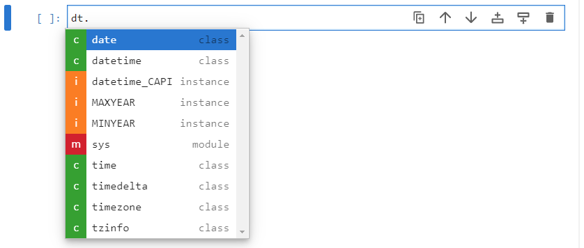

There are five main classes ```date``` for working with dates, ```time``` for working with times, ```datetime``` for working with dates and times, ```timedelta``` for working with time differences and ```timeinfo``` for working with time zones.

## date class

The initialization signature of the ```date``` class can be viewed by inputting ```dt.date()``` followed by inputing shift ```⇧``` and tab ```↹```

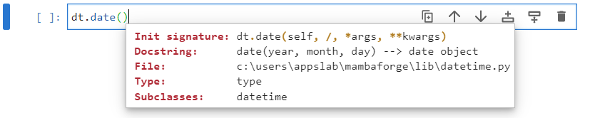

It requires three input arguments, the year, the month and the day which are colelctively needed to specify a calendar date. For clarity, these can be provided as input arguments:

```
python3releasedate = dt.date(year=2008, month=12, day=3)
```


A list of identifiers that can be accessed from the ```date``` object ```python3releasedate``` can be accessed by inputting ```python3releasedate.``` followed by a tab ```↹```:


The attributes  ```year```, ```month```, ```day``` give the year, month and day as integers which were provided during instantantiation:

```
python3releasedate.year
python3releasedate.month
python3releasedate.day
```

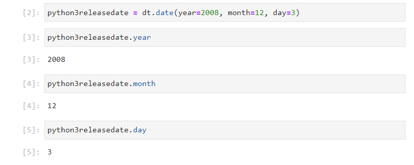

The attributes  ```max``` and ```min```, give the maximum and minimum possible ```date``` instance:

```
python3releasedate.max
python3releasedate.min
```

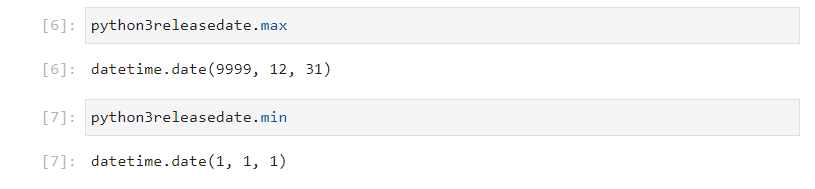

The attribute resolution, gives the time resolution of the ```date``` instance, as a ```timedelta``` instance:

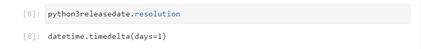

The ```date``` object is immutable, therefore attempting to reassign an attribute will raise an ```AttributeError```:

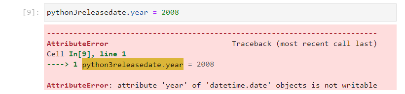

Therefore, most of the ```date``` methods will return a value. The ```replace``` method can be used with the keywords ```year```, ```month``` and ```date``` to replace an attribute in the original ```date``` object and output a new ```date``` instance. For example ```python3releasedate``` can be replaced by the latest version of Python 3:

```
python3releasedate.replace(year=2022, month=10, day=24)
```

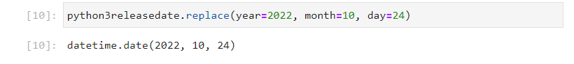

This would need to be assigned to a new object name.

```
python3_11_releasedate = python3releasedate.replace(year=2022, 
                                                    month=10, 
                                                    day=24)
```

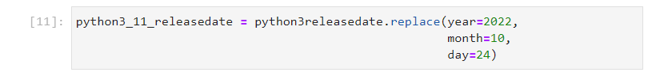

The ```timetuple``` method returns an object similar to a namedtuple:


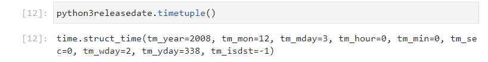

The ```weekday``` method returns the day of the week as a zero order indexed integer:

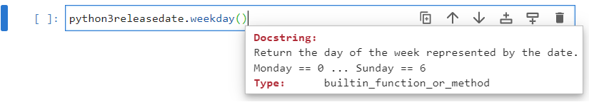

```
weekday = {0: 'Monday', 
           1: 'Tuesday', 
           2: 'Wednesday', 
           3: 'Thursday', 
           4: 'Friday', 
           5: 'Saturday', 
           6: 'Sunday'}
```

The release date fo Python 3 gives 2 which was a Wednesday:

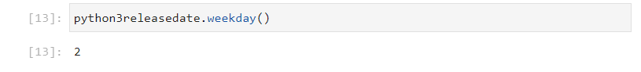

The ```isoweekday``` method also returns the day of the week as an integer. The ```isoformat``` uses a first order indexed integer:

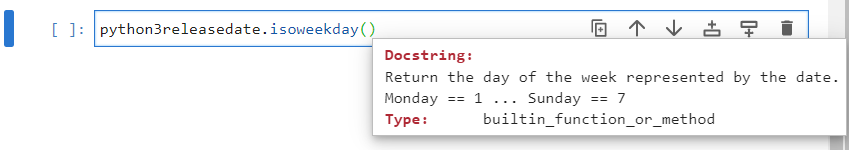

```
weekday = {1: 'Monday', 
           2: 'Tuesday', 
           3: 'Wednesday', 
           4: 'Thursday', 
           5: 'Friday', 
           6: 'Saturday', 
           7: 'Sunday'}
```

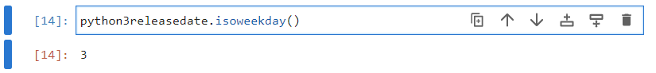

The four methods beginning with ```from```; ```fromisocalendar```, ```fromisoformat```, ```fromordinal```, ```fromtimestamp``` are alternative constructors. These alternative constructors are class methods and output a new ```date``` instance. ```today``` is also a class method which constructs a ```date``` instance from the date on the system clock.

```
date.today()
```

The timestamp is a unit of measurement in seconds that begins from the Epoch Time ```1970, 1, 1``` is at ```0``` seconds. The Epoch timestamp is used by the ```time``` module:

```
import time
time.time()
```

Recall that 1 day == 24 hours == 24 * 60 minutes == 24 * 60 * 60 seconds. For simplicity the following variable can be defined:

```
day = 24 * 60 * 60
```

As seen when ```dt.date.today()``` was used, it is ```2023, 1, 11``` and it is roughly midday.


The number of years from 2023 to 1970 are:

```
2023 - 1970
```

Therefore the rough time in seconds is:

```
53 * 365.2425 * day + (11.5 - 1) * day
```

This gives a timestamp within the accuracy of a day.


The following is therefore equivalent to ```dt.date.today()```:

```
dt.date.fromtimestamp(time.time())
```

And the following can be examined:

```
dt.date.fromtimestamp(0*day)
dt.date.fromtimestamp(1*day)
dt.date.fromtimestamp(10*day)
```


The ordinal date begins at:

```
dt.date.min
```

And 1 ordinal unit is 1 day.

```
dt.date.min.toordinal()
```

The ordinal time today can be measured using:

```
dt.date.today().toordinal()
```

As seen when ```dt.date.today()``` was used, it is ```2023, 1, 11``` and it is roughly midday. Therefore, the ordinal time can be calculated to be approximately:

```
int((2023 - 1) * 365.2425 * 1 + (11.5 - 1) * 1)
```

This gives an accuracy of a day, taking into account rounding.

```
dt.date.today().isoformat()
```

```
dt.date.fromisoformat(dt.date.fromisoformat('2023-01-11'))
```

```
dt.date.today().isocalendar()
```

```
dt.date.today().isoweekday()
```

```
dt.date.fromisocalendar(year=2023, week=2, weekday=3)
```

There is some inconsistency:

```
dt.date.fromisocalendar(year=2023, week=2, day=3)
```


```ctime``` is a C style string.

```
dt.date.today().ctime()
```

```strftime``` is like a formatted string for the time object with its own associated format codes.

In general lower case format codes are reserved for a date ```%y```, ```%m```, ```%d``` in a 2 digit format:

```
dt.date.today().strftime('%y')
```

```
dt.date.today().strftime('%m')
```

```
dt.date.today().strftime('%d')
```

Upper case codes are reserved for a time ```%H```, ```%M```, ```%S``` in a 2 digit format and the distinction is made because month and minute both start with m:

```
dt.date.today().strftime('%H')
```

```
dt.date.today().strftime('%M')
```

```
dt.date.today().strftime('%S')
```

The time component in microsecond uses a 6 digit format, and it also begins with a m. The microsecond component uses the code ```f```:

```
dt.date.today().strftime('%f')
```

These four time units have the value of 0 for a date. Recall that ```dt.date.resolution``` has an accuracy of 1 day.

Because there is no confusion for year and day as no other date or time unit begin with y or d. The upper case versions of these formats give the year in a 4 digit format and the day in an American format ```MM/DD/YY```:

```
dt.date.today().strftime('%Y')
```

```
dt.date.today().strftime('%D')
```

These can be combined to make a British format:

```
dt.date.today().strftime('%d/%m/%y')
```

Additional format codes are available https://docs.python.org/3/library/datetime.html#strftime-and-strptime-format-codes


If the directory of a ```date``` class is examined:

```
dir(dt.date)
```

Notice that the ``__sub__``` and ```__add__``` datamodel methods are defined alongside the 6 comparison operators ```__eq__```, ```__ne__```, ```__gt__```, ```__ge__```, ```__lt__```, and ```__le__```. This means the ```-``` and ```+``` operators can be used alongside the ```==```, ```!=```, ```>```, ```>=```, ```<``` and ```<=``` operators.

```
today = dt.date.today()
yesterday = today.replace(day=today.day-1)
```

```
today
yesterday
```

The ```__sub__``` datamodel method is designed to compute the time difference between two ```date``` instances:


```
today - yesterday
```

This returns a ```timedelta``` with a resolution of a day, recall that ```dt.date.resolution``` has an accuracy of 1 day. The ```__add__``` datamodel method is configured to use a ```date``` instance and add a ```timedelta``` instance to it. 


```
tomorrow = today + dt.timedelta(days=1)
```

It will not work with two ```date``` instances as this does not make sense.


This method can be thought of as being setup similar to the ```__mul__``` method on a string class:

```
'hello' * 3
```

```
'hello' * 'hello'
```

```
tomorrow > today
```

```
yesterday < tomorrow
```


```dir```

```-```

 Oct. 24th, 2022

October 16, 2000
