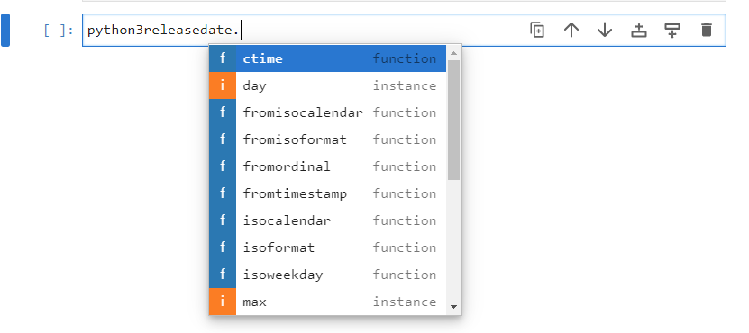
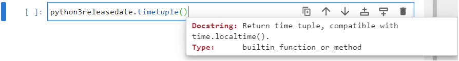

# Datetime Module

The datetime module contains classes for manipulating dates and times. The ```datetime``` module can be imported using the alias ``dt```:

```
import datetime as dt
```


Once imported, the list of identifiers can be viewed by inputting ```dt.``` followed by a tab ```↹```:


There are five main classes ```date``` for working with dates, ```time``` for working with times, ```datetime``` for working with dates and times, ```timedelta``` for working with time differences and ```timeinfo``` for working with time zones.

## date class

The initialization signature of the ```date``` class can be viewed by inputting ```dt.date()``` followed by inputing shift ```⇧``` and tab ```↹```


It requires three input arguments, the year, the month and the day which are colelctively needed to specify a calendar date. For clarity, these can be provided as input arguments:

```
python3releasedate = dt.date(year=2008, month=12, day=3)
```


A list of identifiers that can be accessed from the ```date``` object ```python3releasedate``` can be accessed by inputting ```python3releasedate.``` followed by a tab ```↹```:



The attributes  ```year```, ```month```, ```day``` give the year, month and day as integers which were provided during instantantiation:

```
python3releasedate.year
python3releasedate.month
python3releasedate.day
```


The attributes  ```max``` and ```min```, give the maximum and minimum possible ```date``` instance:

```
python3releasedate.max
python3releasedate.min
```


The attribute resolution, gives the time resolution of the ```date``` instance, as a ```timedelta``` instance:


The ```date``` object is immutable, therefore attempting to reassign an attribute will raise an ```AttributeError```:


Therefore, most of the ```date``` methods will return a value. The ```replace``` method can be used with the keywords ```year```, ```month``` and ```date``` to replace an attribute in the original ```date``` object and output a new ```date``` instance. For example ```python3releasedate``` can be replaced by the latest version of Python 3:

```
python3releasedate.replace(year=2022, month=10, day=24)
```


This would need to be assigned to a new object name.

```
python3_11_releasedate = python3releasedate.replace(year=2022, 
                                                    month=10, 
                                                    day=24)
```


The ```timetuple``` method returns an object similar to a namedtuple:




The ```weekday``` method returns the day of the week as a zero order indexed integer:


```
weekday = {0: 'Monday', 
           1: 'Tuesday', 
           2: 'Wednesday', 
           3: 'Thursday', 
           4: 'Friday', 
           5: 'Saturday', 
           6: 'Sunday'}
```

The release date fo Python 3 gives 2 which was a Wednesday:


The ```isoweekday``` method also returns the day of the week as an integer. The ```isoformat``` uses a first order indexed integer:


```
weekday = {1: 'Monday', 
           2: 'Tuesday', 
           3: 'Wednesday', 
           4: 'Thursday', 
           5: 'Friday', 
           6: 'Saturday', 
           7: 'Sunday'}
```


The four methods beginning with ```from```; ```fromisocalendar```, ```fromisoformat```, ```fromordinal```, ```fromtimestamp``` are alternative constructors. These alternative constructors are class methods and output a new ```date``` instance. ```today``` is also a class method which constructs a ```date``` instance from the date on the system clock.

There are also ```isocalendar```, ```isoformat```, ```toordinal```

```ctime``` is a C style string.

```strftime``` is like a formatted string for the time object.


```dir```

```-```

 Oct. 24th, 2022

October 16, 2000