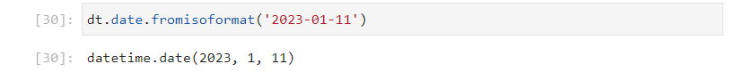
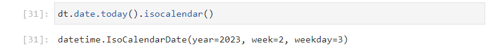
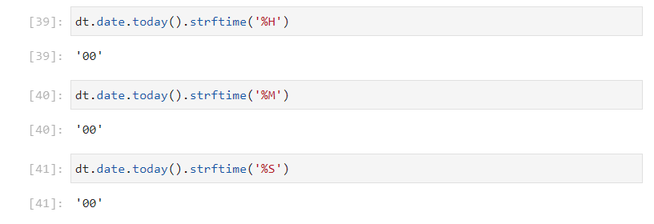
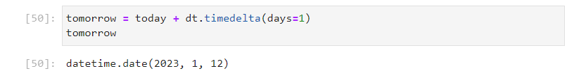
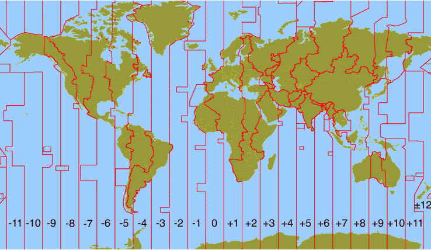
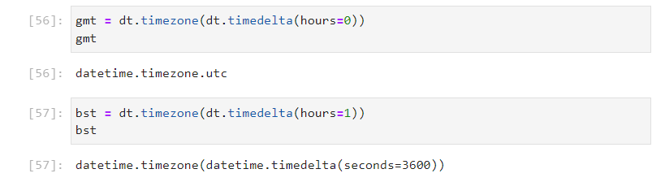
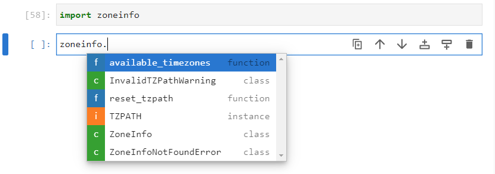

# Datetime and TimeZone Information Modules

The datetime module contains classes for manipulating dates and times. The ```datetime``` module can be imported using the alias ``dt```:

```
import datetime as dt
```


Once imported, the list of identifiers can be viewed by inputting ```dt.``` followed by a tab ```↹```:


There are five main classes ```date``` for working with dates, ```time``` for working with times, ```datetime``` for working with dates and times, ```timedelta``` for working with time differences and ```timeinfo``` for working with time zones.

## date class

The initialization signature of the ```date``` class can be viewed by inputting ```dt.date()``` followed by inputing shift ```⇧``` and tab ```↹```


It requires three input arguments, the year, the month and the day which are colelctively needed to specify a calendar date. For clarity, these can be provided as input arguments:

```
python3releasedate = dt.date(year=2008, month=12, day=3)
```


A list of identifiers that can be accessed from the ```date``` object ```python3releasedate``` can be accessed by inputting ```python3releasedate.``` followed by a tab ```↹```:


The attributes  ```year```, ```month```, ```day``` give the year, month and day as integers which were provided during instantantiation:

```
python3releasedate.year
python3releasedate.month
python3releasedate.day
```


The attributes  ```max``` and ```min``` are class attributes and give the maximum and minimum possible ```date``` instance:

```
python3releasedate.max
python3releasedate.min
```


The attribute resolution, gives the time resolution of the ```date``` instance, as a ```timedelta``` instance:


The ```date``` object is immutable, therefore attempting to reassign an attribute will raise an ```AttributeError```:


Therefore, most of the ```date``` methods will return a value. The ```replace``` method can be used with the keywords ```year```, ```month``` and ```date``` to replace an attribute in the original ```date``` object and output a new ```date``` instance. For example ```python3releasedate``` can be replaced by the latest version of Python 3:

```
python3releasedate.replace(year=2022, month=10, day=24)
```


This would need to be assigned to a new object name.

```
python3_11_releasedate = python3releasedate.replace(year=2022, 
                                                    month=10, 
                                                    day=24)
```


The ```timetuple``` method returns an object similar to a namedtuple:


The ```weekday``` method returns the day of the week as a zero order indexed integer:


```
weekday = {0: 'Monday', 
           1: 'Tuesday', 
           2: 'Wednesday', 
           3: 'Thursday', 
           4: 'Friday', 
           5: 'Saturday', 
           6: 'Sunday'}
```

The release date fo Python 3 gives 2 which was a Wednesday:


The ```isoweekday``` method also returns the day of the week as an integer. The ```isoformat``` uses a first order indexed integer:


```
weekday = {1: 'Monday', 
           2: 'Tuesday', 
           3: 'Wednesday', 
           4: 'Thursday', 
           5: 'Friday', 
           6: 'Saturday', 
           7: 'Sunday'}
```


The four methods beginning with ```from```; ```fromisocalendar```, ```fromisoformat```, ```fromordinal```, ```fromtimestamp``` are alternative constructors. These alternative constructors are class methods and output a new ```date``` instance. ```today``` is also a class method which constructs a ```date``` instance from the date on the system clock.

```
dt.date.today()
```


The timestamp is a unit of measurement in seconds that begins from the Epoch Time ```1970, 1, 1``` is at ```0``` seconds. The Epoch timestamp is used by the ```time``` module:

```
import time
time.time()
```


Recall that 1 day == 24 hours == 24 * 60 minutes == 24 * 60 * 60 seconds. For simplicity the following variable can be defined:

```
day = 24 * 60 * 60
```


As seen when ```dt.date.today()``` was used, it is ```2023, 1, 11``` and it is roughly midday.

The number of years from 2023 to 1970 are:

```
2023 - 1970
```


Therefore the rough time in seconds is:

```
53 * 365.2425 * day + (11.5 - 1) * day
```

This gives a timestamp within the accuracy of a day.


The following is therefore equivalent to ```dt.date.today()```:

```
dt.date.fromtimestamp(time.time())
```


And the following can be examined:

```
dt.date.fromtimestamp(0*day)
dt.date.fromtimestamp(1*day)
dt.date.fromtimestamp(10*day)
```


The ordinal date begins at:

```
dt.date.min
```


And 1 ordinal unit is 1 day.

```
dt.date.min.toordinal()
```


The ordinal time today can be measured using:

```
dt.date.today().toordinal()
```


As seen when ```dt.date.today()``` was used, it is ```2023, 1, 11``` and it is roughly midday. Therefore, the ordinal time can be calculated to be approximately, the difference in years, times the number of days in a year lus the difference in days since the 1st of January of this year.

```
int((2023 - 1) * 365.2425 + (11.5 - 1))
```


This gives an accuracy of a day, taking into account rounding.

The ```isoformat``` function can be used to express the datetime in an isoformat string:

```
dt.date.today().isoformat()
```


The alternative constructor, can be used to construct a ```date``` instance from an isoformat string:

```
dt.date.fromisoformat('2023-01-11')
```



There is also the ```isocalendar``` function, which shows the date using the isocalendar format. There are three input arguments ```year```, ```week``` and ```weekday```:

```
dt.date.today().isocalendar()
```



The isocalender matches the format of the isoweekday seen earlier, day 3 corresponds to Wednesday.

The alternative constructor ```fromisocalendar``` can be used to construct a ```date```:

```
dt.date.fromisocalendar(year=2023, week=2, weekday=3)
```

There is an inconsistency in the keyword input arguments, the constructor uses ```day``` opposed to ```weekday```:


```
dt.date.fromisocalendar(year=2023, week=2, day=3)
```


```ctime``` is a C style string:

```
dt.date.today().ctime()
```


```strftime``` is like a formatted string for the time object with its own associated format codes.

Lower case format codes are used for a date ```%y```, ```%m```, ```%d``` in a 2 digit format:

```
dt.date.today().strftime('%y')
dt.date.today().strftime('%m')
dt.date.today().strftime('%d')
```


Upper case codes are used for a time ```%H```, ```%M```, ```%S``` in a 2 digit format and the distinction is made because month and minute both start with m:

```
dt.date.today().strftime('%H')
dt.date.today().strftime('%M')
dt.date.today().strftime('%S')
```



The time component in microsecond uses a 6 digit format, and it also begins with a m. The microsecond component uses the code ```f```:

```
dt.date.today().strftime('%f')
```


These four time units have the value of 0 for a date. Recall that ```dt.date.resolution``` has an accuracy of 1 day.

Because there is no confusion for year and day as no other date or time unit begin with y or d. The upper case versions of these formats give the year in a 4 digit format and the day in an American format ```MM/DD/YY```:

```
dt.date.today().strftime('%Y')
dt.date.today().strftime('%D')
```


These can be combined to make a British format:

```
dt.date.today().strftime('%d/%m/%y')
```


Additional format codes are available [strftime Codes](https://docs.python.org/3/library/datetime.html#strftime-and-strptime-format-codes)


If the directory of the ```date``` class is examined:

```
dir(dt.date)
```


Notice that the ```__sub__``` and ```__add__``` datamodel methods are defined alongside the 6 comparison operators ```__eq__```, ```__ne__```, ```__lt__```, ```__le__```, ```__gt__``` and ```__ge__```. This means the ```-``` and ```+``` operators can be used alongside the ```==```, ```!=```, ```<```, ```<=```, ```>``` and ```>=``` operators.

```
today = dt.date.today()
today
yesterday = today.replace(day=today.day-1)
yesterday
```


The ```__sub__``` datamodel method is designed to compute the time difference between two ```date``` instances:

```
today - yesterday
```

This returns a ```timedelta``` with a resolution of a day, recall that ```dt.date.resolution``` has an accuracy of 1 day. The ```__add__``` datamodel method is configured to use a ```date``` instance and add a ```timedelta``` instance to it. 


```
tomorrow = today + dt.timedelta(days=1)
tomorrow
```



Addition of two dates for example ```today + tomorrow``` will give a ```typeError``` as this operation does not make sense.


This method can be thought of as being setup similar to the ```__mul__``` method on a string class which is designed to work with an integer instance for the purpose of string replication:

```
'hello' * 3
```


Likewise multiplication of two strings for example ```'hello' * 'hello''``` will give a ```typeError``` as this operation does not make sense.


The conditional operators can be used to compare dates:

```
tomorrow > today
yesterday < tomorrow
```


## timezone class

Time Zones roughly correlate with the lines of longitude on the globe. The Prime Meridian is the line of longitude designated 0 degrees and runs through Greenwich, UK. Google Earth displays the lines of longitude in 10 degree intervals:


Time Zones are however based on 15 degree intervals. There are 24 hours in a day and 360 degrees in a circle i.e. ```15 * 24 == 360```. The Time Zone lines aren't perfectly straight and are modified to accomodate countries [Physical geography](http://www.physicalgeography.net/fundamentals/2c.html): 



Greenwich Mean Time was originally used as a Coordinated Time for Time Zones when Time standards were based upon Astronomy. Universal Coordinated Time (UTC) is a revised version of Greenwich Mean Time (GMT) which uses the more accurate Atomic Clock as a Time standard. Nowadays the two terms are used interchangeably. 

In the United Kingdom, two time zones are used, depending on the time of the year. GMT (UTC) is used October - March and BST (UTC+1) is used March - October. The clocks go forward over the summer months and BST is an abbreviation for British Summer Time. The clocks go forward 1 hour at 01:00:00 on the last Sunday in March, this clock change is known as daylight savings time as its purpose is to optimise the number of hours of daylight encountered during the working day over the summer months where the number of hours of daylight are longer. The clocks go back 1 hour at 02:00:00 on the last Sunday in October ending daylight savings time. 

The ```datetime``` module has an abstract ```tzinfo``` class and ```timezone``` class that can be used to create a timezone with a constant offset from UTC. The initialization signature of the ```timezone``` class can be viewed by inputting ```dt.timezone()``` followed by inputing shift ```⇧``` and tab ```↹```:


The initialization signature requires an instance of the ```timedelta``` class using the ```hours``` keyword input argument:


The following implementations can be carried out:

```
utc = dt.timezone(dt.timedelta(hours=0))
gmt = dt.timezone(dt.timedelta(hours=1))
```



The crude implementation above is **not recommended** as it will not accomodate clock changes.

## ZoneInfo class

A more through implementation is in the timezone information module ```tzinfo```. The ```tzinfo``` module is used to manage timezones by capital city location on the map. The ```zoneinfo``` can be imported using:

```
import zoneinfo
```

Once imported, the list of identifiers can be viewed by inputting ```zoneinfo.``` followed by a tab ```↹```:



The two identifiers of interest are the ```available_timezones``` function and the ```ZoneInfo``` class. The ```available_timezones``` functions returns a set of strings:


Each string corresponds to a valid ```timezone```. These strings can be used as input arguments to the ```ZoneInfo``` class to create a valid timezone:

```
london = zoneinfo.ZoneInfo('Europe/London')
```


## time class

The initialization signature of the ```time``` class can be viewed by inputting ```dt.time()``` followed by inputing shift ```⇧``` and tab ```↹```:

```
time1 = dt.time(hour=12, minute=45, second=30, microsecond=250000, tzinfo=london)
```

```
midday.min
midday.max
midday.resolution
```

```
midday.hour
midday.minute
midday.second
midday.microsecond
midday.tzinfo
```

The ```replace``` and ```strftime``` methods

The ```isoformat``` and ```fromisoformat```.


The ```fold``` attribute is ```0``` and the two functions ```tzname``` and ```utcoffset``` return ```None```. These are reserved for ```datetime``` instances which compose a date and time. They will be explored in the ```datetime``` class. 


## The datetime class

The initialization signature of the ```datetime``` class can be viewed by inputting ```dt.date()``` followed by inputing shift ```⇧``` and tab ```↹```. The initialization signature requires the input arguments of the ```date``` class and the input arguments of the ```time``` class:


```
python3releasedatemidday = dt.datetime(year=2008, month=12, day=3, 
                                       hour=12, minute=0, second=0, 
                                       microsecond=0, tzinfo=london)
```


The alternative constructor ```combine``` can be used to ```combine``` a ```date``` and a ```time```:


```
python3releasedatemidday = dt.datetime.combine(date=python3releasedate,
                                               time=midday)
```


docstring

```
dt.datetime.utcnow()
```


docstring

```
dt.datetime.now(tz=london)
dt.datetime.now()
```


now = dt.datetime.now(tz=london)
now


now.year
now.month
now.day
now.hour
now.minute
now.second
now.microsecond
now.tzinfo

now.min
now.max
now.resolution


The ```fold``` attribute is ```0```. This parameter is used to distinguish between duplicate times when clocks go back.

```
now.fold
```

In the United Kingdom the clocks go forward 1 hour at 01:00:00 on the last Sunday in March, and back 1 hour at 02:00:00 on the last Sunday in October.

|Clocks Go Forward|Clocks Go Back|
|---|---|
|2022-03-27|2022-10-30|
|2023-03-26|2023-10-29|
|2024-03-31|2024-10-27|
|2025-03-30|2022-10-26|

These means that there is an hour of duplication between 01:00:00 and 02:00:00 when the clocks go back known as an hour fold. The hour before the clock change has a fold value ```fold=0``` and the hour after the clock change has a fold value of ```fold=1```. Since no other times are duplicated, the fold value used is  typically ```fold=0```.

```
beforefold = dt.datetime(year=2023, month=10, day=29, 
                         hour=1, minute=30, second=0, 
                         microsecond=0, tzinfo=london,
                         fold=0)
```

```
afterfold = dt.datetime(year=2023, month=10, day=29, 
                        hour=1, minute=30, second=0, 
                        microsecond=0, tzinfo=london,
                        fold=1)
```

```
beforefold.dst()
afterfold.dst()
```

```
beforefold.tzname()
afterfold.tzname()
```

```
beforefold.utcoffset()
afterfold.utcoffset()
```


```
beforefold.astimezone()
afterfold.astimezone()
```


```
afterfold - beforefold
```


now.isoformat()

dt.datetime.fromisoformat('2023-01-12T07:33:53.732782+00:00')

Note

dt.datetime.fromisoformat('2023-01-12T07:33:53.732782+00:00').replace(tzinfo=london)


