# Queue Module

The queue module has a number of classes for making a queue like data structures.

It can be imported using:

```
import queue
```

The modules docstring isn't too detailed and can be seen by using:

```
? queue
```

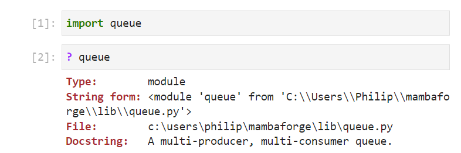

A list of identifiers can be seen by inputting ```queue.``` followed by a tab ```↹```:

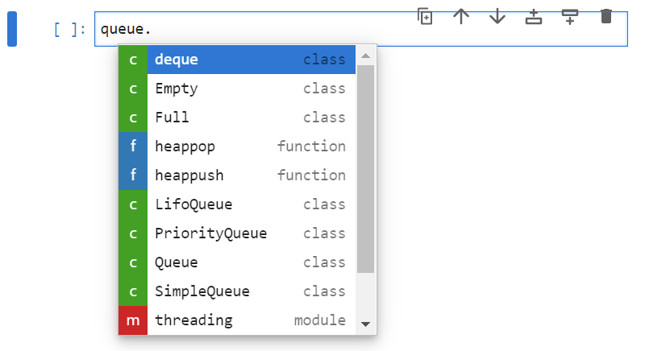

## SimpleQueue Class

As the number of identifiers in the module are quite small, they are normally imported directly. For example the ```SimpleQueue``` class can be imported using:

```
from queue import SimpleQueue
```

Its docstring can be seen by inputting the class name, followed by open parenthesis and pressing shift ```⇧``` and tab ```↹```:

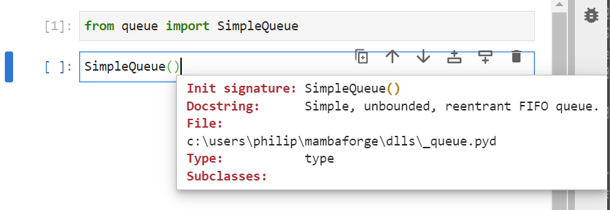

The docstring states that is a simple, unbounded, reentrant first in first out (FIFO) queue and has no input arguments

It can be conceptualised as a queue for a venue:


```
venue_queue = SimpleQueue()
```

A list of identifiers can be viewed by inputting ```venue_queue.``` followed by a tab ```↹```:

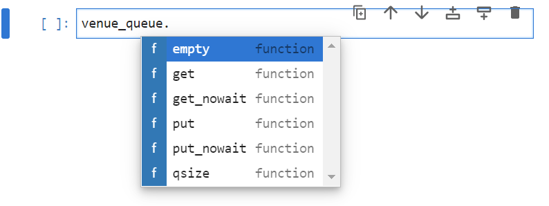

Long before the venue is opened the ```venue_queue``` should be empty, this can be checked by using the method empty which returns a boolean value that is ```True``` if the queue is empty:

```
venue_queue.empty()
```

The method ```qsize``` returns the size of the queue and this should be ```0``` when the ```venue_queue``` is empty:

```
venue_queue.qsize()
```

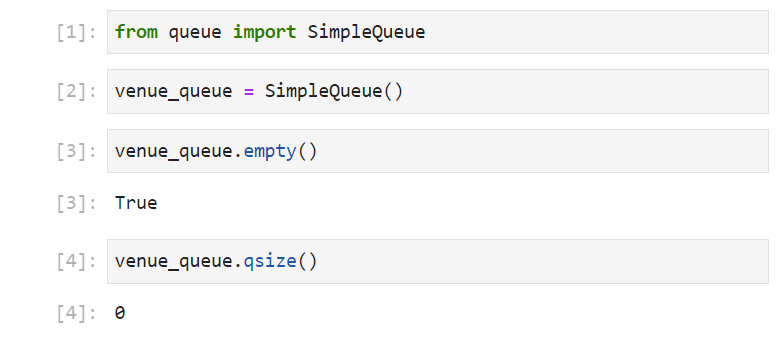

10 minutes before the venue opens, some early birds might arrive and join the queue. Items can be put in the queue using the ```put``` method which takes in an item as a positional input argument:

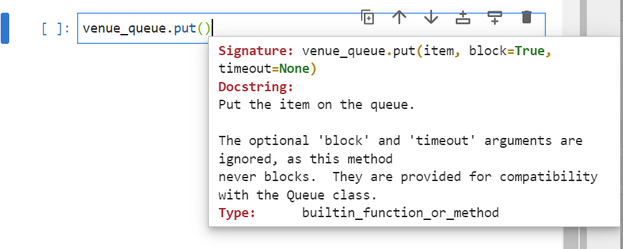

```"Lucie"``` can be put in the venue queue, followed by ```"Martin"``` and ```"Pavel"```. The queue is now not empty and the queue size is 3:

```
venue_queue.put("Lucie")
venue_queue.put("Martin")
venue_queue.put("Pavel")
venue_queue.empty()
venue_queue.qsize()
```

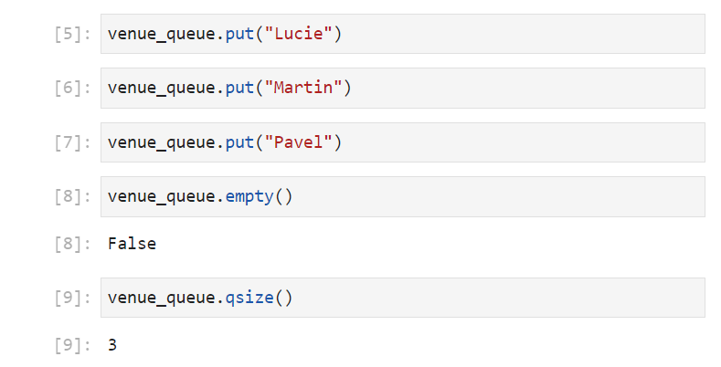

When the venue opens, the venue staff can get the first person standing in the queue using the ```get``` method:


Now that ```"Lucie"``` is in the venue, the queue is still not empty as there are another 2 people waiting in the queue ```"Martin"``` and ```"Pavel"```:

```
venue_queue.get()
venue_queue.empty()
venue_queue.qsize()
```

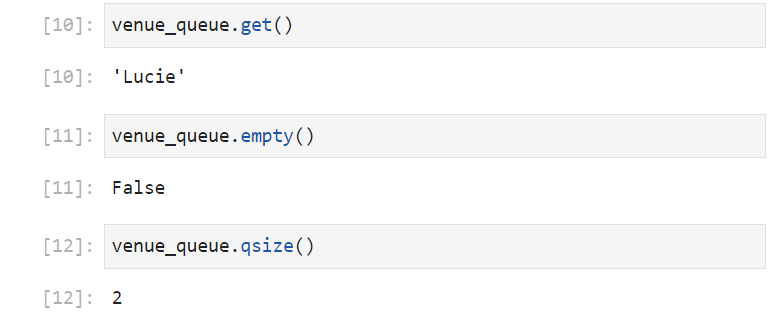

If in the meantime another two people join the queue, ```"Jess"``` and ```"Sam"```. The queue size will not be empty and will have a size of 4:

```
venue_queue.put("Jess")
venue_queue.put("Sam")
venue_queue.empty()
venue_queue.qsize()
```

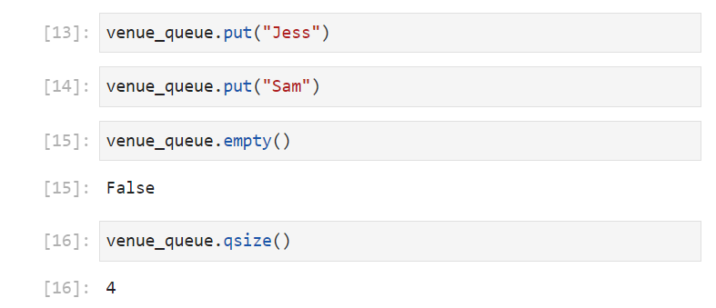

Now that the venue staff are fully prepared they can let everyone in, the queue is now empty with a size of 0:

```
venue_queue.get()
venue_queue.get()
venue_queue.get()
venue_queue.get()
venue_queue.empty()
venue_queue.qsize()
```


If the staff attempt to ```get``` someone else in, while the queue is empty, they end up waiting in an infinite loop:

```
venue_queue.get()
```


And when the venue uses a single thread on a processor for putting people in a line and getting people from the line, the infinite loop holds the venue up and people joining the queue cannot enter the venue, because the venue staff are busy:

```
venue_queue.get()
venue_queue.put("Amy")
```

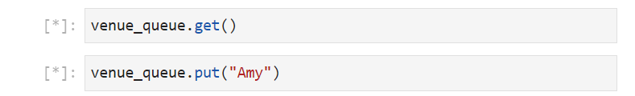

For this reason there is a ```get_nowait``` method which behaves like ```get``` but return an error message from the error class ```Empty``` if there is no-one in the queue, equivalent of the venues manager shouting at the employee to get back to work when they get stuck in an infinite loop. There is also an equivalent ```put_nowait```:

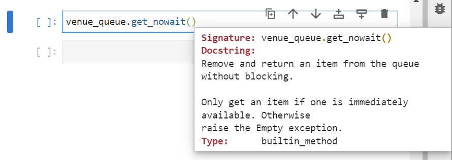

```
from queue import SimpleQueue
venue_queue = SimpleQueue()
venue_queue.put_nowait("Lucie")
venue_queue.put_nowait("Martin")
venue_queue.put_nowait("Pavel")
venue_queue.get_nowait()
venue_queue.put_nowait("Jess")
venue_queue.put_nowait("Sam")
venue_queue.get_nowait()
venue_queue.get_nowait()
venue_queue.get_nowait()
venue_queue.get_nowait()
venue_queue.get_nowait()
```

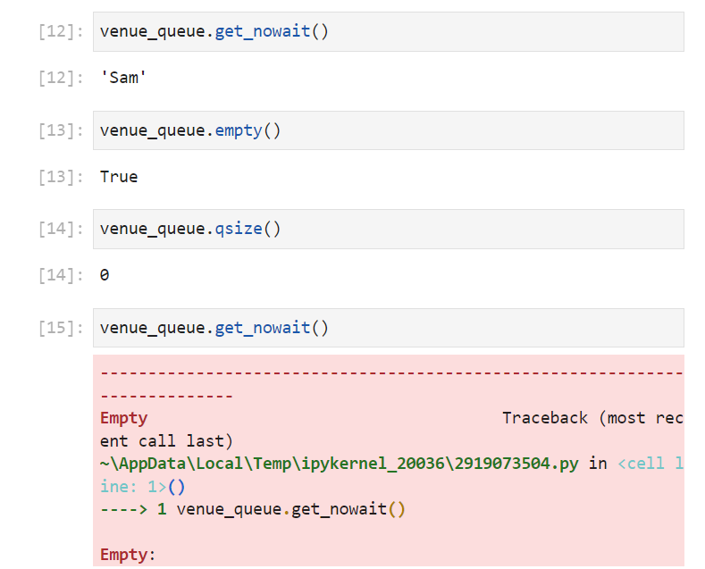

## Queue Class

The ```Queue``` class behaves similarly to the ```SimpleQueue``` class. It can be imported using:

```
from queue import Queue
```

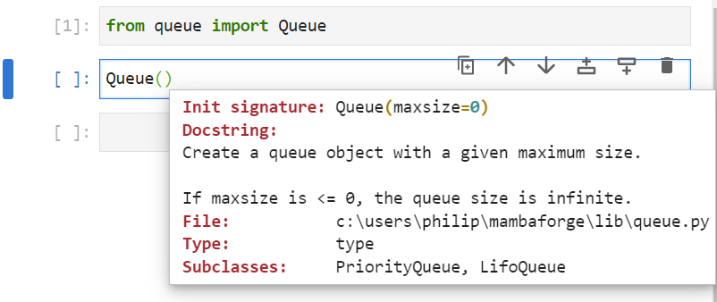

The ```Queue``` class has a single keyword input argument ```maxsize``` which is set to ```0``` by default and therefore behaves like a ```SimpleQueue``` as default. It can be overridden to specify a maximum queue size. For example it can be assigned to ```5```:

```
from queue import Queue
venue_queue = Queue(maxsize=5)
```


Now that ```venue_queue``` is a ```Queue``` instance opposed to a ```SimpleQueue``` instance, more identifiers are available:


The attribute ```queue``` displays what the queue looks like and the attribute  ```maxsize``` displays the maximum size of the queue. 

```
from queue import Queue
venue_queue = Queue(maxsize=5)
venue_queue.queue
venue_queue.maxsize
venue_queue.not_empty
venue_queue.not_full
```

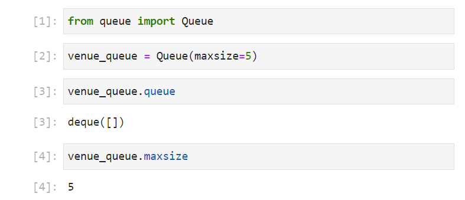

The instances ```not_empty```, ```not_full```, ```mutex```, ```unfinished_tasks``` and ```task_done``` are used for threading.

used to check conditions for example when using loops: