# The Seaborn Library

Seaborn is a data visualisation library based upon ```matplotlib```. It has an appplication interface which simplifies the creation of complex but common visualisation plots from data contained within a ```pandas``` ```DataFrame``` instance. In theory all of the plots created by ```seaborn``` can be done directly in ```matplotlib``` but they would require much more lines of code.

## Importing Seaborn

The library name ```seaborn``` is derived from the two words Sea and Born. In this context the sea refers to a body of water i.e. a collection of data and born refers to the creation of the visualisation for that data. Like most of the other commonly used data science libraries it is common to import seaborn using a 3 letter abbreviation. The abbreviation ```sns``` is standard:

```
import numpy as np
import pandas as pd
import matplotlib.pyplot as plt
import seaborn as sns
```

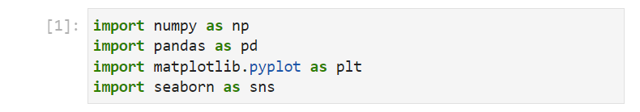

```sns``` comes from the fictional character Samual Norman Seaborn from the West Wing. His intiials were selected as the abbreviation by developers of the ```seaborn``` library as he has the sirname Seaborn.

Once imported the library version can be checked:

```
sns.__version__
```


## Style

```seaborn``` is a wrapper library around ```matplotlib```. The ```matplotlib``` backend can be changed using:

```
%matplotlib qt5
```


Some basic data can be created using ```numpy``` arrays:

```
x = np.array([1, 2, 3, 4, 5])
y = np.array([2, 4, 6, 8, 10])
```


A simple line plot can be created using ```matplotlib```:

```
fig = plt.figure(num=1, figsize=None, dpi=None)
ax = fig.add_subplot(111)
ax.plot(x, y)
```

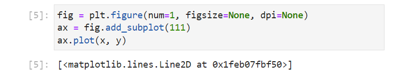

The ```seaborn``` library has the function ```set_style``` which will change the default style for all ```matplotlib``` and by extension ```seaborn``` plots. Its docstring can be viewed by inputting ```sns.set_style()``` followed by a shift ```⇧``` and a tab ```↹```:

```
sns.set_style('whitegrid')
fig = plt.figure(num=2, figsize=None, dpi=None)
ax = fig.add_subplot(111)
ax.plot(x, y)
```

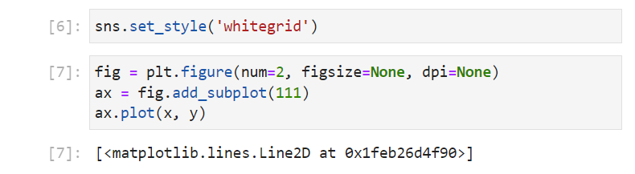

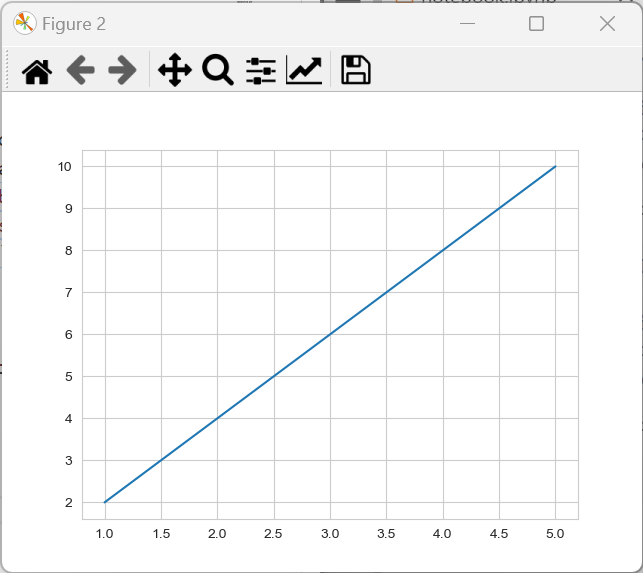

```
sns.set_style('darkgrid')
fig = plt.figure(num=3, figsize=None, dpi=None)
ax = fig.add_subplot(111)
ax.plot(x, y)
```

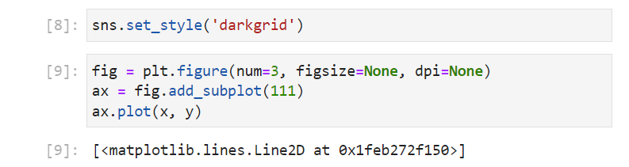


```
sns.set_style('white')
fig = plt.figure(num=4, figsize=None, dpi=None)
ax = fig.add_subplot(111)
ax.plot(x, y)
```

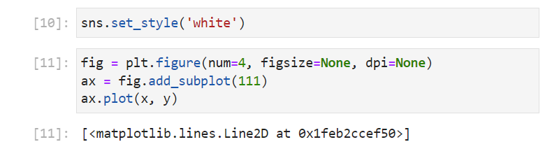

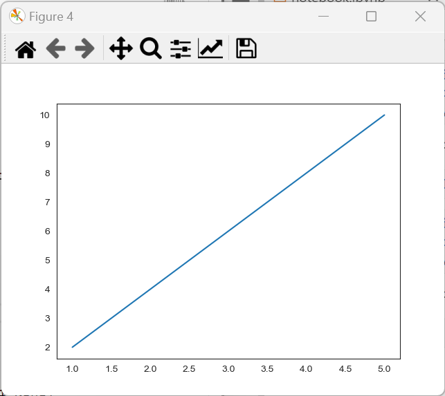

```
sns.set_style('dark')
fig = plt.figure(num=5, figsize=None, dpi=None)
ax = fig.add_subplot(111)
ax.plot(x, y)
```

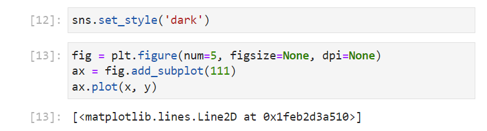

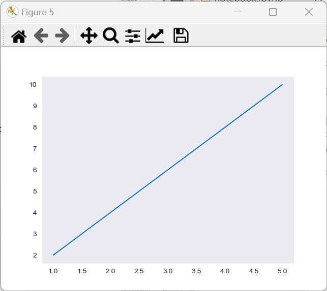

## Palette

The ```seaborn``` function ```color_palette``` can be used to view the color palette:

```
sns.color_palette(palette='tab10')
```

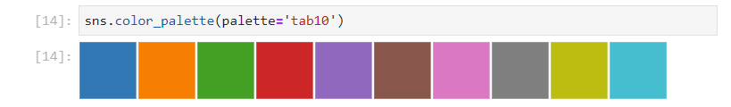

```
sns.color_palette(palette='pastel')
```

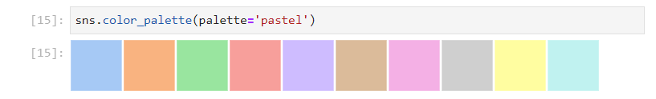

```
sns.color_palette(palette='viridis')
```


[Colormaps](https://matplotlib.org/stable/tutorials/colors/colormaps.html)

The ```seaborn``` function ```set_palette``` can be used to set the default color palette used for subsequent plots:

```
sns.set_palette(palette='tab10')
```


The following plot can be made with 15 lines:

```
fig = plt.figure(num=6, figsize=None, dpi=None)
ax = fig.add_subplot(111)
for num in range(15):
    ax.plot(x, y+num, lw=5)
```


Since the color palette only has 10 colors and there are 15 lines, the additional 5 lines reuse the colors from the beginning of the palette:

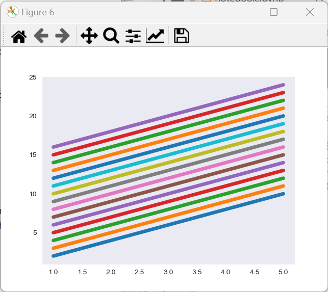

The ```seaborn``` function ```set_palette``` can be used to set the default color palette to ```'pastel'```:

```
sns.set_palette(palette='pastel')
```


```
fig = plt.figure(num=7, figsize=None, dpi=None)
ax = fig.add_subplot(111)
for num in range(15):
    ax.plot(x, y+num, lw=5)
```

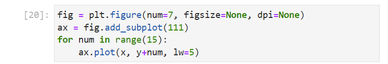

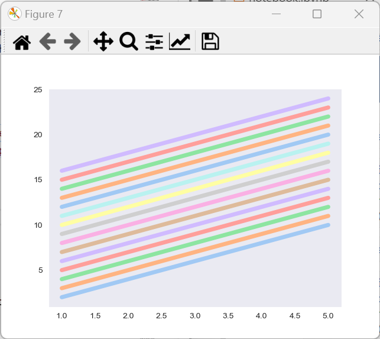

A custom palette can also be made using the seaborn function ```blend_palette``` and supplying the input argument ```colors``` which is usually a ```tuple``` of color strings, and ```n_colors``` which is an integer corresponding to the number of colors to be added to the palette:

```
bp = sns.blend_palette(colors=('tomato', 
                               'yellow', 
                               'darkseagreen', 
                               'royalblue'),
                       n_colors=10)
bp
```

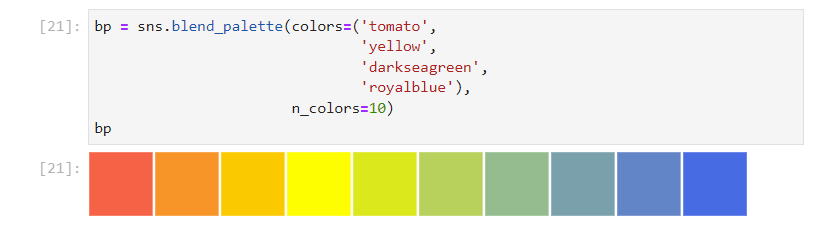

This custom palette can be set:

```
sns.set_palette(palette=bp)
```


And will be used on a new plot:

```
fig = plt.figure(num=8, figsize=None, dpi=None)
ax = fig.add_subplot(111)
for num in range(15):
    ax.plot(x, y+num, lw=5)
```

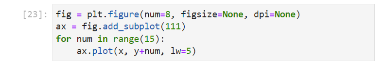

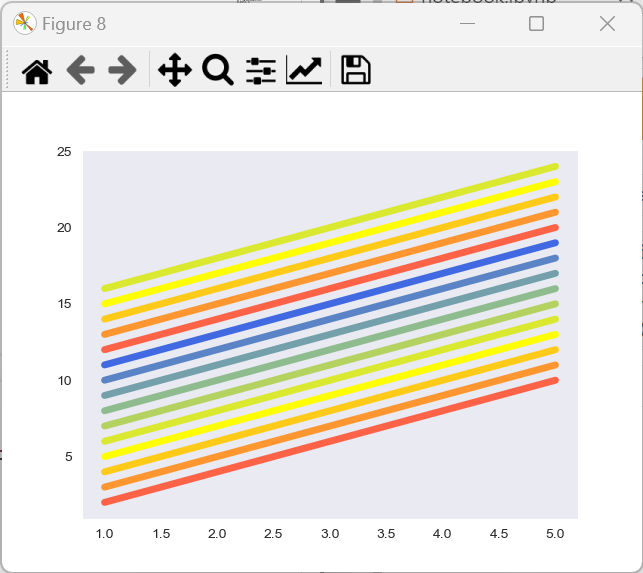

The ```seaborn``` library has the dictionary ```xkcd_rgb``` which has color name keys and hexadecimal values for 954 of the most common rgb monitor colors:

```
sns.xkcd_rgb
```

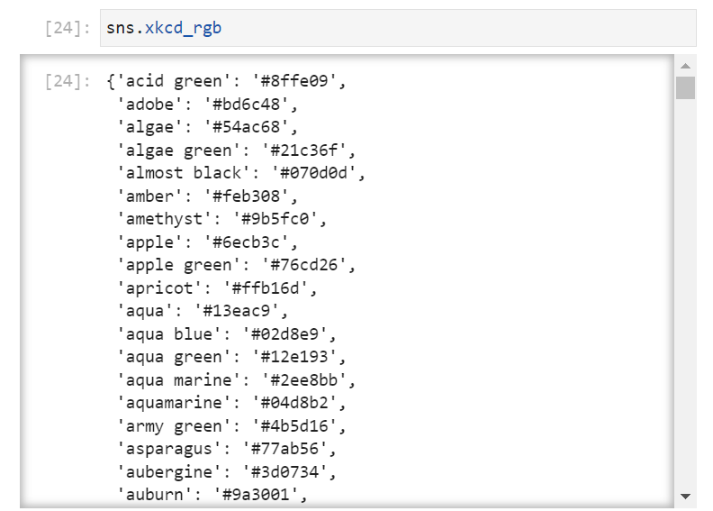

More details about these colors is available with the xkcd documentation:

[xkcd colors](https://xkcd.com/color/rgb/)

The ```seaborn``` method ```xkcd_palette``` can be used to create a color palette from these colors. This function requires every color in the palette to be specified as one of the corresponding key names in the ```xkcd_rgb``` dictionary:

```
xkcdp = sns.xkcd_palette(colors=('tomato red',
                                 'coral',
                                 'light plum',
                                 'cocoa',
                                 'yellowish', 
                                 'cool green',
                                 'faded green',
                                 'light teal',
                                 'faded blue',
                                 'cornflower blue'))
xkcdp
```

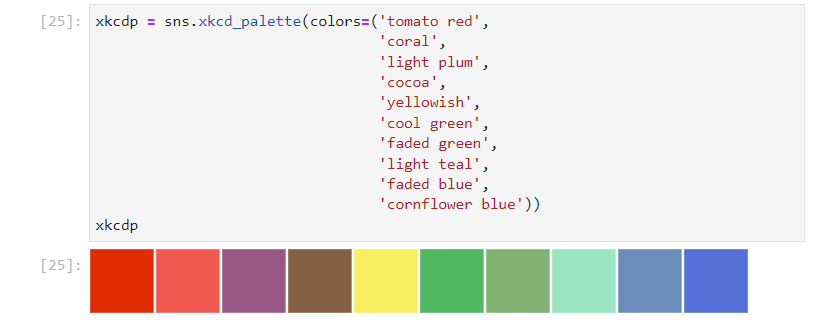

The color palette can be set as the default:

```
sns.set_palette(palette=xkcdp)
```


And will be used on a new plot:

```
fig = plt.figure(num=9, figsize=None, dpi=None)
ax = fig.add_subplot(111)
for num in range(15):
    ax.plot(x, y+num, lw=5)
```

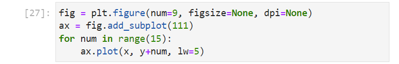

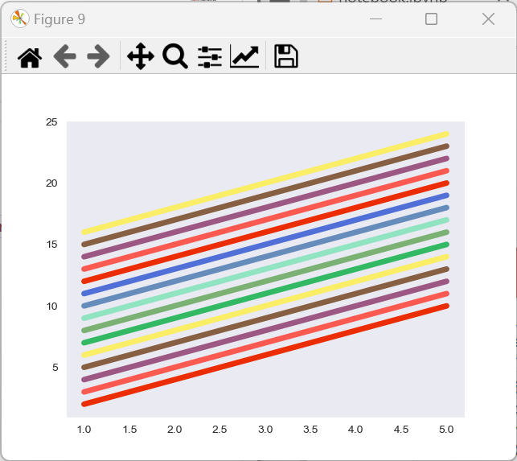

There are a number of functions such as ```choose_diverging_palette```, ```choose_light_palette```, ```choose_dark_palette```, ```choose_colorbrewer_palette```, ```choose_cube_helix_palette```, and ```choose_cubehelix_palette``` which use interactive Python widgets for a customisable color palette: 

```
dp = sns.choose_diverging_palette()
```

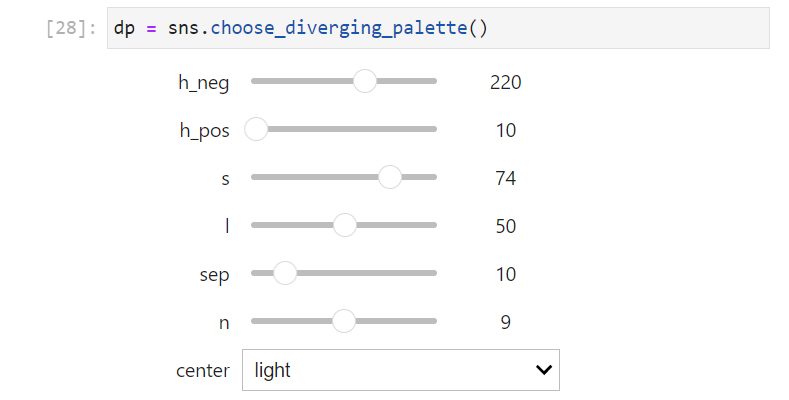

Changing the values on the sliders will recreate an inline plot. When the qt5 backend is enabled, it doesn't update the plot in the existing figure but instead creates a new figure and in my case produced 20 plots as I moved only one fo the sliders upwards:

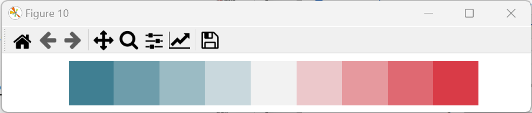

The diverging palette can be selected:

```
sns.set_palette(palette=dp)
```


And will be used on a new plot:

```
fig = plt.figure(num=11, figsize=None, dpi=None)
ax = fig.add_subplot(111)
for num in range(15):
    ax.plot(x, y+num, lw=5)
```

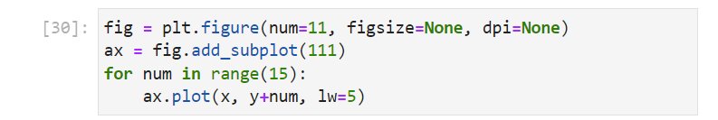

## Plot Configuration

The plot configuration options are normally specified at the top of the notebook after importing the scientific libraries:

```
import numpy as np
import pandas as pd
import matplotlib.pyplot as plt
import seaborn as sns

%matplotlib qt5
sns.set_style('whitegrid')
sns.set_palette(palette='tab10')
```

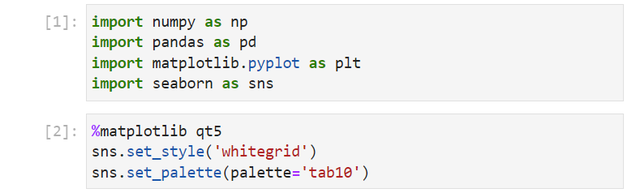

## Pandas DataFrame

The ```seaborn``` plotting functions generally assume the data is contained within an instance of the ```pandas``` class ```DataFrame```. The ```DataFrame``` instance for the simple plot types should generally have a numeric ```Series``` instance corresponding to $x$ and a numeric ```Series``` instance corresponding to $y$. For example:

```
df = pd.DataFrame(data={'x': np.arange(0, 11, 1),
                        'y': np.arange(0, 22, 2)})
```


The ```DataFrame``` method ```head``` can be called from the instance ```df```:

```
df.head()
```

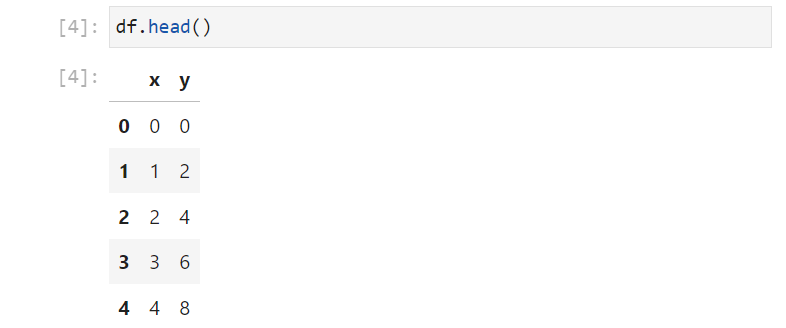

The data type can be tested using the ```DataFrame``` attribute ```dtype```:

```
df.dtype
```

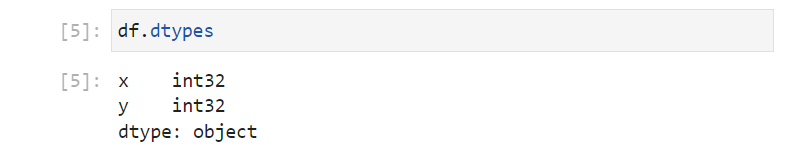

If the ```DataFrame``` instance ```df``` has a categorical ```Series``` it can be used to plot subsets of the data using the category. A ```bool``` ```Series``` instance can be made, which in this case checks if the $x$ value is even:

```
df['x'].head() % 2
```

```
df['x'].head() % 2 == 0
```

```
df['parity'] = df['x'] % 2 == 0
```

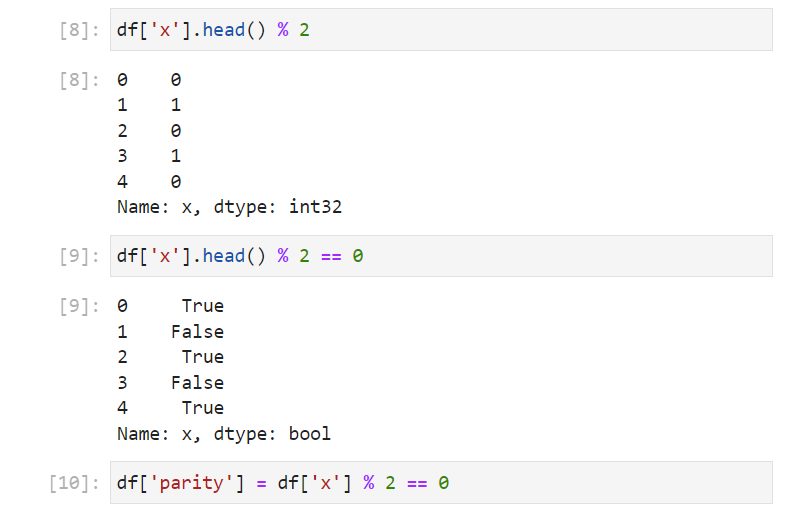

This ```Seires``` instance can have its type changed to category and these categories can be renamed:

```
df['parity'] = df['parity'].astype('category')
```

```
df['parity'] = df['parity'].cat.rename_categories({True: 'even',
                                                   False: 'odd'})
```

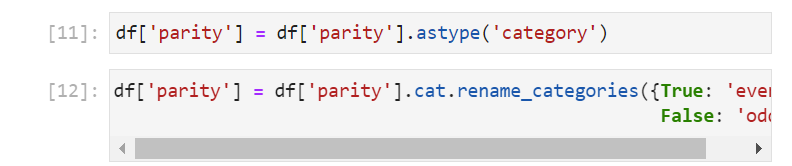

The ```DataFrame``` instance ```df``` head can be checked:

```
df.head()
```

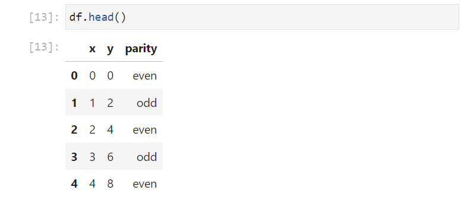

The ```DataFrame``` instance ```df``` datatypes can be checked:

```
df.dtypes
```

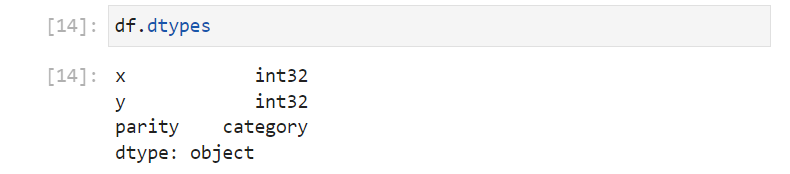

The ```DataFrame``` instance ```df``` information can be checked:

```
df.info()
```

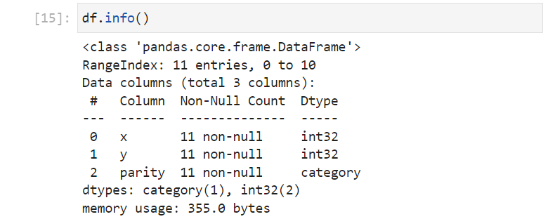

The ```DataFrame``` instance ```df``` description can be checked which gives statistical details about only the numeric data:

```
df.describe()
```

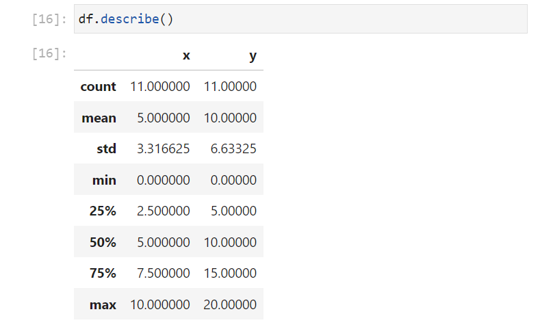

## Seaborn Example Datasets

For convenience a number of practice datasets in the form of ```DataFrames``` instances are inbuilt into ```seaborn```. The names of these datasets can be accessed by using the ```seaborn``` function ```get_dataset_names```:

```
sns.get_dataset_names()
```

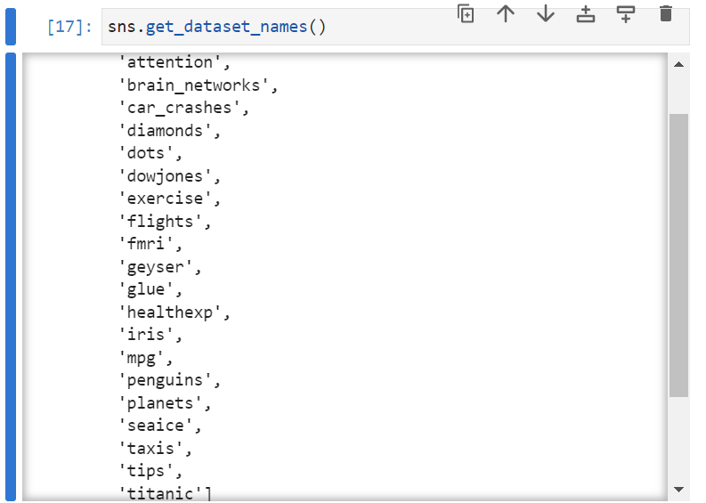

A dataset can be loaded using the ```seaborn``` function ```load_dataset``` and providing the ```name``` of the dataset as a string. The loaded dataset is a ```DataFrame``` instance. It is worthwhile loading these datasets in as ```DataFrame``` instances and using the standard ```DataFrame``` attributes and methods to get a summary for the data including its shape and the data type of each ```Series```. Any null values should be handled.

### Flights Dataset

The flights dataset shows the number of passengers each month for the years 1949-1960. The flights dataset can be loaded using:

```
flights = sns.load_dataset(name='flights')
```


The ```DataFrame``` instance ```flights``` head can be checked:

```
flights.head()
```

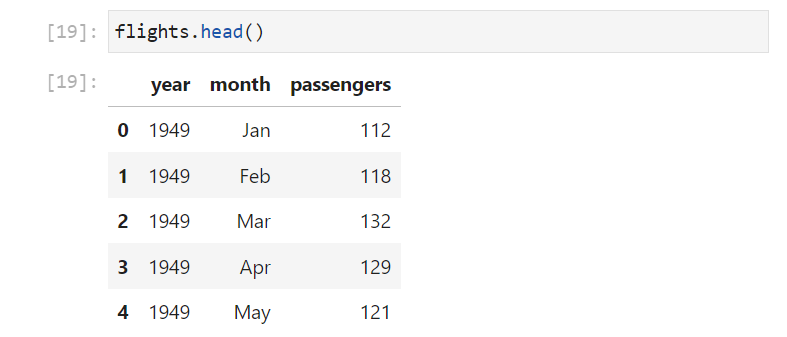

The ```DataFrame``` instance ```flights``` data types can be checked:

```
flights.dtypes
```


The year and passenger columns are integers, while the month column is categorical.

The ```DataFrame``` instance ```flights``` shape can be checked:

```
flights.shape
```


The ```DataFrame``` instance ```flights``` information can be checked:

```
flights.info()
```

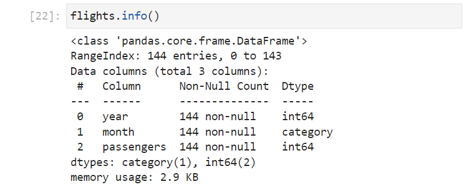

The ```DataFrame``` instance ```flights``` description can be checked:

```
flights.describe()
```

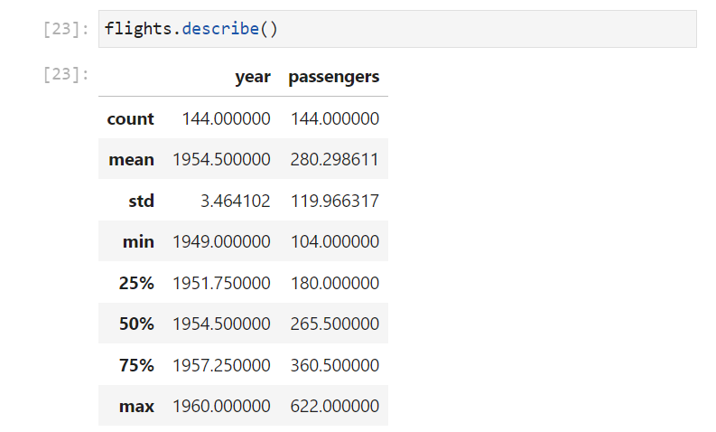

### Exercise Dataset

The exercise dataset compares the performance of two groups of people that are either on a low fat diet or a no fat diet. Their pulse is measured at 3 times 1 min, 15 min and 30 min after a different level of exercise rest, walking or running.

The exercise dataset can be loaded using:

```
exercise = sns.load_dataset(name='exercise')
```


The ```DataFrame``` instance ```exercise``` head can be checked:

```
exercise.head()
```

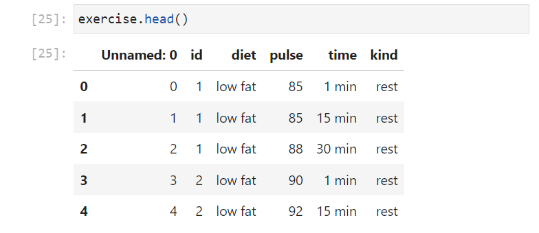

The ```DataFrame``` instance ```exercise``` data types can be checked:

```
exercise.dtypes
```

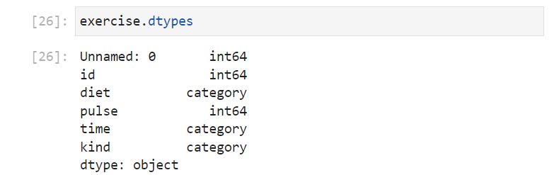

The pulse is an integer while the diet, time and kind are categories.

The ```DataFrame``` instance ```exercise``` shape can be checked:

```
exercise.shape
```


The ```DataFrame``` instance ```exercise``` information can be checked:

```
exercise.info()
```

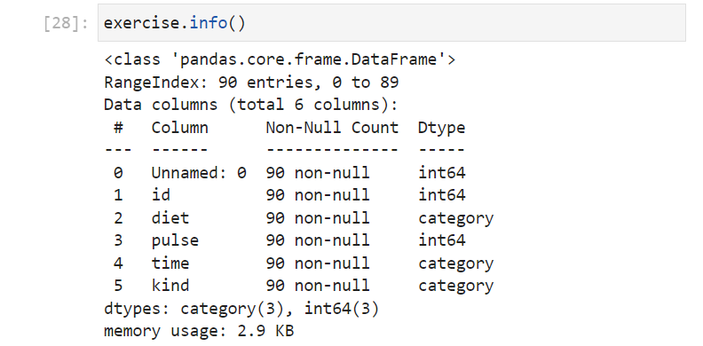

The ```DataFrame``` instance ```exercise``` description can be checked:

```
exercise.describe() 
```

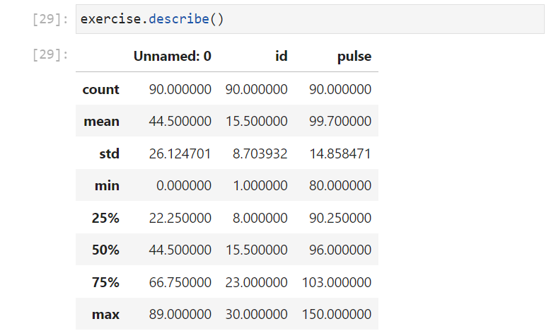

### Tips Dataset

The tips dataset looks at the total bill and tip received at a restaurant. This data is recorded alongside categories such as the sex, smoker, day, time and party size.

The tips dataset can be loaded using:

```
tips = sns.load_dataset(name='tips')
```


The ```DataFrame``` instance ```tips``` head can be checked:

```
tips.head()
```

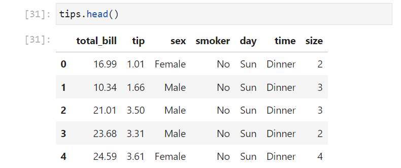

The ```DataFrame``` instance ```tips``` data types can be checked:

```
tips.dtypes
```

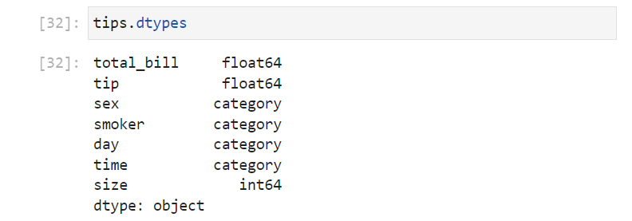

The total bill and tip are floats, while most other attributes are categorical. The party size is an integer.

The ```DataFrame``` instance ```tips``` shape can be checked:

```
tips.shape
```


The ```DataFrame``` instance ```tips``` information can be checked:

```
tips.info()
```

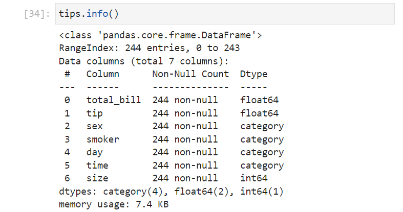

The ```DataFrame``` instance ```tips``` description can be checked:

```
tips.describe() 
```

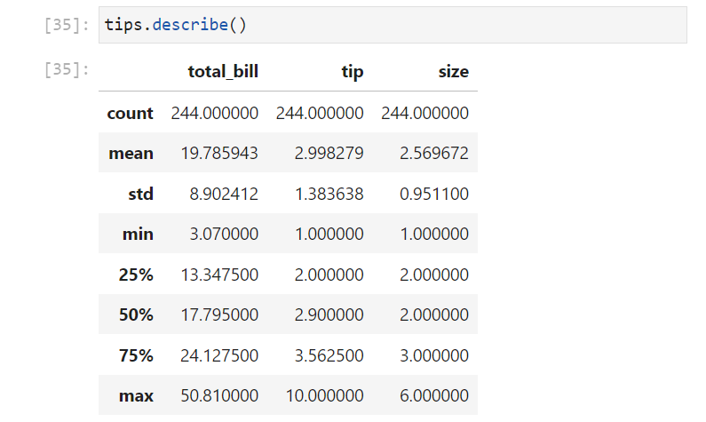

### Iris Dataset

The iris dataset measures four physical attributes of three species of iris plants.

The iris dataset can be loaded using:

```
iris = sns.load_dataset(name='iris')
```


The ```DataFrame``` instance ```iris``` head can be checked:

```
iris.head()
```

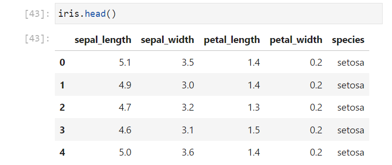

The ```DataFrame``` instance ```iris``` data types can be checked:

```
iris.dtypes
```


The four physical attributes are of the data type float64 whereas the species is an object.

The ```DataFrame``` instance ```iris``` shape can be checked:

```
iris.shape
```


The ```DataFrame``` instance ```iris``` information can be checked:

```
iris.info()
```

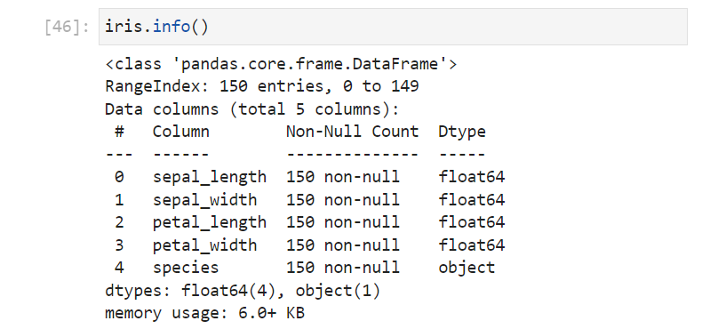

The ```DataFrame``` instance ```iris``` description can be checked:

```
iris.describe()
```


The species can explicitly be changed to a category using:

```
iris['species'] = iris['species'].astype('category')
iris.info()
```

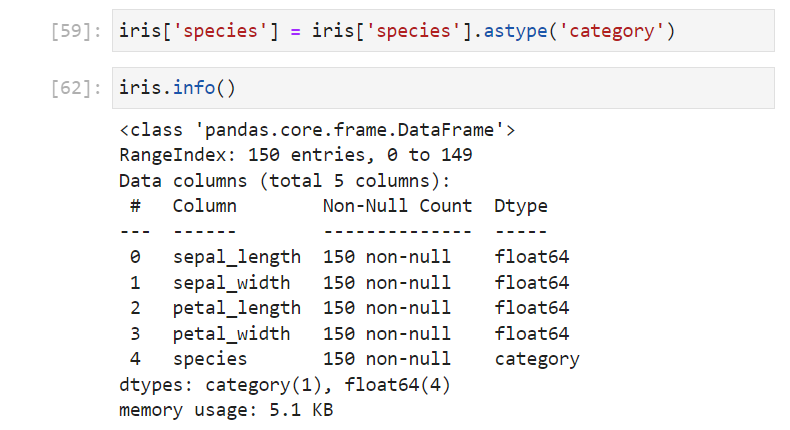

This doesn't need to be done for the purpose of using the Series as a category within a ```seaborn``` plot, however is useful to do if categorical grouping and further data analysis is going to be used within ```pandas```.

### Penguins Dataset

The penguins dataset measures four physical attributes and the sex of three species of penguins. The island they are found in is also recorded as a category.

The penguins dataset can be loaded using:

```
penguins = sns.load_dataset(name='penguins')
```


The ```DataFrame``` instance ```penguins``` head can be checked:

```
penguins.head()
```

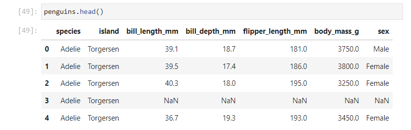

The ```DataFrame``` instance ```penguins``` data types can be checked:

```
penguins.dtypes
```

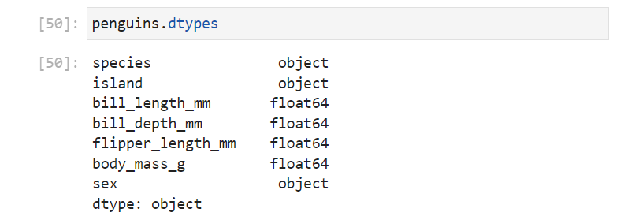

The ```DataFrame``` instance ```penguins``` shape can be checked:

```
penguins.shape
```


The ```DataFrame``` instance ```penguins``` information can be checked:

```
penguins.info()
```

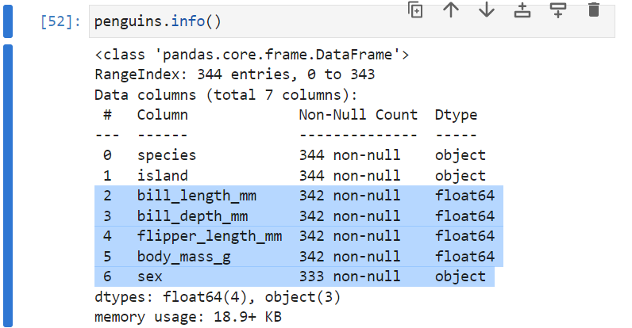

Notice that some of the columns have non-null values. As this is a large dataset, it can be cleaned up by dropping the null values:

```
penguins = penguins.dropna(how='any')
penguins = penguins.reset_index()
penguins.info()
```

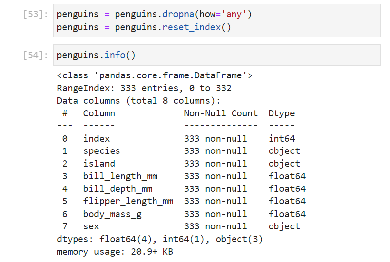

The ```DataFrame``` instance ```penguins``` description can be checked:

```
penguins.describe()
```


The species, island and sex can be changed to a category using:

```
penguins['species'] = penguins['species'].astype('category')
penguins['island'] = penguins['island'].astype('category')
penguins['sex'] = penguins['sex'].astype('category')
penguins.info()
```

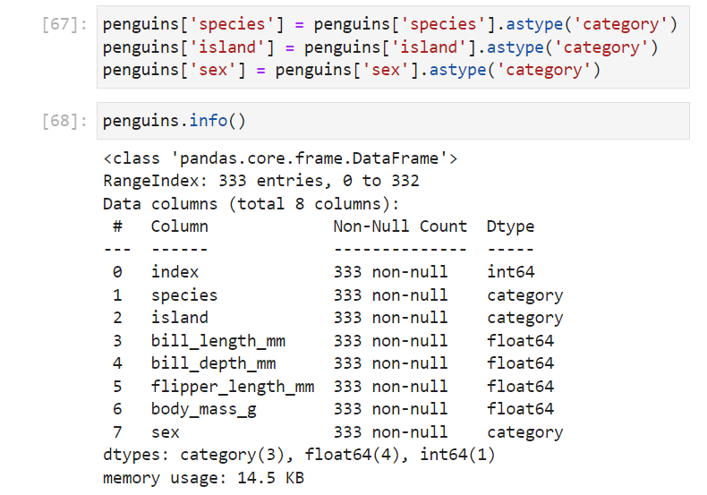

### Taxis Dataset

The taxis dataset contains information about passengers for three brands of taxis in Manhatten. This includes the pickup and dropoff times, the number of passengers, the distance, the fare, the tips, tolls paid, total cost, color (brand of taxi), payment method, pickup zone, dropoff zone, pickup borough and dropoff borough.

The taxis dataset can be loaded using:

```
taxis = sns.load_dataset(name='taxis')
```


The ```DataFrame``` instance ```taxis``` head can be checked:

```
taxis.head()
```

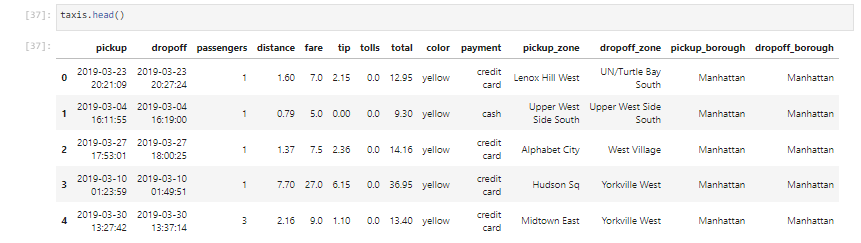

The ```DataFrame``` instance ```taxis``` data types can be checked:

```
taxis.dtypes
```

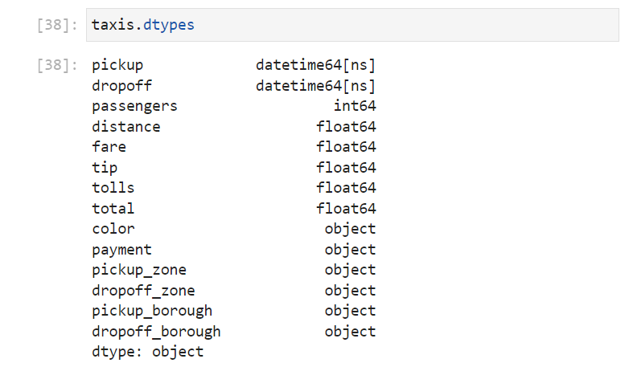

The ```DataFrame``` instance ```taxis``` shape can be checked:

```
taxis.shape
```


The ```DataFrame``` instance ```taxis``` information can be checked:

```
taxis.info()
```


Notice that some of the columns have non-null values. As this is a large dataset, it can be cleaned up by dropping the null values:

```
taxis = taxis.dropna(how='any')
taxis = taxis.reset_index()
taxis.info()
```

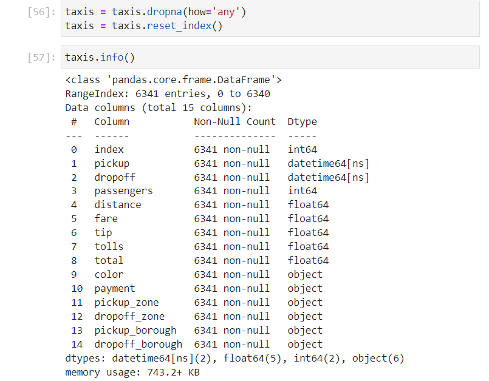

The ```DataFrame``` instance ```taxis``` description can be checked:

```
taxis.describe()
```

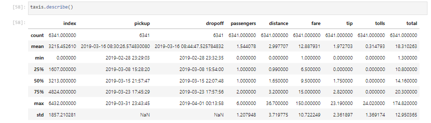

The ```Series``` that have the data type object can be converted to categorical:

```
taxis['color'] = taxis['color'].astype('category')
taxis['payment'] = taxis['payment'].astype('category')
taxis['pickup_zone'] = taxis['pickup_zone'].astype('category')
taxis['dropoff_zone'] = taxis['dropoff_zone'].astype('category')
taxis['pickup_borough'] = taxis['pickup_borough'].astype('category')
taxis['dropoff_borough'] = taxis['dropoff_borough'].astype('category')

taxis.info()
```


## Seaborn Plotting Functions

The ```seaborn``` plot functions are setup to expect data from a dataframe. The first few input arguments relate to the data and the other keyword arguments are optional, meaning if they are unspecified, the plot is carried out using the default values.

The most common plotting functions are available from the ```seaborn``` module directly for example the ```lineplot```: 

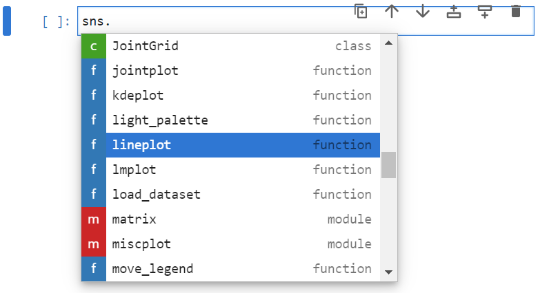

However for convenience the same plotting functions are also compartmentalised into modules. The ```lineplot``` is a relational plot showing the relation between ```x``` and ```y``` values and is therefore found in the ```relational``` module:

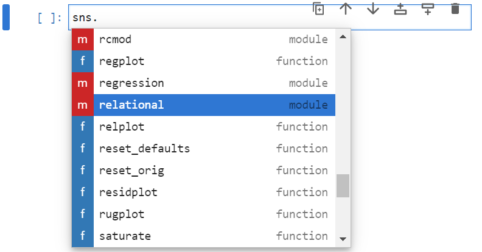

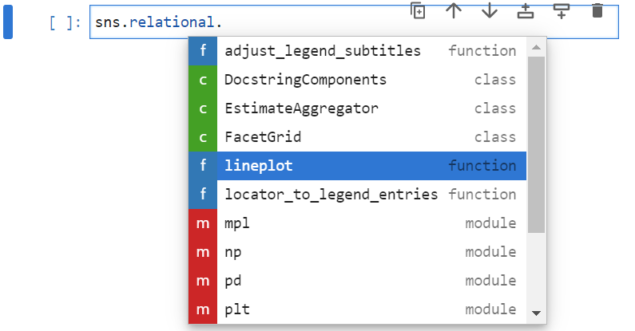

There is also the ```regression``` module for regression plots:

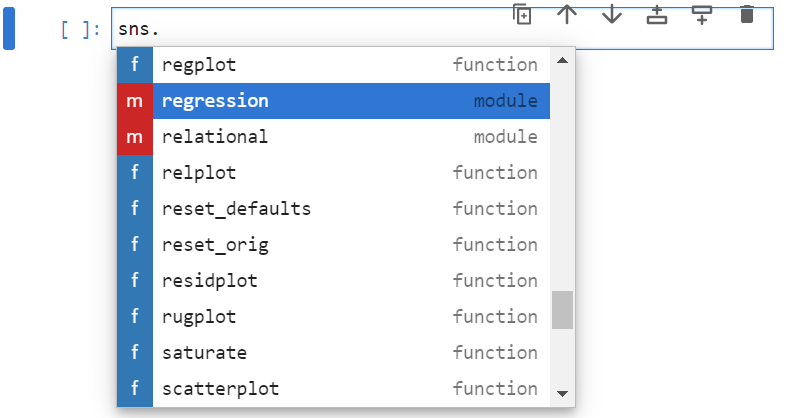

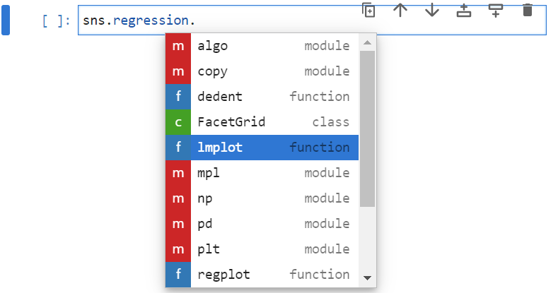

And a ```categorical``` module for categorical plots:

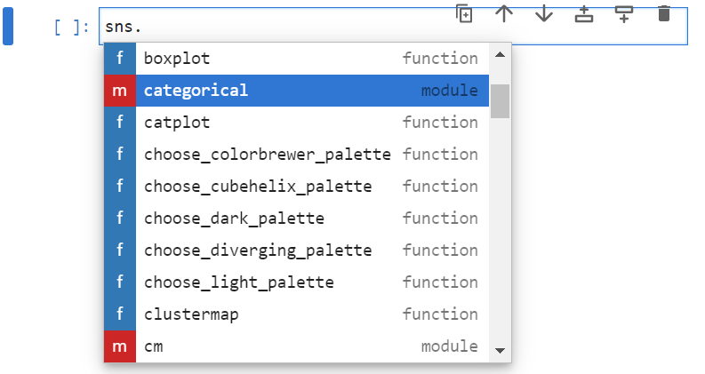

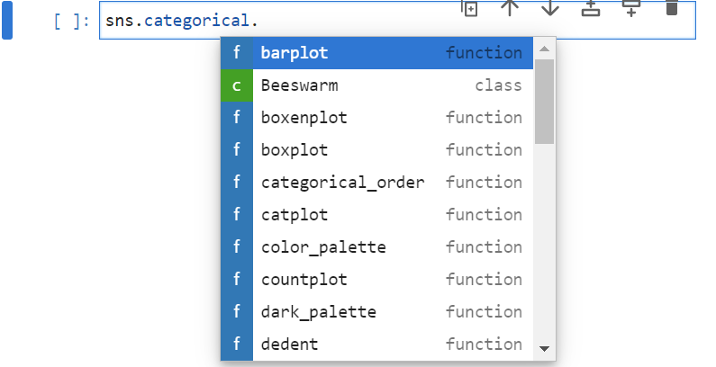

```seaborn``` is a wrapper around ```pyplot``` and its plotting functions either operate on the ```Axes``` level or on the ```Figure``` level. 

If a plotting function operates on an ```Axes``` level, the returned plot will always span a single ```Axes``` and this will update the currently selected ```Axes```:

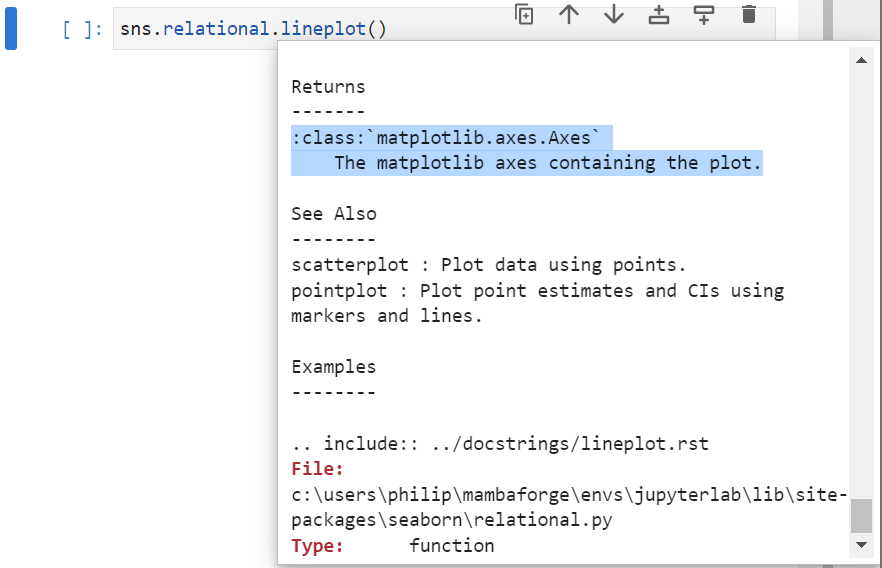

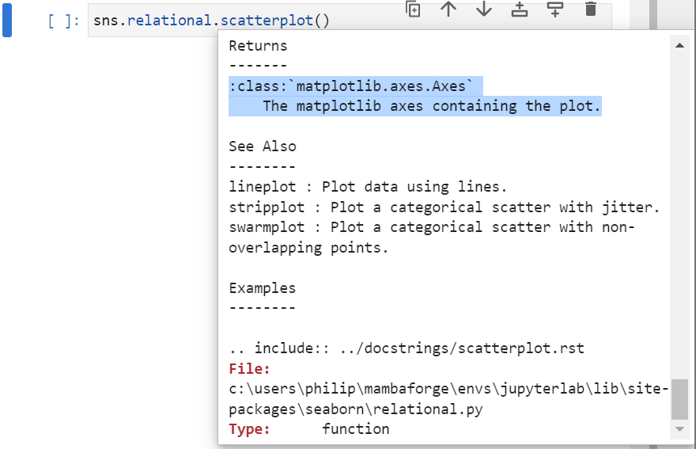

If a plotting function operates on a ```Figure``` level it returns a ```FacetGrid```. This essentially creates a new ```Figure``` which can have one or multiple subplots:

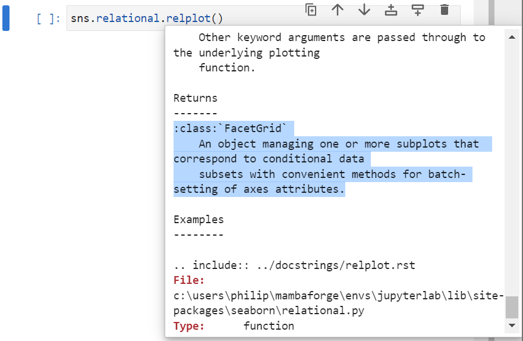

The plotting functions which return a ```FacetGrid``` usually have more keyword input arguments. Notice the inclusion of ```row```, ```col```, ```col_wrap```, ```row_order``` and ```col_order```. Internally these are provided to the underlying ```pyplot``` function ```subplots``` to create a new ```Figure``` with the specified subplots:

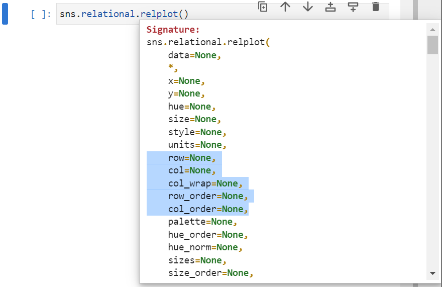

There is also the ```height``` and ```aspect``` input arguments supplied to the underlying call to the ```pyplot``` function ```figure```:

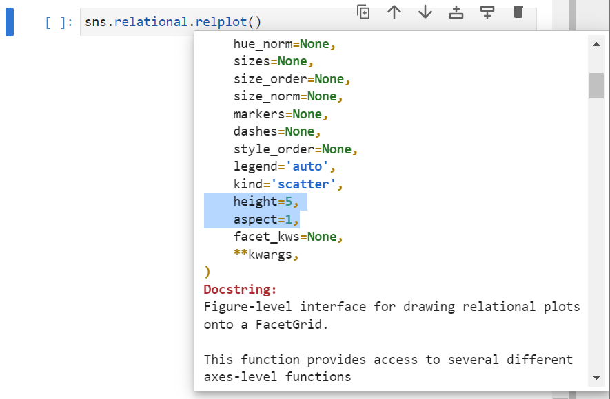

The plotting function of a ```FacetGrid``` internally uses an ```Axes``` level plotting function via the keyword ```kind```. Notice that the default value in this ```relational``` plot ```relplot``` is ```'scatter'``` which means the ```scatterplot``` plotting function is used for each subplot in the ```FacetGrid```:

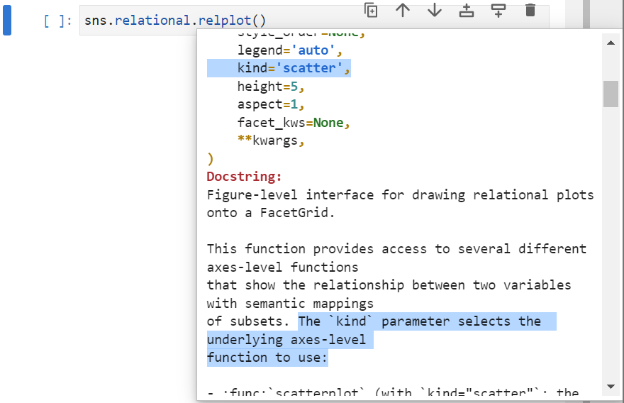

It can be changed to the string ```'line'``` which would instead mean the ```lineplot``` plotting function is used for each subplot in the ```FacetGrid```:

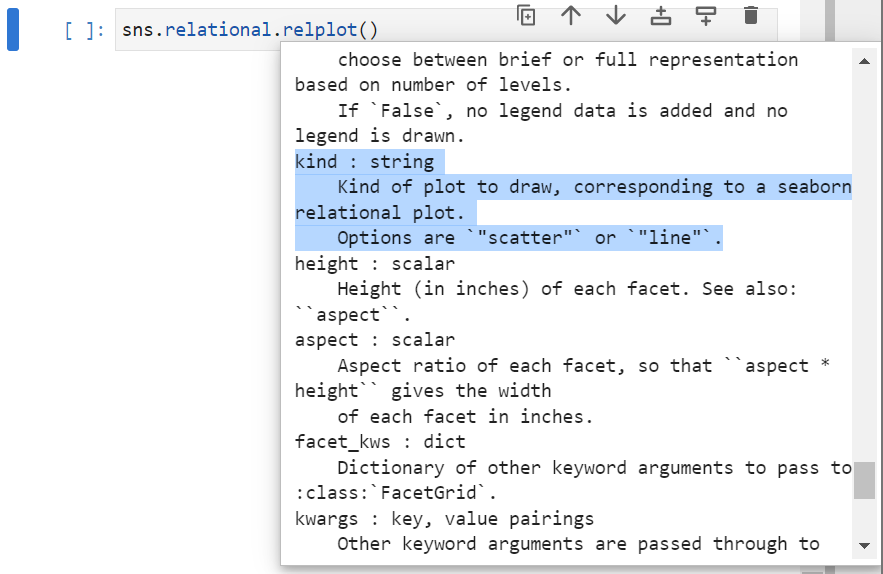

**Note** using ```relplot``` with the defaults ```row=None```, ```col=None``` and ```kind='scatter'``` will produce a ```FacetGrid``` that is a ```Figure``` with a single ```Axes``` and this will look more or less identical to use of ```scatterplot```. There will however be a difference in mechanics with the ```Axes``` populating the current ```Figure``` and the ```FacetGrid``` occupying a new ```Figure```.

The docstring of the ```scatterplot``` can be examined. The most important three are ```data``` which should be assigned to the ```DataFrame``` and ```x``` and ```y``` which should be assigned to the respective string of the ```Series``` names:

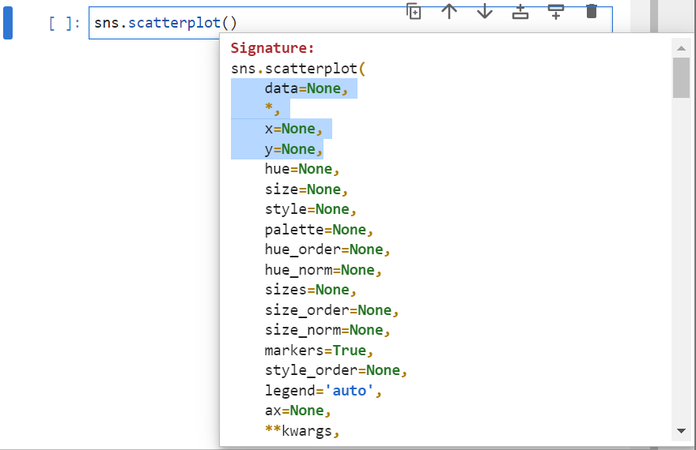

Now the docstring of the ```relplot``` can be examined. Notice that at the top it has the same data-related input arguments. In fact, the input arguments of ```relplot``` are a superset of those in ```scatterplot``` and ```lineplot``` as under the hood it invokes these ```Axes``` level plotting functions:

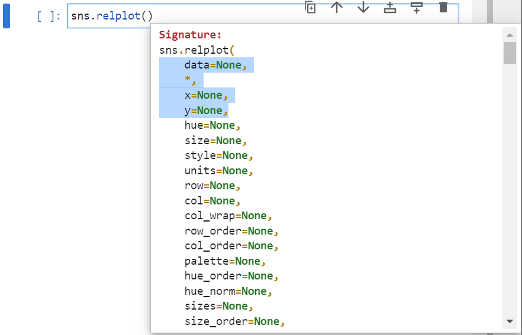

A new figure with a single subplot can be created:

```
fig = plt.figure(num=1, figsize=None, dpi=None)
ax1 = fig.add_subplot(111)
```


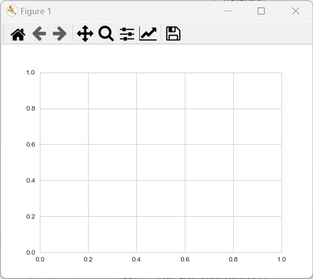

Now an ```Axes``` level ```scatterplot``` can be added:

```
ax2 = sns.scatterplot(data=df, x='x', y='y')
```


Notice the plot is on Figure 1, which was the currently selected ```Figure```.

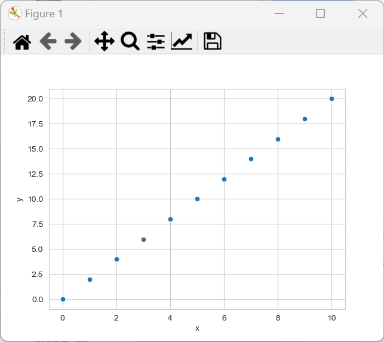

The currently selected ```Axes``` was ```ax1``` and the plotting function has updated this ```Axes```. Therefore ```ax2``` is an alias of ```ax1```:

```
ax1 == ax2
```

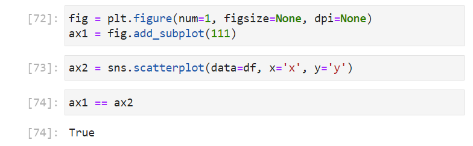

The scatter plot created resembles a plot using ```pyplots``` function ```scatter```, because ```seaborn``` uses this under the hood. Notice that the xlabel and ylabel are automatically added and these were taken from the names of the ```Series``` provided for $x$ and $y$.

A new figure with a single subplot can be created:

```
fig = plt.figure(num=2, figsize=None, dpi=None)
ax1 = fig.add_subplot(111)
```


Now a ```Figure``` level (```Facetgrid```) ```relplot``` can be added:

```
fig = sns.relplot(data=df, x='x', y='y')
```


Notice that figure 2 is still is unchanged and still has a blank ```Axes``` because a new ```Figure``` instance, figure 3 has been created:

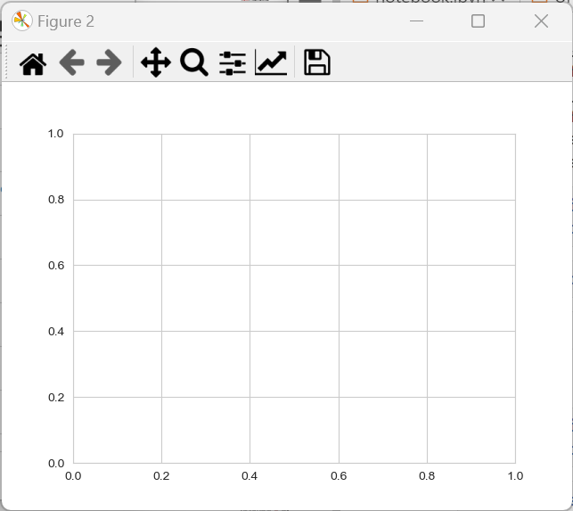

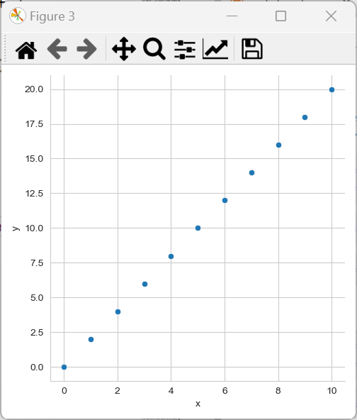

Recall that the currently selected Figure can be accessed using:

```
fig = plt.gcf()
```

Or by use of its number:

```
fig = plt.figure(num=3)
```

And once a ```Figure``` instance is selected, the ```Axes``` on the ```Figure``` can be listed using the attribute ```axes```:

```
fig.axes
```

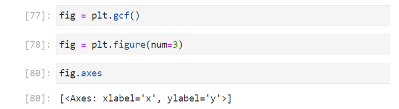

The list has only 1 set of ```Axes``` and this can be assigned to a variable using:

```
ax1 = fig.axes[0]
```


Once the ```Figure``` and ```Axes``` instances are assigned to object names, they can be modified just like any other ```pyplot``` equivalent. The level of additional customisation used for a ```seaborn``` plot is usually pretty low as the default settings are normally optimal. The xlabel can be changed for example:


Since this is a scatter plot, and a scatter plot is stored as a collection, it can be accessed using the ```Axes``` attribute ```collections```. This displays a list with one item:

```
ax1.collections
```

It can be assigned to a variable:

```
scatter = ax1.collections[0]
```

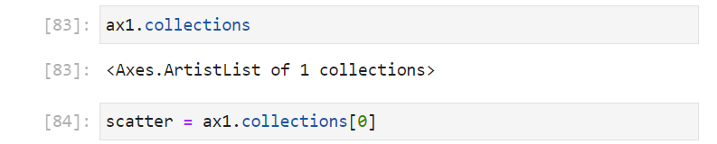

And its properties can be get or set using the ```pyplot``` functions ```getp``` and ```setp``` respectively:

```
plt.getp(scatter)
```

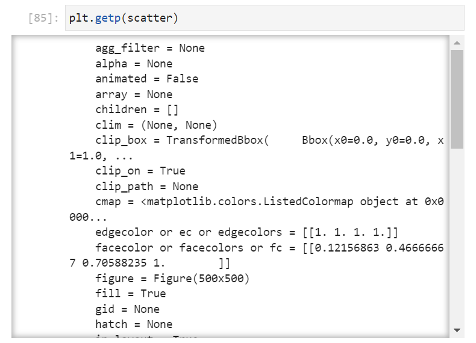

In addition to the data ```DataFrame``` and the names of the $x$ and $y$ ```Series```, another common input argument is ```hue```:

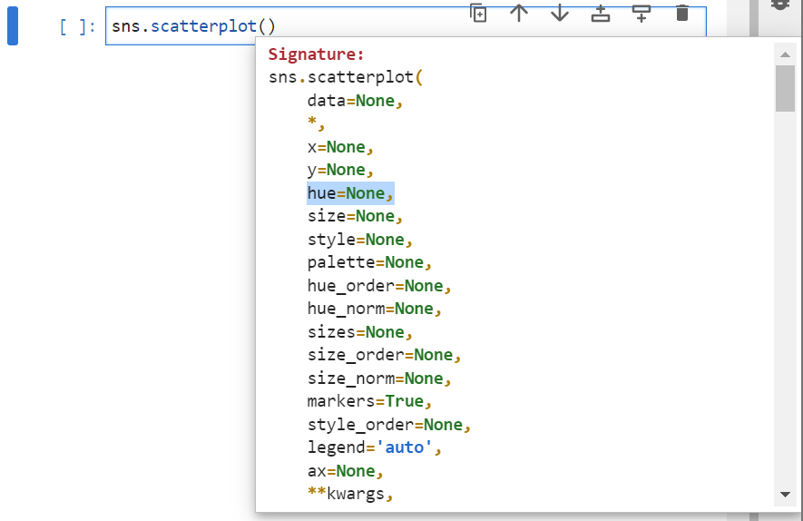

```hue``` is typically assigned to the name of a categorical ```Series``` and data is grouped by the category to produce individual traces. For example ```hue``` can be assigned to the ```'parity'``` ```Series``` to group datapoints by an odd or even value of $x$.

The blank figure 2 can be reselected and its current axes obtained, an ```Axes``` level scatter plot can be added using the same data as before and assigning ```hue``` to the ```Series``` ```'parity'```:

```
fig = plt.figure(2)
ax1 = fig.gca()
ax1 = sns.scatterplot(data=df, x='x', y='y',
                      hue='parity')
```

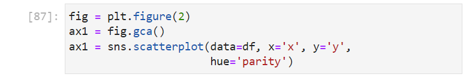

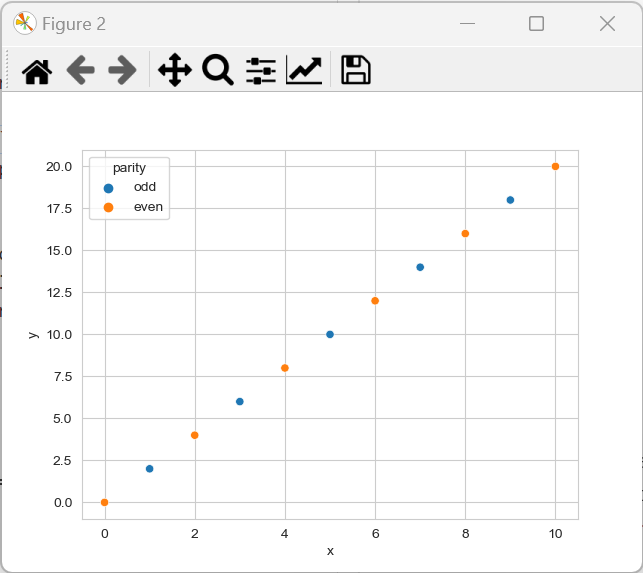

Notice that the legend is also automatically populated using the names of the ```Series``` as a heading and then showing each category. This was enabled because the keyword input argument ```legend``` was set to ```'auto'```:

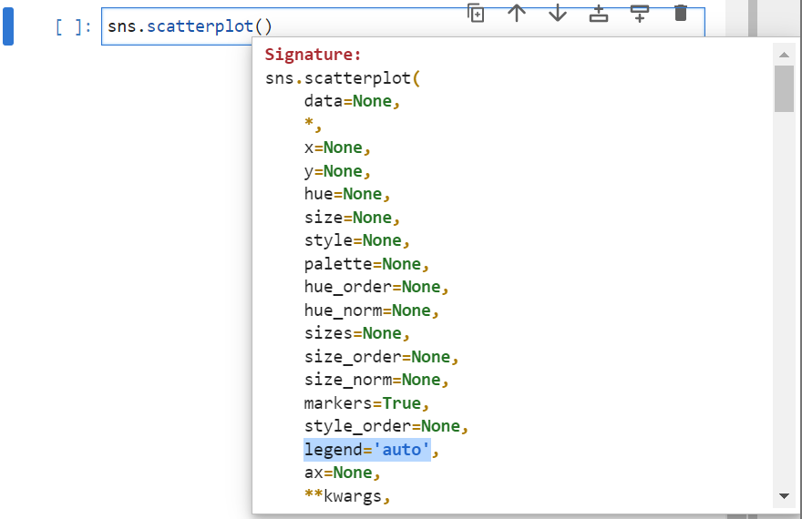

Sometimes it is convenient to assign an ```Axes``` level plot to an existing ```Axes``` opposed to the currently selected ```Axes```. This can be done with the ```ax``` input argument:

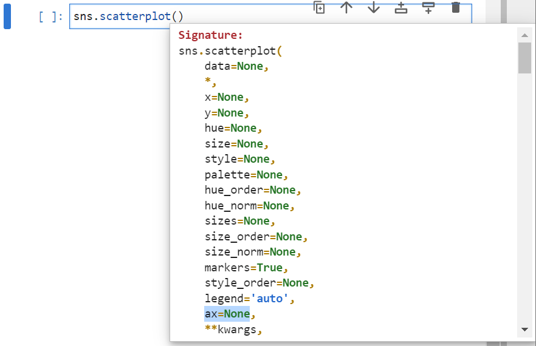

The ```style``` and ```palette``` are both by default set to ```None``` meaning they will use the globally set style and palette respectively. This can be overridden for an individual plot by assigning these:

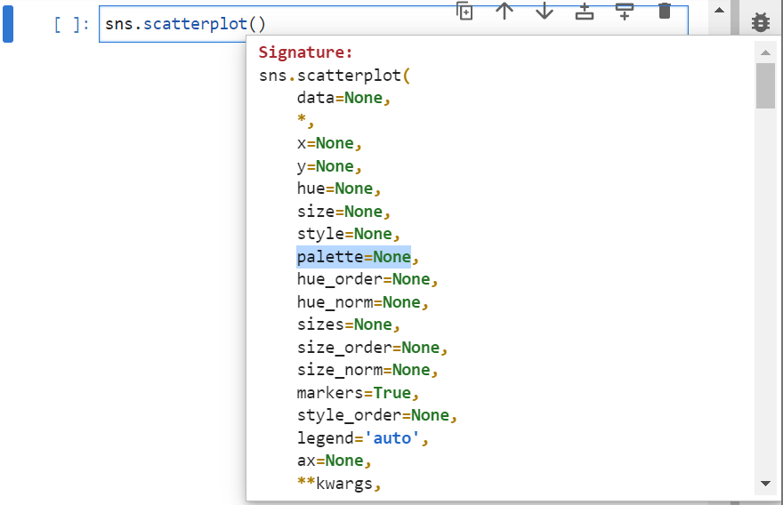

This can be demonstrated by producing a figure with subplots and selecting each ```Axes``` to assign the ```scatterplot``` to. The ```palette``` in one of these will be updated to ```'hsv'```:

```
fig, axarray = plt.subplots(nrows=2, ncols=1, 
                            num=4, figsize=None, dpi=None)
sns.scatterplot(data=df, x='x', y='y',
                hue='parity',
                ax=axarray[0],
                palette='hsv')
sns.scatterplot(data=df, x='x', y='y',
                hue='parity',
                ax=axarray[1])
```

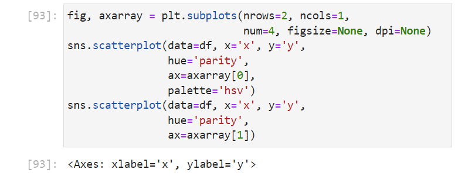

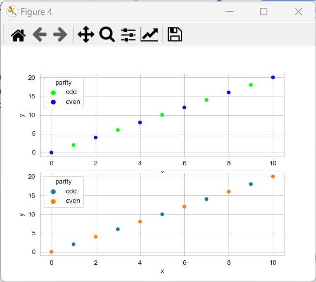

Instead of using the ```hue``` parameter, in a ```Figure``` level ```FacetGrid``` there is the possibility of assigning the ```col``` or ```row``` to a categorical ```Series``` to get a subplot for each category:

```
fig = sns.relplot(data=df, x='x', y='y',
                  col='parity')
```


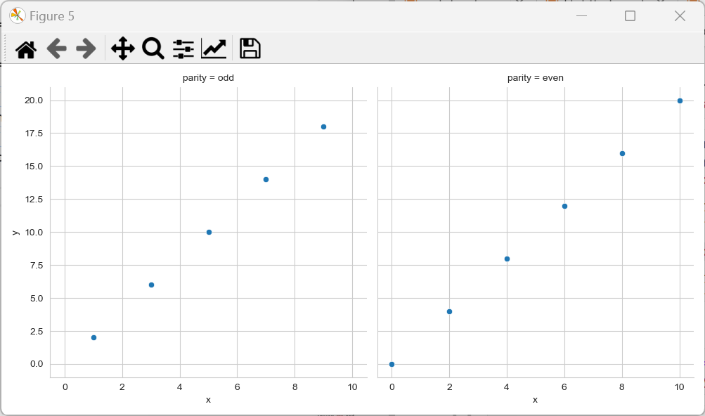

```
fig = sns.relplot(data=df, x='x', y='y',
                  row='parity')
```


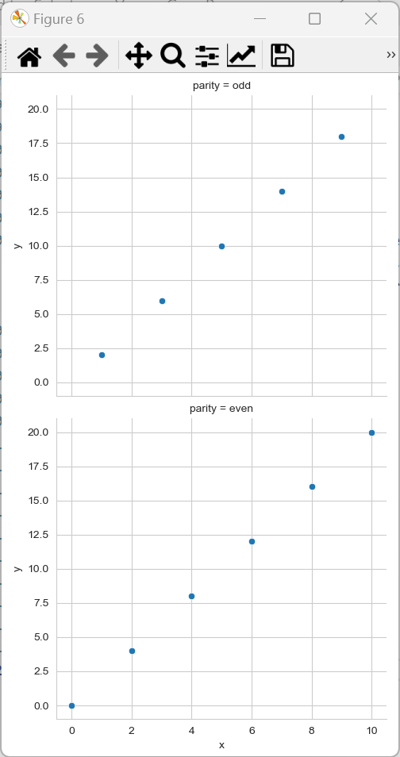

Normally ```col``` and ```row``` are used in conjunction with ```hue``` for more complicated datasets which have multiple categorical ```Series```.

The features explored above are available in most plot types. The plots are typically grouped by the perspective module and the perspective ```Figure``` level ```FacetGrid```:

|Name|Module|Level|
|---|---|---|
|relplot|relational|**FacetGrid**|
|scatterplot|relational|Axes|
|lineplot|relational|Axes|
|░░░░|░░░░|░░░░|
|displot|distributions|**FacetGrid**|
|histplot|distributions|Axes|
|kdeplot|distributions|Axes|
|ecdfplot|distributions|Axes|
|rugplot|distributions|Axes|
|░░░░|░░░░|░░░░|
|catplot|categorical|**FacetGrid**|
|stripplot|categorical|Axes|
|swarmplot|categorical|Axes|
|boxplot|categorical|Axes|
|violinplot|categorical|Axes|
|pointplot|categorical|Axes|
|barplot|categorical|Axes|
|░░░░|░░░░|░░░░|
|lmplot|regressional|**FacetGrid**|
|regplot|regressional|Axes|
|residplot|regressional|Axes|
|░░░░|░░░░|░░░░|
|heatmap|matrix|Axes|
|clustermap|matrix|**ClusterGrid**|

These plot types will be explored using the example data.

## Relational Plots

Relational data, as the name suggests a relation between an independent $x$ variable and a dependent $y$ variable. The purpose of a relational plot is to see if an obvious relation exists via a visualisation.

Recall there are the following types of plots available:

|Name|Module|Level|
|---|---|---|
|relplot|relational|**FacetGrid**|
|scatterplot|relational|Axes|
|lineplot|relational|Axes|

These plots have already been examined using a fabricated dataset. Let's explore the use of a relative plot on a real dataset. The ```flight``` ```DataFrame``` instance has the ```Series``` ```'year'``` which is the independent variable and the ```Series``` ```'passengers'``` which is the dependent variable. It also has the ```Series``` ```'month'``` which is categorical.

A ```relplot``` can be used to view this relationship, using the ```'month'``` as the ```hue```. Recall this outputs a ```Figure``` level ```FacetGrid```:

```
fig = sns.relplot(data=flights, x='year', y='passengers',
                  hue='month')
```


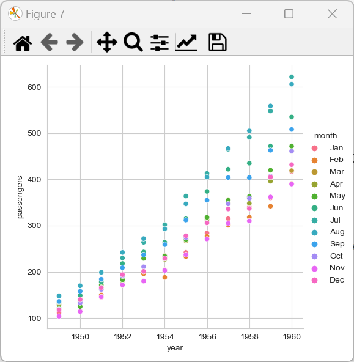

If instead of the ```hue```, the ```'month'``` is assigned to ```col```, a seperate subplot will be made for each of the 12 months. A ```col_wrap``` of ```4``` can be used to create 3 rows by 4 columns:

```
fig = sns.relplot(data=flights, x='year', y='passengers',
                  col='month', col_wrap=4)
```


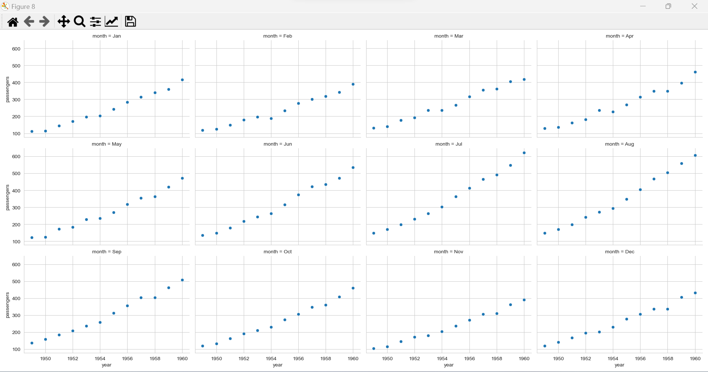

If ```'month'``` is assigned both to ```col``` and ```hue```, each subplot will contain a plot that has a different color from the default palette:

```
fig = sns.relplot(data=flights, x='year', y='passengers',
                  hue='month',
                  col='month', col_wrap=4)
```


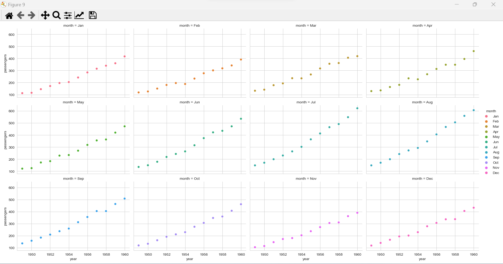

The ```kind``` can be switched from the default ```'scatter'``` to ```'line'``` to create a line plot:

```
fig = sns.relplot(data=flights, x='year', y='passengers',
                  hue='month',
                  col='month', col_wrap=4,
                  kind='line')
```

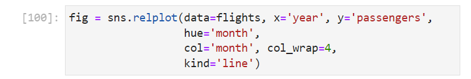

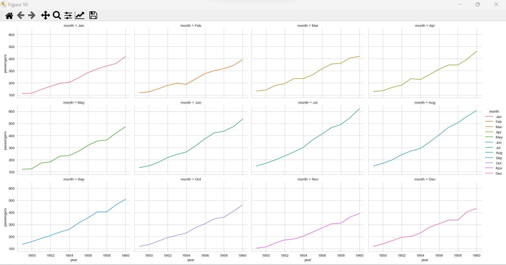

From the relational plots above, it is easy to visualise a general trend, that is the number of flights increases as the year increases. Moreover as each of the months are shown in a seperate subplot that has the same scale, it is easy to see that the summer months such as July have more flights than the winter months such as December.

## Distribution Plots

The main purpose of a distribution plot is to see if the data in a distribution can be easily distinguished from another distribution via a visualisation. 

|displot|distributions|**FacetGrid**|
|histplot|distributions|Axes|
|kdeplot|distributions|Axes|
|ecdfplot|distributions|Axes|
|rugplot|distributions|Axes|

The ```iris``` ```DataFrame``` is typically used to explore the concepts of a distribution data. For simplicity only one species ```'setosa'``` and one dimension the ```'sepal_length'``` will initially be considered:

```
iris[iris['species']=='setosa'].head()
```

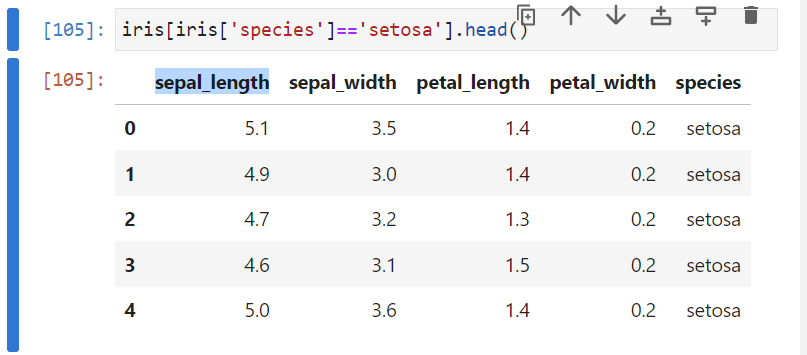

The number of datapoints in the head will be increased to 7. 

Three subplots will be made.

The top subplot will display a rugplot. The rugplot displays each data point as a line, the line is of low transparency so overlapping lines can be seen. normally a rugplot is used alongside other plots and is shown as a small proportion of the plot at the bottom. For clarity, it will be shown as a subplot and each line will be shown using a height of 1.

The middle subplot shows a histogram. In this case, there are 9 discrete bins and the ticks lying in each bin are computed.

The bottom subplot shows a kernel density estimation (kde) function. A kde, essentially each tick in the rugplot is computed as a gaussian and summed.

```
fig, axarray = plt.subplots(nrows=3, ncols=1,
                            num=11, figsize=None, dpi=None)
sns.rugplot(data=iris[iris['species']=='setosa'].head(7),
            x='sepal_length', ax=axarray[0],
            height=1)
sns.histplot(data=iris[iris['species']=='setosa'].head(7),
            x='sepal_length', ax=axarray[1], bins=9)
sns.kdeplot(data=iris[iris['species']=='setosa'].head(7),
            x='sepal_length', ax=axarray[2])
```


