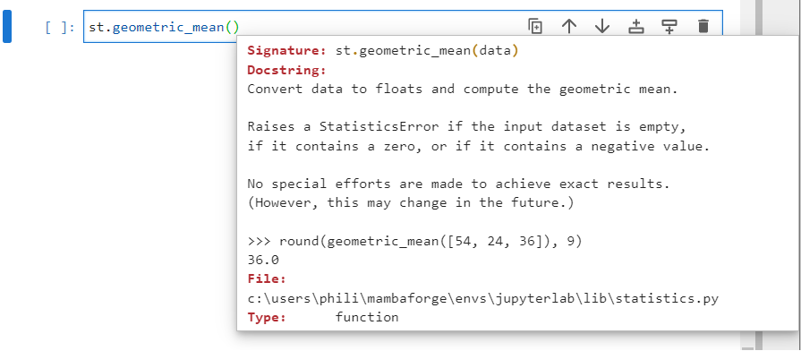

# The Statistics Module

The statistics module provides a number of basic statistical functions including averages, variance and standard deviation.

The statistics module is normally imported using a 2 letter alias:

```
import statistics as st
```


The docstring of the statistics module is pretty detailed can be examined by inputting:

```
? statistics
```


As seen from the docmenation, the module contains a collection of functions for calculating averages:

|function|description|
|---|---|
|mean|Arithmetic mean (average) of data.|
|fmean|Fast, floating point arithmetic mean.|
|median|Median (middle value) of data.|
|median_low|Low median of data.|
|median_high|High median of data.|
|mode|Mode (most common value) of data.|
|multimode|List of modes (most common values of data).|
|quantiles|Divide data into intervals with equal probability.|
|geometric_mean|Geometric mean of data.|
|harmonic_mean|Harmonic mean of data.|
|median_grouped|Median, or 50th percentile, of grouped data.|o

And for calculating the associated variability or spread:

|function|description|
|---|---|
|pvariance|Population variance of data.|
|variance|Sample variance of data.|
|stdev|Sample standard deviation of data.|
|pstdev|Population standard deviation of data.|

These statistical averages can be examined from a very simple dataset:

$$\text{data}=[\begin{matrix}7&5&3&1&2&4&6&4\end{matrix}]$$

```
data = [7, 5, 3, 1, 2, 4, 6, 4]
```


This dataset can be sorted:

$$\text{data}=\left[\begin{matrix}1&2&3&4&4&5&6&7\end{matrix}\right]$$

```
data.sort()
data
```


The index of each element in the dataset can be shown. The length has a value of 1 higher than the last index. The last index is 7 so the length is 8:

$$\text{data}=\left[\begin{matrix}{\underset{0}{1}}&{\underset{1}{2}}&{\underset{2}{3}}&{\underset{3}{4}}&{\underset{4}{4}}&{\underset{5}{5}}&{\underset{6}{6}}&{\underset{7}{7}}\end{matrix}\right]$$

```
lendata = len(data)
lendata
```


The sum of the data can be calculated using:

$$\text{sum}=1+2+3+4+4+5+6+7=32$$

```
sumdata = sum(data)
sumdata
```


The integer mean can be calculated:

$$\text{intmean}=32//8=4$$

$$\text{intmod}=32﹪8=0$$

```
sum(data) // len(data)
sum(data) % len(data)
```


The floating point mean can be calculated:

$$\text{floatmean}=32/8=4.0$$

```
sum(data) / len(data)
```


The function ```mean``` returns the integer mean for no modulus and the float mean, when a modulus is present. The docstring can be seen by inputting ```st.mean()``` followed by pressing shift ```⇧ ``` and tab ```↹```:


The mean of the dataset can be calculated using:

```
st.mean(data)
```


The function floating point mean, ```fmean``` on the other hand always returns the floating point mean. The docstring can be seen by inputting ```st.fmean()``` followed by pressing shift ```⇧ ``` and tab ```↹```:


The floating point mean of the dataset can be calculated using:

```
st.fmean(data)
```


The median is the middle point of the data which can be selected directly when the data is odd. When the data has an even number of values it is the mean of these two middle values:

$$\text{data}=\left[\begin{matrix}1&2&3&\textbf{4}&\textbf{4}&5&6&7\end{matrix}\right]$$

$$\text{median}=\frac{4+4}{2}=4$$

The docstring of the function ```median``` can be seen by inputting ```st.median()``` followed by pressing shift ```⇧ ``` and tab ```↹```:


The median of the dataset can be calculated using:

```
st.median(data)
```


Alternatively the value on the left is the median low value and can be read off directly:

$$\text{data}=\left[\begin{matrix}1&2&3&\textbf{4}&4&5&6&7\end{matrix}\right]$$

The docstring of the function ```median_low``` can be seen by inputting ```st.median_low()``` followed by pressing shift ```⇧ ``` and tab ```↹```:


The median low of the dataset can be calculated using:

```
st.median_low(data)
```


And the value on the right is the median high value and can be read off directly:

$$\text{data}=\left[\begin{matrix}1&2&3&4&\textbf{4}&5&6&7\end{matrix}\right]$$

The docstring of the function ```median_high``` can be seen by inputting ```st.median_high()``` followed by pressing shift ```⇧ ``` and tab ```↹```:


The median high of the dataset can be calculated using:

```
st.median_high(data)
```


The mode is the most commonly occuring value:

$$\text{data}=\left[\begin{matrix}1&2&3&\textbf{4}&\textbf{4}&5&6&7\end{matrix}\right]$$

The docstring of the function ```mode``` can be seen by inputting ```st.mode()``` followed by pressing shift ```⇧ ``` and tab ```↹```:


The mode of the dataset can be calculated using:

```
st.mode(data)
```


The mode can be an important metric in a trial run. For example if a fashion designer wants to issue a prototype design of clothe, they may simplify manufacturing by starting only with the mode cloth size, as it has the largest customer base. If the trial of the first cloth batch is successful, they may complicate the manufacturer process to accomodate other sizes. 

Sometimes a dataset will have multiple mode values, using ```mode``` will only give one of these values:

```
data2 = [1, 2, 2, 2, 2, 3, 4, 4, 4, 4, 6, 6, 7]
st.mode(data2)
```


There is an associated, multiple mode function. The docstring of the function ```multi_mode``` can be seen by inputting ```st.multi_mode()``` followed by pressing shift ```⇧ ``` and tab ```↹```:


```
st.multimode(data2)
```


The multiple mode function only retrieves modes that have the highest number of counts. It will not show modes that have only a slightly lower number of counts. For this purpose, recall that the ```Counter``` class is used.

```
from collections import Counter
Counter(data2).most_common()
```


The concept of variance is to compute the average distance a datapoint differs from the mean.

Notice when when the sum of (each datapoint minus the mean) is calculated, the positive values and negative values cancel each other out and the result is 0:

$$\sum_{i=0}^{n}\left(x-\mu\right)=\left(1-4\right)+\left(2-4\right)+\left(3-4\right)+\left(4-4\right)+\left(4-4\right)+\left(5-4\right)+\left(6-4\right)+\left(7-4\right)$$

$$\left(-3\right)+\left(-2\right)+\left(-1\right)+\left(0\right)+\left(0\right)+\left(1\right)+\left(2\right)+(3)$$

$$-3-2-1+0+0+1+2+3$$

$$0$$

Instead the sum of (each datapoint minus the mean) squared is calculated. A negative value multiplied by itself is positive and this therefore always gives a positive value:

$$\sum_{i=0}^{n}\left(x-\mu\right)^2=\left(1-4\right)^2+\left(2-4\right)^2+\left(3-4\right)^2+\left(4-4\right)^2+\left(4-4\right)^2+\left(5-4\right)^2+\left(6-4\right)^2+\left(7-4\right)^2$$

$$\left(-3\right)^2+\left(-2\right)^2+\left(-1\right)^2+\left(0\right)^2+\left(0\right)^2+\left(1\right)^2+\left(2\right)^2+\left(3\right)^2$$

$$9+4+1+0+0+1+4+9$$

$$28$$

The mean is a normalised sum, and the population variance is the normalised sum of (each datapoint minus the mean) squared. The normalisation factor is the number of datapoints.

$$\frac{28}{8}=3.5$$

The variance takes into account a difference in the number of degrees of freedom and uses the number of datapoints minus one as a normalisation factor:

$$\frac{28}{(8-1)}=\frac{28}{7}=4.0$$

The docstring of the function ```pvariance``` and ```variance``` can be seen by inputting the functions name followed by open parenthesis and by pressing shift ```⇧ ``` and tab ```↹```:


The population variance and variance can be calculated using:

```
st.pvariance(data)
st.variance(data)
```


Due to the squaring used when calculating the population variance or variance, these measurements have units of the mean squared. The standard deviation is the square root of the variance, which is measured in the same units as the mean:

$$\sqrt{3.5}=$$

$$\sqrt{3.5}=1.8708$$

The docstring of the function ```pstdev``` and ```stdev``` can be seen by inputting the functions name followed by open parenthesis and by pressing shift ```⇧ ``` and tab ```↹```:


The population standard deviation and standard deviation can be calculated using:

```
st.pstdev(data)
st.stdev(data)
```


A distribution is normally quoted using the mean and standard deviation in the form:

$$4.0\pm2.0$$

The median value is less susceptible to large outliers and in such a scenario can be more accurate when describing a small dataset. For example if an outlier is purposely introduced, there is not much change in the median but the mean is highly distorted:

```
data.append(999)
data
st.mean(data)
st.median(data)
st.stdev(data)
```


The outlier can be removed from the data:

```
data.pop()
data
```


The quantiles function is used to group data into quantiles, that is quarters with equal proability. 

The docstring of the function ```quantiles``` can be seen by inputting ```st.quantiles()``` followed by pressing shift ```⇧ ``` and tab ```↹```:


The quantile values can be calculated by:

```
data3 = [1, 1, 2, 2, 3, 4, 4, 4, 5, 6, 7, 8, 8, 8, 9, 9]
data3
quantiles(data3)
```


The quantile values can be used to cut the data into quantiles using:

```
q1 = []
q2 = []
q3 = []
q4 = []
for num in data3:
    if(num < st.quantiles(data3)[0]):
        q1.append(num)
    elif (num < st.quantiles(data3)[1]):
        q2.append(num)
    elif (num < st.quantiles(data3)[2]):
        q3.append(num)
    else:
        q4.append(num)
q1
q2
q3
q4
```


The mean is calculated using a normalised sum. The geometric mean instead uses a normalised product:

$$\text{data}=\left[\begin{matrix}1&2&3&4&4&5&6&7\end{matrix}\right]$$

$$\text{prod}=1\ast2\ast3\ast4\ast4\ast5\ast6\ast7=20160$$

$$\text{len}=8$$

To normalise the product the nth root is taken:

$$\left(1\ast2\ast3\ast4\ast4\ast5\ast6\ast7\right)\ast\ast(1/8)=3.4519$$

The docstring of the function ```geometric mean``` can be seen by inputting ```st.geometric_mean()``` followed by pressing shift ```⇧ ``` and tab ```↹```:



The geometric mean can be calculated using:

```
st.geometric_mean(data)
```

For this dataset it can be manually calculated using:

```
data
(1*2*3*4*4*5*6*7) ** (1/8)
```


The harmonic mean is calculated using the inverse sum. 

$$\text{data}=\left[\begin{matrix}1&2&3&4&4&5&6&7\end{matrix}\right]$$

$$\text{invsum}=\left(\frac{1}{1}+\frac{1}{2}+\frac{1}{3}+\frac{1}{4}+\frac{1}{4}+\frac{1}{5}+\frac{1}{6}+\frac{1}{7}\right)$$

This is normalised by the length:

$$\text{len}=8$$

$$\frac{\left(\frac{1}{1}+\frac{1}{2}+\frac{1}{3}+\frac{1}{4}+\frac{1}{4}+\frac{1}{5}+\frac{1}{6}+\frac{1}{7}\right)}{8}$$

Then finally the inverse of this is taken:

$$\frac{8}{\left(\frac{1}{1}+\frac{1}{2}+\frac{1}{3}+\frac{1}{4}+\frac{1}{4}+\frac{1}{5}+\frac{1}{6}+\frac{1}{7}\right)}$$

The docstring of the function ```harmonic mean``` can be seen by inputting ```st.harmonic_mean()``` followed by pressing shift ```⇧ ``` and tab ```↹```:


The harmonic mean can be calculated using:

```
st.harmonic_mean(data)
```

For this dataset it can be manually calculated using:

```
data
8 / ((1/1)+(1/2)+(1/3)+(1/4)+(1/4)+(1/5)+(1/6)+(1/7))
```


Supposing the following grouped data is obtained from a histogram of values:

$$\text{data4} = \left[\begin{matrix}2&2&3&3&3&4\end{matrix}\right]$$


Then for each individual datapoint the range is between:

|central value|range|
|---|---|
|2|$1.5\text{ to } 2.5$|
|2|$1.5\text{ to } 2.5$|
|3|$2.5\text{ to } 3.5$|
|3|$2.5\text{ to } 3.5$|
|3|$2.5\text{ to } 3.5$|
|4|$3.5\text{ to } 4.5$|

There are 6 datapoints so $n=6$ and each datapoint spans an interval $i=1$.  

The median range is $2.5\text{ to } 3.5$, this has a lower limit of $l=2.5$ and has a frequency $f=3$.

There are 2 datapoints before the median range, so $b=2$.

The median grouped is defined as:

$$l+\frac{\left(\frac{n}{2}-b\right)}{f}\ast i$$

$$2.5+\frac{\left(\frac{6}{2}-2\right)}{3}\ast1$$

$$2.833$$

The docstring of the function ```median_grouped``` can be seen by inputting ```st.median_grouped()``` followed by pressing shift ```⇧ ``` and tab ```↹```:


The only keyword argument is the ```interval``` which has a default value of 1.0. All the rest of the parameters can be inferred from the data. The median grouped of the data can be calculated using:

```
data4 = [2, 2, 3, 3, 3, 4]
st.median_grouped(data4, interval=1)
2.5 + (((6/2) - 2) / 3) * 1
```


To be added...

|function|description|
|---|---|
|covariance|Sample covariance for two variables.|
|correlation|Pearson's correlation coefficient for two variables.|
|linear_regression|Intercept and slope for simple linear regression.|
