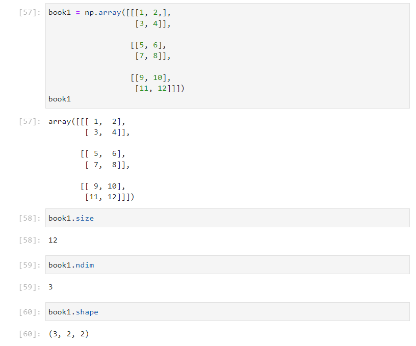
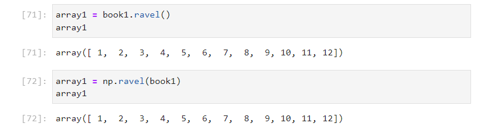

# The Numeric Python Library - numpy

The Numeric Python library - ```numpy``` is the most commonly used data science library. Moreover other popular data science libraries such as the Python and Data Analysis Library - ```pandas```, the Matrix Plotting Library - ```matplotlib``` and the Data Visualization Library - ```seaborn``` are based upon ```numpy```.

## Scalability in Python

The following data structures have been explored in inbuilt Python and Python standard modules:

* list - collection of mixed datatypes
* array - 1d uniform data structure
* nested lists

These data structures are collections and their datamodel methods are setup as collections.

The following mathematical concepts have also been explored:

* numeric datamodel methods for int, float and bool classes
* range objects
* math and complex module
* statistics module
* datetime module
* random module

Most of these mathematical concepts have been constrained to a scalar variable (that is a variable with a single element). To scale the operations to multiple dimensions list comprehensions and loops have been used.

## N-Dimensional Array

The numeric Python Library is based upon the n-dimensional array ```ndarray``` data structure. The ```ndarray``` bridges the features mentioned above over multiple dimensions using simple succinct syntax. 

The numpy library is therefore a very large Python library. Despite it being large, previous tutorials have established a vigourous understanding of how each of these features operates over a single dimension using builtin Python or a standard Python module. Once the mechanics of using a ndarray are setup, such as indexing and working across multiple dimensions, this previous knowledge can easily be applied. It becomes a case of using the equivalent function from the numpy library to act on the ndarray(s) or the equivalent ndarray method.

## Importing numpy

The ```numpy``` library is typically imported using a 2 letter abbreviation ```np```. The numpy library includes a large number of functions and it is more convenient to access these using this two letter abbreviation:

```
import numpy as np
```


```numpy``` is a third-party Python library. If it has not been installed, a ```ModuleNotFoundError``` will display.


To setup a Python Environment with the Scientific Libraries, it is recommended to use Mambaforge and the ```mamba``` package manager. See [Python Installation Windows, Linux and Mac](https://github.com/PhilipYip1988/python-tutorials/blob/main/001_install/readme.md)

Once imported, the module datamodel attributes ```__name__```, ```__version__``` and ```__path__``` can be examined:

```
np.__name__
np.__version__
np.__path__
```

The version should be ```>=``` ```1.24.1```


Once imported a large number of identifiers will be listed by inputting ```np.``` followed by a tab ```↹```:


## ndarray factory functions

The n-dimensional array ```ndarray``` class is the data structure the ```numpy``` library is based around. The init signature is long and can be output into a cell using:

```
? nd.ndarray
```


The docstring states: Arrays should be constructed using the ```array``` factory function.

The docstring also gives some import parameters for array creation:

|parameter|description|
|---|---|
|shape|tuple of ints representing the shape of the created array.|
|dtype|data-type, optional object that can be interpreted as a numpy data type.|
|order|{'C', 'F'}, optional Row-major (C-style) or column-major (Fortran-style) order.|

And important attributes of an ```ndarray```:

|attribute|description|
|---|---|
|size|int number of elements in the array|
|ndim|int number of dimensions of the array|
|shape|tuple of ints representing the shape of the array.|
|T|transpose of the array.|
|flat|flattened version of the array as an iterator.|
|real|real part of the array.|
|imag|imaginary part of the array.|
|data|the elements array in memory.|
|itemsize|the memory use of each array element in bytes.|
|nbytes|the total number of bytes required to store the array data, data * itemsize|

The ```array``` factory function is used to create a new ```ndarray``` from an existing object. Its docstring can be viewed as a pop up balloon by inputting ```np.array()``` followed by shift ```⇧``` and tab ```↹```:


This is once again quite a long docstring so it is worthwhile examining it in a cell output using:

```
? np.array
```


Normally only the ```object``` is supplied to the ```np.array``` factory function. 

|parameter|description|
|---|---|
|object|any (nested) sequence, usually a list.|
|dtype|data-type, optional object that can be interpreted as a numpy data type.|
|copy|if true (default), then the object is copied.|
|ndmin|specifies the minimum number of dimensions that the resulting array should have. Ones will be prepended to the shape to satisfy this requirement|

Sometimes a custom ```dtype``` is supplied but most of the time this is not supplied and the factory automatically determines the best datatype from the input data. 

The ```copy``` bool is normally set to ```True```, this prevents unwanted mutability of the output ```ndarray``` if the supplied ```object``` is mutated. 

The ```ndmin``` can be useful when creating higher dimensional arrays.

The docstring also includes details about other factory functions to create an ```ndarray```:

|factory function|description|
|---|---|
|empty_like|Return an empty array with shape and type of input.|
|ones_like|Return an array of ones with shape and type of input.|
|zeros_like|Return an array of zeros with shape and type of input.|
|full_like|Return a new array with shape of input filled with value.|
|empty| Return a new uninitialized array.|
|ones|Return a new array setting values to one.|
|zeros|Return a new array setting values to zero.|
|full|Return a new array of given shape filled with value.|

A ```ndarray``` can specifically be created from a ```list``` using:

```
list1 = [1, 2, 3, 4]
list1

array1 = np.array(object=list1)
array1
```


This is normally done directly and using a positional input argument:

```
array1 = np.array([1, 2, 3, 4])
array1
```


Dimensionality details about this ```ndarray``` can be found using the attributes ```size```, ```ndim``` and ```shape``` respectively:

```
array1.size
array1.ndim
array1.shape
```


The ```size``` is ```4``` as there are 4 elements in the array. The number of dimensions ```ndim``` is ```1``` and the ```shape``` is a ```tuple``` with value ```(4,)```. 

A 1d array is known as a *vector*. Note the shape tuple states that this *vector* only has ```4``` *columns*. 

Care should be taken regarding the dimensionality in a ```ndarray```. It does not behave like a ```list``` which can be represented as either a row or column for convenience:

```
list1 = [1, 2, 3, 4]
list1

list1 = [1, 
         2, 
         3, 
         4]
list1
```


A 1d array or *vector* should be distiguished from a 2d array known as a *2d row vector*, a *2d row vector* by definition has 1 row by multiple columns.

Sometimes it is required to specifically create a *2d row vector* as dimensionality can be important in array operations. This can be done by providing the ```ndmin``` keyword input argument and assigning it to ```2``:

```
arrayr = np.array([1, 2, 3, 4], ndmin=2)
arrayr
arrayr.size
arrayr.ndim
arrayr.shape
```

The ```size``` is still ```4``` as there are 4 elements in the array. The number of dimensions ```ndim``` is now ```2``` and the ```shape``` is a ```tuple``` with value ```(4, 1)```. This shape tuple represents 4 columns and 1 row:


Compare:

```
array1.ndim
array1.shape

array1.ndim
arrayr.shape
```


|ndim|shape|
|---|---|
|1|(4,)|
|2|(1, 4)|

The 1d array or *1d vector* has a single dimension that spans over 4 columns.

The 2d array or *2d row vector*, has 1 row and 4 columns.

|ndim|shape|
|---|---|
|1|(4 columns,)|
|2|(1 row, 4 columns)|

Notice that in the ```shape``` ```tuple``` the new dimension is left appended, this makes sense as the origin of the new dimension is the outer list:

```
column = [1, 2, 3, 4]
row = [column]
row
```


The ```shape``` ```tuple``` can be indexed to retrieve the number of columns for the 1d vector and the 2d row vector and the number of rows for the 2d row vector:

```
array1_cols = array1.shape[0]
array1_cols

arrayr_rows = arrayr.shape[0]
arrayr_rows

arrayr_cols = arrayr.shape[1]
arrayr_cols
```


Since the new dimension is left appended, the positive index used in the ```shape``` ```tuple``` to retrieve the column increases as the number of dimensions increases. 

On the other hand, if the negative index is used, i.e. indexing from the right. An index of ```-1``` always corresponds to the columns and ```-2``` always corresponds to the rows:

```
array1_cols = array1.shape[-1]
array1_cols

arrayr_rows = arrayr.shape[-1]
arrayr_rows

arrayr_cols = arrayr.shape[-2]
arrayr_cols
```


Sometimes it is required to specifically create a *2d column vector* as dimensionality. The easiest way to do this is by creating the equivalent row vector and using the transpose attribute ```T``` to transpose it. Transposing a 2D array switches the row and column indices:

```
arrayc = np.array([1, 2, 3, 4], ndmin=2).T
arrayc
arrayc.size
arrayc.ndim
arrayc.shape
```


When every value in the input list, is a list of integers, the datatype will automatically be assumed to be an integer:

```
array1 = np.array([1, 2, 3, 4])
array1
array1.dtype
```


If one of these datatypes is updated to a floating point number, the datatype of the array will be assumed to be floating point:

```
array1 = np.array([1., 2, 3, 4])
array1
array1.dtype
```


If one of these datatypes is updated to a complex number, the datatype of the array will be assumed to be complex:

```
array1 = np.array([1=2j, 2, 3, 4])
array1
array1.dtype
```


If all of the datatypes are boolean, the datatype of the array will be assumed to be boolean:

```
array1 = np.array([True, False, False, False])
array1
array1.dtype
```


In some cases it is more convenient to specify the datatype using the keyword input argument ```dtype``` and assigning it to ```builtins``` classes ```bool```, ```int```, ```float```, or ```complex```:

```
array1 = np.array([1, 2, 3, 4], dtype=float)
array1
array1.dtype
```


There are also corresponding ```int```, ```float```, or ```complex``` classes available in the ```numpy``` library. The numbers 8, 16, 32, 64, 128 correspond to the number of bytes used to store each individual number in the array, these are typically only used for application with very large arrays to optimise memory management:


```int_```, ```float_```, or ```complex_``` act as alias for ```int32```, ```float64``` and ```complex128```. These are the defaults used when the ```int```, ```float```, or ```complex``` classes are selected from builtins:


A 2d array is known as a matrix and can be formed when the ```object``` is a list of equally sized lists:

```
matrix1 = np.array([[1, 2, 3],
                    [4, 5, 6]])
matrix1
matrix1.size
matrix1.ndim
matrix1.shape
```


Notice that the ```size``` is ```6```, the number of dimensions ```ndim``` is ```2``` and the ```shape``` ```tuple``` is ```(2, 3)``` i.e. 2 rows by 3 columns as expected.

The other factory functions ```empty_like```, ```ones_like```, ```zeros_like``` and ```fulls_like``` can be used on this matrix:

```
matrix2 = np.empty_like(prototype=matrix1)
matrix2

matrix3 = np.zeros_like(a=matrix1)
matrix3

matrix4 = np.ones_like(a=matrix1)
matrix4

matrix5 = np.full_like(a=matrix1, fill_value=2)
matrix5
```


All four of these factory functions have the positional input argument ```a``` which is the original array that the shape is extracted from, ```empty_like``` is inconsistent and calls this positional input argument ```prototype```. The ```empty_like``` factory function retrieves garbage values, it is normally better to use ```zeros_like``` factory function instead. The ```full_like``` factory function requires a ```fill_value``` as a second positional input argument. All four of these factory functions will take the datatype from the original array but have an input argument ```dtype``` which can be overridden to a custom datatype. All four of these factory functions will take the shape from the original array but have an input argument ```shape``` which can be overridden to a custom tuple of integers. This is not commonly done as the related factory functions ```empty```, ```zeros```, ```ones``` and ```full``` are more convenient for this use case. 

```
matrix2 = np.empty(shape=(4, 3))
matrix2

matrix3 = np.zeros(shape=(4, 3))
matrix3

matrix4 = np.ones(shape=(4, 3))
matrix4

matrix5 = np.full(shape=(4, 3), fill_value=4)
matrix5
```


The datatype for ```empty```, ```zero```, ```ones``` is ```float``` by default but can be overridden with the ```dtype``` keyword input argument. The datattype for the ```full``` function is inferred by the ```fill_value``` but can be overridden using the keyword input argument ```dtype```.

It is possible to construct higher dimension arrays, however it becomes difficult to visualise arrays that have a higher dimension than the computer screen. For this reason it is worthwhile conceptualising some physical objects:

|ndim|description|shape|
|---|---|---|
|1|line vector|(c, )|
|2|page consisting of rows of equal length line vectors|(r, c)|
|3|book of equally sized pages|(b, r, c)|
|4|shelf of equally sized books|(s, b, r, c)|
|5|wardrobe of equally sized shelves|(w, s, b, r, c)|
|6|library of equally sized wardrobes|(l, w, s, b, r, c)|
|7|group of equally sized libraries|(g, l, w, s, b, r, c)|

A book can therefore be constructed from a list, of lists, of equally sized lists:

```
book1 = np.array([[[1, 2,], 
                   [3, 4]],
                  
                  [[5, 6], 
                   [7, 8]],
                  
                  [[9, 10], 
                   [11, 12]]])
book1

book1.size
book1.ndim
book1.shape
```



## ravel and reshape

An array has the attributes ```size```, ```ndim``` and ```shape```. The dimensionality of an array can be lost when the ```flat``` attribute is used. The ```flat``` attribute``` creates an iterator which has no dimensionality:

```
it = book1.flat
it

next(it)
next(it)
next(it)
next(it)
next(it)
list(it)
```


Notice that the array is deconstructed in row order, meaning each consecutive row is essentially concentenated. This can be seen by consuming the iterator by casting it to a ```list```. Then using this ```list``` as the ```object``` with the ```np.array``` factory function:

```
it = book1.flat
it

array1 = np.array(list(it))
array1
```


The associated method, ```flatten``` carries out the above in a single step:

```
array1 = np.flatten(book1)
```


It is also possible to ravel an array, which is the same process as flattening but doesn't involve use of the ```ndarray``` iterator attribute ```flat```. For this there is a ```ravel``` function in the ```numpy``` library alongside a complementary method ```ravel``` which can called from an ```ndarray```. In ```numpy``` most ```numpy``` functions which operate on a ```ndarray``` have a complementary ```ndarray``` method.

```
array1 = book1.ravel()
array1

array1 = np.ravel(book1)
array1
```



The ```ravel``` function can also be used on other sequences such as a list of lists:

```
booklist1 = [[[1, 2,], 
              [3, 4]],
                  
              [[5, 6], 
               [7, 8]],
                  
              [[9, 10], 
               [11, 12]]]

booklist1

array1 = np.ravel(booklist1)
array1
```


The inbuilt ```list``` class can be used to cast the ravelled ```ndarray``` back to a list. There is also an associated ```ndarray``` method ```tolist```:

```
list(array1)
array1.tolist()
```


The ```numpy``` function and ```ndarray``` method ```ravel``` have the keyword input argument ```order```. The ```order``` is assigned to a string that is ```'C'``` (default) or ```'F'``` which stand for the C (row-major) and Fortran (column-major) programming languages respectively. **Do not confuse C with column.**

```
booklist1 = [[[1, 2,], 
              [3, 4]],
                  
              [[5, 6], 
               [7, 8]],
                  
              [[9, 10], 
               [11, 12]]]

booklist1

np.ravel(booklist1, order='F')
```


Comparison of the 2 unravelled arrays shows that it is far more logical to use the default ```'C'`` (row-order).

An ```ndarray``` can also be reshaped to new dimensions, providing that the ```size``` of the new dimensions matches the ```size``` of the original dimensions. The original ```ndarray``` is essentially ravelled and each element is then used to populate the new dimensions. Once again there is the ```numpy``` function ```reshape``` and the ```ndarray``` method ```reshape```:

```
matrix1 = np.reshape(a=book1, newshape=(4, 3))
matrix1

matrix1 = book1.reshape((4,3))
matrix1
```