# The TK Interface General User Interface Module

## Getting Started

The ```tkinter``` module should be considered an intermediate module. Begineers should be comfortable with builtin Python and the modules mentioned in previous guides before beginning with tkinter. In general an intermediate IDE is also required. One of the considerations when considering an IDE and working with TkInter is how well the IDE carries out code completion and how well it displays docstrings.

IDLE for example displays only brief docstrings which is generally insufficient for working with tkinter widgets. Spyder is a bit better but is sadly still limited in this aspect.

For GUI development it becomes inconvenient to work across cells in an Interactive Python Notebook and more convenient to work using a Python Script file. Typically the workflow involves multiple revisions of a file and therefore multiple lines of code are copied and pasted from file to file to do this. In JuptyerLab code completion doesn't work well unless the Widget created is defined in a previous cell and the previous cell is ran.

The VSCode IDE is one of the best IDEs to work with tkinter as code completion from Microsoft's Intellisense is a good bit smoother and this will assist greatly when it comes to working with TK objects.

Create a new folder for your GUI project:

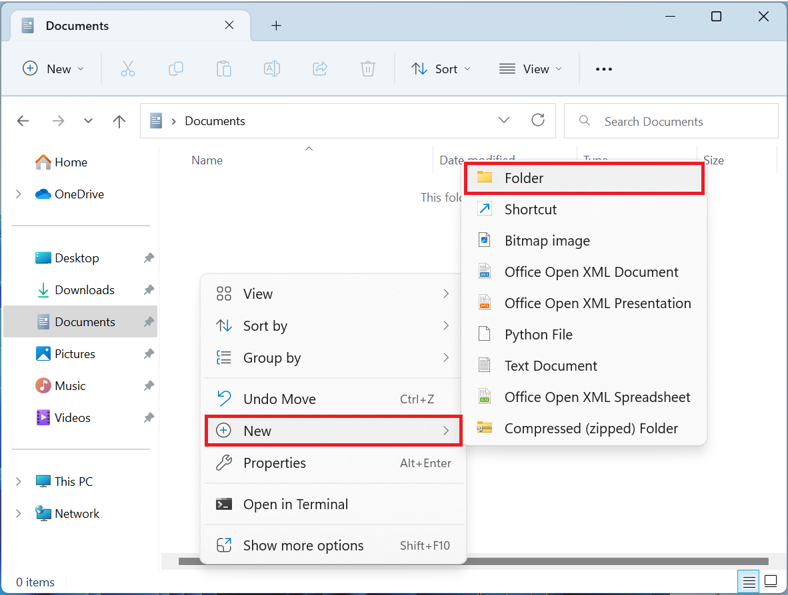

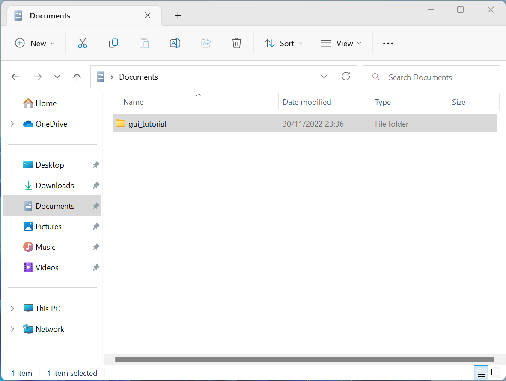

Open this folder in VSCode:

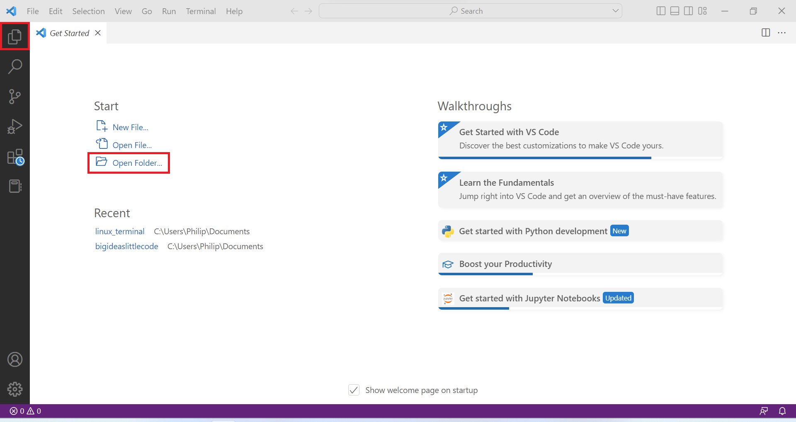

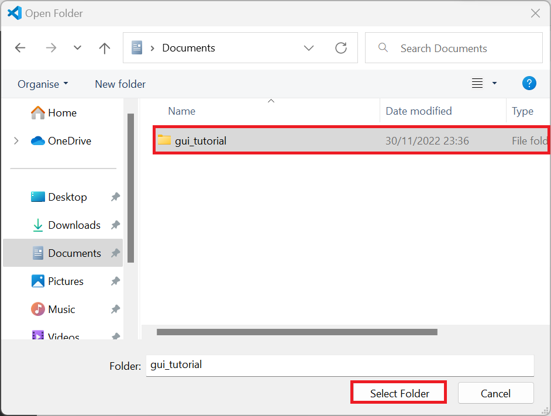

Create a Python Script file ending with the ```.py``` file extension:

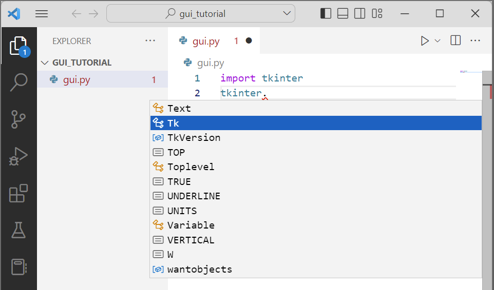

Objects are generally imported from the ```tkinter``` module. However it is useful to import the module using:

```
import tkinter
```

and view all the identifiers that can be called from it:

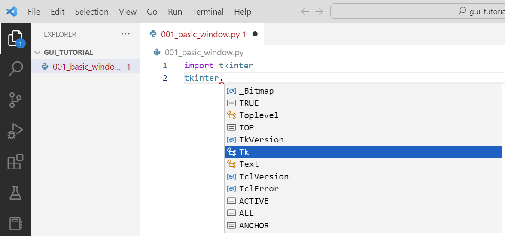


to view the docstring of the module, input:

```
import tkinter
print(tkinter.__doc__)
```

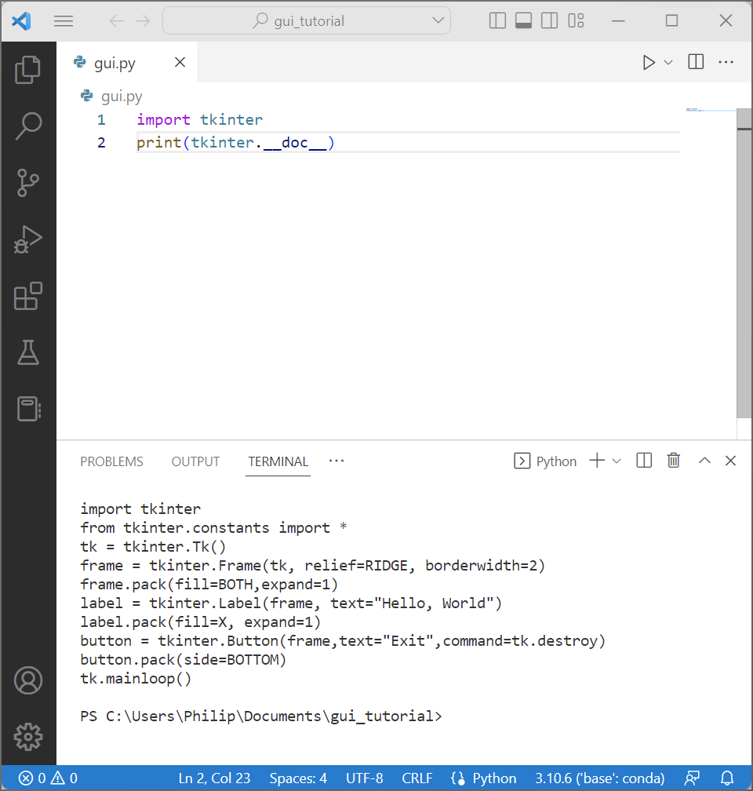

## Tk (Main Window) class

More generally objects are imported from tkinter. The ```Tk``` class is used to create a main window. To import the ```Tk``` class use:

```
from tkinter import Tk
```

Next a new main window instance needs to be created. This can be done by instantiating the```Tk``` class and assigning it to an object name:

```
mainwindow = Tk()
```
The initialization signature of the ```Tk``` class takes no input arguments.

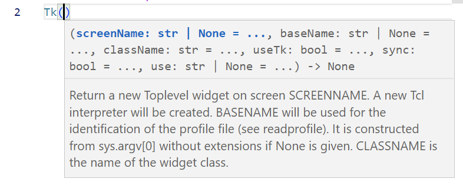

A number of methods can be called from the ```mainwindow``` instance:

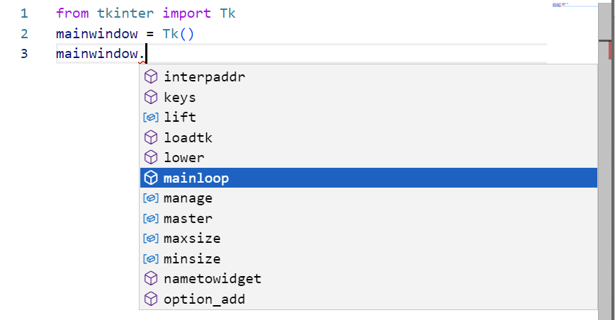

As the ```mainwindow``` instance is going to be frequently referenced, it is useful to use a smaller object name. The name ```tk``` is commonly used which is the lower case version of the class name which is in Pascal Case. It is a common convention for isntance names to contain the lower case version of the class name making it easy to keep track of the data type of each object being created.

```
from tkinter import Tk
tk = Tk()
```

The ```mainloop``` method can be used to start a main loop for the main window. Think of this as a while loop that is running in the background to maintain the connection and display of the window. The loop will end when the window is closed. The ```mainloop``` method takes no input arguments as it acts on the provided instance, the method was called from which in this case is ```tk```:

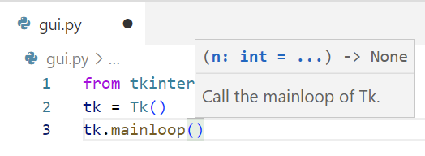

Running the following code creates ```tk``` an instance of the ```Tk``` class and runs it using a main loop:

```
from tkinter import Tk
tk = Tk()
tk.mainloop()
```

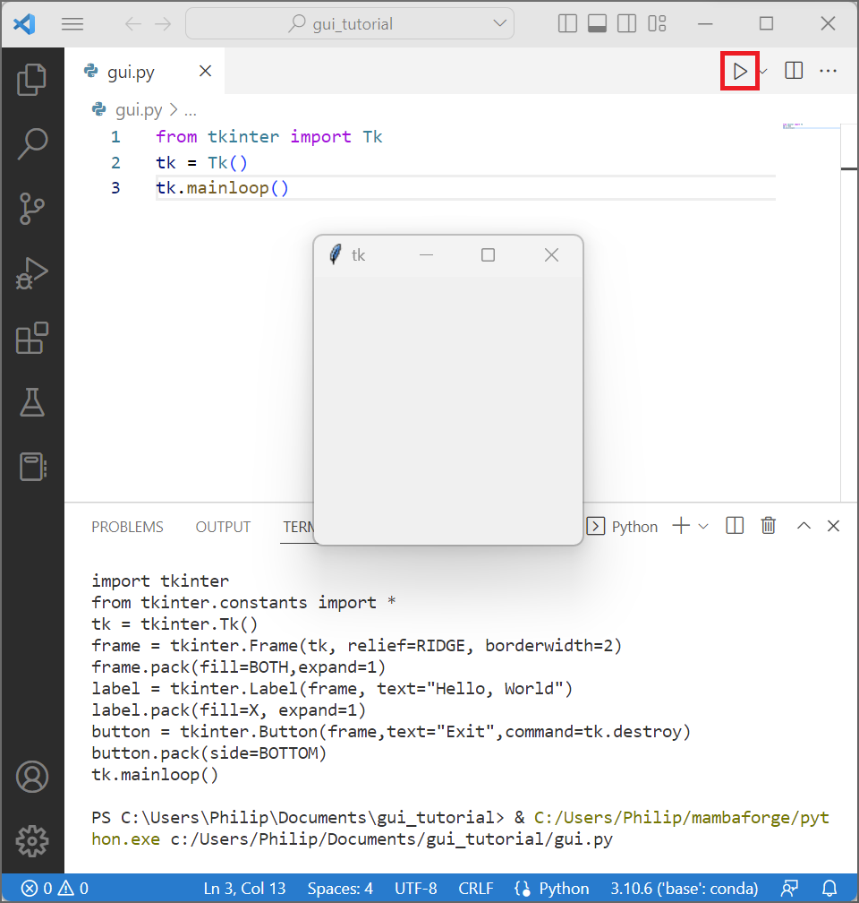

The Window can be minimized, maximized to snap layout or closed:

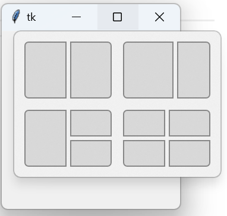

Notice that the Terminal is busy while the Window is open and the main loop (infinite while loop is running). The new prompt displays only when the window has been closed which ends the main loop:

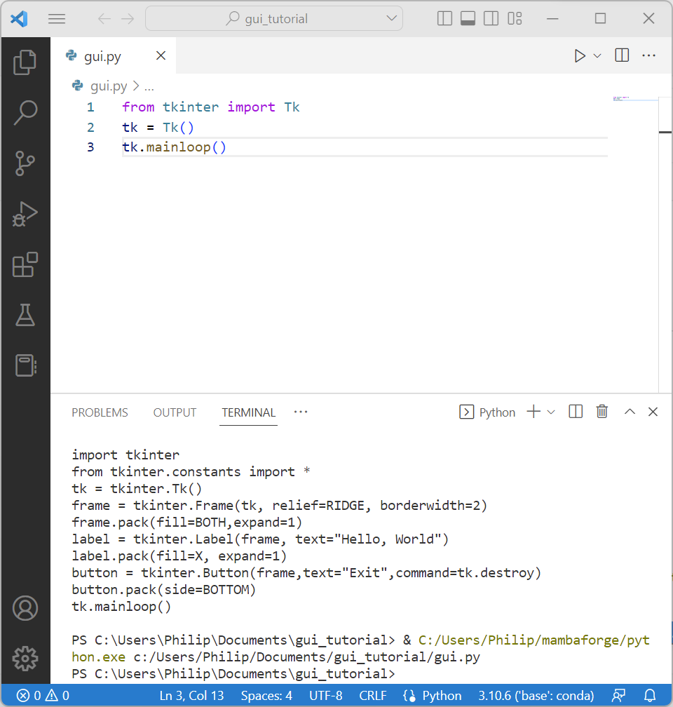

## Label class

A ```Label``` class can be used to place text or an image onto the main window ```tk```. To use the ```Label``` class it also needs to be imported. Usually this is done alongside the import of ```Tk``` at the top of the script. 

```
from tkinter import Tk, Label
tk = Tk()
⋮
tk.mainloop()
```

The section denoted with ```⋮``` is where items get added to ```tk```, after the instance ```tk``` is defined but before the main loop is invoked.

The docstring for the ```Label``` is fairly detailed as this class has alot of keyword input arguments:

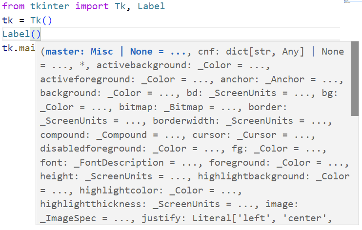

Scrolling down to the bottom gives more of an emphasis on the more common ones. ```master``` is required, which is essentially the object the label instance will belong to. In this case ```text``` and ```background``` will be used to create a simple text label with a red background.

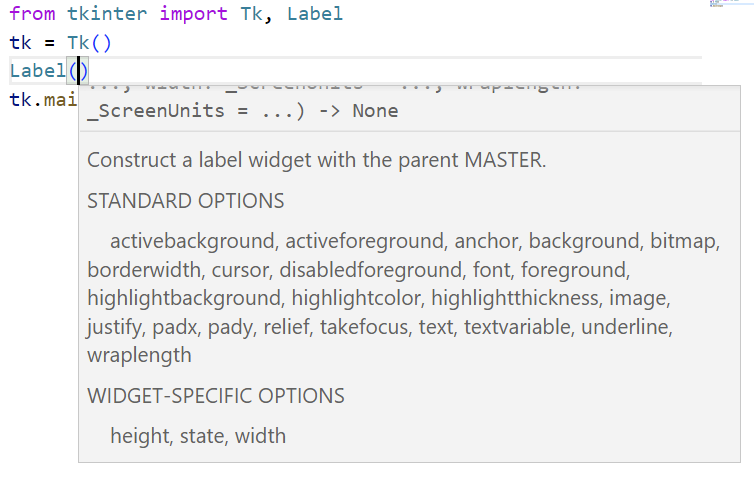

The instance name will be ```redlabel```:

```
from tkinter import Tk, Label
tk = Tk()
redlabel = Label(master=tk, text="Hello World in Red",
                background="red")
tk.mainloop()                
```

Notice that when this code is ran, the window displays without the label. 

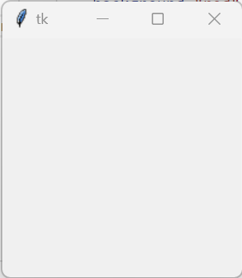

Although the label ```redlabel``` belongs to the window ```tk```, no geometric positioning for the label on the window has been specified. Most tkinter objects have a number of methods which can be used to specify how the object is placed on the window.

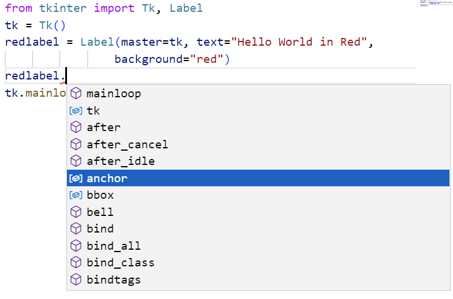

## pack method

The pack method is the simplest method and as the name suggest packs the item onto the window. Each item is packed into an individual row from top to bottom in a single column.

```
from tkinter import Tk, Label
tk = Tk()

redlabel = Label(master=tk, text="Hello World in Red",
                background="red")
redlabel.pack()    

tk.mainloop()   
```

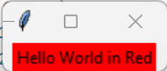

This is better illustrated by creatign multiple labels each of a different color:

```
from tkinter import Tk, Label
tk = Tk()

redlabel = Label(master=tk, text="Hello World in Red",
                background="red")
redlabel.pack()

labelblue = Label(master=tk, text="Hello World in Blue", 
                  background="blue")
labelblue.pack()

labelgreen = Label(master=tk, text="Hello World in Green", 
                   background="green")
labelgreen.pack()

labelyellow = Label(master=tk, text="Hello in Yellow", 
                    background="yellow")
labelyellow.pack()

tk.mainloop()
```

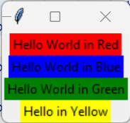

Which looks like the following when the window is resized:

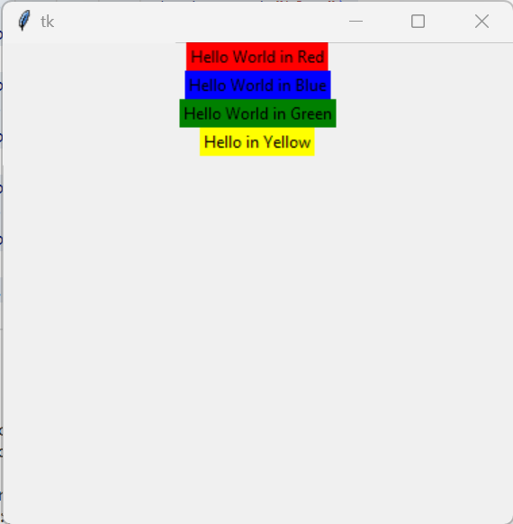

## grid method

While pack is the simplest to implement. The most common way to position an object is using a grid. The grid requires a row and a column which each use a zero-order index. A simple 2 by 2 grid can be created using the labels above:

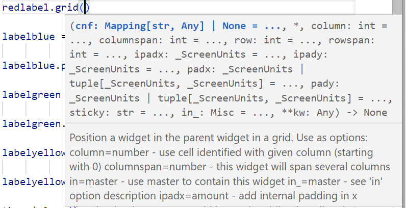

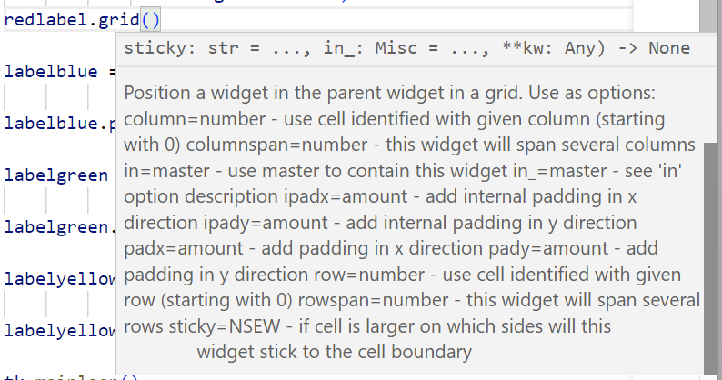

```
from tkinter import Tk, Label
tk = Tk()

redlabel = Label(master=tk, text="Hello World in Red",
                background="red")
redlabel.grid(row=0, column=0)

labelblue = Label(master=tk, text="Hello World in Blue", 
                  background="blue")
labelblue.grid(row=0, column=1)

labelgreen = Label(master=tk, text="Hello World in Green", 
                   background="green")
labelgreen.grid(row=1, column=0)

labelyellow = Label(master=tk, text="Hello in Yellow", 
                    background="yellow")
labelyellow.grid(row=1, column=1)

tk.mainloop()
```


The grid arrangement can be changed to a 3 by 2 arrangement with:

```
redlabel.grid(row=0, column=0)
labelblue.grid(row=0, column=1)
labelgreen.grid(row=0, column=2)
labelyellow.grid(row=1, column=0)
```

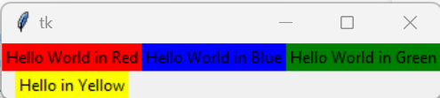

The grid arrangement can be changed to a 4 by 2 arrangement with:

```
redlabel.grid(row=0, column=0)
labelblue.grid(row=0, column=1)
labelgreen.grid(row=0, column=2)
labelyellow.grid(row=1, column=4)
```

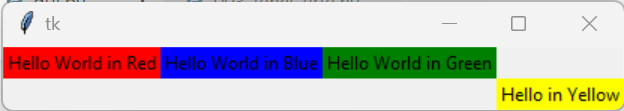

One thing to note however is that the grid uses relative coordinates. If nothing is at an index, it is skipped. Therefore nothing is changed with:

```
redlabel.grid(row=0, column=0)
labelblue.grid(row=0, column=1)
labelgreen.grid(row=0, column=2)
labelyellow.grid(row=1, column=100)
```

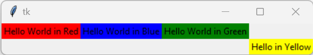

The grid has a keyword input argument ```sticky``` which can be used with a compass constant for alignment.

```
from tkinter import Tk, Label
from tkinter.constants import N, E, S, W, NE, SE, SW, NW, NS, EW, NSEW
tk = Tk()

redlabel = Label(master=tk, text="Hello World in Red",
                background="red")
redlabel.grid(row=0, column=0, sticky=E)

labelblue = Label(master=tk, text="Hello World in Blue", 
                  background="blue")
labelblue.grid(row=0, column=1, sticky=W)

labelgreen = Label(master=tk, text="Hello World in Green", 
                   background="green")
labelgreen.grid(row=1, column=0, sticky=E)

labelyellow = Label(master=tk, text="Hello in Yellow", 
                    background="yellow")
labelyellow.grid(row=1, column=1, sticky=W)

tk.mainloop()
```

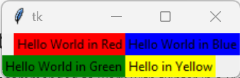

The most common compass constant is ```NSEW``` which will align the grid in all directions:

```
redlabel.grid(row=0, column=0, sticky=NSEW)
labelblue.grid(row=0, column=1, sticky=NSEW)
labelgreen.grid(row=1, column=0, sticky=NSEW)
labelyellow.grid(row=1, column=1, sticky=NSEW)
```

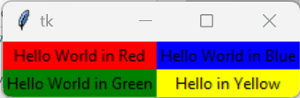

Additionally padding can be added by using interpadding in x and y using the keyword input arguments ```ipadx``` and ```ipady```. These are assigned to an integer value in pixels:

```
redlabel.grid(row=0, column=0, sticky=NSEW, ipadx=30, ipady=30)
labelblue.grid(row=0, column=1, sticky=NSEW)
labelgreen.grid(row=1, column=0, sticky=NSEW)
labelyellow.grid(row=1, column=1, sticky=NSEW)
```

Notice that the green is stretched to use the same spacing as the red in x and the blue is stretched to use the same space as the red in y due to ```sticky=NSEW```.

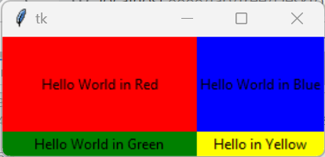

The ```rowspan``` and the ```columnspan``` may be used to span an object over multiple rows or columns repectively:

```
redlabel.grid(row=0, column=0, sticky=NSEW)
labelblue.grid(row=0, column=1, sticky=NSEW)
labelgreen.grid(row=0, column=2, sticky=NSEW)
labelyellow.grid(row=1, column=0, columnspan=3, sticky=NSEW)
```

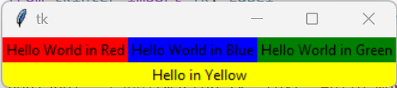

```
redlabel.grid(row=0, column=0, sticky=NSEW)
labelblue.grid(row=0, column=1, sticky=NSEW)
labelgreen.grid(row=1, column=0, columnspan=2, sticky=NSEW)
labelyellow.grid(row=0, column=2, rowspan=2, sticky=NSEW)
```

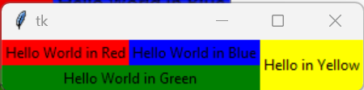


## Button class

The ```Button``` class can be used to create a button. It needs imported at the top with the other classes:

```
from tkinter import Tk, Label, Button
from tkinter.constants import NSEW
tk = Tk()
```

The docstring can be examined:
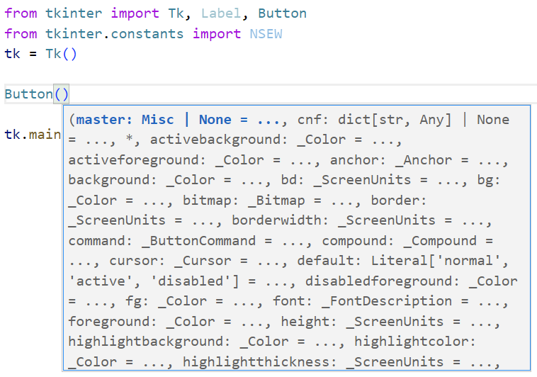

Once again the more common standard options and widget specific options are shown at the end:
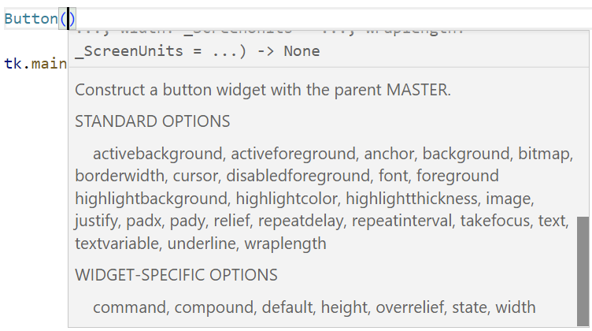

Three text buttons can be created using:

```
from tkinter import Tk, Label, Button
from tkinter.constants import NSEW
tk = Tk()

leftbutton = Button(master=tk, text="left", state="disabled")
leftbutton.grid(row=0, column=0, ipadx=30, ipady=30)

middlebutton = Button(master=tk, text="middle", state="normal")
middlebutton.grid(row=0, column=1, ipadx=30, ipady=30)

rightbutton = Button(master=tk, text="right", state="active")
rightbutton.grid(row=0, column=2, ipadx=30, ipady=30)

tk.mainloop()
```

Each button has a different state the left button has ```state="disable"``` and is greyed out. The middle button has a ```state="normal"``` and the right button has a ```state="active"```. For the ```Button``` class there isn't any visible difference when initialising between these two latter states but for some other classes, ```state="active"``` will highlight the default option by default with the mouse:


The middle and right buttons can be pressed, although nothing happens as no functionality has been specified:

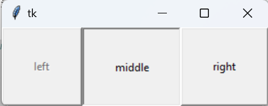

A button is ```"normal"``` by default and ```"active"``` when pressed. This can be emphasised by adding color to each button. There are two colors for the normal state and two colors for the active state:

```
leftbutton = Button(master=tk, text="left", 
                    background="#0000ff", foreground="#ffffff",
                    activebackground="#ffffff", activeforeground="#0000ff")
leftbutton.grid(row=0, column=0, ipadx=30, ipady=30)

middlebutton = Button(master=tk, text="middle",
                      background="#0000ff", foreground="#ffffff",
                      activebackground="#ffffff", activeforeground="#0000ff")
middlebutton.grid(row=0, column=1, ipadx=30, ipady=30)

rightbutton = Button(master=tk, text="right",
                     background="#0000ff", foreground="#ffffff",
                     activebackground="#ffffff", activeforeground="#0000ff")
rightbutton.grid(row=0, column=2, ipadx=30, ipady=30)
```

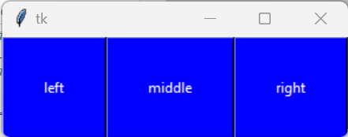

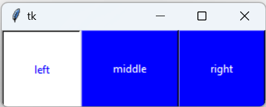

Functionality is controlled using the ```command``` keyword and assigning it to a function name. Note the function is referenced during assignment and not called. The function is called when the button is clicked:

```
from tkinter import Tk, Label, Button
from tkinter.constants import NSEW
tk = Tk()

def leftclick():
    print("left")
    return None

leftbutton = Button(master=tk, text="left", 
                    command=leftclick)
leftbutton.grid(row=0, column=0, ipadx=30, ipady=30)

def middleclick():
    print("middle")
    return None

middlebutton = Button(master=tk, text="middle", 
                      command=middleclick)
middlebutton.grid(row=0, column=1, ipadx=30, ipady=30)

def rightclick():
    print("right")
    return None

rightbutton = Button(master=tk, text="right",
                     command=rightclick)
rightbutton.grid(row=0, column=2, ipadx=30, ipady=30)

tk.mainloop()
```

When the button is clicked, the text can be seen on the console:

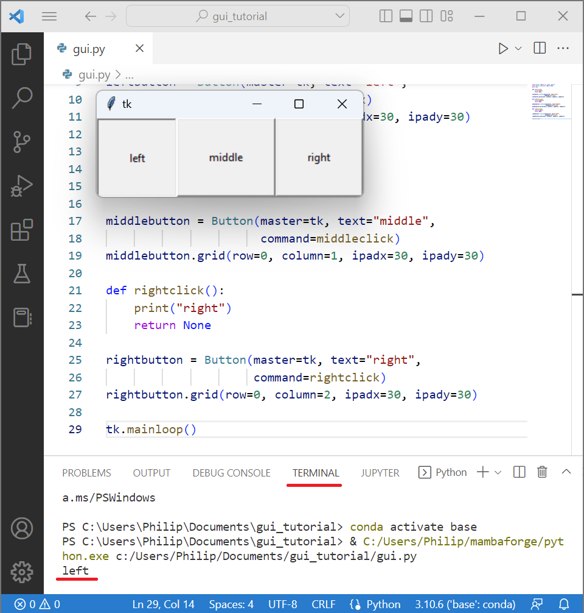

## Entry class

The ```Entry``` class can be used to display user interactable text on the screen:

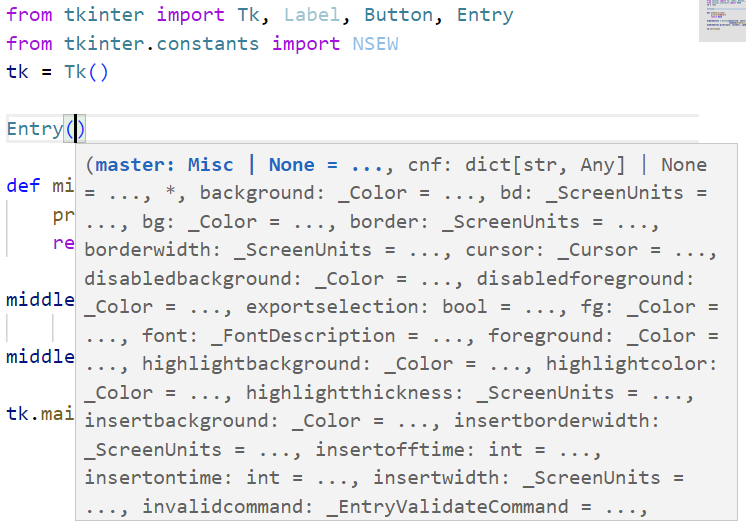

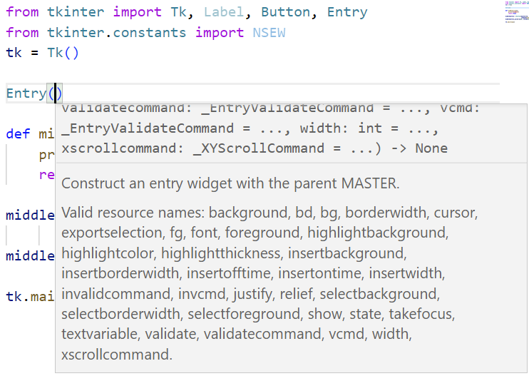

Notice that there are colors for the normal state background, foreground. There is also highlightcolor and highlightbackground.

```
from tkinter import Tk, Label, Button, Entry
from tkinter.constants import NSEW
tk = Tk()

textentry = Entry(width=50)
textentry.grid(row=0, column=0, sticky=NSEW)

def middleclick():
    print("middle")
    return None

middlebutton = Button(master=tk, text="middle", 
                      command=middleclick)
middlebutton.grid(row=1, column=0, ipadx=30, ipady=30,
                  sticky=NSEW)

tk.mainloop()
```

Text can be input into the ```textentry```:

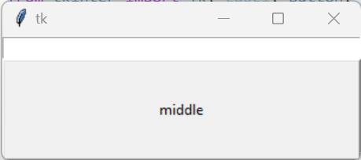

A cursor also displays and can be repositioned with the mouse. The text entry can be thought of as a single string and each position of the cursor can be thought of as an index position:

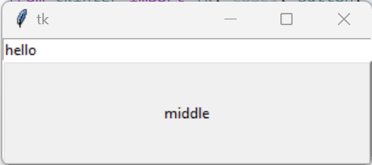

Text can also be highlighted:

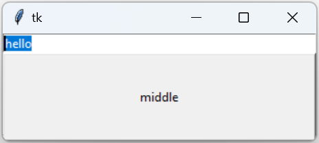

Note the change in colors when the text is highlighted. The ```textentry``` instance of the class ```Entry``` has a number of identifiers:

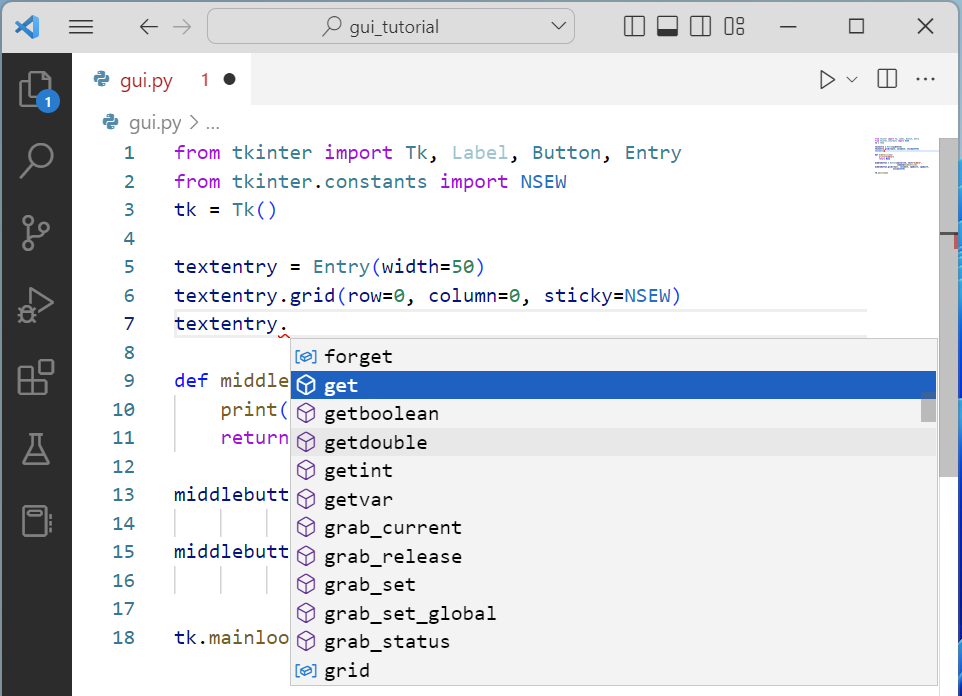

The method ```get``` can be used to retrieve the text:

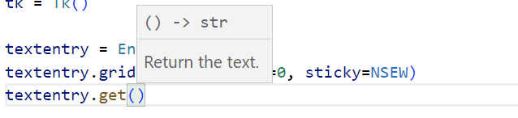

The function ```middleclick``` can be modified to read input from the text input by incorportating the ```textentry``` method ```get``` and print it to the console. Recall that this function will be executed when the button is clicked:

```
from tkinter import Tk, Label, Button, Entry
from tkinter.constants import NSEW
tk = Tk()

textentry = Entry(width=50)
textentry.grid(row=0, column=0, sticky=NSEW)

def middleclick():
    usertext = textentry.get()
    print(usertext)
    return None

middlebutton = Button(master=tk, text="print text", 
                      command=middleclick)
middlebutton.grid(row=1, column=0, ipadx=30, ipady=30,
                  sticky=NSEW)

tk.mainloop()
```

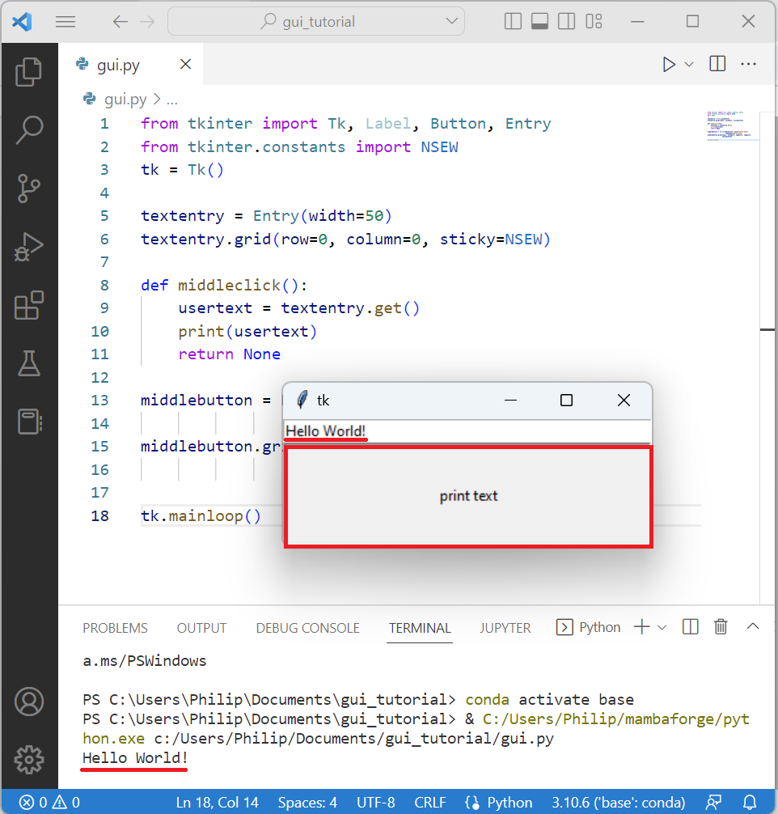

The method ```delete``` can be used to deleted text in ```textentry```, and requires two input arguments a ```first``` and ```last``` index, these can be assigned to integers and uses zero-order indexing (inclusive of the lower bound and exclusive of the upper bound). The string ```"end"``` can also be used to select the last index of the string:

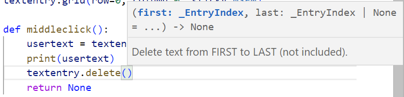

Updating the function to include:

```
textentry.delete(first=1, last=6)
```

When the string ```"hello world!"``` is input into the text box.

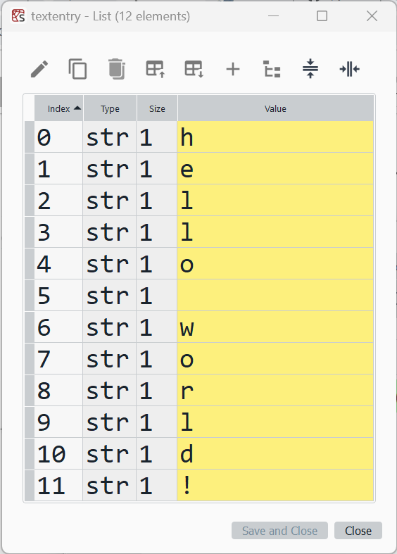

and the button pressed. The first index with character ```"e"``` up to but excluding the last index with character ```"w"``` is deleted, and the string ```"hworld!"``` is left in the ```textentry``` text input box:

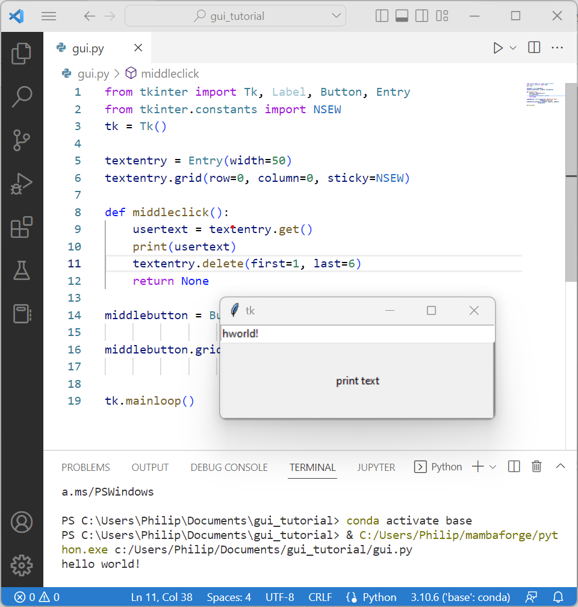

If the following is instead selected the ```textentry``` text input box will be cleared:

```
textentry.delete(first=0, last="end")
```

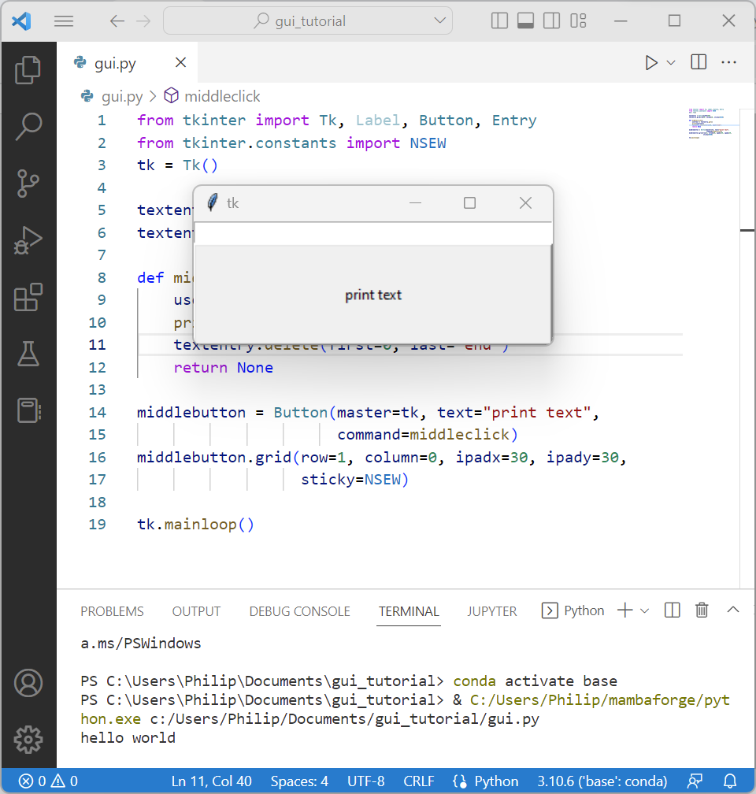

The method ```insert``` can be used to insert text at an index:

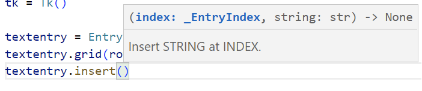

If the ```middleclick``` method is updated to remove the ```delete``` method and add the insert ```method```:

```
def middleclick():
    usertext = textentry.get()
    print(usertext)
    textentry.insert(index=0, string="hello")
    return None
```

Then the string ```"bye world!"``` is input. Pressing the button will prefix this with the string ```"hello"``` and the text input field of ```textentry``` will display ```"hellobye world!"```:

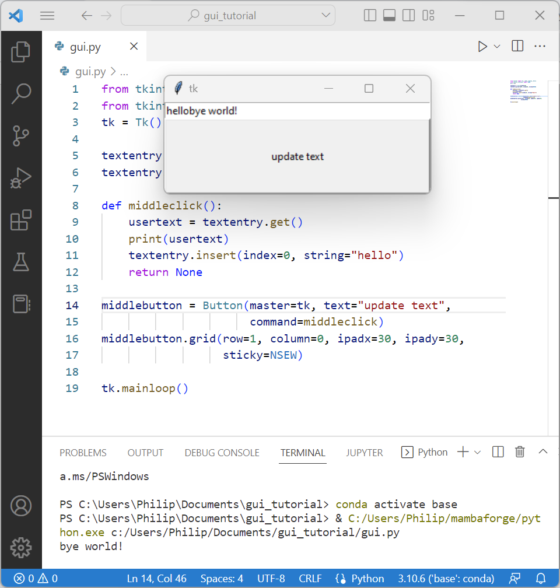

The ```textentry``` method ```config``` can be used with most of the keyword input arguments available during instantiation of the ```Entry``` class. These can be used to post-configure, the instance:

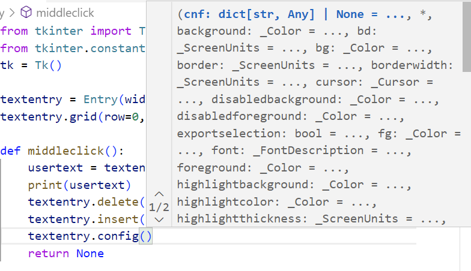

The method can be updated to print the text entered into ```textentry``` to the console and then to update the text in ```textentry``` and disable the ```textentry``` upon press of the button, effectively making it a one-off submission:

```
def middleclick():
    usertext = textentry.get()
    print(usertext)
    textentry.delete(first=0, last="end")
    textentry.insert(index=0, string="submitted")
    textentry.config(state="disabled")
    return None
```

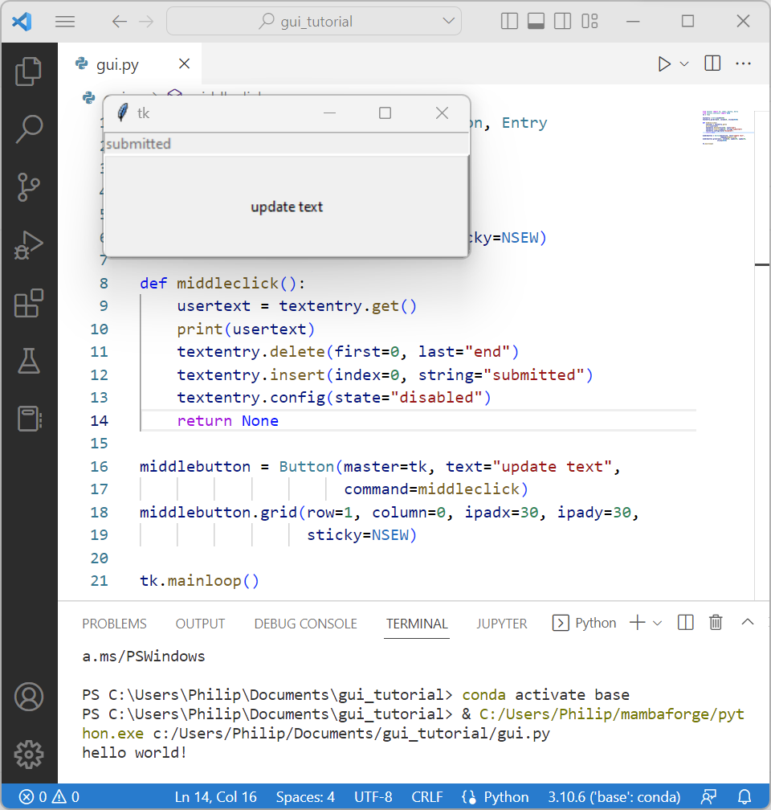

A program can be made with a grid that contains:

* on the first row a entry spanning over 2 columns
* on the second row two labels
* on the third row two buttons

This can be designed using:

```
from tkinter import Tk, Label, Button, Entry
from tkinter.constants import NSEW
tk = Tk()

textentry = Entry(width=50)
textentry.grid(row=0, column=0, columnspan=2, sticky=NSEW)

leftlabel = Label(master=tk, text="left label")
leftlabel.grid(row=1, column=0, ipady=50, sticky=NSEW)

rightlabel = Label(master=tk, text="right label")
rightlabel.grid(row=1, column=1, ipady=50, sticky=NSEW)

leftbutton = Button(master=tk, text="update left")
leftbutton.grid(row=2, column=0, ipady=50, sticky=NSEW)

rightbutton = Button(master=tk, text="update right")
rightbutton.grid(row=2, column=1, ipady=50, sticky=NSEW)

tk.mainloop()
```

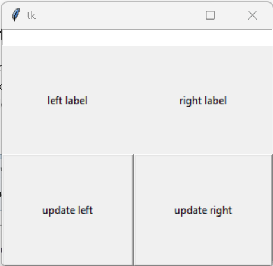

This layout has no functionality. The left button can be updated to take the text from the text entry and update the left label. The right button can be updated to take the text from the text entry and instead update the right label.

```
from tkinter import Tk, Label, Button, Entry
from tkinter.constants import NSEW
tk = Tk()

textentry = Entry(width=50)

textentry.grid(row=0, column=0, columnspan=2, sticky=NSEW)
leftlabel = Label(master=tk, text="left label")
leftlabel.grid(row=1, column=0, ipady=50, sticky=NSEW)

rightlabel = Label(master=tk, text="right label")
rightlabel.grid(row=1, column=1, ipady=50, sticky=NSEW)

def updateleftlabel():
    text = textentry.get()
    textentry.delete(first=0, last="end")
    leftlabel.config(text=text)

def updaterightlabel():
    text = textentry.get()
    textentry.delete(first=0, last="end")
    rightlabel.config(text=text)

leftbutton = Button(master=tk, text="update left",
                     command=updateleftlabel)
leftbutton.grid(row=2, column=0, ipady=50, sticky=NSEW)

rightbutton = Button(master=tk, text="update right",
                     command=updaterightlabel)
rightbutton.grid(row=2, column=1, ipady=50, sticky=NSEW)

tk.mainloop()
```

The program looks the same as before:


If ```"hello"``` is input in the ```textentry``` and the left button is clicked, the left label will now say ```"hello"```. Likewise if ```"bye"``` is input in the ```textentry``` and the right button is clicked, the right label will now say ```"bye"```.

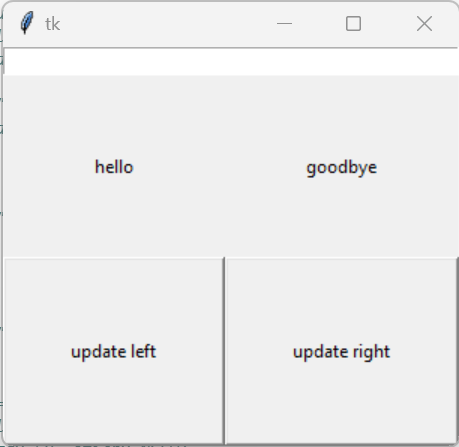

Notice the function used for each button is very similar and can be combined into a single function with an input argument:

```
def updatelabel(side):
    text = textentry.get()
    textentry.delete(first=0, last="end")
    if(side == "left"):
        leftlabel.config(text=text)
    else:
        rightlabel.config(text=text)
```

To use input arguments with the keyword command, a lambda expression is required. Recall that a function has the form:

```
def sum_nums(x1, x2):
    return x1 + x2
```

The lambda expression of it would be:

```
sum_nums = lambda x1, x2: x1 + x2
```

the keyword ```lambda``` can be thought of as meaning *make function*. 

A lambda expression can be used to call another function:

```
call_sum_nums = lambda : sum_nums(1, 2)
```

This is the form used to call the function ```updatelabel``` with the desired input argument:

```
leftbutton = Button(master=tk, text="update left",
                     command=lambda :updatelabel("left"))
rightbutton = Button(master=tk, text="update right",
                     command=lambda :updatelabel("right"))                     
```

The program behaves identically to before.

Supposing a third middle close button was to be added. The grid layout would need to be changed to accomodate the third button.

* on the first row a entry spanning over 6 columns
* on the second row 2 labels each spanning over 3 columns
* on the third row 3 buttons each spanning over 2 columns

The ```tk``` method ```destroy``` can be used to close the application and can be called using a lambda expression:

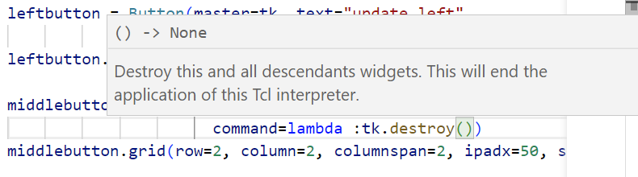

```
from tkinter import Tk, Label, Button, Entry
from tkinter.constants import NSEW
tk = Tk()

textentry = Entry(width=50)

textentry.grid(row=0, column=0, columnspan=6, sticky=NSEW)
leftlabel = Label(master=tk, text="left label")
leftlabel.grid(row=1, column=0, columnspan=3, ipady=50, sticky=NSEW)

rightlabel = Label(master=tk, text="right label")
rightlabel.grid(row=1, column=3, columnspan=3, ipady=50, sticky=NSEW)

def updatelabel(side):
    text = textentry.get()
    textentry.delete(first=0, last="end")
    if(side == "left"):
        leftlabel.config(text=text)
    else:
        rightlabel.config(text=text)

leftbutton = Button(master=tk, text="update left",
                     command=lambda :updatelabel("left"))
leftbutton.grid(row=2, column=0, columnspan=2, ipady=50, sticky=NSEW)

middlebutton = Button(master=tk, text="close", 
                      command=lambda :tk.destroy())
middlebutton.grid(row=2, column=2, columnspan=2, ipadx=50, sticky=NSEW)

rightbutton = Button(master=tk, text="update right",
                     command=lambda :updatelabel("right"))
rightbutton.grid(row=2, column=4, columnspan=2, ipady=50, sticky=NSEW)

tk.mainloop()
```

The updated window looks like the following and the new middle button can be used to close the application:

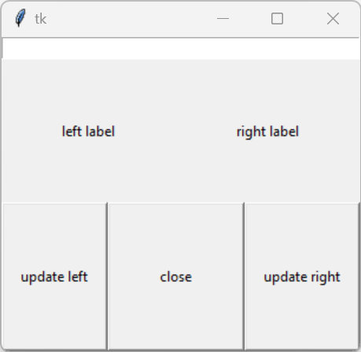

## Calculator Project

One of the first projects that puts all the concepts learned so far together is a project to make a standard calculator. The Windows calculator can be used as a model:

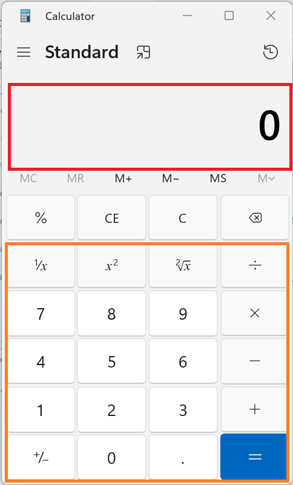

In red is essentially an entry. Below are a number of buttons, let's focus only on the twenty highlighted in orange.

First let's create the app:

* on the first row a entry spanning over 4 columns
* on the second row 4 buttons
* on the third row 4 buttons
* on the fourth row 4 buttons
* on the fifth row four buttons
* on the sixth row four buttons

```
from tkinter import Tk, Label, Button, Entry
from tkinter.constants import NSEW
tk = Tk()
tk.title("Calculator")

textentry = Entry(width=50)
textentry.grid(row=0, column=0, columnspan=4, sticky=NSEW)
inversebutton = Button(master=tk, text="1/x", borderwidth=3, command=None)
inversebutton.grid(row=1, column=0, ipady=25, sticky=NSEW)
squaredbutton = Button(master=tk, text="x²", borderwidth=3, command=None)
squaredbutton.grid(row=1, column=1, ipady=25, sticky=NSEW)
squarerootbutton = Button(master=tk, text="√x", command=None)
squarerootbutton.grid(row=1, column=2, ipady=25, sticky=NSEW)
dividebutton = Button(master=tk, text="÷", borderwidth=3, command=None)
dividebutton.grid(row=1, column=3, ipady=25, sticky=NSEW)

sevenbutton = Button(master=tk, text="7", borderwidth=3, command=None)
sevenbutton.grid(row=2, column=0, ipady=25, sticky=NSEW)
eightbutton = Button(master=tk, text="8", borderwidth=3, command=None)
eightbutton.grid(row=2, column=1, ipady=25, sticky=NSEW)
ninebutton = Button(master=tk, text="9", borderwidth=3, command=None)
ninebutton.grid(row=2, column=2, ipady=25, sticky=NSEW)
multiplybutton = Button(master=tk, text="×", borderwidth=3, command=None)
multiplybutton.grid(row=2, column=3, ipady=25, sticky=NSEW)

fourbutton = Button(master=tk, text="4", borderwidth=3, command=None)
fourbutton.grid(row=3, column=0, ipady=25, sticky=NSEW)
fivebutton = Button(master=tk, text="5", borderwidth=3, command=None)
fivebutton.grid(row=3, column=1, ipady=25, sticky=NSEW)
sixbutton = Button(master=tk, text="6", borderwidth=3, command=None)
sixbutton.grid(row=3, column=2, ipady=25, sticky=NSEW)
subtractbutton = Button(master=tk, text="−", borderwidth=3, command=None)
subtractbutton.grid(row=3, column=3, ipady=25, sticky=NSEW)

onebutton = Button(master=tk, text="1", borderwidth=3, command=None)
onebutton.grid(row=4, column=0, ipady=25, sticky=NSEW)
twobutton = Button(master=tk, text="2", borderwidth=3, command=None)
twobutton.grid(row=4, column=1, ipady=25, sticky=NSEW)
threebutton = Button(master=tk, text="3", borderwidth=3, command=None)
threebutton.grid(row=4, column=2, ipady=25, sticky=NSEW)
additionbutton = Button(master=tk, text="+", borderwidth=3, command=None)
additionbutton.grid(row=4, column=3, ipady=25, sticky=NSEW)

plusminusbutton = Button(master=tk, text="±", borderwidth=3, command=None)
plusminusbutton.grid(row=5, column=0, ipady=25, sticky=NSEW)
zerobutton = Button(master=tk, text="0", borderwidth=3, command=None)
zerobutton.grid(row=5, column=1, ipady=25, sticky=NSEW)
decimalbutton = Button(master=tk, text=".", borderwidth=3, command=None)
decimalbutton.grid(row=5, column=2, ipady=25, sticky=NSEW)
equalsbutton = Button(master=tk, text="=", borderwidth=3, command=None,
                    background="#0067C0", foreground="#FFFFFF",
                    activebackground="#FFFFFF", activeforeground="#0067C0")
equalsbutton.grid(row=5, column=3, ipady=25, sticky=NSEW)

tk.mainloop()
```

This looks like the following:

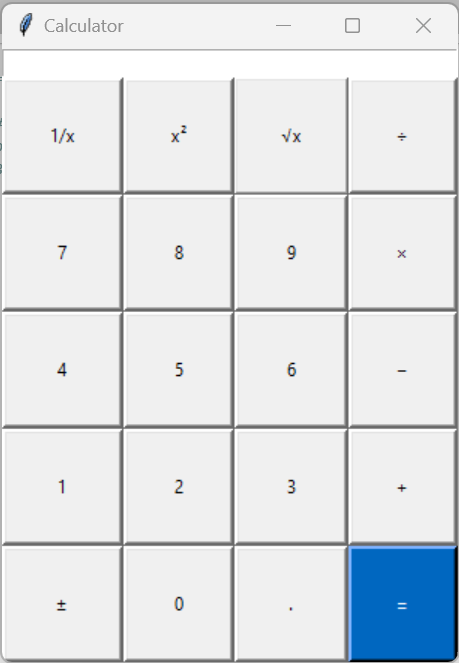

Currently the calculator has no functionality. A calculator is used to essentially create a left value, define an operator, create a right value and then compute the value. To get this behaviour, some variables will need to be created:

```
active = "left"
leftvalue = ""
rightvalue = ""
operator = ""
result = "0.0"
```

To update these within a function, they will need to be global variables. The ```updatevalue``` function can be configured to take in the buttonpressed as an input argument and used with a ```match``` ```case``` for each scenario.

The numeric digits and decimal point will have similar behaviour to update the currently selected ```value``` but additional checks will need to be done with the decimal point to make sure only one is present.

The operators will need to update the ```operation``` and switch from the ```leftvalue``` to the ```rightvalue```. To skip the additional code carried out at the end of the function when a numeric statement is input, ```return None``` is used. Each operator will need additional checks.

The ```equals``` function may be used to calculate and display the result in each of the scenarios, once again using ```match``` ```case```:

```
from tkinter import Tk, Label, Button, Entry
from tkinter.constants import NSEW

active = "left"
leftvalue = ""
rightvalue = ""
operator = ""
result = str(0.0)

tk = Tk()
tk.title("Calculator")

textentry = Entry(width=50)
textentry.grid(row=0, column=0, columnspan=4, sticky=NSEW)

def updatevalue(button):
    global active
    global operator
    global leftvalue
    global rightvalue
    if(active=="left"):
        value = leftvalue
    else:
        value = rightvalue
    match button:
        case "0":
            value += str(0)
        case "1":
            value += str(1)
        case "2":
            value += str(2)           
        case "3":
            value += str(3)
        case "4":
            value += str(4)
        case "5":
            value += str(5)
        case "6":
            value += str(6)
        case "7":
            value += str(7)
        case "8":
            value += str(8)
        case "9":
            value += str(9)
        case ".":
            if(value.find(".")==-1):
                value += "."
        case "inverse":
            if(value==""):
                value = result
            value = str(1 / float(value))
        case "squared":
            if(value==""):
                value = result
            value = str(float(value) ** 2)
        case "squareroot":
            if(value==""):
                value = result
            value = str(float(value) ** 0.5)
        case "plusminus":
            value = str(-float(value))
        case "addition":
            operator = "addition"
            active = "right"
            textentry.delete(first=0, last="end")
            return None
        case "subtraction":
            if(value!=""):
                operator = "subtraction"
                active = "right"
                textentry.delete(first=0, last="end")
                return None     
            value += str("-")
        case "multiplication":
            operator = "multiplication"
            active = "right"
            textentry.delete(first=0, last="end")
            return None
        case "division":
            operator = "division"
            active = "right"
            textentry.delete(first=0, last="end")
            return None
    textentry.delete(first=0, last="end")
    if(active=="left"):
        leftvalue = value
        textentry.insert(index=0, string=leftvalue)
    else:
        rightvalue = value    
        textentry.insert(index=0, string=rightvalue)  
    return None

def equals():
    global active
    global operator
    global leftvalue
    global rightvalue
    global result
    match operator:
        case "":
            result = leftvalue
            textentry.delete(first=0, last="end")
            textentry.insert(index=0, string=result)    
        case "addition":
            result = str(float(leftvalue) + float(rightvalue))
            textentry.delete(first=0, last="end")
            textentry.insert(index=0, string=result)
        case "subtraction":
            result = str(float(leftvalue) - float(rightvalue))
            textentry.delete(first=0, last="end")
            textentry.insert(index=0, string=result)               
        case "multiplication":
            result = str(float(leftvalue) * float(rightvalue))
            textentry.delete(first=0, last="end")
            textentry.insert(index=0, string=result)  
        case "division":
            result = str(float(leftvalue) / float(rightvalue))
            textentry.delete(first=0, last="end")
            textentry.insert(index=0, string=result)  
    active = "left"
    operator = ""
    leftvalue = ""
    rightvalue = ""
    return None

inversebutton = Button(master=tk, text="1/x", borderwidth=3, 
                       command=lambda: updatevalue("inverse"))
inversebutton.grid(row=1, column=0, ipady=25, sticky=NSEW)
squaredbutton = Button(master=tk, text="x²", borderwidth=3, 
                       command=lambda: updatevalue("squared"))
squaredbutton.grid(row=1, column=1, ipady=25, sticky=NSEW)
squarerootbutton = Button(master=tk, text="√x",
                          command=lambda: updatevalue("squareroot"))
squarerootbutton.grid(row=1, column=2, ipady=25, sticky=NSEW)
dividebutton = Button(master=tk, text="÷", borderwidth=3,
                      command=lambda: updatevalue("division"))
dividebutton.grid(row=1, column=3, ipady=25, sticky=NSEW)

sevenbutton = Button(master=tk, text="7", borderwidth=3,
                     command=lambda: updatevalue("7"))
sevenbutton.grid(row=2, column=0, ipady=25, sticky=NSEW)
eightbutton = Button(master=tk, text="8", borderwidth=3,
                     command=lambda: updatevalue("8"))
eightbutton.grid(row=2, column=1, ipady=25, sticky=NSEW)
ninebutton = Button(master=tk, text="9", borderwidth=3,
                    command=lambda: updatevalue("9"))
ninebutton.grid(row=2, column=2, ipady=25, sticky=NSEW)
multiplybutton = Button(master=tk, text="×", borderwidth=3,
                        command=lambda: updatevalue("multiplication"))
multiplybutton.grid(row=2, column=3, ipady=25, sticky=NSEW)

fourbutton = Button(master=tk, text="4", borderwidth=3,
                    command=lambda: updatevalue("4"))
fourbutton.grid(row=3, column=0, ipady=25, sticky=NSEW)
fivebutton = Button(master=tk, text="5", borderwidth=3,
                    command=lambda: updatevalue("5"))
fivebutton.grid(row=3, column=1, ipady=25, sticky=NSEW)
sixbutton = Button(master=tk, text="6", borderwidth=3,
                   command=lambda: updatevalue("6"))
sixbutton.grid(row=3, column=2, ipady=25, sticky=NSEW)
subtractbutton = Button(master=tk, text="−", borderwidth=3,
                        command=lambda: updatevalue("subtraction"))
subtractbutton.grid(row=3, column=3, ipady=25, sticky=NSEW)

onebutton = Button(master=tk, text="1", borderwidth=3,
                  command=lambda: updatevalue("1"))
onebutton.grid(row=4, column=0, ipady=25, sticky=NSEW)
twobutton = Button(master=tk, text="2", borderwidth=3,
                   command=lambda: updatevalue("2"))
twobutton.grid(row=4, column=1, ipady=25, sticky=NSEW)
threebutton = Button(master=tk, text="3", borderwidth=3,
                     command=lambda: updatevalue("3"))
threebutton.grid(row=4, column=2, ipady=25, sticky=NSEW)
additionbutton = Button(master=tk, text="+", borderwidth=3, 
                        command=lambda: updatevalue("addition"))
additionbutton.grid(row=4, column=3, ipady=25, sticky=NSEW)

plusminusbutton = Button(master=tk, text="±", borderwidth=3,
                         command=lambda: updatevalue("plusminus"))
plusminusbutton.grid(row=5, column=0, ipady=25, sticky=NSEW)
zerobutton = Button(master=tk, text="0", borderwidth=3,
                    command=lambda: updatevalue("0"))
zerobutton.grid(row=5, column=1, ipady=25, sticky=NSEW)
decimalbutton = Button(master=tk, text=".", borderwidth=3,
                       command=lambda: updatevalue("."))
decimalbutton.grid(row=5, column=2, ipady=25, sticky=NSEW)
equalsbutton = Button(master=tk, text="=", borderwidth=3, command=equals,
                    background="#0067C0", foreground="#FFFFFF",
                    activebackground="#FFFFFF", activeforeground="#0067C0")
equalsbutton.grid(row=5, column=3, ipady=25, sticky=NSEW)

tk.mainloop()
```

This gives a calculator with basic functionality that can be tested by pressing 4, + and 2:

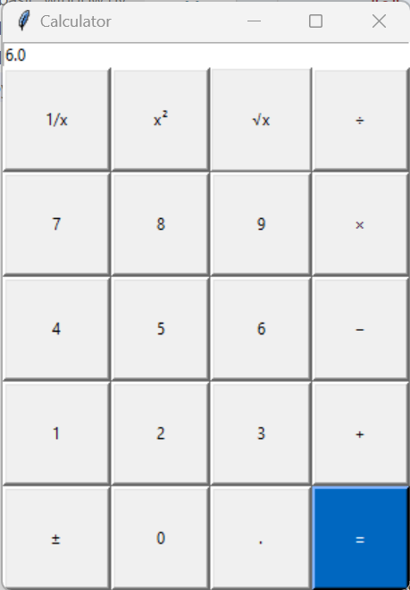

Lots of testing should be made to the calculator app, pressing the buttons in a way commonly used for numeric calculations and verifying the results. The calculator functionality can be amended if required by updating the underlying functions.
