# Installing Anaconda

## Removing Previous Installations

Anaconda should be installed on a Linux PC that has no previous Python installations outwith the system Python. The system Python is preinstalled as part of the Linux Operating system and should be considered as part of the Operating System and not modified by the user.

If an old Anaconda Installation or an Anaconda based installation such as Miniconda or Miniforge is present these should be removed by deleting their perspective folders. Note that deletion of these folders leaves behind a large number of configuration files and often results in problematic settings persisting after a reinstall. For best results it is recommended to delete all these configuration files. For more details see [Uninstall](./uninstall.md).

## System Python

Beginners often confuse the system Python with Anaconda, particularly when Anaconda is installed without being initialised. 

To view system files in the root folder open up File Explorer and select Other Locations:

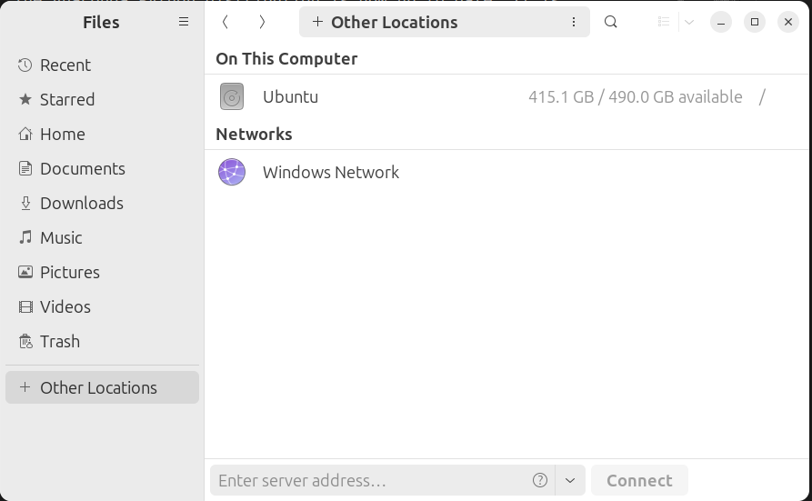

The bin folder which contains the binaries otherwise known as command line applications:

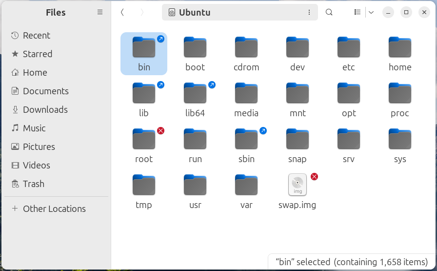

Everytime a command is input in the Terminal it runs one of the binaries in this folder.

The binary python3 is the system Python. There will be an alias of this binary giving the minor version:

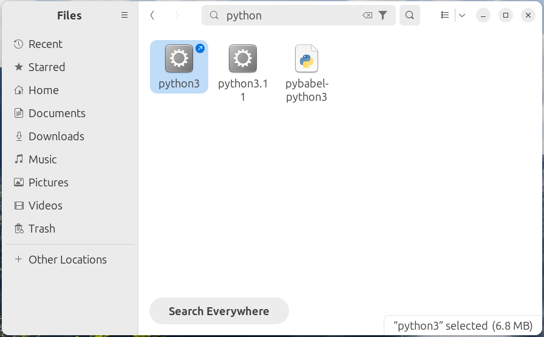

Note that the binary is called python3 instead of python. In old versions of Linux both Python 2 and Python 3 were preinstalled; python was Python 2 and python3 was Python 3. Python 2 has reached end of life and so now only Python 3 is preinstalled.

If the folder is right clicked and Open in Terminal is selected:

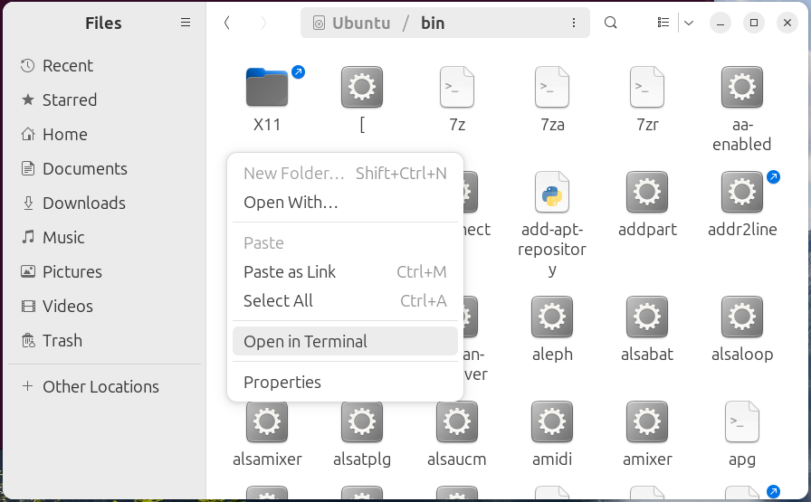

The following prompt will display:

```
username@pc:/bin$ 
```

where username is the user name, pc is the PC name and /bin is the location the Terminal is open in. If the command is input:

```
python3
```

The output will display:

```
username@pc:/bin$ python3
Python 3.11.6 (main, Oct  8 2023, 05:06:43) [GCC 13.2.0] on linux
Type "help", "copyright", "credits" or "license" for more information.
>>> 
```

Python comes with a number of preinstalled modules known as standard modules. These are found in the lib subfolder on the root folder:

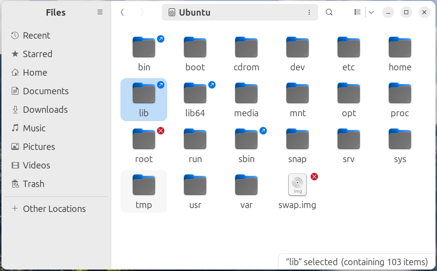

In a subfolder corresponding to the Python version:

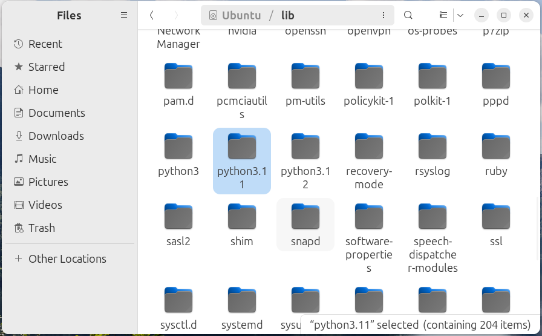

Some standard modules are single Python script files:

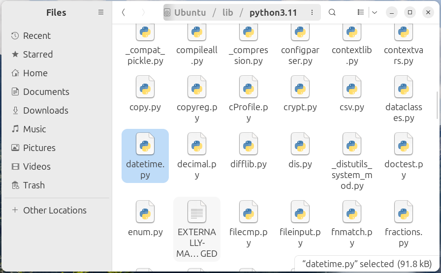

Others are found in their own subfolder:

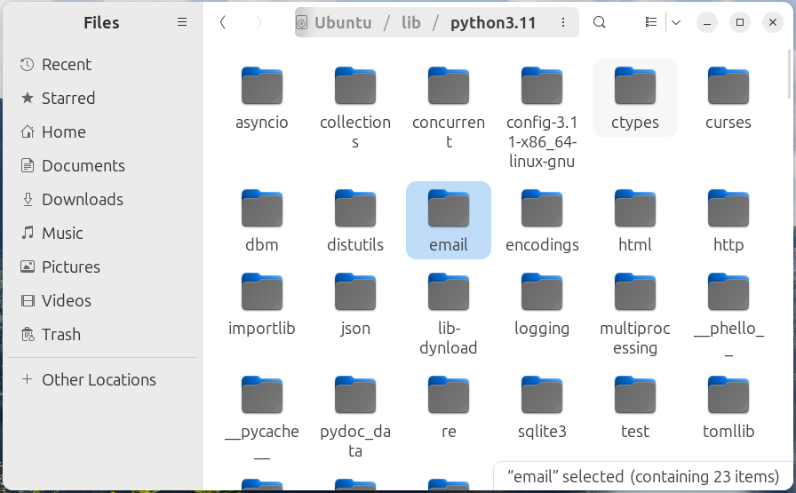

The subfolder contains multiple Python script files. The name of the subfolder corresponds to the module and the datanodel initialisation file ```__init__.py``` is imported when the folder is input:

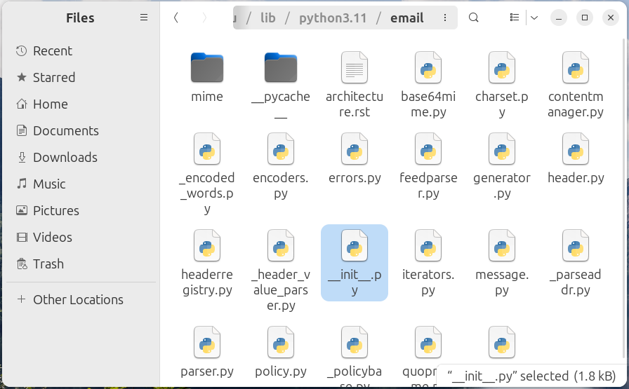

This can be seen when the following imports are used:

```
username@pc:~$ python3
Python 3.11.6 (main, Oct  8 2023, 05:06:43) [GCC 13.2.0] on linux
Type "help", "copyright", "credits" or "license" for more information.
>>> import datetime
>>> datetime.__file__
'/usr/lib/python3.11/datetime.py'
>>> import email
>>> email.__file__
'/usr/lib/python3.11/email/__init__.py'
>>> 
```

The python folder has no site-packages folder meaning no third-party libraries are installed. Therefore if a popular third-party data science library is imported, the following ModuleNotFoundError displays:

```
>>> import numpy as np
Traceback (most recent call last):
  File "<stdin>", line 1, in <module>
ModuleNotFoundError: No module named 'numpy'
>>> 
```

This system Python is used by the Linux Operating System and modifying it or installing packages may result in instability. Instead it is recommended to install the Anaconda Python Distribution.

## Anaconda Python Distribution

The Anaconda Python distribution comes with its own base (otherwise known as an alternative root) Python environment that contains:

* The conda Package Manager
* Python
* Python Standard Libraries
* numpy
* pandas
* matplotlib
* seaborn
* Spyder
* JupyterLab
* Formatters such as autopep8, isort and black

Python has its own package manager Python Install Package (pip) which is strictly for Python packages. For data science projects the more powerful conda package manager is prefered as it can be used to install the Python packages used for datascience projects in addition to their non-Python dependencies. These include example codecs, as well as dependencies for hardware acceleration. conda can also be used to install packages from other programming languages which are often user in conjunction with Python. The popular Jupyter project for example is an abbreviation for Julia Python et (Latin for and) R.

```conda install package``` should be used instead of ```pip install package``` where possible.

The ```conda``` package manager has two channels:

* main (also called conda or anaconda)
* conda-forge (community)

The main channel is maintained by the Anaconda company and the conda-forge channel is maintained directly by developers from the Python community. The Anaconda company only test a subset of the more commonly used Python packages for stability with the Anaconda Python Distribution and because these packages are further tested they may be older than the latest versions on the conda-forge channel. Therefore the base Anaconda Python distribution contains only packages from the base Python environment. The base environment can become unstable when packages from the community channel are used and it is recommended to use the conda package manager to create a Python environment for custom configurations.

Miniconda is a stripped down version of Anaconda which has an empty base Python environment with only the dependencies required for the conda package manager.

### Download

The download link for Anaconda can be found on the [Anaconda](https://www.anaconda.com/download) home page. The Linux installer is a shelll script and has a ```.sh``` file extension:


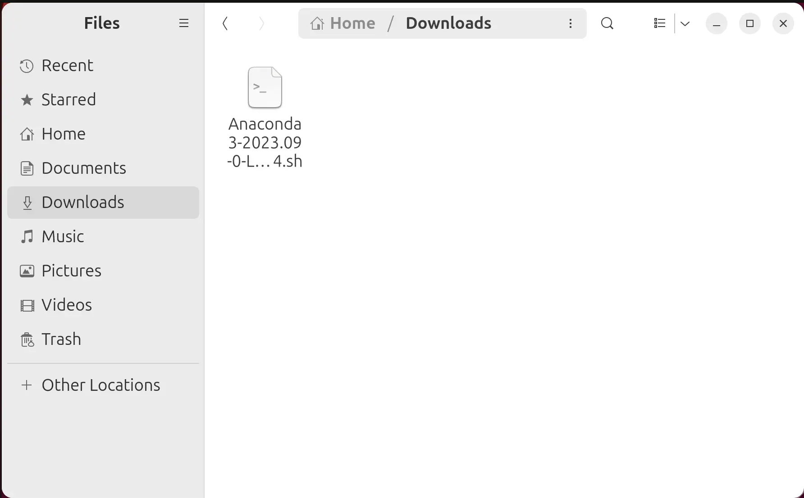

### Install

To run a shell script the command ```bash``` is used and the .sh file is supplied as a command line argument.

To get the name of the file. Open the Downloads folder and right click the downloaded file and select Rename:

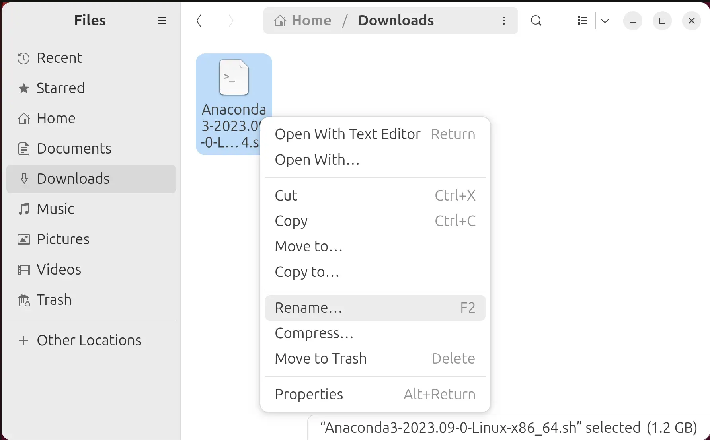

Highlight the file name, including the file extension and press ```Ctrl``` + ```c``` to copy:

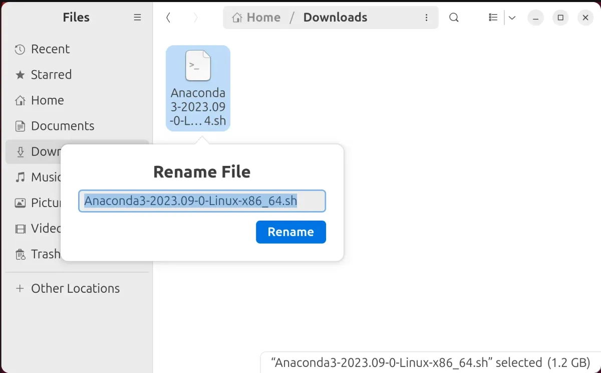

If the Terminal is open from All Applications. The Prompt will look like:

```
username@pc~$
```

where ```~``` is the current working directory. The Linux Terminal uses ```~``` for the Home folder found in Files. 

To change directory, the command ```cd``` can be used alongside the directory as an input argument:

```
cd ~/Downloads
```

Notice that the prompt is now:

```
username@pc:~/Downloads$
```

bash commands are input after the $ sign.

Alternatively open the Downloads folder in files and right click empty space in files and select Open in Terminal:

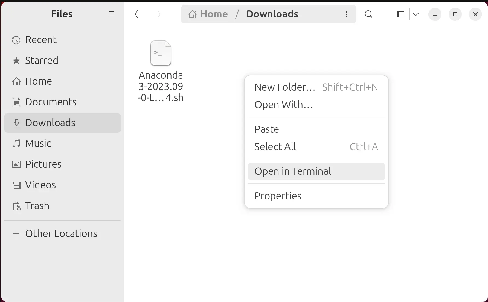

To begin executing the shell script input:

```bash
bash Anaconda3-2023.09-0-Linux-x86_64.sh
```

Note because the Terminals working directory is Downloads, the directory will not have to be provided as part of the command line argument to the file. Otherwise the following would have to be used:

```bash
bash ~/Downloads/Anaconda3-2023.09-0-Linux-x86_64.sh
```

Note that the Terminal uses the shortcut key ```Ctrl``` + ```c``` to cancel the current running operation. The shortcut keys for Copy and Paste are therefore ```Ctrl```, ```⇧``` + ```c``` and ```Ctrl```, ```⇧``` + ```v``` respectively.

The following output will display:

```
Welcome to Anaconda3 2023.09-0

In order to continue the installation process, please review the license
agreement.
Please, press ENTER to continue
>>> 
```

Press ```↵``` to begin scrolling through the license agreement:

```
==================================================
End User License Agreement - Anaconda Distribution
==================================================

Copyright 2015-2023, Anaconda, Inc.

All rights reserved under the 3-clause BSD License:

This End User License Agreement (the "Agreement") is a legal agreement be
tween you and Anaconda, Inc. ("Anaconda") and governs your use of Anacond
a Distribution (which was formerly known as Anaconda Individual Edition).

Subject to the terms of this Agreement, Anaconda hereby grants you a non-
exclusive, non-transferable license to:

  * Install and use the Anaconda Distribution (which was formerly known a
s Anaconda Individual Edition),
  * Modify and create derivative works of sample source code delivered in
--More--
```

To quit scrolling press ```q```. The following output will now display, prompting to accept of decline the license agreement:

```
Do you accept the license terms? [yes|no]
[no] >>>
```

Input ```yes``` to proceed. The following output will display:

```
Anaconda3 will now be installed into this location:
/home/user/anaconda3

  - Press ENTER to confirm the location
  - Press CTRL-C to abort the installation
  - Or specify a different location below

[/home/user/anaconda3] >>> 
```

It is recommended to install anaconda3 in its default location. Press ```↵``` to proceed. The files will extract and the following output will now display when the installation is successful:

```
PREFIX=/home/user/anaconda3
Unpacking payload ...

Downloading and Extracting Packages

Preparing transaction: done
Executing transaction: / 

    Installed package of scikit-learn can be accelerated using scikit-learn-intelex.
    More details are available here: https://intel.github.io/scikit-learn-intelex

    For example:

        $ conda install scikit-learn-intelex
        $ python -m sklearnex my_application.py

    

done
installation finished.
```

### Initialisation

The root Anaconda Python Environment known as base is found in the anaconda3 folder:

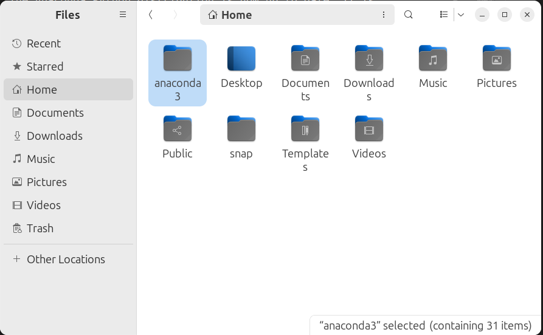

Notice that it has its own bin subfolder:

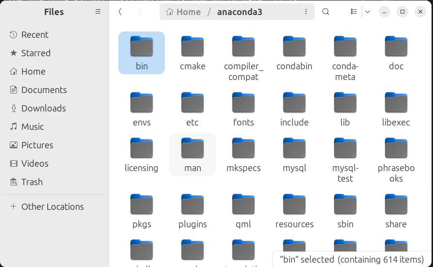

The python binary associated with this installation is in this:

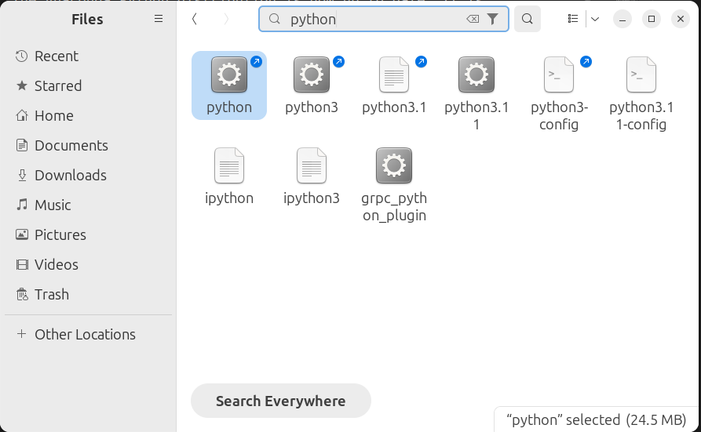

This python3 binary has the alias python alongside an alias for the major and minor version.

The base Python environment has its own lib subfolder:

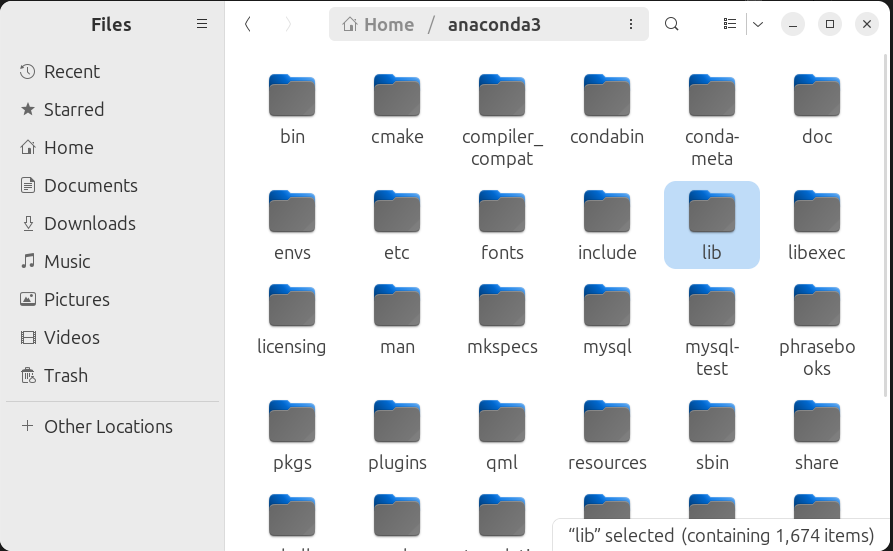

The lib subfolder has a subfolder corresponding to the Python version:

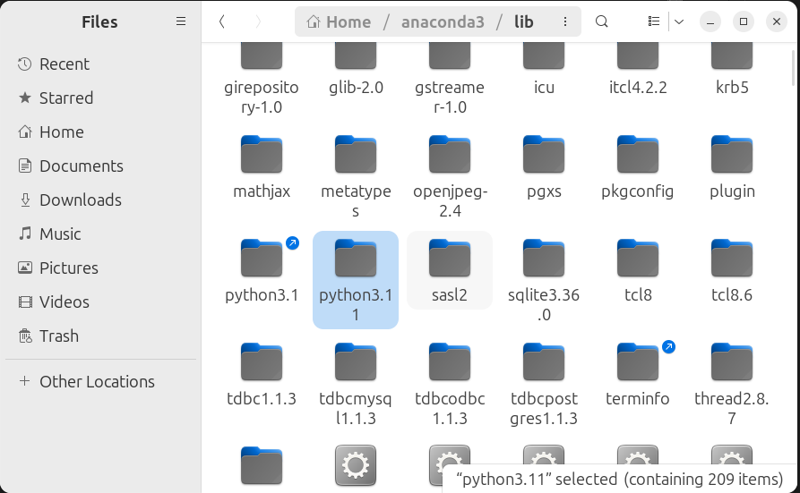

And contains the Python standard modules associated with the base Python environment. For example the datetime module available as a script file datetime.py:

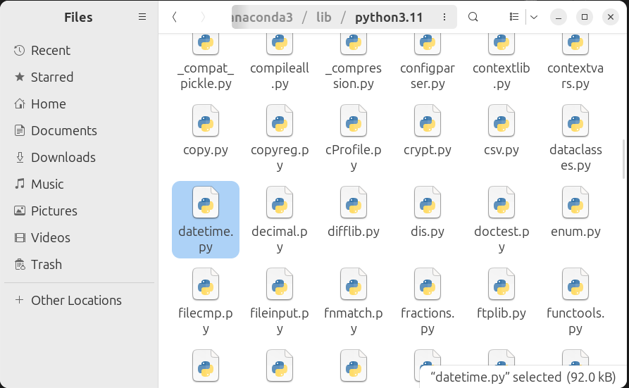

Or the email module found as a subfolder:

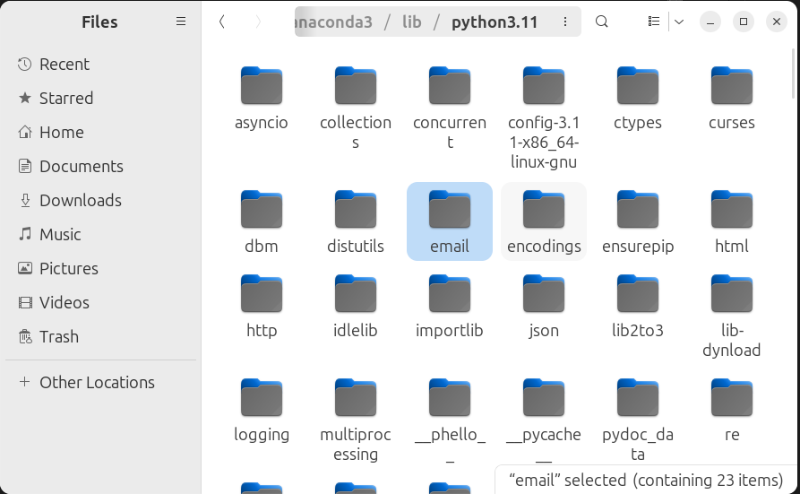

This subfolder contains multiple Python script files with the ```__init__.py``` datamodel initialisation file:

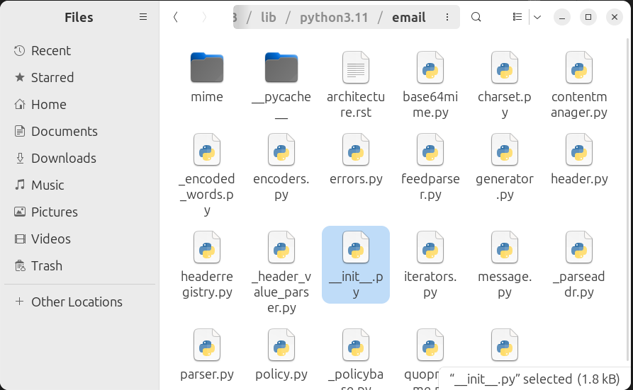

Going back up a level to the standard modules, there is a site-packages folder which contains third-party modules also known as Python libraries:


There will be two subfolders for each library, one detailing the version number and the other being the library itself. The numeric python library can be found in the numpy folder:

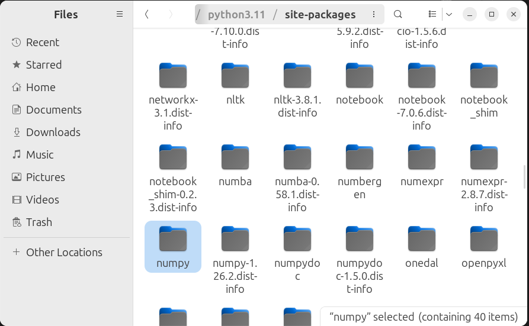

Note that the site-packages for Miniconda will not have a numpy, pandas or matplotlib folder as it is a bootstrap version of Anaconda and only has the dependencies for the conda package manager.

This folder contains multiple Python script files and subfolders which in turn contain multiple Python script files. One of these is the ```__init__.py``` datamodel file which is the file imported when:

```python
import numpy as np
```

is used.

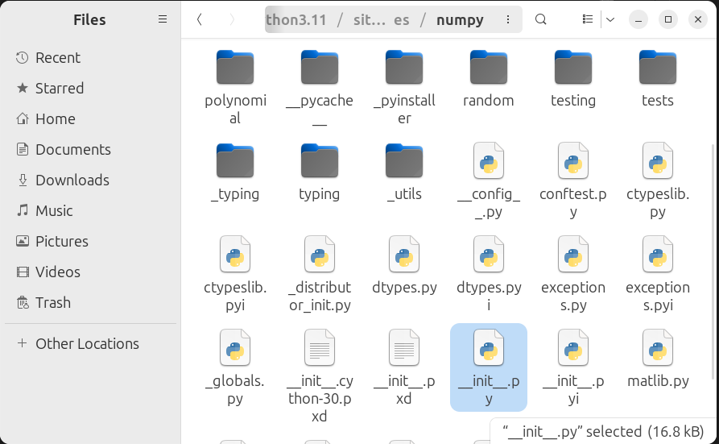

The random module of the numpy library is found in the random subfolder:


Notice that it has its own datamodel initialisation file ```__init__.py``` which is imported when the module is imported using:

```python
np.random.__file__
```

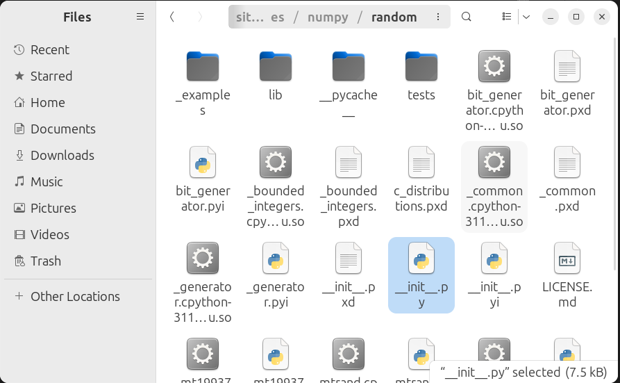

The Python and Data Analysis library is found in the pandas subfolder:

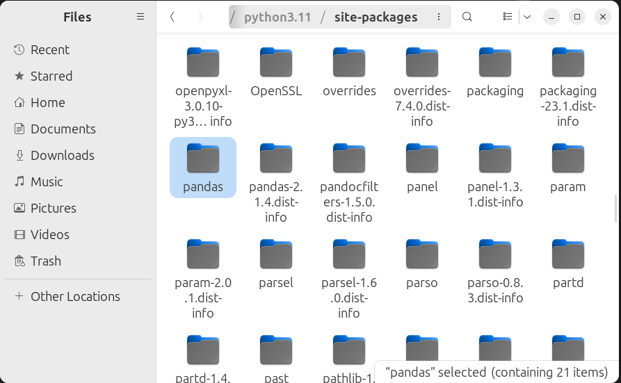

This folder contains multiple Python script files and subfolders which in turn contain multiple Python script files. One of these is the ```__init__.py``` datamodel file which is the file imported when:

```
import pandas as pd
```

is used.


The Matrix Plotting library is found in the matplotlib subfolder:

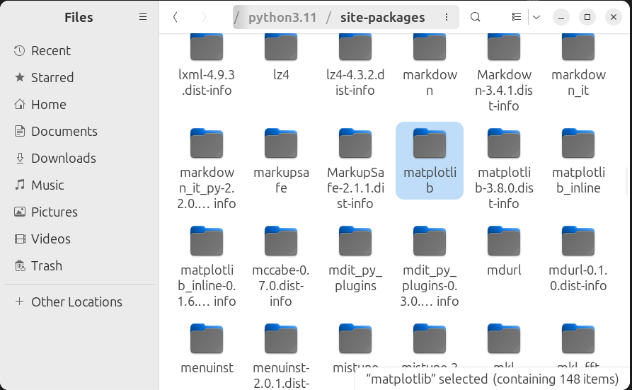

This folder contains multiple Python script files and subfolders which in turn contain multiple Python script files. One of these is the ```__init__.py``` datamodel file which is the file imported when:

```python
import matplotlib as mpl
```

is used.

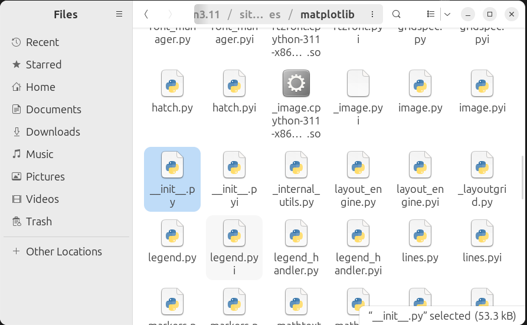

Normally only the ```pyplot.py``` module is imported:

```python
import matplotlib.pyplot as plt
```

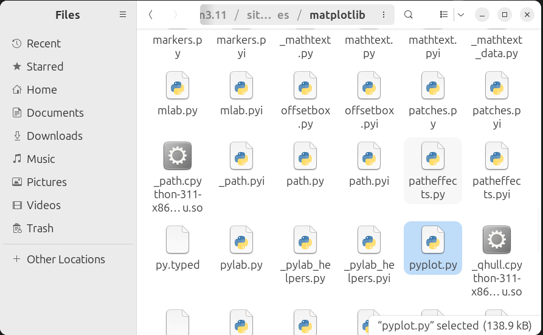

The Python base environment contains an empty envs subfolder which may be later used. The envs folder contains other Python environments

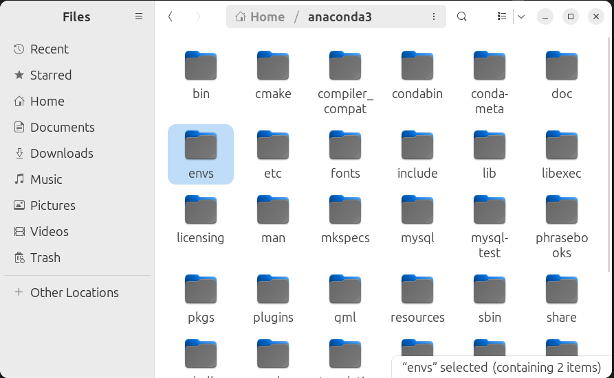

Initialisation essentially instructs the terminal to look in ```~/anaconda3/bin``` (or ```~/miniconda3/bin``` in the case of Miniconda) and then ```/bin``` for a binary when the base Python is activated instead of only the ```/bin```.

The following output will display, prompting for initialisation:

```
Do you wish to update your shell profile to automatically initialize conda?
This will activate conda on startup and change the command prompt when activated.
If you'd prefer that conda's base environment not be activated on startup,
   run the following command when conda is activated:

conda config --set auto_activate_base false

You can undo this by running `conda init --reverse $SHELL`? [yes|no]
[no] >>> 
```

Unfortunately the default option is no, meaning Anaconda is installed but not the Linux Terminal is not initialised. In this case, the use of the command ```python3``` will use the system Python by default however the python associated with the base Python environment can be selected directly using the full file path:

```
username@pc:~$ python3
Python 3.11.6 (main, Oct  8 2023, 05:06:43) [GCC 13.2.0] on linux
Type "help", "copyright", "credits" or "license" for more information.
>>> exit()
username@pc:~$ ~/anaconda3/bin/python3
Python 3.11.5 (main, Sep 11 2023, 13:54:46) [GCC 11.2.0] on linux
Type "help", "copyright", "credits" or "license" for more information.
>>> 
```

Inputting ```yes``` at the initialisation prompt will output a list of files which correspond to shell initialisation. Most will be unmodified however the .bashrc file will be modified:

```
no change     ~/anaconda3/condabin/conda
no change     ~/anaconda3/bin/conda
no change     ~/anaconda3/bin/conda-env
no change     ~/anaconda3/bin/activate
no change     ~/anaconda3/bin/deactivate
no change     ~/anaconda3/etc/profile.d/conda.sh
no change     ~/anaconda3/etc/fish/conf.d/conda.fish
no change     ~/anaconda3/shell/condabin/Conda.psm1
no change     ~/anaconda3/shell/condabin/conda-hook.ps1
no change     ~/anaconda3/lib/python3.11/site-packages/xontrib/conda.xsh
no change     ~/anaconda3/etc/profile.d/conda.csh
modified      ~/.bashrc

==> For changes to take effect, close and re-open your current shell. <==

Thank you for installing Anaconda3!
```

The .bashrc fle is found in the Home folder:


It is hidden by default:


It can be opened in Text Editor:

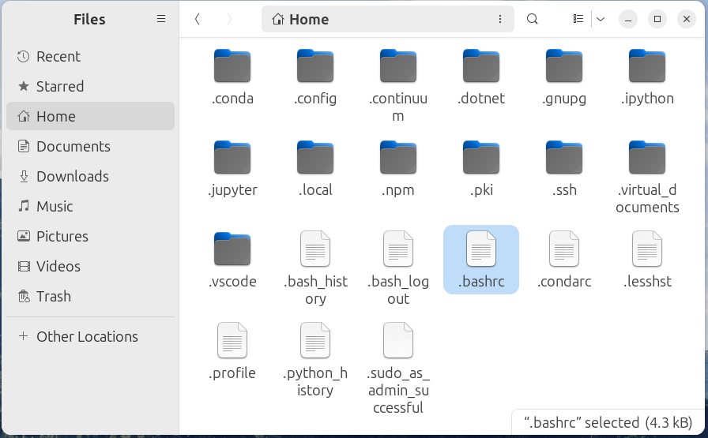

It has this additional conda initialisaiton block:

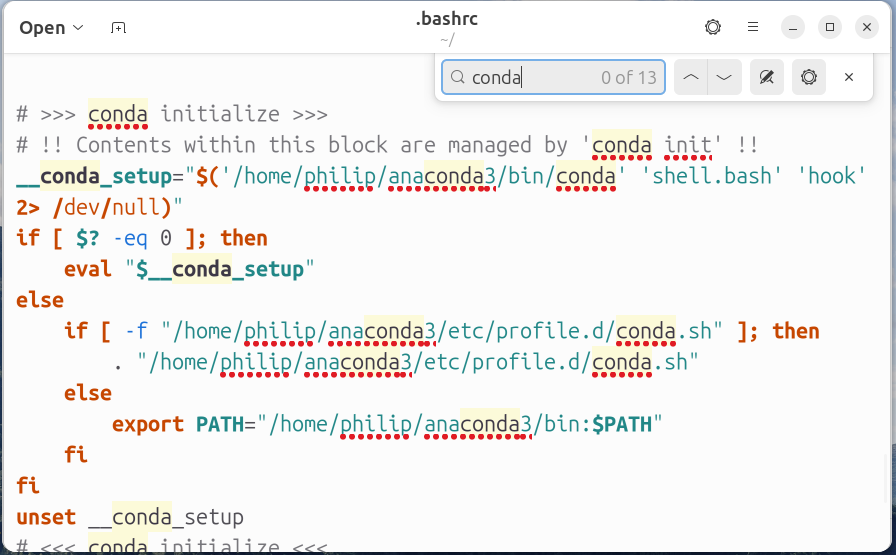

The end of the output states **For changes to take effect, close and re-open your current shell**. When a new Terminal instance is opened, it will look at the updated ```.bashrc``` file, run a script to activate the conda (base) environment and therefore look in additional locations for commands.

When the Terminal is open the bash prompt will display:

```
(base) username@pc~$: 
```

Instead of:

```
username@pc~$:
```

This means the conda (base) Python environment is selected.

Because the default option for initialisation is no, many new users to Anaconda install it without initialising it. If this has happened open up the Terminal and input:

```bash
~/anaconda3/bin/conda init bash
```

Or for Miniconda:

```bash
~/miniconda3/bin/conda init bash
```

This will display the output:

```
no change     ~/anaconda3/condabin/conda
no change     ~/anaconda3/bin/conda
no change     ~/anaconda3/bin/conda-env
no change     ~/anaconda3/bin/activate
no change     ~/anaconda3/bin/deactivate
no change     ~/anaconda3/etc/profile.d/conda.sh
no change     ~/anaconda3/etc/fish/conf.d/conda.fish
no change     ~/anaconda3/shell/condabin/Conda.psm1
no change     ~/anaconda3/shell/condabin/conda-hook.ps1
no change     ~/anaconda3/lib/python3.11/site-packages/xontrib/conda.xsh
no change     ~/anaconda3/etc/profile.d/conda.csh
modified      ~/.bashrc

==> For changes to take effect, close and re-open your current shell. <==
```

When the Terminal is closed and opened the bash prompt should now display:

```
(base) username@pc~$: 
```

Initialisation can be reversed using:

```bash
~/anaconda3/bin/conda init bash --reverse
```

```bash
~/miniconda3/bin/conda init bash --reverse
```

### Updating Anaconda

To update Anaconda or Miniconda, the (base) Python environment should be deactivated using:

```bash
conda deactivate
```

This displays a normal bash prompt without the (base) prefix. The conda package manager can be updated using:

```bash
conda update conda
```

This will look for updates to the conda package manager and for Anaconda in turn update the entire Anaconda Python distribution. The output will display:

```
Collecting package metadata (current_repodata.json): done
Solving environment: done

## Package Plan ##

  environment location: /home/user/anaconda3

  added / updated specs:
    - conda
```

Followed by details about the number of packages to be downloaded:

```
The following packages will be downloaded:

    package                    |            build
    ---------------------------|-----------------
    aiobotocore-2.7.0          |  py311h06a4308_0         149 KB
    aiohttp-3.9.0              |  py311h5eee18b_0         824 KB
    anaconda-cloud-auth-0.1.4  |  py311h06a4308_0          38 KB
    archspec-0.2.1             |     pyhd3eb1b0_0          39 KB
    astropy-5.3.4              |  py311hf4808d0_0         9.9 MB
    async-lru-2.0.4            |  py311h06a4308_0          20 KB
    attrs-23.1.0               |  py311h06a4308_0         161 KB
    black-23.11.0              |  py311h06a4308_0         356 KB
    bokeh-3.3.0                |  py311h92b7b1e_0         5.7 MB
    boost-cpp-1.82.0           |       hdb19cb5_2          11 KB
    botocore-1.31.64           |  py311h06a4308_0         6.9 MB
    brotli-python-1.0.9        |  py311h6a678d5_7         318 KB
    c-blosc2-2.10.5            |       h80c7b02_0         322 KB
    certifi-2023.11.17         |  py311h06a4308_0         159 KB
    cffi-1.16.0                |  py311h5eee18b_0         314 KB
    click-8.1.7                |  py311h06a4308_0         221 KB
    conda-23.11.0              |  py311h06a4308_0         1.3 MB
    conda-build-3.28.1         |  py311h06a4308_0         834 KB
    conda-libmamba-solver-23.11.1|  py311h06a4308_0         104 KB
    contourpy-1.2.0            |  py311hdb19cb5_0         263 KB
    cookiecutter-2.5.0         |  py311h06a4308_0         140 KB
    curl-8.4.0                 |       hdbd6064_1          85 KB
    cytoolz-0.12.2             |  py311h5eee18b_0         417 KB
    dal-2023.1.1               |   hdb19cb5_48680        36.9 MB
    dask-2023.11.0             |  py311h06a4308_0           5 KB
    dask-core-2023.11.0        |  py311h06a4308_0         2.9 MB
    datashader-0.16.0          |  py311h06a4308_0        17.1 MB
    distributed-2023.11.0      |  py311h06a4308_0         1.6 MB
    distro-1.8.0               |  py311h06a4308_0          37 KB
    filelock-3.13.1            |  py311h06a4308_0          24 KB
    frozenlist-1.4.0           |  py311h5eee18b_0          52 KB
    fsspec-2023.10.0           |  py311h06a4308_0         364 KB
    holoviews-1.18.1           |  py311h06a4308_0         5.1 MB
    huggingface_hub-0.17.3     |  py311h06a4308_0         451 KB
    hvplot-0.9.0               |  py311h06a4308_0         3.2 MB
    icu-73.1                   |       h6a678d5_0        25.9 MB
    imageio-2.31.4             |  py311h06a4308_0         625 KB
    imbalanced-learn-0.11.0    |  py311h06a4308_1         376 KB
    intel-openmp-2023.1.0      |   hdb19cb5_46306        17.2 MB
    jmespath-1.0.1             |  py311h06a4308_0          48 KB
    jsonschema-4.19.2          |  py311h06a4308_0         190 KB
    jsonschema-specifications-2023.7.1|  py311h06a4308_0          15 KB
    jupyter-lsp-2.2.0          |  py311h06a4308_0         107 KB
    jupyter_client-8.6.0       |  py311h06a4308_0         233 KB
    jupyter_core-5.5.0         |  py311h06a4308_0          91 KB
    jupyter_events-0.8.0       |  py311h06a4308_0          41 KB
    jupyter_server-2.10.0      |  py311h06a4308_0         577 KB
    jupyter_server_terminals-0.4.4|  py311h06a4308_1          27 KB
    jupyterlab-4.0.8           |  py311h06a4308_0         4.5 MB
    jupyterlab_server-2.25.1   |  py311h06a4308_0         113 KB
    jupyterlab_widgets-3.0.9   |  py311h06a4308_0         194 KB
    lazy_loader-0.3            |  py311h06a4308_0          20 KB
    libboost-1.82.0            |       h109eef0_2        19.5 MB
    libcurl-8.4.0              |       h251f7ec_1         411 KB
    libdeflate-1.17            |       h5eee18b_1          64 KB
    libmamba-1.5.3             |       haf1ee3a_0         1.9 MB
    libmambapy-1.5.3           |  py311h2dafd23_0         314 KB
    libnghttp2-1.57.0          |       h2d74bed_0         674 KB
    libxml2-2.10.4             |       hf1b16e4_1         753 KB
    libxslt-1.1.37             |       h5eee18b_1         266 KB
    llvmlite-0.41.0            |  py311he621ea3_0         3.6 MB
    matplotlib-3.8.0           |  py311h06a4308_0           8 KB
    matplotlib-base-3.8.0      |  py311ha02d727_0         7.7 MB
    menuinst-2.0.0             |  py311h06a4308_0         167 KB
    mistune-2.0.4              |  py311h06a4308_0         107 KB
    mkl-2023.1.0               |   h213fc3f_46344       171.5 MB
    more-itertools-10.1.0      |  py311h06a4308_0         103 KB
    multidict-6.0.4            |  py311h5eee18b_0          59 KB
    nbclient-0.8.0             |  py311h06a4308_0         120 KB
    nbconvert-7.10.0           |  py311h06a4308_0         513 KB
    notebook-7.0.6             |  py311h06a4308_0         3.1 MB
    notebook-shim-0.2.3        |  py311h06a4308_0          26 KB
    numba-0.58.1               |  py311ha02d727_0         5.8 MB
    numexpr-2.8.7              |  py311h65dcdc2_0         167 KB
    numpy-1.26.2               |  py311h08b1b3b_0          10 KB
    numpy-base-1.26.2          |  py311hf175353_0         8.2 MB
    openssl-3.0.12             |       h7f8727e_0         5.2 MB
    overrides-7.4.0            |  py311h06a4308_0          36 KB
    pandas-2.1.1               |  py311ha02d727_0        14.9 MB
    panel-1.3.1                |  py311h06a4308_0        14.7 MB
    param-2.0.1                |  py311h06a4308_0         259 KB
    partd-1.4.1                |  py311h06a4308_0          48 KB
    pillow-10.0.1              |  py311ha6cbd5a_0         896 KB
    py-cpuinfo-9.0.0           |  py311h06a4308_0          64 KB
    pycosat-0.6.6              |  py311h5eee18b_0          90 KB
    pydantic-1.10.12           |  py311h5eee18b_1         2.4 MB
    pyodbc-4.0.39              |  py311h6a678d5_0          78 KB
    pyqt-5.15.10               |  py311h6a678d5_0         5.7 MB
    pyqt5-sip-12.13.0          |  py311h5eee18b_0          95 KB
    pyqtwebengine-5.15.10      |  py311h6a678d5_0         171 KB
    pytoolconfig-1.2.6         |  py311h06a4308_0          35 KB
    pyviz_comms-3.0.0          |  py311h06a4308_0          56 KB
    pyyaml-6.0.1               |  py311h5eee18b_0         210 KB
    pyzmq-25.1.0               |  py311h6a678d5_0         538 KB
    qt-main-5.15.2             |      h53bd1ea_10        53.7 MB
    qtpy-2.4.1                 |  py311h06a4308_0         129 KB
    queuelib-1.6.2             |  py311h06a4308_0          34 KB
    referencing-0.30.2         |  py311h06a4308_0          77 KB
    regex-2023.10.3            |  py311h5eee18b_0         427 KB
    rich-13.3.5                |  py311h06a4308_0         560 KB
    rpds-py-0.10.6             |  py311hb02cf49_0        1007 KB
    s3fs-2023.10.0             |  py311h06a4308_0          78 KB
    safetensors-0.4.0          |  py311h24d97f6_0         1.1 MB
    scikit-learn-1.2.2         |  py311h6a678d5_1         8.8 MB
    scipy-1.11.4               |  py311h08b1b3b_0        22.0 MB
    semver-2.13.0              |     pyhd3eb1b0_0          16 KB
    send2trash-1.8.2           |  py311h06a4308_0          32 KB
    sip-6.7.12                 |  py311h6a678d5_0         603 KB
    soupsieve-2.5              |  py311h06a4308_0          92 KB
    sqlalchemy-2.0.21          |  py311h5eee18b_0         3.8 MB
    sympy-1.12                 |  py311h06a4308_0        14.4 MB
    tabulate-0.9.0             |  py311h06a4308_0          70 KB
    tokenizers-0.13.3          |  py311h22610ee_0         4.4 MB
    tornado-6.3.3              |  py311h5eee18b_0         852 KB
    truststore-0.8.0           |  py311h06a4308_0          43 KB
    urllib3-1.26.18            |  py311h06a4308_0         251 KB
    xz-5.4.5                   |       h5eee18b_0         646 KB
    yaml-cpp-0.8.0             |       h6a678d5_0         607 KB
    yarl-1.9.3                 |  py311h5eee18b_0         127 KB
    zict-3.0.0                 |  py311h06a4308_0         119 KB
    ------------------------------------------------------------
                                           Total:       530.6 MB
```

Followed by details about the number of packages to be installed:

```
The following NEW packages will be INSTALLED:

  archspec           pkgs/main/noarch::archspec-0.2.1-pyhd3eb1b0_0 
  async-lru          pkgs/main/linux-64::async-lru-2.0.4-py311h06a4308_0 
  brotli-python      pkgs/main/linux-64::brotli-python-1.0.9-py311h6a678d5_7 
  distro             pkgs/main/linux-64::distro-1.8.0-py311h06a4308_0 
  jsonschema-specif~ pkgs/main/linux-64::jsonschema-specifications-2023.7.1-py311h06a4308_0 
  jupyter-lsp        pkgs/main/linux-64::jupyter-lsp-2.2.0-py311h06a4308_0 
  jupyter_server_te~ pkgs/main/linux-64::jupyter_server_terminals-0.4.4-py311h06a4308_1 
  menuinst           pkgs/main/linux-64::menuinst-2.0.0-py311h06a4308_0 
  overrides          pkgs/main/linux-64::overrides-7.4.0-py311h06a4308_0 
  referencing        pkgs/main/linux-64::referencing-0.30.2-py311h06a4308_0 
  rich               pkgs/main/linux-64::rich-13.3.5-py311h06a4308_0 
  rpds-py            pkgs/main/linux-64::rpds-py-0.10.6-py311hb02cf49_0 
  semver             pkgs/main/noarch::semver-2.13.0-pyhd3eb1b0_0 
  truststore         pkgs/main/linux-64::truststore-0.8.0-py311h06a4308_0 
```

Followed by details about packages to be removed. Note that this should only be a small number of packages that have become obsolete:

```
The following packages will be REMOVED:

  aiofiles-22.1.0-py311h06a4308_0
  aiosqlite-0.18.0-py311h06a4308_0
  async-timeout-4.0.2-py311h06a4308_0
  brotlipy-0.7.0-py311h5eee18b_1002
  datashape-0.5.4-py311h06a4308_1
  glob2-0.7-pyhd3eb1b0_0
  jinja2-time-0.2.0-pyhd3eb1b0_3
  jupyter_server_fileid-0.9.0-py311h06a4308_0
  jupyter_server_ydoc-0.8.0-py311h06a4308_1
  jupyter_ydoc-0.2.4-py311h06a4308_0
  nbclassic-0.5.5-py311h06a4308_0
  poyo-0.5.0-pyhd3eb1b0_0
  pyrsistent-0.18.0-py311h5eee18b_0
  qtwebkit-5.212-h3fafdc1_5
  y-py-0.5.9-py311h52d8a92_0
  ypy-websocket-0.8.2-py311h06a4308_0
```

Followed by details about packages to be updated:

```
The following packages will be UPDATED:

  aiobotocore                         2.5.0-py311h06a4308_0 --> 2.7.0-py311h06a4308_0 
  aiohttp                             3.8.5-py311h5eee18b_0 --> 3.9.0-py311h5eee18b_0 
  anaconda-cloud-au~                  0.1.3-py311h06a4308_0 --> 0.1.4-py311h06a4308_0 
  astropy                               5.1-py311hbed6279_0 --> 5.3.4-py311hf4808d0_0 
  attrs                              22.1.0-py311h06a4308_0 --> 23.1.0-py311h06a4308_0 
  black                              23.3.0-py311h06a4308_0 --> 23.11.0-py311h06a4308_0 
  bokeh                               3.2.1-py311h92b7b1e_0 --> 3.3.0-py311h92b7b1e_0 
  boost-cpp                              1.73.0-h7f8727e_12 --> 1.82.0-hdb19cb5_2 
  botocore                          1.29.76-py311h06a4308_0 --> 1.31.64-py311h06a4308_0 
  c-blosc2                                 2.8.0-h6a678d5_0 --> 2.10.5-h80c7b02_0 
  certifi                         2023.7.22-py311h06a4308_0 --> 2023.11.17-py311h06a4308_0 
  cffi                               1.15.1-py311h5eee18b_3 --> 1.16.0-py311h5eee18b_0 
  click                               8.0.4-py311h06a4308_0 --> 8.1.7-py311h06a4308_0 
  conda                              23.7.4-py311h06a4308_0 --> 23.11.0-py311h06a4308_0 
  conda-build                        3.26.1-py311h06a4308_0 --> 3.28.1-py311h06a4308_0 
  conda-libmamba-so~                 23.7.0-py311h06a4308_0 --> 23.11.1-py311h06a4308_0 
  contourpy                           1.0.5-py311hdb19cb5_0 --> 1.2.0-py311hdb19cb5_0 
  cookiecutter       pkgs/main/noarch::cookiecutter-1.7.3-~ --> pkgs/main/linux-64::cookiecutter-2.5.0-py311h06a4308_0 
  curl                                     8.2.1-hdbd6064_0 --> 8.4.0-hdbd6064_1 
  cytoolz                            0.12.0-py311h5eee18b_0 --> 0.12.2-py311h5eee18b_0 
  dal                               2023.1.1-hdb19cb5_48679 --> 2023.1.1-hdb19cb5_48680 
  dask                             2023.6.0-py311h06a4308_0 --> 2023.11.0-py311h06a4308_0 
  dask-core                        2023.6.0-py311h06a4308_0 --> 2023.11.0-py311h06a4308_0 
  datashader                         0.15.2-py311h06a4308_0 --> 0.16.0-py311h06a4308_0 
  distributed                      2023.6.0-py311h06a4308_0 --> 2023.11.0-py311h06a4308_0 
  filelock                            3.9.0-py311h06a4308_0 --> 3.13.1-py311h06a4308_0 
  frozenlist                          1.3.3-py311h5eee18b_0 --> 1.4.0-py311h5eee18b_0 
  fsspec                           2023.4.0-py311h06a4308_0 --> 2023.10.0-py311h06a4308_0 
  holoviews                          1.17.1-py311h06a4308_0 --> 1.18.1-py311h06a4308_0 
  huggingface_hub                    0.15.1-py311h06a4308_0 --> 0.17.3-py311h06a4308_0 
  hvplot                              0.8.4-py311h06a4308_0 --> 0.9.0-py311h06a4308_0 
  icu                                       58.2-he6710b0_3 --> 73.1-h6a678d5_0 
  imageio                            2.31.1-py311h06a4308_0 --> 2.31.4-py311h06a4308_0 
  imbalanced-learn                   0.10.1-py311h06a4308_1 --> 0.11.0-py311h06a4308_1 
  intel-openmp                      2023.1.0-hdb19cb5_46305 --> 2023.1.0-hdb19cb5_46306 
  jmespath           pkgs/main/noarch::jmespath-0.10.0-pyh~ --> pkgs/main/linux-64::jmespath-1.0.1-py311h06a4308_0 
  jsonschema                         4.17.3-py311h06a4308_0 --> 4.19.2-py311h06a4308_0 
  jupyter_client                      7.4.9-py311h06a4308_0 --> 8.6.0-py311h06a4308_0 
  jupyter_core                        5.3.0-py311h06a4308_0 --> 5.5.0-py311h06a4308_0 
  jupyter_events                      0.6.3-py311h06a4308_0 --> 0.8.0-py311h06a4308_0 
  jupyter_server                     1.23.4-py311h06a4308_0 --> 2.10.0-py311h06a4308_0 
  jupyterlab                          3.6.3-py311h06a4308_0 --> 4.0.8-py311h06a4308_0 
  jupyterlab_server                  2.22.0-py311h06a4308_0 --> 2.25.1-py311h06a4308_0 
  jupyterlab_widgets                  3.0.5-py311h06a4308_0 --> 3.0.9-py311h06a4308_0 
  lazy_loader                           0.2-py311h06a4308_0 --> 0.3-py311h06a4308_0 
  libboost                               1.73.0-h28710b8_12 --> 1.82.0-h109eef0_2 
  libcurl                                  8.2.1-h251f7ec_0 --> 8.4.0-h251f7ec_1 
  libdeflate                                1.17-h5eee18b_0 --> 1.17-h5eee18b_1 
  libmamba                                 1.5.1-haf1ee3a_0 --> 1.5.3-haf1ee3a_0 
  libmambapy                          1.5.1-py311h2dafd23_0 --> 1.5.3-py311h2dafd23_0 
  libnghttp2                              1.52.0-h2d74bed_1 --> 1.57.0-h2d74bed_0 
  libxml2                                 2.10.4-hcbfbd50_0 --> 2.10.4-hf1b16e4_1 
  libxslt                                 1.1.37-h2085143_0 --> 1.1.37-h5eee18b_1 
  llvmlite                           0.40.0-py311he621ea3_0 --> 0.41.0-py311he621ea3_0 
  matplotlib                          3.7.2-py311h06a4308_0 --> 3.8.0-py311h06a4308_0 
  matplotlib-base                     3.7.2-py311ha02d727_0 --> 3.8.0-py311ha02d727_0 
  mistune                          0.8.4-py311h5eee18b_1000 --> 2.0.4-py311h06a4308_0 
  mkl                               2023.1.0-h213fc3f_46343 --> 2023.1.0-h213fc3f_46344 
  more-itertools     pkgs/main/noarch::more-itertools-8.12~ --> pkgs/main/linux-64::more-itertools-10.1.0-py311h06a4308_0 
  multidict                           6.0.2-py311h5eee18b_0 --> 6.0.4-py311h5eee18b_0 
  nbclient                           0.5.13-py311h06a4308_0 --> 0.8.0-py311h06a4308_0 
  nbconvert                           6.5.4-py311h06a4308_0 --> 7.10.0-py311h06a4308_0 
  notebook                            6.5.4-py311h06a4308_1 --> 7.0.6-py311h06a4308_0 
  notebook-shim                       0.2.2-py311h06a4308_0 --> 0.2.3-py311h06a4308_0 
  numba                              0.57.1-py311ha02d727_0 --> 0.58.1-py311ha02d727_0 
  numexpr                             2.8.4-py311h65dcdc2_1 --> 2.8.7-py311h65dcdc2_0 
  numpy                              1.24.3-py311h08b1b3b_1 --> 1.26.2-py311h08b1b3b_0 
  numpy-base                         1.24.3-py311hf175353_1 --> 1.26.2-py311hf175353_0 
  openssl                                 3.0.10-h7f8727e_2 --> 3.0.12-h7f8727e_0 
  pandas                              2.0.3-py311ha02d727_0 --> 2.1.1-py311ha02d727_0 
  panel                               1.2.3-py311h06a4308_0 --> 1.3.1-py311h06a4308_0 
  param                              1.13.0-py311h06a4308_0 --> 2.0.1-py311h06a4308_0 
  partd                               1.4.0-py311h06a4308_0 --> 1.4.1-py311h06a4308_0 
  pillow                              9.4.0-py311h6a678d5_1 --> 10.0.1-py311ha6cbd5a_0 
  py-cpuinfo         pkgs/main/noarch::py-cpuinfo-8.0.0-py~ --> pkgs/main/linux-64::py-cpuinfo-9.0.0-py311h06a4308_0 
  pycosat                             0.6.4-py311h5eee18b_0 --> 0.6.6-py311h5eee18b_0 
  pydantic                           1.10.8-py311h5eee18b_0 --> 1.10.12-py311h5eee18b_1 
  pyodbc                             4.0.34-py311h6a678d5_0 --> 4.0.39-py311h6a678d5_0 
  pyqt                               5.15.7-py311h6a678d5_0 --> 5.15.10-py311h6a678d5_0 
  pyqt5-sip                         12.11.0-py311h6a678d5_0 --> 12.13.0-py311h5eee18b_0 
  pyqtwebengine                      5.15.7-py311h6a678d5_0 --> 5.15.10-py311h6a678d5_0 
  pytoolconfig                        1.2.5-py311h06a4308_1 --> 1.2.6-py311h06a4308_0 
  pyviz_comms                         2.3.0-py311h06a4308_0 --> 3.0.0-py311h06a4308_0 
  pyyaml                                6.0-py311h5eee18b_1 --> 6.0.1-py311h5eee18b_0 
  pyzmq                              23.2.0-py311h6a678d5_0 --> 25.1.0-py311h6a678d5_0 
  qt-main                                 5.15.2-h7358343_9 --> 5.15.2-h53bd1ea_10 
  qtpy                                2.2.0-py311h06a4308_0 --> 2.4.1-py311h06a4308_0 
  queuelib                            1.5.0-py311h06a4308_0 --> 1.6.2-py311h06a4308_0 
  regex                            2022.7.9-py311h5eee18b_0 --> 2023.10.3-py311h5eee18b_0 
  s3fs                             2023.4.0-py311h06a4308_0 --> 2023.10.0-py311h06a4308_0 
  safetensors                         0.3.2-py311hb02cf49_0 --> 0.4.0-py311h24d97f6_0 
  scipy                              1.11.1-py311h08b1b3b_0 --> 1.11.4-py311h08b1b3b_0 
  send2trash         pkgs/main/noarch::send2trash-1.8.0-py~ --> pkgs/main/linux-64::send2trash-1.8.2-py311h06a4308_0 
  sip                                 6.6.2-py311h6a678d5_0 --> 6.7.12-py311h6a678d5_0 
  soupsieve                             2.4-py311h06a4308_0 --> 2.5-py311h06a4308_0 
  sqlalchemy                         1.4.39-py311h5eee18b_0 --> 2.0.21-py311h5eee18b_0 
  sympy                              1.11.1-py311h06a4308_0 --> 1.12-py311h06a4308_0 
  tabulate                           0.8.10-py311h06a4308_0 --> 0.9.0-py311h06a4308_0 
  tokenizers                         0.13.2-py311h22610ee_1 --> 0.13.3-py311h22610ee_0 
  tornado                             6.3.2-py311h5eee18b_0 --> 6.3.3-py311h5eee18b_0 
  urllib3                           1.26.16-py311h06a4308_0 --> 1.26.18-py311h06a4308_0 
  xz                                       5.4.2-h5eee18b_0 --> 5.4.5-h5eee18b_0 
  yaml-cpp                                 0.7.0-h295c915_1 --> 0.8.0-h6a678d5_0 
  yarl                                1.8.1-py311h5eee18b_0 --> 1.9.3-py311h5eee18b_0 
  zict                                2.2.0-py311h06a4308_0 --> 3.0.0-py311h06a4308_0 
```

Followed by details about packages to be downgraded. A small number of packages will be downgraded, normally to a more stable version:

```
The following packages will be DOWNGRADED:

  scikit-learn                        1.3.0-py311ha02d727_0 --> 1.2.2-py311h6a678d5_1 
```

The output will then prompt to proceed:

```
Proceed ([y]/n)? 
```

Input ```y```. The output will now display:

```
Downloading and Extracting Packages
                                                                                                                              
Preparing transaction: done                                                                                                   
Verifying transaction: done                                                                                                   
Executing transaction: -                                                                                                      
                                                                                                                              
    Installed package of scikit-learn can be accelerated using scikit-learn-intelex.                                          
    More details are available here: https://intel.github.io/scikit-learn-intelex                                             
                                                                                                                              
    For example:                                                                                                              
                                                                                                                              
        $ conda install scikit-learn-intelex                                                                                  
        $ python -m sklearnex my_application.py                                                                               
                                                                                                                              
                                                                                                                              
                                                                                                                              
done    
```

The conda package manager will now be updated alongside most of the other packages in the (base) Python environment. A new prompt will display once the update has finished.

The conda package manager can also be used to update the anaconda-navigator:

```bash
conda update anaconda-navigator
```

The following output will display:

```
Channels:
 - defaults
Platform: linux-64
Collecting package metadata (repodata.json): done
Solving environment: done

## Package Plan ##

  environment location: /home/user/anaconda3

  added / updated specs:
    - anaconda-navigator


The following packages will be downloaded:

    package                    |            build
    ---------------------------|-----------------
    anaconda-navigator-2.5.1   |  py311h06a4308_0         5.6 MB
    ------------------------------------------------------------
                                           Total:         5.6 MB

The following packages will be UPDATED:

  anaconda-navigator                  2.5.0-py311h06a4308_0 --> 2.5.1-py311h06a4308_0 


Proceed ([y]/n)?
```

To proceed input ```y```. The output will now display:

```
Downloading and Extracting Packages:
                                                                                                                              
Preparing transaction: done
Verifying transaction: done
Executing transaction: done
```

The Anaconda Python distribution is now up to date. It is recommended to periodically check for updates.

To reactivate the (base) conda Python environment use:

```
conda activate base
```

The (base) prefix should now display in the bash prompt.

### Installing TeX

A number of the datascience packages such as nbcovert and matplotlib can use TeX. Unfortunately the installation of TeX differs significantly for Windows and Linux and therefore installation of TeX isn't included with Anaconda. TeX should be installed system wide, using the Ubuntu (Debian-based) package manager apt:

```bash
sudo apt-get install texlive-xetex texlive-fonts-recommended texlive-plain-generic cm-super dvipng
```

### The Bin Folder

Binaries associated with the Anaconda base Python environment are found in ```~/anaconda3/bin``` folder or the ```~/miniconda3/bin``` folder. 

As Miniconda is a bootstrap version of Anaconda most of the binaries are not preinstalled in the Miniconda base Python environment. Typically these only become available when they are installed, however this is usually in another custom Python environment. The conda package manager can be used to create Python environments for the latest version of Jupyter and Spyder from the community channel conda-forge or from the spyder developers release candidate channel. A custom Jupyter environment can also be equipped with R allowing use of the R kernel. Use of the conda package manager is covered in more detail in the next tutorial [conda](./conda.md).

If a search for python is made, notice that there is:

* python
* python3
* python3.1
* python3.11 

These are all the same application. 

Python can be launched using:

```bash
~/anaconda3/bin/python
```

When the base Python environment is activated, the Terminal will automatically look in ```~/anaconda3/bin``` for a binary so the command is equivalent:

```bash
python
```

The output will display details about the Python application and then display a Python prompt ```>>>``` from the Python application:

```
Python 3.11.5 (main, Sep 11 2023, 13:54:46) [GCC 11.2.0] on linux
Type "help", "copyright", "credits" or "license" for more information.
>>>
```

To ```exit``` the Python application, the Python function ```exit``` needs to be used:

```python
exit()
```

A new bash prompt will display.

There is also Interactive Python (IPython) which can be launched using:

```
ipython
```

The output shown gives details about the Python and Interactive Python version and each Python cell has a numeric index. 

```
Python 3.11.5 (main, Sep 11 2023, 13:54:46) [GCC 11.2.0]
Type 'copyright', 'credits' or 'license' for more information
IPython 8.15.0 -- An enhanced Interactive Python. Type '?' for help.

In [1]:
```

IPython is similar to Python but has enhancements such as the application of Python syntax highlighting and the addition of the ```?``` operator which can be used to examine a Python objects docstring or ```??``` which can be used to output the file of a module. 

IPython also has IPython magics which begin with ```%``` and are equivalent to commonly ```bash``` commands. 

The popular Jupyter project for example is an abbreviation for Julia Python et (Latin for and) R.

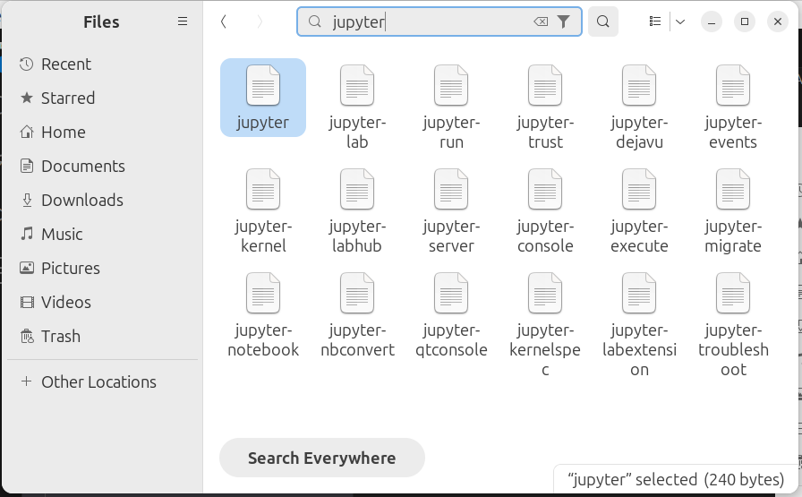

This has the programs:

* jupyter-console
* jupyter-qtconsole
* jupyter-notebook
* jupyter-lab

The jupyter-console by default uses the Python Kernel and is identical to IPython however the kernel can be changed using the option ```--kernel```:

```
(base) username@pc:~$ jupyter-console --kernel=python3
Python 3.11.5 (main, Sep 11 2023, 13:54:46) [GCC 11.2.0]
Type 'copyright', 'credits' or 'license' for more information
IPython 8.15.0 -- An enhanced Interactive Python. Type '?' for help.

In [1]: 

```

The available kernels can be viewed by using:

```
jupyter kernelspec list
```

Because Anaconda is a Python Distribution by default it only has a Python kernel:

```
(base) username@pc:~$ jupyter kernelspec list
Available kernels:
  python3    /home/username/anaconda3/share/jupyter/kernels/python3
(base) username@pc:~$ 
```

The QTConsole is essentially rewritten using the QT GUI Framework and has a number of additional enhancements for example automatically displaying a docstring as a popup balloon:

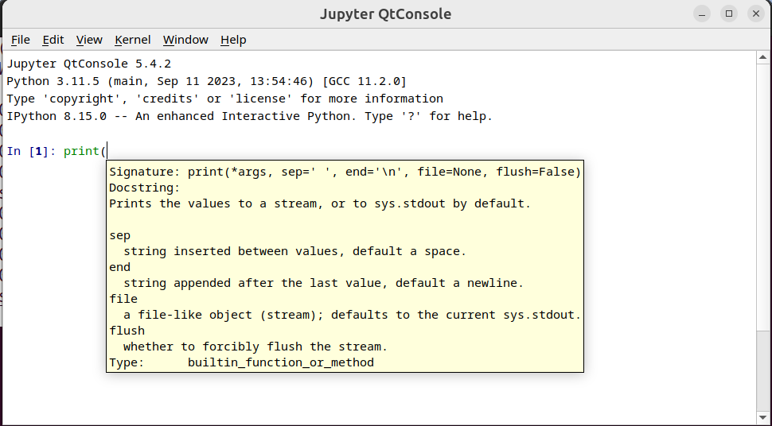

And nesting graphics:

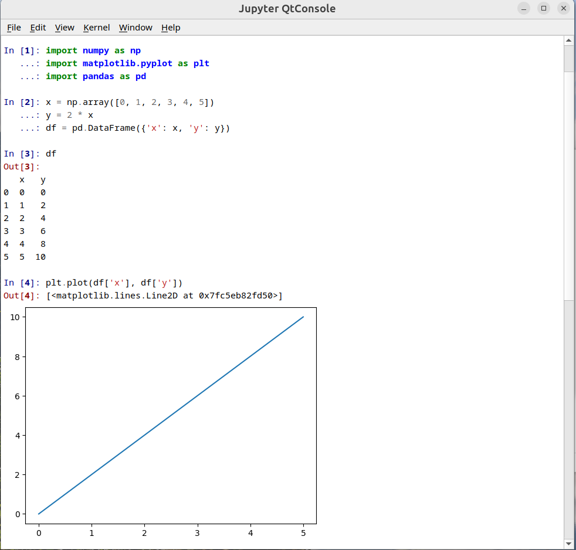

It also has a File menu which can be used to save the file as a HTML file or a pdf.

The Jupyter Notebook and Jupyter Lab are NodeJS implementations of the Console with support for interactive Python Notebook Files. JupyterLab also has a script editor for Python scripts files and a markdown editor and markdown preview for files.

When either of the commands are run the Terminal is busy running a Jupyter server, logs will display in this server:

```
(base) username@pc:~$ jupyter-lab
[I 2023-12-24 17:14:06.919 ServerApp] Use Control-C to stop this server and shut down all kernels (twice to skip confirmation).
[C 2023-12-24 17:14:06.937 ServerApp] 
    
    To access the server, open this file in a browser:
        file:///home/username/.local/share/jupyter/runtime/jpserver-7745-open.html
    Or copy and paste one of these URLs:
        http://localhost:8888/lab?token=fd3b628ce3d5904b5b539da1809bd730f08449cf79f77531
        http://127.0.0.1:8888/lab?token=fd3b628ce3d5904b5b539da1809bd730f08449cf79f77531

```

The visual elements will display in a browser:

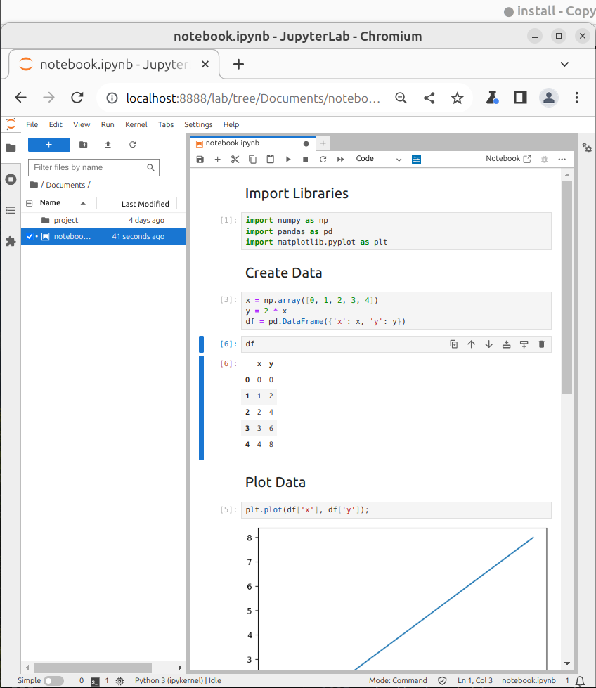

To view identifiers beginning with a prefix, input ↹ after the prefix:

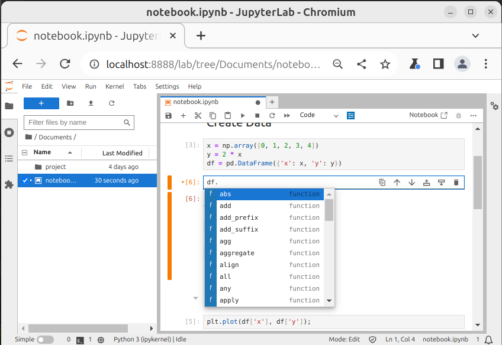

To view the docstring popup, input ⇧ + ↹:

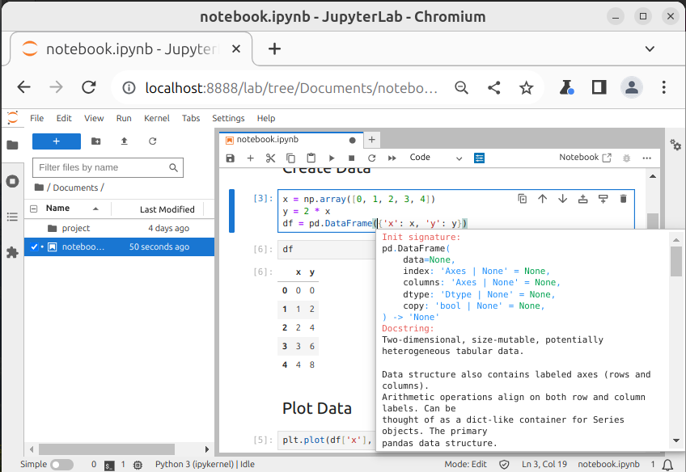

The visual elements can be closed in the browser, however the server will continue to run in the Terminal until Ctrl + c is pressed to close the current operation.

Another important binary is the Scientific Python Development Environment (spyder) which can be launched using:

```
spyder
```

The Terminal will display the following

```
(base) username@pc:~$ spyder
Warning: Ignoring XDG_SESSION_TYPE=wayland on Gnome. Use QT_QPA_PLATFORM=wayland to run on Wayland anyway.
fromIccProfile: failed minimal tag size sanity
```

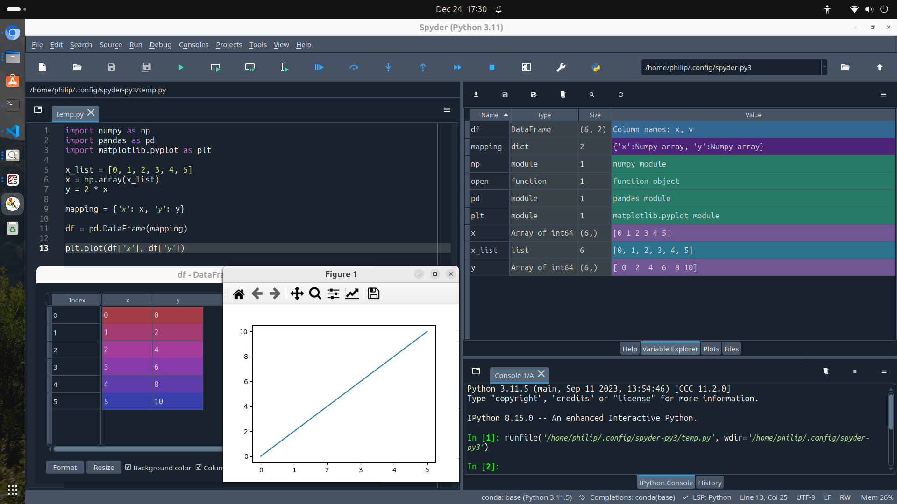

The Anaconda Navigator is a program that contains shortcuts to most of Python binaries. It can be launched using:

```
anaconda-navigator
```

There is a ```LibGL error: mesa iris driver error``` when Anaconda Navigator or any programs which use QT are launched. This error is due to the old version of ```libstdcxx-ng``` in the Anaconda base Python environment and can be ignored. This should eventually be fixed by Anaconda when they update this package.

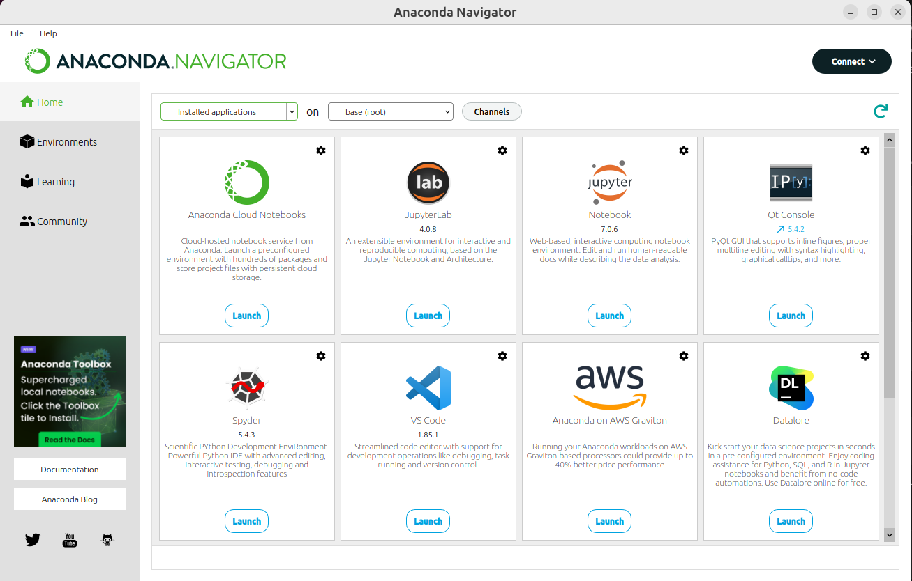

The bin folder contains a number of Python formatters such as autopep8, isort, black and linters such as pylint and pyflakes. These can be run in the Terminal to format a Python file for example the Python script file with sloppy spacing in the code:

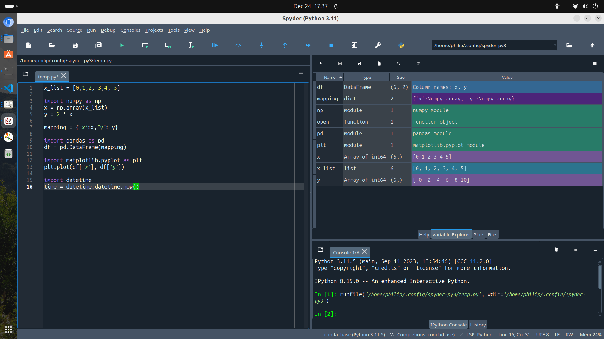

However are normally implemented in IDEs such as Spyder which has Autoformatters in the Source menu:

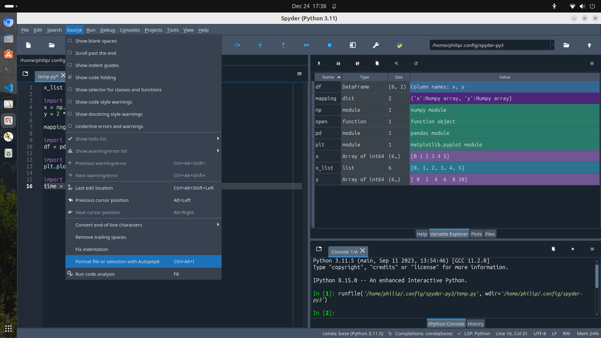

AutoPEP8 addresses the spacing making it PEP8 compliant. The opinionated fomratter black can also be used to make quotation consistent (but inconsistent with the default single quotations used by the Python kernel):

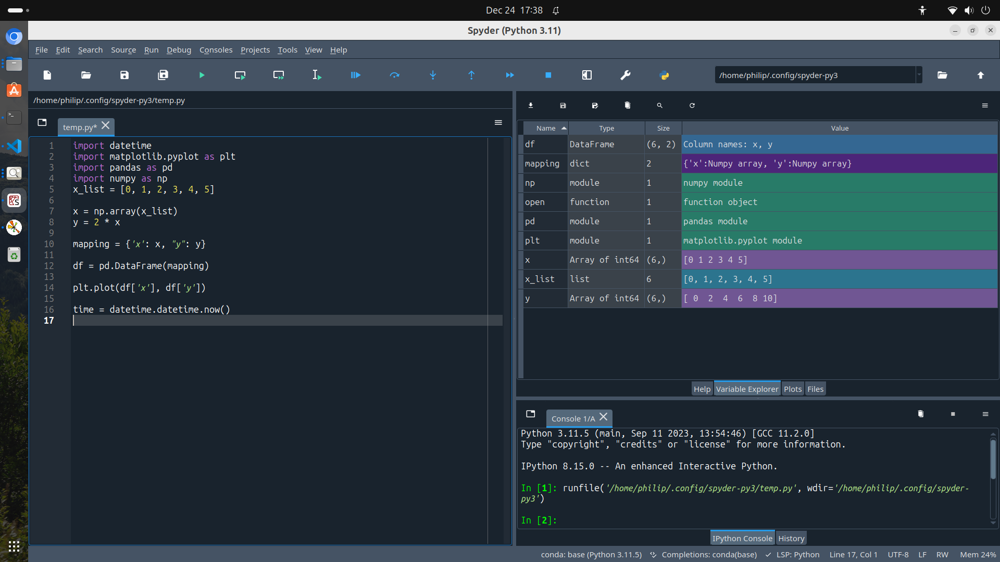

[Return to Python Tutorials](../../readme.md)