# Jupyter QtConsole

Jupyter QtConsole is very similar to ipython and is Shell based. It can be launched from its tile in the Anaconda Navigator or from the Linux Terminal using the bash command:

```
jupyter qtconsole
```

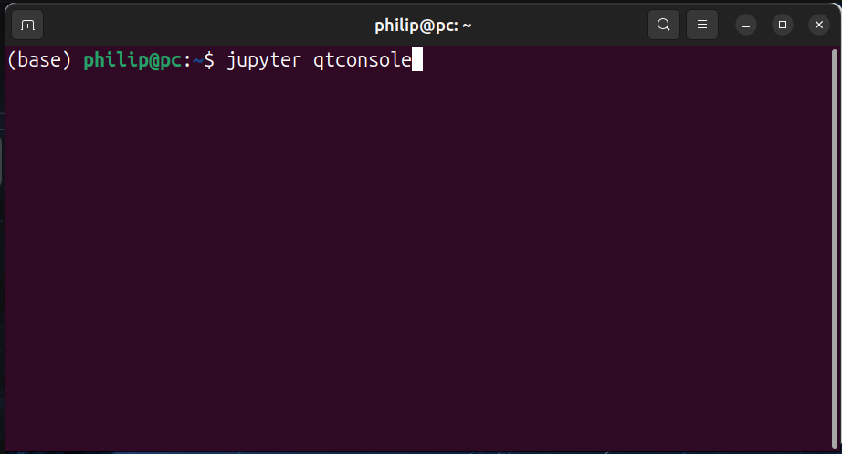

QtConsole is written in Qt which is a C++ library for graphical user interfaces (GUI) and Pyside/PyQt are Python libraries that are bindings for Qt. While the QtConsole is open, the Linux Terminal will be busy. In the base Python environment, there is a LibGL mesa iris driver error due to the use of older drivers than Wayland on Ubuntu 23.04:

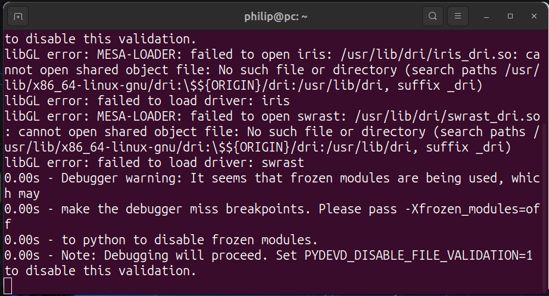

QtConsole looks like the Terminal:

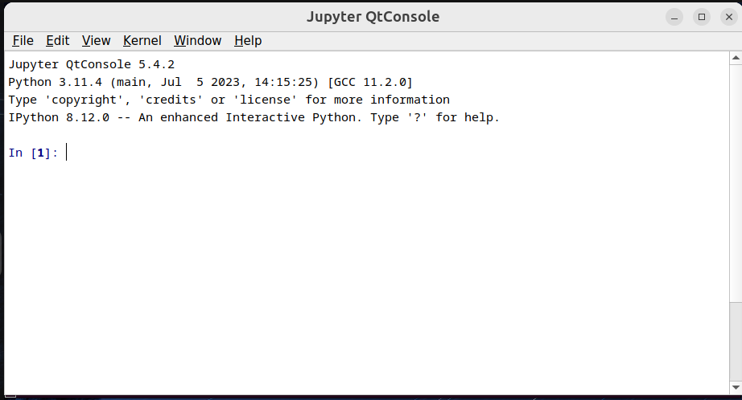

If ```__builtins.__``` is input followed by a ```↹``` all the identifiers from builtins are displayed:

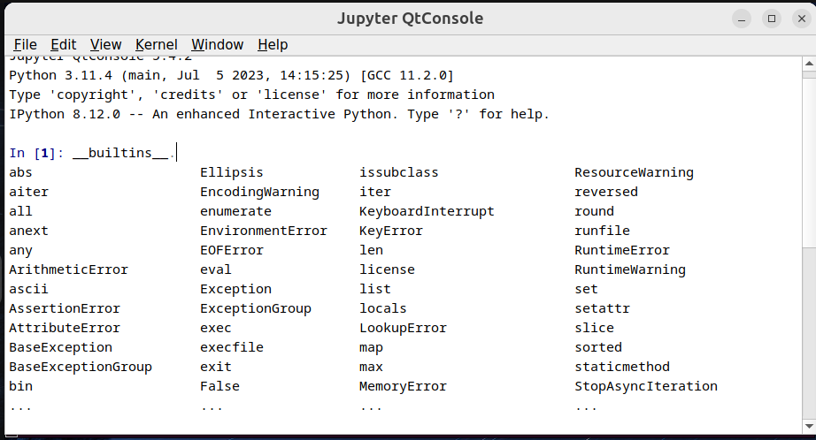

QtConsole will display the docstring of the initialisation signature of a class or the docstring of a functions when the class or function name are input with open parenthesis:

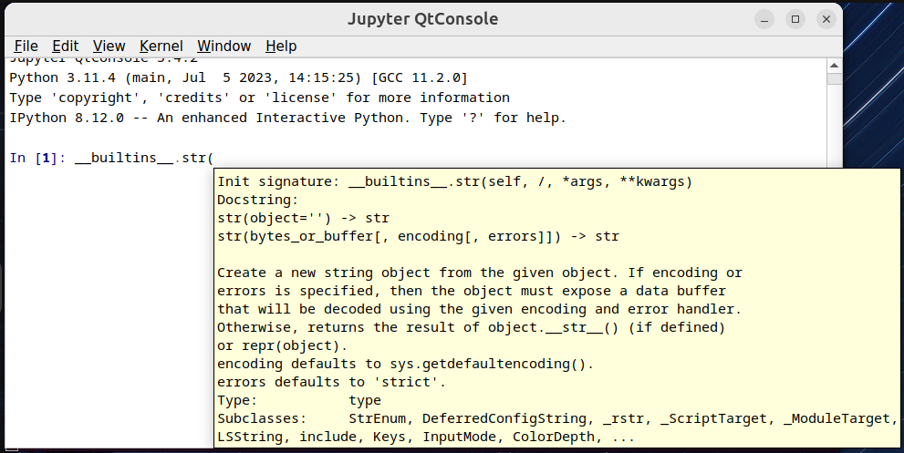

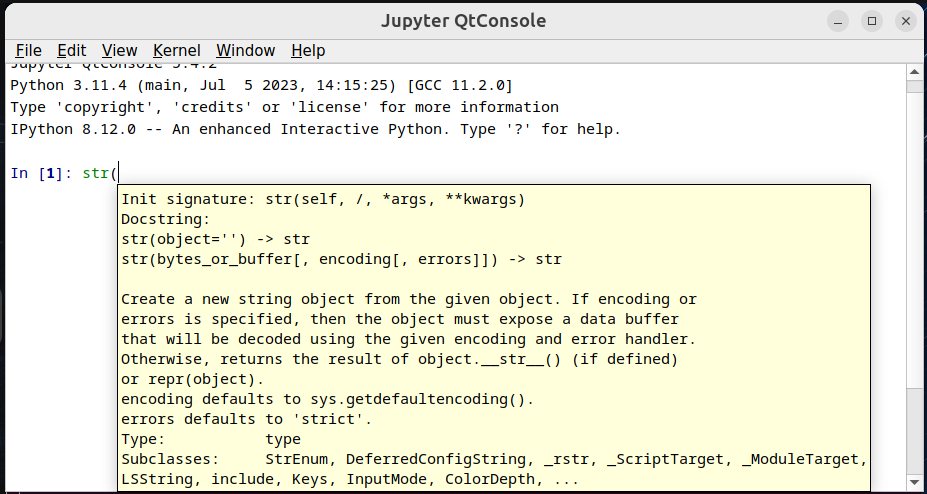

QtConsole has ipython magics. These can be viewed by inputting a ```%``` followed by a ```↹``` will display all the ipython magics:

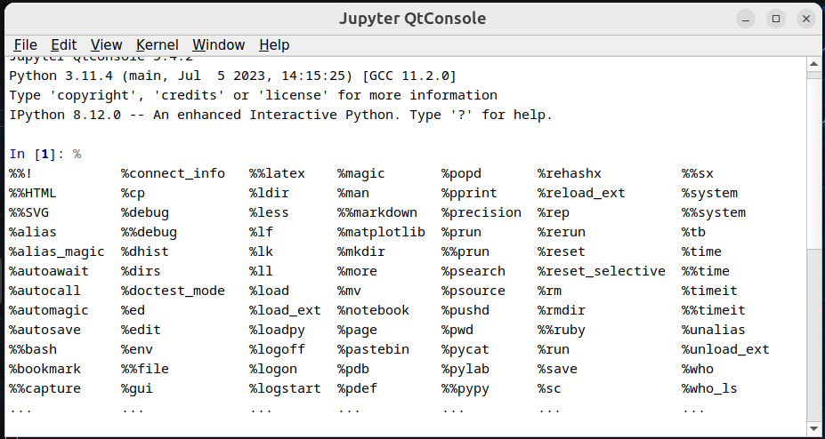

Multiple lines can be input in an ipython cell by ending a line with ```Ctrl```+```↵``` instead of ```↵``` which executes the code in the ipython cell. This allows the three data science library imports in a single cell:

```
import numpy as np
import pandas as pd
import matplotlib.pyplot as plt
```

The docstrings display for functions and classes found in these data science libraries:

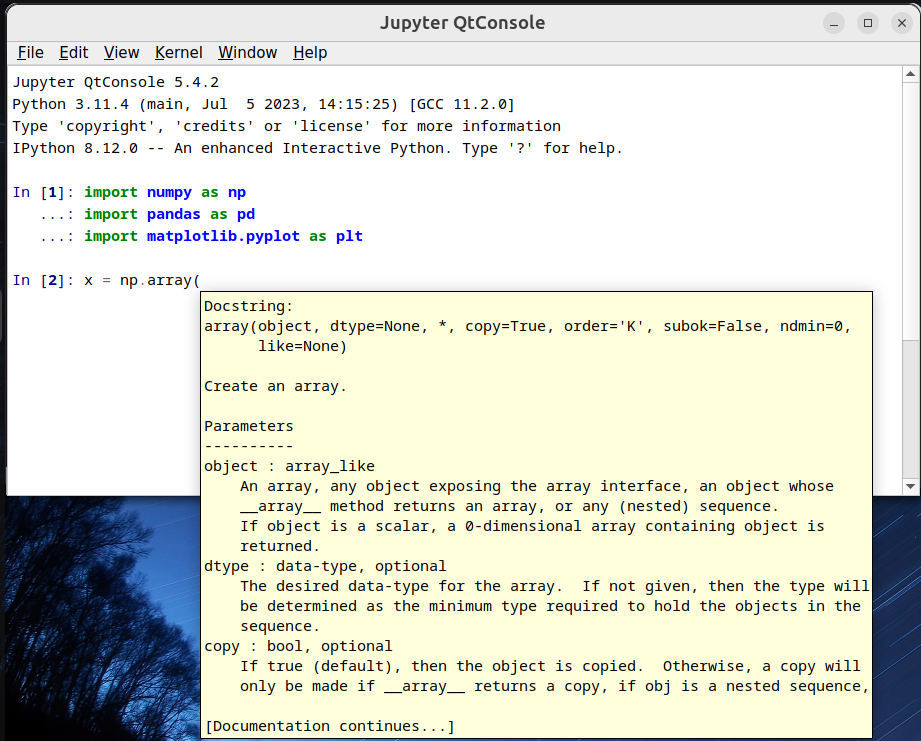

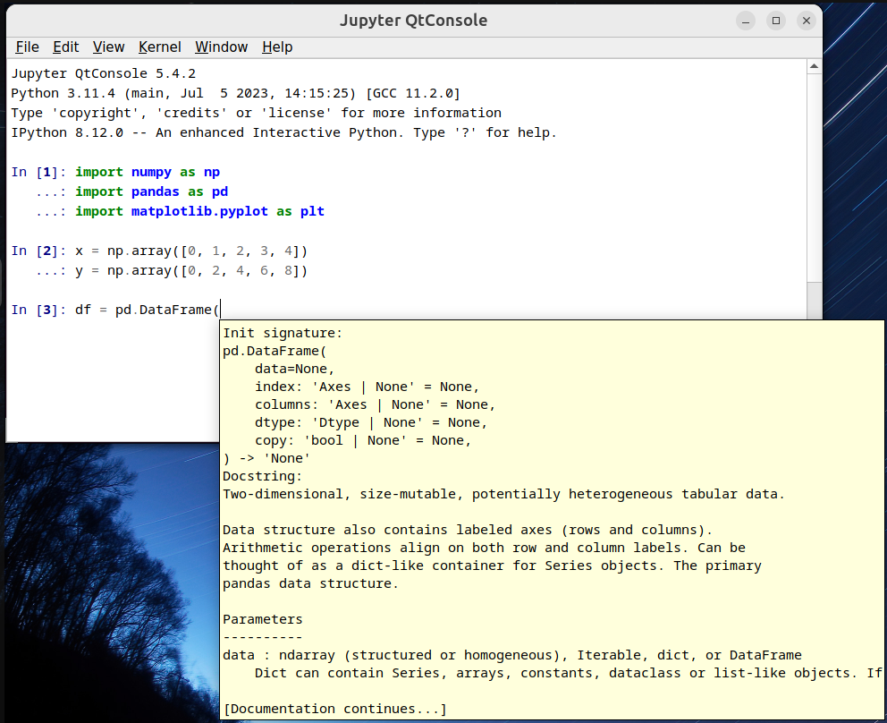

The followjgn instances can be instantiated:

```
x = np.array([0, 1, 2, 3, 4])
y = np.array([0, 2, 4, 6, 8])

df = pd.DataFrame(['x': x, 'y': y])
```

QtConsole lacks a variable inspector or explorer like Thonny or Spyder. However the ipython cell can be used to view an existing variable:

```
x
```

```
df
```

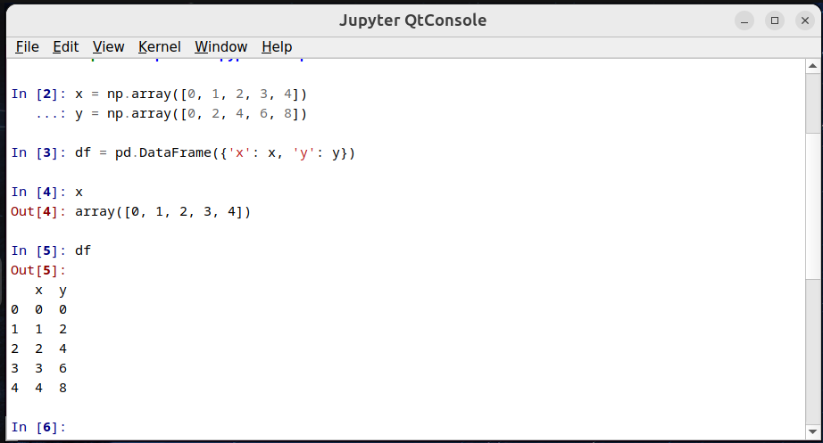

A plot can be made using the pyplot function plot, notice the docstring displays when this is input with open parenthesis:

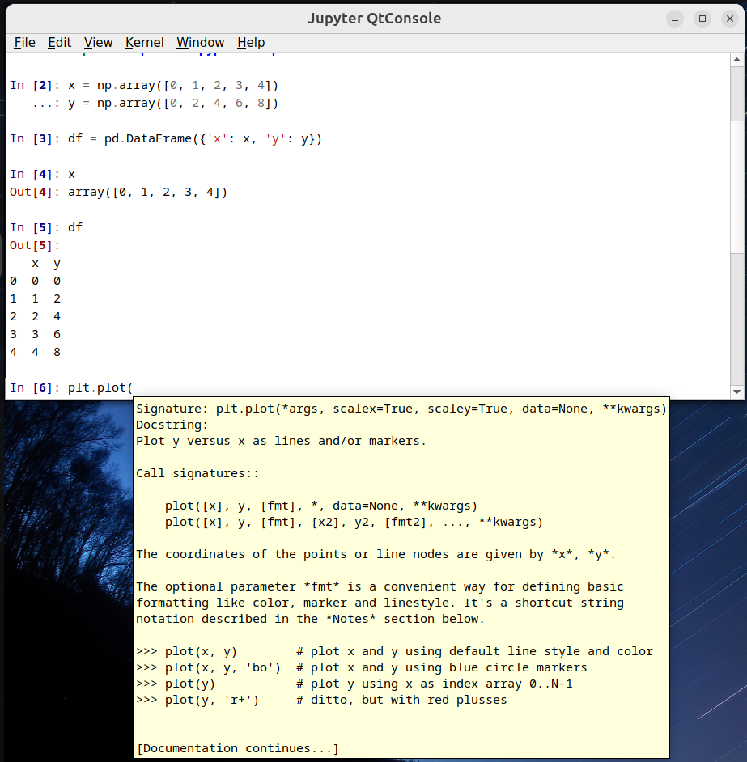

A simple plot can be made using:

```
plot(df['x'], df['y'])
```

Notice that the plot displays as a static image in an ipython cell. This is known as the inline plotting backend:

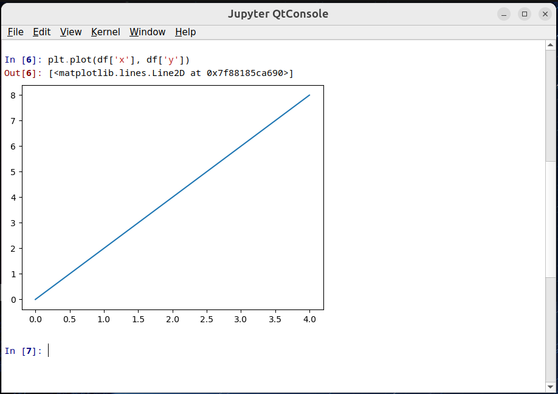

A QTConsole session can be saved to HTML/XHTML allowing the code and output to be read (read only) in a browser:

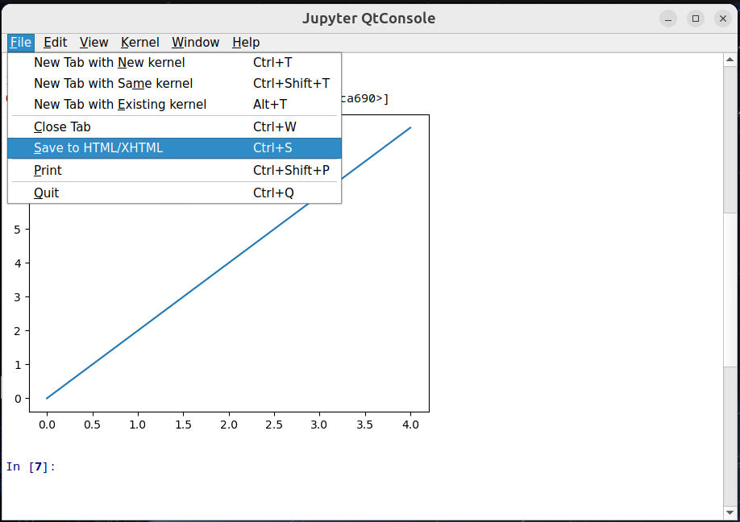

This session can be saved in Documents and opened:

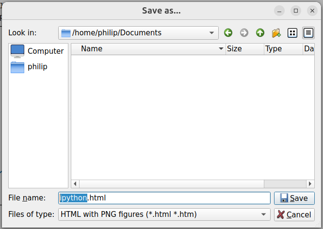

Each image can be saved as inline attachment or as an external attachment:

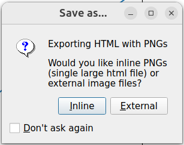

The ipython.html file is created:

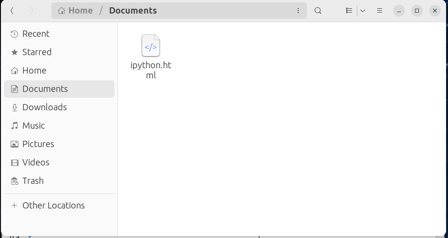

In Gnome settings, the default browser can be selected. Normally a Chromium based browser gives best results:

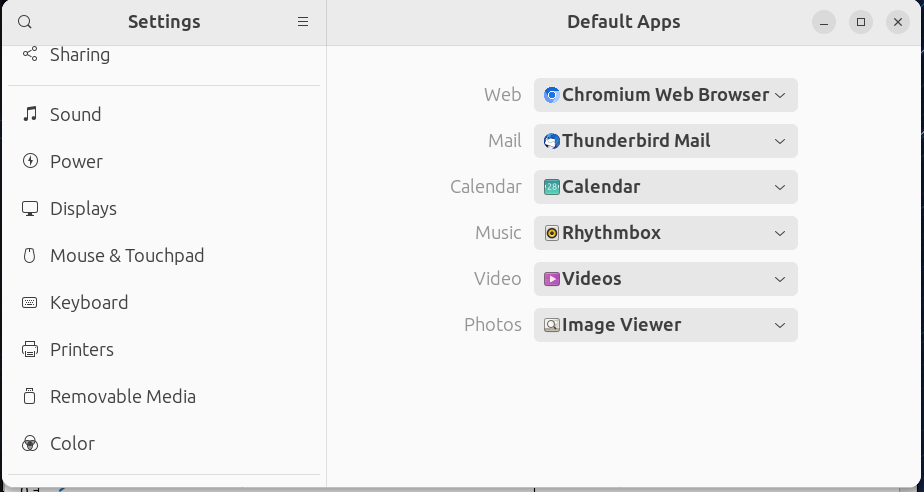

The file can be opened in the browser:

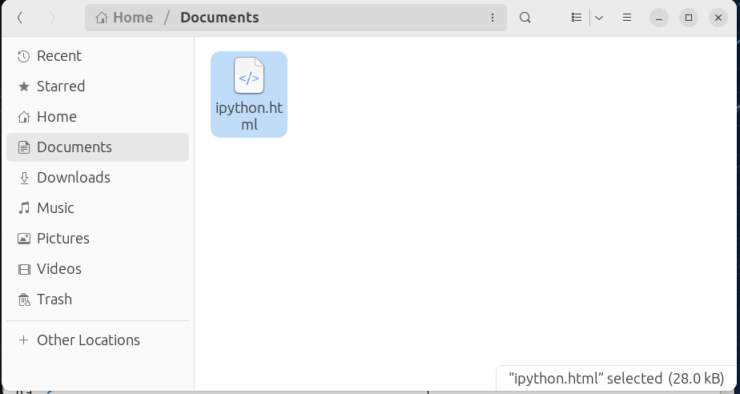

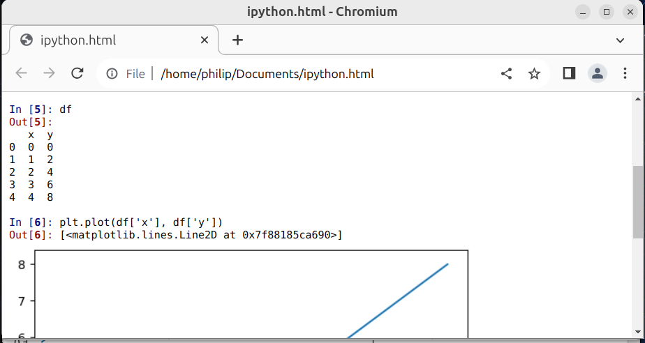

The QtConsole can be exited using the python function:

```
exit()
```

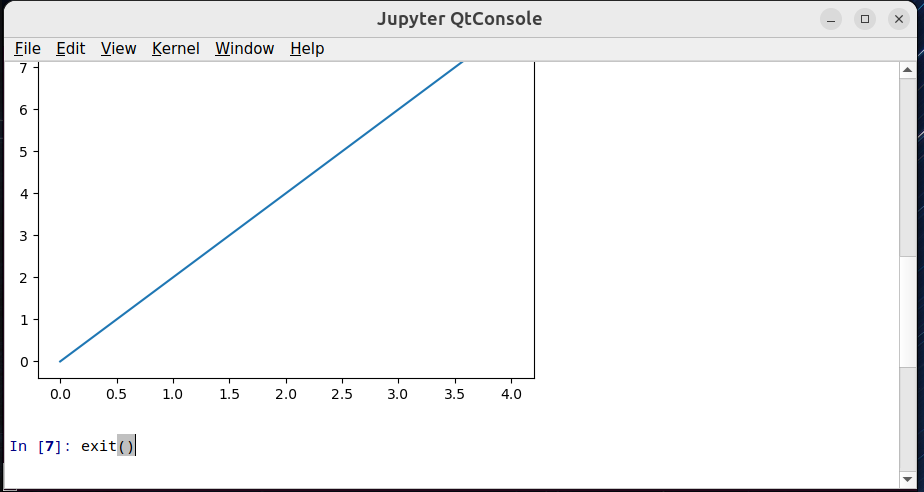

Once QtConsole is closed, a new prompt displays in the Linux Terminal:

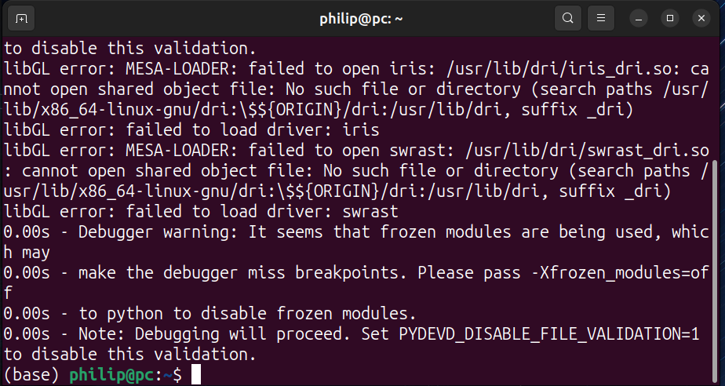

[Return to Jupyter Tutorial](./jupyter.md)

[Return to Anaconda Tutorial](./readme.md)