# Uninstall

For best results Anaconda should be installed on a clean computer without any previous Python or Python Distributions present. Note that Python is preinstalled on Linux and the preinstalled Python should be considered as part of the OS and left as is. 

## Uninstall

Anaconda does not appear in Software because recall it was installed using a .bash script. 

If an old version of anaconda is installed (using the default location) there will be an anaconda3 folder in the Home directory. 

Anaconda based distributions such as Miniconda, Miniforge and Mambaforge will have equivalent folders:

* anaconda3
* miniconda3
* miniforge
* mambaforge

To uninstall the distribution, delete these folders.

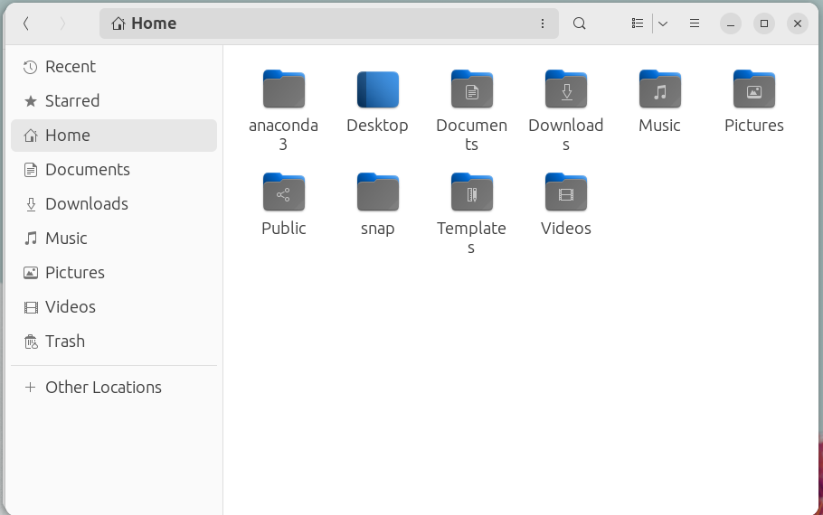

In addition to the folder above, there are a number of other configuration files in the Home directory that are hidden by default. Select the folder options and Show Hidden Files:

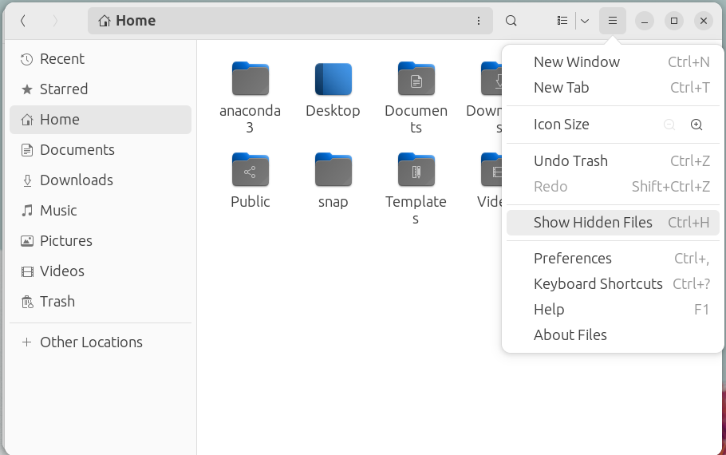

Delete the following configuration folders (if present):

* .anaconda
* .astropy
* .conda
* .continuum
* .ipython
* .jupyter
* .npm

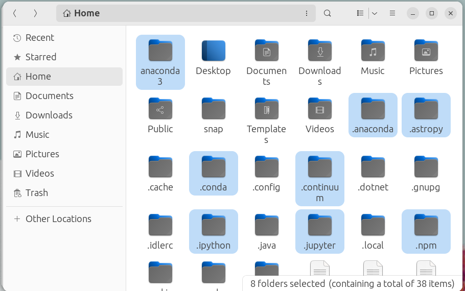

Delete the following configuration files (if present):

* .condarc
* .ipython_history

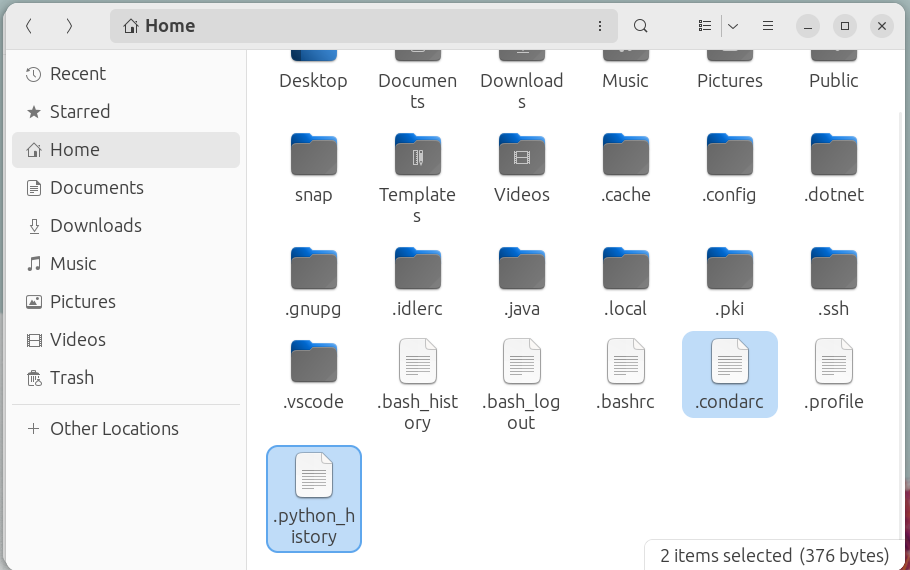

If an old Python distribution has been added to the path, the .bashrc file will have been modified, this file is contains a list of locations that the Linux Terminal references when looking for a command. This file should not be deleted and instead should be opened in text editor:

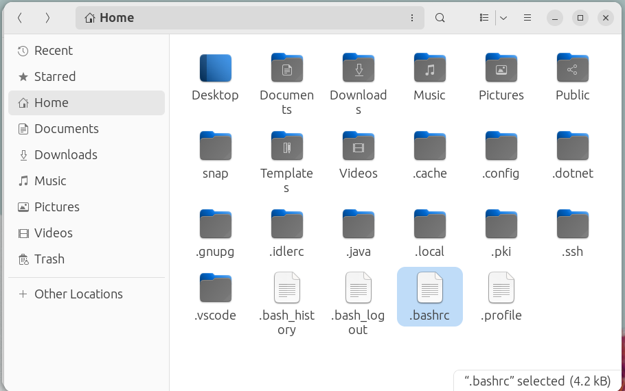

The conda initialize block should be deleted if present and the .bashrc file saved:

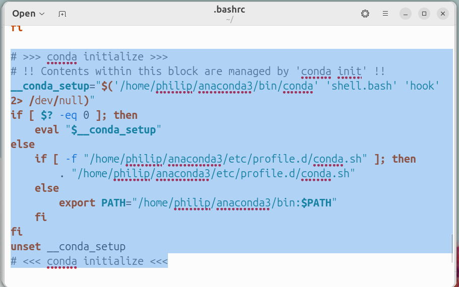

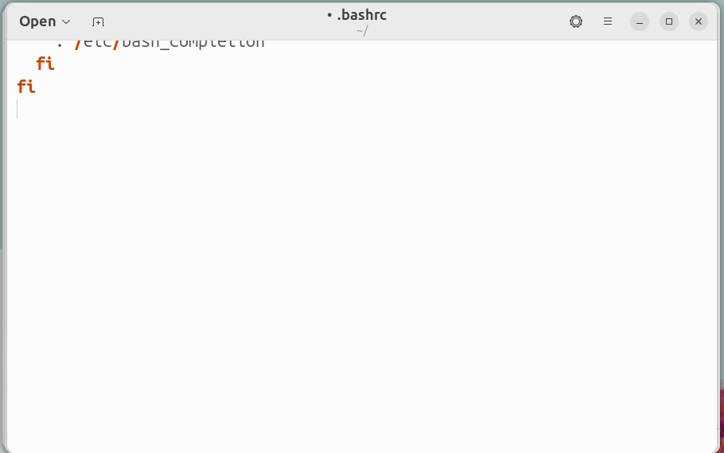

The following folders can also be deleted. VSCode should be uninstalled from Software before deleting the .vscode folder:

* .idlerc
* .vscode

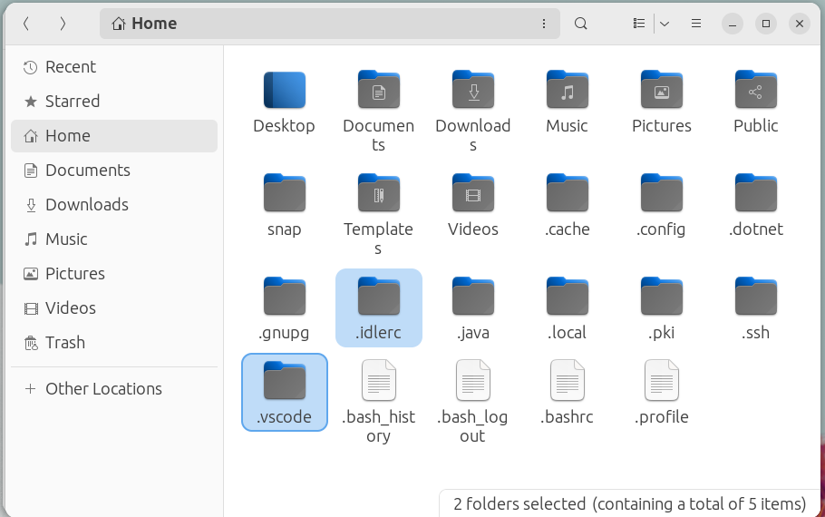

The following three folders contain a variety of configuration files for various applications on Linux:

* .cache
* .config
* .local

They should not be outright deleted as deleting these will effect other applications.

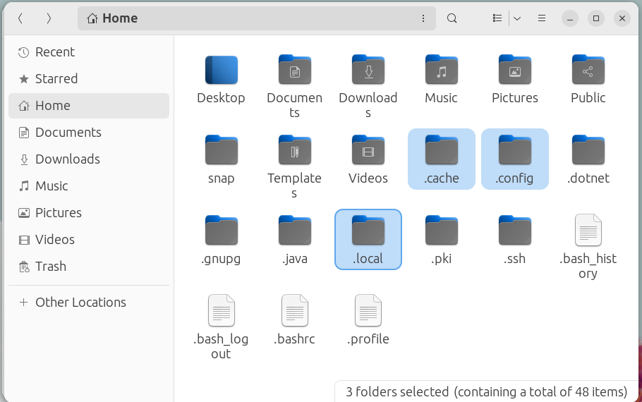

In the .cache folder the following can be deleted:

* conda
* jedi
* JetBrains
* matplotlib
* pip
* scikit-image
* Spyder

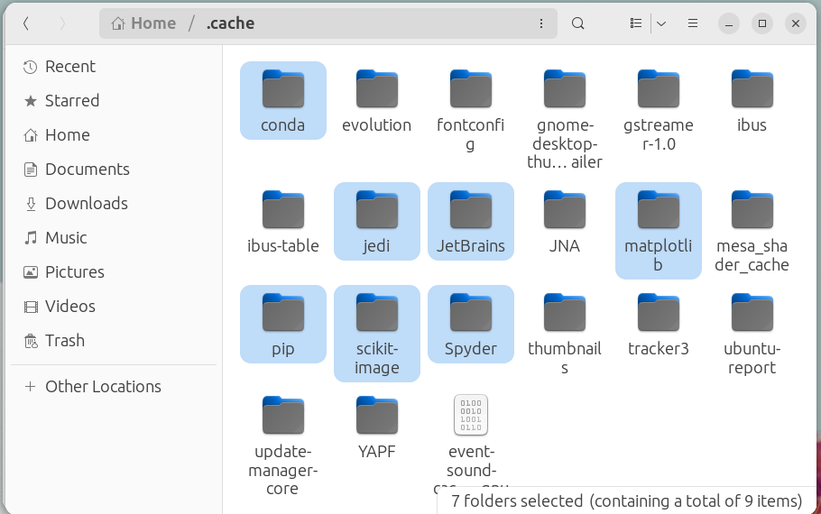

In the .config folder the following can be deleted:

* Code
* JetBrains
* matplotlib
* spyder-py3
* spyder-py3dev

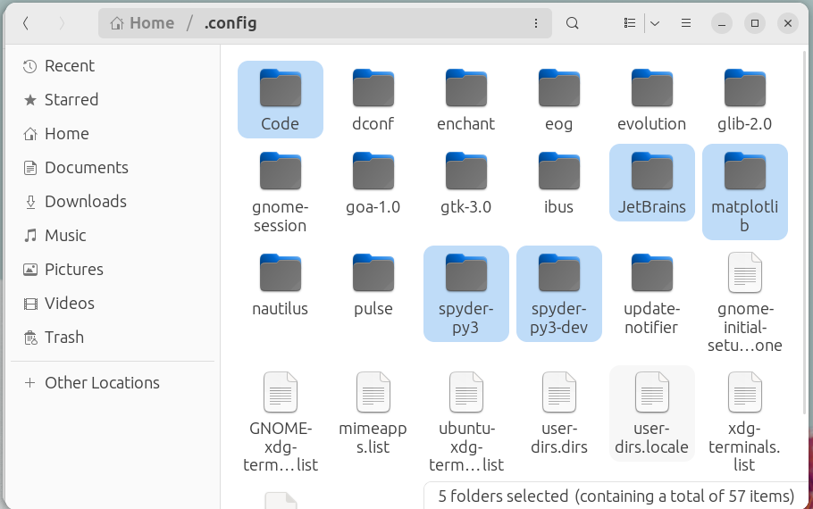

In the .local folder, there is a share subfolder:

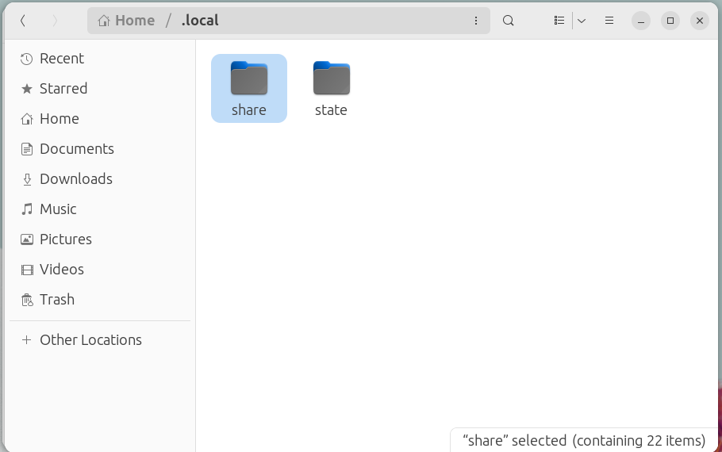

In the share folder, the following can be deleted:

* jupyter
* Spyder

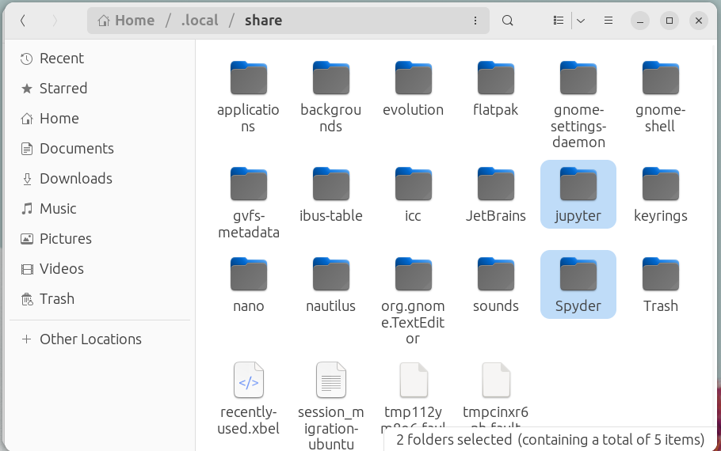

[Return to Python Tutorials](../../readme.md)