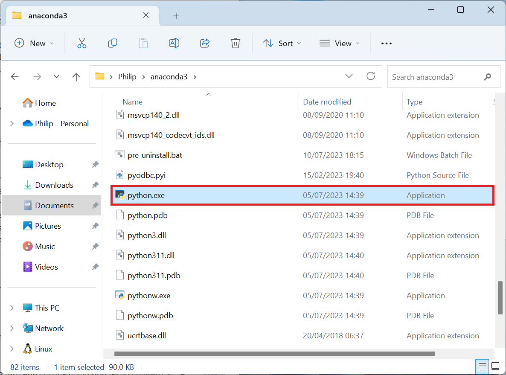
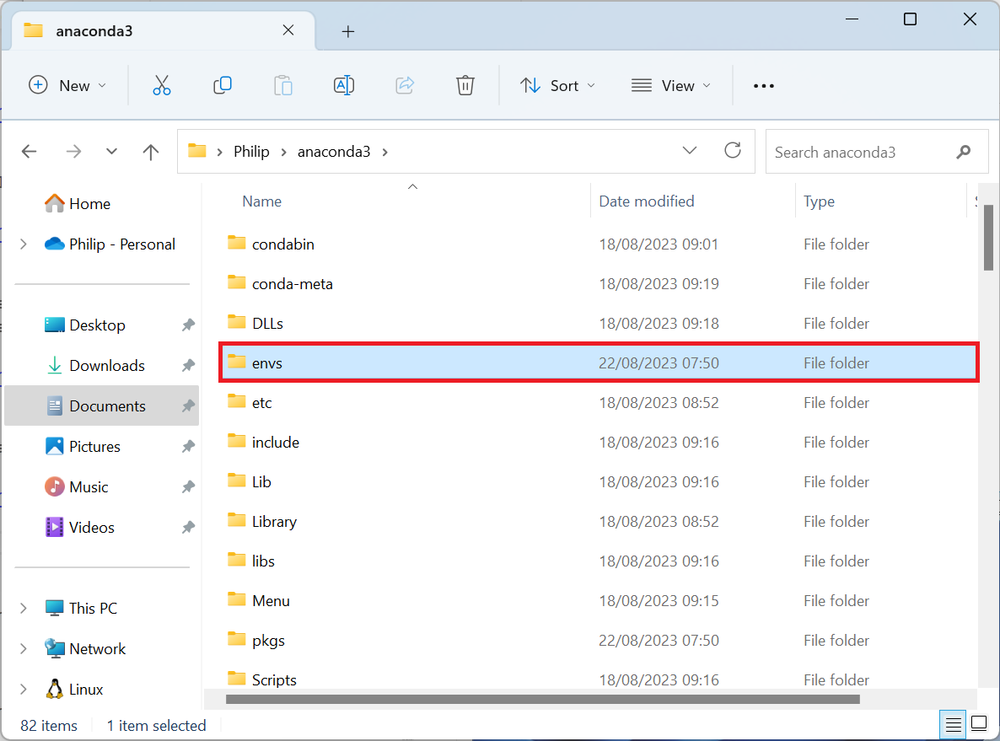
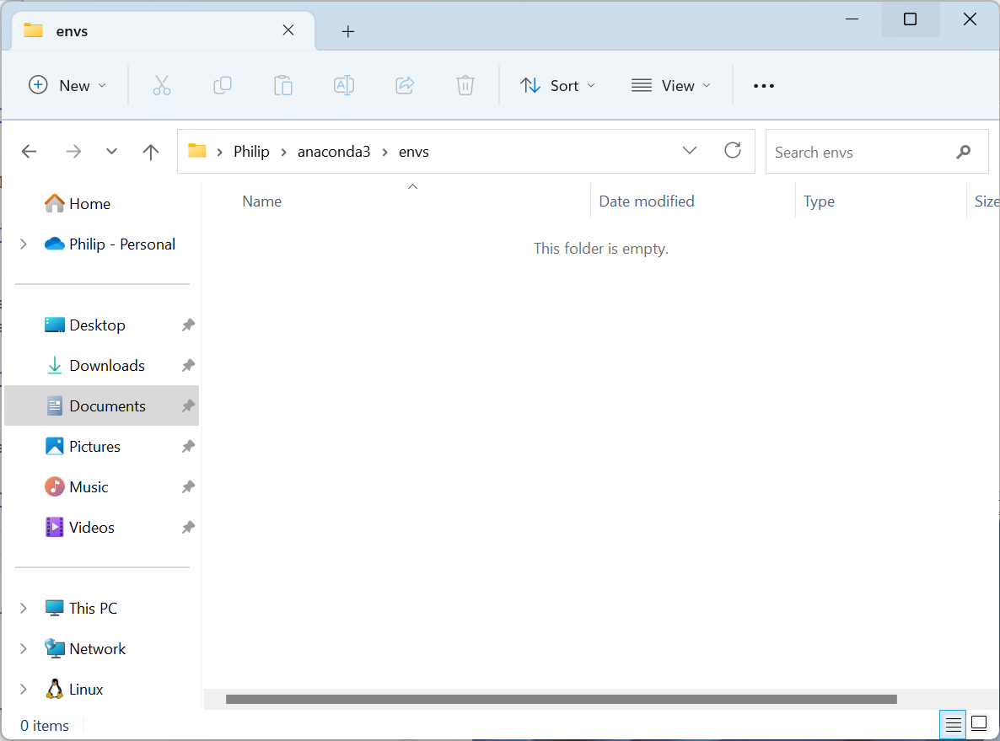
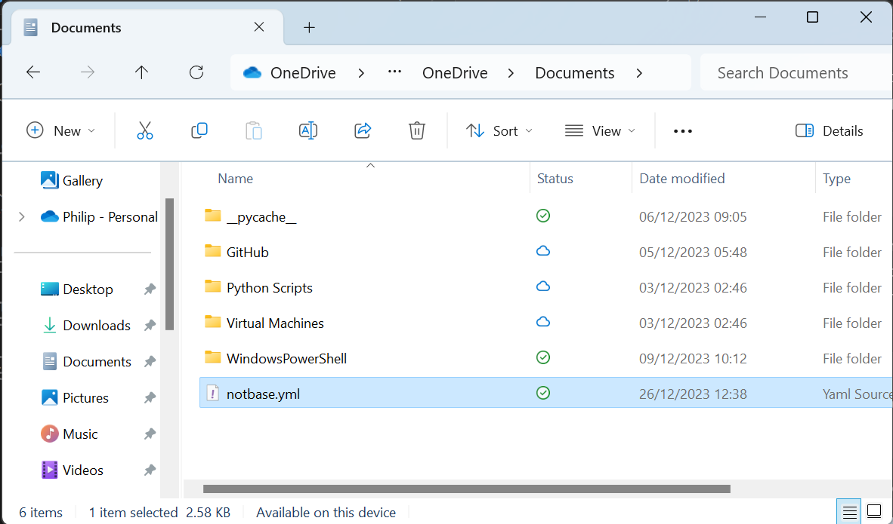

# The conda Package Manager

The purpose of the conda package manager is to allow cross-platform installation of Python packages and non-Python dependences related to a datascience project in a Python environment. This can include other programming languages such as R.

The conda package manager has two main channels:

|channel name|channel description|
|---|---|
|conda-forge|community channel maintained by developers|
|anaconda|channel maintained by the Anaconda company|

The anaconda channel (previously known as conda) or main is the channel maintained by the Anaconda company. These packages are tested by the Anaconda company for compatibility with the Anaconda Python distribution. As the Anaconda company only test commonly used datascience libraries and it takes time for testing, there are less packages available in the anaconda channel and the latest packages available of that channel are usually a few versions behind.

## The base Python Environment

In Anaconda the base Python environment is a Python distribution and should not be modified outwith the standard conda images available from Anaconda. The reason for this is the Python distribution has a large number of packages and changing a package that is a dependency for the other packages will normally result in a number of these packages being removed leading to an unstable Python environment.

To recap the base Python environment is found in:

```
%USERPROFILE%\Anaconda3
```

This contains its own python.exe:



The (base) Python environment has a Scripts folder which contains applications installed in the (base) Python environment. 

```
%USERPROFILE%/anaconda3/Scripts
```

On Linux, applications are called binaries and do not have a .exe file extension. The (base) Python environment also has a number of secondary bin folders that use a consistent file structure to Linux

```
%USERPROFILE%/anaconda3/Library/bin
%USERPROFILE%/anaconda3/Library/usr/bin
```

There is also a bin folder associated with the ming-w64 compiler:

```
%USERPROFILE%/anaconda3/Library/ming-w64/bin
```

The (base) Python environment has a Lib folder which contains Python modules:

```
%USERPROFILE%/anaconda3/Lib
```

The standard modules are either in the form of a single script files or a folder containing multiple script files. When the module is a single file the name of the file corresponds to the name of the module. When the module is a folder, the folder name corresponds to the name of the module and there is a datamodel initialisation script file called ```__init__.py``` which is imported.

Within the Lib folder there is a site-packages folder:

```
%USERPROFILE%/anaconda3/Lib/site-packages
```

This folder contains third-party modules also known as libraries. Common libraries are numpy, pandas and matplotlib. 

These modules can be imported and the datamodel attribute ```__file__``` can be printed to view the location of the file:

```powershell
(base) PS ~> jupyter-console

Python 3.11.5 | packaged by Anaconda, Inc. | (main, Sep 11 2023, 13:26:23) [MSC v.1916 64 bit (AMD64)]
Type 'copyright', 'credits' or 'license' for more information
IPython 8.15.0 -- An enhanced Interactive Python. Type '?' for help.

In [1]: import datetime
   ...: import email

In [2]: print(datetime.__file__)
   ...: print(email.__file__)
~\anaconda3\Lib\datetime.py
~\anaconda3\Lib\email\__init__.py

In [3]: import numpy as np
   ...: import pandas as pd
   ...: import matplotlib.pyplot as plt

In [4]: print(np.__file__)
   ...: print(pd.__file__)
   ...: print(plt.__file__)
~\anaconda3\Lib\site-packages\numpy\__init__.py
~\anaconda3\Lib\site-packages\pandas\__init__.py
~\anaconda3\Lib\site-packages\matplotlib\pyplot.py

In [5]:

```

## The envs folder

The (base) Python environment also contains an envs folder which is used for Python environments:

```
%USERPROFILE%\Anaconda3\envs
```



By default there are no additional Python environments and this folder is empty:



A Python environment is essentially a sub-installation of Python. Each Python environment will therefore a substructure similar to the (base) Python environment and will have their own:

* python.exe
* scripts folder
* lib subfolder
* site-packages subfolder within lib

The use of Python environments for example allows installation of the latest version of each IDE without breaking the functionality of the (base) Python environment.

## conda Package Manager

### Overview

An overview about the conda package manager can be seen by opening up the Anaconda PowerShell Prompt and inputting the PowerShell command:

```powershell
conda
```

This gives the following output:

```powershell
(base) PS ~> conda
usage: conda-script.py [-h] [-v] [--no-plugins] [-V] COMMAND ...

conda is a tool for managing and deploying applications, environments and packages.

options:
```
|flag or option|purpose|
|---|---|
|-h, --help|Show this help message and exit.|
|-v, --verbose|Can be used multiple times. Once for detailed output, twice for INFO logging, thrice for DEBUG logging, four times for TRACE logging.|
|--no-plugins|Disable all plugins that are not built into conda.|
|-V, --version|Show the conda version number and exit.|
```
commands:
  The following built-in and plugins subcommands are available.
```
|command|description|
|---|---|
|activate|Activate a conda environment.|
|build|Build conda packages from a conda recipe.|
|clean|Remove unused packages and caches.|
|compare|Compare packages between conda environments.|
|config|Modify configuration values in .condarc.|
|create|Create a new conda environment from a list of specified packages.|
|doctor|Display a health report for your environment.|
|info|Display information about current conda install.|
|init|Initialize conda for shell interaction.|
|install|Install a list of packages into a specified conda environment.|
|list|List installed packages in a conda environment.|
|notices|Retrieve latest channel notifications.|
|package|Create low-level conda packages.|
|remove|Remove a list of packages from a specified conda environment.|
|rename|Rename an existing environment.|
|run|Run an executable in a conda environment.|
|search|Search for packages and display associated information using the MatchSpec format.|
|update|Update conda packages to the latest compatible version.|
|build|See conda build --help.|
|content-trust|See conda content-trust --help.|
|convert|See conda convert --help.|
|debug|See conda debug --help.|
|develop|See conda develop --help.|
|env|See conda env --help.|
|index|See conda index --help.|
|inspect|See conda inspect --help.|
|metapackage|See conda metapackage --help.|
|pack|See conda pack --help.|
|render|See conda render --help.|
|repo|See conda repo --help.|
|server|See conda server --help.|
|skeleton|See conda skeleton --help.|
|token|See conda token --help.|
|verify|See conda verify --help.|
```powershell
(base) PS ~>
```

### Create

A Python environment can be created using the syntax:

```powershell
conda create -n notbase
```

where "notbase" is the environment name. The longer ```--name``` can also be used in place of the ```-n```.

The following will be output:

```powershell
(base) PS ~> conda create -n notbase
Channels:
 - defaults
Platform: win-64
Collecting package metadata (repodata.json): done
Solving environment: done

## Package Plan ##

  environment location: ~\anaconda3\envs\notbase


Proceed ([y]/n)?
```

Input ```y``` to proceed. The Python environment is now created:

```powershell
Preparing transaction: done
Verifying transaction: done
Executing transaction: done
#
# To activate this environment, use
#
#     $ conda activate notbase
#
# To deactivate an active environment, use
#
#     $ conda deactivate

(base) PS ~>
```

Notice in envs, the notbase subfolder is created:


### Activate

The ```activate``` subcommand is used to active a Python environment. When a Python environment is activated the:

* python.exe
* scripts folder
* lib subfolder
* site-packages subfolder within lib

associated with the Python environment will preferentially be used over their respective locations in (base).

Note activation will only work in the Anaconda PowerShell Prompt by default unless the Windows Terminal has been initialised. When the Windows Terminal is not initialised, the Windows Terminal will only look for applications in the folders specified in the Windows Environmental Variables path in the order specified in the Windows Environmental Variables path.

The notbase Python environment can be activated using:

```powershell
conda activate notbase
```

The output now looks like:

```powershell
(base) PS ~> conda activate notbase
(notbase) PS ~>
```

Notice that the prompt now has the (notbase) prefix indicating that the (notbase) Python is activated.

When the Anaconda PowerShell Prompt is closed and reopened, the default Python environment (base) will be activated. The Python environment notbase will have to be activated.

### Search

A package can be searched for using the ```search``` subcommand followed by the package name:

```powershell
conda search package_name
```

The channel to search for packages in can be specified using ```-c``` or the long form ```--channel``` followed by the name of the channel. The default channel is ```main``` but it is more common to use the ```conda-forge``` community channel when creating a custom Python environment. 

```
conda search -c conda-forge package_name
```

For example a search of the package python:

```
conda search -c conda-forge python
```

Outputs:

```
(notbase) PS ~> conda search -c conda-forge python
Loading channels: done
```
|Name|Version|Build|Channel|
|---|---|---|---|
|python|3.12.0|h1d929f7_0|pkgs/main|
|python|3.12.0|h2628c8c_0_cpython|conda-forge|
|python|3.12.1|h2628c8c_0_cpython|conda-forge|
|python|3.12.1|h2628c8c_1_cpython|conda-forge|
```powershell
(notbase) PS ~>
```

Notice each Python has a version number of the format X.Y.Z where X is the major build, Y is the minor build and Z is the patch number. The build number consists of a hash followed by a revision. If prefixed with py it is a pure Python package.

The package ipython can be searched for using:

```powershell
conda search -c conda-forge ipython
```

This outputs:

```powershell
(notbase) PS ~> conda search -c conda-forge ipython
Loading channels: done
```
|Name|Version|Build|Channel|
|---|---|---|---|
|ipython|8.18.1|pyh31011fe_1|conda-forge|
|ipython|8.18.1|pyh31011fe_2|conda-forge|
|ipython|8.18.1|pyh5737063_1|conda-forge|
|ipython|8.18.1|pyh5737063_2|conda-forge|
|ipython|8.18.1|pyh707e725_3|conda-forge|
|ipython|8.18.1|pyh7428d3b_3|conda-forge|
|ipython|8.19.0|pyh707e725_0|conda-forge|
|ipython|8.19.0|pyh7428d3b_0|conda-forge|
```
(notbase) PS ~>
```

### Install

The subcommand ```install``` can be used to install a package:

```powershell
conda install package_name
```

Multiple packages can be installed using the syntax:

```powershell
conda install package_name1 package_name2
```

Once again the channel to install from should be specified:

```powershell
conda install -c conda-forge package_name1 package_name2
```

The packages python and ipython can be installed from the community channel using:

```powershell
conda install -c conda-forge python ipython
```

This outputs:

```
(notbase) PS ~> conda install -c conda-forge python ipython
Channels:
 - conda-forge
 - defaults
Platform: win-64
Collecting package metadata (repodata.json): done
Solving environment: done

## Package Plan ##

  environment location: ~\anaconda3\envs\notbase

  added / updated specs:
    - ipython
    - python


The following NEW packages will be INSTALLED:
```
|Package|Details|
|---|---|
|asttokens|conda-forge/noarch::asttokens-2.4.1-pyhd8ed1ab_0|
|bzip2|conda-forge/win-64::bzip2-1.0.8-hcfcfb64_5|
|ca-certificates|conda-forge/win-64::ca-certificates-2023.11.17-h56e8100_0|
|colorama|conda-forge/noarch::colorama-0.4.6-pyhd8ed1ab_0|
|decorator|conda-forge/noarch::decorator-5.1.1-pyhd8ed1ab_0|
|exceptiongroup|conda-forge/noarch::exceptiongroup-1.2.0-pyhd8ed1ab_0|
|executing|conda-forge/noarch::executing-2.0.1-pyhd8ed1ab_0|
|ipython|conda-forge/noarch::ipython-8.19.0-pyh7428d3b_0|
|jedi|conda-forge/noarch::jedi-0.19.1-pyhd8ed1ab_0|
|libexpat|conda-forge/win-64::libexpat-2.5.0-h63175ca_1|
|libffi|conda-forge/win-64::libffi-3.4.2-h8ffe710_5|
|libsqlite|conda-forge/win-64::libsqlite-3.44.2-hcfcfb64_0|
|libzlib|conda-forge/win-64::libzlib-1.2.13-hcfcfb64_5|
|matplotlib-inline|conda-forge/noarch::matplotlib-inline-0.1.6-pyhd8ed1ab_0|
|openssl|conda-forge/win-64::openssl-3.2.0-hcfcfb64_1|
|parso|conda-forge/noarch::parso-0.8.3-pyhd8ed1ab_0|
|pickleshare|conda-forge/noarch::pickleshare-0.7.5-py_1003|
|pip|conda-forge/noarch::pip-23.3.2-pyhd8ed1ab_0|
|prompt-toolkit|conda-forge/noarch::prompt-toolkit-3.0.42-pyha770c72_0|
|pure_eval|conda-forge/noarch::pure_eval-0.2.2-pyhd8ed1ab_0|
|pygments|conda-forge/noarch::pygments-2.17.2-pyhd8ed1ab_0|
|python|conda-forge/win-64::python-3.12.1-h2628c8c_1_cpython|
|setuptools|conda-forge/noarch::setuptools-68.2.2-pyhd8ed1ab_0|
|six|conda-forge/noarch::six-1.16.0-pyh6c4a22f_0|
|stack_data|conda-forge/noarch::stack_data-0.6.2-pyhd8ed1ab_0|
|tk|conda-forge/win-64::tk-8.6.13-h5226925_1|
|traitlets|conda-forge/noarch::traitlets-5.14.0-pyhd8ed1ab_0|
|typing_extensions|conda-forge/noarch::typing_extensions-4.9.0-pyha770c72_0|
|tzdata|conda-forge/noarch::tzdata-2023d-h0c530f3_0|
|ucrt|conda-forge/win-64::ucrt-10.0.22621.0-h57928b3_0|
|vc|conda-forge/win-64::vc-14.3-hcf57466_18|
|vc14_runtime|conda-forge/win-64::vc14_runtime-14.38.33130-h82b7239_18|
|vs2015_runtime|conda-forge/win-64::vs2015_runtime-14.38.33130-hcb4865c_18|
|wcwidth|conda-forge/noarch::wcwidth-0.2.12-pyhd8ed1ab_0|
|wheel|conda-forge/noarch::wheel-0.42.0-pyhd8ed1ab_0|
|xz|conda-forge/win-64::xz-5.2.6-h8d14728_0|

```
Proceed ([y]/n)?
```

Input ```y``` in order to proceed. This outputs:

```
Downloading and Extracting Packages:

Preparing transaction: done
Verifying transaction: done
Executing transaction: done
(notbase) PS ~>
```

A new prompt is available when the operation is finished.

ipython can be used from this Python environment. Notice when the standard modules are imported, the modules from the perspective Python environment are used:

```
(notbase) PS ~> ipython
Python 3.12.1 | packaged by conda-forge | (main, Dec 23 2023, 07:53:56) [MSC v.1937 64 bit (AMD64)]
Type 'copyright', 'credits' or 'license' for more information
IPython 8.19.0 -- An enhanced Interactive Python. Type '?' for help.

In [1]: import datetime
   ...: import email

In [2]: print(datetime.__file__)
   ...: print(email.__file__)
~\anaconda3\envs\notbase\Lib\datetime.py
~\anaconda3\envs\notbase\Lib\email\__init__.py

In [3]: import numpy as np
   ...: import pandas as pd
   ...: import matplotlib.pyplot as plt
---------------------------------------------------------------------------
ModuleNotFoundError                       Traceback (most recent call last)
Cell In[3], line 1
----> 1 import numpy as np
      2 import pandas as pd
      3 import matplotlib.pyplot as plt

ModuleNotFoundError: No module named 'numpy'

In [4]:
```

Note attempting to import numpy, pandas and matplotlib gives a ```ModuleNotFoundError``` as they are not installed in this Python environment.

### Remove

The ```remove``` subcommand can be used to remove an installed package:

```powershell
conda remove package_name1 package_name2
```

For example the package python can be removed using:

```powershell
conda remove python
```

This outputs:

```
(notbase) PS ~> conda remove python
Channels:
 - defaults
 - conda-forge
Platform: win-64
Collecting package metadata (repodata.json): done
Solving environment: done

## Package Plan ##

  environment location: ~\anaconda3\envs\notbase

  removed specs:
    - python


The following packages will be REMOVED:
```
|Package|Details|
|---|---|
|asttokens|conda-forge/noarch::asttokens-2.4.1-pyhd8ed1ab_0|
|bzip2|conda-forge/win-64::bzip2-1.0.8-hcfcfb64_5|
|ca-certificates|conda-forge/win-64::ca-certificates-2023.11.17-h56e8100_0|
|colorama|conda-forge/noarch::colorama-0.4.6-pyhd8ed1ab_0|
|decorator|conda-forge/noarch::decorator-5.1.1-pyhd8ed1ab_0|
|exceptiongroup|conda-forge/noarch::exceptiongroup-1.2.0-pyhd8ed1ab_0|
|executing|conda-forge/noarch::executing-2.0.1-pyhd8ed1ab_0|
|ipython|conda-forge/noarch::ipython-8.19.0-pyh7428d3b_0|
|jedi|conda-forge/noarch::jedi-0.19.1-pyhd8ed1ab_0|
|libexpat|conda-forge/win-64::libexpat-2.5.0-h63175ca_1|
|libffi|conda-forge/win-64::libffi-3.4.2-h8ffe710_5|
|libsqlite|conda-forge/win-64::libsqlite-3.44.2-hcfcfb64_0|
|libzlib|conda-forge/win-64::libzlib-1.2.13-hcfcfb64_5|
|matplotlib-inline|conda-forge/noarch::matplotlib-inline-0.1.6-pyhd8ed1ab_0|
|openssl|conda-forge/win-64::openssl-3.2.0-hcfcfb64_1|
|parso|conda-forge/noarch::parso-0.8.3-pyhd8ed1ab_0|
|pickleshare|conda-forge/noarch::pickleshare-0.7.5-py_1003|
|pip|conda-forge/noarch::pip-23.3.2-pyhd8ed1ab_0|
|prompt-toolkit|conda-forge/noarch::prompt-toolkit-3.0.42-pyha770c72_0|
|pure_eval|conda-forge/noarch::pure_eval-0.2.2-pyhd8ed1ab_0|
|pygments|conda-forge/noarch::pygments-2.17.2-pyhd8ed1ab_0|
|python|conda-forge/win-64::python-3.12.1-h2628c8c_1_cpython|
|setuptools|conda-forge/noarch::setuptools-68.2.2-pyhd8ed1ab_0|
|six|conda-forge/noarch::six-1.16.0-pyh6c4a22f_0|
|stack_data|conda-forge/noarch::stack_data-0.6.2-pyhd8ed1ab_0|
|tk|conda-forge/win-64::tk-8.6.13-h5226925_1|
|traitlets|conda-forge/noarch::traitlets-5.14.0-pyhd8ed1ab_0|
|typing_extensions|conda-forge/noarch::typing_extensions-4.9.0-pyha770c72_0|
|tzdata|conda-forge/noarch::tzdata-2023d-h0c530f3_0|
|ucrt|conda-forge/win-64::ucrt-10.0.22621.0-h57928b3_0|
|vc|conda-forge/win-64::vc-14.3-hcf57466_18|
|vc14_runtime|conda-forge/win-64::vc14_runtime-14.38.33130-h82b7239_18|
|vs2015_runtime|conda-forge/win-64::vs2015_runtime-14.38.33130-hcb4865c_18|
|wcwidth|conda-forge/noarch::wcwidth-0.2.12-pyhd8ed1ab_0|
|wheel|conda-forge/noarch::wheel-0.42.0-pyhd8ed1ab_0|
|xz|conda-forge/win-64::xz-5.2.6-h8d14728_0|
```
Proceed ([y]/n)? 
```

Because Python is being removed which is a dependency for everything else, everything else is also removed. To proceed with the changes input ```y```. This outputs:

```
Preparing transaction: done
Verifying transaction: done
Executing transaction: done
(notbase) PS ~>
```

A new prompt is available when the operation is finished.

### Specifying Package Version and Build

During installation version numbers can be specified using assignment:

```powershell
conda install -c conda-forge package_name=X.Y.Z
```

The build number can also be specified in some cases, although is more rare to specify this:

```powershell
conda install -c conda-forge package_name=X.Y.Z=build_number
```

For example a specific version of ipython can be installed:

```powershell
conda install -c conda-forge ipython=8.18.1=pyh7428d3b_3
```

```
(notbase) PS ~> conda install -c conda-forge ipython=8.18.1=pyh7428d3b_3
Channels:
 - conda-forge
 - defaults
Platform: win-64
Collecting package metadata (repodata.json): done
Solving environment: done

## Package Plan ##

  environment location: ~\anaconda3\envs\notbase

  added / updated specs:
    - ipython==8.18.1=pyh7428d3b_3


The following NEW packages will be INSTALLED:
```
|Package|Details|
|---|---|
|asttokens|conda-forge/noarch::asttokens-2.4.1-pyhd8ed1ab_0|
|bzip2|conda-forge/win-64::bzip2-1.0.8-hcfcfb64_5|
|colorama|conda-forge/noarch::colorama-0.4.6-pyhd8ed1ab_0|
|decorator|conda-forge/noarch::decorator-5.1.1-pyhd8ed1ab_0|
|exceptiongroup|conda-forge/noarch::exceptiongroup-1.2.0-pyhd8ed1ab_0|
|executing|conda-forge/noarch::executing-2.0.1-pyhd8ed1ab_0|
|ipython|conda-forge/noarch::ipython-8.18.1-pyh7428d3b_3|
|jedi|conda-forge/noarch::jedi-0.19.1-pyhd8ed1ab_0|
|libexpat|conda-forge/win-64::libexpat-2.5.0-h63175ca_1|
|libffi|conda-forge/win-64::libffi-3.4.2-h8ffe710_5|
|libsqlite|conda-forge/win-64::libsqlite-3.44.2-hcfcfb64_0|
|libzlib|conda-forge/win-64::libzlib-1.2.13-hcfcfb64_5|
|matplotlib-inline|conda-forge/noarch::matplotlib-inline-0.1.6-pyhd8ed1ab_0|
|parso|conda-forge/noarch::parso-0.8.3-pyhd8ed1ab_0|
|pickleshare|conda-forge/noarch::pickleshare-0.7.5-py_1003|
|pip|conda-forge/noarch::pip-23.3.2-pyhd8ed1ab_0|
|prompt-toolkit|conda-forge/noarch::prompt-toolkit-3.0.42-pyha770c72_0|
|pure_eval|conda-forge/noarch::pure_eval-0.2.2-pyhd8ed1ab_0|
|pygments|conda-forge/noarch::pygments-2.17.2-pyhd8ed1ab_0|
|python|conda-forge/win-64::python-3.12.1-h2628c8c_1_cpython|
|setuptools|conda-forge/noarch::setuptools-68.2.2-pyhd8ed1ab_0|
|six|conda-forge/noarch::six-1.16.0-pyh6c4a22f_0|
|stack_data|conda-forge/noarch::stack_data-0.6.2-pyhd8ed1ab_0|
|tk|conda-forge/win-64::tk-8.6.13-h5226925_1|
|traitlets|conda-forge/noarch::traitlets-5.14.0-pyhd8ed1ab_0|
|typing_extensions|conda-forge/noarch::typing_extensions-4.9.0-pyha770c72_0|
|tzdata|conda-forge/noarch::tzdata-2023d-h0c530f3_0|
|vs2015_runtime|conda-forge/win-64::vs2015_runtime-14.38.33130-hcb4865c_18|
|wcwidth|conda-forge/noarch::wcwidth-0.2.12-pyhd8ed1ab_0|
|wheel|conda-forge/noarch::wheel-0.42.0-pyhd8ed1ab_0|
|xz|conda-forge/win-64::xz-5.2.6-h8d14728_0|
```
Proceed ([y]/n)?
```

Input ```y``` to proceed with the changes:

```
Downloading and Extracting Packages:

Preparing transaction: done
Verifying transaction: done
Executing transaction: done
(notbase) PS ~>
```

A new prompt is available when the operation is finished.

### Update

The ```update``` subcommand can be used to update a package to the latest compatible version using the update subcommand:

```powershell
conda update package_name
```

Once again the channel to update the package from should be specified:

```powershell
conda update -c conda-forge package_name
```

The package ipython for example can be updated:

```powershell
conda update -c conda-forge ipython
```

```
(notbase) PS ~> conda update -c conda-forge ipython
Channels:
 - conda-forge
 - defaults
Platform: win-64
Collecting package metadata (repodata.json): done
Solving environment: done

## Package Plan ##

  environment location: ~\anaconda3\envs\notbase

  added / updated specs:
    - ipython


The following packages will be UPDATED:
```
|||||
|---|---|---|---|
|ipython|8.18.1-pyh7428d3b_3|-->|8.19.0-pyh7428d3b_0|
```
Proceed ([y]/n)?
```

Notice that this finds an updated version of ipython. Input ```n``` to cancel outputs:

```
CondaSystemExit: Exiting.

(notbase) PS ~>
```

It is common to use the option ```--all``` instead of specifying a package, this will attempt to update all the packages in the Python environment to their latest versions:

```powershell
conda update -c conda-forge --all
```

This command works well for small Python environments that have a small number of packages but the conda package manager often has difficulties solving large Python environments as a package that is a dependency for other packages gets updated to the latest version prompting from the removal of other packages that were dependent on the older version. Sometimes in such case deleting and recreating the Python environment leads to better results than updating. 

The output shows:

```
(notbase) PS ~> conda update -c conda-forge --all
Channels:
 - conda-forge
 - defaults
Platform: win-64
Collecting package metadata (repodata.json): done
Solving environment: done

## Package Plan ##

  environment location: ~\anaconda3\envs\notbase


The following packages will be UPDATED:
```
|||||
|---|---|---|---|
|ipython|8.18.1-pyh7428d3b_3|-->|8.19.0-pyh7428d3b_0|
```
Proceed ([y]/n)? 
```

To proceed input ```y```:

```
Downloading and Extracting Packages:

Preparing transaction: done
Verifying transaction: done
Executing transaction: done
(notbase) PS ~>
```

A new prompt is available when the operation is finished.

**The base Python environment is an example of a very large Python environment and using the above command should not be used in the base Python environment as it will result in an unstable base Python environment that will not work properly.** 

Recall to update the base Python environment use:

```powershell
conda deactivate
conda update conda
conda update anaconda-navigator
```

This was seen when Anaconda was initially installed.

### List

The ```list``` subcommand can be used to list the packages in the Python environment:

```powershell
conda list
```

This outputs:

```
# packages in environment at ~\anaconda3\envs\notbase:
#
```
|Name|Version|Build|Channel|
|---|---|---|---|
|asttokens|2.4.1|pyhd8ed1ab_0|conda-forge|
|bzip2|1.0.8|hcfcfb64_5|conda-forge|
|ca-certificates|2023.11.17|h56e8100_0|conda-forge|
|colorama|0.4.6|pyhd8ed1ab_0|conda-forge|
|decorator|5.1.1|pyhd8ed1ab_0|conda-forge|
|exceptiongroup|1.2.0|pyhd8ed1ab_0|conda-forge|
|executing|2.0.1|pyhd8ed1ab_0|conda-forge|
|ipython|8.19.0|pyh7428d3b_0|conda-forge|
|jedi|0.19.1|pyhd8ed1ab_0|conda-forge|
|libexpat|2.5.0|h63175ca_1|conda-forge|
|libffi|3.4.2|h8ffe710_5|conda-forge|
|libsqlite|3.44.2|hcfcfb64_0|conda-forge|
|libzlib|1.2.13|hcfcfb64_5|conda-forge|
|matplotlib-inline|0.1.6|pyhd8ed1ab_0|conda-forge|
|openssl|3.2.0|hcfcfb64_1|conda-forge|
|parso|0.8.3|pyhd8ed1ab_0|conda-forge|
|pickleshare|0.7.5|py_1003|conda-forge|
|pip|23.3.2|pyhd8ed1ab_0|conda-forge|
|prompt-toolkit|3.0.42|pyha770c72_0|conda-forge|
|pure_eval|0.2.2|pyhd8ed1ab_0|conda-forge|
|pygments|2.17.2|pyhd8ed1ab_0|conda-forge|
|python|3.12.1|h2628c8c_1_cpython|conda-forge|
|setuptools|68.2.2|pyhd8ed1ab_0|conda-forge|
|six|1.16.0|pyh6c4a22f_0|conda-forge|
|stack_data|0.6.2|pyhd8ed1ab_0|conda-forge|
|tk|8.6.13|h5226925_1|conda-forge|
|traitlets|5.14.0|pyhd8ed1ab_0|conda-forge|
|typing_extensions|4.9.0|pyha770c72_0|conda-forge|
|tzdata|2023d|h0c530f3_0|conda-forge|
|ucrt|10.0.22621.0|h57928b3_0|conda-forge|
|vc|14.3|hcf57466_18|conda-forge|
|vc14_runtime|14.38.33130|h82b7239_18|conda-forge|
|vs2015_runtime|14.38.33130|hcb4865c_18|conda-forge|
|wcwidth|0.2.12|pyhd8ed1ab_0|conda-forge|
|wheel|0.42.0|pyhd8ed1ab_0|conda-forge|
|xz|5.2.6|h8d14728_0|conda-forge|
```
(notbase) PS ~>
```

The subcommand option ```--revision``` can be used to list each revision of the Python environment:

```powershell
conda list --revision
```

This outputs:

```
(notbase) PS ~> conda list --revision
2023-12-25 13:52:05  (rev 0)

2023-12-25 14:13:20  (rev 1)
    +asttokens-2.4.1 (conda-forge/noarch)
    +bzip2-1.0.8 (conda-forge/win-64)
    +ca-certificates-2023.11.17 (conda-forge/win-64)
    +colorama-0.4.6 (conda-forge/noarch)
    +decorator-5.1.1 (conda-forge/noarch)
    +exceptiongroup-1.2.0 (conda-forge/noarch)
    +executing-2.0.1 (conda-forge/noarch)
    +ipython-8.19.0 (conda-forge/noarch)
    +jedi-0.19.1 (conda-forge/noarch)
    +libexpat-2.5.0 (conda-forge/win-64)
    +libffi-3.4.2 (conda-forge/win-64)
    +libsqlite-3.44.2 (conda-forge/win-64)
    +libzlib-1.2.13 (conda-forge/win-64)
    +matplotlib-inline-0.1.6 (conda-forge/noarch)
    +openssl-3.2.0 (conda-forge/win-64)
    +parso-0.8.3 (conda-forge/noarch)
    +pickleshare-0.7.5 (conda-forge/noarch)
    +pip-23.3.2 (conda-forge/noarch)
    +prompt-toolkit-3.0.42 (conda-forge/noarch)
    +pure_eval-0.2.2 (conda-forge/noarch)
    +pygments-2.17.2 (conda-forge/noarch)
    +python-3.12.1 (conda-forge/win-64)
    +setuptools-68.2.2 (conda-forge/noarch)
    +six-1.16.0 (conda-forge/noarch)
    +stack_data-0.6.2 (conda-forge/noarch)
    +tk-8.6.13 (conda-forge/win-64)
    +traitlets-5.14.0 (conda-forge/noarch)
    +typing_extensions-4.9.0 (conda-forge/noarch)
    +tzdata-2023d (conda-forge/noarch)
    +ucrt-10.0.22621.0 (conda-forge/win-64)
    +vc-14.3 (conda-forge/win-64)
    +vc14_runtime-14.38.33130 (conda-forge/win-64)
    +vs2015_runtime-14.38.33130 (conda-forge/win-64)
    +wcwidth-0.2.12 (conda-forge/noarch)
    +wheel-0.42.0 (conda-forge/noarch)
    +xz-5.2.6 (conda-forge/win-64)

2023-12-25 14:42:21  (rev 2)
    -asttokens-2.4.1 (conda-forge/noarch)
    -bzip2-1.0.8 (conda-forge/win-64)
    -colorama-0.4.6 (conda-forge/noarch)
    -decorator-5.1.1 (conda-forge/noarch)
    -exceptiongroup-1.2.0 (conda-forge/noarch)
    -executing-2.0.1 (conda-forge/noarch)
    -ipython-8.19.0 (conda-forge/noarch)
    -jedi-0.19.1 (conda-forge/noarch)
    -libexpat-2.5.0 (conda-forge/win-64)
    -libffi-3.4.2 (conda-forge/win-64)
    -libsqlite-3.44.2 (conda-forge/win-64)
    -libzlib-1.2.13 (conda-forge/win-64)
    -matplotlib-inline-0.1.6 (conda-forge/noarch)
    -parso-0.8.3 (conda-forge/noarch)
    -pickleshare-0.7.5 (conda-forge/noarch)
    -pip-23.3.2 (conda-forge/noarch)
    -prompt-toolkit-3.0.42 (conda-forge/noarch)
    -pure_eval-0.2.2 (conda-forge/noarch)
    -pygments-2.17.2 (conda-forge/noarch)
    -python-3.12.1 (conda-forge/win-64)
    -setuptools-68.2.2 (conda-forge/noarch)
    -six-1.16.0 (conda-forge/noarch)
    -stack_data-0.6.2 (conda-forge/noarch)
    -tk-8.6.13 (conda-forge/win-64)
    -traitlets-5.14.0 (conda-forge/noarch)
    -typing_extensions-4.9.0 (conda-forge/noarch)
    -tzdata-2023d (conda-forge/noarch)
    -vs2015_runtime-14.38.33130 (conda-forge/win-64)
    -wcwidth-0.2.12 (conda-forge/noarch)
    -wheel-0.42.0 (conda-forge/noarch)
    -xz-5.2.6 (conda-forge/win-64)

2023-12-26 11:27:56  (rev 3)
    +asttokens-2.4.1 (conda-forge/noarch)
    +bzip2-1.0.8 (conda-forge/win-64)
    +colorama-0.4.6 (conda-forge/noarch)
    +decorator-5.1.1 (conda-forge/noarch)
    +exceptiongroup-1.2.0 (conda-forge/noarch)
    +executing-2.0.1 (conda-forge/noarch)
    +ipython-8.18.1 (conda-forge/noarch)
    +jedi-0.19.1 (conda-forge/noarch)
    +libexpat-2.5.0 (conda-forge/win-64)
    +libffi-3.4.2 (conda-forge/win-64)
    +libsqlite-3.44.2 (conda-forge/win-64)
    +libzlib-1.2.13 (conda-forge/win-64)
    +matplotlib-inline-0.1.6 (conda-forge/noarch)
    +parso-0.8.3 (conda-forge/noarch)
    +pickleshare-0.7.5 (conda-forge/noarch)
    +pip-23.3.2 (conda-forge/noarch)
    +prompt-toolkit-3.0.42 (conda-forge/noarch)
    +pure_eval-0.2.2 (conda-forge/noarch)
    +pygments-2.17.2 (conda-forge/noarch)
    +python-3.12.1 (conda-forge/win-64)
    +setuptools-68.2.2 (conda-forge/noarch)
    +six-1.16.0 (conda-forge/noarch)
    +stack_data-0.6.2 (conda-forge/noarch)
    +tk-8.6.13 (conda-forge/win-64)
    +traitlets-5.14.0 (conda-forge/noarch)
    +typing_extensions-4.9.0 (conda-forge/noarch)
    +tzdata-2023d (conda-forge/noarch)
    +vs2015_runtime-14.38.33130 (conda-forge/win-64)
    +wcwidth-0.2.12 (conda-forge/noarch)
    +wheel-0.42.0 (conda-forge/noarch)
    +xz-5.2.6 (conda-forge/win-64)

2023-12-26 11:51:19  (rev 4)
     ipython  {8.18.1 (conda-forge/noarch) -> 8.19.0 (conda-forge/noarch)}

(notbase) PS ~>
```

Notice revision 0 has no packages in it. Revision 1 installs ipython, revision 2 removes ipython, revision 3 installs a specific version of ipython and revision 4 updates ipython.


### Install Revision

The ```install``` subcommand can be used with the option ```--revision``` that can be assigned to a revision number. For example a reversion to revision 3 can be made:

```powershell
conda install -c conda-forge --revision=3
```

Note for some reason the conda package manager is inefficient here and it takes a while to solve the Python environment despite knowing all the previous package versions to install. Deleting the Python environment and recreating it with an exported yaml file is often faster.

Details about the changes will be output:

```
(notbase) PS ~> conda install -c conda-forge --revision=3

## Package Plan ##

  environment location: ~\anaconda3\envs\notbase

  added / updated specs:
    - ipython==8.19.0


The following packages will be DOWNGRADED:

  ipython                               8.19.0-pyh7428d3b_0 --> 8.18.1-pyh7428d3b_3


Proceed ([y]/n)?
```

Input ```y``` in order to proceed and the proposed downgrade will be implemented:

```
Downloading and Extracting Packages:

Preparing transaction: done
Verifying transaction: done
Executing transaction: done
(notbase) PS ~>
```

### Env Export

The currently activated Python environment can be exported to a **y**et another **m**arkdown **l**anguage yaml file using the ```env``` subcommand grouping followed by the subcommand ```export```. The Python environment can be exported to a yml file in the Documents folder using either:

```powershell
conda env export > OneDrive\Documents\notbase.yml
conda env export > Documents\notbase.yml
```

The top location is the default location for the Documents folder when Windows 11 is configured with A Microsoft Account and OneDrive integration and the bottom location is when Windows 11 is configured without OneDrive integration. This outputs:

```
(notbase) PS ~> conda env export > OneDrive\Documents\notbase.yml
(notbase) PS ~>
```

This creates a notbase.yml file in Documents:



This can be opened in a text editor such as notepad and looks as follows. Notice that the channels are specified and there is a version number and build number specified for each package:

```
name: notbase
channels:
  - conda-forge
  - defaults
dependencies:
  - asttokens=2.4.1=pyhd8ed1ab_0
  - bzip2=1.0.8=hcfcfb64_5
  - ca-certificates=2023.11.17=h56e8100_0
  - colorama=0.4.6=pyhd8ed1ab_0
  - decorator=5.1.1=pyhd8ed1ab_0
  - exceptiongroup=1.2.0=pyhd8ed1ab_0
  - executing=2.0.1=pyhd8ed1ab_0
  - ipython=8.18.1=pyh7428d3b_3
  - jedi=0.19.1=pyhd8ed1ab_0
  - libexpat=2.5.0=h63175ca_1
  - libffi=3.4.2=h8ffe710_5
  - libsqlite=3.44.2=hcfcfb64_0
  - libzlib=1.2.13=hcfcfb64_5
  - matplotlib-inline=0.1.6=pyhd8ed1ab_0
  - openssl=3.2.0=hcfcfb64_1
  - parso=0.8.3=pyhd8ed1ab_0
  - pickleshare=0.7.5=py_1003
  - pip=23.3.2=pyhd8ed1ab_0
  - prompt-toolkit=3.0.42=pyha770c72_0
  - pure_eval=0.2.2=pyhd8ed1ab_0
  - pygments=2.17.2=pyhd8ed1ab_0
  - python=3.12.1=h2628c8c_1_cpython
  - setuptools=68.2.2=pyhd8ed1ab_0
  - six=1.16.0=pyh6c4a22f_0
  - stack_data=0.6.2=pyhd8ed1ab_0
  - tk=8.6.13=h5226925_1
  - traitlets=5.14.0=pyhd8ed1ab_0
  - typing_extensions=4.9.0=pyha770c72_0
  - tzdata=2023d=h0c530f3_0
  - ucrt=10.0.22621.0=h57928b3_0
  - vc=14.3=hcf57466_18
  - vc14_runtime=14.38.33130=h82b7239_18
  - vs2015_runtime=14.38.33130=hcb4865c_18
  - wcwidth=0.2.12=pyhd8ed1ab_0
  - wheel=0.42.0=pyhd8ed1ab_0
  - xz=5.2.6=h8d14728_0
prefix: ~\envs\notbase

```

This is a very small file which can be shared on GitHub or emailed.

### Rename

The ```rename``` subcommand can be used to rename a Python environment. 

```powershell
conda rename -n oldname newname
```

This effectively renames the folder:

```
~\anaconda3\envs\oldname
```

To:

```
~\anaconda3\envs\newname
```

The notbase Python environment can be renamed to reallynotbase using:

```powershell
conda deactivate
conda rename -n notbase reallynotbase
```

This outputs:

```
(notbase) PS ~> conda deactivate
(base) PS ~> conda rename -n notbase reallynotbase
Source:      ~\anaconda3\envs\notbase
Destination: ~\anaconda3\envs\reallynotbase
Packages: 36
Files: 1

Downloading and Extracting Packages:


Downloading and Extracting Packages:

Preparing transaction: done
Verifying transaction: done
Executing transaction: done
(base) PS ~>
```

### Env Create

An environment can be created from a yml file using the ```env``` subcommand grouping followed by ```create```. Note that this differs from the ```create``` subcommand used directly by the ```conda``` package manager.

For example the notbase.yml Python environment in the Documents folder can be recreated using:

```powershell
conda env create -f OneDrive\Documents\notbase.yml
```

Note that yml file specifies the channels used in addition to the version number and build number for each package so ```-c conda-forge``` is not necessary. The name of the Python environment is also specified so ```-n notbase``` is not necessary although can be used to change the name of the Python environment. This outputs:

```
(base) PS ~> conda env create -f OneDrive\Documents\notbase.yml
Channels:
 - conda-forge
 - defaults
Platform: win-64
Collecting package metadata (repodata.json): done
Solving environment: done

Downloading and Extracting Packages:

Preparing transaction: done
Verifying transaction: done
Executing transaction: done
#
# To activate this environment, use
#
#     $ conda activate notbase
#
# To deactivate an active environment, use
#
#     $ conda deactivate

(base) PS ~>
```

### Env List

Python environments can be listed using the ```env``` subcommand grouping followed by the subcommand ```list```. Note that this differs from the subcommand ```list``` used directly from ```conda``` which lists Python environments instead.

```powershell
conda env list
```

This outputs:

```
(base) PS ~> conda env list
# conda environments:
```
|Environment Name|Selected|Location|
|---|---|---|
|base|*|~\anaconda3|
|notbase||~\anaconda3\envs\notbase|
|reallynotbase||~\anaconda3\envs\reallynotbase|
```
(base) PS C:\Users\phili>
```

### Env Remove

A Python environment can be removed using the ```env``` subcommand grouping and subcommand ```remove```. Once again this is different from the ```remove``` subcommand used directly by the ```conda``` package manager which instead removed Python packages:

An environment can be removed using the command:

```powershell
conda env remove -n envname
```

For example the Python environment notbase can be removed using:

```powershell
conda deactivate
conda env remove -n notbase
```

This outputs:

```
Remove all packages in environment ~\anaconda3\envs\notbase:

(base) PS ~>
```

### Clean

Anaconda downloads a package in the form of a tarball and then extracts the tarball to a Python environment. After extraction the tarball is not deleted and is instead cached. If another Python environment is created using that package version, the tarball will be extracted instead of being redownloaded making creation of the second Python environment faster.

When a Python environment is regularly updated, there will be multiple tarballs corresponding to the current release and all previous releases of a package and as a consequence this can occupy a large amount fo disk space.

The ```clean``` subcommand can be used to clean these:

```powershell
conda clean --all
```

Input ```y``` to remove the tarballs, index cache and packages:

```
Will remove 183 (687.3 MB) tarball(s).
Proceed ([y]/n)? y

Will remove 1 index cache(s).
Proceed ([y]/n)? y

Will remove 34 (184.5 MB) package(s).
Proceed ([y]/n)? y

There are no tempfile(s) to remove.
There are no logfile(s) to remove.
(base) PS ~>
```

## Python Environments for IDEs

Previously the subcommands ```create``` and ```install``` were used seperately and when the list of revisions was examined revision 0 had no packages. The ```create``` subcommand can be used to list a series of packages to be installed when creating a Python Environment. This command will be used to create a Python Environment suitable for the latest version of each Python IDE discussed.

### Jupyter

For Jupyter it is recommended to create a Python environment called jupyter-env with the following packages:

```powershell
conda create -n jupyter-env -c conda-forge python jupyterlab jupyter cython seaborn scikit-learn pyarrow sympy openpyxl xlrd xlsxwriter lxml sqlalchemy tabulate nodejs ipywidgets plotly pyqt isort autopep8 ruff black ipympl jupyterlab-variableinspector jupyterlab_code_formatter jupyterlab-spellchecker ghostscript nbconvert 
```

Installing seaborn will install numpy, pandas and matplotlib as these are dependencies for seaborn. pandas needs pyarrow as a dependency.

openpyxl, xlrd, xlsxwriter, lxml, sqlalchemy and tabulate are file format convertors used for pandas.

nodejs allows installation of JupyterLab extensions. ipywidgets and plotly can be used to create widgets and plots using Python code, under the hood JavaScript is used to display these in the browser. The variableinspector gives a variable inspector. The spreadsheet editor is used to quickly manipulate spreadsheets and the drawio extension is used for diagrams.

jupyterlab code formatter can be used with the formatters isort, autopep8 and black, ruff is not supported with this extension yet. The spell checker is used for markdown files.

pyqt and ipympl are required for an interactive matplotlib plotting backends.

nbconvert is used for exporting notebooks to Python script files, html or pdf (which requires TeX).

jupyterlab-spreadsheet-editor and jupyterlab-drawio are additional extensions that aren't yet updated to support the latest version of jupyterlab yet. For more details see [Extension Compatibility with JupyterLab 4.0](https://github.com/jupyterlab/jupyterlab/issues/14590).

Once the Python environment is created it can be activated using:

```powershell
conda activate jupyter-env
```

And one of the jupyter applications can be launched using:

```powershell
jupyter-console
jupyter-qtconsole
jupyter-notebook
jupyter-lab
```

### Spyder

For Spyder it is recommended to create a Python environment called ```spyder-env``` with the following packages:

```powershell
conda create -n spyder-env -c conda-forge python spyder cython seaborn scikit-learn pyarrow sympy openpyxl xlrd xlsxwriter lxml sqlalchemy tabulate pyqt ruff ghostscript
```

Once the Python environment is created it can be activated using:

```powershell
conda activate spyder-env
```

And spyder can be launched using:

```powershell
spyder
```

### JupyterLab with R

R can be used with JupyterLab. It is recommended to create a Python environment called ```r-env``` with the following packages:

```powershell
conda create -n r-env -c conda-forge python jupyterlab jupyter cython seaborn scikit-learn pyarrow sympy openpyxl xlrd xlsxwriter lxml sqlalchemy tabulate nodejs ipywidgets plotly pyqt isort autopep8 ruff black ipympl jupyterlab-variableinspector jupyterlab-variableinspector jupyterlab_code_formatter jupyterlab-spellchecker r-irkernel jupyter-lsp-r r-tidyverse r-ggthemes r-palmerpenguins r-writexl
```

This Python environment has the same packages as the ```jupyter-env``` but has the addition of the R Jernel and R Jupyter Language Server Protocol in addition to commonly used R packages.

Once the Python environment is created it can be activated using:

```powershell
conda activate r-env
```

The kernels for the ```r-env``` Python environment can be listed using:

```powershell
jupyter kernelspec list
```

This outputs:

```powershell
(r-env) username@pc:~$ jupyter kernelspec list                                                                                                  
Available kernels:                                                                                                                                        
  ir         /home/username/anaconda3/envs/r-env/share/jupyter/kernels/ir                                                                                       
  python3    /home/username/anaconda3/envs/r-env/share/jupyter/kernels/python3                                                                                  
(r-env) username@pc:~$  
```

One of the jupyter applications can be launched using the R kernel:

```poweshell
jupyter-console --kernel=ir
jupyter-qtconsole --kernel=ir
jupyter-notebook --kernel=ir
jupyter-lab --kernel=ir
```

### Spyder RC

Spyder is available as an alpha version. A Python environment with Python 3.11 from the conda-forge channel should be used:

```powershell
conda create -n spyder-rc-env -c conda-forge python=3.11
```

This Python environment should be activated:

```
conda activate spyder-rc-env
```

Spyder 6 RC should then be installed from its own channel:

```powershell
conda install -c conda-forge/label/spyder_dev -c conda-forge/label/spyder_kernels_rc -c conda-forge spyder=6.0.0a4
```

The datascience libraries commonly used with Spyder should be installed:

```powershell
conda install -c conda-forge cython seaborn scikit-learn pyarrow sympy openpyxl xlrd xlsxwriter lxml sqlalchemy tabulate pyqt ruff ghostscript
```

Once the Python environment is created it can be activated using:

```powershell
conda activate spyder-rc-env
```

And spyder can be launched using:

```powershell
spyder
```

Details about the latest Spyder version is outlined in [Spyders release notes](https://github.com/spyder-ide/spyder/releases). It is recommended to remove the old environment and create a new Python environment with the latest version of Spyder when a new pre-release is issued as updating packages using mixed channels may be problematic.

[Return to Python Tutorials](../../readme.md)
