# Thonny

The previous tutorial looked at ID**L**E which as the name suggests is a popular Learner IDE. Another popular learner IDE is Thonny and is the Python IDE preinstalled on a Raspberry Pi for example.

## WinGet

Thonny is not preinstalled using conda as it has no package on the anaconda or conda-forge channels. It can be installed with WinGet using the command:

```
WinGet install AivarAnnamaa.Thonny
```

## Selecting a Python Environment

Thonny comes with its own preinstalled Python environment and has inbuilt utilities to download and install Python packages using pip:

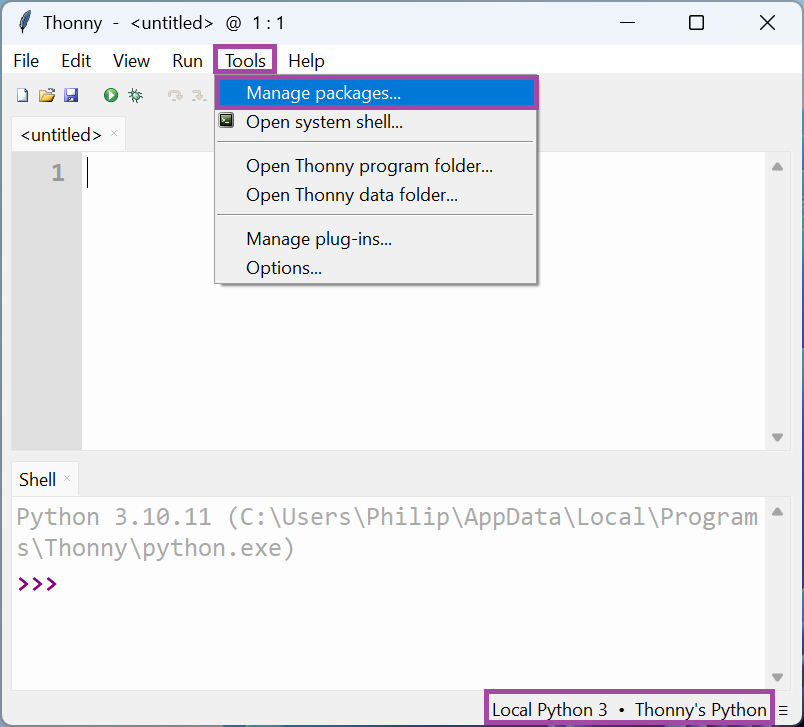

This Python environment is very basic and lacks the commonly used third-party data science libraries and lacks the conda package manager.

For best results, the Python environment should be changed. Select Tools → Options:

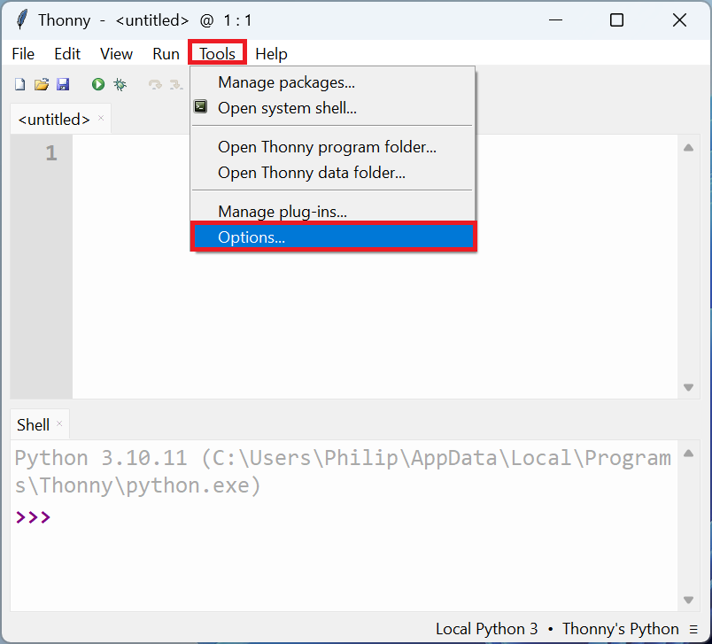

In interpreter select the dropdown or ... to browse using file explorer: 

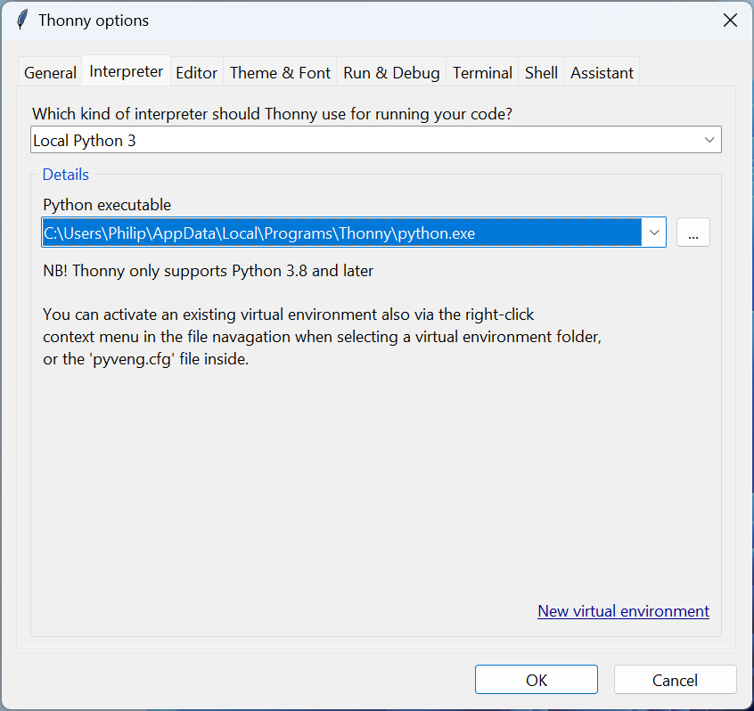

Change the location to the python.exe in the anaconda3 folder, whcih recall is the Python from the (base) Python environment:


Details about the Python environment will be displayed at the bottom:

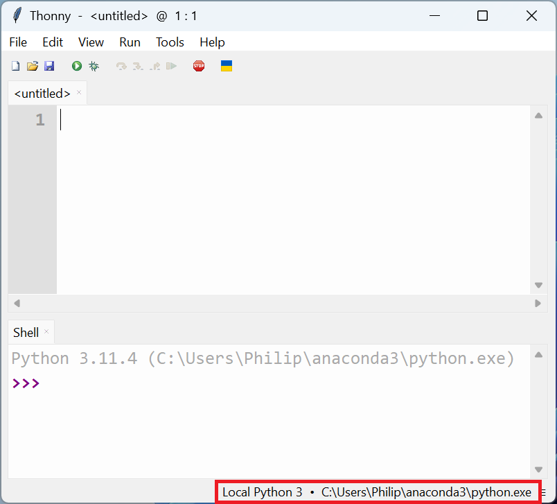

Thonny has a script editor and a shell similar to IDLE. Select File → Save As:

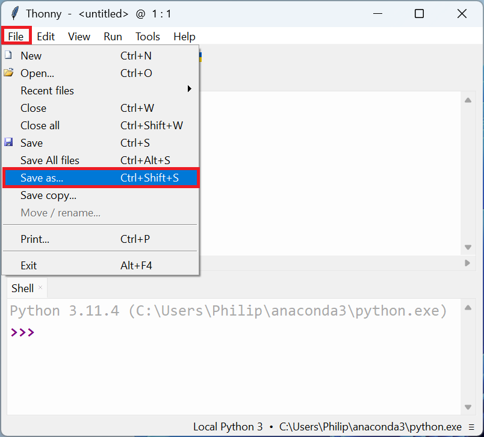

Save the file as a Python Script File (.py extension):

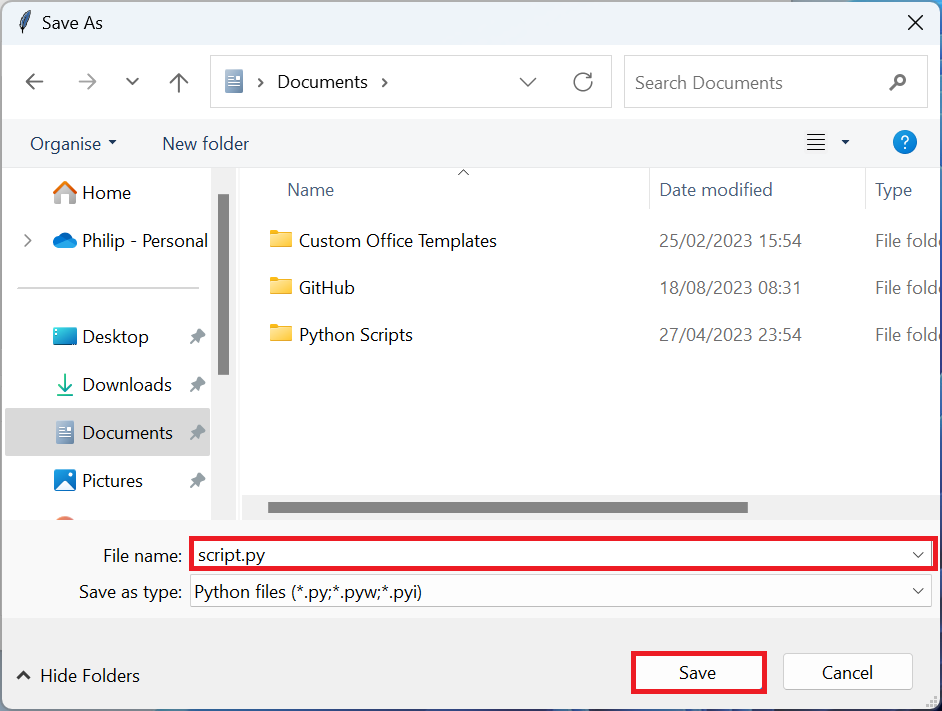

If p is input followed by a ↹ a list of identifiers display. The arrow keys ↑ and ↓ can be used to move up and down through this list and the docstring displays when the currently selected identifier is a function:

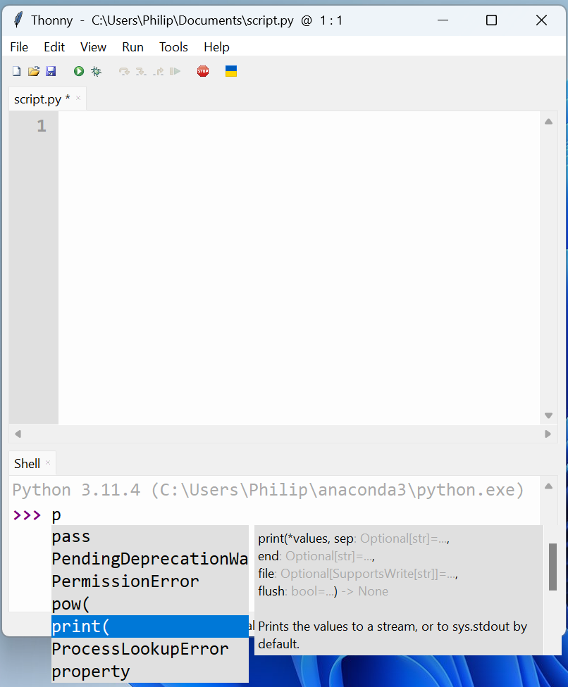

A test script file containing the code:

```
print('Hello World!')
```

can be run by selecting Run current script:

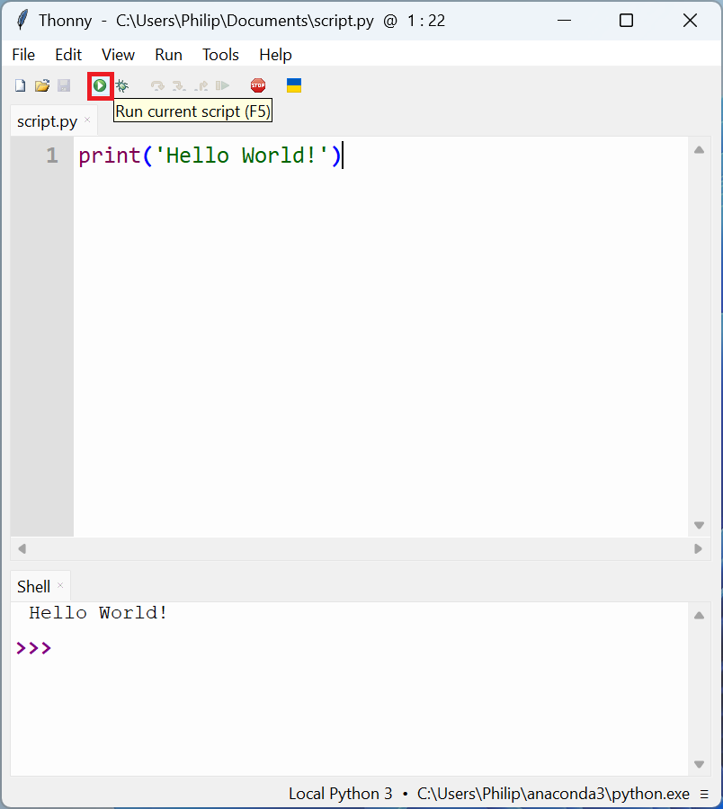

Some Python test code can be added to the script and it can be saved and run:

```
string = 'hello'
bytestring = b'hello'
bytearraystring = bytearray(b'hello')
wholenum = 1
floatingpointnum = 3.14
boolean = True
archive = (string, string, wholenum, floatingpointnum)
active = [string, string, wholenum, floatingpointnum]
unique = {string, string, wholenum, floatingpointnum}
mapping = {'r': 'red', 'g': 'green', 'b': 'blue'}
```

One of Thonnys strengths is it has has an option to view variables. Select View → Variables:

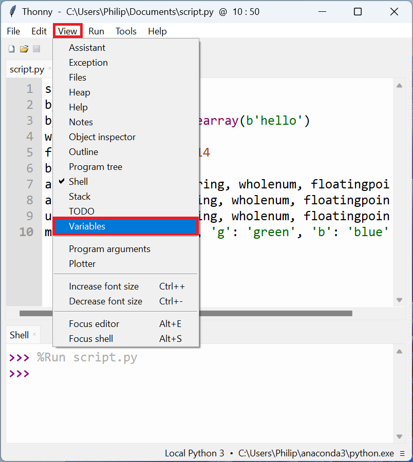

To the right the Variables will be displayed:

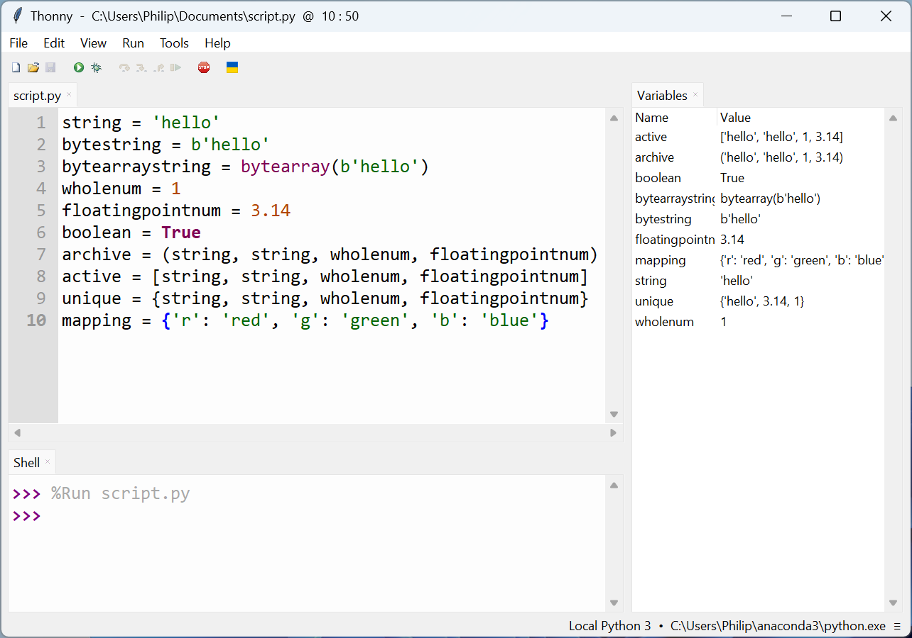

If Stop/Restart Backend is selected, the Kernel will be cleared and all Variales will be removed. Any library imports will also be removed:

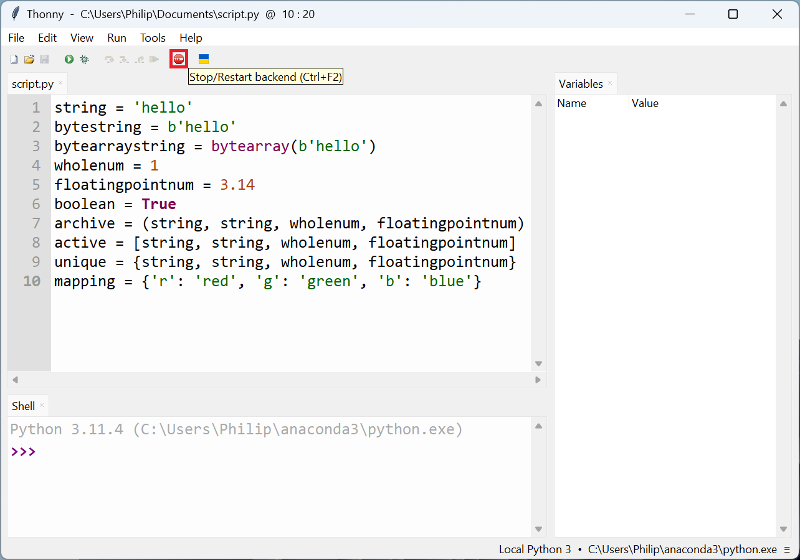

Code completion for Thonny only works in the Shell. The workflow for Thonny is usually to use the Shell line by line to test each line of code and then for each successful line of code to be added to the Python script.

A simple test can be put together which uses the third-party data science libraries:

```
import numpy as np
import pandas as pd
import matplotlib.pyplot as plt

array = np.array([1, 2, 3, 4])
df = pd.DataFrame({'x': np.array([1, 2, 3, 4, 5]),
                   'y': np.array([2, 4, 6, 8, 10])})

plt.plot(df['x'], df['y'])
plt.show()
```

Thonny also uses the TkAgg backend for Matplotlib and the plot displays in a seperate window. The console will remain busy until the plot is closed: 

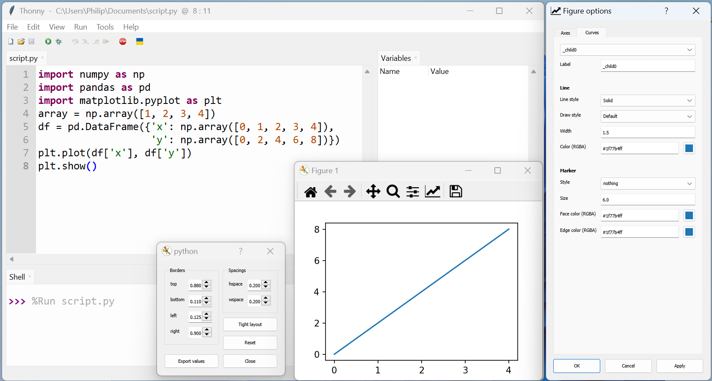

The Variables from the third-party data science libraries will display in variables after the plot is closed. The DataFrame instance df does not display correctly in my case:


[Return to Anaconda Tutorial](./readme.md)