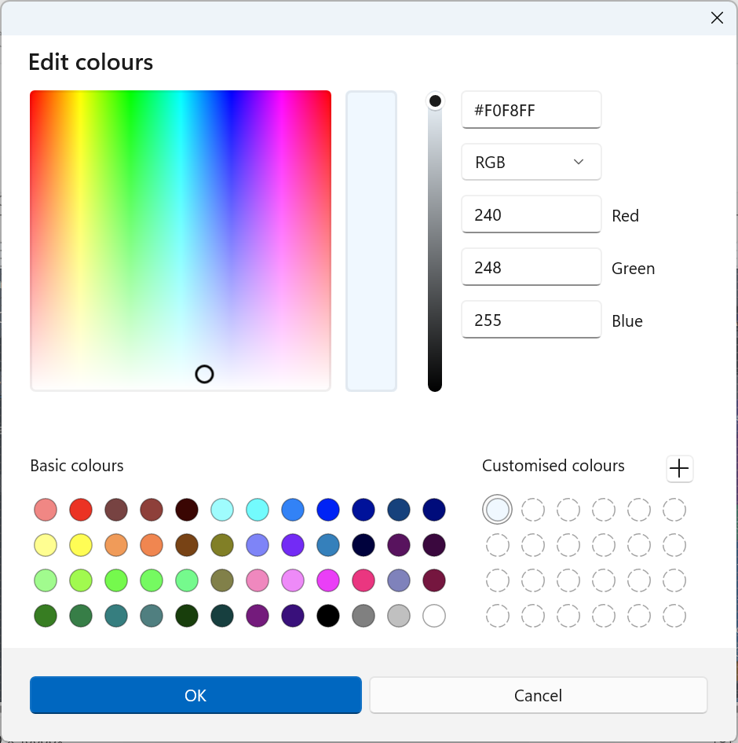
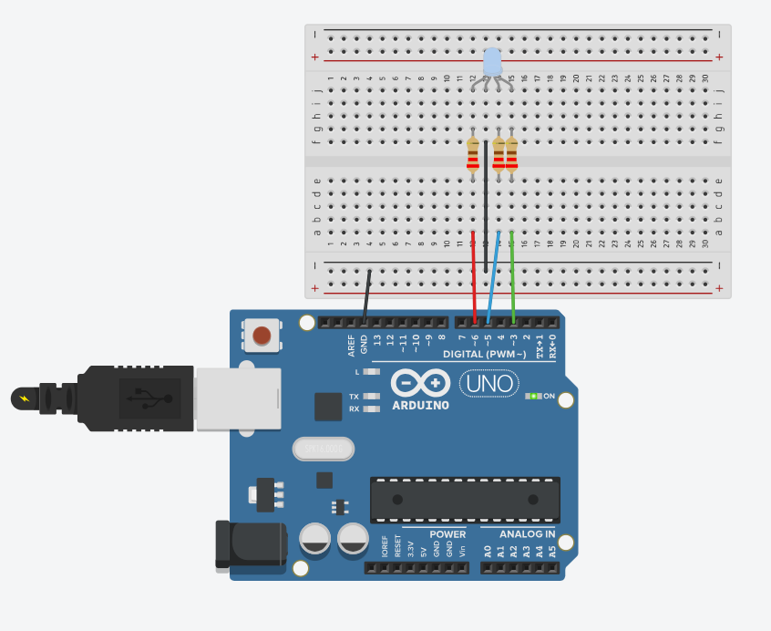
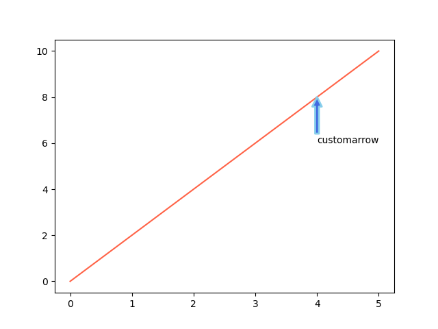
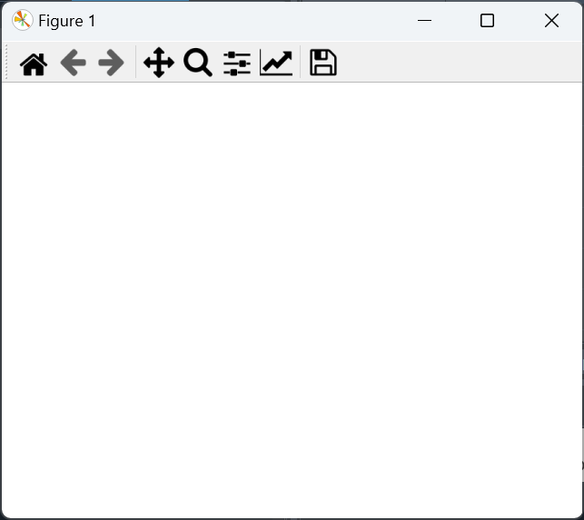
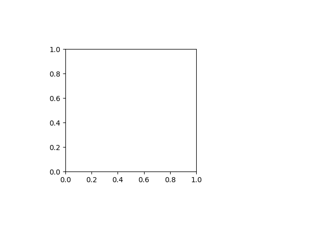
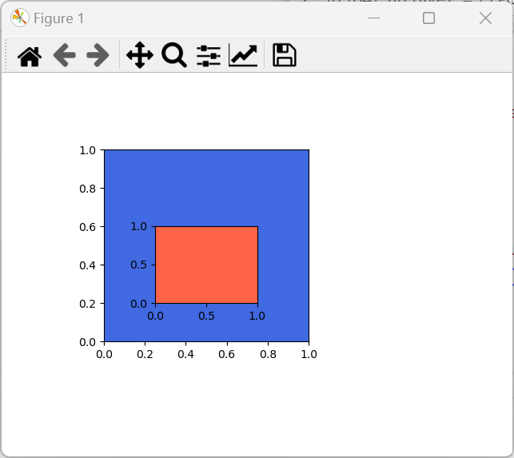

# Collection Datatypes

## The object Base Class and Collections Abstract Base Class

Recall from an earlier tutorial covering the Python data model that the `object` class is the `base` class of all classes. `dir` can be used to view a list of its identifiers:

```python
In [1]: dir(object)
Out[1]: ['__class__', '__delattr__', '__dir__', '__doc__', '__eq__', 
         '__format__', '__ge__', '__getattribute__', '__getstate__', '__gt__', 
         '__hash__', '__init__', '__init_subclass__', '__le__', '__lt__', 
         '__ne__', '__new__', '__reduce__', '__reduce_ex__', '__repr__', 
         '__setattr__', '__sizeof__', '__str__', '__subclasshook__']
```

The identifiers can also be viewed if `object` is input followed by a dot `.`:

```python
In [2]: object.
# -------------------------------
# Available Identifiers for `object`:
# -------------------------------------
#   🔧 Functions:
#     - __init__(self, /, *args, **kwargs)          : Initializes the object.
#     - __new__(*args, **kwargs)                    : Creates a new instance of the class.
#     - __delattr__(self, name, /)                  : Defines behavior for when an attribute is deleted.
#     - __dir__(self, /)                            : Default dir() implementation.
#     - __sizeof__(self, /)                         : Returns the size of the object in memory, in bytes.
#     - __eq__(self, value, /)                      : Checks for equality with another object.
#     - __ne__(self, value, /)                      : Checks for inequality with another object.
#     - __lt__(self, value, /)                      : Checks if the object is less than another.
#     - __le__(self, value, /)                      : Checks if the object is less than or equal to another.
#     - __gt__(self, value, /)                      : Checks if the object is greater than another.
#     - __ge__(self, value, /)                      : Checks if the object is greater than or equal to another.
#     - __repr__(self, /)                           : Returns a string representation of the object.
#     - __str__(self, /)                            : Returns a string for display purposes.
#     - __format__(self, format_spec, /)            : Returns a formatted string representation of the object.
#     - __hash__(self, /)                           : Returns a hash of the object.
#     - __getattribute__(self, name, /)             : Gets an attribute from the object.
#     - __setattr__(self, name, value, /)           : Sets an attribute on the object.
#     - __delattr__(self, name, /)                  : Deletes an attribute from the object.
#     - __reduce__(self, /)                         : Prepares the object for pickling.
#     - __reduce_ex__(self, protocol, /)            : Similar to __reduce__, with a protocol argument.
#     - __init_subclass__(...)                      : Called when a class is subclassed; default 
#                                                     implementation does nothing.
#     - __subclasshook__(...)                       : Customize issubclass() for abstract classes.
#
#    🔍 Attributes:
#     - __class__                                    : The class of the object.
#     - __doc__                                      : The docstring of the object.
# -------------------------------------
```

If the `tuple` class is now examined:

```python
In [2]: dir(tuple)
Out[2]: ['__add__', '__class__', '__class_getitem__', '__contains__', '__delattr__', 
         '__dir__', '__doc__', '__eq__', '__format__', '__ge__', '__getattribute__', 
         '__getitem__', '__getnewargs__', '__getstate__', '__gt__', '__hash__', 
         '__init__', '__init_subclass__', '__iter__', '__le__', '__len__', '__lt__', 
         '__mul__', '__ne__', '__new__', '__reduce__', '__reduce_ex__', '__repr__', 
         '__rmul__', '__setattr__', '__sizeof__', '__str__', '__subclasshook__', 
         'count', 'index']
```

Notice the high level of consistency with the identifiers in the `str` and the `bytes` classes, which was covered in the previous tutorial:

```python
In [3]: dir(str)
Out[3]: ['__add__', '__class__', '__contains__', '__delattr__', '__dir__', 
         '__doc__', '__eq__', '__format__', '__ge__', '__getattribute__', 
         '__getitem__', '__getstate__', '__gt__', '__hash__', '__init__', 
         '__init_subclass__', '__iter__', '__le__', '__len__', '__lt__', 
         '__mul__', '__ne__', '__new__', '__reduce__', '__repr__', 
         '__radd__', '__rmatmul__', '__rmul__', '__setattr__', '__sizeof__', 
         '__str__', '__subclasshook__', 'capitalize', 'casefold', 'center', 
         'count', 'encode', 'endswith', 'expandtabs', 'find', 'format', 
         'format_map', 'index', 'isalnum', 'isalpha', 'isdecimal', 'isdigit', 
         'isidentifier', 'islower', 'isnumeric', 'isprintable', 'isspace', 
         'istitle', 'isupper', 'join', 'ljust', 'lower', 'lstrip', 'maketrans', 
         'partition', 'replace', 'rfind', 'rindex', 'rjust', 'rpartition', 
         'rstrip', 'split', 'splitlines', 'startswith', 'strip', 'swapcase',
         'title', 'upper', 'zfill']
```

```python
In [4]: dir(bytes)
Out[4]: ['__add__', '__bytes__', '__class__', '__contains__', '__delattr__', 
         '__dir__', '__doc__', '__eq__', '__format__', '__ge__', '__getattribute__', 
         '__getitem__', '__getnewargs__', '__getstate__', '__gt__', '__hash__', 
         '__init__', '__init_subclass__', '__iter__', '__le__', '__len__', '__lt__', 
         '__mod__', '__mul__', '__ne__', '__new__', '__reduce__', '__reduce_ex__', 
         '__repr__', '__rmod__', '__rmul__', '__setattr__', '__sizeof__', '__str__', 
         '__subclasshook__', 'capitalize', 'center', 'count', 'decode', 'endswith', 
         'expandtabs', 'find', 'fromhex', 'hex', 'index', 'isalnum', 'isalpha', 
         'isascii', 'isdigit', 'islower', 'isspace', 'istitle', 'isupper', 'join', 
         'ljust', 'lower', 'lstrip', 'maketrans', 'partition', 'removeprefix', 
         'removesuffix', 'replace', 'rfind', 'rindex', 'rjust', 'rpartition', 
         'rsplit', 'rstrip', 'split', 'splitlines', 'startswith', 'strip', 
         'swapcase', 'title', 'translate', 'upper', 'zfill']
```

The `tuple`, `str` and `bytes` classes each have the following design pattern:

||ABC|Inherits from|Methods|
|---|---|---|---|
|0|`object`|||
|||||
|1|`Container`||`__contains__`|
|1|`Iterable`||`__iter__`|
|1|`Sized`||`__len__`|
|||||
|2|`Collection`|`Container`,<br>`Iterable`,<br>`Sized`|`__contains__`,<br>`__iter__`,<br>`__len__`|
|||||
|2|`Reversible`||`__reversed__`|
|||||
|3|`Sequence`|`Collection`,<br> `Reversible`|`__contains__`,<br>`__iter__`,<br>`__len__`,<br>`__reversible__`,<br><br>`__getitem__`,<br>`index`,<br>`count`,<br>`__add__`,<br>`__mul__`,<br>|

The abstract base class level 0 is the base class `object`, which is the base class of any Python `object`. The abstract base class level 4 is an  (immutable) `Sequence` that gives sequence based properties i.e. each of these classes is a `Sequence` of some sort of element. The `tuple` is a `Sequence` where each element in the `Sequence` is a reference to a Python `object`. The `str` is a `Sequence` where each element in the `Sequence` is a Unicode character and the `bytes` is a `Sequence` where each element in the `Sequence` is a byte, which is essentially an `int` between `0:256`. Immutable means an instance is read only and cannot be modified after instantiation.

When `tuple` is input, followed by a dot `.` the identifiers are typically listed alphabetically. However it is easier to understand the identifiers in the `tuple` class when the identifiers are grouped by design pattern and purpose:

```python
In [5]: tuple.
# -------------------------------
# Available Identifiers for `tuple`:
# -------------------------------------

# 🔧 Functions from `object` (inherited by `tuple`):
#     - __init__(self, /, *args, **kwargs)          : Initializes the object (tuple initialization).
#     - __new__(*args, **kwargs)                    : Creates a new instance of the tuple.
#     - __delattr__(self, name, /)                  : Defines behavior for when an attribute is deleted.
#     - __dir__(self, /)                            : Default dir() implementation.
#     - __sizeof__(self, /)                         : Returns the size of the object in memory, in bytes.
#     - __eq__(self, value, /)                      : Checks for equality with another object.
#     - __ne__(self, value, /)                      : Checks for inequality with another object.
#     - __lt__(self, value, /)                      : Checks if the object is less than another.
#     - __le__(self, value, /)                      : Checks if the object is less than or equal to another.
#     - __gt__(self, value, /)                      : Checks if the object is greater than another.
#     - __ge__(self, value, /)                      : Checks if the object is greater than or equal to another.
#     - __repr__(self, /)                           : Returns a string representation of the tuple.
#     - __str__(self, /)                            : Returns a string for display purposes.
#     - __format__(self, format_spec, /)            : Formats the object as a string.
#     - __hash__(self, /)                           : Returns a hash of the object.
#     - __getattribute__(self, name, /)             : Gets an attribute from the object.
#     - __setattr__(self, name, value, /)           : Sets an attribute on the object.
#     - __reduce__(self, /)                         : Prepares the object for pickling.
#     - __reduce_ex__(self, protocol, /)            : Similar to __reduce__, with a protocol argument.

# 🔍 Attributes from `object`:
#     - __class__                                   : The class of the tuple.
#     - __doc__                                     : The docstring of the tuple class.

# 🔧 Sequence-Based Methods (from `tuple` and the Collection ABC):
#     - __contains__(self, key, /)                  : Checks if an element is in the tuple (`in`).
#     - __iter__(self, /)                           : Returns an iterator over the tuple.
#     - __len__(self, /)                            : Returns the number of elements in the tuple.
#     - __getitem__(self, key, /)                   : Retrieves an element by index (`[]`).
#     - count(self, value, /)                       : Counts the number of occurrences of a value.
#     - index(self, value, start=0, end=-1, /)      : Returns the index of the first occurrence of a value.

# 🔧 Sequence-Like Operators:
#     - __add__(self, value, /)                     : Concatenates two tuples (`+`).
#     - __mul__(self, value, /)                     : Repeats the tuple (`*`).
#     - __rmul__(self, value, /)                    : Reflects multiplication (`*`).
```

The `tuple` has a `MutableSequence` counterpart `list`:

```python
In [6]: dir(list)
Out[6]: ['__add__', '__class__', '__class_getitem__', '__contains__', '__delattr__', 
         '__delitem__', '__dir__', '__doc__', '__eq__', '__format__', '__ge__', 
         '__getattribute__', '__getitem__', '__getstate__', '__gt__', '__hash__', 
         '__iadd__', '__imul__', '__init__', '__init_subclass__', '__iter__', 
         '__le__', '__len__', '__lt__', '__mul__', '__ne__', '__new__', 
         '__reduce__', '__reduce_ex__', '__repr__', '__reversed__', '__rmul__', 
         '__setattr__', '__setitem__', '__sizeof__', '__str__', '__subclasshook__', 
         'append', 'clear', 'copy', 'count', 'extend', 
         'index', 'insert', 'pop', 'remove', 'reverse', 'sort']
```

Notice consistency with the `bytearray` which is the `MutableSequence` counterpart to the `bytes`:

```python
In [7]: dir(bytearray)
Out[7]: ['__add__', '__alloc__', '__class__', '__contains__', '__delattr__', 
         '__delitem__', '__dir__', '__doc__', '__eq__', '__format__', '__ge__', 
         '__getattribute__', '__getitem__', '__getstate__', '__gt__', '__hash__', 
         '__iadd__', '__imul__', '__init__', '__init_subclass__', '__iter__', 
         '__le__', '__len__', '__lt__', '__mod__', '__mul__', '__ne__', 
         '__new__', '__reduce__', '__reduce_ex__', '__repr__', '__rmod__', 
         '__rmul__', '__setattr__', '__setitem__', '__sizeof__', '__str__', 
         '__subclasshook__', 'append', 'capitalize', 'center', 'clear', 
         'copy', 'count', 'decode', 'endswith', 'expandtabs', 'extend', 
         'find', 'fromhex', 'hex', 'index', 'insert', 'isalnum', 'isalpha', 
         'isascii', 'isdigit', 'islower', 'isspace', 'istitle', 'isupper', 
         'join', 'ljust', 'lower', 'lstrip', 'maketrans', 'partition', 
         'pop', 'remove', 'removeprefix', 'removesuffix', 'replace', 
         'reverse', 'rfind', 'rindex', 'rjust', 'rpartition', 'rsplit', 
         'rstrip', 'split', 'splitlines', 'startswith', 'strip', 'swapcase', 
         'title', 'translate', 'upper', 'zfill']
```

These classes follow the following level 4 `MutableSequence` design pattern and therefore have consistent behaviour to their immutable counterparts as they follow the same level 3 design pattern but have additional behaviour via level 4 which gives mutable methods:

||ABC|Inherits from|Methods|
|---|---|---|---|
|0|`object`|||
|||||
|1|`Container`||`__contains__`|
|1|`Iterable`||`__iter__`|
|1|`Sized`||`__len__`|
|||||
|2|`Collection`|`Container`,<br>`Iterable`,<br>`Sized`|`__contains__`,<br>`__iter__`,<br>`__len__`|
|||||
|2|`Reversible`||`__reversed__`|
|||||
|3|`Sequence`|`Collection`,<br> `Reversible`|`__contains__`,<br>`__iter__`,<br>`__len__`,<br>`__reversible__`,<br><br>`__getitem__`,<br>`index`,<br>`count`,<br>`__add__`,<br>`__mul__`,<br>|
|||||
|4|`MutableSequence`|`Sequence`|`__contains__`,<br>`__iter__`,<br>`__len__`,<br>`__reversible__`,<br><br>`__getitem__`,<br>`index`,<br>`count`,<br>`__add__`,<br>`__mul__`,<br><br>`append`,<br>`extend`,<br>`insert`,<br>`pop`,<br>`remove`,<br>`clear`,<br>`reverse`,<br>`__setitem__`, <br>`__delitem__`,<br>`__iadd__`,<br>`__imul__`,<br>|

The identifiers for the `list` class can be examined in more detail:

```python
In [8]: list.
# -------------------------------
# Available Identifiers for `list`:
# ---------------------------------

# 🔧 Functions from `object` (inherited by `list`):
#     - __init__(self, /, *args, **kwargs)             : Initializes the list object.
#     - __new__(*args, **kwargs)                       : Creates a new instance of the class.
#     - __delattr__(self, name, /)                     : Defines behavior for when an attribute is deleted.
#     - __dir__(self, /)                               : Default dir() implementation.
#     - __sizeof__(self, /)                            : Returns the size of the object in memory, in bytes.
#     - __eq__(self, value, /)                         : Checks for equality with another object.
#     - __ne__(self, value, /)                         : Checks for inequality with another object.
#     - __lt__(self, value, /)                         : Checks if the list is less than another.
#     - __le__(self, value, /)                         : Checks if the list is less than or equal to another.
#     - __gt__(self, value, /)                         : Checks if the list is greater than another.
#     - __ge__(self, value, /)                         : Checks if the list is greater than or equal to another.
#     - __repr__(self, /)                              : Returns a string representation of the list.
#     - __str__(self, /)                               : Returns a string for display purposes.
#     - __format__(self, format_spec, /)               : Returns a formatted string representation of the object.
#     - __hash__(self, /)                              : Returns a hash of the object.
#     - __getattribute__(self, name, /)                : Gets an attribute from the object.
#     - __setattr__(self, name, value, /)              : Sets an attribute on the object.
#     - __delattr__(self, name, /)                     : Deletes an attribute from the object.
#     - __reduce__(self, /)                            : Prepares the object for pickling.
#     - __reduce_ex__(self, protocol, /)               : Similar to __reduce__, with a protocol argument.

# 🔍 Attributes from `object`:
#     - __class__                                      : The class of the list object.
#     - __doc__                                        : The docstring of the list class.

# 🔧 Sequencen-Based Methods (from `list` and the Collection ABC):
#     - __contains__(self, item, /)                    : Checks if an item is in the list (`in`).
#     - __iter__(self, /)                              : Returns an iterator over the list.
#     - __len__(self, /)                               : Returns the length of the list.
#     - __getitem__(self, index, /)                    : Retrieves an item by index (`[]`).
#     - count(self, value, /)                          : Counts the occurrences of a value in the list.
#     - index(self, value, start=0, stop=None, /)      : Returns the index of the first occurrence of a value.

# 🔧 MutableSequence-Specific Methods:
#     - __setitem__(self, index, value, /)             : Assigns a value to an item (`[] =`).
#     - __delitem__(self, index, /)                    : Deletes an item from the list.
#     - append(self, item, /)                          : Appends an item to the end of the list.
#     - extend(self, iterable, /)                      : Appends all items from an iterable to the list.
#     - insert(self, index, item, /)                   : Inserts an item at a specific position.
#     - pop(self, index=-1, /)                         : Removes and returns an item at a given index.
#     - remove(self, value, /)                         : Removes the first occurrence of a value.
#     - clear(self, /)                                 : Removes all items from the list.
#     - reverse(self, /)                               : Reverses the order of the list in place.

# 🔧 Sequence-Like Operators:
#     - __add__(self, other, /)                        : Implements list concatenation (`+`).
#     - __mul__(self, other, /)                        : Implements list repetition (`*`).
#     - __rmul__(self, other, /)                       : Implements reflected multiplication (`*`).

# 🔧 Sorting and Copying:
#     - sort(self, key=None, reverse=False, /)         : Sorts the list in place.
#     - copy(self, /)                                  : Returns a shallow copy of the list.
```

The identifiers of the `frozenset` class can be examined:

```python
In [9]: dir(frozenset)
Out[9]: ['__and__', '__class__', '__class_getitem__', '__contains__', '__delattr__', 
         '__dir__', '__doc__', '__eq__', '__format__', '__ge__', '__getattribute__', 
         '__getstate__', '__gt__', '__hash__', '__init__', '__init_subclass__', 
         '__iter__', '__le__', '__len__', '__lt__', '__ne__', '__new__', '__or__', 
         '__rand__', '__reduce__', '__reduce_ex__', '__repr__', '__ror__', '__rsub__', 
         '__rxor__', '__setattr__', '__sizeof__', '__str__', '__sub__', '__subclasshook__', 
         '__xor__', 'copy', 'difference', 'intersection', 'isdisjoint', 'issubset', 
         'issuperset', 'symmetric_difference', 'union']
```

A `frozenset` follows the design pattern of a `Set`. Notice that this follows the level 2 design pattern of a `Collection` but not `Reversible` because a `Set` is unordered. The level 3 design pattern is a `Set` and this differs from a `Sequence` previously examined:

||ABC|Inherits from|Methods|
|---|---|---|---|
|0|`object`|||
|||||
|1|`Container`||`__contains__`|
|1|`Iterable`||`__iter__`|
|1|`Sized`||`__len__`|
|||||
|2|`Collection`|`Container`,<br>`Iterable`,<br>`Sized`|`__contains__`,<br>`__iter__`,<br>`__len__`|
|||||
|3|`Set`|`Collection`|`__contains__`,<br>`__iter__`,<br>`__len__`,<br><br>`union`,<br>`intersection`,<br>`difference`,<br>`symmetric_difference`,<br>`__le__`,<br>`__lt__`,<br>`__eq__`,<br>`__ne__`,<br>`__gt__`,<br>`__ge__`,<br>`__or__`,<br>`__and__`,<br>`__sub__`,<br>`__xor__`,<br>`isdisjoint`
|||||

A `frozenset` will therefore have consistent behaviour to a `tuple` as they both follow the level 2 design pattern of a `Collection` but the behaviour will differ because the `tuple` has an additional level 2 design pattern of `Reversible` and a level 3 design pattern of a `Sequence` wherease the `frozenset` has a level 3 design pattern of a `Set`. The `frozenset` therefore for example lacks the data model method `__getitem__` which comes from the level 3 design pattern `Sequence` and is used to access an element using a numeric index in a Sequence`. The `frozenset` is unordered and does not have a numeric index. Details about its identifiers are shown:

```python
In [10]: frozenset.
# -------------------------------
# Available Identifiers for `frozenset`:
# -------------------------------------

# 🔧 Functions from `object` (inherited by `frozenset`):
#     - __init__(self, /, *args, **kwargs)             : Initializes the frozenset.
#     - __new__(*args, **kwargs)                       : Creates a new instance of the frozenset class.
#     - __delattr__(self, name, /)                     : Deletes an attribute from the frozenset.
#     - __dir__(self, /)                               : Default dir() implementation.
#     - __repr__(self, /)                              : Returns a string representation of the frozenset.
#     - __str__(self, /)                               : Returns a string for display purposes.
#     - __hash__(self, /)                              : Returns a hash value for the frozenset (frozensets are hashable).
#     - __getattribute__(self, name, /)                : Gets an attribute from the frozenset.
#     - __setattr__(self, name, value, /)              : Sets an attribute on the frozenset (not applicable for immutable types).
#     - __delattr__(self, name, /)                     : Deletes an attribute from the frozenset (not applicable for immutable types).
#     - __reduce__(self, /)                            : Prepares the object for pickling.
#     - __reduce_ex__(self, protocol, /)               : Similar to __reduce__, with a protocol argument.
#     - __sizeof__(self, /)                            : Returns the size of the frozenset in memory, in bytes.
#     - __eq__(self, other, /)                         : Checks equality between frozensets.
#     - __ne__(self, other, /)                         : Checks inequality between frozensets.
#     - __lt__(self, other, /)                         : Checks if the frozenset is a strict subset of another.
#     - __le__(self, other, /)                         : Checks if the frozenset is a subset of another.
#     - __gt__(self, other, /)                         : Checks if the frozenset is a strict superset of another.
#     - __ge__(self, other, /)                         : Checks if the frozenset is a superset of another.

# 🔍 Attributes from `object`:
#     - __class__                                      : The class of the frozenset object.
#     - __doc__                                        : The docstring of the frozenset class.

# 🔧 Collection-Based Methods (from `frozenset`):
#     - __len__(self, /)                               : Returns the number of items in the frozenset.
#     - __contains__(self, item, /)                    : Checks if an item is in the frozenset (`in` operator).
#     - __iter__(self, /)                              : Returns an iterator over the frozenset.

# 🔄 Binary Frozenset Operators:
#     - __sub__(self, other, /)                        : Returns the difference between two frozensets (`-`).
#     - __and__(self, other, /)                        : Returns the intersection of two frozensets (`&`).
#     - __or__(self, other, /)                         : Returns the union of two frozensets (`|`).
#     - __xor__(self, other, /)                        : Returns the symmetric difference of two frozensets (`^`).

# 🔄 Immutable Frozenset Methods:
#     - intersection(self, *others)                     : Returns the intersection of this frozenset with others.
#     - union(self, *others)                            : Returns the union of this frozenset with others.
#     - difference(self, *others)                       : Returns the difference between this frozenset and others.
#     - symmetric_difference(self, other)               : Returns the symmetric difference between this frozenset and another.

# 🔧 Immutable Collection-Specific Methods:
#     - copy(self, /)                                  : Returns a shallow copy of the frozenset (returns the same object).

# 🔄 Frozenset Comparison Methods:
#     - isdisjoint(self, other, /)                     : Checks if two frozensets have no elements in common.
#     - issubset(self, other, /)                       : Checks if the frozenset is a subset of another.
#     - issuperset(self, other, /)                     : Checks if the frozenset is a superset of another.
```

The `frozenset` has an mutable counterpart `set`. Unlike the `bytes`/`bytearray` and `tuple`/`list`, where the immutable `Sequence` is the default, for `frozenset`/`set`, the `MutableSet` counterpart is the default:

```python
In [10]: dir(set)
Out[10]: ['__and__', '__class__', '__class_getitem__', '__contains__', '__delattr__', 
         '__dir__', '__doc__', '__eq__', '__format__', '__ge__', '__getattribute__', 
         '__getstate__', '__gt__', '__hash__', '__iand__', '__init__', '__init_subclass__', 
         '__ior__', '__isub__', '__iter__', '__ixor__', '__le__', '__len__', '__lt__', 
         '__ne__', '__new__', '__or__', '__rand__', '__reduce__', '__reduce_ex__', 
         '__repr__', '__ror__', '__rsub__', '__rxor__', '__setattr__', '__sizeof__', 
         '__str__', '__sub__', '__subclasshook__', '__xor__', 'add', 'clear', 'copy', 
         'difference', 'difference_update', 'discard', 'intersection', 'intersection_update', 
         'isdisjoint', 'issubset', 'issuperset', 'pop', 'remove', 
         'symmetric_difference', 'symmetric_difference_update', 'union', 'update']
```

The `set` follows the level 4 design pattern of a `MutableSet` and has a consistent design pattern with a `frozenset` as both the `frozenset` and `set` follow the level 3 design pattern of `Set`. Do not confuse the abstract base class `Set` (Pascal Case) with the builtins class `set` (lower case):

||ABC|Inherits from|Methods|
|---|---|---|---|
|0|`object`|||
|||||
|1|`Container`||`__contains__`|
|1|`Iterable`||`__iter__`|
|1|`Sized`||`__len__`|
|||||
|2|`Collection`|`Container`,<br>`Iterable`,<br>`Sized`|`__contains__`,<br>`__iter__`,<br>`__len__`|
|||||
|3|`Set`|`Collection`|`__contains__`,<br>`__iter__`,<br>`__len__`,<br><br>`union`,<br>`intersection`,<br>`difference`,<br>`symmetric_difference`,<br>`__le__`,<br>`__lt__`,<br>`__eq__`,<br>`__ne__`,<br>`__gt__`,<br>`__ge__`,<br>`__or__`,<br>`__and__`,<br>`__sub__`,<br>`__xor__`,<br>`isdisjoint`
|||||
|4|`MutableSet`|`Set`|`__contains__`,<br>`__iter__`,<br>`__len__`,<br><br>`union`,<br>`intersection`,<br>`difference`,<br>`symmetric_difference`,<br>`__le__`,<br>`__lt__`,<br>`__eq__`,<br>`__ne__`,<br>`__gt__`,<br>`__ge__`,<br>`__or__`,<br>`__and__`,<br>`__sub__`,<br>`__xor__`,<br>`isdisjoint`,<br>`add`,<br>`remove`,<br>`discard`,<br>`pop`,<br>`clear`,<br>`intersection_update`,<br>`update`,<br>`difference_update`,<br>`symmetric_difference_update`,<br>`__ior__`,<br>`__iand__`,<br>`__isub__`,<br>`__ixor__`|

The `set` classes identifiers can be examined:

```python
In [11]: set.
# -------------------------------
# Available Identifiers for `set`:
# -------------------------------------

# 🔧 Functions from `object` (inherited by `set`):
#     - __init__(self, /, *args, **kwargs)             : Initializes the set.
#     - __new__(*args, **kwargs)                       : Creates a new instance of the set class.
#     - __delattr__(self, name, /)                     : Deletes an attribute from the set.
#     - __dir__(self, /)                               : Default dir() implementation.
#     - __repr__(self, /)                              : Returns a string representation of the set.
#     - __str__(self, /)                               : Returns a string for display purposes.
#     - __hash__(self, /)                              : Not implemented (sets are unhashable).
#     - __getattribute__(self, name, /)                : Gets an attribute from the set.
#     - __setattr__(self, name, value, /)              : Sets an attribute on the set.
#     - __delattr__(self, name, /)                     : Deletes an attribute from the set.
#     - __reduce__(self, /)                            : Prepares the object for pickling.
#     - __reduce_ex__(self, protocol, /)               : Similar to __reduce__, with a protocol argument.
#     - __sizeof__(self, /)                            : Returns the size of the set in memory, in bytes.
#     - __eq__(self, other, /)                         : Checks equality between sets.
#     - __ne__(self, other, /)                         : Checks inequality between sets.
#     - __lt__(self, other, /)                         : Checks if the set is a strict subset of another.
#     - __le__(self, other, /)                         : Checks if the set is a subset of another.
#     - __gt__(self, other, /)                         : Checks if the set is a strict superset of another.
#     - __ge__(self, other, /)                         : Checks if the set is a superset of another.

# 🔍 Attributes from `object`:
#     - __class__                                      : The class of the set object.
#     - __doc__                                        : The docstring of the set class.

# 🔧 Collection-Based Methods (from `set`):
#     - __len__(self, /)                               : Returns the number of items in the set.
#     - __contains__(self, item, /)                    : Checks if an item is in the set (`in` operator).
#     - __iter__(self, /)                              : Returns an iterator over the set.

# 🔄 Binary Set Operators:
#     - __sub__(self, other, /)                        : Returns the difference between two sets (`-`).
#     - __and__(self, other, /)                        : Returns the intersection of two sets (`&`).
#     - __or__(self, other, /)                         : Returns the union of two sets (`|`).
#     - __xor__(self, other, /)                        : Returns the symmetric difference of two sets (`^`).

# 🔄 Immutable Set Methods:
#     - intersection(self, *others)                     : Returns the intersection of this set with others.
#     - union(self, *others)                            : Returns the union of this set with others.
#     - difference(self, *others)                       : Returns the difference between this set and others.
#     - symmetric_difference(self, other)               : Returns the symmetric difference between this set and another.

# 🔄 Set Comparison Methods:
#     - isdisjoint(self, other, /)                     : Checks if two sets have no elements in common.
#     - issubset(self, other, /)                       : Checks if the set is a subset of another.
#     - issuperset(self, other, /)                     : Checks if the set is a superset of another.

# 🧩 Conversion and Copying:
#     - copy(self, /)                                  : Returns a shallow copy of the set.

# 🔧 Mutable Collection-Specific Methods:
#     - add(self, element, /)                          : Adds an element to the set.
#     - remove(self, element, /)                       : Removes a specified element; raises KeyError if not found.
#     - discard(self, element, /)                      : Removes a specified element if it exists.
#     - pop(self, /)                                   : Removes and returns an arbitrary element; raises KeyError if empty.
#     - clear(self, /)                                 : Removes all elements from the set.

# 🔄 Mutable Set Methods:
#     - intersection_update(self, *others)             : Updates the set with the intersection of itself and others.
#     - update(self, *others)                          : Updates the set with the union of itself and others.
#     - difference_update(self, *others)               : Updates the set with the difference between itself and others.
#     - symmetric_difference_update(self, other, /)    : Updates the set with the symmetric difference of itself and another.

# 🔄 In-Place Set Operators:
#     - __ior__(self, other, /)                        : Implements in-place union operation (`|=`).
#     - __iand__(self, other, /)                       : Implements in-place intersection operation (`&=`).
#     - __isub__(self, other, /)                       : Implements in-place difference operation (`-=`).
#     - __ixor__(self, other, /)                       : Implements in-place symmetric difference operation (`^=`).
```

A `dict` is a `MutableMapping` where each element is an item. An *item* has a *key*, which is usually an immutable instance usually in the form of a `str` instance that maps to a *value* which is an `object`. The ability to change items or add/remove keys is fundamental to the utility of a `dict` and therefore the `dict` has no `builtins` immutable counterpart. 

```python
In [11]: dir(dict)
Out[11]: ['__class__', '__class_getitem__', '__contains__', '__delattr__', '__delitem__', 
          '__dir__', '__doc__', '__eq__', '__format__', '__ge__', '__getattribute__', 
          '__getitem__', '__getstate__', '__gt__', '__hash__', '__init__', '__init_subclass__', 
          '__ior__', '__iter__', '__le__', '__len__', '__lt__', '__ne__', '__new__', '__or__', 
          '__reduce__', '__reduce_ex__', '__repr__', '__reversed__', '__ror__', '__setattr__', 
          '__setitem__', '__sizeof__', '__str__', '__subclasshook__', 'clear', 'copy', 
          'fromkeys', 'get', 'items', 'keys', 'pop', 'popitem', 'setdefault', 'update', 'values']
```

The design pattern of a `MutableMapping` is based upon a `Mapping` which is in turn based upon a `Collection`:

||ABC|Inherits from|Methods|
|---|---|---|---|
|0|`object`|||
|||||
|1|`Container`||`__contains__`|
|1|`Iterable`||`__iter__`|
|1|`Sized`||`__len__`|
|||||
|2|`Collection`|`Container`,<br>`Iterable`,<br>`Sized`|`__contains__`,<br>`__iter__`,<br>`__len__`|
|||||
|3|`Mapping`|`Collection`|`__contains__`,<br>`__iter__`,<br>`__len__`,<br><br>`__getitem__`,<br>`keys`,<br>`items`,<br>`values`,<br>`get`,<br>`__eq__`,<br>,`__ne__`|
|||||
|4|`MutableMapping`|`Mapping`|`__contains__`,<br>`__iter__`,<br>`__len__`,<br><br>`__getitem__`,<br>`keys`,<br>`items`,<br>`values`,<br>`get`,<br>`__eq__`,<br>,`__ne__`,<br>`__setitem__`,<br>`__delitem__`,<br>,`update`,<br>,`setdefault`,<br>`pop`,<br>`popitem`,<br>`clear`,<br>|
|||||

In a `Mapping` the data model method `__getitem__` is defined to use the key to retrieve the value. The identifiers of the `dict` are as follows:

```python
In [12]: dict.
# -------------------------------
# Available Identifiers for `dict`:
# -------------------------------------

# 🔧 Functions from `object` (inherited by `dict`):
#     - __init__(self, /, *args, **kwargs)             : Initializes the dictionary.
#     - __new__(*args, **kwargs)                       : Creates a new instance of the dictionary class.
#     - __delattr__(self, name, /)                     : Deletes an attribute from the dictionary.
#     - __dir__(self, /)                               : Default dir() implementation.
#     - __repr__(self, /)                              : Returns a string representation of the dictionary.
#     - __str__(self, /)                               : Returns a string for display purposes.
#     - __hash__(self, /)                              : Not implemented (dictionaries are unhashable).
#     - __getattribute__(self, name, /)                : Gets an attribute from the dictionary.
#     - __setattr__(self, name, value, /)              : Sets an attribute on the dictionary.
#     - __delattr__(self, name, /)                     : Deletes an attribute from the dictionary.
#     - __reduce__(self, /)                            : Prepares the object for pickling.
#     - __reduce_ex__(self, protocol, /)               : Similar to __reduce__, with a protocol argument.
#     - __sizeof__(self, /)                            : Returns the size of the dictionary in memory, in bytes.
#     - __eq__(self, other, /)                         : Checks equality between dictionaries.
#     - __ne__(self, other, /)                         : Checks inequality between dictionaries.
#     - __lt__(self, other, /)                         : Checks if the dictionary is a strict subset of another.
#     - __le__(self, other, /)                         : Checks if the dictionary is a subset of another.
#     - __gt__(self, other, /)                         : Checks if the dictionary is a strict superset of another.
#     - __ge__(self, other, /)                         : Checks if the dictionary is a superset of another.

# 🔍 Attributes from `object`:
#     - __class__                                      : The class of the dictionary object.
#     - __doc__                                        : The docstring of the dictionary class.

# 🔧 Collection-Based Methods (from `dict`):
#     - __len__(self, /)                               : Returns the number of items in the dictionary.
#     - __contains__(self, key, /)                     : Checks if a key is in the dictionary (`in` operator).
#     - __iter__(self, /)                              : Returns an iterator over the dictionary's keys.
#     - __getitem__(self, key, /)                      : Returns the value associated with the key.

# 🧩 Conversion and Copying:
#     - copy(self, /)                                  : Returns a shallow copy of the dict.

# 🔄 Mapping-Specific Methods:
#     - keys(self, /)                                  : Returns a new view of the dictionary's keys.
#     - values(self, /)                                : Returns a new view of the dictionary's values.
#     - items(self, /)                                 : Returns a new view of the dictionary's items.
#     - get(self, key, default=None, /)                : Returns the value for the specified key, or default if not found.
#     - pop(self, key, /)                              : Removes the specified key and returns its value; raises KeyError if key not found.
#     - popitem(self, /)                               : Removes and returns the last (key, value) pair; raises KeyError if empty.
#     - clear(self, /)                                 : Removes all items from the dictionary.
#     - setdefault(self, key, default=None, /)         : Returns the value if key is in dictionary; inserts key with default value if not.
#     - update(self, /, *args, **kwargs)               : Updates the dictionary with another dictionary or iterable of key-value pairs.

# 🔄 Binary Dictionary Operators:
#     - __or__(self, other, /)                         : Merges two dictionaries (`|`).

# 🔧 Mutable Mapping-Specific Methods:
#     - __setitem__(self, key, value, /)               : Sets the value for the specified key.
#     - __delitem__(self, key, /)                      : Deletes the specified key from the dictionary.

# 🔄 In-Place Dictionary Operators:
#     - __ior__(self, other, /)                        : Implements in-place dictionary merging (`|=`).
```

## tuple and list Collections

Supposing the 5 `object` instances are instantiated to the instance names `a`, `b`, `c`, `d` and `e`:

```python
In [13]: a = object()
       : b = object()
       : c = object()
       : d = object()
       : e = object()
```

These five `object` instances can be grouped together into a `Sequence` by use of the `,` which acts as a delimiter:

```python
In [14]: a, b, c, d, e
Out[14]: 
(<object at 0x20fdbe56af0>,
 <object at 0x20fdbe56b20>,
 <object at 0x20fdbe56aa0>,
 <object at 0x20fdbe56a00>,
 <object at 0x20fdbe56a10>)
```

Notice that `Out[14]` displays the formal representation of each `object`. A comma acts as a delimiter and the `Sequence` is enclosed in brackets `()`. The brackets indicate that this `Sequence` is Python's default `Sequence` which is the `tuple` and should not be confused with the same brackets `()` when used with parenthesis. The difference between a `tuple` and parenthesis is clear for a multiple element `tuple` but care needs to be taken to avoid confusion between parenthesis and a single element `tuple` as shown below:

```python
In [15]: a,
Out[15]: (<object at 0x20fdbe56af0>,)

In [16]: a
Out[16]: <object at 0x20fdbe56af0>

In [17]: (a,)
Out[17]: (<object at 0x20fdbe56af0>,)

In [18]: (a)
Out[18]: <object at 0x20fdbe56af0>
```

Essentially the `,` is required after the single element, in order to instantiate a single element `tuple` as shown in `In [15]` and `In [17]`. Without this `,` any `()` is taken as parenthesis as shown in `In [18]`.

An empty pair of `()` are used to instantiate an empty `tuple`:

```python
In [19]: ()
Out[19]: ()
```

The `tuple` class can be used to explictly instantiate a `tuple` instance as shown in `In [20]` however `Out[20]` which is a print out of the formal representation shows that the shorthand form with the parenthesis is preferred:

```python
In [20]: tuple((a, b, c, d, e))
Out[20]:
(<object at 0x20fdbe56af0>,
 <object at 0x20fdbe56b20>,
 <object at 0x20fdbe56aa0>,
 <object at 0x20fdbe56a00>,
 <object at 0x20fdbe56a10>)
```

A `tuple` can instantiated using the following syntax `In [21]`, however notice that the print out of the formal representation `Out[21]` prefers inclusion of the parenthesis:

```python
In [21]: a, b, c, d, e
Out[21]: 
(<object at 0x20fdbe56af0>,
 <object at 0x20fdbe56b20>,
 <object at 0x20fdbe56aa0>,
 <object at 0x20fdbe56a00>,
 <object at 0x20fdbe56a10>)
```

The `()` are normally used when a `tuple` is used directly for example `tuple` instantiation to an `object` name:

```python
In [22]: nums = (1, 2, 3, 4, 5)
```

The `()` are normally omitted when a `tuple` is indirectly used for example when returning multiple instances from a function call. A function that returns multiple instances, normally does so indirectly via a `tuple` and therefore this is known as `tuple` unpacking. For example the function `divmod` has a return statement which returns multiple values via a `tuple`:

```python
In [23]: divmod(5, 3)
Out[23]: (1, 2)

In [24]: quotient_remainder_pair = divmod(5, 3)

In [25]: (quotient2, remainder2) = divmod(5, 3)

In [26]: quotient1, remainder1 = divmod(5, 3)
```

Notice the `tuple` in `Out[23]` contains two `int` instances `1` and `2`. Recall that an `int` is a child class of the `object` class and therefore can be used as an element in a `tuple`.

In `In [24]`, the `tuple` returned is assigned to an `object` name `quotient_remainder_pair`. 

In `In [25]` each component of the `tuple` returned is assigned to a separate `object` name. The `tuple` itself is not assigned to an `object` name and therefore the `()` are typically not included as shown in `In [26]` which is a more common syntax.

To delete multiple `object` names, `tuple` unpacking is normally used with the `del` statement. The parenthesis shown in `In [27]` are typically not included, like in `In [28]` which is more typical:

```python
In [26]: del quotient_remainder_pair
In [27]: del (quotient2, remainder2) 
In [28]: del quotient1, remainder1
```

`tuple` unpacking is also used to swap instance names. For example:

```python
In [29]: num1 = 1
       : num2 = 2
In [30]: (num1, num2) = (num2, num1)
       : # right hand side expression examined first
       : # (num1, num2) = (2, 1)
       : # assignment of each int instance made to respective object name to the left of = operator
In [31]: num1
       : 2
In [32]: num2
       : 1
In [33]: num1, num2
       : (2, 1) 
In [34]: num1, num2 = num2, num1
In [35]: num1, num2
Out[35]: (1, 2)
```

Once again the form shown in `In [34]` without the `()` is more typical than `In [30]`.

`tuple` unpacking is typically used within the return statement of a function and `In [37]` is more typical than `In [36]`:

```python
In [36]: def fun_1():
       :     return (1, 2)
       :
In [37]: def fun_2():
       :     return 1, 2
```

The immutable `tuple` should be preferentially used to group data together, that is not going to be later modified. The example of using a `tuple` to return multiple instances to `object` names is a good example because in this sue case the `tuple` created, itself was not assigned to an `object` name and is immediately cleaned up by Python's garbage collection. The additional overhead of a mutable instance is not required in this use case. Because many of the use cases highlighted above where a `tuple` is utilised is normally done so indirectly, begineer programmer often underutilise the `tuple` and overuse in favour for its mutable counterpart the `list`. The `list` is enclosed in square brackets `[]`:

```python
In [38]: [a, b, c, d, e]
Out[38]: 
[<object at 0x20fdbe56af0>,
 <object at 0x20fdbe56b20>,
 <object at 0x20fdbe56aa0>,
 <object at 0x20fdbe56a00>,
 <object at 0x20fdbe56a10>]
```

There is no ambiguity in the use of square brackets and a single element `list` can be instantiated without explict use of a `,` as shown in the return value `Out[38]`:

```python
In [38]: [a,]
Out[38]: [<object at 0x20fdbe56af0>]
```

An empty pair of `[]` are used to instantiate an empty `list`:

```python
In [39]: []
Out[39]: []
```

The `list` class can be used to explictly instantiate a `list` instance as shown in `In [40]` however `Out[40]` which is a print out of the formal representation shows that the shorthand form with the parenthesis is preferred:

```python
In [40]: list([a, b, c, d, e])
Out[40]: 
[<object at 0x20fdbe56af0>,
 <object at 0x20fdbe56b20>,
 <object at 0x20fdbe56aa0>,
 <object at 0x20fdbe56a00>,
 <object at 0x20fdbe56a10>]
```

Typically the `builtins` classes are used to cast a class from one `builtins` to another:

```python
In [41]: list((a, b, c, d, e))
Out[41]: 
[<object at 0x20fdbe56af0>,
 <object at 0x20fdbe56b20>,
 <object at 0x20fdbe56aa0>,
 <object at 0x20fdbe56a00>,
 <object at 0x20fdbe56a10>]

In [42]: tuple([a, b, c, d, e])
Out[42]: 
(<object at 0x20fdbe56af0>,
 <object at 0x20fdbe56b20>,
 <object at 0x20fdbe56aa0>,
 <object at 0x20fdbe56a00>,
 <object at 0x20fdbe56a10>)
```

Recall that the `str` and `bytes` classes are also `Sequence` and therefore can be cast into a `tuple`. The `tuple` instance casted from a `str` has a 1 Unicode character `str` as each element and the `tuple` cast from a `bytes` instance has a `int` between `0:255` as each element. Notice that `Out[44]` shows each element on a single line and `Out[46]` displays each element on an individual line. This is done because `Out[46]` is a longer `tuple` that cannot be fitted on one line:

```python
In [43]: 'Γεια σου Κοσμο!'
       : 'Γεια σου Κοσμο!'

In [44]: tuple('Γεια σου Κοσμο!')
Out[44]: ('Γ', 'ε', 'ι', 'α', ' ', 'σ', 'ο', 'υ', ' ', 'Κ', 'ο', 'σ', 'μ', 'ο', '!')

In [45]: bytes('Γεια σου Κοσμο!', encoding='utf-8')
Out[45]: b'\xce\x93\xce\xb5\xce\xb9\xce\xb1 \xcf\x83\xce\xbf\xcf\x85 \xce\x9a\xce\xbf\xcf\x83\xce\xbc\xce\xbf!'

In [46]: tuple(bytes('Γεια σου Κοσμο!', encoding='utf-8'))
Out[46]: 
(206,
 147,
 206,
 181,
 206,
 185,
 206,
 177,
 32,
 207,
 131,
 206,
 191,
 207,
 133,
 32,
 206,
 154,
 206,
 191,
 207,
 131,
 206,
 188,
 206,
 191,
 33)
```

The `tuple` can also be written using multiple lines, showing multiple elements on each line as convenient:

```python
In [47]: (206, 147, 206, 181, 206, 185, 206, 177, 32, 207, 
          131, 206, 191, 207, 133, 32, 206, 154, 206, 191, 
          207, 131, 206, 188, 206, 191, 33)
Out[47]:
(206,
 147,
 206,
 181,
 206,
 185,
 206,
 177,
 32,
 207,
 131,
 206,
 191,
 207,
 133,
 32,
 206,
 154,
 206,
 191,
 207,
 131,
 206,
 188,
 206,
 191,
 33)
```

A `bytes` instance can be instantiated by casting a `tuple` of `int` instances:

```python
In [48]: bytes((206, 147, 206, 181, 206, 185, 206, 177, 32, 207, 
              131, 206, 191, 207, 133, 32, 206, 154, 206, 191, 
              207, 131, 206, 188, 206, 191, 33))
Out[48]: b'\xce\x93\xce\xb5\xce\xb9\xce\xb1 \xcf\x83\xce\xbf\xcf\x85 \xce\x9a\xce\xbf\xcf\x83\xce\xbc\xce\xbf!'
```

If the following three instances are instaniated to `object` names:

```python
In [44]: text = 'Γεια σου Κοσμο!'
       : text_b = bytes('Γεια σου Κοσμο!', encoding='utf-8')
       : archive = ('Γεια', 'Γεια', 'Γεια', 1, 1, True, 3.14, 2)
```

They can be viewed in the Variable Explorer:

<table style="width: 65%; border-collapse: collapse; font-family: sans-serif;">
  <tr>
    <th colspan="4" style="text-align:center; padding: 8px; background-color: #2d2d30; color: #ffffff;">Variable Explorer</th>
  </tr>
  <tr>
    <th style="padding: 8px; background-color: #252526; color: #ffffff;">Name ▲</th>
    <th style="padding: 8px; background-color: #252526; color: #ffffff;">Type</th>
    <th style="padding: 8px; background-color: #252526; color: #ffffff;">Size</th>
    <th style="padding: 8px; background-color: #252526; color: #ffffff;">Value</th>
  </tr>
  <tr>
    <td style="padding: 8px; background-color: #1e1e1e; color: #ffffff;">text</td>
    <td style="padding: 8px; background-color: #1e1e1e; color: #ffffff;">str</td>
    <td style="padding: 8px; background-color: #1e1e1e; color: #ffffff;">15</td>
    <td style="padding: 8px; background-color: #506E16; color: #ffffff;">Γεια σου Κοσμο!</td> <!-- String background -->
  </tr>
  <tr>
    <td style="padding: 8px; background-color: #1e1e1e; color: #ffffff;">text_b</td>
    <td style="padding: 8px; background-color: #1e1e1e; color: #ffffff;">bytes</td>
    <td style="padding: 8px; background-color: #1e1e1e; color: #ffffff;">27</td>
    <td style="padding: 8px; background-color: #287B68; color: #ffffff;">'Γεια σου Κοσμο!'</td> <!-- Bytes background -->
  </tr>
  <tr>
    <td style="padding: 8px; background-color: #1e1e1e; color: #ffffff;">archive</td>
    <td style="padding: 8px; background-color: #1e1e1e; color: #ffffff;">tuple</td>
    <td style="padding: 8px; background-color: #1e1e1e; color: #ffffff;">8</td>
    <td style="padding: 8px; background-color: #3A3586; color: #ffffff;">('Γεια', 'Γεια', 'Γεια', 1, 1, True, 3.14, 2)</td> <!-- Tuple background -->
  </tr>
</table>

The `tuple` instance `archive` can be explored in the Variable Explorer:

<table style="width: 80%; border-collapse: collapse; font-family: sans-serif;">
  <tr>
    <th colspan="4" style="text-align:center; padding: 8px; background-color: #2d2d30; color: #ffffff;">archive - tuple (8 elements)</th>
  </tr>
  <tr>
    <th style="padding: 8px; background-color: #252526; color: #ffffff;">Index ▲</th>
    <th style="padding: 8px; background-color: #252526; color: #ffffff;">Type</th>
    <th style="padding: 8px; background-color: #252526; color: #ffffff;">Size</th>
    <th style="padding: 8px; background-color: #252526; color: #ffffff;">Value</th>
  </tr>
  <tr>
    <td style="padding: 8px; background-color: #1e1e1e; color: #ffffff;">0</td>
    <td style="padding: 8px; background-color: #1e1e1e; color: #ffffff;">str</td>
    <td style="padding: 8px; background-color: #1e1e1e; color: #ffffff;">4</td>
    <td style="padding: 8px; background-color: #1e1e1e; color: #ffffff;">Γεια</td> <!-- Value background -->
  </tr>
  <tr>
    <td style="padding: 8px; background-color: #1e1e1e; color: #ffffff;">1</td>
    <td style="padding: 8px; background-color: #1e1e1e; color: #ffffff;">str</td>
    <td style="padding: 8px; background-color: #1e1e1e; color: #ffffff;">4</td>
    <td style="padding: 8px; background-color: #1e1e1e; color: #ffffff;">Γεια</td> <!-- Value background -->
  </tr>
  <tr>
    <td style="padding: 8px; background-color: #1e1e1e; color: #ffffff;">2</td>
    <td style="padding: 8px; background-color: #1e1e1e; color: #ffffff;">str</td>
    <td style="padding: 8px; background-color: #1e1e1e; color: #ffffff;">4</td>
    <td style="padding: 8px; background-color: #1e1e1e; color: #ffffff;">Γεια</td> <!-- Value background -->
  </tr>
  <tr>
    <td style="padding: 8px; background-color: #1e1e1e; color: #ffffff;">3</td>
    <td style="padding: 8px; background-color: #1e1e1e; color: #ffffff;">int</td>
    <td style="padding: 8px; background-color: #1e1e1e; color: #ffffff;">1</td>
    <td style="padding: 8px; background-color: #1e1e1e; color: #ffffff;">1</td> <!-- Value background -->
  </tr>
  <tr>
    <td style="padding: 8px; background-color: #1e1e1e; color: #ffffff;">4</td>
    <td style="padding: 8px; background-color: #1e1e1e; color: #ffffff;">int</td>
    <td style="padding: 8px; background-color: #1e1e1e; color: #ffffff;">1</td>
    <td style="padding: 8px; background-color: #1e1e1e; color: #ffffff;">1</td> <!-- Value background -->
  </tr>
  <tr>
    <td style="padding: 8px; background-color: #1e1e1e; color: #ffffff;">5</td>
    <td style="padding: 8px; background-color: #1e1e1e; color: #ffffff;">bool</td>
    <td style="padding: 8px; background-color: #1e1e1e; color: #ffffff;">1</td>
    <td style="padding: 8px; background-color: #1e1e1e; color: #ffffff;">True</td> <!-- Value background -->
  </tr>
  <tr>
    <td style="padding: 8px; background-color: #1e1e1e; color: #ffffff;">6</td>
    <td style="padding: 8px; background-color: #1e1e1e; color: #ffffff;">float</td>
    <td style="padding: 8px; background-color: #1e1e1e; color: #ffffff;">1</td>
    <td style="padding: 8px; background-color: #1e1e1e; color: #ffffff;">3.14</td> <!-- Value background -->
  </tr>
  <tr>
    <td style="padding: 8px; background-color: #1e1e1e; color: #ffffff;">7</td>
    <td style="padding: 8px; background-color: #1e1e1e; color: #ffffff;">int</td>
    <td style="padding: 8px; background-color: #1e1e1e; color: #ffffff;">1</td>
    <td style="padding: 8px; background-color: #1e1e1e; color: #ffffff;">2</td> <!-- Value background -->
  </tr>
</table>

Notice that the `tuple` is an ordered `Sequence` that can contain duplicate references to the same `object`. Since the `str` and `bytes` are also immutable `Collections` they can also be conceptualised like a `tuple`:

<table style="width: 80%; border-collapse: collapse; font-family: sans-serif;">
  <tr>
    <th colspan="4" style="text-align:center; padding: 8px; background-color: #2d2d30; color: #ffffff;">text - str (15 elements)</th>
  </tr>
  <tr>
    <th style="padding: 8px; background-color: #252526; color: #ffffff;">Index ▲</th>
    <th style="padding: 8px; background-color: #252526; color: #ffffff;">Type</th>
    <th style="padding: 8px; background-color: #252526; color: #ffffff;">Size</th>
    <th style="padding: 8px; background-color: #252526; color: #ffffff;">Value</th>
  </tr>
  <tr>
    <td style="padding: 8px; background-color: #1e1e1e; color: #ffffff;">0</td>
    <td style="padding: 8px; background-color: #1e1e1e; color: #ffffff;">str</td>
    <td style="padding: 8px; background-color: #1e1e1e; color: #ffffff;">1</td>
    <td style="padding: 8px; background-color: #1e1e1e; color: #ffffff;">Γ</td>
  </tr>
  <tr>
    <td style="padding: 8px; background-color: #1e1e1e; color: #ffffff;">1</td>
    <td style="padding: 8px; background-color: #1e1e1e; color: #ffffff;">str</td>
    <td style="padding: 8px; background-color: #1e1e1e; color: #ffffff;">1</td>
    <td style="padding: 8px; background-color: #1e1e1e; color: #ffffff;">ε</td>
  </tr>
  <tr>
    <td style="padding: 8px; background-color: #1e1e1e; color: #ffffff;">2</td>
    <td style="padding: 8px; background-color: #1e1e1e; color: #ffffff;">str</td>
    <td style="padding: 8px; background-color: #1e1e1e; color: #ffffff;">1</td>
    <td style="padding: 8px; background-color: #1e1e1e; color: #ffffff;">ι</td>
  </tr>
  <tr>
    <td style="padding: 8px; background-color: #1e1e1e; color: #ffffff;">3</td>
    <td style="padding: 8px; background-color: #1e1e1e; color: #ffffff;">str</td>
    <td style="padding: 8px; background-color: #1e1e1e; color: #ffffff;">1</td>
    <td style="padding: 8px; background-color: #1e1e1e; color: #ffffff;">α</td>
  </tr>
  <tr>
    <td style="padding: 8px; background-color: #1e1e1e; color: #ffffff;">4</td>
    <td style="padding: 8px; background-color: #1e1e1e; color: #ffffff;">str</td>
    <td style="padding: 8px; background-color: #1e1e1e; color: #ffffff;">1</td>
    <td style="padding: 8px; background-color: #1e1e1e; color: #ffffff;"> </td>
  </tr>
  <tr>
    <td style="padding: 8px; background-color: #1e1e1e; color: #ffffff;">5</td>
    <td style="padding: 8px; background-color: #1e1e1e; color: #ffffff;">str</td>
    <td style="padding: 8px; background-color: #1e1e1e; color: #ffffff;">1</td>
    <td style="padding: 8px; background-color: #1e1e1e; color: #ffffff;">σ</td>
  </tr>
  <tr>
    <td style="padding: 8px; background-color: #1e1e1e; color: #ffffff;">6</td>
    <td style="padding: 8px; background-color: #1e1e1e; color: #ffffff;">str</td>
    <td style="padding: 8px; background-color: #1e1e1e; color: #ffffff;">1</td>
    <td style="padding: 8px; background-color: #1e1e1e; color: #ffffff;">ο</td>
  </tr>
  <tr>
    <td style="padding: 8px; background-color: #1e1e1e; color: #ffffff;">7</td>
    <td style="padding: 8px; background-color: #1e1e1e; color: #ffffff;">str</td>
    <td style="padding: 8px; background-color: #1e1e1e; color: #ffffff;">1</td>
    <td style="padding: 8px; background-color: #1e1e1e; color: #ffffff;">υ</td>
  </tr>
  <tr>
    <td style="padding: 8px; background-color: #1e1e1e; color: #ffffff;">8</td>
    <td style="padding: 8px; background-color: #1e1e1e; color: #ffffff;">str</td>
    <td style="padding: 8px; background-color: #1e1e1e; color: #ffffff;">1</td>
    <td style="padding: 8px; background-color: #1e1e1e; color: #ffffff;"> </td>
  </tr>
  <tr>
    <td style="padding: 8px; background-color: #1e1e1e; color: #ffffff;">9</td>
    <td style="padding: 8px; background-color: #1e1e1e; color: #ffffff;">str</td>
    <td style="padding: 8px; background-color: #1e1e1e; color: #ffffff;">1</td>
    <td style="padding: 8px; background-color: #1e1e1e; color: #ffffff;">Κ</td>
  </tr>
  <tr>
    <td style="padding: 8px; background-color: #1e1e1e; color: #ffffff;">10</td>
    <td style="padding: 8px; background-color: #1e1e1e; color: #ffffff;">str</td>
    <td style="padding: 8px; background-color: #1e1e1e; color: #ffffff;">1</td>
    <td style="padding: 8px; background-color: #1e1e1e; color: #ffffff;">ο</td>
  </tr>
  <tr>
    <td style="padding: 8px; background-color: #1e1e1e; color: #ffffff;">11</td>
    <td style="padding: 8px; background-color: #1e1e1e; color: #ffffff;">str</td>
    <td style="padding: 8px; background-color: #1e1e1e; color: #ffffff;">1</td>
    <td style="padding: 8px; background-color: #1e1e1e; color: #ffffff;">σ</td>
  </tr>
  <tr>
    <td style="padding: 8px; background-color: #1e1e1e; color: #ffffff;">12</td>
    <td style="padding: 8px; background-color: #1e1e1e; color: #ffffff;">str</td>
    <td style="padding: 8px; background-color: #1e1e1e; color: #ffffff;">1</td>
    <td style="padding: 8px; background-color: #1e1e1e; color: #ffffff;">μ</td>
  </tr>
  <tr>
    <td style="padding: 8px; background-color: #1e1e1e; color: #ffffff;">13</td>
    <td style="padding: 8px; background-color: #1e1e1e; color: #ffffff;">str</td>
    <td style="padding: 8px; background-color: #1e1e1e; color: #ffffff;">1</td>
    <td style="padding: 8px; background-color: #1e1e1e; color: #ffffff;">ο</td>
  </tr>
  <tr>
    <td style="padding: 8px; background-color: #1e1e1e; color: #ffffff;">14</td>
    <td style="padding: 8px; background-color: #1e1e1e; color: #ffffff;">str</td>
    <td style="padding: 8px; background-color: #1e1e1e; color: #ffffff;">1</td>
    <td style="padding: 8px; background-color: #1e1e1e; color: #ffffff;">!</td>
  </tr>
</table>

<table style="width: 80%; border-collapse: collapse; font-family: sans-serif;">
  <tr>
    <th colspan="4" style="text-align:center; padding: 8px; background-color: #2d2d30; color: #ffffff;">text_b - bytes (27 elements)</th>
  </tr>
  <tr>
    <th style="padding: 8px; background-color: #252526; color: #ffffff;">Index ▲</th>
    <th style="padding: 8px; background-color: #252526; color: #ffffff;">Type</th>
    <th style="padding: 8px; background-color: #252526; color: #ffffff;">Size</th>
    <th style="padding: 8px; background-color: #252526; color: #ffffff;">Value</th>
  </tr>
  <tr>
    <td style="padding: 8px; background-color: #1e1e1e; color: #ffffff;">0</td>
    <td style="padding: 8px; background-color: #1e1e1e; color: #ffffff;">int</td>
    <td style="padding: 8px; background-color: #1e1e1e; color: #ffffff;">1</td>
    <td style="padding: 8px; background-color: #1e1e1e; color: #ffffff;">206</td>
  </tr>
  <tr>
    <td style="padding: 8px; background-color: #1e1e1e; color: #ffffff;">1</td>
    <td style="padding: 8px; background-color: #1e1e1e; color: #ffffff;">int</td>
    <td style="padding: 8px; background-color: #1e1e1e; color: #ffffff;">1</td>
    <td style="padding: 8px; background-color: #1e1e1e; color: #ffffff;">147</td>
  </tr>
  <tr>
    <td style="padding: 8px; background-color: #1e1e1e; color: #ffffff;">2</td>
    <td style="padding: 8px; background-color: #1e1e1e; color: #ffffff;">int</td>
    <td style="padding: 8px; background-color: #1e1e1e; color: #ffffff;">1</td>
    <td style="padding: 8px; background-color: #1e1e1e; color: #ffffff;">206</td>
  </tr>
  <tr>
    <td style="padding: 8px; background-color: #1e1e1e; color: #ffffff;">3</td>
    <td style="padding: 8px; background-color: #1e1e1e; color: #ffffff;">int</td>
    <td style="padding: 8px; background-color: #1e1e1e; color: #ffffff;">1</td>
    <td style="padding: 8px; background-color: #1e1e1e; color: #ffffff;">181</td>
  </tr>
  <tr>
    <td style="padding: 8px; background-color: #1e1e1e; color: #ffffff;">4</td>
    <td style="padding: 8px; background-color: #1e1e1e; color: #ffffff;">int</td>
    <td style="padding: 8px; background-color: #1e1e1e; color: #ffffff;">1</td>
    <td style="padding: 8px; background-color: #1e1e1e; color: #ffffff;">206</td>
  </tr>
  <tr>
    <td style="padding: 8px; background-color: #1e1e1e; color: #ffffff;">5</td>
    <td style="padding: 8px; background-color: #1e1e1e; color: #ffffff;">int</td>
    <td style="padding: 8px; background-color: #1e1e1e; color: #ffffff;">1</td>
    <td style="padding: 8px; background-color: #1e1e1e; color: #ffffff;">185</td>
  </tr>
  <tr>
    <td style="padding: 8px; background-color: #1e1e1e; color: #ffffff;">6</td>
    <td style="padding: 8px; background-color: #1e1e1e; color: #ffffff;">int</td>
    <td style="padding: 8px; background-color: #1e1e1e; color: #ffffff;">1</td>
    <td style="padding: 8px; background-color: #1e1e1e; color: #ffffff;">206</td>
  </tr>
  <tr>
    <td style="padding: 8px; background-color: #1e1e1e; color: #ffffff;">7</td>
    <td style="padding: 8px; background-color: #1e1e1e; color: #ffffff;">int</td>
    <td style="padding: 8px; background-color: #1e1e1e; color: #ffffff;">1</td>
    <td style="padding: 8px; background-color: #1e1e1e; color: #ffffff;">177</td>
  </tr>
  <tr>
    <td style="padding: 8px; background-color: #1e1e1e; color: #ffffff;">8</td>
    <td style="padding: 8px; background-color: #1e1e1e; color: #ffffff;">int</td>
    <td style="padding: 8px; background-color: #1e1e1e; color: #ffffff;">1</td>
    <td style="padding: 8px; background-color: #1e1e1e; color: #ffffff;">32</td>
  </tr>
  <tr>
    <td style="padding: 8px; background-color: #1e1e1e; color: #ffffff;">9</td>
    <td style="padding: 8px; background-color: #1e1e1e; color: #ffffff;">int</td>
    <td style="padding: 8px; background-color: #1e1e1e; color: #ffffff;">1</td>
    <td style="padding: 8px; background-color: #1e1e1e; color: #ffffff;">207</td>
  </tr>
  <tr>
    <td style="padding: 8px; background-color: #1e1e1e; color: #ffffff;">10</td>
    <td style="padding: 8px; background-color: #1e1e1e; color: #ffffff;">int</td>
    <td style="padding: 8px; background-color: #1e1e1e; color: #ffffff;">1</td>
    <td style="padding: 8px; background-color: #1e1e1e; color: #ffffff;">131</td>
  </tr>
  <tr>
    <td style="padding: 8px; background-color: #1e1e1e; color: #ffffff;">11</td>
    <td style="padding: 8px; background-color: #1e1e1e; color: #ffffff;">int</td>
    <td style="padding: 8px; background-color: #1e1e1e; color: #ffffff;">1</td>
    <td style="padding: 8px; background-color: #1e1e1e; color: #ffffff;">206</td>
  </tr>
  <tr>
    <td style="padding: 8px; background-color: #1e1e1e; color: #ffffff;">12</td>
    <td style="padding: 8px; background-color: #1e1e1e; color: #ffffff;">int</td>
    <td style="padding: 8px; background-color: #1e1e1e; color: #ffffff;">1</td>
    <td style="padding: 8px; background-color: #1e1e1e; color: #ffffff;">191</td>
  </tr>
  <tr>
    <td style="padding: 8px; background-color: #1e1e1e; color: #ffffff;">13</td>
    <td style="padding: 8px; background-color: #1e1e1e; color: #ffffff;">int</td>
    <td style="padding: 8px; background-color: #1e1e1e; color: #ffffff;">1</td>
    <td style="padding: 8px; background-color: #1e1e1e; color: #ffffff;">207</td>
  </tr>
  <tr>
    <td style="padding: 8px; background-color: #1e1e1e; color: #ffffff;">14</td>
    <td style="padding: 8px; background-color: #1e1e1e; color: #ffffff;">int</td>
    <td style="padding: 8px; background-color: #1e1e1e; color: #ffffff;">1</td>
    <td style="padding: 8px; background-color: #1e1e1e; color: #ffffff;">133</td>
  </tr>
  <tr>
    <td style="padding: 8px; background-color: #1e1e1e; color: #ffffff;">15</td>
    <td style="padding: 8px; background-color: #1e1e1e; color: #ffffff;">int</td>
    <td style="padding: 8px; background-color: #1e1e1e; color: #ffffff;">1</td>
    <td style="padding: 8px; background-color: #1e1e1e; color: #ffffff;">32</td>
  </tr>
  <tr>
    <td style="padding: 8px; background-color: #1e1e1e; color: #ffffff;">16</td>
    <td style="padding: 8px; background-color: #1e1e1e; color: #ffffff;">int</td>
    <td style="padding: 8px; background-color: #1e1e1e; color: #ffffff;">1</td>
    <td style="padding: 8px; background-color: #1e1e1e; color: #ffffff;">206</td>
  </tr>
  <tr>
    <td style="padding: 8px; background-color: #1e1e1e; color: #ffffff;">17</td>
    <td style="padding: 8px; background-color: #1e1e1e; color: #ffffff;">int</td>
    <td style="padding: 8px; background-color: #1e1e1e; color: #ffffff;">1</td>
    <td style="padding: 8px; background-color: #1e1e1e; color: #ffffff;">154</td>
  </tr>
  <tr>
    <td style="padding: 8px; background-color: #1e1e1e; color: #ffffff;">18</td>
    <td style="padding: 8px; background-color: #1e1e1e; color: #ffffff;">int</td>
    <td style="padding: 8px; background-color: #1e1e1e; color: #ffffff;">1</td>
    <td style="padding: 8px; background-color: #1e1e1e; color: #ffffff;">206</td>
  </tr>
  <tr>
    <td style="padding: 8px; background-color: #1e1e1e; color: #ffffff;">19</td>
    <td style="padding: 8px; background-color: #1e1e1e; color: #ffffff;">int</td>
    <td style="padding: 8px; background-color: #1e1e1e; color: #ffffff;">1</td>
    <td style="padding: 8px; background-color: #1e1e1e; color: #ffffff;">191</td>
  </tr>
  <tr>
    <td style="padding: 8px; background-color: #1e1e1e; color: #ffffff;">20</td>
    <td style="padding: 8px; background-color: #1e1e1e; color: #ffffff;">int</td>
    <td style="padding: 8px; background-color: #1e1e1e; color: #ffffff;">1</td>
    <td style="padding: 8px; background-color: #1e1e1e; color: #ffffff;">207</td>
  </tr>
  <tr>
    <td style="padding: 8px; background-color: #1e1e1e; color: #ffffff;">21</td>
    <td style="padding: 8px; background-color: #1e1e1e; color: #ffffff;">int</td>
    <td style="padding: 8px; background-color: #1e1e1e; color: #ffffff;">1</td>
    <td style="padding: 8px; background-color: #1e1e1e; color: #ffffff;">131</td>
  </tr>
  <tr>
    <td style="padding: 8px; background-color: #1e1e1e; color: #ffffff;">22</td>
    <td style="padding: 8px; background-color: #1e1e1e; color: #ffffff;">int</td>
    <td style="padding: 8px; background-color: #1e1e1e; color: #ffffff;">1</td>
    <td style="padding: 8px; background-color: #1e1e1e; color: #ffffff;">206</td>
  </tr>
  <tr>
    <td style="padding: 8px; background-color: #1e1e1e; color: #ffffff;">23</td>
    <td style="padding: 8px; background-color: #1e1e1e; color: #ffffff;">int</td>
    <td style="padding: 8px; background-color: #1e1e1e; color: #ffffff;">1</td>
    <td style="padding: 8px; background-color: #1e1e1e; color: #ffffff;">188</td>
  </tr>
  <tr>
    <td style="padding: 8px; background-color: #1e1e1e; color: #ffffff;">24</td>
    <td style="padding: 8px; background-color: #1e1e1e; color: #ffffff;">int</td>
    <td style="padding: 8px; background-color: #1e1e1e; color: #ffffff;">1</td>
    <td style="padding: 8px; background-color: #1e1e1e; color: #ffffff;">206</td>
  </tr>
  <tr>
    <td style="padding: 8px; background-color: #1e1e1e; color: #ffffff;">25</td>
    <td style="padding: 8px; background-color: #1e1e1e; color: #ffffff;">int</td>
    <td style="padding: 8px; background-color: #1e1e1e; color: #ffffff;">1</td>
    <td style="padding: 8px; background-color: #1e1e1e; color: #ffffff;">191</td>
  </tr>
  <tr>
    <td style="padding: 8px; background-color: #1e1e1e; color: #ffffff;">26</td>
    <td style="padding: 8px; background-color: #1e1e1e; color: #ffffff;">int</td>
    <td style="padding: 8px; background-color: #1e1e1e; color: #ffffff;">1</td>
    <td style="padding: 8px; background-color: #1e1e1e; color: #ffffff;">33</td>
  </tr>
</table>

These are ordered `Sequence` and have a numeric index. The following `Sequence` based identifiers are therefore consistent:

```python
# 🔧 Collection-Based Methods (Collection ABC):
#     - __contains__(self, key, /)                  : Checks if an element is in the Collection (`in`).
#     - __iter__(self, /)                           : Returns an iterator over the Collection.
#     - __len__(self, /)                            : Returns the number of elements in the Collection.
#     - __getitem__(self, key, /)                   : Retrieves an element by index (`[]`).
#     - count(self, value, /)                       : Counts the number of occurrences of a value.
#     - index(self, value, start=0, end=-1, /)      : Returns the index of the first occurrence of a value.

# 🔧 Collection-Like Operators:
#     - __add__(self, value, /)                     : Concatenates two Collections (`+`).
#     - __mul__(self, value, /)                     : Repeats the Collection (`*`).
```

The data model method `__contains__` defines the behaviour of the `in` keyword and can be used to check if an element is in a `Sequence`:

```python
In [45]: 'Γ' in text
Out[45]: True
In [46]: 'Ω' in text
Out[46]: False
In [47]: 'Γεια' in text
Out[47]: True
In [48]: 206 in text_b
Out[48]: True
In [49]: 255 in text_b
Out[49]: False
In [50]: bytes((206, 147, 206, 181)) in text_b
Out[50]: True
In [51]: 'Γεια' in archive
Out[51]: True
In [52]: 'Γ' in archive
Out[52]: False
```

Notice that `Out[45]` and `Out[47]` are `True` as a single element or substring are recognised as being in the string. `Out[48]` and `Out[50]` are likewise `True` as a single element or a subbyte are recognised being in the bytes `object`. `Out[51]` is `True` because the `object`, in this case the `str` instance 'Γεια' is in the `tuple`.
Notice however that `Out[52]` is `False`, because an element in a `tuple` is a reference to a complete `object`. `'Γ'` is the first letter in `'Γεια'` but this it is not one of the complete `str` instances referenced by a `tuple` element.

The data model method `__len__` defines the behaviour of the `builtins` function `len` and returns the integer number of elements:

```python
In [53]: len(text)
Out[53]: 15
In [54]: len(text_b)
Out[54]: 27
In [55]: len(archive)
Out[55]: 8
```

The method `count`, counts the number of times an element occurs as shown in `In [56]`. `In [58]` and `In [60]`. For the `str` and `bytes` classes, this method will also count a substring and subbyte as shown in `In [57]` and `In [58]`:

```python
In [56]: text.count('ο')
Out[56]: 3
In [57]: text.count('Γεια')
Out[57]: 1
In [58]: text_b.count(206)
Out[58]: 9
In [59]: text_b.count(bytes((206, 191)))
Out[59]: 3
In [60]: archive.count('Γεια')
Out[60]: 3
In [61]: archive.count(1)
Out[61]: 3
In [62]: True == 1
Out[62]: True
In [63]: archive.count(('Γεια', 'Γεια')) 
Out[63]: 0
```

Because the `bool` class is a child class of the `int` class with the instance `True` being equivalent to `1` when the number of counts for `1` as shown in `In [61]` returns `3` instead of `2`. For a `tuple`, the method `count` only counts the number of elements and does not count a subtuple. Recall the element in a `tuple` is an `object` and the `tuple` itself is an `object`, so a `tuple` can be one of the elements in another `tuple`:

```python
In [64]: archive2 = ('Γεια', 'Γεια', ('Γεια', 1, 1), True, 3.14, 2)
```

<table style="width: 65%; border-collapse: collapse; font-family: sans-serif;">
  <tr>
    <th colspan="4" style="text-align:center; padding: 8px; background-color: #2d2d30; color: #ffffff;">Variable Explorer</th>
  </tr>
  <tr>
    <th style="padding: 8px; background-color: #252526; color: #ffffff;">Name ▲</th>
    <th style="padding: 8px; background-color: #252526; color: #ffffff;">Type</th>
    <th style="padding: 8px; background-color: #252526; color: #ffffff;">Size</th>
    <th style="padding: 8px; background-color: #252526; color: #ffffff;">Value</th>
  </tr>
  <tr>
    <td style="padding: 8px; background-color: #1e1e1e; color: #ffffff;">text</td>
    <td style="padding: 8px; background-color: #1e1e1e; color: #ffffff;">str</td>
    <td style="padding: 8px; background-color: #1e1e1e; color: #ffffff;">15</td>
    <td style="padding: 8px; background-color: #506E16; color: #ffffff;">Γεια σου Κοσμο!</td> <!-- String background -->
  </tr>
  <tr>
    <td style="padding: 8px; background-color: #1e1e1e; color: #ffffff;">text_b</td>
    <td style="padding: 8px; background-color: #1e1e1e; color: #ffffff;">bytes</td>
    <td style="padding: 8px; background-color: #1e1e1e; color: #ffffff;">27</td>
    <td style="padding: 8px; background-color: #287B68; color: #ffffff;">'Γεια σου Κοσμο!'</td> <!-- Bytes background -->
  </tr>
  <tr>
    <td style="padding: 8px; background-color: #1e1e1e; color: #ffffff;">archive</td>
    <td style="padding: 8px; background-color: #1e1e1e; color: #ffffff;">tuple</td>
    <td style="padding: 8px; background-color: #1e1e1e; color: #ffffff;">8</td>
    <td style="padding: 8px; background-color: #3A3586; color: #ffffff;">('Γεια', 'Γεια', 'Γεια', 1, 1, True, 3.14, 2)</td> <!-- Tuple background -->
  </tr>
  <tr>
    <td style="padding: 8px; background-color: #1e1e1e; color: #ffffff;">archive2</td>
    <td style="padding: 8px; background-color: #1e1e1e; color: #ffffff;">tuple</td>
    <td style="padding: 8px; background-color: #1e1e1e; color: #ffffff;">6</td>
    <td style="padding: 8px; background-color: #3A3586; color: #ffffff;">('Γεια', 'Γεια', ('Γεια', 1, 1), True, 3.14, 2)</td> <!-- Tuple background -->
  </tr>
</table>

<table style="width: 80%; border-collapse: collapse; font-family: sans-serif;">
  <tr>
    <th colspan="4" style="text-align:center; padding: 8px; background-color: #2d2d30; color: #ffffff;">archive2 - tuple (6 elements)</th>
  </tr>
  <tr>
    <th style="padding: 8px; background-color: #252526; color: #ffffff;">Index ▲</th>
    <th style="padding: 8px; background-color: #252526; color: #ffffff;">Type</th>
    <th style="padding: 8px; background-color: #252526; color: #ffffff;">Size</th>
    <th style="padding: 8px; background-color: #252526; color: #ffffff;">Value</th>
  </tr>
  <tr>
    <td style="padding: 8px; background-color: #1e1e1e; color: #ffffff;">0</td>
    <td style="padding: 8px; background-color: #1e1e1e; color: #ffffff;">str</td>
    <td style="padding: 8px; background-color: #1e1e1e; color: #ffffff;">4</td>
    <td style="padding: 8px; background-color: #1e1e1e; color: #ffffff;">Γεια</td> <!-- Value background -->
  </tr>
  <tr>
    <td style="padding: 8px; background-color: #1e1e1e; color: #ffffff;">1</td>
    <td style="padding: 8px; background-color: #1e1e1e; color: #ffffff;">str</td>
    <td style="padding: 8px; background-color: #1e1e1e; color: #ffffff;">4</td>
    <td style="padding: 8px; background-color: #1e1e1e; color: #ffffff;">Γεια</td> <!-- Value background -->
  </tr>
  <tr>
    <td style="padding: 8px; background-color: #1e1e1e; color: #ffffff;">2</td>
    <td style="padding: 8px; background-color: #1e1e1e; color: #ffffff;">tuple</td>
    <td style="padding: 8px; background-color: #1e1e1e; color: #ffffff;">3</td>
    <td style="padding: 8px; background-color: #1e1e1e; color: #ffffff;">('Γεια', 1, 1)</td> <!-- Nested tuple -->
  </tr>
  <tr>
    <td style="padding: 8px; background-color: #1e1e1e; color: #ffffff;">3</td>
    <td style="padding: 8px; background-color: #1e1e1e; color: #ffffff;">bool</td>
    <td style="padding: 8px; background-color: #1e1e1e; color: #ffffff;">1</td>
    <td style="padding: 8px; background-color: #1e1e1e; color: #ffffff;">True</td> <!-- Value background -->
  </tr>
  <tr>
    <td style="padding: 8px; background-color: #1e1e1e; color: #ffffff;">4</td>
    <td style="padding: 8px; background-color: #1e1e1e; color: #ffffff;">float</td>
    <td style="padding: 8px; background-color: #1e1e1e; color: #ffffff;">1</td>
    <td style="padding: 8px; background-color: #1e1e1e; color: #ffffff;">3.14</td> <!-- Value background -->
  </tr>
  <tr>
    <td style="padding: 8px; background-color: #1e1e1e; color: #ffffff;">5</td>
    <td style="padding: 8px; background-color: #1e1e1e; color: #ffffff;">int</td>
    <td style="padding: 8px; background-color: #1e1e1e; color: #ffffff;">1</td>
    <td style="padding: 8px; background-color: #1e1e1e; color: #ffffff;">2</td> <!-- Value background -->
  </tr>
</table>

The `count` method therefore only counts when an element is a `tuple` and does not consider a subtuple whic would result in confusion.

The data model method `__getitem__` can be used to retrieve a value from a `Sequence` using the integer index. Recall that Python uses zero-order indexing and is inclusive of the start bound `0` and exclusive of the stop bound which is the length of the `Sequence`. Notice when each `Sequence` is expanded, the last element has the index that is the length of the `Sequence` minus one.

```python
In [64]: text[0]
Out[64]: 'Γ'
In [65]: text[1]
Out[65]: 'ε'
In [66]: text[len(text)]
Traceback (most recent call last):

  Cell In[66], line 1
    text[len(text)]

IndexError: string index out of range
In [67]: text[len(text)-1]
Out[67]: '!'
In [68]: archive[0]
Out[68]: 'Γεια'
In [69]: archive[1]
Out[69]: 'Γεια'
In [70]: archive[len(archive)]
Traceback (most recent call last):

  Cell In[365], line 1
    archive[len(archive)]

IndexError: tuple index out of range
In [71]: archive[len(archive)-1]
Out[71]: 2
```

Indexing can also be performed with a `slice` instance. Recall slicing is inclusive of the start bound `0`, and gos up in the specified steps to but not including the stop bound `4`, in this case because the step is `1`, the last value indexed is at `3`:

```python
In [72]: text[slice(0, 4, 1)]
Out[72]: 'Γεια'
In [73]: archive[slice(0, 4, 1)]
Out[73]: ('Γεια', 'Γεια', 'Γεια', 1)
```

For short the colon `:` is normally used:

```python
In [74]: text[0:4:1]
Out[74]: 'Γεια'
In [75]: text[0:4:] # default step 1
Out[75]: 'Γεια'
In [76]: text[0:4] # default step 1
Out[76]: 'Γεια'
In [77]: text[:4] # default start 0
Out[77]: 'Γεια'
In [78]: text[9:len(text)]
Out[78]: 'Κοσμο!'
In [79]: text[9:] # default stop len(text)
Out[79]: 'Κοσμο!'
In [80]: archive[2:5]
Out[80]: ('Γεια', 1, 1)
```

The method `index` can be used to retrieve the numeric index of the first occurance of a value in a `Sequence`:

```python
In [81]: text.index('ο')
Out[81]: 6
```

The optional start and end input parameters can be used to restrict the search range, since `'ο'` was found at index `6`, the next value can be searched after this:

```python
In [82]: text.index('ο', 7)
Out[82]: 10
```

This is normally used in combination with the `count` method:

```python
In [83]: archive.count('Γεια')
Out[83]: 3
In [84]: archive.index('Γεια')
Out[84]: 0
In [85]: archive.index('Γεια', 1)
Out[85]: 1
In [86]: archive.index('Γεια', 2)
Out[86]: 2
```

For the `str` a substr can be indexed, which gives the index of the start of the substr:

```python
In [87]: text.index('εια')
Out[87]: 1
```

The `index` method in `tuple`, will only search for a complete reference to an `object`.

The data model methods `__add__` and `__mul__` are defined which perform `Sequence` concatenation (of the same `type` of `Sequence`) and replication with an `int` respectively:

```python
In [88]: ('Γεια', 'Γεια', 'Γεια') + (1, 2, 3)
Out[88]: ('Γεια', 'Γεια', 'Γεια', 1, 2, 3)

In [89]: 'Γεια' + 'σου'
Out[89]: 'Γειασου'

In [90]: ('Γεια', 1) * 5
Out[90]: ('Γεια', 1, 'Γεια', 1, 'Γεια', 1, 'Γεια', 1, 'Γεια', 1)

In [91]: 'Γεια' * 5
Out[91]: 'ΓειαΓειαΓειαΓειαΓεια'
```

`__rmul__` is also defined allowing reverse multiplication:

```python
In [91]: 5 * ('Γεια', 1)
Out[91]: ('Γεια', 1, 'Γεια', 1, 'Γεια', 1, 'Γεια', 1, 'Γεια', 1)
```

The data model method `__iter__` means the `iter` function can be used on the `Sequence` to return an iterator. Recall an iterator only displays one value at a time. The `next` function can be used to consume the current value and move onto the next value: 

```python
In [92]: archive_iterator = iter(archive)
In [93]: type(archive_iterator)
Out[93]: tuple_iterator
In [94]: next(archive_iterator)
Out[94]: 'Γεια'
In [94]: next(archive_iterator)
Out[94]: 'Γεια'
In [95]: next(archive_iterator)
Out[95]: 'Γεια'
In [96]: next(archive_iterator)
Out[96]: 1
```

The remaining values can be consumed by casting `archive_iterator` to a `tuple`:

```python
In [97]: tuple(archive_iterator)
Out[97]: (1, True, 3.14, 2)
```

A `for` loop uses an iterator from behind the scenes. The general syntax is:

```python
for element in collection_instance:
    pass
    pass
    pass

```

The `:` indicates the beginning of a code block, and each line belonging to the code block is indented by 4 spaces. In the example below, each `element` in `archive` is being looped over and printed:

```python
In [98]: for element in archive:
       :     print(element)
       :
Γεια
Γεια
Γεια
1
1
True
3.14
2
```

Behind the scenes a `for` loop is a `while` loop that utilises an iterator:

```python
In [99]: archive_iterator = iter(archive)
       : while True:
       :     try:
       :         print(next(archive_iterator))
       :     except StopIteration:
       :         break
       :
Γεια
Γεια
Γεια
1
1
True
3.14
2
```

Behind the scenes an iterator is used and is advanced during each iteration of the `for` loop. This means `element` is updated to each `value` in `tuple` during each iteration of the `for` loop.

In the `for` loop, `element` is a loop variable and can be accessed within the `for` loops code block. This variable can be named anything else that satisfies the rules behind identifier names. For example:

```python
In [100]: for loop_variable in archive:
        :     print(loop_variable)
        :
Γεια
Γεια
Γεια
1
1
True
3.14
2
```

If the index is required, it is common to enumerate the `Sequence`. The `enumerate` `object` is essentially a `tuple` where the 1st element is the original index and the 2nd element is the element from the enumerated `Sequence`:

```python
In [101]: enumerated_archive = enumerate(archive)
In [101]: next(enumerated_archive)
Out[101]: (0, 'Γεια')
In [102]: next(enumerated_archive)
Out[102]: (1, 'Γεια')
In [103]: next(enumerated_archive)
Out[103]: (2, 'Γεια')
```

Explicitly:

```python
In [104]: for (index, element) in enumerate(archive):
        :     print((index, element))
        :
(0, 'Γεια')
(1, 'Γεια')
(2, 'Γεια')
(3, 1)
(4, 1)
(5, True)
(6, 3.14)
(7, 2)
```

However `tuple` packing is typically used:

```python
In [105]: for index, element in enumerate(archive):
        :     print((index, element))
        :
(0, 'Γεια')
(1, 'Γεια')
(2, 'Γεια')
(3, 1)
(4, 1)
(5, True)
(6, 3.14)
(7, 2)
```

And the `index` and `element` can be used within a formatted string:

```python
In [106]: for index, element in enumerate(archive):
        :     print(f'{index}: {element}')
        :
0: Γεια
1: Γεια
2: Γεια
3: 1
4: 1
5: True
6: 3.14
7: 2
```

In the above use case, a `for` loop was used to read each element from the `tuple` instance `archive` and print it. Recall the `tuple` is read-only. A `for` loop can be used to create a new `tuple`:

```python
In [107]: numbers = (1, 2, 3) 
        : doubled_numbers = ()
        : for number in numbers:
        :     doubled_numbers = doubled_numbers + (2*number,)
        :
        : doubled_numbers
Out[107]: (2, 4, 6)
```

Every `object` has an `object` identification and if the `object` is immutable it will also have a hash value that can be used to identify it. If the identification function `id` is used on the `tuple` instance `doubled_numbers`:

```python
In[108]: numbers = (1, 2, 3) 
       : doubled_numbers = ()
       : print(f'{doubled_numbers} {id(doubled_numbers)}')
       : for number in numbers:
       :     doubled_numbers = doubled_numbers + (2*number,)
       :     print(f'{doubled_numbers} {id(doubled_numbers)}')
       :
() 140716795299288
(2,) 2680215366064
(2, 4) 2680216207872
(2, 4, 6) 2680093561984
```

Notice the `id` of `doubled_numbers` changes after each iterator of the `for` loop. This is because a new `tuple` instance is being created in each iteration of the `for` loops and is reassigned to `doubled_numbers`.

This type of operation is normally done with a `list` which has the mutable method `append`:

```python
In[109]: numbers = (1, 2, 3) 
       : doubled_numbers = []
       : print(f'{doubled_numbers} {id(doubled_numbers)}')
       : for number in numbers:
       :     doubled_numbers.append(2*number)
       :     print(f'{doubled_numbers} {id(doubled_numbers)}')
    
[] 2680163025216
[2] 2680163025216
[2, 4] 2680163025216
[2, 4, 6] 2680163025216
```

Simplying this down and removing the `print` statements:

```python
In [110]: numbers = (1, 2, 3) 
        : doubled_numbers = []
        : for number in numbers:
        :     doubled_numbers.append(2*number)
        :
        : doubled_numbers
Out[110]: [2, 4, 6]
```

Because this is done so commonly, there is a shorthand way known as a `list` comprehension:

```python
In [111]: numbers = (1, 2, 3) 
        : doubled_numbers = [2*number for number in numbers]
        : doubled_numbers
Out[111]: [2, 4, 6]
```

For clarity, the `list` comprehension building up `In [112]` is:

```python
In [112]: [] # list
In [112]: [2*number] # expression using loop variable
In [112]: [2*number for number in (1, 2, 3)] # for loop iteration updating loop variable
Out[112]: [2, 4, 6]
```

Notice that the `tuple` is being read and the `list` is being writed to. Because a `tuple` is read only and cannot be modified it has a hash value. Notice that the instantiated `tuple` instance `(1, 2, 3)` to `nums` is the same as the `tuple` instance `(1, 2, 3)` and therefore they have the same hash value and also the same identification as one another:

```python
In [113]: nums = (1, 2, 3)
In [114]: hash(nums)
Out[114]: 529344067295497451
In [115]: hash((1, 2, 3))
Out[115]: 529344067295497451
In [116]: id(nums)
Out[116]: 2680064758464
In [117]: id((1, 2, 3))
Out[117]: 2680101762368
```

If the `list` is compared, notice because it is mutable it is not hashable. The data model identifier `__hash__` is defined as `None` in the `list` class:

```python
In [118]: doubled_numbers = [2, 4, 6]
In [119]: hash(doubled_numbers)
Traceback (most recent call last):

  Cell In[119], line 1
    hash(doubled_numbers)

TypeError: unhashable type: 'list'
```

If the identification is instead checked. Notice that `doubled_numbers` has a different identification to `[2, 4, 6]`:

```python
In [120]: id(doubled_numbers)
Out[120]: 2680248957888
In [121]: id([2, 4, 6])
Out[121]: 2680215522368
```

Although they have equal values, they are different `list` instances. Therefore the is equal to operator `==` and `is` keyword yield differing results:

```python
In [122]: doubled_numbers == [2, 4, 6]
Out[122]: True

In [122]: doubled_numbers is [2, 4, 6]
Out[122]: False
```

A hashable datatype therefore has some ambiguity and cannot be used as an element in a `set` or a key in a `dict` which rely on the `hash` values. Note that a `tuple` that references an immutable element such as a `list` is not hashable:

```python
In [123]: hash((1, 2, 3, [4, 5, 6], 7))
Traceback (most recent call last):

  Cell In[444], line 1
    hash((1, 2, 3, [4, 5, 6], 7))

TypeError: unhashable type: 'list'
```

The comparison operator is equal `==` was used above. In a `Sequence` the six comparison operators are used and comparisons are normally made element by element using the respective element:

```python
In [124]: (1, 2, 3, 5) > (1, 2, 4, 5)
        : # 1 == 1 # True → next element
        : # 2 == 2 # True → next element
        : # 3 == 4 # False → compare element
        : # 3 > 4 # False
Out[124]: False
```

Therefore the respective data types at each element must be compatible for the comparison operator to work:

```python
In [125]: (1, 2, 3, 5) > (1, 2, '4', 5)
        : # 1 == 1 # True → next element
        : # 2 == 2 # True → next element
        : # 3 == '4' # Type Error
Traceback (most recent call last):

  Cell In[445], line 1
    (1, 2, 3, 5) > (1, 2, '4', 5)

TypeError: '>' not supported between instances of 'int' and 'str'
```

If a `tuple` is being compared to a `tuple` that has an additional element, the `tuple` with the additional element is considered greater:

```python
In [126]: (1, 2, 5) > (1, 2, 5, 7)
        : # 1 == 1 # True → next element
        : # 2 == 2 # True → next element
        : # 5 == 5 # True → next element
        : # No element > element
Out[126]: False
```

```python
In [127]: (1, 9, 5) > (1, 2, 5, 7)
        : # 1 == 1 # True → next element
        : # 9 == 2 # False
        : # 9 > 2 # True 
Out[127]: True
```

Because a byte is an ordinal `int` between `0:256`, element by element comparisons compare the integers:

```python
In [128]: bytes('Γεια', encoding='utf8')
Out[128]: b'\xce\x93\xce\xb5\xce\xb9\xce\xb1'

In [129]: bytes('Γειβ', encoding='utf8')
Out[129]: b'\xce\x93\xce\xb5\xce\xb9\xce\xb2'

In [130]: bytes('Γεια', encoding='utf8') > bytes('Γειβ', encoding='utf8')
Out[130]: False
```

The comparison is clearer when each `bytes` instance is examined as a `tuple`:

```python
In [131]: tuple(b'\xce\x93\xce\xb5\xce\xb9\xce\xb1')
Out[131]: (206, 147, 206, 181, 206, 185, 206, 177)
In [132]: tuple(b'\xce\x93\xce\xb5\xce\xb9\xce\xb2')
Out[132]: (206, 147, 206, 181, 206, 185, 206, 178)
```

The `str` is a `Sequence` of Unicode characters. Each Unicode character has an ordinal value which can be calculated using the ordinal function `ord` and this ordinal value in the form of an `int` is used to compare Unicode character to Unicode character:
 
```python
In [133]: ord('Γ')
Out[133]: 915
```

The `int` returned is the value of the 4 byte sequence using `utf-32-be` encoding. This is more clear when formatted correctly in hexadecimal:

```python
In [134]: format(915, '#010x')
Out[134]: '0x00000393'
```

This can be seen to be equivalent to the `bytes` instance of the character encoded using `utf-32-be`:

```python
In [135]: bytes('Γ', encoding='utf-32-be').hex()
Out[135]: '00000393'
```

Recall that the `utf-32-be` is used to insert a Unicode escape character:

```python
In [136]: '\U00000393'
Out[136]: 'Γ'
```

The `list` and the `bytearray` follow the design pattern of a `MutableCollection` and therefore have the following mutable methods not available in their immutable counterparts:

```python
# 🔧 Mutable Collection-Specific Methods:
#     - __setitem__(self, index, value, /)             : Assigns a value to an item (`[] =`).
#     - __delitem__(self, index, /)                    : Deletes an item from the list.
#     - append(self, item, /)                          : Appends an item to the end of the list.
#     - extend(self, iterable, /)                      : Appends all items from an iterable to the list.
#     - insert(self, index, item, /)                   : Inserts an item at a specific position.
#     - pop(self, index=-1, /)                         : Removes and returns an item at a given index.
#     - remove(self, value, /)                         : Removes the first occurrence of a value.
#     - clear(self, /)                                 : Removes all items from the list.
#     - reverse(self, /)                               : Reverses the order of the list in place.

# 🔧 Sorting and Copying:
#     - sort(self, key=None, reverse=False, /)         : Sorts the list in place.
#     - copy(self, /)                                  : Returns a shallow copy of the list.
```

Recall that a `bytearray` is normally instantiated by casting a `bytes` instance to a `bytearray`:

```python
In [137]: text_b
Out[137]: b'\xce\x93\xce\xb5\xce\xb9\xce\xb1 \xcf\x83\xce\xbf\xcf\x85 \xce\x9a\xce\xbf\xcf\x83\xce\xbc\xce\xbf!'

In [138]: bytearray(text_b)
Out[138]: bytearray(b'\xce\x93\xce\xb5\xce\xb9\xce\xb1 \xcf\x83\xce\xbf\xcf\x85 \xce\x9a\xce\xbf\xcf\x83\xce\xbc\xce\xbf!')
```

However it can be helpful to conceptualise this as a `tuple` where each element is a byte i.e. an `int` between `0:256`:

```python
In [139]: tuple(text_b)
Out[139]: (206, 147, 206, 181, 206, 185, 206, 177, 32, 207, 131, 206, 191, 207, 133, 32, 206, 154, 206, 191, 207, 131, 206, 188, 206, 191, 33)

In [140]: bytearray((206, 147, 206, 181, 206, 185, 206, 177, 32, 207, 131, 206, 191, 207, 133, 32, 206, 154, 206, 191, 207, 131, 206, 188, 206, 191, 33))
Out[140]: bytearray(b'\xce\x93\xce\xb5\xce\xb9\xce\xb1 \xcf\x83\xce\xbf\xcf\x85 \xce\x9a\xce\xbf\xcf\x83\xce\xbc\xce\xbf!')
```

The mutable counterparts can be instantiated to instance names:

```python
In [141] mutable_archive = list(archive)
In [142] mutable_text_b = bytearray(text_b)
```

These can be viewed in the Variable Explorer. Note the Variable Explorer in Spyder displays a `bytes` instance as text as it attempts to decode the bytes instance using `utf-8` encoding and does not support a `bytearray`. 

Some modifications have been made below to display the `bytes` instance as a `tuple` of byte elements and the `bytearray` instance as a `list` of byte elements where each byte element is an `int` instance between `0:256`:

<table style="width: 65%; border-collapse: collapse; font-family: sans-serif;">
  <tr>
    <th colspan="4" style="text-align:center; padding: 8px; background-color: #2d2d30; color: #ffffff;">Variable Explorer</th>
  </tr>
  <tr>
    <th style="padding: 8px; background-color: #252526; color: #ffffff;">Name ▲</th>
    <th style="padding: 8px; background-color: #252526; color: #ffffff;">Type</th>
    <th style="padding: 8px; background-color: #252526; color: #ffffff;">Size</th>
    <th style="padding: 8px; background-color: #252526; color: #ffffff;">Value</th>
  </tr>
  <tr>
    <td style="padding: 8px; background-color: #1e1e1e; color: #ffffff;">text</td>
    <td style="padding: 8px; background-color: #1e1e1e; color: #ffffff;">str</td>
    <td style="padding: 8px; background-color: #1e1e1e; color: #ffffff;">15</td>
    <td style="padding: 8px; background-color: #506E16; color: #ffffff;">Γεια σου Κοσμο!</td>
  </tr>
  <tr>
    <td style="padding: 8px; background-color: #1e1e1e; color: #ffffff;">text_b</td>
    <td style="padding: 8px; background-color: #1e1e1e; color: #ffffff;">bytes</td>
    <td style="padding: 8px; background-color: #1e1e1e; color: #ffffff;">27</td>
    <td style="padding: 8px; background-color: #4682B4; color: #ffffff;">(206, 147, 206, 181, 206, 185, 206, 177, 32, 207, 131, 206, 191, 207, 133, 32, 206, 154, 206, 191, 207, 131, 206, 188, 206, 191, 33)</td>
  </tr>
  <tr>
    <td style="padding: 8px; background-color: #1e1e1e; color: #ffffff;">mutable_text_b</td>
    <td style="padding: 8px; background-color: #1e1e1e; color: #ffffff;">bytearray</td>
    <td style="padding: 8px; background-color: #1e1e1e; color: #ffffff;">27</td>
    <td style="padding: 8px; background-color: #6A5ACD; color: #ffffff;">[206, 147, 206, 181, 206, 185, 206, 177, 32, 207, 131, 206, 191, 207, 133, 32, 206, 154, 206, 191, 207, 131, 206, 188, 206, 191, 33]</td>
  </tr>
  <tr>
    <td style="padding: 8px; background-color: #1e1e1e; color: #ffffff;">archive</td>
    <td style="padding: 8px; background-color: #1e1e1e; color: #ffffff;">tuple</td>
    <td style="padding: 8px; background-color: #1e1e1e; color: #ffffff;">8</td>
    <td style="padding: 8px; background-color: #3A3586; color: #ffffff;">('Γεια', 'Γεια', 'Γεια', 1, 1, True, 3.14, 2)</td>
  </tr>
  <tr>
    <td style="padding: 8px; background-color: #1e1e1e; color: #ffffff;">mutable_archive</td>
    <td style="padding: 8px; background-color: #1e1e1e; color: #ffffff;">list</td>
    <td style="padding: 8px; background-color: #1e1e1e; color: #ffffff;">8</td>
    <td style="padding: 8px; background-color: #2C748E; color: #ffffff;">['Γεια', 'Γεια', 'Γεια', 1, 1, True, 3.14, 2]</td>
  </tr>
</table>

The `append` method can be used to append an element to the end of a `MutableCollection`. In the case of a `list` this can be any `object` for example `3`:

```Python
In [141]: mutable_archive.append(3)
```

Notice that there is no `Out[141]` because this is a mutable method and modifies the instance in place. If the Variable Explorer is examined, notice that `mutable_archive` now includes the appended element `3`:

<table style="width: 65%; border-collapse: collapse; font-family: sans-serif;">
  <tr>
    <th colspan="4" style="text-align:center; padding: 8px; background-color: #2d2d30; color: #ffffff;">Variable Explorer</th>
  </tr>
  <tr>
    <th style="padding: 8px; background-color: #252526; color: #ffffff;">Name ▲</th>
    <th style="padding: 8px; background-color: #252526; color: #ffffff;">Type</th>
    <th style="padding: 8px; background-color: #252526; color: #ffffff;">Size</th>
    <th style="padding: 8px; background-color: #252526; color: #ffffff;">Value</th>
  </tr>
  <tr>
    <td style="padding: 8px; background-color: #1e1e1e; color: #ffffff;">text</td>
    <td style="padding: 8px; background-color: #1e1e1e; color: #ffffff;">str</td>
    <td style="padding: 8px; background-color: #1e1e1e; color: #ffffff;">15</td>
    <td style="padding: 8px; background-color: #506E16; color: #ffffff;">Γεια σου Κοσμο!</td>
  </tr>
  <tr>
    <td style="padding: 8px; background-color: #1e1e1e; color: #ffffff;">text_b</td>
    <td style="padding: 8px; background-color: #1e1e1e; color: #ffffff;">bytes</td>
    <td style="padding: 8px; background-color: #1e1e1e; color: #ffffff;">27</td>
    <td style="padding: 8px; background-color: #4682B4; color: #ffffff;">(206, 147, 206, 181, 206, 185, 206, 177, 32, 207, 131, 206, 191, 207, 133, 32, 206, 154, 206, 191, 207, 131, 206, 188, 206, 191, 33)</td>
  </tr>
  <tr>
    <td style="padding: 8px; background-color: #1e1e1e; color: #ffffff;">mutable_text_b</td>
    <td style="padding: 8px; background-color: #1e1e1e; color: #ffffff;">bytearray</td>
    <td style="padding: 8px; background-color: #1e1e1e; color: #ffffff;">27</td>
    <td style="padding: 8px; background-color: #6A5ACD; color: #ffffff;">[206, 147, 206, 181, 206, 185, 206, 177, 32, 207, 131, 206, 191, 207, 133, 32, 206, 154, 206, 191, 207, 131, 206, 188, 206, 191, 33]</td>
  </tr>
  <tr>
    <td style="padding: 8px; background-color: #1e1e1e; color: #ffffff;">archive</td>
    <td style="padding: 8px; background-color: #1e1e1e; color: #ffffff;">tuple</td>
    <td style="padding: 8px; background-color: #1e1e1e; color: #ffffff;">8</td>
    <td style="padding: 8px; background-color: #3A3586; color: #ffffff;">('Γεια', 'Γεια', 'Γεια', 1, 1, True, 3.14, 2)</td>
  </tr>
  <tr>
    <td style="padding: 8px; background-color: #1e1e1e; color: #ffffff;">mutable_archive</td>
    <td style="padding: 8px; background-color: #1e1e1e; color: #ffffff;">list</td>
    <td style="padding: 8px; background-color: #1e1e1e; color: #ffffff;">9</td>
    <td style="padding: 8px; background-color: #2C748E; color: #ffffff;">['Γεια', 'Γεια', 'Γεια', 1, 1, True, 3.14, 2, 3]</td>
  </tr>
</table>

In the case of a `bytearray` this can be any byte element expressed as an `int` between `0:256` for example `3`:

```Python
In [141]: mutable_text_b.append(3)
```

<table style="width: 65%; border-collapse: collapse; font-family: sans-serif;">
  <tr>
    <th colspan="4" style="text-align:center; padding: 8px; background-color: #2d2d30; color: #ffffff;">Variable Explorer</th>
  </tr>
  <tr>
    <th style="padding: 8px; background-color: #252526; color: #ffffff;">Name ▲</th>
    <th style="padding: 8px; background-color: #252526; color: #ffffff;">Type</th>
    <th style="padding: 8px; background-color: #252526; color: #ffffff;">Size</th>
    <th style="padding: 8px; background-color: #252526; color: #ffffff;">Value</th>
  </tr>
  <tr>
    <td style="padding: 8px; background-color: #1e1e1e; color: #ffffff;">text</td>
    <td style="padding: 8px; background-color: #1e1e1e; color: #ffffff;">str</td>
    <td style="padding: 8px; background-color: #1e1e1e; color: #ffffff;">15</td>
    <td style="padding: 8px; background-color: #506E16; color: #ffffff;">Γεια σου Κοσμο!</td>
  </tr>
  <tr>
    <td style="padding: 8px; background-color: #1e1e1e; color: #ffffff;">text_b</td>
    <td style="padding: 8px; background-color: #1e1e1e; color: #ffffff;">bytes</td>
    <td style="padding: 8px; background-color: #1e1e1e; color: #ffffff;">27</td>
    <td style="padding: 8px; background-color: #4682B4; color: #ffffff;">(206, 147, 206, 181, 206, 185, 206, 177, 32, 207, 131, 206, 191, 207, 133, 32, 206, 154, 206, 191, 207, 131, 206, 188, 206, 191, 33)</td>
  </tr>
  <tr>
    <td style="padding: 8px; background-color: #1e1e1e; color: #ffffff;">mutable_text_b</td>
    <td style="padding: 8px; background-color: #1e1e1e; color: #ffffff;">bytearray</td>
    <td style="padding: 8px; background-color: #1e1e1e; color: #ffffff;">28</td>
    <td style="padding: 8px; background-color: #6A5ACD; color: #ffffff;">[206, 147, 206, 181, 206, 185, 206, 177, 32, 207, 131, 206, 191, 207, 133, 32, 206, 154, 206, 191, 207, 131, 206, 188, 206, 191, 33, 3]</td>
  </tr>
  <tr>
    <td style="padding: 8px; background-color: #1e1e1e; color: #ffffff;">archive</td>
    <td style="padding: 8px; background-color: #1e1e1e; color: #ffffff;">tuple</td>
    <td style="padding: 8px; background-color: #1e1e1e; color: #ffffff;">8</td>
    <td style="padding: 8px; background-color: #3A3586; color: #ffffff;">('Γεια', 'Γεια', 'Γεια', 1, 1, True, 3.14, 2)</td>
  </tr>
  <tr>
    <td style="padding: 8px; background-color: #1e1e1e; color: #ffffff;">mutable_archive</td>
    <td style="padding: 8px; background-color: #1e1e1e; color: #ffffff;">list</td>
    <td style="padding: 8px; background-color: #1e1e1e; color: #ffffff;">9</td>
    <td style="padding: 8px; background-color: #2C748E; color: #ffffff;">['Γεια', 'Γεια', 'Γεια', 1, 1, True, 3.14, 2, 3]</td>
  </tr>
</table>

Recall the `list` is a `MutableCollection` of `object` elements. The `object` element can be another `Sequence` for example, the `tuple` instance `(1, 2, 3)`:

```python
In [141]: mutable_archive.append((1, 2, 3))
```

<table style="width: 65%; border-collapse: collapse; font-family: sans-serif;">
  <tr>
    <th colspan="4" style="text-align:center; padding: 8px; background-color: #2d2d30; color: #ffffff;">Variable Explorer</th>
  </tr>
  <tr>
    <th style="padding: 8px; background-color: #252526; color: #ffffff;">Name ▲</th>
    <th style="padding: 8px; background-color: #252526; color: #ffffff;">Type</th>
    <th style="padding: 8px; background-color: #252526; color: #ffffff;">Size</th>
    <th style="padding: 8px; background-color: #252526; color: #ffffff;">Value</th>
  </tr>
  <tr>
    <td style="padding: 8px; background-color: #1e1e1e; color: #ffffff;">text</td>
    <td style="padding: 8px; background-color: #1e1e1e; color: #ffffff;">str</td>
    <td style="padding: 8px; background-color: #1e1e1e; color: #ffffff;">15</td>
    <td style="padding: 8px; background-color: #506E16; color: #ffffff;">Γεια σου Κοσμο!</td>
  </tr>
  <tr>
    <td style="padding: 8px; background-color: #1e1e1e; color: #ffffff;">text_b</td>
    <td style="padding: 8px; background-color: #1e1e1e; color: #ffffff;">bytes</td>
    <td style="padding: 8px; background-color: #1e1e1e; color: #ffffff;">27</td>
    <td style="padding: 8px; background-color: #4682B4; color: #ffffff;">(206, 147, 206, 181, 206, 185, 206, 177, 32, 207, 131, 206, 191, 207, 133, 32, 206, 154, 206, 191, 207, 131, 206, 188, 206, 191, 33)</td>
  </tr>
  <tr>
    <td style="padding: 8px; background-color: #1e1e1e; color: #ffffff;">mutable_text_b</td>
    <td style="padding: 8px; background-color: #1e1e1e; color: #ffffff;">bytearray</td>
    <td style="padding: 8px; background-color: #1e1e1e; color: #ffffff;">28</td>
    <td style="padding: 8px; background-color: #6A5ACD; color: #ffffff;">[206, 147, 206, 181, 206, 185, 206, 177, 32, 207, 131, 206, 191, 207, 133, 32, 206, 154, 206, 191, 207, 131, 206, 188, 206, 191, 33, 3]</td>
  </tr>
  <tr>
    <td style="padding: 8px; background-color: #1e1e1e; color: #ffffff;">archive</td>
    <td style="padding: 8px; background-color: #1e1e1e; color: #ffffff;">tuple</td>
    <td style="padding: 8px; background-color: #1e1e1e; color: #ffffff;">8</td>
    <td style="padding: 8px; background-color: #3A3586; color: #ffffff;">('Γεια', 'Γεια', 'Γεια', 1, 1, True, 3.14, 2)</td>
  </tr>
  <tr>
    <td style="padding: 8px; background-color: #1e1e1e; color: #ffffff;">mutable_archive</td>
    <td style="padding: 8px; background-color: #1e1e1e; color: #ffffff;">list</td>
    <td style="padding: 8px; background-color: #1e1e1e; color: #ffffff;">10</td>
    <td style="padding: 8px; background-color: #2C748E; color: #ffffff;">['Γεια', 'Γεια', 'Γεια', 1, 1, True, 3.14, 2, 3, (1, 2, 3)]</td>
  </tr>
</table>

Notice that the length of `mutable_archive` is `10` because there are `10` elements in this `list`. This can be seen better when `mutable_archive` is explored:

<table style="width: 80%; border-collapse: collapse; font-family: sans-serif;">
  <tr>
    <th colspan="4" style="text-align:center; padding: 8px; background-color: #2d2d30; color: #ffffff;">mutable_archive - list (10 elements)</th>
  </tr>
  <tr>
    <th style="padding: 8px; background-color: #252526; color: #ffffff;">Index ▲</th>
    <th style="padding: 8px; background-color: #252526; color: #ffffff;">Type</th>
    <th style="padding: 8px; background-color: #252526; color: #ffffff;">Size</th>
    <th style="padding: 8px; background-color: #252526; color: #ffffff;">Value</th>
  </tr>
  <tr>
    <td style="padding: 8px; background-color: #1e1e1e; color: #ffffff;">0</td>
    <td style="padding: 8px; background-color: #1e1e1e; color: #ffffff;">str</td>
    <td style="padding: 8px; background-color: #1e1e1e; color: #ffffff;">4</td>
    <td style="padding: 8px; background-color: #2C748E; color: #ffffff;">Γεια</td>
  </tr>
  <tr>
    <td style="padding: 8px; background-color: #1e1e1e; color: #ffffff;">1</td>
    <td style="padding: 8px; background-color: #1e1e1e; color: #ffffff;">str</td>
    <td style="padding: 8px; background-color: #1e1e1e; color: #ffffff;">4</td>
    <td style="padding: 8px; background-color: #2C748E; color: #ffffff;">Γεια</td>
  </tr>
  <tr>
    <td style="padding: 8px; background-color: #1e1e1e; color: #ffffff;">2</td>
    <td style="padding: 8px; background-color: #1e1e1e; color: #ffffff;">str</td>
    <td style="padding: 8px; background-color: #1e1e1e; color: #ffffff;">4</td>
    <td style="padding: 8px; background-color: #2C748E; color: #ffffff;">Γεια</td>
  </tr>
  <tr>
    <td style="padding: 8px; background-color: #1e1e1e; color: #ffffff;">3</td>
    <td style="padding: 8px; background-color: #1e1e1e; color: #ffffff;">int</td>
    <td style="padding: 8px; background-color: #1e1e1e; color: #ffffff;">1</td>
    <td style="padding: 8px; background-color: #8C5616; color: #ffffff;">1</td>
  </tr>
  <tr>
    <td style="padding: 8px; background-color: #1e1e1e; color: #ffffff;">4</td>
    <td style="padding: 8px; background-color: #1e1e1e; color: #ffffff;">int</td>
    <td style="padding: 8px; background-color: #1e1e1e; color: #ffffff;">1</td>
    <td style="padding: 8px; background-color: #8C5616; color: #ffffff;">1</td>
  </tr>
  <tr>
    <td style="padding: 8px; background-color: #1e1e1e; color: #ffffff;">5</td>
    <td style="padding: 8px; background-color: #1e1e1e; color: #ffffff;">bool</td>
    <td style="padding: 8px; background-color: #1e1e1e; color: #ffffff;">1</td>
    <td style="padding: 8px; background-color: #287B68; color: #ffffff;">True</td>
  </tr>
  <tr>
    <td style="padding: 8px; background-color: #1e1e1e; color: #ffffff;">6</td>
    <td style="padding: 8px; background-color: #1e1e1e; color: #ffffff;">float</td>
    <td style="padding: 8px; background-color: #1e1e1e; color: #ffffff;">1</td>
    <td style="padding: 8px; background-color: #506E16; color: #ffffff;">3.14</td>
  </tr>
  <tr>
    <td style="padding: 8px; background-color: #1e1e1e; color: #ffffff;">7</td>
    <td style="padding: 8px; background-color: #1e1e1e; color: #ffffff;">int</td>
    <td style="padding: 8px; background-color: #1e1e1e; color: #ffffff;">1</td>
    <td style="padding: 8px; background-color: #8C5616; color: #ffffff;">2</td>
  </tr>
  <tr>
    <td style="padding: 8px; background-color: #1e1e1e; color: #ffffff;">8</td>
    <td style="padding: 8px; background-color: #1e1e1e; color: #ffffff;">int</td>
    <td style="padding: 8px; background-color: #1e1e1e; color: #ffffff;">1</td>
    <td style="padding: 8px; background-color: #8C5616; color: #ffffff;">3</td>
  </tr>
  <tr>
    <td style="padding: 8px; background-color: #1e1e1e; color: #ffffff;">9</td>
    <td style="padding: 8px; background-color: #1e1e1e; color: #ffffff;">tuple</td>
    <td style="padding: 8px; background-color: #1e1e1e; color: #ffffff;">3</td>
    <td style="padding: 8px; background-color: #3A3586; color: #ffffff;">(1, 2, 3)</td>
  </tr>
</table>

The last element is a `tuple` with a size of `3` however in `mutable_archive`, this `tuple` is recognised as a single `object` and so the size of `mutable_archive` is `10` and not `12`.

The `extend` method will `extend` a `MutableCollection` using the elements of another `Sequence`. For example:

```python
In [142]: mutable_archive.extend((4, 5, 6))
```

<table style="width: 65%; border-collapse: collapse; font-family: sans-serif;">
  <tr>
    <th colspan="4" style="text-align:center; padding: 8px; background-color: #2d2d30; color: #ffffff;">Variable Explorer</th>
  </tr>
  <tr>
    <th style="padding: 8px; background-color: #252526; color: #ffffff;">Name ▲</th>
    <th style="padding: 8px; background-color: #252526; color: #ffffff;">Type</th>
    <th style="padding: 8px; background-color: #252526; color: #ffffff;">Size</th>
    <th style="padding: 8px; background-color: #252526; color: #ffffff;">Value</th>
  </tr>
  <tr>
    <td style="padding: 8px; background-color: #1e1e1e; color: #ffffff;">text</td>
    <td style="padding: 8px; background-color: #1e1e1e; color: #ffffff;">str</td>
    <td style="padding: 8px; background-color: #1e1e1e; color: #ffffff;">15</td>
    <td style="padding: 8px; background-color: #506E16; color: #ffffff;">Γεια σου Κοσμο!</td>
  </tr>
  <tr>
    <td style="padding: 8px; background-color: #1e1e1e; color: #ffffff;">text_b</td>
    <td style="padding: 8px; background-color: #1e1e1e; color: #ffffff;">bytes</td>
    <td style="padding: 8px; background-color: #1e1e1e; color: #ffffff;">27</td>
    <td style="padding: 8px; background-color: #4682B4; color: #ffffff;">(206, 147, 206, 181, 206, 185, 206, 177, 32, 207, 131, 206, 191, 207, 133, 32, 206, 154, 206, 191, 207, 131, 206, 188, 206, 191, 33)</td>
  </tr>
  <tr>
    <td style="padding: 8px; background-color: #1e1e1e; color: #ffffff;">mutable_text_b</td>
    <td style="padding: 8px; background-color: #1e1e1e; color: #ffffff;">bytearray</td>
    <td style="padding: 8px; background-color: #1e1e1e; color: #ffffff;">28</td>
    <td style="padding: 8px; background-color: #6A5ACD; color: #ffffff;">[206, 147, 206, 181, 206, 185, 206, 177, 32, 207, 131, 206, 191, 207, 133, 32, 206, 154, 206, 191, 207, 131, 206, 188, 206, 191, 33, 3]</td>
  </tr>
  <tr>
    <td style="padding: 8px; background-color: #1e1e1e; color: #ffffff;">archive</td>
    <td style="padding: 8px; background-color: #1e1e1e; color: #ffffff;">tuple</td>
    <td style="padding: 8px; background-color: #1e1e1e; color: #ffffff;">8</td>
    <td style="padding: 8px; background-color: #3A3586; color: #ffffff;">('Γεια', 'Γεια', 'Γεια', 1, 1, True, 3.14, 2)</td>
  </tr>
  <tr>
    <td style="padding: 8px; background-color: #1e1e1e; color: #ffffff;">mutable_archive</td>
    <td style="padding: 8px; background-color: #1e1e1e; color: #ffffff;">list</td>
    <td style="padding: 8px; background-color: #1e1e1e; color: #ffffff;">13</td>
    <td style="padding: 8px; background-color: #2C748E; color: #ffffff;">['Γεια', 'Γεια', 'Γεια', 1, 1, True, 3.14, 2, 3, (1, 2, 3), 4, 5, 6]</td>
  </tr>
</table>

<table style="width: 80%; border-collapse: collapse; font-family: sans-serif;">
  <tr>
    <th colspan="4" style="text-align:center; padding: 8px; background-color: #2d2d30; color: #ffffff;">mutable_archive - list (13 elements)</th>
  </tr>
  <tr>
    <th style="padding: 8px; background-color: #252526; color: #ffffff;">Index ▲</th>
    <th style="padding: 8px; background-color: #252526; color: #ffffff;">Type</th>
    <th style="padding: 8px; background-color: #252526; color: #ffffff;">Size</th>
    <th style="padding: 8px; background-color: #252526; color: #ffffff;">Value</th>
  </tr>
  <tr>
    <td style="padding: 8px; background-color: #1e1e1e; color: #ffffff;">0</td>
    <td style="padding: 8px; background-color: #1e1e1e; color: #ffffff;">str</td>
    <td style="padding: 8px; background-color: #1e1e1e; color: #ffffff;">4</td>
    <td style="padding: 8px; background-color: #2C748E; color: #ffffff;">Γεια</td>
  </tr>
  <tr>
    <td style="padding: 8px; background-color: #1e1e1e; color: #ffffff;">1</td>
    <td style="padding: 8px; background-color: #1e1e1e; color: #ffffff;">str</td>
    <td style="padding: 8px; background-color: #1e1e1e; color: #ffffff;">4</td>
    <td style="padding: 8px; background-color: #2C748E; color: #ffffff;">Γεια</td>
  </tr>
  <tr>
    <td style="padding: 8px; background-color: #1e1e1e; color: #ffffff;">2</td>
    <td style="padding: 8px; background-color: #1e1e1e; color: #ffffff;">str</td>
    <td style="padding: 8px; background-color: #1e1e1e; color: #ffffff;">4</td>
    <td style="padding: 8px; background-color: #2C748E; color: #ffffff;">Γεια</td>
  </tr>
  <tr>
    <td style="padding: 8px; background-color: #1e1e1e; color: #ffffff;">3</td>
    <td style="padding: 8px; background-color: #1e1e1e; color: #ffffff;">int</td>
    <td style="padding: 8px; background-color: #1e1e1e; color: #ffffff;">1</td>
    <td style="padding: 8px; background-color: #8C5616; color: #ffffff;">1</td>
  </tr>
  <tr>
    <td style="padding: 8px; background-color: #1e1e1e; color: #ffffff;">4</td>
    <td style="padding: 8px; background-color: #1e1e1e; color: #ffffff;">int</td>
    <td style="padding: 8px; background-color: #1e1e1e; color: #ffffff;">1</td>
    <td style="padding: 8px; background-color: #8C5616; color: #ffffff;">1</td>
  </tr>
  <tr>
    <td style="padding: 8px; background-color: #1e1e1e; color: #ffffff;">5</td>
    <td style="padding: 8px; background-color: #1e1e1e; color: #ffffff;">bool</td>
    <td style="padding: 8px; background-color: #1e1e1e; color: #ffffff;">1</td>
    <td style="padding: 8px; background-color: #287B68; color: #ffffff;">True</td>
  </tr>
  <tr>
    <td style="padding: 8px; background-color: #1e1e1e; color: #ffffff;">6</td>
    <td style="padding: 8px; background-color: #1e1e1e; color: #ffffff;">float</td>
    <td style="padding: 8px; background-color: #1e1e1e; color: #ffffff;">1</td>
    <td style="padding: 8px; background-color: #8c5616; color: #ffffff;">3.14</td>
  </tr>
  <tr>
    <td style="padding: 8px; background-color: #1e1e1e; color: #ffffff;">7</td>
    <td style="padding: 8px; background-color: #1e1e1e; color: #ffffff;">int</td>
    <td style="padding: 8px; background-color: #1e1e1e; color: #ffffff;">1</td>
    <td style="padding: 8px; background-color: #8C5616; color: #ffffff;">2</td>
  </tr>
  <tr>
    <td style="padding: 8px; background-color: #1e1e1e; color: #ffffff;">8</td>
    <td style="padding: 8px; background-color: #1e1e1e; color: #ffffff;">int</td>
    <td style="padding: 8px; background-color: #1e1e1e; color: #ffffff;">1</td>
    <td style="padding: 8px; background-color: #8C5616; color: #ffffff;">3</td>
  </tr>
  <tr>
    <td style="padding: 8px; background-color: #1e1e1e; color: #ffffff;">9</td>
    <td style="padding: 8px; background-color: #1e1e1e; color: #ffffff;">tuple</td>
    <td style="padding: 8px; background-color: #1e1e1e; color: #ffffff;">3</td>
    <td style="padding: 8px; background-color: #3A3586; color: #ffffff;">(1, 2, 3)</td>
  </tr>
  <tr>
    <td style="padding: 8px; background-color: #1e1e1e; color: #ffffff;">10</td>
    <td style="padding: 8px; background-color: #1e1e1e; color: #ffffff;">int</td>
    <td style="padding: 8px; background-color: #1e1e1e; color: #ffffff;">1</td>
    <td style="padding: 8px; background-color: #8C5616; color: #ffffff;">4</td>
  </tr>  
  <tr>
    <td style="padding: 8px; background-color: #1e1e1e; color: #ffffff;">11</td>
    <td style="padding: 8px; background-color: #1e1e1e; color: #ffffff;">int</td>
    <td style="padding: 8px; background-color: #1e1e1e; color: #ffffff;">1</td>
    <td style="padding: 8px; background-color: #8C5616; color: #ffffff;">5</td>
  </tr>
  <tr>
    <td style="padding: 8px; background-color: #1e1e1e; color: #ffffff;">12</td>
    <td style="padding: 8px; background-color: #1e1e1e; color: #ffffff;">int</td>
    <td style="padding: 8px; background-color: #1e1e1e; color: #ffffff;">1</td>
    <td style="padding: 8px; background-color: #8C5616; color: #ffffff;">6</td>
  </tr>        
</table>

```python
In [143]: mutable_text_b.extend((4, 5, 6))
```

<table style="width: 65%; border-collapse: collapse; font-family: sans-serif;">
  <tr>
    <th colspan="4" style="text-align:center; padding: 8px; background-color: #2d2d30; color: #ffffff;">Variable Explorer</th>
  </tr>
  <tr>
    <th style="padding: 8px; background-color: #252526; color: #ffffff;">Name ▲</th>
    <th style="padding: 8px; background-color: #252526; color: #ffffff;">Type</th>
    <th style="padding: 8px; background-color: #252526; color: #ffffff;">Size</th>
    <th style="padding: 8px; background-color: #252526; color: #ffffff;">Value</th>
  </tr>
  <tr>
    <td style="padding: 8px; background-color: #1e1e1e; color: #ffffff;">text</td>
    <td style="padding: 8px; background-color: #1e1e1e; color: #ffffff;">str</td>
    <td style="padding: 8px; background-color: #1e1e1e; color: #ffffff;">15</td>
    <td style="padding: 8px; background-color: #506E16; color: #ffffff;">Γεια σου Κοσμο!</td>
  </tr>
  <tr>
    <td style="padding: 8px; background-color: #1e1e1e; color: #ffffff;">text_b</td>
    <td style="padding: 8px; background-color: #1e1e1e; color: #ffffff;">bytes</td>
    <td style="padding: 8px; background-color: #1e1e1e; color: #ffffff;">27</td>
    <td style="padding: 8px; background-color: #4682B4; color: #ffffff;">(206, 147, 206, 181, 206, 185, 206, 177, 32, 207, 131, 206, 191, 207, 133, 32, 206, 154, 206, 191, 207, 131, 206, 188, 206, 191, 33)</td>
  </tr>
  <tr>
    <td style="padding: 8px; background-color: #1e1e1e; color: #ffffff;">mutable_text_b</td>
    <td style="padding: 8px; background-color: #1e1e1e; color: #ffffff;">bytearray</td>
    <td style="padding: 8px; background-color: #1e1e1e; color: #ffffff;">31</td>
    <td style="padding: 8px; background-color: #6A5ACD; color: #ffffff;">[206, 147, 206, 181, 206, 185, 206, 177, 32, 207, 131, 206, 191, 207, 133, 32, 206, 154, 206, 191, 207, 131, 206, 188, 206, 191, 33, 3, 4, 5, 6]</td>
  </tr>
  <tr>
    <td style="padding: 8px; background-color: #1e1e1e; color: #ffffff;">archive</td>
    <td style="padding: 8px; background-color: #1e1e1e; color: #ffffff;">tuple</td>
    <td style="padding: 8px; background-color: #1e1e1e; color: #ffffff;">8</td>
    <td style="padding: 8px; background-color: #3A3586; color: #ffffff;">('Γεια', 'Γεια', 'Γεια', 1, 1, True, 3.14, 2)</td>
  </tr>
  <tr>
    <td style="padding: 8px; background-color: #1e1e1e; color: #ffffff;">mutable_archive</td>
    <td style="padding: 8px; background-color: #1e1e1e; color: #ffffff;">list</td>
    <td style="padding: 8px; background-color: #1e1e1e; color: #ffffff;">13</td>
    <td style="padding: 8px; background-color: #2C748E; color: #ffffff;">['Γεια', 'Γεια', 'Γεια', 1, 1, True, 3.14, 2, 3, (1, 2, 3), 4, 5, 6]</td>
  </tr>
</table>

An immutable `Sequence` has the data model method `__getitem__` which can be used to retrieve an item using its numeric index and square brackets:

```python
In [144]: archive[0]
Out[144]: 'Γεια'

In [145]: archive[0:3]
Out[145]: ('Γεια', 'Γεια', 'Γεια')
```

The `MutableCollection` has the complementary mutable data model method `__setitem__` which can be used to reassign an element or a slice of elements to a new element or slice of elements:

```python
In [146]: id(mutable_archive)
Out[146]: 2764854194368

In [147]: mutable_archive[0] = 'hello'
```

Notice that `mutable_archive` is mutated in place:

<table style="width: 65%; border-collapse: collapse; font-family: sans-serif;">
  <tr>
    <th colspan="4" style="text-align:center; padding: 8px; background-color: #2d2d30; color: #ffffff;">Variable Explorer</th>
  </tr>
  <tr>
    <th style="padding: 8px; background-color: #252526; color: #ffffff;">Name ▲</th>
    <th style="padding: 8px; background-color: #252526; color: #ffffff;">Type</th>
    <th style="padding: 8px; background-color: #252526; color: #ffffff;">Size</th>
    <th style="padding: 8px; background-color: #252526; color: #ffffff;">Value</th>
  </tr>
  <tr>
    <td style="padding: 8px; background-color: #1e1e1e; color: #ffffff;">text</td>
    <td style="padding: 8px; background-color: #1e1e1e; color: #ffffff;">str</td>
    <td style="padding: 8px; background-color: #1e1e1e; color: #ffffff;">15</td>
    <td style="padding: 8px; background-color: #506E16; color: #ffffff;">Γεια σου Κοσμο!</td>
  </tr>
  <tr>
    <td style="padding: 8px; background-color: #1e1e1e; color: #ffffff;">text_b</td>
    <td style="padding: 8px; background-color: #1e1e1e; color: #ffffff;">bytes</td>
    <td style="padding: 8px; background-color: #1e1e1e; color: #ffffff;">27</td>
    <td style="padding: 8px; background-color: #4682B4; color: #ffffff;">(206, 147, 206, 181, 206, 185, 206, 177, 32, 207, 131, 206, 191, 207, 133, 32, 206, 154, 206, 191, 207, 131, 206, 188, 206, 191, 33)</td>
  </tr>
  <tr>
    <td style="padding: 8px; background-color: #1e1e1e; color: #ffffff;">mutable_text_b</td>
    <td style="padding: 8px; background-color: #1e1e1e; color: #ffffff;">bytearray</td>
    <td style="padding: 8px; background-color: #1e1e1e; color: #ffffff;">31</td>
    <td style="padding: 8px; background-color: #6A5ACD; color: #ffffff;">[206, 147, 206, 181, 206, 185, 206, 177, 32, 207, 131, 206, 191, 207, 133, 32, 206, 154, 206, 191, 207, 131, 206, 188, 206, 191, 33, 3, 4, 5, 6]</td>
  </tr>
  <tr>
    <td style="padding: 8px; background-color: #1e1e1e; color: #ffffff;">archive</td>
    <td style="padding: 8px; background-color: #1e1e1e; color: #ffffff;">tuple</td>
    <td style="padding: 8px; background-color: #1e1e1e; color: #ffffff;">8</td>
    <td style="padding: 8px; background-color: #3A3586; color: #ffffff;">('Γεια', 'Γεια', 'Γεια', 1, 1, True, 3.14, 2)</td>
  </tr>
  <tr>
    <td style="padding: 8px; background-color: #1e1e1e; color: #ffffff;">mutable_archive</td>
    <td style="padding: 8px; background-color: #1e1e1e; color: #ffffff;">list</td>
    <td style="padding: 8px; background-color: #1e1e1e; color: #ffffff;">13</td>
    <td style="padding: 8px; background-color: #2C748E; color: #ffffff;">['hello', 'Γεια', 'Γεια', 1, 1, True, 3.14, 2, 3, (1, 2, 3), 4, 5, 6]</td>
  </tr>
</table>

And retains the same identification:

```python
In [148]: id(mutable_archive)
Out[148]: 2764854194368
```

This should not be confused with reassignment of the `object` name `mutable_archive` to a new `list`:

```python
In [149]: mutable_archive = ['hello', 'hi', 'Γεια', 1, 1, True, 3.14, 2, 3, (1, 2, 3), 4, 5, 6]
```

<table style="width: 65%; border-collapse: collapse; font-family: sans-serif;">
  <tr>
    <th colspan="4" style="text-align:center; padding: 8px; background-color: #2d2d30; color: #ffffff;">Variable Explorer</th>
  </tr>
  <tr>
    <th style="padding: 8px; background-color: #252526; color: #ffffff;">Name ▲</th>
    <th style="padding: 8px; background-color: #252526; color: #ffffff;">Type</th>
    <th style="padding: 8px; background-color: #252526; color: #ffffff;">Size</th>
    <th style="padding: 8px; background-color: #252526; color: #ffffff;">Value</th>
  </tr>
  <tr>
    <td style="padding: 8px; background-color: #1e1e1e; color: #ffffff;">text</td>
    <td style="padding: 8px; background-color: #1e1e1e; color: #ffffff;">str</td>
    <td style="padding: 8px; background-color: #1e1e1e; color: #ffffff;">15</td>
    <td style="padding: 8px; background-color: #506E16; color: #ffffff;">Γεια σου Κοσμο!</td>
  </tr>
  <tr>
    <td style="padding: 8px; background-color: #1e1e1e; color: #ffffff;">text_b</td>
    <td style="padding: 8px; background-color: #1e1e1e; color: #ffffff;">bytes</td>
    <td style="padding: 8px; background-color: #1e1e1e; color: #ffffff;">27</td>
    <td style="padding: 8px; background-color: #4682B4; color: #ffffff;">(206, 147, 206, 181, 206, 185, 206, 177, 32, 207, 131, 206, 191, 207, 133, 32, 206, 154, 206, 191, 207, 131, 206, 188, 206, 191, 33)</td>
  </tr>
  <tr>
    <td style="padding: 8px; background-color: #1e1e1e; color: #ffffff;">mutable_text_b</td>
    <td style="padding: 8px; background-color: #1e1e1e; color: #ffffff;">bytearray</td>
    <td style="padding: 8px; background-color: #1e1e1e; color: #ffffff;">31</td>
    <td style="padding: 8px; background-color: #6A5ACD; color: #ffffff;">[206, 147, 206, 181, 206, 185, 206, 177, 32, 207, 131, 206, 191, 207, 133, 32, 206, 154, 206, 191, 207, 131, 206, 188, 206, 191, 33, 3, 4, 5, 6]</td>
  </tr>
  <tr>
    <td style="padding: 8px; background-color: #1e1e1e; color: #ffffff;">archive</td>
    <td style="padding: 8px; background-color: #1e1e1e; color: #ffffff;">tuple</td>
    <td style="padding: 8px; background-color: #1e1e1e; color: #ffffff;">8</td>
    <td style="padding: 8px; background-color: #3A3586; color: #ffffff;">('Γεια', 'Γεια', 'Γεια', 1, 1, True, 3.14, 2)</td>
  </tr>
  <tr>
    <td style="padding: 8px; background-color: #1e1e1e; color: #ffffff;">mutable_archive</td>
    <td style="padding: 8px; background-color: #1e1e1e; color: #ffffff;">list</td>
    <td style="padding: 8px; background-color: #1e1e1e; color: #ffffff;">13</td>
    <td style="padding: 8px; background-color: #2C748E; color: #ffffff;">['hello', 'hi', 'Γεια', 1, 1, True, 3.14, 2, 3, (1, 2, 3), 4, 5, 6]</td>
  </tr>
</table>

Notice this reassignment changes the identification:

```python
In [150]: id(mutable_archive)
Out[150]: 2764857252224
```

A slice of a `MutableCollection` can also be assigned to a compatible `object`:

```python
In [151]: mutable_archive[0:3] = 'x'
```

Notice the size which was `11` is now `13` because a slice of length `3` was assigned to a single `object`:

<table style="width: 65%; border-collapse: collapse; font-family: sans-serif;">
  <tr>
    <th colspan="4" style="text-align:center; padding: 8px; background-color: #2d2d30; color: #ffffff;">Variable Explorer</th>
  </tr>
  <tr>
    <th style="padding: 8px; background-color: #252526; color: #ffffff;">Name ▲</th>
    <th style="padding: 8px; background-color: #252526; color: #ffffff;">Type</th>
    <th style="padding: 8px; background-color: #252526; color: #ffffff;">Size</th>
    <th style="padding: 8px; background-color: #252526; color: #ffffff;">Value</th>
  </tr>
  <tr>
    <td style="padding: 8px; background-color: #1e1e1e; color: #ffffff;">text</td>
    <td style="padding: 8px; background-color: #1e1e1e; color: #ffffff;">str</td>
    <td style="padding: 8px; background-color: #1e1e1e; color: #ffffff;">15</td>
    <td style="padding: 8px; background-color: #506E16; color: #ffffff;">Γεια σου Κοσμο!</td>
  </tr>
  <tr>
    <td style="padding: 8px; background-color: #1e1e1e; color: #ffffff;">text_b</td>
    <td style="padding: 8px; background-color: #1e1e1e; color: #ffffff;">bytes</td>
    <td style="padding: 8px; background-color: #1e1e1e; color: #ffffff;">27</td>
    <td style="padding: 8px; background-color: #4682B4; color: #ffffff;">(206, 147, 206, 181, 206, 185, 206, 177, 32, 207, 131, 206, 191, 207, 133, 32, 206, 154, 206, 191, 207, 131, 206, 188, 206, 191, 33)</td>
  </tr>
  <tr>
    <td style="padding: 8px; background-color: #1e1e1e; color: #ffffff;">mutable_text_b</td>
    <td style="padding: 8px; background-color: #1e1e1e; color: #ffffff;">bytearray</td>
    <td style="padding: 8px; background-color: #1e1e1e; color: #ffffff;">31</td>
    <td style="padding: 8px; background-color: #6A5ACD; color: #ffffff;">[206, 147, 206, 181, 206, 185, 206, 177, 32, 207, 131, 206, 191, 207, 133, 32, 206, 154, 206, 191, 207, 131, 206, 188, 206, 191, 33, 3, 4, 5, 6]</td>
  </tr>
  <tr>
    <td style="padding: 8px; background-color: #1e1e1e; color: #ffffff;">archive</td>
    <td style="padding: 8px; background-color: #1e1e1e; color: #ffffff;">tuple</td>
    <td style="padding: 8px; background-color: #1e1e1e; color: #ffffff;">8</td>
    <td style="padding: 8px; background-color: #3A3586; color: #ffffff;">('Γεια', 'Γεια', 'Γεια', 1, 1, True, 3.14, 2)</td>
  </tr>
  <tr>
    <td style="padding: 8px; background-color: #1e1e1e; color: #ffffff;">mutable_archive</td>
    <td style="padding: 8px; background-color: #1e1e1e; color: #ffffff;">list</td>
    <td style="padding: 8px; background-color: #1e1e1e; color: #ffffff;">11</td>
    <td style="padding: 8px; background-color: #2C748E; color: #ffffff;">['x', 1, 1, True, 3.14, 2, 3, (1, 2, 3), 4, 5, 6]</td>
  </tr>
</table>

The identification remains the same:

```python
In [152]: id(mutable_archive)
Out[152]: 2764857252224
```

A slice can also be assigned to a compatible `Sequence`:

```python
In [153]: mutable_archive[0:2] = ('a', 'b', 'c', 'd', 'e')
```

Notice the size which was `11` is now `13` because a slice of length `3` was assigned to a slice of length `5`. The behaviour of using a slice is similar to use of the `extend` method:

<table style="width: 65%; border-collapse: collapse; font-family: sans-serif;">
  <tr>
    <th colspan="4" style="text-align:center; padding: 8px; background-color: #2d2d30; color: #ffffff;">Variable Explorer</th>
  </tr>
  <tr>
    <th style="padding: 8px; background-color: #252526; color: #ffffff;">Name ▲</th>
    <th style="padding: 8px; background-color: #252526; color: #ffffff;">Type</th>
    <th style="padding: 8px; background-color: #252526; color: #ffffff;">Size</th>
    <th style="padding: 8px; background-color: #252526; color: #ffffff;">Value</th>
  </tr>
  <tr>
    <td style="padding: 8px; background-color: #1e1e1e; color: #ffffff;">text</td>
    <td style="padding: 8px; background-color: #1e1e1e; color: #ffffff;">str</td>
    <td style="padding: 8px; background-color: #1e1e1e; color: #ffffff;">15</td>
    <td style="padding: 8px; background-color: #506E16; color: #ffffff;">Γεια σου Κοσμο!</td>
  </tr>
  <tr>
    <td style="padding: 8px; background-color: #1e1e1e; color: #ffffff;">text_b</td>
    <td style="padding: 8px; background-color: #1e1e1e; color: #ffffff;">bytes</td>
    <td style="padding: 8px; background-color: #1e1e1e; color: #ffffff;">27</td>
    <td style="padding: 8px; background-color: #4682B4; color: #ffffff;">(206, 147, 206, 181, 206, 185, 206, 177, 32, 207, 131, 206, 191, 207, 133, 32, 206, 154, 206, 191, 207, 131, 206, 188, 206, 191, 33)</td>
  </tr>
  <tr>
    <td style="padding: 8px; background-color: #1e1e1e; color: #ffffff;">mutable_text_b</td>
    <td style="padding: 8px; background-color: #1e1e1e; color: #ffffff;">bytearray</td>
    <td style="padding: 8px; background-color: #1e1e1e; color: #ffffff;">31</td>
    <td style="padding: 8px; background-color: #6A5ACD; color: #ffffff;">[206, 147, 206, 181, 206, 185, 206, 177, 32, 207, 131, 206, 191, 207, 133, 32, 206, 154, 206, 191, 207, 131, 206, 188, 206, 191, 33, 3, 4, 5, 6]</td>
  </tr>
  <tr>
    <td style="padding: 8px; background-color: #1e1e1e; color: #ffffff;">archive</td>
    <td style="padding: 8px; background-color: #1e1e1e; color: #ffffff;">tuple</td>
    <td style="padding: 8px; background-color: #1e1e1e; color: #ffffff;">8</td>
    <td style="padding: 8px; background-color: #3A3586; color: #ffffff;">('Γεια', 'Γεια', 'Γεια', 1, 1, True, 3.14, 2)</td>
  </tr>
  <tr>
    <td style="padding: 8px; background-color: #1e1e1e; color: #ffffff;">mutable_archive</td>
    <td style="padding: 8px; background-color: #1e1e1e; color: #ffffff;">list</td>
    <td style="padding: 8px; background-color: #1e1e1e; color: #ffffff;">14</td>
    <td style="padding: 8px; background-color: #2C748E; color: #ffffff;">['a', 'b', 'c', 'd', 'e', 1, True, 3.14, 2, 3, (1, 2, 3), 4, 5, 6]</td>
  </tr>
</table>

A slice of a `bytearray` cannot be assigned to any `object` and the `TypeError` outlines what can essentially be cast into a `bytearray` when the slice is reassigned:

```python
In [154]: mutable_text_b[0:3] = 255
Traceback (most recent call last):

  Cell In[154], line 1
    mutable_text_b[0:3] = 255

TypeError: can assign only bytes, buffers, or iterables of ints in range(0, 256)
```

The slice can be reassigned into a `tuple` of integers in the range `0:256`:

```python
In [155]: mutable_text_b[0:3] = (255,)
```

<table style="width: 65%; border-collapse: collapse; font-family: sans-serif;">
  <tr>
    <th colspan="4" style="text-align:center; padding: 8px; background-color: #2d2d30; color: #ffffff;">Variable Explorer</th>
  </tr>
  <tr>
    <th style="padding: 8px; background-color: #252526; color: #ffffff;">Name ▲</th>
    <th style="padding: 8px; background-color: #252526; color: #ffffff;">Type</th>
    <th style="padding: 8px; background-color: #252526; color: #ffffff;">Size</th>
    <th style="padding: 8px; background-color: #252526; color: #ffffff;">Value</th>
  </tr>
  <tr>
    <td style="padding: 8px; background-color: #1e1e1e; color: #ffffff;">text</td>
    <td style="padding: 8px; background-color: #1e1e1e; color: #ffffff;">str</td>
    <td style="padding: 8px; background-color: #1e1e1e; color: #ffffff;">15</td>
    <td style="padding: 8px; background-color: #506E16; color: #ffffff;">Γεια σου Κοσμο!</td>
  </tr>
  <tr>
    <td style="padding: 8px; background-color: #1e1e1e; color: #ffffff;">text_b</td>
    <td style="padding: 8px; background-color: #1e1e1e; color: #ffffff;">bytes</td>
    <td style="padding: 8px; background-color: #1e1e1e; color: #ffffff;">27</td>
    <td style="padding: 8px; background-color: #4682B4; color: #ffffff;">(206, 147, 206, 181, 206, 185, 206, 177, 32, 207, 131, 206, 191, 207, 133, 32, 206, 154, 206, 191, 207, 131, 206, 188, 206, 191, 33)</td>
  </tr>
  <tr>
    <td style="padding: 8px; background-color: #1e1e1e; color: #ffffff;">mutable_text_b</td>
    <td style="padding: 8px; background-color: #1e1e1e; color: #ffffff;">bytearray</td>
    <td style="padding: 8px; background-color: #1e1e1e; color: #ffffff;">29</td>
    <td style="padding: 8px; background-color: #6A5ACD; color: #ffffff;">[255, 181, 206, 185, 206, 177, 32, 207, 131, 206, 191, 207, 133, 32, 206, 154, 206, 191, 207, 131, 206, 188, 206, 191, 33, 3, 4, 5, 6]</td>
  </tr>
  <tr>
    <td style="padding: 8px; background-color: #1e1e1e; color: #ffffff;">archive</td>
    <td style="padding: 8px; background-color: #1e1e1e; color: #ffffff;">tuple</td>
    <td style="padding: 8px; background-color: #1e1e1e; color: #ffffff;">8</td>
    <td style="padding: 8px; background-color: #3A3586; color: #ffffff;">('Γεια', 'Γεια', 'Γεια', 1, 1, True, 3.14, 2)</td>
  </tr>
  <tr>
    <td style="padding: 8px; background-color: #1e1e1e; color: #ffffff;">mutable_archive</td>
    <td style="padding: 8px; background-color: #1e1e1e; color: #ffffff;">list</td>
    <td style="padding: 8px; background-color: #1e1e1e; color: #ffffff;">14</td>
    <td style="padding: 8px; background-color: #2C748E; color: #ffffff;">['a', 'b', 'c', 'd', 'e', 1, True, 3.14, 2, 3, (1, 2, 3), 4, 5, 6]</td>
  </tr>
</table>

The data model `__delitem__` can be used to delete an element or slice of elements in a `MutableCollection`:

```python
In [256]: del mutable_archive[8]
```

<table style="width: 65%; border-collapse: collapse; font-family: sans-serif;">
  <tr>
    <th colspan="4" style="text-align:center; padding: 8px; background-color: #2d2d30; color: #ffffff;">Variable Explorer</th>
  </tr>
  <tr>
    <th style="padding: 8px; background-color: #252526; color: #ffffff;">Name ▲</th>
    <th style="padding: 8px; background-color: #252526; color: #ffffff;">Type</th>
    <th style="padding: 8px; background-color: #252526; color: #ffffff;">Size</th>
    <th style="padding: 8px; background-color: #252526; color: #ffffff;">Value</th>
  </tr>
  <tr>
    <td style="padding: 8px; background-color: #1e1e1e; color: #ffffff;">text</td>
    <td style="padding: 8px; background-color: #1e1e1e; color: #ffffff;">str</td>
    <td style="padding: 8px; background-color: #1e1e1e; color: #ffffff;">15</td>
    <td style="padding: 8px; background-color: #506E16; color: #ffffff;">Γεια σου Κοσμο!</td>
  </tr>
  <tr>
    <td style="padding: 8px; background-color: #1e1e1e; color: #ffffff;">text_b</td>
    <td style="padding: 8px; background-color: #1e1e1e; color: #ffffff;">bytes</td>
    <td style="padding: 8px; background-color: #1e1e1e; color: #ffffff;">27</td>
    <td style="padding: 8px; background-color: #4682B4; color: #ffffff;">(206, 147, 206, 181, 206, 185, 206, 177, 32, 207, 131, 206, 191, 207, 133, 32, 206, 154, 206, 191, 207, 131, 206, 188, 206, 191, 33)</td>
  </tr>
  <tr>
    <td style="padding: 8px; background-color: #1e1e1e; color: #ffffff;">mutable_text_b</td>
    <td style="padding: 8px; background-color: #1e1e1e; color: #ffffff;">bytearray</td>
    <td style="padding: 8px; background-color: #1e1e1e; color: #ffffff;">29</td>
    <td style="padding: 8px; background-color: #6A5ACD; color: #ffffff;">[255, 181, 206, 185, 206, 177, 32, 207, 131, 206, 191, 207, 133, 32, 206, 154, 206, 191, 207, 131, 206, 188, 206, 191, 33, 3, 4, 5, 6]</td>
  </tr>
  <tr>
    <td style="padding: 8px; background-color: #1e1e1e; color: #ffffff;">archive</td>
    <td style="padding: 8px; background-color: #1e1e1e; color: #ffffff;">tuple</td>
    <td style="padding: 8px; background-color: #1e1e1e; color: #ffffff;">8</td>
    <td style="padding: 8px; background-color: #3A3586; color: #ffffff;">('Γεια', 'Γεια', 'Γεια', 1, 1, True, 3.14, 2)</td>
  </tr>
  <tr>
    <td style="padding: 8px; background-color: #1e1e1e; color: #ffffff;">mutable_archive</td>
    <td style="padding: 8px; background-color: #1e1e1e; color: #ffffff;">list</td>
    <td style="padding: 8px; background-color: #1e1e1e; color: #ffffff;">13</td>
    <td style="padding: 8px; background-color: #2C748E; color: #ffffff;">['a', 'b', 'c', 'd', 'e', True, 3.14, 2, 3, (1, 2, 3), 4, 5, 6]</td>
  </tr>
</table>

```python
In [257]: del mutable_archive[0:5]
```

<table style="width: 65%; border-collapse: collapse; font-family: sans-serif;">
  <tr>
    <th colspan="4" style="text-align:center; padding: 8px; background-color: #2d2d30; color: #ffffff;">Variable Explorer</th>
  </tr>
  <tr>
    <th style="padding: 8px; background-color: #252526; color: #ffffff;">Name ▲</th>
    <th style="padding: 8px; background-color: #252526; color: #ffffff;">Type</th>
    <th style="padding: 8px; background-color: #252526; color: #ffffff;">Size</th>
    <th style="padding: 8px; background-color: #252526; color: #ffffff;">Value</th>
  </tr>
  <tr>
    <td style="padding: 8px; background-color: #1e1e1e; color: #ffffff;">text</td>
    <td style="padding: 8px; background-color: #1e1e1e; color: #ffffff;">str</td>
    <td style="padding: 8px; background-color: #1e1e1e; color: #ffffff;">15</td>
    <td style="padding: 8px; background-color: #506E16; color: #ffffff;">Γεια σου Κοσμο!</td>
  </tr>
  <tr>
    <td style="padding: 8px; background-color: #1e1e1e; color: #ffffff;">text_b</td>
    <td style="padding: 8px; background-color: #1e1e1e; color: #ffffff;">bytes</td>
    <td style="padding: 8px; background-color: #1e1e1e; color: #ffffff;">27</td>
    <td style="padding: 8px; background-color: #4682B4; color: #ffffff;">(206, 147, 206, 181, 206, 185, 206, 177, 32, 207, 131, 206, 191, 207, 133, 32, 206, 154, 206, 191, 207, 131, 206, 188, 206, 191, 33)</td>
  </tr>
  <tr>
    <td style="padding: 8px; background-color: #1e1e1e; color: #ffffff;">mutable_text_b</td>
    <td style="padding: 8px; background-color: #1e1e1e; color: #ffffff;">bytearray</td>
    <td style="padding: 8px; background-color: #1e1e1e; color: #ffffff;">29</td>
    <td style="padding: 8px; background-color: #6A5ACD; color: #ffffff;">[255, 181, 206, 185, 206, 177, 32, 207, 131, 206, 191, 207, 133, 32, 206, 154, 206, 191, 207, 131, 206, 188, 206, 191, 33, 3, 4, 5, 6]</td>
  </tr>
  <tr>
    <td style="padding: 8px; background-color: #1e1e1e; color: #ffffff;">archive</td>
    <td style="padding: 8px; background-color: #1e1e1e; color: #ffffff;">tuple</td>
    <td style="padding: 8px; background-color: #1e1e1e; color: #ffffff;">8</td>
    <td style="padding: 8px; background-color: #3A3586; color: #ffffff;">('Γεια', 'Γεια', 'Γεια', 1, 1, True, 3.14, 2)</td>
  </tr>
  <tr>
    <td style="padding: 8px; background-color: #1e1e1e; color: #ffffff;">mutable_archive</td>
    <td style="padding: 8px; background-color: #1e1e1e; color: #ffffff;">list</td>
    <td style="padding: 8px; background-color: #1e1e1e; color: #ffffff;">8</td>
    <td style="padding: 8px; background-color: #2C748E; color: #ffffff;">[True, 3.14, 2, 3, (1, 2, 3), 4, 5, 6]</td>
  </tr>
</table>

The mutable method `insert` can be used to insert an element at a specified index:

```python
In [258]: mutable_archive.insert(3, 'hi')
```

<table style="width: 65%; border-collapse: collapse; font-family: sans-serif;">
  <tr>
    <th colspan="4" style="text-align:center; padding: 8px; background-color: #2d2d30; color: #ffffff;">Variable Explorer</th>
  </tr>
  <tr>
    <th style="padding: 8px; background-color: #252526; color: #ffffff;">Name ▲</th>
    <th style="padding: 8px; background-color: #252526; color: #ffffff;">Type</th>
    <th style="padding: 8px; background-color: #252526; color: #ffffff;">Size</th>
    <th style="padding: 8px; background-color: #252526; color: #ffffff;">Value</th>
  </tr>
  <tr>
    <td style="padding: 8px; background-color: #1e1e1e; color: #ffffff;">text</td>
    <td style="padding: 8px; background-color: #1e1e1e; color: #ffffff;">str</td>
    <td style="padding: 8px; background-color: #1e1e1e; color: #ffffff;">15</td>
    <td style="padding: 8px; background-color: #506E16; color: #ffffff;">Γεια σου Κοσμο!</td>
  </tr>
  <tr>
    <td style="padding: 8px; background-color: #1e1e1e; color: #ffffff;">text_b</td>
    <td style="padding: 8px; background-color: #1e1e1e; color: #ffffff;">bytes</td>
    <td style="padding: 8px; background-color: #1e1e1e; color: #ffffff;">27</td>
    <td style="padding: 8px; background-color: #4682B4; color: #ffffff;">(206, 147, 206, 181, 206, 185, 206, 177, 32, 207, 131, 206, 191, 207, 133, 32, 206, 154, 206, 191, 207, 131, 206, 188, 206, 191, 33)</td>
  </tr>
  <tr>
    <td style="padding: 8px; background-color: #1e1e1e; color: #ffffff;">mutable_text_b</td>
    <td style="padding: 8px; background-color: #1e1e1e; color: #ffffff;">bytearray</td>
    <td style="padding: 8px; background-color: #1e1e1e; color: #ffffff;">29</td>
    <td style="padding: 8px; background-color: #6A5ACD; color: #ffffff;">[255, 181, 206, 185, 206, 177, 32, 207, 131, 206, 191, 207, 133, 32, 206, 154, 206, 191, 207, 131, 206, 188, 206, 191, 33, 3, 4, 5, 6]</td>
  </tr>
  <tr>
    <td style="padding: 8px; background-color: #1e1e1e; color: #ffffff;">archive</td>
    <td style="padding: 8px; background-color: #1e1e1e; color: #ffffff;">tuple</td>
    <td style="padding: 8px; background-color: #1e1e1e; color: #ffffff;">8</td>
    <td style="padding: 8px; background-color: #3A3586; color: #ffffff;">('Γεια', 'Γεια', 'Γεια', 1, 1, True, 3.14, 2)</td>
  </tr>
  <tr>
    <td style="padding: 8px; background-color: #1e1e1e; color: #ffffff;">mutable_archive</td>
    <td style="padding: 8px; background-color: #1e1e1e; color: #ffffff;">list</td>
    <td style="padding: 8px; background-color: #1e1e1e; color: #ffffff;">9</td>
    <td style="padding: 8px; background-color: #2C748E; color: #ffffff;">[True, 3.14, 2, 'hi', 3, (1, 2, 3), 4, 5, 6]</td>
  </tr>
</table>

When used with a `Sequence` the behaviour of `insert` is more similar to that of `append`, inserting the `Sequence` at the specified index:

```python
In [259]: mutable_archive.insert(3, ('a', 'b', 'c'))
```

<table style="width: 65%; border-collapse: collapse; font-family: sans-serif;">
  <tr>
    <th colspan="4" style="text-align:center; padding: 8px; background-color: #2d2d30; color: #ffffff;">Variable Explorer</th>
  </tr>
  <tr>
    <th style="padding: 8px; background-color: #252526; color: #ffffff;">Name ▲</th>
    <th style="padding: 8px; background-color: #252526; color: #ffffff;">Type</th>
    <th style="padding: 8px; background-color: #252526; color: #ffffff;">Size</th>
    <th style="padding: 8px; background-color: #252526; color: #ffffff;">Value</th>
  </tr>
  <tr>
    <td style="padding: 8px; background-color: #1e1e1e; color: #ffffff;">text</td>
    <td style="padding: 8px; background-color: #1e1e1e; color: #ffffff;">str</td>
    <td style="padding: 8px; background-color: #1e1e1e; color: #ffffff;">15</td>
    <td style="padding: 8px; background-color: #506E16; color: #ffffff;">Γεια σου Κοσμο!</td>
  </tr>
  <tr>
    <td style="padding: 8px; background-color: #1e1e1e; color: #ffffff;">text_b</td>
    <td style="padding: 8px; background-color: #1e1e1e; color: #ffffff;">bytes</td>
    <td style="padding: 8px; background-color: #1e1e1e; color: #ffffff;">27</td>
    <td style="padding: 8px; background-color: #4682B4; color: #ffffff;">(206, 147, 206, 181, 206, 185, 206, 177, 32, 207, 131, 206, 191, 207, 133, 32, 206, 154, 206, 191, 207, 131, 206, 188, 206, 191, 33)</td>
  </tr>
  <tr>
    <td style="padding: 8px; background-color: #1e1e1e; color: #ffffff;">mutable_text_b</td>
    <td style="padding: 8px; background-color: #1e1e1e; color: #ffffff;">bytearray</td>
    <td style="padding: 8px; background-color: #1e1e1e; color: #ffffff;">29</td>
    <td style="padding: 8px; background-color: #6A5ACD; color: #ffffff;">[255, 181, 206, 185, 206, 177, 32, 207, 131, 206, 191, 207, 133, 32, 206, 154, 206, 191, 207, 131, 206, 188, 206, 191, 33, 3, 4, 5, 6]</td>
  </tr>
  <tr>
    <td style="padding: 8px; background-color: #1e1e1e; color: #ffffff;">archive</td>
    <td style="padding: 8px; background-color: #1e1e1e; color: #ffffff;">tuple</td>
    <td style="padding: 8px; background-color: #1e1e1e; color: #ffffff;">8</td>
    <td style="padding: 8px; background-color: #3A3586; color: #ffffff;">('Γεια', 'Γεια', 'Γεια', 1, 1, True, 3.14, 2)</td>
  </tr>
  <tr>
    <td style="padding: 8px; background-color: #1e1e1e; color: #ffffff;">mutable_archive</td>
    <td style="padding: 8px; background-color: #1e1e1e; color: #ffffff;">list</td>
    <td style="padding: 8px; background-color: #1e1e1e; color: #ffffff;">10</td>
    <td style="padding: 8px; background-color: #2C748E; color: #ffffff;">[True, 3.14, 2, ('a', 'b', 'c'), 'hi', 3, (1, 2, 3), 4, 5, 6]</td>
  </tr>
</table>

The `remove` method will remove the first occurance of an element that has a specified value:

```python
In [260]: mutable_text_b.remove(206)
```

Notice that only the element that was at index `2` that had the value `206` was removed, and this method behaves more similarly to `append` acting on a single element:

<table style="width: 65%; border-collapse: collapse; font-family: sans-serif;">
  <tr>
    <th colspan="4" style="text-align:center; padding: 8px; background-color: #2d2d30; color: #ffffff;">Variable Explorer</th>
  </tr>
  <tr>
    <th style="padding: 8px; background-color: #252526; color: #ffffff;">Name ▲</th>
    <th style="padding: 8px; background-color: #252526; color: #ffffff;">Type</th>
    <th style="padding: 8px; background-color: #252526; color: #ffffff;">Size</th>
    <th style="padding: 8px; background-color: #252526; color: #ffffff;">Value</th>
  </tr>
  <tr>
    <td style="padding: 8px; background-color: #1e1e1e; color: #ffffff;">text</td>
    <td style="padding: 8px; background-color: #1e1e1e; color: #ffffff;">str</td>
    <td style="padding: 8px; background-color: #1e1e1e; color: #ffffff;">15</td>
    <td style="padding: 8px; background-color: #506E16; color: #ffffff;">Γεια σου Κοσμο!</td>
  </tr>
  <tr>
    <td style="padding: 8px; background-color: #1e1e1e; color: #ffffff;">text_b</td>
    <td style="padding: 8px; background-color: #1e1e1e; color: #ffffff;">bytes</td>
    <td style="padding: 8px; background-color: #1e1e1e; color: #ffffff;">27</td>
    <td style="padding: 8px; background-color: #4682B4; color: #ffffff;">(206, 147, 206, 181, 206, 185, 206, 177, 32, 207, 131, 206, 191, 207, 133, 32, 206, 154, 206, 191, 207, 131, 206, 188, 206, 191, 33)</td>
  </tr>
  <tr>
    <td style="padding: 8px; background-color: #1e1e1e; color: #ffffff;">mutable_text_b</td>
    <td style="padding: 8px; background-color: #1e1e1e; color: #ffffff;">bytearray</td>
    <td style="padding: 8px; background-color: #1e1e1e; color: #ffffff;">28</td>
    <td style="padding: 8px; background-color: #6A5ACD; color: #ffffff;">[255, 181, 185, 206, 177, 32, 207, 131, 206, 191, 207, 133, 32, 206, 154, 206, 191, 207, 131, 206, 188, 206, 191, 33, 3, 4, 5, 6]</td>
  </tr>
  <tr>
    <td style="padding: 8px; background-color: #1e1e1e; color: #ffffff;">archive</td>
    <td style="padding: 8px; background-color: #1e1e1e; color: #ffffff;">tuple</td>
    <td style="padding: 8px; background-color: #1e1e1e; color: #ffffff;">8</td>
    <td style="padding: 8px; background-color: #3A3586; color: #ffffff;">('Γεια', 'Γεια', 'Γεια', 1, 1, True, 3.14, 2)</td>
  </tr>
  <tr>
    <td style="padding: 8px; background-color: #1e1e1e; color: #ffffff;">mutable_archive</td>
    <td style="padding: 8px; background-color: #1e1e1e; color: #ffffff;">list</td>
    <td style="padding: 8px; background-color: #1e1e1e; color: #ffffff;">10</td>
    <td style="padding: 8px; background-color: #2C748E; color: #ffffff;">[True, 3.14, 2, ('a', 'b', 'c'), 'hi', 3, (1, 2, 3), 4, 5, 6]</td>
  </tr>
</table>

The immutable `Sequence` has the the data model methods `__add__` and `__mul__` which perform concatenation and replication with an `int` instance:

```python
In [261]: mutable_archive + ['x', 'y', 'z']
Out[261]: [True, 3.14, 2, ('a', 'b', 'c'), 'hi', 3, (1, 2, 3), 4, 5, 6, 'x', 'y', 'z']

In [262]: mutable_archive * 2
Out[262]: [True,
           3.14,
           2,
           ('a', 'b', 'c'),
           'hi',
           3,
           (1, 2, 3),
           4,
           5,
           6,
           True,
           3.14,
           2,
           ('a', 'b', 'c'),
           'hi',
           3,
           (1, 2, 3),
           4,
           5,
           6]
```

The `MutableCollection` has the inplace counterparts `__iadd__` and `__imul__`:

```python
In [263]: mutable_archive += ['X', 'Y', 'Z']
```

<table style="width: 65%; border-collapse: collapse; font-family: sans-serif;">
  <tr>
    <th colspan="4" style="text-align:center; padding: 8px; background-color: #2d2d30; color: #ffffff;">Variable Explorer</th>
  </tr>
  <tr>
    <th style="padding: 8px; background-color: #252526; color: #ffffff;">Name ▲</th>
    <th style="padding: 8px; background-color: #252526; color: #ffffff;">Type</th>
    <th style="padding: 8px; background-color: #252526; color: #ffffff;">Size</th>
    <th style="padding: 8px; background-color: #252526; color: #ffffff;">Value</th>
  </tr>
  <tr>
    <td style="padding: 8px; background-color: #1e1e1e; color: #ffffff;">text</td>
    <td style="padding: 8px; background-color: #1e1e1e; color: #ffffff;">str</td>
    <td style="padding: 8px; background-color: #1e1e1e; color: #ffffff;">15</td>
    <td style="padding: 8px; background-color: #506E16; color: #ffffff;">Γεια σου Κοσμο!</td>
  </tr>
  <tr>
    <td style="padding: 8px; background-color: #1e1e1e; color: #ffffff;">text_b</td>
    <td style="padding: 8px; background-color: #1e1e1e; color: #ffffff;">bytes</td>
    <td style="padding: 8px; background-color: #1e1e1e; color: #ffffff;">27</td>
    <td style="padding: 8px; background-color: #4682B4; color: #ffffff;">(206, 147, 206, 181, 206, 185, 206, 177, 32, 207, 131, 206, 191, 207, 133, 32, 206, 154, 206, 191, 207, 131, 206, 188, 206, 191, 33)</td>
  </tr>
  <tr>
    <td style="padding: 8px; background-color: #1e1e1e; color: #ffffff;">mutable_text_b</td>
    <td style="padding: 8px; background-color: #1e1e1e; color: #ffffff;">bytearray</td>
    <td style="padding: 8px; background-color: #1e1e1e; color: #ffffff;">28</td>
    <td style="padding: 8px; background-color: #6A5ACD; color: #ffffff;">[255, 181, 185, 206, 177, 32, 207, 131, 206, 191, 207, 133, 32, 206, 154, 206, 191, 207, 131, 206, 188, 206, 191, 33, 3, 4, 5, 6]</td>
  </tr>
  <tr>
    <td style="padding: 8px; background-color: #1e1e1e; color: #ffffff;">archive</td>
    <td style="padding: 8px; background-color: #1e1e1e; color: #ffffff;">tuple</td>
    <td style="padding: 8px; background-color: #1e1e1e; color: #ffffff;">8</td>
    <td style="padding: 8px; background-color: #3A3586; color: #ffffff;">('Γεια', 'Γεια', 'Γεια', 1, 1, True, 3.14, 2)</td>
  </tr>
  <tr>
    <td style="padding: 8px; background-color: #1e1e1e; color: #ffffff;">mutable_archive</td>
    <td style="padding: 8px; background-color: #1e1e1e; color: #ffffff;">list</td>
    <td style="padding: 8px; background-color: #1e1e1e; color: #ffffff;">13</td>
    <td style="padding: 8px; background-color: #2C748E; color: #ffffff;">[True, 3.14, 2, ('a', 'b', 'c'), 'hi', 3, (1, 2, 3), 4, 5, 6, 'X', 'Y', 'Z']</td>
  </tr>
</table>

```python
In [264]: mutable_archive *= 3
```

<table style="width: 65%; border-collapse: collapse; font-family: sans-serif;">
  <tr>
    <th colspan="4" style="text-align:center; padding: 8px; background-color: #2d2d30; color: #ffffff;">Variable Explorer</th>
  </tr>
  <tr>
    <th style="padding: 8px; background-color: #252526; color: #ffffff;">Name ▲</th>
    <th style="padding: 8px; background-color: #252526; color: #ffffff;">Type</th>
    <th style="padding: 8px; background-color: #252526; color: #ffffff;">Size</th>
    <th style="padding: 8px; background-color: #252526; color: #ffffff;">Value</th>
  </tr>
  <tr>
    <td style="padding: 8px; background-color: #1e1e1e; color: #ffffff;">text</td>
    <td style="padding: 8px; background-color: #1e1e1e; color: #ffffff;">str</td>
    <td style="padding: 8px; background-color: #1e1e1e; color: #ffffff;">15</td>
    <td style="padding: 8px; background-color: #506E16; color: #ffffff;">Γεια σου Κοσμο!</td>
  </tr>
  <tr>
    <td style="padding: 8px; background-color: #1e1e1e; color: #ffffff;">text_b</td>
    <td style="padding: 8px; background-color: #1e1e1e; color: #ffffff;">bytes</td>
    <td style="padding: 8px; background-color: #1e1e1e; color: #ffffff;">27</td>
    <td style="padding: 8px; background-color: #4682B4; color: #ffffff;">(206, 147, 206, 181, 206, 185, 206, 177, 32, 207, 131, 206, 191, 207, 133, 32, 206, 154, 206, 191, 207, 131, 206, 188, 206, 191, 33)</td>
  </tr>
  <tr>
    <td style="padding: 8px; background-color: #1e1e1e; color: #ffffff;">mutable_text_b</td>
    <td style="padding: 8px; background-color: #1e1e1e; color: #ffffff;">bytearray</td>
    <td style="padding: 8px; background-color: #1e1e1e; color: #ffffff;">28</td>
    <td style="padding: 8px; background-color: #6A5ACD; color: #ffffff;">[255, 181, 185, 206, 177, 32, 207, 131, 206, 191, 207, 133, 32, 206, 154, 206, 191, 207, 131, 206, 188, 206, 191, 33, 3, 4, 5, 6]</td>
  </tr>
  <tr>
    <td style="padding: 8px; background-color: #1e1e1e; color: #ffffff;">archive</td>
    <td style="padding: 8px; background-color: #1e1e1e; color: #ffffff;">tuple</td>
    <td style="padding: 8px; background-color: #1e1e1e; color: #ffffff;">8</td>
    <td style="padding: 8px; background-color: #3A3586; color: #ffffff;">('Γεια', 'Γεια', 'Γεια', 1, 1, True, 3.14, 2)</td>
  </tr>
  <tr>
    <td style="padding: 8px; background-color: #1e1e1e; color: #ffffff;">mutable_archive</td>
    <td style="padding: 8px; background-color: #1e1e1e; color: #ffffff;">list</td>
    <td style="padding: 8px; background-color: #1e1e1e; color: #ffffff;">39</td>
    <td style="padding: 8px; background-color: #2C748E; color: #ffffff;">[True, 3.14, 2, ('a', 'b', 'c'), 'hi', 3, (1, 2, 3), 4, 5, 6, 'X', 'Y', 'Z', True, 3.14, 2, ('a', 'b', 'c'), 'hi', 3, (1, 2, 3), 4, 5, 6, 'X', 'Y', 'Z', True, 3.14, 2, ('a', 'b', 'c'), 'hi', 3, (1, 2, 3), 4, 5, 6, 'X', 'Y', 'Z']</td>
  </tr>
</table>

The mutable method `pop` pops off an element from a `MutableCollection` **and** returns it. The `pop` method is unique, as most mutable methods mutate the `MutableCollection` inplace and return `None`:

```python
In [265]: mutable_archive.pop()
Out[265]: 'Z'
```

<table style="width: 65%; border-collapse: collapse; font-family: sans-serif;">
  <tr>
    <th colspan="4" style="text-align:center; padding: 8px; background-color: #2d2d30; color: #ffffff;">Variable Explorer</th>
  </tr>
  <tr>
    <th style="padding: 8px; background-color: #252526; color: #ffffff;">Name ▲</th>
    <th style="padding: 8px; background-color: #252526; color: #ffffff;">Type</th>
    <th style="padding: 8px; background-color: #252526; color: #ffffff;">Size</th>
    <th style="padding: 8px; background-color: #252526; color: #ffffff;">Value</th>
  </tr>
  <tr>
    <td style="padding: 8px; background-color: #1e1e1e; color: #ffffff;">text</td>
    <td style="padding: 8px; background-color: #1e1e1e; color: #ffffff;">str</td>
    <td style="padding: 8px; background-color: #1e1e1e; color: #ffffff;">15</td>
    <td style="padding: 8px; background-color: #506E16; color: #ffffff;">Γεια σου Κοσμο!</td>
  </tr>
  <tr>
    <td style="padding: 8px; background-color: #1e1e1e; color: #ffffff;">text_b</td>
    <td style="padding: 8px; background-color: #1e1e1e; color: #ffffff;">bytes</td>
    <td style="padding: 8px; background-color: #1e1e1e; color: #ffffff;">27</td>
    <td style="padding: 8px; background-color: #4682B4; color: #ffffff;">(206, 147, 206, 181, 206, 185, 206, 177, 32, 207, 131, 206, 191, 207, 133, 32, 206, 154, 206, 191, 207, 131, 206, 188, 206, 191, 33)</td>
  </tr>
  <tr>
    <td style="padding: 8px; background-color: #1e1e1e; color: #ffffff;">mutable_text_b</td>
    <td style="padding: 8px; background-color: #1e1e1e; color: #ffffff;">bytearray</td>
    <td style="padding: 8px; background-color: #1e1e1e; color: #ffffff;">28</td>
    <td style="padding: 8px; background-color: #6A5ACD; color: #ffffff;">[255, 181, 185, 206, 177, 32, 207, 131, 206, 191, 207, 133, 32, 206, 154, 206, 191, 207, 131, 206, 188, 206, 191, 33, 3, 4, 5, 6]</td>
  </tr>
  <tr>
    <td style="padding: 8px; background-color: #1e1e1e; color: #ffffff;">archive</td>
    <td style="padding: 8px; background-color: #1e1e1e; color: #ffffff;">tuple</td>
    <td style="padding: 8px; background-color: #1e1e1e; color: #ffffff;">8</td>
    <td style="padding: 8px; background-color: #3A3586; color: #ffffff;">('Γεια', 'Γεια', 'Γεια', 1, 1, True, 3.14, 2)</td>
  </tr>
  <tr>
    <td style="padding: 8px; background-color: #1e1e1e; color: #ffffff;">mutable_archive</td>
    <td style="padding: 8px; background-color: #1e1e1e; color: #ffffff;">list</td>
    <td style="padding: 8px; background-color: #1e1e1e; color: #ffffff;">38</td>
    <td style="padding: 8px; background-color: #2C748E; color: #ffffff;">[True, 3.14, 2, ('a', 'b', 'c'), 'hi', 3, (1, 2, 3), 4, 5, 6, 'X', 'Y', 'Z', True, 3.14, 2, ('a', 'b', 'c'), 'hi', 3, (1, 2, 3), 4, 5, 6, 'X', 'Y', 'Z', True, 3.14, 2, ('a', 'b', 'c'), 'hi', 3, (1, 2, 3), 4, 5, 6, 'X', 'Y']</td>
  </tr>
</table>

The index of the element to be popped can be specified:

```python
In [266]: mutable_archive.pop(3)
Out[266]: ('a', 'b', 'c')
```

<table style="width: 65%; border-collapse: collapse; font-family: sans-serif;">
  <tr>
    <th colspan="4" style="text-align:center; padding: 8px; background-color: #2d2d30; color: #ffffff;">Variable Explorer</th>
  </tr>
  <tr>
    <th style="padding: 8px; background-color: #252526; color: #ffffff;">Name ▲</th>
    <th style="padding: 8px; background-color: #252526; color: #ffffff;">Type</th>
    <th style="padding: 8px; background-color: #252526; color: #ffffff;">Size</th>
    <th style="padding: 8px; background-color: #252526; color: #ffffff;">Value</th>
  </tr>
  <tr>
    <td style="padding: 8px; background-color: #1e1e1e; color: #ffffff;">text</td>
    <td style="padding: 8px; background-color: #1e1e1e; color: #ffffff;">str</td>
    <td style="padding: 8px; background-color: #1e1e1e; color: #ffffff;">15</td>
    <td style="padding: 8px; background-color: #506E16; color: #ffffff;">Γεια σου Κοσμο!</td>
  </tr>
  <tr>
    <td style="padding: 8px; background-color: #1e1e1e; color: #ffffff;">text_b</td>
    <td style="padding: 8px; background-color: #1e1e1e; color: #ffffff;">bytes</td>
    <td style="padding: 8px; background-color: #1e1e1e; color: #ffffff;">27</td>
    <td style="padding: 8px; background-color: #4682B4; color: #ffffff;">(206, 147, 206, 181, 206, 185, 206, 177, 32, 207, 131, 206, 191, 207, 133, 32, 206, 154, 206, 191, 207, 131, 206, 188, 206, 191, 33)</td>
  </tr>
  <tr>
    <td style="padding: 8px; background-color: #1e1e1e; color: #ffffff;">mutable_text_b</td>
    <td style="padding: 8px; background-color: #1e1e1e; color: #ffffff;">bytearray</td>
    <td style="padding: 8px; background-color: #1e1e1e; color: #ffffff;">28</td>
    <td style="padding: 8px; background-color: #6A5ACD; color: #ffffff;">[255, 181, 185, 206, 177, 32, 207, 131, 206, 191, 207, 133, 32, 206, 154, 206, 191, 207, 131, 206, 188, 206, 191, 33, 3, 4, 5, 6]</td>
  </tr>
  <tr>
    <td style="padding: 8px; background-color: #1e1e1e; color: #ffffff;">archive</td>
    <td style="padding: 8px; background-color: #1e1e1e; color: #ffffff;">tuple</td>
    <td style="padding: 8px; background-color: #1e1e1e; color: #ffffff;">8</td>
    <td style="padding: 8px; background-color: #3A3586; color: #ffffff;">('Γεια', 'Γεια', 'Γεια', 1, 1, True, 3.14, 2)</td>
  </tr>
  <tr>
    <td style="padding: 8px; background-color: #1e1e1e; color: #ffffff;">mutable_archive</td>
    <td style="padding: 8px; background-color: #1e1e1e; color: #ffffff;">list</td>
    <td style="padding: 8px; background-color: #1e1e1e; color: #ffffff;">37</td>
    <td style="padding: 8px; background-color: #2C748E; color: #ffffff;">[True, 3.14, 2, 'hi', 3, (1, 2, 3), 4, 5, 6, 'X', 'Y', 'Z', True, 3.14, 2, ('a', 'b', 'c'), 'hi', 3, (1, 2, 3), 4, 5, 6, 'X', 'Y', 'Z', True, 3.14, 2, ('a', 'b', 'c'), 'hi', 3, (1, 2, 3), 4, 5, 6, 'X', 'Y']</td>
  </tr>
</table>

```python
In [267]: popped_value = mutable_archive.pop(3)
```

<table style="width: 65%; border-collapse: collapse; font-family: sans-serif;">
  <tr>
    <th colspan="4" style="text-align:center; padding: 8px; background-color: #2d2d30; color: #ffffff;">Variable Explorer</th>
  </tr>
  <tr>
    <th style="padding: 8px; background-color: #252526; color: #ffffff;">Name ▲</th>
    <th style="padding: 8px; background-color: #252526; color: #ffffff;">Type</th>
    <th style="padding: 8px; background-color: #252526; color: #ffffff;">Size</th>
    <th style="padding: 8px; background-color: #252526; color: #ffffff;">Value</th>
  </tr>
  <tr>
    <td style="padding: 8px; background-color: #1e1e1e; color: #ffffff;">text</td>
    <td style="padding: 8px; background-color: #1e1e1e; color: #ffffff;">str</td>
    <td style="padding: 8px; background-color: #1e1e1e; color: #ffffff;">15</td>
    <td style="padding: 8px; background-color: #506E16; color: #ffffff;">Γεια σου Κοσμο!</td>
  </tr>
  <tr>
    <td style="padding: 8px; background-color: #1e1e1e; color: #ffffff;">text_b</td>
    <td style="padding: 8px; background-color: #1e1e1e; color: #ffffff;">bytes</td>
    <td style="padding: 8px; background-color: #1e1e1e; color: #ffffff;">27</td>
    <td style="padding: 8px; background-color: #4682B4; color: #ffffff;">(206, 147, 206, 181, 206, 185, 206, 177, 32, 207, 131, 206, 191, 207, 133, 32, 206, 154, 206, 191, 207, 131, 206, 188, 206, 191, 33)</td>
  </tr>
  <tr>
    <td style="padding: 8px; background-color: #1e1e1e; color: #ffffff;">mutable_text_b</td>
    <td style="padding: 8px; background-color: #1e1e1e; color: #ffffff;">bytearray</td>
    <td style="padding: 8px; background-color: #1e1e1e; color: #ffffff;">28</td>
    <td style="padding: 8px; background-color: #6A5ACD; color: #ffffff;">[255, 181, 185, 206, 177, 32, 207, 131, 206, 191, 207, 133, 32, 206, 154, 206, 191, 207, 131, 206, 188, 206, 191, 33, 3, 4, 5, 6]</td>
  </tr>
  <tr>
    <td style="padding: 8px; background-color: #1e1e1e; color: #ffffff;">archive</td>
    <td style="padding: 8px; background-color: #1e1e1e; color: #ffffff;">tuple</td>
    <td style="padding: 8px; background-color: #1e1e1e; color: #ffffff;">8</td>
    <td style="padding: 8px; background-color: #3A3586; color: #ffffff;">('Γεια', 'Γεια', 'Γεια', 1, 1, True, 3.14, 2)</td>
  </tr>
  <tr>
    <td style="padding: 8px; background-color: #1e1e1e; color: #ffffff;">mutable_archive</td>
    <td style="padding: 8px; background-color: #1e1e1e; color: #ffffff;">list</td>
    <td style="padding: 8px; background-color: #1e1e1e; color: #ffffff;">36</td>
    <td style="padding: 8px; background-color: #2C748E; color: #ffffff;">[True, 3.14, 2, 3, (1, 2, 3), 4, 5, 6, 'X', 'Y', 'Z', True, 3.14, 2, ('a', 'b', 'c'), 'hi', 3, (1, 2, 3), 4, 5, 6, 'X', 'Y', 'Z', True, 3.14, 2, ('a', 'b', 'c'), 'hi', 3, (1, 2, 3), 4, 5, 6, 'X', 'Y']</td>
  </tr>
  <tr>
    <td style="padding: 8px; background-color: #1e1e1e; color: #ffffff;">popped_value</td>
    <td style="padding: 8px; background-color: #1e1e1e; color: #ffffff;">str</td>
    <td style="padding: 8px; background-color: #1e1e1e; color: #ffffff;">2</td>
    <td style="padding: 8px; background-color: #506E16; color: #ffffff;">hi</td>
  </tr>
</table>

The mutable method `reverse` reverses the order of elements in a `MutableCollection`:

```python
In [268]: mutable_archive.reverse()
```

<table style="width: 65%; border-collapse: collapse; font-family: sans-serif;">
  <tr>
    <th colspan="4" style="text-align:center; padding: 8px; background-color: #2d2d30; color: #ffffff;">Variable Explorer</th>
  </tr>
  <tr>
    <th style="padding: 8px; background-color: #252526; color: #ffffff;">Name ▲</th>
    <th style="padding: 8px; background-color: #252526; color: #ffffff;">Type</th>
    <th style="padding: 8px; background-color: #252526; color: #ffffff;">Size</th>
    <th style="padding: 8px; background-color: #252526; color: #ffffff;">Value</th>
  </tr>
  <tr>
    <td style="padding: 8px; background-color: #1e1e1e; color: #ffffff;">text</td>
    <td style="padding: 8px; background-color: #1e1e1e; color: #ffffff;">str</td>
    <td style="padding: 8px; background-color: #1e1e1e; color: #ffffff;">15</td>
    <td style="padding: 8px; background-color: #506E16; color: #ffffff;">Γεια σου Κοσμο!</td>
  </tr>
  <tr>
    <td style="padding: 8px; background-color: #1e1e1e; color: #ffffff;">text_b</td>
    <td style="padding: 8px; background-color: #1e1e1e; color: #ffffff;">bytes</td>
    <td style="padding: 8px; background-color: #1e1e1e; color: #ffffff;">27</td>
    <td style="padding: 8px; background-color: #4682B4; color: #ffffff;">(206, 147, 206, 181, 206, 185, 206, 177, 32, 207, 131, 206, 191, 207, 133, 32, 206, 154, 206, 191, 207, 131, 206, 188, 206, 191, 33)</td>
  </tr>
  <tr>
    <td style="padding: 8px; background-color: #1e1e1e; color: #ffffff;">mutable_text_b</td>
    <td style="padding: 8px; background-color: #1e1e1e; color: #ffffff;">bytearray</td>
    <td style="padding: 8px; background-color: #1e1e1e; color: #ffffff;">28</td>
    <td style="padding: 8px; background-color: #6A5ACD; color: #ffffff;">[255, 181, 185, 206, 177, 32, 207, 131, 206, 191, 207, 133, 32, 206, 154, 206, 191, 207, 131, 206, 188, 206, 191, 33, 3, 4, 5, 6]</td>
  </tr>
  <tr>
    <td style="padding: 8px; background-color: #1e1e1e; color: #ffffff;">archive</td>
    <td style="padding: 8px; background-color: #1e1e1e; color: #ffffff;">tuple</td>
    <td style="padding: 8px; background-color: #1e1e1e; color: #ffffff;">8</td>
    <td style="padding: 8px; background-color: #3A3586; color: #ffffff;">('Γεια', 'Γεια', 'Γεια', 1, 1, True, 3.14, 2)</td>
  </tr>
  <tr>
    <td style="padding: 8px; background-color: #1e1e1e; color: #ffffff;">mutable_archive</td>
    <td style="padding: 8px; background-color: #1e1e1e; color: #ffffff;">list</td>
    <td style="padding: 8px; background-color: #1e1e1e; color: #ffffff;">36</td>
    <td style="padding: 8px; background-color: #2C748E; color: #ffffff;">['Y', 'X', 6, 5, 4, (1, 2, 3), 3, 'hi', ('a', 'b', 'c'), 2, 3.14, True, 'Z', 'Y', 'X', 6, 5, 4, (1, 2, 3), 3, 'hi', ('a', 'b', 'c'), 2, 3.14, True, 'Z', 'Y', 'X', 6, 5, 4, (1, 2, 3), 3, 2, 3.14, True]
  </tr>
  <tr>
    <td style="padding: 8px; background-color: #1e1e1e; color: #ffffff;">popped_value</td>
    <td style="padding: 8px; background-color: #1e1e1e; color: #ffffff;">str</td>
    <td style="padding: 8px; background-color: #1e1e1e; color: #ffffff;">2</td>
    <td style="padding: 8px; background-color: #506E16; color: #ffffff;">hi</td>
  </tr> 
</table>

The mutable method `sort` sorts the order of elements in a `MutableCollection`. For this to work the elements have to be comparible with one another otherwise a `TypeError` is flagged up:

```python
In [268]: mutable_archive.sort()
Traceback (most recent call last):

  Cell In[268], line 1
    mutable_archive.sort()

TypeError: '<' not supported between instances of 'tuple' and 'int'
```

```python
In [269]: mutable_text_b.sort()
```

<table style="width: 65%; border-collapse: collapse; font-family: sans-serif;">
  <tr>
    <th colspan="4" style="text-align:center; padding: 8px; background-color: #2d2d30; color: #ffffff;">Variable Explorer</th>
  </tr>
  <tr>
    <th style="padding: 8px; background-color: #252526; color: #ffffff;">Name ▲</th>
    <th style="padding: 8px; background-color: #252526; color: #ffffff;">Type</th>
    <th style="padding: 8px; background-color: #252526; color: #ffffff;">Size</th>
    <th style="padding: 8px; background-color: #252526; color: #ffffff;">Value</th>
  </tr>
  <tr>
    <td style="padding: 8px; background-color: #1e1e1e; color: #ffffff;">text</td>
    <td style="padding: 8px; background-color: #1e1e1e; color: #ffffff;">str</td>
    <td style="padding: 8px; background-color: #1e1e1e; color: #ffffff;">15</td>
    <td style="padding: 8px; background-color: #506E16; color: #ffffff;">Γεια σου Κοσμο!</td>
  </tr>
  <tr>
    <td style="padding: 8px; background-color: #1e1e1e; color: #ffffff;">text_b</td>
    <td style="padding: 8px; background-color: #1e1e1e; color: #ffffff;">bytes</td>
    <td style="padding: 8px; background-color: #1e1e1e; color: #ffffff;">27</td>
    <td style="padding: 8px; background-color: #4682B4; color: #ffffff;">(206, 147, 206, 181, 206, 185, 206, 177, 32, 207, 131, 206, 191, 207, 133, 32, 206, 154, 206, 191, 207, 131, 206, 188, 206, 191, 33)</td>
  </tr>
  <tr>
    <td style="padding: 8px; background-color: #1e1e1e; color: #ffffff;">mutable_text_b</td>
    <td style="padding: 8px; background-color: #1e1e1e; color: #ffffff;">bytearray</td>
    <td style="padding: 8px; background-color: #1e1e1e; color: #ffffff;">28</td>
    <td style="padding: 8px; background-color: #6A5ACD; color: #ffffff;">[3, 4, 5, 6, 32, 32, 33, 131, 131, 133, 154, 177, 181, 185, 188, 191, 191, 191, 206, 206, 206, 206, 206, 206, 207, 207, 207, 255]
</td>
  </tr>
  <tr>
    <td style="padding: 8px; background-color: #1e1e1e; color: #ffffff;">archive</td>
    <td style="padding: 8px; background-color: #1e1e1e; color: #ffffff;">tuple</td>
    <td style="padding: 8px; background-color: #1e1e1e; color: #ffffff;">8</td>
    <td style="padding: 8px; background-color: #3A3586; color: #ffffff;">('Γεια', 'Γεια', 'Γεια', 1, 1, True, 3.14, 2)</td>
  </tr>
  <tr>
    <td style="padding: 8px; background-color: #1e1e1e; color: #ffffff;">mutable_archive</td>
    <td style="padding: 8px; background-color: #1e1e1e; color: #ffffff;">list</td>
    <td style="padding: 8px; background-color: #1e1e1e; color: #ffffff;">36</td>
    <td style="padding: 8px; background-color: #2C748E; color: #ffffff;">['Y', 'X', 6, 5, 4, (1, 2, 3), 3, 'hi', ('a', 'b', 'c'), 2, 3.14, True, 'Z', 'Y', 'X', 6, 5, 4, (1, 2, 3), 3, 'hi', ('a', 'b', 'c'), 2, 3.14, True, 'Z', 'Y', 'X', 6, 5, 4, (1, 2, 3), 3, 2, 3.14, True]
  </tr>
  <tr>
    <td style="padding: 8px; background-color: #1e1e1e; color: #ffffff;">popped_value</td>
    <td style="padding: 8px; background-color: #1e1e1e; color: #ffffff;">str</td>
    <td style="padding: 8px; background-color: #1e1e1e; color: #ffffff;">2</td>
    <td style="padding: 8px; background-color: #506E16; color: #ffffff;">hi</td>
  </tr>
</table>

The method `copy` can be used to copy a `MutableCollection`:

```python
In [270]: mutable_archive_copy = mutable_archive.copy()
```

<table style="width: 65%; border-collapse: collapse; font-family: sans-serif;">
  <tr>
    <th colspan="4" style="text-align:center; padding: 8px; background-color: #2d2d30; color: #ffffff;">Variable Explorer</th>
  </tr>
  <tr>
    <th style="padding: 8px; background-color: #252526; color: #ffffff;">Name ▲</th>
    <th style="padding: 8px; background-color: #252526; color: #ffffff;">Type</th>
    <th style="padding: 8px; background-color: #252526; color: #ffffff;">Size</th>
    <th style="padding: 8px; background-color: #252526; color: #ffffff;">Value</th>
  </tr>
  <tr>
    <td style="padding: 8px; background-color: #1e1e1e; color: #ffffff;">text</td>
    <td style="padding: 8px; background-color: #1e1e1e; color: #ffffff;">str</td>
    <td style="padding: 8px; background-color: #1e1e1e; color: #ffffff;">15</td>
    <td style="padding: 8px; background-color: #506E16; color: #ffffff;">Γεια σου Κοσμο!</td>
  </tr>
  <tr>
    <td style="padding: 8px; background-color: #1e1e1e; color: #ffffff;">text_b</td>
    <td style="padding: 8px; background-color: #1e1e1e; color: #ffffff;">bytes</td>
    <td style="padding: 8px; background-color: #1e1e1e; color: #ffffff;">27</td>
    <td style="padding: 8px; background-color: #4682B4; color: #ffffff;">(206, 147, 206, 181, 206, 185, 206, 177, 32, 207, 131, 206, 191, 207, 133, 32, 206, 154, 206, 191, 207, 131, 206, 188, 206, 191, 33)</td>
  </tr>
  <tr>
    <td style="padding: 8px; background-color: #1e1e1e; color: #ffffff;">mutable_text_b</td>
    <td style="padding: 8px; background-color: #1e1e1e; color: #ffffff;">bytearray</td>
    <td style="padding: 8px; background-color: #1e1e1e; color: #ffffff;">28</td>
    <td style="padding: 8px; background-color: #6A5ACD; color: #ffffff;">[3, 4, 5, 6, 32, 32, 33, 131, 131, 133, 154, 177, 181, 185, 188, 191, 191, 191, 206, 206, 206, 206, 206, 206, 207, 207, 207, 255]
</td>
  </tr>
  <tr>
    <td style="padding: 8px; background-color: #1e1e1e; color: #ffffff;">archive</td>
    <td style="padding: 8px; background-color: #1e1e1e; color: #ffffff;">tuple</td>
    <td style="padding: 8px; background-color: #1e1e1e; color: #ffffff;">8</td>
    <td style="padding: 8px; background-color: #3A3586; color: #ffffff;">('Γεια', 'Γεια', 'Γεια', 1, 1, True, 3.14, 2)</td>
  </tr>
  <tr>
    <td style="padding: 8px; background-color: #1e1e1e; color: #ffffff;">mutable_archive</td>
    <td style="padding: 8px; background-color: #1e1e1e; color: #ffffff;">list</td>
    <td style="padding: 8px; background-color: #1e1e1e; color: #ffffff;">36</td>
    <td style="padding: 8px; background-color: #2C748E; color: #ffffff;">['Y', 'X', 6, 5, 4, (1, 2, 3), 3, 'hi', ('a', 'b', 'c'), 2, 3.14, True, 'Z', 'Y', 'X', 6, 5, 4, (1, 2, 3), 3, 'hi', ('a', 'b', 'c'), 2, 3.14, True, 'Z', 'Y', 'X', 6, 5, 4, (1, 2, 3), 3, 2, 3.14, True]
  </tr>
  <tr>
    <td style="padding: 8px; background-color: #1e1e1e; color: #ffffff;">mutable_archive_copy</td>
    <td style="padding: 8px; background-color: #1e1e1e; color: #ffffff;">list</td>
    <td style="padding: 8px; background-color: #1e1e1e; color: #ffffff;">36</td>
    <td style="padding: 8px; background-color: #2C748E; color: #ffffff;">['Y', 'X', 6, 5, 4, (1, 2, 3), 3, 'hi', ('a', 'b', 'c'), 2, 3.14, True, 'Z', 'Y', 'X', 6, 5, 4, (1, 2, 3), 3, 'hi', ('a', 'b', 'c'), 2, 3.14, True, 'Z', 'Y', 'X', 6, 5, 4, (1, 2, 3), 3, 2, 3.14, True]
  </tr>  
  <tr>
    <td style="padding: 8px; background-color: #1e1e1e; color: #ffffff;">popped_value</td>
    <td style="padding: 8px; background-color: #1e1e1e; color: #ffffff;">str</td>
    <td style="padding: 8px; background-color: #1e1e1e; color: #ffffff;">2</td>
    <td style="padding: 8px; background-color: #506E16; color: #ffffff;">hi</td>
  </tr>
</table>

Notice that the copy and the original have different identifications as they are each a unique `object`:

```python
In [271]: id(mutable_archive)
Out[271]: 2764857252224
In [272]: id(mutable_archive_copy)
Out[272]: 2764856901952
```

They are equal to one another but are not the same `object`:

```python
In [273]: mutable_archive == mutable_archive_copy
Out[273]: True

In [273]: mutable_archive is mutable_archive_copy
Out[273]: False
```

If a mutable method such as `clear` is used on the original, it will not effect the copy:

```python
In [274]: mutable_archive.clear()
```

<table style="width: 65%; border-collapse: collapse; font-family: sans-serif;">
  <tr>
    <th colspan="4" style="text-align:center; padding: 8px; background-color: #2d2d30; color: #ffffff;">Variable Explorer</th>
  </tr>
  <tr>
    <th style="padding: 8px; background-color: #252526; color: #ffffff;">Name ▲</th>
    <th style="padding: 8px; background-color: #252526; color: #ffffff;">Type</th>
    <th style="padding: 8px; background-color: #252526; color: #ffffff;">Size</th>
    <th style="padding: 8px; background-color: #252526; color: #ffffff;">Value</th>
  </tr>
  <tr>
    <td style="padding: 8px; background-color: #1e1e1e; color: #ffffff;">text</td>
    <td style="padding: 8px; background-color: #1e1e1e; color: #ffffff;">str</td>
    <td style="padding: 8px; background-color: #1e1e1e; color: #ffffff;">15</td>
    <td style="padding: 8px; background-color: #506E16; color: #ffffff;">Γεια σου Κοσμο!</td>
  </tr>
  <tr>
    <td style="padding: 8px; background-color: #1e1e1e; color: #ffffff;">text_b</td>
    <td style="padding: 8px; background-color: #1e1e1e; color: #ffffff;">bytes</td>
    <td style="padding: 8px; background-color: #1e1e1e; color: #ffffff;">27</td>
    <td style="padding: 8px; background-color: #4682B4; color: #ffffff;">(206, 147, 206, 181, 206, 185, 206, 177, 32, 207, 131, 206, 191, 207, 133, 32, 206, 154, 206, 191, 207, 131, 206, 188, 206, 191, 33)</td>
  </tr>
  <tr>
    <td style="padding: 8px; background-color: #1e1e1e; color: #ffffff;">mutable_text_b</td>
    <td style="padding: 8px; background-color: #1e1e1e; color: #ffffff;">bytearray</td>
    <td style="padding: 8px; background-color: #1e1e1e; color: #ffffff;">28</td>
    <td style="padding: 8px; background-color: #6A5ACD; color: #ffffff;">[3, 4, 5, 6, 32, 32, 33, 131, 131, 133, 154, 177, 181, 185, 188, 191, 191, 191, 206, 206, 206, 206, 206, 206, 207, 207, 207, 255]
</td>
  </tr>
  <tr>
    <td style="padding: 8px; background-color: #1e1e1e; color: #ffffff;">archive</td>
    <td style="padding: 8px; background-color: #1e1e1e; color: #ffffff;">tuple</td>
    <td style="padding: 8px; background-color: #1e1e1e; color: #ffffff;">8</td>
    <td style="padding: 8px; background-color: #3A3586; color: #ffffff;">('Γεια', 'Γεια', 'Γεια', 1, 1, True, 3.14, 2)</td>
  </tr>
  <tr>
    <td style="padding: 8px; background-color: #1e1e1e; color: #ffffff;">mutable_archive</td>
    <td style="padding: 8px; background-color: #1e1e1e; color: #ffffff;">list</td>
    <td style="padding: 8px; background-color: #1e1e1e; color: #ffffff;">0</td>
    <td style="padding: 8px; background-color: #2C748E; color: #ffffff;">[]
  </tr>
  <tr>
    <td style="padding: 8px; background-color: #1e1e1e; color: #ffffff;">mutable_archive_copy</td>
    <td style="padding: 8px; background-color: #1e1e1e; color: #ffffff;">list</td>
    <td style="padding: 8px; background-color: #1e1e1e; color: #ffffff;">36</td>
    <td style="padding: 8px; background-color: #2C748E; color: #ffffff;">['Y', 'X', 6, 5, 4, (1, 2, 3), 3, 'hi', ('a', 'b', 'c'), 2, 3.14, True, 'Z', 'Y', 'X', 6, 5, 4, (1, 2, 3), 3, 'hi', ('a', 'b', 'c'), 2, 3.14, True, 'Z', 'Y', 'X', 6, 5, 4, (1, 2, 3), 3, 2, 3.14, True]
  </tr>  
  <tr>
    <td style="padding: 8px; background-color: #1e1e1e; color: #ffffff;">popped_value</td>
    <td style="padding: 8px; background-color: #1e1e1e; color: #ffffff;">str</td>
    <td style="padding: 8px; background-color: #1e1e1e; color: #ffffff;">2</td>
    <td style="padding: 8px; background-color: #506E16; color: #ffffff;">hi</td>
  </tr>
</table>

```python
In [275]: exit
```

## set (and frozenset) Collections

A `set` is a `Collection` of unique `object` instances. The `set` is unordered and does not have the ordered properties seen in a `Sequence`. This can be seen clearly when a `tuple` is cast into a `set`:

```python
In [1]: archive = ('Γεια', 'Γεια', 'Γεια', 1, 1, True, 3.14, 2)
      : unique_archive = set(archive)
```

Notice the order of elements in the `unique_archive` is random and does not reflect the index from `archive`:

<table style="width: 65%; border-collapse: collapse; font-family: sans-serif;">
  <tr>
    <th colspan="4" style="text-align:center; padding: 8px; background-color: #2d2d30; color: #ffffff;">Variable Explorer</th>
  </tr>
  <tr>
    <td style="padding: 8px; background-color: #1e1e1e; color: #ffffff;">archive</td>
    <td style="padding: 8px; background-color: #1e1e1e; color: #ffffff;">tuple</td>
    <td style="padding: 8px; background-color: #1e1e1e; color: #ffffff;">8</td>
    <td style="padding: 8px; background-color: #3A3586; color: #ffffff;">('Γεια', 'Γεια', 'Γεια', 1, 1, True, 3.14, 2)</td>
  </tr>
  <tr>
    <td style="padding: 8px; background-color: #1e1e1e; color: #ffffff;">unique_archive</td>
    <td style="padding: 8px; background-color: #1e1e1e; color: #ffffff;">set</td>
    <td style="padding: 8px; background-color: #1e1e1e; color: #ffffff;">4</td>
    <td style="padding: 8px; background-color: #14508C; color: #ffffff;">{2, 1, 'Γεια', 3.14}</td>
  </tr>
</table>

These can be explored using the Variable Explorer:

<table style="width: 80%; border-collapse: collapse; font-family: sans-serif;">
  <tr>
    <th colspan="4" style="text-align:center; padding: 8px; background-color: #2d2d30; color: #ffffff;">archive - tuple (8 elements)</th>
  </tr>
  <tr>
    <th style="padding: 8px; background-color: #252526; color: #ffffff;">Index ▲</th>
    <th style="padding: 8px; background-color: #252526; color: #ffffff;">Type</th>
    <th style="padding: 8px; background-color: #252526; color: #ffffff;">Size</th>
    <th style="padding: 8px; background-color: #252526; color: #ffffff;">Value</th>
  </tr>
  <tr>
    <td style="padding: 8px; background-color: #1e1e1e; color: #ffffff;">0</td>
    <td style="padding: 8px; background-color: #1e1e1e; color: #ffffff;">str</td>
    <td style="padding: 8px; background-color: #1e1e1e; color: #ffffff;">4</td>
    <td style="padding: 8px; background-color: #1e1e1e; color: #ffffff;">Γεια</td> <!-- Value background -->
  </tr>
  <tr>
    <td style="padding: 8px; background-color: #1e1e1e; color: #ffffff;">1</td>
    <td style="padding: 8px; background-color: #1e1e1e; color: #ffffff;">str</td>
    <td style="padding: 8px; background-color: #1e1e1e; color: #ffffff;">4</td>
    <td style="padding: 8px; background-color: #1e1e1e; color: #ffffff;">Γεια</td> <!-- Value background -->
  </tr>
  <tr>
    <td style="padding: 8px; background-color: #1e1e1e; color: #ffffff;">2</td>
    <td style="padding: 8px; background-color: #1e1e1e; color: #ffffff;">str</td>
    <td style="padding: 8px; background-color: #1e1e1e; color: #ffffff;">4</td>
    <td style="padding: 8px; background-color: #1e1e1e; color: #ffffff;">Γεια</td> <!-- Value background -->
  </tr>
  <tr>
    <td style="padding: 8px; background-color: #1e1e1e; color: #ffffff;">3</td>
    <td style="padding: 8px; background-color: #1e1e1e; color: #ffffff;">int</td>
    <td style="padding: 8px; background-color: #1e1e1e; color: #ffffff;">1</td>
    <td style="padding: 8px; background-color: #1e1e1e; color: #ffffff;">1</td> <!-- Value background -->
  </tr>
  <tr>
    <td style="padding: 8px; background-color: #1e1e1e; color: #ffffff;">4</td>
    <td style="padding: 8px; background-color: #1e1e1e; color: #ffffff;">int</td>
    <td style="padding: 8px; background-color: #1e1e1e; color: #ffffff;">1</td>
    <td style="padding: 8px; background-color: #1e1e1e; color: #ffffff;">1</td> <!-- Value background -->
  </tr>
  <tr>
    <td style="padding: 8px; background-color: #1e1e1e; color: #ffffff;">5</td>
    <td style="padding: 8px; background-color: #1e1e1e; color: #ffffff;">bool</td>
    <td style="padding: 8px; background-color: #1e1e1e; color: #ffffff;">1</td>
    <td style="padding: 8px; background-color: #1e1e1e; color: #ffffff;">True</td> <!-- Value background -->
  </tr>
  <tr>
    <td style="padding: 8px; background-color: #1e1e1e; color: #ffffff;">6</td>
    <td style="padding: 8px; background-color: #1e1e1e; color: #ffffff;">float</td>
    <td style="padding: 8px; background-color: #1e1e1e; color: #ffffff;">1</td>
    <td style="padding: 8px; background-color: #1e1e1e; color: #ffffff;">3.14</td> <!-- Value background -->
  </tr>
  <tr>
    <td style="padding: 8px; background-color: #1e1e1e; color: #ffffff;">7</td>
    <td style="padding: 8px; background-color: #1e1e1e; color: #ffffff;">int</td>
    <td style="padding: 8px; background-color: #1e1e1e; color: #ffffff;">1</td>
    <td style="padding: 8px; background-color: #1e1e1e; color: #ffffff;">2</td> <!-- Value background -->
  </tr>
</table>

Note the `set` has no numeric index and all the duplicates in `archive` are no longer present:

<table style="width: 80%; border-collapse: collapse; font-family: sans-serif;">
  <tr>
    <th colspan="4" style="text-align:center; padding: 8px; background-color: #2d2d30; color: #ffffff;">mutable_archive - set (4 elements)</th>
  </tr>
  <tr>
    <th style="padding: 8px; background-color: #252526; color: #ffffff;">Type</th>
    <th style="padding: 8px; background-color: #252526; color: #ffffff;">Size</th>
    <th style="padding: 8px; background-color: #252526; color: #ffffff;">Value</th>
  </tr>
  <tr>
    <td style="padding: 8px; background-color: #1e1e1e; color: #ffffff;">int</td>
    <td style="padding: 8px; background-color: #1e1e1e; color: #ffffff;">1</td>
    <td style="padding: 8px; background-color: #8C5616; color: #ffffff;">2</td> <!-- Value background -->
  </tr>
   <tr>
    <td style="padding: 8px; background-color: #1e1e1e; color: #ffffff;">int</td>
    <td style="padding: 8px; background-color: #1e1e1e; color: #ffffff;">1</td>
    <td style="padding: 8px; background-color: #8C5616; color: #ffffff;">1</td> <!-- Value background -->
  </tr>  
  <tr>
    <td style="padding: 8px; background-color: #1e1e1e; color: #ffffff;">str</td>
    <td style="padding: 8px; background-color: #1e1e1e; color: #ffffff;">4</td>
    <td style="padding: 8px; background-color: #2C748E; color: #ffffff;">Γεια</td> <!-- Value background -->
  </tr>
  <tr>
    <td style="padding: 8px; background-color: #1e1e1e; color: #ffffff;">float</td>
    <td style="padding: 8px; background-color: #1e1e1e; color: #ffffff;">1</td>
    <td style="padding: 8px; background-color: #8C5616; color: #ffffff;">3.14</td> <!-- Value background -->
  </tr>
</table>

As a consequence the `unique_archive` does not have the `Sequence` behaviour and lacks the data model identifiers `__getitem__`, `count` and `index`:

```python
In [2]: unique_archive[0]
Traceback (most recent call last):

  Cell In[2], line 1
    unique_archive[0]

TypeError: 'set' object is not subscriptable

In [3]: unique_archive.count(1)
Traceback (most recent call last):

  Cell In[3], line 1
    unique_archive.count(1)

AttributeError: 'set' object has no attribute 'count'


In [4]: unique_archive.index(1)
Traceback (most recent call last):

  Cell In[4], line 1
    unique_archive.index(1)

AttributeError: 'set' object has no attribute 'index'
```

However has the `Collection` data model methods `__len__`, `__contains__` and `__iter__`:

```python
In [5]: len(unique_archive)
Out[5]: 4
In [6]: 1 in unique_archive
Out[6]: True
In [7]: for unique_element in unique_archive:
      :     print(unique_element)
2
1
Γεια
3.14
```

Although the `set` has no numeric index it can still be enumerated. Each unique element in the `set` is randomly assigned an ordered numeric value: 

```python
In [8]: list(enumerate(unique_archive))
Out[8]: [(0, 2), (1, 1), (2, 'Γεια'), (3, 3.14)]
```

The printed formal representation, shows the preferred way to instantiate a `set`. Braces `{}` are used to enclose the `Collection` of elements where each eleemnt is a unique `object`:

```python
In [9]: unique_archive
Out[9]: {1, 2, 3.14, 'Γεια'}
```

The braces `{}` are also used to enclose the `Collection` of elements for the `dict`. In the `dict` each element is an item which has a key value pair. Note that empty braces instantiates an empty `dict` and not an empty `set`:

```python
In [10]: mapping = {}
```

<table style="width: 65%; border-collapse: collapse; font-family: sans-serif;">
  <tr>
    <th colspan="4" style="text-align:center; padding: 8px; background-color: #2d2d30; color: #ffffff;">Variable Explorer</th>
  </tr>
  <tr>
    <td style="padding: 8px; background-color: #1e1e1e; color: #ffffff;">archive</td>
    <td style="padding: 8px; background-color: #1e1e1e; color: #ffffff;">tuple</td>
    <td style="padding: 8px; background-color: #1e1e1e; color: #ffffff;">8</td>
    <td style="padding: 8px; background-color: #3A3586; color: #ffffff;">('Γεια', 'Γεια', 'Γεια', 1, 1, True, 3.14, 2)</td>
  </tr>
  <tr>
    <td style="padding: 8px; background-color: #1e1e1e; color: #ffffff;">unique_archive</td>
    <td style="padding: 8px; background-color: #1e1e1e; color: #ffffff;">set</td>
    <td style="padding: 8px; background-color: #1e1e1e; color: #ffffff;">4</td>
    <td style="padding: 8px; background-color: #14508C; color: #ffffff;">{2, 1, 'Γεια', 3.14}</td>
  </tr>
  <tr>
    <td style="padding: 8px; background-color: #1e1e1e; color: #ffffff;">mapping</td>
    <td style="padding: 8px; background-color: #1e1e1e; color: #ffffff;">dict</td>
    <td style="padding: 8px; background-color: #1e1e1e; color: #ffffff;">0</td>
    <td style="padding: 8px; background-color: #4C2579; color: #ffffff;">{}</td>
  </tr>  
</table>

To instantiate an empty `set`, the class is used:

```
In [11]: empty_unique_archive = set()
```

<table style="width: 65%; border-collapse: collapse; font-family: sans-serif;">
  <tr>
    <th colspan="4" style="text-align:center; padding: 8px; background-color: #2d2d30; color: #ffffff;">Variable Explorer</th>
  </tr>
  <tr>
    <td style="padding: 8px; background-color: #1e1e1e; color: #ffffff;">archive</td>
    <td style="padding: 8px; background-color: #1e1e1e; color: #ffffff;">tuple</td>
    <td style="padding: 8px; background-color: #1e1e1e; color: #ffffff;">8</td>
    <td style="padding: 8px; background-color: #3A3586; color: #ffffff;">('Γεια', 'Γεια', 'Γεια', 1, 1, True, 3.14, 2)</td>
  </tr>
  <tr>
    <td style="padding: 8px; background-color: #1e1e1e; color: #ffffff;">unique_archive</td>
    <td style="padding: 8px; background-color: #1e1e1e; color: #ffffff;">set</td>
    <td style="padding: 8px; background-color: #1e1e1e; color: #ffffff;">4</td>
    <td style="padding: 8px; background-color: #14508C; color: #ffffff;">{2, 1, 'Γεια', 3.14}</td>
  </tr>
  <tr>
    <td style="padding: 8px; background-color: #1e1e1e; color: #ffffff;">mapping</td>
    <td style="padding: 8px; background-color: #1e1e1e; color: #ffffff;">dict</td>
    <td style="padding: 8px; background-color: #1e1e1e; color: #ffffff;">0</td>
    <td style="padding: 8px; background-color: #4C2579; color: #ffffff;">{}</td>
  </tr> 
  <tr>
    <td style="padding: 8px; background-color: #1e1e1e; color: #ffffff;">empty_unique_archive</td>
    <td style="padding: 8px; background-color: #1e1e1e; color: #ffffff;">set</td>
    <td style="padding: 8px; background-color: #1e1e1e; color: #ffffff;">0</td>
    <td style="padding: 8px; background-color: #14508C; color: #ffffff;">{}</td>
  </tr>    
</table>

An immutable `set` can be instantiated from the mutable `set`:

```python
In [12]: immutable_unique_archive = frozenset(unique_archive)
```

<table style="width: 65%; border-collapse: collapse; font-family: sans-serif;">
  <tr>
    <th colspan="4" style="text-align:center; padding: 8px; background-color: #2d2d30; color: #ffffff;">Variable Explorer</th>
  </tr>
  <tr>
    <td style="padding: 8px; background-color: #1e1e1e; color: #ffffff;">archive</td>
    <td style="padding: 8px; background-color: #1e1e1e; color: #ffffff;">tuple</td>
    <td style="padding: 8px; background-color: #1e1e1e; color: #ffffff;">8</td>
    <td style="padding: 8px; background-color: #3A3586; color: #ffffff;">('Γεια', 'Γεια', 'Γεια', 1, 1, True, 3.14, 2)</td>
  </tr>
  <tr>
    <td style="padding: 8px; background-color: #1e1e1e; color: #ffffff;">unique_archive</td>
    <td style="padding: 8px; background-color: #1e1e1e; color: #ffffff;">set</td>
    <td style="padding: 8px; background-color: #1e1e1e; color: #ffffff;">4</td>
    <td style="padding: 8px; background-color: #14508C; color: #ffffff;">{2, 1, 'Γεια', 3.14}</td>
  </tr>
  <tr>
    <td style="padding: 8px; background-color: #1e1e1e; color: #ffffff;">mapping</td>
    <td style="padding: 8px; background-color: #1e1e1e; color: #ffffff;">dict</td>
    <td style="padding: 8px; background-color: #1e1e1e; color: #ffffff;">0</td>
    <td style="padding: 8px; background-color: #4C2579; color: #ffffff;">{}</td>
  </tr> 
  <tr>
    <td style="padding: 8px; background-color: #1e1e1e; color: #ffffff;">empty_unique_archive</td>
    <td style="padding: 8px; background-color: #1e1e1e; color: #ffffff;">set</td>
    <td style="padding: 8px; background-color: #1e1e1e; color: #ffffff;">0</td>
    <td style="padding: 8px; background-color: #14508C; color: #ffffff;">{}</td>
  </tr>
  <tr>
    <td style="padding: 8px; background-color: #1e1e1e; color: #ffffff;">frozenset_unique_archive</td>
    <td style="padding: 8px; background-color: #1e1e1e; color: #ffffff;">frozenset</td>
    <td style="padding: 8px; background-color: #1e1e1e; color: #ffffff;">4</td>
    <td style="padding: 8px; background-color: #790C74; color: #ffffff;">frozenset({2, 1, 'Γεια', 3.14})</td>
  </tr>      
</table>

Note that the mutable `set` is much more commonly used and the printed formal representation of the immutable `frozenset` shows that an immutable `frozenset` is instantiated by casting a mutable `set`:

```python
In [13]: immutable_unique_archive
Out[13]: frozenset({2, 1, 'Γεια', 3.14})
```

If the following `sets` are examined:

```python
In [14]: exit
In [1]: unique1 = {0, 1, 2, 3, 4, 5, 6, 7, 8}
      : unique2 = {0, 1, 2}
      : unique3 = {7, 8, 9}
      : unique4 = {'a', 'b', 'c'}
```

<table style="width: 65%; border-collapse: collapse; font-family: sans-serif;">
  <tr>
    <th colspan="4" style="text-align:center; padding: 8px; background-color: #2d2d30; color: #ffffff;">Variable Explorer</th>
  </tr>
  <tr>
    <td style="padding: 8px; background-color: #1e1e1e; color: #ffffff;">unique1</td>
    <td style="padding: 8px; background-color: #1e1e1e; color: #ffffff;">set</td>
    <td style="padding: 8px; background-color: #1e1e1e; color: #ffffff;">9</td>
    <td style="padding: 8px; background-color: #14508C; color: #ffffff;">{0, 1, 2, 3, 4, 5, 6, 7, 8}</td>
  </tr>
  <tr>
    <td style="padding: 8px; background-color: #1e1e1e; color: #ffffff;">unique2</td>
    <td style="padding: 8px; background-color: #1e1e1e; color: #ffffff;">set</td>
    <td style="padding: 8px; background-color: #1e1e1e; color: #ffffff;">3</td>
    <td style="padding: 8px; background-color: #14508C; color: #ffffff;">{0, 1, 2}</td>
  </tr> 
  <tr>
    <td style="padding: 8px; background-color: #1e1e1e; color: #ffffff;">unique3</td>
    <td style="padding: 8px; background-color: #1e1e1e; color: #ffffff;">set</td>
    <td style="padding: 8px; background-color: #1e1e1e; color: #ffffff;">3</td>
    <td style="padding: 8px; background-color: #14508C; color: #ffffff;">{7, 8, 9}</td>
  </tr>  
  <tr>
    <td style="padding: 8px; background-color: #1e1e1e; color: #ffffff;">unique4</td>
    <td style="padding: 8px; background-color: #1e1e1e; color: #ffffff;">set</td>
    <td style="padding: 8px; background-color: #1e1e1e; color: #ffffff;">3</td>
    <td style="padding: 8px; background-color: #14508C; color: #ffffff;">{'a', 'b', 'c'}</td>
  </tr>      
</table>

The following comparison `set` methods `issubset`, `issuperset` and `isdisjoint` return a `bool`. `unique2` is a subset of another `unique1` because it `unique1` contains all the elements in `unique2`:

```python
In [2]: unique2.issubset(unique1)
Out[2]: True
```

`unique3` is not a subset of another `unique1` because `unique3` contains the element `9` not in `unique1`:

```python
In [3]: unique3.issubset(unique1)
Out[3]: False
```

Because `unique1` contains all the elements of `unique2` it is a superset:

```python
In [3]: unique1.issubset(unique2)
Out[3]: True
```

If a `set` is equivalent to another `set`, it is classified as both a subset and superset:

```python
In [4]: unique1.issubset(unique1)
Out[4]: True
In [5]: unique1.issubset(unique1)
Out[5]: True
```

A `set` is disjointed from another `set` if there are no overlapping elements:

```python
In [6]: unique2.isdisjoint(unique4)
Out[6]: True
In [7]: unique2.isdisjoint(unique3)
Out[7]: True
In [8]: unique3.isdisjoint(unique1)
Out[8]: False
```

The comparison operators are setup for similar comparisons. The `>=` is essentially equivalent to `issuperset` and `<=` is essentially `issuperset`. The `==` will check for equality and `!=` will check for differences. The `>` will only return `True` when one set is a superset that has additional elements. The `<` will only return `True` when one set is a subset that has additional elements.

```python
In [3]: unique2 > unique1
Out[3]: True

In [4]: unique1 < unique2
Out[4]: True

In [5]: unique1 > unique1
Out[5]: False

In [6]: unique1 >= unique1
Out[6]: True

In [7]: unique2 == unique3
Out[7]: False

In [8]: unique2 != unique3
Out[8]: True
```

The following immutable `set` operations `union`, `intersection`, `difference` and `symmetric_difference` return a `set` that is the union (all unique elements in the `set` self and the `set` value), intersection (all elements present in both the `set` self and the `set` value), difference (elements in the `set` self that is not in the `set` value), symmetric_difference (elements not in the intersection):

```python
In [9]: unique5 = {0, 1, 2, 3, 4, 5, 6}
      : unique6 = {4, 5, 6, 7, 8, 9}
```

It is insightful to conceptualise the above as:

```python
In [9]: unique5 = {0, 1, 2, 3, 4, 5, 6}
      : unique6 =             {4, 5, 6, 7, 8, 9}
```

```python
In [10]: unique5.union(unique6)
Out[10]: {0, 1, 2, 3, 4, 5, 6, 7, 8, 9}

In [11]: unique5.intersection(unique6)
Out[11]: {4, 5, 6}

In [12]: unique5.difference(unique6)
Out[12]: {0, 1, 2, 3}

In [13]: unique5.symmetric_difference(unique6)
Out[13]: {0, 1, 2, 3, 7, 8, 9}
```

The data model methods `__or__`, `__and__`, `__sub__` and `__xor__` define the behaviour of the `|`, `&`, `-` and `^` operators which have consistent behaviour to `union`, `intersection`, `difference` and `symmetric_difference`:

```python
In [14]: unique5 | unique6
Out[14]: {0, 1, 2, 3, 4, 5, 6, 7, 8, 9}

In [15]: unique5 & unique6
Out[15]: {4, 5, 6}

In [16]: unique5 - unique6
Out[16]: {0, 1, 2, 3}

In [17]: unique5 ^ unique6
Out[17]: {0, 1, 2, 3, 7, 8, 9}
```

Each of these immutable `set` operations have a mutable counterpart `update` (union update), `intersection_update`, `difference_update` and `symmetric_difference_update` which update (mutate) the `set` in place:

<table style="width: 65%; border-collapse: collapse; font-family: sans-serif;">
  <tr>
    <th colspan="4" style="text-align:center; padding: 8px; background-color: #2d2d30; color: #ffffff;">Variable Explorer</th>
  </tr>
  <tr>
    <td style="padding: 8px; background-color: #1e1e1e; color: #ffffff;">unique5</td>
    <td style="padding: 8px; background-color: #1e1e1e; color: #ffffff;">set</td>
    <td style="padding: 8px; background-color: #1e1e1e; color: #ffffff;">7</td>
    <td style="padding: 8px; background-color: #14508C; color: #ffffff;">{0, 1, 2, 3, 4, 5, 6}</td>
  </tr>  
  <tr>
    <td style="padding: 8px; background-color: #1e1e1e; color: #ffffff;">unique6</td>
    <td style="padding: 8px; background-color: #1e1e1e; color: #ffffff;">set</td>
    <td style="padding: 8px; background-color: #1e1e1e; color: #ffffff;">6</td>
    <td style="padding: 8px; background-color: #14508C; color: #ffffff;">{4, 5, 6, 7, 8, 9}</td>
  </tr>      
</table>

```python
In [18]: unique5.update(unique6)
```

<table style="width: 65%; border-collapse: collapse; font-family: sans-serif;">
  <tr>
    <th colspan="4" style="text-align:center; padding: 8px; background-color: #2d2d30; color: #ffffff;">Variable Explorer</th>
  </tr>
  <tr>
    <td style="padding: 8px; background-color: #1e1e1e; color: #ffffff;">unique5</td>
    <td style="padding: 8px; background-color: #1e1e1e; color: #ffffff;">set</td>
    <td style="padding: 8px; background-color: #1e1e1e; color: #ffffff;">10</td>
    <td style="padding: 8px; background-color: #14508C; color: #ffffff;">{0, 1, 2, 3, 4, 5, 6, 7, 8, 9}</td>
  </tr>  
  <tr>
    <td style="padding: 8px; background-color: #1e1e1e; color: #ffffff;">unique6</td>
    <td style="padding: 8px; background-color: #1e1e1e; color: #ffffff;">set</td>
    <td style="padding: 8px; background-color: #1e1e1e; color: #ffffff;">6</td>
    <td style="padding: 8px; background-color: #14508C; color: #ffffff;">{4, 5, 6, 7, 8, 9}</td>
  </tr>      
</table>

```python
In [19]: unique5.difference_update(unique6)
```

<table style="width: 65%; border-collapse: collapse; font-family: sans-serif;">
  <tr>
    <th colspan="4" style="text-align:center; padding: 8px; background-color: #2d2d30; color: #ffffff;">Variable Explorer</th>
  </tr>
  <tr>
    <td style="padding: 8px; background-color: #1e1e1e; color: #ffffff;">unique5</td>
    <td style="padding: 8px; background-color: #1e1e1e; color: #ffffff;">set</td>
    <td style="padding: 8px; background-color: #1e1e1e; color: #ffffff;">4</td>
    <td style="padding: 8px; background-color: #14508C; color: #ffffff;">{0, 1, 2, 3}</td>
  </tr>  
  <tr>
    <td style="padding: 8px; background-color: #1e1e1e; color: #ffffff;">unique6</td>
    <td style="padding: 8px; background-color: #1e1e1e; color: #ffffff;">set</td>
    <td style="padding: 8px; background-color: #1e1e1e; color: #ffffff;">6</td>
    <td style="padding: 8px; background-color: #14508C; color: #ffffff;">{4, 5, 6, 7, 8, 9}</td>
  </tr>      
</table>

```python
In [20]: unique5.symmetric_difference_update(unique6)
```

<table style="width: 65%; border-collapse: collapse; font-family: sans-serif;">
  <tr>
    <th colspan="4" style="text-align:center; padding: 8px; background-color: #2d2d30; color: #ffffff;">Variable Explorer</th>
  </tr>
  <tr>
    <td style="padding: 8px; background-color: #1e1e1e; color: #ffffff;">unique5</td>
    <td style="padding: 8px; background-color: #1e1e1e; color: #ffffff;">set</td>
    <td style="padding: 8px; background-color: #1e1e1e; color: #ffffff;">10</td>
    <td style="padding: 8px; background-color: #14508C; color: #ffffff;">{0, 1, 2, 3, 4, 5, 6, 7, 8, 9}</td>
  </tr>  
  <tr>
    <td style="padding: 8px; background-color: #1e1e1e; color: #ffffff;">unique6</td>
    <td style="padding: 8px; background-color: #1e1e1e; color: #ffffff;">set</td>
    <td style="padding: 8px; background-color: #1e1e1e; color: #ffffff;">6</td>
    <td style="padding: 8px; background-color: #14508C; color: #ffffff;">{4, 5, 6, 7, 8, 9}</td>
  </tr>      
</table>

```python
In [21]: unique5.intersection_update(unique6)
```

<table style="width: 65%; border-collapse: collapse; font-family: sans-serif;">
  <tr>
    <th colspan="4" style="text-align:center; padding: 8px; background-color: #2d2d30; color: #ffffff;">Variable Explorer</th>
  </tr>
  <tr>
    <td style="padding: 8px; background-color: #1e1e1e; color: #ffffff;">unique5</td>
    <td style="padding: 8px; background-color: #1e1e1e; color: #ffffff;">set</td>
    <td style="padding: 8px; background-color: #1e1e1e; color: #ffffff;">6</td>
    <td style="padding: 8px; background-color: #14508C; color: #ffffff;">{4, 5, 6, 7, 8, 9}</td>
  </tr>  
  <tr>
    <td style="padding: 8px; background-color: #1e1e1e; color: #ffffff;">unique6</td>
    <td style="padding: 8px; background-color: #1e1e1e; color: #ffffff;">set</td>
    <td style="padding: 8px; background-color: #1e1e1e; color: #ffffff;">6</td>
    <td style="padding: 8px; background-color: #14508C; color: #ffffff;">{4, 5, 6, 7, 8, 9}</td>
  </tr>      
</table>

The data model methods `__ior__`, `__iand__`, `__isub__` and `__ixor__` define the behaviour of the `|=`, `&=`, `-=` and `^=` operators which have consistent behaviour to `update` (union update), `intersection_update`, `difference_update` and `symmetric_difference_update`. Returning to:

```python
In [22]: unique5 = {0, 1, 2, 3, 4, 5, 6}
       : unique6 = {4, 5, 6, 7, 8, 9}
```

<table style="width: 65%; border-collapse: collapse; font-family: sans-serif;">
  <tr>
    <th colspan="4" style="text-align:center; padding: 8px; background-color: #2d2d30; color: #ffffff;">Variable Explorer</th>
  </tr>
  <tr>
    <td style="padding: 8px; background-color: #1e1e1e; color: #ffffff;">unique5</td>
    <td style="padding: 8px; background-color: #1e1e1e; color: #ffffff;">set</td>
    <td style="padding: 8px; background-color: #1e1e1e; color: #ffffff;">7</td>
    <td style="padding: 8px; background-color: #14508C; color: #ffffff;">{0, 1, 2, 3, 4, 5, 6}</td>
  </tr>  
  <tr>
    <td style="padding: 8px; background-color: #1e1e1e; color: #ffffff;">unique6</td>
    <td style="padding: 8px; background-color: #1e1e1e; color: #ffffff;">set</td>
    <td style="padding: 8px; background-color: #1e1e1e; color: #ffffff;">6</td>
    <td style="padding: 8px; background-color: #14508C; color: #ffffff;">{4, 5, 6, 7, 8, 9}</td>
  </tr>      
</table>

```python
In [23]: unique5 |= unique6
```

<table style="width: 65%; border-collapse: collapse; font-family: sans-serif;">
  <tr>
    <th colspan="4" style="text-align:center; padding: 8px; background-color: #2d2d30; color: #ffffff;">Variable Explorer</th>
  </tr>
  <tr>
    <td style="padding: 8px; background-color: #1e1e1e; color: #ffffff;">unique5</td>
    <td style="padding: 8px; background-color: #1e1e1e; color: #ffffff;">set</td>
    <td style="padding: 8px; background-color: #1e1e1e; color: #ffffff;">10</td>
    <td style="padding: 8px; background-color: #14508C; color: #ffffff;">{0, 1, 2, 3, 4, 5, 6, 7, 8, 9}</td>
  </tr>  
  <tr>
    <td style="padding: 8px; background-color: #1e1e1e; color: #ffffff;">unique6</td>
    <td style="padding: 8px; background-color: #1e1e1e; color: #ffffff;">set</td>
    <td style="padding: 8px; background-color: #1e1e1e; color: #ffffff;">6</td>
    <td style="padding: 8px; background-color: #14508C; color: #ffffff;">{4, 5, 6, 7, 8, 9}</td>
  </tr>      
</table>

```python
In [24]: unique5 -= unique6
```

<table style="width: 65%; border-collapse: collapse; font-family: sans-serif;">
  <tr>
    <th colspan="4" style="text-align:center; padding: 8px; background-color: #2d2d30; color: #ffffff;">Variable Explorer</th>
  </tr>
  <tr>
    <td style="padding: 8px; background-color: #1e1e1e; color: #ffffff;">unique5</td>
    <td style="padding: 8px; background-color: #1e1e1e; color: #ffffff;">set</td>
    <td style="padding: 8px; background-color: #1e1e1e; color: #ffffff;">4</td>
    <td style="padding: 8px; background-color: #14508C; color: #ffffff;">{0, 1, 2, 3}</td>
  </tr>  
  <tr>
    <td style="padding: 8px; background-color: #1e1e1e; color: #ffffff;">unique6</td>
    <td style="padding: 8px; background-color: #1e1e1e; color: #ffffff;">set</td>
    <td style="padding: 8px; background-color: #1e1e1e; color: #ffffff;">6</td>
    <td style="padding: 8px; background-color: #14508C; color: #ffffff;">{4, 5, 6, 7, 8, 9}</td>
  </tr>      
</table>

```python
In [25]: unique5 ^ unique6
```

<table style="width: 65%; border-collapse: collapse; font-family: sans-serif;">
  <tr>
    <th colspan="4" style="text-align:center; padding: 8px; background-color: #2d2d30; color: #ffffff;">Variable Explorer</th>
  </tr>
  <tr>
    <td style="padding: 8px; background-color: #1e1e1e; color: #ffffff;">unique5</td>
    <td style="padding: 8px; background-color: #1e1e1e; color: #ffffff;">set</td>
    <td style="padding: 8px; background-color: #1e1e1e; color: #ffffff;">10</td>
    <td style="padding: 8px; background-color: #14508C; color: #ffffff;">{0, 1, 2, 3, 4, 5, 6, 7, 8, 9}</td>
  </tr>  
  <tr>
    <td style="padding: 8px; background-color: #1e1e1e; color: #ffffff;">unique6</td>
    <td style="padding: 8px; background-color: #1e1e1e; color: #ffffff;">set</td>
    <td style="padding: 8px; background-color: #1e1e1e; color: #ffffff;">6</td>
    <td style="padding: 8px; background-color: #14508C; color: #ffffff;">{4, 5, 6, 7, 8, 9}</td>
  </tr>      
</table>

```python
In [26]: unique5 & unique6
```

<table style="width: 65%; border-collapse: collapse; font-family: sans-serif;">
  <tr>
    <th colspan="4" style="text-align:center; padding: 8px; background-color: #2d2d30; color: #ffffff;">Variable Explorer</th>
  </tr>
  <tr>
    <td style="padding: 8px; background-color: #1e1e1e; color: #ffffff;">unique5</td>
    <td style="padding: 8px; background-color: #1e1e1e; color: #ffffff;">set</td>
    <td style="padding: 8px; background-color: #1e1e1e; color: #ffffff;">6</td>
    <td style="padding: 8px; background-color: #14508C; color: #ffffff;">{4, 5, 6, 7, 8, 9}</td>
  </tr>  
  <tr>
    <td style="padding: 8px; background-color: #1e1e1e; color: #ffffff;">unique6</td>
    <td style="padding: 8px; background-color: #1e1e1e; color: #ffffff;">set</td>
    <td style="padding: 8px; background-color: #1e1e1e; color: #ffffff;">6</td>
    <td style="padding: 8px; background-color: #14508C; color: #ffffff;">{4, 5, 6, 7, 8, 9}</td>
  </tr>      
</table>

The `set` also has the mutable methods `remove` and `pop` which behave consistently to the `list` methods `remove` and `pop`. Note as the `set` is unordered and has no numeric index, `pop` will `pop` off a random value:


```python
In [27]: unique5.remove(4)
```

<table style="width: 65%; border-collapse: collapse; font-family: sans-serif;">
  <tr>
    <th colspan="4" style="text-align:center; padding: 8px; background-color: #2d2d30; color: #ffffff;">Variable Explorer</th>
  </tr>
  <tr>
    <td style="padding: 8px; background-color: #1e1e1e; color: #ffffff;">unique5</td>
    <td style="padding: 8px; background-color: #1e1e1e; color: #ffffff;">set</td>
    <td style="padding: 8px; background-color: #1e1e1e; color: #ffffff;">5</td>
    <td style="padding: 8px; background-color: #14508C; color: #ffffff;">{5, 6, 7, 8, 9}</td>
  </tr>  
  <tr>
    <td style="padding: 8px; background-color: #1e1e1e; color: #ffffff;">unique6</td>
    <td style="padding: 8px; background-color: #1e1e1e; color: #ffffff;">set</td>
    <td style="padding: 8px; background-color: #1e1e1e; color: #ffffff;">6</td>
    <td style="padding: 8px; background-color: #14508C; color: #ffffff;">{4, 5, 6, 7, 8, 9}</td>
  </tr>      
</table>

```python
In [28]: unique5.pop()
Out[28]: 5
```

<table style="width: 65%; border-collapse: collapse; font-family: sans-serif;">
  <tr>
    <th colspan="4" style="text-align:center; padding: 8px; background-color: #2d2d30; color: #ffffff;">Variable Explorer</th>
  </tr>
  <tr>
    <td style="padding: 8px; background-color: #1e1e1e; color: #ffffff;">unique5</td>
    <td style="padding: 8px; background-color: #1e1e1e; color: #ffffff;">set</td>
    <td style="padding: 8px; background-color: #1e1e1e; color: #ffffff;">4</td>
    <td style="padding: 8px; background-color: #14508C; color: #ffffff;">{6, 7, 8, 9}</td>
  </tr>  
  <tr>
    <td style="padding: 8px; background-color: #1e1e1e; color: #ffffff;">unique6</td>
    <td style="padding: 8px; background-color: #1e1e1e; color: #ffffff;">set</td>
    <td style="padding: 8px; background-color: #1e1e1e; color: #ffffff;">6</td>
    <td style="padding: 8px; background-color: #14508C; color: #ffffff;">{4, 5, 6, 7, 8, 9}</td>
  </tr>      
</table>

Note that `pop` is a unique method that mutates the `set` in place and returns a value.

## dict Collection

The `dict` is a `Collection` of items, where each item is an unique immutable *key* (typically but not always a `str`), that maps to a *value* that can be any `object` (the `object` mapped to can be immutable or mutable). The `dict` is not a `Sequence` but a `Mapping`. In a `Mapping` the data model method `__getitem__` retrieves a *value* from a *key* opposed to a integer *index* like in a `Sequence`. *items* in a `Mapping` are internally ordered via *item* insertion order. 

The `dict` is typically used to group multiple identifiers, this is best seen by an example:

```python
In [29]: exit
In [1]: from matplotlib.colors import CSS4_COLORS
```

The `CSS4_COLORS` `dict` can be seen in the Variable Explorer:

<table style="width: 65%; border-collapse: collapse; font-family: sans-serif;">
  <tr>
    <th colspan="4" style="text-align:center; padding: 8px; background-color: #2d2d30; color: #ffffff;">Variable Explorer</th>
  </tr>
  <tr>
    <td style="padding: 8px; background-color: #1e1e1e; color: #ffffff;">CSS4_COLORS</td>
    <td style="padding: 8px; background-color: #1e1e1e; color: #ffffff;">dict</td>
    <td style="padding: 8px; background-color: #1e1e1e; color: #ffffff;">148</td>
    <td style="padding: 8px; background-color: #4C2579; color: #ffffff;">{'aliceblue': '#F0F8FF', 'antiquewhite': '#FAEBD7', 'aqua': '#00FFFF', 'a...</td>
  </tr>  
</table>

This can be expanded:

<table style="width: 80%; border-collapse: collapse; font-family: sans-serif;">
  <tr>
    <th colspan="5" style="text-align:center; padding: 8px; background-color: #2d2d30; color: #ffffff;">CSS4_COLORS - dict (148 elements)</th>
  </tr>
  <tr>
    <th style="padding: 8px; background-color: #252526; color: #c3c3c3;">▲</th>
    <th style="padding: 8px; background-color: #252526; color: #ffffff;">Key</th>
    <th style="padding: 8px; background-color: #252526; color: #ffffff;">Type</th>
    <th style="padding: 8px; background-color: #252526; color: #ffffff;">Size</th>
    <th style="padding: 8px; background-color: #252526; color: #ffffff;">Value</th>
  </tr>
  <tr>
    <td style="padding: 8px; background-color: #1e1e1e; color: #c3c3c3;">0</td>
    <td style="padding: 8px; background-color: #1e1e1e; color: #ffffff;">aliceblue</td>    
    <td style="padding: 8px; background-color: #1e1e1e; color: #ffffff;">str</td>
    <td style="padding: 8px; background-color: #1e1e1e; color: #ffffff;">7</td>
    <td style="padding: 8px; background-color: #506E16; color: #ffffff;">#F0F8FF</td>
  </tr>
  <tr>
    <td style="padding: 8px; background-color: #1e1e1e; color: #c3c3c3;">1</td>
    <td style="padding: 8px; background-color: #1e1e1e; color: #ffffff;">antiquewhite</td>    
    <td style="padding: 8px; background-color: #1e1e1e; color: #ffffff;">str</td>
    <td style="padding: 8px; background-color: #1e1e1e; color: #ffffff;">7</td>
    <td style="padding: 8px; background-color: #506E16; color: #ffffff;">#FAEBD7</td>
  </tr>
  <tr>
    <td style="padding: 8px; background-color: #1e1e1e; color: #c3c3c3;">2</td>
    <td style="padding: 8px; background-color: #1e1e1e; color: #ffffff;">aqua</td>    
    <td style="padding: 8px; background-color: #1e1e1e; color: #ffffff;">str</td>
    <td style="padding: 8px; background-color: #1e1e1e; color: #ffffff;">7</td>
    <td style="padding: 8px; background-color: #506E16; color: #ffffff;">#00FFFF</td>
  </tr>
  <tr>
    <td style="padding: 8px; background-color: #1e1e1e; color: #c3c3c3;">3</td>
    <td style="padding: 8px; background-color: #1e1e1e; color: #ffffff;">aquamarine</td>    
    <td style="padding: 8px; background-color: #1e1e1e; color: #ffffff;">str</td>
    <td style="padding: 8px; background-color: #1e1e1e; color: #ffffff;">7</td>
    <td style="padding: 8px; background-color: #506E16; color: #ffffff;">#7FFFD4</td>
  </tr>
  <tr>
    <td style="padding: 8px; background-color: #1e1e1e; color: #c3c3c3;">4</td>
    <td style="padding: 8px; background-color: #1e1e1e; color: #ffffff;">azure</td>    
    <td style="padding: 8px; background-color: #1e1e1e; color: #ffffff;">str</td>
    <td style="padding: 8px; background-color: #1e1e1e; color: #ffffff;">7</td>
    <td style="padding: 8px; background-color: #506E16; color: #ffffff;">#F0FFFF</td>
  </tr>
  <tr>
    <td style="padding: 8px; background-color: #1e1e1e; color: #c3c3c3;">5</td>
    <td style="padding: 8px; background-color: #1e1e1e; color: #ffffff;">beige</td>    
    <td style="padding: 8px; background-color: #1e1e1e; color: #ffffff;">str</td>
    <td style="padding: 8px; background-color: #1e1e1e; color: #ffffff;">7</td>
    <td style="padding: 8px; background-color: #506E16; color: #ffffff;">#F5F5DC</td>
  </tr>
  <tr>
    <td style="padding: 8px; background-color: #1e1e1e; color: #c3c3c3;">6</td>
    <td style="padding: 8px; background-color: #1e1e1e; color: #ffffff;">bisque</td>    
    <td style="padding: 8px; background-color: #1e1e1e; color: #ffffff;">str</td>
    <td style="padding: 8px; background-color: #1e1e1e; color: #ffffff;">7</td>
    <td style="padding: 8px; background-color: #506E16; color: #ffffff;">#FFE4C4</td>
  </tr>  
  <tr>
    <td style="padding: 8px; background-color: #1e1e1e; color: #c3c3c3;">7</td>
    <td style="padding: 8px; background-color: #1e1e1e; color: #ffffff;">black</td>    
    <td style="padding: 8px; background-color: #1e1e1e; color: #ffffff;">str</td>
    <td style="padding: 8px; background-color: #1e1e1e; color: #ffffff;">7</td>
    <td style="padding: 8px; background-color: #506E16; color: #ffffff;">#000000</td>
  </tr> 
  <tr>
    <td style="padding: 8px; background-color: #1e1e1e; color: #c3c3c3;">8</td>
    <td style="padding: 8px; background-color: #1e1e1e; color: #ffffff;">blanchedalmond</td>    
    <td style="padding: 8px; background-color: #1e1e1e; color: #ffffff;">str</td>
    <td style="padding: 8px; background-color: #1e1e1e; color: #ffffff;">7</td>
    <td style="padding: 8px; background-color: #506E16; color: #ffffff;">#FFEBCD</td>
  </tr>  
  <tr>
    <td style="padding: 8px; background-color: #1e1e1e; color: #c3c3c3;">9</td>
    <td style="padding: 8px; background-color: #1e1e1e; color: #ffffff;">blue</td>    
    <td style="padding: 8px; background-color: #1e1e1e; color: #ffffff;">str</td>
    <td style="padding: 8px; background-color: #1e1e1e; color: #ffffff;">7</td>
    <td style="padding: 8px; background-color: #506E16; color: #ffffff;">#0000FF</td>
  </tr>        
</table>

In this example, each `key` is a `str` which can be conceptualised as an identifier name, that is compartmentalised within the main name space under the name `CSS4_COLORS`. If the analogy of a directory is used, then `CSS4_COLORS` can be thought of as a subdirectory, grouping together all the identifiers corresponding to colors. Note that the key (identifier name) is an easy to remember name for each color and is a valid identifier name.

```python
In [2]: all([key.isidentifier() for key in CSS4_COLORS])
Out[2]: True
```

The value on the other hand is a hexadecimal `str` of length `7`. If `aliceblue` is examined for example the hexadecimal string *value* is retrieved from the `dict` `CSS4_COLORS` using its *key* `'aliceblue'`:

```python
In [3]: CSS4_COLORS['aliceblue']
Out[3]: '#F0F8FF'
```

This hexadecimal value is three bytes:

```python
In [4]: 0xF0, 0xF8, 0xFF
Out[4]: (240, 248, 255)
```

Python typically prefers lowercase for hexadecimal values:

```python
In [5]: hex(240), hex(248), hex(255)
Out[5]: ('0xf0', '0xf8', '0xff')
```

The color picker in Microsoft Paint can be used to visualise the color `CSS4_COLORS['aliceblue']`:



A computer screen, can be considered as a matrix of pixels. In each pixel is a Red, Blue, Green Light Emitting Diode (RGB LED) and each color in the RGB LED has a variable intensity level spanning over 1 byte (`0:256`). An RGB LED can be examined using an Arduino:



[TinkerCad aliceblue RGB LED](https://www.tinkercad.com/things/1gnfxa68RwG-rgb-led)

Another color `dict` is `BASE_COLORS`:

```python
In [6]: from matplotlib.colors import BASE_COLORS
```

Which expresses the primary base colors (blue, green and red), secondary base colors (cyan, magenta, yellow) absense of color (black) and all LEDs at maximum brightness (white) as a normalised 3 element `tuple`:

<table style="width: 65%; border-collapse: collapse; font-family: sans-serif;">
  <tr>
    <th colspan="4" style="text-align:center; padding: 8px; background-color: #2d2d30; color: #ffffff;">Variable Explorer</th>
  </tr>
  <tr>
    <td style="padding: 8px; background-color: #1e1e1e; color: #ffffff;">CSS4_COLORS</td>
    <td style="padding: 8px; background-color: #1e1e1e; color: #ffffff;">dict</td>
    <td style="padding: 8px; background-color: #1e1e1e; color: #ffffff;">148</td>
    <td style="padding: 8px; background-color: #4C2579; color: #ffffff;">{'aliceblue': '#F0F8FF', 'antiquewhite': '#FAEBD7', 'aqua': '#00FFFF', 'a...</td>
  </tr>  
  <tr>
    <td style="padding: 8px; background-color: #1e1e1e; color: #ffffff;">BASE_COLORS</td>
    <td style="padding: 8px; background-color: #1e1e1e; color: #ffffff;">dict</td>
    <td style="padding: 8px; background-color: #1e1e1e; color: #ffffff;">8</td>
    <td style="padding: 8px; background-color: #4C2579; color: #ffffff;">{'b': (0, 0, 1), 'g': (0, 0.5, 0), 'r': (1, 0, 0), 'c': (0, 0.75, 0.75),...</td>
  </tr>    
</table>

This can be expanded:

<table style="width: 80%; border-collapse: collapse; font-family: sans-serif;">
  <tr>
    <th colspan="5" style="text-align:center; padding: 8px; background-color: #2d2d30; color: #ffffff;">BASE_COLORS - dict (8 elements)</th>
  </tr>
  <tr>
    <th style="padding: 8px; background-color: #252526; color: #c3c3c3;">▲</th>
    <th style="padding: 8px; background-color: #252526; color: #ffffff;">Key</th>
    <th style="padding: 8px; background-color: #252526; color: #ffffff;">Type</th>
    <th style="padding: 8px; background-color: #252526; color: #ffffff;">Size</th>
    <th style="padding: 8px; background-color: #252526; color: #ffffff;">Value</th>
  </tr>
  <tr>
    <td style="padding: 8px; background-color: #1e1e1e; color: #c3c3c3;">0</td>
    <td style="padding: 8px; background-color: #1e1e1e; color: #ffffff;">b</td>    
    <td style="padding: 8px; background-color: #1e1e1e; color: #ffffff;">tuple</td>
    <td style="padding: 8px; background-color: #1e1e1e; color: #ffffff;">3</td>
    <td style="padding: 8px; background-color: #3A3586; color: #ffffff;">(0, 0, 1)</td>
  </tr> 
  <tr>
    <td style="padding: 8px; background-color: #1e1e1e; color: #c3c3c3;">1</td>
    <td style="padding: 8px; background-color: #1e1e1e; color: #ffffff;">g</td>    
    <td style="padding: 8px; background-color: #1e1e1e; color: #ffffff;">tuple</td>
    <td style="padding: 8px; background-color: #1e1e1e; color: #ffffff;">3</td>
    <td style="padding: 8px; background-color: #3A3586; color: #ffffff;">(0, 0.5, 0)</td>
  </tr> 
  <tr>
    <td style="padding: 8px; background-color: #1e1e1e; color: #c3c3c3;">2</td>
    <td style="padding: 8px; background-color: #1e1e1e; color: #ffffff;">r</td>    
    <td style="padding: 8px; background-color: #1e1e1e; color: #ffffff;">tuple</td>
    <td style="padding: 8px; background-color: #1e1e1e; color: #ffffff;">3</td>
    <td style="padding: 8px; background-color: #3A3586; color: #ffffff;">(1, 0, 0)</td>
  </tr>  
  <tr>
    <td style="padding: 8px; background-color: #1e1e1e; color: #c3c3c3;">3</td>
    <td style="padding: 8px; background-color: #1e1e1e; color: #ffffff;">c</td>    
    <td style="padding: 8px; background-color: #1e1e1e; color: #ffffff;">tuple</td>
    <td style="padding: 8px; background-color: #1e1e1e; color: #ffffff;">3</td>
    <td style="padding: 8px; background-color: #3A3586; color: #ffffff;">(0, 0.75, 0.75)</td>
  </tr> 
  <tr>
    <td style="padding: 8px; background-color: #1e1e1e; color: #c3c3c3;">4</td>
    <td style="padding: 8px; background-color: #1e1e1e; color: #ffffff;">m</td>    
    <td style="padding: 8px; background-color: #1e1e1e; color: #ffffff;">tuple</td>
    <td style="padding: 8px; background-color: #1e1e1e; color: #ffffff;">3</td>
    <td style="padding: 8px; background-color: #3A3586; color: #ffffff;">(0.75, 0, 0.75)</td>
  </tr>   
  <tr>
    <td style="padding: 8px; background-color: #1e1e1e; color: #c3c3c3;">5</td>
    <td style="padding: 8px; background-color: #1e1e1e; color: #ffffff;">y</td>    
    <td style="padding: 8px; background-color: #1e1e1e; color: #ffffff;">tuple</td>
    <td style="padding: 8px; background-color: #1e1e1e; color: #ffffff;">3</td>
    <td style="padding: 8px; background-color: #3A3586; color: #ffffff;">(0.75, 0.75, 0)</td>
  </tr> 
  <tr>
    <td style="padding: 8px; background-color: #1e1e1e; color: #c3c3c3;">6</td>
    <td style="padding: 8px; background-color: #1e1e1e; color: #ffffff;">k</td>    
    <td style="padding: 8px; background-color: #1e1e1e; color: #ffffff;">tuple</td>
    <td style="padding: 8px; background-color: #1e1e1e; color: #ffffff;">3</td>
    <td style="padding: 8px; background-color: #3A3586; color: #ffffff;">(0, 0, 0)</td>
  </tr> 
  <tr>
    <td style="padding: 8px; background-color: #1e1e1e; color: #c3c3c3;">7</td>
    <td style="padding: 8px; background-color: #1e1e1e; color: #ffffff;">w</td>    
    <td style="padding: 8px; background-color: #1e1e1e; color: #ffffff;">tuple</td>
    <td style="padding: 8px; background-color: #1e1e1e; color: #ffffff;">3</td>
    <td style="padding: 8px; background-color: #3A3586; color: #ffffff;">(1, 1, 1)</td>
  </tr>                        
</table>

Note the human eye is about as twice as sensitive to green as red and blue, so a slight correction factor has been made in the values to compensate for this.

A simplified `dict` instance `color_mapping` can be instantiated using:

```python
In [7]: exit
In [1]: color_mapping = {'red': '#ff0000', 'green': '#008000', 'blue': '#0000ff'}
```

This can be viewed on the Variable Explorer:

<table style="width: 65%; border-collapse: collapse; font-family: sans-serif;">
  <tr>
    <th colspan="4" style="text-align:center; padding: 8px; background-color: #2d2d30; color: #ffffff;">Variable Explorer</th>
  </tr>
  <tr>
    <td style="padding: 8px; background-color: #1e1e1e; color: #ffffff;">color_mapping</td>
    <td style="padding: 8px; background-color: #1e1e1e; color: #ffffff;">dict</td>
    <td style="padding: 8px; background-color: #1e1e1e; color: #ffffff;">3</td>
    <td style="padding: 8px; background-color: #4C2579; color: #ffffff;">{'red': '#ff0000', 'green': '#008000', 'blue': '#0000ff'}</td>
  </tr>     
</table>

And can be expanded:

<table style="width: 80%; border-collapse: collapse; font-family: sans-serif;">
  <tr>
    <th colspan="5" style="text-align:center; padding: 8px; background-color: #2d2d30; color: #ffffff;">color_mapping - dict (3 elements)</th>
  </tr>
  <tr>
    <th style="padding: 8px; background-color: #252526; color: #c3c3c3;">▲</th>
    <th style="padding: 8px; background-color: #252526; color: #ffffff;">Key</th>
    <th style="padding: 8px; background-color: #252526; color: #ffffff;">Type</th>
    <th style="padding: 8px; background-color: #252526; color: #ffffff;">Size</th>
    <th style="padding: 8px; background-color: #252526; color: #ffffff;">Value</th>
  </tr>
  <tr>
    <td style="padding: 8px; background-color: #1e1e1e; color: #c3c3c3;">0</td>
    <td style="padding: 8px; background-color: #1e1e1e; color: #ffffff;">red</td>    
    <td style="padding: 8px; background-color: #1e1e1e; color: #ffffff;">str</td>
    <td style="padding: 8px; background-color: #1e1e1e; color: #ffffff;">7</td>
    <td style="padding: 8px; background-color: #506E16; color: #ffffff;">#ff0000</td>
  </tr>  
  <tr>
    <td style="padding: 8px; background-color: #1e1e1e; color: #c3c3c3;">1</td>
    <td style="padding: 8px; background-color: #1e1e1e; color: #ffffff;">green</td>    
    <td style="padding: 8px; background-color: #1e1e1e; color: #ffffff;">str</td>
    <td style="padding: 8px; background-color: #1e1e1e; color: #ffffff;">7</td>
    <td style="padding: 8px; background-color: #506E16; color: #ffffff;">#008000</td>
  </tr>   
  <tr>
    <td style="padding: 8px; background-color: #1e1e1e; color: #c3c3c3;">2</td>
    <td style="padding: 8px; background-color: #1e1e1e; color: #ffffff;">blue</td>    
    <td style="padding: 8px; background-color: #1e1e1e; color: #ffffff;">str</td>
    <td style="padding: 8px; background-color: #1e1e1e; color: #ffffff;">7</td>
    <td style="padding: 8px; background-color: #506E16; color: #ffffff;">#0000ff</td>
  </tr>        
</table>

Because this `dict` instance only has three items, it can be instantiated on a single line. For `dict` instances with more items, it is more common to display each item on a new line:

```python
In [2]: color_mapping2 = {'red': '#ff0000', 
      :                   'green': '#008000', 
      :                   'blue': '#0000ff'}
```

<table style="width: 65%; border-collapse: collapse; font-family: sans-serif;">
  <tr>
    <th colspan="4" style="text-align:center; padding: 8px; background-color: #2d2d30; color: #ffffff;">Variable Explorer</th>
  </tr>
  <tr>
    <td style="padding: 8px; background-color: #1e1e1e; color: #ffffff;">color_mapping</td>
    <td style="padding: 8px; background-color: #1e1e1e; color: #ffffff;">dict</td>
    <td style="padding: 8px; background-color: #1e1e1e; color: #ffffff;">3</td>
    <td style="padding: 8px; background-color: #4C2579; color: #ffffff;">{'red': '#ff0000', 'green': '#008000', 'blue': '#0000ff'}</td>
  </tr> 
  <tr>
    <td style="padding: 8px; background-color: #1e1e1e; color: #ffffff;">color_mapping2</td>
    <td style="padding: 8px; background-color: #1e1e1e; color: #ffffff;">dict</td>
    <td style="padding: 8px; background-color: #1e1e1e; color: #ffffff;">3</td>
    <td style="padding: 8px; background-color: #4C2579; color: #ffffff;">{'red': '#ff0000', 'green': '#008000', 'blue': '#0000ff'}</td>
  </tr>       
</table>

Recall that each `key` is a `str` which can be conceptualised as an identifier name belonging to the namespace of the `dict` instance `color_mapping`:

```python
In [3]: for key in color_mapping:
      :     print(key, key.isidentifier())
red True
green True
blue True
```

When each key is a valid identifier name, the `dict` class can also be used to instantiate a `dict` instance:

```python
In [4]: color_mapping3 = dict(red='#ff0000', green='#008000', blue='#0000ff')
```

Notice that each key is provided as a named parameter assigned to a value. This form is often used to compartmentalise parameters in more complicated function calls which can be seen in the code below. 

Notice the axes `annotate` method compartmentalises the input parameters that define the arrow properties into `arrowprops` which is supplied as a `dict`. When the `dict` class is explicitly used, the syntax highlighting is consistent making the code easier to read:

```python
In [5]: import matplotlib.pyplot as plt
      : x = [0, 1, 2, 3, 4, 5]
      : y = [0, 2, 4, 6, 8, 10]
      : fig, ax = plt.subplots()
      : ax.plot(x, y, color='tomato')
      : ax.annotate(text='customarrow', 
      :             xy=(4, 8), 
      :             xytext=(4, 6), 
      :             xycoords='data', 
      :             arrowprops=dict(facecolor='royalblue', 
      :                             edgecolor='skyblue', 
      :                             headlength=10, 
      :                             headwidth=10, 
      :                             linewidth=2)
      :            )
Out[5]: Text(4, 6, 'customarrow')
```



A `dict` can be instantiated by zipping two other `Collections`:

```python
In [5]: keys4 = ('red', 'green', 'blue')
      : values4 = ('#ff0000', '#008000', '#0000ff')

In [6]: zip(keys4, values4)
Out[6]: <zip at 0x1edacfc5980>

In [7]: list(zip(keys4, values4))
Out[7]: [('red', '#ff0000'), ('green', '#008000'), ('blue', '#0000ff')]

In [8]: dict(zip(keys4, values4))
Out[8]: {'red': '#ff0000', 'green': '#008000', 'blue': '#0000ff'}

In [9]: color_mapping4 = dict(zip(keys4, values4))
```

The `dict` instance has the attributes `items`, `keys` and `values`:

```python
In [10]: color_mapping.items()
Out[10]: dict_items([('red', '#ff0000'), ('green', '#008000'), ('blue', '#0000ff')])

In [11]: color_mapping.keys()
Out[11]: dict_keys(['red', 'green', 'blue'])

In [12]: color_mapping.values()
Out[12]: dict_values(['#ff0000', '#008000', '#0000ff'])
```

`dict_items`, `dict_keys` and `dict_values` follow the design pattern of a `MappingView`:

||ABC|Inherits from|Methods|
|---|---|---|---|
|0|`object`|||
|||||
|1|`Sized`||`__len__`|
|||||
|2|`MappingView`|`Sized`|`__contains__`,<br>`__iter__`,<br>`__init__`|

`dict_keys` specifically follows the design pattern of `KeysView` which in turn follows the design pattern of `MappingView` and `Set`:

||ABC|Inherits from|Methods|
|---|---|---|---|
|0|`object`|||
|||||
|1|`Container`||`__contains__`|
|1|`Iterable`||`__iter__`|
|1|`Sized`||`__len__`|
|||||
|2|`Collection`|`Container`,<br>`Iterable`,<br>`Sized`|`__contains__`,<br>`__iter__`,<br>`__len__`|
|||||
|3|`Set`|`Collection`|`__contains__`,<br>`__iter__`,<br>`__len__`,<br><br>`union`,<br>`intersection`,<br>`difference`,<br>`symmetric_difference`,<br>`__le__`,<br>`__lt__`,<br>`__eq__`,<br>`__ne__`,<br>`__gt__`,<br>`__ge__`,<br>`__or__`,<br>`__and__`,<br>`__sub__`,<br>`__xor__`,<br>`isdisjoint`

`dict_values` specifically follows the design pattern of `ValuesView` which in turn follows the design pattern of `MappingView` and `Collection`:

||ABC|Inherits from|Methods|
|---|---|---|---|
|0|`object`|||
|||||
|1|`Container`||`__contains__`|
|1|`Iterable`||`__iter__`|
|1|`Sized`||`__len__`|
|||||
|2|`Collection`|`Container`,<br>`Iterable`,<br>`Sized`|`__contains__`,<br>`__iter__`,<br>`__len__`|

`dict_items` follows the design pattern of `ValuesView` which in turn follows the design pattern of `MappingView` and `Set`:

||ABC|Inherits from|Methods|
|---|---|---|---|
|0|`object`|||
|||||
|1|`Container`||`__contains__`|
|1|`Iterable`||`__iter__`|
|1|`Sized`||`__len__`|
|||||
|2|`Collection`|`Container`,<br>`Iterable`,<br>`Sized`|`__contains__`,<br>`__iter__`,<br>`__len__`|
|||||
|3|`Set`|`Collection`|`__contains__`,<br>`__iter__`,<br>`__len__`,<br><br>`union`,<br>`intersection`,<br>`difference`,<br>`symmetric_difference`,<br>`__le__`,<br>`__lt__`,<br>`__eq__`,<br>`__ne__`,<br>`__gt__`,<br>`__ge__`,<br>`__or__`,<br>`__and__`,<br>`__sub__`,<br>`__xor__`,<br>`isdisjoint`

`dict_keys`, `dict_values` and `dict_items` each follow the design pattern of a `Collection`. `dict_keys` and `dict_values` also follow the design pattern of a `Set`.

Because `dict_items` follows the design pattern of a `Collection` it can be enumerated with a numeric index:

```python
In [13]: list(enumerate(values4))
Out[13]: [(0, '#ff0000'), (1, '#008000'), (2, '#0000ff')]
```

The `Collection` attributes are normally used for the purpose of looping:

```python
In [14]: for key, value in color_mapping.items():
       :     print(key, value)
       :
red #ff0000
green #008000
blue #0000ff        
```

```python
In [15]: for key in color_mapping.keys():
       :     print(key)
       :
red
green
blue        
```

```python
In [16]: for value in color_mapping.values():
       :     print(value)
       :
#ff0000
#008000
#0000ff        
```

The `Collection` based data model methods of the `dict`, are based on the `keys`. The data model method `__iter__` which defines the behaviour when casting to the `iter` class:

```python
In [17]: forward = iter(color_mapping)
In [18]: next(forward)
Out[18]: 'red'

In [19]: next(forward)
Out[19]: 'green'

In [20]: next(forward)
Out[20]: 'blue'
```

Therefore the `keys` attribute is not commonly used as looping over a `dict` by default loops over the `keys`:

```python
In [21]: for key in color_mapping:
       :     print(key)
       :
red
green
blue        
```

The data model method `__contains__` checks if a *key* is in a `dict`:

```python
In [22]: 'red' in color_mapping
Out[22]: True
```

The data model method `__len__` returns the number of *keys* in a `dict` which is consistent to the number of *items* and number of *values*:

```python
In [23]: len(color_mapping)
Out[23]: 3
```

The data model method `__getitem__` allows indexing of a `dict` using the `key` to return the value:

```python
In [24]: color_mapping['red']
       : '#ff0000'
```

Note only one *key* can be indexed at a time:

```python
In [25]: color_mapping['red', 'green']
Traceback (most recent call last):

  Cell In[25], line 1
    color_mapping['red', 'green']

KeyError: ('red', 'green')
```

This is because a *key* can be any immutable `object` such as a `tuple` and therefore using `__getitem__` above looks for the key `('red', 'green')`. The following is an example of using `tuple` keys:

```python
In [26]: color_mapping_r = {(1, 0, 0): 'red', (0, 0.5, 0): 'green', (0, 0, 1): 'blue'}
```

<table style="width: 65%; border-collapse: collapse; font-family: sans-serif;">
  <tr>
    <th colspan="4" style="text-align:center; padding: 8px; background-color: #2d2d30; color: #ffffff;">Variable Explorer</th>
  </tr>
  <tr>
    <td style="padding: 8px; background-color: #1e1e1e; color: #ffffff;">color_mapping_r</td>
    <td style="padding: 8px; background-color: #1e1e1e; color: #ffffff;">dict</td>
    <td style="padding: 8px; background-color: #1e1e1e; color: #ffffff;">3</td>
    <td style="padding: 8px; background-color: #4C2579; color: #ffffff;">{(1, 0, 0): 'red', (0, 0.5, 0): 'green', (0, 0, 1): 'blue'}</td>
  </tr>      
</table>

<table style="width: 80%; border-collapse: collapse; font-family: sans-serif;">
  <tr>
    <th colspan="5" style="text-align:center; padding: 8px; background-color: #2d2d30; color: #ffffff;">color_mapping_r - dict (3 elements)</th>
  </tr>
  <tr>
    <th style="padding: 8px; background-color: #252526; color: #c3c3c3;">▲</th>
    <th style="padding: 8px; background-color: #252526; color: #ffffff;">Key</th>
    <th style="padding: 8px; background-color: #252526; color: #ffffff;">Type</th>
    <th style="padding: 8px; background-color: #252526; color: #ffffff;">Size</th>
    <th style="padding: 8px; background-color: #252526; color: #ffffff;">Value</th>
  </tr>
  <tr>
    <td style="padding: 8px; background-color: #1e1e1e; color: #c3c3c3;">0</td>
    <td style="padding: 8px; background-color: #1e1e1e; color: #ffffff;">(1, 0, 0)</td>    
    <td style="padding: 8px; background-color: #1e1e1e; color: #ffffff;">str</td>
    <td style="padding: 8px; background-color: #1e1e1e; color: #ffffff;">3</td>
    <td style="padding: 8px; background-color: #506E16; color: #ffffff;">red</td>
  </tr>  
  <tr>
    <td style="padding: 8px; background-color: #1e1e1e; color: #c3c3c3;">1</td>
    <td style="padding: 8px; background-color: #1e1e1e; color: #ffffff;">(0, 0.5, 0)</td>    
    <td style="padding: 8px; background-color: #1e1e1e; color: #ffffff;">str</td>
    <td style="padding: 8px; background-color: #1e1e1e; color: #ffffff;">5</td>
    <td style="padding: 8px; background-color: #506E16; color: #ffffff;">green</td>
  </tr>   
  <tr>
    <td style="padding: 8px; background-color: #1e1e1e; color: #c3c3c3;">2</td>
    <td style="padding: 8px; background-color: #1e1e1e; color: #ffffff;">(0, 0, 1)</td>    
    <td style="padding: 8px; background-color: #1e1e1e; color: #ffffff;">str</td>
    <td style="padding: 8px; background-color: #1e1e1e; color: #ffffff;">4</td>
    <td style="padding: 8px; background-color: #506E16; color: #ffffff;">blue</td>
  </tr>        
</table>

Looping over a `dict` uses the *keys* and the data model method `__getitem__` can be used to retrieve a *value* corresponding to the *key*:

```python
In [27]: for key in color_mapping:
       :     value = color_mapping[key]
       :     print(key, value)
       :
red #ff0000
green #008000
blue #0000ff        
```

```python
In [28]: for key in color_mapping:
       :     print(key, color_mapping[key])
       :
red #ff0000
green #008000
blue #0000ff        
```

Only the is equal to `==` and not equal to `!=` comparison operators are setup for a `dict`:

```python
In [29]: color_mapping == color_mapping2
Out[29]: True

In [30]: color_mapping != color_mapping_r
Out[30]: True
```

Recall that a mutable `Collection` can be equal to another mutable `Collection` but not the same mutable `Collection`:

```python
In [31]: color_mapping is color_mapping2
Out[31]: False
```

The `dict` has the method `copy` which can be used to create a shallow copy:

```python
In [32]: id(color_mapping_r)
Out[32]: 2120354036224

In [33]: color_mapping_r2 = color_mapping_r.copy()

In [34]: id(color_mapping_r2)
Out[34]: 2120354020800
```

<table style="width: 65%; border-collapse: collapse; font-family: sans-serif;">
  <tr>
    <th colspan="4" style="text-align:center; padding: 8px; background-color: #2d2d30; color: #ffffff;">Variable Explorer</th>
  </tr>
  <tr>
    <td style="padding: 8px; background-color: #1e1e1e; color: #ffffff;">color_mapping_r</td>
    <td style="padding: 8px; background-color: #1e1e1e; color: #ffffff;">dict</td>
    <td style="padding: 8px; background-color: #1e1e1e; color: #ffffff;">3</td>
    <td style="padding: 8px; background-color: #4C2579; color: #ffffff;">{(1, 0, 0): 'red', (0, 0.5, 0): 'green', (0, 0, 1): 'blue'}</td>
  </tr>   
  <tr>
    <td style="padding: 8px; background-color: #1e1e1e; color: #ffffff;">color_mapping_r2</td>
    <td style="padding: 8px; background-color: #1e1e1e; color: #ffffff;">dict</td>
    <td style="padding: 8px; background-color: #1e1e1e; color: #ffffff;">3</td>
    <td style="padding: 8px; background-color: #4C2579; color: #ffffff;">{(1, 0, 0): 'red', (0, 0.5, 0): 'green', (0, 0, 1): 'blue'}</td>
  </tr>        
</table>

The mutable method `clear` will clear all *items* from a `dict`:

```python
In [35]: color_mapping_r2.clear()
```

<table style="width: 65%; border-collapse: collapse; font-family: sans-serif;">
  <tr>
    <th colspan="4" style="text-align:center; padding: 8px; background-color: #2d2d30; color: #ffffff;">Variable Explorer</th>
  </tr>
  <tr>
    <td style="padding: 8px; background-color: #1e1e1e; color: #ffffff;">color_mapping_r</td>
    <td style="padding: 8px; background-color: #1e1e1e; color: #ffffff;">dict</td>
    <td style="padding: 8px; background-color: #1e1e1e; color: #ffffff;">3</td>
    <td style="padding: 8px; background-color: #4C2579; color: #ffffff;">{(1, 0, 0): 'red', (0, 0.5, 0): 'green', (0, 0, 1): 'blue'}</td>
  </tr>   
  <tr>
    <td style="padding: 8px; background-color: #1e1e1e; color: #ffffff;">color_mapping_r2</td>
    <td style="padding: 8px; background-color: #1e1e1e; color: #ffffff;">dict</td>
    <td style="padding: 8px; background-color: #1e1e1e; color: #ffffff;">0</td>
    <td style="padding: 8px; background-color: #4C2579; color: #ffffff;">{}</td>
  </tr>        
</table>

The `dict` has the mutable method `popitem` which pops off the last *item*, returing the *item* as a `tuple` and mutating the `dict` instance in place: 

```python
In [36]: color_mapping_r.popitem()
Out[36]: ((0, 0, 1), 'blue')
```

<table style="width: 65%; border-collapse: collapse; font-family: sans-serif;">
  <tr>
    <th colspan="4" style="text-align:center; padding: 8px; background-color: #2d2d30; color: #ffffff;">Variable Explorer</th>
  </tr>
  <tr>
    <td style="padding: 8px; background-color: #1e1e1e; color: #ffffff;">color_mapping_r</td>
    <td style="padding: 8px; background-color: #1e1e1e; color: #ffffff;">dict</td>
    <td style="padding: 8px; background-color: #1e1e1e; color: #ffffff;">2</td>
    <td style="padding: 8px; background-color: #4C2579; color: #ffffff;">{(1, 0, 0): 'red', (0, 0.5, 0): 'green'}</td>
  </tr>   
  <tr>
    <td style="padding: 8px; background-color: #1e1e1e; color: #ffffff;">color_mapping_r2</td>
    <td style="padding: 8px; background-color: #1e1e1e; color: #ffffff;">dict</td>
    <td style="padding: 8px; background-color: #1e1e1e; color: #ffffff;">0</td>
    <td style="padding: 8px; background-color: #4C2579; color: #ffffff;">{}</td>
  </tr>        
</table>

And the mutable method `pop` which pops off an *item*, using its *key* returning the *value* and mutating the `dict` instance in place: 

```python
In [37]: color_mapping_r.pop('red')
Out[37]: (1, 0, 0)
```

<table style="width: 65%; border-collapse: collapse; font-family: sans-serif;">
  <tr>
    <th colspan="4" style="text-align:center; padding: 8px; background-color: #2d2d30; color: #ffffff;">Variable Explorer</th>
  </tr>
  <tr>
    <td style="padding: 8px; background-color: #1e1e1e; color: #ffffff;">color_mapping_r</td>
    <td style="padding: 8px; background-color: #1e1e1e; color: #ffffff;">dict</td>
    <td style="padding: 8px; background-color: #1e1e1e; color: #ffffff;">1</td>
    <td style="padding: 8px; background-color: #4C2579; color: #ffffff;">{(0, 0.5, 0): 'green'}</td>
  </tr>   
  <tr>
    <td style="padding: 8px; background-color: #1e1e1e; color: #ffffff;">color_mapping_r2</td>
    <td style="padding: 8px; background-color: #1e1e1e; color: #ffffff;">dict</td>
    <td style="padding: 8px; background-color: #1e1e1e; color: #ffffff;">0</td>
    <td style="padding: 8px; background-color: #4C2579; color: #ffffff;">{}</td>
  </tr>        
</table>

The `__getitem__` method will flag up a `KeyError` when a *key* does not exist:

<table style="width: 65%; border-collapse: collapse; font-family: sans-serif;">
  <tr>
    <th colspan="4" style="text-align:center; padding: 8px; background-color: #2d2d30; color: #ffffff;">Variable Explorer</th>
  </tr>
  <tr>
    <td style="padding: 8px; background-color: #1e1e1e; color: #ffffff;">color_mapping</td>
    <td style="padding: 8px; background-color: #1e1e1e; color: #ffffff;">dict</td>
    <td style="padding: 8px; background-color: #1e1e1e; color: #ffffff;">3</td>
    <td style="padding: 8px; background-color: #4C2579; color: #ffffff;">{'red': '#ff0000', 'green': '#008000', 'blue': '#0000ff'}</td>
  </tr>        
</table>

The *key* `'yellow'` does not exist for example:

```python
In [38]: color_mapping['yellow']
Traceback (most recent call last):

  Cell In[38], line 1
    color_mapping['yellow']

KeyError: 'yellow'
```

The method `get` can be used to get a *value* using the *key*, returning `None` if the *key* does not exist:

```python
In [39]: color_mapping.get('red')
Out[39]: '#ff0000'
In [40]: color_mapping.get('yellow')
In [41]:
```

The method `setdefault` can be used to retrieve a *value* using a *key* if the *key* exists as seen in `Out [41]` otherwise when the key does not exist as in `In [42]` the method will create a new item using the *key* and a provided `default` *value* mutating the `dict` in place and provide this default value as seen in `Out [42]`:

```python
In [41]: color_mapping.setdefault('red', '#000000')
Out[41]: '#ff0000'

In [42]: color_mapping.setdefault('yellow', '#000000')
Out[42]: '#000000'
```

<table style="width: 65%; border-collapse: collapse; font-family: sans-serif;">
  <tr>
    <th colspan="4" style="text-align:center; padding: 8px; background-color: #2d2d30; color: #ffffff;">Variable Explorer</th>
  </tr>
  <tr>
    <td style="padding: 8px; background-color: #1e1e1e; color: #ffffff;">color_mapping</td>
    <td style="padding: 8px; background-color: #1e1e1e; color: #ffffff;">dict</td>
    <td style="padding: 8px; background-color: #1e1e1e; color: #ffffff;">3</td>
    <td style="padding: 8px; background-color: #4C2579; color: #ffffff;">{'red': '#ff0000', 'green': '#008000', 'blue': '#0000ff', 'yellow': '#0000ff'}</td>
  </tr>        
</table>

The mutable method `__setitem__` can be used to update the *value* corresponding to a *key*:

```python
In [43]: color_mapping['yellow'] = '#bfbf00'
```

<table style="width: 65%; border-collapse: collapse; font-family: sans-serif;">
  <tr>
    <th colspan="4" style="text-align:center; padding: 8px; background-color: #2d2d30; color: #ffffff;">Variable Explorer</th>
  </tr>
  <tr>
    <td style="padding: 8px; background-color: #1e1e1e; color: #ffffff;">color_mapping</td>
    <td style="padding: 8px; background-color: #1e1e1e; color: #ffffff;">dict</td>
    <td style="padding: 8px; background-color: #1e1e1e; color: #ffffff;">3</td>
    <td style="padding: 8px; background-color: #4C2579; color: #ffffff;">{'red': '#ff0000', 'green': '#008000', 'blue': '#0000ff', 'yellow': '#bfbf00'}</td>
  </tr>        
</table>

It can also be used to create a new item:

```python
In [44]: color_mapping['cyan'] = '#00bfbf'
```

<table style="width: 65%; border-collapse: collapse; font-family: sans-serif;">
  <tr>
    <th colspan="4" style="text-align:center; padding: 8px; background-color: #2d2d30; color: #ffffff;">Variable Explorer</th>
  </tr>
  <tr>
    <td style="padding: 8px; background-color: #1e1e1e; color: #ffffff;">color_mapping</td>
    <td style="padding: 8px; background-color: #1e1e1e; color: #ffffff;">dict</td>
    <td style="padding: 8px; background-color: #1e1e1e; color: #ffffff;">4</td>
    <td style="padding: 8px; background-color: #4C2579; color: #ffffff;">{'red': '#ff0000', 'green': '#008000', 'blue': '#0000ff', 'yellow': '#bfbf00', 'cyan': '#00bfbf'}</td>
  </tr>        
</table>

The mutable method `__delitem__` can be used to delete an *item* using the *key*:

```python
In [45]: del color_mapping['yellow']
```

<table style="width: 65%; border-collapse: collapse; font-family: sans-serif;">
  <tr>
    <th colspan="4" style="text-align:center; padding: 8px; background-color: #2d2d30; color: #ffffff;">Variable Explorer</th>
  </tr>
  <tr>
    <td style="padding: 8px; background-color: #1e1e1e; color: #ffffff;">color_mapping</td>
    <td style="padding: 8px; background-color: #1e1e1e; color: #ffffff;">dict</td>
    <td style="padding: 8px; background-color: #1e1e1e; color: #ffffff;">3</td>
    <td style="padding: 8px; background-color: #4C2579; color: #ffffff;">{'red': '#ff0000', 'green': '#008000', 'blue': '#0000ff', 'cyan': '#00bfbf'}</td>
  </tr>        
</table>

The mutable method `update` can be used to update a `dict` in place using another `dict`:

```python
In [46]: color_mapping.update({'yellow': (0.75, 0.75, 0), 'cyan': (0, 0.75, 0.75), 'magenta': (0.75, 0, 0.75)})
```

<table style="width: 65%; border-collapse: collapse; font-family: sans-serif;">
  <tr>
    <th colspan="4" style="text-align:center; padding: 8px; background-color: #2d2d30; color: #ffffff;">Variable Explorer</th>
  </tr>
  <tr>
    <td style="padding: 8px; background-color: #1e1e1e; color: #ffffff;">color_mapping</td>
    <td style="padding: 8px; background-color: #1e1e1e; color: #ffffff;">dict</td>
    <td style="padding: 8px; background-color: #1e1e1e; color: #ffffff;">3</td>
    <td style="padding: 8px; background-color: #4C2579; color: #ffffff;">{'red': '#ff0000', 'green': '#008000', 'blue': '#0000ff', 'cyan': (0, 0.75, 0.75), 'yellow': (0.75, 0.75, 0), 'magenta': (0.75, 0, 0.75)}</td>
  </tr>        
</table>

Notice the insertion order above, the *key* `'cyan'` was in `color_mapping` before the update and is updated in place. The *keys* `'yellow'` and `'magenta'` were not present in `color_mapping` and were added.

The data model method `__or__` defines the behaviour of the `|` operator and is the immutable counterpart to `update`, returning an updated `dict` instance:

```python
In [47]: color_mapping | {'cyan': '#00bfbf', 'yellow': '#bfbf00', 'magenta': '#bf00bf', 'black': '#000000', 'white': '#ffffff'}
Out[47]: 
{'red': '#ff0000',
 'green': '#008000',
 'blue': '#0000ff',
 'cyan': '#00bfbf',
 'yellow': '#bfbf00',
 'magenta': '#bf00bf',
 'black': '#000000',
 'white': '#ffffff'}
```

The data model `__ior__` defines the behaviour of the mutable coutnerpart `|=` and gives consistent behaviour to the `update` method:

```python
In [48]: color_mapping |= {'cyan': '#00bfbf', 'yellow': '#bfbf00', 'magenta': '#bf00bf', 'black': '#000000', 'white': '#ffffff'}
```

<table style="width: 65%; border-collapse: collapse; font-family: sans-serif;">
  <tr>
    <th colspan="4" style="text-align:center; padding: 8px; background-color: #2d2d30; color: #ffffff;">Variable Explorer</th>
  </tr>
  <tr>
    <td style="padding: 8px; background-color: #1e1e1e; color: #ffffff;">color_mapping</td>
    <td style="padding: 8px; background-color: #1e1e1e; color: #ffffff;">dict</td>
    <td style="padding: 8px; background-color: #1e1e1e; color: #ffffff;">8</td>
    <td style="padding: 8px; background-color: #4C2579; color: #ffffff;">{'red': '#ff0000', 'green': '#008000', 'blue': '#0000ff', 'cyan': '#00bfbf', 'yellow': '#bfbf00', 'magenta': '#bf00bf', 'black': '#000000', 'white': '#ffffff'}</td>
  </tr>        
</table>

## collections Module

The `collections` module contains a number of supplementary `Collection` based classes which closely complement those from `builtins`. The `module` can be imported and its documentation examined:

```python
In [49]: exit
In [1]: import collections
In [2]: collections?
# Type:        module
# String form: <module 'collections' from 'C:\\Users\\phili\\AppData\\Local\\spyder-6\\envs\\spyder-runtime\\Lib\\collections\\__init__.py'>
# File:        c:\users\phili\appdata\local\spyder-6\envs\spyder-runtime\lib\collections\__init__.py
# Docstring:  
# This module implements specialized container datatypes providing
# alternatives to Python's general purpose built-in containers, dict,
# list, set, and tuple.
# * namedtuple   factory function for creating tuple subclasses with named fields
# * deque        list-like container with fast appends and pops on either end
# * ChainMap     dict-like class for creating a single view of multiple mappings
# * Counter      dict subclass for counting hashable objects
# * OrderedDict  dict subclass that remembers the order entries were added
# * defaultdict  dict subclass that calls a factory function to supply missing values
# * UserDict     wrapper around dictionary objects for easier dict subclassing
# * UserList     wrapper around list objects for easier list subclassing
# * UserString   wrapper around string objects for easier string subclassing
```

Notice that the `namedtuple` is a factory function that allows essentially creation of a `tuple` with named fields. 

The `deque` is a `list`-like class. 

The `ChainMap`, `Counter`, ~~`OrderedDict`~~ and `defaultdict` are `dict` subclasses. 

* The `defaultdict` is a `dict` that carries out additional instructions when a *key* is missing. This `dict` has the data model method `__missing__` which is used to generate a *value* when `__getitem__` is used with an unknown *key*. The data model `__missing__` can be thought of as an automatic implementation of `setdefault`.
* The `Counter` is used to count the number of repeated values in a `Collection`.
* `OrderedDict` is essentially obsolete as `dict` was updated to have consistent behaviour. In older versions of Python, the `dict` class behaved more like a `set`.

The `UserString`, `UserList` and `UserDict` are classes that are typically used for the purposes of subclassing.

## namedtuple

If a blank `figure` is created:

```python
In [3]: import matplotlib.pyplot as plt
In [4]: fig = plt.figure()
```



A set of axes can be added to it using the figure `add_axes` method. The docstring of this method can be examined, notice it has the field `rect`:


```python
In [5]: fig.add_axes?
Signature: fig.add_axes(*args, **kwargs)
Docstring:
Add an `~.axes.Axes` to the figure.

Call signatures::

    add_axes(rect, projection=None, polar=False, **kwargs)
    add_axes(ax)

Parameters
----------
rect : tuple (left, bottom, width, height)
    The dimensions (left, bottom, width, height) of the new
    `~.axes.Axes`. All quantities are in fractions of figure width and
    height.
```

If this `rect` is supplied as a `tuple`:

```python
In [6]: fig.add_axes(rect=(0.2, 0.3, 0.4, 0.5))
Out[6]: <Axes: >
```

Note that the rectange displays on the figure as expected:



The line of code above is not very readible as it is not immediately clear what each number represents. Using a `dict` for example would be more readible`:

```python
In [7]: fig.add_axes(rect=dict(left=0.2, bottom=0.3, width=0.4, height=0.5))
```

And as this function expects a `tuple` the following could be used:

```python
In [7]: fig.add_axes(rect=tuple(dict(left=0.2, bottom=0.3, width=0.4, height=0.5).values()))
```

`namedtuple` is a factory function, that can be used to create a `NamedTuple` child class with field names. In the example above:

```python
In [8]: from collections import namedtuple
In [9]: RectTuple = namedtuple('RectTuple', 
      :                        field_names=['left', 'bottom', 'width', 'height'], 
      :                        defaults=(0, 0, 1, 1))
```

Instances of this class can then be instantiated:

```python
In [10]: rect1 = RectTuple(left=0.2, bottom=0.3, width=0.4, height=0.5)
In [11]: rect2 = RectTuple(bottom=0.3, width=0.4, height=0.5)
In [12]: rect3 = RectTuple(width=0.4, height=0.5, left=0.2, bottom=0.3)
```

These display on the Variable Explorer as:

<table style="width: 65%; border-collapse: collapse; font-family: sans-serif;">
  <tr>
    <th colspan="4" style="text-align:center; padding: 8px; background-color: #2d2d30; color: #ffffff;">Variable Explorer</th>
  </tr>
  <tr>
    <th style="padding: 8px; background-color: #252526; color: #ffffff;">Name ▲</th>
    <th style="padding: 8px; background-color: #252526; color: #ffffff;">Type</th>
    <th style="padding: 8px; background-color: #252526; color: #ffffff;">Size</th>
    <th style="padding: 8px; background-color: #252526; color: #ffffff;">Value</th>
  </tr>
  <tr>
    <td style="padding: 8px; background-color: #1e1e1e; color: #ffffff;">rect1</td>
    <td style="padding: 8px; background-color: #1e1e1e; color: #ffffff;">RectTuple</td>
    <td style="padding: 8px; background-color: #1e1e1e; color: #ffffff;">4</td>
    <td style="padding: 8px; background-color: #3A3586; color: #ffffff;">RectTuple(left=0.2, bottom=0.3, width=0.4, height=0.5)</td> <!-- Tuple background -->
  </tr>
  <tr>
    <td style="padding: 8px; background-color: #1e1e1e; color: #ffffff;">rect2</td>
    <td style="padding: 8px; background-color: #1e1e1e; color: #ffffff;">RectTuple</td>
    <td style="padding: 8px; background-color: #1e1e1e; color: #ffffff;">4</td>
    <td style="padding: 8px; background-color: #3A3586; color: #ffffff;">RectTuple(left=0, bottom=0.3, width=0.4, height=0.5)</td> <!-- Tuple background -->
  </tr>
  <tr>
    <td style="padding: 8px; background-color: #1e1e1e; color: #ffffff;">rect3</td>
    <td style="padding: 8px; background-color: #1e1e1e; color: #ffffff;">RectTuple</td>
    <td style="padding: 8px; background-color: #1e1e1e; color: #ffffff;">4</td>
    <td style="padding: 8px; background-color: #3A3586; color: #ffffff;">RectTuple(left=0.2, bottom=0.3, width=0.4, height=0.5)</td> <!-- Tuple background -->
  </tr>
</table>

And when `rect1` is expanded:

<table style="width: 80%; border-collapse: collapse; font-family: sans-serif;">
  <tr>
    <th colspan="5" style="text-align:center; padding: 8px; background-color: #2d2d30; color: #ffffff;">rect1 - RectTuple (4 elements)</th>
  </tr>
  <tr>
    <th style="padding: 8px; background-color: #252526; color: #ffffff;">Index ▲</th>
    <th style="padding: 8px; background-color: #252526; color: #ffffff;">Field Name</th>
    <th style="padding: 8px; background-color: #252526; color: #ffffff;">Type</th>
    <th style="padding: 8px; background-color: #252526; color: #ffffff;">Size</th>
    <th style="padding: 8px; background-color: #252526; color: #ffffff;">Value</th>
  </tr>
  <tr>
    <td style="padding: 8px; background-color: #1e1e1e; color: #ffffff;">0</td>
    <td style="padding: 8px; background-color: #1e1e1e; color: #ffffff;">left</td>    
    <td style="padding: 8px; background-color: #1e1e1e; color: #ffffff;">int</td>
    <td style="padding: 8px; background-color: #1e1e1e; color: #ffffff;">1</td>
    <td style="padding: 8px; background-color: #1e1e1e; color: #ffffff;">0.2</td> <!-- Value background -->
  </tr>
  <tr>
    <td style="padding: 8px; background-color: #1e1e1e; color: #ffffff;">1</td>
    <td style="padding: 8px; background-color: #1e1e1e; color: #ffffff;">bottom</td>      
    <td style="padding: 8px; background-color: #1e1e1e; color: #ffffff;">int</td>
    <td style="padding: 8px; background-color: #1e1e1e; color: #ffffff;">1</td>
    <td style="padding: 8px; background-color: #1e1e1e; color: #ffffff;">0.3</td> <!-- Value background -->
  </tr>
  <tr>
    <td style="padding: 8px; background-color: #1e1e1e; color: #ffffff;">2</td>
    <td style="padding: 8px; background-color: #1e1e1e; color: #ffffff;">width</td>      
    <td style="padding: 8px; background-color: #1e1e1e; color: #ffffff;">int</td>
    <td style="padding: 8px; background-color: #1e1e1e; color: #ffffff;">1</td>
    <td style="padding: 8px; background-color: #1e1e1e; color: #ffffff;">0.4</td> <!-- Value background -->
  </tr>
  <tr>
    <td style="padding: 8px; background-color: #1e1e1e; color: #ffffff;">3</td>
    <td style="padding: 8px; background-color: #1e1e1e; color: #ffffff;">height</td>      
    <td style="padding: 8px; background-color: #1e1e1e; color: #ffffff;">int</td>
    <td style="padding: 8px; background-color: #1e1e1e; color: #ffffff;">1</td>
    <td style="padding: 8px; background-color: #1e1e1e; color: #ffffff;">0.5</td> <!-- Value background -->
  </tr>      
</table>

Because the `RectTuple` is a child classes of the `tuple` class, these instances are also effectively `tuple` instances:

<table style="width: 65%; border-collapse: collapse; font-family: sans-serif;">
  <tr>
    <th colspan="4" style="text-align:center; padding: 8px; background-color: #2d2d30; color: #ffffff;">Variable Explorer</th>
  </tr>
  <tr>
    <th style="padding: 8px; background-color: #252526; color: #ffffff;">Name ▲</th>
    <th style="padding: 8px; background-color: #252526; color: #ffffff;">Type</th>
    <th style="padding: 8px; background-color: #252526; color: #ffffff;">Size</th>
    <th style="padding: 8px; background-color: #252526; color: #ffffff;">Value</th>
  </tr>
  <tr>
    <td style="padding: 8px; background-color: #1e1e1e; color: #ffffff;">rect1</td>
    <td style="padding: 8px; background-color: #1e1e1e; color: #ffffff;">tuple</td>
    <td style="padding: 8px; background-color: #1e1e1e; color: #ffffff;">4</td>
    <td style="padding: 8px; background-color: #3A3586; color: #ffffff;">(0.2, 0.3, 0.4, 0.5)</td> <!-- Tuple background -->
  </tr>
  <tr>
    <td style="padding: 8px; background-color: #1e1e1e; color: #ffffff;">rect2</td>
    <td style="padding: 8px; background-color: #1e1e1e; color: #ffffff;">tuple</td>
    <td style="padding: 8px; background-color: #1e1e1e; color: #ffffff;">4</td>
    <td style="padding: 8px; background-color: #3A3586; color: #ffffff;">(0, 0.3, 0.4, 0.5)</td> <!-- Tuple background -->
  </tr>
  <tr>
    <td style="padding: 8px; background-color: #1e1e1e; color: #ffffff;">rect3</td>
    <td style="padding: 8px; background-color: #1e1e1e; color: #ffffff;">tuple</td>
    <td style="padding: 8px; background-color: #1e1e1e; color: #ffffff;">4</td>
    <td style="padding: 8px; background-color: #3A3586; color: #ffffff;">(0.2, 0.3, 0.4, 0.5)</td> <!-- Tuple background -->
  </tr>
</table>

When the `tuple` instance `rect1` is expanded:

<table style="width: 80%; border-collapse: collapse; font-family: sans-serif;">
  <tr>
    <th colspan="4" style="text-align:center; padding: 8px; background-color: #2d2d30; color: #ffffff;">rect1 - tuple (4 elements)</th>
  </tr>
  <tr>
    <th style="padding: 8px; background-color: #252526; color: #ffffff;">Index ▲</th>
    <th style="padding: 8px; background-color: #252526; color: #ffffff;">Type</th>
    <th style="padding: 8px; background-color: #252526; color: #ffffff;">Size</th>
    <th style="padding: 8px; background-color: #252526; color: #ffffff;">Value</th>
  </tr>
  <tr>
    <td style="padding: 8px; background-color: #1e1e1e; color: #ffffff;">0</td>
    <td style="padding: 8px; background-color: #1e1e1e; color: #ffffff;">int</td>
    <td style="padding: 8px; background-color: #1e1e1e; color: #ffffff;">1</td>
    <td style="padding: 8px; background-color: #1e1e1e; color: #ffffff;">0.2</td> <!-- Value background -->
  </tr>
  <tr>
    <td style="padding: 8px; background-color: #1e1e1e; color: #ffffff;">1</td>
    <td style="padding: 8px; background-color: #1e1e1e; color: #ffffff;">int</td>
    <td style="padding: 8px; background-color: #1e1e1e; color: #ffffff;">1</td>
    <td style="padding: 8px; background-color: #1e1e1e; color: #ffffff;">0.3</td> <!-- Value background -->
  </tr>
  <tr>
    <td style="padding: 8px; background-color: #1e1e1e; color: #ffffff;">2</td>
    <td style="padding: 8px; background-color: #1e1e1e; color: #ffffff;">int</td>
    <td style="padding: 8px; background-color: #1e1e1e; color: #ffffff;">1</td>
    <td style="padding: 8px; background-color: #1e1e1e; color: #ffffff;">0.4</td> <!-- Value background -->
  </tr>
  <tr>
    <td style="padding: 8px; background-color: #1e1e1e; color: #ffffff;">3</td>
    <td style="padding: 8px; background-color: #1e1e1e; color: #ffffff;">int</td>
    <td style="padding: 8px; background-color: #1e1e1e; color: #ffffff;">1</td>
    <td style="padding: 8px; background-color: #1e1e1e; color: #ffffff;">0.5</td> <!-- Value background -->
  </tr>      
</table>

When the `RectTuple` instance is supplied to a function that expects a `tuple`, it will be cast to the `tuple` above. Now:

```python
In [13]: fig = plt.figure()
       : fig.add_axes(rect=RectTuple(0.2, 0.3, 0.4, 0.5), facecolor='royalblue')
       : fig.add_axes(rect=RectTuple(0.3, 0.4, 0.2, 0.2), facecolor='tomato')
Out[13]: <Axes: >
```



The `RectTuple` is a child class of the `tuple` class and inherits the attributes and methods from a `tuple`. As these are inherited and not redefined, their behaviour is identical. The `RectTuple` also has a handful of additional attributes and methods not available to a `tuple`:

```python
In [14]: rect1.left
Out[14]: 0.2

In [15]: rect1.bottom
Out[15]: 0.3

In [16]: rect1.width
Out[16]: 0.4

In [17]: rect1.height
Out[17]: 0.5
```

The `_fields` attribute is a `tuple` of field names:

```python
In [18]: rect1._fields
Out[18]: ('left', 'bottom', 'width', 'height')
```

The `_field_defaults` attribute is a `dict` where the *keys* are the field names and the *values* are the default values:

```python
In [19]: rect1._field_defaults
Out[19]: {'left': 0, 'bottom': 0, 'width': 1, 'height': 1}
```

The `_as_dict` method casts the `RectTuple` instance to a `dict` where the *keys* are the field names and the *values* are the *values*:

```python
In [20]: rect1._asdict()
Out[20]: {'left': 0.2, 'bottom': 0.3, 'width': 0.4, 'height': 0.5}
```

The `_make` class method is an alternative constructor that can be used to construct the `RectTuple` from a `tuple`:

```python
In [21]: RectTuple._make((0.1, 0.2, 0.3, 0.4))
Out[21]: RectTuple(left=0.1, bottom=0.2, width=0.3, height=0.4)
```

The `_replace` method can be used to return a new instance, where one or more of the fields are updated:

```python
In [22]: rect1._replace(bottom=0.4, width=0.2)
Out[22]: RectTuple(left=0.2, bottom=0.4, width=0.2, height=0.5)
In [23]: exit
```

## deque Collection

The double-ended queue `deque` is a `list`-like class, which was originally designed to be a `builtins` class before being compartmentalised in the `builtins` module. As it was designed to be a `builtins`, it has a lowercase class name. The `deque` class is typically imported from `Collections`:

```python
In [1]: from collections import deque
```

Its identifiers can be examined:

```python
In [2]: dir(deque)
Out[2]: ['__add__', '__class__', '__class_getitem__', '__contains__', '__copy__', 
         '__delattr__', '__delitem__', '__dir__', '__doc__', '__eq__', '__format__', 
         '__ge__', '__getattribute__', '__getitem__', '__getstate__', '__gt__', 
         '__hash__', '__iadd__', '__imul__', '__init__', '__init_subclass__', 
         '__iter__', '__le__', '__len__', '__lt__', '__module__', '__mul__', 
         '__ne__', '__new__', '__reduce__', '__reduce_ex__', '__repr__', 
         '__reversed__', '__rmul__', '__setattr__', '__setitem__', '__sizeof__', 
         '__str__', '__subclasshook__', 'append', 'appendleft', 'clear', 'copy', 
         'count', 'extend', 'extendleft', 'index', 'insert', 'maxlen', 'pop', 
         'popleft', 'remove', 'reverse', 'rotate']
```

Notice that most of these identifiers are consistent to those in the `list` class:

```python
In [3]: deque.
# ------------------------------------
# Available Identifiers for `deque`:
# ------------------------------------

# 🔧 Functions from `object` (inherited by `deque`):
#     - __init__(self, iterable=None, maxlen=None, /)  : Initializes the deque with optional items and maxlen.
#     - __new__(*args, **kwargs)                       : Creates a new instance of the class.
#     - __delattr__(self, name, /)                     : Defines behavior for when an attribute is deleted.
#     - __dir__(self, /)                               : Default dir() implementation.
#     - __sizeof__(self, /)                            : Returns the size of the object in memory, in bytes.
#     - __repr__(self, /)                              : Returns a string representation of the deque.
#     - __str__(self, /)                               : Returns a string for display purposes.
#     - __format__(self, format_spec, /)               : Returns a formatted string representation of the object.
#     - __hash__(self, /)                              : Returns a hash of the object (Not implemented for `deque`).
#     - __getattribute__(self, name, /)                : Gets an attribute from the object.
#     - __setattr__(self, name, value, /)              : Sets an attribute on the object.
#     - __delattr__(self, name, /)                     : Deletes an attribute from the object.
#     - __reduce__(self, /)                            : Prepares the object for pickling.
#     - __reduce_ex__(self, protocol, /)               : Similar to __reduce__, with a protocol argument.

# 🔍 Attributes from `object`:
#     - __class__                                      : The class of the deque object.
#     - __doc__                                        : The docstring of the deque class.

# 🔧 Collection-Based Methods (from `deque` and Collection ABC):
#     - __contains__(self, item, /)                    : Checks if an item is in the deque (`in`).
#     - __iter__(self, /)                              : Returns an iterator over the deque.
#     - __len__(self, /)                               : Returns the length of the deque.
#     - __getitem__(self, index, /)                    : Retrieves an item by index (`[]`).
#     - count(self, value, /)                          : Counts the occurrences of a value in the deque.

# 🔧 Mutable Collection-Specific Methods:
#     - __setitem__(self, index, value, /)             : Sets the value of an item by index.
#     - __delitem__(self, index, /)                    : Deletes an item by index.
#     - append(self, item, /)                          : Appends an item to the right end of the deque.
#     - appendleft(self, item, /)                      : Appends an item to the left end of the deque.
#     - clear(self, /)                                 : Removes all items from the deque.
#     - extend(self, iterable, /)                      : Appends all items from an iterable to the right end.
#     - extendleft(self, iterable, /)                  : Appends all items from an iterable to the left end.
#     - pop(self, /)                                   : Removes and returns an item from the right end.
#     - popleft(self, /)                               : Removes and returns an item from the left end.
#     - remove(self, value, /)                         : Removes the first occurrence of a value.
#     - reverse(self, /)                               : Reverses the order of the deque in place.
#     - rotate(self, n=1, /)                           : Rotates the deque n steps to the right (or left if n < 0).

# 🔍 Attributes:
#     - maxlen                                         : The maximum size of the deque, or None if unlimited.
```

When a `list` is written on a single line:

```python
In [4]: ['a', 'b', 'c', 'd', 'e']
```

The `list` methods `append`, `extend`, `pop` operate on the right-hand side of the `list`. Because the `deque` is double-ended, mutable methods like `append`, `extend`, `pop` have a left counterpart `appendleft`, `extendleft`, `popleft`. The `deque` can also be instantiated with a maximum length `maxlen`:

```python
In [5]: double_ended_mutable_archive = deque(['a', 'b', 'c', 'd', 'e'], maxlen=7)
```

<table style="width: 65%; border-collapse: collapse; font-family: sans-serif;">
  <tr>
    <th colspan="4" style="text-align:center; padding: 8px; background-color: #2d2d30; color: #ffffff;">Variable Explorer</th>
  </tr>
  <tr>
    <th style="padding: 8px; background-color: #252526; color: #ffffff;">Name ▲</th>
    <th style="padding: 8px; background-color: #252526; color: #ffffff;">Type</th>
    <th style="padding: 8px; background-color: #252526; color: #ffffff;">Size</th>
    <th style="padding: 8px; background-color: #252526; color: #ffffff;">Value</th>
  </tr>
  <tr>
    <td style="padding: 8px; background-color: #1e1e1e; color: #ffffff;">double_ended_mutable_archive</td>
    <td style="padding: 8px; background-color: #1e1e1e; color: #ffffff;">deque</td>
    <td style="padding: 8px; background-color: #1e1e1e; color: #ffffff;">5</td>
    <td style="padding: 8px; background-color: #2C8E6F; color: #ffffff;">deque(['a', 'b', 'c', 'd', 'e'], maxlen=7)</td> <!-- Tuple background -->
  </tr>
</table>

The mutable method `rotate`, will rotate each element by a specified integer number of places. A rotation by `1` effectively pops an element from the right of the `deque` and then left appends the popped element `deque`. A rotation of `2` does this twice:

```python
In [6]: double_ended_mutable_archive.rotate(2)
```

<table style="width: 65%; border-collapse: collapse; font-family: sans-serif;">
  <tr>
    <th colspan="4" style="text-align:center; padding: 8px; background-color: #2d2d30; color: #ffffff;">Variable Explorer</th>
  </tr>
  <tr>
    <th style="padding: 8px; background-color: #252526; color: #ffffff;">Name ▲</th>
    <th style="padding: 8px; background-color: #252526; color: #ffffff;">Type</th>
    <th style="padding: 8px; background-color: #252526; color: #ffffff;">Size</th>
    <th style="padding: 8px; background-color: #252526; color: #ffffff;">Value</th>
  </tr>
  <tr>
    <td style="padding: 8px; background-color: #1e1e1e; color: #ffffff;">double_ended_mutable_archive</td>
    <td style="padding: 8px; background-color: #1e1e1e; color: #ffffff;">deque</td>
    <td style="padding: 8px; background-color: #1e1e1e; color: #ffffff;">5</td>
    <td style="padding: 8px; background-color: #2C8E6F; color: #ffffff;">deque(['d', 'e', 'a', 'b', 'c'], maxlen=7)</td> <!-- Tuple background -->
  </tr>
</table>

A rotation by `-1` effectively pops an element from the left of the `deque` and then right appends the popped element `deque`. A rotation of `-4` does this four times:

```python
In [7]: double_ended_mutable_archive.rotate(-4)
```

<table style="width: 65%; border-collapse: collapse; font-family: sans-serif;">
  <tr>
    <th colspan="4" style="text-align:center; padding: 8px; background-color: #2d2d30; color: #ffffff;">Variable Explorer</th>
  </tr>
  <tr>
    <th style="padding: 8px; background-color: #252526; color: #ffffff;">Name ▲</th>
    <th style="padding: 8px; background-color: #252526; color: #ffffff;">Type</th>
    <th style="padding: 8px; background-color: #252526; color: #ffffff;">Size</th>
    <th style="padding: 8px; background-color: #252526; color: #ffffff;">Value</th>
  </tr>
  <tr>
    <td style="padding: 8px; background-color: #1e1e1e; color: #ffffff;">double_ended_mutable_archive</td>
    <td style="padding: 8px; background-color: #1e1e1e; color: #ffffff;">deque</td>
    <td style="padding: 8px; background-color: #1e1e1e; color: #ffffff;">5</td>
    <td style="padding: 8px; background-color: #2C8E6F; color: #ffffff;">deque(['c', 'd', 'e', 'a', 'b'], maxlen=7)</td> <!-- Tuple background -->
  </tr>
</table>

The mutable method `append`, appends a single element to the right of the `deque`:

```python
In [9]: double_ended_mutable_archive.append('x')
```

<table style="width: 65%; border-collapse: collapse; font-family: sans-serif;">
  <tr>
    <th colspan="4" style="text-align:center; padding: 8px; background-color: #2d2d30; color: #ffffff;">Variable Explorer</th>
  </tr>
  <tr>
    <th style="padding: 8px; background-color: #252526; color: #ffffff;">Name ▲</th>
    <th style="padding: 8px; background-color: #252526; color: #ffffff;">Type</th>
    <th style="padding: 8px; background-color: #252526; color: #ffffff;">Size</th>
    <th style="padding: 8px; background-color: #252526; color: #ffffff;">Value</th>
  </tr>
  <tr>
    <td style="padding: 8px; background-color: #1e1e1e; color: #ffffff;">double_ended_mutable_archive</td>
    <td style="padding: 8px; background-color: #1e1e1e; color: #ffffff;">deque</td>
    <td style="padding: 8px; background-color: #1e1e1e; color: #ffffff;">6</td>
    <td style="padding: 8px; background-color: #2C8E6F; color: #ffffff;">deque(['c', 'd', 'e', 'a', 'b', 'x'], maxlen=7)</td> <!-- Tuple background -->
  </tr>
</table>

The mutable method `appendleft`, appends a single element to the left of the `deque`:

```python
In [10]: double_ended_mutable_archive.appendleft('y')
```

<table style="width: 65%; border-collapse: collapse; font-family: sans-serif;">
  <tr>
    <th colspan="4" style="text-align:center; padding: 8px; background-color: #2d2d30; color: #ffffff;">Variable Explorer</th>
  </tr>
  <tr>
    <th style="padding: 8px; background-color: #252526; color: #ffffff;">Name ▲</th>
    <th style="padding: 8px; background-color: #252526; color: #ffffff;">Type</th>
    <th style="padding: 8px; background-color: #252526; color: #ffffff;">Size</th>
    <th style="padding: 8px; background-color: #252526; color: #ffffff;">Value</th>
  </tr>
  <tr>
    <td style="padding: 8px; background-color: #1e1e1e; color: #ffffff;">double_ended_mutable_archive</td>
    <td style="padding: 8px; background-color: #1e1e1e; color: #ffffff;">deque</td>
    <td style="padding: 8px; background-color: #1e1e1e; color: #ffffff;">7</td>
    <td style="padding: 8px; background-color: #2C8E6F; color: #ffffff;">deque(['y', 'c', 'd', 'e', 'a', 'b', 'x'], maxlen=7)</td> <!-- Tuple background -->
  </tr>
</table>

The `deque` now is at its maximum length. Appending another element, will eject an element from the other end of the `deque`:

```python
In [11]: double_ended_mutable_archive.appendleft('z')
```

<table style="width: 65%; border-collapse: collapse; font-family: sans-serif;">
  <tr>
    <th colspan="4" style="text-align:center; padding: 8px; background-color: #2d2d30; color: #ffffff;">Variable Explorer</th>
  </tr>
  <tr>
    <th style="padding: 8px; background-color: #252526; color: #ffffff;">Name ▲</th>
    <th style="padding: 8px; background-color: #252526; color: #ffffff;">Type</th>
    <th style="padding: 8px; background-color: #252526; color: #ffffff;">Size</th>
    <th style="padding: 8px; background-color: #252526; color: #ffffff;">Value</th>
  </tr>
  <tr>
    <td style="padding: 8px; background-color: #1e1e1e; color: #ffffff;">double_ended_mutable_archive</td>
    <td style="padding: 8px; background-color: #1e1e1e; color: #ffffff;">deque</td>
    <td style="padding: 8px; background-color: #1e1e1e; color: #ffffff;">7</td>
    <td style="padding: 8px; background-color: #2C8E6F; color: #ffffff;">deque(['z', 'y', 'c', 'd', 'e', 'a', 'b'], maxlen=7)</td> <!-- Tuple background -->
  </tr>
</table>

The element `'x'` will be discarded and is not returned because the `append` and `appendleft` methods have no return value.

The mutable methods `extend` and `extendleft` can be used to extend the `deque` using another `Collection` from the right and left respectively:

```python
In [12]: double_ended_mutable_archive.extendleft('hello')
```

<table style="width: 65%; border-collapse: collapse; font-family: sans-serif;">
  <tr>
    <th colspan="4" style="text-align:center; padding: 8px; background-color: #2d2d30; color: #ffffff;">Variable Explorer</th>
  </tr>
  <tr>
    <th style="padding: 8px; background-color: #252526; color: #ffffff;">Name ▲</th>
    <th style="padding: 8px; background-color: #252526; color: #ffffff;">Type</th>
    <th style="padding: 8px; background-color: #252526; color: #ffffff;">Size</th>
    <th style="padding: 8px; background-color: #252526; color: #ffffff;">Value</th>
  </tr>
  <tr>
    <td style="padding: 8px; background-color: #1e1e1e; color: #ffffff;">double_ended_mutable_archive</td>
    <td style="padding: 8px; background-color: #1e1e1e; color: #ffffff;">deque</td>
    <td style="padding: 8px; background-color: #1e1e1e; color: #ffffff;">7</td>
    <td style="padding: 8px; background-color: #2C8E6F; color: #ffffff;">deque(['o', 'l', 'l', 'e', 'h', 'z', 'y'], maxlen=7)</td> <!-- Tuple background -->
  </tr>
</table>

```python
In [13]: double_ended_mutable_archive.extend('abc')
```

<table style="width: 65%; border-collapse: collapse; font-family: sans-serif;">
  <tr>
    <th colspan="4" style="text-align:center; padding: 8px; background-color: #2d2d30; color: #ffffff;">Variable Explorer</th>
  </tr>
  <tr>
    <th style="padding: 8px; background-color: #252526; color: #ffffff;">Name ▲</th>
    <th style="padding: 8px; background-color: #252526; color: #ffffff;">Type</th>
    <th style="padding: 8px; background-color: #252526; color: #ffffff;">Size</th>
    <th style="padding: 8px; background-color: #252526; color: #ffffff;">Value</th>
  </tr>
  <tr>
    <td style="padding: 8px; background-color: #1e1e1e; color: #ffffff;">double_ended_mutable_archive</td>
    <td style="padding: 8px; background-color: #1e1e1e; color: #ffffff;">deque</td>
    <td style="padding: 8px; background-color: #1e1e1e; color: #ffffff;">7</td>
    <td style="padding: 8px; background-color: #2C8E6F; color: #ffffff;">deque(['e', 'h', 'z', 'y', 'a', 'b', 'c'], maxlen=7)</td> <!-- Tuple background -->
  </tr>
</table>

The mutable methods `pop` and `popleft` can be used to pop an element from the right and left of the `deque` respectively:

```python
In [14]: double_ended_mutable_archive.pop()
Out[14]: 'c'
```

<table style="width: 65%; border-collapse: collapse; font-family: sans-serif;">
  <tr>
    <th colspan="4" style="text-align:center; padding: 8px; background-color: #2d2d30; color: #ffffff;">Variable Explorer</th>
  </tr>
  <tr>
    <th style="padding: 8px; background-color: #252526; color: #ffffff;">Name ▲</th>
    <th style="padding: 8px; background-color: #252526; color: #ffffff;">Type</th>
    <th style="padding: 8px; background-color: #252526; color: #ffffff;">Size</th>
    <th style="padding: 8px; background-color: #252526; color: #ffffff;">Value</th>
  </tr>
  <tr>
    <td style="padding: 8px; background-color: #1e1e1e; color: #ffffff;">double_ended_mutable_archive</td>
    <td style="padding: 8px; background-color: #1e1e1e; color: #ffffff;">deque</td>
    <td style="padding: 8px; background-color: #1e1e1e; color: #ffffff;">6</td>
    <td style="padding: 8px; background-color: #2C8E6F; color: #ffffff;">deque(['e', 'h', 'z', 'y', 'a', 'b'], maxlen=7)</td> <!-- Tuple background -->
  </tr>
</table>

```python
In [15]: double_ended_mutable_archive.pop()
Out[15]: 'e'
```

<table style="width: 65%; border-collapse: collapse; font-family: sans-serif;">
  <tr>
    <th colspan="4" style="text-align:center; padding: 8px; background-color: #2d2d30; color: #ffffff;">Variable Explorer</th>
  </tr>
  <tr>
    <th style="padding: 8px; background-color: #252526; color: #ffffff;">Name ▲</th>
    <th style="padding: 8px; background-color: #252526; color: #ffffff;">Type</th>
    <th style="padding: 8px; background-color: #252526; color: #ffffff;">Size</th>
    <th style="padding: 8px; background-color: #252526; color: #ffffff;">Value</th>
  </tr>
  <tr>
    <td style="padding: 8px; background-color: #1e1e1e; color: #ffffff;">double_ended_mutable_archive</td>
    <td style="padding: 8px; background-color: #1e1e1e; color: #ffffff;">deque</td>
    <td style="padding: 8px; background-color: #1e1e1e; color: #ffffff;">5</td>
    <td style="padding: 8px; background-color: #2C8E6F; color: #ffffff;">deque(['h', 'z', 'y', 'a', 'b'], maxlen=7)</td> <!-- Tuple background -->
  </tr>
</table>

The `deque` is commonly used for a cache. For example if a cache of the last three websites visited is made:

```python
In [16]: website_cache = deque([], maxlen=3)
```

<table style="width: 65%; border-collapse: collapse; font-family: sans-serif;">
  <tr>
    <th colspan="4" style="text-align:center; padding: 8px; background-color: #2d2d30; color: #ffffff;">Variable Explorer</th>
  </tr>
  <tr>
    <th style="padding: 8px; background-color: #252526; color: #ffffff;">Name ▲</th>
    <th style="padding: 8px; background-color: #252526; color: #ffffff;">Type</th>
    <th style="padding: 8px; background-color: #252526; color: #ffffff;">Size</th>
    <th style="padding: 8px; background-color: #252526; color: #ffffff;">Value</th>
  </tr>
  <tr>
    <td style="padding: 8px; background-color: #1e1e1e; color: #ffffff;">website_cache</td>
    <td style="padding: 8px; background-color: #1e1e1e; color: #ffffff;">deque</td>
    <td style="padding: 8px; background-color: #1e1e1e; color: #ffffff;">0</td>
    <td style="padding: 8px; background-color: #2C8E6F; color: #ffffff;">deque([], maxlen=3)</td> <!-- Tuple background -->
  </tr>
</table>

```python
In [17]: website_cache.appendleft('https://www.python.org/')
```

<table style="width: 65%; border-collapse: collapse; font-family: sans-serif;">
  <tr>
    <th colspan="4" style="text-align:center; padding: 8px; background-color: #2d2d30; color: #ffffff;">Variable Explorer</th>
  </tr>
  <tr>
    <th style="padding: 8px; background-color: #252526; color: #ffffff;">Name ▲</th>
    <th style="padding: 8px; background-color: #252526; color: #ffffff;">Type</th>
    <th style="padding: 8px; background-color: #252526; color: #ffffff;">Size</th>
    <th style="padding: 8px; background-color: #252526; color: #ffffff;">Value</th>
  </tr>
  <tr>
    <td style="padding: 8px; background-color: #1e1e1e; color: #ffffff;">website_cache</td>
    <td style="padding: 8px; background-color: #1e1e1e; color: #ffffff;">deque</td>
    <td style="padding: 8px; background-color: #1e1e1e; color: #ffffff;">1</td>
    <td style="padding: 8px; background-color: #2C8E6F; color: #ffffff;">deque(['https://www.python.org/'], maxlen=3)</td> <!-- Tuple background -->
  </tr>
</table>


```python
In [18]: website_cache.appendleft('https://numpy.org/')
```

<table style="width: 65%; border-collapse: collapse; font-family: sans-serif;">
  <tr>
    <th colspan="4" style="text-align:center; padding: 8px; background-color: #2d2d30; color: #ffffff;">Variable Explorer</th>
  </tr>
  <tr>
    <th style="padding: 8px; background-color: #252526; color: #ffffff;">Name ▲</th>
    <th style="padding: 8px; background-color: #252526; color: #ffffff;">Type</th>
    <th style="padding: 8px; background-color: #252526; color: #ffffff;">Size</th>
    <th style="padding: 8px; background-color: #252526; color: #ffffff;">Value</th>
  </tr>
  <tr>
    <td style="padding: 8px; background-color: #1e1e1e; color: #ffffff;">website_cache</td>
    <td style="padding: 8px; background-color: #1e1e1e; color: #ffffff;">deque</td>
    <td style="padding: 8px; background-color: #1e1e1e; color: #ffffff;">2</td>
    <td style="padding: 8px; background-color: #2C8E6F; color: #ffffff;">deque(['https://numpy.org/', 'https://www.python.org/'], maxlen=3)</td> <!-- Tuple background -->
  </tr>
</table>

```python
In [19]: website_cache.appendleft('https://matplotlib.org/')
```

<table style="width: 65%; border-collapse: collapse; font-family: sans-serif;">
  <tr>
    <th colspan="4" style="text-align:center; padding: 8px; background-color: #2d2d30; color: #ffffff;">Variable Explorer</th>
  </tr>
  <tr>
    <th style="padding: 8px; background-color: #252526; color: #ffffff;">Name ▲</th>
    <th style="padding: 8px; background-color: #252526; color: #ffffff;">Type</th>
    <th style="padding: 8px; background-color: #252526; color: #ffffff;">Size</th>
    <th style="padding: 8px; background-color: #252526; color: #ffffff;">Value</th>
  </tr>
  <tr>
    <td style="padding: 8px; background-color: #1e1e1e; color: #ffffff;">website_cache</td>
    <td style="padding: 8px; background-color: #1e1e1e; color: #ffffff;">deque</td>
    <td style="padding: 8px; background-color: #1e1e1e; color: #ffffff;">3</td>
    <td style="padding: 8px; background-color: #2C8E6F; color: #ffffff;">deque(['https://matplotlib.org/', 'https://numpy.org/', 'https://www.python.org/'], maxlen=3)</td> <!-- Tuple background -->
  </tr>
</table>

```python
In [20]: website_cache.appendleft('https://pandas.pydata.org/')
```

<table style="width: 65%; border-collapse: collapse; font-family: sans-serif;">
  <tr>
    <th colspan="4" style="text-align:center; padding: 8px; background-color: #2d2d30; color: #ffffff;">Variable Explorer</th>
  </tr>
  <tr>
    <th style="padding: 8px; background-color: #252526; color: #ffffff;">Name ▲</th>
    <th style="padding: 8px; background-color: #252526; color: #ffffff;">Type</th>
    <th style="padding: 8px; background-color: #252526; color: #ffffff;">Size</th>
    <th style="padding: 8px; background-color: #252526; color: #ffffff;">Value</th>
  </tr>
  <tr>
    <td style="padding: 8px; background-color: #1e1e1e; color: #ffffff;">website_cache</td>
    <td style="padding: 8px; background-color: #1e1e1e; color: #ffffff;">deque</td>
    <td style="padding: 8px; background-color: #1e1e1e; color: #ffffff;">3</td>
    <td style="padding: 8px; background-color: #2C8E6F; color: #ffffff;">deque(['https://pandas.pydata.org/', 'https://matplotlib.org/', 'https://numpy.org/'], maxlen=3)</td> <!-- Tuple background -->
  </tr>
</table>

## defaultdict Collection

When a `key` in a `dict` is looked up that doesn't exist, a `KeyError` is flagged up:

```python
In [21]: exit
In [1]: color_mapping = {'red': '#ff0000', 
      :                  'green': '#008000',
      :                  'blue': '#0000ff'}
In [2]: color_mapping['yellow']
Traceback (most recent call last):

  Cell In[2], line 1
    color_mapping['yellow']

KeyError: 'yellow'
```

The `defaultdict` is a `dict` subclass which has the additional data model method `__missing__` defined. For instantiation, a defaultfactory function is required alongside a `dict`. If the defaultfactory function is `None`, the instructions provided for `__missing__` is `None` and the `defaultdict` therefore behaves identically to a `dict`:

```python
In [3]: from collections import defaultdict
In [4]: color_mapping = defaultdict(None, 
      :                            {'red': '#ff0000', 
      :                             'green': '#008000',
      :                             'blue': '#0000ff'})
In [5]: color_mapping['yellow']
Traceback (most recent call last):

  Cell In[5], line 1
    color_mapping['yellow']

KeyError: 'yellow'
```

Recall that the `str` class is a callable that can be referenced `In [6]` and called using parenthesis `In [7]`:

```python
In [6]: str
Out[6]: str

In [7]: str()
Out[7]: ''
```

The defaultfactory function can reference the `str` class, which is called when a *key* is missing via the data model method `__missing__`:

```python
In [8]: color_mapping = defaultdict(str, 
      :                            {'red': '#ff0000', 
      :                             'green': '#008000',
      :                             'blue': '#0000ff'})
In [9]: color_mapping['yellow'] # color_mapping.__missing__('yellow')
Out[9]: ''

In [10]: color_mapping['cyan']
Out[10]: ''
```

Notice that the following items are appended to the `defaultdict`:

<table style="width: 65%; border-collapse: collapse; font-family: sans-serif;">
  <tr>
    <th colspan="4" style="text-align:center; padding: 8px; background-color: #2d2d30; color: #ffffff;">Variable Explorer</th>
  </tr>
  <tr>
    <td style="padding: 8px; background-color: #1e1e1e; color: #ffffff;">color_mapping</td>
    <td style="padding: 8px; background-color: #1e1e1e; color: #ffffff;">defaultdict</td>
    <td style="padding: 8px; background-color: #1e1e1e; color: #ffffff;">5</td>
    <td style="padding: 8px; background-color: #6B2582; color: #ffffff;">defaultdict(str, {'red': '#ff0000', 'green': '#008000', 'blue': '#0000ff', 'yellow': '', 'cyan': ''}</td>
  </tr>        
</table>

The following function can be defined `In [11]`, referenced `In [12]` and called `In [13]`:

```python
In [11]: def zero_color():
       :     return '#000000'

In [12]: zero_color
       : <function __main__.zero_color()>

In [13]: zero_color()
       : '#000000'
```

This function can be used as the defaultfactory default function. However the function above is more commonly provided as a `lambda` expression (where the `lambda` keyword should be thought of as meaning *make function*). Recall that the `lambda` expression is essentially a shorthand way to write a function on a single line:

```python
In [11]: def zero_color(None):
       :     return '#000000'

In [11]: zero_color = lambda None: '#000000'
```

There is no input argument so:

```python
In [11]: def zero_color():
       :     return '#000000'

In [11]: zero_color = lambda: '#000000'
```

The `lambda` function is often used anonymously (so is not assigned to an `object` name):

```python
In [11]: lambda: '#000000'
```

Anonymous functions can be referenced:

```python
In [14]: lambda: '#000000'
Out[14]: <function __main__.<lambda>()>

In [15]: (lambda: '#000000')
Out[15]: <function __main__.<lambda>()>
```

And called:

```python
In [16]: (lambda: '#000000')()
Out[16]: '#000000'
```

The defaultfactory function can reference the `str` class, which is called when a *key* is missing via the data model method `__missing__`:

```python
In [17]: color_mapping = defaultdict(lambda: '#000000', 
       :                             {'red': '#ff0000', 
       :                              'green': '#008000',
       :                              'blue': '#0000ff'})
In [18]: color_mapping['yellow'] # color_mapping.__missing__('yellow')
Out[18]: '#000000'

In [19]: color_mapping['cyan']
Out[19]: '#000000'
```

Notice that the following items are appended to the `defaultdict`:

<table style="width: 65%; border-collapse: collapse; font-family: sans-serif;">
  <tr>
    <th colspan="4" style="text-align:center; padding: 8px; background-color: #2d2d30; color: #ffffff;">Variable Explorer</th>
  </tr>
  <tr>
    <td style="padding: 8px; background-color: #1e1e1e; color: #ffffff;">color_mapping</td>
    <td style="padding: 8px; background-color: #1e1e1e; color: #ffffff;">defaultdict</td>
    <td style="padding: 8px; background-color: #1e1e1e; color: #ffffff;">5</td>
    <td style="padding: 8px; background-color: #6B2582; color: #ffffff;">defaultdict(str, {'red': '#ff0000', 'green': '#008000', 'blue': '#0000ff', 'yellow': '#000000', 'cyan': '#000000'}</td>
  </tr>        
</table>

## Counter Collection

The `Counter` is a `dict` subclass that is used to count the number of repeated values in a `Collection` that can have duplicate elements. For example `archive`, `text` and `text_b` examined earlier:

```python
In [20]: from collections import Counter
In [21]: archive = ('Γεια', 'Γεια', 'Γεια', 1, 1, True, 3.14, 2)
       : text = 'Γεια σου Κοσμο!'
       : text_b = bytes('Γεια σου Κοσμο!', encoding='utf-8')
```

Notice the cell output, which displays the printed formal representation shows the `Counter` class being instantiated from a `dict`. Note that the order of the *keys* in the `Counter` matches the order they were found in the original `Collection` when the elements have equal counts. When the elements have differing counts, they are reordering by most occuring to least occuring:

```python
In [22]: Counter(archive)
Out[22]: Counter({'Γεια': 3, 1: 3, 3.14: 1, 2: 1})

In [23]: Counter(text)
Out[23]: 
Counter({'ο': 3,
         ' ': 2,
         'σ': 2,
         'Γ': 1,
         'ε': 1,
         'ι': 1,
         'α': 1,
         'υ': 1,
         'Κ': 1,
         'μ': 1,
         '!': 1})

In [24]: Counter(text_b)
Out[24]: 
Counter({206: 9,
         207: 3,
         191: 3,
         32: 2,
         131: 2,
         147: 1,
         181: 1,
         185: 1,
         177: 1,
         133: 1,
         154: 1,
         188: 1,
         33: 1})
```

If one of these is instantiated:

```python
In [25]: counts = Counter(archive)
```

<table style="width: 65%; border-collapse: collapse; font-family: sans-serif;">
  <tr>
    <th colspan="4" style="text-align:center; padding: 8px; background-color: #2d2d30; color: #ffffff;">Variable Explorer</th>
  </tr>
  <tr>
    <td style="padding: 8px; background-color: #1e1e1e; color: #ffffff;">counts</td>
    <td style="padding: 8px; background-color: #1e1e1e; color: #ffffff;">Counter</td>
    <td style="padding: 8px; background-color: #1e1e1e; color: #ffffff;">4</td>
    <td style="padding: 8px; background-color: #5A257F; color: #ffffff;">Counter({'Γεια': 3, 1: 3, 3.14: 1, 2: 1})</td>
  </tr>        
</table>

The `Counter` is a `dict` subclass and inherits all the methods in a `dict`. In a `Counter`, all the values are `int` instances and this allows additional numeric behaviour therefore a numeric operators and comparison operators are defined/redefined:

```python
In [26]: Counter.
# -------------------------------
# Available Identifiers Redefined or Defined in `Counter`:
# -------------------------------------

# 🔧 Data Model Methods:
#     - __init__(self, iterable=None, /, **kwds)       : Initializes the `Counter` object with the given 
#                                                      : iterable or mapping (default is an empty Counter).
#     - __repr__(self, /)                              : Returns a string representation of the `Counter` 
#                                                      : object, showing elements and their counts.
#     - __reduce__(self, /)                            : Prepares the `Counter` object for pickling, returning 
#                                                      : the necessary state for re-creation.

# 🔍 Attributes (defined in `Counter`):
#     - __dict__                                      : The instance attribute dictionary for the `Counter` 
#                                                     : class, holding any custom attributes.
#     - __module__                                    : The module in which the `Counter` class is defined 
#                                                     : (`collections`).
#     - __weakref__                                   : A list of weak references to the `Counter` object, if
#                                                     : any.

# 🔧 Collection-Based Methods (redefined in `Counter`):
#     - __contains__(self, key, /)                     : Checks if an element exists in the Counter (returns 
#                                                      : False for elements with a count of 0).
#     - __getitem__(self, key, /)                      : Returns the count of the element; returns 0 if the 
#                                                      : key is missing.
#     - __delitem__(self, key, /)                      : Removes an element from the Counter (raises KeyError 
#                                                      : if not found).
#     - __missing__(self, key, /)                      : Returns 0 by default when the key is missing (for 
#                                                      : consistency in behavior with `Counter` objects).

# 🔄 Mapping-Specific Methods (redefined in `Counter`):
#     - keys(self, /)                                  : Returns a view of the Counter's keys (elements).
#     - values(self, /)                                : Returns a view of the Counter's counts.
#     - items(self, /)                                 : Returns a view of the Counter's items as (element, 
#                                                      : count) pairs.
#     - __fromkeys__(self, iterable, value=None, /)    : Creates a new `Counter` from the given iterable, 
#                                                      : setting all counts to the given value (or None by 
#                                                      : default).

# 🔄 Counter-Specific Methods (defined in `Counter`):
#     - update(self, /, *args, **kwargs)               : Adds counts from another iterable, mapping, or 
#                                                      : keyword arguments.
#     - subtract(self, /, *args, **kwargs)             : Subtracts counts from another iterable, mapping, or 
#                                                      : keyword arguments (allows negative counts).
#     - most_common(self, n=None, /)                   : Returns a list of the n most common elements and 
#                                                      : their counts, sorted by count.
#     - elements(self, /)                              : Returns an iterator over elements, repeating each as 
#                                                      : per its count (ignores elements with count ≤ 0).
#     - total(self, /)                                 : Returns the sum of all counts (sum(counter.values())).
#     - copy(self, /)                                  : Returns a shallow copy of the `Counter` object.

# 🔄 Binary Operators (redefined in `Counter`):
#     - __add__(self, other, /)                        : Adds counts from two Counters; results exclude counts 
#                                                      : ≤ 0.
#     - __sub__(self, other, /)                        : Subtracts counts from another Counter; results 
#                                                      : exclude counts ≤ 0.
#     - __or__(self, other, /)                         : Returns the union of two Counters (maximum counts).
#     - __and__(self, other, /)                        : Returns the intersection of two Counters (minimum 
#                                                      : counts).

# 🔄 In-Place Operators (redefined in `Counter`):
#     - __ior__(self, other, /)                        : Performs in-place union (maximum counts).
#     - __iand__(self, other, /)                       : Performs in-place intersection (minimum counts).

# 🔄 Comparison Operators (redefined in `Counter`):
#     - __eq__(self, other, /)                         : Checks equality between two Counters based on element 
#                                                      : counts.
#     - __ne__(self, other, /)                         : Checks inequality between two Counters based on 
#                                                      : element counts.
#     - __lt__(self, other, /)                         : Checks if one Counter is strictly less than another 
#                                                      : (all counts must be strictly less).
#     - __le__(self, other, /)                         : Checks if one Counter is less than or equal to 
#                                                      : another (all counts must be ≤).
#     - __gt__(self, other, /)                         : Checks if one Counter is strictly greater than 
#                                                      : another (all counts must be strictly greater).
#     - __ge__(self, other, /)                         : Checks if one Counter is greater than or equal to 
#                                                      : another (all counts must be ≥).
```

[Return to Python Tutorials](../readme.md)