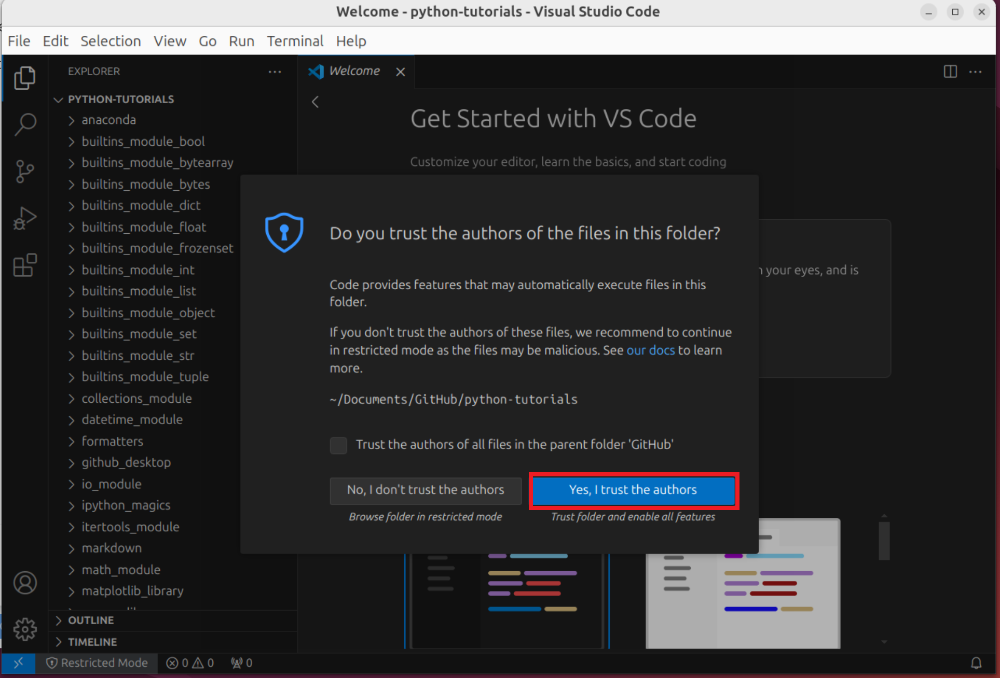

# Viewing Markdown Files

## Downloading and Installing GitHub Desktop

Instructions to install GitHub Desktop on Ubuntu are given on the [GitHub Gist Page GitHub Desktop](https://gist.github.com/berkorbay/6feda478a00b0432d13f1fc0a50467f1). The How to Install link on this page, will give commands for other distributions such as Fedora. For Mac, the installer listed on the [GitHub Desktop Download Page](https://desktop.github.com/download/) should be used.

For the Ubuntu install, the first command adds an apt repository:


Copy and paste it into the terminal:


As the command is prefixed with `sudo`, super user do, authentication is required, input your user account password to proceed:


For the Ubuntu install, the second command updates apt so it refreshes its repositories and installs GitHub Desktop:


Copy and paste it into the terminal:


GitHub Desktop is now installed:


And is available on the Start Screen:


Select Sign In to GitHub.com:


Log in on the web browser:


Select Continue:


Select Authorise Desktop:


Check, always allow links and select Open Link: 


Select Finish:


You will now be logged in:


## Cloning Repository

Select File → Clone Repository:


Select URL and paste:

```
https://github.com/PhilipYip1988/python-tutorials
```

Select Clone:


Once cloned, the repository will show:


It is saved within `Documents`, `GitHub`:


The `readme.md` displays:


## Downloading and Installing VSCode

To view the formatted markdown, VSCode should be installed. VSCode is a general purpose code editor and has native markdown support. Open up Ubuntu Software and search for VSCode. Select Code:


Select Install:


Installation requires use of a super and an authentication prompt will display. Insert your user password and select Authenticate:


VSCode is now installed and there is a Start Menu shortcut. Select Open:


## Viewing Markdown Files

VSCode will launch, select File → Open Folder:


Select yes I Trust the Authors:



Right click the `readme.md` file and select Open Preview:


unfortunately the outline which displays the table of contents only displays for the raw file these can eb viewed side by side:


The file tab can be collapsed and the raw file tab closed, allowing more screen space for the content:


It is recommended to read these tutorials using two screens. On one screen launch the Spyder IDE and on the other screen, use VSCode for the markdown preview.

Note it is possible to code with Python in VSCode but this requires installation of extensions and setup of a Python environment.

[Return to Python Tutorials](../readme.md)