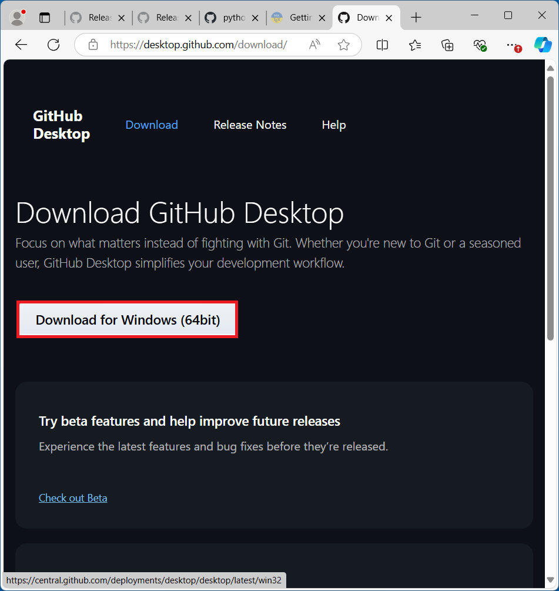
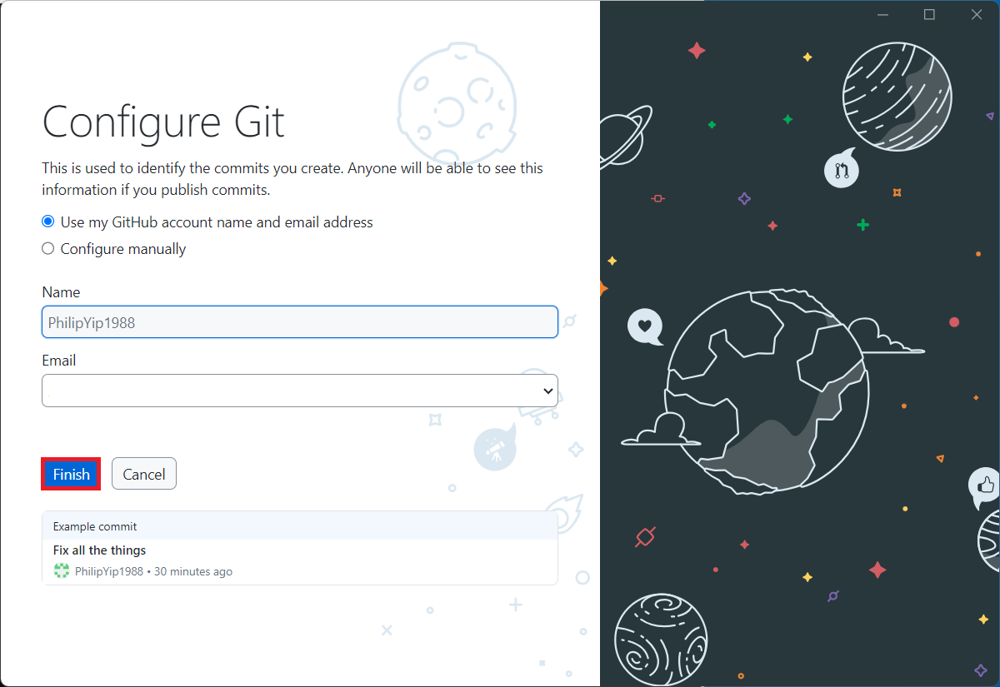
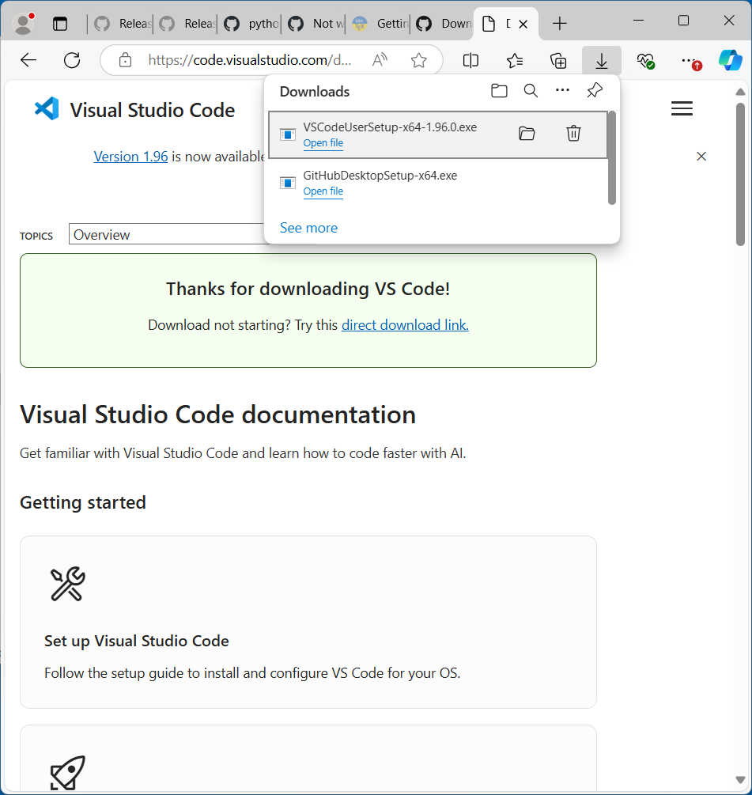

# Viewing Markdown Files

## Downloading and Installing GitHub Desktop

GitHub Desktop can be downloaded from [GitHub Desktop Download](https://desktop.github.com/download/):



Launch the installer:


Select Sign In to GitHub.com:


Enter you account details:


Select Continue:


Check Always Allow GitHub.com to open links of this type and select Open:


Select Finish:



## Cloning Repository

Select File → Clone Repository:


Select URL and paste:

```
https://github.com/PhilipYip1988/python-tutorials
```

Select Clone:


Once cloned, the repository will show:


It is saved within `Documents`, `GitHub`:


And `python-tutorials`:


The `readme.md` displays:


## Downloading and Installing VSCode

To view the formatted markdown, VSCode should be installed. VSCode is a general purpose code editor and has native markdown support. VSCode can be downloaded from the [VSCode Download Page](https://code.visualstudio.com/download). Select Windows (this will default to the User Installer):




Launch the VSCode setup:


Accept the License Agreement and select Next:


Select the default location and select Next:


Select Next:


Use the default options and select Next:


Select Install:


Select Finish:


## Viewing Markdown Files

VSCode will launch, select File → Open Folder:


Navigate to Python Tutorials and select Open:


Select yes I Trust the Authors:


Clicking on the `readme.md` will open the markdown editor:


The table of contents display in the Outline:


Right click the file and select Open Preview:


This will display the formatted document:


unfortunately the Outline is blank when the Preview is selected. The raw file and the preview can be opened side by side, allowing use of the outline:


The file tab can be collapsed and the raw file tab closed, allowing more screen space for the content:


It is recommended to read these tutorials using two screens. On one screen launch the Spyder IDE and on the other screen, use VSCode for the markdown preview.

Note it is possible to code with Python in VSCode but this requires installation of extensions and setup of a Python environment.

[Return to Python Tutorials](../readme.md)