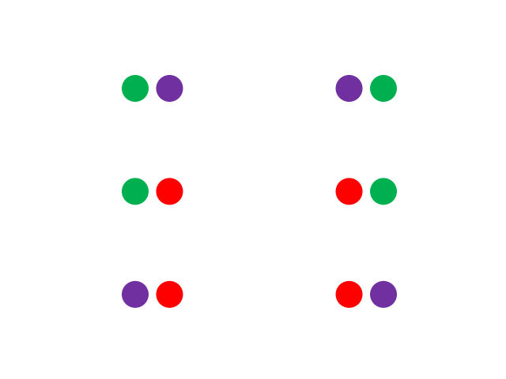

# Iterator Datatypes

## Collections design pattern

Previously the `tuple`, `str` and `bytes` classes each have the level 3 design pattern of a `Sequence`:

||ABC|Inherits from|Methods|
|---|---|---|---|
|0|`object`|||
|||||
|1|`Container`||`__contains__`|
|1|`Iterable`||`__iter__`|
|1|`Sized`||`__len__`|
|||||
|2|`Collection`|`Container`,<br>`Iterable`,<br>`Sized`|`__contains__`,<br>`__iter__`,<br>`__len__`|
|||||
|2|`Reversible`||`__reversed__`|
|||||
|3|`Sequence`|`Collection`,<br> `Reversible`|`__contains__`,<br>`__iter__`,<br>`__len__`,<br>`__reversible__`,<br><br>`__getitem__`,<br>`index`,<br>`count`,<br>`__add__`,<br>`__mul__`,<br>|

Their mutable counterparts the `list` and `bytearray` on the other hand had the level 4 design pattern of a `MutableSequence`:

||ABC|Inherits from|Methods|
|---|---|---|---|
|0|`object`|||
|||||
|1|`Container`||`__contains__`|
|1|`Iterable`||`__iter__`|
|1|`Sized`||`__len__`|
|||||
|2|`Collection`|`Container`,<br>`Iterable`,<br>`Sized`|`__contains__`,<br>`__iter__`,<br>`__len__`|
|||||
|2|`Reversible`||`__reversed__`|
|||||
|3|`Sequence`|`Collection`,<br> `Reversible`|`__contains__`,<br>`__iter__`,<br>`__len__`,<br>`__reversible__`,<br><br>`__getitem__`,<br>`index`,<br>`count`,<br>`__add__`,<br>`__mul__`,<br>|
|||||
|4|`MutableSequence`|`Sequence`|`__contains__`,<br>`__iter__`,<br>`__len__`,<br>`__reversible__`,<br><br>`__getitem__`,<br>`index`,<br>`count`,<br>`__add__`,<br>`__mul__`,<br><br>`append`,<br>`extend`,<br>`insert`,<br>`pop`,<br>`remove`,<br>`clear`,<br>`reverse`,<br>`__setitem__`, <br>`__delitem__`,<br>`__iadd__`,<br>`__imul__`,<br>|

The `dict` was seen to have a level 4 design pattern of a `MutableMapping` and observed to contain some level 2 similarities with the `tuple`, `str`, `bytes`, `list` and `bytearray` as they are all share the level 2 design pattern of a `Collection`.

||ABC|Inherits from|Methods|
|---|---|---|---|
|0|`object`|||
|||||
|1|`Container`||`__contains__`|
|1|`Iterable`||`__iter__`|
|1|`Sized`||`__len__`|
|||||
|2|`Collection`|`Container`,<br>`Iterable`,<br>`Sized`|`__contains__`,<br>`__iter__`,<br>`__len__`|
|||||
|3|`Mapping`|`Collection`|`__contains__`,<br>`__iter__`,<br>`__len__`,<br><br>`__getitem__`,<br>`keys`,<br>`items`,<br>`values`,<br>`get`,<br>`__eq__`,<br>,`__ne__`|
|||||
|4|`MutableMapping`|`Mapping`|`__contains__`,<br>`__iter__`,<br>`__len__`,<br><br>`__getitem__`,<br>`keys`,<br>`items`,<br>`values`,<br>`get`,<br>`__eq__`,<br>,`__ne__`,<br>`__setitem__`,<br>`__delitem__`,<br>,`update`,<br>,`setdefault`,<br>`pop`,<br>`popitem`,<br>`clear`,<br>|
|||||

## Iterator design pattern

An `Iterator` shares part of the level 1 design patterns of a `Collection` but is not `Container` and is not `Sized`. This is because an iterator only yields one value at a time. A `Collection` cast into an `Iterator` for example will go through the elements of the `Collection` one by one, without needing to load the entire `Collection` into memory all at once:

||ABC|Inherits from|Methods|
|---|---|---|---|
|0|`object`|||
|||||
|1|`Iterable`||`__iter__`|
|||||
|2|`Iterator`|`Iterable`|`__iter__`,<br><br>`__next__`|
|||||

`Iterator` classes are often used behind the scenes for example when Python implements a loop. `builtins` contains the most commonly used `Iterator` classes:

```python
In [1]: .
# Built-in Iterators Identifiers

# 🔁 General Iterators:
#     - iter                     : Returns an iterator from an iterable or a callable/sentinel pair.
#     - reversed                 : Returns an iterator that yields items in reverse order.
#     - next                     : Retrieves the next item from an iterator.

# 🔢 Numeric Iterators:
#     - range                    : Returns an iterable that yields numbers in an arithmetic progression.
#     - zip                      : Returns an iterator that aggregates elements from each of the iterables.
#     - enumerate                : Returns an iterator that yields pairs of index and value from an iterable.

# 🔗 Functional Iterators:
#     - map                      : Applies a function to all items in an iterable and returns an iterator of the results.
#     - filter                   : Constructs an iterator from elements of an iterable for which a function returns true.
```

These `Iterators` classes are complemented by additional classes, compartmentalised in the `itertools` module. Note that this organisation is analogous to that explored in the `builtins` and `collections` module.

The `itertools` module can be imported:

```python
In [1]: import itertools
```

And its identifiers examined:

```python
In [2]: itertools.
# itertools Iterators Identifiers

# 🔗 Iterator Functions:
#     - zip_longest              : Returns an iterator that aggregates elements from each of the iterables, filling with a specified value if they are of uneven length.
#     - pairwise                 : Returns an iterator that yields pairs of consecutive elements from an iterable.
#     - filterfalse              : Returns an iterator that yields elements of an iterable for which a function returns false.
#     - dropwhile                : Returns an iterator that drops elements from the iterable as long as a predicate is true.
#     - takewhile                : Returns an iterator that yields elements from the iterable as long as a predicate is true.
#     - compress                 : Returns an iterator that filters elements from one iterable based on a selector iterable.
#     - starmap                  : Applies a function to the arguments from iterables, returning an iterator of results.
#     - accumulate               : Returns an iterator that produces accumulated sums or results of a binary function.
#     - islice                   : Returns an iterator that returns selected elements from an iterable, specified by start and stop indices.
#     - tee                      : Returns multiple independent iterators from a single iterable.
#     - chain                    : Returns an iterator that yields from multiple iterables in sequence.
#     - count                    : Returns an iterator that produces consecutive integers, starting from a specified value.
#     - repeat                   : Returns an iterator that repeats a specified value indefinitely or a specified number of times.
#     - cycle                    : Returns an iterator that cycles through an iterable indefinitely.

# 🔗 Combinatorial Iterators:
#     - combinations             : Returns an iterator that yields combinations of a specified length from an iterable.
#     - combinations_with_replacement: Returns an iterator yielding combinations allowing individual elements to be repeated.
#     - permutations             : Returns an iterator that yields all possible orderings of a specified length from an iterable.
#     - product                  : Returns an iterator yielding Cartesian products of input iterables, similar to nested for-loops.
#     - groupby                  : Returns an iterator that groups consecutive elements in an iterable based on a key function.
```

## Iterable and Iterator

A `Collection` is an `Iterable`, which means it has the data model method `__iter__` and can be cast into an `Iterator` using the `builtins` class `iter`:

```python
In [2] archive = (1, True, 3.14, 'hello', 'hello', 'bye')
```

<table style="width: 65%; border-collapse: collapse; font-family: sans-serif;">
  <tr>
    <th colspan="4" style="text-align:center; padding: 8px; background-color: #2d2d30; color: #ffffff;">Variable Explorer</th>
  </tr>
  <tr>
    <th style="padding: 8px; background-color: #252526; color: #ffffff;">Name ▲</th>
    <th style="padding: 8px; background-color: #252526; color: #ffffff;">Type</th>
    <th style="padding: 8px; background-color: #252526; color: #ffffff;">Size</th>
    <th style="padding: 8px; background-color: #252526; color: #ffffff;">Value</th>
  </tr>
  <tr>
    <td style="padding: 8px; background-color: #1e1e1e; color: #ffffff;">archive</td>
    <td style="padding: 8px; background-color: #1e1e1e; color: #ffffff;">tuple</td>
    <td style="padding: 8px; background-color: #1e1e1e; color: #ffffff;">5</td>
    <td style="padding: 8px; background-color: #3A3586; color: #ffffff;">(1, True, 3.14, 'hello', 'hello', 'bye')</td> <!-- Tuple background -->
  </tr>
</table>

The cast `Iterator` can be examined:

```python
In [3]: forward = iter(archive)
```

Not too much details display in the Variable Explorer:

<table style="width: 65%; border-collapse: collapse; font-family: sans-serif;">
  <tr>
    <th colspan="4" style="text-align:center; padding: 8px; background-color: #2d2d30; color: #ffffff;">Variable Explorer</th>
  </tr>
  <tr>
    <th style="padding: 8px; background-color: #252526; color: #ffffff;">Name ▲</th>
    <th style="padding: 8px; background-color: #252526; color: #ffffff;">Type</th>
    <th style="padding: 8px; background-color: #252526; color: #ffffff;">Size</th>
    <th style="padding: 8px; background-color: #252526; color: #ffffff;">Value</th>
  </tr>
  <tr>
    <td style="padding: 8px; background-color: #1e1e1e; color: #ffffff;">archive</td>
    <td style="padding: 8px; background-color: #1e1e1e; color: #ffffff;">tuple</td>
    <td style="padding: 8px; background-color: #1e1e1e; color: #ffffff;">5</td>
    <td style="padding: 8px; background-color: #3A3586; color: #ffffff;">(1, True, 3.14, 'hello', 'hello', 'bye')</td> <!-- Tuple background -->
  </tr>
  <tr>
    <td style="padding: 8px; background-color: #1e1e1e; color: #ffffff;">forward</td>
    <td style="padding: 8px; background-color: #1e1e1e; color: #ffffff;">tuple_iterator</td>
    <td style="padding: 8px; background-color: #1e1e1e; color: #ffffff;">1</td>
    <td style="padding: 8px; background-color:rgb(133, 134, 53); color: #ffffff;">&lttuple_iterator at 0x2b4ca6b1ea0&gt</td> <!-- Tuple background -->
  </tr>  
</table>

The `Iterator` has the data model method `__next__` which defines the behaviour of the `builtins` function `next` which retrieves the next value from the `Iterator`. `next` can be used to retrieve each *individual* value from the above `Iterator`. When `next` is used, the previous value is said to be consumed and is no longer accesssible. Notice an error displays when the `Iterator` is exhausted:

```python
In [4]: next(forward)
Out[4]: 1

In [5]: next(forward)
Out[5]: True

In [6]: next(forward)
Out[6]: 3.14

In [7]: next(forward)
Out[7]: 'hello'

In [8]: next(forward)
Out[8]: 'hello'

In [9]: next(forward)
Out[9]: 'bye'

In [10]: next(forward) # Iterator exhausted
StopIteration
```

A `Sequence` can be reversed and has the data model method `__reversible__`:

```python
In [11]: backward = reversed(archive)
```

Once again too much details display in the Variable Explorer:

<table style="width: 65%; border-collapse: collapse; font-family: sans-serif;">
  <tr>
    <th colspan="4" style="text-align:center; padding: 8px; background-color: #2d2d30; color: #ffffff;">Variable Explorer</th>
  </tr>
  <tr>
    <th style="padding: 8px; background-color: #252526; color: #ffffff;">Name ▲</th>
    <th style="padding: 8px; background-color: #252526; color: #ffffff;">Type</th>
    <th style="padding: 8px; background-color: #252526; color: #ffffff;">Size</th>
    <th style="padding: 8px; background-color: #252526; color: #ffffff;">Value</th>
  </tr>
  <tr>
    <td style="padding: 8px; background-color: #1e1e1e; color: #ffffff;">archive</td>
    <td style="padding: 8px; background-color: #1e1e1e; color: #ffffff;">tuple</td>
    <td style="padding: 8px; background-color: #1e1e1e; color: #ffffff;">5</td>
    <td style="padding: 8px; background-color: #3A3586; color: #ffffff;">(1, True, 3.14, 'hello', 'hello', 'bye')</td> <!-- Tuple background -->
  </tr>
  <tr>
    <td style="padding: 8px; background-color: #1e1e1e; color: #ffffff;">forward</td>
    <td style="padding: 8px; background-color: #1e1e1e; color: #ffffff;">tuple_iterator</td>
    <td style="padding: 8px; background-color: #1e1e1e; color: #ffffff;">1</td>
    <td style="padding: 8px; background-color:rgb(133, 134, 53); color: #ffffff;">&lttuple_iterator at 0x2b4ca6b1ea0&gt</td> <!-- Tuple background -->
  </tr>  
  <tr>
    <td style="padding: 8px; background-color: #1e1e1e; color: #ffffff;">backward</td>
    <td style="padding: 8px; background-color: #1e1e1e; color: #ffffff;">reversed</td>
    <td style="padding: 8px; background-color: #1e1e1e; color: #ffffff;">1</td>
    <td style="padding: 8px; background-color:rgb(133, 134, 53); color: #ffffff;">&ltreversed at 0x24dadb8c6d0&gt</td> <!-- Tuple background -->
  </tr>  
</table>

Once again `next` can be used to retrieve each individual value from the above `Iterator`:

```python
In [12]: next(backward)
Out[12]: 'bye'

In [13]: next(backward)
Out[13]: 'hello'

In [14]: next(backward)
Out[14]: 'hello'

In [15]: next(backward)
Out[15]: 3.14

In [16]: next(backward)
Out[16]: True

In [17]: next(backward)
Out[17]: 1

In [18]: next(backward) # Iterator exhausted
StopIteration
```

If the following `Iterator` is reassigned:

```python
In [19]: forward = iter(archive)
```

`next` can be used on the `Iterator` two times to consume the first two elements. If the `Iterator` is cast using a `Sequence` such as a `tuple` notice that the remaining elements are consumed:

```python
In [20]: next(forward)
Out[20]: 1

In [21]: next(forward)
Out[21]: True

In [22]: tuple(forward)
Out[22]: (3.14, 'hello', 'hello', 'bye')

In [23]: next(forward) # Iterator exhausted
StopIteration
```

The `range` class is `Iterable` and not an `Iterator`:

```python
In [24]: nums = range(3)
```

This means that `next` cannot be used on the `range` instance `nums`:

```python
In [25]: next(nums)
TypeError: 'range' object is not an iterator
```

However it can be cast into an `Iterator` using `iter`:

```python
In [26]: num_iterator = iter(nums)
```

<table style="width: 65%; border-collapse: collapse; font-family: sans-serif;">
  <tr>
    <th colspan="4" style="text-align:center; padding: 8px; background-color: #2d2d30; color: #ffffff;">Variable Explorer</th>
  </tr>
  <tr>
    <th style="padding: 8px; background-color: #252526; color: #ffffff;">Name ▲</th>
    <th style="padding: 8px; background-color: #252526; color: #ffffff;">Type</th>
    <th style="padding: 8px; background-color: #252526; color: #ffffff;">Size</th>
    <th style="padding: 8px; background-color: #252526; color: #ffffff;">Value</th>
  </tr>
  <tr>
    <td style="padding: 8px; background-color: #1e1e1e; color: #ffffff;">archive</td>
    <td style="padding: 8px; background-color: #1e1e1e; color: #ffffff;">tuple</td>
    <td style="padding: 8px; background-color: #1e1e1e; color: #ffffff;">5</td>
    <td style="padding: 8px; background-color: #3A3586; color: #ffffff;">(1, True, 3.14, 'hello', 'hello', 'bye')</td> <!-- Tuple background -->
  </tr>
  <tr>
    <td style="padding: 8px; background-color: #1e1e1e; color: #ffffff;">nums</td>
    <td style="padding: 8px; background-color: #1e1e1e; color: #ffffff;">range</td>
    <td style="padding: 8px; background-color: #1e1e1e; color: #ffffff;">1</td>
    <td style="padding: 8px; background-color:rgb(134, 102, 53); color: #ffffff;">range(0, 3)</td> <!-- Tuple background -->
  </tr>  
  <tr>
    <td style="padding: 8px; background-color: #1e1e1e; color: #ffffff;">num_iterator</td>
    <td style="padding: 8px; background-color: #1e1e1e; color: #ffffff;">range_iterator</td>
    <td style="padding: 8px; background-color: #1e1e1e; color: #ffffff;">1</td>
    <td style="padding: 8px; background-color:rgb(133, 134, 53); color: #ffffff;">&ltrange_iterator at 0x24dae0dbe30&gt</td> <!-- Tuple background -->
  </tr>  
</table>

And `next` can be used on `num_iterator`:

```python
In [27]: next(num_iterator)
Out[27]: 0

In [28]: next(num_iterator)
Out[28]: 1

In [28]: next(num_iterator)
Out[28]: 2

In [29]: next(num_iterator)
StopIteration
```

Notice that both the nums `Iterable` and `num_iterator` can be cast to a `Sequence`:

```python
In [30]: num_iterator = iter(nums)

In [31]: next(num_iterator)
Out[31]: 0

In [32]: tuple(num_iterator)
Out[32]: (1, 2)

In [33]: tuple(nums)
Out[33]: (0, 1, 2)
```

Under the hood, a `for` loop essentially is a `while` loop which involves an `Iterator` and a single value is seen for each iteration of the `while` loop: 

```python
In [34]: num_iterator = iter(range(3))
         while True:
             try:
                 print(next(num_iterator))
             except StopIteration:
                 break
0
1
2
```

The `for` loop syntax is a bit cleaner and easier to read:

```python
In [35]: for num in range(3):
             print(num)
0
1
2
```

## Zipping and enumeration

If the three alphabets are examined:

```python
In [36]: letters = ('a', 'b', 'c', 'd', 'e', 'f', 'g', 'h', 'i', 'j', 'k', 'l', 'm', 
                    'n', 'o', 'p', 'q', 'r', 's', 't', 'u', 'v', 'w', 'x', 'y', 'z')

       : greek_letters = ('α', 'β', 'γ', 'δ', 'ε', 'ζ', 'η', 'θ', 'ι', 'κ', 'λ', 'μ', 
                          'ν', 'ξ', 'ο', 'π', 'ρ', 'σ', 'τ', 'υ', 'φ', 'χ', 'ψ', 'ω')

       : russian_letters = ('а', 'б', 'в', 'г', 'д', 'е', 'ё', 'ж', 'з', 'и', 'й', 'к', 
                            'л', 'м', 'н', 'о', 'п', 'р', 'с', 'т', 'у', 'ф', 'х', 'ц', 
                            'ч', 'ш', 'щ', 'ъ', 'ы', 'ь', 'э', 'ю', 'я')
```

Notice that each `tuple` has a different length:

<table style="width: 65%; border-collapse: collapse; font-family: sans-serif;">
  <tr>
    <th colspan="4" style="text-align:center; padding: 8px; background-color: #2d2d30; color: #ffffff;">Variable Explorer</th>
  </tr>
  <tr>
    <th style="padding: 8px; background-color: #252526; color: #ffffff;">Name ▲</th>
    <th style="padding: 8px; background-color: #252526; color: #ffffff;">Type</th>
    <th style="padding: 8px; background-color: #252526; color: #ffffff;">Size</th>
    <th style="padding: 8px; background-color: #252526; color: #ffffff;">Value</th>
  </tr>
  <tr>
    <td style="padding: 8px; background-color: #1e1e1e; color: #ffffff;">letters</td>
    <td style="padding: 8px; background-color: #1e1e1e; color: #ffffff;">tuple</td>
    <td style="padding: 8px; background-color: #1e1e1e; color: #ffffff;">26</td>
    <td style="padding: 8px; background-color: #3A3586; color: #ffffff;">(a, b, c, d, e, f, g, h, i, j, ...)</td> <!-- Tuple background -->
  </tr>
  <tr>
    <td style="padding: 8px; background-color: #1e1e1e; color: #ffffff;">greek_letters</td>
    <td style="padding: 8px; background-color: #1e1e1e; color: #ffffff;">tuple</td>
    <td style="padding: 8px; background-color: #1e1e1e; color: #ffffff;">24</td>
    <td style="padding: 8px; background-color: #3A3586; color: #ffffff;">(α, β, γ, δ, ε, ζ, η, θ, ι, κ, ...)</td> <!-- Tuple background -->
  </tr> 
  <tr>
    <td style="padding: 8px; background-color: #1e1e1e; color: #ffffff;">russian_letters</td>
    <td style="padding: 8px; background-color: #1e1e1e; color: #ffffff;">tuple</td>
    <td style="padding: 8px; background-color: #1e1e1e; color: #ffffff;">33</td>
    <td style="padding: 8px; background-color: #3A3586; color: #ffffff;">(а, б, в, г, д, е, ё, ж, з, и, ...)</td> <!-- Tuple background -->
  </tr> 
</table>

`zip` is an `Iterator` that can be used to zip two or more `Iterable` instances together stopping when the shortest instance is exhausted:

```python
In [37]: zipped_shortest = zip(letters, greek_letters, russian_letters)
```

<table style="width: 65%; border-collapse: collapse; font-family: sans-serif;">
  <tr>
    <th colspan="4" style="text-align:center; padding: 8px; background-color: #2d2d30; color: #ffffff;">Variable Explorer</th>
  </tr>
  <tr>
    <th style="padding: 8px; background-color: #252526; color: #ffffff;">Name ▲</th>
    <th style="padding: 8px; background-color: #252526; color: #ffffff;">Type</th>
    <th style="padding: 8px; background-color: #252526; color: #ffffff;">Size</th>
    <th style="padding: 8px; background-color: #252526; color: #ffffff;">Value</th>
  </tr>
  <tr>
    <td style="padding: 8px; background-color: #1e1e1e; color: #ffffff;">zipped_shortest</td>
    <td style="padding: 8px; background-color: #1e1e1e; color: #ffffff;">zip</td>
    <td style="padding: 8px; background-color: #1e1e1e; color: #ffffff;">1</td>
    <td style="padding: 8px; background-color:rgb(133, 134, 53); color: #ffffff;">&ltzip at 0x24dae1921c0&gt</td> <!-- Tuple background -->
  </tr>  
</table>

Using `next` on the `zip` `Iterator` generates a `tuple` of the zipped elements: 

```python
In [38]: next(zipped_shortest)
Out[38]: ('a', 'α', 'а')

In [39]: next(zipped_shortest)
Out[39]: ('b', 'β', 'б')
```

If the `zip` `Iterator` is cast using a `Sequence` such as a `list` the remaining elements are consumed. Notice the last two English characters and last nine Russian characters are not included as zipping stopped when the `greek_letters` (cast to an `Iterator`) was exhausted:

```python
In [40]: list(zipped_shortest)
Out[40]: [('c', 'γ', 'в'),
          ('d', 'δ', 'г'),
          ('e', 'ε', 'д'),
          ('f', 'ζ', 'е'),
          ('g', 'η', 'ё'),
          ('h', 'θ', 'ж'),
          ('i', 'ι', 'з'),
          ('j', 'κ', 'и'),
          ('k', 'λ', 'й'),
          ('l', 'μ', 'к'),
          ('m', 'ν', 'л'),
          ('n', 'ξ', 'м'),
          ('o', 'ο', 'н'),
          ('p', 'π', 'о'),
          ('q', 'ρ', 'п'),
          ('r', 'σ', 'р'),
          ('s', 'τ', 'с'),
          ('t', 'υ', 'т'),
          ('u', 'φ', 'у'),
          ('v', 'χ', 'ф'),
          ('w', 'ψ', 'х'),
          ('x', 'ω', 'ц')]
```

`itertools` has the complementary `zip_longest` `Iterator` which will stop zipping when the longest `Sequence`, `russian_letters` (cast to an `Iterator` is consumed):

```python
In [41]: zipped_shortest = itertools.zip_longest(letters, greek_letters, russian_letters)
In [42]: list(zipped_shortest)
Out[42]: [('c', 'γ', 'в'),
          ('d', 'δ', 'г'),
          ('e', 'ε', 'д'),
          ('f', 'ζ', 'е'),
          ('g', 'η', 'ё'),
          ('h', 'θ', 'ж'),
          ('i', 'ι', 'з'),
          ('j', 'κ', 'и'),
          ('k', 'λ', 'й'),
          ('l', 'μ', 'к'),
          ('m', 'ν', 'л'),
          ('n', 'ξ', 'м'),
          ('o', 'ο', 'н'),
          ('p', 'π', 'о'),
          ('q', 'ρ', 'п'),
          ('r', 'σ', 'р'),
          ('s', 'τ', 'с'),
          ('t', 'υ', 'т'),
          ('u', 'φ', 'у'),
          ('v', 'χ', 'ф'),
          ('w', 'ψ', 'х'),
          ('x', 'ω', 'ц'),
          ('y', None, 'ч'),
          ('z', None, 'ш'),
          (None, None, 'щ'),
          (None, None, 'ъ'),
          (None, None, 'ы'),
          (None, None, 'ь'),
          (None, None, 'э'),
          (None, None, 'ю'),
          (None, None, 'я')]
```

The `Iterator` instances were cast into a `list`, the `MutableSequence` was selected because it uses the `[]`, opposed to `()` making it easier to distinguish each zipped element.

If the following is examined:

```python
In [43]: mapping = {'a': 'α', 
                    'b': 'β',
                    'c': 'γ',
                    'd': 'δ',
                    'e': 'ε'}
```

Notice the `dict` has the following:

```python
In [44]: mapping.keys()
Out[44]: dict_keys(['a', 'b', 'c', 'd', 'e'])

In [45]: mapping.values()
Out[45]: dict_values(['α', 'β', 'γ', 'δ', 'ε'])

In [46]: mapping.items()
Out[46]: dict_items([('a', 'α'), ('b', 'β'), ('c', 'γ'), ('d', 'δ'), ('e', 'ε')])
```

Compare the above with:

```python
In [47]: keys = ['a', 'b', 'c', 'd', 'e']
       : values = ['α', 'β', 'γ', 'δ', 'ε']
       : items = list(zip(keys, values))
       : items
Out[48]: [('a', 'α'), ('b', 'β'), ('c', 'γ'), ('d', 'δ'), ('e', 'ε')]
```

A `dict` can also be cast from the `zip` instance above:

```python
In [49]: dict(zip(keys, values))
Out[49]: {'a': 'α', 'b': 'β', 'c': 'γ', 'd': 'δ', 'e': 'ε'}
```

If `values` is examined:

```python
In [50]: values = ['α', 'β', 'γ', 'δ', 'ε']
```

It has a length:

```python
In [51]: len(values)
Out[51]: 5
```

A `range` `Iterable` can be instantiated from the `len`:

```python
In [52]: range(len(values))
Out[52]: range(0, 5)
```

And this `range` `Iterable` can be zipped to `values`:

```python
In [54]: zip(range(len(values)), values)
Out[54]: <zip at 0x24dae22d1c0>
```

The `zip` `Iterator` can be cast to a `list` to consume all the values:

```python
In [53]: list(zip(range(len(values)), values))
Out[53]: [(0, 'α'), (1, 'β'), (2, 'γ'), (3, 'δ'), (4, 'ε')]
```

This is a relatively common operation and is carried out by the `enumerate` `Iterator`:

```python
In [54]: enumerate(values)
Out[54]: <enumerate at 0x24dae20a110>

In [55]: list(enumerate(values))
Out[55]: [(0, 'α'), (1, 'β'), (2, 'γ'), (3, 'δ'), (4, 'ε')]
```

The `Iterator` `pairwise` essentially zips the `n` to `n+1` element in a `Sequence`:

```python
In [55]: letters = ('a', 'b', 'c', 'd', 'e')

In [56]: list(itertools.pairwise(letters))
Out[56]: [('a', 'b'), ('b', 'c'), ('c', 'd'), ('d', 'e')]
```

## Map and Filter

The `map` `Iterator` can be used to map a function call to a `Sequence`. Its initialisation signature can be viewed:

```python
In [57]: map?
# Init signature: map(self, /, *args, **kwargs)
# Docstring:     
# map(func, *iterables) --> map object
#
# Make an iterator that computes the function using arguments from
# each of the iterables.  Stops when the shortest iterable is exhausted.
# Type:           type
# Subclasses:     
```

For example the lambda expression:

```python
In [58]: squared = lambda num: num ** 2
```

Can be mapped to the following `Sequence`:

```python
In [59]: nums = (0, 1, 2, 3, 4)
```

An `Iterator` that maps this function to this sequence can be created using:

```python
In [60]: forward = map(squared, nums)
       : forward
Out[60]: <map at 0x2b4ca793970>
```

The first function call using the first value of `nums` which is `0` can be examined:

```python
In [61]: next(forward)
Out[61]: 0
```

The second function call using the second value of `nums` which is `1` can be examined:

```python
In [62]: next(forward)
Out[62]: 1
```

The third function call using the second value of `nums` which is `2` can be examined:

```python
In [63]: next(forward)
Out[63]: 4
```

The remaining function calls in the iterator can be consumed by casting to a `Sequence`:

```python
In [64]: tuple(forward)
Out[64]: (9, 16)
```

The `map` `Iterator` can be instantiated and consumed by casting to a `Sequence` on a single line:

```python
In [65]: list(map(squared, nums))
Out[65]: [0, 1, 4, 9, 16]
```

Many of the use cases for map can also be carried out using a list comprehension:

```python
In [66]: [num ** 2 for num in (0, 1, 2, 3, 4)]
Out[66]: [0, 1, 4, 9, 16]
```

The `filter` `Iterator` can be used to filter values from a `Sequence` using a filter function call. Its initialisation signature can be viewed:

```python
In [67]: filter?
# Init signature: filter(self, /, *args, **kwargs)
# Docstring:     
# filter(function or None, iterable) --> filter object
# 
# Return an iterator yielding those items of iterable for which function(item)
# is true. If function is None, return the items that are true.
# Type:           type
# Subclasses:     
```

For example the lambda expression:

```python
In [68]: positive_filter = lambda num: num > 0
```

Can be used to filter the following `Sequence`:

```python
In [69]: nums = (-2, 1, 0, -1, 2)
```

Using:

```python
In [70]: forward = filter(positive_filter, nums)
```

And all the values in the `Iterator` can be consumed by casting to a `Sequence`:

```python
In [71]: tuple(forward)
Out[71]: (1, 2)
```

`itertools` has a complementary `Iterator`, `filterfalse` which retrieve the values that don't satisfy the `filter`:


```python
In [72]: tuple(filter(positive_filter, nums))
Out[72]: (1, 2)

In [73]: tuple(itertools.filterfalse(positive_filter, nums))
Out[73]: (-2, 0, -1)
```

`itertools` has the `Iterator` `takewhile` and `dropwhile` which will take or drop elements in an `Iterator` until a condition is satisfied:

```python
In [74]: nums = (-2, 1, 0, -1, 2)

In [75]: tuple(itertools.dropwhile(lambda num: num != 0, nums))
Out[75]: (0, -1, 2)

In [76]: tuple(itertools.takewhile(lambda num: num != 0, nums))
Out[76]: (-2, 1)
```

`itertools` has the `Iterator` `compress` which can be used to compress data in a `Sequence` using a `Sequence` of conditions. This is similar to `filter` but a second `Sequence` of conditions is used opposed to a function call which returns a `bool`:

```python
In [76]: letters = ('a', 'b', 'c', 'd', 'e', 'f')
       : conditions = (True, True, False, False, True, True)

In [77]: tuple(itertools.compress(letters, conditions))
Out[77]: ('a', 'b', 'e', 'f')
```

Previous `map` has been examined:

```python
In [78]: squared = lambda num: num ** 2
       : nums = (0, 1, 2, 3, 4)
       : map(squared, nums)
Out[78]: (0, 1, 4, 9, 16)
```

The function had a single input argument which was mapped to each function call. If the function powered is assigned using a lambda expression:

```python
In [79]: powered = lambda num, power: num ** power
```

There are two input parameters and one return value. A `tuple` of arguments can be unpacked to input parameters within the function call:

```python
In [80]: args = (2, 3)
In [81]: powered(*args)
Out[81]: 8
```

`itertools` has `starmap` which essentially is an `Iterator` where each element is a `tuple` of arguments that are unpacked and supplied to the function call:

```python
In [82]: tuple(itertools.starmap(powered, [(2, 3), 
       :                                   (2, 4), 
       :                                   (3, 3), 
       :                                   (3, 4)]
       :                        )
       :      )
Out[82]: (8, 16, 27, 81)
```

`itertools` has an `Iterator` `accumulate` which iteratively accumulates elements using a binary cumulation function using the optional parameter `func`:

```python
In [83]: nums = (1, 2, 3, 4, 5)

In [84]: tuple(itertools.accumulate(nums))
Out[84]: (1, 3, 6, 10, 15)
```

The optional parameter `func` can be overridden and assigned to another binary operator. The other operators that can be used are in the `operator` module which can be imported using:

```python
In [85]: import operator
```

And its identifiers can be viewed:

```python
In [86]: operator.
# -------------------------------
# Available Identifiers for `operator`:
# -------------------------------------

# 🔧 Unitary Arithmetic Operators:
#   - neg(obj)                                : Returns the negation of obj (-obj).
#   - pos(obj)                                : Returns the positive value of obj (+obj).
#   - abs(obj)                                : Returns the absolute value of obj (abs(obj)).

# ➕ Binary Arithmetic Operators:
#   - add(a, b)                               : Returns the sum of a and b (a + b).
#   - sub(a, b)                               : Returns the difference between a and b (a - b).
#   - mul(a, b)                               : Returns the product of a and b (a * b).
#   - truediv(a, b)                           : Returns the quotient of a and b (a / b).
#   - floordiv(a, b)                          : Returns the integer quotient of a and b (a // b).
#   - mod(a, b)                               : Returns the remainder of division (a % b).
#   - pow(a, b)                               : Returns a raised to the power of b (a ** b).

# 🔧 Binary Bitwise Operators:
#   - and_(a, b)                              : Performs bitwise AND (a & b).
#   - or_(a, b)                               : Performs bitwise OR (a | b).
#   - xor(a, b)                               : Performs bitwise XOR (a ^ b).
#   - lshift(a, b)                            : Shifts the bits of a to the left by b places (a << b).
#   - rshift(a, b)                            : Shifts the bits of a to the right by b places (a >> b).

# 🔧 Additional Operators:
#   - attrgetter(attr)                        : Returns a callable that fetches the given attribute.
#   - itemgetter(idx)                         : Returns a callable that fetches the given index.
#   - methodcaller(name, *args, **kwargs)     : Returns a callable that calls the given method with arguments.
#   - inv(obj)                                : Alias for invert(obj), performs bitwise inversion (~obj).
#   - invert(obj)                             : Performs bitwise inversion (~obj).
#   - index(obj)                              : Converts obj to an integer (obj.__index__()).
#   - indexOf(seq, obj)                       : Returns the index of obj in seq.
#   - countOf(seq, obj)                       : Returns the count of obj in seq.
#   - truth(obj)                              : Returns True if obj evaluates to True, otherwise False.
#   - is_(a, b)                               : Returns True if a is b.
#   - is_not(a, b)                            : Returns True if a is not b.
#   - contains(seq, obj)                      : Returns True if obj is in seq.
#   - setitem(seq, idx, val)                  : Sets seq[idx] to val.
#   - delitem(seq, idx)                       : Deletes seq[idx].
#   - call(obj, *args, **kwargs)              : Calls obj with given arguments.
#   - length_hint(seq)                        : Returns an estimate of seq length.

# 🔧 Augmented Assignment Operators:
#   - iadd(a, b)                              : Performs a += b.
#   - isub(a, b)                              : Performs a -= b.
#   - imul(a, b)                              : Performs a *= b.
#   - itruediv(a, b)                          : Performs a /= b.
#   - ifloordiv(a, b)                         : Performs a //= b.
#   - imod(a, b)                              : Performs a %= b.
#   - ipow(a, b)                              : Performs a **= b.
#   - iand(a, b)                              : Performs a &= b.
#   - ior(a, b)                               : Performs a |= b.
#   - ixor(a, b)                              : Performs a ^= b.
#   - ilshift(a, b)                           : Performs a <<= b.
#   - irshift(a, b)                           : Performs a >>= b.
#   - imatmul(a, b)                           : Performs a @= b.
```
          
The default value for `func` is `operator.add` but can be overridden to `operator.mul` or `operator.sub`: 

```python
In [87]: nums = (1, 2, 3, 4, 5)

In [88]: tuple(itertools.accumulate(nums)) # func=operator.add
Out[88]: (1, 3, 6, 10, 15)

In [89]: tuple(itertools.accumulate(nums, operator.sub))
Out[89]: (1, -1, -4, -8, -13)

In [90]: tuple(itertools.accumulate(nums, operator.mul)) # all zeros as first element is 0
Out[90]: (1, 2, 6, 24, 120)
```

## Slicing

If the following `Sequence` is instantiated:

```python
In [91]: letters = ('a', 'b', 'c', 'd', 'e')
```

<table style="width: 65%; border-collapse: collapse; font-family: sans-serif;">
  <tr>
    <th colspan="4" style="text-align:center; padding: 8px; background-color: #2d2d30; color: #ffffff;">Variable Explorer</th>
  </tr>
  <tr>
    <th style="padding: 8px; background-color: #252526; color: #ffffff;">Name ▲</th>
    <th style="padding: 8px; background-color: #252526; color: #ffffff;">Type</th>
    <th style="padding: 8px; background-color: #252526; color: #ffffff;">Size</th>
    <th style="padding: 8px; background-color: #252526; color: #ffffff;">Value</th>
  </tr>
  <tr>
    <td style="padding: 8px; background-color: #1e1e1e; color: #ffffff;">letters</td>
    <td style="padding: 8px; background-color: #1e1e1e; color: #ffffff;">tuple</td>
    <td style="padding: 8px; background-color: #1e1e1e; color: #ffffff;">5</td>
    <td style="padding: 8px; background-color: #3A3586; color: #ffffff;">('a', 'b', 'c', 'd', 'e')</td> <!-- Tuple background -->
  </tr>  
</table>

<table style="width: 80%; border-collapse: collapse; font-family: sans-serif;">
  <tr>
    <th colspan="4" style="text-align:center; padding: 8px; background-color: #2d2d30; color: #ffffff;">letters - tuple (5 elements)</th>
  </tr>
  <tr>
    <th style="padding: 8px; background-color: #252526; color: #ffffff;">Index ▲</th>
    <th style="padding: 8px; background-color: #252526; color: #ffffff;">Type</th>
    <th style="padding: 8px; background-color: #252526; color: #ffffff;">Size</th>
    <th style="padding: 8px; background-color: #252526; color: #ffffff;">Value</th>
  </tr>
  <tr>
    <td style="padding: 8px; background-color: #1e1e1e; color: #ffffff;">0</td>
    <td style="padding: 8px; background-color: #1e1e1e; color: #ffffff;">str</td>
    <td style="padding: 8px; background-color: #1e1e1e; color: #ffffff;">1</td>
    <td style="padding: 8px; background-color: #1e1e1e; color: #ffffff;">a</td> <!-- Value background -->
  </tr>
  <tr>
    <td style="padding: 8px; background-color: #1e1e1e; color: #ffffff;">1</td>
    <td style="padding: 8px; background-color: #1e1e1e; color: #ffffff;">str</td>
    <td style="padding: 8px; background-color: #1e1e1e; color: #ffffff;">1</td>
    <td style="padding: 8px; background-color: #1e1e1e; color: #ffffff;">b</td> <!-- Value background -->
  </tr>
  <tr>
    <td style="padding: 8px; background-color: #1e1e1e; color: #ffffff;">2</td>
    <td style="padding: 8px; background-color: #1e1e1e; color: #ffffff;">str</td>
    <td style="padding: 8px; background-color: #1e1e1e; color: #ffffff;">1</td>
    <td style="padding: 8px; background-color: #1e1e1e; color: #ffffff;">c</td> <!-- Value background -->
  </tr>
  <tr>
    <td style="padding: 8px; background-color: #1e1e1e; color: #ffffff;">3</td>
    <td style="padding: 8px; background-color: #1e1e1e; color: #ffffff;">str</td>
    <td style="padding: 8px; background-color: #1e1e1e; color: #ffffff;">1</td>
    <td style="padding: 8px; background-color: #1e1e1e; color: #ffffff;">d</td> <!-- Value background -->
  </tr>
  <tr>
    <td style="padding: 8px; background-color: #1e1e1e; color: #ffffff;">4</td>
    <td style="padding: 8px; background-color: #1e1e1e; color: #ffffff;">str</td>
    <td style="padding: 8px; background-color: #1e1e1e; color: #ffffff;">1</td>
    <td style="padding: 8px; background-color: #1e1e1e; color: #ffffff;">e</td> <!-- Value background -->
  </tr>
</table>

It can be sliced using `:` or longhand using the class `slice`:

```python
In [92]: letters[slice(1, 3, 1)]
Out[92]: ('b', 'c')
```

`itertools` has the `Iterator` `islice` which as the name suggests slices an `Iterator`:

```python
In [93]: forward = iter(letters)

In [94]: forward_isliced = itertools.islice(forward, 1, 3, 1)

In [95]: next(forward_isliced)
Out[95]: 'b'

In [96]: next(forward_isliced)
Out[96]: 'c'

In [97]: next(forward_isliced)
StopIteration: 
```

## Chain and Tee

`itertools` has the `Iterator` `chain` which chains two or more `Iterator` instances together. Consuming the elements in the chained `Iterator` will consume them in the original `Iterator` instances:

```python
In [98]: forward1 = iter(('a', 1))
       : forward2 = iter(('b', 2))
       : forward3 = iter(('c', 3))

In [98]: forward = itertools.chain(forward1, forward2, forward3)

In [99]: next(forward)
Out[99]: 'a'

In [100]: next(forward)
Out[100]: 1

In [101]: next(forward1) # elements consumed in forward, forward1 is exhausted
StopIteration                             Traceback (most recent call last)

In [102]: next(forward)
Out[102]: 'b'

In [103]: next(forward3) # element consumed in forward3
Out[103]: 'c'

In [104]: next(forward)
Out[104]: 2

# the element consumed in forward3 on In [103] was also consumed in forward and does not show: 
In [105]: next(forward)
Out[105]: 3
```

`itertools` has the `Iterator`, `tee` which can be used to return a `tuple` of `n` independent `Iterator`. The name comes from the tee junction used for example in plumbing to split a water stream down multiple pipes. If all the water exits one of the pipes it is not present in the original pipe.

The `Iterator` forward can be split into two independent `Iterator` instances and the two-element `tuple` returned can be unpacked into 2 instance names `forward1` and `forward2` using `tuple` unpacking:

```python
In [106]: forward = iter(range(10))
        : forward1, forward2 = itertools.tee(forward, 2)
```
      
These can be shown to be independent by looking at the following:

```python
In [107]: next(forward2)
Out[107]: 0

In [108]: next(forward1)
Out[108]: 0

In [109]: next(forward1)
Out[109]: 1
```

Although `forward1` and `forward2` appear to be independent, they are still related to the original `Iterator` `forward` which becomes equivalent to the `Iterator` that is furthest along:

```python
In [110]: next(forward)
Out[110]: 2
```

Notice that because next has now been used on `forward` which had previously taken the value of the furthest pipeline `forward1`, that this advances `forward1`. In contrast this does not advance `forward2` which at this point is behind:

```python
In [111]: next(forward1)
Out[111]: 3

In [112]: next(forward2)
Out[112]: 1
```

Casting the rest of the values in `forward1` to a `tuple` therefore exhausts `forward`. `forward2` is still behind:

```python
In [113]: tuple(forward1)
Out[113]: (4, 5, 6, 7, 8, 9)

In [114]: tuple(forward)
Out[114]: ()

In [115]: next(forward2)
Out[115]: 3
```

## Infinite Iterators

All `Iterator` instances previously examined were based on a `Sequence` of a finite length, it is also possible to create an `Iterator` that is infinite. `itertools` has the `count` `Iterator` that is similar to an `Iterator`cast from a `range` instance, however it has no stop value and increments indefinately:

```python
In [116]: forward = itertools.count()
        : for value in forward:
        :     print(value)
        :     if value > 10:
        :         break
0
1
2
3
4
5
6
7
8
9
10
11
```

Note if the `if` condition to `break` wasn't added, that this `for` loop would have resulted in an **infinite** loop. 

An `Iterator` that is **infinite** cannot be cast to a `Sequence`. Attempting to do so will hang the IDE and consume all the systems memory. Your device will be under a high workload and therefore the fans on your device may get louder: 

```python
In [117]: tuple(itertools.count())
```

The ipython console will essentially hang on the operation and will typically need to be restarted. For example in Spyder by selecting Consoles → Restart Kernel. Once the kernel is restarted, `itertools` will need to be imported:

```python
In [1]: import itertools
``` 

`itertools` has the `Iterator` `repeat`, which can be used to yield a repeated `object` a specified number of times:

```python
In [2]: forward = itertools.repeat('hello', 3)
```

When `next` is called on the `Iterator`, `'hello'` will display:

```python
In [3]: next(forward)
Out[3]: 'hello'

In [4]: next(forward)
Out[4]: 'hello'

In [5]: next(forward)
Out[5]: 'hello'

In [6]: next(forward)
StopIteration
```

When the number of repetitions is specified, the `Iterator` is finite, it can be cast into a `Sequence`:

```python
In [7]: forward = repeat('hello', 3)
In [8]: tuple(forward)
Out[8]: ('hello', 'hello', 'hello')
```

`times` is an optional parameter and when it is not specified, an `Iterator` is infinite. Once again if the `if` condition to `break` wasn't added, that this `for` loop would have resulted in an **infinite** loop:

```python
In [9]: forward = itertools.repeat('hello')
      : for index, value in enumerate(forward):
      :     print(index, value)
      :     if index > 10:
      :         break
0 hello
1 hello
2 hello
3 hello
4 hello
5 hello
6 hello
7 hello
8 hello
9 hello
10 hello
11 hello      
```

An **infinite** `repeat` `Iterator` is commonly zipped to a **finite** `Sequence`. Recall `zip` stops zipping when the `Sequence` is exhausted. This allows use of `starmap` when one of the input parameters is assigned to a constant value. For example:

```python
In [10]: powered = lambda num, power: num ** power

In [11]: nums = (1, 2, 3, 4, 5) 
       : powers = itertools.repeat(2)

In [12]: tuple(itertools.starmap(powered, zip(nums, powers)))
```

`itertools` has a `cycle` `Iterator` that can be used to repeat a `Sequence` indefinitely. Photo viewer applications for example typically cycle images in the current folder. Cycling means once the last file has been accessed, instead of greying out the next button, it can be clicked and the first image is redisplayed:

```python
In [13]: images = ('img_001.png', 'img_002.png', 'img_003.png')

In [14]: forward = itertools.cycle(images)
       : for index, value in enumerate(forward):
       :     print(index, value)
       :     if index > 10:
       :         break
0 img_001.png
1 img_002.png
2 img_003.png
3 img_001.png
4 img_002.png
5 img_003.png
6 img_001.png
7 img_002.png
8 img_003.png
9 img_001.png
10 img_002.png
11 img_003.png
```

## Combinatorial Iterators

`itertools` has the `Iterators`, `combinations`, `combinations_with_replacement` and `permutations`. Each of these concepts can be visualised below.

Combinations:


Combinations with replacement:


Permutations:



```python
In [15]: colors = ('c', 'y', 'm')
       : number = 2

In [16]: list(itertools.combinations(colors, number))
Out[16]: [('g', 'p'), ('g', 'r'), ('p', 'r')]       

In [17]: list(itertools.combinations_with_replacement(colors, number))
Out[17]: [('g', 'g'), ('g', 'p'), ('g', 'r'), ('p', 'p'), ('p', 'r'), ('r', 'r')] 

In [18]: list(itertools.permutations(colors, number))
Out[18]: [('g', 'p'), ('g', 'r'), ('p', 'g'), ('p', 'r'), ('r', 'g'), ('r', 'p')]
```

In the example above the number of combinations was specified. `itertools` has the `Iterator` `product` which is similar to `combinations` but instead of specifying the number of combinations as the second parameter, uses another `Sequence` of possible options:

```python
In [19]: list(itertools.product(colors, ('circle', 'square')))
Out[19]: 
[('g', 'circle'),
 ('g', 'square'),
 ('p', 'circle'),
 ('p', 'square'),
 ('r', 'circle'),
 ('r', 'square')]
```

`itertools` has the `Iterator` `groupby` which can be used to group repeating elements in an `Iterable` together using an optional `key`. In the simplest case, there is no `key` and therefore each unique value in the `Iterable` is automatically taken to be a `key`. Each group is a `Sequence` of identical values that correspond to this key. The following `Sequence` can be examined:

```python
In [20]: values = ['a', 'b', 'c', 'a', 'a', 'a', 'b', 'b', 'c', 'a']
```

In order to be grouped, the `Sequence` must be sorted:

```python
In [21]: values.sort()
```

Giving the following:

```python
In [22]: values
Out[22]: ['a', 'a', 'a', 'a', 'a', 'b', 'b', 'b', 'c', 'c']
```

An `Iterator` of the three groups can be created using:

```python
In [23]: list(itertools.groupby(values))
Out[23]: [('a', <itertools._grouper at 0x1475a8c2f80>),
          ('b', <itertools._grouper at 0x1475a630fa0>),
          ('c', <itertools._grouper at 0x1475a633010>)]
```

Casting this to a `dict` is more convenient:

```python
In [24]: mapping = dict(itertools.groupby(values))
       : mapping
Out[24]: 
{'a': <itertools._grouper at 0x1475a631030>,
 'b': <itertools._grouper at 0x1475a6332b0>,
 'c': <itertools._grouper at 0x1475a630940>}
```

However each `Iterator` was exhausted when the `dict` was instantiated:

```python
In [25]: list(mapping['a'])
Out[25]: []
```

To display the values, cast them to a `list` within a `dict` comprehension:

```python
In [26]: mapping = {key: list(group) for key, group in itertools.groupby(values)}
       : mapping
Out[26]: {'a': ['a', 'a', 'a', 'a', 'a'], 
          'b': ['b', 'b', 'b'], 
          'c': ['c', 'c']}
```

Supposing `values` consists of upper and lower case letters:

```python
In [27]: values = ['a', 'b', 'c', 'A', 'A', 'a', 'B', 'b', 'C', 'a']
```

It can be sorted:

```python
In [28]: values.sort()
       : values

In [29]: ['A', 'A', 'B', 'C', 'a', 'a', 'a', 'b', 'b', 'c']
```

A `key` can be assigned to a `lambda` expression, which is `True` when the letter is in lower case and `False` when the letter is upper case:

```python
In [30]: {key: list(group) for key, group in itertools.groupby(values, 
                                                               key=lambda x: x.islower())}
Out[30]: {False: ['A', 'A', 'B', 'C'], True: ['a', 'a', 'a', 'b', 'b', 'c']}
```

[Return to Python Tutorials](../readme.md)