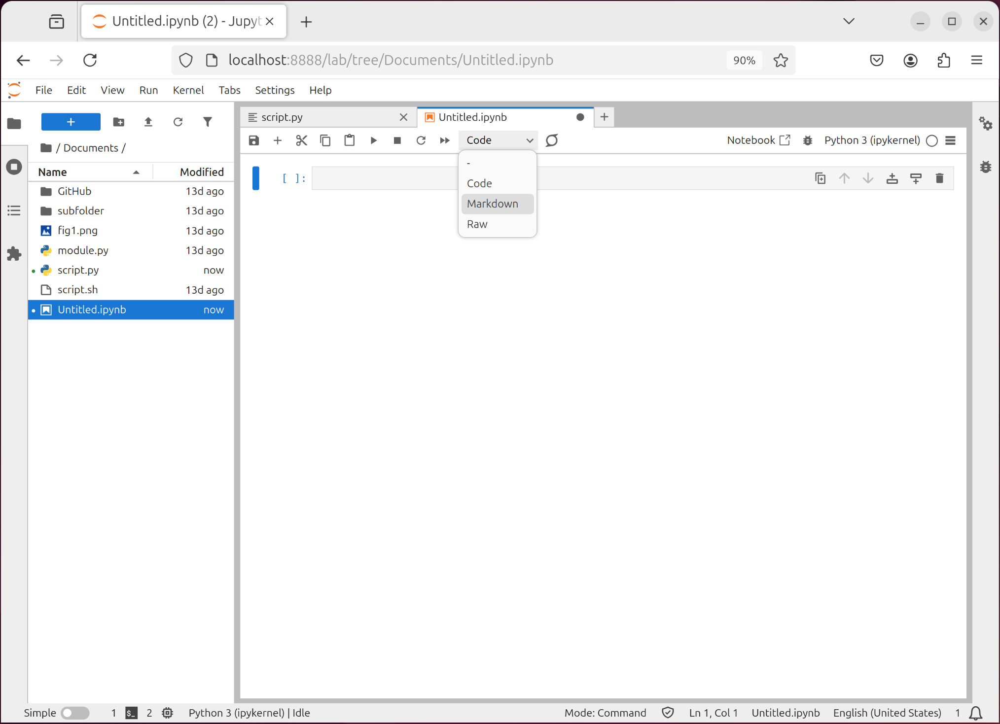
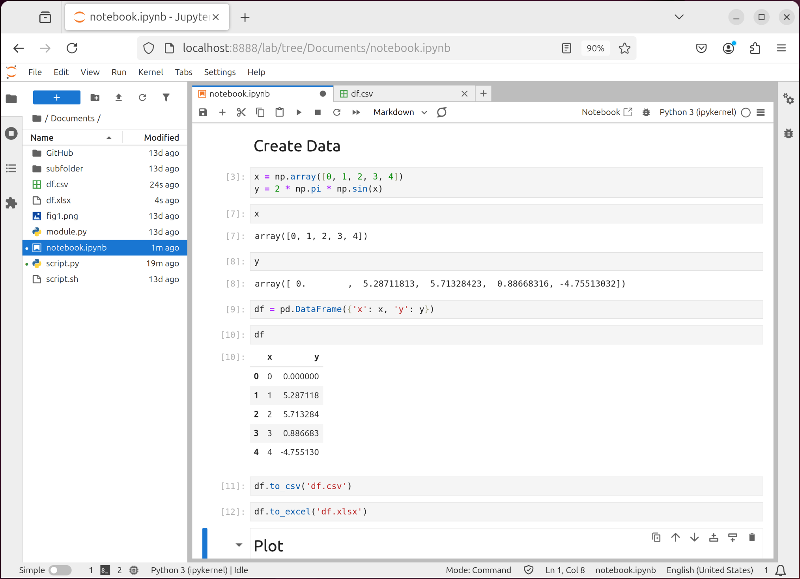
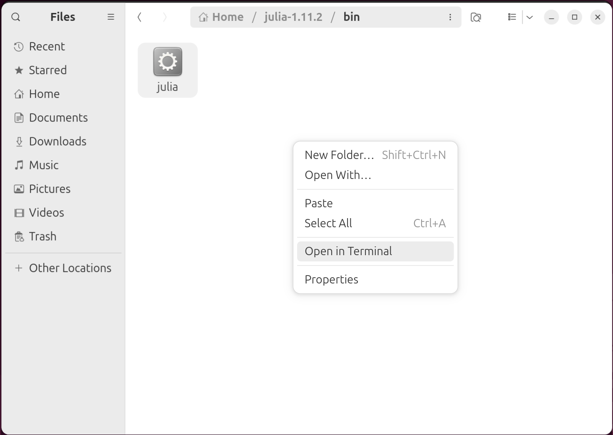
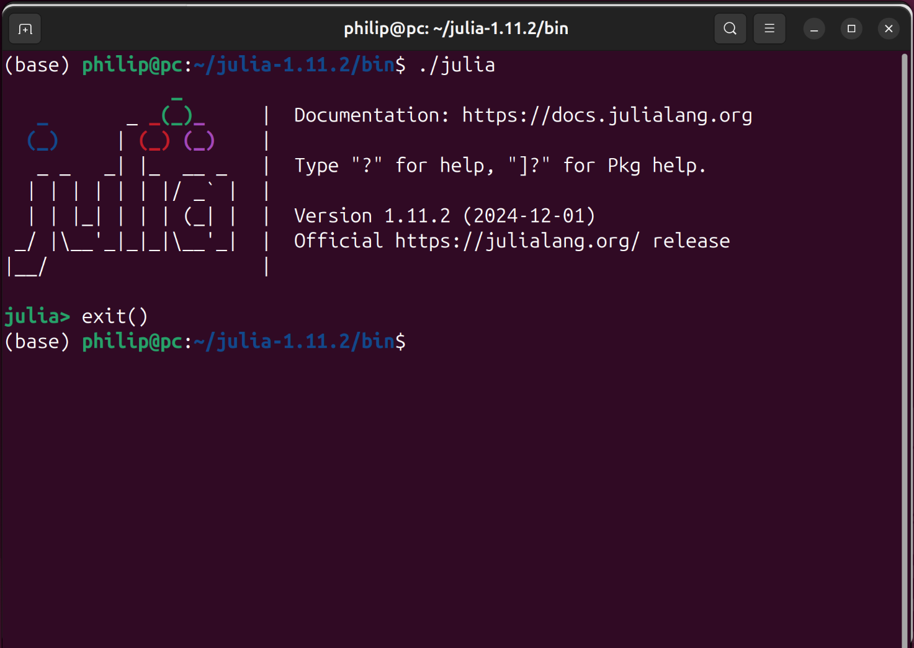
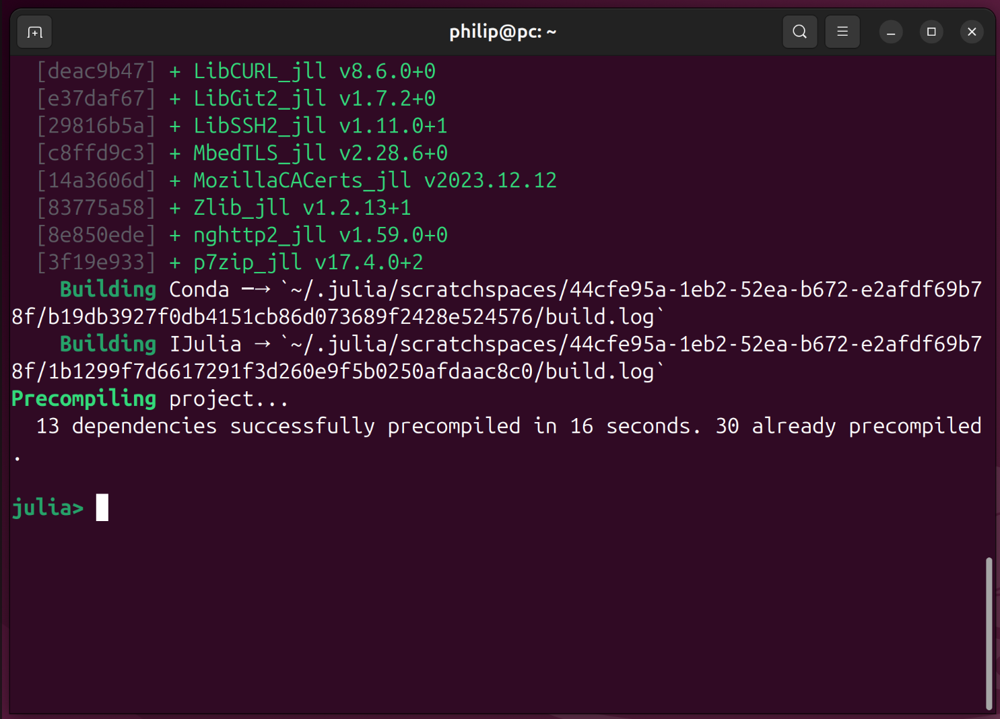

# JupyterLab IDE Ubuntu Setup

JupyterLab is a browser based IDE.

## Miniforge Installation and Setup

The conda package manager will be used to create a new environment for JupyterLab. In order to use conda, Miniforge needs to be installed and preferably initialised. This was previously covered in:

[Miniforge Install and Initialisation](../spyder_install_ubuntu/readme.md#miniforge-installation)

In order to use TeX in matplotlib plots. TeX needs to be installed system wide using the operating systems package manager (which was also previously covered in the above):

```bash
sudo apt-get install texlive-xetex texlive-fonts-recommended texlive-plain-generic cm-super dvipng
```

## Updating the conda Package Manager

The purpose of the base (conda) Python environment is to use the conda package manager to install packages, that are compartmentalised in other (conda) Python environments. Before using the conda package manager, the conda package manager should be updated to the latest version using:

```bash
conda update conda
```


Since Miniforge is used, the default channel will be the community channel `conda-forge`:


Input `y` in order to proceed:


The conda package manager is now up to date:


The terminal can be cleared by inputting:

```bash
clear
```

And (conda) Python environments can be listed by inputting:

```bash
conda env list
```

#

## Creating a JupyterLab conda-forge Environment

JupyterLab is mainly used with Python. To create a new (conda) Python environment for JupyterLab which includes the Python kernel, the following command can be used:

```bash
conda create -n jupyter-env jupyterlab jupyter cython seaborn scikit-learn pyarrow sympy openpyxl xlrd xlsxwriter lxml sqlalchemy tabulate nodejs ipywidgets plotly pyqt ipympl isort autopep8 ruff black jupyterlab-variableinspector jupyterlab_code_formatter jupyterlab-spellchecker jupyterlab-spreadsheet-editor
```


`jupyterlab` is the IDE itself. `seaborn` has `numpy`, `pandas` and `matplotlib` as dependencies and are the scientific libraries. `scikit-learn` is used for machine learning. `pyarrow`, `openpyxl`, `xlrd`, `xlsxwriter`, `lxml`, `sqlalchemy`, `tabulate` are for various file pandas formats. `pyqt` is for matplotlib's interactive backend, `ipympl` is used for the widget backend and `ffmpeg` is for saving matplotlib animations.

`jupyterlab-variableinspector`, `jupyterlab_code_formatter`, `jupyterlab-spellchecker`, `jupyterlab-spreadsheet-editor` are common extensions for JupyterLab. In order for extensions to be installed, nodejs needs to be installed. The JupyterLab IDE and extensions are written in nodejs, which is a programming language used for web content. Knowledge of nodejs is not required to use Python with JupyterLab.

`-n` means name and `jupyter-env` is the name of the (conda) Python environment. Specifying an environment using `-n` means changes to that environment will be made opposed to `base` which is the currently activated environment.

The environment location will be listed, along with details about the packages to be installed:


Input `y` in order to proceed:


## Updating JupyterLab

There is a new release of JupyterLab, approximately every month. To keep it up to date. Open up the Terminal and update the conda package manager in the base Python environment using:

```bash
conda update conda
```

Then activate `jupyter-env` and search for updates to all packages using `--all`:

```bash
conda activate jupyter-env
conda update --all
```

If there are troubles updating the (conda) Python environment, it can be removed and recreated from scratch using:

```bash
conda env remove -n jupyter-env
```

You may need to manually delete the residual `jupyter-env` folder after removing this environment:

```bash
conda create -n jupyter-env jupyterlab jupyter cython seaborn scikit-learn pyarrow sympy openpyxl xlrd xlsxwriter lxml sqlalchemy tabulate nodejs ipywidgets plotly pyqt ipympl isort autopep8 ruff black jupyterlab-variableinspector jupyterlab_code_formatter jupyterlab-spellchecker jupyterlab-spreadsheet-editor
```

## Launching JupyterLab

To activate the (conda) Python environment `jupyterlab-env` input:

```bash
conda activate jupyter-env
```


The prefix will now show `(jupyter-env)` instead of `(base)`:


This means that instead of searching the bin folder in  the base (conda) Python environment which is the `miniforge3` folder:


The equivalent bin folder is used for the currently activated (conda) Python environment `jupyter-env`.

The `envs` folder contains the environments:


The `jupyter-env` folder is currently activated:


And therefore the bin and lib folders are preferentially searched for binaries and programs:


The binary of interest is `jupyter-lab`:


And can be launched in the terminal by inputting:

```bash
jupyter-lab
```


JupyterLab is a browser based IDE. The server is ran in the terminal:


While the visual elements display in the browser:


## File Explorer

To the left hand side is a file explorer which displays the current working directory in the terminal. The current working directory in the terminal was `~`, the home the directory:


The Documents folder can be selected. JupyterLab can be used to open `.py` files, these display in a script editor which applies syntax highlighting:


## Launcher

To the right hand side, a new launcher can be selected, this can be used to start a new terminal. 


## Script Editor and Terminal

The terminal is equivalent to a new session of the Linux terminal and starts with `(base)`, indicating the (conda) base Python environment:


The `jupyterlab-env` can be activated and the script executed:

```python
#%% Import Libraries
import numpy as np
import matplotlib.pyplot as plt
import seaborn as sns
#%% Set Style
sns.set_style('whitegrid')
#%% Create Data
x = np.array([0, 1, 2, 3, 4])
y = 2 * np.pi * np.sin(x)
#%% Plot
plt.plot(x, y)
plt.xlabel(R'$x$', usetex=True)
plt.ylabel(R'$x2 \pi x \sin{x}$', usetex=True)
```

```bash
conda activate jupyter-env
python3 script.py
```


The plot in the script won't show unless the command:

```python
plt.show()
```

is added.


The file menu can be used to save the script:


The plot now displays in an interactive window:


## IPython Console

Code completion does not display for Python code, unless it is run in an interactive python console. Right click empty space in the script and select create console for editor:


Select IPython kernel:


A selection can be highlighted:


And run using, run selected code:


Now the libraries are imported, identifiers can be accessed from numpy by inputting:

```python
np.↹
```


Data model identifiers can be accessed using:

```python
np.__↹
```


The data model identifier `__file__` is an instance and can be returned to an ipython cell output:


The IPython console is equivalent to opening an IPython console from the Linux terminal. Because the Linux the `jupyter-env` was activated when the `jupyter-lab` binary was launched, `jupyter-env` is the currently selected environment. To view a docstring, an identifier should be input with open parenthesis and `⇧`+ `↹` should be pressed:

```python
np.arange(⇧+↹
```


A docstring can also be returned to an ipython cell:

```python
np.arange?
```


## Interactive Python Notebook

A Python Script file `.py` is essentially a text file which can be displayed in a text editor. 

Code can also be written in an Interactive Python Notebook file `.ipynb`. The interactive Python notebook is written using nodejs which is a programming language used by the browser to display visual content, essentially as a website. 


Although nodejs is used to display the contents of the `.ipynb` file in the browser. The user can create code cells which are written using Python or markdown cells are written using markdown. If a markdown cell is selected:



A title (H1) can be added using:

```markdown
# JupyterLab Test
```


When this cell is run, by selecting the run button or pressing `⇧`+`↵`:


The formatted markdown displays. (It can be edited again by double clicking it). Note to the left hand side, the table of contents tab displays the title:


A heading (H2) can be added using:

```markdown
## Import Libraries
```


The libraries can be imported in a code cell using:

```python
import numpy as np
import matplotlib.pyplot as plt
import seaborn as sns
```


Now that the libraries are imported, identifiers from them can be viewed:

```python
np.↹
```


A new cell, will default to a Python cell, notice the markdown text has the wrong syntax highlighting:


A number of keyboard shortcuts are available, these can be viewed by selecting Help → Show Keyboard Shortcuts:


The keyboard shortcut `Esc`+`m` will toggle a cell to markdown. It can be run using `⇧`+`↵`:


## JupyterLab Variable Inspector

If the following three code cells are run:

```python
import numpy as np
import matplotlib.pyplot as plt
import seaborn as sns

sns.set_style('whitegrid')

x = np.array([0, 1, 2, 3, 4])
y = 2 * np.pi * np.sin(x)
```

The variables `x` and `y` are created. Variables can be seen by right clicking some blank space in the notebook and selecting open variable inspector:


Since `x` and `y` are `ndarray` instances they can be inspected further by selecting the magnify icon:


## Plotting

If the code to plot is added:

```python
plt.plot(x, y)
plt.xlabel(R'$x$', usetex=True)
plt.ylabel(R'$x2 \pi x \sin{x}$', usetex=True)
```

Notice the plot is returned to the cell output as a static image:


Plot backends can be selected using the ipython magic. 

`inline` is the default backend, displaying the plot as a static image:

```
%matplotlib inline
```

`qtagg` is the default backend used by a Python script, displaying the plot in its own interactive window:

```
%matplotlib qtagg
```

`widget` displays the plot interactively in a cell output:

```
%matplotlib widget
```

## TeX

The TeX used in the figure, can be added to markdown:

```markdown
'$2 \pi x \sin{x}$'
```


## Cell Output Options

A docstring can be returned to a cell output using:

```python
plt.plot?
```

Since this is a long docstring, the cell output can be right clicked:


And enable scrolling for output can be selected:


## Cell Execution Order

If the code in first cell is modified to also import pandas and rerun, notice it is now updated from `In [1]` to `In [6]`:

```python
import numpy as np
import matplotlib.pyplot as plt
import seaborn as sns
import pandas as pd
```


The `ndarray` instances `x` and `y` can also be returned to a cell output:


The `DataFrame` class is a commonly used data structure within a notebook and can be returned to a cell output:

```python
df = pd.DataFrame({'x': x, 'y': y})
df
```


Or displayed in the variable inspector:


## JupyterLab Spreadsheet Editor

If the `DataFrame` is exported to a `csv` file and `xlsx` file:


Notice that the csv file can be opened in JupyterLab because the spreadsheet editor extension is installed:


This extension unfortunately doesn't support the `xlsx` file:


The notebook file can be renamed in the file explorer. Notice the tab name is also updated, the tab name can also be used to rename the file:




## Notebook and IPython Kernel

The notebook can be saved, using the file menu:


If the notebook is closed:


And reopened from the file explorer:


It displays in the same state as before however the IPython console associated with the notebook file has been exited:


The Kernel menu in the title bar can be used to Restart the Kernel and Clear All Cell Outputs:


Select Restart:


Now each cell can be run by selecting `⇧`+`↵`:


To run a cell and insert a new one below, `Alt`+`↵` can be used:


There is also the option to Restart the Kernel and Run All Cells:


Select Restart:


Notice all the cells (with code) are now run from top to bottom:


The run and the kernel menu have other options:


## JupyterLab Code Formatter

The JupyterLab code formatter extension has been installed. If the code in `In [3]` is modified to have poor formatting. The cell can be right clicked and Format Cell can be selected:


Notice that the spacing in `In [3]` is now PEP8 compliant. If `In [2]` is now selected and formatted:


Notice the string quotations have been changed from `""` to `''`. This is because the formatting preference of black has been used, which differs from the formatting preference in the Python programming language itself:


In Settings, the Settings editor can be examined:


The JupyterLab Code Formatter extension can be selected. To the right the JSON settings editor can be selected:


If the system defaults are copied over to the user preferences, blacks, string_normalization (to double quotes) can be set to False:


Now when Format Cell is used, the string quotations will remain unchanged:


Note cells can be formatted individually, or the format notebook button cna be selected to format all notebook cells:


## Markdown

Images can be inserted in a markdown. Usually they are stored in the same folder ad the notebook or markdown file or a subfolder:


JupyterLab can also be used to create or edit a markdown file. A new tab can be opened to display a new launcher and create a markdown file. It is common to have a `readme.md` in the folder of a Python project:


The following heading and image can be added:

```markdown
# JupyterLab

## Insert Image

The *following* **figure** will be inserted:


```

Blank space in the markdown file can be right clicked and the Show Markdown Preview can be selected:


The table of contents displays the markdown headings in the markdown file:


## Contextual Help

A new tab can be created to display a new launcher:


Contextual Help can be selected:


This will display the help of the currently selected identifier:


## Exiting JupyterLab

To close JupyterLab, close all tabs and then the tab in the browser itself:


The visual elements are now closed but the server ran in the terminal still displays:


Press `Ctrl`+`c` to cancel the currently running operation in the terminal:


## Jupyter Acronym

Jupyter is an acronym for **Ju**lia, **Py**thon **et** **R** and as the name suggests supports the three programming languages Julia, Python and R.

Although `conda` is strongly associated with Python it is actually a general purpose data science package manager and supports the R programming language. 

Currently there is limited support for the Julia programming language supporting only Linux and Mac. The `conda-forge` package is a significantly older version of Julia. 

## R Kernel

If the (conda) Python environment `jupyter-env` is activated, the following R packages can be installed:

```bash
conda install r-irkernel jupyter-lsp-r r-tidyverse r-ggthemes r-palmerpenguins r-writexl 
```


Input `y` in order to proceed:


Now when the `jupyter-lab` binary is launched:

```bash
jupyter-lab
```


It has options for the R programming language:


## Julia Kernel

The `conda` package manager has limited support for Julia. It is recommended to download the latest binary from [Julia](https://julialang.org/):


This can be extracted:


Giving a Julia subfolder:


Which can be copied to Home:


Notice it has its own bin and lib folder:


Installing `julia` using the `conda-forge` package is not recommended at present, as it is significantly out of date:

```bash
conda activate jupyter-env
conda install julia
```

However installation of `julia` via the `conda-forge` package will integrate these folders with the existing folders in the (conda) Python environment `jupyter-env`. Checks need to be made to avoid naming conflicts, which is why the `conda-forge` package is out of date.

If blank space in the bin folder is right clicked and opened in the terminal:



The Julia binary can be started by using:

```bash
./julia
```

where `./` is an instruction to look for the binary in the currently selected directory:


This can be exited using:

```julia
exit()
```




In order to use Julia with JupyterLab, its binary folder needs to be added to the path. This can be done by modifying the `.bashrc` file. This is a hidden file within the Home directory `~`:


Open this file in the text editor:


Notice that a code block that has been added by Spyder to preferentially recognise the binary `spyder` as the standalone installer. 

Below this is the `conda` initialisation which means a search for a binary will preferentially be searched in the activated (conda) Python environment and then fallback to the `base` (conda) Python environment and then fallback to the system binaries. 

* `conda` for example is only installed in the base (conda) Python environment. A search for `conda` will search the currently selected (conda) Python environment `jupyter-env` and not find the binary `conda`. Therefore it will fallback and look for `conda` in the base (conda) Python environment.

* The `.bashrc` preferences the standalone `spyder` and this version of spyder will be preferenced over a spyder binary installed in an activated conda environment.


The following block is added to the `.bashrc` file:

```bash
# >>> Added by Julia >>>
export PATH="$PATH:/path/to.<Julia directory>/bin
# <<< Added by Julia <<<
```


Where in this case `/path/to.<Julia directory>` is `/home/philip/julia-1.11.2/bin`


Now when the terminal is refreshed (closed and reopened). The binary `julia` is recognised:

```bash
julia
```


The Julia Kernel package needs to be added:

```julia
using Pkg
Pkg.add("IJulia")
exit()
```




Now when the (conda) Python envionment `jupter-env` is activated and the `jupyter-lab` binary launched:

```bash
conda activate jupyter-env
jupyter-lab
```


It has options for the Julia programming language:


[Return to Python Tutorials](../readme.md)