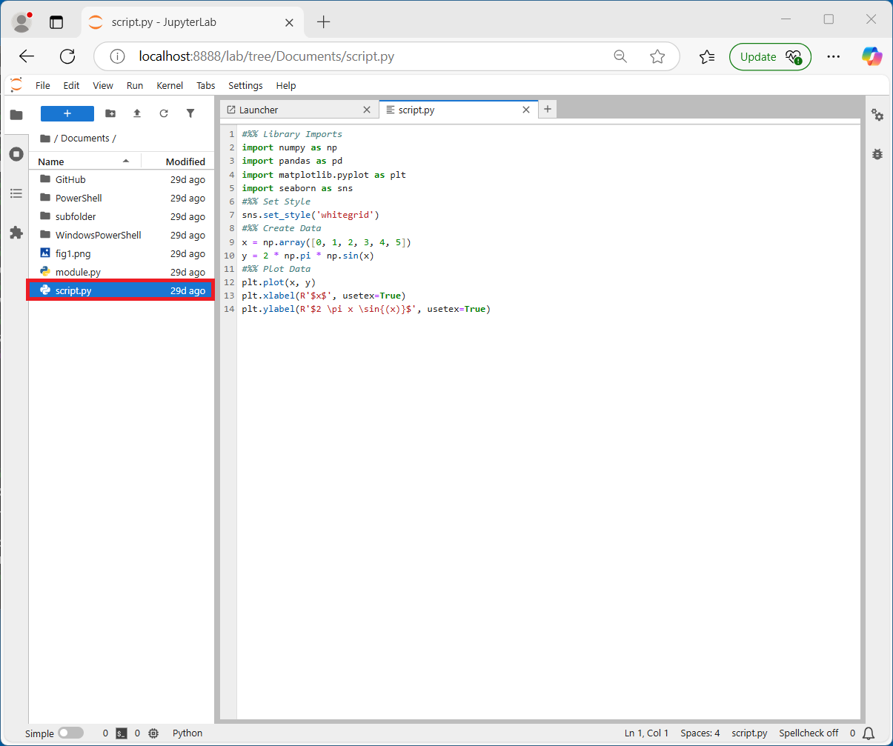
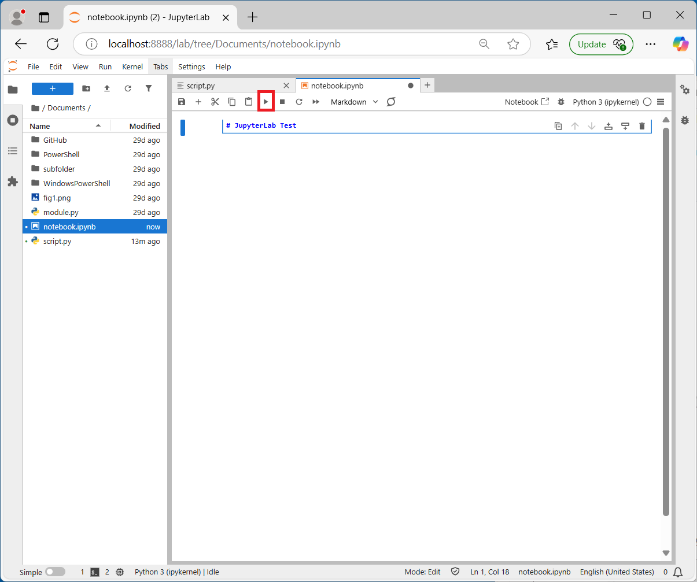
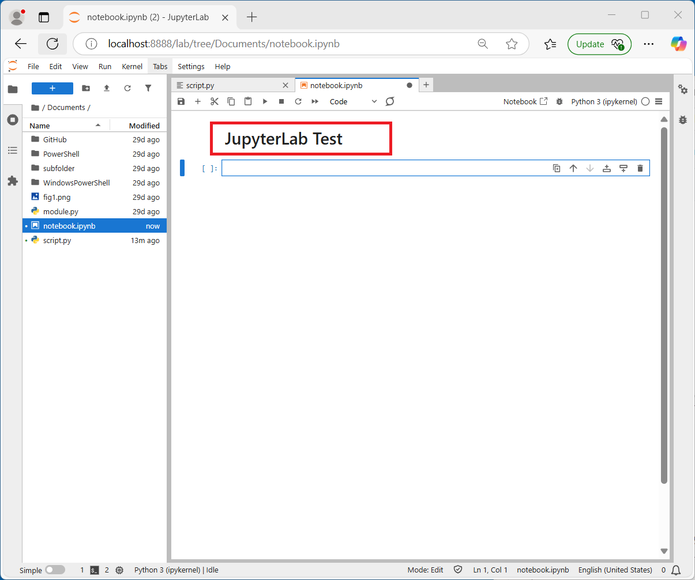
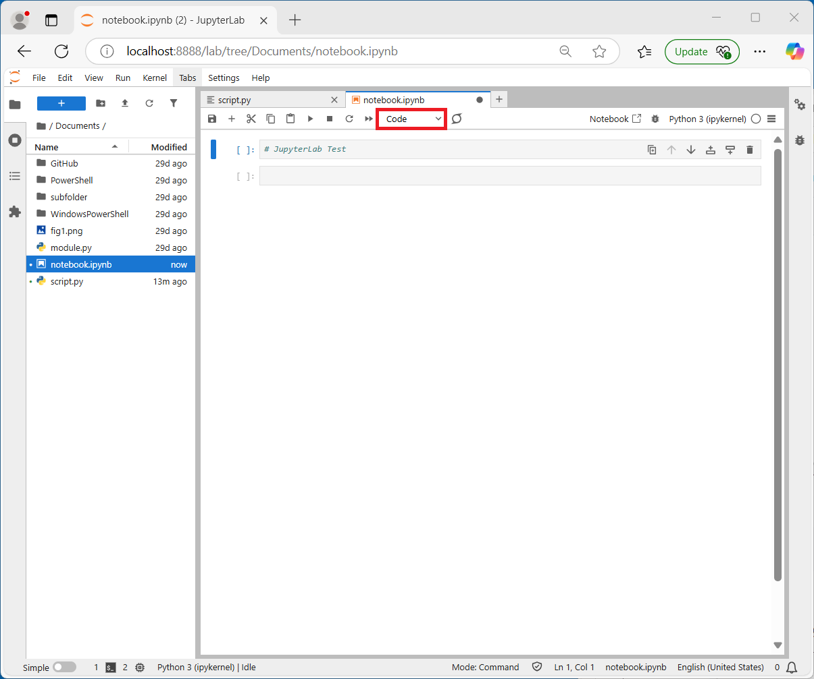
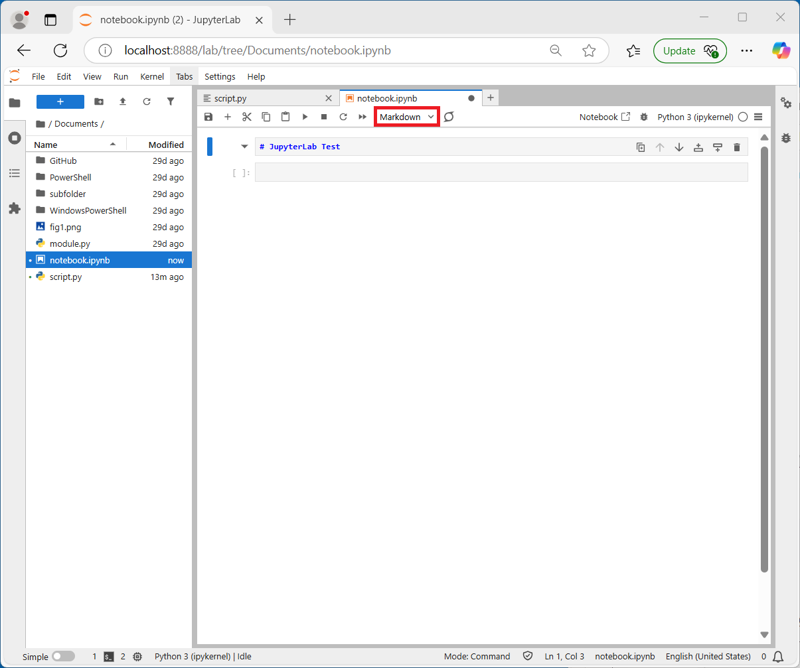
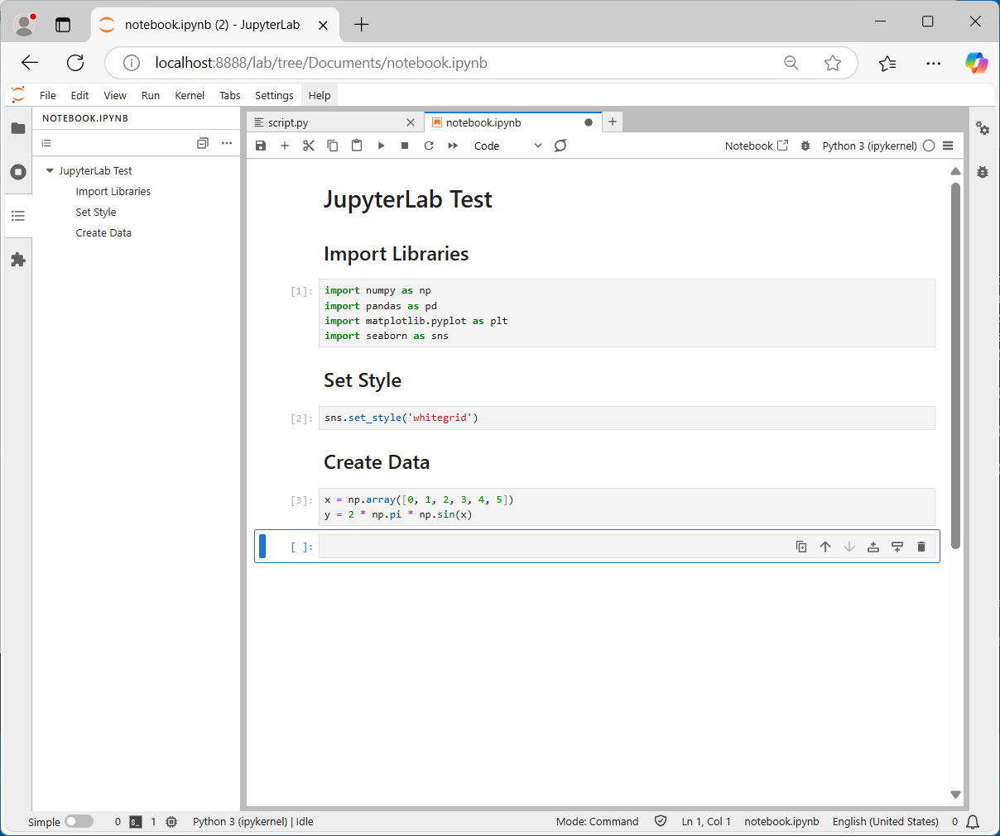
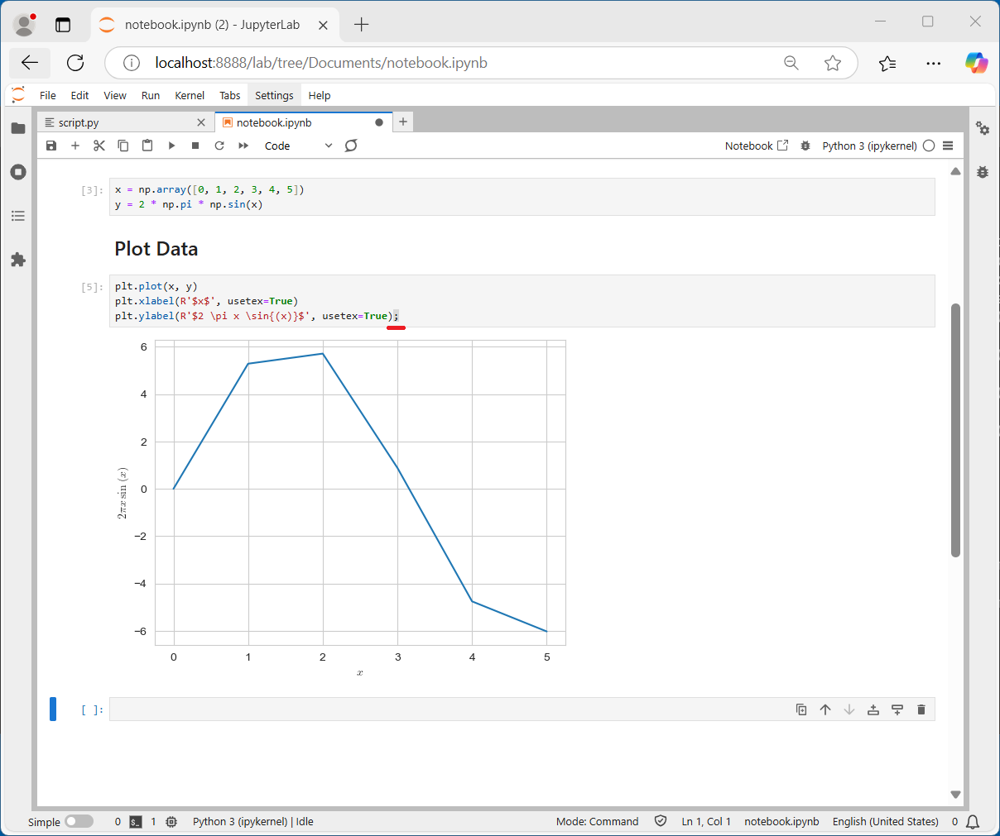
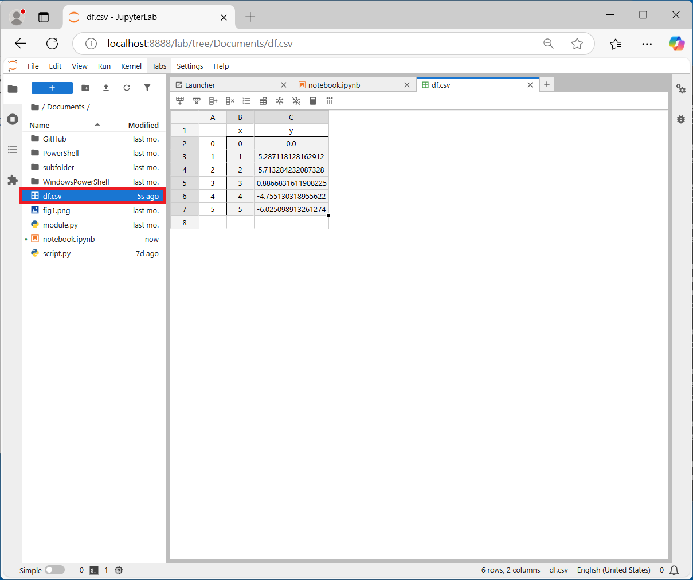
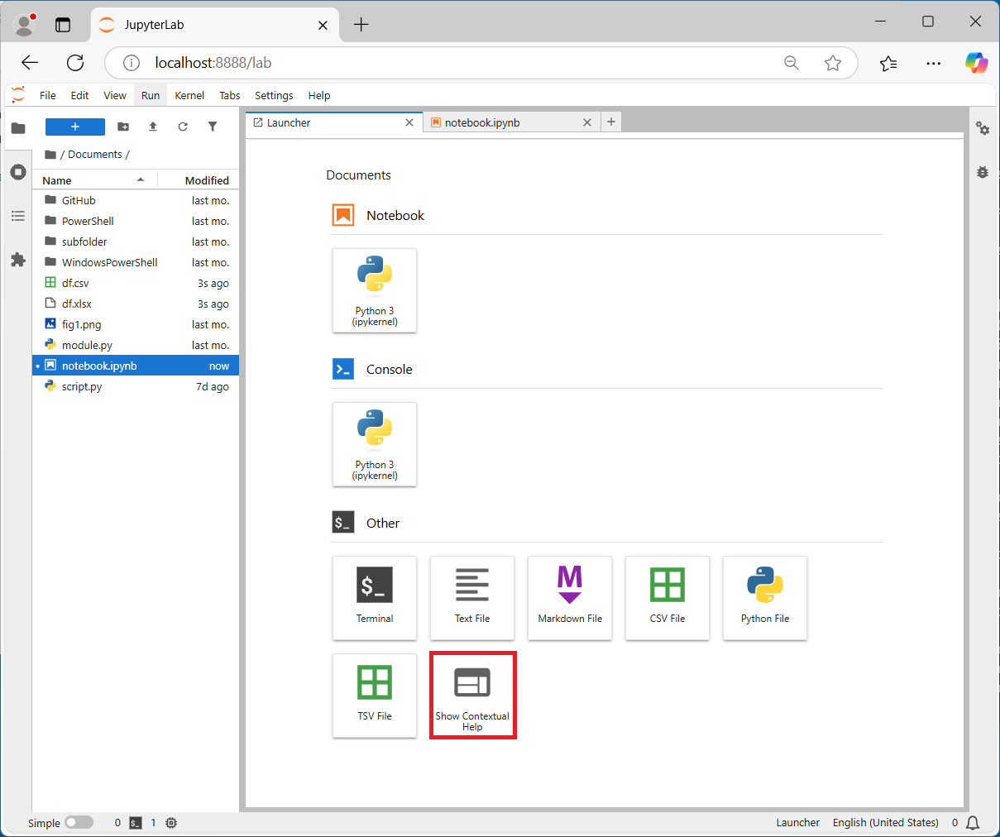

# JupyterLab IDE Windows Setup

JupyterLab is a browser based IDE.

## Miniforge Installation and Setup

The conda package manager will be used to create a new environment for JupyterLab. In order to use conda, Miniforge needs to be installed and preferably initialised. This was previously covered in:

[Miniforge Install and Initialisation](../spyder_install_windows/readme.md#miniforge-installation)

In order to use TeX in matplotlib plots. MikTeX needs to be installed and added to the system path (which was also previously covered in the above).

## Update conda

The purpose of the `base` environment is to use the conda package manager to install packages in other Python environments. Before using the conda package manager, the conda package manager should be updated to the latest version:

```powershell
conda update conda
```


Since Miniforge is used, the default channel will be the community channel `conda-forge`:


Input `y` in order to proceed:


The conda package manager is now up to date:


Note there is an issue going from `conda` 24 to 25 where it doesn't update properly and says:

```
==> WARNING: A newer version of conda exists <==
current version: 24.w.w
latest version: 25.x.x

Please update conda by running:

conda update -n base -c conda-forge conda
```

And inputting the command listed takes you back to the same screen. To bypass this use:

```powershell
conda install conda=25.x.x
```

Where `25.x.xx` should be replaced by the latest version number.

The terminal can be cleared by inputting:

```powershell
clear
```

(conda) Python environments can be listed by inputting:

```powershell
conda env list
```


## Creating a JupyterLab conda-forge Environment

JupyterLab is mainly used with Python. To create a new environment for JupyterLab which includes the Python kernel, the following command can be used:

```powershell
conda create -n jupyter-env jupyterlab jupyter cython seaborn scikit-learn pyarrow sympy openpyxl xlrd xlsxwriter lxml sqlalchemy tabulate nodejs ipywidgets plotly pyqt ipympl isort autopep8 ruff black jupyterlab-variableinspector jupyterlab_code_formatter jupyterlab-spellchecker jupyterlab-spreadsheet-editor
```


`jupyterlab` is the IDE itself. `seaborn` has `numpy`, `pandas` and `matplotlib` as dependencies and are the scientific libraries. `scikit-learn` is used for machine learning. `pyarrow`, `openpyxl`, `xlrd`, `xlsxwriter`, `lxml`, `sqlalchemy`, `tabulate` are for various file pandas formats. `pyqt` is for matplotlib's interactive backend, `ipympl` is used for the widget backend and `ffmpeg` is for saving matplotlib animations.

`jupyterlab-variableinspector`, `jupyterlab_code_formatter`, `jupyterlab-spellchecker`, `jupyterlab-spreadsheet-editor` are common extensions for JupyterLab. In order for extensions to be installed, nodejs needs to be installed. The JupyterLab IDE and extensions are written in nodejs, which is a programming language used for web content. Knowledge of nodejs is not required to use Python with JupyterLab.

`-n` means name and `jupyter-env` is the name of the Python environment. Specifying an environment using `-n` means changes to that environment will be made opposed to `base` which is the currently activate environment.

The environment location will be listed, along with details about the packages to be installed:


Input `y` in order to proceed:


## Updating JupyterLab

There is a new release of JupyterLab, approximately every month. To keep it up to date. Open up the Terminal, the `base` environment will be updated, use the following command to update `conda` to the latest version:

```powershell
conda update conda
```

Note there is an issue going from `conda` 24 to 25 where it doesn't update properly and says:

```
==> WARNING: A newer version of conda exists <==
current version: 24.w.w
latest version: 25.x.x

Please update conda by running:

conda update -n base -c conda-forge conda
```

And inputting the command listed takes you back to the same screen. To bypass this use:

```powershell
conda install conda=25.x.x
```

Where `25.x.xx` should be replaced by the latest version number.

Then activate `jupyter-env` and search for updates to all packages:

```powershell
conda activate jupyter-env
conda update --all
```

If there are troubles updating the environment, it can be removed and recreated from scratch using:

```powershell
conda env remove -n jupyter-env
```

You may need to manually delete the residual `jupyter-env` folder after removing this environment:

```powershell
conda create -n jupyter-env jupyterlab jupyter cython seaborn scikit-learn pyarrow sympy openpyxl xlrd xlsxwriter lxml sqlalchemy tabulate nodejs ipywidgets plotly pyqt ipympl isort autopep8 ruff black jupyterlab-variableinspector jupyterlab_code_formatter jupyterlab-spellchecker jupyterlab-spreadsheet-editor
```

## Launching JupyterLab

The `base` (conda) Python environment is selected:


The `jupyter-env` environment can be activated. To activate `jupyterlab-env` input:

```powershell
conda activate jupyter-env
```


If the environments are listed:

```powershell
conda env list
```

Notice that the (conda) Python environment `jupyter-lab` has a \* indicating it is activated. The directory is also shown:


This can be exploed in Windows Explorer by going to:

```
%UserProfile%\Miniforge3
```


Then looking at the `envs` subfolder which contains the (conda) Python environments:


`jupyter-env` can be examined:


Because it is activated, this folder will be preferenced alongside its associated script folders when looking for an application in the Windows Terminal. If the scripts folder is examined:


Notice that there is a `juptyer-lab.exe`. This can be pinned to the Start Menu:


More typically JupyterLab is opened in the terminal by inputting:

```powershell
jupyter-lab
```

Note the `.exe` is typically dropped:


JupyterLab is a browser based IDE. The server is ran in the terminal, which will remain busy while the JupyterLab application is running:


While the visual elements display in the browser:


## File Explorer

To the left hand side is a file explorer which displays the current working directory in the terminal. The current working directory in the terminal is the home the directory `%UserProfile%`. The Documents folder can be selected:


And script.py can be opened:



## Script Editor and Terminal

The terminal is equivalent to a new session of the Windows terminal, using Powershell:


Notice it starts with base, the default (conda) Python environment:


(conda) Python environment `jupyter-env` can be activated using:

```powershell
conda activate jupyter-env
```


The `python.exe` in the currently activated (conda) Python environment `jupyter-env` can be used to run the `script.py` from the currently selected folder using:

```powershell
python script.py
```

Note that the `.exe` extension for `python.exe` is not required while the first input argument being provided to the `python.exe` requires its file extension `script.py`:


The script runs and the terminal moves onto the next prompt but the plot does not show:


The following command:

```python
plt.show()
```

can be added to `script.py`:


This `script.py` file can be saved using the file menu:


When this script is rerun, notice the plot displays in a separate plot window, this plot window using the QtAgg backend:


## IPython Console

Code completion does not display for Python code, unless it is run in an interactive python console. Right click empty space in the script and select create console for editor:


Select IPython kernel:


Code can be highlighted:


The selection can be run by selecting run → run selected code:


This code shows as the input to `In [1]` which has no `Out[1]`:


Now the libraries are imported, identifiers can be accessed from numpy by inputting:

```python
np.↹
```


Data model identifiers can be accessed using:

```python
np.__↹
```


The identifier `__file__` is an instance and can be returned to an ipython cell output:


The `print` function can be used to process the escape characters in the Windows path. To view a docstring, an identifier should be input with open parenthesis and `⇧+↹` should be pressed:

```python
print(⇧+↹
```


A docstring can also be printed to a cell output using:

```python
print?
```


A longer docstring can be examined:

```python
plt.plot(⇧+↹
```


And printed to an ipython cell output:

```python
plt.plot?
```


All the code can be run by selecting run → run all code:


Notice that the plot is displayed using the inline backend where it is essentially nested as a static image in the ipython cell output:


## Interactive Python Notebook

A Python Script file `.py` is essentially a text file which can be displayed in a text editor. 

Code can also be written in an Interactive Python Notebook file `.ipynb`. The interactive Python notebook is written using nodejs which is a programming language used by the browser to display visual content, essentially as a website. 

Open a new launcher and select new notebook:


Rename the notebook using the file explorer:


A notebook consists of cells which can either be Python code (the default) or markdown which is essentially used to document around the code:


Markdown can be used to create a title:


A heading can be added using:

```markdown
# JupyterLab Test
```



When it is run using the run button, notice the formatted markdown displays showing the text as Heading 1:



Double clicking the heading returns to the raw markdown:


Inputting `Esc+y` toggles the cell to a code cell, notice the syntax highlighting changes as the `#` in Python code means a comment:



`Esc+m` toggles the cell back to a markdown cell, notice the syntax highlighting changes as the `#` means Heading 1:



The markdown cell can be run using the shortcut key `↹+↵` and another Heading 2 can be added:

```markdown
## Import Libraries
```

and run using `↹+↵`:


JupyterLab has a navigation pane which displays the table of contents in a notebook file:


To run a cell, the shortcut key `↹+↵` can be used. To run a cell and insert a blank one below it instead use `Alt+↵`:


The `+` button will also add a blank cell:


The shortcuts to run the selected cell, run selected cell and insert below and run selected cell and do not advance can be seen on the run menu:


The cell can be deleted by pressing the delete button or using the shortcut key `Ctrl+d`:


Code can be added to a cell:

```python
import numpy as np
import pandas as pd
import matplotlib.pyplot as plt
import seaborn as sns
```


Identifiers can be viewed by inputting a prefix e.g. `np.` followed by a `↹`:


A docstring can be examined by inputting a function with open parenthesis and pressing `⇧+↹`, for example:

```
np.arange(⇧+↹
```


The following cells can be added:

```markdown
## Set Style
```

```python
sns.set_style('whitegrid')
```

```markdown
## Create Data
```

```python
x = np.array([0, 1, 2, 3, 4, 5])
y = 2 * np.pi * np.sin(x)
```



The variables `x` and `y` can be displayed on the Variable Inspector, right click blank space in the notebook and select open Variable Inspector:


The Variable Inspector opens in another tab which can be repositioned:


Some variables that are Collections can be further examined:


A plot can be added using:

```markdown
## Plot Data
```

```python
plt.plot(x, y)
plt.xlabel(R'$x$', usetex=True)
plt.ylabel(R'$2 \pi \sin(x)$', usetex=True)
```


By default the plot displays inline, in the cell output as a static image:



The backend can be changed to interactive python matplotlib:

```markdown
## Plot Data Widget
```

```python
%matplotlib ipympl
```

```python
plt.plot(x, y)
plt.xlabel(R'$x$', usetex=True)
plt.ylabel(R'$2 \pi \sin(x)$', usetex=True)
```

which gives limited interactivity:


To use another backend, the kernel needs to be restarted. Select Kernel → Restart Kernel and all Cell Outputs of all Cells:


Select restart:


The backend can be changed to Qt, which displays the plot in a seperate interactive window which gives more interactivity:

```markdown
## Plot Data Qt

```python
%matplotlib qtagg
```

```python
plt.plot(x, y)
plt.xlabel(R'$x$', usetex=True)
plt.ylabel(R'$2 \pi \sin(x)$', usetex=True)
```


Note the TeX added to the plot can also be used in markdown cell:

```markdown
$2 \pi \sin(x)$
```


Additional markdown such as a table can be added:

```markdown
|num|number|
|---|---|
|1|one|
|2|two|
|3|three|
```


The `\*` is a special character in markdown and can be used to make bold and italic text as well as list of bullet points:

```markdown
**bold**, *italic*, ***bold-italic***, ~~strike-through~~
```

```markdown
* one
* two 
* three
```

It can be inserted as an escape character using:

```markdown
\*
```


A docstring can be displayed in a cell output:

```python
plt.plot?
```


Often scrolling outputs are enabled for such cells. Allowing the docstring to be seen without taking too much emphasis in the overall notebook. Right click the Cell Output and select Enable Scrolling for Outputs:


The file menu can be used to save the notebook:


When a notebook is closed and JupyterLab is closed and then JupyterLab is relaunched and the notebook opened, the notebook will display output from the previous session. However the ipython console associated with the notebook will have ended:


Select Kernel → Restart Kernel and all Cell Outputs of all Cells:


To run a cell one by one, the shortcut key `↹+↵` can be used:


Variables can be viewed in cell outputs:

```python
x
```

```python
y
```


A DataFrame can be constructed and viewed in a cell output using:

```python
df = pd.DataFrame({'x': x, 
                   'y': y})

df
```


This can be saved to a file using:


```python
df.to↹
```


And selecting the identifier `to_csv` and supplying a path to the file:

```python
df.to_csv('df.csv')
```


This csv file can be opened in JupyterLab because the spreadsheet editor extension is installed:



Unfortunately this extension has no support for Excel files:


If the code in the following cell is formatted poorly such as:

```python 
x = np.array([0,1,2,3,4,5])
y=2* np.pi* np.sin(x)
```


The format notebook button can be selected:


Note the formatting is corrected however all the string quotations are changed to `""` instead of Python's default `''` because the black formatter is used by default.

This can be changed by selecting Settings → Settings Editor:


Then selecting the Jupyter CCode Formatter:


Often the JSON settings editor is more useful:


The System Defaults JSON can be copied to the User Preferences and string_normalization can be assigned to False:


Now formatting can be used without changing the single quotations to double quotations:


The following image can be examined:


A link to it can be inserted using:

```markdown
[fig_1](./fig1.png)
```


Clicking on this link opens the file:


Putting a `!` in front of the link will instead embed it:

```markdown

```


Show contextual help opens a contextual help pane which updates every time an identifier is selected:




To close JupyterLab, the close button can be used on the browser tab:


Although the visual elements of JupyterLab are closed, the server is still running in the Windows Terminal. Press `Ctrl+c` to cancel tthe current operation:


A new prompt displays:


## Jupyter Acronym

Jupyter is an acronym for **Ju**lia, **Py**thon **et** **R** and as the name suggests supports the three programming languages Julia, Python and R.

Although `conda` is strongly associated with Python it is actually a general purpose data science package manager and supports the R programming language. 

Currently there is limited support for the Julia programming language supporting only Linux and Mac. The `conda-forge` package is a significantly older version of Julia. 

## R Kernel

If the (conda) Python environment `jupyter-env` is activated, the following R packages can be installed:

```powershell
conda install r-irkernel jupyter-lsp-r r-tidyverse r-ggthemes r-palmerpenguins r-writexl 
```


The environment location will be listed, along with details about the packages to be installed:


Input `y` in order tp proceed:


When JupyterLab is launched using:

```powershell
jupyter-lab
```


Notice that there is now an option for both a Python and R console:


## Julia (Jupyter Kernel)

Unfortunately Julia isn't available on conda-forge for Windows and has to be installed using the Windows Store:


Julia will be added to the system path. Open the Windows Terminal and input:

```powershell
julia
```


To install the Julia Kernel input:

```powershell
using Pkg
Pkg.add("IJulia")
```


Julia can be exited using:

```julia
exit()
```


When JupyterLab is launched using:

```powershell
jupyter-lab
```


The **Ju**lia, **Pyt**hon **et** **R** consoles are available:


[Return to Python Tutorials](../readme.md)