# The Linux Terminal

The Linux Terminal uses the bash programming language by default which is an abbreviation for Bourne Again SHell. bash commands were used to install Mambaforge using a ```.sh``` script. On Linux, the Linux Terminal is commonly used with bash in conjunction with Python. It is worthwhile familarising yourself with bash before getting started with Python, in order to be familar with the Linux Terminal.

## Opening the Terminal

The Terminal can be opened using the Terminal icon on the start screen:

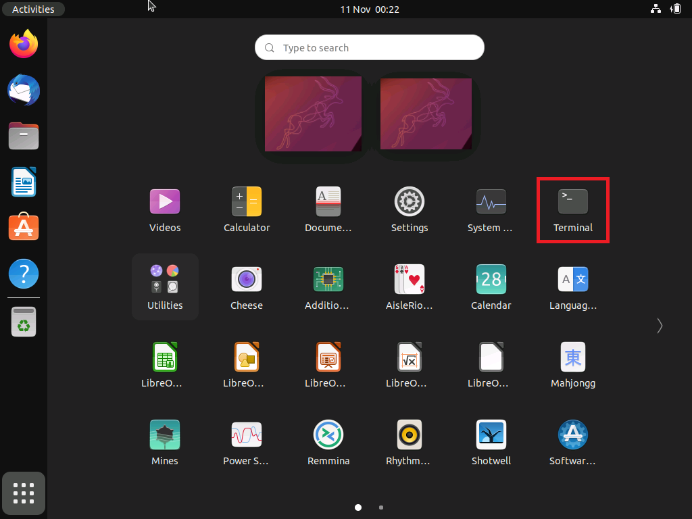

It can also be opened using the ```Ctrl```, ```Alt``` and ```t```. In either case, the Terminal opens in the default location which is ```~```.

The Terminal can also be opened by using the right click context menu in Files and selecting open in Terminal:

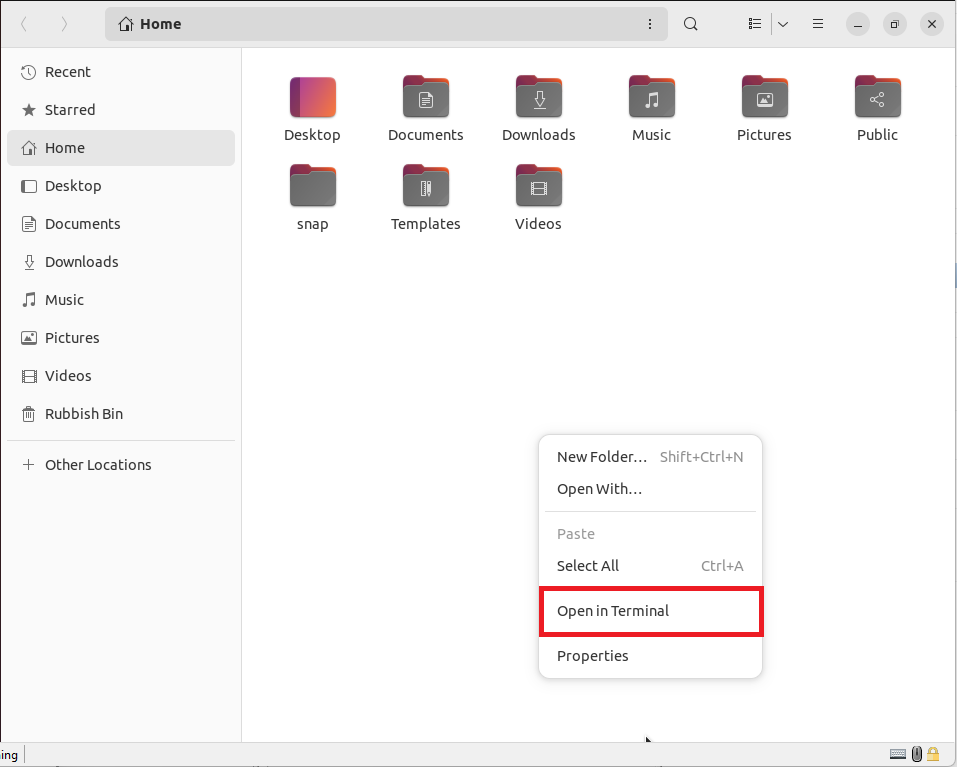

The Terminal will open using the File Path of the current folder displayed in Files.

## The Prompt

The current prompt is indicated using a ```$```:

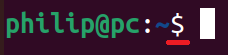

The prefix of the prompt displays the user name ```philip```:

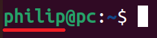

An ```@``` symbol:

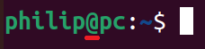

The pc name ```pc```:

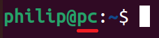

A single colon ```:``` :

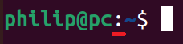

The ```~```, indicates the file path:

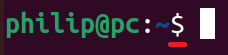

The ```$``` indicates a new prompt:

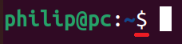

## \~ home

In Linux, the ```~``` represents the Home directory. Files opens by default in Home and selecting Open in Terminal from the right click context menu:

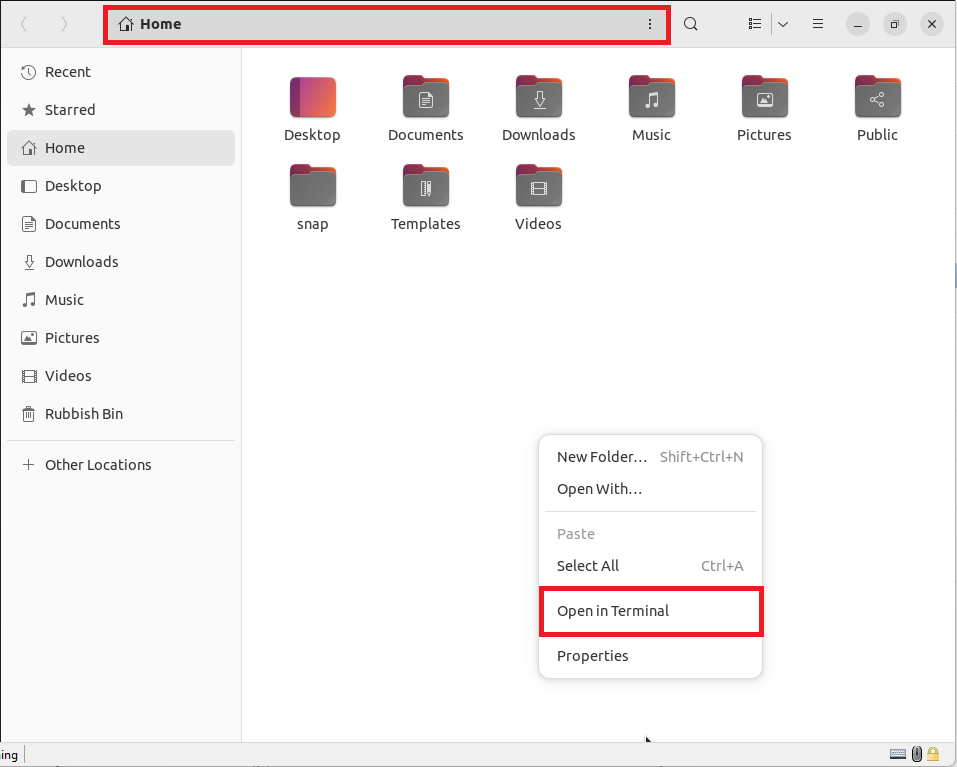

Opens the Terminal in Home ```~```:

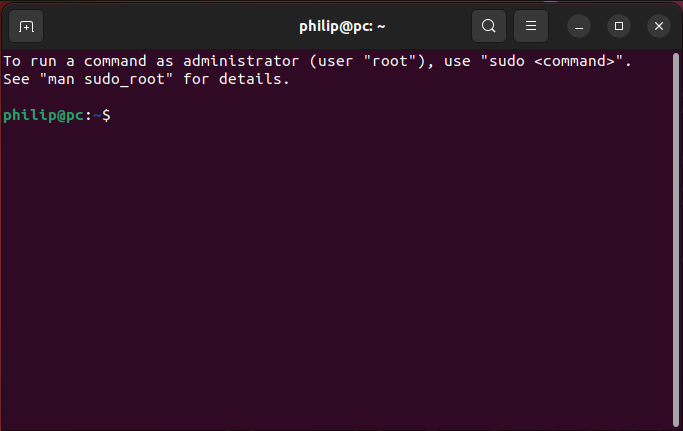

This is the default location the Terminal is opened in, if the shortcut key ```Ctrl```, ```Shift``` and ```t``` or the Terminal shortcut is used on the Start Screen.

## ls list

The ```ls``` command is an abbreviation for list and will list all the files and folders in the current directory.

```
ls
```

Notice that all the folders are listed in blue and match the color syntax of the file path:

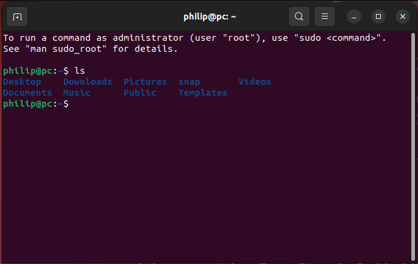

If the Documents folder is selected, and Open in Terminal is selected:

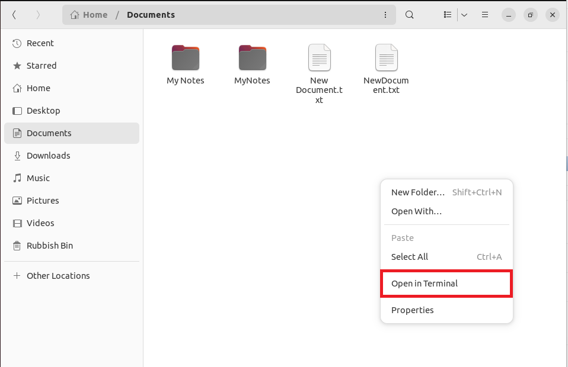

The location changes to ```~/Documents``` and this is in the blue syntax:

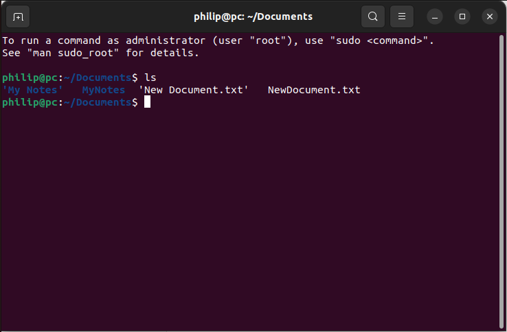

If:

```
ls
```

is used again, this time the two folders and two files will be listed. 

The folders are displayed in the blue syntax and the files are shown in white syntax and include a file extension. 

The file and the folder with a space are shown enclosed in single quotations.

## cd "change directory"

The ```cd``` command is an abbreviation for change directory (folder). It can be used to change to a directory for example by specifying the ```Documents``` subdirectory listed:

```
cd Documents
```

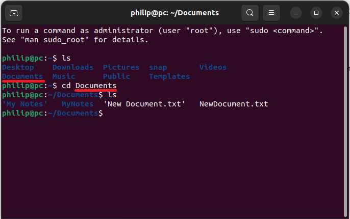

If the command:

```
cd Downloads
```

is now used. The Terminal will try and access a Downloads subdirectory within Documents which doesn't exist and display a No such File or Directory Error:

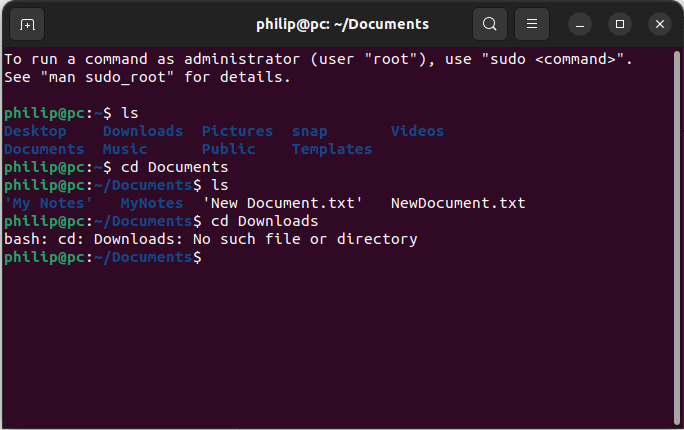

To select Downloads, it can be selected by using the file path with respect to Home:

```
cd ~/Downloads
```

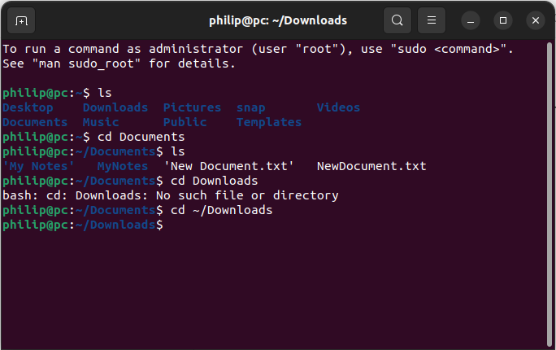

It is also possible to use ```.``` to indicate explicitly in the same folder as or ```..``` to go up a directory. Using:

```
cd ..
```

will move the Terminal path to Home ```~``` in this case:

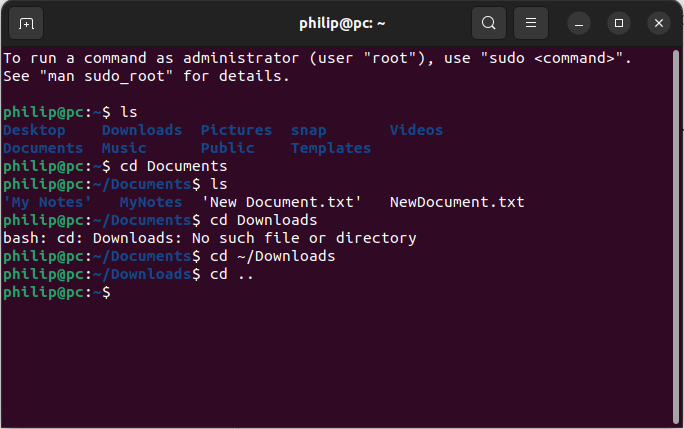

The ```MyNotes``` folder within Documents can be selected using:

```
cd ~/Documents/MyNotes
```

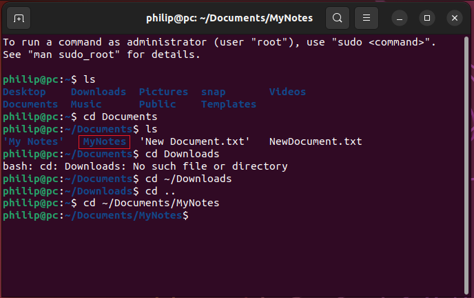

To get back to Home ```~```, the following can be used:

```
cd ../..
```

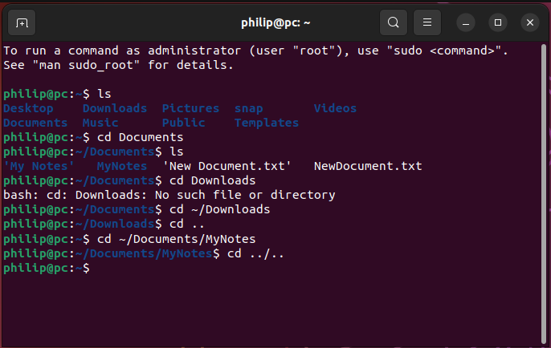

## clear

To clear the terminal, the shortcut key ```ctrl``` + ```l``` can be used. This is lower case l for c**l**ear:


The command:

```
clear
```

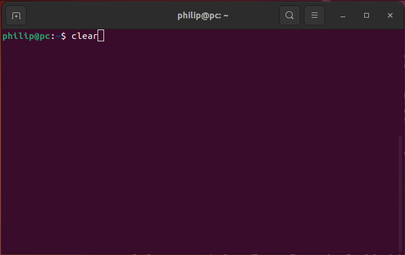

Also clears the Terminal:

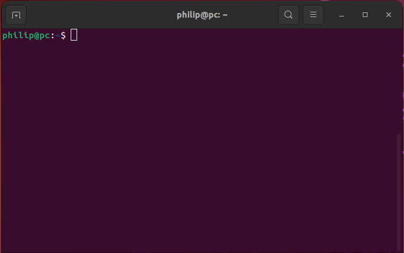

## copy and paste

The shortcut key for copy is ```Ctrl```, ```⇧``` and ```c```:

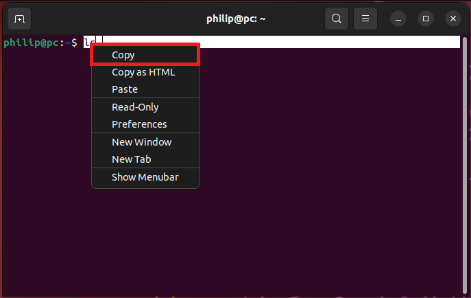

The shortcut key for paste is ```Ctrl```, ```⇧``` and ```v```:

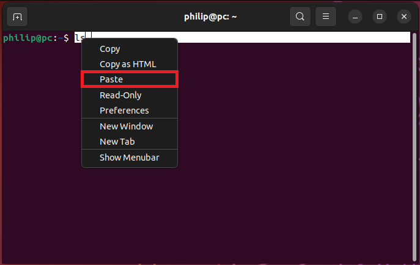

## close

The shortcut key for closing a currently running process such as an infinite loop is ```Ctrl``` and ```c```.

For example if the following is input:

```
while true; do echo "welcome"; done
```

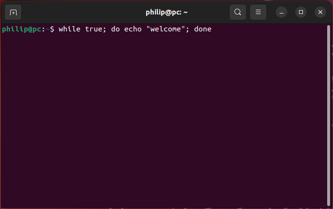

The Terminal will be hung up in an infinite loop:


Pressing ```Ctrl``` and ```c``` will exit this infinite loop:

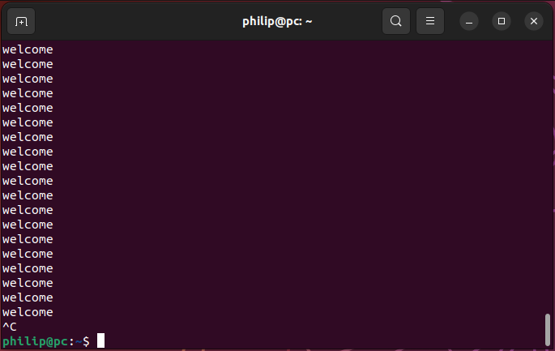

## echo


```
cd Documents
```

This will change to the Documents subfolder found within the currently selected folder Home:


Notice that the path is now changed to ```~/Documents```


Now we can attempt to change to Downloads using:

```
cd Downloads
```

Note that this doesn't work and we get No such directory:


This is because we were in the Documents folder. What we have just looked for is:

```
cd ~/Documents/Downloads
```

To get to downloads we must instead specify the Home folder before hand:

```
cd ~/Downloads
```

Now we are in the Downloads folder:


Note that if you right click an empty space inside a folder and select Open in Terminal:


The Terminal will open inside the selected folder:


### ~ "home"
To get back to Home, we can use:

cd ~

Notice that the location is now Home:


– "previous directory you were in"
Lets change directory to Documents and then to Downloads:

cd ~/Documents
cd ~/Downloads

To return to the previous directory which was Documents we can use:

cd -

. "the same directory"
If we change directory to . then we keep in the same directory:

cd .

.. "the directory up a level"

We can conceptualise this as the command line equivalent of [Alt] + [↑], go up a level, taking us from the Documents subfolder to Home:


↑ and ↓ "up and down previous commands"
To access the previously used command in the terminal, press the ↑ button. You can press ↑ and ↓ to cycle through the last commands.

[Ctrl] + [l] "clear"
The command [Ctrl]+[l] will clear the terminal. Note that this is the lowercase letter L i.e. 2nd character in the word clear and not the uppercase i.

[Ctrl] + [ c ] "close"
The command [Ctrl] + [ c ] will close the current execution in the terminal. This can eb required when something is running in the terminal with an infinite loop for example and the user wants to exit, to reach a new prompt.

touch "touch the directory i.e. create a file in the directory"
We can create a new file by touching the current directory with our new file. We simply use the touch command followed by the file name and extension:

touch MyFile.txt

This creates the file MyFile.txt in Documents because this is our selected directory in the Terminal.

Notice that it is good practice to use CamelCaseCapitalization with file names and avoiding extensions. File names with spaces can be used, although it is generally frowned upon. If the file name has a space, it must be enclosed in quotations, for example:

touch "My File.txt"

rm "remove"
To delete a file, we remove it using:

rm "My File.txt"

Note the reason the above worked is because we were already in the Documents folder. We could also have specified the full file path using:

rm "~/Documents/My File.txt"
mv "move" file or rename file
To rename a file, we move it from an old location to a new location. If we are in the same working directory as the file, we can simply specify the old file name followed by the new file name. This will move it to the same place using the new file name:

mvmv MyFile.txt MyFile2.txt

We can sometimes, explicitly define that we are working within the same directory by using the . for example:

mv ./MyFile2.txt ./MyFile.txt

cp "copy" file
We can make a copy of a file using the cp command followed by the original file name to be copied followed by the file name of the copy:

cp MyFile.txt MyFile2.txt

mkdir "make directory"
We can make a directory using the command mkdir and once again we should name the folders using CamelCaseCapitalization:

mk MyProject1

Once again we may want to explicitly specify that we are wanting to make the directory as a subfolder within the current directory:

mk ./Project2

We can return to Home and make a subfolder MyProject3 directly in Documents by specifying the full path of the new directory:

cd ~
mk ~/Documents/MyProject3

If we change directory to this folder ~/Documents/MyProject3 we can create a new folder MyProject4. If we use .. we go up a level and make a new directory MyProject4 within Documents:

cd ~/Documents/MyProject3
mkdir ../MyProject4

rmdir "remove directory"
We can remove a directory using rmdir. If we use .. we go up a level and can remove directory MyProject4 within Documents:

rmdir ../MyProject3

To remove the directory MyProject4, we need to change fromMyDirectory4 to another directory as we cannot delete the folder we are in. For example we can go up a level, then delete this directory MyProject4:

cd ..
rmdir MyProject4

ls "list"
We can list all the subfolders and files within a directory using the command ls (lower case L not upper case i).

ls
Notice that files alongside their extensions display in white whereas subfolders display in grey:


nano text editor
To edit a file we can use the terminal based text editor. We typically edit the file by typing in nano followed by the file name:

nano MyFile.txt

We can use this text editor to add content to our file, for example:

print("Hello World")

Notice to the bottom there are a list of commands:


The ^ means pressing [Ctrl]. So to Exit we use [Ctrl] + [x]:


When we exit, we are asked whether we want to save the changes or discard the changes. To do so we need to input:

y
To discard them, we would instead input:

n


We get the option to overwrite the existing file by just pressing:

↵
Alternatively we can specify a new file name before pressing:

↵


echo "echo/print command"
The echo command can be used to print a string to the terminal:

echo "Hello World"

It is more often used in a bash script.

bash "bourn again shell" run a shell script
Let's edit MyFile2.txt using nano:

nano MyFile2.txt

And add an echo command with the string "hello World":

echo "hello world"

Once the changes are saved, let's rename this file extension from .txt to .sh which is a shell extension. We can do this by moving the file:

my MyFile2.txt MyFile2.sh

We can run a shell file by using the command bourne again shell (i.e. the newest version of shell scripts) bash followed by the file name including the .sh extension:

bash MyFile2.sh

This displays the string given in the echo command:


python3 run a Python script
Python 3 is inbuilt and can be accessed suing the command:

python3
This will tell you the version of Python:


To exit, Python use:

exit()

To run a file, we need a Python Script file with a .py extension. Let's change the file extension of MyFile.txt to MyFile.py and then run it:

mv MyFile.txt MyFile.py
python3 MyFile.py
We see the code print "hello world" to the terminal as expected:


zip
We can create a zipped folders from files using the zip command, followed by the name of the new zipped folder and zip extension and then a list of the files:

zip ZippedFiles.zip MyFile.txt MyFile2.sh

This gives the zipped folder as expected:


unzip
Let's remove these files using:

rm MyFile.txt
rm MyFile2.sh

We can unzip the folder by using the unzip command followed by the zipped folder name:

unzip MyZip.zip

The files are unzipped as expected:


/ "root"
When working in your folders:

~/Documents
~/Downloads
~/Music
~/Pictures
~/Videos
You don't require any elevated user permissions. There are other locations however:


Supposing we want to change the directory to bin or boot. We would need to use the full path:

cd /boot
cd /bin
cd /home
Here the first / means we are accessing the root of the drive:


The full path for my home is:

cd /home/philip


sudo "super user do"
Let's move to one of these other file locations for example:

cd /boot/grub

If we type in:

nano grub.cfg

We are informed that the file is unwritable i.e. that we do not have permissions to edit this file:


If we exit out of this and instead prefix the command with super user do sudo:

sudo nano grub.cfg

Then we are greeted with an authentication prompt. Input your user password to proceed:


Once the password has been input and authorisation is granted, you will be able to edit this file:


This is a system file and editing it can break the system, so I am just going to exit out without saving any changes.

chmod "change modifications"
If a file is right clicked and Properties are selected, you can view the permissions:


The owner is listed alongside the owners access rights. Then the group, the owner belongs to is listed with their access rights and finally others are listed alongside their access rights:


This can be changed in the command line using chmod. The command has the form:

chmod a+w MyFile2.sh
a+w is an abbreviation; a stands for all users, + indicates we are adding permissions and w means we are granting write access:


This is seen with:


Instead of a+w we can use any combination of the three characters:

user	mode	permission
u
user (owner)	+
adding permission	r
read
g
group user in file's group of users	–
removing permission	w
write
o
other users	=
making the only permission	x
execute
a
all users		
man "manual"
The command used above is moderately complicated. We can get more details about the command and most others using the command man, an abbreviation for manual:

man chmod

This opens the manual for the command chmod:


We can scroll through this using [↑] or [↓] and press [ q ] to quit reading the manual:


snap package manager
snap is used to manage the installation of Ubuntu based snap packages… Most of these can be installed using the software store but they can also be installed via the terminal.


snap packages are essentially always installed with all their dependencies included. This alleviates many of the issues users experienced installing software from the advanced package tool apt which required other software or dependencies to be installed and usually specific versions of said dependencies in order for the software to run correctly.

snap packages are also sandboxed and prevented from accessing system or hidden files. One other thing to note with snap packages is that users are generally forced to use the latest version of them. Using the latest version is particularly encouraged when it comes to the use of browsers as outdated browsers are at risk of security exploits when accessing sites such as online banking.

If we type in snap, we get details about snap commands:

snap
Let's only focus on the basics: find, info, install, remove and list


The list command will list all of the snap packages installed on, the system:

snap list

We can use find to search for a snap package using a search term. In this example, I will search for vlc. From the list of search results, we see the top entry has the name vlc:

snap find vlc
We can use this name in the info or install commands. To get details about it we can use:

snap info vlc

To install we can use:

snap install vlc

Because this command isn't prefixed with sudo, we are presented with the graphical user interface to grant authentication:


If we instead used:

sudo snap install vlc
We would be presented with the command line based authentication prompt:


In either case once authentication is given, the package will be downloaded and installed:


To remove vlc, we would use either:

snap remove vlc
sudo snap remove vlc
apt "advanced package tool" package manager
Not all software is available as a snap package… Some of the software is still only present using the more widely Debian based advanced package tool (Ubuntu is Debian based). apt is the Debian advanced package tool.

Note some software is available as both an apt and snap package. Sometimes one of the packages, with respect to the other is severely outdated. This is normally the apt package but there are some developers that only have preliminary software available as a snap and have otherwise stuck to using apt for their later versions.

Note for some commonly used software such as browsers, the apt install is used as an alias for the snap install. This is likely to be more prevalent in the future as more software moves towards the snap install.

Let's have a look at using apt, once again when typing apt we are presented with a list of the most commonly used commands. Many of these are the same/similar with the snap basics:

apt

If we use:

apt list

We see a much larger list of installed packages because these are also Operating SYstem Updates and drivers:


We can look for a list of available updates by typing in:

apt update

Notice that we are prevented from carrying out this operation as we don't have permissions. In order to get permissions, we need to run this command as a super user by prefixing it with sudo, super user do:

sudo apt update
We then need to input our password to authenticate:


We are informed, there are 3 updates.


To get more details, about the command we can use:

man apt

Notice that there are options which are normally 1-2 letter abbreviations following on from a single dash e.g. -v, and -h.

There are also flags which are full words following on from a double dash e.g. –version and –help.

The option -v and the flag –version do the same thing. Using the option requires less typing but using the flag can make the code more readable. In other cases there are options without associated flags and vice-versa.

Using the flag –upgradable for list, will narrow down the list of packages to those that are upgradable:

apt list --upgradable
In this case 3 are listed:


Let's use:

sudo apt upgrade

In order to proceed input:

y

In this case I will cancel so input:

n
There is another command apt-get which is essentially an alias for apt… There is a slight nuance between the two; apt-get is supposed to be less interactive i.e. display less information in the terminal when installing packages or updates:

sudo apt-get upgrade

In this case and many others the information displayed is the same. This time I will proceed so I'll input:

y

The updates were installed:


We can search for a screen recording software using the search term vokoscreen:

apt search vokoscreen

We see the search yield the package with the name vokoscreen-ng and this is installed already:


We can reinstall it using the command:

sudo apt reinstall vokoscreen-ng

Because the command was prefixed with sudo, we'll need to type in our password in roder to proceed:


The software is then reinstalled:


Note the commands install and remove use similar syntax:

sudo apt install vokoscreen-ng
sudo apt remove vokoscreen-ng
Other Linux distributions or distros use different package managers to apt and snap. However once you understand how to use apt, using the other package managers is generally straightforward as the syntax is almost identical.

dandified yum dnf is a package manager for RedHat based Linux distributions such as Fedora and RedHat Enterprise Linux. It works in a similar manner to apt and in most cases uses the same syntax replacing apt with dnf.

pacman is a package manager used in Arch based Linux distributions such as Manjaro. It works in a similar manner to apt and in most cases uses the same syntax replacing apt with pacman.