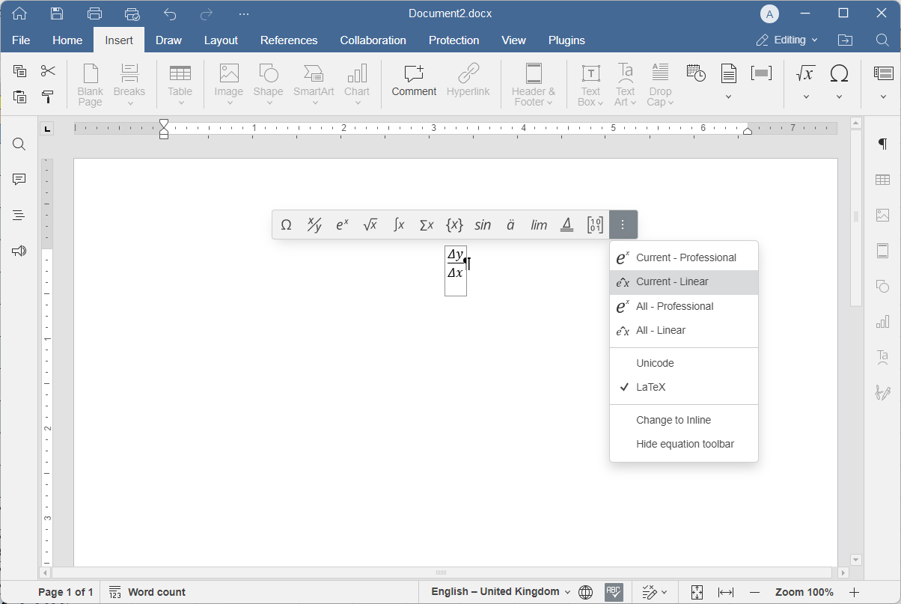
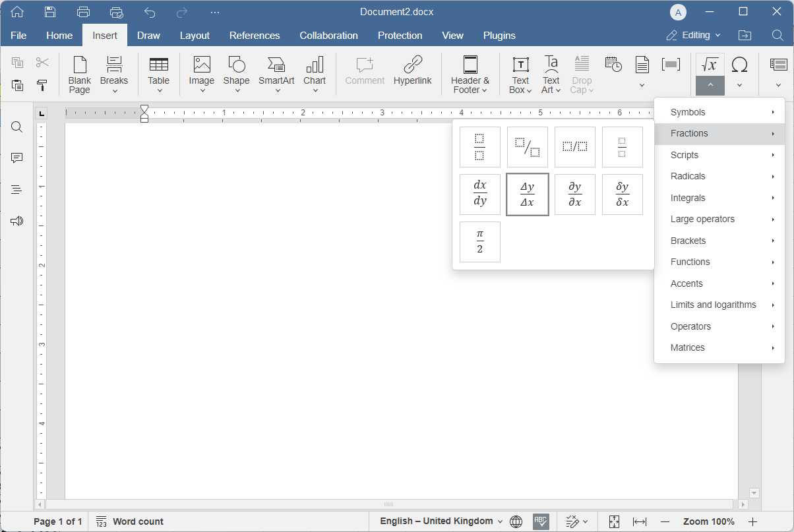
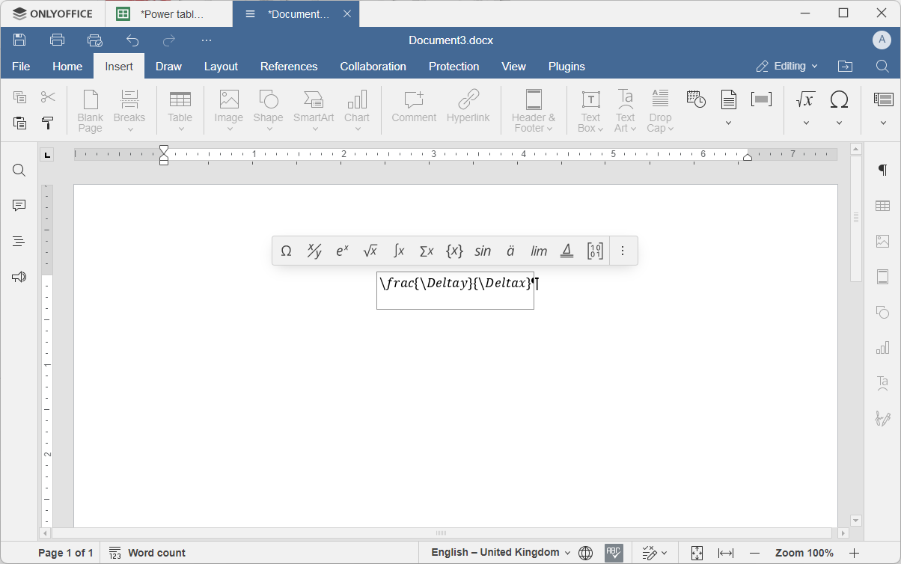

# Markdown

A text file can only be used to store unformatted text. The markdown file is similar to a text file, however allows text to be formatted using very simple markdown syntax. The Markdown syntax is also used for markdown cells in Interactive Python Notebooks. Markdown cells are commonly used to create documentation around code, in a similar form to a scientific paper.

In JupyterLab opening a markdown file opens up the markdown editor:


To view the formatted Markdown. Right click blank space on the Markdown preview and select Markdown Preview:


The table of contents can be viewed:


Unfortunately in JupyterLab the markdown editor and markdown preview panes are not linked and using a link in the table of contents will only navigate to the heading in the currently select pane. This makes it more difficult to modify the markdown file.

In VSCode the markdown file can be opened:


The file can be right clicked to view the markdown preview:



In VSCode the markdown editor and markdown preview panes are linked and the table of contents in the markdown editor will navigate to the heading in both panes. Having both panes linked makes it easier to modify the markdown file and view the output:



## Formatted Text

Text can be enclosed in stars ```*``` or tildes ```~``` to format it. One set of stars ```*``` makes text italic, two sets of stars ```*``` makes it bold and three sets of stars ```*``` makes it bold-italic. Two sets of tildes ```~``` make it strike-through. 

The following markdown:

```markdown
Let's make a sentence with *italic text*, **bold text**, ***bold-italic*** and ~~strike-through~~ text.
```

Produces:

Let's make a sentence with *italic text*, **bold text**, ***bold-italic*** and ~~strike-through~~ text.

---

## Escape Characters

When one of the formatting characters is required in the text, it needs to be prepended with the left slash ```\``` to insert an escape character. For example to insert the left slash itself, ```\``` two left slashes are used ```\\``` where the first left slash ```\``` denotes insertion of an escape character and the second left slash ```\``` denotes the escape character to be inserted is the left slash itself```\```. The following markdown:

```markdown
Let's make a sentence with \*italic text\*, \*\*bold text\*\*, \*\*\*bold-italic\*\*\* and \~\~strike-through\~\~ text.
\\
```

Produces:

Let's make a sentence with \*italic text\*, \*\*bold text\*\*, \*\*\*bold-italic\*\*\* and \~\~strike-through\~\~ text.
\\

---

## Headings

Headings can be created by prefixing the text of a heading with a ```#```. Increasing the number of ```#``` increases the Heading Level. The following markdown:

```markdown
# Heading 1

## Heading 2

### Heading 3

#### Heading 4

```

Produces:

# Heading Level 1

## Heading Level 2

### Heading Level 3

#### Heading Level 4

Each heading will display on the Table of Contents in VSCode or JupyterLab.

---

## Spacing

For convenience a long sentence written over multiple lines is formatted as a single sentence. The following markdown:

```markdown
She sells
seashells
on the
seashore
```

Produces:

She sells
seashells
on the
seashore

If instead the sentence is to be deliberately separated out over different lines, doubly space it. The following markdown:

```markdown
She sells

seashells

on the

seashore

```

Produces:

She sells

seashells

on the

seashore

---

## Bullet Points

Bullet points can be created by prepending each line with a star```*``` (but not ending with a star as recall that would make the text italic) or prepending each line with ```1.```, ```2.``` and so on for a numbered list.

The following markdown:

```markdown
Bullet Point List
* one
* two
* three

Bullet Point List (spaced)
* one

* two

* three

Numeric List
1. one
2. two
3. three

Numeric List (spaced)
1. one

2. two

3. three

```

Produces:

Bullet Point List
* one
* two
* three

Bullet Point List (spaced)
* one

* two

* three

Numeric List
1. one
2. two
3. three

Numeric List (spaced)
1. one

2. two

3. three

---

## Tables

The pipe ```|``` is used to seperate columns out in a table. The table is constructed row by row. The first row consists of the column names and the second row is the column alignment format specification (which can be changed to normal ```---```, left aligned ```:-```, right aligned ```-:```, left-aligned with title centred ```:-:```). All subsequent rows are rows containing table data.

The following markdown:

```markdown
|num|number|
|---|---|
|1|one|
|2|two|
|3|three|

|num|number|
|---|:-|
|1|one|
|2|two|
|3|three|

|num|number|
|---|-:|
|1|one|
|2|two|
|3|three|

|num|number|
|---|:-:|
|1|one|
|2|two|
|3|three|
```

Produces:

|num|number|
|---|---|
|1|one|
|2|two|
|3|three|

|num|number|
|---|:-|
|1|one|
|2|two|
|3|three|

|num|number|
|---|-:|
|1|one|
|2|two|
|3|three|

|num|number|
|---|:-:|
|1|one|
|2|two|
|3|three|

---

## Separators

An empty line with ```---``` will produce a separator.

The following code:

```markdown
---
```

Produces the separator line between the two arrows:

↓

---

↑


---

## Code

To include code in a markdown file begin and end the code with 3 back-quotes ```` ``` ````. The following markdown:

```
The code is ```print('Hello World!')```
```

Produces:

The code is ```print('Hello World!')```

3 back quotes ```` ``` ```` on a new line can be used to begin and end a code-block. 

The following markdown:

````
```
print('Hello World!')
print('Goodbye World!')
```
````

Produces:

```
print('Hello World!')
print('Goodbye World!')
```

To apply the correct syntax highlighting for the programming language, the programming language should be specified after the opening ```` ``` ````

The following markdown:

````
```python
print('Hello World!')
print('Goodbye World!')
```
````

Produces:

```python
print('Hello World!')
print('Goodbye World!')
```

Other programming languages can be specified using markdown. Such as 

markdown:

````
```markdown
Let's make a sentence with \*italic text\*, \*\*bold text\*\*, \*\*\*bold-italic\*\*\* and \~\~strike-through\~\~ text.
\\
```
````

```markdown
Let's make a sentence with \*italic text\*, \*\*bold text\*\*, \*\*\*bold-italic\*\*\* and \~\~strike-through\~\~ text.
\\
```

cmd:

````
```cmd
cd "C:\Windows\System32"
```
````

```cmd
cd "C:\Windows\System32"
```

powershell:

````
```powershell
cd "~\Anaconda3"
```
````

```powershell
cd "~\Anaconda3"
```

There is the abbreviation ps1 (ps is another programming language postscript) however ps1 is not as widely recognised as powershell by markdown renderers.


bash:

````
```bash
cd "~/Anaconda3"
```
````

```bash
cd "~/Anaconda3"
```

tex:

````
```tex
$\sin{\alpha}\pm\sin{\beta}=2\sin{\frac{1}{2}\left(\alpha\pm\beta\right)}\cos{\frac{1}{2}\left(\alpha\mp\beta\right)}$
```
````

```tex
$\sin{\alpha}\pm\sin{\beta}=2\sin{\frac{1}{2}\left(\alpha\pm\beta\right)}\cos{\frac{1}{2}\left(\alpha\mp\beta\right)}$
```

json:

````
```json
{
    "preferences": {
        "default_formatter": {
            "python": ["autopep8", "isort", "black"],
            "R": ["styler", "formatR"],
        }
    }
}
```
````

```json
{
    "preferences": {
        "default_formatter": {
            "python": ["autopep8", "isort", "black"],
            "R": ["styler", "formatR"],
        }
    }
}
```

To include the ```` ``` ```` themselves as part of the markdown text. Enclose the three back quotes ```` ``` ```` in four backquotes ````` ```` `````. To get 4 backquotes (enclose in 5 backquotes). The following markdown:

`````
````
```
````
`````

Produces:

````
```
````

---

## Links and Images

Links can be inserted using the syntax ```[]()``` where the square brackets are used to enclose the link name and the parenthesis are used to enclose the link address.

If the link is an image this may be prepended with an exclamation mark `````` which will display the image within the markdown file.

The following markdown:

```
[Anaconda](https://upload.wikimedia.org/wikipedia/en/c/cd/Anaconda_Logo.png)
```

Produces:

[Anaconda](https://upload.wikimedia.org/wikipedia/en/c/cd/Anaconda_Logo.png)

The following markdown:

```markdown

```

Produces:


If the Image can't be found, the information provided in the square brackets displays:

```markdown

```


If the image is in the same folder as the markdown file. The file name can be specified directly.

In the file path ```./``` can be used to specify a subfolder and ```../``` can be used to go up a level. The ```img_001.png``` in the subfolder ```images``` can be selected for example using the following markdown:

```markdown


```

Producing:


**Note some programs will save to ```.PNG``` and others will save to ```.png``` by default.**

**It is recommended to enable file extensions for known file types and ensure all file extensions are in lower case.** 

GitHub for example seems to be sensitive regarding the case of the file extension and won't render properly if the file has a file extension that uses a different case. By enabling the file extension you will be able to see what case each file extension is using and can update them all to be lower case for the sake of being consistent. 

JupyterLab and VSCode on the other hand are insensitive regarding the case of the file extension therefore an image may display in these IDEs and fail to render properly when a repository is uploaded to GitHub. 

To specify the width of an image, HTML can instead be used:

```markdown


```


## TeX

The markdown file supports TeX and this can be used for both Inline and Display Equations. 

Inline Equation:

```tex
$\sin{\alpha}\pm\sin{\beta}=2\sin{\frac{1}{2}\left(\alpha\pm\beta\right)}\cos{\frac{1}{2}\left(\alpha\mp\beta\right)}$
```

$\sin{\alpha}\pm\sin{\beta}=2\sin{\frac{1}{2}\left(\alpha\pm\beta\right)}\cos{\frac{1}{2}\left(\alpha\mp\beta\right)}$

Display Equation:

```tex
$$\sin{\alpha}\pm\sin{\beta}=2\sin{\frac{1}{2}\left(\alpha\pm\beta\right)}\cos{\frac{1}{2}\left(\alpha\mp\beta\right)}$$
```

$$\sin{\alpha}\pm\sin{\beta}=2\sin{\frac{1}{2}\left(\alpha\pm\beta\right)}\cos{\frac{1}{2}\left(\alpha\mp\beta\right)}$$

Microsoft Word and the free cross-platform Only Office Desktops Editor have a WYSIWYG equation editor. An equation can be constructed using the visual aspects of the equation editor, converted to linear TeX format and copied between a set of ```$``` or double ```$$```.

The visual elements can be used to create an equation:





Select LaTeX:


Select Current (Linear):


The equation is now in LaTeX format which you can be copied and pasted into a set of single \$ for an inline equation or double \$\$  for a display equation:


There is a subtle difference between TeX and LaTeX. LaTeX is essentially an extension of TeX which is the underlying typeset and LateX can be extended with packages. 

For the purpose of inserting an equation TeX and LaTeX are usually equivalent... However there are sometimes some issues when the equation editor outputs code in LaTeX that is not recognised by TeX and therefore fails to render. For example the following column vector:

$$ \begin{bmatrix}
   a \\
   b \\
   c \\
   \end{bmatrix} $$

In OnlyOffice Desktop Editors is output using LaTeX:

```tex
$$\left[\matrix{a&b&c}\right$$
```

And is output in Word using TeX:

```tex
$$\left[\begin{matrix}a\\b\\c\end{matrix}\right]$$
```

TeX should be insensitive with spacing and newlines however the TeX renderer on GitHub has bugs and this does not render unless it is spaced out over multiple lines:

```tex
$$ \begin{bmatrix}
   a \\
   b \\
   c \\
   \end{bmatrix} $$
```

The same issue occurs with matrices:

$$ \begin{bmatrix} 
   a & b & c \\
   d & e & f \\
   g & h & i \\
   \end{bmatrix} $$


GitHub does not render matrices properly provided in linear format:

```tex
$$\begin{bmatrix}a&b&c\\d&e&f\\g&h&i\\\end{bmatrix}$$
```

However when input with spacing and newlines it renders properly:

```tex
$$ \begin{bmatrix} 
   a & b & c \\
   d & e & f \\
   g & h & i \\
   \end{bmatrix} $$
```

In Microsoft Word, the trigonometric identities use additional LaTeX syntax which needs to be simplified into TeX in order to render properly:

$$\sin(x)$$

```tex
$$\sin\funcapply(x)$$
```

```tex
$$\sin(x)$$
```

### Reserved Symbols

The following characters are reserved symbols as they are used as formatting characters in TeX:

|Symbol Name|Symbol|Meaning|
|---|---|---|
|dollar sign|```$```|enclosure for math mode; single enclosure=inline equation, double enclosure=display equation|
|single quotes|```'```|used for str|
|double quotes|```"```|used for str|
|backslash|```\```|inserts an escape character or command|
|braces|```{}```|enclose command arguments|
|ampersand|```&```|group command arguments|
|hash|```#```|used for a reference|
|percentage sign|```%```|comment|
|pipe|```\|```|column divider|
|hyphen|```-```|minus symbol|
|caret|```^```|superscript|
|underscore|```_```|subscript|
|tilde|```~```|non-breaking space|

### Commands

The following commands can be used to change the text type:

|description|TeX|output|
|---|---|---|
|math text|```$Hello World! 1-2$```|$Hello World! 1-2$|
|math roman|```$\mathrm{Hello World! 1-2}$```|$\mathrm{Hello World! 1-2}$|
|bold text|```$\textbf{Hello World! 1-2}$```|$\textbf{Hello World! 1-2}$|
|normal text|```$\text{Hello World! 1-2}$```|$\text{Hello World! 1-2}$|
|verbatim text|```$\verb\|{"Hello World!" 1-2 ~^\}\|$```|$\verb\|{"Hello World!" 1-2 ~^\}\|$|

Notice a command is of the form:

```tex
\command{arg}
```

### Escape Characters

Sometimes the formatting characters need to be incorporated into the equation. This can be done using the escape characters:

|description|TeX|output|
|---|---|---|
|dollar sign|```$\$$```|$\$$|
|percentage sign|```$\%$```|$\%$|
|hash|```$\#$```|$\#$|
|ampersand|```$\&$```|$\&$|

However the TeX renderer on GitHub does not process these correctly. The above display correctly in VSCode and JupyterLab.

Using verbose can often yield better results however cannot be used for the dollar sign itself:

```tex
$\verb|%|$
$\verb|#|$
$\verb|&|$
```

$\verb|%|$

$\verb|#|$

$\verb|&|$

Some of the other formatting characters can be inserted using the following syntax:

|description|TeX|output|
|---|---|---|
|backslash|```$\backslash$```|$\backslash$|
|pipe|```$\vert$```|$\vert$|
|left brace|```$\lbrace$```|$\lbrace$|
|right brace|```$\rbrace$```|$\rbrace$|

### Mathematical Symbols

This syntax is also available for commonly used mathematical symbols:

|description|TeX|output|
|---|---|---|
|equal to|```$=$```|$=$|
|equivalent to|```$\equiv$```|$\equiv$|
|not equal to|```$\ne$```|$\ne$|
|similar to|```$\sim$```|$\sim$|
|approximate to|```$\approx$```|$\approx$|
|tilde|```$\sim$```|$\sim$|
|approximately equal to|```$\cong$```|$\cong$|
|plus|```$+$```|$+$|
|minus|```$-$```|$-$|
|plus minus|```$\pm$```|$\pm$|
|minus plus|```$\mp$```|$\mp$|
|asterisk|```$\ast$```|$\ast$|
|times|```$\times$```|$\times$|
|centre dot|```$\cdot$```|$\cdot$|
|period|```$.$```|$.$|
|bullet|```$\bullet$```|$\bullet$|
|colon|```$\colon$```|$\colon$|
|centre dots|```$\cdots$```|$\cdots$|
|vertical dots|```$\vdots$```|$\vdots$|
|therefore|```$\therefore$```|$\therefore$|
|division slash|```$/$```|$/$|
|division sign|```$\div$```|$\div$|
|less than|```$<$```|$<$|
|less than or equal to|```$\leq$```|$\leq$|
|greater than|```$>$```|$>$|
|greater than or equal to|```$\geq$```|$\geq$|
|factorial|```$!$```|$!$|
|degree|```$\degree$```|$\degree$|
|infinity|```$\infty$```|$\infty$|
|proportional to|```$\propto$```|$\propto$|
|partial|```$\partial$```|$\partial$|
|hbar|```$\hbar$```|$\hbar$|
|union|```$\cup$```|$\cup$|
|intersection|```$\cap$```|$\cap$|
|emptyset|```$\emptyset$```|$\emptyset$|
|exists|```$\exists$```|$\exists$|
|in|```$\in$```|$\in$|
|not in|```$\notin$```|$\notin$|
|ni|```$\ni$```|$\ni$|
|left arrow|```$\leftarrow$```|$\leftarrow$|
|right arrow|```$\rightarrow$```|$\rightarrow$|
|left right arrow|```$\leftrightarrow$```|$\leftrightarrow$|
|up arrow|```$\uparrow$```|$\uparrow$|
|down arrow|```$\uparrow$```|$\downarrow$|
|up down arrow|```$\updownarrow$```|$\updownarrow$|

### Greek Letters

The Greek letters are commonly used in physics:

|description|TeX|output|
|---|---|---|
|alpha|```$\alpha$```|$\alpha$|
|beta|```$\beta$```|$\beta$|
|Gamma|```$\Gamma$```|$\Gamma$|
|gamma|```$\gamma$```|$\gamma$|
|Delta|```$\Delta$```|$\Delta$|
|delta|```$\delta$```|$\delta$|
|nabla|```$\nabla$```|$\nabla$|
|epsilon|```$\epsilon$```|$\epsilon$|
|epsilon|```$\varepsilon$```|$\varepsilon$|
|zeta|```$\zeta$```|$\zeta$|
|eta|```$\eta$```|$\eta$|
|kappa|```$\kappa$```|$\kappa$|
|Lambda|```$\Lamba$```|$\Lambda$|
|mu|```$\mu$```|$\mu$|
|Xi|```$\Xi$```|$\Xi$|
|xi|```$\xi$```|$\xi$|
|Pi|```$\Pi$```|$\Pi$|
|pi|```$\pi$```|$\pi$|
|rho|```$\rho$```|$\rho$|
|Sigma|```$\Sigma$```|$\Sigma$|
|sigma|```$\sigma$```|$\sigma$|
|sigma|```$\varsigma$```|$\varsigma$|
|tau|```$\tau$```|$\tau$|
|Upsilon|```$\Upsilon$```|$\Upsilon$|
|upsilon|```$\upsilon$```|$\upsilon$|
|Phi|```$\Phi$```|$\Phi$|
|phi|```$\phi$```|$\phi$|
|chi|```$\chi$```|$\chi$|
|Psi|```$\Psi$```|$\Psi$|
|psi|```$\psi$```|$\psi$|
|Omega|```$\Omega$```|$\Omega$|
|omega|```$\omega$```|$\omega$|

Note the Greek letters A, B, E, Z, H, I, i, K, M, N, O, o and P that are the same as Latin letters are therefore just represented using the Latin letters.

### Applying Accents

The following commands can be used to apply an accent or trigonometric identity:

|description|TeX|output|
|---|---|---|
|math text with dot|```$\dot{x}$```|$\dot{x}$|
|math text with double dot|```$\ddot{x}$```|$\ddot{x}$|
|math text with bar|```$\bar{x}$```|$\bar{x}$|
|math text with hat|```$\hat{x}$```|$\hat{x}$|
|math text with arrow vector|```$\vec{x}$```|$\vec{x}$|
|math text with tilde|```$\tilde{x}$```|$\tilde{x}$|
|math text with wide tilde|```$\widetilde{xx}$```|$\widetilde{xx}$|
|math text with check|```$\check{x}$```|$\check{x}$|
|math text with acute|```$\acute{x}$```|$\acute{x}$|
|math text with grave|```$\grave{x}$```|$\grave{x}$|
|math text with breve|```$\breve{x}$```|$\breve{x}$|
|subscript|```$x_{2}$```|$x_{2}$|
|superscript|```$x^{3}$```|$x^{3}$|
|subscript and superscript|```$x_{2}^{3}$```|$x_{2}^{3}$|
|square root|```$\sqrt{x}$```|$\sqrt{x}$|
|sin|```$\sin{x}$```|$\sin{x}$|
|cos|```$\cos{x}$```|$\cos{x}$|
|tan|```$\tan{x}$```|$\tan{x}$|
|log|```$\log{x}$```|$\log{x}$|
|exp|```$\exp{x}$```|$\exp{x}$|

Fractions can be added using:

|description|LaTeX|output|
|---|---|---|
|inline fraction|```$\frac{a}{b}$```|$\frac{a}{b}$|
|display fraction|```$$\frac{a}{b}$$```|$$\frac{a}{b}$$|

### Brackets

|description|TeX|output|
|---|---|---|
|inline fraction parenthesis|```$(\frac{a}{b})$```|$(\frac{a}{b})$|
|display fraction parenthesis|```$$(\frac{a}{b})$$```|$$(\frac{a}{b})$$|
|display fraction parenthesis automatic size|```$$\left(\frac{a}{b}\right)$$```|$$\left(\frac{a}{b}\right)$$|
|inline fraction square|```$[\frac{a}{b}]$```|$[\frac{a}{b}]$|
|display fraction square|```$$[\frac{a}{b}]$$```|$$[\frac{a}{b}]$$|
|display fraction square automatic size|```$$\left[\frac{a}{b}\right]$$```|$$\left[\frac{a}{b}\right]$$|
|inline fraction braces|```$\lbrace\frac{a}{b}\rbrace$```|$\lbrace\frac{a}{b} \rbrace$|
|display fraction braces|```$$\lbrace\frac{a}{b}\rbrace$$```|$$\lbrace\frac{a}{b}\rbrace$$|
|display fraction braces automatic size|```$$\left\lbrace\frac{a}{b}\right\lbrace$$```|$$\left\lbrace\frac{a}{b}\right\rbrace$$|

Prefixing ```\left``` and ```\right``` to a set of brackets will automatically resize the brackets.

### Vectors and Matrices

Vectors and matrices only work as display equations. The ```\begin``` and ```\end``` commands are used to enclose the matrix:

```tex
$$ \begin
   \end $$
```

The type of matrix is supplied as an input argument for both commands, recall that the ```{}``` is used to enclose input arguments:

```tex
$$ \begin{bmatrix}
   \end{bmatrix} $$
```

$$ \begin{bmatrix}
   \end{bmatrix} $$

Row Vectors use ```&``` as a delimiter to move onto the new column and are typically input on a single line:

```tex
$$ \begin{bmatrix}
   a&b&c
   \end{bmatrix} $$
```

$$ \begin{bmatrix}
   a&b&c
   \end{bmatrix} $$

Note that spacing can be used for readability and is not processed in math mode so the above can be written using the following and displays identically:

```tex
$$ \begin{bmatrix}
   a & b & c
   \end{bmatrix} $$
```

$$ \begin{bmatrix}
   a & b & c
   \end{bmatrix} $$

```tex
$$ \begin{bmatrix}
   a & b &      c
   \end{bmatrix} $$
```

$$ \begin{bmatrix}
   a & b &       c
   \end{bmatrix} $$

Column Vectors use the symbol ```\``` as a delimiter to move onto the next row. However in TeX ```\``` is an instruction to insert an escape character, therefore to insert the escape character ```\``` itself ```\\``` must be used. The TeX for a column vector and matrix should be insensitive to spacing however does not render properly on GitHub without spacing and newlines:

```tex
$$ \begin{bmatrix}
   a \\
   b \\
   c \\
   \end{bmatrix} $$
```

$$ \begin{bmatrix}
   a \\
   b \\
   c \\
   \end{bmatrix}$$

Matrices use  ```&``` as a delimiter to move onto the new column and ```\``` as a delimiter to move onto the next row and are input over multiple lines:

```tex
$$ \begin{bmatrix} 
   a & b & c \\
   c & d & d \\
   e & f & g \\
   \end{bmatrix} $$
```

$$ \begin{bmatrix} 
   a & b & c \\
   c & d & d \\
   e & f & g \\
   \end{bmatrix} $$

The matrix kind ```matrix``` has no brackets:

```tex
$$ \begin{matrix} 
   a & b & c \\
   c & d & d \\
   e & f & g \\
   \end{matrix} $$
```

$$ \begin{matrix} 
   a & b & c \\
   c & d & d \\
   e & f & g \\
   \end{matrix} $$

The matrix kind ```bmatrix``` has square brackets:

```tex
$$ \begin{bmatrix} 
   a & b & c \\
   c & d & d \\
   e & f & g \\
   \end{bmatrix} $$
```

$$ \begin{bmatrix} 
   a & b & c \\
   c & d & d \\
   e & f & g \\
   \end{bmatrix} $$

The matrix kind ```pmatrix``` has parenthesis:

```tex
$$ \begin{pmatrix} 
   a & b & c \\
   c & d & d \\
   e & f & g \\
   \end{pmatrix} $$
```

$$ \begin{pmatrix} 
   a & b & c \\
   c & d & d \\
   e & f & g \\
   \end{pmatrix} $$

The matrix kind ```vmatrix``` has vertical brackets

```tex
$$ \begin{vmatrix} 
   a & b & c \\
   c & d & d \\
   e & f & g \\
   \end{vmatrix} $$
```

$$ \begin{vmatrix} 
   a & b & c \\
   c & d & d \\
   e & f & g \\
   \end{vmatrix} $$

### Sum, Integral, Product and Union

To make a sum use:

```tex
$\sum{x}$
```

$\sum{x}$

An underscore ```_``` can be used to add a subscript to the sum:

```tex
$\sum_{l}{x}$
```

$\sum_{l}{x}$

Notice that the order here matters:

```tex
$\sum{x}_{l}}$
```

$\sum{x}_{l}$

Quite often text will be provided as an subscript. Notice that two commands are stacked i.e. ```\text{lower}``` is the input argument for the command ```_```

```tex
$\sum_{\text{lower}}{x}$
```

$\sum_{\text{lower}}{x}$

A hat ```^``` can be used to add a subscript enclosed in braces:

```tex
$\sum^{\text{upper}}{x}$
```

$\sum^{\text{upper}}{x}$

Use of both a subscript and superscript often doesn't render well for inline equations. 

```tex
$\sum_{\text{lower}}^{\text{upper}}{x}$
```

$\sum_{\text{lower}}^{\text{upper}}{x}$

And therefore a display equation can be used:

```tex
$$\sum_{\text{lower}}^{\text{upper}}{x}$$
```

$$\sum_{\text{lower}}^{\text{upper}}{x}$$

To make an integral use:

```tex
$\int$
```

$\int$

A display equation should be used for an integral, if limits are added:

```tex
$$\int_{\text{lower}}^{\text{upper}}{x}$$
```

$$\int_{\text{lower}}^{\text{upper}}{x}$$

For a double integral, triple integral and integral over a close lined use:

```tex
$$\iint_{\text{lower}}^{\text{upper}}{x}$$
$$\iiint_{\text{lower}}^{\text{upper}}{x}$$
$$\oint_{\text{lower}}^{\text{upper}}{x}$$
```

$$\iint_{\text{lower}}^{\text{upper}} x$$

$$\iiint_{\text{lower}}^{\text{upper}} x$$

$$\oint_{\text{lower}}^{\text{upper}}{x}$$


To make an product or coproduct use:

```tex
$$\prod_{\text{lower}}^{\text{upper}}{x}$$
$$\amalg_{\text{lower}}^{\text{upper}}{x}$$
```

$$\prod_{\text{lower}}^{\text{upper}}{x}$$

$$\amalg_{\text{lower}}^{\text{upper}}{x}$$

To make a Union or Intersection use:

```tex
$$\bigcup_{\text{lower}}^{\text{upper}}{x}$$
$$\bigcap_{\text{lower}}^{\text{upper}}{x}$$
```

$$\bigcup_{\text{lower}}^{\text{upper}}{x}$$

$$\bigcap_{\text{lower}}^{\text{upper}}{x}$$

To make a "logical or" and "logical and" use:

```tex
$$\bigvee_{\text{lower}}^{\text{upper}}{x}$$
$$\bigwedge_{\text{lower}}^{\text{upper}}{x}$$
```

$$\bigvee_{\text{lower}}^{\text{upper}}{x}$$

$$\bigwedge_{\text{lower}}^{\text{upper}}{x}$$

---

[Return to Anaconda Tutorial](../readme.md)