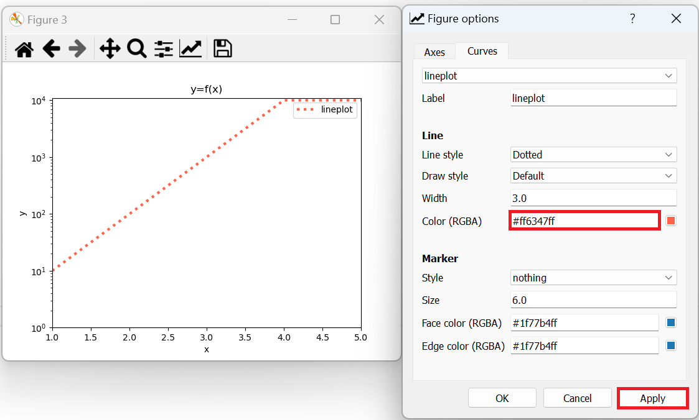
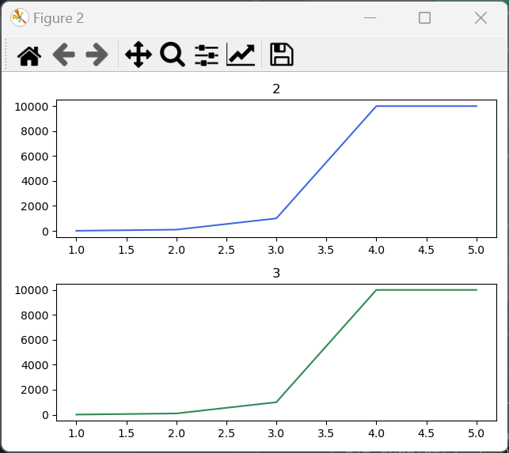
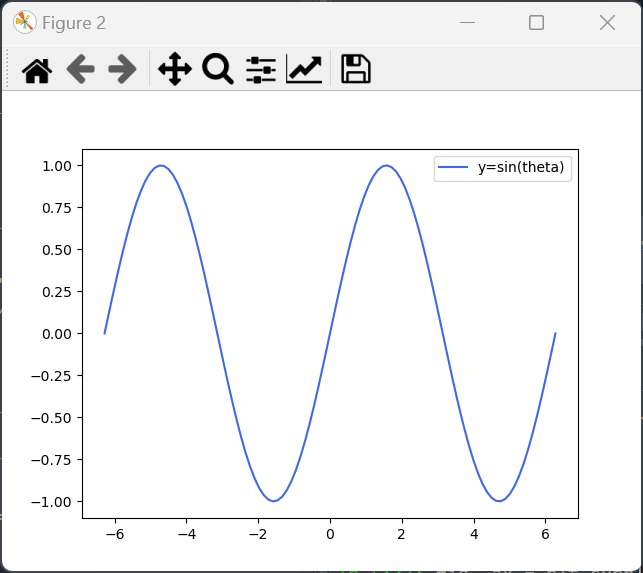
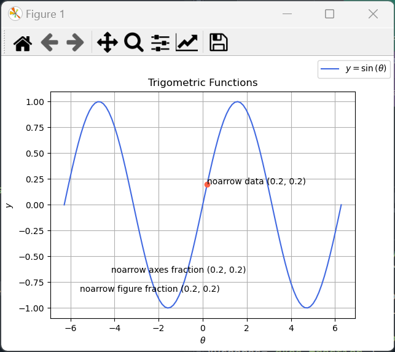
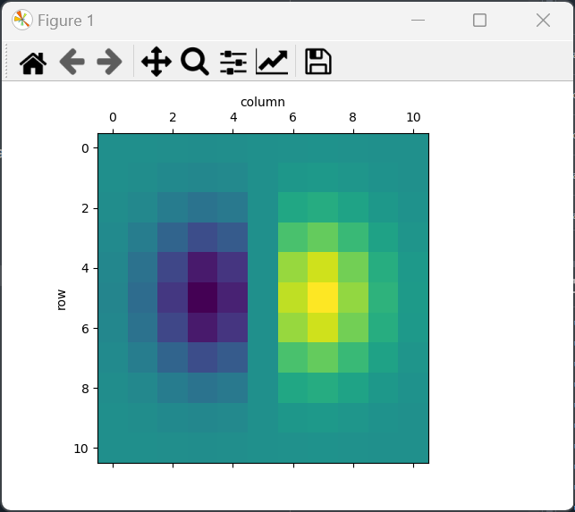
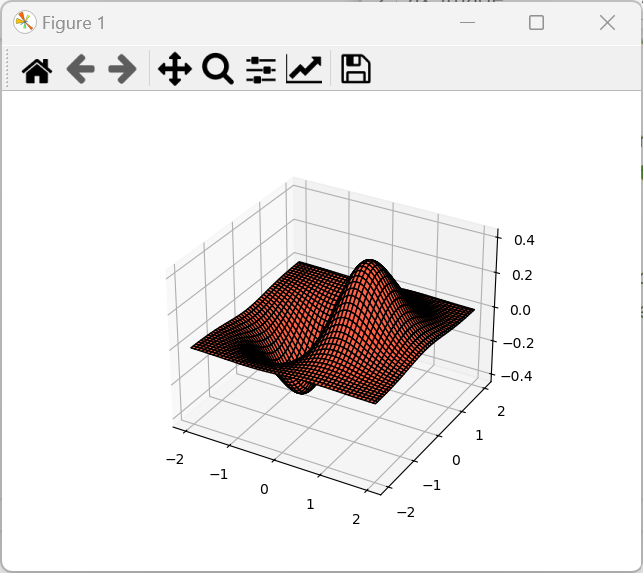
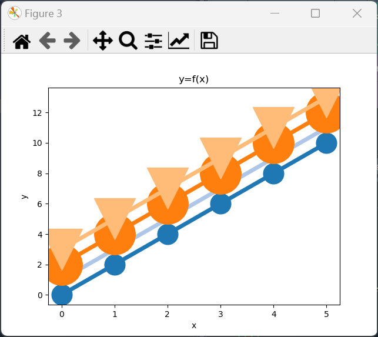

# matplotlib

## Library Overview and Imports

`matplotlib` is typically imported as the abbreviated alias `mpl`:

```python
In [1]: import matplotlib as mpl
```

The attribute `__all__` is a list of identifiers that are imported when a `*` import is used:

```python
In [2]: from matplotlib import *
```

When a `*` import is used, all the variables display on the Variable Explorer:

<table style="width: 80%; border-collapse: collapse; font-family: sans-serif; background-color: #1e1e1e; color: #d4d4d4;">
  <tr>
    <th colspan="4" style="text-align:center; padding: 8px; background-color: #2d2d30; color: #ffffff;">Variable Explorer</th>
  </tr>
  <tr>
    <th style="padding: 8px; background-color: #252526; color: #ffffff;">Name ▲</th>
    <th style="padding: 8px; background-color: #252526; color: #ffffff;">Type</th>
    <th style="padding: 8px; background-color: #252526; color: #ffffff;">Size</th>
    <th style="padding: 8px; background-color: #252526; color: #ffffff;">Value</th>
  </tr>
  <tr>
    <td style="padding: 8px; background-color: #1e1e1e;">__version__</td>
    <td style="padding: 8px; background-color: #1e1e1e;">str</td>
    <td style="padding: 8px; background-color: #1e1e1e;">6</td>
    <td style="padding: 8px; background-color: #506E16; color: #ffffff;">'3.8.0'</td>
  </tr>
  <tr>
    <td style="padding: 8px; background-color: #252526;">__version_info__</td>
    <td style="padding: 8px; background-color: #252526;">tuple</td>
    <td style="padding: 8px; background-color: #252526;">3</td>
    <td style="padding: 8px; background-color: #287B68; color: #ffffff;">(3, 8, 0)</td>
  </tr>
  <tr>
    <td style="padding: 8px; background-color: #1e1e1e;">__bibtex__</td>
    <td style="padding: 8px; background-color: #1e1e1e;">str</td>
    <td style="padding: 8px; background-color: #1e1e1e;">256</td>
    <td style="padding: 8px; background-color: #506E16; color: #ffffff;">'@Article{matplotlib2024,...}'</td>
  </tr>
  <tr>
    <td style="padding: 8px; background-color: #252526;">colormaps</td>
    <td style="padding: 8px; background-color: #252526;">function</td>
    <td style="padding: 8px; background-color: #252526;">-</td>
    <td style="padding: 8px; background-color: #287B68; color: #ffffff;">&lt;function colormaps&gt;</td>
  </tr>
  <tr>
    <td style="padding: 8px; background-color: #1e1e1e;">color_sequences</td>
    <td style="padding: 8px; background-color: #1e1e1e;">dict</td>
    <td style="padding: 8px; background-color: #1e1e1e;">5</td>
    <td style="padding: 8px; background-color: #8C5616; color: #ffffff;">{'default': [...], 'tab10': [...]}</td>
  </tr>
  <tr>
    <td style="padding: 8px; background-color: #252526;">MatplotlibDeprecationWarning</td>
    <td style="padding: 8px; background-color: #252526;">class</td>
    <td style="padding: 8px; background-color: #252526;">-</td>
    <td style="padding: 8px; background-color: #287B68; color: #ffffff;">&lt;class MatplotlibDeprecationWarning&gt;</td>
  </tr>
  <tr>
    <td style="padding: 8px; background-color: #1e1e1e;">ExecutableNotFoundError</td>
    <td style="padding: 8px; background-color: #1e1e1e;">class</td>
    <td style="padding: 8px; background-color: #1e1e1e;">-</td>
    <td style="padding: 8px; background-color: #287B68; color: #ffffff;">&lt;class ExecutableNotFoundError&gt;</td>
  </tr>
  <tr>
    <td style="padding: 8px; background-color: #252526;">set_loglevel</td>
    <td style="padding: 8px; background-color: #252526;">function</td>
    <td style="padding: 8px; background-color: #252526;">-</td>
    <td style="padding: 8px; background-color: #287B68; color: #ffffff;">&lt;function set_loglevel&gt;</td>
  </tr>
  <tr>
    <td style="padding: 8px; background-color: #1e1e1e;">get_configdir</td>
    <td style="padding: 8px; background-color: #1e1e1e;">function</td>
    <td style="padding: 8px; background-color: #1e1e1e;">-</td>
    <td style="padding: 8px; background-color: #287B68; color: #ffffff;">&lt;function get_configdir&gt;</td>
  </tr>
  <tr>
    <td style="padding: 8px; background-color: #252526;">get_cachedir</td>
    <td style="padding: 8px; background-color: #252526;">function</td>
    <td style="padding: 8px; background-color: #252526;">-</td>
    <td style="padding: 8px; background-color: #287B68; color: #ffffff;">&lt;function get_cachedir&gt;</td>
  </tr>
  <tr>
    <td style="padding: 8px; background-color: #1e1e1e;">get_data_path</td>
    <td style="padding: 8px; background-color: #1e1e1e;">function</td>
    <td style="padding: 8px; background-color: #1e1e1e;">-</td>
    <td style="padding: 8px; background-color: #287B68; color: #ffffff;">&lt;function get_data_path&gt;</td>
  </tr>
  <tr>
    <td style="padding: 8px; background-color: #1e1e1e;">use</td>
    <td style="padding: 8px; background-color: #1e1e1e;">function</td>
    <td style="padding: 8px; background-color: #1e1e1e;">-</td>
    <td style="padding: 8px; background-color: #287B68; color: #ffffff;">&lt;function use&gt;</td>
  </tr>
  <tr>
    <td style="padding: 8px; background-color: #252526;">get_backend</td>
    <td style="padding: 8px; background-color: #252526;">function</td>
    <td style="padding: 8px; background-color: #252526;">-</td>
    <td style="padding: 8px; background-color: #287B68; color: #ffffff;">&lt;function get_backend&gt;</td>
  </tr>
  <tr>
    <td style="padding: 8px; background-color: #1e1e1e;">interactive</td>
    <td style="padding: 8px; background-color: #1e1e1e;">function</td>
    <td style="padding: 8px; background-color: #1e1e1e;">-</td>
    <td style="padding: 8px; background-color: #287B68; color: #ffffff;">&lt;function interactive&gt;</td>
  </tr>
  <tr>
    <td style="padding: 8px; background-color: #252526;">is_interactive</td>
    <td style="padding: 8px; background-color: #252526;">function</td>
    <td style="padding: 8px; background-color: #252526;">-</td>
    <td style="padding: 8px; background-color: #287B68; color: #ffffff;">&lt;function is_interactive&gt;</td>
  </tr>
  <tr>
    <td style="padding: 8px; background-color: #1e1e1e;">set_interactive</td>
    <td style="padding: 8px; background-color: #1e1e1e;">function</td>
    <td style="padding: 8px; background-color: #1e1e1e;">-</td>
    <td style="padding: 8px; background-color: #287B68; color: #ffffff;">&lt;function set_interactive&gt;</td>
  </tr>
  <tr>
    <td style="padding: 8px; background-color: #252526;">rc</td>
    <td style="padding: 8px; background-color: #252526;">function</td>
    <td style="padding: 8px; background-color: #252526;">-</td>
    <td style="padding: 8px; background-color: #287B68; color: #ffffff;">&lt;function rc&gt;</td>
  </tr>
  <tr>
    <td style="padding: 8px; background-color: #1e1e1e;">rc_context</td>
    <td style="padding: 8px; background-color: #1e1e1e;">function</td>
    <td style="padding: 8px; background-color: #1e1e1e;">-</td>
    <td style="padding: 8px; background-color: #287B68; color: #ffffff;">&lt;function rc_context&gt;</td>
  </tr>
  <tr>
    <td style="padding: 8px; background-color: #252526;">rcdefaults</td>
    <td style="padding: 8px; background-color: #252526;">function</td>
    <td style="padding: 8px; background-color: #252526;">-</td>
    <td style="padding: 8px; background-color: #287B68; color: #ffffff;">&lt;function rcdefaults&gt;</td>
  </tr>
  <tr>
    <td style="padding: 8px; background-color: #1e1e1e;">rcParams</td>
    <td style="padding: 8px; background-color: #1e1e1e;">RcParams</td>
    <td style="padding: 8px; background-color: #1e1e1e;">-</td>
    <td style="padding: 8px; background-color: #8C5616; color: #ffffff;">RcParams({...})</td>
  </tr>
  <tr>
    <td style="padding: 8px; background-color: #252526;">rcParamsDefault</td>
    <td style="padding: 8px; background-color: #252526;">RcParams</td>
    <td style="padding: 8px; background-color: #252526;">-</td>
    <td style="padding: 8px; background-color: #8C5616; color: #ffffff;">RcParams({...})</td>
  </tr>
  <tr>
    <td style="padding: 8px; background-color: #1e1e1e;">rcParamsOrig</td>
    <td style="padding: 8px; background-color: #1e1e1e;">RcParams</td>
    <td style="padding: 8px; background-color: #1e1e1e;">-</td>
    <td style="padding: 8px; background-color: #8C5616; color: #ffffff;">RcParams({...})</td>
  </tr>
  <tr>
    <td style="padding: 8px; background-color: #252526;">style</td>
    <td style="padding: 8px; background-color: #252526;">module</td>
    <td style="padding: 8px; background-color: #252526;">-</td>
    <td style="padding: 8px; background-color: #287B68; color: #ffffff;">&lt;module style&gt;</td>
  </tr>
  <tr>
    <td style="padding: 8px; background-color: #1e1e1e;">use_line_collection</td>
    <td style="padding: 8px; background-color: #1e1e1e;">bool</td>
    <td style="padding: 8px; background-color: #1e1e1e;">1</td>
    <td style="padding: 8px; background-color: #8C5616; color: #ffffff;">True</td>
  </tr>
  <tr>
    <td style="padding: 8px; background-color: #252526;">is_interactive_backend</td>
    <td style="padding: 8px; background-color: #252526;">function</td>
    <td style="padding: 8px; background-color: #252526;">-</td>
    <td style="padding: 8px; background-color: #287B68; color: #ffffff;">&lt;function is_interactive_backend&gt;</td>
  </tr>    
</table>

The `*` import is typically not recommended and instead the identifiers are typically accessed from `mpl`:

```python
In [4]: mpl.
# -------------------------------------
# Available Identifiers for Matplotlib:
# -------------------------------------

# 🔧 Version Information:
# - __version__                  : The version number of the currently installed Matplotlib library.
# - __version_info__             : A tuple containing the version information of Matplotlib in a more 
#                                : structured format.
# - __bibtex__                   : The BibTeX entry for citing Matplotlib in academic papers or projects.

# 🎨 Colormap and Color Utilities:
# - colormaps                    : Provides access to Matplotlib's built-in colormap registry, allowing 
#                                : retrieval of colormap instances (e.g., 'viridis', 'plasma') for coloring 
#                                : plots based on data values.
# - color_sequences              : Contains predefined color sequences used by Matplotlib for cycling through 
#                                : line colors when creating multiple plots or lines.

# ⚠️ Warnings and Exceptions:
# - MatplotlibDeprecationWarning : A custom warning class for deprecation warnings specific to Matplotlib, 
#                                : raised when a feature is deprecated and scheduled for removal.
# - ExecutableNotFoundError      : An exception raised when a required executable (e.g., LaTeX engine) is 
#                                : missing.

# 🔧 Configuration Management:
# - set_loglevel                 : Sets the logging level for Matplotlib, controlling the verbosity of log 
#                                : messages ('debug', 'info', 'warning', 'error').
# - get_configdir                : Returns the directory where Matplotlib stores its configuration files, 
#                                : typically user-specific settings.
# - get_cachedir                 : Returns the directory where Matplotlib stores cache files, such as font 
#                                : lists and compiled LaTeX formulas.
# - get_data_path                : Returns the path to the directory containing essential Matplotlib data 
#                                : files (e.g., default fonts, image resources).

# 🎛️ Interactive Mode:
# - interactive                  : Enables or disables interactive mode. In interactive mode, plots are 
#                                : automatically updated after each command. In non-interactive mode, 
#                                : plt.show() must be called to display plots.
# - is_interactive               : Returns True if Matplotlib is in interactive mode, False otherwise.

# 🎨 Backend Management:
# - get_backend                  : Returns the name of the current Matplotlib backend used for rendering 
#                                : (e.g., 'TkAgg', 'Qt5Agg').
# - use                          : Sets the Matplotlib backend, determining how plots are rendered (e.g., 
#                                : interactively or saved to files).

# 🔧 Configuration Files:
# - matplotlib_fname             : Returns the full path to the matplotlibrc configuration file currently 
#                                : in use, containing user-defined plot settings.

# 🔧 RcParams and Configuration Tools:
# - RcParams                     : A specialized dictionary-like object storing Matplotlib's runtime 
#                                : configuration settings (e.g., figure size, font size, line width).
# - rc_params                    : Returns the current configuration as an RcParams object, allowing 
#                                : retrieval of active settings.
# - rc_params_from_file          : Loads Matplotlib configuration parameters from a file into an RcParams 
#                                : object.
# - rcParamsDefault              : The default configuration settings shipped with Matplotlib.
# - rcParamsOrig                 : Stores the original configuration parameters, allowing reversion to the 
#                                : default state after customizations.
# - defaultParams                : Alias for the default Matplotlib parameters, representing the 
#                                : out-of-the-box settings.

# 🔧 Context Managers and Reset Functions:
# - rc_context                   : A context manager for temporarily setting Matplotlib configuration 
#                                : parameters within a block of code.
# - rc                           : Updates individual parameters in the current configuration, such as 
#                                : default figure size or line color.
# - rcdefaults                   : Resets all configuration parameters to their default values 
#                                : (rcParamsDefault).
# - rc_file_defaults             : Resets configuration parameters to those specified in the user-defined 
#                                : matplotlibrc file.
# - rc_file                      : Loads and applies settings from a specific configuration file.
```

The following data model attribute gives details about the version of matplotlib installed:

```python
In [4]: mpl.__version__
Out[4]: 3.9.2
```

It should be `3.9.2` or later. Most of the other identifiers shown alter the current configuration or recall parameters and will be discussed in more detail later.

`mpl` is compartmentalised into modules. Note however that the modules are not imported when a `*` import is used, because the data model attribute `__all__` is defined and excludes these modules. The modules are typically imported independently:

```python
In [5]: mpl.
# -------------------------------------
# Matplotlib Modules Overview
# -------------------------------------

# Interface Modules:
# - pyplot            : Main plotting interface (state-based API), used to create and manipulate figures and plots.
# - mlab              : Deprecated module that provided Matlab-like functions.

# Core Plotting and Figure Components:
# These modules form the basic building blocks of creating and managing plots, axes, and figures.
# - figure            : Defines the figure class, which is the top-level container for all plot elements.
# - axes              : Handles the individual plot areas (axes) where the data is displayed.
# - axis              : Manages x and y axis properties (e.g., ticks, labels).
# - lines             : Handles line plotting.
# - markers           : Manages markers for data points.
# - collections       : Efficiently handles collections of objects like lines, polygons, etc.
# - patches           : Handles 2D shapes such as rectangles, circles, polygons, etc.
# - legend            : Manages legends on plots.
# - legend_handler    : Customizes how legend entries are rendered.
# - spines            : Manages the borders (spines) of the axes.
# - ticker            : Controls tick marks and labels on the axes.
# - table             : Creates tables within a plot.
# - text              : Handles text objects within plots.

# Data Transformation and Handling:
# Modules related to scaling, transforming, and managing different types of data.
# - transforms        : Handles transformations between coordinate systems.
# - scale             : Manages scaling on axes (e.g., linear, log).
# - units             : Allows the use of custom units with plots.
# - dates             : Specialized support for date-based plotting.
# - category          : Handles categorical data (e.g., bar charts for named categories).

# Color and Styling:
# Modules that deal with color handling, colormaps, and styling.
# - colors            : Defines color conversions and mapping between data values and colors.
# - cm                : Colormap handling.
# - colorbar          : Adds a colorbar to figures.
# - style             : Supports predefined styles for customizing plot appearance.

# Geometry and Path Handling:
# Modules for managing geometric shapes, paths, and effects.
# - path              : Handles paths (a series of possibly connected segments).
# - patheffects       : Adds effects to paths (e.g., shadowing).
# - bezier            : Handles Bezier curves and operations.
# - quiver            : Plots 2D vector fields (arrows).
# - contour           : Creates contour plots for 2D data.
# - tri               : Handles triangulation and plotting data over triangular grids.

# Figure Layout and Grids:
# Modules to control figure layout, grids, and positioning of plot elements.
# - gridspec          : Grid layout for arranging subplots within a figure.
# - layout_engine     : Provides a framework for custom layout management.

# Special Plot Types:
# Modules for specialized types of plots.
# - image             : Handles image display within plots.
# - sankey            : Plots Sankey diagrams (flow charts).
# - animation         : Supports creating animations from plots.

# Font and Text Handling:
# Modules related to text, fonts, and math rendering.
# - font_manager      : Manages fonts and font properties.
# - ft2font           : Low-level interface to FreeType (for rendering fonts).
# - mathtext          : Renders mathematical expressions within plots.
# - texmanager        : Manages LaTeX typesetting for text elements.

# Backends and Rendering:
# Modules related to rendering and backends for different output formats.
# - backends          : Handles different backends (e.g., TkAgg, Agg) for rendering plots.
# - backend_bases     : Base classes for creating backends.
# - backend_tools     : Tools for interacting with the backend (e.g., zoom, pan).
# - backend_managers  : Manages backend-related events and interactivity.

# Interactive and Widget Elements:
# Modules for interactive elements in plots.
# - widgets           : Provides interactive widgets (e.g., sliders, buttons) for plots.
# - offsetbox         : Used for placing offset boxes such as legends or annotations.

# Support and Utility Functions:
# General utility functions that support Matplotlib’s core features.
# - cbook             : A collection of utility functions (helper functions, class decorators, etc.).
# - rcsetup           : Handles matplotlibrc configuration.
# - testing           : Tools for testing plots and comparing outputs.
# - typing            : Type hints for Matplotlib.

# Sphinx Extensions:
# Modules used for generating documentation (via Sphinx) and embedding plots.
# - sphinxext.plot_directive     : Directive to embed plots in Sphinx documentation.
# - sphinxext.mathmpl           : Embeds math in plots in Sphinx-generated documentation.
# - sphinxext.figmpl_directive  : A Sphinx extension to insert figures into documentation.
# - sphinxext.roles             : Custom roles for Matplotlib’s Sphinx documentation.
```

These modules are supplemented by the modules in the `mpl_toolkits` library:

```python
In [5]: import mpl_toolkits 
In [6]: mpl_toolkits.
# mplot3d                       : Toolkit for 3D plotting.
# axes_grid1                    : Adds more features for arranging multiple axes in a figure.
# axisartist                    : Provides custom axis styling beyond the default Matplotlib axes.
```

Typically the interface module `pyplot` is used and imported using the abbreviated alias `plt`:

```python
In [7]: import matplotlib.pyplot as plt
```

The function `get_plot_commands` can be used to get details about the plot commands:

```python
In [8]: plt.get_plot_commands()
# Figure Creation
# - figure         : creates a new figure
# - gcf            : gets the current figure
# - close          : closes a figure
# - gca            : gets the current axis

# Axes Creation
# - subplots       : creates a figure and a set of subplots (axes)
# - subplot        : adds a subplot to the figure
# - add_subplot    : Adds an axes to the figure at the specified grid location
# - axes           : Adds an axes to the figure at the specified position

# Figure Level Commands
# - suptitle       : Adds a title to the entire figure
# - savefig        : Saves the figure
# - tight_layout   : Adjusts the layout of the figure
# - figlegend      : Places a legend on the figure
# - show           : Displays the figure
# - clf            : Clears the figure
# - subplots_adjust: Adjust the spacing
# - margins        : Sets the margins of a plot

# Axes Level Commands
## Plotting commands
# - plot           : Plot lines and/or markers on the axes
# - scatter        : Create a scatter plot
# - bar            : Create a bar plot
# - barh           : Create a bar plot
# - hist           : Plot a histogram
# - boxplot        : Create a box plot
# - violinplot     : Create a violin plot
# - pie            : Create a pie chart
# - step           : Create step plots
# - fill           : Fill between two lines
# - fill_between   : Fill between two curves
# - errorbar       : Plot error bars
# - stem           : Create a stem plot
# - quiver         : Create a 2D field of arrows
# - hexbin         : Create hexagonal binning plots
# - contour        : Plot contour lines
# - contourf       : Plot filled contour lines
# - imshow         : Display an image on the axes
# - matshow        : Display a matrix of a new figure
# - streamplot     : Draw streamlines of a vector flow
# - table          : Adds a table to a matrix

## Axes Property Commands
# - xlim           : Set the x-axis limits
# - ylim           : Set the y-axis limits
# - xlabel         : Set the x-axis label
# - ylabel         : Set the y-axis label
# - title          : Set the title of the axes
# - grid           : Toggle the gridlines on/off
# - legend         : Add a legend to the axes
# - xticks         : Set the x-axis tick marks
# - yticks         : Set the y-axis tick marks
# - axhline        : Draw a horizontal line across the axes
# - axvline        : Draw a vertical line across the axes
# - axhspan        : Highlight a horizontal span across axes
# - axvspan        : Highlight a vertical span across axes
# - text           : Add text at an arbitrary position on the axes
# - annotate       : Annotate a point with text
# - setp           : Set properties of plot elements
# - xscale         : Set the x-axis scale (e.g. logarithmic)
# - yscale         : Set the y-axis scale (e.g. logarithmic)
# - twinx          : Create a twin axes that shares the x-axis
# - twiny          : Create a twin axes that shares the y-axis

## Color Axis Commands
# - colorbar       : Adds a colorbar to the figure, which maps colors to the data values
# - clim           : Sets the color limits to the current image
# - colormaps      : Lists all available colormaps
# - set_cmap       : Sets the default colormap for the current image
# - get_cmap       : Returns the current colormap

## Specialised Plotting Functions
# - polar          : Creates a polar plot
# - semilogx       : Creates a plot with a logarithmic scale on the x-axis
# - semilogy       : Creates a plot with a logarithmic scale on the y-axis
# - loglog         : Make a plot with logarithmic scales on both axes
# - hist2d         : Plot a 2D Histogram
# - tricontour     : Draw contours on a triangular grid
# - tricontourf    : Draw filled contours on a triangular grid
# - triplot        : Plot a triangulation
# - psd            : Plot a power spectral density
# - specgram       : Plot a specgram
# - spy            : Plots the sparsity of a matrix
```

`matplotlib` is based upon `numpy` and is part fo the scientific or `numpy` stack. As a consequence, the `pyplot` namespace includes `np` and a larger number of standard modules:

```python
In [9]: plt.np
Out[9]: <module 'numpy' from 'C:\\Users\\phili\\AppData\\Local\\spyder-6\\envs\\spyder-runtime\\Lib\\site-packages\\numpy\\__init__.py'>
```

The standard modules and `np` present in the `plt` namespace are used internally by the plotting functions in the `plt` namespace and are not typically used externally:

```python
In [10]: plt.np.__version__
Out[10]: '2.1.2'
```

If `np` function is desired, it is typically imported directly using:

```python
In [11]: import numpy as np
In [12]: np.__version__
Out[12]: '2.1.2'
In [13]: exit
```

## Procedural Programming Syntax

An `ndarray` is typically used to store data used for plots. The following imports are commonly used:

```python
In [1]: import numpy as np
      : import matplotlib as mpl
      : import matplotlib.pyplot as plt
In [2]: x = np.array([1, 2, 3, 4, 5])
      : y = np.array([10, 100, 1000, 10000, 10000])
```

A `Figure` instance (blank canvas) with the interactive backend can instantiated using:

```python
In [3]: plt.figure() 
Out[3]: <Figure size 640x480 with 0 Axes>
```

It has an `int` figure number which is 1st order indexed and takes on the next `int` value by default:


Details about the optional parameters can be seen using:

```python
In [4]: plt.figure?
Signature:
plt.figure(
    num: 'int | str | Figure | SubFigure | None' = None,
    figsize: 'tuple[float, float] | None' = None,
    dpi: 'float | None' = None,
    *,
    facecolor: 'ColorType | None' = None,
    edgecolor: 'ColorType | None' = None,
    frameon: 'bool' = True,
    FigureClass: 'type[Figure]' = <class 'matplotlib.figure.Figure'>,
    clear: 'bool' = False,
    **kwargs,
) -> 'Figure'
Docstring:
Create a new figure, or activate an existing figure.
```

The following command will create a subplot `Axes` instance on the currently selected `Figure`:

```python
In [5]: plt.subplot()
Out[5]: <Axes: >
```


Details about the optional parameters can be seen using:

```python
In [6]: plt.subplot?
Signature: plt.subplot(*args, **kwargs) -> 'Axes'
Docstring:
Add an Axes to the current figure or retrieve an existing Axes.

This is a wrapper of `.Figure.add_subplot` which provides additional
behavior when working with the implicit API (see the notes section).

Call signatures::

   subplot(nrows, ncols, index, **kwargs)
   subplot(pos, **kwargs)
   subplot(**kwargs)
   subplot(ax)
```

The optional parameters `nrows`, `ncols` and `index` can be used to create multiple subplots on a `Figure`. If unspecified, these take on their default value of `1` which gives a single `Axes` which spans the entire `Figure` canvas.

The dependent `y` variable can be plotted with respect to the `x` variable using:

```python
In [7]: plt.plot(x, y)
Out[7]: [<matplotlib.lines.Line2D at 0x1ff94f15310>]
```


Details about the optional parameters can be seen using:

```python
In [8]: plt.plot?
Signature:
plt.plot(
    *args: 'float | ArrayLike | str',
    scalex: 'bool' = True,
    scaley: 'bool' = True,
    data=None,
    **kwargs,
) -> 'list[Line2D]'
Docstring:
Plot y versus x as lines and/or markers.

Call signatures::

    plot([x], y, [fmt], *, data=None, **kwargs)
    plot([x], y, [fmt], [x2], y2, [fmt2], ..., **kwargs)
```

If the plot is examined, some `Figure` level options can be adjusted in the GUI:


The tight layout is often used to reduce whitespace and to fit in legends and titles:


This can be done programmatically using:

```python
In [9]: plt.figure()
      : plt.subplot()
      : plt.plot(x, y)
      : plt.tight_layout()
```


Notice the next `int` value `2` has been used. Returning to:

```python
In [10]: plt.figure()
       : plt.subplot()
       : plt.plot(x, y)
Out[10]: [<matplotlib.lines.Line2D at 0x1ff96810150>]
```


The `Figure` instance (canvas) has an `Axes` (black box). The `Axes` (plural) has a *title*, *x-axis* and *y-axis*:


The logarithmic scale is often used to emphasise small (positive) numbers:


The above can be performed programmatically using:

```python
In [11]: plt.figure()
       : plt.subplot()
       : plt.plot(x, y)
       :
       : plt.title('y=f(x)')
       :
       : plt.xlim(left=1, right=5)
       : plt.xlabel('x')
       : #plt.xscale('linear')
       :
       : plt.ylim(bottom=1, top=110000)
       : plt.ylabel('y')
       : plt.yscale('log')
```

Setting the `xscale` explicitly to linear is not required as this is the default value.

The line properties are at the default values:


The label can be modified, the label is used to select each line on the `Axes` and the automatic `legend` can be regenerated with the new label:


This can be performed programmatically using:

```python
In [12]: plt.figure()
       : plt.subplot()
       : plt.plot(x, y)
       :
       : plt.title('y=f(x)')
       :
       : plt.xlim(left=1, right=5)
       : plt.xlabel('x')
       :
       : plt.ylim(bottom=1, top=110000)
       : plt.ylabel('y')
       : plt.yscale('log')
       : plt.legend(['lineplot'])
```

More typically `label` is supplied within the `plot` function:

```python
In [12]: plt.figure()
       : plt.subplot()
       : plt.plot(x, y, label='lineplot')
       :
       : plt.title('y=f(x)')
       :
       : plt.xlim(left=1, right=5)
       : plt.xlabel('x')
       :
       : plt.ylim(bottom=1, top=110000)
       : plt.ylabel('y')
       : plt.yscale('log')
       : plt.legend()
```

The linestyle can also be selected:


The width can also be specified:


The color (US spelling without the u) can be selected using the color picker:


The format displayed is as a `#rrggbbaa` where each color channel spans over a byte and is represented by two hexadecimal characters. The last channel alpha is used for transparancy where `00` is fully transparent and `ff` is non-transparent. When the alpha channel is not specified, `ff` is assumed. A CSS4 color is usually preferred instead of a `#rrggbbaa` as it makes the code more readible. The `#rrggbbaa` format is however more flexible:


Selecting apply will show the `#rrggbbaa` format:



A CSS4 color is a *key* in the `dict` instance `matplotlib.colors.CSS4_COLORS`. `CSS4_COLORS` is capitalised because it is a constant:

```python
In [13]: from matplotlib.colors import CSS4_COLORS
```

The `CSS4_COLORS` `dict` can be seen in the Variable Explorer:

<table style="width: 65%; border-collapse: collapse; font-family: sans-serif;">
  <tr>
    <th colspan="4" style="text-align:center; padding: 8px; background-color: #2d2d30; color: #ffffff;">Variable Explorer</th>
  </tr>
  <tr>
    <td style="padding: 8px; background-color: #1e1e1e; color: #ffffff;">CSS4_COLORS</td>
    <td style="padding: 8px; background-color: #1e1e1e; color: #ffffff;">dict</td>
    <td style="padding: 8px; background-color: #1e1e1e; color: #ffffff;">148</td>
    <td style="padding: 8px; background-color: #4C2579; color: #ffffff;">{'aliceblue': '#F0F8FF', 'antiquewhite': '#FAEBD7', 'aqua': '#00FFFF', 'a...</td>
  </tr>  
</table>

This can be expanded:

<table style="width: 80%; border-collapse: collapse; font-family: sans-serif;">
  <tr>
    <th colspan="5" style="text-align:center; padding: 8px; background-color: #2d2d30; color: #ffffff;">CSS4_COLORS - dict (148 elements)</th>
  </tr>
  <tr>
    <th style="padding: 8px; background-color: #252526; color: #c3c3c3;">▲</th>
    <th style="padding: 8px; background-color: #252526; color: #ffffff;">Key</th>
    <th style="padding: 8px; background-color: #252526; color: #ffffff;">Type</th>
    <th style="padding: 8px; background-color: #252526; color: #ffffff;">Size</th>
    <th style="padding: 8px; background-color: #252526; color: #ffffff;">Value</th>
  </tr>
  <tr>
    <td style="padding: 8px; background-color: #1e1e1e; color: #c3c3c3;">0</td>
    <td style="padding: 8px; background-color: #1e1e1e; color: #ffffff;">aliceblue</td>    
    <td style="padding: 8px; background-color: #1e1e1e; color: #ffffff;">str</td>
    <td style="padding: 8px; background-color: #1e1e1e; color: #ffffff;">7</td>
    <td style="padding: 8px; background-color: #506E16; color: #ffffff;">#F0F8FF</td>
  </tr>
  <tr>
    <td style="padding: 8px; background-color: #1e1e1e; color: #c3c3c3;">1</td>
    <td style="padding: 8px; background-color: #1e1e1e; color: #ffffff;">antiquewhite</td>    
    <td style="padding: 8px; background-color: #1e1e1e; color: #ffffff;">str</td>
    <td style="padding: 8px; background-color: #1e1e1e; color: #ffffff;">7</td>
    <td style="padding: 8px; background-color: #506E16; color: #ffffff;">#FAEBD7</td>
  </tr>
  <tr>
    <td style="padding: 8px; background-color: #1e1e1e; color: #c3c3c3;">2</td>
    <td style="padding: 8px; background-color: #1e1e1e; color: #ffffff;">aqua</td>    
    <td style="padding: 8px; background-color: #1e1e1e; color: #ffffff;">str</td>
    <td style="padding: 8px; background-color: #1e1e1e; color: #ffffff;">7</td>
    <td style="padding: 8px; background-color: #506E16; color: #ffffff;">#00FFFF</td>
  </tr>
  <tr>
    <td style="padding: 8px; background-color: #1e1e1e; color: #c3c3c3;">3</td>
    <td style="padding: 8px; background-color: #1e1e1e; color: #ffffff;">aquamarine</td>    
    <td style="padding: 8px; background-color: #1e1e1e; color: #ffffff;">str</td>
    <td style="padding: 8px; background-color: #1e1e1e; color: #ffffff;">7</td>
    <td style="padding: 8px; background-color: #506E16; color: #ffffff;">#7FFFD4</td>
  </tr>
  <tr>
    <td style="padding: 8px; background-color: #1e1e1e; color: #c3c3c3;">4</td>
    <td style="padding: 8px; background-color: #1e1e1e; color: #ffffff;">azure</td>    
    <td style="padding: 8px; background-color: #1e1e1e; color: #ffffff;">str</td>
    <td style="padding: 8px; background-color: #1e1e1e; color: #ffffff;">7</td>
    <td style="padding: 8px; background-color: #506E16; color: #ffffff;">#F0FFFF</td>
  </tr>
  <tr>
    <td style="padding: 8px; background-color: #1e1e1e; color: #c3c3c3;">5</td>
    <td style="padding: 8px; background-color: #1e1e1e; color: #ffffff;">beige</td>    
    <td style="padding: 8px; background-color: #1e1e1e; color: #ffffff;">str</td>
    <td style="padding: 8px; background-color: #1e1e1e; color: #ffffff;">7</td>
    <td style="padding: 8px; background-color: #506E16; color: #ffffff;">#F5F5DC</td>
  </tr>
  <tr>
    <td style="padding: 8px; background-color: #1e1e1e; color: #c3c3c3;">6</td>
    <td style="padding: 8px; background-color: #1e1e1e; color: #ffffff;">bisque</td>    
    <td style="padding: 8px; background-color: #1e1e1e; color: #ffffff;">str</td>
    <td style="padding: 8px; background-color: #1e1e1e; color: #ffffff;">7</td>
    <td style="padding: 8px; background-color: #506E16; color: #ffffff;">#FFE4C4</td>
  </tr>  
  <tr>
    <td style="padding: 8px; background-color: #1e1e1e; color: #c3c3c3;">7</td>
    <td style="padding: 8px; background-color: #1e1e1e; color: #ffffff;">black</td>    
    <td style="padding: 8px; background-color: #1e1e1e; color: #ffffff;">str</td>
    <td style="padding: 8px; background-color: #1e1e1e; color: #ffffff;">7</td>
    <td style="padding: 8px; background-color: #506E16; color: #ffffff;">#000000</td>
  </tr> 
  <tr>
    <td style="padding: 8px; background-color: #1e1e1e; color: #c3c3c3;">8</td>
    <td style="padding: 8px; background-color: #1e1e1e; color: #ffffff;">blanchedalmond</td>    
    <td style="padding: 8px; background-color: #1e1e1e; color: #ffffff;">str</td>
    <td style="padding: 8px; background-color: #1e1e1e; color: #ffffff;">7</td>
    <td style="padding: 8px; background-color: #506E16; color: #ffffff;">#FFEBCD</td>
  </tr>  
  <tr>
    <td style="padding: 8px; background-color: #1e1e1e; color: #c3c3c3;">9</td>
    <td style="padding: 8px; background-color: #1e1e1e; color: #ffffff;">blue</td>    
    <td style="padding: 8px; background-color: #1e1e1e; color: #ffffff;">str</td>
    <td style="padding: 8px; background-color: #1e1e1e; color: #ffffff;">7</td>
    <td style="padding: 8px; background-color: #506E16; color: #ffffff;">#0000FF</td>
  </tr>        
</table>

When a CCS4 color is used, the *key* is looked up in the mapping `CSS4_COLORS` and returns the value in the form `#RRGGBB`, note the `CSS4_color` uses capital case for the hexadecimal `str`, Python prefers lower case for hexadecimal strings but accepts upper and lower case. To view these the following plot can be used:

```python
In [14]: plt.figure()
       : plt.subplot()
       : for color in CSS4_COLORS:
       :     plt.plot([0, 0], [0, 0], color=color, linewidth=5, label=color)
       : plt.legend(ncol=5)
       : plt.axis('off')
       : plt.tight_layout()
```


These changes can be made programmatically by supplying optional parameters to the `plot` function:

```python
In [13]: plt.figure()
       : plt.subplot()
       : plt.plot(x, y, color='tomato', linewidth=5, linestyle='dotted', label='lineplot')
       :
       : plt.title('y=f(x)')
       :
       : plt.xlim(left=1, right=5)
       : plt.xlabel('x')
       :
       : plt.ylim(bottom=1, top=110000)
       : plt.ylabel('y')
       : plt.yscale('log')
       : plt.legend()
Out[13]: <matplotlib.legend.Legend at 0x1ffa1040cd0>
```


There is also the abbreviated form:

```python
In [13]: plt.figure()
       : plt.subplot()
       : plt.plot(x, y, c='tomato', lw=5, ls=':', label='lineplot')
       :
       : plt.title('y=f(x)')
       :
       : plt.xlim(left=1, right=5)
       : plt.xlabel('x')
       :
       : plt.ylim(bottom=1, top=110000)
       : plt.ylabel('y')
       : plt.yscale('log')
       : plt.legend()
Out[14]: <matplotlib.legend.Legend at 0x1ffa1d44050>
```


There is also the option for a marker:


This can be programmatically input by supplying parameters to the `plot` function:

```python
In [14]: plt.figure()
       : plt.subplot()
       : plt.plot(x, y, color='tomato', linewidth=5, linestyle='dotted', 
       :         marker='*', markersize=15.0, markerfacecolor='royalblue', markeredgecolor='seagreen',
       :         label='lineplot')
       :
       : plt.title('y=f(x)')
       :
       : plt.xlim(left=1, right=5)
       : plt.xlabel('x')
       :
       : plt.ylim(bottom=1, top=110000)
       : plt.ylabel('y')
       : plt.yscale('log')
       : plt.legend()
Out[14]: <matplotlib.legend.Legend at 0x1ffa331b3d0>
```


Or using the abbreviated form:

```python
In [15]: plt.figure()
       : plt.subplot()
       : plt.plot(x, y, c='tomato', lw=5, ls='dotted', 
       :         marker='*', ms=15.0, mfc='royalblue', mec='seagreen',
       :         label='lineplot')
       :
       : plt.title('y=f(x)')
       :
       : plt.xlim(left=1, right=5)
       : plt.xlabel('x')
       :
       : plt.ylim(bottom=1, top=110000)
       : plt.ylabel('y')
       : plt.yscale('log')
       : plt.legend()
Out[15]: <matplotlib.legend.Legend at 0x1ffa3822c10>
```


With a marker present, it is easier to visualise the drawstyle:


This can be supplied programmatically, alongside some additional (less commonly used) marker parameters not available in the GUI:

```python
In [16]: plt.figure()
       : plt.subplot()
       : plt.plot(x, y, color='tomato', linewidth=5, drawstyle='steps-mid', linestyle='dotted', 
       :         marker='s', markersize=25.0, markerfacecolor='royalblue', markeredgecolor='seagreen',
       :         markeredgewidth=3.0, fillstyle='top', markerfacecoloralt='darkorchid',
       :         label='lineplot')
       :
       : plt.title('y=f(x)')
       :
       : plt.xlim(left=1, right=5)
       : plt.xlabel('x')
       :
       : plt.ylim(bottom=1, top=110000)
       : plt.ylabel('y')
       : plt.yscale('log')
       : plt.legend()
Out[16]: <matplotlib.legend.Legend at 0x1ff9ca11dd0>
```


The abbreviated form is:

```python
In [16]: plt.figure()
       : plt.subplot()
       : plt.plot(x, y, color='tomato', lw=5, ds='steps-mid', ls='dotted', 
       :         marker='s', ms=25.0, mfc='royalblue', mec='seagreen',
       :         mew=3.0, fillstyle='top', mfcalt='darkorchid',
       :         label='lineplot')
       :
       : plt.title('y=f(x)')
       :
       : plt.xlim(left=1, right=5)
       : plt.xlabel('x')
       :
       : plt.ylim(bottom=1, top=110000)
       : plt.ylabel('y')
       : plt.yscale('log')
       : plt.legend()
Out[16]: <matplotlib.legend.Legend at 0x1ff9ca11dd0>
```


The CSS4 colors map to a hexadecimal string of the format `'#rrggbbaa'` or `'#rrggbb'` where each color channel is a byte represented by 2 hexadecimal characters. A byte has the values `0:256` inclusive of the start `0` and exclusive of the stop `256`. The last value is therefore `255`. Each color channel can be expressed as a `float` and a normalised `(r, g, b)` tuple can be used. On a computer screen, every pixel is a RGB LED and this RGB value is used to create a color at that specified pixel:


Another color `dict` is `BASE_COLORS` which expresses the base colors as a `(r, g, b)` tuple:

```python
In [17]: from matplotlib.colors import BASE_COLORS
```

This includes the primary base colors (blue, green and red), secondary base colors (cyan, magenta, yellow) absense of color (black) and all LEDs at maximum brightness (white) as a normalised 3 element `(r, g, b)` `tuple`:

<table style="width: 65%; border-collapse: collapse; font-family: sans-serif;">
  <tr>
    <th colspan="4" style="text-align:center; padding: 8px; background-color: #2d2d30; color: #ffffff;">Variable Explorer</th>
  </tr>
  <tr>
    <td style="padding: 8px; background-color: #1e1e1e; color: #ffffff;">CSS4_COLORS</td>
    <td style="padding: 8px; background-color: #1e1e1e; color: #ffffff;">dict</td>
    <td style="padding: 8px; background-color: #1e1e1e; color: #ffffff;">148</td>
    <td style="padding: 8px; background-color: #4C2579; color: #ffffff;">{'aliceblue': '#F0F8FF', 'antiquewhite': '#FAEBD7', 'aqua': '#00FFFF', 'a...</td>
  </tr>  
  <tr>
    <td style="padding: 8px; background-color: #1e1e1e; color: #ffffff;">BASE_COLORS</td>
    <td style="padding: 8px; background-color: #1e1e1e; color: #ffffff;">dict</td>
    <td style="padding: 8px; background-color: #1e1e1e; color: #ffffff;">8</td>
    <td style="padding: 8px; background-color: #4C2579; color: #ffffff;">{'b': (0, 0, 1), 'g': (0, 0.5, 0), 'r': (1, 0, 0), 'c': (0, 0.75, 0.75),...</td>
  </tr>    
</table>

This can be expanded:

<table style="width: 80%; border-collapse: collapse; font-family: sans-serif;">
  <tr>
    <th colspan="5" style="text-align:center; padding: 8px; background-color: #2d2d30; color: #ffffff;">BASE_COLORS - dict (8 elements)</th>
  </tr>
  <tr>
    <th style="padding: 8px; background-color: #252526; color: #c3c3c3;">▲</th>
    <th style="padding: 8px; background-color: #252526; color: #ffffff;">Key</th>
    <th style="padding: 8px; background-color: #252526; color: #ffffff;">Type</th>
    <th style="padding: 8px; background-color: #252526; color: #ffffff;">Size</th>
    <th style="padding: 8px; background-color: #252526; color: #ffffff;">Value</th>
  </tr>
  <tr>
    <td style="padding: 8px; background-color: #1e1e1e; color: #c3c3c3;">0</td>
    <td style="padding: 8px; background-color: #1e1e1e; color: #ffffff;">b</td>    
    <td style="padding: 8px; background-color: #1e1e1e; color: #ffffff;">tuple</td>
    <td style="padding: 8px; background-color: #1e1e1e; color: #ffffff;">3</td>
    <td style="padding: 8px; background-color: #3A3586; color: #ffffff;">(0, 0, 1)</td>
  </tr> 
  <tr>
    <td style="padding: 8px; background-color: #1e1e1e; color: #c3c3c3;">1</td>
    <td style="padding: 8px; background-color: #1e1e1e; color: #ffffff;">g</td>    
    <td style="padding: 8px; background-color: #1e1e1e; color: #ffffff;">tuple</td>
    <td style="padding: 8px; background-color: #1e1e1e; color: #ffffff;">3</td>
    <td style="padding: 8px; background-color: #3A3586; color: #ffffff;">(0, 0.5, 0)</td>
  </tr> 
  <tr>
    <td style="padding: 8px; background-color: #1e1e1e; color: #c3c3c3;">2</td>
    <td style="padding: 8px; background-color: #1e1e1e; color: #ffffff;">r</td>    
    <td style="padding: 8px; background-color: #1e1e1e; color: #ffffff;">tuple</td>
    <td style="padding: 8px; background-color: #1e1e1e; color: #ffffff;">3</td>
    <td style="padding: 8px; background-color: #3A3586; color: #ffffff;">(1, 0, 0)</td>
  </tr>  
  <tr>
    <td style="padding: 8px; background-color: #1e1e1e; color: #c3c3c3;">3</td>
    <td style="padding: 8px; background-color: #1e1e1e; color: #ffffff;">c</td>    
    <td style="padding: 8px; background-color: #1e1e1e; color: #ffffff;">tuple</td>
    <td style="padding: 8px; background-color: #1e1e1e; color: #ffffff;">3</td>
    <td style="padding: 8px; background-color: #3A3586; color: #ffffff;">(0, 0.75, 0.75)</td>
  </tr> 
  <tr>
    <td style="padding: 8px; background-color: #1e1e1e; color: #c3c3c3;">4</td>
    <td style="padding: 8px; background-color: #1e1e1e; color: #ffffff;">m</td>    
    <td style="padding: 8px; background-color: #1e1e1e; color: #ffffff;">tuple</td>
    <td style="padding: 8px; background-color: #1e1e1e; color: #ffffff;">3</td>
    <td style="padding: 8px; background-color: #3A3586; color: #ffffff;">(0.75, 0, 0.75)</td>
  </tr>   
  <tr>
    <td style="padding: 8px; background-color: #1e1e1e; color: #c3c3c3;">5</td>
    <td style="padding: 8px; background-color: #1e1e1e; color: #ffffff;">y</td>    
    <td style="padding: 8px; background-color: #1e1e1e; color: #ffffff;">tuple</td>
    <td style="padding: 8px; background-color: #1e1e1e; color: #ffffff;">3</td>
    <td style="padding: 8px; background-color: #3A3586; color: #ffffff;">(0.75, 0.75, 0)</td>
  </tr> 
  <tr>
    <td style="padding: 8px; background-color: #1e1e1e; color: #c3c3c3;">6</td>
    <td style="padding: 8px; background-color: #1e1e1e; color: #ffffff;">k</td>    
    <td style="padding: 8px; background-color: #1e1e1e; color: #ffffff;">tuple</td>
    <td style="padding: 8px; background-color: #1e1e1e; color: #ffffff;">3</td>
    <td style="padding: 8px; background-color: #3A3586; color: #ffffff;">(0, 0, 0)</td>
  </tr> 
  <tr>
    <td style="padding: 8px; background-color: #1e1e1e; color: #c3c3c3;">7</td>
    <td style="padding: 8px; background-color: #1e1e1e; color: #ffffff;">w</td>    
    <td style="padding: 8px; background-color: #1e1e1e; color: #ffffff;">tuple</td>
    <td style="padding: 8px; background-color: #1e1e1e; color: #ffffff;">3</td>
    <td style="padding: 8px; background-color: #3A3586; color: #ffffff;">(1, 1, 1)</td>
  </tr>                        
</table>

Note the human eye is about as twice as sensitive to green as red and blue, so a slight correction factor has been made in the values to compensate for this.

The `plot` function returns a `list` with a single line plot:

```python
In [18]: plt.figure()
       : plt.subplot()
       : plt.plot(x, y, 
       :         color='r', 
       :         linestyle=':'
       :         marker='s')
Out[18]: [<matplotlib.lines.Line2D at 0x1ffa66eae10>]       
```


The `color`, `linestyle` and `marker` can be combined into a single parameter (the ordering in the combined parameter doesn't matter):

```python
In [19]: plt.figure()
       : plt.subplot()
       : plt.plot(x, y, 'r:s')
Out[19]: [<matplotlib.lines.Line2D at 0x1ffa545b250>]    
```


This form can be used to plot multiple lines:

```python
In [20]: plt.figure()
       : plt.subplot()
       : plt.plot(x, y, ':m*', 
                  x, y+15000, '-co',
                  x, y+25000, '--y^',
                  x, y+35000, '-.ks')
Out[20]: [<matplotlib.lines.Line2D at 0x1ffa4bcd790>,
 <matplotlib.lines.Line2D at 0x1ffa18dbed0>,
 <matplotlib.lines.Line2D at 0x1ff9d5b3190>,
 <matplotlib.lines.Line2D at 0x1ffa4f23dd0>]    
```


Note that specification of a named parameter, will update all the lines:

```python
In [21]: plt.figure()
       : plt.subplot()
       : plt.plot(x, y, ':m*', 
                  x, y+15000, '-co',
                  x, y+25000, '--y^',
                  x, y+35000, '-.ks',
                  linewidth=5.0)
Out[21]: [<matplotlib.lines.Line2D at 0x1ffa5894990>,
 <matplotlib.lines.Line2D at 0x1ff9ea4e950>,
 <matplotlib.lines.Line2D at 0x1ffa3040a50>,
 <matplotlib.lines.Line2D at 0x1ffa1db4d50>]  
```


Notice the last line in `In [21]` is returned in `Out[21]`. When using matplotlib using procedural programming, where each plotting function is referenced from `plt`, the output is commonly suppressed. The last line of code can be suppressed using a semicolon `;` for example:

```python
In [22]: plt.figure()
       : plt.subplot()
       : plt.plot(x, y, ':m*', 
                  x, y+15000, '-co',
                  x, y+25000, '--y^',
                  x, y+35000, '-.ks',
                  linewidth=5.0); 
```


Notice that the plot is still produced but the return value is not shown in the cell output because it is suppressed.

## Procedural Programming Syntax - subplot

Starting with a blank `Figure` canavas:

```python
In [23]: plt.figure()
Out[23]: <Figure size 640x480 with 0 Axes>
```


The function `subplot` was used to create a single subplot spanning the full `Figure` canvas. The `subplot` function has the optional parameters `nrows`, `ncols` and `index` and these all have a default value of `1` creating a single subplot spanning the full `Figure` canvas.

If `nrows=2` and `ncols=2`, there will instead be a `2` by `2` grid of subplots spanning the full `Figure` canvas. The `4` subplots have a first-order `index` from `1` to `4` (inclusive of `4`) and a row-major ordered: 

```python
In [24]: # subplot top left - add tomato line
       : plt.subplot(2, 2, 1)
       : plt.title('1')
       : plt.plot(x, y, color='tomato')
Out[24]: [<matplotlib.lines.Line2D at 0x20a75b55950>]
```


```python
In [25]: # subplot top right - add royalblue line
       : plt.subplot(2, 2, 2)
       : plt.title('2')
       : plt.plot(x, y, color='royalblue')
Out[25]: [<matplotlib.lines.Line2D at 0x20a756b70d0>]       
```


```python
In [26]: # subplot bottom left - add seagreen line
       : plt.subplot(2, 2, 3)
       : plt.title('3')
       : plt.plot(x, y, color='seagreen')
Out[26]: [<matplotlib.lines.Line2D at 0x20a75ae75d0>]
```


```python
In [27]: # subplot bottom right - add goldline
       : plt.subplot(2, 2, 4)
       : plt.title('4')
       : plt.plot(x, y, color='gold')
Out[27]: [<matplotlib.lines.Line2D at 0x20a75d39a50>]
```


```python
In [28]: # reselect subplot top left - add gray line
       : plt.subplot(2, 2, 1)
       : plt.plot(x, -y, color='gray')
Out[28]: [<matplotlib.lines.Line2D at 0x20a75799590>]
```


```python
In [29]: exit
```

## Object Orientated Programming Syntax

In procedural programming, none of the returned values are assigned to `object` names. For example:

```python
In [1]: 'hello'
Out[1]: 'hello'

In [2]: 2
Out[2]: 2

In [3]: [1, 2, 3, 4, 5]
Out[3]: [1, 2, 3, 4, 5]
```

Since these `object` instances were not instantiated to `object` names, they cannot be accessed and are immediately cleaned up by Python's garbage collection. If they are instead instantiated to `object` names:

```python
In [4]: text = 'hello'
      : num = 2
      : nums = [1, 2, 3, 4, 5]
```

Then they display on the Variable Explorer:

<table style="width: 65%; border-collapse: collapse; font-family: sans-serif;">
  <tr>
    <th colspan="4" style="text-align:center; padding: 8px; background-color: #2d2d30; color: #ffffff;">Variable Explorer</th>
  </tr>
  <tr>
    <td style="padding: 8px; background-color: #1e1e1e; color: #ffffff;">text</td>
    <td style="padding: 8px; background-color: #1e1e1e; color: #ffffff;">str</td>
    <td style="padding: 8px; background-color: #1e1e1e; color: #ffffff;">5</td>
    <td style="padding: 8px; background-color: #506E16; color: #ffffff;">hello</td>
  </tr> 
  <tr>
    <td style="padding: 8px; background-color: #1e1e1e; color: #ffffff;">num</td>
    <td style="padding: 8px; background-color: #1e1e1e; color: #ffffff;">int</td>
    <td style="padding: 8px; background-color: #1e1e1e; color: #ffffff;">1</td>
    <td style="padding: 8px; background-color: #8C5616; color: #ffffff;">2</td>
  </tr>    
  <tr>
    <td style="padding: 8px; background-color: #1e1e1e; color: #ffffff;">nums</td>
    <td style="padding: 8px; background-color: #1e1e1e; color: #ffffff;">list</td>
    <td style="padding: 8px; background-color: #1e1e1e; color: #ffffff;">5</td>
    <td style="padding: 8px; background-color: #2C748E; color: #ffffff;">[1, 2, 3, 4, 5]</td>
  </tr>     
</table>

And methods can be called from them:

```python
In [5]: text.upper()
Out[5]: 'HELLO'
```

`text` and `num` are immutable and all methods return an instance. `nums` is mutable and has mutable methods which modify the method in place:

```python
In [6]: nums.append(6)
```

<table style="width: 65%; border-collapse: collapse; font-family: sans-serif;">
  <tr>
    <th colspan="4" style="text-align:center; padding: 8px; background-color: #2d2d30; color: #ffffff;">Variable Explorer</th>
  </tr>
  <tr>
    <td style="padding: 8px; background-color: #1e1e1e; color: #ffffff;">text</td>
    <td style="padding: 8px; background-color: #1e1e1e; color: #ffffff;">str</td>
    <td style="padding: 8px; background-color: #1e1e1e; color: #ffffff;">5</td>
    <td style="padding: 8px; background-color: #506E16; color: #ffffff;">hello</td>
  </tr> 
  <tr>
    <td style="padding: 8px; background-color: #1e1e1e; color: #ffffff;">num</td>
    <td style="padding: 8px; background-color: #1e1e1e; color: #ffffff;">int</td>
    <td style="padding: 8px; background-color: #1e1e1e; color: #ffffff;">1</td>
    <td style="padding: 8px; background-color: #8C5616; color: #ffffff;">2</td>
  </tr>    
  <tr>
    <td style="padding: 8px; background-color: #1e1e1e; color: #ffffff;">nums</td>
    <td style="padding: 8px; background-color: #1e1e1e; color: #ffffff;">list</td>
    <td style="padding: 8px; background-color: #1e1e1e; color: #ffffff;">6</td>
    <td style="padding: 8px; background-color: #2C748E; color: #ffffff;">[1, 2, 3, 4, 5, 6]</td>
  </tr>     
</table>

```python
In [7]: exit
```

The libraries will be imported and the data instantiated:

```
In [1]: import numpy as np
      : import matplotlib as mpl
      : import matplotlib.pyplot as plt
In [2]: x = np.array([1, 2, 3, 4, 5])
      : y = np.array([10, 100, 1000, 10000, 10000])
```

Notice that the `figure` function returns a `Figure` instance:

```python
In [3]: plt.figure()
Out[3]: <Figure size 640x480 with 0 Axes>
```

The `subplot` function returns an `Axes` instance:

```python
In [4]: plt.subplot()
Out[4]: <Axes: >
```

The `plot` function returns a `list` of `Line2D` instances:

```python
In [5]: plt.plot(x, y, ':m*', 
                 x, y+15000, '-co',
                 x, y+25000, '--y^',
                 x, y+35000, '-.ks',
                 linewidth=5.0)
Out[5]: 
[<matplotlib.lines.Line2D at 0x1ffa6003490>,
 <matplotlib.lines.Line2D at 0x1ffa67a6890>,
 <matplotlib.lines.Line2D at 0x1ffa6001710>,
 <matplotlib.lines.Line2D at 0x1ff9d1ca510>]
```

More typically an Object orientated syntax is used, where:

```python
In [6]: fig = plt.figure()
```

<table style="width: 65%; border-collapse: collapse; font-family: sans-serif;">
  <tr>
    <th colspan="4" style="text-align:center; padding: 8px; background-color: #2d2d30; color: #ffffff;">Variable Explorer</th>
  </tr>  
  <tr>
    <td style="padding: 8px; background-color: #1e1e1e; color: #ffffff;">x</td>
    <td style="padding: 8px; background-color: #1e1e1e; color: #ffffff;">array of int64</td>
    <td style="padding: 8px; background-color: #1e1e1e; color: #ffffff;">(5, )</td>
    <td style="padding: 8px; background-color: #705693; color: #ffffff;">[1 2 3 4 5]</td>
  </tr>
  <tr>
    <td style="padding: 8px; background-color: #1e1e1e; color: #ffffff;">y</td>
    <td style="padding: 8px; background-color: #1e1e1e; color: #ffffff;">array of int64</td>
    <td style="padding: 8px; background-color: #1e1e1e; color: #ffffff;">(5, )</td>
    <td style="padding: 8px; background-color: #705693; color: #ffffff;">[   10   100  1000 10000 10000]</td>
  </tr>
  <tr>
    <td style="padding: 8px; background-color: #1e1e1e; color: #ffffff;">fig</td>
    <td style="padding: 8px; background-color: #1e1e1e; color: #ffffff;">Figure</td>
    <td style="padding: 8px; background-color: #1e1e1e; color: #ffffff;">1</td>
    <td style="padding: 8px; background-color: #2d2d2d; color: #ffffff;">&lt;Figure size 640x480 with 0 Axes&gt;</td>
  </tr>              
</table>

Instead of using the function `subplot`, the `Figure` method `add_subplot` will be used:

```python
In [7]: ax = fig.add_subplot()
```

<table style="width: 65%; border-collapse: collapse; font-family: sans-serif;">
  <tr>
    <th colspan="4" style="text-align:center; padding: 8px; background-color: #2d2d30; color: #ffffff;">Variable Explorer</th>
  </tr>  
  <tr>
    <td style="padding: 8px; background-color: #1e1e1e; color: #ffffff;">x</td>
    <td style="padding: 8px; background-color: #1e1e1e; color: #ffffff;">array of int64</td>
    <td style="padding: 8px; background-color: #1e1e1e; color: #ffffff;">(5, )</td>
    <td style="padding: 8px; background-color: #705693; color: #ffffff;">[1 2 3 4 5]</td>
  </tr>
  <tr>
    <td style="padding: 8px; background-color: #1e1e1e; color: #ffffff;">y</td>
    <td style="padding: 8px; background-color: #1e1e1e; color: #ffffff;">array of int64</td>
    <td style="padding: 8px; background-color: #1e1e1e; color: #ffffff;">(5, )</td>
    <td style="padding: 8px; background-color: #705693; color: #ffffff;">[   10   100  1000 10000 10000]</td>
  </tr>
  <tr>
    <td style="padding: 8px; background-color: #1e1e1e; color: #ffffff;">fig</td>
    <td style="padding: 8px; background-color: #1e1e1e; color: #ffffff;">Figure</td>
    <td style="padding: 8px; background-color: #1e1e1e; color: #ffffff;">1</td>
    <td style="padding: 8px; background-color: #2d2d2d; color: #ffffff;">&lt;Figure size 640x480 with 1 Axes&gt;</td>
  </tr> 
  <tr>
    <td style="padding: 8px; background-color: #1e1e1e; color: #ffffff;">ax</td>
    <td style="padding: 8px; background-color: #1e1e1e; color: #ffffff;">Axes</td>
    <td style="padding: 8px; background-color: #1e1e1e; color: #ffffff;">1</td>
    <td style="padding: 8px; background-color: #4f4f4f; color: #ffffff;">&lt;Axes: &gt;</td>
  </tr>                
</table>

Instead of using the function `plot`, the `Axes` method `plot` will be used:

```python
In [8]: lines = ax.plot(x, y, ':m*', 
                        x, y+15000, '-co',
                        x, y+25000, '--y^',
                        x, y+35000, '-.ks',
                        linewidth=5.0)
```

Note that the function `plot` and `Axes` method `plot` have consistent parameters to one another:

<table style="width: 65%; border-collapse: collapse; font-family: sans-serif;">
  <tr>
    <th colspan="4" style="text-align:center; padding: 8px; background-color: #2d2d30; color: #ffffff;">Variable Explorer</th>
  </tr>  
  <tr>
    <td style="padding: 8px; background-color: #1e1e1e; color: #ffffff;">x</td>
    <td style="padding: 8px; background-color: #1e1e1e; color: #ffffff;">array of int64</td>
    <td style="padding: 8px; background-color: #1e1e1e; color: #ffffff;">(5, )</td>
    <td style="padding: 8px; background-color: #705693; color: #ffffff;">[1 2 3 4 5]</td>
  </tr>
  <tr>
    <td style="padding: 8px; background-color: #1e1e1e; color: #ffffff;">y</td>
    <td style="padding: 8px; background-color: #1e1e1e; color: #ffffff;">array of int64</td>
    <td style="padding: 8px; background-color: #1e1e1e; color: #ffffff;">(5, )</td>
    <td style="padding: 8px; background-color: #705693; color: #ffffff;">[   10   100  1000 10000 10000]</td>
  </tr>
  <tr>
    <td style="padding: 8px; background-color: #1e1e1e; color: #ffffff;">fig</td>
    <td style="padding: 8px; background-color: #1e1e1e; color: #ffffff;">Figure</td>
    <td style="padding: 8px; background-color: #1e1e1e; color: #ffffff;">1</td>
    <td style="padding: 8px; background-color: #2d2d2d; color: #ffffff;">&lt;Figure size 640x480 with 1 Axes&gt;</td>
  </tr> 
  <tr>
    <td style="padding: 8px; background-color: #1e1e1e; color: #ffffff;">ax</td>
    <td style="padding: 8px; background-color: #1e1e1e; color: #ffffff;">Axes</td>
    <td style="padding: 8px; background-color: #1e1e1e; color: #ffffff;">1</td>
    <td style="padding: 8px; background-color: #4f4f4f; color: #ffffff;">&lt;Axes: &gt;</td>
  </tr>   
  <tr>
    <td style="padding: 8px; background-color: #1e1e1e; color: #ffffff;">lines</td>
    <td style="padding: 8px; background-color: #1e1e1e; color: #ffffff;">list</td>
    <td style="padding: 8px; background-color: #1e1e1e; color: #ffffff;">4</td>
    <td style="padding: 8px; background-color: #2C748E; color: #ffffff;">[Line2D, Line2D, Line2D, Line2D]</td>
  </tr>              
</table>

The `lines` `list` instance can be expanded:

<table style="width: 80%; border-collapse: collapse; font-family: sans-serif;">
  <tr>
    <th colspan="4" style="text-align:center; padding: 8px; background-color: #2d2d30; color: #ffffff;">lines - list (4 elements)</th>
  </tr>
  <tr>
    <th style="padding: 8px; background-color: #252526; color: #ffffff;">Index ▲</th>
    <th style="padding: 8px; background-color: #252526; color: #ffffff;">Type</th>
    <th style="padding: 8px; background-color: #252526; color: #ffffff;">Size</th>
    <th style="padding: 8px; background-color: #252526; color: #ffffff;">Value</th>
  </tr>
  <tr>
    <td style="padding: 8px; background-color: #1e1e1e; color: #ffffff;">0</td>
    <td style="padding: 8px; background-color: #1e1e1e; color: #ffffff;">Line2D</td>
    <td style="padding: 8px; background-color: #1e1e1e; color: #ffffff;">1</td>
    <td style="padding: 8px; background-color: #add8e6; color: #ffffff;">&lt;matplotlib.lines.Line2D at 0x1ffa6085310&gt;</td>
  </tr>
  <tr>
    <td style="padding: 8px; background-color: #1e1e1e; color: #ffffff;">1</td>
    <td style="padding: 8px; background-color: #1e1e1e; color: #ffffff;">Line2D</td>
    <td style="padding: 8px; background-color: #1e1e1e; color: #ffffff;">1</td>
    <td style="padding: 8px; background-color: #add8e6; color: #ffffff;">&lt;matplotlib.lines.Line2D at 0x1ffa60851d0&gt;</td>
  </tr>  
  <tr>
    <td style="padding: 8px; background-color: #1e1e1e; color: #ffffff;">2</td>
    <td style="padding: 8px; background-color: #1e1e1e; color: #ffffff;">Line2D</td>
    <td style="padding: 8px; background-color: #1e1e1e; color: #ffffff;">1</td>
    <td style="padding: 8px; background-color: #add8e6; color: #ffffff;">&lt;matplotlib.lines.Line2D at 0x1ffa606bbd0&gt;</td>
  </tr>  
  <tr>
    <td style="padding: 8px; background-color: #1e1e1e; color: #ffffff;">3</td>
    <td style="padding: 8px; background-color: #1e1e1e; color: #ffffff;">Line2D</td>
    <td style="padding: 8px; background-color: #1e1e1e; color: #ffffff;">1</td>
    <td style="padding: 8px; background-color: #add8e6; color: #ffffff;">&lt;matplotlib.lines.Line2D at 00x1ffa606b6d&gt;</td>
  </tr>  
</table>

Each of these is a `object` recognised by matplotlib that has properties. The function get properties `getp` can list these properties. The properties can be listed for the `Figure` instance `fig`:

```python
In [9]: plt.getp(fig)
    agg_filter = None
    alpha = None
    animated = False
    axes = [<Axes: >]
    children = [<matplotlib.patches.Rectangle object at 0x000001F...
    clip_box = None
    clip_on = True
    clip_path = None
    constrained_layout = False
    constrained_layout_pads = (None, None, None, None)
    default_bbox_extra_artists = [<Axes: >, <matplotlib.spines.Spine object at 0x00...
    dpi = 100.0
    edgecolor = (1.0, 1.0, 1.0, 1.0)
    facecolor = (1.0, 1.0, 1.0, 1.0)
    figheight = 4.8
    figure = Figure(640x480)
    figwidth = 6.4
    frameon = True
    gid = None
    in_layout = True
    label = 
    layout_engine = None
    linewidth = 0.0
    mouseover = False
    path_effects = []
    picker = None
    rasterized = False
    size_inches = [6.4 4.8]
    sketch_params = None
    snap = None
    suptitle = 
    supxlabel = 
    supylabel = 
    tight_layout = False
    tightbbox = TransformedBbox(     Bbox(x0=25.90277777777777, y0...
    transform = IdentityTransform()
    transformed_clip_path_and_affine = (None, None)
    url = None
    visible = True
    window_extent = TransformedBbox(     Bbox(x0=0.0, y0=0.0, x1=6.4, ...
    zorder = 0
```

The properties can be listed for the `Axes` instance `ax`:

```python
In [10]: plt.getp(ax)
    adjustable = box
    agg_filter = None
    alpha = None
    anchor = C
    animated = False
    aspect = auto
    autoscale_on = True
    autoscalex_on = True
    autoscaley_on = True
    axes_locator = None
    axisbelow = line
    box_aspect = None
    children = [<matplotlib.lines.Line2D object at 0x000001FFA608...
    clip_box = None
    clip_on = True
    clip_path = None
    data_ratio = 11247.5
    default_bbox_extra_artists = [<matplotlib.spines.Spine object at 0x000001FF9ED9...
    facecolor or fc = (1.0, 1.0, 1.0, 1.0)
    figure = Figure(640x480)
    forward_navigation_events = auto
    frame_on = True
    gid = None
    gridspec = GridSpec(1, 1)
    images = <a list of 0 AxesImage objects>
    in_layout = True
    label = 
    legend = None
    legend_handles_labels = ([], [])
    lines = <a list of 4 Line2D objects>
    mouseover = False
    navigate = True
    navigate_mode = None
    path_effects = []
    picker = None
    position = Bbox(x0=0.125, y0=0.10999999999999999, x1=0.9, y1=...
    rasterization_zorder = None
    rasterized = False
    shared_x_axes = <matplotlib.cbook.GrouperView object at 0x000001FF...
    shared_y_axes = <matplotlib.cbook.GrouperView object at 0x000001FF...
    sketch_params = None
    snap = None
    subplotspec = GridSpec(1, 1)[0:1, 0:1]
    tightbbox = Bbox(x0=25.90277777777777, y0=29.077777777777776, ...
    title = 
    transform = IdentityTransform()
    transformed_clip_path_and_affine = (None, None)
    url = None
    visible = True
    window_extent = TransformedBbox(     Bbox(x0=0.125, y0=0.109999999...
    xaxis = XAxis(80.0,52.8)
    xaxis_transform = BlendedGenericTransform(     CompositeGenericTrans...
    xbound = (np.float64(0.8), np.float64(5.2))
    xgridlines = <a list of 11 Line2D gridline objects>
    xlabel = 
    xlim = (np.float64(0.8), np.float64(5.2))
    xmajorticklabels = [Text(0.5, 0, '0.5'), Text(1.0, 0, '1.0'), Text(1....
    xmargin = 0.05
    xminorticklabels = []
    xscale = linear
    xticklabels = [Text(0.5, 0, '0.5'), Text(1.0, 0, '1.0'), Text(1....
    xticklines = <a list of 22 Line2D ticklines objects>
    xticks = [0.5 1.  1.5 2.  2.5 3. ]...
    yaxis = YAxis(80.0,52.8)
    yaxis_transform = BlendedGenericTransform(     BboxTransformTo(     ...
    ybound = (np.float64(-2239.5), np.float64(47249.5))
    ygridlines = <a list of 7 Line2D gridline objects>
    ylabel = 
    ylim = (np.float64(-2239.5), np.float64(47249.5))
    ymajorticklabels = [Text(0, -10000.0, '−10000'), Text(0, 0.0, '0'), T...
    ymargin = 0.05
    yminorticklabels = []
    yscale = linear
    yticklabels = [Text(0, -10000.0, '−10000'), Text(0, 0.0, '0'), T...
    yticklines = <a list of 14 Line2D ticklines objects>
    yticks = [-10000.      0.  10000.  20000.  30000.  40000.]....
    zorder = 0
```

The properties can be listed for the `list` of `Line2D` instances:

```python
In [11]: plt.getp(lines)
    agg_filter = None
    alpha = None
    animated = False
    antialiased or aa = True
    bbox = Bbox(x0=1.0, y0=10.0, x1=5.0, y1=10000.0)
    children = []
    clip_box = TransformedBbox(     Bbox(x0=0.0, y0=0.0, x1=1.0, ...
    clip_on = True
    clip_path = None
    color or c = m
    dash_capstyle = butt
    dash_joinstyle = round
    data = (array([1, 2, 3, 4, 5]), array([   10,   100,  100...
    drawstyle or ds = default
    figure = Figure(640x480)
    fillstyle = full
    gapcolor = None
    gid = None
    in_layout = True
    label = _child0
    linestyle or ls = :
    linewidth or lw = 5.0
    marker = *
    markeredgecolor or mec = m
    markeredgewidth or mew = 1.0
    markerfacecolor or mfc = m
    markerfacecoloralt or mfcalt = none
    markersize or ms = 6.0
    markevery = None
    mouseover = False
    path = Path(array([[1.e+00, 1.e+01],        [2.e+00, 1.e+...
    path_effects = []
    picker = None
    pickradius = 5
    rasterized = False
    sketch_params = None
    snap = None
    solid_capstyle = projecting
    solid_joinstyle = round
    tightbbox = Bbox(x0=98.37878787878786, y0=65.43333333333332, x...
    transform = CompositeGenericTransform(     TransformWrapper(  ...
    transformed_clip_path_and_affine = (None, None)
    url = None
    visible = True
    window_extent = Bbox(x0=98.37878787878786, y0=65.43333333333332, x...
    xdata = [1 2 3 4 5]
    xydata = [[1.e+00 1.e+01]  [2.e+00 1.e+02]  [3.e+00 1.e+03]...
    ydata = [   10   100  1000 10000 10000]
    zorder = 2
```

The properties can be listed for a single `Line2D` instance:

```python
In [12]: plt.getp(lines[0])
    agg_filter = None
    alpha = None
    animated = False
    antialiased or aa = True
    bbox = Bbox(x0=1.0, y0=10.0, x1=5.0, y1=10000.0)
    children = []
    clip_box = TransformedBbox(     Bbox(x0=0.0, y0=0.0, x1=1.0, ...
    clip_on = True
    clip_path = None
    color or c = m
    dash_capstyle = butt
    dash_joinstyle = round
    data = (array([1, 2, 3, 4, 5]), array([   10,   100,  100...
    drawstyle or ds = default
    figure = Figure(640x480)
    fillstyle = full
    gapcolor = None
    gid = None
    in_layout = True
    label = _child0
    linestyle or ls = :
    linewidth or lw = 5.0
    marker = *
    markeredgecolor or mec = m
    markeredgewidth or mew = 1.0
    markerfacecolor or mfc = m
    markerfacecoloralt or mfcalt = none
    markersize or ms = 6.0
    markevery = None
    mouseover = False
    path = Path(array([[1.e+00, 1.e+01],        [2.e+00, 1.e+...
    path_effects = []
    picker = None
    pickradius = 5
    rasterized = False
    sketch_params = None
    snap = None
    solid_capstyle = projecting
    solid_joinstyle = round
    tightbbox = Bbox(x0=98.37878787878786, y0=65.43333333333332, x...
    transform = CompositeGenericTransform(     TransformWrapper(  ...
    transformed_clip_path_and_affine = (None, None)
    url = None
    visible = True
    window_extent = Bbox(x0=98.37878787878786, y0=65.43333333333332, x...
    xdata = [1 2 3 4 5]
    xydata = [[1.e+00 1.e+01]  [2.e+00 1.e+02]  [3.e+00 1.e+03]...
    ydata = [   10   100  1000 10000 10000]
    zorder = 2
```

The `fig` instance created with `object` orientated programming, looks the same as the one created using procedural programming:


The set properties function `setp` can be used to set properties. For example the `Figure` property `tight_layout` can be assigned to `True`. `Out[13]` displays a `list` of return values for each property:

```python
In [13]: plt.setp(fig, tight_layout=True)
Out[13]: [None]
```


The `Axes` labels, limits and scales can be set. `Out[14]` displays a `list` of return values for each property:

```python
In [14]: plt.setp(ax, 
                  xlabel='x', 
                  ylabel='y', 
                  xlim=(0, 5), 
                  ylim=(1, 50000), 
                  xscale='linear',
                  yscale='log')
In [14]:
[Text(0.5, 29.000000000000014, 'x'),
 Text(28.999999999999993, 0.5, 'y'),
 0.0,
 5.0,
 1,
 50000,
 None,
 None]
```


Using `setp` on the `list` instance `lines` will set the property on each individual line. For example the `linewidth` and `linestyle` will be set to the same value for each `Line2D`:

```python
In [15]: plt.setp(lines, linewidth=2, linestyle=':')
Out[15]: [None, None, None, None, None, None, None, None]
```


The properties of an individual `Line2D` instance can be set:

```python
In [16]: plt.setp(lines[0], 
                  color='royalblue', 
                  linewidth=2, 
                  linestyle='-.', 
                  marker='^', 
                  markersize=15,
                  markeredgewidth=2,
                  markeredgecolor='tomato',
                  fillstyle='top',
                  markerfacecoloralt='seagreen')
Out[16]: [None, None, None, None, None, None, None, None, None]
```


Previously the following plot was created using procedural programming:

```python
In [17]: plt.figure()
       : plt.subplot()
       : plt.plot(x, y, color='tomato', lw=5, ds='steps-mid', ls='dotted', 
       :         marker='s', ms=25.0, mfc='royalblue', mec='seagreen',
       :         mew=3.0, fillstyle='top', mfcalt='darkorchid',
       :         label='lineplot')
       :
       : plt.title('y=f(x)')
       :
       : plt.xlim(left=1, right=5)
       : plt.xlabel('x')
       :
       : plt.ylim(bottom=1, top=110000)
       : plt.ylabel('y')
       : plt.yscale('log')
       : plt.legend()
Out[17]: <matplotlib.legend.Legend at 0x20a71ea9410>       
```


```python
In [18]: fig = plt.figure()
       : ax = fig.add_subplot()
       : lines = ax.plot(x, y, color='tomato', lw=5, ds='steps-mid', ls='dotted', 
       :                 marker='s', ms=25.0, mfc='royalblue', mec='seagreen',
       :                 mew=3.0, fillstyle='top', mfcalt='darkorchid',
       :                 label='lineplot')
       :
       : ax.set_title('y=f(x)')
       :
       : ax.set_xlim(left=1, right=5)
       : ax.set_xlabel('x')
       :
       : ax.set_ylim(bottom=1, top=110000)
       : ax.set_ylabel('y')
       : ax.set_yscale('log')
       : legend = ax.legend()
```

<table style="width: 65%; border-collapse: collapse; font-family: sans-serif;">
  <tr>
    <th colspan="4" style="text-align:center; padding: 8px; background-color: #2d2d30; color: #ffffff;">Variable Explorer</th>
  </tr>  
  <tr>
    <td style="padding: 8px; background-color: #1e1e1e; color: #ffffff;">x</td>
    <td style="padding: 8px; background-color: #1e1e1e; color: #ffffff;">array of int64</td>
    <td style="padding: 8px; background-color: #1e1e1e; color: #ffffff;">(5, )</td>
    <td style="padding: 8px; background-color: #705693; color: #ffffff;">[1 2 3 4 5]</td>
  </tr>
  <tr>
    <td style="padding: 8px; background-color: #1e1e1e; color: #ffffff;">y</td>
    <td style="padding: 8px; background-color: #1e1e1e; color: #ffffff;">array of int64</td>
    <td style="padding: 8px; background-color: #1e1e1e; color: #ffffff;">(5, )</td>
    <td style="padding: 8px; background-color: #705693; color: #ffffff;">[   10   100  1000 10000 10000]</td>
  </tr>
  <tr>
    <td style="padding: 8px; background-color: #1e1e1e; color: #ffffff;">fig</td>
    <td style="padding: 8px; background-color: #1e1e1e; color: #ffffff;">Figure</td>
    <td style="padding: 8px; background-color: #1e1e1e; color: #ffffff;">1</td>
    <td style="padding: 8px; background-color: #2d2d2d; color: #ffffff;">&lt;Figure size 640x480 with 1 Axes&gt;</td>
  </tr> 
  <tr>
    <td style="padding: 8px; background-color: #1e1e1e; color: #ffffff;">ax</td>
    <td style="padding: 8px; background-color: #1e1e1e; color: #ffffff;">Axes</td>
    <td style="padding: 8px; background-color: #1e1e1e; color: #ffffff;">1</td>
    <td style="padding: 8px; background-color: #4f4f4f; color: #ffffff;">&lt;Axes: &gt;</td>
  </tr>   
  <tr>
    <td style="padding: 8px; background-color: #1e1e1e; color: #ffffff;">lines</td>
    <td style="padding: 8px; background-color: #1e1e1e; color: #ffffff;">list</td>
    <td style="padding: 8px; background-color: #1e1e1e; color: #ffffff;">1</td>
    <td style="padding: 8px; background-color: #2C748E; color: #ffffff;">[Line2D]</td>
  </tr> 
  <tr>
    <td style="padding: 8px; background-color: #1e1e1e; color: #ffffff;">legend</td>
    <td style="padding: 8px; background-color: #1e1e1e; color: #ffffff;">Legend</td>
    <td style="padding: 8px; background-color: #1e1e1e; color: #ffffff;">1</td>
    <td style="padding: 8px; background-color: #333333; color: #ffffff;">&lt;
    Legend at 0x20a757d33d0&gt;</td>
  </tr>                  
</table>


Some of the methods used above also have a return value but are nto assigned to an `object` name:

```python
In [19]: ax.set_title('y=f(x)')
Out[19]: Text(0.5, 1.0, 'y=f(x)')
```

These are not commonly assigned to `object` names as they can be accessed as attributes from `ax`:

```python
In [20]: ax.title
Out[20]: Text(0.5, 1.0, 'y=f(x)')
```

Or from a complementary get method:

```python
In [21]: ax.set_xlim(left=1, right=5)
Out[21]: (1.0, 5.0)

In [22]: ax.set_xlabel('x')
Out[22]: Text(0.5, 23.52222222222222, 'x')

In [23]: ax.get_xlim()
Out[23]: (np.float64(1.0), np.float64(5.0))

In [24]: ax.get_xlabel()
Out[24]: 'x'

In [25]: ax.get_xscale()
Out[25]: 'linear'
```

Additional xaxis related attributes are compartmentalised under the attribute `xaxis`:

```python
In [26]: ax.xaxis.label
Out[26]: Text(0.5, 23.52222222222222, 'x')

In [27]: ax.xaxis.get_label()
Out[27]: Text(0.5, 23.52222222222222, 'x')

In [28]: ax.xaxis.get_scale()
Out[28]: 'linear'
```

Analagous yaxis related attributes are compartmentalised unde the attribute `yaxis`. The identifiers of `ax` can be examined:

```python
In [29]: ax.
# -------------------------------
# Available Identifiers for `Axes`:
# ---------------------------------

# 🔍 Core Attributes:
#     - figure                           : The `Figure` instance the Axes belong to.
#     - dataLim                          : The data limits for the Axes.
#     - viewLim                          : The visible limits for the Axes.
#     - name                             : The name of the Axes instance.
#     - xaxis                            : The `XAxis` instance for the Axes.
#     - yaxis                            : The `YAxis` instance for the Axes.

# 🔧 Axes Properties:
#     - patch                            : The `Patch` instance (background).
#     - spines                           : A dictionary of `Spine` instances.
#     - title                            : The title text of the Axes.
#     - titleOffsetTrans                 : Transformation for title offset.

# 🔧 Axes Configuration and State:
#     - adjustable                       : Defines whether to adjust the Axes' limits.
#     - axis                             : Sets the axis properties (on/off/scaling).
#     - autoscale                        : Enables or disables autoscaling.
#     - box_aspect                       : Aspect ratio of the Axes box.
#     - grid                             : Configures the Axes grid.
#     - legend                           : Adds a legend to the Axes.
#     - margins                          : Sets padding for the Axes' limits.
#     - navigate                         : Enables navigation (zoom/pan).
#     - tight                            : Sets the Axes tight layout.
#     - transAxes                        : Transformation of Axes coordinates.
#     - transData                        : Transformation of data coordinates.
#     - transLimits                      : Transformation of Axes limits.
#     - transScale                       : Transformation of Axes scaling.

# 🔍 Debugging and Interactivity:
#     - pick                             : Processes pick events.
#     - contains                         : Tests whether a mouse event is in the `Axes`.
#     - format_coord                     : Formats the coordinate display.
#     - drag_pan                         : Handles panning of the Axes.
#     - start_pan                        : Begins panning.
#     - end_pan                          : Ends panning.

# 🔍 Object Accessors:
#     - lines                            : Returns the list of `Line2D` objects in the `Axes`.
#     - patches                          : Returns the list of patches in the `Axes`.
#     - images                           : Returns the list of images in the `Axes`.
#     - texts                            : Returns the list of text objects in the `Axes`.
#     - collections                      : Returns the collection of objects like polygons or paths.

# 🔧 Data Management Methods:
#     - cla                              : Clears the Axes.
#     - clear                            : Clears the Axes (alias of `cla`).
#     - relim                            : Recomputes data limits.
#     - autoscale_view                   : Updates view limits based on data.
#     - ignore_existing_data_limits      : Ignores the existing data limits.
#     - update_datalim                   : Updates the data limits for the Axes.
#     - update_from                      : Updates the Axes properties from another.

# 🔧 Plotting Methods:
#     - acorr                            : Plots the autocorrelation function.
#     - angle_spectrum                   : Plots the angle spectrum.
#     - arrow                            : Draws an arrow on the Axes.
#     - axhline                          : Draws a horizontal line across the Axes.
#     - axhspan                          : Draws a horizontal span across the Axes.
#     - axline                           : Draws an infinite line across the Axes.
#     - axvline                          : Draws a vertical line across the Axes.
#     - axvspan                          : Draws a vertical span across the Axes.
#     - bar                              : Creates a bar plot.
#     - bar_label                        : Adds labels to bar plots.
#     - barbs                            : Plots wind barbs.
#     - barh                             : Creates a horizontal bar plot.
#     - broken_barh                      : Plots horizontal bars with breaks.
#     - bxp                              : Draws a box plot.
#     - cohere                           : Plots the coherence.
#     - contour                          : Creates a contour plot.
#     - contourf                         : Creates a filled contour plot.
#     - csd                              : Plots the cross-spectral density.
#     - errorbar                         : Plots error bars.
#     - eventplot                        : Plots events as lines.
#     - fill                             : Fills between curves.
#     - fill_between                     : Fills between two horizontal curves.
#     - fill_betweenx                    : Fills between two vertical curves.
#     - hexbin                           : Creates a hexagonal binning plot.
#     - hist                             : Plots a histogram.
#     - hist2d                           : Plots a 2D histogram.
#     - hlines                           : Plots horizontal lines.
#     - imshow                           : Displays an image on the Axes.
#     - legend_                          : Manages legend properties.
#     - loglog                           : Plots data on a log-log scale.
#     - magnitude_spectrum               : Plots the magnitude spectrum.
#     - matshow                          : Displays a matrix as an image.
#     - pcolor                           : Creates a pseudocolor plot.
#     - pcolormesh                       : Creates a pseudocolor mesh plot.
#     - phase_spectrum                   : Plots the phase spectrum.
#     - pie                              : Creates a pie chart.
#     - plot                             : Plots lines and/or markers.
#     - plot_date                        : Plots data with date information.
#     - psd                              : Plots the power spectral density.
#     - quiver                           : Plots vector fields.
#     - scatter                          : Creates a scatter plot.
#     - semilogx                         : Plots data on a semi-log scale (X-axis log).
#     - semilogy                         : Plots data on a semi-log scale (Y-axis log).
#     - specgram                         : Plots a spectrogram.
#     - spy                              : Plots a 2D array sparsity pattern.
#     - stackplot                        : Creates a stacked area plot.
#     - stairs                           : Creates step plots.
#     - stem                             : Creates stem plots.
#     - step                             : Creates step plots.
#     - streamplot                       : Plots streamlines of a vector field.
#     - table                            : Adds a table to the Axes.
#     - text                             : Adds text at a given location.
```

Note that the `Axes` attribute `figure` is the same as `fig`:

```python
In [29]: ax.figure == fig
Out[29]: True
```

The identifiers of the `xaxis` attribute can be examined:

```python
In [30]: ax.xaxis.
# ---------------------------------
# Available Identifiers for `xaxis`:
# ---------------------------------

# 🔍 Core Attributes:
#     - axes                            : The parent `Axes` object.
#     - figure                          : The parent `Figure` object.
#     - axis_name                       : Name of the axis ('x' for `XAxis`).
#     - label                           : The axis label text.
#     - offsetText                      : The offset text displayed on the axis.
#     - scale                           : The scaling of the axis.
#     - units                           : Units assigned to the axis.

# 🔧 Axis Configuration and State:
#     - labelpad                        : Padding between the axis and its label.
#     - offset_text_position            : Position of the offset text.
#     - ticks_position                  : Position of ticks on the axis (top, bottom, etc.).
#     - isDefault_label                 : Checks if the label is the default.
#     - isDefault_majfmt                : Checks if the major formatter is default.
#     - isDefault_majloc                : Checks if the major locator is default.
#     - isDefault_minfmt                : Checks if the minor formatter is default.
#     - isDefault_minloc                : Checks if the minor locator is default.

# 🔍 Accessors and Query Methods:
#     - get_label                       : Returns the axis label.
#     - get_label_position              : Returns the label position.
#     - get_label_text                  : Returns the text of the label.
#     - get_major_formatter             : Returns the major tick formatter.
#     - get_major_locator               : Returns the major tick locator.
#     - get_minor_formatter             : Returns the minor tick formatter.
#     - get_minor_locator               : Returns the minor tick locator.
#     - get_majorticklabels             : Returns the major tick labels.
#     - get_minorticklabels             : Returns the minor tick labels.
#     - get_majorticklines              : Returns the major tick lines.
#     - get_minorticklines              : Returns the minor tick lines.
#     - get_majorticklocs               : Returns the major tick locations.
#     - get_minorticklocs               : Returns the minor tick locations.
#     - get_tick_padding                : Returns padding between ticks and labels.
#     - get_tick_params                 : Returns parameters for the ticks.
#     - get_tick_space                  : Returns space available for ticks.
#     - get_ticklabels                  : Returns all tick labels.
#     - get_ticklines                   : Returns all tick lines.
#     - get_ticklocs                    : Returns all tick locations.
#     - get_ticks_direction             : Returns the direction of the ticks.
#     - get_ticks_position              : Returns the position of the ticks.

# 🔧 Axis Manipulation:
#     - set_label                       : Sets the axis label.
#     - set_label_coords                : Sets coordinates for the label.
#     - set_label_position              : Sets the label position.
#     - set_label_text                  : Sets the label text.
#     - set_major_formatter             : Sets the major tick formatter.
#     - set_major_locator               : Sets the major tick locator.
#     - set_minor_formatter             : Sets the minor tick formatter.
#     - set_minor_locator               : Sets the minor tick locator.
#     - set_ticks_position              : Sets the position of ticks.
#     - set_tick_params                 : Configures tick parameters.
#     - set_ticklabels                  : Sets tick labels.
#     - set_ticks                       : Sets tick locations.

# 🔧 Drawing and Layout:
#     - draw                            : Draws the axis.
#     - grid                            : Configures grid lines for the axis.
#     - clear                           : Clears the axis.
#     - format_cursor_data              : Formats cursor data for display.
#     - limit_range_for_scale           : Limits the axis range for a scale.

# 🔍 Debugging and Interactivity:
#     - pick                            : Processes pick events.
#     - contains                        : Checks if a mouse event is in the axis.
#     - callbacks                       : Manages callbacks for axis updates.
#     - add_callback                    : Adds a callback function.
#     - remove_callback                 : Removes a callback function.

# 🔧 Tick Management:
#     - major                           : Configures major ticks.
#     - minor                           : Configures minor ticks.
#     - majorTicks                      : Returns the list of major ticks.
#     - minorTicks                      : Returns the list of minor ticks.
#     - minorticks_on                   : Enables minor ticks.
#     - minorticks_off                  : Disables minor ticks.
#     - reset_ticks                     : Resets the tick positions.

# 🔧 Appearance:
#     - set_alpha                       : Sets the transparency of the axis.
#     - set_visible                     : Sets the visibility of the axis.
#     - set_zorder                      : Sets the drawing order of the axis.

# 🔍 Utility and Miscellaneous:
#     - update                          : Updates the axis properties.
#     - update_units                    : Updates the axis units.
#     - convert_units                   : Converts data to the axis units.
#     - have_units                      : Checks if the axis has units.
#     - convert_xunits                  : Converts x-units.
#     - convert_yunits                  : Converts y-units.

# 🔧 Object Accessors:
#     - get_children                    : Returns all child artists of the axis.
#     - get_figure                      : Returns the parent figure.
#     - get_gridlines                   : Returns the grid lines.
#     - get_view_interval               : Returns the visible range of the axis.
#     - get_data_interval               : Returns the data range of the axis.
#     - get_transform                   : Returns the transformation applied to the axis.
```

The identifiers of the `yaxis` attribute can be examined:

```python
In [30]: ax.yaxis.
# ---------------------------------
# Available Identifiers for `yaxis`:
# ---------------------------------

# 🔍 Core Attributes:
#     - axes                            : The parent `Axes` object.
#     - figure                          : The parent `Figure` object.
#     - axis_name                       : Name of the axis ('y' for `YAxis`).
#     - label                           : The axis label text.
#     - offsetText                      : The offset text displayed on the axis.
#     - scale                           : The scaling of the axis.
#     - units                           : Units assigned to the axis.

# 🔧 Axis Configuration and State:
#     - labelpad                        : Padding between the axis and its label.
#     - offset_text_position            : Position of the offset text.
#     - ticks_position                  : Position of ticks on the axis (left, right, etc.).
#     - isDefault_label                 : Checks if the label is the default.
#     - isDefault_majfmt                : Checks if the major formatter is default.
#     - isDefault_majloc                : Checks if the major locator is default.
#     - isDefault_minfmt                : Checks if the minor formatter is default.
#     - isDefault_minloc                : Checks if the minor locator is default.

# 🔍 Accessors and Query Methods:
#     - get_label                       : Returns the axis label.
#     - get_label_position              : Returns the label position.
#     - get_label_text                  : Returns the text of the label.
#     - get_major_formatter             : Returns the major tick formatter.
#     - get_major_locator               : Returns the major tick locator.
#     - get_minor_formatter             : Returns the minor tick formatter.
#     - get_minor_locator               : Returns the minor tick locator.
#     - get_majorticklabels             : Returns the major tick labels.
#     - get_minorticklabels             : Returns the minor tick labels.
#     - get_majorticklines              : Returns the major tick lines.
#     - get_minorticklines              : Returns the minor tick lines.
#     - get_majorticklocs               : Returns the major tick locations.
#     - get_minorticklocs               : Returns the minor tick locations.
#     - get_tick_padding                : Returns padding between ticks and labels.
#     - get_tick_params                 : Returns parameters for the ticks.
#     - get_tick_space                  : Returns space available for ticks.
#     - get_ticklabels                  : Returns all tick labels.
#     - get_ticklines                   : Returns all tick lines.
#     - get_ticklocs                    : Returns all tick locations.
#     - get_ticks_direction             : Returns the direction of the ticks.
#     - get_ticks_position              : Returns the position of the ticks.

# 🔧 Axis Manipulation:
#     - set_label                       : Sets the axis label.
#     - set_label_coords                : Sets coordinates for the label.
#     - set_label_position              : Sets the label position.
#     - set_label_text                  : Sets the label text.
#     - set_major_formatter             : Sets the major tick formatter.
#     - set_major_locator               : Sets the major tick locator.
#     - set_minor_formatter             : Sets the minor tick formatter.
#     - set_minor_locator               : Sets the minor tick locator.
#     - set_ticks_position              : Sets the position of ticks.
#     - set_tick_params                 : Configures tick parameters.
#     - set_ticklabels                  : Sets tick labels.
#     - set_ticks                       : Sets tick locations.

# 🔧 Drawing and Layout:
#     - draw                            : Draws the axis.
#     - grid                            : Configures grid lines for the axis.
#     - clear                           : Clears the axis.
#     - format_cursor_data              : Formats cursor data for display.
#     - limit_range_for_scale           : Limits the axis range for a scale.

# 🔍 Debugging and Interactivity:
#     - pick                            : Processes pick events.
#     - contains                        : Checks if a mouse event is in the axis.
#     - callbacks                       : Manages callbacks for axis updates.
#     - add_callback                    : Adds a callback function.
#     - remove_callback                 : Removes a callback function.

# 🔧 Tick Management:
#     - major                           : Configures major ticks.
#     - minor                           : Configures minor ticks.
#     - majorTicks                      : Returns the list of major ticks.
#     - minorTicks                      : Returns the list of minor ticks.
#     - minorticks_on                   : Enables minor ticks.
#     - minorticks_off                  : Disables minor ticks.
#     - reset_ticks                     : Resets the tick positions.

# 🔧 Appearance:
#     - set_alpha                       : Sets the transparency of the axis.
#     - set_visible                     : Sets the visibility of the axis.
#     - set_zorder                      : Sets the drawing order of the axis.

# 🔍 Utility and Miscellaneous:
#     - update                          : Updates the axis properties.
#     - update_units                    : Updates the axis units.
#     - convert_units                   : Converts data to the axis units.
#     - have_units                      : Checks if the axis has units.
#     - convert_xunits                  : Converts x-units.
#     - convert_yunits                  : Converts y-units.

# 🔧 Object Accessors:
#     - get_children                    : Returns all child artists of the axis.
#     - get_figure                      : Returns the parent figure.
#     - get_gridlines                   : Returns the grid lines.
#     - get_view_interval               : Returns the visible range of the axis.
#     - get_data_interval               : Returns the data range of the axis.
#     - get_transform                   : Returns the transformation applied to the axis.
```

```python
In [30]: fig. 
# ----------------------------------
# Available Identifiers for `fig`:
# ----------------------------------

# 🔍 Figure Attributes:
#     - axes                              : List of all axes in the figure.
#     - artists                           : List of artists in the figure.
#     - canvas                            : The canvas that the figure is drawn on.
#     - dpi                               : The DPI of the figure.
#     - figure                            : The figure object itself.
#     - images                            : List of images in the figure.
#     - legend                            : The legend for the figure.
#     - lines                             : List of lines in the figure.
#     - patches                           : List of patches in the figure.
#     - texts                             : List of text objects in the figure.

# 🔧 Drawing and Rendering:
#     - draw                             : Draws the figure.
#     - draw_artist                      : Draws a specific artist within the figure.
#     - draw_without_rendering           : Draws without triggering rendering.
#     - figimage                         : Adds a figure-level image.
#     - format_cursor_data               : Formats cursor data for the figure.
#     - get_dpi                          : Gets the DPI of the figure.
#     - get_edgecolor                    : Gets the edge color of the figure.
#     - get_facecolor                    : Gets the face color of the figure.
#     - get_size_inches                  : Gets the size of the figure in inches.
#     - get_transform                    : Returns the transformation applied to the figure.
#     - get_window_extent                : Returns the extent of the figure window.
#     - get_zorder                       : Gets the z-order for drawing the figure.

# 🔧 Axis and Subplot Management:
#     - add_axes                         : Adds axes to the figure.
#     - add_subplot                      : Adds a subplot to the figure.
#     - add_subfigure                    : Adds a subfigure to the figure.
#     - delaxes                          : Deletes axes from the figure.
#     - get_axes                         : Returns the list of axes in the figure.
#     - get_children                     : Returns the children of the figure.
#     - get_suptitle                     : Gets the figure's suptitle.
#     - subplots                          : Creates subplots within the figure.
#     - subplots_adjust                  : Adjusts subplot parameters.

# 🔧 Layout and Positioning:
#     - align_labels                     : Aligns labels in the figure.
#     - align_titles                     : Aligns titles in the figure.
#     - align_xlabels                    : Aligns x-axis labels in the figure.
#     - align_ylabels                    : Aligns y-axis labels in the figure.
#     - get_constrained_layout           : Returns the constrained layout status.
#     - get_layout_engine                : Returns the layout engine of the figure.
#     - set_constrained_layout           : Sets the constrained layout status.
#     - set_layout_engine                : Sets the layout engine for the figure.
#     - set_tight_layout                 : Sets the tight layout configuration.

# 🔧 Figure Customization:
#     - set_alpha                         : Sets the alpha transparency for the figure.
#     - set_frameon                       : Sets whether the figure has a frame.
#     - set_figheight                     : Sets the figure height.
#     - set_figwidth                      : Sets the figure width.
#     - set_zorder                        : Sets the z-order for the figure.
#     - set_visible                       : Sets the visibility of the figure.

# 🔧 Event and Interaction:
#     - pick                             : Handles pick events.
#     - contains                         : Checks if a point is inside the figure.
#     - waitforbuttonpress               : Waits for a button press event.
#     - ginput                           : Captures mouse input.

# 🔧 Saving and Output:
#     - savefig                           : Saves the figure to a file.
#     - update_from                       : Updates the figure from another.
#     - update                            : Updates the figure properties.

# 🔍 Utility Methods:
#     - get_default_bbox_extra_artists   : Gets the default extra artists for the bounding box.
#     - get_tightbbox                     : Returns the tight bounding box for the figure.
```

## OOP Syntax - subplots

The `add_subplot` method has consistent optional parameters to the `subplot` function and the optional parameters `nrows`, `ncols` and `index` and these all have a default value of `1` creating a single subplot spanning the full `Figure` canvas:

```python
In [30]: fig = plt.figure()
       : ax = fig.add_subplot()
```


Multiple subplot `Axes` instances can be instantiated using repeated calls to the `Figure` method `add_subplot`:

```python
In [31]: fig = plt.figure()
       : ax_top = fig.add_subplot(2, 1, 1)
       : ax_bottom = fig.add_subplot(2, 1, 2)
```


It is more convenient to group multiple `Axes` instance together in a datastructure such as a `ndarray`. This can be done using the method `subplots`. The parameters `nrows` and `ncols` have the default value of `1` creating a single subplot spanning the full `Figure` canvas:

```python
In [32]: fig1, ax1 = plt.subplots()
```


<table style="width: 65%; border-collapse: collapse; font-family: sans-serif;">
  <tr>
    <th colspan="4" style="text-align:center; padding: 8px; background-color: #2d2d30; color: #ffffff;">Variable Explorer</th>
  </tr>  
  <tr>
    <td style="padding: 8px; background-color: #1e1e1e; color: #ffffff;">fig1</td>
    <td style="padding: 8px; background-color: #1e1e1e; color: #ffffff;">Figure</td>
    <td style="padding: 8px; background-color: #1e1e1e; color: #ffffff;">1</td>
    <td style="padding: 8px; background-color: #2d2d2d; color: #ffffff;">&lt;Figure size 640x480 with 1 Axes&gt;</td>
  </tr> 
  <tr>
    <td style="padding: 8px; background-color: #1e1e1e; color: #ffffff;">ax1</td>
    <td style="padding: 8px; background-color: #1e1e1e; color: #ffffff;">Axes</td>
    <td style="padding: 8px; background-color: #1e1e1e; color: #ffffff;">1</td>
    <td style="padding: 8px; background-color: #4f4f4f; color: #ffffff;">&lt;Axes: &gt;</td>
  </tr>                
</table>

```python
In [33]: fig2, ax2 = plt.subplots(2, 1)
```


<table style="width: 65%; border-collapse: collapse; font-family: sans-serif;">
  <tr>
    <th colspan="4" style="text-align:center; padding: 8px; background-color: #2d2d30; color: #ffffff;">Variable Explorer</th>
  </tr>  
  <tr>
    <td style="padding: 8px; background-color: #1e1e1e; color: #ffffff;">fig2</td>
    <td style="padding: 8px; background-color: #1e1e1e; color: #ffffff;">Figure</td>
    <td style="padding: 8px; background-color: #1e1e1e; color: #ffffff;">1</td>
    <td style="padding: 8px; background-color: #2d2d2d; color: #ffffff;">&lt;Figure size 640x480 with 2 Axes&gt;</td>
  </tr> 
  <tr>
    <td style="padding: 8px; background-color: #1e1e1e; color: #ffffff;">ax2</td>
    <td style="padding: 8px; background-color: #1e1e1e; color: #ffffff;">Array of Axes</td>
    <td style="padding: 8px; background-color: #1e1e1e; color: #ffffff;">(2, )</td>
    <td style="padding: 8px; background-color: #705693; color: #ffffff;">[&lt;Axes: &gt;  &lt;Axes: &gt;]</td>
  </tr>                
</table>

<table style="width: 80%; border-collapse: collapse; font-family: sans-serif;">
  <tr>
    <th colspan="2" style="text-align:center; padding: 8px; background-color: #2d2d30; color: #ffffff;">ax2 - numpy Axes array</th>
  </tr>
  <tr>
    <th style="padding: 8px; background-color: #252526; color: #ffffff;">Index ▲</th>
    <th style="padding: 8px; background-color: #252526; color: #ffffff;"> </th>
  </tr>
  <tr>
    <td style="padding: 8px; background-color: #1e1e1e; color: #ffffff;">0</td>
    <td style="padding: 8px; background-color: #1e1e1e; color: #ffffff;">&lt;Axes: &gt;</td>    
  </tr>
  <tr>
    <td style="padding: 8px; background-color: #1e1e1e; color: #ffffff;">1</td>
    <td style="padding: 8px; background-color: #1e1e1e; color: #ffffff;">&lt;Axes: &gt;</td>    
  </tr></table>

```python
In [34]: fig3, ax3 = plt.subplots(1, 3)
```


<table style="width: 65%; border-collapse: collapse; font-family: sans-serif;">
  <tr>
    <th colspan="4" style="text-align:center; padding: 8px; background-color: #2d2d30; color: #ffffff;">Variable Explorer</th>
  </tr>  
  <tr>
    <td style="padding: 8px; background-color: #1e1e1e; color: #ffffff;">fig3</td>
    <td style="padding: 8px; background-color: #1e1e1e; color: #ffffff;">Figure</td>
    <td style="padding: 8px; background-color: #1e1e1e; color: #ffffff;">1</td>
    <td style="padding: 8px; background-color: #2d2d2d; color: #ffffff;">&lt;Figure size 640x480 with 3 Axes&gt;</td>
  </tr> 
  <tr>
    <td style="padding: 8px; background-color: #1e1e1e; color: #ffffff;">ax3</td>
    <td style="padding: 8px; background-color: #1e1e1e; color: #ffffff;">Array of Axes</td>
    <td style="padding: 8px; background-color: #1e1e1e; color: #ffffff;">(3, )</td>
    <td style="padding: 8px; background-color: #705693; color: #ffffff;">[&lt;Axes: &gt;  &lt;Axes: &gt; &lt;Axes: &gt;]</td>
  </tr>                
</table>

<table style="width: 80%; border-collapse: collapse; font-family: sans-serif;">
  <tr>
    <th colspan="2" style="text-align:center; padding: 8px; background-color: #2d2d30; color: #ffffff;">ax3 - numpy Axes array</th>
  </tr>
  <tr>
    <th style="padding: 8px; background-color: #252526; color: #ffffff;">Index ▲</th>
    <th style="padding: 8px; background-color: #252526; color: #ffffff;"> </th>
  </tr>
  <tr>
    <td style="padding: 8px; background-color: #1e1e1e; color: #ffffff;">0</td>
    <td style="padding: 8px; background-color: #1e1e1e; color: #ffffff;">&lt;Axes: &gt;</td>    
  </tr>
  <tr>
    <td style="padding: 8px; background-color: #1e1e1e; color: #ffffff;">1</td>
    <td style="padding: 8px; background-color: #1e1e1e; color: #ffffff;">&lt;Axes: &gt;</td>    
  </tr>
  <tr>
    <td style="padding: 8px; background-color: #1e1e1e; color: #ffffff;">2</td>
    <td style="padding: 8px; background-color: #1e1e1e; color: #ffffff;">&lt;Axes: &gt;</td>    
  </tr>  
  </table>

```python
In [35]: fig4, ax4 = plt.subplots(2, 3)
```


<table style="width: 65%; border-collapse: collapse; font-family: sans-serif;">
  <tr>
    <th colspan="4" style="text-align:center; padding: 8px; background-color: #2d2d30; color: #ffffff;">Variable Explorer</th>
  </tr>  
  <tr>
    <td style="padding: 8px; background-color: #1e1e1e; color: #ffffff;">fig4</td>
    <td style="padding: 8px; background-color: #1e1e1e; color: #ffffff;">Figure</td>
    <td style="padding: 8px; background-color: #1e1e1e; color: #ffffff;">1</td>
    <td style="padding: 8px; background-color: #2d2d2d; color: #ffffff;">&lt;Figure size 640x480 with 6 Axes&gt;</td>
  </tr>      
  <tr>
    <td style="padding: 8px; background-color: #1e1e1e; color: #ffffff;">ax4</td>
    <td style="padding: 8px; background-color: #1e1e1e; color: #ffffff;">Array of Axes</td>
    <td style="padding: 8px; background-color: #1e1e1e; color: #ffffff;">(2, 3)</td>
    <td style="padding: 8px; background-color: #705693; color: #ffffff;">[[ &lt;Axes: &gt;  &lt;Axes: &gt;  &lt;Axes: &gt;]<br>&nbsp;[ &lt;Axes: &gt;  &lt;Axes: &gt;  &lt;Axes: &gt;]]</td>
  </tr>                  
</table>

<table style="width: 80%; border-collapse: collapse; font-family: sans-serif;">
  <tr>
    <th colspan="4" style="text-align:center; padding: 8px; background-color: #2d2d30; color: #ffffff;">ax4 - numpy Axes array</th>
  </tr>
  <tr>
    <th style="padding: 8px; background-color: #252526; color: #ffffff;">Index ▲</th>
    <th style="padding: 8px; background-color: #252526; color: #ffffff;">0</th>
    <th style="padding: 8px; background-color: #252526; color: #ffffff;">1</th>
    <th style="padding: 8px; background-color: #252526; color: #ffffff;">2</th>        
  </tr>
  <tr>
    <td style="padding: 8px; background-color: #1e1e1e; color: #ffffff;">0</td>
    <td style="padding: 8px; background-color: #1e1e1e; color: #ffffff;">&lt;Axes: &gt;</td>  
    <td style="padding: 8px; background-color: #1e1e1e; color: #ffffff;">&lt;Axes: &gt;</td>  
    <td style="padding: 8px; background-color: #1e1e1e; color: #ffffff;">&lt;Axes: &gt;</td>            
  </tr>
  <tr>
    <td style="padding: 8px; background-color: #1e1e1e; color: #ffffff;">1</td>
    <td style="padding: 8px; background-color: #1e1e1e; color: #ffffff;">&lt;Axes: &gt;</td>    
    <td style="padding: 8px; background-color: #1e1e1e; color: #ffffff;">&lt;Axes: &gt;</td>  
    <td style="padding: 8px; background-color: #1e1e1e; color: #ffffff;">&lt;Axes: &gt;</td>         
  </tr>
  </table>

Since `ax1` is an `Axes` instance, the `Axes` method `plot` can be used:

```python
In [36]: ax1.plot(x, y)
Out[36]: [<matplotlib.lines.Line2D at 0x20b53544190>]
```


Since `ax2` is an `ndarray` (1d array) of `Axes`, it can be indexed into to select an `Axes` and the `Axes` method `plot` can be used:

```python
In [37]: ax2[0].plot(x, y);
```


```python
In [38]: ax2[1].plot(x, -y);
```


`ax3` is also an `ndarray` (1d array) of `Axes`, it can be indexed into to select an `Axes` and the `Axes` method `plot` can be used:

```python
In [39]: ax3[0].plot(x, -y)
       : ax3[2].plot(x, y)
```


`ax4` is an `ndarray` (2d array) of `Axes`, it can be indexed into to select an `Axes` and the `Axes` method `plot` can be used:

```python
In [40]: ax4[0, 0].plot(x, y)
       : ax4[1, 2].plot(x, y)
```


## gcf and gca

When procedural programming is used to create plots and the `Figure` and `Axes` haven't been instantiated, the get current `Figure` `gcf` function and get current `Axes` `gca` function can be used to assign the currently selected `Figure` or `Axes` to an instance. `gca` is also available as a `Figure` method:

```python
In [41]: exit
In [1]: import numpy as np
      : import matplotlib as mpl
      : import matplotlib.pyplot as plt
      : x = np.array([1, 2, 3, 4, 5])
      : y = np.array([10, 100, 1000, 10000, 10000])
In [2]: # Procedural Programming
      : plt.figure()
      : plt.subplot()
      : plt.title(1)
      : plt.plot(x, y, color='tomato');
In [3]: # select current figure
      : fig = plt.gcf()
      : ax = fig.gca()
```


<table style="width: 65%; border-collapse: collapse; font-family: sans-serif;">
  <tr>
    <th colspan="4" style="text-align:center; padding: 8px; background-color: #2d2d30; color: #ffffff;">Variable Explorer</th>
  </tr>  
  <tr>
    <td style="padding: 8px; background-color: #1e1e1e; color: #ffffff;">fig</td>
    <td style="padding: 8px; background-color: #1e1e1e; color: #ffffff;">Figure</td>
    <td style="padding: 8px; background-color: #1e1e1e; color: #ffffff;">1</td>
    <td style="padding: 8px; background-color: #2d2d2d; color: #ffffff;">&lt;Figure size 640x480 with 1 Axes&gt;</td>
  </tr> 
  <tr>
    <td style="padding: 8px; background-color: #1e1e1e; color: #ffffff;">ax</td>
    <td style="padding: 8px; background-color: #1e1e1e; color: #ffffff;">Axes</td>
    <td style="padding: 8px; background-color: #1e1e1e; color: #ffffff;">1</td>
    <td style="padding: 8px; background-color: #705693; color: #ffffff;">&lt;Axes: &gt;</td>
  </tr>                
</table>

When multiple `Figure` instances are created using procedural programming:

```python
In [4]: exit
In [1]: import numpy as np
      : import matplotlib as mpl
      : import matplotlib.pyplot as plt
      : x = np.array([1, 2, 3, 4, 5])
      : y = np.array([10, 100, 1000, 10000, 10000])
      : # Procedural Programming
      : plt.figure()
      : plt.subplot()
      : plt.title(1)
      : plt.plot(x, y, color='tomato');
      : 
      : plt.figure()
      : plt.subplot(2, 1, 1)
      : plt.title(2)
      : plt.plot(x, y, color='royalblue')
      : plt.subplot(2, 1, 2)
      : plt.title(3)
      : plt.plot(x, y, color='seagreen')
      : plt.tight_layout();
```




The `Figure` instance can be reselected using the `Figure` number:

```python
In [2]: fig1 = plt.figure(1)
      : fig2 = plt.figure(2)
```

<table style="width: 65%; border-collapse: collapse; font-family: sans-serif;">
  <tr>
    <th colspan="4" style="text-align:center; padding: 8px; background-color: #2d2d30; color: #ffffff;">Variable Explorer</th>
  </tr>  
  <tr>
    <td style="padding: 8px; background-color: #1e1e1e; color: #ffffff;">fig1</td>
    <td style="padding: 8px; background-color: #1e1e1e; color: #ffffff;">Figure</td>
    <td style="padding: 8px; background-color: #1e1e1e; color: #ffffff;">1</td>
    <td style="padding: 8px; background-color: #2d2d2d; color: #ffffff;">&lt;Figure size 640x480 with 1 Axes&gt;</td>
  </tr> 
  <tr>
    <td style="padding: 8px; background-color: #1e1e1e; color: #ffffff;">fig2</td>
    <td style="padding: 8px; background-color: #1e1e1e; color: #ffffff;">Figure</td>
    <td style="padding: 8px; background-color: #1e1e1e; color: #ffffff;">1</td>
    <td style="padding: 8px; background-color: #2d2d2d; color: #ffffff;">&lt;Figure size 640x480 with 2 Axes&gt;</td>
  </tr>                 
</table>

And the `Figure` attribute `axes` is a `list` of each `Axes` in the `Figure` listed by insertion order:

```python
In [3]: fig2.axes
Out[3]: [<Axes: title={'center': '2'}>, <Axes: title={'center': '3'}>]
In [4]: fig2.axes[1].plot(x, -y, color='orange')
Out[4]: [<matplotlib.lines.Line2D at 0x18277aa6950>]
```


## OOP Syntax subplot_mosaic

The `Figure` method `subplots` can be used to instantiate an `ndarray` of `Axes`:

```python
In [5]: exit
In [1]: import numpy as np
      : import matplotlib as mpl
      : import matplotlib.pyplot as plt
      : x = np.array([1, 2, 3, 4, 5])
      : y = np.array([10, 100, 1000, 10000, 10000])
      : # figure and subplots
      : fig = plt.figure()
      : ax = fig.subplots(2, 2)
      : # subplot top left - add tomato line
      : ax[0, 0].plot(x, y, color='tomato')
      : # subplot top right - add royalblue line
      : ax[0, 1].plot(x, y, color='royalblue')
      : # subplot bottom left - add seagreen line
      : ax[1, 0].plot(x, y, color='seagreen')
      : # subplot bottom left - add gold line
      : ax[1, 1].plot(x, y, color='gold');
```


The `Figure` method `subplot_mosaic` can alternatively be used to instantiate a `dict` of `Axes`: 

```python
In [2]: exit
In [1]: import numpy as np
      : import matplotlib as mpl
      : import matplotlib.pyplot as plt
      : x = np.array([1, 2, 3, 4, 5])
      : y = np.array([10, 100, 1000, 10000, 10000])
      : # figure and subplot_mosaic
      : mosaic = np.array([['tomato', 'royalblue'],
      :                    ['seagreen', 'royalblue']])
      : fig = plt.figure()
      : ax = fig.subplot_mosaic(mosaic=mosaic)
```

<table style="width: 65%; border-collapse: collapse; font-family: sans-serif;">
  <tr>
    <th colspan="4" style="text-align:center; padding: 8px; background-color: #2d2d30; color: #ffffff;">Variable Explorer</th>
  </tr>  
  <tr>
    <td style="padding: 8px; background-color: #1e1e1e; color: #ffffff;">fig</td>
    <td style="padding: 8px; background-color: #1e1e1e; color: #ffffff;">Figure</td>
    <td style="padding: 8px; background-color: #1e1e1e; color: #ffffff;">1</td>
    <td style="padding: 8px; background-color: #2d2d2d; color: #ffffff;">&lt;Figure size 640x480 with 3 Axes&gt;</td>
  </tr>
  <tr>
    <td style="padding: 8px; background-color: #1e1e1e; color: #ffffff;">mosaic</td>
    <td style="padding: 8px; background-color: #1e1e1e; color: #ffffff;">Array of str288</td>
    <td style="padding: 8px; background-color: #1e1e1e; color: #ffffff;">(2, 2)</td>
    <td style="padding: 8px; background-color: #705693; color: #ffffff;">[[tomato royalblue]<br>&nbsp;[seagreen royalblue]]</td>
  </tr>           
  <tr>
    <td style="padding: 8px; background-color: #1e1e1e; color: #ffffff;">ax</td>
    <td style="padding: 8px; background-color: #1e1e1e; color: #ffffff;">dict</td>
    <td style="padding: 8px; background-color: #1e1e1e; color: #ffffff;">3</td>
    <td style="padding: 8px; background-color: #4C2579; color: #ffffff;">{'tomato': &lt;Axes: &gt;, 'royalblue': &lt;Axes: &gt;, 'seagreen': &lt;Axes: &gt;}</td>
  </tr>               
</table>


<table style="width: 80%; border-collapse: collapse; font-family: sans-serif;">
  <tr>
    <th colspan="3" style="text-align:center; padding: 8px; background-color: #2d2d30; color: #ffffff;">mosaic - numpy object array</th>
  </tr>
  <tr>
    <th style="padding: 8px; background-color: #252526; color: #ffffff;">Index ▲</th>
    <th style="padding: 8px; background-color: #252526; color: #ffffff;">0</th>
    <th style="padding: 8px; background-color: #252526; color: #ffffff;">1</th>       
  </tr>
  <tr>
    <td style="padding: 8px; background-color: #1e1e1e; color: #ffffff;">0</td>
    <td style="padding: 8px; background-color: #1e1e1e; color: #ffffff;">tomato</td>  
    <td style="padding: 8px; background-color: #1e1e1e; color: #ffffff;">royalblue</td>            
  </tr>
  <tr>
    <td style="padding: 8px; background-color: #1e1e1e; color: #ffffff;">1</td>
    <td style="padding: 8px; background-color: #1e1e1e; color: #ffffff;">seagreen</td>    
    <td style="padding: 8px; background-color: #1e1e1e; color: #ffffff;">royalblue</td>          
  </tr>
  </table>

<table style="width: 80%; border-collapse: collapse; font-family: sans-serif;">
  <tr>
    <th colspan="5" style="text-align:center; padding: 8px; background-color: #2d2d30; color: #ffffff;">ax - dict (3 elements)</th>
  </tr>
  <tr>
    <th style="padding: 8px; background-color: #252526; color: #c3c3c3;">▲</th>
    <th style="padding: 8px; background-color: #252526; color: #ffffff;">Key</th>
    <th style="padding: 8px; background-color: #252526; color: #ffffff;">Type</th>
    <th style="padding: 8px; background-color: #252526; color: #ffffff;">Size</th>
    <th style="padding: 8px; background-color: #252526; color: #ffffff;">Value</th>
  </tr>
  <tr>
    <td style="padding: 8px; background-color: #1e1e1e; color: #c3c3c3;">0</td>
    <td style="padding: 8px; background-color: #1e1e1e; color: #ffffff;">tomato</td>    
    <td style="padding: 8px; background-color: #1e1e1e; color: #ffffff;">Axes</td>
    <td style="padding: 8px; background-color: #1e1e1e; color: #ffffff;">1</td>
    <td style="padding: 8px; background-color: #4f4f4f; color: #ffffff;">&lt;Axes: &gt;</td>
  </tr>
  <tr>
    <td style="padding: 8px; background-color: #1e1e1e; color: #c3c3c3;">1</td>
    <td style="padding: 8px; background-color: #1e1e1e; color: #ffffff;">royalblue</td>    
    <td style="padding: 8px; background-color: #1e1e1e; color: #ffffff;">Axes</td>
    <td style="padding: 8px; background-color: #1e1e1e; color: #ffffff;">1</td>
    <td style="padding: 8px; background-color: #4f4f4f; color: #ffffff;">&lt;Axes: &gt;</td>
  </tr>
  <tr>
    <td style="padding: 8px; background-color: #1e1e1e; color: #c3c3c3;">2</td>
    <td style="padding: 8px; background-color: #1e1e1e; color: #ffffff;">seagreen</td>    
    <td style="padding: 8px; background-color: #1e1e1e; color: #ffffff;">Axes</td>
    <td style="padding: 8px; background-color: #1e1e1e; color: #ffffff;">1</td>
    <td style="padding: 8px; background-color: #4f4f4f; color: #ffffff;">&lt;Axes: &gt;</td>
  </tr>      
</table>

Indexing into this `dict` with a *key* can be used to access an `Axes` and the `Axes` method `plot` can be used to create a plot:

```python
In [2]: ax['tomato'].plot(x, y, color='tomato');
```


Notice that the key *royalblue* initially spanned two positions in the `ndarray` and therefore the `Axes` occupies twice the size of the other `Axes`:

```python
In [3]: ax['royalblue'].plot(x, y, color='royalblue');
```


```python
In [4]: ax['seagreen'].plot(x, y, color='seagreen');
```


## OOP Syntax add_axes

The `Figure` method `add_axes` can be used to manually draw rectangular `Axes` using normalised `Figure` canvas co-ordinates. The method `add_axes` requires a `tuple` of the form `(left, bottom, width, height)` and for the purpose of readibility, a `NamedTuple` subclass `AxesRect` will be used:

```python
In [5]: exit 
In [1]: import numpy as np
      : import matplotlib as mpl
      : import matplotlib.pyplot as plt
      : # figure and add_axes
      : from collections import namedtuple
      : AxesRect = namedtuple('AxesRect', ['left', 'bottom', 'width', 'height'])
      : fig = plt.figure()
      : ax1 = fig.add_axes(rect=AxesRect(left=0, bottom=0, width=1, height=1), facecolor='royalblue')
      : ax2 = fig.add_axes(rect=AxesRect(left=0.2, bottom=0.2, width=0.5, height=0.5), facecolor='tomato')
```


`ax1` has the `facecolor='royalblue'` and spans the entire `Figure` canvas. The `Axes` black box spans the edges and the `Axes` spines and titles are outside the `Figure` canvas and therefore do not show.

## clear and close

The following `Figure` instances can be created:

```python
In [2]: exit
In [1]: import numpy as np
      : import matplotlib as mpl
      : import matplotlib.pyplot as plt
      : x = np.array([1, 2, 3, 4, 5])
      : y = np.array([10, 100, 1000, 10000, 10000])
      :
      : fig1, ax1 = plt.subplots()
      : ax1.plot(x, y, color='tomato')
      :
      : fig2, ax2 = plt.subplots(2, 2)
      : ax2[0, 0].plot(x, y, color='tomato')
      : ax2[0, 1].plot(x, y, color='royalblue')
      : ax2[1, 0].plot(x, y, color='seagreen')
      : ax2[1, 1].plot(x, y, color='gold')
      :
      : mosaic = np.array([['tomato', 'royalblue'],
      :                    ['seagreen', 'royalblue']])
      : fig3 = plt.figure()
      : ax3 = fig3.subplot_mosaic(mosaic=mosaic)
      : ax3['tomato'].plot(x, y, color='tomato')
      : ax3['royalblue'].plot(x, y, color='royalblue')
      : ax3['seagreen'].plot(x, y, color='seagreen');
```


The `Figure` and `Axes` methods `clear`, clear the `Axes` and the `Figure` respectively:

```python
In [2]: ax3['royalblue'].clear()
```


```python
In [3]: fig3.clear()
```


These methods are also available under the alias clear currently selected `Figure` `clf` and clear currently selected `Axes` `cla` however generally accessing the `object` and using the method `clear` is generally preferred. These methods are available for consistency with the functions `clf` and `cla`.

The `close` function closes a `Figure` using the `Figure` number or instance name. Alternatively the `str` `'all'` can be used to close all currently opened `Figure` instances:

```python
In [4]: plt.close(3)
In [5]: plt.close(fig2)
In [6]: plt.close('all')
```

## Backend

`matplotlib` has multiple backends, which are frameworks for displaying plots. The backends can be listed using the following ipython magic:

```python
In [7]: %matplotlib --list
Available matplotlib backends: ['agg', 'auto', 'cairo', 'gtk3', 'gtk3agg', 'gtk3cairo', 'gtk4', 'gtk4agg', 'gtk4cairo', 'inline', 'macosx', 'nbagg', 'notebook', 'osx', 'pdf', 'pgf', 'ps', 'qt', 'qt5', 'qt5agg', 'qt5cairo', 'qt6', 'qtagg', 'qtcairo', 'svg', 'template', 'tk', 'tkagg', 'tkcairo', 'webagg', 'wx', 'wx', 'wxagg', 'wxcairo']
```

So far an interactive backend has been assumed `qtagg` which uses the default version of the General User Interface (GUI) Library `Qt`. 

```python
In [8]: %matplotlib qtagg
```

This requires the equivalent GUI library to be installed in the Python environment:


The inline backend saves each plot as a static image:

```python
In [9]: %matplotlib inline
```


As a static image it is not possible to interact with the `Figure` and modify the `Figure` line by line as previously demonstrated. The Spyder IDE used above is based on `Qt` and backend support varies between each Python IDE.

The inline backend is the most commonly used backend for an interactive Python notebook and the default backend in JupyterLab:


JupyterLab also supports an interactive python matplotlib backend, which nests an interactive matplotlib plot into the output of a notebook cell. This once again requires the equivalent GUI library to be installed in the Python environment:

```python
In [10]: %matplotlib ipympl
```


The interactivity in the notebook cell is currently limited compared to that offered by the `qtagg` backend:

```python
In [11]: %matplotlib qtagg
```


The VSCode IDE behaves similarly to Spyder when running a Python script file but behaves more similarly to JupyterLab when running the Python script file interactively or using an interactive Python notebook file.

The `mpl` namespace has a number of backend related identifiers such as:

```python
In [12]: mpl.get_backend()
Out[12]: 'qtagg'
```

And:

```python
In [13]: mpl.use('inline')
```

These commands get and set the backend and are typically used within a Python script file. These commands are typically used when a Python shell is used, opposed to an Interactive Python (ipython) shell. For an ipython shell, the ipython magic `%matplotlib` is often more reliable. The Spyder IDE and JupyterLab IDEs use an ipython shell by default.

## Math and TeX

If the following `Figure` is made:

```python
In [14]: exit
In [1]: import numpy as np
      : import matplotlib as mpl
      : import matplotlib.pyplot as plt
      : theta = np.linspace(-2*np.pi, 2*np.pi, 100)
      : y1 = np.sin(theta)
      : y2 = np.cos(theta)
      : fig, ax = plt.subplots()
      : ax.plot(theta, y1, color='royalblue', label='y=sin(theta)')
      : ax.plot(theta, y2, color='seagreen', label='y=cos(theta)')
      : ax.set_xlabel('theta')
      : ax.set_ylabel('y')
      : ax.set_title('Trigometric Functions')
      : ax.legend()
```


Supposing the Greek letter θ or a mathematical expression is desired in the `Axes` label. It can be supplied in TeX. The equation editor in Only Office Desktop Editors or Microsoft Word can be used to create an equation visually and convert it to TeX:


This gives `\theta`, recall that `\t` in a string is an instruction to insert a tab. To use a  `TeX` expression, it is enclosed in `$`. `$\theta$` This expression is usually incorporated into a raw string `R'$\theta$'`. Uppercase `R` is preferred for this raw string as it doesn't apply syntax highlighting. Lower case `r` applies syntax-highlighting for a regular expression which is the wrong syntax-highlighting for TeX:

```python
In [2]: ax.set_xlabel(R'$\theta$')
Out[2]: Text(0.5, 23.52222222222222, '$\\theta$')
```


```python
In [3]: ax.set_ylabel(R'$y$')
Out[3]: Text(22.097222222222214, 0.5, '$y$')
```


The default text rendering engine has limited support for TeX. A TeX rendering engine can instead be used by assigning the parameter `usetex=True`. This requires Tex to be setup on your Operating System.

On Windows, MikTex should be installed. The MikTex Console should be opened and updated. The MikTeX Console should be used to install the following styles type1cm, cm-super, geometry, underscore, zhmetrics.

On Ubuntu and Ubuntu based Linux distributions, TeX should be installed using the Terminal:

```bash
user@pc: $ sudo apt-get install texlive-xetex texlive-fonts-recommended texlive-plain-generic cm-super dvipng
```

On Fedora and Redhat based Linux distributions, TeX should be installed using the Terminal:

```bash
user@pc: $ sudo dnf install texlive-xetex texlive-fonts-recommended texlive-plain-generic cm-super dvipng
```

```python
In [4]: ax.set_xlabel(R'$\theta$', usetex=True)
Out[4]: Text(0.5, 23.52222222222222, '$\\theta$')
```


```python
In [5]: ax.set_ylabel(R'$y$', usetex=True)
Out[5]: Text(22.097222222222214, 0.5, '$y$')
```

Unfortunately the `legend` method does not have a `usetex` parameter. To use TeX in the legend, the recall parameters for the current session can be changed for all `text` objects and `usetex` can be set to `True`. Session specific modifications to the recall parameters are normally done at the top, shortly after the library imports:

```python
In [6]: exit
In [1]: import numpy as np
      : import matplotlib as mpl
      : import matplotlib.pyplot as plt
      : plt.rc('text', usetex=True)
      : theta = np.linspace(-2*np.pi, 2*np.pi, 100)
      : y1 = np.sin(theta)
      : y2 = np.cos(theta)
      : fig, ax = plt.subplots()
      : ax.plot(theta, y1, color='royalblue', label=R'$y=\sin{(\theta)}$')
      : ax.plot(theta, y2, color='seagreen', label=R'$y=\cos{(\theta)}$')
      : ax.set_xlabel(R'$\theta$')
      : ax.set_ylabel(R'$y$')
      : ax.set_title('Trigometric Functions')
      : ax.legend()
```

The plot will display using the TeX rendering engine. Note that the TeX rendering engine is much slower, which is the reason it isn't used by default:


## twinx and twiny

The default  `Axes` has *xticks* positioned at the bottom and *yticks* positioned on the left:

```python
In [2]: exit
In [1]: import numpy as np
      : import matplotlib as mpl
      : import matplotlib.pyplot as plt
      : theta = np.linspace(-2*np.pi, 2*np.pi, 100)
      : y1 = np.sin(theta)
      : y2 = np.cos(theta)
In [2]: fig, ax_left = plt.subplots()
      : ax_left.plot(theta, y1, color='royalblue', label='y=sin(theta)')
      : ax_left.plot(theta, y2, color='seagreen', label='y=cos(theta)')
      : ax_left.set_xlabel('theta')
      : ax_left.set_ylabel('y')
      : ax_left.set_title('Trigometric Functions')
      : ax_left.legend()
```


Sometimes it is desireable to create a plot that has a linked xaxis but different y units. A linked `Axes` can be created using the `Figure` method `twinx`:

```python
In [3]: y3 = np.tan(theta)
```

```python
In [4]: ax_right = ax_left.twinx()
      : ax_right.plot(theta, y3, color='tomato', label='y=tan(theta)')
      : ax_right.set_ylabel('y3')
      : ax_right.legend()
```


## Legend

Note the `Legend` instance of `ax_right` is on top of the `Legend` instance `ax_left`. To combine these, `legend` can instead be called as a `Figure` method:

```python
In [5]: fig.legend()
Out[5]: <matplotlib.legend.Legend at 0x24818796fd0>
```


The old `Axes` `Legend` instances are still present. These `Legend` instances were not instantiated to instance names however can be obtained using the `Axes` method `get_legend`:

```python
In [6]: ax_left_legend = ax_left.get_legend()
      : ax_right_legend = ax_right.get_legend()
```

Once instantiated, `Legend` identifiers can be examined:

```python
In [7]: ax_left_legend.
# ---------------------------------------------------------
# Available Identifiers for matplotlib.legend.Legend:
# ---------------------------------------------------------

# 🎨 Appearance and Styling:
# - get_frame                   : Retrieves the rectangle patch representing the legend's frame.
# - set_frame_on                : Sets whether the legend's frame is displayed.
# - get_frame_on                : Checks if the legend's frame is currently displayed.
# - get_frame_alpha             : Retrieves the transparency (alpha) level of the legend frame.
# - set_frame_alpha             : Sets the transparency (alpha) level of the legend frame.
# - get_facecolor               : Retrieves the background color of the legend frame.
# - set_facecolor               : Sets the background color of the legend frame.
# - get_edgecolor               : Retrieves the border color of the legend frame.
# - set_edgecolor               : Sets the border color of the legend frame.
# - get_shadow                  : Checks if the legend has a shadow.
# - set_shadow                  : Sets whether the legend has a shadow.
# - get_labelspacing            : Retrieves the vertical spacing between labels in the legend.
# - set_labelspacing            : Sets the vertical spacing between labels in the legend.
# - get_columnspacing           : Retrieves the spacing between columns in a multi-column legend.
# - set_columnspacing           : Sets the spacing between columns in a multi-column legend.
# - get_borderpad               : Retrieves the padding inside the legend's border.
# - set_borderpad               : Sets the padding inside the legend's border.
# - get_borderaxespad           : Retrieves the padding between the legend and the axes.
# - set_borderaxespad           : Sets the padding between the legend and the axes.
# - get_title_fontsize          : Retrieves the font size of the legend title.
# - set_title_fontsize          : Sets the font size of the legend title.

# 📐 Position and Layout:
# - get_bbox_to_anchor          : Retrieves the bounding box for the legend anchor point.
# - set_bbox_to_anchor          : Sets the bounding box for the legend anchor point.
# - get_loc                     : Retrieves the current location of the legend.
# - set_loc                     : Sets the location of the legend (e.g., 'upper right').
# - get_mode                    : Retrieves the current mode for expanding the legend.
# - set_mode                    : Sets the mode for expanding the legend (e.g., 'expand').

# 🖌️ Text and Labels:
# - get_texts                   : Retrieves a list of the legend's text instances.
# - get_title                   : Retrieves the text instance of the legend's title.
# - set_title                   : Sets the title text for the legend.
# - get_title_position          : Retrieves the position of the title relative to the legend box.
# - set_title_position          : Sets the position of the title relative to the legend box.
# - get_lines                   : Retrieves the line instances displayed in the legend.
# - get_patches                 : Retrieves the patch instances displayed in the legend.
# - get_labels                  : Retrieves a list of the labels displayed in the legend.
# - set_labels                  : Updates the text of the legend labels.

# 🔄 Handles and Items:
# - get_legend_handles_labels   : Returns a tuple of the legend's handles and labels.
# - get_handles                 : Retrieves a list of the handles (e.g., markers, lines) in the legend.
# - update_default_handler_map  : Updates the default handler map for legend entries.
# - add_artist                  : Adds an artist to the legend (e.g., for additional customization).

# 🛠️ Utilities and Configuration:
# - set_draggable               : Enables or disables the draggable behavior of the legend.
# - get_draggable               : Checks if the legend is draggable.
# - set_in_layout               : Controls whether the legend is included in layout calculations.
# - get_in_layout               : Checks if the legend is included in layout calculations.
# - contains                    : Checks if a point or object is contained within the legend.
# - contains_point              : Checks if a specific point is within the legend's boundaries.
# - findobj                     : Finds child objects of the legend meeting specific criteria.
# - update                      : Updates the legend's appearance and layout.

# 🖌️ Rendering and Drawing:
# - draw                        : Renders the legend on the canvas.
# - get_transform               : Retrieves the transformation matrix for the legend.
# - get_window_extent           : Retrieves the bounding box of the legend in display coordinates.


# ❌ Removal:
# - remove                      : Removes the legend from the figure or axes it is attached to.
```

The `Legend` method `remove` can be used to remove the old `Legend` instances:

```python
In [7]: ax_left_legend.remove()
      : ax_right_legend.remove()
```


There is no `fig` method `get_legend` because a `Figure` can contain multiple legends. The `legends` attribute is a `list` of `Legend` instances:

```python
In [8]: fig.legends
Out[8]: [<matplotlib.legend.Legend at 0x24818796fd0>]
```

It can be indexed into:

```python
In [9]: fig_legend = fig.legends[0]
      : fig_legend.remove()
```


The `Figure` method `twinx` instantiated a second `Axes` instance which shared the x-axis, displaying a second y-axis which had a different y-scale shown on the right. 

The `Figure` method `twiny` can likewise instantiate a second `Axes` instance which has a shared y-axis which has a different x-scale shown on the top. This is less commonly used as typically x is the independent variable. 

```python
In [10]: fig, ax = plt.subplots()
       : ax.plot(theta, y1, color='royalblue', label='y=sin(theta)')
       : ax.legend()
Out[10]: <matplotlib.legend.Legend at 0x248187d1990>       
```



Recall an `Axes` has a single `Legend`, therefor repeated calls of the `Axes` method `legend` method will remove the old `Legend` instance and create a new one. The `legend` method has the optional parameter `loc` which can be sued to position the `Legend` instance on the `Axes`:

```python
In [11]: ax.legend(loc='upper left')
Out[11]: <matplotlib.legend.Legend at 0x24818a60090>
```


```python
In [12]: ax.legend(loc='center left')
Out[12]: <matplotlib.legend.Legend at 0x24818a63510>
```


```python
In [13]: ax.legend(loc='lower left')
Out[13]: <matplotlib.legend.Legend at 0x2481b84f710>
```


```python
In [14]: ax.legend(loc='upper center')
Out[14]: <matplotlib.legend.Legend at 0x2481a29da10>
```


The 9 locations are:

* `'upper left'`
* `'center left'`
* `'lower left'`
* `'upper center'`
* `'center'`
* `'lower center'`
* `'upper right'`
* `'center right'`
* `'lower right'`

It is also possible to specify the `Legend` position with respect to the `Axes` boundary box, which is shown by default using a black line.

The parameter `bbox_to_anchor` can be set to a 2 element `tuple` of the form `(x, y)` or a 4 element `tuple` of the form `(x, y, width, height)`. For convenience a `NamedTuple` subclass will be created for these two scenarios:

```python
In [15]: from collections import namedtuple
       : BBox2 = namedtuple('BBox2', ['x', 'y'])
       : BBox4 = namedtuple('BBox4', ['x', 'y', 'width', 'height'])
```

```python
In [16]: ax.legend(bbox_to_anchor=BBox2(x=0.1, y=0.1));
```


The anchoring is easier to visualise, using a normalised `Axes`:

```python
In [17]: fig, ax = plt.subplots()
In [18]: ax.plot(np.array([0.1, 0.2, 0.3, 0.4, 0.5, 0.6, 0.7, 0.8, 0.9]), 
       :         np.array([0.1, 0.2, 0.3, 0.4, 0.5, 0.6, 0.7, 0.8, 0.9]), 
       :         color='royalblue', label='normalised data')
       : ax.set_xlim(left=0, right=1)
       : ax.set_ylim(bottom=0, top=1)
       : ax.minorticks_on()
       : ax.grid(which='major')
       : ax.grid(which='minor', linewidth=0.5, linestyle=':')
       : ax.legend(bbox_to_anchor=BBox2(x=0.1, y=0.1));
```


```python
In [19]: ax.legend(bbox_to_anchor=BBox2(x=0.5, y=0.5));
```


```python
In [20]: ax.legend(bbox_to_anchor=BBox2(x=1.0, y=1.0));
```


An optional width and height offset can be added:

```python
In [21]: ax.legend(bbox_to_anchor=BBox4(x=1, y=1, width=0.1, height=0.1));
```


## Spines

Returning to:

```python
In [22]: exit
In [1]: import numpy as np
      : import matplotlib as mpl
      : import matplotlib.pyplot as plt
      : theta = np.linspace(-2*np.pi, 2*np.pi, 100)
      : y1 = np.sin(theta)
      : y3 = np.tan(theta)
In [2]: fig, ax_left = plt.subplots()
      : ax_left.plot(theta, y1, color='royalblue', label='y=sin(theta)')
      : ax_left.set_xlabel('theta')
      : ax_left.set_ylabel('y')
      : ax_left.set_title('Trigometric Functions')
In [3]: ax_right = ax_left.twinx()
      : ax_right.plot(theta, y3, color='tomato', label='y=tan(theta)')
      : ax_right.set_ylabel('y3', color='tomato');
```


Each `Axes` has a `Spines` instance which can be accessed using the `spines` attribute:

```python
In [4]: ax_left.spines
Out[4]: <matplotlib.spines.Spines at 0x2481d1df190>
```

This is `dict`-like:

```python
In [5]: dict(ax_left.spines)
Out[5]: 
{'left': <matplotlib.spines.Spine at 0x2481d1f8950>,
 'right': <matplotlib.spines.Spine at 0x2481d50cb10>,
 'bottom': <matplotlib.spines.Spine at 0x2481d4d6b90>,
 'top': <matplotlib.spines.Spine at 0x2481d1ebe50>}
```

The *key* can be used to access each spine, the left `Spine` can be instantiated and its identifiers examined:

```python
In [6]: spine_left = ax_left.spines['left']
```

```python
In [7]: spine_left.
 # -------------------------------------------------------
# Available Identifiers for matplotlib.spines.Spine:
# -------------------------------------------------------

# 🎨 Appearance and Styling:
# - get_linestyle                : Retrieves the current linestyle of the spine.
# - set_linestyle                : Sets the linestyle of the spine.
# - get_linewidth                : Retrieves the current line width of the spine.
# - set_linewidth                : Sets the line width of the spine.
# - get_edgecolor                : Retrieves the edge color of the spine.
# - set_edgecolor                : Sets the edge color of the spine.
# - get_facecolor                : Retrieves the face color of the spine.
# - set_facecolor                : Sets the face color of the spine.
# - set_color                    : Sets both the edge and face colors of the spine.
# - get_hatch                    : Retrieves the hatch pattern of the spine.
# - set_hatch                    : Sets the hatch pattern of the spine.
# - get_capstyle                 : Retrieves the cap style of the spine's line.
# - set_capstyle                 : Sets the cap style of the spine's line.
# - get_joinstyle                : Retrieves the join style of the spine's line.
# - set_joinstyle                : Sets the join style of the spine's line.
# - get_fill                     : Checks if the spine is filled.
# - set_fill                     : Sets whether the spine is filled.
# - get_alpha                    : Retrieves the transparency (alpha) level.
# - set_alpha                    : Sets the transparency (alpha) level.

# 📐 Position and Transformation:
# - get_position                 : Retrieves the current position of the spine.
# - set_position                 : Sets the position of the spine.
# - get_bounds                   : Retrieves the bounds of the spine.
# - set_bounds                   : Sets the bounds of the spine.
# - get_transform                : Retrieves the transformation matrix for the spine.
# - set_transform                : Sets the transformation matrix for the spine.
# - get_spine_transform          : Retrieves the spine-specific transformation.
# - set_patch_line               : Sets the spine to be a line.
# - set_patch_circle             : Sets the spine to be a circle.
# - set_patch_arc                : Sets the spine to be an arc.

# 🖌️ Rendering and Drawing:
# - draw                         : Renders the spine on the canvas.
# - clear                        : Clears the spine's visual appearance.
# - get_path                     : Retrieves the path object used to define the spine.
# - set_path_effects             : Sets visual effects (like shadow) for the spine.
# - get_path_effects             : Retrieves the current path effects for the spine.
# - get_rasterized               : Checks if the spine is rasterized.
# - set_rasterized               : Sets whether the spine should be rasterized.
# - get_visible                  : Checks if the spine is visible.
# - set_visible                  : Sets whether the spine is visible.
# - get_zorder                   : Retrieves the z-order (stacking order) of the spine.
# - set_zorder                   : Sets the z-order (stacking order) of the spine.

# 🔧 Utilities and State:
# - update                       : Updates the spine with new properties.
# - update_from                  : Copies properties from another spine.
# - properties                   : Returns a dictionary of the spine's properties.
# - contains                     : Checks if a point or object is contained within the spine.
# - contains_point               : Checks if a specific point is within the spine's boundaries.
# - contains_points              : Checks if multiple points are within the spine's boundaries.
# - get_children                 : Retrieves all children artists of the spine.
# - findobj                      : Finds child objects meeting specific criteria.

# 🛠️ Callback and Event Handling:
# - add_callback                 : Adds a callback to respond to property changes.
# - remove_callback              : Removes a callback previously added to the spine.
# - pchanged                     : Triggers a "property changed" event for the spine.
# - pick                         : Handles picking (selection) events for the spine.
# - get_picker                   : Retrieves the picker object associated with the spine.
# - set_picker                   : Sets the picker object for the spine.

# 🔄 Special Spine Types:
# - arc_spine                    : Creates an arc-shaped spine.
# - circular_spine               : Creates a circular-shaped spine.
# - linear_spine                 : Creates a linear spine.
```

The left spine can be updated:

```python
In [7]: spine_left.set_linewidth(3)
      : spine_left.set_color('gold');
```


This can be used to more clearly identify the axis used for each line:

```python
In [7]: spine_left.set_color('royalblue')
      : spine_right = ax_right.spines['right']
      : spine_right.set_linewidth(3)
      : spine_right.set_color('tomato')
```


## tick_params and grid

The `Axes` attribute `xaxis` and `yaxis` will return an `XAxis` and a `YAxis` instance.

```python
In [8]: ax_left.yaxis
Out[8]: <matplotlib.axis.YAxis at 0x2481d1e2350>
```

The identifiers from the `YAxis` can be examined:

```python
In [9]: ax_left.yaxis.
# ----------------------------------------
# Available Identifiers for Axes Y-axis:
# ----------------------------------------

# 🔧 Tick Parameters:
# - get_tick_params                 : Retrieves the current tick parameters for the y-axis. 
#                                   : Includes settings for major and minor ticks such as 
#                                   : visibility, size, color, and label size.
# - set_tick_params                 : Sets the tick parameters for the y-axis. Customize 
#                                   : aspects like which ticks to apply settings to 
#                                   : (major/minor), label size, direction, and more.

# 🔧 Tick Labels:
# - get_ticklabels                  : Returns a list of text objects representing the tick labels 
#                                   : on the y-axis. This can be used to modify the appearance 
#                                   : of the labels.
# - set_ticklabels                  : Sets the y-axis tick labels to specified strings. Allows 
#                                   : customization of tick labels beyond the default formatting.
# - get_label_text                  : Retrieves the text of the y-axis label.

# 🔧 Ticks and Labels Formatting:
# - set_ticks                       : Sets the positions of ticks on the y-axis. Optionally specify 
#                                   : whether to apply these positions to major or minor ticks.
# - get_major_formatter             : Returns the formatter for the major tick labels on the y-axis. 
#                                   : Controls how tick labels are formatted (e.g., decimal, scientific).
# - set_major_formatter             : Sets the formatter for the major tick labels on the y-axis.
# - get_minor_formatter             : Returns the formatter for the minor tick labels on the y-axis.
# - set_minor_formatter             : Sets the formatter for the minor tick labels on the y-axis.

# 🔧 Major and Minor Ticks:
# - get_major_ticks                 : Returns a list of major ticks on the y-axis, allowing for 
#                                   : further customization or inspection.
# - set_major_locator               : Sets the locator for the major ticks on the y-axis, 
#                                   : which determines their placement.
# - get_minor_ticks                 : Returns a list of minor ticks on the y-axis for customization 
#                                   : or inspection.
# - set_minor_locator               : Sets the locator for the minor ticks on the y-axis, 
#                                   : which determines their placement.
# - minorticks_on                   : Turns on minor ticks for the y-axis.
# - minorticks_off                  : Turns off minor ticks for the y-axis.

# 🔧 Limits and Scaling:
# - get_ylim                        : Returns the current y-axis limits as a tuple (min, max).
# - set_ylim                        : Sets the y-axis limits to specified values. Useful 
#                                   : for zooming in or out of the plot.
# - set_scale                       : Sets the scaling of the y-axis ('linear', 'log', 'symlog', etc.).
# - get_scale                       : Retrieves the current scale of the y-axis.

# 🔧 Label and Offset:
# - get_label                       : Retrieves the label text of the y-axis.
# - set_label                       : Sets the label text for the y-axis.
# - get_offset_text                 : Retrieves the offset text displayed for the y-axis.
# - set_offset_position             : Sets the offset text position ('left' or 'right').

# 🔧 Visibility and Appearance:
# - label                           : Gets or sets the label of the y-axis. This is the text displayed 
#                                   : next to the y-axis.
# - get_visible                     : Returns whether the y-axis is currently visible or not.
# - set_visible                     : Sets the visibility of the y-axis.
# - get_alpha                       : Retrieves the transparency level of the y-axis.
# - set_alpha                       : Sets the transparency level of the y-axis.
# - get_zorder                      : Returns the drawing order (z-order) of the y-axis.
# - set_zorder                      : Sets the drawing order (z-order) of the y-axis.

# 🔧 Other Properties:
# - clear_ticks                     : Removes all ticks from the y-axis, providing a clean slate 
#                                   : for custom tick placement.
# - invert_yaxis                    : Inverts the direction of the y-axis.
# - is_inverted                     : Returns whether the y-axis is currently inverted.
# - grid                            : Toggles gridlines on the y-axis.
# - update                          : Updates y-axis properties based on a dictionary of parameters.
```

Notice that there are major and minor ticks and only the major ticks are shown by default. The minorticks can be enabled using the `Axes` method `minorticks_on`:

```python
In [9]: ax_left.yaxis.minorticks_on();
```


This isn't visible as the left spine width is set too wide, this can be narrowed:

```python
In [10]: left_spine.set_linewidth(2);
```


Now the major ticks and minor ticks can be seen. Notice that the major ticks have a label and the minor ticks don't have a label. The major ticks can be set using the method `set_ticks`:

```python
In [11]: ax_left.yaxis.set_ticks(np.linspace(-2, 2, 5))
Out[11]: 
[<matplotlib.axis.YTick at 0x2481d216890>,
 <matplotlib.axis.YTick at 0x2481d4e6dd0>,
 <matplotlib.axis.YTick at 0x2481d23ef90>,
 <matplotlib.axis.YTick at 0x2481d25f050>,
 <matplotlib.axis.YTick at 0x2481d289cd0>]
```


The minor ticks can be changed using the method `set_ticks` with the optional parameter `minor=True`:

```python
In [12]: ax_left.yaxis.set_ticks(np.linspace(-2, 2, 15), minor=True)
Out[12]: 
[<matplotlib.axis.YTick at 0x2481d224590>,
 <matplotlib.axis.YTick at 0x2481d282710>,
 <matplotlib.axis.YTick at 0x2481d935610>,
 <matplotlib.axis.YTick at 0x2481d958e50>,
 <matplotlib.axis.YTick at 0x2481d95b490>,
 <matplotlib.axis.YTick at 0x2481d969790>,
 <matplotlib.axis.YTick at 0x2481d96ba50>,
 <matplotlib.axis.YTick at 0x2481d1c6910>,
 <matplotlib.axis.YTick at 0x2481d93d890>,
 <matplotlib.axis.YTick at 0x2481d9707d0>,
 <matplotlib.axis.YTick at 0x2481d9728d0>,
 <matplotlib.axis.YTick at 0x2481d974bd0>,
 <matplotlib.axis.YTick at 0x2481d96ec10>,
 <matplotlib.axis.YTick at 0x2481d977910>,
 <matplotlib.axis.YTick at 0x2481d97db10>]
```


The `get_tick_params` method displays the tick parameters:

```python
In [13]: ax_left.yaxis.get_tick_params()
Out[13]: 
{'left': True,
 'right': False,
 'labelleft': True,
 'labelright': False,
 'gridOn': False}
```

The `set_tick_params` method can be used to change these parameters and also has a number of additional optional parameters:

```python
In [14]: ax_left.yaxis.set_tick_params?
Signature: ax_left.yaxis.set_tick_params(**kwargs)
Docstring:
Change the appearance of ticks, tick labels, and gridlines.

Tick properties that are not explicitly set using the keyword
arguments remain unchanged unless *reset* is True. For the current
style settings, see `.Axis.yaxis.get_tick_params`.

Parameters
----------
which : {'major', 'minor', 'both'}, default: 'major'
    The group of ticks to which the parameters are applied.
reset : bool, default: False
    Whether to reset the ticks to defaults before updating them.

Other Parameters
----------------
direction : {'in', 'out', 'inout'}
    Puts ticks inside the Axes, outside the Axes, or both.
length : float
    Tick length in points.
width : float
    Tick width in points.
color : :mpltype:`color`
    Tick color.
pad : float
    Distance in points between tick and label.
labelsize : float or str
    Tick label font size in points or as a string (e.g., 'large').
labelcolor : :mpltype:`color`
    Tick label color.
labelfontfamily : str
    Tick label font.
colors : :mpltype:`color`
    Tick color and label color.
zorder : float
    Tick and label zorder.
bottom, top, left, right : bool
    Whether to draw the respective ticks.
labelbottom, labeltop, labelleft, labelright : bool
    Whether to draw the respective tick labels.
labelrotation : float
    Tick label rotation
grid_color : :mpltype:`color`
    Gridline color.
grid_alpha : float
    Transparency of gridlines: 0 (transparent) to 1 (opaque).
grid_linewidth : float
    Width of gridlines in points.
grid_linestyle : str
    Any valid `.Line2D` line style spec.
```

The major ticks can be changed:

```python
In [15]: ax_left.yaxis.set_tick_params(length=10, width=5, direction='out', color='magenta', labelcolor='orange');
```


`colors` is used instead of `color` and `labelcolor` when both the `color` and `labelcolor` match:

```python
In [16]: ax_left.yaxis.set_tick_params(length=5, width=3, direction='inout', colors='royalblue');
```


```python
In [17]: ax_left.yaxis.set_tick_params(which='minor', length=4, width=2, direction='in', color='orange');
```


The method `get_ticklabels` can be used to retrieve a `list` of `Text` instances. Each `Text` instance has the form `Text(x, y, 'label_text')` where `x=0` because the yaxis is positioned at the origin of the xaxis:

```python
In [18]: ax_left.yaxis.get_ticklabels()
Out[18]: 
[Text(0, -2.0, '−2'),
 Text(0, -1.0, '−1'),
 Text(0, 0.0, '0'),
 Text(0, 1.0, '1'),
 Text(0, 2.0, '2')]
```

The text of these labels can be replaced by using the method `set_ticklabels` and supplying a `list` of `Text` instances or a `list` of `str` instances corresponding to the labels:

```python
In [19]: ax_left.yaxis.set_ticklabels(['−two', '−one', 'zero', 'one', 'two'])
Out[19]: 
[Text(0, -2.0, '−two'),
 Text(0, -1.0, '−one'),
 Text(0, 0.0, 'zero'),
 Text(0, 1.0, 'one'),
 Text(0, 2.0, 'two')]
```


The method `grid` is used to turn on the `grid`:

```python
In [20]: ax_left.yaxis.grid()
```


`grid` has a number of parameters consistent to those found in `plot`:

```python
In [21]: ax_left.yaxis.grid(color='cyan', linewidth=3, linestyle='-.')
```


`which` can be used to select the `minor` grid lines:

```python
In [22]: ax_left.yaxis.grid(which='minor', color='khaki', linewidth=1.5, linestyle='--')
```


Returning to a simplified plot:

```python
In [23]: exit
In [1]: import numpy as np
      : import matplotlib as mpl
      : import matplotlib.pyplot as plt
      : theta = np.linspace(-2*np.pi, 2*np.pi, 100)
      : y1 = np.sin(theta)
      : fig, ax = plt.subplots()
      : ax.plot(theta, y1, color='royalblue', label=R'$y=\sin{(\theta)}$')
      : ax.set_xlabel(R'$\theta$')
      : ax.set_ylabel(R'$y$')
      : ax.set_title('Trigometric Functions')
      : fig.legend()
```


The xticks can be set to the following values, where 2*np.pi is also known as tau, the circle constant:

```python
In [2]: ax.xaxis.set_ticks(np.linspace(-2*np.pi, 2*np.pi, 5))
Out[2]: 
[<matplotlib.axis.XTick at 0x2481d8a65d0>,
 <matplotlib.axis.XTick at 0x2481d8a4990>,
 <matplotlib.axis.XTick at 0x2481d8d49d0>,
 <matplotlib.axis.XTick at 0x2481d219a50>,
 <matplotlib.axis.XTick at 0x2481d97c2d0>]
```


And these labels can be expressed as fractions of tau:

```python
In [3]: ax.yaxis.set_ticklabels([R'$−\frac{2\tau}{2}$', R'$−\frac{\tau}{2}$', R'$0$', R'$\frac{\tau}{2}$', R'$\frac{2\tau}{2}$'])
Out[3]: 
[Text(-6.283185307179586, 0, '$−\\frac{2\\tau}{2}$'),
 Text(-3.141592653589793, 0, '$−\\frac{\\tau}{2}$'),
 Text(0.0, 0, '$0$'),
 Text(3.141592653589793, 0, '$\\frac{\\tau}{2}$'),
 Text(6.283185307179586, 0, '$\\frac{2\\tau}{2}$')]
```


The `Axes` has the method `tick_params` which can be used to set the tick parameters of both the `XAxis` and `YAxis`. This method has the additional parameter `axis='both'`. If this is changed to `'x'` or `'y'`, it will behave analogously to the `set_tick_params` method on the `XAxis` or `YAxis` respectively:

```python
In [4]: ax.tick_params(direction='inout', length=10, width=3, color='magenta')
```


The `Axes` also has the method `grid` which can be used to set the grid on both the `XAxis` and `YAxis`. This method also has the additional parameter `axis='both'`. If this is changed to `'x'` or `'y'`, it will behave analogously to the `grid` method on the `XAxis` or `YAxis` respectively:

```python
In [5]: ax.grid()
```


The `Axes` also has the method `minorticks_on` which can be used to turn on the minor ticks on both the `XAxis` and `YAxis`. This method also has the additional parameter `axis='both'`. If this is changed to `'x'` or `'y'`, it will behave analogously to the `minorticks_on` method on the `XAxis` or `YAxis` respectively:

```python
In [6]: ax.minorticks_on()
```


```python
In [7]: ax.grid(which='minor', linewidth=0.5, linestyle=':')
```


## Axes3D

Supposing there are two data points with x, y, z co-ordinate:

```python
In [8]: exit
In [1]: import numpy as np
      : import matplotlib as mpl
      : import matplotlib.pyplot as plt
      :
In [2]: x = np.array([1, 2])
      : y = np.array([3, 6])
      : z = np.array([4, 8])
```

The `figure` method, `add_subplot` has the optional parameter `projection` which can be used to instantiate a `3DAxes`

```python
In [3]: fig = plt.figure()
      : fig.add_subplot(projection='3d')
```


The currently selected `Axes3D` can be selected using either `plt.gca` or by accessing it via the `Figure` attribute `axes`:

```python
In [4]: ax = fig.axes[0]
```

`Axes3D` is a child class of `Axes` and therefore inherits its methods while also adding additional methods specific to 3D plotting. These can be viewed using:

```python
In [5]: ax.
# ----------------------------------------
# Available Identifiers for Axes3D:
# ----------------------------------------

# 🔧 Labels (Unique to Axes3D):
# - set_xlabel                       : Sets the label for the x-axis in 3D.
# - set_ylabel                       : Sets the label for the y-axis in 3D.
# - set_zlabel                       : Sets the label for the z-axis in 3D.

# 🔧 3D Plotting Methods:
# - plot3D                          : Plots lines in 3D space.
# - scatter3D                       : Creates a scatter plot in 3D.
# - bar3d                           : Creates a 3D bar plot.
# - contour3D                       : Creates contour plots in 3D.
# - plot_surface                     : Plots a 3D surface.
# - plot_wireframe                   : Plots a wireframe representation of a surface.

# 🔧 Setting Limits and View:
# - set_box_aspect                   : Sets the aspect ratio of the 3D plot.
# - set_xlim3d                       : Sets the limits for the x-axis in 3D.
# - set_ylim3d                       : Sets the limits for the y-axis in 3D.
# - set_zlim3d                       : Sets the limits for the z-axis in 3D.
# - view_init                        : Sets the elevation and azimuthal angle of the plot.

# 🔧 Accessing and Manipulating Axes:
# - get_proj                         : Returns the projection matrix used for 3D plots.
# - grid                             : Controls the visibility of the grid in 3D.

# 🔧 Visibility Control:
# - set_visible                       : Controls the visibility of the 3D axes.
# - set_zticks                       : Sets the ticks for the z-axis in 3D.

# 🔧 Advanced Plotting Control:
# - text3D                           : Adds text in 3D space.
```

The method `plot3D` is consistent to `plot` but requires 3 dimensional data. In this example a single data point is plotted, the three axis labels can also be set:

```python
In [5]: ax.plot3D(x, y, z, color='royalblue', marker='o')
      : ax.set_xlabel('x')
      : ax.set_ylabel('y')
      : ax.set_zlabel('z');
```


## PolarAxes

```python
In [6]: exit
In [1]: import numpy as np
      : import matplotlib as mpl
      : import matplotlib.pyplot as plt
      :
```

The `figure` method, `add_subplot` optional parameter `projection` can also be used to instantiate a `PolarAxes`:

```python
In [3]: fig = plt.figure()
      : fig.add_subplot(projection='3d')
Out[3]: <PolarAxes: >
```


```python
In [4]: ax = fig.axes[0]
```

`PolarAxes` is also a child class of `Axes`. Its identifiers can be examined:

```python
In [4]: ax.
# ----------------------------------------
# Available Identifiers for PolarAxes:
# ----------------------------------------

# 🔧 Theta Limits and Formatting:
# - set_thetamin                   : Sets the minimum theta value (in degrees) displayed on the plot.
# - set_thetamax                   : Sets the maximum theta value (in degrees) displayed on the plot.
# - set_theta_zero_location        : Sets the location of the theta=0° line (e.g., 'N', 'E', 'S', 'W').
# - set_theta_direction            : Sets the direction of increasing theta (1 for counterclockwise, -1 for clockwise).
# - get_theta_zero_location        : Retrieves the current location of the theta=0° line.
# - get_theta_direction            : Retrieves the current direction of increasing theta.

# 🔧 Radial Limits:
# - set_ylim                       : Sets the radial limits of the plot (minimum and maximum radius).
# - get_ylim                       : Retrieves the current radial limits.

# 🔧 Tick and Grid Customization:
# - set_rgrids                     : Sets the locations and labels of radial grid lines and ticks.
# - get_rgrids                     : Retrieves the current radial grid lines and labels.
# - set_thetagrids                 : Sets the locations and labels of angular grid lines and ticks.
# - get_thetagrids                 : Retrieves the current angular grid lines and labels.

# 🔧 Axis Labels:
# - set_xlabel                     : Sets the label for the x-axis.
# - set_ylabel                     : Sets the label for the y-axis.
# - get_xlabel                     : Retrieves the current label of the x-axis.
# - get_ylabel                     : Retrieves the current label of the y-axis.

# 🔧 Appearance and Visibility:
# - grid                           : Toggles grid lines on or off.
# - set_aspect                     : Sets the aspect ratio of the polar plot.
# - legend                         : Adds a legend to the plot.
# - get_aspect                     : Retrieves the current aspect ratio setting.
# - set_visible                    : Toggles visibility of the polar axes.

# 🔧 Data and Transformations:
# - plot                           : Plots data in polar coordinates.
# - scatter                        : Creates a scatter plot in polar coordinates.
# - bar                            : Creates a bar plot in polar coordinates.
# - fill                           : Fills the area under a curve in polar coordinates.

# 🔧 Conversion Utilities:
# - polar                          : Converts Cartesian data to polar coordinates.
# - inverse_polar                  : Converts polar data back to Cartesian coordinates.
```

Instead of using an x and a y coordinate system it uses a theta and a radius co-ordinate system. The xaxis is the angles and the yaxis is the radius. 

```python
In [4]: ax.xaxis.get_ticklocs()
Out[4]: 
array([0.        , 0.78539816, 1.57079633, 2.35619449, 3.14159265,
       3.92699082, 4.71238898, 5.49778714])

In [5]: ax.yaxis.get_ticklocs()
Out[5]: 
[np.float64(0.2),
 np.float64(0.4),
 np.float64(0.6000000000000001),
 np.float64(0.8),
 np.float64(1.0)]
```

Although theta is displayed in degrees, it actually uses radians. For clarity it can be changed into fractions of the circle constant tau. A list comprehension will be used to create the labels. Because the prefix `R` is sued to create a raw string, the prefix `f` cannot be used for a formatted string. Moreover attempting to do so would result in confusion because the `{}` is used for another purpose in TeX. Therefore `str` concatenation is carried out using the `str` operator `+`, which is a little less readible but more clear in `Out[6]`:

```python
In [6]: ax.xaxis.set_ticklabels([R'$\frac{'+str(num)+R'}{8}\tau$' for num in range(8)])
C:\Users\phili\AppData\Local\Temp\ipykernel_5756\716684506.py:1: UserWarning: set_ticklabels() should only be used with a fixed number of ticks, i.e. after set_ticks() or using a FixedLocator.
  ax.xaxis.set_ticklabels([R'$\frac{'+str(num)+R'}{8}\tau$' for num in range(8)])
Out[6]: 
[Text(0.0, 0, '$\\frac{0}{8}\\tau$'),
 Text(0.7853981633974483, 0, '$\\frac{1}{8}\\tau$'),
 Text(1.5707963267948966, 0, '$\\frac{2}{8}\\tau$'),
 Text(2.356194490192345, 0, '$\\frac{3}{8}\\tau$'),
 Text(3.141592653589793, 0, '$\\frac{4}{8}\\tau$'),
 Text(3.9269908169872414, 0, '$\\frac{5}{8}\\tau$'),
 Text(4.71238898038469, 0, '$\\frac{6}{8}\\tau$'),
 Text(5.497787143782138, 0, '$\\frac{7}{8}\\tau$')]
```


Note a `UserWarning` is flagged stating that `set_ticklabels` should only be used after `set_ticks`, this can be addressed by using `set_ticks` to assign the ticks to the original positions before using `set_ticklabels`:

```python
In [7]: ax.xaxis.set_ticks(ax.xaxis.get_ticklocs())
      : ax.xaxis.set_ticklabels([R'$\frac{'+str(num)+R'}{8}\tau$' for num in range(8)])
Out[7]:
[Text(0.0, 0, '$\\frac{0}{8}\\tau$'),
 Text(0.7853981633974483, 0, '$\\frac{1}{8}\\tau$'),
 Text(1.5707963267948966, 0, '$\\frac{2}{8}\\tau$'),
 Text(2.356194490192345, 0, '$\\frac{3}{8}\\tau$'),
 Text(3.141592653589793, 0, '$\\frac{4}{8}\\tau$'),
 Text(3.9269908169872414, 0, '$\\frac{5}{8}\\tau$'),
 Text(4.71238898038469, 0, '$\\frac{6}{8}\\tau$'),
 Text(5.497787143782138, 0, '$\\frac{7}{8}\\tau$')]
```

The theta zero position is in the East by default and the direction is clockwise. A new `Figure` will be created so it is using default labels. The `PolarAxes` method `set_theta_zero_location` can be used to set the zero location to North and the method `set_theta_direction` can be used to display each angle clockwise:

```python
In [8]: fig = plt.figure()
      : ax = fig.add_subplot(projection='polar')
      : ax.set_theta_zero_location('N')      
      : ax.set_theta_direction('clockwise')
```


The maximum theta value, in degrees can be set using the `PolarAxes` method `set_theta`. A restriction to 90 degrees is common when looking at angles in a triangle for example:

```python
In [9]: fig = plt.figure()
      : ax = fig.add_subplot(projection='polar')
      : ax.set_theta_zero_location('N')      
      : ax.set_theta_direction('clockwise')
      : ax.set_thetamax(90)
``` 


Cartesian co-ordinates can be compared with polar co-ordinates:

```python
In [10]: fig = plt.figure()
       : ax = fig.add_subplot(1, 2, 1)
       : ax.set_aspect(1)
       : ax_polar = fig.add_subplot(1, 2, 2, projection='polar')
       : ax_polar.set_thetamax(90)
       : ax_polar.xaxis.set_ticks(np.linspace(0, np.pi/2, 7))
       : ax_polar.xaxis.set_ticklabels([R'$\frac{'+str(num)+R'}{24}\tau$' for num in range(7)]);
```


Assuming a normalised radius of `1`, the effect of changing angle can be examined. The `x` and `y` values in the cartesian co-ordinate system can be calculated using the cosine and sine of the angles:

```python
In [11]: theta = np.linspace(0, np.pi/2, 7)
       : r = np.ones(7)
       : x = np.cos(theta)
       : y = np.sin(theta)
```

<table style="width: 65%; border-collapse: collapse; font-family: sans-serif;">
  <tr>
    <th colspan="4" style="text-align:center; padding: 8px; background-color: #2d2d30; color: #ffffff;">Variable Explorer</th>
  </tr>  
  <tr>
    <td style="padding: 8px; background-color: #1e1e1e; color: #ffffff;">theta</td>
    <td style="padding: 8px; background-color: #1e1e1e; color: #ffffff;">array of float64</td>
    <td style="padding: 8px; background-color: #1e1e1e; color: #ffffff;">(7, )</td>
    <td style="padding: 8px; background-color: #705693; color: #ffffff;">[0.         0.26179939 0.52359878 0.78539816 1.04719755,
       1.30899694 1.57079633]</td>
  </tr>
  <tr>
    <td style="padding: 8px; background-color: #1e1e1e; color: #ffffff;">r</td>
    <td style="padding: 8px; background-color: #1e1e1e; color: #ffffff;">array of float64</td>
    <td style="padding: 8px; background-color: #1e1e1e; color: #ffffff;">(7, )</td>
    <td style="padding: 8px; background-color: #705693; color: #ffffff;">[1., 1., 1., 1., 1., 1., 1.]</td>
  </tr>
  <tr>
    <td style="padding: 8px; background-color: #1e1e1e; color: #ffffff;">x</td>
    <td style="padding: 8px; background-color: #1e1e1e; color: #ffffff;">array of float64</td>
    <td style="padding: 8px; background-color: #1e1e1e; color: #ffffff;">(7, )</td>
    <td style="padding: 8px; background-color: #705693; color: #ffffff;">[1.00000000e+00 9.65925826e-01 8.66025404e-01 7.07106781e-01,
       5.00000000e-01 2.58819045e-01 6.12323400e-17]</td>
  </tr>
  <tr>
    <td style="padding: 8px; background-color: #1e1e1e; color: #ffffff;">y</td>
    <td style="padding: 8px; background-color: #1e1e1e; color: #ffffff;">array of float64</td>
    <td style="padding: 8px; background-color: #1e1e1e; color: #ffffff;">(7, )</td>
    <td style="padding: 8px; background-color: #705693; color: #ffffff;">[0.        0.25881905 0.5        0.70710678 0.8660254 
       0.96592583 1.        ]</td>
  </tr>          
</table>


If a `list` of `colors` and `markers` are instantiated:

```python
In [12]: colors = ['royalblue', 'gold', 'forestgreen', 'salmon', 'violet', 'peru', 'deeppink']
       : markers = ['o', 's', 'p', 'h', '8', 'X', '*']
```

Notice that in the variable explorer, that all of these have a length of 7:

<table style="width: 65%; border-collapse: collapse; font-family: sans-serif;">
  <tr>
    <th colspan="4" style="text-align:center; padding: 8px; background-color: #2d2d30; color: #ffffff;">Variable Explorer</th>
  </tr>  
  <tr>
    <td style="padding: 8px; background-color: #1e1e1e; color: #ffffff;">theta</td>
    <td style="padding: 8px; background-color: #1e1e1e; color: #ffffff;">array of float64</td>
    <td style="padding: 8px; background-color: #1e1e1e; color: #ffffff;">(7, )</td>
    <td style="padding: 8px; background-color: #705693; color: #ffffff;">[0.         0.26179939 0.52359878 0.78539816 1.04719755,
       1.30899694 1.57079633]</td>
  </tr>
  <tr>
    <td style="padding: 8px; background-color: #1e1e1e; color: #ffffff;">r</td>
    <td style="padding: 8px; background-color: #1e1e1e; color: #ffffff;">array of float64</td>
    <td style="padding: 8px; background-color: #1e1e1e; color: #ffffff;">(7, )</td>
    <td style="padding: 8px; background-color: #705693; color: #ffffff;">[1., 1., 1., 1., 1., 1., 1.]</td>
  </tr>
  <tr>
    <td style="padding: 8px; background-color: #1e1e1e; color: #ffffff;">x</td>
    <td style="padding: 8px; background-color: #1e1e1e; color: #ffffff;">array of float64</td>
    <td style="padding: 8px; background-color: #1e1e1e; color: #ffffff;">(7, )</td>
    <td style="padding: 8px; background-color: #705693; color: #ffffff;">[1.00000000e+00 9.65925826e-01 8.66025404e-01 7.07106781e-01,
       5.00000000e-01 2.58819045e-01 6.12323400e-17]</td>
  </tr>
  <tr>
    <td style="padding: 8px; background-color: #1e1e1e; color: #ffffff;">y</td>
    <td style="padding: 8px; background-color: #1e1e1e; color: #ffffff;">array of float64</td>
    <td style="padding: 8px; background-color: #1e1e1e; color: #ffffff;">(7, )</td>
    <td style="padding: 8px; background-color: #705693; color: #ffffff;">[0.        0.25881905 0.5        0.70710678 0.8660254 
       0.96592583 1.        ]</td>
  </tr>    
  <tr>
    <td style="padding: 8px; background-color: #1e1e1e; color: #ffffff;">colors</td>
    <td style="padding: 8px; background-color: #1e1e1e; color: #ffffff;">list</td>
    <td style="padding: 8px; background-color: #1e1e1e; color: #ffffff;">7</td>
    <td style="padding: 8px; background-color: #2C748E; color: #ffffff;">['royalblue', 'gold', 'forestgreen', 'salmon', 'violet', 'peru', 'deeppink']</td>
  </tr> 
  <tr>
    <td style="padding: 8px; background-color: #1e1e1e; color: #ffffff;">markers</td>
    <td style="padding: 8px; background-color: #1e1e1e; color: #ffffff;">list</td>
    <td style="padding: 8px; background-color: #1e1e1e; color: #ffffff;">7</td>
    <td style="padding: 8px; background-color: #2C748E; color: #ffffff;">['o', 's', 'p', 'h', '8', 'X', '*']</td>
  </tr>         
</table>

This means they can all be looped over:

```python
In [8]: for index in range(7):
      :     print(colors[index])    
royalblue
gold
forestgreen
salmon
violet
peru
deeppink
```

The `Axes` and `PolarAxes` method `plot` can be used in a for loop:

```python
In [9]: for index in range(7):
      :     ax.plot(x[index], y[index], color=colors[index], 
      :             linestyle=None, marker=markers[index], markersize=10)
      :     ax_polar.plot(theta[index], r[index], color=colors[index], 
      :                   linestyle=None, marker=markers[index], markersize=10)
      :
      : ax.set_xlabel('x')
      : ax.set_ylabel('y');
```


The radius currently looks like an xaxis, it would be clearer if the radial position was set to another angle:

```python
In [10]: ax_polar.set_rlabel_position(35)
```


Unfortunately this method does not work properly when `set_theta_max` has been used:

```python
In [11]: exit
In [1]: import numpy as np
      : import matplotlib as mpl
      : import matplotlib.pyplot as plt
      : fig = plt.figure()
      : ax = fig.add_subplot(1, 2, 1)
      : ax.set_aspect(1)
      : ax_polar = fig.add_subplot(1, 2, 2, projection='polar')
      : theta = np.linspace(0, np.pi/2, 7)
      : r = np.ones(7)
      : x = np.cos(theta)
      : y = np.sin(theta)
      : colors = ['royalblue', 'gold', 'forestgreen', 'salmon', 'violet', 'peru', 'deeppink']
      : markers = ['o', 's', 'p', 'h', '8', 'X', '*']
      : for index in range(7):
      :     ax.plot(x[index], y[index], color=colors[index], 
      :             linestyle=None, marker=markers[index], markersize=10)
      :     ax_polar.plot(theta[index], r[index], color=colors[index], 
      :                   linestyle=None, marker=markers[index], markersize=10)
      :
      : ax.set_xlabel('x')
      : ax.set_ylabel('y');
```


## Text

Setting labels for the `PolarAxes` does not work too well:

```python
In [2]: ax_polar.set_xlabel(R'$\theta$')
Out[2]: Text(0.5, 92.87272727272723, '$\\theta$')

In [3]: ax_polar.set_ylabel(R'r')
Out[3]: Text(344.98989898989896, 0.5, 'r')
```


And therefore this information is better placed using a custom `Text` instance which can be placed on an `Axes` using the `Axes` method `annotate`:

```python
In [4]: ax.annotate?
Signature:
ax.annotate(
    text,
    xy,
    xytext=None,
    xycoords='data',
    textcoords=None,
    arrowprops=None,
    annotation_clip=None,
    **kwargs,
)
Docstring:
Annotate the point *xy* with text *text*.
```

For convenience a return to a more simpler plot will be used:

```python
In [5]: exit
In [1]: import numpy as np
      : import matplotlib as mpl
      : import matplotlib.pyplot as plt
      : theta = np.linspace(-2*np.pi, 2*np.pi, 100)
      : y = np.sin(theta)
      : fig, ax = plt.subplots()
      : ax.plot(theta, y, color='royalblue', label=R'$y=\sin{(\theta)}$')
      : ax.set_xlabel(R'$\theta$')
      : ax.set_ylabel(R'$y$')
      : ax.set_title('Trigometric Functions')
      : ax.grid()
      : fig.legend()
```


An annotation can be added using:

```python
In [2]: ax.plot(0.2, 0.2, color='tomato', marker='o')
      : ax.annotate('noarrow data (0.2, 0.2)', xy=(0.2, 0.2), xycoords='data')
Out[2]: Text(0.2, 0.2, 'noarrow data (0.2, 0.2)')
```


```python
In [3]: ax.annotate('noarrow axes fraction (0.2, 0.2)', xy=(0.2, 0.2), xycoords='axes fraction')
Out[3]: Text(0.2, 0.2, 'noarrow axes fraction (0.2, 0.2)')
```


```python
In [4]: ax.annotate('noarrow figure fraction (0.2, 0.2)', xy=(0.2, 0.2), xycoords='figure fraction')
Out[4]: Text(0.2, 0.2, 'noarrow figure fraction (0.2, 0.2)')
```



Each of these `Text` instances can be found in the `Axes` attribute `Text`:

```python
In [5]: ax.texts
Out[5]: <Axes.ArtistList of 3 texts>
```

The `annotate` method has `xy` and `xytext` which allows the text to be repositioned at a different co-ordinate from being annotated:

```python
In [6]: ax.plot(4, 0, color='orange', marker='o')
      : ax.annotate('no arrow', xy=(0.2, 0.2), xytext=(4, 0),
      :             textcoords='data', xycoords='data',
      :             color='dodgerblue')
Out[6]: Text(4, 0, 'fancy arrow')      
```


Note that no arrow is shown because an arrow wasn't specified. The parameters for arrow properties are compartmentalised using a `dict` inwtance, typically the class is used here, so syntax highlighting is consistent. The coordinate systems are not specified and use the default value `'data'`:

```python
In [7]: ax.plot(4, 0.5, color='purple', marker='o')
      : ax.annotate('fancy arrow drawn', xy=(0.2, 0.2), xytext=(4, 0.5),
                    color='dodgerblue', 
                    arrowprops=dict(color='magenta', arrowstyle='fancy'))
Out[7]: Text(4, 0.5, 'fancy arrow drawn')
```


The `Text` instance is added to the `Axes` attribute `texts`:

```python
In [8]: ax.texts
Out[8]:  <Axes.ArtistList of 5 texts>
```

The last annotation can be removed by indexing into this list to select the annotation at index `-1` and using the `remove` method:

```python
In [9]: ax.texts[-1].remove()
```


The remaining annotations can be removed using:

```python
In [10]: for annotation in ax.texts:
       :     annotation.remove()
```


A simple arrow can be examined:

```python
In [11]: ax.annotate('simple arrow drawn', xy=(0.2, 0.2), xytext=(4, 0.5),
                     color='dodgerblue', 
                     arrowprops=dict(color='seagreen', arrowstyle='simple'))
Out[11]: Text(4, 0.5, 'simple arrow drawn')
```


The fancyarrow has some additional customisation options which can be specified within `arrowprops`:

```python
In [12]: ax.texts[-1].remove()
In [13]: ax.annotate('fancy arrow drawn', xy=(0.2, 0.2), xytext=(4, 0.5),
                     color='dodgerblue', 
                     arrowprops=dict(facecolor='yellow', edgecolor='lime', arrowstyle='fancy'))
```


## Scatter Plot

```python
In [1]: import random
      : import numpy as np
      : import matplotlib as mpl
      : import matplotlib.pyplot as plt
      : from matplotlib.colors import CSS4_COLORS
      : random.seed(0)
      : colors = list(CSS4_COLORS)
      :
      : x = np.arange(0, 50, 1)
      : y = x ** 2
      : s = y + 1
      : c = random.choices(colors, k=50)
      :
      : fig, ax = plt.subplots()
      : path_collection = ax.scatter(x, y, s, c)
```


<table style="width: 65%; border-collapse: collapse; font-family: sans-serif;">
  <tr>
    <th colspan="4" style="text-align:center; padding: 8px; background-color: #2d2d30; color: #ffffff;">Variable Explorer</th>
  </tr>  
  <tr>
    <td style="padding: 8px; background-color: #1e1e1e; color: #ffffff;">x</td>
    <td style="padding: 8px; background-color: #1e1e1e; color: #ffffff;">array of int64</td>
    <td style="padding: 8px; background-color: #1e1e1e; color: #ffffff;">(50, )</td>
    <td style="padding: 8px; background-color: #705693; color: #ffffff;">[   0   1   2   ... 47   48   49]</td>
  </tr>
  <tr>
    <td style="padding: 8px; background-color: #1e1e1e; color: #ffffff;">y</td>
    <td style="padding: 8px; background-color: #1e1e1e; color: #ffffff;">array of int64</td>
    <td style="padding: 8px; background-color: #1e1e1e; color: #ffffff;">(50, )</td>
    <td style="padding: 8px; background-color: #705693; color: #ffffff;">[   0   1   4    ... 2209 2304 2401]</td>
  </tr>   
  <tr>
    <td style="padding: 8px; background-color: #1e1e1e; color: #ffffff;">s</td>
    <td style="padding: 8px; background-color: #1e1e1e; color: #ffffff;">array of int64</td>
    <td style="padding: 8px; background-color: #1e1e1e; color: #ffffff;">(50, )</td>
    <td style="padding: 8px; background-color: #705693; color: #ffffff;">[   1   2   5    ... 2210 2305 2402]</td>
  </tr>      
  <tr>
    <td style="padding: 8px; background-color: #1e1e1e; color: #ffffff;">c</td>
    <td style="padding: 8px; background-color: #1e1e1e; color: #ffffff;">list</td>
    <td style="padding: 8px; background-color: #1e1e1e; color: #ffffff;">50</td>
    <td style="padding: 8px; background-color: #2C748E; color: #ffffff;">['salmon', 'papayawhip', 'khaki','darkturquoise', 'lightsalmon', 'ind...]</td>
  </tr>   
  <tr>
    <td style="padding: 8px; background-color: #1e1e1e; color: #ffffff;">fig</td>
    <td style="padding: 8px; background-color: #1e1e1e; color: #ffffff;">Figure</td>
    <td style="padding: 8px; background-color: #1e1e1e; color: #ffffff;">1</td>
    <td style="padding: 8px; background-color: #2d2d2d; color: #ffffff;">&lt;Figure size 640x480 with 1 Axes&gt;</td>
  </tr> 
  <tr>
    <td style="padding: 8px; background-color: #1e1e1e; color: #ffffff;">ax</td>
    <td style="padding: 8px; background-color: #1e1e1e; color: #ffffff;">Axes</td>
    <td style="padding: 8px; background-color: #1e1e1e; color: #ffffff;">1</td>
    <td style="padding: 8px; background-color: #705693; color: #ffffff;">&lt;Axes: &gt;</td>
  </tr>                
  <tr>
    <td style="padding: 8px; background-color: #1e1e1e; color: #ffffff;">line_collection</td>
    <td style="padding: 8px; background-color: #1e1e1e; color: #ffffff;">PathCollection</td>
    <td style="padding: 8px; background-color: #1e1e1e; color: #ffffff;">1</td>
    <td style="padding: 8px; background-color: #00796B; color: #ffffff;">&lt;PathCollection: &gt;</td>
  </tr> 
</table>

The properties of the `PathCollection` instance `line_collection` can be examined using the function get properties:

```python
In [2]: plt.getp(path_collection)
    agg_filter = None
    alpha = None
    animated = False
    antialiased or aa or antialiaseds = [ True]
    array = None
    capstyle = None
    children = []
    clim = (None, None)
    clip_box = TransformedBbox(     Bbox(x0=0.0, y0=0.0, x1=1.0, ...
    clip_on = True
    clip_path = None
    cmap = <matplotlib.colors.ListedColormap object at 0x0000...
    edgecolor or ec or edgecolors = [[0.98039216 0.50196078 0.44705882 1.        ]  [1...
    facecolor or facecolors or fc = [[0.98039216 0.50196078 0.44705882 1.        ]  [1...
    figure = Figure(640x480)
    fill = True
    gid = None
    hatch = None
    in_layout = True
    joinstyle = None
    label = _child0
    linestyle or dashes or linestyles or ls = [(np.float64(0.0), None)]
    linewidth or linewidths or lw = [1.]
    mouseover = False
    offset_transform or transOffset = CompositeGenericTransform(     TransformWrapper(  ...
    offsets = [[0.0 0.0]  [1.0 1.0]  [2.0 4.0]  [3.0 9.0]  [4.0 ...
    path_effects = None
    paths = (Path(array([[ 0.        , -0.5       ],        [ ...
    picker = None
    pickradius = 5.0
    rasterized = False
    sizes = [ 1  2  5 10 17 26]...
    sketch_params = None
    snap = None
    tightbbox = Bbox(x0=80.0, y0=52.8, x1=576.0, y1=422.4)
    transform = IdentityTransform()
    transformed_clip_path_and_affine = (None, None)
    transforms = [[[1.38888889 0.         0.        ]   [0.        ...
    url = None
    urls = [None]
    visible = True
    window_extent = Bbox(x0=inf, y0=inf, x1=-inf, y1=-inf)
    zorder = 1
```

Notice that the properties of the `LineCollection` are similar to a `Line2D`. There are slight differences because the main focus of the `Line2D` as the name of the class suggests is the line and the marker is secondary. In the `PathCollection`, the main focus is the marker itself.

The following `Axes` methods can be used to label each axis and add gridlines: 

```python
In [3]: ax.set_xlabel('x')
      : ax.set_ylabel('y')
      : ax.grid()
      : ax.minorticks_on()
      : ax.grid(which='minor', linewidth=0.5, linestyle=':');
```


In the above example `x`, `y`, `s` and `c` were all plural and of equal length. It is common to apply a consistent size and color to all markers in a `LineCollection`. This is done by applying a scalar to the third positional argument and supplying a single color to the optional parameter `color`:

```python
In [4]: path_collection2 = ax.scatter(x, y, 30, color='tomato')
```


Each `LineCollection` can be found in the `Axes` attribute `collections`:

```python
In [5]: ax.collections
Out[5]: <Axes.ArtistList of 2 collections>

In [6]: path_collection2 == ax.collections[1]
Out[6]: True
```

The identifiers of one of the `PathCollection` instances can be examined:

```python
In [7]: path_collection.
# ----------------------------------------
# Available Identifiers for LineCollection:
# ----------------------------------------

# 🔧 General Attributes:
# - get_segments                     : Returns the segments that make up the collection. Each 
#                                    : segment is a list of (x, y) coordinate pairs.
# - set_segments                     : Sets the segments that define the collection. Input should 
#                                    : be a list of (x, y) coordinate pairs or a sequence of such lists.
# - get_paths                        : Retrieves the paths used in the collection. Each path 
#                                    : corresponds to a line or multiple connected lines.
# - get_offset_transform             : Returns the transformation applied to the offsets in the 
#                                    : collection.

# 🎨 Colors and Appearance:
# - set_color                        : Sets the color(s) of the lines in the collection. Can be 
#                                    : a single color or a list of colors.
# - get_color                        : Returns the color(s) of the lines in the collection.
# - set_linestyle                    : Sets the line style(s) of the collection (e.g., solid, dashed).
# - get_linestyle                    : Retrieves the current line style(s) of the collection.
# - set_linewidth                    : Sets the width of the lines in the collection.
# - get_linewidth                    : Retrieves the width of the lines in the collection.

# 🔧 Offset and Transformation:
# - set_offsets                      : Sets the offsets for the collection. Offsets can be 
#                                    : applied to each line segment.
# - get_offsets                      : Retrieves the offsets applied to the collection.
# - set_transform                    : Sets the transformation applied to the collection's lines.
# - get_transform                    : Retrieves the transformation applied to the collection.

# 🔧 Alpha and Visibility:
# - set_alpha                        : Sets the transparency (alpha) level for the collection.
# - get_alpha                        : Retrieves the transparency (alpha) level for the collection.
# - set_visible                      : Sets the visibility of the collection.
# - get_visible                      : Checks whether the collection is currently visible.

# 📏 Clipping and Bounds:
# - set_clip_box                     : Sets the clipping box for the collection, defining the 
#                                    : area within which the lines are displayed.
# - get_clip_box                     : Retrieves the clipping box applied to the collection.
# - set_clip_path                    : Sets a clipping path for the collection.
# - get_clip_path                    : Retrieves the clipping path applied to the collection.

# 🛠️ Customization:
# - set_joinstyle                    : Sets the join style of the lines (e.g., miter, round, bevel).
# - get_joinstyle                    : Retrieves the join style of the lines in the collection.
# - set_capstyle                     : Sets the cap style of the lines (e.g., butt, round, projecting).
# - get_capstyle                     : Retrieves the cap style of the lines in the collection.
# - set_antialiased                  : Enables or disables anti-aliasing for the lines in the collection.
# - get_antialiased                  : Checks whether anti-aliasing is enabled for the collection.

# 🗑️ Removing and Updating:
# - remove                           : Removes the collection from its parent `Axes` or `Figure`.
# - update                           : Updates the collection's properties based on input.

# 🔧 Other Methods:
# - draw                             : Draws the collection onto a given renderer. Primarily used 
#                                    : internally by Matplotlib.
# - set_picker                       : Sets the picker function or tolerance for the collection.
# - get_picker                       : Retrieves the current picker function or tolerance.
# - contains                         : Checks whether a point is within the collection's boundaries.
# - set_zorder                       : Sets the z-order for the collection, which determines 
#                                    : the drawing priority.
# - get_zorder                       : Retrieves the current z-order of the collection.
```

The previous `PathCollection` instance `path_collection` can be removed using the method `remove`:

```python
In [7]: path_collection.remove()
```


The `Axes` method `scatter` has the optional parameters `edgecolor` and `linewidth`. `linewidth` is used opposed to `markerwidth` as the `PathCollection` has no other line:

```python
In [8]: path_collection2.remove()
      : path_collection3 = ax.scatter(x, y, 30, color='tomato', 
      :                               edgecolor='royalblue', linewidth=1.5)
```


## Marker Styles

The `Axes` method `scatter` has the optional parameter `marker` which is always singular and applies to every point in the entire `PathCollection`:

```python
In [8]: path_collection3.remove()
      : path_collection4 = ax.scatter(x, y, 100, color='tomato', 
      :                               marker='p', edgecolor='royalblue', linewidth=1.5)
```


To see more information about the markers, the `MarkerStyle` class can be imported. It has the attribute `markers` which is a `dict`:

```python
In [9]: from matplotlib.markers import MarkerStyle
In [10]: markers = MarkerStyle.markers
In [11]: markers
Out[11]: 
{'.': 'point',
 ',': 'pixel',
 'o': 'circle',
 'v': 'triangle_down',
 '^': 'triangle_up',
 '<': 'triangle_left',
 '>': 'triangle_right',
 '1': 'tri_down',
 '2': 'tri_up',
 '3': 'tri_left',
 '4': 'tri_right',
 '8': 'octagon',
 's': 'square',
 'p': 'pentagon',
 '*': 'star',
 'h': 'hexagon1',
 'H': 'hexagon2',
 '+': 'plus',
 'x': 'x',
 'D': 'diamond',
 'd': 'thin_diamond',
 '|': 'vline',
 '_': 'hline',
 'P': 'plus_filled',
 'X': 'x_filled',
 0: 'tickleft',
 1: 'tickright',
 2: 'tickup',
 3: 'tickdown',
 4: 'caretleft',
 5: 'caretright',
 6: 'caretup',
 7: 'caretdown',
 8: 'caretleftbase',
 9: 'caretrightbase',
 10: 'caretupbase',
 11: 'caretdownbase',
 'None': 'nothing',
 'none': 'nothing',
 ' ': 'nothing',
 '': 'nothing'}
```

The `dict` has *key* and *value* pairs. It can be compared to the `dict` instance `CSS4_COLORS`:

```python
In [12]: CSS4_COLORS['tomato']
Out[12]: '#FF6347'

In [13]: markers['.']
Out[13]: 'point'
```

Notice in `CSS4_COLORS` the keys are more human-readible than the values and both the keys and values are accepted by the color parameters:

```python
In [14]: ax.scatter(x, y, 100, color='#FF6347', marker='.', edgecolor='royalblue', linewidth=1.5)
Out[14]: <matplotlib.collections.PathCollection at 0x24383777c90>
```

In `markers`, the *values* are more human-readible than the *keys* however unfortunately only the *keys* are accepted by the `marker` parameter. Using one of the *values* in the `dict` instance `market` flags up a `ValueError` because it is unrecognised:

```python
In [12]: ax.scatter(x, y, 100, color='tomato', marker='point', edgecolor='royalblue', linewidth=1.5)
Traceback (most recent call last):

ValueError: Unrecognized marker style 'pixel'
```

```python
In [13]: exit
In [1]: import random
      : import numpy as np
      : import matplotlib.pyplot as plt
      : from matplotlib.colors import CSS4_COLORS
      : from matplotlib.markers import MarkerStyle
      :
      : random.seed(0)
      :
      : markers = list(MarkerStyle.markers)
      : colors = list(CSS4_COLORS)
      :
      : markers_per_row = 5
      : spacing = 2 
      :
      : fig, ax = plt.subplots()
      :
      : for index, marker in enumerate(markers):
      :     row = index // markers_per_row 
      :     col = index % markers_per_row 
      :     x = col * spacing  
      :     y = -row * spacing  
      :
      : if marker is not None:  
      :     ax.scatter(x, y, 150, color='tomato', edgecolor='royalblue', 
      :                linewidth=3, marker=marker, label=marker)
      :
      : ax.set_xlim(-1, 16)
      :
      : legend = fig.legend(ncols=2)
      : legend.set_frame_on(True)
      : legend.get_frame().set_alpha(1.0)
UserWarning: You passed a edgecolor/edgecolors ('royalblue') for an unfilled marker ('').  Matplotlib is ignoring the edgecolor in favor of the facecolor.  This behavior may change in the future.
```


## LineCollection

Supposing the following `Figure` is created:

```python
In [2]: exit
In [1]: import numpy as np
      : import matplotlib as mpl
      : import matplotlib.pyplot as plt
      :
      : x = np.linspace(-4*np.pi, 4*np.pi, 100)
      : y1 = 3 * np.sin(x)
      : y2 = 4 * np.cos(x)
      :
      : fig, ax = plt.subplots()
      : ax.plot(x, y1, color='seagreen')
      : ax.plot(x, y2, color='royalblue');
```


The `Axes` method `vlines` can be used to create a number of vertical lines. For `vlines` an `ndarray` or `list` of `x` values is required and a scalar is required for `ymin` and `ymax`:

```python
In [2]: x = np.linspace(-4*np.pi, 4*np.pi, 5)
      : ymin = -6
      : ymax = 6
      :
      : ax.vlines(x, ymin, ymax, color='tomato')
Out[2]: <matplotlib.collections.LineCollection at 0x2458ded1350>      
```


The `Axes` attribute `collections` is a `list` of collections on the `Axes` instance and the last item in this `list` is the `LineCollection`, it can be instantiated using:

```python
In [3]: line_collection = ax.collections[-1]
```

Notice when get properties is used on this `LineCollection`, that many of the properties available are in singular and plural form because they refere to multiple lines:

```python
In [4]: plt.getp(line_collection)
    agg_filter = None
    alpha = None
    animated = False
    antialiased or aa or antialiaseds = [ True]
    array = None
    capstyle = None
    children = []
    clim = (None, None)
    clip_box = TransformedBbox(     Bbox(x0=0.0, y0=0.0, x1=1.0, ...
    clip_on = True
    clip_path = None
    cmap = <matplotlib.colors.ListedColormap object at 0x0000...
    color = [[1.         0.38823529 0.27843137 1.        ]]
    colors = [[1.         0.38823529 0.27843137 1.        ]]
    edgecolor or ec or edgecolors = [[1.         0.38823529 0.27843137 1.        ]]
    facecolor or facecolors or fc = []
    figure = Figure(640x480)
    fill = False
    gapcolor = None
    gid = None
    hatch = None
    in_layout = True
    joinstyle = None
    label = _child2
    linestyle or dashes or linestyles or ls = [(np.float64(0.0), None)]
    linewidth or linewidths or lw = [1.5]
    mouseover = False
    offset_transform or transOffset = IdentityTransform()
    offsets = [[0. 0.]]
    path_effects = None
    paths = [Path(array([[-12.56637061,  -6.        ],        ...
    picker = None
    pickradius = 5.0
    rasterized = False
    segments = [array([[-12.56637061,  -6.        ],        [-12....
    sketch_params = None
    snap = None
    tightbbox = Bbox(x0=80.0, y0=52.8, x1=576.0, y1=422.4)
    transform = CompositeGenericTransform(     TransformWrapper(  ...
    transformed_clip_path_and_affine = (None, None)
    transforms = []
    url = None
    urls = [None]
    visible = True
    window_extent = Bbox(x0=inf, y0=inf, x1=-inf, y1=-inf)
    zorder = 2
```

A scalar value is typically set to the singular parameters and is applied to each of the lines:

```python
In [5]: plt.setp(line_collection, color='magenta', linewidth=2, linestyle='dotted')
Out[5]: [None, None, None]
```


For the plural parameters a `list` or `ndarray` of equal length to the number of lines in the `LineCollection` is used to customise each line:

```python
In [6]: plt.setp(line_collection, colors=['tomato', 'orange', 'magenta', 'orange', 'tomato'], 
      :          linewidths=[3, 2, 1, 2, 3], linestyles=['solid', 'dashdot', 'dotted', 'dashdot', 'solid'])
Out[6]: [None, None, None]
```


These parameters can also be assigned when the `Axes` method `vlines` is called. The `Axes` method `hlines` is consistent:

```python
In [7]: y = [-4, -3, 3, 4]
      : xmin = -2 * np.pi
      : xmax = 2 * np.pi

In [7]: ax.hlines(y, xmin, xmax, colors=['darkviolet', 'dodgerblue', 'dodgerblue', 'darkviolet'], 
      :          linewidths=[3, 2, 2, 3], linestyles=['solid', 'dotted', 'dotted', 'solid'])
Out[7]: <matplotlib.collections.LineCollection at 0x2458df03dd0>
```


## Line2D

Previously the `Axes` method `plot` was examined which returned a `list` of `Line2D` instances, there are a number of related plots that are based on this method but make slight modifications:

|Axes plotting method|Description|
|---|---|
|`plot`|plots a list of `Line2D` instances|
|`errorbar`|plots a list of `Line2D` instances and a `LineCollection` of errorbars|
|`plot_date`|plots a list of `Line2D` instances, x data is an array of dates|
|`step`|Same as plot but the parameter `drawstyle='step'` by default|
|`semilogx`|Same as plot but `Axes.set_xscale('log')` by default|
|`semilogy`|Same as plot but `Axes.set_yscale('log')` by default|
|`loglogx`|Same as plot but `Axes.set_xscale('log')` and `Axes.set_yscale('log')` by default|

There are also some additional `Axes` methods for plotting a straight line along the `Axes`:

|Axes plotting method|Description|
|---|---|
|`axvline`|plots a vertical line across an `Axes` returning a `Line2D` instance|
|`axhline`|plots a horizontal line across an `Axes` returning a `Line2D` instance|

```python
In [8]: exit
In [1]: import numpy as np
      : import matplotlib as mpl
      : import matplotlib.pyplot as plt
      :
      : x = np.linspace(-4*np.pi, 4*np.pi, 100)
      : y1 = 3 * np.sin(x)
      : y2 = 4 * np.cos(x)
      :
      : fig, ax = plt.subplots()
      : ax.plot(x, y1, color='seagreen')
      : ax.plot(x, y2, color='royalblue');
```


When the parameters of the `Axes` method `axhline` are left at their defaults, a horizontal line through the origin is drawn:

```python
In [2]: ax.axhline()
Out[2]: <matplotlib.lines.Line2D at 0x26777512bd0>
```


Likewise when the parameters of the `Axes` method `axhline` are left at their defaults, a horizontal line through the origin is drawn:

```python
In [3]: ax.axvline()
Out[3]: <matplotlib.lines.Line2D at 0x267774ce690>
```


Optional parameters can be specified. For more details the documentation can be examined:

```python
In [4]: ax.axhline?
Signature: ax.axhline(y=0, xmin=0, xmax=1, **kwargs)
Docstring:
Add a horizontal line across the Axes.

Parameters
----------
y : float, default: 0
    y position in data coordinates of the horizontal line.

xmin : float, default: 0
    Should be between 0 and 1, 0 being the far left of the plot, 1 the
    far right of the plot.

xmax : float, default: 1
    Should be between 0 and 1, 0 being the far left of the plot, 1 the
    far right of the plot.

```

Note that `y` is in data co-ordinates, whereas `xmin` and `xmax` are in normalised `Axes` co-ordinates. The remaining paramters are consistent to those seen in the `Axes` method `plot`.

## linestyles

```python
In [5]: import numpy as np
      : import matplotlib as mpl
      : import matplotlib.pyplot as plt
      :
      : linestyles = ['solid', 'dotted', 'dashed', 'dashdot']
      :
      : fig, ax = plt.subplots()
      : for index, linestyle in enumerate(linestyles):
      :     ax.axhline(y=-index, linestyle=linestyle, label=linestyle)
      :
      : legend = fig.legend()
      : legend.set_frame_on(True)
      : legend.get_frame().set_alpha(1.0)
```


Additional linestyles can be specified using a `tuple` of the form `(m_pt_offset, (n_pt_on, o_pt_off, p_pt_on, ...))`:

```python
In [5]: import numpy as np
      : import matplotlib as mpl
      : import matplotlib.pyplot as plt
      :
      : linestyle_dict = {
      :                   'loosely dotted': (0, (1, 10)),
      :                   'dotted': (0, (1, 1)),
      :                   'densely dotted': (0, (1, 1)),
      :                   'long dash with offset': (5, (10, 3)),
      :                   'loosely dashed': (0, (5, 10)),
      :                   'dashed': (0, (5, 5)),
      :                   'densely dashed': (0, (5, 1)),
      :                   'loosely dashdotted': (0, (3, 10, 1, 10)),
      :                   'dashdotted': (0, (3, 5, 1, 5)),
      :                   'densely dashdotted': (0, (3, 1, 1, 1)),
      :                   'dashdotdotted': (0, (3, 5, 1, 5, 1, 5)),
      :                   'loosely dashdotdotted': (0, (3, 10, 1, 10, 1, 10)),
      :                   'densely dashdotdotted': (0, (3, 1, 1, 1, 1, 1)),
      :                   }
      :
      : fig, ax = plt.subplots()
      : for index, linestyle in enumerate(linestyle_dict):
      :     ax.axhline(y=-index, linestyle=linestyle_dict[linestyle], 
      :                label=f'{linestyle}, {linestyle_dict[linestyle]}')
      :
      : legend = fig.legend()
      : legend.set_frame_on(True)
      : legend.get_frame().set_alpha(1.0)
```


## BarContainer 

The `Axes` method `bar` can be used to create a bar graph:

```python
In [1]: import numpy as np
      : import matplotlib as mpl
      : import matplotlib.pyplot as plt
      :
      : fig, ax = plt.subplots()
      :
      : x = np.array([1, 2, 3, 4, 5])
      : heights = np.array([1, 3, 3, 4, 1])
      : width = 0.5
In [2]: ax.bar(x, heights, width)
Out[2]: <BarContainer object of 5 artists>
```


The `BarContainer` instance is the last element in the `Axes` `list` attribute `containers`:

```python
In [3]: bar_container = ax.containers[0]
```

The properties of the `BarContainer` instance can be examined:

```python
In [4]: plt.getp(bar_container)
    agg_filter = None
    alpha = None
    angle = 0.0
    animated = False
    antialiased or aa = True
    bbox = Bbox(x0=0.75, y0=0.0, x1=1.25, y1=1.0)
    capstyle = butt
    center = [1.  0.5]
    children = []
    clip_box = TransformedBbox(     Bbox(x0=0.0, y0=0.0, x1=1.0, ...
    clip_on = True
    clip_path = None
    corners = [[0.75 0.  ]  [1.25 0.  ]  [1.25 1.  ]  [0.75 1.  ...
    data_transform = CompositeGenericTransform(     TransformWrapper(  ...
    edgecolor or ec = (0.0, 0.0, 0.0, 0.0)
    extents = Bbox(x0=102.54545454545453, y0=52.8, x1=152.646464...
    facecolor or fc = (0.12156862745098039, 0.4666666666666667, 0.705882...
    figure = Figure(640x480)
    fill = True
    gid = None
    hatch = None
    height = 1
    in_layout = True
    joinstyle = miter
    label = _nolegend_
    linestyle or ls = solid
    linewidth or lw = 1.0
    mouseover = False
    patch_transform = CompositeGenericTransform(     BboxTransformTo(   ...
    path = Path(array([[0., 0.],        [1., 0.],        [1.,...
    path_effects = []
    picker = None
    rasterized = False
    sketch_params = None
    snap = None
    tightbbox = Bbox(x0=102.54545454545453, y0=52.8, x1=152.646464...
    transform = CompositeGenericTransform(     CompositeGenericTra...
    transformed_clip_path_and_affine = (None, None)
    url = None
    verts = [[102.54545455  52.8       ]  [152.64646465  52.8 ...
    visible = True
    width = 0.5
    window_extent = Bbox(x0=102.54545454545453, y0=52.8, x1=152.646464...
    x = 0.75
    xy = (np.float64(0.75), np.int64(0))
    y = 0
    zorder = 1
```

In a bar graph, the width is normally constant, however it is possible for each width to be assigned to a unique value:

```python
In [5]: import numpy as np
      : import matplotlib as mpl
      : import matplotlib.pyplot as plt
      :
      : fig, ax = plt.subplots(2, 1)
      :
      : x = np.array([1, 2, 3, 4, 5])
      : heights = np.array([1, 3, 3, 4, 1])
      : width = 0.5
      : widths = np.array([0.2, 0.3, 0.4, 0.5, 0.6])
      :
      : ax[0].bar(x, heights, width)
      : ax[1].bar(x, heights, widths);
```


It is possible to create a stacked bar graph using the optional positional input argument `bottom`:

```python
In [6]: import numpy as np
      : import matplotlib as mpl
      : import matplotlib.pyplot as plt
      :
      : width = 0.8
      : x1 = np.array([1, 2, 3, 4, 5])
      : height1 = np.array([1, 3, 3, 4, 1])
      :
      : x2 = x1
      : height2 = np.array([5, 1, 1, 2, 7])
      : bottom2 = height1
      : 
      : x3 = x1
      : height3 = np.array([3, 3, 3, 3, 3])
      : bottom3 = bottom2 + height2
      : 
      : fig, ax = plt.subplots(1, 1)
      : ax.bar(x1, height1)
      : ax.bar(x2, height2, width, bottom2)
      : ax.bar(x3, height3, width, bottom3);
```


A side by side bar graph can be created by offsetting `x` by the `width`:

```python
In [7]: import numpy as np
      : import matplotlib as mpl
      : import matplotlib.pyplot as plt
      : 
      : width = 0.2
      : x1 = np.array([1, 2, 3, 4, 5])
      : height1 = np.array([1, 3, 3, 4, 1])
      : x2 = x1 + width
      : height2 = np.array([5, 1, 1, 2, 7])
      : x3 = x2 + width
      : height3 = np.array([3, 3, 3, 3, 3])
      : 
      : fig, ax = plt.subplots(1, 1)
      : ax.bar(x1, height1, width)
      : ax.bar(x2, height2, width)
      : ax.bar(x3, height3, width)
      : 
      : ax.set_xlabel('x')
      : ax.set_ylabel('height');
```


The tick locations and tick labels can be examined using the `XAxis` methods `get_ticklocs` and `get_ticklabels`:

```python
In [8]: ax.xaxis.get_ticklocs()
Out[8]: array([0., 1., 2., 3., 4., 5., 6.])

In [9]: ax.xaxis.get_ticklabels()
Out[9]: 
[Text(0.0, 0, '0'),
 Text(1.0, 0, '1'),
 Text(2.0, 0, '2'),
 Text(3.0, 0, '3'),
 Text(4.0, 0, '4'),
 Text(5.0, 0, '5'),
 Text(6.0, 0, '6')]
```

The tick locations can be set to the position of the central bar using the `XAxis` method `set_ticks`:

```python
In [10]: ax.xaxis.set_ticks(x2);
```


The tick labels can be set using the `Axes` method `set_ticklabels` and a `list` comprehension can be used to make the labels:

```python
In [11]: ax.xaxis.set_ticklabels([f'group{index}' for index in range(1, 6)]);
```


Returning to a simple bar graph and assigning the `BarContainer` instance to `bar_container`:

```python
In [12]: import numpy as np
       : import matplotlib as mpl
       : import matplotlib.pyplot as plt
       :
       : width = 0.8
       : x = np.array([1, 2, 3, 4, 5])
       : height = np.array([1, 3, 3, 4, 1])
       :
       : fig, ax = plt.subplots(1, 1)
       : bar_container = ax.bar(x, height, width)
```


The identifiers for the `BarContainer` instance can be examined:

```python
In [13]: bar_container.
# -----------------------------------------
# Available Identifiers for BarContainer:
# -----------------------------------------

# 📦 Components and Attributes:
# - patches                          : List of `matplotlib.patches.Rectangle` instances, 
#                                    : representing the individual bars in the container.
# - errorbar                         : `None` or an `ErrorbarContainer` if error bars 
#                                    : are present for the bars.

# 🎨 Appearance and Style:
# - set_alpha                        : Sets the transparency (alpha) level for the container.
# - get_alpha                        : Retrieves the transparency (alpha) level for the container.
# - set_label                        : Sets the label for the container.
# - get_label                        : Returns the label of the container.

# 🛠️ Customization:
# - set_transform                    : Sets a transformation for the bar container.
# - get_transform                    : Retrieves the transformation applied to the container.

# 📏 Clipping and Bounds:
# - set_clip_box                     : Sets the clipping box for the container, defining 
#                                    : the area within which the bars are displayed.
# - get_clip_box                     : Retrieves the clipping box applied to the container.
# - set_clip_path                    : Sets a clipping path for the container.
# - get_clip_path                    : Retrieves the clipping path applied to the container.

# 🔧 Visibility and Drawing:
# - set_visible                      : Sets the visibility of the container.
# - get_visible                      : Checks whether the container is currently visible.
# - draw                             : Draws the container onto a given renderer. Primarily 
#                                    : used internally by Matplotlib.

# 🗑️ Removing and Updating:
# - remove                           : Removes the container from its parent `Axes` or `Figure`.
# - update                           : Updates the properties of the container.

# 🔧 General Methods:
# - get_children                     : Returns a list of all child Artists in the container.
# - contains                         : Checks whether a given point is within the container's boundaries.
# - set_picker                       : Sets the picker function or tolerance for the container.
# - get_picker                       : Retrieves the current picker function or tolerance.
# - set_zorder                       : Sets the z-order for the container, determining its drawing priority.
# - get_zorder                       : Retrieves the current z-order of the container.
```

The attribute `patches` is a `list` of `Rectangle` patches:

```python
In [13]: bar_container.patches
Out[13]: 
[<matplotlib.patches.Rectangle at 0x26a5d739250>,
 <matplotlib.patches.Rectangle at 0x26a59abf010>,
 <matplotlib.patches.Rectangle at 0x26a5d6b1b90>,
 <matplotlib.patches.Rectangle at 0x26a5d73a410>,
 <matplotlib.patches.Rectangle at 0x26a5d73a990>]
```

One of these `Rectangle` instances can be assigned to a `rectangle`:

```python
In [14]: rectangle = bar_container.patches[0]
```

The `Rectangle` instances identifiers can be examined:

```python
In [15]: rectangle.
# ---------------------------------------
# Available Identifiers for Rectangle:
# ---------------------------------------

# 🔧 General Attributes:
# - get_x                            : Retrieves the x-coordinate of the rectangle's lower-left corner.
# - set_x                            : Sets the x-coordinate of the rectangle's lower-left corner.
# - get_y                            : Retrieves the y-coordinate of the rectangle's lower-left corner.
# - set_y                            : Sets the y-coordinate of the rectangle's lower-left corner.
# - get_width                        : Returns the width of the rectangle.
# - set_width                        : Sets the width of the rectangle.
# - get_height                       : Returns the height of the rectangle.
# - set_height                       : Sets the height of the rectangle.
# - get_bbox                         : Retrieves the bounding box of the rectangle as a `Bbox` object.
# - set_bounds                       : Sets the position and size of the rectangle as `(x, y, width, height)`.

# 🎨 Appearance and Style:
# - set_edgecolor                    : Sets the color of the rectangle's edge.
# - get_edgecolor                    : Retrieves the color of the rectangle's edge.
# - set_facecolor                    : Sets the color of the rectangle's face.
# - get_facecolor                    : Retrieves the color of the rectangle's face.
# - set_linewidth                    : Sets the width of the rectangle's edge line.
# - get_linewidth                    : Retrieves the width of the rectangle's edge line.
# - set_hatch                        : Sets the hatching pattern for the rectangle's face.
# - get_hatch                        : Retrieves the hatching pattern for the rectangle's face.
# - set_fill                         : Enables or disables filling of the rectangle's face.
# - get_fill                         : Checks whether the rectangle's face is filled.

# 🔧 Transformation and Positioning:
# - set_transform                    : Sets a transformation for the rectangle.
# - get_transform                    : Retrieves the transformation applied to the rectangle.
# - get_path                         : Returns the path defining the rectangle as a `Path` object.
# - get_verts                        : Retrieves the vertices of the rectangle as a list of `(x, y)` pairs.

# 🔧 Alpha and Visibility:
# - set_alpha                        : Sets the transparency (alpha) level for the rectangle.
# - get_alpha                        : Retrieves the transparency (alpha) level for the rectangle.
# - set_visible                      : Sets the visibility of the rectangle.
# - get_visible                      : Checks whether the rectangle is currently visible.

# 📏 Clipping and Bounds:
# - set_clip_box                     : Sets the clipping box for the rectangle.
# - get_clip_box                     : Retrieves the clipping box applied to the rectangle.
# - set_clip_path                    : Sets a clipping path for the rectangle.
# - get_clip_path                    : Retrieves the clipping path applied to the rectangle.

# 🗑️ Removing and Updating:
# - remove                           : Removes the rectangle from its parent `Axes` or `Figure`.
# - update                           : Updates the rectangle's properties based on input.

# 🛠️ Customization:
# - set_joinstyle                    : Sets the join style for the rectangle's edges (e.g., miter, round, bevel).
# - get_joinstyle                    : Retrieves the join style for the rectangle's edges.
# - set_capstyle                     : Sets the cap style for the rectangle's edges (e.g., butt, round, projecting).
# - get_capstyle                     : Retrieves the cap style for the rectangle's edges.
# - set_antialiased                  : Enables or disables anti-aliasing for the rectangle's edges.
# - get_antialiased                  : Checks whether anti-aliasing is enabled for the rectangle.

# 🔧 Other Methods:
# - draw                             : Draws the rectangle onto a given renderer. Primarily used internally.
# - set_picker                       : Sets the picker function or tolerance for the rectangle.
# - get_picker                       : Retrieves the current picker function or tolerance.
# - contains                         : Checks whether a given point is within the rectangle's boundaries.
# - set_zorder                       : Sets the z-order for the rectangle, determining its drawing priority.
# - get_zorder                       : Retrieves the current z-order of the rectangle.
```

The properties of the `Rectangle` instance can also be examined:

```python
In [16]: plt.getp(rectangle)
    agg_filter = None
    alpha = None
    angle = 0.0
    animated = False
    antialiased or aa = True
    bbox = Bbox(x0=0.6, y0=0.0, x1=1.4, y1=1.0)
    capstyle = butt
    center = [1.  0.5]
    children = []
    clip_box = TransformedBbox(     Bbox(x0=0.0, y0=0.0, x1=1.0, ...
    clip_on = True
    clip_path = None
    corners = [[0.6 0. ]  [1.4 0. ]  [1.4 1. ]  [0.6 1. ]]
    data_transform = CompositeGenericTransform(     TransformWrapper(  ...
    edgecolor or ec = (0.0, 0.0, 0.0, 0.0)
    extents = Bbox(x0=102.54545454545455, y0=52.8, x1=177.696969...
    facecolor or fc = (0.12156862745098039, 0.4666666666666667, 0.705882...
    figure = Figure(640x480)
    fill = True
    gid = None
    hatch = None
    height = 1
    in_layout = True
    joinstyle = miter
    label = _nolegend_
    linestyle or ls = solid
    linewidth or lw = 1.0
    mouseover = False
    patch_transform = CompositeGenericTransform(     BboxTransformTo(   ...
    path = Path(array([[0., 0.],        [1., 0.],        [1.,...
    path_effects = []
    picker = None
    rasterized = False
    sketch_params = None
    snap = None
    tightbbox = Bbox(x0=102.54545454545455, y0=52.8, x1=177.696969...
    transform = CompositeGenericTransform(     CompositeGenericTra...
    transformed_clip_path_and_affine = (None, None)
    url = None
    verts = [[102.54545455  52.8       ]  [177.6969697   52.8 ...
    visible = True
    width = 0.8
    window_extent = Bbox(x0=102.54545454545455, y0=52.8, x1=177.696969...
    x = 0.6
    xy = (np.float64(0.6), np.int64(0))
    y = 0
    zorder = 1
```

At current there is no publicly accessible `dict` in `matplotlib.hatches` of the form:

```python
In [17]: hatches = {'/': 'diagonalhatch',
       :            '\\': 'backwarddiagonalhatch',
       :            '|': 'verticalhatch',
       :            '-': 'horizontalhatch',
       :            '+': 'crosshatch',
       :            'x': 'crossedhatch',
       :            'o': 'smallcirclehatch',
       :            'O': 'largecirclehatch',
       :            '.': 'dotshatch',
       :            '*': 'starshatch'}
```

Notice that each key is a single character, with the exception to `'\\'` becuase the `\` is a special character in a Python `str` which gives an instruction to insert an escape character, the escape character to be inserted in this case is the `\` itself.

The following plot can be created, the `BarContainer` can be looped through to customise each `Rectangle` using set properties: 

```python
In [18]: import numpy as np
       : import matplotlib as mpl
       : import matplotlib.pyplot as plt
       : 
       : width = 0.8
       : x = np.array([1, 2, 3, 4, 5, 6, 7, 8, 9, 10])
       : height = np.array([4, 3, 3, 4, 3, 2, 2, 5, 5, 3])
       : 
       : hatches = {'/': 'diagonalhatch',
       :            '\\': 'backwarddiagonalhatch',
       :             '|': 'verticalhatch',
       :             '-': 'horizontalhatch',
       :             '+': 'crosshatch',
       :             'x': 'crossedhatch',
       :             'o': 'smallcirclehatch',
       :             'O': 'largecirclehatch',
       :             '.': 'dotshatch',
       :             '*': 'starshatch'}
       :
       : hatch_styles = list(hatches)
       : linewidths = [num / 2 for num in range(1, 11)]
       : colors = ['tomato', 'seagreen', 'royalblue', 'cyan', 'fuchsia', 
       :           'gold', 'palegreen', 'darkviolet', 'hotpink', 'darkorange'] 
       :
       : fig, ax = plt.subplots()
       : bar_container = ax.bar(x, height, width)
       :
       : for index, rectangle in enumerate(bar_container):
       :     plt.setp(rectangle, facecolor=colors[index], edgecolor='black', linewidth=linewidths[index], 
       :              hatch=hatch_styles[index])
```


If the hatch srtyle is replicated using an `int` it becomes more densely packed:

```python
In [19]: for index, rectangle in enumerate(bar_container):
       :     plt.setp(rectangle, facecolor=colors[index], edgecolor='black', linewidth=linewidths[index], 
       :              hatch=2*hatch_styles[index])
```


```python
In [20]: for index, rectangle in enumerate(bar_container):
       :     plt.setp(rectangle, facecolor=colors[index], edgecolor='black', linewidth=linewidths[index], 
       :              hatch=3*hatch_styles[index])
```


The `Axes` method `bar` has a complementary method `barh` which can be used to create a horizontal bar graph:

```python
In [21]: import numpy as np
       : import matplotlib as mpl
       : import matplotlib.pyplot as plt
       : 
       : height = 0.2
       : y1 = np.array([1, 2, 3, 4, 5])
       : width1 = np.array([1, 3, 3, 4, 1])
       : y2 = y1 + height
       : width2 = np.array([5, 1, 1, 2, 7])
       : y3 = y2 + height
       : width3 = np.array([3, 3, 3, 3, 3])
       : 
       : fig, ax = plt.subplots(1, 1)
       : ax.barh(y1, width1, height, facecolor='seagreen', edgecolor='black', linewidth=1, hatch='x')
       : ax.barh(y2, width2, height, facecolor='royalblue', edgecolor='black', linewidth=1, hatch='.')
       : ax.barh(y3, width3, height, facecolor='tomato', edgecolor='black', linewidth=1, hatch='+')
       : 
       : ax.set_xlabel('width')
       : ax.set_ylabel('y')
       : 
       : ax.yaxis.set_ticks(y2)
       : ax.yaxis.set_ticklabels([f'group{index}' for index in range(1, 6)]);
```


## Pie Chart Plot

If the following bar graph is examined:

```python
In [23]: exit
In [1]: import numpy as np
      : import matplotlib as mpl
      : import matplotlib.pyplot as plt
      : x = np.array([1, 2, 3, 4, 5])
      : heights = np.array([1, 3, 3, 4, 1])
      : fig, ax = plt.subplots()
      : ax.bar(x, heights);
```


The bars can also be shown visually using a pie chart. A pie chart can be created using the `Axes` method `pie`:

```python
In [2]: import numpy as np
      : import matplotlib as mpl
      : import matplotlib.pyplot as plt
      : x = np.array([1, 3, 3, 4, 1])
      : fig, ax = plt.subplots()
      : ax.pie(x)
Out[2]: 
([<matplotlib.patches.Wedge at 0x27e0faa65d0>,
  <matplotlib.patches.Wedge at 0x27e10397590>,
  <matplotlib.patches.Wedge at 0x27e0fa9a3d0>,
  <matplotlib.patches.Wedge at 0x27e10386210>,
  <matplotlib.patches.Wedge at 0x27e102fa350>],
 [Text(1.062518406843863, 0.2847009573534656, ''),
  Text(0.28470084757827546, 1.062518436258031, ''),
  Text(-1.0625185165806301, 0.2847005478099705, ''),
  Text(5.376382425237028e-07, -1.0999999999998686, ''),
  Text(1.0625186093477872, -0.2847002015974779, '')])
```


Notice that the return value is a `2` element `tuple` of `2` equally sized `list` instances. The first `list` contains each `Wedge` in the pie chart and the second `list` contains each `Text` instance associated with the wedge. Each of these are added to the `Axes` attributes `patches` and `texts`:

```python
In [2]: ax.patches
Out[2]: <Axes.ArtistList of 5 patches>

In [3]: ax.texts
Out[3]: <Axes.ArtistList of 5 texts>
```

The `Axes` method `pie` has a number of optional parameters:

```python
Out[4]: ax.pie?
Signature:
ax.pie(
    x,
    explode=None,
    labels=None,
    colors=None,
    autopct=None,
    pctdistance=0.6,
    shadow=False,
    labeldistance=1.1,
    startangle=0,
    radius=1,
    counterclock=True,
    wedgeprops=None,
    textprops=None,
    center=(0, 0),
    frame=False,
    rotatelabels=False,
    *,
    normalize=True,
    hatch=None,
    data=None,
)
```

The following parameters `colors` and `hatch` (singular but can be assigned to plural values) can be used:

```python
In [2]: import numpy as np
      : import matplotlib as mpl
      : import matplotlib.pyplot as plt
      : x = np.array([1, 3, 3, 4, 1])
      : colors = ['tomato', 'seagreen', 'royalblue', 'cyan', 'fuchsia']
      : hatches = ['/', '\\', '|', '-', '+']
      : fig, ax = plt.subplots()
      : ax.pie(x, colors=colors, hatch=hatches)
Out[2]: 
([<matplotlib.patches.Wedge at 0x27e0faa65d0>,
  <matplotlib.patches.Wedge at 0x27e10397590>,
  <matplotlib.patches.Wedge at 0x27e0fa9a3d0>,
  <matplotlib.patches.Wedge at 0x27e10386210>,
  <matplotlib.patches.Wedge at 0x27e102fa350>],
 [Text(1.062518406843863, 0.2847009573534656, ''),
  Text(0.28470084757827546, 1.062518436258031, ''),
  Text(-1.0625185165806301, 0.2847005478099705, ''),
  Text(5.376382425237028e-07, -1.0999999999998686, ''),
  Text(1.0625186093477872, -0.2847002015974779, '')])
```


A wedge can be emphasised using the `explode` parameter. The default `explode` value is `0` for each wedge but can be assigned to a normalised `float` which essentially pulls the wedge out from the center. The parameters `labels` is used to assign text to the `Text` instances associated with each `Wedge`. `wedgeprops` is a `dict` instance that is used to compartmentalise parameters that are assigned to all of the `Wedge` instances and `textprops` is another `dict` instance that is used to compartmentalise parameters that assigned to all of the `Text` instances:

```python
In [5]: import numpy as np
      : import matplotlib as mpl
      : import matplotlib.pyplot as plt
      : x = np.array([1, 3, 3, 4, 1])
      : explode = np.array([0, 0, 0, 0.2, 0])
      : labels = ['tomato', 'seagreen', 'royalblue', 'cyan', 'fuchsia']
      : colors = ['tomato', 'seagreen', 'royalblue', 'cyan', 'fuchsia']
      : hatches = ['/', '\\', '|', '-', '+']
      : fig, ax = plt.subplots()
      : ax.pie(x, explode=explode, labels=labels, colors=colors, hatch=hatches,
      :        wedgeprops=dict(edgecolor='black', linewidth=2),
      :        textprops=dict(fontsize=14, color='deepskyblue', weight='bold'))
Out[5]: 
([<matplotlib.patches.Wedge at 0x27e111f9190>,
  <matplotlib.patches.Wedge at 0x27e112aafd0>,
  <matplotlib.patches.Wedge at 0x27e1364c090>,
  <matplotlib.patches.Wedge at 0x27e14e5ce10>,
  <matplotlib.patches.Wedge at 0x27e135f4410>],
 [Text(1.062518406843863, 0.2847009573534656, 'tomato'),
  Text(0.28470084757827546, 1.062518436258031, 'seagreen'),
  Text(-1.0625185165806301, 0.2847005478099705, 'royalblue'),
  Text(6.353906502552851e-07, -1.2999999999998448, 'cyan'),
  Text(1.0625186093477872, -0.2847002015974779, 'fuchsia')])
```


The parameter `radius` species the radius to draw each `Wedge` from. By default each `Wedge` will be drawn from the `radius` to the origin. However `wedgeprops` can be assigned a `width` and the `Wedge` will be drawn from a `radius` towards the origin stopping at the specified `width` creating a donut: 

```python
In [6]: import numpy as np
      : import matplotlib as mpl
      : import matplotlib.pyplot as plt
      : x = np.array([1, 3, 3, 4, 1])
      : colors = ['tomato', 'seagreen', 'royalblue', 'cyan', 'fuchsia']
      : hatches = ['/', '\\', '|', '-', '+']
      : fig, ax = plt.subplots()
      : ax.pie(x, colors=colors, hatch=hatches, 
      :        radius=1,
      :        wedgeprops=dict(edgecolor='black', linewidth=2, width=0.5))
Out[6]: 
([<matplotlib.patches.Wedge at 0x184234693d0>,
  <matplotlib.patches.Wedge at 0x18423a38e50>,
  <matplotlib.patches.Wedge at 0x18423a3a010>,
  <matplotlib.patches.Wedge at 0x18423a3b250>,
  <matplotlib.patches.Wedge at 0x18423a486d0>],
 [Text(1.062518406843863, 0.2847009573534656, ''),
  Text(0.28470084757827546, 1.062518436258031, ''),
  Text(-1.0625185165806301, 0.2847005478099705, ''),
  Text(5.376382425237028e-07, -1.0999999999998686, ''),
  Text(1.0625186093477872, -0.2847002015974779, '')])
```


## Histogram Plot

The `Axes` method `hist` can be used to create a histogram plot. A histogram plot is essentially a bar graph and therefore the `Axes` method `hist` and `bar` have many consistent parameters. The input argument `x` is the data to be histogrammed. `bins` is an `int` used to specify the number of bins to be created:

```python
In [7]: ax.hist?
Signature:
ax.hist(
    x,
    bins=None,
    range=None,
    density=False,
    weights=None,
    cumulative=False,
    bottom=None,
    histtype='bar',
    align='mid',
    orientation='vertical',
    rwidth=None,
    log=False,
    color=None,
    label=None,
    stacked=False,
    *,
    data=None,
    **kwargs,
)
```

The third parameter `range` has the same identifier name as the `builtins` class `range` but in this case is a `tuple` of the form `(start, stop)`. As the syntax highlighting gets confused, the first three parameters are provided positionally:

```python
In [8]: import numpy as np
      : import matplotlib as mpl
      : import matplotlib.pyplot as plt
      :
      : x = np.array([0.4, 1.2, 1.3, 2.3, 2.3, 2.4, 3.5, 3.4, 4.1, 4.2, 
      :               4.7, 5.1, 5.1, 5.5, 5.7, 5.7, 5.8, 5.9, 5.9, 5.9,
      :               6.1, 6.1, 6.1, 6.7, 6.2, 7.3, 7.4, 7.4, 7.4, 7.4,
      :               8.8, 8.8, 8.8, 8.8, 8.8, 9.2, 9.2, 9.2, 9.2, 9.9])
      :
      : bins = 10
      : start = 0
      : stop = 10
      :
      : fig, ax = plt.subplots()
      : ax.grid()
      : ax.minorticks_on()
      : ax.grid(which='minor', linestyle=':')
      : ax.set_xlabel('bins')
      : ax.set_ylabel('frequency')
      :
      : ax.hist(x, bins, (start, stop), facecolor='seagreen', edgecolor='black', hatch='oo')
Out[8]: 
(array([1., 2., 3., 2., 3., 9., 5., 5., 5., 5.]),
 array([ 0.,  1.,  2.,  3.,  4.,  5.,  6.,  7.,  8.,  9., 10.]),
 <BarContainer object of 10 artists>)
```


The return value is a `3` element `tuple`. Notice the first element is the height of each of the `10` bars (`bins=10`). The second element is the boundary of each bar, as there are `10` bars, and each bar has a lower and upper boundary, there are `10+1` boundaries. The third element is the `BarContainer`, which can be found under the `Axes` attribute `containers`. Note each bar in the `BarContainer` is a `Rectangle`:

```python
In [9]: ax.containers
Out[9]: [<BarContainer object of 10 artists>]

In [10]: ax.containers[-1]
Out[10]: <BarContainer object of 10 artists>

In [11]: ax.containers[-1][0]
Out[11]: <matplotlib.patches.Rectangle at 0x27545d4c6d0>
```

Since each bin is a unit in the bar plot above, the data can be physically counted. For a bar graph, the number of bins can be decreased or increased. When the number of bins is too small, the distribution may be blurred. When the number of bins is too large, the general trend may be obscured overemphasising noise:

```python
In [12]: import numpy as np
       : import matplotlib as mpl
       : import matplotlib.pyplot as plt
       :
       : x = np.array([0.4, 1.2, 1.3, 2.3, 2.3, 2.4, 3.5, 3.4, 4.1, 4.2, 
       :               4.7, 5.1, 5.1, 5.5, 5.7, 5.7, 5.8, 5.9, 5.9, 5.9,
       :               6.1, 6.1, 6.1, 6.7, 6.2, 7.3, 7.4, 7.4, 7.4, 7.4,
       :               8.8, 8.8, 8.8, 8.8, 8.8, 9.2, 9.2, 9.2, 9.2, 9.9])
       :       
       : bins = (5, 10, 50)
       : start = 0
       : stop = 10
       : colors = ('tomato', 'seagreen', 'royalblue')
       : hatches = ('xx', 'oo', '**')
       :  
       : fix, ax = plt.subplots(3, 1)
       : 
       : for index in range(3):
       :     ax[index].hist(x, bins[index], (start, stop), 
       :                    facecolor=colors[index], edgecolor='black', hatch=hatches[index])
       :     ax[index].set_xlabel('x')
       :     ax[index].set_ylabel('y')
       :     ax[index].grid()
       :     ax[index].minorticks_on()
       :     ax[index].grid(which='minor', linewidth=0.5, linestyle=':')
```


## Box Plot

The `x` data above can be examined using statistical functions in `np`: 

```python
In [13]: import statistics
       : import numpy as np
       : import matplotlib as mpl
       : import matplotlib.pyplot as plt
       :
       : x = np.array([0.4, 1.2, 1.3, 2.3, 2.3, 2.4, 3.5, 3.4, 4.1, 4.2, 
       :               4.7, 5.1, 5.1, 5.5, 5.7, 5.7, 5.8, 5.9, 5.9, 5.9,
       :               6.1, 6.1, 6.1, 6.7, 6.2, 7.3, 7.4, 7.4, 7.4, 7.4,
       :               8.8, 8.8, 8.8, 8.8, 8.8, 9.2, 9.2, 9.2, 9.2, 9.9])
```

The `ndarray` methods `min` and `max` can be used to calculate the minimum and maximum values:

```python
In [14]: x.min()
Out[14]: np.float64(0.4)

In [15]: x.max()
Out[15]: np.float64(9.9)
```

The `median` function can be used to calculate the median:

```python
In [16]: np.median(x)
Out[16]: np.float64(6.0)
```

The `quantile` function can be used to calculate the 25 % quantiles:

```python
In [17]: np.quantile(x, [0, 0.25, 0.50, 0.75, 1.0])
Out[17]: array([0.4  , 4.575, 6.   , 7.75 , 9.9  ])
```

The `Axes` method `boxplot` essentially displays these quantiles:

```python
In [18]: import numpy as np
       : import matplotlib as mpl
       : import matplotlib.pyplot as plt
       : 
       : x = np.array([0.4, 1.2, 1.3, 2.3, 2.3, 2.4, 3.5, 3.4, 4.1, 4.2, 
       :               4.7, 5.1, 5.1, 5.5, 5.7, 5.7, 5.8, 5.9, 5.9, 5.9,
       :               6.1, 6.1, 6.1, 6.7, 6.2, 7.3, 7.4, 7.4, 7.4, 7.4,
       :               8.8, 8.8, 8.8, 8.8, 8.8, 9.2, 9.2, 9.2, 9.2, 9.9])
       : 
       : fig, ax = plt.subplots()
       : ax.grid()
       : ax.minorticks_on()
       : ax.grid(which='minor', linestyle=':')
       : ax.boxplot(x)
Out[18]: 
{'whiskers': [<matplotlib.lines.Line2D at 0x1c256b008d0>,
  <matplotlib.lines.Line2D at 0x1c256af8c10>],
 'caps': [<matplotlib.lines.Line2D at 0x1c256b01950>,
  <matplotlib.lines.Line2D at 0x1c256b021d0>],
 'boxes': [<matplotlib.lines.Line2D at 0x1c256af9090>],
 'medians': [<matplotlib.lines.Line2D at 0x1c256b02ad0>],
 'fliers': [<matplotlib.lines.Line2D at 0x1c256b033d0>],
 'means': []}
```


The boxplot is constructed using a number of `Line2D` instances. Notice that the return value is a `dict` which gives a *key* to each `Line2D` *value*.

Multiple distributions can be compared:

```python
In [19]: import numpy as np
       : import matplotlib as mpl
       : import matplotlib.pyplot as plt
       : 
       : x = np.array([0.4, 1.2, 1.3, 2.3, 2.3, 2.4, 3.5, 3.4, 4.1, 4.2, 
       :               4.7, 5.1, 5.1, 5.5, 5.7, 5.7, 5.8, 5.9, 5.9, 5.9,
       :               6.1, 6.1, 6.1, 6.7, 6.2, 7.3, 7.4, 7.4, 7.4, 7.4,
       :               8.8, 8.8, 8.8, 8.8, 8.8, 9.2, 9.2, 9.2, 9.2, 9.9])
       : 
       : fig, ax = plt.subplots()
       : ax.grid()
       : ax.minorticks_on()
       : ax.grid(which='minor', linestyle=':')
       : ax.boxplot([x, x+1, x+2])
Out[19]: 
{'whiskers': [<matplotlib.lines.Line2D at 0x1c258492f10>,
  <matplotlib.lines.Line2D at 0x1c2584939d0>,
  <matplotlib.lines.Line2D at 0x1c2584a2cd0>,
  <matplotlib.lines.Line2D at 0x1c2584a3550>,
  <matplotlib.lines.Line2D at 0x1c2584aa710>,
  <matplotlib.lines.Line2D at 0x1c2584aaf90>],
 'caps': [<matplotlib.lines.Line2D at 0x1c2584a0350>,
  <matplotlib.lines.Line2D at 0x1c2584a0c50>,
  <matplotlib.lines.Line2D at 0x1c2584a3c90>,
  <matplotlib.lines.Line2D at 0x1c2584a8610>,
  <matplotlib.lines.Line2D at 0x1c2584ab8d0>,
  <matplotlib.lines.Line2D at 0x1c2584b81d0>],
 'boxes': [<matplotlib.lines.Line2D at 0x1c258492490>,
  <matplotlib.lines.Line2D at 0x1c2584a24d0>,
  <matplotlib.lines.Line2D at 0x1c2584a9f10>],
 'medians': [<matplotlib.lines.Line2D at 0x1c2584a1490>,
  <matplotlib.lines.Line2D at 0x1c2584a8c10>,
  <matplotlib.lines.Line2D at 0x1c2584b8990>],
 'fliers': [<matplotlib.lines.Line2D at 0x1c2584a1d10>,
  <matplotlib.lines.Line2D at 0x1c2584a9610>,
  <matplotlib.lines.Line2D at 0x1c2584b92d0>],
 'means': []}
```


## Violin Plot

A violin plot is similar but instead of a box, gives a kernel density estimation which gives more details about the shape of the distribution. The `Axes` method `violinplot` can be used to create a violin plot:

```python
In [20]: import numpy as np
       : import matplotlib as mpl
       : import matplotlib.pyplot as plt
       : 
       : x = np.array([0.4, 1.2, 1.3, 2.3, 2.3, 2.4, 3.5, 3.4, 4.1, 4.2, 
       :               4.7, 5.1, 5.1, 5.5, 5.7, 5.7, 5.8, 5.9, 5.9, 5.9,
       :               6.1, 6.1, 6.1, 6.7, 6.2, 7.3, 7.4, 7.4, 7.4, 7.4,
       :               8.8, 8.8, 8.8, 8.8, 8.8, 9.2, 9.2, 9.2, 9.2, 9.9])
       : 
       : dataset = [x, x+1, x+2]
       : fig, ax = plt.subplots()
       : ax.grid()
       : ax.minorticks_on()
       : ax.grid(which='minor', linestyle=':')
       : ax.violinplot(dataset)
Out[20]: 
{'bodies': [<matplotlib.collections.PolyCollection at 0x1c25855be90>,
  <matplotlib.collections.PolyCollection at 0x1c258817090>,
  <matplotlib.collections.PolyCollection at 0x1c258824490>],
 'cmaxes': <matplotlib.collections.LineCollection at 0x1c2582bbcd0>,
 'cmins': <matplotlib.collections.LineCollection at 0x1c258826e10>,
 'cbars': <matplotlib.collections.LineCollection at 0x1c258834650>}
 ```


## Histogram 2D Plot

The `Axes` method `hist2d` can be used to create a 2 dimensional histogram plot. Instead of using a rectangle to represent each value, a square is used to represent each value in 2 dimensional space. Instead of a bar height to denote the occurance of a value, a color is used:

```python
In [21]: exit
In [1]: import numpy as np
      : import matplotlib as mpl
      : import matplotlib.pyplot as plt
      :
      : x = np.array([1, 1, 1, 1, 1,
      :               2, 2, 2,
      :               3, 3, 3, 3])
      : y = np.array([1, 2, 3, 3, 3,
      :               2, 2, 3,
      :               1, 1, 1, 1])  
      :
      : bins = (3, 3)
      :
      : fig, ax = plt.subplots() 
      : ax.hist2d(x, y, bins)
Out[2]: 
(array([[1., 1., 3.],
        [0., 2., 1.],
        [4., 0., 0.]]),
 array([1.        , 1.66666667, 2.33333333, 3.        ]),
 array([1.        , 1.66666667, 2.33333333, 3.        ]),
 <matplotlib.collections.QuadMesh at 0x1f53747fe90>)
```


## Hexbin Plot

The `Axes` method `hexbin` can be used to create a hexbin plot, which uses hexagonal bins instead of square ones. This can provide a better representation of data density when the data points are not uniformly distributed because hexagonal shapes reduce visual bias compared to square bins:

```python
In [3]: exit
In [1]: import numpy as np
      : import matplotlib as mpl
      : import matplotlib.pyplot as plt
      :
      : x = np.array([1, 1, 1, 1, 1,
      :               2, 2, 2,
      :               3, 3, 3, 3])
      : y = np.array([1, 2, 3, 3, 3,
      :               2, 2, 3,
      :               1, 1, 1, 1])  
      :
      : gridside = 3
      :
      : fig, ax = plt.subplots() 
      : ax.hexbin(x, y, gridside=gridsize)
Out[2]: <matplotlib.collections.PolyCollection at 0x1f5388e6e50>
```


## Meshgrid and 3D Data Plot

Supposing the following row and column `ndarray` are instantiated to `xrow` and `ycol`:

```python
In [3]: exit
In [1]: import numpy as np
      : xrow = np.linspace(-2, 2, 10)[np.newaxis, :]
      : ycol = np.linspace(-2, 2, 10)[:, np.newaxis]
```

These display on the Variable Explorer:

<table style="width: 65%; border-collapse: collapse; font-family: sans-serif;">
  <tr>
    <th colspan="4" style="text-align:center; padding: 8px; background-color: #2d2d30; color: #ffffff;">Variable Explorer</th>
  </tr>  
  <tr>
    <td style="padding: 8px; background-color: #1e1e1e; color: #ffffff;">xrow</td>
    <td style="padding: 8px; background-color: #1e1e1e; color: #ffffff;">array of float64</td>
    <td style="padding: 8px; background-color: #1e1e1e; color: #ffffff;">(1, 11)</td>
    <td style="padding: 8px; background-color: #705693; color: #ffffff;">[[-2.  -1.6  -1.2 ... 1.2  1.6  2. ]]</td>
  </tr>
  <tr>
    <td style="padding: 8px; background-color: #1e1e1e; color: #ffffff;">ycol</td>
    <td style="padding: 8px; background-color: #1e1e1e; color: #ffffff;">array of float64</td>
    <td style="padding: 8px; background-color: #1e1e1e; color: #ffffff;">(11, 1)</td>
    <td style="padding: 8px; background-color: #705693; color: #ffffff;">[[-2]<br>&nbsp;[-1.6]<br>&nbsp;[-1.2]</td>
  </tr>          
</table>

And can be expanded. IDEs such as Spyder will display the data using a colormap which can be used to visualise changes in the underlying data:

<table style="width: 80%; border-collapse: collapse; font-family: sans-serif;">
  <tr>
    <th colspan="12" style="text-align:center; padding: 8px; background-color: #2d2d30; color: #ffffff;">xrow - numpy float64 array</th>
  </tr>
  <tr>
    <th style="padding: 8px; background-color: #252526; color: #ffffff;">Index ▲</th>
    <td style="padding: 8px; background-color: #1e1e1e; color: #ffffff;">0</td>
    <td style="padding: 8px; background-color: #1e1e1e; color: #ffffff;">1</td>
    <td style="padding: 8px; background-color: #1e1e1e; color: #ffffff;">2</td>
    <td style="padding: 8px; background-color: #1e1e1e; color: #ffffff;">3</td>
    <td style="padding: 8px; background-color: #1e1e1e; color: #ffffff;">4</td>
    <td style="padding: 8px; background-color: #1e1e1e; color: #ffffff;">5</td>   
    <td style="padding: 8px; background-color: #1e1e1e; color: #ffffff;">6</td>
    <td style="padding: 8px; background-color: #1e1e1e; color: #ffffff;">7</td>
    <td style="padding: 8px; background-color: #1e1e1e; color: #ffffff;">8</td>    
    <td style="padding: 8px; background-color: #1e1e1e; color: #ffffff;">9</td>
    <td style="padding: 8px; background-color: #1e1e1e; color: #ffffff;">10</td>        
  </tr>
  <tr>
    <th style="padding: 8px; background-color: #252526; color: #ffffff;"> </th>
    <td style="padding: 8px; background-color: #A33C46; color: #ffffff;">-2</td> 
    <td style="padding: 8px; background-color: #A33C5C; color: #ffffff;">-1.6</td>  
    <td style="padding: 8px; background-color: #A33C71; color: #ffffff;">-1.2</td>    
    <td style="padding: 8px; background-color: #A33C86; color: #ffffff;">-0.8</td> 
    <td style="padding: 8px; background-color: #A33C9B; color: #ffffff;">-0.4</td>  
    <td style="padding: 8px; background-color: #9E3CAB; color: #ffffff;">0</td> 
    <td style="padding: 8px; background-color: #883CAB; color: #ffffff;">0.4</td> 
    <td style="padding: 8px; background-color: #733CAB; color: #ffffff;">0.8</td>  
    <td style="padding: 8px; background-color: #5E3CAB; color: #ffffff;">1.2</td>    
    <td style="padding: 8px; background-color: #493CAB; color: #ffffff;">1.6</td> 
    <td style="padding: 8px; background-color: #3840AB; color: #ffffff;">2.0</td>                      
  </tr>
</table>

<table style="width: 20%; border-collapse: collapse; font-family: sans-serif;">
  <tr>
    <th colspan="11" style="text-align:center; padding: 8px; background-color: #2d2d30; color: #ffffff;">ycol - numpy float64 array</th>
  </tr>
  <tr>
    <th style="padding: 8px; background-color: #252526; color: #ffffff;">Index ▲</th>
    <th style="padding: 8px; background-color: #252526; color: #ffffff;"> </th>
  </tr>
  <tr>
    <td style="padding: 8px; background-color: #1e1e1e; color: #ffffff;">0</td>
    <td style="padding: 8px; background-color: #A33C46; color: #ffffff;">-2</td>    
  </tr>
  <tr>
    <td style="padding: 8px; background-color: #1e1e1e; color: #ffffff;">1</td>
    <td style="padding: 8px; background-color: #A33C5C; color: #ffffff;">-1.6</td>  
  </tr>
  <tr>
    <td style="padding: 8px; background-color: #1e1e1e; color: #ffffff;">2</td>
    <td style="padding: 8px; background-color: #A33C71; color: #ffffff;">-1.2</td>  
  </tr>  
  <tr>
    <td style="padding: 8px; background-color: #1e1e1e; color: #ffffff;">3</td>
    <td style="padding: 8px; background-color: #A33C86; color: #ffffff;">-0.8</td>  
  </tr>  
  <tr>
    <td style="padding: 8px; background-color: #1e1e1e; color: #ffffff;">4</td>
    <td style="padding: 8px; background-color: #A33C9B; color: #ffffff;">-0.4</td>  
  </tr>     
  <tr>
    <td style="padding: 8px; background-color: #1e1e1e; color: #ffffff;">5</td>
    <td style="padding: 8px; background-color: #9E3CAB; color: #ffffff;">0</td>  
  </tr> 
  <tr>
    <td style="padding: 8px; background-color: #1e1e1e; color: #ffffff;">6</td>
    <td style="padding: 8px; background-color: #883CAB; color: #ffffff;">0.4</td>  
  </tr>   
  <tr>
    <td style="padding: 8px; background-color: #1e1e1e; color: #ffffff;">7</td>
    <td style="padding: 8px; background-color: #733CAB; color: #ffffff;">0.8</td>   
  </tr>    
  <tr>
    <td style="padding: 8px; background-color: #1e1e1e; color: #ffffff;">8</td>
    <td style="padding: 8px; background-color: #5E3CAB; color: #ffffff;">1.2</td>   
  </tr>   
  <tr>
    <td style="padding: 8px; background-color: #1e1e1e; color: #ffffff;">8</td>
    <td style="padding: 8px; background-color: #493CAB; color: #ffffff;">1.6</td>   
  </tr>
  <tr>
    <td style="padding: 8px; background-color: #1e1e1e; color: #ffffff;">8</td>
    <td style="padding: 8px; background-color: #3840AB; color: #ffffff;">2.0</td>    
  </tr>                
  </table>


The `meshgrid` function can be used to project `xrow` for every row in `ycol` and to project `ycol` for every column in `xrow` returning a 2-element `tuple` of the matrices `xmat` and `ymat`:

```python
In [2]: xmat, ymat = np.meshgrid(xrow, ycol)
```

These can be viewed in the Variable Explorer:

<table style="width: 65%; border-collapse: collapse; font-family: sans-serif;">
  <tr>
    <th colspan="4" style="text-align:center; padding: 8px; background-color: #2d2d30; color: #ffffff;">Variable Explorer</th>
  </tr>
  <tr>
    <td style="padding: 8px; background-color: #1e1e1e; color: #ffffff;">xmat</td>
    <td style="padding: 8px; background-color: #1e1e1e; color: #ffffff;">array of float64</td>
    <td style="padding: 8px; background-color: #1e1e1e; color: #ffffff;">(11, 11)</td>
    <td style="padding: 8px; background-color: #705693; color: #ffffff;">[[-2.  -1.6  -1.2  -0.8  -0.4  0.  0.4  0.8  1.2  1.6  2. ]<br>
       [-2.  -1.6  -1.2  -0.8  -0.4  0.  0.4  0.8  1.2  1.6  2. ]<br>
       ... ]</td>
  </tr>
  <tr>
    <td style="padding: 8px; background-color: #1e1e1e; color: #ffffff;">ymat</td>
    <td style="padding: 8px; background-color: #1e1e1e; color: #ffffff;">array of float64</td>
    <td style="padding: 8px; background-color: #1e1e1e; color: #ffffff;">(11, 11)</td>
    <td style="padding: 8px; background-color: #705693; color: #ffffff;">[[-2.  -2.  -2.  -2.  -2.  -2.  -2.  -2.  -2.  -2. -2.]<br>
       [-1.6 -1.6 -1.6 -1.6 -1.6 -1.6 -1.6 -1.6 -1.6 -1.6 -1.6]<br>
       ... ]</td>
  </tr>
</table>

And can be expanded. IDEs such as Spyder will display the data using a colormap which can be used to visualise changes in the underlying data:

<table style="width: 80%; border-collapse: collapse; font-family: sans-serif;">
  <tr>
    <th colspan="13" style="text-align:center; padding: 8px; background-color: #2d2d30; color: #ffffff;">xmat - numpy float64 array</th>
  </tr>
  <tr>
    <th style="padding: 8px; background-color: #252526; color: #ffffff;">Index ▲</th>
    <td style="padding: 8px; background-color: #1e1e1e; color: #ffffff;">0</td>
    <td style="padding: 8px; background-color: #1e1e1e; color: #ffffff;">1</td>
    <td style="padding: 8px; background-color: #1e1e1e; color: #ffffff;">2</td>
    <td style="padding: 8px; background-color: #1e1e1e; color: #ffffff;">3</td>
    <td style="padding: 8px; background-color: #1e1e1e; color: #ffffff;">4</td>
    <td style="padding: 8px; background-color: #1e1e1e; color: #ffffff;">5</td>
    <td style="padding: 8px; background-color: #1e1e1e; color: #ffffff;">6</td>
    <td style="padding: 8px; background-color: #1e1e1e; color: #ffffff;">7</td>
    <td style="padding: 8px; background-color: #1e1e1e; color: #ffffff;">8</td>
    <td style="padding: 8px; background-color: #1e1e1e; color: #ffffff;">9</td>
    <td style="padding: 8px; background-color: #1e1e1e; color: #ffffff;">10</td>    
  </tr>
  <tr>
    <th style="padding: 8px; background-color: #252526; color: #ffffff;">0</th>
    <td style="padding: 8px; background-color: #A33C46; color: #ffffff;">-2</td>
    <td style="padding: 8px; background-color: #A33C46; color: #ffffff;">-2</td>
    <td style="padding: 8px; background-color: #A33C46; color: #ffffff;">-2</td>
    <td style="padding: 8px; background-color: #A33C46; color: #ffffff;">-2</td>
    <td style="padding: 8px; background-color: #A33C46; color: #ffffff;">-2</td>
    <td style="padding: 8px; background-color: #A33C46; color: #ffffff;">-2</td>
    <td style="padding: 8px; background-color: #A33C46; color: #ffffff;">-2</td>
    <td style="padding: 8px; background-color: #A33C46; color: #ffffff;">-2</td>
    <td style="padding: 8px; background-color: #A33C46; color: #ffffff;">-2</td>
    <td style="padding: 8px; background-color: #A33C46; color: #ffffff;">-2</td>
    <td style="padding: 8px; background-color: #A33C46; color: #ffffff;">-2</td>        
  </tr>
  <tr>
    <th style="padding: 8px; background-color: #252526; color: #ffffff;">1</th>
    <td style="padding: 8px; background-color: #A33C5C; color: #ffffff;">-1.6</td>
    <td style="padding: 8px; background-color: #A33C5C; color: #ffffff;">-1.6</td>
    <td style="padding: 8px; background-color: #A33C5C; color: #ffffff;">-1.6</td>
    <td style="padding: 8px; background-color: #A33C5C; color: #ffffff;">-1.6</td>
    <td style="padding: 8px; background-color: #A33C5C; color: #ffffff;">-1.6</td>
    <td style="padding: 8px; background-color: #A33C5C; color: #ffffff;">-1.6</td>
    <td style="padding: 8px; background-color: #A33C5C; color: #ffffff;">-1.6</td>
    <td style="padding: 8px; background-color: #A33C5C; color: #ffffff;">-1.6</td>
    <td style="padding: 8px; background-color: #A33C5C; color: #ffffff;">-1.6</td>
    <td style="padding: 8px; background-color: #A33C5C; color: #ffffff;">-1.6</td>   
    <td style="padding: 8px; background-color: #A33C5C; color: #ffffff;">-1.6</td>        
  </tr>
  <tr>
    <th style="padding: 8px; background-color: #252526; color: #ffffff;">2</th>
    <td style="padding: 8px; background-color: #A33C71; color: #ffffff;">-1.2</td>  
    <td style="padding: 8px; background-color: #A33C71; color: #ffffff;">-1.2</td>
    <td style="padding: 8px; background-color: #A33C71; color: #ffffff;">-1.2</td>  
    <td style="padding: 8px; background-color: #A33C71; color: #ffffff;">-1.2</td>  
    <td style="padding: 8px; background-color: #A33C71; color: #ffffff;">-1.2</td>
    <td style="padding: 8px; background-color: #A33C71; color: #ffffff;">-1.2</td>  
    <td style="padding: 8px; background-color: #A33C71; color: #ffffff;">-1.2</td>  
    <td style="padding: 8px; background-color: #A33C71; color: #ffffff;">-1.2</td>
    <td style="padding: 8px; background-color: #A33C71; color: #ffffff;">-1.2</td>  
    <td style="padding: 8px; background-color: #A33C71; color: #ffffff;">-1.2</td>  
    <td style="padding: 8px; background-color: #A33C71; color: #ffffff;">-1.2</td>    
  </tr>
  <tr>
    <th style="padding: 8px; background-color: #252526; color: #ffffff;">3</th>
  <td style="padding: 8px; background-color: #A33C86; color: #ffffff;">-0.8</td>
  <td style="padding: 8px; background-color: #A33C86; color: #ffffff;">-0.8</td>
  <td style="padding: 8px; background-color: #A33C86; color: #ffffff;">-0.8</td>
  <td style="padding: 8px; background-color: #A33C86; color: #ffffff;">-0.8</td>
  <td style="padding: 8px; background-color: #A33C86; color: #ffffff;">-0.8</td>
  <td style="padding: 8px; background-color: #A33C86; color: #ffffff;">-0.8</td>
  <td style="padding: 8px; background-color: #A33C86; color: #ffffff;">-0.8</td>
  <td style="padding: 8px; background-color: #A33C86; color: #ffffff;">-0.8</td>
  <td style="padding: 8px; background-color: #A33C86; color: #ffffff;">-0.8</td>
  <td style="padding: 8px; background-color: #A33C86; color: #ffffff;">-0.8</td>
  <td style="padding: 8px; background-color: #A33C86; color: #ffffff;">-0.8</td>  
  </tr>
  <tr>
    <th style="padding: 8px; background-color: #252526; color: #ffffff;">4</th>
    <td style="padding: 8px; background-color: #A33C9B; color: #ffffff;">-0.4</td>
    <td style="padding: 8px; background-color: #A33C9B; color: #ffffff;">-0.4</td>
    <td style="padding: 8px; background-color: #A33C9B; color: #ffffff;">-0.4</td>
    <td style="padding: 8px; background-color: #A33C9B; color: #ffffff;">-0.4</td>
    <td style="padding: 8px; background-color: #A33C9B; color: #ffffff;">-0.4</td>
    <td style="padding: 8px; background-color: #A33C9B; color: #ffffff;">-0.4</td>
    <td style="padding: 8px; background-color: #A33C9B; color: #ffffff;">-0.4</td>
    <td style="padding: 8px; background-color: #A33C9B; color: #ffffff;">-0.4</td>
    <td style="padding: 8px; background-color: #A33C9B; color: #ffffff;">-0.4</td>
    <td style="padding: 8px; background-color: #A33C9B; color: #ffffff;">-0.4</td>
    <td style="padding: 8px; background-color: #A33C9B; color: #ffffff;">-0.4</td>
  </tr>
  <tr>
    <th style="padding: 8px; background-color: #252526; color: #ffffff;">5</th>
    <td style="padding: 8px; background-color: #9E3CAB; color: #ffffff;">0</td>
    <td style="padding: 8px; background-color: #9E3CAB; color: #ffffff;">0</td>
    <td style="padding: 8px; background-color: #9E3CAB; color: #ffffff;">0</td>
    <td style="padding: 8px; background-color: #9E3CAB; color: #ffffff;">0</td>
    <td style="padding: 8px; background-color: #9E3CAB; color: #ffffff;">0</td>
    <td style="padding: 8px; background-color: #9E3CAB; color: #ffffff;">0</td>
    <td style="padding: 8px; background-color: #9E3CAB; color: #ffffff;">0</td>
    <td style="padding: 8px; background-color: #9E3CAB; color: #ffffff;">0</td>
    <td style="padding: 8px; background-color: #9E3CAB; color: #ffffff;">0</td>
    <td style="padding: 8px; background-color: #9E3CAB; color: #ffffff;">0</td>
    <td style="padding: 8px; background-color: #9E3CAB; color: #ffffff;">0</td>
  </tr>
  <tr>
    <th style="padding: 8px; background-color: #252526; color: #ffffff;">6</th>
    <td style="padding: 8px; background-color: #883CAB; color: #ffffff;">0.4</td>
    <td style="padding: 8px; background-color: #883CAB; color: #ffffff;">0.4</td>
    <td style="padding: 8px; background-color: #883CAB; color: #ffffff;">0.4</td>
    <td style="padding: 8px; background-color: #883CAB; color: #ffffff;">0.4</td>
    <td style="padding: 8px; background-color: #883CAB; color: #ffffff;">0.4</td>
    <td style="padding: 8px; background-color: #883CAB; color: #ffffff;">0.4</td>
    <td style="padding: 8px; background-color: #883CAB; color: #ffffff;">0.4</td>
    <td style="padding: 8px; background-color: #883CAB; color: #ffffff;">0.4</td>
    <td style="padding: 8px; background-color: #883CAB; color: #ffffff;">0.4</td>
    <td style="padding: 8px; background-color: #883CAB; color: #ffffff;">0.4</td>
    <td style="padding: 8px; background-color: #883CAB; color: #ffffff;">0.4</td>
  </tr>
  <tr>
    <th style="padding: 8px; background-color: #252526; color: #ffffff;">7</th>
    <td style="padding: 8px; background-color: #733CAB; color: #ffffff;">0.8</td>
    <td style="padding: 8px; background-color: #733CAB; color: #ffffff;">0.8</td>
    <td style="padding: 8px; background-color: #733CAB; color: #ffffff;">0.8</td>
    <td style="padding: 8px; background-color: #733CAB; color: #ffffff;">0.8</td>
    <td style="padding: 8px; background-color: #733CAB; color: #ffffff;">0.8</td>
    <td style="padding: 8px; background-color: #733CAB; color: #ffffff;">0.8</td>
    <td style="padding: 8px; background-color: #733CAB; color: #ffffff;">0.8</td>
    <td style="padding: 8px; background-color: #733CAB; color: #ffffff;">0.8</td>
    <td style="padding: 8px; background-color: #733CAB; color: #ffffff;">0.8</td>
    <td style="padding: 8px; background-color: #733CAB; color: #ffffff;">0.8</td>
    <td style="padding: 8px; background-color: #733CAB; color: #ffffff;">0.8</td>
  </tr>
  <tr>
    <th style="padding: 8px; background-color: #252526; color: #ffffff;">8</th>
    <td style="padding: 8px; background-color: #5E3CAB; color: #ffffff;">1.2</td>
    <td style="padding: 8px; background-color: #5E3CAB; color: #ffffff;">1.2</td>
    <td style="padding: 8px; background-color: #5E3CAB; color: #ffffff;">1.2</td>
    <td style="padding: 8px; background-color: #5E3CAB; color: #ffffff;">1.2</td>
    <td style="padding: 8px; background-color: #5E3CAB; color: #ffffff;">1.2</td>
    <td style="padding: 8px; background-color: #5E3CAB; color: #ffffff;">1.2</td>
    <td style="padding: 8px; background-color: #5E3CAB; color: #ffffff;">1.2</td>
    <td style="padding: 8px; background-color: #5E3CAB; color: #ffffff;">1.2</td>
    <td style="padding: 8px; background-color: #5E3CAB; color: #ffffff;">1.2</td>
    <td style="padding: 8px; background-color: #5E3CAB; color: #ffffff;">1.2</td>
    <td style="padding: 8px; background-color: #5E3CAB; color: #ffffff;">1.2</td>
  </tr>
  <tr>
    <th style="padding: 8px; background-color: #252526; color: #ffffff;">9</th>
    <td style="padding: 8px; background-color: #493CAB; color: #ffffff;">1.6</td>
    <td style="padding: 8px; background-color: #493CAB; color: #ffffff;">1.6</td>
    <td style="padding: 8px; background-color: #493CAB; color: #ffffff;">1.6</td>
    <td style="padding: 8px; background-color: #493CAB; color: #ffffff;">1.6</td>
    <td style="padding: 8px; background-color: #493CAB; color: #ffffff;">1.6</td>
    <td style="padding: 8px; background-color: #493CAB; color: #ffffff;">1.6</td>
    <td style="padding: 8px; background-color: #493CAB; color: #ffffff;">1.6</td>
    <td style="padding: 8px; background-color: #493CAB; color: #ffffff;">1.6</td>
    <td style="padding: 8px; background-color: #493CAB; color: #ffffff;">1.6</td>
    <td style="padding: 8px; background-color: #493CAB; color: #ffffff;">1.6</td> 
    <td style="padding: 8px; background-color: #493CAB; color: #ffffff;">1.6</td>     
  </tr>
  <tr>
    <th style="padding: 8px; background-color: #252526; color: #ffffff;">10</th>
    <td style="padding: 8px; background-color: #3840AB; color: #ffffff;">2.0</td>
    <td style="padding: 8px; background-color: #3840AB; color: #ffffff;">2.0</td>
    <td style="padding: 8px; background-color: #3840AB; color: #ffffff;">2.0</td>
    <td style="padding: 8px; background-color: #3840AB; color: #ffffff;">2.0</td>
    <td style="padding: 8px; background-color: #3840AB; color: #ffffff;">2.0</td>
    <td style="padding: 8px; background-color: #3840AB; color: #ffffff;">2.0</td>
    <td style="padding: 8px; background-color: #3840AB; color: #ffffff;">2.0</td>
    <td style="padding: 8px; background-color: #3840AB; color: #ffffff;">2.0</td>
    <td style="padding: 8px; background-color: #3840AB; color: #ffffff;">2.0</td>
    <td style="padding: 8px; background-color: #3840AB; color: #ffffff;">2.0</td>
    <td style="padding: 8px; background-color: #3840AB; color: #ffffff;">2.0</td>
  </tr>  
</table>

<table style="width: 80%; border-collapse: collapse; font-family: sans-serif;">
  <tr>
    <th colspan="13" style="text-align:center; padding: 8px; background-color: #2d2d30; color: #ffffff;">ymat - numpy float64 array</th>
  </tr>
  <tr>
    <th style="padding: 8px; background-color: #252526; color: #ffffff;">Index ▲</th>
    <td style="padding: 8px; background-color: #1e1e1e; color: #ffffff;">0</td>
    <td style="padding: 8px; background-color: #1e1e1e; color: #ffffff;">1</td>
    <td style="padding: 8px; background-color: #1e1e1e; color: #ffffff;">2</td>
    <td style="padding: 8px; background-color: #1e1e1e; color: #ffffff;">3</td>
    <td style="padding: 8px; background-color: #1e1e1e; color: #ffffff;">4</td>
    <td style="padding: 8px; background-color: #1e1e1e; color: #ffffff;">5</td>
    <td style="padding: 8px; background-color: #1e1e1e; color: #ffffff;">6</td>
    <td style="padding: 8px; background-color: #1e1e1e; color: #ffffff;">7</td>
    <td style="padding: 8px; background-color: #1e1e1e; color: #ffffff;">8</td>
    <td style="padding: 8px; background-color: #1e1e1e; color: #ffffff;">9</td>
    <td style="padding: 8px; background-color: #1e1e1e; color: #ffffff;">10</td>    
  </tr>
  <tr>
    <th style="padding: 8px; background-color: #252526; color: #ffffff;">0</th>
    <td style="padding: 8px; background-color: #A33C46; color: #ffffff;">-2</td>
    <td style="padding: 8px; background-color: #A33C5C; color: #ffffff;">-1.6</td>
    <td style="padding: 8px; background-color: #A33C71; color: #ffffff;">-1.2</td>  
    <td style="padding: 8px; background-color: #A33C86; color: #ffffff;">-0.8</td>
    <td style="padding: 8px; background-color: #A33C9B; color: #ffffff;">-0.4</td>
    <td style="padding: 8px; background-color: #9E3CAB; color: #ffffff;">0</td>
    <td style="padding: 8px; background-color: #883CAB; color: #ffffff;">0.4</td>
    <td style="padding: 8px; background-color: #733CAB; color: #ffffff;">0.8</td>
    <td style="padding: 8px; background-color: #5E3CAB; color: #ffffff;">1.2</td>
    <td style="padding: 8px; background-color: #493CAB; color: #ffffff;">1.6</td>
    <td style="padding: 8px; background-color: #3840AB; color: #ffffff;">2.0</td>     
  </tr>
  <tr>
    <th style="padding: 8px; background-color: #252526; color: #ffffff;">1</th>
    <td style="padding: 8px; background-color: #A33C46; color: #ffffff;">-2</td>
    <td style="padding: 8px; background-color: #A33C5C; color: #ffffff;">-1.6</td>
    <td style="padding: 8px; background-color: #A33C71; color: #ffffff;">-1.2</td>  
    <td style="padding: 8px; background-color: #A33C86; color: #ffffff;">-0.8</td>
    <td style="padding: 8px; background-color: #A33C9B; color: #ffffff;">-0.4</td>
    <td style="padding: 8px; background-color: #9E3CAB; color: #ffffff;">0</td>
    <td style="padding: 8px; background-color: #883CAB; color: #ffffff;">0.4</td>
    <td style="padding: 8px; background-color: #733CAB; color: #ffffff;">0.8</td>
    <td style="padding: 8px; background-color: #5E3CAB; color: #ffffff;">1.2</td>
    <td style="padding: 8px; background-color: #493CAB; color: #ffffff;">1.6</td>
    <td style="padding: 8px; background-color: #3840AB; color: #ffffff;">2.0</td>         
  </tr>
  <tr>
    <th style="padding: 8px; background-color: #252526; color: #ffffff;">2</th>
    <td style="padding: 8px; background-color: #A33C46; color: #ffffff;">-2</td>
    <td style="padding: 8px; background-color: #A33C5C; color: #ffffff;">-1.6</td>
    <td style="padding: 8px; background-color: #A33C71; color: #ffffff;">-1.2</td>  
    <td style="padding: 8px; background-color: #A33C86; color: #ffffff;">-0.8</td>
    <td style="padding: 8px; background-color: #A33C9B; color: #ffffff;">-0.4</td>
    <td style="padding: 8px; background-color: #9E3CAB; color: #ffffff;">0</td>
    <td style="padding: 8px; background-color: #883CAB; color: #ffffff;">0.4</td>
    <td style="padding: 8px; background-color: #733CAB; color: #ffffff;">0.8</td>
    <td style="padding: 8px; background-color: #5E3CAB; color: #ffffff;">1.2</td>
    <td style="padding: 8px; background-color: #493CAB; color: #ffffff;">1.6</td>
    <td style="padding: 8px; background-color: #3840AB; color: #ffffff;">2.0</td>  
  </tr>
  <tr>
    <th style="padding: 8px; background-color: #252526; color: #ffffff;">3</th>
    <td style="padding: 8px; background-color: #A33C46; color: #ffffff;">-2</td>
    <td style="padding: 8px; background-color: #A33C5C; color: #ffffff;">-1.6</td>
    <td style="padding: 8px; background-color: #A33C71; color: #ffffff;">-1.2</td>  
    <td style="padding: 8px; background-color: #A33C86; color: #ffffff;">-0.8</td>
    <td style="padding: 8px; background-color: #A33C9B; color: #ffffff;">-0.4</td>
    <td style="padding: 8px; background-color: #9E3CAB; color: #ffffff;">0</td>
    <td style="padding: 8px; background-color: #883CAB; color: #ffffff;">0.4</td>
    <td style="padding: 8px; background-color: #733CAB; color: #ffffff;">0.8</td>
    <td style="padding: 8px; background-color: #5E3CAB; color: #ffffff;">1.2</td>
    <td style="padding: 8px; background-color: #493CAB; color: #ffffff;">1.6</td>
    <td style="padding: 8px; background-color: #3840AB; color: #ffffff;">2.0</td>  
  </tr>
  <tr>
    <th style="padding: 8px; background-color: #252526; color: #ffffff;">4</th>
    <td style="padding: 8px; background-color: #A33C46; color: #ffffff;">-2</td>
    <td style="padding: 8px; background-color: #A33C5C; color: #ffffff;">-1.6</td>
    <td style="padding: 8px; background-color: #A33C71; color: #ffffff;">-1.2</td>  
    <td style="padding: 8px; background-color: #A33C86; color: #ffffff;">-0.8</td>
    <td style="padding: 8px; background-color: #A33C9B; color: #ffffff;">-0.4</td>
    <td style="padding: 8px; background-color: #9E3CAB; color: #ffffff;">0</td>
    <td style="padding: 8px; background-color: #883CAB; color: #ffffff;">0.4</td>
    <td style="padding: 8px; background-color: #733CAB; color: #ffffff;">0.8</td>
    <td style="padding: 8px; background-color: #5E3CAB; color: #ffffff;">1.2</td>
    <td style="padding: 8px; background-color: #493CAB; color: #ffffff;">1.6</td>
    <td style="padding: 8px; background-color: #3840AB; color: #ffffff;">2.0</td>  
  </tr>
  <tr>
    <th style="padding: 8px; background-color: #252526; color: #ffffff;">5</th>
    <td style="padding: 8px; background-color: #A33C46; color: #ffffff;">-2</td>
    <td style="padding: 8px; background-color: #A33C5C; color: #ffffff;">-1.6</td>
    <td style="padding: 8px; background-color: #A33C71; color: #ffffff;">-1.2</td>  
    <td style="padding: 8px; background-color: #A33C86; color: #ffffff;">-0.8</td>
    <td style="padding: 8px; background-color: #A33C9B; color: #ffffff;">-0.4</td>
    <td style="padding: 8px; background-color: #9E3CAB; color: #ffffff;">0</td>
    <td style="padding: 8px; background-color: #883CAB; color: #ffffff;">0.4</td>
    <td style="padding: 8px; background-color: #733CAB; color: #ffffff;">0.8</td>
    <td style="padding: 8px; background-color: #5E3CAB; color: #ffffff;">1.2</td>
    <td style="padding: 8px; background-color: #493CAB; color: #ffffff;">1.6</td>
    <td style="padding: 8px; background-color: #3840AB; color: #ffffff;">2.0</td>  
  </tr>
  <tr>
    <th style="padding: 8px; background-color: #252526; color: #ffffff;">6</th>
    <td style="padding: 8px; background-color: #A33C46; color: #ffffff;">-2</td>
    <td style="padding: 8px; background-color: #A33C5C; color: #ffffff;">-1.6</td>
    <td style="padding: 8px; background-color: #A33C71; color: #ffffff;">-1.2</td>  
    <td style="padding: 8px; background-color: #A33C86; color: #ffffff;">-0.8</td>
    <td style="padding: 8px; background-color: #A33C9B; color: #ffffff;">-0.4</td>
    <td style="padding: 8px; background-color: #9E3CAB; color: #ffffff;">0</td>
    <td style="padding: 8px; background-color: #883CAB; color: #ffffff;">0.4</td>
    <td style="padding: 8px; background-color: #733CAB; color: #ffffff;">0.8</td>
    <td style="padding: 8px; background-color: #5E3CAB; color: #ffffff;">1.2</td>
    <td style="padding: 8px; background-color: #493CAB; color: #ffffff;">1.6</td>
    <td style="padding: 8px; background-color: #3840AB; color: #ffffff;">2.0</td>  
  </tr>
  <tr>
    <th style="padding: 8px; background-color: #252526; color: #ffffff;">7</th>
    <td style="padding: 8px; background-color: #A33C46; color: #ffffff;">-2</td>
    <td style="padding: 8px; background-color: #A33C5C; color: #ffffff;">-1.6</td>
    <td style="padding: 8px; background-color: #A33C71; color: #ffffff;">-1.2</td>  
    <td style="padding: 8px; background-color: #A33C86; color: #ffffff;">-0.8</td>
    <td style="padding: 8px; background-color: #A33C9B; color: #ffffff;">-0.4</td>
    <td style="padding: 8px; background-color: #9E3CAB; color: #ffffff;">0</td>
    <td style="padding: 8px; background-color: #883CAB; color: #ffffff;">0.4</td>
    <td style="padding: 8px; background-color: #733CAB; color: #ffffff;">0.8</td>
    <td style="padding: 8px; background-color: #5E3CAB; color: #ffffff;">1.2</td>
    <td style="padding: 8px; background-color: #493CAB; color: #ffffff;">1.6</td>
    <td style="padding: 8px; background-color: #3840AB; color: #ffffff;">2.0</td>  
  </tr>
  <tr>
    <th style="padding: 8px; background-color: #252526; color: #ffffff;">8</th>
    <td style="padding: 8px; background-color: #A33C46; color: #ffffff;">-2</td>
    <td style="padding: 8px; background-color: #A33C5C; color: #ffffff;">-1.6</td>
    <td style="padding: 8px; background-color: #A33C71; color: #ffffff;">-1.2</td>  
    <td style="padding: 8px; background-color: #A33C86; color: #ffffff;">-0.8</td>
    <td style="padding: 8px; background-color: #A33C9B; color: #ffffff;">-0.4</td>
    <td style="padding: 8px; background-color: #9E3CAB; color: #ffffff;">0</td>
    <td style="padding: 8px; background-color: #883CAB; color: #ffffff;">0.4</td>
    <td style="padding: 8px; background-color: #733CAB; color: #ffffff;">0.8</td>
    <td style="padding: 8px; background-color: #5E3CAB; color: #ffffff;">1.2</td>
    <td style="padding: 8px; background-color: #493CAB; color: #ffffff;">1.6</td>
    <td style="padding: 8px; background-color: #3840AB; color: #ffffff;">2.0</td>  
  </tr>
  <tr>
    <th style="padding: 8px; background-color: #252526; color: #ffffff;">9</th>
    <td style="padding: 8px; background-color: #A33C46; color: #ffffff;">-2</td>
    <td style="padding: 8px; background-color: #A33C5C; color: #ffffff;">-1.6</td>
    <td style="padding: 8px; background-color: #A33C71; color: #ffffff;">-1.2</td>  
    <td style="padding: 8px; background-color: #A33C86; color: #ffffff;">-0.8</td>
    <td style="padding: 8px; background-color: #A33C9B; color: #ffffff;">-0.4</td>
    <td style="padding: 8px; background-color: #9E3CAB; color: #ffffff;">0</td>
    <td style="padding: 8px; background-color: #883CAB; color: #ffffff;">0.4</td>
    <td style="padding: 8px; background-color: #733CAB; color: #ffffff;">0.8</td>
    <td style="padding: 8px; background-color: #5E3CAB; color: #ffffff;">1.2</td>
    <td style="padding: 8px; background-color: #493CAB; color: #ffffff;">1.6</td>
    <td style="padding: 8px; background-color: #3840AB; color: #ffffff;">2.0</td>      
  </tr>
  <tr>
    <th style="padding: 8px; background-color: #252526; color: #ffffff;">10</th>
    <td style="padding: 8px; background-color: #A33C46; color: #ffffff;">-2</td>
    <td style="padding: 8px; background-color: #A33C5C; color: #ffffff;">-1.6</td>
    <td style="padding: 8px; background-color: #A33C71; color: #ffffff;">-1.2</td>  
    <td style="padding: 8px; background-color: #A33C86; color: #ffffff;">-0.8</td>
    <td style="padding: 8px; background-color: #A33C9B; color: #ffffff;">-0.4</td>
    <td style="padding: 8px; background-color: #9E3CAB; color: #ffffff;">0</td>
    <td style="padding: 8px; background-color: #883CAB; color: #ffffff;">0.4</td>
    <td style="padding: 8px; background-color: #733CAB; color: #ffffff;">0.8</td>
    <td style="padding: 8px; background-color: #5E3CAB; color: #ffffff;">1.2</td>
    <td style="padding: 8px; background-color: #493CAB; color: #ffffff;">1.6</td>
    <td style="padding: 8px; background-color: #3840AB; color: #ffffff;">2.0</td>  
  </tr>  
</table>

A mathematical expression to generate `zdata` can be used in the form of a function:


```python
In [3]: def fun(x, y):
      :     return x * np.exp(-x**2 - y**2)
```

This can be called, supplying `xmat` and `ymat` to get `zmat`:

```python
In [4]: zmat = fun(xmat, ymat)
```


<table style="width: 80%; border-collapse: collapse; font-family: sans-serif;">
  <tr>
    <th colspan="13" style="text-align:center; padding: 8px; background-color: #2d2d30; color: #ffffff;">zmat - numpy float64 array</th>
  </tr>
  <tr>
    <th style="padding: 8px; background-color: #252526; color: #ffffff;">Index ▲</th>
    <td style="padding: 8px; background-color: #1e1e1e; color: #ffffff;">0</td>
    <td style="padding: 8px; background-color: #1e1e1e; color: #ffffff;">1</td>
    <td style="padding: 8px; background-color: #1e1e1e; color: #ffffff;">2</td>
    <td style="padding: 8px; background-color: #1e1e1e; color: #ffffff;">3</td>
    <td style="padding: 8px; background-color: #1e1e1e; color: #ffffff;">4</td>
    <td style="padding: 8px; background-color: #1e1e1e; color: #ffffff;">5</td>
    <td style="padding: 8px; background-color: #1e1e1e; color: #ffffff;">6</td>
    <td style="padding: 8px; background-color: #1e1e1e; color: #ffffff;">7</td>
    <td style="padding: 8px; background-color: #1e1e1e; color: #ffffff;">8</td>
    <td style="padding: 8px; background-color: #1e1e1e; color: #ffffff;">9</td>
    <td style="padding: 8px; background-color: #1e1e1e; color: #ffffff;">10</td>    
  </tr>
  <tr>
    <th style="padding: 8px; background-color: #252526; color: #ffffff;">0</th>
    <td style="padding: 8px; background-color: #9E3CAB; color: #ffffff;">-0.0007</td>
    <td style="padding: 8px; background-color: #9E3CAB; color: #ffffff;">-0.0022</td>
    <td style="padding: 8px; background-color: #9E3CAB; color: #ffffff;">-0.0052</td>
    <td style="padding: 8px; background-color: #9E3CAB; color: #ffffff;">-0.0077</td>
    <td style="padding: 8px; background-color: #9E3CAB; color: #ffffff;">-0.0064</td>
    <td style="padding: 8px; background-color: #9E3CAB; color: #ffffff;">0.0000</td>
    <td style="padding: 8px; background-color: #9E3CAB; color: #ffffff;">0.0064</td>
    <td style="padding: 8px; background-color: #9E3CAB; color: #ffffff;">0.0077</td>
    <td style="padding: 8px; background-color: #9E3CAB; color: #ffffff;">0.0052</td>
    <td style="padding: 8px; background-color: #9E3CAB; color: #ffffff;">0.0023</td>
    <td style="padding: 8px; background-color: #9E30AB; color: #ffffff;">0.0007</td>
</td>     
  </tr>
  <tr>
    <th style="padding: 8px; background-color: #252526; color: #ffffff;">1</th>
<td style="padding: 8px; background-color: #9E3CAB; color: #ffffff;">-0.0028</td>
<td style="padding: 8px; background-color: #A03CAB; color: #ffffff;">-0.0096</td>
<td style="padding: 8px; background-color: #A33CAB; color: #ffffff;">-0.0220</td>
<td style="padding: 8px; background-color: #A33CA8; color: #ffffff;">-0.0326</td>
<td style="padding: 8px; background-color: #A33CAA; color: #ffffff;">-0.0263</td>
<td style="padding: 8px; background-color: #9E3CAB; color: #ffffff;">0.0000</td>
<td style="padding: 8px; background-color: #973CAB; color: #ffffff;">0.0263</td>
<td style="padding: 8px; background-color: #953CAB; color: #ffffff;">0.0326</td>
<td style="padding: 8px; background-color: #983CAB; color: #ffffff;">0.0220</td>
<td style="padding: 8px; background-color: #9B3CAB; color: #ffffff;">0.0096</td>
<td style="padding: 8px; background-color: #9D3CAB; color: #ffffff;">0.0028</td>
       
  </tr>
  <tr>
    <th style="padding: 8px; background-color: #252526; color: #ffffff;">2</th>
    <td style="padding: 8px; background-color: #A03CAB; color: #ffffff;">-0.0087</td>
    <td style="padding: 8px; background-color: #A33CA9; color: #ffffff;">-0.0293</td>
    <td style="padding: 8px; background-color: #A33C9F; color: #ffffff;">-0.0674</td>
    <td style="padding: 8px; background-color: #A33C97; color: #ffffff;">-0.0999</td>
    <td style="padding: 8px; background-color: #A33C9C; color: #ffffff;">-0.0808</td>
    <td style="padding: 8px; background-color: #9E3CAB; color: #ffffff;">0.0000</td>
    <td style="padding: 8px; background-color: #893CAB; color: #ffffff;">0.0808</td>
    <td style="padding: 8px; background-color: #853CAB; color: #ffffff;">0.0999</td>
    <td style="padding: 8px; background-color: #8D3CAB; color: #ffffff;">0.0674</td>
    <td style="padding: 8px; background-color: #9B3CAB; color: #ffffff;">0.0293</td>
    <td style="padding: 8px; background-color: #9B3CAB; color: #ffffff;">0.0087</td> 
  </tr>
  <tr>
    <th style="padding: 8px; background-color: #252526; color: #ffffff;">3</th>
    <td style="padding: 8px; background-color: #A33CAB; color: #ffffff;">-0.0193</td>
    <td style="padding: 8px; background-color: #A33CA0; color: #ffffff;">-0.0652</td>
    <td style="padding: 8px; background-color: #A33C8B; color: #ffffff;">-0.1499</td>
    <td style="padding: 8px; background-color: #A33C78; color: #ffffff;">-0.2224</td>
    <td style="padding: 8px; background-color: #A33C83; color: #ffffff;">-0.1797</td>
    <td style="padding: 8px; background-color: #9E3CAB; color: #ffffff;">0.0000</td>
    <td style="padding: 8px; background-color: #703CAB; color: #ffffff;">0.1797</td>
    <td style="padding: 8px; background-color: #633CAB; color: #ffffff;">0.2224</td>
    <td style="padding: 8px; background-color: #783CAB; color: #ffffff;">0.1499</td>
    <td style="padding: 8px; background-color: #8D3CAB; color: #ffffff;">0.0652</td>
    <td style="padding: 8px; background-color: #993CAB; color: #ffffff;">0.0193</td> 
  </tr>
  <tr>
    <th style="padding: 8px; background-color: #252526; color: #ffffff;">4</th>
    <td style="padding: 8px; background-color: #A33CA9; color: #ffffff;">-0.0312</td>
    <td style="padding: 8px; background-color: #A33C96; color: #ffffff;">-0.1054</td>
    <td style="padding: 8px; background-color: #A33C73; color: #ffffff;">-0.2423</td>  
    <td style="padding: 8px; background-color: #A33C56; color: #ffffff;">-0.3595</td>
    <td style="padding: 8px; background-color: #A33C67; color: #ffffff;">-0.2905</td>
    <td style="padding: 8px; background-color: #9E3CAB; color: #ffffff;">0.0000</td>
    <td style="padding: 8px; background-color: #553CAB; color: #ffffff;">0.2905</td>
    <td style="padding: 8px; background-color: #433CAB; color: #ffffff;">0.3595</td>
    <td style="padding: 8px; background-color: #613CAB; color: #ffffff;">0.2423</td>
    <td style="padding: 8px; background-color: #833CAB; color: #ffffff;">0.1054</td>
    <td style="padding: 8px; background-color: #963CAB; color: #ffffff;">0.0312</td>  
  </tr>
  <tr>
    <th style="padding: 8px; background-color: #252526; color: #ffffff;">5</th>
    <td style="padding: 8px; background-color: #A33CA7; color: #ffffff;">-0.0366</td>
    <td style="padding: 8px; background-color: #A33C91; color: #ffffff;">-0.1237</td>
    <td style="padding: 8px; background-color: #A33C69; color: #ffffff;">-0.2843</td>
    <td style="padding: 8px; background-color: #A33C46; color: #ffffff;">-0.4218</td>
    <td style="padding: 8px; background-color: #A33C5B; color: #ffffff;">-0.3409</td>
    <td style="padding: 8px; background-color: #9E3CAB; color: #ffffff;">0.0000</td>
    <td style="padding: 8px; background-color: #483CAB; color: #ffffff;">0.3409</td>
    <td style="padding: 8px; background-color: #384CAB; color: #ffffff;">0.4218</td>
    <td style="padding: 8px; background-color: #563CAB; color: #ffffff;">0.2843</td>
    <td style="padding: 8px; background-color: #7F3CAB; color: #ffffff;">0.1237</td>
    <td style="padding: 8px; background-color: #943CAB; color: #ffffff;">0.0366</td>
  </tr>
  <tr>
    <th style="padding: 8px; background-color: #252526; color: #ffffff;">6</th>
    <td style="padding: 8px; background-color: #A33CA9; color: #ffffff;">-0.0312</td>
    <td style="padding: 8px; background-color: #A33C96; color: #ffffff;">-0.1054</td>
    <td style="padding: 8px; background-color: #A33C73; color: #ffffff;">-0.2423</td>  
    <td style="padding: 8px; background-color: #A33C56; color: #ffffff;">-0.3595</td>
    <td style="padding: 8px; background-color: #A33C67; color: #ffffff;">-0.2905</td>
    <td style="padding: 8px; background-color: #9E3CAB; color: #ffffff;">0.0000</td>
    <td style="padding: 8px; background-color: #553CAB; color: #ffffff;">0.2905</td>
    <td style="padding: 8px; background-color: #433CAB; color: #ffffff;">0.3595</td>
    <td style="padding: 8px; background-color: #613CAB; color: #ffffff;">0.2423</td>
    <td style="padding: 8px; background-color: #833CAB; color: #ffffff;">0.1054</td>
    <td style="padding: 8px; background-color: #963CAB; color: #ffffff;">0.0312</td>  
  </tr>
  <tr>
    <th style="padding: 8px; background-color: #252526; color: #ffffff;">7</th>
    <td style="padding: 8px; background-color: #A33CAB; color: #ffffff;">-0.0193</td>
    <td style="padding: 8px; background-color: #A33CA0; color: #ffffff;">-0.0652</td>
    <td style="padding: 8px; background-color: #A33C8B; color: #ffffff;">-0.1499</td>  
    <td style="padding: 8px; background-color: #A33C78; color: #ffffff;">-0.2224</td>
    <td style="padding: 8px; background-color: #A33C83; color: #ffffff;">-0.1797</td>
    <td style="padding: 8px; background-color: #9E3CAB; color: #ffffff;">0.0000</td>
    <td style="padding: 8px; background-color: #703CAB; color: #ffffff;">0.1797</td>
    <td style="padding: 8px; background-color: #663CAB; color: #ffffff;">0.2224</td>
    <td style="padding: 8px; background-color: #783CAB; color: #ffffff;">0.1499</td>
    <td style="padding: 8px; background-color: #8D3CAB; color: #ffffff;">0.0652</td>
    <td style="padding: 8px; background-color: #993CAB; color: #ffffff;">0.0193</td>  
  </tr>
  <tr>
    <th style="padding: 8px; background-color: #252526; color: #ffffff;">8</th>
    <td style="padding: 8px; background-color: #A03CAB; color: #ffffff;">-0.0087</td>
    <td style="padding: 8px; background-color: #A33CA9; color: #ffffff;">-0.0292</td>
    <td style="padding: 8px; background-color: #A33C97; color: #ffffff;">-0.0674</td>  
    <td style="padding: 8px; background-color: #A33C97; color: #ffffff;">-0.0999</td>
    <td style="padding: 8px; background-color: #A33C96; color: #ffffff;">-0.0808</td>
    <td style="padding: 8px; background-color: #9E3CAB; color: #ffffff;">0.0000</td>
    <td style="padding: 8px; background-color: #893CAB; color: #ffffff;">0.0808</td>
    <td style="padding: 8px; background-color: #853CAB; color: #ffffff;">0.0999</td>
    <td style="padding: 8px; background-color: #8D3CAB; color: #ffffff;">0.0674</td>
    <td style="padding: 8px; background-color: #963CAB; color: #ffffff;">0.0292</td>
    <td style="padding: 8px; background-color: #9B3CAB; color: #ffffff;">0.0087</td>  
  </tr>
  <tr>
    <th style="padding: 8px; background-color: #252526; color: #ffffff;">9</th>
    <td style="padding: 8px; background-color: #9E3CAB; color: #ffffff;">-0.0028</td>
    <td style="padding: 8px; background-color: #A03CAB; color: #ffffff;">-0.0906</td>
    <td style="padding: 8px; background-color: #A33CAB; color: #ffffff;">-0.0220</td>  
    <td style="padding: 8px; background-color: #A33CA8; color: #ffffff;">-0.0326</td>
    <td style="padding: 8px; background-color: #A33CAA; color: #ffffff;">-0.0263</td>
    <td style="padding: 8px; background-color: #9E3CAB; color: #ffffff;">0.0000</td>
    <td style="padding: 8px; background-color: #973CAB; color: #ffffff;">0.0263</td>
    <td style="padding: 8px; background-color: #953CAB; color: #ffffff;">0.0326</td>
    <td style="padding: 8px; background-color: #983CAB; color: #ffffff;">0.0220</td>
    <td style="padding: 8px; background-color: #9B3CAB; color: #ffffff;">0.0906</td>
    <td style="padding: 8px; background-color: #9D3CAB; color: #ffffff;">0.0028</td>      
  </tr>
  <tr>
    <th style="padding: 8px; background-color: #252526; color: #ffffff;">10</th>
    <td style="padding: 8px; background-color: #9E3CAB; color: #ffffff;">-0.0007</td>
    <td style="padding: 8px; background-color: #9E3CAB; color: #ffffff;">-0.0023</td>
    <td style="padding: 8px; background-color: #9E3CAB; color: #ffffff;">-0.0052</td>  
    <td style="padding: 8px; background-color: #9E3CAB; color: #ffffff;">-0.0077</td>
    <td style="padding: 8px; background-color: #9E3CAB; color: #ffffff;">-0.0062</td>
    <td style="padding: 8px; background-color: #9E3CAB; color: #ffffff;">0.0000</td>
    <td style="padding: 8px; background-color: #9E3CAB; color: #ffffff;">0.0062</td>
    <td style="padding: 8px; background-color: #9E3CAB; color: #ffffff;">0.0077</td>
    <td style="padding: 8px; background-color: #9E3CAB; color: #ffffff;">0.0052</td>
    <td style="padding: 8px; background-color: #9E3CAB; color: #ffffff;">0.0023</td>
    <td style="padding: 8px; background-color: #9E3CAB; color: #ffffff;">0.0007</td>  
  </tr>  
</table>

More commonly this is done using a `lambda` expression, which recall is a way of defining the function on a single line:

```python
In [3]: def fun(x, y):
      :     return x * np.exp(-x**2 - y**2)
```

```python
In [5]: fun = lambda x, y: x * np.exp(-x**2 - y**2)
```

The lambda expression is often anonymous, therefore:

```python
In [6]: lambda x, y: x * np.exp(-x**2 - y**2)
Out[6]: <function __main__.<lambda>(x, y)>
```

And is often defined and called on a single line:

```python
In [7]: zmat = (lambda x, y: x * np.exp(-x**2 - y**2))(xmat, ymat)
```

Notice that `xmat`, `ymat` and `zmat` values are now in matrix form which is the form expected by many plotting functions.

Other plotting functions will however expect flattened arrays that are 1 dimensional. These can be obtained using the `ndarray` method `flatten`:

```python
In [8]: xarray = xmat.flatten()
      : yarray = ymat.flatten()
      : zarray = zmat.flatten()
```

<table style="width: 65%; border-collapse: collapse; font-family: sans-serif;">
  <tr>
    <th colspan="4" style="text-align:center; padding: 8px; background-color: #2d2d30; color: #ffffff;">Variable Explorer</th>
  </tr>  
  <tr>
    <td style="padding: 8px; background-color: #1e1e1e; color: #ffffff;">xarray</td>
    <td style="padding: 8px; background-color: #1e1e1e; color: #ffffff;">array of float64</td>
    <td style="padding: 8px; background-color: #1e1e1e; color: #ffffff;">(121,)</td>
    <td style="padding: 8px; background-color: #705693; color: #ffffff;">[-2.  -1.6  -1.2 ...  1.2   1.6   2. ]</td>
  </tr>
  <tr>
    <td style="padding: 8px; background-color: #1e1e1e; color: #ffffff;">yarray</td>
    <td style="padding: 8px; background-color: #1e1e1e; color: #ffffff;">array of float64</td>
    <td style="padding: 8px; background-color: #1e1e1e; color: #ffffff;">(121,)</td>
    <td style="padding: 8px; background-color: #705693; color: #ffffff;">[-2. -2. -2. ...  2.  2.  2. ]</td>
  </tr>  
  <tr>
    <td style="padding: 8px; background-color: #1e1e1e; color: #ffffff;">zarray</td>
    <td style="padding: 8px; background-color: #1e1e1e; color: #ffffff;">array of float64</td>
    <td style="padding: 8px; background-color: #1e1e1e; color: #ffffff;">(121,)</td>
    <td style="padding: 8px; background-color: #705693; color: #ffffff;">[-0.0007 -0.002 -0.005 ... 0.005 0.002 0.0007]</td>
  </tr>    
</table>

## AxesImage

The `Axes` plotting method `matshow` can be used to visualise a matrix using a colormap, in a similar manner to the Variable Explorer in IDEs like Spyder:

```python
In [9]: exit
In [1]: import numpy as np
      : import matplotlib as mpl
      : import matplotlib.pyplot as plt
      :
      : xrow = np.linspace(-2, 2, 11)[np.newaxis, :]
      : ycol = np.linspace(-2, 2, 11)[:, np.newaxis]
      : xmat, ymat = np.meshgrid(xrow, ycol)
      : zmat = (lambda x, y: x * np.exp(-x**2 - y**2))(xmat, ymat)
      :
      : fig, ax = plt.subplots()
      : ax.set_xlabel('column')
      : ax.xaxis.set_label_position('top') 
      : ax.set_ylabel('row')
      : ax.matshow(zmat)
Out[1]: <matplotlib.image.AxesImage at 0x2017e5b2350>
```

Notice that the `x` and `y` values display the pixel column and row respectively:


The return value is an `AxesImages` which is stored in the `Axes` attribute `images`:

```python
In [2]: ax.images
Out[2]: <Axes.ArtistList of 1 images>
```

This can be assigned to an instance name:

```python
In [3]: ax_image = ax.images[0]
```

The identifiers of the `ax_image` can be examined:

```python
In [15]: ax_image.
# ---------------------------------------
# Available Identifiers for AxesImage:
# ---------------------------------------

# 🔧 General Attributes:
# - get_array                        : Retrieves the image data array.
# - get_cmap                         : Retrieves the colormap of the image.
# - get_norm                         : Retrieves the normalization instance of the image.
# - get_interpolation                : Retrieves the interpolation method used for the image.
# - get_origin                       : Retrieves the origin setting for the image.
# - get_extent                       : Retrieves the bounding box for the image.

# 🎨 Appearance and Style:
# - set_array(array)                 : Updates the data array and redraws the image.
# - set_cmap(cmap)                   : Sets the colormap for the image.
# - set_norm(norm)                   : Sets the normalization for the image data.
# - set_interpolation(interpolation) : Sets the interpolation method for the image.
# - set_origin(origin)               : Sets the origin for the image.
# - set_extent(extent)               : Sets the bounding box for the image.

# 🔧 Color Mapping:
# - set_clim(vmin, vmax)             : Sets the color limits for the image.

# 🔧 Other Methods:
# - set_data(data)                   : Sets the data for the image.
# - get_clim()                       : Retrieves the current color limits of the image.
# - contains(x, y)                   : Checks whether a point is within the image's display area.
# - set_picker(picker)               : Sets the picker function or tolerance for the image.
# - get_picker()                     : Retrieves the current picker function or tolerance.
# - set_zorder(zorder)               : Sets the z-order for the image, determining its drawing priority.
# - get_zorder()                     : Retrieves the current z-order of the image.

# 🗑️ Removing and Updating:
# - remove()                         : Removes the image from its parent `Axes` or `Figure`.
# - update()                         : Updates the image's properties based on input.

# 🔧 Transformation and Positioning:
# - set_transform(transform)         : Sets a transformation for the image.
# - get_transform()                  : Retrieves the transformation applied to the image.
# - get_path()                       : Returns the path defining the image's bounding box as a `Path` object.
```

## Colorbar

The `Figure` method `colorbar` can be used to display a colorbar on the `Figure`. This method requires the `AxesImage` and `Axes` instances (if the `Axes` instance isn't supplied, it is implied from the `AxesImage` attribute `axes`):

```python
In [4]: fig.colorbar(ax_image, ax=ax)
Out[4]: <matplotlib.colorbar.Colorbar at 0x2010575e650>
```


The `Colorbar` instance is not available as a `Figure` attribute, however it is a child of the `Figure` instance. In this example it is the last index and can be assigned to an instance name:

```python
In [5]: fig.get_children()
Out[5]: 
[<matplotlib.patches.Rectangle at 0x20104abcd10>,
 <Axes: xlabel='column', ylabel='row'>,
 <Axes: label='<colorbar>'>]
In [6]: cbar = fig.get_children()[-1]
```

The identifiers of the `cbar` can be examined:

```python
In [7]: cbar.
# ---------------------------------------
# Available Identifiers for Colorbar:
# ---------------------------------------

# 🔧 General Attributes:
# - get_clim                         : Retrieves the current color limits of the colorbar.
# - set_clim                         : Sets the color limits for the colorbar.
# - get_ticks                        : Retrieves the ticks used for the colorbar.
# - set_ticks                        : Sets the ticks for the colorbar.
# - get_ticklabels                   : Retrieves the tick labels for the colorbar.
# - set_ticklabels                   : Sets the tick labels for the colorbar.
# - get_orientation                  : Retrieves the orientation of the colorbar ('vertical' or 'horizontal').
# - set_orientation                  : Sets the orientation of the colorbar.
# - get_label                        : Retrieves the label of the colorbar.
# - set_label                        : Sets the label of the colorbar.

# 🎨 Appearance and Style:
# - set_alpha                        : Sets the transparency (alpha) level for the colorbar.
# - get_alpha                        : Retrieves the transparency (alpha) level for the colorbar.
# - set_cmap                         : Sets the colormap for the colorbar.
# - get_cmap                         : Retrieves the colormap used by the colorbar.
# - set_extend                       : Sets the extension type for the colorbar (e.g., 'neither', 'both', 'min', 'max').
# - get_extend                       : Retrieves the extension type for the colorbar.
# - set_format                       : Sets the format of the tick labels.
# - get_format                       : Retrieves the format of the tick labels.

# 🔧 Positioning and Size:
# - set_bounds                       : Sets the bounding box for the colorbar.
# - get_bounds                       : Retrieves the bounding box of the colorbar.

# 🔧 Updating and Redrawing:
# - refresh                           : Refreshes the colorbar.
# - draw                              : Redraws the colorbar, updating its appearance.

# 🛠️ Customization:
# - set_ticks_position                : Sets the position of the ticks ('left', 'right', 'top', 'bottom').
# - get_ticks_position                : Retrieves the current position of the ticks.
# - set_position                      : Sets the position of the colorbar within the figure.
# - get_position                      : Retrieves the position of the colorbar within the figure.

# 🔧 Color Mapping:
# - to_rgba                          : Converts a scalar value to an RGBA color using the colormap.
# - get_array                        : Retrieves the array of data values associated with the colorbar.

# 📏 Other Methods:
# - remove                           : Removes the colorbar from its parent `Axes` or `Figure`.
# - set_color                       : Sets the color for the colorbar (not commonly used).

# 🗑️ Visibility:
# - set_visible                      : Sets the visibility of the colorbar.
# - get_visible                      : Checks whether the colorbar is currently visible.
```

If the `cbar` is removed using the `Colorbar` method `remove`:

```python
In [8]: cbar.remove()
```



Another `Colorbar` instance can be added, this time the location of the colorbar can be specified:

```python
In [9]: cbar = fig.colorbar(ax_image, location='bottom')
```


## Colormap

The `AxesImage` attribute `cmap` will display the colormap:

```python
In [10]: ax_image.cmap
Out[10]: 
```


This can be assigned to an instance name:

```python
In [11]: cmap = ax_image.cmap
```

The identifiers of the `Colormap` instance can be examined:

```python
In [12]: cmap.
# ---------------------------------------
# Available Identifiers for Colormap:
# ---------------------------------------

# 🎨 General Attributes:
# - name                            : The name of the colormap.
# - colors                          : An array of RGBA colors in the colormap (available for ListedColormap).
# - N                               : The number of entries in the colormap.

# 🔧 Colormap Functions:
# - __call__                       : Maps a scalar or array of values to RGBA colors.
# - set_over                       : Sets the color for values above the colormap range.
# - set_under                      : Sets the color for values below the colormap range.
# - set_bad                        : Sets the color for masked values.
# - set_extremes                   : Sets the color limits for the colormap.

# 🔍 Information:
# - get_array                      : Retrieves the array of colors for the colormap.
# - get_over                       : Retrieves the color for values above the colormap range.
# - get_under                      : Retrieves the color for values below the colormap range.
# - get_bad                        : Retrieves the color for masked values.

# 🛠️ Customization:
# - with_extremes                  : Returns a new colormap that includes specified extremes.
```

The `name` attribute gives the name of the `Colormap`. The default colormap `'viridis'` is used:

```python
In [13]: cmap.name
Out[14]: 'viridis'
```

The `N` attribute gives the number of colors in the `Colormap`:

```python
In [15]: cmap.N
Out[15]: 256
```

The `colors` attribute gives each color in the `Coloromap` as a `list`. Each element in the `list` is a nested 3-element `list` which has normalised `[r, g, b]` values:

```python
In [16]: cmap.colors[:10]
Out[16]: 
[[0.267004, 0.004874, 0.329415],
 [0.26851, 0.009605, 0.335427],
 [0.269944, 0.014625, 0.341379],
 [0.271305, 0.019942, 0.347269],
 [0.272594, 0.025563, 0.353093],
 [0.273809, 0.031497, 0.358853],
 [0.274952, 0.037752, 0.364543],
 [0.276022, 0.044167, 0.370164],
 [0.277018, 0.050344, 0.375715],
 [0.277941, 0.056324, 0.381191]]
```

These can be viewed as hexadecimal strings of the format `'#rrggbb'` by using, the `to_hex` function:

```python
In [17]: from matplotlib.colors import to_hex

In [18]: [to_hex(color) for color in cmap.colors[:10]]
Out[18]: 
['#440154',
 '#440256',
 '#450457',
 '#450559',
 '#46075a',
 '#46085c',
 '#460a5d',
 '#460b5e',
 '#470d60',
 '#470e61']
```

The function `colormaps` displays a `list` of the colormaps provided by matplotlib:

```python
In [19]: plt.colormaps
Out[19]: ['magma', 'inferno', 'plasma', 'viridis', 'cividis', 
          'twilight', 'twilight_shifted', 'turbo', 'Blues', 
          'BrBG', 'BuGn', 'BuPu', 'CMRmap', 'GnBu', 
          'Greens', 'Greys', 'OrRd', 'Oranges', 'PRGn', 
          'PiYG', 'PuBu', 'PuBuGn', 'PuOr', 'PuRd', 
          'Purples', 'RdBu', 'RdGy', 'RdPu', 'RdYlBu', 
          'RdYlGn', 'Reds', 'Spectral', 'Wistia', 'YlGn', 
          'YlGnBu', 'YlOrBr', 'YlOrRd', 'afmhot', 'autumn', 
          'binary', 'bone', 'brg', 'bwr', 'cool', 
          'coolwarm', 'copper', 'cubehelix', 'flag', 'gist_earth', 
          'gist_gray', 'gist_heat', 'gist_ncar', 'gist_rainbow', 
          'gist_stern', 'gist_yarg', 'gnuplot', 'gnuplot2', 
          'gray', 'hot', 'hsv', 'jet', 'nipy_spectral', 
          'ocean', 'pink', 'prism', 'rainbow', 'seismic', 
          'spring', 'summer', 'terrain', 'winter', 'Accent', 
          'Dark2', 'Paired', 'Pastel1', 'Pastel2', 'Set1', 
          'Set2', 'Set3', 'tab10', 'tab20', 'tab20b', 
          'tab20c', 'grey', 'gist_grey', 'gist_yerg', 'Grays', 
          'magma_r', 'inferno_r', 'plasma_r', 'viridis_r', 
          'cividis_r', 'twilight_r', 'twilight_shifted_r', 
          'turbo_r', 'Blues_r', 'BrBG_r', 'BuGn_r', 
          'BuPu_r', 'CMRmap_r', 'GnBu_r', 'Greens_r', 
          'Greys_r', 'OrRd_r', 'Oranges_r', 'PRGn_r', 
          'PiYG_r', 'PuBu_r', 'PuBuGn_r', 'PuOr_r', 
          'PuRd_r', 'Purples_r', 'RdBu_r', 'RdGy_r', 
          'RdPu_r', 'RdYlBu_r', 'RdYlGn_r', 'Reds_r', 
          'Spectral_r', 'Wistia_r', 'YlGn_r', 'YlGnBu_r', 
          'YlOrBr_r', 'YlOrRd_r', 'afmhot_r', 'autumn_r', 
          'binary_r', 'bone_r', 'brg_r', 'bwr_r', 
          'cool_r', 'coolwarm_r', 'copper_r', 'cubehelix_r', 
          'flag_r', 'gist_earth_r', 'gist_gray_r', 
          'gist_heat_r', 'gist_ncar_r', 'gist_rainbow_r', 
          'gist_stern_r', 'gist_yarg_r', 'gnuplot_r', 
          'gnuplot2_r', 'gray_r', 'hot_r', 'hsv_r', 
          'jet_r', 'nipy_spectral_r', 'ocean_r', 
          'pink_r', 'prism_r', 'rainbow_r', 'seismic_r', 
          'spring_r', 'summer_r', 'terrain_r', 'winter_r', 
          'Accent_r', 'Dark2_r', 'Paired_r', 'Pastel1_r', 
          'Pastel2_r', 'Set1_r', 'Set2_r', 'Set3_r', 
          'tab10_r', 'tab20_r', 'tab20b_r', 'tab20c_r']
```

Each of these can be used with the `AxesImage` method `set_cmap`:

```python
In [20]: ax_image.set_cmap('RdBu')
```


Note that changing the colormap does not change the underlying data and the values on the colorbar are the same. Some of the more common colormaps can be examined:

```python
In [21]: ax_image.set_cmap('magma')
```


```python
In [22]: ax_image.set_cmap('jet')
```


```python
In [23]: ax_image.set_cmap('bone')
```


`plt.colormaps` is a `list` of `colormap` names. `mpl.colormaps` is a colormap register which can be used to view colormaps in the IPython console:

```python
In [24]: mpl.colormaps
Out[24]: <matplotlib.cm.ColormapRegistry at 0x139d7a009d0>
```

The following colormaps are perceptually uniform sequential colormaps:

```python
In [25]: mpl.colormaps['viridis']
In [26]: mpl.colormaps['plasma']
In [27]: mpl.colormaps['inferno']
In [28]: mpl.colormaps['magma']
In [29]: mpl.colormaps['cividis']
```


In a uniform sequential colormap the lightness value increases monotonically throughout the colormap:

```python
In [30]: import numpy as np
       : import matplotlib as mpl
       : import matplotlib.pyplot as plt
       :
       : fig, ax = plt.subplots(5, 1)
       :
       : colormaps = ['viridis', 'plasma', 'inferno', 'magma', 'cividis']
       :
       : for index, colormap in enumerate(colormaps):
       :     ax[index].imshow(np.array([np.arange(0, 256)]), 
       :                      cmap=colormap, aspect=10)
       :     ax[index].set_title(colormap, fontsize=12)
       :     ax[index].axis('off')
       :
       : fig.suptitle('Uniform Sequential Colormaps')
       : fig.tight_layout()
```


The non-uniform sequential colormaps often include sharp transitions or nonlinear progressions, which can create visual artifacts or bias in data interpretation:

```python
In [31]: import numpy as np
       : import matplotlib as mpl
       : import matplotlib.pyplot as plt
       :
       : fig, ax = plt.subplots(9, 2)
       :
       : colormaps = ['Greys', 'Purples', 'Blues', 'Greens', 'Oranges', 'Reds',
       :              'YlOrBr', 'YlOrRd', 'OrRd', 'PuRd', 'RdPu', 'BuPu',
       :              'GnBu', 'PuBu', 'YlGnBu', 'PuBuGn', 'BuGn', 'YlGn']
       :
       : for index, colormap in enumerate(colormaps):
       : if (index<9):
       :     ax[index, 0].imshow(np.array([np.arange(0, 256)]), cmap=colormap, aspect=10)
       :     ax[index, 0].set_title(colormap, fontsize=8)
       :     ax[index, 0].axis('off')
       : else:
       :     ax[index-9, 1].imshow(np.array([np.arange(0, 256)]), cmap=colormap, 
       :                           aspect=10)
       :     ax[index-9, 1].set_title(colormap, fontsize=8)
       :     ax[index-9, 1].axis('off')      
       :
       : fig.suptitle('Sequential Colormaps')
       : fig.tight_layout()
```

The non-uniform sequential 2 colormaps are not completely sequential and therefore the lightness values in some of these colormaps can plateau or trend up and down which can create visual artifacts or bias in data interpretation:


```python
In [32]: import numpy as np
       : import matplotlib as mpl
       : import matplotlib.pyplot as plt
       :
       : fig, ax = plt.subplots(8, 2)
       :
       : colormaps = ['binary', 'gist_yarg', 'gist_gray', 'gray', 'bone',
       :             'pink', 'spring', 'summer', 'autumn', 'winter', 'cool',
       :             'Wistia', 'hot', 'afmhot', 'gist_heat', 'copper']
       :
       : for index, colormap in enumerate(colormaps):
       : if (index<8):
       :     ax[index, 0].imshow(np.array([np.arange(0, 256)]), cmap=colormap, aspect=10)
       :     ax[index, 0].set_title(colormap, fontsize=8)
       :     ax[index, 0].axis('off')
       : else:
       :     ax[index-8, 1].imshow(np.array([np.arange(0, 256)]), cmap=colormap, 
       :                           aspect=10)
       :     ax[index-8, 1].set_title(colormap, fontsize=8)
       :     ax[index-8, 1].axis('off')      
       :
       : fig.suptitle('Sequential 2 Colormaps')
       : fig.tight_layout()
```


A diverging colormap occurs between two colors with a neutral color in the middle:

```python
In [33]: import numpy as np
       : import matplotlib as mpl
       : import matplotlib.pyplot as plt
       :
       : fig, ax = plt.subplots(6, 2)
       :
       : colormaps = ['PiYG', 'PRGn', 'BrBG', 'PuOr', 'RdGy', 'RdBu', 'RdYlBu',
       :               'RdYlGn', 'Spectral', 'coolwarm', 'bwr', 'seismic']
       :
       : for index, colormap in enumerate(colormaps):
       : if (index<6):
       :     ax[index, 0].imshow(np.array([np.arange(0, 256)]), cmap=colormap, aspect=10)
       :     ax[index, 0].set_title(colormap, fontsize=8)
       :     ax[index, 0].axis('off')
       : else:
       :     ax[index-6, 1].imshow(np.array([np.arange(0, 256)]), cmap=colormap, 
       :                           aspect=10)
       :     ax[index-6, 1].set_title(colormap, fontsize=8)
       :     ax[index-6, 1].axis('off')      
       :
       : fig.suptitle('Diverging Colormaps')
       : fig.tight_layout()
```


A cyclic colormap starts and ends with the same value:

```python
In [34]: import numpy as np
       : import matplotlib as mpl
       : import matplotlib.pyplot as plt
       :
       : fig, ax = plt.subplots(3, 1)
       :
       : colormaps = ['twilight', 'twilight_shifted', 'hsv']
       :
       : for index, colormap in enumerate(colormaps):
       :     ax[index].imshow(np.array([np.arange(0, 256)]), 
       :                      cmap=colormap, aspect=10)
       :     ax[index].set_title(colormap, fontsize=12)
       :     ax[index].axis('off')
       :
       : fig.suptitle('Cyclic Colormaps')
       : fig.tight_layout()
```


Qualitative colormaps are typically used to represent data that is in distinct categories and does not follow an inherent order or gradient:

```python
In [35]: import numpy as np
       : import matplotlib as mpl
       : import matplotlib.pyplot as plt
       :
       : fig, ax = plt.subplots(6, 2)
       :
       : colormaps = ['Pastel1', 'Pastel2', 'Paired', 'Accent', 'Dark2',
       :              'Set1', 'Set2', 'Set3', 'tab10', 'tab20', 'tab20b',
       :              'tab20c']
       :
       : for index, colormap in enumerate(colormaps):
       : if (index<6):
       :     ax[index, 0].imshow(np.array([np.arange(0, 256)]), cmap=colormap, aspect=10)
       :     ax[index, 0].set_title(colormap, fontsize=8)
       :     ax[index, 0].axis('off')
       : else:
       :     ax[index-6, 1].imshow(np.array([np.arange(0, 256)]), cmap=colormap, 
       :                           aspect=10)
       :     ax[index-6, 1].set_title(colormap, fontsize=8)
       :     ax[index-6, 1].axis('off')      
       :
       : fig.suptitle('Qualitative Colormaps')
       : fig.tight_layout()
```


A qualitative colormap `'tab10'` for example is the default colormap used to distinguish each line below:

```python
In [36]: import numpy as np
       : import matplotlib as mpl
       : import matplotlib.pyplot as plt
       :
       : x = np.array([0, 1, 2, 3, 4])
       : y = np.array([0, 2, 4, 6, 8])
       :
       : fig, ax = plt.subplots()
       : ax.plot(x, y-1, 
       :         x, y-2,
       :         x, y-3,
       :         x, y-4,
       :         x, y-5,
       :         x, y-6,
       :         x, y-7,
       :         x, y-8,
       :         x, y-9,
       :         x, y-10,
       :         x, y-15,
       :         x, y-16,
       :         linewidth=5);
```


Note that this colormap only contains 10 discrete values and after these are exhausted, these repeat. To get the `list` of colors in the form of hex values, the following `list` comprehension can be used:

```python
In [37]: [to_hex(color) for color in mpl.colormaps['tab10'].colors]
Out[37]: 
['#1f77b4',
 '#ff7f0e',
 '#2ca02c',
 '#d62728',
 '#9467bd',
 '#8c564b',
 '#e377c2',
 '#7f7f7f',
 '#bcbd22',
 '#17becf']
```

A custom colormap can be created using a `list` of hex values:

```python
In [38]: colors = ['#a33c46', '#a33c5c', '#a33c71', '#a33c86', 
                   '#a33c9b', '#883cab', '#733cab', '#5e3cab',
                   '#493cab', '#3840ab'] 
       : from matplotlib.colors import LinearSegmentedColormap
       : cmap = LinearSegmentedColormap.from_list('custom_cmap', colors)
```

`Figure` instance `1` can be reselected and the colormap applied using:

```python
In [39]: plt.figure(1)
       : ax_image.set_cmap(cmap);
```


## Pseudo-color and Pseudo-color Mesh Plot

The `matshow` displays a matrix, displaying the column number on *x* and the row number on *y*. The pseudo-color plot is similar but can be used to display *x* and *y*

```python
In [40]: exit
In [1]: import numpy as np
      : import matplotlib as mpl
      : import matplotlib.pyplot as plt
      :
      : xrow = np.linspace(-2, 2, 11)[np.newaxis, :]
      : ycol = np.linspace(-2, 2, 11)[:, np.newaxis]
      : xmat, ymat = np.meshgrid(xrow, ycol)
      : zmat = (lambda x, y: x * np.exp(-x**2 - y**2))(xmat, ymat)
      :
      : fig, ax = plt.subplots()
      : ax.set_xlabel('x')
      : ax.set_ylabel('y')
      : ax.pcolor(xmat, ymat, zmat)
Out[1]: <matplotlib.collections.PolyQuadMesh at 0x18ad1fb6410>
```


```python
In [2]: ax.collections
Out[2]: <Axes.ArtistList of 1 collections>

In [3]: ax.collections[0]
Out[3]: <matplotlib.collections.PolyQuadMesh at 0x18ad1fb6410>

In [4]: polyquadmesh = ax.collections[0]
```

The identifiers of the `PolyQuadMesh` are largely consistent with the `AxesImage`:

```python
In [5]: polyquadmesh.
# ---------------------------------------
# Available Identifiers for PolyQuadMesh:
# ---------------------------------------

# 🔧 General Attributes:
# - get_array                        : Retrieves the mesh data array.
# - get_cmap                         : Retrieves the colormap of the mesh.
# - get_norm                         : Retrieves the normalization instance of the mesh.
# - get_clim                         : Retrieves the color limits (vmin, vmax) of the mesh.

# 🎨 Appearance and Style:
# - set_cmap(cmap)                   : Sets the colormap for the mesh.
# - set_norm(norm)                   : Sets the normalization for the mesh data.
# - set_clim(vmin, vmax)             : Sets the color limits for the mesh.

# 🗑️ Removing and Updating:
# - remove()                         : Removes the mesh from its parent `Axes` or `Figure`.

# 🔧 Transformation and Positioning:
# - set_transform(transform)         : Sets a transformation for the mesh.
# - get_transform()                  : Retrieves the transformation applied to the mesh.

# 🔧 Other Methods:
# - contains(x, y)                   : Checks whether a point is within the mesh's display area.
# - set_picker(picker)               : Sets the picker function or tolerance for the mesh.
# - get_picker()                     : Retrieves the current picker function or tolerance.
# - set_zorder(zorder)               : Sets the z-order for the mesh, determining its drawing priority.
# - get_zorder()                     : Retrieves the current z-order of the mesh.
```

A colorbar can be added:

```python
In [6]: colorbar = fig.colorbar(polyquadmesh, location='bottom')
```


The limits of the color axis can be examined using the method `get_clim`:

```python
In [7]: polyquadmesh.get_clim()
Out[7]: (-0.4218339392344389, 0.4218339392344388)
```

These can be assigned to new minimum and maximum values using the complementary method `set_clim`. `vmin` is used to select the lowest boundary, anything below this value can be considered as noise and is not shown:

```python
In [8]: polyquadmesh.set_clim(vmin=0, vmax=0.5)
```


`vmax` is the highest boundary and anything above this value is considered as saturated:

```python
In [9]: polyquadmesh.set_clim(vmin=-0.5, vmax=0)
```


`vmin` and `vmax` can be assigned as optional parameters for the `Axes` method `pcolor`.

For a larger dataset the `Axes` method `pcolormesh` should be preferentially used over `pcolor` as `pcolr` can be quite slow for large datasets:

```python
In [10]: import numpy as np
       : import matplotlib as mpl
       : import matplotlib.pyplot as plt
       :
       : xrow = np.linspace(-2, 2, 1001)[np.newaxis, :]
       : ycol = np.linspace(-2, 2, 1001)[:, np.newaxis]
       : xmat, ymat = np.meshgrid(xrow, ycol)
       : zmat = (lambda x, y: x * np.exp(-x**2 - y**2))(xmat, ymat)
       :
       : fig, ax = plt.subplots()
       : ax.set_xlabel('x')
       : ax.set_ylabel('y')
       : quadmesh = ax.pcolormesh(xmat, ymat, zmat)
       : colorbar = fig.colorbar(quadmesh, location='bottom')
```


## Contour and Contour Filled Plots

Inclines and declines in data can be represented using contours, and contours are commonly used on maps to represent 3D topography such as hills and valleys. The input arguments for the `Axes` method `countour` are largely consistent with `pcolor`, however the additional parameter `levels` can be used to display the number of lines representing the levels:

```python
In [10]: import numpy as np
       : import matplotlib as mpl
       : import matplotlib.pyplot as plt
       :
       : xrow = np.linspace(-2, 2, 1001)[np.newaxis, :]
       : ycol = np.linspace(-2, 2, 1001)[:, np.newaxis]
       : xmat, ymat = np.meshgrid(xrow, ycol)
       : zmat = (lambda x, y: x * np.exp(-x**2 - y**2))(xmat, ymat)
       :
       : fig, ax = plt.subplots()
       : ax.set_xlabel('x')
       : ax.set_ylabel('y')
       : contour = ax.contour(xmat, ymat, zmat, vmin=-0.5, vmax=0.5, levels=9)
       : colorbar = fig.colorbar(contour, location='bottom')
```


The `Axes` method `contourf` is similar but creates a filled contour:

```python
In [11]: import numpy as np
       : import matplotlib as mpl
       : import matplotlib.pyplot as plt
       :
       : xrow = np.linspace(-2, 2, 1001)[np.newaxis, :]
       : ycol = np.linspace(-2, 2, 1001)[:, np.newaxis]
       : xmat, ymat = np.meshgrid(xrow, ycol)
       : zmat = (lambda x, y: x * np.exp(-x**2 - y**2))(xmat, ymat)
       :
       : fig, ax = plt.subplots()
       : ax.set_xlabel('x')
       : ax.set_ylabel('y')
       : contourf = ax.contourf(xmat, ymat, zmat, vmin=-0.5, vmax=0.5, levels=9)
       : colorbar = fig.colorbar(contourf, location='bottom')
```


The identifiers for the `QuadContourSet` can be examined. Many of these are consistent with the `AxesImage` however because the contour is a collection of lines, there are line related parameters related to the linestyle and linewidth:

```python
In [12]: contour.
# ---------------------------------------
# Available Identifiers for QuadContourSet:
# ---------------------------------------

# 🔧 General Attributes:
# - get_array                        : Retrieves the data array used for contour levels.
# - get_clim                         : Retrieves the color limits for the contour set.
# - get_levels                       : Retrieves the contour levels.
# - get_linewidths                   : Retrieves the linewidths of the contour lines.
# - get_linestyles                   : Retrieves the line styles of the contour lines.
# - get_norm                         : Retrieves the normalization instance used for the contour set.

# 🎨 Appearance and Style:
# - set_array(array)                 : Updates the data array and redraws the contours.
# - set_clim(vmin, vmax)             : Sets the color limits for the contour set.
# - set_levels(levels)               : Sets the contour levels.
# - set_linewidths(linewidths)       : Sets the linewidths for the contour lines (individual).
# - set_linewidth(linewidth)          : Sets a single linewidth for all contour lines.
# - set_linestyles(linestyles)       : Sets the line styles for the contour lines (individual).
# - set_linestyle(linestyle)          : Sets a single line style for all contour lines.
# - set_color(color)                  : Sets the color for the contour lines.
# - set_facecolor(color)              : Sets the face color for filled contours.
# - set_edgecolor(color)              : Sets the edge color for contours.

# 🔧 Color Mapping:
# - set_cmap(cmap)                   : Sets the colormap for the contour set.

# 🔧 Other Methods:
# - contains(x, y)                   : Checks whether a point is within the contour set's display area.
# - get_picker()                     : Retrieves the current picker function or tolerance.
# - set_picker(picker)               : Sets the picker function or tolerance for the contour set.
# - set_zorder(zorder)               : Sets the z-order for the contour set, determining its drawing priority.
# - get_zorder()                     : Retrieves the current z-order of the contour set.

# 🗑️ Removing and Updating:
# - remove()                         : Removes the contour set from its parent `Axes` or `Figure`.
# - update()                         : Updates the contour properties based on input.

# 🔧 Transformation and Positioning:
# - set_transform(transform)         : Sets a transformation for the contour set.
# - get_transform()                  : Retrieves the transformation applied to the contour set.
# - get_paths()                      : Returns the paths defining the contours as a list of `Path` objects.
```

The singular form will update all the lines in the contour, the plural form can be used to create a `list` of properties to update each line. Note the plural form expects a `list` that is 2 elements larger than the number of levels, although the first and last lines at the boundaries are not shown:

```python
In [11]: import numpy as np
       : import matplotlib as mpl
       : import matplotlib.pyplot as plt
       :
       : xrow = np.linspace(-2, 2, 1001)[np.newaxis, :]
       : ycol = np.linspace(-2, 2, 1001)[:, np.newaxis]
       : xmat, ymat = np.meshgrid(xrow, ycol)
       : zmat = (lambda x, y: x * np.exp(-x**2 - y**2))(xmat, ymat)
       : linewidths = np.array([8, 
       :                        5, 4, 3, 2, 
       :                        1, 
       :                        2, 3, 4, 5,
       :                        8])
       : linestyles = [':', 
       :               ':', ':', ':', ':',
       :               '--',
       :               '-', '-', '-', '-',
       :               '-']
       : colors = ['royalblue',
       :           'royalblue', 'royalblue', 'royalblue', 'royalblue',
       :           'black',
       :           'tomato', 'tomato', 'tomato', 'tomato',
       :           'tomato']
       :
       : fig, ax = plt.subplots()
       : quadcontourset = ax.contour(xmat, ymat, zmat, levels=9, colors=colors, 
       :                             linewidths=linewidths, linestyles=linestyles)
       : ax.clabel(quadcontourset, fontsize=9, inline=True)
       : ax.set_xlabel('x')
       : ax.set_ylabel('y');
```


## Surface and Wiregrid Plots

If an `Axes3D` instance is used, the 3D data can be plotted using the `Axes3D` method `plot_surface`:

```python
In [12]: exit
In [1]: import numpy as np
      : import matplotlib as mpl
      : import matplotlib.pyplot as plt
      :
      : xrow = np.linspace(-2, 2, 1001)[np.newaxis, :]
      : ycol = np.linspace(-2, 2, 1001)[:, np.newaxis]
      : xmat, ymat = np.meshgrid(xrow, ycol)
      : zmat = (lambda x, y: x * np.exp(-x**2 - y**2))(xmat, ymat)
      :
      : fig = plt.figure()
      : ax = fig.add_subplot(projection='3d')
      : ax.plot_surface(xmat, ymat, zmat)
Out[1]: <mpl_toolkits.mplot3d.art3d.Poly3DCollection at 0x1baabac4a90>
```


The `Poly3DCollection` is the last element in the `Axes3D` attribute attribute `collections`:

```python
In [2]: ax.collections
Out[2]: <Axes.ArtistList of 1 collections>

In [3]: ax.collections[0]
Out[3]: <mpl_toolkits.mplot3d.art3d.Poly3DCollection at 0x1baabac4a90>

In [4]: poly3dcollection = ax.collections[0]
```

Notice that the `Poly3DCollection` is essentially a grid which spans the surface. Each part of the grid is approximately a square that has line like properties and a face. The identifiers for the `Poly3DCollection` can be examined:

```python
In [5]: poly3dcollection.
# ---------------------------------------
# Available Identifiers for Poly3DCollection:
# ---------------------------------------

# 🔧 General Attributes:
# - get_verts                        : Retrieves the vertices of the polygons in the collection.
# - get_edgecolor                    : Retrieves the edge color of the polygons.
# - get_facecolor                    : Retrieves the face color of the polygons.
# - get_array                        : Retrieves the data array associated with the collection (for colormapping).
# - get_clim                         : Retrieves the color limits (vmin, vmax) for the collection.
# - get_norm                         : Retrieves the normalization instance for colormapping.

# 🎨 Appearance and Style:
# - set_verts(verts)                 : Sets the vertices for the polygons in the collection.
# - set_edgecolor(color)             : Sets the edge color of the polygons.
# - set_facecolor(color)             : Sets the face color of the polygons.
# - set_alpha(alpha)                 : Sets the alpha (transparency) value for the collection.
# - set_array(array)                 : Sets the data array for colormapping.
# - set_clim(vmin, vmax)             : Sets the color limits (vmin, vmax) for colormapping.
# - set_cmap(cmap)                   : Sets the colormap for the collection.
# - set_norm(norm)                   : Sets the normalization for colormapping.
# - set_linewidth(linewidth)         : Sets the linewidth for all edges in the collection.
# - set_linestyle(linestyle)         : Sets the line style for all edges in the collection.

# 🔧 Other Methods:
# - set_picker(picker)               : Sets the picker function or tolerance for the collection.
# - get_picker()                     : Retrieves the current picker function or tolerance.
# - set_zorder(zorder)               : Sets the z-order of the collection, determining its drawing priority.
# - get_zorder()                     : Retrieves the current z-order of the collection.

# 🗑️ Removing and Updating:
# - remove()                         : Removes the collection from its parent `Axes` or `Figure`.
# - update()                         : Updates the collection's properties based on input.

# 🔧 Transformation and Positioning:
# - set_transform(transform)         : Sets a transformation for the collection.
# - get_transform()                  : Retrieves the transformation applied to the collection.

# 🌐 3D-Specific Methods:
# - set_sort_zpos(zpos)              : Sets the z-position used for depth sorting.
# - get_sort_zpos()                  : Retrieves the z-position used for depth sorting.

# 🔧 Path and Geometry:
# - get_paths()                      : Retrieves the paths representing the polygons in the collection.
# - set_paths(paths)                 : Sets the paths for the polygons in the collection.
```

A uniform color can be selected:

```python
In [5]: poly3dcollection.set_edgecolor('black')
      : poly3dcollection.set_linewidth(1)
      : poly3dcollection.set_facecolor('tomato')
```



Instead of setting a uniform color, it is also possible to set a colormap:

```python
In [6]: poly3dcollection.set_cmap('cool')
```

Note this method does not appear to work properly. Setting the colormap when using the `Axes3D` method `plot_surface` directly appears to work:

```python
In [7]: import numpy as np
      : import matplotlib as mpl
      : import matplotlib.pyplot as plt
      :
      : xrow = np.linspace(-2, 2, 1001)[np.newaxis, :]
      : ycol = np.linspace(-2, 2, 1001)[:, np.newaxis]
      : xmat, ymat = np.meshgrid(xrow, ycol)
      : zmat = (lambda x, y: x * np.exp(-x**2 - y**2))(xmat, ymat)
      :
      : fig = plt.figure()
      : ax = fig.add_subplot(projection='3d')
      : poly3dcollection = ax.plot_surface(xmat, ymat, zmat, cmap='cool')
```


The `Axes3D` method `plot_wireframe` instead plots a wireframe which is a frame structure similar to a surface but instead of each surface havign a face is empty:

```python
In [6]: import numpy as np
      : import matplotlib as mpl
      : import matplotlib.pyplot as plt
      :
      : xrow = np.linspace(-2, 2, 1001)[np.newaxis, :]
      : ycol = np.linspace(-2, 2, 1001)[:, np.newaxis]
      : xmat, ymat = np.meshgrid(xrow, ycol)
      : zmat = (lambda x, y: x * np.exp(-x**2 - y**2))(xmat, ymat)
      :
      : fig = plt.figure()
      : ax = fig.add_subplot(projection='3d')
      : ax.plot_wireframe(xmat, ymat, zmat)
Out[6]: <mpl_toolkits.mplot3d.art3d.Line3DCollection at 0x1baa4e042d0>
```


The `Line3DCollection` is the last element in the `Axes3D` attribute attribute `collections`:

```python
In [7]: ax.collections
Out[7]: <Axes.ArtistList of 1 collections>

In [8]: ax.collections[0]
Out[8]: <mpl_toolkits.mplot3d.art3d.Line3DCollection at 0x1baa4e042d0>

In [9]: line3dcollection = ax.collections[0]
```

The identifiers for the `Line3DCollection` instance can be examined and are largely consistent with thsoe from `Poly3DCollection`:

```python
In [10]: python
# ---------------------------------------
# Available Identifiers for Line3DCollection:
# ---------------------------------------

# 🔧 General Attributes:
# - get_segments                     : Retrieves the line segments in the collection.
# - get_edgecolor                    : Retrieves the edge color for the lines.
# - get_facecolor                    : Retrieves the face color for the lines.
# - get_linewidth                    : Retrieves the linewidth for the lines.
# - get_linestyle                    : Retrieves the linestyle for the lines.
# - get_alpha                        : Retrieves the alpha (transparency) value.
# - get_array                        : Retrieves the data array associated with the collection (for colormapping).
# - get_clim                         : Retrieves the color limits (vmin, vmax) for colormapping.
# - get_cmap                         : Retrieves the colormap used for colormapping.
# - get_norm                         : Retrieves the normalization instance for colormapping.

# 🎨 Appearance and Style:
# - set_segments(segments)           : Sets the line segments in the collection.
# - set_edgecolor(color)             : Sets the edge color for the lines.
# - set_facecolor(color)             : Sets the face color for the lines.
# - set_linewidth(linewidth)         : Sets the linewidth for all lines in the collection.
# - set_linestyle(linestyle)         : Sets the linestyle for all lines in the collection.
# - set_alpha(alpha)                 : Sets the alpha (transparency) value for the collection.
# - set_array(array)                 : Sets the data array for colormapping.
# - set_clim(vmin, vmax)             : Sets the color limits (vmin, vmax) for colormapping.
# - set_cmap(cmap)                   : Sets the colormap for the collection.
# - set_norm(norm)                   : Sets the normalization for colormapping.

# 🔧 Other Methods:
# - set_picker(picker)               : Sets the picker function or tolerance for the collection.
# - get_picker()                     : Retrieves the current picker function or tolerance.
# - set_zorder(zorder)               : Sets the z-order of the collection, determining its drawing priority.
# - get_zorder()                     : Retrieves the current z-order of the collection.

# 🗑️ Removing and Updating:
# - remove()                         : Removes the collection from its parent `Axes` or `Figure`.
# - update()                         : Updates the collection's properties based on input.

# 🔧 Transformation and Positioning:
# - set_transform(transform)         : Sets a transformation for the collection.
# - get_transform()                  : Retrieves the transformation applied to the collection.

# 🌐 3D-Specific Methods:
# - set_sort_zpos(zpos)              : Sets the z-position used for depth sorting.
# - get_sort_zpos()                  : Retrieves the z-position used for depth sorting.

# 🔧 Path and Geometry:
# - get_paths()                      : Retrieves the paths representing the lines in the collection.
# - set_paths(paths)                 : Sets the paths for the lines in the collection.
```

The `Axes3D` instance has the attributes `elev`, `azim` and `roll` which give the elevation angle, aximuthal angle and rolling angle respectively:

```python
In [10]: ax.elev
Out[10]: 30
In [11]: ax.azim
Out[11]: -60
In [12]: ax.roll
Out[12]: 0
```

The `Axes3D` method `view_init` can be used to set the initialisation angles used for the `Axes3D`. The effect of the elevation angle can be examined:

```python
In [13]: import numpy as np
       : import matplotlib as mpl
       : import matplotlib.pyplot as plt
       :
       : xrow = np.linspace(-2, 2, 1001)[np.newaxis, :]
       : ycol = np.linspace(-2, 2, 1001)[:, np.newaxis]
       : xmat, ymat = np.meshgrid(xrow, ycol)
       : zmat = (lambda x, y: x * np.exp(-x**2 - y**2))(xmat, ymat)
       :
       : fig = plt.figure()
       : for index in range(1, 13):
       :     ax = fig.add_subplot(3, 4, index, projection='3d')
       :     ax.plot_surface(xmat, ymat, zmat, cmap='cool')
       :     ax.view_init(elev=30*(index-1), azim=90, roll=60)
       :     ax.set_title(f'elev={30*(index-1)}')
       :     ax.set_axis_off()
       : fig = plt.figure()
       : for index in range(1, 13):
       :     ax = fig.add_subplot(3, 4, index, projection='3d')
       :     ax.plot_surface(xmat, ymat, zmat, cmap='cool')
       :     ax.view_init(elev=30, azim=30*(index-1), roll=60)
       :     ax.set_title(f'axim={30*(index-1)}')
       :     ax.set_axis_off()
       : fig = plt.figure()
       : for index in range(1, 13):
       :     ax = fig.add_subplot(3, 4, index, projection='3d')
       :     ax.plot_surface(xmat, ymat, zmat, cmap='cool')
       :     ax.view_init(elev=30, azim=90, roll=30*(index-1))
       :     ax.set_title(f'roll={30*(index-1)}')
       :     ax.set_axis_off()
```


```python
In [14]: exit
```

## Animation

In order for an animation, the Python environment requires the library `ffmpeg`. This library is not included in the `conda-forge` Python environment which is supplied with the Spyder IDE. A custom Python environment must be made. To do this it is recommended to use Miniforge which has a base Python environment which includes the `conda` package manager and uses the community channel `conda-forge`:

```powershell
conda create -n spyder-env spyder-kernels cython seaborn scikit-learn pyarrow sympy openpyxl xlrd xlsxwriter lxml sqlalchemy tabulate pyqt ffmpeg ghostscript ruff
```

Once the Python environment is setup, the `FuncAnimation` class can be imported. To instantiate this class, a `Figure` instance and `update` method are required, alongside the frames and the frame interval. An example is given below:

```python
In [1]: import numpy as np
      : import matplotlib as mpl
      : import matplotlib.pyplot as plt
      : from matplotlib.animation import FuncAnimation
      :
      : xrow = np.linspace(-2, 2, 1001)[np.newaxis, :]
      : ycol = np.linspace(-2, 2, 1001)[:, np.newaxis]
      : xmat, ymat = np.meshgrid(xrow, ycol)
      : zmat = (lambda x, y: x * np.exp(-x**2 - y**2))(xmat, ymat)
      :
      : fig = plt.figure()
      : ax = fig.add_subplot(projection='3d')
      : plot_wireframe = ax.plot_wireframe(xmat, ymat, zmat)
      : ax.set_xlabel('x')
      : ax.set_ylabel('y')
      : ax.set_zlabel('z')
      :
      : def update(frame):
      :     if (frame<360):
      :         ax.set_title(f'elev={frame}, azim=90, roll=60')
      :         ax.view_init(elev=frame, azim=90, roll=60)
      :         return ax
      :     elif (frame<720):
      :         ax.set_title(f'elev=30, azim={frame-360}, roll=60')
      :         ax.view_init(elev=30, azim=frame, roll=60)
      :         return ax
      :     else:
      :         ax.set_title(f'elev=30, azim=90, roll={frame-720}')
      :         ax.view_init(elev=30, azim=frame, roll=60)
      :         return ax
      :
      : ani = FuncAnimation(fig, update, frames=np.arange(0, 1081), interval=10)
      : fig.show()
      : ani.save('image_sequence.gif')
      : ani.save('image_sequence.mp4', fps=10)
```


```python
In [2]: exit
```

## Image Show

An image called `hill.jpg` is saved in an `image_files` subfolder that is found beside the current Python script file:


It can be opened using the function `imread`. The relative file path is typically supplied using a raw string. Capital `R` is used so regular expression syntax highlighting isn't applied to the raw string. In a relative file path, the initial `.` indicates the file is in the same folder as the current script file and `..` would instead be an instruction to go up a level to the parent folder. The `\` is the default file separator used in the Windows Operating System. On a Linux or Mac Operating System, the `/` would instead be used a file separator:

```python
In [1]: import numpy as np
      : import matplotlib as mpl
      : import matplotlib.pyplot as plt
      : img = plt.imread(R'.\images\hill.jpg')
```

<table style="width: 65%; border-collapse: collapse; font-family: sans-serif;">
  <tr>
    <th colspan="4" style="text-align:center; padding: 8px; background-color: #2d2d30; color: #ffffff;">Variable Explorer</th>
  </tr>  
  <tr>
    <td style="padding: 8px; background-color: #1e1e1e; color: #ffffff;">img</td>
    <td style="padding: 8px; background-color: #1e1e1e; color: #ffffff;">array of uint8</td>
    <td style="padding: 8px; background-color: #1e1e1e; color: #ffffff;">(3072, 4080, 3)</td>
    <td style="padding: 8px; background-color: #705693; color: #ffffff;">[[ 82 150 223]<br>&nbsp;[ 82 150 223]<br>&nbsp;[ 81 149 232]]</td>
  </tr>  
</table>

Notice that `img` is an `ndarray` of shape `(3072, 4080, 3)` where `3072` is the number of pages, `4080` is the number of rows and `3` is the number of columns.

For an `img` the last dimension which has `3` elements correspond to the `uint8` `r, g, b` values, recall that this is essentially `'#rrggbb'` and corresponds to a color of a pixel. The remaining two dimensions which we previously considered as pages and rows can now be considered as rows and columns (of color pixels). These are typically displayed on a computer screen.

The image can be shown on a `Axes` using the `Axes` method `imshow`:

```python
In [2]: fig, ax = plt.subplots()
      : ax.imshow(img)
Out[2]: <matplotlib.image.AxesImage at 0x2b8730d01a0>
```


Note that this is an `AxesImage` instance and the identifiers of this class have already been examined. If a `.png` was loaded instead of a `.jpg` it would have the fourth channel, alpha which gives the transparancy value.

```python
In [3]: exit
```

## Tables

The `Axes` method `table` can be used to add a table to an `Axes`. Its docstring can be examined:

```python
In [1]: import numpy as np
      : import matplotlib as mpl
      : import matplotlib.pyplot as plt
      :
      : fig, ax = plt.subplots()
      : ax.table?
Signature:
ax.table(
    cellText=None,
    cellColours=None,
    cellLoc='right',
    colWidths=None,
    rowLabels=None,
    rowColours=None,
    rowLoc='left',
    colLabels=None,
    colColours=None,
    colLoc='center',
    loc='bottom',
    bbox=None,
    edges='closed',
    **kwargs,
)
```

Notice that the table specific paramters are provided using `camelCase`. The data is generally provided using an outer `list` of rows where each row is a `list` instance of equal length:

```python   
In [2]: data = [['x', 'y', 'z'],
      :         [0, 1, 2],
      :         [1, 2, 3],
      :         [2, 3, 6]] 
      :
In [3]: ax.table(cellText=data)
Out[3]: <matplotlib.table.Table at 0x2b80177bd90>
```

This table is added to the `Axes`, at the bottom by default:


This `Table` instance is the last element in the `Axes` attribute `tables`:

```python
In [4]: table = ax.tables[-1]
```

The identifiers of the `Table` instance can be examined:

```python
In [5]: table.
In [5]: table.
# ---------------------------------------
# Available Identifiers for Table Class:
# ---------------------------------------

# 🔧 General Attributes and Methods:
# - figure                           : The figure to which the table belongs.
# - axes                             : The axes to which the table belongs.
# - remove()                         : Removes the table from its parent axes.
# - update(props)                    : Updates the table with specified properties.
# - update_from(other)               : Updates table properties from another object.

# 🗂️ Managing Table Cells:
# - add_cell(row, col, width, height, **kwargs) : Adds a new cell at the specified location.
# - get_celld()                                : Retrieves a dictionary of all table cells.

# 🖌️ Appearance and Styling:
# - set_fontsize(size)               : Sets the font size for the table.
# - set_alpha(alpha)                 : Sets the transparency of the table.
# - set_visible(visible)             : Sets whether the table is visible.
# - set_zorder(zorder)               : Adjusts the drawing order of the table.

# 🗺️ Positioning and Transformation:
# - set_transform(transform)         : Applies a transformation to the table.
# - get_transform()                  : Retrieves the current transformation.
# - get_window_extent(renderer)      : Returns the bounding box of the table.
# - scale(x_scale, y_scale)          : Scales the table by the given factors.

# 📏 Clip and Bounding Box:
# - set_clip_box(bbox)               : Sets a clipping box for the table.
# - get_clip_box()                   : Retrieves the current clipping box.
# - set_clip_on(clip)                : Enables or disables clipping for the table.
# - get_clip_on()                    : Checks if clipping is enabled.

# 🖌️ Cell-Level Customization:
# - get_children()                   : Returns the child artists (e.g., cells) of the table.
# - get_cell(row, col)               : Retrieves a specific cell for further customization.

# 🎨 Advanced Graphics Options:
# - set_path_effects(effects)        : Applies path effects to the table.
# - set_rasterized(rasterized)       : Enables rasterization for the table.
# - get_rasterized()                 : Checks if the table is rasterized.

# 🔍 Picking and Interaction:
# - contains(mouseevent)             : Checks if the table contains the given mouse event.
# - pick(mouseevent)                 : Picks the table based on a mouse event.
# - get_picker()                     : Retrieves the picker function or tolerance for the table.
# - set_picker(picker)               : Sets the picker function or tolerance for the table.

# 🔧 Miscellaneous:
# - stale                            : Indicates if the table needs re-rendering.
# - add_callback(callback)           : Adds a callback for property changes.
# - remove_callback(callback)        : Removes a previously added callback.
```

Most of the identifiers are used to change the text positioning within the `Table` and not the position of the `Table` on the `Axes` itself. `Table` positioning is typically carried out when using the `Axes` method `table` with the optional parameter `loc`. This optional parameter is consistent to the optional parameter `loc` in the `Axes` method `legend` which was previously examined and can be assigned to a string or a boundary box with respect to normalised `Axes` co-ordianates:

```python
In [6]: table.remove()
      : table = ax.table(cellText=data, loc='center')
```


To hide the boundary box, ticks, and grid lines, the `Axes` method `axis` can be set to `'off'`:

```python
In [7]: ax.axis('off')
Out[7]: (np.float64(0.0), np.float64(1.0), np.float64(0.0), np.float64(1.0))
```


A `Table` is often placed using a subplot. For example:

```python
In [8]: exit
In [1]: import numpy as np
      : import matplotlib as mpl
      : import matplotlib.pyplot as plt
      :
      : x = np.linspace(0, np.pi/2, 100)
      : y = np.sin(x)
      :
      : x1 = np.linspace(0, np.pi/2, 7)
      : y1 = np.sin(x1)
      :
      : data = [[R'$x$', R'$y$']]
      : for num in range(7):
      :     data.append([R'$\frac{'+str(num)+R'}{24}\tau$', 
      :                  np.round(np.sin(2*np.pi*num/24), 3)])
      :
      : fig, ax = plt.subplots(2, 1)
      : lines = ax[0].plot(x, y)
      : path_collection = ax[0].scatter(x1, y1, color='tomato')
      : ax[0].set_xlabel('x')
      : ax[0].set_ylabel('y')
      : ax[0].xaxis.set_ticks(np.linspace(0, np.pi/2, 7))
      : ax[0].xaxis.set_ticklabels([R'$\frac{'+str(num)+R'}{24}\tau$' for num in range(7)])
      : ax[0].grid()
      :
      : table = ax[1].table(cellText=data, loc='center')
      : ax[1].axis('off')
      : table.set_fontsize(8)
      :
      : fig.tight_layout()
```


## Matplotlib Configuration File

The following plot is made using the default recall parameters:

```python
In [1]: import numpy as np
      : import matplotlib as mpl
      : import matplotlib.pyplot as plt
      : x = np.array([0, 1, 2, 3, 4, 5])
      : y = np.array([0, 2, 4, 6, 8, 10])
      :
      : fig, ax = plt.subplots()
      : ax.set_xlabel('x')
      : ax.set_ylabel('y')
      : ax.set_title('y=f(x)')
      : ax.plot(x, y, x, y+1, x, y+2, x, y+3)
```


    
The currently used recall parameters are found in `rcParams` which is `dict`-like:

```python
In [2]: recall_parameters = mpl.rc_params()
```

<table style="width: 65%; border-collapse: collapse; font-family: sans-serif;">
  <tr>
    <th colspan="4" style="text-align:center; padding: 8px; background-color: #2d2d30; color: #ffffff;">Variable Explorer</th>
  </tr>
  <tr>
    <td style="padding: 8px; background-color: #1e1e1e; color: #ffffff;">recall_parameters</td>
    <td style="padding: 8px; background-color: #1e1e1e; color: #ffffff;">RCParams</td>
    <td style="padding: 8px; background-color: #1e1e1e; color: #ffffff;">318</td>
    <td style="padding: 8px; background-color: #4C2579; color: #ffffff;">RcParams({'_internal.classic_mode': False, 'agg.path.chunksize': 0, 'animation.bitrate': -1, ...</td>
  </tr>     
</table>

The items in `recall_parameters` can be examined in an ipython cell:

```python
In [3]: recall_parameters
Out[3]: RcParams({'_internal.classic_mode': False,
          'agg.path.chunksize': 0,
          'animation.bitrate': -1,
          'animation.codec': 'h264',
          'animation.convert_args': ['-layers', 'OptimizePlus'],
          'animation.convert_path': 'convert',
          'animation.embed_limit': 20.0,
          'animation.ffmpeg_args': [],
          'animation.ffmpeg_path': 'ffmpeg',
          'animation.frame_format': 'png',
          'animation.html': 'none',
          'animation.writer': 'ffmpeg',
          'axes.autolimit_mode': 'data',
          'axes.axisbelow': 'line',
          'axes.edgecolor': 'black',
          'axes.facecolor': 'white',
          'axes.formatter.limits': [-5, 6],
          'axes.formatter.min_exponent': 0,
          'axes.formatter.offset_threshold': 4,
          'axes.formatter.use_locale': False,
          'axes.formatter.use_mathtext': False,
          'axes.formatter.useoffset': True,
          'axes.grid': False,
          'axes.grid.axis': 'both',
          'axes.grid.which': 'major',
          'axes.labelcolor': 'black',
          'axes.labelpad': 4.0,
          'axes.labelsize': 'medium',
          'axes.labelweight': 'normal',
          'axes.linewidth': 0.8,
          'axes.prop_cycle': cycler('color', ['#1f77b4', '#ff7f0e', '#2ca02c', '#d62728', '#9467bd', '#8c564b', '#e377c2', '#7f7f7f', '#bcbd22', '#17becf']),
          'axes.spines.bottom': True,
          'axes.spines.left': True,
          'axes.spines.right': True,
          'axes.spines.top': True,
          'axes.titlecolor': 'auto',
          'axes.titlelocation': 'center',
          'axes.titlepad': 6.0,
          'axes.titlesize': 'large',
          'axes.titleweight': 'normal',
          'axes.titley': None,
          'axes.unicode_minus': True,
          'axes.xmargin': 0.05,
          'axes.ymargin': 0.05,
          'axes.zmargin': 0.05,
          'axes3d.automargin': False,
          'axes3d.grid': True,
          'axes3d.xaxis.panecolor': (0.95, 0.95, 0.95, 0.5),
          'axes3d.yaxis.panecolor': (0.9, 0.9, 0.9, 0.5),
          'axes3d.zaxis.panecolor': (0.925, 0.925, 0.925, 0.5),
          'backend': 'qtagg',
          'backend_fallback': True,
          'boxplot.bootstrap': None,
          'boxplot.boxprops.color': 'black',
          'boxplot.boxprops.linestyle': '-',
          'boxplot.boxprops.linewidth': 1.0,
          'boxplot.capprops.color': 'black',
          'boxplot.capprops.linestyle': '-',
          'boxplot.capprops.linewidth': 1.0,
          'boxplot.flierprops.color': 'black',
          'boxplot.flierprops.linestyle': 'none',
          'boxplot.flierprops.linewidth': 1.0,
          'boxplot.flierprops.marker': 'o',
          'boxplot.flierprops.markeredgecolor': 'black',
          'boxplot.flierprops.markeredgewidth': 1.0,
          'boxplot.flierprops.markerfacecolor': 'none',
          'boxplot.flierprops.markersize': 6.0,
          'boxplot.meanline': False,
          'boxplot.meanprops.color': 'C2',
          'boxplot.meanprops.linestyle': '--',
          'boxplot.meanprops.linewidth': 1.0,
          'boxplot.meanprops.marker': '^',
          'boxplot.meanprops.markeredgecolor': 'C2',
          'boxplot.meanprops.markerfacecolor': 'C2',
          'boxplot.meanprops.markersize': 6.0,
          'boxplot.medianprops.color': 'C1',
          'boxplot.medianprops.linestyle': '-',
          'boxplot.medianprops.linewidth': 1.0,
          'boxplot.notch': False,
          'boxplot.patchartist': False,
          'boxplot.showbox': True,
          'boxplot.showcaps': True,
          'boxplot.showfliers': True,
          'boxplot.showmeans': False,
          'boxplot.vertical': True,
          'boxplot.whiskerprops.color': 'black',
          'boxplot.whiskerprops.linestyle': '-',
          'boxplot.whiskerprops.linewidth': 1.0,
          'boxplot.whiskers': 1.5,
          'contour.algorithm': 'mpl2014',
          'contour.corner_mask': True,
          'contour.linewidth': None,
          'contour.negative_linestyle': 'dashed',
          'date.autoformatter.day': '%Y-%m-%d',
          'date.autoformatter.hour': '%m-%d %H',
          'date.autoformatter.microsecond': '%M:%S.%f',
          'date.autoformatter.minute': '%d %H:%M',
          'date.autoformatter.month': '%Y-%m',
          'date.autoformatter.second': '%H:%M:%S',
          'date.autoformatter.year': '%Y',
          'date.converter': 'auto',
          'date.epoch': '1970-01-01T00:00:00',
          'date.interval_multiples': True,
          'docstring.hardcopy': False,
          'errorbar.capsize': 0.0,
          'figure.autolayout': False,
          'figure.constrained_layout.h_pad': 0.04167,
          'figure.constrained_layout.hspace': 0.02,
          'figure.constrained_layout.use': False,
          'figure.constrained_layout.w_pad': 0.04167,
          'figure.constrained_layout.wspace': 0.02,
          'figure.dpi': 100.0,
          'figure.edgecolor': 'white',
          'figure.facecolor': 'white',
          'figure.figsize': [6.4, 4.8],
          'figure.frameon': True,
          'figure.hooks': [],
          'figure.labelsize': 'large',
          'figure.labelweight': 'normal',
          'figure.max_open_warning': 20,
          'figure.raise_window': True,
          'figure.subplot.bottom': 0.11,
          'figure.subplot.hspace': 0.2,
          'figure.subplot.left': 0.125,
          'figure.subplot.right': 0.9,
          'figure.subplot.top': 0.88,
          'figure.subplot.wspace': 0.2,
          'figure.titlesize': 'large',
          'figure.titleweight': 'normal',
          'font.cursive': ['Apple Chancery',
                           'Textile',
                           'Zapf Chancery',
                           'Sand',
                           'Script MT',
                           'Felipa',
                           'Comic Neue',
                           'Comic Sans MS',
                           'cursive'],
          'font.family': ['sans-serif'],
          'font.fantasy': ['Chicago',
                           'Charcoal',
                           'Impact',
                           'Western',
                           'xkcd script',
                           'fantasy'],
          'font.monospace': ['DejaVu Sans Mono',
                             'Bitstream Vera Sans Mono',
                             'Computer Modern Typewriter',
                             'Andale Mono',
                             'Nimbus Mono L',
                             'Courier New',
                             'Courier',
                             'Fixed',
                             'Terminal',
                             'monospace'],
          'font.sans-serif': ['DejaVu Sans',
                              'Bitstream Vera Sans',
                              'Computer Modern Sans Serif',
                              'Lucida Grande',
                              'Verdana',
                              'Geneva',
                              'Lucid',
                              'Arial',
                              'Helvetica',
                              'Avant Garde',
                              'sans-serif'],
          'font.serif': ['DejaVu Serif',
                         'Bitstream Vera Serif',
                         'Computer Modern Roman',
                         'New Century Schoolbook',
                         'Century Schoolbook L',
                         'Utopia',
                         'ITC Bookman',
                         'Bookman',
                         'Nimbus Roman No9 L',
                         'Times New Roman',
                         'Times',
                         'Palatino',
                         'Charter',
                         'serif'],
          'font.size': 10.0,
          'font.stretch': 'normal',
          'font.style': 'normal',
          'font.variant': 'normal',
          'font.weight': 'normal',
          'grid.alpha': 1.0,
          'grid.color': '#b0b0b0',
          'grid.linestyle': '-',
          'grid.linewidth': 0.8,
          'hatch.color': 'black',
          'hatch.linewidth': 1.0,
          'hist.bins': 10,
          'image.aspect': 'equal',
          'image.cmap': 'viridis',
          'image.composite_image': True,
          'image.interpolation': 'antialiased',
          'image.interpolation_stage': 'data',
          'image.lut': 256,
          'image.origin': 'upper',
          'image.resample': True,
          'interactive': False,
          'keymap.back': ['left', 'c', 'backspace', 'MouseButton.BACK'],
          'keymap.copy': ['ctrl+c', 'cmd+c'],
          'keymap.forward': ['right', 'v', 'MouseButton.FORWARD'],
          'keymap.fullscreen': ['f', 'ctrl+f'],
          'keymap.grid': ['g'],
          'keymap.grid_minor': ['G'],
          'keymap.help': ['f1'],
          'keymap.home': ['h', 'r', 'home'],
          'keymap.pan': ['p'],
          'keymap.quit': ['ctrl+w', 'cmd+w', 'q'],
          'keymap.quit_all': [],
          'keymap.save': ['s', 'ctrl+s'],
          'keymap.xscale': ['k', 'L'],
          'keymap.yscale': ['l'],
          'keymap.zoom': ['o'],
          'legend.borderaxespad': 0.5,
          'legend.borderpad': 0.4,
          'legend.columnspacing': 2.0,
          'legend.edgecolor': '0.8',
          'legend.facecolor': 'inherit',
          'legend.fancybox': True,
          'legend.fontsize': 'medium',
          'legend.framealpha': 0.8,
          'legend.frameon': True,
          'legend.handleheight': 0.7,
          'legend.handlelength': 2.0,
          'legend.handletextpad': 0.8,
          'legend.labelcolor': 'None',
          'legend.labelspacing': 0.5,
          'legend.loc': 'best',
          'legend.markerscale': 1.0,
          'legend.numpoints': 1,
          'legend.scatterpoints': 1,
          'legend.shadow': False,
          'legend.title_fontsize': None,
          'lines.antialiased': True,
          'lines.color': 'C0',
          'lines.dash_capstyle': <CapStyle.butt: 'butt'>,
          'lines.dash_joinstyle': <JoinStyle.round: 'round'>,
          'lines.dashdot_pattern': [6.4, 1.6, 1.0, 1.6],
          'lines.dashed_pattern': [3.7, 1.6],
          'lines.dotted_pattern': [1.0, 1.65],
          'lines.linestyle': '-',
          'lines.linewidth': 1.5,
          'lines.marker': 'None',
          'lines.markeredgecolor': 'auto',
          'lines.markeredgewidth': 1.0,
          'lines.markerfacecolor': 'auto',
          'lines.markersize': 6.0,
          'lines.scale_dashes': True,
          'lines.solid_capstyle': <CapStyle.projecting: 'projecting'>,
          'lines.solid_joinstyle': <JoinStyle.round: 'round'>,
          'macosx.window_mode': 'system',
          'markers.fillstyle': 'full',
          'mathtext.bf': 'sans:bold',
          'mathtext.bfit': 'sans:italic:bold',
          'mathtext.cal': 'cursive',
          'mathtext.default': 'it',
          'mathtext.fallback': 'cm',
          'mathtext.fontset': 'dejavusans',
          'mathtext.it': 'sans:italic',
          'mathtext.rm': 'sans',
          'mathtext.sf': 'sans',
          'mathtext.tt': 'monospace',
          'patch.antialiased': True,
          'patch.edgecolor': 'black',
          'patch.facecolor': 'C0',
          'patch.force_edgecolor': False,
          'patch.linewidth': 1.0,
          'path.effects': [],
          'path.simplify': True,
          'path.simplify_threshold': 0.111111111111,
          'path.sketch': None,
          'path.snap': True,
          'pcolor.shading': 'auto',
          'pcolormesh.snap': True,
          'pdf.compression': 6,
          'pdf.fonttype': 3,
          'pdf.inheritcolor': False,
          'pdf.use14corefonts': False,
          'pgf.preamble': '',
          'pgf.rcfonts': True,
          'pgf.texsystem': 'xelatex',
          'polaraxes.grid': True,
          'ps.distiller.res': 6000,
          'ps.fonttype': 3,
          'ps.papersize': 'letter',
          'ps.useafm': False,
          'ps.usedistiller': None,
          'savefig.bbox': None,
          'savefig.directory': '~',
          'savefig.dpi': 'figure',
          'savefig.edgecolor': 'auto',
          'savefig.facecolor': 'auto',
          'savefig.format': 'png',
          'savefig.orientation': 'portrait',
          'savefig.pad_inches': 0.1,
          'savefig.transparent': False,
          'scatter.edgecolors': 'face',
          'scatter.marker': 'o',
          'svg.fonttype': 'path',
          'svg.hashsalt': None,
          'svg.image_inline': True,
          'text.antialiased': True,
          'text.color': 'black',
          'text.hinting': 'force_autohint',
          'text.hinting_factor': 8,
          'text.kerning_factor': 0,
          'text.latex.preamble': '',
          'text.parse_math': True,
          'text.usetex': False,
          'timezone': 'UTC',
          'tk.window_focus': False,
          'toolbar': 'toolbar2',
          'webagg.address': '127.0.0.1',
          'webagg.open_in_browser': True,
          'webagg.port': 8988,
          'webagg.port_retries': 50,
          'xaxis.labellocation': 'center',
          'xtick.alignment': 'center',
          'xtick.bottom': True,
          'xtick.color': 'black',
          'xtick.direction': 'out',
          'xtick.labelbottom': True,
          'xtick.labelcolor': 'inherit',
          'xtick.labelsize': 'medium',
          'xtick.labeltop': False,
          'xtick.major.bottom': True,
          'xtick.major.pad': 3.5,
          'xtick.major.size': 3.5,
          'xtick.major.top': True,
          'xtick.major.width': 0.8,
          'xtick.minor.bottom': True,
          'xtick.minor.ndivs': 'auto',
          'xtick.minor.pad': 3.4,
          'xtick.minor.size': 2.0,
          'xtick.minor.top': True,
          'xtick.minor.visible': False,
          'xtick.minor.width': 0.6,
          'xtick.top': False,
          'yaxis.labellocation': 'center',
          'ytick.alignment': 'center_baseline',
          'ytick.color': 'black',
          'ytick.direction': 'out',
          'ytick.labelcolor': 'inherit',
          'ytick.labelleft': True,
          'ytick.labelright': False,
          'ytick.labelsize': 'medium',
          'ytick.left': True,
          'ytick.major.left': True,
          'ytick.major.pad': 3.5,
          'ytick.major.right': True,
          'ytick.major.size': 3.5,
          'ytick.major.width': 0.8,
          'ytick.minor.left': True,
          'ytick.minor.ndivs': 'auto',
          'ytick.minor.pad': 3.4,
          'ytick.minor.right': True,
          'ytick.minor.size': 2.0,
          'ytick.minor.visible': False,
          'ytick.minor.width': 0.6,
          'ytick.right': False})
```

To update the recall parameters, the `rc` function is used:

```python
In [4]: recall_parameters['lines.marker']
Out[4]: 'None'

In [5]: recall_parameters['lines.linewidth']
Out[5]: 1.5

In [6]: recall_parameters['lines.markersize']
Out[6]: 6.0
```

The default marker is `None`, meaning no marker is applied.

The default linewidth is `1.5`.

To update the currently used recall_parameters, the `rc` function is used:

```python
In [7]: mpl.rc('lines', linewidth=5)
      : mpl.rc('lines', marker='*')      
      : mpl.rc('lines', markersize=50)
```

The current parameters can be examined:

```python
In [8]: current_parameters = mpl.rcParams

In [9]: current_parameters['lines.linewidth']
Out[9]: 5.0

In [10]: current_parameters['lines.marker']
Out[10]: '*'

In [11]: current_parameters['lines.markersize']
Out[11]: 50
```

Now when the following `Figure` is made, it is made with the updated recall parameters:

```python
In [12]: fig, ax = plt.subplots()
       : ax.set_xlabel('x')
       : ax.set_ylabel('y')
       : ax.set_title('y=f(x)')
       : ax.plot(x, y, x, y+1, x, y+2, x, y+3)
```


The recall parameter for `lines.color` displays a single color:

```python
In [13]: recall_parameters['lines.color']
Out[13]: 'C0'
```

This is overridden by `axes.prop_cycle` which applies cycles through `tab10` using a color cycle:

```python
In [14]: recall_parameters['axes.prop_cycle']
Out[14]: cycler('color', ['#1f77b4', '#ff7f0e', '#2ca02c', '#d62728', '#9467bd', '#8c564b', '#e377c2', '#7f7f7f', '#bcbd22', '#17becf'])
```

The function `colormaps` can be used to visualise the colormaps `'tab20'` and `'tab10'` in ipython cells:

```python
In [15]: mpl.colormaps['tab20']

In [16]: mpl.colormaps['tab10']
```


The colors for `'tab10'` can be observed where each color is a normalised `(r, g, b)` `tuple`:

```python
In [17]: mpl.colormaps['tab10'].colors
Out[17]: 
((0.12156862745098039, 0.4666666666666667, 0.7058823529411765),
 (1.0, 0.4980392156862745, 0.054901960784313725),
 (0.17254901960784313, 0.6274509803921569, 0.17254901960784313),
 (0.8392156862745098, 0.15294117647058825, 0.1568627450980392),
 (0.5803921568627451, 0.403921568627451, 0.7411764705882353),
 (0.5490196078431373, 0.33725490196078434, 0.29411764705882354),
 (0.8901960784313725, 0.4666666666666667, 0.7607843137254902),
 (0.4980392156862745, 0.4980392156862745, 0.4980392156862745),
 (0.7372549019607844, 0.7411764705882353, 0.13333333333333333),
 (0.09019607843137255, 0.7450980392156863, 0.8117647058823529))
```

The function `to_hex` can be used to convert these to the hexadecimal format `'#rrggbb'`:

```python
In [18]: from matplotlib.colors import to_hex
In [19]: [to_hex(color) for color in mpl.colormaps['tab10'].colors]
Out[19]: 
['#1f77b4',
 '#ff7f0e',
 '#2ca02c',
 '#d62728',
 '#9467bd',
 '#8c564b',
 '#e377c2',
 '#7f7f7f',
 '#bcbd22',
 '#17becf']
In [20]: [to_hex(color) for color in mpl.colormaps['tab20'].colors]
Out[20]: 
['#1f77b4',
 '#aec7e8',
 '#ff7f0e',
 '#ffbb78',
 '#2ca02c',
 '#98df8a',
 '#d62728',
 '#ff9896',
 '#9467bd',
 '#c5b0d5',
 '#8c564b',
 '#c49c94',
 '#e377c2',
 '#f7b6d2',
 '#7f7f7f',
 '#c7c7c7',
 '#bcbd22',
 '#dbdb8d',
 '#17becf',
 '#9edae5']
```

A new `cycler` instance can be made for the `'tab20'` colors:

```python
In [21]: mpl.cycler(color=[to_hex(color) for color in mpl.colormaps['tab20'].colors])
Out[21]: cycler('color', ['#1f77b4', '#aec7e8', '#ff7f0e', '#ffbb78', '#2ca02c', '#98df8a', '#d62728', '#ff9896', '#9467bd', '#c5b0d5', '#8c564b', '#c49c94', '#e377c2', '#f7b6d2', '#7f7f7f', '#c7c7c7', '#bcbd22', '#dbdb8d', '#17becf', '#9edae5'])
```

A new `cycler` instance can be made for `20` markers:

```python
In [22]: mpl.cycler(marker = [
       :                      '.',  # Point marker
       :                      ',',  # Pixel marker
       :                      'o',  # Circle marker
       :                      'v',  # Triangle down
       :                      '^',  # Triangle up
       :                      '<',  # Triangle left
       :                      '>',  # Triangle right
       :                      '1',  # Tri-down (tripod)
       :                      '2',  # Tri-up (tripod)
       :                      '3',  # Tri-left (tripod)
       :                      '4',  # Tri-right (tripod)
       :                      's',  # Square
       :                      'p',  # Pentagon
       :                      '*',  # Star
       :                      'h',  # Hexagon1
       :                      'H',  # Hexagon2
       :                      '+',  # Plus
       :                      'x',  # X
       :                      'D',  # Diamond
       :                      'd',  # Thin diamond
       :                      ]
       :           )
Out[22]: cycler('marker', ['.', ',', 'o', 'v', '^', '<', '>', 1, 2, 3, 4, 's', 'p', '*', 'h', 'H', '+', 'x', 'D', 'd'])
```

These cycler instances can be added together:

```python
In [23]: mpl.cycler('color', ['#1f77b4', '#aec7e8', '#ff7f0e', '#ffbb78', '#2ca02c', '#98df8a', '#d62728', '#ff9896', '#9467bd', '#c5b0d5', '#8c564b', '#c49c94', '#e377c2', '#f7b6d2', '#7f7f7f', '#c7c7c7', '#bcbd22', '#dbdb8d', '#17becf', '#9edae5']) + mpl.cycler('marker', ['.', ',', 'o', 'v', '^', '<', '>', 1, 2, 3, 4, 's', 'p', '*', 'h', 'H', '+', 'x', 'D', 'd'])
Out[23]: (cycler('color', ['#1f77b4', '#aec7e8', '#ff7f0e', '#ffbb78', '#2ca02c', '#98df8a', '#d62728', '#ff9896', '#9467bd', '#c5b0d5', '#8c564b', '#c49c94', '#e377c2', '#f7b6d2', '#7f7f7f', '#c7c7c7', '#bcbd22', '#dbdb8d', '#17becf', '#9edae5']) + cycler('marker', ['.', ',', 'o', 'v', '^', '<', '>', 1, 2, 3, 4, 's', 'p', '*', 'h', 'H', '+', 'x', 'D', 'd']))
```

`axes.prop_cycle` can be assigned to this `cycler` instance:

```python
In [24]: mpl.rc('axes', prop_cycle=mpl.cycler('color', ['#1f77b4', '#aec7e8', '#ff7f0e', '#ffbb78', '#2ca02c', '#98df8a', '#d62728', '#ff9896', '#9467bd', '#c5b0d5', '#8c564b', '#c49c94', '#e377c2', '#f7b6d2', '#7f7f7f', '#c7c7c7', '#bcbd22', '#dbdb8d', '#17becf', '#9edae5']) + mpl.cycler('marker', ['.', ',', 'o', 'v', '^', '<', '>', 1, 2, 3, 4, 's', 'p', '*', 'h', 'H', '+', 'x', 'D', 'd']))
```

Now when the following `Figure` is made, it is made with the updated recall parameters:

```python
In [25]: fig, ax = plt.subplots()
       : ax.set_xlabel('x')
       : ax.set_ylabel('y')
       : ax.set_title('y=f(x)')
       : ax.plot(x, y, x, y+1, x, y+2, x, y+3)
```



There are three `rcParams` instances `rcParams`, the current recall parameters `rcParamsDefault`, the default recall parameters and `rcParamsOrig`, the original recall provided by matplotlib.


The function `matplotlib_fname` will get the file name for the original recall parameters:

```python
In [27]: mpl.matplotlib_fname()
Out[27]: 'C:\\Users\\phili\\miniforge3\\envs\\spyder-env\\Lib\\site-packages\\matplotlib\\mpl-data\\matplotlibrc'
```

This can be printed, to process, the escape characters:

```python
In [28]: print(mpl.matplotlib_fname())
C:\Users\phili\miniforge3\envs\spyder-env\Lib\site-packages\matplotlib\mpl-data\matplotlibrc
```

If the parent folder `mpl-data` is opened in Windows Explorer:


The `matplotlibrc` can be opened in a text editor such as Notepad++:


Note the file should not be modified and instead a copy of it should be placed in matplotlibs configuration directory. The function `get_configdir` will display matplotlibs configuration directory, this will be printed once again to process the escape characters:

```python
In [29]: print(mpl.get_configdir())
C:\Users\phili\.matplotlib
```

The `matplotlibrc` file can be copied to the configuration directory:


The copied `matplotlibrc` file can be opened in a text editor such as Notepad++. The top of the recall file, outlines a table of recall groupings:


If the LINES grouping is examined, many of the properties seen before are listed:


This file format is similar to an ini file and has the following item format:

```
key: value
```

The `#` is used to indicate a comment:

```
# unused_key: unused_value
```

Numbers are provided in the form `1` and strings are provided in the form `hello`. A list of parameters are defined using a cycle instance. 

```
key1: cycler('values1': ['value1', 'value2', 'value3'])
key2: (cycler('values1': ['value1', 'value2', 'value3']) + cycler('values2', ['value1', 'value2', 'value3']))
```

Modifications in the `matplotlibrc` file can be made by commenting out the relevant lines and amending to the desired recall parameters:

For example changing:

```
#lines.linewidth: 1.5            # line width in points
#lines.linestyle: -              # solid line
#lines.color:     C0             # has no affect on plot(); see axes.prop_cycle
#lines.marker:          None     # the default marker

#axes.prop_cycle: cycler('color', ['1f77b4', 'ff7f0e', '2ca02c', 'd62728', '9467bd', '8c564b', 'e377c2', '7f7f7f', 'bcbd22', '17becf'])
```

To:

```
lines.linewidth: 5               # line width in points
lines.linestyle: :               # solid line
# lines.color:     C0            # has no affect on plot(); see axes.prop_cycle
# lines.marker:          *       # the default marker

axes.prop_cycle: (cycler('color', ['1f77b4', 'aec7e8', 'ff7f0e', 'ffbb78', '2ca02c', '98df8a', 'd62728', 'ff9896', '9467bd', 'c5b0d5', '8c564b', 'c49c94', 'e377c2', 'f7b6d2', '7f7f7f', 'c7c7c7', 'bcbd22', 'dbdb8d', '17becf', '9edae5']) + cycler('marker', ['.', ',', 'o', 'v', '^', '<', '>', '1', '2', '3', '4', 's', 'p', '*', 'h', 'H', '+', 'x', 'D', 'd']))
```


Note that an incorrect modification will result in an error when restarting the kernel in the Spyder IDE:


The Spyder IDE will not display this error with a valid `matplotlibrc` file. When example code is ran, the recall parameters will be applied:

```python
In [1]: import numpy as np
      : import matplotlib as mpl
      : import matplotlib.pyplot as plt
      : x = np.array([0, 1, 2, 3, 4, 5])
      : y = np.array([0, 2, 4, 6, 8, 10])
      :
      : fig, ax = plt.subplots()
      : ax.set_xlabel('x')
      : ax.set_ylabel('y')
      : ax.set_title('y=f(x)')
      : ax.plot(x, y, x, y+1, x, y+2, x, y+3)
```


[Return to Python Tutorials](../readme.md)