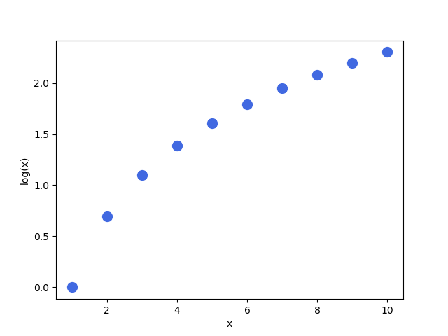
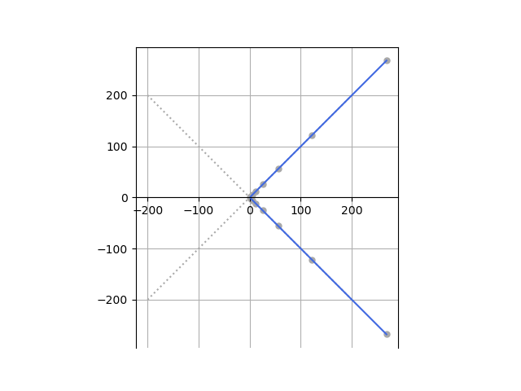
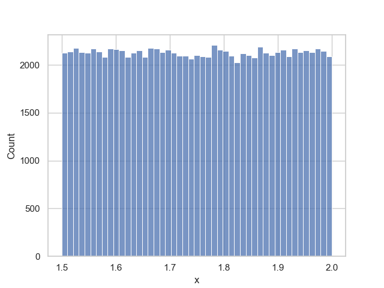

# Numeric Datatypes

## The object Base Class and Number Abstract Base Class

Recall from the previous tutorial covering the data model that the `object` class is the `base` class of all classes. The directory function `dir` can be used to view a list of the `object` classes identifiers:

```python
In [1]: dir(object)
Out [1]: [
            '__class__', '__delattr__', '__dir__', '__doc__', '__eq__', '__format__', 
            '__ge__', '__getattribute__', '__getstate__', '__gt__', '__hash__', '__init__', 
            '__init_subclass__', '__le__', '__lt__', '__ne__', '__new__', '__reduce__', 
            '__reduce_ex__', '__repr__', '__setattr__', '__sizeof__', '__str__', '__subclasshook__'
         ]
```

When `object` is input, followed by a dot `.` the identifiers are typically listed alphabetically. However it is easier to understand the identifiers in the `object` class when the identifiers are grouped by design pattern and purpose:

```python
In [2]: object.
# -------------------------------
# Available Identifiers for `object`:
# -------------------------------------
#   🔧 Functions:
#     - __init__(self, /, *args, **kwargs)          : Initializes the object.
#     - __new__(*args, **kwargs)                    : Creates a new instance of the class.
#     - __delattr__(self, name, /)                  : Defines behavior for when an attribute is deleted.
#     - __dir__(self, /)                            : Default dir() implementation.
#     - __sizeof__(self, /)                         : Returns the size of the object in memory, in bytes.
#     - __eq__(self, value, /)                      : Checks for equality with another object.
#     - __ne__(self, value, /)                      : Checks for inequality with another object.
#     - __lt__(self, value, /)                      : Checks if the object is less than another.
#     - __le__(self, value, /)                      : Checks if the object is less than or equal to another.
#     - __gt__(self, value, /)                      : Checks if the object is greater than another.
#     - __ge__(self, value, /)                      : Checks if the object is greater than or equal to another.
#     - __repr__(self, /)                           : Returns a string representation of the object.
#     - __str__(self, /)                            : Returns a string for display purposes.
#     - __format__(self, format_spec, /)            : Returns a formatted string representation of the object.
#     - __hash__(self, /)                           : Returns a hash of the object.
#     - __getattribute__(self, name, /)             : Gets an attribute from the object.
#     - __setattr__(self, name, value, /)           : Sets an attribute on the object.
#     - __delattr__(self, name, /)                  : Deletes an attribute from the object.
#     - __reduce__(self, /)                         : Prepares the object for pickling.
#     - __reduce_ex__(self, protocol, /)            : Similar to __reduce__, with a protocol argument.
#     - __init_subclass__(...)                      : Called when a class is subclassed; default 
#                                                     implementation does nothing.
#     - __subclasshook__(...)                       : Customize issubclass() for abstract classes.
#
#    🔍 Attributes:
#     - __class__                                    : The class of the object.
#     - __doc__                                      : The docstring of the object.
# -------------------------------------
```

The directory function `dir` can be used to view a list of the `int` classes identifiers, notice it has many more identifiers:

```python
In [2]: dir(int)
Out [2]: [
          '__abs__', '__add__', '__and__', '__bool__', '__ceil__', '__class__', 
          '__delattr__', '__dir__', '__divmod__', '__doc__', '__eq__', '__float__', 
          '__floor__', '__floordiv__', '__format__', '__ge__', '__getattribute__', 
          '__getnewargs__', '__gt__', '__hash__', '__index__', '__init__', 
          '__init_subclass__', '__int__', '__invert__', '__le__', '__lshift__', 
          '__lt__', '__mod__', '__mul__', '__ne__', '__neg__', '__new__', '__or__', 
          '__pos__', '__pow__', '__radd__', '__rand__', '__rdivmod__', '__reduce__', 
          '__reduce_ex__', '__repr__', '__rfloordiv__', '__rlshift__', '__rmod__', 
          '__rmul__', '__ror__', '__round__', '__rpow__', '__rrshift__', '__rshift__', 
          '__rsub__', '__rtruediv__', '__rxor__', '__setattr__', '__sizeof__', '__str__', 
          '__sub__', '__subclasshook__', '__truediv__', '__trunc__', '__xor__', 
          'bit_length', 'conjugate', 'denominator', 'from_bytes', 'imag', 'numerator', 'real', 
          'to_bytes'
         ]
```

Because, the `object` is the `base` class, it is present in the `int` classes method resolution order:

```python
In [3]: int.mro()
Out[3]: ['int', 'object']
```

Recall the `int` class inherits everything from the `object` class. Although some identifiers are redefined in the `int` class for additional functionality. The `int` class also has an abstract base class `numbers.Number` and therefore has the behaviour of an immutable *Number*:

```python
In [4]: import numbers
In [5]: issubclass(int, numbers.Number)
Out[5]: True
```

When `int` is input, followed by a dot `.` the identifiers are typically listed alphabetically. However it is easier to understand the identifiers in the `int` class when the identifiers are grouped by design pattern and purpose:

```python
In [6]: int.
# -------------------------------
# Available Identifiers for `int`:
# -------------------------------------

# 🔧 Functions inherited from `object`:
#   - __init__(self, /, *args, **kwargs)          : Initializes the object.
#   - __new__(*args, **kwargs)                    : Creates a new instance of the class.
#   - __delattr__(self, name, /)                  : Defines behavior for when an attribute is deleted.
#   - __dir__(self, /)                            : Default dir() implementation.
#   - __sizeof__(self, /)                         : Returns the size of the object in memory, in bytes.
#   - __eq__(self, value, /)                      : Checks for equality with another object.
#   - __ne__(self, value, /)                      : Checks for inequality with another object.
#   - __lt__(self, value, /)                      : Checks if the object is less than another.
#   - __le__(self, value, /)                      : Checks if the object is less than or equal to another.
#   - __gt__(self, value, /)                      : Checks if the object is greater than another.
#   - __ge__(self, value, /)                      : Checks if the object is greater than or equal to another.
#   - __repr__(self, /)                           : Returns a string representation of the object.
#   - __str__(self, /)                            : Returns a string for display purposes.
#   - __format__(self, format_spec, /)            : Returns a formatted string representation of the object.
#   - __hash__(self, /)                           : Returns a hash of the object.
#   - __getattribute__(self, name, /)             : Gets an attribute from the object.
#   - __setattr__(self, name, value, /)           : Sets an attribute on the object.
#   - __reduce__(self, /)                         : Prepares the object for pickling.
#   - __reduce_ex__(self, protocol, /)            : Similar to __reduce__, with a protocol argument.
#   - __init_subclass__(...)                      : Called when a class is subclassed; default implementation does nothing.
#   - __subclasshook__(...)                       : Customize issubclass() for abstract classes.

# 🔍 Attributes inherited from `object`:
#   - __class__                                    : The class of the object.
#   - __doc__                                      : The docstring of the object.

# -------------------------------------

# 🔧 Additional Functions:
#   - __bool__(self, /)                           : Returns True if the integer is non-zero.
#   - __int__(self, /)                            : Returns the integer itself.
#   - __float__(self, /)                          : Converts the integer to a float.
#   - __index__(self, /)                          : Returns the integer, used for slicing.

# 🔄 Rounding Functions:
#   - __round__(self, /[, ndigits])               : Returns the number rounded to ndigits precision.
#   - __trunc__(self, /)                          : Returns the truncated version of the number.
#   - __floor__(self, /)                          : Returns the floor of the number.
#   - __ceil__(self, /)                           : Returns the ceiling of the number.

# 🧮 Unitary Arithmetic Operators:
#   - __neg__(self, /)                            : Returns the negation of the integer (-self).
#   - __pos__(self, /)                            : Returns the positive value (+self).
#   - __abs__(self, /)                            : Returns the absolute value of the integer.

# ➕ Binary Arithmetic Operators:
#   - __add__(self, value, /)                     : Returns the sum of two integers (self + value).
#   - __sub__(self, value, /)                     : Returns the difference between two integers (self - value).
#   - __mul__(self, value, /)                     : Returns the product of two integers (self * value).
#   - __truediv__(self, value, /)                 : Returns the quotient of two integers (self / value).
#   - __floordiv__(self, value, /)                : Returns the integer quotient of two integers (self // value).
#   - __mod__(self, value, /)                     : Returns the remainder of division (self % value).
#   - __pow__(self, value, /)                     : Returns self raised to the power of value (self ** value).

# 🔄 Binary Reflection Arithmetic Operators:
#   - __radd__(self, value, /)                    : Reflects addition (value + self).
#   - __rsub__(self, value, /)                    : Reflects subtraction (value - self).
#   - __rmul__(self, value, /)                    : Reflects multiplication (value * self).
#   - __rtruediv__(self, value, /)                : Reflects true division (value / self).
#   - __rfloordiv__(self, value, /)               : Reflects floor division (value // self).
#   - __rmod__(self, value, /)                    : Reflects modulo operation (value % self).
#   - __rpow__(self, value, /)                    : Reflects power operation (value ** self).

# 🧮 Unitary Bitwise Operators:
#   - __invert__(self, /)                         : Returns the bitwise inverse (~self).
#   - bit_length(self)                            : Returns the number of bits necessary to represent the
#                                                   integer in binary, excluding the sign bit.
#   - bit_count(self)                             : Returns the number of ones in the binary representation 
#                                                   of the integer.

# 🔧 Binary Bitwise Operators:
#   - __and__(self, value, /)                     : Performs bitwise AND (self & value).
#   - __or__(self, value, /)                      : Performs bitwise OR (self | value).
#   - __xor__(self, value, /)                     : Performs bitwise XOR (self ^ value).
#   - __lshift__(self, value, /)                  : Shifts the bits of self to the left by value places (self << value).
#   - __rshift__(self, value, /)                  : Shifts the bits of self to the right by value places (self >> value).

# 🔄 Binary Reflection Bitwise Operators:
#   - __rand__(self, value, /)                    : Reflects bitwise AND (value & self).
#   - __ror__(self, value, /)                     : Reflects bitwise OR (value | self).
#   - __rxor__(self, value, /)                    : Reflects bitwise XOR (value ^ self).
#   - __rlshift__(self, value, /)                 : Reflects left bit shift (value << self).
#   - __rrshift__(self, value, /)                 : Reflects right bit shift (value >> self).

# -------------------------------------
# Compatibility with `bytes`:
# -------------------------------------
# 🔧 Functions:
#   - from_bytes(cls, bytes, byteorder, /)    : Returns the integer represented by the given array of bytes.
#   - to_bytes(self, length, byteorder, /)    : Returns an array of bytes representing the integer.

# -------------------------------
# Compatibility with `fractions.Fraction`:
# -------------------------------------
# 🔧 Attributes:
#   - numerator                                 : The numerator of the fraction.
#   - denominator                               : The denominator of the fraction.

# -------------------------------------
# Compatibility with `complex`:
# -------------------------------------
# 🔍 Attributes:
#   - real                                      : The real part of the complex number.
#   - imag                                      : The imaginary part of the complex number.
# 🔧 Functions:
#   - conjugate(self, /)                        : Returns the conjugate of the number.

# 📦 Other Identifiers and Special Methods:
#   - __getnewargs__(self, /)                     : Used during unpickling to retrieve arguments for creating the object.
```

The directory function `dir` can be used to view a list of the `float` classes identifiers:

```python
In [7]: dir(float)
Out[7]: ['__abs__', '__add__', '__bool__', '__ceil__', '__class__', '__delattr__', '__dir__', 
         '__divmod__', '__doc__', '__eq__', '__float__', '__floor__', '__floordiv__', 
         '__format__', '__ge__', '__getattribute__', '__getformat__', '__getnewargs__', 
         '__getstate__', '__gt__', '__hash__', '__init__', '__init_subclass__', '__int__', 
         '__le__', '__lt__', '__mod__', '__mul__', '__ne__', '__neg__', '__new__', '__pos__',
         '__pow__', '__radd__', '__rdivmod__', '__reduce__', '__reduce_ex__', '__repr__', 
         '__rfloordiv__', '__rmod__', '__rmul__', '__round__', '__rpow__', '__rsub__', 
         '__rtruediv__', '__setattr__', '__sizeof__', '__str__', '__sub__', 
         '__subclasshook__', '__truediv__', '__trunc__', 'as_integer_ratio', 'conjugate', 
         'fromhex', 'hex', 'imag', 'is_integer', 'real'
        ]
```

The `float` class also follows the design pattern of the abstract base class immutable `numbers.Number` and therefore has the behaviour of a *Number* which is why the identifiers above have consistency with the `int` class:

```python
In [8]: float.mro()
Out[8]: [float, object]
In [9]: issubclass(float, numbers.Number)
Out[9]: True
```

When `float` is input, followed by a dot `.` the identifiers are typically listed alphabetically. However it is easier to understand the identifiers in the `float` class when the identifiers are grouped by design pattern and purpose:

```python
In [10]: float.
# -------------------------------------
# Available Identifiers for `float`:
# -------------------------------------

# 🔧 Functions inherited from `object`:
#   - __init__(self, /, *args, **kwargs)
#   - __new__(*args, **kwargs)
#   - __delattr__(self, name, /)
#   - __dir__(self, /)
#   - __sizeof__(self, /)
#   - __eq__(self, value, /)
#   - __ne__(self, value, /)
#   - __lt__(self, value, /)
#   - __le__(self, value, /)
#   - __gt__(self, value, /)
#   - __ge__(self, value, /)
#   - __repr__(self, /)
#   - __str__(self, /)
#   - __format__(self, format_spec, /)
#   - __hash__(self, /)
#   - __getattribute__(self, name, /)
#   - __setattr__(self, name, value, /)
#   - __reduce__(self, /)
#   - __reduce_ex__(self, protocol, /)
#   - __init_subclass__(...)
#   - __subclasshook__(...)

# 🔍 Attributes inherited from `object`:
#   - __class__
#   - __doc__

# -------------------------------------

# 🔧 Additional Functions:
#   - __bool__(self, /)
#   - __float__(self, /)
#   - __int__(self, /)
#   - is_integer(self, /)         # Returns True if the float is an integer.
#   - as_integer_ratio(self, /)   # Returns a tuple of the integer ratio.

# 🧪 Compatibility with Hexadecimal Strings:
#   - fromhex(self, /)            # Converts a hexadecimal string to a float.
#   - hex(self, /)                # Returns a hexadecimal representation of the float.

# 🔄 Rounding Functions:
#   - __round__(self, /[, ndigits])
#   - __trunc__(self, /)
#   - __floor__(self, /)
#   - __ceil__(self, /)

# 🧮 Unitary Arithmetic Operators:
#   - __neg__(self, /)
#   - __pos__(self, /)
#   - __abs__(self, /)

# ➕ Binary Arithmetic Operators:
#   - __add__(self, value, /)
#   - __sub__(self, value, /)
#   - __mul__(self, value, /)
#   - __truediv__(self, value, /)
#   - __floordiv__(self, value, /)
#   - __mod__(self, value, /)
#   - __pow__(self, value, /)

# ➕ Binary Reflection Arithmetic Operators:
#   - __radd__(self, value, /)
#   - __rsub__(self, value, /)
#   - __rmul__(self, value, /)
#   - __rtruediv__(self, value, /)
#   - __rfloordiv__(self, value, /)
#   - __rmod__(self, value, /)
#   - __rpow__(self, value, /)

# -------------------------------------
# Compatibility with `complex`:
# -------------------------------------
# 🔍 Attributes:
#   - real                                      : The real part of the complex number.
#   - imag                                      : The imaginary part of the complex number.
# 🔧 Functions:
#   - conjugate(self, /)                        : Returns the conjugate of the number.

# -------------------------------------
# Compatibility with `bytes`:
# -------------------------------------
# 🔧 Functions:
#   - from_bytes(cls, bytes, byteorder, /)    : Returns the integer represented by the given array of bytes.
#   - to_bytes(self, length, byteorder, /)    : Returns an array of bytes representing the integer.

# -------------------------------------
# Other Identifiers and Special Methods:
#   - __getnewargs__(self, /)  # Used during unpickling to retrieve arguments for creating the object.
```

If the method resolution order of the `bool` class is examined:

```python
In [11]: bool.mro()
Out[11]: [bool, int, object]
```

Notice that the `int` class is a base class:

```python
In [12]: help(bool)
Help on class bool in module builtins:

class bool(int)
 |  bool(x) -> bool
 |  
 |  Returns True when the argument x is true, False otherwise.
 |  The builtins True and False are the only two instances of the class bool.
 |  The class bool is a subclass of the class int, and cannot be subclassed.
 |  
 |  Method resolution order:
 |      bool
 |      int
 |      object
 |  
 |  Methods defined here:
 |  
 |  __repr__(self, /)
 |      Return repr(self).
 |
 |  __and__(self, value, /)
 |      Return self&value.
 |  
 |  __or__(self, value, /)
 |      Return self|value.
 |  
 |  __xor__(self, value, /)
 |      Return self^value.
 |
 |  __rand__(self, value, /)
 |      Return value&self.
 |  
 |  __ror__(self, value, /)
 |      Return value|self.
 |  
 |  __rxor__(self, value, /)
 |      Return value^self.
 |
 |  
 |  ----------------------------------------------------------------------
 |  Static methods defined here:
 |  
 |  __new__(*args, **kwargs)
 |      Create and return a new object.  See help(type) for accurate signature.
 |  
 |  ----------------------------------------------------------------------
 |  Methods inherited from int:
 | ⁝
 ```

 ```python
In [13]: exit
```

## Instantiation and Numeric Properties

Integers are whole numbers with unit steps. They can be instantiated explictly using the `int` class however because they are a `builtins` class the shorthand way of instantiating them is preferred as shown in the return value of each cell. Recall the return value is the print out of the formal representation:

```python
In [1]: int(123)
Out[1]: 123
In [2]: int(12)
Out[2]: 12
In [3]: int(1)
Out[3]: 1
```

Floating point numbers have a decimal point. These can be explicitly instantiated using the `float` class however the return value shows the preferred shorthand way of instantiation:

```python
In [4]: float(100.)
Out[4]: 100.0
In [5]: float(1.1)
Out[5]: 1.1
In [6]: float(0.1)
Out[6]: 1.1
```

There are only two boolean instances. These can explicitly be instantiated using the `bool` class however the return value shows the preferred shorthand way of instantiation. Notice that the syntax highlighting recognises these as `bool` instances:

```python
In [7]: bool(True)
Out[7]: True
In [8]: bool(False)
Out[8]: False
```

The `int`, `float` and `bool` classes are typically used as casting functions, casting an instance of one `builtins` class to another `builtins` class:

```python
In [9]: int(456.7) # .7 is truncated
Out[9]: 456
In [10]: float(456) # .0 added
Out[10]: 456.0 
In [11]: bool(0) # zero
Out[11]: False
In [12]: bool(5) # non-zero
Out[12]: True
In [13]: bool(-5) # non-zero
Out[13]: True
In [14]: bool(0.0) # zero
Out[14]: False
In [15]: bool(0.1) # non-zero
Out[15]: True
In [16]: int(False)
Out[16]: 0
In [17]: int(True)
Out[17]: 1
In [18]: float(False)
Out[18]: 0.0
In [19]: float(True)
Out[19]: 1.0
In [20]: int('2') # base 10
Out[20]: 2
In [21]: int('0b10101010', base=2)
Out[21]: 171
In [22]: int('0xaa', base=16)
Out[22]: 171
In [23]: float('456.7')
Out[23]: 456.7
In [24]: bool('') # empty string
Out[24]: False
In [25]: bool('False') # non-empty string
Out[25]: True
In [26]: str(1)
Out[26]: '1'
In [27]: str(456.7)
Out[27]: '456.7'
In [28]: str(False)
Out[28]: 'False'
```

If the following strings of floating point numbers are examined:

```python
In [29]: for num in range(9, -1, -1):
       :     print('0.'+num*'0'+'123')
       : for num in range(18):
       :     print('123'+num*'0'+'.')

0.000000000123
0.00000000123
0.0000000123
0.000000123
0.00000123
0.0000123
0.000123
0.00123
0.0123
0.123
123.
1230.
12300.
123000.
1230000.
12300000.
123000000.
1230000000.
12300000000.
123000000000.
1230000000000.
12300000000000.
123000000000000.
1230000000000000.
12300000000000000.
123000000000000000.
1230000000000000000.
12300000000000000000.
```

The default formal representation of these floating point numbers can be seen by casting the `str` instances to `float` instances:

```python
In [30]: for num in range(9, -1, -1):
       :     print(float('0.'+num*'0'+'123'))
       :
       : for num in range(18):
       :     print(float('123'+num*'0'+'.'))
1.23e-10
1.23e-09
1.23e-08
1.23e-07
1.23e-06
1.23e-05
0.000123
0.00123
0.0123
0.123
123.0
1230.0
12300.0
123000.0
1230000.0
12300000.0
123000000.0
1230000000.0
12300000000.0
123000000000.0
1230000000000.0
12300000000000.0
123000000000000.0
1230000000000000.0
1.23e+16
1.23e+17
1.23e+18
1.23e+19
```

Notice that the formal representation prefers scientific notation format for very small and very large numbers and the fixed format for numbers that would have the exponential power of `-4` to `15`.

If the following number is examined, the process of conventing it to scientific notation can be explored. Division is carried out until there is a unit:

```python
In [31]: 123 # 0 (no division)
In [32]: 123 / 10 # 1 (1st division)
Out[32]: 12.3
In [33]: 12.3 / 10 # 2 (2nd division)
Out[33]: 1.23
```

The number of divisions is essentially the exponent and the final result is the mantissa. Notice that raising ten to the power of the exponent cancels out the divisions:

```python
In [34]: mantissa = 1.23
       : exponent = +2
In [35]: (1 / (10 * 10)) * (10 ** exponent) # unchanged
Out[35]: 1
```

The number can be constructed using the form `mantissa e exponent` (without spaces):

```python
In [36]: 1.23e2
Out[36]: 123.0

In [37]: 1.23 e 2
  Cell In[37], line 1
    1.23 e 2
         ^
SyntaxError: invalid syntax
```

Let's look at a smaller number now. Multiplication is carried out until there is a unit:

```python
In [38]: 0.000456 # 0 (no multiplication)
In [39]: 0.000456 * 10 # -1 (1st multipication)
Out[39]: 0.00456
In [40]: 0.00456 * 10 # -2 (2nd multiplication)
Out[40]: 0.0456 * 10 # -3 (3rd multiplication)
In [41]: 0.456 * 10 # -4 (4th multiplication)
Out[41]: 4.56
```

The number of divisions is essentially the exponent (multiplication is the reverse process of division giving a negative exponent) and the final result is the mantissa. Notice that raising ten to the power of the exponent cancels out the multiplications:

```python
In [42]: mantissa = 4.56
       : exponent = -4
In [43]: (1 * (10 * 10 * 10 * 10)) * (10 ** exponent) # unchanged
Out[43]: 1
```

The number can be constructed using the form `mantissa e exponent` (without spaces):

```python
In [44]: 4.56e-4
Out[44]: 0.000456
```

Sometimes unexpected rounding deviations will crop up when using `float` instances:

```python
In [45]: 0.1 + 0.2
Out[45]: 0.30000000000000004 
In [46]: exit
```

Although the `float` is displayed using a base of `10`, internally it is stored on the computers memory which recall uses a base of `2` and is typically grouped into units of 8 known as a byte:


```python
# displayed
mantissa_base_10 * (10 ** exponent_base_10)
# stored
mantissa_base_2 * (2 ** exponent_base_2)
```

A `float` also known as a float64 uses 64 bits and therefore occupies 8 bytes. The `pickle` module is used to serialise a Python `object` converting it into a byte stream:

```python
In [1]: import pickle
In [2]: pickle.dumps(0.2)
Out[2]: b'\x80\x04\x95\n\x00\x00\x00\x00\x00\x00\x00G?\xc9\x99\x99\x99\x99\x99\x9a.'
```

Recall that a byte will be represented by an ascii character if it is printable or by its hexadecimal escape character if its non-printable. To view all the bytes in hexadecimal the `bytes` method `hex` can be used:

```python
In [3]: pickle.dumps(0.2).hex()
Out[3]: '8004950a00000000000000473fc999999999999a2e'
```

The hexadecimal string returned contains the hexadecimal data however it is enclosed in information which details the pickle protocol:

|Hexadecimal|Index|Purpose|Details|
|---|---|---|---|
|80|0-2|Start OptCode|`pickle.PROTO.hex()`|
|04|2-4|Protocol Version|`pickle.DEFAULT_PROTOCOL`|
|95|4-6|Frame OptCode|`pickle.FRAME.hex()`|
|0a00000000000000|6-22|Frame Size|8 bytes little endian|
|47|22-24|binary float protocol|`pickle.BINFLOAT`|
|3fc999999999999a|24-40|data as hex|`0.2`|
|2e|40-42|Stop OptCode|`pickle.STOP.hex()`|

Selecting only the data:

```python
In [4]: pickle.dumps(0.2).hex()[24:40]
Out[4]: '3fc999999999999a'
```

It can be cast into an `int`:

```python
In [5]: int(pickle.dumps(0.2).hex()[24:40], base=16)
Out[5]: 4596373779694328218
```

And then displayed in binary:

```python
In [6]: bin(int(pickle.dumps(0.2).hex()[24:40], base=16))
Out[6]: '0b11111111001001100110011001100110011001100110011001100110011010'
```

This should have 64 bits, for clarity the leading zeros will be shown:

```python
In [7]: '0b' + bin(int(pickle.dumps(0.2).hex()[24:40], base=16)).removeprefix('0b').zfill(64)
Out[7]: '0b0011111111001001100110011001100110011001100110011001100110011010'
```

Compare this to another number:

```python
In [8]: '0b' + bin(int(pickle.dumps(0.125).hex()[24:40], base=16)).removeprefix('0b').zfill(64)
Out[8]: '0b0011111111000000000000000000000000000000000000000000000000000000'
```

Notice `0.2` has a recurring pattern `1100...` whereas `0.125` has a series of trailing zeros. Therefore `0.125` is encoded precisely in binary but `0.2` is not and recurs. Moreover because there are only 64 bits, the number is eventually truncated leading to the rounding deviation. Rounding deviations also occur in decimal but are less common as there are 10 characters used to represent a number instead of 2:

```python
In [9]: 1 / 3
Out[9]: 0.3333333333333333
In [10]: 10 / 3
Out[10]: 3.3333333333333335
```

The IEEE 754 double-precision binary floating-point format uses 1 bit for the sign, 11 bits for the biased exponent and 53 bits for the mantissa:

```python
In [11]: data = bin(int(pickle.dumps(0.2).hex()[24:40], base=16)).removeprefix('0b').zfill(64)
In [12]: data[0], data[1:12], data[12:]
Out[12]: ('0', '01111111100', '1001100110011001100110011001100110011001100110011010')
```

This is essentially a form of scientific notation using a binary base. Some further optimations have been made in order to optimise memory efficiency.

```python
In [13]: sign_bits, biased_exponent_bits, mantissa_bits = data[0], data[1:12], data[12:]
```

For the sign:

```python
In [14]: if sign_bits == '0':
       :     sign = '+'
       : else:
       :     sign = '-'
       : sign
Out[14]: '+'
```

The exponent is biased, so it is always a positive number, this biased can be removed:

```python
In [15]: biased_exponent_int = int('0b'+biased_exponent_bits, base=2)
       : offset = 1023
       : unbiased_exponent_int = biased_exponent_int - offset
       : unbiased_exponent_int
Out[15]: -3

In [16]: unbiased_exponent_binary = bin(unbiased_exponent_int)
       : unbiased_exponent_binary
Out[16]: '-0b11'
```

Every number in a binary mantissa begins with `1` because binary scientific notation places the first non-zero number, which in binary can only be `1` in front of the *binary* point and this is not shown in order to conserve memory:

```python
In [17]: mantissa_binary = '0b1.' + mantissa_bits
       : mantissa_binary
Out[17]: '0b1.1001100110011001100110011001100110011001100110011010'
```

Therefore the number in binary scientific notation essentially is:

```python
In [18]: sign + mantissa_binary + 'p' + unbiased_exponent_binary
Out[18]: '+0b1.1001100110011001100110011001100110011001100110011010p-0b11'
```

Here `p` represents the power. As binary is hard to read for a human, the hexadecimal format is preferred. Returning to the hexadecimal string, the sign and the exponent occupy the first 1 bit and 11 bits respectively and 12 bits is 6 hexadecimal characters:

```python
In [19]: pickle.dumps(0.2).hex()[24:40]
Out[19]: '3fc999999999999a'
```

So the matissa becomes:

```python
In [20]: pickle.dumps(0.2).hex()[24:40][3:]
Out[20]: '999999999999a'

In [21]: '0x' + '1.' + pickle.dumps(0.2).hex()[24:40][3:]
Out[21]: '0x1.999999999999a'
```

This gets combined with the sign and the unbiased exponent represented as an integer in the `float` hexadecimal format:

```python
In [22]: sign + '0x' + '1.' + pickle.dumps(0.2).hex()[24:40][3:] + str(unbiased_exponent_int)
Out[22]: '+0x1.999999999999a-3'
```

The `float` method `hex` can be used to get this format:

```python
In [23]: 0.2.hex()
Out[23]: '0x1.999999999999ap-3'
```

Notice in the above, the `.` is used as part of the `float` indicating a decimal point and is also used to access an identifier from this `float` instance. This syntax can be confusing and does not work with an `int` instance:

```python
In [24]: 2.real
  Cell In[24], line 1
    2.real
     ^
SyntaxError: invalid decimal literal
```

Parethesis are used to emphasise that the instance is an `int` and not a `float`:

```python
In [25]: (2).real
Out[25]: 2 
```

Code is more readible when the `float` instance is also in parenthesis:

```python
In [25]: (0.2).real
Out[25]: 0.2
In [26]: (0.2).hex()
Out[26]: '0x1.999999999999ap-3'
```

The `float` class has the `fromhex` class method which is an alternative constructor from this format:

```python
In [27]: float.fromhex('+0x1.999999999999ap-3')
Out[27]: 0.2
```

Recall `0.125` is encoded precisely in binary and the trailing zeros in the hexadecimal mantissa can be observed:

```python
In [28]: (0.125).hex()
Out[28]: '0x1.0000000000000p-3'
```

If the following hexadecimal values are observed:

```python
In [29]: (0.1).hex()
Out[29]: '0x1.999999999999ap-4'
In [30]: (0.2).hex()
Out[30]: '0x1.999999999999ap-3'
In [31]: (0.1+0.2).hex()
Out[31]: '0x1.3333333333334p-2'
In [32]: (0.3).hex()
Out[32]: '0x1.3333333333333p-2'
```

Notice that `0.1+0.2` and `0.3` are different from one another and as a result of this rounding deviation:

```python
In [33]: 0.1 + 0.2 == 0.3
Out[33]: False
```

`int` instances do not have this rounding deviation:

```python
In [34]: 1 + 2 == 3
Out[34]: True
```

## Rounding Functions

The data model method `__round__` controls the behaviour of the `builtins` function `round`. For a `float` it will by default round to an `int`:

```python
In [35]: round(4.567)
Out[35]: 5
```

Compare this to casting to an `int` which truncates the component past the decimal point:

```python
In [36]: int(4.567)
Out[36]: 4
```

The `round` function has an optional input argument, the number of digits to round down to:

```python
In [37]: round(4.567, 2)
Out[37]: 4.56
In [38]: round(4.567, 1)
Out[38]: 4.6
```

And therefore:

```python
In [34]: round(0.1 + 0.2, 6) == round(0.3, 6)
Out[34]: True
```

There are three rounding related functions that are less commonly used and are therefore comparmetalised into the `math` module. The data model method `__floor__` defines the behaviour of the `math.floor` function returning the next integer above and the data model method `__ceil__` defines the behaviour of the `math.ceil` function returning the previous integer. The data model method `__trunc__` defines the behaviour of `math.trunc` which effectively is the same as casting to an `int` but can sometimes be more readible:

```python
In [35]: import math
In [36]: math.floor(4.567)
Out[36]: 4
In [37]: math.floor(-4.567)
Out[37]: -5
In [38]: math.ceil(4.567)
Out[38]: 5
In [39]: math.ceil(-4.567)
Out[39]: -4
In [40]: math.trunc(4.567)
Out[40]: 4
In [41]: math.trunc(-4.567)
Out[41]: -4
```

`math.isclose` will also check to see if two `float` instances are close to one another with respect to a tolerence:

```python
In [42]: math.isclose(0.3, 0.1+0.2, abs_tol=1e-6)
Out[42]: True
```

The absolute tolerance of `1e-6` means the number lies between the following boundaries:

```python
In [43]: format(0.3-1e-6, '019.17f')
Out[43]: '0.29999900000000002'
In [44]: format(0.3+1e-6, '019.17f') 
Out[44]: '0.30000099999999996'
```

In this case:

```python
In [45]: format(0.1+0.2, '019.17f')
Out[45]: '0.30000000000000004'
```

Because a `float` instance is encoded to a fixed number of bits, large numbers are much more widely spaced than smaller numbers. The function ```math.ulp``` (unit in last place) returns the value that is essentially the next available up or down. A small `float` instance can be examined for example `0.1`. Because of the rounding deviation due to binary encoding, notice the 17th value past the decimal point is `1` instead of `0`. The unit in last place steps using this 17th decimal place:

```python
In [46]: format(0.1, '019.17f')
Out[46]: '0.10000000000000001'

In [47]: format(math.ulp(0.1), '019.17f')
Out[47]: '0.00000000000000001'
```

A large `float` instance can be examined for example `1e18`. Notice that the unit in last palce is now `128`: 

```python
In [48]: format(1e18,'019.0f')
Out[48]: '1000000000000000000'

In [49]: format(math.ulp(1e18), '019.0f')
Out[49]: '0000000000000000128'
```

Calculations generally depend on the relative precision of each `float` and in either case the relative precision is approximately `1e-16`:

```python
In [50]: math.ulp(0.1) / 0.1
Out[50]: 1.3877787807814457e-16

In [51]: math.ulp(1e18) / 1e18
Out[51]: 1.28e-16
```

The related function `math.nextafter` will compute the next number from `x` going towards `y`:

```python
In [52]: format(math.nextafter(1e18, 2e18), '019.0f')
Out[52]: '1000000000000000128'
```

The rounding deviation can propogate when summing a sequence of `float` instances. The function floating point sum `fsum` carries out additional checks to combat these rounding deviations:

```python
In [53]: sum([0.1, 0.2, 0.1, 0.2, 0.1, 0.2])
Out[53]: 0.9000000000000001

In [54]: math.fsum([0.1, 0.2, 0.1, 0.2, 0.1, 0.2])
Out[54]: 0.9
```

```python
In [55]: exit
```

## Formatting

Numeric instances do not have escape characters and therefore the data model methods `__repr__` and `__str__` which define the behaviour of the `builtins` function `repr` and `builtins` class `str` are consistent:

```python
In [1]: repr(4.567)
Out[1]: '4.567'
In [2]: str(4.567)
Out[2]: '4.567'
In [3]: repr(0.0000123)
Out[3]: '1.23e-05'
In [4]: str(0.0000123)
Out[4]: '1.23e-05'
```

Recall that the cell output shows the print out of the formal representation:

```python
In [5]: print(repr(4.567))
4.567
```

The `__format__`  data model defines how these classes operate with the `builtins` function `format`. This is used as a format specifier within the `str` method `format` method or more commonly within a fstring:

```python
In [6]: format(12, '') # (12).__format__('')
Out[6]: '12'
```

The `format` function accepts a format specifier for example `d` denotes a decimal integer:

```python
In [7]: format(12, 'd') # decimal integer
Out[7]: '12'
In [8]: format(12, '4d') # width of 4
Out[8]: '  12'
In [9]: format(12, '04d') # show leading zeros
Out[9]: '0012'
```

`c` denotes a character:

```python
In [10]: num1 = 97
       : chr(num1)
Out[10]: 'a'
In [11]: num2 = 945
       : chr(num2)
Out[11]: 'α'
In [12]: format(num1, 'c') # character
Out[12]: 'a'
In [13]: format(num1, '4c') # width of 4
Out[13]: '   a'
In [14]: format(num1, '04c') # show leading zeros
Out[14]: '000a'
```

`b` denotes binary:

```python
In [15]: num1 = 97 # 1 byte
       : bin(num1)
Out[15]: '0b1100001'
In [16]: num2 = 945 # 2 bytes
       : bin(num2)
Out[16]: '0b1110110001'
In [17]: format(num1, 'b') # binary
Out[17]: '1100001'
In [18]: format(num1, '8b') # width of 8
Out[18]: ' 1100001'
In [19]: format(num1, '08b') # show leading zeros
Out[19]: '01100001'
In [20]: format(num2, '016b') 
Out[20]: '0000001110110001'
In [21]: format(num2, '#018b') # # shows the 0b prefix (width + 2)
Out[21]: '0b0000001110110001'
```

`x` denotes hexadecimal:

```python
In [22]: num1 = 97 # 1 byte
       : hex(num1)
Out[22]: '0x61'
In [23]: num2 = 945 # 2 bytes
       : hex(num2)
Out[23]: '0x3b1'
In [24]: format(num1, 'x') # hexadecimal
Out[24]: '61'
In [25]: format(num2, 'x') 
Out[25]: '3b1'
In [25]: format(num2, '4x') # width of 4
Out[25]: ' 3b1'
In [26]: format(num2, '04x')  # show leading zeros
Out[26]: '03b1'
In [27]: format(num2, '#06x')  # # shows the 0x prefix (width + 2)
Out[27]: '0x03b1'
```

Capital `X` will capitalize the above (less common):

```python
In [28]: format(num2, '#06X') # # shows the 0x prefix (width + 2)
Out[28]: '0X03B1'
```

`f` denotes the fixed format:

```python
In [29]: num1 = 0.00000123
       : num1
Out[29]: 1.23e-06
In [30]: format(num1, 'f')
Out[30]: '0.000001'
In [31]: format(num1, '10f') # width
Out[31]: '  0.000001'
In [32]: format(num1, '010f') # show trailing zeros
Out[32]: '000.000001'
In [33]: format(num1, '010.7f') # precision of 7
Out[33]: '000.0000012'
```

`e` denotes the scientific notation format:

```python
In [34]: num1 = 1.23e-04
       : num1
Out[34]: 0.000123
In [35]: format(num1, 'e') # scientific notation format
Out[35]: '1.230000e-04'
In [36]: format(num1, '14e') # width
Out[36]: '  1.230000e-04'
In [37]: format(num1, '014e') # show trailing zeros
Out[37]: '001.230000e-04'
In [38]: format(num1, '014.7e') # precision of 7
Out[38]: '01.2300000e-04'
```

Capital `E` will capitalize the above (less common):

```python
In [39]: format(num1, '014.7E') # precision of 7
Out[39]: '01.2300000E-04'
```

`g` is the general format, essentially fixed or exponential depending on the value (same as the default):

```python
In [40]: num1 = 0.0000123
       : num1
Out[40]: 1.23e-05
In [41]: num2 = 1.23e-04
       : num2
Out[41]: 0.000123
In [42]: format(num1, 'g')
Out[42]: '1.23e-05'
In [43]: format(num2, 'g')
Out[43]: '0.000123'
```

The width and trailing zeros can be specified however the precision is normally automatic when `g` is used. Upper `G` is the same as `g` but displays scientific notation with upper case `E` instead of lower case `e`.

`%` is the percentage format, note the value is multiplied by `100`:

```python
In [44]: num1 = 0.00123
In [45]: format(num1, '%')
Out[45]: '0.123000%'
In [46]: format(num1, '7.3%') # width of 7 and precision of 3
Out[46]: ' 0.123%'
```

The `format` function was implicitly used which takes the valeu to be formated and the format specification as positional input arguments:

```python
In [47]: format(1.23e-04, '010.7f')
Out[47]: '00.0001230'
```

A fstring is prepended with f `f'...'` and a set of braces is used `f'...{}...'` to insert a value `f'...{value}...'`. A format specifier can be supplied alongside the value `f'...{value:format_spec}...'`:

```python
In [48]: f'{1.23e-04:010.7f}'
Out[48]: '00.0001230'

In [49]: f'num1 = {1.23e-04:010.7f}'
Out[49]: 'num1 = 00.0001230'
```

This is the more typical way of using a formatted string:

```python
In [50]: exit
```

## float Precision Continued

The following three measurements show vastly quantities:

```python
In [1]: radius_hydrogen = 1.2e-10
      : radius_human = 1.0
      : radius_sun = 6.957e8
In [2]: f'{radius_hydrogen:024.12f}'
Out[2]: '00000000000.000000000120'
In [3]: f'{radius_human:024.12f}'
Out[3]: '00000000001.000000000000'
In [4]: f'{radius_sun:024.12f}'
Out[4]: '00695700000.000000000000'
```

Notice that when the very large and very small quantity are added, that the large quantity is returned unaltered:

```python
In [5]: f'{radius_sun + radius_hydrogen:024.12f}'
Out[5]: '00695700000.000000000000'
```

This is because the large quantities uncertainty is much larger than the smaller quantity. Recall that this example involes the sun which is a very large object that is constituted of a very large number of hydrogen atoms, the difference of 1 hydrogen atom becomes negligible compared to the overall uncertainty.

When the very large and very small quantity are multiplied, the following result corresponds to the number of hydrogen atoms along the radius of the sun:

```python
In [6]: f'{radius_sun * radius_hydrogen:024.12f}'
Out[6]: '00000000000.083484000000'
```

These values are normally express in scientific notation. For multiplication, the mantissas are multiplied and the powers are added:

```python
In [7]: radius_hydrogen = 1.2e-10
      : radius_sun = 6.957e8
In [8]: mantissa = 6.957 * 1.200
      : mantissa
Out[8]: 8.3484
In [9]: exponent = 8 + (-10)
      : exponent
In [10]: -2
In [11]: exit
```

For division, the mantissas are divided and the powers subtracted.

## Unitary Data Model Methods

Unitary data model methods define the behaviour of a unitary operator. For an `int` or `float` using the `+` operator returns the `int` or `float` unchanged and using the `-` operator returns the `int` and `float` with the opposite sign:

```python
In [1]: +2 # (2).__pos__()
Out[1]: 2
In [2]: -2 # (2).__neg__()
Out[2]: -2
```

For a `bool`, these methods are inherited from the `int` class without modification and therefore return an `int` instance. If `+` is examined:

```python
In [3]: +False # (False).__pos__()
Out[3]: 0
In [4]: +True # (True).__pos__()
Out[4]: 1
```

It can be seen that the `bool` instance `False` is equivalent to the `int` instance `0` and the bool instance `True` is equivalent to the `int` instance `1`. This behaviour is also seen when the `-` operator is used:

```python
In [5]: -False # (False).__neg__()
Out[5]: 0
In [6]: -True # (True).__neg__()
Out[6]: -1
```

The `abs` function returns the absolute value of a number, essentially providing the number without the sign:

```python
In [7]: abs(2) # (2).__abs__()
Out[7]: 2
In [8]: abs(-2) # (-2).__abs__()
Out[8]: 2
```

## Indexing

The `int` class has the data model `__index__` which allows an `int` to be used to index into a `Collection` such as a `str` to retrieve a value. This also allows use of an `int` instances to construct a `slice` instance or a `range` instance:

```python
In [9]: 'python'[0]
Out[9]: 'p'
In [10]: 'python'[1]
Out[10]: 'y'
In [11]: 'python'[2]
Out[11]: 't'
In [11]: 'python'[0:2:1]
Out[11]: 'py'
In [12]: 'python'[slice(0, 2, 1)]
Out[12]: 'py'
In [13]: tuple(range(0, 2, 1))
Out[13]: (0, 1)
```

Recall that Python uses zero-order indexing and therefore slicing is inclusive of the start bound and exclusive of the stop bound (going up to but not includign the stop bound itself). Since a `bool` is a subclass of an `int` and `__index__` is inherited from the `int` class indexing with a `bool` is the euivalent of indexing with `0` and `1` respectively:

```python
In [14]: 'python'[False]
Out[14]: 'p'
In [15]: 'python'[True]
Out[15]: 'y'
```

The `__index__` method is not defined in the `float` class and even if the `float` is equal in value to an integer cannot be used for slicing:

```python
In [16]: (0.0).is_integer()
Out[16]: True
In [17]: 'python'[0.0]
SyntaxWarning: str indices must be integers or slices, not float; perhaps you missed a comma?
  'python'[0.0]
Traceback (most recent call last):

  Cell In[17], line 1
    'python'[0.0]

TypeError: string indices must be integers, not 'float'
In [18]: exit
```

## Binary and Reverse Binary Operators

A binary operator carries out an operation between two instances. The binary operator is called from the left instance and applied to the right instance. This is seen more clearly when the data model method is explicitly used:

```python
In [1]: 2 + 3 # (2).__add__(3)
Out[1]: 5
```

In this case the instance that the data model is called from is known as *self* (in this case `2`) and the value that the data model method is applied to is called *value*. The return *result* is `5`.

In the following `3` is *self* and `2` is *value*:

```python
In [2]: 3 + 2 # (3).__add__(2)
Out[2]: 5
```

The data model methods in the `float` class are set up for interoperability with `int` instances, essentially, the `int` is cast into a `float` and the operator therefore treats the `int` instance as a `float` instance, carrying out the operation between two float instances:

```python
In [3]: 3.14 + 2 # (3.14).__add__(2)
Out[3]: 5.140000000000001
```

Note in the above, the `float` instance `3.14` is *self* and the `int` instance `2` is *value*.

If the data model method `__add__` is implicitly called from *self* the `int` instance `2` and applied to *value* the `float` instance `3.14`, `NotImplemented` is returned instead of a `result`:

```python
In [4]: (2).__add__(3.14)
Out[4]: NotImplemented
```

Since `__add__` between an `int` (*self*) and `float` (*value*) is `NotImplemented`, instructions are looked for in `__radd__` (*dunder reverse add*) between a `float` (*self*) and `int` (*value*) which does have an implementation, casting the `int` to a `float` instance and carrying out addition:

```python
In [5]: (3.14).__radd__(2)
Out[5]: 5.140000000000001
```

This means the `float` data model method `__radd__` is implictly used when the `+` operator is used from an `int` instance and applied to a `float` instance:

```python
In [6]: 2 + 3.14 # (3.14).__radd__(2)
Out[6]: 5.140000000000001
```

In the `bool` class this method is inherited from the `int` class without modification and the `bool` instance is equivalent to `0` or `1` respectively:

```python
In [7]: True + 2 # (True).__add__(2)
Out[7]: 3
```

The binary operator `-` performs numeric subtraction from *self* by *value*:

```python
In [8]: 2 - 3 # (2).__sub__(3)
Out[8]: -1
In [9]: 2 - 3.14 # (3.14).__rsub__(2)
Out[9]: -1.1400000000000001
In [10]: False - 3 # (False).__sub__(3)
Out[10]: -3
```

The binary operator `*` performs numeric subtraction from *self* by *value*:

```python
In [9]: 2 * 3 # (2).__mul__(3)
Out[9]: 6
In [10]: 2 * 3.14 # (3.14).__rmul__(2)
Out[10]: 6.28
In [11]: False * 3 # (False).__mul__(3)
Out[11]: 0
```

The binary operator `**` raises *self* to the power of *value*:

```python
In [12]: (2 * 2 * 2) # power of 3
Out[12]: 8
In [13]: 2 ** 3 # (2).__pow__(3)
Out[13]: 8
```

The binary operator `/` divides *self* by *value* always returning a `float`:

```python
In [14]: 2 / 4 # (2).__truediv__(4)
Out[14]: 0.5
In [15]: 4 / 2 # (4).__truediv__(2)
Out[15]: 2.0
In [16]: 4 / 3.14 # (3.14).__rtruediv__(4)
Out[16]: 1.2738853503184713
```

The binary operators `//` and `%` divide *self* by *value* returning an `int` number of divisions and an `int` remainder respectively:

```python
In [17]: 5 // 2 # (5).__floordiv__(2)
Out[17]: 2
In [18]: 5 % 2 # (5).__mod__(2)
Out[18]: 1
```

The combination below is carried out frequently:

```python
In [19]: 5 // 2, 5 % 2 
Out[19]: (2, 1)
```

And is implemented by the `builtins` function `divmod`:

```python
In [20]: divmod(5, 2) # (5).__divmod__(2)
Out[20]: (2, 1)
```

## Inplace Operators

The numeric classes are immutable and therefore do not have inplace data model methods operators assigned.

```python
In [21]: num = 2
       : num = (num + 3) # carry out operation in parenthesis first
       : # num = (2 + 3)
       : # num = 5
       : num
Out[21]: 5
```

Any operation on the right hand side of an assignment operator is evaluated to a value. This value is then assigned to the `object` name (or label) on the left hand side of the assignment operator:

```python
In [22]: num = 2
       : num = num + 3 
       : num
Out[22]: 5
```

This can be written shorthand by combining the addition operator and the assignment operator:

```python
In [23]: num = 2
       : num += 3 
       : num
Out[23]: 5
```

This is the inplace assignment operator however because the `int` is immutable, this operator performs two operations (evaluation of the right hand expression using the original *self* `2` and *value* `3` and then reassignment of the return result `5` to the original `object` name `num`).

The other binary operators can be combined with the assignment operator in a similar manner.

## Simlar functions in the math Module

The `math` module has a number of identifiers that complement the above. It can be imported using:

```python
In [24]: import math
```

The floating-point absolute `math.fabs` function behaves similarly to the `abs` function however will always return a `float` instance even when the input argument is an `int` instance:

```python
In [25]: abs(-3)
Out[25]: 3

In [26]: math.fabs(-3)
Out[26]: 3.0
```

The `math.copysign` function will copy the sign from `y` and apply it to `x`:

```python
In [27]: math.copysign(-5, 2)
Out[27]: 5.0
```

The `math.pow` function behaves similarly to the operator `**` but likewise always returns a `float` instance:

```python
In [28]: 3 ** 2
Out[28]: 9

In [29]: math.pow(3, 2)
Out[29]: 9.0
```

The functions `math.sqrt` and `math.isqrt` compute the square root and the integer square root respectively:

```python
In [30]: math.sqrt(9)
Out[30]: 3.0

In [31]: math.isqrt(9)
Out[31]: 3
```

When the square root is not an exact `int`, notice that `math.isqrt` will still return an integer instance which is equivalent to the integer obtained from the truncated `float` returned from `math.sqrt`:

```python
In [32]: math.sqrt(8)
Out[32]: 2.8284271247461903

In [33]: math.isqrt(8)
Out[33]: 2
```

Note that the functions in the `math` module do not support complex numbers:

```python
In [34]: math.sqrt(-1)
Traceback (most recent call last):

  Cell In[34], line 1
    math.sqrt(-1)

ValueError: math domain error
```

This makes this function less powerful than the `**` operator:

```python
In [35]: (-1) ** 0.5
Out[35]: (6.123233995736766e-17+1j)
```

There is a complementary complex math module `cmath` which has equivalent functions which handle complex numbers. Notice the `cmath` function always returns a `complex` instance:

```python
In [36]: import cmath

In [37]: cmath.sqrt(-1)
Out[37]: 1j

In [38]: cmath.sqrt(9)
Out[38]: (3+0j)

In [39]: cmath.sqrt(-1)
```

Complex numbers will be discussed in more detail later. The `math.prod` function is similar to `sum` but calculates the product of values in an iterable opposed to the `sum`:

```python
In [40]: sum((1, 2, 3, 4, 5)) # 1 + 2 + 3 + 4 + 5
Out[40]: 15

In [41]: math.prod((1, 2, 3, 4, 5)) # 1 * 2 * 3 * 4 * 5
Out[41]: 120
```

The modulus and fractional function `math.modf` will split a number into a fractional component which is a `float` instance and a whole component which is an `int`:

```python
In [42]: math.modf(-3.99)
Out[42]: (-0.9900000000000002, -3.0)
```

The Fortran modulus `math.fmod` function calculates the modulus associated with integer division. For positive numbers the behaviour is identical to the Python operator `%`:

```python
In [43]: 7 // 3
Out[43]: 2.0

In [44]: 7 % 3
Out[44]: 1.0

In [45]: math.fmod(7, 3)
Out[45]: 1.0
```

However differences can be seen when negative numbers are used. The default Python integer division is essentially the floor of the floating point division value:

```python
In [46]: -7 / 3
Out[46]: -2.3333333333333335

In [47]: math.floor(-7 / 3)
Out[47]: -3

In [48]: -7 // 3 # math.floor(-7 / 3)
Out[48]: -3.0
```

The modulus is calculated in the following way:

```python
In [49]: -7 % 3 
       : # -7 == (3 * -3.0) + modulus
       : # modulus = -7 - (3 * -3.0)
       : # modulus = 2
Out[49]: 2
```

The Fortran modulus can be thought of the associated remainder when a `float` is cast into an `int`:

```python
In [50]: int(-7/3)
Out[50]: -2

In [51]: math.fmod(-7, 3)
Out[51]: -1.0
```

The `math.remainder` function can be thought of the associated remainder when a `float` is rounded to an `int`:

```python
In [52]: round(-7/3)
Out[52]: -2

In [53]: math.remainder(-7, 3)
Out[53]: -1.0
```

The greatest common divisor function `math.gcd` will return the greatest common divisor from an unpacked iterable of integers:

```python
In [54]: math.gcd(12, 15, 18)
Out[54]:  3

In [55]: [(num // 3, num % 3) for num in (12, 15, 18)]
Out[55]: [(4, 0), (5, 0), (6, 0)]
```

The least common divisor function `math.lcd` will return the least common divisor from an unpacked iterable of integers:

```python
In [56]: math.lcm(10, 12, 15)
Out[56]: 60

In [57]: [(60 // num, 60 % num) for num in (10, 12, 15)]
Out[57]: [(6, 0), (5, 0), (4, 0)]
```

```python
In [58]: exit
```

## Binary Comparison Operators

The numeric datatypes are ordinal and therefore the six binary comparison operators are defined. The `==` operator can be used to check to see if *self* is equal to *value* returning a boolean:

```python
In [1]: 2 == 2 # 2.__eq__(2)
Out[1]: True
```

There is no `__req__` data model method, however in the case where *self* is an `int` and *value* is a `float`, the data model method is not implemented, therefore the data model method `__eq__` is called from the `float` instance:

```python
In [2]: (2).__eq__(2.0)
Out[2]: NotImplemented

In [3]: (2.0).__eq__(2)
Out[3]: True

In [4]: 2 == 2.0 # (2.0).__eq__(2)
Out[4]: True
```

In the `bool` class, the comparison operators are inherited from the `int` class without modification, therefore the `bool` instance is equivalent to `0` or `1` respectively:

```python
In [5]: False == 0 # (False).__eq__(0)
Out[5]: True

In [6]: True == 1 # (True).__eq__(1)
Out[6]: True
```

The comparison operator `==` is equal to should not be confused with the keyword `is`. `==` will check to see if *self* is equal to *value* whereas `is` will check to see if *self* is *value* i.e. the same `object` in memory. A `SyntaxWarning` is displayed when `is` is used with numeric instances:

```python
In [7]: 1 is 1.0
<>:1: SyntaxWarning: "is" with a literal. Did you mean "=="?
  1 is 1.0
Out[7]: False

In [8]: 1 is True
SyntaxWarning: "is" with a literal. Did you mean "=="?
  1 is True
Out[8]: False

In [9]: 1 is 1
<>:1: SyntaxWarning: "is" with a literal. Did you mean "=="?
  1 is 1
Out[9]: True
```

The `!=` operator can be used to check to see if *self* is not equal to *value* returning a boolean that is the inverse result obtained using `==`:

```python
In [10]: 1 == 1 # (1).__eq__(1)
Out[10]: True

In [11]: 1 != 1 # (1).__ne__(1)
Out[11]: False # not 1 == 1

In [12]: 1 != 2.0 # (2.0).__eq__(1)
Out[12]: True
```

The `>` operator will check to see if *self* is greater than *value* returning a boolean result. The `<` operator will check to see if *self* is less than *value* returning a boolean result:

```python
In [13]: 1 > 2 # (1).__gt__(2)
Out[13]: False

In [14]: 1 < 2 # (1).__lt__(2)
Out[14]: True

In [15]: 1.0 < 2 # (1.0).__lt__(2)
Out[15]: True
```

The greater than `>` operator is paired with the less than or equal to operator `<=`:

```python
In [14]: (1).__gt__(2.0)
Out[14]: NotImplemented

In [15]: (2.0).__le__(1)
Out[15]: False

In [16]: 1 > 2.0 # (2.0).__le__(1)
Out[16]: False
```

Likewise the less than `<` operator is paired with the greater than or equal to operator `>=`:

```python
In [17]: (1).__lt__(2.0)
Out[17]: NotImplemented

In [18]: (2.0).__ge__(1)
Out[18]: True

In [19]: 1 < 2.0 # (2.0).__ge__(1)
Out[19]: True
```

Recall that there may be rounding deviations due to the binary encoding of `float` instances:

```python
In [20]: 0.1 + 0.2 == 0.3
Out[20]: False
```

## Order of Operator Precedence

Python uses an order of precedence similar to mathematics known as PEDMAS:

|Order|Name|Operator|
|---|---|---|
|1|Parenthesis|`()`|
|2|Exponentiation|`**`|
|3|Division|`//` or `/`|
|3|Multiplication|`*`|
|4|Addition|`-`|
|4|Subtraction|`+`|

This can be seen by examining the following expression:

```python
In [1]: 5 * 2 ** 3
Out[1]: 40
```

Notice the `**` takes precedence over the `*` operator and therefore the `2 ** 3`  expression is evaluated first to return the result `8` which is used in the expression `5 * 8` evaluating the final result `40` which is returned.

And comparing this to:

```python
In [2]: (5 * 2) ** 3
Out[2]: 1000
In [3]: exit
```

Notice now the `()` takes precedence over the `**` operator and therefore the `(5 * 2)`  expression is evaluated first to return the result `10` which is used in the expression `10 ** 3` evaluating the final result `1000` which is returned.

## Compatibility with Bytes

The `int` class has compatibility with `bytes`, because recall a byte is an unsigned integer ranging between `0:256` (inclusive of `0` and exclusive of `256`):


```python
In [1]: (0).to_bytes()
Out[1]: b'\x00'

In [2]: int.from_bytes(b'\x00')
Out[2]: 0
```

Recall if the byte is a printable ASCII character it is typically represented by the character:

```python
In [3]: (97).to_bytes()
Out[3]: b'a'
```

The last byte is `\xff` corresponding to `255` and any other value flags an `OverflowError`:

```python
In [4]: (255).to_bytes()
Out[4]: b'\xff'

In [5]: (256).to_bytes()
Traceback (most recent call last):

  Cell In[5], line 1
    (256).to_bytes()

OverflowError: int too big to convert
```

To use a value greater than `255`, the byte length and `byteorder` need to be specified:

```python
In [6]: (945).to_bytes(length=2, byteorder='big')
Out[6]: b'\x03\xb1'

In [7]: int.from_bytes(b'\x03\xb1', byteorder='big')
Out[7]: 945
```

## Bitwise Operators

The `&` operator operates bitwise between each bit in *self* and each bit in *other*:

```python
In [8]: 7 & 5 # (7).__and__(5)
Out[8]: 7
```

It can appear a bit confusing when the above is not examined in binary. Therefore the format method can be used to evaulate each expression in binary. Now notice that the returned result has zero in all bits except when the bit in both *self* and *value* is `1`:

```python
In [9]: format(7, '#010b')
Out[9]: '0b00000111'
In [10]: format(5, '#010b')
Out[10]: '0b00000101'

In [11]: format(7 & 5, '#010b')
Out[11]: '0b00000101'
```

The `|` operator operates bitwise between each bit in *self* and each bit in *other* and the bit in the returned result will only be `0` if both bits are `0`:

```python
In [12]: 7 | 5 # (7).__or__(5)
Out[12]: 7

In [13]: format(7, '#010b')
Out[13]: '0b00000111'
In [14]: format(5, '#010b')
Out[14]: '0b00000101'

In [15]: format(7 | 5, '#010b') 
Out[15]: '0b00000111'
```

The `^` operator operates bitwise between each bit in *self* and each bit in *other* and the bit in the returned result will only be `1` if both bits are different:

```python
In [16]: 7 ^ 5 # (7).__xor__(5)
Out[16]: 2

In [17]: format(7, '#010b')
Out[17]: '0b00000111'
In [18]: format(5, '#010b')
Out[18]: '0b00000101'

In [19]: format(7 ^ 5, '#010b') # (7).__xor__(5)
Out[19]: '0b00000010'
```

The `<<` operator will left shift the binary number by the specified number of places:

```python
In [20]: 5 << 1 # (5).__lshift__(1)
Out[20]: 10

In [21]: 5 << 2 # (5).__lshift__(2)
Out[21]: 20

In [22]: format(5, '#010b')
Out[22]: '0b00000101'

In [23]: format(5<<1, '#010b')
Out[23]: '0b00001010'

In [24]: format(5<<2, '#010b')
Out[24]: '0b00010100'
```

The `>>` operator will right shift the binary number by the specified number of places:

```python
In [25]: 5 >> 1 # (5).__lshift__(1)
Out[25]: 2

In [26]: 5 >> 2 # (5).__lshift__(2)
Out[26]: 1

In [27]: format(5, '#010b')
Out[27]: '0b00000101'

In [28]: format(5>>1, '#010b')
Out[28]: '0b00000010'

In [29]: format(5>>2, '#010b')
Out[29]: '0b00000001'
```

The `bit_length` counts the number of occupied bits and `bit_count` counts how many of the occupied bits are `1`:

```python
In [30]: format(5, '#b')
Out[30]: '0b101'

In [31]: (5).bit_length()
Out[31]: 3

In [32]: (5).bit_length()
Out[32]: 2
```

The `int` class is signed. For 1 byte (8 bits), the first bit denotes the sign with `0` denoting a positive sign. The `byte` configuration can be seen by using `&` with the maximum value of an unsigned byte `255`:

```python
In [33]: format(0 & 255, '#010b')
Out[33]: '0b00000000'

In [34]: format(1 & 255, '#010b')
Out[34]: '0b00000001'

In [35]: format(127 & 255, '#010b')
Out[35]: '0b01111111'
```

Because `7` bits are used but the first `7` bit configuration is reserved for `0` the maximum value is:

```python
In [36]: 2 ** 7 - 1
Out[36]: 127
```

`1` denotes a negative sign and the largest negative value is:

```python
In [37]: -(2 ** 7)
Out[37]: -128
```

```python
In [38]: format(-128 & 255, '#010b')
Out[38]: '0b10000000'
```

The lowest negative value is `-1`:

```python
In [39]: format(-1 & 255, '#010b')
Out[39]: '0b11111111'
```

The unitary operator `~` will invert all the bits and add `1`

```python
In [40]: ~5
Out[40]: -6

In [41]: format(5 & 255, '#010b')
Out[41]: '0b00000101'

In [42]: format(-6, '#010b')
Out[42]: '0b11111010'
```

In practice this changes the sign of the `int` and subtracts `-1` (this `-1` is a consequence of `0` occupying the first bit `0b00000000`).

The binary data model methods `__and__`, `__or__` and `__xor__` are redefined in the `bool` class to return a `bool` instance instead of a `bool` instances. As there are `2` instances of the `bool` class, this gives 4 combinations for each operator. In the case of `&` the result is `True` only when both instances are `True`:

```python
In [43]: True & True
Out[43]: True

In [44]: False & True
Out[44]: False

In [45]: True & False
Out[45]: False

In [46]: False & False
Out[46]: False
```

In the case of `|` the result is `True` when either or both instances are `True`:

```python
In [47]: True | True
Out[47]: True

In [48]: False | True
Out[48]: True

In [49]: True | False
Out[49]: True

In [50]: False | False
Out[50]: False
```

In the case of `^` the result is `True` only when both instances are different:

```python
In [51]: True ^ True
Out[51]: False

In [52]: False ^ True
Out[52]: True

In [53]: True ^ False
Out[53]: True

In [54]: False ^ False
Out[54]: False
```

When a `bool` instance is used in combination with an `int` instance, the `bool` is cast to an `int` and returns an `int` instance. Due to the nature of the operation, there are some special rules:

```python
In [55]: True & 3 # True & odd_int
In [55]: 1 # always 1

In [56]: True & 4 # True & even_int
In [56]: 0 # always 0

In [57]: format(True & 255, '#010b')
Out[57]: '0b00000001'

In [58]: format(3 & 255, '#010b')
Out[58]: '0b00000011'

In [57]: format(1 & 255, '#010b')
Out[57]: '0b00000001'

In [58]: False & 3 # False & int
Out[58]: 0 # always 0

In [59]: True | 3 # True | odd_int
In [59]: 3 # always odd_int

In [60]: True | 3 # True | odd_int
In [60]: 4 # always odd_int + 1

In [61]: False | 5 # True | int
Out[61]: 5 # always int

In [62]: True ^ 3 # True ^ odd_int
In [62]: 3 # always odd_int - 1

In [63]: True ^ 2 # True ^ odd_int
In [63]: 3 # always odd_int + 1

In [64]: False ^ 2 # False ^ odd_int
In [64]: 2 # always int
```

The keyword `and` is independent of the data model method `&` and the keyword `or` is independent of the data model method `__or__`. The keywords are more powerful and can work with different classes:

```python
In [65]: True & ''
Traceback (most recent call last):

  Cell In[65], line 1
    True & ''

TypeError: unsupported operand type(s) for &: 'bool' and 'str'
```

```python
In [66]: True and ''
Out[66]: ''
```

To understand this recall:

```python
In [67]: bool('') # empty
Out[67]: False

In [68]: bool(' ') # non-empty
Out[68]: True
```

The keyword `and` returns the first `False` (*self* or *value*). When both (*self* and *value*) are `True`, *value* is returned:

```python
In [69]: 0 and 3 # False self returned
Out[69]: 0

In [70]: 2 and 0 # False value returned
Out[70]: 0

In [71]: 2 and '' # False value returned
Out[71]: ''

In [72]: 0 and 0 # False self returned
Out[72]: 0

In [73]: 2 and 3 # True self and True value returns value
Out[73]: 3

In [74]: '' and 'hello' # False self returned
Out[74]: ''

In [75]: 'bye' and 'hello' # True self and True value returns value
Out[75]: 'hello'
```

The keyword `or` returns the first `True` (*self* or *value*). When both (*self* and *value*) are `False`, *value* is returned:

```python
In [76]: 'hello' and 2 # True self returned
Out[76]: 'hello'

In [77]: 2 and 'hello' # True value returned
Out[77]: 2

In [78]: 0 and '' # False self and False value returns value
Out[78]: ''
```

Note when both instances are `bool` instances, `&` and `and` behave consistently:

```python
In [79]: True and True
Out[79]: True

In [80]: False and True
Out[80]: False

In [81]: True and False
Out[81]: False

In [82]: False and False
Out[82]: False
```

```python
In [83]: True or True
Out[83]: True

In [84]: False or True
Out[84]: True

In [85]: True or False
Out[85]: True

In [86]: False or False
Out[86]: False
```

Parenthesis are often used to group conditions:

```python
In [87]: (1 < 3) & (3 < 5) 
Out[87]: True
```

The above expression can also be expressed using:

```python
In [88]: (1 < 3 < 5)
Out[88]: True
```

Multiple parenthesis are often used to express more complicated conditions:

```python
In [89]: ((1 < 3) & (3 < 5)) & False
Out[89]: False
In [90]: exit
```

## Fraction Class

The `float` method `is_integer` checks to see if a `float` is equivalent to an `int` instance:

```python
In [1]: (3.0).is_integer()
Out[1]: True

In [2]: (3.1).is_integer()
Out[2]: False
```

The `float` method `as_integer_ratio` looks to express the `float` as an `int` ratio, also known as a fraction. Note the result is often influenced by rounding deviations of `float` instances:

```python
In [3]: (0.5).as_integer_ratio()
Out[3]: (1, 2)

In [4]: (1/3).as_integer_ratio()
Out[4]: (6004799503160661, 18014398509481984)
In [5]: exit
```

Python has a `fractions` module which compartmentalises the `Fraction` class:

```python
In [1]: from fractions import Fraction
In [2]: Fractions.
# -------------------------------
# Available Identifiers for `fractions.Fraction`:
# -------------------------------------

# 🔧 Functions inherited from `object`:
#   - __init__(self, numerator=0, denominator=1)   : Initializes a new fraction.
#   - __new__(cls, numerator=0, denominator=1)     : Creates a new instance of the class.
#   - __delattr__(self, name, /)                   : Defines behavior for when an attribute is deleted.
#   - __dir__(self, /)                             : Default dir() implementation.
#   - __sizeof__(self, /)                          : Returns the size of the object in memory, in bytes.
#   - __eq__(self, other, /)                       : Checks for equality with another fraction.
#   - __ne__(self, other, /)                       : Checks for inequality with another fraction.
#   - __lt__(self, other, /)                       : Checks if the fraction is less than another.
#   - __le__(self, other, /)                       : Checks if the fraction is less than or equal to another.
#   - __gt__(self, other, /)                       : Checks if the fraction is greater than another.
#   - __ge__(self, other, /)                       : Checks if the fraction is greater than or equal to another.
#   - __repr__(self, /)                            : Returns a string representation of the fraction.
#   - __str__(self, /)                             : Returns a string for display purposes.
#   - __format__(self, format_spec, /)             : Returns a formatted string representation of the fraction.
#   - __hash__(self, /)                            : Returns a hash of the fraction.
#   - __getattribute__(self, name, /)              : Gets an attribute from the object.
#   - __setattr__(self, name, value, /)            : Sets an attribute on the object.
#   - __reduce__(self, /)                          : Prepares the object for pickling.
#   - __reduce_ex__(self, protocol, /)             : Similar to __reduce__, with a protocol argument.
#   - __init_subclass__(...)                       : Called when a class is subclassed; default 
#                                                    implementation does nothing.
#   - __subclasshook__(...)                        : Customize issubclass() for abstract classes.

# 🔍 Attributes inherited from `object`:
#   - __class__                                     : The class of the object.
#   - __doc__                                       : The docstring of the object.

# -------------------------------------

# 🔧 Additional Functions:
#   - __bool__(self, /)                            : Returns True if the fraction is non-zero.
#   - __int__(self, /)                             : Returns the numerator of the fraction as an integer.
#   - __float__(self, /)                           : Converts the fraction to a float.
#   - as_integer_ratio(self, /)                    : Returns a pair of integers (numerator, denominator).
#   - limit_denominator(self,                      : Limits the denominator to a maximum value.
#                       max_denominator=1000000)

# 🔍 Attributes:
#   - numerator                                    : The numerator of the fraction.
#   - denominator                                  : The denominator of the fraction.

# 🔄 Rounding Functions:
#   - __round__(self, /[, ndigits])                : Returns the fraction rounded to ndigits precision.

# -------------------------------------
# 🔧 Unitary Operators:
#   - __neg__(self, /)                             : Negates the fraction (returns -self).
#   - __pos__(self, /)                             : Returns the positive value of the fraction (returns self).
#   - __invert__(self, /)                          : Inverts the fraction (returns 1/self).

# -------------------------------------
# 🔧 Binary Arithmetic Operators:
#   - __add__(self, other, /)                      : Returns the sum of two fractions (self + other).
#   - __sub__(self, other, /)                      : Returns the difference between two fractions (self -
#                                                    other).
#   - __mul__(self, other, /)                      : Returns the product of two fractions (self * other).
#   - __truediv__(self, other, /)                  : Returns the quotient of two fractions (self / other).
#   - __floordiv__(self, other, /)                 : Returns the integer quotient of two fractions (self // 
#                                                    other).
#   - __mod__(self, other, /)                      : Returns the remainder of division (self % other).
#   - __pow__(self, other, /)                      : Returns self raised to the power of another fraction 
#                                                    (self ** other).

# 🔄 Binary Reflection Arithmetic Operators:
#   - __radd__(self, other, /)                     : Reflects addition (other + self).
#   - __rsub__(self, other, /)                     : Reflects subtraction (other - self).
#   - __rmul__(self, other, /)                     : Reflects multiplication (other * self).
#   - __rtruediv__(self, other, /)                 : Reflects true division (other / self).
#   - __rfloordiv__(self, other, /)                : Reflects floor division (other // self).
#   - __rmod__(self, other, /)                     : Reflects modulo operation (other % self).
#   - __rpow__(self, other, /)                     : Reflects power operation (other ** self).

# -------------------------------------
# Alternative Constrctors:
# -------------------------------------
# 🔧 Functions:
#   - from_float(cls, float)                        : Creates a fraction from a float.
#   - from_decimal(cls, decimal.Decimal)            : Creates a fraction from a Decimal.

# -------------------------------------
# Compatibility with `complex`:
# -------------------------------------
# 🔍 Attributes:
#   - real                                          : The real part of the fraction.
#   - imag                                          : The imaginary part of the fraction (always 0).
# 🔧 Functions:
#   - conjugate(self, /)                            : Returns the conjugate of the fraction.

# 📦 Other Identifiers and Special Methods:
#   - __getnewargs__(self, /)                       : Used during unpickling to retrieve arguments for creating the object.
```

If `Fraction` is input with open parenthesis, the docstring displays:

```python
In [2]: Fraction(
# Docstring popup
"""
Init signature: Fraction(numerator=0, denominator=None, *, _normalize=True)
Docstring:     
This class implements rational numbers.

In the two-argument form of the constructor, Fraction(8, 6) will
produce a rational number equivalent to 4/3. Both arguments must
be Rational. The numerator defaults to 0 and the denominator
defaults to 1 so that Fraction(3) == 3 and Fraction() == 0.

Fractions can also be constructed from:

  - numeric strings similar to those accepted by the
    float constructor (for example, '-2.3' or '1e10')

  - strings of the form '123/456'

  - float and Decimal instances

  - other Rational instances (including integers)
"""
```

Notice there are two input arguments `numerator` and `denominator`. When both of these are provided, they are normally input positionally as shown in the printed formal representation shown in `Out[2]`. Notice that `Out[2]` also shows fraction reduction dividing the numerator and the denominator by their greatest common divisor (GCD):

```python
In [2]: Fraction(numerator=6, denominator=8)
Out[2]: Fraction(3, 4)
```

Note that the `int` class is setup for compatibility with the `Fraction` class and has the attribute `numerator` which is always identical to the value of the `int` instance and `denominator` which is a class attribute that is always `1`:

```python
In [3]: (4).numerator
Out[3]: 4
In [4]: (4).denominator
Out[4]: 1
```

This means, the `int` instance `4` is treated as:

```python
In [5]: Fraction(numerator=4, denominator=1)
Out[5]: Fraction(4, 1)
```

Unlike the other numeric classes previously examined, the informal and formal string representations for the `Fraction` class differ. The printing of the formal representation displays the preferred way to construct a `Fraction` instance:

```python
In [6]: repr(Fraction(1, 4))
Out[6]: 'Fraction(1, 4)'
```

Whereas the printing of the informal representation shows a form similar to a fraction is displayed in mathematics:

```python
In [7]: str(Fraction(1, 4))
Out[7]: '1/4'
```

A `Fraction` instances can also be constructed supplying a string of this notation:

```python
In [8]: Fraction('1/4')
Out[8]: Fraction(1, 4)
```

Most of the unitary and binary methods seen in the `int` and `float` classes are consistent:

```python
In [9]: 2 + Fraction(1, 4) - 3 * Fraction(3, 8) # remember PEDMAS
      : # 2 + Fraction(1, 4) - Fraction(9, 8)
      : # 8 * Fraction(2, 8) + Fraction(2, 8) - Fraction(9, 8) # GCD
      : # Fraction(16, 8) + Fraction(2, 8) - Fraction(9, 8)
Out[9]: Fraction(9, 8)
```

When a `Fraction` instance is used in a binary data model method alongside a `float` instance, it is cast into a `float`:

```python
In [10]: Fraction(9, 8) + 0.5 # Fraction(9, 8).__add__(0.5)
Out[10]: 1.625
```

A `tuple` can be unpacked within a function call to supply positional input arguments as shown below:

```python
In [11]: input arguments = (2, 1)
In [12]: Fraction(*input arguments)
Out[12]: Fraction(2, 1)

In [13]: Fraction(*(2, 1))
Out[13]: Fraction(2, 1)
```

Recall that the `float` method `as_integer_ratio` provides a `tuple`:

```python
In [14]: (1/3).as_integer_ratio()
Out[14]: (6004799503160661, 18014398509481984)
```

This `tuple` can be unpacked to instantiate a `Fraction` instance:

```python
In [12]: Fraction(*(1/3).as_integer_ratio())
Out[12]: Fraction(6004799503160661, 18014398509481984)
```

The `Fraction` method `limit_denominator` has a default maximum denomination of `1000000` and can be used to address the `float` deviation due to binary (or in this case the limitations fo both binary and decimal) encoding:

```python
In [13]: Fraction(*(1/3).as_integer_ratio()).limit_denominator(max_denominator=1000000)
Out[13]: Fraction(1, 3)
In [14]: exit
```

## complex Class

The square root of a negative number is indeterminate using standard real numbers and is represented using another component, the imaginary component denoted by `j`: 

```python
In [1]: (-1) ** 0.5
Out[1]: (6.123233995736766e-17+1j)
```

In the above `6.123233995736766e-17` is from a rounding deviation and is effectively `0`. So the definition of the square root of `-1` is this imaginary component `j`.

This number is an instance of the `complex` class, its identifiers can be examined:

```python
In [2]: complex.
# -------------------------------------
# Available Identifiers for `complex`:
# -------------------------------------

# 🔧 Functions inherited from `object`:
#   - __init__(self, /, *args, **kwargs)
#   - __new__(*args, **kwargs)
#   - __delattr__(self, name, /)
#   - __dir__(self, /)
#   - __sizeof__(self, /)
#   - __eq__(self, value, /)
#   - __ne__(self, value, /)
#   - __lt__(self, value, /)
#   - __le__(self, value, /)
#   - __gt__(self, value, /)
#   - __ge__(self, value, /)
#   - __repr__(self, /)
#   - __str__(self, /)
#   - __format__(self, format_spec, /)
#   - __hash__(self, /)
#   - __getattribute__(self, name, /)
#   - __setattr__(self, name, value, /)
#   - __reduce__(self, /)
#   - __reduce_ex__(self, protocol, /)
#   - __init_subclass__(...)
#   - __subclasshook__(...)

# 🔍 Attributes inherited from `object`:
#   - __class__
#   - __doc__

# -------------------------------------
# 🔍 Attributes:
#   - real                                  : The real part of the complex number.
#   - imag                                  : The imaginary part of the complex number.
# 🔧 Functions:
#   - conjugate(self, /)                    : Returns the complex conjugate.


# 🔧 Additional Functions:
#   - __bool__(self, /)                      : Returns True if the complex number is non-zero.
#   - __complex__(self, /)                   : Returns the complex number itself.
#   - __float__(self, /)                     : Returns the real part as a float.
#   - __int__(self, /)                       : Returns the real part as an integer.

# 🔄 Rounding Functions:
#   - __round__(self, /[, ndigits])          : Rounds the real part of the complex number.

# 🧮 Unitary Arithmetic Operators:
#   - __neg__(self, /)                       : Returns the negation of the complex number (-self).
#   - __pos__(self, /)                       : Returns the positive value (+self).
#   - __abs__(self, /)                       : Returns the magnitude of the complex number.

# ➕ Binary Arithmetic Operators:
#   - __add__(self, value, /)                : Adds another number to this complex number.
#   - __sub__(self, value, /)                : Subtracts another number from this complex number.
#   - __mul__(self, value, /)                : Multiplies by another number.
#   - __truediv__(self, value, /)            : Divides by another number.
#   - __floordiv__(self, value, /)           : Performs floor division (unsupported).
#   - __mod__(self, value, /)                : Modulus (unsupported).
#   - __pow__(self, value, /)                : Raises to the power of another number.

# ➕ Binary Reflection Arithmetic Operators:
#   - __radd__(self, value, /)               : Reflects addition.
#   - __rsub__(self, value, /)               : Reflects subtraction.
#   - __rmul__(self, value, /)               : Reflects multiplication.
#   - __rtruediv__(self, value, /)           : Reflects true division.
#   - __rfloordiv__(self, value, /)          : Reflects floor division (unsupported).
#   - __rmod__(self, value, /)               : Reflects modulus (unsupported).
#   - __rpow__(self, value, /)               : Reflects power.

# 📦 Other Identifiers and Special Methods:
#   - __getnewargs__(self, /)               : Used during unpickling to retrieve arguments for creating the object.
```

To instantiate a new instance, the `complex` class can explicitly be used. To view the docstring input `complex` with open parenthesis:

```python
In [3]: complex(
# Docstring popup
"""
Init signature: complex(real=0, imag=0)
Docstring:     
Create a complex number from a real part and an optional imaginary part.

This is equivalent to (real + imag*1j) where imag defaults to 0.
Type:           type
Subclasses:     complex128
"""
```

Notice that the `complex` class has two components, the `real` and `imag` components which each have a default value of `0`. Normally when both are supplied, they are supplied positionally:

```python
In [4]: complex(real=2)
Out[4]: (2+0j)

In [5]: complex(imag=3)
Out[5]: 3j

In [6]: complex(2, 3)
Out[6]: (2+3j)
```

`Out[6]` shows the printed formal representation of a `complex` instance and the preferred way to isntantiate a `complex` instance. The `complex` instance is normally instantiated by supplying the real component and then adding the imaginary component to it. Notice that parenthesis is typically used without spacing to emphasise the grouping:

```python
In [7]: 4 + 3j
Out[7]: (4+3j)
```

The `complex` instance has the attributes `real` and `imag` which return the coefficients of each component:

```python
In [8]: (4+3j).real
Out[8]: 4.0

In [9]: (4+3j).imag
Out[9]: 3.0
```

A complex number is generally depicted as a vector with the real component depicted in magenta along *x* and the imaginary component along *y* depicted in magenta:


When addition and subtraction are involved these components are evaluated separately:

```python
In [10]: (4+3j) - (2+1j)
Out[10]: (2+2j)
```

Visually the above can be visualised by going to the red point which is the `complex` instance *self* and then subtracting the distances expressed in *value* which gives the result which is the green point:


`j` is defined as the square root of `-1`, therefore:

```python
In [11]: 1j*1j
Out[11]: (-1+0j)

In [12]: 1j**2
Out[12]: (-1+0j)
```

Multiplication of complex numbers is similar to linear algebra, however the squared term becomes `-1` and is therefore subtracted from the real component:

```python
In [12]: (4+3j) * (2+1j)
       : # 4 * 2 + 4 * 1j + 3j * 2 + 3j * 1j 
       : # 8 + 4j + 6j + 3*(1j**2)
       : # 8 + 10j + 3 * (-1)
       : # 5 + 10j
Out[12]: (5+10j)
```

A complex number has a complex conjugate, which essentially flips the sign of the imaginary component. Pictorally the complex conjugate of the red point is the blue point:


Notice when a number is multiplied by it's complex conjugate, the imaginary components cancel out returning only a real number:

```python
In [13]: (4+3j) * (4-3j)
       : # 4 * 4 + (3j * 4 - 3j * 4) + 3j * -3j
       : # 16 - 9*(1j**2)
Out[13]: (25+0j)
```

The number returned is the magnitude squared. This complex number was selected because it is a Pythagorean triple:

```python
In [14]: 4 ** 2 + 3 ** 2
Out[14]: 25
```

The square root of this is the magnitude:

```python
In [15]: 25 ** 0.5
Out[15]: 5.0
```

The magnitude is the hypotenuse, depicted in purple below:


Note that the `math.hypot` function can be used to calculate the hypotenuse:

```python
In [16]: import math
In [17]: math.hypot(3, 4)
Out[18]: 5.0
```

The related `math.dist` function can be used to calculate the distance between two points where the point `p` is the origin and `q` is the red dot:

```python
In [19]: math.dist((0, 0), (4, 3))
Out[19]: 5.0
```

The `int` and the `float` classes have the attributes `real` and `imag` which are consistent with the `complex` class. The `imag` component is a class attribute that is essentially zero `0` and `0.0` respectively and the `real` component is essentially the instance:

```python
In [20]: (5).imag
Out[20]: 0

In [21]: (5).real
Out[21]: 5

In [22]: (5.0).imag
Out[22]: 0

In [23]: (5.0).real
Out[23]: 5.0
```

These classes also have the method `conjugate` for consistency however because the `imag` component is zero. The complex conjugate returned is the same as the original instance.

```python
In [24]: (5).conjugate()
Out[24]: 5

In [25]: (5.0).conjugate()
Out[25]: 5.0
```

This allows compatibility between the `int`, `float` and `complex` classes:

```python
In [26]: (3+4j) + 4
Out[26]: (7+4j)
In [27]: exit
```

The Python standard library has the `fractions`, `math`, `cmath`, `decimal`, `random`, `statistics` and `datetime` modules which compartmentalise supplementary numeric operations. The `math`, `cmath`, `random` and `statistics` module use a `Collection` of numeric values. The next tutorial covers the concept behind a `Collection` which may be useful to review before looking at these modules.

## math Module

A number of additional numeric identifiers are compartmentalised into the mathemematics module `math`, some fo these identifiers that were closely related to `float` rounding deviations or closely associated with a `builtins` function or data model operator have already been explored:

```python
In [1]: import math
In [2]: math.
# -------------------------------------
# Available Identifiers for `math`:
# -------------------------------------

# ⚙️ Constants:
#   - tau                : The constant τ (approximately 6.28318, which is 2π).
#   - pi                 : The constant π (approximately 3.14159).
#   - e                  : The constant e (approximately 2.71828).
#   - inf                : Represents positive infinity.
#   - nan                : Represents NaN (Not a Number).

# 📐 Circle and Angular Functions:
#   - degrees(x)         : Converts angle x from radians to degrees.
#   - radians(x)         : Converts angle x from degrees to radians.
#   - dist(p, q)         : Returns the Euclidean distance between points p and q.
#   - hypot(x, y)        : Returns the Euclidean norm (hypotenuse) of x and y.

# 🔋 Similar to builtins Functions:
#   - fabs(x)            : Returns the absolute value of a floating-point number always
#                          returning a floating-point number.
#   - copysign(x, y)     : Returns x with the sign of y.
#   - pow(x, y)          : Returns x raised to the power y.
#   - sqrt(x)            : Returns the square root of x.
#   - isqrt(n)           : Returns the integer square root of a non-negative integer n.
#   - prod(iterable[, start])  # Returns the product of elements in the iterable.
#   - fsum(iterable)     : Returns the floating-point sum of an iterable of floats.
#                          Some additional corrections are made to counter rounding
#                          deviations.

# 🔄 Rounding Functions:
#   - trunc(x)           : Returns the integer part of x, truncating towards zero.
#   - floor(x)           : Returns the largest integer less than or equal to x.
#   - ceil(x)            : Returns the smallest integer greater than or equal to x.
#   - round(x[, n])      : Rounds x to n digits, rounding ties to the nearest even number.
#   - ulp(x)             : Returns the value of the least significant bit of x.
#   - nextafter(x, y)    : Returns the next floating-point number after x towards y.


# 🛞 Integer Division Complementary Functions:
#   - modf(x)            # Return the fractional and integer parts of x.
#                          Both results carry the sign of x and are floats.
#   - fmod(x, y)         # Fortran Mod. Returns the remainder when x is divided by y 
#                          (precision for floats).
#   - remainder(x, y)    # Returns the IEEE 754-style remainder of x with respect to y.
#   - lcm(*integers)     # Returns the least common multiple of the specified integers.
#   - gcd(*integers)     # Returns the greatest common divisor of the specified integers.

# 🔍 Boolean and Classification Functions:
#   - isinf(x)           # Returns True if x is positive or negative infinity.
#   - isnan(x)           # Returns True if x is NaN.
#   - isfinite(x)        # Returns True if x is neither infinity nor NaN.

# 🔢 Combinatorial Functions:
#   - comb(n, k)         # Returns the number of ways to choose k items from n items.
#   - perm(n, k)         # Returns the number of ways to arrange k items out of n items.

# 📈 Exponential and Logarithmic Functions:
#   - factorial(n)       # Returns the factorial of n.
#   - exp(x)             # Returns e raised to the power x.
#   - expm1(x)           # Returns e raised to the power x, minus 1 
#                          (for precision with small x).
#   - log(x[, base])     # Returns the logarithm of x to the specified base 
#                          (default is e).
#   - log1p(x)           # Returns the natural logarithm of 1 + x 
#                          (for precision with small x).
#   - log2(x)            # Returns the base-2 logarithm of x.
#   - log10(x)           # Returns the base-10 logarithm of x.

# 🛤 Trigonometric Functions:
#   - sin(x)             # Returns the sine of x (x in radians).
#   - cos(x)             # Returns the cosine of x (x in radians).
#   - tan(x)             # Returns the tangent of x (x in radians).
#   - asin(x)            # Returns the arcsine of x in radians.
#   - acos(x)            # Returns the arccosine of x in radians.
#   - atan(x)            # Returns the arctangent of x in radians.
#   - atan2(y, x)        # Returns the arctangent of y / x in radians, 
#                          considering quadrant.

# 🔄 Hyperbolic Functions:
#   - sinh(x)            # Returns the hyperbolic sine of x.
#   - cosh(x)            # Returns the hyperbolic cosine of x.
#   - tanh(x)            # Returns the hyperbolic tangent of x.
#   - asinh(x)           # Returns the inverse hyperbolic sine of x.
#   - acosh(x)           # Returns the inverse hyperbolic cosine of x.
#   - atanh(x)           # Returns the inverse hyperbolic tangent of x.

# 🎲 Error and Gamma Functions:
#   - erf(x)             # Returns the error function at x.
#   - erfc(x)            # Returns the complementary error function at x.
#   - gamma(x)           # Returns the gamma function at x.
#   - lgamma(x)          # Returns the natural logarithm of the gamma function at x.
```

A circle can be drawn in $x, y$ co-ordinate space by assigning $(0, 0)$ to be the centre of the circle and each value in the circle (because it is a circle) has a constant radius, in this case of $1$. The greek letter *tau* ($\tau$) is the circle constant and is defined as the ratio of the circumference (indicated in blue) to the radius of a circle (indicated in red):


```python
In [2]: math.tau
Out[2]: 6.283185307179586
```

When a circle is normalised, the radius is $1$ and a point on the circle can be expressed as a fraction of $tau$. This convention is commonly used to express an angle, know as a radian (essentially 1 radian is one travel around the circle). Unfortunately the natural circle constant $tau$ does not encode nicely in the decimal numbering system and therefore shows rounding deviations, so the angle is often expressed by humans using an alternative numeric system, where each quarter of the circle is divided up into 90 degrees and therefore there are 360 degrees in a circle. 

In the `math` module (and scientific computing packages in general) the radian is used as a unit of measure for angles in geometric shapes. Therefore conversions from degrees to radians have to be made on angles, before use of an angle as an input argument for any of the trigonometric functions.

The `degrees` function will convert from radians:

```python
In [3]: math.degrees(math.tau)
Out[3]: 360.0
```

And the `radians` function will convert from degrees to radians:

```python
In [4]: math.radians(360.0)
Out[4]: 6.283185307179586
```

In the above a normalised circle was used, more generally the circumference is expressed as the product of the circle constant $\tau$ and the radius $r$:

$$C = \tau \cdot r$$

The area of a circle is the integral of its circumference with respect to its radius. Recall the general formula for integration is:

$$\int r^n \, dr = \frac{r^{n+1}}{n+1} + \text{Constant}$$

In this case, integration by $r$ gives:

$$A = \tau \frac{1}{2} \cdot r^{2} + \text{constant}$$

When the radius of a circle is $r=0$, the area $A=0$, therefore:

$$0 = \tau \frac{1}{2} \cdot 0^{2} + \text{constant}$$

i.e. the integration constant is `0`:

$$\text{constant} = 0$$

So:

$$A = \tau  \frac{1}{2} \cdot r^{2}$$

The volume of a sphere is the integral of a circles area with respect to its radius:

$$V = \tau  \frac{1}{2 * 3} \cdot r^{3} + \text{constant}$$

Once again when $r=0$, $V=0$, so the integration constant is zero.

$$V = \tau  \frac{1}{6} \cdot r^{3}$$

Although $\tau$ is the circle constant and associated with a circle and the angle of a circle, it plays a role in other geometric shapes:

|shape|number of sides|sum of all angles in radians|
|---|---|---|
|triangle|3|$\frac{\tau}{2}$|
|square|4|$\tau$|
|pentagon|5|$\frac{3\tau}{2}$|
|hexagon|6|$2\tau$|
|heptagon|7|$\frac{5\tau}{2}$|

For a triangle the sum of all the angles is $\frac{\tau}{2}$ which is also denoted using the greek letter *pi* $\pi$:

```python
In [5]: math.pi
Out[5]: 3.141592653589793
```

*pi* $\pi$ (the triangle constant) is half of *tau* $\tau$ (the circle constant). In many mathematics textbooks, circular equations are expressed using $\pi$ instead of $\tau$:

$$C = \pi 2 \cdot r$$

$$A = \pi \cdot r^{2}$$

$$A = \pi \frac{4}{3} \cdot r^{3}$$

Although this appears to simplify the area formula... it can make the process of integration used to obtain the area seem somewhat obscure making it harder for a student to understand. Therefore when working with circles, the circle constant $\tau$ is generally preferred.

Another constant $e$ is known as Euler's number and is an important constant when it comes to modelling exponential growth. The value of $e$ can be calculated empirically using the following mathematical formula:

$$e=\sum_{n=0}^{\infty}\frac{1}{n!}$$

This formula gets expanded out as an Euler series:

$$e=1+\frac{1}{1}+\frac{1}{1\ast2\ }+\frac{1}{1\ast2\ast3}+\ldots,$$

The denominator in each expression is known as a factorial:

$$e=\frac{1}{0!}+\frac{1}{1!}+\frac{1}{2!\ }+\frac{1}{3!}+\ldots,$$

Where:

$$0!\ =\ 1$$

```python
In [6]: math.factorial(0)
Out[6]: 1
```

$$1!\ =\ 1$$

```python
In [7]: math.factorial(1)
Out[7]: 1
```

$$2!=1\ast2$$

```python
In [8]: math.factorial(2)
Out[8]: 2
```

$$3!=1\ast2\ast3$$

```python
In [9]: nums = [num for num in range(0, 10, 1)]
      : nums
Out[9]: [0, 1, 2, 3, 4, 5, 6, 7, 8, 9]
In [10]: factorials = list(map(math.factorial, nums))
       : factorials
Out[10]: [1, 1, 2, 6, 24, 120, 720, 5040, 40320, 362880]
```

The Euler Series can be defined in the following function:

```python
In [11]: def euler_series(factor):
       : total = 1.0
       : for num in range(1, factor+1):
       :     total += 1.0 / math.factorial(num)
       : return total
```

This expression can be evaluated for different factors:

```python
In [12]: nums = [num for num in range(0, 10, 1)]
       : nums
Out[12]: [0, 1, 2, 3, 4, 5, 6, 7, 8, 9]
In [13]: values = list(map(euler_series, nums))
       : values
Out[13]: [1.0,
          2.0,
          2.5,
          2.6666666666666665,
          2.708333333333333,
          2.7166666666666663,
          2.7180555555555554,
          2.7182539682539684,
          2.71827876984127,
          2.7182815255731922]
```

Notice the value converges at higher factors, the converged value is known as Euler's number $e$:

```python
In [14]: math.e
Out[14]: 2.718281828459045
```


There are also two constants representing the number infinity `math.inf` and not a number `math.nan`:

```python
In [15]: math.inf
Out[15]: inf

In [16]: math.nan
Out[16]: nan
```

The `math` module has boolean classification functions `math.isinf`, `math.isnan` and `math.isinfinite` which check the input argument and return a `bool`:

```python
In [17]: math.isinf(1)
Out[17]: False

In [18]: math.isinf(math.inf)
Out[18]: True

In [19]: math.isinfinite(1)
Out[19]: True

In [20]: math.isfinite(math.inf)
Out[20]: False

In [21]: math.isnan(1)
Out[21]: False

In [22]: math.isnan(math.inf) # math.inf is a number
Out[22]: False

In [23]: math.isnan(math.nan)
Out[23]: True
```

The number of combinations and number of permutations can be calculated using the `math.comb` or `math.perm` functions respectively. Combinations and premutations can be visualised pictorially with an example. $n$ is a large number of items that can be placed into $k$ containers.  

If there are three colored circle items, a purple, green and red circle i.e. $n=3$ and $2$ circular containers on a table i.e. $k=2$. Then the following combinations are possible:


```python
In [24]: math.comb(3, 2)
Out[24]: 3
```

Each combination can be thought of as a set that is a subset of the items from $k$ and like in the case of a `set`, the order doesn't matter. In a permutation, the order is important and in this example because there are $2$ containers, there are $2$ permutations for each color combination:


```python
In [25]: math.perm(3, 2)
Out[25]: 6
```

The value `e` was explored before. The `math.exp` function raises `e` to the power of `x`:

```python
In [26]: math.e
Out[26]: 2.718281828459045
In [27]: math.exp(1) # math.e
Out[27]: 2.718281828459045
In [28]: math.exp(2) # math.e * math.e
Out[28]: 7.3890560989306495
In [29]: math.exp(3) # math.e * math.e * math.e
Out[29]: 20.085536923187668
```

When plotted, notice that the value, by definition exponentially increases:


The inverse of the exponential `math.exp` function is the logarithmic `math.log` function which default to the natural base of `e`:

```python
In [30]: math.log(2.718281828459045)
Out[30]: 1.0
In [31]: math.log(7.3890560989306495)
Out[31]: 2.0
In [32]: math.log(20.085536923187668)
Out[32]: 3.0
```

This can also be plotted and has the opposite behaviour as the exponential function:



Note that the `log` cannot accept a number less than `0` as an input argument.

```python
In [33]: math.log(0)
Traceback (most recent call last):

  Cell In[33], line 1
    math.log(0)

ValueError: math domain error
```

The base can be changed to `2` which is common for the binary numbering system, which recall is commonly used due to binary encoding:

```python
In [34]: math.exp2(1) # 2 ** 1
Out[34]: 2.0
In [35]: math.exp2(2) # 2 ** 2
Out[35]: 4.0
In [36]: math.exp2(3) # 2 ** 3
Out[36]: 8.0
```

```python
In [37]: math.log2(2)
Out[37]: 1.0
In [38]: math.log2(4)
Out[38]: 2.0
In [39]: math.log2(8)
Out[39]: 3.0
```

Or `10` which is commonly used for the decimal numbering system. There is no `math.log10` function, however the values can be obtained using:

```python
In [40]: 10 ** 1
Out[40]: 10
In [41]: 10 ** 2
Out[41]: 100
In [42]: 10 ** 3
Out[42]: 1000
```

```python
In [43]: math.log10(10)
Out[43]: 1.0
In [44]: math.log10(100)
Out[44]: 2.0
In [45]: math.log10(1000)
Out[45]: 3.0
```

The `math.log` function can take in an optional input argument base, if set to `8` it can be used for the octal numbering system:

```python
In [46]: 8 ** 1
Out[46]: 8
In [47]: 8 ** 2
Out[47]: 64
In [48]: math.log(64, 8)
Out[48]: 2.0
```

If the base of `2` is examined:

```python
In [49]: 0.5 * 2 ** -2 # mantissa * 2 ** exponent
Out[49]: 0.125
```

The fraction and exponent `math.frexp` function is used to determine the mantissa fraction expressed as a `float` and exponent expressed as an `int` when a base of `2` is used:

```python
In [50]: math.frexp(0.125)
Out[50]: (0.5, -2)
```

The load exponent `math.ldexp` function is the inverse of `math.frexp` and is used to return the `float` instance from the mantissa and exponent using the base of `2`:

```python
In [51]: math.ldexp(0.5, -2)
Out[51]: 0.125
```

The exponential minus 1 `math.expm1` function calculates the exponential of a value and subtracts `1` from it:

```python
In [52]: math.exp(1) # math.e
Out[52]: 2.718281828459045
In [53]: math.expm1(1) # math.e - 1
Out[53]: 1.718281828459045
```

The logarithmic plus 1 `log1p` function is the reverse function calculates the logarithmic of a value and adds `1` to it:

```python
In [52]: math.log(2.718281828459045) 
Out[52]: 1.0
In [53]: math.log1p(1.718281828459045) 
Out[53]: 1.0
```

The factorial `math.factorial` function operates on an `int` instance $n$ and therefore produces a discrete `int` instance. The gamma `math.gamma` function is similar however takes a $n+1$ term opposed to a $n$ term:

$$n!=Γ(n+1)$$

```python
In [54]: math.factorial(3) # 1 * 2 * 3
Out[54]: 6
In [54]: math.gamma(3+1)
Out[54]: 6.0
```

Notice that it also returns a `float` instance and isn't constrained to integer inputs:

```python
In [55]: math.gamma(1.5+1)
Out[55]: 1.3293403881791372
```


The logarithmic gamma `math.lgamma` function, as the name suggests takes the logarithmic of the gamma function:

```python
In [56]: math.log(math.gamma(1.5+1))
Out[56]: 0.2846828704729196

In [57]: math.lgamma(1.5+1)
Out[57]: 0.28468287047291935
```

The `math.hypot` function (hypotenuse) is an application of Pythagoras theorem for right-angled triangles:

$$a^2=b^2+c^2$$

$$a=(b^2+c^2 )^{0.5}$$

Where $a$ is the length of the tomato side (hypotenuse), $b$ is the magenta length (component along the x axis) and $c$ is the cyan length (component along the y axis). The side $a$ is known as the hypotenuse:


```python
In [58]: math.hypot(3, 4)
Out[58]: 5.0
```

The distance `math.dist` function calculates the distance between two co-ordinates:


```python
In [59]: math.dist((1, 1), (4, 5))
Out[59]: 5.0
```

This function can be used with higher dimensional data. Essentially a component of the difference for each axis is calculated as depicted with the magenta, cyan and seagreen lines. These components are squared and then summed. Finally the square root is taken to get the distance tomato line:


```python
In [60]: math.dist((1, 1, 1), (3, 4, 7))
Out[60]: 7.0
In [61]: exit
```

Pythagoras theorem has the formula:

$$a^2=b^2+c^2$$

On a 2D co-ordinate system, $b$ can be represented by $x$ and $c$ can be represented by $y$:

$$a^2=x^2+y^2$$

For a circle, centred about the origin, the hypotenuse $a$ has a constant value and is known as the radius $r$:


This gives:

$$r^2=x^2+y^2$$

Or re-arranged:

$$x^2+y^2=r^2$$

The following phase diagram will be used as a basis for examining the trigonometric identities:


The $\tau$ representation will be used as it is normalised correctly where a radian is:

$$1\ \text{radian}=\frac{C}{\tau}$$

Because this is a circle, each point in the circle has a constant radius. For simplicity a radius of `1` has been selected. Let's simplify the circle further by depicting just the first quarter of the circle:


The point on the circle is depicted as a red dot and has a radius of `1`. If a red line is drawn from the red dot to the centre of the circle, it makes an straight line that has an angle $\theta$. A cyan line can be drawn from the point to the horizontal axis and a magenta line can be drawn from here to the vertical axis forming a right angle triangle. Each side of the triangle is examined with respect to the angle $\theta$. The cyan line is opposite of $\theta$ and the magenta line is adjacent of $\theta$. The red line itself is known as the hypotenuse. 

$$
\text{soh},\ \text{cah}, \ \text{toa}
$$
$$
\text{sin}(\theta)=\frac{o}{h},\ \text{cos}(\theta)=\frac{a}{h},\ \text{tan}(\theta)=\frac{o}{a}
$$

In the general case, when used with a right angled triangle, the `math.sin` function (sine) gives the ratio of opposite side to the hypotenuse side:

$$
\sin{\left(\theta\right)}=\frac{\text{opposite}}{\text{hypotenuse}}
$$

Since the hypotenuse for a unit circle has a fixed radius of `1`, i.e. is normalised. The sine function will directly give the length of the opposite side (depicted in cyan). This is the $y$ co-ordinate of the point on the circle:

$$
\sin{\left(\theta\right)}=\frac{\text{opposite}}{1}=\text{opposite}
$$

The `math.cos` function (cosine) gives the ratio of adjacent side to the hypotenuse side:

$$
\cos{\left(\theta\right)}=\frac{\text{adjacent}}{\text{hypotenuse}}
$$

Since the hypotenuse side is the radius of the circle which is `1`, this will give the length of the adjacent side in this case which is the $x$ co-ordinate of the point on the circle. Because the unit circle is normalised, the will directly give the length of the adjacent side (depicted in magenta). This is the $x$ co-ordinate of the point on the circle:

$$
\cos{\left(\theta\right)}=\frac{\text{adjacent}}{1}=\text{adjacent}
$$

The `math.tan` function (tangent) gives the ratio of the opposite side to the adjacent side:

$$
\tan{\left(\theta\right)}=\frac{\text{opposite}}{\text{adjacent}}=\frac{\sin{\left(\theta\right)}}{\cos{(\theta)}}
$$

When $\theta=\frac{0}{16}\tau$ pictorally it can be observed that the opposite length is `0` (no cyan line) and the adjacent length (magenta line) matches the side of the radius `1`:


Therefore the sine function at this angle returns `0` (cyan line cannot be seen) and the cosine function returns `1` (depicted as a magenta line). The tangent function gives the ratio which is `0/1` which is `0`:

```python
In [1]: import math
In [2]: angle = 0 * math.tau / 16
In [3]: math.sin(angle)
Out[3]: 0
In [4]: math.cos(angle)
Out[4]: 1
In [5]: math.tan(angle)
Out[5]: 0
```

When $\theta=\frac{1}{16}\tau$ pictorally it can be observed that the opposite length has increased and the adjacent length has correspondingly decreased slightly:


The length of the opposite line (depicted in cyan) and the adjacent line (depicted magenta) can be calculated using:

```python
In [6]: angle = 1 * math.tau / 16
In [7]: math.sin(angle)
Out[7]: 0.3826834323650898
In [8]: math.cos(angle)
Out[8]: 0.9238795325112867
In [9]: math.tan(angle)
Out[9]: 0.41421356237309503
```

When $\theta=\frac{2}{16}\tau$ pictorally it can be observed that the opposite line (depicted in cyan) and the adjacent length (depicted in magenta) are now the same size: 


```python
In [10]: angle = 2 * math.tau / 16
In [11]: math.sin(angle)
Out[11]: 0.7071067811865476
In [12]: math.cos(angle)
Out[12]: 0.7071067811865476
In [13]: math.tan(angle)
Out[13]: 1.0
```

When $\theta=\frac{3}{16}\tau$ pictorally it can be observed that the opposite length (depicted in cyan) has increased further and the adjacent length (depicted in magenta) has decreased further:


```python
In [14]: angle = 3 * math.tau / 16
In [15]: math.sin(angle)
Out[15]: 0.9238795325112867
In [16]: math.cos(angle)
Out[16]: 0.3826834323650898
In [17]: math.tan(angle)
Out[17]: 2.414213562373095
```

Moreover there is symmetry between the triangle at the angles of $\theta=\frac{1}{16}\tau$ and $\theta=\frac{3}{16}\tau$.

For the smaller angle, the opposite side is the short side of the triangle (depicted in cyan right) and the adjacent is the long side of the triangle (depicted in magenta right). 

For the larger angle, the opposite side is now the long side of the triangle (depicted in cyan left) and the adjacent is the short side (depicted in magenta right). 


When $\theta=\frac{4}{16}\tau$ pictorally it can be observed that the opposite length is matches the side of the radius `1` and the adjacent length is `0`:


```python
In [18]: angle = 4 * math.tau / 16
In [19]: math.sin(angle)
Out[19]: 1.0
In [20]: math.cos(angle)
Out[20]: 6.123233995736766e-17 # effectively 0
In [21]: math.tan(angle)
Out[21]: 1.633123935319537e+16 # 1/0 effectively inf
```

This "triangle" or plane has symmetry when the angle was $\theta=\frac{0}{16}\tau$:


Bringing this information together gives the length of the cyan and magenta lines with respect to the angle $\theta$:

|angle $(\frac{\tau}{16})$|sin(angle)|cos(angle)|
|---|---|---|
|0|0|1|
|1|0.924|0.383|
|2|0.707|0.707|
|3|0.383|0.924|
|4|1|0|


If the full circle is now examined:


Notice that the values of $x$ and $y$ are positive in the first quarter of the circle:

|quarter|angle $(\frac{\tau}{16})$|sin(angle)|cos(angle)|
|---|---|---|---|
|1|0|0|1|
|1|1|0.924|0.383|
|1|2|0.707|0.707|
|1|3|0.383|0.924|
|1|4|1|0|

In the second quarter of the circle, there is symmetry (with quarter one) but $x$ is flipped, therefore:

|quarter|angle $(\frac{\tau}{16})$|sin(angle)|cos(angle)|
|---|---|---|---|
|2|8–0|0|–1|
|2|8–1|0.924|–0.383|
|2|8–2|0.707|–0.707|
|2|8–3|0.383|–0.924|
|2|8–4|1|–0|

In the third quarter of the circle, there is symmetry (with quarter one) but $x$ and $y$ are flipped, therefore:

|quarter|angle $(\frac{\tau}{16})$|sin(angle)|cos(angle)|
|---|---|---|---|
|3|8+0|–0|–1|
|3|8+1|–0.924|–0.383|
|3|8+2|–0.707|–0.707|
|3|8+3|–0.383|–0.924|
|3|8+4|–1|–0|

In the fourth quarter of the circle, there is symmetry (with quarter one) but $y$ is flipped, therefore:

|quarter|angle $(\frac{\tau}{16})$|sin(angle)|cos(angle)|
|---|---|---|---|
|4|0–0|–0|1|
|4|0–1|–0.924|0.383|
|4|0–2|–0.707|0.707|
|4|0–3|–0.383|0.924|
|4|0–4|–1|0|

Bringing this together gives:

|angle $(\frac{\tau}{16})$|sin(angle)|cos(angle)|
|---|---|---|
|0 or 16|0|1|
|1|0.924|0.383|
|2|0.707|0.707|
|3|0.383|0.924|
|4|1|0|
|5|0.383|–0.924|
|6|0.707|–0.707|
|7|0.924|–0.383|
|8|0|–1|
|9|–0.924|–0.383|
|10|–0.707|–0.707|
|11|–0.383|–0.924|
|12|1|0|
|13|0.383|0.924|
|14|0.707|0.707|
|15|0.924|0.383|

These numbers can be calculated using:

```python
In [22]: [(num, 
       :  format(math.sin(num*math.tau/16), '.3f'), 
       :  format(math.cos(num*math.tau/16), '.3f'),
       :  format(math.tan(num*math.tau/16), '.3f')) 
       :  for num in range(16)]
Out[22]: 
[(0, '0.000', '1.000', '0.000'),
 (1, '0.383', '0.924', '0.414'),
 (2, '0.707', '0.707', '1.000'),
 (3, '0.924', '0.383', '2.414'),
 (4, '1.000', '0.000', '16331239353195370.000'),
 (5, '0.924', '-0.383', '-2.414'),
 (6, '0.707', '-0.707', '-1.000'),
 (7, '0.383', '-0.924', '-0.414'),
 (8, '0.000', '-1.000', '-0.000'),
 (9, '-0.383', '-0.924', '0.414'),
 (10, '-0.707', '-0.707', '1.000'),
 (11, '-0.924', '-0.383', '2.414'),
 (12, '-1.000', '-0.000', '5443746451065123.000'),
 (13, '-0.924', '0.383', '-2.414'),
 (14, '-0.707', '0.707', '-1.000'),
 (15, '-0.383', '0.924', '-0.414')]
```

Notice that the `tan` function is discontinuous at the points where it involves division by zero:


Notice also due to the symmetry of the circle that the cosine waveform has a lag behind the sine waveform:

$$\text{sin}\bigg(\theta+\frac{4}{16}\tau\bigg)=\text{cos}(\theta)$$

The plot is often centred around $\frac{0}{16}\tau$:


Recall the circle equation for $r=1$ is:

$$x^2+y^2=r^2$$

In the case of $r=1$, $x=\cos{\left(\theta\right)}$ and $y=\sin{\left(\theta\right)}$, therefore:

$${\left(\cos{\left(\theta\right)}\right)^2+\left(\sin{\left(\theta\right)}\right)}^2=1^2$$

Which simplifies down to:

$$\cos^2{(\theta)}+\sin^2{(\theta)}=1$$

The squared terms look like the following:


Note that their sum is `1` as expected.

The arcsine `math.asin`, arccosine `math.acos` and arctangent `math.atan` are inverse functions which return $\theta$ from the length ratios. Recall:

$$
\text{soh},\ \text{cah}, \ \text{toa}
$$

$$
\text{sin}(\theta)=\frac{o}{h},\ \text{cos}(\theta)=\frac{a}{h},\ \text{tan}(\theta)=\frac{o}{a}
$$

$$\theta=\text{asin}{\left(\frac{\text{opposite}}{\text{hypotenuse}}\right)}$$

$$\theta=\text{acos}{\left(\frac{\text{adjacent}}{\text{hypotenuse}}\right)}$$

$$\theta=\text{atan}{\left(\frac{\text{opposite}}{\text{adjacent}}\right)}$$

Because of the circles symmetry there are multiple angles that could correspond to a length ratio. The arc functions are therefore constricted to an angle between $\theta$ between $-\frac{4}{16}\tau$ and $+\frac{4}{16}\tau$ i.e. a limited range around $\frac{0}{16}\tau$ that has unique values:


```python
In [23]: [math.asin(num) * 16 / math.tau for num in (-1, -0.707, 0, 0.707, 1)]
Out[23]: [-4.0, -1.9996154816516452, 0.0, 1.9996154816516452, -4.0]
```

Recall:

$$\text{sin}\bigg(\theta+\frac{4}{16}\tau\bigg)=\text{cos}(\theta)$$

The inverse arcsine function outputs the angle $\theta$ between the limits $-\frac{4}{16}\tau$ and $+\frac{4}{16}\tau$. The inverse arccosine, function uses the $\frac{4}{16}\tau$ as an offset and instead has the limits $\frac{0}{16}\tau$ and $+\frac{8}{16}\tau$.


```python
In [24]: [math.acos(num) * 16 / math.tau for num in (1, 0.707, 0, -0.707, -1)]
Out[24]: [0.0, 2.0003845183483553, 4.0, 5.999615481651645, 8.0]
```

Notice that the limits for the arcsine and arcosine are selected so the two functions exhibit a similar form, the cyan line in the last plot has a flipped form of the magenta line in the previous plot.

Since the arcsine is the default, the arctangent function operates over the same range as the arcsine function. For example:

```python
In [25]: [math.atan(num) * 16 / math.tau for num in (-1, -0.707, 0, 0.707, 1)]
Out[25]: [-2.0, -1.5671249216248313, 0.0, 1.5671249216248313, 2.0]
In [26]: exit
```

Exam the cyan curve, for small values of $\theta$ around the origin, $\sin{\left(\theta\right)}\approx\theta$ and there is an approximately linear relationship:


This relationship breaks down further and further away from the origin.

If a set of measurement values have an average value of $x=\mu$ of $0$ and a standard deviation $\sigma$ of 1 i.e. $x=\mu±\sigma$ in this case $x=0±1$. The measurements will follow the standard normal distribution which is as follows:

$$\frac{1}{\sqrt\tau}\exp{\left(-\frac{x^2}{2}\right)}$$

The $\frac{1}{\sqrt\tau}$ is a normalisation factor. Recall that $\exp{(0)}=1$, so the value at the origin will be this normalisation factor multiplied by 1. The $-x^{2}$ term in the exponential will rapidly diminish the value of $y$ as the value of $x$ becomes further and further away from the origin.

There is no inbuilt function for the normal distribution in the `math` module but it is easy to construct using the functions provided in `math`:

```python
In [1]: import math
In [2]: def standard_normal(x):
      :     return math.exp(-(x**2)/2)/math.sqrt(math.tau)
In [3]: [format(standard_normal(num), '.3f') for num in (-2, -1, 0, 1, 2)]
Out[3]: ['0.054', '0.242', '0.399', '0.242', '0.054']
```

The standard normal distribution is shown below:


The normal distribution is commonly plotted with the x-axis shown in units of standard deviations. Each standard deviation is $\frac{1}{\sqrt2}$ in terms of x-units:


The 1st, 2nd and 3rd standard deviation are shown. 

Visually the number of boxes under the graph can be counted. Each box has an x length of `1` and a y length of `0.05` giving an area of `0.05`. There are approximately `20` boxes and therefore the total area is `1.00` i.e. is normalised. The area under the curve of a normal distribution and the probability of all outcomes should be certain and therefore sum up to `1.00`.

A measurement value of $x$ choosen at random has a `0.6827` (68.27 %) chance of lying within 1 standard deviations. Pictorally this can be seen as the 1st green line past the origin encloses about `6.5` boxes. The negative bound encloses about `6.5` other boxes. Recall there were `20` boxes in total and `13/20` is `0.65`.

A measurement value of $x$ chosen at random has a `0.9545` chance of lying within `2` standard deviations. Pictorially this can be seen as the 2nd green line past the origin encloses about `3` boxes. The negative bound encloses about `3` other boxes. Recall the first bound enclosed about `13` boxes and `19/20` is `0.95`.

A measurement value of $x$ chosen at random has a `0.9973` chance of lying within `3` standard deviations. Pictorially this can be seen as the 3nd green line past the origin encloses just under `0.5` of a box. The negative bound also encloses just under `0.5` of a box. This gives just under `20/20` which is just under `1.00` and there is a small fraction of area under the curve visibly outside the third standard deviation.

The error function has the formula:

$$ \frac{2}{\sqrt{\frac{\tau}{2}}}\int_{0}^{x}{e^{-\theta^2}d\theta} $$

This may initially look complicated but it is a formula that is essentially finding the area under the curve of the normal distribution aboven using integration. The formula takes in $x$ as an input argument and returns twice the area under the curve between $x$ and $0$ (which accounts for the positive and negative bound).

The error function can be evaluated at 1, 2 and 3 standard deviations using:

```python
In [4]: [format(math.erf(num/2**0.5), '0.4f') for num in (1, 2, 3)]
Out[4]: ['0.6827', '0.9545', '0.9973']
```

The error function and the normal distribution are shown below:


In the normal distribution plotted above, probability was $x*y$ i.e. an area.

The value of the erf($x$) for positive values of $x$ essentially gives the probability of a value being at this value of $x$ or smaller. 

There is a complementary error function:

$$1-\frac{2}{\sqrt{\frac{\tau}{2}}}\int_{0}^{x}{e^{-\theta^2}d\theta}$$

This complementary error function `math.erfc` is normally used with positive values of $x$ and is essentially `1 - math.erf`.

The value of the erfc($x$) for positive values of $x$ essentially gives the probability of a value being at this value of $x$ or higher. 

```python
In [5]: [format(math.erfc(num/2**0.5), '0.4f') for num in (1, 2, 3)]
Out[5]: ['0.3173', '0.0455', '0.0027']
```


The unit parabola equation is similar to the unit circle equation:

$$x^2-y^2=1$$

The unit parabola has a positive asymptote at $\theta=\frac{8}{16}\tau$ and a negative asymptote at $\theta=-\frac{8}{16}\tau$ with a linear relationship $y=x$.

Angles close to $\theta=\frac{16}{16}\tau$ and $\theta=-\frac{16}{16}\tau$ will have $x$ and $y$ values that are almost equal, exhibiting straight line behaviour.



Angles close to $\frac{0}{16}\tau$ on the other hand exhibit a non-linear relationship between $x$ and $y$.

For convenience, the region between $\frac{4}{16}\tau$ and $-\frac{4}{16}\tau$ can be zoomed into examined. 


The hyperbolic sine `math.sinh`, hyperbolic cosine `math.cosh` and hyperbolic tangent `math.tanh` are the hyperbolic counterparts to the circular functions sine `math.sin`, cosine `math.cos` and tangent `math.tan`.

Like a point in a circle, a right angle triangle can be constructed to the origin. Notice unlike the case of the circle, the magnitude of the hypotenuse will increase as the magnitude of the angle increases.

Since this is a unit parabola and the hyperbolic sine function gives the value of the y co-ordinate on the parabola:

$$\text{sinh}(\theta) = \frac{\text{opposite}}{\text{hypotenuse}} = \frac{\text{opposite}}{1}$$

Likewise the hyperbolic cosine gives the value of the x co-ordinate on the parabola:

$$\text{cosh}(\theta) = \frac{\text{adjacent}}{\text{hypotenuse}} = \frac{\text{adjacent}}{1}$$

The $y$ and $x$ values can be evaluated using:

```python
In [5]: [(num, 
       :  format(math.sinh(num*math.tau/16), '.3f'), 
       :  format(math.cosh(num*math.tau/16), '.3f'),
       :  format(math.tanh(num*math.tau/16), '.3f')) 
       :  for num in range(17)]
Out [6]: [(0, '0.000', '1.000', '0.000'),
 (1, '0.403', '1.078', '0.374'),
 (2, '0.869', '1.325', '0.656'),
 (3, '1.470', '1.778', '0.827'),
 (4, '2.301', '2.509', '0.917'),
 (5, '3.492', '3.632', '0.961'),
 (6, '5.228', '5.323', '0.982'),
 (7, '7.781', '7.845', '0.992'),
 (8, '11.549', '11.592', '0.996'),
 (9, '17.121', '17.150', '0.998'),
 (10, '25.367', '25.387', '0.999'),
 (11, '37.576', '37.589', '1.000'),
 (12, '55.654', '55.663', '1.000'),
 (13, '82.426', '82.432', '1.000'),
 (14, '122.073', '122.078', '1.000'),
 (15, '180.789', '180.792', '1.000'),
 (16, '267.745', '267.747', '1.000')]
```

The inverse functions will return the angle:

```python
In [6]: format(math.asinh(0) * 16 / math.tau, '.3f')
Out[6]: '0.000'
In [7]: format(math.acosh(1) * 16 / math.tau, '.3f')
Out[7]: '0.000'
In [8]: format(math.atanh(0) * 16 / math.tau, '.3f')
Out[8]: '0.000'

In [9]: format(math.asinh(0.403) * 16 / math.tau, '.3f')
Out[9]: '1.000'
In [10]: format(math.acosh(1.078) * 16 / math.tau, '.3f')
Out[10]: '0.999'
In [11]: format(math.atanh(0.374) * 16 / math.tau, '.3f')
Out[11]: '1.001'
In [12]: exit
```


Zooming in to view the smaller angles in more detail:


Recall the unit parabola equation was defined with the equation:

$$x^2-y^2=1$$

And since $x=\cosh{(\theta)}$ and $y=\sinh{(\theta)}$ the unit parabola equation can be rewritten as:

$$\cosh^2{(\theta)}-\sinh^2{(\theta)}=1$$

The offset of `1` can be seen when these squared functions are plotted:


The hyperbolic cosine and hyperbolic sine equations are related to the exponential which was previously examined:

$$\cosh{\left(\theta\right)}=\frac{e^{\theta}+e^{-\theta}}{2}$$

$$\sinh{\left(\theta\right)}=\frac{e^{\theta}-e^{-{\theta}}}{2}$$

At an $\theta$ value of 0:

$$\cosh⁡{(θ)}=(e^{0}+e^{-0})/2=(1+1)/2=1$$

$$\sinh⁡{(θ)}=(e^{0}-e^{-0})/2=(1-1)/2=0$$

This gives the co-ordinate $x=1, y=0$ as expected.

For larger values it is insightful to plot out the positive exponential and negative exponential components. At larger values the positive exponent dominates:


Recall:

And therefore this is the sum of the sandybrown and palegreen curves. Notice the sandybrown curve has the same value as the palegreen curve at the start at $\theta=\frac{0}{16}\tau$. These add together to give the value of 1.

At larger values of $\theta$ the sandybrown curve becomes exponentially larger while the palegreen curve becomes exponentially smaller which is why the sandybrown curve dominates.

And:

$$\sinh{\left(\theta\right)}=\frac{e^{\theta}-e^{\theta}}{2}$$

And therefore this is the difference of the sandybrown and palegreen curves. Notice the sandybrown curve has the same value as the palegreen curve at the start at $\theta=\frac{0}{16}\tau$. Therefore the difference is 1.

At larger values of $\theta$ the sandybrown curve becomes exponentially larger while the palegreen curve becomes exponentially smaller which is why the sandybrown curve dominates.


## cmath Module

The `cmath` module compartmentalises a number of mathematical functions for complex numbers. It is largely consistent with the `math` module however the functions are updated so they can operate on complex numbers. There are a handful of unique functions that are complex number specific which will be examined:

```python
In [12]: import cmath
In [13]: cmath.
# -------------------------------------
# Available Identifiers for `cmath`:
# -------------------------------------

# ⚙️ Constants:
#   - pi                 : The constant π (approximately 3.14159).
#   - e                  : The constant e (approximately 2.71828).
#   - inf                : Represents positive infinity for complex numbers.
#   - nan                : Represents NaN (Not a Number) for complex numbers.

# 📐 Complex Number Operations:
#   - phase(x)           : Returns the phase (or angle) of a complex number x.
#   - polar(x)           : Converts a complex number to polar coordinates, returning a tuple (r, phi).
#   - rect(r, phi)       : Converts polar coordinates (r, phi) back to a complex number.

# 🔋 Exponential and Logarithmic Functions (Complex):
#   - exp(x)             : Returns e raised to the power x for complex numbers.
#   - log(x[, base])     : Returns the logarithm of x for a complex number to the specified base.
#   - log10(x)           : Returns the base-10 logarithm of a complex number x.

# 📈 Power Functions:
#   - pow(x, y)          : Returns x raised to the power y for complex numbers.
#   - sqrt(x)            : Returns the square root of a complex number x.

# 🛤 Trigonometric Functions (Complex):
#   - sin(x)             : Returns the sine of a complex number x.
#   - cos(x)             : Returns the cosine of a complex number x.
#   - tan(x)             : Returns the tangent of a complex number x.
#   - asin(x)            : Returns the arcsine of a complex number x.
#   - acos(x)            : Returns the arccosine of a complex number x.
#   - atan(x)            : Returns the arctangent of a complex number x.

# 🔄 Hyperbolic Functions (Complex):
#   - sinh(x)            : Returns the hyperbolic sine of a complex number x.
#   - cosh(x)            : Returns the hyperbolic cosine of a complex number x.
#   - tanh(x)            : Returns the hyperbolic tangent of a complex number x.
#   - asinh(x)           : Returns the inverse hyperbolic sine of a complex number x.
#   - acosh(x)           : Returns the inverse hyperbolic cosine of a complex number x.
#   - atanh(x)           : Returns the inverse hyperbolic tangent of a complex number x.

# 🔍 Boolean and Classification Functions:
#   - isinf(x)           : Returns True if x is positive or negative infinity (complex).
#   - isnan(x)           : Returns True if x is NaN (complex).
#   - isfinite(x)        : Returns True if x is neither infinity nor NaN (complex).
```

A complex number $z$ can be considered to have the general form:

$$z=x+iy$$

If $x$ is $\frac{1}{\sqrt{2}}$ and y is $\frac{1}{\sqrt{2}}$ then the complex number can also be represented as a point on the circle:


Notice the similarity between the plot above and the circle examined when exploring the trigonometric reltations sine, cosine and tangent.

For the complex number $r$ is the radius of the circle or more generally the magnitude of the complex number illustrated as a vector. $\varphi$ is the angle the vector makes with the origin. Recall from earlier that:

$$x=r\cos{\left(\varphi\right)}$$

$$y=r\sin(\varphi)$$

Therefore:

$$z=r(\sin{\left(\varphi\right)}+j\cos(\varphi))$$

A complex number times its complex conjugate should square the magnitude of the complex number leaving only a real component:

$$r\left(\sin{\left(\varphi\right)}+j\cos{\left(\varphi\right)}\right)\ast r\left(\sin{\left(\varphi\right)}-j\cos{\left(\varphi\right)}\right)$$

$$r^2(\sin{\left(\varphi\right)}\ast-j\cos{\left(\varphi\right)}+\sin{\left(\varphi\right)j\cos{\left(\varphi\right)}}-j\cos{\left(\varphi\right)\sin{\left(\varphi\right)}}+j\cos{\left(\varphi\right)\ast-j\cos{\left(\varphi\right)}})$$

$$r^2(\sin{\left(\varphi\right)}\ast\sin{\left(\varphi\right)}+\sin{\left(\varphi\right)}\ast-j\cos{\left(\varphi\right)}+j\cos{\left(\varphi\right)}\ast\sin{\left(\varphi\right)}+j\cos{\left(\varphi\right)\ast-j\cos{\left(\varphi\right)}})$$

$$r^2(\sin^2{\left(\varphi\right)-j^2\cos^2{(\varphi))}}$$

$$r^2(\sin^2{\left(\varphi\right)+\cos^2{(\varphi))}}$$

$$r^2$$

This condition is also satisfied with a complex exponential:

$$r\exp{\left(j\varphi\right)}*r\exp{\left(-j\varphi\right)}$$

$$r^2\exp{\left(j\varphi-j\varphi\right)}$$

$$r^2\exp{\left(0\right)}$$

$$r^2$$

Eulers formula equates:

$$\exp{\left(j\varphi\right)}=\sin(\varphi)+j\cos(\varphi)$$

Therefore:

$$z=r\exp(j\varphi)$$

If a single complex point is considered:

```python
In [13]: (3+2j)
Out[13]: (3+2j)
```


The data point is in red and is plotted on a using rectangular co-ordinates where the imaginary component $y$ is shown in cyan and real component $x$ shown in magenta.

If a red line is drawn from the origin with radius $r$, then a circle can be drawn at this radius. A phase angle $\varphi$ can be measured from the x-axis, for convenience the grey dots indicate phases in intervals of $\frac{1}{16}\tau$.

The complex number can be expressed in the rectangular $x$, $y$ co-ordinates or polar co-ordinates $r$, $\varphi$ co-ordinates. 

The phase `cmath.phase` function will determine the phase angle $\varphi$:

```python
In [14]: format(cmath.phase((3+2j)) * 16 / math.tau, '.3f')
Out[14]: '1.497'
```

This angle can also be calculated using the `atan` of the ratio of the $y$ (imaginary) to the $x$ (real) component:

```python
In [15]: format(math.atan(2/3) * 16 / math.tau, '.3f')
Out[15]: '1.497'
```

The polar function `cmath.polar` function will return a 2 element `tuple` instance of the form ($r$, $\varphi$):

```python
In [16]: cmath.polar(3+2j)
Out[16]: (3.605551275463989, 0.5880026035475675)
```

The first element is the radius $r$ which can also be calculated using:

```python
In [17]: math.hypot(3, 2)
Out[17]: 3.605551275463989
```

The second element is the angle expressed in radians, to get it in units that are $\frac{1}{16}\tau$:

```python
In [18]: cmath.polar(3+2j)[1]*16/math.tau
Out[18]: 1.4973363344879904
```

The inverse function rectangular `cmath.rect` will return a complex number in rectangular co-ordinates from polar co-ordinates:

```python
In [19]: cmath.rect(*cmath.polar(3+2j))
Out[19]: (3+1.9999999999999996j)
In [20]: exit
```

## decimal Module

The `decimal` module compartmentalises the `Decimal` class. This is essentially a floating point number that is encoded in decimal instead of binary and as a consequence behaves more similarly to the numbering systems humans are used to. The down side of the use of the `Decimal` class over the `float` class is it requires a lot more memory. If it's imported, it's identifiers can be viewed:

```python
In [1]: from decimal import Decimal
In [2]: Decimal.
# -------------------------------------
# Available Identifiers for `Decimal`:
# -------------------------------------

# 🔧 Functions inherited from `object`:
#   - __init__(self, /, *args, **kwargs)
#   - __new__(*args, **kwargs)
#   - __delattr__(self, name, /)
#   - __dir__(self, /)
#   - __sizeof__(self, /)
#   - __eq__(self, value, /)
#   - __ne__(self, value, /)
#   - __lt__(self, value, /)
#   - __le__(self, value, /)
#   - __gt__(self, value, /)
#   - __ge__(self, value, /)
#   - __repr__(self, /)
#   - __str__(self, /)
#   - __format__(self, format_spec, /)
#   - __hash__(self, /)
#   - __getattribute__(self, name, /)
#   - __setattr__(self, name, value, /)
#   - __reduce__(self, /)
#   - __reduce_ex__(self, protocol, /)
#   - __init_subclass__(...)
#   - __subclasshook__(...)

# 🔍 Attributes inherited from `object`:
#   - __class__
#   - __doc__

# -------------------------------------

# 🔧 Additional Functions:
#   - __bool__(self, /)
#   - __float__(self, /)
#   - __int__(self, /)

# 🔄 Rounding Functions:
#   - __round__(self, /[, ndigits])
#   - __trunc__(self, /)
#   - __floor__(self, /)
#   - __ceil__(self, /)

# 🧮 Unitary Arithmetic Operators:
#   - __neg__(self, /)
#   - __pos__(self, /)
#   - __abs__(self, /)

# ➕ Binary Arithmetic Operators:
#   - __add__(self, value, /)
#   - __sub__(self, value, /)
#   - __mul__(self, value, /)
#   - __truediv__(self, value, /)
#   - __floordiv__(self, value, /)
#   - __mod__(self, value, /)
#   - __pow__(self, value, /)

# ➕ Binary Reflection Arithmetic Operators:
#   - __radd__(self, value, /)
#   - __rsub__(self, value, /)
#   - __rmul__(self, value, /)
#   - __rtruediv__(self, value, /)
#   - __rfloordiv__(self, value, /)
#   - __rmod__(self, value, /)
#   - __rpow__(self, value, /)

# -------------------------------------
# 📊 Arithmetic and Mathematical Operations:
# -------------------------------------
#   - sqrt(self, context=None)      # Returns the square root of the Decimal.
#   - exp(self, context=None)       # Returns e raised to the power of the Decimal.
#   - ln(self, context=None)        # Returns the natural logarithm of the Decimal.
#   - log10(self, context=None)     # Returns the base-10 logarithm of the Decimal.

# -------------------------------------
# Compatibility with Integer Functions:
# -------------------------------------
#   - to_integral_value(self, /)    # Rounds to an integer, with current context precision.
#   - to_integral_exact(self, /)    # Rounds to the nearest integer, checking inexact or rounding.

# -------------------------------------
# Quantization:
# -------------------------------------
#   - quantize(self, exp, rounding=None, context=None) # Rounds a Decimal to the exponent value.
#   - same_quantum(self, other, /)    # Checks if self and other have the same exponent.

# -------------------------------------
# 📐 Comparison and Boolean:
# -------------------------------------
#   - compare(self, other, context=None)       # General comparison function, respecting context.
#   - compare_signal(self, other, context=None) # Comparison with signaling NaNs.
#   - compare_total(self, other, /)            # Compares for total ordering.
#   - compare_total_mag(self, other, /)        # Compares absolute value total ordering.
#   - is_signed(self, /)                       # Returns True if the Decimal is negative.
#   - is_nan(self, /)                          # Checks if the Decimal is NaN.
#   - is_qnan(self, /)                         # Checks if the Decimal is a quiet NaN.
#   - is_snan(self, /)                         # Checks if the Decimal is a signaling NaN.
#   - is_infinite(self, /)                     # Checks if the Decimal is infinity.
#   - is_zero(self, /)                         # Checks if the Decimal is zero.
#   - is_subnormal(self, /)                    # Checks if the Decimal is subnormal.

# -------------------------------------
# Compatibility with `bytes`:
# -------------------------------------
#   - to_eng_string(self, /)            # Returns a string in engineering notation.
#   - to_integral(self, rounding=None, context=None) # Rounds to an integral value.

# -------------------------------------
# Other Utility and Helper Methods:
# -------------------------------------
#   - adjust(self, /)                       # Adjusts the exponent to remove trailing zeros.
#   - canonical(self, /)                    # Returns the canonical form of the Decimal.
#   - copy_abs(self, /)                     # Returns a copy with an absolute value.
#   - copy_negate(self, /)                  # Returns a copy with a negated value.
#   - copy_sign(self, other, /)             # Returns a copy with the sign of another Decimal.
#   - fma(self, other, third, context=None) # Returns the result of (self * other) + third.
#   - max(self, other, context=None)        # Returns the maximum of self and other.
#   - max_mag(self, other, context=None)    # Returns the maximum by absolute value.
#   - min(self, other, context=None)        # Returns the minimum of self and other.
#   - min_mag(self, other, context=None)    # Returns the minimum by absolute value.
#   - next_minus(self, context=None)        # Returns the previous representable value.
#   - next_plus(self, context=None)         # Returns the next representable value.
#   - next_toward(self, other, context=None) # Returns the next value in the direction of other.
#   - scaleb(self, other, context=None)     # Shifts the exponent by the value of other.
#   - to_tuple(self, /)                     # Returns a named tuple representation.
#   - rotate(self, other, context=None)     # Rotates the digits of the Decimal.
#   - shift(self, other, context=None)      # Shifts the digits by other’s value.

# -------------------------------------
# Other Identifiers and Special Methods:
# -------------------------------------
#   - __getnewargs__(self, /)  # Used during unpickling to retrieve arguments for creating the object.
```

A large number of the identifiers are consistent to the numeric data model and are seen in the `float` class or are consistent to functions in the `math` module.

The `Decimal` class is normally instantiated using a `str` of the floating point number:

```python
In [2]: Decimal('0.1') + Decimal('0.2')
Out[2]: Decimal('0.3')
```

Notice that the operation above displays without any rounding deviation, because this number is displayed in decimal and encoded in decimal.

Compare this to the `float` instances, which show the rounding deviation due to binary encoding:

```python
In [3]: 0.1 + 0.2
Out[3]: 0.30000000000000004
```

If a `float` instance is cast into a `Decimal` instance the rounding deviation will display:

```python
In [4]: Decimal(0.1+0.2)
Out[4]: Decimal('0.3000000000000000444089209850062616169452667236328125')
```

Notice that the `Decimal` instance has a much higher precision than the `float` and that the return value shows the initialisation data is supplied as a `str` of a `float` because the `str` of the `float` is not normally subject to rounding deviations. The context contains details about the precision, minimal and maximal exponent as well as flags and traps:

```python
In [5]: from decimal import getcontext
In [6]: getcontext()
Out[6]: Context(prec=28, rounding=ROUND_HALF_EVEN, Emin=-999999, Emax=999999, capitals=1, clamp=0, flags=[Inexact, FloatOperation, Rounded], traps=[InvalidOperation, DivisionByZero, Overflow]
```

Scientific notation can be used for large and small numbers. Note the `Decimal` class expresses the exponent in capitals by default:

```python
In [7]: for num in range(9, -1, -1):
      :     print(Decimal('0.'+num*'0'+'123'))
      :
      : for num in range(20):
      :     print(Decimal('123'+num*'0'+'.'))
1.23E-10
1.23E-9
1.23E-8
1.23E-7
0.00000123
0.0000123
0.000123
0.00123
0.0123
0.123
123
1230
12300
123000
1230000
12300000
123000000
1230000000
12300000000
123000000000
1230000000000
12300000000000
123000000000000
1230000000000000
12300000000000000
123000000000000000
1230000000000000000
12300000000000000000
123000000000000000000
1230000000000000000000
```

The formal representation will only convert the string of a small number to the string of the exponent form. Large numbers are normally returned as supplied:


```python
In [8]: Decimal('1e7')
Out[8]: Decimal('1E+7')

In [9]: Decimal('10000000')
Out[9]: Decimal('10000000')

In [10]: Decimal('10000000') == Decimal('1e7')
Out[10]: True
```

The `Decimal` class does not encounter binary rounding deviations but is still subject to decimal rounding deviations:

```python
In [11]: Decimal('1') / Decimal('3')
Out[11]: Decimal('0.3333333333333333333333333333')
In [12]: exit
```

## datetime Module

The `datetime` module compartmentalises a number of classes for working with dates and times. These classes can be imported directly from the module:

```python
In [1]: from datetime import date, time, datetime, timedelta
```

These classes were originally developed as `builtins` classes before being compartmentalised to their own module and as a consequence they are in lower case and do not use PascalCase like shown in `Decimal` and `Fraction`.

It is not recommended to import the classes directly from the module, because there is another standard module called `time` with a function called `time`:

```python
In [2]: from time import time
```

In addition, if `datetime` is later imported, there may be confusion with the module name and class which are both in lower case:

```python
In [3]: import datetime
```

i.e. the direct imports can create naming conflicts...:

```python
In [3]: exit
```

Instead it is recommended to import both modules directly and now there is no ambiguity:

```python
In [1]: import datetime
      : import time
In [2]: datetime.time
Out[2]: <function time.time>
In [3]: datetime.datetime
Out[3]: datetime.datetime
```

By default `datetime` instances are timezone agnostic. Creation of timezones is compartmentalised further into the ```zoneinfo``` module (lower case) which contains the ```ZoneInfo``` class:

```python
In [4]: from zoneinfo import ZoneInfo
```

The identifiers of the `datetime.date` class can be examined:

```python
In [5]: datetime.date.
# -------------------------------
# Available Identifiers for `datetime.date`:
# -------------------------------------

# 🔧 Functions inherited from `object`:
#   - __init__(self, /, *args, **kwargs)          : Initializes the date object.
#   - __new__(*args, **kwargs)                    : Creates a new instance of the date class.
#   - __delattr__(self, name, /)                  : Defines behavior for deleting an attribute.
#   - __dir__(self, /)                            : Default dir() implementation.
#   - __sizeof__(self, /)                         : Returns the memory size of the date object, in bytes.
#   - __repr__(self, /)                           : Returns a detailed string representation of the date.
#   - __str__(self, /)                            : Returns a simple string representation of the date.
#   - __format__(self, format_spec, /)            : Returns a formatted string for the date.
#   - __hash__(self, /)                           : Returns the hash of the date.
#   - __getattribute__(self, name, /)             : Retrieves an attribute by name.
#   - __setattr__(self, name, value, /)           : Sets an attribute on the object.
#   - __reduce__(self, /)                         : Supports pickling of date objects.
#   - __reduce_ex__(self, protocol, /)            : Similar to __reduce__, with an added protocol argument.
#   - __subclasshook__(...)                       : Customize issubclass() behavior for abstract classes.

# 🔍 Attributes:
#   - __class__                                   : The class of the object.
#   - __doc__                                     : The docstring of the object.

# -------------------------------------
# Date Constructors:
# -------------------------------------
#   - today(cls)                                  : Returns the current local date.
#   - fromtimestamp(cls, timestamp)               : Converts a POSIX timestamp to a date.
#   - fromordinal(cls, n)                         : Returns the date corresponding to the ordinal n.

# 🔍 Date Attributes:
#   - year                                        : The year of the date (e.g., 2024).
#   - month                                       : The month of the date (1–12).
#   - day                                         : The day of the date (1–31).

# 🔄 Methods for Date Arithmetic:
#   - __sub__(self, other, /)                     : Returns the difference between two dates as a timedelta.
#   - __add__(self, timedelta, /)                 : Adds a timedelta to the date.
#   - __radd__(self, timedelta, /)                : Reflects addition with timedelta (timedelta + self).
#   - __rsub__(self, other, /)                    : Reflects subtraction with another date or timedelta.

# ➕ Comparison Methods:
#   - __eq__(self, other, /)                      : Checks if two dates are equal.
#   - __ne__(self, other, /)                      : Checks if two dates are not equal.
#   - __lt__(self, other, /)                      : Checks if the date is earlier than another date.
#   - __le__(self, other, /)                      : Checks if the date is earlier than or equal to another date.
#   - __gt__(self, other, /)                      : Checks if the date is later than another date.
#   - __ge__(self, other, /)                      : Checks if the date is later than or equal to another date.

# 🔄 Date Formatting and String Conversion:
#   - ctime(self)                                 : Returns a string representing the date in C-style format.
#   - strftime(self, format)                      : Formats the date as a string according to format specifiers.
#   - isoformat(self)                             : Returns the date in ISO 8601 format ('YYYY-MM-DD').

# 📦 Other Date Utility Methods:
#   - weekday(self)                               : Returns the day of the week as an integer (0 = Monday, 6 = Sunday).
#   - isoweekday(self)                            : Returns the ISO day of the week (1 = Monday, 7 = Sunday).
#   - isocalendar(self)                           : Returns a tuple containing the ISO calendar year, week, and weekday.
#   - timetuple(self)                             : Returns a time.struct_time tuple for the date.
#   - toordinal(self)                             : Returns the ordinal of the date (days since 0001-01-01).
#   - replace(self, year, month, day)             : Returns a new date with the specified year, month, or day replaced.

# 🔄 Properties:
#   - min                                         : The minimum representable date (datetime.date(1, 1, 1)).
#   - max                                         : The maximum representable date (datetime.date(9999, 12, 31)).
#   - resolution                                  : The smallest difference between two dates (1 day).
```

The identifiers of the `datetime.time` class can be examined:

```python
In [5]: datetime.time.
# -------------------------------
# Available Identifiers for `datetime.date`:
# -------------------------------------

# 🔧 Functions inherited from `object`:
#   - __init__(self, /, *args, **kwargs)          : Initializes the date object.
#   - __new__(*args, **kwargs)                    : Creates a new instance of the date class.
#   - __delattr__(self, name, /)                  : Defines behavior for deleting an attribute.
#   - __dir__(self, /)                            : Default dir() implementation.
#   - __sizeof__(self, /)                         : Returns the memory size of the date object, in bytes.
#   - __repr__(self, /)                           : Returns a detailed string representation of the date.
#   - __str__(self, /)                            : Returns a simple string representation of the date.
#   - __format__(self, format_spec, /)            : Returns a formatted string for the date.
#   - __hash__(self, /)                           : Returns the hash of the date.
#   - __getattribute__(self, name, /)             : Retrieves an attribute by name.
#   - __setattr__(self, name, value, /)           : Sets an attribute on the object.
#   - __reduce__(self, /)                         : Supports pickling of date objects.
#   - __reduce_ex__(self, protocol, /)            : Similar to __reduce__, with an added protocol argument.
#   - __subclasshook__(...)                       : Customize issubclass() behavior for abstract classes.

# 🔍 Attributes:
#   - __class__                                   : The class of the object.
#   - __doc__                                     : The docstring of the object.

# -------------------------------------
# Date Constructors:
# -------------------------------------
#   - today(cls)                                  : Returns the current local date.
#   - fromtimestamp(cls, timestamp)               : Converts a POSIX timestamp to a date.
#   - fromordinal(cls, n)                         : Returns the date corresponding to the ordinal n.

# 🔍 Date Attributes:
#   - year                                        : The year of the date (e.g., 2024).
#   - month                                       : The month of the date (1–12).
#   - day                                         : The day of the date (1–31).

# ➕ Comparison Methods:
#   - __eq__(self, other, /)                      : Checks if two dates are equal.
#   - __ne__(self, other, /)                      : Checks if two dates are not equal.
#   - __lt__(self, other, /)                      : Checks if the date is earlier than another date.
#   - __le__(self, other, /)                      : Checks if the date is earlier than or equal to another date.
#   - __gt__(self, other, /)                      : Checks if the date is later than another date.
#   - __ge__(self, other, /)                      : Checks if the date is later than or equal to another date.

# 🔄 Date Formatting and String Conversion:
#   - ctime(self)                                 : Returns a string representing the date in C-style format.
#   - strftime(self, format)                      : Formats the date as a string according to format specifiers.
#   - isoformat(self)                             : Returns the date in ISO 8601 format ('YYYY-MM-DD').

# 📦 Other Date Utility Methods:
#   - weekday(self)                               : Returns the day of the week as an integer (0 = Monday, 6 = Sunday).
#   - isoweekday(self)                            : Returns the ISO day of the week (1 = Monday, 7 = Sunday).
#   - isocalendar(self)                           : Returns a tuple containing the ISO calendar year, week, and weekday.
#   - timetuple(self)                             : Returns a time.struct_time tuple for the date.
#   - toordinal(self)                             : Returns the ordinal of the date (days since 0001-01-01).
#   - replace(self, year, month, day)             : Returns a new date with the specified year, month, or day replaced.

# 🔄 Properties:
#   - min                                         : The minimum representable date (datetime.date(1, 1, 1)).
#   - max                                         : The maximum representable date (datetime.date(9999, 12, 31)).
#   - resolution                                  : The smallest difference between two dates (1 day).
```

The `datetime.datetime` class is a child class of the `datetime.date` class:

```python
In [5]: datetime.datetime.mro()
Out[5]: [datetime.datetime, datetime.date, object]
```

Its identifiers can be examined:

```python
In [6]: datetime.datetime.
# --------------------------------
# Available Identifiers for `datetime.datetime`
# --------------------------------

# 📅 Basic Properties:
#   - year                                      : Year (e.g., 2023).
#   - month                                     : Month (1–12).
#   - day                                       : Day (1–31).
#   - hour                                      : Hour (0–23).
#   - minute                                    : Minute (0–59).
#   - second                                    : Second (0–59).
#   - microsecond                               : Microsecond (0–999,999).
#   - tzinfo                                    : Time zone information.

# 🕓 Current Time Constructors:
#   - today(cls)                                : Returns the current local date and time.
#   - now(cls[, tz])                            : Returns the current date and time, with optional time zone.
#   - utcnow()                                  : Returns the current UTC date and time.
#   - fromtimestamp(cls, timestamp[, tz])       : Converts a POSIX timestamp to a local `datetime`.
#   - utcfromtimestamp(cls, timestamp)          : Converts a POSIX timestamp to UTC `datetime`.

# 📆 Date and Time Constructors:
#   - combine(cls, date, time[, tzinfo])        : Combines a `date` and a `time` into a `datetime`.
#   - fromordinal(cls, n)                       : Converts a proleptic Gregorian ordinal to `datetime`.
#   - fromisoformat(cls, date_string)           : Parses an ISO 8601 string to `datetime`.
#   - strptime(cls, date_string, format)        : Parses a formatted string to `datetime`.

# 🔄 Conversion Functions:
#   - timestamp()                               : Returns the POSIX timestamp as a float.
#   - date()                                    : Returns the date part as a `date` object.
#   - time()                                    : Returns the time part as a `time` object.
#   - timetz()                                  : Returns the time with time zone as a `time` object.
#   - toordinal()                               : Returns the proleptic Gregorian ordinal of the date.
#   - weekday()                                 : Returns the day of the week (0=Monday, 6=Sunday).
#   - isoweekday()                              : Returns the ISO day of the week (1=Monday, 7=Sunday).
#   - isoformat(self[, sep, timespec])          : Returns ISO 8601 formatted string (YYYY-MM-DDTHH:MM:SS.ssssss).

# 📅 ISO Calendar:
#   - isocalendar()                             : Returns a tuple (ISO year, ISO week number, ISO weekday).

# 📏 Comparison Operators:
#   - __eq__(self, other)                       : Checks if two `datetime` objects are equal.
#   - __ne__(self, other)                       : Checks if two `datetime` objects are not equal.
#   - __lt__(self, other)                       : Checks if this `datetime` is earlier than another.
#   - __le__(self, other)                       : Checks if this `datetime` is earlier than or equal to another.
#   - __gt__(self, other)                       : Checks if this `datetime` is later than another.
#   - __ge__(self, other)                       : Checks if this `datetime` is later than or equal to another.
#   - __hash__(self)                            : Returns a hash for the `datetime` object.

# 🧮 Arithmetic Operations:
#   - __add__(self, timedelta)                  : Adds a `timedelta` to a `datetime`.
#   - __sub__(self, other)                      : Subtracts a `datetime` or `timedelta`.
#   - __radd__(self, timedelta)                 : Reflects addition of a `timedelta`.

# 🧭 Time Zone Functions:
#   - astimezone(self[, tz])                    : Converts to the specified time zone.
#   - utcoffset(self)                           : Returns the UTC offset as a `timedelta`.
#   - dst(self)                                 : Returns daylight saving time adjustment as a `timedelta`.
#   - tzname(self)                              : Returns the time zone name.

# 🧹 Formatting Functions:
#   - strftime(self, format)                    : Formats `datetime` according to the specified format string.

# 🔄 Representation Functions:
#   - __repr__(self)                            : Returns the official string representation of `datetime`.
#   - __str__(self)                             : Returns a string representation of the `datetime`.

# 🛠 Special Methods:
#   - __reduce__(self)                          : Helper for pickling.
#   - __reduce_ex__(self, protocol)             : Helper for pickling with protocol specification.
```

The identifiers of the `timedelta` class can be examined:

```python
In [6]: datetime.timedelta
# --------------------------------
# Available Identifiers for `datetime.timedelta`
# --------------------------------

# 📅 Basic Properties:
#   - days                                      : Number of days in the duration.
#   - seconds                                   : Remaining seconds after days are accounted for (0–86399).
#   - microseconds                              : Remaining microseconds after seconds are accounted for (0–999999).

# 🕰 Basic Operations:
#   - total_seconds()                           : Returns the total duration in seconds as a float.

# 🔄 Arithmetic Operators:
#   - __add__(self, other)                      : Adds two `timedelta` objects or adds a `timedelta` to a `datetime`.
#   - __sub__(self, other)                      : Subtracts two `timedelta` objects or a `timedelta` from a `datetime`.
#   - __mul__(self, other)                      : Multiplies `timedelta` by an integer or float.
#   - __truediv__(self, other)                  : Divides `timedelta` by an integer or float.
#   - __floordiv__(self, other)                 : Divides `timedelta` by an integer with floor division.
#   - __mod__(self, other)                      : Modulus operation with `timedelta`.
#   - __neg__(self)                             : Returns the negation of `timedelta`.
#   - __pos__(self)                             : Returns the positive value of `timedelta`.
#   - __abs__(self)                             : Returns the absolute value of `timedelta`.
#   - __divmod__(self, other)                   : Returns quotient and remainder as a pair of `timedelta`.
#   - __radd__(self, other)                     : Reflects addition with a `timedelta` and another object.

# 📏 Comparison Operators:
#   - __eq__(self, other)                       : Checks if two `timedelta` objects are equal.
#   - __ne__(self, other)                       : Checks if two `timedelta` objects are not equal.
#   - __lt__(self, other)                       : Checks if this `timedelta` is shorter than another.
#   - __le__(self, other)                       : Checks if this `timedelta` is shorter than or equal to another.
#   - __gt__(self, other)                       : Checks if this `timedelta` is longer than another.
#   - __ge__(self, other)                       : Checks if this `timedelta` is longer than or equal to another.
#   - __bool__(self)                            : Checks if `timedelta` has a non-zero duration.

# 🛠 Special Methods:
#   - __hash__(self)                            : Returns a hash for the `timedelta` object.
#   - __reduce__(self)                          : Helper for pickling.
#   - __reduce_ex__(self, protocol)             : Helper for pickling with protocol specification.

# 🔄 Representation and Formatting:
#   - __repr__(self)                            : Returns the official string representation of `timedelta`.
#   - __str__(self)                             : Returns a string representation of the `timedelta`.
```

The identifiers for the `datetime.date` class can be examined. It has the instance attributes `year`, `month` and `day` which are supplied during instantiation and the class attributes `min`, `max` and `resolution` which give details about the minimum and maximum possible dates as well as the time resolution of a day. The `datetime.date` class also has a number of other methods that act as alternative constructors for another date format or export the date to such a format respectively:

To instantiate a `datetime.date` the positional input arguments, `year`, `month` and `day` are required:

```python
In [6]: datetime.date(2024, 11, 3)
Out[6]: datetime.date(2024, 11, 3)
```

Note the time is shown using descending format `year`, `month` and then `day` to prevent confusion between UK (dd, mm, yyyy) and US (mm, dd, yyyy) formats.

The formal and informal string representation differ with the printing of the formal representation matching the way to instantiate a new instance and the informal representation matching the iso format:

```python
In [7]: repr(datetime.date(2024, 11, 3))
Out[7]: 'datetime.date(2024, 11, 3)'

In [8]: str(datetime.date(2024, 11, 3))
Out[8]: '2023-09-29'
```

The alternative constructor (class method) `fromisoformat` can be used to construct a time instance from an isoformat string which is of the form `'yyyy-mm-dd'`:

```python
In [9]: datetime.date.fromisoformat('2023-09-29')
Out[9]: datetime.date(2024, 11, 3)
```

The instance attributes can be read off:

```python
In [10]: datetime.date(2024, 11, 3).year
Out[10]: 2023
In [11]: datetime.date(2024, 11, 3).month
Out[11]: 9
In [12]: datetime.date(2024, 11, 3).day
Out[12]: 29
```

The class attributes `min` and `max` give the minimum and maximum possible date instance:

```python
In [13]: datetime.date(2024, 11, 3).min
Out[13]: datetime.date(9999, 12, 31)
In [14]: datetime.date(2024, 11, 3).max
Out[14]: datetime.date(9999, 12, 31)
In [15]: datetime.date.min # class attribute
Out[15]: datetime.date(1, 1, 1)
```

The class attribute `resolution`, gives the time resolution of the date instance, returning a `timedelta` instance, because a date is specified only up to the accuracy of a day, this is 1 day:


```python
In [16]: datetime.date(2024, 11, 3).resolution
Out[16]: datetime.timedelta(days=1)
```

`today` is a class method that constructs todays date (this is written on Sunday the 3rd of November, 2024):

```python
In [17]: datetime.date.today()
Out[17]: datetime.date(2024, 11, 3)
```

The method `weekday` gives a zero-order index weekday where Monday is at index `0` and Sunday is at index `6`:

```python
In [18]: datetime.date(2024, 11, 3).weekday()
Out[18]: 6
```

The method `isoweekday` gives a first-order index weekday where Monday is at index `1` and Sunday is at index `7`:

```python
In [19]: datetime.date(2024, 11, 3).isoweekday()
Out[19]: 7
```

The method `isocalendar` returns a `date` in the isoformat which contains a year, week and weekday:


```python
In [20]: datetime.date(2024, 11, 3).isocalendar()
Out[20]: datetime.IsoCalendarDate(year=2024, week=44, weekday=7)
```

`fromisocalendar` is an alternative constructor using this format. The named input arguments are however slightly inconsistent using `day` in fromisocalendar and `weekday` in isocalendar:

```python
In [21]: datetime.date.fromisocalendar(year=2024, week=44, day=7)
```

The ordinal date begins at:

```python
In [22]: datetime.date.min
Out[22]: datetime.date(1, 1, 1)

In [23]: datetime.date(1, 1, 1).toordinal()
Out[23]: 1
```
And 1 ordinal unit is 1 day:

```python
In [24]: datetime.date(2024, 11, 3).toordinal()
Out[24]: 739193
```

`fromordinal` is an alternative constructor that will construct a `date` instance from this ordinal time:


```python
In [25]: datetime.date.fromordinal(739193)
Out[25]: datetime.date(2024, 11, 3)
```

`time.time` returns the system time as a timestamp. This is a unit of measurement in milliseconds that begins from the Epoch Date `datetime.date(1970, 1, 1)` which is designated `0` milliseconds:


```python
In [26]: time.time()
Out[26]: 1730634925.1948502
```

`fromtimestamp` is an alternative constructor that will construct a ```date``` from a timestamp:


```python
In [27]: datetime.date.fromtimestamp(1730634925.1948502)
Out[27]: datetime.date(2024, 11, 3)
```

Note that the `datetime.date` has an accuracy to a day and any information within the day is truncated. There is no export method to a timestamp as the date is not accurate enough to be expressed in milliseconds.

A `date` can also be converted to a timetuple:

```python
In [28]: datetime.date(2024, 11, 3).timetuple()
Out[28]: time.struct_time(tm_year=2024, tm_mon=11, tm_mday=3, tm_hour=0, tm_min=0, tm_sec=0, tm_wday=6, tm_yday=308, tm_isdst=-1)
```

Or a C-style time string:


```python
In [29]: datetime.date(2024, 11, 3).ctime()
Out[29]: 'Sun Nov  3 00:00:00 2024'
```

A formatted string for the date instance can be created using the method `strftime`. Lower case format codes are used for a date `%y`, `%m`, `%d` in a `2` digit format:

```python
In [30]: datetime.date(2024, 11, 3).strftime('%d/%m/%y') # UK format
Out[30]: '03/11/24'
```

The upper case variation `%Y` give the years in ```4``` digits:

```python
In [30]: datetime.date(2024, 11, 3).strftime('%d/%m/%Y') # UK format
Out[30]: '03/11/2024'
```

The `replace` method can be used with the keywords `year`, `month` and `date` to replace an attribute in the original `datetime.date` instance and because this class is immutable returns a new instance:


```python
In [31]: datetime.date(2024, 11, 3).replace(year=2009)
Out[31]: datetime.date(2009, 11, 3)
```

Dates are ordinal and the `6` data model methods corresponding to the comparison operators are assigned:

```python
In [32]: today = datetime.date(2024, 11, 3)
       : tommorrow = datetime.date(2024, 11, 4)
       : overmorrow = datetime.date(2024, 11, 5)
In [33]: tommorrow > today
       : True
```

The `__sub__` data model method is also defined and the `-` operator can be used between two `datetime.date` instances to return the day difference in the form of a `datetime.timedelta`:

```python
In [34]: tomorrow - today
Out[34]: datetime.timedelta(days=1)
In [35]: overmorrow - today
Out[35]: datetime.timedelta(days=2)
In [36]: overmorrow - tomorrow
Out[36]: datetime.timedelta(days=1)
```

The `__add__` data model method is also defined and the `+` operator can be used between a `datetime.date` instance and a `datetime.timedelta` instance to return a new `datetime.date` instance:


```python
In [37]: datetime.date(2024, 11, 3) + datetime.timedelta(days=52)
Out[37]: datetime.date(2024, 12, 25)
```

To instantiate a `datetime.time` the positional input arguments, `hour`, `minute` and `second` are required which match the form `12:14:05` seen on a system clock:

```python
In [38]: datetime.time(12, 14, 5)
Out[38]: datetime.time(12, 14, 5)
```

It is also possible to specify an optional higher precision microsecond component:

```python
In [39]: datetime.time(12, 14, 5, 123456)
Out[39]: datetime.time(12, 14, 5, 123456)
```

It has the instance attributes `hour`, `minute`, `second` and `microsecond` which are supplied during instantiation:

```python
In [40]: datetime.time(12, 14, 5, 123456).day
Out[40]: 12

In [41]: datetime.time(12, 14, 5, 123456).minute
Out[41]: 14

In [42]: datetime.time(12, 14, 5, 123456).second
Out[42]: 5

In [43]: datetime.time(12, 14, 5, 123456).microsecond
Out[43]: 123456
```

The class attributes `min`, `max` and `resolution` which give details about the minimum and maximum possible times as well as the time resolution, which is 1 microsecond:

```python
In [44]: datetime.time.min
Out[44]: datetime.time(0, 0)

In [45]: datetime.time.max
Out[45]: datetime.time(23, 59, 59, 999999)

In [46]: datetime.time.resolution
Out[46]: datetime.timedelta(microseconds=1)
```

The formal and informal string representation differ with the printed formal representation matching the way to instantiate a new instance and the informal representation matching the iso format, which is the way a time is displayed on a clock:


```python
In [47]: repr(datetime.time(12, 14, 5, 123456))
Out[47]: 'datetime.time(12, 14, 5, 123456)'

In [48]: str(datetime.time(12, 14, 5, 123456))
Out[48]: '12:14:05.123456'
```

The `isoformat` method returns the isoformat which is identical to the informal string representation:


```python
In [49]: datetime.time(12, 14, 5, 123456).isoformat()
Out[49]: '12:14:05.123456'
```

`fromisoformat` is an alternative constructor that can be used to construct a `datetime.time` instance from an isoformat string:


```python
In [50]: datetime.time.fromisoformat('12:14:05.123456')
Out[50]: datetime.time(12, 14, 5, 123456)
```

A formatted string for the `datetime.time` instance can be constructed using the `strftime` method. Uppercase format codes are generally used for times `%H`, `%M`, `%S` however a lowercase format code `%f` is used for the microseconds:


```python
In [51]: datetime.time(12, 14, 5, 123456).strftime('%H %M %S %f')
Out[51]: '12 14 05 123456'
```

The `replace` method can be used with the keywords `hour`, `minute`, `seconds` and `microseconds` to replace an attribute in the original `datetime.time` instance and because this class is immutable returns a new instance:


```python
In [52]: datetime.time(12, 14, 5, 123456).replace(hour=13)
Out[52]: datetime.time(13, 14, 5, 123456)
```

Times are ordinal and the `6` data model methods corresponding to the comparison operators are assigned:

```python
In [53]: datetime.time(12, 14, 5) > datetime.time(12, 14, 6)
Out[53]: False
```

As seen earlier the `datetime.datetime` class is a child class of the `datetime.date` class. This class has been updated to include the additional properties in the `datetime.time` class. 

To instantiate a `datetime.datetime` the positional input arguments, `year`, `month` and `day` are required alongside the positional input arguments, `hour`, `minute` and `second` and optional `microseconds` input argument:

```python
In [54]: datetime.datetime(2024, 11, 3, 12, 14, 5, 123456)
Out[54]: datetime.datetime(2024, 11, 3, 12, 14, 5, 123456)
```

The formal and informal string representation differ with the printed formal representation matching the way to instantiate a new instance and the informal representation being similar (but not identical to the ISO format) in form similar to the iso format:

```python
In [55]: repr(datetime.datetime(2024, 11, 3, 12, 14, 5, 123456))
Out[55]: 'datetime.datetime(2024, 11, 3, 12, 14, 5, 123456)'

In [56]: str(datetime.datetime(2024, 11, 3, 12, 14, 5, 123456))
Out[56]: '2023-09-29 12:14:05.123456'

In [57]: datetime.datetime(2024, 11, 3, 12, 14, 5, 123456).isoformat()
Out[57]: '2023-09-29T12:14:05.123456'
```

Note that there is a subtle difference between the informal string representation which uses a space between the date and time and the `isoformat` which uses a T between the date and time. The alternative constructor `fromisoformat` can be used to create a `datetime.datetime` instance from a isoformat string instance (with or without the T):

```python
In [58]: datetime.datetime.fromisoformat('2023-09-29 12:14:05.123456')
Out[58]: datetime.datetime(2024, 11, 3, 12, 14, 5, 123456)

In [59]: datetime.datetime.fromisoformat('2023-09-29T12:14:05.123456')
Out[59]: datetime.datetime(2024, 11, 3, 12, 14, 5, 123456)
```

There is an attribute corresponding to each unit:

```python
In [60]: datetime.datetime(2024, 11, 3, 12, 14, 5, 123456).year
Out[60]: 2023
In [61]: datetime.datetime(2024, 11, 3, 12, 14, 5, 123456).month
Out[61]: 9
In [62]: datetime.datetime(2024, 11, 3, 12, 14, 5, 123456).day
Out[62]: 29
In [63]: datetime.datetime(2024, 11, 3, 12, 14, 5, 123456).hour
Out[63]: 12
In [64]: datetime.datetime(2024, 11, 3, 12, 14, 5, 123456).minute
Out[64]: 14
In [65]: datetime.datetime(2024, 11, 3, 12, 14, 5, 123456).second
Out[65]: 5
In [66]: datetime.datetime(2024, 11, 3, 12, 14, 5, 123456).millisecond
Out[66]: 123456
```

The class attributes `min` and `max` give the minimum and maximum possible `datetime.datetime` instance which are a combination of the `datetime.date` and `datetime.time` attributes `min` and `max`:

```python
In [67]: datetime.datetime.min
Out[67]: datetime.datetime(1, 1, 1, 0, 0)

In [68]: datetime.datetime.max
Out[68]: datetime.datetime(9999, 12, 31, 23, 59, 59, 999999)
```

The class attribute `resolution` is a class attribute that returns the time resolution of the `datetime.datetime` instance, as a `datetime.timedelta` instance:

```python
In [69]: datetime.datetime.resolution
Out[69]: datetime.timedelta(microseconds=1)
```

The resolution is a microseconds which corresponds to the lowest unit possible for the `datetime.datetime` instance. The `date` and `time` methods return a `datetime.date` and `datetime.time` instance respectively:

```python
In [70]: datetime.datetime(2024, 11, 3, 12, 14, 5, 123456).date()
Out[70]: datetime.date(2024, 11, 3)

In [71]: datetime.datetime(2024, 11, 3, 12, 14, 5, 123456).time()
Out[71]: datetime.time(12, 14, 5, 123456)
```

`combine` is an alternative constructor which can be used to combine a `datetime.date` and `datetime.time` instance:

```python
In [72]: datetime.datetime.combine(datetime.date(2024, 11, 3), 
       :                           datetime.time(12, 14, 5, 123456))

Out[72]: datetime.datetime(2024, 11, 3, 12, 14, 5, 123456)
```

The methods `weekday` and the `isoweekday` inherited from the `datetime.date` parent class return a zero-order indexed week day and 1st order indexed week day respectively:

```python
In [73]: datetime.datetime(2024, 11, 3, 12, 14, 5, 123456).weekday()
Out[73]: 6

In [74]: datetime.datetime(2024, 11, 3, 12, 14, 5, 123456).isoweekday()
Out[74]: 7
```

`now` is an alternative constructor that will create a `datetime.datetime` instance from the system clock:

```python
In [75]: datetime.datetime.now()
Out[75]: datetime.datetime(2024, 11, 3, 17, 3, 3, 250165)
```

All of the alternative constructors seen in the `datetime.date` class have consistent counterparts in the `datetime.datetime` class which include:

|to|from|
|---|---|
|isocalendar|fromisocalandar|
|toordinal|fromordinal|
|timestamp|fromtimestamp|
|timetuple||
|ctime||

Recall that the ordinal format specifies the date as an `int`. This behaviour remains unchanged in the `datetime.datetime` class and does not reflect any higher accuracy.

The time stamp on the otherhand has the accuracy of a millisecond and starts at the Epoch datetime of `datetime.date(1970, 1, 1, 0, 0, 0, 0)` which is designated `0` milliseconds:

```python
In [76]: datetime.datetime(2024, 11, 3, 17, 3, 3, 250165).timestamp()
In [77]: 1730653383.250165

In [78]: datetime.datetime.fromtimestamp(1730653383.250165)
Out[78]: datetime.datetime(2024, 11, 3, 17, 3, 3, 250165)

In [79]: time.time()
Out[79]: 1730654365.870213

In [80]: datetime.datetime.fromtimestamp(time.time()) # time.now()
Out[80]: datetime.datetime(2024, 11, 3, 17, 20, 34, 701488)
```

`timetuple` or `ctime` will display the `datetime.datetime` as a time tuple or as a time using the style of the C programming language, notice the millisecond accuracy is lost:

```python
In [81]: datetime.datetime(2024, 11, 3, 12, 14, 5, 123456).timetuple()
Out[81]: time.struct_time(tm_year=2024, tm_mon=11, tm_mday=3, tm_hour=12, tm_min=14, tm_sec=5, tm_wday=6, tm_yday=308, tm_isdst=-1)

In [82]: datetime.datetime(2024, 11, 3, 12, 14, 5, 123456).ctime()
Out[82]: 'Sun Nov  3 12:14:05 2024'
```

A formatted string can be created using `strftime`. Both the format specifiers from the `datetime.date` and `datetime.time` instance are recognised:

* Lowercase format codes are used for a date `%y`, `%m`, `%d` in a `2` digit format
* Uppercase format code `%Y` is used for a `4` digit format for a year
* Uppercase format code `%D` is used for a date in the US format `'mm/dd/yy'`
* Uppercase format codes are used for a time `%H`, `%M`, `%S`
* Lowercase format code `%f` is used for the microseconds

This can be used to construct a datetime `str` instance in the UK format for example:


```python
In [83]: datetime.datetime(2024, 11, 3, 12, 14, 5, 123456).strftime('%H:%M:%S %d/%m/%Y')
Out[83]: '12:14:05 03/11/2024'
```

The method `replace` can be used to create a new instance where one or more of the units are changed:


```python
In [84]: datetime.datetime(2024, 11, 3, 12, 14, 5, 123456).replace(year=2019, second=52)
Out[84]: datetime.datetime(2019, 11, 3, 12, 14, 52, 123456)
```

Datetimes are ordinal and the `6` data model methods corresponding to the comparison operators are assigned:

```python
In [85]: datetime.datetime(2019, 11, 3, 12, 14, 52) > datetime.datetime(2024, 11, 3, 12, 14, 5, 123456)
Out[85]: False
```

The data model method `__sub__` and `___add__` are defined in a consistent manner to the `datetime.date` class. This means the `-` computes the time difference between two `datetime.datetime` instances, returning a `datetime.timedelta` instance:

```python
In [86]: datetime.datetime(2024, 11, 3, 12, 14, 5, 123456) - datetime.datetime(2019, 11, 3, 12, 14, 52)
Out[86]: datetime.timedelta(days=1826, seconds=86353, microseconds=123456)
```

The `__add__` data model method is also defined and the `+` operator can be used between a `datetime.datetime` instance and a `datetime.timedelta` instance to return a new `datetime.datetime` instance:


```python
In [87]: datetime.datetime(2024, 11, 3, 12, 14, 5, 123456) - datetime.timedelta(days=52, hours=5)
Out[87]: datetime.datetime(2024, 9, 12, 7, 14, 5, 123456)
```

A `datetime.timedelta` is a time difference; instances of the `datetime.timedelta` class were returned when subtracting two `datetime.date` or `datetime.datetime` instances from one another. To initialise the class, named arguments are normally used:

```python
In [88]: datetime.timedelta(days=2, hours=3, minutes=4, seconds=5, milliseconds=6)
Out[88]: datetime.timedelta(days=2, seconds=11045, microseconds=6000)
```

Notice the omission of years and months due to the lower accuracy of these units. A month is not a fixed number of days ranging from 28-31 and a year ranges from 365-366 days. Notice also that `Out[88]` has combined hours, minutes and seconds into seconds.

The formal and informal string representation differ with the printing of the formal representation matching the way to instantiate a new instance and the informal representation displaying a human readible format:

```python
In [89]: repr(datetime.timedelta(days=2, seconds=11045, microseconds=6000))
Out[89]: 'datetime.timedelta(days=2, seconds=11045, microseconds=6000)'

In [90]: str(datetime.timedelta(days=2, seconds=11045, microseconds=6000))
Out[90]: '2 days, 3:04:05.006000'
```

There is an attribute corresponding to each unit shown in the formal representation:

```python
In [91]: datetime.timedelta(days=2, seconds=11045, microseconds=6000).days
Out[91]: 2
In [92]: datetime.timedelta(days=2, seconds=11045, microseconds=6000).seconds
Out[92]: 11045
In [93]: datetime.timedelta(days=2, seconds=11045, microseconds=6000).microseconds
Out[93]: 6000
```

`min` and `max` are class attributes which give the minimum and maximum possible `datetime.timedelta` instance:

```python
In [94]: datetime.timedelta.min
Out[94]: datetime.timedelta(days=-999999999)

In [95]: datetime.timedelta.max
Out[95]: datetime.timedelta(days=999999999, seconds=86399, microseconds=999999)
```

`resolution` is a class attribute that returns the `datetime.timedelta` resolution:

```python
In [96]: datetime.timedelta(days=2, seconds=11045, microseconds=6000).resolution
Out[96]: datetime.timedelta(microseconds=1)
```

The method `total_seconds` will display the time difference in seconds:

```python
In [97]: datetime.timedelta(days=2, seconds=11045, microseconds=6000).total_seconds()
Out[97]: 183845.006
```

Notice that the return value is a `float`, the `datetime.timedelta` behaves consistently to a `float` and has the unitary data model methods defined:

```python
In [98]: +datetime.timedelta(days=2, seconds=11045, microseconds=6000)
Out[98]: datetime.timedelta(days=2, seconds=11045, microseconds=6000)
In [99]: -datetime.timedelta(days=2, seconds=11045, microseconds=6000)
Out[99]: datetime.timedelta(days=-3, seconds=75354, microseconds=994000)
In [100]: abs(datetime.timedelta(days=-3, seconds=75354, microseconds=994000))
Out[100]: datetime.timedelta(days=2, seconds=11045, microseconds=6000)
```

Timedeltas are ordinal and the `6` data model methods corresponding to the comparison operators are assigned:

```python
In [101]: datetime.timedelta(days=2, seconds=11045, microseconds=6000) > datetime.timedelta(days=3, seconds=11039, microseconds=1)
Out[101]: False
```

The binary datamodel methods are also defined. The `+` and `-` operators, operate between two `datetime.timedelta` instances. They can also be used between a `datetime.datetime` instance and a `datetime.timedelta` instance:

```python
In [102]: datetime.timedelta(days=2, seconds=11045, microseconds=6000) + datetime.timedelta(days=4, seconds=2000, microseconds=1)
Out[102]: datetime.timedelta(days=6, seconds=13045, microseconds=6001)
In [103]: datetime.datetime(2019, 11, 3, 12, 14, 52, 123456) + datetime.timedelta(days=2, seconds=11045, microseconds=6000)
Out[103]: datetime.datetime(2019, 11, 5, 15, 18, 57, 129456)

In [104]: datetime.timedelta(days=2, seconds=11045, microseconds=6000) - datetime.timedelta(days=4, seconds=2000, microseconds=1)
Out[104]: datetime.timedelta(days=-2, seconds=9045, microseconds=5999)
In [105]: datetime.datetime(2019, 11, 3, 12, 14, 52, 123456) - datetime.timedelta(days=2, seconds=11045, microseconds=6000)
Out[105]: datetime.datetime(2019, 11, 1, 9, 10, 47, 117456)
```

The `*` and `/` operators will only work between a `datetime.timedelta` instance and an `int` or `float` instance:

```python
In [106]: datetime.timedelta(days=2, seconds=11045, microseconds=6000) * 2.5
Out[106]: datetime.timedelta(days=5, seconds=27612, microseconds=515000)

In [107]: datetime.timedelta(days=2, seconds=11045, microseconds=6000) / 2.5
Out[107]: datetime.timedelta(seconds=73538, microseconds=2400)
```

The `ZoneInfo` class can be used to construct a timezone for example Universal Co-ordinated Time or from a geographic location:


```python
In [108]: utc = ZoneInfo('UTC')
        : london = ZoneInfo('Europe/London')
        : prague = ZoneInfo('Europe/Prague')
        : sydney = ZoneInfo('Australia/Sydney')
```

A `datetime.datetime` instance can be constructed with the UTC timezone: 

```python
In [109]: datetime.datetime(2024, 11, 3, 10, 43, 35, 1, tzinfo=utc)
Out[109]: datetime.datetime(2024, 11, 3, 10, 43, 35, 1, tzinfo=zoneinfo.ZoneInfo(key='UTC'))
```

The method `tzname` can be used to return the name of the time zone:

```python
In [110]: datetime.datetime(2024, 11, 3, 10, 43, 35, 1, tzinfo=utc).tzname()
Out[110]: 'UTC'
```

The other timezones can be used::

```python
In [111]: datetime.datetime(2024, 11, 3, 10, 43, 35, 1, tzinfo=london)
Out[111]: datetime.datetime(2024, 11, 3, 10, 43, 35, 1, tzinfo=zoneinfo.ZoneInfo(key='Europe/London'))

In [112]: datetime.datetime(2024, 11, 3, 10, 43, 35, 1, tzinfo=prague)
Out[112]: datetime.datetime(2024, 11, 3, 10, 43, 35, 1, tzinfo=zoneinfo.ZoneInfo(key='Europe/Prague'))

In [113]: datetime.datetime(2024, 11, 3, 10, 43, 35, 1, tzinfo=sydney)
Out[113]: datetime.datetime(2024, 11, 3, 10, 43, 35, 1, tzinfo=zoneinfo.ZoneInfo(key='Australia/Sydney'))
```

The method `utcoffset` will return the time offset from UTC. The offset from a date in London in winter is `0` because UTC was based on this timezone. The timezone in Prague is 1 hour ahead of UTC and in Sydney is 11 hours ahead of UTC:

```python
In [114]: datetime.datetime(2024, 11, 3, 10, 43, 35, 1, tzinfo=london).utcoffset()
Out[114]: datetime.timedelta(0)

In [115]: datetime.datetime(2024, 11, 3, 10, 43, 35, 1, tzinfo=prague).utcoffset()
Out[115]: datetime.timedelta(3600)

In [116]: datetime.datetime(2024, 11, 3, 10, 43, 35, 1, tzinfo=sydney).utcoffset()
Out[116]: datetime.timedelta(seconds=39600)
```

Therefore the time difference between the same time measured in London and the same time measured in Prague is 1 hour:

```python
In [117]: datetime.datetime(2024, 11, 3, 10, 43, 35, 1, tzinfo=london) - datetime.datetime(2024, 11, 3, 10, 43, 35, 1, tzinfo=prague)
Out[117]: datetime.timedelta(seconds=3600)
```

For clarity:

```python
In [118]: datetime.datetime(2024, 11, 3, 10, 43, 35, 1, tzinfo=london) == datetime.datetime(2024, 11, 3, 11, 43, 35, 1, tzinfo=prague)
Out[118]: True
```

And the method `astimezone` can be used to convert one `datetime` from one timezone to another:

```python
In [119]: datetime.datetime(2024, 11, 3, 10, 43, 35, 1, tzinfo=london).astimezone(prague)
Out[119]: datetime.datetime(2024, 11, 3, 11, 43, 35, 1, tzinfo=zoneinfo.ZoneInfo(key='Europe/Prague'))
```

In London, there are two time zones and the clocks change twice a year:

|Transition|Time Change|Hour Status|Fold|
|---|---|---|---|
|March|02:00 → 03:00|Lost an hour|No|
|October|02:00 → 01:00|Gained an hour|Yes|

Hours before and after transition on 2024-03-31:

* 2024-03-31 00:00:00 GMT (UTC+00:00)
* 2024-03-31 01:00:00 GMT (UTC+00:00)
* ~~2024-03-31 02:00:00~~
* 2024-03-31 03:00:00 BST (UTC+01:00)

Hours before and after transition on 2024-10-27:

* 2024-10-27 00:00:00 BST (UTC+01:00)
* 2024-10-27 01:00:00 BST (UTC+01:00)
* 2024-10-27 02:00:00 BST (UTC+01:00)
* **2024-10-27 01:00:00 GMT (UTC+01:00)**


On the summer to winter transition, there is an hour that duplicates as the timezone changes, the duplicate timezone has a fold. To distinguish between these two times, the `fold` has to be specified: 

```python
In [120]: datetime.datetime(2024, 10, 27, 1, 30, tzinfo=london, fold=0) # BST (UTC+01:00)
Out[120]: datetime.datetime(2024, 10, 27, 1, 30, tzinfo=zoneinfo.ZoneInfo(key='Europe/London'))
In [121]: datetime.datetime(2024, 10, 27, 1, 30, tzinfo=london, fold=1) # GMT (UTC+00:00)
Out[121]: datetime.datetime(2024, 10, 27, 1, 30, fold=1, tzinfo=zoneinfo.ZoneInfo(key='Europe/London'))
```

Note that the arithmetic does not take timezone folds into account:

```python
In [122]: datetime.datetime(year=2024, month=10, day=27, 
        :                   hour=0, minute=30, tzinfo=london, fold=0) + \ 
        :                   num * datetime.timedelta(hours=1) 
        :                   for num in range(5)]
Out[122]: [datetime.datetime(2024, 10, 27, 0, 30, tzinfo=zoneinfo.ZoneInfo(key='Europe/London')),
 datetime.datetime(2024, 10, 27, 1, 30, tzinfo=zoneinfo.ZoneInfo(key='Europe/London')),
 datetime.datetime(2024, 10, 27, 2, 30, tzinfo=zoneinfo.ZoneInfo(key='Europe/London')),
 datetime.datetime(2024, 10, 27, 3, 30, tzinfo=zoneinfo.ZoneInfo(key='Europe/London')),
 datetime.datetime(2024, 10, 27, 4, 30, tzinfo=zoneinfo.ZoneInfo(key='Europe/London'))]
```

Generally it is more reliable to perform all the calculations using a timezone of `utc` and then update the timezone of the computed values:

```python
In [123]: [(datetime.datetime(year=2024, month=10, day=27,
        :                     hour=0, minute=30, tzinfo=utc, fold=0) + \
        :                     num * datetime.timedelta(hours=1)).astimezone(london) 
        :                     for num in range(5)]
Out[123]: 
[datetime.datetime(2024, 10, 27, 1, 30, tzinfo=zoneinfo.ZoneInfo(key='Europe/London')),
 datetime.datetime(2024, 10, 27, 1, 30, fold=1, tzinfo=zoneinfo.ZoneInfo(key='Europe/London')),
 datetime.datetime(2024, 10, 27, 2, 30, tzinfo=zoneinfo.ZoneInfo(key='Europe/London')),
 datetime.datetime(2024, 10, 27, 3, 30, tzinfo=zoneinfo.ZoneInfo(key='Europe/London')),
 datetime.datetime(2024, 10, 27, 4, 30, tzinfo=zoneinfo.ZoneInfo(key='Europe/London'))]
```

## random Module

The `random` module is used to select a pseudo random number from a `Collection` such as a `list` or an underlying distribution. It can be imported using:

```python
In [124]: import random
```

Its identifiers can be viewed by inputting:

```python
In [125]: random.
# 🔗 Core Random Number Generation
# - seed                        # Initializes the random number generator.
# - getstate                    # Returns the internal state of the generator.
# - setstate                    # Restores the generator’s state.

# 🔗 Choice-Based Randomness
# - choice                      # Returns a random element from a sequence.
# - choices                     # Returns multiple random elements with replacement.
# - sample                      # Returns a subset of elements without replacement.
# - shuffle                     # Shuffles a list in place.

# 🔗 Uniform Distributions
# - random                      # Returns a random float in the range [0.0, 1.0).
# - uniform                     # Returns a random float in the range [a, b].
# - randint                     # Returns a random integer in the range [a, b].
# - randrange                   # Returns a random integer from a range with a step.
# - randbytes                   # Returns a random bytes object of the given length.
# - getrandbits                 # Returns a random integer with k bits.

# 🔗 Other Statistical Distributions
# - triangular                  # Returns a random float from a triangular distribution.
# - vonmisesvariate             # Returns a random float from a von Mises distribution.
# - paretovariate               # Returns a random float from a Pareto distribution.

# 🔗 Normal and Related Distributions
# - normalvariate, gauss        # Returns a random float from a normal distribution.
# - lognormvariate              # Returns a random float from a log-normal distribution.
# - expovariate                 # Returns a random float from an exponential distribution.
# - gammavariate                # Returns a random float from a gamma distribution.
# - betavariate                 # Returns a random float from a beta distribution.
# - weibullvariate              # Returns a random float from a Weibull distribution.

# 🔗 System-Based Randomness
# - SystemRandom                # Cryptographically secure random number generator.
```

The random selection is randomly computer generated and is not really random. This is known as pseudo-random. If the following `list` instance `nums` is instantiated:

```python
In [125]: nums = [1, 3, 5, 7, 9]
```

The pseudo-random result can be reproduced by using the function `seed` and setting the input argument `a` usually to an integer, in this case `0`:

```python
In [126]: random.seed(0)
```

Each integer maps to a state, which under the hood uses a sequence of bytes used to generate random numbers. If the function `choice` is used three times, the following three numbers are returned:

```python
In [127]: random.choice(nums)
Out[127]: 7

In [128]: random.choice(nums)
Out[128]: 7

In [129]: random.choice(nums)
Out[129]: 1
```

If the `seed` function is reset to an integer of `0` and another three choices are made, these will be the same three choices as before:

```python
In [130]: random.choice(nums)
Out[130]: 7

In [131]: random.choice(nums)
Out[131]: 7

In [132]: random.choice(nums)
Out[132]: 1
```

The current state can be retrieved and assigned to a variable:

```python
In [133]: state = random.getstate()

In [134]: random.choice(nums)
Out[134]: 5

In [135]: random.choice(nums)
Out[135]: 9

In [136]: random.choice(nums)
Out[136]: 7
```

This state can be restored from the variable and if three random choices are made, they will be the the same as before:

```python
In [137]: random.setstate(state)

In [138]: random.choice(nums)
Out[138]: 5

In [139]: random.choice(nums)
Out[139]: 9

In [140]: random.choice(nums)
Out[140]: 7
```

If the seed is changed to a different integer, a different state is used and therefore using `choice` will generate different numbers:

```python
In [141]: random.seed(1)

In [142]: random.choice(nums)
Out[142]: 3

In [143]: random.choice(nums)
Out[143]: 9
```

If the `seed` is set to an integer of `0`:

```python
In [144]: random.seed(0)
```

The function `getstate` can be used to get the `state`:

```python
In [145]: state = random.getstate()
```

<table style="width: 65%; border-collapse: collapse; font-family: sans-serif;">
  <tr>
    <th colspan="4" style="text-align:center; padding: 8px; background-color: #2d2d30; color: #ffffff;">Variable Explorer</th>
  </tr>
  <tr>
    <td style="padding: 8px; background-color: #1e1e1e; color: #ffffff;">state</td>
    <td style="padding: 8px; background-color: #1e1e1e; color: #ffffff;">tuple</td>
    <td style="padding: 8px; background-color: #1e1e1e; color: #ffffff;">3</td>
    <td style="padding: 8px; background-color: #3A3586; color: #ffffff;">3, (2147483648, 766982754, 497961170, 3952298588, 2331775348, ...), None)</td> <!-- Tuple background -->
  </tr>
</table>

<table style="width: 80%; border-collapse: collapse; font-family: sans-serif;">
  <tr>
    <th colspan="4" style="text-align:center; padding: 8px; background-color: #2d2d30; color: #ffffff;">archive - tuple (3 elements)</th>
  </tr>
  <tr>
    <th style="padding: 8px; background-color: #252526; color: #ffffff;">Index ▲</th>
    <th style="padding: 8px; background-color: #252526; color: #ffffff;">Type</th>
    <th style="padding: 8px; background-color: #252526; color: #ffffff;">Size</th>
    <th style="padding: 8px; background-color: #252526; color: #ffffff;">Value</th>
  </tr>
  <tr>
    <td style="padding: 8px; background-color: #1e1e1e; color: #ffffff;">0</td>
    <td style="padding: 8px; background-color: #1e1e1e; color: #ffffff;">int</td>
    <td style="padding: 8px; background-color: #1e1e1e; color: #ffffff;">1</td>
    <td style="padding: 8px; background-color: #1e1e1e; color: #ffffff;">3</td> <!-- Value background -->
  </tr>
  <tr>
    <td style="padding: 8px; background-color: #1e1e1e; color: #ffffff;">1</td>
    <td style="padding: 8px; background-color: #1e1e1e; color: #ffffff;">tuple</td>
    <td style="padding: 8px; background-color: #1e1e1e; color: #ffffff;">625</td>
    <td style="padding: 8px; background-color: #1e1e1e; color: #ffffff;">(2147483648, 766982754, 497961170, 3952298588, 2331775348, ...)</td> <!-- Value background -->
  </tr>
  <tr>
    <td style="padding: 8px; background-color: #1e1e1e; color: #ffffff;">2</td>
    <td style="padding: 8px; background-color: #1e1e1e; color: #ffffff;">NoneType</td>
    <td style="padding: 8px; background-color: #1e1e1e; color: #ffffff;">1</td>
    <td style="padding: 8px; background-color: #1e1e1e; color: #ffffff;">None</td> <!-- Value background -->
  </tr>
</table>

The first element in the `tuple` gives `3` which is the version of the random number generator state. The second element is a `tuple` representing the internal state (for MT19937), which is an internal buffer of `625` integers. The third element is `None` because this is only used for older versions of the random number generator state. When a random function is used, the internal buffer changes:

```python
In [146]: random.choice(nums)
Out[146]: 7

In [147]: state = random.getstate()
```

<table style="width: 65%; border-collapse: collapse; font-family: sans-serif;">
  <tr>
    <th colspan="4" style="text-align:center; padding: 8px; background-color: #2d2d30; color: #ffffff;">Variable Explorer</th>
  </tr>
  <tr>
    <td style="padding: 8px; background-color: #1e1e1e; color: #ffffff;">state</td>
    <td style="padding: 8px; background-color: #1e1e1e; color: #ffffff;">tuple</td>
    <td style="padding: 8px; background-color: #1e1e1e; color: #ffffff;">3</td>
    <td style="padding: 8px; background-color: #3A3586; color: #ffffff;">3, (1372342863, 3221959423, 4180954279, 3990540705, 1021773023, ...), None)</td> <!-- Tuple background -->
  </tr>
</table>

<table style="width: 80%; border-collapse: collapse; font-family: sans-serif;">
  <tr>
    <th colspan="4" style="text-align:center; padding: 8px; background-color: #2d2d30; color: #ffffff;">archive - tuple (3 elements)</th>
  </tr>
  <tr>
    <th style="padding: 8px; background-color: #252526; color: #ffffff;">Index ▲</th>
    <th style="padding: 8px; background-color: #252526; color: #ffffff;">Type</th>
    <th style="padding: 8px; background-color: #252526; color: #ffffff;">Size</th>
    <th style="padding: 8px; background-color: #252526; color: #ffffff;">Value</th>
  </tr>
  <tr>
    <td style="padding: 8px; background-color: #1e1e1e; color: #ffffff;">0</td>
    <td style="padding: 8px; background-color: #1e1e1e; color: #ffffff;">int</td>
    <td style="padding: 8px; background-color: #1e1e1e; color: #ffffff;">1</td>
    <td style="padding: 8px; background-color: #1e1e1e; color: #ffffff;">3</td> <!-- Value background -->
  </tr>
  <tr>
    <td style="padding: 8px; background-color: #1e1e1e; color: #ffffff;">1</td>
    <td style="padding: 8px; background-color: #1e1e1e; color: #ffffff;">tuple</td>
    <td style="padding: 8px; background-color: #1e1e1e; color: #ffffff;">625</td>
    <td style="padding: 8px; background-color: #1e1e1e; color: #ffffff;">(1372342863, 3221959423, 4180954279, 3990540705, 1021773023...)</td> <!-- Value background -->
  </tr>
  <tr>
    <td style="padding: 8px; background-color: #1e1e1e; color: #ffffff;">2</td>
    <td style="padding: 8px; background-color: #1e1e1e; color: #ffffff;">NoneType</td>
    <td style="padding: 8px; background-color: #1e1e1e; color: #ffffff;">1</td>
    <td style="padding: 8px; background-color: #1e1e1e; color: #ffffff;">None</td> <!-- Value background -->
  </tr>
</table>

The function `choices` can be used to make multiple choices from a population, the number of choices is determined by specifying the keyword argument `k` which has a default value of `1` and therefore behaves similar to `choice` by default:

```python
In [148]: random.seed(0)
        : random.choices(nums, k=1)
Out[148]: [9]        
```

If `k=10`, `10` random numbers are generated, note the first number is `9` because the `seed` was reset to an integer of `0`:

```python
In [149]: random.seed(0)
        : random.choices(nums, k=10)
Out[149]: [9, 7, 5, 3, 5, 5, 7, 3, 5, 5]
```

If `k=626`, `626` random numbers are generated which is larger than the number of bytes in the buffer. Once the buffer is exhausted the generator re-seeds itself using an internal transformation (called "twisting") allowing an infinite sequence of numbers to be generated:

```python
In [150]: random.choices(nums, k=626)
Out[150]: 
[9, 7, 5, 3, 5, 5, 7, 3, 5, 5, 9, 5, 3, 7, 7, 3, 9, 9, 9, 9, 3, 7, 9, 7, 5, 1, 5, 7, 9, 9, 5, 9, 3, 9, 5, 1, 7, 3, 9, 7, 1, 5, 9, 3, 3, 9, 1, 5, 3, 9, 9, 5, 1, 3, 5, 9, 1, 5, 7, 5, 9, 5, 9, 7, 5, 5, 5, 3, 5, 3, 1, 1, 7, 7, 5, 1, 7, 9, 9, 9, 9, 9, 5, 3, 7, 3, 9, 9, 9, 5, 9, 5, 5, 7, 9, 9, 7, 1, 7, 5, 7, 9, 3, 7, 1, 3, 7, 3, 9, 1, 1, 7, 1, 5, 9, 5, 7, 1, 7, 7, 5, 3, 3, 9, 1, 1, 9, 1, 1, 3, 9, 9, 1, 5, 1, 3, 3, 7, 3, 1, 5, 1, 1, 9, 1, 3, 7, 9, 9, 1, 7, 9, 1, 7, 9, 3, 3, 5, 5, 1, 5, 5, 5, 5, 3, 3, 9, 3, 5, 1, 7, 3, 1, 3, 3, 9, 3, 3, 3, 9, 7, 7, 7, 3, 5, 7, 1, 1, 3, 3, 7, 3, 9, 5, 5, 5, 7, 5, 7, 1, 5, 3, 1, 5, 5, 5, 7, 9, 5, 3, 5, 9, 9, 9, 1, 9, 7, 1, 7, 9, 5, 7, 3, 3, 7, 1, 9, 5, 1, 1, 7, 9, 3, 9, 1, 9, 3, 1, 3, 5, 7, 9, 1, 5, 7, 3, 9, 3, 1, 1, 7, 5, 9, 9, 9, 1, 7, 7, 7, 7, 9, 7, 3, 5, 3, 5, 1, 1, 3, 7, 7, 3, 7, 1, 1, 9, 3, 3, 5, 3, 5, 3, 1, 1, 5, 1, 5, 3, 5, 1, 9, 5, 9, 9, 3, 5, 7, 5, 3, 7, 9, 9, 7, 3, 9, 7, 1, 1, 7, 1, 1, 3, 5, 5, 5, 5, 7, 5, 3, 9, 3, 7, 5, 3, 1, 9, 7, 9, 5, 7, 1, 3, 3, 1, 9, 3, 1, 1, 3, 5, 1, 9, 9, 1, 5, 7, 9, 5, 9, 3, 5, 5, 7, 3, 7, 3, 3, 9, 9, 9, 1, 1, 3, 7, 9, 5, 7, 9, 1, 1, 9, 1, 3, 1, 1, 9, 3, 1, 1, 7, 9, 5, 9, 5, 5, 7, 9, 7, 9, 7, 9, 3, 5, 5, 9, 5, 7, 3, 5, 9, 7, 7, 1, 1, 5, 3, 1, 9, 9, 3, 5, 9, 1, 7, 1, 3, 9, 1, 1, 5, 5, 9, 7, 7, 1, 9, 5, 7, 3, 1, 5, 1, 1, 7, 7, 1, 5, 3, 3, 7, 5, 9, 7, 5, 7, 3, 1, 7, 7, 7, 1, 9, 7, 9, 9, 7, 9, 5, 7, 1, 7, 5, 7, 5, 7, 1, 1, 9, 5, 9, 9, 7, 5, 3, 1, 9, 9, 7, 7, 5, 3, 1, 5, 5, 9, 9, 5, 1, 7, 7, 1, 5, 7, 1, 9, 9, 7, 1, 1, 3, 1, 3, 1, 9, 9, 1, 9, 3, 3, 7, 9, 1, 1, 3, 1, 7, 9, 1, 1, 3, 9, 1, 9, 3, 5, 3, 9, 9, 7, 1, 9, 1, 5, 1, 9, 9, 9, 3, 3, 7, 3, 5, 1, 1, 1, 1, 1, 5, 5, 7, 1, 5, 7, 1, 5, 3, 9, 1, 5, 5, 7, 3, 3, 3, 5, 9, 7, 3, 5, 7, 7, 5, 3, 7, 5, 3, 5, 9, 1, 5, 7, 5, 3, 1, 7, 7, 1, 3, 7, 7, 5, 1, 7, 5, 7, 7, 3, 7, 3, 9, 1, 9, 1, 3, 5, 5, 3, 1, 3, 3, 7, 9, 5, 1, 7, 3, 3, 5, 3, 9, 1, 5, 3, 5, 5, 7]
```

The `choices` function also makes choices from the population with replacement. With replacement means that once a choice is made, it is still present in the population. It is therefore possible to make `626` choices from a `list` that only has `5` items.

The population above was assumed to be uniformly distributed i.e. each value has the same weight or the same chance of occurring:

```python
In [151]: nums = [1, 3, 5, 7, 9]
        : random.seed(0)
        : random.choices(nums, k=20)
Out[151]: [9, 7, 5, 3, 5, 5, 7, 3, 5, 5, 9, 5, 3, 7, 7, 3, 9, 9, 9, 9]
```

Each value can be weighted, using the keyword argument weights and assigning it to a `list` instance of respective weights for each value in the population. For example:

```python
In [152]: nums = [1, 3, 5, 7, 9]
        : weights = [5, 2, 1, 1, 1]
        : random.seed(0)
        : random.choices(nums, weights=weights, k=20)
Out[152]: [7, 5, 1, 1, 3, 1, 5, 1, 1, 3, 9, 3, 1, 5, 3, 1, 9, 9, 7, 9]
```

In the example above the weights are selected so they sum to `10`. The weight of `1` is $\frac{5}{10}$ and therefore out of the `20` choices approximately $20\times\frac{5}{10}$ of them should be `1`. This ratio becomes more apparent when a larger number of choices are made. For convenience the `list` instance output from `k=10000` can be used with the `Counter` class to return a `Counter` instance of counts for each value:

```python
In [153]: from collections import Counter
        : Counter(random.choices(nums, weights=weights, k=10000))
Out[153]: Counter({1: 4983, 3: 2020, 7: 1048, 5: 995, 9: 954})
```

The ratios returned are approximately equivalent to the weights as expected. Cumulative weights can also be used. The cumulative weight is the cumulative weight of all previous elements plus the new weight of the current element:

```python
In [154]: weights = [5, 2, 1, 1, 1]
        : scalar = 0
```

The walrus operator `:=` can be used to update the value in `scalar` while using the `scalar` to build up a `list` or cumulative values using `list` comprehensions:

```python
In [155]: cumweights = [scalar := scalar + weight for weight in weights]
```

<table style="width: 65%; border-collapse: collapse; font-family: sans-serif;">
  <tr>
    <th colspan="4" style="text-align:center; padding: 8px; background-color: #2d2d30; color: #ffffff;">Variable Explorer</th>
  </tr>
  <tr>
    <th style="padding: 8px; background-color: #252526; color: #ffffff;">Name ▲</th>
    <th style="padding: 8px; background-color: #252526; color: #ffffff;">Type</th>
    <th style="padding: 8px; background-color: #252526; color: #ffffff;">Size</th>
    <th style="padding: 8px; background-color: #252526; color: #ffffff;">Value</th>
  </tr>
  <tr>
    <td style="padding: 8px; background-color: #1e1e1e; color: #ffffff;">cum_weights</td>
    <td style="padding: 8px; background-color: #1e1e1e; color: #ffffff;">list</td>
    <td style="padding: 8px; background-color: #1e1e1e; color: #ffffff;">5</td>
    <td style="padding: 8px; background-color: #2C748E; color: #ffffff;">[5 7 8 9 10]</td>
  </tr>
  <tr>
    <td style="padding: 8px; background-color: #1e1e1e; color: #ffffff;">scalar</td>
    <td style="padding: 8px; background-color: #1e1e1e; color: #ffffff;">int</td>
    <td style="padding: 8px; background-color: #1e1e1e; color: #ffffff;">1</td>
    <td style="padding: 8px; background-color: #8c5616; color: #ffffff;">10</td>
  </tr>  
</table>

Once the cumulative weights are obtained, they can be used with the named keyword input argument `cum_weights` and a similar ratio is obtained in the `Counter` instance as before:

```python
In [156]: random.seed(0)
        : Counter(random.choices(nums, cum_weights=cumweights, k=10000))
Out[156]: Counter({1: 4980, 3: 2018, 7: 1049, 5: 996, 9: 957})
```

The `sample` function can be used to take a sample of `k` values from a population. Unlike choices the values taken for the sample are taken without replacement. For a population of `5` items where each item has a single count. A sample of `3` values can be taken:

```python
In [157]: nums = [1, 3, 5, 7, 9]
        : random.seed(0)
        : random.sample(nums, k=3)
Out[157]: [7, 9, 1]
```

When a sample of `5` items is taken from a population of `5` items, all the items are taken and the `list` instance returned is essentially shuffled:

```python
In [158]: nums = [1, 3, 5, 7, 9]
        : random.seed(0)
        : random.sample(nums, k=5)
Out[158]: [7, 9, 1, 3, 5]
```

If `6` items are attempted to be taken from a population of only `5` items, there is a `ValueError`:

```python
In [159]: nums = [1, 3, 5, 7, 9]
        : random.seed(0)
        : random.sample(nums, k=6)
ValueError: Sample larger than population or is negative
```

The counts can be assigned to values which matched the previously used weights:

```python
In [160]: nums = [1, 3, 5, 7, 9]
        : counts = [5, 2, 1, 1, 1]
```

Since counts has a sum of `10`, there are `10` values in the full sample. This means there are five occurrences of `1`, two occurrences of `3`, one occurrence of `5`, one occurrence of `7` and one occurrence of `9`. This can be seen when a full sample is taken:

```python
In [161]: random.seed(0)
        : random.sample(nums, counts=counts, k=10)
Out[161]: [3, 9, 1, 1, 1, 1, 3, 1, 7, 5]
```

```python
In [162]: random.seed(0)
        : Counter(random.sample(nums, counts=counts, k=10))
Out[162]: Counter({1: 5, 3: 2, 9: 1, 7: 1, 5: 1})
```

Generally a number of smaller sample is taken from a larger dataset:

```python
In [163]: random.seed(0)
        : random.sample(nums, counts=counts, k=3)
Out[163]: [3, 9, 1]
```

The `shuffle` function takes in a `list` and mutates the order of values in place:

```python
In [164]: nums = [1, 3, 5, 7, 9]
```

<table style="width: 65%; border-collapse: collapse; font-family: sans-serif;">
  <tr>
    <th colspan="4" style="text-align:center; padding: 8px; background-color: #2d2d30; color: #ffffff;">Variable Explorer</th>
  </tr>
  <tr>
    <th style="padding: 8px; background-color: #252526; color: #ffffff;">Name ▲</th>
    <th style="padding: 8px; background-color: #252526; color: #ffffff;">Type</th>
    <th style="padding: 8px; background-color: #252526; color: #ffffff;">Size</th>
    <th style="padding: 8px; background-color: #252526; color: #ffffff;">Value</th>
  </tr>
  <tr>
    <td style="padding: 8px; background-color: #1e1e1e; color: #ffffff;">nums</td>
    <td style="padding: 8px; background-color: #1e1e1e; color: #ffffff;">list</td>
    <td style="padding: 8px; background-color: #1e1e1e; color: #ffffff;">5</td>
    <td style="padding: 8px; background-color: #2C748E; color: #ffffff;">[1 3 5 7 9]</td>
  </tr> 
</table>

```python
In [165]: random.seed(0)
        : random.shuffle(nums)
```

Note there is no return value because this function is mutable and `nums` is shuffled in place:

<table style="width: 65%; border-collapse: collapse; font-family: sans-serif;">
  <tr>
    <th colspan="4" style="text-align:center; padding: 8px; background-color: #2d2d30; color: #ffffff;">Variable Explorer</th>
  </tr>
  <tr>
    <th style="padding: 8px; background-color: #252526; color: #ffffff;">Name ▲</th>
    <th style="padding: 8px; background-color: #252526; color: #ffffff;">Type</th>
    <th style="padding: 8px; background-color: #252526; color: #ffffff;">Size</th>
    <th style="padding: 8px; background-color: #252526; color: #ffffff;">Value</th>
  </tr>
  <tr>
    <td style="padding: 8px; background-color: #1e1e1e; color: #ffffff;">nums</td>
    <td style="padding: 8px; background-color: #1e1e1e; color: #ffffff;">list</td>
    <td style="padding: 8px; background-color: #1e1e1e; color: #ffffff;">5</td>
    <td style="padding: 8px; background-color: #2C748E; color: #ffffff;">[5 3 1 9 7]</td>
  </tr> 
</table>

Essentially this is the mutable counterpart to taking a sample of all the values in the `list` where every value in the sample has a default count of `1`. 

The `random` module has a large number of identifiers which retrieve a number from a statistical distribution. For example, the `random` sample will display a random normalised `float`:

```python
In [166]: random.seed(0)
        : random.random()
Out[166]: 0.8444218515250481
```

A `list` of random numbers can be obtained using a `list` comprehension:

```python
In [167]: random.seed(0)
        : [random.random() for num in range(10)]
Out[167]: 
[0.8444218515250481,
 0.7579544029403025,
 0.420571580830845,
 0.25891675029296335,
 0.5112747213686085,
 0.4049341374504143,
 0.7837985890347726,
 0.30331272607892745,
 0.4765969541523558,
 0.5833820394550312]
```

`100000` values can be viewed in a histogram:


The `random` function is a normalised version of the `uniform` function which looks for a random floating point number within a specified range:

```python
In [168]: random.seed(0)
        : random.uniform(1.5, 2.0)
Out[168]: 1.9222109257625242
```

`100000` values can be viewed in a histogram:



The `randint` function looks for a random integer within a specified range:

```python
In [169]: random.seed(0)
        : random.randint(0, 10)
Out[169]: 6
```

`100000` values can be viewed in a histogram:


The `randrange` function looks for a random integer within a specified range, behaving more similar to the `range` function and including an optional step:

```python
In [170]: random.seed(0)
        : random.randrange(0, 10, 2)
Out[170]: 6
```

`100000` values can be viewed in a histogram:


Recall that Python counts using zero-order indexing and the `range` function is inclusive of the `start` bound and is exclusive of the `stop` bount (counts from `start` using the `step` value supplied to the `stop` value but does not include the `stop` value itself).

The function `randbytes` can be used to select a specified random number of bytes. The randomly generated byte can be converted to hexadecimal:

```python
In [171]: random.seed(0)
        : random.randbytes(1)
Out[171]: b'\xd8'
```

This can be seen in `hex`:

```python
In [172]: random.seed(0)
        : random.randbytes(1).hex()
Out[172]: 'd8'
```

If this is cast into an integer, notice it is between `0` and `256`:

```python
In [173]: random.seed(0)
        : int(random.randbytes(1).hex(), base=16)
Out[173: 216
```

And can be displayed in binary as:

```python
In [174]: random.seed(0)
        : bin(int(random.randbytes(1).hex(), base=16))
Out[174]: '0b11011000'
```

`100000` values can be viewed in a histogram:


The function `getrandbits` is similar and will return a random number of bits as an integer directly. Recall there are 8 bits in a byte:

```python
In [175]: random.seed(0)
        : random.getrandbits(8)
Out[175]: 216
```

And displayed in binary as:

```python
In [176]: random.seed(0)
        : bin(random.getrandbits(8))
Out[176]: '0b11011000'
```

Note as this function is in bits opposed to bytes and the number of bits does not need to be expressed in multiples of 8:

```python
In [177]: random.seed(0)
        : bin(random.getrandbits(9))
Out[177]: '0b110110000'
```

There are also non-uniform statistical distributions, for example, the `tirangular` distribution gives a triangular distribution:

```python
In [178]: random.seed(0) 
        : random.triangular()
Out[178]: 0.7210930724462443
```

`100000` values can be viewed in a histogram:


The lower x and upper x value can be specified:

```python
In [179]: random.seed(0) 
        : random.triangular(0, 10)
Out[179]: 7.210930724462443
```

`100000` values can be viewed in a histogram:


When the mode is not specified it is taken to be the average of the lower and upper x values giving a symmetrical triangle. The mode value can also be specified which will give an unsymmetric triangle:

```python
In [180]: random.seed(0) 
        : random.triangular(5, 10, 6)
Out[180]: 8.236037707461115
```

`100000` values can be viewed in a histogram:


Another popular distribution is the `normalvariate`:

```python
In [181]: random.seed(0) 
        : random.normalvariate()
Out[181]: -0.18386822109325826
```

`100000` values can be viewed in a histogram:


The normal distribution is gaussian (bell-curve) shaped, note it is centred around the average value `mu=0` which is the origin and has a standard deviation `sigma=1`. The normal distribution has the empirical rule where the following percentage of values lie between the specified number of standard deviations:

|standard deviations|number of values|
|---|---|
|1|68|
|2|95|
|3|99.7|

The `mu` value can be changed:

```python
In [182]: random.seed(0) 
        : random.normalvariate(mu=1)
Out[182]: 0.8161317789067417
```

Notice that `random.normalvariate(mu=1)` is essentially `1 + random.normalvariate()`.

The `sigma` value can be changed:

```python
In [183]: random.seed(0)
        : random.normalvariate(sigma=2)
Out[183]: -0.3677364421865165
```

`100000` values can be viewed in a histogram. The top `2` histograms are the default values `mu=0`, `sigma=1`. The bottom left histogram changes `mu=1` and bottom right used `sigma=2`:


The exponential of this function is commonly used:

```python
In [184]: random.seed(0)
        : math.exp(random.normalvariate(mu=0, sigma=1))
Out[184]: 0.8320454426412622
```

And is called the log normal variate:

```python
In [185]: random.seed(0)
        : random.lognormvariate(mu=0, sigma=1)
Out[185]: 0.8320454426412622
```

Note the distribution is called log normal because the logarithm of the output follows a normal distribution.

```python
In [186]: random.seed(0)
        : math.log(random.lognormvariate(mu=0, sigma=1))
Out[186]: -0.18386822109325823

In [187]: random.seed(0)
        : random.normalvariate(mu=0, sigma=1)
Out[187]: -0.18386822109325826
```

`100000` values can be viewed in a histogram:


The exponential distribution can also be used:

```python
In [188]: random.seed(0)
        : random.expovariate()
Out[188]: 1.8606071110652234
```

`100000` values can be viewed in a histogram:


The peak in the histogram is at `4663` (y) at `0` (x). If this y peak value is divided by `math.e`:

```python
In [189]: 4663 / math.e
Out[189]: 1715.4218341824355
```

Note that this is `1` (x) on the histogram. The  `lambd` parameter (`lambda` is not used to prevent confusion with lambda expressions) is the inverse of this value:

```python
In [190]: random.seed(0)
        : random.expovariate(2.0)
Out[190]: 0.9303035555326117
```

If the `lambd=1` and `lambd=2` are compared notice that the peak in both cases is `4663` at `0`. The peak divided by `math.e` is at an x value of `1/1` and `1/2` respectively:


The `gammavariate` function is used to generate a random floating point number from a gamma distribution. The gamma distribution has two parameters `a` and `b`. 

```python
In [191]: random.seed(0)
        : random.gammavariate(1, 1)
Out[191]: 1.8606071110652234

In [192]: random.seed(0)
        : random.expovariate(1)
Out[192]: 1.8606071110652234
```

`100000` values can be viewed in a histogram with differing values of `a` and `b`:


Note that `a` is the shape parameter:

* If a < 1, the distribution is heavily skewed.
* If a = 1, the gamma distribution simplifies to an exponential distribution.
* If a > 1, the distribution starts to resemble a normal distribution.

`b` is the scale parameter, which stretches or compresses the distribution:

* The mean of the distribution is `a * b`.
* The variance is `a * b ** 2`.

The `betavariate` generates a random normalised floating point number from a beta distribution. The beta distribution has two parameters `alpha` and `beta` which determine how the probability is distributed over the interval between `0` and `1`:

```python
In [193]: random.seed(0)
        : random.betavariate(1, 1)
Out[193]: 0.5673903803365107
```

`100000` values can be viewed in a histogram with differing values of `alpha` and `beta`:


Note that:

* `alpha=1` and `beta=1` give a distribution similar to a random uniform distribution
* `alpha=5` and `beta=1` give a distribution similar to a positive exponential distribution
* `alpha=5` and `beta=1` gives a distribution similar to a positive exponential distribution
* `alpha=5` and `beta=5` gives a distribution similar to a Gaussian bell shape distribution

The `paretovariate` function generates a random floating point number from a Pareto distribution. The Parento distribution is a power law probability statistical distribution with a sharp probability peak and symmetric long probability tail. It was originally used by Pareto to model the distribution of wealth per percentile population, where it was found that 20 % of the population held 80 % of the wealth:

It has a shape parameter `alpha` which was empirically calculated to be $\log_4{(5)}=1.161$ for the so called 80-20 rule:

```python
In [194]: random.seed(0)
        : random.paretovariate(alpha=1.161)
Out[194]: 4.965877923269533
```

`100` values can be viewed in a histogram:


The `weibullvariate` function generates a random floating point number from a Weibull distribution. The Weibull distribution has a scale parameter `alpha` and a shape parameter `beta`:

```python
In [195]: random.seed(0)
        : random.weibullvariate(alpha=1, beta=1)
Out[195]: 1.8606071110652234
```


Note that:

* `alpha=1`, `beta=0.5` give a distribution similar to a Pareto distribution
* `alpha=1`, `beta=1` give a distribution that moves towards a negative exponential distribution
* `alpha=1`, `beta=2` gives a distribution that begins to move towards the normal distribution
* `alpha=1`, `beta=3` gives a distribution that is more similar to the normal distribution:

The `vonmisesvariate` function generates a random floating point number from a Vonmises distribution. The Vonmises Distribution is a circular data distribution. It has two input arguments, the angle `mu` and the concentration parameter `kappa`:

When `kappa=0` the distribution generates a uniform random angle:

```python
In [195]: random.seed(0)
        : random.vonmisesvariate(mu=math.tau/4, kappa=0)
Out[195]: 5.305658970563565
```


The x scale ranges from `0` to `tau`. For clarity it can be expressed in the units of $\frac{1}{16}\tau$:


The height of each bar can also be viewed on a polar plot:


If the angle remains the same `mu=tau/4`, the effect of the concentration parameter can be examined. When `kappa` is increased to `kappa=1` and `kappa=2`, the histogram plotted on a polar axis looks like:


## statistics Module

The `statistics` module is imported using:

```python
In [196]: import statistics
```

And has the following identifiers:

```python
In [197]: statistics.
# 🔗 Measures of Central Tendency
# - mean                        # Returns the arithmetic mean of data.
# - median                      # Returns the median (middle value) of data.
# - median_low                  # Returns the low median of data.
# - median_high                 # Returns the high median of data.
# - mode                        # Returns the most common data point.
# - multimode                   # Returns a list of most common data points.

# 🔗 Measures of Spread
# - variance                    # Returns the variance of data.
# - stdev                       # Returns the standard deviation of data.
# - pstdev                      # Returns the population standard deviation.
# - pvariance                   # Returns the population variance.

# 🔗 Measures of Order Statistics
# - quantiles                   # Returns cut points dividing data into equal-sized groups.

# 🔗 Measures of Robustness
# - harmonic_mean               # Returns the harmonic mean of data.
# - geometric_mean              # Returns the geometric mean of data.
# - fmean                       # Returns the floating-point arithmetic mean.

# 🔗 Correlation and Regression
# - correlation                 # Returns the Pearson correlation coefficient.
# - covariance                  # Returns the sample covariance of two datasets.
# - linear_regression           # Returns the slope and intercept of a linear regression.

# 🔗 Other Statistical Functions
# - NormalDist                  # Creates a normal distribution object.
# - erf                         # Returns the error function of x.
# - erfc                        # Returns the complementary error function of x.
# - factorial                   # Returns the factorial of an integer.
# - perm                        # Returns the number of permutations of n items taken k at a time.
# - comb                        # Returns the number of combinations of n items taken k at a time.
```

The measures of central tendancy can be examined from a very simple dataset:

```python
In [196]: data = [7, 5, 3, 1, 2, 4, 6, 4]
```

<table style="width: 65%; border-collapse: collapse; font-family: sans-serif;">
  <tr>
    <th colspan="4" style="text-align:center; padding: 8px; background-color: #2d2d30; color: #ffffff;">Variable Explorer</th>
  </tr>
  <tr>
    <th style="padding: 8px; background-color: #252526; color: #ffffff;">Name ▲</th>
    <th style="padding: 8px; background-color: #252526; color: #ffffff;">Type</th>
    <th style="padding: 8px; background-color: #252526; color: #ffffff;">Size</th>
    <th style="padding: 8px; background-color: #252526; color: #ffffff;">Value</th>
  </tr>
  <tr>
    <td style="padding: 8px; background-color: #1e1e1e; color: #ffffff;">data</td>
    <td style="padding: 8px; background-color: #1e1e1e; color: #ffffff;">list</td>
    <td style="padding: 8px; background-color: #1e1e1e; color: #ffffff;">8</td>
    <td style="padding: 8px; background-color: #2C748E; color: #ffffff;">[7 5 3 1 2 4 6 4]</td>
  </tr>
</table>

The `list` mutable method `sort` can be used to sort the `list` instance `data` in place:

```python
In [197]: data.sort()
```

<table style="width: 65%; border-collapse: collapse; font-family: sans-serif;">
  <tr>
    <th colspan="4" style="text-align:center; padding: 8px; background-color: #2d2d30; color: #ffffff;">Variable Explorer</th>
  </tr>
  <tr>
    <th style="padding: 8px; background-color: #252526; color: #ffffff;">Name ▲</th>
    <th style="padding: 8px; background-color: #252526; color: #ffffff;">Type</th>
    <th style="padding: 8px; background-color: #252526; color: #ffffff;">Size</th>
    <th style="padding: 8px; background-color: #252526; color: #ffffff;">Value</th>
  </tr>
  <tr>
    <td style="padding: 8px; background-color: #1e1e1e; color: #ffffff;">data</td>
    <td style="padding: 8px; background-color: #1e1e1e; color: #ffffff;">list</td>
    <td style="padding: 8px; background-color: #1e1e1e; color: #ffffff;">8</td>
    <td style="padding: 8px; background-color: #2C748E; color: #ffffff;">[1 2 3 4 4 5 6 7]</td>
  </tr>
</table>

`data` can be expanded in the Variable Explorer. The index associated with each value is shown. Note that the first index is `0` because Python uses zero-order indexing. The last index is `7` and the length is `8` (which is `1` higher than the last index):

<table style="width: 20%; border-collapse: collapse; font-family: sans-serif;">
  <tr>
    <th colspan="2" style="text-align:center; padding: 8px; background-color: #2d2d30; color: #ffffff;">data - numpy int64 array</th>
  </tr>
  <tr>
    <th style="padding: 8px; background-color: #252526; color: #ffffff;"></th>
    <td style="padding: 8px; background-color: #1e1e1e; color: #ffffff;"> </td>       
  </tr>
  <tr>
    <th style="padding: 8px; background-color: #252526; color: #ffffff;">0</th>
    <td style="padding: 8px; background-color: #8c5616; color: #ffffff;">1</td>
  </tr>
  <tr>
    <th style="padding: 8px; background-color: #252526; color: #ffffff;">1</th>
    <td style="padding: 8px; background-color: #8c5616; color: #ffffff;">2</td>
  </tr>
  <tr>
    <th style="padding: 8px; background-color: #252526; color: #ffffff;">2</th>
    <td style="padding: 8px; background-color: #8c5616; color: #ffffff;">3</td>
  </tr> 
  <tr>
    <th style="padding: 8px; background-color: #252526; color: #ffffff;">3</th>
    <td style="padding: 8px; background-color: #8c5616; color: #ffffff;">4</td>
  </tr>     
  <tr>
    <th style="padding: 8px; background-color: #252526; color: #ffffff;">4</th>
    <td style="padding: 8px; background-color: #8c5616; color: #ffffff;">4</td>
  </tr>
  <tr>
    <th style="padding: 8px; background-color: #252526; color: #ffffff;">5</th>
    <td style="padding: 8px; background-color: #8c5616; color: #ffffff;">5</td>
  </tr>    
  <tr>
    <th style="padding: 8px; background-color: #252526; color: #ffffff;">6</th>
    <td style="padding: 8px; background-color: #8c5616; color: #ffffff;">6</td>
  </tr>    
  <tr>
    <th style="padding: 8px; background-color: #252526; color: #ffffff;">7</th>
    <td style="padding: 8px; background-color: #8c5616; color: #ffffff;">7</td>
  </tr>                 
</table>

```python
In [198]: len_data = len(data)
```

<table style="width: 65%; border-collapse: collapse; font-family: sans-serif;">
  <tr>
    <th colspan="4" style="text-align:center; padding: 8px; background-color: #2d2d30; color: #ffffff;">Variable Explorer</th>
  </tr>
  <tr>
    <th style="padding: 8px; background-color: #252526; color: #ffffff;">Name ▲</th>
    <th style="padding: 8px; background-color: #252526; color: #ffffff;">Type</th>
    <th style="padding: 8px; background-color: #252526; color: #ffffff;">Size</th>
    <th style="padding: 8px; background-color: #252526; color: #ffffff;">Value</th>
  </tr>
  <tr>
    <td style="padding: 8px; background-color: #1e1e1e; color: #ffffff;">data</td>
    <td style="padding: 8px; background-color: #1e1e1e; color: #ffffff;">list</td>
    <td style="padding: 8px; background-color: #1e1e1e; color: #ffffff;">8</td>
    <td style="padding: 8px; background-color: #2C748E; color: #ffffff;">[1 2 3 4 4 5 6 7]</td>
  </tr>
  <tr>
    <td style="padding: 8px; background-color: #1e1e1e; color: #ffffff;">len_data</td>
    <td style="padding: 8px; background-color: #1e1e1e; color: #ffffff;">int</td>
    <td style="padding: 8px; background-color: #1e1e1e; color: #ffffff;">1</td>
    <td style="padding: 8px; background-color: #8c5616; color: #ffffff;">8</td>
  </tr>  
</table>

The sum of the data can be calculated using:

$$\text{sum}=1+2+3+4+4+5+6+7=32$$

```python
In [199]: sum_data = sum(data)
```

<table style="width: 65%; border-collapse: collapse; font-family: sans-serif;">
  <tr>
    <th colspan="4" style="text-align:center; padding: 8px; background-color: #2d2d30; color: #ffffff;">Variable Explorer</th>
  </tr>
  <tr>
    <th style="padding: 8px; background-color: #252526; color: #ffffff;">Name ▲</th>
    <th style="padding: 8px; background-color: #252526; color: #ffffff;">Type</th>
    <th style="padding: 8px; background-color: #252526; color: #ffffff;">Size</th>
    <th style="padding: 8px; background-color: #252526; color: #ffffff;">Value</th>
  </tr>
  <tr>
    <td style="padding: 8px; background-color: #1e1e1e; color: #ffffff;">data</td>
    <td style="padding: 8px; background-color: #1e1e1e; color: #ffffff;">list</td>
    <td style="padding: 8px; background-color: #1e1e1e; color: #ffffff;">8</td>
    <td style="padding: 8px; background-color: #2C748E; color: #ffffff;">[1 2 3 4 4 5 6 7]</td>
  </tr>
  <tr>
    <td style="padding: 8px; background-color: #1e1e1e; color: #ffffff;">len_data</td>
    <td style="padding: 8px; background-color: #1e1e1e; color: #ffffff;">int</td>
    <td style="padding: 8px; background-color: #1e1e1e; color: #ffffff;">1</td>
    <td style="padding: 8px; background-color: #8c5616; color: #ffffff;">8</td>
  </tr>
  <tr>
    <td style="padding: 8px; background-color: #1e1e1e; color: #ffffff;">sum_data</td>
    <td style="padding: 8px; background-color: #1e1e1e; color: #ffffff;">int</td>
    <td style="padding: 8px; background-color: #1e1e1e; color: #ffffff;">1</td>
    <td style="padding: 8px; background-color: #8c5616; color: #ffffff;">32</td>
  </tr>      
</table>

The mean and modulus can be calculated as integer instances:

```python
In [200]: sum(data) // len(data)
Out[200]: 4
```

```python
In [201]: sum(data) % len(data)
Out[201]: 0
```

Or the mean can be calculated as a floating point number:

```python
In [202]: sum(data) / len(data)
Out[202]: 4.0
```

Notice although this divides down to an `int`, the value returned is a `float` i.e. `4.0` instead of `4`. The `mean` function returns the mean as an integer when no modulus is present and as a floating point number otherwise:

```python
In [203]: statistics.mean(data)
Out[203]: 4
```

The difference can be seen when the value `8` is appended:

```python
In [204]: data.append(8)
        : len_data = len(data)
        : sum_data = sum(data)
```

<table style="width: 65%; border-collapse: collapse; font-family: sans-serif;">
  <tr>
    <th colspan="4" style="text-align:center; padding: 8px; background-color: #2d2d30; color: #ffffff;">Variable Explorer</th>
  </tr>
  <tr>
    <th style="padding: 8px; background-color: #252526; color: #ffffff;">Name ▲</th>
    <th style="padding: 8px; background-color: #252526; color: #ffffff;">Type</th>
    <th style="padding: 8px; background-color: #252526; color: #ffffff;">Size</th>
    <th style="padding: 8px; background-color: #252526; color: #ffffff;">Value</th>
  </tr>
  <tr>
    <td style="padding: 8px; background-color: #1e1e1e; color: #ffffff;">data</td>
    <td style="padding: 8px; background-color: #1e1e1e; color: #ffffff;">list</td>
    <td style="padding: 8px; background-color: #1e1e1e; color: #ffffff;">9</td>
    <td style="padding: 8px; background-color: #2C748E; color: #ffffff;">[1 2 3 4 4 5 6 7 8]</td>
  </tr>
  <tr>
    <td style="padding: 8px; background-color: #1e1e1e; color: #ffffff;">len_data</td>
    <td style="padding: 8px; background-color: #1e1e1e; color: #ffffff;">int</td>
    <td style="padding: 8px; background-color: #1e1e1e; color: #ffffff;">1</td>
    <td style="padding: 8px; background-color: #8c5616; color: #ffffff;">9</td>
  </tr>
  <tr>
    <td style="padding: 8px; background-color: #1e1e1e; color: #ffffff;">sum_data</td>
    <td style="padding: 8px; background-color: #1e1e1e; color: #ffffff;">int</td>
    <td style="padding: 8px; background-color: #1e1e1e; color: #ffffff;">1</td>
    <td style="padding: 8px; background-color: #8c5616; color: #ffffff;">40</td>
  </tr>      
</table>

```python
In [205]: statistics.mean(data)
Out[205]: 4.444444444444445
```

If this last value is popped off:

```python
In [206]: data.pop
Out[206]: 8
        : len_data = len(data)
        : sum_data = sum(data)
```

<table style="width: 65%; border-collapse: collapse; font-family: sans-serif;">
  <tr>
    <th colspan="4" style="text-align:center; padding: 8px; background-color: #2d2d30; color: #ffffff;">Variable Explorer</th>
  </tr>
  <tr>
    <th style="padding: 8px; background-color: #252526; color: #ffffff;">Name ▲</th>
    <th style="padding: 8px; background-color: #252526; color: #ffffff;">Type</th>
    <th style="padding: 8px; background-color: #252526; color: #ffffff;">Size</th>
    <th style="padding: 8px; background-color: #252526; color: #ffffff;">Value</th>
  </tr>
  <tr>
    <td style="padding: 8px; background-color: #1e1e1e; color: #ffffff;">data</td>
    <td style="padding: 8px; background-color: #1e1e1e; color: #ffffff;">list</td>
    <td style="padding: 8px; background-color: #1e1e1e; color: #ffffff;">8</td>
    <td style="padding: 8px; background-color: #2C748E; color: #ffffff;">[1 2 3 4 4 5 6 7]</td>
  </tr>
  <tr>
    <td style="padding: 8px; background-color: #1e1e1e; color: #ffffff;">len_data</td>
    <td style="padding: 8px; background-color: #1e1e1e; color: #ffffff;">int</td>
    <td style="padding: 8px; background-color: #1e1e1e; color: #ffffff;">1</td>
    <td style="padding: 8px; background-color: #8c5616; color: #ffffff;">8</td>
  </tr>
  <tr>
    <td style="padding: 8px; background-color: #1e1e1e; color: #ffffff;">sum_data</td>
    <td style="padding: 8px; background-color: #1e1e1e; color: #ffffff;">int</td>
    <td style="padding: 8px; background-color: #1e1e1e; color: #ffffff;">1</td>
    <td style="padding: 8px; background-color: #8c5616; color: #ffffff;">32</td>
  </tr>      
</table>

The `fmean` (float mean) function will return the mean always as a floating point number:

```python
In [207]: statistics.fmean(data)
Out[207]: 4.0
```

The median is the middle point of the data which can be selected directly when the data is odd. When the data has an even number of values it is the mean of these two middle values:

$$\text{data}=\left[\begin{matrix}1&2&3&\textbf{4}&\textbf{4}&5&6&7\end{matrix}\right]$$

$$\text{median}=\frac{4+4}{2}=4$$

The `meadian` function can be used to return the `mean`:

```python
In [208]: statistics.median(data)
Out[208]: 4.0
```

The value on the left is known as the median low value:

$$\text{data}=\left[\begin{matrix}1&2&3&\textbf{4}&4&5&6&7\end{matrix}\right]$$

And can be read of using the `meadian_low` function:

```python
In [209]: statistics.median_low(data)
Out[209]: 4
```

The value on the right is known as the median high value:

$$\text{data}=\left[\begin{matrix}1&2&3&4&\textbf{4}&5&6&7\end{matrix}\right]$$

```python
In [210]: statistics.median_high(data)
Out[210]: 4
```

The mode is the most commonly occuring value:

$$\text{data}=\left[\begin{matrix}1&2&3&\textbf{4}&\textbf{4}&5&6&7\end{matrix}\right]$$

The `mode` function can be used to read off the mode:

```python
In [211]: statistics.mode(data)
Out[211]: 4
```

The mode can be an important metric in a trial run. For example if a fashion designer wants to issue a prototype design, they may simplify manufacturing by starting only with the mode size, as it has the largest customer base. If the trial of the first batch is successful, they may complicate the manufacturer process to accommodate additional sizes. Sometimes a dataset will have multiple mode values, using mode will only give one of these values:

```python
In [212]: data2 = [1, 2, 2, 2, 2, 3, 4, 4, 4, 4, 6, 6, 7]
In [213]: statistics.mode(data2)
Out[213]: 2
```

The `multi_mode` funcrion can be used to read off multiple modes:

```python
In [213]: statistics.multimode(data2)
Out[213]: [2, 4]
```

The `Counter` class is normally used for this purpose:

```python
In [214]: from collections import Counter
        : Counter(data2)
Out[214]: Counter({2: 4, 4: 4, 6: 2, 1: 1, 3: 1, 7: 1})
```

The concept of variance is to compute the average distance a datapoint differs from the mean. If the simple set `data` is examined. Notice when when the sum of (each datapoint minus the mean) is calculated, the positive values and negative values cancel each other out and the result is 0:

$$\sum_{i=0}^{n}\left(x-\mu\right)=\left(1-4\right)+\left(2-4\right)+\left(3-4\right)+\left(4-4\right)+\left(4-4\right)+\left(5-4\right)+\left(6-4\right)+\left(7-4\right)$$

$$\left(-3\right)+\left(-2\right)+\left(-1\right)+\left(0\right)+\left(0\right)+\left(1\right)+\left(2\right)+(3)$$

$$-3-2-1+0+0+1+2+3$$

$$0$$

Instead the sum of (each datapoint minus the mean) squared is calculated. A negative value multiplied by itself is positive and this therefore always gives a positive value:

$$\sum_{i=0}^{n}\left(x-\mu\right)^2=\left(1-4\right)^2+\left(2-4\right)^2+\left(3-4\right)^2+\left(4-4\right)^2+\left(4-4\right)^2+\left(5-4\right)^2+\left(6-4\right)^2+\left(7-4\right)^2$$

$$\left(-3\right)^2+\left(-2\right)^2+\left(-1\right)^2+\left(0\right)^2+\left(0\right)^2+\left(1\right)^2+\left(2\right)^2+\left(3\right)^2$$

$$9+4+1+0+0+1+4+9$$

$$28$$

The mean is a normalised sum, and the population variance is the normalised sum of (each datapoint minus the mean) squared. The normalisation factor is the number of datapoints:

$$\frac{28}{8}=3.5$$

The variance takes into account a difference in the number of degrees of freedom and uses the number of datapoints minus one as a normalisation factor:

$$\frac{28}{(8-1)}=\frac{28}{7}=4.0$$

The `pvariance` and `variance` functions calculate the population variance and variance respectively:

```python
In [215]: statistics.pvariance(data)
Out[215]: 3.5

In [216]: statistics.variance(data)
Out[216]: 4
```

Due to the squaring used when calculating the population variance or variance, these measurements have units of the mean squared. The standard deviation is the square root of the variance, which is measured in the same units as the mean. 

$$\sqrt{3.5}=1.8708$$

$$\sqrt{4.0}=2.0$$

The `pstdev` and `stdev` functions calculate the population standard deviation and standard deviation respectively:

```python
In [217]: statistics.pstdev(data)
Out[217]: 1.8708286933869707

In [218]: statistics.stdev(data)
Out[218]: 2.0
```

A distribution is normally described using the mean and standard deviation in the form:

$$4.0\pm2.0$$

The median value is less susceptible to large outliers and in such a scenario can be more accurate when describing a small dataset. For example if an outlier is purposely introduced, there is not much change in the median but the mean is highly distorted:

```python
In [219]: data.append(99)
        : len_data = len(data)
        : sum_data = sum(data)
```

<table style="width: 65%; border-collapse: collapse; font-family: sans-serif;">
  <tr>
    <th colspan="4" style="text-align:center; padding: 8px; background-color: #2d2d30; color: #ffffff;">Variable Explorer</th>
  </tr>
  <tr>
    <th style="padding: 8px; background-color: #252526; color: #ffffff;">Name ▲</th>
    <th style="padding: 8px; background-color: #252526; color: #ffffff;">Type</th>
    <th style="padding: 8px; background-color: #252526; color: #ffffff;">Size</th>
    <th style="padding: 8px; background-color: #252526; color: #ffffff;">Value</th>
  </tr>
  <tr>
    <td style="padding: 8px; background-color: #1e1e1e; color: #ffffff;">data</td>
    <td style="padding: 8px; background-color: #1e1e1e; color: #ffffff;">list</td>
    <td style="padding: 8px; background-color: #1e1e1e; color: #ffffff;">9</td>
    <td style="padding: 8px; background-color: #2C748E; color: #ffffff;">[1 2 3 4 4 5 6 7 99]</td>
  </tr>
  <tr>
    <td style="padding: 8px; background-color: #1e1e1e; color: #ffffff;">len_data</td>
    <td style="padding: 8px; background-color: #1e1e1e; color: #ffffff;">int</td>
    <td style="padding: 8px; background-color: #1e1e1e; color: #ffffff;">1</td>
    <td style="padding: 8px; background-color: #8c5616; color: #ffffff;">9</td>
  </tr>
  <tr>
    <td style="padding: 8px; background-color: #1e1e1e; color: #ffffff;">sum_data</td>
    <td style="padding: 8px; background-color: #1e1e1e; color: #ffffff;">int</td>
    <td style="padding: 8px; background-color: #1e1e1e; color: #ffffff;">1</td>
    <td style="padding: 8px; background-color: #8c5616; color: #ffffff;">131</td>
  </tr>      
</table>

```python
In [210]: statistics.mean(data)
Out[210]: 114.55555555555556

In [211]: statistics.median(data)
Out[211]: 4.0

In [212]: statistics.stdev(data)
Out[212]: 331.67194300660674
```

If this outlier value is popped off:

```python
In [213]: data.pop
Out[213]: 8
        : len_data = len(data)
        : sum_data = sum(data)
```

<table style="width: 65%; border-collapse: collapse; font-family: sans-serif;">
  <tr>
    <th colspan="4" style="text-align:center; padding: 8px; background-color: #2d2d30; color: #ffffff;">Variable Explorer</th>
  </tr>
  <tr>
    <th style="padding: 8px; background-color: #252526; color: #ffffff;">Name ▲</th>
    <th style="padding: 8px; background-color: #252526; color: #ffffff;">Type</th>
    <th style="padding: 8px; background-color: #252526; color: #ffffff;">Size</th>
    <th style="padding: 8px; background-color: #252526; color: #ffffff;">Value</th>
  </tr>
  <tr>
    <td style="padding: 8px; background-color: #1e1e1e; color: #ffffff;">data</td>
    <td style="padding: 8px; background-color: #1e1e1e; color: #ffffff;">list</td>
    <td style="padding: 8px; background-color: #1e1e1e; color: #ffffff;">8</td>
    <td style="padding: 8px; background-color: #2C748E; color: #ffffff;">[1 2 3 4 4 5 6 7]</td>
  </tr>
  <tr>
    <td style="padding: 8px; background-color: #1e1e1e; color: #ffffff;">len_data</td>
    <td style="padding: 8px; background-color: #1e1e1e; color: #ffffff;">int</td>
    <td style="padding: 8px; background-color: #1e1e1e; color: #ffffff;">1</td>
    <td style="padding: 8px; background-color: #8c5616; color: #ffffff;">8</td>
  </tr>
  <tr>
    <td style="padding: 8px; background-color: #1e1e1e; color: #ffffff;">sum_data</td>
    <td style="padding: 8px; background-color: #1e1e1e; color: #ffffff;">int</td>
    <td style="padding: 8px; background-color: #1e1e1e; color: #ffffff;">1</td>
    <td style="padding: 8px; background-color: #8c5616; color: #ffffff;">32</td>
  </tr>      
</table>

The `quantiles` function is used to group data into quantiles, that is quarters with equal proability:

```python
In [214]: statistics.quantiles(data)
Out[214]: [2.25, 4.0, 5.75]
```

The quantile values can be used to cut the data into quantiles using:

```python
In [215]: q1 = []
        : q2 = []
        : q3 = []
        : q4 = []
        : for num in data:
        :     if(num < statistics.quantiles(data)[0]):
        :         q1.append(num)
        :     elif (num < statistics.quantiles(data)[1]):
        :         q2.append(num)
        :     elif (num < statistics.quantiles(data)[2]):
        :         q3.append(num)
        :     else:
        :         q4.append(num)
        : print(q1, q2, q3, q4, sep='\n')
[1, 2]
[3]
[4, 4, 5]
[6, 7]
```

Note the values returned above are not exactly quarters because this is a small dataset with duplicate values.

The mean is calculated using a normalised sum. The geometric mean instead uses a normalised product of all the elements:

```python
In [216]: math.prod(data)
Out[216]: 20160

In [217]: len(data)
Out[217]: 8

In [218]: math.prod(data) ** (1 / len(data))
Out[218]: 3.451924719784297
```

The `geometric_mean` function calculates this directly:

```python
In [219]: statistics.geometric_mean(data)
Out[219]: 3.451924719784297
```

The harmonic mean is calculated using the inverse sum:

```python
In [220]: [1 / element for element in data]
Out[220]: 
[1.0,
 0.5,
 0.3333333333333333,
 0.25,
 0.25,
 0.2,
 0.16666666666666666,
 0.14285714285714285]
```

This is summed:

```python
In [221]: sum([1 / element for element in data])
Out[221]: 2.8428571428571425
```

Then divided through by `8`:

```python
In [222]: (sum([1 / element for element in data])) / 8
Out[222]: 0.3553571428571428
```

FInally the inverse of this is taken:

```python
In [223]: 1 / ((sum([1 / element for element in data])) / 8)
Out[223]: 2.814070351758794
```

The `harmonic_mean` function calculates this directly:

```python
In [224]: statistics.harmonic_mean(data)
Out[224]: 2.814070351758794
```

Supposing the following grouped data is obtained from a histogram of values:

```python
In [225]: data = [2, 2, 3, 3, 3, 4]
```

Then for each individual datapoint the range is between:

|central value|range|
|---|---|
|2|$1.5\text{ to } 2.5$|
|2|$1.5\text{ to } 2.5$|
|3|$2.5\text{ to } 3.5$|
|3|$2.5\text{ to } 3.5$|
|3|$2.5\text{ to } 3.5$|
|4|$3.5\text{ to } 4.5$|

There are 6 datapoints so $n=6$ and each datapoint spans an interval $i=1$. 

The median range is $2.5\text{ to } 3.5$, this has a lower limit of $l=2.5$ and has a frequency $f=3$.

There are 2 datapoints before the median range, so $b=2$.

The median grouped is defined as:

$$l+\frac{\left(\frac{n}{2}-b\right)}{f}\ast i$$

$$2.5+\frac{\left(\frac{6}{2}-2\right)}{3}\ast1$$

$$2.833$$

The `median_grouped` function can be used to calculate the above:

```python
In [226]: statistics.median_grouped(data)
Out[226]: 2.8333333333333335
```

The default $i=1$ is set by the named parameter `interval=1` , this can be increased to `2`. For each individual datapoint the range is between:

|central value|range|
|---|---|
|2|$1.0\text{ to } 3.0$|
|2|$1.0\text{ to } 3.0$|
|3|$2.0\text{ to } 4.0$|
|3|$2.0\text{ to } 4.0$|
|3|$2.0\text{ to } 4.0$|
|4|$3.0\text{ to } 5.0$|

There are 6 datapoints so $n=6$ and each datapoint spans an interval $i=2$. 

The median range is $2.0\text{ to } 4.0$, this has a lower limit of $l=2.0$ and has a frequency $f=3$.

There are 2 datapoints before the median range, so $b=2$.

The median grouped is defined as:

$$l+\frac{\left(\frac{n}{2}-b\right)}{f}\ast i$$

$$2.0+\frac{\left(\frac{6}{2}-2\right)}{3}\ast2$$

$$2.667$$

This can be calculated using:

```python
In [227]: statistics.median_grouped(data, 2)
Out[227]: 2.6666666666666665
```

The covariance is a measure of the joint variability of two datasets of the same size. To examine this the following datasets will be created and their respective mean and variance will be calculated: 

```python
In [228]: data1 = [1, 2, 3, 4]
        : data2 = [1, 2, 3, 2]
        :
        : mean_data1 = statistics.mean(data1)
        : var_data1 = statistics.variance(data1)
        :
        : mean_data2 = statistics.mean(data2)
        : var_data2 = statistics.variance(data2)
```

<table style="width: 65%; border-collapse: collapse; font-family: sans-serif;">
  <tr>
    <th colspan="4" style="text-align:center; padding: 8px; background-color: #2d2d30; color: #ffffff;">Variable Explorer</th>
  </tr>
  <tr>
    <th style="padding: 8px; background-color: #252526; color: #ffffff;">Name ▲</th>
    <th style="padding: 8px; background-color: #252526; color: #ffffff;">Type</th>
    <th style="padding: 8px; background-color: #252526; color: #ffffff;">Size</th>
    <th style="padding: 8px; background-color: #252526; color: #ffffff;">Value</th>
  </tr>
  <tr>
    <td style="padding: 8px; background-color: #1e1e1e; color: #ffffff;">mean_data1</td>
    <td style="padding: 8px; background-color: #1e1e1e; color: #ffffff;">float</td>
    <td style="padding: 8px; background-color: #1e1e1e; color: #ffffff;">1</td>
    <td style="padding: 8px; background-color: #8c5616; color: #ffffff;">2.5</td>
  </tr>
  <tr>
    <td style="padding: 8px; background-color: #1e1e1e; color: #ffffff;">mean_data2</td>
    <td style="padding: 8px; background-color: #1e1e1e; color: #ffffff;">int</td>
    <td style="padding: 8px; background-color: #1e1e1e; color: #ffffff;">1</td>
    <td style="padding: 8px; background-color: #8c5616; color: #ffffff;">2.0</td>
  </tr>
  <tr>
    <td style="padding: 8px; background-color: #1e1e1e; color: #ffffff;">var_data1</td>
    <td style="padding: 8px; background-color: #1e1e1e; color: #ffffff;">float</td>
    <td style="padding: 8px; background-color: #1e1e1e; color: #ffffff;">1</td>
    <td style="padding: 8px; background-color: #8c5616; color: #ffffff;">1.6666666666666667</td>
  </tr>
  <tr>
    <td style="padding: 8px; background-color: #1e1e1e; color: #ffffff;">var_data2</td>
    <td style="padding: 8px; background-color: #1e1e1e; color: #ffffff;">float</td>
    <td style="padding: 8px; background-color: #1e1e1e; color: #ffffff;">1</td>
    <td style="padding: 8px; background-color: #8c5616; color: #ffffff;">0.6666666666666666</td>
  </tr>  
</table>

The covariance of two datasets is similar to the variance of a single dataset. Instead of summing the squared differences from the mean, of a single dataset. The sum of the product of the difference from the mean of the first dataset is multiplied by the difference from the mean of the second dataset:

$$\sum_{i=0}^{n}{\left(x_i-\mu_x\right)\ast(y_i-\mu_y)}=\left(1-2.5\right)\ast\left(1-2\right)+\left(2-2.5\right)\ast\left(2-2\right)+\left(3-2.5\right)\ast\left(3-2\right)+\left(4-2.5\right)\ast(2-2)=2.0$$

This can be calculated using a `list` comprehension:

```python
In [229]: [(num1 - mean_data1) * (num2 - mean_data2) for num1, num2 in zip(data1, data2)]
Out[229]: [1.5, -0.0, 0.5, 0.0]
```

That is summed:

```python
In [230]: sum([(num1 - mean_data1) * (num2 - mean_data2) for num1, num2 in zip(data1, data2)])
Out[230]: 2.0
```

The covariance takes into account a difference in the number of degrees of freedom and uses the number of datapoints minus one as a normalisation factor:

$$\frac{2.0}{4-1}=\frac{2}{3}=0.667$$

This can be calculated manually using:

```python
In [231]: sum([(num1 - mean_data1) * (num2 - mean_data2) for num1, num2 in zip(data1, data2)]) / (len(data1) - 1)
Out[231]: 0.6666666666666666
```

Or using the `covariance` function:

```python
In [232]: statistics.covariance(data1, data2)
Out[232]: 0.6666666666666666
```

The correlation between two variables is the ratio of the covariance of the two variables divided by the square root of each of the individual variances: 

$$\text{corr}\left(x,y\right)=\frac{\text{cov}\left(x,y\right)}{\sqrt{\text{var}\left(x\right)}\ast\sqrt{\text{var}\left(y\right)}}$$

For the datasets above:

$$\frac{0.6667}{\sqrt{0.6667}\ast\sqrt{0.6667}}=0.6325$$

The `correlation` function can be used:

```python
In [233]: statistics.correlation(data1, data2)
Out[233]: 0.6324555320336759
```

The correlation values range between `-1` and `1`. A correlation close to `-1`, means a negative correlation and therefore the `y` variable decreases as the `x` value increases. A correlation close to `0` means no correlation and the `y` variable is uninfluenced when the `x` value increases. A correlation close to `1`, means a positive correlation and therefore the `y` variable increases as the `x` value increases. 

The datasets has a positive correlation of `0.6324` and the relationship can be seen in a plot:


Linear Regression can be used to calculate the best straight line fit between these datapoints that has the form:

$$y=\text{slope}*x+\text{intercept}+\text{noise}$$

And the line of best fit, minimises the noise. The `linear_regression` function can be used:

```python
In [224]: statistics.linear_regression(data1, data2)
Out[224]: LinearRegression(slope=0.4, intercept=1.0)
```

Notice this returns an instance of the `LinearRegression` class, which is a `NamedTuple` with the field names `slope` and `intersect`. If assigned to an instance name:

```python
In [225]: lin_fit = statistics.linear_regression(data1, data2)
```

These fields can be accessed:

```python
In [226]: lin_fit.slope
Out[226]: 0.4

In [227]: lin_fit.intercept
Out[227]: 1.0
```

`data1` is the independent `x` variable and `data2` is the dependent `y` variable. The slope and intercept canbe used to calculated predicted `y` values:

```python
In [228]: data2_pred = []
        :
        : for x in data1:
        :     data2_pred.append(lin_fit.slope * x + lin_fit.intercept)
```

<table style="width: 65%; border-collapse: collapse; font-family: sans-serif;">
  <tr>
    <th colspan="4" style="text-align:center; padding: 8px; background-color: #2d2d30; color: #ffffff;">Variable Explorer</th>
  </tr>
  <tr>
    <th style="padding: 8px; background-color: #252526; color: #ffffff;">Name ▲</th>
    <th style="padding: 8px; background-color: #252526; color: #ffffff;">Type</th>
    <th style="padding: 8px; background-color: #252526; color: #ffffff;">Size</th>
    <th style="padding: 8px; background-color: #252526; color: #ffffff;">Value</th>
  </tr>
  <tr>
    <td style="padding: 8px; background-color: #1e1e1e; color: #ffffff;">data1</td>
    <td style="padding: 8px; background-color: #1e1e1e; color: #ffffff;">list</td>
    <td style="padding: 8px; background-color: #1e1e1e; color: #ffffff;">4</td>
    <td style="padding: 8px; background-color: #2C748E; color: #ffffff;">[1 2 3 4]</td>
  </tr>
  <tr>
    <td style="padding: 8px; background-color: #1e1e1e; color: #ffffff;">data2</td>
    <td style="padding: 8px; background-color: #1e1e1e; color: #ffffff;">list</td>
    <td style="padding: 8px; background-color: #1e1e1e; color: #ffffff;">4</td>
    <td style="padding: 8px; background-color: #2C748E; color: #ffffff;">[1 2 3 2]</td>
  </tr>    
  <tr>
    <td style="padding: 8px; background-color: #1e1e1e; color: #ffffff;">data2_pred</td>
    <td style="padding: 8px; background-color: #1e1e1e; color: #ffffff;">list</td>
    <td style="padding: 8px; background-color: #1e1e1e; color: #ffffff;">4</td>
    <td style="padding: 8px; background-color: #2C748E; color: #ffffff;">[1.4 1.8 2.2 2.6]</td>
  </tr>
</table>

On a plot this looks like:


[Return to Python Tutorials](../readme.md)
