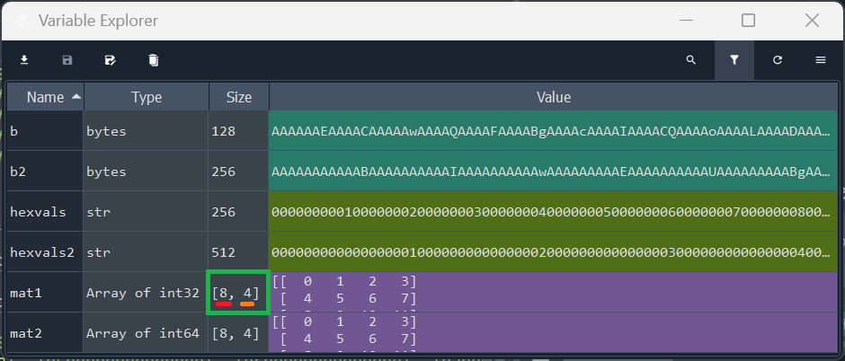
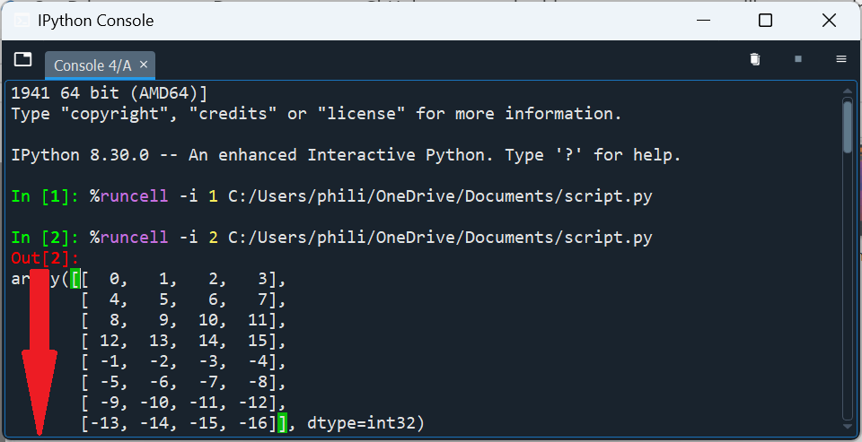
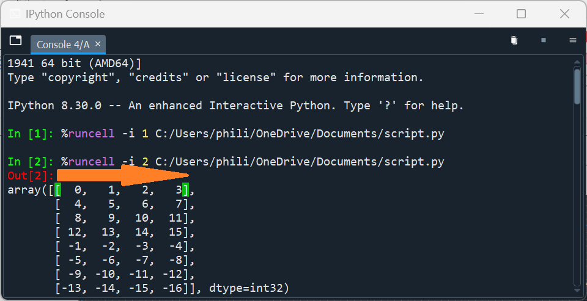

# numpy

`numpy` is the Numeric Python library.

## builtins classes recap

Previously classes that followed a numeric design pattern such as `int`, `float` and `bool` were examined alongside classes that followed a `Collection` design pattern such as `tuple`, `list` and `str`. Both design patterns were based upon an `object` as the `object` is the base class for everything in Python. 

The `+` operator performs numeric addition for a number and concatenation for a `Collection`:

```python
In [1]: num1 = 1
      : num2 = 2
      : num1 + num2
Out[1]: 3

In [2]: fruits1 = ['apples', 'bananas', 'cabbage']
      : fruits2 = ['dates', 'elderberry', 'fig']
      : fruits1 + fruits2
Out[2]: ['apples', 'bananas', 'cabbage', 'dates', 'elderberry', 'fig']
```

Sometimes it is desirable to perform addition of numbers in two equally sized `Collection` instances. Using `+` will perform concatenation:

```python
In [3]: nums1 = [1, 2, 3] 
      : nums2 = [4, 5, 6]
      : nums1 + nums2
Out[3]: [1, 2, 3, 4, 5, 6]
```

Numeric addition can be carried out using a for loop:

```python
In [4]: result = []
      : for index in range(nums1):
      :     result.append(nums1[index] + nums2[index])
      : result
Out[4]: [5, 7, 9]      
```

This can be simplified slightly using a `list` comprehension and `zip`:

```python
In [5]: [num1 + num2 for num1, num2 in zip(nums1, nums2)]
Out[5]: [5, 7, 9]
```

This can also be done with a scalar:

```python
In [6]: [num1 + 1 for num1 in nums1]
Out[6]: [2, 3, 4]
```

However looping becomes more complicated and less readible for higher dimensional numeric data.

## Library Overview and Imports

`numpy` is typically imported as the abbreviated alias `np`:

```python
In [7]: import numpy as np
```

`numpy` is a third-party library and the data model attribute `__version__` gives the version of the numpy library. This has the form `major.minor.patch` and the major version should be version `2`:

```python
In [8]: np.__version__
Out[8]: '2.1.3'
```

Version `2` made substantial changes to the `np` namespace and `np.ndarray` namespace removing a large number of identifiers that had duplicate names or outdated functionality, making it much more user-friendly to navigate through.

The identifiers of the `np` library can be examined:

```python
In [9]: np.
# NumPy Identifiers

# 🔢 Class:
#     - ndarray                    : n-dimensional array, the core structure of NumPy.

# 🏷️ Data Types:
#     - int8                       : 8-bit signed integer (-128 to 127).
#     - int16                      : 16-bit signed integer (-32768 to 32767).
#     - int32                      : 32-bit signed integer (-2147483648 to 2147483647).
#     - int64                      : 64-bit signed integer (-9223372036854775808 to 9223372036854775807).
#     - uint8                      : 8-bit unsigned integer (0 to 255).
#     - uint16                     : 16-bit unsigned integer (0 to 65535).
#     - uint32                     : 32-bit unsigned integer (0 to 4294967295).
#     - uint64                     : 64-bit unsigned integer (0 to 18446744073709551615).
#     - float16                    : Half precision float (16-bit).
#     - float32                    : Single precision float (32-bit).
#     - float64                    : Double precision float (64-bit).
#     - complex64                  : Complex number represented by two 32-bit floats (real and imaginary).
#     - complex128                 : Complex number represented by two 64-bit floats.
#     - bool_                      : Boolean type (True or False).
#     - str_                       : Unicode string type (variable length).
#     - bytes_                     : Byte string type (variable length).
#     - object_                    : object type.
#     - datetime64                 : Type representing dates and times.
#     - timedelta64                : Represents differences in datetime64 objects.

# ➕ Array Creation:
#     - array                     : Creates an array from a list or another array-like object.
#     - frombuffer                : Creates an array from a buffer (bytes or bytearray).
#     - asarray                   : Converts an input to an array, without copying if possible.
#     - empty                     : Creates an uninitialized array of given shape.
#     - empty_like                : Returns a new array with the same shape and type as a given array, but 
#                                   without any data.
#     - zeros                     : Creates an array filled with zeros.
#     - zeros_like                : Returns a new array filled with zeros, with the same shape as a given 
#                                   array.
#     - ones                      : Creates an array filled with ones.
#     - ones_like                 : Returns a new array filled with ones, with the same shape as a given array.
#     - full                      : Creates an array filled with a specified value.
#     - full_like                 : Returns a new array filled with a specified value, with the same shape as 
#                                   a given array.
#     - arange                    : Creates an array of evenly spaced values within a given interval.
#     - linspace                  : Generates evenly spaced numbers over a specified interval.
#     - logspace                  : Returns numbers spaced evenly on a log scale.
#     - ogrid                     : Provides an open multi-dimensional grid.
#     - mgrid                     : Provides a dense multi-dimensional "meshgrid."
#     - meshgrid                  : Generates coordinate matrices from coordinate vectors.
#     - indices                   : Returns an array with the indices of a grid.
#     - eye                       : Creates a 2D array with ones on the diagonal (identity matrix).
#     - identity                  : Returns the identity array.
#     - diag                      : Returns a square matrix with the specified diagonal and zeros elsewhere.

# 📈 Array Manipulation:
#     - diagonal                  : Returns the diagonal of the ndarray.
#     - reshape                   : Reshapes an array without changing its data.
#     - transpose                 : Permutes the axes of an array.
#     - flatten                   : Returns a flattened copy of an array.
#     - ravel                     : Flattens an array into 1D.
#     - shares_memory             : Checks if two arrays share the same memory block.
#     - concatenate               : Joins arrays along an axis.
#     - repeat                    : Repeats elements of the ndarray.
#     - tile                      : Constructs an array by repeating the input array a specified number 
#                                   of times along each axis.
#     - stack                     : Joins a sequence of arrays along a new axis.
#     - hstack                    : Stacks arrays in sequence horizontally (column-wise).
#     - vstack                    : Stacks arrays in sequence vertically (row-wise).
#     - dstack                    : Stacks arrays in sequence depth-wise (along the third axis).
#     - split                     : Splits an array into multiple sub-arrays.
#     - hsplit                    : Splits an array into multiple sub-arrays horizontally (column-wise).
#     - vsplit                    : Splits an array into multiple sub-arrays vertically (row-wise).
#     - dsplit                    : Splits an array into multiple sub-arrays along the third axis (depth-wise).
#     - pad                       : Pads an array with values.
#     - swapaxes                  : Interchanges two axes of an array.
#     - moveaxis                  : Moves axes to new positions.
#     - squeeze                   : Removes single-dimensional entries from the shape of an array.
#     - expand_dims               : Expands the shape of an array.
#     - take                      : Selects elements from the ndarray based on indices.
#     - take_along_axis           : Selects elements from an array along an axis using an array of indices.
#     - compress                  : Selects elements using a condition mask.
#     - insert                    : Inserts values into an array at specified indices along an axis.
#     - flip                      : Reverses the order of elements along all or specified axes.
#     - fliplr                    : Reverses the order of elements along the left-right axis (columns) in a 2D array.
#     - flipud                    : Reverses the order of elements along the up-down axis (rows) in a 2D array.

# 🔢 Sorting Functions:
#     - argmin                     : Returns the indices of the minimum values along an axis.
#     - argmax                     : Returns the indices of the maximum values along an axis.
#     - nonzero                    : Returns the indices of the non-zero elements.
#     - sort                       : Returns a sorted copy of an array.
#     - argsort                    : Returns the indices that would sort an array.
#     - searchsorted               : Finds indices where elements should be inserted to maintain order.
#     - count_nonzero              : Counts the number of non-zero elements in an array.

# 🔗 Broadcasting and Vectorization
#     - broadcast                   : Produces an object that mimics broadcasting.
#     - broadcast_to                : Broadcasts an array to a new shape.
#     - vectorize                   : Vectorizes a function to apply element-wise on arrays.
#     - apply_along_axis            : Applies a function along a specific axis of an array.

# 📊 Mathematical Functions:
#     - sqrt                      : Element-wise square root.
#     - exp                       : Element-wise exponential (e^x).
#     - log                       : Natural logarithm (base e).
#     - log10                     : Base-10 logarithm.
#     - sin                       : Trigonometric sine function.
#     - cos                       : Trigonometric cosine function.
#     - tan                       : Trigonometric tangent function.
#     - arcsin                    : Inverse sine function.
#     - arccos                    : Inverse cosine function.
#     - arctan                    : Inverse tangent function.
#     - deg2rad                   : Converts degrees to radians.
#     - rad2deg                   : Converts radians to degrees.
#     - prod                      : Returns the product array elements.
#     - cumprod                   : Cumulative product of array elements.
#     - cumsum                    : Cumulative sum of array elements.

# 📊 Statistical Functions:
#     - min                       : Returns the minimum value along a given axis.
#     - max                       : Returns the maximum value along a given axis.
#     - all                       : Checks if all elements are True along the specified axis.
#     - any                       : Checks if any elements are True along the specified axis.
#     - sum                       : Returns the sum of ndarray elements along the specified axis.

#     - mean                      : Computes the arithmetic mean along the specified axis.
#     - var                       : Computes the variance along the specified axis.
#     - std                       : Computes the standard deviation along the specified axis.
#     - ptp                       : Peak-to-peak (max - min) value along an axis.

#     - median                    : Computes the median along the specified axis.
#     - average                   : Computes the weighted average.
#     - quantile                  : Computes the q-th quantile of the data along the specified axis.
#     - histogram                 : Computes the histogram of a set of data.
#     - bincount                  : Counts the number of occurrences of each value in a 1D array.
#     - corrcoef                  : Computes the Pearson correlation coefficients.
#     - cov                       : Computes the covariance matrix.

# 🔗 Supplementary Numerical Identifiers
#     - round                      : Rounds the ndarray elements to the given number of decimals.
#     - astype                     : Converts the ndarray to a different data type.
#     - clip                       : Limits the values in the ndarray to a given range.
#     - choose                     : Constructs an ndarray by selecting elements from a sequence of ndarrays.
#     - diff                       : Returns the difference of ndarray elements along the specified axis.
#     - signbit                    : Returns True for negative values.
#     - isfinite                   : Returns True for finite elements.
#     - isinf                      : Returns True for infinite elements.
#     - isnan                      : Returns True for NaN elements.
#     - isin                       : Tests whether elements in an array are contained in another array.
#     - isreal                     : Returns True for real elements in the array.
#     - iscomplex                  : Returns True for complex elements in the array.
#     - isrealobj                  : Checks if the array is entirely real (no imaginary parts).
#     - iscomplexobj               : Checks if the array is entirely complex.            : Returns True for negative values.

# 📦 Set Operations:
#     - unique                    : Finds the unique elements of an array.
#     - union1d                   : Computes the union of two arrays.
#     - intersect1d               : Computes the intersection of two arrays.
#     - setdiff1d                 : Computes the set difference of two arrays.
#     - setxor1d                  : Computes the exclusive or of two arrays.

# 🎲 Random Number Generation
#     - random.seed                 : Sets the seed for the random number generator.
#     - random.rand                 : Generates random numbers in a uniform distribution over [0,1].
#     - random.randn                : Generates random numbers in a standard normal distribution.
#     - random.randint              : Generates random integers within a specified range.
#     - random.random_sample        : Returns random floats in the half-open interval [0.0, 1.0).
#     - random.choice               : Generates a random sample from a given array.
#     - random.shuffle              : Randomly shuffles an array.

# 🧮 Linear Algebra
#     - dot                         : Dot product of two arrays.
#     - inner                       : Inner product of two arrays.
#     - outer                       : Outer product of two arrays.
#     - matmul                      : Matrix product of two arrays.
#     - linalg.inv                  : Computes the inverse of a matrix.
#     - linalg.eig                  : Computes the eigenvalues and eigenvectors of a matrix.
#     - linalg.svd                  : Singular Value Decomposition.
#     - linalg.qr                   : QR decomposition.
#     - linalg.det                  : Determinant of a matrix.
#     - linalg.norm                 : Matrix or vector norm.

# 📁 Data I/O
#     - load                        : Loads arrays from files.
#     - save                        : Saves an array to a file.
#     - savetxt                     : Saves an array to a text file.
#     - loadtxt                     : Loads data from a text file.
#     - genfromtxt                  : Loads data from a text file, with missing values handled.
```

The `numpy` library revolves around the `ndarray` class:

```python
In [9]: np.ndarray.
# 🔗 Object Identifiers
#     - __doc__                    : Documentation string of the ndarray object.
#     - __class__                  : The class/type of the ndarray object.
#     - __dir__                    : Returns the list of valid attributes for the ndarray object.
#     - __sizeof__                 : Returns the size of the ndarray object in memory (in bytes).
#     - __format__                 : Defines how the ndarray object should be formatted when using the format() function.
#     - __new__                    : Used to create a new instance of the ndarray object.
#     - __init__                   : Initializes the newly created ndarray object.
#     - __repr__                   : Defines how the ndarray object is represented (for developers).
#     - __str__                    : Defines how the ndarray object is converted to a string (for users).
#     - __eq__                     : Equality comparison (==).
#     - __ne__                     : Inequality comparison (!=).
#     - __ge__                     : Greater than or equal to comparison (>=).
#     - __le__                     : Less than or equal to comparison (<=).
#     - __gt__                     : Greater than comparison (>).
#     - __lt__                     : Less than comparison (<).
#     - __hash__                   : Returns the hash value of the ndarray object, used for sets and dictionaries.
#     - __getattribute__           : Called to retrieve an attribute of the ndarray object.
#     - __setattr__                : Called to set an attribute of the ndarray object.
#     - __delattr__                : Called to delete an attribute of the ndarray object.
#     - __getstate__               : Gets the current state of the ndarray for pickling.
#     - __reduce__                 : Provides data for serialization with pickle.
#     - __reduce_ex__              : Similar to __reduce__, but with protocol-specific details for pickling.
#     - __getnewargs__             : Provides additional arguments needed when unpickling the ndarray object.
#     - __init_subclass__          : Called when a subclass of ndarray is created.
#     - __subclasshook__           : Defines custom behavior for determining class inheritance.

# 🔗 Casting Identifiers
#     - tolist                     : Converts the ndarray to a nested list.
#     - tobytes                    : Converts the ndarray to a bytes string.

# 🔗 Collection Identifiers
#     - __getitem__                : Allows indexing (obj[index]).
#     - __setitem__                : Allows setting an item (obj[index] = value).
#     - __iter__                   : Returns an iterator for the ndarray.
#     - __len__                    : Returns the length of the ndarray.
#     - __contains__               : Checks if an item is in the ndarray (in operator).
#     - copy                       : Returns a shallow copy of the ndarray.

# 🔗 Supplementary Collection Identifiers
#     - ndim                       : The number of dimensions of the ndarray.
#     - shape                      : The shape of the ndarray.
#     - size                       : The number of elements in the ndarray.
#     - itemsize                   : The size of one array element in bytes.
#     - nbytes                     : The total number of bytes consumed by the ndarray.
#     - T                          : The transpose of a 2D ndarray.
#     - flat                       : The flattened iterator of the ndarray.
#     - diagonal                   : Returns the diagonal of the ndarray.
#     - reshape                    : Changes the shape of the ndarray without altering data.
#     - flatten                    : Flattens the ndarray into a 1D array.
#     - ravel                      : Returns a flattened view of the ndarray.
#     - transpose                  : Permutes the axes of the ndarray.
#     - swapaxes                   : Interchanges two axes of the ndarray.
#     - item                       : Copies a single element from the ndarray.
#     - repeat                     : Repeats elements of the ndarray.
#     - squeeze                    : Removes single-dimensional entries from the shape.
#     - take                       : Selects elements from the ndarray based on indices.
#     - fill                       : Fills the ndarray with a scalar value.
#     - compress                   : Selects elements using a condition mask.

# 🔗 Sorting, Searching, and Counting
#     - argmin                     : Returns the indices of the minimum values along an axis.
#     - argmax                     : Returns the indices of the maximum values along an axis.
#     - nonzero                    : Returns the indices of the non-zero elements.
#     - sort                       : Sorts the ndarray along the specified axis.
#     - argsort                    : Returns the indices that would sort the ndarray.
#     - searchsorted               : Finds indices where elements should be inserted to maintain order.

# 🔗 Numeric Identifiers
#     - __abs__                    : Returns the absolute value of the ndarray object.
#     - __pos__                    : Unary plus (+) for the ndarray object.
#     - __neg__                    : Unary minus (-) for the ndarray object.
#     - __add__                    : Addition operation (+).
#     - __sub__                    : Subtraction operation (-).
#     - __mul__                    : Multiplication operation (*).
#     - __pow__                    : Power operation (**).
#     - __floordiv__               : Floor division (//).
#     - __mod__                    : Modulus operation (%).
#     - __divmod__                 : Division and modulus together (divmod()).
#     - __truediv__                : True division (/).
#     - __radd__                   : Reverse addition (right-hand side).
#     - __rsub__                   : Reverse subtraction.
#     - __rmul__                   : Reverse multiplication.
#     - __rpow__                   : Reverse power operation.
#     - __rfloordiv__              : Reverse floor division.
#     - __rmod__                   : Reverse modulus.
#     - __rdivmod__                : Reverse division and modulus together.
#     - __rtruediv__               : Reverse true division.
#     - real                       : The real part of a complex ndarray.
#     - imag                       : The imaginary part of a complex ndarray.
#     - conjugate                  : The complex conjugate of the ndarray.

# 🔗 Bitwise Identifiers
#     - __and__                    : Bitwise and.
#     - __or__                     : Bitwise or.
#     - __xor__                    : Bitwise xor.
#     - __invert__                 : Bitwise not.
#     - __lshift__                 : Bitwise left shift.
#     - __rshift__                 : Bitwise right shift.

# 📊 Mathematical Functions:
#     - prod                      : Returns the product array elements.
#     - cumprod                   : Cumulative product of array elements.
#     - cumsum                    : Cumulative sum of array elements.

# 📊 Statistical Functions:
#     - min                       : Returns the minimum value along a given axis.
#     - max                       : Returns the maximum value along a given axis.
#     - all                       : Checks if all elements are True along the specified axis.
#     - any                       : Checks if any elements are True along the specified axis.
#     - sum                       : Returns the sum of ndarray elements along the specified axis.

#     - mean                      : Computes the arithmetic mean along the specified axis.
#     - var                       : Computes the variance along the specified axis.
#     - std                       : Computes the standard deviation along the specified axis.
#     - ptp                       : Peak-to-peak (max - min) value along an axis.


# 🔗 Supplementary Numerical Identifiers
#     - round                      : Rounds the ndarray elements to the given number of decimals.
#     - astype                     : Converts the ndarray to a different data type.
#     - clip                       : Limits the values in the ndarray to a given range.
#     - all                        : Checks if all elements are True along the specified axis.
#     - any                        : Checks if any elements are True along the specified axis.
#     - prod                       : Returns the product of ndarray elements along the specified axis.
#     - cumprod                    : Returns the cumulative product of ndarray elements.
#     - cumsum                     : Returns the cumulative sum of ndarray elements.
#     - choose                     : Constructs an ndarray by selecting elements from a sequence of ndarrays.

# 🧮 Linear Algebra
#     - dot                         : Dot product of two arrays.
#     - __matmul__                  : Matrix product of two arrays.
```

Notice that the `ndarray`, like everything in Python follows an `object` design pattern. Notice also that the `ndarray` follows a numeric design pattern and a `Collection`-like design pattern. Most of the methods in the `ndarray` are immutable however a handful of the methods are mutable, behaving consistently to their design pattern.

The methods `__setitem__ ` and `sort` follow the design pattern of a `MutableSequence` and are mutable, like in a `list`. 

`resize` is the mutable counterpart to `reshape` and resizes an `ndarray` in place.

`fill` is also mutable and fills in an `ndarray` in place with a fill value.

```python
In [9]: exit
```

## Buffer and Datatypes

The `ndarray` can be instantiated from a buffer, typically a `bytes` instance:

```python
In [1]: import numpy as np
      : hexvals = ['00000000', '01000000', '02000000', '03000000',
      :            '04000000', '05000000', '06000000', '07000000',
      :            '08000000', '09000000', '0a000000', '0b000000',
      :            '0c000000', '0d000000', '0e000000', '0f000000',
      :            'ffffffff', 'feffffff', 'fdffffff', 'fcffffff',
      :            'fbffffff', 'faffffff', 'f9ffffff', 'f8ffffff',
      :            'f7ffffff', 'f6ffffff', 'f5ffffff', 'f4ffffff',
      :            'f3ffffff', 'f2ffffff', 'f1ffffff', 'f0ffffff']
      :
      : hexvals = ''.join(hexvals)
      : b = bytes.fromhex(hexvals)
```

<table style="width: 65%; border-collapse: collapse; font-family: sans-serif; background-color: #1e1e1e; color: #d4d4d4;">
  <tr>
    <th colspan="4" style="text-align:center; padding: 8px; background-color: #2d2d30; color: #ffffff;">Variable Explorer</th>
  </tr>
  <tr>
    <th style="padding: 8px; background-color: #252526; color: #ffffff;">Name ▲</th>
    <th style="padding: 8px; background-color: #252526; color: #ffffff;">Type</th>
    <th style="padding: 8px; background-color: #252526; color: #ffffff;">Size</th>
    <th style="padding: 8px; background-color: #252526; color: #ffffff;">Value</th>
  </tr>
  <tr>
    <td style="padding: 8px; background-color: #1e1e1e;">hexvals</td>
    <td style="padding: 8px; background-color: #1e1e1e;">str</td>
    <td style="padding: 8px; background-color: #1e1e1e;">256</td>
    <td style="padding: 8px; background-color: #506E16; color: #ffffff;">000000000100000002000000030000000400000005000000060000000700000008000000090000000a0000000b0000000c0000000d0000000e0000000f000000fffffffffefffffffdfffffffcfffffffbfffffffafffffff9fffffff8fffffff7fffffff6fffffff5fffffff4fffffff3fffffff2fffffff1fffffff0ffffff</td> <!-- Updated background color for strings -->
  </tr>
  <tr>
    <td style="padding: 8px; background-color: #252526;">b</td>
    <td style="padding: 8px; background-color: #252526;">bytes</td>
    <td style="padding: 8px; background-color: #252526;">128</td>
    <td style="padding: 8px; background-color: #148F77; color: #ffffff;">b'\x00\x00\x00\x00\x01\x00\x00\x00\x02\x00\x00\x00\x03\x00\x00\x00\x04\x00\x00\x00\x05\x00\x00\x00\x06\x00\x00\x00\x07\x00\x00\x00\x08\x00\x00\x00\t\x00\x00\x00\n\x00\x00\x00\x0b\x00\x00\x00\x0c\x00\x00\x00\r\x00\x00\x00\x0e\x00\x00\x00\x0f\x00\x00\x00\xff\xff\xff\xff\xfe\xff\xff\xff\xfd\xff\xff\xff\xfc\xff\xff\xff\xfb\xff\xff\xff\xfa\xff\xff\xff\xf9\xff\xff\xff\xf8\xff\xff\xff\xf7\xff\xff\xff\xf6\xff\xff\xff\xf5\xff\xff\xff\xf4\xff\xff\xff\xf3\xff\xff\xff\xf2\xff\xff\xff\xf1\xff\xff\xff\xf0\xff\xff\xff'</td> <!-- Different background color for bytes -->
  </tr>
</table>

Note that this `bytes` instance is little endian. An `ndarray` can be instantiated by specifying the `shape` as a `tuple`, `dtype` (datatype) and `buffer`. In this case, the shape is `(8, 4)` which means 8 rows by 4 columns. The datatype is `np.int32`, which means 32 bit signed integers. As there are 8 bits in a byte, this means 4 bytes are used to represent each integer in memory. The first half of the numbers in the 4 byte sequence represent positive numbers and the second half of the numbers are used to represent negative numbers:

```python
In [2]: np.ndarray(shape=(8, 4), dtype=np.int32, buffer=b)
Out[2]:
array([[  0,   1,   2,   3],
       [  4,   5,   6,   7],
       [  8,   9,  10,  11],
       [ 12,  13,  14,  15],
       [ -1,  -2,  -3,  -4],
       [ -5,  -6,  -7,  -8],
       [ -9, -10, -11, -12],
       [-13, -14, -15, -16]], dtype=int32)
```

The datatype `np.uint32`, means 32 bit unsigned integers and each number is positive. The first half of the bytes in the 4 byte sequence are consistent between `np.uint32` and `np.int32` and give the same integers. The bytes in the second half of the bytes sequence differ, giving large positive values for `uint32`:

```python
In [3]: np.ndarray(shape=(8, 4), dtype=np.uint32, buffer=b)
Out[3]: 
array([[         0,          1,          2,          3],
       [         4,          5,          6,          7],
       [         8,          9,         10,         11],
       [        12,         13,         14,         15],
       [4294967295, 4294967294, 4294967293, 4294967292],
       [4294967291, 4294967290, 4294967289, 4294967288],
       [4294967287, 4294967286, 4294967285, 4294967284],
       [4294967283, 4294967282, 4294967281, 4294967280]], dtype=uint32)
```

A second `bytes` instance `b2` can be instantiated:

```python
In [4]: hexvals2 = ['0000000000000000', '0100000000000000', '0200000000000000', '0300000000000000',
      :             '0400000000000000', '0500000000000000', '0600000000000000', '0700000000000000',
      :             '0800000000000000', '0900000000000000', '0a00000000000000', '0b00000000000000',
      :             '0c00000000000000', '0d00000000000000', '0e00000000000000', '0f00000000000000',
      :             'ffffffffffffffff', 'feffffffffffffff', 'fdffffffffffffff', 'fcffffffffffffff',
      :             'fbffffffffffffff', 'faffffffffffffff', 'f9ffffffffffffff', 'f8ffffffffffffff',
      :             'f7ffffffffffffff', 'f6ffffffffffffff', 'f5ffffffffffffff', 'f4ffffffffffffff',
      :             'f3ffffffffffffff', 'f2ffffffffffffff', 'f1ffffffffffffff', 'f0ffffffffffffff']
      : hexvals2 = ''.join(hexvals2)
      : b2 = bytes.fromhex(hexvals2)
```

<table style="width: 65%; border-collapse: collapse; font-family: sans-serif; background-color: #1e1e1e; color: #d4d4d4;">
  <tr>
    <th colspan="4" style="text-align:center; padding: 8px; background-color: #2d2d30; color: #ffffff;">Variable Explorer</th>
  </tr>
  <tr>
    <th style="padding: 8px; background-color: #252526; color: #ffffff;">Name ▲</th>
    <th style="padding: 8px; background-color: #252526; color: #ffffff;">Type</th>
    <th style="padding: 8px; background-color: #252526; color: #ffffff;">Size</th>
    <th style="padding: 8px; background-color: #252526; color: #ffffff;">Value</th>
  </tr>
  <tr>
    <td style="padding: 8px; background-color: #1e1e1e;">hexvals2</td>
    <td style="padding: 8px; background-color: #1e1e1e;">str</td>
    <td style="padding: 8px; background-color: #1e1e1e;">512</td>
    <td style="padding: 8px; background-color: #506E16; color: #ffffff;">00000000000000000100000000000000020000000000000003000000000000000400000000000000050000000000000006000000000000000700000000000000080000000000000009000000000000000a000000000000000b000000000000000c000000000000000d000000000000000e000000000000000f00000000000000fffffffffffffffffefffffffffffffffdfffffffffffffffcfffffffffffffffbfffffffffffffffafffffffffffffff9fffffffffffffff8fffffffffffffff7fffffffffffffff6fffffffffffffff5fffffffffffffff4fffffffffffffff3fffffffffffffff2fffffffffffffff1fffffffffffffff0ffffffffffffff</td> <!-- Updated background color for strings -->
  </tr>
  <tr>
    <td style="padding: 8px; background-color: #252526;">b2</td>
    <td style="padding: 8px; background-color: #252526;">bytes</td>
    <td style="padding: 8px; background-color: #252526;">256</td>
    <td style="padding: 8px; background-color: #148F77; color: #ffffff;">b'\x00\x00\x00\x00\x00\x00\x00\x00\x01\x00\x00\x00\x00\x00\x00\x00\x02\x00\x00\x00\x00\x00\x00\x00\x03\x00\x00\x00\x00\x00\x00\x00\x04\x00\x00\x00\x00\x00\x00\x00\x05\x00\x00\x00\x00\x00\x00\x00\x06\x00\x00\x00\x00\x00\x00\x00\x07\x00\x00\x00\x00\x00\x00\x00\x08\x00\x00\x00\x00\x00\x00\x00\t\x00\x00\x00\x00\x00\x00\x00\n\x00\x00\x00\x00\x00\x00\x00\x0b\x00\x00\x00\x00\x00\x00\x00\x0c\x00\x00\x00\x00\x00\x00\x00\r\x00\x00\x00\x00\x00\x00\x00\x0e\x00\x00\x00\x00\x00\x00\x00\x0f\x00\x00\x00\x00\x00\x00\x00\xff\xff\xff\xff\xff\xff\xff\xff\xfe\xff\xff\xff\xff\xff\xff\xff\xfd\xff\xff\xff\xff\xff\xff\xff\xfc\xff\xff\xff\xff\xff\xff\xff\xfb\xff\xff\xff\xff\xff\xff\xff\xfa\xff\xff\xff\xff\xff\xff\xff\xf9\xff\xff\xff\xff\xff\xff\xff\xf8\xff\xff\xff\xff\xff\xff\xff\xf7\xff\xff\xff\xff\xff\xff\xff\xf6\xff\xff\xff\xff\xff\xff\xff\xf5\xff\xff\xff\xff\xff\xff\xff\xf4\xff\xff\xff\xff\xff\xff\xff\xf3\xff\xff\xff\xff\xff\xff\xff\xf2\xff\xff\xff\xff\xff\xff\xff\xf1\xff\xff\xff\xff\xff\xff\xff\xf0\xff\xff\xff\xff\xff\xff\xff'</td> <!-- Different background color for bytes -->
  </tr>
</table>

This `bytes` instance can be used to instantiate an `ndarray` using `np.int64` and `np.unint64`:

```python
In [5]: np.ndarray(shape=(8, 4), dtype=np.int64, buffer=b2)
Out[5]:
array([[  0,   1,   2,   3],
       [  4,   5,   6,   7],
       [  8,   9,  10,  11],
       [ 12,  13,  14,  15],
       [ -1,  -2,  -3,  -4],
       [ -5,  -6,  -7,  -8],
       [ -9, -10, -11, -12],
       [-13, -14, -15, -16]])

In [6]: np.ndarray(shape=(8, 4), dtype=np.uint64, buffer=b2)
Out[6]:
array([[                   0,                    1,                    2,                    3],
       [                   4,                    5,                    6,                    7],
       [                   8,                    9,                   10,                   11],
       [                  12,                   13,                   14,                   15],
       [18446744073709551615, 18446744073709551614, 18446744073709551613, 18446744073709551612],
       [18446744073709551611, 18446744073709551610, 18446744073709551609, 18446744073709551608],
       [18446744073709551607, 18446744073709551606, 18446744073709551605, 18446744073709551604],
       [18446744073709551603, 18446744073709551602, 18446744073709551601, 18446744073709551600]], 
      dtype=uint64)     
```

`np.int64` is the Operating System default. `np.int_` and `int` are alias for `np.int64`.

```python
In [7]: np.ndarray(shape=(8, 4), dtype=int, buffer=b2)
Out[7]: 
array([[  0,   1,   2,   3],
       [  4,   5,   6,   7],
       [  8,   9,  10,  11],
       [ 12,  13,  14,  15],
       [ -1,  -2,  -3,  -4],
       [ -5,  -6,  -7,  -8],
       [ -9, -10, -11, -12],
       [-13, -14, -15, -16]])

In [8]: np.ndarray(shape=(8, 4), dtype=np.int_, buffer=b2)
Out[8]: 
array([[  0,   1,   2,   3],
       [  4,   5,   6,   7],
       [  8,   9,  10,  11],
       [ 12,  13,  14,  15],
       [ -1,  -2,  -3,  -4],
       [ -5,  -6,  -7,  -8],
       [ -9, -10, -11, -12],
       [-13, -14, -15, -16]])
```

## ndarray attributes

If the following ndarrays are instantiated:

```python
In [9]: mat1 = np.ndarray(shape=(8, 4), dtype=np.int32, buffer=b)
      : mat2 = np.ndarray(shape=(8, 4), dtype=np.int64, buffer=b2)
```

When the code is ran in the Spyder IDE:


The variable (`object` name) `mat1` displays in the Variable Explorer:


This variable `mat1` can be expanded:


`axis=0` for a 2d `ndarray` is the following axis, operating along the row axis:


`axis=1` for a 2d `ndarray` is the following axis, operating along the column axis:


`mat1` has the following `shape` tuple:

>>> Note Spyder displays `[8, 4]` under the heading "Size". 
>>> Size is used in some `numpy` functions to indicate the number of elements in a 1d `ndarray` i.e. the `len` and the `shape` in a 2d `ndarray`.
>>> Note that the `ndarray` also has the attribute `size` which is the number of elements and equal to the `len` in the 1d `ndarray` or product of the dimensions in `shape`. 
>>> Spyder displays the shape as `[8, 4]` opposed to `(8, 4)` which is generally preferred by `numpy`.



When viewed in the IPython console, `axis=0` can be understood to be the outer axis:



`axis=1` can be understood to be the inner axis:



If the `shape` tuple is examined, `8` can be understood to be the number of rows along `axis=0` and `4` can be understood to be the number of columns along `axis=1`:


The `shape` tuple has been conceptualised from left to right as:

```
→0→1→
(8, 4)
```

Instead it can be conceptualised right to left as:

```
←-2←-1
(8, 4)
```

In the expanded view, the index order can be changed:


Unfortunately Spyder doesn't display the negative indexes, when this is selected:


For clarity the positive and negative indexes are shown side by side:


The positive index (left to right) of the `axis` in the `shape` tuple that corresponds to columns increments as the dimensionality of the `ndarray` increments because the outer dimensions always take `axis=0`. For a 1d `ndarray` known as a vector the columns are `axis=0`, for a 2d `ndarray` known as a matrix the columsn are `axis=1`, for a 3d `ndarray` known as a book the columns are `axis=2`.

The negative index (right to left) of the `axis` in the `shape` tuple that corresponds to columns always remains the same `axis=-1`. 
Higher dimensional `ndarray` instances will be explored in more detail later.

The `ndarray` attributes can be examined.

`ndim` is the number of dimensions of the `ndarray`:

```python
In [10]: mat1.ndim 
Out[10]: 2
```

`shape` is the shape `tuple` of the `ndarray`:

```python
In [11]: mat1.shape
Out[11]: (8, 4)
```

The `builtins` function `len` returns the length of the first axis:

```python
In [12]: len(mat1)
Out[12]: 8
```

This can be better understood when the `ndarray` is cast into a `list` of nested `list` instances:

```python
In [13]: mat1.tolist()
Out[13]: 
[[0, 1, 2, 3],
 [4, 5, 6, 7],
 [8, 9, 10, 11],
 [12, 13, 14, 15],
 [-1, -2, -3, -4],
 [-5, -6, -7, -8],
 [-9, -10, -11, -12],
 [-13, -14, -15, -16]]
```

The length of this outer `list` is `8`.

`size` is the `size` (number of numeric elements) in the `ndarray`:

```python
In [14]: mat1.size
Out[14]: 32
```

`itemsize` is the memory size (in bytes) of one element in the `ndarray`:

```python
In [15]: mat1.itemsize
Out[15]: 4

In [16]: mat2.itemsize
Out[16]: 8
```

`nbytes` is the total memory size of all the elements in the `ndarray`:

```python
In [16]: mat1.nbytes
Out[16]: 128

In [17]: mat2.nbytes
Out[17]: 256
```

`dtype` is the datatype of the `ndarray`:

```python
In [18]: mat1.dtype
Out[18]: dtype('int32')

In [19]: mat2.dtype
Out[19]: dtype('int64')
```

The `ndarray` can be cast into a `bytes` buffer using the method `tobytes`:

```python
In [20]: mat1.tobytes()
Out[20]:
b'\x00\x00\x00\x00\x01\x00\x00\x00\x02\x00\x00\x00\x03\x00\x00\x00\x04\x00\x00\x00\x05\x00\x00\x00\x06\x00\x00\x00\x07\x00\x00\x00\x08\x00\x00\x00\t\x00\x00\x00\n\x00\x00\x00\x0b\x00\x00\x00\x0c\x00\x00\x00\r\x00\x00\x00\x0e\x00\x00\x00\x0f\x00\x00\x00\xff\xff\xff\xff\xfe\xff\xff\xff\xfd\xff\xff\xff\xfc\xff\xff\xff\xfb\xff\xff\xff\xfa\xff\xff\xff\xf9\xff\xff\xff\xf8\xff\xff\xff\xf7\xff\xff\xff\xf6\xff\xff\xff\xf5\xff\xff\xff\xf4\xff\xff\xff\xf3\xff\xff\xff\xf2\xff\xff\xff\xf1\xff\xff\xff\xf0\xff\xff\xff'
```

Notice this is the same as `b` which was used to instantiate the `ndarray`.

The `ndarray` has the informal `str` representation:

```python
In [21]: str(mat1)
Out[21]: '[[  0   1   2   3]\n [  4   5   6   7]\n [  8   9  10  11]\n [ 12  13  14  15]\n [ -1  -2  -3  -4]\n [ -5  -6  -7  -8]\n [ -9 -10 -11 -12]\n [-13 -14 -15 -16]]'
```
When printed, this displays a `list` of `list` instances:

```python
In [22]: print(str(mat1))
[[  0   1   2   3]
 [  4   5   6   7]
 [  8   9  10  11]
 [ 12  13  14  15]
 [ -1  -2  -3  -4]
 [ -5  -6  -7  -8]
 [ -9 -10 -11 -12]
 [-13 -14 -15 -16]]
```

The `ndarray` also has a formal `str` representation:

```python
In [23]: repr(mat1)
Out[23]: 'array([[  0,   1,   2,   3],\n       [  4,   5,   6,   7],\n       [  8,   9,  10,  11],\n       [ 12,  13,  14,  15],\n       [ -1,  -2,  -3,  -4],\n       [ -5,  -6,  -7,  -8],\n       [ -9, -10, -11, -12],\n       [-13, -14, -15, -16]], dtype=int32)'
```

When printed, this displays the preferred way to instantiate an `ndarray`:

```python
In [24]: print(repr(mat1))
array([[  0,   1,   2,   3],
       [  4,   5,   6,   7],
       [  8,   9,  10,  11],
       [ 12,  13,  14,  15],
       [ -1,  -2,  -3,  -4],
       [ -5,  -6,  -7,  -8],
       [ -9, -10, -11, -12],
       [-13, -14, -15, -16]], dtype=int32)
```

## ndarray creation functions

Notice the formal representation displays the `array` function, instead of the `ndarray` class. This is because the `array` function is more commonly used to instantiate an `ndarray` from an `object` such as a `list` of `list` instances opposed to the direct instantiation of an `ndarray` using a buffer. The docstring of the `ndarray` states that `ndarray` instances should be constructed using the `array` function of related functions:

```python
In [25]: np.ndarray:
Init signature: np.ndarray(self, /, *args, **kwargs)
Docstring:     
ndarray(shape, dtype=float, buffer=None, offset=0,
        strides=None, order=None)

An array object represents a multidimensional, homogeneous array
of fixed-size items.  An associated data-type object describes the
format of each element in the array (its byte-order, how many bytes it
occupies in memory, whether it is an integer, a floating point number,
or something else, etc.)

Arrays should be constructed using `array`, `zeros` or `empty` (refer
to the See Also section below).  The parameters given here refer to
a low-level method (`ndarray(...)`) for instantiating an array.
```

If the docstring of the `ndarray` function is examined:

```python
In [26]: np.array?
Docstring:
array(object, dtype=None, *, copy=True, order='K', subok=False, ndmin=0,
      like=None)

Create an array.

Parameters
----------
object : array_like
    An array, any object exposing the array interface, an object whose
    ``__array__`` method returns an array, or any (nested) sequence.
    If object is a scalar, a 0-dimensional array containing object is
    returned.
dtype : data-type, optional
    The desired data-type for the array. If not given, NumPy will try to use
    a default ``dtype`` that can represent the values (by applying promotion
    rules when necessary.)

See Also
--------
empty_like : Return an empty array with shape and type of input.
ones_like : Return an array of ones with shape and type of input.
zeros_like : Return an array of zeros with shape and type of input.
full_like : Return a new array with shape of input filled with value.
empty : Return a new uninitialized array.
ones : Return a new array setting values to one.
zeros : Return a new array setting values to zero.
full : Return a new array of given shape filled with value.
copy: Return an array copy of the given object.
```

An `ndarray` can be constructed using:

```python
In [27]: mat1 = np.array([[0, 1, 2, 3],
       :                  [4, 5, 6, 7],
       :                  [8, 9, 10, 11]])

In [28]: mat2 = np.array([[0., 1, 2, 3],
       :                  [4, 5, 6, 7],
       :                  [8, 9, 10, 11]])
```

Notice in the Variable Explorer that the datatypes of each `ndarray` is inferred from the supplied `object`:

<table style="width: 65%; border-collapse: collapse; font-family: sans-serif;">
  <tr>
    <th colspan="4" style="text-align:center; padding: 8px; background-color: #2d2d30; color: #ffffff;">Variable Explorer</th>
  </tr>  
  <tr>
    <td style="padding: 8px; background-color: #1e1e1e; color: #ffffff;">mat1</td>
    <td style="padding: 8px; background-color: #1e1e1e; color: #ffffff;">Array of int64</td>
    <td style="padding: 8px; background-color: #1e1e1e; color: #ffffff;">(3, 4)</td>
    <td style="padding: 8px; background-color: #705693; color: #ffffff;">[[ 0  1  2  3]<br>&nbsp;[ 4  5  6  7]<br>&nbsp;[ 8  9 10 11]]</td>
  </tr>
  <tr>
    <td style="padding: 8px; background-color: #1e1e1e; color: #ffffff;">mat2</td>
    <td style="padding: 8px; background-color: #1e1e1e; color: #ffffff;">Array of float64</td>
    <td style="padding: 8px; background-color: #1e1e1e; color: #ffffff;">(3, 4)</td>
    <td style="padding: 8px; background-color: #705693; color: #ffffff;">[[ 0.  1.  2.  3.]<br>&nbsp;[ 4.  5.  6.  7.]<br>&nbsp;[ 8.  9. 10. 11.]]</td>
  </tr>                  
</table>

```python
In [27]: mat3 = np.zeros(shape=(5, 2))
In [28]: mat4 = np.ones(shape=(2, 2))
In [29]: mat5 = np.full(shape=(3, 5), fill_value=2)
```

<table style="width: 65%; border-collapse: collapse; font-family: sans-serif;">
  <tr>
    <th colspan="4" style="text-align:center; padding: 8px; background-color: #2d2d30; color: #ffffff;">Variable Explorer</th>
  </tr>  
  <tr>
    <td style="padding: 8px; background-color: #1e1e1e; color: #ffffff;">mat3</td>
    <td style="padding: 8px; background-color: #1e1e1e; color: #ffffff;">Array of float64</td>
    <td style="padding: 8px; background-color: #1e1e1e; color: #ffffff;">(5, 2)</td>
    <td style="padding: 8px; background-color: #705693; color: #ffffff;">[[ 0.  0.]<br>&nbsp;[ 0.  0.]<br>&nbsp;[ 0.  0.]<br>&nbsp;[ 0.  0.]<br>&nbsp;[ 0.  0.]]</td>
  </tr> 
    <td style="padding: 8px; background-color: #1e1e1e; color: #ffffff;">mat4</td>
    <td style="padding: 8px; background-color: #1e1e1e; color: #ffffff;">Array of float64</td>
    <td style="padding: 8px; background-color: #1e1e1e; color: #ffffff;">(2, 2)</td>
    <td style="padding: 8px; background-color: #705693; color: #ffffff;">[[ 1.  1.]<br>&nbsp;[ 1.  1.]]</td>
  </tr>    
  <tr>
    <td style="padding: 8px; background-color: #1e1e1e; color: #ffffff;">mat5</td>
    <td style="padding: 8px; background-color: #1e1e1e; color: #ffffff;">Array of int64</td>
    <td style="padding: 8px; background-color: #1e1e1e; color: #ffffff;">(3, 5)</td>
    <td style="padding: 8px; background-color: #705693; color: #ffffff;">[[ 2  2  2  2  2]<br>&nbsp;[ 2  2  2  2  2]<br>&nbsp;[ 2  2  2  2  2]]</td>
  </tr>                  
</table>

Notice that `mat3` and `mat4` have the datatype `np.float64`, whereas `mat5` has the datatype `np.int64`:

```python
In [30]: mat3.dtype
Out[30]: dtype('float64')

In [31]: mat4.dtype
Out[31]: dtype('float64')

In [32]: mat5.dtype
Out[32]: dtype('int64')
```

The datatype for the `zeros` and `ones` function is `np.float64` by default however can be set to `np.int64` using the optional parameter `dtype`. The `full` function infers the datatype from the provided `fill_value`.

```python
In [33]: mat6 = np.zeros(shape=(2, 2), dtype=np.int64)
```

<table style="width: 65%; border-collapse: collapse; font-family: sans-serif;">
  <tr>
    <th colspan="4" style="text-align:center; padding: 8px; background-color: #2d2d30; color: #ffffff;">Variable Explorer</th>
  </tr>     
  <tr>
    <td style="padding: 8px; background-color: #1e1e1e; color: #ffffff;">mat6</td>
    <td style="padding: 8px; background-color: #1e1e1e; color: #ffffff;">Array of int64</td>
    <td style="padding: 8px; background-color: #1e1e1e; color: #ffffff;">(2, 2)</td>
    <td style="padding: 8px; background-color: #705693; color: #ffffff;">[[ 0  0]<br>&nbsp;[ 0  0]]</td>
  </tr>                  
</table>

So far only a 2 dimensional `ndarray` has been considered, which is known as a matrix. A 1 dimensional `ndarray`, known as a vector can be examined:

```python
In [34]: active = [0, 0, 0, 0, 0]
       : vec = np.zeros(shape=(5, ), dtype=np.int64)
```

Notice the shape only has 1 element in it. The vector is similar to a `list` and both of these display in the Variable Explorer:

<table style="width: 65%; border-collapse: collapse; font-family: sans-serif;">
  <tr>
    <th colspan="4" style="text-align:center; padding: 8px; background-color: #2d2d30; color: #ffffff;">Variable Explorer</th>
  </tr>     
  <tr>
    <td style="padding: 8px; background-color: #1e1e1e; color: #ffffff;">active</td>
    <td style="padding: 8px; background-color: #1e1e1e; color: #ffffff;">list</td>
    <td style="padding: 8px; background-color: #1e1e1e; color: #ffffff;">5</td>
    <td style="padding: 8px; background-color: #2C748E; color: #ffffff;">[0, 0, 0, 0, 0]</td>
  </tr>   
  <tr>
    <td style="padding: 8px; background-color: #1e1e1e; color: #ffffff;">vec</td>
    <td style="padding: 8px; background-color: #1e1e1e; color: #ffffff;">Array of int64</td>
    <td style="padding: 8px; background-color: #1e1e1e; color: #ffffff;">(5, )</td>
    <td style="padding: 8px; background-color: #705693; color: #ffffff;">[ 0  0  0  0  0]</td>
  </tr>                  
</table>

Each of these can be expanded. Notice because, the `list` can have a different datatype at each index, the `Type` and `Size` are explictly shown for each element:

<table style="width: 80%; border-collapse: collapse; font-family: sans-serif;">
  <tr>
    <th colspan="4" style="text-align:center; padding: 8px; background-color: #2d2d30; color: #ffffff;">active - list (5 elements)</th>
  </tr>
  <tr>
    <th style="padding: 8px; background-color: #252526; color: #ffffff;">Index ▲</th>
    <th style="padding: 8px; background-color: #252526; color: #ffffff;">Type</th>
    <th style="padding: 8px; background-color: #252526; color: #ffffff;">Size</th>
    <th style="padding: 8px; background-color: #252526; color: #ffffff;">Value</th>
  </tr>
  <tr>
    <td style="padding: 8px; background-color: #1e1e1e; color: #ffffff;">0</td>
    <td style="padding: 8px; background-color: #1e1e1e; color: #ffffff;">int</td>
    <td style="padding: 8px; background-color: #1e1e1e; color: #ffffff;">1</td>
    <td style="padding: 8px; background-color: #8C5616; color: #ffffff;">0</td>
  </tr>
  <tr>
    <td style="padding: 8px; background-color: #1e1e1e; color: #ffffff;">1</td>
    <td style="padding: 8px; background-color: #1e1e1e; color: #ffffff;">int</td>
    <td style="padding: 8px; background-color: #1e1e1e; color: #ffffff;">1</td>
    <td style="padding: 8px; background-color: #8C5616; color: #ffffff;">0</td>
  </tr>
  <tr>
    <td style="padding: 8px; background-color: #1e1e1e; color: #ffffff;">2</td>
    <td style="padding: 8px; background-color: #1e1e1e; color: #ffffff;">int</td>
    <td style="padding: 8px; background-color: #1e1e1e; color: #ffffff;">1</td>
    <td style="padding: 8px; background-color: #8C5616; color: #ffffff;">0</td>
  </tr> 
  <tr>
    <td style="padding: 8px; background-color: #1e1e1e; color: #ffffff;">3</td>
    <td style="padding: 8px; background-color: #1e1e1e; color: #ffffff;">int</td>
    <td style="padding: 8px; background-color: #1e1e1e; color: #ffffff;">1</td>
    <td style="padding: 8px; background-color: #8C5616; color: #ffffff;">0</td>
  </tr>
  <tr>
    <td style="padding: 8px; background-color: #1e1e1e; color: #ffffff;">4</td>
    <td style="padding: 8px; background-color: #1e1e1e; color: #ffffff;">int</td>
    <td style="padding: 8px; background-color: #1e1e1e; color: #ffffff;">1</td>
    <td style="padding: 8px; background-color: #8C5616; color: #ffffff;">0</td>
  </tr>  
</table>

Because the `ndarray` has a uniform `np.int64` datatype and each element is a scalar of size `1`, these additional properties aren't shown and more of a focus can be made on the numeric data. Some IDEs such as Spyder will apply a colormap so trends in the numeric data can be visualised:

<table style="width: 20%; border-collapse: collapse; font-family: sans-serif;">
  <tr>
    <th colspan="2" style="text-align:center; padding: 8px; background-color: #2d2d30; color: #ffffff;">vec - numpy int64 array</th>
  </tr>
  <tr>
    <th style="padding: 8px; background-color: #252526; color: #ffffff;"></th>
    <td style="padding: 8px; background-color: #1e1e1e; color: #ffffff;"> </td>       
  </tr>
  <tr>
    <th style="padding: 8px; background-color: #252526; color: #ffffff;">0</th>
    <td style="padding: 8px; background-color: #3840ab; color: #ffffff;">0</td>
  </tr>
  <tr>
    <th style="padding: 8px; background-color: #252526; color: #ffffff;">1</th>
    <td style="padding: 8px; background-color: #3840ab; color: #ffffff;">0</td>
  </tr>
  <tr>
    <th style="padding: 8px; background-color: #252526; color: #ffffff;">2</th>
    <td style="padding: 8px; background-color: #3840ab; color: #ffffff;">0</td>
  </tr> 
  <tr>
    <th style="padding: 8px; background-color: #252526; color: #ffffff;">3</th>
    <td style="padding: 8px; background-color: #3840ab; color: #ffffff;">0</td>
  </tr>     
  <tr>
    <th style="padding: 8px; background-color: #252526; color: #ffffff;">4</th>
    <td style="padding: 8px; background-color: #3840ab; color: #ffffff;">0</td>
  </tr>  
</table>

Notice that the `list` and the vector are neither rows or columns. When convienient, they are displayed either as a row (Variable Explorer collapsed view) or as a column (Variable Explorer expanded view).

A vector is a 1d `ndarray` and should not be confused with a 2d `ndarray` that is explictly a column (last dimension is `1`) or row (second last dimension is `1`):

```python
In [35]: col = np.zeros(shape=(5, 1), dtype=np.int64)
In [36]: row = np.zeros(shape=(1, 5), dtype=np.int64)
```

Notice these both explictly show as a column and row in the collapsed and expanded view of the Variable Explorer:

<table style="width: 65%; border-collapse: collapse; font-family: sans-serif;">
  <tr>
    <th colspan="4" style="text-align:center; padding: 8px; background-color: #2d2d30; color: #ffffff;">Variable Explorer</th>
  </tr>       
  <tr>
    <td style="padding: 8px; background-color: #1e1e1e; color: #ffffff;">col</td>
    <td style="padding: 8px; background-color: #1e1e1e; color: #ffffff;">Array of int64</td>
    <td style="padding: 8px; background-color: #1e1e1e; color: #ffffff;">(5, 1)</td>
    <td style="padding: 8px; background-color: #705693; color: #ffffff;">[[0]<br>&nbsp;[0]<br>&nbsp;[0]<br>&nbsp;[0]<br>&nbsp;[0]]</td>
  </tr>
  <tr>
    <td style="padding: 8px; background-color: #1e1e1e; color: #ffffff;">row</td>
    <td style="padding: 8px; background-color: #1e1e1e; color: #ffffff;">Array of int64</td>
    <td style="padding: 8px; background-color: #1e1e1e; color: #ffffff;">(1, 5)</td>
    <td style="padding: 8px; background-color: #705693; color: #ffffff;">[[ 0  0  0  0  0]]</td>
  </tr> 
  <tr>
    <td style="padding: 8px; background-color: #1e1e1e; color: #ffffff;">vec</td>
    <td style="padding: 8px; background-color: #1e1e1e; color: #ffffff;">Array of int64</td>
    <td style="padding: 8px; background-color: #1e1e1e; color: #ffffff;">(5, )</td>
    <td style="padding: 8px; background-color: #705693; color: #ffffff;">[ 0  0  0  0  0]</td>
  </tr>                                
</table>

<table style="width: 20%; border-collapse: collapse; font-family: sans-serif;">
  <tr>
    <th colspan="2" style="text-align:center; padding: 8px; background-color: #2d2d30; color: #ffffff;">col - numpy int64 array</th>
  </tr>
  <tr>
    <th style="padding: 8px; background-color: #252526; color: #ffffff;"></th>
    <th style="padding: 8px; background-color: #1e1e1e; color: #ffffff;">0</th>       
  </tr>
  <tr>
    <th style="padding: 8px; background-color: #252526; color: #ffffff;">0</th>
    <td style="padding: 8px; background-color: #3840ab; color: #ffffff;">0</td>
  </tr>
  <tr>
    <th style="padding: 8px; background-color: #252526; color: #ffffff;">1</th>
    <td style="padding: 8px; background-color: #3840ab; color: #ffffff;">0</td>
  </tr>
  <tr>
    <th style="padding: 8px; background-color: #252526; color: #ffffff;">2</th>
    <td style="padding: 8px; background-color: #3840ab; color: #ffffff;">0</td>
  </tr> 
  <tr>
    <th style="padding: 8px; background-color: #252526; color: #ffffff;">3</th>
    <td style="padding: 8px; background-color: #3840ab; color: #ffffff;">0</td>
  </tr>     
  <tr>
    <th style="padding: 8px; background-color: #252526; color: #ffffff;">4</th>
    <td style="padding: 8px; background-color: #3840ab; color: #ffffff;">0</td>
  </tr>  
</table>

<table style="width: 40%; border-collapse: collapse; font-family: sans-serif;">
  <tr>
    <th colspan="6" style="text-align:center; padding: 8px; background-color: #2d2d30; color: #ffffff;">row - numpy int64 array</th>
  </tr>
  <tr>
    <th style="padding: 8px; background-color: #252526; color: #ffffff;"></th>
    <th style="padding: 8px; background-color: #1e1e1e; color: #ffffff;">0</th> 
    <th style="padding: 8px; background-color: #1e1e1e; color: #ffffff;">1</th> 
    <th style="padding: 8px; background-color: #1e1e1e; color: #ffffff;">2</th> 
    <th style="padding: 8px; background-color: #1e1e1e; color: #ffffff;">3</th>
    <th style="padding: 8px; background-color: #1e1e1e; color: #ffffff;">4</th>                        
  </tr>
  <tr>
    <th style="padding: 8px; background-color: #252526; color: #ffffff;">0</th>
    <td style="padding: 8px; background-color: #3840ab; color: #ffffff;">0</td>
    <td style="padding: 8px; background-color: #3840ab; color: #ffffff;">0</td>
    <td style="padding: 8px; background-color: #3840ab; color: #ffffff;">0</td> 
    <td style="padding: 8px; background-color: #3840ab; color: #ffffff;">0</td> 
    <td style="padding: 8px; background-color: #3840ab; color: #ffffff;">0</td>              
  </tr>
</table>

<table style="width: 20%; border-collapse: collapse; font-family: sans-serif;">
  <tr>
    <th colspan="2" style="text-align:center; padding: 8px; background-color: #2d2d30; color: #ffffff;">vec - numpy int64 array</th>
  </tr>
  <tr>
    <th style="padding: 8px; background-color: #252526; color: #ffffff;"></th>
    <td style="padding: 8px; background-color: #1e1e1e; color: #ffffff;"> </td>       
  </tr>
  <tr>
    <th style="padding: 8px; background-color: #252526; color: #ffffff;">0</th>
    <td style="padding: 8px; background-color: #3840ab; color: #ffffff;">0</td>
  </tr>
  <tr>
    <th style="padding: 8px; background-color: #252526; color: #ffffff;">1</th>
    <td style="padding: 8px; background-color: #3840ab; color: #ffffff;">0</td>
  </tr>
  <tr>
    <th style="padding: 8px; background-color: #252526; color: #ffffff;">2</th>
    <td style="padding: 8px; background-color: #3840ab; color: #ffffff;">0</td>
  </tr> 
  <tr>
    <th style="padding: 8px; background-color: #252526; color: #ffffff;">3</th>
    <td style="padding: 8px; background-color: #3840ab; color: #ffffff;">0</td>
  </tr>     
  <tr>
    <th style="padding: 8px; background-color: #252526; color: #ffffff;">4</th>
    <td style="padding: 8px; background-color: #3840ab; color: #ffffff;">0</td>
  </tr>  
</table>

In the expanded view `col` and `vec` look very similar, however `vec` is a 1d `ndarray` and therefore doesn't have the second dimension for the index:

<table style="width: 20%; border-collapse: collapse; font-family: sans-serif;">
  <tr>
    <th colspan="2" style="text-align:center; padding: 8px; background-color: #2d2d30; color: #ffffff;">col - numpy int64 array</th>
  </tr>
  <tr>
    <th style="padding: 8px; background-color: #252526; color: #ffffff;"></th>
    <th style="padding: 8px; background-color: #ff0000; color: #ffffff;">0</th>       
  </tr>
  <tr>
    <th style="padding: 8px; background-color: #252526; color: #ffffff;">0</th>
    <td style="padding: 8px; background-color: #3840ab; color: #ffffff;">0<td>
  </tr>
  <tr>
    <th style="padding: 8px; background-color: #252526; color: #ffffff;">1</th>
    <td style="padding: 8px; background-color: #3840ab; color: #ffffff;">0<td>
  </tr>
  <tr>
    <th style="padding: 8px; background-color: #252526; color: #ffffff;">2</th>
    <td style="padding: 8px; background-color: #3840ab; color: #ffffff;">0<td>
  </tr> 
  <tr>
    <th style="padding: 8px; background-color: #252526; color: #ffffff;">3</th>
    <td style="padding: 8px; background-color: #3840ab; color: #ffffff;">0<td>
  </tr>     
  <tr>
    <th style="padding: 8px; background-color: #252526; color: #ffffff;">4</th>
    <td style="padding: 8px; background-color: #3840ab; color: #ffffff;">0<td>
  </tr>  
</table>

This can be seen when indexing into the `ndarray`. Indexing for the column can be carried out using square brackets and supplying `[nrow, ncol]` where `ncol` is the last index and `nrow` is the second last index. This is analogous to the behaviour of the `shape` tuple:

```python
In [37]: col[1]
Out[37]: array([0])

In [38]: col[1, 0]
Out[38]: np.int64(0)
```

For the vector there is only 1 dimension, so only `[ncol]` can be specified (this makes sense if the 1d `ndarray` is conceptualised as a row, using the collapsed form of the Variable Explorer):

```python
In [39]: vec[1]
Out[39]: np.int64(0)

In [40]: vec[1, 0]
---------------------------------------------------------------------------
IndexError                                Traceback (most recent call last)
Cell In[40], line 1
----> 1 vec[1, 0]

IndexError: too many indices for array: array is 1-dimensional, but 2 were indexed
```

The function `frombuffer` will create a vector from a `bytes` buffer:

```python
In [41]: np.frombuffer(dtype=np.int32, buffer=b)
Out[41]: 
array([  0,   1,   2,   3,   4,   5,   6,   7,   8,   9,  10,  11,  12,
        13,  14,  15,  -1,  -2,  -3,  -4,  -5,  -6,  -7,  -8,  -9, -10,
       -11, -12, -13, -14, -15, -16], dtype=int32)
```

A `range` instance has the parameters `start`, `stop` and `step`. When the `range` instance is cast into a `list`, all the element can be seen. Python uses zero-order indexing, and is inclusive of the `start` boundary and elements are incremented using the specified `step` up to but exclusive to the `stop` boundary: 

```python
In [42]: list(range(0, 5, 1))
Out[42]: [0, 1, 2, 3, 4]
```

The `arange` (array range) function behaves similarly but returns a 1d `ndarray`:

```python
In [43]: np.arange(0, 5, 1)
Out[43]: array([0, 1, 2, 3, 4])
```

The default `step` is `1`:

```python
In [44]: list(range(0, 5))
Out[44]: [0, 1, 2, 3, 4]

In [45]: np.arange(0, 5)
Out[45]: array([0, 1, 2, 3, 4])
```

The default `start` is `0`:

```python
In [46]: list(range(5))
Out[46]: [0, 1, 2, 3, 4]

In [47]: np.arange(5)
Out[47]: array([0, 1, 2, 3, 4])
```

A negative `step` can be used, notice that the `range` instance is inclusive of the `start` and `exclusive` of the `stop`: 

```python
In [48]: list(range(5, 1, -1))
Out[48]: [5, 4, 3, 2]

In [49]: np.range(5, 1, -1)
Out[49]: array([5, 4, 3, 2])
```

The `range` function requires `start`, `stop` and `step` to be integers:

```python
In [50]: list(range(1, 2, 0.1))
---------------------------------------------------------------------------
TypeError                                 Traceback (most recent call last)
Cell In[50], line 1
----> 1 list(range(1, 2, 0.1))

TypeError: 'float' object cannot be interpreted as an integer
```

The array range function is more powerful and can use non-integer `start`, `stop` and `step` values:

```python
In [51]: np.arange(1, 2, 0.1)
Out[51]: array([1. , 1.1, 1.2, 1.3, 1.4, 1.5, 1.6, 1.7, 1.8, 1.9])
```

Notice `2.0` is not present because, the output 1d `ndarray` is inclusive of the `start` and `exclusive` of the `stop` bound: 

```python
In [52]: np.arange(1, 2+0.1, 0.1)
Out[52]: array([1. , 1.1, 1.2, 1.3, 1.4, 1.5, 1.6, 1.7, 1.8, 1.9, 2.0])
```

A related function is the linear space function `linspace` which creates linearly spaced values between the `start` and `stop` boundaries inclusive of both boundaries. Instead of a `step`, the `num` of points is selected:

```python
In [53]: np.linspace(1, 2, 10)
Out[53]: 
array([1.        , 1.11111111, 1.22222222, 1.33333333, 1.44444444,
       1.55555556, 1.66666667, 1.77777778, 1.88888889, 2.        ])

In [54]: np.linspace(1, 2, 11)
Out[54]: array([1. , 1.1, 1.2, 1.3, 1.4, 1.5, 1.6, 1.7, 1.8, 1.9, 2. ])       
```

There is also the related function logspace, where `start` and `stop` are expressed in powers of `10` and `num` is to the power of `1`. Notice below that the `start` and `stop` boundaries are the same and included in both 1d `ndarray` instances returned. The `8` values are linearly and logarithmically spaced:

```python
In [54]: np.linspace(10**1, 10**8, 8)
Out[54]: 
array([1.00000000e+01, 1.42857229e+07, 2.85714357e+07, 4.28571486e+07,
       5.71428614e+07, 7.14285743e+07, 8.57142871e+07, 1.00000000e+08])

In [55]: np.logspace(1, 8, 8)
Out[55]: array([1.e+01, 1.e+02, 1.e+03, 1.e+04, 1.e+05, 1.e+06, 1.e+07, 1.e+08])
```

The `arange`, `linspace` and `logspace` functions return a 1d `ndarray`. This can be reshaped into other dimensions using the function or immutable method `reshape`:

```python
In [56]: np.arange(12).reshape((3, 4))
Out[56]: 
array([[ 0,  1,  2,  3],
       [ 4,  5,  6,  7],
       [ 8,  9, 10, 11]])
```

To reshape into a row, the `shape` tuple should have `1` row and be the length of the original `ndarray`

```python
In [57]: np.arange(3).reshape((1, len(np.arange(3))))
Out[57]: array([[0, 1, 2]])

In [58]: np.arange(3).reshape((1, np.arange(3).size))
Out[58]: array([[0, 1, 2]])
```

Alternatively `-1` can be specified which means all elements:

```python
In [59]: np.arange(3).reshape((1, -1))
Out[59]: array([[0, 1, 2]])
```

However it is normally preferable to index into the `ndarray` specifying a `np.newaxis` for the row and all elements, indicated by a `:` for the column:

```python
In [60]: np.arange(3)[np.newaxis, :]
Out[60]: array([[0, 1, 2]])
```

For a column, all elements `:` should be specified for the `row` and `np.newaxis` should be specified for the column:

```python
In [61]: np.arange(3)[:, np.newaxis]
Out[61]: 
array([[0],
       [1],
       [2]])
```

The `array` function has an optional parameter `ndmin` which can be used to specify, the minimum number of dimensions an array has. If this is set to `2`, the vector becoems a row:

```python
In [62]: np.array(np.arange(3))
Out[62]: array([0, 1, 2])

In [63]: np.array(np.arange(3), ndmin=2)
Out[63]: array([[0, 1, 2]])
```

The attribute `T` is the transpose. The transpose for a row is a column and vice-versa:

```python
In [64]: np.array(np.arange(3), ndmin=2).T
Out[64]: 
array([[0],
       [1],
       [2]])

In [65]: np.array(np.arange(3), ndmin=2).T.T
Out[65]: array([[0, 1, 2]])
```

Supposing the following matrices are created in a datastructure that is a `list` of `list` instances and an `ndarray` respectively:

```python
In [66]: mat1 = [[1, 2],
       :         [3, 4]]
       : mat2 = np.arange(mat1)
```

<table style="width: 65%; border-collapse: collapse; font-family: sans-serif;">
  <tr>
    <th colspan="4" style="text-align:center; padding: 8px; background-color: #2d2d30; color: #ffffff;">Variable Explorer</th>
  </tr>   
  <tr>
    <td style="padding: 8px; background-color: #1e1e1e; color: #ffffff;">mat1</td>
    <td style="padding: 8px; background-color: #1e1e1e; color: #ffffff;">list</td>
    <td style="padding: 8px; background-color: #1e1e1e; color: #ffffff;">2</td>
    <td style="padding: 8px; background-color: #2C748E; color: #ffffff;">[[1, 2],[3, 4]]</td>
  </tr>
  <tr>
    <td style="padding: 8px; background-color: #1e1e1e; color: #ffffff;">mat2</td>
    <td style="padding: 8px; background-color: #1e1e1e; color: #ffffff;">Array of int64</td>
    <td style="padding: 8px; background-color: #1e1e1e; color: #ffffff;">(2, 2)</td>
    <td style="padding: 8px; background-color: #705693; color: #ffffff;">[[ 1  2]<br>&nbsp;[ 3  4]]</td>
  </tr>       
</table>

If `mat1` is explored:

<table style="width: 80%; border-collapse: collapse; font-family: sans-serif;">
  <tr>
    <th colspan="4" style="text-align:center; padding: 8px; background-color: #2d2d30; color: #ffffff;">mat1 - list (2 elements)</th>
  </tr>
  <tr>
    <th style="padding: 8px; background-color: #252526; color: #ffffff;">Index ▲</th>
    <th style="padding: 8px; background-color: #252526; color: #ffffff;">Type</th>
    <th style="padding: 8px; background-color: #252526; color: #ffffff;">Size</th>
    <th style="padding: 8px; background-color: #252526; color: #ffffff;">Value</th>
  </tr>
  <tr>
    <td style="padding: 8px; background-color: #1e1e1e; color: #ffffff;">0</td>
    <td style="padding: 8px; background-color: #1e1e1e; color: #ffffff;">list</td>
    <td style="padding: 8px; background-color: #1e1e1e; color: #ffffff;">2</td>
    <td style="padding: 8px; background-color: #2C748E; color: #ffffff;">[1, 2]</td>
  </tr>
  <tr>
    <td style="padding: 8px; background-color: #1e1e1e; color: #ffffff;">1</td>
    <td style="padding: 8px; background-color: #1e1e1e; color: #ffffff;">list</td>
    <td style="padding: 8px; background-color: #1e1e1e; color: #ffffff;">2</td>
    <td style="padding: 8px; background-color: #2C748E; color: #ffffff;">[3, 4]</td>
  </tr>      
</table>

If the `list` at index `1` is explored:

<table style="width: 80%; border-collapse: collapse; font-family: sans-serif;">
  <tr>
    <th colspan="4" style="text-align:center; padding: 8px; background-color: #2d2d30; color: #ffffff;">mat1[0] - list (2 elements)</th>
  </tr>
  <tr>
    <th style="padding: 8px; background-color: #252526; color: #ffffff;">Index ▲</th>
    <th style="padding: 8px; background-color: #252526; color: #ffffff;">Type</th>
    <th style="padding: 8px; background-color: #252526; color: #ffffff;">Size</th>
    <th style="padding: 8px; background-color: #252526; color: #ffffff;">Value</th>
  </tr>
  <tr>
    <td style="padding: 8px; background-color: #1e1e1e; color: #ffffff;">0</td>
    <td style="padding: 8px; background-color: #1e1e1e; color: #ffffff;">int</td>
    <td style="padding: 8px; background-color: #1e1e1e; color: #ffffff;">1</td>
    <td style="padding: 8px; background-color: #8c5616; color: #ffffff;">3</td>
  </tr>
  <tr>
    <td style="padding: 8px; background-color: #1e1e1e; color: #ffffff;">1</td>
    <td style="padding: 8px; background-color: #1e1e1e; color: #ffffff;">int</td>
    <td style="padding: 8px; background-color: #1e1e1e; color: #ffffff;">2</td>
    <td style="padding: 8px; background-color: #8c5616; color: #ffffff;">4</td>
  </tr>      
</table>

The data model method `__getitem__`  is defined which allows indexing into a `list`. When indexing square brackets are used to contain the index:

```python
In [67]: mat1[1]
Out[67]: [3, 4]
```

Because these are two data structures, an outer `list` and an inner `list`, two sets of square brackets are used:

```python
In [68]: mat1[1][0]
Out[68]: 3
```

If a `tuple` of elements is used, a `TypeError` is flagged up:

```python
In [69]: mat1[(1, 0)]
---------------------------------------------------------------------------
TypeError                                 Traceback (most recent call last)
Cell In[69], line 1
----> 1 mat1[(1, 0)]

TypeError: list indices must be integers or slices, not tuple
```

The 2d `ndarray` on the other hand is a singular data structure:

<table style="width: 65%; border-collapse: collapse; font-family: sans-serif;">
  <tr>
    <th colspan="4" style="text-align:center; padding: 8px; background-color: #2d2d30; color: #ffffff;">Variable Explorer</th>
  </tr>     
  <tr>
    <td style="padding: 8px; background-color: #1e1e1e; color: #ffffff;">mat2</td>
    <td style="padding: 8px; background-color: #1e1e1e; color: #ffffff;">Array of int64</td>
    <td style="padding: 8px; background-color: #1e1e1e; color: #ffffff;">(2, 2)</td>
    <td style="padding: 8px; background-color: #705693; color: #ffffff;">[[ 1  2]<br>&nbsp;[ 3  4]]</td>
  </tr>                  
</table>

<table style="width: 30%; border-collapse: collapse; font-family: sans-serif;">
  <tr>
    <th colspan="3" style="text-align:center; padding: 8px; background-color: #2d2d30; color: #ffffff;">mat2 - numpy int64 array</th>
  </tr>
  <tr>
    <th style="padding: 8px; background-color: #252526; color: #ffffff;"></th>
    <th style="padding: 8px; background-color: #252526; color: #ffffff;">0</th>
    <th style="padding: 8px; background-color: #252526; color: #ffffff;">1</th>       
  </tr>
  <tr>
    <th style="padding: 8px; background-color: #1e1e1e; color: #ffffff;">0</th>
    <td style="padding: 8px; background-color: #a33c46; color: #ffffff;">1</td>  
    <td style="padding: 8px; background-color: #a33c8d; color: #ffffff;">2</td>     
  </tr>
  <tr>
    <th style="padding: 8px; background-color: #1e1e1e; color: #ffffff;">1</th>
    <td style="padding: 8px; background-color: #7a3cab; color: #ffffff;">3</td>    
    <td style="padding: 8px; background-color: #3840ab; color: #ffffff;">4</td>        
  </tr>
  </table>

The data model method `__getitem__`  is defined which allows indexing into a `ndarray`. When indexing square brackets are used to contain the index:

```python
In [70]: mat2[1]
Out[70]: array([3, 4])

In [71]: mat2[1][0]
Out[71]: np.int64(3)
```

Because the 2d `ndarray` is a singular data structure, a `tuple` of elements can be provided:

```python
In [72]: mat2[(1, 0)]
Out[72]: np.int64(3)
```

Note that the `tuple` has the same form as the `shape` tuple previously examined:

```python
In [73]: np.zeros((3, 2))
Out[73]: 
array([[0., 0.],
       [0., 0.],
       [0., 0.]])
```

For indexing, the `tuple` is often unpacked:

```python
In [74]: 1, 0
Out[74]: (1, 0)

In [75]: mat2[1, 0]
Out[75]: np.int64(3)
```

Note that this is not possible in all functions where the `shape` tuple is used. Unpacking in the `zeros` function for example implies each element in the `shape` tuple is a different positional parameter and flags up a `TypeError`:

```python
In [76]: np.zeros(3, 2)
---------------------------------------------------------------------------
TypeError                                 Traceback (most recent call last)
Cell In[76], line 1
----> 1 np.zeros(3, 2)

TypeError: Cannot interpret '2' as a data type
```

If a larger 2d `ndarray` is examined:

```python
In [77]: mat1 = np.arange(20).reshape(5, 4)
```

<table style="width: 65%; border-collapse: collapse; font-family: sans-serif;">
  <tr>
    <th colspan="4" style="text-align:center; padding: 8px; background-color: #2d2d30; color: #ffffff;">Variable Explorer</th>
  </tr>     
  <tr>
    <td style="padding: 8px; background-color: #1e1e1e; color: #ffffff;">mat1</td>
    <td style="padding: 8px; background-color: #1e1e1e; color: #ffffff;">Array of int64</td>
    <td style="padding: 8px; background-color: #1e1e1e; color: #ffffff;">(5, 4)</td>
    <td style="padding: 8px; background-color: #705693; color: #ffffff;">[[ 0  1  2  3]<br>&nbsp;[ 4  5  6  7]<br>&nbsp;[ 8  9 10 11]<br>&nbsp;[12 13 14 15]<br>&nbsp;[16 17 18 19]]</td>
  </tr>                  
</table>

<table style="width: 30%; border-collapse: collapse; font-family: sans-serif;">
  <tr>
    <th colspan="5" style="text-align:center; padding: 8px; background-color: #2d2d30; color: #ffffff;">mat1 - numpy int64 array</th>
  </tr>
  <tr>
    <th style="padding: 8px; background-color: #252526; color: #ffffff;"></th>
    <th style="padding: 8px; background-color: #252526; color: #ffffff;">0</th>
    <th style="padding: 8px; background-color: #252526; color: #ffffff;">1</th> 
    <th style="padding: 8px; background-color: #252526; color: #ffffff;">2</th> 
    <th style="padding: 8px; background-color: #252526; color: #ffffff;">3</th>               
  </tr>
  <tr>
    <th style="padding: 8px; background-color: #1e1e1e; color: #ffffff;">0</th>
    <td style="padding: 8px; background-color: #a33c46; color: #ffffff;">0</td>  
    <td style="padding: 8px; background-color: #a33c51; color: #ffffff;">1</td>  
    <td style="padding: 8px; background-color: #a33c5d; color: #ffffff;">2</td>
    <td style="padding: 8px; background-color: #a33c68; color: #ffffff;">3</td>              
  </tr>
  <tr>
    <th style="padding: 8px; background-color: #1e1e1e; color: #ffffff;">1</th>
    <td style="padding: 8px; background-color: #a33c73; color: #ffffff;">4</td>  
    <td style="padding: 8px; background-color: #a33c7e; color: #ffffff;">5</td>  
    <td style="padding: 8px; background-color: #a33c89; color: #ffffff;">6</td>
    <td style="padding: 8px; background-color: #a33c94; color: #ffffff;">7</td>         
  </tr>
  <tr>
    <th style="padding: 8px; background-color: #1e1e1e; color: #ffffff;">2</th>
    <td style="padding: 8px; background-color: #a33ca0; color: #ffffff;">8</td>  
    <td style="padding: 8px; background-color: #a33cab; color: #ffffff;">9</td>  
    <td style="padding: 8px; background-color: #983cab; color: #ffffff;">10</td>
    <td style="padding: 8px; background-color: #8d3cab; color: #ffffff;">11</td>         
  </tr>  
  <tr>
    <th style="padding: 8px; background-color: #1e1e1e; color: #ffffff;">3</th>
    <td style="padding: 8px; background-color: #823cab; color: #ffffff;">12</td>  
    <td style="padding: 8px; background-color: #773cab; color: #ffffff;">13</td>  
    <td style="padding: 8px; background-color: #6b3cab; color: #ffffff;">14</td>
    <td style="padding: 8px; background-color: #603cab; color: #ffffff;">15</td>         
  </tr>    
  <tr>
    <th style="padding: 8px; background-color: #1e1e1e; color: #ffffff;">4</th>
    <td style="padding: 8px; background-color: #553cab; color: #ffffff;">16</td>  
    <td style="padding: 8px; background-color: #4a3cab; color: #ffffff;">17</td>  
    <td style="padding: 8px; background-color: #3f3cab; color: #ffffff;">18</td>
    <td style="padding: 8px; background-color: #3840ab; color: #ffffff;">19</td>         
  </tr>      
  </table>

Indexing of a single element can be carried out: by indexing using the row index and then the column index:

```python
In [78]: mat1[3, 2]
Out[78]: np.int64(14)
```

<table style="width: 30%; border-collapse: collapse; font-family: sans-serif;">
  <tr>
    <th colspan="5" style="text-align:center; padding: 8px; background-color: #2d2d30; color: #ffffff;">mat1 - numpy int64 array</th>
  </tr>
  <tr>
    <th style="padding: 8px; background-color: #252526; color: #ffffff;"></th>
    <th style="padding: 8px; background-color: #252526; color: #ffffff;">0</th>
    <th style="padding: 8px; background-color: #252526; color: #ffffff;">1</th> 
    <th style="padding: 8px; background-color: #ffcc3e; color: #ffffff;">2</th> 
    <th style="padding: 8px; background-color: #252526; color: #ffffff;">3</th>               
  </tr>
  <tr>
    <th style="padding: 8px; background-color: #1e1e1e; color: #ffffff;">0</th>
    <td style="padding: 8px; background-color: #a33c46; color: #ffffff;">0</td>  
    <td style="padding: 8px; background-color: #a33c51; color: #ffffff;">1</td>  
    <td style="padding: 8px; background-color: #a33c5d; color: #ffffff;">2</td>
    <td style="padding: 8px; background-color: #a33c68; color: #ffffff;">3</td>              
  </tr>
  <tr>
    <th style="padding: 8px; background-color: #1e1e1e; color: #ffffff;">1</th>
    <td style="padding: 8px; background-color: #a33c73; color: #ffffff;">4</td>  
    <td style="padding: 8px; background-color: #a33c7e; color: #ffffff;">5</td>  
    <td style="padding: 8px; background-color: #a33c89; color: #ffffff;">6</td>
    <td style="padding: 8px; background-color: #a33c94; color: #ffffff;">7</td>         
  </tr>
  <tr>
    <th style="padding: 8px; background-color: #1e1e1e; color: #ffffff;">2</th>
    <td style="padding: 8px; background-color: #a33ca0; color: #ffffff;">8</td>  
    <td style="padding: 8px; background-color: #a33cab; color: #ffffff;">9</td>  
    <td style="padding: 8px; background-color: #983cab; color: #ffffff;">10</td>
    <td style="padding: 8px; background-color: #8d3cab; color: #ffffff;">11</td>         
  </tr>  
  <tr>
    <th style="padding: 8px; background-color: #ffcc3e; color: #ffffff;">3</th>
    <td style="padding: 8px; background-color: #823cab; color: #ffffff;">12</td>  
    <td style="padding: 8px; background-color: #773cab; color: #ffffff;">13</td>  
    <td style="padding: 8px; background-color: #e94e10; color: #ffffff;">14</td>
    <td style="padding: 8px; background-color: #603cab; color: #ffffff;">15</td>         
  </tr>    
  <tr>
    <th style="padding: 8px; background-color: #1e1e1e; color: #ffffff;">4</th>
    <td style="padding: 8px; background-color: #553cab; color: #ffffff;">16</td>  
    <td style="padding: 8px; background-color: #4a3cab; color: #ffffff;">17</td>  
    <td style="padding: 8px; background-color: #3f3cab; color: #ffffff;">18</td>
    <td style="padding: 8px; background-color: #3840ab; color: #ffffff;">19</td>         
  </tr>      
  </table>

A `tuple` of `rows` can be selected:

```python
In [79]: mat1[(1, 3), 2]
Out[79]: array([ 6, 14])
```

<table style="width: 30%; border-collapse: collapse; font-family: sans-serif;">
  <tr>
    <th colspan="5" style="text-align:center; padding: 8px; background-color: #2d2d30; color: #ffffff;">mat1 - numpy int64 array</th>
  </tr>
  <tr>
    <th style="padding: 8px; background-color: #252526; color: #ffffff;"></th>
    <th style="padding: 8px; background-color: #252526; color: #ffffff;">0</th>
    <th style="padding: 8px; background-color: #252526; color: #ffffff;">1</th> 
    <th style="padding: 8px; background-color: #ffcc3e; color: #ffffff;">2</th> 
    <th style="padding: 8px; background-color: #252526; color: #ffffff;">3</th>               
  </tr>
  <tr>
    <th style="padding: 8px; background-color: #1e1e1e; color: #ffffff;">0</th>
    <td style="padding: 8px; background-color: #a33c46; color: #ffffff;">0</td>  
    <td style="padding: 8px; background-color: #a33c51; color: #ffffff;">1</td>  
    <td style="padding: 8px; background-color: #a33c5d; color: #ffffff;">2</td>
    <td style="padding: 8px; background-color: #a33c68; color: #ffffff;">3</td>              
  </tr>
  <tr>
    <th style="padding: 8px; background-color: #ffcc3e; color: #ffffff;">1</th>
    <td style="padding: 8px; background-color: #a33c73; color: #ffffff;">4</td>  
    <td style="padding: 8px; background-color: #a33c7e; color: #ffffff;">5</td>  
    <td style="padding: 8px; background-color: #e94e10; color: #ffffff;">6</td>
    <td style="padding: 8px; background-color: #a33c94; color: #ffffff;">7</td>         
  </tr>
  <tr>
    <th style="padding: 8px; background-color: #1e1e1e; color: #ffffff;">2</th>
    <td style="padding: 8px; background-color: #a33ca0; color: #ffffff;">8</td>  
    <td style="padding: 8px; background-color: #a33cab; color: #ffffff;">9</td>  
    <td style="padding: 8px; background-color: #983cab; color: #ffffff;">10</td>
    <td style="padding: 8px; background-color: #8d3cab; color: #ffffff;">11</td>         
  </tr>  
  <tr>
    <th style="padding: 8px; background-color: #ffcc3e; color: #ffffff;">3</th>
    <td style="padding: 8px; background-color: #823cab; color: #ffffff;">12</td>  
    <td style="padding: 8px; background-color: #773cab; color: #ffffff;">13</td>  
    <td style="padding: 8px; background-color: #e94e10; color: #ffffff;">14</td>
    <td style="padding: 8px; background-color: #603cab; color: #ffffff;">15</td>         
  </tr>    
  <tr>
    <th style="padding: 8px; background-color: #1e1e1e; color: #ffffff;">4</th>
    <td style="padding: 8px; background-color: #553cab; color: #ffffff;">16</td>  
    <td style="padding: 8px; background-color: #4a3cab; color: #ffffff;">17</td>  
    <td style="padding: 8px; background-color: #3f3cab; color: #ffffff;">18</td>
    <td style="padding: 8px; background-color: #3840ab; color: #ffffff;">19</td>         
  </tr>      
  </table>


A colon `:` can be used to select all rows:

```python
In [80]: mat1[:, 2]
Out[80]: array([ 2,  6, 10, 14, 18])
```

<table style="width: 30%; border-collapse: collapse; font-family: sans-serif;">
  <tr>
    <th colspan="5" style="text-align:center; padding: 8px; background-color: #2d2d30; color: #ffffff;">mat1 - numpy int64 array</th>
  </tr>
  <tr>
    <th style="padding: 8px; background-color: #252526; color: #ffffff;"></th>
    <th style="padding: 8px; background-color: #252526; color: #ffffff;">0</th>
    <th style="padding: 8px; background-color: #252526; color: #ffffff;">1</th> 
    <th style="padding: 8px; background-color: #ffcc3e; color: #ffffff;">2</th> 
    <th style="padding: 8px; background-color: #252526; color: #ffffff;">3</th>               
  </tr>
  <tr>
    <th style="padding: 8px; background-color: #ffcc3e; color: #ffffff;">0</th>
    <td style="padding: 8px; background-color: #a33c46; color: #ffffff;">0</td>  
    <td style="padding: 8px; background-color: #a33c51; color: #ffffff;">1</td>  
    <td style="padding: 8px; background-color: #e94e10; color: #ffffff;">2</td>
    <td style="padding: 8px; background-color: #a33c68; color: #ffffff;">3</td>              
  </tr>
  <tr>
    <th style="padding: 8px; background-color: #ffcc3e; color: #ffffff;">1</th>
    <td style="padding: 8px; background-color: #a33c73; color: #ffffff;">4</td>  
    <td style="padding: 8px; background-color: #a33c7e; color: #ffffff;">5</td>  
    <td style="padding: 8px; background-color: #e94e10; color: #ffffff;">6</td>
    <td style="padding: 8px; background-color: #a33c94; color: #ffffff;">7</td>         
  </tr>
  <tr>
    <th style="padding: 8px; background-color: #ffcc3e; color: #ffffff;">2</th>
    <td style="padding: 8px; background-color: #a33ca0; color: #ffffff;">8</td>  
    <td style="padding: 8px; background-color: #a33cab; color: #ffffff;">9</td>  
    <td style="padding: 8px; background-color: #e94e10; color: #ffffff;">10</td>
    <td style="padding: 8px; background-color: #8d3cab; color: #ffffff;">11</td>         
  </tr>  
  <tr>
    <th style="padding: 8px; background-color: #ffcc3e; color: #ffffff;">3</th>
    <td style="padding: 8px; background-color: #823cab; color: #ffffff;">12</td>  
    <td style="padding: 8px; background-color: #773cab; color: #ffffff;">13</td>  
    <td style="padding: 8px; background-color: #e94e10; color: #ffffff;">14</td>
    <td style="padding: 8px; background-color: #603cab; color: #ffffff;">15</td>         
  </tr>    
  <tr>
    <th style="padding: 8px; background-color: #ffcc3e; color: #ffffff;">4</th>
    <td style="padding: 8px; background-color: #553cab; color: #ffffff;">16</td>  
    <td style="padding: 8px; background-color: #4a3cab; color: #ffffff;">17</td>  
    <td style="padding: 8px; background-color: #e94e10; color: #ffffff;">18</td>
    <td style="padding: 8px; background-color: #3840ab; color: #ffffff;">19</td>         
  </tr>      
  </table>


Note indexing all rows and a single column, creates a vector i.e. a 1d `ndarray`. The dimensions can be kept using:

```python
In [81]: mat1[:, 2][:, np.newaxis]
Out[81]: 
array([[ 2],
       [ 6],
       [10],
       [14],
       [18]])
```

If an equally lengthed `tuple` is supplied for row and column selection, the corresponding elements on each `tuple` will be used to specify the indexes for a value in a `ndarray`. The output will be a 1d `ndarray` of the selected values

```python
In [82]: mat1[(1, 2), (2, 3)]
Out[82]: array([ 6, 11])

In [83]: np.array([mat1[1, 2], mat1[2, 3]])
Out[83]: array([ 6, 11])
```

<table style="width: 30%; border-collapse: collapse; font-family: sans-serif;">
  <tr>
    <th colspan="5" style="text-align:center; padding: 8px; background-color: #2d2d30; color: #ffffff;">mat1 - numpy int64 array</th>
  </tr>
  <tr>
    <th style="padding: 8px; background-color: #252526; color: #ffffff;"></th>
    <th style="padding: 8px; background-color: #252526; color: #ffffff;">0</th>
    <th style="padding: 8px; background-color: #252526; color: #ffffff;">1</th> 
    <th style="padding: 8px; background-color: #ffcc3e; color: #ffffff;">2</th> 
    <th style="padding: 8px; background-color: #252526; color: #ffffff;">3</th>               
  </tr>
  <tr>
    <th style="padding: 8px; background-color: #1e1e1e; color: #ffffff;">0</th>
    <td style="padding: 8px; background-color: #a33c46; color: #ffffff;">0</td>  
    <td style="padding: 8px; background-color: #a33c51; color: #ffffff;">1</td>  
    <td style="padding: 8px; background-color: #a33c5d; color: #ffffff;">2</td>
    <td style="padding: 8px; background-color: #a33c68; color: #ffffff;">3</td>              
  </tr>
  <tr>
    <th style="padding: 8px; background-color: #ffcc3e; color: #ffffff;">1</th>
    <td style="padding: 8px; background-color: #a33c73; color: #ffffff;">4</td>  
    <td style="padding: 8px; background-color: #a33c7e; color: #ffffff;">5</td>  
    <td style="padding: 8px; background-color: #e94e10; color: #ffffff;">6</td>
    <td style="padding: 8px; background-color: #a33c94; color: #ffffff;">7</td>         
  </tr>
  <tr>
    <th style="padding: 8px; background-color: #1e1e1e; color: #ffffff;">2</th>
    <td style="padding: 8px; background-color: #a33ca0; color: #ffffff;">8</td>  
    <td style="padding: 8px; background-color: #a33cab; color: #ffffff;">9</td>  
    <td style="padding: 8px; background-color: #983cab; color: #ffffff;">10</td>
    <td style="padding: 8px; background-color: #8d3cab; color: #ffffff;">11</td>         
  </tr>  
  <tr>
    <th style="padding: 8px; background-color: #1e1e1e; color: #ffffff;">3</th>
    <td style="padding: 8px; background-color: #823cab; color: #ffffff;">12</td>  
    <td style="padding: 8px; background-color: #773cab; color: #ffffff;">13</td>  
    <td style="padding: 8px; background-color: #6b3cab; color: #ffffff;">14</td>
    <td style="padding: 8px; background-color: #603cab; color: #ffffff;">15</td>         
  </tr>    
  <tr>
    <th style="padding: 8px; background-color: #1e1e1e; color: #ffffff;">4</th>
    <td style="padding: 8px; background-color: #553cab; color: #ffffff;">16</td>  
    <td style="padding: 8px; background-color: #4a3cab; color: #ffffff;">17</td>  
    <td style="padding: 8px; background-color: #3f3cab; color: #ffffff;">18</td>
    <td style="padding: 8px; background-color: #3840ab; color: #ffffff;">19</td>         
  </tr>      
  </table>

<table style="width: 30%; border-collapse: collapse; font-family: sans-serif;">
  <tr>
    <th colspan="5" style="text-align:center; padding: 8px; background-color: #2d2d30; color: #ffffff;">mat1 - numpy int64 array</th>
  </tr>
  <tr>
    <th style="padding: 8px; background-color: #252526; color: #ffffff;"></th>
    <th style="padding: 8px; background-color: #252526; color: #ffffff;">0</th>
    <th style="padding: 8px; background-color: #252526; color: #ffffff;">1</th> 
    <th style="padding: 8px; background-color: #252526; color: #ffffff;">2</th> 
    <th style="padding: 8px; background-color: #ffcc3e; color: #ffffff;">3</th>               
  </tr>
  <tr>
    <th style="padding: 8px; background-color: #1e1e1e; color: #ffffff;">0</th>
    <td style="padding: 8px; background-color: #a33c46; color: #ffffff;">0</td>  
    <td style="padding: 8px; background-color: #a33c51; color: #ffffff;">1</td>  
    <td style="padding: 8px; background-color: #a33c5d; color: #ffffff;">2</td>
    <td style="padding: 8px; background-color: #a33c68; color: #ffffff;">3</td>              
  </tr>
  <tr>
    <th style="padding: 8px; background-color: #1e1e1e; color: #ffffff;">1</th>
    <td style="padding: 8px; background-color: #a33c73; color: #ffffff;">4</td>  
    <td style="padding: 8px; background-color: #a33c7e; color: #ffffff;">5</td>  
    <td style="padding: 8px; background-color: #a33c89; color: #ffffff;">6</td>
    <td style="padding: 8px; background-color: #a33c94; color: #ffffff;">7</td>         
  </tr>
  <tr>
    <th style="padding: 8px; background-color: #ffcc3e; color: #ffffff;">2</th>
    <td style="padding: 8px; background-color: #a33ca0; color: #ffffff;">8</td>  
    <td style="padding: 8px; background-color: #a33cab; color: #ffffff;">9</td>  
    <td style="padding: 8px; background-color: #983cab; color: #ffffff;">10</td>
    <td style="padding: 8px; background-color: #e94e10; color: #ffffff;">11</td>         
  </tr>  
  <tr>
    <th style="padding: 8px; background-color: #1e1e1e; color: #ffffff;">3</th>
    <td style="padding: 8px; background-color: #823cab; color: #ffffff;">12</td>  
    <td style="padding: 8px; background-color: #773cab; color: #ffffff;">13</td>  
    <td style="padding: 8px; background-color: #6b3cab; color: #ffffff;">14</td>
    <td style="padding: 8px; background-color: #603cab; color: #ffffff;">15</td>         
  </tr>    
  <tr>
    <th style="padding: 8px; background-color: #1e1e1e; color: #ffffff;">4</th>
    <td style="padding: 8px; background-color: #553cab; color: #ffffff;">16</td>  
    <td style="padding: 8px; background-color: #4a3cab; color: #ffffff;">17</td>  
    <td style="padding: 8px; background-color: #3f3cab; color: #ffffff;">18</td>
    <td style="padding: 8px; background-color: #3840ab; color: #ffffff;">19</td>         
  </tr>      
  </table>

The colon `:` is an abbreviation for `start:stop:step` where the default `start=0`, `stop=len(dimension)` and `step=1` and is inclusive of the `start` and exclusive of the `stop`. These can be used to select a sub 2d `ndarray`:

```python
In [84]: mat1[1:3, 2:4]
Out[84]: 
array([[ 6,  7],
       [10, 11]])
```

<table style="width: 30%; border-collapse: collapse; font-family: sans-serif;">
  <tr>
    <th colspan="5" style="text-align:center; padding: 8px; background-color: #2d2d30; color: #ffffff;">mat1 - numpy int64 array</th>
  </tr>
  <tr>
    <th style="padding: 8px; background-color: #252526; color: #ffffff;"></th>
    <th style="padding: 8px; background-color: #252526; color: #ffffff;">0</th>
    <th style="padding: 8px; background-color: #252526; color: #ffffff;">1</th> 
    <th style="padding: 8px; background-color: #ffcc3e; color: #ffffff;">2</th> 
    <th style="padding: 8px; background-color: #ffcc3e; color: #ffffff;">3</th>               
  </tr>
  <tr>
    <th style="padding: 8px; background-color: #1e1e1e; color: #ffffff;">0</th>
    <td style="padding: 8px; background-color: #a33c46; color: #ffffff;">0</td>  
    <td style="padding: 8px; background-color: #a33c51; color: #ffffff;">1</td>  
    <td style="padding: 8px; background-color: #a33c5d; color: #ffffff;">2</td>
    <td style="padding: 8px; background-color: #a33c68; color: #ffffff;">3</td>              
  </tr>
  <tr>
    <th style="padding: 8px; background-color: #ffcc3e; color: #ffffff;">1</th>
    <td style="padding: 8px; background-color: #a33c73; color: #ffffff;">4</td>  
    <td style="padding: 8px; background-color: #a33c7e; color: #ffffff;">5</td>  
    <td style="padding: 8px; background-color: #e94e10; color: #ffffff;">6</td>
    <td style="padding: 8px; background-color: #e94e10; color: #ffffff;">7</td>         
  </tr>
  <tr>
    <th style="padding: 8px; background-color: #ffcc3e; color: #ffffff;">2</th>
    <td style="padding: 8px; background-color: #a33ca0; color: #ffffff;">8</td>  
    <td style="padding: 8px; background-color: #a33cab; color: #ffffff;">9</td>  
    <td style="padding: 8px; background-color: #e94e10; color: #ffffff;">10</td>
    <td style="padding: 8px; background-color: #e94e10; color: #ffffff;">11</td>         
  </tr>  
  <tr>
    <th style="padding: 8px; background-color: #1e1e1e; color: #ffffff;">3</th>
    <td style="padding: 8px; background-color: #823cab; color: #ffffff;">12</td>  
    <td style="padding: 8px; background-color: #773cab; color: #ffffff;">13</td>  
    <td style="padding: 8px; background-color: #6b3cab; color: #ffffff;">14</td>
    <td style="padding: 8px; background-color: #603cab; color: #ffffff;">15</td>         
  </tr>    
  <tr>
    <th style="padding: 8px; background-color: #1e1e1e; color: #ffffff;">4</th>
    <td style="padding: 8px; background-color: #553cab; color: #ffffff;">16</td>  
    <td style="padding: 8px; background-color: #4a3cab; color: #ffffff;">17</td>  
    <td style="padding: 8px; background-color: #3f3cab; color: #ffffff;">18</td>
    <td style="padding: 8px; background-color: #3840ab; color: #ffffff;">19</td>         
  </tr>      
  </table>


The index before index `0` is index `-1` which is the last value along the axis. The negative index can be calculated from the positive index by subtracting the index by the number of elements along that axis:

```python
In [85]: mat1[3, 2]
Out[85]: np.int64(14)

In [86]: nrows, ncols = mat1.shape

In [87]: mat1[3-nrows, 2-ncols]
Out[87]: np.int64(14)

In [88]: mat1[-2, -2]
Out[88]: np.int64(14)
```

For clarity the negative indexes are shown below:

<table style="width: 30%; border-collapse: collapse; font-family: sans-serif;">
  <tr>
    <th colspan="5" style="text-align:center; padding: 8px; background-color: #2d2d30; color: #ffffff;">mat1 - numpy int64 array</th>
  </tr>
  <tr>
    <th style="padding: 8px; background-color: #252526; color: #ffffff;"></th>
    <th style="padding: 8px; background-color: #252526; color: #ffffff;">0 (-4)</th>
    <th style="padding: 8px; background-color: #252526; color: #ffffff;">1 (-3)</th> 
    <th style="padding: 8px; background-color: #ffcc3e; color: #ffffff;">2 (-2)</th> 
    <th style="padding: 8px; background-color: #252526; color: #ffffff;">3 (-1)</th>               
  </tr>
  <tr>
    <th style="padding: 8px; background-color: #1e1e1e; color: #ffffff;">0 (-5)</th>
    <td style="padding: 8px; background-color: #a33c46; color: #ffffff;">0</td>  
    <td style="padding: 8px; background-color: #a33c51; color: #ffffff;">1</td>  
    <td style="padding: 8px; background-color: #a33c5d; color: #ffffff;">2</td>
    <td style="padding: 8px; background-color: #a33c68; color: #ffffff;">3</td>              
  </tr>
  <tr>
    <th style="padding: 8px; background-color: #1e1e1e; color: #ffffff;">1 (-4)</th>
    <td style="padding: 8px; background-color: #a33c73; color: #ffffff;">4</td>  
    <td style="padding: 8px; background-color: #a33c7e; color: #ffffff;">5</td>  
    <td style="padding: 8px; background-color: #a33c89; color: #ffffff;">6</td>
    <td style="padding: 8px; background-color: #a33c94; color: #ffffff;">7</td>         
  </tr>
  <tr>
    <th style="padding: 8px; background-color: #1e1e1e; color: #ffffff;">2 (-3)</th>
    <td style="padding: 8px; background-color: #a33ca0; color: #ffffff;">8</td>  
    <td style="padding: 8px; background-color: #a33cab; color: #ffffff;">9</td>  
    <td style="padding: 8px; background-color: #983cab; color: #ffffff;">10</td>
    <td style="padding: 8px; background-color: #8d3cab; color: #ffffff;">11</td>         
  </tr>  
  <tr>
    <th style="padding: 8px; background-color: #ffcc3e; color: #ffffff;">3 (-2)</th>
    <td style="padding: 8px; background-color: #823cab; color: #ffffff;">12</td>  
    <td style="padding: 8px; background-color: #773cab; color: #ffffff;">13</td>  
    <td style="padding: 8px; background-color: #e94e10; color: #ffffff;">14</td>
    <td style="padding: 8px; background-color: #603cab; color: #ffffff;">15</td>         
  </tr>    
  <tr>
    <th style="padding: 8px; background-color: #1e1e1e; color: #ffffff;">4 (-1)</th>
    <td style="padding: 8px; background-color: #553cab; color: #ffffff;">16</td>  
    <td style="padding: 8px; background-color: #4a3cab; color: #ffffff;">17</td>  
    <td style="padding: 8px; background-color: #3f3cab; color: #ffffff;">18</td>
    <td style="padding: 8px; background-color: #3840ab; color: #ffffff;">19</td>         
  </tr>      
  </table>

The data model `__setitem__` is defined and therefore a selection of the `ndarray` can be assigned to a new value of equal dimensions:

```python
In [89]: mat1[1:3, 2:4] = np.full((2, 2), fill_value=9)
```

<table style="width: 30%; border-collapse: collapse; font-family: sans-serif;">
  <tr>
    <th colspan="5" style="text-align:center; padding: 8px; background-color: #2d2d30; color: #ffffff;">mat1 - numpy int64 array</th>
  </tr>
  <tr>
    <th style="padding: 8px; background-color: #252526; color: #ffffff;"></th>
    <th style="padding: 8px; background-color: #252526; color: #ffffff;">0</th>
    <th style="padding: 8px; background-color: #252526; color: #ffffff;">1</th> 
    <th style="padding: 8px; background-color: #ffcc3e; color: #ffffff;">2</th> 
    <th style="padding: 8px; background-color: #ffcc3e; color: #ffffff;">3</th>               
  </tr>
  <tr>
    <th style="padding: 8px; background-color: #1e1e1e; color: #ffffff;">0</th>
    <td style="padding: 8px; background-color: #a33c46; color: #ffffff;">0</td>  
    <td style="padding: 8px; background-color: #a33c51; color: #ffffff;">1</td>  
    <td style="padding: 8px; background-color: #a33c5d; color: #ffffff;">2</td>
    <td style="padding: 8px; background-color: #a33c68; color: #ffffff;">3</td>              
  </tr>
  <tr>
    <th style="padding: 8px; background-color: #ffcc3e; color: #ffffff;">1</th>
    <td style="padding: 8px; background-color: #a33c73; color: #ffffff;">4</td>  
    <td style="padding: 8px; background-color: #a33c7e; color: #ffffff;">5</td>  
    <td style="padding: 8px; background-color: #e94e10; color: #ffffff;">9</td>
    <td style="padding: 8px; background-color: #e94e10; color: #ffffff;">9</td>         
  </tr>
  <tr>
    <th style="padding: 8px; background-color: #ffcc3e; color: #ffffff;">2</th>
    <td style="padding: 8px; background-color: #a33ca0; color: #ffffff;">8</td>  
    <td style="padding: 8px; background-color: #a33cab; color: #ffffff;">9</td>  
    <td style="padding: 8px; background-color: #e94e10; color: #ffffff;">9</td>
    <td style="padding: 8px; background-color: #e94e10; color: #ffffff;">9</td>         
  </tr>  
  <tr>
    <th style="padding: 8px; background-color: #1e1e1e; color: #ffffff;">3</th>
    <td style="padding: 8px; background-color: #823cab; color: #ffffff;">12</td>  
    <td style="padding: 8px; background-color: #773cab; color: #ffffff;">13</td>  
    <td style="padding: 8px; background-color: #6b3cab; color: #ffffff;">14</td>
    <td style="padding: 8px; background-color: #603cab; color: #ffffff;">15</td>         
  </tr>    
  <tr>
    <th style="padding: 8px; background-color: #1e1e1e; color: #ffffff;">4</th>
    <td style="padding: 8px; background-color: #553cab; color: #ffffff;">16</td>  
    <td style="padding: 8px; background-color: #4a3cab; color: #ffffff;">17</td>  
    <td style="padding: 8px; background-color: #3f3cab; color: #ffffff;">18</td>
    <td style="padding: 8px; background-color: #3840ab; color: #ffffff;">19</td>         
  </tr>      
  </table>

If the following `ndarray` is instantiated:

```python
In [90]: vec = np.arange(int(1e6))
```

It can be indexed into using a slice with a positive `start` and `stop`:

```python
In [91]: vec[0:3]
Out[91]: array([0, 1, 2])
```

The orthogonal grid `ogrid` can be indexed into using a slice with a positive `start` and `stop`. With these positive values it can be conceptualised as being similar to the `ndarray` above:

```python
In [92]: np.ogrid[0:3]
Out[92]: array([0, 1, 2])
```

The orthogonal grid behaves slightly differently with a negative `start` or `stop`, instead of using a negative index to retrieve values, negative values are taken from the orthgonal grid:

```python
In [93]: array([], dtype=int64)
Out[93]: array([])

In [94]: np.ogrid[-2:3]
Out[94]: array([-2, -1,  0,  1,  2])
```

The mesh grid is used to create 2d `ndarray` of `x` and `y` data:

```python
In [95]: x, y = np.mgrid[-2:2:1, -5:5:1]
In [96]: x
Out[96]:
array([[-2, -2, -2, -2, -2, -2, -2, -2, -2, -2],
       [-1, -1, -1, -1, -1, -1, -1, -1, -1, -1],
       [ 0,  0,  0,  0,  0,  0,  0,  0,  0,  0],
       [ 1,  1,  1,  1,  1,  1,  1,  1,  1,  1]])
In [97]: y
Out[97]: 
array([[-5, -4, -3, -2, -1,  0,  1,  2,  3,  4],
       [-5, -4, -3, -2, -1,  0,  1,  2,  3,  4],
       [-5, -4, -3, -2, -1,  0,  1,  2,  3,  4],
       [-5, -4, -3, -2, -1,  0,  1,  2,  3,  4]])
```

This can later be used to calculate `z` which has a relationship dependent on `x` and `y`:

```python
In [98]: z = x + y
       : z
Out[98]: 
array([[-7, -6, -5, -4, -3, -2, -1,  0,  1,  2],
       [-6, -5, -4, -3, -2, -1,  0,  1,  2,  3],
       [-5, -4, -3, -2, -1,  0,  1,  2,  3,  4],
       [-4, -3, -2, -1,  0,  1,  2,  3,  4,  5]])
```

The function `meshgrid` has a similar return value but requires two starting vectors. Notice that `x` is a row vector and `y` is a column vector:

```python
In [99]: x_row = np.array([0, 1, 2])[np.newaxis, :]
       : x_row
Out[99]: array([[0, 1, 2]])

In [100]: y_col = np.array([0, 10, 20, 30])[:, np.newaxis]
       : y_col
Out[100]: 
array([[ 0],
       [10],
       [20],
       [30]])

In [101]: x, y = np.meshgrid(x_row, y_col)

In [102]: x
Out[102]: 
array([[0, 1, 2],
       [0, 1, 2],
       [0, 1, 2],
       [0, 1, 2]])

In [103]: y
Out[103]: 
array([[ 0,  0,  0],
       [10, 10, 10],
       [20, 20, 20],
       [30, 30, 30]])
```

If the following 2d `ndarray` is instantiated:

```python
In [104]: mat1 = np.arange(1, 7).reshape((3, 2))
Out[104]: 
array([[1, 2],
       [3, 4],
       [5, 6]])
```

<table style="width: 65%; border-collapse: collapse; font-family: sans-serif;">
  <tr>
    <th colspan="4" style="text-align:center; padding: 8px; background-color: #2d2d30; color: #ffffff;">Variable Explorer</th>
  </tr>     
  <tr>
    <td style="padding: 8px; background-color: #1e1e1e; color: #ffffff;">mat1</td>
    <td style="padding: 8px; background-color: #1e1e1e; color: #ffffff;">Array of int64</td>
    <td style="padding: 8px; background-color: #1e1e1e; color: #ffffff;">(3, 2)</td>
    <td style="padding: 8px; background-color: #705693; color: #ffffff;">[[ 1  2]<br>&nbsp;[ 3  4]<br>&nbsp;[ 5  6]]</td>
  </tr>                  
</table>

<table style="width: 30%; border-collapse: collapse; font-family: sans-serif;">
  <tr>
    <th colspan="3" style="text-align:center; padding: 8px; background-color: #2d2d30; color: #ffffff;">mat1 - numpy int64 array</th>
  </tr>
  <tr>
    <th style="padding: 8px; background-color: #252526; color: #ffffff;"></th>
    <th style="padding: 8px; background-color: #252526; color: #ffffff;">0</th>
    <th style="padding: 8px; background-color: #252526; color: #ffffff;">1</th>              
  </tr>
  <tr>
    <th style="padding: 8px; background-color: #1e1e1e; color: #ffffff;">0</th>
    <td style="padding: 8px; background-color: #a33c46; color: #ffffff;">1</td>  
    <td style="padding: 8px; background-color: #a33c71; color: #ffffff;">2</td>              
  </tr>
  <tr>
    <th style="padding: 8px; background-color: #1e1e1e; color: #ffffff;">1</th>
    <td style="padding: 8px; background-color: #a33c9b; color: #ffffff;">3</td>  
    <td style="padding: 8px; background-color: #883cab; color: #ffffff;">4</td>          
  </tr>
  <tr>
    <th style="padding: 8px; background-color: #1e1e1e; color: #ffffff;">2</th>
    <td style="padding: 8px; background-color: #5e3cab; color: #ffffff;">5</td>  
    <td style="padding: 8px; background-color: #3840ab; color: #ffffff;">6</td>      
  </tr>     
  </table>

The function `indices` can be used to retrieve the rows and columns required for each element in `mat1`:

```python
In [105]: rows, cols = np.indices(mat1.shape)

In [106]: rows
Out[106]: 
array([[0, 0],
       [1, 1],
       [2, 2]])

In [107]: cols
Out[107]: 
array([[0, 1],
       [0, 1],
       [0, 1]])
```

If the `mat1` is indexed into using all of its indices, all of the elements in `mat1` are selected:

```python
In [108]: mat1[rows, cols]
Out[108]: 
array([[1, 2],
       [3, 4],
       [5, 6]])
```

The functions `zeros`, `ones` and `full` have already been examined and require a `shape` and optional `dtype`. The `shape` and `dtype` can be specified using the `shape` and `dtype` attributes from an existing `ndarray`. The complementary functions `zeros_like`, `ones_like` and `full_like` give short-hand ways of doing this:

```python
In [109]: np.zeros(mat1.shape, dtype=mat1.dtype)
Out[109]: 
array([[0, 0],
       [0, 0],
       [0, 0]])

In [110] np.zeros_like(mat1)
Out[110]: 
array([[0, 0],
       [0, 0],
       [0, 0]])
```

The functions `empty` and `empty_like` should not be confused with `zeros` and `zeros_like`. An empty `ndarray` is assigned a memory location and the memory location is not cleared before use. The uninitialised values are simply what was left at these `bytes` when they were previously used before being designated garbage:

```python
In [111]: np.empty((3, 2))
Out[111]: 
array([[0.00000000e+000, 1.35392324e-311],
       [8.48798316e-314, 5.56276953e-309],
       [1.90135812e-246, 1.05699581e-307]])
```

Instantiation of an empty `ndarray` is faster than creating an empty `ndarray` and initialising all the values to `0` and can give a performance boost in some applications.

The function `identity` gives a square identity matrix, which has `1` at the diagonal and `0` elsewhere. This is important for linear algebra:

```python
In [112]: np.identity(5)
Out[112]: 
array([[1., 0., 0., 0., 0.],
       [0., 1., 0., 0., 0.],
       [0., 0., 1., 0., 0.],
       [0., 0., 0., 1., 0.],
       [0., 0., 0., 0., 1.]])
```

The related function `eye` also gives a square identity matrix but there is an option to specify a second dimension which will essentially create the square matrix and then index a rectangular section from it:

```python
In [113]: np.eye(5)
Out[113]: 
array([[1., 0., 0., 0., 0.],
       [0., 1., 0., 0., 0.],
       [0., 0., 1., 0., 0.],
       [0., 0., 0., 1., 0.],
       [0., 0., 0., 0., 1.]])

In [114]: np.eye(5, 4)
Out[114]: 
array([[1., 0., 0., 0.],
       [0., 1., 0., 0.],
       [0., 0., 1., 0.],
       [0., 0., 0., 1.],
       [0., 0., 0., 0.]])
```

These functions have the optional parameter `dtype`, consistent with the other `ndarray` creation functions.

The `diag` function will create a square matrix using the specified diagonal and have zeros elsewhere:

```python
In [115]: np.diag([1, 2, 3, 4])
Out[115]: 
array([[1, 0, 0, 0],
       [0, 2, 0, 0],
       [0, 0, 3, 0],
       [0, 0, 0, 4]])
```

## ndarray manipulation (Collection-like)

If the kernel is restarted and `numpy` is imported:

```python
In [116]: exit
In [1]: import numpy as np
```

The `Collection`-like `ndarray` manipulation methods of the `ndarray` can be examined:

```python
In [2]: np.ndarray.
# 🔗 Collection Identifiers
#     - __getitem__               : Allows indexing (obj[index]).
#     - __setitem__               : Allows setting an item (obj[index] = value).
#     - __iter__                  : Returns an iterator for the ndarray.
#     - __len__                   : Returns the length of the ndarray.
#     - __contains__              : Checks if an item is in the ndarray (in operator).
#     - copy                      : Returns a shallow copy of the ndarray.

# 🔗 Supplementary Collection Identifiers
#     - ndim                      : The number of dimensions of the ndarray.
#     - shape                     : The shape of the ndarray.
#     - size                      : The number of elements in the ndarray.
#     - itemsize                  : The size of one array element in bytes.
#     - nbytes                    : The total number of bytes consumed by the ndarray.
#     - T                         : The transpose of a 2D ndarray.
#     - flat                      : The flattened iterator of the ndarray.
#     - diagonal                  : Returns the diagonal of the ndarray.
#     - reshape                   : Changes the shape of the ndarray without altering data.
#     - flatten                   : Flattens the ndarray into a 1D array.
#     - ravel                     : Returns a flattened view of the ndarray.
#     - transpose                 : Permutes the axes of the ndarray.
#     - repeat                    : Repeats elements of the ndarray.
#     - swapaxes                  : Interchanges two axes of the ndarray.
#     - item                      : Copies a single element from the ndarray.
#     - squeeze                   : Removes single-dimensional entries from the shape.
#     - take                      : Selects elements from the ndarray based on indices.
#     - compress                  : Selects elements using a condition mask.
#     - fill                      : Fills the ndarray with a scalar value.
```

The `Collection`-like attributes `ndim`, `shape`, `size`, `itemsize`, `nbytes` as well as the datamodel method `__len__` have already been explored. The remaining identifiers are immutable methods which are also complemented by functions:

```python
In [2]: np.
 📈 Array Manipulation:
#     - diagonal                  : Returns the diagonal of the ndarray.
#     - reshape                   : Reshapes an array without changing its data.
#     - transpose                 : Permutes the axes of an array.
#     - flatten                   : Returns a flattened copy of an array.
#     - ravel                     : Flattens an array into 1D.
#     - shares_memory             : Checks if two arrays share the same memory block.
#     - concatenate               : Joins arrays along an axis.
#     - repeat                    : Repeats elements of the ndarray.
#     - tile                      : Constructs an array by repeating the input array a specified number 
#                                   of times along each axis.
#     - stack                     : Joins a sequence of arrays along a new axis.
#     - hstack                    : Stacks arrays in sequence horizontally (column-wise).
#     - vstack                    : Stacks arrays in sequence vertically (row-wise).
#     - dstack                    : Stacks arrays in sequence depth-wise (along the third axis).
#     - split                     : Splits an array into multiple sub-arrays.
#     - hsplit                    : Splits an array into multiple sub-arrays horizontally (column-wise).
#     - vsplit                    : Splits an array into multiple sub-arrays vertically (row-wise).
#     - dsplit                    : Splits an array into multiple sub-arrays along the third axis (depth-wise).
#     - pad                       : Pads an array with values.
#     - swapaxes                  : Interchanges two axes of an array.
#     - moveaxis                  : Moves axes to new positions.
#     - squeeze                   : Removes single-dimensional entries from the shape of an array.
#     - expand_dims               : Expands the shape of an array.
#     - take                      : Selects elements from the ndarray based on indices.
#     - take_along_axis           : Selects elements from an array along an axis using an array of indices.
#     - compress                  : Selects elements using a condition mask.
```

All of these methods are immutable. The immutable method and the function carry out similar behaviour. Generally the method is preferenced, as the code is more succinct:

```python
In [2]: mat1 = np.arange(20)

In [3]: mat1.reshape((5, 4))
Out[3]: 
array([[ 0,  1,  2,  3],
       [ 4,  5,  6,  7],
       [ 8,  9, 10, 11],
       [12, 13, 14, 15],
       [16, 17, 18, 19]])

In [4]: np.reshape(mat1, (5, 4))
Out[4]: 
array([[ 0,  1,  2,  3],
       [ 4,  5,  6,  7],
       [ 8,  9, 10, 11],
       [12, 13, 14, 15],
       [16, 17, 18, 19]])
```

Functions like `concatenate`, `stack`, `split`, and `pad` are designed to operate across multiple `ndarray` instances. These functions are not tied to a single instance and therefore not available as a method. Supposing the following `3` 2d `ndarray` instances are instantiated:

```python
In [5]: mat1 = np.array([[1, 2], 
      :                  [3, 4]])
      
In [6]: mat2 = np.array([[5, 6], 
      :                  [7, 8]])      

In [7]: mat3 = np.array([[ 9, 10], 
      :                  [11, 12]])   
```

They can be concatenated along `axis` `0` or `1`: 

```python
In [8]: np.concatenate((mat1, mat2, mat3), axis=0)
Out[8]: 
array([[ 1,  2],
       [ 3,  4],
       [ 5,  6],
       [ 7,  8],
       [ 9, 10],
       [11, 12]])

In [9]: np.concatenate((mat1, mat2, mat3), axis=1)
Out[9]: 
array([[ 1,  2,  5,  6,  9, 10],
       [ 3,  4,  7,  8, 11, 12]])
```

Recall the `shape` tuple has the form `(nrows, ncols)`. Index `0` of the `shape` tuple operates along `axis` `0` and specifies the number of rows:

<table style="width: 30%; border-collapse: collapse; font-family: sans-serif;">
  <tr>
    <th colspan="3" style="text-align:center; padding: 8px; background-color: #2d2d30; color: #ffffff;">mat1 - numpy int64 array</th>
  </tr>
  <tr>
    <th style="padding: 8px; background-color: #252526; color: #ffffff;"></th>
    <th style="padding: 8px; background-color: #252526; color: #ffffff;">0</th>
    <th style="padding: 8px; background-color: #252526; color: #ffffff;">1</th>       
  </tr>
  <tr>
    <th style="padding: 8px; background-color: #ffcc3e; color: #ffffff;">0</th>
    <td style="padding: 8px; background-color: #a33c46; color: #ffffff;">1</td>  
    <td style="padding: 8px; background-color: #a33c8d; color: #ffffff;">2</td>  
          
  </tr>
  <tr>
    <th style="padding: 8px; background-color: #ffcc3e; color: #ffffff;">1</th>
    <td style="padding: 8px; background-color: #7a3cab; color: #ffffff;">3</td>    
    <td style="padding: 8px; background-color: #3840ab; color: #ffffff;">4</td>        
  </tr>
  </table>

Index `1` of the `shape` tuple operates along axis `1` and specifies the number of columns:

<table style="width: 30%; border-collapse: collapse; font-family: sans-serif;">
  <tr>
    <th colspan="3" style="text-align:center; padding: 8px; background-color: #2d2d30; color: #ffffff;">mat1 - numpy int64 array</th>
  </tr>
  <tr>
    <th style="padding: 8px; background-color: #252526; color: #ffffff;"></th>
    <th style="padding: 8px; background-color: #ffcc3e; color: #ffffff;">0</th>
    <th style="padding: 8px; background-color: #ffcc3e; color: #ffffff;">1</th>       
  </tr>
  <tr>
    <th style="padding: 8px; background-color: #1e1e1e; color: #ffffff;">0</th>
    <td style="padding: 8px; background-color: #a33c46; color: #ffffff;">1</td>  
    <td style="padding: 8px; background-color: #a33c8d; color: #ffffff;">2</td>  
          
  </tr>
  <tr>
    <th style="padding: 8px; background-color: #1e1e1e; color: #ffffff;">1</th>
    <td style="padding: 8px; background-color: #7a3cab; color: #ffffff;">3</td>    
    <td style="padding: 8px; background-color: #3840ab; color: #ffffff;">4</td>        
  </tr>
  </table>

For the 2d `ndarrays` above, the functions vertical stack `vstack` and horizontal stack `hstack` are more readible:

```python
In [10]: np.vstack((mat1, mat2, mat3))
Out[10]: 
array([[ 1,  2],
       [ 3,  4],
       [ 5,  6],
       [ 7,  8],
       [ 9, 10],
       [11, 12]])

In [11]: np.hstack((mat1, mat2, mat3))
Out[11]: 
array([[ 1,  2,  5,  6,  9, 10],
       [ 3,  4,  7,  8, 11, 12]])
```

There is also the function `stack` which stacks each of these arrays over a new dimension:

```python
In [12]: np.stack((mat1, mat2, mat3))
Out[12]: 
array([[[ 1,  2],
        [ 3,  4]],

       [[ 5,  6],
        [ 7,  8]],

       [[ 9, 10],
        [11, 12]]])
```

Notice there are now three outer square brackets `[[[`, indicating a 3d `ndarray`. This can be conceptualised as a `book` with `sheet0=mat1`, `sheet1=mat2`, and `sheet2=mat3`:

```python:
In [13]: book = np.stack((mat1, mat2, mat3))
```

<table style="width: 65%; border-collapse: collapse; font-family: sans-serif;">
  <tr>
    <th colspan="4" style="text-align:center; padding: 8px; background-color: #2d2d30; color: #ffffff;">Variable Explorer</th>
  </tr>     
  <tr>
    <td style="padding: 8px; background-color: #1e1e1e; color: #ffffff;">book</td>
    <td style="padding: 8px; background-color: #1e1e1e; color: #ffffff;">Array of int64</td>
    <td style="padding: 8px; background-color: #1e1e1e; color: #ffffff;">(3, 2, 2)</td>
    <td style="padding: 8px; background-color: #705693; color: #ffffff;">[[[ 1  2]<br>&nbsp;&nbsp;[ 3  4]]<br>&nbsp;[[ 5  6]<br>&nbsp;&nbsp;[ 7  8]]<br>&nbsp;[[ 9 10]<br>&nbsp;&nbsp;[11 12]]]</td>
  </tr>                  
</table>

`book` is a 3d `ndarray` with the `shape` tuple:

```python
In [14]: nsheets, nrows, ncols = book.shape
```

When visualised axis `0` is selected by default and `sheet0` `book[0, :, :]` displays:

<table style="width: 30%; border-collapse: collapse; font-family: sans-serif;">
  <tr>
    <th colspan="3" style="text-align:center; padding: 8px; background-color: #2d2d30; color: #ffffff;">book - numpy int64 array</th>
  </tr>
  <tr>
    <th style="padding: 8px; background-color: #252526; color: #ffffff;"></th>
    <th style="padding: 8px; background-color: #252526; color: #ffffff;">0</th>
    <th style="padding: 8px; background-color: #252526; color: #ffffff;">1</th>       
  </tr>
  <tr>
    <th style="padding: 8px; background-color: #1e1e1e; color: #ffffff;">0</th>
    <td style="padding: 8px; background-color: #a33c46; color: #ffffff;">1</td>  
    <td style="padding: 8px; background-color: #a33c8d; color: #ffffff;">2</td>     
  </tr>
  <tr>
    <th style="padding: 8px; background-color: #1e1e1e; color: #ffffff;">1</th>
    <td style="padding: 8px; background-color: #7a3cab; color: #ffffff;">3</td>    
    <td style="padding: 8px; background-color: #3840ab; color: #ffffff;">4</td>        
  </tr>
  <tr>
    <td style="padding: 8px; background-color: #1e1e1e; color: #ffffff;">Axis:<br>0</td>
    <td style="padding: 8px; background-color: #1e1e1e; color: #ffffff;">Shape:<br>(3, 2, 2)</td>    
    <td style="padding: 8px; background-color: #ffcc3e; color: #ffffff;">Index: 0<br>Slicing [0, :, :]</td>        
  </tr>
  </table>

`sheet1`, `book[1, :, :]` can be examined: 

<table style="width: 30%; border-collapse: collapse; font-family: sans-serif;">
  <tr>
    <th colspan="3" style="text-align:center; padding: 8px; background-color: #2d2d30; color: #ffffff;">book - numpy int64 array</th>
  </tr>
  <tr>
    <th style="padding: 8px; background-color: #252526; color: #ffffff;"></th>
    <th style="padding: 8px; background-color: #252526; color: #ffffff;">0</th>
    <th style="padding: 8px; background-color: #252526; color: #ffffff;">1</th>       
  </tr>
  <tr>
    <th style="padding: 8px; background-color: #1e1e1e; color: #ffffff;">0</th>
    <td style="padding: 8px; background-color: #a33c46; color: #ffffff;">5</td>  
    <td style="padding: 8px; background-color: #a33c8d; color: #ffffff;">6</td>     
  </tr>
  <tr>
    <th style="padding: 8px; background-color: #1e1e1e; color: #ffffff;">1</th>
    <td style="padding: 8px; background-color: #7a3cab; color: #ffffff;">7</td>    
    <td style="padding: 8px; background-color: #3840ab; color: #ffffff;">8</td>        
  </tr>
  <tr>
    <td style="padding: 8px; background-color: #1e1e1e; color: #ffffff;">Axis:<br>0</td>
    <td style="padding: 8px; background-color: #1e1e1e; color: #ffffff;">Shape:<br>(3, 2, 2)</td>    
    <td style="padding: 8px; background-color: #ffcc3e; color: #ffffff;">Index: 1<br>Slicing [1, :, :]</td>        
  </tr>
  </table>

`sheet2`, `book[2, :, :]` can be examined: 

<table style="width: 30%; border-collapse: collapse; font-family: sans-serif;">
  <tr>
    <th colspan="3" style="text-align:center; padding: 8px; background-color: #2d2d30; color: #ffffff;">book - numpy int64 array</th>
  </tr>
  <tr>
    <th style="padding: 8px; background-color: #252526; color: #ffffff;"></th>
    <th style="padding: 8px; background-color: #252526; color: #ffffff;">0</th>
    <th style="padding: 8px; background-color: #252526; color: #ffffff;">1</th>       
  </tr>
  <tr>
    <th style="padding: 8px; background-color: #1e1e1e; color: #ffffff;">0</th>
    <td style="padding: 8px; background-color: #a33c46; color: #ffffff;">9</td>  
    <td style="padding: 8px; background-color: #a33c8d; color: #ffffff;">10</td>     
  </tr>
  <tr>
    <th style="padding: 8px; background-color: #1e1e1e; color: #ffffff;">1</th>
    <td style="padding: 8px; background-color: #7a3cab; color: #ffffff;">11</td>    
    <td style="padding: 8px; background-color: #3840ab; color: #ffffff;">12</td>        
  </tr>
  <tr>
    <td style="padding: 8px; background-color: #1e1e1e; color: #ffffff;">Axis:<br>0</td>
    <td style="padding: 8px; background-color: #1e1e1e; color: #ffffff;">Shape:<br>(3, 2, 2)</td>    
    <td style="padding: 8px; background-color: #ffcc3e; color: #ffffff;">Index: 2<br>Slicing [2, :, :]</td>        
  </tr>
  </table>

`axis1` can be selected:

<table style="width: 30%; border-collapse: collapse; font-family: sans-serif;">
  <tr>
    <th colspan="3" style="text-align:center; padding: 8px; background-color: #2d2d30; color: #ffffff;">book - numpy int64 array</th>
  </tr>
  <tr>
    <th style="padding: 8px; background-color: #252526; color: #ffffff;"></th>
    <th style="padding: 8px; background-color: #252526; color: #ffffff;">0</th>
    <th style="padding: 8px; background-color: #252526; color: #ffffff;">1</th>             
  </tr>
  <tr>
    <th style="padding: 8px; background-color: #1e1e1e; color: #ffffff;">0</th>
    <td style="padding: 8px; background-color: #a33c46; color: #ffffff;">1</td>  
    <td style="padding: 8px; background-color: #a33c5e; color: #ffffff;">2</td>          
  </tr>
  <tr>
    <th style="padding: 8px; background-color: #1e1e1e; color: #ffffff;">1</th>
    <td style="padding: 8px; background-color: #a33ca5; color: #ffffff;">5</td>    
    <td style="padding: 8px; background-color: #923cab; color: #ffffff;">6</td>    
  </tr>
  <tr>
    <th style="padding: 8px; background-color: #1e1e1e; color: #ffffff;">2</th>
    <td style="padding: 8px; background-color: #4b3cab; color: #ffffff;">9</td>    
    <td style="padding: 8px; background-color: #3840ab; color: #ffffff;">10</td>    
  </tr>  
  <tr>
    <td style="padding: 8px; background-color: #ffcc3e; color: #ffffff;">Axis:<br>1</td>
    <td style="padding: 8px; background-color: #1e1e1e; color: #ffffff;">Shape:<br>(3, 2, 2)</td>    
    <td style="padding: 8px; background-color: #ffcc3e; color: #ffffff;">Index: 0<br>Slicing [:, 0, :]</td>        
  </tr>
  </table>

<table style="width: 30%; border-collapse: collapse; font-family: sans-serif;">
  <tr>
    <th colspan="3" style="text-align:center; padding: 8px; background-color: #2d2d30; color: #ffffff;">book - numpy int64 array</th>
  </tr>
  <tr>
    <th style="padding: 8px; background-color: #252526; color: #ffffff;"></th>
    <th style="padding: 8px; background-color: #252526; color: #ffffff;">0</th>
    <th style="padding: 8px; background-color: #252526; color: #ffffff;">1</th>             
  </tr>
  <tr>
    <th style="padding: 8px; background-color: #1e1e1e; color: #ffffff;">0</th>
    <td style="padding: 8px; background-color: #a33c46; color: #ffffff;">3</td>  
    <td style="padding: 8px; background-color: #a33c5e; color: #ffffff;">4</td>          
  </tr>
  <tr>
    <th style="padding: 8px; background-color: #1e1e1e; color: #ffffff;">1</th>
    <td style="padding: 8px; background-color: #a33ca5; color: #ffffff;">7</td>    
    <td style="padding: 8px; background-color: #923cab; color: #ffffff;">8</td>    
  </tr>
  <tr>
    <th style="padding: 8px; background-color: #1e1e1e; color: #ffffff;">2</th>
    <td style="padding: 8px; background-color: #4b3cab; color: #ffffff;">11</td>    
    <td style="padding: 8px; background-color: #3840ab; color: #ffffff;">12</td>    
  </tr>  
  <tr>
    <td style="padding: 8px; background-color: #ffcc3e; color: #ffffff;">Axis:<br>1</td>
    <td style="padding: 8px; background-color: #1e1e1e; color: #ffffff;">Shape:<br>(3, 2, 2)</td>    
    <td style="padding: 8px; background-color: #ffcc3e; color: #ffffff;">Index: 1<br>Slicing [:, 1, :]</td>        
  </tr>
  </table>

`axis2` can be selected:

<table style="width: 30%; border-collapse: collapse; font-family: sans-serif;">
  <tr>
    <th colspan="3" style="text-align:center; padding: 8px; background-color: #2d2d30; color: #ffffff;">book - numpy int64 array</th>
  </tr>
  <tr>
    <th style="padding: 8px; background-color: #252526; color: #ffffff;"></th>
    <th style="padding: 8px; background-color: #252526; color: #ffffff;">0</th>
    <th style="padding: 8px; background-color: #252526; color: #ffffff;">1</th>             
  </tr>
  <tr>
    <th style="padding: 8px; background-color: #1e1e1e; color: #ffffff;">0</th>
    <td style="padding: 8px; background-color: #a33c46; color: #ffffff;">1</td>  
    <td style="padding: 8px; background-color: #a33c71; color: #ffffff;">3</td>          
  </tr>
  <tr>
    <th style="padding: 8px; background-color: #1e1e1e; color: #ffffff;">1</th>
    <td style="padding: 8px; background-color: #a33c9b; color: #ffffff;">5</td>    
    <td style="padding: 8px; background-color: #883cab; color: #ffffff;">7</td>    
  </tr>
  <tr>
    <th style="padding: 8px; background-color: #1e1e1e; color: #ffffff;">2</th>
    <td style="padding: 8px; background-color: #5e3cab; color: #ffffff;">9</td>    
    <td style="padding: 8px; background-color: #3840ab; color: #ffffff;">11</td>    
  </tr>  
  <tr>
    <td style="padding: 8px; background-color: #ffcc3e; color: #ffffff;">Axis:<br>2</td>
    <td style="padding: 8px; background-color: #1e1e1e; color: #ffffff;">Shape:<br>(3, 2, 2)</td>    
    <td style="padding: 8px; background-color: #ffcc3e; color: #ffffff;">Index: 0<br>Slicing [:, :, 0]</td>        
  </tr>
  </table>

<table style="width: 30%; border-collapse: collapse; font-family: sans-serif;">
  <tr>
    <th colspan="3" style="text-align:center; padding: 8px; background-color: #2d2d30; color: #ffffff;">book - numpy int64 array</th>
  </tr>
  <tr>
    <th style="padding: 8px; background-color: #252526; color: #ffffff;"></th>
    <th style="padding: 8px; background-color: #252526; color: #ffffff;">0</th>
    <th style="padding: 8px; background-color: #252526; color: #ffffff;">1</th>             
  </tr>
  <tr>
    <th style="padding: 8px; background-color: #1e1e1e; color: #ffffff;">0</th>
    <td style="padding: 8px; background-color: #a33c46; color: #ffffff;">2</td>  
    <td style="padding: 8px; background-color: #a33c71; color: #ffffff;">4</td>          
  </tr>
  <tr>
    <th style="padding: 8px; background-color: #1e1e1e; color: #ffffff;">1</th>
    <td style="padding: 8px; background-color: #a33c9b; color: #ffffff;">6</td>    
    <td style="padding: 8px; background-color: #883cab; color: #ffffff;">8</td>    
  </tr>
  <tr>
    <th style="padding: 8px; background-color: #1e1e1e; color: #ffffff;">2</th>
    <td style="padding: 8px; background-color: #5e3cab; color: #ffffff;">10</td>    
    <td style="padding: 8px; background-color: #3840ab; color: #ffffff;">12</td>    
  </tr>  
  <tr>
    <td style="padding: 8px; background-color: #ffcc3e; color: #ffffff;">Axis:<br>2</td>
    <td style="padding: 8px; background-color: #1e1e1e; color: #ffffff;">Shape:<br>(3, 2, 2)</td>    
    <td style="padding: 8px; background-color: #ffcc3e; color: #ffffff;">Index: 1<br>Slicing [:, :, 1]</td>        
  </tr>
  </table>

The method `swapaxes` can be used to return the view of axis `1`: 

```python
In [15]: book.swapaxes(0, 1)
Out[15]: 
array([[[ 1,  2],
        [ 5,  6],
        [ 9, 10]],

       [[ 3,  4],
        [ 7,  8],
        [11, 12]]])
```

To get the view from axis `2`:

```python
In [16]: book.swapaxes(0, 1).swapaxes(0, 2)
Out[16]: 
array([[[ 1,  3],
        [ 5,  7],
        [ 9, 11]],

       [[ 2,  4],
        [ 6,  8],
        [10, 12]]])
```

The function `moveaxis` can also be used to do this:

```python
In [17]: np.moveaxis(book1, 2, 0)
Out[17]: 
array([[[ 1,  3],
        [ 5,  7],
        [ 9, 11]],

       [[ 2,  4],
        [ 6,  8],
        [10, 12]]])
```

These three arrays can also be stacked using the depth stack function `dstack` which is also a 3d stack. Its docstring can be examined:

```python
In [18]: np.dstack?
Call signature:  np.dstack(*args, **kwargs)

Docstring:      
Stack arrays in sequence depth wise (along third axis).

This is equivalent to concatenation along the third axis after 2-D arrays
of shape `(M,N)` have been reshaped to `(M,N,1)` and 1-D arrays of shape
`(N,)` have been reshaped to `(1,N,1)`. Rebuilds arrays divided by
`dsplit`.
```

```python
In [19]: mat1.reshape(mat1.shape + (1, ))
Out[19]: 
array([[[1],
        [2]],

       [[3],
        [4]]])

In [20]: mat2.reshape(mat2.shape + (1, ))
Out[20]: 
array([[[5],
        [6]],

       [[7],
        [8]]])

In [21]: mat3.reshape(mat3.shape + (1, ))
Out[21]: 
array([[[ 9],
        [10]],

       [[11],
        [12]]])

In [22]: np.dstack((mat1, mat2, mat3))
Out[22]: 
array([[[ 1,  5,  9],
        [ 2,  6, 10]],

       [[ 3,  7, 11],
        [ 4,  8, 12]]])
```

Each of the `stack` functions has a corresponding `split` function which reverses the behaviour:

```python
In [23]: sheet0, sheet1, sheet2 = np.split(book1, 3)

In [24]: sheet0
Out[24]: 
array([[[1, 2],
        [3, 4]]])

In [25]: sheet1
Out[25]: 
array([[[5, 6],
        [7, 8]]])

In [26]: sheet2
Out[26]: 
array([[[ 9, 10],
        [11, 12]]])
```

Note each of the sheets above is a 3d `ndarray`, i.e. a book with a single sheet in it, this extra dimension can be squeezed:

```python
In [27]: sheet1.squeeze()
Out[27]: 
array([[5, 6],
       [7, 8]])
```

If `mat1` is examined, its dimensions can be expanded into 3d using the function expand dimensions `expand_dims`:

```python
In [28]: mat1
Out[28]: 
array([[1, 2],
       [3, 4]])

In [29]: np.expand_dims(mat1, 0)
Out[29]: 
array([[[1, 2],
        [3, 4]]])
```

The method `repeat` can be used to repeat values along an `axis`:

```python
In [30]: mat1
Out[30]: 
array([[1, 2],
       [3, 4]])

In [31]: mat1.repeat(3, axis=0)
Out[31]: 
array([[1, 2],
       [1, 2],
       [1, 2],
       [3, 4],
       [3, 4],
       [3, 4]])
```

The function `tile` can be used to tile the `ndarray` using a `shape` tuple:

```python
In [32]: np.tile(mat1, (3, 1))
Out[32]: 
array([[1, 2],
       [3, 4],
       [1, 2],
       [3, 4],
       [1, 2],
       [3, 4]])

In [33]: np.tile(mat1, (3, 2))
Out[33]: 
array([[1, 2, 1, 2],
       [3, 4, 3, 4],
       [1, 2, 1, 2],
       [3, 4, 3, 4],
       [1, 2, 1, 2],
       [3, 4, 3, 4]])
```

In a `ndarray` the `+` and `*` operators are reserved for numeric operations and the function `concatenate` and method `repeat` replace the `Collection`-like functionality.

The method `transpose` can be used to transpose a column into a row or a row into a column however it is more common to use the attribute `T`.

The method `diagonal` and function `diag` should not be confused with one another. The method `diagonal` retrieves the diagonal from a 2d `ndarray` and returns it as a 1d `ndarray`:

```python
In [34]: mat1
Out[34]: 
array([[1, 2],
       [3, 4]])

In [35]: mat1.diagonal()
Out[35]: array([1, 4])
```

Recall in contrast the function `diag` is used to create a square matrix (2d `ndarray`) from a 1d `ndarray`:

```python
In [36]: np.diag([1, 2, 3, 4])
Out[36]: 
array([[1, 0, 0, 0],
       [0, 2, 0, 0],
       [0, 0, 3, 0],
       [0, 0, 0, 4]])
```

The function `pad` can be used to pad an `ndarray`:

```python
In [37]: mat1
Out[37]: 
array([[1, 2],
       [3, 4]])

In [38]: np.pad(mat1, ((1, 2), (3, 4)))
Out[38]: 
array([[0, 0, 0, 0, 0, 0, 0, 0, 0],
       [0, 0, 0, 1, 2, 0, 0, 0, 0],
       [0, 0, 0, 3, 4, 0, 0, 0, 0],
       [0, 0, 0, 0, 0, 0, 0, 0, 0],
       [0, 0, 0, 0, 0, 0, 0, 0, 0]])
```

For `pad` the `shape` tuple has the form `(rows, cols)` however `rows` is itself a 2-element `tuple` as rows can be padded before the original data and after the original data. `cols` likewise is a 2-element `tuple` and columns can be padded before and after the original data.

`rows` can be set to `(0, 0)` allowing only the columns to be padded. `mode` is an optional parameter and has a default value of `'constant'`. The constant itself is set with another optional parameter `constant_values` which has a default value of `0`:

```python
In [39]: np.pad(mat1, ((0, 0), (1, 1)))
Out[39]: 
array([[0, 1, 2, 0],
       [0, 3, 4, 0]])

In [40]: np.pad(mat1, ((0, 0), (1, 1)), mode='constant', constant_values=9)
Out[40]: 
array([[9, 1, 2, 9],
       [9, 3, 4, 9]])
```

The `mode` can also be set to `'edge'` or `'wrap'` or a statistical term like `'minimum'`, `'maximum'`, `'median'`, `mean'`:

```python
In [41]: np.pad(mat1, ((0, 0), (1, 1)), mode='edge')
Out[41]: 
array([[1, 1, 2, 2],
       [3, 3, 4, 4]])

In [42]: np.pad(mat1, ((0, 0), (1, 1)), mode='wrap')
Out[42]: 
array([[2, 1, 2, 1],
       [4, 3, 4, 3]])

In [43]: np.pad(mat1, ((0, 0), (1, 1)), mode='minimum')
Out[43]: 
array([[1, 1, 2, 1],
       [3, 3, 4, 3]])

In [44]: np.pad(mat1, ((0, 0), (1, 1)), mode='maximum')
Out[44]: 
array([[2, 1, 2, 2],
       [4, 3, 4, 4]])

In [45]: np.pad(mat1, ((0, 0), (1, 1)), mode='median')
Out[45]: 
array([[2, 1, 2, 2],
       [4, 3, 4, 4]])

In [46]: np.pad(mat1, ((0, 0), (1, 1)), mode='mean')
Out[46]: 
array([[2, 1, 2, 2],
       [4, 3, 4, 4]])

In [47]: np.pad(mat1, ((0, 0), (1, 1)), mode='linear_ramp')
Out[47]: 
array([[0, 1, 2, 0],
       [0, 3, 4, 0]])
```

Some of the statistical terms generally require more data i.e. a larger `ndarray`.

The method `flatten`, flattens an `ndarray` to a 1d vector:

```python
In [48]: mat1
Out[48]: 
array([[1, 2],
       [3, 4]])

In [49]: mat1.flatten()
Out[49]: array([1, 2, 3, 4])
```

Notice the first row is shown in the flattened 1d `ndarray` and then the second row is appended to it. This is a known as a row-major order. 

The parameter `order` has the default value `'C'`, in this case C comes from the C programming language which uses row-major order. Another option is `'F'`, in this case F comes from the Fortran programming language which uses column-major order. Notice the flattened array takes the elements of the first column, then appends the elements of the second column:

```python
In [50]: mat1.flatten(order='C')
Out[50]: array([1, 2, 3, 4])

In [51]: mat1.flatten(order='F')
Out[51]: array([1, 3, 2, 4])
```

Another option is `'K'` which stands for keep and relies on the `order` being specified when the `ndarray` is instantiated:

```python
In [52]: matc = np.array([[1, 2], [3, 4]]) # order='C' is the default
       : matf = np.array([[1, 2], [3, 4]], order='F')

In [53]: matc.flatten(order='K')
Out[53]: array([1, 2, 3, 4])

In [54]: matf.flatten(order='K')
Out[54]: array([1, 3, 2, 4])
```

The `order` parameter is normally onlu used for compatibility with other programming such as Fortran and Matlab. For most use cases, the optional `order` parameter is unspecified and therefore uses its default value `C`.

The `ravel` method, at first glance appears to be similar to the `flatten` method:

```python
In [55]: mat1.flatten()
Out[55]: array([1, 2, 3, 4])

In [56]: mat1.ravel()
Out[56]: array([1, 2, 3, 4])
```

However there is a subtle difference in the return value. The `flatten` method returns a flattened copy of the original `ndarray` which uses unique memory:

```python
In [57]: np.shares_memory(mat1, mat1.flatten())
Out[57]: False
```

The `ravel` method returns a memory view of the original `ndarray` which uses the same memory:

```python
In [58]: np.shares_memory(mat1, mat1.ravel())
Out[58]: True
```

A memory view is often preferable when a large 2d `ndarray` is required in the format of a 1d `ndarray`. This is commonly required, for example in a plotting function.

The attribute `flat` is the flattened iterator of the `ndarray`:

```python
In [59]: mat1
Out[59]:
array([[1, 2],
       [3, 4]])

In [60]: forward = mat1.flat

In [61]: next(forward)
Out[61]: np.int64(1)

In [62]: next(forward)
Out[62]: np.int64(2)

In [63]: next(forward)
Out[63]: np.int64(3)

In [64]: next(forward)
Out[64]: np.int64(4)

In [65]: next(forward)
---------------------------------------------------------------------------
StopIteration                             Traceback (most recent call last)
Cell In[65], line 1
----> 1 next(forward)

StopIteration: 
```

If the flattened iterator is assigned to a `list` or `ndarray` of equal length, all the elements will be replaced:

<table style="width: 65%; border-collapse: collapse; font-family: sans-serif;">
  <tr>
    <th colspan="4" style="text-align:center; padding: 8px; background-color: #2d2d30; color: #ffffff;">Variable Explorer</th>
  </tr>     
  <tr>
    <td style="padding: 8px; background-color: #1e1e1e; color: #ffffff;">mat1</td>
    <td style="padding: 8px; background-color: #1e1e1e; color: #ffffff;">Array of int64</td>
    <td style="padding: 8px; background-color: #1e1e1e; color: #ffffff;">(2, 2)</td>
    <td style="padding: 8px; background-color: #705693; color: #ffffff;">[[ 1  2]<br>&nbsp;[ 3  4]]</td>
  </tr>                  
</table>

```python
In [66]: id(mat1)
Out[66]: 1685025693712

In [67]: mat1.flat = [1, 6, 5, 4]
```

<table style="width: 65%; border-collapse: collapse; font-family: sans-serif;">
  <tr>
    <th colspan="4" style="text-align:center; padding: 8px; background-color: #2d2d30; color: #ffffff;">Variable Explorer</th>
  </tr>     
  <tr>
    <td style="padding: 8px; background-color: #1e1e1e; color: #ffffff;">mat1</td>
    <td style="padding: 8px; background-color: #1e1e1e; color: #ffffff;">Array of int64</td>
    <td style="padding: 8px; background-color: #1e1e1e; color: #ffffff;">(2, 2)</td>
    <td style="padding: 8px; background-color: #705693; color: #ffffff;">[[ 1  6]<br>&nbsp;[ 5  4]]</td>
  </tr>                  
</table>

Notice that the identification of `mat1` is changed and therefore `mat1` has been mutated in place:

```python
In [68]: id(mat1)
Out[68]: 1685025693712
```

If the following 2d `ndarray` is instantiated:

```python
In [69]: mat1 = np.arange(1, 7).reshape((3, 2))
Out[69]: 
array([[1, 2],
       [3, 4],
       [5, 6]])
```

<table style="width: 65%; border-collapse: collapse; font-family: sans-serif;">
  <tr>
    <th colspan="4" style="text-align:center; padding: 8px; background-color: #2d2d30; color: #ffffff;">Variable Explorer</th>
  </tr>     
  <tr>
    <td style="padding: 8px; background-color: #1e1e1e; color: #ffffff;">mat1</td>
    <td style="padding: 8px; background-color: #1e1e1e; color: #ffffff;">Array of int64</td>
    <td style="padding: 8px; background-color: #1e1e1e; color: #ffffff;">(3, 2)</td>
    <td style="padding: 8px; background-color: #705693; color: #ffffff;">[[ 1  2]<br>&nbsp;[ 3  4]<br>&nbsp;[ 5  6]]</td>
  </tr>                  
</table>

<table style="width: 30%; border-collapse: collapse; font-family: sans-serif;">
  <tr>
    <th colspan="3" style="text-align:center; padding: 8px; background-color: #2d2d30; color: #ffffff;">mat1 - numpy int64 array</th>
  </tr>
  <tr>
    <th style="padding: 8px; background-color: #252526; color: #ffffff;"></th>
    <th style="padding: 8px; background-color: #252526; color: #ffffff;">0</th>
    <th style="padding: 8px; background-color: #252526; color: #ffffff;">1</th>              
  </tr>
  <tr>
    <th style="padding: 8px; background-color: #ffcc3e; color: #ffffff;">0</th>
    <td style="padding: 8px; background-color: #e94e10; color: #ffffff;">1</td>  
    <td style="padding: 8px; background-color: #e94e10; color: #ffffff;">2</td>              
  </tr>
  <tr>
    <th style="padding: 8px; background-color: #1e1e1e; color: #ffffff;">1</th>
    <td style="padding: 8px; background-color: #a33c9b; color: #ffffff;">3</td>  
    <td style="padding: 8px; background-color: #883cab; color: #ffffff;">4</td>          
  </tr>
  <tr>
    <th style="padding: 8px; background-color: #ffcc3e; color: #ffffff;">2</th>
    <td style="padding: 8px; background-color: #e94e10; color: #ffffff;">5</td>  
    <td style="padding: 8px; background-color: #e94e10; color: #ffffff;">6</td>      
  </tr>     
  </table>

The following selection can be made using indexing:

```python
In [70]: mat1[(0, 2), :]
Out[70]: 
array([[1, 2],
       [5, 6]])
```

The method `take` is similar and operates along a specified `axis`:

```python
In [71]: mat1.take((0, 2), axis=0)
Out[71]: 
array([[1, 2],
       [5, 6]])
```

The function `take_along_axis` uses an array of indices to take values along an `axis` using the provided indices:

```python
In [72]: mat1
Out[72]: 
array([[1, 2],
       [3, 4],
       [5, 6]])

In [73]: indices = np.array([[2, 1], 
                             [1, 2],
                             [0, 0]])

In [74]: np.take_along_axis(mat1, indices, axis=0)
Out[74]: 
array([[5, 4],
       [3, 6],
       [1, 2]])
```

Index selection along an `axis` can also be carried out using a boolean vector of equal length to the `axis`:

```python
In [75]: mat1
Out[75]: 
array([[1, 2],
       [3, 4],
       [5, 6]])

In [76]: selection = (True, False, True)

In [77]: mat1[selection, :]
Out[77]: 
array([[1, 2],
       [5, 6]])
```

The `compress` method is similar to `take` but uses a `bool` vector to specify index selection:

```python 
In [78]: mat1.compress(selection, axis=0)
Out[78]: 
array([[1, 2],
       [5, 6]])
```

The `fill` method is mutable and will fill an existing `ndarray` with a specified fill instance:

```python 
In [79]: mat1
Out[79]: 
array([[1, 2],
       [3, 4],
       [5, 6]])

In [80]: mat1.fill(9)
```

Notice there is no return value and instead `mat1` is updated in place.

<table style="width: 65%; border-collapse: collapse; font-family: sans-serif;">
  <tr>
    <th colspan="4" style="text-align:center; padding: 8px; background-color: #2d2d30; color: #ffffff;">Variable Explorer</th>
  </tr>     
  <tr>
    <td style="padding: 8px; background-color: #1e1e1e; color: #ffffff;">mat1</td>
    <td style="padding: 8px; background-color: #1e1e1e; color: #ffffff;">Array of int64</td>
    <td style="padding: 8px; background-color: #1e1e1e; color: #ffffff;">(3, 2)</td>
    <td style="padding: 8px; background-color: #705693; color: #ffffff;">[[ 9  9]<br>&nbsp;[ 9  9]<br>&nbsp;[ 9  9]]</td>
  </tr>                  
</table>

```python
In [81]: exit
```

## axis, shape and negative index

So far 1d, 2d and 3d `ndarray` instances have been explored:

```python
In [1]: import numpy as np
In [2]: vec = np.array([1, 2, 3, 4])
In [3]: row = np.array([[1, 2, 3, 4]])
In [4]: col = np.array([[1],
      :                 [2],
      :                 [3],
      :                 [4]])
In [5]: mat = np.array([[1, 2, 3, 4],
      :                 [5, 6, 7, 8]])
In [6]: book = np.array([[[1.0, 2.0, 3.0, 4.0],
      :                   [5.0, 6.0, 7.0, 8.0]],
      :                  
      :                  [[1.1, 2.1, 3.1, 4.1],
      :                   [5.1, 6.1, 7.1, 8.1]],
      :
      :                  [[1.2, 2.2, 3.2, 4.2],
      :                   [5.2, 6.2, 7.2, 8.2]]])
```

The shape of all of these can be seen on the Variable Explorer:

<table style="width: 65%; border-collapse: collapse; font-family: sans-serif;">
  <tr>
    <th colspan="4" style="text-align:center; padding: 8px; background-color: #2d2d30; color: #ffffff;">Variable Explorer</th>
  </tr>     
  <tr>
    <td style="padding: 8px; background-color: #1e1e1e; color: #ffffff;">vec</td>
    <td style="padding: 8px; background-color: #1e1e1e; color: #ffffff;">Array of int64</td>
    <td style="padding: 8px; background-color: #1e1e1e; color: #ffffff;">(4, )</td>
    <td style="padding: 8px; background-color: #705693; color: #ffffff;">[ 1  2  3  4]</td>
  </tr>    
  <tr>
    <td style="padding: 8px; background-color: #1e1e1e; color: #ffffff;">row</td>
    <td style="padding: 8px; background-color: #1e1e1e; color: #ffffff;">Array of int64</td>
    <td style="padding: 8px; background-color: #1e1e1e; color: #ffffff;">(1, 4)</td>
    <td style="padding: 8px; background-color: #705693; color: #ffffff;">[[ 1  2  3  4]]</td>
  </tr>        
  <tr>
    <td style="padding: 8px; background-color: #1e1e1e; color: #ffffff;">col</td>
    <td style="padding: 8px; background-color: #1e1e1e; color: #ffffff;">Array of int64</td>
    <td style="padding: 8px; background-color: #1e1e1e; color: #ffffff;">(4, 1)</td>
    <td style="padding: 8px; background-color: #705693; color: #ffffff;">[[1]<br>&nbsp;[2]<br>&nbsp;[3]<br>&nbsp;[4]]</td>
  </tr> 
  <tr>
    <td style="padding: 8px; background-color: #1e1e1e; color: #ffffff;">mat</td>
    <td style="padding: 8px; background-color: #1e1e1e; color: #ffffff;">Array of int64</td>
    <td style="padding: 8px; background-color: #1e1e1e; color: #ffffff;">(2, 4)</td>
    <td style="padding: 8px; background-color: #705693; color: #ffffff;">[[ 1  2  3  4]<br>&nbsp;[ 5  6  7  8]]</td>
  </tr>      
  <tr>
    <td style="padding: 8px; background-color: #1e1e1e; color: #ffffff;">book</td>
    <td style="padding: 8px; background-color: #1e1e1e; color: #ffffff;">Array of float64</td>
    <td style="padding: 8px; background-color: #1e1e1e; color: #ffffff;">(3, 2, 4)</td>
    <td style="padding: 8px; background-color: #705693; color: #ffffff;">[[[ 1.0  2.0  3.0  4.0]<br>&nbsp;&nbsp;[ 5.0  6.0  7.0  8.0]]<br><br>&nbsp;&nbsp;[[ 1.1  2.1  3.1  4.1]<br>&nbsp;&nbsp;&nbsp;[ 5.1  6.1  7.1  8.1]]<br><br>&nbsp;&nbsp;[[ 1.2  2.2  3.2  4.2]<br>&nbsp;&nbsp;&nbsp;[ 5.2  6.2  7.2  8.2]]]</td>
  </tr>                          
</table>

If `vec`, `row` and `col` are compared and conceptualised in the collapsed view as being `list`-like structures. Notice in `vec` that the outer `list` has `4` elements and therefore a shape `(4,)`. `row` has `1` element in its outer `list`, a nested `list` and this nested `list` has `4` elements and therefore the shape is `(1, 4)`. `col` has `4` elements in its outer `list`, each is a `list` with `1` element each and therefore the shape is `(4, 1)`:

<table style="width: 65%; border-collapse: collapse; font-family: sans-serif;">
  <tr>
    <th colspan="4" style="text-align:center; padding: 8px; background-color: #2d2d30; color: #ffffff;">Variable Explorer</th>
  </tr>     
  <tr>
    <td style="padding: 8px; background-color: #1e1e1e; color: #ffffff;">vec</td>
    <td style="padding: 8px; background-color: #1e1e1e; color: #ffffff;">Array of int64</td>
    <td style="padding: 8px; background-color: #1e1e1e; color: #ffffff;">(4, )</td>
    <td style="padding: 8px; background-color: #705693; color: #ffffff;">[ 1  2  3  4]</td>
  </tr>    
  <tr>
    <td style="padding: 8px; background-color: #1e1e1e; color: #ffffff;">row</td>
    <td style="padding: 8px; background-color: #1e1e1e; color: #ffffff;">Array of int64</td>
    <td style="padding: 8px; background-color: #1e1e1e; color: #ffffff;">(1, 4)</td>
    <td style="padding: 8px; background-color: #705693; color: #ffffff;">[[ 1  2  3  4]]</td>
  </tr>        
  <tr>
    <td style="padding: 8px; background-color: #1e1e1e; color: #ffffff;">col</td>
    <td style="padding: 8px; background-color: #1e1e1e; color: #ffffff;">Array of int64</td>
    <td style="padding: 8px; background-color: #1e1e1e; color: #ffffff;">(4, 1)</td>
    <td style="padding: 8px; background-color: #705693; color: #ffffff;">[[1]<br>&nbsp;[2]<br>&nbsp;[3]<br>&nbsp;[4]]</td>
  </tr> 
</table>

If `vec`, `mat` and `book` are compared, notice the `shape` `tuples` have `1` element, `2` elements and `3` elements indicating that `vec` is a 1d `ndarray`, `mat` is a 2d `ndarray` and `book` is a 3d `ndarray`.

`vec` has an outer `list` with `4` elements. This gives a `shape` tuple of `(4,)` which of the form `(ncols,)`.

`mat` has an outer `list` with `2` elements that are each a nested `list`. Each nested `list` has `4` elements. This gives a `shape` tuple of `(2, 4)` which of the form `(nrows, ncols)`.

`book` has an outer `list` with `3` elements that are each a nested `list` (`axis` `0`). Each nested `list` has `2` elements that are each a nested `list` (`axis` `1`). Each of these nested `list` elements are in turn a nested `list` of `2` elements (`axis` `2`). This gives a `shape` tuple of `(3, 2, 4)` which of the form `(sheets, nrows, ncols)`.

<table style="width: 65%; border-collapse: collapse; font-family: sans-serif;">
  <tr>
    <th colspan="4" style="text-align:center; padding: 8px; background-color: #2d2d30; color: #ffffff;">Variable Explorer</th>
  </tr>     
  <tr>
    <td style="padding: 8px; background-color: #1e1e1e; color: #ffffff;">vec</td>
    <td style="padding: 8px; background-color: #1e1e1e; color: #ffffff;">Array of int64</td>
    <td style="padding: 8px; background-color: #1e1e1e; color: #ffffff;">(4, )</td>
    <td style="padding: 8px; background-color: #705693; color: #ffffff;">[ 1  2  3  4]</td>
  <tr>
    <td style="padding: 8px; background-color: #1e1e1e; color: #ffffff;">mat</td>
    <td style="padding: 8px; background-color: #1e1e1e; color: #ffffff;">Array of int64</td>
    <td style="padding: 8px; background-color: #1e1e1e; color: #ffffff;">(2, 4)</td>
    <td style="padding: 8px; background-color: #705693; color: #ffffff;">[[ 1  2  3  4]<br>&nbsp;[ 5  6  7  8]]</td>
  </tr>      
  <tr>
    <td style="padding: 8px; background-color: #1e1e1e; color: #ffffff;">book</td>
    <td style="padding: 8px; background-color: #1e1e1e; color: #ffffff;">Array of float64</td>
    <td style="padding: 8px; background-color: #1e1e1e; color: #ffffff;">(3, 2, 4)</td>
    <td style="padding: 8px; background-color: #705693; color: #ffffff;">[[[ 1.0  2.0  3.0  4.0]<br>&nbsp;&nbsp;[ 5.0  6.0  7.0  8.0]]<br><br>&nbsp;&nbsp;[[ 1.1  2.1  3.1  4.1]<br>&nbsp;&nbsp;&nbsp;[ 5.1  6.1  7.1  8.1]]<br><br>&nbsp;&nbsp;[[ 1.2  2.2  3.2  4.2]<br>&nbsp;&nbsp;&nbsp;[ 5.2  6.2  7.2  8.2]]]</td>
  </tr>                          
</table>

If the general form of each of the `shape` tuple for each dimension is examined:

|dimensions|shape tuple|
|---|---|
|1|(ncols,)|
|2|(nrows, ncols)|
|3|(nsheets, nrows, ncols)|

Notice that the outer dimension is always `axis` `0` and is different for each dimension of `ndarray`. This can be conceptualised as `{'1d': 'ncols', '2d': 'nrows', '3d: 'ncols'}`.

Indexing the `shape` tuple left to right, gives `axis=0`, `axis=1`, `axis=2`, ... and `axis=0` has a different meaning for each dimension of `ndarray`.

Indexing the `shape` tuple right to left, gives `axis=-1`, `axis=-2`, `axis=-3`. Notice `axis=-1` will always correspond to `ncols`, `axis=-2` will always correspond to `ncols` and `axis=-3` will always correspond to `nsheets`.

Humans visualise data only in 3 dimensions. Higher dimensions are harder to conceptualise, however the following folder structure can be visualised:

|dimensions|outer axis|description|shape tuple|
|---|---|---|---|
|1|-1|vector of columns|(ncols,)|
|2|-2|row of vectors|(nrows, ncols)|
|3|-3|sheet of rows|(nsheet, nrows, ncols)|
|4|-4|book of sheets|(nbook, nsheets, nrows, ncols)|
|5|-5|subfolder of books|(nbooks, nsheets, nsheets, nrows, ncols)|
|6|-6|folder of subfolders|(nsubfolders, nworkbooks, nsheets, nsheets, nrows, ncols)|

`axis=-2` row of vectors:


`axis=-3` sheet of rows:


`axis=-4` book of sheets:


`axis=-5` subfolder of books:


`axis=-6` folder of subfolders:


`axis` is a common optional parameter in many functions and methods. `axis=None` generally flattens the `ndarray` treating it as a vector (1d `ndarray`), `axis=-1` means an operation is being carried out along the `axis` that represents the number of columns, `axis=-2` means an operation is being carried out along the `axis` that represents the number of rows, `axis=-3` means an operation is being carried out along the `axis` that represents the number of sheets... This can be seen with the `flip` function:

```python
In [7]: book
Out[7]:
array([[[1. , 2. , 3. , 4. ],
        [5. , 6. , 7. , 8. ]],

       [[1.1, 2.1, 3.1, 4.1],
        [5.1, 6.1, 7.1, 8.1]],

       [[1.2, 2.2, 3.2, 4.2],
        [5.2, 6.2, 7.2, 8.2]]])

In [8]: np.flip(book, axis=-1) # flip along column axis
Out[8]: 
array([[[4. , 3. , 2. , 1. ],
        [8. , 7. , 6. , 5. ]],

       [[4.1, 3.1, 2.1, 1.1],
        [8.1, 7.1, 6.1, 5.1]],

       [[4.2, 3.2, 2.2, 1.2],
        [8.2, 7.2, 6.2, 5.2]]])
```

```python
In [9]: book
Out[9]:
array([[[1. , 2. , 3. , 4. ],
        [5. , 6. , 7. , 8. ]],

       [[1.1, 2.1, 3.1, 4.1],
        [5.1, 6.1, 7.1, 8.1]],

       [[1.2, 2.2, 3.2, 4.2],
        [5.2, 6.2, 7.2, 8.2]]])

In [9]: np.flip(book, axis=-2) # flip along row axis
Out[9]: 
array([[[5. , 6. , 7. , 8. ],
        [1. , 2. , 3. , 4. ]],

       [[5.1, 6.1, 7.1, 8.1],
        [1.1, 2.1, 3.1, 4.1]],

       [[5.2, 6.2, 7.2, 8.2],
        [1.2, 2.2, 3.2, 4.2]]])
```

`fliplr` and `flipud` are equivalent functions that flip along `axis=-1` (the column axis) and `axis-2` (the row axis) respectively. These are generally only used for a 2d `ndarray`:

```python
In [10]: mat
Out[10]:
array([[1, 2, 3, 4],
       [5, 6, 7, 8]])

In [11]: np.fliplr(mat) # np.flip(mat, axis=-1)
Out[11]:
array([[4, 3, 2, 1],
       [8, 7, 6, 5]])
```

```python
In [12]: mat
Out[12]:
array([[1, 2, 3, 4],
       [5, 6, 7, 8]])

In [13]: np.flipud(mat) # np.flip(mat, axis=-2)
Out[13]:
array([[5, 6, 7, 8],
       [1, 2, 3, 4]])
```

The effect of `axis` can also be seen with the `concatenate` function:

```python

In [14]: book
Out[14]:
array([[[1. , 2. , 3. , 4. ],
        [5. , 6. , 7. , 8. ]],

       [[1.1, 2.1, 3.1, 4.1],
        [5.1, 6.1, 7.1, 8.1]],

       [[1.2, 2.2, 3.2, 4.2],
        [5.2, 6.2, 7.2, 8.2]]])

In [15]: book.shape
Out[15]: (3, 2, 4)

In [16]: np.concatenate((book, book), axis=None) # flatten
Out[16]: array([1. , 2. , 3. , 4. , 5. , 6. , 7. , 8. , 1.1, 2.1, 3.1, 4.1, 5.1,
       6.1, 7.1, 8.1, 1.2, 2.2, 3.2, 4.2, 5.2, 6.2, 7.2, 8.2, 1. , 2. ,
       3. , 4. , 5. , 6. , 7. , 8. , 1.1, 2.1, 3.1, 4.1, 5.1, 6.1, 7.1,
       8.1, 1.2, 2.2, 3.2, 4.2, 5.2, 6.2, 7.2, 8.2])

In [17]: np.concatenate((book, book), axis=-1) # along column axis
Out[17]:
array([[[1. , 2. , 3. , 4. , 1. , 2. , 3. , 4. ],
        [5. , 6. , 7. , 8. , 5. , 6. , 7. , 8. ]],

       [[1.1, 2.1, 3.1, 4.1, 1.1, 2.1, 3.1, 4.1],
        [5.1, 6.1, 7.1, 8.1, 5.1, 6.1, 7.1, 8.1]],

       [[1.2, 2.2, 3.2, 4.2, 1.2, 2.2, 3.2, 4.2],
        [5.2, 6.2, 7.2, 8.2, 5.2, 6.2, 7.2, 8.2]]])

In [18]: np.concatenate((book, book), axis=-2) # along row axis 
Out[18]:
array([[[1. , 2. , 3. , 4. ],
        [5. , 6. , 7. , 8. ],
        [1. , 2. , 3. , 4. ],
        [5. , 6. , 7. , 8. ]],

       [[1.1, 2.1, 3.1, 4.1],
        [5.1, 6.1, 7.1, 8.1],
        [1.1, 2.1, 3.1, 4.1],
        [5.1, 6.1, 7.1, 8.1]],

       [[1.2, 2.2, 3.2, 4.2],
        [5.2, 6.2, 7.2, 8.2],
        [1.2, 2.2, 3.2, 4.2],
        [5.2, 6.2, 7.2, 8.2]]])

In [19]: np.concatenate((book, book), axis=-3) # along sheet axis
Out[19]:
array([[[1. , 2. , 3. , 4. ],
        [5. , 6. , 7. , 8. ]],

       [[1.1, 2.1, 3.1, 4.1],
        [5.1, 6.1, 7.1, 8.1]],

       [[1.2, 2.2, 3.2, 4.2],
        [5.2, 6.2, 7.2, 8.2]],

       [[1. , 2. , 3. , 4. ],
        [5. , 6. , 7. , 8. ]],

       [[1.1, 2.1, 3.1, 4.1],
        [5.1, 6.1, 7.1, 8.1]],

       [[1.2, 2.2, 3.2, 4.2],
        [5.2, 6.2, 7.2, 8.2]]])
```

The `insert` function when operated along `axis=-2` (the row axis) can be used to insert a row of an equal number of columns:

```python
In [20]: np.insert(book, 1, np.full((1, 4), 99), axis=-2)
Out[20]:
array([[[ 1. ,  2. ,  3. ,  4. ],
        [99. , 99. , 99. , 99. ],
        [ 5. ,  6. ,  7. ,  8. ]],

       [[ 1.1,  2.1,  3.1,  4.1],
        [99. , 99. , 99. , 99. ],
        [ 5.1,  6.1,  7.1,  8.1]],

       [[ 1.2,  2.2,  3.2,  4.2],
        [99. , 99. , 99. , 99. ],
        [ 5.2,  6.2,  7.2,  8.2]]])
```

For an aggregate method such as `sum`, the aggregation occurs along an `axis` and the number of elements in that `axis` is reduced to `1` in the result:

```python
In [21]: mat
array([[1, 2, 3, 4],
       [5, 6, 7, 8]])

In [22]: mat.sum(axis=-1, keepdims=True)
Out[22]: 
array([[10],
       [26]])
```


Note `insert` is not defined as a mutable method for the `ndarray` and the function returns a new value.

```python
In [23]: exit
```

## sorting

Supposing the following 2d `ndarray` is instantiated:

```python
In [1]: import numpy as np
In [2]: mat = np.array([[12, 7, 3, 10],
      :                 [15, 9, 8, 6],
      :                 [1, 14, 4, 11]])
```

<table style="width: 65%; border-collapse: collapse; font-family: sans-serif;">
  <tr>
    <th colspan="4" style="text-align:center; padding: 8px; background-color: #2d2d30; color: #ffffff;">Variable Explorer</th>
  </tr>     
  <tr>
    <td style="padding: 8px; background-color: #1e1e1e; color: #ffffff;">mat</td>
    <td style="padding: 8px; background-color: #1e1e1e; color: #ffffff;">Array of int64</td>
    <td style="padding: 8px; background-color: #1e1e1e; color: #ffffff;">(2, 4)</td>
    <td style="padding: 8px; background-color: #705693; color: #ffffff;">[[12  7  3 10]<br>&nbsp;[15  9  8  6]<br>&nbsp;[ 1 14  4 11]]</td>
  </tr>                              
</table>

<table style="width: 60%; border-collapse: collapse; font-family: sans-serif;">
  <tr>
    <th colspan="5" style="text-align:center; padding: 8px; background-color: #2d2d30; color: #ffffff;">mat - numpy int64 array</th>
  </tr>
  <tr>
    <th style="padding: 8px; background-color: #252526; color: #ffffff;"></th>
    <th style="padding: 8px; background-color: #252526; color: #ffffff;">0</th>
    <th style="padding: 8px; background-color: #252526; color: #ffffff;">1</th>          
    <th style="padding: 8px; background-color: #252526; color: #ffffff;">2</th>
    <th style="padding: 8px; background-color: #252526; color: #ffffff;">3</th>                 
  </tr>
  <tr>
    <th style="padding: 8px; background-color: #1e1e1e; color: #ffffff;">0</th>
    <td style="padding: 8px; background-color: #613cab; color: #ffffff;">12</td>  
    <td style="padding: 8px; background-color: #a33ca1; color: #ffffff;">7</td>  
    <td style="padding: 8px; background-color: #a33c65; color: #ffffff;">3</td>  
    <td style="padding: 8px; background-color: #7f3cab; color: #ffffff;">10</td>                  
  </tr>
  <tr>
    <th style="padding: 8px; background-color: #1e1e1e; color: #ffffff;">1</th>
    <td style="padding: 8px; background-color: #3840ab; color: #ffffff;">15</td>  
    <td style="padding: 8px; background-color: #8e3cab; color: #ffffff;">9</td>  
    <td style="padding: 8px; background-color: #9e3cab; color: #ffffff;">8</td>  
    <td style="padding: 8px; background-color: #a33c92; color: #ffffff;">6</td>         
  </tr>
  <tr>
    <th style="padding: 8px; background-color: #1e1e1e; color: #ffffff;">2</th>
    <td style="padding: 8px; background-color: #a33c46; color: #ffffff;">1</td>  
    <td style="padding: 8px; background-color: #433cab; color: #ffffff;">14</td>  
    <td style="padding: 8px; background-color: #a33c74; color: #ffffff;">4</td>  
    <td style="padding: 8px; background-color: #703cab; color: #ffffff;">11</td>
  </tr>     
  </table>


The data in this `ndarray` can be sorted. The `ndarray` has a number of sorting methods:

```python
In [3]: np.array.
# 🔗 Sorting, Searching, and Counting
#     - argmin                     : Returns the indices of the minimum values along an axis.
#     - argmax                     : Returns the indices of the maximum values along an axis.
#     - nonzero                    : Returns the indices of the non-zero elements.
#     - sort                       : Sorts the ndarray in place along the specified axis.
#     - argsort                    : Returns the indices that would sort the ndarray.
#     - searchsorted               : Finds indices where elements should be inserted to maintain order.
```

Which are complemented by sorting functions:

```python
In [3]: np.
# 🔢 Sorting Functions:
#     - argmin                     : Returns the indices of the minimum values along an axis.
#     - argmax                     : Returns the indices of the maximum values along an axis.
#     - nonzero                    : Returns the indices of the non-zero elements.
#     - sort                       : Returns a sorted copy of an array.
#     - argsort                    : Returns the indices that would sort an array.
#     - searchsorted               : Finds indices where elements should be inserted to maintain order.
#     - count_nonzero              : Counts the number of non-zero elements in an array.
```

The `sort` function returns a new `ndarray`:

```python
In [3]: np.sort(mat, axis=None)
Out[3]: array([ 1,  3,  4,  6,  7,  8,  9, 10, 11, 12, 14, 15])

In [4]: np.sort(mat, axis=-1) # along column axis
Out[4]:
array([[ 3,  7, 10, 12],
       [ 6,  8,  9, 15],
       [ 1,  4, 11, 14]])

In [5]: np.sort(mat, axis=-2) # along row axis
Out[5]:
array([[ 1,  7,  3,  6],
       [12,  9,  4, 10],
       [15, 14,  8, 11]])     
```

<table style="width: 65%; border-collapse: collapse; font-family: sans-serif;">
  <tr>
    <th colspan="4" style="text-align:center; padding: 8px; background-color: #2d2d30; color: #ffffff;">Variable Explorer</th>
  </tr>     
  <tr>
    <td style="padding: 8px; background-color: #1e1e1e; color: #ffffff;">mat</td>
    <td style="padding: 8px; background-color: #1e1e1e; color: #ffffff;">Array of int64</td>
    <td style="padding: 8px; background-color: #1e1e1e; color: #ffffff;">(2, 4)</td>
    <td style="padding: 8px; background-color: #705693; color: #ffffff;">[[12  7  3 10]<br>&nbsp;[15  9  8  6]<br>&nbsp;[ 1 14  4 11]]</td>
  </tr>                              
</table>

Whereas, the method is mutable, following the design pattern of a `MutableSequence` and modifies the `ndarray` in place:

```python
In [6]: mat.sort(axis=-1) # along column axis
```

<table style="width: 65%; border-collapse: collapse; font-family: sans-serif;">
  <tr>
    <th colspan="4" style="text-align:center; padding: 8px; background-color: #2d2d30; color: #ffffff;">Variable Explorer</th>
  </tr>     
  <tr>
    <td style="padding: 8px; background-color: #1e1e1e; color: #ffffff;">mat</td>
    <td style="padding: 8px; background-color: #1e1e1e; color: #ffffff;">Array of int64</td>
    <td style="padding: 8px; background-color: #1e1e1e; color: #ffffff;">(2, 4)</td>
    <td style="padding: 8px; background-color: #705693; color: #ffffff;">[[3  7  10 12]<br>&nbsp;[6  8  9  15]<br>&nbsp;[ 1 14  11 14]]</td>
  </tr>                              
</table>

Reassigning `mat` to the original values:

```python
In [3]: mat = np.array([[12, 7, 3, 10],
      :                 [15, 9, 8, 6],
      :                 [1, 14, 4, 11]])
```

<table style="width: 65%; border-collapse: collapse; font-family: sans-serif;">
  <tr>
    <th colspan="4" style="text-align:center; padding: 8px; background-color: #2d2d30; color: #ffffff;">Variable Explorer</th>
  </tr>     
  <tr>
    <td style="padding: 8px; background-color: #1e1e1e; color: #ffffff;">mat</td>
    <td style="padding: 8px; background-color: #1e1e1e; color: #ffffff;">Array of int64</td>
    <td style="padding: 8px; background-color: #1e1e1e; color: #ffffff;">(2, 4)</td>
    <td style="padding: 8px; background-color: #705693; color: #ffffff;">[[12  7  3 10]<br>&nbsp;[15  9  8  6]<br>&nbsp;[ 1 14  4 11]]</td>
  </tr>                              
</table>

<table style="width: 60%; border-collapse: collapse; font-family: sans-serif;">
  <tr>
    <th colspan="5" style="text-align:center; padding: 8px; background-color: #2d2d30; color: #ffffff;">mat - numpy int64 array</th>
  </tr>
  <tr>
    <th style="padding: 8px; background-color: #252526; color: #ffffff;"></th>
    <th style="padding: 8px; background-color: #252526; color: #ffffff;">0</th>
    <th style="padding: 8px; background-color: #252526; color: #ffffff;">1</th>          
    <th style="padding: 8px; background-color: #252526; color: #ffffff;">2</th>
    <th style="padding: 8px; background-color: #252526; color: #ffffff;">3</th>                 
  </tr>
  <tr>
    <th style="padding: 8px; background-color: #1e1e1e; color: #ffffff;">0</th>
    <td style="padding: 8px; background-color: #613cab; color: #ffffff;">12</td>  
    <td style="padding: 8px; background-color: #a33ca1; color: #ffffff;">7</td>  
    <td style="padding: 8px; background-color: #a33c65; color: #ffffff;">3</td>  
    <td style="padding: 8px; background-color: #7f3cab; color: #ffffff;">10</td>                  
  </tr>
  <tr>
    <th style="padding: 8px; background-color: #1e1e1e; color: #ffffff;">1</th>
    <td style="padding: 8px; background-color: #3840ab; color: #ffffff;">15</td>  
    <td style="padding: 8px; background-color: #8e3cab; color: #ffffff;">9</td>  
    <td style="padding: 8px; background-color: #9e3cab; color: #ffffff;">8</td>  
    <td style="padding: 8px; background-color: #a33c92; color: #ffffff;">6</td>         
  </tr>
  <tr>
    <th style="padding: 8px; background-color: #1e1e1e; color: #ffffff;">2</th>
    <td style="padding: 8px; background-color: #a33c46; color: #ffffff;">1</td>  
    <td style="padding: 8px; background-color: #433cab; color: #ffffff;">14</td>  
    <td style="padding: 8px; background-color: #a33c74; color: #ffffff;">4</td>  
    <td style="padding: 8px; background-color: #703cab; color: #ffffff;">11</td>
  </tr>     
  </table>


The argument minimum method `argmin` gives the index of the minimum element. This is an aggregate function that propages along the column axis returning a single colimn of indexes: 

```python
In [4]: mat.argmin(axis=-1, keepdims=True) # aggregate along column axis
Out[4]: array([[2],
      :        [3],
      :        [0]])
```

For row `0`, the minimum value is `3` at index `2`. For row `1`, the minimum value is `6` at index `3`. For row `2`, the minimum value is `1` at index `0`. 

Notice that:

```python
In [5]: mat[(0, 1, 2), mat.argmin(axis=-1)]
Out[5]: array([3, 6, 1])

In [6]: mat.min(axis=-1)
Out[6]: array([3, 6, 1])
```

The argument minimum method `argmin` gives the index of the minimum element:

```python
In [7]: mat.argmax(axis=-1)
Out[7]: array([0, 0, 1])
```

For row `0`, the maximum value is `12` at index `0`. For row `1`, the maximum value is `15` at index `0`. For row `2`, the maximum value is `14` at index `1`. 

Notice also that the following are consistent:

```python
In [8]: mat[(0, 1, 2), mat.argmax(axis=-1)]
Out[8]: array([12, 15, 14])

In [9]: mat.max(axis=-1)
Out[9]: array([12, 15, 14])
```

The aggregate functions have the optional parameter `keepdims` which make it easier to visualise, the aggregation along an axis. Operating along `axis=-1` (the column axis) aggregates all the columns and the return value is a single column of indexes:

```python
In [10]: mat.argmin(axis=-1, keepdims=True)
Out[10]: 
array([[2],
       [3],
       [0]])

In [11]: mat.argmax(axis=-1, keepdims=True)
Out[11]: 
array([[0],
       [0],
       [1]])    
```

The argument sort method `argsort` will return an array of indexes:

```python
In [10]: mat.argsort(axis=-1) # along column axis
Out[10]: 
array([[2, 1, 3, 0],
       [3, 2, 1, 0],
       [0, 2, 3, 1]])
```

Notice that column `0` is `mat.argmin(axis=-1, keepdims=True)` as expected and column `-1` is `mat.argmax(axis=-1, keepdims=True)`/.

A corresponding `ndarray` of row co-ordinates can be constructed:

```python
In [11]: np.tile(np.ogrid[0: 3][:, np.newaxis], (1, 4))
Out[11]: 
array([[0, 0, 0, 0],
       [1, 1, 1, 1],
       [2, 2, 2, 2]])
```
Notice that the following are consistent:

```python
In [12]: mat[np.tile(np.ogrid[0: 3][:, np.newaxis], (1, 4)), 
       :     mat.argsort(axis=-1)]
Out[12]: 
array([[ 3,  7, 10, 12],
       [ 6,  8,  9, 15],
       [ 1,  4, 11, 14]])

In [13]: np.sort(mat, axis=-1)
Out[13]: 
array([[ 3,  7, 10, 12],
       [ 6,  8,  9, 15],
       [ 1,  4, 11, 14]])
```

The following matrix has a number of zero-elements:

```python
In [14]: mat = np.array([[0, 7, 0, 0],
       :                 [0, 9, 0, 6],
       :                 [0, 14, 4, 11]])
```

The number of non-zeros can be counted along the column axis (`axis=-1`) using:

```python
In [15]: np.count_nonzero(mat, axis=-1, keepdims=True)
Out[15]: 
array([[1],
       [2],
       [3]])
```

The indexes of these zero elements can be retrieved using the method `nonzero`:

```python
In [16]: mat.nonzero()
Out[16]: (array([0, 1, 1, 2, 2, 2]), array([1, 1, 3, 1, 2, 3]))
```

`mat` can be indexed into using these indexes to retrieve a vector of these non-zero values:

```python
In [17]: mat[mat.nonzero()]
Out[17]: array([ 7,  9,  6, 14,  4, 11])
```

Supposing there is the following sorted vector:

```python
In [18]: vec = np.array([3, 4, 4, 7, 9])
```

And the following sorted elements are to be inserted into the vector:

```python
In [19]: elements = np.array([1, 2, 6, 6, 8, 10, 11, 13])
```

The indexes to insert each element into `vec` can be calculated using the method `searchsorted`:

```python
In [20]: vec.searchsorted(elements)
Out[20]: array([0, 0, 3, 3, 4, 5, 5, 5])
```

Note both `1` and `2` from `elements` are smaller than the smallest element `3` in `vec` and should be inserted at index `0`. Likewise `10`, `11` and `13` from `elements` are larger than `9` the largest element in `vec` and are therefore inserted at index `-1`, which in this case is `5`. These indexes can be used with the `insert` function:

```python
In [21]: np.insert(vec, vec.searchsorted(elements), elements)
Out[21]: array([ 1,  2,  3,  4,  4,  6,  6,  7,  8,  9, 10, 11, 13])
```

When 2 elements are inserted at the same index, the order the elements are inserted is maintained. This can be seen clearly with the example below. Both `3` and `2` are inserted at index `1`. As `3` was provided first, this displays before `2`:

```python
In [22]: np.insert(np.array([9, 9, 9]), np.array([1, 1]), np.array([3, 2]))
Out[22]: array([9, 3, 2, 9, 9])
```

## Broadcasting and Vectorization

If the kernel is restarted and `numpy` is imported:

```python
In [23]: exit
In [1]: import numpy as np
```

`np` has the following functions:

```python
In [2]: np.
# 🔗 Broadcasting and Vectorization
#     - broadcast                   : Produces an object that mimics broadcasting.
#     - broadcast_to                : Broadcasts an array to a new shape.
#     - vectorize                   : Vectorizes a function to apply element-wise on arrays.
#     - apply_along_axis            : Applies a function along a specific axis of an array.
```

The function broadcast to can be used to broadcast a scalar to a vector or higher dimension `ndarray`:

```python
In [2]: scalar = 9
      : vector = np.array([1, 2, 3, 4])
In [3]: np.broadcast_to(scalar, vector.shape)
Out[3]: array([9, 9, 9, 9])
```

A `row` or a `column` to a matrix:

```python
In [4]: row = np.array([[9, 10]])
      : mat = np.array([[1, 2],
      :                 [3, 4],
      :                 [5, 6]])

In [5]: np.broadcast_to(row, mat.shape)
Out[5]: 
array([[ 9, 10],
       [ 9, 10],
       [ 9, 10]])

In [6]: col = np.array([[9],
      :                 [10],
      :                 [11]])
      : mat = np.array([[1, 2],
      :                 [3, 4],
      :                 [5, 6]])

In [7]: np.broadcast_to(col, mat.shape)
Out[7]: 
array([[ 9,  9],
       [10, 10],
       [11, 11]])
```

A matrix which can be conceptualised as a sheet can be broadcast to a book:

```python
In [8]: sheet = np.array([[-1, -2, -3, -4],
      :                   [-5, -6, -7, -8]])
      :
      : book = np.array([[[1. , 2. , 3. , 4. ],
      :                   [5. , 6. , 7. , 8. ]],
      :
      :                  [[1.1, 2.1, 3.1, 4.1],
      :                   [5.1, 6.1, 7.1, 8.1]],
      :
      :                  [[1.2, 2.2, 3.2, 4.2],
      :                   [5.2, 6.2, 7.2, 8.2]]])

In [9]: np.broadcast_to(sheet, book.shape)
Out[9]: 
array([[[-1, -2, -3, -4],
        [-5, -6, -7, -8]],

       [[-1, -2, -3, -4],
        [-5, -6, -7, -8]],

       [[-1, -2, -3, -4],
        [-5, -6, -7, -8]]])
```

Returning to:

```python
In [10]: scalar = 9
       : vector = np.array([1, 2, 3, 4])
In [11]: np.broadcast_to(scalar, vector.shape)
Out[11]: array([9, 9, 9, 9])
```

The `broadcast` function can be used to create a broadcast `object`:

```python
In [11]: b = np.broadcast(scalar, vector)
       : b
Out[11]: <numpy.broadcast at 0x275f2d617b0>
```

The broadcast `object` has a shape:

```python
In [12]: b.shape
Out[12]: (4,)
```

And can be looped through in a `list` comprehension:

```python
In [13]: [nums for nums in b]
Out[13]: [(np.int64(9), np.int64(1)),
          (np.int64(9), np.int64(2)),
          (np.int64(9), np.int64(3)),
          (np.int64(9), np.int64(4))]
```

Notice every item in the `list` is a 2 element `tuple` of number, therefore a numeric operator can be used between these two elements:

```python:
In [14]: b = np.broadcast(scalar, vector)
       :
       : [num1 + num2 for (num1, num2) in b]
Out[14]: [10, 11, 12, 13]
```

More typically an empty `ndarray` is constructed using the shape of `b` and if the `out

```python:
In [14]: b = np.broadcast(scalar, vector)
       : result = np.empty(b.shape)
```

A `flat` iterator can be taken from the empty `result` and assigned to the `list` comprehension. Notice that `result` has the dimensions of the `vector`, which the `scalar` was also broadcast to and the numeric operation has been carried out for each element:

```python
In [15]: result.flat = [num1 + num2 for (num1, num2) in b]
       : result
Out[15]: np.array([10, 11, 12, 13])
```

This works for higher dimensional broadcasting:

```python:
In [16]: b = np.broadcast(sheet, book)
       : result = np.empty(b.shape)
       : result.flat = [num1 + num2 for (num1, num2) in b]
       : result
Out[16]: 
array([[[0. , 0. , 0. , 0. ],
        [0. , 0. , 0. , 0. ]],

       [[0.1, 0.1, 0.1, 0.1],
        [0.1, 0.1, 0.1, 0.1]],

       [[0.2, 0.2, 0.2, 0.2],
        [0.2, 0.2, 0.2, 0.2]]])
```

When the numeric operators is used, it is automatically broadcast:

```python
In [17]: sheet + book
Out[17]: 
array([[[0. , 0. , 0. , 0. ],
        [0. , 0. , 0. , 0. ]],

       [[0.1, 0.1, 0.1, 0.1],
        [0.1, 0.1, 0.1, 0.1]],

       [[0.2, 0.2, 0.2, 0.2],
        [0.2, 0.2, 0.2, 0.2]]])
```

All of the numeric operators found in the `int`, `float` and `bool` classes previously examined are broadcast and operate element by element:

```python
In [18]: np.ndarray.
# 🔗 Object Identifiers
#     - __eq__                     : Equality comparison (==).
#     - __ne__                     : Inequality comparison (!=).
#     - __ge__                     : Greater than or equal to comparison (>=).
#     - __le__                     : Less than or equal to comparison (<=).
#     - __gt__                     : Greater than comparison (>).
#     - __lt__                     : Less than comparison (<).

# 🔗 Numeric Identifiers
#     - __abs__                    : Returns the absolute value of the ndarray object.
#     - __pos__                    : Unary plus (+) for the ndarray object.
#     - __neg__                    : Unary minus (-) for the ndarray object.
#     - __add__                    : Addition operation (+).
#     - __sub__                    : Subtraction operation (-).
#     - __mul__                    : Multiplication operation (*).
#     - __pow__                    : Power operation (**).
#     - __floordiv__               : Floor division (//).
#     - __mod__                    : Modulus operation (%).
#     - __divmod__                 : Division and modulus together (divmod()).
#     - __truediv__                : True division (/).
#     - __radd__                   : Reverse addition (right-hand side).
#     - __rsub__                   : Reverse subtraction.
#     - __rmul__                   : Reverse multiplication.
#     - __rpow__                   : Reverse power operation.
#     - __rfloordiv__              : Reverse floor division.
#     - __rmod__                   : Reverse modulus.
#     - __rdivmod__                : Reverse division and modulus together.
#     - __rtruediv__               : Reverse true division.
#     - real                       : The real part of a complex ndarray.
#     - imag                       : The imaginary part of a complex ndarray.
#     - conjugate                  : The complex conjugate of the ndarray.

# 🔗 Bitwise Identifiers
#     - __and__                    : Bitwise and.
#     - __or__                     : Bitwise or.
#     - __xor__                    : Bitwise xor.
#     - __invert__                 : Bitwise not.
#     - __lshift__                 : Bitwise left shift.
#     - __rshift__                 : Bitwise right shift.
```

Note that many of the data model methods are also available as functions in the `numpy` namespace however generally the data model and numeric operator is preferred:

```python
In [19]: np.
# 🔢 Arithmetic Operations
#     - abs                        : Equivalent to `__abs__`.
#     - positive                   : Equivalent to `__pos__`.
#     - negative                   : Equivalent to `__neg__`.
#     - add                        : Equivalent to `__add__`.
#     - subtract                   : Equivalent to `__sub__`.
#     - multiply                   : Equivalent to `__mul__`.
#     - matmul                     : Equivalent to `__matmul__`.
#     - pow                        : Equivalent to `__pow__`.
#     - power                      : Alias for pow, equivalent to `__pow__`.
#     - floor_divide               : Equivalent to `__floordiv__`.
#     - mod                        : Equivalent to `__mod__`.
#     - remainder                  : Alias for mod, equivalent to `__mod__`.
#     - divmod                     : Equivalent to `__divmod__`.
#     - true_divide                : Equivalent to `__truediv__`.

# ⚖️ Comparison Operations
#     - equal                      : Equivalent to `__eq__`.
#     - not_equal                  : Equivalent to `__ne__`.
#     - greater                    : Equivalent to `__gt__`.
#     - greater_equal              : Equivalent to `__ge__`.
#     - less                       : Equivalent to `__lt__`.
#     - less_equal                 : Equivalent to `__le__`.

# 🧮 Bitwise Operations
#     - logical_and                : Equivalent to `__and__`.
#     - logical_or                 : Equivalent to `__or__`.
#     - logical_xor                : Equivalent to `__xor__`.
#     - logical_not                : Equivalent to `__invert__`.
#     - invert                     : Equivalent to `__invert__`.
#     - bitwise_and                : Equivalent to `__and__`.
#     - bitwise_or                 : Equivalent to `__or__`.
#     - bitwise_xor                : Equivalent to `__xor__`.
#     - left_shift                 : Equivalent to `__lshift__`.
#     - right_shift                : Equivalent to `__rshift__`.
```

If the following function is defined:

```python
In [19]: def croot(num):
       :     return num ** (1 / 3)
```

It can be mapped to a `list` using `map`:

```python
In [20]: map(croot, [1, 3, 27])
Out[20]: <map at 0x275f6d61c60>
```

The `map` `object` can be cast into a `list` to return all the values:

```python
In [21]: list(map(croot, [1, 3, 27]))
Out[21]: [1.0, 1.4422495703074083, 3.0]
```

The function `vectorize` is similar but vectorizes the function to an `ndarray`:

```python
In [22]: croot_vectorize = np.vectorize(croot)
```

This vectorized function can be applied to an `ndarray` and operates element by element:

```python
In [23]: croot_vectorize(np.array([[1, 3], 
       :                           [27, 64]]))
Out[23]: 
array([[1.        , 1.44224957],
       [3.        , 4.        ]])
```

The `builtins` function `max` cannot be vectorized because it does not operate on a scalar:

```python
In [24]: max_vectorized = np.vectorize(max)

In [25]: mat
Out[25]: array([[1, 2],
       :        [3, 4],
       :        [5, 6]])

In [26]: max_vectorized(mat)
TypeError: 'numpy.int64' object is not iterable
```

The function `apply_along_axis` can be used to apply the `max` function along the axis of an array

```python
In [27]: np.apply_along_axis(max, axis=1, arr=mat, keepdims=True)
Out[27]: array([2, 4, 6])
```

The `numpy` library includes vectorization of most of the functions from the `math` module:

```python
In [28]: np.
# 📊 Mathematical Functions:
#     - exp                       : Element-wise exponential (e^x).
#     - log                       : Natural logarithm (base e).
#     - log10                     : Base-10 logarithm.
#     - sin                       : Trigonometric sine function.
#     - cos                       : Trigonometric cosine function.
#     - tan                       : Trigonometric tangent function.
#     - arcsin                    : Inverse sine function.
#     - arccos                    : Inverse cosine function.
#     - arctan                    : Inverse tangent function.
#     - deg2rad                   : Converts degrees to radians.
#     - rad2deg                   : Converts radians to degrees.
#     - cumprod                   : Cumulative product of array elements.
#     - cumsum                    : Cumulative sum of array elements.
```

These vectorized mathematical functions are quite commonly used in conjunction with the `linspace` function:

```python
In [29]: np.linspace(0, 2*np.pi, 10)
Out[29]: 
array([0.        , 0.6981317 , 1.3962634 , 2.0943951 , 2.7925268 ,
       3.4906585 , 4.1887902 , 4.88692191, 5.58505361, 6.28318531])

In [30]: np.sin(np.linspace(0, 2*np.pi, 10))
Out[30]: 
array([ 0.00000000e+00,  6.42787610e-01,  9.84807753e-01,  8.66025404e-01,
        3.42020143e-01, -3.42020143e-01, -8.66025404e-01, -9.84807753e-01,
       -6.42787610e-01, -2.44929360e-16])
```

Most of statistical functions in `builtins` and `statistics` module are available as `mdarray` methods. The methods have `axis` and `keepdims` as optional parameters. These methods are supplemented by functions:

```python
In [31]: np.ndarray.
# 📊 Statistical Functions (based on builtins identifiers):
#     - min                       : Returns the minimum value along a given axis.
#     - max                       : Returns the maximum value along a given axis.
#     - all                       : Checks if all elements are True along the specified axis.
#     - any                       : Checks if any elements are True along the specified axis.
#     - sum                       : Returns the sum of ndarray elements along the specified axis.
# 📊 Statistical Functions (based on supplementary math and statistics identifiers):
#     - mean                      : Computes the arithmetic mean along the specified axis.
#     - var                       : Computes the variance along the specified axis.
#     - std                       : Computes the standard deviation along the specified axis.
#     - ptp                       : Peak-to-peak (max - min) value along an axis.
```

```python
In [31]: np.
# 📊 Statistical Functions (based on builtins identifiers):
#     - min                       : Returns the minimum value along a given axis.
#     - max                       : Returns the maximum value along a given axis.
#     - all                       : Checks if all elements are True along the specified axis.
#     - any                       : Checks if any elements are True along the specified axis.
#     - sum                       : Returns the sum of ndarray elements along the specified axis.
# 📊 Statistical Functions (based on supplementary math and statistics identifiers):
#     - mean                      : Computes the arithmetic mean along the specified axis.
#     - var                       : Computes the variance along the specified axis.
#     - std                       : Computes the standard deviation along the specified axis.
#     - ptp                       : Peak-to-peak (max - min) value along an axis.
#     - median                    : Computes the median along the specified axis.
#     - average                   : Computes the weighted average.
#     - quantile                  : Computes the q-th quantile of the data along the specified axis.
#     - histogram                 : Computes the histogram of a set of data.
#     - bincount                  : Counts the number of occurrences of each value in a 1D array.
#     - corrcoef                  : Computes the Pearson correlation coefficients.
#     - cov                       : Computes the covariance matrix.
```

Note that the method `var` and `std` also include the parameter delta degrees of freedom `ddof` which has a default value of `0`. This is normally assigned to `-1` when looking at the variance or standard deviation along a sample along a single axis:

```python
In [31]: nums = [1, 2, 3]

In [32]: import statistics
       : statistics.mean(nums)
Out[32]: 2

In [33]: statistics.stdev(nums)
Out[33]: 1.0

In [34]: mat = np.array([1, 2, 3])

In [35]: mat.mean()
Out[35]: np.float64(2.0)

In [35]: mat.std()
Out[35]: np.float64(0.816496580927726)

In [36]: mat.std(ddof=1)
Out[36]: np.float64(1.0)
```

The following methods and functions and also available:

```python
In [37]: np.ndarray.
# 🔗 Supplementary Numerical Identifiers
#     - round                      : Rounds the ndarray elements to the given number of decimals.
#     - astype                     : Converts the ndarray to a different data type.
#     - clip                       : Limits the values in the ndarray to a given range.
#     - choose                     : Constructs an ndarray by selecting elements from a sequence of ndarrays.
```

```python
In [37]: np.
# 🔗 Supplementary Numerical Identifiers
#     - round                      : Rounds the ndarray elements to the given number of decimals.
#     - astype                     : Converts the ndarray to a different data type.
#     - clip                       : Limits the values in the ndarray to a given range.
#     - diff                       : Returns the difference of ndarray elements along the specified axis.
```

The data model method `__round__` is not defined for a `ndarray` and instead the `round` method is used:

```python
In [37]: mat = np.array([[1.12, -2.12, 3.12, -4.12],
       :                 [-5.12, 6.12, -7.12, 8.12],
       :                 [9.12, -10.12, 11.12, -12.12]])

In [38]: mat.round() # defaults to integer rounding
Out[38]: 
array([[  1.,  -2.,   3.,  -4.],
       [ -5.,   6.,  -7.,   8.],
       [  9., -10.,  11., -12.]])

In [39]: np.round(1)
Out[39]: 
array([[  1.1,  -2.1,   3.1,  -4.1],
       [ -5.1,   6.1,  -7.1,   8.1],
       [  9.1, -10.1,  11.1, -12.1]])
```

Notice:

```python
In [40]: mat.round().dtype
Out[40]: dtype('float64')
```

If this is compared to `__round__`, notice that the class type is changed when rounding to an `int`:

```python
In [40]: round(5.12)
Out[40]: 5

In [41]: round(5.12)
Out[41]: 5

In [41]: round(5.12, 1)
Out[41]: 5

In [42]: type(round(5.1))
Out[42]: int

In [43]: type(round(5.12, 1))
Out[43]: float
```

The `round` method does not change the datatype of a `ndarray`. This can be manually changed using the method `astype`:

```python
In [44]: mat.round().astype(np.int64)
Out[44]: 
array([[  1,  -2,   3,  -4],
       [ -5,   6,  -7,   8],
       [  9, -10,  11, -12]])
```

Datatypes were briefly covered when casting a `bytes` instance to an `ndarray`. The default integer datatype is `int64`, the default floating point datatype is `float64` and the default complex datatype is `complex128`. Using a datatype that spans over a smaller number of bytes (recall 8 bits are in a byte) can make a program more memory efficient but limits the range of numbers:

```python
In [45]: np.
# 🏷️ Data Types:
#     - int8                       : 8-bit signed integer (-128 to 127).
#     - int16                      : 16-bit signed integer (-32768 to 32767).
#     - int32                      : 32-bit signed integer (-2147483648 to 2147483647).
#     - int64                      : 64-bit signed integer (-9223372036854775808 to 9223372036854775807).
#     - uint8                      : 8-bit unsigned integer (0 to 255).
#     - uint16                     : 16-bit unsigned integer (0 to 65535).
#     - uint32                     : 32-bit unsigned integer (0 to 4294967295).
#     - uint64                     : 64-bit unsigned integer (0 to 18446744073709551615).
#     - float16                    : Half precision float (16-bit).
#     - float32                    : Single precision float (32-bit).
#     - float64                    : Double precision float (64-bit).
#     - complex64                  : Complex number represented by two 32-bit floats (real and imaginary).
#     - complex128                 : Complex number represented by two 64-bit floats.
```

`np.uint8` stands for unsigned 8 bit integer and ranges between:

```python
In [45]: range(0, 2**8)
Out[45]: range(0, 256)
```

The following matrix is instantiated:

```python
In [46]: mat = np.array([[1, 2], 
       :                 [3, 4]], dtype=np.uint8) 
```

If an integer scalar is added to an `ndarray` and the results are all less than the upper bound `256`, addition behaves as expected:

```python
In [47]: mat + 200
Out[47]: 
array([[201, 202],
       [203, 204]], dtype=uint8)
```

Note when the value exceeds `256`, the number rolls over:

```python
In [48]: mat + 255
Out[48]:
array([[0, 1],
       [2, 3]], dtype=uint8)
```

If a number is subtracted, so the result is below the lower bound `0`, the number once again rolls over:

```python
In [49]: mat - 20
Out[49]:
array([[237, 238],
       [239, 240]], dtype=uint8)
```

`np.int8` stands for signed 8 bit integer and as half of the values are engative and half of the vals are positive ranges between:

```python
In [50]: range(-2**8 // 2, 2**8 // 2)
Out[50]: range(-128, 128)
```

The following matrix is instantiated:

```python
In [51]: mat = np.array([[1, 2], 
       :                 [3, 4]], dtype=np.int8) 
```

If an integer scalar is added to an `ndarray` and the results are all less than the upper bound `256`, addition behaves as expected:

```python
In [52]: mat + 100
Out[52]: 
array([[101, 102],
       [103, 104]], dtype=int8)
```

If a result is outwith the specified range, there is an overflow error:

```python
In [53]: mat + 200
---------------------------------------------------------------------------
OverflowError                             Traceback (most recent call last)
Cell In[53], line 1
----> 1 mat + 200

OverflowError: Python integer 200 out of bounds for int8
```

For floating point numbers, the number of `bytes` used essentially restricts the precision. Recall a floating point number normally uses 64 bits and is displayed in decimal but encoded in binary. The binary encoding can be examined using `pickle`:

```python
In [54]: import pickle
In [55]: num = 1e-8
```

The following float is encoded in binary using 8 bytes (64 bits) and the bits are arranged into the sign, biased exponent and mantissa:

```python
In [56]: binary = bin(int(pickle.dumps(num).hex()[24:40], base=16)).removeprefix('0b').zfill(64)

Out[57]: binary[0], binary[1:12], binary[12:]
Out[57]: ('0', '01111100100', '0101011110011000111011100010001100001000110000111010')
```

As the number of bits decreases, the dynamic range in the exponent gets restricted, the `float` `1e-8` for example can be encoded using `np.float64` and `np.float32` but is too small for `np.float16`: 

```python
In [54]: np.array([1e-8], dtype=np.float64)
Out[54]: array([1.e-08])

In [55]: np.array([1e-8], dtype=np.float32)
Out[55]: array([1.e-08], dtype=float32)

In [56]: np.array([1e-8], dtype=np.float16)
Out[56]: array([0.], dtype=float16)
```

As decimal encoding uses 10 digits to represent a number and binary only uses 2 digits to encode a number, some numbers displayed in decimal do not encode perfectly in binary, recursive rounding errors display when using floating point numbers:

```python
In [57]: 0.1 + 0.2
Out[57]: 0.30000000000000004
```

When `ndarray` instances are used, rounding to the least significant digit is carried out. The effect of rounding can be compared by casting the result to a `float`:

```python
In [58]: np.array([0.1], dtype=np.float64) + np.array([0.2], dtype=np.float64)
Out[58]: array([0.3])

In [59]: float((np.array([0.1], dtype=np.float64) + np.array([0.2], dtype=np.float64))[0])
Out[59]: 0.30000000000000004
```

The rounding is essentially:

```
0.30000000000000004
0.3000000000000000
```

When the datatype `np.float32` is used:

```python
In [60]: np.array([0.1], dtype=np.float32) + np.array([0.2], dtype=np.float32)
Out[60]: array([0.3])


In [61]: float((np.array([0.1], dtype=np.float32) + np.array([0.2], dtype=np.float32))[0])
Out[61]: 0.30000001192092896
```

Casting to a `float` which is higher precision, introduces junk values, the number is essentially and rounded to:

```
0.30000001192092896
0.30000001
0.3000000
```

The lower precision can be seen for `np.float16`:

```python
In [62]: np.array([0.1], dtype=np.float16) + np.array([0.2], dtype=np.float16)
Out[62]: array([0.2998], dtype=float16)

In [63]: float((np.array([0.1], dtype=np.float16) + np.array([0.2], dtype=np.float16))[0])
Out[63]: 0.2998046875
```

```
0.2998046875
0.29980
0.2998
```

`ndarray` are not usually preferred over `builtins` classes for non-numeric datatypes however `numpy` supports non-numeric datatypes:

```python
In [64]: np.
# 🏷️ Data Types:
#     - str_                       : Unicode string type (variable length).
#     - bytes_                     : Byte string type (variable length).
#     - object_                    : object type.
```

An `ndarray` of Unicode characters can be created using:

```python
In [64]: mat = np.array([['a', 'b'], 
       :                 ['c', 'd']])
```

Notice that, the type shown on the Variable Explorer is `array of str32` which means each `str` in the `ndarray` is occupying 4 bytes (32 bits) i.e. utf-32 encoding:

<table style="width: 65%; border-collapse: collapse; font-family: sans-serif;">
  <tr>
    <th colspan="4" style="text-align:center; padding: 8px; background-color: #2d2d30; color: #ffffff;">Variable Explorer</th>
  </tr>     
  <tr>
    <td style="padding: 8px; background-color: #1e1e1e; color: #ffffff;">mat</td>
    <td style="padding: 8px; background-color: #1e1e1e; color: #ffffff;">Array of str32</td>
    <td style="padding: 8px; background-color: #1e1e1e; color: #ffffff;">(2, 2)</td>
    <td style="padding: 8px; background-color: #705693; color: #ffffff;">[[a  b]<br>&nbsp;[c  d]]</td>
  </tr>                              
</table>


<table style="width: 30%; border-collapse: collapse; font-family: sans-serif;">
  <tr>
    <th colspan="3" style="text-align:center; padding: 8px; background-color: #2d2d30; color: #ffffff;">mat - numpy object array</th>
  </tr>
  <tr>
    <th style="padding: 8px; background-color: #252526; color: #ffffff;"></th>
    <th style="padding: 8px; background-color: #252526; color: #ffffff;">0</th>
    <th style="padding: 8px; background-color: #252526; color: #ffffff;">1</th>       
  </tr>
  <tr>
    <th style="padding: 8px; background-color: #1e1e1e; color: #ffffff;">0</th>
    <td style="padding: 8px; background-color: #1e1e1e; color: #ffffff;">a</td>  
    <td style="padding: 8px; background-color: #1e1e1e; color: #ffffff;">b</td>     
  </tr>
  <tr>
    <th style="padding: 8px; background-color: #1e1e1e; color: #ffffff;">1</th>
    <td style="padding: 8px; background-color: #1e1e1e; color: #ffffff;">c</td>    
    <td style="padding: 8px; background-color: #1e1e1e; color: #ffffff;">d</td>        
  </tr>
  </table>


If the `dtype` is examined:

```python
In [65]: mat.dtype
Out[65]: dtype('<U1')
```

It displays as `'<U1'` which means less than or equal to 1, utf-32 encoded Unicode character. The `ndarray` can be indexed into:

```python
In [66]: mat[0, 1]
Out[66]: np.str_('b')
```

If it is replaced with a string that has more than 1 Unicode character, the `str` is truncated:

```python
In [67]: mat[0, 1] = 'hello'
```

<table style="width: 30%; border-collapse: collapse; font-family: sans-serif;">
  <tr>
    <th colspan="3" style="text-align:center; padding: 8px; background-color: #2d2d30; color: #ffffff;">mat - numpy object array</th>
  </tr>
  <tr>
    <th style="padding: 8px; background-color: #252526; color: #ffffff;"></th>
    <th style="padding: 8px; background-color: #252526; color: #ffffff;">0</th>
    <th style="padding: 8px; background-color: #252526; color: #ffffff;">1</th>       
  </tr>
  <tr>
    <th style="padding: 8px; background-color: #1e1e1e; color: #ffffff;">0</th>
    <td style="padding: 8px; background-color: #1e1e1e; color: #ffffff;">a</td>  
    <td style="padding: 8px; background-color: #1e1e1e; color: #ffffff;">h</td>     
  </tr>
  <tr>
    <th style="padding: 8px; background-color: #1e1e1e; color: #ffffff;">1</th>
    <td style="padding: 8px; background-color: #1e1e1e; color: #ffffff;">c</td>    
    <td style="padding: 8px; background-color: #1e1e1e; color: #ffffff;">d</td>        
  </tr>
  </table>

The `ndarray` can be preallocated a larger memory size during instantiation, for example up to 100 Unicode characters:

```python
In [68]: mat = np.array([['a', 'b'], 
       :                 ['c', 'd']], dtype='<U100')
```

Notice that, the type shown on the Variable Explorer is `array of str3200` which means each `str` in the `ndarray` is occupying 400 bytes (3200 bits):

<table style="width: 65%; border-collapse: collapse; font-family: sans-serif;">
  <tr>
    <th colspan="4" style="text-align:center; padding: 8px; background-color: #2d2d30; color: #ffffff;">Variable Explorer</th>
  </tr>     
  <tr>
    <td style="padding: 8px; background-color: #1e1e1e; color: #ffffff;">mat</td>
    <td style="padding: 8px; background-color: #1e1e1e; color: #ffffff;">Array of str3200</td>
    <td style="padding: 8px; background-color: #1e1e1e; color: #ffffff;">(2, 2)</td>
    <td style="padding: 8px; background-color: #705693; color: #ffffff;">[[a  b]<br>&nbsp;[c  d]]</td>
  </tr>                              
</table>

<table style="width: 30%; border-collapse: collapse; font-family: sans-serif;">
  <tr>
    <th colspan="3" style="text-align:center; padding: 8px; background-color: #2d2d30; color: #ffffff;">mat - numpy object array</th>
  </tr>
  <tr>
    <th style="padding: 8px; background-color: #252526; color: #ffffff;"></th>
    <th style="padding: 8px; background-color: #252526; color: #ffffff;">0</th>
    <th style="padding: 8px; background-color: #252526; color: #ffffff;">1</th>       
  </tr>
  <tr>
    <th style="padding: 8px; background-color: #1e1e1e; color: #ffffff;">0</th>
    <td style="padding: 8px; background-color: #1e1e1e; color: #ffffff;">a</td>  
    <td style="padding: 8px; background-color: #1e1e1e; color: #ffffff;">b</td>     
  </tr>
  <tr>
    <th style="padding: 8px; background-color: #1e1e1e; color: #ffffff;">1</th>
    <td style="padding: 8px; background-color: #1e1e1e; color: #ffffff;">c</td>    
    <td style="padding: 8px; background-color: #1e1e1e; color: #ffffff;">d</td>        
  </tr>
  </table>

Now the `str` `'hello'` fits and is no longer truncated:

```python
In [69]: mat[0, 1] = 'hello'
```

<table style="width: 30%; border-collapse: collapse; font-family: sans-serif;">
  <tr>
    <th colspan="3" style="text-align:center; padding: 8px; background-color: #2d2d30; color: #ffffff;">mat - numpy object array</th>
  </tr>
  <tr>
    <th style="padding: 8px; background-color: #252526; color: #ffffff;"></th>
    <th style="padding: 8px; background-color: #252526; color: #ffffff;">0</th>
    <th style="padding: 8px; background-color: #252526; color: #ffffff;">1</th>       
  </tr>
  <tr>
    <th style="padding: 8px; background-color: #1e1e1e; color: #ffffff;">0</th>
    <td style="padding: 8px; background-color: #1e1e1e; color: #ffffff;">a</td>  
    <td style="padding: 8px; background-color: #1e1e1e; color: #ffffff;">hello</td>     
  </tr>
  <tr>
    <th style="padding: 8px; background-color: #1e1e1e; color: #ffffff;">1</th>
    <td style="padding: 8px; background-color: #1e1e1e; color: #ffffff;">c</td>    
    <td style="padding: 8px; background-color: #1e1e1e; color: #ffffff;">d</td>        
  </tr>
  </table>

The `ndarray` can also use the datatype `np.object_`:

```python
In [70]: mat = np.array([['a', 'b', 'c'], 
       :                 [1, 2, 3]], dtype=np.object_)
```

<table style="width: 65%; border-collapse: collapse; font-family: sans-serif;">
  <tr>
    <th colspan="4" style="text-align:center; padding: 8px; background-color: #2d2d30; color: #ffffff;">Variable Explorer</th>
  </tr>     
  <tr>
    <td style="padding: 8px; background-color: #1e1e1e; color: #ffffff;">mat</td>
    <td style="padding: 8px; background-color: #1e1e1e; color: #ffffff;">Array of object</td>
    <td style="padding: 8px; background-color: #1e1e1e; color: #ffffff;">(2, 3)</td>
    <td style="padding: 8px; background-color: #705693; color: #ffffff;">[[a  b c]<br>&nbsp;[1 2 3]]</td>
  </tr>                              
</table>

<table style="width: 45%; border-collapse: collapse; font-family: sans-serif;">
  <tr>
    <th colspan="34" style="text-align:center; padding: 8px; background-color: #2d2d30; color: #ffffff;">mat - numpy object array</th>
  </tr>
  <tr>
    <th style="padding: 8px; background-color: #252526; color: #ffffff;"></th>
    <th style="padding: 8px; background-color: #252526; color: #ffffff;">0</th>
    <th style="padding: 8px; background-color: #252526; color: #ffffff;">1</th> 
    <th style="padding: 8px; background-color: #252526; color: #ffffff;">2</th>       
  </tr>
  <tr>
    <th style="padding: 8px; background-color: #1e1e1e; color: #ffffff;">0</th>
    <td style="padding: 8px; background-color: #1e1e1e; color: #ffffff;">a</td>  
    <td style="padding: 8px; background-color: #1e1e1e; color: #ffffff;">b</td>  
    <td style="padding: 8px; background-color: #1e1e1e; color: #ffffff;">c</td>        
  </tr>
  <tr>
    <th style="padding: 8px; background-color: #1e1e1e; color: #ffffff;">1</th>
    <td style="padding: 8px; background-color: #1e1e1e; color: #ffffff;">1</td>    
    <td style="padding: 8px; background-color: #1e1e1e; color: #ffffff;">2</td>
    <td style="padding: 8px; background-color: #1e1e1e; color: #ffffff;">3</td>             
  </tr>
  </table>

This is normally only preferred over a builtins datastructure when the indexing capability of the `ndarray` is desired:

```python
In [71]: mat[0, 1]
Out[71]: 'b'
```

An example of this behaviour is seen in the return value of the `pyplot` `subplots` function which returns an `ndarray` of `Axes` instances:

```python
In [72]: import matplotlib.pyplot as plt
       : fig, ax = plt.subplots(2, 2)
```


<table style="width: 65%; border-collapse: collapse; font-family: sans-serif;">
  <tr>
    <th colspan="4" style="text-align:center; padding: 8px; background-color: #2d2d30; color: #ffffff;">Variable Explorer</th>
  </tr>     
  <tr>
    <td style="padding: 8px; background-color: #1e1e1e; color: #ffffff;">ax</td>
    <td style="padding: 8px; background-color: #1e1e1e; color: #ffffff;">Array of object</td>
    <td style="padding: 8px; background-color: #1e1e1e; color: #ffffff;">(2, 2)</td>
    <td style="padding: 8px; background-color: #705693; color: #ffffff;">[[&lt;Axes: &gt;  &lt;Axes: &gt;]<br>&nbsp;[&lt;Axes: &gt;  &lt;Axes: &gt;]]</td>
  </tr>                              
</table>


<table style="width: 40%; border-collapse: collapse; font-family: sans-serif;">
  <tr>
    <th colspan="3" style="text-align:center; padding: 8px; background-color: #2d2d30; color: #ffffff;">ax - numpy object array</th>
  </tr>
  <tr>
    <th style="padding: 8px; background-color: #252526; color: #ffffff;"></th>
    <th style="padding: 8px; background-color: #252526; color: #ffffff;">0</th>
    <th style="padding: 8px; background-color: #252526; color: #ffffff;">1</th>       
  </tr>
  <tr>
    <th style="padding: 8px; background-color: #1e1e1e; color: #ffffff;">0</th>
    <td style="padding: 8px; background-color: #1e1e1e; color: #ffffff;">&lt;Axes: &gt;</td>  
    <td style="padding: 8px; background-color: #1e1e1e; color: #ffffff;">&lt;Axes: &gt;</td>     
  </tr>
  <tr>
    <th style="padding: 8px; background-color: #1e1e1e; color: #ffffff;">1</th>
    <td style="padding: 8px; background-color: #1e1e1e; color: #ffffff;">&lt;Axes: &gt;</td>    
    <td style="padding: 8px; background-color: #1e1e1e; color: #ffffff;">&lt;Axes: &gt;</td>        
  </tr>
  </table>

An `Axes` is selected from the `ndarray`:

```python
In [73]: ax[1, 0]
Out[73]: <Axes: >

In [74]: ax[1, 0].plot(np.array([0, 1, 2, 3]), np.array([0, 1, 2, 3]))
Out[74]: [<matplotlib.lines.Line2D at 0x1ba56efb500>]
```


`matplotlib` will be examined in more detail in the next tutorial.

The following matrix is instantiated:

```python
In [75]: mat = np.array([[100, 200],
       :                 [300, 400]])
```

The method `clip` will clip all elements between a given range (this does not change the datatype). It has the named parameters `min` and `max`:

```python
In [76]: mat.clip(min=200)
Out[76]: 
array([[200, 200],
       [300, 400]])

In [77]: mat.clip(max=300)
Out[77]: 
array([[100, 200],
       [300, 300]])
```

When both are used, they are typically supplied positionally:

```python
In [78]: mat.clip(200, 300)
Out[78]: 
array([[200, 200],
       [300, 300]])
```

The following matrix is instantiated:

```python
In [79]: mat = np.array([[4, 1, 6], 
       :                 [3, 7, 7], 
       :                 [9, 5, 0],
       :                 [8, 5, 2]])
```

The `sum` method calculates the sum along an `axis` of an `ndarray`:

```python
In [80]: mat.sum(axis=-1, keepdims=True) # aggregate along column axis
Out[80]: 
array([[11],
       [17],
       [14],
       [15]])
```


The cumulative method `cumsum` method calculates the cumulative sum along an `axis` of an `ndarray`:

```python
In [81]: mat.cumsum(axis=-1) # along column axis
Out[81]: 
array([[ 4,  5, 11],
       [ 3, 10, 17],
       [ 9, 14, 14],
       [ 8, 13, 15]])
```

Note the first column is unchanged as nothing has been added to it, and the last column is the column returned from the sum method.

The `diff` function calculates the difference along an `ndarray`, 2 elements are used to calculate a difference and therefore when this function propogates along the column `axis` the result is a `column` shorter. This is similar to the aggregate methods previously explored but progrates to `n-1` instead of aggregating to `1` element:


```python
In [82]: mat
Out[82]: 
array([[4, 1, 6],
       [3, 7, 7],
       [9, 5, 0],
       [8, 5, 2]])

In [83]: np.diff(mat, axis=-1)
Out[83]: 
array([[-3,  5],
       [ 4,  0],
       [-4, -5],
       [-3, -3]])       
```

The difference of the difference can also be calculated:

```python
In [84]: np.diff(np.diff(mat, axis=-1), axis=-1)
Out[84]: 
array([[ 8],
       [-4],
       [-1],
       [ 0]])
```

This can be done directly by setting `n`, the number of differences to `2`:

```python
In [85]: np.diff(mat, n=2, axis=-1)
Out[85]: 
array([[ 8],
       [-4],
       [-1],
       [ 0]])
```

There are a number of functions which can used to check a condition and return a boolean `ndarray`:

```python
In [37]: np.
# 🔗 Supplementary Numerical Identifiers
#     - signbit                    : Returns True for negative values.
#     - isfinite                   : Returns True for finite elements.
#     - isinf                      : Returns True for infinite elements.
#     - isin                       : Tests whether elements in an array are contained in another array.
#     - isnan                      : Returns True for NaN elements.
#     - isreal                     : Returns True for real elements in the array.
#     - iscomplex                  : Returns True for complex elements in the array.
#     - isrealobj                  : Checks if the array is entirely real (no imaginary parts).
#     - iscomplexobj               : Checks if the array is entirely complex.
```

If the following matrix which has positive and negative values is examines, the `signbit` function will return `True` with the sign is negative and `False` otherwise:

```python
In [83]: np.diff(mat, axis=-1)
Out[83]: 
array([[-3,  5],
       [ 4,  0],
       [-4, -5],
       [-3, -3]])   
```

```python
In [84]: np.signbit(np.diff(mat, axis=-1))
Out[84]: 
array([[ True, False],
       [False, False],
       [ True,  True],
       [ True,  True]])
```

This can be combined with the `ndarray` method `all` or `any`:

```python
In [85]: np.signbit(np.diff(mat)).any(axis=-1, keepdims=True)
Out[85]: 
array([[ True],
       [False],
       [ True],
       [ True]])

In [86]: np.signbit(np.diff(mat)).all(axis=-1, keepdims=True)
Out[86]: 
array([[False],
       [False],
       [ True],
       [ True]])
```

When the dimensions aren't kept, these boolean arrays can be used for indexing purposes:

```python
In [87]: np.signbit(np.diff(mat)).all(axis=-1)
Out[87]: array([False, False,  True,  True])
```

This boolean vector can be used to select rows from `mat` where the difference is negative:

```python
In [88]: mat[np.signbit(np.diff(mat)).all(axis=-1), :]
Out[88]: 
array([[9, 5, 0],
       [8, 5, 2]])
```

The method `choices` assumes the `ndarray` is a boolean `ndarray` and this boolean array can be used to select elements from either `ndarray` 1 or `ndarray` 2, depending on the choice:

```python
In [89]: choices = np.array([[True, False],
       :                     [False, True]])

       : if_true = np.array([[1, 2],
       :                     [3, 4]])

       : if_false = np.array([[-1, -2],
       :                      [-3, -4]])
       :
       : choices.choose([if_true, if_false])
Out[89]: 
array([[-1,  2],
       [ 3, -4]])
```

When division by `0` is carried out. a `RunTimeWarning` displays:

```python
In [90]: p.array(1) / np.array(0)
RuntimeWarning: divide by zero encountered in divide
  np.array(1) / np.array(0)
Out[90]: np.float64(inf)
```

This can be suppressed using:

```python
In [91]: np.seterr(divide='ignore')
Out[91]: {'divide': 'warn', 'over': 'warn', 'under': 'ignore', 'invalid': 'warn'}

In [92]: np.array(1) / np.array(0)
Out[92]: np.float64(inf)
```

The attribute `np.inf` represents infinity and has the datatype `float`:

```python
In [93]: type(np.inf)
Out[93]: float
```

This can be used in a calculation with another `float`:

```python
In [94]: 1 + np.inf
Out[94]: inf

In [95]: 1 / np.inf
Out[95]: 0.0
```

Dividing infinity by infinity is undefined and regarded as `nan`, not a number:

```python
In [96]: np.inf / np.inf
Out[96]: nan
```
Although `nan` isn't a number, it still has the datatype `float`, so it can be used in an `ndarray` as an undefined number, maintaining a uniform datatype across the `ndarray`:

```python
In [97]: type(np.nan)
Out[97]: float
```

Any numeric operation involving a `nan` is by definition undefined and returns `nan`:

```python
In [98]: 1 + np.nan
Out[98]: nan
```

The following matrix is instantiated:

```python
In [99]: mat = np.array([[1, 2, np.inf],
       :                 [4, np.nan, 6]])
```

<table style="width: 65%; border-collapse: collapse; font-family: sans-serif;">
  <tr>
    <th colspan="4" style="text-align:center; padding: 8px; background-color: #2d2d30; color: #ffffff;">Variable Explorer</th>
  </tr>     
  <tr>
    <td style="padding: 8px; background-color: #1e1e1e; color: #ffffff;">mat</td>
    <td style="padding: 8px; background-color: #1e1e1e; color: #ffffff;">Array of float64</td>
    <td style="padding: 8px; background-color: #1e1e1e; color: #ffffff;">(2, 3)</td>
    <td style="padding: 8px; background-color: #705693; color: #ffffff;">[[1.  2. inf]<br>&nbsp;[4.  nan 6.]]</td>
  </tr>                              
</table>

<table style="width: 30%; border-collapse: collapse; font-family: sans-serif;">
  <tr>
    <th colspan="4" style="text-align:center; padding: 8px; background-color: #2d2d30; color: #ffffff;">mat - numpy object array</th>
  </tr>
  <tr>
    <th style="padding: 8px; background-color: #252526; color: #ffffff;"></th>
    <th style="padding: 8px; background-color: #252526; color: #ffffff;">0</th>
    <th style="padding: 8px; background-color: #252526; color: #ffffff;">1</th>    
    <th style="padding: 8px; background-color: #252526; color: #ffffff;">2</th>       
  </tr>
  <tr>
    <th style="padding: 8px; background-color: #1e1e1e; color: #ffffff;">0</th>
    <td style="padding: 8px; background-color: #1e1e1e; color: #ffffff;">1.</td>  
    <td style="padding: 8px; background-color: #1e1e1e; color: #ffffff;">2.</td>     
    <td style="padding: 8px; background-color: #1e1e1e; color: #ffffff;">inf</td>         
  </tr>
  <tr>
    <th style="padding: 8px; background-color: #1e1e1e; color: #ffffff;">1</th>
    <td style="padding: 8px; background-color: #1e1e1e; color: #ffffff;">4.</td>    
    <td style="padding: 8px; background-color: #1e1e1e; color: #ffffff;">nan</td>   
    <td style="padding: 8px; background-color: #1e1e1e; color: #ffffff;">6.</td>            
  </tr>
  </table>

The functions `isinf` and `isnan` are designed to look for infinite and not a number values respectively:

```python
In [100]: np.isinf(mat)
Out[100]: 
array([[False, False,  True],
       [False, False, False]])

In [101]: np.isnan(mat)
Out[101]: 
array([[False, False, False],
       [False,  True, False]])
```

The function `isin` can be used to check whether elements in `arr` an `ndarray` are contained in  `test_elements` which is another `ndarray`. The boolean `ndarray` returned matches the dimensionality of the `arr` and is independent of the dimensionality of `test_elements`:

```python
In [102]: arr = np.array([[4, 1, 6], 
        :                 [3, 7, 7], 
        :                 [9, 5, 0],
        :                 [8, 5, 2]])

In [103]: test_elements = np.array([2, 4, 6, 8, 10])

In [104]: np.isin(arr, elements)
Out[104]: 
array([[ True, False,  True],
       [False, False, False],
       [False, False, False],
       [ True, False,  True]])
```

Real and complex components of a matrix can be setup:

```python
In [105]: matr = np.array([[1, 2], 
        :                  [3, 4]])

In [106]: matj = np.array([[0, 4], 
        :                  [3, 0]])

In [107]: mat = matr + matj * 1j
```

<table style="width: 65%; border-collapse: collapse; font-family: sans-serif;">
  <tr>
    <th colspan="4" style="text-align:center; padding: 8px; background-color: #2d2d30; color: #ffffff;">Variable Explorer</th>
  </tr>     
  <tr>
    <td style="padding: 8px; background-color: #1e1e1e; color: #ffffff;">mat</td>
    <td style="padding: 8px; background-color: #1e1e1e; color: #ffffff;">Array of complex128</td>
    <td style="padding: 8px; background-color: #1e1e1e; color: #ffffff;">(2, 2)</td>
    <td style="padding: 8px; background-color: #705693; color: #ffffff;">[[1+0j 2+4j]<br>&nbsp;[3+3j 4+0j]]</td>
  </tr>                              
</table>

<table style="width: 30%; border-collapse: collapse; font-family: sans-serif;">
  <tr>
    <th colspan="4" style="text-align:center; padding: 8px; background-color: #2d2d30; color: #ffffff;">mat - numpy object array</th>
  </tr>
  <tr>
    <th style="padding: 8px; background-color: #252526; color: #ffffff;"></th>
    <th style="padding: 8px; background-color: #252526; color: #ffffff;">0</th>
    <th style="padding: 8px; background-color: #252526; color: #ffffff;">1</th>          
  </tr>
  <tr>
    <th style="padding: 8px; background-color: #1e1e1e; color: #ffffff;">0</th>
    <td style="padding: 8px; background-color: #1e1e1e; color: #ffffff;">1+0j</td>  
    <td style="padding: 8px; background-color: #1e1e1e; color: #ffffff;">2+4j</td>              
  </tr>
  <tr>
    <th style="padding: 8px; background-color: #1e1e1e; color: #ffffff;">1</th>
    <td style="padding: 8px; background-color: #1e1e1e; color: #ffffff;">3+3j</td>    
    <td style="padding: 8px; background-color: #1e1e1e; color: #ffffff;">4+0j</td>              
  </tr>
  </table>


This can also be instantiated using:

```python
In [108]: mat
Out[108]: 
array([[1.+0.j, 2.+4.j],
       [3.+3.j, 4.+0.j]])
```

The functions `isreal` and `iscomplex` check to see if each element is real or complex respectively:

```python
In [109]: np.isreal(mat)
Out[109]: 
array([[ True, False],
       [False,  True]])

In [110]: np.iscomplex(mat)
Out[110]: 
array([[False,  True],
       [ True, False]])
```

The functions `isrealobj` and `iscomplexobj` check if the `ndarray` is real or complex:

```python
In [111]: np.isrealobj(mat)
Out[111]: False

In [112]: np.iscomplexobj(mat)
Out[112]: True
```

## set-like Identifiers

The `numpy` library has a number of `set`-like functions. Recall however that a `set` does not have an index or the sense of dimensionality and therefore the `set`-like functions are restricted to a 1d `ndarray`:

```python
In [113]: exit
In [1]: import numpy as np
In [2]: np.
# 📦 Set Operations:
#     - unique                    : Finds the unique elements of an array.
#     - union1d                   : Computes the union of two arrays.
#     - intersect1d               : Computes the intersection of two arrays.
#     - setdiff1d                 : Computes the set difference of two arrays.
#     - setxor1d                  : Computes the exclusive or of two arrays.
```

The `unique` function returns an `ndarray` of unique values:

```python
In [3]: vec = np.array([1, 1, 1, 2, 2, 3, 4, 4, 5, 8])
In [4]: np.unique(vec)
Out[4]: array([1, 2, 3, 4, 5, 8])
```

The `union1d` function is a counterpart to the `set` immutable method `union` and `set` immutable data model method `__or__`. Note that in the `ndarray` `__or__` is already reserved for bitwise operation:

```python
In [5]: np.union1d(np.array([1, 2, 3, 6]), np.array([1, 2, 4, 5, 9]))
Out[5]: array([1, 2, 3, 4, 5, 6, 9])
```

The `intersect1d` function is a counterpart to the `set` immutable method `intersect` and `set` immutable data model method `__and__`. Note that in the `ndarray` `__and__` is already reserved for bitwise operation:

```python
In [6]: np.intersect1d(np.array([1, 2, 3, 6]), np.array([1, 2, 4, 5, 9]))
Out[6]: array([1, 2])
```

The `setdiff1d` function is a counterpart to the `set` immutable method `difference` and `set` immutable data model method `__sub__`. Note that in the `ndarray` `__sub__` is already reserved for a numeric operation:

```python
In [7]: np.setdiff1d(np.array([1, 2, 3, 6]), np.array([1, 2, 4, 5, 9]))
Out[7]: array([3, 6])
```

The `setxor1d` function is a counterpart to the `set` immutable method `symmetric_difference` and `set` immutable data model method `__xor__`. Note that in the `ndarray` `__xor__` is already reserved for a bitwise operation:

```python
In [8]: np.setxor1d(np.array([1, 2, 3, 6]), np.array([1, 2, 4, 5, 9]))
Out[8]: array([3, 4, 5, 6, 9])
```

## timedelta64 and datetime64

An `ndarray` of `datetime` and `timedelta` classes can be constructed. Recall the `datetime` and `timedelta` classes are compartmentalised in the standard module `datetime`:

```python
In [1]: import datetime 
      : import numpy as np
```

Recall that the standard module `datetime` has a class `datetime`, which are both lower case and should't be confused with one another. A `datetime` instance can be instantiated using the parameters `year`, `month`, `day`, `hour`, `minute`, `second`, `microsecond`:

```python
In [2]: sunrise_today = datetime.datetime(2024, 12, 21, 8, 43, 0, 0)
      : sunset_today = datetime.datetime(2024, 12, 21, 15, 47, 0, 0)
```

Notice in the Variable Explorer that the higher accuracy second and microseconds unit are dropped:

<table style="width: 65%; border-collapse: collapse; font-family: sans-serif;">
  <tr>
    <th colspan="4" style="text-align:center; padding: 8px; background-color: #2d2d30; color: #ffffff;">Variable Explorer</th>
  </tr>     
  <tr>
    <td style="padding: 8px; background-color: #1e1e1e; color: #ffffff;">sunrise_today</td>
    <td style="padding: 8px; background-color: #1e1e1e; color: #ffffff;">datetime</td>
    <td style="padding: 8px; background-color: #1e1e1e; color: #ffffff;">1</td>
    <td style="padding: 8px; background-color: #236c16; color: #ffffff;">datetime(2024, 12, 21, 8, 43)</td>
  </tr>   
  <tr>
    <td style="padding: 8px; background-color: #1e1e1e; color: #ffffff;">sunset_today</td>
    <td style="padding: 8px; background-color: #1e1e1e; color: #ffffff;">datetime</td>
    <td style="padding: 8px; background-color: #1e1e1e; color: #ffffff;">1</td>
    <td style="padding: 8px; background-color: #236c16; color: #ffffff;">datetime(2024, 12, 21, 15, 47)</td>
  </tr>                                
</table>

The time difference is expressed as a `timedelta` instance:

```python
In [3]: sunlight_duration = sunset_today - sunrise_today
```

<table style="width: 65%; border-collapse: collapse; font-family: sans-serif;">
  <tr>
    <th colspan="4" style="text-align:center; padding: 8px; background-color: #2d2d30; color: #ffffff;">Variable Explorer</th>
  </tr>     
  <tr>
    <td style="padding: 8px; background-color: #1e1e1e; color: #ffffff;">sunlight_duration</td>
    <td style="padding: 8px; background-color: #1e1e1e; color: #ffffff;">timedelta</td>
    <td style="padding: 8px; background-color: #1e1e1e; color: #ffffff;">1</td>
    <td style="padding: 8px; background-color: #236c16; color: #ffffff;">timedelta(seconds=25440)</td>
  </tr>                                
</table>


This can be expressed in multiple time units but the default representation displays the unit in seconds:

```python
In [4]: datetime.timedelta(hours=7, minutes=4)
Out[4]: datetime.timedelta(seconds=25440)
```

A `datetime` instance also has the `isoformat`:

```python
In [5]: sunrise_today.isoformat()
Out[5]: '2024-12-21T08:43:00'
```

Which can be used as an alternative constructor:

```python
In [6]: datetime.datetime.fromisoformat('2024-12-21T08:43:00:000000')
Out[6]: datetime.datetime(2024, 12, 21, 8, 43)

In [7]: datetime.datetime.fromisoformat('2024-12-21T08:43:00')
Out[7]: datetime.datetime(2024, 12, 21, 8, 43)
```

A 1d `ndarray` of `sunrises` for every day in the month of December can be created:

```python
In [8]: sunrises = np.array([
      :                      datetime.datetime.fromisoformat('2024-12-01T08:21:00'),
      :                      datetime.datetime.fromisoformat('2024-12-02T08:23:00'),
      :                      datetime.datetime.fromisoformat('2024-12-03T08:24:00'),
      :                      datetime.datetime.fromisoformat('2024-12-04T08:26:00'),
      :                      datetime.datetime.fromisoformat('2024-12-05T08:27:00'),
      :                      datetime.datetime.fromisoformat('2024-12-06T08:29:00'),
      :                      datetime.datetime.fromisoformat('2024-12-07T08:30:00'),
      :                      datetime.datetime.fromisoformat('2024-12-08T08:31:00'),
      :                      datetime.datetime.fromisoformat('2024-12-09T08:32:00'),
      :                      datetime.datetime.fromisoformat('2024-12-10T08:34:00'),
      :                      datetime.datetime.fromisoformat('2024-12-11T08:35:00'),
      :                      datetime.datetime.fromisoformat('2024-12-12T08:36:00'),
      :                      datetime.datetime.fromisoformat('2024-12-13T08:37:00'),
      :                      datetime.datetime.fromisoformat('2024-12-14T08:38:00'),
      :                      datetime.datetime.fromisoformat('2024-12-15T08:39:00'),
      :                      datetime.datetime.fromisoformat('2024-12-16T08:40:00'),
      :                      datetime.datetime.fromisoformat('2024-12-17T08:40:00'),
      :                      datetime.datetime.fromisoformat('2024-12-18T08:41:00'),
      :                      datetime.datetime.fromisoformat('2024-12-19T08:42:00'),
      :                      datetime.datetime.fromisoformat('2024-12-20T08:42:00'),
      :                      datetime.datetime.fromisoformat('2024-12-21T08:43:00'),
      :                      datetime.datetime.fromisoformat('2024-12-22T08:43:00'),
      :                      datetime.datetime.fromisoformat('2024-12-23T08:44:00'),
      :                      datetime.datetime.fromisoformat('2024-12-24T08:44:00'),
      :                      datetime.datetime.fromisoformat('2024-12-25T08:44:00'),
      :                      datetime.datetime.fromisoformat('2024-12-26T08:44:00'),
      :                      datetime.datetime.fromisoformat('2024-12-27T08:45:00'),
      :                      datetime.datetime.fromisoformat('2024-12-28T08:45:00'),
      :                      datetime.datetime.fromisoformat('2024-12-29T08:45:00'),
      :                      datetime.datetime.fromisoformat('2024-12-30T08:45:00'),
      :                      datetime.datetime.fromisoformat('2024-12-31T08:44:00'),
      :                    ])
```

<table style="width: 65%; border-collapse: collapse; font-family: sans-serif;">
  <tr>
    <th colspan="4" style="text-align:center; padding: 8px; background-color: #2d2d30; color: #ffffff;">Variable Explorer</th>
  </tr>     
  <tr>
    <td style="padding: 8px; background-color: #1e1e1e; color: #ffffff;">sunrises</td>
    <td style="padding: 8px; background-color: #1e1e1e; color: #ffffff;">Array of object</td>
    <td style="padding: 8px; background-color: #1e1e1e; color: #ffffff;">(31,)</td>
    <td style="padding: 8px; background-color: #705693; color: #ffffff;">[datetime(2024, 12, 1, 8, 21) datetime(2024, 12, 2, 8, 23) datetime(2024, 12, 3, 8, 24) ...]</td>
  </tr>                              
</table>

<table style="width: 80%; border-collapse: collapse; font-family: sans-serif;">
  <tr>
    <th colspan="4" style="text-align:center; padding: 8px; background-color: #2d2d30; color: #ffffff;">sunrises - numpy object array</th>
  </tr>
  <tr>
    <th style="padding: 8px; background-color: #252526; color: #ffffff;"> </th>
    <th style="padding: 8px; background-color: #252526; color: #ffffff;"></th>        
  </tr>
  <tr>
    <th style="padding: 8px; background-color: #1e1e1e; color: #ffffff;">0</th>
    <td style="padding: 8px; background-color: #1e1e1e; color: #ffffff;">datetime(2024, 12, 1, 8, 21)</td>              
  </tr>
  <tr>
    <th style="padding: 8px; background-color: #1e1e1e; color: #ffffff;">1</th>
    <td style="padding: 8px; background-color: #1e1e1e; color: #ffffff;">datetime(2024, 12, 2, 8, 23)</td>              
  </tr>
  <tr>
    <th style="padding: 8px; background-color: #1e1e1e; color: #ffffff;">2</th>
    <td style="padding: 8px; background-color: #1e1e1e; color: #ffffff;">datetime(2024, 12, 3, 8, 24)</td>              
  </tr>
  <tr>
    <th style="padding: 8px; background-color: #1e1e1e; color: #ffffff;">3</th>
    <td style="padding: 8px; background-color: #1e1e1e; color: #ffffff;">datetime(2024, 12, 4, 8, 26)</td>              
  </tr>
  <tr>
    <th style="padding: 8px; background-color: #1e1e1e; color: #ffffff;">4</th>
    <td style="padding: 8px; background-color: #1e1e1e; color: #ffffff;">datetime(2024, 12, 5, 8, 27)</td>              
  </tr>
  <tr>
    <th style="padding: 8px; background-color: #1e1e1e; color: #ffffff;">5</th>
    <td style="padding: 8px; background-color: #1e1e1e; color: #ffffff;">datetime(2024, 12, 6, 8, 29)</td>              
  </tr>
  <tr>
    <th style="padding: 8px; background-color: #1e1e1e; color: #ffffff;">6</th>
    <td style="padding: 8px; background-color: #1e1e1e; color: #ffffff;">datetime(2024, 12, 7, 8, 30)</td>              
  </tr>
  <tr>
    <th style="padding: 8px; background-color: #1e1e1e; color: #ffffff;">7</th>
    <td style="padding: 8px; background-color: #1e1e1e; color: #ffffff;">datetime(2024, 12, 8, 8, 31)</td>              
  </tr>
  <tr>
    <th style="padding: 8px; background-color: #1e1e1e; color: #ffffff;">8</th>
    <td style="padding: 8px; background-color: #1e1e1e; color: #ffffff;">datetime(2024, 12, 9, 8, 32)</td>              
  </tr>
  <tr>
    <th style="padding: 8px; background-color: #1e1e1e; color: #ffffff;">9</th>
    <td style="padding: 8px; background-color: #1e1e1e; color: #ffffff;">datetime(2024, 12, 10, 8, 34)</td>              
  </tr>
  <!-- Continue similarly for all remaining indices and times -->
</table>

Notice that the datatype is `'O'` which means `np.object_`:

```python
In [9]: sunrises.dtype
Out[9]: dtype('O')
```

If another 1d `ndarray` is made for sunsets:

```python
In [10]: sunsets = np.array([
       :                      datetime.datetime.fromisoformat('2024-12-01T15:50:00'),
       :                      datetime.datetime.fromisoformat('2024-12-02T15:50:00'),
       :                      datetime.datetime.fromisoformat('2024-12-03T15:49:00'),
       :                      datetime.datetime.fromisoformat('2024-12-04T15:48:00'),
       :                      datetime.datetime.fromisoformat('2024-12-05T15:48:00'),
       :                      datetime.datetime.fromisoformat('2024-12-06T15:47:00'),
       :                      datetime.datetime.fromisoformat('2024-12-07T15:47:00'),
       :                      datetime.datetime.fromisoformat('2024-12-08T15:46:00'),
       :                      datetime.datetime.fromisoformat('2024-12-09T15:46:00'),
       :                      datetime.datetime.fromisoformat('2024-12-10T15:45:00'),
       :                      datetime.datetime.fromisoformat('2024-12-11T15:45:00'),
       :                      datetime.datetime.fromisoformat('2024-12-12T15:45:00'),
       :                      datetime.datetime.fromisoformat('2024-12-13T15:45:00'),
       :                      datetime.datetime.fromisoformat('2024-12-14T15:45:00'),
       :                      datetime.datetime.fromisoformat('2024-12-15T15:45:00'),
       :                      datetime.datetime.fromisoformat('2024-12-16T15:45:00'),
       :                      datetime.datetime.fromisoformat('2024-12-17T15:45:00'),
       :                      datetime.datetime.fromisoformat('2024-12-18T15:46:00'),
       :                      datetime.datetime.fromisoformat('2024-12-19T15:46:00'),
       :                      datetime.datetime.fromisoformat('2024-12-20T15:46:00'),
       :                      datetime.datetime.fromisoformat('2024-12-21T15:47:00'),
       :                      datetime.datetime.fromisoformat('2024-12-22T15:47:00'),
       :                      datetime.datetime.fromisoformat('2024-12-23T15:48:00'),
       :                      datetime.datetime.fromisoformat('2024-12-24T15:49:00'),
       :                      datetime.datetime.fromisoformat('2024-12-25T15:49:00'),
       :                      datetime.datetime.fromisoformat('2024-12-26T15:50:00'),
       :                      datetime.datetime.fromisoformat('2024-12-27T15:51:00'),
       :                      datetime.datetime.fromisoformat('2024-12-28T15:52:00'),
       :                      datetime.datetime.fromisoformat('2024-12-29T15:53:00'),
       :                      datetime.datetime.fromisoformat('2024-12-30T15:54:00'),
       :                      datetime.datetime.fromisoformat('2024-12-31T15:55:00'),
       :                    ])
```

<table style="width: 65%; border-collapse: collapse; font-family: sans-serif;">
  <tr>
    <th colspan="4" style="text-align:center; padding: 8px; background-color: #2d2d30; color: #ffffff;">Variable Explorer</th>
  </tr>     
  <tr>
    <td style="padding: 8px; background-color: #1e1e1e; color: #ffffff;">sunsets</td>
    <td style="padding: 8px; background-color: #1e1e1e; color: #ffffff;">Array of object</td>
    <td style="padding: 8px; background-color: #1e1e1e; color: #ffffff;">(31,)</td>
    <td style="padding: 8px; background-color: #705693; color: #ffffff;">[datetime(2024, 12, 1, 15, 50) datetime(2024, 12, 2, 15, 50) datetime(2024, 12, 3, 15, 49) ...]</td>
  </tr>                              
</table>

<table style="width: 80%; border-collapse: collapse; font-family: sans-serif;">
  <tr>
    <th colspan="4" style="text-align:center; padding: 8px; background-color: #2d2d30; color: #ffffff;">sunsets - numpy object array</th>
  </tr>
  <tr>
    <th style="padding: 8px; background-color: #252526; color: #ffffff;"> </th>
    <th style="padding: 8px; background-color: #252526; color: #ffffff;"></th>        
  </tr>
  <tr>
    <th style="padding: 8px; background-color: #1e1e1e; color: #ffffff;">0</th>
    <td style="padding: 8px; background-color: #1e1e1e; color: #ffffff;">datetime(2024, 12, 1, 16, 12)</td>              
  </tr>
  <tr>
    <th style="padding: 8px; background-color: #1e1e1e; color: #ffffff;">1</th>
    <td style="padding: 8px; background-color: #1e1e1e; color: #ffffff;">datetime(2024, 12, 2, 16, 11)</td>              
  </tr>
  <tr>
    <th style="padding: 8px; background-color: #1e1e1e; color: #ffffff;">2</th>
    <td style="padding: 8px; background-color: #1e1e1e; color: #ffffff;">datetime(2024, 12, 3, 16, 10)</td>              
  </tr>
  <tr>
    <th style="padding: 8px; background-color: #1e1e1e; color: #ffffff;">3</th>
    <td style="padding: 8px; background-color: #1e1e1e; color: #ffffff;">datetime(2024, 12, 4, 16, 10)</td>              
  </tr>
  <tr>
    <th style="padding: 8px; background-color: #1e1e1e; color: #ffffff;">4</th>
    <td style="padding: 8px; background-color: #1e1e1e; color: #ffffff;">datetime(2024, 12, 5, 16, 09)</td>              
  </tr>
  <tr>
    <th style="padding: 8px; background-color: #1e1e1e; color: #ffffff;">5</th>
    <td style="padding: 8px; background-color: #1e1e1e; color: #ffffff;">datetime(2024, 12, 6, 16, 09)</td>              
  </tr>
  <tr>
    <th style="padding: 8px; background-color: #1e1e1e; color: #ffffff;">6</th>
    <td style="padding: 8px; background-color: #1e1e1e; color: #ffffff;">datetime(2024, 12, 7, 16, 09)</td>              
  </tr>
  <tr>
    <th style="padding: 8px; background-color: #1e1e1e; color: #ffffff;">7</th>
    <td style="padding: 8px; background-color: #1e1e1e; color: #ffffff;">datetime(2024, 12, 8, 16, 09)</td>              
  </tr>
  <tr>
    <th style="padding: 8px; background-color: #1e1e1e; color: #ffffff;">8</th>
    <td style="padding: 8px; background-color: #1e1e1e; color: #ffffff;">datetime(2024, 12, 9, 16, 09)</td>              
  </tr>
  <tr>
    <th style="padding: 8px; background-color: #1e1e1e; color: #ffffff;">9</th>
    <td style="padding: 8px; background-color: #1e1e1e; color: #ffffff;">datetime(2024, 12, 10, 16, 10)</td>              
  </tr>
  <!-- Continue similarly for all remaining indices and times -->
</table>

`sunlight_durations` can be created using element by element subtraction of these two `object` `ndarray` instances. The `-` operator can only be broadcast because each element is a `datetime` instance and `__sub__` between two `datetime` instances is defined in the `datetime` class:

```python
In [11]: sunlight_durations = sunsets - sunrises
```

<table style="width: 65%; border-collapse: collapse; font-family: sans-serif;">
  <tr>
    <th colspan="4" style="text-align:center; padding: 8px; background-color: #2d2d30; color: #ffffff;">Variable Explorer</th>
  </tr>     
  <tr>
    <td style="padding: 8px; background-color: #1e1e1e; color: #ffffff;">sunlight_durations</td>
    <td style="padding: 8px; background-color: #1e1e1e; color: #ffffff;">Array of object</td>
    <td style="padding: 8px; background-color: #1e1e1e; color: #ffffff;">(31,)</td>
    <td style="padding: 8px; background-color: #705693; color: #ffffff;">[timedelta(seconds=26940) timedelta(seconds=26820) timedelta(seconds=26700) ...]</td>
  </tr>                              
</table>

<table style="width: 80%; border-collapse: collapse; font-family: sans-serif;">
  <tr>
    <th colspan="4" style="text-align:center; padding: 8px; background-color: #2d2d30; color: #ffffff;">sunlight_duration - numpy timedelta array</th>
  </tr>
  <tr>
    <th style="padding: 8px; background-color: #252526; color: #ffffff;"> </th>
    <th style="padding: 8px; background-color: #252526; color: #ffffff;"></th>        
  </tr>
  <tr>
    <th style="padding: 8px; background-color: #1e1e1e; color: #ffffff;">0</th>
    <td style="padding: 8px; background-color: #1e1e1e; color: #ffffff;">timedelta(seconds=26940)</td>              
  </tr>
  <tr>
    <th style="padding: 8px; background-color: #1e1e1e; color: #ffffff;">1</th>
    <td style="padding: 8px; background-color: #1e1e1e; color: #ffffff;">timedelta(seconds=26820)</td>              
  </tr>
  <tr>
    <th style="padding: 8px; background-color: #1e1e1e; color: #ffffff;">2</th>
    <td style="padding: 8px; background-color: #1e1e1e; color: #ffffff;">timedelta(seconds=26700)</td>              
  </tr>
  <tr>
    <th style="padding: 8px; background-color: #1e1e1e; color: #ffffff;">3</th>
    <td style="padding: 8px; background-color: #1e1e1e; color: #ffffff;">timedelta(seconds=26520)</td>              
  </tr>
  <tr>
    <th style="padding: 8px; background-color: #1e1e1e; color: #ffffff;">4</th>
    <td style="padding: 8px; background-color: #1e1e1e; color: #ffffff;">timedelta(seconds=26460)</td>              
  </tr>
  <tr>
    <th style="padding: 8px; background-color: #1e1e1e; color: #ffffff;">5</th>
    <td style="padding: 8px; background-color: #1e1e1e; color: #ffffff;">timedelta(seconds=26280)</td>              
  </tr>
  <tr>
    <th style="padding: 8px; background-color: #1e1e1e; color: #ffffff;">6</th>
    <td style="padding: 8px; background-color: #1e1e1e; color: #ffffff;">timedelta(seconds=26220)</td>              
  </tr>
  <tr>
    <th style="padding: 8px; background-color: #1e1e1e; color: #ffffff;">7</th>
    <td style="padding: 8px; background-color: #1e1e1e; color: #ffffff;">timedelta(seconds=26100)</td>              
  </tr>
  <tr>
    <th style="padding: 8px; background-color: #1e1e1e; color: #ffffff;">8</th>
    <td style="padding: 8px; background-color: #1e1e1e; color: #ffffff;">timedelta(seconds=26040)</td>              
  </tr>
  <tr>
    <th style="padding: 8px; background-color: #1e1e1e; color: #ffffff;">9</th>
    <td style="padding: 8px; background-color: #1e1e1e; color: #ffffff;">timedelta(seconds=25860)</td>              
  </tr>
  <!-- Continue similarly for all remaining indices and durations -->
</table>

The `float` class has a higher or equal to precision than `np.float16`, `np.float32` and `np.float64` counterparts and therefore the classes are not typically used to instantiate an `ndarray`. Instead the `dtype` is assigned.

The `datetime` and `timedelta` classes have a μs precision:

```python
In [12]: microsecond_precision = datetime.datetime(2024, 12, 21, 8, 43, 1, 123456)

In [13]: microsecond_precision.isoformat()
Out[13]: '2024-12-21T08:43:01.123456'
```

The `np.datetime64` and `np.timedelta64` classes on the other hand have a ns precision. Therefore the `np.datetime64` and `np.timedelta64` classes are typically instantiated directly. The `np.datetime64` class is typically instantiated using a isoformat `str`:

```python
In [14]: np.datetime64('2024-12-21T08:43:01.123456789')
Out[14]: np.datetime64('2024-12-21T08:43:01.123456789')
```

Todays sunrise and sunset can be examined:

```python
In [15]: sunrise_today = np.datetime64('2024-12-21T08:43:00')
       : sunset_today = np.datetime64('2024-12-21T15:47:00')

In [16]: duration = sunset_today - sunrise_today
```

<table style="width: 65%; border-collapse: collapse; font-family: sans-serif;">
  <tr>
    <th colspan="4" style="text-align:center; padding: 8px; background-color: #2d2d30; color: #ffffff;">Variable Explorer</th>
  </tr>     
  <tr>
    <td style="padding: 8px; background-color: #1e1e1e; color: #ffffff;">sunrise_today</td>
    <td style="padding: 8px; background-color: #1e1e1e; color: #ffffff;">datetime64</td>
    <td style="padding: 8px; background-color: #1e1e1e; color: #ffffff;">1</td>
    <td style="padding: 8px; background-color: #236c16; color: #ffffff;">datetime('2024-12-21T08:43:00')</td>
  </tr>   
  <tr>
    <td style="padding: 8px; background-color: #1e1e1e; color: #ffffff;">sunset_today</td>
    <td style="padding: 8px; background-color: #1e1e1e; color: #ffffff;">datetime64</td>
    <td style="padding: 8px; background-color: #1e1e1e; color: #ffffff;">1</td>
    <td style="padding: 8px; background-color: #236c16; color: #ffffff;">datetime64('2024-12-21T15:47:00')</td>
  </tr> 
  <tr>
    <td style="padding: 8px; background-color: #1e1e1e; color: #ffffff;">sunlight_duration</td>
    <td style="padding: 8px; background-color: #1e1e1e; color: #ffffff;">timedelta64</td>
    <td style="padding: 8px; background-color: #1e1e1e; color: #ffffff;">1</td>
    <td style="padding: 8px; background-color: #236c16; color: #ffffff;">timedelta64(25440, 's')</td>
  </tr>                                  
</table>

An `ndarray` of the `np.datetime64` instances can be instantiated:

```python
In [17]: sunrises = np.array([
       :                      np.datetime64('2024-12-01T08:21:00'),
       :                      np.datetime64('2024-12-02T08:23:00'),
       :                      np.datetime64('2024-12-03T08:24:00'),
       :                      np.datetime64('2024-12-04T08:26:00'),
       :                      np.datetime64('2024-12-05T08:27:00'),
       :                      np.datetime64('2024-12-06T08:29:00'),
       :                      np.datetime64('2024-12-07T08:30:00'),
       :                      np.datetime64('2024-12-08T08:31:00'),
       :                      np.datetime64('2024-12-09T08:32:00'),
       :                      np.datetime64('2024-12-10T08:34:00'),
       :                      np.datetime64('2024-12-11T08:35:00'),
       :                      np.datetime64('2024-12-12T08:36:00'),
       :                      np.datetime64('2024-12-13T08:37:00'),
       :                      np.datetime64('2024-12-14T08:38:00'),
       :                      np.datetime64('2024-12-15T08:39:00'),
       :                      np.datetime64('2024-12-16T08:40:00'),
       :                      np.datetime64('2024-12-17T08:40:00'),
       :                      np.datetime64('2024-12-18T08:41:00'),
       :                      np.datetime64('2024-12-19T08:42:00'),
       :                      np.datetime64('2024-12-20T08:42:00'),
       :                      np.datetime64('2024-12-21T08:43:00'),
       :                      np.datetime64('2024-12-22T08:43:00'),
       :                      np.datetime64('2024-12-23T08:44:00'),
       :                      np.datetime64('2024-12-24T08:44:00'),
       :                      np.datetime64('2024-12-25T08:44:00'),
       :                      np.datetime64('2024-12-26T08:45:00'),
       :                      np.datetime64('2024-12-27T08:45:00'),
       :                      np.datetime64('2024-12-28T08:45:00'),
       :                      np.datetime64('2024-12-29T08:45:00'),
       :                      np.datetime64('2024-12-30T08:45:00'),
       :                      np.datetime64('2024-12-31T08:44:00')
       :                     ])
```

<table style="width: 65%; border-collapse: collapse; font-family: sans-serif;">
  <tr>
    <th colspan="4" style="text-align:center; padding: 8px; background-color: #2d2d30; color: #ffffff;">Variable Explorer</th>
  </tr>     
  <tr>
    <td style="padding: 8px; background-color: #1e1e1e; color: #ffffff;">sunrises</td>
    <td style="padding: 8px; background-color: #1e1e1e; color: #ffffff;">Array of datetime64</td>
    <td style="padding: 8px; background-color: #1e1e1e; color: #ffffff;">(31,)</td>
    <td style="padding: 8px; background-color: #705693; color: #ffffff;">[datetime64('2024-12-01T08:21:00') datetime64('2024-12-02T08:23:00') datetime64('2024-12-03T08:24:00') ...]</td>
  </tr>                              
</table>

<table style="width: 80%; border-collapse: collapse; font-family: sans-serif;">
  <tr>
    <th colspan="4" style="text-align:center; padding: 8px; background-color: #2d2d30; color: #ffffff;">sunrises - numpy datetime64 array</th>
  </tr>
  <tr>
    <th style="padding: 8px; background-color: #252526; color: #ffffff;"></th>
    <th style="padding: 8px; background-color: #252526; color: #ffffff;"></th>        
  </tr>
  <tr>
    <th style="padding: 8px; background-color: #1e1e1e; color: #ffffff;">0</th>
    <td style="padding: 8px; background-color: #1e1e1e; color: #ffffff;">datetime64('2024-12-01T08:21:00')</td>              
  </tr>
  <tr>
    <th style="padding: 8px; background-color: #1e1e1e; color: #ffffff;">1</th>
    <td style="padding: 8px; background-color: #1e1e1e; color: #ffffff;">datetime64('2024-12-02T08:23:00')</td>              
  </tr>
  <tr>
    <th style="padding: 8px; background-color: #1e1e1e; color: #ffffff;">2</th>
    <td style="padding: 8px; background-color: #1e1e1e; color: #ffffff;">datetime64('2024-12-03T08:24:00')</td>              
  </tr>
  <tr>
    <th style="padding: 8px; background-color: #1e1e1e; color: #ffffff;">3</th>
    <td style="padding: 8px; background-color: #1e1e1e; color: #ffffff;">datetime64('2024-12-04T08:26:00')</td>              
  </tr>
  <tr>
    <th style="padding: 8px; background-color: #1e1e1e; color: #ffffff;">4</th>
    <td style="padding: 8px; background-color: #1e1e1e; color: #ffffff;">datetime64('2024-12-05T08:27:00')</td>              
  </tr>
  <tr>
    <th style="padding: 8px; background-color: #1e1e1e; color: #ffffff;">5</th>
    <td style="padding: 8px; background-color: #1e1e1e; color: #ffffff;">datetime64('2024-12-06T08:29:00')</td>              
  </tr>
  <tr>
    <th style="padding: 8px; background-color: #1e1e1e; color: #ffffff;">6</th>
    <td style="padding: 8px; background-color: #1e1e1e; color: #ffffff;">datetime64('2024-12-07T08:30:00')</td>              
  </tr>
  <tr>
    <th style="padding: 8px; background-color: #1e1e1e; color: #ffffff;">7</th>
    <td style="padding: 8px; background-color: #1e1e1e; color: #ffffff;">datetime64('2024-12-08T08:31:00')</td>              
  </tr>
  <tr>
    <th style="padding: 8px; background-color: #1e1e1e; color: #ffffff;">8</th>
    <td style="padding: 8px; background-color: #1e1e1e; color: #ffffff;">datetime64('2024-12-09T08:32:00')</td>              
  </tr>
  <tr>
    <th style="padding: 8px; background-color: #1e1e1e; color: #ffffff;">9</th>
    <td style="padding: 8px; background-color: #1e1e1e; color: #ffffff;">datetime64('2024-12-10T08:34:00')</td>              
  </tr>
  <!-- Continue similarly for all remaining indices and times -->
</table>

Note this `ndarray` has the datatype:

```python
In [18]: sunrises.dtype
Out[18]: dtype('<M8[s]')
```

`M` means `datetime64`, `8` means each value is stored using 8 bytes and `s` is the precision. 

Another `ndarray` can be created for `sunsets`:

```python
In [19]: sunsets = np.array([
       :                      np.datetime64('2024-12-01T15:50:00'),
       :                      np.datetime64('2024-12-02T15:50:00'),
       :                      np.datetime64('2024-12-03T15:49:00'),
       :                      np.datetime64('2024-12-04T15:48:00'),
       :                      np.datetime64('2024-12-05T15:48:00'),
       :                      np.datetime64('2024-12-06T15:47:00'),
       :                      np.datetime64('2024-12-07T15:47:00'),
       :                      np.datetime64('2024-12-08T15:46:00'),
       :                      np.datetime64('2024-12-09T15:46:00'),
       :                      np.datetime64('2024-12-10T15:45:00'),
       :                      np.datetime64('2024-12-11T15:45:00'),
       :                      np.datetime64('2024-12-12T15:45:00'),
       :                      np.datetime64('2024-12-13T15:45:00'),
       :                      np.datetime64('2024-12-14T15:45:00'),
       :                      np.datetime64('2024-12-15T15:45:00'),
       :                      np.datetime64('2024-12-16T15:45:00'),
       :                      np.datetime64('2024-12-17T15:45:00'),
       :                      np.datetime64('2024-12-18T15:46:00'),
       :                      np.datetime64('2024-12-19T15:46:00'),
       :                      np.datetime64('2024-12-20T15:46:00'),
       :                      np.datetime64('2024-12-21T15:47:00'),
       :                      np.datetime64('2024-12-22T15:47:00'),
       :                      np.datetime64('2024-12-23T15:48:00'),
       :                      np.datetime64('2024-12-24T15:49:00'),
       :                      np.datetime64('2024-12-25T15:49:00'),
       :                      np.datetime64('2024-12-26T15:50:00'),
       :                      np.datetime64('2024-12-27T15:51:00'),
       :                      np.datetime64('2024-12-28T15:52:00'),
       :                      np.datetime64('2024-12-29T15:53:00'),
       :                      np.datetime64('2024-12-30T15:54:00'),
       :                      np.datetime64('2024-12-31T15:55:00')
       :                     ])
```

<table style="width: 65%; border-collapse: collapse; font-family: sans-serif;">
  <tr>
    <th colspan="4" style="text-align:center; padding: 8px; background-color: #2d2d30; color: #ffffff;">Variable Explorer</th>
  </tr>     
  <tr>
    <td style="padding: 8px; background-color: #1e1e1e; color: #ffffff;">sunsets</td>
    <td style="padding: 8px; background-color: #1e1e1e; color: #ffffff;">Array of datetime64</td>
    <td style="padding: 8px; background-color: #1e1e1e; color: #ffffff;">(31,)</td>
    <td style="padding: 8px; background-color: #705693; color: #ffffff;">[datetime64('2024-12-01T15:50:00') datetime64('2024-12-02T15:50:00') datetime64('2024-12-03T15:49:00') ...]</td>
  </tr>                              
</table>

<table style="width: 80%; border-collapse: collapse; font-family: sans-serif;">
  <tr>
    <th colspan="4" style="text-align:center; padding: 8px; background-color: #2d2d30; color: #ffffff;">sunsets - numpy datetime64 array</th>
  </tr>
  <tr>
    <th style="padding: 8px; background-color: #252526; color: #ffffff;"></th>
    <th style="padding: 8px; background-color: #252526; color: #ffffff;"></th>        
  </tr>
  <tr>
    <th style="padding: 8px; background-color: #1e1e1e; color: #ffffff;">0</th>
    <td style="padding: 8px; background-color: #1e1e1e; color: #ffffff;">datetime64('2024-12-01T17:16:00')</td>              
  </tr>
  <tr>
    <th style="padding: 8px; background-color: #1e1e1e; color: #ffffff;">1</th>
    <td style="padding: 8px; background-color: #1e1e1e; color: #ffffff;">datetime64('2024-12-02T17:15:00')</td>              
  </tr>
  <tr>
    <th style="padding: 8px; background-color: #1e1e1e; color: #ffffff;">2</th>
    <td style="padding: 8px; background-color: #1e1e1e; color: #ffffff;">datetime64('2024-12-03T17:15:00')</td>              
  </tr>
  <tr>
    <th style="padding: 8px; background-color: #1e1e1e; color: #ffffff;">3</th>
    <td style="padding: 8px; background-color: #1e1e1e; color: #ffffff;">datetime64('2024-12-04T17:15:00')</td>              
  </tr>
  <tr>
    <th style="padding: 8px; background-color: #1e1e1e; color: #ffffff;">4</th>
    <td style="padding: 8px; background-color: #1e1e1e; color: #ffffff;">datetime64('2024-12-05T17:14:00')</td>              
  </tr>
  <tr>
    <th style="padding: 8px; background-color: #1e1e1e; color: #ffffff;">5</th>
    <td style="padding: 8px; background-color: #1e1e1e; color: #ffffff;">datetime64('2024-12-06T17:14:00')</td>              
  </tr>
  <tr>
    <th style="padding: 8px; background-color: #1e1e1e; color: #ffffff;">6</th>
    <td style="padding: 8px; background-color: #1e1e1e; color: #ffffff;">datetime64('2024-12-07T17:14:00')</td>              
  </tr>
  <tr>
    <th style="padding: 8px; background-color: #1e1e1e; color: #ffffff;">7</th>
    <td style="padding: 8px; background-color: #1e1e1e; color: #ffffff;">datetime64('2024-12-08T17:14:00')</td>              
  </tr>
  <tr>
    <th style="padding: 8px; background-color: #1e1e1e; color: #ffffff;">8</th>
    <td style="padding: 8px; background-color: #1e1e1e; color: #ffffff;">datetime64('2024-12-09T17:14:00')</td>              
  </tr>
  <tr>
    <th style="padding: 8px; background-color: #1e1e1e; color: #ffffff;">9</th>
    <td style="padding: 8px; background-color: #1e1e1e; color: #ffffff;">datetime64('2024-12-10T17:14:00')</td>              
  </tr>
  <!-- Continue similarly for all remaining indices and times -->
</table>

The `sunlight_durations` can be calculated:

```python
In [20]: sunlight_durations = sunsets - sunrises
```

<table style="width: 65%; border-collapse: collapse; font-family: sans-serif;">
  <tr>
    <th colspan="4" style="text-align:center; padding: 8px; background-color: #2d2d30; color: #ffffff;">Variable Explorer</th>
  </tr>     
  <tr>
    <td style="padding: 8px; background-color: #1e1e1e; color: #ffffff;">sunlight_durations</td>
    <td style="padding: 8px; background-color: #1e1e1e; color: #ffffff;">Array of timedelta64</td>
    <td style="padding: 8px; background-color: #1e1e1e; color: #ffffff;">(31,)</td>
    <td style="padding: 8px; background-color: #705693; color: #ffffff;">[timedelta64(26940, 's') timedelta64(26820, 's') timedelta64(26700, 's') ...]</td>
  </tr>                              
</table>

<table style="width: 80%; border-collapse: collapse; font-family: sans-serif;">
  <tr>
    <th colspan="4" style="text-align:center; padding: 8px; background-color: #2d2d30; color: #ffffff;">sunlight_durations - numpy timedelta64 array</th>
  </tr>
  <tr>
    <th style="padding: 8px; background-color: #252526; color: #ffffff;"></th>
    <th style="padding: 8px; background-color: #252526; color: #ffffff;"></th>        
  </tr>
  <tr>
    <th style="padding: 8px; background-color: #1e1e1e; color: #ffffff;">0</th>
    <td style="padding: 8px; background-color: #1e1e1e; color: #ffffff;">timedelta64(26940, 's')</td>              
  </tr>
  <tr>
    <th style="padding: 8px; background-color: #1e1e1e; color: #ffffff;">1</th>
    <td style="padding: 8px; background-color: #1e1e1e; color: #ffffff;">timedelta64(26760, 's')</td>              
  </tr>
  <tr>
    <th style="padding: 8px; background-color: #1e1e1e; color: #ffffff;">2</th>
    <td style="padding: 8px; background-color: #1e1e1e; color: #ffffff;">timedelta64(26760, 's')</td>              
  </tr>
  <tr>
    <th style="padding: 8px; background-color: #1e1e1e; color: #ffffff;">3</th>
    <td style="padding: 8px; background-color: #1e1e1e; color: #ffffff;">timedelta64(26760, 's')</td>              
  </tr>
  <tr>
    <th style="padding: 8px; background-color: #1e1e1e; color: #ffffff;">4</th>
    <td style="padding: 8px; background-color: #1e1e1e; color: #ffffff;">timedelta64(26640, 's')</td>              
  </tr>
  <tr>
    <th style="padding: 8px; background-color: #1e1e1e; color: #ffffff;">5</th>
    <td style="padding: 8px; background-color: #1e1e1e; color: #ffffff;">timedelta64(26640, 's')</td>              
  </tr>
  <tr>
    <th style="padding: 8px; background-color: #1e1e1e; color: #ffffff;">6</th>
    <td style="padding: 8px; background-color: #1e1e1e; color: #ffffff;">timedelta64(26640, 's')</td>              
  </tr>
  <tr>
    <th style="padding: 8px; background-color: #1e1e1e; color: #ffffff;">7</th>
    <td style="padding: 8px; background-color: #1e1e1e; color: #ffffff;">timedelta64(26640, 's')</td>              
  </tr>
  <tr>
    <th style="padding: 8px; background-color: #1e1e1e; color: #ffffff;">8</th>
    <td style="padding: 8px; background-color: #1e1e1e; color: #ffffff;">timedelta64(26640, 's')</td>              
  </tr>
  <tr>
    <th style="padding: 8px; background-color: #1e1e1e; color: #ffffff;">9</th>
    <td style="padding: 8px; background-color: #1e1e1e; color: #ffffff;">timedelta64(26640, 's')</td>              
  </tr>
  <!-- Continue similarly for all remaining indices and durations -->
</table>

The `array` funciton works with two `np.datetime64` `start` and `stop` instance and a `np.timedelta64` `step`. Or a `np.timedelta64`, `start`, `stop` and `step`:

```python
In [21]: np.arange(np.datetime64('2024-12-01'), 
       :           np.datetime64('2024-12-31'), 
       :           np.timedelta64(1, 'D'))
Out[21]: 
array(['2024-12-01', '2024-12-02', '2024-12-03', '2024-12-04',
       '2024-12-05', '2024-12-06', '2024-12-07', '2024-12-08',
       '2024-12-09', '2024-12-10', '2024-12-11', '2024-12-12',
       '2024-12-13', '2024-12-14', '2024-12-15', '2024-12-16',
       '2024-12-17', '2024-12-18', '2024-12-19', '2024-12-20',
       '2024-12-21', '2024-12-22', '2024-12-23', '2024-12-24',
       '2024-12-25', '2024-12-26', '2024-12-27', '2024-12-28',
       '2024-12-29', '2024-12-30'], dtype='datetime64[D]')
```

Note that the `arange` function remains exclusive of the `stop` bound and is missing the last day in the month:

```python
In [22]: np.arange(np.datetime64('2024-12-01'), 
       :           np.datetime64('2024-12-31')+np.timedelta64(1, 'D'), 
       :           np.timedelta64(1, 'D'))
Out[22]: 
array(['2024-12-01', '2024-12-02', '2024-12-03', '2024-12-04',
       '2024-12-05', '2024-12-06', '2024-12-07', '2024-12-08',
       '2024-12-09', '2024-12-10', '2024-12-11', '2024-12-12',
       '2024-12-13', '2024-12-14', '2024-12-15', '2024-12-16',
       '2024-12-17', '2024-12-18', '2024-12-19', '2024-12-20',
       '2024-12-21', '2024-12-22', '2024-12-23', '2024-12-24',
       '2024-12-25', '2024-12-26', '2024-12-27', '2024-12-28',
       '2024-12-29', '2024-12-30', '2024-12-31'], dtype='datetime64[D]')
```

```python
In [23]: np.arange(np.timedelta64(0, 'D'), 
       : np.timedelta64(1, 'D')+np.timedelta64(1, 'h'), 
       : np.timedelta64(1, 'h'))
Out[23]: 
array([ 0,  1,  2,  3,  4,  5,  6,  7,  8,  9, 10, 11, 12, 13, 14, 15, 16,
       17, 18, 19, 20, 21, 22, 23, 24], dtype='timedelta64[h]')
```

Unfortunately the `linspace` function is not configured to work with these data types:

```python
In [24]: np.linspace(np.timedelta64(0, 'D'), np.timedelta64(1, 'D'), 50)
DTypePromotionError: The DType <class 'numpy.dtypes._PyFloatDType'> could not be promoted by <class 'numpy.dtypes.TimeDelta64DType'>. This means that no common DType exists for the given inputs. For example they cannot be stored in a single array unless the dtype is `object`. The full list of DTypes is: (<class 'numpy.dtypes.TimeDelta64DType'>, <class 'numpy.dtypes.TimeDelta64DType'>, <class 'numpy.dtypes._PyFloatDType'>)
```

```python 
In [25]: exit
```

## random Module

The `numpy` library has a number of modules that compartmentalise additional functionality. The modules can be seen by examining the identifier `np.__all__` and list identifiers that correspond to modules:

```python

In [1]: import inspect
      : import numpy as np
      : [identifier for identifier in np.__all__ if inspect.ismodule(getattr(np, identifier))]
Out[1]: 
['core',
 'testing',
 'dtypes',
 'random',
 'lib',
 'exceptions',
 'rec',
 'fft',
 'polynomial',
 'emath',
 'linalg',
 'typing',
 'f2py',
 'char',
 'strings',
 'ctypeslib',
 'ma']
```

Note the module `np.random` and `random` share the same name. Often both modules are used in conjunction with one another and it is recommended to make use of namespaces. If the kernel is restarted:

```python
In [2]: exit
```

The standard `random` module and `numpy` library can be imported:

```python
In [4]: import random
      : import numpy
```

Identifiers from the standard module `random` can be accessed from its namespace:

```python
In [5]: random.

# random module Identifiers

# 🌟 State and Seed Management:
#     - getstate                    : Returns the current internal state of the random number generator.
#     - setstate                    : Restores the state of the random number generator from a state object.
#     - seed                        : Initializes the random number generator with a seed.
#     - getrandbits                 : Returns a random integer with the specified number of bits.

# 🔢 Statistical and Sampling Operations:
#     - randint                     : Returns a random integer between two integers [a, b].
#     - randrange                   : Returns a randomly selected element from a specified range.
#     - choice                      : Selects a random element from a non-empty sequence.
#     - choices                     : Returns a list of randomly selected elements from a sequence with specified weights.
#     - shuffle                     : Shuffles the elements of a sequence in place.
#     - sample                      : Returns a list of unique elements chosen from a sequence.

# 🎲 Probability Distributions:
#     - random                      : Returns a random float in the range [0.0, 1.0) (uniform distribution).
#     - uniform                     : Returns a random float in the specified range [a, b).
#     - triangular                  : Returns a random float from a triangular distribution.
#     - betavariate                 : Returns a random float from a Beta distribution.
#     - gammavariate                : Returns a random float from a Gamma distribution.
#     - gauss                       : Returns a random float from a Gaussian (normal) distribution.
#     - lognormvariate              : Returns a random float from a log-normal distribution.
#     - vonmisesvariate             : Returns a random float from a von Mises distribution.
#     - paretovariate               : Returns a random float from a Pareto distribution.
#     - expovariate                 : Returns a random float from an exponential distribution.
#     - weibullvariate              : Returns a random float from a Weibull distribution.
```

Identifiers from the `np` module `random` can be accessed from its namespace:


```python
In [6]: np.random.
# 🌟 Random State and Seed Management:
#     - seed                        : Sets the seed for random number generation to ensure reproducibility.
#     - get_state                   : Returns the current state of the random number generator.
#     - set_state                   : Restores the state of the random number generator.
#     - RandomState                 : Class for random number generation with a specific state.
#     - Generator                   : Class for random number generation.
#     - default_rng                 : Returns a random number generator instance.

# 🧩 Statistical and Sampling Operations:
#     - randint                      : Generates random integers within a specified range.
#     - choice                       : Randomly chooses elements from a given 1-D array.
#     - shuffle                      : Shuffles the elements of a given array or list in place.
#     - permutation                  : Returns a permuted sequence or array of the input.

# 🎲 Probability Distributions:
#     - random                      : Returns random floats in the half-open interval [0.0, 1.0) (uniform distribution).
#     - rand                        : Generates random samples from a uniform distribution over [0, 1).
#     - randn                       : Generates random samples from a standard normal distribution (mean=0, std=1).
#     - uniform                     : Draws samples from a uniform distribution over a specified range.
#     - normal                      : Draws samples from a normal (Gaussian) distribution.
#     - standard_normal             : Draws samples from the standard normal distribution (mean=0, std=1).
#     - binomial                    : Draws samples from a binomial distribution.
#     - poisson                     : Draws samples from a Poisson distribution.
#     - exponential                 : Draws samples from an exponential distribution.
#     - gamma                       : Draws samples from a gamma distribution.
#     - beta                        : Draws samples from a Beta distribution.
#     - chi2                        : Draws samples from a Chi-squared distribution.
#     - triang                      : Draws samples from a triangular distribution.
#     - lognormal                   : Draws samples from a log-normal distribution.
#     - vonmises                    : Draws samples from the von Mises distribution (circular normal).
#     - multivariate_normal         : Draws samples from a multivariate normal distribution.
#     - dirichlet                   : Draws samples from a Dirichlet distribution.
#     - f                           : Draws samples from an F-distribution.
#     - hypergeometric              : Draws samples from a hypergeometric distribution.
#     - weibull                     : Draws samples from a Weibull distribution.
#     - laplace                     : Draws samples from a Laplace distribution.
#     - zipf                        : Draws samples from a Zipf distribution.
```

The `random` module makes a selection from a `builtins` `Collection` such as a `list` and normally returns a scalar in the form of an `int` or `float`. 

The `np.random` module on the other hand makes a selection from an `ndarray` and generates an `ndarray` of random numbers using the `shape` parameter.

"Random numbers" generated by computers are typically pseudo-random numbers. These are numbers produced using deterministic algorithms that simulate randomness but are ultimately predictable if you know the algorithm and the initial `seed` value. 

he `seed` is often set so the code runs reproducibility. For simplicity if a 1d `ndarray` of numbers is generated:

```python
In [8]: vec = np.arange(16)
```

<table style="width: 65%; border-collapse: collapse; font-family: sans-serif;">
  <tr>
    <th colspan="4" style="text-align:center; padding: 8px; background-color: #2d2d30; color: #ffffff;">Variable Explorer</th>
  </tr>       
  <tr>
    <td style="padding: 8px; background-color: #1e1e1e; color: #ffffff;">vec</td>
    <td style="padding: 8px; background-color: #1e1e1e; color: #ffffff;">Array of int64</td>
    <td style="padding: 8px; background-color: #1e1e1e; color: #ffffff;">(16, )</td>
    <td style="padding: 8px; background-color: #705693; color: #ffffff;">[ 0  1  2  ... 13 14 15]</td>
  </tr>                                
</table>

A random permutation (reordering of elements in the `ndarray`) can be examined:

```python
In [10]: array([ 1,  6,  8,  9, 13,  4,  2, 14, 10,  7, 15, 11,  3,  0,  5, 12])
```

If this is ran again and again, 2 different purmutations are observed:

```python
In [11]: np.random.permutation(vec)
Out[11]: array([ 2, 14, 12,  9,  0,  3,  4, 10, 11,  5, 15,  8, 13,  7,  6,  1])

In [12]: np.random.permutation(vec)
Out[12]: array([ 5, 13,  7,  4, 10, 14,  6, 11,  9, 12,  1,  8,  3,  2,  0, 15])
```

Notice when the IPython console is exited and the seed is set to `0`, the permutations are consistent:

```python
In [13]: exit

In [1]: import numpy as np
      : np.random.seed(0)

In [2]: vec = np.arange(16)

In [3]: np.random.permutation(vec)
Out[3]: array([ 1,  6,  8,  9, 13,  4,  2, 14, 10,  7, 15, 11,  3,  0,  5, 12])

In [4]: np.random.permutation(vec)
Out[4]: array([ 2, 14, 12,  9,  0,  3,  4, 10, 11,  5, 15,  8, 13,  7,  6,  1])

In [5]: np.random.permutation(vec)
Out[5]: array([ 5, 13,  7,  4, 10, 14,  6, 11,  9, 12,  1,  8,  3,  2,  0, 15])
```

If the seed is changed, a different set of permutations display:

```python
In [6]: exit

In [1]: import numpy as np
      : np.random.seed(1)

In [2]: vec = np.arange(16)

In [4]: np.random.permutation(vec)
Out[4]: array([ 3, 13,  7,  2,  6, 10,  4,  1, 14,  0, 15,  9,  8, 12, 11,  5])

In [5]: np.random.permutation(vec)
Out[5]: array([ 8,  3, 13,  9,  0,  6,  1,  7, 11, 12, 10, 15,  2,  5, 14,  4])

In [6]: np.random.permutation(vec)
Out[6]: array([12,  8,  2,  4,  3,  5, 14, 11, 10,  0,  1, 15,  6, 13,  7,  9])
```

The function `choice` can be used to be make a number of choices from the supplied `ndarray` instance:

<table style="width: 65%; border-collapse: collapse; font-family: sans-serif;">
  <tr>
    <th colspan="4" style="text-align:center; padding: 8px; background-color: #2d2d30; color: #ffffff;">Variable Explorer</th>
  </tr>       
  <tr>
    <td style="padding: 8px; background-color: #1e1e1e; color: #ffffff;">vec</td>
    <td style="padding: 8px; background-color: #1e1e1e; color: #ffffff;">Array of int64</td>
    <td style="padding: 8px; background-color: #1e1e1e; color: #ffffff;">(16, )</td>
    <td style="padding: 8px; background-color: #705693; color: #ffffff;">[ 0  1  2  ... 13 14 15]</td>
  </tr>                                
</table>

The second positional parameter is `size` which can be set to a scalar outputting a 1d `ndarray`:

```python
In [7]: np.random.choice(vec, 5)
Out[7]: array([ 8, 14,  7,  3,  6])
```

However it can also be provided a `shape` which outputs an nd `ndarray`:

```python
In [8]: np.random.choice(vec, (6, 2))
Out[8]: 
array([[ 5,  1],
       [ 9,  3],
       [ 4,  8],
       [ 1, 11],
       [12, 10],
       [ 4,  0]])
```

`choice` makes choices with replacement by default. In `vec` each value was unique, however the output `ndarray` has duplicates. The optional parameter `replace` can be set to `False`:

```python
In [9]: np.random.choice(vec, (6, 2), replace=False)
Out[9]: 
array([[10, 14],
       [ 5,  6],
       [11,  1],
       [ 8,  7],
       [12, 15],
       [ 4,  0]])
```

If the `size` or "`size` of the `shape`" is equal to all the number of elements, the result is essentially a permutation:

```python
In [10]: np.random.choice(vec, (8, 2), replace=False)
Out[10]: 
array([[10,  8],
       [ 1, 12],
       [ 2, 13],
       [ 0,  6],
       [ 3,  9],
       [ 5, 11],
       [ 4, 15],
       [14,  7]])
```

If a selection is made for a `size` larger than the number of elements available in the supplied `ndarray`, a `ValueError` displays:

```python
In [11]: np.random.choice(vec, 20, replace=False)
---------------------------------------------------------------------------
ValueError                                Traceback (most recent call last)
Cell In[11], line 1
----> 1 np.random.choice(vec, 20, replace=False)

File numpy\\random\\mtrand.pyx:1020, in numpy.random.mtrand.RandomState.choice()

ValueError: Cannot take a larger sample than population when 'replace=False'
```

The function `shuffle` is a mutable counterpart to `permutation` and mutates the `ndarray` in place, consistent with its counterpart in the standard `random` module: 

<table style="width: 65%; border-collapse: collapse; font-family: sans-serif;">
  <tr>
    <th colspan="4" style="text-align:center; padding: 8px; background-color: #2d2d30; color: #ffffff;">Variable Explorer</th>
  </tr>       
  <tr>
    <td style="padding: 8px; background-color: #1e1e1e; color: #ffffff;">vec</td>
    <td style="padding: 8px; background-color: #1e1e1e; color: #ffffff;">Array of int64</td>
    <td style="padding: 8px; background-color: #1e1e1e; color: #ffffff;">(16, )</td>
    <td style="padding: 8px; background-color: #705693; color: #ffffff;">[ 0  1  2  ... 13 14 15]</td>
  </tr>                                
</table>


```python
In [11]: np.random.shuffle(vec)
```

<table style="width: 65%; border-collapse: collapse; font-family: sans-serif;">
  <tr>
    <th colspan="4" style="text-align:center; padding: 8px; background-color: #2d2d30; color: #ffffff;">Variable Explorer</th>
  </tr>       
  <tr>
    <td style="padding: 8px; background-color: #1e1e1e; color: #ffffff;">vec</td>
    <td style="padding: 8px; background-color: #1e1e1e; color: #ffffff;">Array of int64</td>
    <td style="padding: 8px; background-color: #1e1e1e; color: #ffffff;">(16, )</td>
    <td style="padding: 8px; background-color: #705693; color: #ffffff;">[ 6  2  9  ... 10 12  3]</td>
  </tr>                                
</table>

The function `randint` returns a random integer between a specified `low` (inclusive) to a `high` (exclusive) value.

```python
In [12]: np.random.randint(0, 11)
Out[12]: 6


In [13]: np.random.randint(0, 11, 6)
Out[13]: array([4, 5, 6, 2, 5, 7], dtype=int32)
```

If the following function is made using `matplotlib` (`matplotlib` will be covered in more detail in the next tutorial):

```python
In [14]: def plot(x, title, bins=11, /):
       :    import matplotlib.pyplot as plt
       :    fig, ax = plt.subplots() 
       :    ax.hist(x, bins=bins, linewidth=5, facecolor='seagreen', edgecolor='black', hatch='ooo')
       :    ax.set_xlabel('int')
       :    ax.set_ylabel('counts')
       :    ax.set_title(title)
       :    ax.grid(which='major', linestyle='-', linewidth=0.5)
       :    ax.minorticks_on()
       :    ax.grid(which='minor', linestyle=':', linewidth=0.5)
```

A large integer can be specified and plotted it looks like:


```python
In [15]: x = np.random.randint(0, 11, 100)
       : plot(x, 'randint(0, 11, 100)')
```


As `size` is increased, the underlying distribution becomes more apparent:

```python
In [16]: x = np.random.randint(0, 11, 10_000)
       : plot(x, 'randint(0, 11, 10000)')
```


```python
In [17]: x = np.random.randint(0, 11, 1_000_000)
       : plot(x, 'randint(0, 11, 1000000)')
```


The `uniform` function returns a random float between a specified `low` and `high` boundary. In this function integer steps aren't used and the unit steps are essentially determined by the `float` precision: 

```python
In [12]: np.random.uniform(0.0, 11.0)
Out[12]: 0.8498170090822672
```

When plotted, notice the additional bar at `11` is present:

```python
In [13]: x = np.random.uniform(0.0, 11.0, 1_000_000)
       : plot(x, 'uniform(0.0, 11.0, 1000000)', 12)
```


The minimum and maximum values of this `ndarray` can be examined:

```python
In [14]: x.min()
Out[14]: np.float64(5.537419402612542e-05)

In [15]: x.max()
Out[15]: np.float64(10.999993843023043)
```

The `random_sample` is a normalised cast of `uniform` with `low=0.0` and `high=1.0`:


```python
In [16]: np.random.sample()
Out[16]: 0.966211078855633
```

When plotted, notice the additional bar at `11` is present:

```python
In [17]: x = np.random.sample(1_000_000)
       : plot(x, 'sample(1000000)')
```


```python
In [18]: x.min()
Out[18]: np.float64(1.9833890951836963e-06)

In [19]: x.max()
Out[19]: np.float64(0.9999997399879226)
```

The previous distributions have all been uniform, meaning each value has an equal chance of beign selected. There are a number of other distributions that are non-uniform. For example the triangular distribution:

```python
In [20]: x = np.random.triangular(left=3, mode=4, right=5, size=1_000_000)
       : plot(x, 'triangular(left=3, mode=4, right=5, size=1000000)')
```


Changing the parameters of the distribution, chanegs the shape:

```python
In [21]: x = np.random.triangular(left=3, mode=3, right=5, size=1_000_000)
       : plot(x, 'triangular(left=3, mode=3, right=5, size=1000000)')
```


A common statistical distribution is the normal distribution. This is bellshaped around a location and has a scale, which defines the width of the values distributed around the central value. The location is known as the mean and the scale is known as the standard deviation:

```python
In [22]: x = np.random.normal(loc=100, scale=30, size=1_000_000_000)
       : plot(x, 'normal(loc=100, scale=30, size=1000000000)', 50)
```


```python
In [23]: x = np.random.normal(loc=100, scale=15, size=1_000_000_000)
       : plot(x, 'normal(loc=100, scale=15, size=1000000000)', 50)
```


A `standard_normal` has a location of `0` and a width of `1`, i.e. is centred around the origin:

```python
In [23]: x = np.random.normal(size=1_000_000_000)
       : plot(x, 'standard_normal(size=1000000000)', 50)
```


An `exponential` will a scale of `1` can be examined:

```python
In [24]: x = np.random.exponential(scale=1, size=1_000_000_000)  
       : plot(x, 'exponential(scale=1, size=1000000000)', 10_001)
```


This is the same as a `standard_exponential`:

```python
In [25]: x = np.random.standard_exponential(size=1_000_000_000)  
       : plot(x, 'standard_exponential(size=1000000000)', 10_001)
```


The effect of doubling the `scale` can be seen in the `x` axis:

```python
In [26]: x = np.random.exponential(scale=2, size=1_000_000_000)
       : plot(x, 'exponential(scale=2, size=1000000000)', 10_001)
```


A standard rayleigh distribution can also be obtained:

```python
In [27]: x = np.random.rayleigh(scale=1, size=1_000_000_000)
       : plot(x, 'rayleigh(scale=1, size=1000000000)', 1_001)
```


A binomial distribution can be explored, the distribution of `100` trials passing with a probability of `0.1`, is approximately centred around `10` as expected:

```python
In [27]: x = np.random.binomial(n=100, p=0.1, size=1_000_000_000)
       : plot(x, 'binomial(n=100, p=0.1, size=1_000_000_000)', 100)
```


Because the number of observations passing is constrained to full trials (`int` instance known as a discrete distribution) passing between `0` and `100`, this distribution is slightly different to the Gaussian distribution explored earlier. Changes can be seen more prominently when the probabilities are smaller or larger:

```python
In [28]: x = np.random.binomial(n=100, p=0.01, size=1_000_000_000)
       : plot(x, 'binomial(n=100, p=0.01, size=1000000000)', 100)
```


```python
In [29]: x = np.random.binomial(n=100, p=0.99, size=1_000_000_000)
       : plot(x, 'binomial(n=100, p=0.99, size=1000000000)', 100)
```


The poisson distribution can also be explored, note it also a discrete distribution. For low values of lambda, the distribution is skewed to low values:

```python
In [30]: x = np.random.poisson(lam=1, size=1_000_000_000)
       : plot(x, 'poisson(lam=1, size=1000000000)', 100)
```


The effect of changing lambda can be observed, it becomes more symmetric and then more similar in form to a normal distribution:

```python
In [31]: x = np.random.poisson(lam=4, size=1_000_000_000)
       : plot(x, 'poisson(lam=4, size=1000000000)', 100)
```


```python
In [31]: x = np.random.poisson(lam=10, size=1_000_000_000)
       : plot(x, 'poisson(lam=10, size=1000000000)', 100)
```


Another important distribution is the `gamma` distribution, with a shape and scale of 1, it is exponential like:

```python
In [32]: x = np.random.gamma(shape=1, scale=1, size=1_000_000_000)
       : plot(x, 'gamma(shape=1, scale=1, size=1000000000)', 100)
```


As the shape increases it moves more towards a bell curve:

```python
In [33]: x = np.random.gamma(shape=1, scale=5, size=1_000_000_000)
       : plot(x, 'gamma(shape=1, scale=5, size=1000000000)', 100)
```


The other distributions are more specialised and generally reserved for specific scientific and engineering problems.

## linalg Module

The kernel can be restarted and the `numpy` library imported:

```python
[34] exit
[1]: import numpy as np
```

In the `ndarray` class, there is the data model method `__matmul__` which multiplies two arrays using matrix multiplication:

```python
[2]: np.ndarray.
# 🎲 Matrix Operations:
#     - __matmul__                 : Special method for matrix multiplication using @.
#     - dot                        : Computes the dot product of two arrays.

#     - matmul                     : Matrix multiplication of two arrays (or @ operator).
```

These are complemented by the linear algebra module `linalg`:

```python
In [2]: np.linalg.
# 🔄 Linear Systems Solvers:
#     - solve                      : Solves a linear matrix equation or system of linear scalar equations.
#     - lstsq                      : Computes the least-squares solution to a linear matrix equation.
#     - inv                        : Computes the (multiplicative) inverse of a matrix.
#     - pinv                       : Computes the Moore-Penrose pseudo-inverse of a matrix.

# 🧮 Matrix and Vector Operations:
#     - norm                       : Computes vector or matrix norm.
#     - dot                        : Computes the dot product of two arrays.
#     - inner                      : Computes the inner product of two arrays.
#     - outer                      : Computes the outer product of two vectors.
#     - det                        : Computes the determinant of a matrix.
#     - matrix_rank                : Computes the rank of a matrix.
#     - multi_dot                  : Efficiently multiplies two or more matrices.

# 🔢 Decompositions:
#     - eig                        : Computes the eigenvalues and right eigenvectors of a square array.
#     - eigvals                    : Computes the eigenvalues of a square array.
#     - eigh                       : Computes the eigenvalues and eigenvectors of a Hermitian or symmetric array.
#     - eigvalsh                   : Computes the eigenvalues of a Hermitian or symmetric array.
#     - svd                        : Computes the singular value decomposition (SVD) of a matrix.
#     - svdvals                    : Computes the singular values of a matrix.
#     - cholesky                   : Computes the Cholesky decomposition of a matrix.
#     - qr                         : Computes the QR decomposition of a matrix.

# ⚙️ Matrix Factorizations:
#     - matrix_power               : Raises a square matrix to the (integer) power n.
#     - tensorinv                  : Computes the inverse of an N-dimensional tensor.
#     - tensorsolve                : Solves a linear equation involving N-dimensional tensors.
```

Normalisation essentially squares all the elements in an `ndarray`, sums them and then calculates the square root:

```python
In [3]: ((3 ** 2) + (4 ** 2)) ** 0.5
Out[3]: 5.0
```

Notice if the above elements are divided by the normalisation factor and squared and summed, that the result is `1.0`:

```python
In [4]: (((3/5) ** 2) + ((4/5) ** 2)) ** 0.5
Out[4]: 1.0
```

The `norm` function calculates the normalisation factor of an `ndarray`:

```python
In [5]: vec = np.array([3, 4])
      : np.linalg.norm(vec)
Out[5]: np.float64(5.0)

In [6]: mat = np.array([[1, 2],
      :                 [3, 4]])
      : np.linalg.norm(mat)
Out[6]: np.float64(5.477225575051661)
```

The data model `__matmul__` defines the behaviour of the `@` operator and carries out matrix multiplication. The following 2d `ndarrays`, `row` and `col` can be examined:

```python
In [7]: vec = np.array([1, 2, 3, 4])
      : row = vec[np.newaxis, :]
      : col = vec[:, np.newaxis]
```

<table style="width: 65%; border-collapse: collapse; font-family: sans-serif;">
  <tr>
    <th colspan="4" style="text-align:center; padding: 8px; background-color: #2d2d30; color: #ffffff;">Variable Explorer</th>
  </tr>     
  <tr>
    <td style="padding: 8px; background-color: #1e1e1e; color: #ffffff;">vec</td>
    <td style="padding: 8px; background-color: #1e1e1e; color: #ffffff;">Array of int64</td>
    <td style="padding: 8px; background-color: #1e1e1e; color: #ffffff;">(4, )</td>
    <td style="padding: 8px; background-color: #705693; color: #ffffff;">[ 1  2  3  4]</td>
  </tr>    
  <tr>
    <td style="padding: 8px; background-color: #1e1e1e; color: #ffffff;">row</td>
    <td style="padding: 8px; background-color: #1e1e1e; color: #ffffff;">Array of int64</td>
    <td style="padding: 8px; background-color: #1e1e1e; color: #ffffff;">(1, 4)</td>
    <td style="padding: 8px; background-color: #705693; color: #ffffff;">[[ 1  2  3  4]]</td>
  </tr>        
  <tr>
    <td style="padding: 8px; background-color: #1e1e1e; color: #ffffff;">col</td>
    <td style="padding: 8px; background-color: #1e1e1e; color: #ffffff;">Array of int64</td>
    <td style="padding: 8px; background-color: #1e1e1e; color: #ffffff;">(4, 1)</td>
    <td style="padding: 8px; background-color: #705693; color: #ffffff;">[[1]<br>&nbsp;[2]<br>&nbsp;[3]<br>&nbsp;[4]]</td>
  </tr> 
</table>

For matrix multiplication the inner dimensions of the two arrays being multiplied has to match. In the example the inner dimensions are the larger dimension:

```python
In [8]: row.shape
Out[8]: (1, 4)

In [9]: col.shape
Out[9]: (4, 1)
```

And the output `ndarray` will have the dimensions:

```python
In [10]: row.shape[0], col.shape[-1]
Out[10]: (1, 1)
```

Matrix multiplication can be carried out using:

$$ 
\begin{bmatrix}
1 & 2 & 3 & 4 \\
\end{bmatrix} 
\cdot
\begin{bmatrix}
1 \\
2 \\
3 \\
4 \\
\end{bmatrix}
$$

```python
In [11]: row @ col
Out[11]: array([[30]])
```

This is calculated as:

$$\left[1 * 1 + 2 * 2 + 3 * 3 + 4 * 4\right]$$

$$\left[30\right]$$

Think of `row` as quantities of items, for example 1 notebook, 2 pencils, 3 erasers and 4 rulers:

$$ \begin{bmatrix}
   1 & 2 & 3 & 4 \\
   \end{bmatrix}$$

And `col` as the item value in GBP:

$$ \begin{bmatrix}
   1 \\
   2 \\
   3 \\
   4 \\
   \end{bmatrix}$$

The total in GBP is therefore:

$$\left[1 * 1 + 2 * 2 + 3 * 3 + 4 * 4\right]$$

$$\left[30\right]$$

Note the result is a 2d `ndarray` of ` element and has two sets of square brackets.

The `inner` function carries out this operation with two vectors, returning the scalar:

```python
In [12]: np.linalg.inner(vec, vec)
Out[12]: np.int64(30)
```

For matrix multiplication the inner dimensions of the two arrays being multiplied has to match. In the example the inner dimensions are the unit dimension:

```python
In [13]: col.shape
Out[13]: (4, 1)

In [14]: row.shape
Out[14]: (1, 4)
```

And the output `ndarray` will have the dimensions:

```python
In [15]: col.shape[0], row.shape[-1]
Out[15]: (4, 4)
```

Matrix multiplication can be carried out using:

$$ 
\begin{bmatrix}
1 \\
2 \\
3 \\
4 \\
\end{bmatrix}
\cdot
\begin{bmatrix}
1 & 2 & 3 & 4 \\
\end{bmatrix} 
$$

```python
In [16]: col @ row
Out[16]: 
array([[ 1,  2,  3,  4],
       [ 2,  4,  6,  8],
       [ 3,  6,  9, 12],
       [ 4,  8, 12, 16]])
```

This is calculated as:

$$ \begin{bmatrix} 
   1 * 1 & 2 * 1 & 3 * 1 & 4 * 1 \\
   1 * 2 & 2 * 2 & 3 * 2 & 4 * 2 \\
   1 * 3 & 2 * 3 & 3 * 3 & 4 * 3 \\
   1 * 4 & 2 * 4 & 3 * 4 & 4 * 4 \\   
   \end{bmatrix} $$

$$ \begin{bmatrix} 
   1 & 2 & 3 & 4 \\
   2 & 4 & 6 & 8 \\
   3 & 6 & 9 & 12 \\
   4 & 8 & 12 & 16 \\   
   \end{bmatrix} $$

Think of the column as notebook, 2 pencils, 3 erasers and 4 rulers:

$$ \begin{bmatrix}
   1 \\
   2 \\
   3 \\
   4 \\
   \end{bmatrix}$$

Think of the row as the price of a notebook, pencil, eraser and ruler in GBP, Euros, USD and Czech Koruna:

$$ \begin{bmatrix}
   1 & 2 & 3 & 4 \\
   \end{bmatrix}$$

Then each line will give the total price of notebooks, pencils, erasers and rulers in each currency:

$$ \begin{bmatrix} 
   1 & 2 & 3 & 4 \\
   2 & 4 & 6 & 8 \\
   3 & 6 & 9 & 12 \\
   4 & 8 & 12 & 16 \\   
   \end{bmatrix} $$

The `outer` function carries out this operation with two vectors, returning the matrix:

```python
In [17]: np.linalg.outer(vec, vec)
Out[17]: 
array([[ 1,  2,  3,  4],
       [ 2,  4,  6,  8],
       [ 3,  6,  9, 12],
       [ 4,  8, 12, 16]])
```

A system of equations has the form as:

$$arr \cdot x=col$$

Where:

$$ arr = \begin{bmatrix} 
   2 & 3 & -1 & 4 \\
   -1 & 7 & 2 & 3 \\
   3 & -2 & 5 & -1 \\
   4 & 1 & -3 & 2 \\   
   \end{bmatrix} $$

$$ x = \begin{bmatrix}
   x_0 \\
   x_1 \\
   x_2 \\
   x_3 \\
   \end{bmatrix}$$

$$ col = \begin{bmatrix}
   1 \\
   4 \\
   -2 \\
   5 \\
   \end{bmatrix}$$

So in matrix form:

$$
\begin{bmatrix} 
2 & 3 & -1 & 4 \\
-1 & 7 & 2 & 3 \\
3 & -2 & 5 & -1 \\
4 & 1 & -3 & 2 \\   
\end{bmatrix} 
$$


$$
\cdot
$$


$$
\begin{bmatrix}
x_0 \\
x_1 \\
x_2 \\
x_3 \\
\end{bmatrix}
$$


<div align="center">
=
</div>

$$
\begin{bmatrix}
1 \\
4 \\
-2 \\
5 \\
\end{bmatrix}
$$

`arr` and `col` can be instantiated as `ndarray` instances:

```python
In [18]: arr = np.array([[2, 3, -1, 4],
                         [-1, 7, 2, 3],
                         [3, -2, 5, -1],
                         [4, 1, -3, 2]])

In [19]: vec = np.array([[1], 
       :                 [4], 
       :                 [-2], 
       :                 [5]])
```

The determinant of `arr` can be calculated using:

```python
In [20]: np.linalg.det(arr)
np.float64(-403.99999999999983)
```

Notice that this is non-zero, which means that `arr` has an inverse:

```python
In [21]: np.linalg.inv(arr)
Out[21]: 
array([[-0.14356436,  0.05445545,  0.1039604 ,  0.25742574],
       [-0.28217822,  0.22772277, -0.01980198,  0.21287129],
       [ 0.08415842,  0.01980198,  0.12871287, -0.13366337],
       [ 0.55445545, -0.19306931, -0.0049505 , -0.32178218]])
```

`arr` can be matrix multiplied by its inverse:

```python
In [22]: arr @ np.linalg.inv(arr)
Out[22]: 
array([[ 1.00000000e+00, -1.11022302e-16,  0.00000000e+00,
         2.22044605e-16],
       [-1.11022302e-16,  1.00000000e+00, -6.93889390e-18,
         1.66533454e-16],
       [ 1.11022302e-16, -2.77555756e-17,  1.00000000e+00,
        -5.55111512e-17],
       [ 0.00000000e+00,  0.00000000e+00, -1.38777878e-17,
         1.00000000e+00]])
```

This effectively returns the inverse, which has `1` along the diagonal and `0` elsewhere. There is a bit of recursive rounding here however if this is rounded, for example to a more sensible number of decimal places it becomes more clear:

```python
In [23]: (arr @ np.linalg.inv(arr)).round(6)
Out[23]: 
array([[ 1., -0.,  0.,  0.],
       [-0.,  1., -0.,  0.],
       [ 0., -0.,  1., -0.],
       [ 0.,  0., -0.,  1.]])
```

Also note that

```python
In [24]: (np.linalg.inv(arr) @ arr).round(6)
Out[24]: 
array([[ 1.,  0., -0.,  0.],
       [ 0.,  1., -0.,  0.],
       [-0., -0.,  1., -0.],
       [-0., -0.,  0.,  1.]])
```

The equation can be modified to array multiply both sides by the inverse:

$$arr_{inv} \cdot arr \cdot x=arr_{inv} \cdot col$$

As seen before the left hand side simplifies down to the identity matrix being multiplied by $x$:

$$eye \cdot x=arr_{inv} \cdot col$$

Multiplication of a vector by the identity matrix, leaves the vector unchanged. This can be seen below:

$$
\begin{bmatrix} 
2 & 3 & -1 & 4 \\
-1 & 7 & 2 & 3 \\
3 & -2 & 5 & -1 \\
4 & 1 & -3 & 2 \\   
\end{bmatrix} 
$$


$$
\cdot
$$


$$
\begin{bmatrix} 
x_0 \\
x_1 \\
x_2 \\
x_3 \\
\end{bmatrix}
$$

<div align="center">
=
</div>


$$
\begin{bmatrix} 
1x_0 + 0x_1 + 0x_2 + 0x_3 \\
0x_0 + 1x_1 + 0x_2 + 0x_3 \\
0x_0 + 0x_1 + 1x_2 + 0x_3 \\
0x_0 + 0x_1 + 0x_2 + 1x_3 \\   
\end{bmatrix} 
$$

This simplifies to:

$$
\begin{bmatrix} 
x_0 \\
x_1 \\
x_2 \\
x_3 \\   
\end{bmatrix} 
$$

which leaves $x$ unchanged. So the matrix multiplication becomes:

$$x=arr_{inv} \cdot col$$

Which can be calculated using:

```python
In [25]: np.linalg.inv(arr) @ vec
Out[25]: 
array([[ 1.15346535],
       [ 1.73267327],
       [-0.76237624],
       [-1.81683168]])
```

The identity matrix `eye(4)` multiplied by `x` can be calculated using:

```python
In [26]: np.eye(4) @ (np.linalg.inv(arr) @ vec)
Out[26]: 
array([[ 1.15346535],
       [ 1.73267327],
       [-0.76237624],
       [-1.81683168]])
```

Note `x` is unchanged as expected.

The set of equations above can be solved directly using:

```python
In [27]: np.linalg.solve(arr, vec)
Out[27]: 
array([[ 1.15346535],
       [ 1.73267327],
       [-0.76237624],
       [-1.81683168]])
```

Most of the remaining identifiers in the `linalg` module specialised to scientific and engineering applications, crossing over with Scientific Python `scipy`. `scipy` builds upon `numpy` and includes more high-level scientific and engineering functions. More details about numpy and scipy can be found in the official documentation [NumPy User Guide](https://numpy.org/doc/stable/user/index.html) [SciPy User Guide](https://docs.scipy.org/doc/scipy/tutorial/index.html#user-guide).

[Return to Python Tutorials](../readme.md)