# TKInter 

## Geometry and Place

A basic empty application can be created using:

```
from tkinter import Tk, Frame, Label
from tkinter.constants import NSEW

tk = Tk()
tk.mainloop()
```

This creates a blank main window:

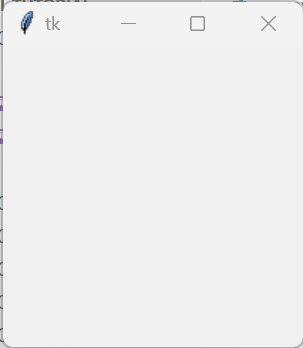

This window can be resized programatically using the ```geometry``` method:

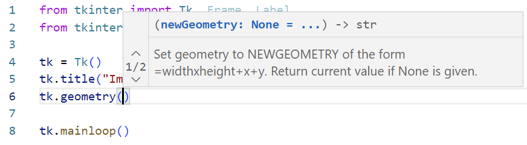

This method takes a string of the form ```"widthxheight"``` where the width and the height are in pixels. In this case a width of 800 pixels by 500 pixels will be selected. The main window title can also be set using the ```title``` method and providing a string:

```
from tkinter import Tk, Label
from tkinter.constants import NSEW

tk = Tk()
tk.geometry("800x600")
tk.title("Image Viewer")
tk.mainloop()
```

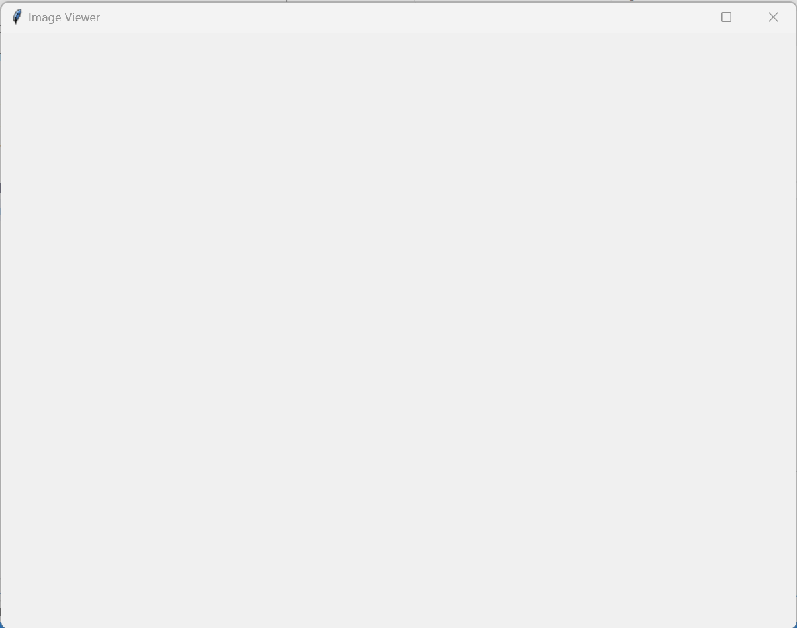

A colored label will now be added to the window. Instead of using ```pack``` or ```grid``` to place the label on the window ```tk```, ```place``` can instead be used:

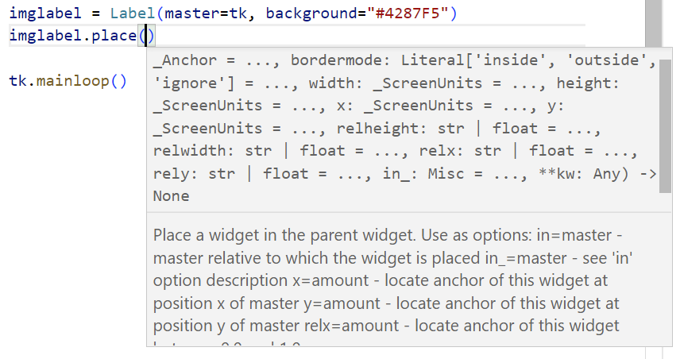

```relx``` and ```rely``` can be used to specify the relative positions of x and y to place the label. These use normalised values which correspond to the parent object ```tk``` width and height respectively:

```
from tkinter import Tk, Frame, Label
from tkinter.constants import NSEW

tk = Tk()
tk.title("Image Viewer")
tk.geometry("800x600")

imglabel = Label(master=tk, background="#4287F5")
imglabel.place(relx=0.5, rely=0.5)

tk.mainloop()
```

Notice that the default size of the label is tiny compared to the specified size of the main window:

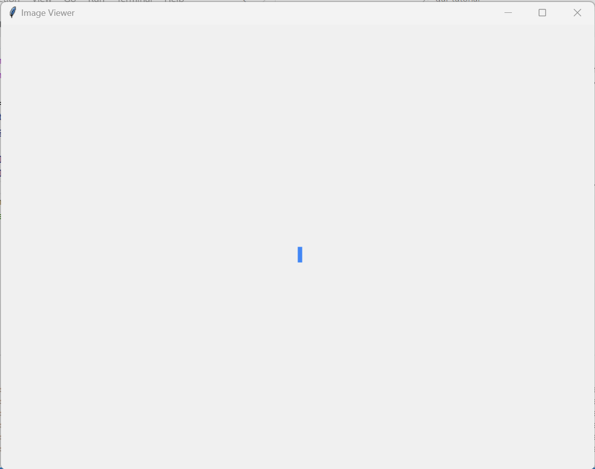

The ```Label``` class has the keyword input arguments height and width:

```
from tkinter import Tk, Frame, Label
from tkinter.constants import NSEW

tk = Tk()
tk.title("Image Viewer")
tk.geometry("800x600")

imglabel = Label(master=tk, background="#4287F5", 
                 width=50, height=15)
imglabel.place(relx=0.5, rely=0.5)

tk.mainloop()
```

Note that the dimensions of the width and height correspond to text spacing and not the size in pixels. Moreover vertical text spacing uses larger units than horizontal spacing.

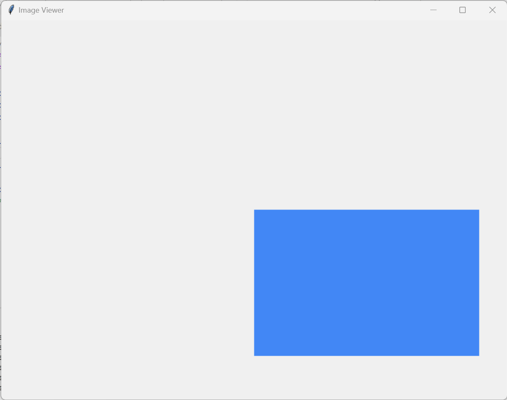

Notice when place was used, the top left corner of the label is anchored at the relative position of x=0.5 and y=0.5. The label is stretched towards the bottom right corner as it is resized. The anchor can be changed using the function ```place``` with the keyword argument ```anchor```. This should be assigned to the constant ```CENTER``` which needs to be imported:

```
from tkinter import Tk, Frame, Label
from tkinter.constants import NSEW, CENTER

tk = Tk()
tk.title("Image Viewer")
tk.geometry("800x600")

imglabel = Label(master=tk, background="#4287F5", 
                 width=50, height=15)
imglabel.place(relx=0.5, rely=0.5, anchor=CENTER)

tk.mainloop()
```

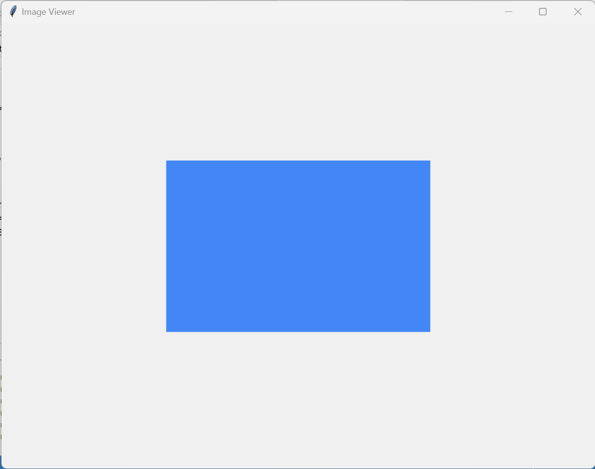

The anchor may also be assigned to a compass point.

## Frame

Instead of using a Label, it may be more appropriate to use a Frame which is a placeholder on the window for a widget.

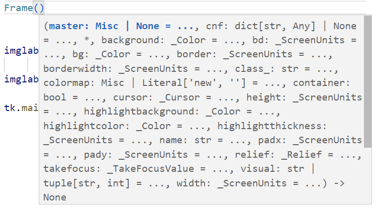

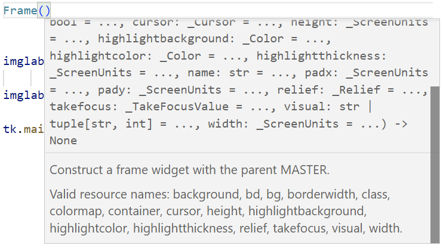

```
from tkinter import Tk, Frame, Label
from tkinter.constants import NSEW, CENTER

tk = Tk()
tk.title("Image Viewer")
tk.geometry("800x600")

imgframe = Frame(master=tk, width=400, height=300, background="#40E0D0")
imgframe.place(relx=0.5, rely=0.5, anchor=CENTER)

tk.mainloop()
```

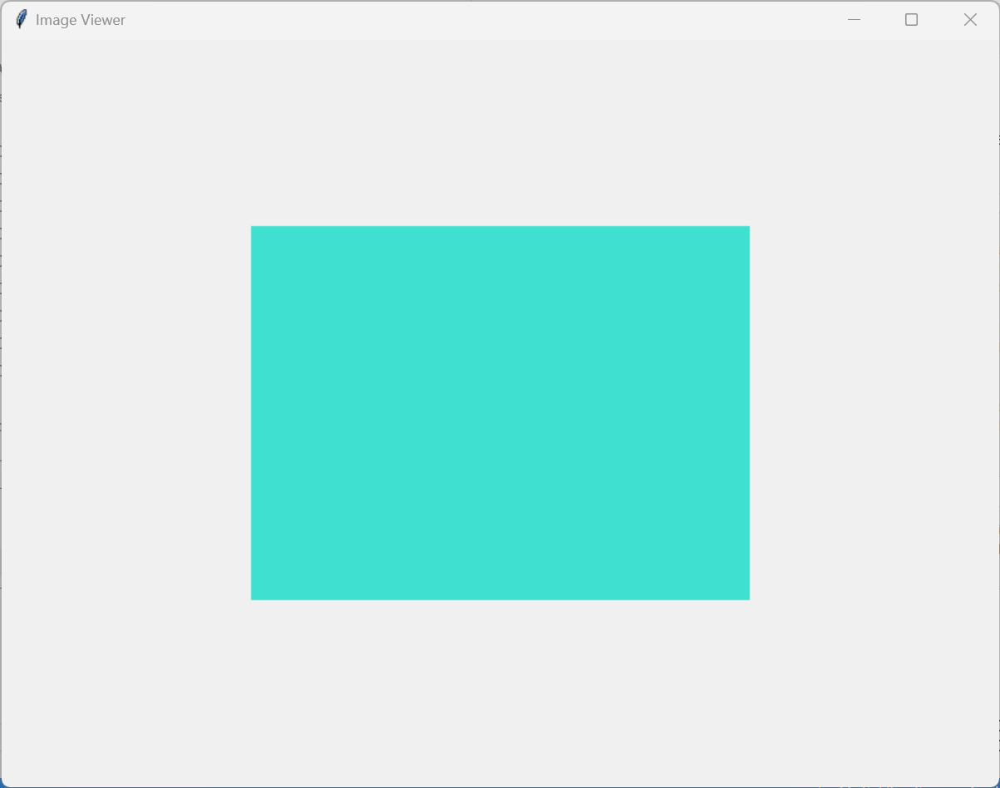

Now instead of adding widgets to the main window ```tk``` using ```master``` and assigning it to ```tk``` they are added to the frame and ```master``` is assigned to ```imgframe```. For example:

```
imglabel = Label(master=imgframe, background="#4287F5")
imglabel.pack()
```

When Widgets are added to the frame, the frame itself disappears:

```
from tkinter import Tk, Frame, Label
from tkinter.constants import NSEW, CENTER

tk = Tk()
tk.title("Image Viewer")
tk.geometry("800x600")

imgframe = Frame(master=tk, width=400, height=300, 
                 background="#40E0D0")
imgframe.place(relx=0.5, rely=0.5, anchor=CENTER)

imglabel = Label(master=imgframe, width=50, height=15, 
                 background="#4287F5")
imglabel.pack()

tk.mainloop()
```

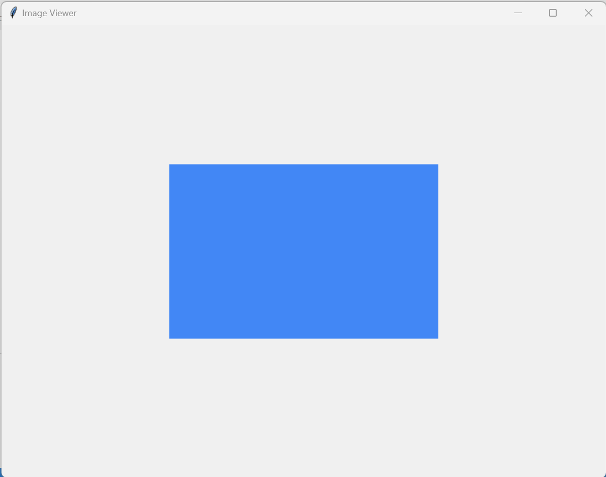

## Working with Images

The ```tkinter``` library has a ```PhotoImage``` class which can be used to read in a portable network graphics ```png``` file. This inbuilt class is however quite basic and only works if the image is the precise size desired for the application.

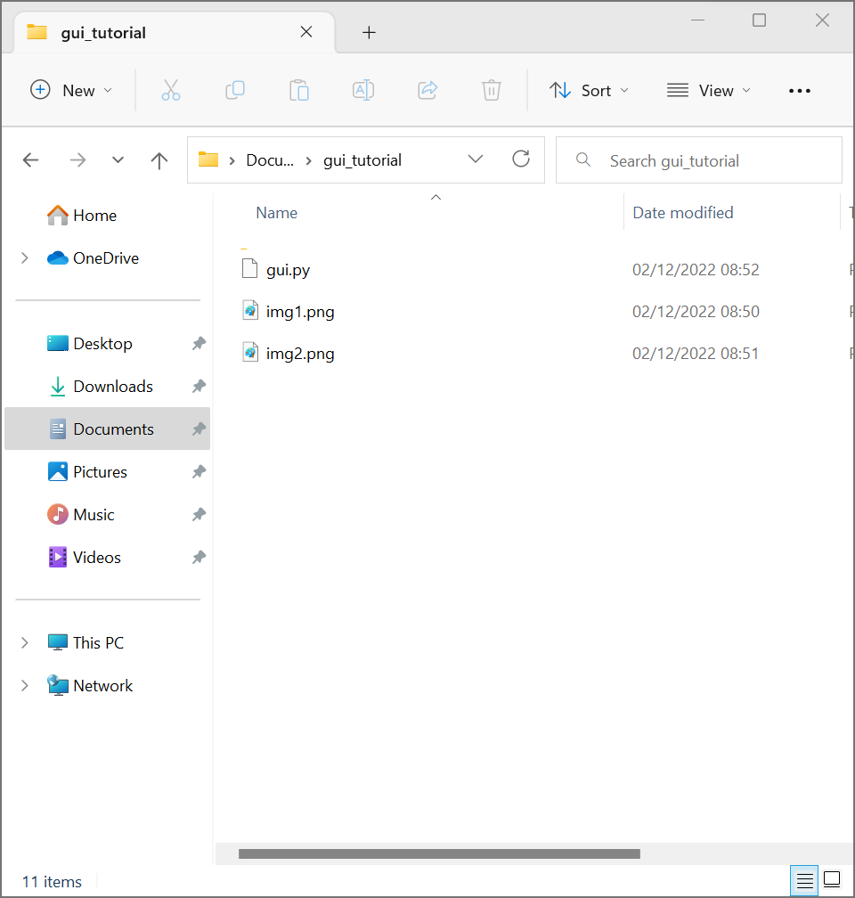

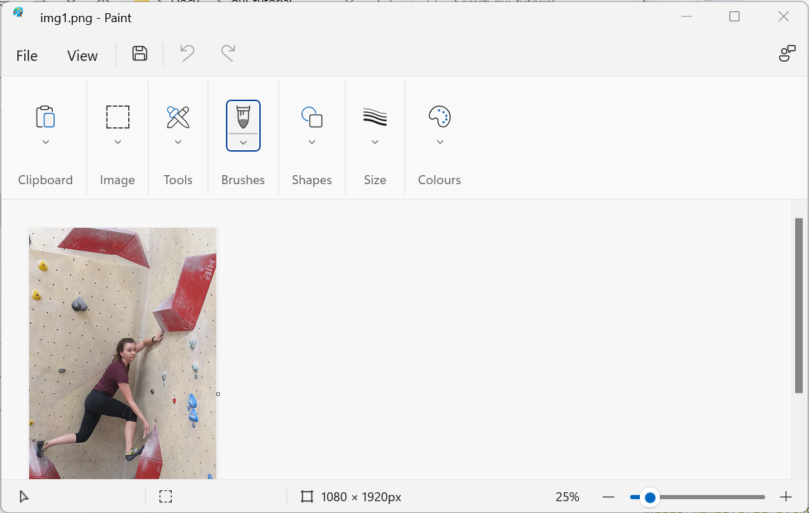

Normally the image needs some rescaling to suit the application. The image above is has a width of 1080 and a height of 1920 pixels for example and the application has specified a frame with a width of 400 and a height of 300 pixels.  ```PIL``` is an abbreviation for the Python Image Library also known as ```pillow``` and has an ```Image``` class for working with images. The ```Image``` class has a class method ```open``` which is used to create an image object from a file. The image object has a method ```thumbnail``` can be used to reduce the number of pixels used in a file and takes in a tuple ```(width, height)```. The resizing will resize the image object in place, to a value smaller than the specified dimensions, maintaining the aspect ratio.
In this case, rescaling will be carried out to an approximate width of 62.5 and a height of 300 pixels respectively.

The ```ImageTk``` module has a ```PhotoImage``` method which can be used to convert this image into a format compatible for working with tkinter. In the example below, the image ```"img1.png"``` is in the same folder as the Python Script file:

```
from PIL import Image, ImageTk
img = Image.open("img1.png")
img.thumbnail((400, 300))
tkimg = ImageTk.PhotoImage(img)
```

The image paradoxically cannot be displayed in a frame but can be displayed in the label. The image is usually added to a label and the label is added to the frame:

```
from tkinter import Tk, Frame, Label
from tkinter.constants import NSEW, CENTER
from PIL import Image, ImageTk

tk = Tk()
tk.title("Image Viewer")
tk.geometry("800x600")

img = Image.open("img1.png")
img.thumbnail((400, 300))
tkimg = ImageTk.PhotoImage(img)

imgframe = Frame(master=tk, width=400, height=300, background="#73bda0")
imgframe.place(relx=0.5, rely=0.5, anchor=CENTER)

imglabel = Label(master=imgframe, image=tkimg)
imglabel.pack_propagate(False)
imglabel.pack()

tk.mainloop()
```

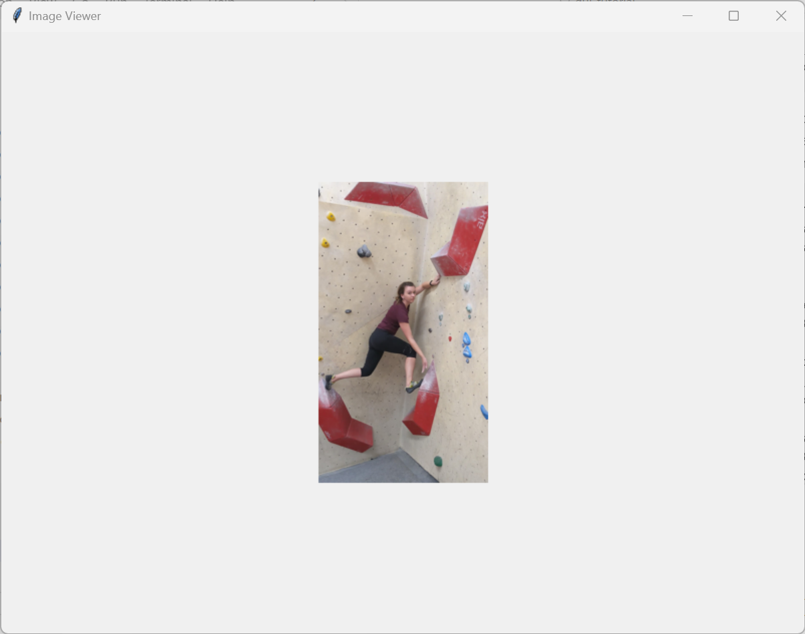

## Icons

The top left of the application has an icon. This can be changed to a custom image using similar code to process an image as before. The ```tk``` instance has the method ```iconphoto``` which can be used with a ```PhotoImage``` instance. Unlike the case of a label, this image will automatically be resized to fit within the windows titlebar.


For example:

```
from tkinter import Tk
from PIL import Image, ImageTk

tk = Tk()
tk.title("Image Viewer")
tk.geometry("200x150")

icon = Image.open("img1.png")
tkicon = ImageTk.PhotoImage(icon)

tk.iconphoto(False, tkicon)

tk.mainloop()
```

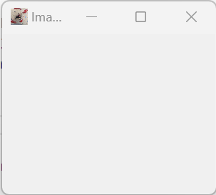

## Photo Viewer

Instead of only one image:

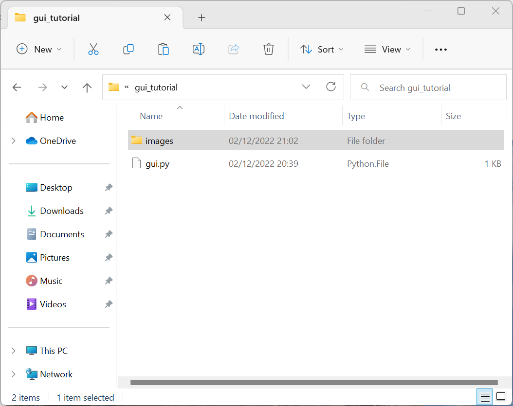

A folder of images can be created:

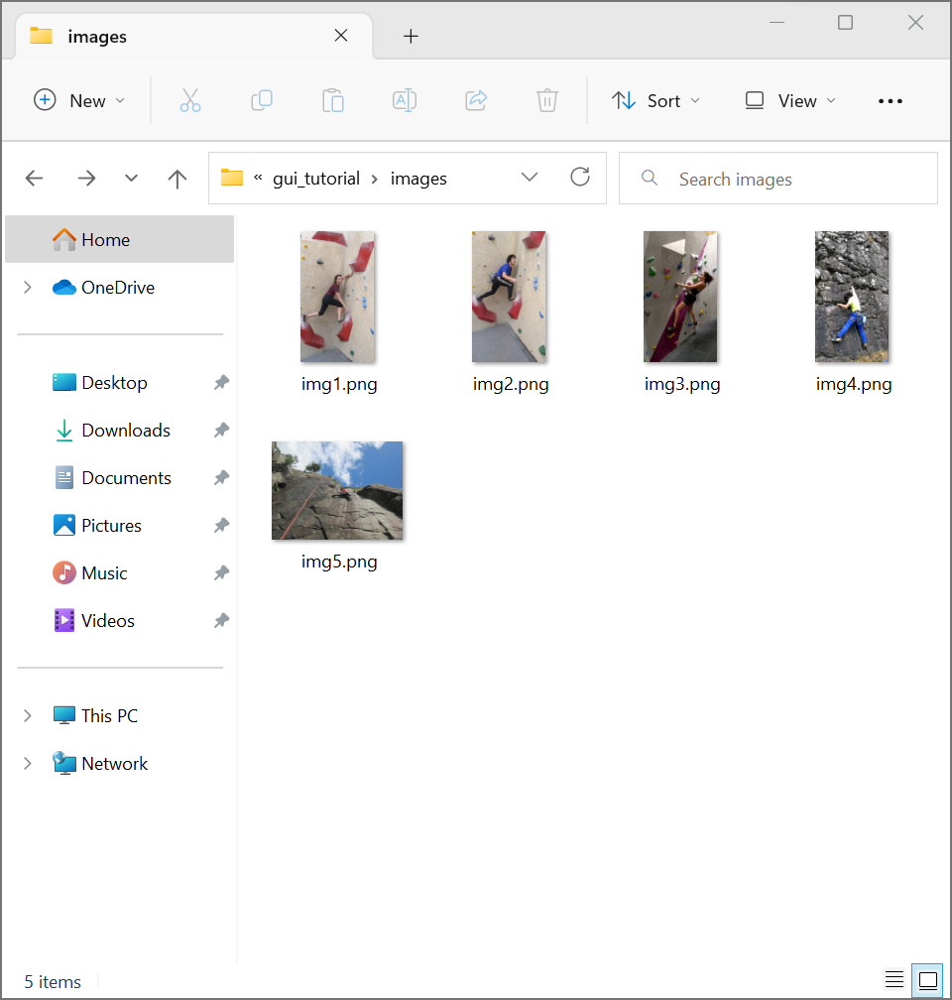

In Windows, these can be viewed with Photo Viewer:

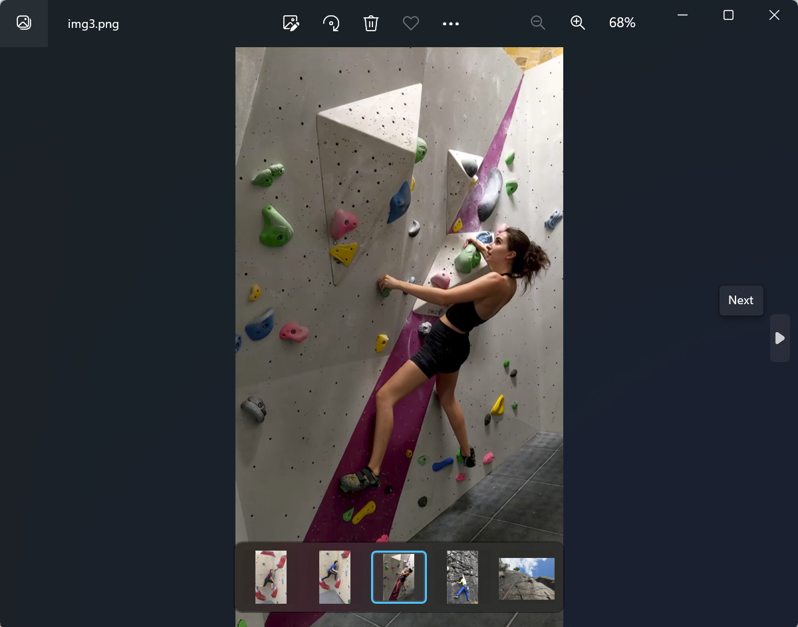

Instead of using Photo Viewer, an alternative application may be made in tkinter to view the photos.

```
from tkinter import Tk, Frame, Label, Button
from tkinter.constants import NSEW, CENTER
from PIL import Image, ImageTk
import glob
from itertools import cycle

tk = Tk()
tk.title("Image Viewer")
tk.geometry("800x600")

image_files = glob.glob('.\images\*.png')
images = {}

for idx, img_file in enumerate(image_files):
    img = Image.open(img_file)
    img.thumbnail((400, 300))
    tkimg = ImageTk.PhotoImage(img)
    images["img"+str(idx)] = tkimg

img_inc = cycle(images.keys())

imgframe = Frame(master=tk, width=400, height=300, background="#73bda0")
imgframe.place(relx=0.5, rely=0.5, anchor=CENTER)

imglabel = Label(master=imgframe, image=images[next(img_inc)])
imglabel.pack_propagate(False)
imglabel.pack()

def next_image():
    global imglabel
    global img_inc
    imglabel.pack_forget()
    imglabel = Label(master=imgframe, image=images[next(img_inc)])
    imglabel.pack_propagate(False)
    imglabel.pack()
    return None

def back_image():
    global imglabel
    global img_inc
    imglabel.pack_forget()
    for key in range(len(images)-2):
        next(img_inc)
    imglabel = Label(master=imgframe, image=images[next(img_inc)])
    imglabel.pack_propagate(False)
    imglabel.pack()
    return None

backbutton = Button(master=tk, text="◀", padx=20, pady=20,
                    background="#0067C0", foreground="#FFFFFF",
                    activebackground="#FFFFFF", activeforeground="#0067C0",
                    command=back_image)
backbutton.place(relx=0.1, rely=0.9, anchor=CENTER)

forwardbutton = Button(master=tk, text="▶", padx=20, pady=20,
                      background="#0067C0", foreground="#FFFFFF",
                      activebackground="#FFFFFF", activeforeground="#0067C0",
                      command=next_image)
forwardbutton.place(relx=0.9, rely=0.9, anchor=CENTER)

tk.mainloop()
```