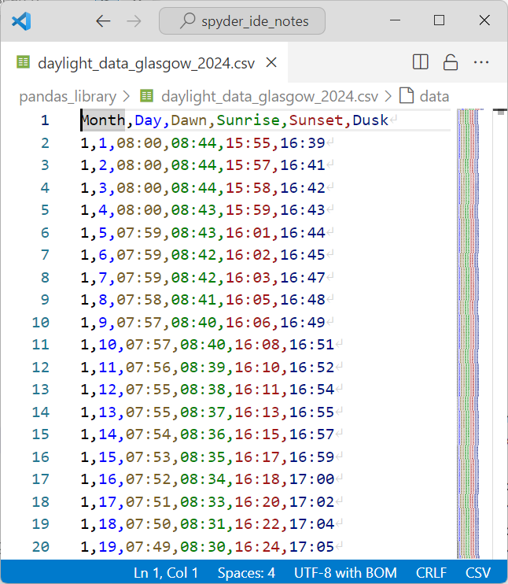
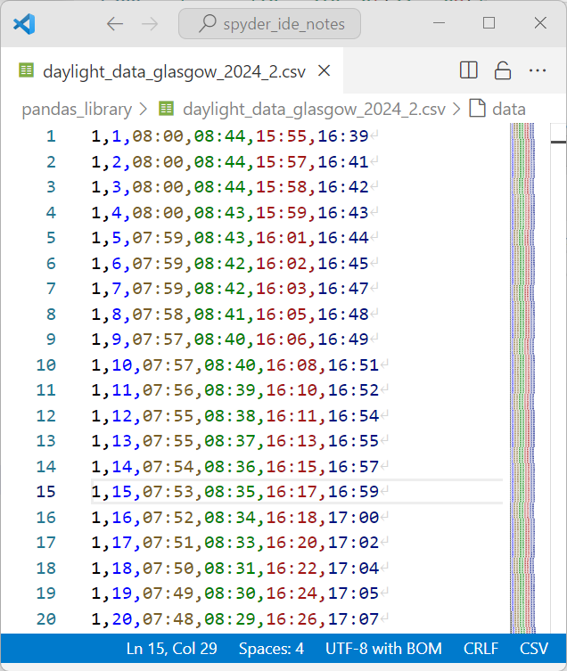
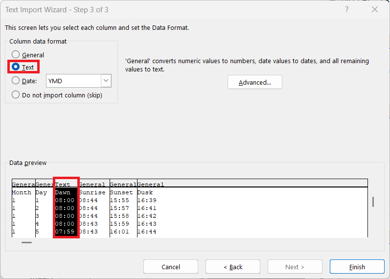

# pandas

`pandas` is the Python and Data Analysis Library. Currently there is a minor ipython issue where some identifiers do not display correctly in the ipython console when an identifier is accessed using `dict`-like syntax. The Spyder script editor also does not properly display identifiers. These issues are likely linked and I have reported both to GitHub.

## numpy recap

Previously the Numeric Python library was examined:

```python
In [1]: import numpy as np
```

This library has the following identifiers:

```python
In [2]: np.
# NumPy Identifiers

# 🔢 Class:
#     - ndarray                    : n-dimensional array, the core structure of NumPy.

# 🏷️ Data Types:
#     - int8                       : 8-bit signed integer (-128 to 127).
#     - int16                      : 16-bit signed integer (-32768 to 32767).
#     - int32                      : 32-bit signed integer (-2147483648 to 2147483647).
#     - int64                      : 64-bit signed integer (-9223372036854775808 to 9223372036854775807).
#     - uint8                      : 8-bit unsigned integer (0 to 255).
#     - uint16                     : 16-bit unsigned integer (0 to 65535).
#     - uint32                     : 32-bit unsigned integer (0 to 4294967295).
#     - uint64                     : 64-bit unsigned integer (0 to 18446744073709551615).
#     - float16                    : Half precision float (16-bit).
#     - float32                    : Single precision float (32-bit).
#     - float64                    : Double precision float (64-bit).
#     - complex64                  : Complex number represented by two 32-bit floats (real and imaginary).
#     - complex128                 : Complex number represented by two 64-bit floats.
#     - bool_                      : Boolean type (True or False).
#     - str_                       : Unicode string type (variable length).
#     - bytes_                     : Byte string type (variable length).
#     - object_                    : object type.
#     - datetime64                 : Type representing dates and times.
#     - timedelta64                : Represents differences in datetime64 objects.

# ➕ Array Creation:
#     - array                     : Creates an array from a list or another array-like object.
#     - frombuffer                : Creates an array from a buffer (bytes or bytearray).
#     - asarray                   : Converts an input to an array, without copying if possible.
#     - empty                     : Creates an uninitialized array of given shape.
#     - empty_like                : Returns a new array with the same shape and type as a given array, but 
#                                   without any data.
#     - zeros                     : Creates an array filled with zeros.
#     - zeros_like                : Returns a new array filled with zeros, with the same shape as a given 
#                                   array.
#     - ones                      : Creates an array filled with ones.
#     - ones_like                 : Returns a new array filled with ones, with the same shape as a given array.
#     - full                      : Creates an array filled with a specified value.
#     - full_like                 : Returns a new array filled with a specified value, with the same shape as 
#                                   a given array.
#     - arange                    : Creates an array of evenly spaced values within a given interval.
#     - linspace                  : Generates evenly spaced numbers over a specified interval.
#     - logspace                  : Returns numbers spaced evenly on a log scale.
#     - ogrid                     : Provides an open multi-dimensional grid.
#     - mgrid                     : Provides a dense multi-dimensional "meshgrid."
#     - meshgrid                  : Generates coordinate matrices from coordinate vectors.
#     - indices                   : Returns an array with the indices of a grid.
#     - eye                       : Creates a 2D array with ones on the diagonal (identity matrix).
#     - identity                  : Returns the identity array.
#     - diag                      : Returns a square matrix with the specified diagonal and zeros elsewhere.

# 📈 Array Manipulation:
#     - diagonal                  : Returns the diagonal of the ndarray.
#     - reshape                   : Reshapes an array without changing its data.
#     - transpose                 : Permutes the axes of an array.
#     - flatten                   : Returns a flattened copy of an array.
#     - ravel                     : Flattens an array into 1D.
#     - shares_memory             : Checks if two arrays share the same memory block.
#     - concatenate               : Joins arrays along an axis.
#     - repeat                    : Repeats elements of the ndarray.
#     - tile                      : Constructs an array by repeating the input array a specified number 
#                                   of times along each axis.
#     - stack                     : Joins a sequence of arrays along a new axis.
#     - hstack                    : Stacks arrays in sequence horizontally (column-wise).
#     - vstack                    : Stacks arrays in sequence vertically (row-wise).
#     - dstack                    : Stacks arrays in sequence depth-wise (along the third axis).
#     - split                     : Splits an array into multiple sub-arrays.
#     - hsplit                    : Splits an array into multiple sub-arrays horizontally (column-wise).
#     - vsplit                    : Splits an array into multiple sub-arrays vertically (row-wise).
#     - dsplit                    : Splits an array into multiple sub-arrays along the third axis (depth-wise).
#     - pad                       : Pads an array with values.
#     - swapaxes                  : Interchanges two axes of an array.
#     - moveaxis                  : Moves axes to new positions.
#     - squeeze                   : Removes single-dimensional entries from the shape of an array.
#     - expand_dims               : Expands the shape of an array.
#     - take                      : Selects elements from the ndarray based on indices.
#     - take_along_axis           : Selects elements from an array along an axis using an array of indices.
#     - compress                  : Selects elements using a condition mask.
#     - insert                    : Inserts values into an array at specified indices along an axis.
#     - flip                      : Reverses the order of elements along all or specified axes.
#     - fliplr                    : Reverses the order of elements along the left-right axis (columns) in a 2D array.
#     - flipud                    : Reverses the order of elements along the up-down axis (rows) in a 2D array.

# 🔢 Sorting Functions:
#     - argmin                     : Returns the indices of the minimum values along an axis.
#     - argmax                     : Returns the indices of the maximum values along an axis.
#     - nonzero                    : Returns the indices of the non-zero elements.
#     - sort                       : Returns a sorted copy of an array.
#     - argsort                    : Returns the indices that would sort an array.
#     - searchsorted               : Finds indices where elements should be inserted to maintain order.
#     - count_nonzero              : Counts the number of non-zero elements in an array.

# 🔗 Broadcasting and Vectorization
#     - broadcast                   : Produces an object that mimics broadcasting.
#     - broadcast_to                : Broadcasts an array to a new shape.
#     - vectorize                   : Vectorizes a function to apply element-wise on arrays.
#     - apply_along_axis            : Applies a function along a specific axis of an array.

# 📊 Mathematical Functions:
#     - sqrt                      : Element-wise square root.
#     - exp                       : Element-wise exponential (e^x).
#     - log                       : Natural logarithm (base e).
#     - log10                     : Base-10 logarithm.
#     - sin                       : Trigonometric sine function.
#     - cos                       : Trigonometric cosine function.
#     - tan                       : Trigonometric tangent function.
#     - arcsin                    : Inverse sine function.
#     - arccos                    : Inverse cosine function.
#     - arctan                    : Inverse tangent function.
#     - deg2rad                   : Converts degrees to radians.
#     - rad2deg                   : Converts radians to degrees.
#     - prod                      : Returns the product array elements.
#     - cumprod                   : Cumulative product of array elements.
#     - cumsum                    : Cumulative sum of array elements.

# 📊 Statistical Functions:
#     - min                       : Returns the minimum value along a given axis.
#     - max                       : Returns the maximum value along a given axis.
#     - all                       : Checks if all elements are True along the specified axis.
#     - any                       : Checks if any elements are True along the specified axis.
#     - sum                       : Returns the sum of ndarray elements along the specified axis.

#     - mean                      : Computes the arithmetic mean along the specified axis.
#     - var                       : Computes the variance along the specified axis.
#     - std                       : Computes the standard deviation along the specified axis.
#     - ptp                       : Peak-to-peak (max - min) value along an axis.

#     - median                    : Computes the median along the specified axis.
#     - average                   : Computes the weighted average.
#     - quantile                  : Computes the q-th quantile of the data along the specified axis.
#     - histogram                 : Computes the histogram of a set of data.
#     - bincount                  : Counts the number of occurrences of each value in a 1D array.
#     - corrcoef                  : Computes the Pearson correlation coefficients.
#     - cov                       : Computes the covariance matrix.

# 🔗 Supplementary Numerical Identifiers
#     - round                      : Rounds the ndarray elements to the given number of decimals.
#     - astype                     : Converts the ndarray to a different data type.
#     - clip                       : Limits the values in the ndarray to a given range.
#     - choose                     : Constructs an ndarray by selecting elements from a sequence of ndarrays.
#     - diff                       : Returns the difference of ndarray elements along the specified axis.
#     - signbit                    : Returns True for negative values.
#     - isfinite                   : Returns True for finite elements.
#     - isinf                      : Returns True for infinite elements.
#     - isnan                      : Returns True for NaN elements.
#     - isin                       : Tests whether elements in an array are contained in another array.
#     - isreal                     : Returns True for real elements in the array.
#     - iscomplex                  : Returns True for complex elements in the array.
#     - isrealobj                  : Checks if the array is entirely real (no imaginary parts).
#     - iscomplexobj               : Checks if the array is entirely complex.            : Returns True for negative values.

# 📦 Set Operations:
#     - unique                    : Finds the unique elements of an array.
#     - union1d                   : Computes the union of two arrays.
#     - intersect1d               : Computes the intersection of two arrays.
#     - setdiff1d                 : Computes the set difference of two arrays.
#     - setxor1d                  : Computes the exclusive or of two arrays.

# 🎲 Random Number Generation
#     - random.seed                 : Sets the seed for the random number generator.
#     - random.rand                 : Generates random numbers in a uniform distribution over [0,1].
#     - random.randn                : Generates random numbers in a standard normal distribution.
#     - random.randint              : Generates random integers within a specified range.
#     - random.random_sample        : Returns random floats in the half-open interval [0.0, 1.0).
#     - random.choice               : Generates a random sample from a given array.
#     - random.shuffle              : Randomly shuffles an array.

# 🧮 Linear Algebra
#     - dot                         : Dot product of two arrays.
#     - inner                       : Inner product of two arrays.
#     - outer                       : Outer product of two arrays.
#     - matmul                      : Matrix product of two arrays.
#     - linalg.inv                  : Computes the inverse of a matrix.
#     - linalg.eig                  : Computes the eigenvalues and eigenvectors of a matrix.
#     - linalg.svd                  : Singular Value Decomposition.
#     - linalg.qr                   : QR decomposition.
#     - linalg.det                  : Determinant of a matrix.
#     - linalg.norm                 : Matrix or vector norm.

# 📁 Data I/O
#     - load                        : Loads arrays from files.
#     - save                        : Saves an array to a file.
#     - savetxt                     : Saves an array to a text file.
#     - loadtxt                     : Loads data from a text file.
#     - genfromtxt                  : Loads data from a text file, with missing values handled.
```

And revolves around the `ndarray` class:

```python
In [2]: np.ndarray.
# 🔗 Object Identifiers
#     - __doc__                    : Documentation string of the ndarray object.
#     - __class__                  : The class/type of the ndarray object.
#     - __dir__                    : Returns the list of valid attributes for the ndarray object.
#     - __sizeof__                 : Returns the size of the ndarray object in memory (in bytes).
#     - __format__                 : Defines how the ndarray object should be formatted when using the format() function.
#     - __new__                    : Used to create a new instance of the ndarray object.
#     - __init__                   : Initializes the newly created ndarray object.
#     - __repr__                   : Defines how the ndarray object is represented (for developers).
#     - __str__                    : Defines how the ndarray object is converted to a string (for users).
#     - __eq__                     : Equality comparison (==).
#     - __ne__                     : Inequality comparison (!=).
#     - __ge__                     : Greater than or equal to comparison (>=).
#     - __le__                     : Less than or equal to comparison (<=).
#     - __gt__                     : Greater than comparison (>).
#     - __lt__                     : Less than comparison (<).
#     - __hash__                   : Returns the hash value of the ndarray object, used for sets and dictionaries.
#     - __getattribute__           : Called to retrieve an attribute of the ndarray object.
#     - __setattr__                : Called to set an attribute of the ndarray object.
#     - __delattr__                : Called to delete an attribute of the ndarray object.
#     - __getstate__               : Gets the current state of the ndarray for pickling.
#     - __reduce__                 : Provides data for serialization with pickle.
#     - __reduce_ex__              : Similar to __reduce__, but with protocol-specific details for pickling.
#     - __getnewargs__             : Provides additional arguments needed when unpickling the ndarray object.
#     - __init_subclass__          : Called when a subclass of ndarray is created.
#     - __subclasshook__           : Defines custom behavior for determining class inheritance.

# 🔗 Casting Identifiers
#     - tolist                     : Converts the ndarray to a nested list.
#     - tobytes                    : Converts the ndarray to a bytes string.

# 🔗 Collection Identifiers
#     - __getitem__                : Allows indexing (obj[index]).
#     - __setitem__                : Allows setting an item (obj[index] = value).
#     - __iter__                   : Returns an iterator for the ndarray.
#     - __len__                    : Returns the length of the ndarray.
#     - __contains__               : Checks if an item is in the ndarray (in operator).
#     - copy                       : Returns a shallow copy of the ndarray.

# 🔗 Supplementary Collection Identifiers
#     - ndim                       : The number of dimensions of the ndarray.
#     - shape                      : The shape of the ndarray.
#     - size                       : The number of elements in the ndarray.
#     - itemsize                   : The size of one array element in bytes.
#     - nbytes                     : The total number of bytes consumed by the ndarray.
#     - T                          : The transpose of a 2D ndarray.
#     - flat                       : The flattened iterator of the ndarray.
#     - diagonal                   : Returns the diagonal of the ndarray.
#     - reshape                    : Changes the shape of the ndarray without altering data.
#     - flatten                    : Flattens the ndarray into a 1D array.
#     - ravel                      : Returns a flattened view of the ndarray.
#     - transpose                  : Permutes the axes of the ndarray.
#     - swapaxes                   : Interchanges two axes of the ndarray.
#     - item                       : Copies a single element from the ndarray.
#     - repeat                     : Repeats elements of the ndarray.
#     - squeeze                    : Removes single-dimensional entries from the shape.
#     - take                       : Selects elements from the ndarray based on indices.
#     - fill                       : Fills the ndarray with a scalar value.
#     - compress                   : Selects elements using a condition mask.

# 🔗 Sorting, Searching, and Counting
#     - argmin                     : Returns the indices of the minimum values along an axis.
#     - argmax                     : Returns the indices of the maximum values along an axis.
#     - nonzero                    : Returns the indices of the non-zero elements.
#     - sort                       : Sorts the ndarray along the specified axis.
#     - argsort                    : Returns the indices that would sort the ndarray.
#     - searchsorted               : Finds indices where elements should be inserted to maintain order.

# 🔗 Numeric Identifiers
#     - __abs__                    : Returns the absolute value of the ndarray object.
#     - __pos__                    : Unary plus (+) for the ndarray object.
#     - __neg__                    : Unary minus (-) for the ndarray object.
#     - __add__                    : Addition operation (+).
#     - __sub__                    : Subtraction operation (-).
#     - __mul__                    : Multiplication operation (*).
#     - __pow__                    : Power operation (**).
#     - __floordiv__               : Floor division (//).
#     - __mod__                    : Modulus operation (%).
#     - __divmod__                 : Division and modulus together (divmod()).
#     - __truediv__                : True division (/).
#     - __radd__                   : Reverse addition (right-hand side).
#     - __rsub__                   : Reverse subtraction.
#     - __rmul__                   : Reverse multiplication.
#     - __rpow__                   : Reverse power operation.
#     - __rfloordiv__              : Reverse floor division.
#     - __rmod__                   : Reverse modulus.
#     - __rdivmod__                : Reverse division and modulus together.
#     - __rtruediv__               : Reverse true division.
#     - real                       : The real part of a complex ndarray.
#     - imag                       : The imaginary part of a complex ndarray.
#     - conjugate                  : The complex conjugate of the ndarray.

# 🔗 Bitwise Identifiers
#     - __and__                    : Bitwise and.
#     - __or__                     : Bitwise or.
#     - __xor__                    : Bitwise xor.
#     - __invert__                 : Bitwise not.
#     - __lshift__                 : Bitwise left shift.
#     - __rshift__                 : Bitwise right shift.

# 📊 Mathematical Functions:
#     - prod                      : Returns the product array elements.
#     - cumprod                   : Cumulative product of array elements.
#     - cumsum                    : Cumulative sum of array elements.

# 📊 Statistical Functions:
#     - min                       : Returns the minimum value along a given axis.
#     - max                       : Returns the maximum value along a given axis.
#     - all                       : Checks if all elements are True along the specified axis.
#     - any                       : Checks if any elements are True along the specified axis.
#     - sum                       : Returns the sum of ndarray elements along the specified axis.

#     - mean                      : Computes the arithmetic mean along the specified axis.
#     - var                       : Computes the variance along the specified axis.
#     - std                       : Computes the standard deviation along the specified axis.
#     - ptp                       : Peak-to-peak (max - min) value along an axis.


# 🔗 Supplementary Numerical Identifiers
#     - round                      : Rounds the ndarray elements to the given number of decimals.
#     - astype                     : Converts the ndarray to a different data type.
#     - clip                       : Limits the values in the ndarray to a given range.
#     - all                        : Checks if all elements are True along the specified axis.
#     - any                        : Checks if any elements are True along the specified axis.
#     - prod                       : Returns the product of ndarray elements along the specified axis.
#     - cumprod                    : Returns the cumulative product of ndarray elements.
#     - cumsum                     : Returns the cumulative sum of ndarray elements.
#     - choose                     : Constructs an ndarray by selecting elements from a sequence of ndarrays.

# 🧮 Linear Algebra
#     - dot                         : Dot product of two arrays.
#     - __matmul__                  : Matrix product of two arrays.
```

Consider a 1d `ndarray`:

```python
In [2]: month = np.array([1, 2, 3, 4, 5, 6, 7, 8, 9, 10, 11, 12])
```

In the Variable Explorer it is displayed as:

<table style="width: 65%; border-collapse: collapse; font-family: sans-serif;">
  <tr>
    <th colspan="4" style="text-align:center; padding: 8px; background-color: #2d2d30; color: #ffffff;">Variable Explorer</th>
  </tr>  
  <tr>
    <td style="padding: 8px; background-color: #1e1e1e; color: #ffffff;">month</td>
    <td style="padding: 8px; background-color: #1e1e1e; color: #ffffff;">Array of int64</td>
    <td style="padding: 8px; background-color: #1e1e1e; color: #ffffff;">(12,)</td>
    <td style="padding: 8px; background-color: #705693; color: #ffffff;">[1  2  3  4  5  6  7  8  9 10 11 12]</td>
  </tr>             
</table>

When expanded it can be conceptualised as a column:

<table style="width: 20%; border-collapse: collapse; font-family: sans-serif;">
  <tr>
    <th colspan="2" style="text-align:center; padding: 8px; background-color: #2d2d30; color: #ffffff;">month - numpy int64 array</th>
  </tr>
  <tr>
    <th style="padding: 8px; background-color: #252526; color: #ffffff;"></th>
    <td style="padding: 8px; background-color: #1e1e1e; color: #ffffff;"> </td>       
  </tr>
  <tr>
    <th style="padding: 8px; background-color: #252526; color: #ffffff;">0</th>
    <td style="padding: 8px; background-color: #a33c46; color: #ffffff;">1</td>
  </tr>
  <tr>
    <th style="padding: 8px; background-color: #252526; color: #ffffff;">1</th>
    <td style="padding: 8px; background-color: #a33c5a; color: #ffffff;">2</td>
  </tr>
  <tr>
    <th style="padding: 8px; background-color: #252526; color: #ffffff;">2</th>
    <td style="padding: 8px; background-color: #a33c6d; color: #ffffff;">3</td>
  </tr> 
  <tr>
    <th style="padding: 8px; background-color: #252526; color: #ffffff;">3</th>
    <td style="padding: 8px; background-color: #a33c80; color: #ffffff;">4</td>
  </tr>     
  <tr>
    <th style="padding: 8px; background-color: #252526; color: #ffffff;">4</th>
    <td style="padding: 8px; background-color: #a33c93; color: #ffffff;">5</td>
  </tr>
  <tr>
    <th style="padding: 8px; background-color: #252526; color: #ffffff;">5</th>
    <td style="padding: 8px; background-color: #a33ca7; color: #ffffff;">6</td>
  </tr>    
  <tr>
    <th style="padding: 8px; background-color: #252526; color: #ffffff;">6</th>
    <td style="padding: 8px; background-color: #943cab; color: #ffffff;">7</td>
  </tr>    
  <tr>
    <th style="padding: 8px; background-color: #252526; color: #ffffff;">7</th>
    <td style="padding: 8px; background-color: #813cab; color: #ffffff;">8</td>
  </tr> 
  <tr>
    <th style="padding: 8px; background-color: #252526; color: #ffffff;">8</th>
    <td style="padding: 8px; background-color: #6d3cab; color: #ffffff;">9</td>
  </tr> 
  <tr>
    <th style="padding: 8px; background-color: #252526; color: #ffffff;">9</th>
    <td style="padding: 8px; background-color: #5a3cab; color: #ffffff;">10</td>
  </tr>     
  <tr>
    <th style="padding: 8px; background-color: #252526; color: #ffffff;">10</th>
    <td style="padding: 8px; background-color: #473cab; color: #ffffff;">11</td>
  </tr> 
  <tr>
    <th style="padding: 8px; background-color: #252526; color: #ffffff;">11</th>
    <td style="padding: 8px; background-color: #3840ab; color: #ffffff;">12</td>
  </tr>                
</table>

Each value in the 1d `ndarray` is associated with an index and in an `ndarray`, the index is always a range index starting from the integer `0` and going up in integer steps:

<table style="width: 20%; border-collapse: collapse; font-family: sans-serif;">
  <tr>
    <th colspan="2" style="text-align:center; padding: 8px; background-color: #2d2d30; color: #ffffff;">month - numpy int64 array</th>
  </tr>
  <tr>
    <th style="padding: 8px; background-color: #252526; color: #ffffff;"></th>
    <td style="padding: 8px; background-color: #1e1e1e; color: #ffffff;"> </td>       
  </tr>
  <tr>
    <th style="padding: 8px; background-color: #ffc000; color: #ffffff;">0</th>
    <td style="padding: 8px; background-color: #a33c46; color: #ffffff;">1</td>
  </tr>
  <tr>
    <th style="padding: 8px; background-color: #ffc000; color: #ffffff;">1</th>
    <td style="padding: 8px; background-color: #a33c5a; color: #ffffff;">2</td>
  </tr>
  <tr>
    <th style="padding: 8px; background-color: #ffc000; color: #ffffff;">2</th>
    <td style="padding: 8px; background-color: #a33c6d; color: #ffffff;">3</td>
  </tr> 
  <tr>
    <th style="padding: 8px; background-color: #ffc000; color: #ffffff;">3</th>
    <td style="padding: 8px; background-color: #a33c80; color: #ffffff;">4</td>
  </tr>     
  <tr>
    <th style="padding: 8px; background-color: #ffc000; color: #ffffff;">4</th>
    <td style="padding: 8px; background-color: #a33c93; color: #ffffff;">5</td>
  </tr>
  <tr>
    <th style="padding: 8px; background-color: #ffc000; color: #ffffff;">5</th>
    <td style="padding: 8px; background-color: #a33ca7; color: #ffffff;">6</td>
  </tr>    
  <tr>
    <th style="padding: 8px; background-color: #ffc000; color: #ffffff;">6</th>
    <td style="padding: 8px; background-color: #943cab; color: #ffffff;">7</td>
  </tr>    
  <tr>
    <th style="padding: 8px; background-color: #ffc000; color: #ffffff;">7</th>
    <td style="padding: 8px; background-color: #813cab; color: #ffffff;">8</td>
  </tr> 
  <tr>
    <th style="padding: 8px; background-color: #ffc000; color: #ffffff;">8</th>
    <td style="padding: 8px; background-color: #6d3cab; color: #ffffff;">9</td>
  </tr> 
  <tr>
    <th style="padding: 8px; background-color: #ffc000; color: #ffffff;">9</th>
    <td style="padding: 8px; background-color: #5a3cab; color: #ffffff;">10</td>
  </tr>     
  <tr>
    <th style="padding: 8px; background-color: #ffc000; color: #ffffff;">10</th>
    <td style="padding: 8px; background-color: #473cab; color: #ffffff;">11</td>
  </tr> 
  <tr>
    <th style="padding: 8px; background-color: #ffc000; color: #ffffff;">11</th>
    <td style="padding: 8px; background-color: #3840ab; color: #ffffff;">12</td>
  </tr>                
</table>

## Library Overview and Imports

`pandas`, an abbreviation for the Python and Data Analysis Library is typically imported as the abbreviated alias `pd`:

```python
In [3]: import pandas as pd
```

`pandas` is a third-party library and the data model attribute `__version__` gives the version of the pandas library. This has the form `major.minor.patch` and the major version should be version `2`:

```python
In [4]: pd.__version__
Out[4]: '2.2.3'
```

Version `2` made substantial changes to the `pd` namespace and `pd.Index`, `pd.Series` and `pd.DataFrame` namespaces removing a large number of identifiers that had duplicate names or outdated functionality, making it much more user-friendly to navigate through. 

Note: The official documentation for the pandas library uses the black formatter which has a slightly different styling preference to Python, numpy and matplotlib. Specifically the black formatter prefers double quotation `" "` to single quotations `' '`. This tutorial will use formatting consistent to Python's official documentation preferencing, `' '` single quotations.

The `pd` library revolves around the `Index`, `Series` and `DataFrame` classes:

```python
In [5]: pd.
# 🔢 Core Classes:
#     - Index                            : Immutable sequence for indexing.
#     - Series                           : 1D labeled array.
#     - DataFrame                        : 2D labeled data structure.

# Index Subclasses:
#     - RangeIndex                       : Optimized integer index.
#     - DatetimeIndex                    : Index with datetime64 elements.
#     - TimedeltaIndex                   : Index with timedelta64 elements.
#     - PeriodIndex                      : Index of Period elements.
#     - IntervalIndex                    : Index of Interval elements.
#     - MultiIndex                       : Multi-level (hierarchical) index.

# Series Subclasses:
#     - Categorical                      : Categorical data container.


# 🏷️ Data Types:
#     - Int8, Int16, Int32, Int64        : Signed integer types.
#     - UInt8, UInt16, UInt32, UInt64    : Unsigned integer types.
#     - Float32, Float64                 : Floating-point types.
#     - BooleanDtype                     : Boolean type.
#     - StringDtype                      : String type.
#     - CategoricalDtype                 : Categorical data type.
#     - DatetimeTZDtype                  : Timezone-aware datetime type.
#     - IntervalDtype                    : Interval type.
#     - PeriodDtype                      : Period type.
#     - SparseDtype                      : Sparse data type.

# ➕ Data Creation:
#     - array                            : Create a NumPy-like array.
#     - date_range, bdate_range          : Generate DatetimeIndex.
#     - period_range                     : Generate PeriodIndex.
#     - interval_range                    : Generate IntervalIndex.
#     - timedelta_range                   : Generate TimedeltaIndex.
#     - from_dummies                      : Create DataFrame from dummies.
#     - get_dummies                      : Convert categorical variable(s) to indicator variables.
#     - to_datetime                      : Convert argument to datetime.
#     - to_timedelta                     : Convert argument to timedelta.

# 🔍 Searching & Filtering:
#     - isna, notna                      : Detect missing values.

# 🔄 Join & Merge:
#     - merge                            : Database-style joins.
#     - concat                           : Concatenate DataFrames.

# 🗃️ Input/Output:
#     - read_csv                         : Read CSV file.
#     - read_excel                       : Read Excel file.
#     - read_hdf                         : Read HDF5 file.
#     - read_json                        : Read JSON file.
#     - read_html                        : Read HTML tables.
#     - read_sql                         : Read SQL query.
#     - read_parquet                     : Read Parquet file.
#     - read_feather                     : Read Feather format.
#     - read_orc                         : Read ORC file.
#     - read_stata                       : Read Stata file.
#     - read_sas                         : Read SAS file.
#     - read_fwf                         : Read fixed-width formatted text.
#     - read_pickle                      : Read serialized Python object.
#     - read_clipboard                   : Read clipboard content.
# 🗃️ Input/Output Classes:
#     - ExcelWriter                      : Provides an interface for writing DataFrames to Excel files with different engines.
#     - HDFStore                         : Manages reading/writing pandas objects to HDF5 file

# ⚙️ Utility Functions:
#     - eval                             : Evaluate Python expressions.
#     - option_context                   : Context manager for options.
#     - get_option, set_option           : Manage pandas settings.
#     - reset_option                     : Reset pandas option.
#     - show_versions                    : Display installed versions.
#     - test                             : Run pandas tests.
```

## Index class

Let's examine the `Index` class: 

```python
In [5]: pd.
# 🔢 Core Classes:
#     - Index                            : Immutable sequence for indexing.
# Index Subclasses:
#     - RangeIndex                       : Optimized integer index.
#     - DatetimeIndex                    : Index with datetime64 elements.
#     - TimedeltaIndex                   : Index with timedelta64 elements.
#     - PeriodIndex                      : Index of Period elements.
#     - IntervalIndex                    : Index of Interval elements.
#     - MultiIndex                       : Multi-level (hierarchical) index.
```

If unspecified a `RangeIndex` is used which recall is always the `Index` of a 1d `ndarray`:

```python
In [6]: pd.Index(range(12))
Out[6]: RangeIndex(start=0, stop=12, step=1)
```

<table style="width: 20%; border-collapse: collapse; font-family: sans-serif;">
  <tr>
    <th colspan="1" style="text-align:center; padding: 8px; background-color: #2d2d30; color: #ffffff;">Index (RangeIndex)</th>
  </tr>
  <tr>
    <th style="padding: 8px; background-color: #252526; color: #ffffff;"></th>     
  </tr>
  <tr>
    <th style="padding: 8px; background-color: #ffc000; color: #ffffff;">0</th>
  </tr>
  <tr>
    <th style="padding: 8px; background-color: #ffc000; color: #ffffff;">1</th>
  </tr>
  <tr>
    <th style="padding: 8px; background-color: #ffc000; color: #ffffff;">2</th>
  </tr> 
  <tr>
    <th style="padding: 8px; background-color: #ffc000; color: #ffffff;">3</th>
  </tr>     
  <tr>
    <th style="padding: 8px; background-color: #ffc000; color: #ffffff;">4</th>
  </tr>
  <tr>
    <th style="padding: 8px; background-color: #ffc000; color: #ffffff;">5</th>
  </tr>    
  <tr>
    <th style="padding: 8px; background-color: #ffc000; color: #ffffff;">6</th>
  </tr>    
  <tr>
    <th style="padding: 8px; background-color: #ffc000; color: #ffffff;">7</th>
  </tr> 
  <tr>
    <th style="padding: 8px; background-color: #ffc000; color: #ffffff;">8</th>
  </tr> 
  <tr>
    <th style="padding: 8px; background-color: #ffc000; color: #ffffff;">9</th>
  </tr>     
  <tr>
    <th style="padding: 8px; background-color: #ffc000; color: #ffffff;">10</th>
  </tr> 
  <tr>
    <th style="padding: 8px; background-color: #ffc000; color: #ffffff;">11</th>
  </tr>                
</table>

Other `Index` subclasses are available such as the `DatetimeIndex`:

```python
In [7]: pd.Index(np.arange(np.datetime64('2025-01'), 
                           np.datetime64('2026-01'),
                           np.timedelta64(1, 'M')))
Out[7]: 
DatetimeIndex(['2025-01-01', '2025-02-01', '2025-03-01', '2025-04-01',
               '2025-05-01', '2025-06-01', '2025-07-01', '2025-08-01',
               '2025-09-01', '2025-10-01', '2025-11-01', '2025-12-01'],
              dtype='datetime64[s]', freq=None)
```

<table style="width: 20%; border-collapse: collapse; font-family: sans-serif;">
  <tr>
    <th colspan="1" style="text-align:center; padding: 8px; background-color: #2d2d30; color: #ffffff;">Index (DatetimeIndex)</th>
  </tr>
  <tr>
    <th style="padding: 8px; background-color: #252526; color: #ffffff;"></th>     
  </tr>
  <tr>
    <th style="padding: 8px; background-color: #ffc000; color: #ffffff;">2025-01-01 00:00:00</th>
  </tr>
  <tr>
    <th style="padding: 8px; background-color: #ffc000; color: #ffffff;">2025-02-01 00:00:00</th>
  </tr>
  <tr>
    <th style="padding: 8px; background-color: #ffc000; color: #ffffff;">2025-03-01 00:00:00</th>
  </tr> 
  <tr>
    <th style="padding: 8px; background-color: #ffc000; color: #ffffff;">2025-04-01 00:00:00</th>
  </tr>     
  <tr>
    <th style="padding: 8px; background-color: #ffc000; color: #ffffff;">2025-05-01 00:00:00</th>
  </tr>
  <tr>
    <th style="padding: 8px; background-color: #ffc000; color: #ffffff;">2025-06-01 00:00:00</th>
  </tr>    
  <tr>
    <th style="padding: 8px; background-color: #ffc000; color: #ffffff;">2025-07-01 00:00:00</th>
  </tr>    
  <tr>
    <th style="padding: 8px; background-color: #ffc000; color: #ffffff;">2025-08-01 00:00:00</th>
  </tr> 
  <tr>
    <th style="padding: 8px; background-color: #ffc000; color: #ffffff;">2025-09-01 00:00:00</th>
  </tr> 
  <tr>
    <th style="padding: 8px; background-color: #ffc000; color: #ffffff;">2025-10-01 00:00:00</th>
  </tr>     
  <tr>
    <th style="padding: 8px; background-color: #ffc000; color: #ffffff;">2025-11-01 00:00:00</th>
  </tr> 
  <tr>
    <th style="padding: 8px; background-color: #ffc000; color: #ffffff;">2025-12-01 00:00:00</th>
  </tr>                
</table>

The `TimedeltaIndex`:

```python
In [8]: pd.Index(np.arange(0, 13, dtype='timedelta64[M]'))
Out[8]: 
TimedeltaIndex([  '0 days',  '31 days',  '59 days',  '90 days', '120 days',
                '151 days', '181 days', '212 days', '243 days', '273 days',
                '304 days', '334 days', '365 days'],
               dtype='timedelta64[s]', freq=None)
```

<table style="width: 20%; border-collapse: collapse; font-family: sans-serif;">
  <tr>
    <th colspan="1" style="text-align:center; padding: 8px; background-color: #2d2d30; color: #ffffff;">Index (TimeDeltaIndex)</th>
  </tr>
  <tr>
    <th style="padding: 8px; background-color: #252526; color: #ffffff;"></th>     
  </tr>
  <tr>
    <th style="padding: 8px; background-color: #ffc000; color: #ffffff;">0 days</th>
  </tr>
  <tr>
    <th style="padding: 8px; background-color: #ffc000; color: #ffffff;">31 days</th>
  </tr>
  <tr>
    <th style="padding: 8px; background-color: #ffc000; color: #ffffff;">59 days</th>
  </tr> 
  <tr>
    <th style="padding: 8px; background-color: #ffc000; color: #ffffff;">90 days</th>
  </tr>     
  <tr>
    <th style="padding: 8px; background-color: #ffc000; color: #ffffff;">120 days</th>
  </tr>
  <tr>
    <th style="padding: 8px; background-color: #ffc000; color: #ffffff;">151 days</th>
  </tr>    
  <tr>
    <th style="padding: 8px; background-color: #ffc000; color: #ffffff;">181 days</th>
  </tr>    
  <tr>
    <th style="padding: 8px; background-color: #ffc000; color: #ffffff;">212 days</th>
  </tr> 
  <tr>
    <th style="padding: 8px; background-color: #ffc000; color: #ffffff;">243 days</th>
  </tr> 
  <tr>
    <th style="padding: 8px; background-color: #ffc000; color: #ffffff;">273 days</th>
  </tr>     
  <tr>
    <th style="padding: 8px; background-color: #ffc000; color: #ffffff;">334 days</th>
  </tr> 
  <tr>
    <th style="padding: 8px; background-color: #ffc000; color: #ffffff;">365 days</th>
  </tr>                
</table>

The `PeriodIndex`:

```python
In [9]: pd.PeriodIndex([f'2025-{num:02d}' for num in range(1, 13)], freq='M')
Out[9]: 
PeriodIndex(['2025-01', '2025-02', '2025-03', '2025-04', '2025-05', '2025-06',
             '2025-07', '2025-08', '2025-09', '2025-10', '2025-11', '2025-12'],
            dtype='period[M]')
```

<table style="width: 20%; border-collapse: collapse; font-family: sans-serif;">
  <tr>
    <th colspan="1" style="text-align:center; padding: 8px; background-color: #2d2d30; color: #ffffff;">Index (PeriodIndex)</th>
  </tr>
  <tr>
    <th style="padding: 8px; background-color: #252526; color: #ffffff;"></th>     
  </tr>
  <tr>
    <th style="padding: 8px; background-color: #ffc000; color: #ffffff;">2025-01</th>
  </tr>
  <tr>
    <th style="padding: 8px; background-color: #ffc000; color: #ffffff;">2025-02</th>
  </tr>
  <tr>
    <th style="padding: 8px; background-color: #ffc000; color: #ffffff;">2025-03</th>
  </tr> 
  <tr>
    <th style="padding: 8px; background-color: #ffc000; color: #ffffff;">2025-04</th>
  </tr>     
  <tr>
    <th style="padding: 8px; background-color: #ffc000; color: #ffffff;">2025-05</th>
  </tr>
  <tr>
    <th style="padding: 8px; background-color: #ffc000; color: #ffffff;">2025-06</th>
  </tr>    
  <tr>
    <th style="padding: 8px; background-color: #ffc000; color: #ffffff;">2025-07</th>
  </tr>    
  <tr>
    <th style="padding: 8px; background-color: #ffc000; color: #ffffff;">2025-08</th>
  </tr> 
  <tr>
    <th style="padding: 8px; background-color: #ffc000; color: #ffffff;">2025-09</th>
  </tr> 
  <tr>
    <th style="padding: 8px; background-color: #ffc000; color: #ffffff;">2025-10</th>
  </tr>     
  <tr>
    <th style="padding: 8px; background-color: #ffc000; color: #ffffff;">2025-11</th>
  </tr> 
  <tr>
    <th style="padding: 8px; background-color: #ffc000; color: #ffffff;">2025-12</th>
  </tr>                
</table>

The `IntervalIndex`:

```python
In [10]: pd.IntervalIndex([pd.Interval(left=0, right=30, closed='left'),
                           pd.Interval(left=30, right=40, closed='left'),
                           pd.Interval(left=40, right=50, closed='left'),
                           pd.Interval(left=50, right=55, closed='left'),
                           pd.Interval(left=55, right=60, closed='left'),
                           pd.Interval(left=60, right=65, closed='left'),
                           pd.Interval(left=65, right=70, closed='left'),
                           pd.Interval(left=70, right=85, closed='left'),
                           pd.Interval(left=85, right=101, closed='left')])

Out[10]: 
IntervalIndex([  [0, 30),  [30, 40),  [40, 50),  [50, 55),  [55, 60),
                [60, 65),  [65, 70),  [70, 85), [85, 101)],
              dtype='interval[int64, left]')
```

<table style="width: 20%; border-collapse: collapse; font-family: sans-serif;">
  <tr>
    <th colspan="1" style="text-align:center; padding: 8px; background-color: #2d2d30; color: #ffffff;">Index (IntervalIndex)</th>
  </tr>
  <tr>
    <th style="padding: 8px; background-color: #252526; color: #ffffff;"></th>     
  </tr>
  <tr>
    <th style="padding: 8px; background-color: #ffc000; color: #ffffff;">[0, 30)</th>
  </tr>
  <tr>
    <th style="padding: 8px; background-color: #ffc000; color: #ffffff;">[30, 40)</th>
  </tr>
  <tr>
    <th style="padding: 8px; background-color: #ffc000; color: #ffffff;">[40, 50)</th>
  </tr> 
  <tr>
    <th style="padding: 8px; background-color: #ffc000; color: #ffffff;">[50, 55)</th>
  </tr>     
  <tr>
    <th style="padding: 8px; background-color: #ffc000; color: #ffffff;">[55, 60)</th>
  </tr>
  <tr>
    <th style="padding: 8px; background-color: #ffc000; color: #ffffff;">[60, 65)</th>
  </tr>    
  <tr>
    <th style="padding: 8px; background-color: #ffc000; color: #ffffff;">[65, 70)</th>
  </tr>    
  <tr>
    <th style="padding: 8px; background-color: #ffc000; color: #ffffff;">[70, 85)</th>
  </tr> 
  <tr>
    <th style="padding: 8px; background-color: #ffc000; color: #ffffff;">[85, 101)</th>
  </tr>               
</table>

And an `Index`:

```python
In [11]: pd.Index(['f', 'd', 'c', 'b2', 'b1', 'a4', 'a3', 'a2', 'a1'])
Out[11]: Index(['f', 'd', 'c', 'b2', 'b1', 'a4', 'a3', 'a2', 'a1'], dtype='object')
```

<table style="width: 20%; border-collapse: collapse; font-family: sans-serif;">
  <tr>
    <th colspan="1" style="text-align:center; padding: 8px; background-color: #2d2d30; color: #ffffff;">Index (IntervalIndex)</th>
  </tr>
  <tr>
    <th style="padding: 8px; background-color: #252526; color: #ffffff;"></th>     
  </tr>
  <tr>
    <th style="padding: 8px; background-color: #ffc000; color: #ffffff;">f</th>
  </tr>
  <tr>
    <th style="padding: 8px; background-color: #ffc000; color: #ffffff;">d</th>
  </tr>
  <tr>
    <th style="padding: 8px; background-color: #ffc000; color: #ffffff;">c</th>
  </tr> 
  <tr>
    <th style="padding: 8px; background-color: #ffc000; color: #ffffff;">b2</th>
  </tr>     
  <tr>
    <th style="padding: 8px; background-color: #ffc000; color: #ffffff;">b1</th>
  </tr>
  <tr>
    <th style="padding: 8px; background-color: #ffc000; color: #ffffff;">a4</th>
  </tr>    
  <tr>
    <th style="padding: 8px; background-color: #ffc000; color: #ffffff;">a3</th>
  </tr>    
  <tr>
    <th style="padding: 8px; background-color: #ffc000; color: #ffffff;">a2</th>
  </tr> 
  <tr>
    <th style="padding: 8px; background-color: #ffc000; color: #ffffff;">a1</th>
  </tr>               
</table>

Note that the `Index` has the datatype `object`. This means each element in the `Index` is a Python `object`. This datatype is used when the `Index` contains non-numeric data such as a `str`.

It is also possible to combine the previous two `Index` instances into a `MultiIndex`:

```python
In [12]: labels = pd.Index(['f', 'd', 'c', 'b2', 'b1', 'a4', 'a3', 'a2', 'a1'])

In [13]: label_code = [0, 1, 2, 3, 4, 5, 6, 7, 8]

In [14]: intervals = pd.IntervalIndex([pd.Interval(left=0, right=30, closed='left'),
                                       pd.Interval(left=30, right=40, closed='left'),
                                       pd.Interval(left=40, right=50, closed='left'),
                                       pd.Interval(left=50, right=55, closed='left'),
                                       pd.Interval(left=55, right=60, closed='left'),
                                       pd.Interval(left=60, right=65, closed='left'),
                                       pd.Interval(left=65, right=70, closed='left'),
                                       pd.Interval(left=70, right=85, closed='left'),
                                       pd.Interval(left=85, right=101, closed='left')])


In [15]: interval_code = [0, 1, 2, 3, 4, 5, 6, 7, 8]

In [15]: pd.MultiIndex(levels=[labels, intervals], codes=[label_code, interval_code])
Out[15]: 
MultiIndex([( 'f',   [0, 30)),
            ( 'd',  [30, 40)),
            ( 'c',  [40, 50)),
            ('b2',  [50, 55)),
            ('b1',  [55, 60)),
            ('a4',  [60, 65)),
            ('a3',  [65, 70)),
            ('a2',  [70, 85)),
            ('a1', [85, 101))],
           )
```

A `MultiIndex` often has values grouped together in the first level and unique entries in the second level: 

```python
In [16]: labels = pd.Index(['f', 'd', 'c', 'b', 'a'])
In [17]: label_code = [0, 1, 2, 3, 3, 4, 4, 4, 4]

In [18]: intervals = pd.IntervalIndex([pd.Interval(left=0, right=30, closed='left'),
                                       pd.Interval(left=30, right=40, closed='left'),
                                       pd.Interval(left=40, right=50, closed='left'),
                                       pd.Interval(left=50, right=55, closed='left'),
                                       pd.Interval(left=55, right=60, closed='left'),
                                       pd.Interval(left=60, right=65, closed='left'),
                                       pd.Interval(left=65, right=70, closed='left'),
                                       pd.Interval(left=70, right=85, closed='left'),
                                       pd.Interval(left=85, right=101, closed='left')])

In [19]: interval_code = [0, 1, 2, 3, 4, 5, 6, 7, 8]

In [20]: pd.MultiIndex(levels=[labels, intervals], codes=[label_code, interval_code])
Out[20]: 
MultiIndex([( 'f',   [0, 30)),
            ( 'd',  [30, 40)),
            ( 'c',  [40, 50)),
            ('b',  [50, 55)),
            ('b',  [55, 60)),
            ('a',  [60, 65)),
            ('a',  [65, 70)),
            ('a',  [70, 85)),
            ('a', [85, 101))],
           )
```

Although the `Index` can be displayed with a non-integer value under the hood, each value in the `Index` always has an `int` and the `Index` can be indexed to using the `int`:

```python
In [21]: index = pd.MultiIndex(levels=[labels, intervals], codes=[label_code, interval_code])

In [22]: index[0]
Out[22]: ('f', Interval(0, 30, closed='left'))

In [23]: type(index[0])
Out[23]: tuple
```

In the Variable Explorer it is displayed as:

<table style="width: 65%; border-collapse: collapse; font-family: sans-serif;">
  <tr>
    <th colspan="4" style="text-align:center; padding: 8px; background-color: #2d2d30; color: #ffffff;">Variable Explorer</th>
  </tr>  
  <tr>
    <td style="padding: 8px; background-color: #1e1e1e; color: #ffffff;">index</td>
    <td style="padding: 8px; background-color: #1e1e1e; color: #ffffff;">MultiIndex</td>
    <td style="padding: 8px; background-color: #1e1e1e; color: #ffffff;">(9,)</td>
    <td style="padding: 8px; background-color: #642260; color: #ffffff;">index=[('f',   [0, 30)), ('d',  [30, 40)), ('c',  [40, 50)), ('b',  [50, 55)), ...]</td>
  </tr>             
</table>


<table style="width: 20%; border-collapse: collapse; font-family: sans-serif;">
  <tr>
    <th colspan="2" style="text-align:center; padding: 8px; background-color: #2d2d30; color: #ffffff;">index - MultiIndex</th>
  </tr>
  <tr>
    <th style="padding: 8px; background-color: #252526; color: #ffffff;">Index</th>
    <td style="padding: 8px; background-color: #252526; color: #ffffff;"></td>       
  </tr>
  <tr>
    <th style="padding: 8px; background-color: #252526; color: #ffffff;">0</th>
    <td style="padding: 8px; background-color: #252526; color: #ffffff;">('f',   [0, 30))</td>
  </tr>
  <tr>
    <th style="padding: 8px; background-color: #252526; color: #ffffff;">1</th>
    <td style="padding: 8px; background-color: #252526; color: #ffffff;">('d',  [30, 40))</td>
  </tr>
  <tr>
    <th style="padding: 8px; background-color: #252526; color: #ffffff;">2</th>
    <td style="padding: 8px; background-color: #252526; color: #ffffff;">('c',  [40, 50))</td>
  </tr> 
  <tr>
    <th style="padding: 8px; background-color: #252526; color: #ffffff;">3</th>
    <td style="padding: 8px; background-color: #252526; color: #ffffff;">('b',  [50, 55))</td>
  </tr>     
  <tr>
    <th style="padding: 8px; background-color: #252526; color: #ffffff;">4</th>
    <td style="padding: 8px; background-color: #252526; color: #ffffff;">('b',  [55, 60))</td>
  </tr>
  <tr>
    <th style="padding: 8px; background-color: #252526; color: #ffffff;">5</th>
    <td style="padding: 8px; background-color: #252526; color: #ffffff;">('a',  [60, 65))</td>
  </tr>    
  <tr>
    <th style="padding: 8px; background-color: #252526; color: #ffffff;">6</th>
    <td style="padding: 8px; background-color: #252526; color: #ffffff;">('a',  [65, 70))</td>
  </tr>    
  <tr>
    <th style="padding: 8px; background-color: #252526; color: #ffffff;">7</th>
    <td style="padding: 8px; background-color: #252526; color: #ffffff;">('a',  [70, 85))</td>
  </tr> 
  <tr>
    <th style="padding: 8px; background-color: #252526; color: #ffffff;">8</th>
    <td style="padding: 8px; background-color: #252526; color: #ffffff;">('a', [85, 101))</td>
  </tr>             
</table>

An `Index` is based on an `ndarray` and has similar identifiers:

```python
In [24]: pd.Index.
# 🔗 Object Identifiers
#     - __doc__                    : Documentation string of the Index object.
#     - __class__                  : The class/type of the Index object.
#     - __dir__                    : Returns the list of valid attributes for the Index object.
#     - __sizeof__                 : Returns the size of the Index object in memory (in bytes).
#     - __format__                 : Defines how the Index object should be formatted when using the format() function.
#     - __new__                    : Used to create a new instance of the Index object.
#     - __init__                   : Initializes the newly created Index object.
#     - __repr__                   : Defines how the Index object is represented (for developers).
#     - __str__                    : Defines how the Index object is converted to a string (for users).
#     - __eq__                     : Equality comparison (==).
#     - __ne__                     : Inequality comparison (!=).
#     - __ge__                     : Greater than or equal to comparison (>=).
#     - __le__                     : Less than or equal to comparison (<=).
#     - __gt__                     : Greater than comparison (>).
#     - __lt__                     : Less than comparison (<).
#     - __hash__                   : Returns the hash value of the Index object, used for sets and dictionaries.
#     - __getattribute__           : Called to retrieve an attribute of the Index object.
#     - __setattr__                : Called to set an attribute of the Index object.
#     - __delattr__                : Called to delete an attribute of the Index object.
#     - __getstate__               : Gets the current state of the Index for pickling.
#     - __reduce__                 : Provides data for serialization with pickle.
#     - __reduce_ex__              : Similar to __reduce__, but with protocol-specific details for pickling.
#     - __getnewargs__             : Provides additional arguments needed when unpickling the Index object.
#     - __init_subclass__          : Called when a subclass of Index is created.
#     - __subclasshook__           : Defines custom behavior for determining class inheritance.

# 🔗 Casting Identifiers
#     - tolist                     : Converts the Index to a list.
#     - to_series                  : Converts the Index to a pandas Series.
#     - to_numpy                   : Converts the Index to a NumPy array.
#     - to_flat_index              : Converts the Index to a flat Index object.

# 🔗 Collection Identifiers
#     - __getitem__                : Allows indexing (obj[index]).
#     - __setitem__                : Allows setting an item (obj[index] = value).
#     - __iter__                   : Returns an iterator for the Index.
#     - __len__                    : Returns the length of the Index.
#     - __contains__               : Checks if an item is in the Index (in operator).
#     - copy                       : Returns a shallow copy of the Index.
#     - insert                     : Inserts a new value into the Index at the specified position.
#     - join                       : Joins the Index with another Index or series.
#     - map                        : Applies a function element-wise to the Index.

# 🔗 Supplementary Collection Identifiers
#     - ndim                       : The number of dimensions of the Index (always 1).
#     - shape                      : The shape of the Index.
#     - size                       : The number of elements in the Index.
#     - is_unique                  : Checks if the elements in the Index are unique.
#     - is_monotonic               : Checks if the Index is monotonic (increasing or decreasing).
#     - is_integer                 : Checks if the Index contains integer values.
#     - is_float                   : Checks if the Index contains float values.
#     - is_datetime                : Checks if the Index contains datetime values.
#     - is_timedelta               : Checks if the Index contains timedelta values.
#     - is_range                   : Checks if the Index is a RangeIndex.
#     - is_categorical             : Checks if the Index is a CategoricalIndex.
#     - is_floating                : Checks if the Index contains floating point values.
#     - is_integer                 : Checks if the Index contains integer values.
#     - is_unsigned                : Checks if the Index contains unsigned integers.
#     - is_boolean                 : Checks if the Index contains boolean values.
#     - duplicated                 : Returns a boolean array indicating duplicate values.
#     - difference                 : Computes the difference between the current Index and another.
#     - intersection               : Returns the common elements between two Index objects.
#     - union                      : Returns the union of two Index objects.
#     - symmetric_difference       : Returns the elements that are in either of the Indexes, but not both.
#     - values                     : Returns the underlying values in the Index.

# 🔗 Sorting, Searching, and Counting
#     - argmin                     : Returns the index of the minimum value.
#     - argmax                     : Returns the index of the maximum value.
#     - get_loc                    : Gets the location of a value in the Index.
#     - searchsorted               : Finds indices where elements should be inserted to maintain order.
#     - sort_values                : Sorts the Index in ascending order.
#     - unique                     : Returns the unique values in the Index.
#     - hasnans                    : Checks if the Index has any missing (NaN) values.
#     - notna                      : Returns a boolean array indicating non-missing values.
#     - notnull                    : Same as `notna`, returns non-missing values.

# 🔗 Arithmetic and Comparison Identifiers
#     - __add__                    : Addition operation (+).
#     - __sub__                    : Subtraction operation (-).
#     - __mul__                    : Multiplication operation (*).
#     - __div__                    : Division operation (/).
#     - __eq__                     : Equality comparison (==).
#     - __ne__                     : Inequality comparison (!=).
#     - __ge__                     : Greater than or equal to comparison (>=).
#     - __le__                     : Less than or equal to comparison (<=).
#     - __gt__                     : Greater than comparison (>).
#     - __lt__                     : Less than comparison (<).

# 🔗 Statistical Functions
#     - min                        : Returns the minimum value in the Index.
#     - max                        : Returns the maximum value in the Index.
#     - sum                        : Returns the sum of the values in the Index.
#     - mean                       : Returns the mean of the values in the Index.
#     - var                        : Returns the variance of the values in the Index.
#     - std                        : Returns the standard deviation of the values in the Index.
#     - count                      : Returns the number of non-null elements in the Index.
#     - value_counts               : Returns a Series containing counts of unique elements.

# 🔗 Supplementary Numerical Identifiers
#     - astype                     : Converts the Index to a different data type.
#     - clip                       : Limits the values in the Index to a given range.
#     - round                      : Rounds the Index elements to the specified number of decimals.
#     - shift                      : Shifts the Index by a specified number of periods.
#     - diff                       : Computes the difference between consecutive elements of the Index.

# 🔗 Accessors
#     - str                        : Provides access to string-specific methods for string-like Indexes.
#     - cat                        : Provides access to categorical-specific methods for string-like Indexes.
#     - dt                         : Provides access to datetime-specific methods for datetime-like Indexes.
```

## Series class

A  `Series` is essentially a 1d `ndarray` where each element is associated with an `Index` and has a name:

```python
In [25]: pd.Series(data=np.arange(1, 13), 
                   index=pd.Index(np.arange(np.datetime64('2025-01'), 
                                            np.datetime64('2026-01'),
                                            np.timedelta64(1, 'M'))), 
                   name='month_as_int')
Out[25]: 
2025-01-01     1
2025-02-01     2
2025-03-01     3
2025-04-01     4
2025-05-01     5
2025-06-01     6
2025-07-01     7
2025-08-01     8
2025-09-01     9
2025-10-01    10
2025-11-01    11
2025-12-01    12
Name: month_as_int, dtype: int64
```

This `Series` can be assigned to an instance name:

```python
In [26]: month = pd.Series(data=np.arange(1, 13), 
                           index=pd.Index(np.arange(np.datetime64('2025-01'), 
                                          np.datetime64('2026-01'),
                                          np.timedelta64(1, 'M'))), 
                           name='month_as_int')
```

And viewed on the Variable Explorer:

<table style="width: 65%; border-collapse: collapse; font-family: sans-serif;">
  <tr>
    <th colspan="4" style="text-align:center; padding: 8px; background-color: #2d2d30; color: #ffffff;">Variable Explorer</th>
  </tr>  
  <tr>
    <td style="padding: 8px; background-color: #1e1e1e; color: #ffffff;">month</td>
    <td style="padding: 8px; background-color: #1e1e1e; color: #ffffff;">Series of int64</td>
    <td style="padding: 8px; background-color: #1e1e1e; color: #ffffff;">(12,)</td>
    <td style="padding: 8px; background-color: #642260; color: #ffffff;">index=[2025-01-01, 2025-02-01, 2025-03-01, ...], data=[1, 2, 3, ...], name=month_as_int</td>
  </tr>             
</table>

<table style="width: 20%; border-collapse: collapse; font-family: sans-serif;">
  <tr>
    <th colspan="2" style="text-align:center; padding: 8px; background-color: #2d2d30; color: #ffffff;">month - Series of int64</th>
  </tr>
  <tr>
    <th style="padding: 8px; background-color: #252526; color: #ffffff;">Index</th>
    <td style="padding: 8px; background-color: #1e1e1e; color: #ffffff;">month_as_int</td>       
  </tr>
  <tr>
    <th style="padding: 8px; background-color: #252526; color: #ffffff;">2025-01-01</th>
    <td style="padding: 8px; background-color: #a33c46; color: #ffffff;">1</td>
  </tr>
  <tr>
    <th style="padding: 8px; background-color: #252526; color: #ffffff;">2025-02-01</th>
    <td style="padding: 8px; background-color: #a33c5a; color: #ffffff;">2</td>
  </tr>
  <tr>
    <th style="padding: 8px; background-color: #252526; color: #ffffff;">2025-03-01</th>
    <td style="padding: 8px; background-color: #a33c6d; color: #ffffff;">3</td>
  </tr> 
  <tr>
    <th style="padding: 8px; background-color: #252526; color: #ffffff;">2025-04-01</th>
    <td style="padding: 8px; background-color: #a33c80; color: #ffffff;">4</td>
  </tr>     
  <tr>
    <th style="padding: 8px; background-color: #252526; color: #ffffff;">2025-05-01</th>
    <td style="padding: 8px; background-color: #a33c93; color: #ffffff;">5</td>
  </tr>
  <tr>
    <th style="padding: 8px; background-color: #252526; color: #ffffff;">2025-06-01</th>
    <td style="padding: 8px; background-color: #a33ca7; color: #ffffff;">6</td>
  </tr>    
  <tr>
    <th style="padding: 8px; background-color: #252526; color: #ffffff;">2025-07-01</th>
    <td style="padding: 8px; background-color: #943cab; color: #ffffff;">7</td>
  </tr>    
  <tr>
    <th style="padding: 8px; background-color: #252526; color: #ffffff;">2025-08-01</th>
    <td style="padding: 8px; background-color: #813cab; color: #ffffff;">8</td>
  </tr> 
  <tr>
    <th style="padding: 8px; background-color: #252526; color: #ffffff;">2025-09-01</th>
    <td style="padding: 8px; background-color: #6d3cab; color: #ffffff;">9</td>
  </tr> 
  <tr>
    <th style="padding: 8px; background-color: #252526; color: #ffffff;">2025-10-01</th>
    <td style="padding: 8px; background-color: #5a3cab; color: #ffffff;">10</td>
  </tr>     
  <tr>
    <th style="padding: 8px; background-color: #252526; color: #ffffff;">2025-11-01</th>
    <td style="padding: 8px; background-color: #473cab; color: #ffffff;">11</td>
  </tr> 
  <tr>
    <th style="padding: 8px; background-color: #252526; color: #ffffff;">2025-12-01</th>
    <td style="padding: 8px; background-color: #3840ab; color: #ffffff;">12</td>
  </tr>                
</table>

When a `Series` is instantiated without a provided `Index`, the default `RangeIndex` will be used:

```python
In [27]: month = pd.Series(data=np.arange(1, 13), 
                           name='month_as_int')
```

<table style="width: 65%; border-collapse: collapse; font-family: sans-serif;">
  <tr>
    <th colspan="4" style="text-align:center; padding: 8px; background-color: #2d2d30; color: #ffffff;">Variable Explorer</th>
  </tr>  
  <tr>
    <td style="padding: 8px; background-color: #1e1e1e; color: #ffffff;">month</td>
    <td style="padding: 8px; background-color: #1e1e1e; color: #ffffff;">Series of int64</td>
    <td style="padding: 8px; background-color: #1e1e1e; color: #ffffff;">(12,)</td>
    <td style="padding: 8px; background-color: #642260; color: #ffffff;">index=[0, 1, 2, ...], data=[1, 2, 3, ...], name=month_as_int</td>
  </tr>             
</table>

<table style="width: 20%; border-collapse: collapse; font-family: sans-serif;">
  <tr>
    <th colspan="2" style="text-align:center; padding: 8px; background-color: #2d2d30; color: #ffffff;">month - Series of int64</th>
  </tr>
  <tr>
    <th style="padding: 8px; background-color: #252526; color: #ffffff;">Index</th>
    <td style="padding: 8px; background-color: #1e1e1e; color: #ffffff;">month_as_int</td>       
  </tr>
  <tr>
    <th style="padding: 8px; background-color: #252526; color: #ffffff;">0</th>
    <td style="padding: 8px; background-color: #a33c46; color: #ffffff;">1</td>
  </tr>
  <tr>
    <th style="padding: 8px; background-color: #252526; color: #ffffff;">1</th>
    <td style="padding: 8px; background-color: #a33c5a; color: #ffffff;">2</td>
  </tr>
  <tr>
    <th style="padding: 8px; background-color: #252526; color: #ffffff;">2</th>
    <td style="padding: 8px; background-color: #a33c6d; color: #ffffff;">3</td>
  </tr> 
  <tr>
    <th style="padding: 8px; background-color: #252526; color: #ffffff;">3</th>
    <td style="padding: 8px; background-color: #a33c80; color: #ffffff;">4</td>
  </tr>     
  <tr>
    <th style="padding: 8px; background-color: #252526; color: #ffffff;">4</th>
    <td style="padding: 8px; background-color: #a33c93; color: #ffffff;">5</td>
  </tr>
  <tr>
    <th style="padding: 8px; background-color: #252526; color: #ffffff;">5</th>
    <td style="padding: 8px; background-color: #a33ca7; color: #ffffff;">6</td>
  </tr>    
  <tr>
    <th style="padding: 8px; background-color: #252526; color: #ffffff;">6</th>
    <td style="padding: 8px; background-color: #943cab; color: #ffffff;">7</td>
  </tr>    
  <tr>
    <th style="padding: 8px; background-color: #252526; color: #ffffff;">7</th>
    <td style="padding: 8px; background-color: #813cab; color: #ffffff;">8</td>
  </tr> 
  <tr>
    <th style="padding: 8px; background-color: #252526; color: #ffffff;">8</th>
    <td style="padding: 8px; background-color: #6d3cab; color: #ffffff;">9</td>
  </tr> 
  <tr>
    <th style="padding: 8px; background-color: #252526; color: #ffffff;">9</th>
    <td style="padding: 8px; background-color: #5a3cab; color: #ffffff;">10</td>
  </tr>     
  <tr>
    <th style="padding: 8px; background-color: #252526; color: #ffffff;">10</th>
    <td style="padding: 8px; background-color: #473cab; color: #ffffff;">11</td>
  </tr> 
  <tr>
    <th style="padding: 8px; background-color: #252526; color: #ffffff;">11</th>
    <td style="padding: 8px; background-color: #3840ab; color: #ffffff;">12</td>
  </tr>                
</table>

This `Series` has a datatype of `int64`. The datatype can be one of the other numeric datatypes seen previously in an `Index` or an `object` datatype, normally of `str` instances.

Note that the `Series` is essentially a 1d `ndarray` with a `name`. The identifiers are therefore similar to that of an `ndarray`:

```python
In [28]: pd.Series.
# 🔗 Object Identifiers
#     - __doc__                    : Documentation string of the Series object.
#     - __class__                  : The class/type of the Series object.
#     - __dir__                    : Returns the list of valid attributes for the Series object.
#     - __sizeof__                 : Returns the size of the Series object in memory (in bytes).
#     - __format__                 : Defines how the Series object should be formatted when using the format() function.
#     - __new__                    : Used to create a new instance of the Series object.
#     - __init__                   : Initializes the newly created Series object.
#     - __repr__                   : Defines how the Series object is represented (for developers).
#     - __str__                    : Defines how the Series object is converted to a string (for users).
#     - __eq__                     : Equality comparison (==).
#     - __ne__                     : Inequality comparison (!=).
#     - __ge__                     : Greater than or equal to comparison (>=).
#     - __le__                     : Less than or equal to comparison (<=).
#     - __gt__                     : Greater than comparison (>).
#     - __lt__                     : Less than comparison (<).
#     - __hash__                   : Returns the hash value of the Series object, used for sets and dictionaries.
#     - __getattribute__           : Called to retrieve an attribute of the Series object.
#     - __setattr__                : Called to set an attribute of the Series object.
#     - __delattr__                : Called to delete an attribute of the Series object.
#     - __getstate__               : Gets the current state of the Series for pickling.
#     - __reduce__                 : Provides data for serialization with pickle.
#     - __reduce_ex__              : Similar to __reduce__, but with protocol-specific details for pickling.
#     - __getnewargs__             : Provides additional arguments needed when unpickling the Series object.
#     - __init_subclass__          : Called when a subclass of Series is created.
#     - __subclasshook__           : Defines custom behavior for determining class inheritance.

# 🔗 Casting Identifiers
#     - tolist                     : Converts the Series to a list.
#     - to_frame                   : Converts the Series to a DataFrame.
#     - to_numpy                   : Converts the Series to a NumPy array.
#     - to_clipboard               : Copies the Series to the system clipboard.
#     - to_csv                     : Converts the Series to a CSV format.
#     - to_dict                    : Converts the Series to a dictionary.
#     - to_excel                   : Converts the Series to an Excel file.
#     - to_json                    : Converts the Series to JSON.
#     - to_latex                   : Converts the Series to LaTeX format.
#     - to_markdown                : Converts the Series to Markdown.
#     - to_pickle                  : Serializes the Series to a pickle file.
#     - to_sql                     : Converts the Series to SQL format.
#     - to_string                  : Converts the Series to a string format.
#     - to_timestamp               : Converts the Series to a timestamp.
#     - to_xarray                  : Converts the Series to an XArray object.

# 🔗 Collection Identifiers (shared with Index)
#     - __getitem__                : Allows indexing (obj[index]).
#     - __setitem__                : Allows setting an item (obj[index] = value).
#     - __iter__                   : Returns an iterator for the Series.
#     - __len__                    : Returns the length of the Series.
#     - __contains__               : Checks if an item is in the Series (in operator).
#     - insert                     : Inserts a new value into the Series at the specified position.
#     - map                        : Applies a function element-wise to the Series.
#     - get                        : Returns the value for a given key/index in the Series.
#     - set_axis                   : Set the axis labels of the Series.
#     - axes                       : Returns a list of the Series axes (like Index).
#     - dtype                      : The data type of the Series.
#     - is_unique                  : Checks if the elements in the Series are unique.
#     - is_monotonic               : Checks if the Series is monotonic (increasing or decreasing).
#     - values                     : Returns the underlying values in the Series.

# 🔗 Supplementary Collection Identifiers 
#     - align                      : Aligns two Series on their indexes.
#     - combine                    : Combines two Series based on some operation.
#     - combine_first              : Combines two Series using the first non-null value.

# 🔗 Sorting, Searching, and Counting (shared with Index)
#     - argmin                     : Returns the index of the minimum value.
#     - argmax                     : Returns the index of the maximum value.
#     - get_loc                    : Gets the location of a value in the Series (similar to Index).
#     - sort_values                : Sorts the Series in ascending order.
#     - unique                     : Returns the unique values in the Series.
#     - idxmax                     : Returns the index of the first occurrence of the maximum value.
#     - idxmin                     : Returns the index of the first occurrence of the minimum value.
#     - nlargest                   : Returns the n largest elements.
#     - nsmallest                  : Returns the n smallest elements.
#     - value_counts               : Returns a Series containing counts of unique elements.

# 🔗 Arithmetic and Comparison Identifiers
#     - abs                        : Returns the absolute values of the Series.
#     - add                        : Adds two Series element-wise.
#     - subtract                   : Subtracts two Series element-wise.
#     - multiply                   : Multiplies two Series element-wise.
#     - divide                     : Divides two Series element-wise.
#     - floordiv                   : Performs floor division on two Series.
#     - mod                        : Computes element-wise modulus.
#     - radd, rsub, rmul, rdiv     : Reflective arithmetic operations (e.g., reverse order).
#     - eq, ne, lt, le, gt, ge      : Element-wise comparison (==, !=, <, <=, >, >=).
#     - compare                    : Compares two Series element-wise.
#     - corr                       : Computes the correlation between Series.
#     - cov                        : Computes the covariance between Series.

# 🔗 Statistical Methods
#     - count                      : Counts the number of non-null elements in the Series.
#     - mean                       : Returns the mean of the values in the Series.
#     - median                     : Returns the median of the values in the Series.
#     - mode                       : Returns the mode(s) of the Series.
#     - sum                        : Returns the sum of the values in the Series.
#     - prod                       : Returns the product of the values in the Series.
#     - var                        : Returns the variance of the values in the Series.
#     - std                        : Returns the standard deviation of the values in the Series.
#     - skew                       : Returns the skewness of the values in the Series.
#     - kurt, kurtosis             : Returns the kurtosis of the values in the Series.

# 🔗 Accessors
#     - str                        : Provides access to string-specific methods for string-like Series.
#     - cat                        : Provides access to categorical-specific methods for string-like Series.
#     - dt                         : Provides access to datetime-specific methods for datetime-like Series.
#     - plot                       : Provides access to plotting methods.

# 🔗 Missing Data and Filling
#     - isna, isnull               : Checks if elements in the Series are missing (NaN).
#     - notna, notnull             : Checks if elements in the Series are not missing (non-NaN).
#     - dropna                     : Drops the missing values from the Series.
#     - fillna                     : Fills the missing values in the Series.
#     - ffill, bfill               : Forward fill or backward fill for missing values.

# 🔗 Window and Resampling
#     - rolling                    : Provides a moving window view for the Series.
#     - ewm                        : Exponentially weighted functions.
#     - expanding                  : Expanding window view for the Series.
#     - resample                   : Resamples the Series (for time series).
#     - shift                      : Shifts the Series by a specified number of periods.
#     - diff                       : Computes the difference between consecutive elements of the Series.

# 🔗 Grouping and Aggregation
#     - groupby                    : Groups the Series by some criteria.
#     - aggregate, agg             : Aggregates the Series using a specified function.
#     - transform                  : Transforms the Series using a specified function.

# 🔗 Time Series-Specific Functions
#     - asfreq                     : Converts the Series to a different frequency.
#     - asof                       : Computes the most recent value prior to or at a specified time.
#     - at_time                    : Retrieves data at a specific time of day.
#     - between_time               : Retrieves data between specific times of day.
#     - tz_convert, tz_localize    : Converts or localizes time zones for a datetime Series.

# 🔗 Reshaping and Reindexing
#     - unstack                    : Reshapes the Series to a DataFrame by unstacking its index.
#     - reset_index                : Resets the index of the Series, turning it into a DataFrame.
#     - reorder_levels             : Reorders the levels of a MultiIndex Series.
#     - squeeze                    : Reduces the dimensions of the Series.
#     - drop_duplicates            : Drops duplicate values from the Series.
#     - reorder_levels             : Reorders the levels of a MultiIndex Series.

# 🔗 More Utilities
#     - pop                        : Removes and returns an element from the Series.
#     - pipe                       : Allows chaining operations using a function pipeline.
#     - sample                     : Randomly samples from the Series.

#     - memory_usage               : Returns the memory usage of the Series.
#     - flags                      : Access to the flags of the Series (metadata).
```

## DataFrame class

The two `Series` below have a common `Index`:

```python
In [29]: month_as_int = pd.Series(data=np.arange(1, 13), 
                                  index=pd.Index(np.arange(np.datetime64('2025-01'), 
                                                 np.datetime64('2026-01'),
                                                 np.timedelta64(1, 'M'))), 
                                  name='month_as_int')

In [30]: month_as_str = pd.Series(data=['January', 'February', 'March', 'April', 'May', 'June', 
                                        'July', 'August', 'September', 'October', 'November', 'December'], 
                                  index=pd.Index(np.arange(np.datetime64('2025-01'), 
                                                 np.datetime64('2026-01'),
                                                 np.timedelta64(1, 'M'))), 
                                  name='month_as_str')                                  
```

And can be grouped together using a `dict`:

```python
In [31]: {'month_as_int': month_as_int, 
          'month_as_str': month_as_str}

Out[31]: 
{'month_as_int': 2025-01-01     1
 2025-02-01     2
 2025-03-01     3
 2025-04-01     4
 2025-05-01     5
 2025-06-01     6
 2025-07-01     7
 2025-08-01     8
 2025-09-01     9
 2025-10-01    10
 2025-11-01    11
 2025-12-01    12
 Name: month_as_int, dtype: int64,
 'month_as_str': 2025-01-01      January
 2025-02-01     February
 2025-03-01        March
 2025-04-01        April
 2025-05-01          May
 2025-06-01         June
 2025-07-01         July
 2025-08-01       August
 2025-09-01    September
 2025-10-01      October
 2025-11-01     November
 2025-12-01     December
 Name: month_as_str, dtype: object}
```

A `DataFrame` is essentially a `Collection` of `Series` that have a common `Index` and the `DataFrame` class can be instantiated by casting the `dict` above:

```python
In [32]: pd.DataFrame({'month_as_int': month_as_int, 
                       'month_as_str': month_as_str})

Out[32]: 
            month_as_int month_as_str
2025-01-01             1      January
2025-02-01             2     February
2025-03-01             3        March
2025-04-01             4        April
2025-05-01             5          May
2025-06-01             6         June
2025-07-01             7         July
2025-08-01             8       August
2025-09-01             9    September
2025-10-01            10      October
2025-11-01            11     November
2025-12-01            12     December
```

```python
In [33]: data_2025 = pd.DataFrame({'month_as_int': month_as_int, 
                                   'month_as_str': month_as_str})
```

And viewed on the Variable Explorer:

<table style="width: 65%; border-collapse: collapse; font-family: sans-serif;">
  <tr>
    <th colspan="4" style="text-align:center; padding: 8px; background-color: #2d2d30; color: #ffffff;">Variable Explorer</th>
  </tr>  
  <tr>
    <td style="padding: 8px; background-color: #1e1e1e; color: #ffffff;">data_2025</td>
    <td style="padding: 8px; background-color: #1e1e1e; color: #ffffff;">DataFrame</td>
    <td style="padding: 8px; background-color: #1e1e1e; color: #ffffff;">(12, 2)</td>
    <td style="padding: 8px; background-color: #642260; color: #ffffff;">Column names: month_as_int, month_as_str</td>
  </tr>             
</table>

<table style="width: 40%; border-collapse: collapse; font-family: sans-serif;">
  <tr>
    <th colspan="3" style="text-align:center; padding: 8px; background-color: #2d2d30; color: #ffffff;">data_2025 - DataFrame</th>
  </tr>
  <tr>
    <th style="padding: 8px; background-color: #252526; color: #ffffff;">Index</th>
    <td style="padding: 8px; background-color: #1e1e1e; color: #ffffff;">month_as_int</td> 
    <td style="padding: 8px; background-color: #1e1e1e; color: #ffffff;">month_as_str</td>           
  </tr>
  <tr>
    <th style="padding: 8px; background-color: #252526; color: #ffffff;">2025-01-01</th>
    <td style="padding: 8px; background-color: #a33c46; color: #ffffff;">1</td>
    <th style="padding: 8px; background-color: #252526; color: #ffffff;">January</th>    
  </tr>
  <tr>
    <th style="padding: 8px; background-color: #252526; color: #ffffff;">2025-02-01</th>
    <td style="padding: 8px; background-color: #a33c5a; color: #ffffff;">2</td>
    <th style="padding: 8px; background-color: #252526; color: #ffffff;">February</th>      
  </tr>
  <tr>
    <th style="padding: 8px; background-color: #252526; color: #ffffff;">2025-03-01</th>
    <td style="padding: 8px; background-color: #a33c6d; color: #ffffff;">3</td>
    <th style="padding: 8px; background-color: #252526; color: #ffffff;">March</th>      
  </tr> 
  <tr>
    <th style="padding: 8px; background-color: #252526; color: #ffffff;">2025-04-01</th>
    <td style="padding: 8px; background-color: #a33c80; color: #ffffff;">4</td>
    <th style="padding: 8px; background-color: #252526; color: #ffffff;">April</th>      
  </tr>     
  <tr>
    <th style="padding: 8px; background-color: #252526; color: #ffffff;">2025-05-01</th>
    <td style="padding: 8px; background-color: #a33c93; color: #ffffff;">5</td>
    <th style="padding: 8px; background-color: #252526; color: #ffffff;">May</th>      
  </tr>
  <tr>
    <th style="padding: 8px; background-color: #252526; color: #ffffff;">2025-06-01</th>
    <td style="padding: 8px; background-color: #a33ca7; color: #ffffff;">6</td>
    <th style="padding: 8px; background-color: #252526; color: #ffffff;">June</th>      
  </tr>    
  <tr>
    <th style="padding: 8px; background-color: #252526; color: #ffffff;">2025-07-01</th>
    <td style="padding: 8px; background-color: #943cab; color: #ffffff;">7</td>
    <th style="padding: 8px; background-color: #252526; color: #ffffff;">July</th>      
  </tr>    
  <tr>
    <th style="padding: 8px; background-color: #252526; color: #ffffff;">2025-08-01</th>
    <td style="padding: 8px; background-color: #813cab; color: #ffffff;">8</td>
    <th style="padding: 8px; background-color: #252526; color: #ffffff;">August</th>      
  </tr> 
  <tr>
    <th style="padding: 8px; background-color: #252526; color: #ffffff;">2025-09-01</th>
    <td style="padding: 8px; background-color: #6d3cab; color: #ffffff;">9</td>
    <th style="padding: 8px; background-color: #252526; color: #ffffff;">September</th>      
  </tr> 
  <tr>
    <th style="padding: 8px; background-color: #252526; color: #ffffff;">2025-10-01</th>
    <td style="padding: 8px; background-color: #5a3cab; color: #ffffff;">10</td>
    <th style="padding: 8px; background-color: #252526; color: #ffffff;">October</th>      
  </tr>     
  <tr>
    <th style="padding: 8px; background-color: #252526; color: #ffffff;">2025-11-01</th>
    <td style="padding: 8px; background-color: #473cab; color: #ffffff;">11</td>
    <th style="padding: 8px; background-color: #252526; color: #ffffff;">November</th>      
  </tr> 
  <tr>
    <th style="padding: 8px; background-color: #252526; color: #ffffff;">2025-12-01</th>
    <td style="padding: 8px; background-color: #3840ab; color: #ffffff;">12</td>
    <th style="padding: 8px; background-color: #252526; color: #ffffff;">December</th>      
  </tr>                
</table>

The `DataFrame` class can also be instantiated from a 2d `ndarray` instance:

```python
In [34]: pd.DataFrame(data=np.array([[1, 2], 
                                     [3, 4]]))
Out[34]: 
   0  1
0  1  2
1  3  4
```

The `Index` can be supplied as an `Index` or `ndarray` instance:

```python
In [35]: pd.DataFrame(data=np.array([[1, 2], 
                                     [3, 4]]), 
                      index=np.array(['row_0', 
                                      'row_1']))
Out[35]: 
       0  1
row_0  1  2
row_1  3  4
```

The name of the `columns` can also be supplied as an `Index`\* or `ndarray` instance:

```python
In [36]: pd.DataFrame(data=np.array([[1, 2], 
                                     [3, 4]]), 
                      index=np.array(['row_0', 
                                      'row_1']),
                      columns=np.array(['col_0', 'col_1']))
Out[36]: 
       col_0  col_1
row_0      1      2
row_1      3      4
```

\* The `index` and `columns` attributes of a `DataFrame` are both `Index` instances. An `Index`, like a `tuple` or `list` can be displayed as either a row or column. In the ipython console, these are displayed as a row:

```python
In [37]: data_2025.index
Out[37]: 
DatetimeIndex(['2025-01-01', '2025-02-01', '2025-03-01', '2025-04-01',
               '2025-05-01', '2025-06-01', '2025-07-01', '2025-08-01',
               '2025-09-01', '2025-10-01', '2025-11-01', '2025-12-01'],
              dtype='datetime64[s]', freq=None)

In [38]: data_2025.columns
Out[38]: Index(['month_as_int', 'month_as_str'], dtype='object')
```

However when these are displayed in the Variable Explorer these display as a column. 

<table style="width: 20%; border-collapse: collapse; font-family: sans-serif;">
  <tr>
    <th colspan="2" style="text-align:center; padding: 8px; background-color: #2d2d30; color: #ffffff;">data_2025.index - DatetimeIndex</th>
  </tr>
  <tr>
    <th style="padding: 8px; background-color: #252526; color: #ffffff;">Index</th>
    <td style="padding: 8px; background-color: #1e1e1e; color: #ffffff;"></td>       
  </tr>
  <tr>
    <th style="padding: 8px; background-color: #252526; color: #ffffff;">0</th>
    <td style="padding: 8px; background-color: #252526; color: #ffffff;">2025-01-01</td>
  </tr>
  <tr>
    <th style="padding: 8px; background-color: #252526; color: #ffffff;">1</th>
    <td style="padding: 8px; background-color: #252526; color: #ffffff;">2025-02-01</td>
  </tr>
  <tr>
    <th style="padding: 8px; background-color: #252526; color: #ffffff;">2</th>
    <td style="padding: 8px; background-color: #252526; color: #ffffff;">2025-03-01</td>
  </tr> 
  <tr>
    <th style="padding: 8px; background-color: #252526; color: #ffffff;">3</th>
    <td style="padding: 8px; background-color: #252526; color: #ffffff;">2025-04-01</td>
  </tr>     
  <tr>
    <th style="padding: 8px; background-color: #252526; color: #ffffff;">4</th>
      <td style="padding: 8px; background-color: #252526; color: #ffffff;">2025-05-01</td>
  </tr>
  <tr>
    <th style="padding: 8px; background-color: #252526; color: #ffffff;">5</th>
    <td style="padding: 8px; background-color: #252526; color: #ffffff;">2025-06-01</td>
  </tr>    
  <tr>
    <th style="padding: 8px; background-color: #252526; color: #ffffff;">6</th>
    <td style="padding: 8px; background-color: #252526; color: #ffffff;">2025-07-01</td>
  </tr>    
  <tr>
    <th style="padding: 8px; background-color: #252526; color: #ffffff;">7</th>
    <td style="padding: 8px; background-color: #252526; color: #ffffff;">2025-08-01</td>
  </tr> 
  <tr>
    <th style="padding: 8px; background-color: #252526; color: #ffffff;">8</th>
    <td style="padding: 8px; background-color: #252526; color: #ffffff;">2025-09-01</td>
  </tr> 
  <tr>
    <th style="padding: 8px; background-color: #252526; color: #ffffff;">9</th>
    <td style="padding: 8px; background-color: #252526; color: #ffffff;">2025-10-01</td>
  </tr>     
  <tr>
    <th style="padding: 8px; background-color: #252526; color: #ffffff;">10</th>
    <td style="padding: 8px; background-color: #252526; color: #ffffff;">2025-11-01</td>
  </tr> 
  <tr>
    <th style="padding: 8px; background-color: #252526; color: #ffffff;">11</th>
    <td style="padding: 8px; background-color: #252526; color: #ffffff;">2025-12-01</td>
  </tr>                
</table>

<table style="width: 20%; border-collapse: collapse; font-family: sans-serif;">
  <tr>
    <th colspan="2" style="text-align:center; padding: 8px; background-color: #2d2d30; color: #ffffff;">data_2025.index - Index</th>
  </tr>
  <tr>
    <th style="padding: 8px; background-color: #252526; color: #ffffff;">Index</th>
    <td style="padding: 8px; background-color: #1e1e1e; color: #ffffff;"></td>       
  </tr>
  <tr>
    <th style="padding: 8px; background-color: #252526; color: #ffffff;">0</th>
    <td style="padding: 8px; background-color: #252526; color: #ffffff;">month_as_int</td>
  </tr>
  <tr>
    <th style="padding: 8px; background-color: #252526; color: #ffffff;">1</th>
    <td style="padding: 8px; background-color: #252526; color: #ffffff;">month_as_str</td>
  </tr>                   
</table>

It is more useful to conceptualise the `index` attribute as a column and the `columns` attribute as a row and this can be seen more clearly when the `DataFrame` is examined in the ipython console or opened up in the Variable Explorer:

```python
In [39]: data_2025
Out[39]: 
            month_as_int month_as_str
2025-01-01             1      January
2025-02-01             2     February
2025-03-01             3        March
2025-04-01             4        April
2025-05-01             5          May
2025-06-01             6         June
2025-07-01             7         July
2025-08-01             8       August
2025-09-01             9    September
2025-10-01            10      October
2025-11-01            11     November
2025-12-01            12     December
```

<table style="width: 65%; border-collapse: collapse; font-family: sans-serif;">
  <tr>
    <th colspan="4" style="text-align:center; padding: 8px; background-color: #2d2d30; color: #ffffff;">Variable Explorer</th>
  </tr>  
  <tr>
    <td style="padding: 8px; background-color: #1e1e1e; color: #ffffff;">data_2025</td>
    <td style="padding: 8px; background-color: #1e1e1e; color: #ffffff;">DataFrame</td>
    <td style="padding: 8px; background-color: #1e1e1e; color: #ffffff;">(12, 2)</td>
    <td style="padding: 8px; background-color: #642260; color: #ffffff;">Column names: month_as_int, month_as_str</td>
  </tr>             
</table>

<table style="width: 40%; border-collapse: collapse; font-family: sans-serif;">
  <tr>
    <th colspan="3" style="text-align:center; padding: 8px; background-color: #2d2d30; color: #ffffff;">data_2025 - DataFrame</th>
  </tr>
  <tr>
    <th style="padding: 8px; background-color: #252526; color: #ffffff;">Index</th>
    <td style="padding: 8px; background-color: #1e1e1e; color: #ffffff;">month_as_int</td> 
    <td style="padding: 8px; background-color: #1e1e1e; color: #ffffff;">month_as_str</td>           
  </tr>
  <tr>
    <th style="padding: 8px; background-color: #252526; color: #ffffff;">2025-01-01</th>
    <td style="padding: 8px; background-color: #a33c46; color: #ffffff;">1</td>
    <th style="padding: 8px; background-color: #252526; color: #ffffff;">January</th>    
  </tr>
  <tr>
    <th style="padding: 8px; background-color: #252526; color: #ffffff;">2025-02-01</th>
    <td style="padding: 8px; background-color: #a33c5a; color: #ffffff;">2</td>
    <th style="padding: 8px; background-color: #252526; color: #ffffff;">February</th>      
  </tr>
  <tr>
    <th style="padding: 8px; background-color: #252526; color: #ffffff;">2025-03-01</th>
    <td style="padding: 8px; background-color: #a33c6d; color: #ffffff;">3</td>
    <th style="padding: 8px; background-color: #252526; color: #ffffff;">March</th>      
  </tr> 
  <tr>
    <th style="padding: 8px; background-color: #252526; color: #ffffff;">2025-04-01</th>
    <td style="padding: 8px; background-color: #a33c80; color: #ffffff;">4</td>
    <th style="padding: 8px; background-color: #252526; color: #ffffff;">April</th>      
  </tr>     
  <tr>
    <th style="padding: 8px; background-color: #252526; color: #ffffff;">2025-05-01</th>
    <td style="padding: 8px; background-color: #a33c93; color: #ffffff;">5</td>
    <th style="padding: 8px; background-color: #252526; color: #ffffff;">May</th>      
  </tr>
  <tr>
    <th style="padding: 8px; background-color: #252526; color: #ffffff;">2025-06-01</th>
    <td style="padding: 8px; background-color: #a33ca7; color: #ffffff;">6</td>
    <th style="padding: 8px; background-color: #252526; color: #ffffff;">June</th>      
  </tr>    
  <tr>
    <th style="padding: 8px; background-color: #252526; color: #ffffff;">2025-07-01</th>
    <td style="padding: 8px; background-color: #943cab; color: #ffffff;">7</td>
    <th style="padding: 8px; background-color: #252526; color: #ffffff;">July</th>      
  </tr>    
  <tr>
    <th style="padding: 8px; background-color: #252526; color: #ffffff;">2025-08-01</th>
    <td style="padding: 8px; background-color: #813cab; color: #ffffff;">8</td>
    <th style="padding: 8px; background-color: #252526; color: #ffffff;">August</th>      
  </tr> 
  <tr>
    <th style="padding: 8px; background-color: #252526; color: #ffffff;">2025-09-01</th>
    <td style="padding: 8px; background-color: #6d3cab; color: #ffffff;">9</td>
    <th style="padding: 8px; background-color: #252526; color: #ffffff;">September</th>      
  </tr> 
  <tr>
    <th style="padding: 8px; background-color: #252526; color: #ffffff;">2025-10-01</th>
    <td style="padding: 8px; background-color: #5a3cab; color: #ffffff;">10</td>
    <th style="padding: 8px; background-color: #252526; color: #ffffff;">October</th>      
  </tr>     
  <tr>
    <th style="padding: 8px; background-color: #252526; color: #ffffff;">2025-11-01</th>
    <td style="padding: 8px; background-color: #473cab; color: #ffffff;">11</td>
    <th style="padding: 8px; background-color: #252526; color: #ffffff;">November</th>      
  </tr> 
  <tr>
    <th style="padding: 8px; background-color: #252526; color: #ffffff;">2025-12-01</th>
    <td style="padding: 8px; background-color: #3840ab; color: #ffffff;">12</td>
    <th style="padding: 8px; background-color: #252526; color: #ffffff;">December</th>      
  </tr>                
</table>

Instantiation of a `DataFrame` instance can also be carried out using `list` instances. This is essentially because `list` instances can be used to instantiated an `ndarray`:

```python
In [40]: pd.DataFrame(data=[[1, 2], 
                            [3, 4]], 
                      index=['row_0', 
                             'row_1'],
                      columns=['col_0', 'col_1'])
Out[40]: 
       col_0  col_1
row_0      1      2
row_1      3      4
```

A `DataFrame` is instantiated to `df` using a `dict` where each `key` is a `str` and each value is an equal length of `list`:

```python
In [41]: pd.DataFrame({'col_0': [1, 3],
                       'col_1': [2, 4]})

Out[41]: 
   col_0  col_1
0      1      2
1      3      4  
```

```python
In [42]: pd.DataFrame({'col_0': [1, 3],
                       'col_1': [2, 4]},
                      index = ['row_0', 'row_1'])

Out[42]: 
       col_0  col_1
row_0      1      2
row_1      3      4
```

If this is instantiated to `df`:

```python
In [43]: df = pd.DataFrame({'col_0': [1, 3],
                            'col_1': [2, 4]},
                           index = ['row_0', 'row_1'])
```

The `DataFrame` behaves consistently to the `dict` it was instantiated from and therefore each `Series` can be accessed using the `Series` name within square brackets (think of the `Series` name as `keys` and the `Series` values as values):

```python
In [44]: df['col_0']

Out[44]:
row_0    1
row_1    3
Name: col_0, dtype: int64
```

Note that `col_0` and `col_1` are valid identifier names. These are in lower case and do not have any spaces or special characters, except the underscore, which is a valid part of an identifier:

```python
In [45]: 'col_0'.isidentifier()
Out[45]: True
```

As a consequence these become identifiers of the `DataFrame` and allow access of the `Series`:

```python
In [46]: df.

# 🔗 Series Attributes
#     - col_0                  : Series df['col_0']
#     - col_1                  : Series df['col_1']
```

For example `col_0` is a `Series` attribute:

```python
In [46]: df.col_0

Out[46]:
row_0    1
row_1    3
Name: col_0, dtype: int64
```

For the `Series` likewise, when the `Index` name is an identifier name:

```python
In [47]: df['col_0']
Out[47]: 
row_0    1
row_1    3
Name: col_0, dtype: int64
```

It becomes an attribute for the value at that respective `Index`:

```python
In [48]: df.col_0.

# 🔗 Value Attributes
#     - row_0                  : Series df['col_0']['row_0']
#     - row_1                  : Series df['col_0']['row_1']
```

The value `3` can therefore be retrieved using:

```python
In [49]: df['col_0']['row_1']
Out[49]: np.int64(3)

In [50]: df.col_0.row_1
Out[50]: np.int64(3)

In [51]: df.col_0['row_1']
Out[51]: np.int64(3)

In [52]: df['col_0'].row_1
Out[52]: np.int64(3)
```

Note when the `Series` name or `Index` name is not a valid identifier, it can be accessed using `[]` but not as an attribute. This is common for example when the detault `RangeIndex` is used:

```python
In [53]: df = pd.DataFrame({'col_0': [1, 3],
                            'col_1': [2, 4]})
```

The value `3` can therefore only be retrieved using:

```python
In [54]: df['col_0'][1]
Out[54]: np.int64(3)

In [55]: df.col_0[1]
Out[55]: np.int64(3)
```

Most of the identifiers in a `DataFrame` are `Collection` based:

```python
In [56]: pd.DataFrame.
# 🔗 Object Identifiers
#     - __doc__                    : Documentation string of the DataFrame object.
#     - __class__                  : The class/type of the DataFrame object.
#     - __dir__                    : Returns the list of valid attributes for the DataFrame object.
#     - __sizeof__                 : Returns the size of the DataFrame object in memory (in bytes).
#     - __format__                 : Defines how the DataFrame object should be formatted when using the format() function.
#     - __new__                    : Used to create a new instance of the DataFrame object.
#     - __init__                   : Initializes the newly created DataFrame object.
#     - __repr__                   : Defines how the DataFrame object is represented (for developers).
#     - __str__                    : Defines how the DataFrame object is converted to a string (for users).
#     - __eq__                     : Equality comparison (==).
#     - __ne__                     : Inequality comparison (!=).
#     - __ge__                     : Greater than or equal to comparison (>=).
#     - __le__                     : Less than or equal to comparison (<=).
#     - __gt__                     : Greater than comparison (>).
#     - __lt__                     : Less than comparison (<).
#     - __hash__                   : Returns the hash value of the DataFrame object.
#     - __getattribute__           : Called to retrieve an attribute of the DataFrame object.
#     - __setattr__                : Called to set an attribute of the DataFrame object.
#     - __delattr__                : Called to delete an attribute of the DataFrame object.
#     - __getstate__               : Gets the current state of the DataFrame for pickling.
#     - __reduce__                 : Provides data for serialization with pickle.
#     - __reduce_ex__              : Similar to __reduce__, but with protocol-specific details for pickling.
#     - __getnewargs__             : Provides additional arguments needed when unpickling the DataFrame object.
#     - __init_subclass__          : Called when a subclass of DataFrame is created.
#     - __subclasshook__           : Defines custom behavior for determining class inheritance.

# 🔗 Collection Identifiers (shared with pd.Series and pd.Index)
#     - __getitem__                : Allows indexing (df[index]).
#     - __setitem__                : Allows setting an item (df[index] = value).
#     - __iter__                   : Returns an iterator for the DataFrame.
#     - __len__                    : Returns the length of the DataFrame.
#     - __contains__               : Checks if an item is in the DataFrame (in operator).
#     - axes                       : Returns a list of the DataFrame axes (like Index).
#     - dtype                      : The data type of the DataFrame.
#     - dtypes                     : The data types of each column in the DataFrame.
#     - is_unique                  : Checks if the columns/rows are unique.
#     - is_monotonic               : Checks if the columns/rows are monotonic.
#     - values                     : Returns the underlying values in the DataFrame.
#     - items                      : Returns an iterator yielding column names and Series objects.
#     - columns                    : Accesses or modifies the column names.
#     - shape                      : Returns the shape of the DataFrame (rows, columns).

# 🔗 Supplementary Collection Identifiers 
#     - align                      : Aligns two DataFrames on their indexes.
#     - merge                      : Merges two DataFrames based on the keys.
#     - join                       : Joins two DataFrames on their indexes or keys.
#     - combine_first              : Combines two DataFrames, taking the first non-null value.
#     - combine                    : Combines two DataFrames based on some operation.

# 🔗 Sorting, Searching, and Counting (shared with pd.Series)
#     - sort_index                 : Sorts the DataFrame by index (or row labels).
#     - sort_values                : Sorts the DataFrame by values along columns or rows.
#     - unique                     : Returns the unique values of the DataFrame (similar to Series).
#     - idxmax                     : Returns the index of the first occurrence of the maximum value.
#     - idxmin                     : Returns the index of the first occurrence of the minimum value.
#     - nlargest                   : Returns the n largest elements of the DataFrame.
#     - nsmallest                  : Returns the n smallest elements of the DataFrame.
#     - value_counts               : Returns the count of unique values (same as Series).

# 🔗 Arithmetic and Comparison Identifiers
#     - abs                        : Returns the absolute values of the DataFrame (like Series).
#     - add, sub, mul, div          : Arithmetic operations between DataFrames or Series.
#     - eq, ne, lt, le, gt, ge      : Element-wise comparison (==, !=, <, <=, >, >=).
#     - radd, rsub, rmul, rdiv     : Reflective arithmetic operations (reverse order).
#     - compare                    : Compares two DataFrames element-wise.

# 🔗 Statistical Methods
#     - count                      : Counts the number of non-null elements in the DataFrame.
#     - mean                       : Returns the mean of the values in the DataFrame (similar to Series).
#     - median                     : Returns the median of the values in the DataFrame.
#     - mode                       : Returns the mode(s) of the DataFrame.
#     - sum                        : Returns the sum of the values in the DataFrame.
#     - prod                       : Returns the product of the values in the DataFrame.
#     - var, std                   : Returns the variance and standard deviation of the values.
#     - skew, kurt, kurtosis       : Skewness and kurtosis of the values in the DataFrame.

# 🔗 Time Series-Specific Functions (shared with Series)
#     - asfreq                     : Converts the DataFrame to a different frequency.
#     - asof                       : Computes the most recent value prior to or at a specified time.
#     - at_time                    : Retrieves data at a specific time of day.
#     - between_time               : Retrieves data between specific times of day.
#     - tz_convert, tz_localize    : Converts or localizes time zones for datetime columns.

# 🔗 Missing Data and Filling
#     - isna, isnull               : Checks if elements in the DataFrame are missing (NaN).
#     - notna, notnull             : Checks if elements in the DataFrame are not missing (non-NaN).
#     - dropna                     : Drops the missing values from the DataFrame.
#     - fillna                     : Fills the missing values in the DataFrame.
#     - ffill, bfill               : Forward fill or backward fill for missing values.

# 🔗 Grouping and Aggregation
#     - groupby                    : Groups the DataFrame by some criteria.
#     - aggregate, agg             : Aggregates the DataFrame using a specified function.
#     - transform                  : Transforms the DataFrame using a specified function.
#     - corrwith                   : Computes correlation with another DataFrame or Series.
#     - pivot                       : Pivots data in the DataFrame.
#     - pivot_table                 : Creates a pivot table from the DataFrame.
#     - apply                      : Applies a function along a DataFrame axis (rows or columns).
#     - applymap                   : Applies a function element-wise to the entire DataFrame.
#     - melt                        : Melts a DataFrame from wide format to long format.

# 🔗 String Methods
#     - str                        : Provides access to string-specific methods for string-like columns.

# 🔗 Window and Resampling
#     - rolling                    : Provides a moving window view for the DataFrame.
#     - ewm                        : Exponentially weighted functions.
#     - expanding                  : Expanding window view for the DataFrame.
#     - resample                   : Resamples the DataFrame (for time series).
#     - shift                      : Shifts the DataFrame by a specified number of periods.
#     - diff                       : Computes the difference between consecutive elements of the DataFrame.

# 🔗 Reshaping and Reindexing
#     - unstack                    : Reshapes the DataFrame to a Series by unstacking its index.
#     - reset_index                : Resets the index of the DataFrame, turning it into a regular column.
#     - reorder_levels             : Reorders the levels of a MultiIndex DataFrame.
#     - squeeze                    : Reduces the dimensions of the DataFrame.
#     - drop_duplicates            : Drops duplicate rows from the DataFrame.
#     - stack                      : Converts columns to rows (creates a Series).

# 🔗 Transformation
#     - transpose                  : Transposes the DataFrame (rows become columns).
#     - transform                  : Transforms the data in the DataFrame using a function.
#     - pipe                       : Allows chaining operations using a function pipeline.

# 🔗 Data Input/Output
#     - to_clipboard               : Copies the DataFrame to the system clipboard.
#     - to_csv                     : Converts the DataFrame to a CSV format.
#     - to_dict                    : Converts the DataFrame to a dictionary.
#     - to_excel                   : Converts the DataFrame to an Excel file.
#     - to_json                    : Converts the DataFrame to JSON.
#     - to_sql                     : Converts the DataFrame to SQL format.
#     - to_pickle                  : Serializes the DataFrame to a pickle file.
#     - to_html                    : Converts the DataFrame to HTML.
#     - to_latex                   : Converts the DataFrame to LaTeX format.
#     - to_parquet                 : Converts the DataFrame to Parquet format.
#     - to_records                 : Converts the DataFrame to a list of records (similar to a dict of dicts).

# 🔗 Other Utilities
#     - pop                        : Removes and returns a column from the DataFrame.
#     - sample                     : Randomly samples from the DataFrame.
#     - plot                       : Plots the DataFrame (if applicable).
#     - memory_usage               : Returns the memory usage of the DataFrame.
#     - flags                      : Access to the flags of the DataFrame (metadata).

# 🔗 Indexing and Slicing
#     - loc                        : Access a group of rows and columns by labels.
#     - iloc                       : Access a group of rows and columns by integer positions.
#     - at                         : Access a single value for a row/column pair by label.
#     - iat                        : Access a single value for a row/column pair by integer position.

# 🔗 More Utilities
#     - size                       : Returns the total number of elements (rows * columns) in the DataFrame.
#     - ndim                       : Returns the number of dimensions (always 2 for DataFrames).
```

In a `DataFrame` data is normally manipulated by updating a `Series`, the `Collection` based identifiers of the `DataFrame` class are typically used to access a `Series`. These will be explored in more detail later.

## File Formats

The pandas library has a number of functions which are used to read in data from a file to instantiate a `DataFrame` instance:

```python
In [56] pd.
# 🗃️ Input/Output:
#     - read_csv                         : Read CSV file.
#     - read_excel                       : Read Excel file.
#     - read_json                        : Read JSON file.
#     - read_sql                         : Read SQL query.
#     - read_html                        : Read HTML tables.
#     - read_parquet                     : Read Parquet file.
#     - read_feather                     : Read Feather format.
#     - read_orc                         : Read ORC file.
#     - read_stata                       : Read Stata file.
#     - read_sas                         : Read SAS file.
#     - read_hdf                         : Read HDF5 file.
#     - read_pickle                      : Read serialized Python object.
#     - read_clipboard                   : Read clipboard content.
#     - read_fwf                         : Read fixed-width formatted text.
```

A `DataFrame` visually is very similar to a comma separated values `.csv` file or a sheet in an Excel file `.xlsx` which are two very common formats to save data in.

If the following `.csv` is open up in VSCode with the rainbow csv extension and render line endings extension installed and a line is examined. It is easy to see that the comma is used as a delimiter (similar to how it used in a `tuple` or `list`) and is an instruction to move to the next column:



The newline character `↵` is an instruction to move onto the next row. Note the line number of each row is shown in the text editor. Note that the line number is typically displayed using first-order, despite Python using zero-order indexing.

The `read_csv` function is used to read in data from a `csv` file. If the docstring is examined, the filepath is required and normally supplied positionally. All remaining parameters are set to default values and can be supplied using a named parameter, this is normally only done so when the data is in a slightly different format from the default:

```python
In [56]: pd.read_csv?
Signature:
pd.read_csv(
    filepath_or_buffer: 'FilePath | ReadCsvBuffer[bytes] | ReadCsvBuffer[str]',
    *,
    sep: 'str | None | lib.NoDefault' = <no_default>,
    delimiter: 'str | None | lib.NoDefault' = None,
    header: "int | Sequence[int] | None | Literal['infer']" = 'infer',
    names: 'Sequence[Hashable] | None | lib.NoDefault' = <no_default>,
    index_col: 'IndexLabel | Literal[False] | None' = None,
    usecols: 'UsecolsArgType' = None,
    dtype: 'DtypeArg | None' = None,
    engine: 'CSVEngine | None' = None,
    converters: 'Mapping[Hashable, Callable] | None' = None,
    true_values: 'list | None' = None,
    false_values: 'list | None' = None,
    skipinitialspace: 'bool' = False,
    skiprows: 'list[int] | int | Callable[[Hashable], bool] | None' = None,
    skipfooter: 'int' = 0,
    nrows: 'int | None' = None,
    na_values: 'Hashable | Iterable[Hashable] | Mapping[Hashable, Iterable[Hashable]] | None' = None,
    keep_default_na: 'bool' = True,
    na_filter: 'bool' = True,
    verbose: 'bool | lib.NoDefault' = <no_default>,
    skip_blank_lines: 'bool' = True,
    parse_dates: 'bool | Sequence[Hashable] | None' = None,
    infer_datetime_format: 'bool | lib.NoDefault' = <no_default>,
    keep_date_col: 'bool | lib.NoDefault' = <no_default>,
    date_parser: 'Callable | lib.NoDefault' = <no_default>,
    date_format: 'str | dict[Hashable, str] | None' = None,
    dayfirst: 'bool' = False,
    cache_dates: 'bool' = True,
    iterator: 'bool' = False,
    chunksize: 'int | None' = None,
    compression: 'CompressionOptions' = 'infer',
    thousands: 'str | None' = None,
    decimal: 'str' = '.',
    lineterminator: 'str | None' = None,
    quotechar: 'str' = '"',
    quoting: 'int' = 0,
    doublequote: 'bool' = True,
    escapechar: 'str | None' = None,
    comment: 'str | None' = None,
    encoding: 'str | None' = None,
    encoding_errors: 'str | None' = 'strict',
    dialect: 'str | csv.Dialect | None' = None,
    on_bad_lines: 'str' = 'error',
    delim_whitespace: 'bool | lib.NoDefault' = <no_default>,
    low_memory: 'bool' = True,
    memory_map: 'bool' = False,
    float_precision: "Literal['high', 'legacy'] | None" = None,
    storage_options: 'StorageOptions | None' = None,
    dtype_backend: 'DtypeBackend | lib.NoDefault' = <no_default>,
) -> 'DataFrame | TextFileReader'
```

In the example above, the default parameters can be used:

```python
In [57]: df = pd.read_csv('daylight_data_glasgow_2024.csv')
```

Python will look in the current working directory for the file path. i.e. the above is equivalent to `r'.\daylight_data_glasgow_2024.csv'` on Windows or './daylight_data_glasgow_2024.csv' on Ubuntu. If the Spyder IDE or JupyterLab IDE is used, the default current working directory will be the directory the `.py` or `.ipynb` file is found in or the folder an ipython console is opened in. VSCode ehaves differently. 

When VSCode is launched a project folder is selected and this becomes the current working directory. The file path must therefore be specified relative to this project folder. For example assuming the following folder `projects` was opened and has a subfolder called `scripts` and the `script.py` is found in this folder alongside the `'daylight_data_glasgow_2024.csv'`, then the file path wuld be `r'.\scripts\daylight_data_glasgow_2024.csv'`on Windows or `r'./scripts/daylight_data_glasgow_2024.csv'` on Ubuntu.

The `DataFrame` instance `df` can be explored in the Variable Explorer:

<table style="width: 65%; border-collapse: collapse; font-family: sans-serif;">
  <tr>
    <th colspan="4" style="text-align:center; padding: 8px; background-color: #2d2d30; color: #ffffff;">Variable Explorer</th>
  </tr>  
  <tr>
    <td style="padding: 8px; background-color: #1e1e1e; color: #ffffff;">df</td>
    <td style="padding: 8px; background-color: #1e1e1e; color: #ffffff;">DataFrame</td>
    <td style="padding: 8px; background-color: #1e1e1e; color: #ffffff;">(381, 6)</td>
    <td style="padding: 8px; background-color: #642260; color: #ffffff;">Column names: Month, Day, Dawn, Sunrise, Sunset, Dusk</td>
  </tr>             
</table>

Notice that there are `381` entries despite there only being 366 days in 2024 (2024 was a leap year).

The `head` values are:

<table style="width: 40%; border-collapse: collapse; font-family: sans-serif;">
  <tr>
    <th colspan="7" style="text-align:center; padding: 8px; background-color: #2d2d30; color: #ffffff;">df - DataFrame</th>
  </tr>
  <tr>
    <th style="padding: 8px; background-color: #252526; color: #ffffff;">Index</th>
    <td style="padding: 8px; background-color: #1e1e1e; color: #ffffff;">Month</td>
    <td style="padding: 8px; background-color: #1e1e1e; color: #ffffff;">Day</td>     
    <td style="padding: 8px; background-color: #1e1e1e; color: #ffffff;">Dawn</td>
    <td style="padding: 8px; background-color: #1e1e1e; color: #ffffff;">Sunrise</td>
    <td style="padding: 8px; background-color: #1e1e1e; color: #ffffff;">Sunset</td>
    <td style="padding: 8px; background-color: #1e1e1e; color: #ffffff;">Dusk</td>
  </tr>
  <tr>
    <th style="padding: 8px; background-color: #252526; color: #ffffff;">0</th>
    <td style="padding: 8px; background-color: #a33c46; color: #ffffff;">1.0</td>
    <td style="padding: 8px; background-color: #a33c46; color: #ffffff;">1.0</td>   
    <td style="padding: 8px; background-color: #252526; color: #ffffff;">08:00</td>    
    <td style="padding: 8px; background-color: #252526; color: #ffffff;">08:44</td>    
    <td style="padding: 8px; background-color: #252526; color: #ffffff;">15:55</td>    
    <td style="padding: 8px; background-color: #252526; color: #ffffff;">16:39</td>                
  </tr>
  <tr>
    <th style="padding: 8px; background-color: #252526; color: #ffffff;">1</th>
    <td style="padding: 8px; background-color: #a33c46; color: #ffffff;">1.0</td>
    <td style="padding: 8px; background-color: #a33c4d; color: #ffffff;">2.0</td>   
    <td style="padding: 8px; background-color: #252526; color: #ffffff;">08:00</td>    
    <td style="padding: 8px; background-color: #252526; color: #ffffff;">08:44</td>    
    <td style="padding: 8px; background-color: #252526; color: #ffffff;">15:57</td>    
    <td style="padding: 8px; background-color: #252526; color: #ffffff;">16:41</td>  
  </tr>
    <th style="padding: 8px; background-color: #252526; color: #ffffff;">2</th>
    <td style="padding: 8px; background-color: #a33c46; color: #ffffff;">1.0</td>
    <td style="padding: 8px; background-color: #a33c54; color: #ffffff;">3.0</td>   
    <td style="padding: 8px; background-color: #252526; color: #ffffff;">08:00</td>    
    <td style="padding: 8px; background-color: #252526; color: #ffffff;">08:44</td>    
    <td style="padding: 8px; background-color: #252526; color: #ffffff;">15:58</td>    
    <td style="padding: 8px; background-color: #252526; color: #ffffff;">16:42</td> 
  <tr>
    <th style="padding: 8px; background-color: #252526; color: #ffffff;">3</th>
    <td style="padding: 8px; background-color: #a33c46; color: #ffffff;">1.0</td>
    <td style="padding: 8px; background-color: #a33c4d; color: #ffffff;">4.0</td>   
    <td style="padding: 8px; background-color: #252526; color: #ffffff;">08:00</td>    
    <td style="padding: 8px; background-color: #252526; color: #ffffff;">08:43</td>    
    <td style="padding: 8px; background-color: #252526; color: #ffffff;">15:59</td>    
    <td style="padding: 8px; background-color: #252526; color: #ffffff;">16:43</td>  
  </tr>     
  <tr>
    <th style="padding: 8px; background-color: #252526; color: #ffffff;">4</th>
    <td style="padding: 8px; background-color: #a33c46; color: #ffffff;">1.0</td>
    <td style="padding: 8px; background-color: #a33c5c; color: #ffffff;">5.0</td>   
    <td style="padding: 8px; background-color: #252526; color: #ffffff;">07:59</td>    
    <td style="padding: 8px; background-color: #252526; color: #ffffff;">08:43</td>    
    <td style="padding: 8px; background-color: #252526; color: #ffffff;">16:01</td>    
    <td style="padding: 8px; background-color: #252526; color: #ffffff;">16:44</td>   
  </tr>             
</table>

And the `tail` values are:

<table style="width: 40%; border-collapse: collapse; font-family: sans-serif;">
  <tr>
    <th colspan="7" style="text-align:center; padding: 8px; background-color: #2d2d30; color: #ffffff;">df - DataFrame</th>
  </tr>
  <tr>
    <th style="padding: 8px; background-color: #252526; color: #ffffff;">Index</th>
    <td style="padding: 8px; background-color: #1e1e1e; color: #ffffff;">Month</td>
    <td style="padding: 8px; background-color: #1e1e1e; color: #ffffff;">Day</td>     
    <td style="padding: 8px; background-color: #1e1e1e; color: #ffffff;">Dawn</td>
    <td style="padding: 8px; background-color: #1e1e1e; color: #ffffff;">Sunrise</td>
    <td style="padding: 8px; background-color: #1e1e1e; color: #ffffff;">Sunset</td>
    <td style="padding: 8px; background-color: #1e1e1e; color: #ffffff;">Dusk</td>
  </tr>
  <tr>
    <th style="padding: 8px; background-color: #252526; color: #ffffff;">376</th>
    <td style="padding: 8px; background-color: #252526; color: #ffffff;">NaN</td>
    <td style="padding: 8px; background-color: #252526; color: #ffffff;">NaN</td>   
    <td style="padding: 8px; background-color: #252526; color: #ffffff;">NaN</td>    
    <td style="padding: 8px; background-color: #252526; color: #ffffff;">NaN</td>    
    <td style="padding: 8px; background-color: #252526; color: #ffffff;">NaN</td>    
    <td style="padding: 8px; background-color: #252526; color: #ffffff;">NaN</td>                
  </tr>
  <tr>
    <th style="padding: 8px; background-color: #252526; color: #ffffff;">377</th>
    <td style="padding: 8px; background-color: #252526; color: #ffffff;">NaN</td>
    <td style="padding: 8px; background-color: #252526; color: #ffffff;">NaN</td>   
    <td style="padding: 8px; background-color: #252526; color: #ffffff;">NaN</td>    
    <td style="padding: 8px; background-color: #252526; color: #ffffff;">NaN</td>    
    <td style="padding: 8px; background-color: #252526; color: #ffffff;">NaN</td>    
    <td style="padding: 8px; background-color: #252526; color: #ffffff;">NaN</td>     
  </tr>
    <th style="padding: 8px; background-color: #252526; color: #ffffff;">378</th>
    <td style="padding: 8px; background-color: #252526; color: #ffffff;">NaN</td>
    <td style="padding: 8px; background-color: #252526; color: #ffffff;">NaN</td>   
    <td style="padding: 8px; background-color: #252526; color: #ffffff;">NaN</td>    
    <td style="padding: 8px; background-color: #252526; color: #ffffff;">NaN</td>    
    <td style="padding: 8px; background-color: #252526; color: #ffffff;">NaN</td>    
    <td style="padding: 8px; background-color: #252526; color: #ffffff;">NaN</td>     
  <tr>
    <th style="padding: 8px; background-color: #252526; color: #ffffff;">379</th>
    <td style="padding: 8px; background-color: #252526; color: #ffffff;">NaN</td>
    <td style="padding: 8px; background-color: #252526; color: #ffffff;">NaN</td>   
    <td style="padding: 8px; background-color: #252526; color: #ffffff;">NaN</td>    
    <td style="padding: 8px; background-color: #252526; color: #ffffff;">NaN</td>    
    <td style="padding: 8px; background-color: #252526; color: #ffffff;">NaN</td>    
    <td style="padding: 8px; background-color: #252526; color: #ffffff;">NaN</td>     
  </tr>     
  <tr>
    <th style="padding: 8px; background-color: #252526; color: #ffffff;">380</th>
    <td style="padding: 8px; background-color: #252526; color: #ffffff;">NaN</td>
    <td style="padding: 8px; background-color: #252526; color: #ffffff;">NaN</td>   
    <td style="padding: 8px; background-color: #252526; color: #ffffff;">NaN</td>    
    <td style="padding: 8px; background-color: #252526; color: #ffffff;">NaN</td>    
    <td style="padding: 8px; background-color: #252526; color: #ffffff;">NaN</td>    
    <td style="padding: 8px; background-color: #252526; color: #ffffff;">NaN</td>     
  </tr>             
</table>

These can also be viewed in the ipython console using the `DataFrame` methods `head` and `tail`:

```python
In [58]: df.head()
Out[58]: 
   Month  Day   Dawn Sunrise Sunset   Dusk
0    1.0  1.0  08:00   08:44  15:55  16:39
1    1.0  2.0  08:00   08:44  15:57  16:41
2    1.0  3.0  08:00   08:44  15:58  16:42
3    1.0  4.0  08:00   08:43  15:59  16:43
4    1.0  5.0  07:59   08:43  16:01  16:44

In [59]: df.tail()
Out[59]: 
     Month  Day Dawn Sunrise Sunset Dusk
376    NaN  NaN  NaN     NaN    NaN  NaN
377    NaN  NaN  NaN     NaN    NaN  NaN
378    NaN  NaN  NaN     NaN    NaN  NaN
379    NaN  NaN  NaN     NaN    NaN  NaN
380    NaN  NaN  NaN     NaN    NaN  NaN
```

`head` and `tail` are callable methods and have the optional parameter `n` which has the default value of `5` and displays `5` rows by default. It can be overridden to display more values. If the tail is examined with `20` rows, it is easy to see that the `NaN` appear after the last day of `2025` has been exceeded: 

```python
In [60]: df.tail(20)
Out[60]: 
     Month   Day   Dawn Sunrise Sunset   Dusk
361   12.0  27.0  08:00   08:45  15:51  16:35
362   12.0  28.0  08:00   08:45  15:52  16:36
363   12.0  29.0  08:00   08:45  15:53  16:37
364   12.0  30.0  08:00   08:45  15:54  16:38
365   12.0  31.0  08:00   08:44  15:55  16:39
366    NaN   NaN    NaN     NaN    NaN    NaN
367    NaN   NaN    NaN     NaN    NaN    NaN
368    NaN   NaN    NaN     NaN    NaN    NaN
369    NaN   NaN    NaN     NaN    NaN    NaN
370    NaN   NaN    NaN     NaN    NaN    NaN
371    NaN   NaN    NaN     NaN    NaN    NaN
372    NaN   NaN    NaN     NaN    NaN    NaN
373    NaN   NaN    NaN     NaN    NaN    NaN
374    NaN   NaN    NaN     NaN    NaN    NaN
375    NaN   NaN    NaN     NaN    NaN    NaN
376    NaN   NaN    NaN     NaN    NaN    NaN
377    NaN   NaN    NaN     NaN    NaN    NaN
378    NaN   NaN    NaN     NaN    NaN    NaN
379    NaN   NaN    NaN     NaN    NaN    NaN
380    NaN   NaN    NaN     NaN    NaN    NaN
```

Notice the `tail` values are all `NaN` because some blank lines have been read in. If the `.csv` file is examined:


There are lines with just commas and no data and these have been read in. These can be dropped using the `DataFrame` method `dropna` with the parameter `how` set to `'all'`. Notice that this returns a new `DataFrame` instance and does not mutate `df` in place:

```python
In [61]: df.dropna(how='all')
Out[61]: 
     Month   Day   Dawn Sunrise Sunset   Dusk
0      1.0   1.0  08:00   08:44  15:55  16:39
1      1.0   2.0  08:00   08:44  15:57  16:41
2      1.0   3.0  08:00   08:44  15:58  16:42
3      1.0   4.0  08:00   08:43  15:59  16:43
4      1.0   5.0  07:59   08:43  16:01  16:44
..     ...   ...    ...     ...    ...    ...
361   12.0  27.0  08:00   08:45  15:51  16:35
362   12.0  28.0  08:00   08:45  15:52  16:36
363   12.0  29.0  08:00   08:45  15:53  16:37
364   12.0  30.0  08:00   08:45  15:54  16:38
365   12.0  31.0  08:00   08:44  15:55  16:39

[366 rows x 6 columns]
```

`df` can be reassigned to the updated `DataFrame` instance using:

```python
In [62]: df = df.dropna(how='all')
```

In the example above, the default parameters can be used. If another `csv` file is examined, which lacks headings: 



And it is read in using the default settings:

```python
In [63]: df = pd.read_csv('daylight_data_glasgow_2024_2.csv')
```

Notice the headings names are inferrred from the first row which is supposed to be data and the number of values in the `Index` is `365` instead of `366`:

<table style="width: 65%; border-collapse: collapse; font-family: sans-serif;">
  <tr>
    <th colspan="4" style="text-align:center; padding: 8px; background-color: #2d2d30; color: #ffffff;">Variable Explorer</th>
  </tr>  
  <tr>
    <td style="padding: 8px; background-color: #1e1e1e; color: #ffffff;">df</td>
    <td style="padding: 8px; background-color: #1e1e1e; color: #ffffff;">DataFrame</td>
    <td style="padding: 8px; background-color: #1e1e1e; color: #ffffff;">(365, 6)</td>
    <td style="padding: 8px; background-color: #642260; color: #ffffff;">Column names: 1, 1.1, 08:00, 08:44, 15:55, 16:39</td>
  </tr>             
</table>

The optional parameter `header` can be assigned to `None`:

```python
In [64]: df = pd.read_csv('daylight_data_glasgow_2024_2.csv', 
                          header=None)
```

Notice that the first row is now a data row and now the number of values in the `Index` is `365` instead of `366`. As column names weren't specified a `RangeIndex` is used for the column names:

<table style="width: 65%; border-collapse: collapse; font-family: sans-serif;">
  <tr>
    <th colspan="4" style="text-align:center; padding: 8px; background-color: #2d2d30; color: #ffffff;">Variable Explorer</th>
  </tr>  
  <tr>
    <td style="padding: 8px; background-color: #1e1e1e; color: #ffffff;">df</td>
    <td style="padding: 8px; background-color: #1e1e1e; color: #ffffff;">DataFrame</td>
    <td style="padding: 8px; background-color: #1e1e1e; color: #ffffff;">(366, 6)</td>
    <td style="padding: 8px; background-color: #642260; color: #ffffff;">Column names: 1, 2, 3, 4, 5, 6</td>
  </tr>             
</table>

The column names can be specified using the parameter `names` and assigning it to an `Index`, `ndarray` or `list`:

```python
In [65]: df = pd.read_csv('daylight_data_glasgow_2024_2.csv', 
                          header=None, 
                          names=['month', 'day', 'dawn', 'sunrise', 'sunset', 'dusk'])
```

<table style="width: 65%; border-collapse: collapse; font-family: sans-serif;">
  <tr>
    <th colspan="4" style="text-align:center; padding: 8px; background-color: #2d2d30; color: #ffffff;">Variable Explorer</th>
  </tr>  
  <tr>
    <td style="padding: 8px; background-color: #1e1e1e; color: #ffffff;">df</td>
    <td style="padding: 8px; background-color: #1e1e1e; color: #ffffff;">DataFrame</td>
    <td style="padding: 8px; background-color: #1e1e1e; color: #ffffff;">(366, 6)</td>
    <td style="padding: 8px; background-color: #642260; color: #ffffff;">Column names: month, day, dawn, sunrise, sunset, dusk</td>
  </tr>             
</table>

As discussed it is preferrable to use a naming convention consistent with a Python identifier so each `Series` is also available as an attribute:

```python
In [66]: 'day'.isidentifier()
Out[66]: True

In [67]: 'day_time'.isidentifier()
Out[67]: True

In [68]: 'day time'.isidentifier()
Out[68]: False
```

When this is done as in the example above, each identifier will display as an attribute of the `DataFrame` instance `df`:

```python
In [69]: df.

# 🔗 Series Attributes
#     - day                    : Series df['day']
#     - dawn                   : Series df['dawn']
#     - dusk                   : Series df['dusk']
#     - month                  : Series df['month']
#     - sunrise                : Series df['sunrise']
#     - sunset                 : Series df['sunset']
```

The function `read_csv` is also used for text files, file format `.txt`. Text files have the `tab` delimiter (`↹` on the keyboard), depicted as `→` wen whitespace is shown instead of `,` which is used in a `.csv`file:


If the function `read_csv` is used with its default parameters, the delimiter `,` is used instead ofthe `↹` and instead of having 6 columns there is only a single column:

```python
In [69]: df = pd.read_csv('daylight_data_glasgow_2024.txt') 
```

This is a bit harder to see when using the Variable Explorer as the escape character `'\t' for the tab `↹` is formatted:

<table style="width: 65%; border-collapse: collapse; font-family: sans-serif;">
  <tr>
    <th colspan="4" style="text-align:center; padding: 8px; background-color: #2d2d30; color: #ffffff;">Variable Explorer</th>
  </tr>  
  <tr>
    <td style="padding: 8px; background-color: #1e1e1e; color: #ffffff;">df</td>
    <td style="padding: 8px; background-color: #1e1e1e; color: #ffffff;">DataFrame</td>
    <td style="padding: 8px; background-color: #1e1e1e; color: #ffffff;">(366, 1)</td>
    <td style="padding: 8px; background-color: #642260; color: #ffffff;">Column names: month day dawn sunrise sunset dusk</td>
  </tr>             
</table>

<table style="width: 40%; border-collapse: collapse; font-family: sans-serif;">
  <tr>
    <th colspan="2" style="text-align:center; padding: 8px; background-color: #2d2d30; color: #ffffff;">df - DataFrame</th>
  </tr>
  <tr>
    <th style="padding: 8px; background-color: #252526; color: #ffffff;">Index</th>
    <td style="padding: 8px; background-color: #1e1e1e; color: #ffffff;">Month Day Dawn Sunrise Sunset Dusk</td>
  </tr>
  <tr>
    <th style="padding: 8px; background-color: #252526; color: #ffffff;">0</th>
    <td style="padding: 8px; background-color: #a33c46; color: #ffffff;">1.0 1.0 08:00 08:44 15:55 16:39</td>          
  </tr>
  <tr>
    <th style="padding: 8px; background-color: #252526; color: #ffffff;">1</th>
    <td style="padding: 8px; background-color: #a33c46; color: #ffffff;">1.0 2.0 08:00 08:44 15:57 16:41</td>
  </tr>
    <th style="padding: 8px; background-color: #252526; color: #ffffff;">2</th>
    <td style="padding: 8px; background-color: #a33c46; color: #ffffff;">1.0 3.0 08:00 08:44 15:58 16:42</td>
  <tr>
    <th style="padding: 8px; background-color: #252526; color: #ffffff;">3</th>
    <td style="padding: 8px; background-color: #a33c46; color: #ffffff;">1.0 4.0 08:00 08:43 15:59 16:43</td>
  </tr>     
  <tr>
    <th style="padding: 8px; background-color: #252526; color: #ffffff;">4</th>
    <td style="padding: 8px; background-color: #a33c46; color: #ffffff;">1.0 5.0 07:59 08:43 16:01 16:44</td>
  </tr>             
</table>

When the method `head` is used this is a bit clearer:

```python
In [70]: df.head()
Out[70]: 
  Month\tDay\tDawn\tSunrise\tSunset\tDusk
0        1\t1\t08:00\t08:44\t15:55\t16:39
1        1\t2\t08:00\t08:44\t15:57\t16:41
2        1\t3\t08:00\t08:44\t15:58\t16:42
3        1\t4\t08:00\t08:43\t15:59\t16:43
4        1\t5\t07:59\t08:43\t16:01\t16:44
```

The optional parameter `delimiter` can be assigned to `\t`. A delimiter is commonly referred to as a seperator and separator has the abbreviation `sep`. The optional parameter `sep` and optional parameter `delimiter` are the same parameter under different names (alia). When used only one of these alia should be specified:

```python
In [71]: df = pd.read_csv('daylight_data_glasgow_2024.txt', delimiter='\t') 
```

<table style="width: 65%; border-collapse: collapse; font-family: sans-serif;">
  <tr>
    <th colspan="4" style="text-align:center; padding: 8px; background-color: #2d2d30; color: #ffffff;">Variable Explorer</th>
  </tr>  
  <tr>
    <td style="padding: 8px; background-color: #1e1e1e; color: #ffffff;">df</td>
    <td style="padding: 8px; background-color: #1e1e1e; color: #ffffff;">DataFrame</td>
    <td style="padding: 8px; background-color: #1e1e1e; color: #ffffff;">(366, 6)</td>
    <td style="padding: 8px; background-color: #642260; color: #ffffff;">Column names: Month, Day, Dawn, Sunrise, Sunset, Dusk</td>
  </tr>             
</table>

A `DataFrame` can be cast to a `.csv` or `.txt` file using the `DataFrame` method `to_csv`. If the docstring is examined, the filepath is required and normally supplied positionally. All remaining parameters are set to default values and can be supplied using a named parameter, this is normally only done so when the data is in a slightly different format from the default and the parameters behave consistently to their counterparts in the `pd` function `read_csv`:

```python
In [72]: df.to_csv?
Signature:
df.to_csv(
    path_or_buf: 'FilePath | WriteBuffer[bytes] | WriteBuffer[str] | None' = None,
    *,
    sep: 'str' = ',',
    na_rep: 'str' = '',
    float_format: 'str | Callable | None' = None,
    columns: 'Sequence[Hashable] | None' = None,
    header: 'bool_t | list[str]' = True,
    index: 'bool_t' = True,
    index_label: 'IndexLabel | None' = None,
    mode: 'str' = 'w',
    encoding: 'str | None' = None,
    compression: 'CompressionOptions' = 'infer',
    quoting: 'int | None' = None,
    quotechar: 'str' = '"',
    lineterminator: 'str | None' = None,
    chunksize: 'int | None' = None,
    date_format: 'str | None' = None,
    doublequote: 'bool_t' = True,
    escapechar: 'str | None' = None,
    decimal: 'str' = '.',
    errors: 'OpenFileErrors' = 'strict',
    storage_options: 'StorageOptions | None' = None,
) -> 'str | None'
```

The file will be saved in the current working directory. Recall in Spyder and JupyterLab the current working directory directory is the directory the `.py` or `.ipynb` file is found in whereas in VSCode it is the project folder:

```python
In [73]: df.to_csv('export_daylight_data_glasgow_2024.csv')
```

If this file is examined, notice that the zero-order `RangeIndex`` is included:


This means that if this file is read in using `read_csv`, this `RangeIndex will become a `Series`:

```python
In [74]: pd.read_csv('export_daylight_data_glasgow_2024.csv')
Out[74]: 
     Unnamed: 0  Month  Day   Dawn Sunrise Sunset   Dusk
0             0      1    1  08:00   08:44  15:55  16:39
1             1      1    2  08:00   08:44  15:57  16:41
2             2      1    3  08:00   08:44  15:58  16:42
3             3      1    4  08:00   08:43  15:59  16:43
4             4      1    5  07:59   08:43  16:01  16:44
..          ...    ...  ...    ...     ...    ...    ...
361         361     12   27  08:00   08:45  15:51  16:35
362         362     12   28  08:00   08:45  15:52  16:36
363         363     12   29  08:00   08:45  15:53  16:37
364         364     12   30  08:00   08:45  15:54  16:38
365         365     12   31  08:00   08:44  15:55  16:39

[366 rows x 7 columns]
```

Notice that a new `RangeIndex` is created and the old `RangeIndex` is called `'Unnamed: 0'`. The optional parameter `index_col` can be assigned to column `0`` reading this `Index`, the file is now read in properly: 

```python
In [75]: pd.read_csv('export_daylight_data_glasgow_2024.csv', index_col=0)
Out[75]: 
     Month  Day   Dawn Sunrise Sunset   Dusk
0        1    1  08:00   08:44  15:55  16:39
1        1    2  08:00   08:44  15:57  16:41
2        1    3  08:00   08:44  15:58  16:42
3        1    4  08:00   08:43  15:59  16:43
4        1    5  07:59   08:43  16:01  16:44
..     ...  ...    ...     ...    ...    ...
361     12   27  08:00   08:45  15:51  16:35
362     12   28  08:00   08:45  15:52  16:36
363     12   29  08:00   08:45  15:53  16:37
364     12   30  08:00   08:45  15:54  16:38
365     12   31  08:00   08:44  15:55  16:39

[366 rows x 6 columns]
```

Alternatively when exporting the `DataFrame`, the `index` parameter can be set to `False`:

```python
In [76]: df.to_csv('export_without_index_daylight_data_glasgow_2024.csv', index=False)
```


If Excel is opened a square grid is shown:


When a `.csv` file is opened:


The following import wizard shows which is essentially a GUI version of the `read_csv` command. Select delimited, start import at row 1 and my data has headers:


The tab delimiter is selected by default meaning all the data is read in, into a single column:


This data uses a comma as a delimiter, when this is selected the data in the preview displays correctly:


The text qualifier of `"` means the `","` is recognised as part of the data and  not used as a delimiter, in other words is a way of inserting the `,` as an escape character.

In the next screen, each column can be selected and the import format can be used. General will mean that the datatype is inferred. If all the data is numeric, a numeric datatype will be selected for the column, if text is detected, the columns datatype will be set to text:


Text will override any numeric datatype:



If the data was in the correct format for a date, date could be selected with the format `YMD` used in the UK and `YDM` used in the USA:


The times can be set to text and finish can be selected:


When the import is finished, there is a warning about possible data loss because the `.csv` is a simple file format that does not support multiple tabs or formatting or metadata like graphs:


The data in an Excel file (`.xlsx`) can essentially be conceptualised as a `Collection` of `.csv` sheets known as a workbook. The name of the workbook is essentially the file name shown at the top:


The default name is `book.xlsx` and this has a single `Sheet1` (at index `0`) by default:


`Sheet2` at index `1` can be added using the `+` button:


Note the order of the sheets in the workbook `Collection` can be changed by dragging the sheet position left or right:


Think of this as being:

|Index|Name|
|---|---|
|`0`|`'Sheet2'`|
|`1`|`'Sheet1'`|

Opposed to the previous:

|Index|Name|
|---|---|
|`1`|`'Sheet1'`|
|`0`|`'Sheet2'`|

The Excel file format is more complicated and cannot be inspected visually in a text editor because the data can be formatted and graphs and other meta objects can be included:


When using the `pd` function `read_excel` and `DataFrame` method `to_excel` only the data is examined, formatting and metadata are ignored. For a workbook `Collection` with a single sheet `Sheet1` (at index `0`), the file can be specified directly and the `read_excel` function is largely consistent with the `read_csv` function. 

For a multiple `Sheet` workbook, each `Sheet` is read in to a seperate `DataFrame` instance. For writing a writer class is required. Each sheet is written to this writter class and then the writter class is closed. This is typically done within a `with` code block.

The `read_excel` function is used to read in data from a `.xlsx` file. If the docstring is examined, the filepath is required and normally supplied positionally. All remaining parameters are set to default values and can be supplied using a named parameter. The `sheet_name` can be provided as a `str` corresponding to the sheet name or an `int` corresponding to the sheet index in the workbook `Collection`. Most of the other parameters are consistent to those seen in `read_csv`:

```python
In [71]: pd.read_excel?
pd.read_excel(
    io,
    sheet_name: 'str | int | list[IntStrT] | None' = 0,
    *,
    header: 'int | Sequence[int] | None' = 0,
    names: 'SequenceNotStr[Hashable] | range | None' = None,
    index_col: 'int | str | Sequence[int] | None' = None,
    usecols: 'int | str | Sequence[int] | Sequence[str] | Callable[[str], bool] | None' = None,
    dtype: 'DtypeArg | None' = None,
    engine: "Literal['xlrd', 'openpyxl', 'odf', 'pyxlsb', 'calamine'] | None" = None,
    converters: 'dict[str, Callable] | dict[int, Callable] | None' = None,
    true_values: 'Iterable[Hashable] | None' = None,
    false_values: 'Iterable[Hashable] | None' = None,
    skiprows: 'Sequence[int] | int | Callable[[int], object] | None' = None,
    nrows: 'int | None' = None,
    na_values=None,
    keep_default_na: 'bool' = True,
    na_filter: 'bool' = True,
    verbose: 'bool' = False,
    parse_dates: 'list | dict | bool' = False,
    date_parser: 'Callable | lib.NoDefault' = <no_default>,
    date_format: 'dict[Hashable, str] | str | None' = None,
    thousands: 'str | None' = None,
    decimal: 'str' = '.',
    comment: 'str | None' = None,
    skipfooter: 'int' = 0,
    storage_options: 'StorageOptions | None' = None,
    dtype_backend: 'DtypeBackend | lib.NoDefault' = <no_default>,
    engine_kwargs: 'dict | None' = None,
) -> 'DataFrame | dict[IntStrT, DataFrame]'
```

If the following Excel file is examined:


It has the following sheets:

|Index|Name|
|---|---|
|`0`|`'2024'`|
|`1`|`'2023'`|
|`2`|`'2022'`|

The three sheets can be read in:

```python
In [71]: df1 = pd.read_excel('daylight_data_glasgow_2022_2024.xlsx', sheet_name='2024')

In [72]: df2 = pd.read_excel('daylight_data_glasgow_2022_2024.xlsx', sheet_name='2023')

In [73]: df3 = pd.read_excel('daylight_data_glasgow_2022_2024.xlsx', sheet_name='2022')
```

<table style="width: 65%; border-collapse: collapse; font-family: sans-serif;">
  <tr>
    <th colspan="4" style="text-align:center; padding: 8px; background-color: #2d2d30; color: #ffffff;">Variable Explorer</th>
  </tr>  
  <tr>
    <td style="padding: 8px; background-color: #1e1e1e; color: #ffffff;">df1</td>
    <td style="padding: 8px; background-color: #1e1e1e; color: #ffffff;">DataFrame</td>
    <td style="padding: 8px; background-color: #1e1e1e; color: #ffffff;">(366, 6)</td>
    <td style="padding: 8px; background-color: #642260; color: #ffffff;">Column names: Month, Day, Dawn, Sunrise, Sunset, Dusk</td>
  </tr> 
  <tr>
    <td style="padding: 8px; background-color: #1e1e1e; color: #ffffff;">df2</td>
    <td style="padding: 8px; background-color: #1e1e1e; color: #ffffff;">DataFrame</td>
    <td style="padding: 8px; background-color: #1e1e1e; color: #ffffff;">(365, 6)</td>
    <td style="padding: 8px; background-color: #642260; color: #ffffff;">Column names: Month, Day, Dawn, Sunrise, Sunset, Dusk</td>
  </tr> 
  <tr>
    <td style="padding: 8px; background-color: #1e1e1e; color: #ffffff;">df3</td>
    <td style="padding: 8px; background-color: #1e1e1e; color: #ffffff;">DataFrame</td>
    <td style="padding: 8px; background-color: #1e1e1e; color: #ffffff;">(365, 6)</td>
    <td style="padding: 8px; background-color: #642260; color: #ffffff;">Column names: Month, Day, Dawn, Sunrise, Sunset, Dusk</td>
  </tr>                 
</table>

To write a `DataFrame` to an `.xlsx` file, the `DataFrame` method `to_excel` can be used:

```python
In [74]: df1.to_excel?
df1.to_excel(
    excel_writer: 'FilePath | WriteExcelBuffer | ExcelWriter',
    *,
    sheet_name: 'str' = 'Sheet1',
    na_rep: 'str' = '',
    float_format: 'str | None' = None,
    columns: 'Sequence[Hashable] | None' = None,
    header: 'Sequence[Hashable] | bool_t' = True,
    index: 'bool_t' = True,
    index_label: 'IndexLabel | None' = None,
    startrow: 'int' = 0,
    startcol: 'int' = 0,
    engine: "Literal['openpyxl', 'xlsxwriter'] | None" = None,
    merge_cells: 'bool_t' = True,
    inf_rep: 'str' = 'inf',
    freeze_panes: 'tuple[int, int] | None' = None,
    storage_options: 'StorageOptions | None' = None,
    engine_kwargs: 'dict[str, Any] | None' = None,
) -> 'None'
```

When only a single sheet is written, the first positional parameter, the `excel_writer` can just be a file path:

```python
In [75]: df1.to_excel('export_daylight_data_glasgow_single_sheet.xlsx')
```


For multiple sheets, an `ExcelWriter` instance is required. Its init signature can be examined:

```python
In [76]: pd.ExcelWriter?
pd.ExcelWriter(
    path: 'FilePath | WriteExcelBuffer | ExcelWriter',
    engine: 'str | None' = None,
    date_format: 'str | None' = None,
    datetime_format: 'str | None' = None,
    mode: 'str' = 'w',
    storage_options: 'StorageOptions | None' = None,
    if_sheet_exists: 'ExcelWriterIfSheetExists | None' = None,
    engine_kwargs: 'dict | None' = None,
) -> 'Self'
Docstring:     
Class for writing DataFrame objects into excel sheets.
```

The file `path` is normally supplied positionally and the other parameters are left at their defaults:

```python
In [77]: writer = pd.ExcelWriter('export_daylight_data_glasgow_2022_2024.xlsx')
```

Now each sheet can be written using the `ExcelWriter` instance:

```python
In [78]: df1.to_excel(writer, sheet_name='2024')
       : df2.to_excel(writer, sheet_name='2023')
       : df3.to_excel(writer, sheet_name='2022')
```

When done the `ExcelWriter` instance should be closed, which will write all changes to the file and then release it:

```python
In [79]: writer.close()
```


The `ExcelWriter` instance has the datamodel identifiers `__enter__` and `__exit__` which means a `with` code block can be used. When the `with` code block is exited,the file automatically closes. In the above, the `Index` was written, the `.xlsx` file can be written without the `Index` using:

```python
In [80]: with pd.ExcelWriter('export_without_index_daylight_data_glasgow_2022_2024.xlsx') as writer:
             df1.to_excel(writer, sheet_name='2024', index=False)
             df2.to_excel(writer, sheet_name='2023', index=False)
             df3.to_excel(writer, sheet_name='2022', index=False)

```


If a simple `DataFrame` instance is examined:

```python
In [81]: df1 = pd.DataFrame({'a': [0, 1, 2, 3],
                             'b': [0, 2, 4, 6]})

In [82]: df2 = pd.DataFrame({'c': [0, 1, 2],
                             'd': [0, 3, 6]})  

In [83]: df3 = pd.DataFrame({'e': [0, 3, 9],
                             'f': [0, 0, 0]})                                                          
```

The heirarchical data format, file extension `.hdf5` can be conceptualised as being similar to a `dict`. Each `item` in the `.hdf5` has `key` and this is associated with a `value` that is an `object`, in this case a `DataFrame`.

The first `DataFrame` can be written to the `data.hdf5` using the `mode='w'` meaning write:

```python
In [84]: df1.to_hdf('data.hdf5', key='df1', mode='w')
```

To list the keys in the file, the `HDFStore` is normally instantiated:

```python
In [85]: store = pd.HDFStore('data.hdf5', mode='r')
```

And the method `keys` can be used to examine the `keys`:

```python
In [86]: store.keys()
Out[86]: ['/df1']
```

The `HDFStore` input output class has the method `close` and the class should be closed after viewing the keys to release the file:

```python
In [87]: store.close()
```

Like other file input output classes, the `HDFStore` class has the datamodel methods `__enter__` and `__exit__` meaning a `with` code block can be used to access the file and the file will automatically close when the loop is exited:

```python
In [88]: with pd.HDFStore('data.hdf5', mode='r') as store:
             print(f'Keys in HDF5 file: {store.keys()}')

Keys in HDF5 file: ['/df1']
```

If the second `DataFrame` instance `df2` is written to the `data.h5df`.

```python
In [89]: df2.to_hdf('data.hdf5', key='df2', mode='w')
```

Notice that the key `'df1'` is gone because the file has been overwritten:

```python
In [90]: with pd.HDFStore('data.hdf5', mode='r') as store:
             print(f'Keys in HDF5 file: {store.keys()}')

Keys in HDF5 file: ['/df2']
```

`mode='a'` should be used which instead appends to the file:

```python
In [91]: df1.to_hdf('data.hdf5', key='df1', mode='w')

In [92]: df2.to_hdf('data.hdf5', key='df2', mode='a')

In [93]: df3.to_hdf('data.hdf5', key='df3', mode='a')
```

Now if the keys are examined:

```python
In [94]: with pd.HDFStore('data.hdf5', mode='r') as store:
             print(f'Keys in HDF5 file: {store.keys()}')

Keys in HDF5 file: ['/df1', '/df2', '/df3']
```

All three keys display.

A `DataFrame` can be read from the file using:

```python
In [95]: pd.read_hdf('data.h5', key='df2')
Out[95]: 
   c  d
0  0  0
1  1  3
2  2  6
```

Javascript Object Notation (JSON) is a popular format used to store data on the web. A `DataFrame` can be exported to JSON. For example if a simple `DataFrame` instance is examined:

```python
In [96]: df = pd.DataFrame({'x': [1, 2, 3],
                            'y': [2, 4, 6]})
```

The `DataFrame` instance `df` can be cast to JSON using the `DataFrame` method `to_json`:

```python
In [97]: df.to_json()
Out[97]: '{"x":{"0":1,"1":2,"2":3},"y":{"0":2,"1":4,"2":6}}'
```

This format is similar to a set of Python nested `dict` instances however there are some slight differences. 

The `" " ` quotations are used in JSON. Single quotations are used to enclose the `str` returned.

Notice the index in each nested `dict`-like JSON component is explictly stated and the numeric values are shown as `str`, enclosed in `double` quotations.

The complementary `pd` function `read_json` can be used to read in JSON data from a file or a buffer (the buffer is typically a `StringIO` instance):

```python
In [98]: pd.read_json?
pd.read_json(
    path_or_buf: 'FilePath | ReadBuffer[str] | ReadBuffer[bytes]',
    *,
    orient: 'str | None' = None,
    typ: "Literal['frame', 'series']" = 'frame',
    dtype: 'DtypeArg | None' = None,
    convert_axes: 'bool | None' = None,
    convert_dates: 'bool | list[str]' = True,
    keep_default_dates: 'bool' = True,
    precise_float: 'bool' = False,
    date_unit: 'str | None' = None,
    encoding: 'str | None' = None,
    encoding_errors: 'str | None' = 'strict',
    lines: 'bool' = False,
    chunksize: 'int | None' = None,
    compression: 'CompressionOptions' = 'infer',
    nrows: 'int | None' = None,
    storage_options: 'StorageOptions | None' = None,
    dtype_backend: 'DtypeBackend | lib.NoDefault' = <no_default>,
    engine: 'JSONEngine' = 'ujson',
) -> 'DataFrame | Series | JsonReader'
```

The `StringIO` class is found in the standard library input output `io` and the `buffer` instance can be instantiated:

```python
In [99]: import io
In [100]: buffer = io.StringIO('{"x":{"0":1,"1":2,"2":3},"y":{"0":2,"1":4,"2":6}}')
```

This can then be cast to a `DataFrame` using `read_json`:

```python
In [101]: pd.read_json(buffer)
Out[101]: 
   x  y
0  1  2
1  2  4
2  3  6
```

Hypertext markdown language `html` is another popular web format and can also be used in a markdown cell in an Interactive Python Notebook:

```python
In [102]: df.to_html()
Out[102]: '<table border="1" class="dataframe">\n  <thead>\n    <tr style="text-align: right;">\n      <th></th>\n      <th>x</th>\n      <th>y</th>\n    </tr>\n  </thead>\n  <tbody>\n    <tr>\n      <th>0</th>\n      <td>1</td>\n      <td>2</td>\n    </tr>\n    <tr>\n      <th>1</th>\n      <td>2</td>\n      <td>4</td>\n    </tr>\n    <tr>\n      <th>2</th>\n      <td>3</td>\n      <td>6</td>\n    </tr>\n  </tbody>\n</table>'
```

The structure is seen more clearly when the output is printed, processing all of the escape characters:

```python
In [103]: print(df.to_html())
```
```html
<table border="1" class="dataframe">
  <thead>
    <tr style="text-align: right;">
      <th></th>
      <th>x</th>
      <th>y</th>
    </tr>
  </thead>
  <tbody>
    <tr>
      <th>0</th>
      <td>1</td>
      <td>2</td>
    </tr>
    <tr>
      <th>1</th>
      <td>2</td>
      <td>4</td>
    </tr>
    <tr>
      <th>2</th>
      <td>3</td>
      <td>6</td>
    </tr>
  </tbody>
</table>
```

The `DataFrame` method `to_pickle` will serialise a `DataFrame` to a `.pkl` file:

```python
In [104]: df1.to_pickle('data.pkl')
```

The complementary `pd` function `read_pickle` will read the serialised data returning the `DataFrame`:

```python
In [105]: pd.read_pickle('data.pkl')
```

The sql, parquet, feather, orc, stata and sas are statistical programs and the equivalent `pd` read function and `DataFrame` to method is used for these file formats. These formats are more specialised and require knowledge of the statistical program.

## Numeric Operations

The following `DataFrame` instances of random numbers can be instantiated:

```python
In [106]: np.random.seed(0)

In [107]: df1 = pd.DataFrame({'x1': np.random.random_sample((10,)),
                              'y1': np.random.random_sample((10,))})
                              
In [108]: df1
Out[108]: 
         x1        y1
0  0.548814  0.791725
1  0.715189  0.528895
2  0.602763  0.568045
3  0.544883  0.925597
4  0.423655  0.071036
5  0.645894  0.087129
6  0.437587  0.020218
7  0.891773  0.832620
8  0.963663  0.778157
9  0.383442  0.870012

In [109]: df2 = pd.DataFrame({'x1': np.random.random_sample((10,)),
                              'y1': np.random.random_sample((10,))})

In [110]: df2
Out[110]: 
         x1        y1
0  0.978618  0.264556
1  0.799159  0.774234
2  0.461479  0.456150
3  0.780529  0.568434
4  0.118274  0.018790
5  0.639921  0.617635
6  0.143353  0.612096
7  0.944669  0.616934
8  0.521848  0.943748
9  0.414662  0.681820                    
```

The datatypes of each `Series` in the `DataFrame` can be seen using the `DataFrame` attribute `dtypes`:

```python
In [111]: df1.dtypes
Out[111]: 
x1    float64
y1    float64
dtype: object

In [112]: df2.dtypes
Out[112]: 
x1    float64
y1    float64
dtype: object
```

Note the `Index` and `Series` has the attribute `dtype` (singular as it is only a single `Series`). The `Series` can be accessed using indexin or using the `Series` name as a `DataFrame` attribute:

```python
In [113]: df1.index.dtype
Out[113]: dtype('int64')

In [114]: df1['x1'].dtype
Out[114]: dtype('float64')

In [115]: df1.x1.dtype
Out[115]: dtype('float64')
```

Numeric operations are generally carried out on the `Series` level. Recall that a `Series` can be conceptualised as a 1d `ndarray` with a name. Notice that addition of a scalar, or `ndarray` of equal length return a `Series`:

```python
In [116]: df1['x1'] + 1
Out[116]: 
0    1.548814
1    1.715189
2    1.602763
3    1.544883
4    1.423655
5    1.645894
6    1.437587
7    1.891773
8    1.963663
9    1.383442
Name: x1, dtype: float64

In [117]: df1['x1'] + np.arange(10)
Out[117]: 
0    0.548814
1    1.715189
2    2.602763
3    3.544883
4    4.423655
5    5.645894
6    6.437587
7    7.891773
8    8.963663
9    9.383442
Name: x1, dtype: float64
```

And because the `Series` is essentially a `ndarray` (with a column name), `np` functions will operate on it:

```python
In [118]: np.sqrt(df1['x1'])
Out[118]: 
0    0.740819
1    0.845689
2    0.776378
3    0.738162
4    0.650888
5    0.803675
6    0.661504
7    0.944337
8    0.981663
9    0.619227
Name: x1, dtype: float64
```

If a `DataFrame` has the same `Series` names of equal length, numeric operations can also be carried out on the `DataFrame` level:

```python
In [119]: df1 + df2
Out[119]:
         x1        y1
0  1.527432  1.056281
1  1.514348  1.303129
2  1.064243  1.024195
3  1.325412  1.494031
4  0.541929  0.089826
5  1.285815  0.704765
6  0.580940  0.632314
7  1.836442  1.449554
8  1.485511  1.721905
9  0.798103  1.551832
```

The output can be returned to a new `DataFrame`:

```python
In [120]: df3 = df1 + df2

In [121]: df3
Out[121]: 
         x1        y1
0  1.527432  1.056281
1  1.514348  1.303129
2  1.064243  1.024195
3  1.325412  1.494031
4  0.541929  0.089826
5  1.285815  0.704765
6  0.580940  0.632314
7  1.836442  1.449554
8  1.485511  1.721905
9  0.798103  1.551832
```

When an operation is carried out between two `Series` it can be assigned to a new `Series`: 

```python
In [122]: df3['z1'] = df3['x1'] + df3['y1']

In [123]: df3
Out[123]:
         x1        y1        z1
0  1.527432  1.056281  2.583712
1  1.514348  1.303129  2.817477
2  1.064243  1.024195  2.088438
3  1.325412  1.494031  2.819443
4  0.541929  0.089826  0.631755
5  1.285815  0.704765  1.990580
6  0.580940  0.632314  1.213255
7  1.836442  1.449554  3.285996
8  1.485511  1.721905  3.207416
9  0.798103  1.551832  2.349936
```

Or an existing `Series` can be updated in place:

```python
In [124]: df3['x1'] = df3['x1'] + df3['y1']

In [125]: df3
Out[125]:
         x1        y1        z1
0  2.583712  1.056281  2.583712
1  2.817477  1.303129  2.817477
2  2.088438  1.024195  2.088438
3  2.819443  1.494031  2.819443
4  0.631755  0.089826  0.631755
5  1.990580  0.704765  1.990580
6  1.213255  0.632314  1.213255
7  3.285996  1.449554  3.285996
8  3.207416  1.721905  3.207416
9  2.349936  1.551832  2.349936
```

A `DataFrame` is regarded as a `Collection` where each fundamental unit is a `Series`. The `DataFrame` `Collection` based methods can therefore be used to manipulate the order of `Series`:

```python
In [126]: df1.insert(0, 'insert', df3['z1'])

In [127]: df1
Out[127]: 
     insert        x1        y1
0  2.583712  0.548814  0.791725
1  2.817477  0.715189  0.528895
2  2.088438  0.602763  0.568045
3  2.819443  0.544883  0.925597
4  0.631755  0.423655  0.071036
5  1.990580  0.645894  0.087129
6  1.213255  0.437587  0.020218
7  3.285996  0.891773  0.832620
8  3.207416  0.963663  0.778157
9  2.349936  0.383442  0.870012
```

Note the numeric index of the columns can be seen when the attribute `columns` is used to return the columns `Index`:

```python
In [128]: df1.columns
Out[128]: Index(['insert', 'x1', 'y1'], dtype='object')
```

If this is enumerated, the order becomes more clear:

```python
In [129]: list(enumerate(df1.columns))
Out[129]: [(0, 'insert'), (1, 'x1'), (2, 'y1')]
```

The method `append` from `pandas` version 1  was depreciated as, `dict`-like indexing using a new key (`Series` column name) appends the `Series` to the end of the `DataFrame`:

```python
In [130]: df1['append'] = df3['z1']

In [131]: df1
Out[131]: 
     insert        x1        y1    append
0  2.583712  0.548814  0.791725  2.583712
1  2.817477  0.715189  0.528895  2.817477
2  2.088438  0.602763  0.568045  2.088438
3  2.819443  0.544883  0.925597  2.819443
4  0.631755  0.423655  0.071036  0.631755
5  1.990580  0.645894  0.087129  1.990580
6  1.213255  0.437587  0.020218  1.213255
7  3.285996  0.891773  0.832620  3.285996
8  3.207416  0.963663  0.778157  3.207416
9  2.349936  0.383442  0.870012  2.349936
```

Note the attribute `append` becomes available only after the item with key `'append'` (in this case the new `Series` with column name `'append'`) is created:

```python
In [132]: df1.append
Out[132]: 
0    2.583712
1    2.817477
2    2.088438
3    2.819443
4    0.631755
5    1.990580
6    1.213255
7    3.285996
8    3.207416
9    2.349936
Name: append, dtype: float64
```

If assignment to an attribute that doesn't exist is attempted a `UserWarning` displays:

```python
In [133]: df1.append2 = df3['z1']
UserWarning: Pandas doesn't allow columns to be created via a new attribute name
```

Attempting to access an attribute that doesn't exist gives an `AttributeError`:

```python
In [134]: df1.append2
AttributeError: 'DataFrame' object has no attribute 'append2'
```

Think of this as being analogous a `NameError`:

```python
In [135]: text = 'hello'

In [136]: text
Out[136]: 'hello'

In [137]: text2
NameError: name 'text2' is not defined
```

Recalling that an attribute is essentially a Python `object` that is bound to another Python `object`.

## dt Accessor

A `DataFrame` with a `Series` with a `datetime64` datatype and a `Series` with a `timedelta64` datatype can be instantiated:

```python
In [138]: np.random.seed(0)

In [139]: df1 = pd.DataFrame({'dt': np.random.randint(1, 
                                                      999999999999999999, 
                                                      (5, ),
                                                      dtype=np.int64).astype('datetime64[ns]'),
                              'td': np.random.randint(-999999999999999999, 
                                                      999999999999999999, 
                                                      (5, ),
                                                      dtype=np.int64).astype('timedelta64[ns]') })

In [140]: df1
Out[140]: 
                             dt                             td
0 1998-07-14 21:03:06.894289456 -7114 days +21:39:55.403958003
1 1986-03-09 18:57:12.820608193   1788 days 13:04:06.015007320
2 1993-07-15 09:21:32.591739644 -7993 days +00:41:10.993968601
3 1996-03-27 17:41:30.035658088   7355 days 18:41:58.607760781
4 1998-06-10 23:49:46.993417940 -9772 days +05:23:05.443435202

In [141]: df2 = pd.DataFrame({'dt': np.random.randint(1, 
                                            999999999999999999, 
                                            (5, ),
                                            dtype=np.int64).astype('datetime64[ns]'),
                              'td': np.random.randint(-999999999999999999, 
                                                      999999999999999999, 
                                                      (5, ),
                                                      dtype=np.int64).astype('timedelta64[ns]') })

In [142]: df2
Out[142]: 
                             dt                             td
0 1994-05-23 11:03:36.611121704   7028 days 09:04:05.270378389
1 1986-11-22 04:20:24.590379183 -7258 days +15:13:55.737465809
2 1973-03-29 18:52:30.283098962   6065 days 14:11:40.397149894
3 1999-07-30 13:59:07.730747930 -5563 days +12:08:08.881227600
4 1974-12-28 11:34:51.887016009  10548 days 20:30:54.761197668
```

The datatypes of each `Series` in the `DataFrame` can be checked using the `DataFrame` attribute `dtypes`:

```python
In [143]: df1.dtypes
Out[143]: 
dt     datetime64[ns]
td    timedelta64[ns]
dtype: object
```

A `timedelta64` can be added or subtracted to `datetime64` or another `timedelta64` instance:

```python
In [144]: df1['dt'] + df1['td']
Out[144]: 
0   1979-01-22 18:43:02.298247459
1   1991-01-31 08:01:18.835615513
2   1971-08-27 10:02:43.585708245
3   2016-05-17 12:23:28.643418869
4   1971-09-09 05:12:52.436853142
dtype: datetime64[ns]

In [145]: df1['dt'] - df1['td']
Out[145]: 
0   2018-01-03 23:23:11.490331453
1   1981-04-16 05:53:06.805600873
2   2015-06-03 08:40:21.597771043
3   1976-02-05 22:59:31.427897307
4   2025-03-12 18:26:41.549982738
dtype: datetime64[ns]

In [146]: df1['td'] + df2['td']
Out[146]: 
0     -85 days +06:44:00.674336392
1   -5469 days +04:18:01.752473129
2   -1928 days +14:52:51.391118495
3     1793 days 06:50:07.488988381
4      777 days 01:54:00.204632870
Name: td, dtype: timedelta64[ns]

In [147]: df1['td'] - df2['td']
Out[147]: 
0   -14142 days +12:35:50.133579614
1      9045 days 21:50:10.277541511
2   -14059 days +10:29:30.596818707
3     12918 days 06:33:49.726533181
4   -20321 days +08:52:10.682237534
Name: td, dtype: timedelta64[ns]
```

The `dt` accessor is used to compartmentalise additional `datetime64` and `timedelta64` attributes. Note the identifiers available differ slightly when the `Series` datatype is `datetime64` or `timedelta64` respectively:

```python
In [148]: df1['dt'].dt.
# 📅 Datetime Accessor (`.dt`):

# 🎯 Attributes:
#     - year                             : Extract the year component.
#     - month                            : Extract the month component.
#     - day                              : Extract the day component.
#     - hour                             : Extract the hour component.
#     - minute                           : Extract the minute component.
#     - second                           : Extract the second component.
#     - microsecond                      : Extract the microsecond component.
#     - nanosecond                       : Extract the nanosecond component.
#     - dayofweek                        : Extract the day of the week (Monday=0, Sunday=6).
#     - weekday                          : Alias for `dayofweek`.
#     - day_of_year                      : Extract the ordinal day of the year.
#     - quarter                          : Extract the quarter of the year.
#     - days_in_month                    : Extract the number of days in the month.
#     - is_leap_year                     : Extract the year is a leap year.
#     - tz                               : Extract the timezone.
#     - freq                             : Extract the frequency of the Series.
#     - resolution                       : Extract the resolution of the timestamps.
#     - is_month_start                   : Check if the date is the first of the month.
#     - is_month_end                     : Check if the date is the last of the month.
#     - is_quarter_start                 : Check if the date is the first day of a quarter.
#     - is_quarter_end                   : Check if the date is the last day of a quarter.
#     - is_year_start                    : Check if the date is the first day of the year.
#     - is_year_end                      : Check if the date is the last day of the year.

# 🔄 Methods:
#     - normalize                        : Normalize to midnight.
#     - round                            : Round to the nearest unit.
#     - floor                            : Round down to the nearest unit.
#     - ceil                             : Round up to the nearest unit.
#     - to_period                        : Convert to a PeriodIndex.
#     - to_pydatetime                    : Convert to Python datetime.
#     - strftime                         : Format datetime as string.
#     - tz_localize                      : Localize to a timezone.
#     - tz_convert                       : Convert to another timezone.
#     - isocalendar                      : Get ISO year, week, and weekday.
```

```python
In [148]: df1['td'].dt.
# ⏳ Timedelta Accessor (`.dt`):

# 🏷️ Attributes:
#     - days                             : Extract the days component.
#     - seconds                          : Extract the seconds component.
#     - microseconds                     : Extract the microseconds component.
#     - nanoseconds                      : Extract the nanoseconds component.
#     - components                       : Extract each attribute as a Series in a DataFrame.

# 🔄 Rounding:
#     - ceil                             : Round up to nearest frequency.
#     - floor                            : Round down to nearest frequency.
#     - round                            : Round to nearest frequency.

# 📏 Conversion:
#     - total_seconds                    : Convert timedelta to seconds.
#     - to_pytimedelta                   : Convert to Python timedelta.
```

Most of these identifiers should be familar as they are consistent to the identifiers in the `datetime` standard module or available from the `np.datetime64` and `np.timedelta64` classes.

The day of the week can for example be extracted:

```python
In [149]: df1['dt'].dt.dayofweek
Out[149]: 
0    1
1    6
2    3
3    2
4    2
Name: dt, dtype: int32
```

Or the components of `df1['td'].dt` can be extracted:

```python
In [150]: df1['td'].dt.components
Out[150]: 
   days  hours  minutes  seconds  milliseconds  microseconds  nanoseconds
0 -7114     21       39       55           403           958            3
1  1788     13        4        6            15             7          320
2 -7993      0       41       10           993           968          601
3  7355     18       41       58           607           760          781
4 -9772      5       23        5           443           435          202
```

## str Accessor

If the following function is defined to return a random `str`:

```python
In [151]: import random
        : import string
        : random.seed(0)

In [152]: def return_random_str():
              random_str = ''.join([random.choice(string.printable) 
                                    for num in range(random.randint(0, 20))])
              return random_str
```

It can be used to create a `Series` of `str` data:

```python
In [153]: df1 = pd.DataFrame({'text1': [return_random_str() for num in range(5)],
                              'text2': [return_random_str() for num in range(5)]})

In [154]: df1
Out[154]:
               text1              text2
0      \rR5x$!PCZJ-r  VbaE$!dC)B{f)G(q:
1  hAh\nc<w'{:iDc~9^  .AUb/NE,uBnon4;[x
2         Y*cJTE;>q)   8b]\ngj4a`(^O{&z
3    U%x7)1b}P{\=0;"   ur].R-zV"[?`JaF;
4         v~F{8o+sui                !.=

In [155]: df2 = pd.DataFrame({'text1': [return_random_str() for num in range(5)],
                              'text2': [return_random_str() for num in range(5)]})

In [156]: df2
Out[156]:
                 text1              text2
0           ov2~ye{sLl                   
1           S7ci`s5,>'  S<cx8s9?CITn7#X5/
2  ^93f>o:,fObLe4:2on|                `Op
3                  Zq~           J~Y+l`]q
4                    ]                  ]
```

The `dtypes` of each `Series` in the `DataFrame` can be checked using the `DataFrame` attribute `dtypes`:

```python
In [157]: df1.dtypes
Out[157]: 
text1    object
text2    object
dtype: object
```

A `str` is a non-numeric datatype and in `pandas` version 2, a `Series` with a non-numeric value displays as `object` by default.

`object` means the `Series` can have both numeric and text datatypes:

```python
In [158]: pd.Series(data=[1, '2', 3.14], name='object_data')
Out[158]: 
0       1
1       2
2    3.14
Name: object_data, dtype: object
```

This makes the `Series` more flexible but can often result in a `TypeError`, particularly when it's not obvious one of the `object` instances is a `str`:

```python
In [159]: pd.Series(data=[1, '2', 3.14], name='object_data') + 2
TypeError: can only concatenate str (not "int") to str
```

This behaviour is changing in the developmental `pandas` version 3 and the future option can be changed in the current `pandas` version 2:

```python
In [160]: pd.options.future.infer_string = True
```

Resetting the random seed to state `0`:

```python
In [161]: random.seed(0)
```

The `DataFrame` instances can be re-instantiated:

```python
In [162]: df1 = pd.DataFrame({'text1': [return_random_str() for num in range(5)],
                              'text2': [return_random_str() for num in range(5)]})

In [162]: df1
Out[162]:
               text1              text2
0      \rR5x$!PCZJ-r  VbaE$!dC)B{f)G(q:
1  hAh\nc<w'{:iDc~9^  .AUb/NE,uBnon4;[x
2         Y*cJTE;>q)   8b]\ngj4a`(^O{&z
3    U%x7)1b}P{\=0;"   ur].R-zV"[?`JaF;
4         v~F{8o+sui                !.=

In [163]: df2 = pd.DataFrame({'text1': [return_random_str() for num in range(5)],
                    'text2': [return_random_str() for num in range(5)]})

In [163]: df2
Out[163]:
                 text1              text2
0           ov2~ye{sLl                   
1           S7ci`s5,>'  S<cx8s9?CITn7#X5/
2  ^93f>o:,fObLe4:2on|                `Op
3                  Zq~           J~Y+l`]q
4                    ]                  ]
```

Now the datatype is `string[pyarrow_numpy]`:

```python
In [164]: df1.dtypes
Out[164]: 
text1    string[pyarrow_numpy]
text2    string[pyarrow_numpy]
dtype: object
```

This significantly reduces the likelihood of a `TypeError` when using text related operations. Because the datatype is `string[pyarrow_numpy]`, `Series` data model methods will behave consistently to the `str` class opposed to a numeric class. Therefore `+` will perform concatenation instead of numeric addition. This will work on the `Series` level:

```python
In [165]: df1['text1'] + df1['text2']
Out[165]: 
0        
R5x$!PCZJ-rVbaE$!dC)B{f)G(q:
1    hAh
c<w'{:iDc~9^.AUb/NE,uBnon4;[x
2            Y*cJTE;>q)8b]
gj4a`(^O{&z
3      U%x7)1b}P{\=0;"ur].R-zV"[?`JaF;
4                        v~F{8o+sui!.=
dtype: string
```

And `DataFrame` level:

```python
In [166]: df1 + df2
Out[166]:
                           text1                               text2
0         
R5x$!PCZJ-rov2~ye{sLl                   VbaE$!dC)B{f)G(q:
1     hAh
c<w'{:iDc~9^S7ci`s5,>'  .AUb/NE,uBnon4;[xS<cx8s9?CITn7#X5/
2  Y*cJTE;>q)^93f>o:,fObLe4:2on|                  8b]
gj4a`(^O{&z`Op
3             U%x7)1b}P{\=0;"Zq~            ur].R-zV"[?`JaF;J~Y+l`]q
4                    v~F{8o+sui]                                !.=]
```

This behaviour also works in `pandas` 2 on a `Series` of `dtype` `object` where each `object` is a `str` however as mentioned the `TypeError` can display when one of the `object` instances in the `Series` is not a `str`.

Note however that the `string[pyarrow_numpy]` datatype is still experimental and the Spyder Variable Explorer does not yet support this datatype. The ipython console will also process the escape characters `\t`, `\r` and `\n` which are present in the values for indexes `0:3` but not `3:5`.

The `str` accessor (available for both `dtype` `object`, where each `object` is a `str` or `string[pyarrow_numpy]`) can be used to access `str` methods:

```python
In [167]: df1['text1'].str.
# 📅 str Accessor (`.str`):

# 🔠 Case Methods:
#     - lower()               : Converts strings to lowercase.
#     - upper()               : Converts strings to uppercase.
#     - title()               : Converts strings to title case.
#     - capitalize()          : Capitalizes the first letter of each string.
#     - swapcase()            : Swaps case, converting uppercase to lowercase and vice versa.
#     - casefold()            : Converts to casefolded lowercase for case-insensitive comparisons.

# 🔄 Stripping and Padding Methods:
#     - strip()               : Removes leading and trailing whitespace.
#     - lstrip()              : Removes leading whitespace.
#     - rstrip()              : Removes trailing whitespace.
#     - pad(width, side='left', fillchar=' ') : Pads strings to a specified width.
#     - center(width, fillchar=' ')           : Centers strings in a field of given width.
#     - ljust(width, fillchar=' ')            : Left-justifies strings.
#     - rjust(width, fillchar=' ')            : Right-justifies strings.
#     - zfill(width)          : Pads strings with zeros on the left.

# 🔍 Searching Methods:
#     - contains(pat)         : Checks if strings contain a pattern.
#     - startswith(pat)       : Checks if strings start with a pattern.
#     - endswith(pat)         : Checks if strings end with a pattern.
#     - find(sub)             : Finds the first occurrence of a substring.
#     - rfind(sub)            : Finds the last occurrence of a substring.
#     - index(sub)            : Finds the first occurrence and raises an error if not found.
#     - rindex(sub)           : Finds the last occurrence and raises an error if not found.

# 🧩 Splitting and Joining:
#     - split(sep)            : Splits strings by a separator.
#     - rsplit(sep)           : Splits strings from the right.
#     - splitlines()          : Splits strings by line breaks.
#     - join(iterable)        : Joins elements of an iterable with a separator.
#     - partition(sep)        : Splits strings into three parts around a separator.
#     - rpartition(sep)       : Splits strings into three parts from the right.

# 🔠 Boolean Methods:
#     - isalpha()             : Checks if all characters are alphabetic.
#     - isdigit()             : Checks if all characters are digits.
#     - isalnum()             : Checks if all characters are alphanumeric.
#     - isspace()             : Checks if all characters are whitespace.
#     - islower()             : Checks if all characters are lowercase.
#     - isupper()             : Checks if all characters are uppercase.
#     - istitle()             : Checks if strings are title-cased.
#     - isdecimal()           : Checks if all characters are decimal digits.
#     - isnumeric()           : Checks if all characters are numeric.
#     - isascii()             : Checks if all characters are ASCII.

# 🔄 Replacement Methods:
#     - replace(old, new)     : Replaces occurrences of a substring with another.
#     - translate(table)      : Translates characters using a given mapping.

# 🔡 Formatting Methods:
#     - wrap(width)           : Wraps strings to a given width.
#     - get_dummies()         : Converts categorical variable(s) into dummy/indicator variables.

# 🔢 Extraction and Modification:
#     - extract(pat)          : Extracts substrings matching a regex pattern.
#     - extractall(pat)       : Extracts all occurrences of substrings matching a regex pattern.
#     - slice(start, stop, step) : Extracts a substring using slice notation.
#     - slice_replace(start, stop, repl) : Replaces a substring using slice notation.
#     - cat(sep)              : Concatenates strings using a separator.

# 🏷️ Encoding and Decoding:
#     - encode(encoding='utf-8', errors='strict') : Encodes strings using a specified encoding.
#     - decode(encoding='utf-8', errors='strict') : Decodes bytes to strings using a specified encoding.

# 🔢 Other Methods:
#     - len()                 : Computes the length of each string.
#     - count(sub)            : Counts occurrences of a substring.
#     - repeat(repeats)       : Repeats strings a specified number of times.
#     - pad(width)            : Pads strings to a specified width.
#     - normalize(form)       : Normalizes Unicode text to a specified form.

```

For example, the lower method can be used to return a `Series` of lowercase `str` instances:

```python
In [167]: df1['text1'].str.lower()
Out[167]: 
0        
r5x$!pczj-r
1    hah
c<w'{:idc~9^
2          y*cjte;>q)
3     u%x7)1b}p{\=0;"
4          v~f{8o+sui
Name: text1, dtype: string
```

## cat Accessor

The following `DataFrame` instance `df1` can be instantiated:

```python
In [168]: df1 = pd.DataFrame({'grades1': random.choices(['a', 'b', 'c', 'd', 'e'], k=25),
                              'grades2': random.choices(['a', 'b', 'c', 'd', 'e'], k=25)})
```

And viewed in the ipython console:

```python
In [169]: df1
Out[169]: 
   grades1 grades2
0        e       c
1        d       e
2        c       b
3        b       e
4        c       c
5        c       a
6        d       d
7        b       b
8        c       e
9        c       d
10       e       a
11       c       c
12       b       e
13       d       b
14       d       b
15       b       e
16       e       a
17       e       c
18       e       b
19       e       e
20       b       e
21       d       c
22       e       a
23       d       b
24       c       c
25       a       e
26       c       a
27       d       c
28       e       d
29       e       c
```

The datatypes can viewed and are the type `object` (`pandas` version `2`) or `string[pyarrow)numpy]` (`pandas` version `3`):

```python
In [170]: df1.dtypes
Out[170]: 
grades1    string[pyarrow_numpy]
grades2    string[pyarrow_numpy]
```

These can be changed to category using:

```python
In [171]: df1['grades1'].astype('category')
Out[171]: 
0     e
1     d
2     c
3     b
4     c
5     c
6     d
7     b
8     c
9     c
10    e
11    c
12    b
13    d
14    d
15    b
16    e
17    e
18    e
19    e
20    b
21    d
22    e
23    d
24    c
25    a
26    c
27    d
28    e
29    e
Name: grades1, dtype: category
Categories (5, string): [a, b, c, d, e]
```

Each `Series` in the `DataFrame` can be updated in place:

```python
In [172]: df1['grades1'] = df1['grades1'].astype('category')
In [173]: df1['grades2'] = df1['grades2'].astype('category')
```

If the `Series`, `df['grades']` is examined, notice it now has the datatype as `category`:

```python
In [174]: df1['grades1']
Out[174]: 
0     e
1     d
2     c
3     b
4     c
5     c
6     d
7     b
8     c
9     c
10    e
11    c
12    b
13    d
14    d
15    b
16    e
17    e
18    e
19    e
20    b
21    d
22    e
23    d
24    c
25    a
26    c
27    d
28    e
29    e
Name: grades1, dtype: category
Categories (5, string): [a, b, c, d, e]
```

The `cat` accessor can be used to access `cat` methods:

```python
In [175]: df1['grades1'].cat.
# 📅 cat Accessor (`.cat`):

# 📊 Categorical Methods:
#     - categories           : Returns the categories of the categorical data.
#     - codes                : Returns the integer codes corresponding to the categories.
#     - ordered              : Indicates whether the categorical data has an order.
#     - rename_categories(new_categories) : Renames categories.
#     - reorder_categories(new_categories, ordered) : Reorders categories.
#     - add_categories(new_categories) : Adds new categories.
#     - remove_categories(removals) : Removes specified categories.
#     - remove_unused_categories() : Removes categories that are not used.
#     - set_categories(new_categories, ordered) : Sets new categories and optionally changes ordering.
#     - as_ordered()         : Converts categorical data to an ordered categorical.
#     - as_unordered()       : Converts categorical data to an unordered categorical.
```

The categories can be listed using the `cat` attribute `categories`:

```python
In [175]: df1['grades1'].cat.categories
Out[175]: Index(['a', 'b', 'c', 'd', 'e'], dtype='string')
```

Notice that the categories have a datatype of `string`. 

The categories have a numeric code which can be accessed using the `cat` attribute `codes`:

```python
In [176]: df1['grades1'].cat.codes
Out[176]: 
0     4
1     3
2     2
3     1
4     2
5     2
6     3
7     1
8     2
9     2
10    4
11    2
12    1
13    3
14    3
15    1
16    4
17    4
18    4
19    4
20    1
21    3
22    4
23    3
24    2
25    0
26    2
27    3
28    4
29    4
dtype: int8
```

Although each category has an associated numeric codes, these categories are not ordered. This can be checked using the `cat` attribute `ordered`:

```python
In [177]: df1['grades1'].cat.ordered
Out[177]: False
```

The categories can be reordered by using the `cat` method, `reorder_categories`, supplying an ordered `list`, 1d `ndarray` or `Index` and supplying the `bool` value `True` to the parameter `ordered`:

```python
In [178]: df1['grades1'].cat.reorder_categories(['e', 'd', 'c', 'b', 'a'], True)
Out[178]: 
0     e
1     d
2     c
3     b
4     c
5     c
6     d
7     b
8     c
9     c
10    e
11    c
12    b
13    d
14    d
15    b
16    e
17    e
18    e
19    e
20    b
21    d
22    e
23    d
24    c
25    a
26    c
27    d
28    e
29    e
Name: grades1, dtype: category
Categories (5, string): [e < d < c < b < a]
```

Note at present there is an ipython issue when it comes to displaying identifiers when `dict`-like syntax is used to access an attribute:

```python
In [179]: df1['grades1'].cat.reorder_categories?
Object `cat.reorder_categories` not found.
```

To view the docstring recall that `df1['grades']` is a pandas `Series`, so replace `df1['grades']` with `pd.Series`:

```python
In [179]: pd.Series.cat.reorder_categories?
# Signature: pd.Series.cat.reorder_categories(self, *args, **kwargs)
# Docstring:
# Reorder categories as specified in new_categories.
#
# ``new_categories`` need to include all old categories and no new category
# items.

# Parameters
# ----------
# new_categories : Index-like
#   The categories in new order.
# ordered : bool, optional
#   Whether or not the categorical is treated as a ordered categorical.
#   If not given, do not change the ordered information.
#
# Returns
# -------
# Categorical
#    Categorical with reordered categories.
```

The attribute access also seems to work:

```python
In [179]: df1.grades1.cat.reorder_categories?
# Signature: pd.Series.cat.reorder_categories(self, *args, **kwargs)
# Docstring:
# Reorder categories as specified in new_categories.
#
# ``new_categories`` need to include all old categories and no new category
# items.

# Parameters
# ----------
# new_categories : Index-like
#   The categories in new order.
# ordered : bool, optional
#   Whether or not the categorical is treated as a ordered categorical.
#   If not given, do not change the ordered information.
#
# Returns
# -------
# Categorical
#    Categorical with reordered categories.
```

Changes to the `DataFrame` can be made in place:

```python
In [180]: df1['grades1'] = df1['grades1'].cat.reorder_categories(['e', 'd', 'c', 'b', 'a'], True)

In [181]: df1['grades2'] = df1['grades2'].cat.reorder_categories(['e', 'd', 'c', 'b', 'a'], True)
```

Now when the `cat` attribute `ordered` is checked:

```python
In [182]: df1['grades1'].cat.ordered
Out[182]: True
```

Categories can be renamed using the `cat` method `rename_categories` and supplying a `dict` which maps the old category names to new categories names:

```python
In [183]: df1['grades1'].cat.rename_categories({'a': 'A', 'b': 'B'})
Out[183]: 
0     e
1     d
2     c
3     B
4     c
5     c
6     d
7     B
8     c
9     c
10    e
11    c
12    B
13    d
14    d
15    B
16    e
17    e
18    e
19    e
20    B
21    d
22    e
23    d
24    c
25    A
26    c
27    d
28    e
29    e
Name: grades1, dtype: category
Categories (5, string): [e < d < c < B < A]
```

Note the `cat` method `rename_categories` requires unique categories:

```python
In [184]: df1['grades1'].cat.rename_categories({'a': 'A', 'b': 'A'})
ValueError: Categorical categories must be unique
```

and therefore this method cannot be used to merge categories.

A number of steps are required to merge `'a'`, `'b'` and `'c'` into a new category `'pass'` and `'d'` and `'e'` to a new category `'fail'`.

First of all the `Series` has to be set to unordered using the `cat` method `as_unordered`:

```python
In [185]: df1['grades1'].cat.as_unordered()
Out[185]: 
0     e
1     d
2     c
3     b
4     c
5     c
6     d
7     b
8     c
9     c
10    e
11    c
12    b
13    d
14    d
15    b
16    e
17    e
18    e
19    e
20    b
21    d
22    e
23    d
24    c
25    a
26    c
27    d
28    e
29    e
Name: grades1, dtype: category
Categories (5, string): [e, d, c, b, a]
```

Changes can be made to the `Series`, `df1['grades1']` in place:

```python
In [186]: df1['grades1'] = df1['grades1'].cat.as_unordered()
```

Then the categories `'pass'` and `'fail'`have can be created:

```python
In [187]: df1['grades1'].cat.add_categories(['pass', 'fail'])
Out[187]: 
0     e
1     d
2     c
3     b
4     c
5     c
6     d
7     b
8     c
9     c
10    e
11    c
12    b
13    d
14    d
15    b
16    e
17    e
18    e
19    e
20    b
21    d
22    e
23    d
24    c
25    a
26    c
27    d
28    e
29    e
Name: grades1, dtype: category
Categories (7, string): [e, d, c, b, a, pass, fail]
```

Changes can be made to the `Series`, `df1['grades1']` in place:

```python
In [188]: df1['grades1'] = df1['grades1'].cat.add_categories(['pass', 'fail'])
```

A boolean `Series` can be obtained where the category is `'a'`:

```python
In [189]: df1['grades1'] == 'a'
Out[189]: 
0     False
1     False
2     False
3     False
4     False
5     False
6     False
7     False
8     False
9     False
10    False
11    False
12    False
13    False
14    False
15    False
16    False
17    False
18    False
19    False
20    False
21    False
22    False
23    False
24    False
25     True
26    False
27    False
28    False
29    False
Name: grades1, dtype: bool
```

This boolean `Series` can be used to index into the `Series`:

```python
In [190]: df1['grades1'][df1['grades1'] == 'a']
Out[190]:
25    a
Name: grades1, dtype: category
Categories (7, string): [e, d, c, b, a, pass, fail]
```

This can be assigned to the new category `'pass'`:

```python
In [191]: df1['grades1'][df1['grades1'] == 'a'] = 'pass'
```

The `Series` can be seen to be updated:

```python
In [192] df1['grades1']
Out[192]: 
0        e
1        d
2        c
3        b
4        c
5        c
6        d
7        b
8        c
9        c
10       e
11       c
12       b
13       d
14       d
15       b
16       e
17       e
18       e
19       e
20       b
21       d
22       e
23       d
24       c
25    pass
26       c
27       d
28       e
29       e
Name: grades1, dtype: category
Categories (7, string): [e, d, c, b, a, pass, fail]
```

The `cat` method `remove_categories` can be used to remove the unused category `'a'`:

```python
In [193]: df1['grades1'].cat.remove_categories('a')
Out[193]: 
0        e
1        d
2        c
3        b
4        c
5        c
6        d
7        b
8        c
9        c
10       e
11       c
12       b
13       d
14       d
15       b
16       e
17       e
18       e
19       e
20       b
21       d
22       e
23       d
24       c
25    pass
26       c
27       d
28       e
29       e
Name: grades1, dtype: category
Categories (6, string): [b, c, d, e, fail, pass]
```

The `Series`, df1['grades1'] can be updated in place using:

```python
In [194]: df1['grades1'] = df1['grades1'].cat.remove_categories('a')
```

This can be done for the other categories:

```python
In [195]: df1['grades1'][df1['grades1'] == 'b'] = 'pass'
        : df1['grades1'][df1['grades1'] == 'c'] = 'pass'
        : df1['grades1'][df1['grades1'] == 'd'] = 'fail'
        : df1['grades1'][df1['grades1'] == 'e'] = 'fail'
```

And the changes can be seen to be made in place:

```python
In [196]: df1['grades1']
Out[196]: 
0     fail
1     fail
2     pass
3     pass
4     pass
5     pass
6     fail
7     pass
8     pass
9     pass
10    fail
11    pass
12    pass
13    fail
14    fail
15    pass
16    fail
17    fail
18    fail
19    fail
20    pass
21    fail
22    fail
23    fail
24    pass
25    pass
26    pass
27    fail
28    fail
29    fail
Name: grades1, dtype: category
Categories (6, string): [b, c, d, e, fail, pass]
```

The `cat` method `remove_categories` can be used to remove the unused categories, alternatively, the method `remove_unused_categories` can be used:

```python
In [197]: df1['grades1'].cat.remove_unused_categories()
Out[197]: 
0     fail
1     fail
2     pass
3     pass
4     pass
5     pass
6     fail
7     pass
8     pass
9     pass
10    fail
11    pass
12    pass
13    fail
14    fail
15    pass
16    fail
17    fail
18    fail
19    fail
20    pass
21    fail
22    fail
23    fail
24    pass
25    pass
26    pass
27    fail
28    fail
29    fail
Name: grades1, dtype: category
Categories (2, string): [fail, pass]
```

The `Series`, df1['grades1'] can be updated in place using:

```python
In [198]: df1['grades1'] = df1['grades1'].cat.remove_unused_categories()
```

This `Series` can be set to ordered using:

```python
In [199]: df1['grades1'].cat.as_ordered()
Out[199]: 
0     fail
1     fail
2     pass
3     pass
4     pass
5     pass
6     fail
7     pass
8     pass
9     pass
10    fail
11    pass
12    pass
13    fail
14    fail
15    pass
16    fail
17    fail
18    fail
19    fail
20    pass
21    fail
22    fail
23    fail
24    pass
25    pass
26    pass
27    fail
28    fail
29    fail
Name: grades1, dtype: category
Categories (2, string): [fail < pass]
```

The `Series`, df1['grades1'] can be updated in place using:

```python
In [200]: df1['grades1'] = df1['grades1'].cat.as_ordered()
```

The `cat` accessor `set_categories` can be used to select a subset of existing categories. Anything not in the list of new categories is regarded as not a number `NaN`:

```python
In [201]: df1['grades1'].cat.set_categories(['pass'])
Out[201]: 
0      NaN
1      NaN
2     pass
3     pass
4     pass
5     pass
6      NaN
7     pass
8     pass
9     pass
10     NaN
11    pass
12    pass
13     NaN
14     NaN
15    pass
16     NaN
17     NaN
18     NaN
19     NaN
20    pass
21     NaN
22     NaN
23     NaN
24    pass
25    pass
26    pass
27     NaN
28     NaN
29     NaN
Name: grades1, dtype: category
Categories (1, string): [pass]
```

This is commonly used with the `Series` method `dropna`:

```python
In [202]: df1['grades1'].cat.set_categories(['pass']).dropna()
Out[202]:
2     pass
3     pass
4     pass
5     pass
7     pass
8     pass
9     pass
11    pass
12    pass
15    pass
20    pass
24    pass
25    pass
26    pass
Name: grades1, dtype: category
Categories (1, string): [pass]
```

## plot Accessor

If the following `DataFrame` is instantiated:

```python
In [203]: df = pd.DataFrame({'x': [1, 2, 3, 4, 5], 
                             'y': [2, 4, 6, 8, 10]})
```

The `plot` accessor can be accessed from a `DataFrame` or `Series`:

```python
In [204]: df.plot.
# 📅 plot Accessor (`.plot`):

# 📈 Plotting Methods:
#     - line()               : Line plot.
#     - scatter(x, y)        : Scatter plot.
#     - bar()                : Vertical bar plot.
#     - barh()               : Horizontal bar plot.
#     - hist()               : Histogram.
#     - box()                : Box plot.
#     - kde()                : Kernel Density Estimation plot.
#     - density()            : Alias for kde().
#     - area()               : Area plot.
#     - pie()                : Pie chart.
#     - hexbin(x, y, gridsize) : Hexbin plot.
```

Essentially it is a call to the equivalent plotting function found in `pyplot` with the x data being the `Index` and the `y` data being the `Series` or each `Series` in the `DataFrame`:

```python
In [205]:
Out[205]: <Axes: >
```


Because it is a call to the equivalent `pyplot` plotting function, the optional parameters can be supplied to the `pyplot` plotting function:

```python
In [206]: df['x'].plot.line(xlabel='df.Index', ylabel='df.x')
Out[206]: <Axes: xlabel='df.Index', ylabel='df.x'>
```


```python
In [207]: df.plot.line(xlabel='df.Index', ylabel='df.to_numpy()')
Out[207]: <Axes: xlabel='df.Index', ylabel='df.to_numpy()'>
```


The `plot` accessor contains only basic plots. More advanced data visualisations, particularly with categorical data is available in the `seaborn` library which will be covered in the next tutorial.

## map

If the following `DataFrame` is instantiated:

```python
In [208]: df = pd.DataFrame({'x': [1, 2, 3, 4, 5],
                             'y': [2, 4, 6, 8, 10],
                             'text': ['eeeee', 'dddd', 'ccc', 'bb', 'a'],
                             'group': ['a', 'a', 'a', 'b', 'b']})
```

If the following `Series` is examined:

```python
In [209]: df['text']
Out[209]: 
0    eeeee
1     dddd
2      ccc
3       bb
4        a
Name: text, dtype: string
```

If the length of the `Series` is examined, it is of length `5`:

```python
In [210]: len(df['text'])
Out[210]: 5
```

If instead, the length of every `str` in the `Series` is desired. The `map` method can be used to map a function to every value in a `Series`:

```python
In [210]: df['text'].map(lambda s: len(s))
Out[210]: 
0    5
1    4
2    3
3    2
4    1
Name: text, dtype: int64
```

Note that most of the numeric methods are automatically mapped to a 1d `ndarray` which a `Series` is based and most the `str` methods are mapped via the `str` accessor.

`apply` is similar to `map` but is typically used with an aggregate function. If a `groupby` instance is created, grouping by te categories in the `Series`, `df['group']`:

```python
In [211]: df.groupby('group')
Out[211]: <pandas.core.groupby.generic.DataFrameGroupBy object at 0x000001DCFA7159A0>
```

The `Series` `df['text']` grouped by `group` can be examined:

```python
In [212]: df.groupby('group')['text']
Out[212]: <pandas.core.groupby.generic.SeriesGroupBy object at 0x000001DCF5B0FF50>
```

And the `len` function can be used to determine the number of elements in each `group`:

```python
In [213]: df.groupby('group')['text'].apply(lambda x: len(x))
Out[213]: 
group
a    3
b    2
Name: text, dtype: int64
```

If a numeric `Series`, `df['x']` grouped by `group` is now examined, an aggregate function such as the `len` can be xamined, behaving in a similar manner to before:

```python
In [214]: df.groupby('group')['x'].apply(lambda x: len(x))
Out[214]: 
group
a    3
b    2
Name: x, dtype: int64
```

Another aggregate function such as the `sum` can be used:

```python
In [215]: df.groupby('group')['x'].apply(lambda x: sum(x))
Out[215]: 
group
a    6
b    9
Name: x, dtype: int64
```

The grouped by `Series` also has a number of other methods:

```python
In [216]: df.groupby('group')['x'].

# 📊 GroupBy Series Methods:

# 📈 Statistical Methods:
#     - count()                     : Count of non-null values.
#     - mean()                      : Mean of values.
#     - median()                    : Median of values.
#     - min()                       : Minimum value.
#     - max()                       : Maximum value.
#     - std()                       : Standard deviation.
#     - var()                       : Variance.
#     - sem()                       : Standard error of mean.
#     - skew()                      : Skewness.
#     - kurt()                      : Kurtosis.
#     - quantile(q)                 : Quantile calculation.
#     - describe()                  : Generate descriptive statistics.

# 🔢 Collection-Based Methods:
#     - agg(func)                   : Aggregate using function.
#     - aggregate(func)             : Aggregate using function (alias for agg).
#     - first()                     : First value.
#     - last()                      : Last value.
#     - nunique()                   : Number of unique values.
#     - unique()                    : Unique values.
#     - value_counts()              : Count unique values.
#     - size()                      : Number of elements in the group.
#     - count()                     : Count of non-null values.

# ➕ Cumulative Methods:
#     - cumsum()                    : Cumulative sum.
#     - cumprod()                   : Cumulative product.
#     - cummax()                    : Cumulative max.
#     - cummin()                    : Cumulative min.
#     - cumcount()                  : Cumulative count of occurrences.

# 🔄 Change Methods:
#     - diff()                      : Difference of values.
#     - pct_change()                : Percentage change.
#     - shift(periods)              : Shift values by given periods.
#     - rank()                      : Rank of values.

# 📏 Window Functions:
#     - rolling(window)             : Rolling window functions.
#     - ewm(com=0, ...)             : Exponential weighted functions.
#     - expanding()                 : Expanding window functions.

# 🎨 Visualization Methods:
#     - hist(bins=10, ...)          : Draw histogram.
#     - plot()                      : Plot the data.

# 🔍 Filtering and Selection Methods:
#     - filter(func)                : Filter based on a function.
#     - get_group(key)              : Get the group with the specified key.
#     - groups                       : Dictionary of groups.
#     - indices                      : Index of the groups.

# 🔄 Transformation Methods:
#     - apply(func)                 : Applies a function.
#     - transform(func)             : Transform using function.
#     - pipe(func, *args, **kwargs) : Apply a function to the result.

# 🗺️ Sampling and Selection Methods:
#     - sample(n)                  : Return a random sample of items.
#     - head(n)                     : Return the first n rows.
#     - tail(n)                     : Return the last n rows.
#     - take(indices)               : Return elements at the specified indices.

# 🧮 Correlation and Covariance Methods:
#     - corr(other)                 : Compute correlation with another Series.
#     - cov(other)                  : Compute covariance with another Series.
#     - ohlc()                      : Open, high, low, close values.

# 📝 Information Methods:
#     - dtype()                     : Data type of the Series.
#     - ndim()                      : Number of dimensions.
#     - ngroup()                    : Number of groups.
#     - ngroups                     : Total number of groups.
#     - is_monotonic_decreasing()   : Check if the values are monotonically decreasing.
#     - is_monotonic_increasing()   : Check if the values are monotonically increasing.

# 🔢 Indexing Methods:
#     - idxmax()                    : Index of the first occurrence of the maximum value.
#     - idxmin()                    : Index of the first occurrence of the minimum value.
#     - nth(n)                      : Get the nth value.
#     - nlargest(n)                 : Get the n largest values.
#     - nsmallest(n)                : Get the n smallest values.
```

`sum` for example is available from the `groupby` `Series` directly:

```python
In [216]: df.groupby('group')['x'].sum()
Out[216]: 
group
a    6
b    9
Name: x, dtype: int64
```

Some of the `groupby` `Series` methods will output a `DataFrame` with a `MultiIndex`:

```python
In [217]: df.groupby('group')['x'].describe()
Out[217]: 
       count  mean       std  min   25%  50%   75%  max
group                                                  
a        3.0   2.0  1.000000  1.0  1.50  2.0  2.50  3.0
b        2.0   4.5  0.707107  4.0  4.25  4.5  4.75  5.0
```

## loc and iloc Accessors

If the following `DataFrame` is instantiated:

```python
In [218]: df = pd.DataFrame({'x': [1, 2, 3, 4, 5],
                             'y': [2, 4, 6, 8, 10],
                             'text': ['eeeee', 'dddd', 'ccc', 'bb', 'a'],
                             'group': ['a', 'a', 'a', 'b', 'b']},
                            index=['zero', 'one', 'two', 'three', 'four'])
```

The `DataFrame` method `__getitem__` uses the column name to retrieve the corresponding `Series`:

```python
In [219]: df['group']
Out[219]: 
zero     a
one      a
two      a
three    b
four     b
Name: group, dtype: string
```

And this allows `Series` related operations to be carried out:

```python
In [220]: df['group'].astype('category')
Out[220]: 
zero     a
one      a
two      a
three    b
four     b
Name: group, dtype: category
Categories (2, string): [a, b]
```

And the `Series` can be updated in place:

```python
In [221]: df['group'] = df['group'].astype('category')
```

if the `DataFrame` is observed:

```python
In [222]: df
Out[222]: 
       x   y   text group
zero   1   2  eeeee     a
one    2   4   dddd     a
two    3   6    ccc     a
three  4   8     bb     b
four   5  10      a     b
```

The locator accessor `loc` can be used to access a **row** as an `Series` instead of a **column** as a `Series`:

```python
In [223]: df.loc
Out[223]: <pandas.core.indexing._LocIndexer at 0x1dcfc9aae90>
```

When the `loc` accessor is used, indexing is carried out using the **row** **name** found in the `dataFrame` index:

```python
In [224]: df.loc['two']
Out[224]: 
x          3
y          6
text     ccc
group      a
Name: two, dtype: object
```

If the `Index` of the `DataFrame` is examined:

```python
In [225]: df.index
Out[225]: Index(['zero', 'one', 'two', 'three', 'four'], dtype='string')
```

And for convenience `enumerated`:

```python
In [226]: list(enumerate(df.index))
Out[226]: [(0, 'zero'), (1, 'one'), (2, 'two'), (3, 'three'), (4, 'four')]
```

The integer locator accessor `iloc` corresponds to the enumerated values in the `Index` (or the default `RangeIndex`, if an `Index` wasn't specified):

```python
In [227]: df.iloc[2]
Out[227]: 
x          3
y          6
text     ccc
group      a
Name: two, dtype: object
```

Because the integer locator accessor always expects integer values, a `,` or `:` can be used:

```python
In [228]: df.iloc[[2, 4]]
Out[228]: 
      x   y text group
two   3   6  ccc     a
four  5  10    a     b
```

```python
In [229]: df.iloc[2:4]
Out[229]: 
       x  y text group
two    3  6  ccc     a
three  4  8   bb     b
```

## at and iat Accessors

The at accessor `at` is used to access a scalar value from the `df` at an **index** **name** and **column** **name**:

```python
In [230]: df.at['two', 'x']
Out[230]: np.int64(3)
```

The integer at accessor `iat` is used to access a scalar value from the `df` at an **index** integer and **column** integer:

```python
In [231]: df.iat[2, 0]
Out[231]: np.int64(3)
```

## Supplementary DataFrame Collection Identifiers

`align`, `merge`, `join`, `combine` and `combine_first` are identifiers for combining two (or more) `DataFrame` instances:

```python
In [232]: df1 = pd.DataFrame({'a': [1, 2], 
                              'b': [3, 4]}, 
                             index=['x', 'y'])
In [233]: df2 = pd.DataFrame({'b': [5, 6], 
                              'c': [7, 8]}, 
                              index=['y', 'z'])
In [234]: df3 = pd.DataFrame({'b': [3, 4, 5], 'c': [100, 100, 100]},
                              index=['w', 'x', 'y'])
```

`align` will display an aligned `tuple` which can be used to compare one `DataFrame` instance with another. Values present in a `DataFrame` at specific locations will display and values absent in the `DataFrame` but present in the other `DataFrame` at specific locations will display `NaN`. Note when a value is present in both `DataFrames` at a location, the value in the `DataFrame` instance will display:

```python
In [235]: df1.align(df2)
Out[235]: 
(     a    b   c
 x  1.0  3.0 NaN
 y  2.0  4.0 NaN
 z  NaN  NaN NaN,
     a    b    c
 x NaN  NaN  NaN
 y NaN  5.0  7.0
 z NaN  6.0  8.0)
```

If `df1` and `df3` are aligned:

```python
In [236]: df1.align(df3)
Out[236]: 
(     a    b   c
 w  NaN  NaN NaN
 x  1.0  3.0 NaN
 y  2.0  4.0 NaN,
     a  b    c
 w NaN  3  100
 x NaN  4  100
 y NaN  5  100)
```

These two `DataFrame` instances share the `Series` `'b'` and have a `'x'` and `'y'` common in their `Index`. They can be merged on the common `Series` `'b'`. Merging using `'inner'` will show only complete **rows**. Notice that the **row** which had index value `'w'` is dropped, the **index** values `'x'` and `'y'` are shown but joining resets the `Index` names:

```python
In [237]: df1.merge(df3, on='b', how='inner')
Out[237]: 
   a  b    c
0  1  3  100
1  2  4  100
```

Merging using `'outer'` will also show incomplete **rows** with `NaN` values. Notice that the **row** which had index value `'w'` is shown, with a `NaN` value at **index** `'a'`. Once again the **index** values `'x'`, `'y'` and `'z'` are shown but joining resets the `Index` names:

```python
In [238]: df1.merge(df3, on='b', how='outer')
Out[238]: 
     a  b    c
0  1.0  3  100
1  2.0  4  100
2  NaN  5  100
```

If `df1` and `df2` are aligned:

```python
In [239]: df1.align(df2)
Out[239]: 
(     a    b   c
 x  1.0  3.0 NaN
 y  2.0  4.0 NaN
 z  NaN  NaN NaN,
     a    b    c
 x NaN  NaN  NaN
 y NaN  5.0  7.0
 z NaN  6.0  8.0)
```

These two `DataFrame` instances share the `Series` `'b'` and each has a value in `'b'` at an **index** value of `'y'`. Joining using `'inner'` will show only complete **rows**. Note the `lsuffix` and `rsuffix` are used to distinguish the values which have the same **column** name and **index** name:

```python
In [240]: df1.join(df2, how='inner', lsuffix='_df1', rsuffix='_df2')
Out[240]: 
   a  b_df1  b_df2  c
y  2      4      5  7
```

Joining using `'outer'` will also show incomplete **rows** with `NaN` values:

```python
In [241]: df1.join(df2, how='outer', lsuffix='_df1', rsuffix='_df2')
Out[241]: 
     a  b_df1  b_df2    c
x  1.0    3.0    NaN  NaN
y  2.0    4.0    5.0  7.0
z  NaN    NaN    6.0  8.0
```

If `df1` and `df2` are aligned:

```python
In [242]: df1.align(df2)
Out[242]:
(     a    b   c
 x  1.0  3.0 NaN
 y  2.0  4.0 NaN
 z  NaN  NaN NaN,
     a    b    c
 x NaN  NaN  NaN
 y NaN  5.0  7.0
 z NaN  6.0  8.0)
```

The `DataFrame` method `combine_first` can be used to combine the two `DataFrames` taking the first value where there are values with duplicate **column** and **index** names:

```python
In [243]: df1.combine_first(df2)
Out[243]: 
     a  b    c
x  1.0  3  NaN
y  2.0  4  7.0
z  NaN  6  8.0
```

If the following `Series` `df1['b']` is examined:

```python
In [244]: df1['b']
Out[244]: 
x    3
y    4
Name: b, dtype: int64
```

The method `where` can be used to replace corresponding values when a boolean condition is `False`:

```python
In [244]: df1['b'].where([True, False], 9)
Out[244]: 
x    3
y    9
Name: b, dtype: int64
```

If `df1` and `df2` are aligned:

```python
In [245]: df1.align(df2)
Out[245]:
(     a    b   c
 x  1.0  3.0 NaN
 y  2.0  4.0 NaN
 z  NaN  NaN NaN,
     a    b    c
 x NaN  NaN  NaN
 y NaN  5.0  7.0
 z NaN  6.0  8.0)
```

If the `DataFrame` instances are added, notice that the `NaN` values display:

```python
In [246]: df1 + df2
Out[246]: 
    a    b   c
x NaN  NaN NaN
y NaN  9.0 NaN
z NaN  NaN NaN
```

The `DataFrame` `combine` method will combine two `DataFrame` instances allowing a function, usually a `lambda` expression to be carried out `Series` by `Series`:

```python
In [247]: df1.combine(df2, lambda s1, s2: s1 + s2)
Out[247]: 
    a    b   c
x NaN  NaN NaN
y NaN  9.0 NaN
z NaN  NaN NaN
```

The `return` value can be placed in parenthesis:

```python
In [248]: df1.combine(df2, lambda s1, s2: (s1 + s2))
```

Then, the `where` method can be applied, replacing each `False` value with `0`:

```python
In [249]: df1.combine(df2, lambda s1, s2: (s1 + s2).where([False, True, False], 0))
```

Instead of using the `list` `[False, True, False]`, the boolean `pd.notna(s1 + s2)` can be used:

```python
In [250]: df1.combine(df2, lambda s1, s2: (s1 + s2).where(pd.notna(s1 + s2), 0))
Out[250]: 
     a    b    c
x  0.0  0.0  0.0
y  0.0  9.0  0.0
z  0.0  0.0  0.0
```

## Example Dataset

This above gives an overview of the identifiers in the `pandas` library. Normally data is read in the form of a `.csv` or `.xlsx` file and the `DataFrame` read in has to be manipulated, so the data is in an appropriate format. Returning to:

```python
In [251]: df = pd.read_csv('daylight_data_glasgow_2024.csv')
```

The not available values can be dropped using:

```python
In [252]: df = df.dropna()
```

The columns can be changed to lowercase using:

```python
In [253]: df.columns = df.columns.str.lower()
```

And the `head` can be viewed:

```python
In [254]: df.head()
Out[254]: 
   month  day   dawn sunrise sunset   dusk
0    1.0  1.0  08:00   08:44  15:55  16:39
1    1.0  2.0  08:00   08:44  15:57  16:41
2    1.0  3.0  08:00   08:44  15:58  16:42
3    1.0  4.0  08:00   08:43  15:59  16:43
4    1.0  5.0  07:59   08:43  16:01  16:44
```

If each times desired in the following format:

```
YYYY-MM-SSThh:mm:ss
```

The date component can be examined first `YYYY-MM-DD`. All dates are in `2024` so this is constant:

```python
In [255]: '2024'
Out[255]: '2024'
```

Each `month` is required as two digits. A lambda expression that casts the `float` to an `int` and displays the number formatted to 2 integer values with any leading zeros displayed:

```python
In [256]: df['month'].map(lambda x: f'{int(x):02d}')
Out[256]: 
0      01
1      01
2      01
3      01
4      01
       ..
361    12
362    12
363    12
364    12
365    12
Name: month, Length: 366, dtype: string
```

Likewise each `day` is also required as two digits: 

```python
In [257]: df['day'].map(lambda x: f'{int(x):02d}')
Out[257]: 
0      01
1      02
2      03
3      04
4      05
       ..
361    27
362    28
363    29
364    30
365    31
Name: day, Length: 366, dtype: string
```

Therefore the date component is:

```python
In [258]: '2024-' + df['month'].apply(lambda x: f'{int(x):02d}') + '-' + df['day'].map(lambda x: f'{int(x):02d}') 
Out[258]:
0      2024-01-01
1      2024-01-02
2      2024-01-03
3      2024-01-04
4      2024-01-05
   
361    2024-12-27
362    2024-12-28
363    2024-12-29
364    2024-12-30
365    2024-12-31
Length: 366, dtype: string
```

Now let's examine the time. There are four `Series` `'dawn'`, `'sunrise'`, `'sunset` and `'dusk'`. Let's take `'dawn'` as an example:

```python
In [259]: 'T' + df['dawn'] + ':00'
Out[259]:
0      T08:00:00
1      T08:00:00
2      T08:00:00
3      T08:00:00
4      T07:59:00
   
361    T08:00:00
362    T08:00:00
363    T08:00:00
364    T08:00:00
365    T08:00:00
Name: dawn, Length: 366, dtype: string
```
Bringing this together into a function:

```python
In [260]: def parse_dates(col):
              date = '2024-' + df['month'].map(lambda x: f'{int(x):02d}') + '-' + df['day'].map(lambda x: f'{int(x):02d}') 
              time = 'T' + df[col] + ':00'
              datetime_str = date + time
              return datetime_str
```

And this can be used on each `Series`:

```python
In [261]: parse_dates('dawn')
Out[261]: 
0      2024-01-01T08:00:00
1      2024-01-02T08:00:00
2      2024-01-03T08:00:00
3      2024-01-04T08:00:00
4      2024-01-05T07:59:00
        
361    2024-12-27T08:00:00
362    2024-12-28T08:00:00
363    2024-12-29T08:00:00
364    2024-12-30T08:00:00
365    2024-12-31T08:00:00
Length: 366, dtype: string
```

Now if one of the values is examined:

```python
In [262]: parse_dates('dawn')[0]
Out[262]: '2024-01-01T08:00:00'
```

It is still a `str` and can be cast using:

```python
In [263]: np.datetime64(parse_dates('dawn')[0])
Out[263]: np.datetime64('2024-01-01T08:00:00')
```

This can be mapped to the `Series` as a lambda expression:

```python
In [264]: parse_dates('dawn').map(lambda x: np.datetime64(x))
Out[264]:
0     2024-01-01 08:00:00
1     2024-01-02 08:00:00
2     2024-01-03 08:00:00
3     2024-01-04 08:00:00
4     2024-01-05 07:59:00
              ...        
361   2024-12-27 08:00:00
362   2024-12-28 08:00:00
363   2024-12-29 08:00:00
364   2024-12-30 08:00:00
365   2024-12-31 08:00:00
Length: 366, dtype: datetime64[ns]
```

And the `parse_dates` function can be updated:

```python
In [265]: def parse_dates(col):
              date = '2024-' + df['month'].map(lambda x: f'{int(x):02d}') + '-' + df['day'].map(lambda x: f'{int(x):02d}') 
              time = 'T' + df[col] + ':00'
              datetime_str = date + time
              datetime = datetime_str.apply(lambda x: np.datetime64(x))
              return datetime
```

This can be tested on each `Series` which can be grouped into a `DataFrame`:

```python
In [266]: pd.DataFrame({'dawn': parse_dates('dawn'),
                        'sunrise': parse_dates('sunrise'),
                        'sunset': parse_dates('sunset'),
                        'dusk' : parse_dates('dusk')})
Out[266]: 
                   dawn  ...                dusk
0   2024-01-01 08:00:00  ... 2024-01-01 16:39:00
1   2024-01-02 08:00:00  ... 2024-01-02 16:41:00
2   2024-01-03 08:00:00  ... 2024-01-03 16:42:00
3   2024-01-04 08:00:00  ... 2024-01-04 16:43:00
4   2024-01-05 07:59:00  ... 2024-01-05 16:44:00
..                  ...  ...                 ...
361 2024-12-27 08:00:00  ... 2024-12-27 16:35:00
362 2024-12-28 08:00:00  ... 2024-12-28 16:36:00
363 2024-12-29 08:00:00  ... 2024-12-29 16:37:00
364 2024-12-30 08:00:00  ... 2024-12-30 16:38:00
365 2024-12-31 08:00:00  ... 2024-12-31 16:39:00

[366 rows x 4 columns]
```

This `DataFrame` can be instantiated as `df`, reassigning the original `DataFrame`:

```python
In [267]: df = pd.DataFrame({'dawn': parse_dates('dawn'),
                             'sunrise': parse_dates('sunrise'),
                             'sunset': parse_dates('sunset'),
                             'dusk' : parse_dates('dusk')})
```

`df` has a `RangeIndex` and it is more appropriate to use an `Index` which corresponds to the day but has the time, hour and second initialised to `0`. If a single value is examined:

```python
In [268]: df['dawn'][0]
Out[268]: Timestamp('2024-01-01 08:00:00')
```

The `datetime64` method `replace` can be used:

```python
In [269]: df['dawn'][0].replace(hour=0, minute=0, second=0)
Out[269]: Timestamp('2024-01-01 00:00:00')
```

This can once again be mapped to the `Series`:

```python
In [270]: df['dawn'].map(lambda x: x.replace(hour=0, minute=0, second=0))
Out[270]: 
0     2024-01-01
1     2024-01-02
2     2024-01-03
3     2024-01-04
4     2024-01-05
   
361   2024-12-27
362   2024-12-28
363   2024-12-29
364   2024-12-30
365   2024-12-31
Name: dawn, Length: 366, dtype: datetime64[ns]
```

And the `Index` of `df` can be updated in place:

```python
In [271]: df.index = df['dawn'].map(lambda x: x.replace(hour=0, minute=0, second=0))
```

Now the time differences can be computed and stores as a new `Series`:

```python
In [272]: df['duration'] = df['dusk'] - df['dawn']
```

This can be plotted using the `plot` accessor:

```python
In [273]: df['duration'].plot.line()
Out[273]: <Axes: xlabel='dawn'>
```


The `xlabel` can be set to month. The `yaxis` has a unit of nanoseconds and it may be more appropriate to view this data as seconds:

```python
In [274]: df['duration'].dt.seconds.plot.line(xlabel='month', ylabel='duration (s)')
Out[274]: <Axes: xlabel='month', ylabel='duration (s)'>
```


Or hours:

```python
In [275]: df['duration'].dt.seconds.map(lambda x: x / 3600).plot.line(xlabel='month', ylabel='duration (hours)')
Out[275]: <Axes: xlabel='month', ylabel='duration (hours)'>
```


The statistics of this `Series` can also be examined:

```python
In [276]: df['duration'].dt.seconds.map(lambda x: x / 3600).describe()
Out[276]: 
count    366.000000
mean      13.789663
std        3.735648
min        8.550000
25%       10.250000
50%       13.566667
75%       17.266667
max       19.666667
Name: duration, dtype: float64
```

And a check can be used to see what days are longer than `10` hours:

```python
In [277]: df['duration'].dt.seconds.map(lambda x: x / 3600) > 10
Out[277]: 
dawn
2024-01-01    False
2024-01-02    False
2024-01-03    False
2024-01-04    False
2024-01-05    False
 
2024-12-27    False
2024-12-28    False
2024-12-29    False
2024-12-30    False
2024-12-31    False
Name: duration, Length: 366, dtype: bool
```

This can be used to index into the `DataFrame`, `df`:

```python
In [278]: df[df['duration'].dt.seconds.map(lambda x: x / 3600) > 10]
Out[278]: 
                          dawn  ...        duration
dawn                            ...                
2024-02-02 2024-02-02 07:29:00  ... 0 days 10:03:00
2024-02-03 2024-02-03 07:27:00  ... 0 days 10:07:00
2024-02-04 2024-02-04 07:25:00  ... 0 days 10:11:00
2024-02-05 2024-02-05 07:23:00  ... 0 days 10:15:00
2024-02-06 2024-02-06 07:22:00  ... 0 days 10:18:00
                       ...  ...             ...
2024-11-05 2024-11-05 06:53:00  ... 0 days 10:15:00
2024-11-06 2024-11-06 06:55:00  ... 0 days 10:11:00
2024-11-07 2024-11-07 06:56:00  ... 0 days 10:08:00
2024-11-08 2024-11-08 06:58:00  ... 0 days 10:04:00
2024-11-09 2024-11-09 07:00:00  ... 0 days 10:01:00

[282 rows x 5 columns]
```

And therefore the first day of the year above `10` hours is the 2nd of February. The number of hours can be used to create categories:

```python
In [279]: pd.cut(df['duration'].dt.seconds.map(lambda x: x / 3600), [8, 12, 15, 17, 22], labels=['red', 'orange', 'blue', 'green'])
Out[279]: 
dawn
2024-01-01    red
2024-01-02    red
2024-01-03    red
2024-01-04    red
2024-01-05    red

2024-12-27    red
2024-12-28    red
2024-12-29    red
2024-12-30    red
2024-12-31    red
Name: duration, Length: 366, dtype: category
Categories (4, string): [red < orange < blue < green]
```

This can be assigned to a new `Series`:

```python
In [280]: df['duration_hours'] = df['duration'].dt.seconds.map(lambda x: x / 3600)
In [281]: df['group'] = pd.cut(df['duration_hours'], [8, 12, 15, 17, 22], labels=['red', 'orange', 'blue', 'green'])
```

These can be used for plotting:

```python
In [282]: import matplotlib.pyplot as plt
        :
        : fig, ax = plt.subplots()
        : ax.scatter(df.index[df['group'] == 'red'], df['duration_hours'][df['group'] == 'red'], color='red')
        : ax.scatter(df.index[df['group'] == 'orange'], df['duration_hours'][df['group'] == 'orange'], color='orange')
        : ax.scatter(df.index[df['group'] == 'blue'], df['duration_hours'][df['group'] == 'blue'], color='blue')
        : ax.scatter(df.index[df['group'] == 'green'], df['duration_hours'][df['group'] == 'green'], color='green')
        : ax.set_xlabel('month')
```


This type of data visualisation is often carried out using `seaborn`.

[Return to Python Tutorials](../readme.md)