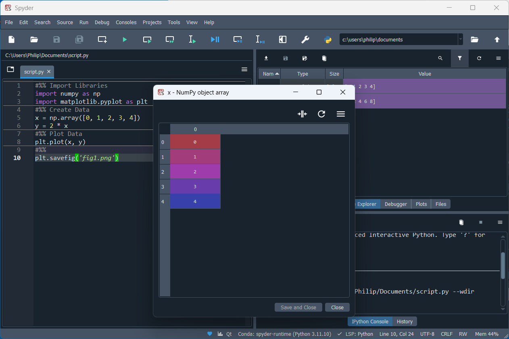
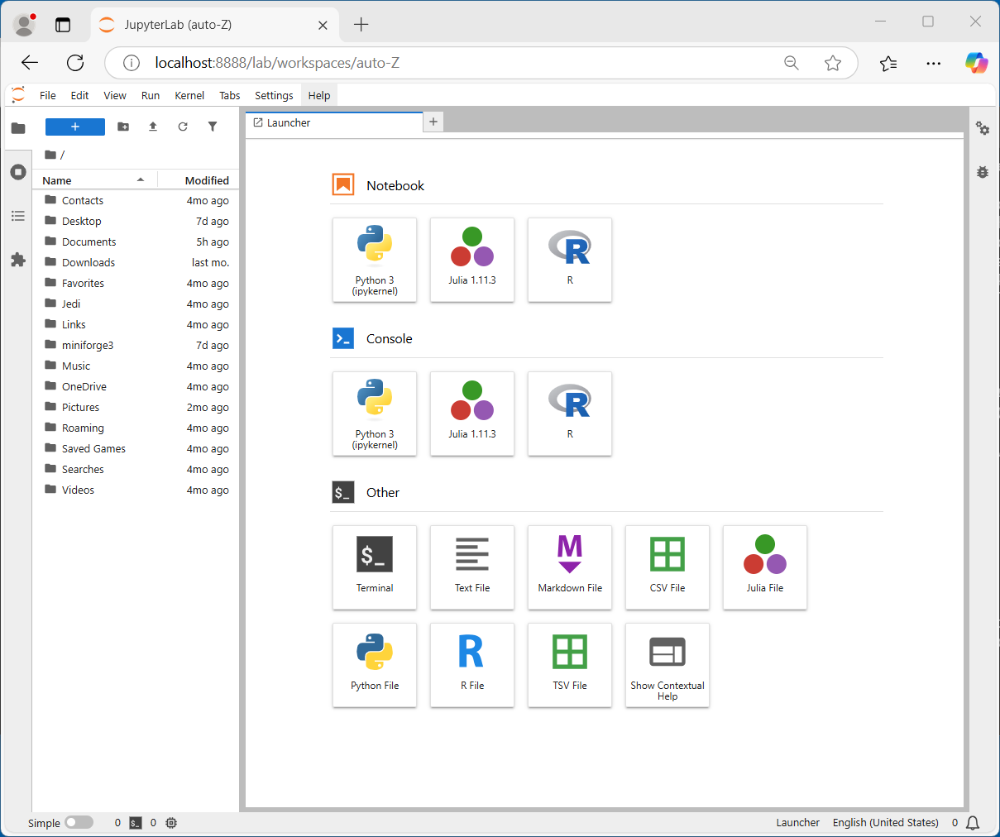
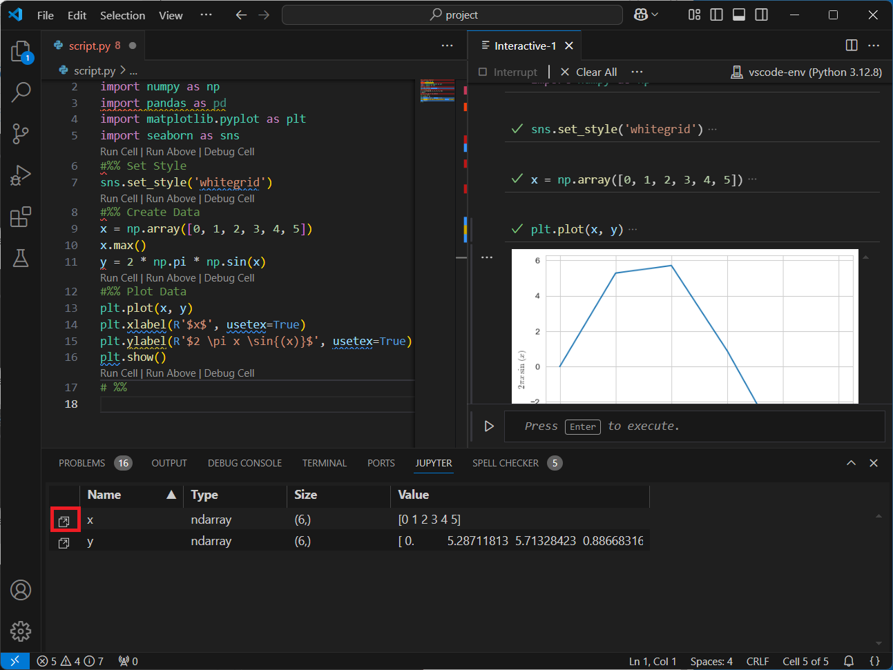

# Python Tutorials

This GitHub repository contains a number of beginner friendly Python tutorials covering installation and basic use of Python in markdown format. These guides cover the Python data model, Python standard libraries and third-party Python scientific libraries known as the numpy stack. 

Please star and share this repository if you've found it useful as it will make it easier for others to find. 

These tutorials are in markdown format and GitHub displays the markdown as a webpage. Note some of the guides are screenshot intensive and on slow connections, the browser may timeout before all the images are downloaded. The browser caches downloaded images, refresh the page a couple of times to allow the browser to download the remaining images and the page should display correctly. The GitHub repository can also be downloaded and the readme.md can be opened in VSCode. Some of the styling in the markdown tables that are ignored on GitHub will render better in VSCode. This styling more closely resembles the Variable Explorer of the Spyder IDE.

## Development Environment Setup

Python has a large number of development environments. Beginners often have problems setting up a Python environment because they use the basic installer from Python.org which only contains a very basic IDE, called IDLE. They then attempt to follow tutorials, often with a conda-based distribution such as Anaconda and end up messing up their Anaconda base (conda) Python environment because they attempt to add community channel packages to the commercial distribution which is designed to be used "as is". These setup tutorials are a bit more detailed and should familarise the user with the conda package manager examining the structure of a (conda) Python environment in the operating systems file explorer.

The following guides covers installation and basic use of the:

* **S**cientific **Py**thon **D**evelopment **E**nvi**r**onment (Spyder).

* JupyterLab (**Ju**lia, **Pyt**hon **e**t **R** **Lab**oratory)

* VSCode (**V**isual **S**tudio **Code**)

Spyder is tailored for scientists and engineers and has the most commonly used packages from the scientific stack preinstalled, a conda environment can be used to install additional packages. This makes it very beginner friendly. This installation guide will also cover installation of additional packages using Miniforge to create a `conda-forge` (community channel) environment. Additional dependencies such as TeX (commonly used in plots), which do not have a `conda-forge` package. 

JupyterLab is installed via a separate `conda-forge` (community channel) environment and is a browser-based IDE which is based around the interactive python notebook.

VSCode is a general purpose code editor and can be used with Python, when the Python related extensions are installed and a separate `conda-forge` (community channel) environment is selected as the Python interpreter and initialised with the Terminal. Beginners often struggle to get started with VScode, because they do not perform a perquisite step incorrectly or miss a perquisite step out entirely.

Preference of a specific Python IDE is somewhat subjective and I routinely use the 3 IDEs above for different purposes. These markdown tutorials can be used with any of the above 3 IDEs or another IDE that has an ipython console. As there are significant differences between Windows and Ubuntu, installation tutorials will be listed for each Operating System:

### Windows

* [GitHub Desktop Setup + Cloning this Repository](./github_install_windows/readme.md)
* [Spyder Setup + Miniforge Setup + TeX Setup](./spyder_install_windows/readme.md)
* [JupyterLab Setup](/jupyter_install_windows/readme.md)
    * [Markdown](./markdown/readme.md)
* [VSCode Setup](./vscode_install_windows/readme.md)

### Ubuntu

The Ubuntu instructions can be modified slightly for another Linux distribution and should closely resemble installation on a Mac:

* [GitHub Desktop Setup + Cloning this Repository](./github_install_ubuntu/readme.md)
* [Spyder Setup + Miniforge Setup + Tex Setup](./spyder_install_ubuntu/readme.md)
* [JupyterLab Setup](./jupyter_install_ubuntu/readme.md)
    * [Markdown](./markdown/readme.md)
* [VSCode Setup](./vscode_install_ubuntu/readme.md)

## Python and Standard Libraries

These tutorials cover the `object` orientated design pattern of `builtins` classes, focusing on text datatypes, numeric datatypes and collection datatypes. The `object` orientated design pattern is known as the Python Data Model:

* [Object Orientated Programming (OOP) and the Python Data Model](./the_python_datamodel/readme.md)
* [OOP and Text Datatypes](./text_datatypes/readme.md)
* [OOP and Numeric Datatypes](./numeric_datatypes/readme.md)
* [OOP and Collection Datatypes](./collection_datatypes/readme.md)
* [OOP and Iterator Datatypes](./iterator_datatypes/readme.md)

## Numeric Python Stack

These tutorials cover the numeric Python stack, which bridge a numeric design pattern with a collection design pattern:

* [Numeric Python Library (numpy)](./numpy_library/readme.md)
* [Matrix Plotting Library (matplotlib)](./matplotlib_library/readme.md)
* [Python and Data Analysis Library (pandas)]
* [Data Visualisation Library (seaborn)]

