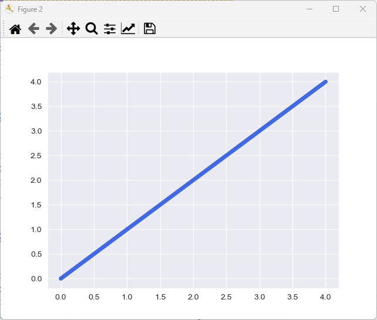
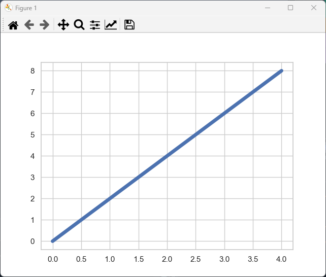
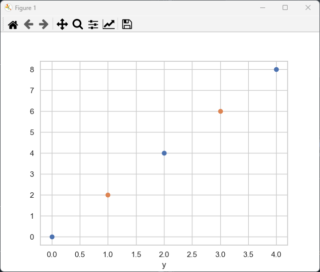
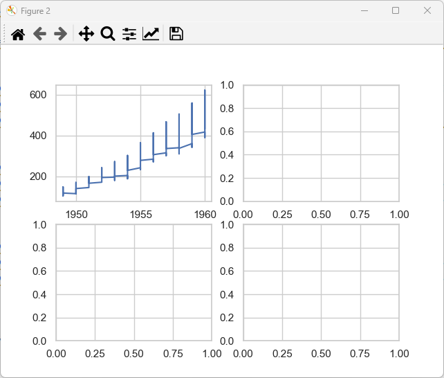
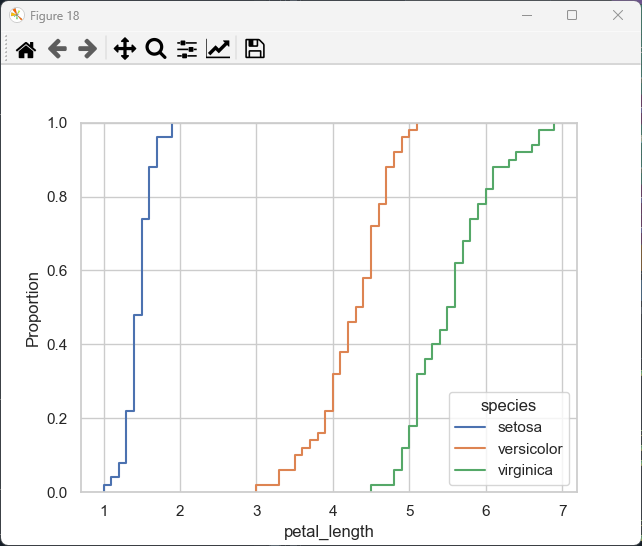

# The Seaborn Data Visualisation Library

Seaborn is a data visualisation library based upon `matplotlib`. It has an application interface which simplifies the creation of complex but common visualisation plots from data contained within a `pandas` `DataFrame`. In other words `seaborn` can be thought of as a library that bridges between `pandas` and `matplotlib`.

## Library Imports

The library name `seaborn` is derived from the two words sea and born. In this context the sea refers to a body of water i.e. a collection of data and born refers to the creation of the visualisation for that data. It is common to import `seaborn` using a 3 letter abbreviation. The abbreviation `sns` is standard:

```python
In [1]: import seaborn as sns
```

`sns` comes from the fictional character Samual Norman Seaborn from the West Wing. His initials were selected as the abbreviation by developers of the ```seaborn``` library as he has the sir name Seaborn. The library version can be determined using the data model attribute `__version__`:

```python
In [2]: sns.__version__
Out[2]: '0.13.2'
```

The version of a Python library has the form:

```
major.minor.patch
```

Normally when the `major` version of a library is `0`, it is regarded as unstable and as the library is developed, a new major version is created as depreciations are made and the application interface is cleared up as previously mentioned when examining other libraries. `seaborn` remains at a major version of `0` however should be regarded as a stable library.

`seaborn` is part of the "numpy-stack" and typically the following imports are made together:

```python
In [3]: import numpy as np
      : import matplotlib as mpl
      : import matplotlib.pyplot as plt
      : import pandas as pd
      : import seaborn as sns
```

When an import sorter is used, these third-party libraries are typically grouped alphabetically (by name of the library, not the alias, the library is imported as):

```python
In [4]: import matplotlib as mpl
      : import matplotlib.pyplot as plt
      : import numpy as np
      : import pandas as pd
      : import seaborn as sns
```

The identifiers for `sns` can be examined:

```python
In [5]: sns.
# -------------------------------------
# Available Identifiers for Seaborn:
# -------------------------------------

# 🔧 Version Information:
# - __version__                 : The version number of the currently installed Seaborn library.

# 🔬 Seaborn Styling and Theming Modules:
# - sns.colors                  : Color conversion and manipulation utilities.
# - sns.palettes                : Functions for color palette management.
# - sns.rcmod                   : Theme and style configuration.

# 🎨 Styling and Theming (sns.rcmod & sns.palettes):
# - sns.set_theme               : Sets the Seaborn theme for plots.
# - sns.set_style               : Configures the aesthetic style of plots.
# - sns.set_context             : Adjusts plot elements for different presentation settings.
# - sns.set_palette             : Sets the color palette for plots.
# - sns.color_palette           : Retrieves a color palette.
# - sns.cubehelix_palette       : Generates a cubehelix color palette.
# - sns.dark_palette            : Creates a darkened version of a color palette.
# - sns.light_palette           : Creates a lightened version of a color palette.
# - sns.diverging_palette       : Generates a diverging color palette.

# 🔬 Seaborn Utility Modules:
# - sns.utils                   : Internal utility functions.
# - sns.widgets                 : Widgets for interactive visualization.
# - sns.external                : External dependencies and extensions.

# 📌 Standard Datasets:
# - sns.load_dataset            : Loads example datasets from Seaborn.
# - sns.get_dataset_names       : Returns available built-in datasets.

# 📊📈📉 Faceted and Multi-Plot Classes:
# - sns.FacetGrid               : 📊📈📉 Class for creating faceted plots across multiple subplots.
# - sns.PairGrid                : 📊📈📉 Class for pairwise relationships between variables across multiple subplots.
# - sns.JointGrid               : 📊📈📉 Class for bivariate plots with marginal distributions across multiple subplots.

# 🔬 Seaborn Plotting Modules:
# - sns.relational              : Relational plotting functions.
# - sns.regression              : Regression-based plots.
# - sns.distributions           : Distribution plots (histograms, KDE, ECDF).
# - sns.axisgrid                : Grid-based plotting utilities (FacetGrid, PairGrid).
# - sns.categorical             : Categorical plotting functions.
# - sns.matrix                  : Functions for heatmaps and clustering.

# 📈 Relational Plotting Functions (sns.relational):
# - sns.relplot                 : 📊📈📉 FacetGrid-based regressional plot.
# - sns.lineplot                : 📉 Axes-level line plot with optional confidence intervals.
# - sns.scatterplot             : 📉 Axes-level scatter plot with additional styling options. 

# 📈 Regression and Statistical Plots (sns.regression):
# - sns.lmplot                  : 📊📈📉 FacetGrid-based linear regression plot.
# - sns.regplot                 : 📉 Axes-level plot. Plots a scatter plot with a regression line.
# - sns.residplot               : 📉 Axes-level plot. Residuals plot for regression analysis.

# 📊 Distribution Plots (sns.distributions):
# - sns.displot                 : 📊📈📉 FacetGrid-based distribution plot.
# - sns.histplot                : 📉 Axes-level histogram with flexible binning. 
# - sns.kdeplot                 : 📉 Axes-level kernel density estimation plot.
# - sns.ecdfplot                : 📉 Axes-level empirical cumulative distribution function.

# 📊 Axis Grid Plots (sns.axisgrid):
# - sns.pairplot                : 📊📈📉 FacetGrid-based pairwise scatter plots of numerical variables.

# 📊 Categorical Plotting Functions (sns.categorical):
# - sns.catplot                 : 📊📈📉 FacetGrid-based categorical plot (bar, box, violin, strip, swarm).
# - sns.swarmplot               : 📉 Axes-level categorical scatter plot with non-overlapping points.
# - sns.stripplot               : 📉 Axes-level categorical scatter plot (jittered points).
# - sns.barplot                 : 📉 Axes-level categorical bar plot with grouped data.
# - sns.countplot               : 📉 Axes-level count of categorical observations.
# - sns.boxplot                 : 📉 Axes-level box-and-whisker plot.
# - sns.violinplot              : 📉 Axes-level violin plot for visualizing distribution.

# 📊 Matrix Plots (sns.matrix):
# - sns.heatmap                 : 📉 Axes-level matrix visualization using color encoding.  

# 🔧 Utility Functions (sns.utils):
# - sns.despine                 : Removes axis spines for a cleaner plot.
# - sns.move_legend             : Moves the legend within a plot.
# - sns.axis_ticklabels_overlap : Checks for overlapping tick labels.
# - sns.relative_luminance      : Computes the luminance of a color.
# - sns.ci_to_errsize           : Converts confidence intervals into error bar sizes.
```

In the above styling and theming, utility functions and plotting functions are listed. Organisationally `sns` is compartmentalised into modules, and a function can normally be found within its expected module. The functions that are most commonly used are also found in the `sns` namespace directly:

```python
In [5]: sns.
# -------------------------------------
# Available Modules for Seaborn:
# -------------------------------------

# 🔬 Seaborn Styling and Theming Modules:
# - sns.colors                  : Color conversion and manipulation utilities.
# - sns.palettes                : Functions for color palette management.
# - sns.rcmod                   : Theme and style configuration.

# 🔬 Seaborn Plotting Modules:
# - sns.regression              : Regression-based plots.
# - sns.categorical             : Categorical plotting functions.
# - sns.distributions           : Distribution plots (histograms, KDE, ECDF).
# - sns.matrix                  : Functions for heatmaps and clustering.
# - sns.axisgrid                : Grid-based plotting utilities (FacetGrid, PairGrid).
# - sns.relational              : Relational plotting functions.

# 🔬 Seaborn Utility Modules:
# - sns.utils                   : Internal utility functions.
# - sns.widgets                 : Widgets for interactive visualization.
# - sns.external                : External dependencies and extensions.
```

## colors, style and palette

Recall `mpl.colors` module contains color `dict` instances which map an English color `str` to a harder to remember normalised color `tuple` of the form `(r, g, b)` or because 8 bits are used per color a hexadecimal ```str``` of the form `'#rrggbb'`. The most common color `dict` instances are:

```python
In [5]: mpl.colors.BASE_COLORS
Out[5]: 
{'b': (0, 0, 1),
 'g': (0, 0.5, 0),
 'r': (1, 0, 0),
 'c': (0, 0.75, 0.75),
 'm': (0.75, 0, 0.75),
 'y': (0.75, 0.75, 0),
 'k': (0, 0, 0),
 'w': (1, 1, 1)}
```

And:

```python
In [6]: mpl.colors.CSS4_COLORS
Out[6]: 
{'aliceblue': '#F0F8FF',
 'antiquewhite': '#FAEBD7',
 'aqua': '#00FFFF',
 'aquamarine': '#7FFFD4',
 'azure': '#F0FFFF',
 'beige': '#F5F5DC',
 'bisque': '#FFE4C4',
 'black': '#000000',
 'blanchedalmond': '#FFEBCD',
 'blue': '#0000FF',
 'blueviolet': '#8A2BE2',
 'brown': '#A52A2A',
 'burlywood': '#DEB887',
 'cadetblue': '#5F9EA0',
 'chartreuse': '#7FFF00',
 'chocolate': '#D2691E',
 'coral': '#FF7F50',
 'cornflowerblue': '#6495ED',
 'cornsilk': '#FFF8DC',
 'crimson': '#DC143C',
 'cyan': '#00FFFF',
 'darkblue': '#00008B',
 'darkcyan': '#008B8B',
 'darkgoldenrod': '#B8860B',
 'darkgray': '#A9A9A9',
 'darkgreen': '#006400',
 'darkgrey': '#A9A9A9',
 'darkkhaki': '#BDB76B',
 'darkmagenta': '#8B008B',
 'darkolivegreen': '#556B2F',
 'darkorange': '#FF8C00',
 'darkorchid': '#9932CC',
 'darkred': '#8B0000',
 'darksalmon': '#E9967A',
 'darkseagreen': '#8FBC8F',
 'darkslateblue': '#483D8B',
 'darkslategray': '#2F4F4F',
 'darkslategrey': '#2F4F4F',
 'darkturquoise': '#00CED1',
 'darkviolet': '#9400D3',
 'deeppink': '#FF1493',
 'deepskyblue': '#00BFFF',
 'dimgray': '#696969',
 'dimgrey': '#696969',
 'dodgerblue': '#1E90FF',
 'firebrick': '#B22222',
 'floralwhite': '#FFFAF0',
 'forestgreen': '#228B22',
 'fuchsia': '#FF00FF',
 'gainsboro': '#DCDCDC',
 'ghostwhite': '#F8F8FF',
 'gold': '#FFD700',
 'goldenrod': '#DAA520',
 'gray': '#808080',
 'green': '#008000',
 'greenyellow': '#ADFF2F',
 'grey': '#808080',
 'honeydew': '#F0FFF0',
 'hotpink': '#FF69B4',
 'indianred': '#CD5C5C',
 'indigo': '#4B0082',
 'ivory': '#FFFFF0',
 'khaki': '#F0E68C',
 'lavender': '#E6E6FA',
 'lavenderblush': '#FFF0F5',
 'lawngreen': '#7CFC00',
 'lemonchiffon': '#FFFACD',
 'lightblue': '#ADD8E6',
 'lightcoral': '#F08080',
 'lightcyan': '#E0FFFF',
 'lightgoldenrodyellow': '#FAFAD2',
 'lightgray': '#D3D3D3',
 'lightgreen': '#90EE90',
 'lightgrey': '#D3D3D3',
 'lightpink': '#FFB6C1',
 'lightsalmon': '#FFA07A',
 'lightseagreen': '#20B2AA',
 'lightskyblue': '#87CEFA',
 'lightslategray': '#778899',
 'lightslategrey': '#778899',
 'lightsteelblue': '#B0C4DE',
 'lightyellow': '#FFFFE0',
 'lime': '#00FF00',
 'limegreen': '#32CD32',
 'linen': '#FAF0E6',
 'magenta': '#FF00FF',
 'maroon': '#800000',
 'mediumaquamarine': '#66CDAA',
 'mediumblue': '#0000CD',
 'mediumorchid': '#BA55D3',
 'mediumpurple': '#9370DB',
 'mediumseagreen': '#3CB371',
 'mediumslateblue': '#7B68EE',
 'mediumspringgreen': '#00FA9A',
 'mediumturquoise': '#48D1CC',
 'mediumvioletred': '#C71585',
 'midnightblue': '#191970',
 'mintcream': '#F5FFFA',
 'mistyrose': '#FFE4E1',
 'moccasin': '#FFE4B5',
 'navajowhite': '#FFDEAD',
 'navy': '#000080',
 'oldlace': '#FDF5E6',
 'olive': '#808000',
 'olivedrab': '#6B8E23',
 'orange': '#FFA500',
 'orangered': '#FF4500',
 'orchid': '#DA70D6',
 'palegoldenrod': '#EEE8AA',
 'palegreen': '#98FB98',
 'paleturquoise': '#AFEEEE',
 'palevioletred': '#DB7093',
 'papayawhip': '#FFEFD5',
 'peachpuff': '#FFDAB9',
 'peru': '#CD853F',
 'pink': '#FFC0CB',
 'plum': '#DDA0DD',
 'powderblue': '#B0E0E6',
 'purple': '#800080',
 'rebeccapurple': '#663399',
 'red': '#FF0000',
 'rosybrown': '#BC8F8F',
 'royalblue': '#4169E1',
 'saddlebrown': '#8B4513',
 'salmon': '#FA8072',
 'sandybrown': '#F4A460',
 'seagreen': '#2E8B57',
 'seashell': '#FFF5EE',
 'sienna': '#A0522D',
 'silver': '#C0C0C0',
 'skyblue': '#87CEEB',
 'slateblue': '#6A5ACD',
 'slategray': '#708090',
 'slategrey': '#708090',
 'snow': '#FFFAFA',
 'springgreen': '#00FF7F',
 'steelblue': '#4682B4',
 'tan': '#D2B48C',
 'teal': '#008080',
 'thistle': '#D8BFD8',
 'tomato': '#FF6347',
 'turquoise': '#40E0D0',
 'violet': '#EE82EE',
 'wheat': '#F5DEB3',
 'white': '#FFFFFF',
 'whitesmoke': '#F5F5F5',
 'yellow': '#FFFF00',
 'yellowgreen': '#9ACD32'}
```

`seaborn` supplements these `dict` instances in `sns` with colors of Crayola crayon colours and kxcd colours:

```python
In [8]: sns.colors.crayons
Out[8]: 
{'Almond': '#EFDECD',
 'Antique Brass': '#CD9575',
 'Apricot': '#FDD9B5',
 'Aquamarine': '#78DBE2',
 'Asparagus': '#87A96B',
 'Atomic Tangerine': '#FFA474',
 'Banana Mania': '#FAE7B5',
 'Beaver': '#9F8170',
 'Bittersweet': '#FD7C6E',
 'Black': '#000000',
 'Blue': '#1F75FE',
 'Blue Bell': '#A2A2D0',
 'Blue Green': '#0D98BA',
 'Blue Violet': '#7366BD',
 'Blush': '#DE5D83',
 'Brick Red': '#CB4154',
 'Brown': '#B4674D',
 'Burnt Orange': '#FF7F49',
 'Burnt Sienna': '#EA7E5D',
 'Cadet Blue': '#B0B7C6',
 'Canary': '#FFFF99',
 'Caribbean Green': '#00CC99',
 'Carnation Pink': '#FFAACC',
 'Cerise': '#DD4492',
 'Cerulean': '#1DACD6',
 'Chestnut': '#BC5D58',
 'Copper': '#DD9475',
 'Cornflower': '#9ACEEB',
 'Cotton Candy': '#FFBCD9',
 'Dandelion': '#FDDB6D',
 'Denim': '#2B6CC4',
 'Desert Sand': '#EFCDB8',
 'Eggplant': '#6E5160',
 'Electric Lime': '#CEFF1D',
 'Fern': '#71BC78',
 'Forest Green': '#6DAE81',
 'Fuchsia': '#C364C5',
 'Fuzzy Wuzzy': '#CC6666',
 'Gold': '#E7C697',
 'Goldenrod': '#FCD975',
 'Granny Smith Apple': '#A8E4A0',
 'Gray': '#95918C',
 'Green': '#1CAC78',
 'Green Yellow': '#F0E891',
 'Hot Magenta': '#FF1DCE',
 'Inchworm': '#B2EC5D',
 'Indigo': '#5D76CB',
 'Jazzberry Jam': '#CA3767',
 'Jungle Green': '#3BB08F',
 'Laser Lemon': '#FEFE22',
 'Lavender': '#FCB4D5',
 'Macaroni and Cheese': '#FFBD88',
 'Magenta': '#F664AF',
 'Mahogany': '#CD4A4C',
 'Manatee': '#979AAA',
 'Mango Tango': '#FF8243',
 'Maroon': '#C8385A',
 'Mauvelous': '#EF98AA',
 'Melon': '#FDBCB4',
 'Midnight Blue': '#1A4876',
 'Mountain Meadow': '#30BA8F',
 'Navy Blue': '#1974D2',
 'Neon Carrot': '#FFA343',
 'Olive Green': '#BAB86C',
 'Orange': '#FF7538',
 'Orchid': '#E6A8D7',
 'Outer Space': '#414A4C',
 'Outrageous Orange': '#FF6E4A',
 'Pacific Blue': '#1CA9C9',
 'Peach': '#FFCFAB',
 'Periwinkle': '#C5D0E6',
 'Piggy Pink': '#FDDDE6',
 'Pine Green': '#158078',
 'Pink Flamingo': '#FC74FD',
 'Pink Sherbert': '#F78FA7',
 'Plum': '#8E4585',
 'Purple Heart': '#7442C8',
 "Purple Mountains' Majesty": '#9D81BA',
 'Purple Pizzazz': '#FE4EDA',
 'Radical Red': '#FF496C',
 'Raw Sienna': '#D68A59',
 'Razzle Dazzle Rose': '#FF48D0',
 'Razzmatazz': '#E3256B',
 'Red': '#EE204D',
 'Red Orange': '#FF5349',
 'Red Violet': '#C0448F',
 "Robin's Egg Blue": '#1FCECB',
 'Royal Purple': '#7851A9',
 'Salmon': '#FF9BAA',
 'Scarlet': '#FC2847',
 "Screamin' Green": '#76FF7A',
 'Sea Green': '#93DFB8',
 'Sepia': '#A5694F',
 'Shadow': '#8A795D',
 'Shamrock': '#45CEA2',
 'Shocking Pink': '#FB7EFD',
 'Silver': '#CDC5C2',
 'Sky Blue': '#80DAEB',
 'Spring Green': '#ECEABE',
 'Sunglow': '#FFCF48',
 'Sunset Orange': '#FD5E53',
 'Tan': '#FAA76C',
 'Tickle Me Pink': '#FC89AC',
 'Timberwolf': '#DBD7D2',
 'Tropical Rain Forest': '#17806D',
 'Tumbleweed': '#DEAA88',
 'Turquoise Blue': '#77DDE7',
 'Unmellow Yellow': '#FFFF66',
 'Violet (Purple)': '#926EAE',
 'Violet Red': '#F75394',
 'Vivid Tangerine': '#FFA089',
 'Vivid Violet': '#8F509D',
 'White': '#FFFFFF',
 'Wild Blue Yonder': '#A2ADD0',
 'Wild Strawberry': '#FF43A4',
 'Wild Watermelon': '#FC6C85',
 'Wisteria': '#CDA4DE',
 'Yellow': '#FCE883',
 'Yellow Green': '#C5E384',
 'Yellow Orange': '#FFAE42'}
```

```python
In [9]: sns.colors.xkcd_rgb
Out[9]:
{'acid green': '#8ffe09',
 'adobe': '#bd6c48',
 'algae': '#54ac68',
 'algae green': '#21c36f',
 'almost black': '#070d0d',
 'amber': '#feb308',
 'amethyst': '#9b5fc0',
 'apple': '#6ecb3c',
 'apple green': '#76cd26',
 'apricot': '#ffb16d',
 'aqua': '#13eac9',
 'aqua blue': '#02d8e9',
 'aqua green': '#12e193',
 'aqua marine': '#2ee8bb',
 'aquamarine': '#04d8b2',
 'army green': '#4b5d16',
 'asparagus': '#77ab56',
 'aubergine': '#3d0734',
 'auburn': '#9a3001',
 'avocado': '#90b134',
 'avocado green': '#87a922',
 'azul': '#1d5dec',
 'azure': '#069af3',
 'baby blue': '#a2cffe',
 'baby green': '#8cff9e',
 'baby pink': '#ffb7ce',
 'baby poo': '#ab9004',
 'baby poop': '#937c00',
 'baby poop green': '#8f9805',
 'baby puke green': '#b6c406',
 'baby purple': '#ca9bf7',
 'baby shit brown': '#ad900d',
 'baby shit green': '#889717',
 'banana': '#ffff7e',
 'banana yellow': '#fafe4b',
 'barbie pink': '#fe46a5',
 'barf green': '#94ac02',
 'barney': '#ac1db8',
 'barney purple': '#a00498',
 'battleship grey': '#6b7c85',
 'beige': '#e6daa6',
 'berry': '#990f4b',
 'bile': '#b5c306',
 'black': '#000000',
 'bland': '#afa88b',
 'blood': '#770001',
 'blood orange': '#fe4b03',
 'blood red': '#980002',
 'blue': '#0343df',
 'blue blue': '#2242c7',
 'blue green': '#137e6d',
 'blue grey': '#607c8e',
 'blue purple': '#5729ce',
 'blue violet': '#5d06e9',
 'blue with a hint of purple': '#533cc6',
 'blue/green': '#0f9b8e',
 'blue/grey': '#758da3',
 'blue/purple': '#5a06ef',
 'blueberry': '#464196',
 'bluegreen': '#017a79',
 'bluegrey': '#85a3b2',
 'bluey green': '#2bb179',
 'bluey grey': '#89a0b0',
 'bluey purple': '#6241c7',
 'bluish': '#2976bb',
 'bluish green': '#10a674',
 'bluish grey': '#748b97',
 'bluish purple': '#703be7',
 'blurple': '#5539cc',
 'blush': '#f29e8e',
 'blush pink': '#fe828c',
 'booger': '#9bb53c',
 'booger green': '#96b403',
 'bordeaux': '#7b002c',
 'boring green': '#63b365',
 'bottle green': '#044a05',
 'brick': '#a03623',
 'brick orange': '#c14a09',
 'brick red': '#8f1402',
 'bright aqua': '#0bf9ea',
 'bright blue': '#0165fc',
 'bright cyan': '#41fdfe',
 'bright green': '#01ff07',
 'bright lavender': '#c760ff',
 'bright light blue': '#26f7fd',
 'bright light green': '#2dfe54',
 'bright lilac': '#c95efb',
 'bright lime': '#87fd05',
 'bright lime green': '#65fe08',
 'bright magenta': '#ff08e8',
 'bright olive': '#9cbb04',
 'bright orange': '#ff5b00',
 'bright pink': '#fe01b1',
 'bright purple': '#be03fd',
 'bright red': '#ff000d',
 'bright sea green': '#05ffa6',
 'bright sky blue': '#02ccfe',
 'bright teal': '#01f9c6',
 'bright turquoise': '#0ffef9',
 'bright violet': '#ad0afd',
 'bright yellow': '#fffd01',
 'bright yellow green': '#9dff00',
 'british racing green': '#05480d',
 'bronze': '#a87900',
 'brown': '#653700',
 'brown green': '#706c11',
 'brown grey': '#8d8468',
 'brown orange': '#b96902',
 'brown red': '#922b05',
 'brown yellow': '#b29705',
 'brownish': '#9c6d57',
 'brownish green': '#6a6e09',
 'brownish grey': '#86775f',
 'brownish orange': '#cb7723',
 'brownish pink': '#c27e79',
 'brownish purple': '#76424e',
 'brownish red': '#9e3623',
 'brownish yellow': '#c9b003',
 'browny green': '#6f6c0a',
 'browny orange': '#ca6b02',
 'bruise': '#7e4071',
 'bubble gum pink': '#ff69af',
 'bubblegum': '#ff6cb5',
 'bubblegum pink': '#fe83cc',
 'buff': '#fef69e',
 'burgundy': '#610023',
 'burnt orange': '#c04e01',
 'burnt red': '#9f2305',
 'burnt siena': '#b75203',
 'burnt sienna': '#b04e0f',
 'burnt umber': '#a0450e',
 'burnt yellow': '#d5ab09',
 'burple': '#6832e3',
 'butter': '#ffff81',
 'butter yellow': '#fffd74',
 'butterscotch': '#fdb147',
 'cadet blue': '#4e7496',
 'camel': '#c69f59',
 'camo': '#7f8f4e',
 'camo green': '#526525',
 'camouflage green': '#4b6113',
 'canary': '#fdff63',
 'canary yellow': '#fffe40',
 'candy pink': '#ff63e9',
 'caramel': '#af6f09',
 'carmine': '#9d0216',
 'carnation': '#fd798f',
 'carnation pink': '#ff7fa7',
 'carolina blue': '#8ab8fe',
 'celadon': '#befdb7',
 'celery': '#c1fd95',
 'cement': '#a5a391',
 'cerise': '#de0c62',
 'cerulean': '#0485d1',
 'cerulean blue': '#056eee',
 'charcoal': '#343837',
 'charcoal grey': '#3c4142',
 'chartreuse': '#c1f80a',
 'cherry': '#cf0234',
 'cherry red': '#f7022a',
 'chestnut': '#742802',
 'chocolate': '#3d1c02',
 'chocolate brown': '#411900',
 'cinnamon': '#ac4f06',
 'claret': '#680018',
 'clay': '#b66a50',
 'clay brown': '#b2713d',
 'clear blue': '#247afd',
 'cloudy blue': '#acc2d9',
 'cobalt': '#1e488f',
 'cobalt blue': '#030aa7',
 'cocoa': '#875f42',
 'coffee': '#a6814c',
 'cool blue': '#4984b8',
 'cool green': '#33b864',
 'cool grey': '#95a3a6',
 'copper': '#b66325',
 'coral': '#fc5a50',
 'coral pink': '#ff6163',
 'cornflower': '#6a79f7',
 'cornflower blue': '#5170d7',
 'cranberry': '#9e003a',
 'cream': '#ffffc2',
 'creme': '#ffffb6',
 'crimson': '#8c000f',
 'custard': '#fffd78',
 'cyan': '#00ffff',
 'dandelion': '#fedf08',
 'dark': '#1b2431',
 'dark aqua': '#05696b',
 'dark aquamarine': '#017371',
 'dark beige': '#ac9362',
 'dark blue': '#00035b',
 'dark blue green': '#005249',
 'dark blue grey': '#1f3b4d',
 'dark brown': '#341c02',
 'dark coral': '#cf524e',
 'dark cream': '#fff39a',
 'dark cyan': '#0a888a',
 'dark forest green': '#002d04',
 'dark fuchsia': '#9d0759',
 'dark gold': '#b59410',
 'dark grass green': '#388004',
 'dark green': '#033500',
 'dark green blue': '#1f6357',
 'dark grey': '#363737',
 'dark grey blue': '#29465b',
 'dark hot pink': '#d90166',
 'dark indigo': '#1f0954',
 'dark khaki': '#9b8f55',
 'dark lavender': '#856798',
 'dark lilac': '#9c6da5',
 'dark lime': '#84b701',
 'dark lime green': '#7ebd01',
 'dark magenta': '#960056',
 'dark maroon': '#3c0008',
 'dark mauve': '#874c62',
 'dark mint': '#48c072',
 'dark mint green': '#20c073',
 'dark mustard': '#a88905',
 'dark navy': '#000435',
 'dark navy blue': '#00022e',
 'dark olive': '#373e02',
 'dark olive green': '#3c4d03',
 'dark orange': '#c65102',
 'dark pastel green': '#56ae57',
 'dark peach': '#de7e5d',
 'dark periwinkle': '#665fd1',
 'dark pink': '#cb416b',
 'dark plum': '#3f012c',
 'dark purple': '#35063e',
 'dark red': '#840000',
 'dark rose': '#b5485d',
 'dark royal blue': '#02066f',
 'dark sage': '#598556',
 'dark salmon': '#c85a53',
 'dark sand': '#a88f59',
 'dark sea green': '#11875d',
 'dark seafoam': '#1fb57a',
 'dark seafoam green': '#3eaf76',
 'dark sky blue': '#448ee4',
 'dark slate blue': '#214761',
 'dark tan': '#af884a',
 'dark taupe': '#7f684e',
 'dark teal': '#014d4e',
 'dark turquoise': '#045c5a',
 'dark violet': '#34013f',
 'dark yellow': '#d5b60a',
 'dark yellow green': '#728f02',
 'darkblue': '#030764',
 'darkgreen': '#054907',
 'darkish blue': '#014182',
 'darkish green': '#287c37',
 'darkish pink': '#da467d',
 'darkish purple': '#751973',
 'darkish red': '#a90308',
 'deep aqua': '#08787f',
 'deep blue': '#040273',
 'deep brown': '#410200',
 'deep green': '#02590f',
 'deep lavender': '#8d5eb7',
 'deep lilac': '#966ebd',
 'deep magenta': '#a0025c',
 'deep orange': '#dc4d01',
 'deep pink': '#cb0162',
 'deep purple': '#36013f',
 'deep red': '#9a0200',
 'deep rose': '#c74767',
 'deep sea blue': '#015482',
 'deep sky blue': '#0d75f8',
 'deep teal': '#00555a',
 'deep turquoise': '#017374',
 'deep violet': '#490648',
 'denim': '#3b638c',
 'denim blue': '#3b5b92',
 'desert': '#ccad60',
 'diarrhea': '#9f8303',
 'dirt': '#8a6e45',
 'dirt brown': '#836539',
 'dirty blue': '#3f829d',
 'dirty green': '#667e2c',
 'dirty orange': '#c87606',
 'dirty pink': '#ca7b80',
 'dirty purple': '#734a65',
 'dirty yellow': '#cdc50a',
 'dodger blue': '#3e82fc',
 'drab': '#828344',
 'drab green': '#749551',
 'dried blood': '#4b0101',
 'duck egg blue': '#c3fbf4',
 'dull blue': '#49759c',
 'dull brown': '#876e4b',
 'dull green': '#74a662',
 'dull orange': '#d8863b',
 'dull pink': '#d5869d',
 'dull purple': '#84597e',
 'dull red': '#bb3f3f',
 'dull teal': '#5f9e8f',
 'dull yellow': '#eedc5b',
 'dusk': '#4e5481',
 'dusk blue': '#26538d',
 'dusky blue': '#475f94',
 'dusky pink': '#cc7a8b',
 'dusky purple': '#895b7b',
 'dusky rose': '#ba6873',
 'dust': '#b2996e',
 'dusty blue': '#5a86ad',
 'dusty green': '#76a973',
 'dusty lavender': '#ac86a8',
 'dusty orange': '#f0833a',
 'dusty pink': '#d58a94',
 'dusty purple': '#825f87',
 'dusty red': '#b9484e',
 'dusty rose': '#c0737a',
 'dusty teal': '#4c9085',
 'earth': '#a2653e',
 'easter green': '#8cfd7e',
 'easter purple': '#c071fe',
 'ecru': '#feffca',
 'egg shell': '#fffcc4',
 'eggplant': '#380835',
 'eggplant purple': '#430541',
 'eggshell': '#ffffd4',
 'eggshell blue': '#c4fff7',
 'electric blue': '#0652ff',
 'electric green': '#21fc0d',
 'electric lime': '#a8ff04',
 'electric pink': '#ff0490',
 'electric purple': '#aa23ff',
 'emerald': '#01a049',
 'emerald green': '#028f1e',
 'evergreen': '#05472a',
 'faded blue': '#658cbb',
 'faded green': '#7bb274',
 'faded orange': '#f0944d',
 'faded pink': '#de9dac',
 'faded purple': '#916e99',
 'faded red': '#d3494e',
 'faded yellow': '#feff7f',
 'fawn': '#cfaf7b',
 'fern': '#63a950',
 'fern green': '#548d44',
 'fire engine red': '#fe0002',
 'flat blue': '#3c73a8',
 'flat green': '#699d4c',
 'fluorescent green': '#08ff08',
 'fluro green': '#0aff02',
 'foam green': '#90fda9',
 'forest': '#0b5509',
 'forest green': '#06470c',
 'forrest green': '#154406',
 'french blue': '#436bad',
 'fresh green': '#69d84f',
 'frog green': '#58bc08',
 'fuchsia': '#ed0dd9',
 'gold': '#dbb40c',
 'golden': '#f5bf03',
 'golden brown': '#b27a01',
 'golden rod': '#f9bc08',
 'golden yellow': '#fec615',
 'goldenrod': '#fac205',
 'grape': '#6c3461',
 'grape purple': '#5d1451',
 'grapefruit': '#fd5956',
 'grass': '#5cac2d',
 'grass green': '#3f9b0b',
 'grassy green': '#419c03',
 'green': '#15b01a',
 'green apple': '#5edc1f',
 'green blue': '#06b48b',
 'green brown': '#544e03',
 'green grey': '#77926f',
 'green teal': '#0cb577',
 'green yellow': '#c9ff27',
 'green/blue': '#01c08d',
 'green/yellow': '#b5ce08',
 'greenblue': '#23c48b',
 'greenish': '#40a368',
 'greenish beige': '#c9d179',
 'greenish blue': '#0b8b87',
 'greenish brown': '#696112',
 'greenish cyan': '#2afeb7',
 'greenish grey': '#96ae8d',
 'greenish tan': '#bccb7a',
 'greenish teal': '#32bf84',
 'greenish turquoise': '#00fbb0',
 'greenish yellow': '#cdfd02',
 'greeny blue': '#42b395',
 'greeny brown': '#696006',
 'greeny grey': '#7ea07a',
 'greeny yellow': '#c6f808',
 'grey': '#929591',
 'grey blue': '#6b8ba4',
 'grey brown': '#7f7053',
 'grey green': '#789b73',
 'grey pink': '#c3909b',
 'grey purple': '#826d8c',
 'grey teal': '#5e9b8a',
 'grey/blue': '#647d8e',
 'grey/green': '#86a17d',
 'greyblue': '#77a1b5',
 'greyish': '#a8a495',
 'greyish blue': '#5e819d',
 'greyish brown': '#7a6a4f',
 'greyish green': '#82a67d',
 'greyish pink': '#c88d94',
 'greyish purple': '#887191',
 'greyish teal': '#719f91',
 'gross green': '#a0bf16',
 'gunmetal': '#536267',
 'hazel': '#8e7618',
 'heather': '#a484ac',
 'heliotrope': '#d94ff5',
 'highlighter green': '#1bfc06',
 'hospital green': '#9be5aa',
 'hot green': '#25ff29',
 'hot magenta': '#f504c9',
 'hot pink': '#ff028d',
 'hot purple': '#cb00f5',
 'hunter green': '#0b4008',
 'ice': '#d6fffa',
 'ice blue': '#d7fffe',
 'icky green': '#8fae22',
 'indian red': '#850e04',
 'indigo': '#380282',
 'indigo blue': '#3a18b1',
 'iris': '#6258c4',
 'irish green': '#019529',
 'ivory': '#ffffcb',
 'jade': '#1fa774',
 'jade green': '#2baf6a',
 'jungle green': '#048243',
 'kelley green': '#009337',
 'kelly green': '#02ab2e',
 'kermit green': '#5cb200',
 'key lime': '#aeff6e',
 'khaki': '#aaa662',
 'khaki green': '#728639',
 'kiwi': '#9cef43',
 'kiwi green': '#8ee53f',
 'lavender': '#c79fef',
 'lavender blue': '#8b88f8',
 'lavender pink': '#dd85d7',
 'lawn green': '#4da409',
 'leaf': '#71aa34',
 'leaf green': '#5ca904',
 'leafy green': '#51b73b',
 'leather': '#ac7434',
 'lemon': '#fdff52',
 'lemon green': '#adf802',
 'lemon lime': '#bffe28',
 'lemon yellow': '#fdff38',
 'lichen': '#8fb67b',
 'light aqua': '#8cffdb',
 'light aquamarine': '#7bfdc7',
 'light beige': '#fffeb6',
 'light blue': '#95d0fc',
 'light blue green': '#7efbb3',
 'light blue grey': '#b7c9e2',
 'light bluish green': '#76fda8',
 'light bright green': '#53fe5c',
 'light brown': '#ad8150',
 'light burgundy': '#a8415b',
 'light cyan': '#acfffc',
 'light eggplant': '#894585',
 'light forest green': '#4f9153',
 'light gold': '#fddc5c',
 'light grass green': '#9af764',
 'light green': '#96f97b',
 'light green blue': '#56fca2',
 'light greenish blue': '#63f7b4',
 'light grey': '#d8dcd6',
 'light grey blue': '#9dbcd4',
 'light grey green': '#b7e1a1',
 'light indigo': '#6d5acf',
 'light khaki': '#e6f2a2',
 'light lavendar': '#efc0fe',
 'light lavender': '#dfc5fe',
 'light light blue': '#cafffb',
 'light light green': '#c8ffb0',
 'light lilac': '#edc8ff',
 'light lime': '#aefd6c',
 'light lime green': '#b9ff66',
 'light magenta': '#fa5ff7',
 'light maroon': '#a24857',
 'light mauve': '#c292a1',
 'light mint': '#b6ffbb',
 'light mint green': '#a6fbb2',
 'light moss green': '#a6c875',
 'light mustard': '#f7d560',
 'light navy': '#155084',
 'light navy blue': '#2e5a88',
 'light neon green': '#4efd54',
 'light olive': '#acbf69',
 'light olive green': '#a4be5c',
 'light orange': '#fdaa48',
 'light pastel green': '#b2fba5',
 'light pea green': '#c4fe82',
 'light peach': '#ffd8b1',
 'light periwinkle': '#c1c6fc',
 'light pink': '#ffd1df',
 'light plum': '#9d5783',
 'light purple': '#bf77f6',
 'light red': '#ff474c',
 'light rose': '#ffc5cb',
 'light royal blue': '#3a2efe',
 'light sage': '#bcecac',
 'light salmon': '#fea993',
 'light sea green': '#98f6b0',
 'light seafoam': '#a0febf',
 'light seafoam green': '#a7ffb5',
 'light sky blue': '#c6fcff',
 'light tan': '#fbeeac',
 'light teal': '#90e4c1',
 'light turquoise': '#7ef4cc',
 'light urple': '#b36ff6',
 'light violet': '#d6b4fc',
 'light yellow': '#fffe7a',
 'light yellow green': '#ccfd7f',
 'light yellowish green': '#c2ff89',
 'lightblue': '#7bc8f6',
 'lighter green': '#75fd63',
 'lighter purple': '#a55af4',
 'lightgreen': '#76ff7b',
 'lightish blue': '#3d7afd',
 'lightish green': '#61e160',
 'lightish purple': '#a552e6',
 'lightish red': '#fe2f4a',
 'lilac': '#cea2fd',
 'liliac': '#c48efd',
 'lime': '#aaff32',
 'lime green': '#89fe05',
 'lime yellow': '#d0fe1d',
 'lipstick': '#d5174e',
 'lipstick red': '#c0022f',
 'macaroni and cheese': '#efb435',
 'magenta': '#c20078',
 'mahogany': '#4a0100',
 'maize': '#f4d054',
 'mango': '#ffa62b',
 'manilla': '#fffa86',
 'marigold': '#fcc006',
 'marine': '#042e60',
 'marine blue': '#01386a',
 'maroon': '#650021',
 'mauve': '#ae7181',
 'medium blue': '#2c6fbb',
 'medium brown': '#7f5112',
 'medium green': '#39ad48',
 'medium grey': '#7d7f7c',
 'medium pink': '#f36196',
 'medium purple': '#9e43a2',
 'melon': '#ff7855',
 'merlot': '#730039',
 'metallic blue': '#4f738e',
 'mid blue': '#276ab3',
 'mid green': '#50a747',
 'midnight': '#03012d',
 'midnight blue': '#020035',
 'midnight purple': '#280137',
 'military green': '#667c3e',
 'milk chocolate': '#7f4e1e',
 'mint': '#9ffeb0',
 'mint green': '#8fff9f',
 'minty green': '#0bf77d',
 'mocha': '#9d7651',
 'moss': '#769958',
 'moss green': '#658b38',
 'mossy green': '#638b27',
 'mud': '#735c12',
 'mud brown': '#60460f',
 'mud green': '#606602',
 'muddy brown': '#886806',
 'muddy green': '#657432',
 'muddy yellow': '#bfac05',
 'mulberry': '#920a4e',
 'murky green': '#6c7a0e',
 'mushroom': '#ba9e88',
 'mustard': '#ceb301',
 'mustard brown': '#ac7e04',
 'mustard green': '#a8b504',
 'mustard yellow': '#d2bd0a',
 'muted blue': '#3b719f',
 'muted green': '#5fa052',
 'muted pink': '#d1768f',
 'muted purple': '#805b87',
 'nasty green': '#70b23f',
 'navy': '#01153e',
 'navy blue': '#001146',
 'navy green': '#35530a',
 'neon blue': '#04d9ff',
 'neon green': '#0cff0c',
 'neon pink': '#fe019a',
 'neon purple': '#bc13fe',
 'neon red': '#ff073a',
 'neon yellow': '#cfff04',
 'nice blue': '#107ab0',
 'night blue': '#040348',
 'ocean': '#017b92',
 'ocean blue': '#03719c',
 'ocean green': '#3d9973',
 'ocher': '#bf9b0c',
 'ochre': '#bf9005',
 'ocre': '#c69c04',
 'off blue': '#5684ae',
 'off green': '#6ba353',
 'off white': '#ffffe4',
 'off yellow': '#f1f33f',
 'old pink': '#c77986',
 'old rose': '#c87f89',
 'olive': '#6e750e',
 'olive brown': '#645403',
 'olive drab': '#6f7632',
 'olive green': '#677a04',
 'olive yellow': '#c2b709',
 'orange': '#f97306',
 'orange brown': '#be6400',
 'orange pink': '#ff6f52',
 'orange red': '#fd411e',
 'orange yellow': '#ffad01',
 'orangeish': '#fd8d49',
 'orangered': '#fe420f',
 'orangey brown': '#b16002',
 'orangey red': '#fa4224',
 'orangey yellow': '#fdb915',
 'orangish': '#fc824a',
 'orangish brown': '#b25f03',
 'orangish red': '#f43605',
 'orchid': '#c875c4',
 'pale': '#fff9d0',
 'pale aqua': '#b8ffeb',
 'pale blue': '#d0fefe',
 'pale brown': '#b1916e',
 'pale cyan': '#b7fffa',
 'pale gold': '#fdde6c',
 'pale green': '#c7fdb5',
 'pale grey': '#fdfdfe',
 'pale lavender': '#eecffe',
 'pale light green': '#b1fc99',
 'pale lilac': '#e4cbff',
 'pale lime': '#befd73',
 'pale lime green': '#b1ff65',
 'pale magenta': '#d767ad',
 'pale mauve': '#fed0fc',
 'pale olive': '#b9cc81',
 'pale olive green': '#b1d27b',
 'pale orange': '#ffa756',
 'pale peach': '#ffe5ad',
 'pale pink': '#ffcfdc',
 'pale purple': '#b790d4',
 'pale red': '#d9544d',
 'pale rose': '#fdc1c5',
 'pale salmon': '#ffb19a',
 'pale sky blue': '#bdf6fe',
 'pale teal': '#82cbb2',
 'pale turquoise': '#a5fbd5',
 'pale violet': '#ceaefa',
 'pale yellow': '#ffff84',
 'parchment': '#fefcaf',
 'pastel blue': '#a2bffe',
 'pastel green': '#b0ff9d',
 'pastel orange': '#ff964f',
 'pastel pink': '#ffbacd',
 'pastel purple': '#caa0ff',
 'pastel red': '#db5856',
 'pastel yellow': '#fffe71',
 'pea': '#a4bf20',
 'pea green': '#8eab12',
 'pea soup': '#929901',
 'pea soup green': '#94a617',
 'peach': '#ffb07c',
 'peachy pink': '#ff9a8a',
 'peacock blue': '#016795',
 'pear': '#cbf85f',
 'periwinkle': '#8e82fe',
 'periwinkle blue': '#8f99fb',
 'perrywinkle': '#8f8ce7',
 'petrol': '#005f6a',
 'pig pink': '#e78ea5',
 'pine': '#2b5d34',
 'pine green': '#0a481e',
 'pink': '#ff81c0',
 'pink purple': '#db4bda',
 'pink red': '#f5054f',
 'pink/purple': '#ef1de7',
 'pinkish': '#d46a7e',
 'pinkish brown': '#b17261',
 'pinkish grey': '#c8aca9',
 'pinkish orange': '#ff724c',
 'pinkish purple': '#d648d7',
 'pinkish red': '#f10c45',
 'pinkish tan': '#d99b82',
 'pinky': '#fc86aa',
 'pinky purple': '#c94cbe',
 'pinky red': '#fc2647',
 'piss yellow': '#ddd618',
 'pistachio': '#c0fa8b',
 'plum': '#580f41',
 'plum purple': '#4e0550',
 'poison green': '#40fd14',
 'poo': '#8f7303',
 'poo brown': '#885f01',
 'poop': '#7f5e00',
 'poop brown': '#7a5901',
 'poop green': '#6f7c00',
 'powder blue': '#b1d1fc',
 'powder pink': '#ffb2d0',
 'primary blue': '#0804f9',
 'prussian blue': '#004577',
 'puce': '#a57e52',
 'puke': '#a5a502',
 'puke brown': '#947706',
 'puke green': '#9aae07',
 'puke yellow': '#c2be0e',
 'pumpkin': '#e17701',
 'pumpkin orange': '#fb7d07',
 'pure blue': '#0203e2',
 'purple': '#7e1e9c',
 'purple blue': '#632de9',
 'purple brown': '#673a3f',
 'purple grey': '#866f85',
 'purple pink': '#e03fd8',
 'purple red': '#990147',
 'purple/blue': '#5d21d0',
 'purple/pink': '#d725de',
 'purpleish': '#98568d',
 'purpleish blue': '#6140ef',
 'purpleish pink': '#df4ec8',
 'purpley': '#8756e4',
 'purpley blue': '#5f34e7',
 'purpley grey': '#947e94',
 'purpley pink': '#c83cb9',
 'purplish': '#94568c',
 'purplish blue': '#601ef9',
 'purplish brown': '#6b4247',
 'purplish grey': '#7a687f',
 'purplish pink': '#ce5dae',
 'purplish red': '#b0054b',
 'purply': '#983fb2',
 'purply blue': '#661aee',
 'purply pink': '#f075e6',
 'putty': '#beae8a',
 'racing green': '#014600',
 'radioactive green': '#2cfa1f',
 'raspberry': '#b00149',
 'raw sienna': '#9a6200',
 'raw umber': '#a75e09',
 'really light blue': '#d4ffff',
 'red': '#e50000',
 'red brown': '#8b2e16',
 'red orange': '#fd3c06',
 'red pink': '#fa2a55',
 'red purple': '#820747',
 'red violet': '#9e0168',
 'red wine': '#8c0034',
 'reddish': '#c44240',
 'reddish brown': '#7f2b0a',
 'reddish grey': '#997570',
 'reddish orange': '#f8481c',
 'reddish pink': '#fe2c54',
 'reddish purple': '#910951',
 'reddy brown': '#6e1005',
 'rich blue': '#021bf9',
 'rich purple': '#720058',
 'robin egg blue': '#8af1fe',
 "robin's egg": '#6dedfd',
 "robin's egg blue": '#98eff9',
 'rosa': '#fe86a4',
 'rose': '#cf6275',
 'rose pink': '#f7879a',
 'rose red': '#be013c',
 'rosy pink': '#f6688e',
 'rouge': '#ab1239',
 'royal': '#0c1793',
 'royal blue': '#0504aa',
 'royal purple': '#4b006e',
 'ruby': '#ca0147',
 'russet': '#a13905',
 'rust': '#a83c09',
 'rust brown': '#8b3103',
 'rust orange': '#c45508',
 'rust red': '#aa2704',
 'rusty orange': '#cd5909',
 'rusty red': '#af2f0d',
 'saffron': '#feb209',
 'sage': '#87ae73',
 'sage green': '#88b378',
 'salmon': '#ff796c',
 'salmon pink': '#fe7b7c',
 'sand': '#e2ca76',
 'sand brown': '#cba560',
 'sand yellow': '#fce166',
 'sandstone': '#c9ae74',
 'sandy': '#f1da7a',
 'sandy brown': '#c4a661',
 'sandy yellow': '#fdee73',
 'sap green': '#5c8b15',
 'sapphire': '#2138ab',
 'scarlet': '#be0119',
 'sea': '#3c9992',
 'sea blue': '#047495',
 'sea green': '#53fca1',
 'seafoam': '#80f9ad',
 'seafoam blue': '#78d1b6',
 'seafoam green': '#7af9ab',
 'seaweed': '#18d17b',
 'seaweed green': '#35ad6b',
 'sepia': '#985e2b',
 'shamrock': '#01b44c',
 'shamrock green': '#02c14d',
 'shit': '#7f5f00',
 'shit brown': '#7b5804',
 'shit green': '#758000',
 'shocking pink': '#fe02a2',
 'sick green': '#9db92c',
 'sickly green': '#94b21c',
 'sickly yellow': '#d0e429',
 'sienna': '#a9561e',
 'silver': '#c5c9c7',
 'sky': '#82cafc',
 'sky blue': '#75bbfd',
 'slate': '#516572',
 'slate blue': '#5b7c99',
 'slate green': '#658d6d',
 'slate grey': '#59656d',
 'slime green': '#99cc04',
 'snot': '#acbb0d',
 'snot green': '#9dc100',
 'soft blue': '#6488ea',
 'soft green': '#6fc276',
 'soft pink': '#fdb0c0',
 'soft purple': '#a66fb5',
 'spearmint': '#1ef876',
 'spring green': '#a9f971',
 'spruce': '#0a5f38',
 'squash': '#f2ab15',
 'steel': '#738595',
 'steel blue': '#5a7d9a',
 'steel grey': '#6f828a',
 'stone': '#ada587',
 'stormy blue': '#507b9c',
 'straw': '#fcf679',
 'strawberry': '#fb2943',
 'strong blue': '#0c06f7',
 'strong pink': '#ff0789',
 'sun yellow': '#ffdf22',
 'sunflower': '#ffc512',
 'sunflower yellow': '#ffda03',
 'sunny yellow': '#fff917',
 'sunshine yellow': '#fffd37',
 'swamp': '#698339',
 'swamp green': '#748500',
 'tan': '#d1b26f',
 'tan brown': '#ab7e4c',
 'tan green': '#a9be70',
 'tangerine': '#ff9408',
 'taupe': '#b9a281',
 'tea': '#65ab7c',
 'tea green': '#bdf8a3',
 'teal': '#029386',
 'teal blue': '#01889f',
 'teal green': '#25a36f',
 'tealish': '#24bca8',
 'tealish green': '#0cdc73',
 'terra cotta': '#c9643b',
 'terracota': '#cb6843',
 'terracotta': '#ca6641',
 'tiffany blue': '#7bf2da',
 'tomato': '#ef4026',
 'tomato red': '#ec2d01',
 'topaz': '#13bbaf',
 'toupe': '#c7ac7d',
 'toxic green': '#61de2a',
 'tree green': '#2a7e19',
 'true blue': '#010fcc',
 'true green': '#089404',
 'turquoise': '#06c2ac',
 'turquoise blue': '#06b1c4',
 'turquoise green': '#04f489',
 'turtle green': '#75b84f',
 'twilight': '#4e518b',
 'twilight blue': '#0a437a',
 'ugly blue': '#31668a',
 'ugly brown': '#7d7103',
 'ugly green': '#7a9703',
 'ugly pink': '#cd7584',
 'ugly purple': '#a442a0',
 'ugly yellow': '#d0c101',
 'ultramarine': '#2000b1',
 'ultramarine blue': '#1805db',
 'umber': '#b26400',
 'velvet': '#750851',
 'vermillion': '#f4320c',
 'very dark blue': '#000133',
 'very dark brown': '#1d0200',
 'very dark green': '#062e03',
 'very dark purple': '#2a0134',
 'very light blue': '#d5ffff',
 'very light brown': '#d3b683',
 'very light green': '#d1ffbd',
 'very light pink': '#fff4f2',
 'very light purple': '#f6cefc',
 'very pale blue': '#d6fffe',
 'very pale green': '#cffdbc',
 'vibrant blue': '#0339f8',
 'vibrant green': '#0add08',
 'vibrant purple': '#ad03de',
 'violet': '#9a0eea',
 'violet blue': '#510ac9',
 'violet pink': '#fb5ffc',
 'violet red': '#a50055',
 'viridian': '#1e9167',
 'vivid blue': '#152eff',
 'vivid green': '#2fef10',
 'vivid purple': '#9900fa',
 'vomit': '#a2a415',
 'vomit green': '#89a203',
 'vomit yellow': '#c7c10c',
 'warm blue': '#4b57db',
 'warm brown': '#964e02',
 'warm grey': '#978a84',
 'warm pink': '#fb5581',
 'warm purple': '#952e8f',
 'washed out green': '#bcf5a6',
 'water blue': '#0e87cc',
 'watermelon': '#fd4659',
 'weird green': '#3ae57f',
 'wheat': '#fbdd7e',
 'white': '#ffffff',
 'windows blue': '#3778bf',
 'wine': '#80013f',
 'wine red': '#7b0323',
 'wintergreen': '#20f986',
 'wisteria': '#a87dc2',
 'yellow': '#ffff14',
 'yellow brown': '#b79400',
 'yellow green': '#c0fb2d',
 'yellow ochre': '#cb9d06',
 'yellow orange': '#fcb001',
 'yellow tan': '#ffe36e',
 'yellow/green': '#c8fd3d',
 'yellowgreen': '#bbf90f',
 'yellowish': '#faee66',
 'yellowish brown': '#9b7a01',
 'yellowish green': '#b0dd16',
 'yellowish orange': '#ffab0f',
 'yellowish tan': '#fcfc81',
 'yellowy brown': '#ae8b0c',
 'yellowy green': '#bff128'}
```

Plotting can be carried out using any of these colors:

```python
In [10]: fig, ax = plt.subplots()
       : # color value retrieved using key in color dict
       : plt.plot(x, 
       :          color=mpl.colors.CSS4_COLORS['royalblue'], 
       :          linewidth=5, ls=':')
       : plt.plot(x+1, 
       :          color=sns.colors.crayons['Wild Strawberry'], 
       :          linewidth=5, ls=':')
       : # color value mapped to str   
       : plt.plot(x+5, 
       :          color='royalblue', 
       :          linewidth=5, ls=':')
Out[10]: [<matplotlib.lines.Line2D at 0x222131babd0>]       
```

The `CSS4_COLORS` is inbuilt into `mpl` and therefore each key in the color `dict` can be used can be supplied as a `str` directly. This cannot be done with the supplementary color `dict` instances included in `seaborn`:


`seaborn` includes a number of styles, which aesthetically improve the visual layout used for a `mpl` `Figure`. Under the hood these styles are a set of options to change in `mpl` recall parameters. `seaborn` also includes functions that under the hood modify `mpl` recall parameters to apply the style for the current context. 

The function `set_style` which will change the style used for a `matplotlib` plot and by extension a `seaborn` plot. There are four styles `'dark'`, `'darkgrid`, `'white'` and `'whitegrid'`. Normally the style is set after importing the libraries and made consistent for all the plots in a script file or notebook file:

```python
In [11]: sns.set_style('dark')
       : fig, ax = plt.subplots()
       : ax.plot(x, color='royalblue', linewidth=5)
Out[11]: [<matplotlib.lines.Line2D at 0x2221324eae0>]
```



```python
In [12]: sns.set_style('darkgrid')
       : fig, ax = plt.subplots()
       : ax.plot(x, color='royalblue', linewidth=5)
Out[12]: [<matplotlib.lines.Line2D at 0x22213266fc0>]
```


```python
In [13]: sns.set_style('white')
       : fig, ax = plt.subplots()
       : ax.plot(x, color='royalblue', linewidth=5)
Out[13]: [<matplotlib.lines.Line2D at 0x22216fec890>]
```


```python
In [14]: sns.set_style('whitegrid')
       : fig, ax = plt.subplots()
       : ax.plot(x, color='royalblue', linewidth=5)
Out[14]: [<matplotlib.lines.Line2D at 0x2221326eb10>]
```


Instead of manually selecting the color of each line individually, a color palette is typically used. `mpl` uses the default discrete color palette:

```python
In [15]: mpl.colors.TABLEAU_COLORS
Out[15]: 
{'tab:blue': '#1f77b4',
 'tab:orange': '#ff7f0e',
 'tab:green': '#2ca02c',
 'tab:red': '#d62728',
 'tab:purple': '#9467bd',
 'tab:brown': '#8c564b',
 'tab:pink': '#e377c2',
 'tab:gray': '#7f7f7f',
 'tab:olive': '#bcbd22',
 'tab:cyan': '#17becf'}
```

This is also known as `'tab10'` and can be retrieved using the function `color_palette`:

```python
In [16]: sns.color_palette('tab10')
Out[16]:
[(0.12156862745098039, 0.4666666666666667, 0.7058823529411765),
 (1.0, 0.4980392156862745, 0.054901960784313725),
 (0.17254901960784313, 0.6274509803921569, 0.17254901960784313),
 (0.8392156862745098, 0.15294117647058825, 0.1568627450980392),
 (0.5803921568627451, 0.403921568627451, 0.7411764705882353),
 (0.5490196078431373, 0.33725490196078434, 0.29411764705882354),
 (0.8901960784313725, 0.4666666666666667, 0.7607843137254902),
 (0.4980392156862745, 0.4980392156862745, 0.4980392156862745),
 (0.7372549019607844, 0.7411764705882353, 0.13333333333333333),
 (0.09019607843137255, 0.7450980392156863, 0.8117647058823529)]
```

`seaborn` tweaks this palette slightly and the tweaked palette is called `'deep'`:

```python
In [17]: sns.color_palette('deep')
Out[17]:
[(0.2980392156862745, 0.4470588235294118, 0.6901960784313725),
 (0.8666666666666667, 0.5176470588235295, 0.3215686274509804),
 (0.3333333333333333, 0.6588235294117647, 0.40784313725490196),
 (0.7686274509803922, 0.3058823529411765, 0.3215686274509804),
 (0.5058823529411764, 0.4470588235294118, 0.7019607843137254),
 (0.5764705882352941, 0.47058823529411764, 0.3764705882352941),
 (0.8549019607843137, 0.5450980392156862, 0.7647058823529411),
 (0.5490196078431373, 0.5490196078431373, 0.5490196078431373),
 (0.8, 0.7254901960784313, 0.4549019607843137),
 (0.39215686274509803, 0.7098039215686275, 0.803921568627451)]
```

In Spyder the color palette displays as a `list` where each element is a 3-element color `tuple` consisting of `r`, `g`, `b` normalised values. In JupyterLab, this displays visually:


Visually, it can be seen that a discrete color palette is used to clearly distinguish each line. The `deep` palette is applied by default when a plot is created:

```python
In [18]: fig, ax = plt.subplots()
       : for num in range(20):
       :     plt.plot(x+num, linewidth=5)
       :
```


There are additional variations of this color palette:

```python
In [19]: sns.color_palette('tab10')
In [20]: sns.color_palette('deep')
In [21]: sns.color_palette('pastel')
In [22]: sns.color_palette('muted')
In [23]: sns.color_palette('dark')
In [24]: sns.color_palette('bright')
In [25]: sns.color_palette('colorblind')
```


Notice that each of these color palettes based on `'tab10'` has `10` discrete values, as a consequence in the plot above with `15` lines the last `5` lines use repeat colors.

The color palette `'tab20'` as the name suggests has `20` values, it essentially takes a color from `'tab10'` and pairs it with a complementary color from `'pastel'` (the complementary color is tweaked slightly to make it visually more discrete):

```python
In [26]: sns.color_palette('tab10')
In [27]: sns.color_palette('pastel')
In [28]: sns.color_palette('tab20')
```


The `set_palette` function can be used to change the color palette:

```python
In [29]: sns.set_palette('tab20')
       : fig, ax = plt.subplots()
       : for num in range(15):
       :     ax.plot(x, x+num, lw=5)
```


A custom palette can also be made using the function `blend_palette` and supplying the input argument `colors` which is usually a `list` of color `str` instances, where each `str` is a CSS4 color natively supported by `matplotlib` and `n_colors` is an `int` instance corresponding to the number of colors to be added to the palette:

```python
In [30]: sns.blend_palette(colors=['royalblue', 
                                   'darkseagreen', 
                                   'yellow', 
                                   'tomato'], 
                           n_colors=15)
```


When only `2` `colors` are specified in the blend palette, the pattern can often be more sequential:

```python
In [31]: sns.blend_palette(colors=['royalblue', 
       :                           'tomato'], 
       :                   n_colors=15)
```


When this sequential palette is used for the previous plot, notice that it visually complements the `+1` upward trend of each line:

```python
In [32]: blend_palette15 = sns.blend_palette(colors=['royalblue', 
       :                                             'tomato'], 
       :                                     n_colors=15)
       :
       : sns.set_palette(palette=blend_palette15)
       : fig, ax = plt.subplots()
       : for num in range(20):
       :     ax.plot(x, x+num, lw=5)
       :
```


Once again `blend_palette15` only has `15` colors and therefore the last `5` lines repeat the last `5` colors. The `xkcd_palette` function can also be used to create a color palette from a `list` of strings where each string corresponds to a key in the `dict` instance `sns.colors.xkcd_rgb`:

```python
In [33]: sns.xkcd_palette(colors=['tomato red', 
                                  'coral', 
                                  'light plum', 
                                  'cocoa', 
                                  'yellowish', 
                                  'cool green', 
                                  'faded green', 
                                  'light teal', 
                                  'faded blue', 
                                  'cornflower blue'])
```


The names of colormaps, used in `mpl` can be accessed using:

```python
In [34]: mpl.colormaps()
Out[34]: 
['magma',
 'inferno',
 'plasma',
 'viridis',
 'cividis',
 'twilight',
 'twilight_shifted',
 'turbo',
 'berlin',
 'managua',
 'vanimo',
 'Blues',
 'BrBG',
 'BuGn',
 'BuPu',
 'CMRmap',
 'GnBu',
 'Greens',
 'Greys',
 'OrRd',
 'Oranges',
 'PRGn',
 'PiYG',
 'PuBu',
 'PuBuGn',
 'PuOr',
 'PuRd',
 'Purples',
 'RdBu',
 'RdGy',
 'RdPu',
 'RdYlBu',
 'RdYlGn',
 'Reds',
 'Spectral',
 'Wistia',
 'YlGn',
 'YlGnBu',
 'YlOrBr',
 'YlOrRd',
 'afmhot',
 'autumn',
 'binary',
 'bone',
 'brg',
 'bwr',
 'cool',
 'coolwarm',
 'copper',
 'cubehelix',
 'flag',
 'gist_earth',
 'gist_gray',
 'gist_heat',
 'gist_ncar',
 'gist_rainbow',
 'gist_stern',
 'gist_yarg',
 'gnuplot',
 'gnuplot2',
 'gray',
 'hot',
 'hsv',
 'jet',
 'nipy_spectral',
 'ocean',
 'pink',
 'prism',
 'rainbow',
 'seismic',
 'spring',
 'summer',
 'terrain',
 'winter',
 'Accent',
 'Dark2',
 'Paired',
 'Pastel1',
 'Pastel2',
 'Set1',
 'Set2',
 'Set3',
 'tab10',
 'tab20',
 'tab20b',
 'tab20c',
 'grey',
 'gist_grey',
 'gist_yerg',
 'Grays',
 'magma_r',
 'inferno_r',
 'plasma_r',
 'viridis_r',
 'cividis_r',
 'twilight_r',
 'twilight_shifted_r',
 'turbo_r',
 'berlin_r',
 'managua_r',
 'vanimo_r',
 'Blues_r',
 'BrBG_r',
 'BuGn_r',
 'BuPu_r',
 'CMRmap_r',
 'GnBu_r',
 'Greens_r',
 'Greys_r',
 'OrRd_r',
 'Oranges_r',
 'PRGn_r',
 'PiYG_r',
 'PuBu_r',
 'PuBuGn_r',
 'PuOr_r',
 'PuRd_r',
 'Purples_r',
 'RdBu_r',
 'RdGy_r',
 'RdPu_r',
 'RdYlBu_r',
 'RdYlGn_r',
 'Reds_r',
 'Spectral_r',
 'Wistia_r',
 'YlGn_r',
 'YlGnBu_r',
 'YlOrBr_r',
 'YlOrRd_r',
 'afmhot_r',
 'autumn_r',
 'binary_r',
 'bone_r',
 'brg_r',
 'bwr_r',
 'cool_r',
 'coolwarm_r',
 'copper_r',
 'cubehelix_r',
 'flag_r',
 'gist_earth_r',
 'gist_gray_r',
 'gist_heat_r',
 'gist_ncar_r',
 'gist_rainbow_r',
 'gist_stern_r',
 'gist_yarg_r',
 'gnuplot_r',
 'gnuplot2_r',
 'gray_r',
 'hot_r',
 'hsv_r',
 'jet_r',
 'nipy_spectral_r',
 'ocean_r',
 'pink_r',
 'prism_r',
 'rainbow_r',
 'seismic_r',
 'spring_r',
 'summer_r',
 'terrain_r',
 'winter_r',
 'Accent_r',
 'Dark2_r',
 'Paired_r',
 'Pastel1_r',
 'Pastel2_r',
 'Set1_r',
 'Set2_r',
 'Set3_r',
 'tab10_r',
 'tab20_r',
 'tab20b_r',
 'tab20c_r',
 'grey_r',
 'gist_grey_r',
 'gist_yerg_r',
 'Grays_r',
 'rocket',
 'rocket_r',
 'mako',
 'mako_r',
 'icefire',
 'icefire_r',
 'vlag',
 'vlag_r',
 'flare',
 'flare_r',
 'crest',
 'crest_r']
```

The additional color palettes in `seaborn` are in the `SEABORN_PALETTES` `dict`. In this `dict` the `keys` correspond to the colormap names and the values is a list of colors in the form of hexadecimal strings:

```python
In [35]: list(sns.palettes.SEABORN_PALETTES.keys())
Out[35]: 
['deep',
 'deep6',
 'muted',
 'muted6',
 'pastel',
 'pastel6',
 'bright',
 'bright6',
 'dark',
 'dark6',
 'colorblind',
 'colorblind6']
```

All these keys can be used in the `set_palette` function. The choice between a discrete (categorical, qualitative) and sequential palette
depends on the data being visualised and the trend being highlighted visually. The colormaps are typically grouped accordingly:

<table border="1">
    <tr>
        <th>Category</th>
        <th>Palettes</th>
    </tr>
    <tr>
        <td>Seaborn Categorical</td>
        <td>'deep', 'muted', 'bright', 'pastel', 'dark', 'colorblind'</td>
    </tr>
    <tr>
        <td>Matplotlib Qualitative</td>
        <td>'tab10', 'tab20', 'tab20b', 'tab20c', 'Set1', 'Set2', 'Set3', 'Paired', 'Pastel1', 'Pastel2', 'Dark2', 'Accent'</td>
    </tr>
    <tr>
        <td>Sequential</td>
        <td>'viridis', 'plasma', 'inferno', 'magma', 'cividis', 'Blues', 'BuGn', 'BuPu', 'GnBu', 'Greens', 'Greys', 'Oranges', 'OrRd', 'PuBu', 'PuBuGn', 'PuRd', 'Purples', 'RdPu', 'Reds', 'YlGn', 'YlGnBu', 'YlOrBr', 'YlOrRd'</td>
    </tr>
    <tr>
        <td>Diverging</td>
        <td>'coolwarm', 'Spectral', 'RdBu', 'RdGy', 'RdYlBu', 'RdYlGn', 'BrBG', 'PiYG', 'PRGn', 'PuOr'</td>
    </tr>
    <tr>
        <td>Cyclic</td>
        <td>'twilight', 'twilight_shifted', 'hsv'</td>
    </tr>
</table>

This was discussed in the previous tutorial on `matplotlib`. More details about the CSS4 colors are in the documentation [Matplotlib: colors](https://matplotlib.org/stable/gallery/color/named_colors.html). For the XKCD colors see the documentation [xkcd: colors](https://xkcd.com/color/rgb/) and for the Crayola crayons see [crayon collection](https://www.jennyscrayoncollection.com/2017/10/complete-list-of-current-crayola-crayon.html).

The `set_style` and `set_palette functions` are often placed at the top of a script file under library imports:

```python
In [36]: sns.set_style('darkgrid')
       : sns.set_palette('Set1')
       :
       : fig, ax = plt.subplots()
       : for num in range(20):
       :     ax.plot(x, x+num, lw=5)
```


They are also often combined using the function `set_theme`:

```python
In [37]: sns.set_theme(style='dark', palette='Set2')
       :
       : fig, ax = plt.subplots()
       : for num in range(20):
       :     ax.plot(x, x+num, lw=5)
```


```python
In [37]: sns.set_theme(style='white', palette='Set3')
       :
       : fig, ax = plt.subplots()
       : for num in range(20):
       :     ax.plot(x, x+num, lw=5)
```


The functions `choose_diverging_palette`, `choose_light_palette`, `choose_dark_palette`, `choose_colorbrewer_palette`, `choose_cube_helix_palette`, and `choose_cubehelix_palette` use interactive Python widgets for a customisable color palette. This is typically used in an interactive Python notebook and the sliders in the cell can be modified to get a custom palette:

```python
In [38]: sns.choose_diverging_palette()
```


Typically this is assigned to an instance name so it can be used in a plotting function:

```python
In [39]: diverging = sns.choose_diverging_palette()

In [40]: sns.set_palette(diverging)
       : fig, ax = plt.subplots()
       : for num in range(20):
       :     plt.plot(x+num, linewidth=5)
```


`ipywidgets` uses `nodejs` which displays visual elements in a browser in an interactive Python notebook based and is unavailable for a Python script or the ipython console in Spyder.

## ndarray and DataFrame recap

The style can be returned to `'whitegrid'` with a default palette of `'deep'`:

```python
In [41]: sns.set_theme(style='whitegrid', palette='deep')
```

`mpl` plotting functions are generally configured for data in the form of a `ndarray`:

```python
In [42]: x = np.array([0, 1, 2, 3, 4])
       : y = np.array([0, 2, 4, 6, 8])
```

<table style="width: 65%; border-collapse: collapse; font-family: sans-serif;">
  <tr>
    <th colspan="4" style="text-align:center; padding: 8px; background-color: #2d2d30; color: #ffffff;">Variable Explorer</th>
  </tr>  
  <tr>
    <td style="padding: 8px; background-color: #1e1e1e; color: #ffffff;">x</td>
    <td style="padding: 8px; background-color: #1e1e1e; color: #ffffff;">Array of int64</td>
    <td style="padding: 8px; background-color: #1e1e1e; color: #ffffff;">(5,)</td>
    <td style="padding: 8px; background-color: #705693; color: #ffffff;">[ 0  1  2  3  4]</td>
  </tr>
  <tr>
    <td style="padding: 8px; background-color: #1e1e1e; color: #ffffff;">y</td>
    <td style="padding: 8px; background-color: #1e1e1e; color: #ffffff;">Array of int64</td>
    <td style="padding: 8px; background-color: #1e1e1e; color: #ffffff;">(5,)</td>
    <td style="padding: 8px; background-color: #705693; color: #ffffff;">[ 0  2  4  6  8]</td>
  </tr>              
</table>

<table style="width: 20%; border-collapse: collapse; font-family: sans-serif;">
  <tr>
    <th colspan="2" style="text-align:center; padding: 8px; background-color: #2d2d30; color: #ffffff;">x - numpy int64 array</th>
  </tr>
  <tr>
    <th style="padding: 8px; background-color: #252526; color: #ffffff;"></th>
    <td style="padding: 8px; background-color: #1e1e1e; color: #ffffff;"> </td>       
  </tr>
  <tr>
    <th style="padding: 8px; background-color: #252526; color: #ffffff;">0</th>
    <td style="padding: 8px; background-color: #a33c46; color: #ffffff;">0</td>
  </tr>
  <tr>
    <th style="padding: 8px; background-color: #252526; color: #ffffff;">1</th>
    <td style="padding: 8px; background-color: #a33c7b; color: #ffffff;">1</td>
  </tr>
  <tr>
    <th style="padding: 8px; background-color: #252526; color: #ffffff;">2</th>
    <td style="padding: 8px; background-color: #9e3cab; color: #ffffff;">2</td>
  </tr> 
  <tr>
    <th style="padding: 8px; background-color: #252526; color: #ffffff;">3</th>
    <td style="padding: 8px; background-color: #693cab; color: #ffffff;">3</td>
  </tr>     
  <tr>
    <th style="padding: 8px; background-color: #252526; color: #ffffff;">4</th>
    <td style="padding: 8px; background-color: #3840ab; color: #ffffff;">4</td>
  </tr>  
</table>

<table style="width: 20%; border-collapse: collapse; font-family: sans-serif;">
  <tr>
    <th colspan="2" style="text-align:center; padding: 8px; background-color: #2d2d30; color: #ffffff;">y - numpy int64 array</th>
  </tr>
  <tr>
    <th style="padding: 8px; background-color: #252526; color: #ffffff;"></th>
    <td style="padding: 8px; background-color: #1e1e1e; color: #ffffff;"> </td>       
  </tr>
  <tr>
    <th style="padding: 8px; background-color: #252526; color: #ffffff;">0</th>
    <td style="padding: 8px; background-color: #a33c46; color: #ffffff;">0</td>
  </tr>
  <tr>
    <th style="padding: 8px; background-color: #252526; color: #ffffff;">1</th>
    <td style="padding: 8px; background-color: #a33c7b; color: #ffffff;">2</td>
  </tr>
  <tr>
    <th style="padding: 8px; background-color: #252526; color: #ffffff;">2</th>
    <td style="padding: 8px; background-color: #9e3cab; color: #ffffff;">4</td>
  </tr> 
  <tr>
    <th style="padding: 8px; background-color: #252526; color: #ffffff;">3</th>
    <td style="padding: 8px; background-color: #693cab; color: #ffffff;">6</td>
  </tr>     
  <tr>
    <th style="padding: 8px; background-color: #252526; color: #ffffff;">4</th>
    <td style="padding: 8px; background-color: #3840ab; color: #ffffff;">8</td>
  </tr>  
</table>

```python
In [43]: plt.plot(x, y, linewidth=5);
```



Recall that a `Series` is essentially a 1d `ndarray` with a name:

```python
In [44]: x = pd.Series([0, 1, 2, 3, 4], name='x')
       : y = pd.Series([0, 2, 4, 6, 8], name='y')
```

<table style="width: 65%; border-collapse: collapse; font-family: sans-serif;">
  <tr>
    <th colspan="4" style="text-align:center; padding: 8px; background-color: #2d2d30; color: #ffffff;">Variable Explorer</th>
  </tr>  
  <tr>
    <td style="padding: 8px; background-color: #1e1e1e; color: #ffffff;">x</td>
    <td style="padding: 8px; background-color: #1e1e1e; color: #ffffff;">Series of int64</td>
    <td style="padding: 8px; background-color: #1e1e1e; color: #ffffff;">(5,)</td>
    <td style="padding: 8px; background-color: #642260; color: #ffffff;">index=[ 0  1  2  3  4], data=[ 0  1  2  3  4], name=x</td>
  </tr>
  <tr>
    <td style="padding: 8px; background-color: #1e1e1e; color: #ffffff;">y</td>
    <td style="padding: 8px; background-color: #1e1e1e; color: #ffffff;">Series of int64</td>
    <td style="padding: 8px; background-color: #1e1e1e; color: #ffffff;">(5,)</td>
    <td style="padding: 8px; background-color: #642260; color: #ffffff;">index=[ 0  1  2  3  4], data=[ 0  2  4  6  8], name=y</td>
  </tr>            
</table>

<table style="width: 20%; border-collapse: collapse; font-family: sans-serif;">
  <tr>
    <th colspan="2" style="text-align:center; padding: 8px; background-color: #2d2d30; color: #ffffff;">x - numpy int64 array</th>
  </tr>
  <tr>
    <th style="padding: 8px; background-color: #252526; color: #ffffff;"></th>
    <td style="padding: 8px; background-color: #1e1e1e; color: #ffffff;">x</td>       
  </tr>
  <tr>
    <th style="padding: 8px; background-color: #252526; color: #ffffff;">0</th>
    <td style="padding: 8px; background-color: #a33c46; color: #ffffff;">0</td>
  </tr>
  <tr>
    <th style="padding: 8px; background-color: #252526; color: #ffffff;">1</th>
    <td style="padding: 8px; background-color: #a33c7b; color: #ffffff;">1</td>
  </tr>
  <tr>
    <th style="padding: 8px; background-color: #252526; color: #ffffff;">2</th>
    <td style="padding: 8px; background-color: #9e3cab; color: #ffffff;">2</td>
  </tr> 
  <tr>
    <th style="padding: 8px; background-color: #252526; color: #ffffff;">3</th>
    <td style="padding: 8px; background-color: #693cab; color: #ffffff;">3</td>
  </tr>     
  <tr>
    <th style="padding: 8px; background-color: #252526; color: #ffffff;">4</th>
    <td style="padding: 8px; background-color: #3840ab; color: #ffffff;">4</td>
  </tr>  
</table>

<table style="width: 20%; border-collapse: collapse; font-family: sans-serif;">
  <tr>
    <th colspan="2" style="text-align:center; padding: 8px; background-color: #2d2d30; color: #ffffff;">y - numpy int64 array</th>
  </tr>
  <tr>
    <th style="padding: 8px; background-color: #252526; color: #ffffff;"></th>
    <td style="padding: 8px; background-color: #1e1e1e; color: #ffffff;">y</td>       
  </tr>
  <tr>
    <th style="padding: 8px; background-color: #252526; color: #ffffff;">0</th>
    <td style="padding: 8px; background-color: #a33c46; color: #ffffff;">0</td>
  </tr>
  <tr>
    <th style="padding: 8px; background-color: #252526; color: #ffffff;">1</th>
    <td style="padding: 8px; background-color: #a33c7b; color: #ffffff;">2</td>
  </tr>
  <tr>
    <th style="padding: 8px; background-color: #252526; color: #ffffff;">2</th>
    <td style="padding: 8px; background-color: #9e3cab; color: #ffffff;">4</td>
  </tr> 
  <tr>
    <th style="padding: 8px; background-color: #252526; color: #ffffff;">3</th>
    <td style="padding: 8px; background-color: #693cab; color: #ffffff;">6</td>
  </tr>     
  <tr>
    <th style="padding: 8px; background-color: #252526; color: #ffffff;">4</th>
    <td style="padding: 8px; background-color: #3840ab; color: #ffffff;">8</td>
  </tr>  
</table>

And a `DataFrame` is essentially a `Collection` of `Series`:

```python
In [45]: df = pd.DataFrame({'x': [0, 1, 2, 3, 4],
       :                    'y': [0, 2, 4, 6, 8]})
```

<table style="width: 65%; border-collapse: collapse; font-family: sans-serif;">
  <tr>
    <th colspan="4" style="text-align:center; padding: 8px; background-color: #2d2d30; color: #ffffff;">Variable Explorer</th>
  </tr>  
  <tr>
    <td style="padding: 8px; background-color: #1e1e1e; color: #ffffff;">df</td>
    <td style="padding: 8px; background-color: #1e1e1e; color: #ffffff;">DataFrame</td>
    <td style="padding: 8px; background-color: #1e1e1e; color: #ffffff;">(5, 2)</td>
    <td style="padding: 8px; background-color: #642260; color: #ffffff;">Column names: x, y</td>
  </tr>             
</table>

<table style="width: 40%; border-collapse: collapse; font-family: sans-serif;">
  <tr>
    <th colspan="3" style="text-align:center; padding: 8px; background-color: #2d2d30; color: #ffffff;">df - DataFrame</th>
  </tr>
  <tr>
    <th style="padding: 8px; background-color: #252526; color: #ffffff;">Index</th>
    <td style="padding: 8px; background-color: #1e1e1e; color: #ffffff;">x</td> 
    <td style="padding: 8px; background-color: #1e1e1e; color: #ffffff;">y</td>           
  </tr>
  <tr>
    <th style="padding: 8px; background-color: #252526; color: #ffffff;">0</th>
    <td style="padding: 8px; background-color: #a33c46; color: #ffffff;">0</td>
    <td style="padding: 8px; background-color: #a33c46; color: #ffffff;">0</td>    
  </tr>
  <tr>
    <th style="padding: 8px; background-color: #252526; color: #ffffff;">1</th>
    <td style="padding: 8px; background-color: #a33c7b; color: #ffffff;">1</td>
    <td style="padding: 8px; background-color: #a33c7b; color: #ffffff;">2</td>   
  </tr>
  <tr>
    <th style="padding: 8px; background-color: #252526; color: #ffffff;">2</th>
    <td style="padding: 8px; background-color: #9e3cab; color: #ffffff;">2</td>
    <td style="padding: 8px; background-color: #9e3cab; color: #ffffff;">4</td>        
  </tr> 
  <tr>
    <th style="padding: 8px; background-color: #252526; color: #ffffff;">3</th>
    <td style="padding: 8px; background-color: #693cab; color: #ffffff;">4</td>
    <td style="padding: 8px; background-color: #693cab; color: #ffffff;">6</td>        
  </tr>      
  <tr>
    <th style="padding: 8px; background-color: #252526; color: #ffffff;">4</th>
    <td style="padding: 8px; background-color: #3840ab; color: #ffffff;">6</td>
    <td style="padding: 8px; background-color: #3840ab; color: #ffffff;">8</td>      
  </tr>
</table>

```python
In [46]: plt.plot(df['x'], df['y'], linewidth=5);
```


The `Series` name, can be used for the `xlabel` and `ylabel`:

```python
In [47]: plt.xlabel('x')
Out[47]: Text(0.5, 25.52222222222222, 'x')

In [48]: plt.ylabel('y')
Out[48]: Text(56.972222222222214, 0.5, 'y')
```


`sns` plotting functions on the other hand are generally configured with the input argument `data` which is provided as a `DataFrame` instance and each axis is assigned to the respective `Series` `name`. These names will also automatically be used for the perspective axis label when not otherwise specified:

```python
In [49]: sns.lineplot(data=df, x='x', y='y');
```


Because the plotting function above is essentially a wrapper around `plt.plot`, it can accept many of the same optional parameters:

```python
In [50]: sns.lineplot(data=df, x='x', y='y', linewidth=5);
```


If a categorical `Series` is added:

```python
In [51]: df['group'] = np.array(['one', 'two', 'one', 'two', 'one'])
In [52]: df['group'] = df['group'].astype('category')
```

<table style="width: 65%; border-collapse: collapse; font-family: sans-serif;">
  <tr>
    <th colspan="4" style="text-align:center; padding: 8px; background-color: #2d2d30; color: #ffffff;">Variable Explorer</th>
  </tr>  
  <tr>
    <td style="padding: 8px; background-color: #1e1e1e; color: #ffffff;">df</td>
    <td style="padding: 8px; background-color: #1e1e1e; color: #ffffff;">DataFrame</td>
    <td style="padding: 8px; background-color: #1e1e1e; color: #ffffff;">(5, 3)</td>
    <td style="padding: 8px; background-color: #642260; color: #ffffff;">Column names: x, y, group</td>
  </tr>             
</table>

<table style="width: 40%; border-collapse: collapse; font-family: sans-serif;">
  <tr>
    <th colspan="4" style="text-align:center; padding: 8px; background-color: #2d2d30; color: #ffffff;">df - DataFrame</th>
  </tr>
  <tr>
    <th style="padding: 8px; background-color: #252526; color: #ffffff;">Index</th>
    <td style="padding: 8px; background-color: #1e1e1e; color: #ffffff;">x</td> 
    <td style="padding: 8px; background-color: #1e1e1e; color: #ffffff;">y</td> 
    <td style="padding: 8px; background-color: #1e1e1e; color: #ffffff;">group</td>           
  </tr>
  <tr>
    <th style="padding: 8px; background-color: #252526; color: #ffffff;">0</th>
    <td style="padding: 8px; background-color: #a33c46; color: #ffffff;">0</td>
    <td style="padding: 8px; background-color: #a33c46; color: #ffffff;">0</td>
    <td style="padding: 8px; background-color: #1e1e1e; color: #ffffff;">one</td>     
  </tr>
  <tr>
    <th style="padding: 8px; background-color: #252526; color: #ffffff;">1</th>
    <td style="padding: 8px; background-color: #a33c7b; color: #ffffff;">1</td>
    <td style="padding: 8px; background-color: #a33c7b; color: #ffffff;">2</td>
    <td style="padding: 8px; background-color: #1e1e1e; color: #ffffff;">two</td>       
  </tr>
  <tr>
    <th style="padding: 8px; background-color: #252526; color: #ffffff;">2</th>
    <td style="padding: 8px; background-color: #9e3cab; color: #ffffff;">2</td>
    <td style="padding: 8px; background-color: #9e3cab; color: #ffffff;">4</td>  
    <td style="padding: 8px; background-color: #1e1e1e; color: #ffffff;">one</td>          
  </tr> 
  <tr>
    <th style="padding: 8px; background-color: #252526; color: #ffffff;">3</th>
    <td style="padding: 8px; background-color: #693cab; color: #ffffff;">4</td>
    <td style="padding: 8px; background-color: #693cab; color: #ffffff;">6</td>
    <td style="padding: 8px; background-color: #1e1e1e; color: #ffffff;">two</td>            
  </tr>      
  <tr>
    <th style="padding: 8px; background-color: #252526; color: #ffffff;">4</th>
    <td style="padding: 8px; background-color: #3840ab; color: #ffffff;">6</td>
    <td style="padding: 8px; background-color: #3840ab; color: #ffffff;">8</td>
    <td style="padding: 8px; background-color: #1e1e1e; color: #ffffff;">one</td>          
  </tr>
</table>

`df` can be split by each category in `df['group']:

```python
In [53]: df[df['group'] == 'one']
Out[53]: 
   x  y group
0  0  0   one
2  2  4   one
4  4  8   one
```

```python
In [54]: df[df['group'] == 'two']
Out[54]: 
   x  y group
1  1  2   two
3  3  6   two
```

These two groups can be plotted using `mpl` directly but the `mpl` syntax is somewhat cumbersome:

```python
In [55]: plt.scatter(df['x'][df['group'] == 'one'], df['y'][df['group'] == 'one'])
       : plt.scatter(df['x'][df['group'] == 'two'], df['y'][df['group'] == 'two'])
       : plt.xlabel('x')
       : plt.xlabel('y');
```



`sns` syntax is much simpler and uses the `hue` parameter, to seperate out each category.Notice also that a legend is also automatically generated  because multiple traces are present on the plot:

```python
In [56]: sns.scatterplot(data=df, x='x', y='y', hue='group');
```


## Example Datasets

`seaborn` includes a number of practice datasets which are useful for exploring data visualisation principles. These are in the `DataFrame` format and the function `get_dataset_names` lists the dataset names:

```python
In [57]: sns.get_dataset_names()
Out[57]: 
['anagrams',
 'anscombe',
 'attention',
 'brain_networks',
 'car_crashes',
 'diamonds',
 'dots',
 'dowjones',
 'exercise',
 'flights',
 'fmri',
 'geyser',
 'glue',
 'healthexp',
 'iris',
 'mpg',
 'penguins',
 'planets',
 'seaice',
 'taxis',
 'tips',
 'titanic']
```

A dataset can be loaded using the function `sns.load_dataset` and providing the `name` of the dataset. For example the `'flights'` dataset which shows the number of passengers each month for the years 1949-1960:

```python
In [58]: flights = sns.load_dataset(name='flights')
```

The `DataFrame` instance `flights` can be explored in the Variable Explorer:

<table style="width: 65%; border-collapse: collapse; font-family: sans-serif;">
  <tr>
    <th colspan="4" style="text-align:center; padding: 8px; background-color: #2d2d30; color: #ffffff;">Variable Explorer</th>
  </tr>  
  <tr>
    <td style="padding: 8px; background-color: #1e1e1e; color: #ffffff;">flights</td>
    <td style="padding: 8px; background-color: #1e1e1e; color: #ffffff;">DataFrame</td>
    <td style="padding: 8px; background-color: #1e1e1e; color: #ffffff;">(144, 3)</td>
    <td style="padding: 8px; background-color: #642260; color: #ffffff;">Column names: year, month, passengers</td>
  </tr>             
</table>

The `head` values are:

<table style="width: 40%; border-collapse: collapse; font-family: sans-serif;">
  <tr>
    <th colspan="4" style="text-align:center; padding: 8px; background-color: #2d2d30; color: #ffffff;">flights - DataFrame</th>
  </tr>
  <tr>
    <th style="padding: 8px; background-color: #252526; color: #ffffff;">Index</th>
    <td style="padding: 8px; background-color: #1e1e1e; color: #ffffff;">year</td>
    <td style="padding: 8px; background-color: #1e1e1e; color: #ffffff;">month</td>     
    <td style="padding: 8px; background-color: #1e1e1e; color: #ffffff;">passengers</td>
  </tr>
  <tr>
    <th style="padding: 8px; background-color: #252526; color: #ffffff;">0</th>
    <td style="padding: 8px; background-color: #a33c46; color: #ffffff;">1949</td>
    <td style="padding: 8px; background-color: #252526; color: #ffffff;">Jan</td>   
    <td style="padding: 8px; background-color: #a33c4a; color: #ffffff;">112</td>                   
  </tr>
  <tr>
    <th style="padding: 8px; background-color: #252526; color: #ffffff;">1</th>
    <td style="padding: 8px; background-color: #a33c46; color: #ffffff;">1949</td>
    <td style="padding: 8px; background-color: #252526; color: #ffffff;">Feb</td>   
    <td style="padding: 8px; background-color: #a33c4c; color: #ffffff;">118</td>     
  </tr>
    <th style="padding: 8px; background-color: #252526; color: #ffffff;">2</th>
    <td style="padding: 8px; background-color: #a33c46; color: #ffffff;">1949</td>
    <td style="padding: 8px; background-color: #252526; color: #ffffff;">Mar</td>   
    <td style="padding: 8px; background-color: #a33c52; color: #ffffff;">132</td>     
  <tr>
    <th style="padding: 8px; background-color: #252526; color: #ffffff;">3</th>
    <td style="padding: 8px; background-color: #a33c46; color: #ffffff;">1949</td>
    <td style="padding: 8px; background-color: #252526; color: #ffffff;">Apr</td>   
    <td style="padding: 8px; background-color: #a33c51; color: #ffffff;">129</td>    
  </tr>     
  <tr>
    <th style="padding: 8px; background-color: #252526; color: #ffffff;">4</th>
    <td style="padding: 8px; background-color: #a33c46; color: #ffffff;">1949</td>
    <td style="padding: 8px; background-color: #252526; color: #ffffff;">May</td>   
    <td style="padding: 8px; background-color: #a33c4d; color: #ffffff;">121</td>       
  </tr>             
</table>

And the `tail` values are:

<table style="width: 40%; border-collapse: collapse; font-family: sans-serif;">
  <tr>
    <th colspan="4" style="text-align:center; padding: 8px; background-color: #2d2d30; color: #ffffff;">flights - DataFrame</th>
  </tr>
  <tr>
    <th style="padding: 8px; background-color: #252526; color: #ffffff;">Index</th>
    <td style="padding: 8px; background-color: #1e1e1e; color: #ffffff;">year</td>
    <td style="padding: 8px; background-color: #1e1e1e; color: #ffffff;">month</td>     
    <td style="padding: 8px; background-color: #1e1e1e; color: #ffffff;">passengers</td>
  </tr>
  <tr>
    <th style="padding: 8px; background-color: #252526; color: #ffffff;">0</th>
    <td style="padding: 8px; background-color: #3840ab; color: #ffffff;">1960</td>
    <td style="padding: 8px; background-color: #252526; color: #ffffff;">Aug</td>   
    <td style="padding: 8px; background-color: #3a3cab; color: #ffffff;">606</td>                   
  </tr>
  <tr>
    <th style="padding: 8px; background-color: #252526; color: #ffffff;">1</th>
    <td style="padding: 8px; background-color: #3840ab; color: #ffffff;">1960</td>
    <td style="padding: 8px; background-color: #252526; color: #ffffff;">Sep</td>   
    <td style="padding: 8px; background-color: #623cab; color: #ffffff;">508</td>     
  </tr>
    <th style="padding: 8px; background-color: #252526; color: #ffffff;">2</th>
    <td style="padding: 8px; background-color: #3840ab; color: #ffffff;">1960</td>
    <td style="padding: 8px; background-color: #252526; color: #ffffff;">Oct</td>   
    <td style="padding: 8px; background-color: #763cab; color: #ffffff;">461</td>     
  <tr>
    <th style="padding: 8px; background-color: #252526; color: #ffffff;">3</th>
    <td style="padding: 8px; background-color: #3840ab; color: #ffffff;">1960</td>
    <td style="padding: 8px; background-color: #252526; color: #ffffff;">Nov</td>   
    <td style="padding: 8px; background-color: #933cab; color: #ffffff;">390</td>    
  </tr>     
  <tr>
    <th style="padding: 8px; background-color: #252526; color: #ffffff;">4</th>
    <td style="padding: 8px; background-color: #3840ab; color: #ffffff;">1960</td>
    <td style="padding: 8px; background-color: #252526; color: #ffffff;">Dec</td>   
    <td style="padding: 8px; background-color: #813cab; color: #ffffff;">432</td>       
  </tr>             
</table>

The `DataFrame` method `info` can be used to summerise each `Series`:

```python
In [59]: flights.info()
<class 'pandas.core.frame.DataFrame'>
RangeIndex: 144 entries, 0 to 143
Data columns (total 3 columns):
 #   Column      Non-Null Count  Dtype   
---  ------      --------------  -----   
 0   year        144 non-null    int64   
 1   month       144 non-null    category
 2   passengers  144 non-null    int64   
dtypes: category(1), int64(2)
memory usage: 2.9 KB
```

And the `DataFrame` method `describe` will give numeric statistics for each numeric `Series`:

```python
In [60]: flights.describe()
Out[60]: 
              year  passengers
count   144.000000  144.000000
mean   1954.500000  280.298611
std       3.464102  119.966317
min    1949.000000  104.000000
25%    1951.750000  180.000000
50%    1954.500000  265.500000
75%    1957.250000  360.500000
max    1960.000000  622.000000
```

## Axes and Grid Plotting Functions

If the plotting related functions are examined. Notice that there are three new classes `FacetGrid`, `PairGrid` and `JointGrid`. When one of these classes is used, the data being visualised is normally spanned along a grid of subplots. In `mpl` a grid of subplots is essentially a `Figure` level operation. These classes can conceptually be thought of as child class of `mpl.Figure` and essentially return a new `Figure`. 

Many plotting functions return one of these three classes which means they are `Figure`-level plotting functions. Most `Figure`-level plotting function has an `Axes`-level plotting function. The `Axes`-level plotting functions, like `pyplot` plotting functions operate on the currently selected `Axes`:

```python
In [61]: sns.
# 📊📈📉 Faceted and Multi-Plot Classes:
# - sns.FacetGrid               : 📊📈📉 Class for creating faceted plots across multiple subplots.
# - sns.PairGrid                : 📊📈📉 Class for pairwise relationships between variables across multiple subplots.
# - sns.JointGrid               : 📊📈📉 Class for bivariate plots with marginal distributions across multiple subplots.

# 🔬 Seaborn Plotting Modules:
# - sns.relational              : Relational plotting functions.
# - sns.regression              : Regression-based plots.
# - sns.distributions           : Distribution plots (histograms, KDE, ECDF).
# - sns.axisgrid                : Grid-based plotting utilities (FacetGrid, PairGrid).
# - sns.categorical             : Categorical plotting functions.
# - sns.matrix                  : Functions for heatmaps and clustering.

# 📈 Relational Plotting Functions (sns.relational):
# - sns.relplot                 : 📊📈📉 FacetGrid-based regressional plot.
# - sns.lineplot                : 📉 Axes-level line plot with optional confidence intervals.
# - sns.scatterplot             : 📉 Axes-level scatter plot with additional styling options. 

# 📈 Regression and Statistical Plots (sns.regression):
# - sns.lmplot                  : 📊📈📉 FacetGrid-based linear regression plot.
# - sns.regplot                 : 📉 Axes-level plot. Plots a scatter plot with a regression line.
# - sns.residplot               : 📉 Axes-level plot. Residuals plot for regression analysis.

# 📊 Distribution Plots (sns.distributions):
# - sns.displot                 : 📊📈📉 FacetGrid-based distribution plot.
# - sns.histplot                : 📉 Axes-level histogram with flexible binning. 
# - sns.kdeplot                 : 📉 Axes-level kernel density estimation plot.
# - sns.ecdfplot                : 📉 Axes-level empirical cumulative distribution function.

# 📊 Axis Grid Plots (sns.axisgrid):
# - sns.pairplot                : 📊📈📉 FacetGrid-based pairwise scatter plots of numerical variables.

# 📊 Categorical Plotting Functions (sns.categorical):
# - sns.catplot                 : 📊📈📉 FacetGrid-based categorical plot (bar, box, violin, strip, swarm).
# - sns.swarmplot               : 📉 Axes-level categorical scatter plot with non-overlapping points.
# - sns.stripplot               : 📉 Axes-level categorical scatter plot (jittered points).
# - sns.barplot                 : 📉 Axes-level categorical bar plot with grouped data.
# - sns.countplot               : 📉 Axes-level count of categorical observations.
# - sns.boxplot                 : 📉 Axes-level box-and-whisker plot.
# - sns.violinplot              : 📉 Axes-level violin plot for visualizing distribution.

# 📊 Matrix Plots (sns.matrix):
# - sns.heatmap                 : 📉 Axes-level matrix visualization using color encoding.  
```

## Relational Plots (sns.relational)

A relational plots is used to plot the relationship usually between an independent `x` variable and depenendent `y` variable. For example the `lineplot` plotting function can be used. Notice that the return value is a new `Axes` as this plot operates on the `Axes` level and no `Figure` or `Axes` previously existed:

```python
In [62]: sns.lineplot(data=flights, x='year', y='passengers')
Out[62]: <Axes: xlabel='year', ylabel='passengers'>
```


If the `scatterplot` function is now used, notice that the return value is an `Axes` however notice that the plotting function operates on the currently selected `Axes` which updates `figure(1)` in place:

```python
In [63]: sns.scatterplot(data=flights, x='year', y='passengers')
Out[63]: <Axes: xlabel='year', ylabel='passengers'>
```


If the `hue` parameter is used and assigned to the `Series` `'month'`, the 12 months can be visualised and once again the `Axes` is modified in place:

```python
In [64]: sns.scatterplot(data=flights, x='year', y='passengers', hue='month')
Out[64]: <Axes: xlabel='year', ylabel='passengers'>
```

Having a plot operate on the `Axes` level allows interoperability with other `plt` plotting functions. For example:

```python
In [65]: fig, ax = plt.subplots(2, 2)
```


Recall that `ax` is essentially an `ndarray`:

<table style="width: 65%; border-collapse: collapse; font-family: sans-serif;">
  <tr>
    <th colspan="4" style="text-align:center; padding: 8px; background-color: #2d2d30; color: #ffffff;">Variable Explorer</th>
  </tr>  
  <tr>
    <td style="padding: 8px; background-color: #1e1e1e; color: #ffffff;">fig</td>
    <td style="padding: 8px; background-color: #1e1e1e; color: #ffffff;">Figure</td>
    <td style="padding: 8px; background-color: #1e1e1e; color: #ffffff;">1</td>
    <td style="padding: 8px; background-color: #2d2d2d; color: #ffffff;">&lt;Figure size 640x480 with 6 Axes&gt;</td>
  </tr>      
  <tr>
    <td style="padding: 8px; background-color: #1e1e1e; color: #ffffff;">ax</td>
    <td style="padding: 8px; background-color: #1e1e1e; color: #ffffff;">Array of Axes</td>
    <td style="padding: 8px; background-color: #1e1e1e; color: #ffffff;">(2, 2)</td>
    <td style="padding: 8px; background-color: #705693; color: #ffffff;">[[ &lt;Axes: &gt;  &lt;Axes: &gt;]<br>&nbsp;[ &lt;Axes: &gt;  &lt;Axes: &gt;]]</td>
  </tr>                  
</table>

<table style="width: 80%; border-collapse: collapse; font-family: sans-serif;">
  <tr>
    <th colspan="3" style="text-align:center; padding: 8px; background-color: #2d2d30; color: #ffffff;">ax - numpy Axes array</th>
  </tr>
  <tr>
    <th style="padding: 8px; background-color: #252526; color: #ffffff;">Index ▲</th>
    <th style="padding: 8px; background-color: #252526; color: #ffffff;">0</th>
    <th style="padding: 8px; background-color: #252526; color: #ffffff;">1</th>        
  </tr>
  <tr>
    <td style="padding: 8px; background-color: #1e1e1e; color: #ffffff;">0</td>
    <td style="padding: 8px; background-color: #1e1e1e; color: #ffffff;">&lt;Axes: &gt;</td>  
    <td style="padding: 8px; background-color: #1e1e1e; color: #ffffff;">&lt;Axes: &gt;</td>             
  </tr>
  <tr>
    <td style="padding: 8px; background-color: #1e1e1e; color: #ffffff;">1</td>
    <td style="padding: 8px; background-color: #1e1e1e; color: #ffffff;">&lt;Axes: &gt;</td>    
    <td style="padding: 8px; background-color: #1e1e1e; color: #ffffff;">&lt;Axes: &gt;</td>          
  </tr>
  </table>

In the form above, a `plt` plotting function is typically called as a method from the `Axes`:

```python
In [66]: ax[0, 0].plot(flights['year'], flights['passengers'])
Out[66]: [<matplotlib.lines.Line2D at 0x1f4a9795810>]
```



`sns` is a separate library and as a consequence the plotting functions do not show as `Axes` methods. Therefore the set current Axes function `sca`  is used before calling the `sns` plotting function can be used:

```python
In [67]: plt.sca(ax[0, 1])
In [68]: sns.lineplot(data=flights, x='year', y='passengers')
Out[68]: <Axes: xlabel='year', ylabel='passengers'>
```


Notice this is the same format as:

```python
In [69]: plt.sca(ax[1, 0])
In [70]: plt.scatter(flights['year'], flights['passengers'])
Out[70]: <matplotlib.collections.PathCollection at 0x1f4aa3c4190>
```


```python
In [71]: plt.sca(ax[1, 1])
In [72]: sns.scatterplot(data=flights, x='year', y='passengers')
Out[72]: <Axes: xlabel='year', ylabel='passengers'>
```


In the subplots above, the similarities and differences between the `plt` plotting functions `plot`, `scatter` and `sns` plotting functions `lineplot` and `scatterplot` can be seen. Notice that the syntax used between the two `sns` plotting functions is identical.

The `sns` plotting function returns a `FacetGrid` which is on the `Figure`-level, this means any `sca` will be overridden when the new `Figure` and `Axes` :

```python
In [73]: plt.sca(ax[1, 1])
In [74]: sns.relplot(data=flights, x='year', y='passengers')
Out[74]: <seaborn.axisgrid.FacetGrid at 0x1f4a13f7380>
```


Notice the plot above is `figure (3)`. The current `Figure` can be selected using the `pyplot` function `gcf`:

```python
In [75]: fig = plt.gcf()
```

Or by specifying the figure number:

```python
In [76]: fig = plt.figure(3)
```

The `axes` attribute can be used to access each `Axes`:

```python
In [77]: fig.axes
Out[77]: [<Axes: xlabel='year', ylabel='passengers'>]
```

Because there is only a single `Axes`, it can be retrieved using the `pyplot` function `gca`:

```python
In [78]: ax = plt.gca()
```

Once the `Figure` and `Axes` are instantiated to the instance names `fig` and `ax`, `Figure` and `Axes` methods can be used to get and set properties:

```python
In [79]: ax.get_xlabel()
Out[79]: 'year'

In [80]: ax.get_ylabel()
Out[80]: 'passengers'

In [81]: ax.set_ylabel('number of passengers')
Out[81]: Text(33.0, 0.5, 'number of passengers')
```


The `relplot` outputs a `FacetGrid` which can be instantiated when the `sns` plotting function `relplot` is used. The `hue` parameter previously seen in the other `sns` plotting functions can be used:

```python
In [82]: fg = sns.relplot(data=flights, x='year', y='passengers', hue='month')
```


```python
In [83]: fg.
# 🔗 Data and Layout
# - fig                         # The Matplotlib figure containing the facets.
# - axes                        # 2D NumPy array of subplot axes.
# - ax                          # The primary plotting axis of the grid.
# - legend                      # Returns the legend instance.
# - data                        # The dataset used to create the FacetGrid.
# - hue_names                   # Names of the hue variable categories.
# - hue_kws                     # Dictionary of keyword arguments for the hue variable.
# - col_names                   # List of column facet variable names.
# - row_names                   # List of row facet variable names.
# - col_var                     # Column variable name.
# - row_var                     # Row variable name.
# - col_wrap                    # Number of columns to wrap facets into.
# - axes_dict                   # Dictionary mapping facet positions to axes.

# 🔗 Plotting Methods
# - add_legend                  # Adds a legend.
# - set                         # Sets axis labels and limits.
# - set_axis_labels             # Sets labels for the x and y axes.
# - set_titles                  # Sets titles for the facets.
# - set_xlabels                 # Sets x-axis labels.
# - set_ylabels                 # Sets y-axis labels.
# - set_xticklabels             # Sets x-axis tick labels.
# - set_yticklabels             # Sets y-axis tick labels.
# - add_legend                  # Adds a legend to the plot.
# - savefig                     # Saves the figure to a file.
# - map                         # Maps a plotting function to the grid.
# - map_dataframe               # Maps a function using a DataFrame format.
# - facet_data                  # Generates subsets of data for each facet.
# - facet_axis                  # Returns the axis for a specific facet.
# - despine                     # Removes the top and right spines from the plot.
# - refline                     # Adds reference lines to the plot.

# 🔗 Utility Methods
# - apply                       # Applies a function to each facet.
# - pipe                        # Allows method chaining using a function.
# - tick_params                 # Modifies tick properties.
# - tight_layout                # Adjusts subplot parameters for better layout.
```

Notice that the `fg` has the attributes `fig` and `ax` which makes it easier to retrieve the `Figure` and `Axes`:

```python
In [84]: fig = fg.fig

In [85]: fg.axes
Out[85]: array([[<Axes: xlabel='year', ylabel='passengers'>]], dtype=object)
```

Notice that the `axes` is a 2d ndarray, despite in this case only containing only a scalar `Axes`. This `Axes` can be retrieved by indexing:

```python
In [86]: fg.axes[0, 0]
Out[86]: <Axes: xlabel='year', ylabel='passengers'>

In [87]: ax = fg.axes[0, 0]
```

Notice there is `col_names`, `row_names` and `col_wrap` and the plotting methods are plural equivalents to what is found in an `Axes`. If the categorical `Series` `'month'` is assigned to the parameter `col`:

```python
In [88]: fg = sns.relplot(data=flights, x='year', y='passengers', hue='month', col='month')
```


Notice that each `'month'` is now a new column in the `FacetGrid`. The plural plotting methods can be used to update the labels of all the subplots in the `FacetGrid`. If a scalar is supplied, all the labels will be updated:

```python
In [89]: fg.set_xlabels('date')
Out[89]: <seaborn.axisgrid.FacetGrid at 0x1f4ae5b3250>
```


Note if a `list` of labels is provided, this `list` is cast to a `str` and each individual `str` is not applied to the respective column:

```python
In [90]: fg.set_titles(['Jan', 'Feb', 'Mar', 'Apr', 'May', 'Jun', 'Jul', 'Aug', 'Sep', 'Oct', 'Nov', 'Dec'])
Out[90]: <seaborn.axisgrid.FacetGrid at 0x1f4ae5b3250>
```


An `ndarray` of the correct dimensions also gives this behaviour:

```python
In [91]: fg.set_titles(np.array([['Jan', 'Feb', 'Mar', 'Apr', 'May', 'Jun', 'Jul', 'Aug', 'Sep', 'Oct', 'Nov', 'Dec']]))
Out[91]: <seaborn.axisgrid.FacetGrid at 0x1f4ae5b3250>
```


To perform this operation the `axes` attribute can be looped over. Normally this `ndarray` is flattened making it easier to apply the loop:

```python
In [92]: titles = ['Jan', 'Feb', 'Mar', 'Apr', 'May', 'Jun', 'Jul', 'Aug', 'Sep', 'Oct', 'Nov', 'Dec']

In [93]: for ax, title in zip(fg.axes.flat, titles):
             ax.set_title(title)
```


Another categorical `Series` could be assigned to the parameter `row` however this dataset only has one categorical `Series` and it is more appropriate to use `col_wrap` to wrap the columns:

```python
In [94]: fg = sns.relplot(data=flights, x='year', y='passengers', hue='month', col='month', col_wrap=4)
```


The same code as before can be sued to rename each title:

```python
In [95]: titles = ['Jan', 'Feb', 'Mar', 'Apr', 'May', 'Jun', 'Jul', 'Aug', 'Sep', 'Oct', 'Nov', 'Dec']

In [96]: for ax, title in zip(fg.axes.flat, titles):
             ax.set_title(title)
```


The data above is only split into columns, therefore only the attribute `col_names` is populated and `row_names` and `hue_names` are unpopulated:

```python
In [97]: fg.col_names
Out[97]: 
['Jan',
 'Feb',
 'Mar',
 'Apr',
 'May',
 'Jun',
 'Jul',
 'Aug',
 'Sep',
 'Oct',
 'Nov',
 'Dec']

In [98]: fg.row_names
Out[98]: []

In [99]: fg.hue_names
Out[99]
```

The method `facet_data` is a generator. When `next` is called on the generator a `2`-element `tuple` is shown. The first element has the form `(row_index, col_index, hue_index)` and the second is the `DataFrame` used to plot the data. In this case, the `DataFrame` is only split over a `col_index` by use of the categorical `Series` `'month'`:

```python
In [100]: data = fg.facet_data()

In [101]: next(data)
Out[101]: 
((0, 0, 0),
      year month  passengers
 0    1949   Jan         112
 12   1950   Jan         115
 24   1951   Jan         145
 36   1952   Jan         171
 48   1953   Jan         196
 60   1954   Jan         204
 72   1955   Jan         242
 84   1956   Jan         284
 96   1957   Jan         315
 108  1958   Jan         340
 120  1959   Jan         360
 132  1960   Jan         417)

In [102]: next(data)
Out[102]:
((0, 1, 0),
      year month  passengers
 1    1949   Feb         118
 13   1950   Feb         126
 25   1951   Feb         150
 37   1952   Feb         180
 49   1953   Feb         196
 61   1954   Feb         188
 73   1955   Feb         233
 85   1956   Feb         277
 97   1957   Feb         301
 109  1958   Feb         318
 121  1959   Feb         342
 133  1960   Feb         391)

In [103]: next(data)
Out[103]:
((0, 2, 0),
      year month  passengers
 2    1949   Mar         132
 14   1950   Mar         141
 26   1951   Mar         178
 38   1952   Mar         193
 50   1953   Mar         236
 62   1954   Mar         235
 74   1955   Mar         267
 86   1956   Mar         317
 98   1957   Mar         356
 110  1958   Mar         362
 122  1959   Mar         406
 134  1960   Mar         419)

In [104]: next(data)
Out[104]:
((0, 3, 0),
      year month  passengers
 3    1949   Apr         129
 15   1950   Apr         135
 27   1951   Apr         163
 39   1952   Apr         181
 51   1953   Apr         235
 63   1954   Apr         227
 75   1955   Apr         269
 87   1956   Apr         313
 99   1957   Apr         348
 111  1958   Apr         348
 123  1959   Apr         396
 135  1960   Apr         461)

In [105]: next(data)
Out[105]:
((0, 4, 0),
      year month  passengers
 4    1949   May         121
 16   1950   May         125
 28   1951   May         172
 40   1952   May         183
 52   1953   May         229
 64   1954   May         234
 76   1955   May         270
 88   1956   May         318
 100  1957   May         355
 112  1958   May         363
 124  1959   May         420
 136  1960   May         472)

In [106]: next(data)
Out[106]:
((0, 5, 0),
      year month  passengers
 5    1949   Jun         135
 17   1950   Jun         149
 29   1951   Jun         178
 41   1952   Jun         218
 53   1953   Jun         243
 65   1954   Jun         264
 77   1955   Jun         315
 89   1956   Jun         374
 101  1957   Jun         422
 113  1958   Jun         435
 125  1959   Jun         472
 137  1960   Jun         535)
```

## Regressional Plots (sns.regression)

If only the flights in April are examined:

```python
In [107]: april_flights = flights[flights['month'] == 'Apr']
```

The `DataFrame` instance `flights` can be explored in the Variable Explorer:

<table style="width: 65%; border-collapse: collapse; font-family: sans-serif;">
  <tr>
    <th colspan="4" style="text-align:center; padding: 8px; background-color: #2d2d30; color: #ffffff;">Variable Explorer</th>
  </tr>  
  <tr>
    <td style="padding: 8px; background-color: #1e1e1e; color: #ffffff;">april_flights</td>
    <td style="padding: 8px; background-color: #1e1e1e; color: #ffffff;">DataFrame</td>
    <td style="padding: 8px; background-color: #1e1e1e; color: #ffffff;">(12, 3)</td>
    <td style="padding: 8px; background-color: #642260; color: #ffffff;">Column names: year, month, passengers</td>
  </tr>             
</table>

<table style="width: 40%; border-collapse: collapse; font-family: sans-serif;">
  <tr>
    <th colspan="4" style="text-align:center; padding: 8px; background-color: #2d2d30; color: #ffffff;">flights - DataFrame</th>
  </tr>
  <tr>
    <th style="padding: 8px; background-color: #252526; color: #ffffff;">Index</th>
    <td style="padding: 8px; background-color: #1e1e1e; color: #ffffff;">year</td>
    <td style="padding: 8px; background-color: #1e1e1e; color: #ffffff;">month</td>     
    <td style="padding: 8px; background-color: #1e1e1e; color: #ffffff;">passengers</td>
  </tr>
  <tr>
    <th style="padding: 8px; background-color: #252526; color: #ffffff;">3</th>
    <td style="padding: 8px; background-color: #a33c46; color: #ffffff;">1949</td>
    <td style="padding: 8px; background-color: #252526; color: #ffffff;">Apr</td>   
    <td style="padding: 8px; background-color: #a33c46; color: #ffffff;">129</td>                   
  </tr>
  <tr>
    <th style="padding: 8px; background-color: #252526; color: #ffffff;">15</th>
    <td style="padding: 8px; background-color: #a33c53; color: #ffffff;">1950</td>
    <td style="padding: 8px; background-color: #252526; color: #ffffff;">Apr</td>   
    <td style="padding: 8px; background-color: #a33c4c; color: #ffffff;">135</td>     
  </tr>
    <th style="padding: 8px; background-color: #252526; color: #ffffff;">27</th>
    <td style="padding: 8px; background-color: #a33c46; color: #ffffff;">1951</td>
    <td style="padding: 8px; background-color: #252526; color: #ffffff;">Apr</td>   
    <td style="padding: 8px; background-color: #a33c52; color: #ffffff;">163</td>     
  <tr>
    <th style="padding: 8px; background-color: #252526; color: #ffffff;">39</th>
    <td style="padding: 8px; background-color: #a33c80; color: #ffffff;">1952</td>
    <td style="padding: 8px; background-color: #252526; color: #ffffff;">Apr</td>   
    <td style="padding: 8px; background-color: #a33c68; color: #ffffff;">181</td>    
  </tr>     
  <tr>
    <th style="padding: 8px; background-color: #252526; color: #ffffff;">51</th>
    <td style="padding: 8px; background-color: #a33c93; color: #ffffff;">1953</td>
    <td style="padding: 8px; background-color: #252526; color: #ffffff;">Apr</td>   
    <td style="padding: 8px; background-color: #a33c8a; color: #ffffff;">235</td>       
  </tr>  
  <tr>
    <th style="padding: 8px; background-color: #252526; color: #ffffff;">63</th>
    <td style="padding: 8px; background-color: #a33ca7; color: #ffffff;">1954</td>
    <td style="padding: 8px; background-color: #252526; color: #ffffff;">Apr</td>   
    <td style="padding: 8px; background-color: #a33c85; color: #ffffff;">227</td>       
  </tr> 
  <tr>
    <th style="padding: 8px; background-color: #252526; color: #ffffff;">75</th>
    <td style="padding: 8px; background-color: #943cab; color: #ffffff;">1955</td>
    <td style="padding: 8px; background-color: #252526; color: #ffffff;">Apr</td>   
    <td style="padding: 8px; background-color: #a33ca0; color: #ffffff;">269</td>       
  </tr>   
  <tr>
    <th style="padding: 8px; background-color: #252526; color: #ffffff;">87</th>
    <td style="padding: 8px; background-color: #813cab; color: #ffffff;">1956</td>
    <td style="padding: 8px; background-color: #252526; color: #ffffff;">Apr</td>   
    <td style="padding: 8px; background-color: #923cab; color: #ffffff;">313</td>       
  </tr> 
  <tr>
    <th style="padding: 8px; background-color: #252526; color: #ffffff;">99</th>
    <td style="padding: 8px; background-color: #6d3cab; color: #ffffff;">1957</td>
    <td style="padding: 8px; background-color: #252526; color: #ffffff;">Apr</td>   
    <td style="padding: 8px; background-color: #7c3cab; color: #ffffff;">348</td>       
  </tr>  
  <tr>
    <th style="padding: 8px; background-color: #252526; color: #ffffff;">111</th>
    <td style="padding: 8px; background-color: #5a3cab; color: #ffffff;">1958</td>
    <td style="padding: 8px; background-color: #252526; color: #ffffff;">Apr</td>   
    <td style="padding: 8px; background-color: #7c3cab; color: #ffffff;">348</td>       
  </tr>  
  <tr>
    <th style="padding: 8px; background-color: #252526; color: #ffffff;">123</th>
    <td style="padding: 8px; background-color: #473cab; color: #ffffff;">1959</td>
    <td style="padding: 8px; background-color: #252526; color: #ffffff;">Apr</td>   
    <td style="padding: 8px; background-color: #5d3cab; color: #ffffff;">396</td>       
  </tr>   
  <tr>
    <th style="padding: 8px; background-color: #252526; color: #ffffff;">135</th>
    <td style="padding: 8px; background-color: #3840ab; color: #ffffff;">1960</td>
    <td style="padding: 8px; background-color: #252526; color: #ffffff;">Apr</td>   
    <td style="padding: 8px; background-color: #3840ab; color: #ffffff;">461</td>       
  </tr>                           
</table>

Visually, a linear trend can be seen by comparing the color maps applied to each numeric `Series` by the Spyder IDE. This can also be seen in a scatter plot:

```python
In [108]: fig, ax = plt.subplots()
        : sns.scatterplot(data=april_flights, x='year', y='passengers');
```


A regression plot is essentially a scatter plot with a line or curve of best fit. `sns` plotting functions `regplot`, `residplot` occur on the `Axes`-level and `lmplot` occurs on the `Figure`-level (outputting a `FacetGrid`). 

The `Axes`-level `regplot` is more powerful than the `Figure`-level `lmplot` and allows a 1st, 2nd and 3rd order polynomial fit. It is commonly used with the `Axes`-level `residplot` to plot the residuals:

```python
In [109]: fig, ax = plt.subplots(2, 1)
        : plt.sca(ax[0])
        : sns.regplot(data=april_flights, x='year', y='passengers')
        : plt.sca(ax[1])
        : sns.residplot(data=april_flights, x='year', y='passengers');
```


Visually a linear fit appears to be good for this data and the residuals are randomly distributed around `0`.

In the above the `plt` function set current `Axes` `sca` was used to select the `Axes` to apply each plot to. `sns`, `Axes`-level plorring functions have the parameter `ax` which can be used to simplify the code:

```python
In [110]: fig, ax = plt.subplots(2, 1)
        : sns.regplot(data=april_flights, x='year', y='passengers', ax=ax[0])
        : sns.residplot(data=april_flights, x='year', y='passengers', ax=ax[1]);
```


Higher order models are not required for this dataset, however they can be compared using the `regplot` and `residplot` specific parameter `order`:

```python
In [111]: sns.regplot(data=april_flights, x='year', y='passengers', ax=ax[0], order=2)
        : sns.residplot(data=april_flights, x='year', y='passengers', ax=ax[1], order=2);
```


There is a slight difference in the 2nd order and 1st order fit and the residuals are marginally better but it is likely the data is overfitted as a 1st order model is sufficient.

```python
In [112]: sns.regplot(data=april_flights, x='year', y='passengers', ax=ax[0], order=3)
        : sns.residplot(data=april_flights, x='year', y='passengers', ax=ax[1], order=3);
```


Notice the 3rd order fit overlaps completely with the 2nd order fit and the residuals do not change between the 2nd and 3rd order fit because the data is already overfitted. 

The `sns` plotting function linear model plot `lmplot` gives a linear fit consistent with that of `regplot` (when the default parameters are used for `regplot`) returning a `FacetGrid`:

```python
In [113]: fg = sns.lmplot(data=april_flights, x='year', y='passengers')
```


The optional parameters `hue`, `col` and `row` can be set to a categorical `Series`. The behaviour is consistent to the behaviour previously seen when `relplot` was used as both these plotting functions output a `FacetGrid`:

```python
In [113]: fg = sns.lmplot(data=flights, x='year', y='passengers', hue='month', col='month', col_wrap=4)
```


## Distribution Plots (sns.distributions)

The `'iris'` dataset measures physical features for sepals and petals for 3 species of iris plant and is an example of a distribution dataset. The `load_dataset` function can be used this dataset:

```python
In [114]: iris = sns.load_dataset('iris')
```

<table style="width: 65%; border-collapse: collapse; font-family: sans-serif;">
  <tr>
    <th colspan="4" style="text-align:center; padding: 8px; background-color: #2d2d30; color: #ffffff;">Variable Explorer</th>
  </tr>  
  <tr>
    <td style="padding: 8px; background-color: #1e1e1e; color: #ffffff;">iris</td>
    <td style="padding: 8px; background-color: #1e1e1e; color: #ffffff;">DataFrame</td>
    <td style="padding: 8px; background-color: #1e1e1e; color: #ffffff;">(150, 5)</td>
    <td style="padding: 8px; background-color: #642260; color: #ffffff;">Column names: sepal_length, sepal_width, petal_length, petal_height, species</td>
  </tr>             
</table>

<table style="width: 40%; border-collapse: collapse; font-family: sans-serif;">
  <tr>
    <th colspan="6" style="text-align:center; padding: 8px; background-color: #2d2d30; color: #ffffff;">flights - DataFrame</th>
  </tr>
  <tr>
    <th style="padding: 8px; background-color: #252526; color: #ffffff;">Index</th>
    <td style="padding: 8px; background-color: #1e1e1e; color: #ffffff;">sepal_length</td>
    <td style="padding: 8px; background-color: #1e1e1e; color: #ffffff;">sepal_width</td>     
    <td style="padding: 8px; background-color: #1e1e1e; color: #ffffff;">petal_length</td>
    <td style="padding: 8px; background-color: #1e1e1e; color: #ffffff;">petal_height</td> 
    <td style="padding: 8px; background-color: #1e1e1e; color: #ffffff;">species</td>       
  </tr>
  <tr>
    <th style="padding: 8px; background-color: #252526; color: #ffffff;">0</th>
    <td style="padding: 8px; background-color: #a33c75; color: #ffffff;">5.1</td>
    <td style="padding: 8px; background-color: #833cab; color: #ffffff;">3.5</td>
    <td style="padding: 8px; background-color: #a33c55; color: #ffffff;">1.4</td>
    <td style="padding: 8px; background-color: #a33c4f; color: #ffffff;">0.2</td>         
    <td style="padding: 8px; background-color: #252526; color: #ffffff;">setosa</td>                     
  </tr>
  <tr>
    <th style="padding: 8px; background-color: #252526; color: #ffffff;">1</th>
    <td style="padding: 8px; background-color: #a33c6a; color: #ffffff;">4.9</td>
    <td style="padding: 8px; background-color: #a33c9f; color: #ffffff;">3.0</td>
    <td style="padding: 8px; background-color: #a33c55; color: #ffffff;">1.4</td>
    <td style="padding: 8px; background-color: #a33c4f; color: #ffffff;">0.2</td>         
    <td style="padding: 8px; background-color: #252526; color: #ffffff;">setosa</td>                     
  </tr>  
  <tr>
    <th style="padding: 8px; background-color: #252526; color: #ffffff;">2</th>
    <td style="padding: 8px; background-color: #a33c5e; color: #ffffff;">4.7</td>
    <td style="padding: 8px; background-color: #9e3cab; color: #ffffff;">3.2</td>
    <td style="padding: 8px; background-color: #a33c51; color: #ffffff;">1.3</td>
    <td style="padding: 8px; background-color: #a33c4f; color: #ffffff;">0.2</td>         
    <td style="padding: 8px; background-color: #252526; color: #ffffff;">setosa</td>                     
  </tr>
  <tr>
    <th style="padding: 8px; background-color: #252526; color: #ffffff;">3</th>
    <td style="padding: 8px; background-color: #a33c58; color: #ffffff;">4.6</td>
    <td style="padding: 8px; background-color: #a33ca8; color: #ffffff;">3.1</td>
    <td style="padding: 8px; background-color: #a33c58; color: #ffffff;">1.5</td>
    <td style="padding: 8px; background-color: #a33c4f; color: #ffffff;">0.2</td>         
    <td style="padding: 8px; background-color: #252526; color: #ffffff;">setosa</td>                     
  </tr>    
  <tr>
    <th style="padding: 8px; background-color: #252526; color: #ffffff;">4</th>
    <td style="padding: 8px; background-color: #a33c70; color: #ffffff;">5.0</td>
    <td style="padding: 8px; background-color: #7a3cab; color: #ffffff;">3.6</td>
    <td style="padding: 8px; background-color: #a33c55; color: #ffffff;">1.4</td>
    <td style="padding: 8px; background-color: #a33c4f; color: #ffffff;">0.2</td>         
    <td style="padding: 8px; background-color: #252526; color: #ffffff;">setosa</td>                     
  </tr>         
</table>

The `DataFrame` methods `info` and `describe` can be used to get an overview of the `DataFrame`. All of the `Series` in the `DataFrame` have 150 entries are there are no `NaN` values:

```python
In [115]: iris.info()
<class 'pandas.core.frame.DataFrame'>
RangeIndex: 150 entries, 0 to 149
Data columns (total 5 columns):
 #   Column        Non-Null Count  Dtype  
---  ------        --------------  -----  
 0   sepal_length  150 non-null    float64
 1   sepal_width   150 non-null    float64
 2   petal_length  150 non-null    float64
 3   petal_width   150 non-null    float64
 4   species       150 non-null    object 
dtypes: float64(4), object(1)
memory usage: 6.0+ KB

In [116]: iris.describe()
Out[116]: 
       sepal_length  sepal_width  petal_length  petal_width
count    150.000000   150.000000    150.000000   150.000000
mean       5.843333     3.057333      3.758000     1.199333
std        0.828066     0.435866      1.765298     0.762238
min        4.300000     2.000000      1.000000     0.100000
25%        5.100000     2.800000      1.600000     0.300000
50%        5.800000     3.000000      4.350000     1.300000
75%        6.400000     3.300000      5.100000     1.800000
max        7.900000     4.400000      6.900000     2.500000
```

The `sns` plotting functions `histplot`, `rugplot`, `kdeplot` and `ecdfplot` are `Axes`-level distribution functions. These plotting functions have the parameters `x` and `y` which can be assigned to a numeric `Series`. If only `x` is assigned, the plot will be `1d`:

```python
In [117]: fig, ax = plt.subplots(2, 2)
        : sns.histplot(data=iris, x='sepal_length', hue='species', ax=ax[0, 0])
        : sns.histplot(data=iris, x='sepal_width', hue='species', ax=ax[0, 1])
        : sns.histplot(data=iris, x='petal_length', hue='species', ax=ax[1, 0])
        : sns.histplot(data=iris, x='petal_width', hue='species', ax=ax[1, 1]);
```


If the third subplot is examined with `x='petal_length'`, notice that the blue category `'setosa'` is visually distinct from the orange category `'versicolor'` and green category `'virginica'`. The orange category `'versicolor'` and green category `'virginica'` can be seen to have different histograms but these histograms overlap. The other three categories can be set to `y` outputting the following 2d plots:

```python
In [117]: fig, ax = plt.subplots(3, 1)
        : sns.histplot(data=iris, x='petal_length', y='sepal_length', hue='species', ax=ax[0])
        : sns.histplot(data=iris, x='petal_length', y='sepal_width', hue='species', ax=ax[1])
        : sns.histplot(data=iris, x='petal_length', y='petal_width', hue='species', ax=ax[2]);
```


Of the following 2d plots, `y='petal_width'` gives the best distinction between the orange and green categories. The legend in the above plot becomes a hinderance when it comes to visually the data on such small subplots and it can be disabled by assigning the optional boolean parameter `legend` to `False`. The number of bins used for the histogram can be controlled using the optional parameter `bins`. For a 1d plot, this is assigned to a scalar and for a 2d plot it is assigned to a 2-element `tuple` which has the form `(nbin_x, nbin_y)`:

```python
In [118]: fig, ax = plt.subplots(3, 2)
        : sns.histplot(data=iris, x='petal_length', hue='species', ax=ax[0, 0], legend=False, bins=5)
        : sns.histplot(data=iris, x='petal_length', y='sepal_length', hue='species', ax=ax[0, 1], legend=False, bins=(5, 5))
        : sns.histplot(data=iris, x='petal_length', hue='species', ax=ax[1, 0], legend=False, bins=50)
        : sns.histplot(data=iris, x='petal_length', y='sepal_length', hue='species', ax=ax[1, 1], legend=False, bins=(5, 10))
        : sns.histplot(data=iris, x='petal_length', hue='species', ax=ax[2, 0], legend=False, bins=200)
        : sns.histplot(data=iris, x='petal_length', y='sepal_length', hue='species', ax=ax[2, 1], legend=False, bins=(50, 50));
```


When the number of bins is too small, like in the first row, the overall trend may be obscured. The last row gives enough bins to visually distinguish each category. A larger number of bins would make the datapoints too small to visually examine.

The `rugplot` plotting function displays each data point as a discrete transparent line and therefore the density of the lines around a specific value depict the frequency of that value. The `kdeplot` plotting function essentially sums each of the lines in the rugplotm then normalised the area under the curve to `1` to display the probability distribution:

```python
In [119]: fig, ax = plt.subplots(3, 1)
        : sns.histplot(data=iris, x='petal_length', hue='species', ax=ax[0], legend=False, bins=50)
        : sns.rugplot(data=iris, x='petal_length', hue='species', ax=ax[1], legend=False)
        : sns.kdeplot(data=iris, x='petal_length', hue='species', ax=ax[2], legend=False);
```


These can also be examined in 2d:

```python
In [120]: fig, ax = plt.subplots(3, 1)
sns.histplot(data=iris, x='petal_length', y='sepal_length', hue='species', ax=ax[0], legend=False, bins=(50, 50))
sns.rugplot(data=iris, x='petal_length', y='sepal_length', hue='species', ax=ax[1], legend=False)
sns.kdeplot(data=iris, x='petal_length', y='sepal_length', hue='species', ax=ax[2], legend=False);
```


The emperical cumlative distribution function `ecdf` plotting function plots out the proportion of datapoints at and below a specified value. This is again normalised to `1` and therefore starts at `0` and ends at `1`. It is 1d only and can again be used to visually distinguish the three distributions:

```python
In [121]: fig, ax = plt.subplots()
        : sns.ecdfplot(data=iris, x='petal_length', hue='species');
```



In 2d, the `rugplot` is often used as a companion to the `kdeplot`:

```python
In [122]: fig, ax = plt.subplots()
        : sns.rugplot(data=iris, x='petal_length', y='sepal_length', hue='species')
        : sns.kdeplot(data=iris, x='petal_length', y='sepal_length', hue='species');
```


The `sns` `Axes`-level distribution plotting functions `histplot`, `rugplot`, `kdeplot` and `ecdfplot` are complemented by `displot` which is a `Figure`-level function that outputs a `FacetGrid`:

```python
In [123]: fg = sns.displot(data=iris, x='petal_length', y='sepal_length', hue='species')
```


Notice that `displot` displays a histogram by default and because this is a `Figure`-level `FacetGrid`, the `legend` is more appropriately handled. `displot` has a parameter `kind` which defaults to `'hist'` but can be assigned to another plot type such as `'kde'` or `'ecfd'` (recalling that `'ecfd'` only works in 1d). `rug` is a boolean parameter and can be enabled:

```python
In [124]: fg = sns.displot(data=iris, x='petal_length', y='sepal_length', hue='species', kind='kde', rug=True)
```


Because this is a `FacetGrid`, the optional parameters `hue`, `col` and `row` can be set to a categorical `Series`. The behaviour is consistent to the behaviour previously seen when `relplot` and `lmplot`.

## Axisgrid Plots (sns.axisgrid)

When the `'iris'` dataset was explored, a 1d `kdeplot` was used to explore a numeric `Series` and categorical `hue` and a 2d `histplot` was used to explore the relationship between two numeric `Series` and a categorical `'hue'`. When the number of numeric `Series` is low and there is a single categorical `hue`, the plotting function `pairplot` can be used to view all the possible combinations as a subplot within an `AxisGrid`:

```python
In [125]: sns.pairplot(data=iris, hue='species') 
Out[125]: <seaborn.axisgrid.PairGrid at 0x1f4bfe75810>
```


Notice the return value is a `PairGrid` instance instead of a `FacetGrid` instance. Notice in all the `FacetGrid` instances previously explorered each subplot in the `FacetGrid` was the same plot type. In a `PairGrid` there is a difference in the plot used in diagonal `Axes` instances which are 1d plots and in the non-diagonal instances which are 2d plots. The `PairGrid` class essentially allows grouping of these diagonal plots. Notice in the `PairGrid` above the diagonal and below the diagonal display essentially the same data, where the `xaxis` and `yaxis` are essentially transposed. It is therefore common to just display one of the corners:

```python
In [125]: sns.pairplot(data=iris, hue='species', corner=True) 
```


The identifiers of the `PairGrid` instance `pg` can be viewed. Notice the inclusion of attributes related specifically related to the diagonal:

```python
In [126]: pg.
# 🔗 Data and Layout
# - fig                         # The Matplotlib figure containing the subplots.
# - axes                        # 2D NumPy array of subplot axes.
# - legend                      # Returns the legend instance.
# - palette                     # The color palette used for the plot.
# - data                        # The dataset used to create the grid.
# - hue_names                   # Names of the hue variable categories.
# - hue_vals                    # Unique values of the hue variable.
# - hue_kws                     # Dictionary of keyword arguments for the hue variable.
# - x_vars                      # List of variables plotted along the x-axis.
# - y_vars                      # List of variables plotted along the y-axis.
# - diag_vars                   # List of variables plotted on the diagonal (for pair plots).
# - diag_axes                   # Axes corresponding to the diagonal subplots.
# - diag_sharey                 # Boolean indicating whether diagonal subplots share the y-axis.
# - square_grid                 # Boolean indicating if the grid is square.

# 🔗 Plotting Methods
# - add_legend                  # Adds a legend.
# - set                         # Sets axis labels and limits.
# - savefig                     # Saves the figure to a file.
# - map                         # Maps a plotting function to all subplots.
# - map_diag                    # Maps a function to the diagonal subplots.
# - map_lower                   # Maps a function to the lower triangle of the grid.
# - map_upper                   # Maps a function to the upper triangle of the grid.
# - map_offdiag                 # Maps a function to the off-diagonal subplots.

# 🔗 Utility Methods
# - apply                       # Applies a function to each subplot.
# - pipe                        # Allows method chaining using a function.
# - tick_params                 # Modifies tick properties.
# - tight_layout                # Adjusts subplot parameters for better layout.
```

The `pairplot` has the optional parameters `kind` and `diag_kind` which can be used to change the kind of 2d plot used on the non-diagonal and kind of 1d plot used on the diagonal respectively. The default for the non-diagonal is `'scatter'` and the diagonal is `'kde'` respectively. Both of these can be changed to `'hist'`:

```python
In [127]: pg = sns.pairplot(data=iris, hue='species', corner=True, kind='hist', diag_kind='hist')
```


Both the non-diagonal and diagonal plots are histograms. However the non-diagonal plot is 2d and the diagonal plot is 1d. There is therefore some ambiguity when the optional parameter `bins` is used. `plot_kws` and `diag_kws` are `dict` instances used to compartmentalise parameters for the non-diagonal and diagonal plots respectively. This allows setting the parameter `bins` to be set for the non-diagonal (2d plot, so 2-element tuple of integer bins) and setting the parameter `bins` to the diagonal (1d plot so scalar of integer bins) respectively:

```python
In [128]: pg = sns.pairplot(data=iris, hue='species', corner=True, kind='hist', diag_kind='hist', 
                            plot_kws={'bins': (50, 50)}, 
                            diag_kws={'bins': 50})
```

Instantiation of the `dict` class using the `dict` class directly opposed to `{}` is preferred in this use case because syntax highlighting of the input parameters is consistent:

```python
In [128]: pg = sns.pairplot(data=iris, hue='species', corner=True, kind='hist', diag_kind='hist', 
                            plot_kws=dict(bins=(50, 50)), 
                            diag_kws=dict(bins=50))
```


Another distribution dataset is the `penguins `dataset, which measures physical features of `3` species of penguin on `3` different islands of differing sex:

```python
In [129]: penguins = sns.load_dataset('penguins')
```

<table style="width: 65%; border-collapse: collapse; font-family: sans-serif;">
  <tr>
    <th colspan="4" style="text-align:center; padding: 8px; background-color: #2d2d30; color: #ffffff;">Variable Explorer</th>
  </tr>  
  <tr>
    <td style="padding: 8px; background-color: #1e1e1e; color: #ffffff;">penguins</td>
    <td style="padding: 8px; background-color: #1e1e1e; color: #ffffff;">DataFrame</td>
    <td style="padding: 8px; background-color: #1e1e1e; color: #ffffff;">(344, 7)</td>
    <td style="padding: 8px; background-color: #642260; color: #ffffff;">Column names: 'species', 'island', 'bill_length_mm', 'bill_depth_mm', 'flipper_length_mm', 'body_mass_g', 'sex'</td>
  </tr>             
</table>

<table style="width: 40%; border-collapse: collapse; font-family: sans-serif;">
  <tr>
    <th colspan="8" style="text-align:center; padding: 8px; background-color: #2d2d30; color: #ffffff;">penguins - DataFrame</th>
  </tr>
  <tr>
    <th style="padding: 8px; background-color: #252526; color: #ffffff;">Index</th>
    <td style="padding: 8px; background-color: #1e1e1e; color: #ffffff;">species</td> 
    <td style="padding: 8px; background-color: #1e1e1e; color: #ffffff;">island</td>  
    <td style="padding: 8px; background-color: #1e1e1e; color: #ffffff;">bill_length_mm</td>  
    <td style="padding: 8px; background-color: #1e1e1e; color: #ffffff;">bill_depth_mm</td>     
    <td style="padding: 8px; background-color: #1e1e1e; color: #ffffff;">flipper_length_mm</td>  
    <td style="padding: 8px; background-color: #1e1e1e; color: #ffffff;">body_mass_g</td>  
    <td style="padding: 8px; background-color: #1e1e1e; color: #ffffff;">sex</td>                           
  </tr>
  <tr>
    <th style="padding: 8px; background-color: #252526; color: #ffffff;">0</th>
    <th style="padding: 8px; background-color: #252526; color: #ffffff;">Adelie</th>  
    <th style="padding: 8px; background-color: #252526; color: #ffffff;">Torgersen</th>        
    <td style="padding: 8px; background-color: #a33c7c; color: #ffffff;">39.1</td>
    <td style="padding: 8px; background-color: #7a3cab; color: #ffffff;">18.7</td>  
    <td style="padding: 8px; background-color: #a33c67; color: #ffffff;">181</td>
    <td style="padding: 8px; background-color: #a33c84; color: #ffffff;">3750</td>  
    <th style="padding: 8px; background-color: #252526; color: #ffffff;">Male</th>    
  </tr>
  <tr>
    <th style="padding: 8px; background-color: #252526; color: #ffffff;">1</th>
    <th style="padding: 8px; background-color: #252526; color: #ffffff;">Adelie</th>  
    <th style="padding: 8px; background-color: #252526; color: #ffffff;">Torgersen</th>        
    <td style="padding: 8px; background-color: #a33c7c; color: #ffffff;">39.5</td>
    <td style="padding: 8px; background-color: #9b3cab; color: #ffffff;">17.4</td>  
    <td style="padding: 8px; background-color: #a33c79; color: #ffffff;">186</td>
    <td style="padding: 8px; background-color: #a33c87; color: #ffffff;">3800</td>  
    <th style="padding: 8px; background-color: #252526; color: #ffffff;">Female</th>  
  </tr>
  <tr>
    <th style="padding: 8px; background-color: #252526; color: #ffffff;">2</th>
    <th style="padding: 8px; background-color: #252526; color: #ffffff;">Adelie</th>  
    <th style="padding: 8px; background-color: #252526; color: #ffffff;">Torgersen</th>        
    <td style="padding: 8px; background-color: #a33c86; color: #ffffff;">40.3</td>
    <td style="padding: 8px; background-color: #8c3cab; color: #ffffff;">18.0</td>  
    <td style="padding: 8px; background-color: #a33c99; color: #ffffff;">196</td>
    <td style="padding: 8px; background-color: #a33c67; color: #ffffff;">3250</td>  
    <th style="padding: 8px; background-color: #252526; color: #ffffff;">Female</th>  
  </tr> 
  <tr>
    <th style="padding: 8px; background-color: #252526; color: #ffffff;">3</th>
    <th style="padding: 8px; background-color: #252526; color: #ffffff;">Adelie</th>  
    <th style="padding: 8px; background-color: #252526; color: #ffffff;">Torgersen</th>        
    <td style="padding: 8px; background-color: #252526; color: #ffffff;">NaN</td>
    <td style="padding: 8px; background-color: #252526; color: #ffffff;">NaN</td>  
    <td style="padding: 8px; background-color: #252526; color: #ffffff;">NaN</td>
    <td style="padding: 8px; background-color: #252526; color: #ffffff;">NaN</td>  
    <th style="padding: 8px; background-color: #252526; color: #ffffff;">NaN</th>  
  </tr>      
  <tr>
    <th style="padding: 8px; background-color: #252526; color: #ffffff;">4</th>
    <th style="padding: 8px; background-color: #252526; color: #ffffff;">Adelie</th>  
    <th style="padding: 8px; background-color: #252526; color: #ffffff;">Torgersen</th>        
    <td style="padding: 8px; background-color: #a33c6a; color: #ffffff;">36.7</td>
    <td style="padding: 8px; background-color: #6b3cab; color: #ffffff;">19.3</td>  
    <td style="padding: 8px; background-color: #a33c92; color: #ffffff;">193</td>
    <td style="padding: 8px; background-color: #a33c73; color: #ffffff;">3450</td>  
    <th style="padding: 8px; background-color: #252526; color: #ffffff;">Female</th>  
  </tr> 
</table>

Note this dataset has `340` rows in the `Index` but each `Series` contains null values:

```python
In [130]: penguins.info()
<class 'pandas.core.frame.DataFrame'>
RangeIndex: 344 entries, 0 to 343
Data columns (total 7 columns):
 #   Column             Non-Null Count  Dtype  
---  ------             --------------  -----  
 0   species            344 non-null    object 
 1   island             344 non-null    object 
 2   bill_length_mm     342 non-null    float64
 3   bill_depth_mm      342 non-null    float64
 4   flipper_length_mm  342 non-null    float64
 5   body_mass_g        342 non-null    float64
 6   sex                333 non-null    object 
dtypes: float64(4), object(3)
memory usage: 18.9+ KB
```

The `DataFrame` method `dropna` can be used to drop any row with null values outputing a new `DataFrame` and the `DataFrame` method `info` can in turn be called on this:

```python
In [131]: penguins.dropna().info()
<class 'pandas.core.frame.DataFrame'>
Index: 333 entries, 0 to 343
Data columns (total 7 columns):
 #   Column             Non-Null Count  Dtype  
---  ------             --------------  -----  
 0   species            333 non-null    object 
 1   island             333 non-null    object 
 2   bill_length_mm     333 non-null    float64
 3   bill_depth_mm      333 non-null    float64
 4   flipper_length_mm  333 non-null    float64
 5   body_mass_g        333 non-null    float64
 6   sex                333 non-null    object 
dtypes: float64(4), object(3)
memory usage: 20.8+ KB
```

The number of rows is still sufficient, so `penguins` can be updated in place:

```python
In [132]: penguins = penguins.dropna()
```

<table style="width: 65%; border-collapse: collapse; font-family: sans-serif;">
  <tr>
    <th colspan="4" style="text-align:center; padding: 8px; background-color: #2d2d30; color: #ffffff;">Variable Explorer</th>
  </tr>  
  <tr>
    <td style="padding: 8px; background-color: #1e1e1e; color: #ffffff;">penguins</td>
    <td style="padding: 8px; background-color: #1e1e1e; color: #ffffff;">DataFrame</td>
    <td style="padding: 8px; background-color: #1e1e1e; color: #ffffff;">(333, 7)</td>
    <td style="padding: 8px; background-color: #642260; color: #ffffff;">Column names: 'species', 'island', 'bill_length_mm', 'bill_depth_mm', 'flipper_length_mm', 'body_mass_g', 'sex'</td>
  </tr>             
</table>

<table style="width: 40%; border-collapse: collapse; font-family: sans-serif;">
  <tr>
    <th colspan="8" style="text-align:center; padding: 8px; background-color: #2d2d30; color: #ffffff;">penguins - DataFrame</th>
  </tr>
  <tr>
    <th style="padding: 8px; background-color: #252526; color: #ffffff;">Index</th>
    <td style="padding: 8px; background-color: #1e1e1e; color: #ffffff;">species</td> 
    <td style="padding: 8px; background-color: #1e1e1e; color: #ffffff;">island</td>  
    <td style="padding: 8px; background-color: #1e1e1e; color: #ffffff;">bill_length_mm</td>  
    <td style="padding: 8px; background-color: #1e1e1e; color: #ffffff;">bill_depth_mm</td>     
    <td style="padding: 8px; background-color: #1e1e1e; color: #ffffff;">flipper_length_mm</td>  
    <td style="padding: 8px; background-color: #1e1e1e; color: #ffffff;">body_mass_g</td>  
    <td style="padding: 8px; background-color: #1e1e1e; color: #ffffff;">sex</td>                           
  </tr>
  <tr>
    <th style="padding: 8px; background-color: #252526; color: #ffffff;">0</th>
    <th style="padding: 8px; background-color: #252526; color: #ffffff;">Adelie</th>  
    <th style="padding: 8px; background-color: #252526; color: #ffffff;">Torgersen</th>        
    <td style="padding: 8px; background-color: #a33c7c; color: #ffffff;">39.1</td>
    <td style="padding: 8px; background-color: #7a3cab; color: #ffffff;">18.7</td>  
    <td style="padding: 8px; background-color: #a33c67; color: #ffffff;">181</td>
    <td style="padding: 8px; background-color: #a33c84; color: #ffffff;">3750</td>  
    <th style="padding: 8px; background-color: #252526; color: #ffffff;">Male</th>    
  </tr>
  <tr>
    <th style="padding: 8px; background-color: #252526; color: #ffffff;">1</th>
    <th style="padding: 8px; background-color: #252526; color: #ffffff;">Adelie</th>  
    <th style="padding: 8px; background-color: #252526; color: #ffffff;">Torgersen</th>        
    <td style="padding: 8px; background-color: #a33c7c; color: #ffffff;">39.5</td>
    <td style="padding: 8px; background-color: #9b3cab; color: #ffffff;">17.4</td>  
    <td style="padding: 8px; background-color: #a33c79; color: #ffffff;">186</td>
    <td style="padding: 8px; background-color: #a33c87; color: #ffffff;">3800</td>  
    <th style="padding: 8px; background-color: #252526; color: #ffffff;">Female</th>  
  </tr>
  <tr>
    <th style="padding: 8px; background-color: #252526; color: #ffffff;">2</th>
    <th style="padding: 8px; background-color: #252526; color: #ffffff;">Adelie</th>  
    <th style="padding: 8px; background-color: #252526; color: #ffffff;">Torgersen</th>        
    <td style="padding: 8px; background-color: #a33c86; color: #ffffff;">40.3</td>
    <td style="padding: 8px; background-color: #8c3cab; color: #ffffff;">18.0</td>  
    <td style="padding: 8px; background-color: #a33c99; color: #ffffff;">196</td>
    <td style="padding: 8px; background-color: #a33c67; color: #ffffff;">3250</td>  
    <th style="padding: 8px; background-color: #252526; color: #ffffff;">Female</th>  
  </tr> 
  <tr>
    <th style="padding: 8px; background-color: #252526; color: #ffffff;">3</th>
    <th style="padding: 8px; background-color: #252526; color: #ffffff;">Adelie</th>  
    <th style="padding: 8px; background-color: #252526; color: #ffffff;">Torgersen</th>        
    <td style="padding: 8px; background-color: #a33c6a; color: #ffffff;">36.7</td>
    <td style="padding: 8px; background-color: #6b3cab; color: #ffffff;">19.3</td>  
    <td style="padding: 8px; background-color: #a33c92; color: #ffffff;">193</td>
    <td style="padding: 8px; background-color: #a33c73; color: #ffffff;">3450</td>  
    <th style="padding: 8px; background-color: #252526; color: #ffffff;">Female</th>  
  </tr>      
  <tr>
    <th style="padding: 8px; background-color: #252526; color: #ffffff;">4</th>
    <th style="padding: 8px; background-color: #252526; color: #ffffff;">Adelie</th>  
    <th style="padding: 8px; background-color: #252526; color: #ffffff;">Torgersen</th>        
    <td style="padding: 8px; background-color: #a33c7e; color: #ffffff;">39.3</td>
    <td style="padding: 8px; background-color: #4a3cab; color: #ffffff;">20.6</td>  
    <td style="padding: 8px; background-color: #a33c87; color: #ffffff;">190</td>
    <td style="padding: 8px; background-color: #a33c7e; color: #ffffff;">3650</td>  
    <th style="padding: 8px; background-color: #252526; color: #ffffff;">Male</th>  
  </tr> 
</table>

```python
In [133]: penguins.info()
<class 'pandas.core.frame.DataFrame'>
Index: 333 entries, 0 to 343
Data columns (total 7 columns):
 #   Column             Non-Null Count  Dtype  
---  ------             --------------  -----  
 0   species            333 non-null    object 
 1   island             333 non-null    object 
 2   bill_length_mm     333 non-null    float64
 3   bill_depth_mm      333 non-null    float64
 4   flipper_length_mm  333 non-null    float64
 5   body_mass_g        333 non-null    float64
 6   sex                333 non-null    object 
dtypes: float64(4), object(3)
memory usage: 20.8+ KB
```

```python
In [134]: penguins.describe()
Out[134]: 
       bill_length_mm  bill_depth_mm  flipper_length_mm  body_mass_g
count      333.000000     333.000000         333.000000   333.000000
mean        43.992793      17.164865         200.966967  4207.057057
std          5.468668       1.969235          14.015765   805.215802
min         32.100000      13.100000         172.000000  2700.000000
25%         39.500000      15.600000         190.000000  3550.000000
50%         44.500000      17.300000         197.000000  4050.000000
75%         48.600000      18.700000         213.000000  4775.000000
max         59.600000      21.500000         231.000000  6300.000000
```

```python
In [135]: pg = sns.pairplot(data=penguins, hue='species', corner=True) 
```


The scatterplot with the two numeric `Series` `x='bill_length_mm'` and `y='flipper_length_mm'` shows the clearest distinction between the three species. A `displot` can be used with these two numeric `Series` and the `col` and `row` can be set to the other categorical `Series`, `'island'` and `'sex'`:

```python
In [136]: fg = sns.displot(data=penguins, x='bill_length_mm', y='flipper_length_mm', hue='species', col='island', row='sex')
```


Here it is clear to visualise the additional information such as the `'Adelie'` species (blue category) residing on the three islands, the `'Gentoo'` species (green category) only being on the first island `'Biscoe'` and the `'Chinstrap'` species (red category) only being on the second island `'Dream'`. 

This means the use of the island can clearly separate out the `'Gentoo'` species (green category) and the `'Chinstrap'` species (red category).

## Categorical Plots (sns.categorical)


The custom third-party module ```load_dataset``` will also be imported. This will download all the example datasets giving a local cached copy. This reduces the chances of ```URLError: <urlopen error [WinError 10054] An existing connection was forcibly closed by the remote host>``` displaying on Windows machines when attempting to use the ```load_dataset``` function. 


