# Spyder IDE Ubuntu Setup

## Linux Terminal

The Linux Terminal can be opened from the Start Menu or using the shortcut `Ctrl`, `Alt` + `t`:


The Linux Terminal uses the `bash` programming language by default. The bash prompt begins with:

```bash
user@pcname
```


Followed by the current working directory:

```bash
~
```

Followed by a:

```bash
$
```

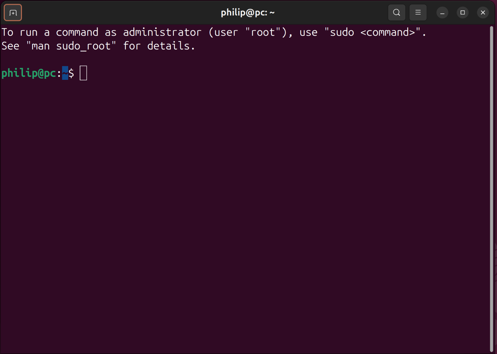

Where `~` means the Home directory:


If Other Locations are selected:


there is a `usr` folder:


Which contains a binary `bin` folder:


This contains the binaries that can be ran from the Terminal. On Ubuntu, which is Debian based there is the package manager `apt`:


When:

```bash
apt
```

is input, this binary is executed:

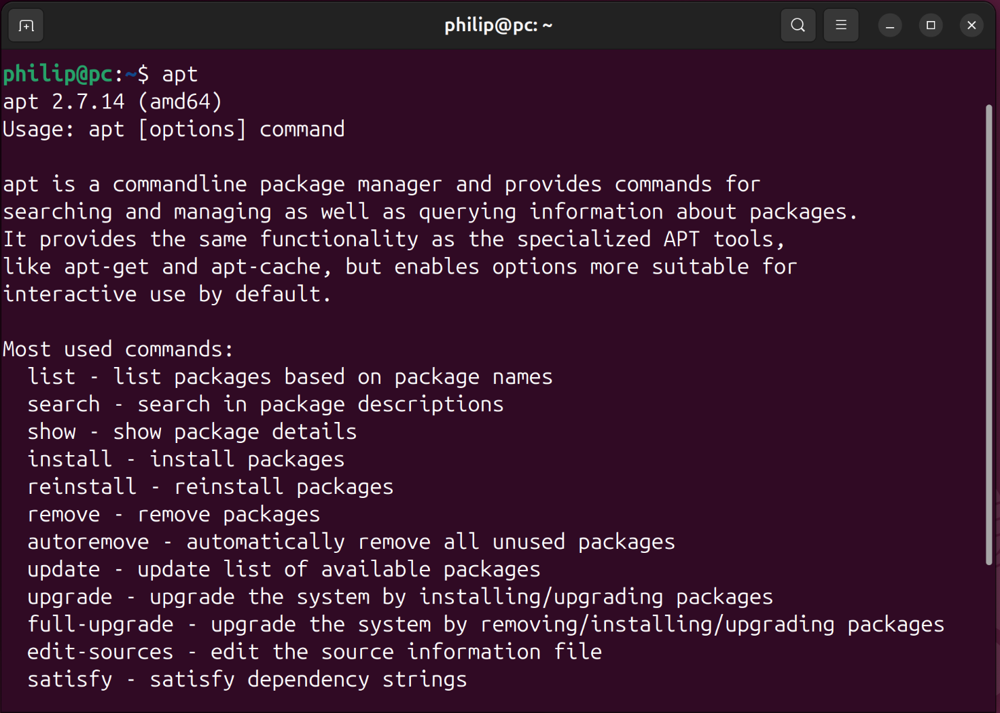

the binary `clear` may be used to clear the Terminal:

```bash
clear
```


There is also a `bin` folder on the root of the drive, which is the binaries used by the system:


To install packages, system wide using `apt`, the prefix `sudo` is used, which stands for super user do:

```bash
sudo apt
```


Switching to a super user will prompt for authentication. Input your account password in order to proceed:


Details about commands available to use with the `apt` binary are shown. the `install` command can be used to install a number of TeX fonts (which will later be used by matplotlib):

```bash
sudo apt-get install texlive-xetex texlive-fonts-recommended texlive-plain-generic cm-super dvipng
```

To copy and paste in the terminal, use the right click or keyboard shortcut keys `Ctrl`, `⇧` + `c` or `Ctrl`, `⇧` + `v`:


Input `y` in order to proceed:


The packages will be downloaded and installed:


Returning to the `usr` folder:


The user `bin` folder can be examined:


Notice there is the programming languages `bash` and `python3`:


If a new Terminal is opened without super user privileges, `python3` can be launched using:

```bash
python3
```

Notice the prompt changes as a different programming language is now used:


if the `datetime` module is imported, its `__file__` attribute can be examined:

```python
>>> import datetime
>>> datetime.__file__
'/usr/lib/python3.12/datetime.py'
```


Note the Python standard library is found in the `lib ` subfolder, this can be examined:


There is a `python3.12` subfolder:


Which contains the standard modules such as`datetime.py`:

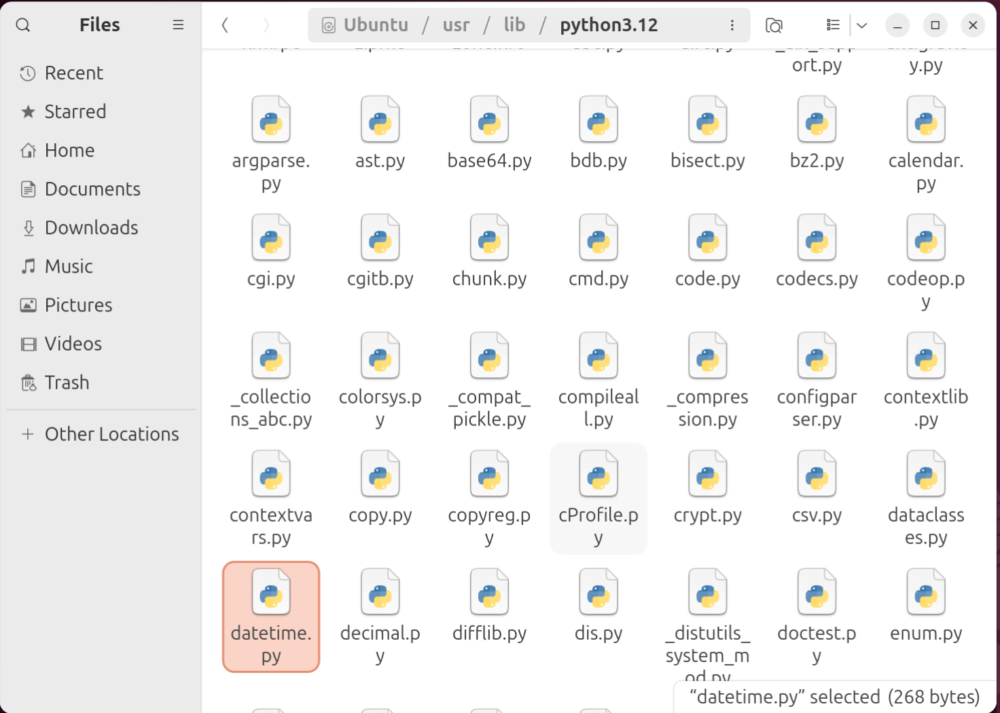

Some standard modules have multiple script files and are contained in a folder. This folder has the data model initialisation file `__init__` which is imported when the folder is imported:

```python
>>> import email
>>> email.__file__
'/usr/lib/python3.12/email/__init__.py'
```


Note the absence of the `site-packages` subfolder:

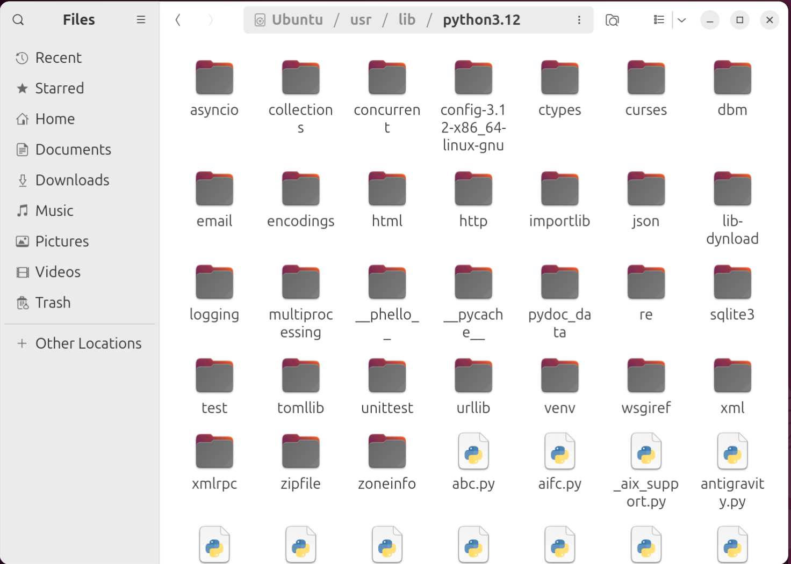

This means no third-party libraries are installed. Therefore if `numpy` is attempted to be imported::

```python
>>> import numpy as np
ModuleNotFoundError: No module named 'numpy'
```


The python shell can be exited using the `exit` function:

```python
exit()
```


This returns to the bash shell:


This can be cleared using:

```bash
clear
```


If text editor is opened:


The file can be saved using File → Save As:


The file is saved in Documents:


Using the file name `script.py` with the `.py` file extension. This means the text editor, will apply Python syntax highlighting:


The following Python code can be input:

```python
print('Hello World!')
```


The Documents folder can be opened in the Terminal, by right clicking empty space in the folder and selecting Open in Terminal:


Notice the path is now `~/Documents`:


The path can be changed using the binary `cd` which stands for change directory. `..` means the parent folder:

```bash
cd ..
```


`.` means in the same folder as. In this case `Downloads` is a subfolder of `~`:

```bash
cd ./Downloads
```


To go back to Documents, the parent folder can be accessed and `Documents` selected from is:

```bash
cd ../Documents
```


The `~` means Home:

```bash
cd ~
```


And Documents can be selected frm Home using:

```bash
cd ~/Documents
```


The binary `ls` will list all the files and folders in the current working directory:

```bash
ls

```


The binary `python3` can be run supplying the script file as a command line input argument:

```bash
python3 script.py
```


The print statement displays:


If another file is created in the text editor, this time with the extension `.sh`:


bash is a slightly different scripting language to Python, optimised for navigation around the operating system. If the following is input:

```bash
echo "Hello World!"
```


The binary `ls` can be used to view all the files:

```bash
ls
```


The binary `bash` can be run supplying the script file as a command line input argument:

```bash
bash script.sh
```


## Downloading and Installing Spyder

Spyder is developed on GitHub and the latest release is on the [GitHub Spyder Releases Page](https://github.com/spyder-ide/spyder/releases). Select the Linux Installer:


Notice that this is `.sh` Shell Script:

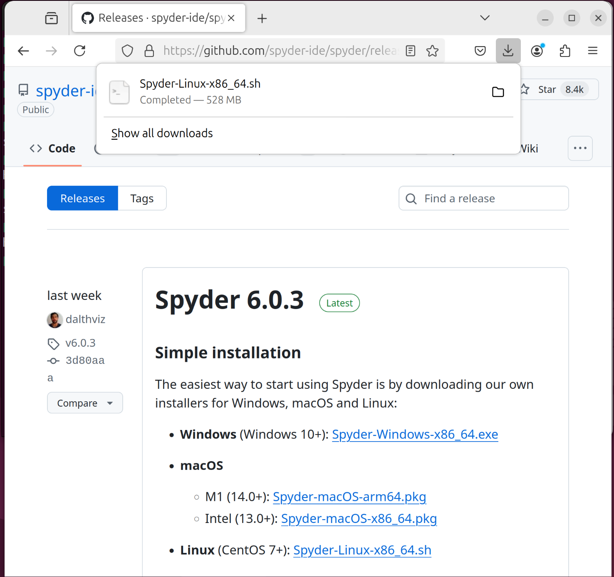


Right click the Downloads folder and select Open in Terminal:


This script can be ran using `bash`:


Input:

```bash
bash S↹
```

And the file name should auto-complete:


```bash
bash Spyder-Linux-x86_64.sh
```

Press `↵` to execute the script:


Press `↵` to begin scrolling through the license agreement:


Press `q` to quit scrolling:


To accept the license agreement input `yes` and press `↵`:


To install in the default location press `↵`:

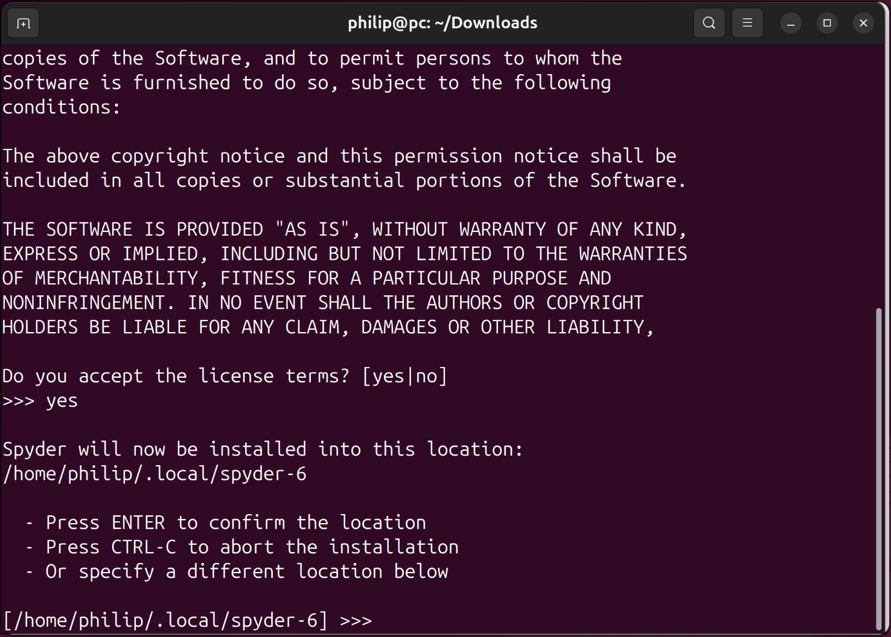

Spyder is now installed and a Start Menu shortcut is now created:


## Spyder IDE Basics

When Spyder is first launched, a prompt to begin a tour will display:


To the bottom right is the IPython Console, where commands can be input individually. Notice the cells are numbered, by execution oder. The code can be input:

```python
In [1]: 'hello'
Out[1]: 'hello'
```

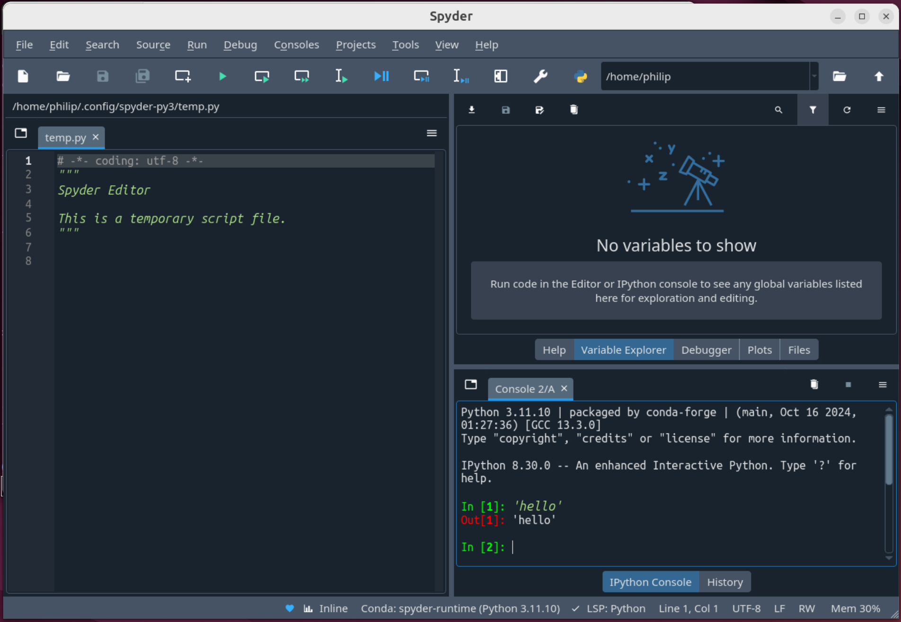

This value was input and returned as an output. the value can also be assigned to an object name using the `=` operator:

```python
In [2]: text = 'hello'
```


This object name `text` displays on the Variable Explorer. It has the type `str`. The identifiers from the `str` class can  be accessed from `text` by typing in `text.` followed by a `↹`:


If part of an identifier is input for example `text.cap` followed by a `↹`, the identifier `text.capitalize` will display:


When this is input, the method is referenced and the output displays where the method is defined, in this case, in the `str` class:

```python
In [3]: text.capitalize
Out[3]: <function str.capitalize()>
```


A method is called using parenthesis, the docstring displays, which provided details about any input parameters:


A new `str` instance is returned to the console:

```python
In [4]: text.capitalize()
Out[4]: 'Hello'
```


Note `text` remains assigned to the original `str` instance `'hello'`. This new `str` instance can be assigned to `text` which reassigns the value of `text`. The right hand side is carried out first (using the original value of `text` which was `hello`)

```python
In [5]: text.capitalize()
```

This is then reassigned to the `object` name on the right hand side

```python
In [5]: text = text.capitalize()
```

The value of the new instance now displays under `text` in the Variable Explorer:


Other methods such as `replace` can be examined. A docstring displays showing the mandatory positional parameters `old` (position `0`) and `new` (position `1`). This is followed by the optional parameter `value` (position `2`) which has a default value `-1`, meaning all replacements of the old substring will be replaced with the new substring. Any parameter provided before the `/` must be supplied positionally only:


The identifier can be inspected, by right clicking the identifier and pressing inspect or `Ctrl` + `i`:


This displays documentation in the `help` pane:


```python
In [6]: text.replace('ll', '7')
Out[6]: 'He7o'
```

Using named parameters:

```python
In [7]: text.replace(old='ll', new='7')
```

is not allowed because these parameters occur before the `/` in the docstring


The a new `str` instance is returned which ahs the specified replacement:


Spyder has a script editor.


The script file can be saved in Documents as `script.py`:


In a Python script the `#` means a comment:

```python
# Import Libraries
import numpy as np # numeric python library
import matplotlib.pyplot as plt # matrix plotting library
```


Using `#%%` creates a cell:

```python
#%% Import Libraries
import numpy as np 
import matplotlib.pyplot as plt 
```

Cells can be collapsed:


Identifiers display if a `.` is used following an `object` name. If the identifier is a docstring, the docstring will display:


Other cells can be created: 

```python
#%% Import Libraries
import numpy as np 
import matplotlib.pyplot as plt 
#%% Create Data
x = np.array([0, 1, 2, 3, 4,])
y = 2 * x
#%% Plot Data
plt.plot(x, y)
```


A cell from a script file can be ran using the run cell button:


This cell is still highlighted after execution. The cell and advance to the next cell button is more useful when running through each cell in a script file:


The Variables `x` and `y` display in the Variable Explorer:


The plot displays as a static image using the `inline` backend. This static images displays on the plots pane:


The plotting backend can be changed to an interactive plot using the `qtagg` backend:


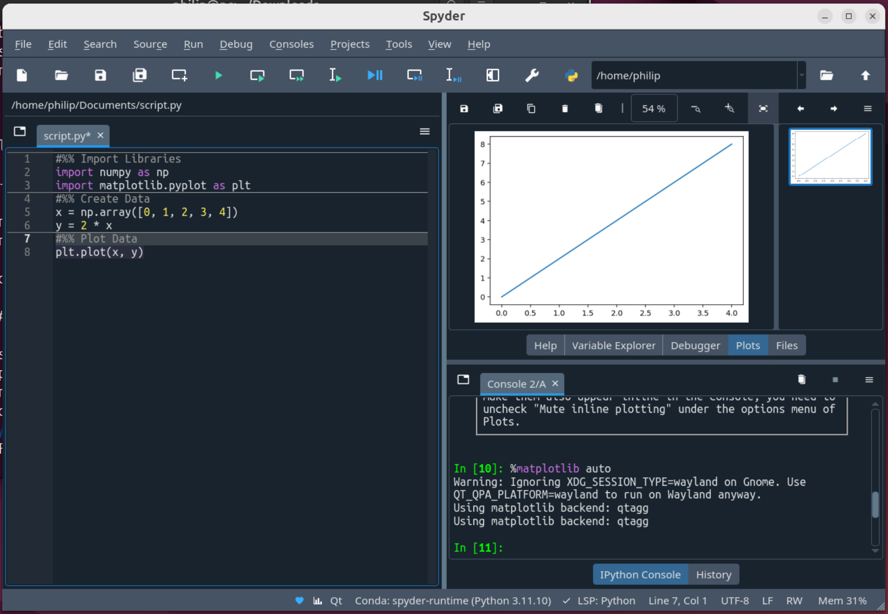

If the last line is selected, the currently selected selection can be run:


The plot now displays in its own window:


The kernel can be restarted, removing all variables and imports by selecting Consoles → Restart Kernel and then selecting Yes. Alternatively typing `exit` into the console restarts the kernel:


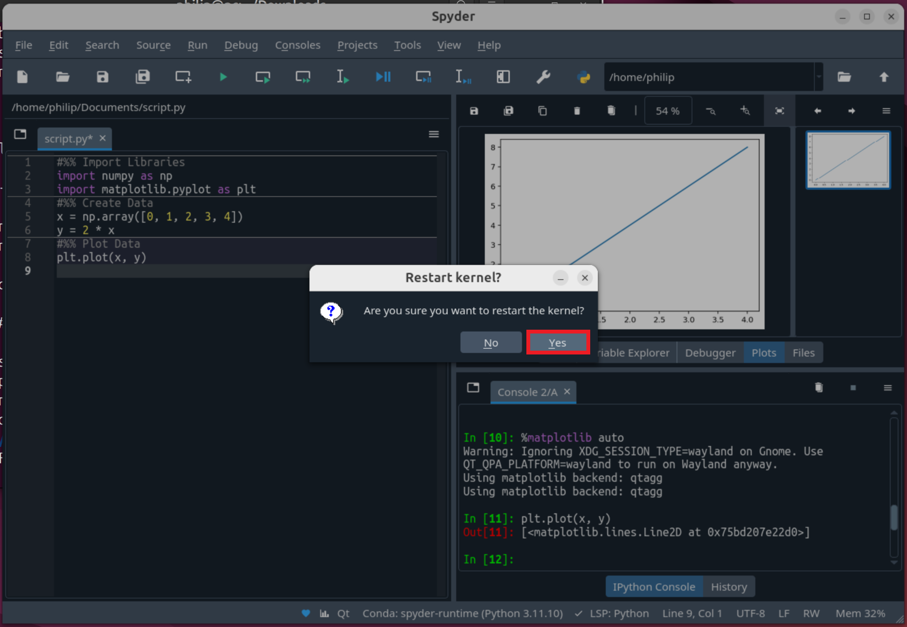

All variables and imports are lost and the cell execution number returns to `1`:


the script editor will display a list of identifiers from an `object` name after a `.`:


The figure can be saved using:

```python
#%% Import Libraries
import numpy as np 
import matplotlib.pyplot as plt 
#%% Create Data
x = np.array([0, 1, 2, 3, 4,])
y = 2 * x
#%% Plot Data
plt.plot(x, y)
#%% Save Figure
plt.savefig('fig1.png')
```


The entire Script file can be run, using Run File:


the files pane displays the current working directory, which is the same folder, that the `script.py` file is stored in. Note `fig1.png` is also saved here:


It can be opened externally:


If a deliberate mistake is made in the code, that would introduce a `SyntaxError` notice that the script editor displays a warning:


The following code will run, but is not formatted correctly:


Spacing issues can be corrected using the autopep8 formatter. Select format file or extension with autopep8:


Spyder also has the opinionated formatter black, however black's opinionated formatting gives string quotations that are inconsistent to Python and Python standard libraries. Ruff integration with a ruff.toml file which can be used to specify a preferred quote option such as single quotes isn't available but is a planned feature:


A custom function can be created:

```python
def greet_user(user_name):
    |
```

Note every line of code belonging to the code block is indented by 4 spaces:


Blank spaces can be shown on the script editor by selecting source → show blank spaces:


The function can be completed:

```python
def greet_user(user_name):
    print(f'Hello {user_name}')
```


A docstring template can be autogenerated for the function by inputting:

```python
def greet_user(user_name):
    """
    print(f'Hello {user_name}')
```


```python
def greet_user(user_name):
    """
    

    Parameters
    ----------
    user_name : TYPE
        DESCRIPTION.

    Returns
    -------
    None.

    """
    print(f'Hello {user_name}')
```


```python
def greet_user(user_name):
    """
    greets the user

    Parameters
    ----------
    user_name : str
        The name of the user.

    Returns
    -------
    None.

    """
    print(f'Hello {user_name}')
```


Note code not part of the function is not indented:

```python
def greet_user(user_name):
    """
    greets the user

    Parameters
    ----------
    user_name : str
        The name of the user.

    Returns
    -------
    None.

    """
    print(f'Hello {user_name}')


print('Code not part of the function')
```


Another cell can be made to call the function:


Notice that when the function name is input:

```python
greet_user
```

that the docstring created displays:


This function can be called and provided with the input string `'Philip'`:

```python
greet_user('Philip')
```


When this script file is run, the function is called and the `print` function in the functions body is used to print `'Hello Philip'` which is shown in the cell output:


In the above script file, the function is defined and called. If this script file is saved as another script file called `module.py`:


Both `script.py` and `module.py` can be viewed, side by side by selecting split horizontally:

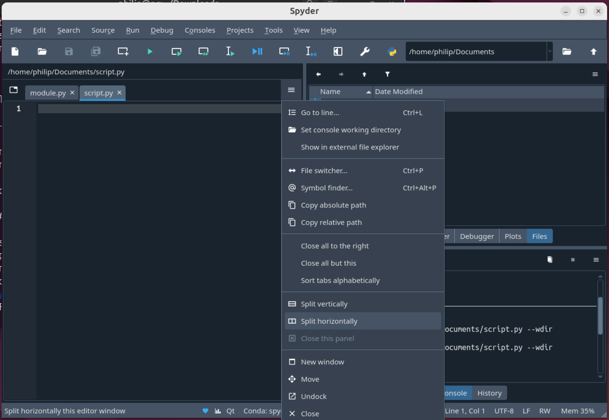

Both `script.py` and `module.py` are found in the same folder:


In `module.py` where the function is defined and called, the calling of the function can be commented out. Multiple lines of code can be commented out by highlighting them and selecting Edit → Comment/Uncomment:


This prevents these lines of code from being executed but doesn't delete them, so they can be uncommented out later on:


This means that `module.py` can be imported in `script.py` using:

```python
import module # no file extension
```


Identifiers from the module can be accessed using a `.`:

```python
import module 
module.
```


The function `greet_user` can be accessed from the imported `module`:


If the panel with `module.py` is closed, code can be input in `script.py`:


If the panel with `module.py` is closed, code can be input in `script.py`:

```python
import module 
module.greet_user('Philip')
```

When run, the print statement displays in the console:


`exit` will be input to restart the kernel which prevents some issues such as reloading modules. Essentially when an instruction is made to reload a module, it will be skipped as there is a performance loss by loading the same module twice. This is problematic when working on the module as changes aren't reflected:


An instruction can be made to import an identifier from a module, notice that the code completion displays the identifier `user_greeting`:

```python
from module import u
```


```python
from module import user_greeting
```


And the function can be called as before:

```python
from module import user_greeting
user_greeting('Philip')
```


`exit` is used to restart the kernel. If the module `module.py` is copied into a subfolder `subfolder`. The module can be accessed from the subfolder by use of a `.` in this case:

```python
from subfolder.module import user_greeting
user_greeting('Philip')
```


`exit` is used to restart the kernel. `module.py` can be copied and renamed to `__init__.py`. `__init__.py` is known as the initialisation file, that is imported when the folder is imported:

```python
from subfolder import user_greeting
user_greeting('Philip')
```


Identifiers beginning with a **d**ouble **under**score `__` and ending in `__` are part of the Python datamodel, colloquially they are sometimes called dunder identifiers. These can be accessed from the `str` instance text by inputting:

```python
text = 'hello'
text.__
```


In the console the data model identifiers can be viewed by inputting:

```python
text.__
```

followed by a `↹`:


If the `__add__` data model identifier for example is selected and input with open parenthesis, the docstring displays:

```python
text.__add__(
```

Note the return value instructs the preferred `builtins` function or operator to use, in this case `+`:

```python
text + text
```


The operator behind the scenes uses:

```python
text.__add__(text)
```

Where the `text` instance before the `.` is the `str` instance the method is called from known as `self`. The second instance provided in the function is known as `value`:


This method is defined in the `str` class. Note when called from the `str` class, the instance `self` must be provided, in addition to the instance `value`:

```python
str.__add__(text, text)
```


There are a number of data model identifiers in the script file which can be accessed using `__` In this case the data model identifiers `__file__` and `__name__` will be examined:


These can be accessed in the script file:

```python
__file__
__name__
```

However will not be shown in the console when the script file is run.


To view these in the console, they can be printed in the script file:

```python
print(__file__)
print(__name__)
```

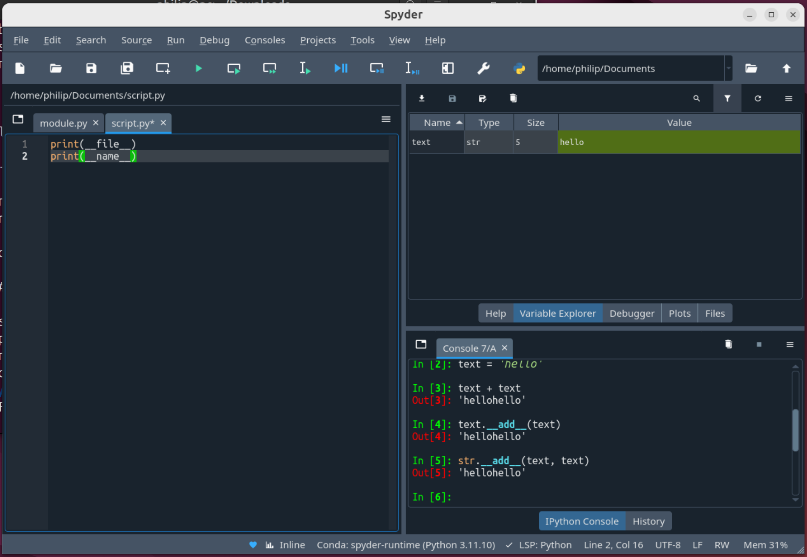

Note when this file is run, i.e. is the first input argument to the ipython magic `%runfile`, it is regarded as the main script file being executed and has the data model `__name__` as `'__main__'`:


`module.py` and `script.py` can be opened side by side. If the following code is in `module`:

```python
print(__file__)
print(__name__)
```

And if the following code is in `script`:

```python
import module
```

When `script.py` is run, the code in the `module` is run as it is imported. Notice that `__name__` is now `'module'` and not `'__main__'`. This is because the first input argument `%runfile` is `script.py` and this is the main script known as `'__main__'`:

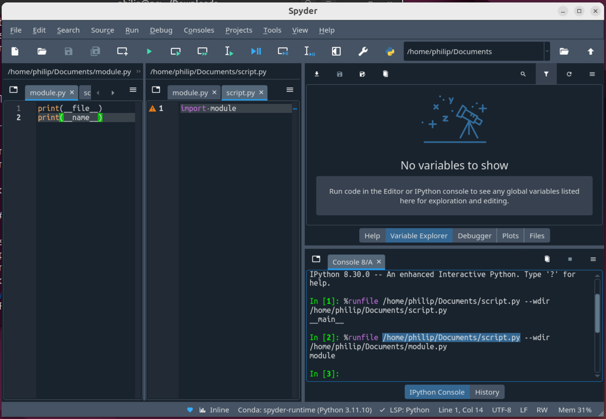

If `module.py` is updated to: 

```python
text = 'hello'

if __name__ == '__main__':
    print('Diagnostic Code')
```

When the kernel is restarted and `module` is run, the instance `text` is instantiated and is shown on the Variable Explorer. It is the `'__main__'` module and the diagnostic code prints:


If the module is imported in `script.py`:

```python
import module
```

the condition to the `if` code block is `False` because this is not the `'__main__'` module, so the diagnostic code does not run. The variable `module.text` is instantiated and can be accessed in the console:


## ModuleNotFoundError

The following standard modules can be imported and the `__file__` attribute of the modules can be checked:

```python
In [4]: import datetime
In [5]: datetime.__file__
Out[5]: '/home/philip/.local/spyder-6/envs/spyder-runtime/lib/python3.11/datetime.py'
```

```python
In [6]: import email
In [7]: email__file__
Out[7]: '/home/philip/.local/spyder-6/envs/spyder-runtime/lib/python3.11/email/__init__.py'
```


The following third-party libraries can be imported and the `__file__` attribute of the modules can be checked:

```python
In [8]: import numpy as np
In [9]: np.__file__
Out[9]: '/home/philip/.local/spyder-6/envs/spyder-runtime/lib/python3.11/site-packages/numpy/__init__.py'
```

```python
In [10]: import matplotlib.pyplot as plt
In [11]: plt.__file__
Out[11]: '/home/philip/.local/spyder-6/envs/spyder-runtime/lib/python3.11/site-packages/matplotlib/pyplot.py'
```

Note that `pyplot` is a module in the library `matplotlib`.


If Help → Dependencies is selected:


A number of mandatory and optional dependencies are listed, which are include libraries from the scientific stack `numpy`, `pandas` and `matplotlib`:


Notice `seaborn` is not listed. If it is attempted to be imported:

```python
import seaborn
```

There is a `ModuleNotFoundError`:


## spyder-runtime Environment

If folder options are selected and Show Hidden Files is selected:


The `.local` folder contains locally installed programs:


The Spyder IDE is installed in the `spyder-6` subfolder:


Notice it has its own `bin` folder:


Which contains its own `conda` binary:


And `python3` binary:


It also has its own `lib` folder:


Which has a `python3.11` folder:


This contains the standard modules associated with the base Python environment. Notice there is a `site-packages` folder, this contains third-party libraries:


The `conda` folder contains the conda package manager:


The purpose of the `base` environment is use of the conda of the package manager. The conda package manager is used to create Python environments which are in the `envs` subfolder:


The `spyder-runtime` environment is present:


Notice `spyder-runtime` has its own `bin` subfolder:


With its own `python3` binary:


Notice `spyder-runtime` has its own `lib` subfolder:


Which has a `python3.11` folder which contains the Python standard modules:


And `site-packages` subfolder which contains third-party modules:


The `numpy` library is found in the `numpy` folder:


When imported the `__init__.py` is referenced:


The `matplotlib` library is found in the `matplotlib` folder. When the library is imported the `__init__.py` is referenced:


However normally the `pyplot` interface module is referenced:


Note there is no `seaborn` subfolder as it is not preinstalled with Spyder.

The Spyder installer is `conda` based, the base environment is used to update `conda`, which is in turn is used to update the `spyder-runtime` environment when there is a Spyder update available. This `conda` is not intended to be used by the end user.

## Miniforge Installation

Miniforge is a minimal installer for `conda` which uses the community channel `conda-forge` by default. The Miniforge `base` environment is used only for the `conda` package manager and other packages are typically installed in separate Python environments. Note Anaconda/Miniconda are not recommended as they use a tainted repository `anaconda` by default which has commercial restrictions and older package versions which often result with incompatibilities with the current version of Spyder.

Miniforge is developed on GitHub and the latest release is on the [GitHub Miniforge Releases Page](https://github.com/conda-forge/miniforge/releases). Note Mambaforge is considered obsolete and therefore the installers listed at the top should be avoided. 

For Ubuntu the `Miniforge3-x.xx.x-x-Linux-x86_64.sh` or `Miniforge3-Linux-x86_64.sh` should be selected (these are the same installer):


The Downloads folder can be opened in the Terminal:


If:

```bash
bash M↹
```

is input:


The file name will autocomplete:

```bash
bash Miniforge3-24.11.0-1-Linux-x86_64.sh
```

Press `↵` to execute the script:


Press `↵` to begin scrolling through the license agreement:


Press `q` to quit scrolling:


To accept the license agreement input `yes` and press `↵`:


To install in the default location press `↵`:


A prompt to initialise `conda` will display. Note the default option if `↵` is input is `No`, which means `Miniforge` is installed but not initialised/


Initialisation updates the `.bashrc` file which are the bash recall parameters used by the Linux Terminal:


Note the Spyder installer has already updated this `.bashrc` file, so the binary `spyder` is recognised:


To initialise `conda` with the Terminal, input `yes` and press `↵`:


Miniforge is installed and initialised:


The `.bashrc` file is updated. If it is refreshed:


A `conda` initialisation block displays:


When a new Terminal instance is opened, it will look at the recall parameters and add the prefix `(base)`, indicating the `base` Python environment (from Miniforge) is selected:


## Initialising conda with the Linux Terminal Manually

If initialisation was not carried out, `(base)` will not display and the conda package manager cannot be used from the Terminal unless the directory containing the conda binary is manually input. This situation can be mimicked using:

```python            
conda init --reverse
```


This means the following initialisation block is not present int he `.bashrc` file:


To initialise Miniforge manually, navigate to th `Home` folder and select the `Miniforge` subfolder:


Then select the `bin` subfolder:


Right click the folder and select, Open in Terminal:


Input:

```bash
./conda init --all
```

The `./` means look in the same directory as the current working directory for the `conda` binary.


Miniforge is installed and initialised. When a new Terminal instance is opened, it will look at the recall parameters and add the prefix `(base)`, indicating the `base` Python environment (from Miniforge) is selected.


## Creating a Custom spyder-env Environment (conda)

The purpose of the `base` environment is to use the conda package manager. It is not recommended to install other packages in `base`:


before using the `conda` package manager, it should be updated to the latest version using:

```bash
conda update conda
```


The default channel is `conda-forge` which is the community channel:


`conda` and `conda` dependencies will be updated. Input `y` in order to proceed:


`conda` is now up to date:


A new environment can be created using:

```bash
conda create -n spyder-env spyder-kernels python seaborn scikit-learn pyarrow sympy openpyxl xlrd xlsxwriter lxml sqlalchemy tabulate pyqt ffmpeg ruff
```

This has `spyder-kernels` which is required for Syder to use the environment. `seaborn` which has `numpy`, `pandas` and `matplotlib` as dependencies. `scikit-learn` for machine learning. `pyarrow`, `openpyxl`, `xlrd`, `xlsxwriter`, `lxml`, `sqlalchemy`, `tabulate` for various file pandas formats. `pyqt` for matplotlib's interactive backend and `ffmpeg` for saving matplotlib animations.

`-n` means name and `spyder-env` is the name of the Python environment. Specifying an environment using `-n` means changes to that environment will be made opposed to `base` which is the currently activate environment.


These packages will all be installed from the `conda-forge` channel. In the `spyder-env` folder which is found in the `envs` subfolder of `base`:


Details about packages to be downloaded will be shown:


Input `y` in order to proceed:


The packages are installed in the environment but it is not activated:


To activate it use:

```bash
conda activate spyder-env
```


Notice the prefix is now `(spyder-env)` meaning this environment is activated. An `ipython` shell can be launched. Imports of the standard modules and third-party libraries can be carried out, if the `__file__` attribute of these is checked, notice they are all found in the directory of `spyder-env`:


## Selecting the Custom spyder-env Environment (conda)

In Spyder, the default environment `spyder-runtime` is selected:


Go to Tools → Preferences:


Select IPython Interpretter:


Select Use the Following Interpretter and select `spyder-env` (conda) from the dropdown list:


Select Apply:


Close Spyder and relaunch using the start menu shortcut or inputting:

```bash
spyder
```

in the Terminal. 


`spyder-env` should be shown at the bottom and now seaborn can be imported:

```python
import seaborn as sns
```


## Changing Default Plot Backend

The default plot backend can be changed, by selecting Tools → Preferences:


Then IPython Console → Graphics and changing the backend to Qt:


If the following is plotted:

```python
#%% Import Libraries
import numpy as np 
import matplotlib.pyplot as plt 
#%% Create Data
x = np.array([0, 1, 2, 3, 4,])
y = 2 * np.pi * np.sin(x)
#%% Plot Data
plt.plot(x, y)
plt.xlabel(R'$x$', usetex=True)
plt.ylabel(R'$2 \pi \sin{x}$', usetex=True)
```


In the GNOME desktop environment, when a Window title bar is right clicked, it can be set to always on top:

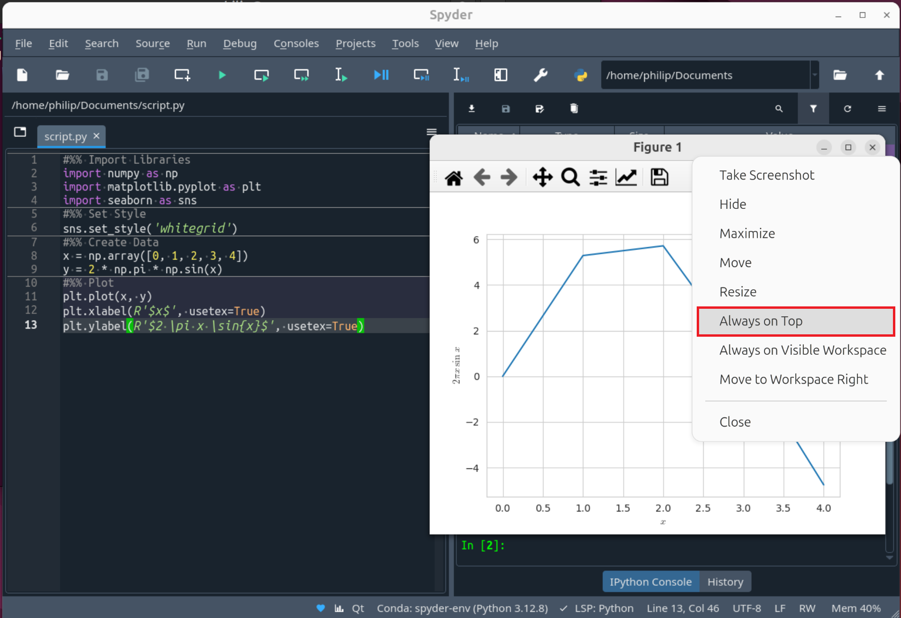

This allows modification and visualisation of the plot using the console.

## Updating

There is a new release of Spyder, approximately every month. When available a prompt for the upgrade should display and Spyder should update using packages from `conda-forge` using its internal `conda` package manager:

If an external conda environment was created, it will need to be updated, with a compatible version of `spyder-kernels`. Open up the Windows Terminal an updte the `conda` package manager in base:

```powershell
conda update conda
```

Then activate `spyder-env` and searh for updates to all packages:

```powershell
conda activate spyder-env
conda update --all
```

[Return to Python Tutorials](../readme.md)