# Spyder IDE Windows Setup

## Downloading and Installing Spyder

Spyder is developed on GitHub and the latest release is on the [GitHub Spyder Releases Page](https://github.com/spyder-ide/spyder/releases). Select the Windows Installer:


Microsoft Edge may block the download, select the download and then select Keep:


Select Show More:


Select Keep Anyway:


Double click the Windows application to begin the install:


Select Next:


Select I Agree:

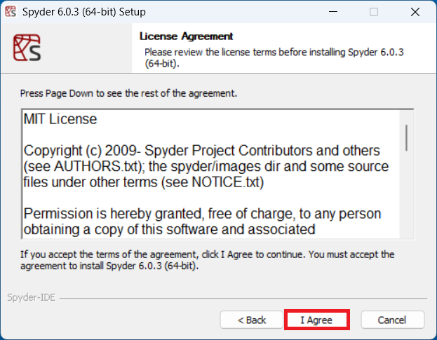

Select Just Me and Next:


Spyder will be installed in:

```
%LOCALAPPDATA%\spyder-6
```

Select Next:


Select Install:


Select Next:


Select Finish:


Spyder 6 will display a Start Menu shortcut, right click it and select Pin to Start:


## Spyder IDE Basics

When Spyder is first launched, a prompt to begin a tour will display:


To the bottom right is the IPython Console, where commands can be input individually. Notice the cells are numbered, by execution oder. The code can be input:

```python
In [1]: 'hello'
Out[1]: 'hello'
```


This value was input and returned as an output. the value can also be assigned to an object name using the `=` operator:

```python
In [2]: text = 'hello'
```


This object name `text` displays on the Variable Explorer. It has the type `str`. The identifiers from the `str` class can  be accessed from `text` by typing in `text.` followed by a `↹`:


If part of an identifier is input for example `text.cap` followed by a `↹`, the identifier `text.capitalize` will display:


When this is input, the method is referenced and the output displays where the method is defined, in this case, in the `str` class:

```python
In [3]: text.capitalize
Out[3]: <function str.capitalize()>
```


A method is called using parenthesis, the docstring displays, which provided details about any input parameters:


A new `str` instance is returned to the console:

```python
In [4]: text.capitalize()
Out[4]: 'Hello'
```


Note `text` remains assigned to the original `str` instance `'hello'`. This new `str` instance can be assigned to `text` which reassigns the value of `text`. The right hand side is carried out first (using the original value of `text` which was `hello`)

```python
In [5]: text.capitalize()
```

This is then reassigned to the `object` name on the right hand side

```python
In [5]: text = text.capitalize()
```

The value of the new instance now displays under `text` in the Variable Explorer:

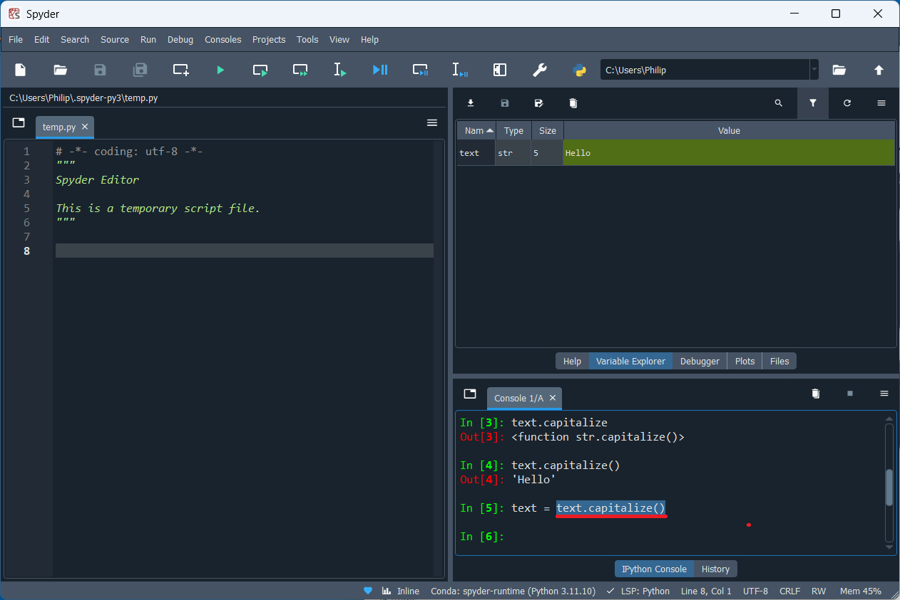

Other methods such as `replace` can be examined. A docstring displays showing the mandatory positional parameters `old` (position `0`) and `new` (position `1`). This is followed by the optional parameter `value` (position `2`) which has a default value `-1`, meaning all replacements of the old substring will be replaced with the new substring. Any parameter provided before the `/` must be supplied positionally only:


```python
In [6]: text.replace('ll', '7')
Out[6]: 'He7o'
```

Using named parameters:

```python
In [7]: text.replace(old='ll', new='7')
```

is not allowed because these parameters occur before the `/` in the docstring


If the following is input:

```python
In [8]: text.replace
```

And `replace` is right clicked, it can be inspected (shortcut key `Ctrl` + `i`):


This opens more detailed help, in the help pane:


Spyder has a script editor.


The script file can be saved in Documents as `script.py`:


In a Python script the `#` means a comment:

```python
# Import Libraries
import numpy as np # numeric python library
import matplotlib.pyplot as plt # matrix plotting library
```

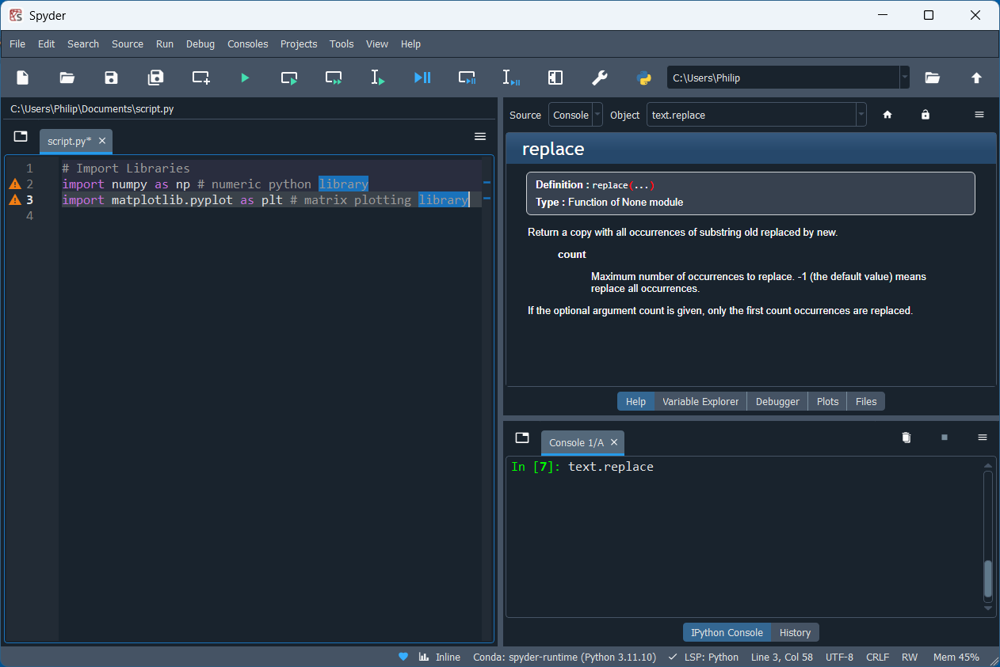

Using `#%%` creates a cell:

```python
#%% Import Libraries
import numpy as np 
import matplotlib.pyplot as plt 
```

Cells can be collapsed:


Other cells can be created: 

```python
#%% Import Libraries
import numpy as np 
import matplotlib.pyplot as plt 
#%% Create Data
x = np.array([0, 1, 2, 3, 4,])
y = 2 * x
#%% Plot Data
plt.plot(x, y)
```

A cell from a script file can be ran using the run cell button:

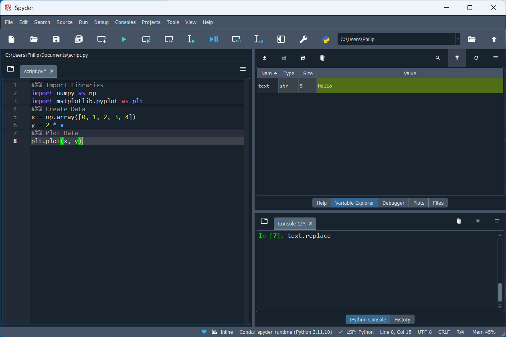

This cell is still highlighted after execution. The cell and advance to the next cell button is more useful when running through each cell in a script file:


The Variables `x` and `y` display in the Variable Explorer:


The plot displays as a static image using the `inline` backend. This static images displays on the plots pane:


The plotting backend can be changed to an interactive plot using the `qtagg` backend:


If the last line is selected, the currently selected selection can be run:


The plot now displays in its own window:


The kernel can be restarted, removing all variables and imports by selecting Consoles → Restart Kernel and then selecting Yes. Alternatively typing `exit` into the console restarts the kernel:


All variables and imports are lost and the cell execution number returns to `1`:


the script editor will display a list of identifiers from an `object` name after a `.`:


The figure can be saved using:

```python
#%% Import Libraries
import numpy as np 
import matplotlib.pyplot as plt 
#%% Create Data
x = np.array([0, 1, 2, 3, 4,])
y = 2 * x
#%% Plot Data
plt.plot(x, y)
#%% Save Figure
plt.savefig('fig1.png')
```


The entire Script file can be run, using Run File:

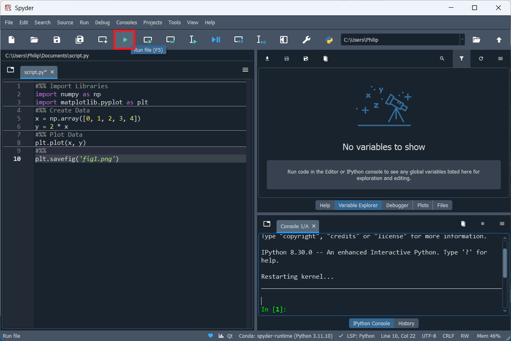

the files pane displays the current working directory, which is the same folder, that the `script.py` file is stored in. Note `fig1.png` is also saved here:


It can be opened externally:


The Variable `x` is a `ndarray` and can be expanded in the Variable Explorer:


If a deliberate mistake is made in the code, that would introduce a `SyntaxError` notice that the script editor displays a warning:

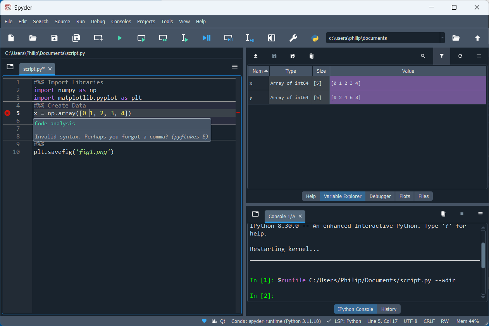

The following code will run, but is not formatted correctly:


Spacing issues can be corrected using the autopep8 formatter. Select format file or extension with autopep8:


Notice the spacing is fixed:


Spyder also has the opinionated formatter black, however black's opinionated formatting gives string quotations that are inconsistent to Python and Python standard libraries. Ruff integration with a ruff.toml file which can be used to specify a preferred quote option such as single quotes isn't available but is a planned feature:


The Edit Menu can be used to Comment/Uncomment several lines of code:


Notice an error is highlighted because the Variables `x` and `y` are used but not assigned:


A custom function can be created:

```python
def greet_user(user_name):
    print(f'Hello {user_name}')
```

Note every line of code belonging to the code block is indented by 4 spaces:


Blank spaces can be shown on the script editor by selecting source → show blank spaces:


A docstring template can be autogenerated for the function by inputting:

```python
def greet_user(user_name):
    """
    print(f'Hello {user_name}')
```


```python
def greet_user(user_name):
    """
    

    Parameters
    ----------
    user_name : TYPE
        DESCRIPTION.

    Returns
    -------
    None.

    """
    print(f'Hello {user_name}')
```

This template can be filled out:


```python
def greet_user(user_name):
    """
    greets the user

    Parameters
    ----------
    user_name : str
        The name of the user.

    Returns
    -------
    None.

    """
    print(f'Hello {user_name}')
```

Note code not part of the function is not indented:

```python
def greet_user(user_name):
    """
    greets the user

    Parameters
    ----------
    user_name : str
        The name of the user.

    Returns
    -------
    None.

    """
    print(f'Hello {user_name}')


print('Code not part of the function')
```


Another cell can be made to call the function:


The cell where the function was defined, will be collapsed, in order to optimise space:


Notice that when the function name is input:

```python
greet_user
```

that the docstring created displays:


This function can be called and provided with the input string `'Philip'`:

```python
greet_user('Philip')
```


When this script file is run, the function is called and the `print` function in the functions body is used to print `'Hello Philip'` which is shown in the cell output:


In the above script file, the function is defined and called:


If this script file is saved as another script file called `module.py`:

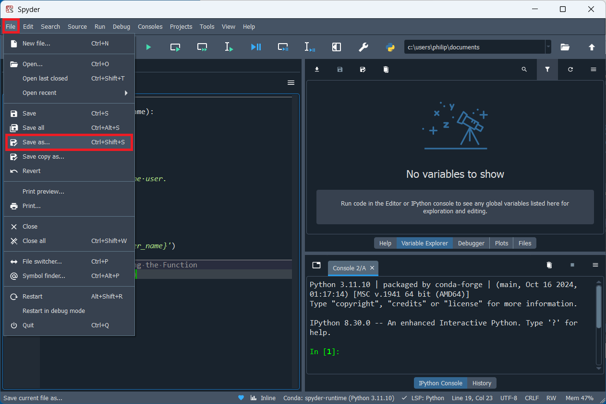


Both `script.py` and `module.py` can be viewed, side by side by selecting split horizontally:


Both `script.py` and `module.py` are found in the same folder:

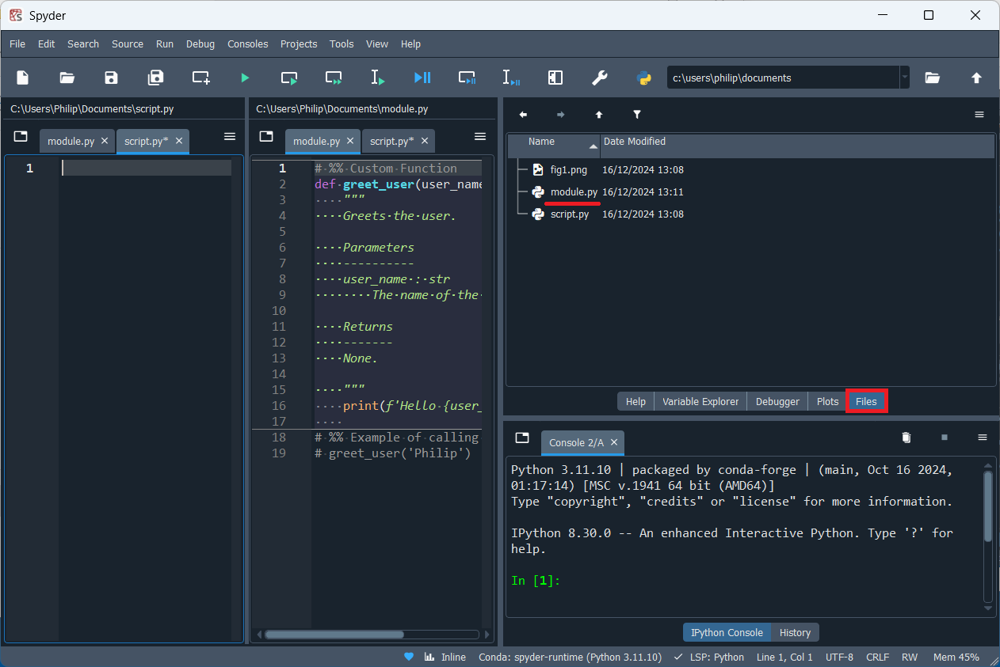

This means that `module.py` can be imported in `script.py` using:

```python
import module # no file extension
```


Identifiers from the module can be accessed using a `.`:

```python
import module 
module.
```


If the panel with `module.py` is closed, code can be input in `script.py`:


The function `greet_user` can be accessed from the imported `module`:

```python
import module 
module.greet_user('Philip')
```

When run, the print statement displays in the console:


Alternatively an `object` such as a function can be imported from the `module`:


```python
from module import user_greeting
```


`exit` will be input to restart the kernel which prevents some issues such as reloading modules. Essentially when an instruction is made to reload a module, it will be skipped as there is a performance loss by loading the same module twice. This is problematic when working on the module as changes aren't reflected.

The function can be imported and called as before:

```python
from module import user_greeting
user_greeting('Philip')
```


If the module `module.py` is copied into a subfolder `subfolder`. The module can be accessed from the subfolder by use of a `.` in this case:

```python
from subfolder.module import user_greeting
user_greeting('Philip')
```


`module.py` can be copied to `__init__.py`. `__init__.py` is known as the initialisation file, that is imported when the folder is imported:


```python
from subfolder import user_greeting
user_greeting('Philip')
```


Identifiers beginning with a **d**ouble **under**score `__` and ending in `__` are part of the Python datamodel, colloquially they are sometimes called dunder identifiers. These can be accessed from the `str` instance text by inputting:

```python
text = 'hello'
text.__
```


In the console the data model identifiers can be viewed by inputting:

```python
text.__
```

followed by a `↹`:


If the `__add__` data model identifier for example is selected and input with open parenthesis, the docstring displays:

```python
text.__add__(
```

Note the return value instructs the preferred `builtins` function or operator to use, in this case `+`:

```python
text + text
```


The operator behind the scenes uses:

```python
text.__add__(text)
```

Where the `text` instance before the `.` is the `str` instance the method is called from known as `self`. The second instance provided in the function is known as `value`:


This method is defined in the `str` class. Note when called from the `str` class, the instance `self` must be provided, in addition to the instance `value`:

```python
str.__add__(text, text)
```

There are a number of data model identifiers in the script file which can be accessed using `__` In this case the data model identifiers `__file__` and `__name__` will be examined:


These can be printed in the script file:

```python
print(__file__)
print(__name__)
```

Note when this file is run, i.e. is the first input argument to the ipython magic `%runfile`, it is regarded as the main script file being executed and has the data model `__name__` as `'__main__'`:


`module.py` and `script.py` can be opened side by side. If the following code is in `module`:

```python
print(__file__)
print(__name__)
```

And if the following code is in `script`:

```python
import module
```


When `script.py` is run, the code in the `module` is run as it is imported. Notice that `__name__` is now `'module'` and not `'__main__'`. This is because the first input argument `%runfile` is `script.py` and this is the main script known as `'__main__'`:


If `module.py` is updated to: 

```python
text = 'hello'

if __name__ == '__main__':
    print('Diagnostic Code')
```


Note when `module` is run, the instance `text` is instantiated and is shown on the Variable Explorer. It is the `'__main__'` module and the diagnostic code prints:


If the module is imported in `script.py`:

```python
import module
```

 the condition to the `if` code block is `False` because this is not the `'__main__'` module, so the diagnostic code does not run. The variable `module.text` is instantiated and can be accessed in the console:


## ModuleNotFoundError

If Help → Dependencies is selected:


A number of mandatory and optional dependencies are listed, which are include libraries from the scientific stack `numpy`, `pandas` and `matplotlib`:

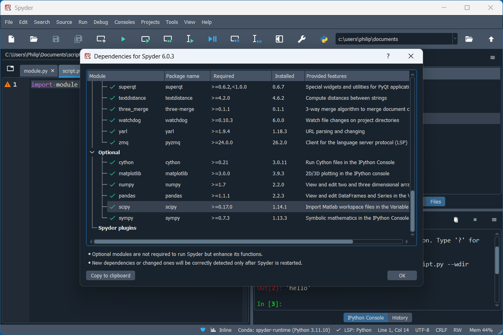

Notice `seaborn` is not listed. If it is attempted to be imported:

```python
import seaborn
```

There is a `ModuleNotFoundError`:


`seaborn` is not installed.

## spyder-runtime Environment

Spyder uses its own `spyder-runtime` environment that is conda based (conda is a package manager that is closely associated with Python but is general purpose and can be used to install Python and non-Python data science packages). Spyder is installed in local application data:

```
%LOCALAPPDATA%
```


There is a `spyder-6` subfolder:


This folder contains the `base`, environment. In the scripts subfolder there is a `conda.exe`:


The Spyder installer is `conda` based, the purpose of the base environment is for use of the `conda.exe` which is a package manager that is used to install packages and create Python environments. There is an `envs` folder which contains (conda) Python environments:


The (conda) Python environment `spyder-runtime` is in its own subfolder:


The (conda) Python environment `spyder-runtime` environment has its own contains its `python.exe`. It has its own `Scripts` folder which contains the `spyder.exe` and it also has its own `Lib` subfolder which contains Python libraries associated with the `python.exe`:


The root of the `Lib` folder containts the standard modules such as `datetime.py` which is a single script file:


Or `email` which is a folder of script files, including the `__init__.py` which recall is imported when the folder is imported:


The `site-packages` folder contains third-party libraries:


This has the subfolder folder `numpy`:


Which has its `__init__.py` file:


There is also the subfolder `matplotlib`. This also has a `__init__.py` file. Typically for `matplotlib`, a module within the library is imported called `pyplot` opposed to the entire library:


Note that there is no `seaborn` subfolder as it is not preinstalled with Spyder.

The Spyder installer is `conda` based, the (conda) base Python environment is used to update `conda.exe`, which is in turn is used to update the `spyder-runtime` environment when there is a Spyder update available. This `conda.exe` is not intended to be used by the end user.

## Miniforge Installation

Miniforge is a minimal installer for `conda.exe` which uses the community channel `conda-forge` by default. The Miniforge (conda) base Python environment is used only for the `conda.exe` package manager and other packages are typically installed in separate Python environments, where they can be compartmentalised. Compartmentalisation allows installation of a set of packages without alteration to the (conda) base Python environment and therefore does not risk breaking the functionality of the conda package manager itself. 

There are a number of conda based installers:

|Installer|base environment|default channel|
|---|---|---|
|Miniforge|minimal (conda package manager)|conda-forge (community)|
|Mambaforge|minimal (conda + mamba package manager)|conda-forge (community)|
|Miniconda|minimal (conda package manager)|anaconda (commercial)|
|Anaconda|data science distribution (conda package manager)|anaconda (commercial)|

Mambaforge was a developmental version of Miniforge where the package manager `mamba.exe` was used in place of `conda.exe`. `mamba.exe` used a faster C++ solver offering a significant performance boost and increased reliability. The solver for `conda.exe` was updated to `lib-mamba` and now takes advantage of these developments. Miniforge now contains both the `conda.exe` (used by default and recommended for general use) and `mamba.exe` (which should essentially be thought of as a developmental version of `conda.exe`). Since Miniforge contains both these package managers, Mambaforge is now considered obsolete.

Anaconda/Miniconda use a tainted repository `anaconda` by default which has commercial restrictions and has significantly older package versions than on the community channel `conda-forge`. Anaconda is a data science distribution and Anaconda groups a large number of popular data science packages and tests them for stability with one another. This includes an odler version of the Spyder IDE and JupyterLab IDE. The Anaconda distribution is generally designed to be used "as is" and the stability is broken when other packages from the community channel are added. Using these significantly older packages result with the current version of Spyder results in incompatibilities because the current version of Spyder requires up to date packages.

Miniforge is developed on GitHub and the latest release is on the [GitHub Miniforge Releases Page](https://github.com/conda-forge/miniforge/releases). Note Mambaforge is considered obsolete and therefore the Mambaforge installers listed at the top should be avoided. 

For Windows the `Miniforge3-x.xx.x-x-Windows-x86_64.exe` or `Miniforge3-Windows-x86_64.exe` should be selected (these are the same installer):

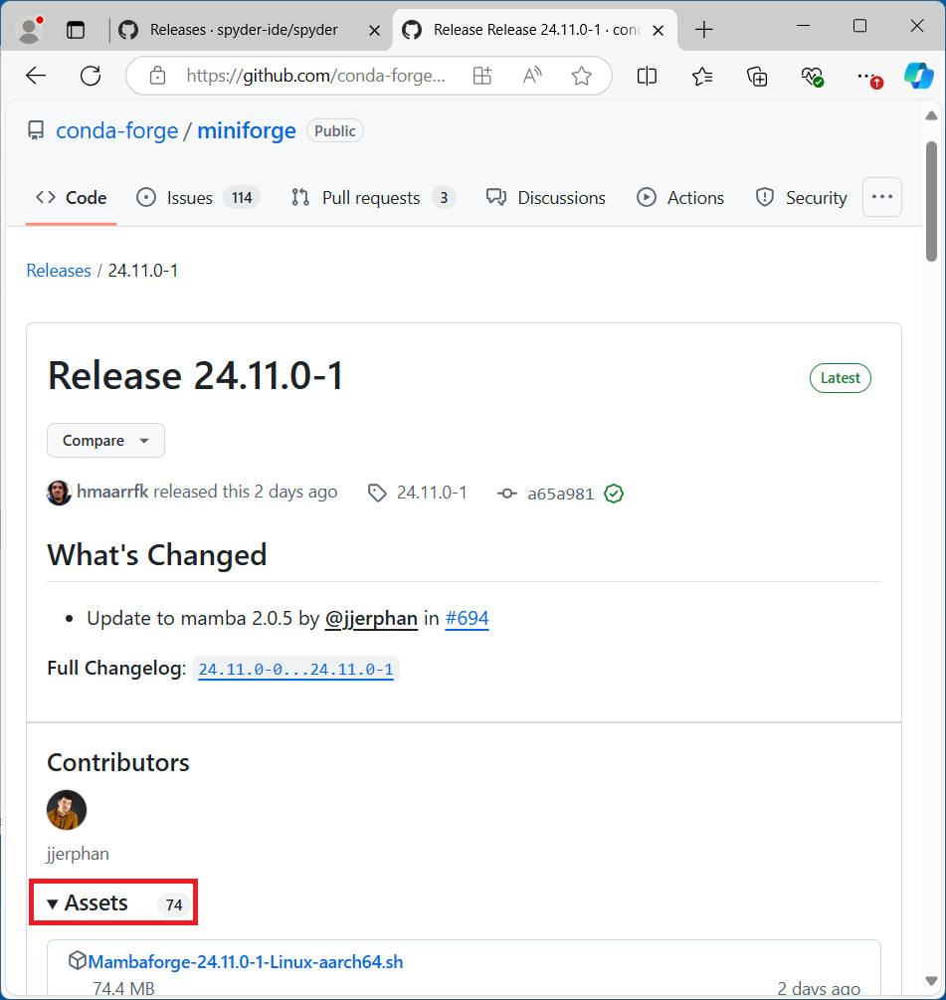


Microsoft Edge may block the download, select the download and then select Keep:


Launch the Miniforge setup:


Select Next:


Select I Agree:


Select Just Me and Next:


Install in the default location and select Next. This will be within:

```
%USERPROFILE%
```


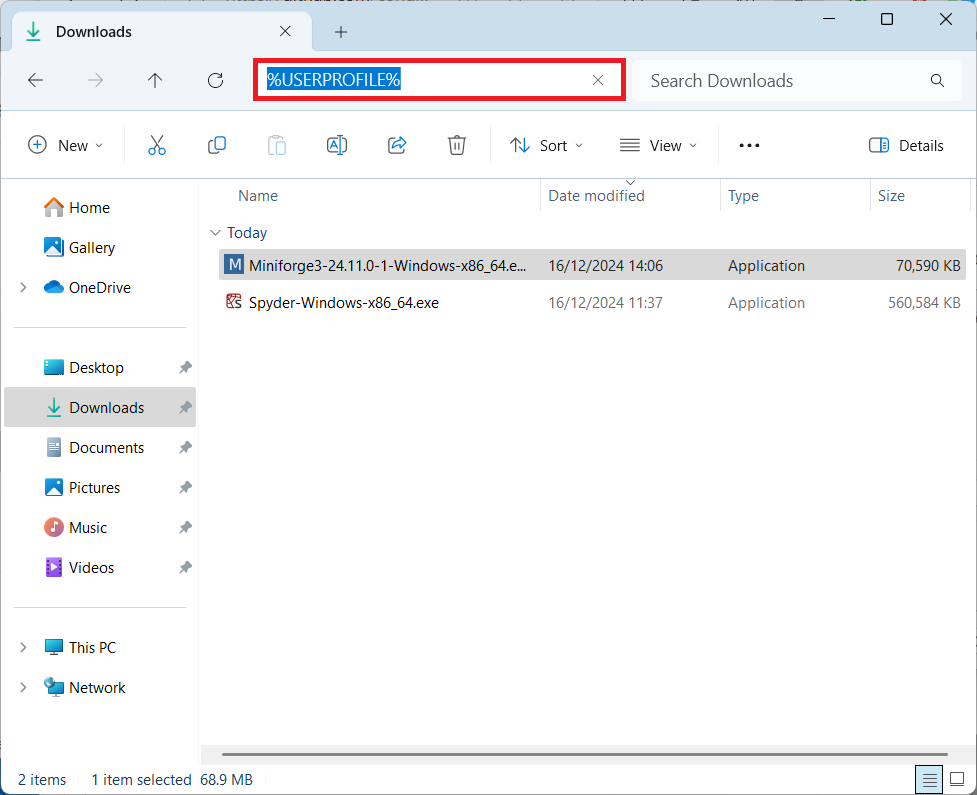

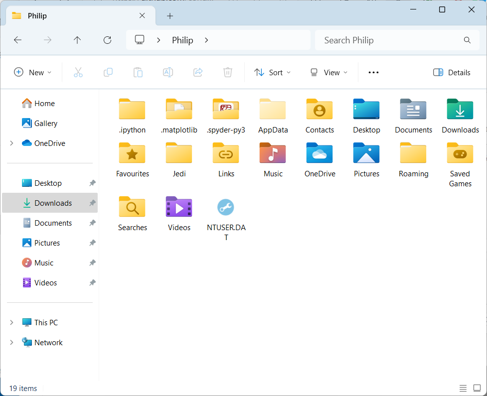

Select Install, using only the recommended options:

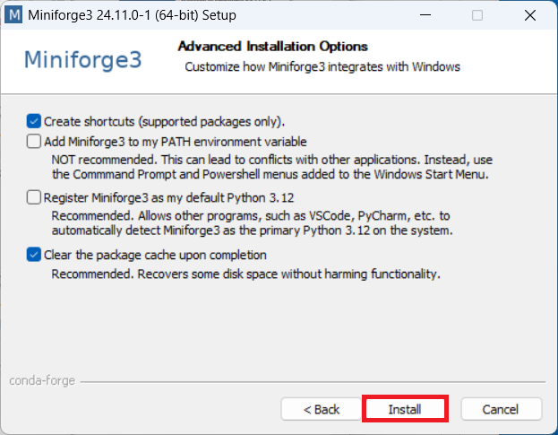

During installation is not recommended to add the (conda) base Python environment to the Windows Environmental Variables Path as this locks a single environment to the Terminal and is less flexible than initialising the conda package manager which allows activation of different (conda) Python environments.

Select next:


Select Finish:


Miniforge will display in the Start Menu:


When launched it displays `(base)`, indicating the `(base)` environment:


Going to:

```
%USERPROFILE%
```


Then `Miniforge3`


Shows the `python.exe` and associated `scripts` folder:


The `conda.exe` is found here:


## Initialising conda with the Windows Terminal

Right click the Start Button and select Terminal (Admin):


Select Yes at the User Account Control:


Notice the Windows Terminal has no `(base)` because it is not initialised:


To initialise conda, the Windows Terminal script execution policy should be changed, to `RemoteSigned`. The Windows Terminal script execution policy has the following options:

* Restricted (default): Disables script execution entirely.
* RemoteSigned: Allows digitally signed remote scripts to be executed and local scripts to be executed.
* Unrestricted: Allows all scripts to run, but prompts for confirmation for remote scripts.
* AllSigned: Requires all scripts (local and remote) to be digitally signed.

To change the execution policy input:

```powershell
Set-ExecutionPolicy RemoteSigned
```

Note this lowers the default security level of the Windows Terminal to `RemoteSigned` which is often chosen as a middle ground between security and usability. `RemoteSigned` means scripts downloaded from the internet require a trusted digital signature in order to execute, an example of this is the `conda.exe` initialisation script. Scripts created locally by the current user can be run without a digital signature.


Then the `conda.exe` can be initialised by inputting:

```powershell
.\miniforge3\Scripts\conda init --all
```


Details about the changes will be listed, close the Terminal:


Right click the Start button and select Terminal (Non-Admin). The Admin version was required previously to change the Execution Policy, in this case the Windows Terminal is being used by the user for use within the `%UserProfile%`:


Notice it now has the `(base)` prefix, indicating that the base (conda) Python environment is activated:


## Creating a Custom spyder-env Environment (conda)

Before using the package manager `conda.exe` it should be updated to the latest version using:

```python
conda update conda
```


Since Miniforge is used, the channel will be `conda-forge` by default:


Input `y` in order to proceed:


The `conda.exe` package manager is now updated:


Inputting:

```powershell
cls
```

will **cl**ear the **s**creen:


A new environment can be created using:

```powershell
conda create -n spyder-env spyder-kernels python seaborn scikit-learn pyarrow sympy openpyxl xlrd xlsxwriter lxml sqlalchemy tabulate pyqt ffmpeg ruff
```

This has `spyder-kernels` which is required for Spyder to use the environment. `seaborn` which has `numpy`, `pandas` and `matplotlib` as dependencies. `scikit-learn` for machine learning. `pyarrow`, `openpyxl`, `xlrd`, `xlsxwriter`, `lxml`, `sqlalchemy`, `tabulate` for various file pandas formats. `pyqt` for matplotlib's interactive backend and `ffmpeg` for saving matplotlib animations.

`-n` means name and `spyder-env` is the name of the Python environment. Specifying an environment using `-n` means changes to that environment will be made opposed to `base` which is the currently activate environment.


These packages will all be installed from the `conda-forge` channel and installed compartmentalised in the (conda) Python environment `spyder-env`. `spyder-env` is a subfolder which is found in the `envs` subfolder of the `base` Miniforge installation `%UserProfile%/Miniforge3`:


Details about packages to be downloaded will be shown:


Details about packages to be installed will be shown:


Input `y` in order to proceed:


The packages are installed in the environment but it is not activated:


To activate it use:

```powershell
conda activate spyder-env
```


Notice the prefix is now `(spyder-env)` meaning the (conda) Python environment `spyder-env` is activated:


An `ipython` shell can be launched:


Notice two programming languages are used, highlighted is PowerShell using the programming language PowerShell and below is the ipython shell using the python programming language:


If `email`, `datetime`, `numpy`, `matplotlib`, `pandas` and `seaborn` are imported, their `__file__` can be checked. Notice these are found in the `spyder-env` environment: 


## Selecting the Custom spyder-env Environment (conda)

In Spyder, the default (conda) Python nvironment `spyder-runtime` is selected:


Go to Tools → Preferences:


Select IPython Interpretter:


Select Use the Following Interpretter and select `spyder-env` (conda) from the dropdown list:


Select Apply:


Close Spyder and relaunch. `spyder-env` should be shown at the bottom and now seaborn can be imported:

```python
import seaborn as sns
```


## MikTek Installation

MikTex is required in order to use TeX in matplotlib. MikTex can be downloaded from its software download page [MikTeX Downloads](https://miktex.org/download):


Launch the installer:


Accept the License Agreement and select Next:


Select Install only for me and select Next:


Use the default file location in:

```
%LOCALAPPDATA%
```

and select Next:


Select Next:


Select Start:


Select Next:


Select Next:


Select Close:


MikTeX will display in the notification tray, select it:


Select Updates and select Update Now:


Close the MikTeX Console to update the MikTex Console:


Select Packages and search for `type1cm`, select Install:


Select OK:


Repeat for `cm-super`, `geometry`, `underscore`, and `zhmetrics`.

## Changing Default Plot Backend

The default plot backend can be changed, by selecting Tools → Preferences:


Then IPython Console → Graphics and changing the backend to Qt:


If the following is plotted:

```python
#%% Import Libraries
import numpy as np 
import matplotlib.pyplot as plt 
#%% Create Data
x = np.array([0, 1, 2, 3, 4,])
y = 2 * np.pi * np.sin(x)
#%% Plot Data
plt.plot(x, y)
plt.xlabel(R'$x$', usetex=True)
plt.ylabel(R'$2 \pi \sin{x}$', usetex=True)
```


Tex will render in the figure labels. This may take a couple of minutes for the first plot with TeX, while matplotlib configures the system fonts.

## PowerToys

The automatic backend does not stay on top, when Spyder is selected, the plot is behind Spyder:


This can be changed using PowerToys. PowerToys is developed on GitHub and the latest release is on the [GitHub Spyder Releases Page](https://github.com/microsoft/PowerToys/releases). Select the Per User Installer:


Launch the installer:


Select I Agree to the License Terms and Conditions:


Select Close:


The shortcut key `⊞`, `Alt` + `t` can be usd to toggle on/of Always On Top:


This allows modification and visualisation of the plot using the console.

Other useful tools are available such as a color picker which is activated using `⊞`, `⇧` + `c`:


## Updating

There is a new release of Spyder, approximately every month. When available a prompt for the upgrade should display and Spyder should update using packages from `conda-forge` using its internal `conda` package manager:


If an external conda environment was created, it will also need to be updated, with a compatible version of `spyder-kernels`. Open up the Windows Terminal and update the `conda.exe` package manager to the latest version, recall this is found in the (codna) base Python environment:

```powershell
conda update conda
```

Then activate the (conda) Python environment `spyder-env` and search for updates to all packages using `--all`:

```powershell
conda activate spyder-env
conda update --all
```

[Return to Python Tutorials](../readme.md)