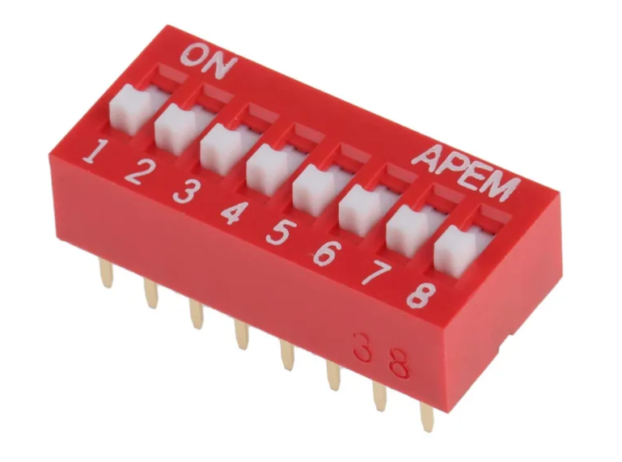
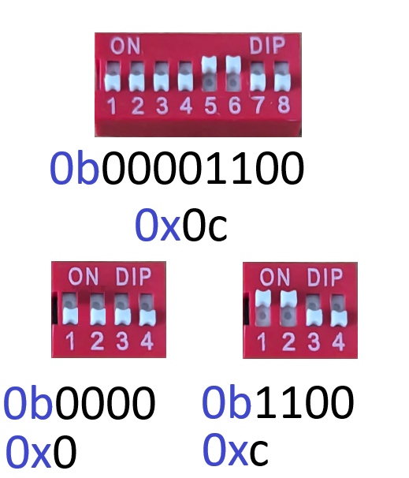

# Text Data Types

## The object Base Class and Collections Abstract Base Class

Recall from the previous tutorial covering the data model that the `object` class is the `base` class of all classes. `dir` can be used to view a list of it's identifiers:

```python
In [1]: dir(object)
Out[1]: [
            '__class__', '__delattr__', '__dir__', '__doc__', '__eq__', '__format__', '__ge__', 
            '__getattribute__', '__getstate__', '__gt__', '__hash__', '__init__', '__init_subclass__', 
            '__le__', '__lt__', '__ne__', '__new__', '__reduce__', '__reduce_ex__', '__repr__', '__setattr__', 
            '__sizeof__', '__str__', '__subclasshook__'
           ]
```

The identifiers can also be viewed if `object` is input followed by a dot `.`:

```python
In [2]: object.
# -------------------------------
# Available Identifiers for `object`:
# -------------------------------------
#   🔧 Functions:
#     - __init__(self, /, *args, **kwargs)          : Initializes the object.
#     - __new__(*args, **kwargs)                    : Creates a new instance of the class.
#     - __delattr__(self, name, /)                  : Defines behavior for when an attribute is deleted.
#     - __dir__(self, /)                            : Default dir() implementation.
#     - __sizeof__(self, /)                         : Returns the size of the object in memory, in bytes.
#     - __eq__(self, value, /)                      : Checks for equality with another object.
#     - __ne__(self, value, /)                      : Checks for inequality with another object.
#     - __lt__(self, value, /)                      : Checks if the object is less than another.
#     - __le__(self, value, /)                      : Checks if the object is less than or equal to another.
#     - __gt__(self, value, /)                      : Checks if the object is greater than another.
#     - __ge__(self, value, /)                      : Checks if the object is greater than or equal to another.
#     - __repr__(self, /)                           : Returns a string representation of the object.
#     - __str__(self, /)                            : Returns a string for display purposes.
#     - __format__(self, format_spec, /)            : Returns a formatted string representation of the object.
#     - __hash__(self, /)                           : Returns a hash of the object.
#     - __getattribute__(self, name, /)             : Gets an attribute from the object.
#     - __setattr__(self, name, value, /)           : Sets an attribute on the object.
#     - __delattr__(self, name, /)                  : Deletes an attribute from the object.
#     - __reduce__(self, /)                         : Prepares the object for pickling.
#     - __reduce_ex__(self, protocol, /)            : Similar to __reduce__, with a protocol argument.
#     - __init_subclass__(...)                      : Called when a class is subclassed; default 
#                                                     implementation does nothing.
#     - __subclasshook__(...)                       : Customize issubclass() for abstract classes.
#
#    🔍 Attributes:
#     - __class__                                    : The class of the object.
#     - __doc__                                      : The docstring of the object.
# -------------------------------------
```

If the `str` class is now examined, notice that it has many more identifiers:

```python
In [2]: dir(str)
Out[2]: [
          '__add__', '__class__', '__contains__', '__delattr__', '__dir__', '__doc__',
          '__eq__', '__format__', '__ge__', '__getattribute__', '__getitem__', '__getstate__',
          '__gt__', '__hash__', '__init__', '__init_subclass__', '__iter__', '__le__',
          '__len__', '__lt__', '__mul__', '__ne__', '__new__', '__reduce__', '__repr__',
          '__radd__', '__rmatmul__', '__rmul__', '__setattr__', '__sizeof__', '__str__',
          '__subclasshook__', 'capitalize', 'casefold', 'center', 'count', 'encode',
          'endswith', 'expandtabs', 'find', 'format', 'format_map', 'index', 'isalnum',
          'isalpha', 'isdecimal', 'isdigit', 'isidentifier', 'islower', 'isnumeric',
          'isprintable', 'isspace', 'istitle', 'isupper', 'join', 'ljust', 'lower',
          'lstrip', 'maketrans', 'partition', 'replace', 'rfind', 'rindex', 'rjust',
          'rpartition', 'rstrip', 'split', 'splitlines', 'startswith', 'strip', 'swapcase',
          'title', 'upper', 'zfill'
       ]
```

Because, the `object` is the `base` class, it is present in the `str` classes method resolution order:

```python
In [3]: str.mro()
Out[3]: ['str', 'object']
```

Recall the `str` class inherits everything from the `object` class. Some identifiers are redefined in the `str` class for additional functionality and additional identifiers are supplemented. The method resolution order essentially means preferentially use the method if it is redefined in the `str` class over the equivalent method in the `object` class.

The `str` class follows the design pattern of the abstract base class immutable `Collection` and therefore has the behaviour of an immutable `Collection`. When `str` is input, followed by a dot `.` the identifiers are typically listed alphabetically. However it is easier to understand the identifiers in the `str` class when the identifiers are grouped by design pattern and purpose:

```python
In [4]: str.
# -------------------------------
# Available Identifiers for `str`:
# -------------------------------------

# 🔧 Functions from `object` (inherited by `str`):
#     - __init__(self, /, *args, **kwargs)          : Initializes the object.
#     - __new__(*args, **kwargs)                    : Creates a new instance of the class.
#     - __delattr__(self, name, /)                  : Defines behavior for when an attribute is deleted.
#     - __dir__(self, /)                            : Default dir() implementation.
#     - __sizeof__(self, /)                         : Returns the size of the object in memory, in bytes.
#     - __eq__(self, value, /)                      : Checks for equality with another object.
#     - __ne__(self, value, /)                      : Checks for inequality with another object.
#     - __lt__(self, value, /)                      : Checks if the object is less than another.
#     - __le__(self, value, /)                      : Checks if the object is less than or equal to another.
#     - __gt__(self, value, /)                      : Checks if the object is greater than another.
#     - __ge__(self, value, /)                      : Checks if the object is greater than or equal to another.
#     - __repr__(self, /)                           : Returns a string representation of the object.
#     - __str__(self, /)                            : Returns a string for display purposes.
#     - __format__(self, format_spec, /)            : Returns a formatted string representation of the object.
#     - __hash__(self, /)                           : Returns a hash of the object.
#     - __getattribute__(self, name, /)             : Gets an attribute from the object.
#     - __setattr__(self, name, value, /)           : Sets an attribute on the object.
#     - __delattr__(self, name, /)                  : Deletes an attribute from the object.
#     - __reduce__(self, /)                         : Prepares the object for pickling.
#     - __reduce_ex__(self, protocol, /)            : Similar to __reduce__, with a protocol argument.

# 🔍 Attributes from `object`:
#     - __class__                                   : The class of the string.
#     - __doc__                                     : The docstring of the string class.

# 🔧 Collection-Based Methods (from `str` and the Collection ABC):
#     - __contains__(self, key, /)                  : Checks if a substring is in the string (`in`).
#     - __iter__(self, /)                           : Returns an iterator over the string.
#     - __len__(self, /)                            : Returns the length of the string.
#     - __getitem__(self, key, /)                   : Retrieves a character by index (`[]`).
#     - count(self, sub, start=0,                   : Counts the occurrences of a substring.
#             end=9223372036854775807, /) 
#     - index(self, sub, start=0,                   : Returns the index of the first occurrence of a substring.
#             end=9223372036854775807, /) 

# 🔧 Supplementary Collection-Based Methods:
#     - rindex(self, sub, start=0,                  : Returns the highest index of a substring.
#              end=9223372036854775807, /) 
#     - find(self, sub, start=0,                    : Finds the first index of a substring.
#            end=9223372036854775807, /) 
#     - rfind(self, sub, start=0,                   : Finds the highest index of a substring.
#             end=9223372036854775807, /) 
#     - replace(self, old, new, count=-1, /)        : Replaces occurrences of a substring.

# 🔧 Collection-Like Operators:
#     - __add__(self, value, /)                     : Implements string concatenation (`+`).
#     - __mul__(self, value, /)                     : Implements string repetition (`*`).
#     - __rmul__(self, value, /)                    : Implements reflected multiplication (`*`).

# 🔧 Encoding-Related Methods:
#     - encode(self, encoding='utf-8', )            : Encodes the string using a specified encoding.
#              errors='strict', /
#

# 🔧 String-Specific Dunder Methods (from `str`):
#     - __bytes__(self, /)                          : Converts the bytes object to a bytes object.

# 🔧 Additional String-Specific Methods (Grouped by Similarity):

# 🔧 Formatting Methods:
#     - format(self, /, *args, **kwargs)            : Formats the string using a format string.
#     - format_map(self, mapping, /)                : Formats the string using a dictionary.
#     - translate(self, table, /)                   : Maps characters using a translation table.
#     - __mod__(self, value, /)                     : Implements C style string formatting using `%`.
#     - __rmod__(self, value, /)                    : Implements reverse C style string formatting using `%`.

# 🅰️ Case-Specific Methods:
#     - lower(self, /)                              : Converts all characters to lowercase.
#     - casefold(self, /)                           : Returns a casefolded version for caseless matching.
#     - upper(self, /)                              : Converts all characters to uppercase.
#     - capitalize(self, /)                         : Capitalizes the first character of the string.
#     - title(self, /)                              : Returns a title-cased version of the string.
#     - swapcase(self, /)                           : Swaps the case of all characters.

# 🔠 Boolean Methods (Grouped by Type):

# Character Classification:
#     - isascii(self, /)                            : Checks if all characters are ASCII.
#     - isalpha(self, /)                            : Checks if the string contains only alphabetic characters.

# Numeric Classification:
#     - isdecimal(self, /)                          : Checks if the string contains only decimal characters.
#     - isdigit(self, /)                            : Checks if the string contains only digits.
#     - isnumeric(self, /)                          : Checks if the string contains only numeric characters.

# Whitespace and Titlecase:
#     - islower(self, /)                            : Checks if all characters are lowercase.
#     - isupper(self, /)                            : Checks if all characters are uppercase.
#     - isspace(self, /)                            : Checks if the string contains only whitespace.
#     - istitle(self, /)                            : Checks if the string is title-cased.
#     - isprintable(self, /)                        : Checks if all characters are printable.
#     - isidentifier(self, /)                       : Checks if the string is a valid Python identifier.

# Starts or Ends With:
#     - startswith(self, prefix, start=0,           : Checks if the string starts with a prefix.
#                  end=9223372036854775807, /) 
#     - endswith(self, suffix, start=0,             : Checks if the string ends with a suffix.
#                end=9223372036854775807, /)   

# 🔄 Manipulation Methods (Grouping Similar Functions):
#     - ljust(self, width, fillchar=' ', /)         : Left-justifies the string in a field of a given width.
#     - rjust(self, width, fillchar=' ', /)         : Right-justifies the string in a field of a given width.
#     - center(self, width, fillchar=' ', /)        : Centers the string in a field of a given width.
#     - zfill(self, width, /)                       : Pads the string with zeros on the left.
#     - expandtabs(self, tabsize=8, /)              : Expands tabs in the string into spaces.

# 🔄 Stripping Methods:
#     - lstrip(self, chars=None, /)                 : Strips leading characters from the string.
#     - rstrip(self, chars=None, /)                 : Strips trailing characters from the string.
#     - strip(self, chars=None, /)                  : Strips leading and trailing characters from the string.
#     - removeprefix(self, prefix, /)               : Removes the specified prefix from the string.
#     - removesuffix(self, suffix, /)               : Removes the specified suffix from the string.

# 🧩 Splitting and Joining:
#     - split(self, sep=None, maxsplit=-1, /)       : Splits the string at occurrences of a separator.
#     - rsplit(self, sep=None, maxsplit=-1, /)      : Splits the string at occurrences of a separator, from the #                                                     right.
#     - splitlines(self, keepends=False, /)         : Splits the string at line breaks.
#     - join(self, iterable, /)                     : Joins an iterable with the string as a separator.
#     - partition(self, sep, /)                     : Splits the string into a 3-tuple around a separator.
#     - rpartition(self, sep, /)                    : Splits the string into a 3-tuple around a separator, from #                                                     the right.
```

The `str` is a `Collection` where each element (fundamental unit) in the `Collection` is a Unicode Character. The `str` class always uses the Unicode Transformation Format-8 (UTF-8) to encode an Unicode character and this greatly simplifies text related operations as the user does not need to handle encoding and decoding using various other translation tables.

Another text datatype is the `bytes` class. The `bytes` class is also a `Collection` where each element in the `Collection` is a byte. The byte is a logical unit in a computers memory. It is helpful to conceptualise it as the combination of 8 binary switches:



Each combination in the 8 switches above corresponds to an `int` between `0` and `256` so the `bytes` class also has some numeric behaviour. An encoding standard is used to designate a single byte or multiple bytes to a Unicode character. However unlike the Unicode `str`, there are a variety of encoding tables and the numeric `bytes` `Collection` must be encoded and decoded using the same encoding table for the text to make sense. Notice that the identifiers in the `bytes` class are largely constent with identifiers in the `str` class but may behave slightly different as they use a difference unit in the `Collection`:

```python
In [4]: dir(bytes)
Out[4]: ['__add__', '__class__', '__contains__', '__delattr__', '__doc__', '__eq__', 
          '__format__', '__ge__', '__getitem__', '__getattribute__', '__gt__', 
          '__hash__', '__init__', '__iter__', '__le__', '__len__', '__lt__', 
          '__ne__', '__repr__', '__radd__', '__rmod__', '__sizeof__', '__str__', 
          '__bytes__', 'capitalize', 'casefold', 'count', 'decode', 'endswith', 
          'expandtabs', 'find', 'index', 'isalnum', 'isalpha', 'isdecimal', 
          'isdigit', 'islower', 'isupper', 'join', 'ljust', 'lower', 'replace', 
          'rfind', 'rindex', 'rjust', 'split', 'splitlines', 'startswith', 
          'title', 'upper', 'zfill']
```

```python
In [5]: bytes.
# -------------------------------
# Available Identifiers for `bytes`:
# -------------------------------------

# 🔧 Functions from `object` (inherited by `bytes`):
#     - __init__(self, /, *args, **kwargs)             : Initializes the object.
#     - __new__(*args, **kwargs)                       : Creates a new instance of the class.
#     - __delattr__(self, name, /)                     : Defines behavior for when an attribute is deleted.
#     - __dir__(self, /)                               : Default dir() implementation.
#     - __sizeof__(self, /)                            : Returns the size of the object in memory, in bytes.
#     - __eq__(self, value, /)                         : Checks for equality with another object.
#     - __ne__(self, value, /)                         : Checks for inequality with another object.
#     - __lt__(self, value, /)                         : Checks if the object is less than another.
#     - __le__(self, value, /)                         : Checks if the object is less than or equal to another.
#     - __gt__(self, value, /)                         : Checks if the object is greater than another.
#     - __ge__(self, value, /)                         : Checks if the object is greater than or equal to another.
#     - __repr__(self, /)                              : Returns a string representation of the object.
#     - __str__(self, /)                               : Returns a string for display purposes.
#     - __format__(self, format_spec, /)               : Returns a formatted string representation of the object.
#     - __hash__(self, /)                              : Returns a hash of the object.
#     - __getattribute__(self, name, /)                : Gets an attribute from the object.
#     - __setattr__(self, name, value, /)              : Sets an attribute on the object.
#     - __delattr__(self, name, /)                     : Deletes an attribute from the object.
#     - __reduce__(self, /)                            : Prepares the object for pickling.
#     - __reduce_ex__(self, protocol, /)               : Similar to __reduce__, with a protocol argument.

# 🔍 Attributes from `object`:
#     - __class__                                      : The class of the bytes object.
#     - __doc__                                        : The docstring of the bytes class.

# 🔧 Collection-Based Methods (from `bytes` and the Collection ABC):
#     - __contains__(self, key, /)                     : Checks if a byte value is in the bytes (`in`).
#     - __iter__(self, /)                              : Returns an iterator over the bytes.
#     - __len__(self, /)                               : Returns the length of the bytes.
#     - __getitem__(self, key, /)                      : Retrieves a byte by index (`[]`).
#     - count(self, sub, start=0,                      : Counts the occurrences of a sub-byte sequence.
#             end=9223372036854775807, /) 
#     - index(self, sub, start=0,                      : Returns the index of the first occurrence of a sub-byte.
#             end=9223372036854775807, /) 

# 🔧 Supplementary Collection-Based Methods:
#     - rindex(self, sub, start=0,                      : Returns the highest index of the first occurrence of a sub-byte.
#     - find(self, sub, start=0,                       : Finds the index of a sub-byte sequence.
#            end=9223372036854775807, /)  
#     - rfind(self, sub, start=0,                      : Finds the highest index of a sub-byte sequence.
#            end=9223372036854775807, /)  
#     - replace(self, old, new, count=-1, /)           : Replaces occurrences of a sub-byte sequence.

# 🔧 Collection-Like Operators:
#     - __add__(self, value, /)                        : Implements bytes concatenation (`+`).
#     - __mul__(self, value, /)                        : Implements bytes repetition (`*`).
#     - __rmul__(self, value, /)                       : Implements reflected multiplication (`*`).

# 🔧 Encoding-Related Methods:
#     - decode(self, encoding='utf-8',                 : Decodes the bytes using a specified encoding.
#             errors='strict', /)

# 🔧 Bytes-Specific Dunder Methods (from `bytes`):
#     - __bytes__(self, /)                             : Returns a copy of the bytes object.
#     - __iter__(self, /)                              : Returns an iterator over the bytes.

# 🔧 Additional Bytes-Specific Methods (Grouped by Similarity):

# 🔧 Formatting and Representation:
#     - hex(self, /)                                   : Returns a string of hexadecimal values.
#     - fromhex(string, /)                             : Creates a `bytes` object from a hexadecimal string.
#     - __mod__(self, value, /)                        : Implements C-style formatting using `%`.
#     - __rmod__(self, value, /)                       : Implements reverse C-style formatting using `%`.

# 🅰️ Case-Specific Methods (For Mutable Equivalent `bytearray`):
#     - **N/A for `bytes`, as they are immutable.** (Mutable `bytearray` provides `lower`, `upper`, etc.)

# 🔠 Boolean Methods (Data Validation):
#     - isalnum(self, /)                               : Checks if all bytes are alphanumeric.
#     - isalpha(self, /)                               : Checks if all bytes are alphabetic.
#     - isascii(self, /)                               : Checks if all bytes are ASCII.
#     - isdigit(self, /)                               : Checks if all bytes are digits.
#     - islower(self, /)                               : Checks if all bytes are lowercase alphabetic.
#     - isupper(self, /)                               : Checks if all bytes are uppercase alphabetic.
#     - isspace(self, /)                               : Checks if all bytes are whitespace.
#     - startswith(self, prefix, start=0,              : Checks if starts with a prefix.
#                 end=9223372036854775807, /) 
#     - endswith(self, suffix, start=0,                : Checks if ends with a suffix.
#               end=9223372036854775807, /)   

# 🔄 Manipulation Methods (Grouping Similar Functions):
#     - ljust(self, width, fillchar=b' ', /)           : Left-justifies in a field of a given width.
#     - rjust(self, width, fillchar=b' ', /)           : Right-justifies in a field of a given width.
#     - center(self, width, fillchar=b' ', /)          : Centers in a field of a given width.
#     - zfill(self, width, /)                          : Pads with zeros on the left.
#     - expandtabs(self, tabsize=8, /)                 : Expands tabs into spaces.

# 🔄 Stripping Methods:
#     - lstrip(self, bytes=None, /)                    : Strips leading bytes from the bytes object.
#     - rstrip(self, bytes=None, /)                    : Strips trailing bytes from the bytes object.
#     - strip(self, bytes=None, /)                     : Strips leading and trailing bytes from the bytes object.

# 🧩 Splitting and Joining:
#     - split(self, sep=None, maxsplit=-1, /)          : Splits at occurrences of a separator.
#     - rsplit(self, sep=None, maxsplit=-1, /)         : Splits at occurrences of a separator, from the right.
#     - splitlines(self, keepends=False, /)            : Splits at line breaks.
#     - join(self, iterable_of_bytes, /)               : Joins an iterable with bytes as a separator.
#     - partition(self, sep, /)                        : Splits into a 3-tuple around a separator.
#     - rpartition(self, sep, /)                       : Splits into a 3-tuple around a separator, from the right.
```

The `str` and `bytes` classes are immutable which essentially means all methods with exception to the constructor return a new instance (of the same class or a different class). The `bytes` class has a mutable counterpart the `bytearray`, which has additional methods which mutate the `bytearray` in place:

```python
In [5]: bytearray.
# -------------------------------
# Available Identifiers for `bytearray`:
# -------------------------------------

# 🔧 Functions from `object` (inherited by `bytearray`):
#     - __init__(self, /, *args, **kwargs)             : Initializes the object.
#     - __new__(*args, **kwargs)                       : Creates a new instance of the class.
#     - __delattr__(self, name, /)                     : Defines behavior for when an attribute is deleted.
#     - __dir__(self, /)                               : Default dir() implementation.
#     - __sizeof__(self, /)                            : Returns the size of the object in memory, in bytes.
#     - __eq__(self, value, /)                         : Checks for equality with another object.
#     - __ne__(self, value, /)                         : Checks for inequality with another object.
#     - __lt__(self, value, /)                         : Checks if the object is less than another.
#     - __le__(self, value, /)                         : Checks if the object is less than or equal to another.
#     - __gt__(self, value, /)                         : Checks if the object is greater than another.
#     - __ge__(self, value, /)                         : Checks if the object is greater than or equal to another.
#     - __repr__(self, /)                              : Returns a string representation of the object.
#     - __str__(self, /)                               : Returns a string for display purposes.
#     - __format__(self, format_spec, /)               : Returns a formatted string representation of the object.
#     - __hash__(self, /)                              : Returns a hash of the object.
#     - __getattribute__(self, name, /)                : Gets an attribute from the object.
#     - __setattr__(self, name, value, /)              : Sets an attribute on the object.
#     - __delattr__(self, name, /)                     : Deletes an attribute from the object.
#     - __reduce__(self, /)                            : Prepares the object for pickling.
#     - __reduce_ex__(self, protocol, /)               : Similar to __reduce__, with a protocol argument.

# 🔍 Attributes from `object`:
#     - __class__                                      : The class of the bytearray object.
#     - __doc__                                        : The docstring of the bytearray class.

# 🔧 Collection-Based Methods (from `bytearray` and the Collection ABC):
#     - __contains__(self, key, /)                     : Checks if a byte value is in the bytearray (`in`).
#     - __iter__(self, /)                              : Returns an iterator over the bytearray.
#     - __len__(self, /)                               : Returns the length of the bytearray.
#     - __getitem__(self, key, /)                      : Retrieves a byte by index (`[]`).
#     - count(self, sub, start=0,                      : Counts the occurrences of a sub-byte sequence.
#             end=9223372036854775807, /) 
#     - index(self, sub, start=0,                      : Returns the index of the first occurrence of a sub-byte.
#             end=9223372036854775807, /) 

# 🔧 Supplementary Collection-Based Methods:
#     - rindex(self, sub, start=0,                     : Returns the highest index of a sub-byte sequence.
#              end=9223372036854775807, /) 
#     - find(self, sub, start=0,                       : Finds the lowest index of a sub-byte sequence.
#            end=9223372036854775807, /)  
#     - rfind(self, sub, start=0,                      : Finds the highest index of a sub-byte sequence.
#            end=9223372036854775807, /)  
#     - replace(self, old, new, count=-1, /)           : Replaces occurrences of a sub-byte sequence.

# 🔧 Mutable Collection-Specific Methods:
#     - __setitem__(self, key, value, /)               : Assigns a value to an item (`[] =`).
#     - __delitem__(self, key, /)                      : Deletes an item from the bytearray.
#     - append(self, item, /)                          : Appends a byte to the end of the bytearray.
#     - extend(self, iterable_of_bytes, /)             : Appends multiple bytes to the bytearray.
#     - insert(self, index, item, /)                   : Inserts a byte at a specific position.
#     - pop(self, index=-1, /)                         : Removes and returns a byte at a given index.
#     - remove(self, value, /)                         : Removes the first occurrence of a value.
#     - clear(self, /)                                 : Removes all bytes from the bytearray.
#     - reverse(self, /)                               : Reverses the order of bytes in place.

# 🔧 Collection-Like Operators:
#     - __add__(self, value, /)                        : Implements bytearray concatenation (`+`).
#     - __mul__(self, value, /)                        : Implements bytearray repetition (`*`).
#     - __rmul__(self, value, /)                       : Implements reflected multiplication (`*`).

# 🔧 Encoding-Related Methods:
#     - decode(self, encoding='utf-8',                 : Decodes the bytearray using a specified encoding.
#             errors='strict', /)

# 🔧 Bytes-Specific Dunder Methods (from `bytearray`):
#     - __bytes__(self, /)                             : Returns a bytes object copy of the bytearray.
#     - __iter__(self, /)                              : Returns an iterator over the bytearray.

# 🔧 Additional Bytearray-Specific Methods (Grouped by Similarity):

# 🔧 Formatting and Representation:
#     - hex(self, /)                                   : Returns a string of hexadecimal values.
#     - fromhex(string, /)                             : Creates a `bytearray` object from a hexadecimal string.
#     - __mod__(self, value, /)                        : Implements C-style formatting using `%`.
#     - __rmod__(self, value, /)                       : Implements reverse C-style formatting using `%`.

# 🅰️ Case-Specific Methods:
#     - lower(self, /)                                 : Converts to lowercase.
#     - upper(self, /)                                 : Converts to uppercase.
#     - capitalize(self, /)                            : Capitalizes the first byte.
#     - title(self, /)                                 : Converts to title case.
#     - swapcase(self, /)                              : Swaps case.
#     - casefold(self, /)                              : Converts for case-insensitive comparisons.

# 🔠 Boolean Methods (Data Validation):
#     - isalnum(self, /)                               : Checks if all bytes are alphanumeric.
#     - isalpha(self, /)                               : Checks if all bytes are alphabetic.
#     - isascii(self, /)                               : Checks if all bytes are ASCII.
#     - isdigit(self, /)                               : Checks if all bytes are digits.
#     - islower(self, /)                               : Checks if all bytes are lowercase alphabetic.
#     - isupper(self, /)                               : Checks if all bytes are uppercase alphabetic.
#     - isspace(self, /)                               : Checks if all bytes are whitespace.
#     - startswith(self, prefix, start=0,              : Checks if starts with a prefix.
#                 end=9223372036854775807, /) 
#     - endswith(self, suffix, start=0,                : Checks if ends with a suffix.
#               end=9223372036854775807, /)   

# 🔄 Manipulation Methods (Grouping Similar Functions):
#     - ljust(self, width, fillchar=b' ', /)           : Left-justifies in a field of a given width.
#     - rjust(self, width, fillchar=b' ', /)           : Right-justifies in a field of a given width.
#     - center(self, width, fillchar=b' ', /)          : Centers in a field of a given width.
#     - zfill(self, width, /)                          : Pads with zeros on the left.
#     - expandtabs(self, tabsize=8, /)                 : Expands tabs into spaces.

# 🔄 Stripping Methods:
#     - lstrip(self, bytes=None, /)                    : Strips leading bytes from the bytearray.
#     - rstrip(self, bytes=None, /)                    : Strips trailing bytes from the bytearray.
#     - strip(self, bytes=None, /)                     : Strips leading and trailing bytes from the bytearray.

# 🧩 Splitting and Joining:
#     - split(self, sep=None, maxsplit=-1, /)          : Splits at occurrences of a separator.
#     - rsplit(self, sep=None, maxsplit=-1, /)         : Splits at occurrences of a separator, from the right.
#     - splitlines(self, keepends=False, /)            : Splits at line breaks.
#     - join(self, iterable_of_bytes, /)               : Joins an iterable with bytearray as a separator.
#     - partition(self, sep, /)                        : Splits into a 3-tuple around a separator.
#     - rpartition(self, sep, /)                       : Splits into a 3-tuple around a separator, from the right.
```

## Instantiation, Encoding and Collection Properties

A `str` instance can be explictly instantiated using:

```python
In [5]: exit
In [6]: str('Hello World!')
Out[6]: 'Hello World!'
```

The return value shows the printed formal representation, which recall is the preferred way to initialise a `str`. Since the `str` class is the fundamental `builtins` text class, the preferred way `str` instance is without explictly using the `str` class. The Unicode `str` can use any Unicode Character. In this example Greek letters will be used:

```python
In [7]: `Γεια σου Κοσμο!`
Out[7]: `Γεια σου Κοσμο!`
```

<details>
  <summary>Greek Alphabet</summary>

|Greek Alphabet|Uppercase|Lower Case|
|---|---|---|
|Alpha|Α|α|
|Beta|Β|β|
|Gamma|Γ|γ|
|Delta|Δ|δ|
|Epsilon|Ε|ε or ϵ|
|Zeta|Ζ|ζ|
|Eta|Η|η|
|Theta|Θ|θ|
|Iota|Ι|ι|
|Kappa|Κ|κ|
|Lambda|Λ|λ|
|Mu|Μ|μ|
|Nu|Ν|ν|
|Xi|Ξ|ξ|
|Omicron|Ο|ο|
|Pi|Π|π|
|Rho|Ρ|ρ|
|Sigma|Σ|σ or ς|
|Tau|Τ|τ|
|Upsilon|Υ|υ|
|Phi|Φ|φ|
|Chi|Χ|χ|
|Psi|Ψ|ψ|
|Omega|Ω|ω|

</details>

The `str` instances can be assigned to `object` names:

```python
In [8]: ascii_text = 'Hello World!'
        text = 'Γεια σου Κοσμο!'
```

And will display in the Variable Explorer:

<table style="width: 65%; border-collapse: collapse; font-family: sans-serif; background-color: #1e1e1e; color: #d4d4d4;">
  <tr>
    <th colspan="4" style="text-align:center; padding: 8px; background-color: #2d2d30; color: #ffffff;">Variable Explorer</th>
  </tr>
  <tr>
    <th style="padding: 8px; background-color: #252526; color: #ffffff;">Name ▲</th>
    <th style="padding: 8px; background-color: #252526; color: #ffffff;">Type</th>
    <th style="padding: 8px; background-color: #252526; color: #ffffff;">Size</th>
    <th style="padding: 8px; background-color: #252526; color: #ffffff;">Value</th>
  </tr>
  <tr>
    <td style="padding: 8px; background-color: #1e1e1e;">ascii_text</td>
    <td style="padding: 8px; background-color: #1e1e1e;">str</td>
    <td style="padding: 8px; background-color: #1e1e1e;">12</td>
    <td style="padding: 8px; background-color: #506E16; color: #ffffff;">Hello World!</td> <!-- Updated background color for strings -->
  </tr>
  <tr>
    <td style="padding: 8px; background-color: #252526;">text</td>
    <td style="padding: 8px; background-color: #252526;">str</td>
    <td style="padding: 8px; background-color: #252526;">15</td>
    <td style="padding: 8px; background-color: #506E16; color: #ffffff;">Γεια σου Κοσμο!</td> <!-- Updated background color for strings -->
  </tr>  
</table>

Notice the Variable Explorer displays the type and the length and the length is the number of Unicode Characters in each `str`.

Another text datatype is the `byte` class. Recall the `bytes` class is a `Collection` where each element in the `Collection` is a byte and a byte can be concepualised as a combination of 8 switches:


The `byte` class requires an encoding table. The encoding table maps a command to a memory configuration in `bytes`. One of the first widespread encoding tables was the American Standard for Information Interchange (ASCII). A very early generation computer is based on the typewritter. The type writter has a limited number of commands that control the device. Many of these commands are printable key presses, however there are commands that aren't printable such as the carriage return and form feed which need to be used in order to print text out onto a piece of paper:


Notice the limited number of characters in in ASCII are essentially restricted to the English Language. Select ASCII Encoding to view all the ASCII Characters:

<details>
  <summary>ASCII Encoding</summary>

<table style="width: 80%; border-collapse: collapse; font-family: sans-serif;">
  <tr>
    <th colspan="2" style="text-align:center; padding: 8px; background-color: #2d2d30; color: #ffffff;">Binary to Character Mapping</th>
  </tr>
  <tr>
    <th style="padding: 8px; background-color: #252526; color: #569cd6;">Binary</th>
    <th style="padding: 8px; background-color: #252526; color: #569cd6;">Character</th>
  </tr>
  <tr>
    <td style="padding: 8px; background-color: #1e1e1e;">
      <span style="color: #569cd6;">0b</span>00000000
    </td>
    <td style="padding: 8px; background-color: #1e1e1e;">NUL (null character)</td>
  </tr>
  <tr>
    <td style="padding: 8px; background-color: #252526;">
      <span style="color: #569cd6;">0b</span>00000001
    </td>
    <td style="padding: 8px; background-color: #252526;">SOH (start of header)</td>
  </tr>
  <tr>
    <td style="padding: 8px; background-color: #1e1e1e;">
      <span style="color: #569cd6;">0b</span>00000010
    </td>
    <td style="padding: 8px; background-color: #1e1e1e;">STX (start of text)</td>
  </tr>
  <tr>
    <td style="padding: 8px; background-color: #252526;">
      <span style="color: #569cd6;">0b</span>00000011
    </td>
    <td style="padding: 8px; background-color: #252526;">ETX (end of text)</td>
  </tr>
  <tr>
    <td style="padding: 8px; background-color: #1e1e1e;">
      <span style="color: #569cd6;">0b</span>00000100
    </td>
    <td style="padding: 8px; background-color: #1e1e1e;">EOT (end of transmission)</td>
  </tr>
  <tr>
    <td style="padding: 8px; background-color: #252526;">
      <span style="color: #569cd6;">0b</span>00000101
    </td>
    <td style="padding: 8px; background-color: #252526;">ENQ (enquiry)</td>
  </tr>
  <tr>
    <td style="padding: 8px; background-color: #1e1e1e;">
      <span style="color: #569cd6;">0b</span>00000110
    </td>
    <td style="padding: 8px; background-color: #1e1e1e;">ACK (acknowledge)</td>
  </tr>
  <tr>
    <td style="padding: 8px; background-color: #252526;">
      <span style="color: #569cd6;">0b</span>00000111
    </td>
    <td style="padding: 8px; background-color: #252526;">BEL (bell)</td>
  </tr>
  <tr>
    <td style="padding: 8px; background-color: #1e1e1e;">
      <span style="color: #569cd6;">0b</span>00001000
    </td>
    <td style="padding: 8px; background-color: #1e1e1e;">BS (backspace)</td>
  </tr>
  <tr>
    <td style="padding: 8px; background-color: #252526;">
      <span style="color: #569cd6;">0b</span>00001001
    </td>
    <td style="padding: 8px; background-color: #252526;">TAB (horizontal tab)</td>
  </tr>
  <tr>
    <td style="padding: 8px; background-color: #1e1e1e;">
      <span style="color: #569cd6;">0b</span>00001010
    </td>
    <td style="padding: 8px; background-color: #1e1e1e;">LF (line feed)</td>
  </tr>
  <tr>
    <td style="padding: 8px; background-color: #252526;">
      <span style="color: #569cd6;">0b</span>00001011
    </td>
    <td style="padding: 8px; background-color: #252526;">VT (vertical tab)</td>
  </tr>
  <tr>
    <td style="padding: 8px; background-color: #1e1e1e;">
      <span style="color: #569cd6;">0b</span>00001100
    </td>
    <td style="padding: 8px; background-color: #1e1e1e;">FF (form feed)</td>
  </tr>
  <tr>
    <td style="padding: 8px; background-color: #252526;">
      <span style="color: #569cd6;">0b</span>00001101
    </td>
    <td style="padding: 8px; background-color: #252526;">CR (carriage return)</td>
  </tr>
  <tr>
    <td style="padding: 8px; background-color: #1e1e1e;">
      <span style="color: #569cd6;">0b</span>00001110
    </td>
    <td style="padding: 8px; background-color: #1e1e1e;">SO (shift out)</td>
  </tr>
  <tr>
    <td style="padding: 8px; background-color: #252526;">
      <span style="color: #569cd6;">0b</span>00001111
    </td>
    <td style="padding: 8px; background-color: #252526;">SI (shift in)</td>
  </tr>
  <tr>
    <td style="padding: 8px; background-color: #1e1e1e;">
      <span style="color: #569cd6;">0b</span>00010000
    </td>
    <td style="padding: 8px; background-color: #1e1e1e;">DLE (data link escape)</td>
  </tr>
  <tr>
    <td style="padding: 8px; background-color: #252526;">
      <span style="color: #569cd6;">0b</span>00010001
    </td>
    <td style="padding: 8px; background-color: #252526;">DC1 (device control 1)</td>
  </tr>
  <tr>
    <td style="padding: 8px; background-color: #1e1e1e;">
      <span style="color: #569cd6;">0b</span>00010010
    </td>
    <td style="padding: 8px; background-color: #1e1e1e;">DC2 (device control 2)</td>
  </tr>
  <tr>
    <td style="padding: 8px; background-color: #252526;">
      <span style="color: #569cd6;">0b</span>00010011
    </td>
    <td style="padding: 8px; background-color: #252526;">DC3 (device control 3)</td>
  </tr>
  <tr>
    <td style="padding: 8px; background-color: #1e1e1e;">
      <span style="color: #569cd6;">0b</span>00010100
    </td>
    <td style="padding: 8px; background-color: #1e1e1e;">DC4 (device control 4)</td>
  </tr>
  <tr>
    <td style="padding: 8px; background-color: #252526;">
      <span style="color: #569cd6;">0b</span>00010101
    </td>
    <td style="padding: 8px; background-color: #252526;">NAK (negative acknowledge)</td>
  </tr>
  <tr>
    <td style="padding: 8px; background-color: #1e1e1e;">
      <span style="color: #569cd6;">0b</span>00010110
    </td>
    <td style="padding: 8px; background-color: #1e1e1e;">SYN (synchronous idle)</td>
  </tr>
  <tr>
    <td style="padding: 8px; background-color: #252526;">
      <span style="color: #569cd6;">0b</span>00010111
    </td>
    <td style="padding: 8px; background-color: #252526;">ETB (end of transmission block)</td>
  </tr>
  <tr>
    <td style="padding: 8px; background-color: #1e1e1e;">
      <span style="color: #569cd6;">0b</span>00011000
    </td>
    <td style="padding: 8px; background-color: #1e1e1e;">CAN (cancel)</td>
  </tr>
  <tr>
    <td style="padding: 8px; background-color: #252526;">
      <span style="color: #569cd6;">0b</span>00011001
    </td>
    <td style="padding: 8px; background-color: #252526;">EM (end of medium)</td>
  </tr>
  <tr>
    <td style="padding: 8px; background-color: #1e1e1e;">
      <span style="color: #569cd6;">0b</span>00011010
    </td>
    <td style="padding: 8px; background-color: #1e1e1e;">SUB (substitute)</td>
  </tr>
  <tr>
    <td style="padding: 8px; background-color: #252526;">
      <span style="color: #569cd6;">0b</span>00011011
    </td>
    <td style="padding: 8px; background-color: #252526;">ESC (escape)</td>
  </tr>
  <tr>
    <td style="padding: 8px; background-color: #1e1e1e;">
      <span style="color: #569cd6;">0b</span>00011100
    </td>
    <td style="padding: 8px; background-color: #1e1e1e;">FS (file separator)</td>
  </tr>
  <tr>
    <td style="padding: 8px; background-color: #252526;">
      <span style="color: #569cd6;">0b</span>00011101
    </td>
    <td style="padding: 8px; background-color: #252526;">GS (group separator)</td>
  </tr>
  <tr>
    <td style="padding: 8px; background-color: #1e1e1e;">
      <span style="color: #569cd6;">0b</span>00011110
    </td>
    <td style="padding: 8px; background-color: #1e1e1e;">RS (record separator)</td>
  </tr>
  <tr>
    <td style="padding: 8px; background-color: #252526;">
      <span style="color: #569cd6;">0b</span>00011111
    </td>
    <td style="padding: 8px; background-color: #252526;">US (unit separator)</td>
  </tr>
  <tr>
    <td style="padding: 8px; background-color: #1e1e1e;">
      <span style="color: #569cd6;">0b</span>00100000
    </td>
    <td style="padding: 8px; background-color: #1e1e1e;">  </td>
  </tr>
  <tr>
    <td style="padding: 8px; background-color: #252526;">
      <span style="color: #569cd6;">0b</span>00100001
    </td>
    <td style="padding: 8px; background-color: #252526;">! (exclamation mark)</td>
  </tr>
  <tr>
    <td style="padding: 8px; background-color: #1e1e1e;">
      <span style="color: #569cd6;">0b</span>00100010
    </td>
    <td style="padding: 8px; background-color: #1e1e1e;">" (double quote)</td>
  </tr>
  <tr>
    <td style="padding: 8px; background-color: #252526;">
      <span style="color: #569cd6;">0b</span>00100011
    </td>
    <td style="padding: 8px; background-color: #252526;"># (number sign)</td>
  </tr>
  <tr>
    <td style="padding: 8px; background-color: #1e1e1e;">
      <span style="color: #569cd6;">0b</span>00100100
    </td>
    <td style="padding: 8px; background-color: #1e1e1e;">$ (dollar sign)</td>
  </tr>
  <tr>
    <td style="padding: 8px; background-color: #252526;">
      <span style="color: #569cd6;">0b</span>00100101
    </td>
    <td style="padding: 8px; background-color: #252526;">% (percent)</td>
  </tr>
  <tr>
    <td style="padding: 8px; background-color: #1e1e1e;">
      <span style="color: #569cd6;">0b</span>00100110
    </td>
    <td style="padding: 8px; background-color: #1e1e1e;">& (ampersand)</td>
  </tr>
  <tr>
    <td style="padding: 8px; background-color: #252526;">
      <span style="color: #569cd6;">0b</span>00100111
    </td>
    <td style="padding: 8px; background-color: #252526;">' (single quote)</td>
  </tr>
  <tr>
    <td style="padding: 8px; background-color: #1e1e1e;">
      <span style="color: #569cd6;">0b</span>00101000
    </td>
    <td style="padding: 8px; background-color: #1e1e1e;">&lpar; left parenthesis</td>
  </tr>
  <tr>
    <td style="padding: 8px; background-color: #252526;">
      <span style="color: #569cd6;">0b</span>00101001
    </td>
    <td style="padding: 8px; background-color: #252526;">&rpar; right parenthesis</td>
  </tr>
  <tr>
    <td style="padding: 8px; background-color: #1e1e1e;">
      <span style="color: #569cd6;">0b</span>00101010
    </td>
    <td style="padding: 8px; background-color: #1e1e1e;">* (asterisk)</td>
  </tr>
  <tr>
    <td style="padding: 8px; background-color: #252526;">
      <span style="color: #569cd6;">0b</span>00101011
    </td>
    <td style="padding: 8px; background-color: #252526;">+ (plus)</td>
  </tr>
  <tr>
    <td style="padding: 8px; background-color: #1e1e1e;">
      <span style="color: #569cd6;">0b</span>00101100
    </td>
    <td style="padding: 8px; background-color: #1e1e1e;">, (comma)</td>
  </tr>
  <tr>
    <td style="padding: 8px; background-color: #252526;">
      <span style="color: #569cd6;">0b</span>00101101
    </td>
    <td style="padding: 8px; background-color: #252526;">- (hyphen)</td>
  </tr>
  <tr>
    <td style="padding: 8px; background-color: #1e1e1e;">
      <span style="color: #569cd6;">0b</span>00101110
    </td>
    <td style="padding: 8px; background-color: #1e1e1e;">. (period)</td>
  </tr>
  <tr>
    <td style="padding: 8px; background-color: #252526;">
      <span style="color: #569cd6;">0b</span>00101111
    </td>
    <td style="padding: 8px; background-color: #252526;">/ (slash)</td>
  </tr>
  <tr>
    <td style="padding: 8px; background-color: #1e1e1e;">
      <span style="color: #569cd6;">0b</span>00110000
    </td>
    <td style="padding: 8px; background-color: #1e1e1e;">0 (digit zero)</td>
  </tr>
  <tr>
    <td style="padding: 8px; background-color: #252526;">
      <span style="color: #569cd6;">0b</span>00110001
    </td>
    <td style="padding: 8px; background-color: #252526;">1 (digit one)</td>
  </tr>
  <tr>
    <td style="padding: 8px; background-color: #1e1e1e;">
      <span style="color: #569cd6;">0b</span>00110010
    </td>
    <td style="padding: 8px; background-color: #1e1e1e;">2 (digit two)</td>
  </tr>
  <tr>
    <td style="padding: 8px; background-color: #252526;">
      <span style="color: #569cd6;">0b</span>00110011
    </td>
    <td style="padding: 8px; background-color: #252526;">3 (digit three)</td>
  </tr>
  <tr>
    <td style="padding: 8px; background-color: #1e1e1e;">
      <span style="color: #569cd6;">0b</span>00110100
    </td>
    <td style="padding: 8px; background-color: #1e1e1e;">4 (digit four)</td>
  </tr>
  <tr>
    <td style="padding: 8px; background-color: #252526;">
      <span style="color: #569cd6;">0b</span>00110101
    </td>
    <td style="padding: 8px; background-color: #252526;">5 (digit five)</td>
  </tr>
  <tr>
    <td style="padding: 8px; background-color: #1e1e1e;">
      <span style="color: #569cd6;">0b</span>00110110
    </td>
    <td style="padding: 8px; background-color: #1e1e1e;">6 (digit six)</td>
  </tr>
  <tr>
    <td style="padding: 8px; background-color: #252526;">
      <span style="color: #569cd6;">0b</span>00110111
    </td>
    <td style="padding: 8px; background-color: #252526;">7 (digit seven)</td>
  </tr>
  <tr>
    <td style="padding: 8px; background-color: #1e1e1e;">
      <span style="color: #569cd6;">0b</span>00111000
    </td>
    <td style="padding: 8px; background-color: #1e1e1e;">8 (digit eight)</td>
  </tr>
  <tr>
    <td style="padding: 8px; background-color: #252526;">
      <span style="color: #569cd6;">0b</span>00111001
    </td>
    <td style="padding: 8px; background-color: #252526;">9 (digit nine)</td>
  </tr>
  <tr>
    <td style="padding: 8px; background-color: #1e1e1e;">
      <span style="color: #569cd6;">0b</span>00111010
    </td>
    <td style="padding: 8px; background-color: #1e1e1e;">: (colon)</td>
  </tr>
  <tr>
    <td style="padding: 8px; background-color: #252526;">
      <span style="color: #569cd6;">0b</span>00111011
    </td>
    <td style="padding: 8px; background-color: #252526;">; (semicolon)</td>
  </tr>
  <tr>
    <td style="padding: 8px; background-color: #1e1e1e;">
      <span style="color: #569cd6;">0b</span>00111100
    </td>
    <td style="padding: 8px; background-color: #1e1e1e;">< (less than)</td>
  </tr>
  <tr>
    <td style="padding: 8px; background-color: #252526;">
      <span style="color: #569cd6;">0b</span>00111101
    </td>
    <td style="padding: 8px; background-color: #252526;">= (equal sign)</td>
  </tr>
  <tr>
    <td style="padding: 8px; background-color: #1e1e1e;">
      <span style="color: #569cd6;">0b</span>00111110
    </td>
    <td style="padding: 8px; background-color: #1e1e1e;">> (greater than)</td>
  </tr>
  <tr>
    <td style="padding: 8px; background-color: #252526;">
      <span style="color: #569cd6;">0b</span>00111111
    </td>
    <td style="padding: 8px; background-color: #252526;">? (question mark)</td>
  </tr>
  <tr>
    <td style="padding: 8px; background-color: #1e1e1e;">
      <span style="color: #569cd6;">0b</span>01000000
    </td>
    <td style="padding: 8px; background-color: #1e1e1e;">@ (commercial at)</td>
  </tr>
  <tr>
    <td style="padding: 8px; background-color: #252526;">
      <span style="color: #569cd6;">0b</span>01000001
    </td>
    <td style="padding: 8px; background-color: #252526;">A (uppercase A)</td>
  </tr>
  <tr>
    <td style="padding: 8px; background-color: #1e1e1e;">
      <span style="color: #569cd6;">0b</span>01000010
    </td>
    <td style="padding: 8px; background-color: #1e1e1e;">B (uppercase B)</td>
  </tr>
  <tr>
    <td style="padding: 8px; background-color: #252526;">
      <span style="color: #569cd6;">0b</span>01000011
    </td>
    <td style="padding: 8px; background-color: #252526;">C (uppercase C)</td>
  </tr>
  <tr>
    <td style="padding: 8px; background-color: #1e1e1e;">
      <span style="color: #569cd6;">0b</span>01000100
    </td>
    <td style="padding: 8px; background-color: #1e1e1e;">D (uppercase D)</td>
  </tr>
  <tr>
    <td style="padding: 8px; background-color: #252526;">
      <span style="color: #569cd6;">0b</span>01000101
    </td>
    <td style="padding: 8px; background-color: #252526;">E (uppercase E)</td>
  </tr>
  <tr>
    <td style="padding: 8px; background-color: #1e1e1e;">
      <span style="color: #569cd6;">0b</span>01000110
    </td>
    <td style="padding: 8px; background-color: #1e1e1e;">F (uppercase F)</td>
  </tr>
  <tr>
    <td style="padding: 8px; background-color: #252526;">
      <span style="color: #569cd6;">0b</span>01000111
    </td>
    <td style="padding: 8px; background-color: #252526;">G (uppercase G)</td>
  </tr>
  <tr>
    <td style="padding: 8px; background-color: #1e1e1e;">
      <span style="color: #569cd6;">0b</span>01001000
    </td>
    <td style="padding: 8px; background-color: #1e1e1e;">H (uppercase H)</td>
  </tr>
  <tr>
    <td style="padding: 8px; background-color: #252526;">
      <span style="color: #569cd6;">0b</span>01001001
    </td>
    <td style="padding: 8px; background-color: #252526;">I (uppercase I)</td>
  </tr>
  <tr>
    <td style="padding: 8px; background-color: #1e1e1e;">
      <span style="color: #569cd6;">0b</span>01001010
    </td>
    <td style="padding: 8px; background-color: #1e1e1e;">J (uppercase J)</td>
  </tr>
  <tr>
    <td style="padding: 8px; background-color: #252526;">
      <span style="color: #569cd6;">0b</span>01001011
    </td>
    <td style="padding: 8px; background-color: #252526;">K (uppercase K)</td>
  </tr>
  <tr>
    <td style="padding: 8px; background-color: #1e1e1e;">
      <span style="color: #569cd6;">0b</span>01001100
    </td>
    <td style="padding: 8px; background-color: #1e1e1e;">L (uppercase L)</td>
  </tr>
  <tr>
    <td style="padding: 8px; background-color: #252526;">
      <span style="color: #569cd6;">0b</span>01001101
    </td>
    <td style="padding: 8px; background-color: #252526;">M (uppercase M)</td>
  </tr>
  <tr>
    <td style="padding: 8px; background-color: #1e1e1e;">
      <span style="color: #569cd6;">0b</span>01001110
    </td>
    <td style="padding: 8px; background-color: #1e1e1e;">N (uppercase N)</td>
  </tr>
  <tr>
    <td style="padding: 8px; background-color: #252526;">
      <span style="color: #569cd6;">0b</span>01001111
    </td>
    <td style="padding: 8px; background-color: #252526;">O (uppercase O)</td>
  </tr>
  <tr>
    <td style="padding: 8px; background-color: #1e1e1e;">
      <span style="color: #569cd6;">0b</span>01010000
    </td>
    <td style="padding: 8px; background-color: #1e1e1e;">P (uppercase P)</td>
  </tr>
  <tr>
    <td style="padding: 8px; background-color: #252526;">
      <span style="color: #569cd6;">0b</span>01010001
    </td>
    <td style="padding: 8px; background-color: #252526;">Q (uppercase Q)</td>
  </tr>
  <tr>
    <td style="padding: 8px; background-color: #1e1e1e;">
      <span style="color: #569cd6;">0b</span>01010010
    </td>
    <td style="padding: 8px; background-color: #1e1e1e;">R (uppercase R)</td>
  </tr>
  <tr>
    <td style="padding: 8px; background-color: #252526;">
      <span style="color: #569cd6;">0b</span>01010011
    </td>
    <td style="padding: 8px; background-color: #252526;">S (uppercase S)</td>
  </tr>
  <tr>
    <td style="padding: 8px; background-color: #1e1e1e;">
      <span style="color: #569cd6;">0b</span>01010100
    </td>
    <td style="padding: 8px; background-color: #1e1e1e;">T (uppercase T)</td>
  </tr>
  <tr>
    <td style="padding: 8px; background-color: #252526;">
      <span style="color: #569cd6;">0b</span>01010101
    </td>
    <td style="padding: 8px; background-color: #252526;">U (uppercase U)</td>
  </tr>
  <tr>
    <td style="padding: 8px; background-color: #1e1e1e;">
      <span style="color: #569cd6;">0b</span>01010110
    </td>
    <td style="padding: 8px; background-color: #1e1e1e;">V (uppercase V)</td>
  </tr>
  <tr>
    <td style="padding: 8px; background-color: #252526;">
      <span style="color: #569cd6;">0b</span>01010111
    </td>
    <td style="padding: 8px; background-color: #252526;">W (uppercase W)</td>
  </tr>
  <tr>
    <td style="padding: 8px; background-color: #1e1e1e;">
      <span style="color: #569cd6;">0b</span>01011000
    </td>
    <td style="padding: 8px; background-color: #1e1e1e;">X (uppercase X)</td>
  </tr>
  <tr>
    <td style="padding: 8px; background-color: #252526;">
      <span style="color: #569cd6;">0b</span>01011001
    </td>
    <td style="padding: 8px; background-color: #252526;">Y (uppercase Y)</td>
  </tr>
  <tr>
    <td style="padding: 8px; background-color: #1e1e1e;">
      <span style="color: #569cd6;">0b</span>01011010
    </td>
    <td style="padding: 8px; background-color: #1e1e1e;">Z (uppercase Z)</td>
  </tr>
  <tr>
    <td style="padding: 8px; background-color: #252526;">
      <span style="color: #569cd6;">0b</span>01011011
    </td>
    <td style="padding: 8px; background-color: #252526;">[ (left square bracket)</td>
  </tr>
  <tr>
    <td style="padding: 8px; background-color: #1e1e1e;">
      <span style="color: #569cd6;">0b</span>01011100
    </td>
    <td style="padding: 8px; background-color: #1e1e1e;">\ (backslash)</td>
  </tr>
  <tr>
    <td style="padding: 8px; background-color: #252526;">
      <span style="color: #569cd6;">0b</span>01011101
    </td>
    <td style="padding: 8px; background-color: #252526;">] (right square bracket)</td>
  </tr>
  <tr>
    <td style="padding: 8px; background-color: #1e1e1e;">
      <span style="color: #569cd6;">0b</span>01011110
    </td>
    <td style="padding: 8px; background-color: #1e1e1e;">^ (caret)</td>
  </tr>
  <tr>
    <td style="padding: 8px; background-color: #252526;">
      <span style="color: #569cd6;">0b</span>01011111
    </td>
    <td style="padding: 8px; background-color: #252526;">_ (underscore)</td>
  </tr>
  <tr>
    <td style="padding: 8px; background-color: #1e1e1e;">
      <span style="color: #569cd6;">0b</span>01100000
    </td>
    <td style="padding: 8px; background-color: #1e1e1e;">` (grave accent)</td>
  </tr>
  <tr>
    <td style="padding: 8px; background-color: #252526;">
      <span style="color: #569cd6;">0b</span>01100001
    </td>
    <td style="padding: 8px; background-color: #252526;">a (lowercase a)</td>
  </tr>
  <tr>
    <td style="padding: 8px; background-color: #1e1e1e;">
      <span style="color: #569cd6;">0b</span>01100010
    </td>
    <td style="padding: 8px; background-color: #1e1e1e;">b (lowercase b)</td>
  </tr>
  <tr>
    <td style="padding: 8px; background-color: #252526;">
      <span style="color: #569cd6;">0b</span>01100011
    </td>
    <td style="padding: 8px; background-color: #252526;">c (lowercase c)</td>
  </tr>
  <tr>
    <td style="padding: 8px; background-color: #1e1e1e;">
      <span style="color: #569cd6;">0b</span>01100100
    </td>
    <td style="padding: 8px; background-color: #1e1e1e;">d (lowercase d)</td>
  </tr>
  <tr>
    <td style="padding: 8px; background-color: #252526;">
      <span style="color: #569cd6;">0b</span>01100101
    </td>
    <td style="padding: 8px; background-color: #252526;">e (lowercase e)</td>
  </tr>
  <tr>
    <td style="padding: 8px; background-color: #1e1e1e;">
      <span style="color: #569cd6;">0b</span>01100110
    </td>
    <td style="padding: 8px; background-color: #1e1e1e;">f (lowercase f)</td>
  </tr>
  <tr>
    <td style="padding: 8px; background-color: #252526;">
      <span style="color: #569cd6;">0b</span>01100111
    </td>
    <td style="padding: 8px; background-color: #252526;">g (lowercase g)</td>
  </tr>
  <tr>
    <td style="padding: 8px; background-color: #1e1e1e;">
      <span style="color: #569cd6;">0b</span>01101000
    </td>
    <td style="padding: 8px; background-color: #1e1e1e;">h (lowercase h)</td>
  </tr>
  <tr>
    <td style="padding: 8px; background-color: #252526;">
      <span style="color: #569cd6;">0b</span>01101001
    </td>
    <td style="padding: 8px; background-color: #252526;">i (lowercase i)</td>
  </tr>
  <tr>
    <td style="padding: 8px; background-color: #1e1e1e;">
      <span style="color: #569cd6;">0b</span>01101010
    </td>
    <td style="padding: 8px; background-color: #1e1e1e;">j (lowercase j)</td>
  </tr>
  <tr>
    <td style="padding: 8px; background-color: #252526;">
      <span style="color: #569cd6;">0b</span>01101011
    </td>
    <td style="padding: 8px; background-color: #252526;">k (lowercase k)</td>
  </tr>
  <tr>
    <td style="padding: 8px; background-color: #1e1e1e;">
      <span style="color: #569cd6;">0b</span>01101100
    </td>
    <td style="padding: 8px; background-color: #1e1e1e;">l (lowercase l)</td>
  </tr>
  <tr>
    <td style="padding: 8px; background-color: #252526;">
      <span style="color: #569cd6;">0b</span>01101101
    </td>
    <td style="padding: 8px; background-color: #252526;">m (lowercase m)</td>
  </tr>
  <tr>
    <td style="padding: 8px; background-color: #1e1e1e;">
      <span style="color: #569cd6;">0b</span>01101110
    </td>
    <td style="padding: 8px; background-color: #1e1e1e;">n (lowercase n)</td>
  </tr>
  <tr>
    <td style="padding: 8px; background-color: #252526;">
      <span style="color: #569cd6;">0b</span>01101111
    </td>
    <td style="padding: 8px; background-color: #252526;">o (lowercase o)</td>
  </tr>
  <tr>
    <td style="padding: 8px; background-color: #1e1e1e;">
      <span style="color: #569cd6;">0b</span>01110000
    </td>
    <td style="padding: 8px; background-color: #1e1e1e;">p (lowercase p)</td>
  </tr>
  <tr>
    <td style="padding: 8px; background-color: #252526;">
      <span style="color: #569cd6;">0b</span>01110001
    </td>
    <td style="padding: 8px; background-color: #252526;">q (lowercase q)</td>
  </tr>
  <tr>
    <td style="padding: 8px; background-color: #1e1e1e;">
      <span style="color: #569cd6;">0b</span>01110010
    </td>
    <td style="padding: 8px; background-color: #1e1e1e;">r (lowercase r)</td>
  </tr>
  <tr>
    <td style="padding: 8px; background-color: #252526;">
      <span style="color: #569cd6;">0b</span>01110011
    </td>
    <td style="padding: 8px; background-color: #252526;">s (lowercase s)</td>
  </tr>
  <tr>
    <td style="padding: 8px; background-color: #1e1e1e;">
      <span style="color: #569cd6;">0b</span>01110100
    </td>
    <td style="padding: 8px; background-color: #1e1e1e;">t (lowercase t)</td>
  </tr>
  <tr>
    <td style="padding: 8px; background-color: #252526;">
      <span style="color: #569cd6;">0b</span>01110101
    </td>
    <td style="padding: 8px; background-color: #252526;">u (lowercase u)</td>
  </tr>
  <tr>
    <td style="padding: 8px; background-color: #1e1e1e;">
      <span style="color: #569cd6;">0b</span>01110110
    </td>
    <td style="padding: 8px; background-color: #1e1e1e;">v (lowercase v)</td>
  </tr>
  <tr>
    <td style="padding: 8px; background-color: #252526;">
      <span style="color: #569cd6;">0b</span>01110111
    </td>
    <td style="padding: 8px; background-color: #252526;">w (lowercase w)</td>
  </tr>
  <tr>
    <td style="padding: 8px; background-color: #1e1e1e;">
      <span style="color: #569cd6;">0b</span>01111000
    </td>
    <td style="padding: 8px; background-color: #1e1e1e;">x (lowercase x)</td>
  </tr>
  <tr>
    <td style="padding: 8px; background-color: #252526;">
      <span style="color: #569cd6;">0b</span>01111001
    </td>
    <td style="padding: 8px; background-color: #252526;">y (lowercase y)</td>
  </tr>
  <tr>
    <td style="padding: 8px; background-color: #1e1e1e;">
      <span style="color: #569cd6;">0b</span>01111010
    </td>
    <td style="padding: 8px; background-color: #1e1e1e;">z (lowercase z)</td>
  </tr>
  <tr>
    <td style="padding: 8px; background-color: #252526;">
      <span style="color: #569cd6;">0b</span>01111011
    </td>
    <td style="padding: 8px; background-color: #252526;">{ (left curly brace)</td>
  </tr>
  <tr>
    <td style="padding: 8px; background-color: #1e1e1e;">
      <span style="color: #569cd6;">0b</span>01111100
    </td>
    <td style="padding: 8px; background-color: #1e1e1e;">| (vertical bar)</td>
  </tr>
  <tr>
    <td style="padding: 8px; background-color: #252526;">
      <span style="color: #569cd6;">0b</span>01111101
    </td>
    <td style="padding: 8px; background-color: #252526;">} (right curly brace)</td>
  </tr>
  <tr>
    <td style="padding: 8px; background-color: #1e1e1e;">
      <span style="color: #569cd6;">0b</span>01111110
    </td>
    <td style="padding: 8px; background-color: #1e1e1e;">~ (tilde)</td>
  </tr>
</tbody>
</table>


</details>

The `bytes` class can be used to cast a `str` instance to a `bytes` instance:

```python
In [9]: bytes(ascii_text)
bytes(ascii_text)
Traceback (most recent call last):

  Cell In[9], line 1
    bytes(ascii_text)

TypeError: string argument without an encoding
```

Notice an encoding table needs to be specified:

```python
In [10]: bytes(ascii_text)
Out[10]: b'Hello World!'
```

The print out of the formal representation shows the preferential way of constructing a `bytes` instance which consists of only ASCII characters. Notice that the prefix `b` is used to distinguish a `bytes` object from a `str` object:

```python
In [11]: bytes(ascii_text, encoding='ascii')
Out[11]: b'Hello World!'
```

`\` is a special character in a string (`str` object or `bytes` object) that can be used to insert an escape character. For example `\t` is a tab and `\n` is a new line (the new line is actually two commands the line feed and carriage return):

```python
In [12]: ascii_text = 'Hello\tWorld!'
Out[12]: b_ascii_text = b'Hello\tWorld!'
```

Notice that the Variable Explorer will display the printed format with the escape character processed:

<table style="width: 65%; border-collapse: collapse; font-family: sans-serif; background-color: #1e1e1e; color: #d4d4d4;">
  <tr>
    <th colspan="4" style="text-align:center; padding: 8px; background-color: #2d2d30; color: #ffffff;">Variable Explorer</th>
  </tr>
  <tr>
    <th style="padding: 8px; background-color: #252526; color: #ffffff;">Name ▲</th>
    <th style="padding: 8px; background-color: #252526; color: #ffffff;">Type</th>
    <th style="padding: 8px; background-color: #252526; color: #ffffff;">Size</th>
    <th style="padding: 8px; background-color: #252526; color: #ffffff;">Value</th>
  </tr>
  <tr>
    <td style="padding: 8px; background-color: #1e1e1e; color: #ffffff;">ascii_text</td>
    <td style="padding: 8px; background-color: #1e1e1e; color: #ffffff;">str</td>
    <td style="padding: 8px; background-color: #1e1e1e; color: #ffffff;">12</td>
    <td style="padding: 8px; background-color: #506E16; color: #ffffff;">Hello&nbsp;&nbsp;&nbsp;&nbsp;World!</td> <!-- String color -->
  </tr>
  <tr>
    <td style="padding: 8px; background-color: #252526; color: #ffffff;">b_ascii_text</td>
    <td style="padding: 8px; background-color: #252526; color: #ffffff;">bytes</td>
    <td style="padding: 8px; background-color: #252526; color: #ffffff;">12</td>
    <td style="padding: 8px; background-color: #8C5616; color: #ffffff;">Hello&nbsp;&nbsp;&nbsp;&nbsp;World!</td> <!-- Bytes color -->
  </tr>
  <tr>
    <td style="padding: 8px; background-color: #1e1e1e; color: #ffffff;">text</td>
    <td style="padding: 8px; background-color: #1e1e1e; color: #ffffff;">str</td>
    <td style="padding: 8px; background-color: #1e1e1e; color: #ffffff;">15</td>
    <td style="padding: 8px; background-color: #506E16; color: #ffffff;">Γεια σου Κοσμο!</td> <!-- String color -->
  </tr>  
</table>

Binary is machine readible but humans have problems transcribing a long line of zeros and ones. Therefore it is common to split the 8 bit byte into two 4 bit halves. Each half is represented by use of a hexadecimal character:




<table style="width: 60%; border-collapse: collapse; font-family: sans-serif; background-color: #1e1e1e; color: #d4d4d4;">
  <tr>
    <th style="padding: 8px; background-color: #252526; color: #ffffff;">binary</th>
    <th style="padding: 8px; background-color: #252526; color: #ffffff;">hexadecimal</th>
    <th style="padding: 8px; background-color: #252526; color: #ffffff;">decimal</th>
  </tr>
  <tr>
    <td style="padding: 8px; background-color: #1e1e1e;">
      <span style="color: #569cd6;">0b</span>0000
    </td>
    <td style="padding: 8px; background-color: #1e1e1e;">
      <span style="color: #569cd6;">0x</span>0
    </td>
    <td style="padding: 8px; background-color: #1e1e1e;">0</td>
  </tr>
  <tr>
    <td style="padding: 8px; background-color: #252526;">
      <span style="color: #569cd6;">0b</span>0001
    </td>
    <td style="padding: 8px; background-color: #252526;">
      <span style="color: #569cd6;">0x</span>1
    </td>
    <td style="padding: 8px; background-color: #252526;">1</td>
  </tr>
  <tr>
    <td style="padding: 8px; background-color: #1e1e1e;">
      <span style="color: #569cd6;">0b</span>0010
    </td>
    <td style="padding: 8px; background-color: #1e1e1e;">
      <span style="color: #569cd6;">0x</span>2
    </td>
    <td style="padding: 8px; background-color: #1e1e1e;">2</td>
  </tr>
  <tr>
    <td style="padding: 8px; background-color: #252526;">
      <span style="color: #569cd6;">0b</span>0011
    </td>
    <td style="padding: 8px; background-color: #252526;">
      <span style="color: #569cd6;">0x</span>3
    </td>
    <td style="padding: 8px; background-color: #252526;">3</td>
  </tr>
  <tr>
    <td style="padding: 8px; background-color: #1e1e1e;">
      <span style="color: #569cd6;">0b</span>0100
    </td>
    <td style="padding: 8px; background-color: #1e1e1e;">
      <span style="color: #569cd6;">0x</span>4
    </td>
    <td style="padding: 8px; background-color: #1e1e1e;">4</td>
  </tr>
  <tr>
    <td style="padding: 8px; background-color: #252526;">
      <span style="color: #569cd6;">0b</span>0101
    </td>
    <td style="padding: 8px; background-color: #252526;">
      <span style="color: #569cd6;">0x</span>5
    </td>
    <td style="padding: 8px; background-color: #252526;">5</td>
  </tr>
  <tr>
    <td style="padding: 8px; background-color: #1e1e1e;">
      <span style="color: #569cd6;">0b</span>0110
    </td>
    <td style="padding: 8px; background-color: #1e1e1e;">
      <span style="color: #569cd6;">0x</span>6
    </td>
    <td style="padding: 8px; background-color: #1e1e1e;">6</td>
  </tr>
  <tr>
    <td style="padding: 8px; background-color: #252526;">
      <span style="color: #569cd6;">0b</span>0111
    </td>
    <td style="padding: 8px; background-color: #252526;">
      <span style="color: #569cd6;">0x</span>7
    </td>
    <td style="padding: 8px; background-color: #252526;">7</td>
  </tr>
  <tr>
    <td style="padding: 8px; background-color: #1e1e1e;">
      <span style="color: #569cd6;">0b</span>1000
    </td>
    <td style="padding: 8px; background-color: #1e1e1e;">
      <span style="color: #569cd6;">0x</span>8
    </td>
    <td style="padding: 8px; background-color: #1e1e1e;">8</td>
  </tr>
  <tr>
    <td style="padding: 8px; background-color: #252526;">
      <span style="color: #569cd6;">0b</span>1001
    </td>
    <td style="padding: 8px; background-color: #252526;">
      <span style="color: #569cd6;">0x</span>9
    </td>
    <td style="padding: 8px; background-color: #252526;">9</td>
  </tr>
  <tr>
    <td style="padding: 8px; background-color: #1e1e1e;">
      <span style="color: #569cd6;">0b</span>1010
    </td>
    <td style="padding: 8px; background-color: #1e1e1e;">
      <span style="color: #569cd6;">0x</span>a
    </td>
    <td style="padding: 8px; background-color: #1e1e1e;">10</td>
  </tr>
  <tr>
    <td style="padding: 8px; background-color: #252526;">
      <span style="color: #569cd6;">0b</span>1011
    </td>
    <td style="padding: 8px; background-color: #252526;">
      <span style="color: #569cd6;">0x</span>b
    </td>
    <td style="padding: 8px; background-color: #252526;">11</td>
  </tr>
  <tr>
    <td style="padding: 8px; background-color: #1e1e1e;">
      <span style="color: #569cd6;">0b</span>1100
    </td>
    <td style="padding: 8px; background-color: #1e1e1e;">
      <span style="color: #569cd6;">0x</span>c
    </td>
    <td style="padding: 8px; background-color: #1e1e1e;">12</td>
  </tr>
  <tr>
    <td style="padding: 8px; background-color: #252526;">
      <span style="color: #569cd6;">0b</span>1101
    </td>
    <td style="padding: 8px; background-color: #252526;">
      <span style="color: #569cd6;">0x</span>d
    </td>
    <td style="padding: 8px; background-color: #252526;">13</td>
  </tr>
  <tr>
    <td style="padding: 8px; background-color: #1e1e1e;">
      <span style="color: #569cd6;">0b</span>1110
    </td>
    <td style="padding: 8px; background-color: #1e1e1e;">
      <span style="color: #569cd6;">0x</span>e
    </td>
    <td style="padding: 8px; background-color: #1e1e1e;">14</td>
  </tr>
  <tr>
    <td style="padding: 8px; background-color: #252526;">
      <span style="color: #569cd6;">0b</span>1111
    </td>
    <td style="padding: 8px; background-color: #252526;">
      <span style="color: #569cd6;">0x</span>f
    </td>
    <td style="padding: 8px; background-color: #252526;">15</td>
  </tr>
</table>


All the ASCII characters can be reviewed using the three numbering systems binary (base 2 denoted with the prefix `0b`), hexadecimal (base 16 denoted with the prefix `0x`) and decimal (base 10 standard representation, therefore no prefix). Select ASCII Encoding to view all the ASCII Characters:

<details>
  <summary>ASCII Encoding</summary>

<table>
  <thead>
    <tr>
      <th style="padding: 8px; background-color: #333333; color: #FFFFFF;">Binary</th>
      <th style="padding: 8px; background-color: #333333; color: #FFFFFF;">Hexadecimal</th>
      <th style="padding: 8px; background-color: #333333; color: #FFFFFF;">Decimal</th>
      <th style="padding: 8px; background-color: #333333; color: #FFFFFF;">Character Name</th>
    </tr>
  </thead>
  <tr>
    <td style="padding: 8px; background-color: #1e1e1e;"><span style="color: #569cd6;">0b</span><span style="color: #FFA500;">0000</span><span style="color: #FFFFFF;">0000</span></td>
    <td style="padding: 8px; background-color: #1e1e1e;"><span style="color: #569cd6;">0x</span><span style="color: #FFA500;">0</span><span style="color: #FFFFFF;">0</span></td>
    <td style="padding: 8px; background-color: #1e1e1e;">0</td>
    <td style="padding: 8px; background-color: #1e1e1e;">NUL (null)</td>
  </tr>
  <tr>
    <td style="padding: 8px; background-color: #252526;"><span style="color: #569cd6;">0b</span><span style="color: #FFA500;">0000</span><span style="color: #FFFFFF;">0001</span></td>
    <td style="padding: 8px; background-color: #252526;"><span style="color: #569cd6;">0x</span><span style="color: #FFA500;">0</span><span style="color: #FFFFFF;">1</span></td>
    <td style="padding: 8px; background-color: #252526;">1</td>
    <td style="padding: 8px; background-color: #252526;">SOH (start of heading)</td>
  </tr>
  <tr>
    <td style="padding: 8px; background-color: #1e1e1e;"><span style="color: #569cd6;">0b</span><span style="color: #FFA500;">0000</span><span style="color: #FFFFFF;">0010</span></td>
    <td style="padding: 8px; background-color: #1e1e1e;"><span style="color: #569cd6;">0x</span><span style="color: #FFA500;">0</span><span style="color: #FFFFFF;">2</span></td>
    <td style="padding: 8px; background-color: #1e1e1e;">2</td>
    <td style="padding: 8px; background-color: #1e1e1e;">STX (start of text)</td>
  </tr>
  <tr>
    <td style="padding: 8px; background-color: #252526;"><span style="color: #569cd6;">0b</span><span style="color: #FFA500;">0000</span><span style="color: #FFFFFF;">0011</span></td>
    <td style="padding: 8px; background-color: #252526;"><span style="color: #569cd6;">0x</span><span style="color: #FFA500;">0</span><span style="color: #FFFFFF;">3</span></td>
    <td style="padding: 8px; background-color: #252526;">3</td>
    <td style="padding: 8px; background-color: #252526;">ETX (end of text)</td>
  </tr>
  <tr>
    <td style="padding: 8px; background-color: #1e1e1e;"><span style="color: #569cd6;">0b</span><span style="color: #FFA500;">0000</span><span style="color: #FFFFFF;">0100</span></td>
    <td style="padding: 8px; background-color: #1e1e1e;"><span style="color: #569cd6;">0x</span><span style="color: #FFA500;">0</span><span style="color: #FFFFFF;">4</span></td>
    <td style="padding: 8px; background-color: #1e1e1e;">4</td>
    <td style="padding: 8px; background-color: #1e1e1e;">EOT (end of transmission)</td>
  </tr>
  <tr>
    <td style="padding: 8px; background-color: #252526;"><span style="color: #569cd6;">0b</span><span style="color: #FFA500;">0000</span><span style="color: #FFFFFF;">0101</span></td>
    <td style="padding: 8px; background-color: #252526;"><span style="color: #569cd6;">0x</span><span style="color: #FFA500;">0</span><span style="color: #FFFFFF;">5</span></td>
    <td style="padding: 8px; background-color: #252526;">5</td>
    <td style="padding: 8px; background-color: #252526;">ENQ (enquiry)</td>
  </tr>
  <tr>
    <td style="padding: 8px; background-color: #1e1e1e;"><span style="color: #569cd6;">0b</span><span style="color: #FFA500;">0000</span><span style="color: #FFFFFF;">0110</span></td>
    <td style="padding: 8px; background-color: #1e1e1e;"><span style="color: #569cd6;">0x</span><span style="color: #FFA500;">0</span><span style="color: #FFFFFF;">6</span></td>
    <td style="padding: 8px; background-color: #1e1e1e;">6</td>
    <td style="padding: 8px; background-color: #1e1e1e;">ACK (acknowledge)</td>
  </tr>
  <tr>
    <td style="padding: 8px; background-color: #252526;"><span style="color: #569cd6;">0b</span><span style="color: #FFA500;">0000</span><span style="color: #FFFFFF;">0111</span></td>
    <td style="padding: 8px; background-color: #252526;"><span style="color: #569cd6;">0x</span><span style="color: #FFA500;">0</span><span style="color: #FFFFFF;">7</span></td>
    <td style="padding: 8px; background-color: #252526;">7</td>
    <td style="padding: 8px; background-color: #252526;">BEL (bell)</td>
  </tr>
  <tr>
    <td style="padding: 8px; background-color: #1e1e1e;"><span style="color: #569cd6;">0b</span><span style="color: #FFA500;">0000</span><span style="color: #FFFFFF;">1000</span></td>
    <td style="padding: 8px; background-color: #1e1e1e;"><span style="color: #569cd6;">0x</span><span style="color: #FFA500;">0</span><span style="color: #FFFFFF;">8</span></td>
    <td style="padding: 8px; background-color: #1e1e1e;">8</td>
    <td style="padding: 8px; background-color: #1e1e1e;">BS (backspace)</td>
  </tr>
  <tr>
    <td style="padding: 8px; background-color: #252526;"><span style="color: #569cd6;">0b</span><span style="color: #FFA500;">0000</span><span style="color: #FFFFFF;">1001</span></td>
    <td style="padding: 8px; background-color: #252526;"><span style="color: #569cd6;">0x</span><span style="color: #FFA500;">0</span><span style="color: #FFFFFF;">9</span></td>
    <td style="padding: 8px; background-color: #252526;">9</td>
    <td style="padding: 8px; background-color: #252526;">HT (horizontal tab)</td>
  </tr>
  <tr>
    <td style="padding: 8px; background-color: #1e1e1e;"><span style="color: #569cd6;">0b</span><span style="color: #FFA500;">0000</span><span style="color: #FFFFFF;">1010</span></td>
    <td style="padding: 8px; background-color: #1e1e1e;"><span style="color: #569cd6;">0x</span><span style="color: #FFA500;">0</span><span style="color: #FFFFFF;">a</span></td>
    <td style="padding: 8px; background-color: #1e1e1e;">10</td>
    <td style="padding: 8px; background-color: #1e1e1e;">LF (line feed)</td>
  </tr>
  <tr>
    <td style="padding: 8px; background-color: #252526;"><span style="color: #569cd6;">0b</span><span style="color: #FFA500;">0000</span><span style="color: #FFFFFF;">1011</span></td>
    <td style="padding: 8px; background-color: #252526;"><span style="color: #569cd6;">0x</span><span style="color: #FFA500;">0</span><span style="color: #FFFFFF;">b</span></td>
    <td style="padding: 8px; background-color: #252526;">11</td>
    <td style="padding: 8px; background-color: #252526;">VT (vertical tab)</td>
  </tr>
  <tr>
    <td style="padding: 8px; background-color: #1e1e1e;"><span style="color: #569cd6;">0b</span><span style="color: #FFA500;">0000</span><span style="color: #FFFFFF;">1100</span></td>
    <td style="padding: 8px; background-color: #1e1e1e;"><span style="color: #569cd6;">0x</span><span style="color: #FFA500;">0</span><span style="color: #FFFFFF;">c</span></td>
    <td style="padding: 8px; background-color: #1e1e1e;">12</td>
    <td style="padding: 8px; background-color: #1e1e1e;">FF (form feed)</td>
  </tr>
  <tr>
    <td style="padding: 8px; background-color: #252526;"><span style="color: #569cd6;">0b</span><span style="color: #FFA500;">0000</span><span style="color: #FFFFFF;">1101</span></td>
    <td style="padding: 8px; background-color: #252526;"><span style="color: #569cd6;">0x</span><span style="color: #FFA500;">0</span><span style="color: #FFFFFF;">d</span></td>
    <td style="padding: 8px; background-color: #252526;">13</td>
    <td style="padding: 8px; background-color: #252526;">CR (carriage return)</td>
  </tr>
  <tr>
    <td style="padding: 8px; background-color: #1e1e1e;"><span style="color: #569cd6;">0b</span><span style="color: #FFA500;">0000</span><span style="color: #FFFFFF;">1110</span></td>
    <td style="padding: 8px; background-color: #1e1e1e;"><span style="color: #569cd6;">0x</span><span style="color: #FFA500;">0</span><span style="color: #FFFFFF;">e</span></td>
    <td style="padding: 8px; background-color: #1e1e1e;">14</td>
    <td style="padding: 8px; background-color: #1e1e1e;">SO (shift out)</td>
  </tr>
  <tr>
    <td style="padding: 8px; background-color: #252526;"><span style="color: #569cd6;">0b</span><span style="color: #FFA500;">0000</span><span style="color: #FFFFFF;">1111</span></td>
    <td style="padding: 8px; background-color: #252526;"><span style="color: #569cd6;">0x</span><span style="color: #FFA500;">0</span><span style="color: #FFFFFF;">f</span></td>
    <td style="padding: 8px; background-color: #252526;">15</td>
    <td style="padding: 8px; background-color: #252526;">SI (shift in)</td>
  </tr>
  <tr>
    <td style="padding: 8px; background-color: #1e1e1e;"><span style="color: #569cd6;">0b</span><span style="color: #FFA500;">0001</span><span style="color: #FFFFFF;">0000</span></td>
    <td style="padding: 8px; background-color: #1e1e1e;"><span style="color: #569cd6;">0x</span><span style="color: #FFA500;">1</span><span style="color: #FFFFFF;">0</span></td>
    <td style="padding: 8px; background-color: #1e1e1e;">16</td>
    <td style="padding: 8px; background-color: #1e1e1e;">DLE (data link escape)</td>
</tr>
<tr>
    <td style="padding: 8px; background-color: #252526;"><span style="color: #569cd6;">0b</span><span style="color: #FFA500;">0001</span><span style="color: #FFFFFF;">0001</span></td>
    <td style="padding: 8px; background-color: #252526;"><span style="color: #569cd6;">0x</span><span style="color: #FFA500;">1</span><span style="color: #FFFFFF;">1</span></td>
    <td style="padding: 8px; background-color: #252526;">17</td>
    <td style="padding: 8px; background-color: #252526;">DC1 (device control 1)</td>
</tr>
<tr>
    <td style="padding: 8px; background-color: #1e1e1e;"><span style="color: #569cd6;">0b</span><span style="color: #FFA500;">0001</span><span style="color: #FFFFFF;">0010</span></td>
    <td style="padding: 8px; background-color: #1e1e1e;"><span style="color: #569cd6;">0x</span><span style="color: #FFA500;">1</span><span style="color: #FFFFFF;">2</span></td>
    <td style="padding: 8px; background-color: #1e1e1e;">18</td>
    <td style="padding: 8px; background-color: #1e1e1e;">DC2 (device control 2)</td>
</tr>
<tr>
    <td style="padding: 8px; background-color: #252526;"><span style="color: #569cd6;">0b</span><span style="color: #FFA500;">0001</span><span style="color: #FFFFFF;">0011</span></td>
    <td style="padding: 8px; background-color: #252526;"><span style="color: #569cd6;">0x</span><span style="color: #FFA500;">1</span><span style="color: #FFFFFF;">3</span></td>
    <td style="padding: 8px; background-color: #252526;">19</td>
    <td style="padding: 8px; background-color: #252526;">DC3 (device control 3)</td>
</tr>
<tr>
    <td style="padding: 8px; background-color: #1e1e1e;"><span style="color: #569cd6;">0b</span><span style="color: #FFA500;">0001</span><span style="color: #FFFFFF;">0100</span></td>
    <td style="padding: 8px; background-color: #1e1e1e;"><span style="color: #569cd6;">0x</span><span style="color: #FFA500;">1</span><span style="color: #FFFFFF;">4</span></td>
    <td style="padding: 8px; background-color: #1e1e1e;">20</td>
    <td style="padding: 8px; background-color: #1e1e1e;">DC4 (device control 4)</td>
</tr>
<tr>
    <td style="padding: 8px; background-color: #252526;"><span style="color: #569cd6;">0b</span><span style="color: #FFA500;">0001</span><span style="color: #FFFFFF;">0101</span></td>
    <td style="padding: 8px; background-color: #252526;"><span style="color: #569cd6;">0x</span><span style="color: #FFA500;">1</span><span style="color: #FFFFFF;">5</span></td>
    <td style="padding: 8px; background-color: #252526;">21</td>
    <td style="padding: 8px; background-color: #252526;">NAK (negative acknowledgment)</td>
</tr>
<tr>
    <td style="padding: 8px; background-color: #1e1e1e;"><span style="color: #569cd6;">0b</span><span style="color: #FFA500;">0001</span><span style="color: #FFFFFF;">0110</span></td>
    <td style="padding: 8px; background-color: #1e1e1e;"><span style="color: #569cd6;">0x</span><span style="color: #FFA500;">1</span><span style="color: #FFFFFF;">6</span></td>
    <td style="padding: 8px; background-color: #1e1e1e;">22</td>
    <td style="padding: 8px; background-color: #1e1e1e;">SYN (synchronous idle)</td>
</tr>
<tr>
    <td style="padding: 8px; background-color: #252526;"><span style="color: #569cd6;">0b</span><span style="color: #FFA500;">0001</span><span style="color: #FFFFFF;">0111</span></td>
    <td style="padding: 8px; background-color: #252526;"><span style="color: #569cd6;">0x</span><span style="color: #FFA500;">1</span><span style="color: #FFFFFF;">7</span></td>
    <td style="padding: 8px; background-color: #252526;">23</td>
    <td style="padding: 8px; background-color: #252526;">ETB (end of transmission block)</td>
</tr>
<tr>
    <td style="padding: 8px; background-color: #1e1e1e;"><span style="color: #569cd6;">0b</span><span style="color: #FFA500;">0001</span><span style="color: #FFFFFF;">1000</span></td>
    <td style="padding: 8px; background-color: #1e1e1e;"><span style="color: #569cd6;">0x</span><span style="color: #FFA500;">1</span><span style="color: #FFFFFF;">8</span></td>
    <td style="padding: 8px; background-color: #1e1e1e;">24</td>
    <td style="padding: 8px; background-color: #1e1e1e;">CAN (cancel)</td>
</tr>
<tr>
    <td style="padding: 8px; background-color: #1e1e1e;"><span style="color: #569cd6;">0b</span><span style="color: #FFA500;">0001</span><span style="color: #FFFFFF;">1001</span></td>
    <td style="padding: 8px; background-color: #1e1e1e;"><span style="color: #569cd6;">0x</span><span style="color: #FFA500;">1</span><span style="color: #FFFFFF;">9</span></td>
    <td style="padding: 8px; background-color: #1e1e1e;">25</td>
    <td style="padding: 8px; background-color: #1e1e1e;">EM (end of medium)</td>
</tr>
<tr>
    <td style="padding: 8px; background-color: #252526;"><span style="color: #569cd6;">0b</span><span style="color: #FFA500;">0001</span><span style="color: #FFFFFF;">1010</span></td>
    <td style="padding: 8px; background-color: #252526;"><span style="color: #569cd6;">0x</span><span style="color: #FFA500;">1</span><span style="color: #FFFFFF;">a</span></td>
    <td style="padding: 8px; background-color: #252526;">26</td>
    <td style="padding: 8px; background-color: #252526;">SUB (substitute)</td>
</tr>
<tr>
    <td style="padding: 8px; background-color: #1e1e1e;"><span style="color: #569cd6;">0b</span><span style="color: #FFA500;">0001</span><span style="color: #FFFFFF;">1011</span></td>
    <td style="padding: 8px; background-color: #1e1e1e;"><span style="color: #569cd6;">0x</span><span style="color: #FFA500;">1</span><span style="color: #FFFFFF;">b</span></td>
    <td style="padding: 8px; background-color: #1e1e1e;">27</td>
    <td style="padding: 8px; background-color: #1e1e1e;">ESC (escape)</td>
</tr>
<tr>
    <td style="padding: 8px; background-color: #252526;"><span style="color: #569cd6;">0b</span><span style="color: #FFA500;">0001</span><span style="color: #FFFFFF;">1100</span></td>
    <td style="padding: 8px; background-color: #252526;"><span style="color: #569cd6;">0x</span><span style="color: #FFA500;">1</span><span style="color: #FFFFFF;">c</span></td>
    <td style="padding: 8px; background-color: #252526;">28</td>
    <td style="padding: 8px; background-color: #252526;">FS (file separator)</td>
</tr>
<tr>
    <td style="padding: 8px; background-color: #1e1e1e;"><span style="color: #569cd6;">0b</span><span style="color: #FFA500;">0001</span><span style="color: #FFFFFF;">1101</span></td>
    <td style="padding: 8px; background-color: #1e1e1e;"><span style="color: #569cd6;">0x</span><span style="color: #FFA500;">1</span><span style="color: #FFFFFF;">d</span></td>
    <td style="padding: 8px; background-color: #1e1e1e;">29</td>
    <td style="padding: 8px; background-color: #1e1e1e;">GS (group separator)</td>
</tr>
<tr>
    <td style="padding: 8px; background-color: #252526;"><span style="color: #569cd6;">0b</span><span style="color: #FFA500;">0001</span><span style="color: #FFFFFF;">1110</span></td>
    <td style="padding: 8px; background-color: #252526;"><span style="color: #569cd6;">0x</span><span style="color: #FFA500;">1</span><span style="color: #FFFFFF;">e</span></td>
    <td style="padding: 8px; background-color: #252526;">30</td>
    <td style="padding: 8px; background-color: #252526;">RS (record separator)</td>
</tr>
<tr>
    <td style="padding: 8px; background-color: #1e1e1e;"><span style="color: #569cd6;">0b</span><span style="color: #FFA500;">0001</span><span style="color: #FFFFFF;">1111</span></td>
    <td style="padding: 8px; background-color: #1e1e1e;"><span style="color: #569cd6;">0x</span><span style="color: #FFA500;">1</span><span style="color: #FFFFFF;">f</span></td>
    <td style="padding: 8px; background-color: #1e1e1e;">31</td>
    <td style="padding: 8px; background-color: #1e1e1e;">US (unit separator)</td>
</tr>
<tr>
<tr>
    <td style="padding: 8px; background-color: #1e1e1e;"><span style="color: #569cd6;">0b</span><span style="color: #FFA500;">0001</span><span style="color: #FFFFFF;">0000</span></td>
    <td style="padding: 8px; background-color: #1e1e1e;"><span style="color: #569cd6;">0x</span><span style="color: #FFA500;">2</span><span style="color: #FFFFFF;">0</span></td>
    <td style="padding: 8px; background-color: #1e1e1e;">32</td>
    <td style="padding: 8px; background-color: #1e1e1e;">  </td>
</tr>
<tr>
    <td style="padding: 8px; background-color: #252526;"><span style="color: #569cd6;">0b</span><span style="color: #FFA500;">0001</span><span style="color: #FFFFFF;">0001</span></td>
    <td style="padding: 8px; background-color: #252526;"><span style="color: #569cd6;">0x</span><span style="color: #FFA500;">2</span><span style="color: #FFFFFF;">1</span></td>
    <td style="padding: 8px; background-color: #252526;">33</td>
    <td style="padding: 8px; background-color: #252526;">! (exclamation mark)</td>
</tr>
<tr>
    <td style="padding: 8px; background-color: #1e1e1e;"><span style="color: #569cd6;">0b</span><span style="color: #FFA500;">0001</span><span style="color: #FFFFFF;">0010</span></td>
    <td style="padding: 8px; background-color: #1e1e1e;"><span style="color: #569cd6;">0x</span><span style="color: #FFA500;">2</span><span style="color: #FFFFFF;">2</span></td>
    <td style="padding: 8px; background-color: #1e1e1e;">34</td>
    <td style="padding: 8px; background-color: #1e1e1e;">" (double quote)</td>
</tr>
<tr>
    <td style="padding: 8px; background-color: #252526;"><span style="color: #569cd6;">0b</span><span style="color: #FFA500;">0001</span><span style="color: #FFFFFF;">0011</span></td>
    <td style="padding: 8px; background-color: #252526;"><span style="color: #569cd6;">0x</span><span style="color: #FFA500;">2</span><span style="color: #FFFFFF;">3</span></td>
    <td style="padding: 8px; background-color: #252526;">35</td>
    <td style="padding: 8px; background-color: #252526;"># (number sign)</td>
</tr>
<tr>
    <td style="padding: 8px; background-color: #1e1e1e;"><span style="color: #569cd6;">0b</span><span style="color: #FFA500;">0001</span><span style="color: #FFFFFF;">0100</span></td>
    <td style="padding: 8px; background-color: #1e1e1e;"><span style="color: #569cd6;">0x</span><span style="color: #FFA500;">2</span><span style="color: #FFFFFF;">4</span></td>
    <td style="padding: 8px; background-color: #1e1e1e;">36</td>
    <td style="padding: 8px; background-color: #1e1e1e;">$ (dollar sign)</td>
</tr>
<tr>
    <td style="padding: 8px; background-color: #252526;"><span style="color: #569cd6;">0b</span><span style="color: #FFA500;">0001</span><span style="color: #FFFFFF;">0101</span></td>
    <td style="padding: 8px; background-color: #252526;"><span style="color: #569cd6;">0x</span><span style="color: #FFA500;">2</span><span style="color: #FFFFFF;">5</span></td>
    <td style="padding: 8px; background-color: #252526;">37</td>
    <td style="padding: 8px; background-color: #252526;">% (percent)</td>
</tr>
<tr>
    <td style="padding: 8px; background-color: #1e1e1e;"><span style="color: #569cd6;">0b</span><span style="color: #FFA500;">0001</span><span style="color: #FFFFFF;">0110</span></td>
    <td style="padding: 8px; background-color: #1e1e1e;"><span style="color: #569cd6;">0x</span><span style="color: #FFA500;">2</span><span style="color: #FFFFFF;">6</span></td>
    <td style="padding: 8px; background-color: #1e1e1e;">38</td>
    <td style="padding: 8px; background-color: #1e1e1e;">& (ampersand)</td>
</tr>
<tr>
    <td style="padding: 8px; background-color: #252526;"><span style="color: #569cd6;">0b</span><span style="color: #FFA500;">0001</span><span style="color: #FFFFFF;">0111</span></td>
    <td style="padding: 8px; background-color: #252526;"><span style="color: #569cd6;">0x</span><span style="color: #FFA500;">2</span><span style="color: #FFFFFF;">7</span></td>
    <td style="padding: 8px; background-color: #252526;">39</td>
    <td style="padding: 8px; background-color: #252526;">' (apostrophe)</td>
</tr>
<tr>
    <td style="padding: 8px; background-color: #1e1e1e;"><span style="color: #569cd6;">0b</span><span style="color: #FFA500;">0001</span><span style="color: #FFFFFF;">1000</span></td>
    <td style="padding: 8px; background-color: #1e1e1e;"><span style="color: #569cd6;">0x</span><span style="color: #FFA500;">2</span><span style="color: #FFFFFF;">8</span></td>
    <td style="padding: 8px; background-color: #1e1e1e;">40</td>
    <td style="padding: 8px; background-color: #1e1e1e;">( (left parenthesis)</td>
</tr>
<tr>
    <td style="padding: 8px; background-color: #252526;"><span style="color: #569cd6;">0b</span><span style="color: #FFA500;">0001</span><span style="color: #FFFFFF;">1001</span></td>
    <td style="padding: 8px; background-color: #252526;"><span style="color: #569cd6;">0x</span><span style="color: #FFA500;">2</span><span style="color: #FFFFFF;">9</span></td>
    <td style="padding: 8px; background-color: #252526;">41</td>
    <td style="padding: 8px; background-color: #252526;">) (right parenthesis)</td>
</tr>
<tr>
    <td style="padding: 8px; background-color: #252526;"><span style="color: #569cd6;">0b</span><span style="color: #FFA500;">0010</span><span style="color: #FFFFFF;">1010</span></td>
    <td style="padding: 8px; background-color: #252526;"><span style="color: #569cd6;">0x</span><span style="color: #FFA500;">2</span><span style="color: #FFFFFF;">a</span></td>
    <td style="padding: 8px; background-color: #252526;">42</td>
    <td style="padding: 8px; background-color: #252526;">* (asterisk)</td>
</tr>
    <tr>
        <td style="padding: 8px; background-color: #1e1e1e;"><span style="color: #569cd6;">0b</span><span style="color: #FFA500;">0010</span><span style="color: #FFFFFF;">1011</span></td>
        <td style="padding: 8px; background-color: #1e1e1e;"><span style="color: #569cd6;">0x</span><span style="color: #FFA500;">2</span><span style="color: #FFFFFF;">b</span></td>
        <td style="padding: 8px; background-color: #1e1e1e;">43</td>
        <td style="padding: 8px; background-color: #1e1e1e;">+ (plus sign)</td>
    </tr>
    <tr>
        <td style="padding: 8px; background-color: #252526;"><span style="color: #569cd6;">0b</span><span style="color: #FFA500;">0010</span><span style="color: #FFFFFF;">1100</span></td>
        <td style="padding: 8px; background-color: #252526;"><span style="color: #569cd6;">0x</span><span style="color: #FFA500;">2</span><span style="color: #FFFFFF;">c</span></td>
        <td style="padding: 8px; background-color: #252526;">44</td>
        <td style="padding: 8px; background-color: #252526;">, (comma)</td>
    </tr>
    <tr>
        <td style="padding: 8px; background-color: #1e1e1e;"><span style="color: #569cd6;">0b</span><span style="color: #FFA500;">0010</span><span style="color: #FFFFFF;">1101</span></td>
        <td style="padding: 8px; background-color: #1e1e1e;"><span style="color: #569cd6;">0x</span><span style="color: #FFA500;">2</span><span style="color: #FFFFFF;">d</span></td>
        <td style="padding: 8px; background-color: #1e1e1e;">45</td>
        <td style="padding: 8px; background-color: #1e1e1e;">- (minus sign)</td>
    </tr>
    <tr>
        <td style="padding: 8px; background-color: #252526;"><span style="color: #569cd6;">0b</span><span style="color: #FFA500;">0010</span><span style="color: #FFFFFF;">1110</span></td>
        <td style="padding: 8px; background-color: #252526;"><span style="color: #569cd6;">0x</span><span style="color: #FFA500;">2</span><span style="color: #FFFFFF;">e</span></td>
        <td style="padding: 8px; background-color: #252526;">46</td>
        <td style="padding: 8px; background-color: #252526;">. (period)</td>
    </tr>
    <tr>
        <td style="padding: 8px; background-color: #1e1e1e;"><span style="color: #569cd6;">0b</span><span style="color: #FFA500;">0010</span><span style="color: #FFFFFF;">1111</span></td>
        <td style="padding: 8px; background-color: #1e1e1e;"><span style="color: #569cd6;">0x</span><span style="color: #FFA500;">2</span><span style="color: #FFFFFF;">f</span></td>
        <td style="padding: 8px; background-color: #1e1e1e;">47</td>
        <td style="padding: 8px; background-color: #1e1e1e;">/ (slash)</td>
    </tr>
    <tr>
        <td style="padding: 8px; background-color: #252526;"><span style="color: #569cd6;">0b</span><span style="color: #FFA500;">0010</span><span style="color: #FFFFFF;">1010</span></td>
        <td style="padding: 8px; background-color: #252526;"><span style="color: #569cd6;">0x</span><span style="color: #FFA500;">2</span><span style="color: #FFFFFF;">a</span></td>
        <td style="padding: 8px; background-color: #252526;">42</td>
        <td style="padding: 8px; background-color: #252526;">(asterisk)</td>
    </tr>
    <tr>
        <td style="padding: 8px; background-color: #1e1e1e;"><span style="color: #569cd6;">0b</span><span style="color: #FFA500;">0010</span><span style="color: #FFFFFF;">1011</span></td>
        <td style="padding: 8px; background-color: #1e1e1e;"><span style="color: #569cd6;">0x</span><span style="color: #FFA500;">2</span><span style="color: #FFFFFF;">b</span></td>
        <td style="padding: 8px; background-color: #1e1e1e;">43</td>
        <td style="padding: 8px; background-color: #1e1e1e;">(plus sign)</td>
    </tr>
    <tr>
        <td style="padding: 8px; background-color: #252526;"><span style="color: #569cd6;">0b</span><span style="color: #FFA500;">0010</span><span style="color: #FFFFFF;">1100</span></td>
        <td style="padding: 8px; background-color: #252526;"><span style="color: #569cd6;">0x</span><span style="color: #FFA500;">2</span><span style="color: #FFFFFF;">c</span></td>
        <td style="padding: 8px; background-color: #252526;">44</td>
        <td style="padding: 8px; background-color: #252526;">(comma)</td>
    </tr>
    <tr>
        <td style="padding: 8px; background-color: #1e1e1e;"><span style="color: #569cd6;">0b</span><span style="color: #FFA500;">0010</span><span style="color: #FFFFFF;">1101</span></td>
        <td style="padding: 8px; background-color: #1e1e1e;"><span style="color: #569cd6;">0x</span><span style="color: #FFA500;">2</span><span style="color: #FFFFFF;">d</span></td>
        <td style="padding: 8px; background-color: #1e1e1e;">45</td>
        <td style="padding: 8px; background-color: #1e1e1e;">(minus sign)</td>
    </tr>
    <tr>
        <td style="padding: 8px; background-color: #252526;"><span style="color: #569cd6;">0b</span><span style="color: #FFA500;">0010</span><span style="color: #FFFFFF;">1110</span></td>
        <td style="padding: 8px; background-color: #252526;"><span style="color: #569cd6;">0x</span><span style="color: #FFA500;">2</span><span style="color: #FFFFFF;">e</span></td>
        <td style="padding: 8px; background-color: #252526;">46</td>
        <td style="padding: 8px; background-color: #252526;">(period)</td>
    </tr>
    <tr>
        <td style="padding: 8px; background-color: #1e1e1e;"><span style="color: #569cd6;">0b</span><span style="color: #FFA500;">0010</span><span style="color: #FFFFFF;">1111</span></td>
        <td style="padding: 8px; background-color: #1e1e1e;"><span style="color: #569cd6;">0x</span><span style="color: #FFA500;">2</span><span style="color: #FFFFFF;">f</span></td>
        <td style="padding: 8px; background-color: #1e1e1e;">47</td>
        <td style="padding: 8px; background-color: #1e1e1e;">(slash)</td>
    </tr>
    <tr>
        <td style="padding: 8px; background-color: #252526;"><span style="color: #569cd6;">0b</span><span style="color: #FFA500;">0011</span><span style="color: #FFFFFF;">0000</span></td>
        <td style="padding: 8px; background-color: #252526;"><span style="color: #569cd6;">0x</span><span style="color: #FFA500;">3</span><span style="color: #FFFFFF;">0</span></td>
        <td style="padding: 8px; background-color: #252526;">48</td>
        <td style="padding: 8px; background-color: #252526;">0 (zero)</td>
    </tr>
    <tr>
        <td style="padding: 8px; background-color: #1e1e1e;"><span style="color: #569cd6;">0b</span><span style="color: #FFA500;">0011</span><span style="color: #FFFFFF;">0001</span></td>
        <td style="padding: 8px; background-color: #1e1e1e;"><span style="color: #569cd6;">0x</span><span style="color: #FFA500;">3</span><span style="color: #FFFFFF;">1</span></td>
        <td style="padding: 8px; background-color: #1e1e1e;">49</td>
        <td style="padding: 8px; background-color: #1e1e1e;">1 (one)</td>
    </tr>
    <tr>
        <td style="padding: 8px; background-color: #252526;"><span style="color: #569cd6;">0b</span><span style="color: #FFA500;">0011</span><span style="color: #FFFFFF;">0010</span></td>
        <td style="padding: 8px; background-color: #252526;"><span style="color: #569cd6;">0x</span><span style="color: #FFA500;">3</span><span style="color: #FFFFFF;">2</span></td>
        <td style="padding: 8px; background-color: #252526;">50</td>
        <td style="padding: 8px; background-color: #252526;">2 (two)</td>
    </tr>
    <tr>
        <td style="padding: 8px; background-color: #1e1e1e;"><span style="color: #569cd6;">0b</span><span style="color: #FFA500;">0011</span><span style="color: #FFFFFF;">0011</span></td>
        <td style="padding: 8px; background-color: #1e1e1e;"><span style="color: #569cd6;">0x</span><span style="color: #FFA500;">3</span><span style="color: #FFFFFF;">3</span></td>
        <td style="padding: 8px; background-color: #1e1e1e;">51</td>
        <td style="padding: 8px; background-color: #1e1e1e;">3 (three)</td>
    </tr>
    <tr>
        <td style="padding: 8px; background-color: #252526;"><span style="color: #569cd6;">0b</span><span style="color: #FFA500;">0011</span><span style="color: #FFFFFF;">0100</span></td>
        <td style="padding: 8px; background-color: #252526;"><span style="color: #569cd6;">0x</span><span style="color: #FFA500;">3</span><span style="color: #FFFFFF;">4</span></td>
        <td style="padding: 8px; background-color: #252526;">52</td>
        <td style="padding: 8px; background-color: #252526;">4 (four)</td>
    </tr>
    <tr>
        <td style="padding: 8px; background-color: #252526;"><span style="color: #569cd6;">0b</span><span style="color: #FFA500;">0011</span><span style="color: #FFFFFF;">0101</span></td>
        <td style="padding: 8px; background-color: #252526;"><span style="color: #569cd6;">0x</span><span style="color: #FFA500;">3</span><span style="color: #FFFFFF;">5</span></td>
        <td style="padding: 8px; background-color: #252526;">53</td>
        <td style="padding: 8px; background-color: #252526;">5 (five)</td>
    </tr>
    <tr>
        <td style="padding: 8px; background-color: #1e1e1e;"><span style="color: #569cd6;">0b</span><span style="color: #FFA500;">0011</span><span style="color: #FFFFFF;">0110</span></td>
        <td style="padding: 8px; background-color: #1e1e1e;"><span style="color: #569cd6;">0x</span><span style="color: #FFA500;">3</span><span style="color: #FFFFFF;">6</span></td>
        <td style="padding: 8px; background-color: #1e1e1e;">54</td>
        <td style="padding: 8px; background-color: #1e1e1e;">6 (six)</td>
    </tr>
    <tr>
        <td style="padding: 8px; background-color: #252526;"><span style="color: #569cd6;">0b</span><span style="color: #FFA500;">0011</span><span style="color: #FFFFFF;">0111</span></td>
        <td style="padding: 8px; background-color: #252526;"><span style="color: #569cd6;">0x</span><span style="color: #FFA500;">3</span><span style="color: #FFFFFF;">7</span></td>
        <td style="padding: 8px; background-color: #252526;">55</td>
        <td style="padding: 8px; background-color: #252526;">7 (seven)</td>
    </tr>
    <tr>
        <td style="padding: 8px; background-color: #1e1e1e;"><span style="color: #569cd6;">0b</span><span style="color: #FFA500;">0011</span><span style="color: #FFFFFF;">1000</span></td>
        <td style="padding: 8px; background-color: #1e1e1e;"><span style="color: #569cd6;">0x</span><span style="color: #FFA500;">3</span><span style="color: #FFFFFF;">8</span></td>
        <td style="padding: 8px; background-color: #1e1e1e;">56</td>
        <td style="padding: 8px; background-color: #1e1e1e;">8 (eight)</td>
    </tr>
    <tr>
        <td style="padding: 8px; background-color: #252526;"><span style="color: #569cd6;">0b</span><span style="color: #FFA500;">0011</span><span style="color: #FFFFFF;">1001</span></td>
        <td style="padding: 8px; background-color: #252526;"><span style="color: #569cd6;">0x</span><span style="color: #FFA500;">3</span><span style="color: #FFFFFF;">9</span></td>
        <td style="padding: 8px; background-color: #252526;">57</td>
        <td style="padding: 8px; background-color: #252526;">9 (nine)</td>
    </tr>
    <tr>
        <td style="padding: 8px; background-color: #1e1e1e;"><span style="color: #569cd6;">0b</span><span style="color: #FFA500;">0011</span><span style="color: #FFFFFF;">1010</span></td>
        <td style="padding: 8px; background-color: #1e1e1e;"><span style="color: #569cd6;">0x</span><span style="color: #FFA500;">3</span><span style="color: #FFFFFF;">a</span></td>
        <td style="padding: 8px; background-color: #1e1e1e;">58</td>
        <td style="padding: 8px; background-color: #1e1e1e;">: (colon)</td>
    </tr>
    <tr>
        <td style="padding: 8px; background-color: #252526;"><span style="color: #569cd6;">0b</span><span style="color: #FFA500;">0011</span><span style="color: #FFFFFF;">1011</span></td>
        <td style="padding: 8px; background-color: #252526;"><span style="color: #569cd6;">0x</span><span style="color: #FFA500;">3</span><span style="color: #FFFFFF;">b</span></td>
        <td style="padding: 8px; background-color: #252526;">59</td>
        <td style="padding: 8px; background-color: #252526;">; (semicolon)</td>
    </tr>
    <tr>
        <td style="padding: 8px; background-color: #1e1e1e;"><span style="color: #569cd6;">0b</span><span style="color: #FFA500;">0011</span><span style="color: #FFFFFF;">1100</span></td>
        <td style="padding: 8px; background-color: #1e1e1e;"><span style="color: #569cd6;">0x</span><span style="color: #FFA500;">3</span><span style="color: #FFFFFF;">c</span></td>
        <td style="padding: 8px; background-color: #1e1e1e;">60</td>
        <td style="padding: 8px; background-color: #1e1e1e;">< (less than)</td>
    </tr>
    <tr>
        <td style="padding: 8px; background-color: #252526;"><span style="color: #569cd6;">0b</span><span style="color: #FFA500;">0011</span><span style="color: #FFFFFF;">1101</span></td>
        <td style="padding: 8px; background-color: #252526;"><span style="color: #569cd6;">0x</span><span style="color: #FFA500;">3</span><span style="color: #FFFFFF;">d</span></td>
        <td style="padding: 8px; background-color: #252526;">61</td>
        <td style="padding: 8px; background-color: #252526;">= (equal sign)</td>
    </tr>
    <tr>
        <td style="padding: 8px; background-color: #1e1e1e;"><span style="color: #569cd6;">0b</span><span style="color: #FFA500;">0011</span><span style="color: #FFFFFF;">1110</span></td>
        <td style="padding: 8px; background-color: #1e1e1e;"><span style="color: #569cd6;">0x</span><span style="color: #FFA500;">3</span><span style="color: #FFFFFF;">e</span></td>
        <td style="padding: 8px; background-color: #1e1e1e;">62</td>
        <td style="padding: 8px; background-color: #1e1e1e;">> (greater than)</td>
    </tr>
    <tr>
        <td style="padding: 8px; background-color: #252526;"><span style="color: #569cd6;">0b</span><span style="color: #FFA500;">0011</span><span style="color: #FFFFFF;">1111</span></td>
        <td style="padding: 8px; background-color: #252526;"><span style="color: #569cd6;">0x</span><span style="color: #FFA500;">3</span><span style="color: #FFFFFF;">f</span></td>
        <td style="padding: 8px; background-color: #252526;">63</td>
        <td style="padding: 8px; background-color: #252526;">? (question mark)</td>
    </tr>
    <tr>
        <td style="padding: 8px; background-color: #1e1e1e;"><span style="color: #569cd6;">0b</span><span style="color: #FFA500;">0100</span><span style="color: #FFFFFF;">0000</span></td>
        <td style="padding: 8px; background-color: #1e1e1e;"><span style="color: #569cd6;">0x</span><span style="color: #FFA500;">4</span><span style="color: #FFFFFF;">0</span></td>
        <td style="padding: 8px; background-color: #1e1e1e;">64</td>
        <td style="padding: 8px; background-color: #1e1e1e;">@ (at sign)</td>
    </tr>
    <tr>
    <td style="padding: 8px; background-color: #252526;"><span style="color: #569cd6;">0b</span><span style="color: #FFA500;">0100</span><span style="color: #FFFFFF;">0001</span></td>
    <td style="padding: 8px; background-color: #252526;"><span style="color: #569cd6;">0x</span><span style="color: #FFA500;">4</span><span style="color: #FFFFFF;">1</span></td>
    <td style="padding: 8px; background-color: #252526;">65</td>
    <td style="padding: 8px; background-color: #252526;">A (capital A)</td>
</tr>
<tr>
    <td style="padding: 8px; background-color: #1e1e1e;"><span style="color: #569cd6;">0b</span><span style="color: #FFA500;">0100</span><span style="color: #FFFFFF;">0010</span></td>
    <td style="padding: 8px; background-color: #1e1e1e;"><span style="color: #569cd6;">0x</span><span style="color: #FFA500;">4</span><span style="color: #FFFFFF;">2</span></td>
    <td style="padding: 8px; background-color: #1e1e1e;">66</td>
    <td style="padding: 8px; background-color: #1e1e1e;">B (capital B)</td>
</tr>
<tr>
    <td style="padding: 8px; background-color: #252526;"><span style="color: #569cd6;">0b</span><span style="color: #FFA500;">0100</span><span style="color: #FFFFFF;">0011</span></td>
    <td style="padding: 8px; background-color: #252526;"><span style="color: #569cd6;">0x</span><span style="color: #FFA500;">4</span><span style="color: #FFFFFF;">3</span></td>
    <td style="padding: 8px; background-color: #252526;">67</td>
    <td style="padding: 8px; background-color: #252526;">C (capital C)</td>
</tr>
<tr>
    <td style="padding: 8px; background-color: #1e1e1e;"><span style="color: #569cd6;">0b</span><span style="color: #FFA500;">0100</span><span style="color: #FFFFFF;">0100</span></td>
    <td style="padding: 8px; background-color: #1e1e1e;"><span style="color: #569cd6;">0x</span><span style="color: #FFA500;">4</span><span style="color: #FFFFFF;">4</span></td>
    <td style="padding: 8px; background-color: #1e1e1e;">68</td>
    <td style="padding: 8px; background-color: #1e1e1e;">D (capital D)</td>
</tr>
<tr>
    <td style="padding: 8px; background-color: #252526;"><span style="color: #569cd6;">0b</span><span style="color: #FFA500;">0100</span><span style="color: #FFFFFF;">0101</span></td>
    <td style="padding: 8px; background-color: #252526;"><span style="color: #569cd6;">0x</span><span style="color: #FFA500;">4</span><span style="color: #FFFFFF;">5</span></td>
    <td style="padding: 8px; background-color: #252526;">69</td>
    <td style="padding: 8px; background-color: #252526;">E (capital E)</td>
</tr>
<tr>
    <td style="padding: 8px; background-color: #1e1e1e;"><span style="color: #569cd6;">0b</span><span style="color: #FFA500;">0100</span><span style="color: #FFFFFF;">0110</span></td>
    <td style="padding: 8px; background-color: #1e1e1e;"><span style="color: #569cd6;">0x</span><span style="color: #FFA500;">4</span><span style="color: #FFFFFF;">6</span></td>
    <td style="padding: 8px; background-color: #1e1e1e;">70</td>
    <td style="padding: 8px; background-color: #1e1e1e;">F (capital F)</td>
</tr>
<tr>
    <td style="padding: 8px; background-color: #252526;"><span style="color: #569cd6;">0b</span><span style="color: #FFA500;">0100</span><span style="color: #FFFFFF;">0111</span></td>
    <td style="padding: 8px; background-color: #252526;"><span style="color: #569cd6;">0x</span><span style="color: #FFA500;">4</span><span style="color: #FFFFFF;">7</span></td>
    <td style="padding: 8px; background-color: #252526;">71</td>
    <td style="padding: 8px; background-color: #252526;">G (capital G)</td>
</tr>
<tr>
    <td style="padding: 8px; background-color: #1e1e1e;"><span style="color: #569cd6;">0b</span><span style="color: #FFA500;">0100</span><span style="color: #FFFFFF;">1000</span></td>
    <td style="padding: 8px; background-color: #1e1e1e;"><span style="color: #569cd6;">0x</span><span style="color: #FFA500;">4</span><span style="color: #FFFFFF;">8</span></td>
    <td style="padding: 8px; background-color: #1e1e1e;">72</td>
    <td style="padding: 8px; background-color: #1e1e1e;">H (capital H)</td>
</tr>
<tr>
    <td style="padding: 8px; background-color: #252526;"><span style="color: #569cd6;">0b</span><span style="color: #FFA500;">0100</span><span style="color: #FFFFFF;">1001</span></td>
    <td style="padding: 8px; background-color: #252526;"><span style="color: #569cd6;">0x</span><span style="color: #FFA500;">4</span><span style="color: #FFFFFF;">9</span></td>
    <td style="padding: 8px; background-color: #252526;">73</td>
    <td style="padding: 8px; background-color: #252526;">I (capital I)</td>
</tr>
<tr>
    <td style="padding: 8px; background-color: #1e1e1e;"><span style="color: #569cd6;">0b</span><span style="color: #FFA500;">0100</span><span style="color: #FFFFFF;">1010</span></td>
    <td style="padding: 8px; background-color: #1e1e1e;"><span style="color: #569cd6;">0x</span><span style="color: #FFA500;">4</span><span style="color: #FFFFFF;">a</span></td>
    <td style="padding: 8px; background-color: #1e1e1e;">74</td>
    <td style="padding: 8px; background-color: #1e1e1e;">J (capital J)</td>
</tr>
<tr>
    <td style="padding: 8px; background-color: #252526;"><span style="color: #569cd6;">0b</span><span style="color: #FFA500;">0100</span><span style="color: #FFFFFF;">1011</span></td>
    <td style="padding: 8px; background-color: #252526;"><span style="color: #569cd6;">0x</span><span style="color: #FFA500;">4</span><span style="color: #FFFFFF;">b</span></td>
    <td style="padding: 8px; background-color: #252526;">75</td>
    <td style="padding: 8px; background-color: #252526;">K (capital K)</td>
</tr>
<tr>
    <td style="padding: 8px; background-color: #1e1e1e;"><span style="color: #569cd6;">0b</span><span style="color: #FFA500;">0100</span><span style="color: #FFFFFF;">1100</span></td>
    <td style="padding: 8px; background-color: #1e1e1e;"><span style="color: #569cd6;">0x</span><span style="color: #FFA500;">4</span><span style="color: #FFFFFF;">c</span></td>
    <td style="padding: 8px; background-color: #1e1e1e;">76</td>
    <td style="padding: 8px; background-color: #1e1e1e;">L (capital L)</td>
</tr>
<tr>
    <td style="padding: 8px; background-color: #252526;"><span style="color: #569cd6;">0b</span><span style="color: #FFA500;">0100</span><span style="color: #FFFFFF;">1101</span></td>
    <td style="padding: 8px; background-color: #252526;"><span style="color: #569cd6;">0x</span><span style="color: #FFA500;">4</span><span style="color: #FFFFFF;">d</span></td>
    <td style="padding: 8px; background-color: #252526;">77</td>
    <td style="padding: 8px; background-color: #252526;">M (capital M)</td>
</tr>
<tr>
    <td style="padding: 8px; background-color: #1e1e1e;"><span style="color: #569cd6;">0b</span><span style="color: #FFA500;">0100</span><span style="color: #FFFFFF;">1110</span></td>
    <td style="padding: 8px; background-color: #1e1e1e;"><span style="color: #569cd6;">0x</span><span style="color: #FFA500;">4</span><span style="color: #FFFFFF;">e</span></td>
    <td style="padding: 8px; background-color: #1e1e1e;">78</td>
    <td style="padding: 8px; background-color: #1e1e1e;">N (capital N)</td>
</tr>
<tr>
    <td style="padding: 8px; background-color: #252526;"><span style="color: #569cd6;">0b</span><span style="color: #FFA500;">0100</span><span style="color: #FFFFFF;">1111</span></td>
    <td style="padding: 8px; background-color: #252526;"><span style="color: #569cd6;">0x</span><span style="color: #FFA500;">4</span><span style="color: #FFFFFF;">f</span></td>
    <td style="padding: 8px; background-color: #252526;">79</td>
    <td style="padding: 8px; background-color: #252526;">O (capital O)</td>
</tr>
<tr>
    <td style="padding: 8px; background-color: #252526;"><span style="color: #569cd6;">0b</span><span style="color: #FFA500;">0101</span><span style="color: #FFFFFF;">0000</span></td>
    <td style="padding: 8px; background-color: #252526;"><span style="color: #569cd6;">0x</span><span style="color: #FFA500;">5</span><span style="color: #FFFFFF;">0</span></td>
    <td style="padding: 8px; background-color: #252526;">80</td>
    <td style="padding: 8px; background-color: #252526;">P (capital P)</td>
</tr>
<tr>
    <td style="padding: 8px; background-color: #1e1e1e;"><span style="color: #569cd6;">0b</span><span style="color: #FFA500;">0101</span><span style="color: #FFFFFF;">0001</span></td>
    <td style="padding: 8px; background-color: #1e1e1e;"><span style="color: #569cd6;">0x</span><span style="color: #FFA500;">5</span><span style="color: #FFFFFF;">1</span></td>
    <td style="padding: 8px; background-color: #1e1e1e;">81</td>
    <td style="padding: 8px; background-color: #1e1e1e;">Q (capital Q)</td>
</tr>
<tr>
    <td style="padding: 8px; background-color: #252526;"><span style="color: #569cd6;">0b</span><span style="color: #FFA500;">0101</span><span style="color: #FFFFFF;">0010</span></td>
    <td style="padding: 8px; background-color: #252526;"><span style="color: #569cd6;">0x</span><span style="color: #FFA500;">5</span><span style="color: #FFFFFF;">2</span></td>
    <td style="padding: 8px; background-color: #252526;">82</td>
    <td style="padding: 8px; background-color: #252526;">R (capital R)</td>
</tr>
<tr>
    <td style="padding: 8px; background-color: #1e1e1e;"><span style="color: #569cd6;">0b</span><span style="color: #FFA500;">0101</span><span style="color: #FFFFFF;">0011</span></td>
    <td style="padding: 8px; background-color: #1e1e1e;"><span style="color: #569cd6;">0x</span><span style="color: #FFA500;">5</span><span style="color: #FFFFFF;">3</span></td>
    <td style="padding: 8px; background-color: #1e1e1e;">83</td>
    <td style="padding: 8px; background-color: #1e1e1e;">S (capital S)</td>
</tr>
<tr>
    <td style="padding: 8px; background-color: #252526;"><span style="color: #569cd6;">0b</span><span style="color: #FFA500;">0101</span><span style="color: #FFFFFF;">0100</span></td>
    <td style="padding: 8px; background-color: #252526;"><span style="color: #569cd6;">0x</span><span style="color: #FFA500;">5</span><span style="color: #FFFFFF;">4</span></td>
    <td style="padding: 8px; background-color: #252526;">84</td>
    <td style="padding: 8px; background-color: #252526;">T (capital T)</td>
</tr>
<tr>
    <td style="padding: 8px; background-color: #1e1e1e;"><span style="color: #569cd6;">0b</span><span style="color: #FFA500;">0101</span><span style="color: #FFFFFF;">0101</span></td>
    <td style="padding: 8px; background-color: #1e1e1e;"><span style="color: #569cd6;">0x</span><span style="color: #FFA500;">5</span><span style="color: #FFFFFF;">5</span></td>
    <td style="padding: 8px; background-color: #1e1e1e;">85</td>
    <td style="padding: 8px; background-color: #1e1e1e;">U (capital U)</td>
</tr>
<tr>
    <td style="padding: 8px; background-color: #252526;"><span style="color: #569cd6;">0b</span><span style="color: #FFA500;">0101</span><span style="color: #FFFFFF;">0110</span></td>
    <td style="padding: 8px; background-color: #252526;"><span style="color: #569cd6;">0x</span><span style="color: #FFA500;">5</span><span style="color: #FFFFFF;">6</span></td>
    <td style="padding: 8px; background-color: #252526;">86</td>
    <td style="padding: 8px; background-color: #252526;">V (capital V)</td>
</tr>
<tr>
    <td style="padding: 8px; background-color: #1e1e1e;"><span style="color: #569cd6;">0b</span><span style="color: #FFA500;">0101</span><span style="color: #FFFFFF;">0111</span></td>
    <td style="padding: 8px; background-color: #1e1e1e;"><span style="color: #569cd6;">0x</span><span style="color: #FFA500;">5</span><span style="color: #FFFFFF;">7</span></td>
    <td style="padding: 8px; background-color: #1e1e1e;">87</td>
    <td style="padding: 8px; background-color: #1e1e1e;">W (capital W)</td>
</tr>
<tr>
    <td style="padding: 8px; background-color: #252526;"><span style="color: #569cd6;">0b</span><span style="color: #FFA500;">0101</span><span style="color: #FFFFFF;">1000</span></td>
    <td style="padding: 8px; background-color: #252526;"><span style="color: #569cd6;">0x</span><span style="color: #FFA500;">5</span><span style="color: #FFFFFF;">8</span></td>
    <td style="padding: 8px; background-color: #252526;">88</td>
    <td style="padding: 8px; background-color: #252526;">X (capital X)</td>
</tr>
<tr>
    <td style="padding: 8px; background-color: #1e1e1e;"><span style="color: #569cd6;">0b</span><span style="color: #FFA500;">0101</span><span style="color: #FFFFFF;">1001</span></td>
    <td style="padding: 8px; background-color: #1e1e1e;"><span style="color: #569cd6;">0x</span><span style="color: #FFA500;">5</span><span style="color: #FFFFFF;">9</span></td>
    <td style="padding: 8px; background-color: #1e1e1e;">89</td>
    <td style="padding: 8px; background-color: #1e1e1e;">Y (capital Y)</td>
</tr>
<tr>
    <td style="padding: 8px; background-color: #252526;"><span style="color: #569cd6;">0b</span><span style="color: #FFA500;">0101</span><span style="color: #FFFFFF;">1010</span></td>
    <td style="padding: 8px; background-color: #252526;"><span style="color: #569cd6;">0x</span><span style="color: #FFA500;">5</span><span style="color: #FFFFFF;">a</span></td>
    <td style="padding: 8px; background-color: #252526;">90</td>
    <td style="padding: 8px; background-color: #252526;">Z (capital Z)</td>
</tr>
<tr>
    <td style="padding: 8px; background-color: #1e1e1e;"><span style="color: #569cd6;">0b</span><span style="color: #FFA500;">0101</span><span style="color: #FFFFFF;">1011</span></td>
    <td style="padding: 8px; background-color: #1e1e1e;"><span style="color: #569cd6;">0x</span><span style="color: #FFA500;">5</span><span style="color: #FFFFFF;">b</span></td>
    <td style="padding: 8px; background-color: #1e1e1e;">91</td>
    <td style="padding: 8px; background-color: #1e1e1e;">[ (opening bracket)</td>
</tr>
<tr>
    <td style="padding: 8px; background-color: #252526;"><span style="color: #569cd6;">0b</span><span style="color: #FFA500;">0101</span><span style="color: #FFFFFF;">1100</span></td>
    <td style="padding: 8px; background-color: #252526;"><span style="color: #569cd6;">0x</span><span style="color: #FFA500;">5</span><span style="color: #FFFFFF;">c</span></td>
    <td style="padding: 8px; background-color: #252526;">92</td>
    <td style="padding: 8px; background-color: #252526;">\ (backslash)</td>
</tr>
<tr>
    <td style="padding: 8px; background-color: #1e1e1e;"><span style="color: #569cd6;">0b</span><span style="color: #FFA500;">0101</span><span style="color: #FFFFFF;">1101</span></td>
    <td style="padding: 8px; background-color: #1e1e1e;"><span style="color: #569cd6;">0x</span><span style="color: #FFA500;">5</span><span style="color: #FFFFFF;">d</span></td>
    <td style="padding: 8px; background-color: #1e1e1e;">93</td>
    <td style="padding: 8px; background-color: #1e1e1e;">] (closing bracket)</td>
</tr>
<tr>
    <td style="padding: 8px; background-color: #252526;"><span style="color: #569cd6;">0b</span><span style="color: #FFA500;">0101</span><span style="color: #FFFFFF;">1110</span></td>
    <td style="padding: 8px; background-color: #252526;"><span style="color: #569cd6;">0x</span><span style="color: #FFA500;">5</span><span style="color: #FFFFFF;">e</span></td>
    <td style="padding: 8px; background-color: #252526;">94</td>
    <td style="padding: 8px; background-color: #252526;">^ (caret)</td>
</tr>
<tr>
    <td style="padding: 8px; background-color: #1e1e1e;"><span style="color: #569cd6;">0b</span><span style="color: #FFA500;">0101</span><span style="color: #FFFFFF;">1111</span></td>
    <td style="padding: 8px; background-color: #1e1e1e;"><span style="color: #569cd6;">0x</span><span style="color: #FFA500;">5</span><span style="color: #FFFFFF;">f</span></td>
    <td style="padding: 8px; background-color: #1e1e1e;">95</td>
    <td style="padding: 8px; background-color: #1e1e1e;">_ (underscore)</td>
</tr>
<tr>
    <td style="padding: 8px; background-color: #1e1e1e;"><span style="color: #569cd6;">0b</span><span style="color: #FFA500;">0110</span><span style="color: #FFFFFF;">0000</span></td>
    <td style="padding: 8px; background-color: #1e1e1e;"><span style="color: #569cd6;">0x</span><span style="color: #FFA500;">6</span><span style="color: #FFFFFF;">0</span></td>
    <td style="padding: 8px; background-color: #1e1e1e;">96</td>
    <td style="padding: 8px; background-color: #1e1e1e;">` (grave accent)</td>
</tr>
<tr>
    <td style="padding: 8px; background-color: #252526;"><span style="color: #569cd6;">0b</span><span style="color: #FFA500;">0110</span><span style="color: #FFFFFF;">0001</span></td>
    <td style="padding: 8px; background-color: #252526;"><span style="color: #569cd6;">0x</span><span style="color: #FFA500;">6</span><span style="color: #FFFFFF;">1</span></td>
    <td style="padding: 8px; background-color: #252526;">97</td>
    <td style="padding: 8px; background-color: #252526;">a (lowercase a)</td>
</tr>
<tr>
    <td style="padding: 8px; background-color: #1e1e1e;"><span style="color: #569cd6;">0b</span><span style="color: #FFA500;">0110</span><span style="color: #FFFFFF;">0010</span></td>
    <td style="padding: 8px; background-color: #1e1e1e;"><span style="color: #569cd6;">0x</span><span style="color: #FFA500;">6</span><span style="color: #FFFFFF;">2</span></td>
    <td style="padding: 8px; background-color: #1e1e1e;">98</td>
    <td style="padding: 8px; background-color: #1e1e1e;">b (lowercase b)</td>
</tr>
<tr>
    <td style="padding: 8px; background-color: #252526;"><span style="color: #569cd6;">0b</span><span style="color: #FFA500;">0110</span><span style="color: #FFFFFF;">0011</span></td>
    <td style="padding: 8px; background-color: #252526;"><span style="color: #569cd6;">0x</span><span style="color: #FFA500;">6</span><span style="color: #FFFFFF;">3</span></td>
    <td style="padding: 8px; background-color: #252526;">99</td>
    <td style="padding: 8px; background-color: #252526;">c (lowercase c)</td>
</tr>
<tr>
    <td style="padding: 8px; background-color: #1e1e1e;"><span style="color: #569cd6;">0b</span><span style="color: #FFA500;">0110</span><span style="color: #FFFFFF;">0100</span></td>
    <td style="padding: 8px; background-color: #1e1e1e;"><span style="color: #569cd6;">0x</span><span style="color: #FFA500;">6</span><span style="color: #FFFFFF;">4</span></td>
    <td style="padding: 8px; background-color: #1e1e1e;">100</td>
    <td style="padding: 8px; background-color: #1e1e1e;">d (lowercase d)</td>
</tr>
<tr>
    <td style="padding: 8px; background-color: #252526;"><span style="color: #569cd6;">0b</span><span style="color: #FFA500;">0110</span><span style="color: #FFFFFF;">0101</span></td>
    <td style="padding: 8px; background-color: #252526;"><span style="color: #569cd6;">0x</span><span style="color: #FFA500;">6</span><span style="color: #FFFFFF;">5</span></td>
    <td style="padding: 8px; background-color: #252526;">101</td>
    <td style="padding: 8px; background-color: #252526;">e (lowercase e)</td>
</tr>
<tr>
    <td style="padding: 8px; background-color: #1e1e1e;"><span style="color: #569cd6;">0b</span><span style="color: #FFA500;">0110</span><span style="color: #FFFFFF;">0110</span></td>
    <td style="padding: 8px; background-color: #1e1e1e;"><span style="color: #569cd6;">0x</span><span style="color: #FFA500;">6</span><span style="color: #FFFFFF;">6</span></td>
    <td style="padding: 8px; background-color: #1e1e1e;">102</td>
    <td style="padding: 8px; background-color: #1e1e1e;">f (lowercase f)</td>
</tr>
<tr>
    <td style="padding: 8px; background-color: #252526;"><span style="color: #569cd6;">0b</span><span style="color: #FFA500;">0110</span><span style="color: #FFFFFF;">0111</span></td>
    <td style="padding: 8px; background-color: #252526;"><span style="color: #569cd6;">0x</span><span style="color: #FFA500;">6</span><span style="color: #FFFFFF;">7</span></td>
    <td style="padding: 8px; background-color: #252526;">103</td>
    <td style="padding: 8px; background-color: #252526;">g (lowercase g)</td>
</tr>
<tr>
    <td style="padding: 8px; background-color: #1e1e1e;"><span style="color: #569cd6;">0b</span><span style="color: #FFA500;">0110</span><span style="color: #FFFFFF;">1000</span></td>
    <td style="padding: 8px; background-color: #1e1e1e;"><span style="color: #569cd6;">0x</span><span style="color: #FFA500;">6</span><span style="color: #FFFFFF;">8</span></td>
    <td style="padding: 8px; background-color: #1e1e1e;">104</td>
    <td style="padding: 8px; background-color: #1e1e1e;">h (lowercase h)</td>
</tr>
<tr>
    <td style="padding: 8px; background-color: #252526;"><span style="color: #569cd6;">0b</span><span style="color: #FFA500;">0110</span><span style="color: #FFFFFF;">1001</span></td>
    <td style="padding: 8px; background-color: #252526;"><span style="color: #569cd6;">0x</span><span style="color: #FFA500;">6</span><span style="color: #FFFFFF;">9</span></td>
    <td style="padding: 8px; background-color: #252526;">105</td>
    <td style="padding: 8px; background-color: #252526;">i (lowercase i)</td>
</tr>
<tr>
    <td style="padding: 8px; background-color: #1e1e1e;"><span style="color: #569cd6;">0b</span><span style="color: #FFA500;">0110</span><span style="color: #FFFFFF;">1010</span></td>
    <td style="padding: 8px; background-color: #1e1e1e;"><span style="color: #569cd6;">0x</span><span style="color: #FFA500;">6</span><span style="color: #FFFFFF;">a</span></td>
    <td style="padding: 8px; background-color: #1e1e1e;">106</td>
    <td style="padding: 8px; background-color: #1e1e1e;">j (lowercase j)</td>
</tr>
<tr>
    <td style="padding: 8px; background-color: #252526;"><span style="color: #569cd6;">0b</span><span style="color: #FFA500;">0110</span><span style="color: #FFFFFF;">1011</span></td>
    <td style="padding: 8px; background-color: #252526;"><span style="color: #569cd6;">0x</span><span style="color: #FFA500;">6</span><span style="color: #FFFFFF;">b</span></td>
    <td style="padding: 8px; background-color: #252526;">107</td>
    <td style="padding: 8px; background-color: #252526;">k (lowercase k)</td>
</tr>
<tr>
    <td style="padding: 8px; background-color: #1e1e1e;"><span style="color: #569cd6;">0b</span><span style="color: #FFA500;">0110</span><span style="color: #FFFFFF;">1100</span></td>
    <td style="padding: 8px; background-color: #1e1e1e;"><span style="color: #569cd6;">0x</span><span style="color: #FFA500;">6</span><span style="color: #FFFFFF;">c</span></td>
    <td style="padding: 8px; background-color: #1e1e1e;">108</td>
    <td style="padding: 8px; background-color: #1e1e1e;">l (lowercase l)</td>
</tr>
<tr>
    <td style="padding: 8px; background-color: #252526;"><span style="color: #569cd6;">0b</span><span style="color: #FFA500;">0110</span><span style="color: #FFFFFF;">1101</span></td>
    <td style="padding: 8px; background-color: #252526;"><span style="color: #569cd6;">0x</span><span style="color: #FFA500;">6</span><span style="color: #FFFFFF;">d</span></td>
    <td style="padding: 8px; background-color: #252526;">109</td>
    <td style="padding: 8px; background-color: #252526;">m (lowercase m)</td>
</tr>
<tr>
    <td style="padding: 8px; background-color: #1e1e1e;"><span style="color: #569cd6;">0b</span><span style="color: #FFA500;">0110</span><span style="color: #FFFFFF;">1110</span></td>
    <td style="padding: 8px; background-color: #1e1e1e;"><span style="color: #569cd6;">0x</span><span style="color: #FFA500;">6</span><span style="color: #FFFFFF;">e</span></td>
    <td style="padding: 8px; background-color: #1e1e1e;">110</td>
    <td style="padding: 8px; background-color: #1e1e1e;">n (lowercase n)</td>
</tr>
<tr>
    <td style="padding: 8px; background-color: #252526;"><span style="color: #569cd6;">0b</span><span style="color: #FFA500;">0110</span><span style="color: #FFFFFF;">1111</span></td>
    <td style="padding: 8px; background-color: #252526;"><span style="color: #569cd6;">0x</span><span style="color: #FFA500;">6</span><span style="color: #FFFFFF;">f</span></td>
    <td style="padding: 8px; background-color: #252526;">111</td>
    <td style="padding: 8px; background-color: #252526;">o (lowercase o)</td>
</tr>
<tr>
    <td style="padding: 8px; background-color: #1e1e1e;"><span style="color: #569cd6;">0b</span><span style="color: #FFA500;">0111</span><span style="color: #FFFFFF;">0000</span></td>
    <td style="padding: 8px; background-color: #1e1e1e;"><span style="color: #569cd6;">0x</span><span style="color: #FFA500;">7</span><span style="color: #FFFFFF;">0</span></td>
    <td style="padding: 8px; background-color: #1e1e1e;">112</td>
    <td style="padding: 8px; background-color: #1e1e1e;">p (lowercase p)</td>
</tr>
<tr>
    <td style="padding: 8px; background-color: #252526;"><span style="color: #569cd6;">0b</span><span style="color: #FFA500;">0111</span><span style="color: #FFFFFF;">0001</span></td>
    <td style="padding: 8px; background-color: #252526;"><span style="color: #569cd6;">0x</span><span style="color: #FFA500;">7</span><span style="color: #FFFFFF;">1</span></td>
    <td style="padding: 8px; background-color: #252526;">113</td>
    <td style="padding: 8px; background-color: #252526;">q (lowercase q)</td>
</tr>
<tr>
    <td style="padding: 8px; background-color: #1e1e1e;"><span style="color: #569cd6;">0b</span><span style="color: #FFA500;">0111</span><span style="color: #FFFFFF;">0010</span></td>
    <td style="padding: 8px; background-color: #1e1e1e;"><span style="color: #569cd6;">0x</span><span style="color: #FFA500;">7</span><span style="color: #FFFFFF;">2</span></td>
    <td style="padding: 8px; background-color: #1e1e1e;">114</td>
    <td style="padding: 8px; background-color: #1e1e1e;">r (lowercase r)</td>
</tr>
<tr>
    <td style="padding: 8px; background-color: #252526;"><span style="color: #569cd6;">0b</span><span style="color: #FFA500;">0111</span><span style="color: #FFFFFF;">0011</span></td>
    <td style="padding: 8px; background-color: #252526;"><span style="color: #569cd6;">0x</span><span style="color: #FFA500;">7</span><span style="color: #FFFFFF;">3</span></td>
    <td style="padding: 8px; background-color: #252526;">115</td>
    <td style="padding: 8px; background-color: #252526;">s (lowercase s)</td>
</tr>
<tr>
    <td style="padding: 8px; background-color: #1e1e1e;"><span style="color: #569cd6;">0b</span><span style="color: #FFA500;">0111</span><span style="color: #FFFFFF;">0100</span></td>
    <td style="padding: 8px; background-color: #1e1e1e;"><span style="color: #569cd6;">0x</span><span style="color: #FFA500;">7</span><span style="color: #FFFFFF;">4</span></td>
    <td style="padding: 8px; background-color: #1e1e1e;">116</td>
    <td style="padding: 8px; background-color: #1e1e1e;">t (lowercase t)</td>
</tr>
<tr>
    <td style="padding: 8px; background-color: #252526;"><span style="color: #569cd6;">0b</span><span style="color: #FFA500;">0111</span><span style="color: #FFFFFF;">0101</span></td>
    <td style="padding: 8px; background-color: #252526;"><span style="color: #569cd6;">0x</span><span style="color: #FFA500;">7</span><span style="color: #FFFFFF;">5</span></td>
    <td style="padding: 8px; background-color: #252526;">117</td>
    <td style="padding: 8px; background-color: #252526;">u (lowercase u)</td>
</tr>
<tr>
    <td style="padding: 8px; background-color: #1e1e1e;"><span style="color: #569cd6;">0b</span><span style="color: #FFA500;">0111</span><span style="color: #FFFFFF;">0110</span></td>
    <td style="padding: 8px; background-color: #1e1e1e;"><span style="color: #569cd6;">0x</span><span style="color: #FFA500;">7</span><span style="color: #FFFFFF;">6</span></td>
    <td style="padding: 8px; background-color: #1e1e1e;">118</td>
    <td style="padding: 8px; background-color: #1e1e1e;">v (lowercase v)</td>
</tr>
<tr>
    <td style="padding: 8px; background-color: #252526;"><span style="color: #569cd6;">0b</span><span style="color: #FFA500;">0111</span><span style="color: #FFFFFF;">0111</span></td>
    <td style="padding: 8px; background-color: #252526;"><span style="color: #569cd6;">0x</span><span style="color: #FFA500;">7</span><span style="color: #FFFFFF;">7</span></td>
    <td style="padding: 8px; background-color: #252526;">119</td>
    <td style="padding: 8px; background-color: #252526;">w (lowercase w)</td>
</tr>
<tr>
    <td style="padding: 8px; background-color: #1e1e1e;"><span style="color: #569cd6;">0b</span><span style="color: #FFA500;">0111</span><span style="color: #FFFFFF;">1000</span></td>
    <td style="padding: 8px; background-color: #1e1e1e;"><span style="color: #569cd6;">0x</span><span style="color: #FFA500;">7</span><span style="color: #FFFFFF;">8</span></td>
    <td style="padding: 8px; background-color: #1e1e1e;">120</td>
    <td style="padding: 8px; background-color: #1e1e1e;">x (lowercase x)</td>
</tr>
<tr>
    <td style="padding: 8px; background-color: #252526;"><span style="color: #569cd6;">0b</span><span style="color: #FFA500;">0111</span><span style="color: #FFFFFF;">1001</span></td>
    <td style="padding: 8px; background-color: #252526;"><span style="color: #569cd6;">0x</span><span style="color: #FFA500;">7</span><span style="color: #FFFFFF;">9</span></td>
    <td style="padding: 8px; background-color: #252526;">121</td>
    <td style="padding: 8px; background-color: #252526;">y (lowercase y)</td>
</tr>
<tr>
    <td style="padding: 8px; background-color: #252526;"><span style="color: #569cd6;">0b</span><span style="color: #FFA500;">0111</span><span style="color: #FFFFFF;">1010</span></td>
    <td style="padding: 8px; background-color: #252526;"><span style="color: #569cd6;">0x</span><span style="color: #FFA500;">7</span><span style="color: #FFFFFF;">a</span></td>
    <td style="padding: 8px; background-color: #252526;">122</td>
    <td style="padding: 8px; background-color: #252526;">z (lowercase z)</td>
</tr>
<tr>
    <td style="padding: 8px; background-color: #1e1e1e;"><span style="color: #569cd6;">0b</span><span style="color: #FFA500;">0111</span><span style="color: #FFFFFF;">1011</span></td>
    <td style="padding: 8px; background-color: #1e1e1e;"><span style="color: #569cd6;">0x</span><span style="color: #FFA500;">7</span><span style="color: #FFFFFF;">b</span></td>
    <td style="padding: 8px; background-color: #1e1e1e;">123</td>
    <td style="padding: 8px; background-color: #1e1e1e;">{ (left brace)</td>
</tr>
<tr>
    <td style="padding: 8px; background-color: #252526;"><span style="color: #569cd6;">0b</span><span style="color: #FFA500;">0111</span><span style="color: #FFFFFF;">1100</span></td>
    <td style="padding: 8px; background-color: #252526;"><span style="color: #569cd6;">0x</span><span style="color: #FFA500;">7</span><span style="color: #FFFFFF;">c</span></td>
    <td style="padding: 8px; background-color: #252526;">124</td>
    <td style="padding: 8px; background-color: #252526;">| (vertical bar)</td>
</tr>
<tr>
    <td style="padding: 8px; background-color: #1e1e1e;"><span style="color: #569cd6;">0b</span><span style="color: #FFA500;">0111</span><span style="color: #FFFFFF;">1101</span></td>
    <td style="padding: 8px; background-color: #1e1e1e;"><span style="color: #569cd6;">0x</span><span style="color: #FFA500;">7</span><span style="color: #FFFFFF;">d</span></td>
    <td style="padding: 8px; background-color: #1e1e1e;">125</td>
    <td style="padding: 8px; background-color: #1e1e1e;">} (right brace)</td>
</tr>
<tr>
    <td style="padding: 8px; background-color: #252526;"><span style="color: #569cd6;">0b</span><span style="color: #FFA500;">0111</span><span style="color: #FFFFFF;">1110</span></td>
    <td style="padding: 8px; background-color: #252526;"><span style="color: #569cd6;">0x</span><span style="color: #FFA500;">7</span><span style="color: #FFFFFF;">e</span></td>
    <td style="padding: 8px; background-color: #252526;">126</td>
    <td style="padding: 8px; background-color: #252526;">~ (tilde)</td>
</tr>
<tr>
    <td style="padding: 8px; background-color: #1e1e1e;"><span style="color: #569cd6;">0b</span><span style="color: #FFA500;">0111</span><span style="color: #FFFFFF;">1111</span></td>
    <td style="padding: 8px; background-color: #1e1e1e;"><span style="color: #569cd6;">0x</span><span style="color: #FFA500;">7</span><span style="color: #FFFFFF;">f</span></td>
    <td style="padding: 8px; background-color: #1e1e1e;">127</td>
    <td style="padding: 8px; background-color: #1e1e1e;">(delete)</td>
</tr>
</table>

</details>

A `bytes` str can be represented as a hexadecimal string:

```python
In [13]: ascii_text_b.hex()
Out[13]: '48656c6c6f09576f726c6421'
```

`\x` is used to insert a hexadecimal characters and expects 2 hexadecimal digits:

```python
In [14]: b'\x48\x65\x6c\x6c\x6f\x09\x57\x6f\x72\x6c\x64\x21'
Out[14]: b'Hello\tWorld!'
```

Notice the formal representation prefers using the printable ASCII character where present over the hexadecimal escape character. If a character is included outwith the ASCII printable character range for example the NUL character at `0x00`:

```python
In [15]: b'\x00\x48\x65\x6c\x6c\x6f\x09\x57\x6f\x72\x6c\x64\x21'
Out[15]: b'\x00Hello\tWorld!'
```

Then it has no printable alternative and this byte therefore remains represented as a hexadecimal escape character.

Notice that ASCII covers only occupies half the possible values that span over a byte. The remaining values were used regionally in extended ASCII tables: 

<details>
  <summary>Extended ASCII Tables</summary>

| binary     | hexadecimal | decimal | latin1 | latin2 | latin3 | latin4 | cyrillic | arabic | greek | hebrew | turkish | nordic | thai |
| ---------- | ----------- | ------- | ------ | ------ | ------ | ------ | -------- | ------ | ----- | ------ | ------- | ------ | ---- |
| 0b10000000 | 0x80        | 128     |        |        |        |        |          |        |       |        |         |        |      |
| 0b10000001 | 0x81        | 129     |        |        |        |        |          |        |       |        |         |        |      |
| 0b10000010 | 0x82        | 130     |        |        |        |        |          |        |       |        |         |        |      |
| 0b10000011 | 0x83        | 131     |        |        |        |        |          |        |       |        |         |        |      |
| 0b10000100 | 0x84        | 132     |        |        |        |        |          |        |       |        |         |        |      |
| 0b10000101 | 0x85        | 133     |        |        |        |        |          |        |       |        |         |        |      |
| 0b10000110 | 0x86        | 134     |        |        |        |        |          |        |       |        |         |        |      |
| 0b10000111 | 0x87        | 135     |        |        |        |        |          |        |       |        |         |        |      |
| 0b10001000 | 0x88        | 136     |        |        |        |        |          |        |       |        |         |        |      |
| 0b10001001 | 0x89        | 137     |        |        |        |        |          |        |       |        |         |        |      |
| 0b10001010 | 0x8a        | 138     |        |        |        |        |          |        |       |        |         |        |      |
| 0b10001011 | 0x8b        | 139     |        |        |        |        |          |        |       |        |         |        |      |
| 0b10001100 | 0x8c        | 140     |        |        |        |        |          |        |       |        |         |        |      |
| 0b10001101 | 0x8d        | 141     |        |        |        |        |          |        |       |        |         |        |      |
| 0b10001110 | 0x8e        | 142     |        |        |        |        |          |        |       |        |         |        |      |
| 0b10001111 | 0x8f        | 143     |        |        |        |        |          |        |       |        |         |        |      |
| 0b10010000 | 0x90        | 144     |        |        |        |        |          |        |       |        |         |        |      |
| 0b10010001 | 0x91        | 145     |        |        |        |        |          |        |       |        |         |        |      |
| 0b10010010 | 0x92        | 146     |        |        |        |        |          |        |       |        |         |        |      |
| 0b10010011 | 0x93        | 147     |        |        |        |        |          |        |       |        |         |        |      |
| 0b10010100 | 0x94        | 148     |        |        |        |        |          |        |       |        |         |        |      |
| 0b10010101 | 0x95        | 149     |        |        |        |        |          |        |       |        |         |        |      |
| 0b10010110 | 0x96        | 150     |        |        |        |        |          |        |       |        |         |        |      |
| 0b10010111 | 0x97        | 151     |        |        |        |        |          |        |       |        |         |        |      |
| 0b10011000 | 0x98        | 152     |        |        |        |        |          |        |       |        |         |        |      |
| 0b10011001 | 0x99        | 153     |        |        |        |        |          |        |       |        |         |        |      |
| 0b10011010 | 0x9a        | 154     |        |        |        |        |          |        |       |        |         |        |      |
| 0b10011011 | 0x9b        | 155     |        |        |        |        |          |        |       |        |         |        |      |
| 0b10011100 | 0x9c        | 156     |        |        |        |        |          |        |       |        |         |        |      |
| 0b10011101 | 0x9d        | 157     |        |        |        |        |          |        |       |        |         |        |      |
| 0b10011110 | 0x9e        | 158     |        |        |        |        |          |        |       |        |         |        |      |
| 0b10011111 | 0x9f        | 159     |        |        |        |        |          |        |       |        |         |        |      |
| 0b10100000 | 0xa0        | 160     | NBSP   | NBSP   | NBSP   | NBSP   | NBSP     | NBSP   | NBSP  | NBSP   | NBSP    | NBSP   | NBSP |
| 0b10100001 | 0xa1        | 161     | ¡      | Ą      | Ħ      | Ą      | Ё        |        | ‘     |        | ¡       | Ą      | ก    |
| 0b10100010 | 0xa2        | 162     | ¢      | ˘      | ˘      | ĸ      | Ђ        |        | ’     | ¢      | ¢       | Ē      | ข    |
| 0b10100011 | 0xa3        | 163     | £      | Ł      | £      | Ŗ      | Ѓ        |        | £     | £      | £       | Ģ      | ฃ    |
| 0b10100100 | 0xa4        | 164     | ¤      | ¤      | ¤      | ¤      | Є        | ¤      | €     | ¤      | ¤       | Ī      | ค    |
| 0b10100101 | 0xa5        | 165     | ¥      | Ľ      |        | Ĩ      | Ѕ        |        | ₯     | ¥      | ¥       | Ĩ      | ฅ    |
| 0b10100110 | 0xa6        | 166     | ¦      | Ś      | Ĥ      | Ļ      | І        |        | ¦     | ¦      | ¦       | Ķ      | ฆ    |
| 0b10100111 | 0xa7        | 167     | §      | §      | §      | §      | Ї        |        | §     | §      | §       | §      | ง    |
| 0b10101000 | 0xa8        | 168     | ¨      | ¨      | ¨      | ¨      | Ј        |        | ¨     | ¨      | ¨       | Ļ      | จ    |
| 0b10101001 | 0xa9        | 169     | ©      | Š      | İ      | Š      | Љ        |        | ©     | ©      | ©       | Đ      | ฉ    |
| 0b10101010 | 0xaa        | 170     | ª      | Ş      | Ş      | Ē      | Њ        |        | ͺ     | ×      | ª       | Š      | ช    |
| 0b10101011 | 0xab        | 171     | «      | Ť      | Ğ      | Ģ      | Ћ        |        | «     | «      | «       | Ŧ      | ซ    |
| 0b10101100 | 0xac        | 172     | ¬      | Ź      | Ĵ      | Ŧ      | Ќ        | ،      | ¬     | ¬      | ¬       | Ž      | ฌ    |
| 0b10101101 | 0xad        | 173     | SHY    | SHY    | SHY    | SHY    | SHY      | SHY    | SHY   | SHY    | SHY     | SHY    | ญ    |
| 0b10101110 | 0xae        | 174     | ®      | Ž      |        | Ž      | Ў        |        |       | ®      | ®       | Ū      | ฎ    |
| 0b10101111 | 0xaf        | 175     | ¯      | Ż      | Ż      | ¯      | Џ        |        | ―     | ¯      | ¯       | Ŋ      | ฏ    |
| 0b10110000 | 0xb0        | 176     | °      | °      | °      | °      | А        |        | °     | °      | °       | °      | ฐ    |
| 0b10110001 | 0xb1        | 177     | ±      | ą      | ħ      | ą      | Б        |        | ±     | ±      | ±       | ą      | ฑ    |
| 0b10110010 | 0xb2        | 178     | ²      | ˛      | ²      | ˛      | В        |        | ²     | ²      | ²       | ē      | ฒ    |
| 0b10110011 | 0xb3        | 179     | ³      | ł      | ³      | ŗ      | Г        |        | ³     | ³      | ³       | ģ      | ณ    |
| 0b10110100 | 0xb4        | 180     | ´      | ´      | ´      | ´      | Д        |        | ΄     | ´      | ´       | ī      | ด    |
| 0b10110101 | 0xb5        | 181     | µ      | ľ      | µ      | ĩ      | Е        |        | ΅     | µ      | µ       | ĩ      | ต    |
| 0b10110110 | 0xb6        | 182     | ¶      | ś      | ĥ      | ļ      | Ж        |        | Ά     | ¶      | ¶       | ķ      | ถ    |
| 0b10110111 | 0xb7        | 183     | ·      | ˇ      | ·      | ˇ      | З        |        | ·     | ·      | ·       | ·      | ท    |
| 0b10111000 | 0xb8        | 184     | ¸      | ¸      | ¸      | ¸      | И        |        | Έ     | ¸      | ¸       | ļ      | ธ    |
| 0b10111001 | 0xb9        | 185     | ¹      | š      | ı      | š      | Й        |        | Ή     | ¹      | ¹       | đ      | น    |
| 0b10111010 | 0xba        | 186     | º      | ş      | ş      | ē      | К        |        | Ί     | ÷      | º       | š      | บ    |
| 0b10111011 | 0xbb        | 187     | »      | ť      | ğ      | ģ      | Л        | ؛      | »     | »      | »       | ŧ      | ป    |
| 0b10111100 | 0xbc        | 188     | ¼      | ź      | ĵ      | ŧ      | М        |        | Ό     | ¼      | ¼       | ž      | ผ    |
| 0b10111101 | 0xbd        | 189     | ½      | ˝      | ½      | Ŋ      | Н        |        | ½     | ½      | ½       | ―      | ฝ    |
| 0b10111110 | 0xbe        | 190     | ¾      | ž      |        | ž      | О        |        | Ύ     | ¾      | ¾       | ū      | พ    |
| 0b10111111 | 0xbf        | 191     | ¿      | ż      | ż      | ŋ      | П        | ؟      | Ώ     |        | ¿       | ŋ      | ฟ    |
| 0b11000000 | 0xc0        | 192     | À      | Ŕ      | À      | Ā      | Р        |        | ΐ     |        | À       | Ā      | ภ    |
| 0b11000001 | 0xc1        | 193     | Á      | Á      | Á      | Á      | С        | ء      | Α     |        | Á       | Á      | ม    |
| 0b11000010 | 0xc2        | 194     | Â      | Â      | Â      | Â      | Т        | آ      | Β     |        | Â       | Â      | ย    |
| 0b11000011 | 0xc3        | 195     | Ã      | Ă      |        | Ã      | У        | أ      | Γ     |        | Ã       | Ã      | ร    |
| 0b11000100 | 0xc4        | 196     | Ä      | Ä      | Ä      | Ä      | Ф        | ؤ      | Δ     |        | Ä       | Ä      | ฤ    |
| 0b11000101 | 0xc5        | 197     | Å      | Ĺ      | Ċ      | Å      | Х        | إ      | Ε     |        | Å       | Å      | ล    |
| 0b11000110 | 0xc6        | 198     | Æ      | Ć      | Ĉ      | Æ      | Ц        | ئ      | Ζ     |        | Æ       | Æ      | ฦ    |
| 0b11000111 | 0xc7        | 199     | Ç      | Ç      | Ç      | Į      | Ч        | ا      | Η     |        | Ç       | Į      | ว    |
| 0b11001000 | 0xc8        | 200     | È      | Č      | È      | Č      | Ш        | ب      | Θ     |        | È       | Č      | ศ    |
| 0b11001001 | 0xc9        | 201     | É      | É      | É      | É      | Щ        | ة      | Ι     |        | É       | É      | ษ    |
| 0b11001010 | 0xca        | 202     | Ê      | Ę      | Ê      | Ę      | Ъ        | ت      | Κ     |        | Ê       | Ę      | ส    |
| 0b11001011 | 0xcb        | 203     | Ë      | Ë      | Ë      | Ë      | Ы        | ث      | Λ     |        | Ë       | Ë      | ห    |
| 0b11001100 | 0xcc        | 204     | Ì      | Ě      | Ì      | Ė      | Ь        | ج      | Μ     |        | Ì       | Ė      | ฬ    |
| 0b11001101 | 0xcd        | 205     | Í      | Í      | Í      | Í      | Э        | ح      | Ν     |        | Í       | Í      | อ    |
| 0b11001110 | 0xce        | 206     | Î      | Î      | Î      | Î      | Ю        | خ      | Ξ     |        | Î       | Î      | ฮ    |
| 0b11001111 | 0xcf        | 207     | Ï      | Ď      | Ï      | Ī      | Я        | د      | Ο     |        | Ï       | Ï      | ฯ    |
| 0b11010000 | 0xd0        | 208     | Ð      | Đ      |        | Đ      | а        | ذ      | Π     |        | Ğ       | Ð      | ะ    |
| 0b11010001 | 0xd1        | 209     | Ñ      | Ń      | Ñ      | Ņ      | б        | ر      | Ρ     |        | Ñ       | Ņ      | ั    |
| 0b11010010 | 0xd2        | 210     | Ò      | Ň      | Ò      | Ō      | в        | ز      |       |        | Ò       | Ō      | า    |
| 0b11010011 | 0xd3        | 211     | Ó      | Ó      | Ó      | Ķ      | г        | س      | Σ     |        | Ó       | Ó      | ำ    |
| 0b11010100 | 0xd4        | 212     | Ô      | Ô      | Ô      | Ô      | д        | ش      | Τ     |        | Ô       | Ô      | ิ    |
| 0b11010101 | 0xd5        | 213     | Õ      | Ő      | Ġ      | Õ      | е        | ص      | Υ     |        | Õ       | Õ      | ี    |
| 0b11010110 | 0xd6        | 214     | Ö      | Ö      | Ö      | Ö      | ж        | ض      | Φ     |        | Ö       | Ö      | ึ    |
| 0b11010111 | 0xd7        | 215     | ×      | ×      | ×      | ×      | з        | ط      | Χ     |        | ×       | Ũ      | ื    |
| 0b11011000 | 0xd8        | 216     | Ø      | Ř      | Ĝ      | Ø      | и        | ظ      | Ψ     |        | Ø       | Ø      | ุ    |
| 0b11011001 | 0xd9        | 217     | Ù      | Ů      | Ù      | Ų      | й        | ع      | Ω     |        | Ù       | Ų      | ู    |
| 0b11011010 | 0xda        | 218     | Ú      | Ú      | Ú      | Ú      | к        | غ      | Ϊ     |        | Ú       | Ú      | ฺ    |
| 0b11011011 | 0xdb        | 219     | Û      | Ű      | Û      | Û      | л        |        | Ϋ     |        | Û       | Û      |      |
| 0b11011100 | 0xdc        | 220     | Ü      | Ü      | Ü      | Ü      | м        |        | ά     |        | Ü       | Ü      |      |
| 0b11011101 | 0xdd        | 221     | Ý      | Ý      | Ŭ      | Ũ      | н        |        | έ     |        | İ       | Ý      |      |
| 0b11011110 | 0xde        | 222     | Þ      | Ţ      | Ŝ      | Ū      | о        |        | ή     |        | Ş       | Þ      |      |
| 0b11011111 | 0xdf        | 223     | ß      | ß      | ß      | ß      | п        |        | ί     | ‗      | ß       | ß      | ฿    |
| 0b11100000 | 0xe0        | 224     | à      | ŕ      | à      | ā      | р        | ـ      | ΰ     | א      | à       | ā      | เ    |
| 0b11100001 | 0xe1        | 225     | á      | á      | á      | á      | с        | ف      | α     | ב      | á       | á      | แ    |
| 0b11100010 | 0xe2        | 226     | â      | â      | â      | â      | т        | ق      | β     | ג      | â       | â      | โ    |
| 0b11100011 | 0xe3        | 227     | ã      | ă      |        | ã      | у        | ك      | γ     | ד      | ã       | ã      | ใ    |
| 0b11100100 | 0xe4        | 228     | ä      | ä      | ä      | ä      | ф        | ل      | δ     | ה      | ä       | ä      | ไ    |
| 0b11100101 | 0xe5        | 229     | å      | ĺ      | ċ      | å      | х        | م      | ε     | ו      | å       | å      | ๅ    |
| 0b11100110 | 0xe6        | 230     | æ      | ć      | ĉ      | æ      | ц        | ن      | ζ     | ז      | æ       | æ      | ๆ    |
| 0b11100111 | 0xe7        | 231     | ç      | ç      | ç      | į      | ч        | ه      | η     | ח      | ç       | į      | ็    |
| 0b11101000 | 0xe8        | 232     | è      | č      | è      | č      | ш        | و      | θ     | ט      | è       | č      | ่    |
| 0b11101001 | 0xe9        | 233     | é      | é      | é      | é      | щ        | ى      | ι     | י      | é       | é      | ้    |
| 0b11101010 | 0xea        | 234     | ê      | ę      | ê      | ę      | ъ        | ي      | κ     | ך      | ê       | ę      | ๊    |
| 0b11101011 | 0xeb        | 235     | ë      | ë      | ë      | ë      | ы        | ً      | λ     | כ      | ë       | ë      | ๋    |
| 0b11101100 | 0xec        | 236     | ì      | ě      | ì      | ė      | ь        | ٌ      | μ     | ל      | ì       | ė      | ์    |
| 0b11101101 | 0xed        | 237     | í      | í      | í      | í      | э        | ٍ      | ν     | ם      | í       | í      | ํ    |
| 0b11101110 | 0xee        | 238     | î      | î      | î      | î      | ю        | َ      | ξ     | מ      | î       | î      | ๎    |
| 0b11101111 | 0xef        | 239     | ï      | ď      | ï      | ī      | я        | ُ      | ο     | ן      | ï       | ï      | ๏    |
| 0b11110000 | 0xf0        | 240     | ð      | đ      |        | đ      | №        | ِ      | π     | נ      | ğ       | ð      | 0    |
| 0b11110001 | 0xf1        | 241     | ñ      | ń      | ñ      | ņ      | ё        | ّ      | ρ     | ס      | ñ       | ņ      | 1    |
| 0b11110010 | 0xf2        | 242     | ò      | ň      | ò      | ō      | ђ        | ْ      | ς     | ע      | ò       | ō      | 2    |
| 0b11110011 | 0xf3        | 243     | ó      | ó      | ó      | ķ      | ѓ        |        | σ     | ף      | ó       | ó      | 3    |
| 0b11110100 | 0xf4        | 244     | ô      | ô      | ô      | ô      | є        |        | τ     | פ      | ô       | ô      | 4    |
| 0b11110101 | 0xf5        | 245     | õ      | ő      | ġ      | õ      | ѕ        |        | υ     | ץ      | õ       | õ      | 5    |
| 0b11110110 | 0xf6        | 246     | ö      | ö      | ö      | ö      | і        |        | φ     | צ      | ö       | ö      | 6    |
| 0b11110111 | 0xf7        | 247     | ÷      | ÷      | ÷      | ÷      | ї        |        | χ     | ק      | ÷       | ũ      | 7    |
| 0b11111000 | 0xf8        | 248     | ø      | ř      | ĝ      | ø      | ј        |        | ψ     | ר      | ø       | ø      | 8    |
| 0b11111001 | 0xf9        | 249     | ù      | ů      | ù      | ų      | љ        |        | ω     | ש      | ù       | ų      | 9    |
| 0b11111010 | 0xfa        | 250     | ú      | ú      | ú      | ú      | њ        |        | ϊ     | ת      | ú       | ú      | ๚    |
| 0b11111011 | 0xfb        | 251     | û      | ű      | û      | û      | ћ        |        | ϋ     |        | û       | û      | ๛    |
| 0b11111100 | 0xfc        | 252     | ü      | ü      | ü      | ü      | ќ        |        | ό     |        | ü       | ü      |      |
| 0b11111101 | 0xfd        | 253     | ý      | ý      | ŭ      | ũ      | §        |        | ύ     | ‎LRM   | ı       | ý      |      |
| 0b11111110 | 0xfe        | 254     | þ      | ţ      | ŝ      | ū      | ў        |        | ώ     | ‏RLM   | ş       | þ      |      |
| 0b11111111 | 0xff        | 255     | ÿ      | ˙      | ˙      | ˙      | џ        |        |       |        | ÿ       | ĸ      |      |

</details>

If `0xe5` is examined for example, then notice that it maps to a different character in most of the ASCII tables:

| binary      | 0b11100101 |
| ----------- | ---------- |
| hexadecimal | 0xe5       |
| decimal     | 229        |
| latin1      | å          |
| latin2      | ĺ          |
| latin3      | ċ          |
| latin4      | å          |
| cyrillic    | х          |
| arabic      | م          |
| greek       | ε          |
| hebrew      | ו          |
| turkish     | å          |
| nordic      | å          |
| thai        | ๅ          |

If inserted as a hexadecimal escape character in a string, notice that it is automatically encoded using `latin1`, the most common ASCII table:

```python
In [16]: '\xe5'
Out[16]: 'å'
```

If it is inserted as a hexadecimal character into a bytes object, notice that it remains a hexadecimal escape sequence:

```python
In [17]: b'\xe5'
Out[17]: b'\xe5'
```

The `bytes` object can be decoded to a string when the correct encoding is applied:

```python
In [18]: b'\xe5'.decode('latin1')
Out[18]: 'å'
In [19]: b'\xe5'.decode('latin2')
Out[19]: 'ĺ'
In [20]: b'\xe5'.decode('latin3')
Out[20]: 'ċ'
In [21]: b'\xe5'.decode('latin4')
Out[21]: 'å'
In [22]: b'\xe5'.decode('cyrillic')
Out[22]: 'х'
In [23]: b'\xe5'.decode('arabic')
Out[23]: 'م'
In [24]: b'\xe5'.decode('greek')
Out[24]: 'ε'
In [25]: b'\xe5'.decode('iso8859-9') # turkish
Out[25]: 'å'
In [26]: b'\xe5'.decode('hebrew')
Out[26]: 'ו'
In [27]: b'\xe5'.decode('iso8859-10') # nordic
Out[27]: 'å'
In [28]: b'\xe5'.decode('thai')
Out[28]: 'ๅ'
```

Returning to the `str` instance `text`, it can be encoded into a `bytes` `object` using the `greek` encoding table:

```python
In [29]: text
Out[30]: 'Γεια σου Κοσμο!'

In [31]: text.encode(encoding='greek')
Out[31]: b'\xc3\xe5\xe9\xe1 \xf3\xef\xf5 \xca\xef\xf3\xec\xef!'
```

Notice in the `bytes` `object` that each of the printable ASCII characters is displayed using it's ASCII character and the non-ASCII characters are displayed using a hexadecimal escape character.

1 byte character encoding was suitable for offline regional computing however the advent of the internet resulted in a number of issues. Essentially a computer in Greece would produce content using the `greek` encoding table and then be read using a computer in the UK with the `latin1` encoding table and the following character substitution would take place:

```python
In [32]: text.encode(encoding='greek').decode(encoding='latin1')
Out[32]: 'Ãåéá óïõ Êïóìï!'
```

1 byte (8 bit) encoding allows:

```python
In [33]: 2 ** 8
Out[33]: 65536
```

commands. 2 bytes (16 bits) encoding allows:

```python
In [34]: 2 ** 16
Out[34]: 256
```


65536 commands. 

The `utf-16` standard was produced which includes all the characters seen in the extended ASCII tables:

```python
In [35]: text.encode(encoding='utf-16-be')
Out[35]: b'\x03\x93\x03\xb5\x03\xb9\x03\xb1\x00 \x03\xc3\x03\xbf\x03\xc5\x00 \x03\x9a\x03\xbf\x03\xc3\x03\xbc\x03\xbf\x00!'
```

The `bytes` instance can be displayed as a hexadecimal string:

```python
In [36]: text.encode(encoding='utf-16-be').hex()
Out[36]: '039303b503b903b1002003c303bf03c50020039a03bf03c303bc03bf0021'
```

Let's examine an ASCII character. In `utf-16` encoding, the byte corresponding to the ASCII character when `ascii` encoding is used, is paired with the NULL byte `00` and the 2 bytes are used to encode the character.

`utf-16-be` is a variant of `utf-16` that is Big Endian. Big Endian is typically the way, humans count where the Big (most significant byte `00`) is placed before the Little (least significant byte `61`): 

```python
In [37]: 'a'.encode(encoding='utf-16-be').hex()
Out[37]: '0061'
```

Intel processors typically use Little Endian where the Little (least significant byte `61`) is placed before the Big (most significant byte `00`):

```python
In [38]: 'a'.encode(encoding='utf-16-le').hex()
Out[38]: '6100'
```

There was initially some confusion because of this and therefore a standard was produced that was Little Endian that includes a Byte Order Marker (BOM) as a prefix:

```python
In [39]: 'a'.encode(encoding='utf-16').hex()
Out[39]: 'fffe6100'
```

The BOM can be seen by examinination of an empty `str`:

```python
In [40]: ''.encode(encoding='utf-16').hex()
Out[40]: 'fffe'
```

A Greek character can also be examined using the `utf-16` encoding variants:

```python
In [39]: 'α'.encode(encoding='utf-16-be').hex()
Out[39]: '03b1'
In [40]: 'α'.encode(encoding='utf-16-le').hex()
Out[40]: 'b103'
In [41]: 'α'.encode(encoding='utf-16').hex()
Out[41]: 'fffeb103'
```

Some languages such as Chinese use more than 50000 characters and therefore 65536 commands is insufficient to incorporate all Latin and Asian characters. Therefore `utf-16` was quickly phased out by `utf-32`. `utf-32` uses 4 bytes (32 bits) encoding which allows:

```python
In [42]: 2 ** 32
Out[42]: 4294967296
```

commands which is sufficient to cover all characters used in all languages. `utf-32` has byte ordering variants:

```python
In [43]: 'a'.encode(encoding='utf-32-be').hex()
Out[43]: '00000061'
In [44]: 'a'.encode(encoding='utf-32-le').hex()
Out[44]: '61000000'
In [45]: 'a'.encode(encoding='utf-32').hex()
Out[45]: 'fffe000061000000'


In [46]: 'α'.encode(encoding='utf-32-be').hex()
Out[46]: '000003b1'
In [47]: 'α'.encode(encoding='utf-16-le').hex()
Out[47]: 'b1030000'
In [48]: 'α'.encode(encoding='utf-16').hex()
Out[48]: 'fffe0000b1030000'

In [49]: '我'.encode(encoding='utf-32-be').hex()
Out[49]: '00006211'
In [50]: '我'.encode(encoding='utf-16-le').hex()
Out[50]: '11620000'
In [51]: '我'.encode(encoding='utf-16').hex()
Out[51]: 'fffe000011620000'
```

A Unicode character can be inserted into a string using the hexadecimal escape character `\U` this expects 8 hexadecimal values in the format shown by `utf-32-be`:

```python
In [52]: '\U00000061'
Out[52]: 'a'
In [53]: '\U000003b1'
Out[53]: 'α'
In [54]: '\U00006211'
Out[54]: '我'
```

In a Python string the `\` is an instruction to inser an escape character and `\U` expects 8 hexadecimal characters. On Windows `\` is used as the default directory seperator. Therefore `\\` has to be used within a file path, where the first `\` is an instruction to an insert an escape character and the second `\` is the escape character to be inserted. The prefix `R` can be used for a Raw String which has no escape characters. Note upper case `R` is preferentially used for a raw string and syntax highlighting won't be applied. Lower case `r` is instead prefentially used for a regular expression and syntax highlighting for a regular expression may be applied:

```python
In [55]: 'C:\\Users\\Philip'
Out[55]: 'C:\\Users\\Philip'

In [56]: R'C:\Users\Philip'
Out[56]: 'C:\\Users\\Philip'

In [57]: r'C:\Users\Philip'
Out[57]: 'C:\\Users\\Philip'
```

On Windows if a string is used instead of a raw string, the following error message is common:

```python
In [58]: 'C:\Users\Philip'
  Cell In[58], line 1
    'C:\Users\Philip'
    ^
SyntaxError: (unicode error) 'unicodeescape' codec can't decode bytes in position 2-3: truncated \UXXXXXXXX escape
```

The number of trailing zeros for an ASCII character and confusion due to byte order marker resulted in a new standard with a variable byte length per character:

```python
In [59]: 'a'.encode(encoding='utf-8').hex()
Out[59]: '61'
In [60]: 'α'.encode(encoding='utf-8').hex()
Out[60]: 'ceb1'
In [61]: '我'.encode(encoding='utf-8').hex()
Out[61]: 'e68891'
In [62]: '🐱'.encode(encoding='utf-8').hex()
Out[62]: 'f09f90b1'
```

It is called `utf-8` because the ASCII characters only occupy 1 byte (8 bits). Greek characters occupy 2 bytes (16 bits), Asian characters occupy 3 bytes (24 bits) and emojis cover 4 bytes (32 bits).

There is no byte order marker and under the hood the binary sequence is used which outlines the expected number of bytes per character:

|number of bytes|binary sequence|
|---|---|
|1|0b 0aaaaaaa|
|2|0b 110aaaaa 10aaaaaa|
|3|0b 1110aaaa 10aaaaaa 10aaaaaa|
|4|0b 11110aaa 10aaaaaa 10aaaaaa 10aaaaaa|

These underlying patterns can be seen when the binary sequence for each of the characters above is examined:

```python
In [63]: '0b'+bin(int('a'.encode(encoding='utf-8').hex(), base=16)).removeprefix('0b').zfill(8)
Out[63]: '0b01100001'
In [64]: '0b'+bin(int('α'.encode(encoding='utf-8').hex(), base=16)).removeprefix('0b').zfill(16)
Out[64]: '0b1100111010110001'
In [65]: '0b'+bin(int('我'.encode(encoding='utf-8').hex(), base=16)).removeprefix('0b').zfill(24)
Out[64]: '0b111001101000100010010001'
In [65]: '0b'+bin(int('🐱'.encode(encoding='utf-8').hex(), base=16)).removeprefix('0b').zfill(32)
Out[65]: '0b11110000100111111001000010110001'
```

Although `utf-8` was designed to not require a BOM. Microsoft produced a version `utf-8-sig` which has the BOM:

```python
In [66]: ''.encode(encoding='utf-8').hex()
Out[66]: ''

In [67]: ''.encode(encoding='utf-8-sig').hex()
Out[67]: 'efbbbf'

In [68]: 'a'.encode(encoding='utf-8-sig').hex()
Out[68]: 'efbbbf61'
In [69]: 'α'.encode(encoding='utf-8-sig').hex()
Out[69]: 'efbbbfceb1'
In [70]: '我'.encode(encoding='utf-8-sig').hex()
Out[70]: 'efbbbfe68891'
In [71]: '🐱'.encode(encoding='utf-8-sig').hex()
Out[71]: 'efbbbff09f90b1'
```

The `bytes` class has the alternative constructor `fromhex` which can be used to construct a `bytes` instance from a hexadecimal string:

```python
In [72]: bytes.fromhex('61')
Out[72]: b'a'
In [73]: bytes.fromhex('ceb1')
Out[73]: b'\xce\xb1'
In [74]: bytes.fromhex('e68891')
Out[74]: b'\xe6\x88\x91'
In [75]: bytes.fromhex('f09f90b1')
Out[75]: b'\xf0\x9f\x90\xb1'
In [76]: exit
```

From now on `utf-8` will be used as the default encoding table. The following `str` instances can eb isntantiated and encoded to `bytes` instances:


```python
In [1]: ascii_text = 'Hello World!'
In [2]: text = 'Γεια σου Κοσμο!'
In [3]: ascii_text.encode(encoding='utf-8')
Out[3]: b'Hello World!'
In [4]: text.encode(encoding='utf-8')
Out[4]: b'\xce\x93\xce\xb5\xce\xb9\xce\xb1 \xcf\x83\xce\xbf\xcf\x85 \xce\x9a\xce\xbf\xcf\x83\xce\xbc\xce\xbf!'
```

As `ascii_text` consists only of printable ASCII characters the `bytes` instance returned, which shows the preferred formal representation displays each byte as its printable ASCII character.

As `text` contains a mixture of pritnable ASCII characters and non-ASCII characters, the formal representation displays each byte as its printable ASCII character where applicable and a hexadecimal escape sequence otherwise. If these are assigned to variables:

```python
In [5]: ascii_text_b = b'Hello World!'
In [6]: text_b = b'\xce\x93\xce\xb5\xce\xb9\xce\xb1 \xcf\x83\xce\xbf\xcf\x85 \xce\x9a\xce\xbf\xcf\x83\xce\xbc\xce\xbf!'     
```

If these are shown in the Variable Explorer:

<table style="width: 65%; border-collapse: collapse; font-family: sans-serif; background-color: #1e1e1e; color: #d4d4d4;">
  <tr>
    <th colspan="4" style="text-align:center; padding: 8px; background-color: #2d2d30; color: #ffffff;">Variable Explorer</th>
  </tr>
  <tr>
    <th style="padding: 8px; background-color: #252526; color: #ffffff;">Name ▲</th>
    <th style="padding: 8px; background-color: #252526; color: #ffffff;">Type</th>
    <th style="padding: 8px; background-color: #252526; color: #ffffff;">Size</th>
    <th style="padding: 8px; background-color: #252526; color: #ffffff;">Value</th>
  </tr>
  <tr>
    <td style="padding: 8px; background-color: #1e1e1e;">ascii_text</td>
    <td style="padding: 8px; background-color: #1e1e1e;">str</td>
    <td style="padding: 8px; background-color: #1e1e1e;">12</td>
    <td style="padding: 8px; background-color: #506E16; color: #ffffff;">Hello World!</td> <!-- Updated background color for strings -->
  </tr>
  <tr>
    <td style="padding: 8px; background-color: #252526;">ascii_text_b</td>
    <td style="padding: 8px; background-color: #252526;">bytes</td>
    <td style="padding: 8px; background-color: #252526;">12</td>
    <td style="padding: 8px; background-color: #148F77; color: #ffffff;">Hello World!</td> <!-- Different background color for bytes -->
  </tr>
  <tr>
    <td style="padding: 8px; background-color: #1e1e1e;">text</td>
    <td style="padding: 8px; background-color: #1e1e1e;">str</td>
    <td style="padding: 8px; background-color: #1e1e1e;">15</td>
    <td style="padding: 8px; background-color: #506E16; color: #ffffff;">Γεια σου Κοσμο!</td> <!-- Updated background color for strings -->
  </tr>
  <tr>
    <td style="padding: 8px; background-color: #252526;">text_b</td>
    <td style="padding: 8px; background-color: #252526;">bytes</td>
    <td style="padding: 8px; background-color: #252526;">27</td>
    <td style="padding: 8px; background-color: #148F77; color: #ffffff;">Γεια σου Κοσμο!</td> <!-- Different background color for bytes -->
  </tr>
</table>

The Variable Explorer in Spyder assumes `'utf-8'` encoding for a `bytes` instance and attempts to display any printable character. 

Notice the length of `text` and `text_b` are different because the element in each class is different. In `text_b` some of the characters are encoded to multiple `bytes`:

This can be seen by casting each `Collection` explictly to a `tuple`:

```python
In [7]: text_as_tuple = tuple(text)
In [8]: text_b_as_tuple = tuple(text_b)
```

<table style="width: 65%; border-collapse: collapse; font-family: sans-serif; background-color: #1e1e1e; color: #d4d4d4;">
  <tr>
    <th colspan="4" style="text-align:center; padding: 8px; background-color: #2d2d30; color: #ffffff;">Variable Explorer</th>
  </tr>
  <tr>
    <th style="padding: 8px; background-color: #252526; color: #ffffff;">Name ▲</th>
    <th style="padding: 8px; background-color: #252526; color: #ffffff;">Type</th>
    <th style="padding: 8px; background-color: #252526; color: #ffffff;">Size</th>
    <th style="padding: 8px; background-color: #252526; color: #ffffff;">Value</th>
  </tr>
  <tr>
    <td style="padding: 8px; background-color: #1e1e1e;">ascii_text</td>
    <td style="padding: 8px; background-color: #1e1e1e;">str</td>
    <td style="padding: 8px; background-color: #1e1e1e;">12</td>
    <td style="padding: 8px; background-color: #506E16; color: #ffffff;">Hello World!</td>
  </tr>
  <tr>
    <td style="padding: 8px; background-color: #252526;">ascii_text_b</td>
    <td style="padding: 8px; background-color: #252526;">bytes</td>
    <td style="padding: 8px; background-color: #252526;">12</td>
    <td style="padding: 8px; background-color: #148F77; color: #ffffff;">Hello World!</td>
  </tr>
  <tr>
    <td style="padding: 8px; background-color: #1e1e1e;">text</td>
    <td style="padding: 8px; background-color: #1e1e1e;">str</td>
    <td style="padding: 8px; background-color: #1e1e1e;">15</td>
    <td style="padding: 8px; background-color: #506E16; color: #ffffff;">Γεια σου Κοσμο!</td>
  </tr>
  <tr>
    <td style="padding: 8px; background-color: #252526;">text_as_tuple</td>
    <td style="padding: 8px; background-color: #252526;">tuple</td>
    <td style="padding: 8px; background-color: #252526;">15</td>
    <td style="padding: 8px; background-color: #3A3586; color: #ffffff;">('Γ', 'ε', 'ι', 'α', ' ', 'σ', 'ο', 'υ', ' ', 'Κ', …)</td> <!-- Updated background color for tuple -->
  </tr>
  <tr>
    <td style="padding: 8px; background-color: #1e1e1e;">text_b</td>
    <td style="padding: 8px; background-color: #1e1e1e;">bytes</td>
    <td style="padding: 8px; background-color: #1e1e1e;">27</td>
    <td style="padding: 8px; background-color: #148F77; color: #ffffff;">Hello World!</td>
  </tr>
  <tr>
    <td style="padding: 8px; background-color: #252526;">text_b_as_tuple</td>
    <td style="padding: 8px; background-color: #252526;">tuple</td>
    <td style="padding: 8px; background-color: #252526;">27</td>
    <td style="padding: 8px; background-color: #3A3586; color: #ffffff;">(206, 147, 206, 181, 26, 185, 206, 177, 32, 207, …)</td>
  </tr>
</table>

If `text_as_tuple` is expanded, the value at each index can be seen to be a Unicode character because a Unicode character is an element of a `str`:

<table style="width: 80%; border-collapse: collapse; font-family: sans-serif; background-color: #1e1e1e; color: #d4d4d4;">
  <tr>
    <th colspan="2" style="text-align:center; padding: 8px; background-color: #2d2d30; color: #ffffff;">text_as_tuple - tuple (15 elements)</th>
  </tr>
  <tr>
    <th style="padding: 8px; background-color: #252526; color: #ffffff;">Index</th>
    <th style="padding: 8px; background-color: #252526; color: #ffffff;">Value</th>
  </tr>
  <tr>
    <td style="padding: 8px; background-color: #1e1e1e;">0</td>
    <td style="padding: 8px; background-color: #1e1e1e;">'Γ'</td>
  </tr>
  <tr>
    <td style="padding: 8px; background-color: #252526;">1</td>
    <td style="padding: 8px; background-color: #252526;">'ε'</td>
  </tr>
  <tr>
    <td style="padding: 8px; background-color: #1e1e1e;">2</td>
    <td style="padding: 8px; background-color: #1e1e1e;">'ι'</td>
  </tr>
  <tr>
    <td style="padding: 8px; background-color: #252526;">3</td>
    <td style="padding: 8px; background-color: #252526;">'α'</td>
  </tr>
  <tr>
    <td style="padding: 8px; background-color: #1e1e1e;">4</td>
    <td style="padding: 8px; background-color: #1e1e1e;">' '</td>
  </tr>
  <tr>
    <td style="padding: 8px; background-color: #252526;">5</td>
    <td style="padding: 8px; background-color: #252526;">'σ'</td>
  </tr>
  <tr>
    <td style="padding: 8px; background-color: #1e1e1e;">6</td>
    <td style="padding: 8px; background-color: #1e1e1e;">'ο'</td>
  </tr>
  <tr>
    <td style="padding: 8px; background-color: #252526;">7</td>
    <td style="padding: 8px; background-color: #252526;">'υ'</td>
  </tr>
  <tr>
    <td style="padding: 8px; background-color: #1e1e1e;">8</td>
    <td style="padding: 8px; background-color: #1e1e1e;">' '</td>
  </tr>
  <tr>
    <td style="padding: 8px; background-color: #252526;">9</td>
    <td style="padding: 8px; background-color: #252526;">'Κ'</td>
  </tr>
  <tr>
    <td style="padding: 8px; background-color: #1e1e1e;">10</td>
    <td style="padding: 8px; background-color: #1e1e1e;">'ο'</td>
  </tr>
  <tr>
    <td style="padding: 8px; background-color: #252526;">11</td>
    <td style="padding: 8px; background-color: #252526;">'σ'</td>
  </tr>
  <tr>
    <td style="padding: 8px; background-color: #1e1e1e;">12</td>
    <td style="padding: 8px; background-color: #1e1e1e;">'μ'</td>
  </tr>
  <tr>
    <td style="padding: 8px; background-color: #252526;">13</td>
    <td style="padding: 8px; background-color: #252526;">'ο'</td>
  </tr>
  <tr>
    <td style="padding: 8px; background-color: #1e1e1e;">14</td>
    <td style="padding: 8px; background-color: #1e1e1e;">'!'</td>
  </tr>
</table>

If `text_b_as_tuple` is expanded, the value at each index can be seen to be an `int` between `0:256`:

<table style="width: 80%; border-collapse: collapse; font-family: sans-serif; background-color: #1e1e1e; color: #d4d4d4;">
  <tr>
    <th colspan="2" style="text-align:center; padding: 8px; background-color: #2d2d30; color: #ffffff;">text_b_as_tuple - tuple (27 elements)</th>
  </tr>
  <tr>
    <th style="padding: 8px; background-color: #252526; color: #ffffff;">Index</th>
    <th style="padding: 8px; background-color: #252526; color: #ffffff;">Value</th>
  </tr>
  <tr>
    <td style="padding: 8px; background-color: #1e1e1e;">0</td>
    <td style="padding: 8px; background-color: #1e1e1e;">206</td>
  </tr>
  <tr>
    <td style="padding: 8px; background-color: #252526;">1</td>
    <td style="padding: 8px; background-color: #252526;">147</td>
  </tr>
  <tr>
    <td style="padding: 8px; background-color: #1e1e1e;">2</td>
    <td style="padding: 8px; background-color: #1e1e1e;">206</td>
  </tr>
  <tr>
    <td style="padding: 8px; background-color: #252526;">3</td>
    <td style="padding: 8px; background-color: #252526;">181</td>
  </tr>
  <tr>
    <td style="padding: 8px; background-color: #1e1e1e;">4</td>
    <td style="padding: 8px; background-color: #1e1e1e;">32</td>
  </tr>
  <tr>
    <td style="padding: 8px; background-color: #252526;">5</td>
    <td style="padding: 8px; background-color: #252526;">185</td>
  </tr>
  <tr>
    <td style="padding: 8px; background-color: #1e1e1e;">6</td>
    <td style="padding: 8px; background-color: #1e1e1e;">206</td>
  </tr>
  <tr>
    <td style="padding: 8px; background-color: #252526;">7</td>
    <td style="padding: 8px; background-color: #252526;">177</td>
  </tr>
  <tr>
    <td style="padding: 8px; background-color: #1e1e1e;">8</td>
    <td style="padding: 8px; background-color: #1e1e1e;">32</td>
  </tr>
  <tr>
    <td style="padding: 8px; background-color: #252526;">9</td>
    <td style="padding: 8px; background-color: #252526;">207</td>
  </tr>
  <tr>
    <td style="padding: 8px; background-color: #1e1e1e;">10</td>
    <td style="padding: 8px; background-color: #1e1e1e;">132</td>
  </tr>
  <tr>
    <td style="padding: 8px; background-color: #252526;">11</td>
    <td style="padding: 8px; background-color: #252526;">206</td>
  </tr>
  <tr>
    <td style="padding: 8px; background-color: #1e1e1e;">12</td>
    <td style="padding: 8px; background-color: #1e1e1e;">181</td>
  </tr>
  <tr>
    <td style="padding: 8px; background-color: #252526;">13</td>
    <td style="padding: 8px; background-color: #252526;">206</td>
  </tr>
  <tr>
    <td style="padding: 8px; background-color: #1e1e1e;">14</td>
    <td style="padding: 8px; background-color: #1e1e1e;">183</td>
  </tr>
  <tr>
    <td style="padding: 8px; background-color: #252526;">15</td>
    <td style="padding: 8px; background-color: #252526;">207</td>
  </tr>
  <tr>
    <td style="padding: 8px; background-color: #1e1e1e;">16</td>
    <td style="padding: 8px; background-color: #1e1e1e;">131</td>
  </tr>
  <tr>
    <td style="padding: 8px; background-color: #252526;">17</td>
    <td style="padding: 8px; background-color: #252526;">32</td>
  </tr>
  <tr>
    <td style="padding: 8px; background-color: #1e1e1e;">18</td>
    <td style="padding: 8px; background-color: #1e1e1e;">207</td>
  </tr>
  <tr>
    <td style="padding: 8px; background-color: #252526;">19</td>
    <td style="padding: 8px; background-color: #252526;">140</td>
  </tr>
  <tr>
    <td style="padding: 8px; background-color: #1e1e1e;">20</td>
    <td style="padding: 8px; background-color: #1e1e1e;">207</td>
  </tr>
  <tr>
    <td style="padding: 8px; background-color: #252526;">21</td>
    <td style="padding: 8px; background-color: #252526;">132</td>
  </tr>
  <tr>
    <td style="padding: 8px; background-color: #1e1e1e;">22</td>
    <td style="padding: 8px; background-color: #1e1e1e;">32</td>
  </tr>
  <tr>
    <td style="padding: 8px; background-color: #252526;">23</td>
    <td style="padding: 8px; background-color: #252526;">206</td>
  </tr>
  <tr>
    <td style="padding: 8px; background-color: #1e1e1e;">24</td>
    <td style="padding: 8px; background-color: #1e1e1e;">177</td>
  </tr>
  <tr>
    <td style="padding: 8px; background-color: #252526;">25</td>
    <td style="padding: 8px; background-color: #252526;">207</td>
  </tr>
  <tr>
    <td style="padding: 8px; background-color: #1e1e1e;">26</td>
    <td style="padding: 8px; background-color: #1e1e1e;">132</td>
  </tr>
</table>

Recall a `byte` is a numeric value between `0:256`:


The binary `bin` and hexadecimal `hex` functions can be used to display this `int` as a binary string or hexadecimal string:

```python
In [9]: text_b_as_tuple_bin = tuple([bin(byte) for byte in text_b_as_tuple])
In [10]: 
```

`text_b_as_tuple_bin` and `text_b_as_tuple_hex` display in the Variable Explorer:

<table style="width: 65%; border-collapse: collapse; font-family: sans-serif; background-color: #1e1e1e; color: #d4d4d4;">
  <tr>
    <th colspan="4" style="text-align:center; padding: 8px; background-color: #2d2d30; color: #ffffff;">Variable Explorer</th>
  </tr>
  <tr>
    <th style="padding: 8px; background-color: #252526; color: #ffffff;">Name ▲</th>
    <th style="padding: 8px; background-color: #252526; color: #ffffff;">Type</th>
    <th style="padding: 8px; background-color: #252526; color: #ffffff;">Size</th>
    <th style="padding: 8px; background-color: #252526; color: #ffffff;">Value</th>
  </tr>
  <tr>
    <td style="padding: 8px; background-color: #1e1e1e;">ascii_text</td>
    <td style="padding: 8px; background-color: #1e1e1e;">str</td>
    <td style="padding: 8px; background-color: #1e1e1e;">12</td>
    <td style="padding: 8px; background-color: #506E16; color: #ffffff;">Hello World!</td>
  </tr>
  <tr>
    <td style="padding: 8px; background-color: #252526;">ascii_text_b</td>
    <td style="padding: 8px; background-color: #252526;">bytes</td>
    <td style="padding: 8px; background-color: #252526;">12</td>
    <td style="padding: 8px; background-color: #148F77; color: #ffffff;">Hello World!</td>
  </tr>
  <tr>
    <td style="padding: 8px; background-color: #1e1e1e;">text</td>
    <td style="padding: 8px; background-color: #1e1e1e;">str</td>
    <td style="padding: 8px; background-color: #1e1e1e;">15</td>
    <td style="padding: 8px; background-color: #506E16; color: #ffffff;">Γεια σου Κοσμο!</td>
  </tr>
  <tr>
    <td style="padding: 8px; background-color: #252526;">text_as_tuple</td>
    <td style="padding: 8px; background-color: #252526;">tuple</td>
    <td style="padding: 8px; background-color: #252526;">15</td>
    <td style="padding: 8px; background-color: #3A3586; color: #ffffff;">('Γ', 'ε', 'ι', 'α', ' ', 'σ', 'ο', 'υ', ' ', 'Κ', …)</td>
  </tr>
  <tr>
    <td style="padding: 8px; background-color: #1e1e1e;">text_b</td>
    <td style="padding: 8px; background-color: #1e1e1e;">tuple</td>
    <td style="padding: 8px; background-color: #1e1e1e;">27</td>
    <td style="padding: 8px; background-color: #148F77; color: #ffffff;">Hello World!</td>
  </tr>
  <tr>
    <td style="padding: 8px; background-color: #252526;">text_b_as_tuple</td>
    <td style="padding: 8px; background-color: #252526;">tuple</td>
    <td style="padding: 8px; background-color: #252526;">27</td>
    <td style="padding: 8px; background-color: #3A3586; color: #ffffff;">(206, 147, 206, 181, 26, 185, 206, 177, 32, 207, …)</td>
  </tr>
  <tr>
    <td style="padding: 8px; background-color: #1e1e1e;">text_b_as_tuple_bin</td>
    <td style="padding: 8px; background-color: #1e1e1e;">tuple</td>
    <td style="padding: 8px; background-color: #1e1e1e;">27</td>
    <td style="padding: 8px; background-color: #3A3586; color: #ffffff;">('0b11001110', '0b10010011', '0b11001110', '0b10110101', '0b11001110', …)</td>
  </tr>
  <tr>
    <td style="padding: 8px; background-color: #252526;">text_b_as_tuple_hex</td>
    <td style="padding: 8px; background-color: #252526;">tuple</td>
    <td style="padding: 8px; background-color: #252526;">27</td>
    <td style="padding: 8px; background-color: #3A3586; color: #ffffff;">('0xce', '0x93', '0xce', '0xb5', '0xce', '0xb9', '0xce', '0xb1', '0x20', …)</td>
  </tr>
</table>

`text_b_as_tuple_bin` can be expanded to view each byte in binary:

<table style="width: 80%; border-collapse: collapse; font-family: sans-serif; background-color: #1e1e1e; color: #d4d4d4;">
  <tr>
    <th colspan="2" style="text-align:center; padding: 8px; background-color: #2d2d30; color: #ffffff;">text_b_as_tuple_bin - tuple (27 elements)</th>
  </tr>
  <tr>
    <th style="padding: 8px; background-color: #252526; color: #ffffff;">Index</th>
    <th style="padding: 8px; background-color: #252526; color: #ffffff;">Value</th>
  </tr>
  <tr>
    <td style="padding: 8px; background-color: #1e1e1e;">0</td>
    <td style="padding: 8px; background-color: #1e1e1e;">0b11001110</td>
  </tr>
  <tr>
    <td style="padding: 8px; background-color: #252526;">1</td>
    <td style="padding: 8px; background-color: #252526;">0b10010011</td>
  </tr>
  <tr>
    <td style="padding: 8px; background-color: #1e1e1e;">2</td>
    <td style="padding: 8px; background-color: #1e1e1e;">0b11001110</td>
  </tr>
  <tr>
    <td style="padding: 8px; background-color: #252526;">3</td>
    <td style="padding: 8px; background-color: #252526;">0b10110101</td>
  </tr>
  <tr>
    <td style="padding: 8px; background-color: #1e1e1e;">4</td>
    <td style="padding: 8px; background-color: #1e1e1e;">0b11001110</td>
  </tr>
  <tr>
    <td style="padding: 8px; background-color: #252526;">5</td>
    <td style="padding: 8px; background-color: #252526;">0b10111001</td>
  </tr>
  <tr>
    <td style="padding: 8px; background-color: #1e1e1e;">6</td>
    <td style="padding: 8px; background-color: #1e1e1e;">0b11001110</td>
  </tr>
  <tr>
    <td style="padding: 8px; background-color: #252526;">7</td>
    <td style="padding: 8px; background-color: #252526;">0b10110001</td>
  </tr>
  <tr>
    <td style="padding: 8px; background-color: #1e1e1e;">8</td>
    <td style="padding: 8px; background-color: #1e1e1e;">0b00100000</td>
  </tr>
  <tr>
    <td style="padding: 8px; background-color: #252526;">9</td>
    <td style="padding: 8px; background-color: #252526;">0b11001111</td>
  </tr>
  <tr>
    <td style="padding: 8px; background-color: #1e1e1e;">10</td>
    <td style="padding: 8px; background-color: #1e1e1e;">0b10000100</td>
  </tr>
  <tr>
    <td style="padding: 8px; background-color: #252526;">11</td>
    <td style="padding: 8px; background-color: #252526;">0b11001110</td>
  </tr>
  <tr>
    <td style="padding: 8px; background-color: #1e1e1e;">12</td>
    <td style="padding: 8px; background-color: #1e1e1e;">0b10110101</td>
  </tr>
  <tr>
    <td style="padding: 8px; background-color: #252526;">13</td>
    <td style="padding: 8px; background-color: #252526;">0b11001110</td>
  </tr>
  <tr>
    <td style="padding: 8px; background-color: #1e1e1e;">14</td>
    <td style="padding: 8px; background-color: #1e1e1e;">0b10111011</td>
  </tr>
  <tr>
    <td style="padding: 8px; background-color: #252526;">15</td>
    <td style="padding: 8px; background-color: #252526;">0b11001111</td>
  </tr>
  <tr>
    <td style="padding: 8px; background-color: #1e1e1e;">16</td>
    <td style="padding: 8px; background-color: #1e1e1e;">0b10000101</td>
  </tr>
  <tr>
    <td style="padding: 8px; background-color: #252526;">17</td>
    <td style="padding: 8px; background-color: #252526;">0b00100000</td>
  </tr>
  <tr>
    <td style="padding: 8px; background-color: #1e1e1e;">18</td>
    <td style="padding: 8px; background-color: #1e1e1e;">0b11001111</td>
  </tr>
  <tr>
    <td style="padding: 8px; background-color: #252526;">19</td>
    <td style="padding: 8px; background-color: #252526;">0b10001100</td>
  </tr>
  <tr>
    <td style="padding: 8px; background-color: #1e1e1e;">20</td>
    <td style="padding: 8px; background-color: #1e1e1e;">0b11001111</td>
  </tr>
  <tr>
    <td style="padding: 8px; background-color: #252526;">21</td>
    <td style="padding: 8px; background-color: #252526;">0b10000100</td>
  </tr>
  <tr>
    <td style="padding: 8px; background-color: #1e1e1e;">22</td>
    <td style="padding: 8px; background-color: #1e1e1e;">0b00100000</td>
  </tr>
  <tr>
    <td style="padding: 8px; background-color: #252526;">23</td>
    <td style="padding: 8px; background-color: #252526;">0b11001110</td>
  </tr>
  <tr>
    <td style="padding: 8px; background-color: #1e1e1e;">24</td>
    <td style="padding: 8px; background-color: #1e1e1e;">0b10110001</td>
  </tr>
  <tr>
    <td style="padding: 8px; background-color: #252526;">25</td>
    <td style="padding: 8px; background-color: #252526;">0b11001111</td>
  </tr>
  <tr>
    <td style="padding: 8px; background-color: #1e1e1e;">26</td>
    <td style="padding: 8px; background-color: #1e1e1e;">0b10000100</td>
  </tr>
</table>


`text_b_as_tuple_hex` can be expanded to view each byte in hexadecimal:

<table style="width: 80%; border-collapse: collapse; font-family: sans-serif; background-color: #1e1e1e; color: #d4d4d4;">
  <tr>
    <th colspan="2" style="text-align:center; padding: 8px; background-color: #2d2d30; color: #ffffff;">text_b_as_tuple_hex - tuple (27 elements)</th>
  </tr>
  <tr>
    <th style="padding: 8px; background-color: #252526; color: #ffffff;">Index</th>
    <th style="padding: 8px; background-color: #252526; color: #ffffff;">Value</th>
  </tr>
  <tr>
    <td style="padding: 8px; background-color: #1e1e1e;">0</td>
    <td style="padding: 8px; background-color: #1e1e1e;">0xce</td>
  </tr>
  <tr>
    <td style="padding: 8px; background-color: #252526;">1</td>
    <td style="padding: 8px; background-color: #252526;">0x93</td>
  </tr>
  <tr>
    <td style="padding: 8px; background-color: #1e1e1e;">2</td>
    <td style="padding: 8px; background-color: #1e1e1e;">0xce</td>
  </tr>
  <tr>
    <td style="padding: 8px; background-color: #252526;">3</td>
    <td style="padding: 8px; background-color: #252526;">0xb5</td>
  </tr>
  <tr>
    <td style="padding: 8px; background-color: #1e1e1e;">4</td>
    <td style="padding: 8px; background-color: #1e1e1e;">0xce</td>
  </tr>
  <tr>
    <td style="padding: 8px; background-color: #252526;">5</td>
    <td style="padding: 8px; background-color: #252526;">0xb9</td>
  </tr>
  <tr>
    <td style="padding: 8px; background-color: #1e1e1e;">6</td>
    <td style="padding: 8px; background-color: #1e1e1e;">0xce</td>
  </tr>
  <tr>
    <td style="padding: 8px; background-color: #252526;">7</td>
    <td style="padding: 8px; background-color: #252526;">0xb1</td>
  </tr>
  <tr>
    <td style="padding: 8px; background-color: #1e1e1e;">8</td>
    <td style="padding: 8px; background-color: #1e1e1e;">0x20</td>
  </tr>
  <tr>
    <td style="padding: 8px; background-color: #252526;">9</td>
    <td style="padding: 8px; background-color: #252526;">0xcf</td>
  </tr>
  <tr>
    <td style="padding: 8px; background-color: #1e1e1e;">10</td>
    <td style="padding: 8px; background-color: #1e1e1e;">0x84</td>
  </tr>
  <tr>
    <td style="padding: 8px; background-color: #252526;">11</td>
    <td style="padding: 8px; background-color: #252526;">0xce</td>
  </tr>
  <tr>
    <td style="padding: 8px; background-color: #1e1e1e;">12</td>
    <td style="padding: 8px; background-color: #1e1e1e;">0xb5</td>
  </tr>
  <tr>
    <td style="padding: 8px; background-color: #252526;">13</td>
    <td style="padding: 8px; background-color: #252526;">0xce</td>
  </tr>
  <tr>
    <td style="padding: 8px; background-color: #1e1e1e;">14</td>
    <td style="padding: 8px; background-color: #1e1e1e;">0xbb</td>
  </tr>
  <tr>
    <td style="padding: 8px; background-color: #252526;">15</td>
    <td style="padding: 8px; background-color: #252526;">0xcf</td>
  </tr>
  <tr>
    <td style="padding: 8px; background-color: #1e1e1e;">16</td>
    <td style="padding: 8px; background-color: #1e1e1e;">0x85</td>
  </tr>
  <tr>
    <td style="padding: 8px; background-color: #252526;">17</td>
    <td style="padding: 8px; background-color: #252526;">0x20</td>
  </tr>
  <tr>
    <td style="padding: 8px; background-color: #1e1e1e;">18</td>
    <td style="padding: 8px; background-color: #1e1e1e;">0xcf</td>
  </tr>
  <tr>
    <td style="padding: 8px; background-color: #252526;">19</td>
    <td style="padding: 8px; background-color: #252526;">0x8c</td>
  </tr>
  <tr>
    <td style="padding: 8px; background-color: #1e1e1e;">20</td>
    <td style="padding: 8px; background-color: #1e1e1e;">0xcf</td>
  </tr>
  <tr>
    <td style="padding: 8px; background-color: #252526;">21</td>
    <td style="padding: 8px; background-color: #252526;">0x84</td>
  </tr>
  <tr>
    <td style="padding: 8px; background-color: #1e1e1e;">22</td>
    <td style="padding: 8px; background-color: #1e1e1e;">0x20</td>
  </tr>
  <tr>
    <td style="padding: 8px; background-color: #252526;">23</td>
    <td style="padding: 8px; background-color: #252526;">0xce</td>
  </tr>
  <tr>
    <td style="padding: 8px; background-color: #1e1e1e;">24</td>
    <td style="padding: 8px; background-color: #1e1e1e;">0xb1</td>
  </tr>
  <tr>
    <td style="padding: 8px; background-color: #252526;">25</td>
    <td style="padding: 8px; background-color: #252526;">0xcf</td>
  </tr>
  <tr>
    <td style="padding: 8px; background-color: #1e1e1e;">26</td>
    <td style="padding: 8px; background-color: #1e1e1e;">0x84</td>
  </tr>
</table>

The `bytes` class can be used to cast a `tuple` of `int` values between `0:256` to a `bytes` instance:

```python
In [10]: bytes((206, 147, 206, 181, 206, 185, 206, 177,  32, 207,
                131, 206, 191, 207, 133,  32, 206, 154, 206, 191,
                207, 131, 206, 188, 206, 191,  33))
Out[10]: b'\xce\x93\xce\xb5\xce\xb9\xce\xb1 \xcf\x83\xce\xbf\xcf\x85 \xce\x9a\xce\xbf\xcf\x83\xce\xbc\xce\xbf!'
```

Now that the element in each `Collection` is understood, the following `Collection` based identifiers can be used:

```python
# 🔧 Collection-Based Methods (from `str` and the Collection ABC):
#     - __contains__(self, key, /)                  : Checks if a substring is in the string (`in`).
#     - __iter__(self, /)                           : Returns an iterator over the string.
#     - __len__(self, /)                            : Returns the length of the string.
#     - __getitem__(self, key, /)                   : Retrieves a character by index (`[]`).
#     - count(self, sub, start=0,                   : Counts the occurrences of a substring.
#             end=9223372036854775807, /) 
#     - index(self, sub, start=0,                   : Returns the index of the first occurrence of a substring.
#             end=9223372036854775807, /) 
```

The data model method `__len__` defines the behaviour of the `builtins` function `len` and essentially retrieves the *Size* shown on the Variable Explorer:

```python
In [11]: len(text) # text.__len__()
Out[11]: 15
In [12]: len(text_b) # text_b.__len__()
Out[12]: 27
```

The data model method `__contains__` defines the behaviour of the `in` keyword:

```python
In [13]: 'ει' in text # text.__contains__('ει')
Out[13]: True
In [14]: 'ε' in text # text.__contains__('ε')
Out[14]: True
In [15]: bytes((147, 206)) in text_b # text_b.__contains__(bytes((147, 206)))
Out[15]: True
In [16]: 147 in text_b # text_b.__contains__(147, 206)
Out[16]: True
```

The data model method `__getitem__` will retrieve a value at an integer index:


```python
In [17]: text[1] # text.__index__(1)
Out[17]: 'ε'
```

Notice that Python use zero-order indexing. This means the first index is at index `0` and the last index is the length of the `Collection` minus `1`:

```python
In [17]: text[0] 
Out[17]: 'Γ'

In [18]: text[len(text)] 
Traceback (most recent call last):

  Cell In[18], line 1
    text[len(text)]

IndexError: string index out of range

In [19]: text[len(text)-1] 
Out[19]: '!'
```

<details>
  <summary>text Variable Explorer</summary>

<table style="width: 80%; border-collapse: collapse; font-family: sans-serif; background-color: #1e1e1e; color: #d4d4d4;">
  <tr>
    <th colspan="2" style="text-align:center; padding: 8px; background-color: #2d2d30; color: #ffffff;">text_as_tuple - tuple (15 elements)</th>
  </tr>
  <tr>
    <th style="padding: 8px; background-color: #252526; color: #ffffff;">Index</th>
    <th style="padding: 8px; background-color: #252526; color: #ffffff;">Value</th>
  </tr>
  <tr>
    <td style="padding: 8px; background-color: #1e1e1e;">0</td>
    <td style="padding: 8px; background-color: #1e1e1e;">'Γ'</td>
  </tr>
  <tr>
    <td style="padding: 8px; background-color: #252526;">1</td>
    <td style="padding: 8px; background-color: #252526;">'ε'</td>
  </tr>
  <tr>
    <td style="padding: 8px; background-color: #1e1e1e;">2</td>
    <td style="padding: 8px; background-color: #1e1e1e;">'ι'</td>
  </tr>
  <tr>
    <td style="padding: 8px; background-color: #252526;">3</td>
    <td style="padding: 8px; background-color: #252526;">'α'</td>
  </tr>
  <tr>
    <td style="padding: 8px; background-color: #1e1e1e;">4</td>
    <td style="padding: 8px; background-color: #1e1e1e;">' '</td>
  </tr>
  <tr>
    <td style="padding: 8px; background-color: #252526;">5</td>
    <td style="padding: 8px; background-color: #252526;">'σ'</td>
  </tr>
  <tr>
    <td style="padding: 8px; background-color: #1e1e1e;">6</td>
    <td style="padding: 8px; background-color: #1e1e1e;">'ο'</td>
  </tr>
  <tr>
    <td style="padding: 8px; background-color: #252526;">7</td>
    <td style="padding: 8px; background-color: #252526;">'υ'</td>
  </tr>
  <tr>
    <td style="padding: 8px; background-color: #1e1e1e;">8</td>
    <td style="padding: 8px; background-color: #1e1e1e;">' '</td>
  </tr>
  <tr>
    <td style="padding: 8px; background-color: #252526;">9</td>
    <td style="padding: 8px; background-color: #252526;">'Κ'</td>
  </tr>
  <tr>
    <td style="padding: 8px; background-color: #1e1e1e;">10</td>
    <td style="padding: 8px; background-color: #1e1e1e;">'ο'</td>
  </tr>
  <tr>
    <td style="padding: 8px; background-color: #252526;">11</td>
    <td style="padding: 8px; background-color: #252526;">'σ'</td>
  </tr>
  <tr>
    <td style="padding: 8px; background-color: #1e1e1e;">12</td>
    <td style="padding: 8px; background-color: #1e1e1e;">'μ'</td>
  </tr>
  <tr>
    <td style="padding: 8px; background-color: #252526;">13</td>
    <td style="padding: 8px; background-color: #252526;">'ο'</td>
  </tr>
  <tr>
    <td style="padding: 8px; background-color: #1e1e1e;">14</td>
    <td style="padding: 8px; background-color: #1e1e1e;">'!'</td>
  </tr>
</table>

</details>

The `builtins` class `slice` has consistent input arguments `start, stop[, step]` to the `builtins` class `range`:

```python
In [20]: slice()
# Docstring popup
"""
Init signature: slice(self, /, *args, **kwargs)
Docstring:     
slice(stop)
slice(start, stop[, step])

Create a slice object.  This is used for extended slicing (e.g. a[0:10:2]).
Type:           type
Subclasses:     
"""
```

`range`, uses zero-order indexing so is inclusive of the start bound and exclusive of the stop bound:

```python
In [20]: tuple(range(0, 5, 1))
Out[20]: (0, 1, 2, 3, 4)

In [21]: tuple(range(0, 5)) # default step=1
Out[21]: (0, 1, 2, 3, 4)

In [22]: tuple(range(5)) # default stop=0
Out[22]: (0, 1, 2, 3, 4)
```

`slice` behaves consistently:

```python
In [23]: text[slice(0, 5, 1)]
Out[23]: 'Γεια '

In [24]: text[slice(0, 5)] # default step=1
Out[24]: 'Γεια '

In [25]: text[slice(5)] # default stop=len(text)
Out[25]: 'Γεια '
```

Essentially the section from and including index `0` is made to and excluding index `5`:

<details>
  <summary>text Variable Explorer Annotated</summary>

<table style="width: 80%; border-collapse: collapse; font-family: sans-serif; background-color: #1e1e1e; color: #d4d4d4;">
  <tr>
    <th colspan="2" style="text-align:center; padding: 8px; background-color: #2d2d30; color: #ffffff;">text_as_tuple - tuple (15 elements)</th>
  </tr>
  <tr>
    <th style="padding: 8px; background-color: #252526; color: #ffffff;">Index</th>
    <th style="padding: 8px; background-color: #252526; color: #ffffff;">Value</th>
  </tr>
  <tr>
    <td style="padding: 8px; background-color: #1e1e1e;">0</td>
    <td style="padding: 8px; background-color: #007BFF; color: #ffffff;">'Γ'</td> <!-- Blue -->
  </tr>
  <tr>
    <td style="padding: 8px; background-color: #252526;">1</td>
    <td style="padding: 8px; background-color: #007BFF; color: #ffffff;">'ε'</td> <!-- Blue -->
  </tr>
  <tr>
    <td style="padding: 8px; background-color: #1e1e1e;">2</td>
    <td style="padding: 8px; background-color: #007BFF; color: #ffffff;">'ι'</td> <!-- Blue -->
  </tr>
  <tr>
    <td style="padding: 8px; background-color: #252526;">3</td>
    <td style="padding: 8px; background-color: #007BFF; color: #ffffff;">'α'</td> <!-- Blue -->
  </tr>
  <tr>
    <td style="padding: 8px; background-color: #1e1e1e;">4</td>
    <td style="padding: 8px; background-color: #007BFF; color: #ffffff;">' '</td> <!-- Blue -->
  </tr>
  <tr>
    <td style="padding: 8px; background-color: #252526;">5</td>
    <td style="padding: 8px; background-color: #FF4136; color: #ffffff;">'σ'</td> <!-- Red -->
  </tr>
  <tr>
    <td style="padding: 8px; background-color: #1e1e1e;">6</td>
    <td style="padding: 8px; background-color: #1e1e1e;">'ο'</td>
  </tr>
  <tr>
    <td style="padding: 8px; background-color: #252526;">7</td>
    <td style="padding: 8px; background-color: #252526;">'υ'</td>
  </tr>
  <tr>
    <td style="padding: 8px; background-color: #1e1e1e;">8</td>
    <td style="padding: 8px; background-color: #1e1e1e;">' '</td>
  </tr>
  <tr>
    <td style="padding: 8px; background-color: #252526;">9</td>
    <td style="padding: 8px; background-color: #252526;">'Κ'</td>
  </tr>
  <tr>
    <td style="padding: 8px; background-color: #1e1e1e;">10</td>
    <td style="padding: 8px; background-color: #1e1e1e;">'ο'</td>
  </tr>
  <tr>
    <td style="padding: 8px; background-color: #252526;">11</td>
    <td style="padding: 8px; background-color: #252526;">'σ'</td>
  </tr>
  <tr>
    <td style="padding: 8px; background-color: #1e1e1e;">12</td>
    <td style="padding: 8px; background-color: #1e1e1e;">'μ'</td>
  </tr>
  <tr>
    <td style="padding: 8px; background-color: #252526;">13</td>
    <td style="padding: 8px; background-color: #252526;">'ο'</td>
  </tr>
  <tr>
    <td style="padding: 8px; background-color: #1e1e1e;">14</td>
    <td style="padding: 8px; background-color: #1e1e1e;">'!'</td> <!-- No highlight -->
  </tr>
</table>


</details>

The `slice` instance can be assigned to an `object` name for the sake of readibiliy:

```python
In [26]: selection = slice(0, 5, 1)
In [27]: text[selection] 
Out[27]: 'Γεια '
```

<table style="width: 65%; border-collapse: collapse; font-family: sans-serif; background-color: #1e1e1e; color: #d4d4d4;">
  <tr>
    <th colspan="4" style="text-align:center; padding: 8px; background-color: #2d2d30; color: #ffffff;">Variable Explorer</th>
  </tr>
  <tr>
    <th style="padding: 8px; background-color: #252526; color: #ffffff;">Name ▲</th>
    <th style="padding: 8px; background-color: #252526; color: #ffffff;">Type</th>
    <th style="padding: 8px; background-color: #252526; color: #ffffff;">Size</th>
    <th style="padding: 8px; background-color: #252526; color: #ffffff;">Value</th>
  </tr>
  <tr>
    <td style="padding: 8px; background-color: #1e1e1e;">ascii_text</td>
    <td style="padding: 8px; background-color: #1e1e1e;">str</td>
    <td style="padding: 8px; background-color: #1e1e1e;">12</td>
    <td style="padding: 8px; background-color: #506E16; color: #ffffff;">Hello World!</td>
  </tr>
  <tr>
    <td style="padding: 8px; background-color: #252526;">ascii_text_b</td>
    <td style="padding: 8px; background-color: #252526;">bytes</td>
    <td style="padding: 8px; background-color: #252526;">12</td>
    <td style="padding: 8px; background-color: #148F77; color: #ffffff;">Hello World!</td>
  </tr>
  <tr>
    <td style="padding: 8px; background-color: #252526;">selection</td>
    <td style="padding: 8px; background-color: #252526;">slice</td>
    <td style="padding: 8px; background-color: #252526;">1</td>
    <td style="padding: 8px; background-color: #8C5616; color: #ffffff;">slice(0, 5, 1)</td>
  </tr>
  <tr>
    <td style="padding: 8px; background-color: #1e1e1e;">text</td>
    <td style="padding: 8px; background-color: #1e1e1e;">str</td>
    <td style="padding: 8px; background-color: #1e1e1e;">15</td>
    <td style="padding: 8px; background-color: #506E16; color: #ffffff;">Γεια σου Κοσμο!</td>
  </tr>
  <tr>
    <td style="padding: 8px; background-color: #252526;">text_as_tuple</td>
    <td style="padding: 8px; background-color: #252526;">tuple</td>
    <td style="padding: 8px; background-color: #252526;">15</td>
    <td style="padding: 8px; background-color: #3A3586; color: #ffffff;">('Γ', 'ε', 'ι', 'α', ' ', 'σ', 'ο', 'υ', ' ', 'Κ', …)</td>
  </tr>
  <tr>
    <td style="padding: 8px; background-color: #1e1e1e;">text_b</td>
    <td style="padding: 8px; background-color: #1e1e1e;">tuple</td>
    <td style="padding: 8px; background-color: #1e1e1e;">27</td>
    <td style="padding: 8px; background-color: #148F77; color: #ffffff;">Hello World!</td>
  </tr>
  <tr>
    <td style="padding: 8px; background-color: #252526;">text_b_as_tuple</td>
    <td style="padding: 8px; background-color: #252526;">tuple</td>
    <td style="padding: 8px; background-color: #252526;">27</td>
    <td style="padding: 8px; background-color: #3A3586; color: #ffffff;">(206, 147, 206, 181, 26, 185, 206, 177, 32, 207, …)</td>
  </tr>
  <tr>
    <td style="padding: 8px; background-color: #1e1e1e;">text_b_as_tuple_bin</td>
    <td style="padding: 8px; background-color: #1e1e1e;">tuple</td>
    <td style="padding: 8px; background-color: #1e1e1e;">27</td>
    <td style="padding: 8px; background-color: #3A3586; color: #ffffff;">('0b11001110', '0b10010011', '0b11001110', '0b10110101','0b11001110', …)</td>
  </tr>
  <tr>
    <td style="padding: 8px; background-color: #252526;">text_b_as_tuple_hex</td>
    <td style="padding: 8px; background-color: #252526;">tuple</td>
    <td style="padding: 8px; background-color: #252526;">27</td>
    <td style="padding: 8px; background-color: #3A3586; color: #ffffff;">('0xce', '0x93', '0xce', '0xb5', '0xce', '0xb9', '0xce', '0xb1', '0x20', …)</td>
  </tr>
</table>


However normally slicing is done using a colon `:` instead:

```python
In [28]: text[0:5:1] # text[slice(0, 5, 1)]
Out[28]: 'Γεια '

In [29]: text[0:5] # default step=1
Out[29]: 'Γεια '

In [30]: text[5] # default stop=len(text)
Out[30]: 'Γεια '
```

Using the notation with the colons is a bit more flexible:

```python
In [31]: text[:2] # default start=0
Out[31]: 'Γε'
```

If a step of `-1` is used, the string is reversed:

```python
In [32]: text[::-1] # default start=0
Out[32]: '!ομσοΚ υοσ αιεΓ'
```

This means the default start is `-1` and stop is `-len(text)-1` taking into account zero-order indexing:

```python
In [33]: text[-1:-len(text)-1:-1]
Out[33]: '!ομσοΚ υοσ αιεΓ'
```

If the `bytes` instance `text_b` is now examined. Notice that indexing a single value returns an `int` corresponding to the byte:

```python
In [34]: text_b[0]
Out[34]: 206
```

However slicing, returns a `bytes` instance:

```python
In [35]: text_b[0:1]
Out[35]: b'\xce'
```

<details>
  <summary>text_b Variable Explorer</summary>

<table style="width: 80%; border-collapse: collapse; font-family: sans-serif; background-color: #1e1e1e; color: #d4d4d4;">
  <tr>
    <th colspan="2" style="text-align:center; padding: 8px; background-color: #2d2d30; color: #ffffff;">text_b_as_tuple - tuple (27 elements)</th>
  </tr>
  <tr>
    <th style="padding: 8px; background-color: #252526; color: #ffffff;">Index</th>
    <th style="padding: 8px; background-color: #252526; color: #ffffff;">Value</th>
  </tr>
  <tr>
    <td style="padding: 8px; background-color: #1e1e1e;">0</td>
    <td style="padding: 8px; background-color: #1e1e1e;">206</td>
  </tr>
  <tr>
    <td style="padding: 8px; background-color: #252526;">1</td>
    <td style="padding: 8px; background-color: #252526;">147</td>
  </tr>
  <tr>
    <td style="padding: 8px; background-color: #1e1e1e;">2</td>
    <td style="padding: 8px; background-color: #1e1e1e;">206</td>
  </tr>
  <tr>
    <td style="padding: 8px; background-color: #252526;">3</td>
    <td style="padding: 8px; background-color: #252526;">181</td>
  </tr>
  <tr>
    <td style="padding: 8px; background-color: #1e1e1e;">4</td>
    <td style="padding: 8px; background-color: #1e1e1e;">32</td>
  </tr>
  <tr>
    <td style="padding: 8px; background-color: #252526;">5</td>
    <td style="padding: 8px; background-color: #252526;">185</td>
  </tr>
  <tr>
    <td style="padding: 8px; background-color: #1e1e1e;">6</td>
    <td style="padding: 8px; background-color: #1e1e1e;">206</td>
  </tr>
  <tr>
    <td style="padding: 8px; background-color: #252526;">7</td>
    <td style="padding: 8px; background-color: #252526;">177</td>
  </tr>
  <tr>
    <td style="padding: 8px; background-color: #1e1e1e;">8</td>
    <td style="padding: 8px; background-color: #1e1e1e;">32</td>
  </tr>
  <tr>
    <td style="padding: 8px; background-color: #252526;">9</td>
    <td style="padding: 8px; background-color: #252526;">207</td>
  </tr>
  <tr>
    <td style="padding: 8px; background-color: #1e1e1e;">10</td>
    <td style="padding: 8px; background-color: #1e1e1e;">132</td>
  </tr>
  <tr>
    <td style="padding: 8px; background-color: #252526;">11</td>
    <td style="padding: 8px; background-color: #252526;">206</td>
  </tr>
  <tr>
    <td style="padding: 8px; background-color: #1e1e1e;">12</td>
    <td style="padding: 8px; background-color: #1e1e1e;">181</td>
  </tr>
  <tr>
    <td style="padding: 8px; background-color: #252526;">13</td>
    <td style="padding: 8px; background-color: #252526;">206</td>
  </tr>
  <tr>
    <td style="padding: 8px; background-color: #1e1e1e;">14</td>
    <td style="padding: 8px; background-color: #1e1e1e;">183</td>
  </tr>
  <tr>
    <td style="padding: 8px; background-color: #252526;">15</td>
    <td style="padding: 8px; background-color: #252526;">207</td>
  </tr>
  <tr>
    <td style="padding: 8px; background-color: #1e1e1e;">16</td>
    <td style="padding: 8px; background-color: #1e1e1e;">131</td>
  </tr>
  <tr>
    <td style="padding: 8px; background-color: #252526;">17</td>
    <td style="padding: 8px; background-color: #252526;">32</td>
  </tr>
  <tr>
    <td style="padding: 8px; background-color: #1e1e1e;">18</td>
    <td style="padding: 8px; background-color: #1e1e1e;">207</td>
  </tr>
  <tr>
    <td style="padding: 8px; background-color: #252526;">19</td>
    <td style="padding: 8px; background-color: #252526;">140</td>
  </tr>
  <tr>
    <td style="padding: 8px; background-color: #1e1e1e;">20</td>
    <td style="padding: 8px; background-color: #1e1e1e;">207</td>
  </tr>
  <tr>
    <td style="padding: 8px; background-color: #252526;">21</td>
    <td style="padding: 8px; background-color: #252526;">132</td>
  </tr>
  <tr>
    <td style="padding: 8px; background-color: #1e1e1e;">22</td>
    <td style="padding: 8px; background-color: #1e1e1e;">32</td>
  </tr>
  <tr>
    <td style="padding: 8px; background-color: #252526;">23</td>
    <td style="padding: 8px; background-color: #252526;">206</td>
  </tr>
  <tr>
    <td style="padding: 8px; background-color: #1e1e1e;">24</td>
    <td style="padding: 8px; background-color: #1e1e1e;">177</td>
  </tr>
  <tr>
    <td style="padding: 8px; background-color: #252526;">25</td>
    <td style="padding: 8px; background-color: #252526;">207</td>
  </tr>
  <tr>
    <td style="padding: 8px; background-color: #1e1e1e;">26</td>
    <td style="padding: 8px; background-color: #1e1e1e;">132</td>
  </tr>
</table>

</details>

The data model method `__iter__` defines the behaviour of the builtins function `iter` and casts the `str` into an iterator:

```python
In [36]: forward = iter(text)
```

<table style="width: 65%; border-collapse: collapse; font-family: sans-serif; background-color: #1e1e1e; color: #d4d4d4;">
  <tr>
    <th colspan="4" style="text-align:center; padding: 8px; background-color: #2d2d30; color: #ffffff;">Variable Explorer</th>
  </tr>
  <tr>
    <th style="padding: 8px; background-color: #252526; color: #ffffff;">Name ▲</th>
    <th style="padding: 8px; background-color: #252526; color: #ffffff;">Type</th>
    <th style="padding: 8px; background-color: #252526; color: #ffffff;">Size</th>
    <th style="padding: 8px; background-color: #252526; color: #ffffff;">Value</th>
  </tr>
  <tr>
    <td style="padding: 8px; background-color: #1e1e1e;">ascii_text</td>
    <td style="padding: 8px; background-color: #1e1e1e;">str</td>
    <td style="padding: 8px; background-color: #1e1e1e;">12</td>
    <td style="padding: 8px; background-color: #506E16; color: #ffffff;">Hello World!</td>
  </tr>
  <tr>
    <td style="padding: 8px; background-color: #252526;">ascii_text_b</td>
    <td style="padding: 8px; background-color: #252526;">bytes</td>
    <td style="padding: 8px; background-color: #252526;">12</td>
    <td style="padding: 8px; background-color: #148F77; color: #ffffff;">Hello World!</td>
  </tr>
  <tr>
    <td style="padding: 8px; background-color: #1e1e1e;">forward</td>
    <td style="padding: 8px; background-color: #1e1e1e;">str_iterator</td>
    <td style="padding: 8px; background-color: #1e1e1e;">1</td>
    <td style="padding: 8px; background-color: #287B68; color: #ffffff;">&lt;str_iterator at 0x22a2f5b70a0&gt;</td>
  </tr>
  <tr>
    <td style="padding: 8px; background-color: #252526;">selection</td>
    <td style="padding: 8px; background-color: #252526;">slice</td>
    <td style="padding: 8px; background-color: #252526;">1</td>
    <td style="padding: 8px; background-color: #8C5616; color: #ffffff;">slice(0, 5, 1)</td>
  </tr>
  <tr>
    <td style="padding: 8px; background-color: #1e1e1e;">text</td>
    <td style="padding: 8px; background-color: #1e1e1e;">str</td>
    <td style="padding: 8px; background-color: #1e1e1e;">15</td>
    <td style="padding: 8px; background-color: #506E16; color: #ffffff;">Γεια σου Κοσμο!</td>
  </tr>
  <tr>
    <td style="padding: 8px; background-color: #252526;">text_as_tuple</td>
    <td style="padding: 8px; background-color: #252526;">tuple</td>
    <td style="padding: 8px; background-color: #252526;">15</td>
    <td style="padding: 8px; background-color: #3A3586; color: #ffffff;">('Γ', 'ε', 'ι', 'α', ' ', 'σ', 'ο', 'υ', ' ', 'Κ', …)</td>
  </tr>
  <tr>
    <td style="padding: 8px; background-color: #1e1e1e;">text_b</td>
    <td style="padding: 8px; background-color: #1e1e1e;">tuple</td>
    <td style="padding: 8px; background-color: #1e1e1e;">27</td>
    <td style="padding: 8px; background-color: #148F77; color: #ffffff;">Hello World!</td>
  </tr>
  <tr>
    <td style="padding: 8px; background-color: #252526;">text_b_as_tuple</td>
    <td style="padding: 8px; background-color: #252526;">tuple</td>
    <td style="padding: 8px; background-color: #252526;">27</td>
    <td style="padding: 8px; background-color: #3A3586; color: #ffffff;">(206, 147, 206, 181, 26, 185, 206, 177, 32, 207, …)</td>
  </tr>
  <tr>
    <td style="padding: 8px; background-color: #1e1e1e;">text_b_as_tuple_bin</td>
    <td style="padding: 8px; background-color: #1e1e1e;">tuple</td>
    <td style="padding: 8px; background-color: #1e1e1e;">27</td>
    <td style="padding: 8px; background-color: #3A3586; color: #ffffff;">('0b11001110', '0b10010011', '0b11001110', '0b10110101','0b11001110', …)</td>
  </tr>
  <tr>
    <td style="padding: 8px; background-color: #252526;">text_b_as_tuple_hex</td>
    <td style="padding: 8px; background-color: #252526;">tuple</td>
    <td style="padding: 8px; background-color: #252526;">27</td>
    <td style="padding: 8px; background-color: #3A3586; color: #ffffff;">('0xce', '0x93', '0xce', '0xb5', '0xce', '0xb9', '0xce', '0xb1', '0x20', …)</td>
  </tr>
</table>

The iterator essentially only displays a single value at a time. The `builtins` function `next` can be called to advance to the next value, which consumes the previous value:

```python
In [37]: next(forward)
Out[37]: 'Γ'
In [38]: next(forward)
Out[38]: 'ε'
In [39]: next(forward)
Out[39]: 'ι'
```

A `while` loop can be constructed that breaks when the `StopIteration` error is encountered:

```python
In [40]: forward = iter(text):
       :  while True:
       :      try:
       :          print(next(forward))
       :      except StopIteration:
       :          break
       :
Γ
ε
ι
α
 
σ
ο
υ
 
Κ
ο
σ
μ
ο
!
```

The syntax for a `for` loop is cleaner. However behind the scenes, the `while` loop and iterator are used:

```python
In [41]: for unicode_char in text:
       :     print(unicode_char)
       :
Γ
ε
ι
α
 
σ
ο
υ
 
Κ
ο
σ
μ
ο
!
```

The `enumerate` class can be used to enumerate the `tuple`. To visualise the `enumeration` `object` it can be cast into a dictionary:

```python
In [42]: enum_text = enumerate(text)
In [43]: enum_text_as_dict = dict(enum_text)
```

<table style="width: 65%; border-collapse: collapse; font-family: sans-serif; background-color: #1e1e1e; color: #d4d4d4;">
  <tr>
    <th style="padding: 8px; background-color: #252526; color: #ffffff; text-align:left;">Name ▲</th>
    <th style="padding: 8px; background-color: #252526; color: #ffffff;">Type</th>
    <th style="padding: 8px; background-color: #252526; color: #ffffff;">Size</th>
    <th style="padding: 8px; background-color: #252526; color: #ffffff;">Value</th>
  </tr>
  <tr>
    <td style="padding: 8px; background-color: #1e1e1e;">ascii_text</td>
    <td style="padding: 8px; background-color: #1e1e1e;">str</td>
    <td style="padding: 8px; background-color: #1e1e1e;">12</td>
    <td style="padding: 8px; background-color: #506E16; color: #ffffff;">Hello World!</td>
  </tr>
  <tr>
    <td style="padding: 8px; background-color: #252526;">ascii_text_b</td>
    <td style="padding: 8px; background-color: #252526;">bytes</td>
    <td style="padding: 8px; background-color: #252526;">12</td>
    <td style="padding: 8px; background-color: #148F77; color: #ffffff;">Hello World!</td>
  </tr>
  <tr>
    <td style="padding: 8px; background-color: #1e1e1e;">forward</td>
    <td style="padding: 8px; background-color: #1e1e1e;">str_iterator</td>
    <td style="padding: 8px; background-color: #1e1e1e;">1</td>
    <td style="padding: 8px; background-color: #287B68; color: #ffffff;">&lt;str_iterator at 0x22a2f5b70a0&gt;</td>
  </tr>
  <tr>
    <td style="padding: 8px; background-color: #252526;">enum_text</td>
    <td style="padding: 8px; background-color: #252526;">enumerate</td>
    <td style="padding: 8px; background-color: #252526;">1</td>
    <td style="padding: 8px; background-color: #287B68; color: #ffffff;">&lt;enumerate at 0x22a2ed61260&gt;</td>
  </tr>
  <tr>
    <td style="padding: 8px; background-color: #1e1e1e;">enum_text_as_dict</td>
    <td style="padding: 8px; background-color: #1e1e1e;">dict</td>
    <td style="padding: 8px; background-color: #1e1e1e;">15</td>
    <td style="padding: 8px; background-color: #3A3586; color: #ffffff;">{0: 'Γ', 1: 'ε', 2: 'ι', 3: 'α', 4: ' ', 5: 'σ', 6: 'ο', 7: 'υ', 8: ' ', 9: 'Κ', …}</td>
  </tr>
  <tr>
    <td style="padding: 8px; background-color: #252526;">selection</td>
    <td style="padding: 8px; background-color: #252526;">slice</td>
    <td style="padding: 8px; background-color: #252526;">1</td>
    <td style="padding: 8px; background-color: #8C5616; color: #ffffff;">slice(0, 5, 1)</td>
  </tr>
  <tr>
    <td style="padding: 8px; background-color: #1e1e1e;">text</td>
    <td style="padding: 8px; background-color: #1e1e1e;">str</td>
    <td style="padding: 8px; background-color: #1e1e1e;">15</td>
    <td style="padding: 8px; background-color: #506E16; color: #ffffff;">Γεια σου Κοσμο!</td>
  </tr>
  <tr>
    <td style="padding: 8px; background-color: #252526;">text_as_tuple</td>
    <td style="padding: 8px; background-color: #252526;">tuple</td>
    <td style="padding: 8px; background-color: #252526;">15</td>
    <td style="padding: 8px; background-color: #3A3586; color: #ffffff;">('Γ', 'ε', 'ι', 'α', ' ', 'σ', 'ο', 'υ', ' ', 'Κ', …)</td>
  </tr>
  <tr>
    <td style="padding: 8px; background-color: #1e1e1e;">text_b</td>
    <td style="padding: 8px; background-color: #1e1e1e;">tuple</td>
    <td style="padding: 8px; background-color: #1e1e1e;">27</td>
    <td style="padding: 8px; background-color: #148F77; color: #ffffff;">Hello World!</td>
  </tr>
  <tr>
    <td style="padding: 8px; background-color: #252526;">text_b_as_tuple</td>
    <td style="padding: 8px; background-color: #252526;">tuple</td>
    <td style="padding: 8px; background-color: #252526;">27</td>
    <td style="padding: 8px; background-color: #3A3586; color: #ffffff;">(206, 147, 206, 181, 26, 185, 206, 177, 32, 207, …)</td>
  </tr>
  <tr>
    <td style="padding: 8px; background-color: #1e1e1e;">text_b_as_tuple_bin</td>
    <td style="padding: 8px; background-color: #1e1e1e;">tuple</td>
    <td style="padding: 8px; background-color: #1e1e1e;">27</td>
    <td style="padding: 8px; background-color: #3A3586; color: #ffffff;">('0b11001110', '0b10010011', '0b11001110', '0b10110101','0b11001110', …)</td>
  </tr>
  <tr>
    <td style="padding: 8px; background-color: #252526;">text_b_as_tuple_hex</td>
    <td style="padding: 8px; background-color: #252526;">tuple</td>
    <td style="padding: 8px; background-color: #252526;">27</td>
    <td style="padding: 8px; background-color: #3A3586; color: #ffffff;">('0xce', '0x93', '0xce', '0xb5', '0xce', '0xb9', '0xce', '0xb1', '0x20', …)</td>
  </tr>
</table>

`enum_text_as_dict` can be expanded:

<table style="width: 80%; border-collapse: collapse; font-family: sans-serif; background-color: #1e1e1e; color: #d4d4d4;">
  <tr>
    <th colspan="2" style="text-align:center; padding: 8px; background-color: #2d2d30; color: #ffffff;">enum_text_as_dict</th>
  </tr>
  <tr>
    <th style="padding: 8px; background-color: #252526; color: #ffffff;">Key</th>
    <th style="padding: 8px; background-color: #252526; color: #ffffff;">Value</th>
  </tr>
  <tr>
    <td style="padding: 8px; background-color: #1e1e1e;">0</td>
    <td style="padding: 8px; background-color: #506E16; color: #ffffff;">Γ</td>
  </tr>
  <tr>
    <td style="padding: 8px; background-color: #252526;">1</td>
    <td style="padding: 8px; background-color: #506E16; color: #ffffff;">ε</td>
  </tr>
  <tr>
    <td style="padding: 8px; background-color: #1e1e1e;">2</td>
    <td style="padding: 8px; background-color: #506E16; color: #ffffff;">ι</td>
  </tr>
  <tr>
    <td style="padding: 8px; background-color: #252526;">3</td>
    <td style="padding: 8px; background-color: #506E16; color: #ffffff;">α</td>
  </tr>
  <tr>
    <td style="padding: 8px; background-color: #1e1e1e;">4</td>
    <td style="padding: 8px; background-color: #506E16; color: #ffffff;"> </td>
  </tr>
  <tr>
    <td style="padding: 8px; background-color: #252526;">5</td>
    <td style="padding: 8px; background-color: #506E16; color: #ffffff;">σ</td>
  </tr>
  <tr>
    <td style="padding: 8px; background-color: #1e1e1e;">6</td>
    <td style="padding: 8px; background-color: #506E16; color: #ffffff;">ο</td>
  </tr>
  <tr>
    <td style="padding: 8px; background-color: #252526;">7</td>
    <td style="padding: 8px; background-color: #506E16; color: #ffffff;">υ</td>
  </tr>
  <tr>
    <td style="padding: 8px; background-color: #1e1e1e;">8</td>
    <td style="padding: 8px; background-color: #506E16; color: #ffffff;"> </td>
  </tr>
  <tr>
    <td style="padding: 8px; background-color: #252526;">9</td>
    <td style="padding: 8px; background-color: #506E16; color: #ffffff;">Κ</td>
  </tr>
  <tr>
    <td style="padding: 8px; background-color: #1e1e1e;">10</td>
    <td style="padding: 8px; background-color: #506E16; color: #ffffff;">ο</td>
  </tr>
  <tr>
    <td style="padding: 8px; background-color: #252526;">11</td>
    <td style="padding: 8px; background-color: #506E16; color: #ffffff;">σ</td>
  </tr>
  <tr>
    <td style="padding: 8px; background-color: #1e1e1e;">12</td>
    <td style="padding: 8px; background-color: #506E16; color: #ffffff;">μ</td>
  </tr>
  <tr>
    <td style="padding: 8px; background-color: #252526;">13</td>
    <td style="padding: 8px; background-color: #506E16; color: #ffffff;">ο</td>
  </tr>
  <tr>
    <td style="padding: 8px; background-color: #1e1e1e;">14</td>
    <td style="padding: 8px; background-color: #506E16; color: #ffffff;">!</td>
  </tr>
</table>


A `for` loop can be constructed with the enumeration of `text`:

```python
In [44]: for index, unicode_char in enumerate(text):
       :    print(index, unicode_char)
       :
0 Γ
1 ε
2 ι
3 α
4  
5 σ
6 ο
7 υ
8  
9 Κ
10 ο
11 σ
12 μ
13 ο
14 !
```

The negative indexes can also be examined using:

```python
In [45]: for index, unicode_char in enumerate(text):
       :    print(index-len(text), unicode_char)
       :
-15 Γ
-14 ε
-13 ι
-12 α
-11  
-10 σ
-9 ο
-8 υ
-7  
-6 Κ
-5 ο
-4 σ
-3 μ
-2 ο
-1 !
```

The negative indexes can be viewed alongside the positive indexes:

```python
In [46]: for index, unicode_char in enumerate(text):
       :     print(index-len(text), unicode_char)
       : for index, unicode_char in enumerate(text):
       :     print(index, unicode_char)
       :
-15 Γ
-14 ε
-13 ι
-12 α
-11  
-10 σ
-9 ο
-8 υ
-7  
-6 Κ
-5 ο
-4 σ
-3 μ
-2 ο
-1 !
0 Γ
1 ε
2 ι
3 α
4  
5 σ
6 ο
7 υ
8  
9 Κ
10 ο
11 σ
12 μ
13 ο
14 !
```

This makes it easier to conceptualise slicing using a negative step:

```python
In [47]: text[-8:-11:-1]
Out[47]: 'υοσ'
```

A step of `2` can be used to return a `str` of every second unicode character:

```python
In [48]: text[::2]
Out[48]: 'Γι ο ομ!'

In [49]: text[1::2]
Out[49]: 'εασυΚσο'
```

It is possible to do the same for the `bytes` instance:

```python
In [50]: for index, byte_int in enumerate(text_b):
       :     print(index-len(text_b), byte_int)
       : for index, byte_int in enumerate(text_b):
       :     print(index, byte_int)
       :
-27 206
-26 147
-25 206
-24 181
-23 206
-22 185
-21 206
-20 177
-19 32
-18 207
-17 131
-16 206
-15 191
-14 207
-13 133
-12 32
-11 206
-10 154
-9 206
-8 191
-7 207
-6 131
-5 206
-4 188
-3 206
-2 191
-1 33
0 206
1 147
2 206
3 181
4 206
5 185
6 206
7 177
8 32
9 207
10 131
11 206
12 191
13 207
14 133
15 32
16 206
17 154
18 206
19 191
20 207
21 131
22 206
23 188
24 206
25 191
26 33
```

However slicing using a step with a multibyte encoding such as `utf-8` will usually result in a `bytes` instance that cannot be decoded:

```python
In [51]: text_b[0::2]
Out[51]: b'\xce\xce\xce\xce \x83\xbf\x85\xce\xce\xcf\xce\xce!'

In [52]: text_b[0::2].decode(encoding='utf-8')
Traceback (most recent call last):

  Cell In[52], line 1
    text_b[0::2].decode(encoding='utf-8')

UnicodeDecodeError: 'utf-8' codec can't decode byte 0xce in position 0: invalid continuation byte
```

The `Collection` method `count` will count the number of occurances a substring occurs in a `str`:

```python
In [53]: text
Out[33]: 'Γεια σου Κοσμο!'

In [53]: text.count('σου')
Out[53]: 1

In [54]: text.count('σ')
Out[54]: 2
```

The `Collection` method `index` will retrieve the index of the first occurance of a value:

```python
In [55]: dict(enumerate(text))
Out[55]: 
{0: 'Γ',
 1: 'ε',
 2: 'ι',
 3: 'α',
 4: ' ',
 5: 'σ',
 6: 'ο',
 7: 'υ',
 8: ' ',
 9: 'Κ',
 10: 'ο',
 11: 'σ',
 12: 'μ',
 13: 'ο',
 14: '!'}

In [56]: text.index('σ')
Out[56]: 5
```

The optional positional input arguments `start` and `stop` can be used to constrict the range of indexes to search over:

```python
In [57]: first = text.index('σ')
       : text.index('σ', first+1, len(text))
Out[57]: 11
```

The method `index` will produce a `ValueError` when the substring is not found:

```python
In [58]: second = text.index('σ', first+1, len(text))
       : text.index('σ', second+1, len(text))
Traceback (most recent call last):

  Cell In[58], line 2
    text.index('σ', second+1, len(text))

ValueError: substring not found
```

In the `str` class there is a similar method `find` that behaves similarly to `index` but returns `-1` when a substring is not found:

```python
In [59]: text.find('σ')
Out[59]: 5

In [60]: text.find('σ', first+1, len(text))
Out[60]: 11

In [61]: text.find('σ', second+1, len(text))
Out[61]: -1
```

`index` and `find` search from left to right and have the counterparts, `rindex` and `rfind` which operate from right to left:

```python
In [62]: text.index('σ')
Out[62]: 11
```

Once again, these only differ when the substring is not found returning a `ValueError` or `-1` upon failure respectively.

The `replace` method can be used to replace an old substring with a new substring returning a new `str` with the changes. If the old substring is found multiple times, it will be replaced by the new string multiple times by default unless the count of the number of replacements is specified, for example `1` where it will only make the first replacement:

```python
In [63]: text
Out[63]: 'Γεια σου Κοσμο!'

In [64]: text.replace('Γεια', 'Γϵια')
Out[64]: 'Γϵια σου Κοσμο!'

In [65]: text.replace('σ', 'ς')
Out[65]: 'Γεια ςου Κοςμο!'

In [66]: text.replace('σ', 'ς', 1)
Out[66]: 'Γεια ςου Κοσμο!'
```

The `bytes` class behaves similarly:

```python
In [67]: text_b
Out[67]: b'\xce\x93\xce\xb5\xce\xb9\xce\xb1 \xcf\x83\xce\xbf\xcf\x85 \xce\x9a\xce\xbf\xcf\x83\xce\xbc\xce\xbf!'

In [68]: dict(enumerate(text_b))
Out[68]: 
{0: 206,
 1: 147,
 2: 206,
 3: 181,
 4: 206,
 5: 185,
 6: 206,
 7: 177,
 8: 32,
 9: 207,
 10: 131,
 11: 206,
 12: 191,
 13: 207,
 14: 133,
 15: 32,
 16: 206,
 17: 154,
 18: 206,
 19: 191,
 20: 207,
 21: 131,
 22: 206,
 23: 188,
 24: 206,
 25: 191,
 26: 33}

In [69]: text_b.count(bytes((207, 131)))
Out[69]: 2

In [70]: bytes((207, 131))
Out[70]: b'\xcf\x83'

In [71]: text_b.index(bytes((207, 131)))
Out[71]: 9

In [72]: text_b.count(207)
Out[72]: 3

In [73]: text_b.index(207)
Out[73]: 9

In [74]: text_b.index(207, 9+1, len(text_b))
Out[74]: 13
```

The `str` has the following `Collection` based binary operators:

```python
# 🔧 Collection-Like Operators:
#     - __add__(self, value, /)                     : Implements string concatenation (`+`).
#     - __mul__(self, value, /)                     : Implements string repetition (`*`).
#     - __rmul__(self, value, /)                    : Implements reflected multiplication (`*`).
```

The data model method `__add__` defines the behaviour of the `+` operator and performs `str` concatenation:

```python
In [75]: text
Out[75]: 'Γεια σου Κοσμο!'
In [76]: ascii_text
Out[76]: 'Hello World!'
In [77]: text + ascii_text # text.__add__(ascii_text)
Out[77]: 'Γεια σου Κοσμο!Hello World!'
```

Notice that no space is added, if this is desired it can also be concatenated:

```python
In [78]: text + ascii_text
Out[78]: 'Γεια σου Κοσμο! Hello World!'
```

The data model method `__mul__` defines the behaviour of the `*` operator and performs `str` replication with an `int` instance:

```python
In [79]: text * 3 # text.__mul__(3)
Out[79]: 'Γεια σου Κοσμο!Γεια σου Κοσμο!Γεια σου Κοσμο!'
```

The reverse data model method `__rmul__` gives instructions when the position of the `str` instance and `int` instance around the operator are reversed:

```python
In [80]: 3 * text # (3).__mul__(text) # Not Defined in int class
                  # text.__rmul__(3) 
Out[80]: 'Γεια σου Κοσμο!Γεια σου Κοσμο!Γεια σου Κοσμο!'
```

The `bytes` class behaves similarly:

```python
In [81]: text_b + ascii_text_b
Out[81]: b'\xce\x93\xce\xb5\xce\xb9\xce\xb1 \xcf\x83\xce\xbf\xcf\x85 \xce\x9a\xce\xbf\xcf\x83\xce\xbc\xce\xbf!Hello World!'
In [82]: text_b * 3
Out[82]: b'\xce\x93\xce\xb5\xce\xb9\xce\xb1 \xcf\x83\xce\xbf\xcf\x85 \xce\x9a\xce\xbf\xcf\x83\xce\xbc\xce\xbf!\xce\x93\xce\xb5\xce\xb9\xce\xb1 \xcf\x83\xce\xbf\xcf\x85 \xce\x9a\xce\xbf\xcf\x83\xce\xbc\xce\xbf!\xce\x93\xce\xb5\xce\xb9\xce\xb1 \xcf\x83\xce\xbf\xcf\x85 \xce\x9a\xce\xbf\xcf\x83\xce\xbc\xce\xbf!'
In [83]: exit
```

## Instantiation and MutableCollection Properties

The `bytes` class has the mutable counterpart the `bytearray`. A `bytearray` instance can be instantiated by casting from a `bytes` instance to a `bytearray`: 

```python
In [1]: text_b = b'\xce\x93\xce\xb5\xce\xb9\xce\xb1 \xcf\x83\xce\xbf\xcf\x85 \xce\x9a\xce\xbf\xcf\x83\xce\xbc\xce\xbf!'
In [2]: text_b
Out[2]: b'\xce\x93\xce\xb5\xce\xb9\xce\xb1 \xcf\x83\xce\xbf\xcf\x85 \xce\x9a\xce\xbf\xcf\x83\xce\xbc\xce\xbf!'
In [3]: text_ba = bytearray(b'\xce\x93\xce\xb5\xce\xb9\xce\xb1 \xcf\x83\xce\xbf\xcf\x85 \xce\x9a\xce\xbf\xcf\x83\xce\xbc\xce\xbf!')
In [4]: text_ba
Out[4]: bytearray(b'\xce\x93\xce\xb5\xce\xb9\xce\xb1 \xcf\x83\xce\xbf\xcf\x85 \xce\x9a\xce\xbf\xcf\x83\xce\xbc\xce\xbf!')
```

The printed formal representation `Out[4]` shows the recommended way to instantiate a `bytearray` is by casting a `bytes` instance to a `bytearray`. There is no shorthand way of instantiating this class as it is less commonly used.

The behaviour of all the immutable methods is consistent:

```python
In [4]: len(text_ba)
Out[4]: 27
In [5]: 207 in text_ba
Out[5]: True
In [6]: text_ba.count(207)
Out[6]: 3
In [7]: text_ba.index(207)
Out[7]: 9
```

The `hash` function can be used to verify an immutable `object` (an `object` that does not change). Notice that `text_b` which is immutable has a unique hash value but `text_ba` which is mutable is unhashable:

```python
In [8]: hash(text_b)
Out[8]: -2033065742153678299
In [9]: hash(text_ba)
Traceback (most recent call last):

  Cell In[9], line 1
    hash(text_ba)

TypeError: unhashable type: 'bytearray'
```

The data model method `__getitem__` can be used to index into an immutable `bytes` or mutable `bytearray`. 

```python
In [10]: text_b[0]
Out[10]: 206
In [11]: text_ba[0]
Out[11]: 206
In [12]: hex(text_ba[0])
Out[12]: '0xce'
```

The `id` function can be used to obtain the identification of an `object`:

```python
In [13]: id(text_ba)
Out[13]: 1968878586928
In [14]: text_ba
Out[14]: bytearray(b'\xce\x93\xce\xb5\xce\xb9\xce\xb1 \xcf\x83\xce\xbf\xcf\x85 \xce\x9a\xce\xbf\xcf\x83\xce\xbc\xce\xbf!')
```

The data model method `__setitem__` defines the behaviour when indexing into a value and using assignment:

```python
In [15]: int('0xcf', base=16)
Out[15]: 207
In [15]: text_ba[0] = 207
```

Notice because a value is being assigned in `In [15]` there is no `Out[15]`. It `text_ba` is examined, it is updated in place, notice that the `object` id does not change:

```python
In [16]: text_ba
Out[16]: bytearray(b'\xcf\x93\xce\xb5\xce\xb9\xce\xb1 \xcf\x83\xce\xbf\xcf\x85 \xce\x9a\xce\xbf\xcf\x83\xce\xbc\xce\xbf!')
In [16]: id(text_ba)
Out[16]: 1968878586928
```

Notice:

```python
In [17]: id(text_ba)
Out[17]: 1968878586928
```

The data model method `__delitem__` defines the behaviour when deleting a value that has been indexed into:

```python
In [18]: del text_ba[0]
```

Notice there is no `Out[18]` and instead `text_ba` is modified in place:

```python
In [19]: text_ba
Out[19]: bytearray(b'\x93\xce\xb5\xce\xb9\xce\xb1 \xcf\x83\xce\xbf\xcf\x85 \xce\x9a\xce\xbf\xcf\x83\xce\xbc\xce\xbf!')
```

The first `byte` is missing, and this won't encode properly because only a single byte from an expected multiple byte is deleted. Notice the identification is constant:

```python
In [20]: id(text_ba)
Out[20]: 1968878586928
```

The mutable method `append` will append a single byte represented by a `byte` to the end of a `bytearray`:

```python
In [21]: text_ba.append(206) # '\xce'
```

As this method is mutable it has no return value. `text_ba` can be seen to be modified in place:

```python
In [22]: text_ba
Out[22]: bytearray(b'\x93\xce\xb5\xce\xb9\xce\xb1 \xcf\x83\xce\xbf\xcf\x85 \xce\x9a\xce\xbf\xcf\x83\xce\xbc\xce\xbf!\xce')
```

The mutable method `extend` will can be used to extend the bytearray by another bytearray:

```python
In [23]: text_ba.extend(bytearray((177, 206, 177))) # '\xb1\xce\xb1'
```

Once again this method is mutable and `text_ba` is modified in place:

```python
In [24]: text_ba
Out[24]: bytearray(b'\x93\xce\xb5\xce\xb9\xce\xb1 \xcf\x83\xce\xbf\xcf\x85 \xce\x9a\xce\xbf\xcf\x83\xce\xbc\xce\xbf!\xce\xb1\xce\xb1')
```

The mutable method `insert` can be used to insert a single byte as an `int` at an index, for example at index `1`:

```python
In [25]: text_ba.insert(208) # '\xd0'
```

Once again this method is mutable and `text_ba` is modified in place:

```python
In [26]: text_ba
Out[26]: bytearray(b'\x93\x94\xce\xb5\xce\xb9\xce\xb1 \xcf\x83\xce\xbf\xcf\x85 \xce\x9a\xce\xbf\xcf\x83\xce\xbc\xce\xbf!\xce\xb1\xce\xb1')
```

The mutable method `remove` can be used to remove a the first occurance of a `byte`:

```python
In [27]: text_ba.remove(206) # '\xce'
```

Once again this method is mutable and `text_ba` is modified in place, the `\0xce` that was at index 2 is no longer here and instead `\xb5` which was previously at idnex 3 is shown at index 2:

```python
In [28]: text_ba
Out[28]: bytearray(b'\x93\x94\xb5\xce\xb9\xce\xb1 \xcf\x83\xce\xbf\xcf\x85 \xce\x9a\xce\xbf\xcf\x83\xce\xbc\xce\xbf!\xce\xb1\xce\xb1')
```

The mutable method `reverse` can be used to reverse the order of each `byte` in the `bytearray:

```python
In [29]: text_ba.reverse()
```

Once again this method is mutable and `text_ba` is modified in place:

```python
In [30]: text_ba
Out[30]: bytearray(b'\xb1\xce\xb1\xce!\xbf\xce\xbc\xce\x83\xcf\xbf\xce\x9a\xce \x85\xcf\xbf\xce\x83\xcf \xb1\xce\xb9\xce\xb5\x94\x93')
```

The mutable method `clear` will clear each `byte` from the bytearray:

```python
In [31]: text_ba.clear()
```

Once again this method is mutable and `text_ba` is modified in place:

```python
In [30]: text_ba
Out[30]: bytearray(b'')
```

The mutable method extend can be used to extend this empty `bytearray`:

```python
In [31]: text_ba.extend(bytearray(b'\x93\x94\xce\xb5\xce\xb9\xce\xb1'))
```

Most mutable methods have no return value, which distinguishes them clearly from immutable methods which jhave a return value. The mutable method `pop` is unique because it returns the value popped (by default the last value) and mutates the `bytearray` in place:

```python
In [31]: text_ba.pop()
Out[31]: 177 # '\xb1'
```

```python
In [32]: text_ba
Out[32]: bytearray(b'\x93\x94\xce\xb5\xce\xb9\xce')
```

An index to pop can be specified:

```python
In [34]: text_ba.pop(1)
Out[34]: 148 # '\x94'
```

```python
In [32]: text_ba
Out[32]: bytearray(b'\x93\xce\xb5\xce\xb9\xce')
```

Notice that after all these mutable methods are used the identification of `text_ba` remains the same:

```python
In [33]: id(text_ba)
Out[33]: 1968878586928
```

The `copy` method can be used to create a copy of the `bytearray`:

```python
In [34]: text_ba2 = text_ba.copy()
```

Notice the copy has a different identification:

```python
In [35]: id(text_ba2)
Out[35]: 1968878402416
```

The copies (at present) have equal values but are not the same `object`:

```python
In [36]: text_ba2 == text_ba
Out[36]: True
In [37]: text_ba2 is text_ba
Out[37]: False
```

The `__add__` and `__mul__` data model methods behave consistently: 

```python
In [38]: text_ba + text_ba2
Out[38]: bytearray(b'\x93\xce\xb5\xce\xb9\xce\x93\xce\xb5\xce\xb9\xce')
In [39]: text_ba * 3
Out[39]: bytearray(b'\x93\xce\xb5\xce\xb9\xce\x93\xce\xb5\xce\xb9\xce\x93\xce\xb5\xce\xb9\xce')
```

However there is a subtitle difference when the in place counterparts are used. Notice for the immutable `bytes` that two operations take place, essentially concatenation returning a new value and then reassignment, notice the identification changes which means the label `text_b` has been peeled off the old `bytes` instance with identification `1968877623024` and placed on the new `bytes` instance with identification `1968877576688`:

```python
In [40]: text_b
Out[40]: b'\xce\x93\xce\xb5\xce\xb9\xce\xb1 \xcf\x83\xce\xbf\xcf\x85 \xce\x9a\xce\xbf\xcf\x83\xce\xbc\xce\xbf!'
In [41]: id(text_b) 
Out[41]: 1968877623024
In [42]: text_b += b'\xce'
In [43]: text_b
Out[43]: b'\xce\x93\xce\xb5\xce\xb9\xce\xb1 \xcf\x83\xce\xbf\xcf\x85 \xce\x9a\xce\xbf\xcf\x83\xce\xbc\xce\xbf!\xce'
In [44]: id(text_b) 
Out[44]: 1968877576688
```

Notice for the mutable `bytes` that a single operation has taken place and the identification remains constant:

```python
In [45]: text_ba
Out[45]: bytearray(b'\x93\xce\xb5\xce\xb9\xce')
In [46]: id(text_ba) 
Out[46]: 1968878586928
In [47]: text_ba += bytearray(b'\xce')
In [48]: text_ba
Out[48]: bytearray(b'\x93\xce\xb5\xce\xb9\xce\xce')
In [49]: id(text_ba) 
Out[49]: 1968878586928
In [50]: text_ba *= 2
In [51]: text_ba
Out[51]: bytearray(b'\x93\xce\xb5\xce\xb9\xce\xce\x93\xce\xb5\xce\xb9\xce\xce')
In [52]: id(text_ba) 
Out[52]: 1968878586928
In [53]: exit
```

## Formatted Strings

Returning to the `str` class, the remaining `str` methods will now be examined. Recall that a `str` is immutable and all methods therefore return a value, which is commonly another `str` instance.

It is common to insert an object into a string and format it within the string body, to produce what is known as a formatted string.

Look at the following string body:

```python
In [1]: body = 'The string to 0 is 1 2!'
```

Supposing there are three `str` instances:

```python
In [2]: var0 = 'print'
      : var1 = 'hello'
      : var2 = 'world'
```

The `str` method `format` can be used to insert these `str` instances within the string body. Let's examine the docstring of the `str` method `format`:

```python
In [3]: body.format(
# Docstring popup
"""
Docstring:
S.format(*args, **kwargs) -> str

Return a formatted version of S, using substitutions from args and kwargs.
The substitutions are identified by braces ('{' and '}').
Type:      builtin_function_or_method
"""
```

From the docstring, the string body should contain curly braces, which are used as placeholders to insert a Python `object`. Each placeholder can be numbered positionally:

```python
In [3]: body = 'The string to {0} is {1} {2}!'
```

The `*args` in the docstring indicates a variable number of positional arguments. When inserting multiple `object` instances into the string body, each positional argument should correspond to a placeholder:

```python
In [4]: body.format(var0, var1, var2)
Out[4]: 'The string to print is hello world!'
```

The string body can alternatively be setup to contain named named arguments:

```python
In [5]: 
body = 'The string to {var0_} is {var1_} {var2_}!'
```

The `**kwargs` in the docstring indicates a variable number of named arguments also known as keyword parameters:

```python
In [6]: 
body.format(var0_=var0, var1_=var1, var2_=var2)
Out[6]: 'The string to print is hello world!'
```

Combining the above:

```python
In [7]: 'The string to {var0_} is {var1_} {var2_}!'.format(var0_=var0, var1_=var1, var2_=var2)
Out[7]: 'The string to print is hello world!'

It is common for the placeholder to be given the same name as the `object` name of the `object` to be inserted:

```python
In [8]: 'The string to {var0} is {var1} {var2}!'.format(var0=var0, var1=var1, var2=var2)
Out[8]: 'The string to print is hello world!'
```

Notice in the above that each `object` name is essentially repeated 3 times which is pretty cumbersome. Therefore a shorthand way of writing the expression above is to use the prefix `f`, `f` means formatted string:

```python
In [9]: f'The string to {var0} is {var1} {var2}!'
Out[9]: 'The string to print is hello world!'
```

The `object` data model `__format__` method defines the behaviour of the `builtins` function:

```python
In [10]: format(
# Docstring popup
"""
Signature: format(object, format_spec, /)
Docstring:
Default object formatter.

Return str(self) if format_spec is empty. Raise TypeError otherwise.
Type:      method_descriptor
"""
```

Notice there is a format specification `format_spec`. `'s'` denotes the format specification for a `str` instance:

```python
In [11]: format('Hello World!', 's')
Out[11]: 'Hello World!'
```

If it is prefixed with a number for instance `'22s'`, this is an instruction for the `str` instance to occupy a width of 22 within the formatted string. Because the original length was 12, it now has 10 spaces until the end of the string:

```python
In [12]: format('Hello World!', '22s')
Out[12]: 'Hello World!          '
```

Prefixing with a `0` is not common with a `str` instance and replaces each space with a `0`:

```python
In [13]: format('Hello World!', '022s')
Out[13]: 'Hello World!0000000000'
```

The format specified is inserted within a variable within the placeholder and the colon `:` is used to seperate out the variable from the format specification:

```python
In [14]: f'The string to {var0:s} is {var1} {var2}!'
Out[14]: 'The string to print is hello world!'
In [15]: f'The string to {var0:10s} is {var1} {var2}!'
Out[15]: 'The string to print      is hello world!'
In [16]: f'The string to {var0:010s} is {var1} {var2}!'
Out[16]: 'The string to print00000 is hello world!'
```

Numeric values are commonly inserted into a string body:

```python
In [17]: num1 = 1
       : num2 = 0.0000123456789
       : num3 = 12.3456789
```

```python
In [18]: f'The numbers are {num1}, {num2} and {num3}.' 
Out[18]: The numbers are 1, 1.23456789e-05 and 12.3456789.'
```

`num1` is an integer and an integer can have various format specifiers. `d` is used to represent a decimal integer:

```
In [19]: f'The numbers are {num1:d}, {num2} and {num3}.' 
Out[19]: 
'The numbers are 1, 1.23456789e-05 and 12.3456789.'
```

The width can also be specified:

```python
In [19]: f'The numbers are {num1:5d}, {num2} and {num3}.' 
Out[19]: 
'The numbers are     1, 1.23456789e-05 and 12.3456789.'
```

Prefixing this with `0` will display leading zeros:

```python
In [19]: f'The numbers are {num1:5d}, {num2} and {num3}.' 
Out[19]: 
'The numbers are 00001, 1.23456789e-05 and 12.3456789.'
```

`num2` and `num3` are `float` instances and the format specified `f` can be used to express each `float` in the fixed format:

```python
In [20]: for num in range(9, -1, -1):
       :    print('0.'+num*'0'+'123')
       :
       : for num in range(18):
       :    print('123'+num*'0'+'.')
       :
0.000000000123
0.00000000123
0.0000000123
0.000000123
0.00000123
0.0000123
0.000123
0.00123
0.0123
0.123
123.
1230.
12300.
123000.
1230000.
12300000.
123000000.
1230000000.
12300000000.
123000000000.
1230000000000.
12300000000000.
123000000000000.
1230000000000000.
12300000000000000.
123000000000000000.
1230000000000000000.
12300000000000000000.
```

Typically when the `float` is very small or very large, scientific notation is used, with the format `e`. The format `g` is the general format and used the fixed format or the exponential format depending on the size of the `float`:

```python
In [21]: for num in range(9, -1, -1):
       :     print(float('0.'+num*'0'+'123'))
       :
       : for num in range(18):
       :     print(float('123'+num*'0'+'.'))
1.23e-10
1.23e-09
1.23e-08
1.23e-07
1.23e-06
1.23e-05
0.000123
0.00123
0.0123
0.123
123.0
1230.0
12300.0
123000.0
1230000.0
12300000.0
123000000.0
1230000000.0
12300000000.0
123000000000.0
1230000000000.0
12300000000000.0
123000000000000.0
1230000000000000.0
1.23e+16
1.23e+17
1.23e+18
1.23e+19
```

```python
In [22]: 
f'The numbers are {num1:g}, {num2:g} and {num3:g}.' 
Out[22]: 'The numbers are 1, 1.23457e-05 and 12.3457.'
In [23]: 
f'The numbers are {num1:f}, {num2:f} and {num3:f}.' 
Out[23]: 'The numbers are 1.000000, 0.000012 and 12.345679.'
In [24]: 
f'The numbers are {num1:e}, {num2:e} and {num3:e}.' 
Out[24]: 'The numbers are 1.000000e+00, 1.234568e-05 and 1.234568e+01.'
```

A width of 10 characters, with 3 characters past the decimal point can be specified:

```python
In [25]: format(num1, '10.3e')
Out[25]: ' 1.000e+00'
In [26]: format(num1, '010.3e')
Out[26]: '01.000e+00'
In [27]: format(num1, '010.2e')
Out[27]: '001.00e+00'
```

Notice the width includes all the characters used to represent the number as a string such as the decimal point, e and power.

The same modifications can be made in the fixed format:

```python
In [25]: format(num1, '10.3f')
Out[25]: '     1.000'
In [26]: format(num1, '010.3f')
Out[26]: '000001.000'
In [27]: format(num1, '010.2f')
Out[27]: '0000001.00'
```

```python
In [28]: f'The numbers are {num1:03d}, {num2:06.3f} and {num3:010.3e}.' 
Out[28]: 'The numbers are 001, 00.000 and 01.235e+01.'
In [29]: exit
```

Returning to the string body:

```python
In [1]: body = 'The numbers are {num1:03d}, {num2:06.3f} and {num3:010.3e}.'
```

The docstring of the `str` method `format_map` can be viewed:

```python
In [2]: body.format_map(
# Docstring popup
"""
Docstring:
S.format_map(mapping) -> str

Return a formatted version of S, using substitutions from mapping.
The substitutions are identified by braces ('{' and '}').
Type:      builtin_function_or_method
"""
```

To use this method, all the variables to be incorporated into the formatted string are grouped together in a mapping such as a `dict`:

```python
In [2]: numbers = {'num1': 1, 'num2': 0.0000123456789, 'num3': 12.3456789}
```

The `str` method `format_map` can then be used to map all the variables from this `dict` into their placeholders within the string body:

```python
In [3]: body.format_map(numbers)
Out[3]: 'The numbers are 001, 00.000 and 01.235e+01.
```

In the `str` class the data model method `__mod__` is defined to implement C-style formatted strings which controls the behaviour of the operator `%`.

```python
In [4]: body = 'The numbers are %03d, %06.3f and %0.3g.' 
      : nums = (1, 0.0000123456789, 12.3456789)
In [5]: body % nums
Out[5]: 'The numbers are 001, 00.000 and 12.3.'
```

## Case Methods

The Greek alphabet looks as follows, notice it has uppercase and lowercase letters. Notice also that some characters such as *epsilon* and *sigma* have two lowercase variations:

<details>
  <summary>Greek Alphabet</summary>

|Greek Alphabet|Uppercase|Lower Case|
|---|---|---|
|Alpha|Α|α|
|Beta|Β|β|
|Gamma|Γ|γ|
|Delta|Δ|δ|
|Epsilon|Ε|ε or ϵ|
|Zeta|Ζ|ζ|
|Eta|Η|η|
|Theta|Θ|θ|
|Iota|Ι|ι|
|Kappa|Κ|κ|
|Lambda|Λ|λ|
|Mu|Μ|μ|
|Nu|Ν|ν|
|Xi|Ξ|ξ|
|Omicron|Ο|ο|
|Pi|Π|π|
|Rho|Ρ|ρ|
|Sigma|Σ|σ or ς|
|Tau|Τ|τ|
|Upsilon|Υ|υ|
|Phi|Φ|φ|
|Chi|Χ|χ|
|Psi|Ψ|ψ|
|Omega|Ω|ω|

</details>

The `str` case method `upper` returns a string where every character is upper case:


```python
Out[6]: 'γεια σου κοσμο!'.upper()
Out[6]: 'ΓΕΙΑ ΣΟΥ ΚΟΣΜΟ!'
```

The `str` case method `capitalize` (U.S. spelling with z) returns a string where only the first character is in upper case and the rest of the characters are in lower case:


```python
In [7]: 'ΓΕΙΑ ΣΟΥ ΚΟΣΜΟ!'.capitalize()
Out[7]: 'Γεια σου κοσμο!'
```

The `str` case method `title` returns a string where only the first character and first character after very space is in upper case and the rest of the characters are in lower case:

```python
In [8]: 'ΓΕΙΑ ΣΟΥ ΚΟΣΜΟ!'.title()
Out[8]: 'Γεια Σου Κοσμο!'
```

The `str` case method `lower` returns a string where each characer is in lower case:

```python
In [9]: 'ΓΕΙΑ ΣΟΥ ΚΟΣΜΟ!'.lower()
Out[9]: 'γεια σου κοσμο!'
```

The following characters are less common lowe case variants of *epsilon* and *sigma*. Therefore when the `str` method `lower` is used on them, they are unchanged:

```python
In [10]: 'ϵ'.lower()
Out[10]: 'ϵ'
In [11]: 'ς'.lower()
Out[11]: 'ς'
```

The `str` case method `casefold` returns a string where each characer is in lower case and transforms any variants to the most common variant:

```python
In [12]: 'ϵ'.casefold()
Out[12]: 'ε'
In [13]: 'ς'.casefold()
Out[13]: 'σ'
```

The difference between the `str` methods `lower` and `casefold` can be seen in the example below:

```python
In [14]: 'Γϵια ςου Κοςμο!'.lower()
Out[14]: 'γϵια ςου κοςμο!'

In [15]: 'Γϵια ςου Κοςμο!'.casefold()
Out[15]: 'γεια σου κοσμο!'
```

The `str` case method `swapcase` swaps the case of each character in the `str`:


```python
In [16]: 'Γεια Σου Κοσμο!'.swapcase()
Out[16]: 'γΕΙΑ σΟΥ κΟΣΜΟ!'
```

## Boolean Classification

The `str` class has a number of boolean classification methods which return `True` if every Unicode character in a `str` satisfies the classification:

```python
In [17]: 'γεια σου κοσμο!'.islower()
Out[17]: True
In [18]: 'ΓΕΙΑ ΣΟΥ ΚΟΣΜΟ!'.islower()
Out[18]: False
In [19]: 'γεια σου κοσμο!'.isupper()
Out[19]: True
In [20]: 'ΓΕΙΑ ΣΟΥ ΚΟΣΜΟ!'.isupper()
Out[20]: True
```

The boolean classification `istitle` will return `True` if the `str` is title case:

```python
In [21]: 'Γεια σου κοσμο!'.istitle()
Out[21]: False
In [22]: 'Γεια Σου Κοσμο!'.istitle()
Out[22]: True
```

The boolean classification `isspace` will return `True` if each character is whitespace, this includes tabs and newlines:

```python
In [23]: ' '.isspace()
Out[23]: True
In [24]: '   '.isspace()
Out[24]: True
In [25]: ' \t\n\r\x0b\x0c'.isspace()
Out[25]: True
```

The escape character `\t` represents a tab,  `\n` represents a new line and `\r` a carriage return. `\x0b` is the vertical tab and `\x0c` is the form feed, these are less commonly used and expressed as their byte.

The boolean classification `isprintable` will check to see if every character in the string is printable, i.e. doesn't have any non-printable ASCII characters

```python
In [26]: '\x00'.isprintable()
Out[26]: False
In [27]: 'Γεια σου Κοσμο!'.isprintable()
Out[27]: True
```

The boolean classification `isascii` will check to see if every character in the string is an ASCII character:


```python
In [28]: 'Γεια σου Κοσμο!'.isascii()
Out[28]: False
In [29]: 'Hello World!'.isascii()
Out[29]: True
```

The boolean classification `isalpha` will check to see if every number in the string is alphabetical. Note this isn't limited to only ASCII alphabetical characters:

```python
In [30]: 'Γεια σου Κοσμο!'.isalpha()
Out[30]: False

In [31]: 'αβγΑΒΓ'.isalpha()
Out[31]: True

In [32]: 'abcABC'.isalpha()
Out[32]: True
```

There are three numeric classifications and the difference between these can be seen by examining the following numeric groups:

```python
In [33]: numeric_groups = {'ascii': '0123456789', 
                           'font1': '𝟶𝟷𝟸𝟹𝟺𝟻𝟼𝟽𝟾𝟿', 
                           'font2': '𝟬𝟭𝟮𝟯𝟰𝟱𝟲𝟳𝟴𝟵', 
                           'font3': '𝟘𝟙𝟚𝟛𝟜𝟝𝟞𝟟𝟠𝟡', 
                           'subscript': '₀₁₂₃₄₅₆₇₈₉',
                           'superscript': '⁰¹²³⁴⁵⁶⁷⁸⁹',
                           'circled1': '➀➁➂➃➄➅➆➇➈',
                           'circled2': '➉',
                           'fractions': '½⅓¼⅕⅙⅐⅛⅑⅒⅔¾⅖⅗⅘⅚⅜⅝⅞⅟↉', 
                           'asciihex': '0123456789abcdef', }
```

`isdecimal` is the most restrictive and recognises numeric digits of various different fonts:

```python
In [34]: for key, value in numeric_groups.items():
       :      print(key, value, value.isdecimal())
       :
ascii 0123456789 True
font1 𝟶𝟷𝟸𝟹𝟺𝟻𝟼𝟽𝟾𝟿 True
font2 𝟬𝟭𝟮𝟯𝟰𝟱𝟲𝟳𝟴𝟵 True
font3 𝟘𝟙𝟚𝟛𝟜𝟝𝟞𝟟𝟠𝟡 True
subscript ₀₁₂₃₄₅₆₇₈₉ False
superscript ⁰¹²³⁴⁵⁶⁷⁸⁹ False
circled1 ➀➁➂➃➄➅➆➇➈ False
circled2 ➉ False
fractions ½⅓¼⅕⅙⅐⅛⅑⅒⅔¾⅖⅗⅘⅚⅜⅝⅞⅟↉ False
asciihex 0123456789abcdef False
```

`isdigit` recognises more including subscripts, superscripts and circled digits however the circled 10 isn't recognised as it has two digits opposed to one:

```python
In [35]: for key, value in numeric_groups.items():
       :      print(key, value, value.isdigit())
       :
ascii 0123456789 True
font1 𝟶𝟷𝟸𝟹𝟺𝟻𝟼𝟽𝟾𝟿 True
font2 𝟬𝟭𝟮𝟯𝟰𝟱𝟲𝟳𝟴𝟵 True
font3 𝟘𝟙𝟚𝟛𝟜𝟝𝟞𝟟𝟠𝟡 True
subscript ₀₁₂₃₄₅₆₇₈₉ True
superscript ⁰¹²³⁴⁵⁶⁷⁸⁹ True
circled1 ➀➁➂➃➄➅➆➇➈ True
circled2 ➉ False
fractions ½⅓¼⅕⅙⅐⅛⅑⅒⅔¾⅖⅗⅘⅚⅜⅝⅞⅟↉ False
asciihex 0123456789abcdef False
```

`isnumeric` recognises more including the circled 10 and fractions:


```python
In [36]: for key, value in numeric_groups.items():
       :      print(key, value, value.isnumeric())
       :
font1 𝟶𝟷𝟸𝟹𝟺𝟻𝟼𝟽𝟾𝟿 True
font2 𝟬𝟭𝟮𝟯𝟰𝟱𝟲𝟳𝟴𝟵 True
font3 𝟘𝟙𝟚𝟛𝟜𝟝𝟞𝟟𝟠𝟡 True
subscript ₀₁₂₃₄₅₆₇₈₉ True
superscript ⁰¹²³⁴⁵⁶⁷⁸⁹ True
circled1 ➀➁➂➃➄➅➆➇➈ True
circled2 ➉ True
fractions ½⅓¼⅕⅙⅐⅛⅑⅒⅔¾⅖⅗⅘⅚⅜⅝⅞⅟↉ True
asciihex 0123456789abcdef False
```

`isalnum` esseentially is a combination of Unicode characters accepted from `isalpha` and `isnumeric`:


```python
In [37]: for key, value in numeric_groups.items():
       :      print(key, value, value.isalnum())
       :
font1 𝟶𝟷𝟸𝟹𝟺𝟻𝟼𝟽𝟾𝟿 True
font2 𝟬𝟭𝟮𝟯𝟰𝟱𝟲𝟳𝟴𝟵 True
font3 𝟘𝟙𝟚𝟛𝟜𝟝𝟞𝟟𝟠𝟡 True
subscript ₀₁₂₃₄₅₆₇₈₉ True
superscript ⁰¹²³⁴⁵⁶⁷⁸⁹ True
circled1 ➀➁➂➃➄➅➆➇➈ True
circled2 ➉ True
fractions ½⅓¼⅕⅙⅐⅛⅑⅒⅔¾⅖⅗⅘⅚⅜⅝⅞⅟↉ True
asciihex 0123456789abcdef False
```

The boolean classification `isidentifier` will check to see if the string is a valid identifier name. Recall identifiers (`object` names) cannot begin with a number, but can include a number elsewhere and cannot use spaces or special characters with exception to the underscore:

```python
In [38]: 'variable'.isidentifier()
Out[38]: True
In [39]: '2variable'.isidentifier()
Out[39]: False
In [40]: 'variable2'.isidentifier()
Out[40]: True
In [41]: 'variable 2'.isidentifier()
Out[41]: False
In [42]: 'variable_2'.isidentifier()
Out[42]: True
```


startswith
endswith


## Alignment Methods

The `str` alignment methods can be used as an alternative way to format a string. left justify `ljust`, right justify `rjust` and `center` will align a string using a specified width:

```python
In [43]: len('Γεια σου Κοσμο!')
Out[43]: 15

In [44]: 'Γεια σου Κοσμο!'.ljust(20)
Out[44]: 'Γεια σου Κοσμο!     '

In [45]: 'Γεια σου Κοσμο!'.rjust(20)
Out[45]: '     Γεια σου Κοσμο!'

In [46]: 'Γεια σου Κοσμο!'.center(20)
Out[46]: '  Γεια σου Κοσμο!   '
```

These `str` alignment methods accept an optional fill character:

```python
In [47]: 'Γεια σου Κοσμο!'.rjust(20, '0')
Out[47]: '00000Γεια σου Κοσμο!'
```

Using right justification with a fill character of `0` is commonly used for numeric strings and is available as the `str` method zerofill `zfill`:

```python
In [48]: '1'.zfill(5)
Out[48]: '00001'
```

The `str` method `expandtabs` can be used to expand tabs to a specified number of spaces, the default value is `8`:

```python
In [49]: '\tΓεια σου Κοσμο!'.expandtabs()
Out[49]: '        Γεια σου Κοσμο!'
In [50]: '\tΓεια σου Κοσμο!'.expandtabs(4)
Out[50]: '    Γεια σου Κοσμο!'
```

## Stripping Methods

The methods left strip `lstrip`, right strip `rstrip` and `strip` strip the whitespace in a string by default:

```python
In [51]: '  Γεια σου Κοσμο!   '.lstrip()
Out[51]: 'Γεια σου Κοσμο!   '
In [52]: '  Γεια σου Κοσμο!   '.rstrip()
Out[52]: '  Γεια σου Κοσμο!'
In [53]: '  Γεια σου Κοσμο!   '.strip()
Out[53]: 'Γεια σου Κοσμο!'
```

Alternatively they can be used to strip a specified character:

```python
In [54]: '00001'.lstrip('0')
Out[54]: '1'
```

Or one of multiple characters:

```python
In [55]: '0x01'.lstrip('0x')
Out[55]: '1'
```

Sometime it is more useful to use the `str` methods `removeprefix` and `removesuffix` which will remove only a specified prefix or suffix:

```python
In [56]: '0x01'.removeprefix('0x')
Out[56]: '01'
In [57]: '0x01'.removesuffix('01')
Out[57]: '0x'
```

## Splitting and Joining Methods

The `str` method `split`, splits each word in a sentance using a whitespace character returning a `list` of `str` instances. Conceptually this splits every word in a sentance:

```python
In [58]: 'Γεια σου Κοσμο!'.split()
Out[58]: ['Γεια', 'σου', 'Κοσμο!']
```

This is completed by the `str` method `join` which joins `list` of `str` instances:

```python
In [59]: ' '.join(['Γεια', 'σου', 'Κοσμο!'])
Out[59]: ['Γεια', 'σου', 'Κοσμο!']
```

A different character can be specified in the `split` method:

```python
In [60]: 'Γεια σου Κοσμο!'.split('σ')
Out[60]: ['Γεια ', 'ου Κο', 'μο!']

In [61]: 'σ'.join(['Γεια ', 'ου Κο', 'μο!'])
Out[61]: 'Γεια σου Κοσμο!'
```

A maximum split can be specified and here, split can be seen to operate on the string, left to right:

```python
In [60]: 'Γεια σου Κοσμο!'.split(maxsplit=1)
Out[60]: ['Γεια', 'σου Κοσμο!']
```

The counterpart `rsplit` operates from right to left:

```python
In [61]: 'Γεια σου Κοσμο!'.rsplit(maxsplit=1)
Out[61]: ['Γεια σου', 'Κοσμο!']
```

When `maxsplit` isn't specified, `rsplit` and `split` behave identically and `split` is generally preferred.

The `str` method `splitlines` is essentially `split` with the split character being specified as a new line `\n`:

```python
In [62]: print('Γεια σου Κοσμο!\nΓεια σου Κοσμο!\nΓεια σου Κοσμο!\n')
Γεια σου Κοσμο!
Γεια σου Κοσμο!
Γεια σου Κοσμο!

In [63]: 'Γεια σου Κοσμο!\nΓεια σου Κοσμο!\nΓεια σου Κοσμο!\n'.splitlines()
Out[63]: ['Γεια σου Κοσμο!', 'Γεια σου Κοσμο!', 'Γεια σου Κοσμο!']
```

The `str` method `partition` is similar to `split` but only occurs once and always returns a three element tuple around the split character:

```python
In [64]: 'Γεια σου Κοσμο!\nΓεια σου Κοσμο!\nΓεια σου Κοσμο!\n'.partition('\n')
Out[64]: ('Γεια σου Κοσμο!', '\n', 'Γεια σου Κοσμο!\nΓεια σου Κοσμο!\n')
```

Partition operates left to right, there is the `rpartition` counterpart which operates right to left:

```python
In [65]: 'Γεια σου Κοσμο!\nΓεια σου Κοσμο!\nΓεια σου Κοσμο!\n'.rpartition('\n')
Out[65]: ('Γεια σου Κοσμο!\nΓεια σου Κοσμο!\nΓεια σου Κοσμο!', '\n', '')
```

## The string Module

The `string` module contains identifiers that are related to string manipulation but not available as non-callable attributes in the `str` class. A design choice was made to compartmentalise these into a separate `string` module. As a result all the identifiers of the `str` class, outwith the data model identifiers are immutable callable methods which return a value. Compartmentalising these also reduced the memory overhead in the `str` class.

```python
In [1]: import string
In [2]: string.
# Available Identifiers for `string` module
# -------------------------------
# Available Identifiers in `string`:
# ----------------------------------

# 🔠 Character Sets:
#     ascii_letters : Concatenation of `ascii_lowercase` and `ascii_uppercase`.
#     ascii_lowercase : Lowercase ASCII letters (`abcdefghijklmnopqrstuvwxyz`).
#     ascii_uppercase : Uppercase ASCII letters (`ABCDEFGHIJKLMNOPQRSTUVWXYZ`).
#     digits : Decimal digit characters (`0123456789`).
#     hexdigits : Hexadecimal digit characters (`0123456789abcdefABCDEF`).
#     octdigits : Octal digit characters (`01234567`).
#     printable : Characters deemed "printable" (`digits`, `ascii_letters`, punctuation, and whitespace).
#     punctuation : String of all ASCII punctuation characters.
#     whitespace : String of all ASCII whitespace characters.
```

```python
In [3]: string.printable
Out[3]: 'abcdefghijklmnopqrstuvwxyzABCDEFGHIJKLMNOPQRSTUVWXYZ'
In [4]: string.ascii_lowercase
Out[4]: 'abcdefghijklmnopqrstuvwxyz'
In [5]: string.ascii_uppercase
Out[5]: 'ABCDEFGHIJKLMNOPQRSTUVWXYZ'
In [7]: string.hexdigits # base 16
Out[7]: '0123456789abcdefABCDEF'
In [6]: string.digits # base 10
Out[6]: '0123456789'
In [8]: string.octdigits # base 8
Out[8]: '01234567'
In [9]: string.punctuation
Out[9]: '!"#$%&\'()*+,-./:;<=>?@[\\]^_`{|}~'
In [10]: string.whitespace
Out[10]: ' \t\n\r\x0b\x0c'
In [11]: string.printable
Out[11]: '0123456789abcdefghijklmnopqrstuvwxyzABCDEFGHIJKLMNOPQRSTUVWXYZ!"#$%&\'()*+,-./:;<=>?@[\\]^_`{|}~ \t\n\r\x0b\x0c'
```

## Translation

The `str` method `maketrans` is a static method that creates a translation table which maps from one character to another (conceptualise the translation). A translation table from Greek to Latin letters can be made. To visualise this, it can be cast into a `dict`:

```python
In [12]: greek2latin = str.maketrans('αβγδεζηθικλμνξοπρστυφχψωΑΒΓΔΕΖΗΘΙΚΛΜΝΞΟΠΡΣΤΥΦΧΨΩ', 'abgdezhqiklmnxoprstyfcuwABGDEZHQIKLMNXOPRSTYFCUW')

In [13]: greek2latin_as_dict = dict(greek2latin)
```

<table style="width: 80%; border-collapse: collapse; font-family: sans-serif; background-color: #1e1e1e; color: #d4d4d4;">
  <tr>
    <th colspan="2" style="text-align:center; padding: 8px; background-color: #2d2d30; color: #ffffff;">Translation Table</th>
  </tr>
  <tr>
    <th style="padding: 8px; background-color: #252526; color: #ffffff;">Key</th>
    <th style="padding: 8px; background-color: #252526; color: #ffffff;">Value</th>
  </tr>
  <tr>
    <td style="padding: 8px; background-color: #1e1e1e;">945</td>
    <td style="padding: 8px; background-color: #506E16; color: #ffffff;">97</td>
  </tr>
  <tr>
    <td style="padding: 8px; background-color: #252526;">946</td>
    <td style="padding: 8px; background-color: #506E16; color: #ffffff;">98</td>
  </tr>
  <tr>
    <td style="padding: 8px; background-color: #1e1e1e;">947</td>
    <td style="padding: 8px; background-color: #506E16; color: #ffffff;">103</td>
  </tr>
  <tr>
    <td style="padding: 8px; background-color: #252526;">948</td>
    <td style="padding: 8px; background-color: #506E16; color: #ffffff;">100</td>
  </tr>
  <tr>
    <td style="padding: 8px; background-color: #1e1e1e;">949</td>
    <td style="padding: 8px; background-color: #506E16; color: #ffffff;">101</td>
  </tr>
  <tr>
    <td style="padding: 8px; background-color: #252526;">950</td>
    <td style="padding: 8px; background-color: #506E16; color: #ffffff;">122</td>
  </tr>
  <tr>
    <td style="padding: 8px; background-color: #1e1e1e;">951</td>
    <td style="padding: 8px; background-color: #506E16; color: #ffffff;">104</td>
  </tr>
  <tr>
    <td style="padding: 8px; background-color: #252526;">952</td>
    <td style="padding: 8px; background-color: #506E16; color: #ffffff;">113</td>
  </tr>
  <tr>
    <td style="padding: 8px; background-color: #1e1e1e;">953</td>
    <td style="padding: 8px; background-color: #506E16; color: #ffffff;">105</td>
  </tr>
  <tr>
    <td style="padding: 8px; background-color: #252526;">954</td>
    <td style="padding: 8px; background-color: #506E16; color: #ffffff;">107</td>
  </tr>
  <tr>
    <td style="padding: 8px; background-color: #1e1e1e;">955</td>
    <td style="padding: 8px; background-color: #506E16; color: #ffffff;">108</td>
  </tr>
  <tr>
    <td style="padding: 8px; background-color: #252526;">956</td>
    <td style="padding: 8px; background-color: #506E16; color: #ffffff;">109</td>
  </tr>
  <tr>
    <td style="padding: 8px; background-color: #1e1e1e;">957</td>
    <td style="padding: 8px; background-color: #506E16; color: #ffffff;">110</td>
  </tr>
  <tr>
    <td style="padding: 8px; background-color: #252526;">958</td>
    <td style="padding: 8px; background-color: #506E16; color: #ffffff;">120</td>
  </tr>
  <tr>
    <td style="padding: 8px; background-color: #1e1e1e;">959</td>
    <td style="padding: 8px; background-color: #506E16; color: #ffffff;">111</td>
  </tr>
  <tr>
    <td style="padding: 8px; background-color: #252526;">960</td>
    <td style="padding: 8px; background-color: #506E16; color: #ffffff;">112</td>
  </tr>
  <tr>
    <td style="padding: 8px; background-color: #1e1e1e;">961</td>
    <td style="padding: 8px; background-color: #506E16; color: #ffffff;">114</td>
  </tr>
  <tr>
    <td style="padding: 8px; background-color: #252526;">963</td>
    <td style="padding: 8px; background-color: #506E16; color: #ffffff;">115</td>
  </tr>
  <tr>
    <td style="padding: 8px; background-color: #1e1e1e;">964</td>
    <td style="padding: 8px; background-color: #506E16; color: #ffffff;">116</td>
  </tr>
  <tr>
    <td style="padding: 8px; background-color: #252526;">965</td>
    <td style="padding: 8px; background-color: #506E16; color: #ffffff;">121</td>
  </tr>
  <tr>
    <td style="padding: 8px; background-color: #1e1e1e;">966</td>
    <td style="padding: 8px; background-color: #506E16; color: #ffffff;">102</td>
  </tr>
  <tr>
    <td style="padding: 8px; background-color: #252526;">967</td>
    <td style="padding: 8px; background-color: #506E16; color: #ffffff;">99</td>
  </tr>
  <tr>
    <td style="padding: 8px; background-color: #1e1e1e;">968</td>
    <td style="padding: 8px; background-color: #506E16; color: #ffffff;">117</td>
  </tr>
  <tr>
    <td style="padding: 8px; background-color: #252526;">969</td>
    <td style="padding: 8px; background-color: #506E16; color: #ffffff;">119</td>
  </tr>
  <tr>
    <td style="padding: 8px; background-color: #1e1e1e;">913</td>
    <td style="padding: 8px; background-color: #506E16; color: #ffffff;">65</td>
  </tr>
  <tr>
    <td style="padding: 8px; background-color: #252526;">914</td>
    <td style="padding: 8px; background-color: #506E16; color: #ffffff;">66</td>
  </tr>
  <tr>
    <td style="padding: 8px; background-color: #1e1e1e;">915</td>
    <td style="padding: 8px; background-color: #506E16; color: #ffffff;">71</td>
  </tr>
  <tr>
    <td style="padding: 8px; background-color: #252526;">916</td>
    <td style="padding: 8px; background-color: #506E16; color: #ffffff;">68</td>
  </tr>
  <tr>
    <td style="padding: 8px; background-color: #1e1e1e;">917</td>
    <td style="padding: 8px; background-color: #506E16; color: #ffffff;">69</td>
  </tr>
  <tr>
    <td style="padding: 8px; background-color: #252526;">918</td>
    <td style="padding: 8px; background-color: #506E16; color: #ffffff;">90</td>
  </tr>
  <tr>
    <td style="padding: 8px; background-color: #252526;">919</td>
    <td style="padding: 8px; background-color: #506E16; color: #ffffff;">72</td>
  </tr>
  <tr>
    <td style="padding: 8px; background-color: #1e1e1e;">920</td>
    <td style="padding: 8px; background-color: #506E16; color: #ffffff;">81</td>
  </tr>
  <tr>
    <td style="padding: 8px; background-color: #252526;">921</td>
    <td style="padding: 8px; background-color: #506E16; color: #ffffff;">73</td>
  </tr>
  <tr>
    <td style="padding: 8px; background-color: #1e1e1e;">922</td>
    <td style="padding: 8px; background-color: #506E16; color: #ffffff;">75</td>
  </tr>
  <tr>
    <td style="padding: 8px; background-color: #252526;">923</td>
    <td style="padding: 8px; background-color: #506E16; color: #ffffff;">76</td>
  </tr>
  <tr>
    <td style="padding: 8px; background-color: #1e1e1e;">924</td>
    <td style="padding: 8px; background-color: #506E16; color: #ffffff;">77</td>
  </tr>
  <tr>
    <td style="padding: 8px; background-color: #252526;">925</td>
    <td style="padding: 8px; background-color: #506E16; color: #ffffff;">78</td>
  </tr>
  <tr>
    <td style="padding: 8px; background-color: #1e1e1e;">926</td>
    <td style="padding: 8px; background-color: #506E16; color: #ffffff;">79</td>
  </tr>
  <tr>
    <td style="padding: 8px; background-color: #252526;">927</td>
    <td style="padding: 8px; background-color: #506E16; color: #ffffff;">84</td>
  </tr>
  <tr>
    <td style="padding: 8px; background-color: #1e1e1e;">928</td>
    <td style="padding: 8px; background-color: #506E16; color: #ffffff;">82</td>
  </tr>
  <tr>
    <td style="padding: 8px; background-color: #252526;">929</td>
    <td style="padding: 8px; background-color: #506E16; color: #ffffff;">83</td>
  </tr>
  <tr>
    <td style="padding: 8px; background-color: #1e1e1e;">931</td>
    <td style="padding: 8px; background-color: #506E16; color: #ffffff;">84</td>
  </tr>
  <tr>
    <td style="padding: 8px; background-color: #252526;">932</td>
    <td style="padding: 8px; background-color: #506E16; color: #ffffff;">85</td>
  </tr>
  <tr>
    <td style="padding: 8px; background-color: #1e1e1e;">933</td>
    <td style="padding: 8px; background-color: #506E16; color: #ffffff;">86</td>
  </tr>
  <tr>
    <td style="padding: 8px; background-color: #252526;">934</td>
    <td style="padding: 8px; background-color: #506E16; color: #ffffff;">87</td>
  </tr>
  <tr>
    <td style="padding: 8px; background-color: #1e1e1e;">935</td>
    <td style="padding: 8px; background-color: #506E16; color: #ffffff;">88</td>
  </tr>
  <tr>
    <td style="padding: 8px; background-color: #252526;">936</td>
    <td style="padding: 8px; background-color: #506E16; color: #ffffff;">89</td>
  </tr>
  <tr>
    <td style="padding: 8px; background-color: #1e1e1e;">937</td>
    <td style="padding: 8px; background-color: #506E16; color: #ffffff;">90</td>
  </tr>
  <tr>
    <td style="padding: 8px; background-color: #252526;">938</td>
    <td style="padding: 8px; background-color: #506E16; color: #ffffff;">91</td>
  </tr>
  <tr>
    <td style="padding: 8px; background-color: #1e1e1e;">939</td>
    <td style="padding: 8px; background-color: #506E16; color: #ffffff;">92</td>
  </tr>
  <tr>
    <td style="padding: 8px; background-color: #252526;">940</td>
    <td style="padding: 8px; background-color: #506E16; color: #ffffff;">93</td>
  </tr>
  <tr>
    <td style="padding: 8px; background-color: #1e1e1e;">941</td>
    <td style="padding: 8px; background-color: #506E16; color: #ffffff;">94</td>
  </tr>
  <tr>
    <td style="padding: 8px; background-color: #252526;">942</td>
    <td style="padding: 8px; background-color: #506E16; color: #ffffff;">95</td>
  </tr>
  <tr>
    <td style="padding: 8px; background-color: #1e1e1e;">943</td>
    <td style="padding: 8px; background-color: #506E16; color: #ffffff;">96</td>
  </tr>
  <tr>
    <td style="padding: 8px; background-color: #252526;">944</td>
    <td style="padding: 8px; background-color: #506E16; color: #ffffff;">97</td>
  </tr>
  <tr>
    <td style="padding: 8px; background-color: #1e1e1e;">945</td>
    <td style="padding: 8px; background-color: #506E16; color: #ffffff;">98</td>
  </tr>
  <tr>
    <td style="padding: 8px; background-color: #252526;">946</td>
    <td style="padding: 8px; background-color: #506E16; color: #ffffff;">99</td>
  </tr>
  <tr>
    <td style="padding: 8px; background-color: #1e1e1e;">947</td>
    <td style="padding: 8px; background-color: #506E16; color: #ffffff;">100</td>
  </tr>
  <tr>
    <td style="padding: 8px; background-color: #252526;">948</td>
    <td style="padding: 8px; background-color: #506E16; color: #ffffff;">101</td>
  </tr>
  <tr>
    <td style="padding: 8px; background-color: #1e1e1e;">949</td>
    <td style="padding: 8px; background-color: #506E16; color: #ffffff;">102</td>
  </tr>
  <tr>
    <td style="padding: 8px; background-color: #252526;">950</td>
    <td style="padding: 8px; background-color: #506E16; color: #ffffff;">103</td>
  </tr>
  <tr>
    <td style="padding: 8px; background-color: #1e1e1e;">951</td>
    <td style="padding: 8px; background-color: #506E16; color: #ffffff;">104</td>
  </tr>
  <tr>
    <td style="padding: 8px; background-color: #252526;">952</td>
    <td style="padding: 8px; background-color: #506E16; color: #ffffff;">105</td>
  </tr>
  <tr>
    <td style="padding: 8px; background-color: #1e1e1e;">953</td>
    <td style="padding: 8px; background-color: #506E16; color: #ffffff;">106</td>
  </tr>
  <tr>
    <td style="padding: 8px; background-color: #252526;">954</td>
    <td style="padding: 8px; background-color: #506E16; color: #ffffff;">107</td>
  </tr>
  <tr>
    <td style="padding: 8px; background-color: #1e1e1e;">955</td>
    <td style="padding: 8px; background-color: #506E16; color: #ffffff;">108</td>
  </tr>
  <tr>
    <td style="padding: 8px; background-color: #252526;">956</td>
    <td style="padding: 8px; background-color: #506E16; color: #ffffff;">109</td>
  </tr>
  <tr>
    <td style="padding: 8px; background-color: #1e1e1e;">957</td>
    <td style="padding: 8px; background-color: #506E16; color: #ffffff;">110</td>
  </tr>
  <tr>
    <td style="padding: 8px; background-color: #252526;">958</td>
    <td style="padding: 8px; background-color: #506E16; color: #ffffff;">111</td>
  </tr>
  <tr>
    <td style="padding: 8px; background-color: #1e1e1e;">959</td>
    <td style="padding: 8px; background-color: #506E16; color: #ffffff;">112</td>
  </tr>
  <tr>
    <td style="padding: 8px; background-color: #252526;">960</td>
    <td style="padding: 8px; background-color: #506E16; color: #ffffff;">113</td>
  </tr>
  <tr>
    <td style="padding: 8px; background-color: #1e1e1e;">961</td>
    <td style="padding: 8px; background-color: #506E16; color: #ffffff;">114</td>
  </tr>
  <tr>
    <td style="padding: 8px; background-color: #252526;">962</td>
    <td style="padding: 8px; background-color: #506E16; color: #ffffff;">115</td>
  </tr>
  <tr>
    <td style="padding: 8px; background-color: #1e1e1e;">963</td>
    <td style="padding: 8px; background-color: #506E16; color: #ffffff;">116</td>
  </tr>
  <tr>
    <td style="padding: 8px; background-color: #252526;">964</td>
    <td style="padding: 8px; background-color: #506E16; color: #ffffff;">117</td>
  </tr>
  <tr>
    <td style="padding: 8px; background-color: #1e1e1e;">965</td>
    <td style="padding: 8px; background-color: #506E16; color: #ffffff;">118</td>
  </tr>
  <tr>
    <td style="padding: 8px; background-color: #252526;">966</td>
    <td style="padding: 8px; background-color: #506E16; color: #ffffff;">119</td>
  </tr>
  <tr>
    <td style="padding: 8px; background-color: #1e1e1e;">967</td>
    <td style="padding: 8px; background-color: #506E16; color: #ffffff;">120</td>
  </tr>
  <tr>
    <td style="padding: 8px; background-color: #252526;">968</td>
    <td style="padding: 8px; background-color: #506E16; color: #ffffff;">121</td>
  </tr>
  <tr>
    <td style="padding: 8px; background-color: #1e1e1e;">969</td>
    <td style="padding: 8px; background-color: #506E16; color: #ffffff;">122</td>
  </tr>
  <tr>
    <td style="padding: 8px; background-color: #252526;">970</td>
    <td style="padding: 8px; background-color: #506E16; color: #ffffff;">123</td>
  </tr>
  <tr>
    <td style="padding: 8px; background-color: #1e1e1e;">971</td>
    <td style="padding: 8px; background-color: #506E16; color: #ffffff;">124</td>
  </tr>
  <tr>
    <td style="padding: 8px; background-color: #252526;">972</td>
    <td style="padding: 8px; background-color: #506E16; color: #ffffff;">125</td>
  </tr>
  <tr>
    <td style="padding: 8px; background-color: #1e1e1e;">973</td>
    <td style="padding: 8px; background-color: #506E16; color: #ffffff;">126</td>
  </tr>
  <tr>
    <td style="padding: 8px; background-color: #252526;">974</td>
    <td style="padding: 8px; background-color: #506E16; color: #ffffff;">127</td>
  </tr>
  <tr>
    <td style="padding: 8px; background-color: #1e1e1e;">975</td>
    <td style="padding: 8px; background-color: #506E16; color: #ffffff;">128</td>
  </tr>
  <tr>
    <td style="padding: 8px; background-color: #252526;">976</td>
    <td style="padding: 8px; background-color: #506E16; color: #ffffff;">129</td>
  </tr>
  <tr>
    <td style="padding: 8px; background-color: #1e1e1e;">977</td>
    <td style="padding: 8px; background-color: #506E16; color: #ffffff;">130</td>
  </tr>
  <tr>
    <td style="padding: 8px; background-color: #252526;">978</td>
    <td style="padding: 8px; background-color: #506E16; color: #ffffff;">131</td>
  </tr>
  <tr>
    <td style="padding: 8px; background-color: #1e1e1e;">979</td>
    <td style="padding: 8px; background-color: #506E16; color: #ffffff;">132</td>
  </tr>
  <tr>
    <td style="padding: 8px; background-color: #252526;">980</td>
    <td style="padding: 8px; background-color: #506E16; color: #ffffff;">133</td>
  </tr>
  <tr>
    <td style="padding: 8px; background-color: #1e1e1e;">981</td>
    <td style="padding: 8px; background-color: #506E16; color: #ffffff;">134</td>
  </tr>
  <tr>
    <td style="padding: 8px; background-color: #252526;">982</td>
    <td style="padding: 8px; background-color: #506E16; color: #ffffff;">135</td>
  </tr>
  <tr>
    <td style="padding: 8px; background-color: #1e1e1e;">983</td>
    <td style="padding: 8px; background-color: #506E16; color: #ffffff;">136</td>
  </tr>
  <tr>
    <td style="padding: 8px; background-color: #252526;">984</td>
    <td style="padding: 8px; background-color: #506E16; color: #ffffff;">137</td>
  </tr>
  <tr>
    <td style="padding: 8px; background-color: #1e1e1e;">985</td>
    <td style="padding: 8px; background-color: #506E16; color: #ffffff;">138</td>
  </tr>
  <tr>
    <td style="padding: 8px; background-color: #252526;">986</td>
    <td style="padding: 8px; background-color: #506E16; color: #ffffff;">139</td>
  </tr>
  <tr>
    <td style="padding: 8px; background-color: #1e1e1e;">987</td>
    <td style="padding: 8px; background-color: #506E16; color: #ffffff;">140</td>
  </tr>
  <tr>
    <td style="padding: 8px; background-color: #252526;">988</td>
    <td style="padding: 8px; background-color: #506E16; color: #ffffff;">141</td>
  </tr>
  <tr>
    <td style="padding: 8px; background-color: #1e1e1e;">989</td>
    <td style="padding: 8px; background-color: #506E16; color: #ffffff;">142</td>
  </tr>
  <tr>
    <td style="padding: 8px; background-color: #252526;">990</td>
    <td style="padding: 8px; background-color: #506E16; color: #ffffff;">143</td>
  </tr>
  <tr>
    <td style="padding: 8px; background-color: #1e1e1e;">991</td>
    <td style="padding: 8px; background-color: #506E16; color: #ffffff;">144</td>
  </tr>
  <tr>
    <td style="padding: 8px; background-color: #252526;">992</td>
    <td style="padding: 8px; background-color: #506E16; color: #ffffff;">145</td>
  </tr>
  <tr>
    <td style="padding: 8px; background-color: #1e1e1e;">993</td>
    <td style="padding: 8px; background-color: #506E16; color: #ffffff;">146</td>
  </tr>
  <tr>
    <td style="padding: 8px; background-color: #252526;">994</td>
    <td style="padding: 8px; background-color: #506E16; color: #ffffff;">147</td>
  </tr>
  <tr>
    <td style="padding: 8px; background-color: #1e1e1e;">995</td>
    <td style="padding: 8px; background-color: #506E16; color: #ffffff;">148</td>
  </tr>
  <tr>
    <td style="padding: 8px; background-color: #252526;">996</td>
    <td style="padding: 8px; background-color: #506E16; color: #ffffff;">149</td>
  </tr>
  <tr>
    <td style="padding: 8px; background-color: #1e1e1e;">997</td>
    <td style="padding: 8px; background-color: #506E16; color: #ffffff;">150</td>
  </tr>
  <tr>
    <td style="padding: 8px; background-color: #252526;">998</td>
    <td style="padding: 8px; background-color: #506E16; color: #ffffff;">151</td>
  </tr>
  <tr>
    <td style="padding: 8px; background-color: #1e1e1e;">999</td>
    <td style="padding: 8px; background-color: #506E16; color: #ffffff;">152</td>
  </tr>
  <tr>
    <td style="padding: 8px; background-color: #252526;">1000</td>
    <td style="padding: 8px; background-color: #506E16; color: #ffffff;">153</td>
  </tr>
</table>

Notice the keys and the values are numerical, displayed as `int` instances. These can be understood better by looking at the `int` in binary or hexadecimal using the `bin` and `hex` functions respectively. The `str` methods explored above will be used to display all the bits or hexadecimal digits. The character `chr` function will display the Unicode character corresponding to the supplied `int` (`utf-8`). The ordinal `ord` function performs the counter operation:

```python
In [14]: bin(945)
Out[14]: '0b1110110001' # 2 bytes 'utf-8'

In [15]: '0b'+bin(945).removeprefix('0b').zfill(16)
Out[15]: '0b0000001110110001'

In [14]: hex(945)
Out[14]: '0x3b1' # 2 bytes 'utf-8'

In [15]: '0x'+hex(945).removeprefix('0x').zfill(4)
Out[15]: '0x03b1'

In [16]: chr(945)
Out[16]: 'α'

In [17]: ord('α')
Out[17]: 945
```

```python
In [18]: bin(97)
Out[18]: '0b1100001' # 1 byte 'utf-8'

In [19]: '0b'+bin(97).removeprefix('0b').zfill(8)
Out[19]: '0b01100001'

In [20]: hex(97)
Out[20]: '0x61' # 1 byte 'utf-8'

In [21]: '0x'+hex(97).removeprefix('0x').zfill(2)
Out[21]: '0x61'

In [22]: chr(97)
Out[22]: 'a'

In [23]: ord('a')
Out[23]: 97
```

The `str` method `translate` can use this translation table to convert characters from the Greek to the Latin alphabet:

```python
In [24]: 'Γεια σου Κοσμο!'.translate(greek2latin)
Out[24]: 'Geia soy Kosmo!'
```

Recall that a static method is not bound to an instance or a class, but merely found in the classes namespace as its the expected place for the method to be found.

When the translation table was made, the two strings supplied had to be an equal length of Unicode characters for 1 to 1 mapping. Sometimes it is desirable to create a translation table that removes characters entirely and in this case an empty string should be supplied for each of the positional arguments and the characters that are to be mapped to None should be supplied as a third positional argument, in this case the punctuation characters which are available as `string.punctuation`):

```python
In [25]: remove_punctuation = str.maketrans('', '', string.punctuation)
In [26]: remove_punctuation_as_dict = dict(remove_punctuation)
```

<table style="width: 80%; border-collapse: collapse; font-family: sans-serif; background-color: #1e1e1e; color: #d4d4d4;">
  <tr>
    <th colspan="2" style="text-align:center; padding: 8px; background-color: #2d2d30; color: #ffffff;">remove_punctuation_as_dict</th>
  </tr>
  <tr>
    <th style="padding: 8px; background-color: #252526; color: #ffffff;">Key</th>
    <th style="padding: 8px; background-color: #252526; color: #ffffff;">Value</th>
  </tr>
  <tr>
    <td style="padding: 8px; background-color: #1e1e1e;">33</td>
    <td style="padding: 8px; background-color: #506E16; color: #ffffff;">None</td>
  </tr>
  <tr>
    <td style="padding: 8px; background-color: #252526;">34</td>
    <td style="padding: 8px; background-color: #506E16; color: #ffffff;">None</td>
  </tr>
  <tr>
    <td style="padding: 8px; background-color: #1e1e1e;">35</td>
    <td style="padding: 8px; background-color: #506E16; color: #ffffff;">None</td>
  </tr>
  <tr>
    <td style="padding: 8px; background-color: #252526;">36</td>
    <td style="padding: 8px; background-color: #506E16; color: #ffffff;">None</td>
  </tr>
  <tr>
    <td style="padding: 8px; background-color: #1e1e1e;">37</td>
    <td style="padding: 8px; background-color: #506E16; color: #ffffff;">None</td>
  </tr>
  <tr>
    <td style="padding: 8px; background-color: #252526;">38</td>
    <td style="padding: 8px; background-color: #506E16; color: #ffffff;">None</td>
  </tr>
  <tr>
    <td style="padding: 8px; background-color: #1e1e1e;">39</td>
    <td style="padding: 8px; background-color: #506E16; color: #ffffff;">None</td>
  </tr>
  <tr>
    <td style="padding: 8px; background-color: #252526;">40</td>
    <td style="padding: 8px; background-color: #506E16; color: #ffffff;">None</td>
  </tr>
  <tr>
    <td style="padding: 8px; background-color: #1e1e1e;">41</td>
    <td style="padding: 8px; background-color: #506E16; color: #ffffff;">None</td>
  </tr>
  <tr>
    <td style="padding: 8px; background-color: #252526;">42</td>
    <td style="padding: 8px; background-color: #506E16; color: #ffffff;">None</td>
  </tr>
  <tr>
    <td style="padding: 8px; background-color: #1e1e1e;">43</td>
    <td style="padding: 8px; background-color: #506E16; color: #ffffff;">None</td>
  </tr>
  <tr>
    <td style="padding: 8px; background-color: #252526;">44</td>
    <td style="padding: 8px; background-color: #506E16; color: #ffffff;">None</td>
  </tr>
  <tr>
    <td style="padding: 8px; background-color: #1e1e1e;">45</td>
    <td style="padding: 8px; background-color: #506E16; color: #ffffff;">None</td>
  </tr>
  <tr>
    <td style="padding: 8px; background-color: #252526;">46</td>
    <td style="padding: 8px; background-color: #506E16; color: #ffffff;">None</td>
  </tr>
  <tr>
    <td style="padding: 8px; background-color: #1e1e1e;">47</td>
    <td style="padding: 8px; background-color: #506E16; color: #ffffff;">None</td>
  </tr>
  <tr>
    <td style="padding: 8px; background-color: #252526;">58</td>
    <td style="padding: 8px; background-color: #506E16; color: #ffffff;">None</td>
  </tr>
  <tr>
    <td style="padding: 8px; background-color: #1e1e1e;">59</td>
    <td style="padding: 8px; background-color: #506E16; color: #ffffff;">None</td>
  </tr>
  <tr>
    <td style="padding: 8px; background-color: #252526;">60</td>
    <td style="padding: 8px; background-color: #506E16; color: #ffffff;">None</td>
  </tr>
  <tr>
    <td style="padding: 8px; background-color: #1e1e1e;">61</td>
    <td style="padding: 8px; background-color: #506E16; color: #ffffff;">None</td>
  </tr>
  <tr>
    <td style="padding: 8px; background-color: #252526;">62</td>
    <td style="padding: 8px; background-color: #506E16; color: #ffffff;">None</td>
  </tr>
  <tr>
    <td style="padding: 8px; background-color: #1e1e1e;">63</td>
    <td style="padding: 8px; background-color: #506E16; color: #ffffff;">None</td>
  </tr>
  <tr>
    <td style="padding: 8px; background-color: #252526;">64</td>
    <td style="padding: 8px; background-color: #506E16; color: #ffffff;">None</td>
  </tr>
  <tr>
    <td style="padding: 8px; background-color: #1e1e1e;">91</td>
    <td style="padding: 8px; background-color: #506E16; color: #ffffff;">None</td>
  </tr>
  <tr>
    <td style="padding: 8px; background-color: #252526;">92</td>
    <td style="padding: 8px; background-color: #506E16; color: #ffffff;">None</td>
  </tr>
  <tr>
    <td style="padding: 8px; background-color: #1e1e1e;">93</td>
    <td style="padding: 8px; background-color: #506E16; color: #ffffff;">None</td>
  </tr>
  <tr>
    <td style="padding: 8px; background-color: #252526;">94</td>
    <td style="padding: 8px; background-color: #506E16; color: #ffffff;">None</td>
  </tr>
  <tr>
    <td style="padding: 8px; background-color: #1e1e1e;">95</td>
    <td style="padding: 8px; background-color: #506E16; color: #ffffff;">None</td>
  </tr>
  <tr>
    <td style="padding: 8px; background-color: #252526;">96</td>
    <td style="padding: 8px; background-color: #506E16; color: #ffffff;">None</td>
  </tr>
  <tr>
    <td style="padding: 8px; background-color: #1e1e1e;">123</td>
    <td style="padding: 8px; background-color: #506E16; color: #ffffff;">None</td>
  </tr>
  <tr>
    <td style="padding: 8px; background-color: #252526;">124</td>
    <td style="padding: 8px; background-color: #506E16; color: #ffffff;">None</td>
  </tr>
  <tr>
    <td style="padding: 8px; background-color: #1e1e1e;">125</td>
    <td style="padding: 8px; background-color: #506E16; color: #ffffff;">None</td>
  </tr>
  <tr>
    <td style="padding: 8px; background-color: #252526;">126</td>
    <td style="padding: 8px; background-color: #506E16; color: #ffffff;">None</td>
  </tr>
</table>

And this can be used to remove the punctuation, in combination with a `casefold` and `split` to get a `list` of lowercase words:

```python
In [27]: 'Γεια σου Κοσμο!'.translate(remove_punctuation).casefold().split()
Out[27]: ['γεια', 'σου', 'κοσμο']
```

This can be used to count the number of occurances of each word using a `collection` such as a `Counter` and the top words can be examined:

```python
In [28]: from collections import Counter
In [29]: Counter(['γεια', 'σου', 'κοσμο'])
Out[29]: Counter({'γεια': 1, 'σου': 1, 'κοσμο': 1})
```

This essentially is the basis of most natural language processing problems. A natural language toolkit in English would filter out stop words:

```python
In [30]: stop_words = ['a', 'an', 'the', 'at', 'by', 'for', 
                       'in', 'of', 'on', 'to', 'he', 'she', 
                       'it', 'they', 'we', 'you', 'I', 'me', 'my',
                       'your', 'and', 'but', 'or', 'so', 'yet', 'is', 
                       'am', 'are', 'was', 'were', 'be', 'being', 'been', 
                       'have', 'has', 'had', 'do', 'does', 'did', 'not', 
                       'this', 'that', 'these', 'those', 'all', 'any', 
                       'some', 'such'
                      ]
```

And usually examine sentimental text:

```python
In [31]: sentiment_dict = {'positive': ['happy', 'joyful', 'love', 
                                        'excellent', 'great', 'fantastic', 
                                        'amazing', 'wonderful', 'cheerful', 
                                        'positive'],
                           'negative': ['sad', 'hate', 'terrible', 'awful', 
                                        'bad', 'horrible', 'disappointing', 
                                        'angry', 'frustrated', 'negative'],
                           'neutral': ['okay', 'fine', 'average', 'normal', 
                                       'medium','fair', 'indifferent', 
                                       'moderate', 'tolerable', 'usual']}
```

A natural language problem would essentially take a piece of text and convert it into a number for example a number that can be evaluated from a large number of product reviews.

Some additional translation tables may need to be created to remove accents from accented characters, which `casefold` doesn't handle.

Python has a number of third-party natural language toolkits, which are out of the scope of this tutorial.

## The re Module

The `str` module contains a number of simple identifiers which allow for example a substring to be found within a string. These are complemented by regular expressions, if the following `str` instance `text` is examined:

```python
In [32]: exit
In [1]: text = 'Email local@domain.com, local2@domain2.co.uk Telephone 0000000000 Website https://www.domain.com'
```

Notice it has two emails, a telephone and a website which you as a human can isntantly recognised. Python has a regular expressions `re` module and the purpose of this module is to create a pattern in the form of a regular expression and search within a string for this pattern:

```python
In [2]: import re
In [3]: re.
# Available Identifiers for `re` module
# -------------------------------
# Available Identifiers for `re`:
# -------------------------------------

## Functions
# - `re.match(pattern, string)`
# - `re.search(pattern, string)`
# - `re.findall(pattern, string)`
# - `re.finditer(pattern, string)`
# - `re.sub(pattern, repl, string)`
# - `re.subn(pattern, repl, string)`
# - `re.split(pattern, string)`
# - `re.compile(pattern, flags=0)`
# - `re.escape(string)`
# - `re.fullmatch(pattern, string)`
# - `re.purge()`

## Flags
# - `re.IGNORECASE`
# - `re.I`
# - `re.MULTILINE`
# - `re.M`
# - `re.DOTALL`
# - `re.S`
# - `re.VERBOSE`
# - `re.X`

## Match Object Methods
# - `match.group([group])`
# - `match.groups()`
# - `match.start([group])`
# - `match.end([group])`
# - `match.span([group])`
# - `match.re`
# - `match.string`
# - `match.lastindex`
# - `match.lastgroup`

## Special Sequences
# - `\d` - Matches any decimal digit.
# - `\D` - Matches any non-digit character.
# - `\w` - Matches any alphanumeric character (and underscore).
# - `\W` - Matches any non-alphanumeric character.
# - `\s` - Matches any whitespace character.
# - `\S` - Matches any non-whitespace character.
# - `\b` - Matches a word boundary.
# - `\B` - Matches a non-word boundary.

## Character Classes
# - `[abc]` - Matches any character in the set.
# - `[^abc]` - Matches any character not in the set.
# - `[a-z]` - Matches any character in the range from a to z.
# - `.` - Matches any character except a newline.

## Groups
# - `(...)` - Capturing group.
# - `(?:...)` - Non-capturing group.
# - `(?P<name>...)` - Named capturing group.
# - `(?=...)` - Positive lookahead.
# - `(?!...)` - Negative lookahead.
# - `(?<=...)` - Positive lookbehind.
# - `(?<!...)` - Negative lookbehind.
```

Notice the use of `\` for a special sequence, because `\` is used a pattern should be supplied as a regular expression with the prefix `r`. Lower case `r` is preferred as many IDEs will apply syntax highlighting for regular expressions. If upper case `R` is used, the raw string will still work as a regular expression but the IDE will just syntax the regular expression consistently to a normal string:

```python
In [3]: email_pattern = r'\b[A-Za-z0-9._]+@[A-Za-z0-9.-]+\.[A-Z|a-z]{2,}\b'
      : number_pattern = r'\b\d{10}\b'
      : website_pattern = r'https?://(?:www\.)?[A-Za-z0-9.-]+\.[A-Z|a-z]{2,}\b'
```

If the email is examined `local@domain.com` the pattern is `r'\b[A-Za-z0-9._]+@[A-Za-z0-9.-]+\.[A-Z|a-z]{2,}\b'`. This pattern can be broken down:

* `\b` beginning of a word boundary.
* `[A-Za-z0-9._]+` is the local component of the email
  * `[A-Z]` \# string.ascii_uppercase
  * `[a-z]` \# string.ascii_lowercase
  * `[0-9]` \# string.digits
  * `[._]` additional characters allowed in the local component
  * `+` used to denote 1 or more character
* `@` is the at symbol
* `[A-Za-z0-9.-]` is the domain name
  * `[A-Z]` \# string.ascii_uppercase
  * `[a-z]` \# string.ascii_lowercase
  * `[0-9]` \# string.digits
  * `[._]` additional characters allowed in the local component
  * `+` used to denote 1 or more characters
* `+\.` is the dot `.`, note the `.` is used in a regular expression, so in this case is inserted as an escape character.
* `[A-Z|a-z]{2,}` is the top level domain
  * `[A-Z]` \# string.ascii_uppercase
  * `[a-z]` \# string.ascii_lowercase
  * `{2,}` two or more characters
* `\b` ending of a word boundary.

If the number is examined `0000000000` the pattern is `r'\b\d{10}\b'`. This pattern can be broken down:

* `\b` beginning of a word boundary.
* `\d` decimal characters
  * `{10}` ten of them
* `\b` ending of a word boundary.

If the website is examined `https://www.domain.com` the pattern is `r'https?://(?:www\.)?[A-Za-z0-9.-]+\.[A-Z|a-z]{2,}\b'`. This pattern can be broken down:

* `\b` beginning of a word boundary.
* `https?` is the Hypertext Transfer Protocol (Secured)
  * `http` literal
  * `s?` optional, meaning `s` (may or may not be present)
  * `://` literal (used to seperate the protocol from the address)
* `(?:www\.)`
  * `(?:)` creates a non-capturing group
  * `www` literal
  * `\.` the dot is inserted as an escape character
* `?` optional, meaning `www.` (may or may not be present) 
* `[A-Za-z0-9.-]` is the domain (same as email)
* +\.[A-Z|a-z]{2,}` is the top level domain (same as email)
* `\b` ending of a word boundary.

The regular expression function `findall` will return a `list` of pattern matches:

```python
In [4]: re.findall(email_pattern, text)
Out[4]: ['local@domain.com', 'local2@domain2.co.uk']

In [5]: re.findall(number_pattern, text)
Out[5]: ['0000000000']

In [6]: re.findall(website_pattern, text)
Out[6]: ['https://www.domain.com']
```

The regular expressions module is very powerful and regular expressions can get quite complicated. A simple demonstration here was used just to show the concept.

[Return to Python Tutorials](../readme.md)