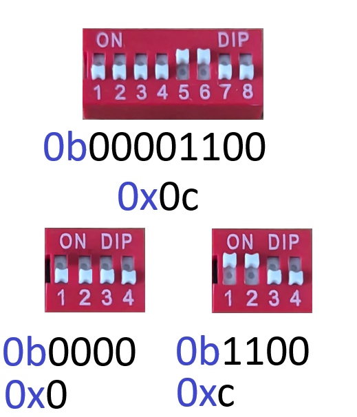

# The Python Data Model

## IPython Console, Inputs and Outputs

Spyder has an IPython Console, where lines of code can be input individually. Notice that each cell is numbered, by order of the command:

```python
In [1]: 1
Out[1]: 1
```

```python
In [2]: 2
Out[2]: 2
```

```python
In [3]: 3.14
Out[3]: 3.14
```

Python can use single and double quotations to enclose a `str` instance. However notice in the two cases below that, the output `Out[4]` and `Out[5]` which shows the formal string representation prefers single quotations:

```python
In [4]: 'hello'
Out[4]: 'hello'
```

```python
In [5]: "hello"
Out[5]: 'hello'
```

The `\` is a special character in a `str` and is an instruction to insert an escape character into the `str`. `\'` for example can be used to incorporate a quotation into the `str`. The `'` is otherwise recognised as a special character that is used to enclose the `str`:

```python
In [6]: 'The string is \'hello\''
Out[6]: "The string is 'hello'"
```

Notice that the formal representation in the output displays the `str` enclosed in double quotations which is more readable. The reason Python supports both single and double quotations to enclose a `str` is so
double quotations can be used to enclose a string literal.

## Assignment

If the `object`, in this case a `str` instance `'hello'` is assigned to the `object` name `text` using the assignment operator `=`, notice that there is no `Out[7]` instead, the `object` is shown on the Variable Explorer:

```python
In [7]: text = 'hello'
```

<table style="width: 65%; border-collapse: collapse; font-family: sans-serif; background-color: #1e1e1e; color: #d4d4d4;">
  <tr>
    <th colspan="4" style="text-align:center; padding: 8px; background-color: #2d2d30; color: #ffffff;">Variable Explorer</th>
  </tr>
  <tr>
    <th style="padding: 8px; background-color: #252526; color: #ffffff;">Name ▲</th>
    <th style="padding: 8px; background-color: #252526; color: #ffffff;">Type</th>
    <th style="padding: 8px; background-color: #252526; color: #ffffff;">Size</th>
    <th style="padding: 8px; background-color: #252526; color: #ffffff;">Value</th>
  </tr>
  <tr>
    <td style="padding: 8px; background-color: #1e1e1e;">text</td>
    <td style="padding: 8px; background-color: #1e1e1e;">str</td>
    <td style="padding: 8px; background-color: #1e1e1e;">5</td>
    <td style="padding: 8px; background-color: #506E16; color: #ffffff;">hello</td> <!-- Updated background color for string -->
  </tr>
</table>

Notice that the `''` used to enclose the `str` are not shown, only the text data within the `str` is displayed, this is consistent to what is displayed when the `str` is printed.

Numeric instances can also be assigned to `object` names:

```python
In [8]: whole_num = 1
```

```python
In [9]: floating_point_num = 3.14
```

<table style="width: 65%; border-collapse: collapse; font-family: sans-serif; background-color: #1e1e1e; color: #d4d4d4;">
  <tr>
    <th colspan="4" style="text-align:center; padding: 8px; background-color: #2d2d30; color: #ffffff;">Variable Explorer</th>
  </tr>
  <tr>
    <th style="padding: 8px; background-color: #252526; color: #ffffff;">Name ▲</th>
    <th style="padding: 8px; background-color: #252526; color: #ffffff;">Type</th>
    <th style="padding: 8px; background-color: #252526; color: #ffffff;">Size</th>
    <th style="padding: 8px; background-color: #252526; color: #ffffff;">Value</th>
  </tr>
  <tr>
    <td style="padding: 8px; background-color: #1e1e1e;">floating_point_num</td>
    <td style="padding: 8px; background-color: #1e1e1e;">float</td>
    <td style="padding: 8px; background-color: #1e1e1e;">1</td>
    <td style="padding: 8px; background-color: #8C5616; color: #ffffff;">3.14</td> <!-- Updated background color for floats -->
  </tr>
  <tr>
    <td style="padding: 8px; background-color: #252526;">text</td>
    <td style="padding: 8px; background-color: #252526;">str</td>
    <td style="padding: 8px; background-color: #252526;">5</td>
    <td style="padding: 8px; background-color: #506E16; color: #ffffff;">hello</td> <!-- Updated background color for strings -->
  </tr>
  <tr>
    <td style="padding: 8px; background-color: #1e1e1e;">whole_num</td>
    <td style="padding: 8px; background-color: #1e1e1e;">int</td>
    <td style="padding: 8px; background-color: #1e1e1e;">1</td>
    <td style="padding: 8px; background-color: #8C5616; color: #ffffff;">1</td> <!-- Updated background color for integers -->
  </tr>
</table>


Notice that each `object` has a different `Type`.

Think of `text`, the `object` name as a label to the `object` `'hello'`. The label is used to retrieve the `object` in `In [10]` which is retrieved in `Out[10]`:

```python
In [10]: text
Out[10]: 'hello'
```

The assignment operator should be conceptualised from right to left. Essentially the expression on the right is evaluated and then assigned to the `object` name on the left. The following line of code will evaluate `text`, retrieve the value `'hello'` and this will be given the `object` name `text2`:


```python
In [11]: text2 = text
```

<table style="width: 65%; border-collapse: collapse; font-family: sans-serif; background-color: #1e1e1e; color: #d4d4d4;">
  <tr>
    <th colspan="4" style="text-align:center; padding: 8px; background-color: #2d2d30; color: #ffffff;">Variable Explorer</th>
  </tr>
  <tr>
    <th style="padding: 8px; background-color: #252526; color: #ffffff;">Name ▲</th>
    <th style="padding: 8px; background-color: #252526; color: #ffffff;">Type</th>
    <th style="padding: 8px; background-color: #252526; color: #ffffff;">Size</th>
    <th style="padding: 8px; background-color: #252526; color: #ffffff;">Value</th>
  </tr>
  <tr>
    <td style="padding: 8px; background-color: #1e1e1e;">floating_point_num</td>
    <td style="padding: 8px; background-color: #1e1e1e;">float</td>
    <td style="padding: 8px; background-color: #1e1e1e;">1</td>
    <td style="padding: 8px; background-color: #8C5616; color: #ffffff;">3.14</td> <!-- Updated background color for floats -->
  </tr>
  <tr>
    <td style="padding: 8px; background-color: #1e1e1e;">text</td>
    <td style="padding: 8px; background-color: #1e1e1e;">str</td>
    <td style="padding: 8px; background-color: #1e1e1e;">5</td>
    <td style="padding: 8px; background-color: #506E16; color: #ffffff;">hello</td> <!-- Updated background color for strings -->
  </tr>
  <tr>
    <td style="padding: 8px; background-color: #1e1e1e;">text2</td>
    <td style="padding: 8px; background-color: #1e1e1e;">str</td>
    <td style="padding: 8px; background-color: #1e1e1e;">5</td>
    <td style="padding: 8px; background-color: #506E16; color: #ffffff;">hello</td> <!-- Updated background color for strings -->
  </tr>
  <tr>
    <td style="padding: 8px; background-color: #1e1e1e;">whole_num</td>
    <td style="padding: 8px; background-color: #1e1e1e;">int</td>
    <td style="padding: 8px; background-color: #1e1e1e;">1</td>
    <td style="padding: 8px; background-color: #8C5616; color: #ffffff;">1</td> <!-- Updated background color for integers -->
  </tr>
</table>


Notice the `object` name `text` and `text2` have the same value, this is because they are essentially two labels on the same `object` and therefore the following is `True`:

```python
In [12]: text2 is text
Out[12]: True
```

Notice that `text2` and `whole_num` are each a different `object`:

```python
In [13]: text2 is whole_num
Out[13]: False
```

The `del` keyword can be used to delete an `object` name. This deletes the label that references the `object` and not the `object` itself:

```python
In [14]: del text2
```

<table style="width: 65%; border-collapse: collapse; font-family: sans-serif; background-color: #1e1e1e; color: #d4d4d4;">
  <tr>
    <th colspan="4" style="text-align:center; padding: 8px; background-color: #2d2d30; color: #ffffff;">Variable Explorer</th>
  </tr>
  <tr>
    <th style="padding: 8px; background-color: #252526; color: #ffffff;">Name ▲</th>
    <th style="padding: 8px; background-color: #252526; color: #ffffff;">Type</th>
    <th style="padding: 8px; background-color: #252526; color: #ffffff;">Size</th>
    <th style="padding: 8px; background-color: #252526; color: #ffffff;">Value</th>
  </tr>
  <tr>
    <td style="padding: 8px; background-color: #1e1e1e;">floating_point_num</td>
    <td style="padding: 8px; background-color: #1e1e1e;">float</td>
    <td style="padding: 8px; background-color: #1e1e1e;">1</td>
    <td style="padding: 8px; background-color: #8C5616; color: #ffffff;">3.14</td> <!-- Background color for float -->
  </tr>
  <tr>
    <td style="padding: 8px; background-color: #1e1e1e;">text</td>
    <td style="padding: 8px; background-color: #1e1e1e;">str</td>
    <td style="padding: 8px; background-color: #1e1e1e;">5</td>
    <td style="padding: 8px; background-color: #506E16; color: #ffffff;">hello</td> <!-- Background color for str -->
  </tr>
  <tr>
    <td style="padding: 8px; background-color: #1e1e1e;">whole_num</td>
    <td style="padding: 8px; background-color: #1e1e1e;">int</td>
    <td style="padding: 8px; background-color: #1e1e1e;">1</td>
    <td style="padding: 8px; background-color: #8C5616; color: #ffffff;">1</td> <!-- Background color for int -->
  </tr>
</table>


The `object`, in this case the `str` instance `'hello'` still exists because it has the other `object` name (label) `text` which can be used to retrieve it:

```python
In [15]: text
Out[15]: 'hello'
```

If this is also deleted:

```python
In [16]: del text
```

<table style="width: 65%; border-collapse: collapse; font-family: sans-serif; background-color: #1e1e1e; color: #d4d4d4;">
  <tr>
    <th colspan="4" style="text-align:center; padding: 8px; background-color: #2d2d30; color: #ffffff;">Variable Explorer</th>
  </tr>
  <tr>
    <th style="padding: 8px; background-color: #252526; color: #ffffff;">Name ▲</th>
    <th style="padding: 8px; background-color: #252526; color: #ffffff;">Type</th>
    <th style="padding: 8px; background-color: #252526; color: #ffffff;">Size</th>
    <th style="padding: 8px; background-color: #252526; color: #ffffff;">Value</th>
  </tr>
  <tr>
    <td style="padding: 8px; background-color: #1e1e1e;">floating_point_num</td>
    <td style="padding: 8px; background-color: #1e1e1e;">float</td>
    <td style="padding: 8px; background-color: #1e1e1e;">1</td>
    <td style="padding: 8px; background-color: #8C5616; color: #ffffff;">3.14</td> <!-- Background color for float -->
  </tr>
  <tr>
    <td style="padding: 8px; background-color: #1e1e1e;">whole_num</td>
    <td style="padding: 8px; background-color: #1e1e1e;">int</td>
    <td style="padding: 8px; background-color: #1e1e1e;">1</td>
    <td style="padding: 8px; background-color: #8C5616; color: #ffffff;">1</td> <!-- Background color for int -->
  </tr>
</table>


Then all `object` names (labels or references to the `object`) are removed and the `object` is considered orphaned and it is automatically cleaned up by Python's garbage collection. When an `object` name that does not exist is referenced, a `NameError` displays: 

```python
In [17]: text
Traceback (most recent call last):

  Cell In[17], line 1
    text

NameError: name 'text' is not defined
```

## Exit

To restart the kernel, clearing all variables and resetting the IPython console back to `In [1]` in the main menu select `Consoles` → `Restart Kernel`. This also has the keyboard shortcut `Ctrl+.`. 

It is sometimes more convenient to type `exit` in the IPython console which will close the current console and then open up a new console. Input `exit`:

```python
In [17]: exit
```

```python
In [1]:
```

## Functions

A function is created using the `def` keyword (which is similar to assignment):

```python
In [1]: def
```

After the `def` keyword is the function's `object` name:

```python
In [1]: def fun
```

After the function's `object` name are `()` which are used to enclose optional input parameters, in this case none are provided:

```python
In [1]: def fun()
```

A colon `:` is used to begin a multiline code block. Pressing `↵` here will move onto the first line of the code block.

Each line in the code block is indented by 4 spaces:

```python
In [1]: def fun():
             line1
             line2
```

Every function has a return statement, which is optionally used to return a value when the function is called:

```python
In [1]: def fun():
             return None
```

The default value is `None`. Pressing `↵` here will move onto the next line of the code block.

```python
In [1]: def fun():
             return None
```

Pressing `↵` again at a blank line will execute the code block. The function is assigned to the `object` name `fun` but the code in the function is not executed. This can be seen on the Variable Explorer (if the Variable Explorer is configured to view modules and callables):

<table style="width: 65%; border-collapse: collapse; font-family: sans-serif; background-color: #1e1e1e; color: #d4d4d4;">
  <tr>
    <th colspan="4" style="text-align:center; padding: 8px; background-color: #2d2d30; color: #ffffff;">Variable Explorer</th>
  </tr>
  <tr>
    <th style="padding: 8px; background-color: #252526; color: #ffffff;">Name ▲</th>
    <th style="padding: 8px; background-color: #252526; color: #ffffff;">Type</th>
    <th style="padding: 8px; background-color: #252526; color: #ffffff;">Size</th>
    <th style="padding: 8px; background-color: #252526; color: #ffffff;">Value</th>
  </tr>
  <tr>
    <td style="padding: 8px; background-color: #1e1e1e;">fun</td>
    <td style="padding: 8px; background-color: #1e1e1e;">function</td>
    <td style="padding: 8px; background-color: #1e1e1e;">1</td>
    <td style="padding: 8px; background-color: #287B68; color: #ffffff;">function object</td> <!-- Background color for function -->
  </tr>
</table>


The function can be referenced using its `object` name:

```python
In [2]: fun
Out[2]: <function __main__.fun()>
```

Here `Out[2]` shows the function is defined in the `__main__` namespace as `fun`. Referencing the function does not execute the code in the functions code block, to execute the code in the code bloc, the function is called using parenthesis. 

When open parenthesis is used, details about the input parameters and the functions docstring display. 

Since the function was defined with no input arguments (also called input parameters) and no documentation was provided, the following docstring displays when the function is input with open parenthesis:

```python
In [3]: fun(
# Docstring popup:
"""
fun()

No documentation available.
"""
```

As there are no input arguments shown in the docstring, this function should be called without parenthesis:

```python
In [3]: fun()
```

In this case `None` is returned so there is no `Out[18]`. Let's make a function that has a `return` value:

```python
In [4]: def fun():
             return 'hello'

```

Notice when this is called, there is an `Out[4]` showing the `return` value `'hello'`:

```python
In [5]: fun()
Out[5]: 'hello'
```

A function with two input arguments can be created:

```python
In [6]: def fun(input1, input2):
             return 'hello'

```

When open parenthesis is used, details about the input arguments and the functions docstring display. In this case the function has two input arguments and these should be provided when calling the function:

```python
In [7]: fun(
# Docstring popup:
"""
fun(input1, input2)

No documentation available.
"""
```

If the function is called without these arguments a `TypeError` is flagged up:

```python
In [7]: fun()
Traceback (most recent call last):

  Cell In[7], line 1
    fun()

TypeError: fun() missing 2 required positional arguments: 'input1' and 'input2'

```

The input arguments can be provided positionally:

```python
In [8]: fun(1, 2)
Out[8]: 'hello'
```

Or provided as named parameters:

```python
In [9]: fun(input1=1, input2=2)
Out[9]: 'hello'
```

Positional arguments must always be provided before named arguments:

```python
In [10]: fun(1, input2=2)
Out[10]: 'hello'
```

Otherwise a `SyntaxError` is flagged up:

```python
In [11]: fun(input1=1, 2)
  Cell In[11], line 1
    fun(input1=1, 2)
                  ^
SyntaxError: positional argument follows keyword argument
```

To input multiple commands in a single input use `Ctrl+↵`. Then use `↵` to execute a cell:

```python
In [12]: one = 1
         two = 2
```

If one of the instance names for example `one` is typed followed by a `.`, a list of identifiers display:

```python
In [13]: one.
# Available Identifiers Popup:
# -----------------------------
#   🔧 Functions:
#     - bit_length()
#     - conjugate()
#     - from_bytes(bytes, byteorder, *, signed=False)
#     - to_bytes(length, byteorder, *, signed=False)

#   📜 Properties:
#     - denominator
#     - imag
#     - numerator
#     - real

#   🛠️ Variables:
#     - (No additional variables for `int` objects)
# -----------------------------
```

Data Model identifiers begin and end with a **d**ouble **under**score `__` and are colloquially known as *dunder* identifiers:

```python
In [13]: one.__
# Available Data Model Identifiers Popup:
# -----------------------------
#   🔧 Functions:
#     - __abs__()
#     - __add__(other)
#     - __and__(other)
#     - __bool__()
#     - __ceil__()
#     - __divmod__(other)
#     - __eq__(other)
#     - __float__()
#     - __floor__()
#     - __floordiv__(other)
#     - __ge__(other)
#     - __getattribute__(name)
#     - __gt__(other)
#     - __hash__()
#     - __int__()
#     - __invert__()
#     - __le__(other)
#     - __lshift__(other)
#     - __lt__(other)
#     - __mod__(other)
#     - __mul__(other)
#     - __ne__(other)
#     - __neg__()
#     - __or__(other)
#     - __pos__()
#     - __pow__(other[, mod])
#     - __radd__(other)
#     - __rand__(other)
#     - __rdivmod__(other)
#     - __rfloordiv__(other)
#     - __rlshift__(other)
#     - __rmod__(other)
#     - __rmul__(other)
#     - __ror__(other)
#     - __round__([ndigits])
#     - __rpow__(other)
#     - __rrshift__(other)
#     - __rshift__(other)
#     - __rsub__(other)
#     - __rtruediv__(other)
#     - __rxor__(other)
#     - __sub__(other)
#     - __truediv__(other)
#     - __xor__(other)

#   📜 Properties:
#     - __class__
#     - __doc__
# -----------------------------
```

`__add__` (colloquially called *dunder add*) can be used from the `int` instance `one` and applied to the `int` instance `two`:

```python
In [14]: one.__add__(two)
Out[14]: 3
```

Behind the scenes, `__add__` is defined in the `int` class and as part of the Python data model, controls the behaviour of the `+` operator. As a user, the `+` operator should preferentially be used over explictly using the data model method `__add__`:

```python
In [15]: one + two
Out[15]: 3
```

This can also be done using the `int` instances `1` and `2` directly:

```python
In [15]: 1 + 2
Out[15]: 3
```

Note for numbers that the `.` is recognised as a decimal point and an attempt to access an identifier from the `int` instance will lead to a `SyntaxError`:

```python
In [15]: 1.__add__(2)
  Cell In[15], line 1
    1.__add__(2)
     ^
SyntaxError: invalid decimal literal
```

This can be addressed using parenthesis:

```python
In [16]: (1).__add__(2)
Out[16]: 3
```

The above operator can be used to create a function that has two ```int``` input parameters and returns an `int`:

```python
In [16]: def add_nums(num1, num2):
             return num1 + num2
```

This function can be called by supplying `num1` to the `int` instance `1` and `num2` to the `int` instance `2`:

```python
In [17]: add_nums(num1=1, num2=2)
Out[17]: 3
```

The function call returned the value `3` which is not assigned to an `object` name. This value assigned by the function call, can be assigned to a variable:

```python
In [18]: return_val = add_nums(num1=1, num2=2)
```

This displays on the variable explorer:

<table style="width: 65%; border-collapse: collapse; font-family: sans-serif; background-color: #1e1e1e; color: #d4d4d4;">
  <tr>
    <th colspan="4" style="text-align:center; padding: 8px; background-color: #2d2d30; color: #ffffff;">Variable Explorer</th>
  </tr>
  <tr>
    <th style="padding: 8px; background-color: #252526; color: #ffffff;">Name ▲</th>
    <th style="padding: 8px; background-color: #252526; color: #ffffff;">Type</th>
    <th style="padding: 8px; background-color: #252526; color: #ffffff;">Size</th>
    <th style="padding: 8px; background-color: #252526; color: #ffffff;">Value</th>
  </tr>
  <tr>
    <td style="padding: 8px; background-color: #1e1e1e;">fun</td>
    <td style="padding: 8px; background-color: #1e1e1e;">function</td>
    <td style="padding: 8px; background-color: #1e1e1e;">1</td>
    <td style="padding: 8px; background-color: #287B68; color: #ffffff;">function object</td> <!-- Function background -->
  </tr>
  <tr>
    <td style="padding: 8px; background-color: #1e1e1e;">return_val</td>
    <td style="padding: 8px; background-color: #1e1e1e;">int</td>
    <td style="padding: 8px; background-color: #1e1e1e;">1</td>
    <td style="padding: 8px; background-color: #8C5616; color: #ffffff;">3</td> <!-- Int background -->
  </tr>
</table>


Use of spacing is important in Python and is used to make the code more readable. Python Enhance Protocol 8, outlines the best practices for spacing. Typically spacing is included around operators and assignments. Compare the following:

```python
# PEP8 Compliant
num = 1 + 2
# PEP8 Violation
num=1+2
```

However within a function call, spacing is instead used to emphasise the delimiter `,` which separates out the input parameters:

```python
# PEP8 Compliant
add_nums(num1=1, num2=2)
# PEP8 Violation
add_nums(num1 = 1, num2 = 2)
add_nums(num1 = 1,num2 = 2)
add_nums(num1=1,num2=2)
```

When a function call is assigned to a return value, the assignment operator is emphasised. The assignment to the parameters in the function call are not emphasised in the same way as the delimiter within the function call is instead emphasised:

```python
# PEP8 Compliant
return_val = add_nums(num1=1, num2=2)
# PEP8 Violation
return_val = add_nums(num1 = 1,num2 = 2)
return_val = add_nums(num1 = 1, num2 = 2)
return_val=add_nums(num1=1,num2=2)
```

When a function is defined, the input parameters can be assigned to a default value:

```python
In [18]: def add_nums(num1=1, num2=2):
             return num1 + num2
```

This means when the function is called without both of these parameters both default values will be taken:

```python
In [19]: add_nums()
Out[19]: 3
```

Alternatively if only one other parameter is provided, the other will take on it's default value:

```python
In [19]: add_nums(num1=4)
Out[19]: 6
```

```python
In [20]: add_nums(num2=7)
Out[20]: 8
```

The first parameter can be provided positionally or as seen earlier as a named parameter:

```python
In [21]: add_nums(4)
Out[21]: 6
```

The `/` is used to specify positional-only parameters. Any parameters to the (left) of the `/` is positional only:

```python
In [22]: def add_nums(num1=1, num2=2, /, num3=3, num4=4):
             return num1 + num2 + num3 + num4
```

This means the following is valid:

```python
In [23]: add_nums(4, 5, num4=6)
Out[23]: 
```

But the following is invalid flagging up a `TypeError`:

```python
In [24]: add_nums(4, num2=5, num4=6)
Traceback (most recent call last):

  Cell In[11], line 1
    add_nums(4, num2=5, num4=6)

TypeError: add_nums() got some positional-only arguments passed as keyword arguments: 'num2'

In [25]: exit
```

## Script Editor

So far all the code has been input line by line. Spyder also has a script editor. If a new script file (also known as a module) is created it has the following default code:

```python
# -*- coding: utf-8 -*-
"""
Created on Fri Oct 11 22:20:00 2024

@author: phili
"""
```

The line at the top of the file is a `#` which indicates a comment. Comments are ignored by the Python Interpreter and only serve to give the user information about the code. In this case informing the user that the standard coding: utf-8 is used.

On Linux system files written in Python, often include a *shebang* at the top of a Python script file:

```python
#!/usr/bin python3
```

Note that there is no space between `#!`. The shebang is displayed in the IDE as a comment but is used by the Linux Terminal to select the Python Interpreter, which in this case is an instruction to use the system Python.

The triple quotations `"""` enclose a multiline comment, which effectively becomes the modules docstring. 

If the variable `num` is assigned and the function `inch2cm` is defined in the script file:

```python
# -*- coding: utf-8 -*-
# module1.py
"""
Created on Fri Oct 11 22:20:00 2024

@author: phili
"""

num = 1

def inch2cm(inches):
    cm = inches * 2.54
    return cm
```

Saved as `module1.py`. In order to make this tutorial more readable, the file name is also included as a comment at the top of the script file.

If the script file is run in Spyder. Notice that the IPython console displays:

```python
In [1]: %runfile C:/Users/phili/OneDrive/Documents/module1.py --wdir
```

And all the code is executed. Therefore the variable `num` and function `fun` display on the Variable Explorer and can be used in the IPython console, like before:

```python
In[2]: inch2cm(2)
Out[2]: 5.08
```

<table style="width: 65%; border-collapse: collapse; font-family: sans-serif;">
  <tr>
    <th colspan="4" style="text-align:center; padding: 8px; background-color: #2d2d30; color: #ffffff;">Variable Explorer</th>
  </tr>
  <tr>
    <th style="padding: 8px; background-color: #252526; color: #ffffff;">Name ▲</th>
    <th style="padding: 8px; background-color: #252526; color: #ffffff;">Type</th>
    <th style="padding: 8px; background-color: #252526; color: #ffffff;">Size</th>
    <th style="padding: 8px; background-color: #252526; color: #ffffff;">Value</th>
  </tr>
  <tr>
    <td style="padding: 8px; background-color: #1e1e1e; color: #ffffff;">inch2cm</td>
    <td style="padding: 8px; background-color: #1e1e1e; color: #ffffff;">function</td>
    <td style="padding: 8px; background-color: #1e1e1e; color: #ffffff;">1</td>
    <td style="padding: 8px; background-color: #287B68; color: #ffffff;">function object</td> <!-- Function background -->
  </tr>
  <tr>
    <td style="padding: 8px; background-color: #1e1e1e; color: #ffffff;">num</td>
    <td style="padding: 8px; background-color: #1e1e1e; color: #ffffff;">int</td>
    <td style="padding: 8px; background-color: #1e1e1e; color: #ffffff;">1</td>
    <td style="padding: 8px; background-color: #8C5616; color: #ffffff;">1</td> <!-- Int background -->
  </tr>
</table>

An `import` statement can also be used to import `module1.py`:

```python
In [3]: import module1
```

Notice that `module1` displays on the Variable Explorer. If the following is typed in the IPython console:

```python
In [4]: module1?
Type:        module
String form: <module 'module1' from 'c:\\users\\phili\\onedrive\\documents\\module1.py'>
File:        c:\users\phili\onedrive\documents\module1.py
Docstring:  
Created on Fri Oct 11 22:20:00 2024

@author: phili
```

Notice that the file is mentioned and the docstring shown in the triple quotes is mentioned. When `module1.` is input, the identifiers from `module1` display:

```python
In [5]: module1.
# Available Data Model Identifiers for `module1.`:
# -------------------------------------
#   🔧 Functions:
#     - inch2cm(inches)

#   🛠️ Variables:
#     - num
# -------------------------------------
```

The identifiers `num` and `inch2cm` can be accessed from `module1`:

```python
In [5]: module1.num
Out[5]: 1
```

```python
In [5]: module1.inch2cm(3)
Out[5]: 7.62
```

Look at `module1.num`, notice that the name to the left hand side of the `.` is the parent name, in this case the script file, `module1`. On the right hand side is the `object` name, in this case `num` that was assigned within the parent `module1`.

This syntax can be conceptualised by using a file path within Windows. For example:

```
C:\Windows\System32\regedt32.exe
```

To avoid confusion, file extensions which use the `.` are dropped:

```
C:\Windows\System32\regedt32
```

Then the separator backslash `\` is replaced with a dot `.`:

```
C:.Windows.System32.regedt32
```

For clarity `C:` will be renamed `ROOT`:

```
ROOT.Windows.System32.regedt32
```

So the `regedt32` application is within the `System32` folder, which is itself within the `Windows` folder which itself is found on `ROOT`.

Now for simplification a reference to the `Documents` folder will be made. Consider the two files:

```
~\Documents\text.txt
~\Documents\folder\text.txt
```

Notice although the file name is the same, these are two separate files as they are found in different locations. Once again dropping the file extension `.txt` and replacing the separator `\` with a `.`:

```
~.Documents.text
~.Documents.folder.text
```

For clarity `~` will be renamed `USERPROFILE`:

```
USERPROFILE.Documents.text
USERPROFILE.Documents.folder.text
```

Returning to the identifiers:

```python
num # '__main__' namespace
module1.num # 'module1' namespace
```

These identifiers are in separate namespaces (conceptualise the namespace as folder).

Therefore when the identifier `num` in the `__main__` namespace is reassigned:

```python
In [6]: num = 2
```

The identifier `num` in the `module1` namespace remains unchanged:

```python
In [7]: module1.num
Out[7]: 1
```

The module also has a number of data model identifiers which can be seen if the following is input:

```python
In [8]: module1.__
# Available Identifiers for `module1.`:
# -------------------------------------
#   📜 Properties:
#     - __name__         (module's name)
#     - __file__         (path to the module file)
#     - __package__      (module's package name)
#     - __loader__       (object that loads the module)
#     - __spec__         (module's specification)
#     - __doc__          (module documentation)
#     - __cached__       (path to cached bytecode)

```

## Data Model Attribute (`__doc__`): Docstring IPython (`?`)

`__doc__` (*dunder doc*) is a data model attribute that is automatically generated from the `"""` in a file.

```python
In [8]: module1.__doc__
Out[8]: '\nCreated on Fri Oct 11 22:20:00 2024\n\n@author: phili\n'
```

The `\` is an instruction to insert an escape character into a `str`, in this case `\n` which means a newline. If this attribute is printed using the `print` function, the escape characters will be processed:

```python
In [9]: print(module1.__doc__)

Created on Fri Oct 11 22:20:00 2024

@author: phili
```

Notice when this attribute is printed, there is no `Out[9]` because there is no `return` value.

Each function in the script file, should also have its own docstring. Notice when `"""` is input under the functions definition, the following template is generated:

```
def inch2cm(inches):
    """
    

    Parameters
    ----------
    inches : TYPE
        DESCRIPTION.

    Returns
    -------
    cm : TYPE
        DESCRIPTION.

    """
    cm = inches * 2.54
    return cm
```

This can be filled in:

```
def inch2cm(inches):
    """
    Converts inches to cm. 

    Parameters
    ----------
    inches : float
        Dimension in inches

    Returns
    -------
    cm : float
        Dimensions in cm

    """
    cm = inches * 2.54
    return cm
```

If a new console is started, `module1` is imported and the `inch2cm` function is input with open parenthesis, this docstring displays:

```python
In [9]: exit
In [1]: import module1
In [2]: module1.inch2cm(
# Docstring popup:
"""
inch2cm(inches)

Converts inches to cm.

Parameters
----------
inches : float
    Dimension in inches

Returns
-------
cm : float
    Dimension in cm
"""
```

##  Data Model Attribute (`__file__`): Physical File

The data model `__file__` attribute (*dunder file*) gives the physical file path of the module. Earlier the `\` was discussed to be a special character in a Python `str` which is an instruction to insert an escape character, it is also the default file separator on Windows... Therefore two `\\` are seen in the `str`, the first `\` an instruction to insert an escape character, the second `\` stating that the escape character to be inserted is `\` itself:

```python
In [2]: module1.__file__
Out[2]: 'c:\\users\\phili\\onedrive\\documents\\module1.py'
```

When printed the escape characters are processed:

```
In [3]: print(module1.__file__)
c:\users\phili\onedrive\documents\module1.py
```

Notice again this attribute is printed, there is no `Out[3]` because there is no `return` value.

## Function Return Value

A functions `return` statement and a `print` statement are often confused by beginners. Compare the two functions:

```python
In [4]: def fun1():
             return 'hello'
```

```python
In [5]: def fun2():
             print('hello')
```

When both functions are called the result is very similar:

```python
In [6]: fun1()
Out[6]: 'hello'
```

```python
In [7]: fun2()
hello
```

However notice the `Out[6]` and the quotations enclosing the `str`, when `fun1` is called. `Out[7]` does not show because nothing has been returned when `fun2` is called. The quotations enclosing the `str` have been processed when printing and are not shown.

When assignment is used:

```python
In [8]: text1 = fun1()
```

```python
In [9]: text2 = fun2()
hello
```

<table style="width: 65%; border-collapse: collapse; font-family: sans-serif;">
  <tr>
    <th colspan="4" style="text-align:center; padding: 8px; background-color: #2d2d30; color: #ffffff;">Variable Explorer</th>
  </tr>
  <tr>
    <th style="padding: 8px; background-color: #252526; color: #ffffff;">Name ▲</th>
    <th style="padding: 8px; background-color: #252526; color: #ffffff;">Type</th>
    <th style="padding: 8px; background-color: #252526; color: #ffffff;">Size</th>
    <th style="padding: 8px; background-color: #252526; color: #ffffff;">Value</th>
  </tr>
  <tr>
    <td style="padding: 8px; background-color: #1e1e1e; color: #ffffff;">text1</td>
    <td style="padding: 8px; background-color: #1e1e1e; color: #ffffff;">str</td>
    <td style="padding: 8px; background-color: #1e1e1e; color: #ffffff;">5</td>
    <td style="padding: 8px; background-color: #506E16; color: #ffffff;">hello</td> <!-- Str background -->
  </tr>
  <tr>
    <td style="padding: 8px; background-color: #1e1e1e; color: #ffffff;">text2</td>
    <td style="padding: 8px; background-color: #1e1e1e; color: #ffffff;">None</td>
    <td style="padding: 8px; background-color: #1e1e1e; color: #ffffff;">1</td>
    <td style="padding: 8px; background-color: #287B68; color: #ffffff;">NoneType object</td> <!-- NoneType background -->
  </tr>  
</table>


Notice there is no `Out[8]` because the value returned from the `fun1` call has been returned to the `object` name `text1`, this value can be seen in the Variable Explorer. Notice when `fun2` is called, because it includes a `print` statement, the `str` is printed (once again with the escape characters processed). Notice that in the Variable Explorer that `text2` has the value `None`.

When a `return` statement is not supplied, the default value is `None`. In other words, the following are equivalent:

```python
def fun2():
    print('hello')
```

```python
def fun2():
    print('hello')
    return
```

```python
def fun2():
    print('hello')
    return None
```

```python
In [10]: exit
```

## Data Model Attribute (`__name__`): Namespace

The data model `__name__` attribute (*dunder name*) gives the namespace being used by the module. There is a subtle difference when a module is imported versus when it is executed. When the following script is created:

```python
# module1.py
print(__name__)
print(__file__)
```

If the script file is directly executed:

```python
In [1]: %runfile C:/Users/phili/OneDrive/Documents/module1.py --wdir
__main__
c:\users\phili\onedrive\documents\module1.py
In [2]: exit
```

Notice that the namespace is the `__main__` namespace.

If a second module is created that imports `module1`:

```python
# module2.py
import module1
```

When `module2` is run, all the code in `module1`, which is imported, is executed:

```python
%runfile C:/Users/phili/OneDrive/Documents/module2.py --wdir
module1
c:\users\phili\onedrive\documents\module1.py
In [2]: exit
```

Notice that the namespace for `module1` is now `module1` because `module2` is now the `__main__` namespace.

`module1` can be updated to:

```python
# module1.py
if __name__ == '__main__':
    print('__main__ namespace')
else:
    print('module1 namespace')
```

The `if`, `else` code blocks essentially perform a check to see if the module is the `'__main__'` namespace, i.e. if the module is being executed directly or if the module has been imported:

```python
In [1]: %runfile C:/Users/phili/OneDrive/Documents/module1.py --wdir
'__main__' namespace

In [2]: import module2
module1
'module1' namespace
```

This check is normally used to run additional test code when developing a module. For example if `module1` is updated to:

```python
# module1.py
x = 1
y = 2
z = x + y

if __name__ == '__main__':
    print(f'z={z}')

```

Now notice when this module is directly executed, the additional test code is ran showing the print statement:

```python
In [2]: exit
In [1]: %runfile C:/Users/phili/OneDrive/Documents/module1.py --wdir
z = 3
```

If the module is instead imported, notice that the additional test code, in this case the print statement is not shown:

```python
In [2]: exit
In [1]: import module1
```

Generally when a module is imported, any code and `object` assigned or defined in the module is assumed to be working as expected and therefore no additional debug statements are required. This is usually the case when using Python's standard modules as an end user.

Note the Python interpreter will usually skip reimporting a module that has already imported. For this reason, the command `exit` was used to exit the kernel and open a new kernel:

```python
In [3]: exit
```

##  Data Model Attribute (`__all__`): Import \*

If `module1` is updated to:

```python
# module1.py
__all__ = ['num1', 'num3', 'num5']

num1 = 1
num2 = 2
num3 = 3
num4 = 4
num5 = 5
```

Individual identifiers can be imported from the module into ```__main__``` using the following commands in the IPython Console:

```python
In [1]: from module1 import num1
```

<table style="width: 65%; border-collapse: collapse; font-family: sans-serif;">
  <tr>
    <th colspan="4" style="text-align:center; padding: 8px; background-color: #2d2d30; color: #ffffff;">Variable Explorer</th>
  </tr>
  <tr>
    <th style="padding: 8px; background-color: #252526; color: #ffffff;">Name ▲</th>
    <th style="padding: 8px; background-color: #252526; color: #ffffff;">Type</th>
    <th style="padding: 8px; background-color: #252526; color: #ffffff;">Size</th>
    <th style="padding: 8px; background-color: #252526; color: #ffffff;">Value</th>
  </tr>
  <tr>
    <td style="padding: 8px; background-color: #1e1e1e; color: #ffffff;">num1</td>
    <td style="padding: 8px; background-color: #1e1e1e; color: #ffffff;">int</td>
    <td style="padding: 8px; background-color: #1e1e1e; color: #ffffff;">1</td>
    <td style="padding: 8px; background-color: #8C5616; color: #ffffff;">1</td> <!-- Int background -->
  </tr>
</table>


```python
In [2]: exit
In [1]: from module1 import num1, num2
```

<table style="width: 65%; border-collapse: collapse; font-family: sans-serif;">
  <tr>
    <th colspan="4" style="text-align:center; padding: 8px; background-color: #2d2d30; color: #ffffff;">Variable Explorer</th>
  </tr>
  <tr>
    <th style="padding: 8px; background-color: #252526; color: #ffffff;">Name ▲</th>
    <th style="padding: 8px; background-color: #252526; color: #ffffff;">Type</th>
    <th style="padding: 8px; background-color: #252526; color: #ffffff;">Size</th>
    <th style="padding: 8px; background-color: #252526; color: #ffffff;">Value</th>
  </tr>
  <tr>
    <td style="padding: 8px; background-color: #1e1e1e; color: #ffffff;">num1</td>
    <td style="padding: 8px; background-color: #1e1e1e; color: #ffffff;">int</td>
    <td style="padding: 8px; background-color: #1e1e1e; color: #ffffff;">1</td>
    <td style="padding: 8px; background-color: #8C5616; color: #ffffff;">1</td> <!-- Int background -->
  </tr>
  <tr>
    <td style="padding: 8px; background-color: #1e1e1e; color: #ffffff;">num2</td>
    <td style="padding: 8px; background-color: #1e1e1e; color: #ffffff;">int</td>
    <td style="padding: 8px; background-color: #1e1e1e; color: #ffffff;">1</td>
    <td style="padding: 8px; background-color: #8C5616; color: #ffffff;">2</td> <!-- Int background -->
  </tr>
</table>


The following `*` import (\* meaning all) can be used:

```python
In [2]: exit
In [1]: from module1 import *
```

<table style="width: 65%; border-collapse: collapse; font-family: sans-serif;">
  <tr>
    <th colspan="4" style="text-align:center; padding: 8px; background-color: #2d2d30; color: #ffffff;">Variable Explorer</th>
  </tr>
  <tr>
    <th style="padding: 8px; background-color: #252526; color: #ffffff;">Name ▲</th>
    <th style="padding: 8px; background-color: #252526; color: #ffffff;">Type</th>
    <th style="padding: 8px; background-color: #252526; color: #ffffff;">Size</th>
    <th style="padding: 8px; background-color: #252526; color: #ffffff;">Value</th>
  </tr>
  <tr>
    <td style="padding: 8px; background-color: #1e1e1e; color: #ffffff;">num1</td>
    <td style="padding: 8px; background-color: #1e1e1e; color: #ffffff;">int</td>
    <td style="padding: 8px; background-color: #1e1e1e; color: #ffffff;">1</td>
    <td style="padding: 8px; background-color: #8C5616; color: #ffffff;">1</td> <!-- Int background -->
  </tr>
  <tr>
    <td style="padding: 8px; background-color: #1e1e1e; color: #ffffff;">num3</td>
    <td style="padding: 8px; background-color: #1e1e1e; color: #ffffff;">int</td>
    <td style="padding: 8px; background-color: #1e1e1e; color: #ffffff;">1</td>
    <td style="padding: 8px; background-color: #8C5616; color: #ffffff;">3</td> <!-- Int background -->
  </tr>
  <tr>
    <td style="padding: 8px; background-color: #1e1e1e; color: #ffffff;">num5</td>
    <td style="padding: 8px; background-color: #1e1e1e; color: #ffffff;">int</td>
    <td style="padding: 8px; background-color: #1e1e1e; color: #ffffff;">1</td>
    <td style="padding: 8px; background-color: #8C5616; color: #ffffff;">5</td> <!-- Int background -->
  </tr>
</table>


Notice in the Variable Explorer, all the identifiers defined in the list `__all__` were imported.

`*` imports are generally discouraged as it makes it harder to trace where identifiers came from. For example if `module1.py` and `module2.py` are updated to:

```python
# module1.py
__all__ = ['num1', 'num3', 'num5']

num1 = 1
num2 = 2
num3 = 3
num4 = 4
num5 = 5
```

```python
# module2.py
__all__ = ['num1', 'num2']

num1 = 6
num2 = 7
num3 = 8
num4 = 9
num5 = 10
```

And now if the following is input in the IPython console:

```python
In [2]: exit
In [1]: from module1 import *
In [2]: from module2 import *
```

The Variable Explorer looks like:

<table style="width: 65%; border-collapse: collapse; font-family: sans-serif;">
  <tr>
    <th colspan="4" style="text-align:center; padding: 8px; background-color: #2d2d30; color: #ffffff;">Variable Explorer</th>
  </tr>
  <tr>
    <th style="padding: 8px; background-color: #252526; color: #ffffff;">Name ▲</th>
    <th style="padding: 8px; background-color: #252526; color: #ffffff;">Type</th>
    <th style="padding: 8px; background-color: #252526; color: #ffffff;">Size</th>
    <th style="padding: 8px; background-color: #252526; color: #ffffff;">Value</th>
  </tr>
  <tr>
    <td style="padding: 8px; background-color: #1e1e1e; color: #ffffff;">num1</td>
    <td style="padding: 8px; background-color: #1e1e1e; color: #ffffff;">int</td>
    <td style="padding: 8px; background-color: #1e1e1e; color: #ffffff;">1</td>
    <td style="padding: 8px; background-color: #8C5616; color: #ffffff;">6</td> <!-- Int background -->
  </tr>
  <tr>
    <td style="padding: 8px; background-color: #1e1e1e; color: #ffffff;">num2</td>
    <td style="padding: 8px; background-color: #1e1e1e; color: #ffffff;">int</td>
    <td style="padding: 8px; background-color: #1e1e1e; color: #ffffff;">1</td>
    <td style="padding: 8px; background-color: #8C5616; color: #ffffff;">7</td> <!-- Int background -->
  </tr>
  <tr>
    <td style="padding: 8px; background-color: #1e1e1e; color: #ffffff;">num3</td>
    <td style="padding: 8px; background-color: #1e1e1e; color: #ffffff;">int</td>
    <td style="padding: 8px; background-color: #1e1e1e; color: #ffffff;">1</td>
    <td style="padding: 8px; background-color: #8C5616; color: #ffffff;">3</td> <!-- Int background -->
  </tr>
  <tr>
    <td style="padding: 8px; background-color: #1e1e1e; color: #ffffff;">num5</td>
    <td style="padding: 8px; background-color: #1e1e1e; color: #ffffff;">int</td>
    <td style="padding: 8px; background-color: #1e1e1e; color: #ffffff;">1</td>
    <td style="padding: 8px; background-color: #8C5616; color: #ffffff;">5</td> <!-- Int background -->
  </tr>
</table>


Notice that the identifier `num1` was reassigned when the `*` import was used from `module2`. This may have produced an error, as the user may have expected to use `num1` from `module1` instead of `module2`.

If instead both modules are imported, there is no ambiguity:

```python
In [3]: exit
In [1]: import module1
In [2]: import module2
In [3]: module1.num1
Out[3]: 1
In [4]: module2.num1
Out[4]: 6
In [5]: exit
```

## Data Model File (`__init__.py`): Package Initialisation File

A package is a folder with one or more Python modules. Within the package is the initialisation module which is called `__init__.py`. If a folder called `module3` is created and the file structure of the modules within Documents is:

**Documents**

* *module1.py*

* *module2.py*

* **module3**
  * *\_\_init\_\_.py*
  * *submodule1.py*
  * **submodule2**
    * *\_\_init\_\_.py*

The three script files within *module3* have the following code:

**module3**

* *\_\_init\_\_.py*

```python
# __init__.py in module3
print('Module Initialisation File')
```

**module3**

* *submodule1.py*

```python
# submodule1.py in module3
print('submodule1 File')
```

**module3**

* **submodule2**

    * *\_\_init\_\_.py*
    
```python
# __init__.py in submodule2 of module3
print('submodule2 Initialisation File')
```

If `module3` is imported in the IPython console, the print statement within the modules initialisation file is shown:

```python
In [1]: import module3
Module Initialisation File

In [2]: exit
```

If `submodule1` is imported in the IPython console, the print statement within the modules initialisation file (`__init__.py`) is shown as well as the print statement within the submodule file (`submodule1.py`):

```python
In [1]: import module3.submodule1
Module Initialisation File
submodule1 File

In [2]: exit
```

This can also be imported in the following way:

```python
In [1]: from module3 import submodule1
Module Initialisation File
submodule1 File

In [2]: exit
```

If `submodule2` is imported in the IPython console, the print statement within the modules initialisation file (`__init__.py`) is shown as well as the print statement within the initialisation file of the submodule (`__init__.py` in the subfolder **submodule2**):

```python
In [1]: import module3.submodule2
Module Initialisation File
submodule2 Initialisation File

In [2]: exit
```

Both submodules can be imported from `module3`:

```python
In [1]: from module3 import submodule1, submodule2
Module Initialisation File
submodule1 File
submodule2 Initialisation File
```

Notice the `print` statement in each of the three script files is shown.

## Data Model Attribute (`__package__`): Package Name

The data model attribute ```__package__``` (*dunder package*) gives the package or parent folder the module belongs to, in the case of `submodule1` it is **module3**:

```python
In [2]: submodule1.__package__
Out[2]: 'module3'
```

In the case of `submodule2` it is the **submodule2** folder within **module3**:

```python
In [3]: submodule2.__package__
Out[3]: 'module3.submodule2'

In [4]: exit
```

## Import Module as Alias

The module can be imported to an alias:

```python
In [1]: import module1 as mod1
```

The alias is normally shorter than the modules name and is used for the sake of brevity when a large number of identifiers are used from the module:

```
In [2]: mod1.num1
Out[2]: 1
In [3]: mod1.num2
Out[3]: 2
In [4]: mod1.num3
Out[4]: 3
In [5]: mod1.num1 + mod1.num2 + mod3.num3
Out[5]: 6
In [6]: exit
```

## Standard and Third-Party Modules

Python contains a number of standard modules which are developed alongside Python by Python core developers. The identifiers modules complement the most commonly used identifiers in `builtins` however the module name is used to compartmentalise the identifiers. Some of the most commonly used standard modules include:

```python
In [1]: import builtins, os, sys, collections, re, math, random, datetime, itertools, functools
```

<details>
  <summary>Standard Modules</summary>

```python
['builtins', # builtin Python identifiers
 'os', # operating system
 'sys', # system module
 'collections', # supplementary collections
 're', # regular expressions
 'math', # random number generation
 'datetime', dates and time
 'itertools', # iterator tools
 'functools', # function tools
]
```

</details>


In most cases, the code for the standard modules is found in the **Lib** folder:

```python
In [2]: print(os.__file__) 
C:\Users\phili\AppData\Local\spyder-6\envs\spyder-runtime\Lib\os.py
In [3]: print(re.__file__)
C:\Users\phili\AppData\Local\spyder-6\envs\spyder-runtime\Lib\re\__init__.py
In [4]: print(random.__file__) 
C:\Users\phili\AppData\Local\spyder-6\envs\spyder-runtime\Lib\random.py
In [5]: print(datetime.__file__)
C:\Users\phili\AppData\Local\spyder-6\envs\spyder-runtime\Lib\datetime.py
In [6]: print(functools.__file__)
C:\Users\phili\AppData\Local\spyder-6\envs\spyder-runtime\Lib\functools.py
```

Notice that the standard module `re` is a folder **re** that contains multiple Python script files including an initialisation script `__init__.py`.

The `builtins` module and some of the other standard modules are written in the programming language C and as a consequence do not have a Python script file:

```python
In [7]: print(builtins.__file__)
Traceback (most recent call last):

  Cell In[7], line 1
    print(builtins.__file__)

AttributeError: module 'builtins' has no attribute '__file__'
In [8]: print(sys.__file__)
Traceback (most recent call last):

  Cell In[8], line 1
    print(sys.__file__)

AttributeError: module 'sys' has no attribute '__file__'
In [9]: print(math.__file__)
Traceback (most recent call last):

  Cell In[9], line 1
    print(math.__file__)

AttributeError: module 'math' has no attribute '__file__'
In [10]: print(itertools.__file__)
Traceback (most recent call last):

  Cell In[10], line 1
    print(itertools.__file__)

AttributeError: module 'itertools' has no attribute '__file__'
```

If the standard module `functools.py` is examined (use the show/hide below to quickly glance at the standard module):

<details>
  <summary>functools.py</summary>

At this point, you are unlikely to understand everything in the `functools.py` however you should pick up:

* The docstring at the top of the file.
* `__all__`
* imports at the top of the module.
* `def` used to define a function, noting that each function as a docstring and a return value.

```python
"""functools.py - Tools for working with functions and callable objects
"""
# Python module wrapper for _functools C module
# to allow utilities written in Python to be added
# to the functools module.
# Written by Nick Coghlan <ncoghlan at gmail.com>,
# Raymond Hettinger <python at rcn.com>,
# and Łukasz Langa <lukasz at langa.pl>.
#   Copyright (C) 2006-2013 Python Software Foundation.
# See C source code for _functools credits/copyright

__all__ = ['update_wrapper', 'wraps', 'WRAPPER_ASSIGNMENTS', 'WRAPPER_UPDATES',
           'total_ordering', 'cache', 'cmp_to_key', 'lru_cache', 'reduce',
           'partial', 'partialmethod', 'singledispatch', 'singledispatchmethod',
           'cached_property']

from abc import get_cache_token
from collections import namedtuple
# import types, weakref  # Deferred to single_dispatch()
from reprlib import recursive_repr
from _thread import RLock
from types import GenericAlias


################################################################################
### update_wrapper() and wraps() decorator
################################################################################

# update_wrapper() and wraps() are tools to help write
# wrapper functions that can handle naive introspection

WRAPPER_ASSIGNMENTS = ('__module__', '__name__', '__qualname__', '__doc__',
                       '__annotations__')
WRAPPER_UPDATES = ('__dict__',)
def update_wrapper(wrapper,
                   wrapped,
                   assigned = WRAPPER_ASSIGNMENTS,
                   updated = WRAPPER_UPDATES):
    """Update a wrapper function to look like the wrapped function

       wrapper is the function to be updated
       wrapped is the original function
       assigned is a tuple naming the attributes assigned directly
       from the wrapped function to the wrapper function (defaults to
       functools.WRAPPER_ASSIGNMENTS)
       updated is a tuple naming the attributes of the wrapper that
       are updated with the corresponding attribute from the wrapped
       function (defaults to functools.WRAPPER_UPDATES)
    """
    for attr in assigned:
        try:
            value = getattr(wrapped, attr)
        except AttributeError:
            pass
        else:
            setattr(wrapper, attr, value)
    for attr in updated:
        getattr(wrapper, attr).update(getattr(wrapped, attr, {}))
    # Issue #17482: set __wrapped__ last so we don't inadvertently copy it
    # from the wrapped function when updating __dict__
    wrapper.__wrapped__ = wrapped
    # Return the wrapper so this can be used as a decorator via partial()
    return wrapper

def wraps(wrapped,
          assigned = WRAPPER_ASSIGNMENTS,
          updated = WRAPPER_UPDATES):
    """Decorator factory to apply update_wrapper() to a wrapper function

       Returns a decorator that invokes update_wrapper() with the decorated
       function as the wrapper argument and the arguments to wraps() as the
       remaining arguments. Default arguments are as for update_wrapper().
       This is a convenience function to simplify applying partial() to
       update_wrapper().
    """
    return partial(update_wrapper, wrapped=wrapped,
                   assigned=assigned, updated=updated)


################################################################################
### total_ordering class decorator
################################################################################

# The total ordering functions all invoke the root magic method directly
# rather than using the corresponding operator.  This avoids possible
# infinite recursion that could occur when the operator dispatch logic
# detects a NotImplemented result and then calls a reflected method.

def _gt_from_lt(self, other):
    'Return a > b.  Computed by @total_ordering from (not a < b) and (a != b).'
    op_result = type(self).__lt__(self, other)
    if op_result is NotImplemented:
        return op_result
    return not op_result and self != other

def _le_from_lt(self, other):
    'Return a <= b.  Computed by @total_ordering from (a < b) or (a == b).'
    op_result = type(self).__lt__(self, other)
    if op_result is NotImplemented:
        return op_result
    return op_result or self == other

def _ge_from_lt(self, other):
    'Return a >= b.  Computed by @total_ordering from (not a < b).'
    op_result = type(self).__lt__(self, other)
    if op_result is NotImplemented:
        return op_result
    return not op_result

def _ge_from_le(self, other):
    'Return a >= b.  Computed by @total_ordering from (not a <= b) or (a == b).'
    op_result = type(self).__le__(self, other)
    if op_result is NotImplemented:
        return op_result
    return not op_result or self == other

def _lt_from_le(self, other):
    'Return a < b.  Computed by @total_ordering from (a <= b) and (a != b).'
    op_result = type(self).__le__(self, other)
    if op_result is NotImplemented:
        return op_result
    return op_result and self != other

def _gt_from_le(self, other):
    'Return a > b.  Computed by @total_ordering from (not a <= b).'
    op_result = type(self).__le__(self, other)
    if op_result is NotImplemented:
        return op_result
    return not op_result

def _lt_from_gt(self, other):
    'Return a < b.  Computed by @total_ordering from (not a > b) and (a != b).'
    op_result = type(self).__gt__(self, other)
    if op_result is NotImplemented:
        return op_result
    return not op_result and self != other

def _ge_from_gt(self, other):
    'Return a >= b.  Computed by @total_ordering from (a > b) or (a == b).'
    op_result = type(self).__gt__(self, other)
    if op_result is NotImplemented:
        return op_result
    return op_result or self == other

def _le_from_gt(self, other):
    'Return a <= b.  Computed by @total_ordering from (not a > b).'
    op_result = type(self).__gt__(self, other)
    if op_result is NotImplemented:
        return op_result
    return not op_result

def _le_from_ge(self, other):
    'Return a <= b.  Computed by @total_ordering from (not a >= b) or (a == b).'
    op_result = type(self).__ge__(self, other)
    if op_result is NotImplemented:
        return op_result
    return not op_result or self == other

def _gt_from_ge(self, other):
    'Return a > b.  Computed by @total_ordering from (a >= b) and (a != b).'
    op_result = type(self).__ge__(self, other)
    if op_result is NotImplemented:
        return op_result
    return op_result and self != other

def _lt_from_ge(self, other):
    'Return a < b.  Computed by @total_ordering from (not a >= b).'
    op_result = type(self).__ge__(self, other)
    if op_result is NotImplemented:
        return op_result
    return not op_result

_convert = {
    '__lt__': [('__gt__', _gt_from_lt),
               ('__le__', _le_from_lt),
               ('__ge__', _ge_from_lt)],
    '__le__': [('__ge__', _ge_from_le),
               ('__lt__', _lt_from_le),
               ('__gt__', _gt_from_le)],
    '__gt__': [('__lt__', _lt_from_gt),
               ('__ge__', _ge_from_gt),
               ('__le__', _le_from_gt)],
    '__ge__': [('__le__', _le_from_ge),
               ('__gt__', _gt_from_ge),
               ('__lt__', _lt_from_ge)]
}

def total_ordering(cls):
    """Class decorator that fills in missing ordering methods"""
    # Find user-defined comparisons (not those inherited from object).
    roots = {op for op in _convert if getattr(cls, op, None) is not getattr(object, op, None)}
    if not roots:
        raise ValueError('must define at least one ordering operation: < > <= >=')
    root = max(roots)       # prefer __lt__ to __le__ to __gt__ to __ge__
    for opname, opfunc in _convert[root]:
        if opname not in roots:
            opfunc.__name__ = opname
            setattr(cls, opname, opfunc)
    return cls


################################################################################
### cmp_to_key() function converter
################################################################################

def cmp_to_key(mycmp):
    """Convert a cmp= function into a key= function"""
    class K(object):
        __slots__ = ['obj']
        def __init__(self, obj):
            self.obj = obj
        def __lt__(self, other):
            return mycmp(self.obj, other.obj) < 0
        def __gt__(self, other):
            return mycmp(self.obj, other.obj) > 0
        def __eq__(self, other):
            return mycmp(self.obj, other.obj) == 0
        def __le__(self, other):
            return mycmp(self.obj, other.obj) <= 0
        def __ge__(self, other):
            return mycmp(self.obj, other.obj) >= 0
        __hash__ = None
    return K

try:
    from _functools import cmp_to_key
except ImportError:
    pass


################################################################################
### reduce() sequence to a single item
################################################################################

_initial_missing = object()

def reduce(function, sequence, initial=_initial_missing):
    """
    reduce(function, iterable[, initial]) -> value

    Apply a function of two arguments cumulatively to the items of a sequence
    or iterable, from left to right, so as to reduce the iterable to a single
    value.  For example, reduce(lambda x, y: x+y, [1, 2, 3, 4, 5]) calculates
    ((((1+2)+3)+4)+5).  If initial is present, it is placed before the items
    of the iterable in the calculation, and serves as a default when the
    iterable is empty.
    """

    it = iter(sequence)

    if initial is _initial_missing:
        try:
            value = next(it)
        except StopIteration:
            raise TypeError(
                "reduce() of empty iterable with no initial value") from None
    else:
        value = initial

    for element in it:
        value = function(value, element)

    return value

try:
    from _functools import reduce
except ImportError:
    pass


################################################################################
### partial() argument application
################################################################################

# Purely functional, no descriptor behaviour
class partial:
    """New function with partial application of the given arguments
    and keywords.
    """

    __slots__ = "func", "args", "keywords", "__dict__", "__weakref__"

    def __new__(cls, func, /, *args, **keywords):
        if not callable(func):
            raise TypeError("the first argument must be callable")

        if hasattr(func, "func"):
            args = func.args + args
            keywords = {**func.keywords, **keywords}
            func = func.func

        self = super(partial, cls).__new__(cls)

        self.func = func
        self.args = args
        self.keywords = keywords
        return self

    def __call__(self, /, *args, **keywords):
        keywords = {**self.keywords, **keywords}
        return self.func(*self.args, *args, **keywords)

    @recursive_repr()
    def __repr__(self):
        qualname = type(self).__qualname__
        args = [repr(self.func)]
        args.extend(repr(x) for x in self.args)
        args.extend(f"{k}={v!r}" for (k, v) in self.keywords.items())
        if type(self).__module__ == "functools":
            return f"functools.{qualname}({', '.join(args)})"
        return f"{qualname}({', '.join(args)})"

    def __reduce__(self):
        return type(self), (self.func,), (self.func, self.args,
               self.keywords or None, self.__dict__ or None)

    def __setstate__(self, state):
        if not isinstance(state, tuple):
            raise TypeError("argument to __setstate__ must be a tuple")
        if len(state) != 4:
            raise TypeError(f"expected 4 items in state, got {len(state)}")
        func, args, kwds, namespace = state
        if (not callable(func) or not isinstance(args, tuple) or
           (kwds is not None and not isinstance(kwds, dict)) or
           (namespace is not None and not isinstance(namespace, dict))):
            raise TypeError("invalid partial state")

        args = tuple(args) # just in case it's a subclass
        if kwds is None:
            kwds = {}
        elif type(kwds) is not dict: # XXX does it need to be *exactly* dict?
            kwds = dict(kwds)
        if namespace is None:
            namespace = {}

        self.__dict__ = namespace
        self.func = func
        self.args = args
        self.keywords = kwds

try:
    from _functools import partial
except ImportError:
    pass

# Descriptor version
class partialmethod(object):
    """Method descriptor with partial application of the given arguments
    and keywords.

    Supports wrapping existing descriptors and handles non-descriptor
    callables as instance methods.
    """

    def __init__(self, func, /, *args, **keywords):
        if not callable(func) and not hasattr(func, "__get__"):
            raise TypeError("{!r} is not callable or a descriptor"
                                 .format(func))

        # func could be a descriptor like classmethod which isn't callable,
        # so we can't inherit from partial (it verifies func is callable)
        if isinstance(func, partialmethod):
            # flattening is mandatory in order to place cls/self before all
            # other arguments
            # it's also more efficient since only one function will be called
            self.func = func.func
            self.args = func.args + args
            self.keywords = {**func.keywords, **keywords}
        else:
            self.func = func
            self.args = args
            self.keywords = keywords

    def __repr__(self):
        args = ", ".join(map(repr, self.args))
        keywords = ", ".join("{}={!r}".format(k, v)
                                 for k, v in self.keywords.items())
        format_string = "{module}.{cls}({func}, {args}, {keywords})"
        return format_string.format(module=self.__class__.__module__,
                                    cls=self.__class__.__qualname__,
                                    func=self.func,
                                    args=args,
                                    keywords=keywords)

    def _make_unbound_method(self):
        def _method(cls_or_self, /, *args, **keywords):
            keywords = {**self.keywords, **keywords}
            return self.func(cls_or_self, *self.args, *args, **keywords)
        _method.__isabstractmethod__ = self.__isabstractmethod__
        _method._partialmethod = self
        return _method

    def __get__(self, obj, cls=None):
        get = getattr(self.func, "__get__", None)
        result = None
        if get is not None:
            new_func = get(obj, cls)
            if new_func is not self.func:
                # Assume __get__ returning something new indicates the
                # creation of an appropriate callable
                result = partial(new_func, *self.args, **self.keywords)
                try:
                    result.__self__ = new_func.__self__
                except AttributeError:
                    pass
        if result is None:
            # If the underlying descriptor didn't do anything, treat this
            # like an instance method
            result = self._make_unbound_method().__get__(obj, cls)
        return result

    @property
    def __isabstractmethod__(self):
        return getattr(self.func, "__isabstractmethod__", False)

    __class_getitem__ = classmethod(GenericAlias)


# Helper functions

def _unwrap_partial(func):
    while isinstance(func, partial):
        func = func.func
    return func

################################################################################
### LRU Cache function decorator
################################################################################

_CacheInfo = namedtuple("CacheInfo", ["hits", "misses", "maxsize", "currsize"])

class _HashedSeq(list):
    """ This class guarantees that hash() will be called no more than once
        per element.  This is important because the lru_cache() will hash
        the key multiple times on a cache miss.

    """

    __slots__ = 'hashvalue'

    def __init__(self, tup, hash=hash):
        self[:] = tup
        self.hashvalue = hash(tup)

    def __hash__(self):
        return self.hashvalue

def _make_key(args, kwds, typed,
             kwd_mark = (object(),),
             fasttypes = {int, str},
             tuple=tuple, type=type, len=len):
    """Make a cache key from optionally typed positional and keyword arguments

    The key is constructed in a way that is flat as possible rather than
    as a nested structure that would take more memory.

    If there is only a single argument and its data type is known to cache
    its hash value, then that argument is returned without a wrapper.  This
    saves space and improves lookup speed.

    """
    # All of code below relies on kwds preserving the order input by the user.
    # Formerly, we sorted() the kwds before looping.  The new way is *much*
    # faster; however, it means that f(x=1, y=2) will now be treated as a
    # distinct call from f(y=2, x=1) which will be cached separately.
    key = args
    if kwds:
        key += kwd_mark
        for item in kwds.items():
            key += item
    if typed:
        key += tuple(type(v) for v in args)
        if kwds:
            key += tuple(type(v) for v in kwds.values())
    elif len(key) == 1 and type(key[0]) in fasttypes:
        return key[0]
    return _HashedSeq(key)

def lru_cache(maxsize=128, typed=False):
    """Least-recently-used cache decorator.

    If *maxsize* is set to None, the LRU features are disabled and the cache
    can grow without bound.

    If *typed* is True, arguments of different types will be cached separately.
    For example, f(3.0) and f(3) will be treated as distinct calls with
    distinct results.

    Arguments to the cached function must be hashable.

    View the cache statistics named tuple (hits, misses, maxsize, currsize)
    with f.cache_info().  Clear the cache and statistics with f.cache_clear().
    Access the underlying function with f.__wrapped__.

    See:  https://en.wikipedia.org/wiki/Cache_replacement_policies#Least_recently_used_(LRU)

    """

    # Users should only access the lru_cache through its public API:
    #       cache_info, cache_clear, and f.__wrapped__
    # The internals of the lru_cache are encapsulated for thread safety and
    # to allow the implementation to change (including a possible C version).

    if isinstance(maxsize, int):
        # Negative maxsize is treated as 0
        if maxsize < 0:
            maxsize = 0
    elif callable(maxsize) and isinstance(typed, bool):
        # The user_function was passed in directly via the maxsize argument
        user_function, maxsize = maxsize, 128
        wrapper = _lru_cache_wrapper(user_function, maxsize, typed, _CacheInfo)
        wrapper.cache_parameters = lambda : {'maxsize': maxsize, 'typed': typed}
        return update_wrapper(wrapper, user_function)
    elif maxsize is not None:
        raise TypeError(
            'Expected first argument to be an integer, a callable, or None')

    def decorating_function(user_function):
        wrapper = _lru_cache_wrapper(user_function, maxsize, typed, _CacheInfo)
        wrapper.cache_parameters = lambda : {'maxsize': maxsize, 'typed': typed}
        return update_wrapper(wrapper, user_function)

    return decorating_function

def _lru_cache_wrapper(user_function, maxsize, typed, _CacheInfo):
    # Constants shared by all lru cache instances:
    sentinel = object()          # unique object used to signal cache misses
    make_key = _make_key         # build a key from the function arguments
    PREV, NEXT, KEY, RESULT = 0, 1, 2, 3   # names for the link fields

    cache = {}
    hits = misses = 0
    full = False
    cache_get = cache.get    # bound method to lookup a key or return None
    cache_len = cache.__len__  # get cache size without calling len()
    lock = RLock()           # because linkedlist updates aren't threadsafe
    root = []                # root of the circular doubly linked list
    root[:] = [root, root, None, None]     # initialize by pointing to self

    if maxsize == 0:

        def wrapper(*args, **kwds):
            # No caching -- just a statistics update
            nonlocal misses
            misses += 1
            result = user_function(*args, **kwds)
            return result

    elif maxsize is None:

        def wrapper(*args, **kwds):
            # Simple caching without ordering or size limit
            nonlocal hits, misses
            key = make_key(args, kwds, typed)
            result = cache_get(key, sentinel)
            if result is not sentinel:
                hits += 1
                return result
            misses += 1
            result = user_function(*args, **kwds)
            cache[key] = result
            return result

    else:

        def wrapper(*args, **kwds):
            # Size limited caching that tracks accesses by recency
            nonlocal root, hits, misses, full
            key = make_key(args, kwds, typed)
            with lock:
                link = cache_get(key)
                if link is not None:
                    # Move the link to the front of the circular queue
                    link_prev, link_next, _key, result = link
                    link_prev[NEXT] = link_next
                    link_next[PREV] = link_prev
                    last = root[PREV]
                    last[NEXT] = root[PREV] = link
                    link[PREV] = last
                    link[NEXT] = root
                    hits += 1
                    return result
                misses += 1
            result = user_function(*args, **kwds)
            with lock:
                if key in cache:
                    # Getting here means that this same key was added to the
                    # cache while the lock was released.  Since the link
                    # update is already done, we need only return the
                    # computed result and update the count of misses.
                    pass
                elif full:
                    # Use the old root to store the new key and result.
                    oldroot = root
                    oldroot[KEY] = key
                    oldroot[RESULT] = result
                    # Empty the oldest link and make it the new root.
                    # Keep a reference to the old key and old result to
                    # prevent their ref counts from going to zero during the
                    # update. That will prevent potentially arbitrary object
                    # clean-up code (i.e. __del__) from running while we're
                    # still adjusting the links.
                    root = oldroot[NEXT]
                    oldkey = root[KEY]
                    oldresult = root[RESULT]
                    root[KEY] = root[RESULT] = None
                    # Now update the cache dictionary.
                    del cache[oldkey]
                    # Save the potentially reentrant cache[key] assignment
                    # for last, after the root and links have been put in
                    # a consistent state.
                    cache[key] = oldroot
                else:
                    # Put result in a new link at the front of the queue.
                    last = root[PREV]
                    link = [last, root, key, result]
                    last[NEXT] = root[PREV] = cache[key] = link
                    # Use the cache_len bound method instead of the len() function
                    # which could potentially be wrapped in an lru_cache itself.
                    full = (cache_len() >= maxsize)
            return result

    def cache_info():
        """Report cache statistics"""
        with lock:
            return _CacheInfo(hits, misses, maxsize, cache_len())

    def cache_clear():
        """Clear the cache and cache statistics"""
        nonlocal hits, misses, full
        with lock:
            cache.clear()
            root[:] = [root, root, None, None]
            hits = misses = 0
            full = False

    wrapper.cache_info = cache_info
    wrapper.cache_clear = cache_clear
    return wrapper

try:
    from _functools import _lru_cache_wrapper
except ImportError:
    pass


################################################################################
### cache -- simplified access to the infinity cache
################################################################################

def cache(user_function, /):
    'Simple lightweight unbounded cache.  Sometimes called "memoize".'
    return lru_cache(maxsize=None)(user_function)


################################################################################
### singledispatch() - single-dispatch generic function decorator
################################################################################

def _c3_merge(sequences):
    """Merges MROs in *sequences* to a single MRO using the C3 algorithm.

    Adapted from https://www.python.org/download/releases/2.3/mro/.

    """
    result = []
    while True:
        sequences = [s for s in sequences if s]   # purge empty sequences
        if not sequences:
            return result
        for s1 in sequences:   # find merge candidates among seq heads
            candidate = s1[0]
            for s2 in sequences:
                if candidate in s2[1:]:
                    candidate = None
                    break      # reject the current head, it appears later
            else:
                break
        if candidate is None:
            raise RuntimeError("Inconsistent hierarchy")
        result.append(candidate)
        # remove the chosen candidate
        for seq in sequences:
            if seq[0] == candidate:
                del seq[0]

def _c3_mro(cls, abcs=None):
    """Computes the method resolution order using extended C3 linearization.

    If no *abcs* are given, the algorithm works exactly like the built-in C3
    linearization used for method resolution.

    If given, *abcs* is a list of abstract base classes that should be inserted
    into the resulting MRO. Unrelated ABCs are ignored and don't end up in the
    result. The algorithm inserts ABCs where their functionality is introduced,
    i.e. issubclass(cls, abc) returns True for the class itself but returns
    False for all its direct base classes. Implicit ABCs for a given class
    (either registered or inferred from the presence of a special method like
    __len__) are inserted directly after the last ABC explicitly listed in the
    MRO of said class. If two implicit ABCs end up next to each other in the
    resulting MRO, their ordering depends on the order of types in *abcs*.

    """
    for i, base in enumerate(reversed(cls.__bases__)):
        if hasattr(base, '__abstractmethods__'):
            boundary = len(cls.__bases__) - i
            break   # Bases up to the last explicit ABC are considered first.
    else:
        boundary = 0
    abcs = list(abcs) if abcs else []
    explicit_bases = list(cls.__bases__[:boundary])
    abstract_bases = []
    other_bases = list(cls.__bases__[boundary:])
    for base in abcs:
        if issubclass(cls, base) and not any(
                issubclass(b, base) for b in cls.__bases__
            ):
            # If *cls* is the class that introduces behaviour described by
            # an ABC *base*, insert said ABC to its MRO.
            abstract_bases.append(base)
    for base in abstract_bases:
        abcs.remove(base)
    explicit_c3_mros = [_c3_mro(base, abcs=abcs) for base in explicit_bases]
    abstract_c3_mros = [_c3_mro(base, abcs=abcs) for base in abstract_bases]
    other_c3_mros = [_c3_mro(base, abcs=abcs) for base in other_bases]
    return _c3_merge(
        [[cls]] +
        explicit_c3_mros + abstract_c3_mros + other_c3_mros +
        [explicit_bases] + [abstract_bases] + [other_bases]
    )

def _compose_mro(cls, types):
    """Calculates the method resolution order for a given class *cls*.

    Includes relevant abstract base classes (with their respective bases) from
    the *types* iterable. Uses a modified C3 linearization algorithm.

    """
    bases = set(cls.__mro__)
    # Remove entries which are already present in the __mro__ or unrelated.
    def is_related(typ):
        return (typ not in bases and hasattr(typ, '__mro__')
                                 and not isinstance(typ, GenericAlias)
                                 and issubclass(cls, typ))
    types = [n for n in types if is_related(n)]
    # Remove entries which are strict bases of other entries (they will end up
    # in the MRO anyway.
    def is_strict_base(typ):
        for other in types:
            if typ != other and typ in other.__mro__:
                return True
        return False
    types = [n for n in types if not is_strict_base(n)]
    # Subclasses of the ABCs in *types* which are also implemented by
    # *cls* can be used to stabilize ABC ordering.
    type_set = set(types)
    mro = []
    for typ in types:
        found = []
        for sub in typ.__subclasses__():
            if sub not in bases and issubclass(cls, sub):
                found.append([s for s in sub.__mro__ if s in type_set])
        if not found:
            mro.append(typ)
            continue
        # Favor subclasses with the biggest number of useful bases
        found.sort(key=len, reverse=True)
        for sub in found:
            for subcls in sub:
                if subcls not in mro:
                    mro.append(subcls)
    return _c3_mro(cls, abcs=mro)

def _find_impl(cls, registry):
    """Returns the best matching implementation from *registry* for type *cls*.

    Where there is no registered implementation for a specific type, its method
    resolution order is used to find a more generic implementation.

    Note: if *registry* does not contain an implementation for the base
    *object* type, this function may return None.

    """
    mro = _compose_mro(cls, registry.keys())
    match = None
    for t in mro:
        if match is not None:
            # If *match* is an implicit ABC but there is another unrelated,
            # equally matching implicit ABC, refuse the temptation to guess.
            if (t in registry and t not in cls.__mro__
                              and match not in cls.__mro__
                              and not issubclass(match, t)):
                raise RuntimeError("Ambiguous dispatch: {} or {}".format(
                    match, t))
            break
        if t in registry:
            match = t
    return registry.get(match)

def singledispatch(func):
    """Single-dispatch generic function decorator.

    Transforms a function into a generic function, which can have different
    behaviours depending upon the type of its first argument. The decorated
    function acts as the default implementation, and additional
    implementations can be registered using the register() attribute of the
    generic function.
    """
    # There are many programs that use functools without singledispatch, so we
    # trade-off making singledispatch marginally slower for the benefit of
    # making start-up of such applications slightly faster.
    import types, weakref

    registry = {}
    dispatch_cache = weakref.WeakKeyDictionary()
    cache_token = None

    def dispatch(cls):
        """generic_func.dispatch(cls) -> <function implementation>

        Runs the dispatch algorithm to return the best available implementation
        for the given *cls* registered on *generic_func*.

        """
        nonlocal cache_token
        if cache_token is not None:
            current_token = get_cache_token()
            if cache_token != current_token:
                dispatch_cache.clear()
                cache_token = current_token
        try:
            impl = dispatch_cache[cls]
        except KeyError:
            try:
                impl = registry[cls]
            except KeyError:
                impl = _find_impl(cls, registry)
            dispatch_cache[cls] = impl
        return impl

    def _is_union_type(cls):
        from typing import get_origin, Union
        return get_origin(cls) in {Union, types.UnionType}

    def _is_valid_dispatch_type(cls):
        if isinstance(cls, type):
            return True
        from typing import get_args
        return (_is_union_type(cls) and
                all(isinstance(arg, type) for arg in get_args(cls)))

    def register(cls, func=None):
        """generic_func.register(cls, func) -> func

        Registers a new implementation for the given *cls* on a *generic_func*.

        """
        nonlocal cache_token
        if _is_valid_dispatch_type(cls):
            if func is None:
                return lambda f: register(cls, f)
        else:
            if func is not None:
                raise TypeError(
                    f"Invalid first argument to `register()`. "
                    f"{cls!r} is not a class or union type."
                )
            ann = getattr(cls, '__annotations__', {})
            if not ann:
                raise TypeError(
                    f"Invalid first argument to `register()`: {cls!r}. "
                    f"Use either `@register(some_class)` or plain `@register` "
                    f"on an annotated function."
                )
            func = cls

            # only import typing if annotation parsing is necessary
            from typing import get_type_hints
            argname, cls = next(iter(get_type_hints(func).items()))
            if not _is_valid_dispatch_type(cls):
                if _is_union_type(cls):
                    raise TypeError(
                        f"Invalid annotation for {argname!r}. "
                        f"{cls!r} not all arguments are classes."
                    )
                else:
                    raise TypeError(
                        f"Invalid annotation for {argname!r}. "
                        f"{cls!r} is not a class."
                    )

        if _is_union_type(cls):
            from typing import get_args

            for arg in get_args(cls):
                registry[arg] = func
        else:
            registry[cls] = func
        if cache_token is None and hasattr(cls, '__abstractmethods__'):
            cache_token = get_cache_token()
        dispatch_cache.clear()
        return func

    def wrapper(*args, **kw):
        if not args:
            raise TypeError(f'{funcname} requires at least '
                            '1 positional argument')

        return dispatch(args[0].__class__)(*args, **kw)

    funcname = getattr(func, '__name__', 'singledispatch function')
    registry[object] = func
    wrapper.register = register
    wrapper.dispatch = dispatch
    wrapper.registry = types.MappingProxyType(registry)
    wrapper._clear_cache = dispatch_cache.clear
    update_wrapper(wrapper, func)
    return wrapper


# Descriptor version
class singledispatchmethod:
    """Single-dispatch generic method descriptor.

    Supports wrapping existing descriptors and handles non-descriptor
    callables as instance methods.
    """

    def __init__(self, func):
        if not callable(func) and not hasattr(func, "__get__"):
            raise TypeError(f"{func!r} is not callable or a descriptor")

        self.dispatcher = singledispatch(func)
        self.func = func

    def register(self, cls, method=None):
        """generic_method.register(cls, func) -> func

        Registers a new implementation for the given *cls* on a *generic_method*.
        """
        return self.dispatcher.register(cls, func=method)

    def __get__(self, obj, cls=None):
        def _method(*args, **kwargs):
            method = self.dispatcher.dispatch(args[0].__class__)
            return method.__get__(obj, cls)(*args, **kwargs)

        _method.__isabstractmethod__ = self.__isabstractmethod__
        _method.register = self.register
        update_wrapper(_method, self.func)
        return _method

    @property
    def __isabstractmethod__(self):
        return getattr(self.func, '__isabstractmethod__', False)


################################################################################
### cached_property() - computed once per instance, cached as attribute
################################################################################

_NOT_FOUND = object()


class cached_property:
    def __init__(self, func):
        self.func = func
        self.attrname = None
        self.__doc__ = func.__doc__
        self.lock = RLock()

    def __set_name__(self, owner, name):
        if self.attrname is None:
            self.attrname = name
        elif name != self.attrname:
            raise TypeError(
                "Cannot assign the same cached_property to two different names "
                f"({self.attrname!r} and {name!r})."
            )

    def __get__(self, instance, owner=None):
        if instance is None:
            return self
        if self.attrname is None:
            raise TypeError(
                "Cannot use cached_property instance without calling __set_name__ on it.")
        try:
            cache = instance.__dict__
        except AttributeError:  # not all objects have __dict__ (e.g. class defines slots)
            msg = (
                f"No '__dict__' attribute on {type(instance).__name__!r} "
                f"instance to cache {self.attrname!r} property."
            )
            raise TypeError(msg) from None
        val = cache.get(self.attrname, _NOT_FOUND)
        if val is _NOT_FOUND:
            with self.lock:
                # check if another thread filled cache while we awaited lock
                val = cache.get(self.attrname, _NOT_FOUND)
                if val is _NOT_FOUND:
                    val = self.func(instance)
                    try:
                        cache[self.attrname] = val
                    except TypeError:
                        msg = (
                            f"The '__dict__' attribute on {type(instance).__name__!r} instance "
                            f"does not support item assignment for caching {self.attrname!r} property."
                        )
                        raise TypeError(msg) from None
        return val

    __class_getitem__ = classmethod(GenericAlias)

```

</details>

For datascience there are a number of third-party modules, that are developed independently from Python, although commonly included in Python environments such as the Python environment preinstalled by the Spyder IDE. These are typically imported using an alias:

```python
In [11]: import numpy as np
In [12]: import pandas as pd
In [13]: import matplotlib.pyplot as plt
```

<details>
  <summary>Third-Party Modules</summary>

```python
['numpy', # numeric python library
 'pandas', # python and data analysis library
 'matplotlib' # matrix plotting library
 ]
```

</details>

The terms *module*, *library*, and *package* are often used interchangably however *library* and *module* have a slight distinction when it comes to scale.

* *library* is preferred over *module* when the parent folder contains a large number of subfolders and script files, like in the case of these datascience libraries.
* *module* is preferred over *library* when there are a small number of subfolders and script files or just a single script file. 

The term *package* refers to either a *library* or *module* and is usually used in context of using a package manager such as *conda*. Conceptualise the *package* being the folder or single module stored on a server as a *zip* file. The package manager downloads the *package* and then extracts it to the **site-packages** subfolder of **Lib**. In this context *package* is used to describe the `zip` folder but also used to describe the extracted contents of the folder.

If the `__file__` attribute of each library is examined:

```python
In [14]: print(np.__file__)
C:\Users\phili\AppData\Local\spyder-6\envs\spyder-runtime\Lib\site-packages\numpy\__init__.py
In [15]: print(pd.__file__)
C:\Users\phili\AppData\Local\spyder-6\envs\spyder-runtime\Lib\site-packages\pandas\__init__.py
In [16]: print(plt.__file__)
C:\Users\phili\AppData\Local\spyder-6\envs\spyder-runtime\Lib\site-packages\matplotlib\pyplot.py
```

Notice that in the case of `np` and `pd` the entire library is imported and the import refers to the libraries intialisation file `__init__.py` whereas in the case of `plt`, a module within the *matplotlib* folder called `pyplot.py` is imported.

When modules are imported within a script file, the Python Enhanced Protocol 8 states that they should be placed at the top of the script file (under the script files docstring and import comments as seen when `functool` was examined). Python ENhanced Protocol 8 states that two groupings should be made consisting of standard module imports and third-party modules:

```python
from collections import namedtuple
import re
import os, sys
from datetime import timedelta, datetime

import numpy as np
import pandas as pd
import matplotlib.pyplot as plt
```

It is preferred to have each module imported on a separate line, grouped alphabetically:

```python
import os #1.1
import re #1.1
import sys #1.1
from collections import namedtuple #1.2
from datetime import datetime, timedelta #1.2

import matplotlib.pyplot as plt #2.1
import numpy as np #2.1
import pandas as pd #2.1
```

Notice that:

* The standard module imports denoted #1.1 and #1.2 are before the third party imports denoted #2.1. 
* The import module or module.submodule denoted #1.1 are grouped before the from module import submodule imports denoted #1.2. 
* Within #1.2 that collections is listed before datetime (alphabetically). Since multiple identifiers are imported from datetime, these are listed alphabetically.
* Within #2.1, matplotlib.pyplot (m) is listed before numpy (n) and pandas (p)

## Data Model Methods (`__new__` and `__init__`): Construction and Initialiser

Because the `str` is a commonly used `builtins` class, instantiation has a short form:

```python
In [17]: exit
In [1]: text = 'Python'
```

The shorthand form doesn't explicitly mention the `class` type, and assumes the user knows it is a `str` and this assumption can be made because the `str` is one of the most commonly used `builtins` classes. Explicitly the `str` can also be instantiated using the long form, which is more typical for custom classes:

```python
In [2]: text = str('Python')
```

Initialisation, that is creating a new instance of a class has two steps, construction and initialising:

* Calling the class `str()` is an instruction to use the `str` classes constructor `__new__` to create a new instance, which is internally known within the classes namespace during construction as `self`. Because assignment is used to `text`, `self` becomes `text` in the `__main__` namespace.

* The data provided within the class call `'Python'` is used to initialise the instance with the provided instance data.

Because `text` is a `str` instance it has a number of `str` related methods. This can be seen when the following is input:

```python
In [3]: text.
# -------------------------------
# Available Identifiers for `text`:
# -------------------------------------
#   🔧 Functions:
#     - capitalize()                               : Capitalizes the first character of the string.
#     - casefold()                                 : Returns a casefolded copy of the string for
#                                                    case-insensitive comparisons.
#     - center(width, fillchar=' ')                : Centers the string in a field of a given width.
#     - count(substring, start=0, end=len(text))   : Counts occurrences of a substring.
#     - encode(encoding='utf-8', errors='strict')  : Encodes the string using the specified encoding.
#     - endswith(                                  
#         suffix,                                  
#         start=0,                                
#         end=len(text)                            : Checks if the string ends with the specified suffix.
#     - find(substring, start=0, end=len(text))    : Returns the lowest index of the substring.
#     - format(*args, **kwargs)                    : Formats the string using placeholders.
#     - index(substring, start=0, end=len(text))   : Like find(), but raises ValueError if not found.
#     - isalnum()                                  : Checks if all characters are alphanumeric.
#     - isalpha()                                  : Checks if all characters are alphabetic.
#     - isdecimal()                                : Checks if all characters are decimal digits.
#     - isdigit()                                  : Checks if all characters are digits.
#     - isidentifier()                             : Checks if the string is a valid identifier.
#     - islower()                                  : Checks if all characters are lowercase.
#     - isspace()                                  : Checks if all characters are whitespace.
#     - istitle()                                  : Checks if the string is title cased.
#     - isupper()                                  : Checks if all characters are uppercase.
#     - join(iterable)                             : Concatenates the string with elements of an iterable.
#     - ljust(width, fillchar=' ')                 : Left-justifies the string in a field of given width.
#     - lower()                                    : Returns a lowercase copy of the string.
#     - lstrip(chars=None)                         : Removes leading whitespace or specified characters.
#     - replace(old, new, count=-1)                : Replaces occurrences of a substring with another.
#     - rfind(substring, start=0, end=len(text))   : Returns the highest index of the substring.
#     - rstrip(chars=None)                         : Removes trailing whitespace or specified characters.
#     - split(sep=None, maxsplit=-1)               : Splits the string into a list.
#     - startswith(                                
#         prefix,                                  
#         start=0,                                 
#         end=len(text)                            : Checks if the string starts with the specified prefix.
#     - upper()                                    : Returns an uppercase copy of the string.
#     - title()                                    : Converts the first character of each word to uppercase.
#     - zfill(width)                               : Pads the string on the left with zeros.
# -------------------------------------
```

The `str` classes methods `upper` and `lower` can be used. These methods work on the provided instance data and do not require any additional parameters:

```python
In [3]: text.upper()
Out[3]: 'PYTHON'

In [4]: text.lower()
Out[4]: 'python'
```

There are also data model identifiers which can be seen when the following is input:

```python
In [5]: text.__
# -------------------------------
# Available Data Model Identifiers for `text`:
# -------------------------------------
#   🛠️ Data Model Functions:
#     - __add__(other)                              : Implements addition (concatenation) for strings.
#     - __contains__(substring)                     : Checks if substring is in the string.
#     - __eq__(other)                               : Checks if two strings are equal.
#     - __ge__(other)                               : Checks if the string is greater than or equal to another.
#     - __getattribute__(name)                      : Accesses attributes of the string.
#     - __getitem__(index)                          : Gets the character at the specified index.
#     - __gt__(other)                               : Checks if the string is greater than another.
#     - __iter__()                                  : Returns an iterator for the string.
#     - __len__()                                   : Returns the length of the string.
#     - __le__(other)                               : Checks if the string is less than or equal to another.
#     - __lt__(other)                               : Checks if the string is less than another.
#     - __mod__(other)                              : Implements string formatting (using % operator).
#     - __mul__(count)                              : Implements repetition for strings (using * operator).
#     - __ne__(other)                               : Checks if two strings are not equal.
#     - __repr__()                                  : Returns a string representation of the string.
#     - __radd__(other)                             : Implements addition (concatenation) 
#                                                     for strings on the right.
#     - __rmod__(other)                             : Implements string formatting on the right side.
#     - __rmul__(count)                             : Implements repetition for strings on the right side.
#     - __str__()                                   : Returns the string itself.
#     - __truediv__(other)                          : Implements division, generally not defined for strings.
#
#   🛠️ Data Model Properties:
#     - __class__                                   : The type of the string.
#     - __doc__                                     : The documentation string for the string class.
# -------------------------------------
```

The data model `__add__` (*dunder add*) for a `str` is set up to follow a `Sequence` based data model:

```python
In [6]: text.__add__('Spyder')
Out[6]: 'PythonSpyder'
```

`__add__` (*dunder add*) defines the behaviour of the `+` operator which is preferentially used:

```python
In [7]: text + 'Spyder'
Out[7]: 'PythonSpyder'
```

Notice in the example above, a space wasn't concatenated, if this is desired, it has to also be explictly concatenated:

```python
In [8]: text + ' ' + 'Spyder'
Out[8]: 'Python Spyder'
```

The `collections` module contains a number of classes which are used to subclass a `builtins` class. For example `UserString` which behaves identically to a `str` but requires to be explicitly instantiated:

```python
In [9]: from collections import UserString
In [10]: text = UserString('Python')
In [11]: text
Out[11]: 'Python'
In [12]: text.lower()
Out[12]: 'python'
In [13]: text + UserString('Spyder')
Out[13]: 'PythonSpyder'
```

Note the same identifiers are displayed when `text.` is input as the `UserString` class is consistent to the `str` class:

```python
In [13]: text.
# -------------------------------
# Available Identifiers for `text`:
# -------------------------------------
#   🔧 Functions:
#     - capitalize()                               : Capitalizes the first character of the string.
#     - casefold()                                 : Returns a casefolded copy of the string for
#                                                    case-insensitive comparisons.
#     - center(width, fillchar=' ')                : Centers the string in a field of a given width.
#     - count(substring, start=0, end=len(text))   : Counts occurrences of a substring.
#     - encode(encoding='utf-8', errors='strict')  : Encodes the string using the specified encoding.
#     - endswith(                                  
#         suffix,                                  
#         start=0,                                
#         end=len(text)                            : Checks if the string ends with the specified suffix.
#     - find(substring, start=0, end=len(text))    : Returns the lowest index of the substring.
#     - format(*args, **kwargs)                    : Formats the string using placeholders.
#     - index(substring, start=0, end=len(text))   : Like find(), but raises ValueError if not found.
#     - isalnum()                                  : Checks if all characters are alphanumeric.
#     - isalpha()                                  : Checks if all characters are alphabetic.
#     - isdecimal()                                : Checks if all characters are decimal digits.
#     - isdigit()                                  : Checks if all characters are digits.
#     - isidentifier()                             : Checks if the string is a valid identifier.
#     - islower()                                  : Checks if all characters are lowercase.
#     - isspace()                                  : Checks if all characters are whitespace.
#     - istitle()                                  : Checks if the string is title cased.
#     - isupper()                                  : Checks if all characters are uppercase.
#     - join(iterable)                             : Concatenates the string with elements of an iterable.
#     - ljust(width, fillchar=' ')                 : Left-justifies the string in a field of given width.
#     - lower()                                    : Returns a lowercase copy of the string.
#     - lstrip(chars=None)                         : Removes leading whitespace or specified characters.
#     - replace(old, new, count=-1)                : Replaces occurrences of a substring with another.
#     - rfind(substring, start=0, end=len(text))   : Returns the highest index of the substring.
#     - rstrip(chars=None)                         : Removes trailing whitespace or specified characters.
#     - split(sep=None, maxsplit=-1)               : Splits the string into a list.
#     - startswith(                                
#         prefix,                                  
#         start=0,                                 
#         end=len(text)                            : Checks if the string starts with the specified prefix.
#     - upper()                                    : Returns an uppercase copy of the string.
#     - title()                                    : Converts the first character of each word to uppercase.
#     - zfill(width)                               : Pads the string on the left with zeros.
# -------------------------------------
```

A subclass of `UserString` can be created in a script file called `custom_text.py`:

```python
# custom_text.py

from collections import UserString

class CustomText(UserString):
    """A custom text class that has an additional methods prepend and prepend_num
    and the additional attribute about"""

    def prepend(self):
        """prepends similar to IPython Prompt"""
        return '[ ]: ' + self

    def prepend_num(self, num):
        """prepends number similar to IPython Prompt"""    
        return '[' + str(num) + ']: ' + self

    num = 1
    total = 1

```

This can be used as before:

```python
In [14]:from custom_text import CustomText
In [15]: text = CustomText('Python')
In [16]: text.lower()
Out[16]: 'python'
In [17]: text + 'Spyder'
Out[17]: 'PythonSpyder'
```

Note the same identifiers are displayed when `text.` is input, however the two additions `prepend` and `prepend_num` are also shown:

```python
In [18]: text.
# -------------------------------
# Available Identifiers for `text`:
# -------------------------------------
#   🔧 Functions:
#     - capitalize()                               : Capitalizes the first character of the string.
#     - casefold()                                 : Returns a casefolded copy of the string for
#                                                    case-insensitive comparisons.
#     - center(width, fillchar=' ')                : Centers the string in a field of a given width.
#     - count(substring, start=0, end=len(text))   : Counts occurrences of a substring.
#     - encode(encoding='utf-8', errors='strict')  : Encodes the string using the specified encoding.
#     - endswith(                                  
#         suffix,                                  
#         start=0,                                
#         end=len(text)                            : Checks if the string ends with the specified suffix.
#     - find(substring, start=0, end=len(text))    : Returns the lowest index of the substring.
#     - format(*args, **kwargs)                    : Formats the string using placeholders.
#     - index(substring, start=0, end=len(text))   : Like find(), but raises ValueError if not found.
#     - isalnum()                                  : Checks if all characters are alphanumeric.
#     - isalpha()                                  : Checks if all characters are alphabetic.
#     - isdecimal()                                : Checks if all characters are decimal digits.
#     - isdigit()                                  : Checks if all characters are digits.
#     - isidentifier()                             : Checks if the string is a valid identifier.
#     - islower()                                  : Checks if all characters are lowercase.
#     - isspace()                                  : Checks if all characters are whitespace.
#     - istitle()                                  : Checks if the string is title cased.
#     - isupper()                                  : Checks if all characters are uppercase.
#     - join(iterable)                             : Concatenates the string with elements of an iterable.
#     - ljust(width, fillchar=' ')                 : Left-justifies the string in a field of given width.
#     - lower()                                    : Returns a lowercase copy of the string.
#     - lstrip(chars=None)                         : Removes leading whitespace or specified characters.
#     - prepend()                                  : Prepends a prompt similar to IPython.
#     - prepend_num(num)                           : Prepends a number similar to IPython prompt.
#     - replace(old, new, count=-1)                : Replaces occurrences of a substring with another.
#     - rfind(substring, start=0, end=len(text))   : Returns the highest index of the substring.
#     - rstrip(chars=None)                         : Removes trailing whitespace or specified characters.
#     - split(sep=None, maxsplit=-1)               : Splits the string into a list.
#     - startswith(                                
#         prefix,                                  
#         start=0,                                 
#         end=len(text)                            : Checks if the string starts with the specified prefix.
#     - upper()                                    : Returns an uppercase copy of the string.
#     - title()                                    : Converts the first character of each word to uppercase.
#     - zfill(width)                               : Pads the string on the left with zeros.
# -------------------------------------
```

And the supplementary behaviour can be used:

```python
In [18]: text.prepend()
Out[18]: '[ ]: Python'
In [19]: text.prepend_num(100)
Out[19]: '[100]: Python'
In [20]: text.num
Out[20]: 1
```

Let's break the class definition down. The keyword `class` is used to classify a class:

```python
class
```

This is followed by the `class` name and third-party classes typically uses `PascalCase`:

```python
class customText
```

The parenthesis is used to enclose the parent classes. The child class will inherit all the properties (functions and attributes) defined in the parent class:

```python
class customText(UserString)
```

The colon is used to begin a code block and everything belonging to the code block is indented by four spaces:

```python
class customText(UserString):
    X
    X
    X  
```

The class is a grouping of functions and attributes. Notice that the code belonging to each function is indented by another 4 spaces:

```python
class customText(UserString):
    def fun1():
        return None

    def fun2():
        return None

    att1 = 1
    att2 = 2
```

Notice that the structure of the class above is similar to that of a module (shown below), the functions and attributes are in essence grouped together under the classes namespace (and indented appropriately by 4 spaces):

```python
def fun1():
    return None

def fun2():
    return None

att1 = 1
att2 = 2
```

Generally functions within a class are supplied the instance data. *This instance* is internally known as `self` and the *functions* are known as *instance methods* or *methods* (as these are the overwhelming majority of *methods*):

```python
class customText(UserString):
    def fun1(self):
        # do something with self
        return other

    def fun2(self, additional_data):
        # do something with self and additional_data
        return other

    att1 = 1
    att2 = 2
```

```python
class CustomText(UserString):

    def prepend(self):
        return '[ ]: ' + self

    def prepend_num(self, num): 
        return '[' + str(num) + ']: ' + self

    num = 1
    total = 1
```

The attribute `num` is a `class` attribute (defined in the classes namespace) and is going to be constant for all instances of `CustomText`:

```python
In [21]: text1 = CustomText('Spyder')
In [22]: text1.num
Out[22]: 1
In [23]: text2 = CustomText('Pandas')
In [24]: text2.num
Out[24]: 1
In [25]: exit
```

The data model method initialisation method `__init__` (*dunder init*) is used to prompt for intialisation data and provide instance specific data. Attributes defined within the namespace of the `__init__` method are *instance specific attributes* as they depend on the instance data supplied during instantiation. Since *instance specific attributes* are more common than *class attributes* defined in the classes namespace, they are more commonly referred to as *attributes*.

Assuming `num` is an instance specific attribute, it needs to be supplied during instantiation, for example as `input_num` after the expected `input_text`: 

```python
# part of custom_text.py
class CustomText2(UserString):
    def __init__(self, input_text, input_num):
        pass
```

An instance of a child class is also an instance of the parent class (otherwise known as a super class). `super` can be used to retrieve this instance:

```python
# part of custom_text.py
class CustomText2(UserString):
    def __init__(self, input_text, input_num):
        self_UserString = super(CustomText2, self)

```

`super(CustomText2, self)` returns `self_UserString` which is an instance of `UserString` and therefore all the methods of `UserString` can be accessed. In this case the initialisation method of `UserString` can be called and this, recall only expects `input_text`:

```python
# part of custom_text.py
class CustomText2(UserString):
    def __init__(self, input_text, input_num):
        self_UserString = super(CustomText2, self)
        self_UserString.__init__(input_text)

```

Then an instruction needs to be made to do something with the supplied initialisation data, in this case, assigning it to the attribute `self.num`:

```python
# part of custom_text.py
class CustomText2(UserString):
    def __init__(self, input_text, input_num):
        self_UserString = super(CustomText2, self)
        self_UserString.__init__(input_text)
        self.num = input_num
```

Normally the supplied initialisation data is made consistent with the attribute names, so this can be simplified to:

```python
# part of custom_text.py
class CustomText2(UserString):
    def __init__(self, text, num):
        self_UserString = super(CustomText2, self)
        self_UserString.__init__(input)
        self.num = num
```

When `super` is used the name of the child class `CustomText2` and the instance `self` are normally implied:

```python
# part of custom_text.py
class CustomText2(UserString):
    def __init__(self, text, num):
        self_UserString = super()
        self_UserString.__init__(input)
        self.num = num
```

And this can be simplified down to:

```python
# part of custom_text.py
class CustomText2(UserString):
    def __init__(self, text, num):
        super().__init__(text)
        self.num = num
```

The simplified form is much more commonly used but often confuses new programmers who often do not conceptualise where `self` went. The behaviour of this *instance specific attribute* can be seen:

```python
In [1]: from custom_text import CustomText2
In [2]: text1 = CustomText2('hello', 4)
In [3]: text2 = CustomText2('bye', 2)
In [4]: text1
Out[4]: 'hello'
In [5]: text2
Out[5]: 'bye'
In [6]: text1.num
Out[6]: 4
In [7]: text2.num
Out[7]: 2
In [8] exit
```

## (Instance) Attribute and Class Attribute

In the following class `CustomText3` the *class attribute* `total` keeps track of the number of instances. It is accessed in the initialisation method using the class name `CustomText3.total` and is updated each time an instance is created. An *instance specific attribute* `self.num` uses `CustomText3.total` at the time of instantiation to track the order each instance was instantiated:

```python
# part of custom_text.py
class CustomText3(UserString):
    total = 0

    def __init__(self, text):
        super().__init__(text)
        CustomText3.total += 1  
        self.num = CustomText3.total

```

This can be tested using:

```python
In [1]: from custom_text import CustomText3
In [2]: text1 = CustomText3('hello')
In [3]: text1.total
Out[3]: 1
In [4]: text1.num
Out[4]: 1
In [5]: text2 = CustomText3('bye')
In [6]: text1.total
Out[6]: 2
In [7]: text2.total
Out[7]: 2
In [8]: CustomText3.total
Out[8]: 2
In [9]: text1.num
Out[9]: 1
In [10]: text2.num
Out[10]: 2
In [11]: exit
```

## (Instance) Method, Class Method and Static Method

So far the following examples have been covered:

* *(instance) method*
* *(instance) attribute* 
* *class attribute*

The *(instance) method* requires no decorator and takes in `self` as its first positional parameter and returns some operation which reads data from the instance. Some *(instance) methods* may require additional data to operate on. An example of *(instance) methods* was seen:

```python
# part of custom_text.py
class CustomText(UserString):

    def prepend(self):
        return '[ ]: ' + self

    def prepend_num(self, num): 
        return '[' + str(num) + ']: ' + self
```

A *class method*, like the *class attribute* is also bound to the class opposed to an instance of the class. 

The *class method* requires the decorator `@classmethod` and takes in `cls` as its first positional parameter. Normally *class methods* are used as *alternative constructors* and therefore return a new instance of the `class`:

```python
# part of custom_text.py
class CustomText4(UserString):
    @classmethod
    def from_num(cls, num):
        if num==0:
            text = 'zero'
        if num==1:
            text = 'one'
        if num==2:
            text = 'two'
        return cls(text)

```

```python
In [1]: from custom_text import CustomText5
In [2]: text1 = CustomText5('hello')
In [3]: text1
Out[3]: 'hello'
In [4]: text2 = CustomText5.from_num(1)
In [5]: text2
Out[5]: 'one'
```

The `builtins` class `type` returns the class of an instance:

```python
In [6]: type(text2)
Out[6]: custom_text.CustomText4
```

When a *class method* is called from an instance, the class is determined and the *class method* behind the scenes is actually called from the class, in other words the following are equivalent:

```python
In [7]: type(text2).from_num(2)
In [8]: text2.from_num(2)
In [9]: exit
```

An example of alternative constructors is in the `date` class of the `datetime` module. Note also that the `datetime` class is a child class of `date` and hence inherits all its properties. Additional time specific properties are added:

```python
class date:
    """Concrete date type.

    Constructors:
    __new__()
    fromtimestamp()
    today()
    fromordinal()
    ... 

class datetime(date):
    ...      
```

The standard module `datetime.py` can be examined (use the show/hide below to quickly glance at the standard module):

<details>
  <summary>datetime.py</summary>
  
  ```
  """Concrete date/time and related types.

See http://www.iana.org/time-zones/repository/tz-link.html for
time zone and DST data sources.
"""

__all__ = ("date", "datetime", "time", "timedelta", "timezone", "tzinfo",
           "MINYEAR", "MAXYEAR", "UTC")


import time as _time
import math as _math
import sys
from operator import index as _index

def _cmp(x, y):
    return 0 if x == y else 1 if x > y else -1

MINYEAR = 1
MAXYEAR = 9999
_MAXORDINAL = 3652059  # date.max.toordinal()

# Utility functions, adapted from Python's Demo/classes/Dates.py, which
# also assumes the current Gregorian calendar indefinitely extended in
# both directions.  Difference:  Dates.py calls January 1 of year 0 day
# number 1.  The code here calls January 1 of year 1 day number 1.  This is
# to match the definition of the "proleptic Gregorian" calendar in Dershowitz
# and Reingold's "Calendrical Calculations", where it's the base calendar
# for all computations.  See the book for algorithms for converting between
# proleptic Gregorian ordinals and many other calendar systems.

# -1 is a placeholder for indexing purposes.
_DAYS_IN_MONTH = [-1, 31, 28, 31, 30, 31, 30, 31, 31, 30, 31, 30, 31]

_DAYS_BEFORE_MONTH = [-1]  # -1 is a placeholder for indexing purposes.
dbm = 0
for dim in _DAYS_IN_MONTH[1:]:
    _DAYS_BEFORE_MONTH.append(dbm)
    dbm += dim
del dbm, dim

def _is_leap(year):
    "year -> 1 if leap year, else 0."
    return year % 4 == 0 and (year % 100 != 0 or year % 400 == 0)

def _days_before_year(year):
    "year -> number of days before January 1st of year."
    y = year - 1
    return y*365 + y//4 - y//100 + y//400

def _days_in_month(year, month):
    "year, month -> number of days in that month in that year."
    assert 1 <= month <= 12, month
    if month == 2 and _is_leap(year):
        return 29
    return _DAYS_IN_MONTH[month]

def _days_before_month(year, month):
    "year, month -> number of days in year preceding first day of month."
    assert 1 <= month <= 12, 'month must be in 1..12'
    return _DAYS_BEFORE_MONTH[month] + (month > 2 and _is_leap(year))

def _ymd2ord(year, month, day):
    "year, month, day -> ordinal, considering 01-Jan-0001 as day 1."
    assert 1 <= month <= 12, 'month must be in 1..12'
    dim = _days_in_month(year, month)
    assert 1 <= day <= dim, ('day must be in 1..%d' % dim)
    return (_days_before_year(year) +
            _days_before_month(year, month) +
            day)

_DI400Y = _days_before_year(401)    # number of days in 400 years
_DI100Y = _days_before_year(101)    #    "    "   "   " 100   "
_DI4Y   = _days_before_year(5)      #    "    "   "   "   4   "

# A 4-year cycle has an extra leap day over what we'd get from pasting
# together 4 single years.
assert _DI4Y == 4 * 365 + 1

# Similarly, a 400-year cycle has an extra leap day over what we'd get from
# pasting together 4 100-year cycles.
assert _DI400Y == 4 * _DI100Y + 1

# OTOH, a 100-year cycle has one fewer leap day than we'd get from
# pasting together 25 4-year cycles.
assert _DI100Y == 25 * _DI4Y - 1

def _ord2ymd(n):
    "ordinal -> (year, month, day), considering 01-Jan-0001 as day 1."

    # n is a 1-based index, starting at 1-Jan-1.  The pattern of leap years
    # repeats exactly every 400 years.  The basic strategy is to find the
    # closest 400-year boundary at or before n, then work with the offset
    # from that boundary to n.  Life is much clearer if we subtract 1 from
    # n first -- then the values of n at 400-year boundaries are exactly
    # those divisible by _DI400Y:
    #
    #     D  M   Y            n              n-1
    #     -- --- ----        ----------     ----------------
    #     31 Dec -400        -_DI400Y       -_DI400Y -1
    #      1 Jan -399         -_DI400Y +1   -_DI400Y      400-year boundary
    #     ...
    #     30 Dec  000        -1             -2
    #     31 Dec  000         0             -1
    #      1 Jan  001         1              0            400-year boundary
    #      2 Jan  001         2              1
    #      3 Jan  001         3              2
    #     ...
    #     31 Dec  400         _DI400Y        _DI400Y -1
    #      1 Jan  401         _DI400Y +1     _DI400Y      400-year boundary
    n -= 1
    n400, n = divmod(n, _DI400Y)
    year = n400 * 400 + 1   # ..., -399, 1, 401, ...

    # Now n is the (non-negative) offset, in days, from January 1 of year, to
    # the desired date.  Now compute how many 100-year cycles precede n.
    # Note that it's possible for n100 to equal 4!  In that case 4 full
    # 100-year cycles precede the desired day, which implies the desired
    # day is December 31 at the end of a 400-year cycle.
    n100, n = divmod(n, _DI100Y)

    # Now compute how many 4-year cycles precede it.
    n4, n = divmod(n, _DI4Y)

    # And now how many single years.  Again n1 can be 4, and again meaning
    # that the desired day is December 31 at the end of the 4-year cycle.
    n1, n = divmod(n, 365)

    year += n100 * 100 + n4 * 4 + n1
    if n1 == 4 or n100 == 4:
        assert n == 0
        return year-1, 12, 31

    # Now the year is correct, and n is the offset from January 1.  We find
    # the month via an estimate that's either exact or one too large.
    leapyear = n1 == 3 and (n4 != 24 or n100 == 3)
    assert leapyear == _is_leap(year)
    month = (n + 50) >> 5
    preceding = _DAYS_BEFORE_MONTH[month] + (month > 2 and leapyear)
    if preceding > n:  # estimate is too large
        month -= 1
        preceding -= _DAYS_IN_MONTH[month] + (month == 2 and leapyear)
    n -= preceding
    assert 0 <= n < _days_in_month(year, month)

    # Now the year and month are correct, and n is the offset from the
    # start of that month:  we're done!
    return year, month, n+1

# Month and day names.  For localized versions, see the calendar module.
_MONTHNAMES = [None, "Jan", "Feb", "Mar", "Apr", "May", "Jun",
                     "Jul", "Aug", "Sep", "Oct", "Nov", "Dec"]
_DAYNAMES = [None, "Mon", "Tue", "Wed", "Thu", "Fri", "Sat", "Sun"]


def _build_struct_time(y, m, d, hh, mm, ss, dstflag):
    wday = (_ymd2ord(y, m, d) + 6) % 7
    dnum = _days_before_month(y, m) + d
    return _time.struct_time((y, m, d, hh, mm, ss, wday, dnum, dstflag))

def _format_time(hh, mm, ss, us, timespec='auto'):
    specs = {
        'hours': '{:02d}',
        'minutes': '{:02d}:{:02d}',
        'seconds': '{:02d}:{:02d}:{:02d}',
        'milliseconds': '{:02d}:{:02d}:{:02d}.{:03d}',
        'microseconds': '{:02d}:{:02d}:{:02d}.{:06d}'
    }

    if timespec == 'auto':
        # Skip trailing microseconds when us==0.
        timespec = 'microseconds' if us else 'seconds'
    elif timespec == 'milliseconds':
        us //= 1000
    try:
        fmt = specs[timespec]
    except KeyError:
        raise ValueError('Unknown timespec value')
    else:
        return fmt.format(hh, mm, ss, us)

def _format_offset(off):
    s = ''
    if off is not None:
        if off.days < 0:
            sign = "-"
            off = -off
        else:
            sign = "+"
        hh, mm = divmod(off, timedelta(hours=1))
        mm, ss = divmod(mm, timedelta(minutes=1))
        s += "%s%02d:%02d" % (sign, hh, mm)
        if ss or ss.microseconds:
            s += ":%02d" % ss.seconds

            if ss.microseconds:
                s += '.%06d' % ss.microseconds
    return s

# Correctly substitute for %z and %Z escapes in strftime formats.
def _wrap_strftime(object, format, timetuple):
    # Don't call utcoffset() or tzname() unless actually needed.
    freplace = None  # the string to use for %f
    zreplace = None  # the string to use for %z
    Zreplace = None  # the string to use for %Z

    # Scan format for %z and %Z escapes, replacing as needed.
    newformat = []
    push = newformat.append
    i, n = 0, len(format)
    while i < n:
        ch = format[i]
        i += 1
        if ch == '%':
            if i < n:
                ch = format[i]
                i += 1
                if ch == 'f':
                    if freplace is None:
                        freplace = '%06d' % getattr(object,
                                                    'microsecond', 0)
                    newformat.append(freplace)
                elif ch == 'z':
                    if zreplace is None:
                        zreplace = ""
                        if hasattr(object, "utcoffset"):
                            offset = object.utcoffset()
                            if offset is not None:
                                sign = '+'
                                if offset.days < 0:
                                    offset = -offset
                                    sign = '-'
                                h, rest = divmod(offset, timedelta(hours=1))
                                m, rest = divmod(rest, timedelta(minutes=1))
                                s = rest.seconds
                                u = offset.microseconds
                                if u:
                                    zreplace = '%c%02d%02d%02d.%06d' % (sign, h, m, s, u)
                                elif s:
                                    zreplace = '%c%02d%02d%02d' % (sign, h, m, s)
                                else:
                                    zreplace = '%c%02d%02d' % (sign, h, m)
                    assert '%' not in zreplace
                    newformat.append(zreplace)
                elif ch == 'Z':
                    if Zreplace is None:
                        Zreplace = ""
                        if hasattr(object, "tzname"):
                            s = object.tzname()
                            if s is not None:
                                # strftime is going to have at this: escape %
                                Zreplace = s.replace('%', '%%')
                    newformat.append(Zreplace)
                else:
                    push('%')
                    push(ch)
            else:
                push('%')
        else:
            push(ch)
    newformat = "".join(newformat)
    return _time.strftime(newformat, timetuple)

# Helpers for parsing the result of isoformat()
def _is_ascii_digit(c):
    return c in "0123456789"

def _find_isoformat_datetime_separator(dtstr):
    # See the comment in _datetimemodule.c:_find_isoformat_datetime_separator
    len_dtstr = len(dtstr)
    if len_dtstr == 7:
        return 7

    assert len_dtstr > 7
    date_separator = "-"
    week_indicator = "W"

    if dtstr[4] == date_separator:
        if dtstr[5] == week_indicator:
            if len_dtstr < 8:
                raise ValueError("Invalid ISO string")
            if len_dtstr > 8 and dtstr[8] == date_separator:
                if len_dtstr == 9:
                    raise ValueError("Invalid ISO string")
                if len_dtstr > 10 and _is_ascii_digit(dtstr[10]):
                    # This is as far as we need to resolve the ambiguity for
                    # the moment - if we have YYYY-Www-##, the separator is
                    # either a hyphen at 8 or a number at 10.
                    #
                    # We'll assume it's a hyphen at 8 because it's way more
                    # likely that someone will use a hyphen as a separator than
                    # a number, but at this point it's really best effort
                    # because this is an extension of the spec anyway.
                    # TODO(pganssle): Document this
                    return 8
                return 10
            else:
                # YYYY-Www (8)
                return 8
        else:
            # YYYY-MM-DD (10)
            return 10
    else:
        if dtstr[4] == week_indicator:
            # YYYYWww (7) or YYYYWwwd (8)
            idx = 7
            while idx < len_dtstr:
                if not _is_ascii_digit(dtstr[idx]):
                    break
                idx += 1

            if idx < 9:
                return idx

            if idx % 2 == 0:
                # If the index of the last number is even, it's YYYYWwwd
                return 7
            else:
                return 8
        else:
            # YYYYMMDD (8)
            return 8


def _parse_isoformat_date(dtstr):
    # It is assumed that this is an ASCII-only string of lengths 7, 8 or 10,
    # see the comment on Modules/_datetimemodule.c:_find_isoformat_datetime_separator
    assert len(dtstr) in (7, 8, 10)
    year = int(dtstr[0:4])
    has_sep = dtstr[4] == '-'

    pos = 4 + has_sep
    if dtstr[pos:pos + 1] == "W":
        # YYYY-?Www-?D?
        pos += 1
        weekno = int(dtstr[pos:pos + 2])
        pos += 2

        dayno = 1
        if len(dtstr) > pos:
            if (dtstr[pos:pos + 1] == '-') != has_sep:
                raise ValueError("Inconsistent use of dash separator")

            pos += has_sep

            dayno = int(dtstr[pos:pos + 1])

        return list(_isoweek_to_gregorian(year, weekno, dayno))
    else:
        month = int(dtstr[pos:pos + 2])
        pos += 2
        if (dtstr[pos:pos + 1] == "-") != has_sep:
            raise ValueError("Inconsistent use of dash separator")

        pos += has_sep
        day = int(dtstr[pos:pos + 2])

        return [year, month, day]


_FRACTION_CORRECTION = [100000, 10000, 1000, 100, 10]


def _parse_hh_mm_ss_ff(tstr):
    # Parses things of the form HH[:?MM[:?SS[{.,}fff[fff]]]]
    len_str = len(tstr)

    time_comps = [0, 0, 0, 0]
    pos = 0
    for comp in range(0, 3):
        if (len_str - pos) < 2:
            raise ValueError("Incomplete time component")

        time_comps[comp] = int(tstr[pos:pos+2])

        pos += 2
        next_char = tstr[pos:pos+1]

        if comp == 0:
            has_sep = next_char == ':'

        if not next_char or comp >= 2:
            break

        if has_sep and next_char != ':':
            raise ValueError("Invalid time separator: %c" % next_char)

        pos += has_sep

    if pos < len_str:
        if tstr[pos] not in '.,':
            raise ValueError("Invalid microsecond component")
        else:
            pos += 1

            len_remainder = len_str - pos

            if len_remainder >= 6:
                to_parse = 6
            else:
                to_parse = len_remainder

            time_comps[3] = int(tstr[pos:(pos+to_parse)])
            if to_parse < 6:
                time_comps[3] *= _FRACTION_CORRECTION[to_parse-1]
            if (len_remainder > to_parse
                    and not all(map(_is_ascii_digit, tstr[(pos+to_parse):]))):
                raise ValueError("Non-digit values in unparsed fraction")

    return time_comps

def _parse_isoformat_time(tstr):
    # Format supported is HH[:MM[:SS[.fff[fff]]]][+HH:MM[:SS[.ffffff]]]
    len_str = len(tstr)
    if len_str < 2:
        raise ValueError("Isoformat time too short")

    # This is equivalent to re.search('[+-Z]', tstr), but faster
    tz_pos = (tstr.find('-') + 1 or tstr.find('+') + 1 or tstr.find('Z') + 1)
    timestr = tstr[:tz_pos-1] if tz_pos > 0 else tstr

    time_comps = _parse_hh_mm_ss_ff(timestr)

    tzi = None
    if tz_pos == len_str and tstr[-1] == 'Z':
        tzi = timezone.utc
    elif tz_pos > 0:
        tzstr = tstr[tz_pos:]

        # Valid time zone strings are:
        # HH                  len: 2
        # HHMM                len: 4
        # HH:MM               len: 5
        # HHMMSS              len: 6
        # HHMMSS.f+           len: 7+
        # HH:MM:SS            len: 8
        # HH:MM:SS.f+         len: 10+

        if len(tzstr) in (0, 1, 3):
            raise ValueError("Malformed time zone string")

        tz_comps = _parse_hh_mm_ss_ff(tzstr)

        if all(x == 0 for x in tz_comps):
            tzi = timezone.utc
        else:
            tzsign = -1 if tstr[tz_pos - 1] == '-' else 1

            td = timedelta(hours=tz_comps[0], minutes=tz_comps[1],
                           seconds=tz_comps[2], microseconds=tz_comps[3])

            tzi = timezone(tzsign * td)

    time_comps.append(tzi)

    return time_comps

# tuple[int, int, int] -> tuple[int, int, int] version of date.fromisocalendar
def _isoweek_to_gregorian(year, week, day):
    # Year is bounded this way because 9999-12-31 is (9999, 52, 5)
    if not MINYEAR <= year <= MAXYEAR:
        raise ValueError(f"Year is out of range: {year}")

    if not 0 < week < 53:
        out_of_range = True

        if week == 53:
            # ISO years have 53 weeks in them on years starting with a
            # Thursday and leap years starting on a Wednesday
            first_weekday = _ymd2ord(year, 1, 1) % 7
            if (first_weekday == 4 or (first_weekday == 3 and
                                       _is_leap(year))):
                out_of_range = False

        if out_of_range:
            raise ValueError(f"Invalid week: {week}")

    if not 0 < day < 8:
        raise ValueError(f"Invalid weekday: {day} (range is [1, 7])")

    # Now compute the offset from (Y, 1, 1) in days:
    day_offset = (week - 1) * 7 + (day - 1)

    # Calculate the ordinal day for monday, week 1
    day_1 = _isoweek1monday(year)
    ord_day = day_1 + day_offset

    return _ord2ymd(ord_day)


# Just raise TypeError if the arg isn't None or a string.
def _check_tzname(name):
    if name is not None and not isinstance(name, str):
        raise TypeError("tzinfo.tzname() must return None or string, "
                        "not '%s'" % type(name))

# name is the offset-producing method, "utcoffset" or "dst".
# offset is what it returned.
# If offset isn't None or timedelta, raises TypeError.
# If offset is None, returns None.
# Else offset is checked for being in range.
# If it is, its integer value is returned.  Else ValueError is raised.
def _check_utc_offset(name, offset):
    assert name in ("utcoffset", "dst")
    if offset is None:
        return
    if not isinstance(offset, timedelta):
        raise TypeError("tzinfo.%s() must return None "
                        "or timedelta, not '%s'" % (name, type(offset)))
    if not -timedelta(1) < offset < timedelta(1):
        raise ValueError("%s()=%s, must be strictly between "
                         "-timedelta(hours=24) and timedelta(hours=24)" %
                         (name, offset))

def _check_date_fields(year, month, day):
    year = _index(year)
    month = _index(month)
    day = _index(day)
    if not MINYEAR <= year <= MAXYEAR:
        raise ValueError('year must be in %d..%d' % (MINYEAR, MAXYEAR), year)
    if not 1 <= month <= 12:
        raise ValueError('month must be in 1..12', month)
    dim = _days_in_month(year, month)
    if not 1 <= day <= dim:
        raise ValueError('day must be in 1..%d' % dim, day)
    return year, month, day

def _check_time_fields(hour, minute, second, microsecond, fold):
    hour = _index(hour)
    minute = _index(minute)
    second = _index(second)
    microsecond = _index(microsecond)
    if not 0 <= hour <= 23:
        raise ValueError('hour must be in 0..23', hour)
    if not 0 <= minute <= 59:
        raise ValueError('minute must be in 0..59', minute)
    if not 0 <= second <= 59:
        raise ValueError('second must be in 0..59', second)
    if not 0 <= microsecond <= 999999:
        raise ValueError('microsecond must be in 0..999999', microsecond)
    if fold not in (0, 1):
        raise ValueError('fold must be either 0 or 1', fold)
    return hour, minute, second, microsecond, fold

def _check_tzinfo_arg(tz):
    if tz is not None and not isinstance(tz, tzinfo):
        raise TypeError("tzinfo argument must be None or of a tzinfo subclass")

def _cmperror(x, y):
    raise TypeError("can't compare '%s' to '%s'" % (
                    type(x).__name__, type(y).__name__))

def _divide_and_round(a, b):
    """divide a by b and round result to the nearest integer

    When the ratio is exactly half-way between two integers,
    the even integer is returned.
    """
    # Based on the reference implementation for divmod_near
    # in Objects/longobject.c.
    q, r = divmod(a, b)
    # round up if either r / b > 0.5, or r / b == 0.5 and q is odd.
    # The expression r / b > 0.5 is equivalent to 2 * r > b if b is
    # positive, 2 * r < b if b negative.
    r *= 2
    greater_than_half = r > b if b > 0 else r < b
    if greater_than_half or r == b and q % 2 == 1:
        q += 1

    return q


class timedelta:
    """Represent the difference between two datetime objects.

    Supported operators:

    - add, subtract timedelta
    - unary plus, minus, abs
    - compare to timedelta
    - multiply, divide by int

    In addition, datetime supports subtraction of two datetime objects
    returning a timedelta, and addition or subtraction of a datetime
    and a timedelta giving a datetime.

    Representation: (days, seconds, microseconds).  Why?  Because I
    felt like it.
    """
    __slots__ = '_days', '_seconds', '_microseconds', '_hashcode'

    def __new__(cls, days=0, seconds=0, microseconds=0,
                milliseconds=0, minutes=0, hours=0, weeks=0):
        # Doing this efficiently and accurately in C is going to be difficult
        # and error-prone, due to ubiquitous overflow possibilities, and that
        # C double doesn't have enough bits of precision to represent
        # microseconds over 10K years faithfully.  The code here tries to make
        # explicit where go-fast assumptions can be relied on, in order to
        # guide the C implementation; it's way more convoluted than speed-
        # ignoring auto-overflow-to-long idiomatic Python could be.

        # XXX Check that all inputs are ints or floats.

        # Final values, all integer.
        # s and us fit in 32-bit signed ints; d isn't bounded.
        d = s = us = 0

        # Normalize everything to days, seconds, microseconds.
        days += weeks*7
        seconds += minutes*60 + hours*3600
        microseconds += milliseconds*1000

        # Get rid of all fractions, and normalize s and us.
        # Take a deep breath <wink>.
        if isinstance(days, float):
            dayfrac, days = _math.modf(days)
            daysecondsfrac, daysecondswhole = _math.modf(dayfrac * (24.*3600.))
            assert daysecondswhole == int(daysecondswhole)  # can't overflow
            s = int(daysecondswhole)
            assert days == int(days)
            d = int(days)
        else:
            daysecondsfrac = 0.0
            d = days
        assert isinstance(daysecondsfrac, float)
        assert abs(daysecondsfrac) <= 1.0
        assert isinstance(d, int)
        assert abs(s) <= 24 * 3600
        # days isn't referenced again before redefinition

        if isinstance(seconds, float):
            secondsfrac, seconds = _math.modf(seconds)
            assert seconds == int(seconds)
            seconds = int(seconds)
            secondsfrac += daysecondsfrac
            assert abs(secondsfrac) <= 2.0
        else:
            secondsfrac = daysecondsfrac
        # daysecondsfrac isn't referenced again
        assert isinstance(secondsfrac, float)
        assert abs(secondsfrac) <= 2.0

        assert isinstance(seconds, int)
        days, seconds = divmod(seconds, 24*3600)
        d += days
        s += int(seconds)    # can't overflow
        assert isinstance(s, int)
        assert abs(s) <= 2 * 24 * 3600
        # seconds isn't referenced again before redefinition

        usdouble = secondsfrac * 1e6
        assert abs(usdouble) < 2.1e6    # exact value not critical
        # secondsfrac isn't referenced again

        if isinstance(microseconds, float):
            microseconds = round(microseconds + usdouble)
            seconds, microseconds = divmod(microseconds, 1000000)
            days, seconds = divmod(seconds, 24*3600)
            d += days
            s += seconds
        else:
            microseconds = int(microseconds)
            seconds, microseconds = divmod(microseconds, 1000000)
            days, seconds = divmod(seconds, 24*3600)
            d += days
            s += seconds
            microseconds = round(microseconds + usdouble)
        assert isinstance(s, int)
        assert isinstance(microseconds, int)
        assert abs(s) <= 3 * 24 * 3600
        assert abs(microseconds) < 3.1e6

        # Just a little bit of carrying possible for microseconds and seconds.
        seconds, us = divmod(microseconds, 1000000)
        s += seconds
        days, s = divmod(s, 24*3600)
        d += days

        assert isinstance(d, int)
        assert isinstance(s, int) and 0 <= s < 24*3600
        assert isinstance(us, int) and 0 <= us < 1000000

        if abs(d) > 999999999:
            raise OverflowError("timedelta # of days is too large: %d" % d)

        self = object.__new__(cls)
        self._days = d
        self._seconds = s
        self._microseconds = us
        self._hashcode = -1
        return self

    def __repr__(self):
        args = []
        if self._days:
            args.append("days=%d" % self._days)
        if self._seconds:
            args.append("seconds=%d" % self._seconds)
        if self._microseconds:
            args.append("microseconds=%d" % self._microseconds)
        if not args:
            args.append('0')
        return "%s.%s(%s)" % (self.__class__.__module__,
                              self.__class__.__qualname__,
                              ', '.join(args))

    def __str__(self):
        mm, ss = divmod(self._seconds, 60)
        hh, mm = divmod(mm, 60)
        s = "%d:%02d:%02d" % (hh, mm, ss)
        if self._days:
            def plural(n):
                return n, abs(n) != 1 and "s" or ""
            s = ("%d day%s, " % plural(self._days)) + s
        if self._microseconds:
            s = s + ".%06d" % self._microseconds
        return s

    def total_seconds(self):
        """Total seconds in the duration."""
        return ((self.days * 86400 + self.seconds) * 10**6 +
                self.microseconds) / 10**6

    # Read-only field accessors
    @property
    def days(self):
        """days"""
        return self._days

    @property
    def seconds(self):
        """seconds"""
        return self._seconds

    @property
    def microseconds(self):
        """microseconds"""
        return self._microseconds

    def __add__(self, other):
        if isinstance(other, timedelta):
            # for CPython compatibility, we cannot use
            # our __class__ here, but need a real timedelta
            return timedelta(self._days + other._days,
                             self._seconds + other._seconds,
                             self._microseconds + other._microseconds)
        return NotImplemented

    __radd__ = __add__

    def __sub__(self, other):
        if isinstance(other, timedelta):
            # for CPython compatibility, we cannot use
            # our __class__ here, but need a real timedelta
            return timedelta(self._days - other._days,
                             self._seconds - other._seconds,
                             self._microseconds - other._microseconds)
        return NotImplemented

    def __rsub__(self, other):
        if isinstance(other, timedelta):
            return -self + other
        return NotImplemented

    def __neg__(self):
        # for CPython compatibility, we cannot use
        # our __class__ here, but need a real timedelta
        return timedelta(-self._days,
                         -self._seconds,
                         -self._microseconds)

    def __pos__(self):
        return self

    def __abs__(self):
        if self._days < 0:
            return -self
        else:
            return self

    def __mul__(self, other):
        if isinstance(other, int):
            # for CPython compatibility, we cannot use
            # our __class__ here, but need a real timedelta
            return timedelta(self._days * other,
                             self._seconds * other,
                             self._microseconds * other)
        if isinstance(other, float):
            usec = self._to_microseconds()
            a, b = other.as_integer_ratio()
            return timedelta(0, 0, _divide_and_round(usec * a, b))
        return NotImplemented

    __rmul__ = __mul__

    def _to_microseconds(self):
        return ((self._days * (24*3600) + self._seconds) * 1000000 +
                self._microseconds)

    def __floordiv__(self, other):
        if not isinstance(other, (int, timedelta)):
            return NotImplemented
        usec = self._to_microseconds()
        if isinstance(other, timedelta):
            return usec // other._to_microseconds()
        if isinstance(other, int):
            return timedelta(0, 0, usec // other)

    def __truediv__(self, other):
        if not isinstance(other, (int, float, timedelta)):
            return NotImplemented
        usec = self._to_microseconds()
        if isinstance(other, timedelta):
            return usec / other._to_microseconds()
        if isinstance(other, int):
            return timedelta(0, 0, _divide_and_round(usec, other))
        if isinstance(other, float):
            a, b = other.as_integer_ratio()
            return timedelta(0, 0, _divide_and_round(b * usec, a))

    def __mod__(self, other):
        if isinstance(other, timedelta):
            r = self._to_microseconds() % other._to_microseconds()
            return timedelta(0, 0, r)
        return NotImplemented

    def __divmod__(self, other):
        if isinstance(other, timedelta):
            q, r = divmod(self._to_microseconds(),
                          other._to_microseconds())
            return q, timedelta(0, 0, r)
        return NotImplemented

    # Comparisons of timedelta objects with other.

    def __eq__(self, other):
        if isinstance(other, timedelta):
            return self._cmp(other) == 0
        else:
            return NotImplemented

    def __le__(self, other):
        if isinstance(other, timedelta):
            return self._cmp(other) <= 0
        else:
            return NotImplemented

    def __lt__(self, other):
        if isinstance(other, timedelta):
            return self._cmp(other) < 0
        else:
            return NotImplemented

    def __ge__(self, other):
        if isinstance(other, timedelta):
            return self._cmp(other) >= 0
        else:
            return NotImplemented

    def __gt__(self, other):
        if isinstance(other, timedelta):
            return self._cmp(other) > 0
        else:
            return NotImplemented

    def _cmp(self, other):
        assert isinstance(other, timedelta)
        return _cmp(self._getstate(), other._getstate())

    def __hash__(self):
        if self._hashcode == -1:
            self._hashcode = hash(self._getstate())
        return self._hashcode

    def __bool__(self):
        return (self._days != 0 or
                self._seconds != 0 or
                self._microseconds != 0)

    # Pickle support.

    def _getstate(self):
        return (self._days, self._seconds, self._microseconds)

    def __reduce__(self):
        return (self.__class__, self._getstate())

timedelta.min = timedelta(-999999999)
timedelta.max = timedelta(days=999999999, hours=23, minutes=59, seconds=59,
                          microseconds=999999)
timedelta.resolution = timedelta(microseconds=1)

class date:
    """Concrete date type.

    Constructors:

    __new__()
    fromtimestamp()
    today()
    fromordinal()

    Operators:

    __repr__, __str__
    __eq__, __le__, __lt__, __ge__, __gt__, __hash__
    __add__, __radd__, __sub__ (add/radd only with timedelta arg)

    Methods:

    timetuple()
    toordinal()
    weekday()
    isoweekday(), isocalendar(), isoformat()
    ctime()
    strftime()

    Properties (readonly):
    year, month, day
    """
    __slots__ = '_year', '_month', '_day', '_hashcode'

    def __new__(cls, year, month=None, day=None):
        """Constructor.

        Arguments:

        year, month, day (required, base 1)
        """
        if (month is None and
            isinstance(year, (bytes, str)) and len(year) == 4 and
            1 <= ord(year[2:3]) <= 12):
            # Pickle support
            if isinstance(year, str):
                try:
                    year = year.encode('latin1')
                except UnicodeEncodeError:
                    # More informative error message.
                    raise ValueError(
                        "Failed to encode latin1 string when unpickling "
                        "a date object. "
                        "pickle.load(data, encoding='latin1') is assumed.")
            self = object.__new__(cls)
            self.__setstate(year)
            self._hashcode = -1
            return self
        year, month, day = _check_date_fields(year, month, day)
        self = object.__new__(cls)
        self._year = year
        self._month = month
        self._day = day
        self._hashcode = -1
        return self

    # Additional constructors

    @classmethod
    def fromtimestamp(cls, t):
        "Construct a date from a POSIX timestamp (like time.time())."
        y, m, d, hh, mm, ss, weekday, jday, dst = _time.localtime(t)
        return cls(y, m, d)

    @classmethod
    def today(cls):
        "Construct a date from time.time()."
        t = _time.time()
        return cls.fromtimestamp(t)

    @classmethod
    def fromordinal(cls, n):
        """Construct a date from a proleptic Gregorian ordinal.

        January 1 of year 1 is day 1.  Only the year, month and day are
        non-zero in the result.
        """
        y, m, d = _ord2ymd(n)
        return cls(y, m, d)

    @classmethod
    def fromisoformat(cls, date_string):
        """Construct a date from a string in ISO 8601 format."""
        if not isinstance(date_string, str):
            raise TypeError('fromisoformat: argument must be str')

        if len(date_string) not in (7, 8, 10):
            raise ValueError(f'Invalid isoformat string: {date_string!r}')

        try:
            return cls(*_parse_isoformat_date(date_string))
        except Exception:
            raise ValueError(f'Invalid isoformat string: {date_string!r}')

    @classmethod
    def fromisocalendar(cls, year, week, day):
        """Construct a date from the ISO year, week number and weekday.

        This is the inverse of the date.isocalendar() function"""
        return cls(*_isoweek_to_gregorian(year, week, day))

    # Conversions to string

    def __repr__(self):
        """Convert to formal string, for repr().

        >>> d = date(2010, 1, 1)
        >>> repr(d)
        'datetime.date(2010, 1, 1)'
        """
        return "%s.%s(%d, %d, %d)" % (self.__class__.__module__,
                                      self.__class__.__qualname__,
                                      self._year,
                                      self._month,
                                      self._day)
    # XXX These shouldn't depend on time.localtime(), because that
    # clips the usable dates to [1970 .. 2038).  At least ctime() is
    # easily done without using strftime() -- that's better too because
    # strftime("%c", ...) is locale specific.


    def ctime(self):
        "Return ctime() style string."
        weekday = self.toordinal() % 7 or 7
        return "%s %s %2d 00:00:00 %04d" % (
            _DAYNAMES[weekday],
            _MONTHNAMES[self._month],
            self._day, self._year)

    def strftime(self, fmt):
        """
        Format using strftime().

        Example: "%d/%m/%Y, %H:%M:%S"
        """
        return _wrap_strftime(self, fmt, self.timetuple())

    def __format__(self, fmt):
        if not isinstance(fmt, str):
            raise TypeError("must be str, not %s" % type(fmt).__name__)
        if len(fmt) != 0:
            return self.strftime(fmt)
        return str(self)

    def isoformat(self):
        """Return the date formatted according to ISO.

        This is 'YYYY-MM-DD'.

        References:
        - http://www.w3.org/TR/NOTE-datetime
        - http://www.cl.cam.ac.uk/~mgk25/iso-time.html
        """
        return "%04d-%02d-%02d" % (self._year, self._month, self._day)

    __str__ = isoformat

    # Read-only field accessors
    @property
    def year(self):
        """year (1-9999)"""
        return self._year

    @property
    def month(self):
        """month (1-12)"""
        return self._month

    @property
    def day(self):
        """day (1-31)"""
        return self._day

    # Standard conversions, __eq__, __le__, __lt__, __ge__, __gt__,
    # __hash__ (and helpers)

    def timetuple(self):
        "Return local time tuple compatible with time.localtime()."
        return _build_struct_time(self._year, self._month, self._day,
                                  0, 0, 0, -1)

    def toordinal(self):
        """Return proleptic Gregorian ordinal for the year, month and day.

        January 1 of year 1 is day 1.  Only the year, month and day values
        contribute to the result.
        """
        return _ymd2ord(self._year, self._month, self._day)

    def replace(self, year=None, month=None, day=None):
        """Return a new date with new values for the specified fields."""
        if year is None:
            year = self._year
        if month is None:
            month = self._month
        if day is None:
            day = self._day
        return type(self)(year, month, day)

    # Comparisons of date objects with other.

    def __eq__(self, other):
        if isinstance(other, date):
            return self._cmp(other) == 0
        return NotImplemented

    def __le__(self, other):
        if isinstance(other, date):
            return self._cmp(other) <= 0
        return NotImplemented

    def __lt__(self, other):
        if isinstance(other, date):
            return self._cmp(other) < 0
        return NotImplemented

    def __ge__(self, other):
        if isinstance(other, date):
            return self._cmp(other) >= 0
        return NotImplemented

    def __gt__(self, other):
        if isinstance(other, date):
            return self._cmp(other) > 0
        return NotImplemented

    def _cmp(self, other):
        assert isinstance(other, date)
        y, m, d = self._year, self._month, self._day
        y2, m2, d2 = other._year, other._month, other._day
        return _cmp((y, m, d), (y2, m2, d2))

    def __hash__(self):
        "Hash."
        if self._hashcode == -1:
            self._hashcode = hash(self._getstate())
        return self._hashcode

    # Computations

    def __add__(self, other):
        "Add a date to a timedelta."
        if isinstance(other, timedelta):
            o = self.toordinal() + other.days
            if 0 < o <= _MAXORDINAL:
                return type(self).fromordinal(o)
            raise OverflowError("result out of range")
        return NotImplemented

    __radd__ = __add__

    def __sub__(self, other):
        """Subtract two dates, or a date and a timedelta."""
        if isinstance(other, timedelta):
            return self + timedelta(-other.days)
        if isinstance(other, date):
            days1 = self.toordinal()
            days2 = other.toordinal()
            return timedelta(days1 - days2)
        return NotImplemented

    def weekday(self):
        "Return day of the week, where Monday == 0 ... Sunday == 6."
        return (self.toordinal() + 6) % 7

    # Day-of-the-week and week-of-the-year, according to ISO

    def isoweekday(self):
        "Return day of the week, where Monday == 1 ... Sunday == 7."
        # 1-Jan-0001 is a Monday
        return self.toordinal() % 7 or 7

    def isocalendar(self):
        """Return a named tuple containing ISO year, week number, and weekday.

        The first ISO week of the year is the (Mon-Sun) week
        containing the year's first Thursday; everything else derives
        from that.

        The first week is 1; Monday is 1 ... Sunday is 7.

        ISO calendar algorithm taken from
        http://www.phys.uu.nl/~vgent/calendar/isocalendar.htm
        (used with permission)
        """
        year = self._year
        week1monday = _isoweek1monday(year)
        today = _ymd2ord(self._year, self._month, self._day)
        # Internally, week and day have origin 0
        week, day = divmod(today - week1monday, 7)
        if week < 0:
            year -= 1
            week1monday = _isoweek1monday(year)
            week, day = divmod(today - week1monday, 7)
        elif week >= 52:
            if today >= _isoweek1monday(year+1):
                year += 1
                week = 0
        return _IsoCalendarDate(year, week+1, day+1)

    # Pickle support.

    def _getstate(self):
        yhi, ylo = divmod(self._year, 256)
        return bytes([yhi, ylo, self._month, self._day]),

    def __setstate(self, string):
        yhi, ylo, self._month, self._day = string
        self._year = yhi * 256 + ylo

    def __reduce__(self):
        return (self.__class__, self._getstate())

_date_class = date  # so functions w/ args named "date" can get at the class

date.min = date(1, 1, 1)
date.max = date(9999, 12, 31)
date.resolution = timedelta(days=1)


class tzinfo:
    """Abstract base class for time zone info classes.

    Subclasses must override the tzname(), utcoffset() and dst() methods.
    """
    __slots__ = ()

    def tzname(self, dt):
        "datetime -> string name of time zone."
        raise NotImplementedError("tzinfo subclass must override tzname()")

    def utcoffset(self, dt):
        "datetime -> timedelta, positive for east of UTC, negative for west of UTC"
        raise NotImplementedError("tzinfo subclass must override utcoffset()")

    def dst(self, dt):
        """datetime -> DST offset as timedelta, positive for east of UTC.

        Return 0 if DST not in effect.  utcoffset() must include the DST
        offset.
        """
        raise NotImplementedError("tzinfo subclass must override dst()")

    def fromutc(self, dt):
        "datetime in UTC -> datetime in local time."

        if not isinstance(dt, datetime):
            raise TypeError("fromutc() requires a datetime argument")
        if dt.tzinfo is not self:
            raise ValueError("dt.tzinfo is not self")

        dtoff = dt.utcoffset()
        if dtoff is None:
            raise ValueError("fromutc() requires a non-None utcoffset() "
                             "result")

        # See the long comment block at the end of this file for an
        # explanation of this algorithm.
        dtdst = dt.dst()
        if dtdst is None:
            raise ValueError("fromutc() requires a non-None dst() result")
        delta = dtoff - dtdst
        if delta:
            dt += delta
            dtdst = dt.dst()
            if dtdst is None:
                raise ValueError("fromutc(): dt.dst gave inconsistent "
                                 "results; cannot convert")
        return dt + dtdst

    # Pickle support.

    def __reduce__(self):
        getinitargs = getattr(self, "__getinitargs__", None)
        if getinitargs:
            args = getinitargs()
        else:
            args = ()
        return (self.__class__, args, self.__getstate__())


class IsoCalendarDate(tuple):

    def __new__(cls, year, week, weekday, /):
        return super().__new__(cls, (year, week, weekday))

    @property
    def year(self):
        return self[0]

    @property
    def week(self):
        return self[1]

    @property
    def weekday(self):
        return self[2]

    def __reduce__(self):
        # This code is intended to pickle the object without making the
        # class public. See https://bugs.python.org/msg352381
        return (tuple, (tuple(self),))

    def __repr__(self):
        return (f'{self.__class__.__name__}'
                f'(year={self[0]}, week={self[1]}, weekday={self[2]})')


_IsoCalendarDate = IsoCalendarDate
del IsoCalendarDate
_tzinfo_class = tzinfo

class time:
    """Time with time zone.

    Constructors:

    __new__()

    Operators:

    __repr__, __str__
    __eq__, __le__, __lt__, __ge__, __gt__, __hash__

    Methods:

    strftime()
    isoformat()
    utcoffset()
    tzname()
    dst()

    Properties (readonly):
    hour, minute, second, microsecond, tzinfo, fold
    """
    __slots__ = '_hour', '_minute', '_second', '_microsecond', '_tzinfo', '_hashcode', '_fold'

    def __new__(cls, hour=0, minute=0, second=0, microsecond=0, tzinfo=None, *, fold=0):
        """Constructor.

        Arguments:

        hour, minute (required)
        second, microsecond (default to zero)
        tzinfo (default to None)
        fold (keyword only, default to zero)
        """
        if (isinstance(hour, (bytes, str)) and len(hour) == 6 and
            ord(hour[0:1])&0x7F < 24):
            # Pickle support
            if isinstance(hour, str):
                try:
                    hour = hour.encode('latin1')
                except UnicodeEncodeError:
                    # More informative error message.
                    raise ValueError(
                        "Failed to encode latin1 string when unpickling "
                        "a time object. "
                        "pickle.load(data, encoding='latin1') is assumed.")
            self = object.__new__(cls)
            self.__setstate(hour, minute or None)
            self._hashcode = -1
            return self
        hour, minute, second, microsecond, fold = _check_time_fields(
            hour, minute, second, microsecond, fold)
        _check_tzinfo_arg(tzinfo)
        self = object.__new__(cls)
        self._hour = hour
        self._minute = minute
        self._second = second
        self._microsecond = microsecond
        self._tzinfo = tzinfo
        self._hashcode = -1
        self._fold = fold
        return self

    # Read-only field accessors
    @property
    def hour(self):
        """hour (0-23)"""
        return self._hour

    @property
    def minute(self):
        """minute (0-59)"""
        return self._minute

    @property
    def second(self):
        """second (0-59)"""
        return self._second

    @property
    def microsecond(self):
        """microsecond (0-999999)"""
        return self._microsecond

    @property
    def tzinfo(self):
        """timezone info object"""
        return self._tzinfo

    @property
    def fold(self):
        return self._fold

    # Standard conversions, __hash__ (and helpers)

    # Comparisons of time objects with other.

    def __eq__(self, other):
        if isinstance(other, time):
            return self._cmp(other, allow_mixed=True) == 0
        else:
            return NotImplemented

    def __le__(self, other):
        if isinstance(other, time):
            return self._cmp(other) <= 0
        else:
            return NotImplemented

    def __lt__(self, other):
        if isinstance(other, time):
            return self._cmp(other) < 0
        else:
            return NotImplemented

    def __ge__(self, other):
        if isinstance(other, time):
            return self._cmp(other) >= 0
        else:
            return NotImplemented

    def __gt__(self, other):
        if isinstance(other, time):
            return self._cmp(other) > 0
        else:
            return NotImplemented

    def _cmp(self, other, allow_mixed=False):
        assert isinstance(other, time)
        mytz = self._tzinfo
        ottz = other._tzinfo
        myoff = otoff = None

        if mytz is ottz:
            base_compare = True
        else:
            myoff = self.utcoffset()
            otoff = other.utcoffset()
            base_compare = myoff == otoff

        if base_compare:
            return _cmp((self._hour, self._minute, self._second,
                         self._microsecond),
                        (other._hour, other._minute, other._second,
                         other._microsecond))
        if myoff is None or otoff is None:
            if allow_mixed:
                return 2 # arbitrary non-zero value
            else:
                raise TypeError("cannot compare naive and aware times")
        myhhmm = self._hour * 60 + self._minute - myoff//timedelta(minutes=1)
        othhmm = other._hour * 60 + other._minute - otoff//timedelta(minutes=1)
        return _cmp((myhhmm, self._second, self._microsecond),
                    (othhmm, other._second, other._microsecond))

    def __hash__(self):
        """Hash."""
        if self._hashcode == -1:
            if self.fold:
                t = self.replace(fold=0)
            else:
                t = self
            tzoff = t.utcoffset()
            if not tzoff:  # zero or None
                self._hashcode = hash(t._getstate()[0])
            else:
                h, m = divmod(timedelta(hours=self.hour, minutes=self.minute) - tzoff,
                              timedelta(hours=1))
                assert not m % timedelta(minutes=1), "whole minute"
                m //= timedelta(minutes=1)
                if 0 <= h < 24:
                    self._hashcode = hash(time(h, m, self.second, self.microsecond))
                else:
                    self._hashcode = hash((h, m, self.second, self.microsecond))
        return self._hashcode

    # Conversion to string

    def _tzstr(self):
        """Return formatted timezone offset (+xx:xx) or an empty string."""
        off = self.utcoffset()
        return _format_offset(off)

    def __repr__(self):
        """Convert to formal string, for repr()."""
        if self._microsecond != 0:
            s = ", %d, %d" % (self._second, self._microsecond)
        elif self._second != 0:
            s = ", %d" % self._second
        else:
            s = ""
        s= "%s.%s(%d, %d%s)" % (self.__class__.__module__,
                                self.__class__.__qualname__,
                                self._hour, self._minute, s)
        if self._tzinfo is not None:
            assert s[-1:] == ")"
            s = s[:-1] + ", tzinfo=%r" % self._tzinfo + ")"
        if self._fold:
            assert s[-1:] == ")"
            s = s[:-1] + ", fold=1)"
        return s

    def isoformat(self, timespec='auto'):
        """Return the time formatted according to ISO.

        The full format is 'HH:MM:SS.mmmmmm+zz:zz'. By default, the fractional
        part is omitted if self.microsecond == 0.

        The optional argument timespec specifies the number of additional
        terms of the time to include. Valid options are 'auto', 'hours',
        'minutes', 'seconds', 'milliseconds' and 'microseconds'.
        """
        s = _format_time(self._hour, self._minute, self._second,
                          self._microsecond, timespec)
        tz = self._tzstr()
        if tz:
            s += tz
        return s

    __str__ = isoformat

    @classmethod
    def fromisoformat(cls, time_string):
        """Construct a time from a string in one of the ISO 8601 formats."""
        if not isinstance(time_string, str):
            raise TypeError('fromisoformat: argument must be str')

        # The spec actually requires that time-only ISO 8601 strings start with
        # T, but the extended format allows this to be omitted as long as there
        # is no ambiguity with date strings.
        time_string = time_string.removeprefix('T')

        try:
            return cls(*_parse_isoformat_time(time_string))
        except Exception:
            raise ValueError(f'Invalid isoformat string: {time_string!r}')


    def strftime(self, fmt):
        """Format using strftime().  The date part of the timestamp passed
        to underlying strftime should not be used.
        """
        # The year must be >= 1000 else Python's strftime implementation
        # can raise a bogus exception.
        timetuple = (1900, 1, 1,
                     self._hour, self._minute, self._second,
                     0, 1, -1)
        return _wrap_strftime(self, fmt, timetuple)

    def __format__(self, fmt):
        if not isinstance(fmt, str):
            raise TypeError("must be str, not %s" % type(fmt).__name__)
        if len(fmt) != 0:
            return self.strftime(fmt)
        return str(self)

    # Timezone functions

    def utcoffset(self):
        """Return the timezone offset as timedelta, positive east of UTC
         (negative west of UTC)."""
        if self._tzinfo is None:
            return None
        offset = self._tzinfo.utcoffset(None)
        _check_utc_offset("utcoffset", offset)
        return offset

    def tzname(self):
        """Return the timezone name.

        Note that the name is 100% informational -- there's no requirement that
        it mean anything in particular. For example, "GMT", "UTC", "-500",
        "-5:00", "EDT", "US/Eastern", "America/New York" are all valid replies.
        """
        if self._tzinfo is None:
            return None
        name = self._tzinfo.tzname(None)
        _check_tzname(name)
        return name

    def dst(self):
        """Return 0 if DST is not in effect, or the DST offset (as timedelta
        positive eastward) if DST is in effect.

        This is purely informational; the DST offset has already been added to
        the UTC offset returned by utcoffset() if applicable, so there's no
        need to consult dst() unless you're interested in displaying the DST
        info.
        """
        if self._tzinfo is None:
            return None
        offset = self._tzinfo.dst(None)
        _check_utc_offset("dst", offset)
        return offset

    def replace(self, hour=None, minute=None, second=None, microsecond=None,
                tzinfo=True, *, fold=None):
        """Return a new time with new values for the specified fields."""
        if hour is None:
            hour = self.hour
        if minute is None:
            minute = self.minute
        if second is None:
            second = self.second
        if microsecond is None:
            microsecond = self.microsecond
        if tzinfo is True:
            tzinfo = self.tzinfo
        if fold is None:
            fold = self._fold
        return type(self)(hour, minute, second, microsecond, tzinfo, fold=fold)

    # Pickle support.

    def _getstate(self, protocol=3):
        us2, us3 = divmod(self._microsecond, 256)
        us1, us2 = divmod(us2, 256)
        h = self._hour
        if self._fold and protocol > 3:
            h += 128
        basestate = bytes([h, self._minute, self._second,
                           us1, us2, us3])
        if self._tzinfo is None:
            return (basestate,)
        else:
            return (basestate, self._tzinfo)

    def __setstate(self, string, tzinfo):
        if tzinfo is not None and not isinstance(tzinfo, _tzinfo_class):
            raise TypeError("bad tzinfo state arg")
        h, self._minute, self._second, us1, us2, us3 = string
        if h > 127:
            self._fold = 1
            self._hour = h - 128
        else:
            self._fold = 0
            self._hour = h
        self._microsecond = (((us1 << 8) | us2) << 8) | us3
        self._tzinfo = tzinfo

    def __reduce_ex__(self, protocol):
        return (self.__class__, self._getstate(protocol))

    def __reduce__(self):
        return self.__reduce_ex__(2)

_time_class = time  # so functions w/ args named "time" can get at the class

time.min = time(0, 0, 0)
time.max = time(23, 59, 59, 999999)
time.resolution = timedelta(microseconds=1)


class datetime(date):
    """datetime(year, month, day[, hour[, minute[, second[, microsecond[,tzinfo]]]]])

    The year, month and day arguments are required. tzinfo may be None, or an
    instance of a tzinfo subclass. The remaining arguments may be ints.
    """
    __slots__ = date.__slots__ + time.__slots__

    def __new__(cls, year, month=None, day=None, hour=0, minute=0, second=0,
                microsecond=0, tzinfo=None, *, fold=0):
        if (isinstance(year, (bytes, str)) and len(year) == 10 and
            1 <= ord(year[2:3])&0x7F <= 12):
            # Pickle support
            if isinstance(year, str):
                try:
                    year = bytes(year, 'latin1')
                except UnicodeEncodeError:
                    # More informative error message.
                    raise ValueError(
                        "Failed to encode latin1 string when unpickling "
                        "a datetime object. "
                        "pickle.load(data, encoding='latin1') is assumed.")
            self = object.__new__(cls)
            self.__setstate(year, month)
            self._hashcode = -1
            return self
        year, month, day = _check_date_fields(year, month, day)
        hour, minute, second, microsecond, fold = _check_time_fields(
            hour, minute, second, microsecond, fold)
        _check_tzinfo_arg(tzinfo)
        self = object.__new__(cls)
        self._year = year
        self._month = month
        self._day = day
        self._hour = hour
        self._minute = minute
        self._second = second
        self._microsecond = microsecond
        self._tzinfo = tzinfo
        self._hashcode = -1
        self._fold = fold
        return self

    # Read-only field accessors
    @property
    def hour(self):
        """hour (0-23)"""
        return self._hour

    @property
    def minute(self):
        """minute (0-59)"""
        return self._minute

    @property
    def second(self):
        """second (0-59)"""
        return self._second

    @property
    def microsecond(self):
        """microsecond (0-999999)"""
        return self._microsecond

    @property
    def tzinfo(self):
        """timezone info object"""
        return self._tzinfo

    @property
    def fold(self):
        return self._fold

    @classmethod
    def _fromtimestamp(cls, t, utc, tz):
        """Construct a datetime from a POSIX timestamp (like time.time()).

        A timezone info object may be passed in as well.
        """
        frac, t = _math.modf(t)
        us = round(frac * 1e6)
        if us >= 1000000:
            t += 1
            us -= 1000000
        elif us < 0:
            t -= 1
            us += 1000000

        converter = _time.gmtime if utc else _time.localtime
        y, m, d, hh, mm, ss, weekday, jday, dst = converter(t)
        ss = min(ss, 59)    # clamp out leap seconds if the platform has them
        result = cls(y, m, d, hh, mm, ss, us, tz)
        if tz is None and not utc:
            # As of version 2015f max fold in IANA database is
            # 23 hours at 1969-09-30 13:00:00 in Kwajalein.
            # Let's probe 24 hours in the past to detect a transition:
            max_fold_seconds = 24 * 3600

            # On Windows localtime_s throws an OSError for negative values,
            # thus we can't perform fold detection for values of time less
            # than the max time fold. See comments in _datetimemodule's
            # version of this method for more details.
            if t < max_fold_seconds and sys.platform.startswith("win"):
                return result

            y, m, d, hh, mm, ss = converter(t - max_fold_seconds)[:6]
            probe1 = cls(y, m, d, hh, mm, ss, us, tz)
            trans = result - probe1 - timedelta(0, max_fold_seconds)
            if trans.days < 0:
                y, m, d, hh, mm, ss = converter(t + trans // timedelta(0, 1))[:6]
                probe2 = cls(y, m, d, hh, mm, ss, us, tz)
                if probe2 == result:
                    result._fold = 1
        elif tz is not None:
            result = tz.fromutc(result)
        return result

    @classmethod
    def fromtimestamp(cls, t, tz=None):
        """Construct a datetime from a POSIX timestamp (like time.time()).

        A timezone info object may be passed in as well.
        """
        _check_tzinfo_arg(tz)

        return cls._fromtimestamp(t, tz is not None, tz)

    @classmethod
    def utcfromtimestamp(cls, t):
        """Construct a naive UTC datetime from a POSIX timestamp."""
        return cls._fromtimestamp(t, True, None)

    @classmethod
    def now(cls, tz=None):
        "Construct a datetime from time.time() and optional time zone info."
        t = _time.time()
        return cls.fromtimestamp(t, tz)

    @classmethod
    def utcnow(cls):
        "Construct a UTC datetime from time.time()."
        t = _time.time()
        return cls.utcfromtimestamp(t)

    @classmethod
    def combine(cls, date, time, tzinfo=True):
        "Construct a datetime from a given date and a given time."
        if not isinstance(date, _date_class):
            raise TypeError("date argument must be a date instance")
        if not isinstance(time, _time_class):
            raise TypeError("time argument must be a time instance")
        if tzinfo is True:
            tzinfo = time.tzinfo
        return cls(date.year, date.month, date.day,
                   time.hour, time.minute, time.second, time.microsecond,
                   tzinfo, fold=time.fold)

    @classmethod
    def fromisoformat(cls, date_string):
        """Construct a datetime from a string in one of the ISO 8601 formats."""
        if not isinstance(date_string, str):
            raise TypeError('fromisoformat: argument must be str')

        if len(date_string) < 7:
            raise ValueError(f'Invalid isoformat string: {date_string!r}')

        # Split this at the separator
        try:
            separator_location = _find_isoformat_datetime_separator(date_string)
            dstr = date_string[0:separator_location]
            tstr = date_string[(separator_location+1):]

            date_components = _parse_isoformat_date(dstr)
        except ValueError:
            raise ValueError(
                f'Invalid isoformat string: {date_string!r}') from None

        if tstr:
            try:
                time_components = _parse_isoformat_time(tstr)
            except ValueError:
                raise ValueError(
                    f'Invalid isoformat string: {date_string!r}') from None
        else:
            time_components = [0, 0, 0, 0, None]

        return cls(*(date_components + time_components))

    def timetuple(self):
        "Return local time tuple compatible with time.localtime()."
        dst = self.dst()
        if dst is None:
            dst = -1
        elif dst:
            dst = 1
        else:
            dst = 0
        return _build_struct_time(self.year, self.month, self.day,
                                  self.hour, self.minute, self.second,
                                  dst)

    def _mktime(self):
        """Return integer POSIX timestamp."""
        epoch = datetime(1970, 1, 1)
        max_fold_seconds = 24 * 3600
        t = (self - epoch) // timedelta(0, 1)
        def local(u):
            y, m, d, hh, mm, ss = _time.localtime(u)[:6]
            return (datetime(y, m, d, hh, mm, ss) - epoch) // timedelta(0, 1)

        # Our goal is to solve t = local(u) for u.
        a = local(t) - t
        u1 = t - a
        t1 = local(u1)
        if t1 == t:
            # We found one solution, but it may not be the one we need.
            # Look for an earlier solution (if `fold` is 0), or a
            # later one (if `fold` is 1).
            u2 = u1 + (-max_fold_seconds, max_fold_seconds)[self.fold]
            b = local(u2) - u2
            if a == b:
                return u1
        else:
            b = t1 - u1
            assert a != b
        u2 = t - b
        t2 = local(u2)
        if t2 == t:
            return u2
        if t1 == t:
            return u1
        # We have found both offsets a and b, but neither t - a nor t - b is
        # a solution.  This means t is in the gap.
        return (max, min)[self.fold](u1, u2)


    def timestamp(self):
        "Return POSIX timestamp as float"
        if self._tzinfo is None:
            s = self._mktime()
            return s + self.microsecond / 1e6
        else:
            return (self - _EPOCH).total_seconds()

    def utctimetuple(self):
        "Return UTC time tuple compatible with time.gmtime()."
        offset = self.utcoffset()
        if offset:
            self -= offset
        y, m, d = self.year, self.month, self.day
        hh, mm, ss = self.hour, self.minute, self.second
        return _build_struct_time(y, m, d, hh, mm, ss, 0)

    def date(self):
        "Return the date part."
        return date(self._year, self._month, self._day)

    def time(self):
        "Return the time part, with tzinfo None."
        return time(self.hour, self.minute, self.second, self.microsecond, fold=self.fold)

    def timetz(self):
        "Return the time part, with same tzinfo."
        return time(self.hour, self.minute, self.second, self.microsecond,
                    self._tzinfo, fold=self.fold)

    def replace(self, year=None, month=None, day=None, hour=None,
                minute=None, second=None, microsecond=None, tzinfo=True,
                *, fold=None):
        """Return a new datetime with new values for the specified fields."""
        if year is None:
            year = self.year
        if month is None:
            month = self.month
        if day is None:
            day = self.day
        if hour is None:
            hour = self.hour
        if minute is None:
            minute = self.minute
        if second is None:
            second = self.second
        if microsecond is None:
            microsecond = self.microsecond
        if tzinfo is True:
            tzinfo = self.tzinfo
        if fold is None:
            fold = self.fold
        return type(self)(year, month, day, hour, minute, second,
                          microsecond, tzinfo, fold=fold)

    def _local_timezone(self):
        if self.tzinfo is None:
            ts = self._mktime()
        else:
            ts = (self - _EPOCH) // timedelta(seconds=1)
        localtm = _time.localtime(ts)
        local = datetime(*localtm[:6])
        # Extract TZ data
        gmtoff = localtm.tm_gmtoff
        zone = localtm.tm_zone
        return timezone(timedelta(seconds=gmtoff), zone)

    def astimezone(self, tz=None):
        if tz is None:
            tz = self._local_timezone()
        elif not isinstance(tz, tzinfo):
            raise TypeError("tz argument must be an instance of tzinfo")

        mytz = self.tzinfo
        if mytz is None:
            mytz = self._local_timezone()
            myoffset = mytz.utcoffset(self)
        else:
            myoffset = mytz.utcoffset(self)
            if myoffset is None:
                mytz = self.replace(tzinfo=None)._local_timezone()
                myoffset = mytz.utcoffset(self)

        if tz is mytz:
            return self

        # Convert self to UTC, and attach the new time zone object.
        utc = (self - myoffset).replace(tzinfo=tz)

        # Convert from UTC to tz's local time.
        return tz.fromutc(utc)

    # Ways to produce a string.

    def ctime(self):
        "Return ctime() style string."
        weekday = self.toordinal() % 7 or 7
        return "%s %s %2d %02d:%02d:%02d %04d" % (
            _DAYNAMES[weekday],
            _MONTHNAMES[self._month],
            self._day,
            self._hour, self._minute, self._second,
            self._year)

    def isoformat(self, sep='T', timespec='auto'):
        """Return the time formatted according to ISO.

        The full format looks like 'YYYY-MM-DD HH:MM:SS.mmmmmm'.
        By default, the fractional part is omitted if self.microsecond == 0.

        If self.tzinfo is not None, the UTC offset is also attached, giving
        giving a full format of 'YYYY-MM-DD HH:MM:SS.mmmmmm+HH:MM'.

        Optional argument sep specifies the separator between date and
        time, default 'T'.

        The optional argument timespec specifies the number of additional
        terms of the time to include. Valid options are 'auto', 'hours',
        'minutes', 'seconds', 'milliseconds' and 'microseconds'.
        """
        s = ("%04d-%02d-%02d%c" % (self._year, self._month, self._day, sep) +
             _format_time(self._hour, self._minute, self._second,
                          self._microsecond, timespec))

        off = self.utcoffset()
        tz = _format_offset(off)
        if tz:
            s += tz

        return s

    def __repr__(self):
        """Convert to formal string, for repr()."""
        L = [self._year, self._month, self._day,  # These are never zero
             self._hour, self._minute, self._second, self._microsecond]
        if L[-1] == 0:
            del L[-1]
        if L[-1] == 0:
            del L[-1]
        s = "%s.%s(%s)" % (self.__class__.__module__,
                           self.__class__.__qualname__,
                           ", ".join(map(str, L)))
        if self._tzinfo is not None:
            assert s[-1:] == ")"
            s = s[:-1] + ", tzinfo=%r" % self._tzinfo + ")"
        if self._fold:
            assert s[-1:] == ")"
            s = s[:-1] + ", fold=1)"
        return s

    def __str__(self):
        "Convert to string, for str()."
        return self.isoformat(sep=' ')

    @classmethod
    def strptime(cls, date_string, format):
        'string, format -> new datetime parsed from a string (like time.strptime()).'
        import _strptime
        return _strptime._strptime_datetime(cls, date_string, format)

    def utcoffset(self):
        """Return the timezone offset as timedelta positive east of UTC (negative west of
        UTC)."""
        if self._tzinfo is None:
            return None
        offset = self._tzinfo.utcoffset(self)
        _check_utc_offset("utcoffset", offset)
        return offset

    def tzname(self):
        """Return the timezone name.

        Note that the name is 100% informational -- there's no requirement that
        it mean anything in particular. For example, "GMT", "UTC", "-500",
        "-5:00", "EDT", "US/Eastern", "America/New York" are all valid replies.
        """
        if self._tzinfo is None:
            return None
        name = self._tzinfo.tzname(self)
        _check_tzname(name)
        return name

    def dst(self):
        """Return 0 if DST is not in effect, or the DST offset (as timedelta
        positive eastward) if DST is in effect.

        This is purely informational; the DST offset has already been added to
        the UTC offset returned by utcoffset() if applicable, so there's no
        need to consult dst() unless you're interested in displaying the DST
        info.
        """
        if self._tzinfo is None:
            return None
        offset = self._tzinfo.dst(self)
        _check_utc_offset("dst", offset)
        return offset

    # Comparisons of datetime objects with other.

    def __eq__(self, other):
        if isinstance(other, datetime):
            return self._cmp(other, allow_mixed=True) == 0
        elif not isinstance(other, date):
            return NotImplemented
        else:
            return False

    def __le__(self, other):
        if isinstance(other, datetime):
            return self._cmp(other) <= 0
        elif not isinstance(other, date):
            return NotImplemented
        else:
            _cmperror(self, other)

    def __lt__(self, other):
        if isinstance(other, datetime):
            return self._cmp(other) < 0
        elif not isinstance(other, date):
            return NotImplemented
        else:
            _cmperror(self, other)

    def __ge__(self, other):
        if isinstance(other, datetime):
            return self._cmp(other) >= 0
        elif not isinstance(other, date):
            return NotImplemented
        else:
            _cmperror(self, other)

    def __gt__(self, other):
        if isinstance(other, datetime):
            return self._cmp(other) > 0
        elif not isinstance(other, date):
            return NotImplemented
        else:
            _cmperror(self, other)

    def _cmp(self, other, allow_mixed=False):
        assert isinstance(other, datetime)
        mytz = self._tzinfo
        ottz = other._tzinfo
        myoff = otoff = None

        if mytz is ottz:
            base_compare = True
        else:
            myoff = self.utcoffset()
            otoff = other.utcoffset()
            # Assume that allow_mixed means that we are called from __eq__
            if allow_mixed:
                if myoff != self.replace(fold=not self.fold).utcoffset():
                    return 2
                if otoff != other.replace(fold=not other.fold).utcoffset():
                    return 2
            base_compare = myoff == otoff

        if base_compare:
            return _cmp((self._year, self._month, self._day,
                         self._hour, self._minute, self._second,
                         self._microsecond),
                        (other._year, other._month, other._day,
                         other._hour, other._minute, other._second,
                         other._microsecond))
        if myoff is None or otoff is None:
            if allow_mixed:
                return 2 # arbitrary non-zero value
            else:
                raise TypeError("cannot compare naive and aware datetimes")
        # XXX What follows could be done more efficiently...
        diff = self - other     # this will take offsets into account
        if diff.days < 0:
            return -1
        return diff and 1 or 0

    def __add__(self, other):
        "Add a datetime and a timedelta."
        if not isinstance(other, timedelta):
            return NotImplemented
        delta = timedelta(self.toordinal(),
                          hours=self._hour,
                          minutes=self._minute,
                          seconds=self._second,
                          microseconds=self._microsecond)
        delta += other
        hour, rem = divmod(delta.seconds, 3600)
        minute, second = divmod(rem, 60)
        if 0 < delta.days <= _MAXORDINAL:
            return type(self).combine(date.fromordinal(delta.days),
                                      time(hour, minute, second,
                                           delta.microseconds,
                                           tzinfo=self._tzinfo))
        raise OverflowError("result out of range")

    __radd__ = __add__

    def __sub__(self, other):
        "Subtract two datetimes, or a datetime and a timedelta."
        if not isinstance(other, datetime):
            if isinstance(other, timedelta):
                return self + -other
            return NotImplemented

        days1 = self.toordinal()
        days2 = other.toordinal()
        secs1 = self._second + self._minute * 60 + self._hour * 3600
        secs2 = other._second + other._minute * 60 + other._hour * 3600
        base = timedelta(days1 - days2,
                         secs1 - secs2,
                         self._microsecond - other._microsecond)
        if self._tzinfo is other._tzinfo:
            return base
        myoff = self.utcoffset()
        otoff = other.utcoffset()
        if myoff == otoff:
            return base
        if myoff is None or otoff is None:
            raise TypeError("cannot mix naive and timezone-aware time")
        return base + otoff - myoff

    def __hash__(self):
        if self._hashcode == -1:
            if self.fold:
                t = self.replace(fold=0)
            else:
                t = self
            tzoff = t.utcoffset()
            if tzoff is None:
                self._hashcode = hash(t._getstate()[0])
            else:
                days = _ymd2ord(self.year, self.month, self.day)
                seconds = self.hour * 3600 + self.minute * 60 + self.second
                self._hashcode = hash(timedelta(days, seconds, self.microsecond) - tzoff)
        return self._hashcode

    # Pickle support.

    def _getstate(self, protocol=3):
        yhi, ylo = divmod(self._year, 256)
        us2, us3 = divmod(self._microsecond, 256)
        us1, us2 = divmod(us2, 256)
        m = self._month
        if self._fold and protocol > 3:
            m += 128
        basestate = bytes([yhi, ylo, m, self._day,
                           self._hour, self._minute, self._second,
                           us1, us2, us3])
        if self._tzinfo is None:
            return (basestate,)
        else:
            return (basestate, self._tzinfo)

    def __setstate(self, string, tzinfo):
        if tzinfo is not None and not isinstance(tzinfo, _tzinfo_class):
            raise TypeError("bad tzinfo state arg")
        (yhi, ylo, m, self._day, self._hour,
         self._minute, self._second, us1, us2, us3) = string
        if m > 127:
            self._fold = 1
            self._month = m - 128
        else:
            self._fold = 0
            self._month = m
        self._year = yhi * 256 + ylo
        self._microsecond = (((us1 << 8) | us2) << 8) | us3
        self._tzinfo = tzinfo

    def __reduce_ex__(self, protocol):
        return (self.__class__, self._getstate(protocol))

    def __reduce__(self):
        return self.__reduce_ex__(2)


datetime.min = datetime(1, 1, 1)
datetime.max = datetime(9999, 12, 31, 23, 59, 59, 999999)
datetime.resolution = timedelta(microseconds=1)


def _isoweek1monday(year):
    # Helper to calculate the day number of the Monday starting week 1
    # XXX This could be done more efficiently
    THURSDAY = 3
    firstday = _ymd2ord(year, 1, 1)
    firstweekday = (firstday + 6) % 7  # See weekday() above
    week1monday = firstday - firstweekday
    if firstweekday > THURSDAY:
        week1monday += 7
    return week1monday


class timezone(tzinfo):
    __slots__ = '_offset', '_name'

    # Sentinel value to disallow None
    _Omitted = object()
    def __new__(cls, offset, name=_Omitted):
        if not isinstance(offset, timedelta):
            raise TypeError("offset must be a timedelta")
        if name is cls._Omitted:
            if not offset:
                return cls.utc
            name = None
        elif not isinstance(name, str):
            raise TypeError("name must be a string")
        if not cls._minoffset <= offset <= cls._maxoffset:
            raise ValueError("offset must be a timedelta "
                             "strictly between -timedelta(hours=24) and "
                             "timedelta(hours=24).")
        return cls._create(offset, name)

    @classmethod
    def _create(cls, offset, name=None):
        self = tzinfo.__new__(cls)
        self._offset = offset
        self._name = name
        return self

    def __getinitargs__(self):
        """pickle support"""
        if self._name is None:
            return (self._offset,)
        return (self._offset, self._name)

    def __eq__(self, other):
        if isinstance(other, timezone):
            return self._offset == other._offset
        return NotImplemented

    def __hash__(self):
        return hash(self._offset)

    def __repr__(self):
        """Convert to formal string, for repr().

        >>> tz = timezone.utc
        >>> repr(tz)
        'datetime.timezone.utc'
        >>> tz = timezone(timedelta(hours=-5), 'EST')
        >>> repr(tz)
        "datetime.timezone(datetime.timedelta(-1, 68400), 'EST')"
        """
        if self is self.utc:
            return 'datetime.timezone.utc'
        if self._name is None:
            return "%s.%s(%r)" % (self.__class__.__module__,
                                  self.__class__.__qualname__,
                                  self._offset)
        return "%s.%s(%r, %r)" % (self.__class__.__module__,
                                  self.__class__.__qualname__,
                                  self._offset, self._name)

    def __str__(self):
        return self.tzname(None)

    def utcoffset(self, dt):
        if isinstance(dt, datetime) or dt is None:
            return self._offset
        raise TypeError("utcoffset() argument must be a datetime instance"
                        " or None")

    def tzname(self, dt):
        if isinstance(dt, datetime) or dt is None:
            if self._name is None:
                return self._name_from_offset(self._offset)
            return self._name
        raise TypeError("tzname() argument must be a datetime instance"
                        " or None")

    def dst(self, dt):
        if isinstance(dt, datetime) or dt is None:
            return None
        raise TypeError("dst() argument must be a datetime instance"
                        " or None")

    def fromutc(self, dt):
        if isinstance(dt, datetime):
            if dt.tzinfo is not self:
                raise ValueError("fromutc: dt.tzinfo "
                                 "is not self")
            return dt + self._offset
        raise TypeError("fromutc() argument must be a datetime instance"
                        " or None")

    _maxoffset = timedelta(hours=24, microseconds=-1)
    _minoffset = -_maxoffset

    @staticmethod
    def _name_from_offset(delta):
        if not delta:
            return 'UTC'
        if delta < timedelta(0):
            sign = '-'
            delta = -delta
        else:
            sign = '+'
        hours, rest = divmod(delta, timedelta(hours=1))
        minutes, rest = divmod(rest, timedelta(minutes=1))
        seconds = rest.seconds
        microseconds = rest.microseconds
        if microseconds:
            return (f'UTC{sign}{hours:02d}:{minutes:02d}:{seconds:02d}'
                    f'.{microseconds:06d}')
        if seconds:
            return f'UTC{sign}{hours:02d}:{minutes:02d}:{seconds:02d}'
        return f'UTC{sign}{hours:02d}:{minutes:02d}'

UTC = timezone.utc = timezone._create(timedelta(0))

# bpo-37642: These attributes are rounded to the nearest minute for backwards
# compatibility, even though the constructor will accept a wider range of
# values. This may change in the future.
timezone.min = timezone._create(-timedelta(hours=23, minutes=59))
timezone.max = timezone._create(timedelta(hours=23, minutes=59))
_EPOCH = datetime(1970, 1, 1, tzinfo=timezone.utc)

# Some time zone algebra.  For a datetime x, let
#     x.n = x stripped of its timezone -- its naive time.
#     x.o = x.utcoffset(), and assuming that doesn't raise an exception or
#           return None
#     x.d = x.dst(), and assuming that doesn't raise an exception or
#           return None
#     x.s = x's standard offset, x.o - x.d
#
# Now some derived rules, where k is a duration (timedelta).
#
# 1. x.o = x.s + x.d
#    This follows from the definition of x.s.
#
# 2. If x and y have the same tzinfo member, x.s = y.s.
#    This is actually a requirement, an assumption we need to make about
#    sane tzinfo classes.
#
# 3. The naive UTC time corresponding to x is x.n - x.o.
#    This is again a requirement for a sane tzinfo class.
#
# 4. (x+k).s = x.s
#    This follows from #2, and that datetime.timetz+timedelta preserves tzinfo.
#
# 5. (x+k).n = x.n + k
#    Again follows from how arithmetic is defined.
#
# Now we can explain tz.fromutc(x).  Let's assume it's an interesting case
# (meaning that the various tzinfo methods exist, and don't blow up or return
# None when called).
#
# The function wants to return a datetime y with timezone tz, equivalent to x.
# x is already in UTC.
#
# By #3, we want
#
#     y.n - y.o = x.n                             [1]
#
# The algorithm starts by attaching tz to x.n, and calling that y.  So
# x.n = y.n at the start.  Then it wants to add a duration k to y, so that [1]
# becomes true; in effect, we want to solve [2] for k:
#
#    (y+k).n - (y+k).o = x.n                      [2]
#
# By #1, this is the same as
#
#    (y+k).n - ((y+k).s + (y+k).d) = x.n          [3]
#
# By #5, (y+k).n = y.n + k, which equals x.n + k because x.n=y.n at the start.
# Substituting that into [3],
#
#    x.n + k - (y+k).s - (y+k).d = x.n; the x.n terms cancel, leaving
#    k - (y+k).s - (y+k).d = 0; rearranging,
#    k = (y+k).s - (y+k).d; by #4, (y+k).s == y.s, so
#    k = y.s - (y+k).d
#
# On the RHS, (y+k).d can't be computed directly, but y.s can be, and we
# approximate k by ignoring the (y+k).d term at first.  Note that k can't be
# very large, since all offset-returning methods return a duration of magnitude
# less than 24 hours.  For that reason, if y is firmly in std time, (y+k).d must
# be 0, so ignoring it has no consequence then.
#
# In any case, the new value is
#
#     z = y + y.s                                 [4]
#
# It's helpful to step back at look at [4] from a higher level:  it's simply
# mapping from UTC to tz's standard time.
#
# At this point, if
#
#     z.n - z.o = x.n                             [5]
#
# we have an equivalent time, and are almost done.  The insecurity here is
# at the start of daylight time.  Picture US Eastern for concreteness.  The wall
# time jumps from 1:59 to 3:00, and wall hours of the form 2:MM don't make good
# sense then.  The docs ask that an Eastern tzinfo class consider such a time to
# be EDT (because it's "after 2"), which is a redundant spelling of 1:MM EST
# on the day DST starts.  We want to return the 1:MM EST spelling because that's
# the only spelling that makes sense on the local wall clock.
#
# In fact, if [5] holds at this point, we do have the standard-time spelling,
# but that takes a bit of proof.  We first prove a stronger result.  What's the
# difference between the LHS and RHS of [5]?  Let
#
#     diff = x.n - (z.n - z.o)                    [6]
#
# Now
#     z.n =                       by [4]
#     (y + y.s).n =               by #5
#     y.n + y.s =                 since y.n = x.n
#     x.n + y.s =                 since z and y are have the same tzinfo member,
#                                     y.s = z.s by #2
#     x.n + z.s
#
# Plugging that back into [6] gives
#
#     diff =
#     x.n - ((x.n + z.s) - z.o) =     expanding
#     x.n - x.n - z.s + z.o =         cancelling
#     - z.s + z.o =                   by #2
#     z.d
#
# So diff = z.d.
#
# If [5] is true now, diff = 0, so z.d = 0 too, and we have the standard-time
# spelling we wanted in the endcase described above.  We're done.  Contrarily,
# if z.d = 0, then we have a UTC equivalent, and are also done.
#
# If [5] is not true now, diff = z.d != 0, and z.d is the offset we need to
# add to z (in effect, z is in tz's standard time, and we need to shift the
# local clock into tz's daylight time).
#
# Let
#
#     z' = z + z.d = z + diff                     [7]
#
# and we can again ask whether
#
#     z'.n - z'.o = x.n                           [8]
#
# If so, we're done.  If not, the tzinfo class is insane, according to the
# assumptions we've made.  This also requires a bit of proof.  As before, let's
# compute the difference between the LHS and RHS of [8] (and skipping some of
# the justifications for the kinds of substitutions we've done several times
# already):
#
#     diff' = x.n - (z'.n - z'.o) =           replacing z'.n via [7]
#             x.n  - (z.n + diff - z'.o) =    replacing diff via [6]
#             x.n - (z.n + x.n - (z.n - z.o) - z'.o) =
#             x.n - z.n - x.n + z.n - z.o + z'.o =    cancel x.n
#             - z.n + z.n - z.o + z'.o =              cancel z.n
#             - z.o + z'.o =                      #1 twice
#             -z.s - z.d + z'.s + z'.d =          z and z' have same tzinfo
#             z'.d - z.d
#
# So z' is UTC-equivalent to x iff z'.d = z.d at this point.  If they are equal,
# we've found the UTC-equivalent so are done.  In fact, we stop with [7] and
# return z', not bothering to compute z'.d.
#
# How could z.d and z'd differ?  z' = z + z.d [7], so merely moving z' by
# a dst() offset, and starting *from* a time already in DST (we know z.d != 0),
# would have to change the result dst() returns:  we start in DST, and moving
# a little further into it takes us out of DST.
#
# There isn't a sane case where this can happen.  The closest it gets is at
# the end of DST, where there's an hour in UTC with no spelling in a hybrid
# tzinfo class.  In US Eastern, that's 5:MM UTC = 0:MM EST = 1:MM EDT.  During
# that hour, on an Eastern clock 1:MM is taken as being in standard time (6:MM
# UTC) because the docs insist on that, but 0:MM is taken as being in daylight
# time (4:MM UTC).  There is no local time mapping to 5:MM UTC.  The local
# clock jumps from 1:59 back to 1:00 again, and repeats the 1:MM hour in
# standard time.  Since that's what the local clock *does*, we want to map both
# UTC hours 5:MM and 6:MM to 1:MM Eastern.  The result is ambiguous
# in local time, but so it goes -- it's the way the local clock works.
#
# When x = 5:MM UTC is the input to this algorithm, x.o=0, y.o=-5 and y.d=0,
# so z=0:MM.  z.d=60 (minutes) then, so [5] doesn't hold and we keep going.
# z' = z + z.d = 1:MM then, and z'.d=0, and z'.d - z.d = -60 != 0 so [8]
# (correctly) concludes that z' is not UTC-equivalent to x.
#
# Because we know z.d said z was in daylight time (else [5] would have held and
# we would have stopped then), and we know z.d != z'.d (else [8] would have held
# and we have stopped then), and there are only 2 possible values dst() can
# return in Eastern, it follows that z'.d must be 0 (which it is in the example,
# but the reasoning doesn't depend on the example -- it depends on there being
# two possible dst() outcomes, one zero and the other non-zero).  Therefore
# z' must be in standard time, and is the spelling we want in this case.
#
# Note again that z' is not UTC-equivalent as far as the hybrid tzinfo class is
# concerned (because it takes z' as being in standard time rather than the
# daylight time we intend here), but returning it gives the real-life "local
# clock repeats an hour" behavior when mapping the "unspellable" UTC hour into
# tz.
#
# When the input is 6:MM, z=1:MM and z.d=0, and we stop at once, again with
# the 1:MM standard time spelling we want.
#
# So how can this break?  One of the assumptions must be violated.  Two
# possibilities:
#
# 1) [2] effectively says that y.s is invariant across all y belong to a given
#    time zone.  This isn't true if, for political reasons or continental drift,
#    a region decides to change its base offset from UTC.
#
# 2) There may be versions of "double daylight" time where the tail end of
#    the analysis gives up a step too early.  I haven't thought about that
#    enough to say.
#
# In any case, it's clear that the default fromutc() is strong enough to handle
# "almost all" time zones:  so long as the standard offset is invariant, it
# doesn't matter if daylight time transition points change from year to year, or
# if daylight time is skipped in some years; it doesn't matter how large or
# small dst() may get within its bounds; and it doesn't even matter if some
# perverse time zone returns a negative dst()).  So a breaking case must be
# pretty bizarre, and a tzinfo subclass can override fromutc() if it is.

try:
    from _datetime import *
except ImportError:
    pass
else:
    # Clean up unused names
    del (_DAYNAMES, _DAYS_BEFORE_MONTH, _DAYS_IN_MONTH, _DI100Y, _DI400Y,
         _DI4Y, _EPOCH, _MAXORDINAL, _MONTHNAMES, _build_struct_time,
         _check_date_fields, _check_time_fields,
         _check_tzinfo_arg, _check_tzname, _check_utc_offset, _cmp, _cmperror,
         _date_class, _days_before_month, _days_before_year, _days_in_month,
         _format_time, _format_offset, _index, _is_leap, _isoweek1monday, _math,
         _ord2ymd, _time, _time_class, _tzinfo_class, _wrap_strftime, _ymd2ord,
         _divide_and_round, _parse_isoformat_date, _parse_isoformat_time,
         _parse_hh_mm_ss_ff, _IsoCalendarDate, _isoweek_to_gregorian,
         _find_isoformat_datetime_separator, _FRACTION_CORRECTION,
         _is_ascii_digit)
    # XXX Since import * above excludes names that start with _,
    # docstring does not get overwritten. In the future, it may be
    # appropriate to maintain a single module level docstring and
    # remove the following line.
    from _datetime import __doc__
  ```
</details>

Because `from_num` is a class method that has the first parameter `cls`, it returns an instance of the class using `cls`. When it is subclasses:

```python
# part of custom_text.py
class CustomText5(CustomText4):
    pass

```

If `CustomText5.from_num` is used, an instance of `CustomText5` is instantiated:

```python
In [1]: from custom_text import CustomText5
In [2]: text = CustomText5.from_num(1)
```

<table style="width: 65%; border-collapse: collapse; font-family: sans-serif;">
  <tr>
    <th colspan="4" style="text-align:center; padding: 8px; background-color: #2d2d30; color: #ffffff;">Variable Explorer</th>
  </tr>
  <tr>
    <th style="padding: 8px; background-color: #252526; color: #ffffff;">Name ▲</th>
    <th style="padding: 8px; background-color: #252526; color: #ffffff;">Type</th>
    <th style="padding: 8px; background-color: #252526; color: #ffffff;">Size</th>
    <th style="padding: 8px; background-color: #252526; color: #ffffff;">Value</th>
  </tr>
  <tr>
    <td style="padding: 8px; background-color: #1e1e1e; color: #ffffff;">text</td>
    <td style="padding: 8px; background-color: #1e1e1e; color: #ffffff;">custom_text.CustomText5</td>
    <td style="padding: 8px; background-color: #1e1e1e; color: #ffffff;">5</td>
    <td style="padding: 8px; background-color: #287B68; color: #ffffff;">hello</td> <!-- String background -->
  </tr>
</table>


A *static method* is contained within the namespace of a class but is bound neither to the instance or a class. It is essentially a regular function only found in the classes namespace because it is associated with the class.

The static method requires the decorator `@staticmethod`, let's change the `from_num` *class method* in `CustomText4` to a *static method*:

```python
# part of custom_text.py
class CustomText4(UserString):
    @staticmethod
    def from_num(cls, num):
        if num==0:
            text = 'zero'
        if num==1:
            text = 'one'
        if num==2:
            text = 'two'
        return CustomText4(text)

```

Notice the only place where `cls` was used in the *class method* within the methods body was in the return statement, this is now updated to directly return a instance of *CustomText4*:

If `CustomText5.from_num` is used again, an instance of `CustomText4` is instantiated when `CustomText5.from_num` is used:

```python
In [3]: exit
In [1]: from custom_text import CustomText5
In [2]: text = CustomText5.from_num(1)
In [3]: exit
```

<table style="width: 65%; border-collapse: collapse; font-family: sans-serif;">
  <tr>
    <th colspan="4" style="text-align:center; padding: 8px; background-color: #2d2d30; color: #ffffff;">Variable Explorer</th>
  </tr>
  <tr>
    <th style="padding: 8px; background-color: #252526; color: #ffffff;">Name ▲</th>
    <th style="padding: 8px; background-color: #252526; color: #ffffff;">Type</th>
    <th style="padding: 8px; background-color: #252526; color: #ffffff;">Size</th>
    <th style="padding: 8px; background-color: #252526; color: #ffffff;">Value</th>
  </tr>
  <tr>
    <td style="padding: 8px; background-color: #1e1e1e; color: #ffffff;">text</td>
    <td style="padding: 8px; background-color: #1e1e1e; color: #ffffff;">custom_text.CustomText4</td>
    <td style="padding: 8px; background-color: #1e1e1e; color: #ffffff;">5</td>
    <td style="padding: 8px; background-color: #287B68; color: #ffffff;">hello</td> <!-- String background -->
  </tr>
</table>


The *static method* `CustomText4` is hard wired to always return an instance of `CustomText4` and not suited for subclassing.

## Data Model Method (`__dir__`): Directory `dir` : 

`__dir__` (*dunder dir*) controls the behaviour of the `builtins` function `dir` and treats the namespace as a directory, listing all of the identifiers within the directory.

```
In [1]: one = 1
In [2]: dir(one)
Out[2]: [
          '__abs__', '__add__', '__and__', '__bool__', '__ceil__', '__class__', '__delattr__',
          '__dir__', '__divmod__', '__doc__', '__eq__', '__float__', '__floor__', '__floordiv__',
          '__format__', '__ge__', '__getattribute__', '__getnewargs__', '__getstate__', '__gt__',
          '__hash__', '__index__', '__init__', '__init_subclass__', '__int__', '__invert__', '__le__',
          '__lshift__', '__lt__', '__mod__', '__mul__', '__ne__', '__neg__', '__new__', '__or__',
          '__pos__', '__pow__', '__radd__', '__rand__', '__rdivmod__', '__reduce__', '__reduce_ex__',
          '__repr__', '__rfloordiv__', '__rlshift__', '__rmod__', '__rmul__', '__ror__', '__round__',
          '__rpow__', '__rrshift__', '__rshift__', '__rsub__', '__rtruediv__', '__rxor__', '__setattr__',
          '__sizeof__', '__str__', '__sub__', '__subclasshook__', '__truediv__', '__trunc__', '__xor__',
          'as_integer_ratio', 'bit_count', 'bit_length', 'conjugate', 'denominator', 'from_bytes',
          'imag', 'numerator', 'real', 'to_bytes'
         ]

In [3]: dir(int)
Out[3]: [
          '__abs__', '__add__', '__and__', '__bool__', '__ceil__', '__class__', '__delattr__',
          '__dir__', '__divmod__', '__doc__', '__eq__', '__float__', '__floor__', '__floordiv__',
          '__format__', '__ge__', '__getattribute__', '__getnewargs__', '__getstate__', '__gt__',
          '__hash__', '__index__', '__init__', '__init_subclass__', '__int__', '__invert__', '__le__',
          '__lshift__', '__lt__', '__mod__', '__mul__', '__ne__', '__neg__', '__new__', '__or__',
          '__pos__', '__pow__', '__radd__', '__rand__', '__rdivmod__', '__reduce__', '__reduce_ex__',
          '__repr__', '__rfloordiv__', '__rlshift__', '__rmod__', '__rmul__', '__ror__', '__round__',
          '__rpow__', '__rrshift__', '__rshift__', '__rsub__', '__rtruediv__', '__rxor__', '__setattr__',
          '__sizeof__', '__str__', '__sub__', '__subclasshook__', '__truediv__', '__trunc__', '__xor__',
          'as_integer_ratio', 'bit_count', 'bit_length', 'conjugate', 'denominator', 'from_bytes',
          'imag', 'numerator', 'real', 'to_bytes'
         ]

In [4]: text = 'hello'

In [5]: dir('hello')
Out[5]: [
          '__add__', '__class__', '__contains__', '__delattr__', '__dir__', '__doc__',
          '__eq__', '__format__', '__ge__', '__getattribute__', '__getitem__', '__getstate__',
          '__gt__', '__hash__', '__init__', '__init_subclass__', '__iter__', '__le__',
          '__len__', '__lt__', '__mul__', '__ne__', '__new__', '__reduce__', '__repr__',
          '__radd__', '__rmatmul__', '__rmul__', '__setattr__', '__sizeof__', '__str__',
          '__subclasshook__', 'capitalize', 'casefold', 'center', 'count', 'encode',
          'endswith', 'expandtabs', 'find', 'format', 'format_map', 'index', 'isalnum',
          'isalpha', 'isdecimal', 'isdigit', 'isidentifier', 'islower', 'isnumeric',
          'isprintable', 'isspace', 'istitle', 'isupper', 'join', 'ljust', 'lower',
          'lstrip', 'maketrans', 'partition', 'replace', 'rfind', 'rindex', 'rjust',
          'rpartition', 'rstrip', 'split', 'splitlines', 'startswith', 'strip', 'swapcase',
          'title', 'upper', 'zfill'
       ]

In [6]: dir(str)
Out[6]: [
          '__add__', '__class__', '__contains__', '__delattr__', '__dir__', '__doc__',
          '__eq__', '__format__', '__ge__', '__getattribute__', '__getitem__', '__getstate__',
          '__gt__', '__hash__', '__init__', '__init_subclass__', '__iter__', '__le__',
          '__len__', '__lt__', '__mul__', '__ne__', '__new__', '__reduce__', '__repr__',
          '__radd__', '__rmatmul__', '__rmul__', '__setattr__', '__sizeof__', '__str__',
          '__subclasshook__', 'capitalize', 'casefold', 'center', 'count', 'encode',
          'endswith', 'expandtabs', 'find', 'format', 'format_map', 'index', 'isalnum',
          'isalpha', 'isdecimal', 'isdigit', 'isidentifier', 'islower', 'isnumeric',
          'isprintable', 'isspace', 'istitle', 'isupper', 'join', 'ljust', 'lower',
          'lstrip', 'maketrans', 'partition', 'replace', 'rfind', 'rindex', 'rjust',
          'rpartition', 'rstrip', 'split', 'splitlines', 'startswith', 'strip', 'swapcase',
          'title', 'upper', 'zfill'
       ]

In [7]: dir()
Out[7]: [
         'In', 'Out', '_', '_2', '_3', '_5', '__', '___', '__builtin__', '__builtins__',
         '__doc__', '__loader__', '__name__', '__package__', '__spec__', '_dh', '_i', 
         '_i1', '_i2', '_i3', '_i4', '_i5', '_i6', '_ih', '_ii', '_iii', '_oh', 
         'exit', 'get_ipython', 'one', 'open', 'quit', 'text'
       ]
```

## Identifiers in the `__main__` Namespace

IPython adds a number of identifiers in the main namespace that keep track of the inputs and outputs. In the current state `In [8]` the following identifiers are:

`In`, also available as an internal attribute `_ih`, meaning input history is a list of the strings of inputs given to each IPython cell:

```python
['one = 1', 'dir(one)', 'dir(int)', "text = 'hello'", "dir('hello')", 'dir(str)', 'dir()']
```

Each input is available as an internal identifier:

```python
_i1 # 'one = 1'
_i2 # 'dir(one)'
_i3 # 'dir(int)'
_i4 # "text = 'hello'"
_i5 # "dir('hello')"
_i6 # 'dir(str)'
_i7 # 'dir()'
```

The last three are available as:

```python
iii # "dir('hello')"
ii # 'dir(str)'
i # 'dir()'
```

`'Out'` is a dictionary, also available as an internal attribute `_oh`, meaning output history mapping input command numbers to their corresponding outputs:

```python
{
 1: None,
 2: [...],  # Output of dir(one) (list of attributes/methods for integer)
 3: [...],  # Output of dir(int) (list of attributes/methods for int class)
 4: None,
 5: [...],  # Output of dir('hello') (list of attributes/methods for string)
 6: [...],  # Output of dir(str) (list of attributes/methods for str class)
 7: [...]   # Output of dir() (list of names in the current scope)
}
```

Each of these which returned a value are available as an internal identifier:

```python
_2 # Output of dir(one) (list of attributes/methods for integer)
_3 # Output of dir(int) (list of attributes/methods for int class)
_5 # Output of dir('hello') (list of attributes/methods for string)
_6 # Output of dir(str) (list of attributes/methods for str class)
_7 # Output of dir() (list of names in the current scope)
```

The results of the last, second last and third last expressions that returned a value to the IPython Console are also available as:

```python
_ # Output of dir() (list of names in the current scope)
__ # Output of dir(str) (list of attributes/methods for str class)
___ # Output of dir() (list of names in the current scope)
```

`_dh` is an internal attribute meaning directory history and is a list of strings of directories used by the IPython console:

```python
['c:\\users\\phili\\onedrive\\documents']
```

## Data Model Attribute `__builtins__`: `builtins` module

Notice that the identifiers listed in the IPython console also include `'__builtins__'`, this means all the identifiers from the `builtins` module are available in the namespace of the IPython console. `'__builtins__'` are available for every module in Python:

```python
In [8]: dir(__builtins__)
Out[8]: [
          'ArithmeticError', 'AssertionError', 'AttributeError', 'BaseException', 'BaseExceptionGroup',
          'BlockingIOError', 'BrokenPipeError', 'BufferError', 'BytesWarning', 'ChildProcessError',
          'ConnectionAbortedError', 'ConnectionError', 'ConnectionRefusedError', 'ConnectionResetError',
          'DeprecationWarning', 'EOFError', 'Ellipsis', 'EncodingWarning', 'EnvironmentError', 'Exception',
          'ExceptionGroup', 'False', 'FileExistsError', 'FileNotFoundError', 'FloatingPointError', 'FutureWarning', 'GeneratorExit', 'IOError', 'ImportError', 'ImportWarning', 'IndentationError', 'IndexError', 'InterruptedError', 'IsADirectoryError', 'KeyError', 'KeyboardInterrupt', 'LookupError', 'MemoryError', 'ModuleNotFoundError', 'NameError', 'None', 'NotADirectoryError', 'NotImplemented', 'NotImplementedError', 'OSError', 'OverflowError', 'PendingDeprecationWarning', 'PermissionError', 'ProcessLookupError', 'RecursionError', 'ReferenceError', 'ResourceWarning', 'RuntimeError', 'RuntimeWarning', 'StopAsyncIteration', 'StopIteration', 'SyntaxError', 'SyntaxWarning', 'SystemError', 'SystemExit', 'TabError', 'TimeoutError', 'True', 'TypeError', 'UnboundLocalError', 'UnicodeDecodeError', 'UnicodeEncodeError', 'UnicodeError', 'UnicodeTranslateError', 'UnicodeWarning', 'UserWarning', 'ValueError', 'Warning', 'ZeroDivisionError', '__IPYTHON__', '__build_class__', '__debug__', '__doc__', '__import__', '__loader__', '__name__', '__package__', '__spec__', 'abs', 'aiter', 'all', 'anext', 'any', 'ascii', 'bin', 'bool', 'breakpoint', 'bytearray', 'bytes', 'callable', 'chr', 'classmethod', 'compile', 'complex', 'copyright', 'credits', 'delattr', 'dict', 'dir', 'display', 'divmod', 'enumerate', 'eval', 'exec', 'execfile', 'filter', 'float', 'format', 'frozenset', 'get_ipython', 'getattr', 'globals', 'hasattr', 'hash', 'help', 'hex', 'id', 'input', 'int', 'isinstance', 'issubclass', 'iter', 'len', 'license', 'list', 'locals', 'map', 'max', 'memoryview', 'min', 'next', 'object', 'oct', 'open', 'ord', 'pow', 'print', 'property', 'range', 'repr', 'reversed', 'round', 'runfile', 'set', 'setattr', 'slice', 'sorted', 'staticmethod', 'str', 'sum', 'super', 'tuple', 'type', 'vars', 'zip'
        ]
```

The `builtins` module can be explictly imported and the identifiers from the module can be examined:

```python
In [9]: import builtins
In [10]: builtins.
# -------------------------------
# Available Identifiers for `builtins`:
# -------------------------------------
#   🔧 Functions:
#     - abs(x)                                      : Returns the absolute value of a number.
#     - aiter(async_iterable)                       : Returns an asynchronous iterator for the object.
#     - all(iterable)                               : Returns `True` if all elements of the iterable are true.
#     - anext(async_iterator, default)              : Retrieves the next item from an asynchronous iterator.
#     - any(iterable)                               : Returns `True` if any element of the iterable is true.
#     - ascii(object)                               : Returns a string representation with escape characters.
#     - bin(x)                                      : Converts an integer to a binary string.
#     - callable(object)                            : Returns `True` if the object appears callable.
#     - chr(i)                                      : Converts an integer to a character.
#     - classmethod(function)                       : Converts a function into a class method.
#     - compile(source, filename, mode)             : Compiles source code into code objects.
#     - delattr(object, name)                       : Deletes an attribute from an object.
#     - dir([object])                               : Attempts to return a list of valid attributes.
#     - divmod(a, b)                                : Returns a pair of quotient and remainder.
#     - enumerate(iterable, start=0)                : Returns an iterator of pairs (index, value).
#     - eval(expression)                            : Evaluates the given expression in the current context.
#     - exec(object)                                : Executes the given code or object.
#     - filter(function, iterable)                  : Filters elements in an iterable based on a function.
#     - format(value, format_spec)                  : Formats a value using the format specification.
#     - getattr(object, name[, default])            : Returns an attribute value from an object.
#     - globals()                                   : Returns the current global symbol table.
#     - hasattr(object, name)                       : Checks if an object has a specific attribute.
#     - hash(object)                                : Returns the hash value of the object.
#     - help([object])                              : Invokes the built-in help system.
#     - hex(x)                                      : Converts an integer to a hexadecimal string.
#     - id(object)                                  : Returns the unique identity of the object.
#     - input([prompt])                             : Reads a line of input from the user.
#     - isinstance(object, classinfo)               : Checks if the object is an instance of a class 
#                                                     or a tuple of classes.
#     - issubclass(class, classinfo)                : Checks if the class is a subclass of a class 
#                                                     or a tuple of classes.
#     - iter(object[, sentinel])                    : Returns an iterator object.
#     - len(s)                                      : Returns the length of an object.
#     - locals()                                    : Returns a dictionary of the current local symbol table.
#     - max(iterable, *[, key, default])            : Returns the largest item in an iterable.
#     - min(iterable, *[, key, default])            : Returns the smallest item in an iterable.
#     - next(iterator[, default])                   : Retrieves the next item from an iterator.
#     - open(file, mode='r', ...)                   : Opens a file and returns a corresponding 
#                                                     file object.
#     - ord(c)                                      : Returns the Unicode code point for a character.
#     - pow(base, exp[, mod])                       : Returns the value of base raised to the power exp.
#     - print(*objects, sep=' ', end='\n')          : Prints the provided objects.
#     - property(fget=None, fset=None, fdel=None,   : Creates a property.
#       doc=None)                                   :
#     - repr(object)                                : Returns the string representation of an object.
#     - reversed(seq)                               : Returns a reverse iterator.
#     - round(number[, ndigits])                    : Rounds a number to a specified number of digits.
#     - setattr(object, name, value)                : Sets an attribute on an object.
#     - slice(stop)                                 : Returns a slice object.
#     - sorted(iterable[, key, reverse])            : Returns a sorted list from an iterable.
#     - staticmethod(function)                      : Converts a function into a static method.
#     - sum(iterable[, start])                      : Sums the items in an iterable.
#     - super([type[, object-or-type]])             : Returns the next class in the method resolution 
#                                                     order.
#     - type(object)                                : Returns the type of the object.
#     - vars([object])                              : Returns the `__dict__` attribute of an object.
#     - zip(*iterables)                             : Aggregates elements from multiple iterables.
#
#   🔧 Classes:
#     - bool()                                      : Returns a boolean value.
#     - bytearray()                                 : Returns a mutable array of bytes.
#     - bytes()                                     : Returns an immutable array of bytes.
#     - complex()                                   : Returns a complex number.
#     - dict()                                      : Returns a dictionary.
#     - float()                                     : Returns a floating-point number.
#     - frozenset()                                 : Returns an immutable set.
#     - int()                                       : Returns an integer.
#     - list()                                      : Returns a list.
#     - memoryview()                                : Returns a memory view object.
#     - object()                                    : Base class for all objects.
#     - property()                                  : Creates a property.
#     - range()                                     : Returns a sequence of numbers.
#     - set()                                       : Returns a set.
#     - staticmethod()                              : Converts a function to a static method.
#     - str()                                       : Returns a string.
#     - super()                                     : Returns a proxy object to delegate method calls.
#     - tuple()                                     : Returns a tuple.
#     - type()                                      : Returns the type of an object.
#
#   🔧 Constants:
#     - Ellipsis                                    : Ellipsis literal `...`.
#     - False                                       : Boolean `False`.
#     - None                                        : Represents the absence of a value.
#     - True                                        : Boolean `True`.
#     - __debug__                                   : Constant indicating whether debugging is enabled.
#
#   🔧 Exceptions:
#     - ArithmeticError()                           : Base class for errors in arithmetic operations.
#     - AssertionError()                            : Raised when an assert statement fails.
#     - AttributeError()                            : Raised when an attribute reference or assignment fails.
#     - BaseException()                             : Base class for all built-in exceptions.
#     - BufferError()                               : Raised when a buffer-related operation fails.
#     - EOFError()                                  : Raised when the input() function hits an end-of-file 
#                                                     condition.
#     - ImportError()                               : Raised when an import statement fails to find the module.
#     - IndexError()                                : Raised when a sequence subscript is out of range.
#     - KeyError()                                  : Raised when a dictionary key is not found.
#     - LookupError()                               : Base class for all lookup-related errors.
#     - MemoryError()                               : Raised when an operation runs out of memory.
#     - NameError()                                 : Raised when a local or global name is not found.
#     - NotImplementedError()                       : Raised when an abstract method requires implementation.
#     - OSError()                                   : Raised when a system-related operation fails.
#     - OverflowError()                             : Raised when the result of an arithmetic operation is too #                                                     large.
#     - ReferenceError()                            : Raised when a weak reference attempts to access a 
#                                                     garbage collected referent.
#     - RuntimeError()                              : Raised when an error is detected that doesn’t fall under 
#                                                     any other category.
#     - StopIteration()                             : Raised by an iterator's next() method to indicate that 
#                                                     there are no further items.
#     - SyntaxError()                               : Raised when the parser encounters a syntax error.
#     - TypeError()                                 : Raised when an operation or function is applied to an 
#                                                     object of inappropriate type.
#     - ValueError()                                : Raised when a function receives an argument of the right 
#                                                     type but inappropriate value.
#     - Warning()                                   : Base class for warning categories.
#     - ZeroDivisionError()                         : Raised when a division or modulo operation is performed 
#                                                     with zero as the divisor.
# -------------------------------------
```

The user generally only uses the `functions`, lower cases `classes`, the `constants` but will often encounter the `Exceptions` while doing so!

In `builtins`, most of the lowercase classes have a shorthand version of instantiation:

```python
In [10]: str('hello')
Out[10]: 'hello'

In [11]: int(1)
Out[11]: 1

In [12]: bool(True)
Out[12]: True

In [13]: float(3.14)
Out[13]: 3.14

In [14]: tuple(('a', 'b', 'c', 1, 2, 3))
Out[14]: ('a', 'b', 'c', 1, 2, 3)

In [15]: list(('a', 'b', 'c', 1, 2, 3))
Out[15]: ['a', 'b', 'c', 1, 2, 3]

In [16]: set(('a', 'b', 'c', 1, 2, 3))
Out[16]: {'a', 'b', 'c', 1, 2, 3}

In [16]: dict('a'=1, 'b'=2, 'c'=3)
Out[16]: {'a': 1, 'b': 2, 'c': 3}
```

The `builtins` lowercase `classes` are however routinely used to cast from one `builtins` class to another. For example:

```python
In [17]: str(3)
Out[17]: '3'

In [18]: float(1)
Out[18]: 1.0
```

## The Base object Class

Notice that the `builtins` functions frequently have `object` as an input parameter. Previously the concept of subclassing was explored when `UserString` was used as a base for the `CustomString`. In Python everything is based opon the `object` base class:

```python
In [19]: dir(object)
Out[19]: [
            '__class__', '__delattr__', '__dir__', '__doc__', '__eq__', '__format__', '__ge__', '__getattribute__', '__getstate__', '__gt__', '__hash__', '__init__', '__init_subclass__', '__le__', '__lt__', '__ne__', '__new__', '__reduce__', '__reduce_ex__', '__repr__', '__setattr__', '__sizeof__', '__str__', '__subclasshook__'
           ]
```

```python
In [20]: object.
# -------------------------------
# Available Identifiers for `object`:
# -------------------------------------
#   🔧 Functions:
#     - __init__(self, /, *args, **kwargs)          : Initializes the object.
#     - __new__(*args, **kwargs)                    : Creates a new instance of the class.
#     - __delattr__(self, name, /)                  : Defines behavior for when an attribute is deleted.
#     - __dir__(self, /)                            : Default dir() implementation.
#     - __sizeof__(self, /)                         : Returns the size of the object in memory, in bytes.
#     - __eq__(self, value, /)                      : Checks for equality with another object.
#     - __ne__(self, value, /)                      : Checks for inequality with another object.
#     - __lt__(self, value, /)                      : Checks if the object is less than another.
#     - __le__(self, value, /)                      : Checks if the object is less than or equal to another.
#     - __gt__(self, value, /)                      : Checks if the object is greater than another.
#     - __ge__(self, value, /)                      : Checks if the object is greater than or equal to another.
#     - __repr__(self, /)                           : Returns a string representation of the object.
#     - __str__(self, /)                            : Returns a string for display purposes.
#     - __format__(self, format_spec, /)            : Returns a formatted string representation of the object.
#     - __hash__(self, /)                           : Returns a hash of the object.
#     - __getattribute__(self, name, /)             : Gets an attribute from the object.
#     - __setattr__(self, name, value, /)           : Sets an attribute on the object.
#     - __delattr__(self, name, /)                  : Deletes an attribute from the object.
#     - __reduce__(self, /)                         : Prepares the object for pickling.
#     - __reduce_ex__(self, protocol, /)            : Similar to __reduce__, with a protocol argument.
#     - __init_subclass__(...)                      : Called when a class is subclassed; default 
#                                                     implementation does nothing.
#     - __subclasshook__(...)                       : Customize issubclass() for abstract classes.
#
#    🔍 Attributes:
#     - __class__                                    : The class of the object.
#     - __doc__                                      : The docstring of the object.
# -------------------------------------
```

Some of the following `object` based data model identifiers have already been discussed. Recall that the constructor `__new__` (*dunder new*) is used to construct a new instance, which internally in the class is known as `self`. During construction `__new__` calls the method `__init__` to initialise the instance `self` with initialisation data. When the `object` class is input with open parenthesis, the docstring of `__init__` (*dunder init*) displays outlining what initialisation data needs to be provided:

```python
In [21]: exit
In [1]: object(
# Docstring popup:
"""
The base class of the class hierarchy.

When called, it accepts no arguments and returns a new featureless
instance that has no instance attributes and cannot be given any.
"""
```

For the `object` class, no initialisation data is required. When the instance is assigned to an `object` name it is displayed on the Variable Explorer:

```python
In [22]: exit
In [1]: instance1 = object()
In [2]: instance2 = object()
In [3]: instance3 = object()
```

<table style="width: 65%; border-collapse: collapse; font-family: sans-serif;">
  <tr>
    <th colspan="4" style="text-align:center; padding: 8px; background-color: #2d2d30; color: #ffffff;">Variable Explorer</th>
  </tr>
  <tr>
    <th style="padding: 8px; background-color: #252526; color: #ffffff;">Name ▲</th>
    <th style="padding: 8px; background-color: #252526; color: #ffffff;">Type</th>
    <th style="padding: 8px; background-color: #252526; color: #ffffff;">Size</th>
    <th style="padding: 8px; background-color: #252526; color: #ffffff;">Value</th>
  </tr>
  <tr>
    <td style="padding: 8px; background-color: #1e1e1e; color: #ffffff;">instance1</td>
    <td style="padding: 8px; background-color: #1e1e1e; color: #ffffff;">object</td>
    <td style="padding: 8px; background-color: #1e1e1e; color: #ffffff;">1</td>
    <td style="padding: 8px; background-color: #287B68; color: #ffffff;">&ltobject at 0x29cfafde710&gt</td> <!-- Object background -->
  </tr>
  <tr>
    <td style="padding: 8px; background-color: #1e1e1e; color: #ffffff;">instance2</td>
    <td style="padding: 8px; background-color: #1e1e1e; color: #ffffff;">object</td>
    <td style="padding: 8px; background-color: #1e1e1e; color: #ffffff;">1</td>
    <td style="padding: 8px; background-color: #287B68; color: #ffffff;">&ltobject at 0x29cfafde580&gt</td> <!-- Object background -->
  </tr>
  <tr>
    <td style="padding: 8px; background-color: #1e1e1e; color: #ffffff;">instance3</td>
    <td style="padding: 8px; background-color: #1e1e1e; color: #ffffff;">object</td>
    <td style="padding: 8px; background-color: #1e1e1e; color: #ffffff;">1</td>
    <td style="padding: 8px; background-color: #287B68; color: #ffffff;">&ltobject at 0x29cfafde9a0&gt</td> <!-- Object background -->
  </tr>    
</table>


`__class__` (*dunder class*) is an attribute corresponding to the class of an instance. Although many of the dunder methods correspond to a `builtins` function or class without the *dunder*. In the case of the keyword `class`, it is used to classify a class. Instead the `builtins` class `type` is used to determine the class type:

```python
In [4]: type(instance1)
Out[4]: object
In [5]: type('hello')
Out[5]: str
In [6]: type(2)
Out[6]: int
```

The method resolution order method will return a list of classes:

```python
In [7]: object.mro()
Out[7]: [object]
In [8]: object.mro()
Out[8]: [int, object]
In [9]: bool.mro()
Out[9]: [bool, int, object]
```

`__sizeof__` (*dunder sizeof*) is a method which retrieves the size of an instance in bytes. It is not normally used directly and defines how the `getsizeof` function found in the `sys` module behaves on the instance:

```python
In [10]: import sys
In [11]: sys.getsizeof(instance1)
Out[11]: 16
In [12]: sys.getsizeof(instance2)
Out[12]: 16
In [13]: sys.getsizeof('')
Out[13]: 49
In [14]: sys.getsizeof('hello')
Out[14]: 54
```

Notice `object` is the base class of all classes and is always the last item in the list. The method resolution order for `int` states that the class should use a method defined in the `int` class and if it's not defined here, it should fall back on the implementation in `object`. The method resolution order for `bool`, shows that the `bool` is a subclass of the `int` class which in turn is a subclass of the `object` base class.

Because `object` is the `base` class all the other classes follow the design pattern of the `object` class and have consistent identifiers. The identifiers display for the `int` and `str` classes when `int.` or `str.` are input, for convenience, the ones consistent with the `object` class are categorised separately:

```python
In [15]: int.
# -------------------------------
# Available Identifiers Consistent with `object`:
# -------------------------------------
#   🔧 Functions:
#     - __init__(self, /, *args, **kwargs)          : Initializes the object.
#     - __new__(*args, **kwargs)                    : Creates a new instance of the class.
#     - __delattr__(self, name, /)                  : Defines behavior for when an attribute is deleted.
#     - __dir__(self, /)                            : Default dir() implementation.
#     - __sizeof__(self, /)                         : Returns the size of the object in memory, in bytes.
#     - __eq__(self, value, /)                      : Checks for equality with another object.
#     - __ne__(self, value, /)                      : Checks for inequality with another object.
#     - __lt__(self, value, /)                      : Checks if the object is less than another.
#     - __le__(self, value, /)                      : Checks if the object is less than or equal to another.
#     - __gt__(self, value, /)                      : Checks if the object is greater than another.
#     - __ge__(self, value, /)                      : Checks if the object is greater than or equal to another.
#     - __repr__(self, /)                           : Returns a string representation of the object.
#     - __str__(self, /)                            : Returns a string for display purposes.
#     - __format__(self, format_spec, /)            : Returns a formatted string representation of the object.
#     - __hash__(self, /)                           : Returns a hash of the object.
#     - __getattribute__(self, name, /)             : Gets an attribute from the object.
#     - __setattr__(self, name, value, /)           : Sets an attribute on the object.
#     - __delattr__(self, name, /)                  : Deletes an attribute from the object.
#     - __reduce__(self, /)                         : Prepares the object for pickling.
#     - __reduce_ex__(self, protocol, /)            : Similar to __reduce__, with a protocol argument.
#     - __init_subclass__(...)                      : Called when a class is subclassed; default 
#                                                     implementation does nothing.
#     - __subclasshook__(...)                       : Customize issubclass() for abstract classes.
#
#    🔍 Attributes:
#     - __class__                                    : The class of the object.
#     - __doc__                                      : The docstring of the object.
# -------------------------------
# Additional Identifiers:
# -------------------------------------
#   🔧 Functions:
#     - __abs__(self, /)                            : Returns the absolute value of the integer.
#     - __add__(self, value, /)                     : Adds two integers.
#     - __and__(self, value, /)                     : Performs a bitwise AND operation.
#     - __ceil__(self, /)                           : Returns the ceiling value of the integer.
#     - __divmod__(self, value, /)                  : Returns the quotient and remainder as a tuple.
#     - __float__(self, /)                          : Converts the integer to a float.
#     - __floor__(self, /)                          : Returns the floor value of the integer.
#     - __floordiv__(self, value, /)                : Performs floor division.
#     - __index__(self, /)                          : Returns the integer itself (used for slicing).
#     - __int__(self, /)                            : Returns the integer itself.
#     - __invert__(self, /)                         : Returns the bitwise inversion of the integer.
#     - __lshift__(self, value, /)                  : Performs a bitwise left shift.
#     - __mod__(self, value, /)                     : Returns the remainder of division.
#     - __mul__(self, value, /)                     : Multiplies two integers.
#     - __neg__(self, /)                            : Negates the integer.
#     - __or__(self, value, /)                      : Performs a bitwise OR operation.
#     - __pos__(self, /)                            : Returns the positive value of the integer.
#     - __pow__(self, value, mod=None, /)           : Raises the integer to a power, optionally modulo.
#     - __radd__(self, value, /)                    : Adds two integers (for reversed operands).
#     - __rand__(self, value, /)                    : Performs a bitwise AND (for reversed operands).
#     - __rdivmod__(self, value, /)                 : Returns quotient and remainder (for reversed operands).
#     - __rfloordiv__(self, value, /)               : Performs floor division (for reversed operands).
#     - __rlshift__(self, value, /)                 : Performs bitwise left shift (for reversed operands).
#     - __rmod__(self, value, /)                    : Returns remainder (for reversed operands).
#     - __rmul__(self, value, /)                    : Multiplies two integers (for reversed operands).
#     - __ror__(self, value, /)                     : Performs bitwise OR (for reversed operands).
#     - __rpow__(self, value, mod=None, /)          : Raises another number to the integer's power.
#     - __rrshift__(self, value, /)                 : Performs bitwise right shift (for reversed operands).
#     - __rshift__(self, value, /)                  : Performs bitwise right shift.
#     - __rsub__(self, value, /)                    : Subtracts from another number (for reversed operands).
#     - __rtruediv__(self, value, /)                : Performs true division (for reversed operands).
#     - __rxor__(self, value, /)                    : Performs bitwise XOR (for reversed operands).
#     - __sub__(self, value, /)                     : Subtracts another number from the integer.
#     - __truediv__(self, value, /)                 : Performs true division.
#     - __trunc__(self, /)                          : Returns the truncated value of the integer.
#     - __xor__(self, value, /)                     : Performs bitwise XOR.

#    🔍 Attributes:
#     - bit_length(self, /)                         : Returns the number of bits necessary to represent the integer.
#     - conjugate(self, /)                          : Returns the integer itself (used in complex numbers).
#     - denominator(self, /)                        : Always returns 1 (for rational number support).
#     - from_bytes(bytes, byteorder, *, signed=False): Converts a byte array to an integer.
#     - imag(self, /)                               : Always returns 0 (used in complex numbers).
#     - numerator(self, /)                          : Returns the integer itself (for rational number support).
#     - real(self, /)                               : Returns the real part of the integer.
#     - to_bytes(length, byteorder, *, signed=False): Converts the integer to an array of bytes.
```

```python
In [15]: int.
# -------------------------------
# Available Identifiers Consistent with `object`:
# -------------------------------------
#   🔧 Functions:
#     - __init__(self, /, *args, **kwargs)          : Initializes the object.
#     - __new__(*args, **kwargs)                    : Creates a new instance of the class.
#     - __delattr__(self, name, /)                  : Defines behavior for when an attribute is deleted.
#     - __dir__(self, /)                            : Default dir() implementation.
#     - __sizeof__(self, /)                         : Returns the size of the object in memory, in bytes.
#     - __eq__(self, value, /)                      : Checks for equality with another object.
#     - __ne__(self, value, /)                      : Checks for inequality with another object.
#     - __lt__(self, value, /)                      : Checks if the object is less than another.
#     - __le__(self, value, /)                      : Checks if the object is less than or equal to another.
#     - __gt__(self, value, /)                      : Checks if the object is greater than another.
#     - __ge__(self, value, /)                      : Checks if the object is greater than or equal to another.
#     - __repr__(self, /)                           : Returns a string representation of the object.
#     - __str__(self, /)                            : Returns a string for display purposes.
#     - __format__(self, format_spec, /)            : Returns a formatted string representation of the object.
#     - __hash__(self, /)                           : Returns a hash of the object.
#     - __getattribute__(self, name, /)             : Gets an attribute from the object.
#     - __setattr__(self, name, value, /)           : Sets an attribute on the object.
#     - __delattr__(self, name, /)                  : Deletes an attribute from the object.
#     - __reduce__(self, /)                         : Prepares the object for pickling.
#     - __reduce_ex__(self, protocol, /)            : Similar to __reduce__, with a protocol argument.
#     - __init_subclass__(...)                      : Called when a class is subclassed; default 
#                                                     implementation does nothing.
#     - __subclasshook__(...)                       : Customize issubclass() for abstract classes.
#
#    🔍 Attributes:
#     - __class__                                    : The class of the object.
#     - __doc__                                      : The docstring of the object.
# -------------------------------
# Additional Identifiers:
# -------------------------------------
#   🔧 Functions:
#     - __add__(self, value, /)                     : Concatenates two strings.
#     - __contains__(self, key, /)                  : Checks if a substring is in the string.
#     - __getitem__(self, key, /)                   : Returns a character or a slice of the string.
#     - __iter__(self, /)                           : Returns an iterator over the characters in the string.
#     - __len__(self, /)                            : Returns the length of the string.
#     - __mod__(self, value, /)                     : Performs string formatting using % formatting.
#     - __mul__(self, value, /)                     : Repeats the string by multiplying with an integer.
#     - __rmod__(self, value, /)                    : Reverses string formatting using % formatting.
#     - __rmul__(self, value, /)                    : Repeats the string with reversed multiplication.
#     - capitalize(self, /)                         : Returns a copy of the string with its first character capitalized.
#     - casefold(self, /)                           : Returns a version of the string that is case-insensitive.
#     - center(self, width, fillchar=' ', /)        : Returns a centered version of the string.
#     - count(self, sub, start=0, end=-1, /)        : Returns the number of occurrences of a substring.
#     - encode(self, encoding='utf-8',              : Returns an encoded version of the string.
#              errors='strict', /) 
#     - endswith(self, suffix, start=0, end=-1, /)  : Checks if the string ends with the given suffix.
#     - expandtabs(self, tabsize=8, /)              : Returns a copy with tabs expanded into spaces.
#     - find(self, sub, start=0, end=-1, /)         : Returns the lowest index of the substring, or -1 if not found.
#     - format(self, *args, **kwargs)               : Performs string formatting.
#     - format_map(self, mapping, /)                : Performs string formatting using a mapping.
#     - index(self, sub, start=0, end=-1, /)        : Returns the lowest index of the substring, raises ValueError if not found.
#     - isalnum(self, /)                            : Returns True if all characters are alphanumeric.
#     - isalpha(self, /)                            : Returns True if all characters are alphabetic.
#     - isascii(self, /)                            : Returns True if all characters are ASCII.
#     - isdecimal(self, /)                          : Returns True if all characters are decimal digits.
#     - isdigit(self, /)                            : Returns True if all characters are digits.
#     - isidentifier(self, /)                       : Returns True if the string is a valid identifier.
#     - islower(self, /)                            : Returns True if all characters are lowercase.
#     - isnumeric(self, /)                          : Returns True if all characters are numeric.
#     - isprintable(self, /)                        : Returns True if all characters are printable.
#     - isspace(self, /)                            : Returns True if all characters are whitespace.
#     - istitle(self, /)                            : Returns True if the string is in title case.
#     - isupper(self, /)                            : Returns True if all characters are uppercase.
#     - join(self, iterable, /)                     : Concatenates the elements of an iterable with the string as the separator.
#     - ljust(self, width, fillchar=' ', /)         : Left-aligns the string within a given width.
#     - lower(self, /)                              : Returns a copy of the string in lowercase.
#     - lstrip(self, chars=None, /)                 : Returns a copy of the string with leading whitespace removed.
#     - partition(self, sep, /)                     : Splits the string into a tuple (head, separator, tail).
#     - replace(self, old, new, count=-1, /)        : Returns a copy of the string with occurrences of a substring replaced.
#     - rfind(self, sub, start=0, end=-1, /)        : Returns the highest index of the substring, or -1 if not found.
#     - rindex(self, sub, start=0, end=-1, /)       : Returns the highest index of the substring, raises ValueError if not found.
#     - rjust(self, width, fillchar=' ', /)         : Right-aligns the string within a given width.
#     - rpartition(self, sep, /)                    : Splits the string into a tuple (head, separator, tail), starting from the right.
#     - rsplit(self, sep=None, maxsplit=-1, /)      : Splits the string from the right.
#     - rstrip(self, chars=None, /)                 : Returns a copy of the string with trailing whitespace removed.
#     - split(self, sep=None, maxsplit=-1, /)       : Splits the string into a list of substrings.
#     - splitlines(self, keepends=False, /)         : Splits the string at line breaks.
#     - startswith(self, prefix, start=0, end=-1, /): Checks if the string starts with the given prefix.
#     - strip(self, chars=None, /)                  : Returns a copy of the string with leading and trailing whitespace removed.
#     - swapcase(self, /)                           : Returns a copy of the string with uppercase and lowercase swapped.
#     - title(self, /)                              : Returns a title-cased version of the string.
#     - translate(self, table, /)                   : Returns a copy of the string where each character is mapped to its translation.
#     - upper(self, /)                              : Returns a copy of the string in uppercase.
#     - zfill(self, width, /)                       : Returns a copy of the string left-padded with '0' to the given width.
```

## Data Model Methods (`__eq__`, `__ne__`, `__lt__`, `__gt__`, `__le__`, `__ge__`): Comparison Operators (`==`, `!=`, `<`, `>`, `<=`, `>=`)

The following 3 `object` instances are shown in the Variable Explorer:

<table style="width: 65%; border-collapse: collapse; font-family: sans-serif;">
  <tr>
    <th colspan="4" style="text-align:center; padding: 8px; background-color: #2d2d30; color: #ffffff;">Variable Explorer</th>
  </tr>
  <tr>
    <th style="padding: 8px; background-color: #252526; color: #ffffff;">Name ▲</th>
    <th style="padding: 8px; background-color: #252526; color: #ffffff;">Type</th>
    <th style="padding: 8px; background-color: #252526; color: #ffffff;">Size</th>
    <th style="padding: 8px; background-color: #252526; color: #ffffff;">Value</th>
  </tr>
  <tr>
    <td style="padding: 8px; background-color: #1e1e1e; color: #ffffff;">instance1</td>
    <td style="padding: 8px; background-color: #1e1e1e; color: #ffffff;">object</td>
    <td style="padding: 8px; background-color: #1e1e1e; color: #ffffff;">1</td>
    <td style="padding: 8px; background-color: #287B68; color: #ffffff;">&ltobject at 0x29cfafde710&gt</td> <!-- Object background -->
  </tr>
  <tr>
    <td style="padding: 8px; background-color: #1e1e1e; color: #ffffff;">instance2</td>
    <td style="padding: 8px; background-color: #1e1e1e; color: #ffffff;">object</td>
    <td style="padding: 8px; background-color: #1e1e1e; color: #ffffff;">1</td>
    <td style="padding: 8px; background-color: #287B68; color: #ffffff;">&ltobject at 0x29cfafde580&gt</td> <!-- Object background -->
  </tr>
  <tr>
    <td style="padding: 8px; background-color: #1e1e1e; color: #ffffff;">instance3</td>
    <td style="padding: 8px; background-color: #1e1e1e; color: #ffffff;">object</td>
    <td style="padding: 8px; background-color: #1e1e1e; color: #ffffff;">1</td>
    <td style="padding: 8px; background-color: #287B68; color: #ffffff;">&ltobject at 0x29cfafde9a0&gt</td> <!-- Object background -->
  </tr>    
</table>

The `object` class has 6 comparison operators, although only 2 of them are defined. The equals to operator `==` is `True` only when the `object` is the same `object` in memory. The not equals to operator `!=` is the inverse. Note do not confuse the equals to operator `==` with assignment `=`:

```python
In [15]: instance1 == instance2
Out[15]: False
In [16]: instance1 != instance2
Out[16]: True
```

If an alias to `instance1` is assigned:

```python
In [17]: alias = instance1
```

<table style="width: 65%; border-collapse: collapse; font-family: sans-serif;">
  <tr>
    <th colspan="4" style="text-align:center; padding: 8px; background-color: #2d2d30; color: #ffffff;">Variable Explorer</th>
  </tr>
  <tr>
    <th style="padding: 8px; background-color: #252526; color: #ffffff;">Name ▲</th>
    <th style="padding: 8px; background-color: #252526; color: #ffffff;">Type</th>
    <th style="padding: 8px; background-color: #252526; color: #ffffff;">Size</th>
    <th style="padding: 8px; background-color: #252526; color: #ffffff;">Value</th>
  </tr>
  <tr>
    <td style="padding: 8px; background-color: #1e1e1e; color: #ffffff;">alias</td>
    <td style="padding: 8px; background-color: #1e1e1e; color: #ffffff;">object</td>
    <td style="padding: 8px; background-color: #1e1e1e; color: #ffffff;">1</td>
    <td style="padding: 8px; background-color: #287B68; color: #ffffff;">&ltobject at 0x29cfafde710&gt</td> <!-- Object background -->
  </tr>  
  <tr>
    <td style="padding: 8px; background-color: #1e1e1e; color: #ffffff;">instance1</td>
    <td style="padding: 8px; background-color: #1e1e1e; color: #ffffff;">object</td>
    <td style="padding: 8px; background-color: #1e1e1e; color: #ffffff;">1</td>
    <td style="padding: 8px; background-color: #287B68; color: #ffffff;">&ltobject at 0x29cfafde710&gt</td> <!-- Object background -->
  </tr>
  <tr>
    <td style="padding: 8px; background-color: #1e1e1e; color: #ffffff;">instance2</td>
    <td style="padding: 8px; background-color: #1e1e1e; color: #ffffff;">object</td>
    <td style="padding: 8px; background-color: #1e1e1e; color: #ffffff;">1</td>
    <td style="padding: 8px; background-color: #287B68; color: #ffffff;">&ltobject at 0x29cfafde580&gt</td> <!-- Object background -->
  </tr>
  <tr>
    <td style="padding: 8px; background-color: #1e1e1e; color: #ffffff;">instance3</td>
    <td style="padding: 8px; background-color: #1e1e1e; color: #ffffff;">object</td>
    <td style="padding: 8px; background-color: #1e1e1e; color: #ffffff;">1</td>
    <td style="padding: 8px; background-color: #287B68; color: #ffffff;">&ltobject at 0x29cfafde9a0&gt</td> <!-- Object background -->
  </tr>    
</table>

`alias` can be seen to be equal to `instance1`:

```python
In [18]: alias == instance1
Out[18]: True
```

In the case of the `oject` class, the keyword `is` can be sued to check if two `object` isntances are the same `object` instance. Therefore `is` and `==` in this case behave consistently:

```python
In [16]: instance1 is instance2
Out[16]: False
In [17]: instance1 is alias
Out[17]: True
```

When attempting to use one of the other 4 comparison operators weith `object` instances a `TypeError` displays:


```python
In [18]: instance1 > instance2
Traceback (most recent call last):

  Cell In[18], line 1
    instance1 > instance2

TypeError: '>' not supported between instances of 'object' and 'object'
```

The six comparison operators are defined when a class is ordinal, for example an `int` instance:

```python
In [19]: 1 == 2 # equals to?
Out[19]: False
In [20]: 1 != 2 # not equals to?
Out[20]: True
In [21]: 1 < 2 # less than?
Out[21]: True
In [22]: 2 < 2
Out[22]: False
In [23]: 2 <= 2 # less than or equals to?
Out[23]: True
In [24]: (2 < 2) or (2 == 2) # less than or equals to? (explicit)
Out[24]: True
In [25]: 2 > 2 # greater than?
Out[25]: False
In [26]: 2 > 3 # greater than?
Out[26]: False
In [27]: 2 >= 2 # greater than or equals to?
Out[27]: True
In [28]: (2 >= 2) or (2 == 2) # greater than or equals to? (explicit)
Out[28]: True
In [29]: 3 is 3 # is the same instance?
Out[29]: True
In [30]: (2 < 2) and (2 == 2) # condition1 and condition2 are True?
Out[30]: False
In [31]: (2 < 3) and (2 > 1) # condition1 and condition 2 are True?
Out[31]: False
In [32]: (2 < 2) or (2 == 2) # condition1 or condition2 are True?
Out[32]: False
In [33]: (2 < 3) or (2 > 1) # condition1 or condition 2 are True?
Out[33]: False
```

## Data Model Methods (`__repr__` and `__str__`): Formal and Informal String Representation (`repr` and `str`) 

Each `object` has two string representations, the formal and informal string representation:

<table style="width: 65%; border-collapse: collapse; font-family: sans-serif;">
  <tr>
    <th colspan="4" style="text-align:center; padding: 8px; background-color: #2d2d30; color: #ffffff;">Variable Explorer</th>
  </tr>
  <tr>
    <th style="padding: 8px; background-color: #252526; color: #ffffff;">Name ▲</th>
    <th style="padding: 8px; background-color: #252526; color: #ffffff;">Type</th>
    <th style="padding: 8px; background-color: #252526; color: #ffffff;">Size</th>
    <th style="padding: 8px; background-color: #252526; color: #ffffff;">Value</th>
  </tr>
  <tr>
    <td style="padding: 8px; background-color: #1e1e1e; color: #ffffff;">alias</td>
    <td style="padding: 8px; background-color: #1e1e1e; color: #ffffff;">object</td>
    <td style="padding: 8px; background-color: #1e1e1e; color: #ffffff;">1</td>
    <td style="padding: 8px; background-color: #287B68; color: #ffffff;">&ltobject at 0x29cfafde710&gt</td> <!-- Object background -->
  </tr>  
  <tr>
    <td style="padding: 8px; background-color: #1e1e1e; color: #ffffff;">instance1</td>
    <td style="padding: 8px; background-color: #1e1e1e; color: #ffffff;">object</td>
    <td style="padding: 8px; background-color: #1e1e1e; color: #ffffff;">1</td>
    <td style="padding: 8px; background-color: #287B68; color: #ffffff;">&ltobject at 0x29cfafde710&gt</td> <!-- Object background -->
  </tr>
  <tr>
    <td style="padding: 8px; background-color: #1e1e1e; color: #ffffff;">instance2</td>
    <td style="padding: 8px; background-color: #1e1e1e; color: #ffffff;">object</td>
    <td style="padding: 8px; background-color: #1e1e1e; color: #ffffff;">1</td>
    <td style="padding: 8px; background-color: #287B68; color: #ffffff;">&ltobject at 0x29cfafde580&gt</td> <!-- Object background -->
  </tr>
  <tr>
    <td style="padding: 8px; background-color: #1e1e1e; color: #ffffff;">instance3</td>
    <td style="padding: 8px; background-color: #1e1e1e; color: #ffffff;">object</td>
    <td style="padding: 8px; background-color: #1e1e1e; color: #ffffff;">1</td>
    <td style="padding: 8px; background-color: #287B68; color: #ffffff;">&ltobject at 0x29cfafde9a0&gt</td> <!-- Object background -->
  </tr>    
</table>


For the `object` class both of these return the same value outlining where the `object` instance is stored in memory:

```python
In [34]: str(instance1)
Out[34]: '<object object at 0x0000029cfafde710>'


In [35]: repr(instance1)
Out[35]: '<object object at 0x0000029cfafde710>'
```

Begineers often fail to see the difference between these two strign repesentations as many classes like the `int` and `float` give identical values for each representation. The difference between the string representations is subtle in the `str` class however is more apparent when the `str` instance has an escape character. If the following is examined:

```python
In [36]: text = 'hello\tworld'
In [37]: text
Out[37]: 'hello\tworld'
In [37]: print(text)
hello	world
```

`In [36]` is what is input to instantiate an instance of the `str` class and `Out[37]` matches this form.

The printed output shown under `In [37]` formats the special characters. The `'` which are used to enclose the `str` are not shown and the `\t` escape character is shown as a tab. Notice the vVriable Explorer shows this printed form for convenience:


<table style="width: 65%; border-collapse: collapse; font-family: sans-serif;">
  <tr>
    <th colspan="4" style="text-align:center; padding: 8px; background-color: #2d2d30; color: #ffffff;">Variable Explorer</th>
  </tr>
  <tr>
    <th style="padding: 8px; background-color: #252526; color: #ffffff;">Name ▲</th>
    <th style="padding: 8px; background-color: #252526; color: #ffffff;">Type</th>
    <th style="padding: 8px; background-color: #252526; color: #ffffff;">Size</th>
    <th style="padding: 8px; background-color: #252526; color: #ffffff;">Value</th>
  </tr>
  <tr>
    <td style="padding: 8px; background-color: #1e1e1e; color: #ffffff;">alias</td>
    <td style="padding: 8px; background-color: #1e1e1e; color: #ffffff;">object</td>
    <td style="padding: 8px; background-color: #1e1e1e; color: #ffffff;">1</td>
    <td style="padding: 8px; background-color: #287B68; color: #ffffff;">&ltobject at 0x29cfafde710&gt</td> <!-- Object background -->
  </tr>  
  <tr>
    <td style="padding: 8px; background-color: #1e1e1e; color: #ffffff;">instance1</td>
    <td style="padding: 8px; background-color: #1e1e1e; color: #ffffff;">object</td>
    <td style="padding: 8px; background-color: #1e1e1e; color: #ffffff;">1</td>
    <td style="padding: 8px; background-color: #287B68; color: #ffffff;">&ltobject at 0x29cfafde710&gt</td> <!-- Object background -->
  </tr>
  <tr>
    <td style="padding: 8px; background-color: #1e1e1e; color: #ffffff;">instance2</td>
    <td style="padding: 8px; background-color: #1e1e1e; color: #ffffff;">object</td>
    <td style="padding: 8px; background-color: #1e1e1e; color: #ffffff;">1</td>
    <td style="padding: 8px; background-color: #287B68; color: #ffffff;">&ltobject at 0x29cfafde580&gt</td> <!-- Object background -->
  </tr>
  <tr>
    <td style="padding: 8px; background-color: #1e1e1e; color: #ffffff;">instance3</td>
    <td style="padding: 8px; background-color: #1e1e1e; color: #ffffff;">object</td>
    <td style="padding: 8px; background-color: #1e1e1e; color: #ffffff;">1</td>
    <td style="padding: 8px; background-color: #287B68; color: #ffffff;">&ltobject at 0x29cfafde9a0&gt</td> <!-- Object background -->
  </tr>
  <tr>
    <td style="padding: 8px; background-color: #1e1e1e; color: #ffffff;">text</td>
    <td style="padding: 8px; background-color: #1e1e1e; color: #ffffff;">str</td>
    <td style="padding: 8px; background-color: #1e1e1e; color: #ffffff;">11</td>
    <td style="padding: 8px; background-color: #506E16; color: #ffffff;">hello&nbsp;world</td> <!-- String background -->
  </tr>          
</table>


Using the `str` class, on an instance of the `str` class itself, it should cast a `str` to a `str` instance leaving it unchanged:

```python
In [38]: str(text)
Out[38]: 'hello\tworld'
```

This is known as the informal representation.

Using the `repr` function on an instance of the `str` class changes it to the following:

```python
In [39]: repr(text)
Out[39]: "'hello\\tworld'"
```

Notice that the single quotations `'` which enclosed `text` are in the return value incorporated into the `str` and therefore the `str` returned now is enclosed with double quotations `"`. Notice also that `\t` which is an instruction to insert an escape character now becomes `\\t` in the return value. Recall the first `\` in `\\` is an instruction to insert an escape character and the second `\` in `\\` means that the character to be inserted is `\` itself.

When `repr(text)` is printed:

```python
In [40]: print(repr(text))
'hello\tworld'
```

It matches the form that is input to an IPython cell to instantiate a `str` instance, which matches what is returned to the IPython cell:

```python
In [41]: 'hello\tworld'
Out[41]: 'hello\tworld'
```

Another example is the `fractions.Fraction` class. If the `fractions` module is imported and `fractions.Fraction` is input with open parenthesis, the docstring displays:

```python
In [42]: import fractions
In [43]: fractions.Fraction(
# Docstring popup:
"""
Init signature: fractions.Fraction(numerator=0, denominator=None)
Docstring:     
This class implements rational numbers.

In the two-argument form of the constructor, Fraction(8, 6) will
produce a rational number equivalent to 4/3. Both arguments must
be Rational. The numerator defaults to 0 and the denominator
defaults to 1 so that Fraction(3) == 3 and Fraction() == 0.

Fractions can also be constructed from:

  - numeric strings similar to those accepted by the
    float constructor (for example, '-2.3' or '1e10')

  - strings of the form '123/456'

  - float and Decimal instances

  - other Rational instances (including integers)
File:           c:\users\appslab\miniforge3\envs\spyder-env\lib\fractions.py
Type:           ABCMeta
"""
```

A numerator and denominator are required and have the default values `0` and `1`:

```python
In [43]: fractions.Fraction(numerator=5, denominator=3)
Out[43]: Fraction(5, 3)
```

Notice the return value shown in the cell output shows how to preferentially instantiate this class, assuming the `Fractions` class is in the `__main__` namespace and prefers the input arguments to be supplied positionally. 

This can be instantiated to the instance `f1` in the manner outlined:

```python
In [44]: from fractions import Fraction
In [45]: f1 = Fraction(5, 3)
```

Notice when `f1` is printed that it displays in the following form:

```python
In [46]: print(f1)
5/3
```

Which matches how it should display on the Variable Explorer:

<table style="width: 65%; border-collapse: collapse; font-family: sans-serif;">
  <tr>
    <th colspan="4" style="text-align:center; padding: 8px; background-color: #2d2d30; color: #ffffff;">Variable Explorer</th>
  </tr>
  <tr>
    <th style="padding: 8px; background-color: #252526; color: #ffffff;">Name ▲</th>
    <th style="padding: 8px; background-color: #252526; color: #ffffff;">Type</th>
    <th style="padding: 8px; background-color: #252526; color: #ffffff;">Size</th>
    <th style="padding: 8px; background-color: #252526; color: #ffffff;">Value</th>
  </tr>
  <tr>
    <td style="padding: 8px; background-color: #1e1e1e; color: #ffffff;">f1</td>
    <td style="padding: 8px; background-color: #1e1e1e; color: #ffffff;">fractions.Fraction</td>
    <td style="padding: 8px; background-color: #1e1e1e; color: #ffffff;">1</td>
    <td style="padding: 8px; background-color: #8C5616; color: #ffffff;">5/3</td> <!-- Fraction background -->
  </tr>       
  <tr>
    <td style="padding: 8px; background-color: #1e1e1e; color: #ffffff;">alias</td>
    <td style="padding: 8px; background-color: #1e1e1e; color: #ffffff;">object</td>
    <td style="padding: 8px; background-color: #1e1e1e; color: #ffffff;">1</td>
    <td style="padding: 8px; background-color: #287B68; color: #ffffff;">&ltobject at 0x29cfafde710&gt</td> <!-- Object background -->
  </tr>  
  <tr>
    <td style="padding: 8px; background-color: #1e1e1e; color: #ffffff;">instance1</td>
    <td style="padding: 8px; background-color: #1e1e1e; color: #ffffff;">object</td>
    <td style="padding: 8px; background-color: #1e1e1e; color: #ffffff;">1</td>
    <td style="padding: 8px; background-color: #287B68; color: #ffffff;">&ltobject at 0x29cfafde710&gt</td> <!-- Object background -->
  </tr>
  <tr>
    <td style="padding: 8px; background-color: #1e1e1e; color: #ffffff;">instance2</td>
    <td style="padding: 8px; background-color: #1e1e1e; color: #ffffff;">object</td>
    <td style="padding: 8px; background-color: #1e1e1e; color: #ffffff;">1</td>
    <td style="padding: 8px; background-color: #287B68; color: #ffffff;">&ltobject at 0x29cfafde580&gt</td> <!-- Object background -->
  </tr>
  <tr>
    <td style="padding: 8px; background-color: #1e1e1e; color: #ffffff;">instance3</td>
    <td style="padding: 8px; background-color: #1e1e1e; color: #ffffff;">object</td>
    <td style="padding: 8px; background-color: #1e1e1e; color: #ffffff;">1</td>
    <td style="padding: 8px; background-color: #287B68; color: #ffffff;">&ltobject at 0x29cfafde9a0&gt</td> <!-- Object background -->
  </tr>
  <tr>
    <td style="padding: 8px; background-color: #1e1e1e; color: #ffffff;">text</td>
    <td style="padding: 8px; background-color: #1e1e1e; color: #ffffff;">str</td>
    <td style="padding: 8px; background-color: #1e1e1e; color: #ffffff;">11</td>
    <td style="padding: 8px; background-color: #506E16; color: #ffffff;">hello&nbsp;world</td> <!-- String background -->
  </tr>          
</table>


And therefore the informal and formal string representation can be compared:

```python
In [47]: str(f1)
Out[47]: '5/3'
In [48]: repr(f1)
Out[48]: 'Fraction(5, 3)'
```

Notice that when these are printed, the following are displayed:

```python
In [48]: print(str(f1))
5/3
In [49]: repr(f1)
Fraction(5, 3)
```

The print out of the informal representation displays how a `Fraction` instance can essentially be cast ito a `float` instance:

```python
In [50]: 5/3
Out[50]: 1.6666666666666667

In [51]: float(Fraction(5, 3))
Out[51]: 1.6666666666666667
```

The print out of the formal representation displays how to instantiate a `Fraction` instance:

```python
In [52]: Fraction(5, 3)
Out[52]: Fraction(5, 3)
```

## Data Model Method `__format__`: Used for String Fomrat Specifiers `str.format`

A formatted string can be used to insert a Variable into a string. The `str` is prepended with `f` and the Variable is enclosed in braces `{}`:

```python
In [53]: f'text text text {Variable}'
```

For example:

```python
In [53]: f'The fraction is {-f1}'
Out[53]: 'The fraction is -5/3'
```

The `__format__` data model method defines how the `builtins` function `format` behaves and within a formatted string controls how the Variable is displayed using a format specifier. In a fstring the format specifier is seperated from the Variable using a colon:

```python
In [54]: f'text text text {Variable:FormatSpec}'
```

For example:

```python
In [54]: f'The fraction is {-f1:05.1f}'
Out[54]: 'The fraction is -01.7'
```

`05.1f`:

* `0` means show leading zeros.
* `5` means a character width of 5 (note this includes the decimal point and sign)
* `.` groups together properties associated with the decimal point.
* `1` means show 1 decimal place after the decimal point.
* `f` is the fixed format.

```python
In [55]: f'The fraction is {-f1:09.1e}'
Out[55]: 'The fraction is -01.7e+00'
```

`09.1e`:

* `0` means show leading zeros.
* `9` means a character width of 9 (note this includes the decimal point, sign, e, e sign, e power)
* `.` groups together properties associated with the decimal point.
* `1` means show 1 decimal place after the decimal point.
* `f` is the fixed format.

The `Fractions` class can be examined (use the show/hide below to quickly glance at the standard module):

<details>
  <summary>fractions.py</summary>

At this point, you are unlikely to understand everything in the `fractions.py` however you should be able to examine the data model methods and see how they cntrol the behaviour of string representation and string formatting:

* `__repr__`
* `__str__`
* `__format__`

The `Fractions` class also has examples of alternative constructors which use *classmethods*:

```python
# Originally contributed by Sjoerd Mullender.
# Significantly modified by Jeffrey Yasskin <jyasskin at gmail.com>.

"""Fraction, infinite-precision, rational numbers."""

from decimal import Decimal
import functools
import math
import numbers
import operator
import re
import sys

__all__ = ['Fraction']


# Constants related to the hash implementation;  hash(x) is based
# on the reduction of x modulo the prime _PyHASH_MODULUS.
_PyHASH_MODULUS = sys.hash_info.modulus
# Value to be used for rationals that reduce to infinity modulo
# _PyHASH_MODULUS.
_PyHASH_INF = sys.hash_info.inf

@functools.lru_cache(maxsize = 1 << 14)
def _hash_algorithm(numerator, denominator):

    # To make sure that the hash of a Fraction agrees with the hash
    # of a numerically equal integer, float or Decimal instance, we
    # follow the rules for numeric hashes outlined in the
    # documentation.  (See library docs, 'Built-in Types').

    try:
        dinv = pow(denominator, -1, _PyHASH_MODULUS)
    except ValueError:
        # ValueError means there is no modular inverse.
        hash_ = _PyHASH_INF
    else:
        # The general algorithm now specifies that the absolute value of
        # the hash is
        #    (|N| * dinv) % P
        # where N is self._numerator and P is _PyHASH_MODULUS.  That's
        # optimized here in two ways:  first, for a non-negative int i,
        # hash(i) == i % P, but the int hash implementation doesn't need
        # to divide, and is faster than doing % P explicitly.  So we do
        #    hash(|N| * dinv)
        # instead.  Second, N is unbounded, so its product with dinv may
        # be arbitrarily expensive to compute.  The final answer is the
        # same if we use the bounded |N| % P instead, which can again
        # be done with an int hash() call.  If 0 <= i < P, hash(i) == i,
        # so this nested hash() call wastes a bit of time making a
        # redundant copy when |N| < P, but can save an arbitrarily large
        # amount of computation for large |N|.
        hash_ = hash(hash(abs(numerator)) * dinv)
    result = hash_ if numerator >= 0 else -hash_
    return -2 if result == -1 else result

_RATIONAL_FORMAT = re.compile(r"""
    \A\s*                                  # optional whitespace at the start,
    (?P<sign>[-+]?)                        # an optional sign, then
    (?=\d|\.\d)                            # lookahead for digit or .digit
    (?P<num>\d*|\d+(_\d+)*)                # numerator (possibly empty)
    (?:                                    # followed by
       (?:\s*/\s*(?P<denom>\d+(_\d+)*))?   # an optional denominator
    |                                      # or
       (?:\.(?P<decimal>\d*|\d+(_\d+)*))?  # an optional fractional part
       (?:E(?P<exp>[-+]?\d+(_\d+)*))?      # and optional exponent
    )
    \s*\Z                                  # and optional whitespace to finish
""", re.VERBOSE | re.IGNORECASE)


# Helpers for formatting

def _round_to_exponent(n, d, exponent, no_neg_zero=False):
    """Round a rational number to the nearest multiple of a given power of 10.

    Rounds the rational number n/d to the nearest integer multiple of
    10**exponent, rounding to the nearest even integer multiple in the case of
    a tie. Returns a pair (sign: bool, significand: int) representing the
    rounded value (-1)**sign * significand * 10**exponent.

    If no_neg_zero is true, then the returned sign will always be False when
    the significand is zero. Otherwise, the sign reflects the sign of the
    input.

    d must be positive, but n and d need not be relatively prime.
    """
    if exponent >= 0:
        d *= 10**exponent
    else:
        n *= 10**-exponent

    # The divmod quotient is correct for round-ties-towards-positive-infinity;
    # In the case of a tie, we zero out the least significant bit of q.
    q, r = divmod(n + (d >> 1), d)
    if r == 0 and d & 1 == 0:
        q &= -2

    sign = q < 0 if no_neg_zero else n < 0
    return sign, abs(q)


def _round_to_figures(n, d, figures):
    """Round a rational number to a given number of significant figures.

    Rounds the rational number n/d to the given number of significant figures
    using the round-ties-to-even rule, and returns a triple
    (sign: bool, significand: int, exponent: int) representing the rounded
    value (-1)**sign * significand * 10**exponent.

    In the special case where n = 0, returns a significand of zero and
    an exponent of 1 - figures, for compatibility with formatting.
    Otherwise, the returned significand satisfies
    10**(figures - 1) <= significand < 10**figures.

    d must be positive, but n and d need not be relatively prime.
    figures must be positive.
    """
    # Special case for n == 0.
    if n == 0:
        return False, 0, 1 - figures

    # Find integer m satisfying 10**(m - 1) <= abs(n)/d <= 10**m. (If abs(n)/d
    # is a power of 10, either of the two possible values for m is fine.)
    str_n, str_d = str(abs(n)), str(d)
    m = len(str_n) - len(str_d) + (str_d <= str_n)

    # Round to a multiple of 10**(m - figures). The significand we get
    # satisfies 10**(figures - 1) <= significand <= 10**figures.
    exponent = m - figures
    sign, significand = _round_to_exponent(n, d, exponent)

    # Adjust in the case where significand == 10**figures, to ensure that
    # 10**(figures - 1) <= significand < 10**figures.
    if len(str(significand)) == figures + 1:
        significand //= 10
        exponent += 1

    return sign, significand, exponent


# Pattern for matching float-style format specifications;
# supports 'e', 'E', 'f', 'F', 'g', 'G' and '%' presentation types.
_FLOAT_FORMAT_SPECIFICATION_MATCHER = re.compile(r"""
    (?:
        (?P<fill>.)?
        (?P<align>[<>=^])
    )?
    (?P<sign>[-+ ]?)
    (?P<no_neg_zero>z)?
    (?P<alt>\#)?
    # A '0' that's *not* followed by another digit is parsed as a minimum width
    # rather than a zeropad flag.
    (?P<zeropad>0(?=[0-9]))?
    (?P<minimumwidth>0|[1-9][0-9]*)?
    (?P<thousands_sep>[,_])?
    (?:\.(?P<precision>0|[1-9][0-9]*))?
    (?P<presentation_type>[eEfFgG%])
""", re.DOTALL | re.VERBOSE).fullmatch


class Fraction(numbers.Rational):
    """This class implements rational numbers.

    In the two-argument form of the constructor, Fraction(8, 6) will
    produce a rational number equivalent to 4/3. Both arguments must
    be Rational. The numerator defaults to 0 and the denominator
    defaults to 1 so that Fraction(3) == 3 and Fraction() == 0.

    Fractions can also be constructed from:

      - numeric strings similar to those accepted by the
        float constructor (for example, '-2.3' or '1e10')

      - strings of the form '123/456'

      - float and Decimal instances

      - other Rational instances (including integers)

    """

    __slots__ = ('_numerator', '_denominator')

    # We're immutable, so use __new__ not __init__
    def __new__(cls, numerator=0, denominator=None):
        """Constructs a Rational.

        Takes a string like '3/2' or '1.5', another Rational instance, a
        numerator/denominator pair, or a float.

        Examples
        --------

        >>> Fraction(10, -8)
        Fraction(-5, 4)
        >>> Fraction(Fraction(1, 7), 5)
        Fraction(1, 35)
        >>> Fraction(Fraction(1, 7), Fraction(2, 3))
        Fraction(3, 14)
        >>> Fraction('314')
        Fraction(314, 1)
        >>> Fraction('-35/4')
        Fraction(-35, 4)
        >>> Fraction('3.1415') # conversion from numeric string
        Fraction(6283, 2000)
        >>> Fraction('-47e-2') # string may include a decimal exponent
        Fraction(-47, 100)
        >>> Fraction(1.47)  # direct construction from float (exact conversion)
        Fraction(6620291452234629, 4503599627370496)
        >>> Fraction(2.25)
        Fraction(9, 4)
        >>> Fraction(Decimal('1.47'))
        Fraction(147, 100)

        """
        self = super(Fraction, cls).__new__(cls)

        if denominator is None:
            if type(numerator) is int:
                self._numerator = numerator
                self._denominator = 1
                return self

            elif isinstance(numerator, numbers.Rational):
                self._numerator = numerator.numerator
                self._denominator = numerator.denominator
                return self

            elif isinstance(numerator, (float, Decimal)):
                # Exact conversion
                self._numerator, self._denominator = numerator.as_integer_ratio()
                return self

            elif isinstance(numerator, str):
                # Handle construction from strings.
                m = _RATIONAL_FORMAT.match(numerator)
                if m is None:
                    raise ValueError('Invalid literal for Fraction: %r' %
                                     numerator)
                numerator = int(m.group('num') or '0')
                denom = m.group('denom')
                if denom:
                    denominator = int(denom)
                else:
                    denominator = 1
                    decimal = m.group('decimal')
                    if decimal:
                        decimal = decimal.replace('_', '')
                        scale = 10**len(decimal)
                        numerator = numerator * scale + int(decimal)
                        denominator *= scale
                    exp = m.group('exp')
                    if exp:
                        exp = int(exp)
                        if exp >= 0:
                            numerator *= 10**exp
                        else:
                            denominator *= 10**-exp
                if m.group('sign') == '-':
                    numerator = -numerator

            else:
                raise TypeError("argument should be a string "
                                "or a Rational instance")

        elif type(numerator) is int is type(denominator):
            pass # *very* normal case

        elif (isinstance(numerator, numbers.Rational) and
            isinstance(denominator, numbers.Rational)):
            numerator, denominator = (
                numerator.numerator * denominator.denominator,
                denominator.numerator * numerator.denominator
                )
        else:
            raise TypeError("both arguments should be "
                            "Rational instances")

        if denominator == 0:
            raise ZeroDivisionError('Fraction(%s, 0)' % numerator)
        g = math.gcd(numerator, denominator)
        if denominator < 0:
            g = -g
        numerator //= g
        denominator //= g
        self._numerator = numerator
        self._denominator = denominator
        return self

    @classmethod
    def from_float(cls, f):
        """Converts a finite float to a rational number, exactly.

        Beware that Fraction.from_float(0.3) != Fraction(3, 10).

        """
        if isinstance(f, numbers.Integral):
            return cls(f)
        elif not isinstance(f, float):
            raise TypeError("%s.from_float() only takes floats, not %r (%s)" %
                            (cls.__name__, f, type(f).__name__))
        return cls._from_coprime_ints(*f.as_integer_ratio())

    @classmethod
    def from_decimal(cls, dec):
        """Converts a finite Decimal instance to a rational number, exactly."""
        from decimal import Decimal
        if isinstance(dec, numbers.Integral):
            dec = Decimal(int(dec))
        elif not isinstance(dec, Decimal):
            raise TypeError(
                "%s.from_decimal() only takes Decimals, not %r (%s)" %
                (cls.__name__, dec, type(dec).__name__))
        return cls._from_coprime_ints(*dec.as_integer_ratio())

    @classmethod
    def _from_coprime_ints(cls, numerator, denominator, /):
        """Convert a pair of ints to a rational number, for internal use.

        The ratio of integers should be in lowest terms and the denominator
        should be positive.
        """
        obj = super(Fraction, cls).__new__(cls)
        obj._numerator = numerator
        obj._denominator = denominator
        return obj

    def is_integer(self):
        """Return True if the Fraction is an integer."""
        return self._denominator == 1

    def as_integer_ratio(self):
        """Return a pair of integers, whose ratio is equal to the original Fraction.

        The ratio is in lowest terms and has a positive denominator.
        """
        return (self._numerator, self._denominator)

    def limit_denominator(self, max_denominator=1000000):
        """Closest Fraction to self with denominator at most max_denominator.

        >>> Fraction('3.141592653589793').limit_denominator(10)
        Fraction(22, 7)
        >>> Fraction('3.141592653589793').limit_denominator(100)
        Fraction(311, 99)
        >>> Fraction(4321, 8765).limit_denominator(10000)
        Fraction(4321, 8765)

        """
        # Algorithm notes: For any real number x, define a *best upper
        # approximation* to x to be a rational number p/q such that:
        #
        #   (1) p/q >= x, and
        #   (2) if p/q > r/s >= x then s > q, for any rational r/s.
        #
        # Define *best lower approximation* similarly.  Then it can be
        # proved that a rational number is a best upper or lower
        # approximation to x if, and only if, it is a convergent or
        # semiconvergent of the (unique shortest) continued fraction
        # associated to x.
        #
        # To find a best rational approximation with denominator <= M,
        # we find the best upper and lower approximations with
        # denominator <= M and take whichever of these is closer to x.
        # In the event of a tie, the bound with smaller denominator is
        # chosen.  If both denominators are equal (which can happen
        # only when max_denominator == 1 and self is midway between
        # two integers) the lower bound---i.e., the floor of self, is
        # taken.

        if max_denominator < 1:
            raise ValueError("max_denominator should be at least 1")
        if self._denominator <= max_denominator:
            return Fraction(self)

        p0, q0, p1, q1 = 0, 1, 1, 0
        n, d = self._numerator, self._denominator
        while True:
            a = n//d
            q2 = q0+a*q1
            if q2 > max_denominator:
                break
            p0, q0, p1, q1 = p1, q1, p0+a*p1, q2
            n, d = d, n-a*d
        k = (max_denominator-q0)//q1

        # Determine which of the candidates (p0+k*p1)/(q0+k*q1) and p1/q1 is
        # closer to self. The distance between them is 1/(q1*(q0+k*q1)), while
        # the distance from p1/q1 to self is d/(q1*self._denominator). So we
        # need to compare 2*(q0+k*q1) with self._denominator/d.
        if 2*d*(q0+k*q1) <= self._denominator:
            return Fraction._from_coprime_ints(p1, q1)
        else:
            return Fraction._from_coprime_ints(p0+k*p1, q0+k*q1)

    @property
    def numerator(a):
        return a._numerator

    @property
    def denominator(a):
        return a._denominator

    def __repr__(self):
        """repr(self)"""
        return '%s(%s, %s)' % (self.__class__.__name__,
                               self._numerator, self._denominator)

    def __str__(self):
        """str(self)"""
        if self._denominator == 1:
            return str(self._numerator)
        else:
            return '%s/%s' % (self._numerator, self._denominator)

    def __format__(self, format_spec, /):
        """Format this fraction according to the given format specification."""

        # Backwards compatiblility with existing formatting.
        if not format_spec:
            return str(self)

        # Validate and parse the format specifier.
        match = _FLOAT_FORMAT_SPECIFICATION_MATCHER(format_spec)
        if match is None:
            raise ValueError(
                f"Invalid format specifier {format_spec!r} "
                f"for object of type {type(self).__name__!r}"
            )
        elif match["align"] is not None and match["zeropad"] is not None:
            # Avoid the temptation to guess.
            raise ValueError(
                f"Invalid format specifier {format_spec!r} "
                f"for object of type {type(self).__name__!r}; "
                "can't use explicit alignment when zero-padding"
            )
        fill = match["fill"] or " "
        align = match["align"] or ">"
        pos_sign = "" if match["sign"] == "-" else match["sign"]
        no_neg_zero = bool(match["no_neg_zero"])
        alternate_form = bool(match["alt"])
        zeropad = bool(match["zeropad"])
        minimumwidth = int(match["minimumwidth"] or "0")
        thousands_sep = match["thousands_sep"]
        precision = int(match["precision"] or "6")
        presentation_type = match["presentation_type"]
        trim_zeros = presentation_type in "gG" and not alternate_form
        trim_point = not alternate_form
        exponent_indicator = "E" if presentation_type in "EFG" else "e"

        # Round to get the digits we need, figure out where to place the point,
        # and decide whether to use scientific notation. 'point_pos' is the
        # relative to the _end_ of the digit string: that is, it's the number
        # of digits that should follow the point.
        if presentation_type in "fF%":
            exponent = -precision
            if presentation_type == "%":
                exponent -= 2
            negative, significand = _round_to_exponent(
                self._numerator, self._denominator, exponent, no_neg_zero)
            scientific = False
            point_pos = precision
        else:  # presentation_type in "eEgG"
            figures = (
                max(precision, 1)
                if presentation_type in "gG"
                else precision + 1
            )
            negative, significand, exponent = _round_to_figures(
                self._numerator, self._denominator, figures)
            scientific = (
                presentation_type in "eE"
                or exponent > 0
                or exponent + figures <= -4
            )
            point_pos = figures - 1 if scientific else -exponent

        # Get the suffix - the part following the digits, if any.
        if presentation_type == "%":
            suffix = "%"
        elif scientific:
            suffix = f"{exponent_indicator}{exponent + point_pos:+03d}"
        else:
            suffix = ""

        # String of output digits, padded sufficiently with zeros on the left
        # so that we'll have at least one digit before the decimal point.
        digits = f"{significand:0{point_pos + 1}d}"

        # Before padding, the output has the form f"{sign}{leading}{trailing}",
        # where `leading` includes thousands separators if necessary and
        # `trailing` includes the decimal separator where appropriate.
        sign = "-" if negative else pos_sign
        leading = digits[: len(digits) - point_pos]
        frac_part = digits[len(digits) - point_pos :]
        if trim_zeros:
            frac_part = frac_part.rstrip("0")
        separator = "" if trim_point and not frac_part else "."
        trailing = separator + frac_part + suffix

        # Do zero padding if required.
        if zeropad:
            min_leading = minimumwidth - len(sign) - len(trailing)
            # When adding thousands separators, they'll be added to the
            # zero-padded portion too, so we need to compensate.
            leading = leading.zfill(
                3 * min_leading // 4 + 1 if thousands_sep else min_leading
            )

        # Insert thousands separators if required.
        if thousands_sep:
            first_pos = 1 + (len(leading) - 1) % 3
            leading = leading[:first_pos] + "".join(
                thousands_sep + leading[pos : pos + 3]
                for pos in range(first_pos, len(leading), 3)
            )

        # We now have a sign and a body. Pad with fill character if necessary
        # and return.
        body = leading + trailing
        padding = fill * (minimumwidth - len(sign) - len(body))
        if align == ">":
            return padding + sign + body
        elif align == "<":
            return sign + body + padding
        elif align == "^":
            half = len(padding) // 2
            return padding[:half] + sign + body + padding[half:]
        else:  # align == "="
            return sign + padding + body

    def _operator_fallbacks(monomorphic_operator, fallback_operator):
        """Generates forward and reverse operators given a purely-rational
        operator and a function from the operator module.

        Use this like:
        __op__, __rop__ = _operator_fallbacks(just_rational_op, operator.op)

        In general, we want to implement the arithmetic operations so
        that mixed-mode operations either call an implementation whose
        author knew about the types of both arguments, or convert both
        to the nearest built in type and do the operation there. In
        Fraction, that means that we define __add__ and __radd__ as:

            def __add__(self, other):
                # Both types have numerators/denominator attributes,
                # so do the operation directly
                if isinstance(other, (int, Fraction)):
                    return Fraction(self.numerator * other.denominator +
                                    other.numerator * self.denominator,
                                    self.denominator * other.denominator)
                # float and complex don't have those operations, but we
                # know about those types, so special case them.
                elif isinstance(other, float):
                    return float(self) + other
                elif isinstance(other, complex):
                    return complex(self) + other
                # Let the other type take over.
                return NotImplemented

            def __radd__(self, other):
                # radd handles more types than add because there's
                # nothing left to fall back to.
                if isinstance(other, numbers.Rational):
                    return Fraction(self.numerator * other.denominator +
                                    other.numerator * self.denominator,
                                    self.denominator * other.denominator)
                elif isinstance(other, Real):
                    return float(other) + float(self)
                elif isinstance(other, Complex):
                    return complex(other) + complex(self)
                return NotImplemented


        There are 5 different cases for a mixed-type addition on
        Fraction. I'll refer to all of the above code that doesn't
        refer to Fraction, float, or complex as "boilerplate". 'r'
        will be an instance of Fraction, which is a subtype of
        Rational (r : Fraction <: Rational), and b : B <:
        Complex. The first three involve 'r + b':

            1. If B <: Fraction, int, float, or complex, we handle
               that specially, and all is well.
            2. If Fraction falls back to the boilerplate code, and it
               were to return a value from __add__, we'd miss the
               possibility that B defines a more intelligent __radd__,
               so the boilerplate should return NotImplemented from
               __add__. In particular, we don't handle Rational
               here, even though we could get an exact answer, in case
               the other type wants to do something special.
            3. If B <: Fraction, Python tries B.__radd__ before
               Fraction.__add__. This is ok, because it was
               implemented with knowledge of Fraction, so it can
               handle those instances before delegating to Real or
               Complex.

        The next two situations describe 'b + r'. We assume that b
        didn't know about Fraction in its implementation, and that it
        uses similar boilerplate code:

            4. If B <: Rational, then __radd_ converts both to the
               builtin rational type (hey look, that's us) and
               proceeds.
            5. Otherwise, __radd__ tries to find the nearest common
               base ABC, and fall back to its builtin type. Since this
               class doesn't subclass a concrete type, there's no
               implementation to fall back to, so we need to try as
               hard as possible to return an actual value, or the user
               will get a TypeError.

        """
        def forward(a, b):
            if isinstance(b, Fraction):
                return monomorphic_operator(a, b)
            elif isinstance(b, int):
                return monomorphic_operator(a, Fraction(b))
            elif isinstance(b, float):
                return fallback_operator(float(a), b)
            elif isinstance(b, complex):
                return fallback_operator(complex(a), b)
            else:
                return NotImplemented
        forward.__name__ = '__' + fallback_operator.__name__ + '__'
        forward.__doc__ = monomorphic_operator.__doc__

        def reverse(b, a):
            if isinstance(a, numbers.Rational):
                # Includes ints.
                return monomorphic_operator(Fraction(a), b)
            elif isinstance(a, numbers.Real):
                return fallback_operator(float(a), float(b))
            elif isinstance(a, numbers.Complex):
                return fallback_operator(complex(a), complex(b))
            else:
                return NotImplemented
        reverse.__name__ = '__r' + fallback_operator.__name__ + '__'
        reverse.__doc__ = monomorphic_operator.__doc__

        return forward, reverse

    # Rational arithmetic algorithms: Knuth, TAOCP, Volume 2, 4.5.1.
    #
    # Assume input fractions a and b are normalized.
    #
    # 1) Consider addition/subtraction.
    #
    # Let g = gcd(da, db). Then
    #
    #              na   nb    na*db ± nb*da
    #     a ± b == -- ± -- == ------------- ==
    #              da   db        da*db
    #
    #              na*(db//g) ± nb*(da//g)    t
    #           == ----------------------- == -
    #                      (da*db)//g         d
    #
    # Now, if g > 1, we're working with smaller integers.
    #
    # Note, that t, (da//g) and (db//g) are pairwise coprime.
    #
    # Indeed, (da//g) and (db//g) share no common factors (they were
    # removed) and da is coprime with na (since input fractions are
    # normalized), hence (da//g) and na are coprime.  By symmetry,
    # (db//g) and nb are coprime too.  Then,
    #
    #     gcd(t, da//g) == gcd(na*(db//g), da//g) == 1
    #     gcd(t, db//g) == gcd(nb*(da//g), db//g) == 1
    #
    # Above allows us optimize reduction of the result to lowest
    # terms.  Indeed,
    #
    #     g2 = gcd(t, d) == gcd(t, (da//g)*(db//g)*g) == gcd(t, g)
    #
    #                       t//g2                   t//g2
    #     a ± b == ----------------------- == ----------------
    #              (da//g)*(db//g)*(g//g2)    (da//g)*(db//g2)
    #
    # is a normalized fraction.  This is useful because the unnormalized
    # denominator d could be much larger than g.
    #
    # We should special-case g == 1 (and g2 == 1), since 60.8% of
    # randomly-chosen integers are coprime:
    # https://en.wikipedia.org/wiki/Coprime_integers#Probability_of_coprimality
    # Note, that g2 == 1 always for fractions, obtained from floats: here
    # g is a power of 2 and the unnormalized numerator t is an odd integer.
    #
    # 2) Consider multiplication
    #
    # Let g1 = gcd(na, db) and g2 = gcd(nb, da), then
    #
    #            na*nb    na*nb    (na//g1)*(nb//g2)
    #     a*b == ----- == ----- == -----------------
    #            da*db    db*da    (db//g1)*(da//g2)
    #
    # Note, that after divisions we're multiplying smaller integers.
    #
    # Also, the resulting fraction is normalized, because each of
    # two factors in the numerator is coprime to each of the two factors
    # in the denominator.
    #
    # Indeed, pick (na//g1).  It's coprime with (da//g2), because input
    # fractions are normalized.  It's also coprime with (db//g1), because
    # common factors are removed by g1 == gcd(na, db).
    #
    # As for addition/subtraction, we should special-case g1 == 1
    # and g2 == 1 for same reason.  That happens also for multiplying
    # rationals, obtained from floats.

    def _add(a, b):
        """a + b"""
        na, da = a._numerator, a._denominator
        nb, db = b._numerator, b._denominator
        g = math.gcd(da, db)
        if g == 1:
            return Fraction._from_coprime_ints(na * db + da * nb, da * db)
        s = da // g
        t = na * (db // g) + nb * s
        g2 = math.gcd(t, g)
        if g2 == 1:
            return Fraction._from_coprime_ints(t, s * db)
        return Fraction._from_coprime_ints(t // g2, s * (db // g2))

    __add__, __radd__ = _operator_fallbacks(_add, operator.add)

    def _sub(a, b):
        """a - b"""
        na, da = a._numerator, a._denominator
        nb, db = b._numerator, b._denominator
        g = math.gcd(da, db)
        if g == 1:
            return Fraction._from_coprime_ints(na * db - da * nb, da * db)
        s = da // g
        t = na * (db // g) - nb * s
        g2 = math.gcd(t, g)
        if g2 == 1:
            return Fraction._from_coprime_ints(t, s * db)
        return Fraction._from_coprime_ints(t // g2, s * (db // g2))

    __sub__, __rsub__ = _operator_fallbacks(_sub, operator.sub)

    def _mul(a, b):
        """a * b"""
        na, da = a._numerator, a._denominator
        nb, db = b._numerator, b._denominator
        g1 = math.gcd(na, db)
        if g1 > 1:
            na //= g1
            db //= g1
        g2 = math.gcd(nb, da)
        if g2 > 1:
            nb //= g2
            da //= g2
        return Fraction._from_coprime_ints(na * nb, db * da)

    __mul__, __rmul__ = _operator_fallbacks(_mul, operator.mul)

    def _div(a, b):
        """a / b"""
        # Same as _mul(), with inversed b.
        nb, db = b._numerator, b._denominator
        if nb == 0:
            raise ZeroDivisionError('Fraction(%s, 0)' % db)
        na, da = a._numerator, a._denominator
        g1 = math.gcd(na, nb)
        if g1 > 1:
            na //= g1
            nb //= g1
        g2 = math.gcd(db, da)
        if g2 > 1:
            da //= g2
            db //= g2
        n, d = na * db, nb * da
        if d < 0:
            n, d = -n, -d
        return Fraction._from_coprime_ints(n, d)

    __truediv__, __rtruediv__ = _operator_fallbacks(_div, operator.truediv)

    def _floordiv(a, b):
        """a // b"""
        return (a.numerator * b.denominator) // (a.denominator * b.numerator)

    __floordiv__, __rfloordiv__ = _operator_fallbacks(_floordiv, operator.floordiv)

    def _divmod(a, b):
        """(a // b, a % b)"""
        da, db = a.denominator, b.denominator
        div, n_mod = divmod(a.numerator * db, da * b.numerator)
        return div, Fraction(n_mod, da * db)

    __divmod__, __rdivmod__ = _operator_fallbacks(_divmod, divmod)

    def _mod(a, b):
        """a % b"""
        da, db = a.denominator, b.denominator
        return Fraction((a.numerator * db) % (b.numerator * da), da * db)

    __mod__, __rmod__ = _operator_fallbacks(_mod, operator.mod)

    def __pow__(a, b):
        """a ** b

        If b is not an integer, the result will be a float or complex
        since roots are generally irrational. If b is an integer, the
        result will be rational.

        """
        if isinstance(b, numbers.Rational):
            if b.denominator == 1:
                power = b.numerator
                if power >= 0:
                    return Fraction._from_coprime_ints(a._numerator ** power,
                                                       a._denominator ** power)
                elif a._numerator > 0:
                    return Fraction._from_coprime_ints(a._denominator ** -power,
                                                       a._numerator ** -power)
                elif a._numerator == 0:
                    raise ZeroDivisionError('Fraction(%s, 0)' %
                                            a._denominator ** -power)
                else:
                    return Fraction._from_coprime_ints((-a._denominator) ** -power,
                                                       (-a._numerator) ** -power)
            else:
                # A fractional power will generally produce an
                # irrational number.
                return float(a) ** float(b)
        elif isinstance(b, (float, complex)):
            return float(a) ** b
        else:
            return NotImplemented

    def __rpow__(b, a):
        """a ** b"""
        if b._denominator == 1 and b._numerator >= 0:
            # If a is an int, keep it that way if possible.
            return a ** b._numerator

        if isinstance(a, numbers.Rational):
            return Fraction(a.numerator, a.denominator) ** b

        if b._denominator == 1:
            return a ** b._numerator

        return a ** float(b)

    def __pos__(a):
        """+a: Coerces a subclass instance to Fraction"""
        return Fraction._from_coprime_ints(a._numerator, a._denominator)

    def __neg__(a):
        """-a"""
        return Fraction._from_coprime_ints(-a._numerator, a._denominator)

    def __abs__(a):
        """abs(a)"""
        return Fraction._from_coprime_ints(abs(a._numerator), a._denominator)

    def __int__(a, _index=operator.index):
        """int(a)"""
        if a._numerator < 0:
            return _index(-(-a._numerator // a._denominator))
        else:
            return _index(a._numerator // a._denominator)

    def __trunc__(a):
        """math.trunc(a)"""
        if a._numerator < 0:
            return -(-a._numerator // a._denominator)
        else:
            return a._numerator // a._denominator

    def __floor__(a):
        """math.floor(a)"""
        return a._numerator // a._denominator

    def __ceil__(a):
        """math.ceil(a)"""
        # The negations cleverly convince floordiv to return the ceiling.
        return -(-a._numerator // a._denominator)

    def __round__(self, ndigits=None):
        """round(self, ndigits)

        Rounds half toward even.
        """
        if ndigits is None:
            d = self._denominator
            floor, remainder = divmod(self._numerator, d)
            if remainder * 2 < d:
                return floor
            elif remainder * 2 > d:
                return floor + 1
            # Deal with the half case:
            elif floor % 2 == 0:
                return floor
            else:
                return floor + 1
        shift = 10**abs(ndigits)
        # See _operator_fallbacks.forward to check that the results of
        # these operations will always be Fraction and therefore have
        # round().
        if ndigits > 0:
            return Fraction(round(self * shift), shift)
        else:
            return Fraction(round(self / shift) * shift)

    def __hash__(self):
        """hash(self)"""
        return _hash_algorithm(self._numerator, self._denominator)

    def __eq__(a, b):
        """a == b"""
        if type(b) is int:
            return a._numerator == b and a._denominator == 1
        if isinstance(b, numbers.Rational):
            return (a._numerator == b.numerator and
                    a._denominator == b.denominator)
        if isinstance(b, numbers.Complex) and b.imag == 0:
            b = b.real
        if isinstance(b, float):
            if math.isnan(b) or math.isinf(b):
                # comparisons with an infinity or nan should behave in
                # the same way for any finite a, so treat a as zero.
                return 0.0 == b
            else:
                return a == a.from_float(b)
        else:
            # Since a doesn't know how to compare with b, let's give b
            # a chance to compare itself with a.
            return NotImplemented

    def _richcmp(self, other, op):
        """Helper for comparison operators, for internal use only.

        Implement comparison between a Rational instance `self`, and
        either another Rational instance or a float `other`.  If
        `other` is not a Rational instance or a float, return
        NotImplemented. `op` should be one of the six standard
        comparison operators.

        """
        # convert other to a Rational instance where reasonable.
        if isinstance(other, numbers.Rational):
            return op(self._numerator * other.denominator,
                      self._denominator * other.numerator)
        if isinstance(other, float):
            if math.isnan(other) or math.isinf(other):
                return op(0.0, other)
            else:
                return op(self, self.from_float(other))
        else:
            return NotImplemented

    def __lt__(a, b):
        """a < b"""
        return a._richcmp(b, operator.lt)

    def __gt__(a, b):
        """a > b"""
        return a._richcmp(b, operator.gt)

    def __le__(a, b):
        """a <= b"""
        return a._richcmp(b, operator.le)

    def __ge__(a, b):
        """a >= b"""
        return a._richcmp(b, operator.ge)

    def __bool__(a):
        """a != 0"""
        # bpo-39274: Use bool() because (a._numerator != 0) can return an
        # object which is not a bool.
        return bool(a._numerator)

    # support for pickling, copy, and deepcopy

    def __reduce__(self):
        return (self.__class__, (self._numerator, self._denominator))

    def __copy__(self):
        if type(self) == Fraction:
            return self     # I'm immutable; therefore I am my own clone
        return self.__class__(self._numerator, self._denominator)

    def __deepcopy__(self, memo):
        if type(self) == Fraction:
            return self     # My components are also immutable
        return self.__class__(self._numerator, self._denominator)

```

</details>

## Data Model `__hash__` : Hash Value builtins `hash`

Every `class` examined so far, is immutable, which means once instantiated it cannot be modified. 

<table style="width: 65%; border-collapse: collapse; font-family: sans-serif;">
  <tr>
    <th colspan="4" style="text-align:center; padding: 8px; background-color: #2d2d30; color: #ffffff;">Variable Explorer</th>
  </tr>
  <tr>
    <th style="padding: 8px; background-color: #252526; color: #ffffff;">Name ▲</th>
    <th style="padding: 8px; background-color: #252526; color: #ffffff;">Type</th>
    <th style="padding: 8px; background-color: #252526; color: #ffffff;">Size</th>
    <th style="padding: 8px; background-color: #252526; color: #ffffff;">Value</th>
  </tr>
  <tr>
    <td style="padding: 8px; background-color: #1e1e1e; color: #ffffff;">f1</td>
    <td style="padding: 8px; background-color: #1e1e1e; color: #ffffff;">fractions.Fraction</td>
    <td style="padding: 8px; background-color: #1e1e1e; color: #ffffff;">1</td>
    <td style="padding: 8px; background-color: #8C5616; color: #ffffff;">5/3</td> <!-- Fraction background -->
  </tr>       
  <tr>
    <td style="padding: 8px; background-color: #1e1e1e; color: #ffffff;">alias</td>
    <td style="padding: 8px; background-color: #1e1e1e; color: #ffffff;">object</td>
    <td style="padding: 8px; background-color: #1e1e1e; color: #ffffff;">1</td>
    <td style="padding: 8px; background-color: #287B68; color: #ffffff;">&ltobject at 0x29cfafde710&gt</td> <!-- Object background -->
  </tr>  
  <tr>
    <td style="padding: 8px; background-color: #1e1e1e; color: #ffffff;">instance1</td>
    <td style="padding: 8px; background-color: #1e1e1e; color: #ffffff;">object</td>
    <td style="padding: 8px; background-color: #1e1e1e; color: #ffffff;">1</td>
    <td style="padding: 8px; background-color: #287B68; color: #ffffff;">&ltobject at 0x29cfafde710&gt</td> <!-- Object background -->
  </tr>
  <tr>
    <td style="padding: 8px; background-color: #1e1e1e; color: #ffffff;">instance2</td>
    <td style="padding: 8px; background-color: #1e1e1e; color: #ffffff;">object</td>
    <td style="padding: 8px; background-color: #1e1e1e; color: #ffffff;">1</td>
    <td style="padding: 8px; background-color: #287B68; color: #ffffff;">&ltobject at 0x29cfafde580&gt</td> <!-- Object background -->
  </tr>
  <tr>
    <td style="padding: 8px; background-color: #1e1e1e; color: #ffffff;">instance3</td>
    <td style="padding: 8px; background-color: #1e1e1e; color: #ffffff;">object</td>
    <td style="padding: 8px; background-color: #1e1e1e; color: #ffffff;">1</td>
    <td style="padding: 8px; background-color: #287B68; color: #ffffff;">&ltobject at 0x29cfafde9a0&gt</td> <!-- Object background -->
  </tr>
  <tr>
    <td style="padding: 8px; background-color: #1e1e1e; color: #ffffff;">text</td>
    <td style="padding: 8px; background-color: #1e1e1e; color: #ffffff;">str</td>
    <td style="padding: 8px; background-color: #1e1e1e; color: #ffffff;">11</td>
    <td style="padding: 8px; background-color: #506E16; color: #ffffff;">hello&nbsp;world</td> <!-- String background -->
  </tr>          
</table>

As a consequence, each immutable instance has a `hash` value which can be used to verify the `object`:

```python
In [56]: hash(instance1)
Out[56]: 179578068593
In [57]: hash(alias)
Out[57]: 179578068593
In [58]: hash(f1)
Out[58]: 768614336404564652
In [59]: hash(text)
Out[59]: 6661848511987573470
In [60]: hash(1)
Out[60]: 1
In [61]: hash(3.14)
Out[61]: 322818021289917443
```

With exception to `__new__` and `__init__` which recall are used to construct the instance `self` and provide it with instance data during instantiation, each instance method in an immutable class returns a new instance (of the same class or of another class).

Immutable instances can be used as `keys` in a `dict`. The most common keys used are `str` instances:

```python
In [62]: mapping = {'r': 'red', 'g': 'green', 'b': 'blue'}
```

<table style="width: 65%; border-collapse: collapse; font-family: sans-serif;">
  <tr>
    <th colspan="4" style="text-align:center; padding: 8px; background-color: #2d2d30; color: #ffffff;">Variable Explorer</th>
  </tr>
  <tr>
    <th style="padding: 8px; background-color: #252526; color: #ffffff;">Name ▲</th>
    <th style="padding: 8px; background-color: #252526; color: #ffffff;">Type</th>
    <th style="padding: 8px; background-color: #252526; color: #ffffff;">Size</th>
    <th style="padding: 8px; background-color: #252526; color: #ffffff;">Value</th>
  </tr>
  <tr>
    <td style="padding: 8px; background-color: #1e1e1e; color: #ffffff;">f1</td>
    <td style="padding: 8px; background-color: #1e1e1e; color: #ffffff;">fractions.Fraction</td>
    <td style="padding: 8px; background-color: #1e1e1e; color: #ffffff;">1</td>
    <td style="padding: 8px; background-color: #8C5616; color: #ffffff;">5/3</td> <!-- Fraction value background -->
  </tr>       
  <tr>
    <td style="padding: 8px; background-color: #1e1e1e; color: #ffffff;">alias</td>
    <td style="padding: 8px; background-color: #1e1e1e; color: #ffffff;">object</td>
    <td style="padding: 8px; background-color: #1e1e1e; color: #ffffff;">1</td>
    <td style="padding: 8px; background-color: #287B68; color: #ffffff;">&ltobject at 0x29cfafde710&gt</td> <!-- Object value background -->
  </tr>  
  <tr>
    <td style="padding: 8px; background-color: #1e1e1e; color: #ffffff;">instance1</td>
    <td style="padding: 8px; background-color: #1e1e1e; color: #ffffff;">object</td>
    <td style="padding: 8px; background-color: #1e1e1e; color: #ffffff;">1</td>
    <td style="padding: 8px; background-color: #287B68; color: #ffffff;">&ltobject at 0x29cfafde710&gt</td> <!-- Object value background -->
  </tr>
  <tr>
    <td style="padding: 8px; background-color: #1e1e1e; color: #ffffff;">instance2</td>
    <td style="padding: 8px; background-color: #1e1e1e; color: #ffffff;">object</td>
    <td style="padding: 8px; background-color: #1e1e1e; color: #ffffff;">1</td>
    <td style="padding: 8px; background-color: #287B68; color: #ffffff;">&ltobject at 0x29cfafde580&gt</td> <!-- Object value background -->
  </tr>
  <tr>
    <td style="padding: 8px; background-color: #1e1e1e; color: #ffffff;">instance3</td>
    <td style="padding: 8px; background-color: #1e1e1e; color: #ffffff;">object</td>
    <td style="padding: 8px; background-color: #1e1e1e; color: #ffffff;">1</td>
    <td style="padding: 8px; background-color: #287B68; color: #ffffff;">&ltobject at 0x29cfafde9a0&gt</td> <!-- Object value background -->
  </tr>
  <tr>
    <td style="padding: 8px; background-color: #1e1e1e; color: #ffffff;">mapping</td>
    <td style="padding: 8px; background-color: #1e1e1e; color: #ffffff;">dict</td>
    <td style="padding: 8px; background-color: #1e1e1e; color: #ffffff;">3</td>
    <td style="padding: 8px; background-color: #4C2579; color: #ffffff;">{'r': 'red', 'g': 'green', 'b': 'blue'}</td> <!-- Dict value background -->
  </tr>
  <tr>
    <td style="padding: 8px; background-color: #1e1e1e; color: #ffffff;">text</td>
    <td style="padding: 8px; background-color: #1e1e1e; color: #ffffff;">str</td>
    <td style="padding: 8px; background-color: #1e1e1e; color: #ffffff;">11</td>
    <td style="padding: 8px; background-color: #506E16; color: #ffffff;">hello&nbsp;world</td> <!-- String value background -->
  </tr>          
</table>

The `dict` is a `MutableMapping` and be examined by double clicking its entry in the Variable Explorer:

<table style="width: 80%; border-collapse: collapse; font-family: sans-serif;">
  <tr>
    <th colspan="5" style="text-align:center; padding: 8px; background-color: #2d2d30; color: #ffffff;">mapping - dict (3 elements)</th>
  </tr>
  <tr>
    <th style="padding: 8px; background-color: #252526; color: #ffffff;">▲</th>
    <th style="padding: 8px; background-color: #252526; color: #ffffff;">Key</th>
    <th style="padding: 8px; background-color: #252526; color: #ffffff;">Type</th>
    <th style="padding: 8px; background-color: #252526; color: #ffffff;">Size</th>
    <th style="padding: 8px; background-color: #252526; color: #ffffff;">Value</th>
  </tr>
  <tr>
    <th style="padding: 8px; background-color: #1e1e1e; color: #8C5616;"><i>0</i></th>
    <th style="padding: 8px; background-color: #1e1e1e; color: #ffffff;">r</th> <!-- Key background matches dark theme -->
    <th style="padding: 8px; background-color: #1e1e1e; color: #ffffff;">str</th>
    <th style="padding: 8px; background-color: #1e1e1e; color: #ffffff;">3</th> <!-- Numeric background -->
    <th style="padding: 8px; background-color: #8C5616; color: #ffffff;">red</th> <!-- Value background color -->
  </tr>
  <tr>
    <th style="padding: 8px; background-color: #1e1e1e; color: #8C5616;"><i>1</i></th>
    <th style="padding: 8px; background-color: #1e1e1e; color: #ffffff;">g</th> <!-- Key background matches dark theme -->
    <th style="padding: 8px; background-color: #1e1e1e; color: #ffffff;">str</th>
    <th style="padding: 8px; background-color: #1e1e1e; color: #ffffff;">5</th> <!-- Numeric background -->
    <th style="padding: 8px; background-color: #8C5616; color: #ffffff;">green</th> <!-- Value background color -->
  </tr>
  <tr>
    <th style="padding: 8px; background-color: #1e1e1e; color: #8C5616;"><i>2</i></th>
    <th style="padding: 8px; background-color: #1e1e1e; color: #ffffff;">b</th> <!-- Key background matches dark theme -->
    <th style="padding: 8px; background-color: #1e1e1e; color: #ffffff;">str</th>
    <th style="padding: 8px; background-color: #1e1e1e; color: #ffffff;">4</th> <!-- Numeric background -->
    <th style="padding: 8px; background-color: #8C5616; color: #ffffff;">blue</th> <!-- Value background color -->
  </tr>
</table>

In a `dict`, the insertion order is maintained indexing is not carried out using the numeric index. The `key` is used to retrieve a `value`:

```python
In [63]: mapping['r'] 
Out[63]: 'red'
```

Conceptualise a physical key, in order for the key to fit a lock and retrieve a value the key cannot be modified (mutated), threfore the key must be immutable. The `dict` itself is mutable. Notice the following method has no return value, instead:

```python
In [64]: mapping.clear()
```

The `dict` instane `mapping` is modified in place:

<table style="width: 80%; border-collapse: collapse; font-family: sans-serif;">
  <tr>
    <th colspan="5" style="text-align:center; padding: 8px; background-color: #2d2d30; color: #ffffff;">mapping - dict (0 elements)</th>
  </tr>
  <tr>
    <th style="padding: 8px; background-color: #252526; color: #ffffff;">▲</th>
    <th style="padding: 8px; background-color: #252526; color: #ffffff;">Key</th>
    <th style="padding: 8px; background-color: #252526; color: #ffffff;">Type</th>
    <th style="padding: 8px; background-color: #252526; color: #ffffff;">Size</th>
    <th style="padding: 8px; background-color: #252526; color: #ffffff;">Value</th>
  </tr> 
  <tr>
    <td colspan="5" style="text-align:center; padding: 8px; background-color: #1e1e1e; color: #ffffff;">No elements in the dictionary</td>
  </tr>
</table>

Note because it is mutable, the `dict` has no `hash` value:

```python
In [65]: hash(mapping)
Traceback (most recent call last):

  Cell In[54], line 1
    hash(mapping)

TypeError: unhashable type: 'dict'
```

All `object` instances, regardless whether they are mutable or immutable have an `object` identifiication:

```python
In [66]: id(text)
Out[66]: 2523097836336
In [67]: id(mapping)
Out[67]: 2523099048832
In [68]: mapping['r'] = 'red'
In [69]: id(mapping)
Out[69]: 2523099048832
```

Notice the mutable method, updates `mapping` in place and the `object` identification is constant:

<table style="width: 80%; border-collapse: collapse; font-family: sans-serif;">
  <tr>
    <th colspan="5" style="text-align:center; padding: 8px; background-color: #2d2d30; color: #ffffff;">mapping - dict (1 element)</th>
  </tr>
  <tr>
    <th style="padding: 8px; background-color: #252526; color: #ffffff;">▲</th>
    <th style="padding: 8px; background-color: #252526; color: #ffffff;">Key</th>
    <th style="padding: 8px; background-color: #252526; color: #ffffff;">Type</th>
    <th style="padding: 8px; background-color: #252526; color: #ffffff;">Size</th>
    <th style="padding: 8px; background-color: #252526; color: #ffffff;">Value</th>
  </tr>
  <tr>
    <th style="padding: 8px; background-color: #1e1e1e; color: #8C5616;"><i>0</i></th>
    <th style="padding: 8px; background-color: #1e1e1e; color: #ffffff;">r</th> <!-- Key background matches dark theme -->
    <th style="padding: 8px; background-color: #1e1e1e; color: #ffffff;">str</th>
    <th style="padding: 8px; background-color: #1e1e1e; color: #ffffff;">3</th> <!-- Numeric background -->
    <th style="padding: 8px; background-color: #8C5616; color: #ffffff;">red</th> <!-- Value background color -->
  </tr>
</table>

Begineers often confusion reassignment with a mutable method. The difference can be seen when the identification is used before reassignment:

```python
In [70]: mapping = {'r': 'red', 'g': 'green', 'b': 'blue'}
In [71]: id(mapping)
Out[71]: 2523099148224
```

Recall the `object` name should be conceptualised as a label. Essentially the label `mapping` has been peeled off the `object` with identification `2523099048832` and been placed on the `object` with identification `2523099148224`. The old `object` with identification `2523099048832` was not modified but it now has no reference and is orphaned. It is cleaned up by Python's garbage collection:

<table style="width: 80%; border-collapse: collapse; font-family: sans-serif;">
  <tr>
    <th colspan="5" style="text-align:center; padding: 8px; background-color: #2d2d30; color: #ffffff;">mapping - dict (3 elements)</th>
  </tr>
  <tr>
    <th style="padding: 8px; background-color: #252526; color: #ffffff;">▲</th>
    <th style="padding: 8px; background-color: #252526; color: #ffffff;">Key</th>
    <th style="padding: 8px; background-color: #252526; color: #ffffff;">Type</th>
    <th style="padding: 8px; background-color: #252526; color: #ffffff;">Size</th>
    <th style="padding: 8px; background-color: #252526; color: #ffffff;">Value</th>
  </tr>
  <tr>
    <th style="padding: 8px; background-color: #1e1e1e; color: #8C5616;"><i>0</i></th>
    <th style="padding: 8px; background-color: #1e1e1e; color: #ffffff;">r</th> <!-- Key background matches dark theme -->
    <th style="padding: 8px; background-color: #1e1e1e; color: #ffffff;">str</th>
    <th style="padding: 8px; background-color: #1e1e1e; color: #ffffff;">3</th> <!-- Numeric background -->
    <th style="padding: 8px; background-color: #8C5616; color: #ffffff;">red</th> <!-- Value background -->
  </tr>
  <tr>
    <th style="padding: 8px; background-color: #1e1e1e; color: #8C5616;"><i>1</i></th>
    <th style="padding: 8px; background-color: #1e1e1e; color: #ffffff;">g</th> <!-- Key background matches dark theme -->
    <th style="padding: 8px; background-color: #1e1e1e; color: #ffffff;">str</th>
    <th style="padding: 8px; background-color: #1e1e1e; color: #ffffff;">5</th> <!-- Numeric background -->
    <th style="padding: 8px; background-color: #8C5616; color: #ffffff;">green</th> <!-- Value background -->
  </tr>
  <tr>
    <th style="padding: 8px; background-color: #1e1e1e; color: #8C5616;"><i>2</i></th>
    <th style="padding: 8px; background-color: #1e1e1e; color: #ffffff;">b</th> <!-- Key background matches dark theme -->
    <th style="padding: 8px; background-color: #1e1e1e; color: #ffffff;">str</th>
    <th style="padding: 8px; background-color: #1e1e1e; color: #ffffff;">4</th> <!-- Numeric background -->
    <th style="padding: 8px; background-color: #8C5616; color: #ffffff;">blue</th> <!-- Value background -->
  </tr>
</table>


```python
In [72]: mapping2 = {'r': 'red', 'g': 'green', 'b': 'blue'}
In [73]: id(mapping2)
Out[73]: 2523099185600
```

The two mutable `object` instances are equal to one another but are not the same `object`:

```python
In [74]: mapping == mapping2
Out[74]: True
In [75]: mapping is mapping2
Out[75]: False
```

## Data Model Methods (`__getattribute__`, `__setattr__`, `__delattr__`): (getattr, setattr, delattr)

An attribute is normally accessed using the `.` syntax. For example:

```python
In [76]: instance1.__doc__
Out[76]: 'The base class of the class hierarchy.\n\nWhen called, it accepts no arguments and returns a new featureless\ninstance that has no instance attributes and cannot be given any.\n'
```

The data model identifier `__getattr__` defines how an `object` accesses an attribute. It controls the behaviour of `.` syntax but also the behaviour of the `getattr` function. The `getattr` function takes in the `object` as its first positional input argument and the attribute as a string as its second positional input argument:

```python
In [76]: getattr(instance1, '__doc__')
Out[76]: 'The base class of the class hierarchy.\n\nWhen called, it accepts no arguments and returns a new featureless\ninstance that has no instance attributes and cannot be given any.\n'
```

This is commonly used with the `dir` function which recall retrieves a list of the strings of identifiers:

```python
In [77]: dir(instance1)
Out[77]: [
            '__class__', '__delattr__', '__dir__', '__doc__', '__eq__', '__format__', '__ge__', '__getattribute__', '__getstate__', '__gt__', '__hash__', '__init__', '__init_subclass__', '__le__', '__lt__', '__ne__', '__new__', '__reduce__', '__reduce_ex__', '__repr__', '__setattr__', '__sizeof__', '__str__', '__subclasshook__'
           ]
In [78]: exit
```

The `__setattr__` and `__delattr__` are not defined for an immutable `object` instances as these methods modify an `object` instance in place. To examine these, a class with an attribute can be created such as a `Coordinate` class:

```python
# coordinates.py

class Coordinate(object):
    def __init__(self, x, y, label):
        self.x = x
        self.y = y
        self.label = label

    def __repr__(self):
        return f'type(self).__name__(x={self.x}, y={self.y})' 
    
    def __str__(self):
        return f'(x={self.x}, y={self.y})'
        
    __hash__ = None
    details = '2D'
```

This class be imported an the docstring will popup prompting for the initialisation data:

```python
In [1]: from coordinates import Coordinate
In [2]: Coordinate(
# Docstring popup
"""
Coordinate(x, y)
No documentation available.
"""
```

The `Coordinate` instance with `x` at `2` and `y` at `2` can be instantiated:

```python
In [2]: c1 = Coordinate(2, 2, 'c1')
```

<table style="width: 65%; border-collapse: collapse; font-family: sans-serif;">
  <tr>
    <th colspan="4" style="text-align:center; padding: 8px; background-color: #2d2d30; color: #ffffff;">Variable Explorer</th>
  </tr>
  <tr>
    <th style="padding: 8px; background-color: #252526; color: #ffffff;">Name ▲</th>
    <th style="padding: 8px; background-color: #252526; color: #ffffff;">Type</th>
    <th style="padding: 8px; background-color: #252526; color: #ffffff;">Size</th>
    <th style="padding: 8px; background-color: #252526; color: #ffffff;">Value</th>
  </tr>
  <tr>
    <td style="padding: 8px; background-color: #1e1e1e; color: #ffffff;">c1</td>
    <td style="padding: 8px; background-color: #1e1e1e; color: #ffffff;">coordinates.Coordinate</td>
    <td style="padding: 8px; background-color: #1e1e1e; color: #ffffff;">1</td>
    <td style="padding: 8px; background-color: #8C5616; color: #ffffff;">(2, 2)</td> <!-- Numeric background -->
  </tr>       
</table>


One of the attributes for example `x` can be get, set and deleted using the dot `.` syntax:

```python
In [3]: c1.x
Out[3]: 2
In [4]: c1.x = 3
In [5]: c1.x
Out[5]: 3
In [6]: del c1.x
In [7]: c1.x
Traceback (most recent call last):

  Cell In[7], line 1
    c1.x

AttributeError: 'Coordinate' object has no attribute 'x'
```

The other attribute `y` can be get, set and deleted using the `builtins` functions:

```python
In [8]: hasattr(c1, 'y')
Out[8]: True
In [9]: getattr(c1, 'y')
Out[9]: 2
In [10]: setattr(c1, 'y', 3)
In [11]: getattr(c1, 'y')
Out[11]: 3
In [12]: delattr(c1, 'y')
In [13]: hasattr(c1, 'y')
Out[13]: False
```

The data model methods `__getattribute__`, `__setattr__`, `__delattr__` are inherited from the base `object` class. The behaviour can be modified:

```python
# coordinates.py

class Coordinate(object):
    def __init__(self, x, y, label):
        self.x = x
        self.y = y
        self.label = label

    def __repr__(self):
        return f'type(self).__name__(x={self.x}, y={self.y})' 
    
    def __str__(self):
        return f'(x={self.x}, y={self.y})'
        
    def __delattr__(self, name):
        """
        Sets attribute to 0 instead fo removing it
        """
        if hasattr(self, name):
            object.__setattr__(self, name, 0)
        else:
            raise AttributeError(f"'{type(self).__name__}' object has no attribute '{name}'")

    __hash__ = None
    details = '2D'
```

The `Coordinate2` instance with `x` at `2` and `y` at `2` can be instantiated:

```python
In [12]: exit
In [1]: from coordinates import Coordinate
In [2]: c1 = Coordinate(2, 2, 'c1')
```

<table style="width: 65%; border-collapse: collapse; font-family: sans-serif;">
  <tr>
    <th colspan="4" style="text-align:center; padding: 8px; background-color: #2d2d30; color: #ffffff;">Variable Explorer</th>
  </tr>
  <tr>
    <th style="padding: 8px; background-color: #252526; color: #ffffff;">Name ▲</th>
    <th style="padding: 8px; background-color: #252526; color: #ffffff;">Type</th>
    <th style="padding: 8px; background-color: #252526; color: #ffffff;">Size</th>
    <th style="padding: 8px; background-color: #252526; color: #ffffff;">Value</th>
  </tr>
  <tr>
    <td style="padding: 8px; background-color: #1e1e1e; color: #ffffff;">c1</td>
    <td style="padding: 8px; background-color: #1e1e1e; color: #ffffff;">coordinates.Coordinate2</td>
    <td style="padding: 8px; background-color: #1e1e1e; color: #ffffff;">1</td>
    <td style="padding: 8px; background-color: #8C5616; color: #ffffff;">(2, 2)</td> <!-- Numeric background -->
  </tr>       
</table>


One of the attributes for example `x` can be get, set and deleted using the dot `.` syntax:

```python
In [3]: c1.x
Out[3]: 2
In [4]: c1.x = 3
In [5]: c1.x
Out[5]: 3
In [6]: del c1.x
In [7]: c1.x
Out[8]: 0
```

Altering the the data model methods `__getattribute__`, `__setattr__`, `__delattr__` will change the way that all attributes are get, set and deleted in a class. In the example above, the class attribute `label` which is a `str` will behave in a similar way:

```python
In [9]: c1.label
Out[9] 'c1'
In [10]: del c1.label
In [11]: c1.label
Out[11]: 0
```

Notice this changes `label` from a `str` to an `int` which may be unexpected and lead to a `TypeError`.

```python
In [11]: 'Coordinate_' + c1.label
'Coordinate_'  +c1.label
Traceback (most recent call last):

  Cell In[11], line 1
    'Coordinate_' + c1.label

TypeError: can only concatenate str (not "int") to str
```

Instead of modifying the data model methods `__getattribute__`, `__setattr__`, `__delattr__`. A property can be set for each attribute. Let's look at the attribute `x` for example:

```python
# coordinates.py
class Coordinate(object):
    def __init__(self, x, y, label):
        self._x = x # Internal attribute, denoted by leading underscore
        self.y = y
        self.label = label

    ...

    # Property for x
    @property
    def x(self):
        pass

```

In the `__init__`, the external `x` supplied by the user is assigned to an internal `_x` denoted by a leading underscore. 

The `@x.getter` is a getter for the external attribute `x`:

```python
@x.getter
def x(self):
```

And outlines how external `x` is retrieved by internal `_x`. 

```python
@x.getter
def x(self):
    return self._x
```

Another decorator can be used to set internal `_x` to a value:

```python
@x.setter
def x(self, value):
    self._x = value
```

Note the setter, sets internal `_x` to a value and the getter instructs how to retrieve the external `x` from internal `_x`.

It is common to include an `assert` statement to ensure the value supplied is of a specific class type or grouping of classes for example numeric classes. Further assert statements may be made to assert that a numeric value is in specific numeric range or a text value is a specific length. In this example an assert statement will be made to ensure `x` is an instance of the `int` or `float` classes:

```python
@x.setter
def x(self, value):
    assert isinstance(value, (int, float))
    self._x = value
```

Another decorator can be used to delete internal `_x`, in this case zeroing internal `_x`. Note the deleter, sets internal `_x` to `0` and the getter instructs how to retrieve the external `x` from internal `_x`.

```python
@x.deleter
def x(self):
    self._x = 0
```

Bringing this together:

```python
# coordinates.py
class Coordinate(object):
    def __init__(self, x, y, label):
        self._x = x # Internal attribute, denoted by leading underscore
        self.y = y
        self.label = label

    ...

    # Property for x
    @property
    def x(self):
        pass

    @x.getter
    def x(self):
        return self._x
    
    @x.setter
    def x(self, value):
        assert isinstance(value, (int, float))
        self._x = value

    @x.deleter
    def x(self):
        self._x = 0
```

The empty method under `@property` is normally used in place of `@x.getter`:

```python
# coordinates.py
class Coordinate(object):
    def __init__(self, x, y):
        self._x = x # Internal attribute, denoted by leading underscore
        self.y = y

    ...

    # Property for x
    @property
    def x(self):
        return self._x
    
    @x.setter
    def x(self, value):
        assert isinstance(value, (int, float))
        self._x = value

    @x.deleter
    def x(self):
        self._x = 0
```

Returning to the full class:

```python
# coordinates.py

class Coordinate(object):
    def __init__(self, x, y, label):
        self._x = x
        self.y = y
        self.label = label

    def __repr__(self):
        return f'type(self).__name__(x={self.x}, y={self.y})' 
    
    def __str__(self):
        return f'(x={self.x}, y={self.y})'
        
    # Property for x
    @property
    def x(self):
        return self._x
    
    @x.setter
    def x(self, value):
        assert isinstance(value, (int, float))
        self._x = value

    @x.deleter
    def x(self):
        self._x = 0

    __hash__ = None
    details = '2D'
```

This can be tested with:

```python
In [12]: exit
In [1]: from coordinates import Coordinate
In [2]: c1 = Coordinate(2, 2, 'c1')
In [3]: c1.x
Out[3]: 2
In [4]: c1.x = 3
In [5]: c1.x
Out[5]: 3
In [6]: del c1.x
In [7]: c1.x
Out[7]: 0
```

Notice the attribute `label` have the default behaviour:

```python
In [8]: c1.label
Out[8]: 'c1'
In [9]: del c1.label
In [10]: c1.label
Traceback (most recent call last):

  Cell In[10], line 1
    c1.label

AttributeError: 'Coordinate' object has no attribute 'label'
```

A property can be set for each attribute. Notice that the initialisation signature `__init__` is kept relatively simple and can be used to quickly evaluate what initialisation data is required for initialisation. The assert statements are handled in each attributes property:

```python
# coordinates.py
class Coordinate(object):
    def __init__(self, x, y, label):
        self._x = x
        self._y = y
        self._label = label

    def __repr__(self):
        return f'type(self).__name__(x={self.x}, y={self.y})' 
    
    def __str__(self):
        return f'(x={self.x}, y={self.y})'
        
    # Property for x
    @property
    def x(self):
        return self._x
    
    @x.setter
    def x(self, value):
        assert isinstance(value, (int, float))
        self._x = value

    @x.deleter
    def x(self):
        self._x = 0

    # Property for y
    @property
    def y(self):
        return self._y
    
    @y.setter
    def y(self, value):
        assert isinstance(value, (int, float))
        self._y = value

    @y.deleter
    def y(self):
        self._y = 0

    # Property for label
    @property
    def label(self):
        return self._label
    
    @label.setter
    def label(self, value):
        assert isinstance(value, str)
        self._label = value

    @label.deleter
    def label(self):
        self._label = ''

    __hash__ = None
    details = '2D'
```

This class works as expected:

```python
In [10]: exit
In [1]: from coordinates import Coordinate
In [2]: c1 = Coordinate(2, 2, 'c1')
In [3]: c1.x
Out[3]: 2
In [4]: c1.y
Out[4]: 2
In [5]: c1.label
Out[5]: 'c1'
In [6]: c1.x = 3
In [7]: c1.x
Out[7]: 3
In [8]: del c1.x
In [9]: c1.x
Out[9]: 0
In [10]: c1.label = 'coordinate1'
In [11]: c1.label
Out[11]: 'coordinate1'
In [12]: del c1.label
In [13]: c1.label
Out[13]: ''
```

## Data Model Methods (`__subclasshook__` and `__init_subclass__`) Subclassing Methods

An abstract base class requires the base class `abc.ABC`:


```python
# coordinates.py
import abc
class AbstractCoordinate(abc.ABC):
    pass
```

An abstract base class outlines a design pattern for a class and therefore should contain all the attributes and methods that are within the design pattern. For example, the design pattern for an `AbstractCoordinate` class can be created:

```python
# coordinates.py
import abc
class AbstractCoordinate(abc.ABC):
    # __init__ inherited from abc.ABC

    def __repr__(self):
        pass
    
    def __str__(self):
        pass    

    @property
    @abc.abstractmethod
    def x(self):
        pass

    @property
    @abc.abstractmethod
    def y(self):
        pass

    @property
    @abc.abstractmethod
    def label(self):
        pass

    details = None
```

`__subclasshook__` is a class method that is used within an abstract base class to define whether a class is a child class of the abstract base class. It has the form:

```python
# coordinates.py
import abc
class AbstractCoordinate(abc.ABC):
    @classmethod
    def __subclasshook__(cls, subclass):
        if condition:
            return True
        else:
            return NotImplemented
```

Which is often simplified down to:

```python
# coordinates.py
import abc
class AbstractCoordinate(abc.ABC):
    @classmethod
    def __subclasshook__(cls, subclass):
        if condition:
            return True
        return NotImplemented
```

Examining the condition:

```python
# coordinates.py
import abc
class AbstractCoordinate(abc.ABC):
    @classmethod
    def __subclasshook__(cls, subclass):
        condition = all([hasattr(subclass, 'x'),
                         hasattr(subclass, 'y'),
                         hasattr(subclass, 'label'),
                         hasattr(subclass, 'details'),
                         hasattr(subclass, '__repr__'),
                         callable(subclass.__repr__),
                         hasattr(subclass, '__str__'),
                         callable(subclass.__str__)])  
        if condition:
            return True
        return NotImplemented
```

Updating `coordinates.py` to:

```python
# coordinates.py
import abc
class AbstractCoordinate(abc.ABC):
    # __init__ inherited from abc.ABC

    @classmethod
    def __subclasshook__(cls, subclass):
        condition = all([hasattr(subclass, 'x'),
                         hasattr(subclass, 'y'),
                         hasattr(subclass, 'label'),
                         hasattr(subclass, 'details'),
                         hasattr(subclass, '__repr__'),
                         callable(subclass.__repr__),
                         hasattr(subclass, '__str__'),
                         callable(subclass.__str__)])  
        if condition:
            return True
        return NotImplemented

    def __repr__(self):
        pass
    
    def __str__(self):
        pass    

    @property
    @abc.abstractmethod
    def x(self):
        pass

    @property
    @abc.abstractmethod
    def y(self):
        pass

    @property
    @abc.abstractmethod
    def label(self):
        pass

    details = None


class Coordinate(object):
    def __init__(self, x, y, label):
        self._x = x
        self._y = y
        self._label = label

    def __repr__(self):
        return f'type(self).__name__(x={self.x}, y={self.y})' 
    
    def __str__(self):
        return f'(x={self.x}, y={self.y})'
        
    # Property for x
    @property
    def x(self):
        return self._x
    
    @x.setter
    def x(self, value):
        assert isinstance(value, (int, float))
        self._x = value

    @x.deleter
    def x(self):
        self._x = 0

    # Property for y
    @property
    def y(self):
        return self._y
    
    @y.setter
    def y(self, value):
        assert isinstance(value, (int, float))
        self._y = value

    @y.deleter
    def y(self):
        self._y = 0

    # Property for label
    @property
    def label(self):
        return self._label
    
    @label.setter
    def label(self, value):
        assert isinstance(value, str)
        self._label = value

    @label.deleter
    def label(self):
        self._label = ''


    __hash__ = None
    details = '2D'
```

This can be tested:

```python
In [14]: exit
In [1]: from coordinates import AbstractCoordinate, Coordinate
In [2]: issubclass(Coordinate, AbstractCoordinate)
Out[2]: True
```

Notice that `AbstractCoordinate` is a base class of `Coordinate` because it follows the design pattern outlined, however `Coordinate` was only classified with `object` as a `base` class.

The class method `__init_subclass__` can be used to introduce additional behaviour when a class is subclassed. If `AbstractCoordinate` is updated to include:

```python
@classmethod
def __init_subclass__(cls, **kwargs):
    super().__init_subclass__(**kwargs)
    print('Abstract Coordinate Subclassed')
```

For this to work properly, `Coordinate` must be updated to use `AbstractCoordinate` as a base class during classification:

```python
# coordinates.py
import abc
class AbstractCoordinate(abc.ABC):
    # __init__ inherited from abc.ABC

    @classmethod
    def __subclasshook__(cls, subclass):
        condition = all([hasattr(subclass, 'x'),
                         hasattr(subclass, 'y'),
                         hasattr(subclass, 'label'),
                         hasattr(subclass, 'details'),
                         hasattr(subclass, '__repr__'),
                         callable(subclass.__repr__),
                         hasattr(subclass, '__str__'),
                         callable(subclass.__str__)])  
        if condition:
            return True
        return NotImplemented

    @classmethod
    def __init_subclass__(cls, **kwargs):
       super().__init_subclass__(**kwargs)
       print('Abstract Coordinate Subclassed')

    def __repr__(self):
        pass
    
    def __str__(self):
        pass    

    @property
    @abc.abstractmethod
    def x(self):
        pass

    @property
    @abc.abstractmethod
    def y(self):
        pass

    @property
    @abc.abstractmethod
    def label(self):
        pass

    details = None


class Coordinate(AbstractCoordinate):
    def __init__(self, x, y, label):
        self._x = x
        self._y = y
        self._label = label

    def __repr__(self):
        return f'type(self).__name__(x={self.x}, y={self.y})' 
    
    def __str__(self):
        return f'(x={self.x}, y={self.y})'
        
    # Property for x
    @property
    def x(self):
        return self._x
    
    @x.setter
    def x(self, value):
        assert isinstance(value, (int, float))
        self._x = value

    @x.deleter
    def x(self):
        self._x = 0

    # Property for y
    @property
    def y(self):
        return self._y
    
    @y.setter
    def y(self, value):
        assert isinstance(value, (int, float))
        self._y = value

    @y.deleter
    def y(self):
        self._y = 0

    # Property for label
    @property
    def label(self):
        return self._label
    
    @label.setter
    def label(self, value):
        assert isinstance(value, str)
        self._label = value

    @label.deleter
    def label(self):
        self._label = ''


    __hash__ = None
    details = '2D'
```

Now notice when the Coordinate class is imported, the print statement informs that `Coordiaate` is a subclass of `AbstractCoordinate`:

```python
In [13]: exit
In [1]: from coordinates import Coordinate
Out[1]: Abstract Coordinate Subclassed
```

## Data Model Methods (`__getstate__`, `__reduce__`, `__reduce_ex__`): pickle helper methods

A byte is a memory configuration, which can be conceptualised as 8 binary switches. Binary means two combinations (each switch can have the value `0` or `1`) and the prefix `0b` is used to distinguish the base 2 numbering system from the default base 10 numbering system:



Typically the byte is represented using 2 hexadecimal digits (each hexadecimal value can have the value `0, 1, 2, 3, 4, 5, 6, 7, 8, 9, a, b, c, d, e, f`) and the prefix `0x` is used to distinguish the base 16 numbering system from the default base 10 numbering system.

The `pickle` module can be imported and the Python `object` can be serialised to a `bytes` `object`. 

```python
In [14]: exit
In [1]: instance1 = object()
In [2]: import pickle
In [3]: pickle.dumps(instance1)
In [4]: b = pickle.dumps(instance1)
In [5]: b.hex()
Out[5]: '8004951a000000000000008c086275696c74696e73948c066f626a6563749493942981942e'
```

<table style="width: 65%; border-collapse: collapse; font-family: sans-serif;">
  <tr>
    <th colspan="4" style="text-align:center; padding: 8px; background-color: #2d2d30; color: #ffffff;">Variable Explorer</th>
  </tr>
  <tr>
    <th style="padding: 8px; background-color: #252526; color: #ffffff;">Name ▲</th>
    <th style="padding: 8px; background-color: #252526; color: #ffffff;">Type</th>
    <th style="padding: 8px; background-color: #252526; color: #ffffff;">Size</th>
    <th style="padding: 8px; background-color: #252526; color: #ffffff;">Value</th>
  </tr>
  <tr>
    <td style="padding: 8px; background-color: #1e1e1e; color: #ffffff;">instance1</td>
    <td style="padding: 8px; background-color: #1e1e1e; color: #ffffff;">object</td>
    <td style="padding: 8px; background-color: #1e1e1e; color: #ffffff;">1</td>
    <td style="padding: 8px; background-color: #287B68; color: #ffffff;">&ltobject at 0x18a3e232a90&gt</td> <!-- Object background -->
  </tr>
</table>


This `object` can be retieved from this `bytes` `object` using:


```python
In [6]: pickle.loads(b)
Out[6]: <object at 0x18a3e232b00>
```

The three data model methods are helper methods for the `pickle` module:

`__getstate__` can be used to customise the behaviour of pickling an `object`, that is serialisation to a `bytes` `object`. `__get_state__` is typically only overridden to control what gets serialised, allowing exclusion of certain attributes or modification of attributes before serialisation. 

`__reduce__` allows customisation of pickling and of unpickling.

`__reduce_ex__` allows customisation of pickling and of unpickling for each `pickle` protocol.

Controlling this behaviour is more of an advanced topic although there are examples of these methods in the standard modules:

<details>
  <summary>functools.py</summary>

```python
"""functools.py - Tools for working with functions and callable objects
"""
# Python module wrapper for _functools C module
# to allow utilities written in Python to be added
# to the functools module.
# Written by Nick Coghlan <ncoghlan at gmail.com>,
# Raymond Hettinger <python at rcn.com>,
# and Łukasz Langa <lukasz at langa.pl>.
#   Copyright (C) 2006-2013 Python Software Foundation.
# See C source code for _functools credits/copyright

__all__ = ['update_wrapper', 'wraps', 'WRAPPER_ASSIGNMENTS', 'WRAPPER_UPDATES',
           'total_ordering', 'cache', 'cmp_to_key', 'lru_cache', 'reduce',
           'partial', 'partialmethod', 'singledispatch', 'singledispatchmethod',
           'cached_property']

from abc import get_cache_token
from collections import namedtuple
# import types, weakref  # Deferred to single_dispatch()
from reprlib import recursive_repr
from _thread import RLock
from types import GenericAlias


################################################################################
### update_wrapper() and wraps() decorator
################################################################################

# update_wrapper() and wraps() are tools to help write
# wrapper functions that can handle naive introspection

WRAPPER_ASSIGNMENTS = ('__module__', '__name__', '__qualname__', '__doc__',
                       '__annotations__')
WRAPPER_UPDATES = ('__dict__',)
def update_wrapper(wrapper,
                   wrapped,
                   assigned = WRAPPER_ASSIGNMENTS,
                   updated = WRAPPER_UPDATES):
    """Update a wrapper function to look like the wrapped function

       wrapper is the function to be updated
       wrapped is the original function
       assigned is a tuple naming the attributes assigned directly
       from the wrapped function to the wrapper function (defaults to
       functools.WRAPPER_ASSIGNMENTS)
       updated is a tuple naming the attributes of the wrapper that
       are updated with the corresponding attribute from the wrapped
       function (defaults to functools.WRAPPER_UPDATES)
    """
    for attr in assigned:
        try:
            value = getattr(wrapped, attr)
        except AttributeError:
            pass
        else:
            setattr(wrapper, attr, value)
    for attr in updated:
        getattr(wrapper, attr).update(getattr(wrapped, attr, {}))
    # Issue #17482: set __wrapped__ last so we don't inadvertently copy it
    # from the wrapped function when updating __dict__
    wrapper.__wrapped__ = wrapped
    # Return the wrapper so this can be used as a decorator via partial()
    return wrapper

def wraps(wrapped,
          assigned = WRAPPER_ASSIGNMENTS,
          updated = WRAPPER_UPDATES):
    """Decorator factory to apply update_wrapper() to a wrapper function

       Returns a decorator that invokes update_wrapper() with the decorated
       function as the wrapper argument and the arguments to wraps() as the
       remaining arguments. Default arguments are as for update_wrapper().
       This is a convenience function to simplify applying partial() to
       update_wrapper().
    """
    return partial(update_wrapper, wrapped=wrapped,
                   assigned=assigned, updated=updated)


################################################################################
### total_ordering class decorator
################################################################################

# The total ordering functions all invoke the root magic method directly
# rather than using the corresponding operator.  This avoids possible
# infinite recursion that could occur when the operator dispatch logic
# detects a NotImplemented result and then calls a reflected method.

def _gt_from_lt(self, other):
    'Return a > b.  Computed by @total_ordering from (not a < b) and (a != b).'
    op_result = type(self).__lt__(self, other)
    if op_result is NotImplemented:
        return op_result
    return not op_result and self != other

def _le_from_lt(self, other):
    'Return a <= b.  Computed by @total_ordering from (a < b) or (a == b).'
    op_result = type(self).__lt__(self, other)
    if op_result is NotImplemented:
        return op_result
    return op_result or self == other

def _ge_from_lt(self, other):
    'Return a >= b.  Computed by @total_ordering from (not a < b).'
    op_result = type(self).__lt__(self, other)
    if op_result is NotImplemented:
        return op_result
    return not op_result

def _ge_from_le(self, other):
    'Return a >= b.  Computed by @total_ordering from (not a <= b) or (a == b).'
    op_result = type(self).__le__(self, other)
    if op_result is NotImplemented:
        return op_result
    return not op_result or self == other

def _lt_from_le(self, other):
    'Return a < b.  Computed by @total_ordering from (a <= b) and (a != b).'
    op_result = type(self).__le__(self, other)
    if op_result is NotImplemented:
        return op_result
    return op_result and self != other

def _gt_from_le(self, other):
    'Return a > b.  Computed by @total_ordering from (not a <= b).'
    op_result = type(self).__le__(self, other)
    if op_result is NotImplemented:
        return op_result
    return not op_result

def _lt_from_gt(self, other):
    'Return a < b.  Computed by @total_ordering from (not a > b) and (a != b).'
    op_result = type(self).__gt__(self, other)
    if op_result is NotImplemented:
        return op_result
    return not op_result and self != other

def _ge_from_gt(self, other):
    'Return a >= b.  Computed by @total_ordering from (a > b) or (a == b).'
    op_result = type(self).__gt__(self, other)
    if op_result is NotImplemented:
        return op_result
    return op_result or self == other

def _le_from_gt(self, other):
    'Return a <= b.  Computed by @total_ordering from (not a > b).'
    op_result = type(self).__gt__(self, other)
    if op_result is NotImplemented:
        return op_result
    return not op_result

def _le_from_ge(self, other):
    'Return a <= b.  Computed by @total_ordering from (not a >= b) or (a == b).'
    op_result = type(self).__ge__(self, other)
    if op_result is NotImplemented:
        return op_result
    return not op_result or self == other

def _gt_from_ge(self, other):
    'Return a > b.  Computed by @total_ordering from (a >= b) and (a != b).'
    op_result = type(self).__ge__(self, other)
    if op_result is NotImplemented:
        return op_result
    return op_result and self != other

def _lt_from_ge(self, other):
    'Return a < b.  Computed by @total_ordering from (not a >= b).'
    op_result = type(self).__ge__(self, other)
    if op_result is NotImplemented:
        return op_result
    return not op_result

_convert = {
    '__lt__': [('__gt__', _gt_from_lt),
               ('__le__', _le_from_lt),
               ('__ge__', _ge_from_lt)],
    '__le__': [('__ge__', _ge_from_le),
               ('__lt__', _lt_from_le),
               ('__gt__', _gt_from_le)],
    '__gt__': [('__lt__', _lt_from_gt),
               ('__ge__', _ge_from_gt),
               ('__le__', _le_from_gt)],
    '__ge__': [('__le__', _le_from_ge),
               ('__gt__', _gt_from_ge),
               ('__lt__', _lt_from_ge)]
}

def total_ordering(cls):
    """Class decorator that fills in missing ordering methods"""
    # Find user-defined comparisons (not those inherited from object).
    roots = {op for op in _convert if getattr(cls, op, None) is not getattr(object, op, None)}
    if not roots:
        raise ValueError('must define at least one ordering operation: < > <= >=')
    root = max(roots)       # prefer __lt__ to __le__ to __gt__ to __ge__
    for opname, opfunc in _convert[root]:
        if opname not in roots:
            opfunc.__name__ = opname
            setattr(cls, opname, opfunc)
    return cls


################################################################################
### cmp_to_key() function converter
################################################################################

def cmp_to_key(mycmp):
    """Convert a cmp= function into a key= function"""
    class K(object):
        __slots__ = ['obj']
        def __init__(self, obj):
            self.obj = obj
        def __lt__(self, other):
            return mycmp(self.obj, other.obj) < 0
        def __gt__(self, other):
            return mycmp(self.obj, other.obj) > 0
        def __eq__(self, other):
            return mycmp(self.obj, other.obj) == 0
        def __le__(self, other):
            return mycmp(self.obj, other.obj) <= 0
        def __ge__(self, other):
            return mycmp(self.obj, other.obj) >= 0
        __hash__ = None
    return K

try:
    from _functools import cmp_to_key
except ImportError:
    pass


################################################################################
### reduce() sequence to a single item
################################################################################

_initial_missing = object()

def reduce(function, sequence, initial=_initial_missing):
    """
    reduce(function, iterable[, initial]) -> value

    Apply a function of two arguments cumulatively to the items of a sequence
    or iterable, from left to right, so as to reduce the iterable to a single
    value.  For example, reduce(lambda x, y: x+y, [1, 2, 3, 4, 5]) calculates
    ((((1+2)+3)+4)+5).  If initial is present, it is placed before the items
    of the iterable in the calculation, and serves as a default when the
    iterable is empty.
    """

    it = iter(sequence)

    if initial is _initial_missing:
        try:
            value = next(it)
        except StopIteration:
            raise TypeError(
                "reduce() of empty iterable with no initial value") from None
    else:
        value = initial

    for element in it:
        value = function(value, element)

    return value

try:
    from _functools import reduce
except ImportError:
    pass


################################################################################
### partial() argument application
################################################################################

# Purely functional, no descriptor behaviour
class partial:
    """New function with partial application of the given arguments
    and keywords.
    """

    __slots__ = "func", "args", "keywords", "__dict__", "__weakref__"

    def __new__(cls, func, /, *args, **keywords):
        if not callable(func):
            raise TypeError("the first argument must be callable")

        if hasattr(func, "func"):
            args = func.args + args
            keywords = {**func.keywords, **keywords}
            func = func.func

        self = super(partial, cls).__new__(cls)

        self.func = func
        self.args = args
        self.keywords = keywords
        return self

    def __call__(self, /, *args, **keywords):
        keywords = {**self.keywords, **keywords}
        return self.func(*self.args, *args, **keywords)

    @recursive_repr()
    def __repr__(self):
        qualname = type(self).__qualname__
        args = [repr(self.func)]
        args.extend(repr(x) for x in self.args)
        args.extend(f"{k}={v!r}" for (k, v) in self.keywords.items())
        if type(self).__module__ == "functools":
            return f"functools.{qualname}({', '.join(args)})"
        return f"{qualname}({', '.join(args)})"

    def __reduce__(self):
        return type(self), (self.func,), (self.func, self.args,
               self.keywords or None, self.__dict__ or None)

    def __setstate__(self, state):
        if not isinstance(state, tuple):
            raise TypeError("argument to __setstate__ must be a tuple")
        if len(state) != 4:
            raise TypeError(f"expected 4 items in state, got {len(state)}")
        func, args, kwds, namespace = state
        if (not callable(func) or not isinstance(args, tuple) or
           (kwds is not None and not isinstance(kwds, dict)) or
           (namespace is not None and not isinstance(namespace, dict))):
            raise TypeError("invalid partial state")

        args = tuple(args) # just in case it's a subclass
        if kwds is None:
            kwds = {}
        elif type(kwds) is not dict: # XXX does it need to be *exactly* dict?
            kwds = dict(kwds)
        if namespace is None:
            namespace = {}

        self.__dict__ = namespace
        self.func = func
        self.args = args
        self.keywords = kwds

try:
    from _functools import partial
except ImportError:
    pass

# Descriptor version
class partialmethod(object):
    """Method descriptor with partial application of the given arguments
    and keywords.

    Supports wrapping existing descriptors and handles non-descriptor
    callables as instance methods.
    """

    def __init__(self, func, /, *args, **keywords):
        if not callable(func) and not hasattr(func, "__get__"):
            raise TypeError("{!r} is not callable or a descriptor"
                                 .format(func))

        # func could be a descriptor like classmethod which isn't callable,
        # so we can't inherit from partial (it verifies func is callable)
        if isinstance(func, partialmethod):
            # flattening is mandatory in order to place cls/self before all
            # other arguments
            # it's also more efficient since only one function will be called
            self.func = func.func
            self.args = func.args + args
            self.keywords = {**func.keywords, **keywords}
        else:
            self.func = func
            self.args = args
            self.keywords = keywords

    def __repr__(self):
        args = ", ".join(map(repr, self.args))
        keywords = ", ".join("{}={!r}".format(k, v)
                                 for k, v in self.keywords.items())
        format_string = "{module}.{cls}({func}, {args}, {keywords})"
        return format_string.format(module=self.__class__.__module__,
                                    cls=self.__class__.__qualname__,
                                    func=self.func,
                                    args=args,
                                    keywords=keywords)

    def _make_unbound_method(self):
        def _method(cls_or_self, /, *args, **keywords):
            keywords = {**self.keywords, **keywords}
            return self.func(cls_or_self, *self.args, *args, **keywords)
        _method.__isabstractmethod__ = self.__isabstractmethod__
        _method._partialmethod = self
        return _method

    def __get__(self, obj, cls=None):
        get = getattr(self.func, "__get__", None)
        result = None
        if get is not None:
            new_func = get(obj, cls)
            if new_func is not self.func:
                # Assume __get__ returning something new indicates the
                # creation of an appropriate callable
                result = partial(new_func, *self.args, **self.keywords)
                try:
                    result.__self__ = new_func.__self__
                except AttributeError:
                    pass
        if result is None:
            # If the underlying descriptor didn't do anything, treat this
            # like an instance method
            result = self._make_unbound_method().__get__(obj, cls)
        return result

    @property
    def __isabstractmethod__(self):
        return getattr(self.func, "__isabstractmethod__", False)

    __class_getitem__ = classmethod(GenericAlias)


# Helper functions

def _unwrap_partial(func):
    while isinstance(func, partial):
        func = func.func
    return func

################################################################################
### LRU Cache function decorator
################################################################################

_CacheInfo = namedtuple("CacheInfo", ["hits", "misses", "maxsize", "currsize"])

class _HashedSeq(list):
    """ This class guarantees that hash() will be called no more than once
        per element.  This is important because the lru_cache() will hash
        the key multiple times on a cache miss.

    """

    __slots__ = 'hashvalue'

    def __init__(self, tup, hash=hash):
        self[:] = tup
        self.hashvalue = hash(tup)

    def __hash__(self):
        return self.hashvalue

def _make_key(args, kwds, typed,
             kwd_mark = (object(),),
             fasttypes = {int, str},
             tuple=tuple, type=type, len=len):
    """Make a cache key from optionally typed positional and keyword arguments

    The key is constructed in a way that is flat as possible rather than
    as a nested structure that would take more memory.

    If there is only a single argument and its data type is known to cache
    its hash value, then that argument is returned without a wrapper.  This
    saves space and improves lookup speed.

    """
    # All of code below relies on kwds preserving the order input by the user.
    # Formerly, we sorted() the kwds before looping.  The new way is *much*
    # faster; however, it means that f(x=1, y=2) will now be treated as a
    # distinct call from f(y=2, x=1) which will be cached separately.
    key = args
    if kwds:
        key += kwd_mark
        for item in kwds.items():
            key += item
    if typed:
        key += tuple(type(v) for v in args)
        if kwds:
            key += tuple(type(v) for v in kwds.values())
    elif len(key) == 1 and type(key[0]) in fasttypes:
        return key[0]
    return _HashedSeq(key)

def lru_cache(maxsize=128, typed=False):
    """Least-recently-used cache decorator.

    If *maxsize* is set to None, the LRU features are disabled and the cache
    can grow without bound.

    If *typed* is True, arguments of different types will be cached separately.
    For example, f(3.0) and f(3) will be treated as distinct calls with
    distinct results.

    Arguments to the cached function must be hashable.

    View the cache statistics named tuple (hits, misses, maxsize, currsize)
    with f.cache_info().  Clear the cache and statistics with f.cache_clear().
    Access the underlying function with f.__wrapped__.

    See:  https://en.wikipedia.org/wiki/Cache_replacement_policies#Least_recently_used_(LRU)

    """

    # Users should only access the lru_cache through its public API:
    #       cache_info, cache_clear, and f.__wrapped__
    # The internals of the lru_cache are encapsulated for thread safety and
    # to allow the implementation to change (including a possible C version).

    if isinstance(maxsize, int):
        # Negative maxsize is treated as 0
        if maxsize < 0:
            maxsize = 0
    elif callable(maxsize) and isinstance(typed, bool):
        # The user_function was passed in directly via the maxsize argument
        user_function, maxsize = maxsize, 128
        wrapper = _lru_cache_wrapper(user_function, maxsize, typed, _CacheInfo)
        wrapper.cache_parameters = lambda : {'maxsize': maxsize, 'typed': typed}
        return update_wrapper(wrapper, user_function)
    elif maxsize is not None:
        raise TypeError(
            'Expected first argument to be an integer, a callable, or None')

    def decorating_function(user_function):
        wrapper = _lru_cache_wrapper(user_function, maxsize, typed, _CacheInfo)
        wrapper.cache_parameters = lambda : {'maxsize': maxsize, 'typed': typed}
        return update_wrapper(wrapper, user_function)

    return decorating_function

def _lru_cache_wrapper(user_function, maxsize, typed, _CacheInfo):
    # Constants shared by all lru cache instances:
    sentinel = object()          # unique object used to signal cache misses
    make_key = _make_key         # build a key from the function arguments
    PREV, NEXT, KEY, RESULT = 0, 1, 2, 3   # names for the link fields

    cache = {}
    hits = misses = 0
    full = False
    cache_get = cache.get    # bound method to lookup a key or return None
    cache_len = cache.__len__  # get cache size without calling len()
    lock = RLock()           # because linkedlist updates aren't threadsafe
    root = []                # root of the circular doubly linked list
    root[:] = [root, root, None, None]     # initialize by pointing to self

    if maxsize == 0:

        def wrapper(*args, **kwds):
            # No caching -- just a statistics update
            nonlocal misses
            misses += 1
            result = user_function(*args, **kwds)
            return result

    elif maxsize is None:

        def wrapper(*args, **kwds):
            # Simple caching without ordering or size limit
            nonlocal hits, misses
            key = make_key(args, kwds, typed)
            result = cache_get(key, sentinel)
            if result is not sentinel:
                hits += 1
                return result
            misses += 1
            result = user_function(*args, **kwds)
            cache[key] = result
            return result

    else:

        def wrapper(*args, **kwds):
            # Size limited caching that tracks accesses by recency
            nonlocal root, hits, misses, full
            key = make_key(args, kwds, typed)
            with lock:
                link = cache_get(key)
                if link is not None:
                    # Move the link to the front of the circular queue
                    link_prev, link_next, _key, result = link
                    link_prev[NEXT] = link_next
                    link_next[PREV] = link_prev
                    last = root[PREV]
                    last[NEXT] = root[PREV] = link
                    link[PREV] = last
                    link[NEXT] = root
                    hits += 1
                    return result
                misses += 1
            result = user_function(*args, **kwds)
            with lock:
                if key in cache:
                    # Getting here means that this same key was added to the
                    # cache while the lock was released.  Since the link
                    # update is already done, we need only return the
                    # computed result and update the count of misses.
                    pass
                elif full:
                    # Use the old root to store the new key and result.
                    oldroot = root
                    oldroot[KEY] = key
                    oldroot[RESULT] = result
                    # Empty the oldest link and make it the new root.
                    # Keep a reference to the old key and old result to
                    # prevent their ref counts from going to zero during the
                    # update. That will prevent potentially arbitrary object
                    # clean-up code (i.e. __del__) from running while we're
                    # still adjusting the links.
                    root = oldroot[NEXT]
                    oldkey = root[KEY]
                    oldresult = root[RESULT]
                    root[KEY] = root[RESULT] = None
                    # Now update the cache dictionary.
                    del cache[oldkey]
                    # Save the potentially reentrant cache[key] assignment
                    # for last, after the root and links have been put in
                    # a consistent state.
                    cache[key] = oldroot
                else:
                    # Put result in a new link at the front of the queue.
                    last = root[PREV]
                    link = [last, root, key, result]
                    last[NEXT] = root[PREV] = cache[key] = link
                    # Use the cache_len bound method instead of the len() function
                    # which could potentially be wrapped in an lru_cache itself.
                    full = (cache_len() >= maxsize)
            return result

    def cache_info():
        """Report cache statistics"""
        with lock:
            return _CacheInfo(hits, misses, maxsize, cache_len())

    def cache_clear():
        """Clear the cache and cache statistics"""
        nonlocal hits, misses, full
        with lock:
            cache.clear()
            root[:] = [root, root, None, None]
            hits = misses = 0
            full = False

    wrapper.cache_info = cache_info
    wrapper.cache_clear = cache_clear
    return wrapper

try:
    from _functools import _lru_cache_wrapper
except ImportError:
    pass


################################################################################
### cache -- simplified access to the infinity cache
################################################################################

def cache(user_function, /):
    'Simple lightweight unbounded cache.  Sometimes called "memoize".'
    return lru_cache(maxsize=None)(user_function)


################################################################################
### singledispatch() - single-dispatch generic function decorator
################################################################################

def _c3_merge(sequences):
    """Merges MROs in *sequences* to a single MRO using the C3 algorithm.

    Adapted from https://www.python.org/download/releases/2.3/mro/.

    """
    result = []
    while True:
        sequences = [s for s in sequences if s]   # purge empty sequences
        if not sequences:
            return result
        for s1 in sequences:   # find merge candidates among seq heads
            candidate = s1[0]
            for s2 in sequences:
                if candidate in s2[1:]:
                    candidate = None
                    break      # reject the current head, it appears later
            else:
                break
        if candidate is None:
            raise RuntimeError("Inconsistent hierarchy")
        result.append(candidate)
        # remove the chosen candidate
        for seq in sequences:
            if seq[0] == candidate:
                del seq[0]

def _c3_mro(cls, abcs=None):
    """Computes the method resolution order using extended C3 linearization.

    If no *abcs* are given, the algorithm works exactly like the built-in C3
    linearization used for method resolution.

    If given, *abcs* is a list of abstract base classes that should be inserted
    into the resulting MRO. Unrelated ABCs are ignored and don't end up in the
    result. The algorithm inserts ABCs where their functionality is introduced,
    i.e. issubclass(cls, abc) returns True for the class itself but returns
    False for all its direct base classes. Implicit ABCs for a given class
    (either registered or inferred from the presence of a special method like
    __len__) are inserted directly after the last ABC explicitly listed in the
    MRO of said class. If two implicit ABCs end up next to each other in the
    resulting MRO, their ordering depends on the order of types in *abcs*.

    """
    for i, base in enumerate(reversed(cls.__bases__)):
        if hasattr(base, '__abstractmethods__'):
            boundary = len(cls.__bases__) - i
            break   # Bases up to the last explicit ABC are considered first.
    else:
        boundary = 0
    abcs = list(abcs) if abcs else []
    explicit_bases = list(cls.__bases__[:boundary])
    abstract_bases = []
    other_bases = list(cls.__bases__[boundary:])
    for base in abcs:
        if issubclass(cls, base) and not any(
                issubclass(b, base) for b in cls.__bases__
            ):
            # If *cls* is the class that introduces behaviour described by
            # an ABC *base*, insert said ABC to its MRO.
            abstract_bases.append(base)
    for base in abstract_bases:
        abcs.remove(base)
    explicit_c3_mros = [_c3_mro(base, abcs=abcs) for base in explicit_bases]
    abstract_c3_mros = [_c3_mro(base, abcs=abcs) for base in abstract_bases]
    other_c3_mros = [_c3_mro(base, abcs=abcs) for base in other_bases]
    return _c3_merge(
        [[cls]] +
        explicit_c3_mros + abstract_c3_mros + other_c3_mros +
        [explicit_bases] + [abstract_bases] + [other_bases]
    )

def _compose_mro(cls, types):
    """Calculates the method resolution order for a given class *cls*.

    Includes relevant abstract base classes (with their respective bases) from
    the *types* iterable. Uses a modified C3 linearization algorithm.

    """
    bases = set(cls.__mro__)
    # Remove entries which are already present in the __mro__ or unrelated.
    def is_related(typ):
        return (typ not in bases and hasattr(typ, '__mro__')
                                 and not isinstance(typ, GenericAlias)
                                 and issubclass(cls, typ))
    types = [n for n in types if is_related(n)]
    # Remove entries which are strict bases of other entries (they will end up
    # in the MRO anyway.
    def is_strict_base(typ):
        for other in types:
            if typ != other and typ in other.__mro__:
                return True
        return False
    types = [n for n in types if not is_strict_base(n)]
    # Subclasses of the ABCs in *types* which are also implemented by
    # *cls* can be used to stabilize ABC ordering.
    type_set = set(types)
    mro = []
    for typ in types:
        found = []
        for sub in typ.__subclasses__():
            if sub not in bases and issubclass(cls, sub):
                found.append([s for s in sub.__mro__ if s in type_set])
        if not found:
            mro.append(typ)
            continue
        # Favor subclasses with the biggest number of useful bases
        found.sort(key=len, reverse=True)
        for sub in found:
            for subcls in sub:
                if subcls not in mro:
                    mro.append(subcls)
    return _c3_mro(cls, abcs=mro)

def _find_impl(cls, registry):
    """Returns the best matching implementation from *registry* for type *cls*.

    Where there is no registered implementation for a specific type, its method
    resolution order is used to find a more generic implementation.

    Note: if *registry* does not contain an implementation for the base
    *object* type, this function may return None.

    """
    mro = _compose_mro(cls, registry.keys())
    match = None
    for t in mro:
        if match is not None:
            # If *match* is an implicit ABC but there is another unrelated,
            # equally matching implicit ABC, refuse the temptation to guess.
            if (t in registry and t not in cls.__mro__
                              and match not in cls.__mro__
                              and not issubclass(match, t)):
                raise RuntimeError("Ambiguous dispatch: {} or {}".format(
                    match, t))
            break
        if t in registry:
            match = t
    return registry.get(match)

def singledispatch(func):
    """Single-dispatch generic function decorator.

    Transforms a function into a generic function, which can have different
    behaviours depending upon the type of its first argument. The decorated
    function acts as the default implementation, and additional
    implementations can be registered using the register() attribute of the
    generic function.
    """
    # There are many programs that use functools without singledispatch, so we
    # trade-off making singledispatch marginally slower for the benefit of
    # making start-up of such applications slightly faster.
    import types, weakref

    registry = {}
    dispatch_cache = weakref.WeakKeyDictionary()
    cache_token = None

    def dispatch(cls):
        """generic_func.dispatch(cls) -> <function implementation>

        Runs the dispatch algorithm to return the best available implementation
        for the given *cls* registered on *generic_func*.

        """
        nonlocal cache_token
        if cache_token is not None:
            current_token = get_cache_token()
            if cache_token != current_token:
                dispatch_cache.clear()
                cache_token = current_token
        try:
            impl = dispatch_cache[cls]
        except KeyError:
            try:
                impl = registry[cls]
            except KeyError:
                impl = _find_impl(cls, registry)
            dispatch_cache[cls] = impl
        return impl

    def _is_union_type(cls):
        from typing import get_origin, Union
        return get_origin(cls) in {Union, types.UnionType}

    def _is_valid_dispatch_type(cls):
        if isinstance(cls, type):
            return True
        from typing import get_args
        return (_is_union_type(cls) and
                all(isinstance(arg, type) for arg in get_args(cls)))

    def register(cls, func=None):
        """generic_func.register(cls, func) -> func

        Registers a new implementation for the given *cls* on a *generic_func*.

        """
        nonlocal cache_token
        if _is_valid_dispatch_type(cls):
            if func is None:
                return lambda f: register(cls, f)
        else:
            if func is not None:
                raise TypeError(
                    f"Invalid first argument to `register()`. "
                    f"{cls!r} is not a class or union type."
                )
            ann = getattr(cls, '__annotations__', {})
            if not ann:
                raise TypeError(
                    f"Invalid first argument to `register()`: {cls!r}. "
                    f"Use either `@register(some_class)` or plain `@register` "
                    f"on an annotated function."
                )
            func = cls

            # only import typing if annotation parsing is necessary
            from typing import get_type_hints
            argname, cls = next(iter(get_type_hints(func).items()))
            if not _is_valid_dispatch_type(cls):
                if _is_union_type(cls):
                    raise TypeError(
                        f"Invalid annotation for {argname!r}. "
                        f"{cls!r} not all arguments are classes."
                    )
                else:
                    raise TypeError(
                        f"Invalid annotation for {argname!r}. "
                        f"{cls!r} is not a class."
                    )

        if _is_union_type(cls):
            from typing import get_args

            for arg in get_args(cls):
                registry[arg] = func
        else:
            registry[cls] = func
        if cache_token is None and hasattr(cls, '__abstractmethods__'):
            cache_token = get_cache_token()
        dispatch_cache.clear()
        return func

    def wrapper(*args, **kw):
        if not args:
            raise TypeError(f'{funcname} requires at least '
                            '1 positional argument')

        return dispatch(args[0].__class__)(*args, **kw)

    funcname = getattr(func, '__name__', 'singledispatch function')
    registry[object] = func
    wrapper.register = register
    wrapper.dispatch = dispatch
    wrapper.registry = types.MappingProxyType(registry)
    wrapper._clear_cache = dispatch_cache.clear
    update_wrapper(wrapper, func)
    return wrapper


# Descriptor version
class singledispatchmethod:
    """Single-dispatch generic method descriptor.

    Supports wrapping existing descriptors and handles non-descriptor
    callables as instance methods.
    """

    def __init__(self, func):
        if not callable(func) and not hasattr(func, "__get__"):
            raise TypeError(f"{func!r} is not callable or a descriptor")

        self.dispatcher = singledispatch(func)
        self.func = func

    def register(self, cls, method=None):
        """generic_method.register(cls, func) -> func

        Registers a new implementation for the given *cls* on a *generic_method*.
        """
        return self.dispatcher.register(cls, func=method)

    def __get__(self, obj, cls=None):
        def _method(*args, **kwargs):
            method = self.dispatcher.dispatch(args[0].__class__)
            return method.__get__(obj, cls)(*args, **kwargs)

        _method.__isabstractmethod__ = self.__isabstractmethod__
        _method.register = self.register
        update_wrapper(_method, self.func)
        return _method

    @property
    def __isabstractmethod__(self):
        return getattr(self.func, '__isabstractmethod__', False)


################################################################################
### cached_property() - computed once per instance, cached as attribute
################################################################################

_NOT_FOUND = object()


class cached_property:
    def __init__(self, func):
        self.func = func
        self.attrname = None
        self.__doc__ = func.__doc__
        self.lock = RLock()

    def __set_name__(self, owner, name):
        if self.attrname is None:
            self.attrname = name
        elif name != self.attrname:
            raise TypeError(
                "Cannot assign the same cached_property to two different names "
                f"({self.attrname!r} and {name!r})."
            )

    def __get__(self, instance, owner=None):
        if instance is None:
            return self
        if self.attrname is None:
            raise TypeError(
                "Cannot use cached_property instance without calling __set_name__ on it.")
        try:
            cache = instance.__dict__
        except AttributeError:  # not all objects have __dict__ (e.g. class defines slots)
            msg = (
                f"No '__dict__' attribute on {type(instance).__name__!r} "
                f"instance to cache {self.attrname!r} property."
            )
            raise TypeError(msg) from None
        val = cache.get(self.attrname, _NOT_FOUND)
        if val is _NOT_FOUND:
            with self.lock:
                # check if another thread filled cache while we awaited lock
                val = cache.get(self.attrname, _NOT_FOUND)
                if val is _NOT_FOUND:
                    val = self.func(instance)
                    try:
                        cache[self.attrname] = val
                    except TypeError:
                        msg = (
                            f"The '__dict__' attribute on {type(instance).__name__!r} instance "
                            f"does not support item assignment for caching {self.attrname!r} property."
                        )
                        raise TypeError(msg) from None
        return val

    __class_getitem__ = classmethod(GenericAlias)

```

</details>

<details>
  <summary>datetime.py</summary>
  
  ```
  """Concrete date/time and related types.

See http://www.iana.org/time-zones/repository/tz-link.html for
time zone and DST data sources.
"""

__all__ = ("date", "datetime", "time", "timedelta", "timezone", "tzinfo",
           "MINYEAR", "MAXYEAR", "UTC")


import time as _time
import math as _math
import sys
from operator import index as _index

def _cmp(x, y):
    return 0 if x == y else 1 if x > y else -1

MINYEAR = 1
MAXYEAR = 9999
_MAXORDINAL = 3652059  # date.max.toordinal()

# Utility functions, adapted from Python's Demo/classes/Dates.py, which
# also assumes the current Gregorian calendar indefinitely extended in
# both directions.  Difference:  Dates.py calls January 1 of year 0 day
# number 1.  The code here calls January 1 of year 1 day number 1.  This is
# to match the definition of the "proleptic Gregorian" calendar in Dershowitz
# and Reingold's "Calendrical Calculations", where it's the base calendar
# for all computations.  See the book for algorithms for converting between
# proleptic Gregorian ordinals and many other calendar systems.

# -1 is a placeholder for indexing purposes.
_DAYS_IN_MONTH = [-1, 31, 28, 31, 30, 31, 30, 31, 31, 30, 31, 30, 31]

_DAYS_BEFORE_MONTH = [-1]  # -1 is a placeholder for indexing purposes.
dbm = 0
for dim in _DAYS_IN_MONTH[1:]:
    _DAYS_BEFORE_MONTH.append(dbm)
    dbm += dim
del dbm, dim

def _is_leap(year):
    "year -> 1 if leap year, else 0."
    return year % 4 == 0 and (year % 100 != 0 or year % 400 == 0)

def _days_before_year(year):
    "year -> number of days before January 1st of year."
    y = year - 1
    return y*365 + y//4 - y//100 + y//400

def _days_in_month(year, month):
    "year, month -> number of days in that month in that year."
    assert 1 <= month <= 12, month
    if month == 2 and _is_leap(year):
        return 29
    return _DAYS_IN_MONTH[month]

def _days_before_month(year, month):
    "year, month -> number of days in year preceding first day of month."
    assert 1 <= month <= 12, 'month must be in 1..12'
    return _DAYS_BEFORE_MONTH[month] + (month > 2 and _is_leap(year))

def _ymd2ord(year, month, day):
    "year, month, day -> ordinal, considering 01-Jan-0001 as day 1."
    assert 1 <= month <= 12, 'month must be in 1..12'
    dim = _days_in_month(year, month)
    assert 1 <= day <= dim, ('day must be in 1..%d' % dim)
    return (_days_before_year(year) +
            _days_before_month(year, month) +
            day)

_DI400Y = _days_before_year(401)    # number of days in 400 years
_DI100Y = _days_before_year(101)    #    "    "   "   " 100   "
_DI4Y   = _days_before_year(5)      #    "    "   "   "   4   "

# A 4-year cycle has an extra leap day over what we'd get from pasting
# together 4 single years.
assert _DI4Y == 4 * 365 + 1

# Similarly, a 400-year cycle has an extra leap day over what we'd get from
# pasting together 4 100-year cycles.
assert _DI400Y == 4 * _DI100Y + 1

# OTOH, a 100-year cycle has one fewer leap day than we'd get from
# pasting together 25 4-year cycles.
assert _DI100Y == 25 * _DI4Y - 1

def _ord2ymd(n):
    "ordinal -> (year, month, day), considering 01-Jan-0001 as day 1."

    # n is a 1-based index, starting at 1-Jan-1.  The pattern of leap years
    # repeats exactly every 400 years.  The basic strategy is to find the
    # closest 400-year boundary at or before n, then work with the offset
    # from that boundary to n.  Life is much clearer if we subtract 1 from
    # n first -- then the values of n at 400-year boundaries are exactly
    # those divisible by _DI400Y:
    #
    #     D  M   Y            n              n-1
    #     -- --- ----        ----------     ----------------
    #     31 Dec -400        -_DI400Y       -_DI400Y -1
    #      1 Jan -399         -_DI400Y +1   -_DI400Y      400-year boundary
    #     ...
    #     30 Dec  000        -1             -2
    #     31 Dec  000         0             -1
    #      1 Jan  001         1              0            400-year boundary
    #      2 Jan  001         2              1
    #      3 Jan  001         3              2
    #     ...
    #     31 Dec  400         _DI400Y        _DI400Y -1
    #      1 Jan  401         _DI400Y +1     _DI400Y      400-year boundary
    n -= 1
    n400, n = divmod(n, _DI400Y)
    year = n400 * 400 + 1   # ..., -399, 1, 401, ...

    # Now n is the (non-negative) offset, in days, from January 1 of year, to
    # the desired date.  Now compute how many 100-year cycles precede n.
    # Note that it's possible for n100 to equal 4!  In that case 4 full
    # 100-year cycles precede the desired day, which implies the desired
    # day is December 31 at the end of a 400-year cycle.
    n100, n = divmod(n, _DI100Y)

    # Now compute how many 4-year cycles precede it.
    n4, n = divmod(n, _DI4Y)

    # And now how many single years.  Again n1 can be 4, and again meaning
    # that the desired day is December 31 at the end of the 4-year cycle.
    n1, n = divmod(n, 365)

    year += n100 * 100 + n4 * 4 + n1
    if n1 == 4 or n100 == 4:
        assert n == 0
        return year-1, 12, 31

    # Now the year is correct, and n is the offset from January 1.  We find
    # the month via an estimate that's either exact or one too large.
    leapyear = n1 == 3 and (n4 != 24 or n100 == 3)
    assert leapyear == _is_leap(year)
    month = (n + 50) >> 5
    preceding = _DAYS_BEFORE_MONTH[month] + (month > 2 and leapyear)
    if preceding > n:  # estimate is too large
        month -= 1
        preceding -= _DAYS_IN_MONTH[month] + (month == 2 and leapyear)
    n -= preceding
    assert 0 <= n < _days_in_month(year, month)

    # Now the year and month are correct, and n is the offset from the
    # start of that month:  we're done!
    return year, month, n+1

# Month and day names.  For localized versions, see the calendar module.
_MONTHNAMES = [None, "Jan", "Feb", "Mar", "Apr", "May", "Jun",
                     "Jul", "Aug", "Sep", "Oct", "Nov", "Dec"]
_DAYNAMES = [None, "Mon", "Tue", "Wed", "Thu", "Fri", "Sat", "Sun"]


def _build_struct_time(y, m, d, hh, mm, ss, dstflag):
    wday = (_ymd2ord(y, m, d) + 6) % 7
    dnum = _days_before_month(y, m) + d
    return _time.struct_time((y, m, d, hh, mm, ss, wday, dnum, dstflag))

def _format_time(hh, mm, ss, us, timespec='auto'):
    specs = {
        'hours': '{:02d}',
        'minutes': '{:02d}:{:02d}',
        'seconds': '{:02d}:{:02d}:{:02d}',
        'milliseconds': '{:02d}:{:02d}:{:02d}.{:03d}',
        'microseconds': '{:02d}:{:02d}:{:02d}.{:06d}'
    }

    if timespec == 'auto':
        # Skip trailing microseconds when us==0.
        timespec = 'microseconds' if us else 'seconds'
    elif timespec == 'milliseconds':
        us //= 1000
    try:
        fmt = specs[timespec]
    except KeyError:
        raise ValueError('Unknown timespec value')
    else:
        return fmt.format(hh, mm, ss, us)

def _format_offset(off):
    s = ''
    if off is not None:
        if off.days < 0:
            sign = "-"
            off = -off
        else:
            sign = "+"
        hh, mm = divmod(off, timedelta(hours=1))
        mm, ss = divmod(mm, timedelta(minutes=1))
        s += "%s%02d:%02d" % (sign, hh, mm)
        if ss or ss.microseconds:
            s += ":%02d" % ss.seconds

            if ss.microseconds:
                s += '.%06d' % ss.microseconds
    return s

# Correctly substitute for %z and %Z escapes in strftime formats.
def _wrap_strftime(object, format, timetuple):
    # Don't call utcoffset() or tzname() unless actually needed.
    freplace = None  # the string to use for %f
    zreplace = None  # the string to use for %z
    Zreplace = None  # the string to use for %Z

    # Scan format for %z and %Z escapes, replacing as needed.
    newformat = []
    push = newformat.append
    i, n = 0, len(format)
    while i < n:
        ch = format[i]
        i += 1
        if ch == '%':
            if i < n:
                ch = format[i]
                i += 1
                if ch == 'f':
                    if freplace is None:
                        freplace = '%06d' % getattr(object,
                                                    'microsecond', 0)
                    newformat.append(freplace)
                elif ch == 'z':
                    if zreplace is None:
                        zreplace = ""
                        if hasattr(object, "utcoffset"):
                            offset = object.utcoffset()
                            if offset is not None:
                                sign = '+'
                                if offset.days < 0:
                                    offset = -offset
                                    sign = '-'
                                h, rest = divmod(offset, timedelta(hours=1))
                                m, rest = divmod(rest, timedelta(minutes=1))
                                s = rest.seconds
                                u = offset.microseconds
                                if u:
                                    zreplace = '%c%02d%02d%02d.%06d' % (sign, h, m, s, u)
                                elif s:
                                    zreplace = '%c%02d%02d%02d' % (sign, h, m, s)
                                else:
                                    zreplace = '%c%02d%02d' % (sign, h, m)
                    assert '%' not in zreplace
                    newformat.append(zreplace)
                elif ch == 'Z':
                    if Zreplace is None:
                        Zreplace = ""
                        if hasattr(object, "tzname"):
                            s = object.tzname()
                            if s is not None:
                                # strftime is going to have at this: escape %
                                Zreplace = s.replace('%', '%%')
                    newformat.append(Zreplace)
                else:
                    push('%')
                    push(ch)
            else:
                push('%')
        else:
            push(ch)
    newformat = "".join(newformat)
    return _time.strftime(newformat, timetuple)

# Helpers for parsing the result of isoformat()
def _is_ascii_digit(c):
    return c in "0123456789"

def _find_isoformat_datetime_separator(dtstr):
    # See the comment in _datetimemodule.c:_find_isoformat_datetime_separator
    len_dtstr = len(dtstr)
    if len_dtstr == 7:
        return 7

    assert len_dtstr > 7
    date_separator = "-"
    week_indicator = "W"

    if dtstr[4] == date_separator:
        if dtstr[5] == week_indicator:
            if len_dtstr < 8:
                raise ValueError("Invalid ISO string")
            if len_dtstr > 8 and dtstr[8] == date_separator:
                if len_dtstr == 9:
                    raise ValueError("Invalid ISO string")
                if len_dtstr > 10 and _is_ascii_digit(dtstr[10]):
                    # This is as far as we need to resolve the ambiguity for
                    # the moment - if we have YYYY-Www-##, the separator is
                    # either a hyphen at 8 or a number at 10.
                    #
                    # We'll assume it's a hyphen at 8 because it's way more
                    # likely that someone will use a hyphen as a separator than
                    # a number, but at this point it's really best effort
                    # because this is an extension of the spec anyway.
                    # TODO(pganssle): Document this
                    return 8
                return 10
            else:
                # YYYY-Www (8)
                return 8
        else:
            # YYYY-MM-DD (10)
            return 10
    else:
        if dtstr[4] == week_indicator:
            # YYYYWww (7) or YYYYWwwd (8)
            idx = 7
            while idx < len_dtstr:
                if not _is_ascii_digit(dtstr[idx]):
                    break
                idx += 1

            if idx < 9:
                return idx

            if idx % 2 == 0:
                # If the index of the last number is even, it's YYYYWwwd
                return 7
            else:
                return 8
        else:
            # YYYYMMDD (8)
            return 8


def _parse_isoformat_date(dtstr):
    # It is assumed that this is an ASCII-only string of lengths 7, 8 or 10,
    # see the comment on Modules/_datetimemodule.c:_find_isoformat_datetime_separator
    assert len(dtstr) in (7, 8, 10)
    year = int(dtstr[0:4])
    has_sep = dtstr[4] == '-'

    pos = 4 + has_sep
    if dtstr[pos:pos + 1] == "W":
        # YYYY-?Www-?D?
        pos += 1
        weekno = int(dtstr[pos:pos + 2])
        pos += 2

        dayno = 1
        if len(dtstr) > pos:
            if (dtstr[pos:pos + 1] == '-') != has_sep:
                raise ValueError("Inconsistent use of dash separator")

            pos += has_sep

            dayno = int(dtstr[pos:pos + 1])

        return list(_isoweek_to_gregorian(year, weekno, dayno))
    else:
        month = int(dtstr[pos:pos + 2])
        pos += 2
        if (dtstr[pos:pos + 1] == "-") != has_sep:
            raise ValueError("Inconsistent use of dash separator")

        pos += has_sep
        day = int(dtstr[pos:pos + 2])

        return [year, month, day]


_FRACTION_CORRECTION = [100000, 10000, 1000, 100, 10]


def _parse_hh_mm_ss_ff(tstr):
    # Parses things of the form HH[:?MM[:?SS[{.,}fff[fff]]]]
    len_str = len(tstr)

    time_comps = [0, 0, 0, 0]
    pos = 0
    for comp in range(0, 3):
        if (len_str - pos) < 2:
            raise ValueError("Incomplete time component")

        time_comps[comp] = int(tstr[pos:pos+2])

        pos += 2
        next_char = tstr[pos:pos+1]

        if comp == 0:
            has_sep = next_char == ':'

        if not next_char or comp >= 2:
            break

        if has_sep and next_char != ':':
            raise ValueError("Invalid time separator: %c" % next_char)

        pos += has_sep

    if pos < len_str:
        if tstr[pos] not in '.,':
            raise ValueError("Invalid microsecond component")
        else:
            pos += 1

            len_remainder = len_str - pos

            if len_remainder >= 6:
                to_parse = 6
            else:
                to_parse = len_remainder

            time_comps[3] = int(tstr[pos:(pos+to_parse)])
            if to_parse < 6:
                time_comps[3] *= _FRACTION_CORRECTION[to_parse-1]
            if (len_remainder > to_parse
                    and not all(map(_is_ascii_digit, tstr[(pos+to_parse):]))):
                raise ValueError("Non-digit values in unparsed fraction")

    return time_comps

def _parse_isoformat_time(tstr):
    # Format supported is HH[:MM[:SS[.fff[fff]]]][+HH:MM[:SS[.ffffff]]]
    len_str = len(tstr)
    if len_str < 2:
        raise ValueError("Isoformat time too short")

    # This is equivalent to re.search('[+-Z]', tstr), but faster
    tz_pos = (tstr.find('-') + 1 or tstr.find('+') + 1 or tstr.find('Z') + 1)
    timestr = tstr[:tz_pos-1] if tz_pos > 0 else tstr

    time_comps = _parse_hh_mm_ss_ff(timestr)

    tzi = None
    if tz_pos == len_str and tstr[-1] == 'Z':
        tzi = timezone.utc
    elif tz_pos > 0:
        tzstr = tstr[tz_pos:]

        # Valid time zone strings are:
        # HH                  len: 2
        # HHMM                len: 4
        # HH:MM               len: 5
        # HHMMSS              len: 6
        # HHMMSS.f+           len: 7+
        # HH:MM:SS            len: 8
        # HH:MM:SS.f+         len: 10+

        if len(tzstr) in (0, 1, 3):
            raise ValueError("Malformed time zone string")

        tz_comps = _parse_hh_mm_ss_ff(tzstr)

        if all(x == 0 for x in tz_comps):
            tzi = timezone.utc
        else:
            tzsign = -1 if tstr[tz_pos - 1] == '-' else 1

            td = timedelta(hours=tz_comps[0], minutes=tz_comps[1],
                           seconds=tz_comps[2], microseconds=tz_comps[3])

            tzi = timezone(tzsign * td)

    time_comps.append(tzi)

    return time_comps

# tuple[int, int, int] -> tuple[int, int, int] version of date.fromisocalendar
def _isoweek_to_gregorian(year, week, day):
    # Year is bounded this way because 9999-12-31 is (9999, 52, 5)
    if not MINYEAR <= year <= MAXYEAR:
        raise ValueError(f"Year is out of range: {year}")

    if not 0 < week < 53:
        out_of_range = True

        if week == 53:
            # ISO years have 53 weeks in them on years starting with a
            # Thursday and leap years starting on a Wednesday
            first_weekday = _ymd2ord(year, 1, 1) % 7
            if (first_weekday == 4 or (first_weekday == 3 and
                                       _is_leap(year))):
                out_of_range = False

        if out_of_range:
            raise ValueError(f"Invalid week: {week}")

    if not 0 < day < 8:
        raise ValueError(f"Invalid weekday: {day} (range is [1, 7])")

    # Now compute the offset from (Y, 1, 1) in days:
    day_offset = (week - 1) * 7 + (day - 1)

    # Calculate the ordinal day for monday, week 1
    day_1 = _isoweek1monday(year)
    ord_day = day_1 + day_offset

    return _ord2ymd(ord_day)


# Just raise TypeError if the arg isn't None or a string.
def _check_tzname(name):
    if name is not None and not isinstance(name, str):
        raise TypeError("tzinfo.tzname() must return None or string, "
                        "not '%s'" % type(name))

# name is the offset-producing method, "utcoffset" or "dst".
# offset is what it returned.
# If offset isn't None or timedelta, raises TypeError.
# If offset is None, returns None.
# Else offset is checked for being in range.
# If it is, its integer value is returned.  Else ValueError is raised.
def _check_utc_offset(name, offset):
    assert name in ("utcoffset", "dst")
    if offset is None:
        return
    if not isinstance(offset, timedelta):
        raise TypeError("tzinfo.%s() must return None "
                        "or timedelta, not '%s'" % (name, type(offset)))
    if not -timedelta(1) < offset < timedelta(1):
        raise ValueError("%s()=%s, must be strictly between "
                         "-timedelta(hours=24) and timedelta(hours=24)" %
                         (name, offset))

def _check_date_fields(year, month, day):
    year = _index(year)
    month = _index(month)
    day = _index(day)
    if not MINYEAR <= year <= MAXYEAR:
        raise ValueError('year must be in %d..%d' % (MINYEAR, MAXYEAR), year)
    if not 1 <= month <= 12:
        raise ValueError('month must be in 1..12', month)
    dim = _days_in_month(year, month)
    if not 1 <= day <= dim:
        raise ValueError('day must be in 1..%d' % dim, day)
    return year, month, day

def _check_time_fields(hour, minute, second, microsecond, fold):
    hour = _index(hour)
    minute = _index(minute)
    second = _index(second)
    microsecond = _index(microsecond)
    if not 0 <= hour <= 23:
        raise ValueError('hour must be in 0..23', hour)
    if not 0 <= minute <= 59:
        raise ValueError('minute must be in 0..59', minute)
    if not 0 <= second <= 59:
        raise ValueError('second must be in 0..59', second)
    if not 0 <= microsecond <= 999999:
        raise ValueError('microsecond must be in 0..999999', microsecond)
    if fold not in (0, 1):
        raise ValueError('fold must be either 0 or 1', fold)
    return hour, minute, second, microsecond, fold

def _check_tzinfo_arg(tz):
    if tz is not None and not isinstance(tz, tzinfo):
        raise TypeError("tzinfo argument must be None or of a tzinfo subclass")

def _cmperror(x, y):
    raise TypeError("can't compare '%s' to '%s'" % (
                    type(x).__name__, type(y).__name__))

def _divide_and_round(a, b):
    """divide a by b and round result to the nearest integer

    When the ratio is exactly half-way between two integers,
    the even integer is returned.
    """
    # Based on the reference implementation for divmod_near
    # in Objects/longobject.c.
    q, r = divmod(a, b)
    # round up if either r / b > 0.5, or r / b == 0.5 and q is odd.
    # The expression r / b > 0.5 is equivalent to 2 * r > b if b is
    # positive, 2 * r < b if b negative.
    r *= 2
    greater_than_half = r > b if b > 0 else r < b
    if greater_than_half or r == b and q % 2 == 1:
        q += 1

    return q


class timedelta:
    """Represent the difference between two datetime objects.

    Supported operators:

    - add, subtract timedelta
    - unary plus, minus, abs
    - compare to timedelta
    - multiply, divide by int

    In addition, datetime supports subtraction of two datetime objects
    returning a timedelta, and addition or subtraction of a datetime
    and a timedelta giving a datetime.

    Representation: (days, seconds, microseconds).  Why?  Because I
    felt like it.
    """
    __slots__ = '_days', '_seconds', '_microseconds', '_hashcode'

    def __new__(cls, days=0, seconds=0, microseconds=0,
                milliseconds=0, minutes=0, hours=0, weeks=0):
        # Doing this efficiently and accurately in C is going to be difficult
        # and error-prone, due to ubiquitous overflow possibilities, and that
        # C double doesn't have enough bits of precision to represent
        # microseconds over 10K years faithfully.  The code here tries to make
        # explicit where go-fast assumptions can be relied on, in order to
        # guide the C implementation; it's way more convoluted than speed-
        # ignoring auto-overflow-to-long idiomatic Python could be.

        # XXX Check that all inputs are ints or floats.

        # Final values, all integer.
        # s and us fit in 32-bit signed ints; d isn't bounded.
        d = s = us = 0

        # Normalize everything to days, seconds, microseconds.
        days += weeks*7
        seconds += minutes*60 + hours*3600
        microseconds += milliseconds*1000

        # Get rid of all fractions, and normalize s and us.
        # Take a deep breath <wink>.
        if isinstance(days, float):
            dayfrac, days = _math.modf(days)
            daysecondsfrac, daysecondswhole = _math.modf(dayfrac * (24.*3600.))
            assert daysecondswhole == int(daysecondswhole)  # can't overflow
            s = int(daysecondswhole)
            assert days == int(days)
            d = int(days)
        else:
            daysecondsfrac = 0.0
            d = days
        assert isinstance(daysecondsfrac, float)
        assert abs(daysecondsfrac) <= 1.0
        assert isinstance(d, int)
        assert abs(s) <= 24 * 3600
        # days isn't referenced again before redefinition

        if isinstance(seconds, float):
            secondsfrac, seconds = _math.modf(seconds)
            assert seconds == int(seconds)
            seconds = int(seconds)
            secondsfrac += daysecondsfrac
            assert abs(secondsfrac) <= 2.0
        else:
            secondsfrac = daysecondsfrac
        # daysecondsfrac isn't referenced again
        assert isinstance(secondsfrac, float)
        assert abs(secondsfrac) <= 2.0

        assert isinstance(seconds, int)
        days, seconds = divmod(seconds, 24*3600)
        d += days
        s += int(seconds)    # can't overflow
        assert isinstance(s, int)
        assert abs(s) <= 2 * 24 * 3600
        # seconds isn't referenced again before redefinition

        usdouble = secondsfrac * 1e6
        assert abs(usdouble) < 2.1e6    # exact value not critical
        # secondsfrac isn't referenced again

        if isinstance(microseconds, float):
            microseconds = round(microseconds + usdouble)
            seconds, microseconds = divmod(microseconds, 1000000)
            days, seconds = divmod(seconds, 24*3600)
            d += days
            s += seconds
        else:
            microseconds = int(microseconds)
            seconds, microseconds = divmod(microseconds, 1000000)
            days, seconds = divmod(seconds, 24*3600)
            d += days
            s += seconds
            microseconds = round(microseconds + usdouble)
        assert isinstance(s, int)
        assert isinstance(microseconds, int)
        assert abs(s) <= 3 * 24 * 3600
        assert abs(microseconds) < 3.1e6

        # Just a little bit of carrying possible for microseconds and seconds.
        seconds, us = divmod(microseconds, 1000000)
        s += seconds
        days, s = divmod(s, 24*3600)
        d += days

        assert isinstance(d, int)
        assert isinstance(s, int) and 0 <= s < 24*3600
        assert isinstance(us, int) and 0 <= us < 1000000

        if abs(d) > 999999999:
            raise OverflowError("timedelta # of days is too large: %d" % d)

        self = object.__new__(cls)
        self._days = d
        self._seconds = s
        self._microseconds = us
        self._hashcode = -1
        return self

    def __repr__(self):
        args = []
        if self._days:
            args.append("days=%d" % self._days)
        if self._seconds:
            args.append("seconds=%d" % self._seconds)
        if self._microseconds:
            args.append("microseconds=%d" % self._microseconds)
        if not args:
            args.append('0')
        return "%s.%s(%s)" % (self.__class__.__module__,
                              self.__class__.__qualname__,
                              ', '.join(args))

    def __str__(self):
        mm, ss = divmod(self._seconds, 60)
        hh, mm = divmod(mm, 60)
        s = "%d:%02d:%02d" % (hh, mm, ss)
        if self._days:
            def plural(n):
                return n, abs(n) != 1 and "s" or ""
            s = ("%d day%s, " % plural(self._days)) + s
        if self._microseconds:
            s = s + ".%06d" % self._microseconds
        return s

    def total_seconds(self):
        """Total seconds in the duration."""
        return ((self.days * 86400 + self.seconds) * 10**6 +
                self.microseconds) / 10**6

    # Read-only field accessors
    @property
    def days(self):
        """days"""
        return self._days

    @property
    def seconds(self):
        """seconds"""
        return self._seconds

    @property
    def microseconds(self):
        """microseconds"""
        return self._microseconds

    def __add__(self, other):
        if isinstance(other, timedelta):
            # for CPython compatibility, we cannot use
            # our __class__ here, but need a real timedelta
            return timedelta(self._days + other._days,
                             self._seconds + other._seconds,
                             self._microseconds + other._microseconds)
        return NotImplemented

    __radd__ = __add__

    def __sub__(self, other):
        if isinstance(other, timedelta):
            # for CPython compatibility, we cannot use
            # our __class__ here, but need a real timedelta
            return timedelta(self._days - other._days,
                             self._seconds - other._seconds,
                             self._microseconds - other._microseconds)
        return NotImplemented

    def __rsub__(self, other):
        if isinstance(other, timedelta):
            return -self + other
        return NotImplemented

    def __neg__(self):
        # for CPython compatibility, we cannot use
        # our __class__ here, but need a real timedelta
        return timedelta(-self._days,
                         -self._seconds,
                         -self._microseconds)

    def __pos__(self):
        return self

    def __abs__(self):
        if self._days < 0:
            return -self
        else:
            return self

    def __mul__(self, other):
        if isinstance(other, int):
            # for CPython compatibility, we cannot use
            # our __class__ here, but need a real timedelta
            return timedelta(self._days * other,
                             self._seconds * other,
                             self._microseconds * other)
        if isinstance(other, float):
            usec = self._to_microseconds()
            a, b = other.as_integer_ratio()
            return timedelta(0, 0, _divide_and_round(usec * a, b))
        return NotImplemented

    __rmul__ = __mul__

    def _to_microseconds(self):
        return ((self._days * (24*3600) + self._seconds) * 1000000 +
                self._microseconds)

    def __floordiv__(self, other):
        if not isinstance(other, (int, timedelta)):
            return NotImplemented
        usec = self._to_microseconds()
        if isinstance(other, timedelta):
            return usec // other._to_microseconds()
        if isinstance(other, int):
            return timedelta(0, 0, usec // other)

    def __truediv__(self, other):
        if not isinstance(other, (int, float, timedelta)):
            return NotImplemented
        usec = self._to_microseconds()
        if isinstance(other, timedelta):
            return usec / other._to_microseconds()
        if isinstance(other, int):
            return timedelta(0, 0, _divide_and_round(usec, other))
        if isinstance(other, float):
            a, b = other.as_integer_ratio()
            return timedelta(0, 0, _divide_and_round(b * usec, a))

    def __mod__(self, other):
        if isinstance(other, timedelta):
            r = self._to_microseconds() % other._to_microseconds()
            return timedelta(0, 0, r)
        return NotImplemented

    def __divmod__(self, other):
        if isinstance(other, timedelta):
            q, r = divmod(self._to_microseconds(),
                          other._to_microseconds())
            return q, timedelta(0, 0, r)
        return NotImplemented

    # Comparisons of timedelta objects with other.

    def __eq__(self, other):
        if isinstance(other, timedelta):
            return self._cmp(other) == 0
        else:
            return NotImplemented

    def __le__(self, other):
        if isinstance(other, timedelta):
            return self._cmp(other) <= 0
        else:
            return NotImplemented

    def __lt__(self, other):
        if isinstance(other, timedelta):
            return self._cmp(other) < 0
        else:
            return NotImplemented

    def __ge__(self, other):
        if isinstance(other, timedelta):
            return self._cmp(other) >= 0
        else:
            return NotImplemented

    def __gt__(self, other):
        if isinstance(other, timedelta):
            return self._cmp(other) > 0
        else:
            return NotImplemented

    def _cmp(self, other):
        assert isinstance(other, timedelta)
        return _cmp(self._getstate(), other._getstate())

    def __hash__(self):
        if self._hashcode == -1:
            self._hashcode = hash(self._getstate())
        return self._hashcode

    def __bool__(self):
        return (self._days != 0 or
                self._seconds != 0 or
                self._microseconds != 0)

    # Pickle support.

    def _getstate(self):
        return (self._days, self._seconds, self._microseconds)

    def __reduce__(self):
        return (self.__class__, self._getstate())

timedelta.min = timedelta(-999999999)
timedelta.max = timedelta(days=999999999, hours=23, minutes=59, seconds=59,
                          microseconds=999999)
timedelta.resolution = timedelta(microseconds=1)

class date:
    """Concrete date type.

    Constructors:

    __new__()
    fromtimestamp()
    today()
    fromordinal()

    Operators:

    __repr__, __str__
    __eq__, __le__, __lt__, __ge__, __gt__, __hash__
    __add__, __radd__, __sub__ (add/radd only with timedelta arg)

    Methods:

    timetuple()
    toordinal()
    weekday()
    isoweekday(), isocalendar(), isoformat()
    ctime()
    strftime()

    Properties (readonly):
    year, month, day
    """
    __slots__ = '_year', '_month', '_day', '_hashcode'

    def __new__(cls, year, month=None, day=None):
        """Constructor.

        Arguments:

        year, month, day (required, base 1)
        """
        if (month is None and
            isinstance(year, (bytes, str)) and len(year) == 4 and
            1 <= ord(year[2:3]) <= 12):
            # Pickle support
            if isinstance(year, str):
                try:
                    year = year.encode('latin1')
                except UnicodeEncodeError:
                    # More informative error message.
                    raise ValueError(
                        "Failed to encode latin1 string when unpickling "
                        "a date object. "
                        "pickle.load(data, encoding='latin1') is assumed.")
            self = object.__new__(cls)
            self.__setstate(year)
            self._hashcode = -1
            return self
        year, month, day = _check_date_fields(year, month, day)
        self = object.__new__(cls)
        self._year = year
        self._month = month
        self._day = day
        self._hashcode = -1
        return self

    # Additional constructors

    @classmethod
    def fromtimestamp(cls, t):
        "Construct a date from a POSIX timestamp (like time.time())."
        y, m, d, hh, mm, ss, weekday, jday, dst = _time.localtime(t)
        return cls(y, m, d)

    @classmethod
    def today(cls):
        "Construct a date from time.time()."
        t = _time.time()
        return cls.fromtimestamp(t)

    @classmethod
    def fromordinal(cls, n):
        """Construct a date from a proleptic Gregorian ordinal.

        January 1 of year 1 is day 1.  Only the year, month and day are
        non-zero in the result.
        """
        y, m, d = _ord2ymd(n)
        return cls(y, m, d)

    @classmethod
    def fromisoformat(cls, date_string):
        """Construct a date from a string in ISO 8601 format."""
        if not isinstance(date_string, str):
            raise TypeError('fromisoformat: argument must be str')

        if len(date_string) not in (7, 8, 10):
            raise ValueError(f'Invalid isoformat string: {date_string!r}')

        try:
            return cls(*_parse_isoformat_date(date_string))
        except Exception:
            raise ValueError(f'Invalid isoformat string: {date_string!r}')

    @classmethod
    def fromisocalendar(cls, year, week, day):
        """Construct a date from the ISO year, week number and weekday.

        This is the inverse of the date.isocalendar() function"""
        return cls(*_isoweek_to_gregorian(year, week, day))

    # Conversions to string

    def __repr__(self):
        """Convert to formal string, for repr().

        >>> d = date(2010, 1, 1)
        >>> repr(d)
        'datetime.date(2010, 1, 1)'
        """
        return "%s.%s(%d, %d, %d)" % (self.__class__.__module__,
                                      self.__class__.__qualname__,
                                      self._year,
                                      self._month,
                                      self._day)
    # XXX These shouldn't depend on time.localtime(), because that
    # clips the usable dates to [1970 .. 2038).  At least ctime() is
    # easily done without using strftime() -- that's better too because
    # strftime("%c", ...) is locale specific.


    def ctime(self):
        "Return ctime() style string."
        weekday = self.toordinal() % 7 or 7
        return "%s %s %2d 00:00:00 %04d" % (
            _DAYNAMES[weekday],
            _MONTHNAMES[self._month],
            self._day, self._year)

    def strftime(self, fmt):
        """
        Format using strftime().

        Example: "%d/%m/%Y, %H:%M:%S"
        """
        return _wrap_strftime(self, fmt, self.timetuple())

    def __format__(self, fmt):
        if not isinstance(fmt, str):
            raise TypeError("must be str, not %s" % type(fmt).__name__)
        if len(fmt) != 0:
            return self.strftime(fmt)
        return str(self)

    def isoformat(self):
        """Return the date formatted according to ISO.

        This is 'YYYY-MM-DD'.

        References:
        - http://www.w3.org/TR/NOTE-datetime
        - http://www.cl.cam.ac.uk/~mgk25/iso-time.html
        """
        return "%04d-%02d-%02d" % (self._year, self._month, self._day)

    __str__ = isoformat

    # Read-only field accessors
    @property
    def year(self):
        """year (1-9999)"""
        return self._year

    @property
    def month(self):
        """month (1-12)"""
        return self._month

    @property
    def day(self):
        """day (1-31)"""
        return self._day

    # Standard conversions, __eq__, __le__, __lt__, __ge__, __gt__,
    # __hash__ (and helpers)

    def timetuple(self):
        "Return local time tuple compatible with time.localtime()."
        return _build_struct_time(self._year, self._month, self._day,
                                  0, 0, 0, -1)

    def toordinal(self):
        """Return proleptic Gregorian ordinal for the year, month and day.

        January 1 of year 1 is day 1.  Only the year, month and day values
        contribute to the result.
        """
        return _ymd2ord(self._year, self._month, self._day)

    def replace(self, year=None, month=None, day=None):
        """Return a new date with new values for the specified fields."""
        if year is None:
            year = self._year
        if month is None:
            month = self._month
        if day is None:
            day = self._day
        return type(self)(year, month, day)

    # Comparisons of date objects with other.

    def __eq__(self, other):
        if isinstance(other, date):
            return self._cmp(other) == 0
        return NotImplemented

    def __le__(self, other):
        if isinstance(other, date):
            return self._cmp(other) <= 0
        return NotImplemented

    def __lt__(self, other):
        if isinstance(other, date):
            return self._cmp(other) < 0
        return NotImplemented

    def __ge__(self, other):
        if isinstance(other, date):
            return self._cmp(other) >= 0
        return NotImplemented

    def __gt__(self, other):
        if isinstance(other, date):
            return self._cmp(other) > 0
        return NotImplemented

    def _cmp(self, other):
        assert isinstance(other, date)
        y, m, d = self._year, self._month, self._day
        y2, m2, d2 = other._year, other._month, other._day
        return _cmp((y, m, d), (y2, m2, d2))

    def __hash__(self):
        "Hash."
        if self._hashcode == -1:
            self._hashcode = hash(self._getstate())
        return self._hashcode

    # Computations

    def __add__(self, other):
        "Add a date to a timedelta."
        if isinstance(other, timedelta):
            o = self.toordinal() + other.days
            if 0 < o <= _MAXORDINAL:
                return type(self).fromordinal(o)
            raise OverflowError("result out of range")
        return NotImplemented

    __radd__ = __add__

    def __sub__(self, other):
        """Subtract two dates, or a date and a timedelta."""
        if isinstance(other, timedelta):
            return self + timedelta(-other.days)
        if isinstance(other, date):
            days1 = self.toordinal()
            days2 = other.toordinal()
            return timedelta(days1 - days2)
        return NotImplemented

    def weekday(self):
        "Return day of the week, where Monday == 0 ... Sunday == 6."
        return (self.toordinal() + 6) % 7

    # Day-of-the-week and week-of-the-year, according to ISO

    def isoweekday(self):
        "Return day of the week, where Monday == 1 ... Sunday == 7."
        # 1-Jan-0001 is a Monday
        return self.toordinal() % 7 or 7

    def isocalendar(self):
        """Return a named tuple containing ISO year, week number, and weekday.

        The first ISO week of the year is the (Mon-Sun) week
        containing the year's first Thursday; everything else derives
        from that.

        The first week is 1; Monday is 1 ... Sunday is 7.

        ISO calendar algorithm taken from
        http://www.phys.uu.nl/~vgent/calendar/isocalendar.htm
        (used with permission)
        """
        year = self._year
        week1monday = _isoweek1monday(year)
        today = _ymd2ord(self._year, self._month, self._day)
        # Internally, week and day have origin 0
        week, day = divmod(today - week1monday, 7)
        if week < 0:
            year -= 1
            week1monday = _isoweek1monday(year)
            week, day = divmod(today - week1monday, 7)
        elif week >= 52:
            if today >= _isoweek1monday(year+1):
                year += 1
                week = 0
        return _IsoCalendarDate(year, week+1, day+1)

    # Pickle support.

    def _getstate(self):
        yhi, ylo = divmod(self._year, 256)
        return bytes([yhi, ylo, self._month, self._day]),

    def __setstate(self, string):
        yhi, ylo, self._month, self._day = string
        self._year = yhi * 256 + ylo

    def __reduce__(self):
        return (self.__class__, self._getstate())

_date_class = date  # so functions w/ args named "date" can get at the class

date.min = date(1, 1, 1)
date.max = date(9999, 12, 31)
date.resolution = timedelta(days=1)


class tzinfo:
    """Abstract base class for time zone info classes.

    Subclasses must override the tzname(), utcoffset() and dst() methods.
    """
    __slots__ = ()

    def tzname(self, dt):
        "datetime -> string name of time zone."
        raise NotImplementedError("tzinfo subclass must override tzname()")

    def utcoffset(self, dt):
        "datetime -> timedelta, positive for east of UTC, negative for west of UTC"
        raise NotImplementedError("tzinfo subclass must override utcoffset()")

    def dst(self, dt):
        """datetime -> DST offset as timedelta, positive for east of UTC.

        Return 0 if DST not in effect.  utcoffset() must include the DST
        offset.
        """
        raise NotImplementedError("tzinfo subclass must override dst()")

    def fromutc(self, dt):
        "datetime in UTC -> datetime in local time."

        if not isinstance(dt, datetime):
            raise TypeError("fromutc() requires a datetime argument")
        if dt.tzinfo is not self:
            raise ValueError("dt.tzinfo is not self")

        dtoff = dt.utcoffset()
        if dtoff is None:
            raise ValueError("fromutc() requires a non-None utcoffset() "
                             "result")

        # See the long comment block at the end of this file for an
        # explanation of this algorithm.
        dtdst = dt.dst()
        if dtdst is None:
            raise ValueError("fromutc() requires a non-None dst() result")
        delta = dtoff - dtdst
        if delta:
            dt += delta
            dtdst = dt.dst()
            if dtdst is None:
                raise ValueError("fromutc(): dt.dst gave inconsistent "
                                 "results; cannot convert")
        return dt + dtdst

    # Pickle support.

    def __reduce__(self):
        getinitargs = getattr(self, "__getinitargs__", None)
        if getinitargs:
            args = getinitargs()
        else:
            args = ()
        return (self.__class__, args, self.__getstate__())


class IsoCalendarDate(tuple):

    def __new__(cls, year, week, weekday, /):
        return super().__new__(cls, (year, week, weekday))

    @property
    def year(self):
        return self[0]

    @property
    def week(self):
        return self[1]

    @property
    def weekday(self):
        return self[2]

    def __reduce__(self):
        # This code is intended to pickle the object without making the
        # class public. See https://bugs.python.org/msg352381
        return (tuple, (tuple(self),))

    def __repr__(self):
        return (f'{self.__class__.__name__}'
                f'(year={self[0]}, week={self[1]}, weekday={self[2]})')


_IsoCalendarDate = IsoCalendarDate
del IsoCalendarDate
_tzinfo_class = tzinfo

class time:
    """Time with time zone.

    Constructors:

    __new__()

    Operators:

    __repr__, __str__
    __eq__, __le__, __lt__, __ge__, __gt__, __hash__

    Methods:

    strftime()
    isoformat()
    utcoffset()
    tzname()
    dst()

    Properties (readonly):
    hour, minute, second, microsecond, tzinfo, fold
    """
    __slots__ = '_hour', '_minute', '_second', '_microsecond', '_tzinfo', '_hashcode', '_fold'

    def __new__(cls, hour=0, minute=0, second=0, microsecond=0, tzinfo=None, *, fold=0):
        """Constructor.

        Arguments:

        hour, minute (required)
        second, microsecond (default to zero)
        tzinfo (default to None)
        fold (keyword only, default to zero)
        """
        if (isinstance(hour, (bytes, str)) and len(hour) == 6 and
            ord(hour[0:1])&0x7F < 24):
            # Pickle support
            if isinstance(hour, str):
                try:
                    hour = hour.encode('latin1')
                except UnicodeEncodeError:
                    # More informative error message.
                    raise ValueError(
                        "Failed to encode latin1 string when unpickling "
                        "a time object. "
                        "pickle.load(data, encoding='latin1') is assumed.")
            self = object.__new__(cls)
            self.__setstate(hour, minute or None)
            self._hashcode = -1
            return self
        hour, minute, second, microsecond, fold = _check_time_fields(
            hour, minute, second, microsecond, fold)
        _check_tzinfo_arg(tzinfo)
        self = object.__new__(cls)
        self._hour = hour
        self._minute = minute
        self._second = second
        self._microsecond = microsecond
        self._tzinfo = tzinfo
        self._hashcode = -1
        self._fold = fold
        return self

    # Read-only field accessors
    @property
    def hour(self):
        """hour (0-23)"""
        return self._hour

    @property
    def minute(self):
        """minute (0-59)"""
        return self._minute

    @property
    def second(self):
        """second (0-59)"""
        return self._second

    @property
    def microsecond(self):
        """microsecond (0-999999)"""
        return self._microsecond

    @property
    def tzinfo(self):
        """timezone info object"""
        return self._tzinfo

    @property
    def fold(self):
        return self._fold

    # Standard conversions, __hash__ (and helpers)

    # Comparisons of time objects with other.

    def __eq__(self, other):
        if isinstance(other, time):
            return self._cmp(other, allow_mixed=True) == 0
        else:
            return NotImplemented

    def __le__(self, other):
        if isinstance(other, time):
            return self._cmp(other) <= 0
        else:
            return NotImplemented

    def __lt__(self, other):
        if isinstance(other, time):
            return self._cmp(other) < 0
        else:
            return NotImplemented

    def __ge__(self, other):
        if isinstance(other, time):
            return self._cmp(other) >= 0
        else:
            return NotImplemented

    def __gt__(self, other):
        if isinstance(other, time):
            return self._cmp(other) > 0
        else:
            return NotImplemented

    def _cmp(self, other, allow_mixed=False):
        assert isinstance(other, time)
        mytz = self._tzinfo
        ottz = other._tzinfo
        myoff = otoff = None

        if mytz is ottz:
            base_compare = True
        else:
            myoff = self.utcoffset()
            otoff = other.utcoffset()
            base_compare = myoff == otoff

        if base_compare:
            return _cmp((self._hour, self._minute, self._second,
                         self._microsecond),
                        (other._hour, other._minute, other._second,
                         other._microsecond))
        if myoff is None or otoff is None:
            if allow_mixed:
                return 2 # arbitrary non-zero value
            else:
                raise TypeError("cannot compare naive and aware times")
        myhhmm = self._hour * 60 + self._minute - myoff//timedelta(minutes=1)
        othhmm = other._hour * 60 + other._minute - otoff//timedelta(minutes=1)
        return _cmp((myhhmm, self._second, self._microsecond),
                    (othhmm, other._second, other._microsecond))

    def __hash__(self):
        """Hash."""
        if self._hashcode == -1:
            if self.fold:
                t = self.replace(fold=0)
            else:
                t = self
            tzoff = t.utcoffset()
            if not tzoff:  # zero or None
                self._hashcode = hash(t._getstate()[0])
            else:
                h, m = divmod(timedelta(hours=self.hour, minutes=self.minute) - tzoff,
                              timedelta(hours=1))
                assert not m % timedelta(minutes=1), "whole minute"
                m //= timedelta(minutes=1)
                if 0 <= h < 24:
                    self._hashcode = hash(time(h, m, self.second, self.microsecond))
                else:
                    self._hashcode = hash((h, m, self.second, self.microsecond))
        return self._hashcode

    # Conversion to string

    def _tzstr(self):
        """Return formatted timezone offset (+xx:xx) or an empty string."""
        off = self.utcoffset()
        return _format_offset(off)

    def __repr__(self):
        """Convert to formal string, for repr()."""
        if self._microsecond != 0:
            s = ", %d, %d" % (self._second, self._microsecond)
        elif self._second != 0:
            s = ", %d" % self._second
        else:
            s = ""
        s= "%s.%s(%d, %d%s)" % (self.__class__.__module__,
                                self.__class__.__qualname__,
                                self._hour, self._minute, s)
        if self._tzinfo is not None:
            assert s[-1:] == ")"
            s = s[:-1] + ", tzinfo=%r" % self._tzinfo + ")"
        if self._fold:
            assert s[-1:] == ")"
            s = s[:-1] + ", fold=1)"
        return s

    def isoformat(self, timespec='auto'):
        """Return the time formatted according to ISO.

        The full format is 'HH:MM:SS.mmmmmm+zz:zz'. By default, the fractional
        part is omitted if self.microsecond == 0.

        The optional argument timespec specifies the number of additional
        terms of the time to include. Valid options are 'auto', 'hours',
        'minutes', 'seconds', 'milliseconds' and 'microseconds'.
        """
        s = _format_time(self._hour, self._minute, self._second,
                          self._microsecond, timespec)
        tz = self._tzstr()
        if tz:
            s += tz
        return s

    __str__ = isoformat

    @classmethod
    def fromisoformat(cls, time_string):
        """Construct a time from a string in one of the ISO 8601 formats."""
        if not isinstance(time_string, str):
            raise TypeError('fromisoformat: argument must be str')

        # The spec actually requires that time-only ISO 8601 strings start with
        # T, but the extended format allows this to be omitted as long as there
        # is no ambiguity with date strings.
        time_string = time_string.removeprefix('T')

        try:
            return cls(*_parse_isoformat_time(time_string))
        except Exception:
            raise ValueError(f'Invalid isoformat string: {time_string!r}')


    def strftime(self, fmt):
        """Format using strftime().  The date part of the timestamp passed
        to underlying strftime should not be used.
        """
        # The year must be >= 1000 else Python's strftime implementation
        # can raise a bogus exception.
        timetuple = (1900, 1, 1,
                     self._hour, self._minute, self._second,
                     0, 1, -1)
        return _wrap_strftime(self, fmt, timetuple)

    def __format__(self, fmt):
        if not isinstance(fmt, str):
            raise TypeError("must be str, not %s" % type(fmt).__name__)
        if len(fmt) != 0:
            return self.strftime(fmt)
        return str(self)

    # Timezone functions

    def utcoffset(self):
        """Return the timezone offset as timedelta, positive east of UTC
         (negative west of UTC)."""
        if self._tzinfo is None:
            return None
        offset = self._tzinfo.utcoffset(None)
        _check_utc_offset("utcoffset", offset)
        return offset

    def tzname(self):
        """Return the timezone name.

        Note that the name is 100% informational -- there's no requirement that
        it mean anything in particular. For example, "GMT", "UTC", "-500",
        "-5:00", "EDT", "US/Eastern", "America/New York" are all valid replies.
        """
        if self._tzinfo is None:
            return None
        name = self._tzinfo.tzname(None)
        _check_tzname(name)
        return name

    def dst(self):
        """Return 0 if DST is not in effect, or the DST offset (as timedelta
        positive eastward) if DST is in effect.

        This is purely informational; the DST offset has already been added to
        the UTC offset returned by utcoffset() if applicable, so there's no
        need to consult dst() unless you're interested in displaying the DST
        info.
        """
        if self._tzinfo is None:
            return None
        offset = self._tzinfo.dst(None)
        _check_utc_offset("dst", offset)
        return offset

    def replace(self, hour=None, minute=None, second=None, microsecond=None,
                tzinfo=True, *, fold=None):
        """Return a new time with new values for the specified fields."""
        if hour is None:
            hour = self.hour
        if minute is None:
            minute = self.minute
        if second is None:
            second = self.second
        if microsecond is None:
            microsecond = self.microsecond
        if tzinfo is True:
            tzinfo = self.tzinfo
        if fold is None:
            fold = self._fold
        return type(self)(hour, minute, second, microsecond, tzinfo, fold=fold)

    # Pickle support.

    def _getstate(self, protocol=3):
        us2, us3 = divmod(self._microsecond, 256)
        us1, us2 = divmod(us2, 256)
        h = self._hour
        if self._fold and protocol > 3:
            h += 128
        basestate = bytes([h, self._minute, self._second,
                           us1, us2, us3])
        if self._tzinfo is None:
            return (basestate,)
        else:
            return (basestate, self._tzinfo)

    def __setstate(self, string, tzinfo):
        if tzinfo is not None and not isinstance(tzinfo, _tzinfo_class):
            raise TypeError("bad tzinfo state arg")
        h, self._minute, self._second, us1, us2, us3 = string
        if h > 127:
            self._fold = 1
            self._hour = h - 128
        else:
            self._fold = 0
            self._hour = h
        self._microsecond = (((us1 << 8) | us2) << 8) | us3
        self._tzinfo = tzinfo

    def __reduce_ex__(self, protocol):
        return (self.__class__, self._getstate(protocol))

    def __reduce__(self):
        return self.__reduce_ex__(2)

_time_class = time  # so functions w/ args named "time" can get at the class

time.min = time(0, 0, 0)
time.max = time(23, 59, 59, 999999)
time.resolution = timedelta(microseconds=1)


class datetime(date):
    """datetime(year, month, day[, hour[, minute[, second[, microsecond[,tzinfo]]]]])

    The year, month and day arguments are required. tzinfo may be None, or an
    instance of a tzinfo subclass. The remaining arguments may be ints.
    """
    __slots__ = date.__slots__ + time.__slots__

    def __new__(cls, year, month=None, day=None, hour=0, minute=0, second=0,
                microsecond=0, tzinfo=None, *, fold=0):
        if (isinstance(year, (bytes, str)) and len(year) == 10 and
            1 <= ord(year[2:3])&0x7F <= 12):
            # Pickle support
            if isinstance(year, str):
                try:
                    year = bytes(year, 'latin1')
                except UnicodeEncodeError:
                    # More informative error message.
                    raise ValueError(
                        "Failed to encode latin1 string when unpickling "
                        "a datetime object. "
                        "pickle.load(data, encoding='latin1') is assumed.")
            self = object.__new__(cls)
            self.__setstate(year, month)
            self._hashcode = -1
            return self
        year, month, day = _check_date_fields(year, month, day)
        hour, minute, second, microsecond, fold = _check_time_fields(
            hour, minute, second, microsecond, fold)
        _check_tzinfo_arg(tzinfo)
        self = object.__new__(cls)
        self._year = year
        self._month = month
        self._day = day
        self._hour = hour
        self._minute = minute
        self._second = second
        self._microsecond = microsecond
        self._tzinfo = tzinfo
        self._hashcode = -1
        self._fold = fold
        return self

    # Read-only field accessors
    @property
    def hour(self):
        """hour (0-23)"""
        return self._hour

    @property
    def minute(self):
        """minute (0-59)"""
        return self._minute

    @property
    def second(self):
        """second (0-59)"""
        return self._second

    @property
    def microsecond(self):
        """microsecond (0-999999)"""
        return self._microsecond

    @property
    def tzinfo(self):
        """timezone info object"""
        return self._tzinfo

    @property
    def fold(self):
        return self._fold

    @classmethod
    def _fromtimestamp(cls, t, utc, tz):
        """Construct a datetime from a POSIX timestamp (like time.time()).

        A timezone info object may be passed in as well.
        """
        frac, t = _math.modf(t)
        us = round(frac * 1e6)
        if us >= 1000000:
            t += 1
            us -= 1000000
        elif us < 0:
            t -= 1
            us += 1000000

        converter = _time.gmtime if utc else _time.localtime
        y, m, d, hh, mm, ss, weekday, jday, dst = converter(t)
        ss = min(ss, 59)    # clamp out leap seconds if the platform has them
        result = cls(y, m, d, hh, mm, ss, us, tz)
        if tz is None and not utc:
            # As of version 2015f max fold in IANA database is
            # 23 hours at 1969-09-30 13:00:00 in Kwajalein.
            # Let's probe 24 hours in the past to detect a transition:
            max_fold_seconds = 24 * 3600

            # On Windows localtime_s throws an OSError for negative values,
            # thus we can't perform fold detection for values of time less
            # than the max time fold. See comments in _datetimemodule's
            # version of this method for more details.
            if t < max_fold_seconds and sys.platform.startswith("win"):
                return result

            y, m, d, hh, mm, ss = converter(t - max_fold_seconds)[:6]
            probe1 = cls(y, m, d, hh, mm, ss, us, tz)
            trans = result - probe1 - timedelta(0, max_fold_seconds)
            if trans.days < 0:
                y, m, d, hh, mm, ss = converter(t + trans // timedelta(0, 1))[:6]
                probe2 = cls(y, m, d, hh, mm, ss, us, tz)
                if probe2 == result:
                    result._fold = 1
        elif tz is not None:
            result = tz.fromutc(result)
        return result

    @classmethod
    def fromtimestamp(cls, t, tz=None):
        """Construct a datetime from a POSIX timestamp (like time.time()).

        A timezone info object may be passed in as well.
        """
        _check_tzinfo_arg(tz)

        return cls._fromtimestamp(t, tz is not None, tz)

    @classmethod
    def utcfromtimestamp(cls, t):
        """Construct a naive UTC datetime from a POSIX timestamp."""
        return cls._fromtimestamp(t, True, None)

    @classmethod
    def now(cls, tz=None):
        "Construct a datetime from time.time() and optional time zone info."
        t = _time.time()
        return cls.fromtimestamp(t, tz)

    @classmethod
    def utcnow(cls):
        "Construct a UTC datetime from time.time()."
        t = _time.time()
        return cls.utcfromtimestamp(t)

    @classmethod
    def combine(cls, date, time, tzinfo=True):
        "Construct a datetime from a given date and a given time."
        if not isinstance(date, _date_class):
            raise TypeError("date argument must be a date instance")
        if not isinstance(time, _time_class):
            raise TypeError("time argument must be a time instance")
        if tzinfo is True:
            tzinfo = time.tzinfo
        return cls(date.year, date.month, date.day,
                   time.hour, time.minute, time.second, time.microsecond,
                   tzinfo, fold=time.fold)

    @classmethod
    def fromisoformat(cls, date_string):
        """Construct a datetime from a string in one of the ISO 8601 formats."""
        if not isinstance(date_string, str):
            raise TypeError('fromisoformat: argument must be str')

        if len(date_string) < 7:
            raise ValueError(f'Invalid isoformat string: {date_string!r}')

        # Split this at the separator
        try:
            separator_location = _find_isoformat_datetime_separator(date_string)
            dstr = date_string[0:separator_location]
            tstr = date_string[(separator_location+1):]

            date_components = _parse_isoformat_date(dstr)
        except ValueError:
            raise ValueError(
                f'Invalid isoformat string: {date_string!r}') from None

        if tstr:
            try:
                time_components = _parse_isoformat_time(tstr)
            except ValueError:
                raise ValueError(
                    f'Invalid isoformat string: {date_string!r}') from None
        else:
            time_components = [0, 0, 0, 0, None]

        return cls(*(date_components + time_components))

    def timetuple(self):
        "Return local time tuple compatible with time.localtime()."
        dst = self.dst()
        if dst is None:
            dst = -1
        elif dst:
            dst = 1
        else:
            dst = 0
        return _build_struct_time(self.year, self.month, self.day,
                                  self.hour, self.minute, self.second,
                                  dst)

    def _mktime(self):
        """Return integer POSIX timestamp."""
        epoch = datetime(1970, 1, 1)
        max_fold_seconds = 24 * 3600
        t = (self - epoch) // timedelta(0, 1)
        def local(u):
            y, m, d, hh, mm, ss = _time.localtime(u)[:6]
            return (datetime(y, m, d, hh, mm, ss) - epoch) // timedelta(0, 1)

        # Our goal is to solve t = local(u) for u.
        a = local(t) - t
        u1 = t - a
        t1 = local(u1)
        if t1 == t:
            # We found one solution, but it may not be the one we need.
            # Look for an earlier solution (if `fold` is 0), or a
            # later one (if `fold` is 1).
            u2 = u1 + (-max_fold_seconds, max_fold_seconds)[self.fold]
            b = local(u2) - u2
            if a == b:
                return u1
        else:
            b = t1 - u1
            assert a != b
        u2 = t - b
        t2 = local(u2)
        if t2 == t:
            return u2
        if t1 == t:
            return u1
        # We have found both offsets a and b, but neither t - a nor t - b is
        # a solution.  This means t is in the gap.
        return (max, min)[self.fold](u1, u2)


    def timestamp(self):
        "Return POSIX timestamp as float"
        if self._tzinfo is None:
            s = self._mktime()
            return s + self.microsecond / 1e6
        else:
            return (self - _EPOCH).total_seconds()

    def utctimetuple(self):
        "Return UTC time tuple compatible with time.gmtime()."
        offset = self.utcoffset()
        if offset:
            self -= offset
        y, m, d = self.year, self.month, self.day
        hh, mm, ss = self.hour, self.minute, self.second
        return _build_struct_time(y, m, d, hh, mm, ss, 0)

    def date(self):
        "Return the date part."
        return date(self._year, self._month, self._day)

    def time(self):
        "Return the time part, with tzinfo None."
        return time(self.hour, self.minute, self.second, self.microsecond, fold=self.fold)

    def timetz(self):
        "Return the time part, with same tzinfo."
        return time(self.hour, self.minute, self.second, self.microsecond,
                    self._tzinfo, fold=self.fold)

    def replace(self, year=None, month=None, day=None, hour=None,
                minute=None, second=None, microsecond=None, tzinfo=True,
                *, fold=None):
        """Return a new datetime with new values for the specified fields."""
        if year is None:
            year = self.year
        if month is None:
            month = self.month
        if day is None:
            day = self.day
        if hour is None:
            hour = self.hour
        if minute is None:
            minute = self.minute
        if second is None:
            second = self.second
        if microsecond is None:
            microsecond = self.microsecond
        if tzinfo is True:
            tzinfo = self.tzinfo
        if fold is None:
            fold = self.fold
        return type(self)(year, month, day, hour, minute, second,
                          microsecond, tzinfo, fold=fold)

    def _local_timezone(self):
        if self.tzinfo is None:
            ts = self._mktime()
        else:
            ts = (self - _EPOCH) // timedelta(seconds=1)
        localtm = _time.localtime(ts)
        local = datetime(*localtm[:6])
        # Extract TZ data
        gmtoff = localtm.tm_gmtoff
        zone = localtm.tm_zone
        return timezone(timedelta(seconds=gmtoff), zone)

    def astimezone(self, tz=None):
        if tz is None:
            tz = self._local_timezone()
        elif not isinstance(tz, tzinfo):
            raise TypeError("tz argument must be an instance of tzinfo")

        mytz = self.tzinfo
        if mytz is None:
            mytz = self._local_timezone()
            myoffset = mytz.utcoffset(self)
        else:
            myoffset = mytz.utcoffset(self)
            if myoffset is None:
                mytz = self.replace(tzinfo=None)._local_timezone()
                myoffset = mytz.utcoffset(self)

        if tz is mytz:
            return self

        # Convert self to UTC, and attach the new time zone object.
        utc = (self - myoffset).replace(tzinfo=tz)

        # Convert from UTC to tz's local time.
        return tz.fromutc(utc)

    # Ways to produce a string.

    def ctime(self):
        "Return ctime() style string."
        weekday = self.toordinal() % 7 or 7
        return "%s %s %2d %02d:%02d:%02d %04d" % (
            _DAYNAMES[weekday],
            _MONTHNAMES[self._month],
            self._day,
            self._hour, self._minute, self._second,
            self._year)

    def isoformat(self, sep='T', timespec='auto'):
        """Return the time formatted according to ISO.

        The full format looks like 'YYYY-MM-DD HH:MM:SS.mmmmmm'.
        By default, the fractional part is omitted if self.microsecond == 0.

        If self.tzinfo is not None, the UTC offset is also attached, giving
        giving a full format of 'YYYY-MM-DD HH:MM:SS.mmmmmm+HH:MM'.

        Optional argument sep specifies the separator between date and
        time, default 'T'.

        The optional argument timespec specifies the number of additional
        terms of the time to include. Valid options are 'auto', 'hours',
        'minutes', 'seconds', 'milliseconds' and 'microseconds'.
        """
        s = ("%04d-%02d-%02d%c" % (self._year, self._month, self._day, sep) +
             _format_time(self._hour, self._minute, self._second,
                          self._microsecond, timespec))

        off = self.utcoffset()
        tz = _format_offset(off)
        if tz:
            s += tz

        return s

    def __repr__(self):
        """Convert to formal string, for repr()."""
        L = [self._year, self._month, self._day,  # These are never zero
             self._hour, self._minute, self._second, self._microsecond]
        if L[-1] == 0:
            del L[-1]
        if L[-1] == 0:
            del L[-1]
        s = "%s.%s(%s)" % (self.__class__.__module__,
                           self.__class__.__qualname__,
                           ", ".join(map(str, L)))
        if self._tzinfo is not None:
            assert s[-1:] == ")"
            s = s[:-1] + ", tzinfo=%r" % self._tzinfo + ")"
        if self._fold:
            assert s[-1:] == ")"
            s = s[:-1] + ", fold=1)"
        return s

    def __str__(self):
        "Convert to string, for str()."
        return self.isoformat(sep=' ')

    @classmethod
    def strptime(cls, date_string, format):
        'string, format -> new datetime parsed from a string (like time.strptime()).'
        import _strptime
        return _strptime._strptime_datetime(cls, date_string, format)

    def utcoffset(self):
        """Return the timezone offset as timedelta positive east of UTC (negative west of
        UTC)."""
        if self._tzinfo is None:
            return None
        offset = self._tzinfo.utcoffset(self)
        _check_utc_offset("utcoffset", offset)
        return offset

    def tzname(self):
        """Return the timezone name.

        Note that the name is 100% informational -- there's no requirement that
        it mean anything in particular. For example, "GMT", "UTC", "-500",
        "-5:00", "EDT", "US/Eastern", "America/New York" are all valid replies.
        """
        if self._tzinfo is None:
            return None
        name = self._tzinfo.tzname(self)
        _check_tzname(name)
        return name

    def dst(self):
        """Return 0 if DST is not in effect, or the DST offset (as timedelta
        positive eastward) if DST is in effect.

        This is purely informational; the DST offset has already been added to
        the UTC offset returned by utcoffset() if applicable, so there's no
        need to consult dst() unless you're interested in displaying the DST
        info.
        """
        if self._tzinfo is None:
            return None
        offset = self._tzinfo.dst(self)
        _check_utc_offset("dst", offset)
        return offset

    # Comparisons of datetime objects with other.

    def __eq__(self, other):
        if isinstance(other, datetime):
            return self._cmp(other, allow_mixed=True) == 0
        elif not isinstance(other, date):
            return NotImplemented
        else:
            return False

    def __le__(self, other):
        if isinstance(other, datetime):
            return self._cmp(other) <= 0
        elif not isinstance(other, date):
            return NotImplemented
        else:
            _cmperror(self, other)

    def __lt__(self, other):
        if isinstance(other, datetime):
            return self._cmp(other) < 0
        elif not isinstance(other, date):
            return NotImplemented
        else:
            _cmperror(self, other)

    def __ge__(self, other):
        if isinstance(other, datetime):
            return self._cmp(other) >= 0
        elif not isinstance(other, date):
            return NotImplemented
        else:
            _cmperror(self, other)

    def __gt__(self, other):
        if isinstance(other, datetime):
            return self._cmp(other) > 0
        elif not isinstance(other, date):
            return NotImplemented
        else:
            _cmperror(self, other)

    def _cmp(self, other, allow_mixed=False):
        assert isinstance(other, datetime)
        mytz = self._tzinfo
        ottz = other._tzinfo
        myoff = otoff = None

        if mytz is ottz:
            base_compare = True
        else:
            myoff = self.utcoffset()
            otoff = other.utcoffset()
            # Assume that allow_mixed means that we are called from __eq__
            if allow_mixed:
                if myoff != self.replace(fold=not self.fold).utcoffset():
                    return 2
                if otoff != other.replace(fold=not other.fold).utcoffset():
                    return 2
            base_compare = myoff == otoff

        if base_compare:
            return _cmp((self._year, self._month, self._day,
                         self._hour, self._minute, self._second,
                         self._microsecond),
                        (other._year, other._month, other._day,
                         other._hour, other._minute, other._second,
                         other._microsecond))
        if myoff is None or otoff is None:
            if allow_mixed:
                return 2 # arbitrary non-zero value
            else:
                raise TypeError("cannot compare naive and aware datetimes")
        # XXX What follows could be done more efficiently...
        diff = self - other     # this will take offsets into account
        if diff.days < 0:
            return -1
        return diff and 1 or 0

    def __add__(self, other):
        "Add a datetime and a timedelta."
        if not isinstance(other, timedelta):
            return NotImplemented
        delta = timedelta(self.toordinal(),
                          hours=self._hour,
                          minutes=self._minute,
                          seconds=self._second,
                          microseconds=self._microsecond)
        delta += other
        hour, rem = divmod(delta.seconds, 3600)
        minute, second = divmod(rem, 60)
        if 0 < delta.days <= _MAXORDINAL:
            return type(self).combine(date.fromordinal(delta.days),
                                      time(hour, minute, second,
                                           delta.microseconds,
                                           tzinfo=self._tzinfo))
        raise OverflowError("result out of range")

    __radd__ = __add__

    def __sub__(self, other):
        "Subtract two datetimes, or a datetime and a timedelta."
        if not isinstance(other, datetime):
            if isinstance(other, timedelta):
                return self + -other
            return NotImplemented

        days1 = self.toordinal()
        days2 = other.toordinal()
        secs1 = self._second + self._minute * 60 + self._hour * 3600
        secs2 = other._second + other._minute * 60 + other._hour * 3600
        base = timedelta(days1 - days2,
                         secs1 - secs2,
                         self._microsecond - other._microsecond)
        if self._tzinfo is other._tzinfo:
            return base
        myoff = self.utcoffset()
        otoff = other.utcoffset()
        if myoff == otoff:
            return base
        if myoff is None or otoff is None:
            raise TypeError("cannot mix naive and timezone-aware time")
        return base + otoff - myoff

    def __hash__(self):
        if self._hashcode == -1:
            if self.fold:
                t = self.replace(fold=0)
            else:
                t = self
            tzoff = t.utcoffset()
            if tzoff is None:
                self._hashcode = hash(t._getstate()[0])
            else:
                days = _ymd2ord(self.year, self.month, self.day)
                seconds = self.hour * 3600 + self.minute * 60 + self.second
                self._hashcode = hash(timedelta(days, seconds, self.microsecond) - tzoff)
        return self._hashcode

    # Pickle support.

    def _getstate(self, protocol=3):
        yhi, ylo = divmod(self._year, 256)
        us2, us3 = divmod(self._microsecond, 256)
        us1, us2 = divmod(us2, 256)
        m = self._month
        if self._fold and protocol > 3:
            m += 128
        basestate = bytes([yhi, ylo, m, self._day,
                           self._hour, self._minute, self._second,
                           us1, us2, us3])
        if self._tzinfo is None:
            return (basestate,)
        else:
            return (basestate, self._tzinfo)

    def __setstate(self, string, tzinfo):
        if tzinfo is not None and not isinstance(tzinfo, _tzinfo_class):
            raise TypeError("bad tzinfo state arg")
        (yhi, ylo, m, self._day, self._hour,
         self._minute, self._second, us1, us2, us3) = string
        if m > 127:
            self._fold = 1
            self._month = m - 128
        else:
            self._fold = 0
            self._month = m
        self._year = yhi * 256 + ylo
        self._microsecond = (((us1 << 8) | us2) << 8) | us3
        self._tzinfo = tzinfo

    def __reduce_ex__(self, protocol):
        return (self.__class__, self._getstate(protocol))

    def __reduce__(self):
        return self.__reduce_ex__(2)


datetime.min = datetime(1, 1, 1)
datetime.max = datetime(9999, 12, 31, 23, 59, 59, 999999)
datetime.resolution = timedelta(microseconds=1)


def _isoweek1monday(year):
    # Helper to calculate the day number of the Monday starting week 1
    # XXX This could be done more efficiently
    THURSDAY = 3
    firstday = _ymd2ord(year, 1, 1)
    firstweekday = (firstday + 6) % 7  # See weekday() above
    week1monday = firstday - firstweekday
    if firstweekday > THURSDAY:
        week1monday += 7
    return week1monday


class timezone(tzinfo):
    __slots__ = '_offset', '_name'

    # Sentinel value to disallow None
    _Omitted = object()
    def __new__(cls, offset, name=_Omitted):
        if not isinstance(offset, timedelta):
            raise TypeError("offset must be a timedelta")
        if name is cls._Omitted:
            if not offset:
                return cls.utc
            name = None
        elif not isinstance(name, str):
            raise TypeError("name must be a string")
        if not cls._minoffset <= offset <= cls._maxoffset:
            raise ValueError("offset must be a timedelta "
                             "strictly between -timedelta(hours=24) and "
                             "timedelta(hours=24).")
        return cls._create(offset, name)

    @classmethod
    def _create(cls, offset, name=None):
        self = tzinfo.__new__(cls)
        self._offset = offset
        self._name = name
        return self

    def __getinitargs__(self):
        """pickle support"""
        if self._name is None:
            return (self._offset,)
        return (self._offset, self._name)

    def __eq__(self, other):
        if isinstance(other, timezone):
            return self._offset == other._offset
        return NotImplemented

    def __hash__(self):
        return hash(self._offset)

    def __repr__(self):
        """Convert to formal string, for repr().

        >>> tz = timezone.utc
        >>> repr(tz)
        'datetime.timezone.utc'
        >>> tz = timezone(timedelta(hours=-5), 'EST')
        >>> repr(tz)
        "datetime.timezone(datetime.timedelta(-1, 68400), 'EST')"
        """
        if self is self.utc:
            return 'datetime.timezone.utc'
        if self._name is None:
            return "%s.%s(%r)" % (self.__class__.__module__,
                                  self.__class__.__qualname__,
                                  self._offset)
        return "%s.%s(%r, %r)" % (self.__class__.__module__,
                                  self.__class__.__qualname__,
                                  self._offset, self._name)

    def __str__(self):
        return self.tzname(None)

    def utcoffset(self, dt):
        if isinstance(dt, datetime) or dt is None:
            return self._offset
        raise TypeError("utcoffset() argument must be a datetime instance"
                        " or None")

    def tzname(self, dt):
        if isinstance(dt, datetime) or dt is None:
            if self._name is None:
                return self._name_from_offset(self._offset)
            return self._name
        raise TypeError("tzname() argument must be a datetime instance"
                        " or None")

    def dst(self, dt):
        if isinstance(dt, datetime) or dt is None:
            return None
        raise TypeError("dst() argument must be a datetime instance"
                        " or None")

    def fromutc(self, dt):
        if isinstance(dt, datetime):
            if dt.tzinfo is not self:
                raise ValueError("fromutc: dt.tzinfo "
                                 "is not self")
            return dt + self._offset
        raise TypeError("fromutc() argument must be a datetime instance"
                        " or None")

    _maxoffset = timedelta(hours=24, microseconds=-1)
    _minoffset = -_maxoffset

    @staticmethod
    def _name_from_offset(delta):
        if not delta:
            return 'UTC'
        if delta < timedelta(0):
            sign = '-'
            delta = -delta
        else:
            sign = '+'
        hours, rest = divmod(delta, timedelta(hours=1))
        minutes, rest = divmod(rest, timedelta(minutes=1))
        seconds = rest.seconds
        microseconds = rest.microseconds
        if microseconds:
            return (f'UTC{sign}{hours:02d}:{minutes:02d}:{seconds:02d}'
                    f'.{microseconds:06d}')
        if seconds:
            return f'UTC{sign}{hours:02d}:{minutes:02d}:{seconds:02d}'
        return f'UTC{sign}{hours:02d}:{minutes:02d}'

UTC = timezone.utc = timezone._create(timedelta(0))

# bpo-37642: These attributes are rounded to the nearest minute for backwards
# compatibility, even though the constructor will accept a wider range of
# values. This may change in the future.
timezone.min = timezone._create(-timedelta(hours=23, minutes=59))
timezone.max = timezone._create(timedelta(hours=23, minutes=59))
_EPOCH = datetime(1970, 1, 1, tzinfo=timezone.utc)

# Some time zone algebra.  For a datetime x, let
#     x.n = x stripped of its timezone -- its naive time.
#     x.o = x.utcoffset(), and assuming that doesn't raise an exception or
#           return None
#     x.d = x.dst(), and assuming that doesn't raise an exception or
#           return None
#     x.s = x's standard offset, x.o - x.d
#
# Now some derived rules, where k is a duration (timedelta).
#
# 1. x.o = x.s + x.d
#    This follows from the definition of x.s.
#
# 2. If x and y have the same tzinfo member, x.s = y.s.
#    This is actually a requirement, an assumption we need to make about
#    sane tzinfo classes.
#
# 3. The naive UTC time corresponding to x is x.n - x.o.
#    This is again a requirement for a sane tzinfo class.
#
# 4. (x+k).s = x.s
#    This follows from #2, and that datetime.timetz+timedelta preserves tzinfo.
#
# 5. (x+k).n = x.n + k
#    Again follows from how arithmetic is defined.
#
# Now we can explain tz.fromutc(x).  Let's assume it's an interesting case
# (meaning that the various tzinfo methods exist, and don't blow up or return
# None when called).
#
# The function wants to return a datetime y with timezone tz, equivalent to x.
# x is already in UTC.
#
# By #3, we want
#
#     y.n - y.o = x.n                             [1]
#
# The algorithm starts by attaching tz to x.n, and calling that y.  So
# x.n = y.n at the start.  Then it wants to add a duration k to y, so that [1]
# becomes true; in effect, we want to solve [2] for k:
#
#    (y+k).n - (y+k).o = x.n                      [2]
#
# By #1, this is the same as
#
#    (y+k).n - ((y+k).s + (y+k).d) = x.n          [3]
#
# By #5, (y+k).n = y.n + k, which equals x.n + k because x.n=y.n at the start.
# Substituting that into [3],
#
#    x.n + k - (y+k).s - (y+k).d = x.n; the x.n terms cancel, leaving
#    k - (y+k).s - (y+k).d = 0; rearranging,
#    k = (y+k).s - (y+k).d; by #4, (y+k).s == y.s, so
#    k = y.s - (y+k).d
#
# On the RHS, (y+k).d can't be computed directly, but y.s can be, and we
# approximate k by ignoring the (y+k).d term at first.  Note that k can't be
# very large, since all offset-returning methods return a duration of magnitude
# less than 24 hours.  For that reason, if y is firmly in std time, (y+k).d must
# be 0, so ignoring it has no consequence then.
#
# In any case, the new value is
#
#     z = y + y.s                                 [4]
#
# It's helpful to step back at look at [4] from a higher level:  it's simply
# mapping from UTC to tz's standard time.
#
# At this point, if
#
#     z.n - z.o = x.n                             [5]
#
# we have an equivalent time, and are almost done.  The insecurity here is
# at the start of daylight time.  Picture US Eastern for concreteness.  The wall
# time jumps from 1:59 to 3:00, and wall hours of the form 2:MM don't make good
# sense then.  The docs ask that an Eastern tzinfo class consider such a time to
# be EDT (because it's "after 2"), which is a redundant spelling of 1:MM EST
# on the day DST starts.  We want to return the 1:MM EST spelling because that's
# the only spelling that makes sense on the local wall clock.
#
# In fact, if [5] holds at this point, we do have the standard-time spelling,
# but that takes a bit of proof.  We first prove a stronger result.  What's the
# difference between the LHS and RHS of [5]?  Let
#
#     diff = x.n - (z.n - z.o)                    [6]
#
# Now
#     z.n =                       by [4]
#     (y + y.s).n =               by #5
#     y.n + y.s =                 since y.n = x.n
#     x.n + y.s =                 since z and y are have the same tzinfo member,
#                                     y.s = z.s by #2
#     x.n + z.s
#
# Plugging that back into [6] gives
#
#     diff =
#     x.n - ((x.n + z.s) - z.o) =     expanding
#     x.n - x.n - z.s + z.o =         cancelling
#     - z.s + z.o =                   by #2
#     z.d
#
# So diff = z.d.
#
# If [5] is true now, diff = 0, so z.d = 0 too, and we have the standard-time
# spelling we wanted in the endcase described above.  We're done.  Contrarily,
# if z.d = 0, then we have a UTC equivalent, and are also done.
#
# If [5] is not true now, diff = z.d != 0, and z.d is the offset we need to
# add to z (in effect, z is in tz's standard time, and we need to shift the
# local clock into tz's daylight time).
#
# Let
#
#     z' = z + z.d = z + diff                     [7]
#
# and we can again ask whether
#
#     z'.n - z'.o = x.n                           [8]
#
# If so, we're done.  If not, the tzinfo class is insane, according to the
# assumptions we've made.  This also requires a bit of proof.  As before, let's
# compute the difference between the LHS and RHS of [8] (and skipping some of
# the justifications for the kinds of substitutions we've done several times
# already):
#
#     diff' = x.n - (z'.n - z'.o) =           replacing z'.n via [7]
#             x.n  - (z.n + diff - z'.o) =    replacing diff via [6]
#             x.n - (z.n + x.n - (z.n - z.o) - z'.o) =
#             x.n - z.n - x.n + z.n - z.o + z'.o =    cancel x.n
#             - z.n + z.n - z.o + z'.o =              cancel z.n
#             - z.o + z'.o =                      #1 twice
#             -z.s - z.d + z'.s + z'.d =          z and z' have same tzinfo
#             z'.d - z.d
#
# So z' is UTC-equivalent to x iff z'.d = z.d at this point.  If they are equal,
# we've found the UTC-equivalent so are done.  In fact, we stop with [7] and
# return z', not bothering to compute z'.d.
#
# How could z.d and z'd differ?  z' = z + z.d [7], so merely moving z' by
# a dst() offset, and starting *from* a time already in DST (we know z.d != 0),
# would have to change the result dst() returns:  we start in DST, and moving
# a little further into it takes us out of DST.
#
# There isn't a sane case where this can happen.  The closest it gets is at
# the end of DST, where there's an hour in UTC with no spelling in a hybrid
# tzinfo class.  In US Eastern, that's 5:MM UTC = 0:MM EST = 1:MM EDT.  During
# that hour, on an Eastern clock 1:MM is taken as being in standard time (6:MM
# UTC) because the docs insist on that, but 0:MM is taken as being in daylight
# time (4:MM UTC).  There is no local time mapping to 5:MM UTC.  The local
# clock jumps from 1:59 back to 1:00 again, and repeats the 1:MM hour in
# standard time.  Since that's what the local clock *does*, we want to map both
# UTC hours 5:MM and 6:MM to 1:MM Eastern.  The result is ambiguous
# in local time, but so it goes -- it's the way the local clock works.
#
# When x = 5:MM UTC is the input to this algorithm, x.o=0, y.o=-5 and y.d=0,
# so z=0:MM.  z.d=60 (minutes) then, so [5] doesn't hold and we keep going.
# z' = z + z.d = 1:MM then, and z'.d=0, and z'.d - z.d = -60 != 0 so [8]
# (correctly) concludes that z' is not UTC-equivalent to x.
#
# Because we know z.d said z was in daylight time (else [5] would have held and
# we would have stopped then), and we know z.d != z'.d (else [8] would have held
# and we have stopped then), and there are only 2 possible values dst() can
# return in Eastern, it follows that z'.d must be 0 (which it is in the example,
# but the reasoning doesn't depend on the example -- it depends on there being
# two possible dst() outcomes, one zero and the other non-zero).  Therefore
# z' must be in standard time, and is the spelling we want in this case.
#
# Note again that z' is not UTC-equivalent as far as the hybrid tzinfo class is
# concerned (because it takes z' as being in standard time rather than the
# daylight time we intend here), but returning it gives the real-life "local
# clock repeats an hour" behavior when mapping the "unspellable" UTC hour into
# tz.
#
# When the input is 6:MM, z=1:MM and z.d=0, and we stop at once, again with
# the 1:MM standard time spelling we want.
#
# So how can this break?  One of the assumptions must be violated.  Two
# possibilities:
#
# 1) [2] effectively says that y.s is invariant across all y belong to a given
#    time zone.  This isn't true if, for political reasons or continental drift,
#    a region decides to change its base offset from UTC.
#
# 2) There may be versions of "double daylight" time where the tail end of
#    the analysis gives up a step too early.  I haven't thought about that
#    enough to say.
#
# In any case, it's clear that the default fromutc() is strong enough to handle
# "almost all" time zones:  so long as the standard offset is invariant, it
# doesn't matter if daylight time transition points change from year to year, or
# if daylight time is skipped in some years; it doesn't matter how large or
# small dst() may get within its bounds; and it doesn't even matter if some
# perverse time zone returns a negative dst()).  So a breaking case must be
# pretty bizarre, and a tzinfo subclass can override fromutc() if it is.

try:
    from _datetime import *
except ImportError:
    pass
else:
    # Clean up unused names
    del (_DAYNAMES, _DAYS_BEFORE_MONTH, _DAYS_IN_MONTH, _DI100Y, _DI400Y,
         _DI4Y, _EPOCH, _MAXORDINAL, _MONTHNAMES, _build_struct_time,
         _check_date_fields, _check_time_fields,
         _check_tzinfo_arg, _check_tzname, _check_utc_offset, _cmp, _cmperror,
         _date_class, _days_before_month, _days_before_year, _days_in_month,
         _format_time, _format_offset, _index, _is_leap, _isoweek1monday, _math,
         _ord2ymd, _time, _time_class, _tzinfo_class, _wrap_strftime, _ymd2ord,
         _divide_and_round, _parse_isoformat_date, _parse_isoformat_time,
         _parse_hh_mm_ss_ff, _IsoCalendarDate, _isoweek_to_gregorian,
         _find_isoformat_datetime_separator, _FRACTION_CORRECTION,
         _is_ascii_digit)
    # XXX Since import * above excludes names that start with _,
    # docstring does not get overwritten. In the future, it may be
    # appropriate to maintain a single module level docstring and
    # remove the following line.
    from _datetime import __doc__
  ```
</details>

<details>
  <summary>fractions.py</summary>

```python
# Originally contributed by Sjoerd Mullender.
# Significantly modified by Jeffrey Yasskin <jyasskin at gmail.com>.

"""Fraction, infinite-precision, rational numbers."""

from decimal import Decimal
import functools
import math
import numbers
import operator
import re
import sys

__all__ = ['Fraction']


# Constants related to the hash implementation;  hash(x) is based
# on the reduction of x modulo the prime _PyHASH_MODULUS.
_PyHASH_MODULUS = sys.hash_info.modulus
# Value to be used for rationals that reduce to infinity modulo
# _PyHASH_MODULUS.
_PyHASH_INF = sys.hash_info.inf

@functools.lru_cache(maxsize = 1 << 14)
def _hash_algorithm(numerator, denominator):

    # To make sure that the hash of a Fraction agrees with the hash
    # of a numerically equal integer, float or Decimal instance, we
    # follow the rules for numeric hashes outlined in the
    # documentation.  (See library docs, 'Built-in Types').

    try:
        dinv = pow(denominator, -1, _PyHASH_MODULUS)
    except ValueError:
        # ValueError means there is no modular inverse.
        hash_ = _PyHASH_INF
    else:
        # The general algorithm now specifies that the absolute value of
        # the hash is
        #    (|N| * dinv) % P
        # where N is self._numerator and P is _PyHASH_MODULUS.  That's
        # optimized here in two ways:  first, for a non-negative int i,
        # hash(i) == i % P, but the int hash implementation doesn't need
        # to divide, and is faster than doing % P explicitly.  So we do
        #    hash(|N| * dinv)
        # instead.  Second, N is unbounded, so its product with dinv may
        # be arbitrarily expensive to compute.  The final answer is the
        # same if we use the bounded |N| % P instead, which can again
        # be done with an int hash() call.  If 0 <= i < P, hash(i) == i,
        # so this nested hash() call wastes a bit of time making a
        # redundant copy when |N| < P, but can save an arbitrarily large
        # amount of computation for large |N|.
        hash_ = hash(hash(abs(numerator)) * dinv)
    result = hash_ if numerator >= 0 else -hash_
    return -2 if result == -1 else result

_RATIONAL_FORMAT = re.compile(r"""
    \A\s*                                  # optional whitespace at the start,
    (?P<sign>[-+]?)                        # an optional sign, then
    (?=\d|\.\d)                            # lookahead for digit or .digit
    (?P<num>\d*|\d+(_\d+)*)                # numerator (possibly empty)
    (?:                                    # followed by
       (?:\s*/\s*(?P<denom>\d+(_\d+)*))?   # an optional denominator
    |                                      # or
       (?:\.(?P<decimal>\d*|\d+(_\d+)*))?  # an optional fractional part
       (?:E(?P<exp>[-+]?\d+(_\d+)*))?      # and optional exponent
    )
    \s*\Z                                  # and optional whitespace to finish
""", re.VERBOSE | re.IGNORECASE)


# Helpers for formatting

def _round_to_exponent(n, d, exponent, no_neg_zero=False):
    """Round a rational number to the nearest multiple of a given power of 10.

    Rounds the rational number n/d to the nearest integer multiple of
    10**exponent, rounding to the nearest even integer multiple in the case of
    a tie. Returns a pair (sign: bool, significand: int) representing the
    rounded value (-1)**sign * significand * 10**exponent.

    If no_neg_zero is true, then the returned sign will always be False when
    the significand is zero. Otherwise, the sign reflects the sign of the
    input.

    d must be positive, but n and d need not be relatively prime.
    """
    if exponent >= 0:
        d *= 10**exponent
    else:
        n *= 10**-exponent

    # The divmod quotient is correct for round-ties-towards-positive-infinity;
    # In the case of a tie, we zero out the least significant bit of q.
    q, r = divmod(n + (d >> 1), d)
    if r == 0 and d & 1 == 0:
        q &= -2

    sign = q < 0 if no_neg_zero else n < 0
    return sign, abs(q)


def _round_to_figures(n, d, figures):
    """Round a rational number to a given number of significant figures.

    Rounds the rational number n/d to the given number of significant figures
    using the round-ties-to-even rule, and returns a triple
    (sign: bool, significand: int, exponent: int) representing the rounded
    value (-1)**sign * significand * 10**exponent.

    In the special case where n = 0, returns a significand of zero and
    an exponent of 1 - figures, for compatibility with formatting.
    Otherwise, the returned significand satisfies
    10**(figures - 1) <= significand < 10**figures.

    d must be positive, but n and d need not be relatively prime.
    figures must be positive.
    """
    # Special case for n == 0.
    if n == 0:
        return False, 0, 1 - figures

    # Find integer m satisfying 10**(m - 1) <= abs(n)/d <= 10**m. (If abs(n)/d
    # is a power of 10, either of the two possible values for m is fine.)
    str_n, str_d = str(abs(n)), str(d)
    m = len(str_n) - len(str_d) + (str_d <= str_n)

    # Round to a multiple of 10**(m - figures). The significand we get
    # satisfies 10**(figures - 1) <= significand <= 10**figures.
    exponent = m - figures
    sign, significand = _round_to_exponent(n, d, exponent)

    # Adjust in the case where significand == 10**figures, to ensure that
    # 10**(figures - 1) <= significand < 10**figures.
    if len(str(significand)) == figures + 1:
        significand //= 10
        exponent += 1

    return sign, significand, exponent


# Pattern for matching float-style format specifications;
# supports 'e', 'E', 'f', 'F', 'g', 'G' and '%' presentation types.
_FLOAT_FORMAT_SPECIFICATION_MATCHER = re.compile(r"""
    (?:
        (?P<fill>.)?
        (?P<align>[<>=^])
    )?
    (?P<sign>[-+ ]?)
    (?P<no_neg_zero>z)?
    (?P<alt>\#)?
    # A '0' that's *not* followed by another digit is parsed as a minimum width
    # rather than a zeropad flag.
    (?P<zeropad>0(?=[0-9]))?
    (?P<minimumwidth>0|[1-9][0-9]*)?
    (?P<thousands_sep>[,_])?
    (?:\.(?P<precision>0|[1-9][0-9]*))?
    (?P<presentation_type>[eEfFgG%])
""", re.DOTALL | re.VERBOSE).fullmatch


class Fraction(numbers.Rational):
    """This class implements rational numbers.

    In the two-argument form of the constructor, Fraction(8, 6) will
    produce a rational number equivalent to 4/3. Both arguments must
    be Rational. The numerator defaults to 0 and the denominator
    defaults to 1 so that Fraction(3) == 3 and Fraction() == 0.

    Fractions can also be constructed from:

      - numeric strings similar to those accepted by the
        float constructor (for example, '-2.3' or '1e10')

      - strings of the form '123/456'

      - float and Decimal instances

      - other Rational instances (including integers)

    """

    __slots__ = ('_numerator', '_denominator')

    # We're immutable, so use __new__ not __init__
    def __new__(cls, numerator=0, denominator=None):
        """Constructs a Rational.

        Takes a string like '3/2' or '1.5', another Rational instance, a
        numerator/denominator pair, or a float.

        Examples
        --------

        >>> Fraction(10, -8)
        Fraction(-5, 4)
        >>> Fraction(Fraction(1, 7), 5)
        Fraction(1, 35)
        >>> Fraction(Fraction(1, 7), Fraction(2, 3))
        Fraction(3, 14)
        >>> Fraction('314')
        Fraction(314, 1)
        >>> Fraction('-35/4')
        Fraction(-35, 4)
        >>> Fraction('3.1415') # conversion from numeric string
        Fraction(6283, 2000)
        >>> Fraction('-47e-2') # string may include a decimal exponent
        Fraction(-47, 100)
        >>> Fraction(1.47)  # direct construction from float (exact conversion)
        Fraction(6620291452234629, 4503599627370496)
        >>> Fraction(2.25)
        Fraction(9, 4)
        >>> Fraction(Decimal('1.47'))
        Fraction(147, 100)

        """
        self = super(Fraction, cls).__new__(cls)

        if denominator is None:
            if type(numerator) is int:
                self._numerator = numerator
                self._denominator = 1
                return self

            elif isinstance(numerator, numbers.Rational):
                self._numerator = numerator.numerator
                self._denominator = numerator.denominator
                return self

            elif isinstance(numerator, (float, Decimal)):
                # Exact conversion
                self._numerator, self._denominator = numerator.as_integer_ratio()
                return self

            elif isinstance(numerator, str):
                # Handle construction from strings.
                m = _RATIONAL_FORMAT.match(numerator)
                if m is None:
                    raise ValueError('Invalid literal for Fraction: %r' %
                                     numerator)
                numerator = int(m.group('num') or '0')
                denom = m.group('denom')
                if denom:
                    denominator = int(denom)
                else:
                    denominator = 1
                    decimal = m.group('decimal')
                    if decimal:
                        decimal = decimal.replace('_', '')
                        scale = 10**len(decimal)
                        numerator = numerator * scale + int(decimal)
                        denominator *= scale
                    exp = m.group('exp')
                    if exp:
                        exp = int(exp)
                        if exp >= 0:
                            numerator *= 10**exp
                        else:
                            denominator *= 10**-exp
                if m.group('sign') == '-':
                    numerator = -numerator

            else:
                raise TypeError("argument should be a string "
                                "or a Rational instance")

        elif type(numerator) is int is type(denominator):
            pass # *very* normal case

        elif (isinstance(numerator, numbers.Rational) and
            isinstance(denominator, numbers.Rational)):
            numerator, denominator = (
                numerator.numerator * denominator.denominator,
                denominator.numerator * numerator.denominator
                )
        else:
            raise TypeError("both arguments should be "
                            "Rational instances")

        if denominator == 0:
            raise ZeroDivisionError('Fraction(%s, 0)' % numerator)
        g = math.gcd(numerator, denominator)
        if denominator < 0:
            g = -g
        numerator //= g
        denominator //= g
        self._numerator = numerator
        self._denominator = denominator
        return self

    @classmethod
    def from_float(cls, f):
        """Converts a finite float to a rational number, exactly.

        Beware that Fraction.from_float(0.3) != Fraction(3, 10).

        """
        if isinstance(f, numbers.Integral):
            return cls(f)
        elif not isinstance(f, float):
            raise TypeError("%s.from_float() only takes floats, not %r (%s)" %
                            (cls.__name__, f, type(f).__name__))
        return cls._from_coprime_ints(*f.as_integer_ratio())

    @classmethod
    def from_decimal(cls, dec):
        """Converts a finite Decimal instance to a rational number, exactly."""
        from decimal import Decimal
        if isinstance(dec, numbers.Integral):
            dec = Decimal(int(dec))
        elif not isinstance(dec, Decimal):
            raise TypeError(
                "%s.from_decimal() only takes Decimals, not %r (%s)" %
                (cls.__name__, dec, type(dec).__name__))
        return cls._from_coprime_ints(*dec.as_integer_ratio())

    @classmethod
    def _from_coprime_ints(cls, numerator, denominator, /):
        """Convert a pair of ints to a rational number, for internal use.

        The ratio of integers should be in lowest terms and the denominator
        should be positive.
        """
        obj = super(Fraction, cls).__new__(cls)
        obj._numerator = numerator
        obj._denominator = denominator
        return obj

    def is_integer(self):
        """Return True if the Fraction is an integer."""
        return self._denominator == 1

    def as_integer_ratio(self):
        """Return a pair of integers, whose ratio is equal to the original Fraction.

        The ratio is in lowest terms and has a positive denominator.
        """
        return (self._numerator, self._denominator)

    def limit_denominator(self, max_denominator=1000000):
        """Closest Fraction to self with denominator at most max_denominator.

        >>> Fraction('3.141592653589793').limit_denominator(10)
        Fraction(22, 7)
        >>> Fraction('3.141592653589793').limit_denominator(100)
        Fraction(311, 99)
        >>> Fraction(4321, 8765).limit_denominator(10000)
        Fraction(4321, 8765)

        """
        # Algorithm notes: For any real number x, define a *best upper
        # approximation* to x to be a rational number p/q such that:
        #
        #   (1) p/q >= x, and
        #   (2) if p/q > r/s >= x then s > q, for any rational r/s.
        #
        # Define *best lower approximation* similarly.  Then it can be
        # proved that a rational number is a best upper or lower
        # approximation to x if, and only if, it is a convergent or
        # semiconvergent of the (unique shortest) continued fraction
        # associated to x.
        #
        # To find a best rational approximation with denominator <= M,
        # we find the best upper and lower approximations with
        # denominator <= M and take whichever of these is closer to x.
        # In the event of a tie, the bound with smaller denominator is
        # chosen.  If both denominators are equal (which can happen
        # only when max_denominator == 1 and self is midway between
        # two integers) the lower bound---i.e., the floor of self, is
        # taken.

        if max_denominator < 1:
            raise ValueError("max_denominator should be at least 1")
        if self._denominator <= max_denominator:
            return Fraction(self)

        p0, q0, p1, q1 = 0, 1, 1, 0
        n, d = self._numerator, self._denominator
        while True:
            a = n//d
            q2 = q0+a*q1
            if q2 > max_denominator:
                break
            p0, q0, p1, q1 = p1, q1, p0+a*p1, q2
            n, d = d, n-a*d
        k = (max_denominator-q0)//q1

        # Determine which of the candidates (p0+k*p1)/(q0+k*q1) and p1/q1 is
        # closer to self. The distance between them is 1/(q1*(q0+k*q1)), while
        # the distance from p1/q1 to self is d/(q1*self._denominator). So we
        # need to compare 2*(q0+k*q1) with self._denominator/d.
        if 2*d*(q0+k*q1) <= self._denominator:
            return Fraction._from_coprime_ints(p1, q1)
        else:
            return Fraction._from_coprime_ints(p0+k*p1, q0+k*q1)

    @property
    def numerator(a):
        return a._numerator

    @property
    def denominator(a):
        return a._denominator

    def __repr__(self):
        """repr(self)"""
        return '%s(%s, %s)' % (self.__class__.__name__,
                               self._numerator, self._denominator)

    def __str__(self):
        """str(self)"""
        if self._denominator == 1:
            return str(self._numerator)
        else:
            return '%s/%s' % (self._numerator, self._denominator)

    def __format__(self, format_spec, /):
        """Format this fraction according to the given format specification."""

        # Backwards compatiblility with existing formatting.
        if not format_spec:
            return str(self)

        # Validate and parse the format specifier.
        match = _FLOAT_FORMAT_SPECIFICATION_MATCHER(format_spec)
        if match is None:
            raise ValueError(
                f"Invalid format specifier {format_spec!r} "
                f"for object of type {type(self).__name__!r}"
            )
        elif match["align"] is not None and match["zeropad"] is not None:
            # Avoid the temptation to guess.
            raise ValueError(
                f"Invalid format specifier {format_spec!r} "
                f"for object of type {type(self).__name__!r}; "
                "can't use explicit alignment when zero-padding"
            )
        fill = match["fill"] or " "
        align = match["align"] or ">"
        pos_sign = "" if match["sign"] == "-" else match["sign"]
        no_neg_zero = bool(match["no_neg_zero"])
        alternate_form = bool(match["alt"])
        zeropad = bool(match["zeropad"])
        minimumwidth = int(match["minimumwidth"] or "0")
        thousands_sep = match["thousands_sep"]
        precision = int(match["precision"] or "6")
        presentation_type = match["presentation_type"]
        trim_zeros = presentation_type in "gG" and not alternate_form
        trim_point = not alternate_form
        exponent_indicator = "E" if presentation_type in "EFG" else "e"

        # Round to get the digits we need, figure out where to place the point,
        # and decide whether to use scientific notation. 'point_pos' is the
        # relative to the _end_ of the digit string: that is, it's the number
        # of digits that should follow the point.
        if presentation_type in "fF%":
            exponent = -precision
            if presentation_type == "%":
                exponent -= 2
            negative, significand = _round_to_exponent(
                self._numerator, self._denominator, exponent, no_neg_zero)
            scientific = False
            point_pos = precision
        else:  # presentation_type in "eEgG"
            figures = (
                max(precision, 1)
                if presentation_type in "gG"
                else precision + 1
            )
            negative, significand, exponent = _round_to_figures(
                self._numerator, self._denominator, figures)
            scientific = (
                presentation_type in "eE"
                or exponent > 0
                or exponent + figures <= -4
            )
            point_pos = figures - 1 if scientific else -exponent

        # Get the suffix - the part following the digits, if any.
        if presentation_type == "%":
            suffix = "%"
        elif scientific:
            suffix = f"{exponent_indicator}{exponent + point_pos:+03d}"
        else:
            suffix = ""

        # String of output digits, padded sufficiently with zeros on the left
        # so that we'll have at least one digit before the decimal point.
        digits = f"{significand:0{point_pos + 1}d}"

        # Before padding, the output has the form f"{sign}{leading}{trailing}",
        # where `leading` includes thousands separators if necessary and
        # `trailing` includes the decimal separator where appropriate.
        sign = "-" if negative else pos_sign
        leading = digits[: len(digits) - point_pos]
        frac_part = digits[len(digits) - point_pos :]
        if trim_zeros:
            frac_part = frac_part.rstrip("0")
        separator = "" if trim_point and not frac_part else "."
        trailing = separator + frac_part + suffix

        # Do zero padding if required.
        if zeropad:
            min_leading = minimumwidth - len(sign) - len(trailing)
            # When adding thousands separators, they'll be added to the
            # zero-padded portion too, so we need to compensate.
            leading = leading.zfill(
                3 * min_leading // 4 + 1 if thousands_sep else min_leading
            )

        # Insert thousands separators if required.
        if thousands_sep:
            first_pos = 1 + (len(leading) - 1) % 3
            leading = leading[:first_pos] + "".join(
                thousands_sep + leading[pos : pos + 3]
                for pos in range(first_pos, len(leading), 3)
            )

        # We now have a sign and a body. Pad with fill character if necessary
        # and return.
        body = leading + trailing
        padding = fill * (minimumwidth - len(sign) - len(body))
        if align == ">":
            return padding + sign + body
        elif align == "<":
            return sign + body + padding
        elif align == "^":
            half = len(padding) // 2
            return padding[:half] + sign + body + padding[half:]
        else:  # align == "="
            return sign + padding + body

    def _operator_fallbacks(monomorphic_operator, fallback_operator):
        """Generates forward and reverse operators given a purely-rational
        operator and a function from the operator module.

        Use this like:
        __op__, __rop__ = _operator_fallbacks(just_rational_op, operator.op)

        In general, we want to implement the arithmetic operations so
        that mixed-mode operations either call an implementation whose
        author knew about the types of both arguments, or convert both
        to the nearest built in type and do the operation there. In
        Fraction, that means that we define __add__ and __radd__ as:

            def __add__(self, other):
                # Both types have numerators/denominator attributes,
                # so do the operation directly
                if isinstance(other, (int, Fraction)):
                    return Fraction(self.numerator * other.denominator +
                                    other.numerator * self.denominator,
                                    self.denominator * other.denominator)
                # float and complex don't have those operations, but we
                # know about those types, so special case them.
                elif isinstance(other, float):
                    return float(self) + other
                elif isinstance(other, complex):
                    return complex(self) + other
                # Let the other type take over.
                return NotImplemented

            def __radd__(self, other):
                # radd handles more types than add because there's
                # nothing left to fall back to.
                if isinstance(other, numbers.Rational):
                    return Fraction(self.numerator * other.denominator +
                                    other.numerator * self.denominator,
                                    self.denominator * other.denominator)
                elif isinstance(other, Real):
                    return float(other) + float(self)
                elif isinstance(other, Complex):
                    return complex(other) + complex(self)
                return NotImplemented


        There are 5 different cases for a mixed-type addition on
        Fraction. I'll refer to all of the above code that doesn't
        refer to Fraction, float, or complex as "boilerplate". 'r'
        will be an instance of Fraction, which is a subtype of
        Rational (r : Fraction <: Rational), and b : B <:
        Complex. The first three involve 'r + b':

            1. If B <: Fraction, int, float, or complex, we handle
               that specially, and all is well.
            2. If Fraction falls back to the boilerplate code, and it
               were to return a value from __add__, we'd miss the
               possibility that B defines a more intelligent __radd__,
               so the boilerplate should return NotImplemented from
               __add__. In particular, we don't handle Rational
               here, even though we could get an exact answer, in case
               the other type wants to do something special.
            3. If B <: Fraction, Python tries B.__radd__ before
               Fraction.__add__. This is ok, because it was
               implemented with knowledge of Fraction, so it can
               handle those instances before delegating to Real or
               Complex.

        The next two situations describe 'b + r'. We assume that b
        didn't know about Fraction in its implementation, and that it
        uses similar boilerplate code:

            4. If B <: Rational, then __radd_ converts both to the
               builtin rational type (hey look, that's us) and
               proceeds.
            5. Otherwise, __radd__ tries to find the nearest common
               base ABC, and fall back to its builtin type. Since this
               class doesn't subclass a concrete type, there's no
               implementation to fall back to, so we need to try as
               hard as possible to return an actual value, or the user
               will get a TypeError.

        """
        def forward(a, b):
            if isinstance(b, Fraction):
                return monomorphic_operator(a, b)
            elif isinstance(b, int):
                return monomorphic_operator(a, Fraction(b))
            elif isinstance(b, float):
                return fallback_operator(float(a), b)
            elif isinstance(b, complex):
                return fallback_operator(complex(a), b)
            else:
                return NotImplemented
        forward.__name__ = '__' + fallback_operator.__name__ + '__'
        forward.__doc__ = monomorphic_operator.__doc__

        def reverse(b, a):
            if isinstance(a, numbers.Rational):
                # Includes ints.
                return monomorphic_operator(Fraction(a), b)
            elif isinstance(a, numbers.Real):
                return fallback_operator(float(a), float(b))
            elif isinstance(a, numbers.Complex):
                return fallback_operator(complex(a), complex(b))
            else:
                return NotImplemented
        reverse.__name__ = '__r' + fallback_operator.__name__ + '__'
        reverse.__doc__ = monomorphic_operator.__doc__

        return forward, reverse

    # Rational arithmetic algorithms: Knuth, TAOCP, Volume 2, 4.5.1.
    #
    # Assume input fractions a and b are normalized.
    #
    # 1) Consider addition/subtraction.
    #
    # Let g = gcd(da, db). Then
    #
    #              na   nb    na*db ± nb*da
    #     a ± b == -- ± -- == ------------- ==
    #              da   db        da*db
    #
    #              na*(db//g) ± nb*(da//g)    t
    #           == ----------------------- == -
    #                      (da*db)//g         d
    #
    # Now, if g > 1, we're working with smaller integers.
    #
    # Note, that t, (da//g) and (db//g) are pairwise coprime.
    #
    # Indeed, (da//g) and (db//g) share no common factors (they were
    # removed) and da is coprime with na (since input fractions are
    # normalized), hence (da//g) and na are coprime.  By symmetry,
    # (db//g) and nb are coprime too.  Then,
    #
    #     gcd(t, da//g) == gcd(na*(db//g), da//g) == 1
    #     gcd(t, db//g) == gcd(nb*(da//g), db//g) == 1
    #
    # Above allows us optimize reduction of the result to lowest
    # terms.  Indeed,
    #
    #     g2 = gcd(t, d) == gcd(t, (da//g)*(db//g)*g) == gcd(t, g)
    #
    #                       t//g2                   t//g2
    #     a ± b == ----------------------- == ----------------
    #              (da//g)*(db//g)*(g//g2)    (da//g)*(db//g2)
    #
    # is a normalized fraction.  This is useful because the unnormalized
    # denominator d could be much larger than g.
    #
    # We should special-case g == 1 (and g2 == 1), since 60.8% of
    # randomly-chosen integers are coprime:
    # https://en.wikipedia.org/wiki/Coprime_integers#Probability_of_coprimality
    # Note, that g2 == 1 always for fractions, obtained from floats: here
    # g is a power of 2 and the unnormalized numerator t is an odd integer.
    #
    # 2) Consider multiplication
    #
    # Let g1 = gcd(na, db) and g2 = gcd(nb, da), then
    #
    #            na*nb    na*nb    (na//g1)*(nb//g2)
    #     a*b == ----- == ----- == -----------------
    #            da*db    db*da    (db//g1)*(da//g2)
    #
    # Note, that after divisions we're multiplying smaller integers.
    #
    # Also, the resulting fraction is normalized, because each of
    # two factors in the numerator is coprime to each of the two factors
    # in the denominator.
    #
    # Indeed, pick (na//g1).  It's coprime with (da//g2), because input
    # fractions are normalized.  It's also coprime with (db//g1), because
    # common factors are removed by g1 == gcd(na, db).
    #
    # As for addition/subtraction, we should special-case g1 == 1
    # and g2 == 1 for same reason.  That happens also for multiplying
    # rationals, obtained from floats.

    def _add(a, b):
        """a + b"""
        na, da = a._numerator, a._denominator
        nb, db = b._numerator, b._denominator
        g = math.gcd(da, db)
        if g == 1:
            return Fraction._from_coprime_ints(na * db + da * nb, da * db)
        s = da // g
        t = na * (db // g) + nb * s
        g2 = math.gcd(t, g)
        if g2 == 1:
            return Fraction._from_coprime_ints(t, s * db)
        return Fraction._from_coprime_ints(t // g2, s * (db // g2))

    __add__, __radd__ = _operator_fallbacks(_add, operator.add)

    def _sub(a, b):
        """a - b"""
        na, da = a._numerator, a._denominator
        nb, db = b._numerator, b._denominator
        g = math.gcd(da, db)
        if g == 1:
            return Fraction._from_coprime_ints(na * db - da * nb, da * db)
        s = da // g
        t = na * (db // g) - nb * s
        g2 = math.gcd(t, g)
        if g2 == 1:
            return Fraction._from_coprime_ints(t, s * db)
        return Fraction._from_coprime_ints(t // g2, s * (db // g2))

    __sub__, __rsub__ = _operator_fallbacks(_sub, operator.sub)

    def _mul(a, b):
        """a * b"""
        na, da = a._numerator, a._denominator
        nb, db = b._numerator, b._denominator
        g1 = math.gcd(na, db)
        if g1 > 1:
            na //= g1
            db //= g1
        g2 = math.gcd(nb, da)
        if g2 > 1:
            nb //= g2
            da //= g2
        return Fraction._from_coprime_ints(na * nb, db * da)

    __mul__, __rmul__ = _operator_fallbacks(_mul, operator.mul)

    def _div(a, b):
        """a / b"""
        # Same as _mul(), with inversed b.
        nb, db = b._numerator, b._denominator
        if nb == 0:
            raise ZeroDivisionError('Fraction(%s, 0)' % db)
        na, da = a._numerator, a._denominator
        g1 = math.gcd(na, nb)
        if g1 > 1:
            na //= g1
            nb //= g1
        g2 = math.gcd(db, da)
        if g2 > 1:
            da //= g2
            db //= g2
        n, d = na * db, nb * da
        if d < 0:
            n, d = -n, -d
        return Fraction._from_coprime_ints(n, d)

    __truediv__, __rtruediv__ = _operator_fallbacks(_div, operator.truediv)

    def _floordiv(a, b):
        """a // b"""
        return (a.numerator * b.denominator) // (a.denominator * b.numerator)

    __floordiv__, __rfloordiv__ = _operator_fallbacks(_floordiv, operator.floordiv)

    def _divmod(a, b):
        """(a // b, a % b)"""
        da, db = a.denominator, b.denominator
        div, n_mod = divmod(a.numerator * db, da * b.numerator)
        return div, Fraction(n_mod, da * db)

    __divmod__, __rdivmod__ = _operator_fallbacks(_divmod, divmod)

    def _mod(a, b):
        """a % b"""
        da, db = a.denominator, b.denominator
        return Fraction((a.numerator * db) % (b.numerator * da), da * db)

    __mod__, __rmod__ = _operator_fallbacks(_mod, operator.mod)

    def __pow__(a, b):
        """a ** b

        If b is not an integer, the result will be a float or complex
        since roots are generally irrational. If b is an integer, the
        result will be rational.

        """
        if isinstance(b, numbers.Rational):
            if b.denominator == 1:
                power = b.numerator
                if power >= 0:
                    return Fraction._from_coprime_ints(a._numerator ** power,
                                                       a._denominator ** power)
                elif a._numerator > 0:
                    return Fraction._from_coprime_ints(a._denominator ** -power,
                                                       a._numerator ** -power)
                elif a._numerator == 0:
                    raise ZeroDivisionError('Fraction(%s, 0)' %
                                            a._denominator ** -power)
                else:
                    return Fraction._from_coprime_ints((-a._denominator) ** -power,
                                                       (-a._numerator) ** -power)
            else:
                # A fractional power will generally produce an
                # irrational number.
                return float(a) ** float(b)
        elif isinstance(b, (float, complex)):
            return float(a) ** b
        else:
            return NotImplemented

    def __rpow__(b, a):
        """a ** b"""
        if b._denominator == 1 and b._numerator >= 0:
            # If a is an int, keep it that way if possible.
            return a ** b._numerator

        if isinstance(a, numbers.Rational):
            return Fraction(a.numerator, a.denominator) ** b

        if b._denominator == 1:
            return a ** b._numerator

        return a ** float(b)

    def __pos__(a):
        """+a: Coerces a subclass instance to Fraction"""
        return Fraction._from_coprime_ints(a._numerator, a._denominator)

    def __neg__(a):
        """-a"""
        return Fraction._from_coprime_ints(-a._numerator, a._denominator)

    def __abs__(a):
        """abs(a)"""
        return Fraction._from_coprime_ints(abs(a._numerator), a._denominator)

    def __int__(a, _index=operator.index):
        """int(a)"""
        if a._numerator < 0:
            return _index(-(-a._numerator // a._denominator))
        else:
            return _index(a._numerator // a._denominator)

    def __trunc__(a):
        """math.trunc(a)"""
        if a._numerator < 0:
            return -(-a._numerator // a._denominator)
        else:
            return a._numerator // a._denominator

    def __floor__(a):
        """math.floor(a)"""
        return a._numerator // a._denominator

    def __ceil__(a):
        """math.ceil(a)"""
        # The negations cleverly convince floordiv to return the ceiling.
        return -(-a._numerator // a._denominator)

    def __round__(self, ndigits=None):
        """round(self, ndigits)

        Rounds half toward even.
        """
        if ndigits is None:
            d = self._denominator
            floor, remainder = divmod(self._numerator, d)
            if remainder * 2 < d:
                return floor
            elif remainder * 2 > d:
                return floor + 1
            # Deal with the half case:
            elif floor % 2 == 0:
                return floor
            else:
                return floor + 1
        shift = 10**abs(ndigits)
        # See _operator_fallbacks.forward to check that the results of
        # these operations will always be Fraction and therefore have
        # round().
        if ndigits > 0:
            return Fraction(round(self * shift), shift)
        else:
            return Fraction(round(self / shift) * shift)

    def __hash__(self):
        """hash(self)"""
        return _hash_algorithm(self._numerator, self._denominator)

    def __eq__(a, b):
        """a == b"""
        if type(b) is int:
            return a._numerator == b and a._denominator == 1
        if isinstance(b, numbers.Rational):
            return (a._numerator == b.numerator and
                    a._denominator == b.denominator)
        if isinstance(b, numbers.Complex) and b.imag == 0:
            b = b.real
        if isinstance(b, float):
            if math.isnan(b) or math.isinf(b):
                # comparisons with an infinity or nan should behave in
                # the same way for any finite a, so treat a as zero.
                return 0.0 == b
            else:
                return a == a.from_float(b)
        else:
            # Since a doesn't know how to compare with b, let's give b
            # a chance to compare itself with a.
            return NotImplemented

    def _richcmp(self, other, op):
        """Helper for comparison operators, for internal use only.

        Implement comparison between a Rational instance `self`, and
        either another Rational instance or a float `other`.  If
        `other` is not a Rational instance or a float, return
        NotImplemented. `op` should be one of the six standard
        comparison operators.

        """
        # convert other to a Rational instance where reasonable.
        if isinstance(other, numbers.Rational):
            return op(self._numerator * other.denominator,
                      self._denominator * other.numerator)
        if isinstance(other, float):
            if math.isnan(other) or math.isinf(other):
                return op(0.0, other)
            else:
                return op(self, self.from_float(other))
        else:
            return NotImplemented

    def __lt__(a, b):
        """a < b"""
        return a._richcmp(b, operator.lt)

    def __gt__(a, b):
        """a > b"""
        return a._richcmp(b, operator.gt)

    def __le__(a, b):
        """a <= b"""
        return a._richcmp(b, operator.le)

    def __ge__(a, b):
        """a >= b"""
        return a._richcmp(b, operator.ge)

    def __bool__(a):
        """a != 0"""
        # bpo-39274: Use bool() because (a._numerator != 0) can return an
        # object which is not a bool.
        return bool(a._numerator)

    # support for pickling, copy, and deepcopy

    def __reduce__(self):
        return (self.__class__, (self._numerator, self._denominator))

    def __copy__(self):
        if type(self) == Fraction:
            return self     # I'm immutable; therefore I am my own clone
        return self.__class__(self._numerator, self._denominator)

    def __deepcopy__(self, memo):
        if type(self) == Fraction:
            return self     # My components are also immutable
        return self.__class__(self._numerator, self._denominator)

```

</details>

## operators Module

The `object` class has the following identifiers:


```python
In [1]: dir(object)
Out[1]: [
            '__class__', '__delattr__', '__dir__', '__doc__', '__eq__', '__format__', '__ge__', '__getattribute__', '__getstate__', '__gt__', '__hash__', '__init__', '__init_subclass__', '__le__', '__lt__', '__ne__', '__new__', '__reduce__', '__reduce_ex__', '__repr__', '__setattr__', '__sizeof__', '__str__', '__subclasshook__'
           ]
```

It is the `base` class of every other class in Python. Now you should have a basic understanding of the data model and how each of these identifiers define the behaviour of a `builtins` function:

```python
In [2]: object.
# -------------------------------
# Available Identifiers for `object`:
# -------------------------------------
#   🔧 Functions:
#     - __init__(self, /, *args, **kwargs)          : Initializes the object.
#     - __new__(*args, **kwargs)                    : Creates a new instance of the class.
#     - __delattr__(self, name, /)                  : Defines behavior for when an attribute is deleted.
#     - __dir__(self, /)                            : Default dir() implementation.
#     - __sizeof__(self, /)                         : Returns the size of the object in memory, in bytes.
#     - __eq__(self, value, /)                      : Checks for equality with another object.
#     - __ne__(self, value, /)                      : Checks for inequality with another object.
#     - __lt__(self, value, /)                      : Checks if the object is less than another.
#     - __le__(self, value, /)                      : Checks if the object is less than or equal to another.
#     - __gt__(self, value, /)                      : Checks if the object is greater than another.
#     - __ge__(self, value, /)                      : Checks if the object is greater than or equal to another.
#     - __repr__(self, /)                           : Returns a string representation of the object.
#     - __str__(self, /)                            : Returns a string for display purposes.
#     - __format__(self, format_spec, /)            : Returns a formatted string representation of the object.
#     - __hash__(self, /)                           : Returns a hash of the object.
#     - __getattribute__(self, name, /)             : Gets an attribute from the object.
#     - __setattr__(self, name, value, /)           : Sets an attribute on the object.
#     - __delattr__(self, name, /)                  : Deletes an attribute from the object.
#     - __reduce__(self, /)                         : Prepares the object for pickling.
#     - __reduce_ex__(self, protocol, /)            : Similar to __reduce__, with a protocol argument.
#     - __init_subclass__(...)                      : Called when a class is subclassed; default 
#                                                     implementation does nothing.
#     - __subclasshook__(...)                       : Customize issubclass() for abstract classes.
#
#    🔍 Attributes:
#     - __class__                                    : The class of the object.
#     - __doc__                                      : The docstring of the object.
# -------------------------------------
```

If `help` is used on `object`, a brief overview is given about each identifier and the `builtins` it maps to:

```python
In [1]: help(object)
Help on class object in module builtins:

class object
 |  The base class of the class hierarchy.
 |
 |  When called, it accepts no arguments and returns a new featureless
 |  instance that has no instance attributes and cannot be given any.
 |
 |  Built-in subclasses:
 |      anext_awaitable
 |      async_generator
 |      async_generator_asend
 |      async_generator_athrow
 |      ... and 94 other subclasses
 |
 |  Methods defined here:
 |
 |  __delattr__(self, name, /)
 |      Implement delattr(self, name).
 |
 |  __dir__(self, /)
 |      Default dir() implementation.
 |
 |  __eq__(self, value, /)
 |      Return self==value.
 |
 |  __format__(self, format_spec, /)
 |      Default object formatter.
 |
 |      Return str(self) if format_spec is empty. Raise TypeError otherwise.
 |
 |  __ge__(self, value, /)
 |      Return self>=value.
 |
 |  __getattribute__(self, name, /)
 |      Return getattr(self, name).
 |
 |  __getstate__(self, /)
 |      Helper for pickle.
 |
 |  __gt__(self, value, /)
 |      Return self>value.
 |
 |  __hash__(self, /)
 |      Return hash(self).
 |
 |  __init__(self, /, *args, **kwargs)
 |      Initialize self.  See help(type(self)) for accurate signature.
 |
 |  __le__(self, value, /)
 |      Return self<=value.
 |
 |  __lt__(self, value, /)
 |      Return self<value.
 |
 |  __ne__(self, value, /)
 |      Return self!=value.
 |
 |  __reduce__(self, /)
 |      Helper for pickle.
 |
 |  __reduce_ex__(self, protocol, /)
 |      Helper for pickle.
 |
 |  __repr__(self, /)
 |      Return repr(self).
 |
 |  __setattr__(self, name, value, /)
 |      Implement setattr(self, name, value).
 |
 |  __sizeof__(self, /)
 |      Size of object in memory, in bytes.
 |
 |  __str__(self, /)
 |      Return str(self).
 |
 |  ----------------------------------------------------------------------
 |  Class methods defined here:
 |
 |  __init_subclass__(...)
 |      This method is called when a class is subclassed.
 |
 |      The default implementation does nothing. It may be
 |      overridden to extend subclasses.
 |
 |  __subclasshook__(...)
 |      Abstract classes can override this to customize issubclass().
 |
 |      This is invoked early on by abc.ABCMeta.__subclasscheck__().
 |      It should return True, False or NotImplemented.  If it returns
 |      NotImplemented, the normal algorithm is used.  Otherwise, it
 |      overrides the normal algorithm (and the outcome is cached).
 |
 |  ----------------------------------------------------------------------
 |  Static methods defined here:
 |
 |  __new__(*args, **kwargs)
 |      Create and return a new object.  See help(type) for accurate signature.
 |
 |  ----------------------------------------------------------------------
 |  Data and other attributes defined here:
 |
 |  __class__ = <class 'type'>
 |      type(object) -> the object's type
 |      type(name, bases, dict, **kwds) -> a new type
 ```

Some operators were seen to be present in the `int` and `str` clases that were defined in the `object` class. etails about these are in the `operator` module:

```python
In [2]: import operator
In [3]: help(operator)
Help on module operator:

NAME
    operator - Operator interface.

MODULE REFERENCE
    https://docs.python.org/3.12/library/operator.html

    The following documentation is automatically generated from the Python
    source files.  It may be incomplete, incorrect or include features that
    are considered implementation detail and may vary between Python
    implementations.  When in doubt, consult the module reference at the
    location listed above.

DESCRIPTION
    This module exports a set of functions implemented in C corresponding
    to the intrinsic operators of Python.  For example, operator.add(x, y)
    is equivalent to the expression x+y.  The function names are those
    used for special methods; variants without leading and trailing
    '__' are also provided for convenience.

CLASSES
    builtins.object
        attrgetter
        itemgetter
        methodcaller

    class attrgetter(builtins.object)
     |  attrgetter(attr, /, *attrs)
     |
     |  Return a callable object that fetches the given attribute(s) from its operand.
     |  After f = attrgetter('name'), the call f(r) returns r.name.
     |  After g = attrgetter('name', 'date'), the call g(r) returns (r.name, r.date).
     |  After h = attrgetter('name.first', 'name.last'), the call h(r) returns
     |  (r.name.first, r.name.last).
     |
     |  Methods defined here:
     |
     |  __call__(self, /, *args, **kwargs)
     |      Call self as a function.
     |
     |  __getattribute__(self, name, /)
     |      Return getattr(self, name).
     |
     |  __reduce__(...)
     |      Return state information for pickling
     |
     |  __repr__(self, /)
     |      Return repr(self).
     |
     |  ----------------------------------------------------------------------
     |  Static methods defined here:
     |
     |  __new__(*args, **kwargs)
     |      Create and return a new object.  See help(type) for accurate signature.
     |
     |  ----------------------------------------------------------------------
     |  Data descriptors defined here:
     |
     |  __vectorcalloffset__

    class itemgetter(builtins.object)
     |  itemgetter(item, /, *items)
     |
     |  Return a callable object that fetches the given item(s) from its operand.
     |  After f = itemgetter(2), the call f(r) returns r[2].
     |  After g = itemgetter(2, 5, 3), the call g(r) returns (r[2], r[5], r[3])
     |
     |  Methods defined here:
     |
     |  __call__(self, /, *args, **kwargs)
     |      Call self as a function.
     |
     |  __getattribute__(self, name, /)
     |      Return getattr(self, name).
     |
     |  __reduce__(...)
     |      Return state information for pickling
     |
     |  __repr__(self, /)
     |      Return repr(self).
     |
     |  ----------------------------------------------------------------------
     |  Static methods defined here:
     |
     |  __new__(*args, **kwargs)
     |      Create and return a new object.  See help(type) for accurate signature.
     |
     |  ----------------------------------------------------------------------
     |  Data descriptors defined here:
     |
     |  __vectorcalloffset__

    class methodcaller(builtins.object)
     |  methodcaller(name, /, *args, **kwargs)
     |
     |  Return a callable object that calls the given method on its operand.
     |  After f = methodcaller('name'), the call f(r) returns r.name().
     |  After g = methodcaller('name', 'date', foo=1), the call g(r) returns
     |  r.name('date', foo=1).
     |
     |  Methods defined here:
     |
     |  __call__(self, /, *args, **kwargs)
     |      Call self as a function.
     |
     |  __getattribute__(self, name, /)
     |      Return getattr(self, name).
     |
     |  __reduce__(...)
     |      Return state information for pickling
     |
     |  __repr__(self, /)
     |      Return repr(self).
     |
     |  ----------------------------------------------------------------------
     |  Static methods defined here:
     |
     |  __new__(*args, **kwargs)
     |      Create and return a new object.  See help(type) for accurate signature.

FUNCTIONS
    __abs__ = abs(a, /)
        Same as abs(a).

    __add__ = add(a, b, /)
        Same as a + b.

    __and__ = and_(a, b, /)
        Same as a & b.

    __call__ = call(obj, /, *args, **kwargs)
        Same as obj(*args, **kwargs).

    __concat__ = concat(a, b, /)
        Same as a + b, for a and b sequences.

    __contains__ = contains(a, b, /)
        Same as b in a (note reversed operands).

    __delitem__ = delitem(a, b, /)
        Same as del a[b].

    __eq__ = eq(a, b, /)
        Same as a == b.

    __floordiv__ = floordiv(a, b, /)
        Same as a // b.

    __ge__ = ge(a, b, /)
        Same as a >= b.

    __getitem__ = getitem(a, b, /)
        Same as a[b].

    __gt__ = gt(a, b, /)
        Same as a > b.

    __iadd__ = iadd(a, b, /)
        Same as a += b.

    __iand__ = iand(a, b, /)
        Same as a &= b.

    __iconcat__ = iconcat(a, b, /)
        Same as a += b, for a and b sequences.

    __ifloordiv__ = ifloordiv(a, b, /)
        Same as a //= b.

    __ilshift__ = ilshift(a, b, /)
        Same as a <<= b.

    __imatmul__ = imatmul(a, b, /)
        Same as a @= b.

    __imod__ = imod(a, b, /)
        Same as a %= b.

    __imul__ = imul(a, b, /)
        Same as a *= b.

    __index__ = index(a, /)
        Same as a.__index__()

    __inv__ = inv(a, /)
        Same as ~a.

    __invert__ = invert(a, /)
        Same as ~a.

    __ior__ = ior(a, b, /)
        Same as a |= b.

    __ipow__ = ipow(a, b, /)
        Same as a **= b.

    __irshift__ = irshift(a, b, /)
        Same as a >>= b.

    __isub__ = isub(a, b, /)
        Same as a -= b.

    __itruediv__ = itruediv(a, b, /)
        Same as a /= b.

    __ixor__ = ixor(a, b, /)
        Same as a ^= b.

    __le__ = le(a, b, /)
        Same as a <= b.

    __lshift__ = lshift(a, b, /)
        Same as a << b.

    __lt__ = lt(a, b, /)
        Same as a < b.

    __matmul__ = matmul(a, b, /)
        Same as a @ b.

    __mod__ = mod(a, b, /)
        Same as a % b.

    __mul__ = mul(a, b, /)
        Same as a * b.

    __ne__ = ne(a, b, /)
        Same as a != b.

    __neg__ = neg(a, /)
        Same as -a.

    __not__ = not_(a, /)
        Same as not a.

    __or__ = or_(a, b, /)
        Same as a | b.

    __pos__ = pos(a, /)
        Same as +a.

    __pow__ = pow(a, b, /)
        Same as a ** b.

    __rshift__ = rshift(a, b, /)
        Same as a >> b.

    __setitem__ = setitem(a, b, c, /)
        Same as a[b] = c.

    __sub__ = sub(a, b, /)
        Same as a - b.

    __truediv__ = truediv(a, b, /)
        Same as a / b.

    __xor__ = xor(a, b, /)
        Same as a ^ b.

    abs(a, /)
        Same as abs(a).

    add(a, b, /)
        Same as a + b.

    and_(a, b, /)
        Same as a & b.

    call(obj, /, *args, **kwargs)
        Same as obj(*args, **kwargs).

    concat(a, b, /)
        Same as a + b, for a and b sequences.

    contains(a, b, /)
        Same as b in a (note reversed operands).

    countOf(a, b, /)
        Return the number of items in a which are, or which equal, b.

    delitem(a, b, /)
        Same as del a[b].

    eq(a, b, /)
        Same as a == b.

    floordiv(a, b, /)
        Same as a // b.

    ge(a, b, /)
        Same as a >= b.

    getitem(a, b, /)
        Same as a[b].

    gt(a, b, /)
        Same as a > b.

    iadd(a, b, /)
        Same as a += b.

    iand(a, b, /)
        Same as a &= b.

    iconcat(a, b, /)
        Same as a += b, for a and b sequences.

    ifloordiv(a, b, /)
        Same as a //= b.

    ilshift(a, b, /)
        Same as a <<= b.

    imatmul(a, b, /)
        Same as a @= b.

    imod(a, b, /)
        Same as a %= b.

    imul(a, b, /)
        Same as a *= b.

    index(a, /)
        Same as a.__index__()

    indexOf(a, b, /)
        Return the first index of b in a.

    inv(a, /)
        Same as ~a.

    invert(a, /)
        Same as ~a.

    ior(a, b, /)
        Same as a |= b.

    ipow(a, b, /)
        Same as a **= b.

    irshift(a, b, /)
        Same as a >>= b.

    is_(a, b, /)
        Same as a is b.

    is_not(a, b, /)
        Same as a is not b.

    isub(a, b, /)
        Same as a -= b.

    itruediv(a, b, /)
        Same as a /= b.

    ixor(a, b, /)
        Same as a ^= b.

    le(a, b, /)
        Same as a <= b.

    length_hint(obj, default=0, /)
        Return an estimate of the number of items in obj.

        This is useful for presizing containers when building from an iterable.

        If the object supports len(), the result will be exact.
        Otherwise, it may over- or under-estimate by an arbitrary amount.
        The result will be an integer >= 0.

    lshift(a, b, /)
        Same as a << b.

    lt(a, b, /)
        Same as a < b.

    matmul(a, b, /)
        Same as a @ b.

    mod(a, b, /)
        Same as a % b.

    mul(a, b, /)
        Same as a * b.

    ne(a, b, /)
        Same as a != b.

    neg(a, /)
        Same as -a.

    not_(a, /)
        Same as not a.

    or_(a, b, /)
        Same as a | b.

    pos(a, /)
        Same as +a.

    pow(a, b, /)
        Same as a ** b.

    rshift(a, b, /)
        Same as a >> b.

    setitem(a, b, c, /)
        Same as a[b] = c.

    sub(a, b, /)
        Same as a - b.

    truediv(a, b, /)
        Same as a / b.

    truth(a, /)
        Return True if a is true, False otherwise.

    xor(a, b, /)
        Same as a ^ b.

DATA
    __all__ = ['abs', 'add', 'and_', 'attrgetter', 'call', 'concat', 'cont...

FILE
    c:\users\appslab\miniforge3\envs\spyder-env\lib\operator.py
```

These will be further explored when examining text based classes, numeric based classes and collection based classes in the next tutorials.

[Return to Python Tutorials](../readme.md)