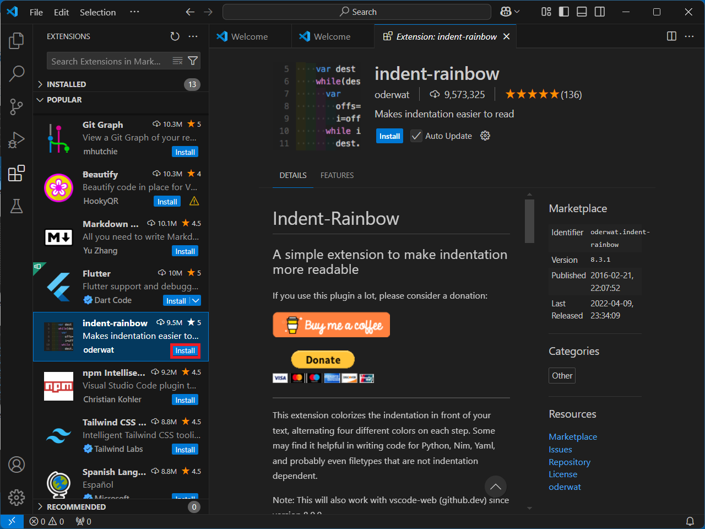
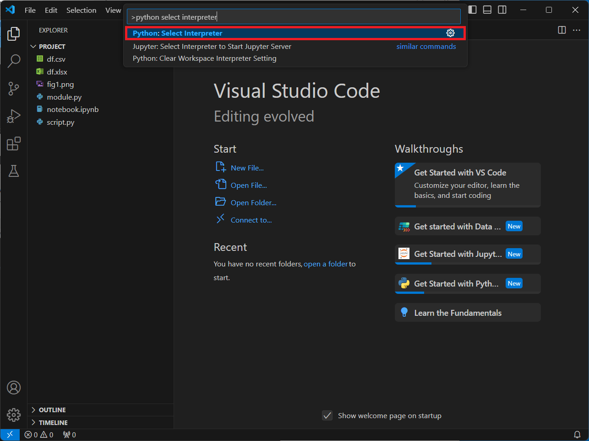
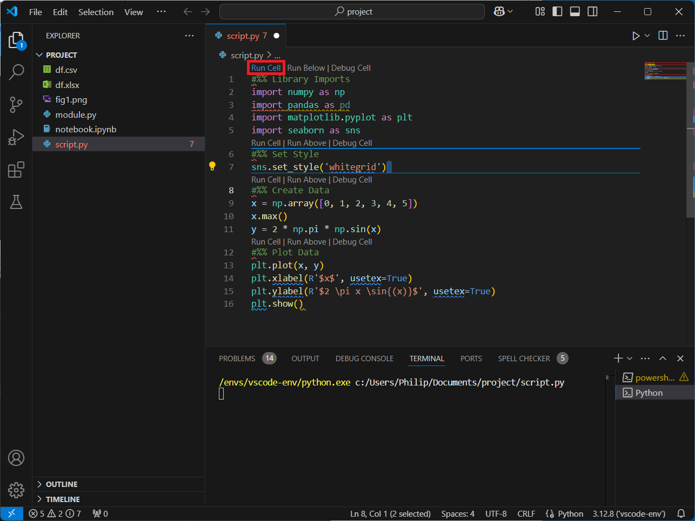
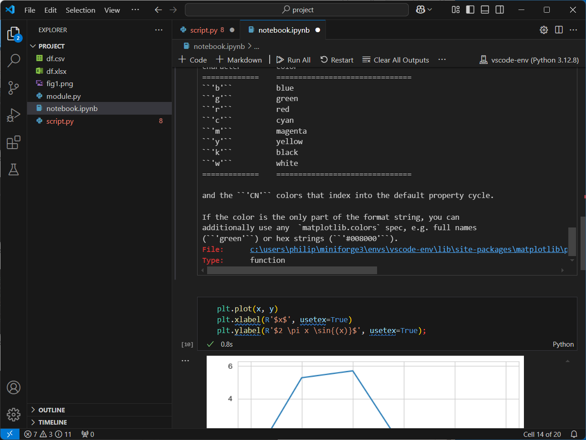
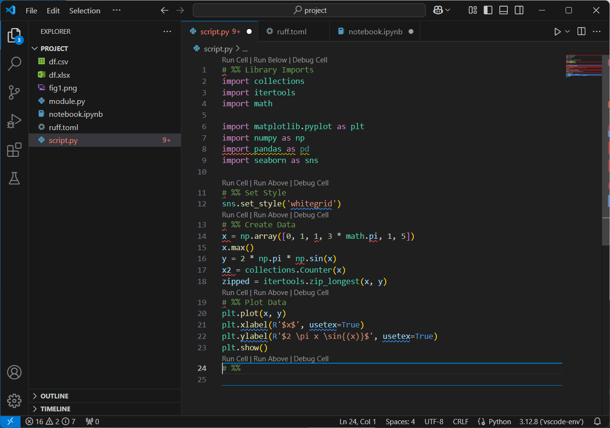
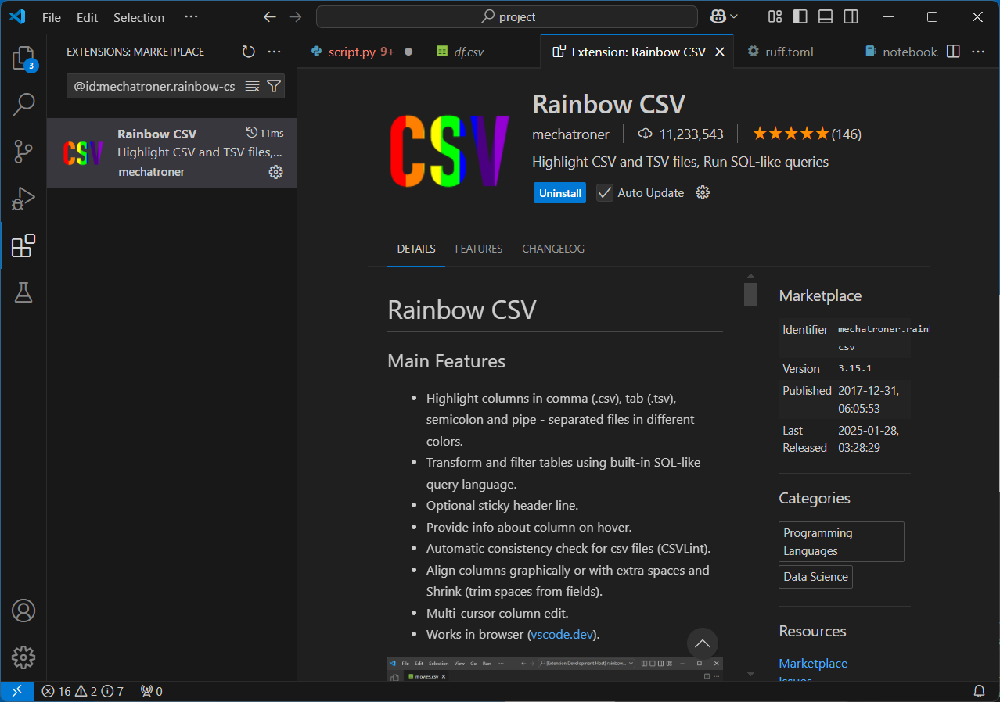

# VSCode IDE Windows Setup

VSCode is a general purpose code editor that can be configured for Python development. 

## Install VSCode

VSCode can be downloaded from the VSCode website:

* [VScode](https://code.visualstudio.com/download)

Select the Windows Installer (this will default to the User Installer):


Launch the setup:


Accept the License Agreement and select nxt:


Select next:


Select next:


Select next:


Select install:


Select finish:


## Miniforge Installation and Setup

In VSCode to develop in Python, a `conda-forge` environment is required. In order to use conda, Miniforge needs to be installed and in order for the `conda-forge` environment to be activated within VSCode correctly, `conda` needs to be initialised with the Terminal. This was previously covered in:

[Miniforge Install and Initialisation](../spyder_install_windows/readme.md#miniforge-installation)

In order to use TeX in matplotlib plots, MikTeX needs to be installed system wide and added to the Windows path which was also previously covered int he tutorial above.

## Updating the conda Package Manager

Open the Windows Terminal (if this has been initialised, the) The purpose of the `base` environment is to use the conda package manager to install packages in other Python environments. Before using the conda package manager, the conda package manager should be updated to the latest version:

```powershell
conda update conda
```


Since Miniforge is used, the default channel will be the community channel `conda-forge` and since Windows 11 is used, the platform is `win-64`:


Input `y` to proceed:


The conda package manager is now up to date:


Note there is an issue going from `conda` 24 to 25 where it doesn't update properly and says:

```
==> WARNING: A newer version of conda exists <==
current version: 24.w.w
latest version: 25.x.x

Please update conda by running:

conda update -n base -c conda-forge conda
```

And inputting the command listed takes you back to the same screen. To bypass this use:

```powershell
conda install conda=25.x.x
```

Where `25.x.xx` should be replaced by the latest version number.

## Creating a VSCode conda-forge Environment

To create a new environment for VSCode the following command can be used:

```powershell
conda create -n vscode-env notebook jupyter cython seaborn scikit-learn pyarrow sympy openpyxl xlrd xlsxwriter pytables lxml sqlalchemy tabulate nodejs ipywidgets plotly pyqt ipympl isort autopep8 ruff black
```


Once again since Miniforge is used, the default channel will be the community channel `conda-forge` and since Windows 11 is used, the platform is `win-64`:


Input `y` to proceed:


The environment will be created:


The powerShell Terminal can be closed:

## Installing VSCode Extensions

VSCode is a general purpose code editor and has a variety of extensions for different programming languages:


Install the Python Extension:


Installing this extension, will also install Pylance for code completion and the Python Debugger for debugging:


For interactive Python notebooks, install the Jupyter extension:


This extension will automatically install Jupyter Slide Show, Jupyter Notebook Renderers, Jupyter Keymap and Jupyter Cell Tags:


The IntelliCode extension will give additional code completion:


The isort extension is a formatter which supports imports:


The Code Spell Checker is an English Language Spell checker (similar to spell check in a Word Processor):


In Python, indentation is important and the Python indent extension can make it easier to correctly indent Python code:


The autodocstring is used to quickly generate a template for a Python docstring:


In Python, indentation is important and the indent-rainbow extension can make it easier to visualise indentation levels:



The Black Formatter extension, formats code to comply with PEP8 and adds additional formatting compliant with the black style guide but this style guide differs from the default style used in Python itself:


The Autopep8 Formatter extension, formats code to comply with PEP8 but isn't as through as the black formatter: 


The Pylint extension, is a linter, which is essentially a "grammar and punctuation" checker for code:


Ruff is an improved formatter and linter which has been rewritten in Rust for fast performance:


The Flake8 extension, is another linter, which carries out additional "grammar and punctuation" checks for code:


The Data Wrangler extension is used for viewing Variables in more detail:


Installing the above gives 19 extensions:


It is recommended to refresh VSCode by closing and relaunching to refresh the extensions.

## Project

VSCode is project based. A project is essentially a folder of code, markdown and notebook files. The previous files examined can be copied to a folder called project:


In VSCode select the file explorer to the left and select Open Folder (alternatively select File → Open Folder):


VSCode has a file explorer to the left:


Select Open Folder:


Select the project folder and select, Select Folder:


Select Yes I Trust the Authors:


## Selecting the Python Interpretter 

Selecting the Python Interpretter, is essentially selecting the `python.exe` and the conda-forge environment associated with that `python.exe`. To select the interpretter, press `Ctrl+⇧+p` to open up the command palette:


Search for Python Select Interpretter:



Select the `vscode-env`, (conda) Python environment which has the `~\miniforge3\envs\vscode-env\python.exe`:


It is recommended to refresh VSCode by closing and relaunching to refresh the extensions and Python Interpretter.

## Python Script and Python Shell

To the left hand side the Python Script file can be opened:


Notice Syntax highlighting displays, as well as code linting and spell check:


The script file can be run:


Notice that a PowerShell Terminal displays at the bottom and displays the location of the `python.exe` and the location of the script file. The Terminal Hangs until the plot is closed and the plot is plotting using the QtAgg by default. In other words this is the same behaviour as when a script is run in the Windows terminal using python:


When the plot is closed, the next prompt displays in the Terminal. VSCode has Pylance and IntelliSense installed showing identifiers and docstrings as code is typed:


## Python Script and IPython Shell

Selecting the Run Cell button will instead run the Script file using an IPython Shell:



A kernel may need to be selected when running the first IPython session:


Select, select Another Kernel:


Select Python Environments:


Select the `vscode-env`, (conda) Python environment which has the `~\miniforge3\envs\vscode-env\python.exe`:


Note if there is a prompt to install Python. Close down VSCode to refresh the extensions and Python environments and retry.

Each cell can be ran interactively:


Plots are shown using the inline backend by default:


Variables can be seen by selecting Jupyter Variables:


The `ndarray` can be explored in the Data Wrangler extension:


Select Allow:


The Data Wrangled Variable displays in a seperate tab:


## Notebook

VSCode can also be used to run a Notebook and the layout is similar to the layout previously examined in JupyterLab. Select Run All to run all the cells:


When the first notebook is run, a prompt for a Python Environment will be displayed, select Python Environments:


Select the `vscode-env`, (conda) Python environment which has the `~\miniforge3\envs\vscode-env\python.exe`:


Note if there is a prompt to install Python. Close down VSCode to refresh the extensions and Python environments and retry.


The notebook displays similarly to how it displays in JupyterLab:


In VSCode, docstrings are truncated by default:


However they can be viewed as scrollable elements:




Plots are displayed by default using the `inline` backend, however the backend can be changed using `%matplotlib` in the same way as previously seen when using JupyterLab:


## Formatters and Linters

Press `Ctrl+⇧+p` to open up the command palette:


Search for organize imports:


Select isort or Ruff (which also uses isort):


The imports are now grouped alphabetically into groups (standard modules and third-party modules):


Press `Ctrl+⇧+p` to open up the command palette and search for Format Document With...:


Select autopep8:


This corrects the spacing around the assignment `=` and around `,` delimiters but other operators are not spaced out as expected:


Press `Ctrl+⇧+p` to open up the command palette and search for Format Document With...and select the black formatter:


The spacing around other operators is now corrected but unfortunately black changed all string quotations from single to double, differing from the default Python style:


The Ruff formatter uses the black formatter by default. However it can be customised with a `ruff.toml` file which is placed within the project folder. For more details see [Configuring Ruff](https://docs.astral.sh/ruff/configuration/#__tabbed_1_2):

```python
[format]
# Use single quotes in `ruff format`.
quote-style = "single"
```


Press `Ctrl+⇧+p` to open up the command palette and search for Format Document With...and select the Ruff formatter:


Now the quote style is single as desired, more closely matching the formatting used within Python itself. The underlined code is flagged up by either the spell checker or code linters:



If the pandas import is examined, there is a complaint that the module is imported but never used which unnecessarily slow down the code run time:


Many of the identifiers or input parameters will be flagged as spelling mistakes. View problem can be selected and this input parameter option can be added to the user settings:


Once this input parameter is added to the user settings, it is recognised by the linter and the input parameter option will no longer be aligned.

## Other Extensions

If a `.csv` file is opened, there will be details about the Rainbow Extension, select Install:




Each column in the `.csv` is now colour-coded making it easier to read:


If the `.xlsx` file is attempted to be opened, there is a warning:


The Excel Viewer Extension can be installed:


Now the Excel File can be viewed in VSCode:


VSCode has additional extensions to enhance markdown capabilities. Also because VSCode is cross-programming language, it also has numerous other extensions for other programming languages, making it suitable for cross-programming language development. These will not be further discussed as this installation guide is for Python development only.

[Return to Python Tutorials](../readme.md)